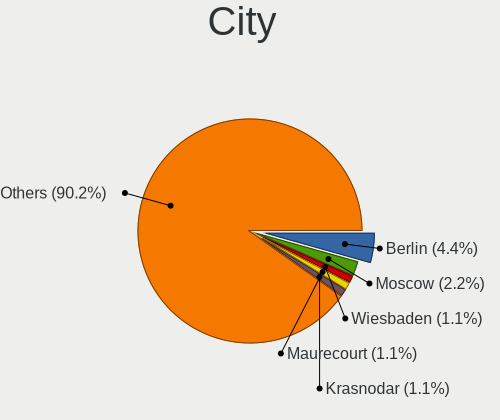
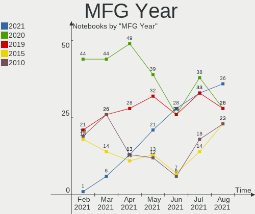
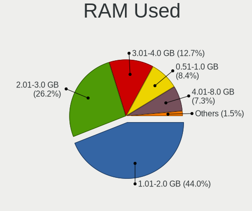
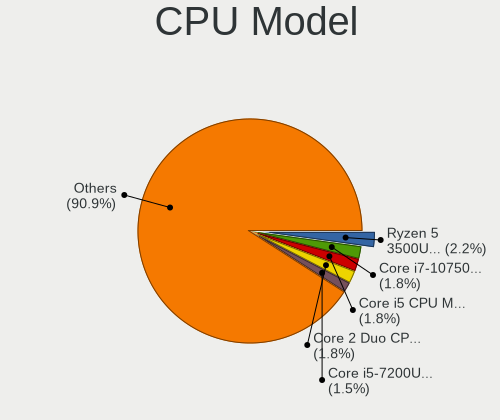
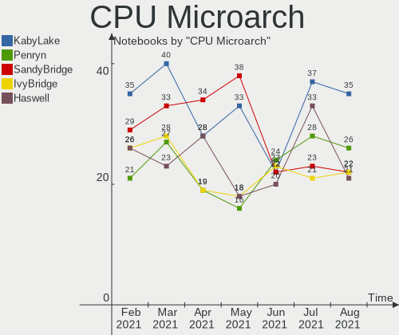
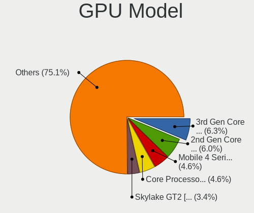
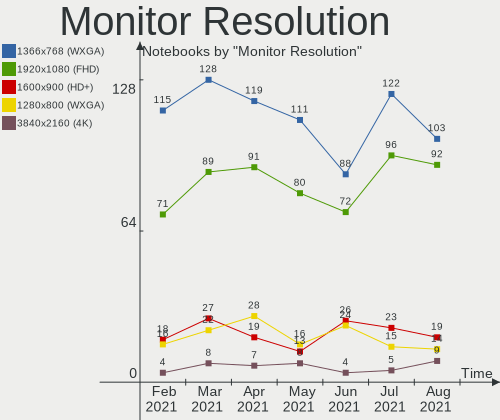
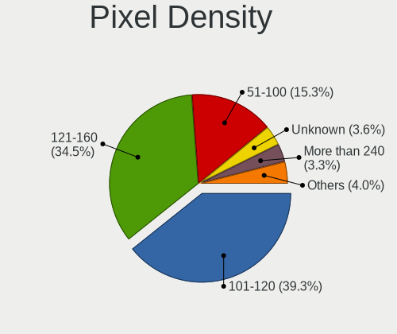

Mint Hardware Trends (Notebook)
-------------------------------

A project to identify most popular hardware characteristics and track their change
over time based on data collected by Mint users at https://Linux-Hardware.org.

Anyone can contribute to the study by uploading probes of their computers by
the [hw-probe](https://github.com/linuxhw/hw-probe) tool:

    sudo hw-probe -all -upload

Full-feature report is available here: https://linux-hardware.org/?view=trends&formfactor=notebook

Period: Jan, 2020.

Contents
--------

- [ OS                       ](#os)
- [ OS Family                ](#os-family)
- [ Kernel                   ](#kernel)
- [ Kernel Family            ](#kernel-family)
- [ Kernel Major Ver.        ](#kernel-major-ver)
- [ Arch                     ](#arch)
- [ DE                       ](#de)
- [ Display Server           ](#display-server)
- [ OS Lang                  ](#os-lang)
- [ Boot Mode                ](#boot-mode)
- [ Filesystem               ](#filesystem)
- [ Dual Boot with Linux     ](#dual-boot-with-linux)
- [ Dual Boot (Win)          ](#dual-boot-win)
- [ Country                  ](#country)
- [ City                     ](#city)
- [ Vendor                   ](#vendor)
- [ Model                    ](#model)
- [ Model Family             ](#model-family)
- [ MFG Year                 ](#mfg-year)
- [ Form Factor              ](#form-factor)
- [ Secure Boot              ](#secure-boot)
- [ Coreboot                 ](#coreboot)
- [ RAM Size                 ](#ram-size)
- [ RAM Used                 ](#ram-used)
- [ Drive Vendor             ](#drive-vendor)
- [ Drive Model              ](#drive-model)
- [ Drive Kind               ](#drive-kind)
- [ Drive Connector          ](#drive-connector)
- [ Drive Size               ](#drive-size)
- [ Space Total              ](#space-total)
- [ Space Used               ](#space-used)
- [ Malfunc. Drives          ](#malfunc-drives)
- [ Malfunc. Drive Vendor    ](#malfunc-drive-vendor)
- [ Malfunc. Drive Kind      ](#malfunc-drive-kind)
- [ Failed Drives            ](#failed-drives)
- [ Failed Drive Vendor      ](#failed-drive-vendor)
- [ Drive Status             ](#drive-status)
- [ CPU Vendor               ](#cpu-vendor)
- [ CPU Model                ](#cpu-model)
- [ CPU Model Family         ](#cpu-model-family)
- [ CPU Cores                ](#cpu-cores)
- [ CPU Sockets              ](#cpu-sockets)
- [ CPU Threads              ](#cpu-threads)
- [ CPU Op-Modes             ](#cpu-op-modes)
- [ CPU Microarch            ](#cpu-microarch)
- [ CPU Microcode            ](#cpu-microcode)
- [ GPU Vendor               ](#gpu-vendor)
- [ GPU Model                ](#gpu-model)
- [ GPU Combo                ](#gpu-combo)
- [ GPU Driver               ](#gpu-driver)
- [ GPU Memory               ](#gpu-memory)
- [ Monitor Vendor           ](#monitor-vendor)
- [ Monitor Model            ](#monitor-model)
- [ Monitor Resolution       ](#monitor-resolution)
- [ Monitor Diagonal         ](#monitor-diagonal)
- [ Monitor Width            ](#monitor-width)
- [ Aspect Ratio             ](#aspect-ratio)
- [ Monitor Area             ](#monitor-area)
- [ Pixel Density            ](#pixel-density)
- [ Multiple Monitors        ](#multiple-monitors)
- [ Net Controller Vendor    ](#net-controller-vendor)
- [ Net Controller Model     ](#net-controller-model)
- [ Net Controller Kind      ](#net-controller-kind)
- [ Used Controller          ](#used-controller)
- [ NICs                     ](#nics)
- [ Unsupported Devices      ](#unsupported-devices)
- [ Unsupported Device Types ](#unsupported-device-types)

OS
--

Installed operating systems

| Name      | Computers | Percent |
|-----------|-----------|---------|
| Mint 19.3 | 116       | 85.29%  |
| Mint 19.2 | 7         | 5.15%   |
| Mint 19   | 5         | 3.68%   |
| Mint 19.1 | 4         | 2.94%   |
| Mint 18.3 | 3         | 2.21%   |
| Mint 17.2 | 1         | 0.74%   |

OS Family
---------

OS without a version

| Name | Computers | Percent |
|------|-----------|---------|
| Mint | 136       | 100%    |

Kernel
------

Version of the Linux kernel

| Version                 | Computers | Percent |
|-------------------------|-----------|---------|
| 5.0.0-37-generic        | 51        | 37.5%   |
| 5.3.0-26-generic        | 29        | 21.32%  |
| 5.0.0-32-generic        | 15        | 11.03%  |
| 4.15.0-74-generic       | 9         | 6.62%   |
| 5.3.0-28-generic        | 7         | 5.15%   |
| 5.3.0-24-generic        | 6         | 4.41%   |
| 4.15.0-72-generic       | 6         | 4.41%   |
| 4.15.0-76-generic       | 3         | 2.21%   |
| 4.15.0-54-generic       | 3         | 2.21%   |
| 4.15.0-20-generic       | 2         | 1.47%   |
| 5.5.0-050500rc4-generic | 1         | 0.74%   |
| 5.4.12-050412-generic   | 1         | 0.74%   |
| 4.15.0-70-generic       | 1         | 0.74%   |
| 4.15.0-65-generic       | 1         | 0.74%   |
| 3.16.0-38-generic       | 1         | 0.74%   |

Kernel Family
-------------

Linux kernel without a distro release

| Version | Computers | Percent |
|---------|-----------|---------|
| 5.0.0   | 66        | 48.53%  |
| 5.3.0   | 42        | 30.88%  |
| 4.15.0  | 25        | 18.38%  |
| 5.5.0   | 1         | 0.74%   |
| 5.4.12  | 1         | 0.74%   |
| 3.16.0  | 1         | 0.74%   |

Kernel Major Ver.
-----------------

Linux kernel major version

| Version | Computers | Percent |
|---------|-----------|---------|
| 5.0     | 66        | 48.53%  |
| 5.3     | 42        | 30.88%  |
| 4.15    | 25        | 18.38%  |
| 5.5     | 1         | 0.74%   |
| 5.4     | 1         | 0.74%   |
| 3.16    | 1         | 0.74%   |

Arch
----

OS architecture (x86_64, i586, etc.)

| Name   | Computers | Percent |
|--------|-----------|---------|
| x86_64 | 123       | 90.44%  |
| i686   | 13        | 9.56%   |

DE
--

Desktop Environment

| Name       | Computers | Percent |
|------------|-----------|---------|
| X-Cinnamon | 69        | 50.74%  |
| Cinnamon   | 23        | 16.91%  |
| MATE       | 20        | 14.71%  |
| XFCE       | 13        | 9.56%   |
| Unknown    | 11        | 8.09%   |

Display Server
--------------

X11 or Wayland

| Name    | Computers | Percent |
|---------|-----------|---------|
| X11     | 94        | 69.12%  |
| Unknown | 42        | 30.88%  |

OS Lang
-------

Language

| Lang    | Computers | Percent |
|---------|-----------|---------|
| en_US   | 37        | 27.21%  |
| de_DE   | 17        | 12.5%   |
| pt_BR   | 14        | 10.29%  |
| ru_RU   | 10        | 7.35%   |
| Unknown | 10        | 7.35%   |
| it_IT   | 7         | 5.15%   |
| pl_PL   | 5         | 3.68%   |
| es_ES   | 4         | 2.94%   |
| sk_SK   | 3         | 2.21%   |
| es_MX   | 3         | 2.21%   |
| en_GB   | 3         | 2.21%   |
| de_AT   | 3         | 2.21%   |
| ru_UA   | 2         | 1.47%   |
| pt_PT   | 2         | 1.47%   |
| en_ZA   | 2         | 1.47%   |
| cs_CZ   | 2         | 1.47%   |
| tr_TR   | 1         | 0.74%   |
| sv_SE   | 1         | 0.74%   |
| nl_NL   | 1         | 0.74%   |
| ja_JP   | 1         | 0.74%   |
| hu_HU   | 1         | 0.74%   |
| es_PE   | 1         | 0.74%   |
| es_EC   | 1         | 0.74%   |
| es_DO   | 1         | 0.74%   |
| es_AR   | 1         | 0.74%   |
| en_CA   | 1         | 0.74%   |
| en_AU   | 1         | 0.74%   |
| bg_BG   | 1         | 0.74%   |

Boot Mode
---------

EFI or BIOS

| Mode | Computers | Percent |
|------|-----------|---------|
| EFI  | 70        | 51.47%  |
| BIOS | 66        | 48.53%  |

Filesystem
----------

Type of filesystem

| Type  | Computers | Percent |
|-------|-----------|---------|
| Ext4  | 133       | 97.79%  |
| Btrfs | 2         | 1.47%   |
| Ext3  | 1         | 0.74%   |

Dual Boot with Linux
--------------------

Hosting more than one Linux

| Dual boot | Computers | Percent |
|-----------|-----------|---------|
| No        | 132       | 97.06%  |
| Yes       | 4         | 2.94%   |

Dual Boot (Win)
---------------

Hosting Linux and Windows

| Dual boot | Computers | Percent |
|-----------|-----------|---------|
| No        | 112       | 82.35%  |
| Yes       | 24        | 17.65%  |

Country
-------

Geographic location (country)

| Country            | Computers | Percent |
|--------------------|-----------|---------|
| USA                | 18        | 13.24%  |
| Brazil             | 18        | 13.24%  |
| Germany            | 17        | 12.5%   |
| Russia             | 11        | 8.09%   |
| Italy              | 8         | 5.88%   |
| Poland             | 5         | 3.68%   |
| Spain              | 4         | 2.94%   |
| Mexico             | 4         | 2.94%   |
| Canada             | 4         | 2.94%   |
| Ukraine            | 3         | 2.21%   |
| UK                 | 3         | 2.21%   |
| Slovakia           | 3         | 2.21%   |
| Netherlands        | 3         | 2.21%   |
| Hungary            | 3         | 2.21%   |
| Austria            | 3         | 2.21%   |
| South Africa       | 2         | 1.47%   |
| Czech Republic     | 2         | 1.47%   |
| Bulgaria           | 2         | 1.47%   |
| Vietnam            | 1         | 0.74%   |
| Turkey             | 1         | 0.74%   |
| Taiwan             | 1         | 0.74%   |
| Switzerland        | 1         | 0.74%   |
| Sweden             | 1         | 0.74%   |
| Romania            | 1         | 0.74%   |
| Puerto Rico        | 1         | 0.74%   |
| Portugal           | 1         | 0.74%   |
| Philippines        | 1         | 0.74%   |
| Paraguay           | 1         | 0.74%   |
| Namibia            | 1         | 0.74%   |
| Kyrgyzstan         | 1         | 0.74%   |
| Japan              | 1         | 0.74%   |
| Finland            | 1         | 0.74%   |
| Egypt              | 1         | 0.74%   |
| Ecuador            | 1         | 0.74%   |
| Dominican Republic | 1         | 0.74%   |
| Denmark            | 1         | 0.74%   |
| Croatia            | 1         | 0.74%   |
| Bangladesh         | 1         | 0.74%   |
| Australia          | 1         | 0.74%   |
| Argentina          | 1         | 0.74%   |
| Angola             | 1         | 0.74%   |

City
----

Geographic location (city)

| City             | Computers | Percent |
|------------------|-----------|---------|
| Warsaw           | 4         | 2.94%   |
| São Paulo       | 4         | 2.94%   |
| Vienna           | 3         | 2.21%   |
| Rome             | 3         | 2.21%   |
| Toronto          | 2         | 1.47%   |
| St Petersburg    | 2         | 1.47%   |
| Moscow           | 2         | 1.47%   |
| Ekaterinburg     | 2         | 1.47%   |
| Dresden          | 2         | 1.47%   |
| Budapest         | 2         | 1.47%   |
| Berlin           | 2         | 1.47%   |
| Belo Horizonte   | 2         | 1.47%   |
| Zagreb           | 1         | 0.74%   |
| Wurenlingen      | 1         | 0.74%   |
| Wolverhampton    | 1         | 0.74%   |
| Winsen           | 1         | 0.74%   |
| Windhoek         | 1         | 0.74%   |
| Washington       | 1         | 0.74%   |
| Warbsen          | 1         | 0.74%   |
| Voluntari        | 1         | 0.74%   |
| Volgograd        | 1         | 0.74%   |
| Vitória         | 1         | 0.74%   |
| Virginia Beach   | 1         | 0.74%   |
| Vecses           | 1         | 0.74%   |
| Uzhhorod         | 1         | 0.74%   |
| Tampa            | 1         | 0.74%   |
| Taipei           | 1         | 0.74%   |
| Stockholm        | 1         | 0.74%   |
| Spring Hill      | 1         | 0.74%   |
| Solidaridad      | 1         | 0.74%   |
| Sofia            | 1         | 0.74%   |
| Sidmouth         | 1         | 0.74%   |
| Seville          | 1         | 0.74%   |
| Schenectady      | 1         | 0.74%   |
| Sabadell         | 1         | 0.74%   |
| Ryazan           | 1         | 0.74%   |
| Rio do Sul       | 1         | 0.74%   |
| Rio de Janeiro   | 1         | 0.74%   |
| Regina           | 1         | 0.74%   |
| Recife           | 1         | 0.74%   |
| Puebla City      | 1         | 0.74%   |
| Pretoria         | 1         | 0.74%   |
| Praia Grande     | 1         | 0.74%   |
| Porto Alegre     | 1         | 0.74%   |
| Plovdiv          | 1         | 0.74%   |
| Phoenix          | 1         | 0.74%   |
| Penapolis        | 1         | 0.74%   |
| Osnabrück       | 1         | 0.74%   |
| North Charleston | 1         | 0.74%   |
| Norristown       | 1         | 0.74%   |
| New York         | 1         | 0.74%   |
| Neunkirchen      | 1         | 0.74%   |
| Naaldwijk        | 1         | 0.74%   |
| Málaga          | 1         | 0.74%   |
| Montreal         | 1         | 0.74%   |
| Milan            | 1         | 0.74%   |
| Melendugno       | 1         | 0.74%   |
| Mauldin          | 1         | 0.74%   |
| Massape          | 1         | 0.74%   |
| Manzanillo       | 1         | 0.74%   |

Vendor
------

Motherboard manufacturer

| Name                  | Computers | Percent |
|-----------------------|-----------|---------|
| Hewlett-Packard       | 31        | 22.79%  |
| ASUSTek Computer      | 21        | 15.44%  |
| Dell                  | 20        | 14.71%  |
| Lenovo                | 18        | 13.24%  |
| Acer                  | 11        | 8.09%   |
| Toshiba               | 6         | 4.41%   |
| Fujitsu               | 3         | 2.21%   |
| Sony                  | 2         | 1.47%   |
| Packard Bell          | 2         | 1.47%   |
| Medion                | 2         | 1.47%   |
| Intel                 | 2         | 1.47%   |
| Apple                 | 2         | 1.47%   |
| Unknown               | 2         | 1.47%   |
| TUXEDO                | 1         | 0.74%   |
| Semp Toshiba          | 1         | 0.74%   |
| Schenker              | 1         | 0.74%   |
| Samsung Electronics   | 1         | 0.74%   |
| Positivo Bahia - VAIO | 1         | 0.74%   |
| Positivo              | 1         | 0.74%   |
| Pegatron              | 1         | 0.74%   |
| Panasonic             | 1         | 0.74%   |
| Notebook              | 1         | 0.74%   |
| Insyde                | 1         | 0.74%   |
| Fujitsu Siemens       | 1         | 0.74%   |
| Dixonsxp              | 1         | 0.74%   |
| Coradir               | 1         | 0.74%   |
| Connex                | 1         | 0.74%   |

Model
-----

Motherboard model

| Name                                  | Computers | Percent |
|---------------------------------------|-----------|---------|
| X550CL                                | 2         | 1.47%   |
| Latitude E6410                        | 2         | 1.47%   |
| Laptop 15-ra0xx                       | 2         | 1.47%   |
| K50IJ                                 | 2         | 1.47%   |
| Unknown                               | 2         | 1.47%   |
| ZenBook UX431DA_UM431DA               | 1         | 0.74%   |
| ZBook 14                              | 1         | 0.74%   |
| Z40-75 80DW                           | 1         | 0.74%   |
| Yoga 2 Pro 20266                      | 1         | 0.74%   |
| XPS L502X                             | 1         | 0.74%   |
| XPS 13 9380                           | 1         | 0.74%   |
| X555QG                                | 1         | 0.74%   |
| X555LJ                                | 1         | 0.74%   |
| X555LB                                | 1         | 0.74%   |
| X541NA                                | 1         | 0.74%   |
| X540SAA                               | 1         | 0.74%   |
| X540SA                                | 1         | 0.74%   |
| X510UAR                               | 1         | 0.74%   |
| W65_67SZ                              | 1         | 0.74%   |
| VPCEH2N1E                             | 1         | 0.74%   |
| Vostro V131                           | 1         | 0.74%   |
| Vostro 3700                           | 1         | 0.74%   |
| VivoBook_ASUSLaptop X530FA_S530FA     | 1         | 0.74%   |
| VivoBook 17_ASUS Laptop X705MA_X705MA | 1         | 0.74%   |
| VGN-SZ430N                            | 1         | 0.74%   |
| ThinkPad X390 20Q0005XRT              | 1         | 0.74%   |
| ThinkPad X230 Tablet 34372T6          | 1         | 0.74%   |
| ThinkPad X1 Carbon 6th 20KHCTO1WW     | 1         | 0.74%   |
| ThinkPad T490 20N3S19L00              | 1         | 0.74%   |
| ThinkPad T420 4236AA2                 | 1         | 0.74%   |
| ThinkPad P52 20M9000KUS               | 1         | 0.74%   |
| ThinkPad P50 20EN0005SP               | 1         | 0.74%   |
| ThinkPad E595 20NFCTO1WW              | 1         | 0.74%   |
| T12UV                                 | 1         | 0.74%   |
| Studio XPS 1640                       | 1         | 0.74%   |
| SCHENKER_DOCK_15_SDO15L18_SDO15E19    | 1         | 0.74%   |
| Satellite L505D                       | 1         | 0.74%   |
| Satellite L500                        | 1         | 0.74%   |
| Satellite L40                         | 1         | 0.74%   |
| Satellite L300                        | 1         | 0.74%   |
| Satellite C850D-D6S                   | 1         | 0.74%   |
| S551LN                                | 1         | 0.74%   |
| S14SL03                               | 1         | 0.74%   |
| ROG G703GI_G703GI                     | 1         | 0.74%   |
| Q232A                                 | 1         | 0.74%   |
| ProBook 4720s                         | 1         | 0.74%   |
| ProBook 4710s                         | 1         | 0.74%   |
| ProBook 440 G3                        | 1         | 0.74%   |
| Precision 5520                        | 1         | 0.74%   |
| Pavilion x2 Detachable                | 1         | 0.74%   |
| Pavilion Sleekbook 15 PC              | 1         | 0.74%   |
| Pavilion g6                           | 1         | 0.74%   |
| Pavilion dv5000 (EZ406UA#ABA)         | 1         | 0.74%   |
| Pavilion dv4                          | 1         | 0.74%   |
| P7649 MD60825                         | 1         | 0.74%   |
| P65_67HSHP                            | 1         | 0.74%   |
| Notebook                              | 1         | 0.74%   |
| NB550D                                | 1         | 0.74%   |
| N751JK                                | 1         | 0.74%   |
| Mini 110-4100                         | 1         | 0.74%   |

Model Family
------------

Motherboard model prefix

| Name                          | Computers | Percent |
|-------------------------------|-----------|---------|
| Acer Aspire                   | 10        | 7.35%   |
| Dell Inspiron                 | 9         | 6.62%   |
| Lenovo ThinkPad               | 8         | 5.88%   |
| HP Laptop                     | 6         | 4.41%   |
| Toshiba Satellite             | 5         | 3.68%   |
| Lenovo IdeaPad                | 5         | 3.68%   |
| HP Pavilion                   | 5         | 3.68%   |
| HP EliteBook                  | 5         | 3.68%   |
| HP 250                        | 5         | 3.68%   |
| Dell Latitude                 | 5         | 3.68%   |
| HP ProBook                    | 3         | 2.21%   |
| Fujitsu LIFEBOOK              | 3         | 2.21%   |
| Dell XPS                      | 2         | 1.47%   |
| Dell Vostro                   | 2         | 1.47%   |
| ASUS X550CL                   | 2         | 1.47%   |
| ASUS VivoBook                 | 2         | 1.47%   |
| ASUS K50IJ                    | 2         | 1.47%   |
| Unknown                       | 2         | 1.47%   |
| TUXEDO P65                    | 1         | 0.74%   |
| Toshiba NB550D                | 1         | 0.74%   |
| Sony VPCEH2N1E                | 1         | 0.74%   |
| Sony VGN-SZ430N               | 1         | 0.74%   |
| Semp Toshiba IS               | 1         | 0.74%   |
| Schenker SCHENKER             | 1         | 0.74%   |
| Samsung Electronics 370E4K    | 1         | 0.74%   |
| Positivo Q232A                | 1         | 0.74%   |
| Positivo Bahia - VAIO S14SL03 | 1         | 0.74%   |
| Pegatron C15B                 | 1         | 0.74%   |
| Panasonic CF-C2ACAZZLM        | 1         | 0.74%   |
| Packard Bell T12UV            | 1         | 0.74%   |
| Packard Bell EasyNote         | 1         | 0.74%   |
| Notebook W65                  | 1         | 0.74%   |
| Medion P7649                  | 1         | 0.74%   |
| Medion AKOYA                  | 1         | 0.74%   |
| Lenovo Z40-75                 | 1         | 0.74%   |
| Lenovo Yoga                   | 1         | 0.74%   |
| Lenovo G575                   | 1         | 0.74%   |
| Lenovo G400s                  | 1         | 0.74%   |
| Lenovo B590                   | 1         | 0.74%   |
| Intel HuronRiver              | 1         | 0.74%   |
| Intel Calistoga               | 1         | 0.74%   |
| Insyde B14                    | 1         | 0.74%   |
| HP ZBook                      | 1         | 0.74%   |
| HP Notebook                   | 1         | 0.74%   |
| HP Mini                       | 1         | 0.74%   |
| HP ENVY                       | 1         | 0.74%   |
| HP Compaq                     | 1         | 0.74%   |
| HP 355                        | 1         | 0.74%   |
| HP 240                        | 1         | 0.74%   |
| Fujitsu Siemens LIFEBOOK      | 1         | 0.74%   |
| Dixonsxp F71IX1               | 1         | 0.74%   |
| Dell Studio                   | 1         | 0.74%   |
| Dell Precision                | 1         | 0.74%   |
| Coradir Coradir               | 1         | 0.74%   |
| Connex L1420                  | 1         | 0.74%   |
| ASUS ZenBook                  | 1         | 0.74%   |
| ASUS X555QG                   | 1         | 0.74%   |
| ASUS X555LJ                   | 1         | 0.74%   |
| ASUS X555LB                   | 1         | 0.74%   |
| ASUS X541NA                   | 1         | 0.74%   |

MFG Year
--------

Motherboard manufacture year

| Year | Computers | Percent |
|------|-----------|---------|
| 2019 | 27        | 19.85%  |
| 2018 | 15        | 11.03%  |
| 2017 | 14        | 10.29%  |
| 2011 | 13        | 9.56%   |
| 2016 | 12        | 8.82%   |
| 2014 | 12        | 8.82%   |
| 2013 | 8         | 5.88%   |
| 2015 | 7         | 5.15%   |
| 2012 | 7         | 5.15%   |
| 2010 | 6         | 4.41%   |
| 2009 | 5         | 3.68%   |
| 2007 | 5         | 3.68%   |
| 2008 | 3         | 2.21%   |
| 2006 | 2         | 1.47%   |

Form Factor
-----------

Physical design of the computer

| Name     | Computers | Percent |
|----------|-----------|---------|
| Notebook | 136       | 100%    |

Secure Boot
-----------

Enabled or disabled

| State    | Computers | Percent |
|----------|-----------|---------|
| Disabled | 81        | 59.56%  |
| Unknown  | 43        | 31.62%  |
| Enabled  | 12        | 8.82%   |

Coreboot
--------

Have coreboot on board

| Used | Computers | Percent |
|------|-----------|---------|
| No   | 136       | 100%    |

RAM Size
--------

Total RAM memory

| Size in GB  | Computers | Percent |
|-------------|-----------|---------|
| 3.01-4.0    | 41        | 30.15%  |
| 4.01-8.0    | 32        | 23.53%  |
| 8.01-16.0   | 23        | 16.91%  |
| 16.01-24.0  | 15        | 11.03%  |
| 1.01-2.0    | 11        | 8.09%   |
| 2.01-3.0    | 8         | 5.88%   |
| 32.01-64.0  | 4         | 2.94%   |
| 64.01-256.0 | 1         | 0.74%   |
| 0.01-1.0    | 1         | 0.74%   |

RAM Used
--------

Used RAM memory

| Used GB   | Computers | Percent |
|-----------|-----------|---------|
| 1.01-2.0  | 65        | 47.79%  |
| 2.01-3.0  | 32        | 23.53%  |
| 0.01-1.0  | 16        | 11.76%  |
| 3.01-4.0  | 11        | 8.09%   |
| 4.01-8.0  | 9         | 6.62%   |
| 8.01-16.0 | 3         | 2.21%   |

Drive Vendor
------------

Hard drive vendors

| Vendor              | Computers | Drives  | Percent |
|---------------------|-----------|---------|---------|
| Seagate             | 28        | 28      | 17.07%  |
| WDC                 | 23        | 23      | 14.02%  |
| Samsung Electronics | 17        | 19      | 10.37%  |
| Toshiba             | 15        | 15      | 9.15%   |
| HGST                | 15        | 15      | 9.15%   |
| Unknown             | 9         | 12      | 5.49%   |
| SanDisk             | 7         | 7       | 4.27%   |
| Kingston            | 7         | 7       | 4.27%   |
| Hitachi             | 7         | 7       | 4.27%   |
| A-DATA Technology   | 6         | 6       | 3.66%   |
| Patriot             | 3         | 3       | 1.83%   |
| Crucial             | 3         | 3       | 1.83%   |
| SK Hynix            | 2         | 2       | 1.22%   |
| Intel               | 2         | 3       | 1.22%   |
| Apacer              | 2         | 2       | 1.22%   |
| Transcend           | 1         | 1       | 0.61%   |
| TCSUNBOW            | 1         | 1       | 0.61%   |
| OEM                 | 1         | 1       | 0.61%   |
| Netac               | 1         | 1       | 0.61%   |
| Micron Technology   | 1         | 1       | 0.61%   |
| MicroData           | 1         | 1       | 0.61%   |
| LITEONIT            | 1         | 1       | 0.61%   |
| LITEON              | 1         | 1       | 0.61%   |
| Lenovo              | 1         | 1       | 0.61%   |
| KingSpec            | 1         | 1       | 0.61%   |
| Kingmax             | 1         | 1       | 0.61%   |
| JMicron             | 1         | 1       | 0.61%   |
| HL-DT-ST            | 1         | Unknown | 0.61%   |
| GOODRAM             | 1         | 1       | 0.61%   |
| Fujitsu             | 1         | 1       | 0.61%   |
| CLOVER              | 1         | 1       | 0.61%   |
| BHT                 | 1         | 1       | 0.61%   |
| AS25                | 1         | 1       | 0.61%   |

Drive Model
-----------

Hard drive models

| Model                         | Computers | Percent |
|-------------------------------|-----------|---------|
| MMC Card  31GB                | 8         | 4.82%   |
| ST1000LM024 HN-M101MBB 1TB    | 5         | 3.01%   |
| HTS545050A7E680 500GB         | 5         | 3.01%   |
| ST500LM012 HN-M500MBB 500GB   | 4         | 2.41%   |
| ST1000LM035-1RK172 1TB        | 4         | 2.41%   |
| MQ01ABD100 1TB                | 4         | 2.41%   |
| HTS541010A9E680 1TB           | 4         | 2.41%   |
| WD10JPVX-75JC3T0 1TB          | 3         | 1.81%   |
| ST500LT012-1DG142 500GB       | 3         | 1.81%   |
| SU650 120GB SSD               | 2         | 1.2%    |
| ST9750420AS 750GB             | 2         | 1.2%    |
| ST320LT020-9YG142 320GB       | 2         | 1.2%    |
| ST2000LX001-1RG174 2TB        | 2         | 1.2%    |
| SSD 860 EVO 500GB             | 2         | 1.2%    |
| SP900 256GB SSD               | 2         | 1.2%    |
| SA400S37120G 120GB SSD        | 2         | 1.2%    |
| HTS541075A9E680 750GB         | 2         | 1.2%    |
| Burst 480GB SSD               | 2         | 1.2%    |
| WR202I0032G E70245F5 32GB SSD | 1         | 0.6%    |
| WDS500G2B0A-00SM50 500GB SSD  | 1         | 0.6%    |
| WDS120G2G0B-00EPW0 120GB SSD  | 1         | 0.6%    |
| WD5000LPVX-60V0TT0 500GB      | 1         | 0.6%    |
| WD5000LPVT-75G33T0 500GB      | 1         | 0.6%    |
| WD5000LPCX-80VHAT0 500GB      | 1         | 0.6%    |
| WD5000LPCX-60VHAT0 500GB      | 1         | 0.6%    |
| WD5000BEVT-00A0RT0 500GB      | 1         | 0.6%    |
| WD3200BJKT-75F4T0 320GB       | 1         | 0.6%    |
| WD3200BEVT-75A23T0 320GB      | 1         | 0.6%    |
| WD3200BEVT-22ZCT0 320GB       | 1         | 0.6%    |
| WD2500BEVT-22ZCT0 250GB       | 1         | 0.6%    |
| WD2500BEVS-22UST0 250GB       | 1         | 0.6%    |
| WD20SPZX-22UA7T0 2TB          | 1         | 0.6%    |
| WD1600BEVT-60ZCT1 160GB       | 1         | 0.6%    |
| WD10SPZX-24Z10 1TB            | 1         | 0.6%    |
| WD10SPZX-00Z10T0 1TB          | 1         | 0.6%    |
| WD10SPCX-24HWST1 1TB          | 1         | 0.6%    |
| WD10JPVX-60JC3T0 1TB          | 1         | 0.6%    |
| WD10JPVX-22JC3T0 1TB          | 1         | 0.6%    |
| Ultra II 480GB SSD            | 1         | 0.6%    |
| TS256GSSD370S 256GB           | 1         | 0.6%    |
| Touro Mobile 3.0 1TB          | 1         | 0.6%    |
| THNSNK128GVN8 128GB SSD       | 1         | 0.6%    |
| THNS128GG4BBAA 128GB SSD      | 1         | 0.6%    |
| Tech 250GB                    | 1         | 0.6%    |
| SUV500480G 480GB SSD          | 1         | 0.6%    |
| SUV400S37480G 480GB SSD       | 1         | 0.6%    |
| SUV400S37240G 240GB SSD       | 1         | 0.6%    |
| SU800 512GB SSD               | 1         | 0.6%    |
| SU630 240GB SSD               | 1         | 0.6%    |
| ST96812AS 60GB                | 1         | 0.6%    |
| ST500LM000-1EJ162 500GB       | 1         | 0.6%    |
| ST350051 1CS 500GB            | 1         | 0.6%    |
| ST250LT007-9ZV14C 250GB       | 1         | 0.6%    |
| ST1500LM012-1R817G 1TB        | 1         | 0.6%    |
| ST1000LX015-1U7172 1TB        | 1         | 0.6%    |
| SSDPEKNW010T8 1TB             | 1         | 0.6%    |
| SSD U100 24GB                 | 1         | 0.6%    |
| SSD PM871 mSATA 128GB         | 1         | 0.6%    |
| SSD PLUS 240GB                | 1         | 0.6%    |
| SSD PLUS 1000GB               | 1         | 0.6%    |

Drive Kind
----------

HDD or SSD

| Kind    | Computers | Drives | Percent |
|---------|-----------|--------|---------|
| HDD     | 84        | 85     | 52.5%   |
| SSD     | 49        | 53     | 30.63%  |
| NVMe    | 12        | 14     | 7.5%    |
| MMC     | 9         | 12     | 5.63%   |
| Unknown | 6         | 5      | 3.75%   |

Drive Connector
---------------

SATA, SAS, NVMe, etc.

| Type | Computers | Drives | Percent |
|------|-----------|--------|---------|
| SATA | 122       | 140    | 82.99%  |
| NVMe | 12        | 14     | 8.16%   |
| MMC  | 9         | 12     | 6.12%   |
| SAS  | 4         | 3      | 2.72%   |

Drive Size
----------

Size of hard drive

| Size in TB | Computers | Drives | Percent |
|------------|-----------|--------|---------|
| 0.01-0.5   | 98        | 110    | 64.05%  |
| 0.51-1.0   | 51        | 55     | 33.33%  |
| 1.01-2.0   | 4         | 4      | 2.61%   |

Space Total
-----------

Amount of disk space available on the file system

| Size in GB | Computers | Percent |
|------------|-----------|---------|
| 101-250    | 44        | 32.35%  |
| 251-500    | 35        | 25.74%  |
| 501-1000   | 27        | 19.85%  |
| 51-100     | 12        | 8.82%   |
| 1001-2000  | 9         | 6.62%   |
| 21-50      | 7         | 5.15%   |
| 1-20       | 1         | 0.74%   |
| Unknown    | 1         | 0.74%   |

Space Used
----------

Amount of used disk space

| Used GB  | Computers | Percent |
|----------|-----------|---------|
| 1-20     | 41        | 30.15%  |
| 21-50    | 37        | 27.21%  |
| 101-250  | 24        | 17.65%  |
| 51-100   | 16        | 11.76%  |
| 251-500  | 12        | 8.82%   |
| 501-1000 | 5         | 3.68%   |
| Unknown  | 1         | 0.74%   |

Malfunc. Drives
---------------

Drive models with a malfunction

| Model                    | Computers | Drives | Percent |
|--------------------------|-----------|--------|---------|
| HTS545050A7E680 500GB    | 3         | 3      | 33.33%  |
| WD5000LPCX-60VHAT0 500GB | 1         | 1      | 11.11%  |
| SUV400S37480G 480GB SSD  | 1         | 1      | 11.11%  |
| ST320LT020-9YG142 320GB  | 1         | 1      | 11.11%  |
| ST1000LM035-1RK172 1TB   | 1         | 1      | 11.11%  |
| MK2565GSX 250GB          | 1         | 1      | 11.11%  |
| CT525MX300SSD1 528GB     | 1         | 1      | 11.11%  |

Malfunc. Drive Vendor
---------------------

Vendors of faulty drives

| Vendor   | Computers | Drives | Percent |
|----------|-----------|--------|---------|
| HGST     | 3         | 3      | 33.33%  |
| Seagate  | 2         | 2      | 22.22%  |
| WDC      | 1         | 1      | 11.11%  |
| Toshiba  | 1         | 1      | 11.11%  |
| Kingston | 1         | 1      | 11.11%  |
| Crucial  | 1         | 1      | 11.11%  |

Malfunc. Drive Kind
-------------------

Kinds of faulty drives

| Kind | Computers | Drives | Percent |
|------|-----------|--------|---------|
| HDD  | 6         | 7      | 75%     |
| SSD  | 2         | 2      | 25%     |

Failed Drives
-------------

Failed drive models

Zero info for selected period =(

Failed Drive Vendor
-------------------

Failed drive vendors

Zero info for selected period =(

Drive Status
------------

Number of failed and malfunc. drives

| Status   | Computers | Drives | Percent |
|----------|-----------|--------|---------|
| Detected | 103       | 120    | 72.54%  |
| Works    | 31        | 40     | 21.83%  |
| Malfunc  | 8         | 9      | 5.63%   |

CPU Vendor
----------

Processor vendors

| Vendor | Computers | Percent |
|--------|-----------|---------|
| Intel  | 113       | 83.09%  |
| AMD    | 23        | 16.91%  |

CPU Model
---------

Processor models

| Model                                         | Computers | Percent |
|-----------------------------------------------|-----------|---------|
| Intel Core i7-8565U CPU @ 1.80GHz             | 5         | 3.68%   |
| Intel Core i5-6200U CPU @ 2.30GHz             | 5         | 3.68%   |
| Intel Core i3-5005U CPU @ 2.00GHz             | 5         | 3.68%   |
| Intel Core i7-5500U CPU @ 2.40GHz             | 3         | 2.21%   |
| Intel Core i7-4500U CPU @ 1.80GHz             | 3         | 2.21%   |
| Intel Celeron N4000 CPU @ 1.10GHz             | 3         | 2.21%   |
| Intel Celeron CPU N3060 @ 1.60GHz             | 3         | 2.21%   |
| Intel Atom CPU N2600 @ 1.60GHz                | 3         | 2.21%   |
| AMD Ryzen 5 3500U with Radeon Vega Mobile Gfx | 3         | 2.21%   |
| Intel Pentium Dual-Core CPU T4300 @ 2.10GHz   | 2         | 1.47%   |
| Intel Pentium CPU 2117U @ 1.80GHz             | 2         | 1.47%   |
| Intel Core i7-7500U CPU @ 2.70GHz             | 2         | 1.47%   |
| Intel Core i7-6700HQ CPU @ 2.60GHz            | 2         | 1.47%   |
| Intel Core i7 CPU M 620 @ 2.67GHz             | 2         | 1.47%   |
| Intel Core i5-8250U CPU @ 1.60GHz             | 2         | 1.47%   |
| Intel Core i5-7200U CPU @ 2.50GHz             | 2         | 1.47%   |
| Intel Core i5-5300U CPU @ 2.30GHz             | 2         | 1.47%   |
| Intel Core i5-2520M CPU @ 2.50GHz             | 2         | 1.47%   |
| Intel Core i5-2430M CPU @ 2.40GHz             | 2         | 1.47%   |
| Intel Core i5 CPU M 520 @ 2.40GHz             | 2         | 1.47%   |
| Intel Core i3-6006U CPU @ 2.00GHz             | 2         | 1.47%   |
| Intel Core i3 CPU M 330 @ 2.13GHz             | 2         | 1.47%   |
| Intel Core 2 CPU T7200 @ 2.00GHz              | 2         | 1.47%   |
| Intel Celeron CPU N2840 @ 2.16GHz             | 2         | 1.47%   |
| AMD Turion 64 X2 Mobile Technology TL-56      | 2         | 1.47%   |
| Intel Pentium Dual-Core CPU T4500 @ 2.30GHz   | 1         | 0.74%   |
| Intel Pentium Dual-Core CPU T4200 @ 2.00GHz   | 1         | 0.74%   |
| Intel Pentium Dual CPU T3400 @ 2.16GHz        | 1         | 0.74%   |
| Intel Pentium Dual CPU T2330 @ 1.60GHz        | 1         | 0.74%   |
| Intel Pentium CPU P6200 @ 2.13GHz             | 1         | 0.74%   |
| Intel Pentium CPU N3700 @ 1.60GHz             | 1         | 0.74%   |
| Intel Genuine CPU T2400 @ 1.83GHz             | 1         | 0.74%   |
| Intel Genuine CPU 575 @ 2.00GHz               | 1         | 0.74%   |
| Intel Core i9-9900T CPU @ 2.10GHz             | 1         | 0.74%   |
| Intel Core i9-8950HK CPU @ 2.90GHz            | 1         | 0.74%   |
| Intel Core i7-8750H CPU @ 2.20GHz             | 1         | 0.74%   |
| Intel Core i7-8550U CPU @ 1.80GHz             | 1         | 0.74%   |
| Intel Core i7-7820HQ CPU @ 2.90GHz            | 1         | 0.74%   |
| Intel Core i7-7700HQ CPU @ 2.80GHz            | 1         | 0.74%   |
| Intel Core i7-6500U CPU @ 2.50GHz             | 1         | 0.74%   |
| Intel Core i7-4710MQ CPU @ 2.50GHz            | 1         | 0.74%   |
| Intel Core i7-4710HQ CPU @ 2.50GHz            | 1         | 0.74%   |
| Intel Core i7-3610QM CPU @ 2.30GHz            | 1         | 0.74%   |
| Intel Core i7-2670QM CPU @ 2.20GHz            | 1         | 0.74%   |
| Intel Core i7-2630QM CPU @ 2.00GHz            | 1         | 0.74%   |
| Intel Core i7-2620M CPU @ 2.70GHz             | 1         | 0.74%   |
| Intel Core i5-6300U CPU @ 2.40GHz             | 1         | 0.74%   |
| Intel Core i5-5200U CPU @ 2.20GHz             | 1         | 0.74%   |
| Intel Core i5-4200U CPU @ 1.60GHz             | 1         | 0.74%   |
| Intel Core i5-3427U CPU @ 1.80GHz             | 1         | 0.74%   |
| Intel Core i5-3320M CPU @ 2.60GHz             | 1         | 0.74%   |
| Intel Core i5-3230M CPU @ 2.60GHz             | 1         | 0.74%   |
| Intel Core i5-2450M CPU @ 2.50GHz             | 1         | 0.74%   |
| Intel Core i5-2415M CPU @ 2.30GHz             | 1         | 0.74%   |
| Intel Core i5-2410M CPU @ 2.30GHz             | 1         | 0.74%   |
| Intel Core i5 CPU M 450 @ 2.40GHz             | 1         | 0.74%   |
| Intel Core i5 CPU M 430 @ 2.27GHz             | 1         | 0.74%   |
| Intel Core i3-4000M CPU @ 2.40GHz             | 1         | 0.74%   |
| Intel Core i3-3217U CPU @ 1.80GHz             | 1         | 0.74%   |
| Intel Core i3-3110M CPU @ 2.40GHz             | 1         | 0.74%   |

CPU Model Family
----------------

Processor model prefix

| Model                   | Computers | Percent |
|-------------------------|-----------|---------|
| Intel Core i7           | 28        | 20.59%  |
| Intel Core i5           | 28        | 20.59%  |
| Intel Core i3           | 14        | 10.29%  |
| Intel Celeron           | 14        | 10.29%  |
| Intel Atom              | 6         | 4.41%   |
| AMD A10                 | 5         | 3.68%   |
| Intel Pentium Dual-Core | 4         | 2.94%   |
| Intel Pentium           | 4         | 2.94%   |
| Intel Core 2 Duo        | 4         | 2.94%   |
| Intel Core 2            | 3         | 2.21%   |
| AMD Ryzen 5             | 3         | 2.21%   |
| Intel Pentium Dual      | 2         | 1.47%   |
| Intel Genuine           | 2         | 1.47%   |
| Intel Core i9           | 2         | 1.47%   |
| AMD Turion 64 X2 Mobile | 2         | 1.47%   |
| AMD E2                  | 2         | 1.47%   |
| AMD A6                  | 2         | 1.47%   |
| Intel Core Duo          | 1         | 0.74%   |
| Intel Celeron Dual-Core | 1         | 0.74%   |
| AMD Ryzen 7 PRO         | 1         | 0.74%   |
| AMD Ryzen 7             | 1         | 0.74%   |
| AMD PRO A10             | 1         | 0.74%   |
| AMD E                   | 1         | 0.74%   |
| AMD C-50                | 1         | 0.74%   |
| AMD Athlon II Dual-Core | 1         | 0.74%   |
| AMD A8                  | 1         | 0.74%   |
| AMD A4                  | 1         | 0.74%   |
| AMD A12                 | 1         | 0.74%   |

CPU Cores
---------

Number of processor cores

| Number | Computers | Percent |
|--------|-----------|---------|
| 2      | 99        | 72.79%  |
| 4      | 31        | 22.79%  |
| 1      | 3         | 2.21%   |
| 6      | 2         | 1.47%   |
| 8      | 1         | 0.74%   |

CPU Sockets
-----------

Number of sockets

| Number | Computers | Percent |
|--------|-----------|---------|
| 1      | 136       | 100%    |

CPU Threads
-----------

Threads per core (Hyper-Threading)

| Number | Computers | Percent |
|--------|-----------|---------|
| 2      | 86        | 63.24%  |
| 1      | 50        | 36.76%  |

CPU Op-Modes
------------

CPU Operation Modes (32-bit, 64-bit)

| Op mode        | Computers | Percent |
|----------------|-----------|---------|
| 32-bit, 64-bit | 132       | 97.06%  |
| 32-bit         | 4         | 2.94%   |

CPU Microarch
-------------

Microarchitecture

| Name          | Computers | Percent |
|---------------|-----------|---------|
| Skylake       | 27        | 19.85%  |
| Core          | 15        | 11.03%  |
| Silvermont    | 13        | 9.56%   |
| SandyBridge   | 12        | 8.82%   |
| Broadwell     | 11        | 8.09%   |
| Westmere      | 9         | 6.62%   |
| IvyBridge     | 8         | 5.88%   |
| Haswell       | 7         | 5.15%   |
| Excavator     | 6         | 4.41%   |
| Zen+          | 5         | 3.68%   |
| Goldmont plus | 3         | 2.21%   |
| Bonnell       | 3         | 2.21%   |
| Bobcat        | 3         | 2.21%   |
| Piledriver    | 2         | 1.47%   |
| P6            | 2         | 1.47%   |
| K8 Hammer     | 2         | 1.47%   |
| Goldmont      | 2         | 1.47%   |
| Steamroller   | 1         | 0.74%   |
| Puma          | 1         | 0.74%   |
| KabyLake      | 1         | 0.74%   |
| K10 Llano     | 1         | 0.74%   |
| K10           | 1         | 0.74%   |
| Jaguar        | 1         | 0.74%   |

CPU Microcode
-------------

Microcode number

| Number     | Computers | Percent |
|------------|-----------|---------|
| 0x206a7    | 12        | 8.82%   |
| 0x306d4    | 11        | 8.09%   |
| Unknown    | 10        | 7.35%   |
| 0x406e3    | 8         | 5.88%   |
| 0x306a9    | 8         | 5.88%   |
| 0x1067a    | 8         | 5.88%   |
| 0x406c4    | 5         | 3.68%   |
| 0x20652    | 5         | 3.68%   |
| 0x806e9    | 4         | 2.94%   |
| 0x6fd      | 4         | 2.94%   |
| 0x40651    | 4         | 2.94%   |
| 0x20655    | 4         | 2.94%   |
| 0x806ec    | 3         | 2.21%   |
| 0x806ea    | 3         | 2.21%   |
| 0x706a1    | 3         | 2.21%   |
| 0x6f6      | 3         | 2.21%   |
| 0x406c3    | 3         | 2.21%   |
| 0x306c3    | 3         | 2.21%   |
| 0x30678    | 3         | 2.21%   |
| 0x08108102 | 3         | 2.21%   |
| 0x906ea    | 2         | 1.47%   |
| 0x906e9    | 2         | 1.47%   |
| 0x806eb    | 2         | 1.47%   |
| 0x506e3    | 2         | 1.47%   |
| 0x506c9    | 2         | 1.47%   |
| 0x30661    | 2         | 1.47%   |
| 0x08108109 | 2         | 1.47%   |
| 0x06006705 | 2         | 1.47%   |
| 0x0600611a | 2         | 1.47%   |
| 0x906ed    | 1         | 0.74%   |
| 0x6ec      | 1         | 0.74%   |
| 0x6e8      | 1         | 0.74%   |
| 0x30673    | 1         | 0.74%   |
| 0x07030104 | 1         | 0.74%   |
| 0x0700010f | 1         | 0.74%   |
| 0x06003106 | 1         | 0.74%   |
| 0x06001119 | 1         | 0.74%   |
| 0x05000119 | 1         | 0.74%   |
| 0x05000029 | 1         | 0.74%   |
| 0x03000027 | 1         | 0.74%   |

GPU Vendor
----------

Vendors of graphics cards

| Vendor | Computers | Percent |
|--------|-----------|---------|
| Intel  | 100       | 61.73%  |
| AMD    | 34        | 20.99%  |
| Nvidia | 28        | 17.28%  |

GPU Model
---------

Graphics card models

| Model                                                                              | Computers | Percent |
|------------------------------------------------------------------------------------|-----------|---------|
| 2nd Generation Core Processor Family Integrated Graphics Controller                | 12        | 6.9%    |
| HD Graphics 5500                                                                   | 11        | 6.32%   |
| Skylake GT2 [HD Graphics 520]                                                      | 9         | 5.17%   |
| Atom/Celeron/Pentium Processor x5-E8000/J3xxx/N3xxx Integrated Graphics Controller | 8         | 4.6%    |
| 3rd Gen Core processor Graphics Controller                                         | 7         | 4.02%   |
| Mobile 4 Series Chipset Integrated Graphics Controller                             | 6         | 3.45%   |
| UHD Graphics 620 (Whiskey Lake)                                                    | 5         | 2.87%   |
| Picasso                                                                            | 5         | 2.87%   |
| Core Processor Integrated Graphics Controller                                      | 5         | 2.87%   |
| Atom Processor Z36xxx/Z37xxx Series Graphics & Display                             | 5         | 2.87%   |
| Wani [Radeon R5/R6/R7 Graphics]                                                    | 4         | 2.3%    |
| Sun XT [Radeon HD 8670A/8670M/8690M / R5 M330 / M430 / Radeon 520 Mobile]          | 4         | 2.3%    |
| HD Graphics 620                                                                    | 4         | 2.3%    |
| Haswell-ULT Integrated Graphics Controller                                         | 4         | 2.3%    |
| UHD Graphics 620                                                                   | 3         | 1.72%   |
| UHD Graphics 605                                                                   | 3         | 1.72%   |
| Seymour [Radeon HD 6400M/7400M Series]                                             | 3         | 1.72%   |
| Mobile 945GM/GMS/GME, 943/940GML Express Integrated Graphics Controller            | 3         | 1.72%   |
| Mobile 945GM/GMS, 943/940GML Express Integrated Graphics Controller                | 3         | 1.72%   |
| GF117M [GeForce 610M/710M/810M/820M / GT 620M/625M/630M/720M]                      | 3         | 1.72%   |
| Atom Processor D2xxx/N2xxx Integrated Graphics Controller                          | 3         | 1.72%   |
| 4th Gen Core Processor Integrated Graphics Controller                              | 3         | 1.72%   |
| Stoney [Radeon R2/R3/R4/R5 Graphics]                                               | 2         | 1.15%   |
| Robson CE [Radeon HD 6370M/7370M]                                                  | 2         | 1.15%   |
| Mobile GM965/GL960 Integrated Graphics Controller (secondary)                      | 2         | 1.15%   |
| Mobile GM965/GL960 Integrated Graphics Controller (primary)                        | 2         | 1.15%   |
| HD Graphics 530                                                                    | 2         | 1.15%   |
| HD Graphics 500                                                                    | 2         | 1.15%   |
| GM108M [GeForce 940M]                                                              | 2         | 1.15%   |
| GM108M [GeForce 840M]                                                              | 2         | 1.15%   |
| GF119M [GeForce 610M]                                                              | 2         | 1.15%   |
| Wrestler [Radeon HD 6310]                                                          | 1         | 0.57%   |
| Wrestler [Radeon HD 6250]                                                          | 1         | 0.57%   |
| UHD Graphics 630 (Mobile)                                                          | 1         | 0.57%   |
| UHD Graphics 630 (Desktop 9 Series)                                                | 1         | 0.57%   |
| Trinity [Radeon HD 7660G]                                                          | 1         | 0.57%   |
| Topaz XT [Radeon R7 M260/M265 / M340/M360 / M440/M445 / 530/535 / 620/625 Mobile]  | 1         | 0.57%   |
| Thames [Radeon HD 7500M/7600M Series]                                              | 1         | 0.57%   |
| Sumo [Radeon HD 6480G]                                                             | 1         | 0.57%   |
| RV730/M96 [Mobility Radeon HD 4650/5165]                                           | 1         | 0.57%   |
| RV710/M92 [Mobility Radeon HD 4330/4350/4550]                                      | 1         | 0.57%   |
| RV635/M86 [Mobility Radeon HD 3670]                                                | 1         | 0.57%   |
| RV530/M56-P [Mobility Radeon X1600]                                                | 1         | 0.57%   |
| RS880M [Mobility Radeon HD 4100]                                                   | 1         | 0.57%   |
| RS690M [Radeon Xpress 1200/1250/1270]                                              | 1         | 0.57%   |
| RS482M [Mobility Radeon Xpress 200]                                                | 1         | 0.57%   |
| Richland [Radeon HD 8610G]                                                         | 1         | 0.57%   |
| Park [Mobility Radeon HD 5430/5450/5470]                                           | 1         | 0.57%   |
| Mullins [Radeon R4/R5 Graphics]                                                    | 1         | 0.57%   |
| Mars [Radeon HD 8730M]                                                             | 1         | 0.57%   |
| Kaveri [Radeon R6 Graphics]                                                        | 1         | 0.57%   |
| Kabini [Radeon HD 8400 / R3 Series]                                                | 1         | 0.57%   |
| Jet XT [Radeon R5 M240]                                                            | 1         | 0.57%   |
| Jet PRO [Radeon R5 M230 / R7 M260DX / Radeon 520 Mobile]                           | 1         | 0.57%   |
| HD Graphics 630                                                                    | 1         | 0.57%   |
| GT218M [NVS 3100M]                                                                 | 1         | 0.57%   |
| GT218M [GeForce G210M]                                                             | 1         | 0.57%   |
| GP108M [GeForce MX250]                                                             | 1         | 0.57%   |
| GP107GLM [Quadro P1000 Mobile]                                                     | 1         | 0.57%   |
| GP104BM [GeForce GTX 1080 Mobile]                                                  | 1         | 0.57%   |

GPU Combo
---------

Combinations of graphics cards

| Name           | Computers | Percent |
|----------------|-----------|---------|
| 1 x Intel      | 74        | 54.41%  |
| 1 x AMD        | 22        | 16.18%  |
| Intel + Nvidia | 21        | 15.44%  |
| 2 x AMD        | 7         | 5.15%   |
| 1 x Nvidia     | 7         | 5.15%   |
| Intel + AMD    | 5         | 3.68%   |

GPU Driver
----------

Free vs proprietary

| Driver      | Computers | Percent |
|-------------|-----------|---------|
| Free        | 113       | 83.09%  |
| Proprietary | 22        | 16.18%  |
| Unknown     | 1         | 0.74%   |

GPU Memory
----------

Total video memory

| Size in GB | Computers | Percent |
|------------|-----------|---------|
| Unknown    | 66        | 48.53%  |
| 1.01-2.0   | 30        | 22.06%  |
| 0.01-0.5   | 19        | 13.97%  |
| 0.51-1.0   | 11        | 8.09%   |
| 3.01-4.0   | 8         | 5.88%   |
| 7.01-8.0   | 2         | 1.47%   |

Monitor Vendor
--------------

Monitor vendors

| Vendor                                | Computers | Percent |
|---------------------------------------|-----------|---------|
| AU Optronics                          | 35        | 25%     |
| Samsung Electronics                   | 18        | 12.86%  |
| Chimei Innolux                        | 18        | 12.86%  |
| LG Display                            | 17        | 12.14%  |
| BOE                                   | 15        | 10.71%  |
| Chi Mei Optoelectronics               | 6         | 4.29%   |
| LG Philips                            | 3         | 2.14%   |
| InfoVision                            | 3         | 2.14%   |
| Goldstar                              | 3         | 2.14%   |
| Dell                                  | 3         | 2.14%   |
| LGD                                   | 2         | 1.43%   |
| Lenovo                                | 2         | 1.43%   |
| Apple                                 | 2         | 1.43%   |
| Toshiba Matsushita Display Technology | 1         | 0.71%   |
| Sharp                                 | 1         | 0.71%   |
| Sceptre Tech                          | 1         | 0.71%   |
| Quanta Display                        | 1         | 0.71%   |
| Philips                               | 1         | 0.71%   |
| PANDA                                 | 1         | 0.71%   |
| Olevia                                | 1         | 0.71%   |
| LG Electronics                        | 1         | 0.71%   |
| InnoLux Display                       | 1         | 0.71%   |
| Hewlett-Packard                       | 1         | 0.71%   |
| CPT                                   | 1         | 0.71%   |
| BenQ                                  | 1         | 0.71%   |
| Ancor Communications                  | 1         | 0.71%   |

Monitor Model
-------------

Monitor models

| Model                                              | Computers | Percent |
|----------------------------------------------------|-----------|---------|
| LCD Monitor SEC5441 1366x768 344x194mm 15.5-inch   | 4         | 2.86%   |
| LCD Monitor BOE06A5 1366x768 344x194mm 15.5-inch   | 4         | 2.86%   |
| LCD Monitor AUO38ED 1920x1080 340x190mm 15.3-inch  | 4         | 2.86%   |
| LCD Monitor LGD046D 1920x1080 309x174mm 14.0-inch  | 3         | 2.14%   |
| U2412M DELA07A 1920x1200 518x324mm 24.1-inch       | 2         | 1.43%   |
| LCD Monitor SEC324A 1366x768 344x194mm 15.5-inch   | 2         | 1.43%   |
| LCD Monitor LGD01E8 1366x768 340x190mm 15.3-inch   | 2         | 1.43%   |
| LCD Monitor IVO03F4 1920x1200 263x164mm 12.2-inch  | 2         | 1.43%   |
| LCD Monitor CMN15CA 1366x768 340x190mm 15.3-inch   | 2         | 1.43%   |
| LCD Monitor CMN15C4 1920x1080 344x193mm 15.5-inch  | 2         | 1.43%   |
| LCD Monitor BOE0696 1366x768 309x173mm 13.9-inch   | 2         | 1.43%   |
| LCD Monitor AUO61ED 1920x1080 340x190mm 15.3-inch  | 2         | 1.43%   |
| LCD Monitor AUO26EC 1366x768 344x193mm 15.5-inch   | 2         | 1.43%   |
| LCD Monitor 1920x1080                              | 2         | 1.43%   |
| W1943 GSM4BAD 1024x768 410x230mm 18.5-inch         | 1         | 0.71%   |
| PHL 244E5 PHLC0C0 1920x1080 530x300mm 24.0-inch    | 1         | 0.71%   |
| P2715Q DEL40BF 3840x2160 597x336mm 27.0-inch       | 1         | 0.71%   |
| Non-PnP SYN3000 1920x1080 530x290mm 23.8-inch      | 1         | 0.71%   |
| M237WDP GSM5777 1920x1080 598x336mm 27.0-inch      | 1         | 0.71%   |
| LP101WSA-TLN1 LGD0295 1024x600 224x126mm 10.1-inch | 1         | 0.71%   |
| LG ULTRAWIDE GSM59F1 1920x1080 580x240mm 24.7-inch | 1         | 0.71%   |
| LEN L171p LEN4BD9 1280x1024 360x300mm 18.4-inch    | 1         | 0.71%   |
| LCD Monitor TMDISPLAY 1280x800                     | 1         | 0.71%   |
| LCD Monitor SHP1476 3840x2160 346x194mm 15.6-inch  | 1         | 0.71%   |
| LCD Monitor SEC544B 1600x900 382x214mm 17.2-inch   | 1         | 0.71%   |
| LCD Monitor SEC454C 1366x768 309x174mm 14.0-inch   | 1         | 0.71%   |
| LCD Monitor SEC3754 1366x768 293x165mm 13.2-inch   | 1         | 0.71%   |
| LCD Monitor SEC3741 1280x800 331x207mm 15.4-inch   | 1         | 0.71%   |
| LCD Monitor SEC3645 1280x800 331x207mm 15.4-inch   | 1         | 0.71%   |
| LCD Monitor SEC3253 1366x768 344x194mm 15.5-inch   | 1         | 0.71%   |
| LCD Monitor SEC3152 1366x768 344x194mm 15.5-inch   | 1         | 0.71%   |
| LCD Monitor SEC3051 1600x900 398x232mm 18.1-inch   | 1         | 0.71%   |
| LCD Monitor SDC4C51 1366x768 344x194mm 15.5-inch   | 1         | 0.71%   |
| LCD Monitor SDC4A51 1366x768 344x194mm 15.5-inch   | 1         | 0.71%   |
| LCD Monitor SDC4642 1366x768 309x174mm 14.0-inch   | 1         | 0.71%   |
| LCD Monitor SDC424A 3200x1800 293x165mm 13.2-inch  | 1         | 0.71%   |
| LCD Monitor QDS0041 1280x800 331x207mm 15.4-inch   | 1         | 0.71%   |
| LCD Monitor NCP0035 1920x1080 309x174mm 14.0-inch  | 1         | 0.71%   |
| LCD Monitor LPLE300 1280x800 331x207mm 15.4-inch   | 1         | 0.71%   |
| LCD Monitor LPLA106 1440x900 367x230mm 17.1-inch   | 1         | 0.71%   |
| LCD Monitor LPL2A00 1280x800 330x210mm 15.4-inch   | 1         | 0.71%   |
| LCD Monitor LGD0563 1920x1080 344x194mm 15.5-inch  | 1         | 0.71%   |
| LCD Monitor LGD0525 1366x768 344x194mm 15.5-inch   | 1         | 0.71%   |
| LCD Monitor LGD04E8 1920x1080 382x215mm 17.3-inch  | 1         | 0.71%   |
| LCD Monitor LGD04DA 1920x1080 344x194mm 15.5-inch  | 1         | 0.71%   |
| LCD Monitor LGD04C0 1366x768 309x174mm 14.0-inch   | 1         | 0.71%   |
| LCD Monitor LGD04BE 1366x768 344x194mm 15.5-inch   | 1         | 0.71%   |
| LCD Monitor LGD04A7 1920x1080 340x190mm 15.3-inch  | 1         | 0.71%   |
| LCD Monitor LGD03E3 1366x768 310x174mm 14.0-inch   | 1         | 0.71%   |
| LCD Monitor LGD0385 1366x768 309x174mm 14.0-inch   | 1         | 0.71%   |
| LCD Monitor LGD032E 1366x768 345x194mm 15.6-inch   | 1         | 0.71%   |
| LCD Monitor LGD0226 1600x900 382x215mm 17.3-inch   | 1         | 0.71%   |
| LCD Monitor LG TV 1360x768                         | 1         | 0.71%   |
| LCD Monitor LEN40BA 1920x1080 344x194mm 15.5-inch  | 1         | 0.71%   |
| LCD Monitor IVO857D 1920x1080 294x165mm 13.3-inch  | 1         | 0.71%   |
| LCD Monitor INL0014 1366x768 309x174mm 14.0-inch   | 1         | 0.71%   |
| LCD Monitor CPT13B1 1280x800 331x207mm 15.4-inch   | 1         | 0.71%   |
| LCD Monitor CMO1720 1920x1080 382x215mm 17.3-inch  | 1         | 0.71%   |
| LCD Monitor CMO1680 1366x768 344x193mm 15.5-inch   | 1         | 0.71%   |
| LCD Monitor CMO15AB 1366x768 340x190mm 15.3-inch   | 1         | 0.71%   |

Monitor Resolution
------------------

Monitor screen resolution

| Resolution        | Computers | Percent |
|-------------------|-----------|---------|
| 1366x768 (WXGA)   | 62        | 45.59%  |
| 1920x1080 (FHD)   | 40        | 29.41%  |
| 1280x800 (WXGA)   | 12        | 8.82%   |
| 1600x900 (HD+)    | 5         | 3.68%   |
| 1024x600          | 4         | 2.94%   |
| 1440x900 (WXGA+)  | 3         | 2.21%   |
| 2560x1440 (QHD)   | 2         | 1.47%   |
| 1920x1200 (WUXGA) | 2         | 1.47%   |
| 1360x768          | 2         | 1.47%   |
| 3840x2160 (4K)    | 1         | 0.74%   |
| 3200x1800 (QHD+)  | 1         | 0.74%   |
| 2560x1080         | 1         | 0.74%   |
| 1280x1024 (SXGA)  | 1         | 0.74%   |

Monitor Diagonal
----------------

Diagonal size in inches

| Inches  | Computers | Percent |
|---------|-----------|---------|
| 15      | 66        | 47.14%  |
| 14      | 20        | 14.29%  |
| 13      | 20        | 14.29%  |
| 17      | 9         | 6.43%   |
| 10      | 6         | 4.29%   |
| Unknown | 5         | 3.57%   |
| 27      | 3         | 2.14%   |
| 24      | 2         | 1.43%   |
| 23      | 2         | 1.43%   |
| 18      | 2         | 1.43%   |
| 28      | 1         | 0.71%   |
| 20      | 1         | 0.71%   |
| 19      | 1         | 0.71%   |
| 12      | 1         | 0.71%   |
| 11      | 1         | 0.71%   |

Monitor Width
-------------

Physical width

| Width in mm | Computers | Percent |
|-------------|-----------|---------|
| 301-350     | 98        | 71.01%  |
| 201-300     | 16        | 11.59%  |
| 351-400     | 9         | 6.52%   |
| 501-600     | 6         | 4.35%   |
| Unknown     | 5         | 3.62%   |
| 401-500     | 3         | 2.17%   |
| 601-700     | 1         | 0.72%   |

Aspect Ratio
------------

Proportional relationship between the width and the height

| Ratio   | Computers | Percent |
|---------|-----------|---------|
| 16/9    | 109       | 83.21%  |
| 16/10   | 15        | 11.45%  |
| Unknown | 5         | 3.82%   |
| 5/4     | 1         | 0.76%   |
| 21/9    | 1         | 0.76%   |

Monitor Area
------------

Area in inch²

| Area in inch² | Computers | Percent |
|----------------|-----------|---------|
| 101-110        | 65        | 46.43%  |
| 81-90          | 32        | 22.86%  |
| 71-80          | 8         | 5.71%   |
| 121-130        | 7         | 5%      |
| 41-50          | 6         | 4.29%   |
| Unknown        | 5         | 3.57%   |
| 301-350        | 3         | 2.14%   |
| 251-300        | 3         | 2.14%   |
| 141-150        | 3         | 2.14%   |
| 201-250        | 2         | 1.43%   |
| 151-200        | 2         | 1.43%   |
| 61-70          | 1         | 0.71%   |
| 51-60          | 1         | 0.71%   |
| 131-140        | 1         | 0.71%   |
| 91-100         | 1         | 0.71%   |

Pixel Density
-------------

Pixels per inch

| Density       | Computers | Percent |
|---------------|-----------|---------|
| 101-120       | 71        | 51.45%  |
| 121-160       | 35        | 25.36%  |
| 51-100        | 18        | 13.04%  |
| 161-240       | 7         | 5.07%   |
| Unknown       | 5         | 3.62%   |
| More than 240 | 2         | 1.45%   |

Multiple Monitors
-----------------

Total monitors connected

| Total | Computers | Percent |
|-------|-----------|---------|
| 1     | 123       | 90.44%  |
| 2     | 11        | 8.09%   |
| 3     | 2         | 1.47%   |

Net Controller Vendor
---------------------

Controller vendors

| Vendor                   | Computers | Percent |
|--------------------------|-----------|---------|
| Intel                    | 9         | 36%     |
| Realtek Semiconductor    | 6         | 24%     |
| Hewlett-Packard          | 3         | 12%     |
| Huawei Technologies      | 2         | 8%      |
| Sierra Wireless          | 1         | 4%      |
| Samsung Electronics      | 1         | 4%      |
| Novatek Microelectronics | 1         | 4%      |
| FIBOCOM                  | 1         | 4%      |
| Android                  | 1         | 4%      |

Net Controller Model
--------------------

Controller models

| Model                                                              | Computers | Percent |
|--------------------------------------------------------------------|-----------|---------|
| 82579LM Gigabit Network Connection (Lewisville)                    | 5         | 16.13%  |
| RTL8723DE Wireless Network Adapter                                 | 3         | 9.68%   |
| Centrino Advanced-N 6205 [Taylor Peak]                             | 3         | 9.68%   |
| 82577LM Gigabit Network Connection                                 | 3         | 9.68%   |
| lt4120 Snapdragon X5 LTE                                           | 2         | 6.45%   |
| Centrino Ultimate-N 6300                                           | 2         | 6.45%   |
| RTL8723BU 802.11n WLAN Adapter                                     | 1         | 3.23%   |
| RTL8153 Gigabit Ethernet Adapter                                   | 1         | 3.23%   |
| RTL8152 Fast Ethernet Adapter                                      | 1         | 3.23%   |
| PRO/100 VE Network Connection                                      | 1         | 3.23%   |
| NVT-FPR                                                            | 1         | 3.23%   |
| MC8305                                                             | 1         | 3.23%   |
| L830-EB-00                                                         | 1         | 3.23%   |
| hs2350 HSPA+ MobileBroadband                                       | 1         | 3.23%   |
| GT-I9500 [Galaxy S4] / GT-I9250 [Galaxy Nexus] (network tethering) | 1         | 3.23%   |
| E398 LTE/UMTS/GSM Modem/Networkcard                                | 1         | 3.23%   |
| DLI-TL20                                                           | 1         | 3.23%   |
| Centrino Advanced-N 6200                                           | 1         | 3.23%   |
| Android                                                            | 1         | 3.23%   |

Net Controller Kind
-------------------

Ethernet, WiFi or modem

| Kind     | Computers | Percent |
|----------|-----------|---------|
| Ethernet | 16        | 53.33%  |
| WiFi     | 12        | 40%     |
| Modem    | 2         | 6.67%   |

Used Controller
---------------

Currently used network controller

| Kind     | Computers | Percent |
|----------|-----------|---------|
| WiFi     | 7         | 58.33%  |
| Ethernet | 5         | 41.67%  |

NICs
----

Total network controllers on board

| Total | Computers | Percent |
|-------|-----------|---------|
| 2     | 120       | 88.24%  |
| 1     | 12        | 8.82%   |
| 0     | 4         | 2.94%   |

Unsupported Devices
-------------------

Total unsupported devices on board

| Total | Computers | Percent |
|-------|-----------|---------|
| 0     | 99        | 72.79%  |
| 1     | 29        | 21.32%  |
| 2     | 7         | 5.15%   |
| 3     | 1         | 0.74%   |

Unsupported Device Types
------------------------

Types of unsupported devices

| Type                     | Computers | Percent |
|--------------------------|-----------|---------|
| Fingerprint reader       | 20        | 45.45%  |
| Chipcard                 | 8         | 18.18%  |
| Net/wireless             | 4         | 9.09%   |
| Graphics card            | 4         | 9.09%   |
| Network                  | 2         | 4.55%   |
| Bluetooth                | 2         | 4.55%   |
| Storage                  | 1         | 2.27%   |
| Multimedia controller    | 1         | 2.27%   |
| Flash memory             | 1         | 2.27%   |
| Communication controller | 1         | 2.27%   |

