Mint Hardware Trends (Notebook)
-------------------------------

A project to identify most popular hardware characteristics and track their change
over time based on data collected by Mint users at https://Linux-Hardware.org.

Anyone can contribute to the study by uploading probes of their computers by
the [hw-probe](https://github.com/linuxhw/hw-probe) tool:

    sudo -E hw-probe -all -upload

Full-feature report is available here: https://linux-hardware.org/?view=trends&formfactor=notebook

Period: Nov, 2020.

Contents
--------

- [ OS                       ](#os)
- [ OS Family                ](#os-family)
- [ Kernel                   ](#kernel)
- [ Kernel Family            ](#kernel-family)
- [ Kernel Major Ver.        ](#kernel-major-ver)
- [ Arch                     ](#arch)
- [ DE                       ](#de)
- [ Display Server           ](#display-server)
- [ Display Manager          ](#display-manager)
- [ OS Lang                  ](#os-lang)
- [ Boot Mode                ](#boot-mode)
- [ Filesystem               ](#filesystem)
- [ Part. scheme             ](#part-scheme)
- [ Dual Boot with Linux/BSD ](#dual-boot-with-linux/bsd)
- [ Dual Boot (Win)          ](#dual-boot-win)
- [ Country                  ](#country)
- [ City                     ](#city)
- [ Vendor                   ](#vendor)
- [ Model                    ](#model)
- [ Model Family             ](#model-family)
- [ MFG Year                 ](#mfg-year)
- [ Form Factor              ](#form-factor)
- [ Secure Boot              ](#secure-boot)
- [ Coreboot                 ](#coreboot)
- [ RAM Size                 ](#ram-size)
- [ RAM Used                 ](#ram-used)
- [ Has CD-ROM               ](#has-cd-rom)
- [ Total Drives             ](#total-drives)
- [ Has Ethernet             ](#has-ethernet)
- [ Drive Vendor             ](#drive-vendor)
- [ Drive Model              ](#drive-model)
- [ HDD Vendor               ](#hdd-vendor)
- [ SSD Vendor               ](#ssd-vendor)
- [ Drive Kind               ](#drive-kind)
- [ Drive Connector          ](#drive-connector)
- [ Drive Size               ](#drive-size)
- [ Space Total              ](#space-total)
- [ Space Used               ](#space-used)
- [ Malfunc. Drives          ](#malfunc-drives)
- [ Malfunc. Drive Vendor    ](#malfunc-drive-vendor)
- [ Malfunc. HDD Vendor      ](#malfunc-hdd-vendor)
- [ Malfunc. Drive Kind      ](#malfunc-drive-kind)
- [ Failed Drives            ](#failed-drives)
- [ Failed Drive Vendor      ](#failed-drive-vendor)
- [ Drive Status             ](#drive-status)
- [ Storage Vendor           ](#storage-vendor)
- [ Storage Model            ](#storage-model)
- [ Storage Kind             ](#storage-kind)
- [ CPU Vendor               ](#cpu-vendor)
- [ CPU Model                ](#cpu-model)
- [ CPU Model Family         ](#cpu-model-family)
- [ CPU Cores                ](#cpu-cores)
- [ CPU Sockets              ](#cpu-sockets)
- [ CPU Threads              ](#cpu-threads)
- [ CPU Op-Modes             ](#cpu-op-modes)
- [ CPU Microcode            ](#cpu-microcode)
- [ CPU Microarch            ](#cpu-microarch)
- [ GPU Vendor               ](#gpu-vendor)
- [ GPU Model                ](#gpu-model)
- [ GPU Combo                ](#gpu-combo)
- [ GPU Driver               ](#gpu-driver)
- [ GPU Memory               ](#gpu-memory)
- [ Monitor Vendor           ](#monitor-vendor)
- [ Monitor Model            ](#monitor-model)
- [ Monitor Resolution       ](#monitor-resolution)
- [ Monitor Diagonal         ](#monitor-diagonal)
- [ Monitor Width            ](#monitor-width)
- [ Aspect Ratio             ](#aspect-ratio)
- [ Monitor Area             ](#monitor-area)
- [ Pixel Density            ](#pixel-density)
- [ Multiple Monitors        ](#multiple-monitors)
- [ Net Controller Vendor    ](#net-controller-vendor)
- [ Net Controller Model     ](#net-controller-model)
- [ Wireless Vendor          ](#wireless-vendor)
- [ Wireless Model           ](#wireless-model)
- [ Ethernet Vendor          ](#ethernet-vendor)
- [ Ethernet Model           ](#ethernet-model)
- [ Net Controller Kind      ](#net-controller-kind)
- [ Used Controller          ](#used-controller)
- [ NICs                     ](#nics)
- [ Memory Vendor            ](#memory-vendor)
- [ Memory Model             ](#memory-model)
- [ Memory Kind              ](#memory-kind)
- [ Memory Form Factor       ](#memory-form-factor)
- [ Memory Size              ](#memory-size)
- [ Memory Speed             ](#memory-speed)
- [ Sound Vendor             ](#sound-vendor)
- [ Sound Model              ](#sound-model)
- [ Camera Vendor            ](#camera-vendor)
- [ Camera Model             ](#camera-model)
- [ Fingerprint Vendor       ](#fingerprint-vendor)
- [ Fingerprint Model        ](#fingerprint-model)
- [ Chipcard Vendor          ](#chipcard-vendor)
- [ Chipcard Model           ](#chipcard-model)
- [ Printer Vendor           ](#printer-vendor)
- [ Printer Model            ](#printer-model)
- [ Scanner Vendor           ](#scanner-vendor)
- [ Scanner Model            ](#scanner-model)
- [ Bluetooth Vendor         ](#bluetooth-vendor)
- [ Bluetooth Model          ](#bluetooth-model)
- [ Unsupported Devices      ](#unsupported-devices)
- [ Unsupported Device Types ](#unsupported-device-types)

OS
--

Installed operating systems

| Name      | Notebooks | Percent |
|-----------|-----------|---------|
| Mint 20   | 126       | 79.25%  |
| Mint 19.3 | 26        | 16.35%  |
| Mint 19.1 | 3         | 1.89%   |
| Mint 19.2 | 1         | 0.63%   |
| Mint 19   | 1         | 0.63%   |
| Mint 18.3 | 1         | 0.63%   |
| Mint 18   | 1         | 0.63%   |

OS Family
---------

OS without a version

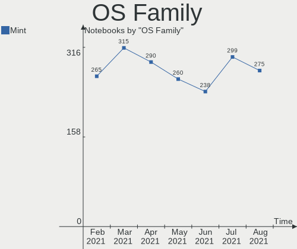

| Name | Notebooks | Percent |
|------|-----------|---------|
| Mint | 159       | 100%    |

Kernel
------

Version of the Linux kernel

| Version                 | Notebooks | Percent |
|-------------------------|-----------|---------|
| 5.4.0-54-generic        | 44        | 27.67%  |
| 5.4.0-52-generic        | 38        | 23.9%   |
| 5.4.0-53-generic        | 20        | 12.58%  |
| 5.8.0-28-generic        | 7         | 4.4%    |
| 5.4.0-26-generic        | 7         | 4.4%    |
| 5.0.0-32-generic        | 6         | 3.77%   |
| 5.8.0-29-generic        | 5         | 3.14%   |
| 5.8.0-25-generic        | 3         | 1.89%   |
| 5.4.0-48-generic        | 3         | 1.89%   |
| 5.4.0-42-generic        | 3         | 1.89%   |
| 5.9.8-050908-generic    | 2         | 1.26%   |
| 5.9.4-050904-generic    | 2         | 1.26%   |
| 5.3.0-46-generic        | 2         | 1.26%   |
| 4.15.0-20-generic       | 2         | 1.26%   |
| 4.15.0-122-generic      | 2         | 1.26%   |
| 5.9.9-xanmod1           | 1         | 0.63%   |
| 5.9.1-050901-lowlatency | 1         | 0.63%   |
| 5.8.16-xanmod1          | 1         | 0.63%   |
| 5.8.0-7625-generic      | 1         | 0.63%   |
| 5.4.2-050402-generic    | 1         | 0.63%   |
| 5.4.0-51-generic        | 1         | 0.63%   |
| 5.4.0-45-generic        | 1         | 0.63%   |
| 5.4.0-39-generic        | 1         | 0.63%   |
| 5.3.0-62-generic        | 1         | 0.63%   |
| 4.4.0-112-generic       | 1         | 0.63%   |
| 4.15.0-39-generic       | 1         | 0.63%   |
| 4.15.0-123-generic      | 1         | 0.63%   |
| 4.15.0-108-generic      | 1         | 0.63%   |

Kernel Family
-------------

Linux kernel without a distro release

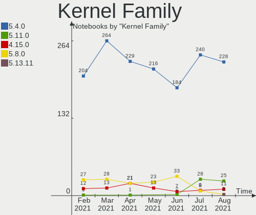

| Version | Notebooks | Percent |
|---------|-----------|---------|
| 5.4.0   | 118       | 74.21%  |
| 5.8.0   | 16        | 10.06%  |
| 4.15.0  | 7         | 4.4%    |
| 5.0.0   | 6         | 3.77%   |
| 5.3.0   | 3         | 1.89%   |
| 5.9.8   | 2         | 1.26%   |
| 5.9.4   | 2         | 1.26%   |
| 5.9.9   | 1         | 0.63%   |
| 5.9.1   | 1         | 0.63%   |
| 5.8.16  | 1         | 0.63%   |
| 5.4.2   | 1         | 0.63%   |
| 4.4.0   | 1         | 0.63%   |

Kernel Major Ver.
-----------------

Linux kernel major version

| Version | Notebooks | Percent |
|---------|-----------|---------|
| 5.4     | 119       | 74.84%  |
| 5.8     | 17        | 10.69%  |
| 4.15    | 7         | 4.4%    |
| 5.9     | 6         | 3.77%   |
| 5.0     | 6         | 3.77%   |
| 5.3     | 3         | 1.89%   |
| 4.4     | 1         | 0.63%   |

Arch
----

OS architecture (x86_64, i586, etc.)

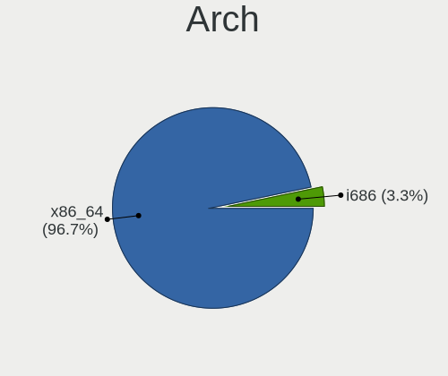

| Name   | Notebooks | Percent |
|--------|-----------|---------|
| x86_64 | 153       | 96.23%  |
| i686   | 6         | 3.77%   |

DE
--

Desktop Environment

| Name       | Notebooks | Percent |
|------------|-----------|---------|
| X-Cinnamon | 83        | 52.2%   |
| Cinnamon   | 32        | 20.13%  |
| XFCE       | 18        | 11.32%  |
| MATE       | 13        | 8.18%   |
| GNOME      | 8         | 5.03%   |
| Unknown    | 2         | 1.26%   |
| Pantheon   | 1         | 0.63%   |
| KDE5       | 1         | 0.63%   |
| KDE        | 1         | 0.63%   |

Display Server
--------------

X11 or Wayland

| Name | Notebooks | Percent |
|------|-----------|---------|
| X11  | 159       | 100%    |

Display Manager
---------------

SDDM, LightDM, etc.

| Name    | Notebooks | Percent |
|---------|-----------|---------|
| Unknown | 85        | 53.46%  |
| TDM     | 70        | 44.03%  |
| GDM     | 2         | 1.26%   |
| SDDM    | 1         | 0.63%   |
| LightDM | 1         | 0.63%   |

OS Lang
-------

Language

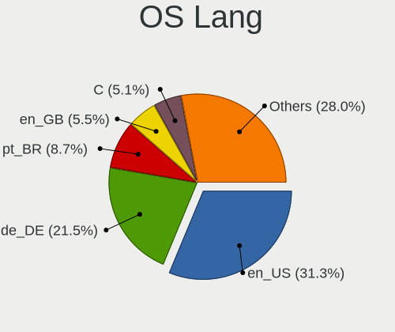

| Lang  | Notebooks | Percent |
|-------|-----------|---------|
| en_US | 43        | 27.04%  |
| de_DE | 26        | 16.35%  |
| ru_RU | 14        | 8.81%   |
| pt_BR | 12        | 7.55%   |
| fr_FR | 8         | 5.03%   |
| pl_PL | 5         | 3.14%   |
| es_ES | 4         | 2.52%   |
| C     | 4         | 2.52%   |
| it_IT | 3         | 1.89%   |
| en_IN | 3         | 1.89%   |
| en_GB | 3         | 1.89%   |
| en_CA | 3         | 1.89%   |
| en_AU | 3         | 1.89%   |
| cs_CZ | 3         | 1.89%   |
| tr_TR | 2         | 1.26%   |
| hu_HU | 2         | 1.26%   |
| es_MX | 2         | 1.26%   |
| es_AR | 2         | 1.26%   |
| en_ZA | 2         | 1.26%   |
| uk_UA | 1         | 0.63%   |
| ru_UA | 1         | 0.63%   |
| nl_NL | 1         | 0.63%   |
| nb_NO | 1         | 0.63%   |
| fr_CA | 1         | 0.63%   |
| fi_FI | 1         | 0.63%   |
| es_VE | 1         | 0.63%   |
| es_CO | 1         | 0.63%   |
| es_CL | 1         | 0.63%   |
| en_IN | 1         | 0.63%   |
| en_IE | 1         | 0.63%   |
| de_CH | 1         | 0.63%   |
| de_AT | 1         | 0.63%   |
| da_DK | 1         | 0.63%   |
| bg_BG | 1         | 0.63%   |

Boot Mode
---------

EFI or BIOS

| Mode | Notebooks | Percent |
|------|-----------|---------|
| EFI  | 86        | 54.09%  |
| BIOS | 73        | 45.91%  |

Filesystem
----------

Type of filesystem

| Type    | Notebooks | Percent |
|---------|-----------|---------|
| Ext4    | 152       | 95.6%   |
| Overlay | 4         | 2.52%   |
| Ext3    | 2         | 1.26%   |
| Btrfs   | 1         | 0.63%   |

Part. scheme
------------

Scheme of partitioning

| Type    | Notebooks | Percent |
|---------|-----------|---------|
| Unknown | 85        | 53.46%  |
| GPT     | 53        | 33.33%  |
| MBR     | 21        | 13.21%  |

Dual Boot with Linux/BSD
------------------------

Hosting more than one Linux/BSD

| Dual boot | Notebooks | Percent |
|-----------|-----------|---------|
| No        | 149       | 93.71%  |
| Yes       | 10        | 6.29%   |

Dual Boot (Win)
---------------

Hosting Linux and Windows

| Dual boot | Notebooks | Percent |
|-----------|-----------|---------|
| No        | 124       | 77.99%  |
| Yes       | 35        | 22.01%  |

Country
-------

Geographic location (country)

| Country              | Notebooks | Percent |
|----------------------|-----------|---------|
| Germany              | 30        | 18.87%  |
| USA                  | 26        | 16.35%  |
| Brazil               | 14        | 8.81%   |
| Russia               | 12        | 7.55%   |
| France               | 6         | 3.77%   |
| Poland               | 5         | 3.14%   |
| Canada               | 5         | 3.14%   |
| UK                   | 4         | 2.52%   |
| Spain                | 4         | 2.52%   |
| Czech Republic       | 4         | 2.52%   |
| Ukraine              | 3         | 1.89%   |
| Netherlands          | 3         | 1.89%   |
| Italy                | 3         | 1.89%   |
| India                | 3         | 1.89%   |
| Australia            | 3         | 1.89%   |
| Turkey               | 2         | 1.26%   |
| Nepal                | 2         | 1.26%   |
| Hungary              | 2         | 1.26%   |
| Finland              | 2         | 1.26%   |
| China                | 2         | 1.26%   |
| Argentina            | 2         | 1.26%   |
| Venezuela            | 1         | 0.63%   |
| Uzbekistan           | 1         | 0.63%   |
| Tunisia              | 1         | 0.63%   |
| Switzerland          | 1         | 0.63%   |
| South Africa         | 1         | 0.63%   |
| Romania              | 1         | 0.63%   |
| Pakistan             | 1         | 0.63%   |
| Norway               | 1         | 0.63%   |
| Moldova, Republic of | 1         | 0.63%   |
| Mexico               | 1         | 0.63%   |
| Lithuania            | 1         | 0.63%   |
| Israel               | 1         | 0.63%   |
| Ireland              | 1         | 0.63%   |
| Indonesia            | 1         | 0.63%   |
| Denmark              | 1         | 0.63%   |
| Colombia             | 1         | 0.63%   |
| Chile                | 1         | 0.63%   |
| Cambodia             | 1         | 0.63%   |
| Bulgaria             | 1         | 0.63%   |
| Belgium              | 1         | 0.63%   |
| Belarus              | 1         | 0.63%   |
| Austria              | 1         | 0.63%   |

City
----

Geographic location (city)

| City                             | Notebooks | Percent |
|----------------------------------|-----------|---------|
| Rockville                        | 3         | 1.89%   |
| Berlin                           | 3         | 1.89%   |
| Weiden                           | 2         | 1.26%   |
| Tomsk                            | 2         | 1.26%   |
| Saratov                          | 2         | 1.26%   |
| Rio de Janeiro                   | 2         | 1.26%   |
| Mumbai                           | 2         | 1.26%   |
| Kyiv                             | 2         | 1.26%   |
| Curitiba                         | 2         | 1.26%   |
| Cologne                          | 2         | 1.26%   |
| Belo Horizonte                   | 2         | 1.26%   |
| Zlatoust                         | 1         | 0.63%   |
| Zhlobin                          | 1         | 0.63%   |
| Wrocław                         | 1         | 0.63%   |
| Williamsburg                     | 1         | 0.63%   |
| Wiesbaden                        | 1         | 0.63%   |
| Weinstadt-Endersbach             | 1         | 0.63%   |
| Vila Velha                       | 1         | 0.63%   |
| Vienna                           | 1         | 0.63%   |
| Vancouver                        | 1         | 0.63%   |
| Vale do Anari                    | 1         | 0.63%   |
| Tuggerah                         | 1         | 0.63%   |
| Toronto                          | 1         | 0.63%   |
| Ternopil                         | 1         | 0.63%   |
| Tel Aviv                         | 1         | 0.63%   |
| Tashkent                         | 1         | 0.63%   |
| São Paulo                       | 1         | 0.63%   |
| São Bento do Sul                | 1         | 0.63%   |
| Stelle                           | 1         | 0.63%   |
| St Petersburg                    | 1         | 0.63%   |
| South Weymouth                   | 1         | 0.63%   |
| Soultzeren                       | 1         | 0.63%   |
| Sofia                            | 1         | 0.63%   |
| Sochi                            | 1         | 0.63%   |
| Silver Spring                    | 1         | 0.63%   |
| Siklos                           | 1         | 0.63%   |
| Shenzhen                         | 1         | 0.63%   |
| Shanghai                         | 1         | 0.63%   |
| Seville                          | 1         | 0.63%   |
| Severodvinsk                     | 1         | 0.63%   |
| Schkeuditz                       | 1         | 0.63%   |
| Santiago de Cali                 | 1         | 0.63%   |
| San Diego                        | 1         | 0.63%   |
| San Cesario sul Panaro           | 1         | 0.63%   |
| Saint-Gervais-les-Trois-Clochers | 1         | 0.63%   |
| Saint Charles                    | 1         | 0.63%   |
| Riverside                        | 1         | 0.63%   |
| Richardson                       | 1         | 0.63%   |
| Quilmes                          | 1         | 0.63%   |
| Putzbrunn                        | 1         | 0.63%   |
| Puebla                           | 1         | 0.63%   |
| Prague                           | 1         | 0.63%   |
| Poplar                           | 1         | 0.63%   |
| Pogeez                           | 1         | 0.63%   |
| Phnom Penh                       | 1         | 0.63%   |
| Paris                            | 1         | 0.63%   |
| Panjang                          | 1         | 0.63%   |
| Ottawa                           | 1         | 0.63%   |
| Ostrava                          | 1         | 0.63%   |
| Oslo                             | 1         | 0.63%   |

Vendor
------

Motherboard manufacturer

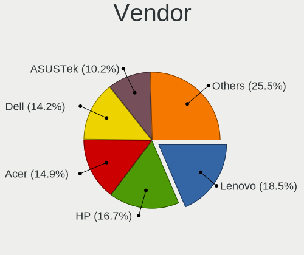

| Name                | Notebooks | Percent |
|---------------------|-----------|---------|
| Hewlett-Packard     | 36        | 22.64%  |
| Lenovo              | 33        | 20.75%  |
| Dell                | 22        | 13.84%  |
| Acer                | 14        | 8.81%   |
| ASUSTek Computer    | 13        | 8.18%   |
| Toshiba             | 8         | 5.03%   |
| Samsung Electronics | 5         | 3.14%   |
| Packard Bell        | 4         | 2.52%   |
| TUXEDO              | 2         | 1.26%   |
| Positivo            | 2         | 1.26%   |
| MSI                 | 2         | 1.26%   |
| Medion              | 2         | 1.26%   |
| HUAWEI              | 2         | 1.26%   |
| Timi                | 1         | 0.63%   |
| Teclast             | 1         | 0.63%   |
| System76            | 1         | 0.63%   |
| Sony                | 1         | 0.63%   |
| Schenker            | 1         | 0.63%   |
| PC Specialist       | 1         | 0.63%   |
| Insyde              | 1         | 0.63%   |
| In-Sing             | 1         | 0.63%   |
| Hampoo              | 1         | 0.63%   |
| Gigabyte Technology | 1         | 0.63%   |
| Gateway             | 1         | 0.63%   |
| Fujitsu             | 1         | 0.63%   |
| Exo                 | 1         | 0.63%   |
| Apple               | 1         | 0.63%   |

Model
-----

Motherboard model

| Name                                           | Notebooks | Percent |
|------------------------------------------------|-----------|---------|
| Positivo MOBILE                                | 2         | 1.26%   |
| HP 250 G5 Notebook PC                          | 2         | 1.26%   |
| Dell Inspiron N7110                            | 2         | 1.26%   |
| Dell G3 3779                                   | 2         | 1.26%   |
| TUXEDO P65_67HSHP                              | 1         | 0.63%   |
| TUXEDO Book BA1510                             | 1         | 0.63%   |
| Toshiba TECRA A8                               | 1         | 0.63%   |
| Toshiba Satellite S50-B                        | 1         | 0.63%   |
| Toshiba Satellite L75-B                        | 1         | 0.63%   |
| Toshiba Satellite L50D-B                       | 1         | 0.63%   |
| Toshiba Satellite L50-B                        | 1         | 0.63%   |
| Toshiba Satellite L40                          | 1         | 0.63%   |
| Toshiba Satellite A300                         | 1         | 0.63%   |
| Toshiba Satellite A200                         | 1         | 0.63%   |
| Timi TM1707                                    | 1         | 0.63%   |
| Teclast F6 Plus                                | 1         | 0.63%   |
| System76 Lemur                                 | 1         | 0.63%   |
| Sony VGN-NS31ST_S                              | 1         | 0.63%   |
| Schenker XMG NEO (M19, GTX 1660 Ti)            | 1         | 0.63%   |
| Samsung QX310/QX410/QX510/SF310/SF410/SF510    | 1         | 0.63%   |
| Samsung 550XBE/350XBE                          | 1         | 0.63%   |
| Samsung 340XAA/350XAA/550XAA                   | 1         | 0.63%   |
| Samsung 300V3A/300V4A/300V5A/200A4B/200A5B     | 1         | 0.63%   |
| Samsung 300E5EV/300E4EV/270E5EV/270E4EV/2470EV | 1         | 0.63%   |
| PC Specialist PCX0DX                           | 1         | 0.63%   |
| Packard Bell EASYNOTE_MX61-B-018               | 1         | 0.63%   |
| Packard Bell EasyNote TJ65                     | 1         | 0.63%   |
| Packard Bell EasyNote TE11HC                   | 1         | 0.63%   |
| Packard Bell EasyNote LM85                     | 1         | 0.63%   |
| MSI PS63 Modern 8RC                            | 1         | 0.63%   |
| MSI GE72 6QF                                   | 1         | 0.63%   |
| Medion P8610                                   | 1         | 0.63%   |
| Medion E1210                                   | 1         | 0.63%   |
| Lenovo V14-IIL 82C4                            | 1         | 0.63%   |
| Lenovo ThinkPad Yoga 11e 3rd Gen 20G8S0MG00    | 1         | 0.63%   |
| Lenovo ThinkPad X270 20HNA00RAD                | 1         | 0.63%   |
| Lenovo ThinkPad X270 20HN0012UK                | 1         | 0.63%   |
| Lenovo ThinkPad X250 20CLA272CD                | 1         | 0.63%   |
| Lenovo ThinkPad X220 4291V39                   | 1         | 0.63%   |
| Lenovo ThinkPad X220 4291IM5                   | 1         | 0.63%   |
| Lenovo ThinkPad X220 4291HE3                   | 1         | 0.63%   |
| Lenovo ThinkPad W530 24472L5                   | 1         | 0.63%   |
| Lenovo ThinkPad T460 20FN001CAU                | 1         | 0.63%   |
| Lenovo ThinkPad T450s 20BWS0R700               | 1         | 0.63%   |
| Lenovo ThinkPad T440s 20AQ006HUS               | 1         | 0.63%   |
| Lenovo ThinkPad T440 20B7S2VP00                | 1         | 0.63%   |
| Lenovo ThinkPad T430 2347G6P                   | 1         | 0.63%   |
| Lenovo ThinkPad T14s Gen 1 20UJ0019MX          | 1         | 0.63%   |
| Lenovo ThinkPad T14 Gen 1 20UDCTO1WW           | 1         | 0.63%   |
| Lenovo ThinkPad R60e/R60i 0657KFG              | 1         | 0.63%   |
| Lenovo ThinkPad L490 20Q50020MX                | 1         | 0.63%   |
| Lenovo ThinkPad L15 Gen 1 20U70006GE           | 1         | 0.63%   |
| Lenovo ThinkPad Edge E540 20C600K0MC           | 1         | 0.63%   |
| Lenovo Legion Y530-15ICH-1060 81LB             | 1         | 0.63%   |
| Lenovo Legion Y530-15ICH 81FV                  | 1         | 0.63%   |
| Lenovo IdeaPad Slim 1-14AST-05 81VS            | 1         | 0.63%   |
| Lenovo IdeaPad S340-15IWL 81N8                 | 1         | 0.63%   |
| Lenovo IdeaPad S340-15API 81NC                 | 1         | 0.63%   |
| Lenovo IdeaPad Flex 15 20309                   | 1         | 0.63%   |
| Lenovo IdeaPad 700-15ISK 80RU                  | 1         | 0.63%   |

Model Family
------------

Motherboard model prefix

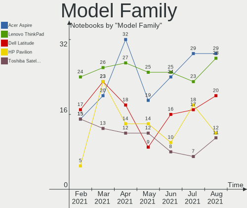

| Name                  | Notebooks | Percent |
|-----------------------|-----------|---------|
| Lenovo ThinkPad       | 19        | 11.95%  |
| Lenovo IdeaPad        | 11        | 6.92%   |
| Dell Inspiron         | 11        | 6.92%   |
| Acer Aspire           | 10        | 6.29%   |
| HP Pavilion           | 8         | 5.03%   |
| Toshiba Satellite     | 7         | 4.4%    |
| Dell Latitude         | 6         | 3.77%   |
| Packard Bell EasyNote | 4         | 2.52%   |
| HP Laptop             | 4         | 2.52%   |
| HP Compaq             | 4         | 2.52%   |
| HP 250                | 4         | 2.52%   |
| HP ProBook            | 3         | 1.89%   |
| HP EliteBook          | 3         | 1.89%   |
| Positivo Mobile       | 2         | 1.26%   |
| Lenovo Legion         | 2         | 1.26%   |
| HP ENVY               | 2         | 1.26%   |
| Dell Vostro           | 2         | 1.26%   |
| Dell G3               | 2         | 1.26%   |
| ASUS VivoBook         | 2         | 1.26%   |
| Acer Extensa          | 2         | 1.26%   |
| TUXEDO P65            | 1         | 0.63%   |
| TUXEDO Book           | 1         | 0.63%   |
| Toshiba TECRA         | 1         | 0.63%   |
| Timi TM1707           | 1         | 0.63%   |
| Teclast F6            | 1         | 0.63%   |
| System76 Lemur        | 1         | 0.63%   |
| Sony VGN-NS31ST       | 1         | 0.63%   |
| Schenker XMG          | 1         | 0.63%   |
| Samsung QX310         | 1         | 0.63%   |
| Samsung 550XBE        | 1         | 0.63%   |
| Samsung 340XAA        | 1         | 0.63%   |
| Samsung 300V3A        | 1         | 0.63%   |
| Samsung 300E5EV       | 1         | 0.63%   |
| PC Specialist PCX0DX  | 1         | 0.63%   |
| MSI PS63              | 1         | 0.63%   |
| MSI GE72              | 1         | 0.63%   |
| Medion P8610          | 1         | 0.63%   |
| Medion E1210          | 1         | 0.63%   |
| Lenovo V14-IIL        | 1         | 0.63%   |
| Insyde ONDA           | 1         | 0.63%   |
| In-Sing NK81J         | 1         | 0.63%   |
| HUAWEI NBLK-WAX9X     | 1         | 0.63%   |
| HUAWEI MACHC-WAX9     | 1         | 0.63%   |
| HP ZBook              | 1         | 0.63%   |
| HP OMEN               | 1         | 0.63%   |
| HP Notebook           | 1         | 0.63%   |
| HP G62                | 1         | 0.63%   |
| HP 650                | 1         | 0.63%   |
| HP 620                | 1         | 0.63%   |
| HP 255                | 1         | 0.63%   |
| HP 245                | 1         | 0.63%   |
| Hampoo Cherry         | 1         | 0.63%   |
| Gigabyte GB-BXA8-5557 | 1         | 0.63%   |
| Gateway M-6752        | 1         | 0.63%   |
| Fujitsu LIFEBOOK      | 1         | 0.63%   |
| Exo AIO               | 1         | 0.63%   |
| Dell XPS              | 1         | 0.63%   |
| ASUS X55CR            | 1         | 0.63%   |
| ASUS X555LF           | 1         | 0.63%   |
| ASUS X555LA           | 1         | 0.63%   |

MFG Year
--------

Motherboard manufacture year

| Year | Notebooks | Percent |
|------|-----------|---------|
| 2020 | 27        | 16.98%  |
| 2019 | 20        | 12.58%  |
| 2018 | 16        | 10.06%  |
| 2014 | 14        | 8.81%   |
| 2013 | 11        | 6.92%   |
| 2016 | 10        | 6.29%   |
| 2017 | 9         | 5.66%   |
| 2015 | 9         | 5.66%   |
| 2011 | 9         | 5.66%   |
| 2012 | 8         | 5.03%   |
| 2010 | 8         | 5.03%   |
| 2009 | 6         | 3.77%   |
| 2007 | 6         | 3.77%   |
| 2008 | 5         | 3.14%   |
| 2006 | 1         | 0.63%   |

Form Factor
-----------

Physical design of the computer

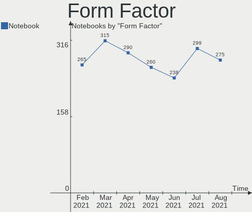

| Name     | Notebooks | Percent |
|----------|-----------|---------|
| Notebook | 159       | 100%    |

Secure Boot
-----------

Enabled or disabled

| State    | Notebooks | Percent |
|----------|-----------|---------|
| Disabled | 142       | 89.31%  |
| Enabled  | 17        | 10.69%  |

Coreboot
--------

Have coreboot on board

| Used | Notebooks | Percent |
|------|-----------|---------|
| No   | 159       | 100%    |

RAM Size
--------

Total RAM memory

| Size in GB | Notebooks | Percent |
|------------|-----------|---------|
| 4.01-8.0   | 54        | 33.96%  |
| 3.01-4.0   | 32        | 20.13%  |
| 16.01-24.0 | 27        | 16.98%  |
| 8.01-16.0  | 25        | 15.72%  |
| 1.01-2.0   | 12        | 7.55%   |
| 0.01-1.0   | 5         | 3.14%   |
| 32.01-64.0 | 2         | 1.26%   |
| 2.01-3.0   | 2         | 1.26%   |

RAM Used
--------

Used RAM memory

| Used GB   | Notebooks | Percent |
|-----------|-----------|---------|
| 1.01-2.0  | 60        | 37.74%  |
| 2.01-3.0  | 39        | 24.53%  |
| 3.01-4.0  | 21        | 13.21%  |
| 0.01-1.0  | 20        | 12.58%  |
| 4.01-8.0  | 15        | 9.43%   |
| 8.01-16.0 | 4         | 2.52%   |

Has CD-ROM
----------

Has CD-ROM on board

| Presented | Notebooks | Percent |
|-----------|-----------|---------|
| No        | 93        | 58.49%  |
| Yes       | 66        | 41.51%  |

Total Drives
------------

Number of drives on board

| Drives | Notebooks | Percent |
|--------|-----------|---------|
| 1      | 113       | 71.07%  |
| 2      | 38        | 23.9%   |
| 3      | 5         | 3.14%   |
| 0      | 2         | 1.26%   |
| 4      | 1         | 0.63%   |

Has Ethernet
------------

Has Ethernet on board

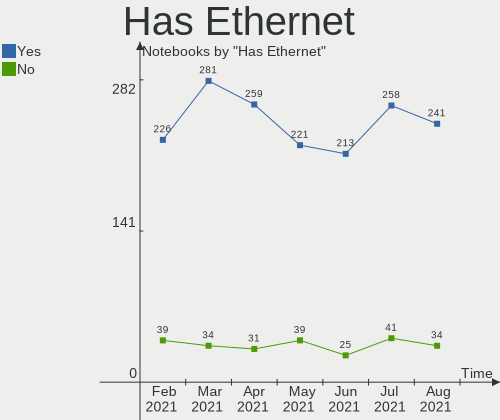

| Presented | Notebooks | Percent |
|-----------|-----------|---------|
| Yes       | 136       | 85.53%  |
| No        | 23        | 14.47%  |

Drive Vendor
------------

Hard drive vendors

| Vendor                  | Notebooks | Drives | Percent |
|-------------------------|-----------|--------|---------|
| WDC                     | 24        | 24     | 12.44%  |
| Seagate                 | 24        | 25     | 12.44%  |
| Samsung Electronics     | 22        | 25     | 11.4%   |
| Unknown                 | 15        | 17     | 7.77%   |
| Toshiba                 | 14        | 14     | 7.25%   |
| SanDisk                 | 10        | 11     | 5.18%   |
| Hitachi                 | 10        | 10     | 5.18%   |
| Crucial                 | 9         | 9      | 4.66%   |
| SK Hynix                | 8         | 9      | 4.15%   |
| HGST                    | 8         | 8      | 4.15%   |
| Kingston                | 6         | 6      | 3.11%   |
| Intel                   | 6         | 7      | 3.11%   |
| Union Memory            | 3         | 3      | 1.55%   |
| Micron Technology       | 3         | 3      | 1.55%   |
| Union Memory (Shenzhen) | 2         | 2      | 1.04%   |
| SPCC                    | 2         | 2      | 1.04%   |
| PLEXTOR                 | 2         | 2      | 1.04%   |
| OCZ                     | 2         | 2      | 1.04%   |
| KIOXIA                  | 2         | 2      | 1.04%   |
| Fujitsu                 | 2         | 2      | 1.04%   |
| China                   | 2         | 2      | 1.04%   |
| A-DATA Technology       | 2         | 2      | 1.04%   |
| Verbatim                | 1         | 1      | 0.52%   |
| Teclast                 | 1         | 1      | 0.52%   |
| ShanDianZhe             | 1         | 1      | 0.52%   |
| Patriot                 | 1         | 1      | 0.52%   |
| ORICO                   | 1         | 1      | 0.52%   |
| LITEONIT                | 1         | 1      | 0.52%   |
| LITEON                  | 1         | 1      | 0.52%   |
| KingDian                | 1         | 1      | 0.52%   |
| JMicron                 | 1         | 1      | 0.52%   |
| Intenso                 | 1         | 1      | 0.52%   |
| HUAWEI                  | 1         | 1      | 0.52%   |
| GOODRAM                 | 1         | 1      | 0.52%   |
| Gigabyte Technology     | 1         | 1      | 0.52%   |
| Corsair                 | 1         | 1      | 0.52%   |
| Apple                   | 1         | 1      | 0.52%   |

Drive Model
-----------

Hard drive models

| Model                                        | Notebooks | Percent |
|----------------------------------------------|-----------|---------|
| Unknown SD/MMC/MS PRO 128GB                  | 3         | 1.49%   |
| Unknown MMC Card  64GB                       | 3         | 1.49%   |
| Unknown MMC Card  128GB                      | 3         | 1.49%   |
| Toshiba MQ01ABF050 500GB                     | 3         | 1.49%   |
| Toshiba MQ01ABD100 1TB                       | 3         | 1.49%   |
| Seagate ST1000LM049-2GH172 1TB               | 3         | 1.49%   |
| Seagate ST1000LM024 HN-M101MBB 1TB           | 3         | 1.49%   |
| Hitachi HTS547575A9E384 752GB                | 3         | 1.49%   |
| HGST HTS725050A7E630 500GB                   | 3         | 1.49%   |
| Crucial CT500MX500SSD1 500GB                 | 3         | 1.49%   |
| WDC WDS100T2B0A-00SM50 1TB SSD               | 2         | 0.99%   |
| WDC WD10JPCX-24UE4T0 1TB                     | 2         | 0.99%   |
| Unknown MMC Card  32GB                       | 2         | 0.99%   |
| Unknown MMC Card  16GB                       | 2         | 0.99%   |
| Union Memory RPFTJ256PDD2MWX 256GB           | 2         | 0.99%   |
| Toshiba NVMe SSD Drive 256GB                 | 2         | 0.99%   |
| SK Hynix BC511 HFM256GDJTNI-82A0A 256GB      | 2         | 0.99%   |
| Seagate ST500LT012-1DG142 500GB              | 2         | 0.99%   |
| Seagate ST500LM021-1KJ152 500GB              | 2         | 0.99%   |
| SanDisk SSD PLUS 120GB                       | 2         | 0.99%   |
| Samsung SSD 860 EVO 500GB                    | 2         | 0.99%   |
| Samsung SSD 850 EVO 500GB                    | 2         | 0.99%   |
| KIOXIA KBG40ZNV512G 512GB                    | 2         | 0.99%   |
| HGST HTS545050A7E380 500GB                   | 2         | 0.99%   |
| WDC WDS500G2B0B-00YS70 500GB SSD             | 1         | 0.5%    |
| WDC WDS240G2G0A-00JH30 240GB SSD             | 1         | 0.5%    |
| WDC WDS100T2B0C-00PXH0 1TB                   | 1         | 0.5%    |
| WDC WDS100T2B0B-00YS70 1TB SSD               | 1         | 0.5%    |
| WDC WD7500BPKX-00HPJT0 752GB                 | 1         | 0.5%    |
| WDC WD6400BEVT-60A0RT0 640GB                 | 1         | 0.5%    |
| WDC WD5000LPVX-22V0TT0 500GB                 | 1         | 0.5%    |
| WDC WD5000BPVT-75HXZT3 500GB                 | 1         | 0.5%    |
| WDC WD5000BPVT-22HXZT3 500GB                 | 1         | 0.5%    |
| WDC WD5000BEVT-22A0RT0 500GB                 | 1         | 0.5%    |
| WDC WD3200LPVX-22V0TT0 320GB                 | 1         | 0.5%    |
| WDC WD3200BPVT-22JJ5T0 320GB                 | 1         | 0.5%    |
| WDC WD3200BEVT-80A0RT0 320GB                 | 1         | 0.5%    |
| WDC WD3200BEVT-22A0RT0 320GB                 | 1         | 0.5%    |
| WDC WD3200BEKT-75PVMT1 320GB                 | 1         | 0.5%    |
| WDC WD3200BEKT-60V5T1 320GB                  | 1         | 0.5%    |
| WDC WD10SPZX-60Z10T0 1TB                     | 1         | 0.5%    |
| WDC WD10SPCX-24HWST1 1TB                     | 1         | 0.5%    |
| WDC WD1001X06X-00SJVT0 1TB                   | 1         | 0.5%    |
| WDC PC SN730 SDBQNTY-512G-1001 512GB         | 1         | 0.5%    |
| Verbatim Vi550 S3 SSD 128GB                  | 1         | 0.5%    |
| Unknown S400-240 240GB                       | 1         | 0.5%    |
| Unknown MMC Card  7GB                        | 1         | 0.5%    |
| Unknown MMC Card  196GB                      | 1         | 0.5%    |
| Unknown BWBC3R  32GB                         | 1         | 0.5%    |
| Union Memory RPFTJ128PDD2EWX 128GB           | 1         | 0.5%    |
| Union Memory (Shenzhen) NVMe SSD Drive 256GB | 1         | 0.5%    |
| Union Memory (Shenzhen) NVMe SSD Drive 128GB | 1         | 0.5%    |
| Toshiba MQ04ABF100 1TB                       | 1         | 0.5%    |
| Toshiba MK4058GSX 400GB                      | 1         | 0.5%    |
| Toshiba MK1646GSX 160GB                      | 1         | 0.5%    |
| Toshiba KXG60ZNV256G KIOXIA 256GB            | 1         | 0.5%    |
| Toshiba KXG50ZNV512G NVMe 512GB              | 1         | 0.5%    |
| Toshiba HDWL110 1TB                          | 1         | 0.5%    |
| Teclast 256GB NS550-2242 SSD                 | 1         | 0.5%    |
| SPCC Solid State Disk 512GB                  | 1         | 0.5%    |

HDD Vendor
----------

Hard disk drive vendors

| Vendor              | Notebooks | Drives | Percent |
|---------------------|-----------|--------|---------|
| Seagate             | 24        | 25     | 32.88%  |
| WDC                 | 17        | 17     | 23.29%  |
| Toshiba             | 10        | 10     | 13.7%   |
| Hitachi             | 10        | 10     | 13.7%   |
| HGST                | 8         | 8      | 10.96%  |
| Fujitsu             | 2         | 2      | 2.74%   |
| Samsung Electronics | 1         | 1      | 1.37%   |
| Apple               | 1         | 1      | 1.37%   |

SSD Vendor
----------

Solid state drive vendors

| Vendor              | Notebooks | Drives | Percent |
|---------------------|-----------|--------|---------|
| Samsung Electronics | 13        | 15     | 19.7%   |
| SanDisk             | 10        | 10     | 15.15%  |
| Crucial             | 8         | 8      | 12.12%  |
| WDC                 | 5         | 5      | 7.58%   |
| Kingston            | 5         | 5      | 7.58%   |
| SK Hynix            | 2         | 2      | 3.03%   |
| OCZ                 | 2         | 2      | 3.03%   |
| Micron Technology   | 2         | 2      | 3.03%   |
| Intel               | 2         | 2      | 3.03%   |
| China               | 2         | 2      | 3.03%   |
| A-DATA Technology   | 2         | 2      | 3.03%   |
| Verbatim            | 1         | 1      | 1.52%   |
| Teclast             | 1         | 1      | 1.52%   |
| SPCC                | 1         | 1      | 1.52%   |
| ShanDianZhe         | 1         | 1      | 1.52%   |
| PLEXTOR             | 1         | 1      | 1.52%   |
| Patriot             | 1         | 1      | 1.52%   |
| LITEONIT            | 1         | 1      | 1.52%   |
| LITEON              | 1         | 1      | 1.52%   |
| KingDian            | 1         | 1      | 1.52%   |
| Intenso             | 1         | 1      | 1.52%   |
| GOODRAM             | 1         | 1      | 1.52%   |
| Gigabyte Technology | 1         | 1      | 1.52%   |
| Corsair             | 1         | 1      | 1.52%   |

Drive Kind
----------

HDD or SSD

| Kind    | Notebooks | Drives | Percent |
|---------|-----------|--------|---------|
| HDD     | 72        | 74     | 38.3%   |
| SSD     | 63        | 68     | 33.51%  |
| NVMe    | 36        | 40     | 19.15%  |
| MMC     | 11        | 13     | 5.85%   |
| Unknown | 6         | 7      | 3.19%   |

Drive Connector
---------------

SATA, SAS, NVMe, etc.

| Type | Notebooks | Drives | Percent |
|------|-----------|--------|---------|
| SATA | 127       | 142    | 70.17%  |
| NVMe | 36        | 40     | 19.89%  |
| MMC  | 11        | 13     | 6.08%   |
| SAS  | 7         | 7      | 3.87%   |

Drive Size
----------

Size of hard drive

| Size in TB | Notebooks | Drives | Percent |
|------------|-----------|--------|---------|
| 0.01-0.5   | 88        | 98     | 67.18%  |
| 0.51-1.0   | 39        | 40     | 29.77%  |
| 1.01-2.0   | 3         | 3      | 2.29%   |
| 3.01-4.0   | 1         | 1      | 0.76%   |

Space Total
-----------

Amount of disk space available on the file system

| Size in GB     | Notebooks | Percent |
|----------------|-----------|---------|
| 101-250        | 55        | 34.59%  |
| 251-500        | 51        | 32.08%  |
| 501-1000       | 30        | 18.87%  |
| 51-100         | 9         | 5.66%   |
| 1001-2000      | 4         | 2.52%   |
| More than 3000 | 3         | 1.89%   |
| 1-20           | 3         | 1.89%   |
| 21-50          | 2         | 1.26%   |
| 2001-3000      | 2         | 1.26%   |

Space Used
----------

Amount of used disk space

| Used GB   | Notebooks | Percent |
|-----------|-----------|---------|
| 1-20      | 40        | 25.16%  |
| 21-50     | 36        | 22.64%  |
| 51-100    | 30        | 18.87%  |
| 101-250   | 25        | 15.72%  |
| 251-500   | 18        | 11.32%  |
| 1001-2000 | 5         | 3.14%   |
| 501-1000  | 5         | 3.14%   |

Malfunc. Drives
---------------

Drive models with a malfunction

| Model                               | Notebooks | Drives | Percent |
|-------------------------------------|-----------|--------|---------|
| Hitachi HTS547575A9E384 752GB       | 2         | 2      | 14.29%  |
| HGST HTS725050A7E630 500GB          | 2         | 2      | 14.29%  |
| WDC WD5000BPVT-75HXZT3 500GB        | 1         | 1      | 7.14%   |
| WDC WD3200BEVT-22A0RT0 320GB        | 1         | 1      | 7.14%   |
| Toshiba MK4058GSX 400GB             | 1         | 1      | 7.14%   |
| Seagate ST95005620AS 500GB          | 1         | 1      | 7.14%   |
| Seagate ST9250315AS 250GB           | 1         | 1      | 7.14%   |
| Seagate ST500LM021-1KJ152 500GB     | 1         | 1      | 7.14%   |
| SanDisk SD9SN8W-256G-1006 256GB SSD | 1         | 1      | 7.14%   |
| Hitachi HTS545032B9A300 320GB       | 1         | 1      | 7.14%   |
| HGST HTS545050A7E380 500GB          | 1         | 1      | 7.14%   |
| HGST HTS541010A9E680 1TB            | 1         | 1      | 7.14%   |

Malfunc. Drive Vendor
---------------------

Vendors of faulty drives

| Vendor  | Notebooks | Drives | Percent |
|---------|-----------|--------|---------|
| HGST    | 4         | 4      | 28.57%  |
| Seagate | 3         | 3      | 21.43%  |
| Hitachi | 3         | 3      | 21.43%  |
| WDC     | 2         | 2      | 14.29%  |
| Toshiba | 1         | 1      | 7.14%   |
| SanDisk | 1         | 1      | 7.14%   |

Malfunc. HDD Vendor
-------------------

Vendors of faulty HDD drives

| Vendor  | Notebooks | Drives | Percent |
|---------|-----------|--------|---------|
| HGST    | 4         | 4      | 30.77%  |
| Seagate | 3         | 3      | 23.08%  |
| Hitachi | 3         | 3      | 23.08%  |
| WDC     | 2         | 2      | 15.38%  |
| Toshiba | 1         | 1      | 7.69%   |

Malfunc. Drive Kind
-------------------

Kinds of faulty drives

| Kind | Notebooks | Drives | Percent |
|------|-----------|--------|---------|
| HDD  | 13        | 13     | 92.86%  |
| SSD  | 1         | 1      | 7.14%   |

Failed Drives
-------------

Failed drive models

Zero info for selected period =(

Failed Drive Vendor
-------------------

Failed drive vendors

Zero info for selected period =(

Drive Status
------------

Number of failed and malfunc. drives

| Status   | Notebooks | Drives | Percent |
|----------|-----------|--------|---------|
| Detected | 89        | 118    | 54.27%  |
| Works    | 61        | 70     | 37.2%   |
| Malfunc  | 14        | 14     | 8.54%   |

Storage Vendor
--------------

Storage controller vendors

| Vendor                       | Notebooks | Percent |
|------------------------------|-----------|---------|
| Intel                        | 122       | 68.93%  |
| AMD                          | 20        | 11.3%   |
| Samsung Electronics          | 9         | 5.08%   |
| SK Hynix                     | 6         | 3.39%   |
| Union Memory (Shenzhen)      | 4         | 2.26%   |
| Toshiba America Info Systems | 4         | 2.26%   |
| Sandisk                      | 3         | 1.69%   |
| Nvidia                       | 2         | 1.13%   |
| KIOXIA                       | 2         | 1.13%   |
| Phison Electronics           | 1         | 0.56%   |
| Micron/Crucial Technology    | 1         | 0.56%   |
| Micron Technology            | 1         | 0.56%   |
| Lite-On Technology           | 1         | 0.56%   |
| Kingston Technology Company  | 1         | 0.56%   |

Storage Model
-------------

Storage controller models

| Model                                                                            | Notebooks | Percent |
|----------------------------------------------------------------------------------|-----------|---------|
| Intel 82801 Mobile SATA Controller [RAID mode]                                   | 17        | 8.99%   |
| AMD FCH SATA Controller [AHCI mode]                                              | 17        | 8.99%   |
| Intel 7 Series Chipset Family 6-port SATA Controller [AHCI mode]                 | 16        | 8.47%   |
| Intel Sunrise Point-LP SATA Controller [AHCI mode]                               | 12        | 6.35%   |
| Intel Wildcat Point-LP SATA Controller [AHCI Mode]                               | 7         | 3.7%    |
| Intel 8 Series SATA Controller 1 [AHCI mode]                                     | 7         | 3.7%    |
| Intel 6 Series/C200 Series Chipset Family 6 port Mobile SATA AHCI Controller     | 7         | 3.7%    |
| Intel 5 Series/3400 Series Chipset 4 port SATA AHCI Controller                   | 7         | 3.7%    |
| Intel 82801IBM/IEM (ICH9M/ICH9M-E) 4 port SATA Controller [AHCI mode]            | 6         | 3.17%   |
| SK Hynix Non-Volatile memory controller                                          | 5         | 2.65%   |
| Samsung Electronics NVMe SSD Controller SM981/PM981/PM983                        | 5         | 2.65%   |
| Intel Cannon Lake Mobile PCH SATA AHCI Controller                                | 5         | 2.65%   |
| Intel 82801HM/HEM (ICH8M/ICH8M-E) SATA Controller [AHCI mode]                    | 5         | 2.65%   |
| Intel 82801HM/HEM (ICH8M/ICH8M-E) IDE Controller                                 | 5         | 2.65%   |
| Intel HM170/QM170 Chipset SATA Controller [AHCI Mode]                            | 4         | 2.12%   |
| Intel Atom/Celeron/Pentium Processor x5-E8000/J3xxx/N3xxx Series SATA Controller | 4         | 2.12%   |
| Union Memory (Shenzhen) Non-Volatile memory controller                           | 3         | 1.59%   |
| Samsung Electronics NVMe SSD Controller SM961/PM961                              | 3         | 1.59%   |
| Intel Cannon Point-LP SATA Controller [AHCI Mode]                                | 3         | 1.59%   |
| Intel Atom Processor E3800 Series SATA AHCI Controller                           | 3         | 1.59%   |
| Intel 82801GBM/GHM (ICH7-M Family) SATA Controller [AHCI mode]                   | 3         | 1.59%   |
| Intel 8 Series/C220 Series Chipset Family 6-port SATA Controller 1 [AHCI mode]   | 3         | 1.59%   |
| Toshiba America Info Systems Toshiba America Info Non-Volatile memory controller | 2         | 1.06%   |
| Toshiba America Info Systems BG3 NVMe SSD Controller                             | 2         | 1.06%   |
| KIOXIA Non-Volatile memory controller                                            | 2         | 1.06%   |
| Intel Non-Volatile memory controller                                             | 2         | 1.06%   |
| Intel Comet Lake PCH-LP SATA RAID Premium Controller                             | 2         | 1.06%   |
| Intel 82801IBM/IEM (ICH9M/ICH9M-E) 2 port SATA Controller [IDE mode]             | 2         | 1.06%   |
| Union Memory (Shenzhen) NVMe 256G SSD device                                     | 1         | 0.53%   |
| SK Hynix BC501 NVMe Solid State Drive 512GB                                      | 1         | 0.53%   |
| Sandisk WD Blue SN550 NVMe SSD                                                   | 1         | 0.53%   |
| Sandisk WD Black 2019/PC SN750 NVMe SSD                                          | 1         | 0.53%   |
| Sandisk PC SN520 NVMe SSD                                                        | 1         | 0.53%   |
| Samsung Electronics Electronics Non-Volatile memory controller                   | 1         | 0.53%   |
| Phison Electronics E12 NVMe Controller                                           | 1         | 0.53%   |
| Nvidia MCP79 SATA Controller                                                     | 1         | 0.53%   |
| Nvidia MCP79 AHCI Controller                                                     | 1         | 0.53%   |
| Micron/Crucial Technology P1 NVMe PCIe SSD                                       | 1         | 0.53%   |
| Micron Technology Non-Volatile memory controller                                 | 1         | 0.53%   |
| Lite-On Technology Non-Volatile memory controller                                | 1         | 0.53%   |
| Kingston Technology Company Non-Volatile memory controller                       | 1         | 0.53%   |
| Intel SSD Pro 7600p/760p/E 6100p Series                                          | 1         | 0.53%   |
| Intel SSD 660P Series                                                            | 1         | 0.53%   |
| Intel SATA controller                                                            | 1         | 0.53%   |
| Intel NM10/ICH7 Family SATA Controller [AHCI mode]                               | 1         | 0.53%   |
| Intel Ice Lake-LP SATA Controller [AHCI mode]                                    | 1         | 0.53%   |
| Intel Comet Lake SATA AHCI Controller                                            | 1         | 0.53%   |
| Intel Celeron N3350/Pentium N4200/Atom E3900 Series SATA AHCI Controller         | 1         | 0.53%   |
| Intel 82801GBM/GHM (ICH7-M Family) SATA Controller [IDE mode]                    | 1         | 0.53%   |
| Intel 82801G (ICH7 Family) IDE Controller                                        | 1         | 0.53%   |
| Intel 5 Series/3400 Series Chipset 6 port SATA AHCI Controller                   | 1         | 0.53%   |
| Intel 400 Series Chipset Family SATA AHCI Controller                             | 1         | 0.53%   |
| AMD SB7x0/SB8x0/SB9x0 SATA Controller [AHCI mode]                                | 1         | 0.53%   |
| AMD SB600 Non-Raid-5 SATA                                                        | 1         | 0.53%   |
| AMD SB600 IDE                                                                    | 1         | 0.53%   |
| AMD IXP SB4x0 Serial ATA Controller                                              | 1         | 0.53%   |
| AMD IXP SB4x0 IDE Controller                                                     | 1         | 0.53%   |
| AMD FCH IDE Controller                                                           | 1         | 0.53%   |

Storage Kind
------------

Kind of storage controller (IDE, SATA, NVMe, SAS, ...)

| Kind | Notebooks | Percent |
|------|-----------|---------|
| SATA | 120       | 64.17%  |
| NVMe | 36        | 19.25%  |
| RAID | 18        | 9.63%   |
| IDE  | 13        | 6.95%   |

CPU Vendor
----------

Processor vendors

| Vendor | Notebooks | Percent |
|--------|-----------|---------|
| Intel  | 132       | 83.02%  |
| AMD    | 27        | 16.98%  |

CPU Model
---------

Processor models

| Model                                         | Notebooks | Percent |
|-----------------------------------------------|-----------|---------|
| Intel Core i5-8265U CPU @ 1.60GHz             | 6         | 3.77%   |
| Intel Core i7-8750H CPU @ 2.20GHz             | 5         | 3.14%   |
| AMD Ryzen 5 3500U with Radeon Vega Mobile Gfx | 4         | 2.52%   |
| Intel Core i7-3630QM CPU @ 2.40GHz            | 3         | 1.89%   |
| Intel Core i7-3610QM CPU @ 2.30GHz            | 3         | 1.89%   |
| Intel Core i5-8250U CPU @ 1.60GHz             | 3         | 1.89%   |
| Intel Core i3-5010U CPU @ 2.10GHz             | 3         | 1.89%   |
| Intel Core i7-8565U CPU @ 1.80GHz             | 2         | 1.26%   |
| Intel Core i7-8550U CPU @ 1.80GHz             | 2         | 1.26%   |
| Intel Core i7-6700HQ CPU @ 2.60GHz            | 2         | 1.26%   |
| Intel Core i7-6500U CPU @ 2.50GHz             | 2         | 1.26%   |
| Intel Core i7-10510U CPU @ 1.80GHz            | 2         | 1.26%   |
| Intel Core i5-7200U CPU @ 2.50GHz             | 2         | 1.26%   |
| Intel Core i5-6300U CPU @ 2.40GHz             | 2         | 1.26%   |
| Intel Core i5-5200U CPU @ 2.20GHz             | 2         | 1.26%   |
| Intel Core i5-4300U CPU @ 1.90GHz             | 2         | 1.26%   |
| Intel Core i5-4200U CPU @ 1.60GHz             | 2         | 1.26%   |
| Intel Core i5-2450M CPU @ 2.50GHz             | 2         | 1.26%   |
| Intel Core i5-10210U CPU @ 1.60GHz            | 2         | 1.26%   |
| Intel Core i5 CPU M 460 @ 2.53GHz             | 2         | 1.26%   |
| Intel Core i3-3110M CPU @ 2.40GHz             | 2         | 1.26%   |
| Intel Core i3-2350M CPU @ 2.30GHz             | 2         | 1.26%   |
| Intel Core i3 CPU M 370 @ 2.40GHz             | 2         | 1.26%   |
| Intel Core 2 Duo CPU T6500 @ 2.10GHz          | 2         | 1.26%   |
| Intel Core 2 Duo CPU T5800 @ 2.00GHz          | 2         | 1.26%   |
| Intel Celeron CPU N3060 @ 1.60GHz             | 2         | 1.26%   |
| Intel Celeron CPU N2840 @ 2.16GHz             | 2         | 1.26%   |
| Intel Atom CPU N270 @ 1.60GHz                 | 2         | 1.26%   |
| AMD Ryzen 5 4500U with Radeon Graphics        | 2         | 1.26%   |
| AMD A8-7410 APU with AMD Radeon R5 Graphics   | 2         | 1.26%   |
| Intel Pentium Dual-Core CPU T4500 @ 2.30GHz   | 1         | 0.63%   |
| Intel Pentium Dual-Core CPU T4300 @ 2.10GHz   | 1         | 0.63%   |
| Intel Pentium Dual CPU T3200 @ 2.00GHz        | 1         | 0.63%   |
| Intel Pentium Dual CPU T2390 @ 1.86GHz        | 1         | 0.63%   |
| Intel Pentium Dual CPU T2310 @ 1.46GHz        | 1         | 0.63%   |
| Intel Pentium CPU P6100 @ 2.00GHz             | 1         | 0.63%   |
| Intel Pentium CPU N3710 @ 1.60GHz             | 1         | 0.63%   |
| Intel Pentium CPU N3540 @ 2.16GHz             | 1         | 0.63%   |
| Intel Pentium CPU N3530 @ 2.16GHz             | 1         | 0.63%   |
| Intel Pentium CPU 2117U @ 1.80GHz             | 1         | 0.63%   |
| Intel Pentium CPU 2020M @ 2.40GHz             | 1         | 0.63%   |
| Intel Core i9-10885H CPU @ 2.40GHz            | 1         | 0.63%   |
| Intel Core i7-9750H CPU @ 2.60GHz             | 1         | 0.63%   |
| Intel Core i7-7700HQ CPU @ 2.80GHz            | 1         | 0.63%   |
| Intel Core i7-7500U CPU @ 2.70GHz             | 1         | 0.63%   |
| Intel Core i7-5600U CPU @ 2.60GHz             | 1         | 0.63%   |
| Intel Core i7-4810MQ CPU @ 2.80GHz            | 1         | 0.63%   |
| Intel Core i7-4700HQ CPU @ 2.40GHz            | 1         | 0.63%   |
| Intel Core i7-4600U CPU @ 2.10GHz             | 1         | 0.63%   |
| Intel Core i7-3740QM CPU @ 2.70GHz            | 1         | 0.63%   |
| Intel Core i7-3517U CPU @ 1.90GHz             | 1         | 0.63%   |
| Intel Core i7-2620M CPU @ 2.70GHz             | 1         | 0.63%   |
| Intel Core i7-10875H CPU @ 2.30GHz            | 1         | 0.63%   |
| Intel Core i7-10750H CPU @ 2.60GHz            | 1         | 0.63%   |
| Intel Core i5-9300H CPU @ 2.40GHz             | 1         | 0.63%   |
| Intel Core i5-8300H CPU @ 2.30GHz             | 1         | 0.63%   |
| Intel Core i5-6300HQ CPU @ 2.30GHz            | 1         | 0.63%   |
| Intel Core i5-6200U CPU @ 2.30GHz             | 1         | 0.63%   |
| Intel Core i5-4210U CPU @ 1.70GHz             | 1         | 0.63%   |
| Intel Core i5-3320M CPU @ 2.60GHz             | 1         | 0.63%   |

CPU Model Family
----------------

Processor model prefix

| Model                   | Notebooks | Percent |
|-------------------------|-----------|---------|
| Intel Core i5           | 39        | 24.53%  |
| Intel Core i7           | 33        | 20.75%  |
| Intel Core i3           | 20        | 12.58%  |
| Intel Core 2 Duo        | 10        | 6.29%   |
| Intel Celeron           | 10        | 6.29%   |
| AMD Ryzen 5             | 7         | 4.4%    |
| Intel Pentium           | 6         | 3.77%   |
| Intel Atom              | 5         | 3.14%   |
| Intel Pentium Dual      | 3         | 1.89%   |
| AMD A8                  | 3         | 1.89%   |
| Other                   | 2         | 1.26%   |
| Intel Pentium Dual-Core | 2         | 1.26%   |
| AMD Ryzen 7             | 2         | 1.26%   |
| AMD E2                  | 2         | 1.26%   |
| AMD A6                  | 2         | 1.26%   |
| Intel Core i9           | 1         | 0.63%   |
| Intel Core Duo          | 1         | 0.63%   |
| Intel Core 2            | 1         | 0.63%   |
| Intel Celeron Dual-Core | 1         | 0.63%   |
| AMD Turion II Dual-Core | 1         | 0.63%   |
| AMD Turion 64 X2 Mobile | 1         | 0.63%   |
| AMD Turion 64 Mobile    | 1         | 0.63%   |
| AMD Ryzen 7 PRO         | 1         | 0.63%   |
| AMD Ryzen 5 PRO         | 1         | 0.63%   |
| AMD Ryzen 3             | 1         | 0.63%   |
| AMD E1                  | 1         | 0.63%   |
| AMD Athlon              | 1         | 0.63%   |
| AMD A10                 | 1         | 0.63%   |

CPU Cores
---------

Number of processor cores

| Number | Notebooks | Percent |
|--------|-----------|---------|
| 2      | 88        | 55.35%  |
| 4      | 51        | 32.08%  |
| 6      | 11        | 6.92%   |
| 1      | 6         | 3.77%   |
| 8      | 3         | 1.89%   |

CPU Sockets
-----------

Number of sockets

| Number | Notebooks | Percent |
|--------|-----------|---------|
| 1      | 159       | 100%    |

CPU Threads
-----------

Threads per core (Hyper-Threading)

| Number | Notebooks | Percent |
|--------|-----------|---------|
| 2      | 109       | 68.55%  |
| 1      | 50        | 31.45%  |

CPU Op-Modes
------------

CPU Operation Modes (32-bit, 64-bit)

| Op mode        | Notebooks | Percent |
|----------------|-----------|---------|
| 32-bit, 64-bit | 156       | 98.11%  |
| 32-bit         | 3         | 1.89%   |

CPU Microcode
-------------

Microcode number

| Number     | Notebooks | Percent |
|------------|-----------|---------|
| Unknown    | 21        | 13.21%  |
| 0x206a7    | 12        | 7.55%   |
| 0x306a9    | 10        | 6.29%   |
| 0x6fd      | 8         | 5.03%   |
| 0x906ea    | 7         | 4.4%    |
| 0x40651    | 7         | 4.4%    |
| 0x306d4    | 7         | 4.4%    |
| 0x806ec    | 6         | 3.77%   |
| 0x20655    | 6         | 3.77%   |
| 0x806ea    | 5         | 3.14%   |
| 0x406e3    | 5         | 3.14%   |
| 0x30678    | 5         | 3.14%   |
| 0xa0652    | 4         | 2.52%   |
| 0x806e9    | 4         | 2.52%   |
| 0x1067a    | 4         | 2.52%   |
| 0x08108109 | 4         | 2.52%   |
| 0x806eb    | 3         | 1.89%   |
| 0x506e3    | 3         | 1.89%   |
| 0x406c4    | 3         | 1.89%   |
| 0x08600106 | 3         | 1.89%   |
| 0x07030105 | 3         | 1.89%   |
| 0x06001119 | 3         | 1.89%   |
| 0x706e5    | 2         | 1.26%   |
| 0x106c2    | 2         | 1.26%   |
| 0x10676    | 2         | 1.26%   |
| 0x08600104 | 2         | 1.26%   |
| 0x08108102 | 2         | 1.26%   |
| 0x06006705 | 2         | 1.26%   |
| 0x906ed    | 1         | 0.63%   |
| 0x906e9    | 1         | 0.63%   |
| 0x706a1    | 1         | 0.63%   |
| 0x6f2      | 1         | 0.63%   |
| 0x6ec      | 1         | 0.63%   |
| 0x506c9    | 1         | 0.63%   |
| 0x406c3    | 1         | 0.63%   |
| 0x306c3    | 1         | 0.63%   |
| 0x20652    | 1         | 0.63%   |
| 0x106ca    | 1         | 0.63%   |
| 0x0810100b | 1         | 0.63%   |
| 0x07030106 | 1         | 0.63%   |
| 0x07030104 | 1         | 0.63%   |
| 0x06006704 | 1         | 0.63%   |

CPU Microarch
-------------

Microarchitecture

| Name          | Notebooks | Percent |
|---------------|-----------|---------|
| KabyLake      | 31        | 19.5%   |
| IvyBridge     | 15        | 9.43%   |
| SandyBridge   | 12        | 7.55%   |
| Haswell       | 11        | 6.92%   |
| Silvermont    | 10        | 6.29%   |
| Skylake       | 9         | 5.66%   |
| Core          | 9         | 5.66%   |
| Westmere      | 8         | 5.03%   |
| Penryn        | 8         | 5.03%   |
| Zen+          | 7         | 4.4%    |
| Broadwell     | 7         | 4.4%    |
| Zen 2         | 5         | 3.14%   |
| Puma          | 5         | 3.14%   |
| CometLake     | 4         | 2.52%   |
| Piledriver    | 3         | 1.89%   |
| Excavator     | 3         | 1.89%   |
| Bonnell       | 3         | 1.89%   |
| K8 Hammer     | 2         | 1.26%   |
| IceLake       | 2         | 1.26%   |
| Zen           | 1         | 0.63%   |
| P6            | 1         | 0.63%   |
| K10           | 1         | 0.63%   |
| Goldmont plus | 1         | 0.63%   |
| Goldmont      | 1         | 0.63%   |

GPU Vendor
----------

Vendors of graphics cards

| Vendor | Notebooks | Percent |
|--------|-----------|---------|
| Intel  | 121       | 60.2%   |
| Nvidia | 41        | 20.4%   |
| AMD    | 39        | 19.4%   |

GPU Model
---------

Graphics card models

| Model                                                                                    | Notebooks | Percent |
|------------------------------------------------------------------------------------------|-----------|---------|
| Intel 3rd Gen Core processor Graphics Controller                                         | 13        | 6.19%   |
| Intel 2nd Generation Core Processor Family Integrated Graphics Controller                | 12        | 5.71%   |
| Intel UHD Graphics 630 (Mobile)                                                          | 8         | 3.81%   |
| Intel UHD Graphics 620 (Whiskey Lake)                                                    | 8         | 3.81%   |
| Intel Haswell-ULT Integrated Graphics Controller                                         | 8         | 3.81%   |
| Intel UHD Graphics                                                                       | 7         | 3.33%   |
| Intel Mobile 4 Series Chipset Integrated Graphics Controller                             | 7         | 3.33%   |
| Intel HD Graphics 5500                                                                   | 7         | 3.33%   |
| AMD Picasso                                                                              | 7         | 3.33%   |
| Intel Skylake GT2 [HD Graphics 520]                                                      | 6         | 2.86%   |
| Intel Core Processor Integrated Graphics Controller                                      | 6         | 2.86%   |
| Intel UHD Graphics 620                                                                   | 5         | 2.38%   |
| Intel Atom/Celeron/Pentium Processor x5-E8000/J3xxx/N3xxx Integrated Graphics Controller | 5         | 2.38%   |
| Intel Atom Processor Z36xxx/Z37xxx Series Graphics & Display                             | 5         | 2.38%   |
| AMD Renoir                                                                               | 5         | 2.38%   |
| Nvidia GP108M [GeForce MX250]                                                            | 4         | 1.9%    |
| Intel Mobile GM965/GL960 Integrated Graphics Controller (secondary)                      | 4         | 1.9%    |
| Intel Mobile GM965/GL960 Integrated Graphics Controller (primary)                        | 4         | 1.9%    |
| Intel Mobile 945GM/GMS/GME, 943/940GML Express Integrated Graphics Controller            | 4         | 1.9%    |
| Intel HD Graphics 620                                                                    | 4         | 1.9%    |
| Nvidia TU117M                                                                            | 3         | 1.43%   |
| Nvidia GP107M [GeForce GTX 1050 Ti Mobile]                                               | 3         | 1.43%   |
| Intel HD Graphics 530                                                                    | 3         | 1.43%   |
| AMD Stoney [Radeon R2/R3/R4/R5 Graphics]                                                 | 3         | 1.43%   |
| AMD Mullins [Radeon R4/R5 Graphics]                                                      | 3         | 1.43%   |
| Nvidia GP107M [GeForce GTX 1050 Mobile]                                                  | 2         | 0.95%   |
| Nvidia GP106M [GeForce GTX 1060 Mobile]                                                  | 2         | 0.95%   |
| Nvidia GM108M [GeForce MX110]                                                            | 2         | 0.95%   |
| Nvidia GK107M [GeForce GT 650M]                                                          | 2         | 0.95%   |
| Intel Mobile 945GSE Express Integrated Graphics Controller                               | 2         | 0.95%   |
| Intel Mobile 945GM/GMS, 943/940GML Express Integrated Graphics Controller                | 2         | 0.95%   |
| Intel Iris Plus Graphics G1 (Ice Lake)                                                   | 2         | 0.95%   |
| Intel 4th Gen Core Processor Integrated Graphics Controller                              | 2         | 0.95%   |
| AMD Topaz XT [Radeon R7 M260/M265 / M340/M360 / M440/M445 / 530/535 / 620/625 Mobile]    | 2         | 0.95%   |
| AMD Sun XT [Radeon HD 8670A/8670M/8690M / R5 M330 / M430 / Radeon 520 Mobile]            | 2         | 0.95%   |
| AMD Park [Mobility Radeon HD 5430/5450/5470]                                             | 2         | 0.95%   |
| Nvidia TU117M [GeForce GTX 1650 Mobile / Max-Q]                                          | 1         | 0.48%   |
| Nvidia TU116M [GeForce GTX 1660 Ti Mobile]                                               | 1         | 0.48%   |
| Nvidia TU106M [GeForce RTX 2060 Mobile]                                                  | 1         | 0.48%   |
| Nvidia TU106M [GeForce RTX 2060 Max-Q]                                                   | 1         | 0.48%   |
| Nvidia TU104BM [GeForce RTX 2080 SUPER Mobile / Max-Q]                                   | 1         | 0.48%   |
| Nvidia GT218M [GeForce 310M]                                                             | 1         | 0.48%   |
| Nvidia GP108BM [GeForce MX250]                                                           | 1         | 0.48%   |
| Nvidia GP107M [GeForce GTX 1050 3 GB Max-Q]                                              | 1         | 0.48%   |
| Nvidia GM204M [GeForce GTX 970M]                                                         | 1         | 0.48%   |
| Nvidia GM108M [GeForce 930M]                                                             | 1         | 0.48%   |
| Nvidia GM107M [GeForce GTX 960M]                                                         | 1         | 0.48%   |
| Nvidia GM107M [GeForce GTX 950M]                                                         | 1         | 0.48%   |
| Nvidia GK107M [GeForce GT 750M]                                                          | 1         | 0.48%   |
| Nvidia GK107M [GeForce GT 640M]                                                          | 1         | 0.48%   |
| Nvidia GK106GLM [Quadro K2100M]                                                          | 1         | 0.48%   |
| Nvidia GF117M [GeForce 610M/710M/810M/820M / GT 620M/625M/630M/720M]                     | 1         | 0.48%   |
| Nvidia GF114M [GeForce GTX 670M]                                                         | 1         | 0.48%   |
| Nvidia GF108M [NVS 5400M]                                                                | 1         | 0.48%   |
| Nvidia GF108M [GeForce GT 635M]                                                          | 1         | 0.48%   |
| Nvidia GF108GLM [NVS 5200M]                                                              | 1         | 0.48%   |
| Nvidia G98M [Quadro NVS 160M]                                                            | 1         | 0.48%   |
| Nvidia G96CM [GeForce 9600M GS]                                                          | 1         | 0.48%   |
| Nvidia C79 [GeForce 9400M G]                                                             | 1         | 0.48%   |
| Nvidia C79 [GeForce 9100M G]                                                             | 1         | 0.48%   |

GPU Combo
---------

Combinations of graphics cards

| Name           | Notebooks | Percent |
|----------------|-----------|---------|
| 1 x Intel      | 81        | 50.94%  |
| Intel + Nvidia | 32        | 20.13%  |
| 1 x AMD        | 29        | 18.24%  |
| Intel + AMD    | 8         | 5.03%   |
| 1 x Nvidia     | 6         | 3.77%   |
| AMD + Nvidia   | 2         | 1.26%   |
| 2 x Nvidia     | 1         | 0.63%   |

GPU Driver
----------

Free vs proprietary

| Driver      | Notebooks | Percent |
|-------------|-----------|---------|
| Free        | 128       | 80.5%   |
| Proprietary | 27        | 16.98%  |
| Unknown     | 4         | 2.52%   |

GPU Memory
----------

Total video memory

| Size in GB | Notebooks | Percent |
|------------|-----------|---------|
| Unknown    | 95        | 59.75%  |
| 0.01-0.5   | 22        | 13.84%  |
| 1.01-2.0   | 17        | 10.69%  |
| 0.51-1.0   | 11        | 6.92%   |
| 3.01-4.0   | 6         | 3.77%   |
| 5.01-6.0   | 5         | 3.14%   |
| 2.01-3.0   | 2         | 1.26%   |
| 7.01-8.0   | 1         | 0.63%   |

Monitor Vendor
--------------

Monitor vendors

| Vendor                  | Notebooks | Percent |
|-------------------------|-----------|---------|
| AU Optronics            | 39        | 23.21%  |
| LG Display              | 36        | 21.43%  |
| Chimei Innolux          | 23        | 13.69%  |
| Samsung Electronics     | 20        | 11.9%   |
| BOE                     | 15        | 8.93%   |
| Dell                    | 7         | 4.17%   |
| Chi Mei Optoelectronics | 5         | 2.98%   |
| LG Philips              | 3         | 1.79%   |
| PANDA                   | 2         | 1.19%   |
| InfoVision              | 2         | 1.19%   |
| BenQ                    | 2         | 1.19%   |
| Toshiba                 | 1         | 0.6%    |
| Sharp                   | 1         | 0.6%    |
| Philips                 | 1         | 0.6%    |
| Panasonic               | 1         | 0.6%    |
| NEC Computers           | 1         | 0.6%    |
| LPL                     | 1         | 0.6%    |
| Lenovo                  | 1         | 0.6%    |
| Jean                    | 1         | 0.6%    |
| JDI                     | 1         | 0.6%    |
| CPT                     | 1         | 0.6%    |
| ASUSTek Computer        | 1         | 0.6%    |
| Apple                   | 1         | 0.6%    |
| Ancor Communications    | 1         | 0.6%    |
| Acer                    | 1         | 0.6%    |

Monitor Model
-------------

Monitor models

| Model                                                                  | Notebooks | Percent |
|------------------------------------------------------------------------|-----------|---------|
| AU Optronics LCD Monitor AUO71EC 1366x768 340x190mm 15.3-inch          | 3         | 1.74%   |
| Samsung Electronics LCD Monitor SEC544B 1600x900 382x214mm 17.2-inch   | 2         | 1.16%   |
| LG Display LCD Monitor LGD045C 1366x768 350x190mm 15.7-inch            | 2         | 1.16%   |
| LG Display LCD Monitor LGD02D8 1366x768 277x156mm 12.5-inch            | 2         | 1.16%   |
| LG Display LCD Monitor LGD02AC 1366x768 344x194mm 15.5-inch            | 2         | 1.16%   |
| Chimei Innolux LCD Monitor CMN15F5 1920x1080 344x193mm 15.5-inch       | 2         | 1.16%   |
| Chimei Innolux LCD Monitor CMN1496 1366x768 309x173mm 13.9-inch        | 2         | 1.16%   |
| Chimei Innolux LCD Monitor CMN1239 1920x1080 276x155mm 12.5-inch       | 2         | 1.16%   |
| BOE LCD Monitor BOE077B 1920x1080 380x210mm 17.1-inch                  | 2         | 1.16%   |
| BOE LCD Monitor BOE0700 1920x1080 344x194mm 15.5-inch                  | 2         | 1.16%   |
| BOE LCD Monitor BOE0697 1366x768 309x173mm 13.9-inch                   | 2         | 1.16%   |
| AU Optronics LCD Monitor AUO21ED 1920x1080 344x194mm 15.5-inch         | 2         | 1.16%   |
| AU Optronics LCD Monitor AUO203D 1920x1080 309x174mm 14.0-inch         | 2         | 1.16%   |
| AU Optronics LCD Monitor AUO11ED 1920x1080 344x193mm 15.5-inch         | 2         | 1.16%   |
| Toshiba TV TSB0206 1920x1080 886x498mm 40.0-inch                       | 1         | 0.58%   |
| Sharp LCD Monitor SHP149A 1920x1080 344x194mm 15.5-inch                | 1         | 0.58%   |
| Samsung Electronics SyncMaster SAM0370 1680x1050 459x296mm 21.5-inch   | 1         | 0.58%   |
| Samsung Electronics SyncMaster SAM036F 1440x900 428x255mm 19.6-inch    | 1         | 0.58%   |
| Samsung Electronics LCD Monitor SEC5442 1440x900 367x230mm 17.1-inch   | 1         | 0.58%   |
| Samsung Electronics LCD Monitor SEC5441 1366x768 344x194mm 15.5-inch   | 1         | 0.58%   |
| Samsung Electronics LCD Monitor SEC4E45 1280x800 331x207mm 15.4-inch   | 1         | 0.58%   |
| Samsung Electronics LCD Monitor SEC4345 1366x768 309x174mm 14.0-inch   | 1         | 0.58%   |
| Samsung Electronics LCD Monitor SEC3842 1366x768 309x174mm 14.0-inch   | 1         | 0.58%   |
| Samsung Electronics LCD Monitor SEC3741 1280x800 331x207mm 15.4-inch   | 1         | 0.58%   |
| Samsung Electronics LCD Monitor SEC3649 1366x768 309x174mm 14.0-inch   | 1         | 0.58%   |
| Samsung Electronics LCD Monitor SEC3554 1600x900 382x215mm 17.3-inch   | 1         | 0.58%   |
| Samsung Electronics LCD Monitor SEC3542 2160x1440 250x170mm 11.9-inch  | 1         | 0.58%   |
| Samsung Electronics LCD Monitor SEC3355 1366x768 293x165mm 13.2-inch   | 1         | 0.58%   |
| Samsung Electronics LCD Monitor SEC324A 1366x768 344x194mm 15.5-inch   | 1         | 0.58%   |
| Samsung Electronics LCD Monitor SEC3152 1366x768 344x194mm 15.5-inch   | 1         | 0.58%   |
| Samsung Electronics LCD Monitor SEC314B 1680x945 409x230mm 18.5-inch   | 1         | 0.58%   |
| Samsung Electronics LCD Monitor SEC3047 1366x768 277x156mm 12.5-inch   | 1         | 0.58%   |
| Samsung Electronics LCD Monitor SDC4E51 1366x768 340x190mm 15.3-inch   | 1         | 0.58%   |
| Samsung Electronics LCD Monitor SAM0902 1920x1080 1020x570mm 46.0-inch | 1         | 0.58%   |
| Samsung Electronics C24F390 SAM0D2C 1920x1080 520x290mm 23.4-inch      | 1         | 0.58%   |
| Samsung Electronics 173HT02-T01 SEC5044 1920x1080 380x210mm 17.1-inch  | 1         | 0.58%   |
| Philips 227EL PHLC079 1920x1080 480x268mm 21.6-inch                    | 1         | 0.58%   |
| PANDA LM133LF5L01 NCP0020 1920x1080 294x165mm 13.3-inch                | 1         | 0.58%   |
| PANDA LCD Monitor NCP0036 1920x1080 344x194mm 15.5-inch                | 1         | 0.58%   |
| Panasonic TV MEIA296 1920x1080 1280x720mm 57.8-inch                    | 1         | 0.58%   |
| NEC Computers EA234WMi NEC6920 1920x1080 509x286mm 23.0-inch           | 1         | 0.58%   |
| LPL LCD Monitor 1440x900                                               | 1         | 0.58%   |
| LG Philips LCD Monitor LPLDD00 1280x800 331x207mm 15.4-inch            | 1         | 0.58%   |
| LG Philips LCD Monitor LPLDC00 1280x800 331x207mm 15.4-inch            | 1         | 0.58%   |
| LG Philips LCD Monitor LPL8D00 1280x800 304x190mm 14.1-inch            | 1         | 0.58%   |
| LG Display LP156WH2-TLF1 LGD021F 1366x768 344x194mm 15.5-inch          | 1         | 0.58%   |
| LG Display LCD Monitor LGD1325 1600x900 380x210mm 17.1-inch            | 1         | 0.58%   |
| LG Display LCD Monitor LGD065B 1920x1080 382x215mm 17.3-inch           | 1         | 0.58%   |
| LG Display LCD Monitor LGD065A 1920x1080 344x194mm 15.5-inch           | 1         | 0.58%   |
| LG Display LCD Monitor LGD063C 1920x1080 309x174mm 14.0-inch           | 1         | 0.58%   |
| LG Display LCD Monitor LGD05F3 1920x1080 309x174mm 14.0-inch           | 1         | 0.58%   |
| LG Display LCD Monitor LGD05E5 1920x1080 344x194mm 15.5-inch           | 1         | 0.58%   |
| LG Display LCD Monitor LGD05CF 1920x1080 344x194mm 15.5-inch           | 1         | 0.58%   |
| LG Display LCD Monitor LGD05C0 1920x1080 344x194mm 15.5-inch           | 1         | 0.58%   |
| LG Display LCD Monitor LGD0563 1920x1080 344x194mm 15.5-inch           | 1         | 0.58%   |
| LG Display LCD Monitor LGD04F9 1920x1080 309x174mm 14.0-inch           | 1         | 0.58%   |
| LG Display LCD Monitor LGD04EA 1920x1080 344x194mm 15.5-inch           | 1         | 0.58%   |
| LG Display LCD Monitor LGD04B9 1920x1080 344x194mm 15.5-inch           | 1         | 0.58%   |
| LG Display LCD Monitor LGD04B2 1920x1080 309x175mm 14.0-inch           | 1         | 0.58%   |
| LG Display LCD Monitor LGD046F 1920x1080 344x194mm 15.5-inch           | 1         | 0.58%   |

Monitor Resolution
------------------

Monitor screen resolution

| Resolution         | Notebooks | Percent |
|--------------------|-----------|---------|
| 1920x1080 (FHD)    | 65        | 39.39%  |
| 1366x768 (WXGA)    | 60        | 36.36%  |
| 1600x900 (HD+)     | 13        | 7.88%   |
| 1280x800 (WXGA)    | 8         | 4.85%   |
| 1440x900 (WXGA+)   | 4         | 2.42%   |
| 3840x2160 (4K)     | 3         | 1.82%   |
| 1680x1050 (WSXGA+) | 3         | 1.82%   |
| 3440x1440          | 1         | 0.61%   |
| 3000x2000          | 1         | 0.61%   |
| 2560x1440 (QHD)    | 1         | 0.61%   |
| 2160x1440          | 1         | 0.61%   |
| 1920x1200 (WUXGA)  | 1         | 0.61%   |
| 1680x945           | 1         | 0.61%   |
| 1600x1200          | 1         | 0.61%   |
| 1024x768 (XGA)     | 1         | 0.61%   |
| 1024x600           | 1         | 0.61%   |

Monitor Diagonal
----------------

Diagonal size in inches

| Inches  | Notebooks | Percent |
|---------|-----------|---------|
| 15      | 75        | 43.6%   |
| 14      | 23        | 13.37%  |
| 13      | 20        | 11.63%  |
| 17      | 19        | 11.05%  |
| 12      | 6         | 3.49%   |
| 27      | 5         | 2.91%   |
| 23      | 5         | 2.91%   |
| 22      | 2         | 1.16%   |
| 21      | 2         | 1.16%   |
| 19      | 2         | 1.16%   |
| 18      | 2         | 1.16%   |
| 11      | 2         | 1.16%   |
| Unknown | 2         | 1.16%   |
| 84      | 1         | 0.58%   |
| 74      | 1         | 0.58%   |
| 46      | 1         | 0.58%   |
| 34      | 1         | 0.58%   |
| 25      | 1         | 0.58%   |
| 24      | 1         | 0.58%   |
| 10      | 1         | 0.58%   |

Monitor Width
-------------

Physical width

| Width in mm | Notebooks | Percent |
|-------------|-----------|---------|
| 301-350     | 113       | 65.7%   |
| 351-400     | 21        | 12.21%  |
| 201-300     | 13        | 7.56%   |
| 501-600     | 10        | 5.81%   |
| 401-500     | 7         | 4.07%   |
| 601-700     | 2         | 1.16%   |
| 1501-2000   | 2         | 1.16%   |
| Unknown     | 2         | 1.16%   |
| 701-800     | 1         | 0.58%   |
| 1001-1500   | 1         | 0.58%   |

Aspect Ratio
------------

Proportional relationship between the width and the height

| Ratio   | Notebooks | Percent |
|---------|-----------|---------|
| 16/9    | 134       | 85.35%  |
| 16/10   | 17        | 10.83%  |
| 4/3     | 2         | 1.27%   |
| Unknown | 2         | 1.27%   |
| 3/2     | 1         | 0.64%   |
| 21/9    | 1         | 0.64%   |

Monitor Area
------------

Area in inch²

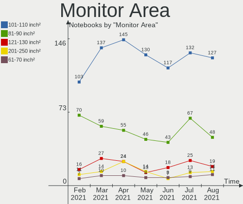

| Area in inch² | Notebooks | Percent |
|----------------|-----------|---------|
| 101-110        | 75        | 43.86%  |
| 81-90          | 41        | 23.98%  |
| 121-130        | 18        | 10.53%  |
| 201-250        | 8         | 4.68%   |
| 61-70          | 6         | 3.51%   |
| 301-350        | 5         | 2.92%   |
| 151-200        | 4         | 2.34%   |
| More than 1000 | 2         | 1.17%   |
| 71-80          | 2         | 1.17%   |
| 51-60          | 2         | 1.17%   |
| Unknown        | 2         | 1.17%   |
| 351-500        | 1         | 0.58%   |
| 41-50          | 1         | 0.58%   |
| 251-300        | 1         | 0.58%   |
| 141-150        | 1         | 0.58%   |
| 131-140        | 1         | 0.58%   |
| 501-1000       | 1         | 0.58%   |

Pixel Density
-------------

Pixels per inch

| Density       | Notebooks | Percent |
|---------------|-----------|---------|
| 121-160       | 66        | 39.29%  |
| 101-120       | 66        | 39.29%  |
| 51-100        | 28        | 16.67%  |
| 161-240       | 3         | 1.79%   |
| 1-50          | 2         | 1.19%   |
| Unknown       | 2         | 1.19%   |
| More than 240 | 1         | 0.6%    |

Multiple Monitors
-----------------

Total monitors connected

| Total | Notebooks | Percent |
|-------|-----------|---------|
| 1     | 135       | 84.91%  |
| 2     | 18        | 11.32%  |
| 3     | 3         | 1.89%   |
| 0     | 3         | 1.89%   |

Net Controller Vendor
---------------------

Controller vendors

| Vendor                         | Notebooks | Percent |
|--------------------------------|-----------|---------|
| Realtek Semiconductor          | 97        | 37.02%  |
| Intel                          | 76        | 29.01%  |
| Qualcomm Atheros               | 44        | 16.79%  |
| Broadcom Inc. and subsidiaries | 18        | 6.87%   |
| Marvell Technology Group       | 5         | 1.91%   |
| Ralink                         | 4         | 1.53%   |
| JMicron Technology             | 3         | 1.15%   |
| Ralink Technology              | 2         | 0.76%   |
| Nvidia                         | 2         | 0.76%   |
| Fibocom                        | 2         | 0.76%   |
| Broadcom Limited               | 2         | 0.76%   |
| TP-Link                        | 1         | 0.38%   |
| Samsung Electronics            | 1         | 0.38%   |
| Motorola PCS                   | 1         | 0.38%   |
| Lenovo                         | 1         | 0.38%   |
| Huawei Technologies            | 1         | 0.38%   |
| D-Link                         | 1         | 0.38%   |
| ASUSTek Computer               | 1         | 0.38%   |

Net Controller Model
--------------------

Controller models

| Model                                                                        | Notebooks | Percent |
|------------------------------------------------------------------------------|-----------|---------|
| Realtek RTL8111/8168/8411 PCI Express Gigabit Ethernet Controller            | 63        | 20.45%  |
| Realtek RTL810xE PCI Express Fast Ethernet controller                        | 22        | 7.14%   |
| Qualcomm Atheros QCA9377 802.11ac Wireless Network Adapter                   | 10        | 3.25%   |
| Qualcomm Atheros QCA9565 / AR9565 Wireless Network Adapter                   | 8         | 2.6%    |
| Intel Wireless 7260                                                          | 7         | 2.27%   |
| Intel Wireless 3165                                                          | 7         | 2.27%   |
| Intel Wi-Fi 6 AX200                                                          | 7         | 2.27%   |
| Intel 82579LM Gigabit Network Connection (Lewisville)                        | 7         | 2.27%   |
| Realtek RTL8822CE 802.11ac PCIe Wireless Network Adapter                     | 6         | 1.95%   |
| Realtek RTL8821CE 802.11ac PCIe Wireless Network Adapter                     | 6         | 1.95%   |
| Qualcomm Atheros AR9485 Wireless Network Adapter                             | 6         | 1.95%   |
| Intel Centrino Advanced-N 6205 [Taylor Peak]                                 | 6         | 1.95%   |
| Broadcom Inc. and subsidiaries BCM43142 802.11b/g/n                          | 6         | 1.95%   |
| Intel Wireless 8265 / 8275                                                   | 5         | 1.62%   |
| Realtek RTL-8100/8101L/8139 PCI Fast Ethernet Adapter                        | 4         | 1.3%    |
| Qualcomm Atheros AR928X Wireless Network Adapter (PCI-Express)               | 4         | 1.3%    |
| Intel Wireless 7265                                                          | 4         | 1.3%    |
| Intel PRO/Wireless 3945ABG [Golan] Network Connection                        | 4         | 1.3%    |
| Intel Comet Lake PCH-LP CNVi WiFi                                            | 4         | 1.3%    |
| Broadcom Inc. and subsidiaries BCM4313 802.11bgn Wireless Network Adapter    | 4         | 1.3%    |
| Realtek RTL8822BE 802.11a/b/g/n/ac WiFi adapter                              | 3         | 0.97%   |
| Qualcomm Atheros AR9287 Wireless Network Adapter (PCI-Express)               | 3         | 0.97%   |
| Qualcomm Atheros AR9285 Wireless Network Adapter (PCI-Express)               | 3         | 0.97%   |
| JMicron JMC250 PCI Express Gigabit Ethernet Controller                       | 3         | 0.97%   |
| Intel Wireless-AC 9560 [Jefferson Peak]                                      | 3         | 0.97%   |
| Intel Wireless 8260                                                          | 3         | 0.97%   |
| Intel WiFi Link 5100                                                         | 3         | 0.97%   |
| Intel Ethernet Connection I218-LM                                            | 3         | 0.97%   |
| Intel Ethernet Connection (4) I219-V                                         | 3         | 0.97%   |
| Intel Centrino Wireless-N 2230                                               | 3         | 0.97%   |
| Realtek RTL8723DE Wireless Network Adapter                                   | 2         | 0.65%   |
| Realtek RTL8191SEvB Wireless LAN Controller                                  | 2         | 0.65%   |
| Realtek RTL8188CE 802.11b/g/n WiFi Adapter                                   | 2         | 0.65%   |
| Ralink MT7601U Wireless Adapter                                              | 2         | 0.65%   |
| Qualcomm Atheros QCA6174 802.11ac Wireless Network Adapter                   | 2         | 0.65%   |
| Qualcomm Atheros AR8132 Fast Ethernet                                        | 2         | 0.65%   |
| Qualcomm Atheros AR242x / AR542x Wireless Network Adapter (PCI-Express)      | 2         | 0.65%   |
| Nvidia MCP79 Ethernet                                                        | 2         | 0.65%   |
| Intel Wireless 3160                                                          | 2         | 0.65%   |
| Intel Ethernet Connection I219-LM                                            | 2         | 0.65%   |
| Intel Ethernet Connection (3) I218-LM                                        | 2         | 0.65%   |
| Intel Dual Band Wireless-AC 3168NGW [Stone Peak]                             | 2         | 0.65%   |
| Intel Comet Lake PCH CNVi WiFi                                               | 2         | 0.65%   |
| Intel Centrino Wireless-N 1030 [Rainbow Peak]                                | 2         | 0.65%   |
| Intel Cannon Point-LP CNVi [Wireless-AC]                                     | 2         | 0.65%   |
| Broadcom Inc. and subsidiaries NetLink BCM57785 Gigabit Ethernet PCIe        | 2         | 0.65%   |
| Broadcom Inc. and subsidiaries NetLink BCM57780 Gigabit Ethernet PCIe        | 2         | 0.65%   |
| Broadcom Inc. and subsidiaries BCM4322 802.11a/b/g/n Wireless LAN Controller | 2         | 0.65%   |
| TP-Link USB 10/100 LAN                                                       | 1         | 0.32%   |
| Samsung Galaxy series, misc. (tethering mode)                                | 1         | 0.32%   |
| Realtek RTL8821AE 802.11ac PCIe Wireless Network Adapter                     | 1         | 0.32%   |
| Realtek RTL8811AU 802.11a/b/g/n/ac WLAN Adapter                              | 1         | 0.32%   |
| Realtek RTL8723BE PCIe Wireless Network Adapter                              | 1         | 0.32%   |
| Realtek RTL8188EUS 802.11n Wireless Network Adapter                          | 1         | 0.32%   |
| Realtek RTL8187B Wireless Adapter                                            | 1         | 0.32%   |
| Realtek 802.11ac NIC                                                         | 1         | 0.32%   |
| Ralink RT5390R 802.11bgn PCIe Wireless Network Adapter                       | 1         | 0.32%   |
| Ralink RT5390 Wireless 802.11n 1T/1R PCIe                                    | 1         | 0.32%   |
| Ralink RT3290 Wireless 802.11n 1T/1R PCIe                                    | 1         | 0.32%   |
| Ralink RT2790 Wireless 802.11n 1T/2R PCIe                                    | 1         | 0.32%   |

Wireless Vendor
---------------

Wireless vendors

| Vendor                         | Notebooks | Percent |
|--------------------------------|-----------|---------|
| Intel                          | 74        | 45.4%   |
| Qualcomm Atheros               | 40        | 24.54%  |
| Realtek Semiconductor          | 25        | 15.34%  |
| Broadcom Inc. and subsidiaries | 12        | 7.36%   |
| Ralink                         | 4         | 2.45%   |
| Ralink Technology              | 2         | 1.23%   |
| FIBOCOM                        | 2         | 1.23%   |
| Marvell Technology Group       | 1         | 0.61%   |
| D-Link                         | 1         | 0.61%   |
| Broadcom Limited               | 1         | 0.61%   |
| ASUSTek Computer               | 1         | 0.61%   |

Wireless Model
--------------

Wireless models

| Model                                                                         | Notebooks | Percent |
|-------------------------------------------------------------------------------|-----------|---------|
| Qualcomm Atheros QCA9377 802.11ac Wireless Network Adapter                    | 10        | 5.99%   |
| Qualcomm Atheros QCA9565 / AR9565 Wireless Network Adapter                    | 8         | 4.79%   |
| Intel Wireless 7260                                                           | 7         | 4.19%   |
| Intel Wireless 3165                                                           | 7         | 4.19%   |
| Intel Wi-Fi 6 AX200                                                           | 7         | 4.19%   |
| Realtek RTL8822CE 802.11ac PCIe Wireless Network Adapter                      | 6         | 3.59%   |
| Realtek RTL8821CE 802.11ac PCIe Wireless Network Adapter                      | 6         | 3.59%   |
| Qualcomm Atheros AR9485 Wireless Network Adapter                              | 6         | 3.59%   |
| Intel Centrino Advanced-N 6205 [Taylor Peak]                                  | 6         | 3.59%   |
| Broadcom Inc. and subsidiaries BCM43142 802.11b/g/n                           | 6         | 3.59%   |
| Intel Wireless 8265 / 8275                                                    | 5         | 2.99%   |
| Qualcomm Atheros AR928X Wireless Network Adapter (PCI-Express)                | 4         | 2.4%    |
| Intel Wireless 7265                                                           | 4         | 2.4%    |
| Intel PRO/Wireless 3945ABG [Golan] Network Connection                         | 4         | 2.4%    |
| Intel Comet Lake PCH-LP CNVi WiFi                                             | 4         | 2.4%    |
| Broadcom Inc. and subsidiaries BCM4313 802.11bgn Wireless Network Adapter     | 4         | 2.4%    |
| Realtek RTL8822BE 802.11a/b/g/n/ac WiFi adapter                               | 3         | 1.8%    |
| Qualcomm Atheros AR9287 Wireless Network Adapter (PCI-Express)                | 3         | 1.8%    |
| Qualcomm Atheros AR9285 Wireless Network Adapter (PCI-Express)                | 3         | 1.8%    |
| Intel Wireless-AC 9560 [Jefferson Peak]                                       | 3         | 1.8%    |
| Intel Wireless 8260                                                           | 3         | 1.8%    |
| Intel WiFi Link 5100                                                          | 3         | 1.8%    |
| Intel Centrino Wireless-N 2230                                                | 3         | 1.8%    |
| Realtek RTL8723DE Wireless Network Adapter                                    | 2         | 1.2%    |
| Realtek RTL8191SEvB Wireless LAN Controller                                   | 2         | 1.2%    |
| Realtek RTL8188CE 802.11b/g/n WiFi Adapter                                    | 2         | 1.2%    |
| Ralink MT7601U Wireless Adapter                                               | 2         | 1.2%    |
| Qualcomm Atheros QCA6174 802.11ac Wireless Network Adapter                    | 2         | 1.2%    |
| Qualcomm Atheros AR242x / AR542x Wireless Network Adapter (PCI-Express)       | 2         | 1.2%    |
| Intel Wireless 3160                                                           | 2         | 1.2%    |
| Intel Dual Band Wireless-AC 3168NGW [Stone Peak]                              | 2         | 1.2%    |
| Intel Comet Lake PCH CNVi WiFi                                                | 2         | 1.2%    |
| Intel Centrino Wireless-N 1030 [Rainbow Peak]                                 | 2         | 1.2%    |
| Intel Cannon Point-LP CNVi [Wireless-AC]                                      | 2         | 1.2%    |
| Broadcom Inc. and subsidiaries BCM4322 802.11a/b/g/n Wireless LAN Controller  | 2         | 1.2%    |
| Realtek RTL8821AE 802.11ac PCIe Wireless Network Adapter                      | 1         | 0.6%    |
| Realtek RTL8811AU 802.11a/b/g/n/ac WLAN Adapter                               | 1         | 0.6%    |
| Realtek RTL8723BE PCIe Wireless Network Adapter                               | 1         | 0.6%    |
| Realtek RTL8188EUS 802.11n Wireless Network Adapter                           | 1         | 0.6%    |
| Realtek RTL8187B Wireless Adapter                                             | 1         | 0.6%    |
| Realtek 802.11ac NIC                                                          | 1         | 0.6%    |
| Ralink RT5390R 802.11bgn PCIe Wireless Network Adapter                        | 1         | 0.6%    |
| Ralink RT5390 Wireless 802.11n 1T/1R PCIe                                     | 1         | 0.6%    |
| Ralink RT3290 Wireless 802.11n 1T/1R PCIe                                     | 1         | 0.6%    |
| Ralink RT2790 Wireless 802.11n 1T/2R PCIe                                     | 1         | 0.6%    |
| Qualcomm Atheros AR9462 Wireless Network Adapter                              | 1         | 0.6%    |
| Qualcomm Atheros AR2413/AR2414 Wireless Network Adapter [AR5005G(S) 802.11bg] | 1         | 0.6%    |
| Marvell Group 88W8362e [TopDog] 802.11a/b/g/n Wireless                        | 1         | 0.6%    |
| Intel Wireless-AC 9260                                                        | 1         | 0.6%    |
| Intel PRO/Wireless 5100 AGN [Shiloh] Network Connection                       | 1         | 0.6%    |
| Intel PRO/Wireless 4965 AG or AGN [Kedron] Network Connection                 | 1         | 0.6%    |
| Intel Dual Band Wireless-AC 3165 Plus Bluetooth                               | 1         | 0.6%    |
| Intel Centrino Wireless-N 130                                                 | 1         | 0.6%    |
| Intel Centrino Wireless-N + WiMAX 6150                                        | 1         | 0.6%    |
| Intel Centrino Ultimate-N 6300                                                | 1         | 0.6%    |
| Intel Centrino Advanced-N 6235                                                | 1         | 0.6%    |
| Intel Centrino Advanced-N 6200                                                | 1         | 0.6%    |
| Intel Centrino Advanced-N + WiMAX 6250 [Kilmer Peak]                          | 1         | 0.6%    |
| FIBOCOM L831-EAU-00                                                           | 1         | 0.6%    |
| Fibocom L830-EB-00 LTE WWAN Modem                                             | 1         | 0.6%    |

Ethernet Vendor
---------------

Ethernet vendors

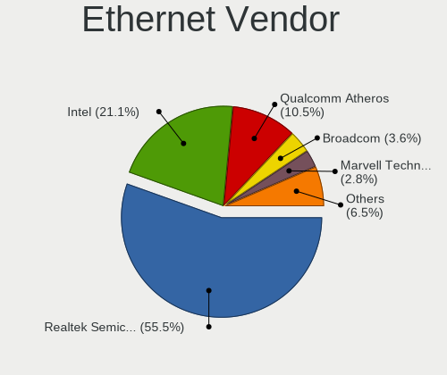

| Vendor                         | Notebooks | Percent |
|--------------------------------|-----------|---------|
| Realtek Semiconductor          | 89        | 63.57%  |
| Intel                          | 23        | 16.43%  |
| Qualcomm Atheros               | 7         | 5%      |
| Broadcom Inc. and subsidiaries | 7         | 5%      |
| Marvell Technology Group       | 4         | 2.86%   |
| JMicron Technology             | 3         | 2.14%   |
| Nvidia                         | 2         | 1.43%   |
| TP-Link                        | 1         | 0.71%   |
| Samsung Electronics            | 1         | 0.71%   |
| Motorola PCS                   | 1         | 0.71%   |
| Lenovo                         | 1         | 0.71%   |
| Broadcom Limited               | 1         | 0.71%   |

Ethernet Model
--------------

Ethernet models

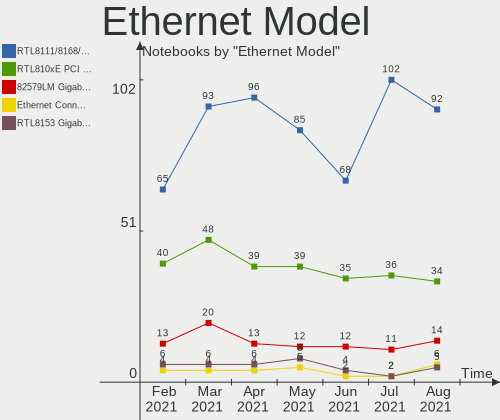

| Model                                                                          | Notebooks | Percent |
|--------------------------------------------------------------------------------|-----------|---------|
| Realtek RTL8111/8168/8411 PCI Express Gigabit Ethernet Controller              | 63        | 45%     |
| Realtek RTL810xE PCI Express Fast Ethernet controller                          | 22        | 15.71%  |
| Intel 82579LM Gigabit Network Connection (Lewisville)                          | 7         | 5%      |
| Realtek RTL-8100/8101L/8139 PCI Fast Ethernet Adapter                          | 4         | 2.86%   |
| JMicron JMC250 PCI Express Gigabit Ethernet Controller                         | 3         | 2.14%   |
| Intel Ethernet Connection I218-LM                                              | 3         | 2.14%   |
| Intel Ethernet Connection (4) I219-V                                           | 3         | 2.14%   |
| Qualcomm Atheros AR8132 Fast Ethernet                                          | 2         | 1.43%   |
| Nvidia MCP79 Ethernet                                                          | 2         | 1.43%   |
| Intel Ethernet Connection I219-LM                                              | 2         | 1.43%   |
| Intel Ethernet Connection (3) I218-LM                                          | 2         | 1.43%   |
| Broadcom Inc. and subsidiaries NetLink BCM57785 Gigabit Ethernet PCIe          | 2         | 1.43%   |
| Broadcom Inc. and subsidiaries NetLink BCM57780 Gigabit Ethernet PCIe          | 2         | 1.43%   |
| TP-Link USB 10/100 LAN                                                         | 1         | 0.71%   |
| Samsung Galaxy series, misc. (tethering mode)                                  | 1         | 0.71%   |
| Qualcomm Atheros Killer E2400 Gigabit Ethernet Controller                      | 1         | 0.71%   |
| Qualcomm Atheros AR8161 Gigabit Ethernet                                       | 1         | 0.71%   |
| Qualcomm Atheros AR8152 v2.0 Fast Ethernet                                     | 1         | 0.71%   |
| Qualcomm Atheros AR8151 v2.0 Gigabit Ethernet                                  | 1         | 0.71%   |
| Qualcomm Atheros AR8131 Gigabit Ethernet                                       | 1         | 0.71%   |
| Motorola PCS moto g(7) optimo maxx(XT1955DL)                                   | 1         | 0.71%   |
| Marvell Group Yukon Optima 88E8059 [PCIe Gigabit Ethernet Controller with AVB] | 1         | 0.71%   |
| Marvell Group 88E8055 PCI-E Gigabit Ethernet Controller                        | 1         | 0.71%   |
| Marvell Group 88E8042 PCI-E Fast Ethernet Controller                           | 1         | 0.71%   |
| Marvell Group 88E8040 PCI-E Fast Ethernet Controller                           | 1         | 0.71%   |
| Lenovo RTL8153 Gigabit Ethernet [ThinkPad OneLink Pro Dock]                    | 1         | 0.71%   |
| Intel WiMAX Connection 2400m                                                   | 1         | 0.71%   |
| Intel Ethernet Connection I217-LM                                              | 1         | 0.71%   |
| Intel Ethernet Connection (6) I219-V                                           | 1         | 0.71%   |
| Intel 82577LM Gigabit Network Connection                                       | 1         | 0.71%   |
| Intel 82573L Gigabit Ethernet Controller                                       | 1         | 0.71%   |
| Intel 82567LM Gigabit Network Connection                                       | 1         | 0.71%   |
| Broadcom Limited NetXtreme BCM5751M Gigabit Ethernet PCI Express               | 1         | 0.71%   |
| Broadcom Inc. and subsidiaries NetXtreme BCM5764M Gigabit Ethernet PCIe        | 1         | 0.71%   |
| Broadcom Inc. and subsidiaries NetXtreme BCM5761 Gigabit Ethernet PCIe         | 1         | 0.71%   |
| Broadcom Inc. and subsidiaries NetLink BCM5784M Gigabit Ethernet PCIe          | 1         | 0.71%   |

Net Controller Kind
-------------------

Ethernet, WiFi or modem

| Kind     | Notebooks | Percent |
|----------|-----------|---------|
| WiFi     | 156       | 53.24%  |
| Ethernet | 136       | 46.42%  |
| Modem    | 1         | 0.34%   |

Used Controller
---------------

Currently used network controller

| Kind     | Notebooks | Percent |
|----------|-----------|---------|
| WiFi     | 140       | 63.64%  |
| Ethernet | 80        | 36.36%  |

NICs
----

Total network controllers on board

| Total | Notebooks | Percent |
|-------|-----------|---------|
| 2     | 133       | 83.65%  |
| 1     | 22        | 13.84%  |
| 0     | 3         | 1.89%   |
| 3     | 1         | 0.63%   |

Memory Vendor
-------------

Memory module vendors

| Vendor              | Notebooks | Percent |
|---------------------|-----------|---------|
| Samsung Electronics | 29        | 30.21%  |
| SK Hynix            | 22        | 22.92%  |
| Kingston            | 17        | 17.71%  |
| Micron Technology   | 10        | 10.42%  |
| Unknown             | 6         | 6.25%   |
| Ramaxel Technology  | 3         | 3.13%   |
| Elpida              | 3         | 3.13%   |
| Corsair             | 2         | 2.08%   |
| Smart               | 1         | 1.04%   |
| Crucial             | 1         | 1.04%   |
| Apacer              | 1         | 1.04%   |
| A-DATA Technology   | 1         | 1.04%   |

Memory Model
------------

Memory module models

| Model                                                              | Notebooks | Percent |
|--------------------------------------------------------------------|-----------|---------|
| Samsung RAM M471B5173DB0-YK0 4096MB SODIMM DDR3 1600MT/s           | 4         | 4%      |
| SK Hynix RAM HMT351S6CFR8C-PB 4096MB SODIMM DDR3 1600MT/s          | 3         | 3%      |
| Samsung RAM M471A5244CB0-CTD 4GB SODIMM DDR4 2667MT/s              | 3         | 3%      |
| Micron RAM 4ATF51264HZ-2G6E1 4096MB SODIMM DDR4 2667MT/s           | 3         | 3%      |
| Unknown RAM Module 512MB SODIMM DDR2                               | 2         | 2%      |
| SK Hynix RAM HMA81GS6CJR8N-VK 8192MB SODIMM DDR4 2667MT/s          | 2         | 2%      |
| Samsung RAM M471B5273DH0-CH9 4096MB SODIMM DDR3 1334MT/s           | 2         | 2%      |
| Micron RAM 4ATF51264HZ-3G2J1 4GB SODIMM DDR4 3200MT/s              | 2         | 2%      |
| Kingston RAM KNWMX1-ETB 4096MB SODIMM DDR3 1600MT/s                | 2         | 2%      |
| Unknown RAM Module 2048MB SODIMM DDR3 1333MT/s                     | 1         | 1%      |
| Unknown RAM Module 2048MB SODIMM DDR2                              | 1         | 1%      |
| Unknown RAM Module 1GB SODIMM DDR2 333MT/s                         | 1         | 1%      |
| Unknown RAM Module 1024MB SODIMM DDR2 667MT/s                      | 1         | 1%      |
| Smart RAM SH564568FH8NWPHSFR 2048MB SODIMM DDR3 1334MT/s           | 1         | 1%      |
| SK Hynix RAM Module 2048MB SODIMM DDR2 667MT/s                     | 1         | 1%      |
| SK Hynix RAM HMT851S6AMR6A-PB 4096MB Chip DDR3 1600MT/s            | 1         | 1%      |
| SK Hynix RAM HMT451S6BFR8A-PB 4GB SODIMM DDR3 1600MT/s             | 1         | 1%      |
| SK Hynix RAM HMT451S6AFR8A-PB 4096MB SODIMM DDR3 1600MT/s          | 1         | 1%      |
| SK Hynix RAM HMT41GS6BFR8A-PB 8192MB SODIMM DDR3 1600MT/s          | 1         | 1%      |
| SK Hynix RAM HMT41GS6AFR8A-PB 8GB SODIMM DDR3 1600MT/s             | 1         | 1%      |
| SK Hynix RAM HMT351S6EFR8A-PB 4096MB SODIMM DDR3 1600MT/s          | 1         | 1%      |
| SK Hynix RAM HMT351S6BFR8C-H9 4GB SODIMM DDR3 1334MT/s             | 1         | 1%      |
| SK Hynix RAM HMT325S6CFR8C-PB 2048MB SODIMM DDR3 1600MT/s          | 1         | 1%      |
| SK Hynix RAM HMT325S6CFR8C-H9 2048MB SODIMM DDR3 1333MT/s          | 1         | 1%      |
| SK Hynix RAM HMAB2GS6AMR6N-XN 16384MB SODIMM DDR4 3200MT/s         | 1         | 1%      |
| SK Hynix RAM HMA851S6JJR6N-VK 4096MB SODIMM DDR4 2667MT/s          | 1         | 1%      |
| SK Hynix RAM HMA851S6CJR6N-VK 4GB Row Of Chips DDR4 2667MT/s       | 1         | 1%      |
| SK Hynix RAM HMA851S6CJR6N-VK 4096MB SODIMM DDR4 2667MT/s          | 1         | 1%      |
| SK Hynix RAM HMA851S6CJR6N-VK 4096MB Row Of Chips DDR4 1866MT/s    | 1         | 1%      |
| SK Hynix RAM HMA82GS6DJR8N-XN 16384MB SODIMM DDR4 3200MT/s         | 1         | 1%      |
| SK Hynix RAM HMA81GS6DJR8N-VK 8192MB SODIMM DDR4 2667MT/s          | 1         | 1%      |
| SK Hynix RAM HMA81GS6AFR8N-UH 8192MB SODIMM DDR4 2667MT/s          | 1         | 1%      |
| SK Hynix RAM HMA41GS6AFR8N-TF 8192MB SODIMM DDR4 2133MT/s          | 1         | 1%      |
| Samsung RAM Module 8192MB SODIMM DDR4 3200MT/s                     | 1         | 1%      |
| Samsung RAM Module 8192MB SODIMM DDR4 2133MT/s                     | 1         | 1%      |
| Samsung RAM Module 4096MB SODIMM DDR3 1600MT/s                     | 1         | 1%      |
| Samsung RAM Module 1024MB SODIMM DDR2 533MT/s                      | 1         | 1%      |
| Samsung RAM M471B5273DH0-CK0 4096MB SODIMM DDR3 1600MT/s           | 1         | 1%      |
| Samsung RAM M471B5173QH0-YK0 4GB SODIMM DDR3 1600MT/s              | 1         | 1%      |
| Samsung RAM M471B5173EB0-YK0 4096MB SODIMM DDR3 1600MT/s           | 1         | 1%      |
| Samsung RAM M471B5173CB0-YK0 4096MB SODIMM DDR3 1600MT/s           | 1         | 1%      |
| Samsung RAM M471B1G73EB0-YK0 8192MB SODIMM DDR3 1600MT/s           | 1         | 1%      |
| Samsung RAM M471B1G73DB0-YK0 8GB SODIMM DDR3 1600MT/s              | 1         | 1%      |
| Samsung RAM M471B1G73BH0-CK0 8192MB SODIMM DDR3 1600MT/s           | 1         | 1%      |
| Samsung RAM M471A5244CB0-CRC 4GB SODIMM DDR4 2667MT/s              | 1         | 1%      |
| Samsung RAM M471A4G43MB1-CTD 32GB SODIMM DDR4 2667MT/s             | 1         | 1%      |
| Samsung RAM M471A2K43DB1-CWE 16384MB SODIMM DDR4 3200MT/s          | 1         | 1%      |
| Samsung RAM M471A2K43CB1-CTD 16GB SODIMM DDR4 2667MT/s             | 1         | 1%      |
| Samsung RAM M471A1K43DB1-CWE 8192MB SODIMM DDR4 3200MT/s           | 1         | 1%      |
| Samsung RAM M471A1K43CB1-CTD 8192MB SODIMM DDR4 2667MT/s           | 1         | 1%      |
| Samsung RAM M471A1K43BB1-CRC 8192MB SODIMM DDR4 2667MT/s           | 1         | 1%      |
| Samsung RAM M471A1G44AB0-CWE 8GB SODIMM DDR4 3200MT/s              | 1         | 1%      |
| Samsung RAM K4EBE304ED-EGCG 8192MB Row Of Chips LPDDR3 2133MT/s    | 1         | 1%      |
| Samsung RAM H9CCNNNCLTMLAR-NUD 8192MB Row Of Chips LPDDR3 1867MT/s | 1         | 1%      |
| Ramaxel RAM RMT3150ED58E8W1600 2048MB SODIMM DDR3 1600MT/s         | 1         | 1%      |
| Ramaxel RAM RMSA3260NA78HAF-2400 8192MB SODIMM DDR4 2400MT/s       | 1         | 1%      |
| Ramaxel RAM RMSA3260MD78HAF-2666 8192MB SODIMM DDR4 2667MT/s       | 1         | 1%      |
| Micron RAM 8KTF51264HZ-1G6E1 4096MB SODIMM DDR3 1600MT/s           | 1         | 1%      |
| Micron RAM 8ATF1G64HZ-3G2J1 8GB SODIMM DDR4 3200MT/s               | 1         | 1%      |
| Micron RAM 8ATF1G64HZ-2G6E1 8GB SODIMM DDR4 2667MT/s               | 1         | 1%      |

Memory Kind
-----------

Memory module kinds

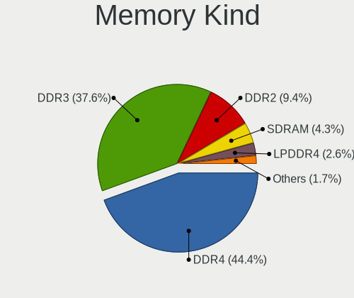

| Kind   | Notebooks | Percent |
|--------|-----------|---------|
| DDR4   | 38        | 46.34%  |
| DDR3   | 33        | 40.24%  |
| DDR2   | 8         | 9.76%   |
| LPDDR3 | 2         | 2.44%   |
| SDRAM  | 1         | 1.22%   |

Memory Form Factor
------------------

Physical design of the memory module

| Name         | Notebooks | Percent |
|--------------|-----------|---------|
| SODIMM       | 77        | 93.9%   |
| Row Of Chips | 4         | 4.88%   |
| Chip         | 1         | 1.22%   |

Memory Size
-----------

Memory module size

| Size  | Notebooks | Percent |
|-------|-----------|---------|
| 4096  | 34        | 37.36%  |
| 8192  | 33        | 36.26%  |
| 2048  | 10        | 10.99%  |
| 16384 | 8         | 8.79%   |
| 1024  | 3         | 3.3%    |
| 512   | 2         | 2.2%    |
| 32768 | 1         | 1.1%    |

Memory Speed
------------

Memory module speed

| Speed   | Notebooks | Percent |
|---------|-----------|---------|
| 1600    | 27        | 31.76%  |
| 2667    | 23        | 27.06%  |
| 3200    | 8         | 9.41%   |
| 2133    | 6         | 7.06%   |
| 1334    | 4         | 4.71%   |
| 1333    | 4         | 4.71%   |
| 667     | 3         | 3.53%   |
| Unknown | 3         | 3.53%   |
| 2400    | 2         | 2.35%   |
| 1867    | 1         | 1.18%   |
| 1866    | 1         | 1.18%   |
| 1639    | 1         | 1.18%   |
| 533     | 1         | 1.18%   |
| 333     | 1         | 1.18%   |

Sound Vendor
------------

Sound card vendors

| Vendor                 | Notebooks | Percent |
|------------------------|-----------|---------|
| Intel                  | 128       | 69.95%  |
| AMD                    | 31        | 16.94%  |
| Nvidia                 | 20        | 10.93%  |
| Logitech               | 1         | 0.55%   |
| Lenovo                 | 1         | 0.55%   |
| Kingston Technology    | 1         | 0.55%   |
| Generalplus Technology | 1         | 0.55%   |

Sound Model
-----------

Sound card models

| Model                                                                                             | Notebooks | Percent |
|---------------------------------------------------------------------------------------------------|-----------|---------|
| Intel 7 Series/C216 Chipset Family High Definition Audio Controller                               | 20        | 8.89%   |
| Intel Sunrise Point-LP HD Audio                                                                   | 16        | 7.11%   |
| AMD Family 17h (Models 10h-1fh) HD Audio Controller                                               | 13        | 5.78%   |
| Intel 82801I (ICH9 Family) HD Audio Controller                                                    | 9         | 4%      |
| Intel Haswell-ULT HD Audio Controller                                                             | 8         | 3.56%   |
| Intel Cannon Point-LP High Definition Audio Controller                                            | 8         | 3.56%   |
| Intel Cannon Lake PCH cAVS                                                                        | 8         | 3.56%   |
| Intel 8 Series HD Audio Controller                                                                | 8         | 3.56%   |
| Intel 5 Series/3400 Series Chipset High Definition Audio                                          | 8         | 3.56%   |
| AMD FCH Azalia Controller                                                                         | 8         | 3.56%   |
| Intel Wildcat Point-LP High Definition Audio Controller                                           | 7         | 3.11%   |
| Intel Broadwell-U Audio Controller                                                                | 7         | 3.11%   |
| Intel 6 Series/C200 Series Chipset Family High Definition Audio Controller                        | 7         | 3.11%   |
| AMD Raven/Raven2/Fenghuang HDMI/DP Audio Controller                                               | 7         | 3.11%   |
| Intel NM10/ICH7 Family High Definition Audio Controller                                           | 5         | 2.22%   |
| Intel 82801H (ICH8 Family) HD Audio Controller                                                    | 5         | 2.22%   |
| AMD Kabini HDMI/DP Audio                                                                          | 5         | 2.22%   |
| Intel Comet Lake PCH-LP cAVS                                                                      | 4         | 1.78%   |
| Intel Comet Lake PCH cAVS                                                                         | 4         | 1.78%   |
| Intel Atom/Celeron/Pentium Processor x5-E8000/J3xxx/N3xxx Series High Definition Audio Controller | 4         | 1.78%   |
| Intel Atom Processor Z36xxx/Z37xxx Series High Definition Audio Controller                        | 4         | 1.78%   |
| AMD Renoir Radeon High Definition Audio Controller                                                | 4         | 1.78%   |
| Nvidia GF108 High Definition Audio Controller                                                     | 3         | 1.33%   |
| Intel 8 Series/C220 Series Chipset High Definition Audio Controller                               | 3         | 1.33%   |
| Intel 100 Series/C230 Series Chipset Family HD Audio Controller                                   | 3         | 1.33%   |
| AMD Trinity HDMI Audio Controller                                                                 | 3         | 1.33%   |
| AMD High Definition Audio Controller                                                              | 3         | 1.33%   |
| AMD Family 15h (Models 60h-6fh) Audio Controller                                                  | 3         | 1.33%   |
| Nvidia TU107 GeForce GTX 1650 High Definition Audio Controller                                    | 2         | 0.89%   |
| Nvidia TU106 High Definition Audio Controller                                                     | 2         | 0.89%   |
| Nvidia MCP79 High Definition Audio                                                                | 2         | 0.89%   |
| Nvidia GP107GL High Definition Audio Controller                                                   | 2         | 0.89%   |
| Nvidia GP106 High Definition Audio Controller                                                     | 2         | 0.89%   |
| Nvidia GK107 HDMI Audio Controller                                                                | 2         | 0.89%   |
| Intel Xeon E3-1200 v3/4th Gen Core Processor HD Audio Controller                                  | 2         | 0.89%   |
| Intel Smart Sound Technology Audio Controller                                                     | 2         | 0.89%   |
| AMD SBx00 Azalia (Intel HDA)                                                                      | 2         | 0.89%   |
| AMD Cedar HDMI Audio [Radeon HD 5400/6300/7300 Series]                                            | 2         | 0.89%   |
| Nvidia TU116 High Definition Audio Controller                                                     | 1         | 0.44%   |
| Nvidia TU104 HD Audio Controller                                                                  | 1         | 0.44%   |
| Nvidia stereo controller                                                                          | 1         | 0.44%   |
| Nvidia High Definition Audio Controller                                                           | 1         | 0.44%   |
| Nvidia GK106 HDMI Audio Controller                                                                | 1         | 0.44%   |
| Nvidia GF114 HDMI Audio Controller                                                                | 1         | 0.44%   |
| Logitech Speaker Lapdesk N700                                                                     | 1         | 0.44%   |
| Lenovo ThinkPad OneLink Pro Dock Audio                                                            | 1         | 0.44%   |
| Kingston Technology HyperX 7.1 Audio                                                              | 1         | 0.44%   |
| Intel CM238 HD Audio Controller                                                                   | 1         | 0.44%   |
| Intel Celeron/Pentium Silver Processor High Definition Audio                                      | 1         | 0.44%   |
| Intel Celeron N3350/Pentium N4200/Atom E3900 Series Audio Cluster                                 | 1         | 0.44%   |
| Generalplus Technology USB Audio Device                                                           | 1         | 0.44%   |
| AMD RV710/730 HDMI Audio [Radeon HD 4000 series]                                                  | 1         | 0.44%   |
| AMD RV630 HDMI Audio [Radeon HD 2600 PRO/XT / HD 3610]                                            | 1         | 0.44%   |
| AMD RV610 HDMI Audio [Radeon HD 2350 PRO / 2400 PRO/XT / HD 3410]                                 | 1         | 0.44%   |
| AMD Redwood HDMI Audio [Radeon HD 5000 Series]                                                    | 1         | 0.44%   |
| AMD IXP SB4x0 High Definition Audio Controller                                                    | 1         | 0.44%   |

Camera Vendor
-------------

Camera device vendors

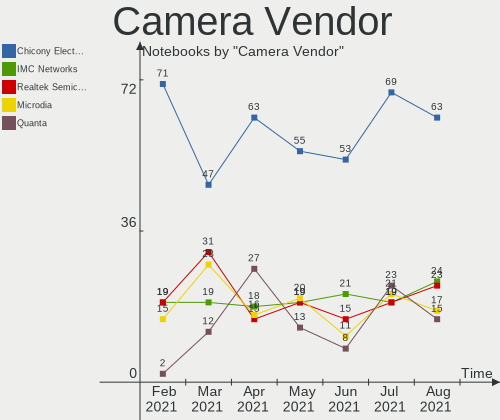

| Vendor                                 | Notebooks | Percent |
|----------------------------------------|-----------|---------|
| Chicony Electronics                    | 34        | 24.82%  |
| IMC Networks                           | 14        | 10.22%  |
| Sunplus Innovation Technology          | 11        | 8.03%   |
| Realtek Semiconductor                  | 11        | 8.03%   |
| Cheng Uei Precision Industry (Foxlink) | 9         | 6.57%   |
| Acer                                   | 9         | 6.57%   |
| Microdia                               | 8         | 5.84%   |
| Suyin                                  | 7         | 5.11%   |
| Lite-On Technology                     | 6         | 4.38%   |
| Silicon Motion                         | 5         | 3.65%   |
| Quanta                                 | 5         | 3.65%   |
| Syntek                                 | 4         | 2.92%   |
| Ricoh                                  | 2         | 1.46%   |
| Logitech                               | 2         | 1.46%   |
| Z-Star Microelectronics                | 1         | 0.73%   |
| Samsung Electronics                    | 1         | 0.73%   |
| Primax Electronics                     | 1         | 0.73%   |
| Microsoft                              | 1         | 0.73%   |
| Importek                               | 1         | 0.73%   |
| Huawei Technologies                    | 1         | 0.73%   |
| eMPIA Technology                       | 1         | 0.73%   |
| Elecom                                 | 1         | 0.73%   |
| Apple                                  | 1         | 0.73%   |
| Alcor Micro                            | 1         | 0.73%   |

Camera Model
------------

Camera device models

| Model                                                                      | Notebooks | Percent |
|----------------------------------------------------------------------------|-----------|---------|
| Chicony Integrated Camera                                                  | 6         | 4.38%   |
| IMC Networks Integrated Camera                                             | 5         | 3.65%   |
| Lite-On Integrated Camera                                                  | 4         | 2.92%   |
| Sunplus HD WebCam                                                          | 3         | 2.19%   |
| Sunplus Asus Webcam                                                        | 3         | 2.19%   |
| Microdia Integrated_Webcam_HD                                              | 3         | 2.19%   |
| IMC Networks USB2.0 HD UVC WebCam                                          | 3         | 2.19%   |
| Chicony USB 2.0 Camera                                                     | 3         | 2.19%   |
| Chicony HP Webcam                                                          | 3         | 2.19%   |
| Acer BisonCam, NB Pro                                                      | 3         | 2.19%   |
| Syntek Integrated Camera                                                   | 2         | 1.46%   |
| Suyin Integrated_Webcam_HD                                                 | 2         | 1.46%   |
| Suyin Acer/HP Integrated Webcam [CN0314]                                   | 2         | 1.46%   |
| Sunplus Laptop_Integrated_Webcam_HD                                        | 2         | 1.46%   |
| Sunplus Integrated_Webcam_HD                                               | 2         | 1.46%   |
| Silicon Motion Web Camera                                                  | 2         | 1.46%   |
| Realtek Integrated_Webcam_HD                                               | 2         | 1.46%   |
| Quanta HP TrueVision HD Camera                                             | 2         | 1.46%   |
| Quanta HD User Facing                                                      | 2         | 1.46%   |
| Logitech Webcam C270                                                       | 2         | 1.46%   |
| Chicony USB2.0 VGA UVC WebCam                                              | 2         | 1.46%   |
| Chicony HP Truevision HD                                                   | 2         | 1.46%   |
| Chicony HD Webcam                                                          | 2         | 1.46%   |
| Chicony 1.3M Webcam                                                        | 2         | 1.46%   |
| Cheng Uei Precision Industry (Foxlink) Webcam                              | 2         | 1.46%   |
| Cheng Uei Precision Industry (Foxlink) HP Wide Vision HD Integrated Webcam | 2         | 1.46%   |
| Cheng Uei Precision Industry (Foxlink) HP Webcam                           | 2         | 1.46%   |
| Z-Star Vimicro USB Camera (Altair)                                         | 1         | 0.73%   |
| Syntek USB 2.0 UVC PC Camera                                               | 1         | 0.73%   |
| Syntek Lenovo EasyCamera                                                   | 1         | 0.73%   |
| Suyin HP webcam [dv6-1190en]                                               | 1         | 0.73%   |
| Suyin HP TrueVision HD Integrated Webcam                                   | 1         | 0.73%   |
| Suyin HP Truevision HD                                                     | 1         | 0.73%   |
| Sunplus Integrated Webcam                                                  | 1         | 0.73%   |
| Silicon Motion WebCam SCB-1100N                                            | 1         | 0.73%   |
| Silicon Motion WebCam SCB-0370N                                            | 1         | 0.73%   |
| Silicon Motion WebCam SC-10HDD12636N                                       | 1         | 0.73%   |
| Samsung Galaxy A5 (MTP)                                                    | 1         | 0.73%   |
| Ricoh Sony Vaio Integrated Webcam                                          | 1         | 0.73%   |
| Ricoh Integrated Webcam                                                    | 1         | 0.73%   |
| Realtek USB2.0-Camera                                                      | 1         | 0.73%   |
| Realtek USB2.0 HD UVC WebCam                                               | 1         | 0.73%   |
| Realtek USB Camera                                                         | 1         | 0.73%   |
| Realtek Integrated Webcam HD                                               | 1         | 0.73%   |
| Realtek Integrated Webcam                                                  | 1         | 0.73%   |
| Realtek Integrated Camera                                                  | 1         | 0.73%   |
| Realtek HD Webcam - Realtek                                                | 1         | 0.73%   |
| Realtek HD WebCam                                                          | 1         | 0.73%   |
| Realtek EasyCamera                                                         | 1         | 0.73%   |
| Quanta HP Wide Vision HD Camera                                            | 1         | 0.73%   |
| Primax HP HD Webcam [Fixed]                                                | 1         | 0.73%   |
| Microsoft LifeCam HD-3000                                                  | 1         | 0.73%   |
| Microdia Webcam Vitade AF                                                  | 1         | 0.73%   |
| Microdia Sonix Integrated Webcam                                           | 1         | 0.73%   |
| Microdia Laptop_Integrated_Webcam_E4HD                                     | 1         | 0.73%   |
| Microdia Integrated_Webcam_1.3M                                            | 1         | 0.73%   |
| Microdia HP Integrated Webcam                                              | 1         | 0.73%   |
| Lite-On HP Wide Vision HD Camera                                           | 1         | 0.73%   |
| Lite-On HP HD Camera                                                       | 1         | 0.73%   |
| Importek TOSHIBA Web Camera - HD                                           | 1         | 0.73%   |

Fingerprint Vendor
------------------

Fingerprint sensor vendors

| Vendor                     | Notebooks | Percent |
|----------------------------|-----------|---------|
| Validity Sensors           | 14        | 60.87%  |
| Synaptics                  | 5         | 21.74%  |
| Shenzhen Goodix Technology | 2         | 8.7%    |
| LighTuning Technology      | 1         | 4.35%   |
| Elan Microelectronics      | 1         | 4.35%   |

Fingerprint Model
-----------------

Fingerprint sensor models

| Model                                             | Notebooks | Percent |
|---------------------------------------------------|-----------|---------|
| Validity Sensors VFS491                           | 3         | 13.04%  |
| Validity Sensors VFS 5011 fingerprint sensor      | 3         | 13.04%  |
| Validity Sensors VFS5011 Fingerprint Reader       | 2         | 8.7%    |
| Validity Sensors VFS495 Fingerprint Reader        | 2         | 8.7%    |
| Validity Sensors Synaptics WBDI                   | 2         | 8.7%    |
| Validity Sensors Fingerprint scanner              | 2         | 8.7%    |
| Synaptics Prometheus MIS Touch Fingerprint Reader | 2         | 8.7%    |
| Unknown                                           | 2         | 8.7%    |
| Synaptics  WBDI                                   | 1         | 4.35%   |
| Shenzhen Goodix  Fingerprint Device               | 1         | 4.35%   |
| Shenzhen Goodix Fingerprint Reader                | 1         | 4.35%   |
| LighTuning ES603 Swipe Fingerprint Sensor         | 1         | 4.35%   |
| Elan ELAN:Fingerprint                             | 1         | 4.35%   |

Chipcard Vendor
---------------

Chipcard module vendors

| Vendor      | Notebooks | Percent |
|-------------|-----------|---------|
| Alcor Micro | 7         | 63.64%  |
| Upek        | 2         | 18.18%  |
| Broadcom    | 2         | 18.18%  |

Chipcard Model
--------------

Chipcard module models

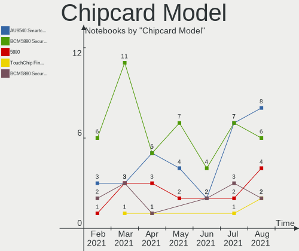

| Model                                                      | Notebooks | Percent |
|------------------------------------------------------------|-----------|---------|
| Alcor Micro AU9540 Smartcard Reader                        | 7         | 63.64%  |
| Upek TouchChip Fingerprint Coprocessor (WBF advanced mode) | 2         | 18.18%  |
| Broadcom BCM5880 Secure Applications Processor             | 2         | 18.18%  |

Printer Vendor
--------------

Printer device vendors

| Vendor              | Notebooks | Percent |
|---------------------|-----------|---------|
| Samsung Electronics | 1         | 50%     |
| Canon               | 1         | 50%     |

Printer Model
-------------

Printer device models

| Model                     | Notebooks | Percent |
|---------------------------|-----------|---------|
| Samsung M267x 287x Series | 1         | 50%     |
| Canon LBP6030/6030B/6018L | 1         | 50%     |

Scanner Vendor
--------------

Scanner device vendors

Zero info for selected period =(

Scanner Model
-------------

Scanner device models

Zero info for selected period =(

Bluetooth Vendor
----------------

Controller vendors

| Vendor                          | Notebooks | Percent |
|---------------------------------|-----------|---------|
| Intel                           | 53        | 43.09%  |
| Realtek Semiconductor           | 14        | 11.38%  |
| Qualcomm Atheros Communications | 14        | 11.38%  |
| Broadcom                        | 10        | 8.13%   |
| IMC Networks                    | 8         | 6.5%    |
| Dell                            | 4         | 3.25%   |
| Cambridge Silicon Radio         | 4         | 3.25%   |
| Toshiba                         | 3         | 2.44%   |
| Hewlett-Packard                 | 3         | 2.44%   |
| Lite-On Technology              | 2         | 1.63%   |
| Foxconn / Hon Hai               | 2         | 1.63%   |
| Realtek                         | 1         | 0.81%   |
| Ralink                          | 1         | 0.81%   |
| Primax Electronics              | 1         | 0.81%   |
| Fujitsu                         | 1         | 0.81%   |
| Chicony Electronics             | 1         | 0.81%   |
| Apple                           | 1         | 0.81%   |

Bluetooth Model
---------------

Controller models

| Model                                                       | Notebooks | Percent |
|-------------------------------------------------------------|-----------|---------|
| Intel Bluetooth wireless interface                          | 26        | 21.14%  |
| Qualcomm Atheros  Bluetooth Device                          | 12        | 9.76%   |
| Intel Bluetooth 9460/9560 Jefferson Peak (JfP)              | 7         | 5.69%   |
| Intel AX200 Bluetooth                                       | 7         | 5.69%   |
| Realtek  Bluetooth 4.2 Adapter                              | 6         | 4.88%   |
| Realtek Bluetooth Radio                                     | 5         | 4.07%   |
| Intel Centrino Bluetooth Wireless Transceiver               | 4         | 3.25%   |
| IMC Networks Bluetooth Device                               | 4         | 3.25%   |
| Cambridge Silicon Radio Bluetooth Dongle (HCI mode)         | 4         | 3.25%   |
| Realtek RTL8822BE Bluetooth 4.2 Adapter                     | 3         | 2.44%   |
| Intel Centrino Advanced-N 6230 Bluetooth adapter            | 3         | 2.44%   |
| Intel Bluetooth Device                                      | 3         | 2.44%   |
| Toshiba BCM43142A0                                          | 2         | 1.63%   |
| Intel Wireless-AC 3168 Bluetooth                            | 2         | 1.63%   |
| IMC Networks Bluetooth Radio                                | 2         | 1.63%   |
| IMC Networks Atheros AR3012 Bluetooth 4.0 Adapter           | 2         | 1.63%   |
| HP Bluetooth 2.0 Interface [Broadcom BCM2045]               | 2         | 1.63%   |
| Broadcom BCM43142A0 Bluetooth 4.0                           | 2         | 1.63%   |
| Toshiba Integrated Bluetooth HCI                            | 1         | 0.81%   |
| Realtek Bluetooth Radio                                     | 1         | 0.81%   |
| Ralink RT3290 Bluetooth                                     | 1         | 0.81%   |
| Qualcomm Atheros AR9462 Bluetooth                           | 1         | 0.81%   |
| Qualcomm Atheros AR3011 Bluetooth                           | 1         | 0.81%   |
| Primax Rocketfish RF-FLBTAD Bluetooth Adapter               | 1         | 0.81%   |
| Lite-On Bluetooth Device                                    | 1         | 0.81%   |
| Lite-On Atheros AR3012 Bluetooth                            | 1         | 0.81%   |
| Intel Wireless-AC 9260 Bluetooth Adapter                    | 1         | 0.81%   |
| HP Integrated Module with Bluetooth 2.1 Wireless technology | 1         | 0.81%   |
| Fujitsu Bluetooth Device                                    | 1         | 0.81%   |
| Foxconn / Hon Hai Bluetooth Device                          | 1         | 0.81%   |
| Foxconn / Hon Hai BCM43142A0 broadcom bluetooth             | 1         | 0.81%   |
| Dell Wireless 370 Bluetooth Mini-card                       | 1         | 0.81%   |
| Dell Wireless 365 Bluetooth                                 | 1         | 0.81%   |
| Dell DW375 Bluetooth Module                                 | 1         | 0.81%   |
| Dell BCM20702A0 Bluetooth Module                            | 1         | 0.81%   |
| Chicony Bluetooth Radio                                     | 1         | 0.81%   |
| Broadcom HP Portable SoftSailing                            | 1         | 0.81%   |
| Broadcom Bluetooth Controller                               | 1         | 0.81%   |
| Broadcom BCM43142A0 Bluetooth Device                        | 1         | 0.81%   |
| Broadcom BCM20702 Bluetooth 4.0 [ThinkPad]                  | 1         | 0.81%   |
| Broadcom BCM2070 Bluetooth Device                           | 1         | 0.81%   |
| Broadcom BCM2070 Bluetooth 2.1 + EDR                        | 1         | 0.81%   |
| Broadcom BCM2045B (BDC-2.1)                                 | 1         | 0.81%   |
| Broadcom BCM2045 Bluetooth                                  | 1         | 0.81%   |
| Apple Built-in Bluetooth 2.0+EDR HCI                        | 1         | 0.81%   |

Unsupported Devices
-------------------

Total unsupported devices on board

| Total | Notebooks | Percent |
|-------|-----------|---------|
| 0     | 106       | 66.67%  |
| 1     | 38        | 23.9%   |
| 2     | 13        | 8.18%   |
| 6     | 1         | 0.63%   |
| 3     | 1         | 0.63%   |

Unsupported Device Types
------------------------

Types of unsupported devices

| Type                     | Notebooks | Percent |
|--------------------------|-----------|---------|
| Fingerprint reader       | 23        | 32.86%  |
| Graphics card            | 14        | 20%     |
| Net/wireless             | 11        | 15.71%  |
| Chipcard                 | 10        | 14.29%  |
| Multimedia controller    | 5         | 7.14%   |
| Communication controller | 2         | 2.86%   |
| Storage/raid             | 1         | 1.43%   |
| Sound                    | 1         | 1.43%   |
| Flash memory             | 1         | 1.43%   |
| Card reader              | 1         | 1.43%   |
| Bluetooth                | 1         | 1.43%   |

