Mint Hardware Trends (Notebook)
-------------------------------

A project to identify most popular hardware characteristics and track their change
over time based on data collected by Mint users at https://Linux-Hardware.org.

Anyone can contribute to the study by uploading probes of their computers by
the [hw-probe](https://github.com/linuxhw/hw-probe) tool:

    sudo -E hw-probe -all -upload

Full-feature report is available here: https://linux-hardware.org/?view=trends&formfactor=notebook

Period: Dec, 2020.

Contents
--------

- [ OS                       ](#os)
- [ OS Family                ](#os-family)
- [ Kernel                   ](#kernel)
- [ Kernel Family            ](#kernel-family)
- [ Kernel Major Ver.        ](#kernel-major-ver)
- [ Arch                     ](#arch)
- [ DE                       ](#de)
- [ Display Server           ](#display-server)
- [ Display Manager          ](#display-manager)
- [ OS Lang                  ](#os-lang)
- [ Boot Mode                ](#boot-mode)
- [ Filesystem               ](#filesystem)
- [ Part. scheme             ](#part-scheme)
- [ Dual Boot with Linux/BSD ](#dual-boot-with-linux/bsd)
- [ Dual Boot (Win)          ](#dual-boot-win)
- [ Country                  ](#country)
- [ City                     ](#city)
- [ Vendor                   ](#vendor)
- [ Model                    ](#model)
- [ Model Family             ](#model-family)
- [ MFG Year                 ](#mfg-year)
- [ Form Factor              ](#form-factor)
- [ Secure Boot              ](#secure-boot)
- [ Coreboot                 ](#coreboot)
- [ RAM Size                 ](#ram-size)
- [ RAM Used                 ](#ram-used)
- [ Has CD-ROM               ](#has-cd-rom)
- [ Total Drives             ](#total-drives)
- [ Has Ethernet             ](#has-ethernet)
- [ Drive Vendor             ](#drive-vendor)
- [ Drive Model              ](#drive-model)
- [ HDD Vendor               ](#hdd-vendor)
- [ SSD Vendor               ](#ssd-vendor)
- [ Drive Kind               ](#drive-kind)
- [ Drive Connector          ](#drive-connector)
- [ Drive Size               ](#drive-size)
- [ Space Total              ](#space-total)
- [ Space Used               ](#space-used)
- [ Malfunc. Drives          ](#malfunc-drives)
- [ Malfunc. Drive Vendor    ](#malfunc-drive-vendor)
- [ Malfunc. HDD Vendor      ](#malfunc-hdd-vendor)
- [ Malfunc. Drive Kind      ](#malfunc-drive-kind)
- [ Failed Drives            ](#failed-drives)
- [ Failed Drive Vendor      ](#failed-drive-vendor)
- [ Drive Status             ](#drive-status)
- [ Storage Vendor           ](#storage-vendor)
- [ Storage Model            ](#storage-model)
- [ Storage Kind             ](#storage-kind)
- [ CPU Vendor               ](#cpu-vendor)
- [ CPU Model                ](#cpu-model)
- [ CPU Model Family         ](#cpu-model-family)
- [ CPU Cores                ](#cpu-cores)
- [ CPU Sockets              ](#cpu-sockets)
- [ CPU Threads              ](#cpu-threads)
- [ CPU Op-Modes             ](#cpu-op-modes)
- [ CPU Microcode            ](#cpu-microcode)
- [ CPU Microarch            ](#cpu-microarch)
- [ GPU Vendor               ](#gpu-vendor)
- [ GPU Model                ](#gpu-model)
- [ GPU Combo                ](#gpu-combo)
- [ GPU Driver               ](#gpu-driver)
- [ GPU Memory               ](#gpu-memory)
- [ Monitor Vendor           ](#monitor-vendor)
- [ Monitor Model            ](#monitor-model)
- [ Monitor Resolution       ](#monitor-resolution)
- [ Monitor Diagonal         ](#monitor-diagonal)
- [ Monitor Width            ](#monitor-width)
- [ Aspect Ratio             ](#aspect-ratio)
- [ Monitor Area             ](#monitor-area)
- [ Pixel Density            ](#pixel-density)
- [ Multiple Monitors        ](#multiple-monitors)
- [ Net Controller Vendor    ](#net-controller-vendor)
- [ Net Controller Model     ](#net-controller-model)
- [ Wireless Vendor          ](#wireless-vendor)
- [ Wireless Model           ](#wireless-model)
- [ Ethernet Vendor          ](#ethernet-vendor)
- [ Ethernet Model           ](#ethernet-model)
- [ Net Controller Kind      ](#net-controller-kind)
- [ Used Controller          ](#used-controller)
- [ NICs                     ](#nics)
- [ Memory Vendor            ](#memory-vendor)
- [ Memory Model             ](#memory-model)
- [ Memory Kind              ](#memory-kind)
- [ Memory Form Factor       ](#memory-form-factor)
- [ Memory Size              ](#memory-size)
- [ Memory Speed             ](#memory-speed)
- [ Sound Vendor             ](#sound-vendor)
- [ Sound Model              ](#sound-model)
- [ Camera Vendor            ](#camera-vendor)
- [ Camera Model             ](#camera-model)
- [ Fingerprint Vendor       ](#fingerprint-vendor)
- [ Fingerprint Model        ](#fingerprint-model)
- [ Chipcard Vendor          ](#chipcard-vendor)
- [ Chipcard Model           ](#chipcard-model)
- [ Printer Vendor           ](#printer-vendor)
- [ Printer Model            ](#printer-model)
- [ Scanner Vendor           ](#scanner-vendor)
- [ Scanner Model            ](#scanner-model)
- [ Bluetooth Vendor         ](#bluetooth-vendor)
- [ Bluetooth Model          ](#bluetooth-model)
- [ Unsupported Devices      ](#unsupported-devices)
- [ Unsupported Device Types ](#unsupported-device-types)

OS
--

Installed operating systems

| Name      | Notebooks | Percent |
|-----------|-----------|---------|
| Mint 20   | 211       | 79.32%  |
| Mint 19.3 | 37        | 13.91%  |
| Mint 20.1 | 6         | 2.26%   |
| Mint 19.2 | 4         | 1.5%    |
| Mint 19.1 | 3         | 1.13%   |
| Mint 18.3 | 3         | 1.13%   |
| Mint 19   | 2         | 0.75%   |

OS Family
---------

OS without a version

| Name | Notebooks | Percent |
|------|-----------|---------|
| Mint | 266       | 100%    |

Kernel
------

Version of the Linux kernel

| Version               | Notebooks | Percent |
|-----------------------|-----------|---------|
| 5.4.0-58-generic      | 127       | 47.74%  |
| 5.4.0-56-generic      | 55        | 20.68%  |
| 5.4.0-26-generic      | 25        | 9.4%    |
| 5.8.0-33-generic      | 10        | 3.76%   |
| 5.0.0-32-generic      | 8         | 3.01%   |
| 4.15.0-128-generic    | 8         | 3.01%   |
| 5.4.0-54-generic      | 5         | 1.88%   |
| 5.4.0-51-generic      | 3         | 1.13%   |
| 5.4.0-48-generic      | 3         | 1.13%   |
| 5.9.8-050908-generic  | 2         | 0.75%   |
| 5.8.0-31-generic      | 2         | 0.75%   |
| 5.4.0-53-generic      | 2         | 0.75%   |
| 4.15.0-54-generic     | 2         | 0.75%   |
| 4.15.0-124-generic    | 2         | 0.75%   |
| 5.9.12-050912-generic | 1         | 0.38%   |
| 5.9.10-050910-generic | 1         | 0.38%   |
| 5.8.18-050818-generic | 1         | 0.38%   |
| 5.8.13-050813-generic | 1         | 0.38%   |
| 5.8.0-050800-generic  | 1         | 0.38%   |
| 5.4.0-47-generic      | 1         | 0.38%   |
| 5.4.0-45-generic      | 1         | 0.38%   |
| 5.4.0-40-generic      | 1         | 0.38%   |
| 5.4.0-39-generic      | 1         | 0.38%   |
| 5.10.2-051002-generic | 1         | 0.38%   |
| 4.15.0-20-generic     | 1         | 0.38%   |
| 4.15.0-126-generic    | 1         | 0.38%   |

Kernel Family
-------------

Linux kernel without a distro release

| Version | Notebooks | Percent |
|---------|-----------|---------|
| 5.4.0   | 224       | 84.21%  |
| 4.15.0  | 14        | 5.26%   |
| 5.8.0   | 13        | 4.89%   |
| 5.0.0   | 8         | 3.01%   |
| 5.9.8   | 2         | 0.75%   |
| 5.9.12  | 1         | 0.38%   |
| 5.9.10  | 1         | 0.38%   |
| 5.8.18  | 1         | 0.38%   |
| 5.8.13  | 1         | 0.38%   |
| 5.10.2  | 1         | 0.38%   |

Kernel Major Ver.
-----------------

Linux kernel major version

| Version | Notebooks | Percent |
|---------|-----------|---------|
| 5.4     | 224       | 84.21%  |
| 5.8     | 15        | 5.64%   |
| 4.15    | 14        | 5.26%   |
| 5.0     | 8         | 3.01%   |
| 5.9     | 4         | 1.5%    |
| 5.10    | 1         | 0.38%   |

Arch
----

OS architecture (x86_64, i586, etc.)

| Name   | Notebooks | Percent |
|--------|-----------|---------|
| x86_64 | 251       | 94.36%  |
| i686   | 15        | 5.64%   |

DE
--

Desktop Environment

| Name       | Notebooks | Percent |
|------------|-----------|---------|
| X-Cinnamon | 198       | 74.44%  |
| XFCE       | 25        | 9.4%    |
| MATE       | 25        | 9.4%    |
| Cinnamon   | 14        | 5.26%   |
| Unknown    | 2         | 0.75%   |
| KDE        | 1         | 0.38%   |
| GNOME      | 1         | 0.38%   |

Display Server
--------------

X11 or Wayland

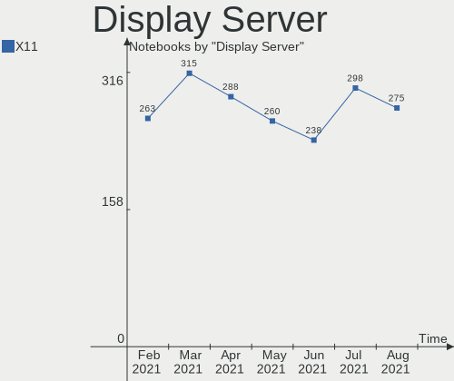

| Name    | Notebooks | Percent |
|---------|-----------|---------|
| X11     | 265       | 99.62%  |
| Wayland | 1         | 0.38%   |

Display Manager
---------------

SDDM, LightDM, etc.

| Name    | Notebooks | Percent |
|---------|-----------|---------|
| Unknown | 188       | 70.68%  |
| TDM     | 76        | 28.57%  |
| GDM     | 2         | 0.75%   |

OS Lang
-------

Language

| Lang    | Notebooks | Percent |
|---------|-----------|---------|
| en_US   | 73        | 27.44%  |
| de_DE   | 40        | 15.04%  |
| pt_BR   | 25        | 9.4%    |
| en_GB   | 15        | 5.64%   |
| C       | 15        | 5.64%   |
| ru_RU   | 8         | 3.01%   |
| pl_PL   | 8         | 3.01%   |
| es_ES   | 7         | 2.63%   |
| en_CA   | 7         | 2.63%   |
| nl_NL   | 6         | 2.26%   |
| it_IT   | 6         | 2.26%   |
| fr_FR   | 5         | 1.88%   |
| en_AU   | 4         | 1.5%    |
| el_GR   | 4         | 1.5%    |
| tr_TR   | 3         | 1.13%   |
| es_MX   | 3         | 1.13%   |
| en_IN   | 3         | 1.13%   |
| uk_UA   | 2         | 0.75%   |
| sv_SE   | 2         | 0.75%   |
| pt_PT   | 2         | 0.75%   |
| fi_FI   | 2         | 0.75%   |
| es_CL   | 2         | 0.75%   |
| en_ZA   | 2         | 0.75%   |
| de_AT   | 2         | 0.75%   |
| cs_CZ   | 2         | 0.75%   |
| zh_CN   | 1         | 0.38%   |
| nl_BE   | 1         | 0.38%   |
| ko_KR   | 1         | 0.38%   |
| id_ID   | 1         | 0.38%   |
| hu_HU   | 1         | 0.38%   |
| fr_CA   | 1         | 0.38%   |
| es_UY   | 1         | 0.38%   |
| es_EC   | 1         | 0.38%   |
| es_CR   | 1         | 0.38%   |
| es_CO   | 1         | 0.38%   |
| es_AR   | 1         | 0.38%   |
| en_IL   | 1         | 0.38%   |
| en_IE   | 1         | 0.38%   |
| de_CH   | 1         | 0.38%   |
| de_BE   | 1         | 0.38%   |
| da_DK   | 1         | 0.38%   |
| bg_BG   | 1         | 0.38%   |
| Unknown | 1         | 0.38%   |

Boot Mode
---------

EFI or BIOS

| Mode | Notebooks | Percent |
|------|-----------|---------|
| BIOS | 134       | 50.38%  |
| EFI  | 132       | 49.62%  |

Filesystem
----------

Type of filesystem

| Type    | Notebooks | Percent |
|---------|-----------|---------|
| Ext4    | 248       | 93.23%  |
| Overlay | 15        | 5.64%   |
| Btrfs   | 3         | 1.13%   |

Part. scheme
------------

Scheme of partitioning

| Type    | Notebooks | Percent |
|---------|-----------|---------|
| Unknown | 187       | 70.3%   |
| GPT     | 51        | 19.17%  |
| MBR     | 28        | 10.53%  |

Dual Boot with Linux/BSD
------------------------

Hosting more than one Linux/BSD

| Dual boot | Notebooks | Percent |
|-----------|-----------|---------|
| No        | 257       | 96.62%  |
| Yes       | 9         | 3.38%   |

Dual Boot (Win)
---------------

Hosting Linux and Windows

| Dual boot | Notebooks | Percent |
|-----------|-----------|---------|
| No        | 231       | 86.84%  |
| Yes       | 35        | 13.16%  |

Country
-------

Geographic location (country)

| Country              | Notebooks | Percent |
|----------------------|-----------|---------|
| Germany              | 44        | 16.54%  |
| USA                  | 42        | 15.79%  |
| Brazil               | 31        | 11.65%  |
| UK                   | 14        | 5.26%   |
| Canada               | 10        | 3.76%   |
| Netherlands          | 9         | 3.38%   |
| Greece               | 8         | 3.01%   |
| Spain                | 7         | 2.63%   |
| Poland               | 7         | 2.63%   |
| Italy                | 7         | 2.63%   |
| Russia               | 6         | 2.26%   |
| France               | 6         | 2.26%   |
| Australia            | 5         | 1.88%   |
| Turkey               | 4         | 1.5%    |
| Mexico               | 4         | 1.5%    |
| India                | 4         | 1.5%    |
| Ukraine              | 3         | 1.13%   |
| Switzerland          | 3         | 1.13%   |
| Sweden               | 3         | 1.13%   |
| Portugal             | 3         | 1.13%   |
| Finland              | 3         | 1.13%   |
| Austria              | 3         | 1.13%   |
| South Africa         | 2         | 0.75%   |
| Korea, Republic of   | 2         | 0.75%   |
| Israel               | 2         | 0.75%   |
| Iraq                 | 2         | 0.75%   |
| Hungary              | 2         | 0.75%   |
| Hong Kong            | 2         | 0.75%   |
| Denmark              | 2         | 0.75%   |
| Czech Republic       | 2         | 0.75%   |
| Colombia             | 2         | 0.75%   |
| China                | 2         | 0.75%   |
| Chile                | 2         | 0.75%   |
| Vietnam              | 1         | 0.38%   |
| Uruguay              | 1         | 0.38%   |
| Taiwan               | 1         | 0.38%   |
| Singapore            | 1         | 0.38%   |
| Peru                 | 1         | 0.38%   |
| Pakistan             | 1         | 0.38%   |
| Moldova, Republic of | 1         | 0.38%   |
| Malaysia             | 1         | 0.38%   |
| Lithuania            | 1         | 0.38%   |
| Japan                | 1         | 0.38%   |
| Ecuador              | 1         | 0.38%   |
| Czechia              | 1         | 0.38%   |
| Costa Rica           | 1         | 0.38%   |
| Bulgaria             | 1         | 0.38%   |
| Belgium              | 1         | 0.38%   |
| Belarus              | 1         | 0.38%   |
| Argentina            | 1         | 0.38%   |
| Unknown              | 1         | 0.38%   |

City
----

Geographic location (city)

| City                   | Notebooks | Percent |
|------------------------|-----------|---------|
| Rockville              | 6         | 2.26%   |
| Verona                 | 4         | 1.5%    |
| Athens                 | 4         | 1.5%    |
| Rio de Janeiro         | 3         | 1.13%   |
| Madrid                 | 3         | 1.13%   |
| Cologne                | 3         | 1.13%   |
| Berlin                 | 3         | 1.13%   |
| Vienna                 | 2         | 0.75%   |
| Thessaloniki           | 2         | 0.75%   |
| São Paulo             | 2         | 0.75%   |
| Sydney                 | 2         | 0.75%   |
| Stelle                 | 2         | 0.75%   |
| Sao Jose               | 2         | 0.75%   |
| Ringwood               | 2         | 0.75%   |
| Richmond               | 2         | 0.75%   |
| Porto Alegre           | 2         | 0.75%   |
| Oulu                   | 2         | 0.75%   |
| Mesa                   | 2         | 0.75%   |
| Leipzig                | 2         | 0.75%   |
| Kirchseeon             | 2         | 0.75%   |
| Jaipur                 | 2         | 0.75%   |
| Glasgow                | 2         | 0.75%   |
| Dartmouth              | 2         | 0.75%   |
| Central                | 2         | 0.75%   |
| Budapest               | 2         | 0.75%   |
| Brunswick              | 2         | 0.75%   |
| Bonn                   | 2         | 0.75%   |
| Bamberg                | 2         | 0.75%   |
| Antalya                | 2         | 0.75%   |
| Zwolle                 | 1         | 0.38%   |
| Ylaemylly              | 1         | 0.38%   |
| Yaotsu                 | 1         | 0.38%   |
| Wuppertal              | 1         | 0.38%   |
| Wrocław               | 1         | 0.38%   |
| Westerheim             | 1         | 0.38%   |
| Wennigsen              | 1         | 0.38%   |
| Warsaw                 | 1         | 0.38%   |
| Wapello                | 1         | 0.38%   |
| Vorniceni              | 1         | 0.38%   |
| Vizille                | 1         | 0.38%   |
| Vitoria-Gasteiz        | 1         | 0.38%   |
| Vinnytsia              | 1         | 0.38%   |
| Victoriaville          | 1         | 0.38%   |
| Vatutinki              | 1         | 0.38%   |
| Van Vleck              | 1         | 0.38%   |
| Vaestra Froelunda      | 1         | 0.38%   |
| Utrecht                | 1         | 0.38%   |
| Ulyanovsk              | 1         | 0.38%   |
| Ukmerge                | 1         | 0.38%   |
| Toronto                | 1         | 0.38%   |
| Toledo                 | 1         | 0.38%   |
| Ternopil               | 1         | 0.38%   |
| Teresina               | 1         | 0.38%   |
| Temuco                 | 1         | 0.38%   |
| Tempe                  | 1         | 0.38%   |
| Tel Aviv               | 1         | 0.38%   |
| Tacoma                 | 1         | 0.38%   |
| São Bernardo do Campo | 1         | 0.38%   |
| Stuttgart              | 1         | 0.38%   |
| St. Gallen             | 1         | 0.38%   |

Vendor
------

Motherboard manufacturer

| Name                             | Notebooks | Percent |
|----------------------------------|-----------|---------|
| Hewlett-Packard                  | 54        | 20.3%   |
| Dell                             | 45        | 16.92%  |
| Lenovo                           | 39        | 14.66%  |
| ASUSTek Computer                 | 28        | 10.53%  |
| Acer                             | 23        | 8.65%   |
| Toshiba                          | 17        | 6.39%   |
| Samsung Electronics              | 10        | 3.76%   |
| Sony                             | 8         | 3.01%   |
| MSI                              | 7         | 2.63%   |
| Apple                            | 7         | 2.63%   |
| Medion                           | 4         | 1.5%    |
| Positivo                         | 3         | 1.13%   |
| Teclast                          | 2         | 0.75%   |
| Notebook                         | 2         | 0.75%   |
| HUAWEI                           | 2         | 0.75%   |
| Fujitsu                          | 2         | 0.75%   |
| Alienware                        | 2         | 0.75%   |
| TUXEDO                           | 1         | 0.38%   |
| Positivo Bahia - VAIO            | 1         | 0.38%   |
| Packard Bell                     | 1         | 0.38%   |
| Google                           | 1         | 0.38%   |
| Gigabyte Technology              | 1         | 0.38%   |
| Fusion5                          | 1         | 0.38%   |
| FUJITSU CLIENT COMPUTING LIMITED | 1         | 0.38%   |
| DIODE                            | 1         | 0.38%   |
| Digibras                         | 1         | 0.38%   |
| Chuwi                            | 1         | 0.38%   |
| AXDIA International              | 1         | 0.38%   |

Model
-----

Motherboard model

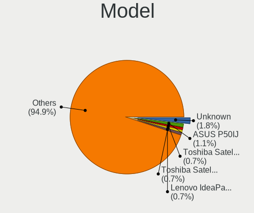

| Name                                        | Notebooks | Percent |
|---------------------------------------------|-----------|---------|
| Dell Latitude E6430                         | 4         | 1.5%    |
| HP ProBook 4540s                            | 3         | 1.13%   |
| HP Pavilion g6                              | 3         | 1.13%   |
| HP Notebook                                 | 3         | 1.13%   |
| Dell Inspiron 15 7000 Gaming                | 3         | 1.13%   |
| Toshiba Satellite A100                      | 2         | 0.75%   |
| Teclast F6 Plus                             | 2         | 0.75%   |
| Positivo H14BT58                            | 2         | 0.75%   |
| MSI GT70 2OC/2OD                            | 2         | 0.75%   |
| HP Pavilion g4                              | 2         | 0.75%   |
| HP Pavilion 15                              | 2         | 0.75%   |
| HP G62                                      | 2         | 0.75%   |
| Dell Inspiron 7520                          | 2         | 0.75%   |
| Dell Inspiron 5570                          | 2         | 0.75%   |
| Acer Aspire 5820TG                          | 2         | 0.75%   |
| TUXEDO Book BA1510                          | 1         | 0.38%   |
| Toshiba TECRA M10                           | 1         | 0.38%   |
| Toshiba Satellite R830                      | 1         | 0.38%   |
| Toshiba Satellite PRO L770-14H              | 1         | 0.38%   |
| Toshiba Satellite Pro L500D                 | 1         | 0.38%   |
| Toshiba Satellite P50-B-11L                 | 1         | 0.38%   |
| Toshiba Satellite L855                      | 1         | 0.38%   |
| Toshiba Satellite L50-A                     | 1         | 0.38%   |
| Toshiba Satellite E55-A                     | 1         | 0.38%   |
| Toshiba Satellite C855-1JF                  | 1         | 0.38%   |
| Toshiba Satellite C75D-B                    | 1         | 0.38%   |
| Toshiba Satellite C660                      | 1         | 0.38%   |
| Toshiba Satellite C645                      | 1         | 0.38%   |
| Toshiba Satellite C55Dt-A                   | 1         | 0.38%   |
| Toshiba Satellite 1905                      | 1         | 0.38%   |
| Toshiba NB305                               | 1         | 0.38%   |
| Sony VPCW12J1E                              | 1         | 0.38%   |
| Sony VPCEA45FG                              | 1         | 0.38%   |
| Sony VGN-FS415B                             | 1         | 0.38%   |
| Sony VGN-A617M                              | 1         | 0.38%   |
| Sony SVF1521NSTB                            | 1         | 0.38%   |
| Sony SVF1521A6EW                            | 1         | 0.38%   |
| Sony SVE1511F4E                             | 1         | 0.38%   |
| Sony SVE1511AENB                            | 1         | 0.38%   |
| Samsung RV411/RV511/E3511/S3511/RV711/E3411 | 1         | 0.38%   |
| Samsung RC530/RC730                         | 1         | 0.38%   |
| Samsung RC410/RC510/RC710                   | 1         | 0.38%   |
| Samsung R430/R480/R440                      | 1         | 0.38%   |
| Samsung NC10                                | 1         | 0.38%   |
| Samsung 550P5C/550P7C                       | 1         | 0.38%   |
| Samsung 530U3C/530U4C                       | 1         | 0.38%   |
| Samsung 370E4K                              | 1         | 0.38%   |
| Samsung 355V4C/356V4C/3445VC/3545VC         | 1         | 0.38%   |
| Samsung 340XAA/350XAA/550XAA                | 1         | 0.38%   |
| Positivo Mobile                             | 1         | 0.38%   |
| Positivo Bahia - VAIO VJFE51F11X-B0811H     | 1         | 0.38%   |
| Packard Bell EasyNote TE11HC                | 1         | 0.38%   |
| Notebook W65_67SH                           | 1         | 0.38%   |
| Notebook W54_55SU1,SUW                      | 1         | 0.38%   |
| MSI MS-1738                                 | 1         | 0.38%   |
| MSI Modern 14 B4MW                          | 1         | 0.38%   |
| MSI GF63 Thin 10SCSR                        | 1         | 0.38%   |
| MSI GE60 2OC\2OD\2OE                        | 1         | 0.38%   |
| MSI GE60 0NC/GE60 0ND                       | 1         | 0.38%   |
| Medion X681X                                | 1         | 0.38%   |

Model Family
------------

Motherboard model prefix

| Name                                    | Notebooks | Percent |
|-----------------------------------------|-----------|---------|
| Lenovo ThinkPad                         | 22        | 8.27%   |
| HP Pavilion                             | 18        | 6.77%   |
| Acer Aspire                             | 18        | 6.77%   |
| Dell Latitude                           | 17        | 6.39%   |
| Dell Inspiron                           | 17        | 6.39%   |
| Toshiba Satellite                       | 15        | 5.64%   |
| Lenovo IdeaPad                          | 11        | 4.14%   |
| HP ProBook                              | 7         | 2.63%   |
| HP Laptop                               | 7         | 2.63%   |
| Dell Vostro                             | 5         | 1.88%   |
| HP EliteBook                            | 4         | 1.5%    |
| Dell XPS                                | 4         | 1.5%    |
| HP Notebook                             | 3         | 1.13%   |
| HP Compaq                               | 3         | 1.13%   |
| Apple MacBookPro11                      | 3         | 1.13%   |
| Teclast F6                              | 2         | 0.75%   |
| Positivo H14BT58                        | 2         | 0.75%   |
| MSI GT70                                | 2         | 0.75%   |
| MSI GE60                                | 2         | 0.75%   |
| HP Presario                             | 2         | 0.75%   |
| HP G62                                  | 2         | 0.75%   |
| HP 250                                  | 2         | 0.75%   |
| Fujitsu LIFEBOOK                        | 2         | 0.75%   |
| ASUS TUF                                | 2         | 0.75%   |
| TUXEDO Book                             | 1         | 0.38%   |
| Toshiba TECRA                           | 1         | 0.38%   |
| Toshiba NB305                           | 1         | 0.38%   |
| Sony VPCW12J1E                          | 1         | 0.38%   |
| Sony VPCEA45FG                          | 1         | 0.38%   |
| Sony VGN-FS415B                         | 1         | 0.38%   |
| Sony VGN-A617M                          | 1         | 0.38%   |
| Sony SVF1521NSTB                        | 1         | 0.38%   |
| Sony SVF1521A6EW                        | 1         | 0.38%   |
| Sony SVE1511F4E                         | 1         | 0.38%   |
| Sony SVE1511AENB                        | 1         | 0.38%   |
| Samsung RV411                           | 1         | 0.38%   |
| Samsung RC530                           | 1         | 0.38%   |
| Samsung RC410                           | 1         | 0.38%   |
| Samsung R430                            | 1         | 0.38%   |
| Samsung NC10                            | 1         | 0.38%   |
| Samsung 550P5C                          | 1         | 0.38%   |
| Samsung 530U3C                          | 1         | 0.38%   |
| Samsung 370E4K                          | 1         | 0.38%   |
| Samsung 355V4C                          | 1         | 0.38%   |
| Samsung 340XAA                          | 1         | 0.38%   |
| Positivo Mobile                         | 1         | 0.38%   |
| Positivo Bahia - VAIO VJFE51F11X-B0811H | 1         | 0.38%   |
| Packard Bell EasyNote                   | 1         | 0.38%   |
| Notebook W65                            | 1         | 0.38%   |
| Notebook W54                            | 1         | 0.38%   |
| MSI MS-1738                             | 1         | 0.38%   |
| MSI Modern                              | 1         | 0.38%   |
| MSI GF63                                | 1         | 0.38%   |
| Medion X681X                            | 1         | 0.38%   |
| Medion S15450                           | 1         | 0.38%   |
| Medion P7624                            | 1         | 0.38%   |
| Medion P6645                            | 1         | 0.38%   |
| Lenovo Yoga                             | 1         | 0.38%   |
| Lenovo Y520-15IKBN                      | 1         | 0.38%   |
| Lenovo Legion                           | 1         | 0.38%   |

MFG Year
--------

Motherboard manufacture year

| Year | Notebooks | Percent |
|------|-----------|---------|
| 2020 | 51        | 19.17%  |
| 2013 | 30        | 11.28%  |
| 2019 | 26        | 9.77%   |
| 2018 | 20        | 7.52%   |
| 2012 | 20        | 7.52%   |
| 2014 | 18        | 6.77%   |
| 2011 | 16        | 6.02%   |
| 2017 | 15        | 5.64%   |
| 2016 | 14        | 5.26%   |
| 2010 | 14        | 5.26%   |
| 2009 | 11        | 4.14%   |
| 2015 | 9         | 3.38%   |
| 2008 | 9         | 3.38%   |
| 2006 | 7         | 2.63%   |
| 2005 | 3         | 1.13%   |
| 2007 | 2         | 0.75%   |
| 2003 | 1         | 0.38%   |

Form Factor
-----------

Physical design of the computer

| Name     | Notebooks | Percent |
|----------|-----------|---------|
| Notebook | 266       | 100%    |

Secure Boot
-----------

Enabled or disabled

| State    | Notebooks | Percent |
|----------|-----------|---------|
| Disabled | 230       | 86.47%  |
| Enabled  | 36        | 13.53%  |

Coreboot
--------

Have coreboot on board

| Used | Notebooks | Percent |
|------|-----------|---------|
| No   | 265       | 99.62%  |
| Yes  | 1         | 0.38%   |

RAM Size
--------

Total RAM memory

| Size in GB | Notebooks | Percent |
|------------|-----------|---------|
| 4.01-8.0   | 85        | 31.95%  |
| 3.01-4.0   | 74        | 27.82%  |
| 8.01-16.0  | 41        | 15.41%  |
| 16.01-24.0 | 28        | 10.53%  |
| 1.01-2.0   | 19        | 7.14%   |
| 2.01-3.0   | 8         | 3.01%   |
| 32.01-64.0 | 5         | 1.88%   |
| 24.01-32.0 | 4         | 1.5%    |
| 0.51-1.0   | 2         | 0.75%   |

RAM Used
--------

Used RAM memory

| Used GB    | Notebooks | Percent |
|------------|-----------|---------|
| 1.01-2.0   | 128       | 48.12%  |
| 2.01-3.0   | 53        | 19.92%  |
| 3.01-4.0   | 35        | 13.16%  |
| 4.01-8.0   | 24        | 9.02%   |
| 0.51-1.0   | 22        | 8.27%   |
| 0.01-0.5   | 2         | 0.75%   |
| 16.01-24.0 | 1         | 0.38%   |
| 8.01-16.0  | 1         | 0.38%   |

Has CD-ROM
----------

Has CD-ROM on board

| Presented | Notebooks | Percent |
|-----------|-----------|---------|
| Yes       | 137       | 51.5%   |
| No        | 129       | 48.5%   |

Total Drives
------------

Number of drives on board

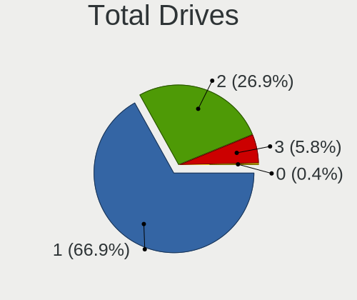

| Drives | Notebooks | Percent |
|--------|-----------|---------|
| 1      | 194       | 72.93%  |
| 2      | 65        | 24.44%  |
| 3      | 3         | 1.13%   |
| 0      | 2         | 0.75%   |
| 5      | 1         | 0.38%   |
| 4      | 1         | 0.38%   |

Has Ethernet
------------

Has Ethernet on board

| Presented | Notebooks | Percent |
|-----------|-----------|---------|
| Yes       | 226       | 84.96%  |
| No        | 40        | 15.04%  |

Drive Vendor
------------

Hard drive vendors

| Vendor                    | Notebooks | Drives | Percent |
|---------------------------|-----------|--------|---------|
| Seagate                   | 44        | 44     | 13.46%  |
| WDC                       | 41        | 42     | 12.54%  |
| Samsung Electronics       | 39        | 40     | 11.93%  |
| Toshiba                   | 29        | 29     | 8.87%   |
| SanDisk                   | 24        | 24     | 7.34%   |
| Unknown                   | 19        | 19     | 5.81%   |
| Kingston                  | 19        | 20     | 5.81%   |
| Hitachi                   | 14        | 15     | 4.28%   |
| Crucial                   | 12        | 12     | 3.67%   |
| HGST                      | 7         | 7      | 2.14%   |
| SK Hynix                  | 6         | 6      | 1.83%   |
| Intel                     | 6         | 6      | 1.83%   |
| Fujitsu                   | 6         | 6      | 1.83%   |
| China                     | 5         | 5      | 1.53%   |
| Apple                     | 5         | 5      | 1.53%   |
| A-DATA Technology         | 5         | 6      | 1.53%   |
| Micron Technology         | 4         | 4      | 1.22%   |
| LITEONIT                  | 4         | 4      | 1.22%   |
| LITEON                    | 4         | 4      | 1.22%   |
| KIOXIA                    | 4         | 4      | 1.22%   |
| Intenso                   | 4         | 4      | 1.22%   |
| Phison                    | 3         | 3      | 0.92%   |
| Union Memory              | 2         | 2      | 0.61%   |
| Teclast                   | 2         | 2      | 0.61%   |
| JMicron                   | 2         | 3      | 0.61%   |
| Transcend                 | 1         | 1      | 0.31%   |
| SSSTC                     | 1         | 1      | 0.31%   |
| SPCC                      | 1         | 1      | 0.31%   |
| S528                      | 1         | 1      | 0.31%   |
| PNY                       | 1         | 1      | 0.31%   |
| PLEXTOR                   | 1         | 1      | 0.31%   |
| Patriot                   | 1         | 1      | 0.31%   |
| Netac                     | 1         | 1      | 0.31%   |
| Micron/Crucial Technology | 1         | 1      | 0.31%   |
| Lenovo                    | 1         | 1      | 0.31%   |
| KIOXIA-EXCERIA            | 1         | 1      | 0.31%   |
| KingSpec                  | 1         | 1      | 0.31%   |
| KingFast                  | 1         | 1      | 0.31%   |
| KingDian                  | 1         | 1      | 0.31%   |
| HS-SSD-E100               | 1         | 1      | 0.31%   |
| Gigabyte Technology       | 1         | 1      | 0.31%   |
| BP4e                      | 1         | 1      | 0.31%   |

Drive Model
-----------

Hard drive models

| Model                               | Notebooks | Percent |
|-------------------------------------|-----------|---------|
| Seagate ST1000LM035-1RK172 1TB      | 6         | 1.81%   |
| Unknown MMC Card  32GB              | 5         | 1.51%   |
| Seagate ST9500325AS 500GB           | 5         | 1.51%   |
| Samsung SSD 860 EVO 500GB           | 5         | 1.51%   |
| Kingston SA400S37120G 120GB SSD     | 5         | 1.51%   |
| Toshiba MQ01ABF050 500GB            | 4         | 1.2%    |
| Unknown MMC Card  16GB              | 3         | 0.9%    |
| Toshiba MQ04ABF100 1TB              | 3         | 0.9%    |
| Seagate ST500LT012-9WS142 500GB     | 3         | 0.9%    |
| Seagate ST500LT012-1DG142 500GB     | 3         | 0.9%    |
| Seagate ST1000LM024 HN-M101MBB 1TB  | 3         | 0.9%    |
| Kingston SA400S37240G 240GB SSD     | 3         | 0.9%    |
| Intenso SSD Sata III 240GB          | 3         | 0.9%    |
| HGST HTS545050A7E680 500GB          | 3         | 0.9%    |
| Crucial CT500MX500SSD1 500GB        | 3         | 0.9%    |
| WDC WD5000LPVX-22V0TT0 500GB        | 2         | 0.6%    |
| WDC WD10SPZX-60Z10T0 1TB            | 2         | 0.6%    |
| WDC WD10SPZX-24Z10 1TB              | 2         | 0.6%    |
| WDC WD10JPVX-22JC3T0 1TB            | 2         | 0.6%    |
| Unknown SD/MMC/MS PRO 128GB         | 2         | 0.6%    |
| Toshiba MQ01ABD100 1TB              | 2         | 0.6%    |
| Toshiba MK2555GSX 250GB             | 2         | 0.6%    |
| Toshiba KXG50ZNV512G NVMe 512GB     | 2         | 0.6%    |
| Teclast 256GB NS550-2242 SSD        | 2         | 0.6%    |
| Seagate ST9500423AS 500GB           | 2         | 0.6%    |
| Seagate ST500LM012 HN-M500MBB 500GB | 2         | 0.6%    |
| Seagate ST1000LM049-2GH172 1TB      | 2         | 0.6%    |
| Seagate ST1000LM048-2E7172 1TB      | 2         | 0.6%    |
| Seagate M3 Portable 4TB             | 2         | 0.6%    |
| SanDisk SSD PLUS 240GB              | 2         | 0.6%    |
| SanDisk SSD PLUS 1000GB             | 2         | 0.6%    |
| Samsung SSD 860 QVO 1TB             | 2         | 0.6%    |
| Samsung SSD 850 EVO 500GB           | 2         | 0.6%    |
| Samsung NVMe SSD Drive 256GB        | 2         | 0.6%    |
| KIOXIA NVMe SSD Drive 256GB         | 2         | 0.6%    |
| HGST HTS721010A9E630 1TB            | 2         | 0.6%    |
| Crucial CT120BX500SSD1 120GB        | 2         | 0.6%    |
| China SATA SSD 120GB                | 2         | 0.6%    |
| WDC WDS500G2B0B-00YS70 500GB SSD    | 1         | 0.3%    |
| WDC WDS500G2B0A-00SM50 500GB SSD    | 1         | 0.3%    |
| WDC WD7500BPVT-22HXZT3 752GB        | 1         | 0.3%    |
| WDC WD6400BPVT-60HXZT1 640GB        | 1         | 0.3%    |
| WDC WD5000LUCT-63RC2Y0 500GB        | 1         | 0.3%    |
| WDC WD5000LPVT-08G33T1 500GB        | 1         | 0.3%    |
| WDC WD5000LPLX-66ZNTT1 500GB        | 1         | 0.3%    |
| WDC WD5000LPLX-60ZNTT1 500GB        | 1         | 0.3%    |
| WDC WD5000LPCX-80VHAT0 500GB        | 1         | 0.3%    |
| WDC WD5000LPCX-60VHAT0 500GB        | 1         | 0.3%    |
| WDC WD5000LPCX-24C6HT0 500GB        | 1         | 0.3%    |
| WDC WD5000LPCX-21VHAT0 500GB        | 1         | 0.3%    |
| WDC WD5000BEVT-22ZAT0 500GB         | 1         | 0.3%    |
| WDC WD3200BPVT-22JJ5T0 320GB        | 1         | 0.3%    |
| WDC WD3200BEVT-22ZCT0 320GB         | 1         | 0.3%    |
| WDC WD3200BEKT-75PVMT1 320GB        | 1         | 0.3%    |
| WDC WD3200BEKT-60V5T1 320GB         | 1         | 0.3%    |
| WDC WD3200BEKT-08PVMT1 320GB        | 1         | 0.3%    |
| WDC WD2500BEVT-80A23T0 250GB        | 1         | 0.3%    |
| WDC WD20SPZX-22UA7T0 2TB            | 1         | 0.3%    |
| WDC WD20SPZX-22CRAT0 2TB            | 1         | 0.3%    |
| WDC WD20SPZX-21UA7T0 2TB            | 1         | 0.3%    |

HDD Vendor
----------

Hard disk drive vendors

| Vendor              | Notebooks | Drives | Percent |
|---------------------|-----------|--------|---------|
| Seagate             | 42        | 42     | 32.81%  |
| WDC                 | 35        | 35     | 27.34%  |
| Toshiba             | 20        | 20     | 15.63%  |
| Hitachi             | 14        | 15     | 10.94%  |
| HGST                | 7         | 7      | 5.47%   |
| Samsung Electronics | 5         | 5      | 3.91%   |
| Fujitsu             | 5         | 5      | 3.91%   |

SSD Vendor
----------

Solid state drive vendors

| Vendor              | Notebooks | Drives | Percent |
|---------------------|-----------|--------|---------|
| Samsung Electronics | 23        | 24     | 17.42%  |
| SanDisk             | 22        | 22     | 16.67%  |
| Kingston            | 17        | 18     | 12.88%  |
| Crucial             | 12        | 12     | 9.09%   |
| Toshiba             | 6         | 6      | 4.55%   |
| Apple               | 5         | 5      | 3.79%   |
| A-DATA Technology   | 5         | 6      | 3.79%   |
| LITEONIT            | 4         | 4      | 3.03%   |
| LITEON              | 4         | 4      | 3.03%   |
| Intenso             | 4         | 4      | 3.03%   |
| Intel               | 4         | 4      | 3.03%   |
| China               | 4         | 4      | 3.03%   |
| SK Hynix            | 3         | 3      | 2.27%   |
| WDC                 | 2         | 2      | 1.52%   |
| Teclast             | 2         | 2      | 1.52%   |
| Micron Technology   | 2         | 2      | 1.52%   |
| Unknown             | 1         | 1      | 0.76%   |
| Transcend           | 1         | 1      | 0.76%   |
| SPCC                | 1         | 1      | 0.76%   |
| S528                | 1         | 1      | 0.76%   |
| PNY                 | 1         | 1      | 0.76%   |
| PLEXTOR             | 1         | 1      | 0.76%   |
| Patriot             | 1         | 1      | 0.76%   |
| Netac               | 1         | 1      | 0.76%   |
| KIOXIA-EXCERIA      | 1         | 1      | 0.76%   |
| KingDian            | 1         | 1      | 0.76%   |
| Gigabyte Technology | 1         | 1      | 0.76%   |
| Fujitsu             | 1         | 1      | 0.76%   |
| BP4e                | 1         | 1      | 0.76%   |

Drive Kind
----------

HDD or SSD

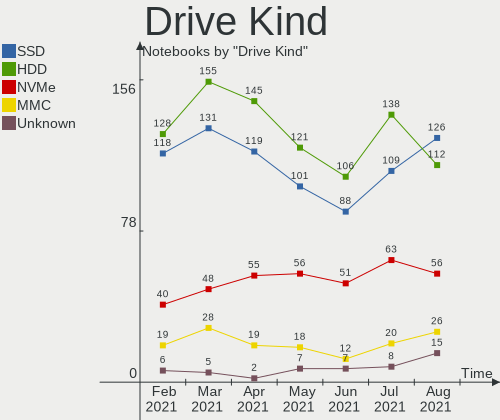

| Kind    | Notebooks | Drives | Percent |
|---------|-----------|--------|---------|
| HDD     | 126       | 129    | 40.26%  |
| SSD     | 120       | 135    | 38.34%  |
| NVMe    | 41        | 42     | 13.1%   |
| MMC     | 13        | 13     | 4.15%   |
| Unknown | 13        | 14     | 4.15%   |

Drive Connector
---------------

SATA, SAS, NVMe, etc.

| Type | Notebooks | Drives | Percent |
|------|-----------|--------|---------|
| SATA | 235       | 270    | 79.39%  |
| NVMe | 41        | 42     | 13.85%  |
| MMC  | 13        | 13     | 4.39%   |
| SAS  | 7         | 8      | 2.36%   |

Drive Size
----------

Size of hard drive

| Size in TB | Notebooks | Drives | Percent |
|------------|-----------|--------|---------|
| 0.01-0.5   | 184       | 206    | 76.03%  |
| 0.51-1.0   | 53        | 53     | 21.9%   |
| 1.01-2.0   | 5         | 5      | 2.07%   |

Space Total
-----------

Amount of disk space available on the file system

| Size in GB     | Notebooks | Percent |
|----------------|-----------|---------|
| 101-250        | 87        | 32.71%  |
| 251-500        | 83        | 31.2%   |
| 501-1000       | 32        | 12.03%  |
| 51-100         | 21        | 7.89%   |
| 1-20           | 13        | 4.89%   |
| 1001-2000      | 12        | 4.51%   |
| 21-50          | 10        | 3.76%   |
| More than 3000 | 4         | 1.5%    |
| 2001-3000      | 3         | 1.13%   |
| Unknown        | 1         | 0.38%   |

Space Used
----------

Amount of used disk space

| Used GB        | Notebooks | Percent |
|----------------|-----------|---------|
| 1-20           | 99        | 37.22%  |
| 21-50          | 51        | 19.17%  |
| 101-250        | 40        | 15.04%  |
| 51-100         | 38        | 14.29%  |
| 251-500        | 19        | 7.14%   |
| 501-1000       | 12        | 4.51%   |
| 1001-2000      | 3         | 1.13%   |
| More than 3000 | 2         | 0.75%   |
| 2001-3000      | 1         | 0.38%   |
| Unknown        | 1         | 0.38%   |

Malfunc. Drives
---------------

Drive models with a malfunction

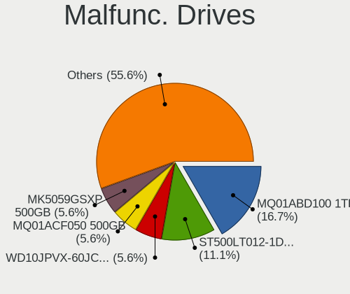

| Model                                | Notebooks | Drives | Percent |
|--------------------------------------|-----------|--------|---------|
| Seagate ST500LT012-9WS142 500GB      | 2         | 2      | 11.76%  |
| Seagate ST1000LM035-1RK172 1TB       | 2         | 2      | 11.76%  |
| HGST HTS721010A9E630 1TB             | 2         | 2      | 11.76%  |
| WDC WD5000LPVX-22V0TT0 500GB         | 1         | 1      | 5.88%   |
| WDC WD10JPVX-22JC3T0 1TB             | 1         | 1      | 5.88%   |
| Toshiba THNSNK128GCS8 SATA 128GB SSD | 1         | 1      | 5.88%   |
| Toshiba MK1629GSG 160GB              | 1         | 1      | 5.88%   |
| Seagate ST9250315ASG 250GB           | 1         | 1      | 5.88%   |
| Kingston SV300S37A120G 120GB SSD     | 1         | 1      | 5.88%   |
| Intel SSDSC2BF240A5L 240GB           | 1         | 1      | 5.88%   |
| Intel SSDMCEAC120B3 120GB            | 1         | 1      | 5.88%   |
| Hitachi HTS545032A7E380 320GB        | 1         | 1      | 5.88%   |
| Hitachi HTS543232A7A384 320GB        | 1         | 1      | 5.88%   |
| Crucial CT512M550SSD4 512GB          | 1         | 1      | 5.88%   |

Malfunc. Drive Vendor
---------------------

Vendors of faulty drives

| Vendor   | Notebooks | Drives | Percent |
|----------|-----------|--------|---------|
| Seagate  | 5         | 5      | 29.41%  |
| WDC      | 2         | 2      | 11.76%  |
| Toshiba  | 2         | 2      | 11.76%  |
| Intel    | 2         | 2      | 11.76%  |
| Hitachi  | 2         | 2      | 11.76%  |
| HGST     | 2         | 2      | 11.76%  |
| Kingston | 1         | 1      | 5.88%   |
| Crucial  | 1         | 1      | 5.88%   |

Malfunc. HDD Vendor
-------------------

Vendors of faulty HDD drives

| Vendor  | Notebooks | Drives | Percent |
|---------|-----------|--------|---------|
| Seagate | 5         | 5      | 41.67%  |
| WDC     | 2         | 2      | 16.67%  |
| Hitachi | 2         | 2      | 16.67%  |
| HGST    | 2         | 2      | 16.67%  |
| Toshiba | 1         | 1      | 8.33%   |

Malfunc. Drive Kind
-------------------

Kinds of faulty drives

| Kind | Notebooks | Drives | Percent |
|------|-----------|--------|---------|
| HDD  | 12        | 12     | 75%     |
| SSD  | 4         | 5      | 25%     |

Failed Drives
-------------

Failed drive models

Zero info for selected period =(

Failed Drive Vendor
-------------------

Failed drive vendors

Zero info for selected period =(

Drive Status
------------

Number of failed and malfunc. drives

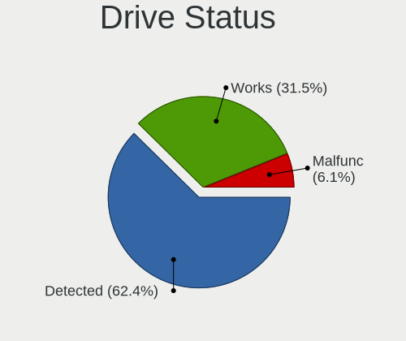

| Status   | Notebooks | Drives | Percent |
|----------|-----------|--------|---------|
| Detected | 189       | 234    | 68.98%  |
| Works    | 70        | 82     | 25.55%  |
| Malfunc  | 15        | 17     | 5.47%   |

Storage Vendor
--------------

Storage controller vendors

| Vendor                           | Notebooks | Percent |
|----------------------------------|-----------|---------|
| Intel                            | 209       | 71.82%  |
| AMD                              | 36        | 12.37%  |
| Samsung Electronics              | 14        | 4.81%   |
| Sandisk                          | 7         | 2.41%   |
| KIOXIA                           | 4         | 1.37%   |
| Toshiba America Info Systems     | 3         | 1.03%   |
| SK Hynix                         | 3         | 1.03%   |
| Phison Electronics               | 3         | 1.03%   |
| Union Memory (Shenzhen)          | 2         | 0.69%   |
| Silicon Integrated Systems [SiS] | 2         | 0.69%   |
| Kingston Technology Company      | 2         | 0.69%   |
| Solid State Storage Technology   | 1         | 0.34%   |
| Nvidia                           | 1         | 0.34%   |
| Micron/Crucial Technology        | 1         | 0.34%   |
| Micron Technology                | 1         | 0.34%   |
| Marvell Technology Group         | 1         | 0.34%   |
| Lenovo                           | 1         | 0.34%   |

Storage Model
-------------

Storage controller models

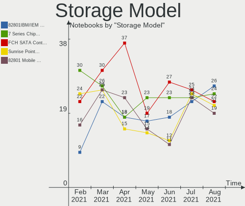

| Model                                                                            | Notebooks | Percent |
|----------------------------------------------------------------------------------|-----------|---------|
| Intel 7 Series Chipset Family 6-port SATA Controller [AHCI mode]                 | 32        | 10.39%  |
| AMD FCH SATA Controller [AHCI mode]                                              | 27        | 8.77%   |
| Intel 82801 Mobile SATA Controller [RAID mode]                                   | 21        | 6.82%   |
| Intel Sunrise Point-LP SATA Controller [AHCI mode]                               | 19        | 6.17%   |
| Intel 6 Series/C200 Series Chipset Family 6 port Mobile SATA AHCI Controller     | 18        | 5.84%   |
| Intel 8 Series SATA Controller 1 [AHCI mode]                                     | 13        | 4.22%   |
| Intel 5 Series/3400 Series Chipset 4 port SATA AHCI Controller                   | 13        | 4.22%   |
| Intel 82801IBM/IEM (ICH9M/ICH9M-E) 4 port SATA Controller [AHCI mode]            | 12        | 3.9%    |
| Intel 8 Series/C220 Series Chipset Family 6-port SATA Controller 1 [AHCI mode]   | 10        | 3.25%   |
| Intel Wildcat Point-LP SATA Controller [AHCI Mode]                               | 8         | 2.6%    |
| Intel 82801GBM/GHM (ICH7-M Family) SATA Controller [IDE mode]                    | 8         | 2.6%    |
| Intel HM170/QM170 Chipset SATA Controller [AHCI Mode]                            | 6         | 1.95%   |
| Intel Atom/Celeron/Pentium Processor x5-E8000/J3xxx/N3xxx Series SATA Controller | 6         | 1.95%   |
| Samsung NVMe SSD Controller SM981/PM981/PM983                                    | 5         | 1.62%   |
| Intel Atom Processor E3800 Series SATA AHCI Controller                           | 5         | 1.62%   |
| AMD SB7x0/SB8x0/SB9x0 SATA Controller [AHCI mode]                                | 5         | 1.62%   |
| Sandisk Non-Volatile memory controller                                           | 4         | 1.3%    |
| Samsung NVMe SSD Controller SM961/PM961/SM963                                    | 4         | 1.3%    |
| KIOXIA Non-Volatile memory controller                                            | 4         | 1.3%    |
| Intel Cannon Lake Mobile PCH SATA AHCI Controller                                | 4         | 1.3%    |
| Intel 82801HM/HEM (ICH8M/ICH8M-E) IDE Controller                                 | 4         | 1.3%    |
| SK Hynix Non-Volatile memory controller                                          | 3         | 0.97%   |
| Intel Comet Lake SATA AHCI Controller                                            | 3         | 0.97%   |
| Intel Celeron/Pentium Silver Processor SATA Controller                           | 3         | 0.97%   |
| Intel 82801HM/HEM (ICH8M/ICH8M-E) SATA Controller [AHCI mode]                    | 3         | 0.97%   |
| Intel 82801FB/FBM/FR/FW/FRW (ICH6 Family) IDE Controller                         | 3         | 0.97%   |
| Intel 5 Series/3400 Series Chipset 6 port SATA AHCI Controller                   | 3         | 0.97%   |
| Union Memory (Shenzhen) Non-Volatile memory controller                           | 2         | 0.65%   |
| Toshiba America Info Systems Toshiba America Info Non-Volatile memory controller | 2         | 0.65%   |
| Silicon Integrated Systems [SiS] SATA Controller / IDE mode                      | 2         | 0.65%   |
| Silicon Integrated Systems [SiS] 5513 IDE Controller                             | 2         | 0.65%   |
| Sandisk WD Blue SN550 NVMe SSD                                                   | 2         | 0.65%   |
| Samsung Electronics SATA controller                                              | 2         | 0.65%   |
| Samsung Electronics Non-Volatile memory controller                               | 2         | 0.65%   |
| Phison E12 NVMe Controller                                                       | 2         | 0.65%   |
| Intel NM10/ICH7 Family SATA Controller [AHCI mode]                               | 2         | 0.65%   |
| Intel Celeron N3350/Pentium N4200/Atom E3900 Series SATA AHCI Controller         | 2         | 0.65%   |
| Intel Cannon Point-LP SATA Controller [AHCI Mode]                                | 2         | 0.65%   |
| Intel 400 Series Chipset Family SATA AHCI Controller                             | 2         | 0.65%   |
| AMD SB600 Non-Raid-5 SATA                                                        | 2         | 0.65%   |
| AMD SB600 IDE                                                                    | 2         | 0.65%   |
| AMD IXP SB4x0 IDE Controller                                                     | 2         | 0.65%   |
| Toshiba America Info Systems XG4 NVMe SSD Controller                             | 1         | 0.32%   |
| Solid State Storage Non-Volatile memory controller                               | 1         | 0.32%   |
| Sandisk WD Black SN750 / PC SN730 NVMe SSD                                       | 1         | 0.32%   |
| Samsung Apple PCIe SSD                                                           | 1         | 0.32%   |
| Phison PS5013 E13 NVMe Controller                                                | 1         | 0.32%   |
| Nvidia MCP79 AHCI Controller                                                     | 1         | 0.32%   |
| Micron/Crucial P1 NVMe PCIe SSD                                                  | 1         | 0.32%   |
| Micron Non-Volatile memory controller                                            | 1         | 0.32%   |
| Marvell Group 88SS9183 PCIe SSD Controller                                       | 1         | 0.32%   |
| Lenovo Non-Volatile memory controller                                            | 1         | 0.32%   |
| Kingston Company Company Non-Volatile memory controller                          | 1         | 0.32%   |
| Kingston Company A2000 NVMe SSD                                                  | 1         | 0.32%   |
| Intel SSD Pro 7600p/760p/E 6100p Series                                          | 1         | 0.32%   |
| Intel SSD 660P Series                                                            | 1         | 0.32%   |
| Intel SATA controller                                                            | 1         | 0.32%   |
| Intel Mobile 4 Series Chipset PT IDER Controller                                 | 1         | 0.32%   |
| Intel Ice Lake-LP SATA Controller [AHCI mode]                                    | 1         | 0.32%   |
| Intel 82801IBM/IEM (ICH9M/ICH9M-E) 2 port SATA Controller [IDE mode]             | 1         | 0.32%   |

Storage Kind
------------

Kind of storage controller (IDE, SATA, NVMe, SAS, ...)

| Kind | Notebooks | Percent |
|------|-----------|---------|
| SATA | 208       | 69.57%  |
| NVMe | 40        | 13.38%  |
| IDE  | 30        | 10.03%  |
| RAID | 21        | 7.02%   |

CPU Vendor
----------

Processor vendors

| Vendor | Notebooks | Percent |
|--------|-----------|---------|
| Intel  | 223       | 83.83%  |
| AMD    | 43        | 16.17%  |

CPU Model
---------

Processor models

| Model                                         | Notebooks | Percent |
|-----------------------------------------------|-----------|---------|
| Intel Core i5-8250U CPU @ 1.60GHz             | 6         | 2.26%   |
| Intel Core i5-2520M CPU @ 2.50GHz             | 6         | 2.26%   |
| Intel Core i7-4700MQ CPU @ 2.40GHz            | 5         | 1.88%   |
| Intel Core i5-7200U CPU @ 2.50GHz             | 5         | 1.88%   |
| Intel Core i5-3210M CPU @ 2.50GHz             | 5         | 1.88%   |
| Intel Core i7-7700HQ CPU @ 2.80GHz            | 4         | 1.5%    |
| Intel Core i5-4200U CPU @ 1.60GHz             | 4         | 1.5%    |
| Intel Core i5-3230M CPU @ 2.60GHz             | 4         | 1.5%    |
| Intel Core 2 Duo CPU T6600 @ 2.20GHz          | 4         | 1.5%    |
| AMD Ryzen 5 4500U with Radeon Graphics        | 4         | 1.5%    |
| AMD Ryzen 5 3500U with Radeon Vega Mobile Gfx | 4         | 1.5%    |
| Intel Core i7-9750H CPU @ 2.60GHz             | 3         | 1.13%   |
| Intel Core i7-8750H CPU @ 2.20GHz             | 3         | 1.13%   |
| Intel Core i7-5500U CPU @ 2.40GHz             | 3         | 1.13%   |
| Intel Core i7-4500U CPU @ 1.80GHz             | 3         | 1.13%   |
| Intel Core i7-3630QM CPU @ 2.40GHz            | 3         | 1.13%   |
| Intel Core i5-7300HQ CPU @ 2.50GHz            | 3         | 1.13%   |
| Intel Core i5-6200U CPU @ 2.30GHz             | 3         | 1.13%   |
| Intel Core i5-4210U CPU @ 1.70GHz             | 3         | 1.13%   |
| Intel Core i5-2430M CPU @ 2.40GHz             | 3         | 1.13%   |
| Intel Core i5-10210U CPU @ 1.60GHz            | 3         | 1.13%   |
| Intel Core i5 CPU M 480 @ 2.67GHz             | 3         | 1.13%   |
| Intel Core i3-2350M CPU @ 2.30GHz             | 3         | 1.13%   |
| Intel Core i3 CPU M 380 @ 2.53GHz             | 3         | 1.13%   |
| Intel Celeron CPU N3060 @ 1.60GHz             | 3         | 1.13%   |
| AMD E-300 APU with Radeon HD Graphics         | 3         | 1.13%   |
| Intel Pentium M processor 1.73GHz             | 2         | 0.75%   |
| Intel Pentium CPU P6200 @ 2.13GHz             | 2         | 0.75%   |
| Intel Pentium CPU N3700 @ 1.60GHz             | 2         | 0.75%   |
| Intel Pentium CPU B960 @ 2.20GHz              | 2         | 0.75%   |
| Intel Pentium CPU 2117U @ 1.80GHz             | 2         | 0.75%   |
| Intel Genuine CPU T2250 @ 1.73GHz             | 2         | 0.75%   |
| Intel Core i7-8565U CPU @ 1.80GHz             | 2         | 0.75%   |
| Intel Core i7-6700HQ CPU @ 2.60GHz            | 2         | 0.75%   |
| Intel Core i7-2670QM CPU @ 2.20GHz            | 2         | 0.75%   |
| Intel Core i5-8265U CPU @ 1.60GHz             | 2         | 0.75%   |
| Intel Core i5-5300U CPU @ 2.30GHz             | 2         | 0.75%   |
| Intel Core i5-3337U CPU @ 1.80GHz             | 2         | 0.75%   |
| Intel Core i5-3320M CPU @ 2.60GHz             | 2         | 0.75%   |
| Intel Core i5-3317U CPU @ 1.70GHz             | 2         | 0.75%   |
| Intel Core i5-2450M CPU @ 2.50GHz             | 2         | 0.75%   |
| Intel Core i5 CPU M 460 @ 2.53GHz             | 2         | 0.75%   |
| Intel Core i3-4005U CPU @ 1.70GHz             | 2         | 0.75%   |
| Intel Core i3-3217U CPU @ 1.80GHz             | 2         | 0.75%   |
| Intel Core i3-2330M CPU @ 2.20GHz             | 2         | 0.75%   |
| Intel Core i3-1005G1 CPU @ 1.20GHz            | 2         | 0.75%   |
| Intel Core i3 CPU M 350 @ 2.27GHz             | 2         | 0.75%   |
| Intel Core i3 CPU M 330 @ 2.13GHz             | 2         | 0.75%   |
| Intel Core 2 Duo CPU T8300 @ 2.40GHz          | 2         | 0.75%   |
| Intel Core 2 Duo CPU P8600 @ 2.40GHz          | 2         | 0.75%   |
| Intel Celeron N4100 CPU @ 1.10GHz             | 2         | 0.75%   |
| Intel Celeron CPU N2840 @ 2.16GHz             | 2         | 0.75%   |
| AMD Ryzen 7 4800H with Radeon Graphics        | 2         | 0.75%   |
| AMD Ryzen 7 4700U with Radeon Graphics        | 2         | 0.75%   |
| AMD Ryzen 3 3200U with Radeon Vega Mobile Gfx | 2         | 0.75%   |
| AMD A9-9425 RADEON R5, 5 COMPUTE CORES 2C+3G  | 2         | 0.75%   |
| AMD A8-7410 APU with AMD Radeon R5 Graphics   | 2         | 0.75%   |
| Intel Pentium Silver N5000 CPU @ 1.10GHz      | 1         | 0.38%   |
| Intel Pentium M processor 1.86GHz             | 1         | 0.38%   |
| Intel Pentium Dual-Core CPU T4200 @ 2.00GHz   | 1         | 0.38%   |

CPU Model Family
----------------

Processor model prefix

| Model                   | Notebooks | Percent |
|-------------------------|-----------|---------|
| Intel Core i5           | 73        | 27.44%  |
| Intel Core i7           | 53        | 19.92%  |
| Intel Core i3           | 28        | 10.53%  |
| Intel Core 2 Duo        | 18        | 6.77%   |
| Intel Pentium           | 15        | 5.64%   |
| Intel Celeron           | 12        | 4.51%   |
| AMD Ryzen 5             | 8         | 3.01%   |
| Intel Atom              | 6         | 2.26%   |
| AMD Ryzen 7             | 5         | 1.88%   |
| Other                   | 4         | 1.5%    |
| Intel Genuine           | 4         | 1.5%    |
| Intel Pentium M         | 3         | 1.13%   |
| AMD E                   | 3         | 1.13%   |
| AMD A8                  | 3         | 1.13%   |
| AMD A6                  | 3         | 1.13%   |
| AMD A4                  | 3         | 1.13%   |
| Intel Pentium 4         | 2         | 0.75%   |
| Intel Core 2            | 2         | 0.75%   |
| AMD Turion 64 X2 Mobile | 2         | 0.75%   |
| AMD Turion 64 Mobile    | 2         | 0.75%   |
| AMD Ryzen 7 PRO         | 2         | 0.75%   |
| AMD Ryzen 3             | 2         | 0.75%   |
| AMD E1                  | 2         | 0.75%   |
| AMD A10                 | 2         | 0.75%   |
| Intel Pentium Silver    | 1         | 0.38%   |
| Intel Pentium Dual-Core | 1         | 0.38%   |
| Intel Pentium Dual      | 1         | 0.38%   |
| Intel Core m3           | 1         | 0.38%   |
| Intel Core M            | 1         | 0.38%   |
| Intel Core Duo          | 1         | 0.38%   |
| AMD C-60                | 1         | 0.38%   |
| AMD Athlon Neo X2       | 1         | 0.38%   |
| AMD Athlon II Dual-Core | 1         | 0.38%   |

CPU Cores
---------

Number of processor cores

| Number | Notebooks | Percent |
|--------|-----------|---------|
| 2      | 165       | 62.03%  |
| 4      | 71        | 26.69%  |
| 1      | 14        | 5.26%   |
| 6      | 10        | 3.76%   |
| 8      | 6         | 2.26%   |

CPU Sockets
-----------

Number of sockets

| Number | Notebooks | Percent |
|--------|-----------|---------|
| 1      | 266       | 100%    |

CPU Threads
-----------

Threads per core (Hyper-Threading)

| Number | Notebooks | Percent |
|--------|-----------|---------|
| 2      | 176       | 66.17%  |
| 1      | 90        | 33.83%  |

CPU Op-Modes
------------

CPU Operation Modes (32-bit, 64-bit)

| Op mode        | Notebooks | Percent |
|----------------|-----------|---------|
| 32-bit, 64-bit | 254       | 95.49%  |
| 32-bit         | 12        | 4.51%   |

CPU Microcode
-------------

Microcode number

| Number     | Notebooks | Percent |
|------------|-----------|---------|
| 0x306a9    | 29        | 10.9%   |
| 0x206a7    | 25        | 9.4%    |
| Unknown    | 20        | 7.52%   |
| 0x40651    | 13        | 4.89%   |
| 0x20655    | 12        | 4.51%   |
| 0x1067a    | 11        | 4.14%   |
| 0x306d4    | 10        | 3.76%   |
| 0x806ea    | 9         | 3.38%   |
| 0x806e9    | 9         | 3.38%   |
| 0x306c3    | 9         | 3.38%   |
| 0x906e9    | 7         | 2.63%   |
| 0x906ea    | 6         | 2.26%   |
| 0x806ec    | 6         | 2.26%   |
| 0x406e3    | 5         | 1.88%   |
| 0x406c4    | 5         | 1.88%   |
| 0x10676    | 5         | 1.88%   |
| 0x08108102 | 5         | 1.88%   |
| 0x6e8      | 4         | 1.5%    |
| 0x30678    | 4         | 1.5%    |
| 0x20652    | 4         | 1.5%    |
| 0x06001119 | 4         | 1.5%    |
| 0x05000119 | 4         | 1.5%    |
| 0xa0652    | 3         | 1.13%   |
| 0x806eb    | 3         | 1.13%   |
| 0x706e5    | 3         | 1.13%   |
| 0x706a1    | 3         | 1.13%   |
| 0x6d8      | 3         | 1.13%   |
| 0x08600106 | 3         | 1.13%   |
| 0x08600104 | 3         | 1.13%   |
| 0x6fd      | 2         | 0.75%   |
| 0x6f6      | 2         | 0.75%   |
| 0x506e3    | 2         | 0.75%   |
| 0x506c9    | 2         | 0.75%   |
| 0x406c3    | 2         | 0.75%   |
| 0x40661    | 2         | 0.75%   |
| 0x106ca    | 2         | 0.75%   |
| 0x106c2    | 2         | 0.75%   |
| 0x08600103 | 2         | 0.75%   |
| 0x08108109 | 2         | 0.75%   |
| 0x07030106 | 2         | 0.75%   |
| 0x07030105 | 2         | 0.75%   |
| 0x06006705 | 2         | 0.75%   |
| 0xf29      | 1         | 0.38%   |
| 0xf24      | 1         | 0.38%   |
| 0x806c1    | 1         | 0.38%   |
| 0x6fb      | 1         | 0.38%   |
| 0x6ec      | 1         | 0.38%   |
| 0x30673    | 1         | 0.38%   |
| 0x106e5    | 1         | 0.38%   |
| 0x08200103 | 1         | 0.38%   |
| 0x0810100b | 1         | 0.38%   |
| 0x07000110 | 1         | 0.38%   |
| 0x0700010f | 1         | 0.38%   |
| 0x06006704 | 1         | 0.38%   |
| 0x06006110 | 1         | 0.38%   |

CPU Microarch
-------------

Microarchitecture

| Name          | Notebooks | Percent |
|---------------|-----------|---------|
| KabyLake      | 41        | 15.41%  |
| IvyBridge     | 31        | 11.65%  |
| Haswell       | 28        | 10.53%  |
| SandyBridge   | 26        | 9.77%   |
| Penryn        | 17        | 6.39%   |
| Westmere      | 16        | 6.02%   |
| Silvermont    | 13        | 4.89%   |
| Broadwell     | 11        | 4.14%   |
| Zen 2         | 9         | 3.38%   |
| Skylake       | 8         | 3.01%   |
| P6            | 8         | 3.01%   |
| Zen+          | 7         | 2.63%   |
| Puma          | 5         | 1.88%   |
| K8 Hammer     | 5         | 1.88%   |
| Core          | 5         | 1.88%   |
| Piledriver    | 4         | 1.5%    |
| Excavator     | 4         | 1.5%    |
| Bonnell       | 4         | 1.5%    |
| Bobcat        | 4         | 1.5%    |
| IceLake       | 3         | 1.13%   |
| Goldmont plus | 3         | 1.13%   |
| CometLake     | 3         | 1.13%   |
| Zen           | 2         | 0.75%   |
| NetBurst      | 2         | 0.75%   |
| Jaguar        | 2         | 0.75%   |
| Goldmont      | 2         | 0.75%   |
| TigerLake     | 1         | 0.38%   |
| Nehalem       | 1         | 0.38%   |
| K10           | 1         | 0.38%   |

GPU Vendor
----------

Vendors of graphics cards

| Vendor                           | Notebooks | Percent |
|----------------------------------|-----------|---------|
| Intel                            | 198       | 59.82%  |
| Nvidia                           | 67        | 20.24%  |
| AMD                              | 65        | 19.64%  |
| Silicon Integrated Systems [SiS] | 1         | 0.3%    |

GPU Model
---------

Graphics card models

| Model                                                                                    | Notebooks | Percent |
|------------------------------------------------------------------------------------------|-----------|---------|
| Intel 3rd Gen Core processor Graphics Controller                                         | 31        | 9.01%   |
| Intel 2nd Generation Core Processor Family Integrated Graphics Controller                | 22        | 6.4%    |
| Intel Haswell-ULT Integrated Graphics Controller                                         | 14        | 4.07%   |
| Intel Core Processor Integrated Graphics Controller                                      | 12        | 3.49%   |
| Intel 4th Gen Core Processor Integrated Graphics Controller                              | 12        | 3.49%   |
| Intel UHD Graphics 620                                                                   | 9         | 2.62%   |
| Intel Mobile 4 Series Chipset Integrated Graphics Controller                             | 9         | 2.62%   |
| AMD Renoir                                                                               | 9         | 2.62%   |
| Intel UHD Graphics                                                                       | 8         | 2.33%   |
| Intel HD Graphics 620                                                                    | 8         | 2.33%   |
| Intel HD Graphics 5500                                                                   | 8         | 2.33%   |
| Intel Atom/Celeron/Pentium Processor x5-E8000/J3xxx/N3xxx Integrated Graphics Controller | 8         | 2.33%   |
| AMD Picasso                                                                              | 8         | 2.33%   |
| Intel Mobile 945GM/GMS/GME, 943/940GML Express Integrated Graphics Controller            | 7         | 2.03%   |
| Intel HD Graphics 630                                                                    | 6         | 1.74%   |
| Intel UHD Graphics 630 (Mobile)                                                          | 5         | 1.45%   |
| Intel Skylake GT2 [HD Graphics 520]                                                      | 5         | 1.45%   |
| Intel Atom Processor Z36xxx/Z37xxx Series Graphics & Display                             | 5         | 1.45%   |
| Intel UHD Graphics 620 (Whiskey Lake)                                                    | 4         | 1.16%   |
| Intel Mobile 945GM/GMS, 943/940GML Express Integrated Graphics Controller                | 4         | 1.16%   |
| AMD Park [Mobility Radeon HD 5430/5450/5470]                                             | 4         | 1.16%   |
| Nvidia GP108M [GeForce MX150]                                                            | 3         | 0.87%   |
| Nvidia GP107M [GeForce GTX 1050 Ti Mobile]                                               | 3         | 0.87%   |
| Nvidia GP107M [GeForce GTX 1050 Mobile]                                                  | 3         | 0.87%   |
| Nvidia GM107M [GeForce GTX 960M]                                                         | 3         | 0.87%   |
| Nvidia GK208M [GeForce GT 740M]                                                          | 3         | 0.87%   |
| Intel UHD Graphics 605                                                                   | 3         | 0.87%   |
| Intel Mobile GM965/GL960 Integrated Graphics Controller (secondary)                      | 3         | 0.87%   |
| Intel Mobile GM965/GL960 Integrated Graphics Controller (primary)                        | 3         | 0.87%   |
| Intel Mobile 945GSE Express Integrated Graphics Controller                               | 3         | 0.87%   |
| Intel Iris Plus Graphics G1 (Ice Lake)                                                   | 3         | 0.87%   |
| AMD Wrestler [Radeon HD 6310]                                                            | 3         | 0.87%   |
| AMD Stoney [Radeon R2/R3/R4/R5 Graphics]                                                 | 3         | 0.87%   |
| AMD Mullins [Radeon R4/R5 Graphics]                                                      | 3         | 0.87%   |
| Nvidia GP104BM [GeForce GTX 1070 Mobile]                                                 | 2         | 0.58%   |
| Nvidia GM108M [GeForce 840M]                                                             | 2         | 0.58%   |
| Nvidia GK107M [GeForce GT 750M]                                                          | 2         | 0.58%   |
| Nvidia GK106M [GeForce GTX 765M]                                                         | 2         | 0.58%   |
| Nvidia GF117M [GeForce 610M/710M/810M/820M / GT 620M/625M/630M/720M]                     | 2         | 0.58%   |
| Nvidia GF108M [GeForce GT 620M/630M/635M/640M LE]                                        | 2         | 0.58%   |
| Nvidia GF108GLM [NVS 5200M]                                                              | 2         | 0.58%   |
| Intel Mobile 915GM/GMS/910GML Express Graphics Controller                                | 2         | 0.58%   |
| Intel HD Graphics 530                                                                    | 2         | 0.58%   |
| Intel HD Graphics 500                                                                    | 2         | 0.58%   |
| Intel Atom Processor D4xx/D5xx/N4xx/N5xx Integrated Graphics Controller                  | 2         | 0.58%   |
| AMD Whistler [Radeon HD 6630M/6650M/6750M/7670M/7690M]                                   | 2         | 0.58%   |
| AMD Topaz XT [Radeon R7 M260/M265 / M340/M360 / M440/M445 / 530/535 / 620/625 Mobile]    | 2         | 0.58%   |
| AMD Sun XT [Radeon HD 8670A/8670M/8690M / R5 M330 / M430 / Radeon 520 Mobile]            | 2         | 0.58%   |
| AMD Seymour [Radeon HD 6400M/7400M Series]                                               | 2         | 0.58%   |
| AMD RV710/M92 [Mobility Radeon HD 4530/4570/545v]                                        | 2         | 0.58%   |
| AMD Chelsea LP [Radeon HD 7730M]                                                         | 2         | 0.58%   |
| Silicon Integrated Systems [SiS] 771/671 PCIE VGA Display Adapter                        | 1         | 0.29%   |
| Nvidia TU117M [GeForce GTX 1650 Ti Mobile]                                               | 1         | 0.29%   |
| Nvidia TU117M [GeForce GTX 1650 Mobile / Max-Q]                                          | 1         | 0.29%   |
| Nvidia TU117M                                                                            | 1         | 0.29%   |
| Nvidia TU116M [GeForce GTX 1660 Ti Mobile]                                               | 1         | 0.29%   |
| Nvidia TU106M [GeForce RTX 2060 Mobile]                                                  | 1         | 0.29%   |
| Nvidia TU106M [GeForce RTX 2060 Max-Q]                                                   | 1         | 0.29%   |
| Nvidia NV31M [GeForce FX Go5600]                                                         | 1         | 0.29%   |
| Nvidia GT218M [NVS 3100M]                                                                | 1         | 0.29%   |

GPU Combo
---------

Combinations of graphics cards

| Name           | Notebooks | Percent |
|----------------|-----------|---------|
| 1 x Intel      | 135       | 50.75%  |
| Intel + Nvidia | 51        | 19.17%  |
| 1 x AMD        | 49        | 18.42%  |
| 1 x Nvidia     | 14        | 5.26%   |
| Intel + AMD    | 12        | 4.51%   |
| 2 x AMD        | 3         | 1.13%   |
| 1 x SiS        | 1         | 0.38%   |
| AMD + Nvidia   | 1         | 0.38%   |

GPU Driver
----------

Free vs proprietary

| Driver      | Notebooks | Percent |
|-------------|-----------|---------|
| Free        | 225       | 84.59%  |
| Proprietary | 32        | 12.03%  |
| Unknown     | 9         | 3.38%   |

GPU Memory
----------

Total video memory

| Size in GB | Notebooks | Percent |
|------------|-----------|---------|
| Unknown    | 154       | 57.89%  |
| 0.01-0.5   | 48        | 18.05%  |
| 1.01-2.0   | 36        | 13.53%  |
| 0.51-1.0   | 16        | 6.02%   |
| 3.01-4.0   | 7         | 2.63%   |
| 5.01-6.0   | 3         | 1.13%   |
| 7.01-8.0   | 2         | 0.75%   |

Monitor Vendor
--------------

Monitor vendors

| Vendor                  | Notebooks | Percent |
|-------------------------|-----------|---------|
| AU Optronics            | 69        | 24.56%  |
| LG Display              | 48        | 17.08%  |
| Samsung Electronics     | 38        | 13.52%  |
| BOE                     | 29        | 10.32%  |
| Chimei Innolux          | 23        | 8.19%   |
| Chi Mei Optoelectronics | 11        | 3.91%   |
| Apple                   | 8         | 2.85%   |
| Hewlett-Packard         | 5         | 1.78%   |
| Dell                    | 5         | 1.78%   |
| Sharp                   | 4         | 1.42%   |
| LG Philips              | 4         | 1.42%   |
| Lenovo                  | 4         | 1.42%   |
| AOC                     | 4         | 1.42%   |
| PANDA                   | 3         | 1.07%   |
| CPT                     | 3         | 1.07%   |
| Philips                 | 2         | 0.71%   |
| Goldstar                | 2         | 0.71%   |
| Acer                    | 2         | 0.71%   |
| ViewSonic               | 1         | 0.36%   |
| Vestel Elektronik       | 1         | 0.36%   |
| Toshiba                 | 1         | 0.36%   |
| TIANMA XM               | 1         | 0.36%   |
| Sony                    | 1         | 0.36%   |
| Seiko/Epson             | 1         | 0.36%   |
| RTK                     | 1         | 0.36%   |
| Quanta Display          | 1         | 0.36%   |
| MStar                   | 1         | 0.36%   |
| Medion                  | 1         | 0.36%   |
| LGD                     | 1         | 0.36%   |
| InfoVision              | 1         | 0.36%   |
| HannStar                | 1         | 0.36%   |
| Eizo                    | 1         | 0.36%   |
| DSL                     | 1         | 0.36%   |
| CCE                     | 1         | 0.36%   |
| AGO                     | 1         | 0.36%   |

Monitor Model
-------------

Monitor models

| Model                                                                     | Notebooks | Percent |
|---------------------------------------------------------------------------|-----------|---------|
| Samsung Electronics LCD Monitor SEC5441 1366x768 344x194mm 15.5-inch      | 6         | 2.11%   |
| AU Optronics LCD Monitor AUO21ED 1920x1080 344x194mm 15.5-inch            | 4         | 1.41%   |
| LG Display LCD Monitor LGD05E5 1920x1080 344x194mm 15.5-inch              | 3         | 1.06%   |
| LG Display LCD Monitor LGD039F 1366x768 345x194mm 15.6-inch               | 3         | 1.06%   |
| LG Display LCD Monitor LGD02DC 1366x768 344x194mm 15.5-inch               | 3         | 1.06%   |
| BOE LCD Monitor BOE0660 1600x900 382x215mm 17.3-inch                      | 3         | 1.06%   |
| AU Optronics LCD Monitor AUO61ED 1920x1080 340x190mm 15.3-inch            | 3         | 1.06%   |
| AU Optronics LCD Monitor AUO45EC 1366x768 340x190mm 15.3-inch             | 3         | 1.06%   |
| AU Optronics LCD Monitor AUO38ED 1920x1080 340x190mm 15.3-inch            | 3         | 1.06%   |
| Samsung Electronics LCD Monitor SEC544B 1600x900 382x214mm 17.2-inch      | 2         | 0.7%    |
| Samsung Electronics LCD Monitor SEC315A 1366x768 344x194mm 15.5-inch      | 2         | 0.7%    |
| Samsung Electronics LCD Monitor SEC3030 1024x600 223x125mm 10.1-inch      | 2         | 0.7%    |
| Samsung Electronics LCD Monitor SDC324C 1920x1080 344x194mm 15.5-inch     | 2         | 0.7%    |
| PANDA LM133LF5L01 NCP0020 1920x1080 294x165mm 13.3-inch                   | 2         | 0.7%    |
| LG Display LCD Monitor LGD0533 1920x1080 344x194mm 15.5-inch              | 2         | 0.7%    |
| LG Display LCD Monitor LGD02F2 1366x768 344x194mm 15.5-inch               | 2         | 0.7%    |
| LG Display LCD Monitor LGD02EC 1366x768 293x165mm 13.2-inch               | 2         | 0.7%    |
| LG Display LCD Monitor LGD02AC 1366x768 344x194mm 15.5-inch               | 2         | 0.7%    |
| LG Display LCD Monitor LGD0259 1920x1080 350x190mm 15.7-inch              | 2         | 0.7%    |
| Hewlett-Packard f1703 HWP2594 1280x1024 338x270mm 17.0-inch               | 2         | 0.7%    |
| Chimei Innolux LCD Monitor CMN15CA 1366x768 340x190mm 15.3-inch           | 2         | 0.7%    |
| Chimei Innolux LCD Monitor CMN15C4 1920x1080 344x193mm 15.5-inch          | 2         | 0.7%    |
| Chimei Innolux LCD Monitor CMN14D4 1920x1080 309x173mm 13.9-inch          | 2         | 0.7%    |
| Chimei Innolux LCD Monitor CMN1493 1366x768 310x170mm 13.9-inch           | 2         | 0.7%    |
| Chi Mei Optoelectronics LCD Monitor CMO1720 1920x1080 382x215mm 17.3-inch | 2         | 0.7%    |
| Chi Mei Optoelectronics LCD Monitor CMO15AB 1366x768 340x190mm 15.3-inch  | 2         | 0.7%    |
| Chi Mei Optoelectronics LCD Monitor CMO1592 1366x768 344x193mm 15.5-inch  | 2         | 0.7%    |
| AU Optronics LCD Monitor AUO82ED 1920x1080 344x194mm 15.5-inch            | 2         | 0.7%    |
| AU Optronics LCD Monitor AUO403D 1920x1080 309x173mm 13.9-inch            | 2         | 0.7%    |
| AU Optronics LCD Monitor AUO313C 1366x768 310x170mm 13.9-inch             | 2         | 0.7%    |
| AU Optronics LCD Monitor AUO23EC 1366x768 344x193mm 15.5-inch             | 2         | 0.7%    |
| AU Optronics LCD Monitor AUO159E 1600x900 380x210mm 17.1-inch             | 2         | 0.7%    |
| AU Optronics LCD Monitor AUO129E 1600x900 382x214mm 17.2-inch             | 2         | 0.7%    |
| AU Optronics LCD Monitor AUO10ED 1920x1080 344x193mm 15.5-inch            | 2         | 0.7%    |
| AU Optronics LCD Monitor AUO106C 1366x768 277x156mm 12.5-inch             | 2         | 0.7%    |
| ViewSonic VA2261 VSC0F30 1920x1080 477x268mm 21.5-inch                    | 1         | 0.35%   |
| Vestel Elektronik 50UHD_LCD_TV VES3700 3840x2160 1872x1053mm 84.6-inch    | 1         | 0.35%   |
| Toshiba LCD Monitor LCD081A 1366x768 291x164mm 13.2-inch                  | 1         | 0.35%   |
| TIANMA XM LCD Monitor TLX1388 3000x2000 293x196mm 13.9-inch               | 1         | 0.35%   |
| Sony Nvidia Defaul SNY05FA 1366x768 290x170mm 13.2-inch                   | 1         | 0.35%   |
| Sharp LCD Monitor SHP14D6 3840x2400 366x229mm 17.0-inch                   | 1         | 0.35%   |
| Sharp LCD Monitor SHP14BA 1920x1080 344x194mm 15.5-inch                   | 1         | 0.35%   |
| Sharp LCD Monitor SHP149A 1920x1080 344x194mm 15.5-inch                   | 1         | 0.35%   |
| Sharp LCD Monitor SHP1449 1920x1080 294x165mm 13.3-inch                   | 1         | 0.35%   |
| Seiko/Epson LCD Monitor 1366x768                                          | 1         | 0.35%   |
| Samsung Electronics U28E590 SAM0C4E 3840x2160 608x345mm 27.5-inch         | 1         | 0.35%   |
| Samsung Electronics SyncMaster SAM02E3 1440x900 367x229mm 17.0-inch       | 1         | 0.35%   |
| Samsung Electronics S22D300 SAM0B3F 1920x1080 477x268mm 21.5-inch         | 1         | 0.35%   |
| Samsung Electronics S19B150 SAM08A2 1366x768 410x230mm 18.5-inch          | 1         | 0.35%   |
| Samsung Electronics LU28R55 SAM1017 3840x2160 630x360mm 28.6-inch         | 1         | 0.35%   |
| Samsung Electronics LCD Monitor SEC4A58 1024x768 246x184mm 12.1-inch      | 1         | 0.35%   |
| Samsung Electronics LCD Monitor SEC4945 1280x800 330x210mm 15.4-inch      | 1         | 0.35%   |
| Samsung Electronics LCD Monitor SEC4542 1280x800 303x190mm 14.1-inch      | 1         | 0.35%   |
| Samsung Electronics LCD Monitor SEC3945 1280x800 331x207mm 15.4-inch      | 1         | 0.35%   |
| Samsung Electronics LCD Monitor SEC3741 1280x800 331x207mm 15.4-inch      | 1         | 0.35%   |
| Samsung Electronics LCD Monitor SEC324C 1366x768 353x198mm 15.9-inch      | 1         | 0.35%   |
| Samsung Electronics LCD Monitor SEC324A 1366x768 344x194mm 15.5-inch      | 1         | 0.35%   |
| Samsung Electronics LCD Monitor SEC3154 1366x768 293x165mm 13.2-inch      | 1         | 0.35%   |
| Samsung Electronics LCD Monitor SEC314C 1920x1080 344x194mm 15.5-inch     | 1         | 0.35%   |
| Samsung Electronics LCD Monitor SEC3051 1600x900 398x232mm 18.1-inch      | 1         | 0.35%   |

Monitor Resolution
------------------

Monitor screen resolution

| Resolution         | Notebooks | Percent |
|--------------------|-----------|---------|
| 1366x768 (WXGA)    | 108       | 39.85%  |
| 1920x1080 (FHD)    | 91        | 33.58%  |
| 1600x900 (HD+)     | 23        | 8.49%   |
| 1280x800 (WXGA)    | 14        | 5.17%   |
| 3840x2160 (4K)     | 8         | 2.95%   |
| 1440x900 (WXGA+)   | 6         | 2.21%   |
| 1024x600           | 4         | 1.48%   |
| 1280x1024 (SXGA)   | 3         | 1.11%   |
| 2880x1800          | 2         | 0.74%   |
| 2560x1600          | 2         | 0.74%   |
| 3840x2400          | 1         | 0.37%   |
| 3440x1440          | 1         | 0.37%   |
| 3000x2000          | 1         | 0.37%   |
| 2560x1700          | 1         | 0.37%   |
| 2560x1440 (QHD)    | 1         | 0.37%   |
| 1920x540           | 1         | 0.37%   |
| 1920x1200 (WUXGA)  | 1         | 0.37%   |
| 1680x1050 (WSXGA+) | 1         | 0.37%   |
| 1360x768           | 1         | 0.37%   |
| 1024x768 (XGA)     | 1         | 0.37%   |

Monitor Diagonal
----------------

Diagonal size in inches

| Inches  | Notebooks | Percent |
|---------|-----------|---------|
| 15      | 127       | 44.88%  |
| 13      | 47        | 16.61%  |
| 17      | 30        | 10.6%   |
| 14      | 18        | 6.36%   |
| 12      | 10        | 3.53%   |
| 23      | 6         | 2.12%   |
| 21      | 6         | 2.12%   |
| 27      | 5         | 1.77%   |
| Unknown | 5         | 1.77%   |
| 10      | 4         | 1.41%   |
| 19      | 3         | 1.06%   |
| 11      | 3         | 1.06%   |
| 84      | 2         | 0.71%   |
| 40      | 2         | 0.71%   |
| 31      | 2         | 0.71%   |
| 24      | 2         | 0.71%   |
| 18      | 2         | 0.71%   |
| 52      | 1         | 0.35%   |
| 47      | 1         | 0.35%   |
| 41      | 1         | 0.35%   |
| 34      | 1         | 0.35%   |
| 32      | 1         | 0.35%   |
| 28      | 1         | 0.35%   |
| 22      | 1         | 0.35%   |
| 20      | 1         | 0.35%   |
| 3       | 1         | 0.35%   |

Monitor Width
-------------

Physical width

| Width in mm | Notebooks | Percent |
|-------------|-----------|---------|
| 301-350     | 163       | 57.8%   |
| 351-400     | 38        | 13.48%  |
| 201-300     | 38        | 13.48%  |
| 501-600     | 12        | 4.26%   |
| 401-500     | 12        | 4.26%   |
| Unknown     | 5         | 1.77%   |
| 601-700     | 4         | 1.42%   |
| 801-900     | 2         | 0.71%   |
| 701-800     | 2         | 0.71%   |
| 1501-2000   | 2         | 0.71%   |
| 1001-1500   | 2         | 0.71%   |
| 901-1000    | 1         | 0.35%   |
| 1-100       | 1         | 0.35%   |

Aspect Ratio
------------

Proportional relationship between the width and the height

| Ratio   | Notebooks | Percent |
|---------|-----------|---------|
| 16/9    | 215       | 84.65%  |
| 16/10   | 28        | 11.02%  |
| Unknown | 4         | 1.57%   |
| 5/4     | 2         | 0.79%   |
| 4/3     | 2         | 0.79%   |
| 3/2     | 2         | 0.79%   |
| 21/9    | 1         | 0.39%   |

Monitor Area
------------

Area in inch²

| Area in inch² | Notebooks | Percent |
|----------------|-----------|---------|
| 101-110        | 126       | 44.52%  |
| 81-90          | 49        | 17.31%  |
| 121-130        | 22        | 7.77%   |
| 71-80          | 18        | 6.36%   |
| 201-250        | 12        | 4.24%   |
| 61-70          | 8         | 2.83%   |
| 151-200        | 7         | 2.47%   |
| 131-140        | 6         | 2.12%   |
| 351-500        | 5         | 1.77%   |
| 301-350        | 5         | 1.77%   |
| Unknown        | 5         | 1.77%   |
| 41-50          | 4         | 1.41%   |
| 141-150        | 4         | 1.41%   |
| 501-1000       | 4         | 1.41%   |
| More than 1000 | 3         | 1.06%   |
| 51-60          | 3         | 1.06%   |
| 1-40           | 1         | 0.35%   |
| 91-100         | 1         | 0.35%   |

Pixel Density
-------------

Pixels per inch

| Density       | Notebooks | Percent |
|---------------|-----------|---------|
| 101-120       | 113       | 41.24%  |
| 121-160       | 80        | 29.2%   |
| 51-100        | 51        | 18.61%  |
| 161-240       | 16        | 5.84%   |
| More than 240 | 5         | 1.82%   |
| Unknown       | 5         | 1.82%   |
| 1-50          | 4         | 1.46%   |

Multiple Monitors
-----------------

Total monitors connected

| Total | Notebooks | Percent |
|-------|-----------|---------|
| 1     | 220       | 82.71%  |
| 2     | 35        | 13.16%  |
| 0     | 8         | 3.01%   |
| 3     | 2         | 0.75%   |
| 4     | 1         | 0.38%   |

Net Controller Vendor
---------------------

Controller vendors

| Vendor                                | Notebooks | Percent |
|---------------------------------------|-----------|---------|
| Realtek Semiconductor                 | 148       | 33.87%  |
| Intel                                 | 122       | 27.92%  |
| Qualcomm Atheros                      | 73        | 16.7%   |
| Broadcom Inc. and subsidiaries        | 39        | 8.92%   |
| Broadcom Limited                      | 9         | 2.06%   |
| Ralink                                | 8         | 1.83%   |
| TP-Link                               | 5         | 1.14%   |
| Marvell Technology Group              | 4         | 0.92%   |
| Broadcom                              | 4         | 0.92%   |
| Ralink Technology                     | 3         | 0.69%   |
| Ericsson Business Mobile Networks     | 3         | 0.69%   |
| Silicon Integrated Systems [SiS]      | 2         | 0.46%   |
| Sierra Wireless                       | 1         | 0.23%   |
| Samsung Electronics                   | 1         | 0.23%   |
| NetGear                               | 1         | 0.23%   |
| MEDIATEK                              | 1         | 0.23%   |
| Lenovo                                | 1         | 0.23%   |
| JMicron Technology                    | 1         | 0.23%   |
| Huawei Technologies                   | 1         | 0.23%   |
| Fuji Photo Film                       | 1         | 0.23%   |
| Edimax Technology                     | 1         | 0.23%   |
| Dell                                  | 1         | 0.23%   |
| D-Link System                         | 1         | 0.23%   |
| D-Link                                | 1         | 0.23%   |
| ASUSTek Computer                      | 1         | 0.23%   |
| ASIX Electronics                      | 1         | 0.23%   |
| Apple                                 | 1         | 0.23%   |
| AMD                                   | 1         | 0.23%   |
| 802.11g Adapter [Linksys WUSB54GC v3] | 1         | 0.23%   |

Net Controller Model
--------------------

Controller models

| Model                                                                     | Notebooks | Percent |
|---------------------------------------------------------------------------|-----------|---------|
| Realtek RTL8111/8168/8411 PCI Express Gigabit Ethernet Controller         | 87        | 16.48%  |
| Realtek RTL810xE PCI Express Fast Ethernet controller                     | 45        | 8.52%   |
| Qualcomm Atheros AR9485 Wireless Network Adapter                          | 17        | 3.22%   |
| Qualcomm Atheros AR9285 Wireless Network Adapter (PCI-Express)            | 13        | 2.46%   |
| Intel 82579LM Gigabit Network Connection (Lewisville)                     | 13        | 2.46%   |
| Intel Wireless 7260                                                       | 11        | 2.08%   |
| Intel Wi-Fi 6 AX200                                                       | 11        | 2.08%   |
| Qualcomm Atheros QCA9565 / AR9565 Wireless Network Adapter                | 10        | 1.89%   |
| Intel Centrino Advanced-N 6205 [Taylor Peak]                              | 10        | 1.89%   |
| Realtek RTL8723BE PCIe Wireless Network Adapter                           | 9         | 1.7%    |
| Intel Wireless 8265 / 8275                                                | 9         | 1.7%    |
| Intel Wireless 7265                                                       | 9         | 1.7%    |
| Intel Wireless 3165                                                       | 8         | 1.52%   |
| Broadcom Inc. and subsidiaries BCM43142 802.11b/g/n                       | 8         | 1.52%   |
| Broadcom Inc. and subsidiaries BCM4313 802.11bgn Wireless Network Adapter | 8         | 1.52%   |
| Qualcomm Atheros QCA6174 802.11ac Wireless Network Adapter                | 7         | 1.33%   |
| Intel PRO/Wireless 3945ABG [Golan] Network Connection                     | 7         | 1.33%   |
| Realtek RTL8821CE 802.11ac PCIe Wireless Network Adapter                  | 6         | 1.14%   |
| Realtek 802.11ac NIC                                                      | 5         | 0.95%   |
| Ralink RT3290 Wireless 802.11n 1T/1R PCIe                                 | 5         | 0.95%   |
| Qualcomm Atheros QCA9377 802.11ac Wireless Network Adapter                | 5         | 0.95%   |
| Qualcomm Atheros Killer E220x Gigabit Ethernet Controller                 | 5         | 0.95%   |
| Intel Comet Lake PCH-LP CNVi WiFi                                         | 5         | 0.95%   |
| Qualcomm Atheros AR9462 Wireless Network Adapter                          | 4         | 0.76%   |
| Qualcomm Atheros AR8151 v2.0 Gigabit Ethernet                             | 4         | 0.76%   |
| Intel Dual Band Wireless-AC 3165 Plus Bluetooth                           | 4         | 0.76%   |
| Realtek RTL8822BE 802.11a/b/g/n/ac WiFi adapter                           | 3         | 0.57%   |
| Realtek RTL8188EUS 802.11n Wireless Network Adapter                       | 3         | 0.57%   |
| Realtek RTL8188EE Wireless Network Adapter                                | 3         | 0.57%   |
| Realtek RTL8188CE 802.11b/g/n WiFi Adapter                                | 3         | 0.57%   |
| Realtek RTL-8100/8101L/8139 PCI Fast Ethernet Adapter                     | 3         | 0.57%   |
| Qualcomm Atheros AR8161 Gigabit Ethernet                                  | 3         | 0.57%   |
| Intel WiFi Link 5100                                                      | 3         | 0.57%   |
| Intel Ethernet Connection (4) I219-V                                      | 3         | 0.57%   |
| Intel Ethernet Connection (3) I218-LM                                     | 3         | 0.57%   |
| Intel Comet Lake PCH CNVi WiFi                                            | 3         | 0.57%   |
| Intel Centrino Wireless-N 1030 [Rainbow Peak]                             | 3         | 0.57%   |
| Intel Centrino Advanced-N 6235                                            | 3         | 0.57%   |
| Intel 82567LM Gigabit Network Connection                                  | 3         | 0.57%   |
| Broadcom Limited BCM4312 802.11b/g LP-PHY                                 | 3         | 0.57%   |
| Silicon Integrated Systems [SiS] 191 Gigabit Ethernet Adapter             | 2         | 0.38%   |
| Realtek RTL8822CE 802.11ac PCIe Wireless Network Adapter                  | 2         | 0.38%   |
| Realtek RTL8821AE 802.11ac PCIe Wireless Network Adapter                  | 2         | 0.38%   |
| Realtek RTL8723DE Wireless Network Adapter                                | 2         | 0.38%   |
| Realtek RTL8723AE PCIe Wireless Network Adapter                           | 2         | 0.38%   |
| Realtek RTL8153 Gigabit Ethernet Adapter                                  | 2         | 0.38%   |
| Ralink RT5390 Wireless 802.11n 1T/1R PCIe                                 | 2         | 0.38%   |
| Qualcomm Atheros AR928X Wireless Network Adapter (PCI-Express)            | 2         | 0.38%   |
| Qualcomm Atheros AR8152 v2.0 Fast Ethernet                                | 2         | 0.38%   |
| Qualcomm Atheros AR8151 v1.0 Gigabit Ethernet                             | 2         | 0.38%   |
| Qualcomm Atheros AR8121/AR8113/AR8114 Gigabit or Fast Ethernet            | 2         | 0.38%   |
| Marvell Group 88E8040 PCI-E Fast Ethernet Controller                      | 2         | 0.38%   |
| Intel Wireless-AC 9560 [Jefferson Peak]                                   | 2         | 0.38%   |
| Intel Wireless 8260                                                       | 2         | 0.38%   |
| Intel Ultimate N WiFi Link 5300                                           | 2         | 0.38%   |
| Intel PRO/Wireless 5100 AGN [Shiloh] Network Connection                   | 2         | 0.38%   |
| Intel PRO/Wireless 4965 AG or AGN [Kedron] Network Connection             | 2         | 0.38%   |
| Intel PRO/Wireless 2200BG [Calexico2] Network Connection                  | 2         | 0.38%   |
| Intel PRO/100 VE Network Connection                                       | 2         | 0.38%   |
| Intel Killer Wi-Fi 6 AX1650i 160MHz Wireless Network Adapter (201NGW)     | 2         | 0.38%   |

Wireless Vendor
---------------

Wireless vendors

| Vendor                                | Notebooks | Percent |
|---------------------------------------|-----------|---------|
| Intel                                 | 117       | 40.77%  |
| Qualcomm Atheros                      | 60        | 20.91%  |
| Realtek Semiconductor                 | 45        | 15.68%  |
| Broadcom Inc. and subsidiaries        | 30        | 10.45%  |
| Ralink                                | 8         | 2.79%   |
| Broadcom Limited                      | 6         | 2.09%   |
| TP-Link                               | 5         | 1.74%   |
| Broadcom                              | 4         | 1.39%   |
| Ralink Technology                     | 3         | 1.05%   |
| Sierra Wireless                       | 1         | 0.35%   |
| NetGear                               | 1         | 0.35%   |
| MEDIATEK                              | 1         | 0.35%   |
| Edimax Technology                     | 1         | 0.35%   |
| Dell                                  | 1         | 0.35%   |
| D-Link System                         | 1         | 0.35%   |
| D-Link                                | 1         | 0.35%   |
| ASUSTek Computer                      | 1         | 0.35%   |
| 802.11g Adapter [Linksys WUSB54GC v3] | 1         | 0.35%   |

Wireless Model
--------------

Wireless models

| Model                                                                     | Notebooks | Percent |
|---------------------------------------------------------------------------|-----------|---------|
| Qualcomm Atheros AR9485 Wireless Network Adapter                          | 17        | 5.92%   |
| Qualcomm Atheros AR9285 Wireless Network Adapter (PCI-Express)            | 13        | 4.53%   |
| Intel Wireless 7260                                                       | 11        | 3.83%   |
| Intel Wi-Fi 6 AX200                                                       | 11        | 3.83%   |
| Qualcomm Atheros QCA9565 / AR9565 Wireless Network Adapter                | 10        | 3.48%   |
| Intel Centrino Advanced-N 6205 [Taylor Peak]                              | 10        | 3.48%   |
| Realtek RTL8723BE PCIe Wireless Network Adapter                           | 9         | 3.14%   |
| Intel Wireless 8265 / 8275                                                | 9         | 3.14%   |
| Intel Wireless 7265                                                       | 9         | 3.14%   |
| Intel Wireless 3165                                                       | 8         | 2.79%   |
| Broadcom Inc. and subsidiaries BCM43142 802.11b/g/n                       | 8         | 2.79%   |
| Broadcom Inc. and subsidiaries BCM4313 802.11bgn Wireless Network Adapter | 8         | 2.79%   |
| Qualcomm Atheros QCA6174 802.11ac Wireless Network Adapter                | 7         | 2.44%   |
| Intel PRO/Wireless 3945ABG [Golan] Network Connection                     | 7         | 2.44%   |
| Realtek RTL8821CE 802.11ac PCIe Wireless Network Adapter                  | 6         | 2.09%   |
| Realtek 802.11ac NIC                                                      | 5         | 1.74%   |
| Ralink RT3290 Wireless 802.11n 1T/1R PCIe                                 | 5         | 1.74%   |
| Qualcomm Atheros QCA9377 802.11ac Wireless Network Adapter                | 5         | 1.74%   |
| Intel Comet Lake PCH-LP CNVi WiFi                                         | 5         | 1.74%   |
| Qualcomm Atheros AR9462 Wireless Network Adapter                          | 4         | 1.39%   |
| Intel Dual Band Wireless-AC 3165 Plus Bluetooth                           | 4         | 1.39%   |
| Realtek RTL8822BE 802.11a/b/g/n/ac WiFi adapter                           | 3         | 1.05%   |
| Realtek RTL8188EUS 802.11n Wireless Network Adapter                       | 3         | 1.05%   |
| Realtek RTL8188EE Wireless Network Adapter                                | 3         | 1.05%   |
| Realtek RTL8188CE 802.11b/g/n WiFi Adapter                                | 3         | 1.05%   |
| Intel WiFi Link 5100                                                      | 3         | 1.05%   |
| Intel Comet Lake PCH CNVi WiFi                                            | 3         | 1.05%   |
| Intel Centrino Wireless-N 1030 [Rainbow Peak]                             | 3         | 1.05%   |
| Intel Centrino Advanced-N 6235                                            | 3         | 1.05%   |
| Broadcom Limited BCM4312 802.11b/g LP-PHY                                 | 3         | 1.05%   |
| Realtek RTL8822CE 802.11ac PCIe Wireless Network Adapter                  | 2         | 0.7%    |
| Realtek RTL8821AE 802.11ac PCIe Wireless Network Adapter                  | 2         | 0.7%    |
| Realtek RTL8723DE Wireless Network Adapter                                | 2         | 0.7%    |
| Realtek RTL8723AE PCIe Wireless Network Adapter                           | 2         | 0.7%    |
| Ralink RT5390 Wireless 802.11n 1T/1R PCIe                                 | 2         | 0.7%    |
| Qualcomm Atheros AR928X Wireless Network Adapter (PCI-Express)            | 2         | 0.7%    |
| Intel Wireless-AC 9560 [Jefferson Peak]                                   | 2         | 0.7%    |
| Intel Wireless 8260                                                       | 2         | 0.7%    |
| Intel Ultimate N WiFi Link 5300                                           | 2         | 0.7%    |
| Intel PRO/Wireless 5100 AGN [Shiloh] Network Connection                   | 2         | 0.7%    |
| Intel PRO/Wireless 4965 AG or AGN [Kedron] Network Connection             | 2         | 0.7%    |
| Intel PRO/Wireless 2200BG [Calexico2] Network Connection                  | 2         | 0.7%    |
| Intel Killer Wi-Fi 6 AX1650i 160MHz Wireless Network Adapter (201NGW)     | 2         | 0.7%    |
| Intel Dual Band Wireless-AC 3168NGW [Stone Peak]                          | 2         | 0.7%    |
| Intel Centrino Wireless-N 2230                                            | 2         | 0.7%    |
| Intel Cannon Point-LP CNVi [Wireless-AC]                                  | 2         | 0.7%    |
| Broadcom Inc. and subsidiaries BCM43602 802.11ac Wireless LAN SoC         | 2         | 0.7%    |
| Broadcom Inc. and subsidiaries BCM4352 802.11ac Wireless Network Adapter  | 2         | 0.7%    |
| Broadcom Inc. and subsidiaries BCM43224 802.11a/b/g/n                     | 2         | 0.7%    |
| Broadcom Inc. and subsidiaries BCM4312 802.11b/g LP-PHY                   | 2         | 0.7%    |
| Broadcom BCM4306 802.11b/g Wireless LAN Controller                        | 2         | 0.7%    |
| TP-Link TL-WN821N Version 5 RTL8192EU                                     | 1         | 0.35%   |
| TP-Link TL-WN722N v2/v3 [Realtek RTL8188EUS]                              | 1         | 0.35%   |
| TP-Link AC600 wireless Realtek RTL8811AU [Archer T2U Nano]                | 1         | 0.35%   |
| TP-Link 802.11ac WLAN Adapter                                             | 1         | 0.35%   |
| TP-Link 802.11ac NIC                                                      | 1         | 0.35%   |
| Sierra Wireless EM7345 4G LTE                                             | 1         | 0.35%   |
| Realtek RTL8812AU 802.11a/b/g/n/ac 2T2R DB WLAN Adapter                   | 1         | 0.35%   |
| Realtek RTL8191SEvB Wireless LAN Controller                               | 1         | 0.35%   |
| Realtek RTL8188SU 802.11n WLAN Adapter                                    | 1         | 0.35%   |

Ethernet Vendor
---------------

Ethernet vendors

| Vendor                           | Notebooks | Percent |
|----------------------------------|-----------|---------|
| Realtek Semiconductor            | 137       | 59.31%  |
| Intel                            | 42        | 18.18%  |
| Qualcomm Atheros                 | 25        | 10.82%  |
| Broadcom Inc. and subsidiaries   | 12        | 5.19%   |
| Marvell Technology Group         | 4         | 1.73%   |
| Broadcom Limited                 | 3         | 1.3%    |
| Silicon Integrated Systems [SiS] | 2         | 0.87%   |
| Samsung Electronics              | 1         | 0.43%   |
| Lenovo                           | 1         | 0.43%   |
| JMicron Technology               | 1         | 0.43%   |
| Huawei Technologies              | 1         | 0.43%   |
| ASIX Electronics                 | 1         | 0.43%   |
| Apple                            | 1         | 0.43%   |

Ethernet Model
--------------

Ethernet models

| Model                                                                          | Notebooks | Percent |
|--------------------------------------------------------------------------------|-----------|---------|
| Realtek RTL8111/8168/8411 PCI Express Gigabit Ethernet Controller              | 87        | 37.34%  |
| Realtek RTL810xE PCI Express Fast Ethernet controller                          | 45        | 19.31%  |
| Intel 82579LM Gigabit Network Connection (Lewisville)                          | 13        | 5.58%   |
| Qualcomm Atheros Killer E220x Gigabit Ethernet Controller                      | 5         | 2.15%   |
| Qualcomm Atheros AR8151 v2.0 Gigabit Ethernet                                  | 4         | 1.72%   |
| Realtek RTL-8100/8101L/8139 PCI Fast Ethernet Adapter                          | 3         | 1.29%   |
| Qualcomm Atheros AR8161 Gigabit Ethernet                                       | 3         | 1.29%   |
| Intel Ethernet Connection (4) I219-V                                           | 3         | 1.29%   |
| Intel Ethernet Connection (3) I218-LM                                          | 3         | 1.29%   |
| Intel 82567LM Gigabit Network Connection                                       | 3         | 1.29%   |
| Silicon Integrated Systems [SiS] 191 Gigabit Ethernet Adapter                  | 2         | 0.86%   |
| Realtek RTL8153 Gigabit Ethernet Adapter                                       | 2         | 0.86%   |
| Qualcomm Atheros AR8152 v2.0 Fast Ethernet                                     | 2         | 0.86%   |
| Qualcomm Atheros AR8151 v1.0 Gigabit Ethernet                                  | 2         | 0.86%   |
| Qualcomm Atheros AR8121/AR8113/AR8114 Gigabit or Fast Ethernet                 | 2         | 0.86%   |
| Marvell Group 88E8040 PCI-E Fast Ethernet Controller                           | 2         | 0.86%   |
| Intel PRO/100 VE Network Connection                                            | 2         | 0.86%   |
| Intel Ethernet Connection I218-LM                                              | 2         | 0.86%   |
| Intel 82577LM Gigabit Network Connection                                       | 2         | 0.86%   |
| Intel 82562ET/EZ/GT/GZ - PRO/100 VE (LOM) Ethernet Controller Mobile           | 2         | 0.86%   |
| Broadcom Inc. and subsidiaries NetXtreme BCM57786 Gigabit Ethernet PCIe        | 2         | 0.86%   |
| Broadcom Inc. and subsidiaries NetXtreme BCM5752 Gigabit Ethernet PCI Express  | 2         | 0.86%   |
| Samsung GT-I9070 (network tethering, USB debugging enabled)                    | 1         | 0.43%   |
| Realtek RTL8169 PCI Gigabit Ethernet Controller                                | 1         | 0.43%   |
| Realtek RTL8152 Fast Ethernet Adapter                                          | 1         | 0.43%   |
| Qualcomm Atheros QCA8171 Gigabit Ethernet                                      | 1         | 0.43%   |
| Qualcomm Atheros Killer E2500 Gigabit Ethernet Controller                      | 1         | 0.43%   |
| Qualcomm Atheros Killer E2400 Gigabit Ethernet Controller                      | 1         | 0.43%   |
| Qualcomm Atheros Attansic L1 Gigabit Ethernet                                  | 1         | 0.43%   |
| Qualcomm Atheros AR8162 Fast Ethernet                                          | 1         | 0.43%   |
| Qualcomm Atheros AR8152 v1.1 Fast Ethernet                                     | 1         | 0.43%   |
| Qualcomm Atheros AR8132 Fast Ethernet                                          | 1         | 0.43%   |
| Marvell Group Yukon Optima 88E8059 [PCIe Gigabit Ethernet Controller with AVB] | 1         | 0.43%   |
| Marvell Group 88E8058 PCI-E Gigabit Ethernet Controller                        | 1         | 0.43%   |
| Lenovo ThinkPad Dock Ethernet [Realtek RTL8153B]                               | 1         | 0.43%   |
| JMicron JMC250 PCI Express Gigabit Ethernet Controller                         | 1         | 0.43%   |
| Intel WiMAX Connection 2400m                                                   | 1         | 0.43%   |
| Intel Ethernet Connection I219-V                                               | 1         | 0.43%   |
| Intel Ethernet Connection I219-LM                                              | 1         | 0.43%   |
| Intel Ethernet Connection I217-V                                               | 1         | 0.43%   |
| Intel Ethernet Connection I217-LM                                              | 1         | 0.43%   |
| Intel Ethernet Connection (4) I219-LM                                          | 1         | 0.43%   |
| Intel Ethernet Connection (10) I219-V                                          | 1         | 0.43%   |
| Intel Ethernet Connection (10) I219-LM                                         | 1         | 0.43%   |
| Intel 82801BA/BAM/CA/CAM Ethernet Controller                                   | 1         | 0.43%   |
| Intel 82579V Gigabit Network Connection                                        | 1         | 0.43%   |
| Intel 82573L Gigabit Ethernet Controller                                       | 1         | 0.43%   |
| Intel 82567V Gigabit Network Connection                                        | 1         | 0.43%   |
| Huawei SNE-LX1                                                                 | 1         | 0.43%   |
| Broadcom Limited NetXtreme BCM5761 Gigabit Ethernet PCIe                       | 1         | 0.43%   |
| Broadcom Limited NetXtreme BCM5755M Gigabit Ethernet PCI Express               | 1         | 0.43%   |
| Broadcom Limited NetLink BCM5787M Gigabit Ethernet PCI Express                 | 1         | 0.43%   |
| Broadcom Inc. and subsidiaries NetXtreme BCM57765 Gigabit Ethernet PCIe        | 1         | 0.43%   |
| Broadcom Inc. and subsidiaries NetXtreme BCM5761 Gigabit Ethernet PCIe         | 1         | 0.43%   |
| Broadcom Inc. and subsidiaries NetXtreme BCM5751 Gigabit Ethernet PCI Express  | 1         | 0.43%   |
| Broadcom Inc. and subsidiaries NetLink BCM5906M Fast Ethernet PCI Express      | 1         | 0.43%   |
| Broadcom Inc. and subsidiaries NetLink BCM5784M Gigabit Ethernet PCIe          | 1         | 0.43%   |
| Broadcom Inc. and subsidiaries NetLink BCM57785 Gigabit Ethernet PCIe          | 1         | 0.43%   |
| Broadcom Inc. and subsidiaries NetLink BCM57780 Gigabit Ethernet PCIe          | 1         | 0.43%   |
| Broadcom Inc. and subsidiaries BCM4401-B0 100Base-TX                           | 1         | 0.43%   |

Net Controller Kind
-------------------

Ethernet, WiFi or modem

| Kind     | Notebooks | Percent |
|----------|-----------|---------|
| WiFi     | 264       | 53.01%  |
| Ethernet | 226       | 45.38%  |
| Modem    | 8         | 1.61%   |

Used Controller
---------------

Currently used network controller

| Kind     | Notebooks | Percent |
|----------|-----------|---------|
| WiFi     | 244       | 60.25%  |
| Ethernet | 161       | 39.75%  |

NICs
----

Total network controllers on board

| Total | Notebooks | Percent |
|-------|-----------|---------|
| 2     | 217       | 81.58%  |
| 1     | 44        | 16.54%  |
| 0     | 3         | 1.13%   |
| 3     | 2         | 0.75%   |

Memory Vendor
-------------

Memory module vendors

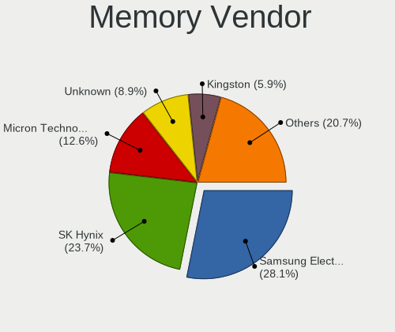

| Vendor              | Notebooks | Percent |
|---------------------|-----------|---------|
| Samsung Electronics | 27        | 28.72%  |
| SK Hynix            | 25        | 26.6%   |
| Micron Technology   | 10        | 10.64%  |
| Kingston            | 10        | 10.64%  |
| Unknown             | 8         | 8.51%   |
| Ramaxel Technology  | 4         | 4.26%   |
| Elpida              | 4         | 4.26%   |
| Unknown (ABCD)      | 2         | 2.13%   |
| Toshiba             | 1         | 1.06%   |
| PUSKILL             | 1         | 1.06%   |
| Nanya Technology    | 1         | 1.06%   |
| Crucial             | 1         | 1.06%   |

Memory Model
------------

Memory module models

| Model                                                               | Notebooks | Percent |
|---------------------------------------------------------------------|-----------|---------|
| SK Hynix RAM HMA81GS6AFR8N-UH 8GB SODIMM DDR4 2667MT/s              | 4         | 3.74%   |
| Samsung RAM M471B5273CH0-CH9 4096MB SODIMM DDR3 1334MT/s            | 3         | 2.8%    |
| Samsung RAM M471B5173QH0-YK0 4096MB SODIMM DDR3 1600MT/s            | 3         | 2.8%    |
| Unknown (ABCD) RAM 123456789012345678 2048MB SODIMM LPDDR4 2400MT/s | 2         | 1.87%   |
| SK Hynix RAM HMT351S6CFR8C-PB 4096MB SODIMM DDR3 1600MT/s           | 2         | 1.87%   |
| SK Hynix RAM HMA851S6CJR6N-UH 4GB SODIMM DDR4 2400MT/s              | 2         | 1.87%   |
| Samsung RAM M471B5173DB0-YK0 4GB SODIMM DDR3 1600MT/s               | 2         | 1.87%   |
| Samsung RAM M471A1K43CB1-CRC 8192MB SODIMM DDR4 2667MT/s            | 2         | 1.87%   |
| Micron RAM 4ATF51264HZ-3G2J1 4096MB SODIMM DDR4 3200MT/s            | 2         | 1.87%   |
| Unknown SODIMM 2048MB SODIMM DDR2 533MT/s                           | 1         | 0.93%   |
| Unknown RAM Module 8192MB SODIMM DDR3 1333MT/s                      | 1         | 0.93%   |
| Unknown RAM Module 4GB SODIMM DDR3                                  | 1         | 0.93%   |
| Unknown RAM Module 4096MB SODIMM DDR3 1600MT/s                      | 1         | 0.93%   |
| Unknown RAM Module 4096MB SODIMM DDR3 1333MT/s                      | 1         | 0.93%   |
| Unknown RAM Module 2048MB SODIMM DRAM                               | 1         | 0.93%   |
| Unknown RAM Module 2048MB DDR3 1600MT/s                             | 1         | 0.93%   |
| Unknown RAM Module 1024MB SODIMM 667MT/s                            | 1         | 0.93%   |
| Toshiba RAM 64T128020EDL2.5C2 2048MB SODIMM DDR2 1066MT/s           | 1         | 0.93%   |
| SK Hynix RAM Module 16384MB SODIMM DDR4 3200MT/s                    | 1         | 0.93%   |
| SK Hynix RAM HMT451S6CFR6A-PB 4096MB SODIMM DDR3 1600MT/s           | 1         | 0.93%   |
| SK Hynix RAM HMT451S6BFR8A-PB 4096MB SODIMM DDR3 1600MT/s           | 1         | 0.93%   |
| SK Hynix RAM HMT451S6AFR8A-PB 4GB SODIMM DDR3 1600MT/s              | 1         | 0.93%   |
| SK Hynix RAM HMT351S6EFR8C-PB 4096MB SODIMM DDR3 1600MT/s           | 1         | 0.93%   |
| SK Hynix RAM HMT351S6EFR8A 4GB SODIMM DDR3 1600MT/s                 | 1         | 0.93%   |
| SK Hynix RAM HMT351S6CFR8C-H9 4GB SODIMM DDR3 1333MT/s              | 1         | 0.93%   |
| SK Hynix RAM HMT325S6CFR8C-PB 2048MB SODIMM DDR3 1600MT/s           | 1         | 0.93%   |
| SK Hynix RAM HMT125S6TFR8C-H9 2048MB SODIMM DDR3 1333MT/s           | 1         | 0.93%   |
| SK Hynix RAM HMT125S6BFR8C-G7 2048MB SODIMM DDR3 1067MT/s           | 1         | 0.93%   |
| SK Hynix RAM HMAB2GS6AMR6N-XN 16384MB SODIMM DDR4 3200MT/s          | 1         | 0.93%   |
| SK Hynix RAM HMAA1GS6CMR6N-XN 8GB SODIMM DDR4 3200MT/s              | 1         | 0.93%   |
| SK Hynix RAM HMAA1GS6CMR6N-VK 8192MB SODIMM DDR4 2667MT/s           | 1         | 0.93%   |
| SK Hynix RAM HMA851S6JJR6N-VK 4GB SODIMM DDR4 2667MT/s              | 1         | 0.93%   |
| SK Hynix RAM HMA851S6CJR6N-VK 4GB SODIMM DDR4 2667MT/s              | 1         | 0.93%   |
| SK Hynix RAM HMA851S6AFR6N-UH 4GB SODIMM DDR4 2400MT/s              | 1         | 0.93%   |
| SK Hynix RAM HMA82GS6MFR8N-TF 16384MB SODIMM DDR4 2133MT/s          | 1         | 0.93%   |
| SK Hynix RAM HMA82GS6DJR8N-XN 16384MB SODIMM DDR4 3200MT/s          | 1         | 0.93%   |
| SK Hynix RAM HMA82GS6DJR8N-VK 16GB SODIMM DDR4 2667MT/s             | 1         | 0.93%   |
| SK Hynix RAM HMA82GS6CJR8N-VK 16384MB SODIMM DDR4 2667MT/s          | 1         | 0.93%   |
| SK Hynix RAM HMA81GS6CJR8N-VK 8GB SODIMM DDR4 2667MT/s              | 1         | 0.93%   |
| SK Hynix RAM HMA81GS6CJR8N-VK 8192MB SODIMM DDR4 2667MT/s           | 1         | 0.93%   |
| Samsung RAM Module 8192MB Row Of Chips LPDDR3 2133MT/s              | 1         | 0.93%   |
| Samsung RAM Module 4096MB SODIMM DDR3 1600MT/s                      | 1         | 0.93%   |
| Samsung RAM M471B5773DH0-CK0 2048MB SODIMM DDR3 1600MT/s            | 1         | 0.93%   |
| Samsung RAM M471B5773DH0-CH9 2048MB SODIMM DDR3 1600MT/s            | 1         | 0.93%   |
| Samsung RAM M471B5773CHS-CH9 2048MB SODIMM DDR3 4199MT/s            | 1         | 0.93%   |
| Samsung RAM M471B5673FH0-CH9 2GB SODIMM 1333MT/s                    | 1         | 0.93%   |
| Samsung RAM M471B5673EH1-CH9 2GB SODIMM DDR3 1334MT/s               | 1         | 0.93%   |
| Samsung RAM M471B5273DH0-CK0 4096MB SODIMM DDR3 1600MT/s            | 1         | 0.93%   |
| Samsung RAM M471B5273CH0-YK0 4096MB SODIMM DDR3 1600MT/s            | 1         | 0.93%   |
| Samsung RAM M471B5273CH0-CK0 4096MB SODIMM DDR3 1600MT/s            | 1         | 0.93%   |
| Samsung RAM M471B5173EB0-YK0 4096MB SODIMM DDR3 1600MT/s            | 1         | 0.93%   |
| Samsung RAM M471B5173CB0-YK0 4096MB SODIMM DDR3 1600MT/s            | 1         | 0.93%   |
| Samsung RAM M471B1G73DB0-YK0 8GB SODIMM DDR3 1600MT/s               | 1         | 0.93%   |
| Samsung RAM M471A5244CB0-CWE 4GB Row Of Chips DDR4 3200MT/s         | 1         | 0.93%   |
| Samsung RAM M471A5244CB0-CWE 4096MB SODIMM DDR4 3200MT/s            | 1         | 0.93%   |
| Samsung RAM M471A5244BB0-CPB 4096MB SODIMM DDR4 2400MT/s            | 1         | 0.93%   |
| Samsung RAM M471A2K43CB1-CRC 16384MB SODIMM DDR4 2667MT/s           | 1         | 0.93%   |
| Samsung RAM M471A2G43AB2-CWE 16384MB SODIMM DDR4 3200MT/s           | 1         | 0.93%   |
| Samsung RAM M471A1K43DB1-CWE 8GB SODIMM DDR4 3200MT/s               | 1         | 0.93%   |
| Samsung RAM M471A1G44AB0-CWE 8GB SODIMM DDR4 3200MT/s               | 1         | 0.93%   |

Memory Kind
-----------

Memory module kinds

| Kind    | Notebooks | Percent |
|---------|-----------|---------|
| DDR3    | 40        | 48.78%  |
| DDR4    | 32        | 39.02%  |
| LPDDR3  | 3         | 3.66%   |
| LPDDR4  | 2         | 2.44%   |
| DDR2    | 2         | 2.44%   |
| SDRAM   | 1         | 1.22%   |
| DRAM    | 1         | 1.22%   |
| Unknown | 1         | 1.22%   |

Memory Form Factor
------------------

Physical design of the memory module

| Name         | Notebooks | Percent |
|--------------|-----------|---------|
| SODIMM       | 76        | 91.57%  |
| Row Of Chips | 6         | 7.23%   |
| Unknown      | 1         | 1.2%    |

Memory Size
-----------

Memory module size

| Size  | Notebooks | Percent |
|-------|-----------|---------|
| 4096  | 39        | 42.86%  |
| 8192  | 27        | 29.67%  |
| 2048  | 14        | 15.38%  |
| 16384 | 10        | 10.99%  |
| 1024  | 1         | 1.1%    |

Memory Speed
------------

Memory module speed

| Speed   | Notebooks | Percent |
|---------|-----------|---------|
| 1600    | 28        | 31.46%  |
| 2667    | 16        | 17.98%  |
| 2400    | 10        | 11.24%  |
| 3200    | 9         | 10.11%  |
| 1334    | 7         | 7.87%   |
| 1333    | 6         | 6.74%   |
| 2133    | 4         | 4.49%   |
| 1067    | 2         | 2.25%   |
| Unknown | 2         | 2.25%   |
| 4199    | 1         | 1.12%   |
| 1866    | 1         | 1.12%   |
| 1066    | 1         | 1.12%   |
| 667     | 1         | 1.12%   |
| 533     | 1         | 1.12%   |

Sound Vendor
------------

Sound card vendors

| Vendor                           | Notebooks | Percent |
|----------------------------------|-----------|---------|
| Intel                            | 218       | 69.21%  |
| AMD                              | 55        | 17.46%  |
| Nvidia                           | 30        | 9.52%   |
| Silicon Integrated Systems [SiS] | 2         | 0.63%   |
| GN Netcom                        | 2         | 0.63%   |
| C-Media Electronics              | 2         | 0.63%   |
| Silicon Motion                   | 1         | 0.32%   |
| Razer USA                        | 1         | 0.32%   |
| QinHeng Electronics              | 1         | 0.32%   |
| Lenovo                           | 1         | 0.32%   |
| KORG                             | 1         | 0.32%   |
| Generalplus Technology           | 1         | 0.32%   |

Sound Model
-----------

Sound card models

| Model                                                                                             | Notebooks | Percent |
|---------------------------------------------------------------------------------------------------|-----------|---------|
| Intel 7 Series/C216 Chipset Family High Definition Audio Controller                               | 39        | 10%     |
| Intel Sunrise Point-LP HD Audio                                                                   | 25        | 6.41%   |
| Intel 6 Series/C200 Series Chipset Family High Definition Audio Controller                        | 18        | 4.62%   |
| AMD Family 17h (Models 10h-1fh) HD Audio Controller                                               | 18        | 4.62%   |
| Intel 5 Series/3400 Series Chipset High Definition Audio                                          | 17        | 4.36%   |
| Intel Haswell-ULT HD Audio Controller                                                             | 14        | 3.59%   |
| Intel 8 Series/C220 Series Chipset High Definition Audio Controller                               | 14        | 3.59%   |
| Intel 8 Series HD Audio Controller                                                                | 14        | 3.59%   |
| Intel 82801I (ICH9 Family) HD Audio Controller                                                    | 13        | 3.33%   |
| AMD FCH Azalia Controller                                                                         | 12        | 3.08%   |
| Intel Wildcat Point-LP High Definition Audio Controller                                           | 11        | 2.82%   |
| Intel NM10/ICH7 Family High Definition Audio Controller                                           | 11        | 2.82%   |
| Intel Broadwell-U Audio Controller                                                                | 11        | 2.82%   |
| Intel Xeon E3-1200 v3/4th Gen Core Processor HD Audio Controller                                  | 10        | 2.56%   |
| AMD Renoir Radeon High Definition Audio Controller                                                | 9         | 2.31%   |
| AMD Raven/Raven2/Fenghuang HDMI/DP Audio Controller                                               | 9         | 2.31%   |
| AMD Kabini HDMI/DP Audio                                                                          | 8         | 2.05%   |
| Intel CM238 HD Audio Controller                                                                   | 7         | 1.79%   |
| AMD SBx00 Azalia (Intel HDA)                                                                      | 7         | 1.79%   |
| Nvidia GF108 High Definition Audio Controller                                                     | 6         | 1.54%   |
| Intel Cannon Lake PCH cAVS                                                                        | 6         | 1.54%   |
| Intel Atom/Celeron/Pentium Processor x5-E8000/J3xxx/N3xxx Series High Definition Audio Controller | 6         | 1.54%   |
| Intel Comet Lake PCH-LP cAVS                                                                      | 5         | 1.28%   |
| Intel Atom Processor Z36xxx/Z37xxx Series High Definition Audio Controller                        | 5         | 1.28%   |
| AMD Cedar HDMI Audio [Radeon HD 5400/6300/7300 Series]                                            | 5         | 1.28%   |
| Intel Cannon Point-LP High Definition Audio Controller                                            | 4         | 1.03%   |
| Intel 82801H (ICH8 Family) HD Audio Controller                                                    | 4         | 1.03%   |
| AMD Trinity HDMI Audio Controller                                                                 | 4         | 1.03%   |
| AMD RV710/730 HDMI Audio [Radeon HD 4000 series]                                                  | 4         | 1.03%   |
| AMD Family 15h (Models 60h-6fh) Audio Controller                                                  | 4         | 1.03%   |
| Nvidia High Definition Audio Controller                                                           | 3         | 0.77%   |
| Nvidia GP107GL High Definition Audio Controller                                                   | 3         | 0.77%   |
| Nvidia GK107 HDMI Audio Controller                                                                | 3         | 0.77%   |
| Intel Ice Lake-LP Smart Sound Technology Audio Controller                                         | 3         | 0.77%   |
| Intel Comet Lake PCH cAVS                                                                         | 3         | 0.77%   |
| Intel Celeron/Pentium Silver Processor High Definition Audio                                      | 3         | 0.77%   |
| AMD Wrestler HDMI Audio                                                                           | 3         | 0.77%   |
| AMD High Definition Audio Controller                                                              | 3         | 0.77%   |
| Silicon Integrated Systems [SiS] Azalia Audio Controller                                          | 2         | 0.51%   |
| Nvidia TU106 High Definition Audio Controller                                                     | 2         | 0.51%   |
| Nvidia GK106 HDMI Audio Controller                                                                | 2         | 0.51%   |
| Nvidia GF119 HDMI Audio Controller                                                                | 2         | 0.51%   |
| Intel Celeron N3350/Pentium N4200/Atom E3900 Series Audio Cluster                                 | 2         | 0.51%   |
| Intel 82801FB/FBM/FR/FW/FRW (ICH6 Family) High Definition Audio Controller                        | 2         | 0.51%   |
| Intel 100 Series/C230 Series Chipset Family HD Audio Controller                                   | 2         | 0.51%   |
| Silicon Motion SMI USB Display                                                                    | 1         | 0.26%   |
| Razer USA Nari (Wireless)                                                                         | 1         | 0.26%   |
| QinHeng Electronics CH345 MIDI adapter                                                            | 1         | 0.26%   |
| Nvidia TU116 High Definition Audio Controller                                                     | 1         | 0.26%   |
| Nvidia TU107 GeForce GTX 1650 High Definition Audio Controller                                    | 1         | 0.26%   |
| Nvidia MCP79 High Definition Audio                                                                | 1         | 0.26%   |
| Nvidia GT216 HDMI Audio Controller                                                                | 1         | 0.26%   |
| Nvidia GP104 High Definition Audio Controller                                                     | 1         | 0.26%   |
| Nvidia GM107 High Definition Audio Controller [GeForce 940MX]                                     | 1         | 0.26%   |
| Nvidia GK208 HDMI/DP Audio Controller                                                             | 1         | 0.26%   |
| Nvidia GF116 High Definition Audio Controller                                                     | 1         | 0.26%   |
| Nvidia GF114 HDMI Audio Controller                                                                | 1         | 0.26%   |
| Lenovo ThinkPad Dock Audio                                                                        | 1         | 0.26%   |
| KORG JamVOX                                                                                       | 1         | 0.26%   |
| Intel USB PnP Sound Device                                                                        | 1         | 0.26%   |

Camera Vendor
-------------

Camera device vendors

| Vendor                                 | Notebooks | Percent |
|----------------------------------------|-----------|---------|
| Chicony Electronics                    | 48        | 22.22%  |
| Realtek Semiconductor                  | 24        | 11.11%  |
| Microdia                               | 21        | 9.72%   |
| Acer                                   | 19        | 8.8%    |
| IMC Networks                           | 16        | 7.41%   |
| Sunplus Innovation Technology          | 15        | 6.94%   |
| Cheng Uei Precision Industry (Foxlink) | 11        | 5.09%   |
| Suyin                                  | 10        | 4.63%   |
| Quanta                                 | 10        | 4.63%   |
| Silicon Motion                         | 9         | 4.17%   |
| Lite-On Technology                     | 6         | 2.78%   |
| Importek                               | 4         | 1.85%   |
| Luxvisions Innotech Limited            | 3         | 1.39%   |
| Syntek                                 | 2         | 0.93%   |
| Mustek Systems                         | 2         | 0.93%   |
| Logitech                               | 2         | 0.93%   |
| DigiTech                               | 2         | 0.93%   |
| Apple                                  | 2         | 0.93%   |
| Alcor Micro                            | 2         | 0.93%   |
| Z-Star Microelectronics                | 1         | 0.46%   |
| Ricoh                                  | 1         | 0.46%   |
| Primax Electronics                     | 1         | 0.46%   |
| Omnivision                             | 1         | 0.46%   |
| Novatek Microelectronics               | 1         | 0.46%   |
| Lenovo                                 | 1         | 0.46%   |
| Creative Technology                    | 1         | 0.46%   |
| ALi                                    | 1         | 0.46%   |

Camera Model
------------

Camera device models

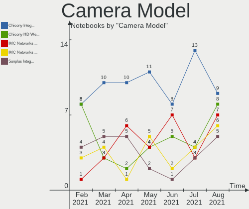

| Model                                                          | Notebooks | Percent |
|----------------------------------------------------------------|-----------|---------|
| Chicony HD WebCam                                              | 8         | 3.69%   |
| Acer Integrated Camera                                         | 7         | 3.23%   |
| Microdia Integrated_Webcam_HD                                  | 6         | 2.76%   |
| IMC Networks USB2.0 HD UVC WebCam                              | 6         | 2.76%   |
| Sunplus Integrated_Webcam_HD                                   | 3         | 1.38%   |
| Sunplus Asus Webcam                                            | 3         | 1.38%   |
| Realtek USB2.0 VGA UVC WebCam                                  | 3         | 1.38%   |
| Realtek USB2.0 HD UVC WebCam                                   | 3         | 1.38%   |
| Realtek Integrated_Webcam_HD                                   | 3         | 1.38%   |
| Realtek Integrated Webcam                                      | 3         | 1.38%   |
| Microdia Laptop_Integrated_Webcam_HD                           | 3         | 1.38%   |
| Microdia HP Webcam                                             | 3         | 1.38%   |
| Importek TOSHIBA Web Camera - HD                               | 3         | 1.38%   |
| IMC Networks Integrated Camera                                 | 3         | 1.38%   |
| Chicony USB 2.0 Camera                                         | 3         | 1.38%   |
| Chicony Lenovo EasyCamera                                      | 3         | 1.38%   |
| Chicony Integrated Camera                                      | 3         | 1.38%   |
| Chicony FJ Camera                                              | 3         | 1.38%   |
| Cheng Uei Precision Industry (Foxlink) HP Webcam               | 3         | 1.38%   |
| Acer SunplusIT Integrated Camera                               | 3         | 1.38%   |
| Suyin Integrated_Webcam_HD                                     | 2         | 0.92%   |
| Suyin HP Truevision HD                                         | 2         | 0.92%   |
| Suyin 1.3M WebCam (notebook emachines E730, Acer sub-brand)    | 2         | 0.92%   |
| Silicon Motion WebCam SC-13HDL11939N                           | 2         | 0.92%   |
| Realtek USB Camera                                             | 2         | 0.92%   |
| Realtek Integrated Webcam HD                                   | 2         | 0.92%   |
| Realtek HP Truevision HD                                       | 2         | 0.92%   |
| Realtek EasyCamera                                             | 2         | 0.92%   |
| Quanta HP Wide Vision HD Camera                                | 2         | 0.92%   |
| Quanta HP Webcam                                               | 2         | 0.92%   |
| Quanta HP TrueVision HD Camera                                 | 2         | 0.92%   |
| Mustek Systems USB 2.0 PC Camera                               | 2         | 0.92%   |
| Microdia USB 2.0 Camera                                        | 2         | 0.92%   |
| Microdia Integrated Webcam                                     | 2         | 0.92%   |
| Luxvisions Innotech Limited Integrated Camera                  | 2         | 0.92%   |
| Logitech Webcam C270                                           | 2         | 0.92%   |
| Lite-On Integrated Camera                                      | 2         | 0.92%   |
| Lite-On HP HD Camera                                           | 2         | 0.92%   |
| IMC Networks USB2.0 UVC HD Webcam                              | 2         | 0.92%   |
| DigiTech WebCam SCB-1110M                                      | 2         | 0.92%   |
| Chicony VGA Webcam                                             | 2         | 0.92%   |
| Chicony USB2.0 VGA UVC WebCam                                  | 2         | 0.92%   |
| Chicony TOSHIBA Web Camera - HD                                | 2         | 0.92%   |
| Chicony Integrated Camera (1280x720@30)                        | 2         | 0.92%   |
| Chicony HP Truevision HD                                       | 2         | 0.92%   |
| Chicony HP HD Webcam [Fixed]                                   | 2         | 0.92%   |
| Chicony CNF9055 Toshiba Webcam                                 | 2         | 0.92%   |
| Cheng Uei Precision Industry (Foxlink) HP Webcam-101           | 2         | 0.92%   |
| Cheng Uei Precision Industry (Foxlink) HP TrueVision HD Camera | 2         | 0.92%   |
| Cheng Uei Precision Industry (Foxlink) HP TrueVision HD        | 2         | 0.92%   |
| Acer HP Webcam-101                                             | 2         | 0.92%   |
| Acer HD Webcam                                                 | 2         | 0.92%   |
| Acer BisonCam, NB Pro                                          | 2         | 0.92%   |
| Z-Star Namuga 1.3M Webcam                                      | 1         | 0.46%   |
| Syntek USB2.0 Camera                                           | 1         | 0.46%   |
| Syntek Sonix 1.3MPixel USB 2.0 Camera                          | 1         | 0.46%   |
| Suyin WebCam                                                   | 1         | 0.46%   |
| Suyin UVC 1.3MPixel WebCam                                     | 1         | 0.46%   |
| Suyin Acer/HP Integrated Webcam [CN0314]                       | 1         | 0.46%   |
| Suyin 1.3M HD WebCam                                           | 1         | 0.46%   |

Fingerprint Vendor
------------------

Fingerprint sensor vendors

| Vendor                | Notebooks | Percent |
|-----------------------|-----------|---------|
| Validity Sensors      | 12        | 37.5%   |
| AuthenTec             | 8         | 25%     |
| Synaptics             | 7         | 21.88%  |
| Upek                  | 3         | 9.38%   |
| LighTuning Technology | 1         | 3.13%   |
| Elan Microelectronics | 1         | 3.13%   |

Fingerprint Model
-----------------

Fingerprint sensor models

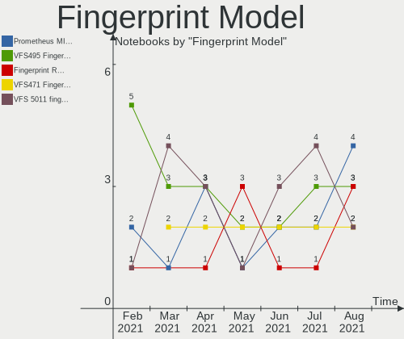

| Model                                                  | Notebooks | Percent |
|--------------------------------------------------------|-----------|---------|
| Validity Sensors VFS495 Fingerprint Reader             | 3         | 9.38%   |
| Upek Biometric Touchchip/Touchstrip Fingerprint Sensor | 3         | 9.38%   |
| Synaptics Metallica MIS Touch Fingerprint Reader       | 3         | 9.38%   |
| AuthenTec AES2810                                      | 3         | 9.38%   |
| Validity Sensors VFS5011 Fingerprint Reader            | 2         | 6.25%   |
| Validity Sensors VFS491                                | 2         | 6.25%   |
| Validity Sensors VFS451 Fingerprint Reader             | 2         | 6.25%   |
| Synaptics Prometheus MIS Touch Fingerprint Reader      | 2         | 6.25%   |
| AuthenTec Fingerprint Sensor                           | 2         | 6.25%   |
| AuthenTec AES1600                                      | 2         | 6.25%   |
| Validity Sensors VFS300 Fingerprint Reader             | 1         | 3.13%   |
| Validity Sensors VFS 5011 fingerprint sensor           | 1         | 3.13%   |
| Validity Sensors Synaptics WBDI                        | 1         | 3.13%   |
| Synaptics Metallica MOH Touch Fingerprint Reader       | 1         | 3.13%   |
| LighTuning EgisTec Touch Fingerprint Sensor            | 1         | 3.13%   |
| Elan ELAN:Fingerprint                                  | 1         | 3.13%   |
| AuthenTec AES2501 Fingerprint Sensor                   | 1         | 3.13%   |
| Unknown                                                | 1         | 3.13%   |

Chipcard Vendor
---------------

Chipcard module vendors

| Vendor      | Notebooks | Percent |
|-------------|-----------|---------|
| Broadcom    | 7         | 43.75%  |
| Alcor Micro | 4         | 25%     |
| O2 Micro    | 3         | 18.75%  |
| Upek        | 1         | 6.25%   |
| Lenovo      | 1         | 6.25%   |

Chipcard Model
--------------

Chipcard module models

| Model                                                                        | Notebooks | Percent |
|------------------------------------------------------------------------------|-----------|---------|
| Broadcom BCM5880 Secure Applications Processor with fingerprint swipe sensor | 4         | 25%     |
| Alcor Micro AU9540 Smartcard Reader                                          | 4         | 25%     |
| Broadcom BCM5880 Secure Applications Processor                               | 3         | 18.75%  |
| O2 Micro Oz776 SmartCard Reader                                              | 2         | 12.5%   |
| Upek TouchChip Fingerprint Coprocessor (WBF advanced mode)                   | 1         | 6.25%   |
| O2 Micro OZ776 CCID Smartcard Reader                                         | 1         | 6.25%   |
| Lenovo Integrated Smart Card Reader                                          | 1         | 6.25%   |

Printer Vendor
--------------

Printer device vendors

| Vendor              | Notebooks | Percent |
|---------------------|-----------|---------|
| Samsung Electronics | 1         | 33.33%  |
| Kyocera             | 1         | 33.33%  |
| Canon               | 1         | 33.33%  |

Printer Model
-------------

Printer device models

| Model                     | Notebooks | Percent |
|---------------------------|-----------|---------|
| Samsung M267x 287x Series | 1         | 33.33%  |
| Kyocera Mita FS-820       | 1         | 33.33%  |
| Canon G4000 series        | 1         | 33.33%  |

Scanner Vendor
--------------

Scanner device vendors

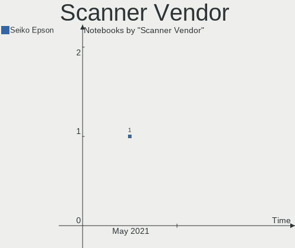

| Vendor          | Notebooks | Percent |
|-----------------|-----------|---------|
| Hewlett-Packard | 1         | 100%    |

Scanner Model
-------------

Scanner device models

| Model            | Notebooks | Percent |
|------------------|-----------|---------|
| HP ScanJet 2400c | 1         | 100%    |

Bluetooth Vendor
----------------

Controller vendors

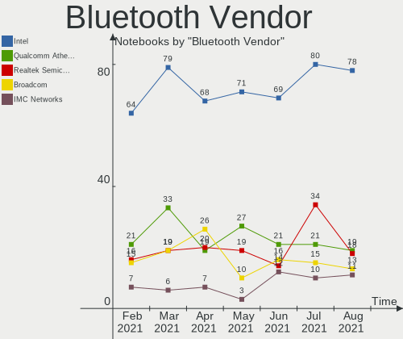

| Vendor                          | Notebooks | Percent |
|---------------------------------|-----------|---------|
| Intel                           | 80        | 40.4%   |
| Realtek Semiconductor           | 21        | 10.61%  |
| Qualcomm Atheros Communications | 20        | 10.1%   |
| Broadcom                        | 14        | 7.07%   |
| Foxconn / Hon Hai               | 10        | 5.05%   |
| Cambridge Silicon Radio         | 9         | 4.55%   |
| IMC Networks                    | 7         | 3.54%   |
| Dell                            | 7         | 3.54%   |
| Apple                           | 7         | 3.54%   |
| Lite-On Technology              | 6         | 3.03%   |
| Hewlett-Packard                 | 6         | 3.03%   |
| Ralink                          | 5         | 2.53%   |
| Toshiba                         | 3         | 1.52%   |
| Foxconn International           | 1         | 0.51%   |
| ASUSTek Computer                | 1         | 0.51%   |
| Alps Electric                   | 1         | 0.51%   |

Bluetooth Model
---------------

Controller models

| Model                                                                               | Notebooks | Percent |
|-------------------------------------------------------------------------------------|-----------|---------|
| Intel Bluetooth wireless interface                                                  | 32        | 16.16%  |
| Intel Bluetooth Device                                                              | 29        | 14.65%  |
| Realtek Bluetooth Radio                                                             | 12        | 6.06%   |
| Cambridge Silicon Radio Bluetooth Dongle (HCI mode)                                 | 9         | 4.55%   |
| Intel Bluetooth 9460/9560 Jefferson Peak (JfP)                                      | 8         | 4.04%   |
| Qualcomm Atheros  Bluetooth Device                                                  | 6         | 3.03%   |
| Intel Centrino Bluetooth Wireless Transceiver                                       | 6         | 3.03%   |
| Realtek  Bluetooth 4.2 Adapter                                                      | 5         | 2.53%   |
| Ralink RT3290 Bluetooth                                                             | 5         | 2.53%   |
| Qualcomm Atheros QCA61x4 Bluetooth 4.0                                              | 4         | 2.02%   |
| HP Bluetooth 2.0 Interface [Broadcom BCM2045]                                       | 4         | 2.02%   |
| Apple Bluetooth Host Controller                                                     | 4         | 2.02%   |
| Qualcomm Atheros AR3012 Bluetooth 4.0                                               | 3         | 1.52%   |
| Qualcomm Atheros AR3011 Bluetooth                                                   | 3         | 1.52%   |
| Intel Centrino Advanced-N 6230 Bluetooth adapter                                    | 3         | 1.52%   |
| IMC Networks Bluetooth Device                                                       | 3         | 1.52%   |
| Foxconn / Hon Hai Bluetooth Device                                                  | 3         | 1.52%   |
| Dell DW375 Bluetooth Module                                                         | 3         | 1.52%   |
| Broadcom BCM2045B (BDC-2.1)                                                         | 3         | 1.52%   |
| Realtek RTL8723B Bluetooth                                                          | 2         | 1.01%   |
| Qualcomm Atheros AR9462 Bluetooth                                                   | 2         | 1.01%   |
| Lite-On Atheros AR3012 Bluetooth                                                    | 2         | 1.01%   |
| Intel Wireless-AC 3168 Bluetooth                                                    | 2         | 1.01%   |
| IMC Networks BCM20702A0                                                             | 2         | 1.01%   |
| Foxconn / Hon Hai BCM20702A0                                                        | 2         | 1.01%   |
| Dell BCM20702A0 Bluetooth Module                                                    | 2         | 1.01%   |
| Broadcom BCM43142A0 Bluetooth 4.0                                                   | 2         | 1.01%   |
| Broadcom BCM2070 Bluetooth Device                                                   | 2         | 1.01%   |
| Broadcom BCM2045B (BDC-2.1) [Bluetooth Controller]                                  | 2         | 1.01%   |
| Apple Bluetooth USB Host Controller                                                 | 2         | 1.01%   |
| Toshiba Integrated Bluetooth HCI                                                    | 1         | 0.51%   |
| Toshiba Bluetooth USB Host Controller                                               | 1         | 0.51%   |
| Toshiba Bluetooth Device                                                            | 1         | 0.51%   |
| Realtek RTL8822BE Bluetooth 4.2 Adapter                                             | 1         | 0.51%   |
| Realtek RT Bluetooth Radio                                                          | 1         | 0.51%   |
| Qualcomm Atheros Bluetooth USB Host Controller                                      | 1         | 0.51%   |
| Qualcomm Atheros Bluetooth                                                          | 1         | 0.51%   |
| Lite-On Qualcomm Atheros QCA9377 Bluetooth                                          | 1         | 0.51%   |
| Lite-On Bluetooth Radio                                                             | 1         | 0.51%   |
| Lite-On Bluetooth Device                                                            | 1         | 0.51%   |
| Lite-On BCM43142A0                                                                  | 1         | 0.51%   |
| IMC Networks Bluetooth Radio                                                        | 1         | 0.51%   |
| IMC Networks Bluetooth                                                              | 1         | 0.51%   |
| HP Integrated Module with Bluetooth 2.1 Wireless technology                         | 1         | 0.51%   |
| HP Broadcom 2070 Bluetooth Combo                                                    | 1         | 0.51%   |
| Foxconn International BCM43142A0 Bluetooth module                                   | 1         | 0.51%   |
| Foxconn / Hon Hai Foxconn T77H114 BCM2070 [Single-Chip Bluetooth 2.1 + EDR Adapter] | 1         | 0.51%   |
| Foxconn / Hon Hai BT                                                                | 1         | 0.51%   |
| Foxconn / Hon Hai Bluetooth USB Host Controller                                     | 1         | 0.51%   |
| Foxconn / Hon Hai BCM43142A0 broadcom bluetooth                                     | 1         | 0.51%   |
| Foxconn / Hon Hai Acer Bluetooth module                                             | 1         | 0.51%   |
| Dell Wireless 355 Bluetooth                                                         | 1         | 0.51%   |
| Dell Wireless 350 Bluetooth                                                         | 1         | 0.51%   |
| Broadcom BCM43142A0 Bluetooth Device                                                | 1         | 0.51%   |
| Broadcom BCM20702 Bluetooth 4.0 [ThinkPad]                                          | 1         | 0.51%   |
| Broadcom BCM2070 Bluetooth 2.1 + EDR                                                | 1         | 0.51%   |
| Broadcom BCM2045B (BDC-2) [Bluetooth Controller]                                    | 1         | 0.51%   |
| Broadcom BCM2045 Bluetooth                                                          | 1         | 0.51%   |
| ASUS BT-183 Bluetooth 2.0+EDR adapter                                               | 1         | 0.51%   |
| Apple Bluetooth HCI                                                                 | 1         | 0.51%   |

Unsupported Devices
-------------------

Total unsupported devices on board

| Total | Notebooks | Percent |
|-------|-----------|---------|
| 0     | 178       | 66.92%  |
| 1     | 68        | 25.56%  |
| 2     | 17        | 6.39%   |
| 3     | 2         | 0.75%   |
| 5     | 1         | 0.38%   |

Unsupported Device Types
------------------------

Types of unsupported devices

| Type                     | Notebooks | Percent |
|--------------------------|-----------|---------|
| Fingerprint reader       | 32        | 28.32%  |
| Graphics card            | 22        | 19.47%  |
| Chipcard                 | 16        | 14.16%  |
| Net/wireless             | 14        | 12.39%  |
| Multimedia controller    | 7         | 6.19%   |
| Bluetooth                | 6         | 5.31%   |
| Communication controller | 5         | 4.42%   |
| Storage                  | 3         | 2.65%   |
| Modem                    | 3         | 2.65%   |
| Sound                    | 2         | 1.77%   |
| Flash memory             | 1         | 0.88%   |
| Card reader              | 1         | 0.88%   |
| Camera                   | 1         | 0.88%   |

