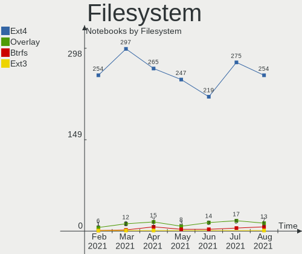
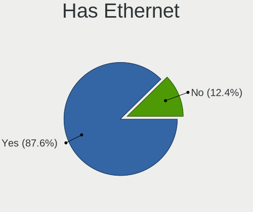
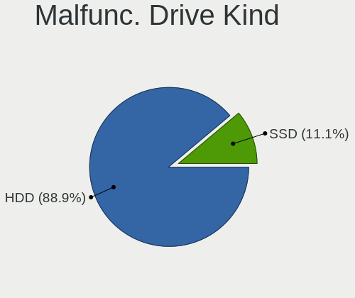
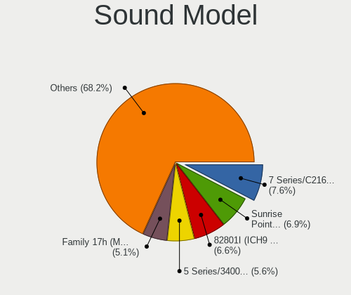
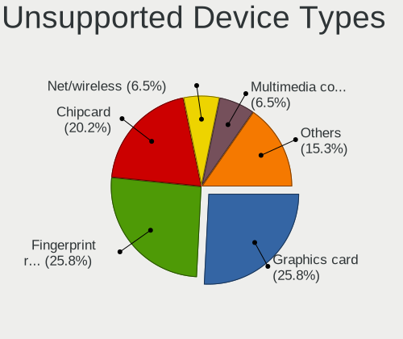

Mint Hardware Trends (Notebook)
-------------------------------

A project to identify most popular hardware characteristics and track their change
over time based on data collected by Mint users at https://Linux-Hardware.org.

Anyone can contribute to the study by uploading probes of their computers by
the [hw-probe](https://github.com/linuxhw/hw-probe) tool:

    sudo -E hw-probe -all -upload

Full-feature report is available here: https://linux-hardware.org/?view=trends&formfactor=notebook

Period: Apr, 2021.

Contents
--------

- [ OS                       ](#os)
- [ OS Family                ](#os-family)
- [ Kernel                   ](#kernel)
- [ Kernel Family            ](#kernel-family)
- [ Kernel Major Ver.        ](#kernel-major-ver)
- [ Arch                     ](#arch)
- [ DE                       ](#de)
- [ Display Server           ](#display-server)
- [ Display Manager          ](#display-manager)
- [ OS Lang                  ](#os-lang)
- [ Boot Mode                ](#boot-mode)
- [ Filesystem               ](#filesystem)
- [ Part. scheme             ](#part-scheme)
- [ Dual Boot with Linux/BSD ](#dual-boot-with-linux/bsd)
- [ Dual Boot (Win)          ](#dual-boot-win)
- [ Country                  ](#country)
- [ City                     ](#city)
- [ Vendor                   ](#vendor)
- [ Model                    ](#model)
- [ Model Family             ](#model-family)
- [ MFG Year                 ](#mfg-year)
- [ Form Factor              ](#form-factor)
- [ Secure Boot              ](#secure-boot)
- [ Coreboot                 ](#coreboot)
- [ RAM Size                 ](#ram-size)
- [ RAM Used                 ](#ram-used)
- [ Has CD-ROM               ](#has-cd-rom)
- [ Total Drives             ](#total-drives)
- [ Has Ethernet             ](#has-ethernet)
- [ Has WiFi                 ](#has-wifi)
- [ Has Bluetooth            ](#has-bluetooth)
- [ Drive Vendor             ](#drive-vendor)
- [ Drive Model              ](#drive-model)
- [ HDD Vendor               ](#hdd-vendor)
- [ SSD Vendor               ](#ssd-vendor)
- [ Drive Kind               ](#drive-kind)
- [ Drive Connector          ](#drive-connector)
- [ Drive Size               ](#drive-size)
- [ Space Total              ](#space-total)
- [ Space Used               ](#space-used)
- [ Malfunc. Drives          ](#malfunc-drives)
- [ Malfunc. Drive Vendor    ](#malfunc-drive-vendor)
- [ Malfunc. HDD Vendor      ](#malfunc-hdd-vendor)
- [ Malfunc. Drive Kind      ](#malfunc-drive-kind)
- [ Failed Drives            ](#failed-drives)
- [ Failed Drive Vendor      ](#failed-drive-vendor)
- [ Drive Status             ](#drive-status)
- [ Storage Vendor           ](#storage-vendor)
- [ Storage Model            ](#storage-model)
- [ Storage Kind             ](#storage-kind)
- [ CPU Vendor               ](#cpu-vendor)
- [ CPU Model                ](#cpu-model)
- [ CPU Model Family         ](#cpu-model-family)
- [ CPU Cores                ](#cpu-cores)
- [ CPU Sockets              ](#cpu-sockets)
- [ CPU Threads              ](#cpu-threads)
- [ CPU Op-Modes             ](#cpu-op-modes)
- [ CPU Microcode            ](#cpu-microcode)
- [ CPU Microarch            ](#cpu-microarch)
- [ GPU Vendor               ](#gpu-vendor)
- [ GPU Model                ](#gpu-model)
- [ GPU Combo                ](#gpu-combo)
- [ GPU Driver               ](#gpu-driver)
- [ GPU Memory               ](#gpu-memory)
- [ Monitor Vendor           ](#monitor-vendor)
- [ Monitor Model            ](#monitor-model)
- [ Monitor Resolution       ](#monitor-resolution)
- [ Monitor Diagonal         ](#monitor-diagonal)
- [ Monitor Width            ](#monitor-width)
- [ Aspect Ratio             ](#aspect-ratio)
- [ Monitor Area             ](#monitor-area)
- [ Pixel Density            ](#pixel-density)
- [ Multiple Monitors        ](#multiple-monitors)
- [ Net Controller Vendor    ](#net-controller-vendor)
- [ Net Controller Model     ](#net-controller-model)
- [ Wireless Vendor          ](#wireless-vendor)
- [ Wireless Model           ](#wireless-model)
- [ Ethernet Vendor          ](#ethernet-vendor)
- [ Ethernet Model           ](#ethernet-model)
- [ Net Controller Kind      ](#net-controller-kind)
- [ Used Controller          ](#used-controller)
- [ NICs                     ](#nics)
- [ IPv6                     ](#ipv6)
- [ Memory Vendor            ](#memory-vendor)
- [ Memory Model             ](#memory-model)
- [ Memory Kind              ](#memory-kind)
- [ Memory Form Factor       ](#memory-form-factor)
- [ Memory Size              ](#memory-size)
- [ Memory Speed             ](#memory-speed)
- [ Sound Vendor             ](#sound-vendor)
- [ Sound Model              ](#sound-model)
- [ Camera Vendor            ](#camera-vendor)
- [ Camera Model             ](#camera-model)
- [ Fingerprint Vendor       ](#fingerprint-vendor)
- [ Fingerprint Model        ](#fingerprint-model)
- [ Chipcard Vendor          ](#chipcard-vendor)
- [ Chipcard Model           ](#chipcard-model)
- [ Printer Vendor           ](#printer-vendor)
- [ Printer Model            ](#printer-model)
- [ Scanner Vendor           ](#scanner-vendor)
- [ Scanner Model            ](#scanner-model)
- [ Bluetooth Vendor         ](#bluetooth-vendor)
- [ Bluetooth Model          ](#bluetooth-model)
- [ Unsupported Devices      ](#unsupported-devices)
- [ Unsupported Device Types ](#unsupported-device-types)

OS
--

Installed operating systems

| Name      | Notebooks | Percent |
|-----------|-----------|---------|
| Mint 20.1 | 203       | 70%     |
| Mint 19.3 | 34        | 11.72%  |
| Mint 20   | 33        | 11.38%  |
| Mint 19.1 | 7         | 2.41%   |
| Mint 19   | 7         | 2.41%   |
| Mint 18.3 | 4         | 1.38%   |
| Mint 19.2 | 1         | 0.34%   |
| Mint 18.1 | 1         | 0.34%   |

OS Family
---------

OS without a version

| Name | Notebooks | Percent |
|------|-----------|---------|
| Mint | 290       | 100%    |

Kernel
------

Version of the Linux kernel

| Version                    | Notebooks | Percent |
|----------------------------|-----------|---------|
| 5.4.0-70-generic           | 98        | 33.79%  |
| 5.4.0-72-generic           | 67        | 23.1%   |
| 5.4.0-58-generic           | 22        | 7.59%   |
| 5.4.0-71-generic           | 21        | 7.24%   |
| 5.0.0-32-generic           | 11        | 3.79%   |
| 5.8.0-48-generic           | 8         | 2.76%   |
| 5.4.0-26-generic           | 8         | 2.76%   |
| 4.15.0-142-generic         | 7         | 2.41%   |
| 5.8.0-50-generic           | 6         | 2.07%   |
| 4.15.0-140-generic         | 6         | 2.07%   |
| 5.8.0-43-generic           | 3         | 1.03%   |
| 5.4.0-54-generic           | 3         | 1.03%   |
| 5.4.0-42-generic           | 3         | 1.03%   |
| 4.15.0-20-generic          | 3         | 1.03%   |
| 5.4.0-66-generic           | 2         | 0.69%   |
| 5.4.0-65-generic           | 2         | 0.69%   |
| 5.8.16-050816-generic      | 1         | 0.34%   |
| 5.8.0-49-generic           | 1         | 0.34%   |
| 5.8.0-48-lowlatency        | 1         | 0.34%   |
| 5.8.0-45-generic           | 1         | 0.34%   |
| 5.8.0-36-generic           | 1         | 0.34%   |
| 5.6.0-1052-oem             | 1         | 0.34%   |
| 5.4.0-67-generic           | 1         | 0.34%   |
| 5.4.0-60-generic           | 1         | 0.34%   |
| 5.4.0-56-generic           | 1         | 0.34%   |
| 5.11.12-051112-generic     | 1         | 0.34%   |
| 5.11.0-12.1-liquorix-amd64 | 1         | 0.34%   |
| 5.10.0-1022-oem            | 1         | 0.34%   |
| 4.4.0-166-generic          | 1         | 0.34%   |
| 4.15.0-91-generic          | 1         | 0.34%   |
| 4.15.0-54-generic          | 1         | 0.34%   |
| 4.15.0-141-generic         | 1         | 0.34%   |
| 4.15.0-137-generic         | 1         | 0.34%   |
| 4.15.0-128-generic         | 1         | 0.34%   |
| 4.10.0-38-generic          | 1         | 0.34%   |
| Unknown                    | 1         | 0.34%   |

Kernel Family
-------------

Linux kernel without a distro release

| Version | Notebooks | Percent |
|---------|-----------|---------|
| 5.4.0   | 229       | 78.97%  |
| 5.8.0   | 21        | 7.24%   |
| 4.15.0  | 21        | 7.24%   |
| 5.0.0   | 11        | 3.79%   |
| 5.8.16  | 1         | 0.34%   |
| 5.6.0   | 1         | 0.34%   |
| 5.11.12 | 1         | 0.34%   |
| 5.11.0  | 1         | 0.34%   |
| 5.10.0  | 1         | 0.34%   |
| 4.4.0   | 1         | 0.34%   |
| 4.10.0  | 1         | 0.34%   |
| Unknown | 1         | 0.34%   |

Kernel Major Ver.
-----------------

Linux kernel major version

| Version | Notebooks | Percent |
|---------|-----------|---------|
| 5.4     | 229       | 78.97%  |
| 5.8     | 22        | 7.59%   |
| 4.15    | 21        | 7.24%   |
| 5.0     | 11        | 3.79%   |
| 5.11    | 2         | 0.69%   |
| 5.6     | 1         | 0.34%   |
| 5.10    | 1         | 0.34%   |
| 4.4     | 1         | 0.34%   |
| 4.10    | 1         | 0.34%   |
| Unknown | 1         | 0.34%   |

Arch
----

OS architecture (x86_64, i586, etc.)

| Name   | Notebooks | Percent |
|--------|-----------|---------|
| x86_64 | 272       | 93.79%  |
| i686   | 18        | 6.21%   |

DE
--

Desktop Environment

| Name       | Notebooks | Percent |
|------------|-----------|---------|
| X-Cinnamon | 185       | 63.79%  |
| XFCE       | 47        | 16.21%  |
| MATE       | 31        | 10.69%  |
| Cinnamon   | 13        | 4.48%   |
| GNOME      | 7         | 2.41%   |
| Unknown    | 6         | 2.07%   |
| KDE        | 1         | 0.34%   |

Display Server
--------------

X11 or Wayland

| Name    | Notebooks | Percent |
|---------|-----------|---------|
| X11     | 288       | 99.31%  |
| Unknown | 2         | 0.69%   |

Display Manager
---------------

SDDM, LightDM, etc.

| Name    | Notebooks | Percent |
|---------|-----------|---------|
| Unknown | 188       | 64.83%  |
| TDM     | 100       | 34.48%  |
| MDM     | 1         | 0.34%   |
| GDM     | 1         | 0.34%   |

OS Lang
-------

Language

| Lang             | Notebooks | Percent |
|------------------|-----------|---------|
| en_US            | 70        | 24.14%  |
| de_DE            | 46        | 15.86%  |
| pt_BR            | 20        | 6.9%    |
| en_GB            | 17        | 5.86%   |
| C                | 15        | 5.17%   |
| fr_FR            | 12        | 4.14%   |
| ru_RU            | 11        | 3.79%   |
| pl_PL            | 10        | 3.45%   |
| es_ES            | 10        | 3.45%   |
| it_IT            | 9         | 3.1%    |
| en_CA            | 9         | 3.1%    |
| sv_SE            | 6         | 2.07%   |
| cs_CZ            | 5         | 1.72%   |
| es_MX            | 4         | 1.38%   |
| en_ZA            | 4         | 1.38%   |
| en_IN            | 4         | 1.38%   |
| es_AR            | 3         | 1.03%   |
| en_AU            | 3         | 1.03%   |
| tr_TR            | 2         | 0.69%   |
| sk_SK            | 2         | 0.69%   |
| ko_KR            | 2         | 0.69%   |
| hu_HU            | 2         | 0.69%   |
| fr_CH            | 2         | 0.69%   |
| es_CL            | 2         | 0.69%   |
| ca_ES            | 2         | 0.69%   |
| bg_BG            | 2         | 0.69%   |
| Unknown          | 2         | 0.69%   |
| ru_UA            | 1         | 0.34%   |
| ro_RO            | 1         | 0.34%   |
| pt_PT            | 1         | 0.34%   |
| nl_NL            | 1         | 0.34%   |
| nl_BE            | 1         | 0.34%   |
| hr_HR            | 1         | 0.34%   |
| fi_FI            | 1         | 0.34%   |
| et_EE            | 1         | 0.34%   |
| es_PR            | 1         | 0.34%   |
| en_PH            | 1         | 0.34%   |
| de_CH            | 1         | 0.34%   |
| de_BE            | 1         | 0.34%   |
| de_AT            | 1         | 0.34%   |
| cinnamon.desktop | 1         | 0.34%   |

Boot Mode
---------

EFI or BIOS

| Mode | Notebooks | Percent |
|------|-----------|---------|
| BIOS | 151       | 52.07%  |
| EFI  | 139       | 47.93%  |

Filesystem
----------

Type of filesystem

| Type    | Notebooks | Percent |
|---------|-----------|---------|
| Ext4    | 265       | 91.38%  |
| Overlay | 15        | 5.17%   |
| Btrfs   | 7         | 2.41%   |
| Xfs     | 1         | 0.34%   |
| Ext3    | 1         | 0.34%   |
| Aufs    | 1         | 0.34%   |

Part. scheme
------------

Scheme of partitioning

| Type    | Notebooks | Percent |
|---------|-----------|---------|
| Unknown | 186       | 64.14%  |
| GPT     | 63        | 21.72%  |
| MBR     | 41        | 14.14%  |

Dual Boot with Linux/BSD
------------------------

Hosting more than one Linux/BSD

| Dual boot | Notebooks | Percent |
|-----------|-----------|---------|
| No        | 277       | 95.52%  |
| Yes       | 13        | 4.48%   |

Dual Boot (Win)
---------------

Hosting Linux and Windows

| Dual boot | Notebooks | Percent |
|-----------|-----------|---------|
| No        | 251       | 86.55%  |
| Yes       | 39        | 13.45%  |

Country
-------

Geographic location (country)

| Country      | Notebooks | Percent |
|--------------|-----------|---------|
| Germany      | 52        | 17.93%  |
| Brazil       | 34        | 11.72%  |
| USA          | 33        | 11.38%  |
| UK           | 16        | 5.52%   |
| Spain        | 14        | 4.83%   |
| Russia       | 13        | 4.48%   |
| Poland       | 13        | 4.48%   |
| France       | 10        | 3.45%   |
| Italy        | 9         | 3.1%    |
| Canada       | 8         | 2.76%   |
| Sweden       | 7         | 2.41%   |
| Czechia      | 6         | 2.07%   |
| Mexico       | 5         | 1.72%   |
| Switzerland  | 4         | 1.38%   |
| South Africa | 4         | 1.38%   |
| India        | 4         | 1.38%   |
| Australia    | 4         | 1.38%   |
| Turkey       | 3         | 1.03%   |
| South Korea  | 3         | 1.03%   |
| Denmark      | 3         | 1.03%   |
| Bulgaria     | 3         | 1.03%   |
| Belgium      | 3         | 1.03%   |
| Argentina    | 3         | 1.03%   |
| Slovakia     | 2         | 0.69%   |
| Netherlands  | 2         | 0.69%   |
| Indonesia    | 2         | 0.69%   |
| Estonia      | 2         | 0.69%   |
| Colombia     | 2         | 0.69%   |
| Chile        | 2         | 0.69%   |
| Belarus      | 2         | 0.69%   |
| Austria      | 2         | 0.69%   |
| Uruguay      | 1         | 0.34%   |
| Ukraine      | 1         | 0.34%   |
| Tunisia      | 1         | 0.34%   |
| Serbia       | 1         | 0.34%   |
| Saudi Arabia | 1         | 0.34%   |
| Qatar        | 1         | 0.34%   |
| Puerto Rico  | 1         | 0.34%   |
| Portugal     | 1         | 0.34%   |
| Philippines  | 1         | 0.34%   |
| Norway       | 1         | 0.34%   |
| Moldova      | 1         | 0.34%   |
| Lebanon      | 1         | 0.34%   |
| Hungary      | 1         | 0.34%   |
| Finland      | 1         | 0.34%   |
| Egypt        | 1         | 0.34%   |
| Cyprus       | 1         | 0.34%   |
| Croatia      | 1         | 0.34%   |
| Costa Rica   | 1         | 0.34%   |
| Bangladesh   | 1         | 0.34%   |
| Algeria      | 1         | 0.34%   |

City
----

Geographic location (city)

| City                | Notebooks | Percent |
|---------------------|-----------|---------|
| London              | 5         | 1.72%   |
| Warsaw              | 4         | 1.38%   |
| São Paulo          | 4         | 1.38%   |
| Rockville           | 4         | 1.38%   |
| Rio de Janeiro      | 4         | 1.38%   |
| Milan               | 4         | 1.38%   |
| Wiesbaden           | 3         | 1.03%   |
| Toronto             | 3         | 1.03%   |
| Munich              | 3         | 1.03%   |
| Moscow              | 3         | 1.03%   |
| Elblag              | 3         | 1.03%   |
| Uba                 | 2         | 0.69%   |
| St Petersburg       | 2         | 0.69%   |
| Seelze              | 2         | 0.69%   |
| Rostock             | 2         | 0.69%   |
| Prague              | 2         | 0.69%   |
| New Delhi           | 2         | 0.69%   |
| Neuss               | 2         | 0.69%   |
| Minsk               | 2         | 0.69%   |
| Las Vegas           | 2         | 0.69%   |
| Krakow              | 2         | 0.69%   |
| Kazan’            | 2         | 0.69%   |
| Glasgow             | 2         | 0.69%   |
| Copenhagen          | 2         | 0.69%   |
| Cologne             | 2         | 0.69%   |
| Brasília           | 2         | 0.69%   |
| Berlin              | 2         | 0.69%   |
| Barcelona           | 2         | 0.69%   |
| České Budějovice | 1         | 0.34%   |
| Ålesund            | 1         | 0.34%   |
| Ängelholm          | 1         | 0.34%   |
| Zurich              | 1         | 0.34%   |
| Zagreb              | 1         | 0.34%   |
| Wroclaw             | 1         | 0.34%   |
| Winter Garden       | 1         | 0.34%   |
| Wembley             | 1         | 0.34%   |
| Webster             | 1         | 0.34%   |
| Washington          | 1         | 0.34%   |
| Vollsjoe            | 1         | 0.34%   |
| Villa Rosa          | 1         | 0.34%   |
| Vienna              | 1         | 0.34%   |
| Veseli nad Luznici  | 1         | 0.34%   |
| Toenisvorst         | 1         | 0.34%   |
| Tlemcen             | 1         | 0.34%   |
| Tiraspol            | 1         | 0.34%   |
| Tettnang Castle     | 1         | 0.34%   |
| Tamworth            | 1         | 0.34%   |
| Tallinn             | 1         | 0.34%   |
| São Leopoldo       | 1         | 0.34%   |
| São Carlos         | 1         | 0.34%   |
| Sydney              | 1         | 0.34%   |
| Surabaya            | 1         | 0.34%   |
| Sulphur             | 1         | 0.34%   |
| Stuttgart           | 1         | 0.34%   |
| Stokkem             | 1         | 0.34%   |
| Stoke-on-Trent      | 1         | 0.34%   |
| Steinfurt           | 1         | 0.34%   |
| Stamboliyski        | 1         | 0.34%   |
| St. John's          | 1         | 0.34%   |
| Sorocaba            | 1         | 0.34%   |

Vendor
------

Motherboard manufacturer

| Name                      | Notebooks | Percent |
|---------------------------|-----------|---------|
| Lenovo                    | 58        | 20%     |
| Hewlett-Packard           | 58        | 20%     |
| Acer                      | 41        | 14.14%  |
| Dell                      | 36        | 12.41%  |
| ASUSTek Computer          | 28        | 9.66%   |
| Toshiba                   | 14        | 4.83%   |
| Samsung Electronics       | 11        | 3.79%   |
| Apple                     | 11        | 3.79%   |
| Sony                      | 5         | 1.72%   |
| Notebook                  | 4         | 1.38%   |
| MSI                       | 4         | 1.38%   |
| Semp Toshiba              | 3         | 1.03%   |
| Fujitsu Siemens           | 3         | 1.03%   |
| HUAWEI                    | 2         | 0.69%   |
| Fujitsu                   | 2         | 0.69%   |
| Wortmann AG               | 1         | 0.34%   |
| TUXEDO                    | 1         | 0.34%   |
| Schenker                  | 1         | 0.34%   |
| Personal Computer Factory | 1         | 0.34%   |
| OEM                       | 1         | 0.34%   |
| Medion                    | 1         | 0.34%   |
| Jumper                    | 1         | 0.34%   |
| IBM                       | 1         | 0.34%   |
| Compal                    | 1         | 0.34%   |
| Alienware                 | 1         | 0.34%   |

Model
-----

Motherboard model

| Name                                   | Notebooks | Percent |
|----------------------------------------|-----------|---------|
| HP Notebook                            | 4         | 1.38%   |
| Toshiba Satellite L40                  | 3         | 1.03%   |
| HP Pavilion dv6                        | 3         | 1.03%   |
| Dell Inspiron 5570                     | 3         | 1.03%   |
| Toshiba Satellite C660                 | 2         | 0.69%   |
| Samsung NC10                           | 2         | 0.69%   |
| Samsung 355V4C/356V4C/3445VC/3545VC    | 2         | 0.69%   |
| Lenovo Yoga Slim 7 14ARE05 82A2        | 2         | 0.69%   |
| HP Laptop 15-bs0xx                     | 2         | 0.69%   |
| HP Laptop 14s-dq1xxx                   | 2         | 0.69%   |
| Dell Latitude E7440                    | 2         | 0.69%   |
| Dell Latitude E6400                    | 2         | 0.69%   |
| Dell Latitude E5570                    | 2         | 0.69%   |
| ASUS P50IJ                             | 2         | 0.69%   |
| ASUS K73SD                             | 2         | 0.69%   |
| Apple MacBookPro8,1                    | 2         | 0.69%   |
| Acer Aspire A315-42                    | 2         | 0.69%   |
| Acer Aspire A315-41                    | 2         | 0.69%   |
| Wortmann AG TERRA_MOBILE_1512/1712     | 1         | 0.34%   |
| TUXEDO Aura 15 Gen1                    | 1         | 0.34%   |
| Toshiba Satellite R630                 | 1         | 0.34%   |
| Toshiba Satellite P300                 | 1         | 0.34%   |
| Toshiba Satellite L655                 | 1         | 0.34%   |
| Toshiba Satellite L305                 | 1         | 0.34%   |
| Toshiba Satellite L300D                | 1         | 0.34%   |
| Toshiba Satellite C55-B                | 1         | 0.34%   |
| Toshiba Satellite C55-A                | 1         | 0.34%   |
| Toshiba PORTEGE R500                   | 1         | 0.34%   |
| Sony VPCF22L1E                         | 1         | 0.34%   |
| Sony VGN-TZ21WN_B                      | 1         | 0.34%   |
| Sony VGN-NR11Z_T                       | 1         | 0.34%   |
| Sony VGN-C1S_P                         | 1         | 0.34%   |
| Sony SVF1521A7EB                       | 1         | 0.34%   |
| Semp Toshiba STI NI 1401               | 1         | 0.34%   |
| Semp Toshiba IS 1442                   | 1         | 0.34%   |
| Semp Toshiba IS 1412                   | 1         | 0.34%   |
| Schenker SCHENKER VISION 15 (SVS15E21) | 1         | 0.34%   |
| Samsung Q310                           | 1         | 0.34%   |
| Samsung NC10/N110                      | 1         | 0.34%   |
| Samsung 550XCJ/550XCR                  | 1         | 0.34%   |
| Samsung 350V5C/351V5C/3540VC/3440VC    | 1         | 0.34%   |
| Samsung 300E5M/300E5L                  | 1         | 0.34%   |
| Samsung 300E4C/300E5C/300E7C           | 1         | 0.34%   |
| Samsung 270E5J/2570EJ                  | 1         | 0.34%   |
| Personal Factory Iris                  | 1         | 0.34%   |
| OEM I40SI1                             | 1         | 0.34%   |
| Notebook W54_W550SU2                   | 1         | 0.34%   |
| Notebook P570WM                        | 1         | 0.34%   |
| Notebook NL5xRU                        | 1         | 0.34%   |
| Notebook NL40_50GU                     | 1         | 0.34%   |
| MSI PE70 6QE                           | 1         | 0.34%   |
| MSI MS-N014                            | 1         | 0.34%   |
| MSI GT70 2OC/2OD                       | 1         | 0.34%   |
| MSI GP72 6QF                           | 1         | 0.34%   |
| Medion Akoya E6240T                    | 1         | 0.34%   |
| Lenovo Z50-75 80EC                     | 1         | 0.34%   |
| Lenovo Z50-70 20354                    | 1         | 0.34%   |
| Lenovo Yoga 510-14ISK 80UK             | 1         | 0.34%   |
| Lenovo Yoga 300-11IBY 80M0             | 1         | 0.34%   |
| Lenovo V15-IIL 82C5                    | 1         | 0.34%   |

Model Family
------------

Motherboard model prefix

| Name                  | Notebooks | Percent |
|-----------------------|-----------|---------|
| Acer Aspire           | 32        | 11.03%  |
| Lenovo ThinkPad       | 27        | 9.31%   |
| Dell Latitude         | 18        | 6.21%   |
| HP Pavilion           | 14        | 4.83%   |
| Toshiba Satellite     | 12        | 4.14%   |
| Dell Inspiron         | 11        | 3.79%   |
| HP Laptop             | 10        | 3.45%   |
| HP EliteBook          | 9         | 3.1%    |
| Lenovo IdeaPad        | 8         | 2.76%   |
| HP ProBook            | 6         | 2.07%   |
| Lenovo Yoga           | 4         | 1.38%   |
| HP Notebook           | 4         | 1.38%   |
| Samsung NC10          | 3         | 1.03%   |
| HP Compaq             | 3         | 1.03%   |
| Dell XPS              | 3         | 1.03%   |
| Apple MacBookPro11    | 3         | 1.03%   |
| Semp Toshiba IS       | 2         | 0.69%   |
| Samsung 355V4C        | 2         | 0.69%   |
| HP Mini               | 2         | 0.69%   |
| HP 255                | 2         | 0.69%   |
| Fujitsu LIFEBOOK      | 2         | 0.69%   |
| Dell Vostro           | 2         | 0.69%   |
| Dell Studio           | 2         | 0.69%   |
| ASUS ZenBook          | 2         | 0.69%   |
| ASUS P50IJ            | 2         | 0.69%   |
| ASUS K73SD            | 2         | 0.69%   |
| Apple MacBookPro8     | 2         | 0.69%   |
| Apple MacBookAir7     | 2         | 0.69%   |
| Acer TravelMate       | 2         | 0.69%   |
| Acer Swift            | 2         | 0.69%   |
| Wortmann AG TERRA     | 1         | 0.34%   |
| TUXEDO Aura           | 1         | 0.34%   |
| Toshiba PORTEGE       | 1         | 0.34%   |
| Sony VPCF22L1E        | 1         | 0.34%   |
| Sony VGN-TZ21WN       | 1         | 0.34%   |
| Sony VGN-NR11Z        | 1         | 0.34%   |
| Sony VGN-C1S          | 1         | 0.34%   |
| Sony SVF1521A7EB      | 1         | 0.34%   |
| Semp Toshiba STI      | 1         | 0.34%   |
| Schenker SCHENKER     | 1         | 0.34%   |
| Samsung Q310          | 1         | 0.34%   |
| Samsung 550XCJ        | 1         | 0.34%   |
| Samsung 350V5C        | 1         | 0.34%   |
| Samsung 300E5M        | 1         | 0.34%   |
| Samsung 300E4C        | 1         | 0.34%   |
| Samsung 270E5J        | 1         | 0.34%   |
| Personal Factory Iris | 1         | 0.34%   |
| OEM I40SI1            | 1         | 0.34%   |
| Notebook W54          | 1         | 0.34%   |
| Notebook P570WM       | 1         | 0.34%   |
| Notebook NL5xRU       | 1         | 0.34%   |
| Notebook NL40         | 1         | 0.34%   |
| MSI PE70              | 1         | 0.34%   |
| MSI MS-N014           | 1         | 0.34%   |
| MSI GT70              | 1         | 0.34%   |
| MSI GP72              | 1         | 0.34%   |
| Medion Akoya          | 1         | 0.34%   |
| Lenovo Z50-75         | 1         | 0.34%   |
| Lenovo Z50-70         | 1         | 0.34%   |
| Lenovo V15-IIL        | 1         | 0.34%   |

MFG Year
--------

Motherboard manufacture year

| Year | Notebooks | Percent |
|------|-----------|---------|
| 2020 | 49        | 16.9%   |
| 2019 | 28        | 9.66%   |
| 2013 | 28        | 9.66%   |
| 2018 | 20        | 6.9%    |
| 2012 | 19        | 6.55%   |
| 2008 | 18        | 6.21%   |
| 2016 | 17        | 5.86%   |
| 2014 | 17        | 5.86%   |
| 2011 | 15        | 5.17%   |
| 2009 | 14        | 4.83%   |
| 2021 | 13        | 4.48%   |
| 2017 | 13        | 4.48%   |
| 2010 | 13        | 4.48%   |
| 2015 | 11        | 3.79%   |
| 2007 | 9         | 3.1%    |
| 2006 | 5         | 1.72%   |
| 2003 | 1         | 0.34%   |

Form Factor
-----------

Physical design of the computer

| Name     | Notebooks | Percent |
|----------|-----------|---------|
| Notebook | 290       | 100%    |

Secure Boot
-----------

Enabled or disabled

| State    | Notebooks | Percent |
|----------|-----------|---------|
| Disabled | 264       | 91.03%  |
| Enabled  | 26        | 8.97%   |

Coreboot
--------

Have coreboot on board

| Used | Notebooks | Percent |
|------|-----------|---------|
| No   | 290       | 100%    |

RAM Size
--------

Total RAM memory

| Size in GB  | Notebooks | Percent |
|-------------|-----------|---------|
| 4.01-8.0    | 86        | 29.66%  |
| 3.01-4.0    | 76        | 26.21%  |
| 8.01-16.0   | 47        | 16.21%  |
| 16.01-24.0  | 30        | 10.34%  |
| 1.01-2.0    | 25        | 8.62%   |
| 32.01-64.0  | 10        | 3.45%   |
| 2.01-3.0    | 7         | 2.41%   |
| 0.51-1.0    | 5         | 1.72%   |
| 24.01-32.0  | 2         | 0.69%   |
| 64.01-256.0 | 2         | 0.69%   |

RAM Used
--------

Used RAM memory

| Used GB    | Notebooks | Percent |
|------------|-----------|---------|
| 1.01-2.0   | 124       | 42.76%  |
| 2.01-3.0   | 75        | 25.86%  |
| 0.51-1.0   | 37        | 12.76%  |
| 4.01-8.0   | 25        | 8.62%   |
| 3.01-4.0   | 20        | 6.9%    |
| 8.01-16.0  | 5         | 1.72%   |
| 0.01-0.5   | 3         | 1.03%   |
| 16.01-24.0 | 1         | 0.34%   |

Has CD-ROM
----------

Has CD-ROM on board

| Presented | Notebooks | Percent |
|-----------|-----------|---------|
| Yes       | 156       | 53.79%  |
| No        | 134       | 46.21%  |

Total Drives
------------

Number of drives on board

| Drives | Notebooks | Percent |
|--------|-----------|---------|
| 1      | 212       | 73.1%   |
| 2      | 66        | 22.76%  |
| 3      | 9         | 3.1%    |
| 0      | 3         | 1.03%   |

Has Ethernet
------------

Has Ethernet on board

| Presented | Notebooks | Percent |
|-----------|-----------|---------|
| Yes       | 259       | 89.31%  |
| No        | 31        | 10.69%  |

Has WiFi
--------

Has WiFi module

| Presented | Notebooks | Percent |
|-----------|-----------|---------|
| Yes       | 285       | 98.28%  |
| No        | 5         | 1.72%   |

Has Bluetooth
-------------

Has Bluetooth module

| Presented | Notebooks | Percent |
|-----------|-----------|---------|
| Yes       | 212       | 73.1%   |
| No        | 78        | 26.9%   |

Drive Vendor
------------

Hard drive vendors

| Vendor                    | Notebooks | Drives | Percent |
|---------------------------|-----------|--------|---------|
| WDC                       | 54        | 54     | 15.17%  |
| Seagate                   | 48        | 48     | 13.48%  |
| Samsung Electronics       | 48        | 48     | 13.48%  |
| Toshiba                   | 30        | 33     | 8.43%   |
| Unknown                   | 20        | 22     | 5.62%   |
| Kingston                  | 18        | 18     | 5.06%   |
| Hitachi                   | 18        | 19     | 5.06%   |
| SanDisk                   | 15        | 16     | 4.21%   |
| Crucial                   | 13        | 13     | 3.65%   |
| SK Hynix                  | 11        | 11     | 3.09%   |
| Intel                     | 9         | 9      | 2.53%   |
| HGST                      | 8         | 8      | 2.25%   |
| Apple                     | 8         | 8      | 2.25%   |
| A-DATA Technology         | 8         | 8      | 2.25%   |
| Fujitsu                   | 5         | 6      | 1.4%    |
| Micron Technology         | 4         | 4      | 1.12%   |
| Union Memory (Shenzhen)   | 2         | 2      | 0.56%   |
| Transcend                 | 2         | 2      | 0.56%   |
| Team                      | 2         | 2      | 0.56%   |
| Patriot                   | 2         | 2      | 0.56%   |
| OCZ                       | 2         | 2      | 0.56%   |
| Micron/Crucial Technology | 2         | 2      | 0.56%   |
| LITEONIT                  | 2         | 2      | 0.56%   |
| LITEON                    | 2         | 2      | 0.56%   |
| Leven                     | 2         | 2      | 0.56%   |
| China                     | 2         | 2      | 0.56%   |
| XPG                       | 1         | 1      | 0.28%   |
| Vaseky                    | 1         | 1      | 0.28%   |
| USB3.0                    | 1         | 1      | 0.28%   |
| Union Memory              | 1         | 1      | 0.28%   |
| SPCC Sol                  | 1         | 1      | 0.28%   |
| SABRENT                   | 1         | 1      | 0.28%   |
| Radeon                    | 1         | 1      | 0.28%   |
| PNY                       | 1         | 1      | 0.28%   |
| MyDigitalSSD              | 1         | 1      | 0.28%   |
| Mass                      | 1         | 1      | 0.28%   |
| LDLC                      | 1         | 1      | 0.28%   |
| KingSpec                  | 1         | 1      | 0.28%   |
| KingDian                  | 1         | 1      | 0.28%   |
| KESU                      | 1         | 1      | 0.28%   |
| JMicron                   | 1         | 1      | 0.28%   |
| Intenso                   | 1         | 1      | 0.28%   |
| GOODRAM                   | 1         | 1      | 0.28%   |
| FORESEE                   | 1         | 1      | 0.28%   |
| ADATA Technology          | 1         | 1      | 0.28%   |

Drive Model
-----------

Hard drive models

| Model                               | Notebooks | Percent |
|-------------------------------------|-----------|---------|
| Unknown MMC Card  32GB              | 7         | 1.94%   |
| Toshiba MQ01ABD100 1TB              | 6         | 1.66%   |
| Seagate ST9500325AS 500GB           | 6         | 1.66%   |
| Kingston SA400S37240G 240GB SSD     | 5         | 1.39%   |
| Toshiba MQ04ABF100 1TB              | 4         | 1.11%   |
| Toshiba MQ01ABF050 500GB            | 4         | 1.11%   |
| Seagate ST500LT012-1DG142 500GB     | 4         | 1.11%   |
| Samsung NVMe SSD Drive 500GB        | 4         | 1.11%   |
| Kingston SA400S37120G 120GB SSD     | 4         | 1.11%   |
| WDC WD3200BEVT-22ZCT0 320GB         | 3         | 0.83%   |
| WDC WD2500BEVS-22UST0 250GB         | 3         | 0.83%   |
| Seagate ST500LT012-9WS142 500GB     | 3         | 0.83%   |
| Seagate ST500LM012 HN-M500MBB 500GB | 3         | 0.83%   |
| Seagate ST1000LM035-1RK172 1TB      | 3         | 0.83%   |
| Samsung SSD 850 EVO 500GB           | 3         | 0.83%   |
| Hitachi HTS545050B9A300 500GB       | 3         | 0.83%   |
| WDC WDS500G2B0A-00SM50 500GB SSD    | 2         | 0.55%   |
| WDC WD3200BPVT-22JJ5T0 320GB        | 2         | 0.55%   |
| WDC WD2500BEVT-80A23T0 250GB        | 2         | 0.55%   |
| WDC WD10SPZX-60Z10T0 1TB            | 2         | 0.55%   |
| WDC WD10SPZX-21Z10T0 1TB            | 2         | 0.55%   |
| WDC WD10JPCX-24UE4T0 1TB            | 2         | 0.55%   |
| Unknown MMC Card  64GB              | 2         | 0.55%   |
| Unknown MMC Card  16GB              | 2         | 0.55%   |
| Unknown MMC Card  128GB             | 2         | 0.55%   |
| Toshiba NVMe SSD Drive 512GB        | 2         | 0.55%   |
| Toshiba MK1652GSX 160GB             | 2         | 0.55%   |
| SK Hynix NVMe SSD Drive 256GB       | 2         | 0.55%   |
| Seagate ST9250320AS 250GB           | 2         | 0.55%   |
| Seagate ST500LM000-1EJ162 500GB     | 2         | 0.55%   |
| Seagate ST2000LM015-2E8174 2TB      | 2         | 0.55%   |
| Seagate ST1000LM049-2GH172 1TB      | 2         | 0.55%   |
| Seagate ST1000LM024 HN-M101MBB 1TB  | 2         | 0.55%   |
| SanDisk SSD PLUS 240GB              | 2         | 0.55%   |
| Samsung SSD 860 EVO 500GB           | 2         | 0.55%   |
| Samsung SSD 860 EVO 250GB           | 2         | 0.55%   |
| Samsung SSD 850 EVO 250GB           | 2         | 0.55%   |
| Samsung SSD 840 EVO 500GB           | 2         | 0.55%   |
| Samsung NVMe SSD Drive 512GB        | 2         | 0.55%   |
| Samsung MZALQ512HALU-000L2 512GB    | 2         | 0.55%   |
| Micron/Crucial NVMe SSD Drive 1TB   | 2         | 0.55%   |
| Kingston SV300S37A240G 240GB SSD    | 2         | 0.55%   |
| Intel SSDSC2CT180A3 180GB           | 2         | 0.55%   |
| Intel SSDPEKNW512G8H 512GB          | 2         | 0.55%   |
| Intel NVMe SSD Drive 1024GB         | 2         | 0.55%   |
| Hitachi HTS547550A9E384 500GB       | 2         | 0.55%   |
| HGST HTS721010A9E630 1TB            | 2         | 0.55%   |
| HGST HTS545050A7E680 500GB          | 2         | 0.55%   |
| HGST HTS541010A9E680 1TB            | 2         | 0.55%   |
| Fujitsu MHY2160BH 160GB             | 2         | 0.55%   |
| Crucial CT525MX300SSD1 528GB        | 2         | 0.55%   |
| Crucial CT500MX500SSD1 500GB        | 2         | 0.55%   |
| Crucial CT120BX500SSD1 120GB        | 2         | 0.55%   |
| Crucial CT1000MX500SSD1 1TB         | 2         | 0.55%   |
| A-DATA SU650 120GB SSD              | 2         | 0.55%   |
| XPG NVMe SSD Drive 512GB            | 1         | 0.28%   |
| WDC WDS500G2B0B-00YS70 500GB SSD    | 1         | 0.28%   |
| WDC WDS250G1B0B-00AS40 250GB SSD    | 1         | 0.28%   |
| WDC WDS240G2G0B-00EPW0 240GB SSD    | 1         | 0.28%   |
| WDC WDS240G2G0A-00JH30 240GB SSD    | 1         | 0.28%   |

HDD Vendor
----------

Hard disk drive vendors

| Vendor  | Notebooks | Drives | Percent |
|---------|-----------|--------|---------|
| Seagate | 46        | 46     | 31.29%  |
| WDC     | 41        | 41     | 27.89%  |
| Toshiba | 27        | 27     | 18.37%  |
| Hitachi | 18        | 19     | 12.24%  |
| HGST    | 8         | 8      | 5.44%   |
| Fujitsu | 5         | 6      | 3.4%    |
| USB3.0  | 1         | 1      | 0.68%   |
| KESU    | 1         | 1      | 0.68%   |

SSD Vendor
----------

Solid state drive vendors

| Vendor              | Notebooks | Drives | Percent |
|---------------------|-----------|--------|---------|
| Samsung Electronics | 30        | 30     | 23.81%  |
| Kingston            | 14        | 14     | 11.11%  |
| Crucial             | 12        | 12     | 9.52%   |
| SanDisk             | 11        | 12     | 8.73%   |
| WDC                 | 9         | 9      | 7.14%   |
| A-DATA Technology   | 7         | 7      | 5.56%   |
| Apple               | 6         | 6      | 4.76%   |
| Intel               | 4         | 4      | 3.17%   |
| Transcend           | 2         | 2      | 1.59%   |
| Team                | 2         | 2      | 1.59%   |
| Patriot             | 2         | 2      | 1.59%   |
| OCZ                 | 2         | 2      | 1.59%   |
| Micron Technology   | 2         | 2      | 1.59%   |
| LITEONIT            | 2         | 2      | 1.59%   |
| LITEON              | 2         | 2      | 1.59%   |
| China               | 2         | 2      | 1.59%   |
| Vaseky              | 1         | 1      | 0.79%   |
| Unknown             | 1         | 1      | 0.79%   |
| SPCC Sol            | 1         | 1      | 0.79%   |
| SK Hynix            | 1         | 1      | 0.79%   |
| Seagate             | 1         | 1      | 0.79%   |
| SABRENT             | 1         | 1      | 0.79%   |
| Radeon              | 1         | 1      | 0.79%   |
| PNY                 | 1         | 1      | 0.79%   |
| MyDigitalSSD        | 1         | 1      | 0.79%   |
| Leven               | 1         | 1      | 0.79%   |
| LDLC                | 1         | 1      | 0.79%   |
| KingSpec            | 1         | 1      | 0.79%   |
| KingDian            | 1         | 1      | 0.79%   |
| JMicron             | 1         | 1      | 0.79%   |
| Intenso             | 1         | 1      | 0.79%   |
| GOODRAM             | 1         | 1      | 0.79%   |
| FORESEE             | 1         | 1      | 0.79%   |

Drive Kind
----------

HDD or SSD

| Kind    | Notebooks | Drives | Percent |
|---------|-----------|--------|---------|
| HDD     | 145       | 149    | 42.65%  |
| SSD     | 118       | 127    | 34.71%  |
| NVMe    | 55        | 63     | 16.18%  |
| MMC     | 19        | 22     | 5.59%   |
| Unknown | 3         | 3      | 0.88%   |

Drive Connector
---------------

SATA, SAS, NVMe, etc.

| Type | Notebooks | Drives | Percent |
|------|-----------|--------|---------|
| SATA | 242       | 268    | 74.01%  |
| NVMe | 55        | 63     | 16.82%  |
| MMC  | 19        | 22     | 5.81%   |
| SAS  | 11        | 11     | 3.36%   |

Drive Size
----------

Size of hard drive

| Size in TB | Notebooks | Drives | Percent |
|------------|-----------|--------|---------|
| 0.01-0.5   | 188       | 202    | 72.03%  |
| 0.51-1.0   | 63        | 64     | 24.14%  |
| 1.01-2.0   | 9         | 9      | 3.45%   |
| 4.01-10.0  | 1         | 1      | 0.38%   |

Space Total
-----------

Amount of disk space available on the file system

| Size in GB     | Notebooks | Percent |
|----------------|-----------|---------|
| 101-250        | 101       | 34.83%  |
| 251-500        | 73        | 25.17%  |
| 501-1000       | 44        | 15.17%  |
| 51-100         | 24        | 8.28%   |
| 1001-2000      | 13        | 4.48%   |
| 21-50          | 12        | 4.14%   |
| 1-20           | 12        | 4.14%   |
| More than 3000 | 5         | 1.72%   |
| 2001-3000      | 4         | 1.38%   |
| Unknown        | 2         | 0.69%   |

Space Used
----------

Amount of used disk space

| Used GB        | Notebooks | Percent |
|----------------|-----------|---------|
| 1-20           | 84        | 28.97%  |
| 21-50          | 74        | 25.52%  |
| 101-250        | 46        | 15.86%  |
| 51-100         | 43        | 14.83%  |
| 251-500        | 20        | 6.9%    |
| 501-1000       | 12        | 4.14%   |
| 1001-2000      | 6         | 2.07%   |
| 2001-3000      | 2         | 0.69%   |
| Unknown        | 2         | 0.69%   |
| More than 3000 | 1         | 0.34%   |

Malfunc. Drives
---------------

Drive models with a malfunction

| Model                             | Notebooks | Drives | Percent |
|-----------------------------------|-----------|--------|---------|
| WDC WD2500BEVT-80A23T0 250GB      | 2         | 2      | 11.11%  |
| WDC WD3200BPVT-22ZEST0 320GB      | 1         | 1      | 5.56%   |
| WDC WD3200BEKT-60V5T1 320GB       | 1         | 1      | 5.56%   |
| Toshiba MQ01ABF050 500GB          | 1         | 1      | 5.56%   |
| Toshiba MK1652GSX 160GB           | 1         | 1      | 5.56%   |
| Toshiba MK1237GSX 120GB           | 1         | 1      | 5.56%   |
| Seagate ST9500325AS 500GB         | 1         | 1      | 5.56%   |
| Seagate ST500LT012-9WS142 500GB   | 1         | 1      | 5.56%   |
| Seagate ST500LT012-1DG142 500GB   | 1         | 1      | 5.56%   |
| Seagate ST1000LM035-1RK172 1TB    | 1         | 1      | 5.56%   |
| Intel SSDSC2CW060A3 64GB          | 1         | 1      | 5.56%   |
| Intel SSDSA1M080G2HP 80GB         | 1         | 1      | 5.56%   |
| Hitachi HTS545032B9A302 320GB     | 1         | 1      | 5.56%   |
| HGST HTS545050A7E680 500GB        | 1         | 1      | 5.56%   |
| Fujitsu MHY2160BH 160GB           | 1         | 1      | 5.56%   |
| Crucial CT1050MX300SSD1 1TB       | 1         | 1      | 5.56%   |
| A-DATA Technology SU800 256GB SSD | 1         | 1      | 5.56%   |

Malfunc. Drive Vendor
---------------------

Vendors of faulty drives

| Vendor            | Notebooks | Drives | Percent |
|-------------------|-----------|--------|---------|
| WDC               | 4         | 4      | 22.22%  |
| Seagate           | 4         | 4      | 22.22%  |
| Toshiba           | 3         | 3      | 16.67%  |
| Intel             | 2         | 2      | 11.11%  |
| Hitachi           | 1         | 1      | 5.56%   |
| HGST              | 1         | 1      | 5.56%   |
| Fujitsu           | 1         | 1      | 5.56%   |
| Crucial           | 1         | 1      | 5.56%   |
| A-DATA Technology | 1         | 1      | 5.56%   |

Malfunc. HDD Vendor
-------------------

Vendors of faulty HDD drives

| Vendor  | Notebooks | Drives | Percent |
|---------|-----------|--------|---------|
| WDC     | 4         | 4      | 28.57%  |
| Seagate | 4         | 4      | 28.57%  |
| Toshiba | 3         | 3      | 21.43%  |
| Hitachi | 1         | 1      | 7.14%   |
| HGST    | 1         | 1      | 7.14%   |
| Fujitsu | 1         | 1      | 7.14%   |

Malfunc. Drive Kind
-------------------

Kinds of faulty drives

| Kind | Notebooks | Drives | Percent |
|------|-----------|--------|---------|
| HDD  | 14        | 14     | 77.78%  |
| SSD  | 4         | 4      | 22.22%  |

Failed Drives
-------------

Failed drive models

Zero info for selected period =(

Failed Drive Vendor
-------------------

Failed drive vendors

Zero info for selected period =(

Drive Status
------------

Number of failed and malfunc. drives

| Status   | Notebooks | Drives | Percent |
|----------|-----------|--------|---------|
| Detected | 194       | 243    | 64.24%  |
| Works    | 90        | 103    | 29.8%   |
| Malfunc  | 18        | 18     | 5.96%   |

Storage Vendor
--------------

Storage controller vendors

| Vendor                           | Notebooks | Percent |
|----------------------------------|-----------|---------|
| Intel                            | 217       | 66.98%  |
| AMD                              | 43        | 13.27%  |
| Samsung Electronics              | 22        | 6.79%   |
| SK Hynix                         | 9         | 2.78%   |
| Sandisk                          | 8         | 2.47%   |
| Kingston Technology Company      | 4         | 1.23%   |
| Toshiba America Info Systems     | 3         | 0.93%   |
| Nvidia                           | 3         | 0.93%   |
| ADATA Technology                 | 3         | 0.93%   |
| Union Memory (Shenzhen)          | 2         | 0.62%   |
| Silicon Integrated Systems [SiS] | 2         | 0.62%   |
| Micron/Crucial Technology        | 2         | 0.62%   |
| Micron Technology                | 2         | 0.62%   |
| Apple                            | 2         | 0.62%   |
| VIA Technologies                 | 1         | 0.31%   |
| Marvell Technology Group         | 1         | 0.31%   |

Storage Model
-------------

Storage controller models

| Model                                                                            | Notebooks | Percent |
|----------------------------------------------------------------------------------|-----------|---------|
| AMD FCH SATA Controller [AHCI mode]                                              | 37        | 10.45%  |
| Intel 6 Series/C200 Series Chipset Family 6 port Mobile SATA AHCI Controller     | 28        | 7.91%   |
| Intel 82801 Mobile SATA Controller [RAID mode]                                   | 23        | 6.5%    |
| Intel 82801IBM/IEM (ICH9M/ICH9M-E) 4 port SATA Controller [AHCI mode]            | 18        | 5.08%   |
| Intel 8 Series SATA Controller 1 [AHCI mode]                                     | 18        | 5.08%   |
| Intel 7 Series Chipset Family 6-port SATA Controller [AHCI mode]                 | 18        | 5.08%   |
| Intel Sunrise Point-LP SATA Controller [AHCI mode]                               | 15        | 4.24%   |
| Samsung NVMe SSD Controller SM981/PM981/PM983                                    | 12        | 3.39%   |
| Intel 82801GBM/GHM (ICH7-M Family) SATA Controller [IDE mode]                    | 9         | 2.54%   |
| Intel 82801HM/HEM (ICH8M/ICH8M-E) IDE Controller                                 | 8         | 2.26%   |
| Intel 82801G (ICH7 Family) IDE Controller                                        | 8         | 2.26%   |
| Intel Atom/Celeron/Pentium Processor x5-E8000/J3xxx/N3xxx Series SATA Controller | 7         | 1.98%   |
| Intel 82801HM/HEM (ICH8M/ICH8M-E) SATA Controller [AHCI mode]                    | 6         | 1.69%   |
| Intel 5 Series/3400 Series Chipset 4 port SATA AHCI Controller                   | 6         | 1.69%   |
| Samsung NVMe Controller                                                          | 5         | 1.41%   |
| Intel Wildcat Point-LP SATA Controller [AHCI Mode]                               | 5         | 1.41%   |
| Intel Ice Lake-LP SATA Controller [AHCI mode]                                    | 5         | 1.41%   |
| Intel HM170/QM170 Chipset SATA Controller [AHCI Mode]                            | 5         | 1.41%   |
| Intel Atom Processor E3800 Series SATA AHCI Controller                           | 5         | 1.41%   |
| Intel 5 Series/3400 Series Chipset 6 port SATA AHCI Controller                   | 5         | 1.41%   |
| SK Hynix BC511                                                                   | 4         | 1.13%   |
| Samsung Electronics SATA controller                                              | 4         | 1.13%   |
| Intel SSD 660P Series                                                            | 4         | 1.13%   |
| Intel Cannon Lake Mobile PCH SATA AHCI Controller                                | 4         | 1.13%   |
| Intel 8 Series/C220 Series Chipset Family 6-port SATA Controller 1 [AHCI mode]   | 4         | 1.13%   |
| AMD SB7x0/SB8x0/SB9x0 SATA Controller [AHCI mode]                                | 4         | 1.13%   |
| SK Hynix BC501 NVMe Solid State Drive 512GB                                      | 3         | 0.85%   |
| Intel Q170/Q150/B150/H170/H110/Z170/CM236 Chipset SATA Controller [AHCI Mode]    | 3         | 0.85%   |
| Intel NM10/ICH7 Family SATA Controller [AHCI mode]                               | 3         | 0.85%   |
| Intel Celeron/Pentium Silver Processor SATA Controller                           | 3         | 0.85%   |
| Intel Celeron N3350/Pentium N4200/Atom E3900 Series SATA AHCI Controller         | 3         | 0.85%   |
| Intel 82801GBM/GHM (ICH7-M Family) SATA Controller [AHCI mode]                   | 3         | 0.85%   |
| AMD FCH IDE Controller                                                           | 3         | 0.85%   |
| Union Memory (Shenzhen) Non-Volatile memory controller                           | 2         | 0.56%   |
| Silicon Integrated Systems [SiS] 5513 IDE Controller                             | 2         | 0.56%   |
| Sandisk WD Blue SN500 / PC SN520 NVMe SSD                                        | 2         | 0.56%   |
| Sandisk WD Black SN750 / PC SN730 NVMe SSD                                       | 2         | 0.56%   |
| Nvidia MCP67 IDE Controller                                                      | 2         | 0.56%   |
| Nvidia MCP67 AHCI Controller                                                     | 2         | 0.56%   |
| Micron Non-Volatile memory controller                                            | 2         | 0.56%   |
| Kingston Company U-SNS8154P3 NVMe SSD                                            | 2         | 0.56%   |
| Kingston Company Company Non-Volatile memory controller                          | 2         | 0.56%   |
| Intel Comet Lake SATA AHCI Controller                                            | 2         | 0.56%   |
| Intel Cannon Point-LP SATA Controller [AHCI Mode]                                | 2         | 0.56%   |
| Intel 82801IBM/IEM (ICH9M/ICH9M-E) 2 port SATA Controller [IDE mode]             | 2         | 0.56%   |
| Intel 82801HM/HEM (ICH8M/ICH8M-E) SATA Controller [IDE mode]                     | 2         | 0.56%   |
| Intel 7 Series Chipset Family 4-port SATA Controller [IDE mode]                  | 2         | 0.56%   |
| Intel 7 Series Chipset Family 2-port SATA Controller [IDE mode]                  | 2         | 0.56%   |
| ADATA Non-Volatile memory controller                                             | 2         | 0.56%   |
| VIA VT82C586A/B/VT82C686/A/B/VT823x/A/C PIPC Bus Master IDE                      | 1         | 0.28%   |
| VIA VT8237A SATA 2-Port Controller                                               | 1         | 0.28%   |
| Toshiba America Info Systems XG6 NVMe SSD Controller                             | 1         | 0.28%   |
| Toshiba America Info Systems Toshiba America Info Non-Volatile memory controller | 1         | 0.28%   |
| Toshiba America Info Systems NVMe Controller                                     | 1         | 0.28%   |
| SK Hynix NVMe SSD Controller                                                     | 1         | 0.28%   |
| SK Hynix Non-Volatile memory controller                                          | 1         | 0.28%   |
| Silicon Integrated Systems [SiS] SATA Controller / IDE mode                      | 1         | 0.28%   |
| Silicon Integrated Systems [SiS] AHCI IDE Controller (0106)                      | 1         | 0.28%   |
| Sandisk WD Blue SN550 NVMe SSD                                                   | 1         | 0.28%   |
| Sandisk WD Black 2018/SN750 / PC SN720 NVMe SSD                                  | 1         | 0.28%   |

Storage Kind
------------

Kind of storage controller (IDE, SATA, NVMe, SAS, ...)

| Kind | Notebooks | Percent |
|------|-----------|---------|
| SATA | 215       | 63.8%   |
| NVMe | 54        | 16.02%  |
| IDE  | 43        | 12.76%  |
| RAID | 25        | 7.42%   |

CPU Vendor
----------

Processor vendors

| Vendor | Notebooks | Percent |
|--------|-----------|---------|
| Intel  | 233       | 80.34%  |
| AMD    | 57        | 19.66%  |

CPU Model
---------

Processor models

| Model                                         | Notebooks | Percent |
|-----------------------------------------------|-----------|---------|
| Intel Core i5-2520M CPU @ 2.50GHz             | 6         | 2.07%   |
| AMD Ryzen 5 3500U with Radeon Vega Mobile Gfx | 6         | 2.07%   |
| Intel Core i7-6700HQ CPU @ 2.60GHz            | 5         | 1.72%   |
| Intel Core i7-2670QM CPU @ 2.20GHz            | 5         | 1.72%   |
| Intel Core i5-1035G1 CPU @ 1.00GHz            | 5         | 1.72%   |
| Intel Atom CPU N270 @ 1.60GHz                 | 5         | 1.72%   |
| AMD Ryzen 7 4700U with Radeon Graphics        | 5         | 1.72%   |
| Intel Core i5-8250U CPU @ 1.60GHz             | 4         | 1.38%   |
| Intel Core i5-4200U CPU @ 1.60GHz             | 4         | 1.38%   |
| Intel Core i5-3210M CPU @ 2.50GHz             | 4         | 1.38%   |
| Intel Core i5-2430M CPU @ 2.40GHz             | 4         | 1.38%   |
| Intel Pentium Dual CPU T3400 @ 2.16GHz        | 3         | 1.03%   |
| Intel Core i7-8550U CPU @ 1.80GHz             | 3         | 1.03%   |
| Intel Core i7-7700HQ CPU @ 2.80GHz            | 3         | 1.03%   |
| Intel Core i7-4500U CPU @ 1.80GHz             | 3         | 1.03%   |
| Intel Core i5-7200U CPU @ 2.50GHz             | 3         | 1.03%   |
| Intel Core i5-6300U CPU @ 2.40GHz             | 3         | 1.03%   |
| Intel Core i3-2350M CPU @ 2.30GHz             | 3         | 1.03%   |
| Intel Core i3-1005G1 CPU @ 1.20GHz            | 3         | 1.03%   |
| Intel Core 2 Duo CPU P8600 @ 2.40GHz          | 3         | 1.03%   |
| Intel Core 2 Duo CPU P8400 @ 2.26GHz          | 3         | 1.03%   |
| Intel Core 2 CPU T5500 @ 1.66GHz              | 3         | 1.03%   |
| Intel Celeron CPU N3060 @ 1.60GHz             | 3         | 1.03%   |
| Intel Celeron CPU N2840 @ 2.16GHz             | 3         | 1.03%   |
| AMD Ryzen 7 3700U with Radeon Vega Mobile Gfx | 3         | 1.03%   |
| AMD Ryzen 5 4500U with Radeon Graphics        | 3         | 1.03%   |
| AMD Ryzen 5 2500U with Radeon Vega Mobile Gfx | 3         | 1.03%   |
| AMD A6-4400M APU with Radeon HD Graphics      | 3         | 1.03%   |
| Intel Pentium Dual CPU T2310 @ 1.46GHz        | 2         | 0.69%   |
| Intel Pentium CPU N4200 @ 1.10GHz             | 2         | 0.69%   |
| Intel Pentium CPU N3710 @ 1.60GHz             | 2         | 0.69%   |
| Intel Pentium CPU 2020M @ 2.40GHz             | 2         | 0.69%   |
| Intel Core i7-5500U CPU @ 2.40GHz             | 2         | 0.69%   |
| Intel Core i7-4700MQ CPU @ 2.40GHz            | 2         | 0.69%   |
| Intel Core i7-4600U CPU @ 2.10GHz             | 2         | 0.69%   |
| Intel Core i7-3630QM CPU @ 2.40GHz            | 2         | 0.69%   |
| Intel Core i7-2630QM CPU @ 2.00GHz            | 2         | 0.69%   |
| Intel Core i5-5250U CPU @ 1.60GHz             | 2         | 0.69%   |
| Intel Core i5-5200U CPU @ 2.20GHz             | 2         | 0.69%   |
| Intel Core i5-3340M CPU @ 2.70GHz             | 2         | 0.69%   |
| Intel Core i5-3320M CPU @ 2.60GHz             | 2         | 0.69%   |
| Intel Core i5-10210U CPU @ 1.60GHz            | 2         | 0.69%   |
| Intel Core i5 CPU M 540 @ 2.53GHz             | 2         | 0.69%   |
| Intel Core i5 CPU M 520 @ 2.40GHz             | 2         | 0.69%   |
| Intel Core i5 CPU M 460 @ 2.53GHz             | 2         | 0.69%   |
| Intel Core i3-6100U CPU @ 2.30GHz             | 2         | 0.69%   |
| Intel Core i3-4005U CPU @ 1.70GHz             | 2         | 0.69%   |
| Intel Core i3-3110M CPU @ 2.40GHz             | 2         | 0.69%   |
| Intel Core i3 CPU M 380 @ 2.53GHz             | 2         | 0.69%   |
| Intel Core 2 Duo CPU T7300 @ 2.00GHz          | 2         | 0.69%   |
| Intel Core 2 Duo CPU T6670 @ 2.20GHz          | 2         | 0.69%   |
| Intel Core 2 Duo CPU P8700 @ 2.53GHz          | 2         | 0.69%   |
| Intel Core 2 CPU T7200 @ 2.00GHz              | 2         | 0.69%   |
| Intel Celeron CPU N3050 @ 1.60GHz             | 2         | 0.69%   |
| Intel Atom CPU N455 @ 1.66GHz                 | 2         | 0.69%   |
| Intel 11th Gen Core i7-1165G7 @ 2.80GHz       | 2         | 0.69%   |
| AMD Ryzen 5 PRO 4650U with Radeon Graphics    | 2         | 0.69%   |
| AMD Ryzen 5 4600H with Radeon Graphics        | 2         | 0.69%   |
| AMD Ryzen 3 3200U with Radeon Vega Mobile Gfx | 2         | 0.69%   |
| AMD E1-2100 APU with Radeon HD Graphics       | 2         | 0.69%   |

CPU Model Family
----------------

Processor model prefix

| Model                   | Notebooks | Percent |
|-------------------------|-----------|---------|
| Intel Core i5           | 68        | 23.45%  |
| Intel Core i7           | 49        | 16.9%   |
| Intel Core i3           | 25        | 8.62%   |
| Intel Core 2 Duo        | 22        | 7.59%   |
| Intel Celeron           | 19        | 6.55%   |
| AMD Ryzen 5             | 14        | 4.83%   |
| Intel Pentium           | 12        | 4.14%   |
| Intel Atom              | 10        | 3.45%   |
| AMD Ryzen 7             | 8         | 2.76%   |
| Intel Core 2            | 7         | 2.41%   |
| Intel Pentium Dual      | 6         | 2.07%   |
| Other                   | 5         | 1.72%   |
| AMD E1                  | 5         | 1.72%   |
| AMD A6                  | 5         | 1.72%   |
| AMD A4                  | 4         | 1.38%   |
| Intel Pentium Dual-Core | 3         | 1.03%   |
| Intel Genuine           | 3         | 1.03%   |
| AMD Ryzen 3             | 3         | 1.03%   |
| Intel Celeron M         | 2         | 0.69%   |
| AMD Ryzen 5 PRO         | 2         | 0.69%   |
| AMD FX                  | 2         | 0.69%   |
| AMD Athlon II Dual-Core | 2         | 0.69%   |
| AMD Athlon 64 X2        | 2         | 0.69%   |
| Intel Xeon              | 1         | 0.34%   |
| Intel Pentium Silver    | 1         | 0.34%   |
| Intel Pentium M         | 1         | 0.34%   |
| Intel Core i9           | 1         | 0.34%   |
| AMD V120                | 1         | 0.34%   |
| AMD Turion 64 X2 Mobile | 1         | 0.34%   |
| AMD Turion 64 Mobile    | 1         | 0.34%   |
| AMD Ryzen 7 PRO         | 1         | 0.34%   |
| AMD E2                  | 1         | 0.34%   |
| AMD Athlon X2           | 1         | 0.34%   |
| AMD A8                  | 1         | 0.34%   |
| AMD A10                 | 1         | 0.34%   |

CPU Cores
---------

Number of processor cores

| Number | Notebooks | Percent |
|--------|-----------|---------|
| 2      | 175       | 60.34%  |
| 4      | 79        | 27.24%  |
| 1      | 17        | 5.86%   |
| 6      | 11        | 3.79%   |
| 8      | 8         | 2.76%   |

CPU Sockets
-----------

Number of sockets

| Number | Notebooks | Percent |
|--------|-----------|---------|
| 1      | 290       | 100%    |

CPU Threads
-----------

Threads per core (Hyper-Threading)

| Number | Notebooks | Percent |
|--------|-----------|---------|
| 2      | 179       | 61.72%  |
| 1      | 111       | 38.28%  |

CPU Op-Modes
------------

CPU Operation Modes (32-bit, 64-bit)

| Op mode        | Notebooks | Percent |
|----------------|-----------|---------|
| 32-bit, 64-bit | 281       | 96.9%   |
| 32-bit         | 9         | 3.1%    |

CPU Microcode
-------------

Microcode number

| Number     | Notebooks | Percent |
|------------|-----------|---------|
| 0x206a7    | 31        | 10.69%  |
| Unknown    | 25        | 8.62%   |
| 0x40651    | 18        | 6.21%   |
| 0x306a9    | 18        | 6.21%   |
| 0x6fd      | 11        | 3.79%   |
| 0x1067a    | 11        | 3.79%   |
| 0x20655    | 10        | 3.45%   |
| 0x806ea    | 9         | 3.1%    |
| 0x706e5    | 8         | 2.76%   |
| 0x08600106 | 8         | 2.76%   |
| 0x306d4    | 7         | 2.41%   |
| 0x6f6      | 6         | 2.07%   |
| 0x506e3    | 6         | 2.07%   |
| 0x406e3    | 6         | 2.07%   |
| 0x406c4    | 6         | 2.07%   |
| 0x10676    | 6         | 2.07%   |
| 0x08108109 | 6         | 2.07%   |
| 0x306c3    | 5         | 1.72%   |
| 0x106c2    | 5         | 1.72%   |
| 0x08108102 | 5         | 1.72%   |
| 0x906e9    | 4         | 1.38%   |
| 0x806e9    | 4         | 1.38%   |
| 0x406c3    | 4         | 1.38%   |
| 0x30678    | 4         | 1.38%   |
| 0x906ea    | 3         | 1.03%   |
| 0x806ec    | 3         | 1.03%   |
| 0x806c1    | 3         | 1.03%   |
| 0x506c9    | 3         | 1.03%   |
| 0x40661    | 3         | 1.03%   |
| 0x20652    | 3         | 1.03%   |
| 0x106ca    | 3         | 1.03%   |
| 0x0810100b | 3         | 1.03%   |
| 0x0700010f | 3         | 1.03%   |
| 0x06001119 | 3         | 1.03%   |
| 0x03000027 | 3         | 1.03%   |
| 0xa0652    | 2         | 0.69%   |
| 0x6fa      | 2         | 0.69%   |
| 0x6f2      | 2         | 0.69%   |
| 0x6e8      | 2         | 0.69%   |
| 0x30673    | 2         | 0.69%   |
| 0x08600104 | 2         | 0.69%   |
| 0x06006705 | 2         | 0.69%   |
| 0xa0660    | 1         | 0.34%   |
| 0x906ed    | 1         | 0.34%   |
| 0x906c0    | 1         | 0.34%   |
| 0x806eb    | 1         | 0.34%   |
| 0x706a8    | 1         | 0.34%   |
| 0x706a1    | 1         | 0.34%   |
| 0x695      | 1         | 0.34%   |
| 0x206d7    | 1         | 0.34%   |
| 0x08600103 | 1         | 0.34%   |
| 0x08600102 | 1         | 0.34%   |
| 0x07030105 | 1         | 0.34%   |
| 0x07030104 | 1         | 0.34%   |
| 0x07000110 | 1         | 0.34%   |
| 0x0700010b | 1         | 0.34%   |
| 0x06006704 | 1         | 0.34%   |
| 0x0600611a | 1         | 0.34%   |
| 0x06003106 | 1         | 0.34%   |
| 0x05000119 | 1         | 0.34%   |

CPU Microarch
-------------

Microarchitecture

| Name            | Notebooks | Percent |
|-----------------|-----------|---------|
| SandyBridge     | 34        | 11.72%  |
| KabyLake        | 28        | 9.66%   |
| Haswell         | 28        | 9.66%   |
| Core            | 23        | 7.93%   |
| Penryn          | 19        | 6.55%   |
| IvyBridge       | 19        | 6.55%   |
| Silvermont      | 16        | 5.52%   |
| Zen 2           | 13        | 4.48%   |
| Westmere        | 13        | 4.48%   |
| Skylake         | 13        | 4.48%   |
| Zen+            | 12        | 4.14%   |
| IceLake         | 8         | 2.76%   |
| Bonnell         | 8         | 2.76%   |
| Broadwell       | 7         | 2.41%   |
| Jaguar          | 5         | 1.72%   |
| Excavator       | 5         | 1.72%   |
| P6              | 4         | 1.38%   |
| K8 Hammer       | 4         | 1.38%   |
| Zen             | 3         | 1.03%   |
| TigerLake       | 3         | 1.03%   |
| Piledriver      | 3         | 1.03%   |
| K10 Llano       | 3         | 1.03%   |
| K10             | 3         | 1.03%   |
| Goldmont plus   | 3         | 1.03%   |
| Goldmont        | 3         | 1.03%   |
| CometLake       | 3         | 1.03%   |
| Steamroller     | 2         | 0.69%   |
| Puma            | 2         | 0.69%   |
| K8 & K10 hybrid | 1         | 0.34%   |
| Bobcat          | 1         | 0.34%   |
| Unknown         | 1         | 0.34%   |

GPU Vendor
----------

Vendors of graphics cards

| Vendor                           | Notebooks | Percent |
|----------------------------------|-----------|---------|
| Intel                            | 211       | 61.34%  |
| AMD                              | 75        | 21.8%   |
| Nvidia                           | 56        | 16.28%  |
| VIA Technologies                 | 1         | 0.29%   |
| Silicon Integrated Systems [SiS] | 1         | 0.29%   |

GPU Model
---------

Graphics card models

| Model                                                                                    | Notebooks | Percent |
|------------------------------------------------------------------------------------------|-----------|---------|
| Intel 2nd Generation Core Processor Family Integrated Graphics Controller                | 31        | 8.38%   |
| Intel Haswell-ULT Integrated Graphics Controller                                         | 19        | 5.14%   |
| Intel 3rd Gen Core processor Graphics Controller                                         | 19        | 5.14%   |
| Intel Mobile 4 Series Chipset Integrated Graphics Controller                             | 18        | 4.86%   |
| Intel Mobile 945GM/GMS/GME, 943/940GML Express Integrated Graphics Controller            | 14        | 3.78%   |
| AMD Renoir                                                                               | 13        | 3.51%   |
| Intel Core Processor Integrated Graphics Controller                                      | 12        | 3.24%   |
| AMD Picasso                                                                              | 12        | 3.24%   |
| Intel Atom/Celeron/Pentium Processor x5-E8000/J3xxx/N3xxx Integrated Graphics Controller | 10        | 2.7%    |
| Intel Mobile 945GM/GMS, 943/940GML Express Integrated Graphics Controller                | 9         | 2.43%   |
| Intel UHD Graphics 620                                                                   | 8         | 2.16%   |
| Intel Iris Plus Graphics G1 (Ice Lake)                                                   | 8         | 2.16%   |
| Intel Skylake GT2 [HD Graphics 520]                                                      | 7         | 1.89%   |
| Intel Mobile GM965/GL960 Integrated Graphics Controller (secondary)                      | 6         | 1.62%   |
| Intel Mobile GM965/GL960 Integrated Graphics Controller (primary)                        | 6         | 1.62%   |
| Intel HD Graphics 620                                                                    | 6         | 1.62%   |
| Intel Atom Processor Z36xxx/Z37xxx Series Graphics & Display                             | 6         | 1.62%   |
| Intel 4th Gen Core Processor Integrated Graphics Controller                              | 6         | 1.62%   |
| Intel Mobile 945GSE Express Integrated Graphics Controller                               | 5         | 1.35%   |
| Intel HD Graphics 5500                                                                   | 5         | 1.35%   |
| Intel HD Graphics 530                                                                    | 5         | 1.35%   |
| Nvidia GM107M [GeForce GTX 960M]                                                         | 4         | 1.08%   |
| Intel CoffeeLake-H GT2 [UHD Graphics 630]                                                | 4         | 1.08%   |
| AMD Stoney [Radeon R2/R3/R4/R5 Graphics]                                                 | 4         | 1.08%   |
| Nvidia GP107M [GeForce GTX 1050 Mobile]                                                  | 3         | 0.81%   |
| Nvidia GF119M [GeForce 610M]                                                             | 3         | 0.81%   |
| Nvidia GF117M [GeForce 610M/710M/810M/820M / GT 620M/625M/630M/720M]                     | 3         | 0.81%   |
| Intel WhiskeyLake-U GT2 [UHD Graphics 620]                                               | 3         | 0.81%   |
| Intel TigerLake-LP GT2 [Iris Xe Graphics]                                                | 3         | 0.81%   |
| Intel HD Graphics 630                                                                    | 3         | 0.81%   |
| Intel GeminiLake [UHD Graphics 600]                                                      | 3         | 0.81%   |
| Intel Atom Processor D4xx/D5xx/N4xx/N5xx Integrated Graphics Controller                  | 3         | 0.81%   |
| AMD Trinity 2 [Radeon HD 7520G]                                                          | 3         | 0.81%   |
| AMD Topaz XT [Radeon R7 M260/M265 / M340/M360 / M440/M445 / 530/535 / 620/625 Mobile]    | 3         | 0.81%   |
| AMD RV620/M82 [Mobility Radeon HD 3450/3470]                                             | 3         | 0.81%   |
| AMD RS880M [Mobility Radeon HD 4225/4250]                                                | 3         | 0.81%   |
| AMD Raven Ridge [Radeon Vega Series / Radeon Vega Mobile Series]                         | 3         | 0.81%   |
| Nvidia TU116M [GeForce GTX 1660 Ti Mobile]                                               | 2         | 0.54%   |
| Nvidia GP108M [GeForce MX150]                                                            | 2         | 0.54%   |
| Nvidia GM108M [GeForce 840M]                                                             | 2         | 0.54%   |
| Nvidia GF108M [GeForce GT 540M]                                                          | 2         | 0.54%   |
| Intel HD Graphics 6000                                                                   | 2         | 0.54%   |
| Intel CometLake-U GT2 [UHD Graphics]                                                     | 2         | 0.54%   |
| Intel Celeron N3350/Pentium N4200/Atom E3900 Series Integrated Graphics Controller       | 2         | 0.54%   |
| AMD Whistler [Radeon HD 6730M/6770M/7690M XT]                                            | 2         | 0.54%   |
| AMD Thames [Radeon HD 7500M/7600M Series]                                                | 2         | 0.54%   |
| AMD Park [Mobility Radeon HD 5430/5450/5470]                                             | 2         | 0.54%   |
| AMD Mullins [Radeon R2 Graphics]                                                         | 2         | 0.54%   |
| AMD Kabini [Radeon HD 8210]                                                              | 2         | 0.54%   |
| AMD Jet PRO [Radeon R5 M230 / R7 M260DX / Radeon 520 Mobile]                             | 2         | 0.54%   |
| VIA Technologies CN896/VN896/P4M900 [Chrome 9 HC]                                        | 1         | 0.27%   |
| Silicon Integrated Systems [SiS] 771/671 PCIE VGA Display Adapter                        | 1         | 0.27%   |
| Nvidia TU117M [GeForce GTX 1650 Ti Mobile]                                               | 1         | 0.27%   |
| Nvidia TU117M                                                                            | 1         | 0.27%   |
| Nvidia TU106M [GeForce RTX 2060 Mobile]                                                  | 1         | 0.27%   |
| Nvidia TU104M [GeForce RTX 2080 SUPER Mobile / Max-Q]                                    | 1         | 0.27%   |
| Nvidia MCP89 [GeForce 320M]                                                              | 1         | 0.27%   |
| Nvidia GP108M [GeForce MX230]                                                            | 1         | 0.27%   |
| Nvidia GP108BM [GeForce MX250]                                                           | 1         | 0.27%   |
| Nvidia GP107M [GeForce GTX 1050 Ti Mobile]                                               | 1         | 0.27%   |

GPU Combo
---------

Combinations of graphics cards

| Name           | Notebooks | Percent |
|----------------|-----------|---------|
| 1 x Intel      | 159       | 54.83%  |
| 1 x AMD        | 56        | 19.31%  |
| Intel + Nvidia | 41        | 14.14%  |
| 1 x Nvidia     | 13        | 4.48%   |
| Intel + AMD    | 11        | 3.79%   |
| 2 x AMD        | 6         | 2.07%   |
| AMD + Nvidia   | 2         | 0.69%   |
| 1 x VIA        | 1         | 0.34%   |
| 1 x SiS        | 1         | 0.34%   |

GPU Driver
----------

Free vs proprietary

| Driver      | Notebooks | Percent |
|-------------|-----------|---------|
| Free        | 243       | 83.79%  |
| Proprietary | 33        | 11.38%  |
| Unknown     | 14        | 4.83%   |

GPU Memory
----------

Total video memory

| Size in GB | Notebooks | Percent |
|------------|-----------|---------|
| Unknown    | 174       | 60%     |
| 0.01-0.5   | 47        | 16.21%  |
| 1.01-2.0   | 36        | 12.41%  |
| 0.51-1.0   | 17        | 5.86%   |
| 3.01-4.0   | 12        | 4.14%   |
| 5.01-6.0   | 2         | 0.69%   |
| 7.01-8.0   | 1         | 0.34%   |
| 2.01-3.0   | 1         | 0.34%   |

Monitor Vendor
--------------

Monitor vendors

| Vendor                  | Notebooks | Percent |
|-------------------------|-----------|---------|
| AU Optronics            | 69        | 21.7%   |
| LG Display              | 48        | 15.09%  |
| Chimei Innolux          | 38        | 11.95%  |
| BOE                     | 29        | 9.12%   |
| Samsung Electronics     | 26        | 8.18%   |
| Chi Mei Optoelectronics | 17        | 5.35%   |
| LG Philips              | 11        | 3.46%   |
| Apple                   | 11        | 3.46%   |
| Lenovo                  | 9         | 2.83%   |
| Philips                 | 6         | 1.89%   |
| Hewlett-Packard         | 6         | 1.89%   |
| InfoVision              | 5         | 1.57%   |
| Goldstar                | 5         | 1.57%   |
| Dell                    | 4         | 1.26%   |
| Toshiba                 | 3         | 0.94%   |
| PANDA                   | 3         | 0.94%   |
| CPT                     | 3         | 0.94%   |
| ASUSTek Computer        | 3         | 0.94%   |
| Sharp                   | 2         | 0.63%   |
| BenQ                    | 2         | 0.63%   |
| AOC                     | 2         | 0.63%   |
| Acer                    | 2         | 0.63%   |
| Vestel Elektronik       | 1         | 0.31%   |
| Unknown                 | 1         | 0.31%   |
| Sony                    | 1         | 0.31%   |
| Sceptre Tech            | 1         | 0.31%   |
| S2-Tek                  | 1         | 0.31%   |
| Quanta Display          | 1         | 0.31%   |
| OEM                     | 1         | 0.31%   |
| NEC Computers           | 1         | 0.31%   |
| MTD                     | 1         | 0.31%   |
| LGD                     | 1         | 0.31%   |
| Iiyama                  | 1         | 0.31%   |
| HannStar                | 1         | 0.31%   |
| COS                     | 1         | 0.31%   |
| Ancor Communications    | 1         | 0.31%   |

Monitor Model
-------------

Monitor models

| Model                                                                    | Notebooks | Percent |
|--------------------------------------------------------------------------|-----------|---------|
| LG Display LCD Monitor LGD02DC 1366x768 344x194mm 15.5-inch              | 4         | 1.24%   |
| Chi Mei Optoelectronics LCD Monitor CMO15A7 1366x768 350x190mm 15.7-inch | 4         | 1.24%   |
| AU Optronics LCD Monitor AUO61ED 1920x1080 340x190mm 15.3-inch           | 4         | 1.24%   |
| AU Optronics LCD Monitor AUO38ED 1920x1080 340x190mm 15.3-inch           | 4         | 1.24%   |
| AU Optronics LCD Monitor AUO22EC 1366x768 344x193mm 15.5-inch            | 4         | 1.24%   |
| Samsung Electronics LCD Monitor SEC5441 1366x768 344x194mm 15.5-inch     | 3         | 0.93%   |
| LG Display LCD Monitor LGD033A 1366x768 340x190mm 15.3-inch              | 3         | 0.93%   |
| Chimei Innolux LCD Monitor CMN15DB 1366x768 344x193mm 15.5-inch          | 3         | 0.93%   |
| AU Optronics LCD Monitor AUO71EC 1366x768 340x190mm 15.3-inch            | 3         | 0.93%   |
| Samsung Electronics LCD Monitor SEC3741 1280x800 331x207mm 15.4-inch     | 2         | 0.62%   |
| Philips PHL 273V7 PHLC156 1920x1080 598x336mm 27.0-inch                  | 2         | 0.62%   |
| LG Display LP156WH1-TLA3 LGD01C2 1366x768 344x194mm 15.5-inch            | 2         | 0.62%   |
| LG Display LCD Monitor LGD03EA 1920x1080 309x174mm 14.0-inch             | 2         | 0.62%   |
| LG Display LCD Monitor LGD033B 1366x768 344x194mm 15.5-inch              | 2         | 0.62%   |
| LG Display LCD Monitor LGD02D8 1366x768 277x156mm 12.5-inch              | 2         | 0.62%   |
| Lenovo LCD Monitor LEN4035 1280x800 304x190mm 14.1-inch                  | 2         | 0.62%   |
| Lenovo LCD Monitor LEN4011 1280x800 261x163mm 12.1-inch                  | 2         | 0.62%   |
| InfoVision LCD Monitor IVO0489 1366x768 260x140mm 11.6-inch              | 2         | 0.62%   |
| CPT LCD Monitor CPT04C4 1024x600 222x130mm 10.1-inch                     | 2         | 0.62%   |
| Chimei Innolux LCD Monitor CMN1735 1920x1080 382x215mm 17.3-inch         | 2         | 0.62%   |
| Chimei Innolux LCD Monitor CMN1734 1600x900 382x214mm 17.2-inch          | 2         | 0.62%   |
| Chimei Innolux LCD Monitor CMN1728 1600x900 382x215mm 17.3-inch          | 2         | 0.62%   |
| Chimei Innolux LCD Monitor CMN15E6 1366x768 344x193mm 15.5-inch          | 2         | 0.62%   |
| Chimei Innolux LCD Monitor CMN15DC 1366x768 344x193mm 15.5-inch          | 2         | 0.62%   |
| Chimei Innolux LCD Monitor CMN15C6 1366x768 340x190mm 15.3-inch          | 2         | 0.62%   |
| Chimei Innolux LCD Monitor CMN15C5 1366x768 344x193mm 15.5-inch          | 2         | 0.62%   |
| Chimei Innolux LCD Monitor CMN1493 1366x768 310x170mm 13.9-inch          | 2         | 0.62%   |
| Chimei Innolux LCD Monitor CMN1404 1920x1080 309x173mm 13.9-inch         | 2         | 0.62%   |
| Chi Mei Optoelectronics LCD Monitor CMO1721 1600x900 382x215mm 17.3-inch | 2         | 0.62%   |
| Chi Mei Optoelectronics LCD Monitor CMO1526 1280x800 331x207mm 15.4-inch | 2         | 0.62%   |
| Chi Mei Optoelectronics LCD Monitor CMO1025 1024x600 222x125mm 10.0-inch | 2         | 0.62%   |
| BOE LCD Monitor BOE06A4 1366x768 344x194mm 15.5-inch                     | 2         | 0.62%   |
| AU Optronics LCD Monitor AUO8074 1280x800 331x207mm 15.4-inch            | 2         | 0.62%   |
| AU Optronics LCD Monitor AUO683D 1920x1080 309x174mm 14.0-inch           | 2         | 0.62%   |
| AU Optronics LCD Monitor AUO48EC 1366x768 344x193mm 15.5-inch            | 2         | 0.62%   |
| AU Optronics LCD Monitor AUO45EC 1366x768 340x190mm 15.3-inch            | 2         | 0.62%   |
| AU Optronics LCD Monitor AUO312C 1366x768 293x164mm 13.2-inch            | 2         | 0.62%   |
| AU Optronics LCD Monitor AUO26EC 1366x768 344x193mm 15.5-inch            | 2         | 0.62%   |
| AU Optronics LCD Monitor AUO23EC 1366x768 344x193mm 15.5-inch            | 2         | 0.62%   |
| AU Optronics LCD Monitor AUO21EC 1366x768 340x190mm 15.3-inch            | 2         | 0.62%   |
| AU Optronics LCD Monitor AUO219D 1920x1080 381x214mm 17.2-inch           | 2         | 0.62%   |
| AU Optronics LCD Monitor AUO149E 1600x900 382x214mm 17.2-inch            | 2         | 0.62%   |
| AU Optronics LCD Monitor AUO106C 1366x768 277x156mm 12.5-inch            | 2         | 0.62%   |
| Apple LCD Monitor APP9CCB 1280x800 286x179mm 13.3-inch                   | 2         | 0.62%   |
| Vestel Elektronik 50UHD_LCD_TV VES3700 3840x2160 1872x1053mm 84.6-inch   | 1         | 0.31%   |
| Unknown LCD Monitor JVC LT-26DR7                                         | 1         | 0.31%   |
| Toshiba TV TSB0108 1920x1080 890x500mm 40.2-inch                         | 1         | 0.31%   |
| Toshiba ScreenXpert TSB8888 1080x2160                                    | 1         | 0.31%   |
| Toshiba LCD Monitor LCD3706 1280x800 261x163mm 12.1-inch                 | 1         | 0.31%   |
| Sony SDM-HS95P SNY2500 1280x1024 376x301mm 19.0-inch                     | 1         | 0.31%   |
| Sharp LCD Monitor SHP1476 3840x2160 346x194mm 15.6-inch                  | 1         | 0.31%   |
| Sharp LCD Monitor SHP143E 3840x2160 346x194mm 15.6-inch                  | 1         | 0.31%   |
| Sceptre Tech E248W-1920 SPT099D 1920x1080 443x249mm 20.0-inch            | 1         | 0.31%   |
| Samsung Electronics SMT24A550 SAM07B5 1920x1080 531x299mm 24.0-inch      | 1         | 0.31%   |
| Samsung Electronics SMT22A550 SAM07AF 1920x1080 477x268mm 21.5-inch      | 1         | 0.31%   |
| Samsung Electronics S24D300 SAM0B45 1920x1080 521x293mm 23.5-inch        | 1         | 0.31%   |
| Samsung Electronics S23B350 SAM08D6 1920x1080 510x287mm 23.0-inch        | 1         | 0.31%   |
| Samsung Electronics LCD Monitor SEC5541 1366x768 344x193mm 15.5-inch     | 1         | 0.31%   |
| Samsung Electronics LCD Monitor SEC544B 1600x900 382x214mm 17.2-inch     | 1         | 0.31%   |
| Samsung Electronics LCD Monitor SEC4F45 1280x800 331x207mm 15.4-inch     | 1         | 0.31%   |

Monitor Resolution
------------------

Monitor screen resolution

| Resolution         | Notebooks | Percent |
|--------------------|-----------|---------|
| 1366x768 (WXGA)    | 119       | 39.14%  |
| 1920x1080 (FHD)    | 91        | 29.93%  |
| 1280x800 (WXGA)    | 28        | 9.21%   |
| 1600x900 (HD+)     | 19        | 6.25%   |
| 1440x900 (WXGA+)   | 10        | 3.29%   |
| 3840x2160 (4K)     | 7         | 2.3%    |
| 1024x600           | 6         | 1.97%   |
| 1280x1024 (SXGA)   | 4         | 1.32%   |
| 2560x1440 (QHD)    | 3         | 0.99%   |
| 2880x1800          | 2         | 0.66%   |
| 1920x540           | 2         | 0.66%   |
| 1920x1200 (WUXGA)  | 2         | 0.66%   |
| 1680x1050 (WSXGA+) | 2         | 0.66%   |
| Unknown            | 2         | 0.66%   |
| 3840x1080          | 1         | 0.33%   |
| 3200x1080          | 1         | 0.33%   |
| 3072x1920          | 1         | 0.33%   |
| 2560x1600          | 1         | 0.33%   |
| 2560x1080          | 1         | 0.33%   |
| 1080x2160          | 1         | 0.33%   |
| 1024x576           | 1         | 0.33%   |

Monitor Diagonal
----------------

Diagonal size in inches

| Inches  | Notebooks | Percent |
|---------|-----------|---------|
| 15      | 145       | 45.45%  |
| 14      | 37        | 11.6%   |
| 17      | 32        | 10.03%  |
| 13      | 27        | 8.46%   |
| 24      | 10        | 3.13%   |
| 23      | 10        | 3.13%   |
| 12      | 10        | 3.13%   |
| 21      | 9         | 2.82%   |
| 11      | 7         | 2.19%   |
| 27      | 6         | 1.88%   |
| 10      | 6         | 1.88%   |
| 19      | 4         | 1.25%   |
| Unknown | 4         | 1.25%   |
| 16      | 2         | 0.63%   |
| 84      | 1         | 0.31%   |
| 72      | 1         | 0.31%   |
| 54      | 1         | 0.31%   |
| 42      | 1         | 0.31%   |
| 34      | 1         | 0.31%   |
| 31      | 1         | 0.31%   |
| 22      | 1         | 0.31%   |
| 18      | 1         | 0.31%   |
| 8       | 1         | 0.31%   |
| 5       | 1         | 0.31%   |

Monitor Width
-------------

Physical width

| Width in mm | Notebooks | Percent |
|-------------|-----------|---------|
| 301-350     | 193       | 60.88%  |
| 351-400     | 39        | 12.3%   |
| 201-300     | 35        | 11.04%  |
| 501-600     | 26        | 8.2%    |
| 401-500     | 12        | 3.79%   |
| Unknown     | 4         | 1.26%   |
| 1501-2000   | 2         | 0.63%   |
| 701-800     | 1         | 0.32%   |
| 601-700     | 1         | 0.32%   |
| 101-200     | 1         | 0.32%   |
| 1001-1500   | 1         | 0.32%   |
| 901-1000    | 1         | 0.32%   |
| 1-100       | 1         | 0.32%   |

Aspect Ratio
------------

Proportional relationship between the width and the height

| Ratio   | Notebooks | Percent |
|---------|-----------|---------|
| 16/9    | 228       | 79.72%  |
| 16/10   | 46        | 16.08%  |
| 5/4     | 4         | 1.4%    |
| Unknown | 3         | 1.05%   |
| 3/2     | 2         | 0.7%    |
| 32/9    | 1         | 0.35%   |
| 21/9    | 1         | 0.35%   |
| 0.46    | 1         | 0.35%   |

Monitor Area
------------

Area in inch²

| Area in inch² | Notebooks | Percent |
|----------------|-----------|---------|
| 101-110        | 145       | 45.31%  |
| 81-90          | 55        | 17.19%  |
| 121-130        | 24        | 7.5%    |
| 201-250        | 23        | 7.19%   |
| 61-70          | 10        | 3.13%   |
| 151-200        | 10        | 3.13%   |
| 71-80          | 9         | 2.81%   |
| 51-60          | 7         | 2.19%   |
| 131-140        | 7         | 2.19%   |
| 41-50          | 6         | 1.88%   |
| 301-350        | 6         | 1.88%   |
| Unknown        | 4         | 1.25%   |
| More than 1000 | 3         | 0.94%   |
| 351-500        | 2         | 0.63%   |
| 1-40           | 2         | 0.63%   |
| 251-300        | 2         | 0.63%   |
| 111-120        | 2         | 0.63%   |
| 141-150        | 1         | 0.31%   |
| 501-1000       | 1         | 0.31%   |
| 91-100         | 1         | 0.31%   |

Pixel Density
-------------

Pixels per inch

| Density       | Notebooks | Percent |
|---------------|-----------|---------|
| 101-120       | 131       | 41.59%  |
| 121-160       | 100       | 31.75%  |
| 51-100        | 69        | 21.9%   |
| 161-240       | 5         | 1.59%   |
| More than 240 | 4         | 1.27%   |
| Unknown       | 4         | 1.27%   |
| 1-50          | 2         | 0.63%   |

Multiple Monitors
-----------------

Total monitors connected

| Total | Notebooks | Percent |
|-------|-----------|---------|
| 1     | 235       | 81.03%  |
| 2     | 45        | 15.52%  |
| 0     | 9         | 3.1%    |
| 3     | 1         | 0.34%   |

Net Controller Vendor
---------------------

Controller vendors

| Vendor                            | Notebooks | Percent |
|-----------------------------------|-----------|---------|
| Realtek Semiconductor             | 157       | 32.24%  |
| Intel                             | 123       | 25.26%  |
| Qualcomm Atheros                  | 92        | 18.89%  |
| Broadcom                          | 54        | 11.09%  |
| Broadcom Limited                  | 15        | 3.08%   |
| Marvell Technology Group          | 12        | 2.46%   |
| Ralink                            | 4         | 0.82%   |
| ASIX Electronics                  | 4         | 0.82%   |
| Samsung Electronics               | 3         | 0.62%   |
| Ralink Technology                 | 3         | 0.62%   |
| Huawei Technologies               | 3         | 0.62%   |
| Dell                              | 3         | 0.62%   |
| Silicon Integrated Systems [SiS]  | 2         | 0.41%   |
| Nvidia                            | 2         | 0.41%   |
| JMicron Technology                | 2         | 0.41%   |
| Ericsson Business Mobile Networks | 2         | 0.41%   |
| ASUSTek Computer                  | 2         | 0.41%   |
| Xiaomi                            | 1         | 0.21%   |
| VIA Technologies                  | 1         | 0.21%   |
| T & A Mobile Phones               | 1         | 0.21%   |
| AMD                               | 1         | 0.21%   |

Net Controller Model
--------------------

Controller models

| Model                                                                   | Notebooks | Percent |
|-------------------------------------------------------------------------|-----------|---------|
| Realtek RTL8111/8168/8411 PCI Express Gigabit Ethernet Controller       | 96        | 16.78%  |
| Realtek RTL810xE PCI Express Fast Ethernet controller                   | 39        | 6.82%   |
| Qualcomm Atheros QCA9377 802.11ac Wireless Network Adapter              | 20        | 3.5%    |
| Intel Wi-Fi 6 AX200                                                     | 15        | 2.62%   |
| Qualcomm Atheros AR9485 Wireless Network Adapter                        | 14        | 2.45%   |
| Intel 82579LM Gigabit Network Connection (Lewisville)                   | 13        | 2.27%   |
| Qualcomm Atheros AR9285 Wireless Network Adapter (PCI-Express)          | 11        | 1.92%   |
| Broadcom BCM4313 802.11bgn Wireless Network Adapter                     | 11        | 1.92%   |
| Qualcomm Atheros QCA9565 / AR9565 Wireless Network Adapter              | 10        | 1.75%   |
| Qualcomm Atheros AR242x / AR542x Wireless Network Adapter (PCI-Express) | 10        | 1.75%   |
| Intel Wireless 7260                                                     | 10        | 1.75%   |
| Broadcom BCM43142 802.11b/g/n                                           | 10        | 1.75%   |
| Realtek RTL8821CE 802.11ac PCIe Wireless Network Adapter                | 8         | 1.4%    |
| Intel Centrino Advanced-N 6205 [Taylor Peak]                            | 8         | 1.4%    |
| Realtek RTL8153 Gigabit Ethernet Adapter                                | 6         | 1.05%   |
| Intel Wireless 8260                                                     | 6         | 1.05%   |
| Intel Wireless 3165                                                     | 6         | 1.05%   |
| Intel Wireless 3160                                                     | 6         | 1.05%   |
| Intel PRO/Wireless 3945ABG [Golan] Network Connection                   | 6         | 1.05%   |
| Intel 82577LM Gigabit Network Connection                                | 6         | 1.05%   |
| Realtek RTL8822CE 802.11ac PCIe Wireless Network Adapter                | 5         | 0.87%   |
| Realtek RTL8723BE PCIe Wireless Network Adapter                         | 5         | 0.87%   |
| Realtek RTL8188CE 802.11b/g/n WiFi Adapter                              | 5         | 0.87%   |
| Realtek RTL-8100/8101L/8139 PCI Fast Ethernet Adapter                   | 5         | 0.87%   |
| Qualcomm Atheros QCA6174 802.11ac Wireless Network Adapter              | 5         | 0.87%   |
| Intel PRO/Wireless 4965 AG or AGN [Kedron] Network Connection           | 5         | 0.87%   |
| Qualcomm Atheros AR9462 Wireless Network Adapter                        | 4         | 0.7%    |
| Qualcomm Atheros AR8151 v2.0 Gigabit Ethernet                           | 4         | 0.7%    |
| Marvell Group 88E8040 PCI-E Fast Ethernet Controller                    | 4         | 0.7%    |
| Intel Wireless-AC 9560 [Jefferson Peak]                                 | 4         | 0.7%    |
| Intel WiFi Link 5100                                                    | 4         | 0.7%    |
| Intel Ethernet Connection I219-LM                                       | 4         | 0.7%    |
| Intel Ethernet Connection I218-LM                                       | 4         | 0.7%    |
| Intel Centrino Wireless-N 1000 [Condor Peak]                            | 4         | 0.7%    |
| Intel Centrino Ultimate-N 6300                                          | 4         | 0.7%    |
| Intel Centrino Advanced-N 6200                                          | 4         | 0.7%    |
| Intel 82567LM Gigabit Network Connection                                | 4         | 0.7%    |
| Realtek RTL8822BE 802.11a/b/g/n/ac WiFi adapter                         | 3         | 0.52%   |
| Realtek RTL8187B Wireless Adapter                                       | 3         | 0.52%   |
| Realtek 802.11ac NIC                                                    | 3         | 0.52%   |
| Intel Wireless 8265 / 8275                                              | 3         | 0.52%   |
| Intel Wi-Fi 6 AX201                                                     | 3         | 0.52%   |
| Intel PRO/Wireless 5100 AGN [Shiloh] Network Connection                 | 3         | 0.52%   |
| Intel 82579V Gigabit Network Connection                                 | 3         | 0.52%   |
| Broadcom Limited BCM4360 802.11ac Wireless Network Adapter              | 3         | 0.52%   |
| Broadcom BCM4401-B0 100Base-TX                                          | 3         | 0.52%   |
| Broadcom BCM43602 802.11ac Wireless LAN SoC                             | 3         | 0.52%   |
| Broadcom BCM43224 802.11a/b/g/n                                         | 3         | 0.52%   |
| Broadcom BCM4312 802.11b/g LP-PHY                                       | 3         | 0.52%   |
| Silicon Integrated Systems [SiS] 191 Gigabit Ethernet Adapter           | 2         | 0.35%   |
| Samsung Galaxy series, misc. (tethering mode)                           | 2         | 0.35%   |
| Realtek RTL88x2bu [AC1200 Techkey]                                      | 2         | 0.35%   |
| Realtek RTL8723DE Wireless Network Adapter                              | 2         | 0.35%   |
| Realtek RTL8188EE Wireless Network Adapter                              | 2         | 0.35%   |
| Ralink RT3290 Wireless 802.11n 1T/1R PCIe                               | 2         | 0.35%   |
| Qualcomm Atheros QCA8171 Gigabit Ethernet                               | 2         | 0.35%   |
| Qualcomm Atheros Killer E2500 Gigabit Ethernet Controller               | 2         | 0.35%   |
| Qualcomm Atheros Killer E220x Gigabit Ethernet Controller               | 2         | 0.35%   |
| Qualcomm Atheros AR928X Wireless Network Adapter (PCI-Express)          | 2         | 0.35%   |
| Qualcomm Atheros AR8162 Fast Ethernet                                   | 2         | 0.35%   |

Wireless Vendor
---------------

Wireless vendors

| Vendor                | Notebooks | Percent |
|-----------------------|-----------|---------|
| Intel                 | 111       | 37.37%  |
| Qualcomm Atheros      | 79        | 26.6%   |
| Broadcom              | 44        | 14.81%  |
| Realtek Semiconductor | 42        | 14.14%  |
| Broadcom Limited      | 10        | 3.37%   |
| Ralink                | 4         | 1.35%   |
| Ralink Technology     | 3         | 1.01%   |
| Dell                  | 2         | 0.67%   |
| ASUSTek Computer      | 2         | 0.67%   |

Wireless Model
--------------

Wireless models

| Model                                                                   | Notebooks | Percent |
|-------------------------------------------------------------------------|-----------|---------|
| Qualcomm Atheros QCA9377 802.11ac Wireless Network Adapter              | 20        | 6.71%   |
| Intel Wi-Fi 6 AX200                                                     | 15        | 5.03%   |
| Qualcomm Atheros AR9485 Wireless Network Adapter                        | 14        | 4.7%    |
| Qualcomm Atheros AR9285 Wireless Network Adapter (PCI-Express)          | 11        | 3.69%   |
| Broadcom BCM4313 802.11bgn Wireless Network Adapter                     | 11        | 3.69%   |
| Qualcomm Atheros QCA9565 / AR9565 Wireless Network Adapter              | 10        | 3.36%   |
| Qualcomm Atheros AR242x / AR542x Wireless Network Adapter (PCI-Express) | 10        | 3.36%   |
| Intel Wireless 7260                                                     | 10        | 3.36%   |
| Broadcom BCM43142 802.11b/g/n                                           | 10        | 3.36%   |
| Realtek RTL8821CE 802.11ac PCIe Wireless Network Adapter                | 8         | 2.68%   |
| Intel Centrino Advanced-N 6205 [Taylor Peak]                            | 8         | 2.68%   |
| Intel Wireless 8260                                                     | 6         | 2.01%   |
| Intel Wireless 3165                                                     | 6         | 2.01%   |
| Intel Wireless 3160                                                     | 6         | 2.01%   |
| Intel PRO/Wireless 3945ABG [Golan] Network Connection                   | 6         | 2.01%   |
| Realtek RTL8822CE 802.11ac PCIe Wireless Network Adapter                | 5         | 1.68%   |
| Realtek RTL8723BE PCIe Wireless Network Adapter                         | 5         | 1.68%   |
| Realtek RTL8188CE 802.11b/g/n WiFi Adapter                              | 5         | 1.68%   |
| Qualcomm Atheros QCA6174 802.11ac Wireless Network Adapter              | 5         | 1.68%   |
| Intel PRO/Wireless 4965 AG or AGN [Kedron] Network Connection           | 5         | 1.68%   |
| Qualcomm Atheros AR9462 Wireless Network Adapter                        | 4         | 1.34%   |
| Intel Wireless-AC 9560 [Jefferson Peak]                                 | 4         | 1.34%   |
| Intel WiFi Link 5100                                                    | 4         | 1.34%   |
| Intel Centrino Wireless-N 1000 [Condor Peak]                            | 4         | 1.34%   |
| Intel Centrino Ultimate-N 6300                                          | 4         | 1.34%   |
| Intel Centrino Advanced-N 6200                                          | 4         | 1.34%   |
| Realtek RTL8822BE 802.11a/b/g/n/ac WiFi adapter                         | 3         | 1.01%   |
| Realtek RTL8187B Wireless Adapter                                       | 3         | 1.01%   |
| Realtek 802.11ac NIC                                                    | 3         | 1.01%   |
| Intel Wireless 8265 / 8275                                              | 3         | 1.01%   |
| Intel Wi-Fi 6 AX201                                                     | 3         | 1.01%   |
| Intel PRO/Wireless 5100 AGN [Shiloh] Network Connection                 | 3         | 1.01%   |
| Broadcom Limited BCM4360 802.11ac Wireless Network Adapter              | 3         | 1.01%   |
| Broadcom BCM43602 802.11ac Wireless LAN SoC                             | 3         | 1.01%   |
| Broadcom BCM43224 802.11a/b/g/n                                         | 3         | 1.01%   |
| Broadcom BCM4312 802.11b/g LP-PHY                                       | 3         | 1.01%   |
| Realtek RTL88x2bu [AC1200 Techkey]                                      | 2         | 0.67%   |
| Realtek RTL8723DE Wireless Network Adapter                              | 2         | 0.67%   |
| Realtek RTL8188EE Wireless Network Adapter                              | 2         | 0.67%   |
| Ralink RT3290 Wireless 802.11n 1T/1R PCIe                               | 2         | 0.67%   |
| Qualcomm Atheros AR928X Wireless Network Adapter (PCI-Express)          | 2         | 0.67%   |
| Intel Killer Wi-Fi 6 AX1650i 160MHz Wireless Network Adapter (201NGW)   | 2         | 0.67%   |
| Intel Dual Band Wireless-AC 3168NGW [Stone Peak]                        | 2         | 0.67%   |
| Intel Comet Lake PCH-LP CNVi WiFi                                       | 2         | 0.67%   |
| Intel Comet Lake PCH CNVi WiFi                                          | 2         | 0.67%   |
| Intel Centrino Wireless-N 2230                                          | 2         | 0.67%   |
| Intel Centrino Wireless-N 1030 [Rainbow Peak]                           | 2         | 0.67%   |
| Broadcom Limited BCM4312 802.11b/g LP-PHY                               | 2         | 0.67%   |
| Broadcom BCM4331 802.11a/b/g/n                                          | 2         | 0.67%   |
| Broadcom BCM43228 802.11a/b/g/n                                         | 2         | 0.67%   |
| Broadcom BCM43225 802.11b/g/n                                           | 2         | 0.67%   |
| Broadcom BCM4321 802.11a/b/g/n                                          | 2         | 0.67%   |
| Broadcom BCM4311 802.11b/g WLAN                                         | 2         | 0.67%   |
| ASUS 802.11ac NIC                                                       | 2         | 0.67%   |
| Realtek RTL8821AE 802.11ac PCIe Wireless Network Adapter                | 1         | 0.34%   |
| Realtek RTL8814AU 802.11a/b/g/n/ac Wireless Adapter                     | 1         | 0.34%   |
| Realtek RTL8191SEvB Wireless LAN Controller                             | 1         | 0.34%   |
| Realtek RTL8187SE Wireless LAN Controller                               | 1         | 0.34%   |
| Realtek RTL8187B Wireless 802.11g 54Mbps Network Adapter                | 1         | 0.34%   |
| Ralink RT5370 Wireless Adapter                                          | 1         | 0.34%   |

Ethernet Vendor
---------------

Ethernet vendors

| Vendor                           | Notebooks | Percent |
|----------------------------------|-----------|---------|
| Realtek Semiconductor            | 145       | 54.72%  |
| Intel                            | 48        | 18.11%  |
| Qualcomm Atheros                 | 22        | 8.3%    |
| Broadcom                         | 16        | 6.04%   |
| Marvell Technology Group         | 12        | 4.53%   |
| Broadcom Limited                 | 5         | 1.89%   |
| ASIX Electronics                 | 4         | 1.51%   |
| Silicon Integrated Systems [SiS] | 2         | 0.75%   |
| Samsung Electronics              | 2         | 0.75%   |
| Nvidia                           | 2         | 0.75%   |
| JMicron Technology               | 2         | 0.75%   |
| Huawei Technologies              | 2         | 0.75%   |
| Xiaomi                           | 1         | 0.38%   |
| VIA Technologies                 | 1         | 0.38%   |
| T & A Mobile Phones              | 1         | 0.38%   |

Ethernet Model
--------------

Ethernet models

| Model                                                             | Notebooks | Percent |
|-------------------------------------------------------------------|-----------|---------|
| Realtek RTL8111/8168/8411 PCI Express Gigabit Ethernet Controller | 96        | 36.09%  |
| Realtek RTL810xE PCI Express Fast Ethernet controller             | 39        | 14.66%  |
| Intel 82579LM Gigabit Network Connection (Lewisville)             | 13        | 4.89%   |
| Realtek RTL8153 Gigabit Ethernet Adapter                          | 6         | 2.26%   |
| Intel 82577LM Gigabit Network Connection                          | 6         | 2.26%   |
| Realtek RTL-8100/8101L/8139 PCI Fast Ethernet Adapter             | 5         | 1.88%   |
| Qualcomm Atheros AR8151 v2.0 Gigabit Ethernet                     | 4         | 1.5%    |
| Marvell Group 88E8040 PCI-E Fast Ethernet Controller              | 4         | 1.5%    |
| Intel Ethernet Connection I219-LM                                 | 4         | 1.5%    |
| Intel Ethernet Connection I218-LM                                 | 4         | 1.5%    |
| Intel 82567LM Gigabit Network Connection                          | 4         | 1.5%    |
| Intel 82579V Gigabit Network Connection                           | 3         | 1.13%   |
| Broadcom BCM4401-B0 100Base-TX                                    | 3         | 1.13%   |
| Silicon Integrated Systems [SiS] 191 Gigabit Ethernet Adapter     | 2         | 0.75%   |
| Samsung Galaxy series, misc. (tethering mode)                     | 2         | 0.75%   |
| Qualcomm Atheros QCA8171 Gigabit Ethernet                         | 2         | 0.75%   |
| Qualcomm Atheros Killer E2500 Gigabit Ethernet Controller         | 2         | 0.75%   |
| Qualcomm Atheros Killer E220x Gigabit Ethernet Controller         | 2         | 0.75%   |
| Qualcomm Atheros AR8162 Fast Ethernet                             | 2         | 0.75%   |
| Qualcomm Atheros AR8161 Gigabit Ethernet                          | 2         | 0.75%   |
| Qualcomm Atheros AR8131 Gigabit Ethernet                          | 2         | 0.75%   |
| Qualcomm Atheros AR8121/AR8113/AR8114 Gigabit or Fast Ethernet    | 2         | 0.75%   |
| Nvidia MCP67 Ethernet                                             | 2         | 0.75%   |
| Marvell Group 88E8055 PCI-E Gigabit Ethernet Controller           | 2         | 0.75%   |
| JMicron JMC250 PCI Express Gigabit Ethernet Controller            | 2         | 0.75%   |
| Intel Ethernet Connection I217-LM                                 | 2         | 0.75%   |
| Intel 82573L Gigabit Ethernet Controller                          | 2         | 0.75%   |
| Huawei MAR-LX1M                                                   | 2         | 0.75%   |
| Broadcom NetXtreme BCM57765 Gigabit Ethernet PCIe                 | 2         | 0.75%   |
| Broadcom NetXtreme BCM5752 Gigabit Ethernet PCI Express           | 2         | 0.75%   |
| Broadcom NetLink BCM5906M Fast Ethernet PCI Express               | 2         | 0.75%   |
| Broadcom NetLink BCM5784M Gigabit Ethernet PCIe                   | 2         | 0.75%   |
| Broadcom Limited NetLink BCM57780 Gigabit Ethernet PCIe           | 2         | 0.75%   |
| ASIX AX88772B                                                     | 2         | 0.75%   |
| Xiaomi Mi/Redmi series (RNDIS)                                    | 1         | 0.38%   |
| VIA VT6102/VT6103 [Rhine-II]                                      | 1         | 0.38%   |
| T & A Mobile Phones Alcatel 1S                                    | 1         | 0.38%   |
| Qualcomm Atheros QCA8172 Fast Ethernet                            | 1         | 0.38%   |
| Qualcomm Atheros Killer E2400 Gigabit Ethernet Controller         | 1         | 0.38%   |
| Qualcomm Atheros AR8152 v1.1 Fast Ethernet                        | 1         | 0.38%   |
| Qualcomm Atheros AR8132 Fast Ethernet                             | 1         | 0.38%   |
| Marvell Group 88E8071 PCI-E Gigabit Ethernet Controller           | 1         | 0.38%   |
| Marvell Group 88E8058 PCI-E Gigabit Ethernet Controller           | 1         | 0.38%   |
| Marvell Group 88E8042 PCI-E Fast Ethernet Controller              | 1         | 0.38%   |
| Marvell Group 88E8040T PCI-E Fast Ethernet Controller             | 1         | 0.38%   |
| Marvell Group 88E8039 PCI-E Fast Ethernet Controller              | 1         | 0.38%   |
| Marvell Group 88E8036 PCI-E Fast Ethernet Controller              | 1         | 0.38%   |
| Intel Ethernet Connection I218-V                                  | 1         | 0.38%   |
| Intel Ethernet Connection (6) I219-LM                             | 1         | 0.38%   |
| Intel Ethernet Connection (5) I219-V                              | 1         | 0.38%   |
| Intel Ethernet Connection (4) I219-LM                             | 1         | 0.38%   |
| Intel Ethernet Connection (3) I218-LM                             | 1         | 0.38%   |
| Intel Ethernet Connection (2) I219-V                              | 1         | 0.38%   |
| Intel Ethernet Connection (2) I219-LM                             | 1         | 0.38%   |
| Intel Ethernet Connection (11) I219-LM                            | 1         | 0.38%   |
| Intel 82577LC Gigabit Network Connection                          | 1         | 0.38%   |
| Intel 82540EP Gigabit Ethernet Controller (Mobile)                | 1         | 0.38%   |
| Broadcom NetXtreme BCM57786 Gigabit Ethernet PCIe                 | 1         | 0.38%   |
| Broadcom NetXtreme BCM5764M Gigabit Ethernet PCIe                 | 1         | 0.38%   |
| Broadcom NetXtreme BCM5761 Gigabit Ethernet PCIe                  | 1         | 0.38%   |

Net Controller Kind
-------------------

Ethernet, WiFi or modem

| Kind     | Notebooks | Percent |
|----------|-----------|---------|
| WiFi     | 285       | 51.63%  |
| Ethernet | 259       | 46.92%  |
| Modem    | 8         | 1.45%   |

Used Controller
---------------

Currently used network controller

| Kind     | Notebooks | Percent |
|----------|-----------|---------|
| WiFi     | 259       | 58.86%  |
| Ethernet | 180       | 40.91%  |
| Modem    | 1         | 0.23%   |

NICs
----

Total network controllers on board

| Total | Notebooks | Percent |
|-------|-----------|---------|
| 2     | 241       | 83.1%   |
| 1     | 45        | 15.52%  |
| 3     | 2         | 0.69%   |
| 0     | 2         | 0.69%   |

IPv6
----

IPv6 vs IPv4

| Used | Notebooks | Percent |
|------|-----------|---------|
| No   | 221       | 76.21%  |
| Yes  | 69        | 23.79%  |

Memory Vendor
-------------

Memory module vendors

| Vendor              | Notebooks | Percent |
|---------------------|-----------|---------|
| Samsung Electronics | 43        | 32.09%  |
| SK Hynix            | 23        | 17.16%  |
| Micron Technology   | 22        | 16.42%  |
| Unknown             | 13        | 9.7%    |
| Kingston            | 12        | 8.96%   |
| Elpida              | 5         | 3.73%   |
| Crucial             | 4         | 2.99%   |
| Ramaxel Technology  | 3         | 2.24%   |
| Corsair             | 2         | 1.49%   |
| Unknown (08AE)      | 1         | 0.75%   |
| Team                | 1         | 0.75%   |
| SMART Brazil        | 1         | 0.75%   |
| Multilaser          | 1         | 0.75%   |
| CSX                 | 1         | 0.75%   |
| ASint Technology    | 1         | 0.75%   |
| A-DATA Technology   | 1         | 0.75%   |

Memory Model
------------

Memory module models

| Model                                                           | Notebooks | Percent |
|-----------------------------------------------------------------|-----------|---------|
| Samsung RAM M471B5273DH0-CH9 4GB SODIMM DDR3 1334MT/s           | 5         | 3.47%   |
| Samsung RAM M471B5773DH0-CH9 2048MB SODIMM DDR3 1600MT/s        | 4         | 2.78%   |
| Samsung RAM M471B5273CH0-CH9 4GB SODIMM DDR3 1334MT/s           | 3         | 2.08%   |
| Samsung RAM M471B1G73DB0-YK0 8192MB SODIMM DDR3 1600MT/s        | 3         | 2.08%   |
| Unknown RAM Module 4096MB SODIMM DDR4 2400MT/s                  | 2         | 1.39%   |
| Unknown RAM Module 2048MB SODIMM DRAM                           | 2         | 1.39%   |
| SK Hynix RAM HMT451S6BFR8A-PB 4096MB SODIMM DDR3 1600MT/s       | 2         | 1.39%   |
| SK Hynix RAM HMT41GS6BFR8A-PB 8GB SODIMM DDR3 1600MT/s          | 2         | 1.39%   |
| SK Hynix RAM HMT351S6CFR8C-H9 4096MB SODIMM DDR3 1333MT/s       | 2         | 1.39%   |
| Samsung RAM M471B5773EB0-CK0 2048MB SODIMM DDR3 1600MT/s        | 2         | 1.39%   |
| Samsung RAM M471B5273CH0-CK0 4096MB SODIMM DDR3 1600MT/s        | 2         | 1.39%   |
| Samsung RAM M471B5173QH0-YK0 4096MB SODIMM DDR3 1600MT/s        | 2         | 1.39%   |
| Samsung RAM M471B5173DB0-YK0 4GB SODIMM DDR3 1600MT/s           | 2         | 1.39%   |
| Samsung RAM M471A5244CB0-CTD 4GB SODIMM DDR4 2667MT/s           | 2         | 1.39%   |
| Samsung RAM M471A5244CB0-CRC 4096MB SODIMM DDR4 2667MT/s        | 2         | 1.39%   |
| Micron RAM Module 4096MB SODIMM DDR3 1600MT/s                   | 2         | 1.39%   |
| Micron RAM 16ATF1G64HZ-2G1A2 8192MB SODIMM DDR4 2133MT/s        | 2         | 1.39%   |
| Kingston RAM KHX2666C15S4/8G 8192MB SODIMM DDR4 2667MT/s        | 2         | 1.39%   |
| Unknown SODIMM 2048MB SODIMM DDR2 667MT/s                       | 1         | 0.69%   |
| Unknown SODIMM 2048MB SODIMM DDR2 533MT/s                       | 1         | 0.69%   |
| Unknown RAM Module 8192MB SODIMM DDR3 1333MT/s                  | 1         | 0.69%   |
| Unknown RAM Module 8192MB Row Of Chips LPDDR4 4266MT/s          | 1         | 0.69%   |
| Unknown RAM Module 4096MB SODIMM DDR4 1600MT/s                  | 1         | 0.69%   |
| Unknown RAM Module 4096MB SODIMM DDR3 1600MT/s                  | 1         | 0.69%   |
| Unknown RAM Module 4096MB SODIMM DDR3                           | 1         | 0.69%   |
| Unknown RAM Module 1024MB SODIMM DDR2 667MT/s                   | 1         | 0.69%   |
| Unknown RAM Module 1024MB SODIMM DDR2                           | 1         | 0.69%   |
| Unknown (08AE) RAM Module 8192MB SODIMM DDR3 1067MT/s           | 1         | 0.69%   |
| Team RAM TEAMGROUP-SD4-2666 8192MB SODIMM DDR4 2667MT/s         | 1         | 0.69%   |
| SMART Brazil RAM SMS4TDC3C0K0446SCG 4096MB SODIMM DDR4 2667MT/s | 1         | 0.69%   |
| SK Hynix RAM Module 8192MB SODIMM DDR4 3200MT/s                 | 1         | 0.69%   |
| SK Hynix RAM Module 8192MB SODIMM DDR3 1600MT/s                 | 1         | 0.69%   |
| SK Hynix RAM Module 512MB SODIMM DDR2 533MT/s                   | 1         | 0.69%   |
| SK Hynix RAM Module 1024MB SODIMM DDR2 667MT/s                  | 1         | 0.69%   |
| SK Hynix RAM HYMP125S64CP8-S6 2GB SODIMM DDR2 975MT/s           | 1         | 0.69%   |
| SK Hynix RAM HMT451S6MFR8C-PB 4GB SODIMM DDR3 1600MT/s          | 1         | 0.69%   |
| SK Hynix RAM HMT41GS6AFR8A-PB 8GB SODIMM DDR3 1600MT/s          | 1         | 0.69%   |
| SK Hynix RAM HMT351S6EFR8C-PB 4GB SODIMM DDR3 1600MT/s          | 1         | 0.69%   |
| SK Hynix RAM HMT351S6BFR8C-H9 4GB SODIMM DDR3 1333MT/s          | 1         | 0.69%   |
| SK Hynix RAM HMT325S6BFR8C-H9 2048MB SODIMM DDR3 1333MT/s       | 1         | 0.69%   |
| SK Hynix RAM HMA851S6JJR6N-VK 4GB SODIMM DDR4 2667MT/s          | 1         | 0.69%   |
| SK Hynix RAM HMA851S6CJR6N-VK 4GB Row Of Chips DDR4 2667MT/s    | 1         | 0.69%   |
| SK Hynix RAM HMA851S6CJR6N-VK 4096MB SODIMM DDR4 2667MT/s       | 1         | 0.69%   |
| SK Hynix RAM HMA851S6AFR6N-UH 4GB SODIMM DDR4 2667MT/s          | 1         | 0.69%   |
| SK Hynix RAM HMA82GS6DJR8N-XN 16384MB SODIMM DDR4 3200MT/s      | 1         | 0.69%   |
| SK Hynix RAM HMA81GS6CJR8N-VK 8GB SODIMM DDR4 2667MT/s          | 1         | 0.69%   |
| SK Hynix RAM HMA81GS6AFR8N-UH 8192MB SODIMM DDR4 2667MT/s       | 1         | 0.69%   |
| SK Hynix RAM H9HCNNNCPMALHR-NEE 8192MB SODIMM LPDDR4 4266MT/s   | 1         | 0.69%   |
| Samsung RAM U6E3S4AA-MGCR 4096MB Row Of Chips LPDDR4 4267MT/s   | 1         | 0.69%   |
| Samsung RAM Module 8192MB SODIMM DDR4 3200MT/s                  | 1         | 0.69%   |
| Samsung RAM Module 2048MB SODIMM DDR3 1600MT/s                  | 1         | 0.69%   |
| Samsung RAM M474A4G43AB1-CVF 32GB SODIMM DDR4 2933MT/s          | 1         | 0.69%   |
| Samsung RAM M471B5773DH0-CK0 2GB SODIMM DDR3 1600MT/s           | 1         | 0.69%   |
| Samsung RAM M471B5773CHS-CH9 2GB SODIMM DDR3 4199MT/s           | 1         | 0.69%   |
| Samsung RAM M471B5273EB0-CK0 4096MB SODIMM DDR3 4199MT/s        | 1         | 0.69%   |
| Samsung RAM M471B5273DH0-CK0 4GB SODIMM DDR3 1600MT/s           | 1         | 0.69%   |
| Samsung RAM M471B5173EB0-YK0 4GB SODIMM DDR3 1600MT/s           | 1         | 0.69%   |
| Samsung RAM M471B5173BH0-YK0 4096MB SODIMM DDR3 1600MT/s        | 1         | 0.69%   |
| Samsung RAM M471B1G73QH0-YK0 8GB SODIMM DDR3 1600MT/s           | 1         | 0.69%   |
| Samsung RAM M471A5244BB0-CRC 4096MB SODIMM DDR4 2400MT/s        | 1         | 0.69%   |

Memory Kind
-----------

Memory module kinds

| Kind   | Notebooks | Percent |
|--------|-----------|---------|
| DDR3   | 55        | 47.41%  |
| DDR4   | 39        | 33.62%  |
| DDR2   | 8         | 6.9%    |
| LPDDR4 | 6         | 5.17%   |
| SDRAM  | 4         | 3.45%   |
| LPDDR3 | 2         | 1.72%   |
| DRAM   | 2         | 1.72%   |

Memory Form Factor
------------------

Physical design of the memory module

| Name         | Notebooks | Percent |
|--------------|-----------|---------|
| SODIMM       | 106       | 93.81%  |
| Row Of Chips | 7         | 6.19%   |

Memory Size
-----------

Memory module size

| Size  | Notebooks | Percent |
|-------|-----------|---------|
| 4096  | 51        | 41.46%  |
| 8192  | 36        | 29.27%  |
| 2048  | 24        | 19.51%  |
| 16384 | 4         | 3.25%   |
| 1024  | 4         | 3.25%   |
| 32768 | 3         | 2.44%   |
| 512   | 1         | 0.81%   |

Memory Speed
------------

Memory module speed

| Speed   | Notebooks | Percent |
|---------|-----------|---------|
| 1600    | 40        | 31.01%  |
| 2667    | 17        | 13.18%  |
| 3200    | 12        | 9.3%    |
| 1334    | 10        | 7.75%   |
| 1333    | 9         | 6.98%   |
| 2133    | 8         | 6.2%    |
| 2400    | 7         | 5.43%   |
| 1067    | 4         | 3.1%    |
| Unknown | 4         | 3.1%    |
| 4266    | 3         | 2.33%   |
| 667     | 3         | 2.33%   |
| 4267    | 2         | 1.55%   |
| 4199    | 2         | 1.55%   |
| 533     | 2         | 1.55%   |
| 2933    | 1         | 0.78%   |
| 2048    | 1         | 0.78%   |
| 1639    | 1         | 0.78%   |
| 1066    | 1         | 0.78%   |
| 975     | 1         | 0.78%   |
| 800     | 1         | 0.78%   |

Sound Vendor
------------

Sound card vendors

| Vendor                           | Notebooks | Percent |
|----------------------------------|-----------|---------|
| Intel                            | 226       | 67.87%  |
| AMD                              | 63        | 18.92%  |
| Nvidia                           | 29        | 8.71%   |
| Creative Technology              | 3         | 0.9%    |
| Silicon Integrated Systems [SiS] | 2         | 0.6%    |
| Logitech                         | 2         | 0.6%    |
| C-Media Electronics              | 2         | 0.6%    |
| VIA Technologies                 | 1         | 0.3%    |
| Hewlett-Packard                  | 1         | 0.3%    |
| GN Netcom                        | 1         | 0.3%    |
| Focusrite-Novation               | 1         | 0.3%    |
| BEHRINGER International          | 1         | 0.3%    |
| Apple                            | 1         | 0.3%    |

Sound Model
-----------

Sound card models

| Model                                                                                             | Notebooks | Percent |
|---------------------------------------------------------------------------------------------------|-----------|---------|
| Intel 6 Series/C200 Series Chipset Family High Definition Audio Controller                        | 29        | 6.99%   |
| AMD Family 17h (Models 10h-1fh) HD Audio Controller                                               | 28        | 6.75%   |
| Intel 7 Series/C216 Chipset Family High Definition Audio Controller                               | 23        | 5.54%   |
| Intel 82801I (ICH9 Family) HD Audio Controller                                                    | 22        | 5.3%    |
| Intel Sunrise Point-LP HD Audio                                                                   | 21        | 5.06%   |
| Intel NM10/ICH7 Family High Definition Audio Controller                                           | 19        | 4.58%   |
| Intel Haswell-ULT HD Audio Controller                                                             | 19        | 4.58%   |
| Intel 8 Series HD Audio Controller                                                                | 19        | 4.58%   |
| AMD FCH Azalia Controller                                                                         | 16        | 3.86%   |
| AMD Raven/Raven2/Fenghuang HDMI/DP Audio Controller                                               | 15        | 3.61%   |
| Intel 5 Series/3400 Series Chipset High Definition Audio                                          | 13        | 3.13%   |
| AMD Renoir Radeon High Definition Audio Controller                                                | 12        | 2.89%   |
| Intel 8 Series/C220 Series Chipset High Definition Audio Controller                               | 9         | 2.17%   |
| Intel Ice Lake-LP Smart Sound Technology Audio Controller                                         | 8         | 1.93%   |
| Intel Atom/Celeron/Pentium Processor x5-E8000/J3xxx/N3xxx Series High Definition Audio Controller | 8         | 1.93%   |
| Intel 82801H (ICH8 Family) HD Audio Controller                                                    | 8         | 1.93%   |
| AMD Kabini HDMI/DP Audio                                                                          | 8         | 1.93%   |
| Nvidia GF108 High Definition Audio Controller                                                     | 7         | 1.69%   |
| Intel Wildcat Point-LP High Definition Audio Controller                                           | 7         | 1.69%   |
| Intel Broadwell-U Audio Controller                                                                | 7         | 1.69%   |
| Intel Xeon E3-1200 v3/4th Gen Core Processor HD Audio Controller                                  | 6         | 1.45%   |
| Intel Atom Processor Z36xxx/Z37xxx Series High Definition Audio Controller                        | 6         | 1.45%   |
| Intel 100 Series/C230 Series Chipset Family HD Audio Controller                                   | 6         | 1.45%   |
| AMD SBx00 Azalia (Intel HDA)                                                                      | 5         | 1.2%    |
| AMD Family 15h (Models 60h-6fh) Audio Controller                                                  | 5         | 1.2%    |
| Intel CM238 HD Audio Controller                                                                   | 4         | 0.96%   |
| Intel Cannon Lake PCH cAVS                                                                        | 4         | 0.96%   |
| AMD High Definition Audio Controller                                                              | 4         | 0.96%   |
| Nvidia GM107 High Definition Audio Controller [GeForce 940MX]                                     | 3         | 0.72%   |
| Intel Tiger Lake-LP Smart Sound Technology Audio Controller                                       | 3         | 0.72%   |
| Intel Comet Lake PCH-LP cAVS                                                                      | 3         | 0.72%   |
| Intel Celeron/Pentium Silver Processor High Definition Audio                                      | 3         | 0.72%   |
| Intel Celeron N3350/Pentium N4200/Atom E3900 Series Audio Cluster                                 | 3         | 0.72%   |
| Intel Cannon Point-LP High Definition Audio Controller                                            | 3         | 0.72%   |
| AMD Trinity HDMI Audio Controller                                                                 | 3         | 0.72%   |
| AMD BeaverCreek HDMI Audio [Radeon HD 6500D and 6400G-6600G series]                               | 3         | 0.72%   |
| Silicon Integrated Systems [SiS] Azalia Audio Controller                                          | 2         | 0.48%   |
| Nvidia TU116 High Definition Audio Controller                                                     | 2         | 0.48%   |
| Nvidia TU107 GeForce GTX 1650 High Definition Audio Controller                                    | 2         | 0.48%   |
| Nvidia MCP67 High Definition Audio                                                                | 2         | 0.48%   |
| Nvidia GP107GL High Definition Audio Controller                                                   | 2         | 0.48%   |
| Nvidia GK104 HDMI Audio Controller                                                                | 2         | 0.48%   |
| Nvidia GF119 HDMI Audio Controller                                                                | 2         | 0.48%   |
| Intel Comet Lake PCH cAVS                                                                         | 2         | 0.48%   |
| Creative Technology SB X-Fi Surround 5.1 Pro                                                      | 2         | 0.48%   |
| AMD RV620 HDMI Audio [Radeon HD 3450/3470/3550/3570]                                              | 2         | 0.48%   |
| AMD Oland/Hainan/Cape Verde/Pitcairn HDMI Audio [Radeon HD 7000 Series]                           | 2         | 0.48%   |
| AMD Kaveri HDMI/DP Audio Controller                                                               | 2         | 0.48%   |
| AMD Cedar HDMI Audio [Radeon HD 5400/6300/7300 Series]                                            | 2         | 0.48%   |
| VIA Technologies VX900/VT8xxx High Definition Audio Controller                                    | 1         | 0.24%   |
| Nvidia TU106 High Definition Audio Controller                                                     | 1         | 0.24%   |
| Nvidia TU104 HD Audio Controller                                                                  | 1         | 0.24%   |
| Nvidia MCP89 High Definition Audio                                                                | 1         | 0.24%   |
| Nvidia GM204 High Definition Audio Controller                                                     | 1         | 0.24%   |
| Nvidia GK208 HDMI/DP Audio Controller                                                             | 1         | 0.24%   |
| Nvidia GK107 HDMI Audio Controller                                                                | 1         | 0.24%   |
| Nvidia GF104 High Definition Audio Controller                                                     | 1         | 0.24%   |
| Logitech USB Headset                                                                              | 1         | 0.24%   |
| Logitech G330 Headset                                                                             | 1         | 0.24%   |
| Intel Jasper Lake HD Graphics SGPC                                                                | 1         | 0.24%   |

Camera Vendor
-------------

Camera device vendors

| Vendor                                 | Notebooks | Percent |
|----------------------------------------|-----------|---------|
| Chicony Electronics                    | 63        | 25.51%  |
| Quanta                                 | 27        | 10.93%  |
| Acer                                   | 19        | 7.69%   |
| IMC Networks                           | 18        | 7.29%   |
| Microdia                               | 16        | 6.48%   |
| Suyin                                  | 15        | 6.07%   |
| Sunplus Innovation Technology          | 15        | 6.07%   |
| Realtek Semiconductor                  | 15        | 6.07%   |
| Syntek                                 | 9         | 3.64%   |
| Cheng Uei Precision Industry (Foxlink) | 6         | 2.43%   |
| Z-Star Microelectronics                | 5         | 2.02%   |
| Lite-On Technology                     | 5         | 2.02%   |
| Apple                                  | 5         | 2.02%   |
| Silicon Motion                         | 4         | 1.62%   |
| Ricoh                                  | 4         | 1.62%   |
| Lenovo                                 | 4         | 1.62%   |
| Samsung Electronics                    | 3         | 1.21%   |
| Logitech                               | 3         | 1.21%   |
| Luxvisions Innotech Limited            | 2         | 0.81%   |
| Alcor Micro                            | 2         | 0.81%   |
| Primax Electronics                     | 1         | 0.4%    |
| Novatek Microelectronics               | 1         | 0.4%    |
| KYE Systems (Mouse Systems)            | 1         | 0.4%    |
| Importek                               | 1         | 0.4%    |
| Aveo Technology                        | 1         | 0.4%    |
| Arkmicro Technologies                  | 1         | 0.4%    |
| ALi                                    | 1         | 0.4%    |

Camera Model
------------

Camera device models

| Model                                                   | Notebooks | Percent |
|---------------------------------------------------------|-----------|---------|
| Chicony Integrated Camera                               | 10        | 4.05%   |
| Quanta VGA WebCam                                       | 9         | 3.64%   |
| IMC Networks USB2.0 HD UVC WebCam                       | 6         | 2.43%   |
| Sunplus Integrated_Webcam_HD                            | 5         | 2.02%   |
| Microdia Integrated Webcam                              | 5         | 2.02%   |
| Chicony USB2.0 HD UVC WebCam                            | 5         | 2.02%   |
| Syntek Lenovo EasyCamera                                | 4         | 1.62%   |
| Quanta HP TrueVision HD Camera                          | 4         | 1.62%   |
| Quanta HP HD Camera                                     | 4         | 1.62%   |
| Quanta HD User Facing                                   | 4         | 1.62%   |
| Chicony USB 2.0 Camera                                  | 4         | 1.62%   |
| Chicony HP Truevision HD                                | 4         | 1.62%   |
| Acer Lenovo EasyCamera                                  | 4         | 1.62%   |
| Z-Star Namuga 1.3M Webcam                               | 3         | 1.21%   |
| Suyin Acer/HP Integrated Webcam [CN0314]                | 3         | 1.21%   |
| Sunplus HD WebCam                                       | 3         | 1.21%   |
| Samsung Galaxy A5 (MTP)                                 | 3         | 1.21%   |
| Realtek Lenovo EasyCamera                               | 3         | 1.21%   |
| Realtek Integrated Webcam                               | 3         | 1.21%   |
| IMC Networks UVC VGA Webcam                             | 3         | 1.21%   |
| Chicony Lenovo EasyCamera                               | 3         | 1.21%   |
| Chicony HP Truevision HD camera                         | 3         | 1.21%   |
| Chicony EasyCamera                                      | 3         | 1.21%   |
| Chicony CNF9055 Toshiba Webcam                          | 3         | 1.21%   |
| Acer EasyCamera                                         | 3         | 1.21%   |
| Suyin HP Truevision HD                                  | 2         | 0.81%   |
| Suyin HD WebCam                                         | 2         | 0.81%   |
| Suyin Acer/Lenovo Webcam [CN0316]                       | 2         | 0.81%   |
| Suyin Acer CrystalEye Webcam                            | 2         | 0.81%   |
| Sunplus Laptop Integrated Webcam FHD                    | 2         | 0.81%   |
| Silicon Motion Web Camera                               | 2         | 0.81%   |
| Ricoh Integrated Webcam                                 | 2         | 0.81%   |
| Realtek USB Camera                                      | 2         | 0.81%   |
| Realtek Integrated_Webcam_HD                            | 2         | 0.81%   |
| Microdia Sonix USB 2.0 Camera                           | 2         | 0.81%   |
| Luxvisions Innotech Limited HP TrueVision HD Camera     | 2         | 0.81%   |
| Lite-On Integrated Camera                               | 2         | 0.81%   |
| Lenovo Integrated Webcam [R5U877]                       | 2         | 0.81%   |
| Lenovo Integrated Webcam                                | 2         | 0.81%   |
| IMC Networks USB2.0 UVC VGA WebCam                      | 2         | 0.81%   |
| IMC Networks USB2.0 UVC HD Webcam                       | 2         | 0.81%   |
| Chicony VGA WebCam                                      | 2         | 0.81%   |
| Chicony USB2.0 VGA UVC WebCam                           | 2         | 0.81%   |
| Chicony Integrated HP HD Webcam                         | 2         | 0.81%   |
| Chicony HP HD Webcam                                    | 2         | 0.81%   |
| Chicony HD WebCam                                       | 2         | 0.81%   |
| Chicony FJ Camera                                       | 2         | 0.81%   |
| Cheng Uei Precision Industry (Foxlink) HP TrueVision HD | 2         | 0.81%   |
| Apple FaceTime HD Camera                                | 2         | 0.81%   |
| Apple FaceTime Camera                                   | 2         | 0.81%   |
| Acer Lenovo Integrated Webcam                           | 2         | 0.81%   |
| Acer Integrated Camera                                  | 2         | 0.81%   |
| Acer BisonCam,NB Pro                                    | 2         | 0.81%   |
| Acer BisonCam, NB Pro                                   | 2         | 0.81%   |
| Z-Star Venus USB2.0 Camera                              | 1         | 0.4%    |
| Z-Star Sirius USB2.0 Camera                             | 1         | 0.4%    |
| Syntek USB2.0 UVC PC Camera                             | 1         | 0.4%    |
| Syntek Sonix 1.3MPixel USB 2.0 Camera                   | 1         | 0.4%    |
| Syntek Integrated Camera                                | 1         | 0.4%    |
| Syntek HP Webcam                                        | 1         | 0.4%    |

Fingerprint Vendor
------------------

Fingerprint sensor vendors

| Vendor                     | Notebooks | Percent |
|----------------------------|-----------|---------|
| Validity Sensors           | 18        | 41.86%  |
| Upek                       | 8         | 18.6%   |
| Synaptics                  | 8         | 18.6%   |
| AuthenTec                  | 4         | 9.3%    |
| Shenzhen Goodix Technology | 3         | 6.98%   |
| Elan Microelectronics      | 2         | 4.65%   |

Fingerprint Model
-----------------

Fingerprint sensor models

| Model                                                                      | Notebooks | Percent |
|----------------------------------------------------------------------------|-----------|---------|
| Upek Biometric Touchchip/Touchstrip Fingerprint Sensor                     | 8         | 18.6%   |
| Validity Sensors Fingerprint scanner                                       | 4         | 9.3%    |
| Validity Sensors VFS495 Fingerprint Reader                                 | 3         | 6.98%   |
| Validity Sensors VFS 5011 fingerprint sensor                               | 3         | 6.98%   |
| Synaptics Prometheus MIS Touch Fingerprint Reader                          | 3         | 6.98%   |
| Validity Sensors VFS471 Fingerprint Reader                                 | 2         | 4.65%   |
| Synaptics  VFS7552 Touch Fingerprint Sensor with PurePrint                 | 2         | 4.65%   |
| Synaptics  FS7604 Touch Fingerprint Sensor with PurePrint                  | 2         | 4.65%   |
| Shenzhen Goodix  FingerPrint Device                                        | 2         | 4.65%   |
| Elan ELAN:Fingerprint                                                      | 2         | 4.65%   |
| AuthenTec AES1600                                                          | 2         | 4.65%   |
| Validity Sensors VFS7500 Touch Fingerprint Sensor                          | 1         | 2.33%   |
| Validity Sensors VFS451 Fingerprint Reader                                 | 1         | 2.33%   |
| Validity Sensors VFS101 Fingerprint Reader                                 | 1         | 2.33%   |
| Validity Sensors Synaptics WBDI                                            | 1         | 2.33%   |
| Validity Sensors Synaptics VFS7552 Touch Fingerprint Sensor with PurePrint | 1         | 2.33%   |
| Validity Sensors Swipe Fingerprint Sensor                                  | 1         | 2.33%   |
| Synaptics  WBDI                                                            | 1         | 2.33%   |
| Shenzhen Goodix Fingerprint Reader                                         | 1         | 2.33%   |
| AuthenTec AES2810                                                          | 1         | 2.33%   |
| AuthenTec AES2550 Fingerprint Sensor                                       | 1         | 2.33%   |

Chipcard Vendor
---------------

Chipcard module vendors

| Vendor                | Notebooks | Percent |
|-----------------------|-----------|---------|
| Broadcom              | 9         | 37.5%   |
| Alcor Micro           | 5         | 20.83%  |
| O2 Micro              | 4         | 16.67%  |
| Gemalto (was Gemplus) | 2         | 8.33%   |
| Upek                  | 1         | 4.17%   |
| Lenovo                | 1         | 4.17%   |
| Giesecke & Devrient   | 1         | 4.17%   |
| C3PO                  | 1         | 4.17%   |

Chipcard Model
--------------

Chipcard module models

| Model                                                                        | Notebooks | Percent |
|------------------------------------------------------------------------------|-----------|---------|
| Broadcom BCM5880 Secure Applications Processor                               | 5         | 20.83%  |
| Alcor Micro AU9540 Smartcard Reader                                          | 5         | 20.83%  |
| Broadcom 5880                                                                | 3         | 12.5%   |
| O2 Micro Oz776 SmartCard Reader                                              | 2         | 8.33%   |
| O2 Micro OZ776 CCID Smartcard Reader                                         | 2         | 8.33%   |
| Gemalto (was Gemplus) Compact Smart Card Reader Writer                       | 2         | 8.33%   |
| Upek TouchChip Fingerprint Coprocessor (WBF advanced mode)                   | 1         | 4.17%   |
| Lenovo Integrated Smart Card Reader                                          | 1         | 4.17%   |
| Giesecke & Devrient StarSign CUT                                             | 1         | 4.17%   |
| C3PO USB SMART CARD READER                                                   | 1         | 4.17%   |
| Broadcom BCM5880 Secure Applications Processor with fingerprint swipe sensor | 1         | 4.17%   |

Printer Vendor
--------------

Printer device vendors

| Vendor              | Notebooks | Percent |
|---------------------|-----------|---------|
| Seiko Epson         | 2         | 40%     |
| Samsung Electronics | 1         | 20%     |
| Hewlett-Packard     | 1         | 20%     |
| Canon               | 1         | 20%     |

Printer Model
-------------

Printer device models

| Model                    | Notebooks | Percent |
|--------------------------|-----------|---------|
| Seiko Epson L3150 Series | 2         | 40%     |
| Samsung ML-1660 Series   | 1         | 20%     |
| HP DeskJet 2130 series   | 1         | 20%     |
| Canon LBP2900            | 1         | 20%     |

Scanner Vendor
--------------

Scanner device vendors

Zero info for selected period =(

Scanner Model
-------------

Scanner device models

Zero info for selected period =(

Bluetooth Vendor
----------------

Controller vendors

| Vendor                          | Notebooks | Percent |
|---------------------------------|-----------|---------|
| Intel                           | 68        | 31.78%  |
| Broadcom                        | 26        | 12.15%  |
| Realtek Semiconductor           | 20        | 9.35%   |
| Lite-On Technology              | 20        | 9.35%   |
| Qualcomm Atheros Communications | 19        | 8.88%   |
| Apple                           | 10        | 4.67%   |
| Dell                            | 8         | 3.74%   |
| Cambridge Silicon Radio         | 8         | 3.74%   |
| IMC Networks                    | 7         | 3.27%   |
| Foxconn / Hon Hai               | 5         | 2.34%   |
| ASUSTek Computer                | 5         | 2.34%   |
| Toshiba                         | 4         | 1.87%   |
| Hewlett-Packard                 | 4         | 1.87%   |
| Unknown                         | 2         | 0.93%   |
| Ralink                          | 2         | 0.93%   |
| Foxconn International           | 2         | 0.93%   |
| Taiyo Yuden                     | 1         | 0.47%   |
| Realtek                         | 1         | 0.47%   |
| Chicony Electronics             | 1         | 0.47%   |
| Alps Electric                   | 1         | 0.47%   |

Bluetooth Model
---------------

Controller models

| Model                                               | Notebooks | Percent |
|-----------------------------------------------------|-----------|---------|
| Intel Bluetooth Device                              | 49        | 22.9%   |
| Lite-On Qualcomm Atheros QCA9377 Bluetooth          | 11        | 5.14%   |
| Qualcomm Atheros  Bluetooth Device                  | 10        | 4.67%   |
| Realtek  Bluetooth 4.2 Adapter                      | 9         | 4.21%   |
| Realtek Bluetooth Radio                             | 9         | 4.21%   |
| Intel Bluetooth wireless interface                  | 8         | 3.74%   |
| Cambridge Silicon Radio Bluetooth Dongle (HCI mode) | 8         | 3.74%   |
| Intel Bluetooth 9460/9560 Jefferson Peak (JfP)      | 7         | 3.27%   |
| Qualcomm Atheros AR3012 Bluetooth 4.0               | 6         | 2.8%    |
| Broadcom BCM2045B (BDC-2.1)                         | 6         | 2.8%    |
| Broadcom BCM2045 Bluetooth                          | 5         | 2.34%   |
| Apple Bluetooth Host Controller                     | 5         | 2.34%   |
| Broadcom BCM43142A0 Bluetooth 4.0                   | 4         | 1.87%   |
| Lite-On Bluetooth Device                            | 3         | 1.4%    |
| IMC Networks Atheros AR3012 Bluetooth 4.0 Adapter   | 3         | 1.4%    |
| HP Bluetooth 2.0 Interface [Broadcom BCM2045]       | 3         | 1.4%    |
| Broadcom BCM2070 Bluetooth 2.1 + EDR                | 3         | 1.4%    |
| ASUS BT-270 Bluetooth Adapter                       | 3         | 1.4%    |
| Apple Bluetooth USB Host Controller                 | 3         | 1.4%    |
| Unknown Bluetooth Device                            | 2         | 0.93%   |
| Toshiba Askey Bluetooth Module                      | 2         | 0.93%   |
| Ralink RT3290 Bluetooth                             | 2         | 0.93%   |
| Qualcomm Atheros QCA61x4 Bluetooth 4.0              | 2         | 0.93%   |
| Lite-On Broadcom BCM43142A0 Bluetooth Device        | 2         | 0.93%   |
| Lite-On Atheros AR3012 Bluetooth                    | 2         | 0.93%   |
| Intel Wireless-AC 3168 Bluetooth                    | 2         | 0.93%   |
| Intel Centrino Advanced-N 6230 Bluetooth adapter    | 2         | 0.93%   |
| IMC Networks Bluetooth Radio                        | 2         | 0.93%   |
| Foxconn International BCM43142A0 Bluetooth module   | 2         | 0.93%   |
| Foxconn / Hon Hai Bluetooth Device                  | 2         | 0.93%   |
| Foxconn / Hon Hai BCM20702A0                        | 2         | 0.93%   |
| Dell Wireless 370 Bluetooth Mini-card               | 2         | 0.93%   |
| Dell DW375 Bluetooth Module                         | 2         | 0.93%   |
| Dell BCM20702A0 Bluetooth Module                    | 2         | 0.93%   |
| Broadcom BCM2046 Bluetooth Device                   | 2         | 0.93%   |
| Toshiba Integrated Bluetooth HCI                    | 1         | 0.47%   |
| Toshiba Bluetooth Device                            | 1         | 0.47%   |
| Taiyo Yuden Bluetooth Device                        | 1         | 0.47%   |
| Realtek RTL8821A Bluetooth                          | 1         | 0.47%   |
| Realtek RTL8723B Bluetooth                          | 1         | 0.47%   |
| Realtek Bluetooth Radio                             | 1         | 0.47%   |
| Qualcomm Atheros AR3011 Bluetooth                   | 1         | 0.47%   |
| Lite-On Qualcomm Atheros Bluetooth                  | 1         | 0.47%   |
| Lite-On Atheros Bluetooth                           | 1         | 0.47%   |
| IMC Networks Bluetooth Device                       | 1         | 0.47%   |
| IMC Networks BCM20702A0                             | 1         | 0.47%   |
| HP Broadcom 2070 Bluetooth Combo                    | 1         | 0.47%   |
| Foxconn / Hon Hai Broadcom Bluetooth 2.1 Device     | 1         | 0.47%   |
| Dell Wireless 360 Bluetooth                         | 1         | 0.47%   |
| Dell Wireless 350 Bluetooth                         | 1         | 0.47%   |
| Chicony Bluetooth Radio                             | 1         | 0.47%   |
| Broadcom HP Portable SoftSailing                    | 1         | 0.47%   |
| Broadcom BCM43142A0 Bluetooth Device                | 1         | 0.47%   |
| Broadcom BCM20703A1 Bluetooth 4.1 + LE              | 1         | 0.47%   |
| Broadcom BCM20702A0                                 | 1         | 0.47%   |
| Broadcom BCM2070 Bluetooth Device                   | 1         | 0.47%   |
| Broadcom BCM2045B (BDC-2.1) [Bluetooth Controller]  | 1         | 0.47%   |
| ASUS BT-183 Bluetooth 2.0+EDR adapter               | 1         | 0.47%   |
| ASUS As}ueUSB-BT500                                 | 1         | 0.47%   |
| Apple Built-in Bluetooth 2.0+EDR HCI                | 1         | 0.47%   |

Unsupported Devices
-------------------

Total unsupported devices on board

| Total | Notebooks | Percent |
|-------|-----------|---------|
| 0     | 183       | 63.1%   |
| 1     | 84        | 28.97%  |
| 2     | 22        | 7.59%   |
| 3     | 1         | 0.34%   |

Unsupported Device Types
------------------------

Types of unsupported devices

| Type                  | Notebooks | Percent |
|-----------------------|-----------|---------|
| Fingerprint reader    | 43        | 33.08%  |
| Graphics card         | 25        | 19.23%  |
| Chipcard              | 21        | 16.15%  |
| Net/wireless          | 15        | 11.54%  |
| Multimedia controller | 11        | 8.46%   |
| Storage               | 5         | 3.85%   |
| Bluetooth             | 3         | 2.31%   |
| Flash memory          | 2         | 1.54%   |
| Camera                | 2         | 1.54%   |
| Sound                 | 1         | 0.77%   |
| Modem                 | 1         | 0.77%   |
| Card reader           | 1         | 0.77%   |

