Mint Hardware Trends (Notebook)
-------------------------------

A project to identify most popular hardware characteristics and track their change
over time based on data collected by Mint users at https://Linux-Hardware.org.

Anyone can contribute to the study by uploading probes of their computers by
the [hw-probe](https://github.com/linuxhw/hw-probe) tool:

    sudo -E hw-probe -all -upload

Full-feature report is available here: https://linux-hardware.org/?view=trends&formfactor=notebook

Period: Jan, 2021.

Contents
--------

- [ OS                       ](#os)
- [ OS Family                ](#os-family)
- [ Kernel                   ](#kernel)
- [ Kernel Family            ](#kernel-family)
- [ Kernel Major Ver.        ](#kernel-major-ver)
- [ Arch                     ](#arch)
- [ DE                       ](#de)
- [ Display Server           ](#display-server)
- [ Display Manager          ](#display-manager)
- [ OS Lang                  ](#os-lang)
- [ Boot Mode                ](#boot-mode)
- [ Filesystem               ](#filesystem)
- [ Part. scheme             ](#part-scheme)
- [ Dual Boot with Linux/BSD ](#dual-boot-with-linux/bsd)
- [ Dual Boot (Win)          ](#dual-boot-win)
- [ Country                  ](#country)
- [ City                     ](#city)
- [ Vendor                   ](#vendor)
- [ Model                    ](#model)
- [ Model Family             ](#model-family)
- [ MFG Year                 ](#mfg-year)
- [ Form Factor              ](#form-factor)
- [ Secure Boot              ](#secure-boot)
- [ Coreboot                 ](#coreboot)
- [ RAM Size                 ](#ram-size)
- [ RAM Used                 ](#ram-used)
- [ Has CD-ROM               ](#has-cd-rom)
- [ Total Drives             ](#total-drives)
- [ Has Ethernet             ](#has-ethernet)
- [ Drive Vendor             ](#drive-vendor)
- [ Drive Model              ](#drive-model)
- [ HDD Vendor               ](#hdd-vendor)
- [ SSD Vendor               ](#ssd-vendor)
- [ Drive Kind               ](#drive-kind)
- [ Drive Connector          ](#drive-connector)
- [ Drive Size               ](#drive-size)
- [ Space Total              ](#space-total)
- [ Space Used               ](#space-used)
- [ Malfunc. Drives          ](#malfunc-drives)
- [ Malfunc. Drive Vendor    ](#malfunc-drive-vendor)
- [ Malfunc. HDD Vendor      ](#malfunc-hdd-vendor)
- [ Malfunc. Drive Kind      ](#malfunc-drive-kind)
- [ Failed Drives            ](#failed-drives)
- [ Failed Drive Vendor      ](#failed-drive-vendor)
- [ Drive Status             ](#drive-status)
- [ Storage Vendor           ](#storage-vendor)
- [ Storage Model            ](#storage-model)
- [ Storage Kind             ](#storage-kind)
- [ CPU Vendor               ](#cpu-vendor)
- [ CPU Model                ](#cpu-model)
- [ CPU Model Family         ](#cpu-model-family)
- [ CPU Cores                ](#cpu-cores)
- [ CPU Sockets              ](#cpu-sockets)
- [ CPU Threads              ](#cpu-threads)
- [ CPU Op-Modes             ](#cpu-op-modes)
- [ CPU Microcode            ](#cpu-microcode)
- [ CPU Microarch            ](#cpu-microarch)
- [ GPU Vendor               ](#gpu-vendor)
- [ GPU Model                ](#gpu-model)
- [ GPU Combo                ](#gpu-combo)
- [ GPU Driver               ](#gpu-driver)
- [ GPU Memory               ](#gpu-memory)
- [ Monitor Vendor           ](#monitor-vendor)
- [ Monitor Model            ](#monitor-model)
- [ Monitor Resolution       ](#monitor-resolution)
- [ Monitor Diagonal         ](#monitor-diagonal)
- [ Monitor Width            ](#monitor-width)
- [ Aspect Ratio             ](#aspect-ratio)
- [ Monitor Area             ](#monitor-area)
- [ Pixel Density            ](#pixel-density)
- [ Multiple Monitors        ](#multiple-monitors)
- [ Net Controller Vendor    ](#net-controller-vendor)
- [ Net Controller Model     ](#net-controller-model)
- [ Wireless Vendor          ](#wireless-vendor)
- [ Wireless Model           ](#wireless-model)
- [ Ethernet Vendor          ](#ethernet-vendor)
- [ Ethernet Model           ](#ethernet-model)
- [ Net Controller Kind      ](#net-controller-kind)
- [ Used Controller          ](#used-controller)
- [ NICs                     ](#nics)
- [ Memory Vendor            ](#memory-vendor)
- [ Memory Model             ](#memory-model)
- [ Memory Kind              ](#memory-kind)
- [ Memory Form Factor       ](#memory-form-factor)
- [ Memory Size              ](#memory-size)
- [ Memory Speed             ](#memory-speed)
- [ Sound Vendor             ](#sound-vendor)
- [ Sound Model              ](#sound-model)
- [ Camera Vendor            ](#camera-vendor)
- [ Camera Model             ](#camera-model)
- [ Fingerprint Vendor       ](#fingerprint-vendor)
- [ Fingerprint Model        ](#fingerprint-model)
- [ Chipcard Vendor          ](#chipcard-vendor)
- [ Chipcard Model           ](#chipcard-model)
- [ Printer Vendor           ](#printer-vendor)
- [ Printer Model            ](#printer-model)
- [ Scanner Vendor           ](#scanner-vendor)
- [ Scanner Model            ](#scanner-model)
- [ Bluetooth Vendor         ](#bluetooth-vendor)
- [ Bluetooth Model          ](#bluetooth-model)
- [ Unsupported Devices      ](#unsupported-devices)
- [ Unsupported Device Types ](#unsupported-device-types)

OS
--

Installed operating systems

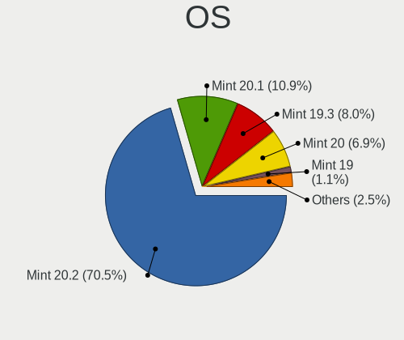

| Name      | Notebooks | Percent |
|-----------|-----------|---------|
| Mint 20.1 | 151       | 45.62%  |
| Mint 20   | 117       | 35.35%  |
| Mint 19.3 | 50        | 15.11%  |
| Mint 19.2 | 4         | 1.21%   |
| Mint 19.1 | 4         | 1.21%   |
| Mint 19   | 4         | 1.21%   |
| Mint 18.3 | 1         | 0.3%    |

OS Family
---------

OS without a version

| Name | Notebooks | Percent |
|------|-----------|---------|
| Mint | 331       | 100%    |

Kernel
------

Version of the Linux kernel

| Version                   | Notebooks | Percent |
|---------------------------|-----------|---------|
| 5.4.0-62-generic          | 58        | 17.52%  |
| 5.4.0-60-generic          | 50        | 15.11%  |
| 5.4.0-64-generic          | 47        | 14.2%   |
| 5.4.0-58-generic          | 41        | 12.39%  |
| 5.4.0-59-generic          | 26        | 7.85%   |
| 5.4.0-65-generic          | 23        | 6.95%   |
| 5.4.0-26-generic          | 17        | 5.14%   |
| 5.8.0-33-generic          | 8         | 2.42%   |
| 5.0.0-32-generic          | 8         | 2.42%   |
| 5.8.0-40-generic          | 7         | 2.11%   |
| 5.8.0-41-generic          | 4         | 1.21%   |
| 5.8.0-36-generic          | 4         | 1.21%   |
| 5.4.0-56-generic          | 4         | 1.21%   |
| 4.15.0-20-generic         | 3         | 0.91%   |
| 5.8.0-38-generic          | 2         | 0.6%    |
| 5.4.0-54-generic          | 2         | 0.6%    |
| 4.15.0-134-generic        | 2         | 0.6%    |
| 4.15.0-132-generic        | 2         | 0.6%    |
| 4.15.0-130-generic        | 2         | 0.6%    |
| 4.15.0-128-generic        | 2         | 0.6%    |
| 5.9.15-xanmod1            | 1         | 0.3%    |
| 5.9.10-050910-generic     | 1         | 0.3%    |
| 5.6.0-1042-oem            | 1         | 0.3%    |
| 5.6.0-1035-oem            | 1         | 0.3%    |
| 5.4.93-xanmod1            | 1         | 0.3%    |
| 5.4.0-51-generic          | 1         | 0.3%    |
| 5.4.0-42-generic          | 1         | 0.3%    |
| 5.4.0-40-generic          | 1         | 0.3%    |
| 5.4.0-37-generic          | 1         | 0.3%    |
| 5.10.7-051007-generic     | 1         | 0.3%    |
| 5.10.6-051006-generic     | 1         | 0.3%    |
| 5.10.4-msh                | 1         | 0.3%    |
| 5.10.10-051010-generic    | 1         | 0.3%    |
| 5.10.0-9.1-liquorix-amd64 | 1         | 0.3%    |
| 4.15.0-72-generic         | 1         | 0.3%    |
| 4.15.0-54-generic         | 1         | 0.3%    |
| 4.15.0-126-generic        | 1         | 0.3%    |
| 4.15.0-117-generic        | 1         | 0.3%    |
| 4.15.0-112-generic        | 1         | 0.3%    |

Kernel Family
-------------

Linux kernel without a distro release

| Version | Notebooks | Percent |
|---------|-----------|---------|
| 5.4.0   | 272       | 82.18%  |
| 5.8.0   | 25        | 7.55%   |
| 4.15.0  | 16        | 4.83%   |
| 5.0.0   | 8         | 2.42%   |
| 5.6.0   | 2         | 0.6%    |
| 5.9.15  | 1         | 0.3%    |
| 5.9.10  | 1         | 0.3%    |
| 5.4.93  | 1         | 0.3%    |
| 5.10.7  | 1         | 0.3%    |
| 5.10.6  | 1         | 0.3%    |
| 5.10.4  | 1         | 0.3%    |
| 5.10.10 | 1         | 0.3%    |
| 5.10.0  | 1         | 0.3%    |

Kernel Major Ver.
-----------------

Linux kernel major version

| Version | Notebooks | Percent |
|---------|-----------|---------|
| 5.4     | 273       | 82.48%  |
| 5.8     | 25        | 7.55%   |
| 4.15    | 16        | 4.83%   |
| 5.0     | 8         | 2.42%   |
| 5.10    | 5         | 1.51%   |
| 5.9     | 2         | 0.6%    |
| 5.6     | 2         | 0.6%    |

Arch
----

OS architecture (x86_64, i586, etc.)

| Name   | Notebooks | Percent |
|--------|-----------|---------|
| x86_64 | 312       | 94.26%  |
| i686   | 19        | 5.74%   |

DE
--

Desktop Environment

| Name       | Notebooks | Percent |
|------------|-----------|---------|
| X-Cinnamon | 229       | 69.18%  |
| XFCE       | 49        | 14.8%   |
| MATE       | 38        | 11.48%  |
| Cinnamon   | 10        | 3.02%   |
| KDE        | 3         | 0.91%   |
| GNOME      | 2         | 0.6%    |

Display Server
--------------

X11 or Wayland

| Name | Notebooks | Percent |
|------|-----------|---------|
| X11  | 331       | 100%    |

Display Manager
---------------

SDDM, LightDM, etc.

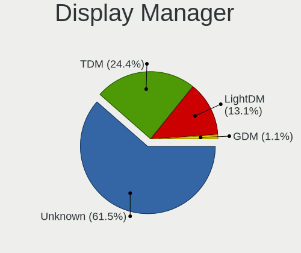

| Name    | Notebooks | Percent |
|---------|-----------|---------|
| Unknown | 242       | 73.11%  |
| TDM     | 87        | 26.28%  |
| SDDM    | 1         | 0.3%    |
| GDM     | 1         | 0.3%    |

OS Lang
-------

Language

| Lang  | Notebooks | Percent |
|-------|-----------|---------|
| en_US | 90        | 27.19%  |
| de_DE | 53        | 16.01%  |
| pt_BR | 28        | 8.46%   |
| en_GB | 21        | 6.34%   |
| ru_RU | 18        | 5.44%   |
| fr_FR | 13        | 3.93%   |
| it_IT | 12        | 3.63%   |
| C     | 11        | 3.32%   |
| pl_PL | 10        | 3.02%   |
| en_CA | 7         | 2.11%   |
| es_MX | 5         | 1.51%   |
| es_ES | 5         | 1.51%   |
| en_IN | 5         | 1.51%   |
| de_AT | 4         | 1.21%   |
| bg_BG | 4         | 1.21%   |
| ru_UA | 3         | 0.91%   |
| hu_HU | 3         | 0.91%   |
| es_AR | 3         | 0.91%   |
| en_ZA | 3         | 0.91%   |
| en_AU | 3         | 0.91%   |
| zh_CN | 2         | 0.6%    |
| tr_TR | 2         | 0.6%    |
| ro_RO | 2         | 0.6%    |
| es_CO | 2         | 0.6%    |
| de_CH | 2         | 0.6%    |
| de_BE | 2         | 0.6%    |
| sv_SE | 1         | 0.3%    |
| pt_PT | 1         | 0.3%    |
| nl_NL | 1         | 0.3%    |
| nl_BE | 1         | 0.3%    |
| nb_NO | 1         | 0.3%    |
| id_ID | 1         | 0.3%    |
| hr_HR | 1         | 0.3%    |
| he_IL | 1         | 0.3%    |
| fr_CH | 1         | 0.3%    |
| fi_FI | 1         | 0.3%    |
| es_PE | 1         | 0.3%    |
| es_GT | 1         | 0.3%    |
| es_EC | 1         | 0.3%    |
| es_CL | 1         | 0.3%    |
| en_ZM | 1         | 0.3%    |
| en_IE | 1         | 0.3%    |
| el_GR | 1         | 0.3%    |
| cs_CZ | 1         | 0.3%    |

Boot Mode
---------

EFI or BIOS

| Mode | Notebooks | Percent |
|------|-----------|---------|
| BIOS | 189       | 57.1%   |
| EFI  | 142       | 42.9%   |

Filesystem
----------

Type of filesystem

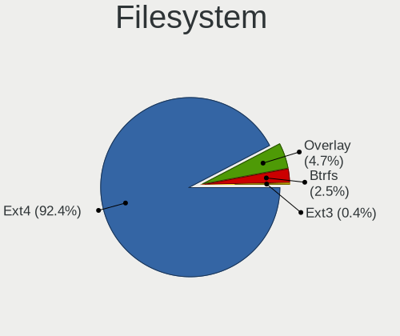

| Type    | Notebooks | Percent |
|---------|-----------|---------|
| Ext4    | 316       | 95.47%  |
| Overlay | 10        | 3.02%   |
| Btrfs   | 4         | 1.21%   |
| ExX4    | 1         | 0.3%    |

Part. scheme
------------

Scheme of partitioning

| Type    | Notebooks | Percent |
|---------|-----------|---------|
| Unknown | 243       | 73.41%  |
| GPT     | 57        | 17.22%  |
| MBR     | 31        | 9.37%   |

Dual Boot with Linux/BSD
------------------------

Hosting more than one Linux/BSD

| Dual boot | Notebooks | Percent |
|-----------|-----------|---------|
| No        | 322       | 97.28%  |
| Yes       | 9         | 2.72%   |

Dual Boot (Win)
---------------

Hosting Linux and Windows

| Dual boot | Notebooks | Percent |
|-----------|-----------|---------|
| No        | 284       | 85.8%   |
| Yes       | 47        | 14.2%   |

Country
-------

Geographic location (country)

| Country             | Notebooks | Percent |
|---------------------|-----------|---------|
| Germany             | 55        | 16.62%  |
| USA                 | 52        | 15.71%  |
| Brazil              | 31        | 9.37%   |
| UK                  | 18        | 5.44%   |
| Russia              | 18        | 5.44%   |
| Italy               | 13        | 3.93%   |
| France              | 13        | 3.93%   |
| Ukraine             | 11        | 3.32%   |
| Poland              | 9         | 2.72%   |
| Canada              | 9         | 2.72%   |
| India               | 6         | 1.81%   |
| Finland             | 6         | 1.81%   |
| Bulgaria            | 6         | 1.81%   |
| Spain               | 5         | 1.51%   |
| Mexico              | 5         | 1.51%   |
| Belgium             | 5         | 1.51%   |
| Austria             | 5         | 1.51%   |
| Switzerland         | 4         | 1.21%   |
| Sweden              | 4         | 1.21%   |
| Turkey              | 3         | 0.91%   |
| South Africa        | 3         | 0.91%   |
| Hungary             | 3         | 0.91%   |
| Greece              | 3         | 0.91%   |
| Colombia            | 3         | 0.91%   |
| Australia           | 3         | 0.91%   |
| Argentina           | 3         | 0.91%   |
| Romania             | 2         | 0.6%    |
| Portugal            | 2         | 0.6%    |
| Lithuania           | 2         | 0.6%    |
| Indonesia           | 2         | 0.6%    |
| Czech Republic      | 2         | 0.6%    |
| Belarus             | 2         | 0.6%    |
| Zambia              | 1         | 0.3%    |
| Vietnam             | 1         | 0.3%    |
| Trinidad and Tobago | 1         | 0.3%    |
| Thailand            | 1         | 0.3%    |
| Suriname            | 1         | 0.3%    |
| Slovakia            | 1         | 0.3%    |
| Singapore           | 1         | 0.3%    |
| Puerto Rico         | 1         | 0.3%    |
| Pakistan            | 1         | 0.3%    |
| Netherlands         | 1         | 0.3%    |
| Morocco             | 1         | 0.3%    |
| Kenya               | 1         | 0.3%    |
| Kazakhstan          | 1         | 0.3%    |
| Japan               | 1         | 0.3%    |
| Israel              | 1         | 0.3%    |
| Ireland             | 1         | 0.3%    |
| Hong Kong           | 1         | 0.3%    |
| Guatemala           | 1         | 0.3%    |
| Ecuador             | 1         | 0.3%    |
| China               | 1         | 0.3%    |
| Chile               | 1         | 0.3%    |
| Bangladesh          | 1         | 0.3%    |
| Unknown             | 1         | 0.3%    |

City
----

Geographic location (city)

| City                   | Notebooks | Percent |
|------------------------|-----------|---------|
| Rockville              | 7         | 2.11%   |
| St Petersburg          | 5         | 1.51%   |
| Rome                   | 5         | 1.51%   |
| Vantaa                 | 4         | 1.21%   |
| Moscow                 | 4         | 1.21%   |
| Kyiv                   | 4         | 1.21%   |
| Cologne                | 4         | 1.21%   |
| Berlin                 | 4         | 1.21%   |
| Warsaw                 | 3         | 0.91%   |
| Vienna                 | 3         | 0.91%   |
| São Paulo             | 3         | 0.91%   |
| Rio de Janeiro         | 3         | 0.91%   |
| Munich                 | 3         | 0.91%   |
| Hamburg                | 3         | 0.91%   |
| Zlatoust               | 2         | 0.6%    |
| Varna                  | 2         | 0.6%    |
| Toronto                | 2         | 0.6%    |
| Stuttgart              | 2         | 0.6%    |
| Passo Fundo            | 2         | 0.6%    |
| Minneapolis            | 2         | 0.6%    |
| Medellín              | 2         | 0.6%    |
| Madrid                 | 2         | 0.6%    |
| Ludlow                 | 2         | 0.6%    |
| Johannesburg           | 2         | 0.6%    |
| Iztapalapa             | 2         | 0.6%    |
| Istanbul               | 2         | 0.6%    |
| Fortaleza              | 2         | 0.6%    |
| Curitiba               | 2         | 0.6%    |
| Chicago                | 2         | 0.6%    |
| Brest                  | 2         | 0.6%    |
| Birmingham             | 2         | 0.6%    |
| Zdolbuniv              | 1         | 0.3%    |
| Wynau                  | 1         | 0.3%    |
| Wuppertal              | 1         | 0.3%    |
| Wrocław               | 1         | 0.3%    |
| Wiesbach               | 1         | 0.3%    |
| Wennigsen              | 1         | 0.3%    |
| Waldshut-Tiengen       | 1         | 0.3%    |
| Waldkraiburg           | 1         | 0.3%    |
| Waldheim               | 1         | 0.3%    |
| Västerås             | 1         | 0.3%    |
| Vratsa                 | 1         | 0.3%    |
| Vladivostok            | 1         | 0.3%    |
| Visakhapatnam          | 1         | 0.3%    |
| Vilnius                | 1         | 0.3%    |
| Vilhena                | 1         | 0.3%    |
| Veliky Novgorod        | 1         | 0.3%    |
| Vancouver              | 1         | 0.3%    |
| Uttoxeter              | 1         | 0.3%    |
| Unterhaching           | 1         | 0.3%    |
| Ulhasnagar             | 1         | 0.3%    |
| Udine                  | 1         | 0.3%    |
| Turgi                  | 1         | 0.3%    |
| Trogen                 | 1         | 0.3%    |
| Treze Tilias           | 1         | 0.3%    |
| Toulouse               | 1         | 0.3%    |
| Temuco                 | 1         | 0.3%    |
| São Bernardo do Campo | 1         | 0.3%    |
| Sydney                 | 1         | 0.3%    |
| Stockholm              | 1         | 0.3%    |

Vendor
------

Motherboard manufacturer

| Name                    | Notebooks | Percent |
|-------------------------|-----------|---------|
| Hewlett-Packard         | 68        | 20.54%  |
| Lenovo                  | 56        | 16.92%  |
| ASUSTek Computer        | 46        | 13.9%   |
| Dell                    | 40        | 12.08%  |
| Acer                    | 38        | 11.48%  |
| Toshiba                 | 18        | 5.44%   |
| Samsung Electronics     | 16        | 4.83%   |
| Sony                    | 11        | 3.32%   |
| Apple                   | 7         | 2.11%   |
| Positivo                | 2         | 0.6%    |
| Notebook                | 2         | 0.6%    |
| MSI                     | 2         | 0.6%    |
| Fujitsu                 | 2         | 0.6%    |
| Unknown                 | 2         | 0.6%    |
| Wortmann AG             | 1         | 0.3%    |
| TUXEDO                  | 1         | 0.3%    |
| TrekStor                | 1         | 0.3%    |
| Teclast                 | 1         | 0.3%    |
| Philco                  | 1         | 0.3%    |
| PC Specialist           | 1         | 0.3%    |
| Packard Bell            | 1         | 0.3%    |
| Mustek                  | 1         | 0.3%    |
| Medion                  | 1         | 0.3%    |
| MAXDATA                 | 1         | 0.3%    |
| Itautec                 | 1         | 0.3%    |
| Insyde                  | 1         | 0.3%    |
| HUAWEI                  | 1         | 0.3%    |
| HCL Infosystems Limited | 1         | 0.3%    |
| Hampoo                  | 1         | 0.3%    |
| GREATWALL               | 1         | 0.3%    |
| Google                  | 1         | 0.3%    |
| Gateway                 | 1         | 0.3%    |
| Digibras                | 1         | 0.3%    |
| BLAUPUNKT               | 1         | 0.3%    |
| BANGHO                  | 1         | 0.3%    |

Model
-----

Motherboard model

| Name                                                                                     | Notebooks | Percent |
|------------------------------------------------------------------------------------------|-----------|---------|
| HP Notebook                                                                              | 5         | 1.51%   |
| Dell Latitude E6420                                                                      | 4         | 1.21%   |
| Samsung R519/R719                                                                        | 3         | 0.91%   |
| HP Pavilion 15                                                                           | 3         | 0.91%   |
| HP EliteBook 840 G1                                                                      | 3         | 0.91%   |
| Dell Inspiron N5110                                                                      | 3         | 0.91%   |
| ASUS S400CA                                                                              | 3         | 0.91%   |
| Unknown                                                                                  | 3         | 0.91%   |
| Samsung R530/R730                                                                        | 2         | 0.6%    |
| HP ProBook 6570b                                                                         | 2         | 0.6%    |
| HP Presario CQ57                                                                         | 2         | 0.6%    |
| HP Pavilion g7                                                                           | 2         | 0.6%    |
| HP Pavilion dv6                                                                          | 2         | 0.6%    |
| HP 250 G7 Notebook PC                                                                    | 2         | 0.6%    |
| Dell Latitude E6410                                                                      | 2         | 0.6%    |
| Dell Inspiron 3521                                                                       | 2         | 0.6%    |
| ASUS VivoBook_ASUSLaptop X512FJ_X512FJ                                                   | 2         | 0.6%    |
| Acer Aspire A515-51G                                                                     | 2         | 0.6%    |
| Acer Aspire A315-21                                                                      | 2         | 0.6%    |
| Acer Aspire 5734Z                                                                        | 2         | 0.6%    |
| TUXEDO P65_67HSHP                                                                        | 1         | 0.3%    |
| TrekStor Notebook Slim S130                                                              | 1         | 0.3%    |
| Toshiba Satellite W30t-A                                                                 | 1         | 0.3%    |
| Toshiba Satellite PRO C660                                                               | 1         | 0.3%    |
| Toshiba Satellite P855                                                                   | 1         | 0.3%    |
| Toshiba Satellite P200                                                                   | 1         | 0.3%    |
| Toshiba Satellite P100                                                                   | 1         | 0.3%    |
| Toshiba Satellite L840                                                                   | 1         | 0.3%    |
| Toshiba Satellite L670                                                                   | 1         | 0.3%    |
| Toshiba Satellite L655                                                                   | 1         | 0.3%    |
| Toshiba Satellite L650                                                                   | 1         | 0.3%    |
| Toshiba Satellite L305                                                                   | 1         | 0.3%    |
| Toshiba Satellite C855-2J5                                                               | 1         | 0.3%    |
| Toshiba Satellite C55t-C                                                                 | 1         | 0.3%    |
| Toshiba Satellite C50-B                                                                  | 1         | 0.3%    |
| Toshiba Satellite A500                                                                   | 1         | 0.3%    |
| Toshiba Satellite A215                                                                   | 1         | 0.3%    |
| Toshiba Satellite A100                                                                   | 1         | 0.3%    |
| Toshiba NB520                                                                            | 1         | 0.3%    |
| Toshiba NB305                                                                            | 1         | 0.3%    |
| Teclast F6 Plus                                                                          | 1         | 0.3%    |
| Sony VPCS11X9E                                                                           | 1         | 0.3%    |
| Sony VPCEB1M1E                                                                           | 1         | 0.3%    |
| Sony VPCEA3L1E                                                                           | 1         | 0.3%    |
| Sony VPCEA36FG                                                                           | 1         | 0.3%    |
| Sony VGN-TZ73B                                                                           | 1         | 0.3%    |
| Sony VGN-SZ750N                                                                          | 1         | 0.3%    |
| Sony VGN-SZ3HRP_B                                                                        | 1         | 0.3%    |
| Sony SVF1521A7EB                                                                         | 1         | 0.3%    |
| Sony SVE1713L1RW                                                                         | 1         | 0.3%    |
| Sony SVE1711P1EW                                                                         | 1         | 0.3%    |
| Sony SVE1511F4E                                                                          | 1         | 0.3%    |
| Samsung RV411                                                                            | 1         | 0.3%    |
| Samsung R710                                                                             | 1         | 0.3%    |
| Samsung N150/N210/N220                                                                   | 1         | 0.3%    |
| Samsung 600B4B/600B5B                                                                    | 1         | 0.3%    |
| Samsung 370E4J/370E4Q                                                                    | 1         | 0.3%    |
| Samsung 355V4C/355V4X/355V5C/355V5X/356V4C/356V4X/356V5C/356V5X/3445VC/3445VX/3545VC/354 | 1         | 0.3%    |
| Samsung 350V5C/351V5C/3540VC/3440VC                                                      | 1         | 0.3%    |
| Samsung 305E4A/305E5A/305E7A                                                             | 1         | 0.3%    |

Model Family
------------

Motherboard model prefix

| Name               | Notebooks | Percent |
|--------------------|-----------|---------|
| Acer Aspire        | 28        | 8.46%   |
| Lenovo IdeaPad     | 21        | 6.34%   |
| Dell Inspiron      | 20        | 6.04%   |
| Lenovo ThinkPad    | 18        | 5.44%   |
| Toshiba Satellite  | 16        | 4.83%   |
| HP Pavilion        | 13        | 3.93%   |
| HP ProBook         | 11        | 3.32%   |
| Dell Latitude      | 10        | 3.02%   |
| HP Laptop          | 8         | 2.42%   |
| HP EliteBook       | 8         | 2.42%   |
| ASUS VivoBook      | 8         | 2.42%   |
| HP Compaq          | 6         | 1.81%   |
| HP Notebook        | 5         | 1.51%   |
| Dell Vostro        | 5         | 1.51%   |
| Lenovo Legion      | 4         | 1.21%   |
| ASUS TUF           | 4         | 1.21%   |
| Samsung R519       | 3         | 0.91%   |
| HP 250             | 3         | 0.91%   |
| Dell Precision     | 3         | 0.91%   |
| ASUS S400CA        | 3         | 0.91%   |
| Acer Extensa       | 3         | 0.91%   |
| Unknown            | 3         | 0.91%   |
| Samsung R530       | 2         | 0.6%    |
| HP Stream          | 2         | 0.6%    |
| HP Presario        | 2         | 0.6%    |
| HP 255             | 2         | 0.6%    |
| Fujitsu LIFEBOOK   | 2         | 0.6%    |
| ASUS ZenBook       | 2         | 0.6%    |
| Acer Predator      | 2         | 0.6%    |
| TUXEDO P65         | 1         | 0.3%    |
| TrekStor Notebook  | 1         | 0.3%    |
| Toshiba NB520      | 1         | 0.3%    |
| Toshiba NB305      | 1         | 0.3%    |
| Teclast F6         | 1         | 0.3%    |
| Sony VPCS11X9E     | 1         | 0.3%    |
| Sony VPCEB1M1E     | 1         | 0.3%    |
| Sony VPCEA3L1E     | 1         | 0.3%    |
| Sony VPCEA36FG     | 1         | 0.3%    |
| Sony VGN-TZ73B     | 1         | 0.3%    |
| Sony VGN-SZ750N    | 1         | 0.3%    |
| Sony VGN-SZ3HRP    | 1         | 0.3%    |
| Sony SVF1521A7EB   | 1         | 0.3%    |
| Sony SVE1713L1RW   | 1         | 0.3%    |
| Sony SVE1711P1EW   | 1         | 0.3%    |
| Sony SVE1511F4E    | 1         | 0.3%    |
| Samsung RV411      | 1         | 0.3%    |
| Samsung R710       | 1         | 0.3%    |
| Samsung N150       | 1         | 0.3%    |
| Samsung 600B4B     | 1         | 0.3%    |
| Samsung 370E4J     | 1         | 0.3%    |
| Samsung 355V4C     | 1         | 0.3%    |
| Samsung 350V5C     | 1         | 0.3%    |
| Samsung 305E4A     | 1         | 0.3%    |
| Samsung 300E5EV    | 1         | 0.3%    |
| Samsung 300E4A     | 1         | 0.3%    |
| Samsung 270E5J     | 1         | 0.3%    |
| Positivo S14SL01   | 1         | 0.3%    |
| Positivo C14CR21TV | 1         | 0.3%    |
| Philco 14I         | 1         | 0.3%    |
| PC Specialist NL4x | 1         | 0.3%    |

MFG Year
--------

Motherboard manufacture year

| Year    | Notebooks | Percent |
|---------|-----------|---------|
| 2020    | 54        | 16.31%  |
| 2011    | 32        | 9.67%   |
| 2018    | 31        | 9.37%   |
| 2019    | 30        | 9.06%   |
| 2010    | 30        | 9.06%   |
| 2012    | 25        | 7.55%   |
| 2013    | 24        | 7.25%   |
| 2014    | 18        | 5.44%   |
| 2008    | 18        | 5.44%   |
| 2017    | 17        | 5.14%   |
| 2015    | 15        | 4.53%   |
| 2016    | 13        | 3.93%   |
| 2009    | 12        | 3.63%   |
| 2007    | 7         | 2.11%   |
| 2006    | 3         | 0.91%   |
| 2004    | 1         | 0.3%    |
| Unknown | 1         | 0.3%    |

Form Factor
-----------

Physical design of the computer

| Name     | Notebooks | Percent |
|----------|-----------|---------|
| Notebook | 331       | 100%    |

Secure Boot
-----------

Enabled or disabled

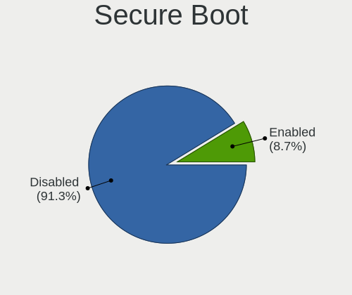

| State    | Notebooks | Percent |
|----------|-----------|---------|
| Disabled | 295       | 89.12%  |
| Enabled  | 36        | 10.88%  |

Coreboot
--------

Have coreboot on board

| Used | Notebooks | Percent |
|------|-----------|---------|
| No   | 330       | 99.7%   |
| Yes  | 1         | 0.3%    |

RAM Size
--------

Total RAM memory

| Size in GB | Notebooks | Percent |
|------------|-----------|---------|
| 3.01-4.0   | 99        | 29.91%  |
| 4.01-8.0   | 92        | 27.79%  |
| 8.01-16.0  | 50        | 15.11%  |
| 16.01-24.0 | 39        | 11.78%  |
| 1.01-2.0   | 28        | 8.46%   |
| 32.01-64.0 | 8         | 2.42%   |
| 2.01-3.0   | 8         | 2.42%   |
| 0.51-1.0   | 6         | 1.81%   |
| 24.01-32.0 | 1         | 0.3%    |

RAM Used
--------

Used RAM memory

| Used GB    | Notebooks | Percent |
|------------|-----------|---------|
| 1.01-2.0   | 157       | 47.43%  |
| 2.01-3.0   | 60        | 18.13%  |
| 0.51-1.0   | 46        | 13.9%   |
| 3.01-4.0   | 33        | 9.97%   |
| 4.01-8.0   | 31        | 9.37%   |
| 0.01-0.5   | 2         | 0.6%    |
| 16.01-24.0 | 1         | 0.3%    |
| 8.01-16.0  | 1         | 0.3%    |

Has CD-ROM
----------

Has CD-ROM on board

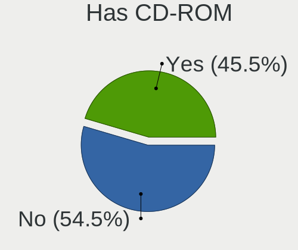

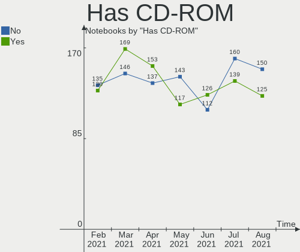

| Presented | Notebooks | Percent |
|-----------|-----------|---------|
| No        | 169       | 51.06%  |
| Yes       | 162       | 48.94%  |

Total Drives
------------

Number of drives on board

| Drives | Notebooks | Percent |
|--------|-----------|---------|
| 1      | 230       | 69.49%  |
| 2      | 88        | 26.59%  |
| 3      | 8         | 2.42%   |
| 0      | 5         | 1.51%   |

Has Ethernet
------------

Has Ethernet on board

| Presented | Notebooks | Percent |
|-----------|-----------|---------|
| Yes       | 287       | 86.71%  |
| No        | 44        | 13.29%  |

Drive Vendor
------------

Hard drive vendors

| Vendor                    | Notebooks | Drives | Percent |
|---------------------------|-----------|--------|---------|
| WDC                       | 66        | 66     | 16.75%  |
| Seagate                   | 66        | 67     | 16.75%  |
| Toshiba                   | 37        | 38     | 9.39%   |
| Samsung Electronics       | 36        | 41     | 9.14%   |
| Unknown                   | 21        | 22     | 5.33%   |
| SanDisk                   | 21        | 22     | 5.33%   |
| Kingston                  | 20        | 20     | 5.08%   |
| Hitachi                   | 19        | 19     | 4.82%   |
| HGST                      | 11        | 11     | 2.79%   |
| Intel                     | 10        | 10     | 2.54%   |
| Crucial                   | 10        | 11     | 2.54%   |
| Micron Technology         | 8         | 8      | 2.03%   |
| A-DATA Technology         | 8         | 8      | 2.03%   |
| Apple                     | 6         | 7      | 1.52%   |
| SK Hynix                  | 5         | 5      | 1.27%   |
| LITEON                    | 4         | 4      | 1.02%   |
| Fujitsu                   | 4         | 4      | 1.02%   |
| Union Memory (Shenzhen)   | 3         | 3      | 0.76%   |
| Patriot                   | 3         | 3      | 0.76%   |
| Micron/Crucial Technology | 3         | 3      | 0.76%   |
| Intenso                   | 3         | 3      | 0.76%   |
| SPCC                      | 2         | 2      | 0.51%   |
| OCZ                       | 2         | 2      | 0.51%   |
| China                     | 2         | 2      | 0.51%   |
| Verbatim                  | 1         | 1      | 0.25%   |
| Union Memory              | 1         | 1      | 0.25%   |
| Transcend                 | 1         | 1      | 0.25%   |
| Teclast                   | 1         | 1      | 0.25%   |
| Team                      | 1         | 1      | 0.25%   |
| Silicon Motion            | 1         | 1      | 0.25%   |
| SABRENT                   | 1         | 1      | 0.25%   |
| Realtek Semiconductor     | 1         | 1      | 0.25%   |
| MyDigitalSSD              | 1         | 1      | 0.25%   |
| LITEONIT                  | 1         | 1      | 0.25%   |
| Lexar                     | 1         | 1      | 0.25%   |
| KIOXIA-EXCERIA            | 1         | 1      | 0.25%   |
| KingSpec                  | 1         | 1      | 0.25%   |
| JMicron                   | 1         | 1      | 0.25%   |
| HS-SSD-C100               | 1         | 1      | 0.25%   |
| HGST HTS                  | 1         | 1      | 0.25%   |
| Hewlett-Packard           | 1         | 1      | 0.25%   |
| GOODRAM                   | 1         | 1      | 0.25%   |
| Gigabyte Technology       | 1         | 1      | 0.25%   |
| Corsair                   | 1         | 1      | 0.25%   |
| BHT                       | 1         | 1      | 0.25%   |
| ASMT                      | 1         | 1      | 0.25%   |
| Apacer                    | 1         | 1      | 0.25%   |
| Advantech                 | 1         | 1      | 0.25%   |

Drive Model
-----------

Hard drive models

| Model                                        | Notebooks | Percent |
|----------------------------------------------|-----------|---------|
| Seagate ST1000LM035-1RK172 1TB               | 14        | 3.48%   |
| Kingston SA400S37480G 480GB SSD              | 7         | 1.74%   |
| Seagate ST9500325AS 500GB                    | 6         | 1.49%   |
| Unknown MMC Card  32GB                       | 5         | 1.24%   |
| Toshiba MQ01ABD100 1TB                       | 5         | 1.24%   |
| Seagate ST9320325AS 320GB                    | 5         | 1.24%   |
| Seagate ST500LT012-9WS142 500GB              | 5         | 1.24%   |
| WDC WD10SPZX-24Z10 1TB                       | 4         | 1%      |
| Seagate ST500LT012-1DG142 500GB              | 4         | 1%      |
| Seagate ST1000LM024 HN-M101MBB 1TB           | 4         | 1%      |
| SanDisk SSD U100 24GB                        | 4         | 1%      |
| Samsung SSD 860 EVO 500GB                    | 4         | 1%      |
| Samsung SSD 860 EVO 1TB                      | 4         | 1%      |
| Micron 1100_MTFDDAV256TBN 256GB SSD          | 4         | 1%      |
| HGST HTS541010A9E680 1TB                     | 4         | 1%      |
| WDC WD5000LPVX-22V0TT0 500GB                 | 3         | 0.75%   |
| WDC WD10JPVX-22JC3T0 1TB                     | 3         | 0.75%   |
| Unknown MMC Card  128GB                      | 3         | 0.75%   |
| Toshiba MK5055GSX 500GB                      | 3         | 0.75%   |
| Seagate ST500LM000-SSHD-8GB                  | 3         | 0.75%   |
| Sandisk NVMe SSD Drive 256GB                 | 3         | 0.75%   |
| Samsung SSD 860 EVO 250GB                    | 3         | 0.75%   |
| HGST HTS545050A7E680 500GB                   | 3         | 0.75%   |
| HGST HTS545050A7E380 500GB                   | 3         | 0.75%   |
| Crucial CT480BX500SSD1 480GB                 | 3         | 0.75%   |
| WDC WDS240G2G0A-00JH30 240GB SSD             | 2         | 0.5%    |
| WDC WD5000LPVX-80V0TT0 500GB                 | 2         | 0.5%    |
| WDC WD5000LPCX-24VHAT0 500GB                 | 2         | 0.5%    |
| WDC WD3200BEVT-75ZCT2 320GB                  | 2         | 0.5%    |
| Unknown MMC Card  64GB                       | 2         | 0.5%    |
| Unknown MMC Card  4GB                        | 2         | 0.5%    |
| Unknown MMC Card  134GB                      | 2         | 0.5%    |
| Union Memory (Shenzhen) NVMe SSD Drive 512GB | 2         | 0.5%    |
| Toshiba MQ04ABF100 1TB                       | 2         | 0.5%    |
| Toshiba MQ01ABF050 500GB                     | 2         | 0.5%    |
| Toshiba MQ01ABD050 500GB                     | 2         | 0.5%    |
| Toshiba MK3259GSXP 320GB                     | 2         | 0.5%    |
| Toshiba MK2555GSX 250GB                      | 2         | 0.5%    |
| Seagate ST9500420AS 500GB                    | 2         | 0.5%    |
| Seagate ST9160821AS 160GB                    | 2         | 0.5%    |
| Seagate ST500LM012 HN-M500MBB 500GB          | 2         | 0.5%    |
| Seagate ST1000LM014-1EJ164 1TB               | 2         | 0.5%    |
| SanDisk SSD PLUS 480GB                       | 2         | 0.5%    |
| SanDisk SDSSDA240G 240GB                     | 2         | 0.5%    |
| Sandisk NVMe SSD Drive 500GB                 | 2         | 0.5%    |
| Micron/Crucial NVMe SSD Drive 1TB            | 2         | 0.5%    |
| Kingston SA400S37240G 240GB SSD              | 2         | 0.5%    |
| Kingston SA400S37120G 120GB SSD              | 2         | 0.5%    |
| Intel SSDPEKNW512G8H 512GB                   | 2         | 0.5%    |
| Intel SSDPEKNW010T8 1TB                      | 2         | 0.5%    |
| Intel NVMe SSD Drive 512GB                   | 2         | 0.5%    |
| Hitachi HTS545050A7E380 500GB                | 2         | 0.5%    |
| Hitachi HTS545032B9A300 320GB                | 2         | 0.5%    |
| Hitachi HTS543232A7A384 320GB                | 2         | 0.5%    |
| Hitachi HTS543225L9A300 250GB                | 2         | 0.5%    |
| Crucial CT250MX500SSD1 250GB                 | 2         | 0.5%    |
| A-DATA SU800 512GB SSD                       | 2         | 0.5%    |
| A-DATA SU650 120GB SSD                       | 2         | 0.5%    |
| A-DATA SU630 480GB SSD                       | 2         | 0.5%    |
| WDC WDS480G2G0A-00JH30 480GB SSD             | 1         | 0.25%   |

HDD Vendor
----------

Hard disk drive vendors

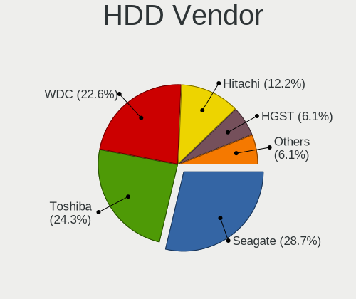

| Vendor              | Notebooks | Drives | Percent |
|---------------------|-----------|--------|---------|
| Seagate             | 66        | 67     | 34.55%  |
| WDC                 | 49        | 49     | 25.65%  |
| Toshiba             | 34        | 35     | 17.8%   |
| Hitachi             | 19        | 19     | 9.95%   |
| HGST                | 11        | 11     | 5.76%   |
| Samsung Electronics | 5         | 5      | 2.62%   |
| Fujitsu             | 4         | 4      | 2.09%   |
| HGST HTS            | 1         | 1      | 0.52%   |
| ASMT                | 1         | 1      | 0.52%   |
| Apple               | 1         | 1      | 0.52%   |

SSD Vendor
----------

Solid state drive vendors

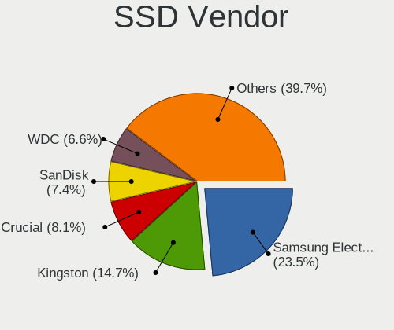

| Vendor              | Notebooks | Drives | Percent |
|---------------------|-----------|--------|---------|
| Samsung Electronics | 24        | 28     | 18.75%  |
| Kingston            | 18        | 18     | 14.06%  |
| SanDisk             | 15        | 16     | 11.72%  |
| Crucial             | 10        | 11     | 7.81%   |
| A-DATA Technology   | 8         | 8      | 6.25%   |
| WDC                 | 5         | 5      | 3.91%   |
| Micron Technology   | 5         | 5      | 3.91%   |
| LITEON              | 4         | 4      | 3.13%   |
| Toshiba             | 3         | 3      | 2.34%   |
| Patriot             | 3         | 3      | 2.34%   |
| Intenso             | 3         | 3      | 2.34%   |
| Intel               | 3         | 3      | 2.34%   |
| Apple               | 3         | 3      | 2.34%   |
| SPCC                | 2         | 2      | 1.56%   |
| OCZ                 | 2         | 2      | 1.56%   |
| China               | 2         | 2      | 1.56%   |
| Verbatim            | 1         | 1      | 0.78%   |
| Unknown             | 1         | 1      | 0.78%   |
| Transcend           | 1         | 1      | 0.78%   |
| Teclast             | 1         | 1      | 0.78%   |
| Team                | 1         | 1      | 0.78%   |
| SABRENT             | 1         | 1      | 0.78%   |
| MyDigitalSSD        | 1         | 1      | 0.78%   |
| LITEONIT            | 1         | 1      | 0.78%   |
| Lexar               | 1         | 1      | 0.78%   |
| KIOXIA-EXCERIA      | 1         | 1      | 0.78%   |
| KingSpec            | 1         | 1      | 0.78%   |
| Hewlett-Packard     | 1         | 1      | 0.78%   |
| GOODRAM             | 1         | 1      | 0.78%   |
| Gigabyte Technology | 1         | 1      | 0.78%   |
| Corsair             | 1         | 1      | 0.78%   |
| BHT                 | 1         | 1      | 0.78%   |
| Apacer              | 1         | 1      | 0.78%   |
| Advantech           | 1         | 1      | 0.78%   |

Drive Kind
----------

HDD or SSD

| Kind    | Notebooks | Drives | Percent |
|---------|-----------|--------|---------|
| HDD     | 189       | 193    | 48.96%  |
| SSD     | 123       | 134    | 31.87%  |
| NVMe    | 52        | 55     | 13.47%  |
| MMC     | 19        | 20     | 4.92%   |
| Unknown | 3         | 3      | 0.78%   |

Drive Connector
---------------

SATA, SAS, NVMe, etc.

| Type | Notebooks | Drives | Percent |
|------|-----------|--------|---------|
| SATA | 285       | 325    | 78.95%  |
| NVMe | 52        | 55     | 14.4%   |
| MMC  | 19        | 20     | 5.26%   |
| SAS  | 5         | 5      | 1.39%   |

Drive Size
----------

Size of hard drive

| Size in TB | Notebooks | Drives | Percent |
|------------|-----------|--------|---------|
| 0.01-0.5   | 227       | 247    | 74.18%  |
| 0.51-1.0   | 70        | 71     | 22.88%  |
| 1.01-2.0   | 9         | 9      | 2.94%   |

Space Total
-----------

Amount of disk space available on the file system

| Size in GB     | Notebooks | Percent |
|----------------|-----------|---------|
| 251-500        | 106       | 32.02%  |
| 101-250        | 105       | 31.72%  |
| 501-1000       | 53        | 16.01%  |
| 51-100         | 26        | 7.85%   |
| 21-50          | 18        | 5.44%   |
| 1-20           | 11        | 3.32%   |
| 1001-2000      | 7         | 2.11%   |
| 2001-3000      | 3         | 0.91%   |
| More than 3000 | 2         | 0.6%    |

Space Used
----------

Amount of used disk space

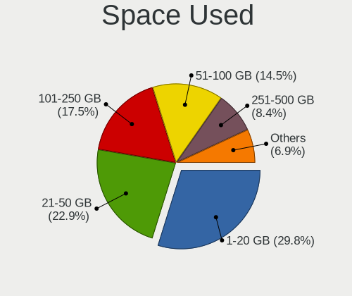

| Used GB   | Notebooks | Percent |
|-----------|-----------|---------|
| 1-20      | 108       | 32.63%  |
| 21-50     | 85        | 25.68%  |
| 101-250   | 53        | 16.01%  |
| 51-100    | 51        | 15.41%  |
| 251-500   | 27        | 8.16%   |
| 501-1000  | 4         | 1.21%   |
| 1001-2000 | 3         | 0.91%   |

Malfunc. Drives
---------------

Drive models with a malfunction

| Model                           | Notebooks | Drives | Percent |
|---------------------------------|-----------|--------|---------|
| Seagate ST1000LM035-1RK172 1TB  | 2         | 2      | 13.33%  |
| WDC WD5000LPVX-22V0TT0 500GB    | 1         | 1      | 6.67%   |
| Toshiba MQ01ABD050 500GB        | 1         | 1      | 6.67%   |
| Toshiba MK7575GSX 752GB         | 1         | 1      | 6.67%   |
| Toshiba MK5059GSXP 500GB        | 1         | 1      | 6.67%   |
| Seagate ST9500325AS 500GB       | 1         | 1      | 6.67%   |
| Seagate ST9250827AS 250GB       | 1         | 1      | 6.67%   |
| Seagate ST9120822AS 120GB       | 1         | 1      | 6.67%   |
| Seagate ST500LT012-1DG142 500GB | 1         | 1      | 6.67%   |
| Seagate ST500LM000-SSHD-8GB     | 1         | 1      | 6.67%   |
| Seagate ST1000LM049-2GH172 1TB  | 1         | 1      | 6.67%   |
| HGST HTS545050A7E680 500GB      | 1         | 1      | 6.67%   |
| HGST HTS 545050A7E680 500GB     | 1         | 1      | 6.67%   |
| Fujitsu MHY2250BH 250GB         | 1         | 1      | 6.67%   |

Malfunc. Drive Vendor
---------------------

Vendors of faulty drives

| Vendor   | Notebooks | Drives | Percent |
|----------|-----------|--------|---------|
| Seagate  | 8         | 8      | 53.33%  |
| Toshiba  | 3         | 3      | 20%     |
| WDC      | 1         | 1      | 6.67%   |
| HGST HTS | 1         | 1      | 6.67%   |
| HGST     | 1         | 1      | 6.67%   |
| Fujitsu  | 1         | 1      | 6.67%   |

Malfunc. HDD Vendor
-------------------

Vendors of faulty HDD drives

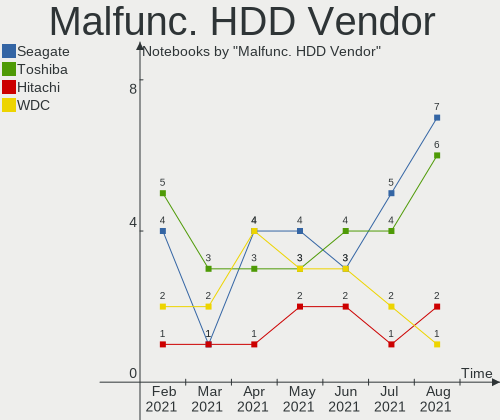

| Vendor   | Notebooks | Drives | Percent |
|----------|-----------|--------|---------|
| Seagate  | 8         | 8      | 53.33%  |
| Toshiba  | 3         | 3      | 20%     |
| WDC      | 1         | 1      | 6.67%   |
| HGST HTS | 1         | 1      | 6.67%   |
| HGST     | 1         | 1      | 6.67%   |
| Fujitsu  | 1         | 1      | 6.67%   |

Malfunc. Drive Kind
-------------------

Kinds of faulty drives

| Kind | Notebooks | Drives | Percent |
|------|-----------|--------|---------|
| HDD  | 15        | 15     | 100%    |

Failed Drives
-------------

Failed drive models

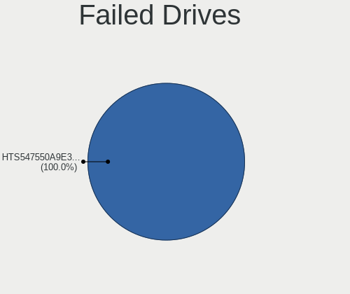

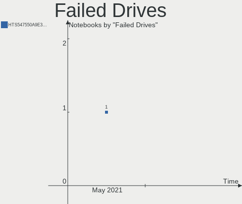

| Model                      | Notebooks | Drives | Percent |
|----------------------------|-----------|--------|---------|
| Seagate ST9160821AS 160GB  | 1         | 1      | 50%     |
| HGST HTS545050A7E380 500GB | 1         | 1      | 50%     |

Failed Drive Vendor
-------------------

Failed drive vendors

| Vendor  | Notebooks | Drives | Percent |
|---------|-----------|--------|---------|
| Seagate | 1         | 1      | 50%     |
| HGST    | 1         | 1      | 50%     |

Drive Status
------------

Number of failed and malfunc. drives

| Status   | Notebooks | Drives | Percent |
|----------|-----------|--------|---------|
| Detected | 251       | 304    | 74.48%  |
| Works    | 69        | 84     | 20.47%  |
| Malfunc  | 15        | 15     | 4.45%   |
| Failed   | 2         | 2      | 0.59%   |

Storage Vendor
--------------

Storage controller vendors

| Vendor                      | Notebooks | Percent |
|-----------------------------|-----------|---------|
| Intel                       | 264       | 73.54%  |
| AMD                         | 44        | 12.26%  |
| Sandisk                     | 17        | 4.74%   |
| Samsung Electronics         | 10        | 2.79%   |
| SK Hynix                    | 5         | 1.39%   |
| Union Memory (Shenzhen)     | 4         | 1.11%   |
| Micron/Crucial Technology   | 3         | 0.84%   |
| Micron Technology           | 3         | 0.84%   |
| Nvidia                      | 2         | 0.56%   |
| Kingston Technology Company | 2         | 0.56%   |
| Apple                       | 2         | 0.56%   |
| VIA Technologies            | 1         | 0.28%   |
| Silicon Motion              | 1         | 0.28%   |
| Realtek Semiconductor       | 1         | 0.28%   |

Storage Model
-------------

Storage controller models

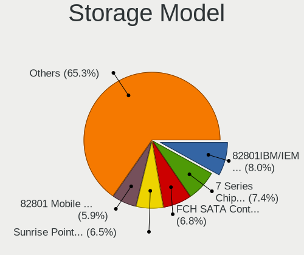

| Model                                                                            | Notebooks | Percent |
|----------------------------------------------------------------------------------|-----------|---------|
| Intel 7 Series Chipset Family 6-port SATA Controller [AHCI mode]                 | 37        | 9.39%   |
| AMD FCH SATA Controller [AHCI mode]                                              | 32        | 8.12%   |
| Intel Sunrise Point-LP SATA Controller [AHCI mode]                               | 25        | 6.35%   |
| Intel 82801IBM/IEM (ICH9M/ICH9M-E) 4 port SATA Controller [AHCI mode]            | 23        | 5.84%   |
| Intel 6 Series/C200 Series Chipset Family 6 port Mobile SATA AHCI Controller     | 22        | 5.58%   |
| Intel 8 Series SATA Controller 1 [AHCI mode]                                     | 20        | 5.08%   |
| Intel 82801 Mobile SATA Controller [RAID mode]                                   | 16        | 4.06%   |
| Intel 5 Series/3400 Series Chipset 4 port SATA AHCI Controller                   | 16        | 4.06%   |
| Intel 82801HM/HEM (ICH8M/ICH8M-E) IDE Controller                                 | 12        | 3.05%   |
| Intel 82801HM/HEM (ICH8M/ICH8M-E) SATA Controller [AHCI mode]                    | 10        | 2.54%   |
| AMD SB7x0/SB8x0/SB9x0 SATA Controller [AHCI mode]                                | 9         | 2.28%   |
| Intel Wildcat Point-LP SATA Controller [AHCI Mode]                               | 8         | 2.03%   |
| Intel Celeron/Pentium Silver Processor SATA Controller                           | 8         | 2.03%   |
| Intel SSD 660P Series                                                            | 7         | 1.78%   |
| Intel Atom Processor E3800 Series SATA AHCI Controller                           | 7         | 1.78%   |
| Intel Cannon Lake Mobile PCH SATA AHCI Controller                                | 6         | 1.52%   |
| Intel 82801G (ICH7 Family) IDE Controller                                        | 6         | 1.52%   |
| Sandisk WD Blue SN550 NVMe SSD                                                   | 5         | 1.27%   |
| Samsung NVMe SSD Controller SM981/PM981/PM983                                    | 5         | 1.27%   |
| Intel NM10/ICH7 Family SATA Controller [AHCI mode]                               | 5         | 1.27%   |
| Intel Cannon Point-LP SATA Controller [AHCI Mode]                                | 5         | 1.27%   |
| Intel Atom/Celeron/Pentium Processor x5-E8000/J3xxx/N3xxx Series SATA Controller | 5         | 1.27%   |
| Intel 82801GBM/GHM (ICH7-M Family) SATA Controller [IDE mode]                    | 5         | 1.27%   |
| Intel 8 Series/C220 Series Chipset Family 6-port SATA Controller 1 [AHCI mode]   | 5         | 1.27%   |
| Sandisk WD Blue SN500 / PC SN520 NVMe SSD                                        | 4         | 1.02%   |
| Sandisk WD Black SN750 / PC SN730 NVMe SSD                                       | 4         | 1.02%   |
| Intel Ice Lake-LP SATA Controller [AHCI mode]                                    | 4         | 1.02%   |
| Intel 5 Series/3400 Series Chipset 6 port SATA AHCI Controller                   | 4         | 1.02%   |
| Union Memory (Shenzhen) Non-Volatile memory controller                           | 3         | 0.76%   |
| SK Hynix BC501 NVMe Solid State Drive 512GB                                      | 3         | 0.76%   |
| Micron/Crucial P1 NVMe PCIe SSD                                                  | 3         | 0.76%   |
| Micron Non-Volatile memory controller                                            | 3         | 0.76%   |
| Intel NM10/ICH7 Family SATA Controller [IDE mode]                                | 3         | 0.76%   |
| Intel Comet Lake SATA AHCI Controller                                            | 3         | 0.76%   |
| Intel 82801GBM/GHM (ICH7-M Family) SATA Controller [AHCI mode]                   | 3         | 0.76%   |
| Intel 5 Series/3400 Series Chipset 4 port SATA IDE Controller                    | 3         | 0.76%   |
| Intel 5 Series/3400 Series Chipset 2 port SATA IDE Controller                    | 3         | 0.76%   |
| AMD SB600 Non-Raid-5 SATA                                                        | 3         | 0.76%   |
| AMD SB600 IDE                                                                    | 3         | 0.76%   |
| SK Hynix Non-Volatile memory controller                                          | 2         | 0.51%   |
| Sandisk Non-Volatile memory controller                                           | 2         | 0.51%   |
| Samsung Electronics Non-Volatile memory controller                               | 2         | 0.51%   |
| Intel HM170/QM170 Chipset SATA Controller [AHCI Mode]                            | 2         | 0.51%   |
| Intel Celeron N3350/Pentium N4200/Atom E3900 Series SATA AHCI Controller         | 2         | 0.51%   |
| Intel 82801HM/HEM (ICH8M/ICH8M-E) SATA Controller [IDE mode]                     | 2         | 0.51%   |
| Intel 7 Series Chipset Family 4-port SATA Controller [IDE mode]                  | 2         | 0.51%   |
| Intel 7 Series Chipset Family 2-port SATA Controller [IDE mode]                  | 2         | 0.51%   |
| AMD SB7x0/SB8x0/SB9x0 IDE Controller                                             | 2         | 0.51%   |
| VIA VT82C586A/B/VT82C686/A/B/VT823x/A/C PIPC Bus Master IDE                      | 1         | 0.25%   |
| VIA VT8237A SATA 2-Port Controller                                               | 1         | 0.25%   |
| Union Memory (Shenzhen) NVMe 256G SSD device                                     | 1         | 0.25%   |
| Silicon Motion SM2263EN/SM2263XT SSD Controller                                  | 1         | 0.25%   |
| Sandisk WD Black 2018 / PC SN720 NVMe SSD                                        | 1         | 0.25%   |
| Sandisk PC SN520 NVMe SSD                                                        | 1         | 0.25%   |
| Samsung NVMe SSD Controller SM961/PM961/SM963                                    | 1         | 0.25%   |
| Samsung Electronics SATA controller                                              | 1         | 0.25%   |
| Samsung Apple PCIe SSD                                                           | 1         | 0.25%   |
| Realtek RTS5763DL NVMe SSD Controller                                            | 1         | 0.25%   |
| Nvidia nForce SATA Controller                                                    | 1         | 0.25%   |
| Nvidia MCP79 AHCI Controller                                                     | 1         | 0.25%   |

Storage Kind
------------

Kind of storage controller (IDE, SATA, NVMe, SAS, ...)

| Kind | Notebooks | Percent |
|------|-----------|---------|
| SATA | 271       | 71.5%   |
| NVMe | 51        | 13.46%  |
| IDE  | 40        | 10.55%  |
| RAID | 17        | 4.49%   |

CPU Vendor
----------

Processor vendors

| Vendor | Notebooks | Percent |
|--------|-----------|---------|
| Intel  | 278       | 83.99%  |
| AMD    | 53        | 16.01%  |

CPU Model
---------

Processor models

| Model                                         | Notebooks | Percent |
|-----------------------------------------------|-----------|---------|
| Intel Core i5-2520M CPU @ 2.50GHz             | 8         | 2.42%   |
| Intel Core i5-7200U CPU @ 2.50GHz             | 7         | 2.11%   |
| Intel Core i5-8250U CPU @ 1.60GHz             | 6         | 1.81%   |
| Intel Core i5-3230M CPU @ 2.60GHz             | 5         | 1.51%   |
| Intel Core i3 CPU M 330 @ 2.13GHz             | 5         | 1.51%   |
| Intel Celeron N4000 CPU @ 1.10GHz             | 5         | 1.51%   |
| AMD Ryzen 7 4800H with Radeon Graphics        | 5         | 1.51%   |
| Intel Core i7-4510U CPU @ 2.00GHz             | 4         | 1.21%   |
| Intel Core i5-4210U CPU @ 1.70GHz             | 4         | 1.21%   |
| Intel Core i5-1035G1 CPU @ 1.00GHz            | 4         | 1.21%   |
| Intel Core i3-3217U CPU @ 1.80GHz             | 4         | 1.21%   |
| Intel Core i3-2310M CPU @ 2.10GHz             | 4         | 1.21%   |
| Intel Core i3 CPU M 370 @ 2.40GHz             | 4         | 1.21%   |
| Intel Core 2 Duo CPU T8100 @ 2.10GHz          | 4         | 1.21%   |
| Intel Celeron CPU N3060 @ 1.60GHz             | 4         | 1.21%   |
| AMD Ryzen 7 3700U with Radeon Vega Mobile Gfx | 4         | 1.21%   |
| Intel Pentium Dual-Core CPU T4500 @ 2.30GHz   | 3         | 0.91%   |
| Intel Pentium Dual-Core CPU T4200 @ 2.00GHz   | 3         | 0.91%   |
| Intel Pentium Dual CPU T3200 @ 2.00GHz        | 3         | 0.91%   |
| Intel Pentium CPU N3700 @ 1.60GHz             | 3         | 0.91%   |
| Intel Core i7-9750H CPU @ 2.60GHz             | 3         | 0.91%   |
| Intel Core i7-3610QM CPU @ 2.30GHz            | 3         | 0.91%   |
| Intel Core i7-10510U CPU @ 1.80GHz            | 3         | 0.91%   |
| Intel Core i5-8265U CPU @ 1.60GHz             | 3         | 0.91%   |
| Intel Core i5-4200U CPU @ 1.60GHz             | 3         | 0.91%   |
| Intel Core i5-3317U CPU @ 1.70GHz             | 3         | 0.91%   |
| Intel Core i5-2450M CPU @ 2.50GHz             | 3         | 0.91%   |
| Intel Core i5 CPU M 560 @ 2.67GHz             | 3         | 0.91%   |
| Intel Core i3-5005U CPU @ 2.00GHz             | 3         | 0.91%   |
| Intel Core i3-2370M CPU @ 2.40GHz             | 3         | 0.91%   |
| Intel Core i3-2350M CPU @ 2.30GHz             | 3         | 0.91%   |
| Intel Core 2 Duo CPU T9300 @ 2.50GHz          | 3         | 0.91%   |
| Intel Celeron CPU N2830 @ 2.16GHz             | 3         | 0.91%   |
| Intel Atom CPU N570 @ 1.66GHz                 | 3         | 0.91%   |
| Intel Atom CPU N450 @ 1.66GHz                 | 3         | 0.91%   |
| Intel Pentium Silver N5000 CPU @ 1.10GHz      | 2         | 0.6%    |
| Intel Pentium CPU P6200 @ 2.13GHz             | 2         | 0.6%    |
| Intel Pentium CPU B960 @ 2.20GHz              | 2         | 0.6%    |
| Intel Pentium CPU B950 @ 2.10GHz              | 2         | 0.6%    |
| Intel Pentium CPU 2117U @ 1.80GHz             | 2         | 0.6%    |
| Intel Core i7-8750H CPU @ 2.20GHz             | 2         | 0.6%    |
| Intel Core i7-8565U CPU @ 1.80GHz             | 2         | 0.6%    |
| Intel Core i7-8550U CPU @ 1.80GHz             | 2         | 0.6%    |
| Intel Core i7-5500U CPU @ 2.40GHz             | 2         | 0.6%    |
| Intel Core i7-4700HQ CPU @ 2.40GHz            | 2         | 0.6%    |
| Intel Core i7-4500U CPU @ 1.80GHz             | 2         | 0.6%    |
| Intel Core i7-3740QM CPU @ 2.70GHz            | 2         | 0.6%    |
| Intel Core i7-3630QM CPU @ 2.40GHz            | 2         | 0.6%    |
| Intel Core i7-2620M CPU @ 2.70GHz             | 2         | 0.6%    |
| Intel Core i7-1065G7 CPU @ 1.30GHz            | 2         | 0.6%    |
| Intel Core i5-4300U CPU @ 1.90GHz             | 2         | 0.6%    |
| Intel Core i5-3320M CPU @ 2.60GHz             | 2         | 0.6%    |
| Intel Core i5-3210M CPU @ 2.50GHz             | 2         | 0.6%    |
| Intel Core i5 CPU M 480 @ 2.67GHz             | 2         | 0.6%    |
| Intel Core i5 CPU M 430 @ 2.27GHz             | 2         | 0.6%    |
| Intel Core i3-7020U CPU @ 2.30GHz             | 2         | 0.6%    |
| Intel Core i3-6100U CPU @ 2.30GHz             | 2         | 0.6%    |
| Intel Core i3-4030U CPU @ 1.90GHz             | 2         | 0.6%    |
| Intel Core i3-3120M CPU @ 2.50GHz             | 2         | 0.6%    |
| Intel Core i3-2330M CPU @ 2.20GHz             | 2         | 0.6%    |

CPU Model Family
----------------

Processor model prefix

| Model                   | Notebooks | Percent |
|-------------------------|-----------|---------|
| Intel Core i5           | 78        | 23.56%  |
| Intel Core i7           | 46        | 13.9%   |
| Intel Core i3           | 45        | 13.6%   |
| Intel Core 2 Duo        | 25        | 7.55%   |
| Intel Celeron           | 23        | 6.95%   |
| Intel Pentium           | 20        | 6.04%   |
| Intel Atom              | 14        | 4.23%   |
| AMD Ryzen 7             | 11        | 3.32%   |
| Intel Pentium Dual-Core | 8         | 2.42%   |
| AMD A6                  | 7         | 2.11%   |
| AMD Ryzen 5             | 6         | 1.81%   |
| AMD A4                  | 5         | 1.51%   |
| Intel Pentium Dual      | 4         | 1.21%   |
| AMD Ryzen 3             | 4         | 1.21%   |
| AMD E                   | 4         | 1.21%   |
| Intel Genuine           | 3         | 0.91%   |
| Intel Core 2            | 3         | 0.91%   |
| Other                   | 2         | 0.6%    |
| Intel Pentium Silver    | 2         | 0.6%    |
| Intel Celeron M         | 2         | 0.6%    |
| Intel Celeron Dual-Core | 2         | 0.6%    |
| AMD Turion II           | 2         | 0.6%    |
| AMD Athlon X2           | 2         | 0.6%    |
| AMD A8                  | 2         | 0.6%    |
| AMD A12                 | 2         | 0.6%    |
| Intel Core i9           | 1         | 0.3%    |
| Intel Core Duo          | 1         | 0.3%    |
| AMD Turion 64 X2 Mobile | 1         | 0.3%    |
| AMD Ryzen 9             | 1         | 0.3%    |
| AMD E2                  | 1         | 0.3%    |
| AMD C-70                | 1         | 0.3%    |
| AMD C-60                | 1         | 0.3%    |
| AMD Athlon 64 X2        | 1         | 0.3%    |
| AMD A10                 | 1         | 0.3%    |

CPU Cores
---------

Number of processor cores

| Number | Notebooks | Percent |
|--------|-----------|---------|
| 2      | 223       | 67.37%  |
| 4      | 74        | 22.36%  |
| 1      | 16        | 4.83%   |
| 6      | 10        | 3.02%   |
| 8      | 8         | 2.42%   |

CPU Sockets
-----------

Number of sockets

| Number | Notebooks | Percent |
|--------|-----------|---------|
| 1      | 331       | 100%    |

CPU Threads
-----------

Threads per core (Hyper-Threading)

| Number | Notebooks | Percent |
|--------|-----------|---------|
| 2      | 205       | 61.93%  |
| 1      | 126       | 38.07%  |

CPU Op-Modes
------------

CPU Operation Modes (32-bit, 64-bit)

| Op mode        | Notebooks | Percent |
|----------------|-----------|---------|
| 32-bit, 64-bit | 324       | 97.89%  |
| 32-bit         | 7         | 2.11%   |

CPU Microcode
-------------

Microcode number

| Number     | Notebooks | Percent |
|------------|-----------|---------|
| 0x206a7    | 34        | 10.27%  |
| 0x306a9    | 29        | 8.76%   |
| 0x40651    | 20        | 6.04%   |
| Unknown    | 20        | 6.04%   |
| 0x1067a    | 18        | 5.44%   |
| 0x20655    | 16        | 4.83%   |
| 0x806ea    | 10        | 3.02%   |
| 0x806e9    | 10        | 3.02%   |
| 0x10676    | 10        | 3.02%   |
| 0x6fd      | 9         | 2.72%   |
| 0x30678    | 9         | 2.72%   |
| 0x806ec    | 8         | 2.42%   |
| 0x706e5    | 8         | 2.42%   |
| 0x706a1    | 8         | 2.42%   |
| 0x306d4    | 8         | 2.42%   |
| 0x20652    | 8         | 2.42%   |
| 0x106ca    | 8         | 2.42%   |
| 0x906ea    | 7         | 2.11%   |
| 0x306c3    | 6         | 1.81%   |
| 0x08108102 | 6         | 1.81%   |
| 0x406e3    | 5         | 1.51%   |
| 0x406c4    | 5         | 1.51%   |
| 0x406c3    | 5         | 1.51%   |
| 0x08600104 | 5         | 1.51%   |
| 0x05000119 | 5         | 1.51%   |
| 0x6f6      | 3         | 0.91%   |
| 0x08600106 | 3         | 0.91%   |
| 0x08108109 | 3         | 0.91%   |
| 0x06006705 | 3         | 0.91%   |
| 0x06006118 | 3         | 0.91%   |
| 0x06001119 | 3         | 0.91%   |
| 0x806eb    | 2         | 0.6%    |
| 0x6fb      | 2         | 0.6%    |
| 0x6ec      | 2         | 0.6%    |
| 0x6e8      | 2         | 0.6%    |
| 0x506e3    | 2         | 0.6%    |
| 0x506c9    | 2         | 0.6%    |
| 0x106c2    | 2         | 0.6%    |
| 0x08600103 | 2         | 0.6%    |
| 0x07030106 | 2         | 0.6%    |
| 0x06006704 | 2         | 0.6%    |
| 0x05000029 | 2         | 0.6%    |
| 0x03000027 | 2         | 0.6%    |
| 0x010000c8 | 2         | 0.6%    |
| 0xa0652    | 1         | 0.3%    |
| 0x906e9    | 1         | 0.3%    |
| 0x806c1    | 1         | 0.3%    |
| 0x6d8      | 1         | 0.3%    |
| 0x10661    | 1         | 0.3%    |
| 0x0810100b | 1         | 0.3%    |
| 0x07030105 | 1         | 0.3%    |
| 0x0700010f | 1         | 0.3%    |
| 0x02000057 | 1         | 0.3%    |
| 0x02000032 | 1         | 0.3%    |

CPU Microarch
-------------

Microarchitecture

| Name            | Notebooks | Percent |
|-----------------|-----------|---------|
| KabyLake        | 42        | 12.69%  |
| SandyBridge     | 36        | 10.88%  |
| IvyBridge       | 32        | 9.67%   |
| Haswell         | 29        | 8.76%   |
| Penryn          | 28        | 8.46%   |
| Westmere        | 24        | 7.25%   |
| Silvermont      | 19        | 5.74%   |
| Core            | 16        | 4.83%   |
| Zen 2           | 12        | 3.63%   |
| Bonnell         | 10        | 3.02%   |
| Zen+            | 9         | 2.72%   |
| Excavator       | 9         | 2.72%   |
| Broadwell       | 9         | 2.72%   |
| Skylake         | 8         | 2.42%   |
| IceLake         | 8         | 2.42%   |
| Goldmont plus   | 8         | 2.42%   |
| Bobcat          | 7         | 2.11%   |
| P6              | 5         | 1.51%   |
| Puma            | 3         | 0.91%   |
| Piledriver      | 3         | 0.91%   |
| K8 Hammer       | 2         | 0.6%    |
| K8 & K10 hybrid | 2         | 0.6%    |
| K10 Llano       | 2         | 0.6%    |
| K10             | 2         | 0.6%    |
| Goldmont        | 2         | 0.6%    |
| Zen             | 1         | 0.3%    |
| TigerLake       | 1         | 0.3%    |
| Jaguar          | 1         | 0.3%    |
| CometLake       | 1         | 0.3%    |

GPU Vendor
----------

Vendors of graphics cards

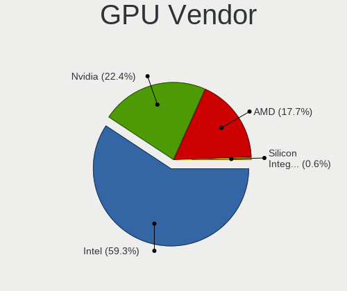

| Vendor           | Notebooks | Percent |
|------------------|-----------|---------|
| Intel            | 245       | 62.03%  |
| AMD              | 76        | 19.24%  |
| Nvidia           | 73        | 18.48%  |
| VIA Technologies | 1         | 0.25%   |

GPU Model
---------

Graphics card models

| Model                                                                                    | Notebooks | Percent |
|------------------------------------------------------------------------------------------|-----------|---------|
| Intel 2nd Generation Core Processor Family Integrated Graphics Controller                | 34        | 8.13%   |
| Intel 3rd Gen Core processor Graphics Controller                                         | 28        | 6.7%    |
| Intel Haswell-ULT Integrated Graphics Controller                                         | 19        | 4.55%   |
| Intel Mobile 4 Series Chipset Integrated Graphics Controller                             | 18        | 4.31%   |
| Intel Core Processor Integrated Graphics Controller                                      | 15        | 3.59%   |
| Intel Atom/Celeron/Pentium Processor x5-E8000/J3xxx/N3xxx Integrated Graphics Controller | 10        | 2.39%   |
| AMD Renoir                                                                               | 10        | 2.39%   |
| Intel UHD Graphics 620                                                                   | 9         | 2.15%   |
| Intel Mobile 945GM/GMS/GME, 943/940GML Express Integrated Graphics Controller            | 9         | 2.15%   |
| Intel HD Graphics 620                                                                    | 9         | 2.15%   |
| Intel Atom Processor Z36xxx/Z37xxx Series Graphics & Display                             | 9         | 2.15%   |
| AMD Picasso                                                                              | 9         | 2.15%   |
| Intel UHD Graphics 605                                                                   | 8         | 1.91%   |
| Intel Atom Processor D4xx/D5xx/N4xx/N5xx Integrated Graphics Controller                  | 8         | 1.91%   |
| Intel UHD Graphics 630 (Mobile)                                                          | 7         | 1.67%   |
| Intel Mobile GM965/GL960 Integrated Graphics Controller (secondary)                      | 7         | 1.67%   |
| Intel Mobile GM965/GL960 Integrated Graphics Controller (primary)                        | 7         | 1.67%   |
| Intel HD Graphics 5500                                                                   | 7         | 1.67%   |
| Intel 4th Gen Core Processor Integrated Graphics Controller                              | 7         | 1.67%   |
| Nvidia TU116M [GeForce GTX 1660 Ti Mobile]                                               | 6         | 1.44%   |
| Intel Mobile 945GM/GMS, 943/940GML Express Integrated Graphics Controller                | 6         | 1.44%   |
| AMD Stoney [Radeon R2/R3/R4/R5 Graphics]                                                 | 6         | 1.44%   |
| Nvidia GF117M [GeForce 610M/710M/810M/820M / GT 620M/625M/630M/720M]                     | 5         | 1.2%    |
| Intel UHD Graphics 620 (Whiskey Lake)                                                    | 5         | 1.2%    |
| Intel Skylake GT2 [HD Graphics 520]                                                      | 5         | 1.2%    |
| Intel Iris Plus Graphics G1 (Ice Lake)                                                   | 5         | 1.2%    |
| AMD Topaz XT [Radeon R7 M260/M265 / M340/M360 / M440/M445 / 530/535 / 620/625 Mobile]    | 5         | 1.2%    |
| AMD Park [Mobility Radeon HD 5430/5450/5470]                                             | 5         | 1.2%    |
| Nvidia TU117M [GeForce GTX 1650 Mobile / Max-Q]                                          | 4         | 0.96%   |
| Intel CometLake-U GT2 [UHD Graphics]                                                     | 4         | 0.96%   |
| Nvidia TU106M [GeForce RTX 2060 Mobile]                                                  | 3         | 0.72%   |
| Nvidia GF119M [NVS 4200M]                                                                | 3         | 0.72%   |
| Intel Mobile 945GSE Express Integrated Graphics Controller                               | 3         | 0.72%   |
| AMD Wrestler [Radeon HD 6310]                                                            | 3         | 0.72%   |
| AMD Wani [Radeon R5/R6/R7 Graphics]                                                      | 3         | 0.72%   |
| AMD Mullins [Radeon R4/R5 Graphics]                                                      | 3         | 0.72%   |
| Nvidia GP108M [GeForce MX230]                                                            | 2         | 0.48%   |
| Nvidia GP108M [GeForce MX150]                                                            | 2         | 0.48%   |
| Nvidia GP107M [GeForce GTX 1050 Mobile]                                                  | 2         | 0.48%   |
| Nvidia GP106M [GeForce GTX 1060 Mobile]                                                  | 2         | 0.48%   |
| Nvidia GM108M [GeForce MX110]                                                            | 2         | 0.48%   |
| Nvidia GM108M [GeForce 920MX]                                                            | 2         | 0.48%   |
| Nvidia GM108M [GeForce 840M]                                                             | 2         | 0.48%   |
| Nvidia GM107M [GeForce GTX 960M]                                                         | 2         | 0.48%   |
| Nvidia GM107M [GeForce GTX 950M]                                                         | 2         | 0.48%   |
| Nvidia GK107M [GeForce GT 750M]                                                          | 2         | 0.48%   |
| Intel Iris Plus Graphics G7                                                              | 2         | 0.48%   |
| Intel HD Graphics 630                                                                    | 2         | 0.48%   |
| Intel HD Graphics 530                                                                    | 2         | 0.48%   |
| AMD Trinity 2 [Radeon HD 7420G]                                                          | 2         | 0.48%   |
| AMD Thames [Radeon HD 7550M/7570M/7650M]                                                 | 2         | 0.48%   |
| AMD Thames [Radeon HD 7500M/7600M Series]                                                | 2         | 0.48%   |
| AMD Seymour [Radeon HD 6400M/7400M Series]                                               | 2         | 0.48%   |
| AMD RV730/M96 [Mobility Radeon HD 4650/5165]                                             | 2         | 0.48%   |
| AMD RS690M [Radeon Xpress 1200/1250/1270]                                                | 2         | 0.48%   |
| AMD Robson CE [Radeon HD 6370M/7370M]                                                    | 2         | 0.48%   |
| AMD Madison [Mobility Radeon HD 5650/5750 / 6530M/6550M]                                 | 2         | 0.48%   |
| VIA Technologies CN896/VN896/P4M900 [Chrome 9 HC]                                        | 1         | 0.24%   |
| Nvidia TU117M                                                                            | 1         | 0.24%   |
| Nvidia GT218M [GeForce 315M]                                                             | 1         | 0.24%   |

GPU Combo
---------

Combinations of graphics cards

| Name           | Notebooks | Percent |
|----------------|-----------|---------|
| 1 x Intel      | 186       | 56.19%  |
| 1 x AMD        | 54        | 16.31%  |
| Intel + Nvidia | 47        | 14.2%   |
| 1 x Nvidia     | 19        | 5.74%   |
| Intel + AMD    | 11        | 3.32%   |
| AMD + Nvidia   | 6         | 1.81%   |
| 2 x AMD        | 5         | 1.51%   |
| Other          | 1         | 0.3%    |
| 2 x Nvidia     | 1         | 0.3%    |
| 1 x VIA        | 1         | 0.3%    |

GPU Driver
----------

Free vs proprietary

| Driver      | Notebooks | Percent |
|-------------|-----------|---------|
| Free        | 278       | 83.99%  |
| Proprietary | 44        | 13.29%  |
| Unknown     | 9         | 2.72%   |

GPU Memory
----------

Total video memory

| Size in GB | Notebooks | Percent |
|------------|-----------|---------|
| Unknown    | 206       | 62.24%  |
| 0.01-0.5   | 53        | 16.01%  |
| 1.01-2.0   | 33        | 9.97%   |
| 0.51-1.0   | 21        | 6.34%   |
| 3.01-4.0   | 9         | 2.72%   |
| 5.01-6.0   | 6         | 1.81%   |
| 7.01-8.0   | 2         | 0.6%    |
| 2.01-3.0   | 1         | 0.3%    |

Monitor Vendor
--------------

Monitor vendors

| Vendor                  | Notebooks | Percent |
|-------------------------|-----------|---------|
| AU Optronics            | 77        | 21.94%  |
| LG Display              | 56        | 15.95%  |
| Samsung Electronics     | 44        | 12.54%  |
| BOE                     | 36        | 10.26%  |
| Chimei Innolux          | 34        | 9.69%   |
| Chi Mei Optoelectronics | 19        | 5.41%   |
| Goldstar                | 8         | 2.28%   |
| Apple                   | 8         | 2.28%   |
| Sony                    | 6         | 1.71%   |
| LG Philips              | 6         | 1.71%   |
| PANDA                   | 5         | 1.42%   |
| Acer                    | 5         | 1.42%   |
| Dell                    | 4         | 1.14%   |
| BenQ                    | 4         | 1.14%   |
| AOC                     | 4         | 1.14%   |
| Vestel Elektronik       | 3         | 0.85%   |
| Seiko/Epson             | 3         | 0.85%   |
| Lenovo                  | 3         | 0.85%   |
| InfoVision              | 3         | 0.85%   |
| Hewlett-Packard         | 3         | 0.85%   |
| CPT                     | 3         | 0.85%   |
| Toshiba                 | 2         | 0.57%   |
| Philips                 | 2         | 0.57%   |
| InnoLux Display         | 2         | 0.57%   |
| Ancor Communications    | 2         | 0.57%   |
| Sharp                   | 1         | 0.28%   |
| Panasonic               | 1         | 0.28%   |
| Medion                  | 1         | 0.28%   |
| LGD                     | 1         | 0.28%   |
| LG Electronics          | 1         | 0.28%   |
| IBM                     | 1         | 0.28%   |
| HannStar                | 1         | 0.28%   |
| Eizo                    | 1         | 0.28%   |
| COB                     | 1         | 0.28%   |

Monitor Model
-------------

Monitor models

| Model                                                                     | Notebooks | Percent |
|---------------------------------------------------------------------------|-----------|---------|
| AU Optronics LCD Monitor AUO303C 1366x768 309x173mm 13.9-inch             | 5         | 1.41%   |
| LG Display LCD Monitor LGD02DC 1366x768 344x194mm 15.5-inch               | 4         | 1.13%   |
| BOE LCD Monitor BOE0696 1366x768 309x173mm 13.9-inch                      | 4         | 1.13%   |
| AU Optronics LCD Monitor AUO38ED 1920x1080 340x190mm 15.3-inch            | 4         | 1.13%   |
| Vestel Elektronik 50UHD_LCD_TV VES3700 3840x2160 1872x1053mm 84.6-inch    | 3         | 0.85%   |
| Sony Nvidia Defaul SNY05FA 1366x768 290x170mm 13.2-inch                   | 3         | 0.85%   |
| Samsung Electronics LCD Monitor SEC5441 1366x768 344x194mm 15.5-inch      | 3         | 0.85%   |
| LG Display LCD Monitor LGD02DF 1600x900 310x174mm 14.0-inch               | 3         | 0.85%   |
| Chimei Innolux LCD Monitor CMN15F5 1920x1080 344x193mm 15.5-inch          | 3         | 0.85%   |
| Chimei Innolux LCD Monitor CMN15DB 1366x768 344x193mm 15.5-inch           | 3         | 0.85%   |
| Chi Mei Optoelectronics LCD Monitor CMO1720 1920x1080 382x215mm 17.3-inch | 3         | 0.85%   |
| BOE LCD Monitor BOE06A5 1366x768 344x194mm 15.5-inch                      | 3         | 0.85%   |
| AU Optronics LCD Monitor AUO45EC 1366x768 340x190mm 15.3-inch             | 3         | 0.85%   |
| AU Optronics LCD Monitor AUO22EC 1366x768 344x193mm 15.5-inch             | 3         | 0.85%   |
| AU Optronics LCD Monitor AUO21ED 1920x1080 344x194mm 15.5-inch            | 3         | 0.85%   |
| Samsung Electronics LCD Monitor SEC544B 1600x900 382x214mm 17.2-inch      | 2         | 0.56%   |
| Samsung Electronics LCD Monitor SEC3633 1280x800 331x207mm 15.4-inch      | 2         | 0.56%   |
| Samsung Electronics LCD Monitor SEC325A 1366x768 344x194mm 15.5-inch      | 2         | 0.56%   |
| PANDA LCD Monitor NCP004D 1920x1080 344x194mm 15.5-inch                   | 2         | 0.56%   |
| LG Display LCD Monitor LGD039F 1366x768 345x194mm 15.6-inch               | 2         | 0.56%   |
| LG Display LCD Monitor LGD033C 1366x768 309x174mm 14.0-inch               | 2         | 0.56%   |
| LG Display LCD Monitor LGD033A 1366x768 340x190mm 15.3-inch               | 2         | 0.56%   |
| LG Display LCD Monitor LGD02F2 1366x768 344x194mm 15.5-inch               | 2         | 0.56%   |
| Lenovo LCD Monitor LEN40B1 1600x900 344x194mm 15.5-inch                   | 2         | 0.56%   |
| InfoVision LCD Monitor IVO03F4 1920x1200 263x164mm 12.2-inch              | 2         | 0.56%   |
| Goldstar HDR WFHD GSM7714 2560x1080 798x334mm 34.1-inch                   | 2         | 0.56%   |
| Chimei Innolux LCD Monitor CMN15D5 1920x1080 340x190mm 15.3-inch          | 2         | 0.56%   |
| Chimei Innolux LCD Monitor CMN1487 1366x768 310x170mm 13.9-inch           | 2         | 0.56%   |
| Chi Mei Optoelectronics LCD Monitor CMO15A7 1366x768 350x190mm 15.7-inch  | 2         | 0.56%   |
| Chi Mei Optoelectronics LCD Monitor CMO1592 1366x768 344x193mm 15.5-inch  | 2         | 0.56%   |
| Chi Mei Optoelectronics LCD Monitor CMO1554 1280x800 331x207mm 15.4-inch  | 2         | 0.56%   |
| BOE LCD Monitor BOE0757 1366x768 344x194mm 15.5-inch                      | 2         | 0.56%   |
| BOE LCD Monitor BOE06BA 1920x1080 344x193mm 15.5-inch                     | 2         | 0.56%   |
| BOE LCD Monitor BOE0672 1366x768 344x194mm 15.5-inch                      | 2         | 0.56%   |
| AU Optronics LCD Monitor AUO8174 1280x800 331x207mm 15.4-inch             | 2         | 0.56%   |
| AU Optronics LCD Monitor AUO5544 1280x800 303x189mm 14.1-inch             | 2         | 0.56%   |
| AU Optronics LCD Monitor AUO313C 1366x768 310x170mm 13.9-inch             | 2         | 0.56%   |
| AU Optronics LCD Monitor AUO26EC 1366x768 344x193mm 15.5-inch             | 2         | 0.56%   |
| AU Optronics LCD Monitor AUO235C 1366x768 260x140mm 11.6-inch             | 2         | 0.56%   |
| AU Optronics LCD Monitor AUO21EC 1366x768 340x190mm 15.3-inch             | 2         | 0.56%   |
| AU Optronics LCD Monitor AUO205C 1366x768 256x144mm 11.6-inch             | 2         | 0.56%   |
| AU Optronics LCD Monitor AUO203D 1920x1080 309x174mm 14.0-inch            | 2         | 0.56%   |
| AU Optronics LCD Monitor AUO183C 1366x768 309x173mm 13.9-inch             | 2         | 0.56%   |
| AU Optronics LCD Monitor AUO12EC 1366x768 344x193mm 15.5-inch             | 2         | 0.56%   |
| AU Optronics LCD Monitor                                                  | 2         | 0.56%   |
| AOC 27E1 AOC2701 1920x1080 598x336mm 27.0-inch                            | 2         | 0.56%   |
| Toshiba TV TSB0205 1360x768 930x523mm 42.0-inch                           | 1         | 0.28%   |
| Toshiba ScreenXpert TSB8888 1080x2160                                     | 1         | 0.28%   |
| Sony TV SNY5801 1280x720 1600x900mm 72.3-inch                             | 1         | 0.28%   |
| Sony TV SNY4B03 1920x1080 1110x620mm 50.1-inch                            | 1         | 0.28%   |
| Sony SDM-HS95P SNY2500 1280x1024 376x301mm 19.0-inch                      | 1         | 0.28%   |
| Sharp LCD Monitor SHP1453 1920x1080 346x194mm 15.6-inch                   | 1         | 0.28%   |
| Seiko/Epson LCD Monitor 1920x1080                                         | 1         | 0.28%   |
| Seiko/Epson LCD Monitor 1600x900                                          | 1         | 0.28%   |
| Seiko/Epson LCD Monitor 1440x900                                          | 1         | 0.28%   |
| Samsung Electronics SyncMaster SAM0626 1920x1080                          | 1         | 0.28%   |
| Samsung Electronics SyncMaster SAM01BB 1280x1024 376x301mm 19.0-inch      | 1         | 0.28%   |
| Samsung Electronics S27F350 SAM0D22 1920x1080 598x336mm 27.0-inch         | 1         | 0.28%   |
| Samsung Electronics S22F350 SAM0D1A 1920x1080 480x270mm 21.7-inch         | 1         | 0.28%   |
| Samsung Electronics LCD Monitor SEC5448 1920x1080 344x194mm 15.5-inch     | 1         | 0.28%   |

Monitor Resolution
------------------

Monitor screen resolution

| Resolution         | Notebooks | Percent |
|--------------------|-----------|---------|
| 1366x768 (WXGA)    | 150       | 44.38%  |
| 1920x1080 (FHD)    | 89        | 26.33%  |
| 1600x900 (HD+)     | 24        | 7.1%    |
| 1280x800 (WXGA)    | 23        | 6.8%    |
| 1440x900 (WXGA+)   | 11        | 3.25%   |
| 3840x2160 (4K)     | 7         | 2.07%   |
| 1024x600           | 7         | 2.07%   |
| 2560x1440 (QHD)    | 4         | 1.18%   |
| 2560x1080          | 3         | 0.89%   |
| 1680x1050 (WSXGA+) | 3         | 0.89%   |
| 1280x1024 (SXGA)   | 3         | 0.89%   |
| Unknown            | 3         | 0.89%   |
| 2880x1800          | 2         | 0.59%   |
| 1920x1200 (WUXGA)  | 2         | 0.59%   |
| 5760x2160          | 1         | 0.3%    |
| 3200x1800 (QHD+)   | 1         | 0.3%    |
| 2640x800           | 1         | 0.3%    |
| 2560x1600          | 1         | 0.3%    |
| 2160x1440          | 1         | 0.3%    |
| 1280x720 (HD)      | 1         | 0.3%    |
| 1080x2160          | 1         | 0.3%    |

Monitor Diagonal
----------------

Diagonal size in inches

| Inches  | Notebooks | Percent |
|---------|-----------|---------|
| 15      | 165       | 47.14%  |
| 14      | 39        | 11.14%  |
| 13      | 39        | 11.14%  |
| 17      | 29        | 8.29%   |
| Unknown | 12        | 3.43%   |
| 11      | 8         | 2.29%   |
| 27      | 7         | 2%      |
| 23      | 7         | 2%      |
| 10      | 7         | 2%      |
| 21      | 6         | 1.71%   |
| 19      | 5         | 1.43%   |
| 12      | 5         | 1.43%   |
| 84      | 4         | 1.14%   |
| 34      | 3         | 0.86%   |
| 24      | 3         | 0.86%   |
| 72      | 2         | 0.57%   |
| 18      | 2         | 0.57%   |
| 65      | 1         | 0.29%   |
| 54      | 1         | 0.29%   |
| 50      | 1         | 0.29%   |
| 39      | 1         | 0.29%   |
| 31      | 1         | 0.29%   |
| 22      | 1         | 0.29%   |
| 5       | 1         | 0.29%   |

Monitor Width
-------------

Physical width

| Width in mm | Notebooks | Percent |
|-------------|-----------|---------|
| 301-350     | 226       | 64.94%  |
| 351-400     | 35        | 10.06%  |
| 201-300     | 32        | 9.2%    |
| 501-600     | 15        | 4.31%   |
| 401-500     | 13        | 3.74%   |
| Unknown     | 12        | 3.45%   |
| 1501-2000   | 6         | 1.72%   |
| 701-800     | 3         | 0.86%   |
| 1001-1500   | 3         | 0.86%   |
| 801-900     | 1         | 0.29%   |
| 601-700     | 1         | 0.29%   |
| 1-100       | 1         | 0.29%   |

Aspect Ratio
------------

Proportional relationship between the width and the height

| Ratio   | Notebooks | Percent |
|---------|-----------|---------|
| 16/9    | 262       | 82.39%  |
| 16/10   | 37        | 11.64%  |
| Unknown | 11        | 3.46%   |
| 5/4     | 3         | 0.94%   |
| 21/9    | 3         | 0.94%   |
| 3/2     | 1         | 0.31%   |
| 0.46    | 1         | 0.31%   |

Monitor Area
------------

Area in inch²

| Area in inch² | Notebooks | Percent |
|----------------|-----------|---------|
| 101-110        | 161       | 45.87%  |
| 81-90          | 67        | 19.09%  |
| 121-130        | 23        | 6.55%   |
| 201-250        | 17        | 4.84%   |
| Unknown        | 12        | 3.42%   |
| 71-80          | 11        | 3.13%   |
| More than 1000 | 9         | 2.56%   |
| 51-60          | 8         | 2.28%   |
| 41-50          | 7         | 1.99%   |
| 301-350        | 7         | 1.99%   |
| 151-200        | 7         | 1.99%   |
| 61-70          | 5         | 1.42%   |
| 131-140        | 5         | 1.42%   |
| 351-500        | 4         | 1.14%   |
| 91-100         | 4         | 1.14%   |
| 141-150        | 2         | 0.57%   |
| 1-40           | 1         | 0.28%   |
| 501-1000       | 1         | 0.28%   |

Pixel Density
-------------

Pixels per inch

| Density       | Notebooks | Percent |
|---------------|-----------|---------|
| 101-120       | 165       | 47.41%  |
| 121-160       | 93        | 26.72%  |
| 51-100        | 66        | 18.97%  |
| Unknown       | 12        | 3.45%   |
| 1-50          | 5         | 1.44%   |
| More than 240 | 4         | 1.15%   |
| 161-240       | 3         | 0.86%   |

Multiple Monitors
-----------------

Total monitors connected

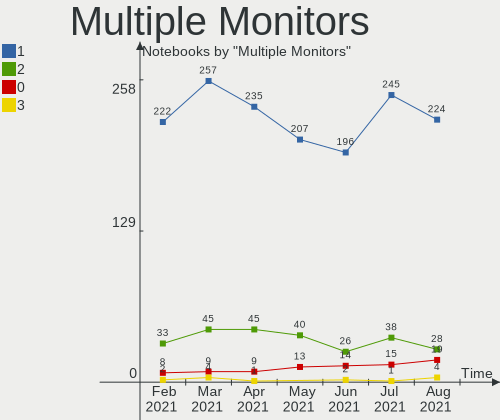

| Total | Notebooks | Percent |
|-------|-----------|---------|
| 1     | 274       | 82.78%  |
| 2     | 44        | 13.29%  |
| 0     | 9         | 2.72%   |
| 3     | 4         | 1.21%   |

Net Controller Vendor
---------------------

Controller vendors

| Vendor                            | Notebooks | Percent |
|-----------------------------------|-----------|---------|
| Realtek Semiconductor             | 191       | 34.11%  |
| Intel                             | 128       | 22.86%  |
| Qualcomm Atheros                  | 118       | 21.07%  |
| Broadcom Inc. and subsidiaries    | 47        | 8.39%   |
| Marvell Technology Group          | 19        | 3.39%   |
| Ralink                            | 8         | 1.43%   |
| Broadcom Limited                  | 8         | 1.43%   |
| TP-Link                           | 4         | 0.71%   |
| JMicron Technology                | 4         | 0.71%   |
| Samsung Electronics               | 3         | 0.54%   |
| Dell                              | 3         | 0.54%   |
| Ralink Technology                 | 2         | 0.36%   |
| Qualcomm Atheros Communications   | 2         | 0.36%   |
| Motorola PCS                      | 2         | 0.36%   |
| MEDIATEK                          | 2         | 0.36%   |
| Hewlett-Packard                   | 2         | 0.36%   |
| Broadcom                          | 2         | 0.36%   |
| Attansic Technology               | 2         | 0.36%   |
| VIA Technologies                  | 1         | 0.18%   |
| Sierra Wireless                   | 1         | 0.18%   |
| OnePlus Technology (Shenzhen)     | 1         | 0.18%   |
| NTmore                            | 1         | 0.18%   |
| NetGear                           | 1         | 0.18%   |
| Linksys                           | 1         | 0.18%   |
| LG Electronics                    | 1         | 0.18%   |
| Huawei Technologies               | 1         | 0.18%   |
| Gemtek                            | 1         | 0.18%   |
| Fibocom                           | 1         | 0.18%   |
| Ericsson Business Mobile Networks | 1         | 0.18%   |
| ASUSTek Computer                  | 1         | 0.18%   |
| Accton Technology                 | 1         | 0.18%   |

Net Controller Model
--------------------

Controller models

| Model                                                                          | Notebooks | Percent |
|--------------------------------------------------------------------------------|-----------|---------|
| Realtek RTL8111/8168/8411 PCI Express Gigabit Ethernet Controller              | 101       | 15.49%  |
| Realtek RTL810xE PCI Express Fast Ethernet controller                          | 64        | 9.82%   |
| Qualcomm Atheros AR9285 Wireless Network Adapter (PCI-Express)                 | 30        | 4.6%    |
| Qualcomm Atheros AR9485 Wireless Network Adapter                               | 24        | 3.68%   |
| Qualcomm Atheros QCA9377 802.11ac Wireless Network Adapter                     | 22        | 3.37%   |
| Intel 82579LM Gigabit Network Connection (Lewisville)                          | 16        | 2.45%   |
| Intel Centrino Advanced-N 6205 [Taylor Peak]                                   | 14        | 2.15%   |
| Intel Wireless 7260                                                            | 13        | 1.99%   |
| Realtek RTL8821CE 802.11ac PCIe Wireless Network Adapter                       | 11        | 1.69%   |
| Qualcomm Atheros QCA9565 / AR9565 Wireless Network Adapter                     | 10        | 1.53%   |
| Broadcom Inc. and subsidiaries BCM43142 802.11b/g/n                            | 10        | 1.53%   |
| Broadcom Inc. and subsidiaries BCM4313 802.11bgn Wireless Network Adapter      | 10        | 1.53%   |
| Intel Wi-Fi 6 AX200                                                            | 9         | 1.38%   |
| Intel PRO/Wireless 3945ABG [Golan] Network Connection                          | 8         | 1.23%   |
| Realtek RTL8723BE PCIe Wireless Network Adapter                                | 7         | 1.07%   |
| Marvell Group 88E8040 PCI-E Fast Ethernet Controller                           | 7         | 1.07%   |
| Realtek RTL8822CE 802.11ac PCIe Wireless Network Adapter                       | 6         | 0.92%   |
| Realtek RTL8153 Gigabit Ethernet Adapter                                       | 6         | 0.92%   |
| Qualcomm Atheros AR8161 Gigabit Ethernet                                       | 6         | 0.92%   |
| Intel Wireless-AC 9560 [Jefferson Peak]                                        | 6         | 0.92%   |
| Realtek 802.11ac NIC                                                           | 5         | 0.77%   |
| Qualcomm Atheros AR8151 v2.0 Gigabit Ethernet                                  | 5         | 0.77%   |
| Intel Wireless 8265 / 8275                                                     | 5         | 0.77%   |
| Intel Wireless 7265                                                            | 5         | 0.77%   |
| Intel PRO/Wireless 5100 AGN [Shiloh] Network Connection                        | 5         | 0.77%   |
| Intel Dual Band Wireless-AC 3165 Plus Bluetooth                                | 5         | 0.77%   |
| Realtek RTL8822BE 802.11a/b/g/n/ac WiFi adapter                                | 4         | 0.61%   |
| Ralink RT3090 Wireless 802.11n 1T/1R PCIe                                      | 4         | 0.61%   |
| Qualcomm Atheros QCA6174 802.11ac Wireless Network Adapter                     | 4         | 0.61%   |
| Qualcomm Atheros AR8152 v2.0 Fast Ethernet                                     | 4         | 0.61%   |
| Qualcomm Atheros AR8132 Fast Ethernet                                          | 4         | 0.61%   |
| Qualcomm Atheros AR242x / AR542x Wireless Network Adapter (PCI-Express)        | 4         | 0.61%   |
| Marvell Group 88E8055 PCI-E Gigabit Ethernet Controller                        | 4         | 0.61%   |
| JMicron JMC250 PCI Express Gigabit Ethernet Controller                         | 4         | 0.61%   |
| Intel Wireless 3160                                                            | 4         | 0.61%   |
| Intel WiFi Link 5100                                                           | 4         | 0.61%   |
| Intel Ethernet Connection I218-LM                                              | 4         | 0.61%   |
| Intel Comet Lake PCH-LP CNVi WiFi                                              | 4         | 0.61%   |
| Intel Centrino Wireless-N 2230                                                 | 4         | 0.61%   |
| Intel Centrino Ultimate-N 6300                                                 | 4         | 0.61%   |
| Intel Centrino Advanced-N 6200                                                 | 4         | 0.61%   |
| Broadcom Inc. and subsidiaries BCM4312 802.11b/g LP-PHY                        | 4         | 0.61%   |
| Realtek RTL8821AE 802.11ac PCIe Wireless Network Adapter                       | 3         | 0.46%   |
| Realtek RTL8723DE Wireless Network Adapter                                     | 3         | 0.46%   |
| Realtek RTL8191SEvB Wireless LAN Controller                                    | 3         | 0.46%   |
| Realtek RTL8188CE 802.11b/g/n WiFi Adapter                                     | 3         | 0.46%   |
| Qualcomm Atheros AR928X Wireless Network Adapter (PCI-Express)                 | 3         | 0.46%   |
| Qualcomm Atheros AR8152 v1.1 Fast Ethernet                                     | 3         | 0.46%   |
| Marvell Group Yukon Optima 88E8059 [PCIe Gigabit Ethernet Controller with AVB] | 3         | 0.46%   |
| Intel PRO/Wireless 4965 AG or AGN [Kedron] Network Connection                  | 3         | 0.46%   |
| Intel Centrino Wireless-N 1030 [Rainbow Peak]                                  | 3         | 0.46%   |
| Intel 82567LM Gigabit Network Connection                                       | 3         | 0.46%   |
| Broadcom Inc. and subsidiaries NetLink BCM5787M Gigabit Ethernet PCI Express   | 3         | 0.46%   |
| TP-Link TL WN823N RTL8192EU                                                    | 2         | 0.31%   |
| Samsung Galaxy series, misc. (tethering mode)                                  | 2         | 0.31%   |
| Realtek RTL8192CU 802.11n WLAN Adapter                                         | 2         | 0.31%   |
| Realtek RTL8188EE Wireless Network Adapter                                     | 2         | 0.31%   |
| Realtek RTL8187B Wireless Adapter                                              | 2         | 0.31%   |
| Realtek RTL8187B Wireless 802.11g 54Mbps Network Adapter                       | 2         | 0.31%   |
| Ralink RT5390 Wireless 802.11n 1T/1R PCIe                                      | 2         | 0.31%   |

Wireless Vendor
---------------

Wireless vendors

| Vendor                          | Notebooks | Percent |
|---------------------------------|-----------|---------|
| Intel                           | 122       | 35.47%  |
| Qualcomm Atheros                | 99        | 28.78%  |
| Realtek Semiconductor           | 55        | 15.99%  |
| Broadcom Inc. and subsidiaries  | 37        | 10.76%  |
| Ralink                          | 8         | 2.33%   |
| Broadcom Limited                | 6         | 1.74%   |
| TP-Link                         | 4         | 1.16%   |
| Ralink Technology               | 2         | 0.58%   |
| Qualcomm Atheros Communications | 2         | 0.58%   |
| Sierra Wireless                 | 1         | 0.29%   |
| NetGear                         | 1         | 0.29%   |
| MEDIATEK                        | 1         | 0.29%   |
| Linksys                         | 1         | 0.29%   |
| Hewlett-Packard                 | 1         | 0.29%   |
| Fibocom                         | 1         | 0.29%   |
| Broadcom                        | 1         | 0.29%   |
| ASUSTek Computer                | 1         | 0.29%   |
| Accton Technology               | 1         | 0.29%   |

Wireless Model
--------------

Wireless models

| Model                                                                     | Notebooks | Percent |
|---------------------------------------------------------------------------|-----------|---------|
| Qualcomm Atheros AR9285 Wireless Network Adapter (PCI-Express)            | 30        | 8.65%   |
| Qualcomm Atheros AR9485 Wireless Network Adapter                          | 24        | 6.92%   |
| Qualcomm Atheros QCA9377 802.11ac Wireless Network Adapter                | 22        | 6.34%   |
| Intel Centrino Advanced-N 6205 [Taylor Peak]                              | 14        | 4.03%   |
| Intel Wireless 7260                                                       | 13        | 3.75%   |
| Realtek RTL8821CE 802.11ac PCIe Wireless Network Adapter                  | 11        | 3.17%   |
| Qualcomm Atheros QCA9565 / AR9565 Wireless Network Adapter                | 10        | 2.88%   |
| Broadcom Inc. and subsidiaries BCM43142 802.11b/g/n                       | 10        | 2.88%   |
| Broadcom Inc. and subsidiaries BCM4313 802.11bgn Wireless Network Adapter | 10        | 2.88%   |
| Intel Wi-Fi 6 AX200                                                       | 9         | 2.59%   |
| Intel PRO/Wireless 3945ABG [Golan] Network Connection                     | 8         | 2.31%   |
| Realtek RTL8723BE PCIe Wireless Network Adapter                           | 7         | 2.02%   |
| Realtek RTL8822CE 802.11ac PCIe Wireless Network Adapter                  | 6         | 1.73%   |
| Intel Wireless-AC 9560 [Jefferson Peak]                                   | 6         | 1.73%   |
| Realtek 802.11ac NIC                                                      | 5         | 1.44%   |
| Intel Wireless 8265 / 8275                                                | 5         | 1.44%   |
| Intel Wireless 7265                                                       | 5         | 1.44%   |
| Intel PRO/Wireless 5100 AGN [Shiloh] Network Connection                   | 5         | 1.44%   |
| Intel Dual Band Wireless-AC 3165 Plus Bluetooth                           | 5         | 1.44%   |
| Realtek RTL8822BE 802.11a/b/g/n/ac WiFi adapter                           | 4         | 1.15%   |
| Ralink RT3090 Wireless 802.11n 1T/1R PCIe                                 | 4         | 1.15%   |
| Qualcomm Atheros QCA6174 802.11ac Wireless Network Adapter                | 4         | 1.15%   |
| Qualcomm Atheros AR242x / AR542x Wireless Network Adapter (PCI-Express)   | 4         | 1.15%   |
| Intel Wireless 3160                                                       | 4         | 1.15%   |
| Intel WiFi Link 5100                                                      | 4         | 1.15%   |
| Intel Comet Lake PCH-LP CNVi WiFi                                         | 4         | 1.15%   |
| Intel Centrino Wireless-N 2230                                            | 4         | 1.15%   |
| Intel Centrino Ultimate-N 6300                                            | 4         | 1.15%   |
| Intel Centrino Advanced-N 6200                                            | 4         | 1.15%   |
| Broadcom Inc. and subsidiaries BCM4312 802.11b/g LP-PHY                   | 4         | 1.15%   |
| Realtek RTL8821AE 802.11ac PCIe Wireless Network Adapter                  | 3         | 0.86%   |
| Realtek RTL8723DE Wireless Network Adapter                                | 3         | 0.86%   |
| Realtek RTL8191SEvB Wireless LAN Controller                               | 3         | 0.86%   |
| Realtek RTL8188CE 802.11b/g/n WiFi Adapter                                | 3         | 0.86%   |
| Qualcomm Atheros AR928X Wireless Network Adapter (PCI-Express)            | 3         | 0.86%   |
| Intel PRO/Wireless 4965 AG or AGN [Kedron] Network Connection             | 3         | 0.86%   |
| Intel Centrino Wireless-N 1030 [Rainbow Peak]                             | 3         | 0.86%   |
| TP-Link TL WN823N RTL8192EU                                               | 2         | 0.58%   |
| Realtek RTL8192CU 802.11n WLAN Adapter                                    | 2         | 0.58%   |
| Realtek RTL8188EE Wireless Network Adapter                                | 2         | 0.58%   |
| Realtek RTL8187B Wireless Adapter                                         | 2         | 0.58%   |
| Realtek RTL8187B Wireless 802.11g 54Mbps Network Adapter                  | 2         | 0.58%   |
| Ralink RT5390 Wireless 802.11n 1T/1R PCIe                                 | 2         | 0.58%   |
| Ralink RT3290 Wireless 802.11n 1T/1R PCIe                                 | 2         | 0.58%   |
| Qualcomm Atheros AR9271 802.11n                                           | 2         | 0.58%   |
| Intel Wireless 3165                                                       | 2         | 0.58%   |
| Intel Ultimate N WiFi Link 5300                                           | 2         | 0.58%   |
| Intel Killer Wi-Fi 6 AX1650i 160MHz Wireless Network Adapter (201NGW)     | 2         | 0.58%   |
| Intel Centrino Wireless-N 1000 [Condor Peak]                              | 2         | 0.58%   |
| Intel Centrino Advanced-N 6235                                            | 2         | 0.58%   |
| Intel Cannon Point-LP CNVi [Wireless-AC]                                  | 2         | 0.58%   |
| Broadcom Limited BCM4352 802.11ac Wireless Network Adapter                | 2         | 0.58%   |
| Broadcom Inc. and subsidiaries BCM43225 802.11b/g/n                       | 2         | 0.58%   |
| Broadcom Inc. and subsidiaries BCM4311 802.11b/g WLAN                     | 2         | 0.58%   |
| TP-Link TL-WN821N Version 5 RTL8192EU                                     | 1         | 0.29%   |
| TP-Link 802.11ac NIC                                                      | 1         | 0.29%   |
| Sierra Wireless MC8305                                                    | 1         | 0.29%   |
| Realtek RTL88x2bu [AC1200 Techkey]                                        | 1         | 0.29%   |
| Realtek RTL8812AU 802.11a/b/g/n/ac 2T2R DB WLAN Adapter                   | 1         | 0.29%   |
| Realtek RTL8723AE PCIe Wireless Network Adapter                           | 1         | 0.29%   |

Ethernet Vendor
---------------

Ethernet vendors

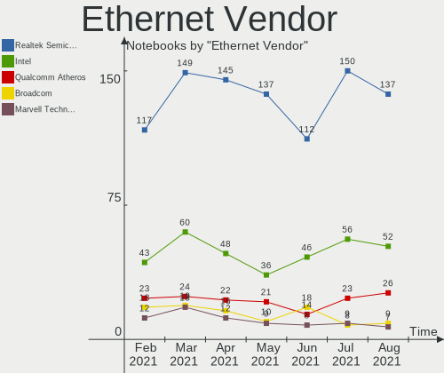

| Vendor                         | Notebooks | Percent |
|--------------------------------|-----------|---------|
| Realtek Semiconductor          | 172       | 58.11%  |
| Intel                          | 42        | 14.19%  |
| Qualcomm Atheros               | 32        | 10.81%  |
| Marvell Technology Group       | 19        | 6.42%   |
| Broadcom Inc. and subsidiaries | 13        | 4.39%   |
| JMicron Technology             | 4         | 1.35%   |
| Samsung Electronics            | 3         | 1.01%   |
| Broadcom Limited               | 2         | 0.68%   |
| Attansic Technology            | 2         | 0.68%   |
| VIA Technologies               | 1         | 0.34%   |
| OnePlus Technology (Shenzhen)  | 1         | 0.34%   |
| NTmore                         | 1         | 0.34%   |
| MediaTek                       | 1         | 0.34%   |
| Huawei Technologies            | 1         | 0.34%   |
| Gemtek                         | 1         | 0.34%   |
| Broadcom                       | 1         | 0.34%   |

Ethernet Model
--------------

Ethernet models

| Model                                                                          | Notebooks | Percent |
|--------------------------------------------------------------------------------|-----------|---------|
| Realtek RTL8111/8168/8411 PCI Express Gigabit Ethernet Controller              | 101       | 34.12%  |
| Realtek RTL810xE PCI Express Fast Ethernet controller                          | 64        | 21.62%  |
| Intel 82579LM Gigabit Network Connection (Lewisville)                          | 16        | 5.41%   |
| Marvell Group 88E8040 PCI-E Fast Ethernet Controller                           | 7         | 2.36%   |
| Realtek RTL8153 Gigabit Ethernet Adapter                                       | 6         | 2.03%   |
| Qualcomm Atheros AR8161 Gigabit Ethernet                                       | 6         | 2.03%   |
| Qualcomm Atheros AR8151 v2.0 Gigabit Ethernet                                  | 5         | 1.69%   |
| Qualcomm Atheros AR8152 v2.0 Fast Ethernet                                     | 4         | 1.35%   |
| Qualcomm Atheros AR8132 Fast Ethernet                                          | 4         | 1.35%   |
| Marvell Group 88E8055 PCI-E Gigabit Ethernet Controller                        | 4         | 1.35%   |
| JMicron JMC250 PCI Express Gigabit Ethernet Controller                         | 4         | 1.35%   |
| Intel Ethernet Connection I218-LM                                              | 4         | 1.35%   |
| Qualcomm Atheros AR8152 v1.1 Fast Ethernet                                     | 3         | 1.01%   |
| Marvell Group Yukon Optima 88E8059 [PCIe Gigabit Ethernet Controller with AVB] | 3         | 1.01%   |
| Intel 82567LM Gigabit Network Connection                                       | 3         | 1.01%   |
| Broadcom Inc. and subsidiaries NetLink BCM5787M Gigabit Ethernet PCI Express   | 3         | 1.01%   |
| Samsung Galaxy series, misc. (tethering mode)                                  | 2         | 0.68%   |
| Qualcomm Atheros AR8131 Gigabit Ethernet                                       | 2         | 0.68%   |
| Intel PRO/100 VE Network Connection                                            | 2         | 0.68%   |
| Intel Ethernet Connection I217-V                                               | 2         | 0.68%   |
| Intel Ethernet Connection (4) I219-V                                           | 2         | 0.68%   |
| Intel 82579V Gigabit Network Connection                                        | 2         | 0.68%   |
| Intel 82577LM Gigabit Network Connection                                       | 2         | 0.68%   |
| Broadcom Inc. and subsidiaries NetXtreme BCM5764M Gigabit Ethernet PCIe        | 2         | 0.68%   |
| Broadcom Inc. and subsidiaries NetLink BCM57785 Gigabit Ethernet PCIe          | 2         | 0.68%   |
| Broadcom Inc. and subsidiaries NetLink BCM57780 Gigabit Ethernet PCIe          | 2         | 0.68%   |
| Attansic AR8152 v2.0 Fast Ethernet                                             | 2         | 0.68%   |
| VIA VT6102/VT6103 [Rhine-II]                                                   | 1         | 0.34%   |
| Samsung Kiera                                                                  | 1         | 0.34%   |
| Realtek Killer E3000 2.5GbE Controller                                         | 1         | 0.34%   |
| Qualcomm Atheros QCA8172 Fast Ethernet                                         | 1         | 0.34%   |
| Qualcomm Atheros QCA8171 Gigabit Ethernet                                      | 1         | 0.34%   |
| Qualcomm Atheros Killer E2500 Gigabit Ethernet Controller                      | 1         | 0.34%   |
| Qualcomm Atheros Killer E2400 Gigabit Ethernet Controller                      | 1         | 0.34%   |
| Qualcomm Atheros Killer E220x Gigabit Ethernet Controller                      | 1         | 0.34%   |
| Qualcomm Atheros Attansic L2 Fast Ethernet                                     | 1         | 0.34%   |
| Qualcomm Atheros AR8162 Fast Ethernet                                          | 1         | 0.34%   |
| Qualcomm Atheros AR8121/AR8113/AR8114 Gigabit or Fast Ethernet                 | 1         | 0.34%   |
| OnePlus (Shenzhen) OnePlus                                                     | 1         | 0.34%   |
| NTmore JMR814                                                                  | 1         | 0.34%   |
| MediaTek MEIZU_M5                                                              | 1         | 0.34%   |
| Marvell Group 88E8072 PCI-E Gigabit Ethernet Controller                        | 1         | 0.34%   |
| Marvell Group 88E8058 PCI-E Gigabit Ethernet Controller                        | 1         | 0.34%   |
| Marvell Group 88E8053 PCI-E Gigabit Ethernet Controller                        | 1         | 0.34%   |
| Marvell Group 88E8042 PCI-E Fast Ethernet Controller                           | 1         | 0.34%   |
| Marvell Group 88E8036 PCI-E Fast Ethernet Controller                           | 1         | 0.34%   |
| Intel Ethernet Connection I219-LM                                              | 1         | 0.34%   |
| Intel Ethernet Connection I218-V                                               | 1         | 0.34%   |
| Intel Ethernet Connection I217-LM                                              | 1         | 0.34%   |
| Intel Ethernet Connection (6) I219-V                                           | 1         | 0.34%   |
| Intel Ethernet Connection (5) I219-LM                                          | 1         | 0.34%   |
| Intel Ethernet Connection (3) I218-LM                                          | 1         | 0.34%   |
| Intel 82577LC Gigabit Network Connection                                       | 1         | 0.34%   |
| Intel 82562GT 10/100 Network Connection                                        | 1         | 0.34%   |
| Intel 82562ET/EZ/GT/GZ - PRO/100 VE (LOM) Ethernet Controller Mobile           | 1         | 0.34%   |
| Huawei PLK-L01                                                                 | 1         | 0.34%   |
| Gemtek WLTUBA-107 [Yota 4G LTE]                                                | 1         | 0.34%   |
| Broadcom NetLink BCM5784M Gigabit Ethernet PCIe                                | 1         | 0.34%   |
| Broadcom Limited NetXtreme BCM5761e Gigabit Ethernet PCIe                      | 1         | 0.34%   |
| Broadcom Limited NetXtreme BCM5761 Gigabit Ethernet PCIe                       | 1         | 0.34%   |

Net Controller Kind
-------------------

Ethernet, WiFi or modem

| Kind     | Notebooks | Percent |
|----------|-----------|---------|
| WiFi     | 326       | 52.5%   |
| Ethernet | 286       | 46.05%  |
| Modem    | 7         | 1.13%   |
| Unknown  | 2         | 0.32%   |

Used Controller
---------------

Currently used network controller

| Kind     | Notebooks | Percent |
|----------|-----------|---------|
| WiFi     | 301       | 58.56%  |
| Ethernet | 212       | 41.25%  |
| Modem    | 1         | 0.19%   |

NICs
----

Total network controllers on board

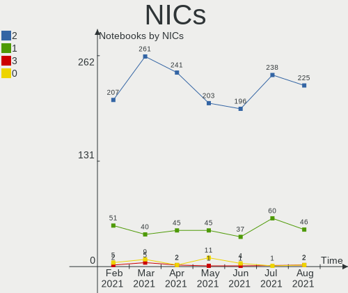

| Total | Notebooks | Percent |
|-------|-----------|---------|
| 2     | 273       | 82.48%  |
| 1     | 52        | 15.71%  |
| 0     | 6         | 1.81%   |

Memory Vendor
-------------

Memory module vendors

| Vendor              | Notebooks | Percent |
|---------------------|-----------|---------|
| Samsung Electronics | 32        | 27.12%  |
| SK Hynix            | 24        | 20.34%  |
| Kingston            | 13        | 11.02%  |
| Unknown             | 12        | 10.17%  |
| Micron Technology   | 12        | 10.17%  |
| Elpida              | 6         | 5.08%   |
| Corsair             | 4         | 3.39%   |
| Ramaxel Technology  | 3         | 2.54%   |
| Crucial             | 3         | 2.54%   |
| CSX                 | 2         | 1.69%   |
| Unknown (ABCD)      | 1         | 0.85%   |
| Smart               | 1         | 0.85%   |
| Silicon Power       | 1         | 0.85%   |
| PNY                 | 1         | 0.85%   |
| Patriot             | 1         | 0.85%   |
| GOODRAM             | 1         | 0.85%   |
| A-DATA Technology   | 1         | 0.85%   |

Memory Model
------------

Memory module models

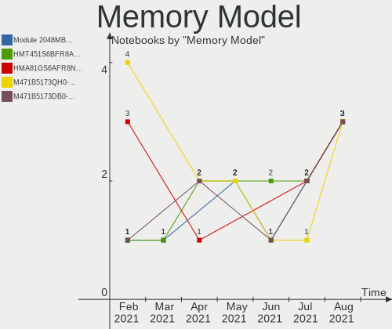

| Model                                                               | Notebooks | Percent |
|---------------------------------------------------------------------|-----------|---------|
| SK Hynix RAM HMT351S6CFR8C-PB 4096MB SODIMM DDR3 1600MT/s           | 3         | 2.38%   |
| Samsung RAM M471B5173DB0-YK0 4GB SODIMM DDR3 1600MT/s               | 3         | 2.38%   |
| Samsung RAM M471A1K43DB1-CWE 8192MB SODIMM DDR4 3200MT/s            | 3         | 2.38%   |
| Micron RAM 4ATF1G64HZ-3G2E1 8192MB SODIMM DDR4 3200MT/s             | 3         | 2.38%   |
| Unknown SODIMM 2048MB SODIMM DDR2 667MT/s                           | 2         | 1.59%   |
| SK Hynix RAM HMT451S6BFR8A-PB 4096MB SODIMM DDR3 1600MT/s           | 2         | 1.59%   |
| SK Hynix RAM HMT41GS6BFR8A-PB 8192MB SODIMM DDR3 1600MT/s           | 2         | 1.59%   |
| SK Hynix RAM HMA851S6AFR6N-UH 4GB SODIMM DDR4 2400MT/s              | 2         | 1.59%   |
| SK Hynix RAM HMA81GS6AFR8N-UH 8192MB SODIMM DDR4 2400MT/s           | 2         | 1.59%   |
| Samsung RAM M471B5674QH0-YK0 2GB SODIMM DDR3 1600MT/s               | 2         | 1.59%   |
| Samsung RAM M471B5173BH0-CK0 4096MB SODIMM DDR3 1600MT/s            | 2         | 1.59%   |
| Samsung RAM M471B1G73DB0-YK0 8GB SODIMM DDR3 1600MT/s               | 2         | 1.59%   |
| Samsung RAM M471A5244CB0-CTD 4096MB SODIMM DDR4 2667MT/s            | 2         | 1.59%   |
| Samsung RAM M471A2K43DB1-CWE 16GB SODIMM DDR4 3200MT/s              | 2         | 1.59%   |
| Samsung RAM M471A2K43CB1-CTD 16384MB SODIMM DDR4 2667MT/s           | 2         | 1.59%   |
| Unknown SODIMM 4096MB SODIMM DDR2 800MT/s                           | 1         | 0.79%   |
| Unknown SODIMM 2GB SODIMM DDR2 667MT/s                              | 1         | 0.79%   |
| Unknown SODIMM 2048MB SODIMM DDR2 800MT/s                           | 1         | 0.79%   |
| Unknown SODIMM 1GB SODIMM DDR2 667MT/s                              | 1         | 0.79%   |
| Unknown RAM ZFNB8G1866LSEC 8192MB SODIMM DDR3 1400MT/s              | 1         | 0.79%   |
| Unknown RAM Module 4096MB SODIMM DDR3 1066MT/s                      | 1         | 0.79%   |
| Unknown RAM Module 4096MB SODIMM DDR3                               | 1         | 0.79%   |
| Unknown RAM Module 2048MB SODIMM LPDDR4 2400MT/s                    | 1         | 0.79%   |
| Unknown RAM Module 2048MB SODIMM DDR2                               | 1         | 0.79%   |
| Unknown RAM Module 2048MB SODIMM 667MT/s                            | 1         | 0.79%   |
| Unknown RAM Module 1024MB SODIMM DDR                                | 1         | 0.79%   |
| Unknown RAM LD4AS008G-H2666GST 8192MB SODIMM DDR4 2667MT/s          | 1         | 0.79%   |
| Unknown (ABCD) RAM 123456789012345678 1024MB SODIMM LPDDR4 2400MT/s | 1         | 0.79%   |
| Smart RAM SH564128FH8NZPHSCG 4096MB SODIMM DDR3 1333MT/s            | 1         | 0.79%   |
| SK Hynix RAM Module 4096MB SODIMM DDR3 1600MT/s                     | 1         | 0.79%   |
| SK Hynix RAM HMT451S6MFR6C-PB 4096MB SODIMM DDR3 1600MT/s           | 1         | 0.79%   |
| SK Hynix RAM HMT451S6BFR8A-PB 4GB SODIMM DDR3 1600MT/s              | 1         | 0.79%   |
| SK Hynix RAM HMT41GS6MFR8C-PB 8192MB SODIMM DDR3 1600MT/s           | 1         | 0.79%   |
| SK Hynix RAM HMT351S6EFR8A-PB 4GB SODIMM DDR3 1600MT/s              | 1         | 0.79%   |
| SK Hynix RAM HMT351S6CFR8C-H9 4096MB SODIMM DDR3 1334MT/s           | 1         | 0.79%   |
| SK Hynix RAM HMT325S6CFR8C-PB 2048MB SODIMM DDR3 1600MT/s           | 1         | 0.79%   |
| SK Hynix RAM HMT325S6CFR8C-H9 2048MB SODIMM DDR3 1334MT/s           | 1         | 0.79%   |
| SK Hynix RAM HMT125S6BFR8C-G7 2048MB SODIMM DDR3 1067MT/s           | 1         | 0.79%   |
| SK Hynix RAM HMA851S6AFR6N-UH 4096MB SODIMM DDR4 2667MT/s           | 1         | 0.79%   |
| SK Hynix RAM HMA82GS6CJR8N-VK 16384MB SODIMM DDR4 2667MT/s          | 1         | 0.79%   |
| SK Hynix RAM HMA81GS6JJR8N-VK 8192MB SODIMM DDR4 2667MT/s           | 1         | 0.79%   |
| SK Hynix RAM H9HCNNNCPMALHR-NEE 8192MB Row Of Chips LPDDR4 4267MT/s | 1         | 0.79%   |
| SK Hynix RAM H9CCNNN8GTALAR-NUD 2GB LPDDR3 1600MT/s                 | 1         | 0.79%   |
| Silicon Power RAM SP008GLSTU160N02 8GB SODIMM DDR3 1600MT/s         | 1         | 0.79%   |
| Samsung RAM Module 16384MB SODIMM DDR4 2667MT/s                     | 1         | 0.79%   |
| Samsung RAM M471B5673FH0-CF8 2GB SODIMM DDR3 1067MT/s               | 1         | 0.79%   |
| Samsung RAM M471B5273DH0-CK0 4096MB SODIMM DDR3 1600MT/s            | 1         | 0.79%   |
| Samsung RAM M471B5273DH0-CH9 4GB SODIMM DDR3 1334MT/s               | 1         | 0.79%   |
| Samsung RAM M471B5273CH0-CH9 4096MB SODIMM DDR3 1334MT/s            | 1         | 0.79%   |
| Samsung RAM M471B5173EB0-YK0 4096MB SODIMM DDR3 1600MT/s            | 1         | 0.79%   |
| Samsung RAM M471B5173BH0-YK0 4096MB SODIMM DDR3 1600MT/s            | 1         | 0.79%   |
| Samsung RAM M471B1G73QH0-YK0 8GB SODIMM DDR3 1600MT/s               | 1         | 0.79%   |
| Samsung RAM M471A5244CB0-CWE 4GB SODIMM DDR4 3200MT/s               | 1         | 0.79%   |
| Samsung RAM M471A5244CB0-CWE 4096MB Row Of Chips DDR4 3200MT/s      | 1         | 0.79%   |
| Samsung RAM M471A5244CB0-CRC 4096MB SODIMM DDR4 2667MT/s            | 1         | 0.79%   |
| Samsung RAM M471A1K44BM0-CRC 8192MB SODIMM DDR4 2400MT/s            | 1         | 0.79%   |
| Samsung RAM M471A1K43DB1-CTD 8GB SODIMM DDR4 2667MT/s               | 1         | 0.79%   |
| Samsung RAM M471A1G44AB0-CWE 8GB SODIMM DDR4 3200MT/s               | 1         | 0.79%   |
| Samsung RAM M4 70T2864QZ3-CE6 1024MB SODIMM DDR 1639MT/s            | 1         | 0.79%   |
| Samsung RAM K4UBE3D4AA-MGCL 8192MB Row Of Chips LPDDR4 4267MT/s     | 1         | 0.79%   |

Memory Kind
-----------

Memory module kinds

| Kind    | Notebooks | Percent |
|---------|-----------|---------|
| DDR3    | 48        | 49.48%  |
| DDR4    | 34        | 35.05%  |
| LPDDR4  | 5         | 5.15%   |
| DDR2    | 5         | 5.15%   |
| LPDDR3  | 2         | 2.06%   |
| SDRAM   | 1         | 1.03%   |
| DDR     | 1         | 1.03%   |
| Unknown | 1         | 1.03%   |

Memory Form Factor
------------------

Physical design of the memory module

| Name         | Notebooks | Percent |
|--------------|-----------|---------|
| SODIMM       | 92        | 92.93%  |
| Row Of Chips | 5         | 5.05%   |
| Chip         | 1         | 1.01%   |
| Unknown      | 1         | 1.01%   |

Memory Size
-----------

Memory module size

| Size  | Notebooks | Percent |
|-------|-----------|---------|
| 4096  | 41        | 38.68%  |
| 8192  | 31        | 29.25%  |
| 2048  | 18        | 16.98%  |
| 16384 | 12        | 11.32%  |
| 1024  | 4         | 3.77%   |

Memory Speed
------------

Memory module speed

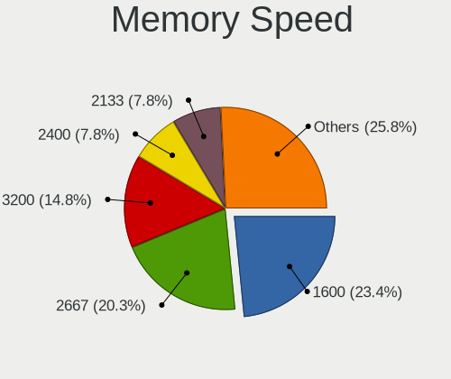

| Speed   | Notebooks | Percent |
|---------|-----------|---------|
| 1600    | 34        | 32.38%  |
| 2667    | 18        | 17.14%  |
| 3200    | 12        | 11.43%  |
| 2400    | 11        | 10.48%  |
| 1334    | 6         | 5.71%   |
| 1333    | 6         | 5.71%   |
| 667     | 4         | 3.81%   |
| 1067    | 3         | 2.86%   |
| Unknown | 3         | 2.86%   |
| 4267    | 2         | 1.9%    |
| 2133    | 2         | 1.9%    |
| 1639    | 1         | 0.95%   |
| 1400    | 1         | 0.95%   |
| 1066    | 1         | 0.95%   |
| 800     | 1         | 0.95%   |

Sound Vendor
------------

Sound card vendors

| Vendor                      | Notebooks | Percent |
|-----------------------------|-----------|---------|
| Intel                       | 271       | 69.67%  |
| AMD                         | 66        | 16.97%  |
| Nvidia                      | 34        | 8.74%   |
| JMTek                       | 4         | 1.03%   |
| Logitech                    | 3         | 0.77%   |
| VIA Technologies            | 1         | 0.26%   |
| Texas Instruments           | 1         | 0.26%   |
| Steinberg Soft-und Hardware | 1         | 0.26%   |
| Shure                       | 1         | 0.26%   |
| Realtek Semiconductor       | 1         | 0.26%   |
| QinHeng Electronics         | 1         | 0.26%   |
| Plantronics                 | 1         | 0.26%   |
| Kingston Technology         | 1         | 0.26%   |
| Creative Technology         | 1         | 0.26%   |
| C-Media Electronics         | 1         | 0.26%   |
| Apple                       | 1         | 0.26%   |

Sound Model
-----------

Sound card models

| Model                                                                                             | Notebooks | Percent |
|---------------------------------------------------------------------------------------------------|-----------|---------|
| Intel 7 Series/C216 Chipset Family High Definition Audio Controller                               | 40        | 8.55%   |
| Intel 6 Series/C200 Series Chipset Family High Definition Audio Controller                        | 28        | 5.98%   |
| Intel Sunrise Point-LP HD Audio                                                                   | 27        | 5.77%   |
| Intel 82801I (ICH9 Family) HD Audio Controller                                                    | 25        | 5.34%   |
| Intel 5 Series/3400 Series Chipset High Definition Audio                                          | 24        | 5.13%   |
| AMD Family 17h (Models 10h-1fh) HD Audio Controller                                               | 22        | 4.7%    |
| Intel Haswell-ULT HD Audio Controller                                                             | 20        | 4.27%   |
| Intel 8 Series HD Audio Controller                                                                | 19        | 4.06%   |
| Intel NM10/ICH7 Family High Definition Audio Controller                                           | 18        | 3.85%   |
| Intel 82801H (ICH8 Family) HD Audio Controller                                                    | 12        | 2.56%   |
| AMD SBx00 Azalia (Intel HDA)                                                                      | 12        | 2.56%   |
| AMD FCH Azalia Controller                                                                         | 10        | 2.14%   |
| Intel Wildcat Point-LP High Definition Audio Controller                                           | 9         | 1.92%   |
| Intel Broadwell-U Audio Controller                                                                | 9         | 1.92%   |
| AMD Renoir Radeon High Definition Audio Controller                                                | 9         | 1.92%   |
| AMD Raven/Raven2/Fenghuang HDMI/DP Audio Controller                                               | 9         | 1.92%   |
| AMD Family 15h (Models 60h-6fh) Audio Controller                                                  | 9         | 1.92%   |
| Intel Celeron/Pentium Silver Processor High Definition Audio                                      | 8         | 1.71%   |
| Intel Cannon Lake PCH cAVS                                                                        | 8         | 1.71%   |
| Intel Atom Processor Z36xxx/Z37xxx Series High Definition Audio Controller                        | 8         | 1.71%   |
| Intel 8 Series/C220 Series Chipset High Definition Audio Controller                               | 8         | 1.71%   |
| Intel Xeon E3-1200 v3/4th Gen Core Processor HD Audio Controller                                  | 7         | 1.5%    |
| Intel Ice Lake-LP Smart Sound Technology Audio Controller                                         | 7         | 1.5%    |
| Intel Atom/Celeron/Pentium Processor x5-E8000/J3xxx/N3xxx Series High Definition Audio Controller | 7         | 1.5%    |
| AMD Kabini HDMI/DP Audio                                                                          | 7         | 1.5%    |
| Nvidia TU116 High Definition Audio Controller                                                     | 6         | 1.28%   |
| Intel Cannon Point-LP High Definition Audio Controller                                            | 6         | 1.28%   |
| AMD High Definition Audio Controller                                                              | 6         | 1.28%   |
| AMD Cedar HDMI Audio [Radeon HD 5400/6300/7300 Series]                                            | 6         | 1.28%   |
| Nvidia GK107 HDMI Audio Controller                                                                | 5         | 1.07%   |
| Intel Comet Lake PCH-LP cAVS                                                                      | 5         | 1.07%   |
| AMD Wrestler HDMI Audio                                                                           | 5         | 1.07%   |
| JMTek USB PnP Audio Device                                                                        | 4         | 0.85%   |
| Nvidia TU106 High Definition Audio Controller                                                     | 3         | 0.64%   |
| Nvidia GF119 HDMI Audio Controller                                                                | 3         | 0.64%   |
| AMD Trinity HDMI Audio Controller                                                                 | 3         | 0.64%   |
| AMD RV710/730 HDMI Audio [Radeon HD 4000 series]                                                  | 3         | 0.64%   |
| Nvidia TU107 GeForce GTX 1650 High Definition Audio Controller                                    | 2         | 0.43%   |
| Nvidia GP107GL High Definition Audio Controller                                                   | 2         | 0.43%   |
| Nvidia GP106 High Definition Audio Controller                                                     | 2         | 0.43%   |
| Nvidia GP104 High Definition Audio Controller                                                     | 2         | 0.43%   |
| Intel CM238 HD Audio Controller                                                                   | 2         | 0.43%   |
| Intel Celeron N3350/Pentium N4200/Atom E3900 Series Audio Cluster                                 | 2         | 0.43%   |
| Intel 100 Series/C230 Series Chipset Family HD Audio Controller                                   | 2         | 0.43%   |
| AMD Turks HDMI Audio [Radeon HD 6500/6600 / 6700M Series]                                         | 2         | 0.43%   |
| AMD Redwood HDMI Audio [Radeon HD 5000 Series]                                                    | 2         | 0.43%   |
| AMD BeaverCreek HDMI Audio [Radeon HD 6500D and 6400G-6600G series]                               | 2         | 0.43%   |
| VIA Technologies VT8237A/VT8251 HDA Controller                                                    | 1         | 0.21%   |
| Texas Instruments PCM2906C Audio CODEC                                                            | 1         | 0.21%   |
| Steinberg Soft-und Hardware MI4                                                                   | 1         | 0.21%   |
| Shure MV5                                                                                         | 1         | 0.21%   |
| Realtek Semiconductor USB Audio                                                                   | 1         | 0.21%   |
| QinHeng Electronics CH345 MIDI adapter                                                            | 1         | 0.21%   |
| Plantronics Blackwire 320                                                                         | 1         | 0.21%   |
| Nvidia stereo controller                                                                          | 1         | 0.21%   |
| Nvidia MCP79 High Definition Audio                                                                | 1         | 0.21%   |
| Nvidia MCP72XE/MCP72P/MCP78U/MCP78S High Definition Audio                                         | 1         | 0.21%   |
| Nvidia High Definition Audio Controller                                                           | 1         | 0.21%   |
| Nvidia GT216 HDMI Audio Controller                                                                | 1         | 0.21%   |
| Nvidia GM204 High Definition Audio Controller                                                     | 1         | 0.21%   |

Camera Vendor
-------------

Camera device vendors

| Vendor                                 | Notebooks | Percent |
|----------------------------------------|-----------|---------|
| Chicony Electronics                    | 59        | 20.77%  |
| IMC Networks                           | 41        | 14.44%  |
| Acer                                   | 22        | 7.75%   |
| Realtek Semiconductor                  | 19        | 6.69%   |
| Suyin                                  | 18        | 6.34%   |
| Microdia                               | 18        | 6.34%   |
| Sunplus Innovation Technology          | 16        | 5.63%   |
| Quanta                                 | 13        | 4.58%   |
| Cheng Uei Precision Industry (Foxlink) | 13        | 4.58%   |
| Silicon Motion                         | 10        | 3.52%   |
| Lite-On Technology                     | 8         | 2.82%   |
| Syntek                                 | 7         | 2.46%   |
| Ricoh                                  | 7         | 2.46%   |
| Importek                               | 5         | 1.76%   |
| Z-Star Microelectronics                | 4         | 1.41%   |
| Apple                                  | 3         | 1.06%   |
| Alcor Micro                            | 3         | 1.06%   |
| ALi                                    | 2         | 0.7%    |
| Sunplus Technology                     | 1         | 0.35%   |
| Primax Electronics                     | 1         | 0.35%   |
| OmniVision Technologies                | 1         | 0.35%   |
| Novatel Wireless                       | 1         | 0.35%   |
| Luxvisions Innotech Limited            | 1         | 0.35%   |
| Logitech                               | 1         | 0.35%   |
| Lenovo                                 | 1         | 0.35%   |
| Intel                                  | 1         | 0.35%   |
| Huawei Technologies                    | 1         | 0.35%   |
| GenesysLogic Technology                | 1         | 0.35%   |
| Generalplus Technology                 | 1         | 0.35%   |
| GEMBIRD                                | 1         | 0.35%   |
| Elecom                                 | 1         | 0.35%   |
| DJKCVA1G4E5NDI                         | 1         | 0.35%   |
| DigiTech                               | 1         | 0.35%   |
| ARC International                      | 1         | 0.35%   |

Camera Model
------------

Camera device models

| Model                                                   | Notebooks | Percent |
|---------------------------------------------------------|-----------|---------|
| IMC Networks USB2.0 HD UVC WebCam                       | 10        | 3.52%   |
| IMC Networks Integrated Camera                          | 9         | 3.17%   |
| Chicony Integrated Camera                               | 9         | 3.17%   |
| Chicony USB 2.0 Camera                                  | 6         | 2.11%   |
| Chicony HD WebCam                                       | 6         | 2.11%   |
| IMC Networks USB2.0 VGA UVC WebCam                      | 5         | 1.76%   |
| Acer Integrated Camera                                  | 5         | 1.76%   |
| Sunplus Asus Webcam                                     | 4         | 1.41%   |
| Realtek USB Camera                                      | 4         | 1.41%   |
| Realtek Integrated_Webcam_HD                            | 4         | 1.41%   |
| Microdia Integrated Webcam                              | 4         | 1.41%   |
| Lite-On Integrated Camera                               | 4         | 1.41%   |
| IMC Networks HP TrueVision HD Camera                    | 4         | 1.41%   |
| Cheng Uei Precision Industry (Foxlink) HP HD Webcam     | 4         | 1.41%   |
| Suyin USB 2.0 Camera                                    | 3         | 1.06%   |
| Suyin HP Truevision HD                                  | 3         | 1.06%   |
| Sunplus Laptop_Integrated_Webcam_FHD                    | 3         | 1.06%   |
| Quanta HP Webcam                                        | 3         | 1.06%   |
| Quanta HD User Facing                                   | 3         | 1.06%   |
| IMC Networks UVC VGA Webcam                             | 3         | 1.06%   |
| Chicony TOSHIBA Web Camera - HD                         | 3         | 1.06%   |
| Chicony Lenovo EasyCamera                               | 3         | 1.06%   |
| Chicony HP Webcam                                       | 3         | 1.06%   |
| Chicony HP Truevision HD                                | 3         | 1.06%   |
| Cheng Uei Precision Industry (Foxlink) Webcam           | 3         | 1.06%   |
| Acer EasyCamera                                         | 3         | 1.06%   |
| Z-Star WebCam SCB-0320N                                 | 2         | 0.7%    |
| Syntek Lenovo EasyCamera                                | 2         | 0.7%    |
| Syntek EasyCamera                                       | 2         | 0.7%    |
| Suyin Integrated_Webcam_HD                              | 2         | 0.7%    |
| Sunplus Integrated_Webcam_HD                            | 2         | 0.7%    |
| Sunplus HD WebCam                                       | 2         | 0.7%    |
| Sunplus Dell HD Webcam                                  | 2         | 0.7%    |
| Silicon Motion WebCam SC-13HDL11939N                    | 2         | 0.7%    |
| Silicon Motion WebCam SC-0311139N                       | 2         | 0.7%    |
| Silicon Motion HP Webcam-101                            | 2         | 0.7%    |
| Ricoh Visual Communication Camera VGP-VCC7 [R5U870]     | 2         | 0.7%    |
| Ricoh Laptop_Integrated_Webcam_FHD                      | 2         | 0.7%    |
| Realtek USB2.0 HD UVC WebCam                            | 2         | 0.7%    |
| Realtek Integrated Webcam                               | 2         | 0.7%    |
| Quanta VGA WebCam                                       | 2         | 0.7%    |
| Microdia Laptop_Integrated_Webcam_HD                    | 2         | 0.7%    |
| Microdia Dell Laptop Integrated Webcam HD               | 2         | 0.7%    |
| Lite-On HP Wide Vision HD Camera                        | 2         | 0.7%    |
| Importek Laptop Integrated Webcam                       | 2         | 0.7%    |
| IMC Networks USB2.0 HD IR UVC WebCam                    | 2         | 0.7%    |
| IMC Networks USB Camera                                 | 2         | 0.7%    |
| IMC Networks USB 2.0 UVC VGA WebCam                     | 2         | 0.7%    |
| Chicony VGA WebCam                                      | 2         | 0.7%    |
| Chicony USB2.0 VGA UVC WebCam                           | 2         | 0.7%    |
| Chicony HP HD Webcam [Fixed]                            | 2         | 0.7%    |
| Chicony Gateway USB 2.0 Webcam                          | 2         | 0.7%    |
| Chicony EasyCamera                                      | 2         | 0.7%    |
| Chicony CNF9055 Toshiba Webcam                          | 2         | 0.7%    |
| Chicony CKF7063 Webcam (HP)                             | 2         | 0.7%    |
| Cheng Uei Precision Industry (Foxlink) HP Webcam        | 2         | 0.7%    |
| Cheng Uei Precision Industry (Foxlink) HP Truevision HD | 2         | 0.7%    |
| Apple iPhone 5/5C/5S/6/SE                               | 2         | 0.7%    |
| ALi Gateway Webcam                                      | 2         | 0.7%    |
| Alcor Micro USB Camera                                  | 2         | 0.7%    |

Fingerprint Vendor
------------------

Fingerprint sensor vendors

| Vendor                     | Notebooks | Percent |
|----------------------------|-----------|---------|
| Validity Sensors           | 15        | 46.88%  |
| Upek                       | 5         | 15.63%  |
| LighTuning Technology      | 4         | 12.5%   |
| AuthenTec                  | 4         | 12.5%   |
| Shenzhen Goodix Technology | 3         | 9.38%   |
| Synaptics                  | 1         | 3.13%   |

Fingerprint Model
-----------------

Fingerprint sensor models

| Model                                                  | Notebooks | Percent |
|--------------------------------------------------------|-----------|---------|
| Validity Sensors VFS495 Fingerprint Reader             | 4         | 12.5%   |
| Upek Biometric Touchchip/Touchstrip Fingerprint Sensor | 4         | 12.5%   |
| Validity Sensors VFS5011 Fingerprint Reader            | 2         | 6.25%   |
| Validity Sensors VFS491                                | 2         | 6.25%   |
| Validity Sensors VFS101 Fingerprint Reader             | 2         | 6.25%   |
| Shenzhen Goodix  FingerPrint Device                    | 2         | 6.25%   |
| LighTuning ES603 Swipe Fingerprint Sensor              | 2         | 6.25%   |
| AuthenTec AES2810                                      | 2         | 6.25%   |
| Validity Sensors VFS471 Fingerprint Reader             | 1         | 3.13%   |
| Validity Sensors VFS451 Fingerprint Reader             | 1         | 3.13%   |
| Validity Sensors VFS 5011 fingerprint sensor           | 1         | 3.13%   |
| Validity Sensors Synaptics WBDI                        | 1         | 3.13%   |
| Validity Sensors Fingerprint scanner                   | 1         | 3.13%   |
| Upek TCS5B Fingerprint sensor                          | 1         | 3.13%   |
| Synaptics Metallica MIS Touch Fingerprint Reader       | 1         | 3.13%   |
| Shenzhen Goodix Fingerprint Reader                     | 1         | 3.13%   |
| LighTuning Fingerprint Reader                          | 1         | 3.13%   |
| LighTuning EgisTec Touch Fingerprint Sensor            | 1         | 3.13%   |
| AuthenTec Fingerprint Sensor                           | 1         | 3.13%   |
| AuthenTec AES1600                                      | 1         | 3.13%   |

Chipcard Vendor
---------------

Chipcard module vendors

| Vendor      | Notebooks | Percent |
|-------------|-----------|---------|
| Broadcom    | 11        | 55%     |
| Alcor Micro | 6         | 30%     |
| Upek        | 2         | 10%     |
| O2 Micro    | 1         | 5%      |

Chipcard Model
--------------

Chipcard module models

| Model                                                                        | Notebooks | Percent |
|------------------------------------------------------------------------------|-----------|---------|
| Alcor Micro AU9540 Smartcard Reader                                          | 6         | 30%     |
| Broadcom BCM5880 Secure Applications Processor                               | 5         | 25%     |
| Broadcom BCM5880 Secure Applications Processor with fingerprint swipe sensor | 4         | 20%     |
| Upek TouchChip Fingerprint Coprocessor (WBF advanced mode)                   | 2         | 10%     |
| O2 Micro OZ776 CCID Smartcard Reader                                         | 1         | 5%      |
| Broadcom BCM5880 Secure Applications Processor with fingerprint touch sensor | 1         | 5%      |
| Broadcom 5880                                                                | 1         | 5%      |

Printer Vendor
--------------

Printer device vendors

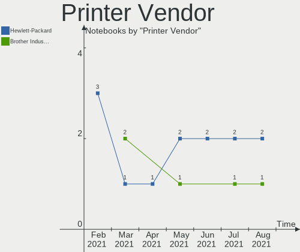

| Vendor | Notebooks | Percent |
|--------|-----------|---------|
| Canon  | 1         | 100%    |

Printer Model
-------------

Printer device models

| Model          | Notebooks | Percent |
|----------------|-----------|---------|
| Canon LiDE 300 | 1         | 100%    |

Scanner Vendor
--------------

Scanner device vendors

| Vendor          | Notebooks | Percent |
|-----------------|-----------|---------|
| Hewlett-Packard | 1         | 50%     |
| Canon           | 1         | 50%     |

Scanner Model
-------------

Scanner device models

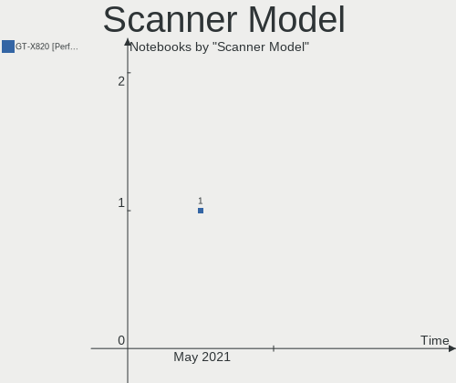

| Model                   | Notebooks | Percent |
|-------------------------|-----------|---------|
| HP ScanJet 5300c/5370c  | 1         | 50%     |
| Canon CanoScan LiDE 100 | 1         | 50%     |

Bluetooth Vendor
----------------

Controller vendors

| Vendor                          | Notebooks | Percent |
|---------------------------------|-----------|---------|
| Intel                           | 70        | 31.53%  |
| Qualcomm Atheros Communications | 32        | 14.41%  |
| Realtek Semiconductor           | 25        | 11.26%  |
| Broadcom                        | 17        | 7.66%   |
| Lite-On Technology              | 16        | 7.21%   |
| IMC Networks                    | 11        | 4.95%   |
| Cambridge Silicon Radio         | 10        | 4.5%    |
| Dell                            | 9         | 4.05%   |
| Foxconn / Hon Hai               | 7         | 3.15%   |
| Hewlett-Packard                 | 5         | 2.25%   |
| Apple                           | 5         | 2.25%   |
| Toshiba                         | 4         | 1.8%    |
| Ralink Technology               | 3         | 1.35%   |
| Alps Electric                   | 3         | 1.35%   |
| Ralink                          | 2         | 0.9%    |
| Realtek                         | 1         | 0.45%   |
| MediaTek                        | 1         | 0.45%   |
| ASUSTek Computer                | 1         | 0.45%   |

Bluetooth Model
---------------

Controller models

| Model                                               | Notebooks | Percent |
|-----------------------------------------------------|-----------|---------|
| Intel Bluetooth wireless interface                  | 34        | 15.32%  |
| Qualcomm Atheros  Bluetooth Device                  | 13        | 5.86%   |
| Intel Bluetooth Device                              | 11        | 4.95%   |
| Intel Bluetooth 9460/9560 Jefferson Peak (JfP)      | 10        | 4.5%    |
| Cambridge Silicon Radio Bluetooth Dongle (HCI mode) | 10        | 4.5%    |
| Qualcomm Atheros AR3011 Bluetooth                   | 9         | 4.05%   |
| Lite-On Qualcomm Atheros QCA9377 Bluetooth          | 9         | 4.05%   |
| Intel AX200 Bluetooth                               | 9         | 4.05%   |
| Realtek  Bluetooth 4.2 Adapter                      | 8         | 3.6%    |
| Realtek Bluetooth Radio                             | 8         | 3.6%    |
| Dell DW375 Bluetooth Module                         | 5         | 2.25%   |
| Qualcomm Atheros AR3012 Bluetooth 4.0               | 4         | 1.8%    |
| Intel Centrino Advanced-N 6230 Bluetooth adapter    | 4         | 1.8%    |
| IMC Networks Bluetooth Radio                        | 4         | 1.8%    |
| Realtek RTL8822BE Bluetooth 4.2 Adapter             | 3         | 1.35%   |
| Realtek RTL8723B Bluetooth                          | 3         | 1.35%   |
| Realtek 802.11n WLAN Adapter                        | 3         | 1.35%   |
| Ralink Motorola BC4 Bluetooth 3.0+HS Adapter        | 3         | 1.35%   |
| Qualcomm Atheros Bluetooth USB Host Controller      | 3         | 1.35%   |
| Lite-On Bluetooth Radio                             | 3         | 1.35%   |
| IMC Networks Bluetooth Device                       | 3         | 1.35%   |
| HP Bluetooth 2.0 Interface [Broadcom BCM2045]       | 3         | 1.35%   |
| Broadcom BCM43142A0 Bluetooth 4.0                   | 3         | 1.35%   |
| Ralink RT3290 Bluetooth                             | 2         | 0.9%    |
| Qualcomm Atheros QCA61x4 Bluetooth 4.0              | 2         | 0.9%    |
| Lite-On Bluetooth Device                            | 2         | 0.9%    |
| Lite-On Atheros AR3012 Bluetooth                    | 2         | 0.9%    |
| IMC Networks Bluetooth USB Host Controller          | 2         | 0.9%    |
| IMC Networks Atheros AR3012 Bluetooth 4.0 Adapter   | 2         | 0.9%    |
| Foxconn / Hon Hai Bluetooth USB Host Controller     | 2         | 0.9%    |
| Foxconn / Hon Hai BCM20702A0                        | 2         | 0.9%    |
| Broadcom HP Portable SoftSailing                    | 2         | 0.9%    |
| Broadcom BCM43142A0 Bluetooth Device                | 2         | 0.9%    |
| Broadcom BCM20702 Bluetooth 4.0 [ThinkPad]          | 2         | 0.9%    |
| Broadcom BCM2070 Bluetooth 2.1 + EDR                | 2         | 0.9%    |
| Apple Bluetooth USB Host Controller                 | 2         | 0.9%    |
| Apple Bluetooth HCI                                 | 2         | 0.9%    |
| Alps Electric BCM2046 Bluetooth Device              | 2         | 0.9%    |
| Toshiba Bluetooth USB Host Controller               | 1         | 0.45%   |
| Toshiba Bluetooth Device                            | 1         | 0.45%   |
| Toshiba BCM43142A0                                  | 1         | 0.45%   |
| Toshiba Askey Bluetooth Module                      | 1         | 0.45%   |
| Realtek Bluetooth Radio                             | 1         | 0.45%   |
| Qualcomm Atheros Bluetooth                          | 1         | 0.45%   |
| MediaTek MT7630e Bluetooth Adapter                  | 1         | 0.45%   |
| Intel Wireless-AC 9260 Bluetooth Adapter            | 1         | 0.45%   |
| Intel Wireless-AC 3168 Bluetooth                    | 1         | 0.45%   |
| HP Broadcom 2070 Bluetooth Combo                    | 1         | 0.45%   |
| HP Bluetooth Adapter                                | 1         | 0.45%   |
| Foxconn / Hon Hai Broadcom Bluetooth 2.1 Device     | 1         | 0.45%   |
| Foxconn / Hon Hai BCM43142A0 broadcom bluetooth     | 1         | 0.45%   |
| Foxconn / Hon Hai BCM2045A0                         | 1         | 0.45%   |
| Dell Wireless 365 Bluetooth                         | 1         | 0.45%   |
| Dell Wireless 355 Bluetooth                         | 1         | 0.45%   |
| Dell Broadcom BCM20702A0 Bluetooth                  | 1         | 0.45%   |
| Dell BCM20702A0 Bluetooth Module                    | 1         | 0.45%   |
| Broadcom Bluetooth                                  | 1         | 0.45%   |
| Broadcom BCM43142 Bluetooth 4.0                     | 1         | 0.45%   |
| Broadcom BCM20703A1 Bluetooth 4.1 + LE              | 1         | 0.45%   |
| Broadcom BCM20702A0 Bluetooth 4.0                   | 1         | 0.45%   |

Unsupported Devices
-------------------

Total unsupported devices on board

| Total | Notebooks | Percent |
|-------|-----------|---------|
| 0     | 232       | 70.09%  |
| 1     | 79        | 23.87%  |
| 2     | 18        | 5.44%   |
| 4     | 1         | 0.3%    |
| 3     | 1         | 0.3%    |

Unsupported Device Types
------------------------

Types of unsupported devices

| Type                     | Notebooks | Percent |
|--------------------------|-----------|---------|
| Fingerprint reader       | 31        | 26.5%   |
| Graphics card            | 23        | 19.66%  |
| Chipcard                 | 19        | 16.24%  |
| Net/wireless             | 15        | 12.82%  |
| Storage                  | 9         | 7.69%   |
| Multimedia controller    | 9         | 7.69%   |
| Bluetooth                | 3         | 2.56%   |
| Communication controller | 2         | 1.71%   |
| Camera                   | 2         | 1.71%   |
| Sound                    | 1         | 0.85%   |
| Network                  | 1         | 0.85%   |
| Modem                    | 1         | 0.85%   |
| Card reader              | 1         | 0.85%   |

