Mint Hardware Trends
--------------------

A project to identify most popular hardware characteristics and track their change
over time based on data collected by Mint users at https://Linux-Hardware.org.

Anyone can contribute to this report by the [hw-probe](https://github.com/linuxhw/hw-probe) tool:

    sudo -E hw-probe -all -upload

This is a report for all computer types. See also reports for [desktops](/Dist/Mint/Desktop/README.md) and [notebooks](/Dist/Mint/Notebook/README.md).

Full-feature report is available here: https://linux-hardware.org/?view=trends

Period: Jul, 2021.

Contents
--------

* [ System ](#system)
  - [ OS                       ](#os)
  - [ OS Family                ](#os-family)
  - [ Kernel                   ](#kernel)
  - [ Kernel Family            ](#kernel-family)
  - [ Kernel Major Ver.        ](#kernel-major-ver)
  - [ Arch                     ](#arch)
  - [ DE                       ](#de)
  - [ Display Server           ](#display-server)
  - [ Display Manager          ](#display-manager)
  - [ OS Lang                  ](#os-lang)
  - [ Boot Mode                ](#boot-mode)
  - [ Filesystem               ](#filesystem)
  - [ Part. scheme             ](#part-scheme)
  - [ Dual Boot with Linux/BSD ](#dual-boot-with-linuxbsd)
  - [ Dual Boot (Win)          ](#dual-boot-win)

* [ Board ](#board)
  - [ Vendor                   ](#vendor)
  - [ Model                    ](#model)
  - [ Model Family             ](#model-family)
  - [ MFG Year                 ](#mfg-year)
  - [ Form Factor              ](#form-factor)
  - [ Secure Boot              ](#secure-boot)
  - [ Coreboot                 ](#coreboot)
  - [ RAM Size                 ](#ram-size)
  - [ RAM Used                 ](#ram-used)
  - [ Total Drives             ](#total-drives)
  - [ Has CD-ROM               ](#has-cd-rom)
  - [ Has Ethernet             ](#has-ethernet)
  - [ Has WiFi                 ](#has-wifi)
  - [ Has Bluetooth            ](#has-bluetooth)

* [ Location ](#location)
  - [ Country                  ](#country)
  - [ City                     ](#city)

* [ Drives ](#drives)
  - [ Drive Vendor             ](#drive-vendor)
  - [ Drive Model              ](#drive-model)
  - [ HDD Vendor               ](#hdd-vendor)
  - [ SSD Vendor               ](#ssd-vendor)
  - [ Drive Kind               ](#drive-kind)
  - [ Drive Connector          ](#drive-connector)
  - [ Drive Size               ](#drive-size)
  - [ Space Total              ](#space-total)
  - [ Space Used               ](#space-used)
  - [ Malfunc. Drives          ](#malfunc-drives)
  - [ Malfunc. Drive Vendor    ](#malfunc-drive-vendor)
  - [ Malfunc. HDD Vendor      ](#malfunc-hdd-vendor)
  - [ Malfunc. Drive Kind      ](#malfunc-drive-kind)
  - [ Failed Drives            ](#failed-drives)
  - [ Failed Drive Vendor      ](#failed-drive-vendor)
  - [ Drive Status             ](#drive-status)

* [ Storage controller ](#storage-controller)
  - [ Storage Vendor           ](#storage-vendor)
  - [ Storage Model            ](#storage-model)
  - [ Storage Kind             ](#storage-kind)

* [ Processor ](#processor)
  - [ CPU Vendor               ](#cpu-vendor)
  - [ CPU Model                ](#cpu-model)
  - [ CPU Model Family         ](#cpu-model-family)
  - [ CPU Cores                ](#cpu-cores)
  - [ CPU Sockets              ](#cpu-sockets)
  - [ CPU Threads              ](#cpu-threads)
  - [ CPU Op-Modes             ](#cpu-op-modes)
  - [ CPU Microcode            ](#cpu-microcode)
  - [ CPU Microarch            ](#cpu-microarch)

* [ Graphics ](#graphics)
  - [ GPU Vendor               ](#gpu-vendor)
  - [ GPU Model                ](#gpu-model)
  - [ GPU Combo                ](#gpu-combo)
  - [ GPU Driver               ](#gpu-driver)
  - [ GPU Memory               ](#gpu-memory)

* [ Monitor ](#monitor)
  - [ Monitor Vendor           ](#monitor-vendor)
  - [ Monitor Model            ](#monitor-model)
  - [ Monitor Resolution       ](#monitor-resolution)
  - [ Monitor Diagonal         ](#monitor-diagonal)
  - [ Monitor Width            ](#monitor-width)
  - [ Aspect Ratio             ](#aspect-ratio)
  - [ Monitor Area             ](#monitor-area)
  - [ Pixel Density            ](#pixel-density)
  - [ Multiple Monitors        ](#multiple-monitors)

* [ Network ](#network)
  - [ Net Controller Vendor    ](#net-controller-vendor)
  - [ Net Controller Model     ](#net-controller-model)
  - [ Wireless Vendor          ](#wireless-vendor)
  - [ Wireless Model           ](#wireless-model)
  - [ Ethernet Vendor          ](#ethernet-vendor)
  - [ Ethernet Model           ](#ethernet-model)
  - [ Net Controller Kind      ](#net-controller-kind)
  - [ Used Controller          ](#used-controller)
  - [ NICs                     ](#nics)
  - [ IPv6                     ](#ipv6)

* [ Bluetooth ](#bluetooth)
  - [ Bluetooth Vendor         ](#bluetooth-vendor)
  - [ Bluetooth Model          ](#bluetooth-model)

* [ Sound ](#sound)
  - [ Sound Vendor             ](#sound-vendor)
  - [ Sound Model              ](#sound-model)

* [ Memory ](#memory)
  - [ Memory Vendor            ](#memory-vendor)
  - [ Memory Model             ](#memory-model)
  - [ Memory Kind              ](#memory-kind)
  - [ Memory Form Factor       ](#memory-form-factor)
  - [ Memory Size              ](#memory-size)
  - [ Memory Speed             ](#memory-speed)

* [ Printers & scanners ](#printers--scanners)
  - [ Printer Vendor           ](#printer-vendor)
  - [ Printer Model            ](#printer-model)
  - [ Scanner Vendor           ](#scanner-vendor)
  - [ Scanner Model            ](#scanner-model)

* [ Camera ](#camera)
  - [ Camera Vendor            ](#camera-vendor)
  - [ Camera Model             ](#camera-model)

* [ Security ](#security)
  - [ Fingerprint Vendor       ](#fingerprint-vendor)
  - [ Fingerprint Model        ](#fingerprint-model)
  - [ Chipcard Vendor          ](#chipcard-vendor)
  - [ Chipcard Model           ](#chipcard-model)

* [ Unsupported ](#unsupported)
  - [ Unsupported Devices      ](#unsupported-devices)
  - [ Unsupported Device Types ](#unsupported-device-types)

System
------

OS
--

Installed operating systems

| Name      | Computers | Percent |
|-----------|-----------|---------|
| Mint 20.2 | 247       | 47.96%  |
| Mint 20.1 | 155       | 30.1%   |
| Mint 19.3 | 56        | 10.87%  |
| Mint 20   | 37        | 7.18%   |
| Mint 19.1 | 8         | 1.55%   |
| Mint 19.2 | 5         | 0.97%   |
| Mint 18.3 | 4         | 0.78%   |
| Mint 19   | 2         | 0.39%   |
| Mint 18.1 | 1         | 0.19%   |

OS Family
---------

OS without a version

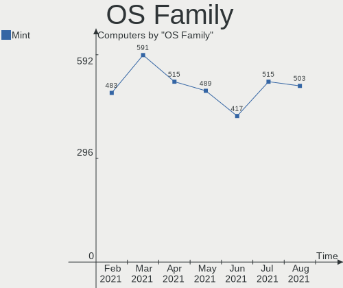

| Name | Computers | Percent |
|------|-----------|---------|
| Mint | 515       | 100%    |

Kernel
------

Version of the Linux kernel

| Version                    | Computers | Percent |
|----------------------------|-----------|---------|
| 5.4.0-77-generic           | 234       | 45.44%  |
| 5.4.0-80-generic           | 114       | 22.14%  |
| 5.11.0-22-generic          | 26        | 5.05%   |
| 5.4.0-74-generic           | 24        | 4.66%   |
| 5.4.0-58-generic           | 19        | 3.69%   |
| 5.8.0-59-generic           | 10        | 1.94%   |
| 5.11.0-25-generic          | 10        | 1.94%   |
| 5.0.0-32-generic           | 10        | 1.94%   |
| 5.4.0-26-generic           | 9         | 1.75%   |
| 5.4.0-73-generic           | 5         | 0.97%   |
| 4.15.0-151-generic         | 5         | 0.97%   |
| 5.4.0-67-generic           | 3         | 0.58%   |
| 5.4.0-62-generic           | 3         | 0.58%   |
| 4.4.0-210-generic          | 3         | 0.58%   |
| 4.15.0-54-generic          | 3         | 0.58%   |
| 4.15.0-147-generic         | 3         | 0.58%   |
| 5.8.0-63-generic           | 2         | 0.39%   |
| 5.4.0-72-generic           | 2         | 0.39%   |
| 5.4.0-65-generic           | 2         | 0.39%   |
| 4.15.0-20-generic          | 2         | 0.39%   |
| 4.15.0-106-generic         | 2         | 0.39%   |
| 4.10.0-38-generic          | 2         | 0.39%   |
| 5.8.0-43-generic           | 1         | 0.19%   |
| 5.6.17-050617-generic      | 1         | 0.19%   |
| 5.4.2-050402-generic       | 1         | 0.19%   |
| 5.4.0-60-generic           | 1         | 0.19%   |
| 5.4.0-56-generic           | 1         | 0.19%   |
| 5.4.0-54-generic           | 1         | 0.19%   |
| 5.4.0-42-generic           | 1         | 0.19%   |
| 5.3.0-53-generic           | 1         | 0.19%   |
| 5.13.5-051305-generic      | 1         | 0.19%   |
| 5.13.4-gnu                 | 1         | 0.19%   |
| 5.13.0-xanmod2-cacule      | 1         | 0.19%   |
| 5.12.0-17.2-liquorix-amd64 | 1         | 0.19%   |
| 5.11.6-051106-generic      | 1         | 0.19%   |
| 5.11.0-7620-generic        | 1         | 0.19%   |
| 5.11.0-22-lowlatency       | 1         | 0.19%   |
| 5.10.5-2006-amd+           | 1         | 0.19%   |
| 5.10.46-xanmod1            | 1         | 0.19%   |
| 5.10.0-gpd-pocket          | 1         | 0.19%   |
| 5.10.0-8-amd64             | 1         | 0.19%   |
| 5.10.0-1034-oem            | 1         | 0.19%   |
| 4.15.0-88-generic          | 1         | 0.19%   |
| 4.15.0-139-generic         | 1         | 0.19%   |

Kernel Family
-------------

Linux kernel without a distro release

| Version | Computers | Percent |
|---------|-----------|---------|
| 5.4.0   | 419       | 81.36%  |
| 5.11.0  | 38        | 7.38%   |
| 4.15.0  | 17        | 3.3%    |
| 5.8.0   | 13        | 2.52%   |
| 5.0.0   | 10        | 1.94%   |
| 5.10.0  | 3         | 0.58%   |
| 4.4.0   | 3         | 0.58%   |
| 4.10.0  | 2         | 0.39%   |
| 5.6.17  | 1         | 0.19%   |
| 5.4.2   | 1         | 0.19%   |
| 5.3.0   | 1         | 0.19%   |
| 5.13.5  | 1         | 0.19%   |
| 5.13.4  | 1         | 0.19%   |
| 5.13.0  | 1         | 0.19%   |
| 5.12.0  | 1         | 0.19%   |
| 5.11.6  | 1         | 0.19%   |
| 5.10.5  | 1         | 0.19%   |
| 5.10.46 | 1         | 0.19%   |

Kernel Major Ver.
-----------------

Linux kernel major version

| Version | Computers | Percent |
|---------|-----------|---------|
| 5.4     | 420       | 81.55%  |
| 5.11    | 39        | 7.57%   |
| 4.15    | 17        | 3.3%    |
| 5.8     | 13        | 2.52%   |
| 5.0     | 10        | 1.94%   |
| 5.10    | 5         | 0.97%   |
| 5.13    | 3         | 0.58%   |
| 4.4     | 3         | 0.58%   |
| 4.10    | 2         | 0.39%   |
| 5.6     | 1         | 0.19%   |
| 5.3     | 1         | 0.19%   |
| 5.12    | 1         | 0.19%   |

Arch
----

OS architecture (x86_64, i586, etc.)

| Name   | Computers | Percent |
|--------|-----------|---------|
| x86_64 | 497       | 96.5%   |
| i686   | 18        | 3.5%    |

DE
--

Desktop Environment

| Name          | Computers | Percent |
|---------------|-----------|---------|
| X-Cinnamon    | 329       | 63.88%  |
| MATE          | 74        | 14.37%  |
| XFCE          | 68        | 13.2%   |
| Cinnamon      | 24        | 4.66%   |
| GNOME         | 9         | 1.75%   |
| Unknown       | 7         | 1.36%   |
| KDE5          | 2         | 0.39%   |
| KDE           | 1         | 0.19%   |
| GNOME Classic | 1         | 0.19%   |

Display Server
--------------

X11 or Wayland

| Name    | Computers | Percent |
|---------|-----------|---------|
| X11     | 512       | 99.42%  |
| Wayland | 2         | 0.39%   |
| Tty     | 1         | 0.19%   |

Display Manager
---------------

SDDM, LightDM, etc.

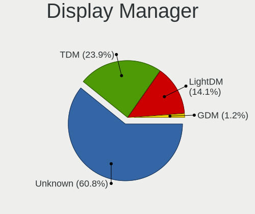

| Name    | Computers | Percent |
|---------|-----------|---------|
| Unknown | 351       | 68.16%  |
| TDM     | 157       | 30.49%  |
| GDM     | 4         | 0.78%   |
| LightDM | 2         | 0.39%   |
| SDDM    | 1         | 0.19%   |

OS Lang
-------

Language

| Lang    | Computers | Percent |
|---------|-----------|---------|
| en_US   | 142       | 27.57%  |
| de_DE   | 91        | 17.67%  |
| pt_BR   | 35        | 6.8%    |
| en_GB   | 26        | 5.05%   |
| C       | 21        | 4.08%   |
| ru_RU   | 20        | 3.88%   |
| fr_FR   | 20        | 3.88%   |
| en_IN   | 14        | 2.72%   |
| en_CA   | 13        | 2.52%   |
| it_IT   | 10        | 1.94%   |
| pl_PL   | 9         | 1.75%   |
| es_MX   | 9         | 1.75%   |
| en_ZA   | 9         | 1.75%   |
| cs_CZ   | 9         | 1.75%   |
| nl_NL   | 8         | 1.55%   |
| es_ES   | 8         | 1.55%   |
| es_AR   | 7         | 1.36%   |
| pt_PT   | 6         | 1.17%   |
| de_AT   | 6         | 1.17%   |
| en_AU   | 5         | 0.97%   |
| de_CH   | 5         | 0.97%   |
| zh_CN   | 4         | 0.78%   |
| hu_HU   | 4         | 0.78%   |
| en_NZ   | 4         | 0.78%   |
| fr_CA   | 3         | 0.58%   |
| es_CL   | 3         | 0.58%   |
| da_DK   | 3         | 0.58%   |
| sk_SK   | 2         | 0.39%   |
| en_PH   | 2         | 0.39%   |
| Unknown | 2         | 0.39%   |
| zh_TW   | 1         | 0.19%   |
| uk_UA   | 1         | 0.19%   |
| tr_TR   | 1         | 0.19%   |
| sv_SE   | 1         | 0.19%   |
| ro_RO   | 1         | 0.19%   |
| nb_NO   | 1         | 0.19%   |
| he_IL   | 1         | 0.19%   |
| fr_CH   | 1         | 0.19%   |
| fr_BE   | 1         | 0.19%   |
| fi_FI   | 1         | 0.19%   |
| es_NI   | 1         | 0.19%   |
| es_DO   | 1         | 0.19%   |
| es_CU   | 1         | 0.19%   |
| en_IL   | 1         | 0.19%   |
| el_GR   | 1         | 0.19%   |

Boot Mode
---------

EFI or BIOS

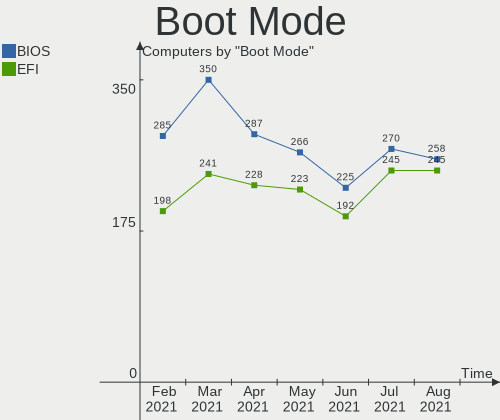

| Mode | Computers | Percent |
|------|-----------|---------|
| BIOS | 270       | 52.43%  |
| EFI  | 245       | 47.57%  |

Filesystem
----------

Type of filesystem

| Type    | Computers | Percent |
|---------|-----------|---------|
| Ext4    | 482       | 93.59%  |
| Overlay | 22        | 4.27%   |
| Btrfs   | 8         | 1.55%   |
| XXXXX   | 1         | 0.19%   |
| Xfs     | 1         | 0.19%   |
| Aufs    | 1         | 0.19%   |

Part. scheme
------------

Scheme of partitioning

| Type    | Computers | Percent |
|---------|-----------|---------|
| Unknown | 349       | 67.77%  |
| GPT     | 116       | 22.52%  |
| MBR     | 50        | 9.71%   |

Dual Boot with Linux/BSD
------------------------

Hosting more than one Linux/BSD

| Dual boot | Computers | Percent |
|-----------|-----------|---------|
| No        | 482       | 93.59%  |
| Yes       | 33        | 6.41%   |

Dual Boot (Win)
---------------

Hosting Linux and Windows

| Dual boot | Computers | Percent |
|-----------|-----------|---------|
| No        | 429       | 83.3%   |
| Yes       | 86        | 16.7%   |

Board
-----

Vendor
------

Motherboard manufacturer

| Name                                         | Computers | Percent |
|----------------------------------------------|-----------|---------|
| Hewlett-Packard                              | 90        | 17.48%  |
| ASUSTek Computer                             | 73        | 14.17%  |
| Dell                                         | 63        | 12.23%  |
| Lenovo                                       | 58        | 11.26%  |
| Acer                                         | 40        | 7.77%   |
| Gigabyte Technology                          | 35        | 6.8%    |
| MSI                                          | 20        | 3.88%   |
| ASRock                                       | 19        | 3.69%   |
| Intel                                        | 12        | 2.33%   |
| Toshiba                                      | 11        | 2.14%   |
| Samsung Electronics                          | 10        | 1.94%   |
| Apple                                        | 8         | 1.55%   |
| Sony                                         | 5         | 0.97%   |
| Medion                                       | 4         | 0.78%   |
| Fujitsu Siemens                              | 4         | 0.78%   |
| Fujitsu                                      | 4         | 0.78%   |
| Foxconn                                      | 4         | 0.78%   |
| eMachines                                    | 4         | 0.78%   |
| Microsoft                                    | 3         | 0.58%   |
| HUAWEI                                       | 3         | 0.58%   |
| Google                                       | 3         | 0.58%   |
| AMI                                          | 3         | 0.58%   |
| Unknown                                      | 3         | 0.58%   |
| TUXEDO                                       | 2         | 0.39%   |
| Positivo                                     | 2         | 0.39%   |
| Pegatron                                     | 2         | 0.39%   |
| Digibras                                     | 2         | 0.39%   |
| Biostar                                      | 2         | 0.39%   |
| AWOW Technology                              | 2         | 0.39%   |
| ZOTAC                                        | 1         | 0.19%   |
| Wibtek                                       | 1         | 0.19%   |
| TrekStor                                     | 1         | 0.19%   |
| TaNix                                        | 1         | 0.19%   |
| Supermicro                                   | 1         | 0.19%   |
| Seco                                         | 1         | 0.19%   |
| Quanta                                       | 1         | 0.19%   |
| Panasonic                                    | 1         | 0.19%   |
| Packard Bell                                 | 1         | 0.19%   |
| OEM                                          | 1         | 0.19%   |
| Notebook                                     | 1         | 0.19%   |
| Megaware                                     | 1         | 0.19%   |
| Lanix Internacional                          | 1         | 0.19%   |
| Itautec                                      | 1         | 0.19%   |
| Huanan                                       | 1         | 0.19%   |
| Gateway                                      | 1         | 0.19%   |
| ECS                                          | 1         | 0.19%   |
| DukaPC                                       | 1         | 0.19%   |
| Digma                                        | 1         | 0.19%   |
| Compaq                                       | 1         | 0.19%   |
| CHUWI?Innovation?And?Technology(ShenZhen)co. | 1         | 0.19%   |
| Casper                                       | 1         | 0.19%   |
| Alienware                                    | 1         | 0.19%   |
| ABIT                                         | 1         | 0.19%   |

Model
-----

Motherboard model

| Name                                              | Computers | Percent |
|---------------------------------------------------|-----------|---------|
| Unknown                                           | 9         | 1.75%   |
| HP Laptop 15s-eq2xxx                              | 4         | 0.78%   |
| ASUS TUF GAMING X570-PLUS                         | 4         | 0.78%   |
| ASUS All Series                                   | 4         | 0.78%   |
| Microsoft Surface Go                              | 3         | 0.58%   |
| Dell OptiPlex 9020                                | 3         | 0.58%   |
| Acer Aspire ES1-523                               | 3         | 0.58%   |
| Samsung R530/R730/R540                            | 2         | 0.39%   |
| MSI MS-7C56                                       | 2         | 0.39%   |
| MSI MS-7C08                                       | 2         | 0.39%   |
| HP Pavilion Notebook                              | 2         | 0.39%   |
| HP Pavilion dv6                                   | 2         | 0.39%   |
| HP Notebook                                       | 2         | 0.39%   |
| HP Laptop 15-db1xxx                               | 2         | 0.39%   |
| HP EliteBook 2570p                                | 2         | 0.39%   |
| HP Compaq Elite 8300 SFF                          | 2         | 0.39%   |
| HP Compaq 6005 Pro MT PC                          | 2         | 0.39%   |
| HP 250 G5 Notebook PC                             | 2         | 0.39%   |
| Gigabyte B75M-D3V                                 | 2         | 0.39%   |
| Dell OptiPlex 755                                 | 2         | 0.39%   |
| Dell Latitude E6510                               | 2         | 0.39%   |
| Dell Latitude 5480                                | 2         | 0.39%   |
| Dell Inspiron 3521                                | 2         | 0.39%   |
| Dell Inspiron 1545                                | 2         | 0.39%   |
| AWOW AK41                                         | 2         | 0.39%   |
| ASUS PRIME X570-P                                 | 2         | 0.39%   |
| ASUS N550JV                                       | 2         | 0.39%   |
| Acer Swift SF114-34                               | 2         | 0.39%   |
| Acer Predator PH315-52                            | 2         | 0.39%   |
| ZOTAC ZBOX-AD04                                   | 1         | 0.19%   |
| Wibtek TH61G-S                                    | 1         | 0.19%   |
| TUXEDO N13xWU                                     | 1         | 0.19%   |
| TrekStor Primebook C13                            | 1         | 0.19%   |
| Toshiba TECRA A11                                 | 1         | 0.19%   |
| Toshiba Satellite Z30-B                           | 1         | 0.19%   |
| Toshiba Satellite P870                            | 1         | 0.19%   |
| Toshiba Satellite L855                            | 1         | 0.19%   |
| Toshiba Satellite L550                            | 1         | 0.19%   |
| Toshiba Satellite L40                             | 1         | 0.19%   |
| Toshiba Satellite C55-B                           | 1         | 0.19%   |
| Toshiba Satellite A215                            | 1         | 0.19%   |
| Toshiba NB305                                     | 1         | 0.19%   |
| TaNix Tx85                                        | 1         | 0.19%   |
| Supermicro Super Server                           | 1         | 0.19%   |
| Sony VPCEH12FX                                    | 1         | 0.19%   |
| Sony VGN-TZ21WN_B                                 | 1         | 0.19%   |
| Sony VGN-NW125J                                   | 1         | 0.19%   |
| Sony VGN-CR31S_W                                  | 1         | 0.19%   |
| Sony SVE15125CBW                                  | 1         | 0.19%   |
| Seco C40                                          | 1         | 0.19%   |
| Samsung RV420/RV520/RV720/E3530/S3530/E3420/E3520 | 1         | 0.19%   |
| Samsung RV411/RV511/E3511/S3511/RV711             | 1         | 0.19%   |
| Samsung RC410/RC510/RC710                         | 1         | 0.19%   |
| Samsung NC210/NC110                               | 1         | 0.19%   |
| Samsung N150P/N210P/N220P                         | 1         | 0.19%   |
| Samsung 940X3N                                    | 1         | 0.19%   |
| Samsung 550XCJ/550XCR                             | 1         | 0.19%   |
| Samsung 350V5C/351V5C/3540VC/3440VC               | 1         | 0.19%   |
| Quanta Freedom                                    | 1         | 0.19%   |
| Positivo MOBILE                                   | 1         | 0.19%   |

Model Family
------------

Motherboard model prefix

| Name                     | Computers | Percent |
|--------------------------|-----------|---------|
| Acer Aspire              | 31        | 6.02%   |
| Lenovo ThinkPad          | 24        | 4.66%   |
| Dell Inspiron            | 20        | 3.88%   |
| HP Pavilion              | 19        | 3.69%   |
| Lenovo IdeaPad           | 17        | 3.3%    |
| Dell Latitude            | 17        | 3.3%    |
| HP Laptop                | 15        | 2.91%   |
| HP Compaq                | 15        | 2.91%   |
| ASUS PRIME               | 12        | 2.33%   |
| HP ProBook               | 10        | 1.94%   |
| HP EliteBook             | 9         | 1.75%   |
| Unknown                  | 9         | 1.75%   |
| Dell Vostro              | 8         | 1.55%   |
| Dell OptiPlex            | 8         | 1.55%   |
| Toshiba Satellite        | 7         | 1.36%   |
| ASUS TUF                 | 6         | 1.17%   |
| Lenovo ThinkCentre       | 4         | 0.78%   |
| HP 250                   | 4         | 0.78%   |
| ASUS M5A78L-M            | 4         | 0.78%   |
| ASUS All                 | 4         | 0.78%   |
| Microsoft Surface        | 3         | 0.58%   |
| HP EliteDesk             | 3         | 0.58%   |
| Fujitsu ESPRIMO          | 3         | 0.58%   |
| Dell XPS                 | 3         | 0.58%   |
| Dell Precision           | 3         | 0.58%   |
| Acer Swift               | 3         | 0.58%   |
| Samsung R530             | 2         | 0.39%   |
| MSI MS-7C56              | 2         | 0.39%   |
| MSI MS-7C08              | 2         | 0.39%   |
| Lenovo ThinkBook         | 2         | 0.39%   |
| HP Notebook              | 2         | 0.39%   |
| Gigabyte Z390            | 2         | 0.39%   |
| Gigabyte B75M-D3V        | 2         | 0.39%   |
| Gigabyte A320M-S2H       | 2         | 0.39%   |
| Fujitsu Siemens LIFEBOOK | 2         | 0.39%   |
| AWOW AK41                | 2         | 0.39%   |
| ASUS VivoBook            | 2         | 0.39%   |
| ASUS ROG                 | 2         | 0.39%   |
| ASUS P8H61-M             | 2         | 0.39%   |
| ASUS N550JV              | 2         | 0.39%   |
| ASUS M5A97               | 2         | 0.39%   |
| ASRock Z170              | 2         | 0.39%   |
| ASRock B450M-HDV         | 2         | 0.39%   |
| Acer Predator            | 2         | 0.39%   |
| ZOTAC ZBOX-AD04          | 1         | 0.19%   |
| Wibtek TH61G-S           | 1         | 0.19%   |
| TUXEDO N13xWU            | 1         | 0.19%   |
| TrekStor Primebook       | 1         | 0.19%   |
| Toshiba TECRA            | 1         | 0.19%   |
| Toshiba NB305            | 1         | 0.19%   |
| TaNix Tx85               | 1         | 0.19%   |
| Supermicro Super         | 1         | 0.19%   |
| Sony VPCEH12FX           | 1         | 0.19%   |
| Sony VGN-TZ21WN          | 1         | 0.19%   |
| Sony VGN-NW125J          | 1         | 0.19%   |
| Sony VGN-CR31S           | 1         | 0.19%   |
| Sony SVE15125CBW         | 1         | 0.19%   |
| Seco C40                 | 1         | 0.19%   |
| Samsung RV420            | 1         | 0.19%   |
| Samsung RV411            | 1         | 0.19%   |

MFG Year
--------

Motherboard manufacture year

| Year | Computers | Percent |
|------|-----------|---------|
| 2020 | 70        | 13.59%  |
| 2021 | 58        | 11.26%  |
| 2019 | 53        | 10.29%  |
| 2018 | 43        | 8.35%   |
| 2013 | 42        | 8.16%   |
| 2010 | 35        | 6.8%    |
| 2012 | 33        | 6.41%   |
| 2009 | 31        | 6.02%   |
| 2011 | 29        | 5.63%   |
| 2014 | 28        | 5.44%   |
| 2015 | 25        | 4.85%   |
| 2016 | 21        | 4.08%   |
| 2017 | 18        | 3.5%    |
| 2008 | 14        | 2.72%   |
| 2007 | 12        | 2.33%   |
| 2006 | 3         | 0.58%   |

Form Factor
-----------

Physical design of the computer

| Name        | Computers | Percent |
|-------------|-----------|---------|
| Notebook    | 299       | 58.06%  |
| Desktop     | 193       | 37.48%  |
| Convertible | 6         | 1.17%   |
| Mini pc     | 6         | 1.17%   |
| Tablet      | 4         | 0.78%   |
| Server      | 4         | 0.78%   |
| All in one  | 3         | 0.58%   |

Secure Boot
-----------

Enabled or disabled

| State    | Computers | Percent |
|----------|-----------|---------|
| Disabled | 474       | 92.04%  |
| Enabled  | 41        | 7.96%   |

Coreboot
--------

Have coreboot on board

| Used | Computers | Percent |
|------|-----------|---------|
| No   | 512       | 99.42%  |
| Yes  | 3         | 0.58%   |

RAM Size
--------

Total RAM memory

| Size in GB  | Computers | Percent |
|-------------|-----------|---------|
| 4.01-8.0    | 147       | 28.54%  |
| 3.01-4.0    | 111       | 21.55%  |
| 8.01-16.0   | 90        | 17.48%  |
| 16.01-24.0  | 84        | 16.31%  |
| 32.01-64.0  | 35        | 6.8%    |
| 1.01-2.0    | 27        | 5.24%   |
| 2.01-3.0    | 9         | 1.75%   |
| 64.01-256.0 | 8         | 1.55%   |
| 0.51-1.0    | 3         | 0.58%   |
| 24.01-32.0  | 1         | 0.19%   |

RAM Used
--------

Used RAM memory

| Used GB    | Computers | Percent |
|------------|-----------|---------|
| 1.01-2.0   | 225       | 43.69%  |
| 2.01-3.0   | 129       | 25.05%  |
| 3.01-4.0   | 57        | 11.07%  |
| 4.01-8.0   | 53        | 10.29%  |
| 0.51-1.0   | 40        | 7.77%   |
| 8.01-16.0  | 5         | 0.97%   |
| 16.01-24.0 | 3         | 0.58%   |
| 0.01-0.5   | 3         | 0.58%   |

Total Drives
------------

Number of drives on board

| Drives | Computers | Percent |
|--------|-----------|---------|
| 1      | 311       | 60.39%  |
| 2      | 131       | 25.44%  |
| 3      | 34        | 6.6%    |
| 4      | 16        | 3.11%   |
| 0      | 8         | 1.55%   |
| 5      | 7         | 1.36%   |
| 6      | 4         | 0.78%   |
| 8      | 2         | 0.39%   |
| 7      | 2         | 0.39%   |

Has CD-ROM
----------

Has CD-ROM on board

| Presented | Computers | Percent |
|-----------|-----------|---------|
| No        | 262       | 50.87%  |
| Yes       | 253       | 49.13%  |

Has Ethernet
------------

Has Ethernet on board

| Presented | Computers | Percent |
|-----------|-----------|---------|
| Yes       | 462       | 89.71%  |
| No        | 53        | 10.29%  |

Has WiFi
--------

Has WiFi module

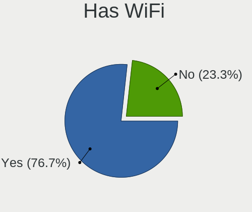

| Presented | Computers | Percent |
|-----------|-----------|---------|
| Yes       | 396       | 76.89%  |
| No        | 119       | 23.11%  |

Has Bluetooth
-------------

Has Bluetooth module

| Presented | Computers | Percent |
|-----------|-----------|---------|
| Yes       | 287       | 55.73%  |
| No        | 228       | 44.27%  |

Location
--------

Country
-------

Geographic location (country)

| Country                          | Computers | Percent |
|----------------------------------|-----------|---------|
| Germany                          | 101       | 19.61%  |
| USA                              | 86        | 16.7%   |
| Brazil                           | 43        | 8.35%   |
| Russia                           | 24        | 4.66%   |
| UK                               | 21        | 4.08%   |
| France                           | 19        | 3.69%   |
| India                            | 16        | 3.11%   |
| Canada                           | 15        | 2.91%   |
| Netherlands                      | 13        | 2.52%   |
| Poland                           | 12        | 2.33%   |
| Czechia                          | 11        | 2.14%   |
| Mexico                           | 10        | 1.94%   |
| Spain                            | 9         | 1.75%   |
| South Africa                     | 9         | 1.75%   |
| Italy                            | 9         | 1.75%   |
| Austria                          | 9         | 1.75%   |
| Switzerland                      | 7         | 1.36%   |
| Portugal                         | 7         | 1.36%   |
| Argentina                        | 7         | 1.36%   |
| New Zealand                      | 6         | 1.17%   |
| Denmark                          | 6         | 1.17%   |
| Australia                        | 6         | 1.17%   |
| Romania                          | 4         | 0.78%   |
| Hungary                          | 4         | 0.78%   |
| China                            | 4         | 0.78%   |
| Bulgaria                         | 4         | 0.78%   |
| Norway                           | 3         | 0.58%   |
| Israel                           | 3         | 0.58%   |
| Chile                            | 3         | 0.58%   |
| Turkey                           | 2         | 0.39%   |
| Taiwan                           | 2         | 0.39%   |
| Sweden                           | 2         | 0.39%   |
| Slovakia                         | 2         | 0.39%   |
| Philippines                      | 2         | 0.39%   |
| Indonesia                        | 2         | 0.39%   |
| Georgia                          | 2         | 0.39%   |
| Finland                          | 2         | 0.39%   |
| Egypt                            | 2         | 0.39%   |
| Dominican Republic               | 2         | 0.39%   |
| Belgium                          | 2         | 0.39%   |
| Vietnam                          | 1         | 0.19%   |
| Venezuela                        | 1         | 0.19%   |
| Ukraine                          | 1         | 0.19%   |
| Trinidad and Tobago              | 1         | 0.19%   |
| Sri Lanka                        | 1         | 0.19%   |
| Serbia                           | 1         | 0.19%   |
| Saint Vincent and the Grenadines | 1         | 0.19%   |
| Qatar                            | 1         | 0.19%   |
| Pakistan                         | 1         | 0.19%   |
| Malaysia                         | 1         | 0.19%   |
| Latvia                           | 1         | 0.19%   |
| Kenya                            | 1         | 0.19%   |
| Iran                             | 1         | 0.19%   |
| Guatemala                        | 1         | 0.19%   |
| Greece                           | 1         | 0.19%   |
| French Guiana                    | 1         | 0.19%   |
| Ecuador                          | 1         | 0.19%   |
| Cuba                             | 1         | 0.19%   |
| Croatia                          | 1         | 0.19%   |
| Bosnia and Herzegovina           | 1         | 0.19%   |

City
----

Geographic location (city)

| City               | Computers | Percent |
|--------------------|-----------|---------|
| Moscow             | 7         | 1.36%   |
| Vienna             | 6         | 1.17%   |
| Prague             | 6         | 1.17%   |
| Hamburg            | 5         | 0.97%   |
| Berlin             | 5         | 0.97%   |
| Stuttgart          | 4         | 0.78%   |
| Rockville          | 4         | 0.78%   |
| Rio de Janeiro     | 4         | 0.78%   |
| Munich             | 4         | 0.78%   |
| Montreal           | 4         | 0.78%   |
| Zurich             | 3         | 0.58%   |
| Trivandrum         | 3         | 0.58%   |
| Tel Aviv           | 3         | 0.58%   |
| Sofia              | 3         | 0.58%   |
| Schrobenhausen     | 3         | 0.58%   |
| S??o Paulo         | 3         | 0.58%   |
| Phoenix            | 3         | 0.58%   |
| Magdeburg          | 3         | 0.58%   |
| Leipzig            | 3         | 0.58%   |
| Johannesburg       | 3         | 0.58%   |
| Houston            | 3         | 0.58%   |
| Essen              | 3         | 0.58%   |
| Copenhagen         | 3         | 0.58%   |
| Cologne            | 3         | 0.58%   |
| Chennai            | 3         | 0.58%   |
| Chelyabinsk        | 3         | 0.58%   |
| Cape Town          | 3         | 0.58%   |
| Bucharest          | 3         | 0.58%   |
| Auckland           | 3         | 0.58%   |
| Alexandria         | 3         | 0.58%   |
| Wroclaw            | 2         | 0.39%   |
| Tyumen             | 2         | 0.39%   |
| Toronto            | 2         | 0.39%   |
| Tbilisi            | 2         | 0.39%   |
| Sydney             | 2         | 0.39%   |
| St Helens          | 2         | 0.39%   |
| Sorocaba           | 2         | 0.39%   |
| Schleswig          | 2         | 0.39%   |
| Santo Domingo Este | 2         | 0.39%   |
| San Francisco      | 2         | 0.39%   |
| Pune               | 2         | 0.39%   |
| Pretoria           | 2         | 0.39%   |
| Perm               | 2         | 0.39%   |
| New Delhi          | 2         | 0.39%   |
| Napier City        | 2         | 0.39%   |
| Mexico City        | 2         | 0.39%   |
| Madrid             | 2         | 0.39%   |
| Ludwigsburg        | 2         | 0.39%   |
| London             | 2         | 0.39%   |
| Lisbon             | 2         | 0.39%   |
| Kottayam           | 2         | 0.39%   |
| Khabarovsk         | 2         | 0.39%   |
| Istanbul           | 2         | 0.39%   |
| Holzkirchen        | 2         | 0.39%   |
| Hemet              | 2         | 0.39%   |
| Frankfurt am Main  | 2         | 0.39%   |
| Feeding Hills      | 2         | 0.39%   |
| D??sseldorf        | 2         | 0.39%   |
| Dallas             | 2         | 0.39%   |
| Conroe             | 2         | 0.39%   |

Drives
------

Drive Vendor
------------

Hard drive vendors

| Vendor                  | Computers | Drives | Percent |
|-------------------------|-----------|--------|---------|
| WDC                     | 130       | 153    | 17.88%  |
| Seagate                 | 119       | 153    | 16.37%  |
| Samsung Electronics     | 107       | 121    | 14.72%  |
| Toshiba                 | 49        | 50     | 6.74%   |
| Sandisk                 | 41        | 44     | 5.64%   |
| Kingston                | 39        | 39     | 5.36%   |
| Unknown                 | 30        | 37     | 4.13%   |
| Hitachi                 | 27        | 27     | 3.71%   |
| Crucial                 | 24        | 27     | 3.3%    |
| A-DATA Technology       | 13        | 13     | 1.79%   |
| HGST                    | 12        | 15     | 1.65%   |
| SK Hynix                | 11        | 11     | 1.51%   |
| Intel                   | 8         | 9      | 1.1%    |
| PNY                     | 6         | 6      | 0.83%   |
| Micron Technology       | 6         | 6      | 0.83%   |
| Intenso                 | 6         | 6      | 0.83%   |
| Corsair                 | 6         | 7      | 0.83%   |
| China                   | 6         | 7      | 0.83%   |
| SPCC                    | 5         | 5      | 0.69%   |
| OCZ                     | 5         | 5      | 0.69%   |
| LITEON                  | 5         | 5      | 0.69%   |
| JMicron                 | 5         | 5      | 0.69%   |
| XPG                     | 4         | 4      | 0.55%   |
| Phison                  | 4         | 6      | 0.55%   |
| KIOXIA                  | 4         | 4      | 0.55%   |
| Apple                   | 4         | 4      | 0.55%   |
| Silicon Motion          | 3         | 4      | 0.41%   |
| Mushkin                 | 3         | 3      | 0.41%   |
| LITEONIT                | 3         | 3      | 0.41%   |
| ASMT                    | 3         | 3      | 0.41%   |
| Apacer                  | 3         | 3      | 0.41%   |
| Verbatim                | 2         | 2      | 0.28%   |
| Transcend               | 2         | 3      | 0.28%   |
| Lexar                   | 2         | 2      | 0.28%   |
| KingSpec                | 2         | 2      | 0.28%   |
| KingFast                | 2         | 2      | 0.28%   |
| Fujitsu                 | 2         | 2      | 0.28%   |
| XrayDisk                | 1         | 1      | 0.14%   |
| Union Memory (Shenzhen) | 1         | 1      | 0.14%   |
| TrueNAS                 | 1         | 2      | 0.14%   |
| TrekStor                | 1         | 1      | 0.14%   |
| TCSUNBOW                | 1         | 2      | 0.14%   |
| sobetter                | 1         | 1      | 0.14%   |
| SILICONMOTION           | 1         | 1      | 0.14%   |
| Realtek Semiconductor   | 1         | 1      | 0.14%   |
| Netac                   | 1         | 1      | 0.14%   |
| Maxtor                  | 1         | 1      | 0.14%   |
| Lite-On                 | 1         | 1      | 0.14%   |
| Leven                   | 1         | 1      | 0.14%   |
| LaCie                   | 1         | 1      | 0.14%   |
| Hewlett-Packard         | 1         | 1      | 0.14%   |
| Galaxy                  | 1         | 1      | 0.14%   |
| FORESEE                 | 1         | 1      | 0.14%   |
| ExcelStor               | 1         | 1      | 0.14%   |
| Drevo                   | 1         | 1      | 0.14%   |
| CT480BX5                | 1         | 1      | 0.14%   |
| BIWIN                   | 1         | 1      | 0.14%   |
| Avant                   | 1         | 1      | 0.14%   |
| ASMedia                 | 1         | 2      | 0.14%   |
| AS201                   | 1         | 1      | 0.14%   |

Drive Model
-----------

Hard drive models

| Model                              | Computers | Percent |
|------------------------------------|-----------|---------|
| Kingston SA400S37240G 240GB SSD    | 12        | 1.52%   |
| Toshiba MQ01ABF050 500GB           | 8         | 1.01%   |
| Samsung SSD 850 EVO 500GB          | 8         | 1.01%   |
| Unknown MMC Card  128GB            | 7         | 0.89%   |
| Seagate ST1000LM024 HN-M101MBB 1TB | 7         | 0.89%   |
| Seagate ST9320325AS 320GB          | 6         | 0.76%   |
| Sandisk NVMe SSD Drive 256GB       | 6         | 0.76%   |
| Toshiba MQ01ABD100 1TB             | 5         | 0.63%   |
| Toshiba DT01ACA100 1TB             | 5         | 0.63%   |
| Seagate ST4000DM004-2CV104 4TB     | 5         | 0.63%   |
| Seagate ST2000DM001-1ER164 2TB     | 5         | 0.63%   |
| Seagate ST1000DM010-2EP102 1TB     | 5         | 0.63%   |
| WDC WDS500G2B0A-00SM50 500GB SSD   | 4         | 0.51%   |
| WDC WD10EZEX-00WN4A0 1TB           | 4         | 0.51%   |
| Unknown MMC Card  64GB             | 4         | 0.51%   |
| Unknown MMC Card  32GB             | 4         | 0.51%   |
| Unknown MMC Card  16GB             | 4         | 0.51%   |
| Toshiba MQ04ABF100 1TB             | 4         | 0.51%   |
| Seagate ST500DM002-1BD142 500GB    | 4         | 0.51%   |
| Seagate ST2000DM008-2FR102 2TB     | 4         | 0.51%   |
| Seagate ST1000LX015-1U7172 1TB     | 4         | 0.51%   |
| Seagate ST1000LM035-1RK172 1TB     | 4         | 0.51%   |
| Seagate ST1000DM003-1ER162 1TB     | 4         | 0.51%   |
| Seagate ST1000DM003-1CH162 1TB     | 4         | 0.51%   |
| SanDisk SSD PLUS 240GB             | 4         | 0.51%   |
| Samsung SSD 860 EVO 500GB          | 4         | 0.51%   |
| Samsung SSD 860 EVO 250GB          | 4         | 0.51%   |
| PNY CS900 240GB SSD                | 4         | 0.51%   |
| Kingston SA400S37120G 120GB SSD    | 4         | 0.51%   |
| Crucial CT500MX500SSD1 500GB       | 4         | 0.51%   |
| WDC WDS240G2G0A-00JH30 240GB SSD   | 3         | 0.38%   |
| WDC WD5000LPVX-22V0TT0 500GB       | 3         | 0.38%   |
| WDC WD20EARX-00PASB0 2TB           | 3         | 0.38%   |
| Toshiba NVMe SSD Drive 256GB       | 3         | 0.38%   |
| Toshiba NVMe SSD Drive 128GB       | 3         | 0.38%   |
| Toshiba DT01ACA200 2TB             | 3         | 0.38%   |
| Seagate ST9500420AS 500GB          | 3         | 0.38%   |
| Seagate ST9500325AS 500GB          | 3         | 0.38%   |
| Seagate ST3500418AS 500GB          | 3         | 0.38%   |
| Seagate ST1000LM048-2E7172 1TB     | 3         | 0.38%   |
| Seagate Expansion Desk 3TB         | 3         | 0.38%   |
| Seagate Expansion 4TB              | 3         | 0.38%   |
| Seagate Backup+ Desk 5TB           | 3         | 0.38%   |
| SanDisk SSD PLUS 480GB             | 3         | 0.38%   |
| Sandisk NVMe SSD Drive 512GB       | 3         | 0.38%   |
| Samsung SSD 870 EVO 1TB            | 3         | 0.38%   |
| Samsung NVMe SSD Drive 512GB       | 3         | 0.38%   |
| Samsung NVMe SSD Drive 500GB       | 3         | 0.38%   |
| Samsung HM250HI 250GB              | 3         | 0.38%   |
| Samsung HD161HJ 160GB              | 3         | 0.38%   |
| KIOXIA KBG40ZNV256G 256GB          | 3         | 0.38%   |
| Kingston SA400S37480G 480GB SSD    | 3         | 0.38%   |
| JMicron Generic 1TB                | 3         | 0.38%   |
| HGST HTS721010A9E630 1TB           | 3         | 0.38%   |
| Crucial CT525MX300SSD1 528GB       | 3         | 0.38%   |
| XPG NVMe SSD Drive 2TB             | 2         | 0.25%   |
| WDC WDS500G2B0A 500GB SSD          | 2         | 0.25%   |
| WDC WDS120G2G0A-00JH30 120GB SSD   | 2         | 0.25%   |
| WDC WD800JD-75MSA3 80GB            | 2         | 0.25%   |
| WDC WD7500BPKX-00HPJT0 752GB       | 2         | 0.25%   |

HDD Vendor
----------

Hard disk drive vendors

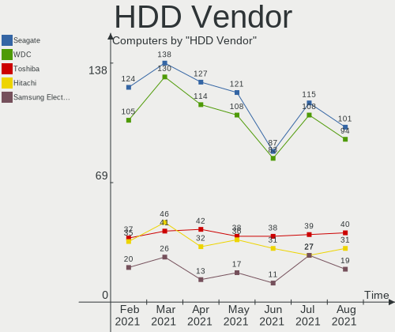

| Vendor              | Computers | Drives | Percent |
|---------------------|-----------|--------|---------|
| Seagate             | 115       | 144    | 34.33%  |
| WDC                 | 108       | 125    | 32.24%  |
| Toshiba             | 39        | 40     | 11.64%  |
| Samsung Electronics | 27        | 28     | 8.06%   |
| Hitachi             | 27        | 27     | 8.06%   |
| HGST                | 12        | 15     | 3.58%   |
| Fujitsu             | 2         | 2      | 0.6%    |
| Apple               | 2         | 2      | 0.6%    |
| SILICONMOTION       | 1         | 1      | 0.3%    |
| ExcelStor           | 1         | 1      | 0.3%    |
| ASMT                | 1         | 1      | 0.3%    |

SSD Vendor
----------

Solid state drive vendors

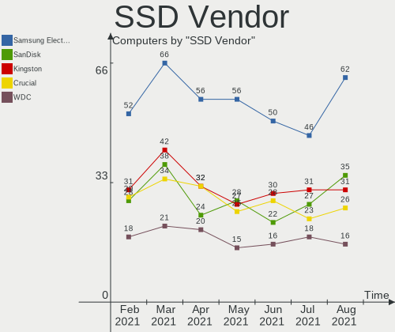

| Vendor              | Computers | Drives | Percent |
|---------------------|-----------|--------|---------|
| Samsung Electronics | 46        | 52     | 19.17%  |
| Kingston            | 31        | 31     | 12.92%  |
| SanDisk             | 27        | 30     | 11.25%  |
| Crucial             | 23        | 26     | 9.58%   |
| WDC                 | 18        | 18     | 7.5%    |
| A-DATA Technology   | 9         | 9      | 3.75%   |
| PNY                 | 6         | 6      | 2.5%    |
| China               | 6         | 7      | 2.5%    |
| SPCC                | 5         | 5      | 2.08%   |
| OCZ                 | 5         | 5      | 2.08%   |
| LITEON              | 5         | 5      | 2.08%   |
| Intenso             | 5         | 5      | 2.08%   |
| Micron Technology   | 4         | 4      | 1.67%   |
| JMicron             | 4         | 4      | 1.67%   |
| Toshiba             | 3         | 3      | 1.25%   |
| SK Hynix            | 3         | 3      | 1.25%   |
| Mushkin             | 3         | 3      | 1.25%   |
| LITEONIT            | 3         | 3      | 1.25%   |
| Apacer              | 3         | 3      | 1.25%   |
| Verbatim            | 2         | 2      | 0.83%   |
| Transcend           | 2         | 3      | 0.83%   |
| Seagate             | 2         | 2      | 0.83%   |
| Lexar               | 2         | 2      | 0.83%   |
| KingSpec            | 2         | 2      | 0.83%   |
| Intel               | 2         | 2      | 0.83%   |
| Corsair             | 2         | 2      | 0.83%   |
| ASMT                | 2         | 2      | 0.83%   |
| XrayDisk            | 1         | 1      | 0.42%   |
| TrueNAS             | 1         | 2      | 0.42%   |
| TrekStor            | 1         | 1      | 0.42%   |
| TCSUNBOW            | 1         | 2      | 0.42%   |
| Netac               | 1         | 1      | 0.42%   |
| Maxtor              | 1         | 1      | 0.42%   |
| Leven               | 1         | 1      | 0.42%   |
| Galaxy              | 1         | 1      | 0.42%   |
| CT480BX5            | 1         | 1      | 0.42%   |
| BIWIN               | 1         | 1      | 0.42%   |
| Avant               | 1         | 1      | 0.42%   |
| ASMedia             | 1         | 2      | 0.42%   |
| AS201               | 1         | 1      | 0.42%   |
| APS-SL3N            | 1         | 1      | 0.42%   |
| Apple               | 1         | 1      | 0.42%   |

Drive Kind
----------

HDD or SSD

| Kind    | Computers | Drives | Percent |
|---------|-----------|--------|---------|
| HDD     | 285       | 386    | 43.64%  |
| SSD     | 211       | 257    | 32.31%  |
| NVMe    | 114       | 129    | 17.46%  |
| MMC     | 26        | 34     | 3.98%   |
| Unknown | 17        | 19     | 2.6%    |

Drive Connector
---------------

SATA, SAS, NVMe, etc.

| Type | Computers | Drives | Percent |
|------|-----------|--------|---------|
| SATA | 422       | 612    | 70.45%  |
| NVMe | 114       | 129    | 19.03%  |
| SAS  | 37        | 50     | 6.18%   |
| MMC  | 26        | 34     | 4.34%   |

Drive Size
----------

Size of hard drive

| Size in TB | Computers | Drives | Percent |
|------------|-----------|--------|---------|
| 0.01-0.5   | 312       | 384    | 59.43%  |
| 0.51-1.0   | 141       | 166    | 26.86%  |
| 1.01-2.0   | 37        | 45     | 7.05%   |
| 3.01-4.0   | 18        | 24     | 3.43%   |
| 2.01-3.0   | 11        | 16     | 2.1%    |
| 4.01-10.0  | 4         | 5      | 0.76%   |
| 10.01-20.0 | 1         | 2      | 0.19%   |
| 0          | 1         | 1      | 0.19%   |

Space Total
-----------

Amount of disk space available on the file system

| Size in GB     | Computers | Percent |
|----------------|-----------|---------|
| 101-250        | 144       | 27.96%  |
| 251-500        | 137       | 26.6%   |
| 501-1000       | 70        | 13.59%  |
| 1001-2000      | 36        | 6.99%   |
| 51-100         | 35        | 6.8%    |
| More than 3000 | 29        | 5.63%   |
| 21-50          | 23        | 4.47%   |
| 1-20           | 19        | 3.69%   |
| 2001-3000      | 17        | 3.3%    |
| Unknown        | 5         | 0.97%   |

Space Used
----------

Amount of used disk space

| Used GB        | Computers | Percent |
|----------------|-----------|---------|
| 1-20           | 139       | 26.99%  |
| 21-50          | 106       | 20.58%  |
| 101-250        | 93        | 18.06%  |
| 51-100         | 65        | 12.62%  |
| 251-500        | 39        | 7.57%   |
| 501-1000       | 34        | 6.6%    |
| 1001-2000      | 16        | 3.11%   |
| More than 3000 | 12        | 2.33%   |
| 2001-3000      | 6         | 1.17%   |
| Unknown        | 5         | 0.97%   |

Malfunc. Drives
---------------

Drive models with a malfunction

| Model                                   | Computers | Drives | Percent |
|-----------------------------------------|-----------|--------|---------|
| Toshiba MQ01ABF050 500GB                | 2         | 2      | 6.67%   |
| WDC WD6400AAKS-22A7B2 640GB             | 1         | 1      | 3.33%   |
| WDC WD5002ABYS-01B1B0 500GB             | 1         | 1      | 3.33%   |
| WDC WD5000LPVX-22V0TT0 500GB            | 1         | 1      | 3.33%   |
| WDC WD10JPVT-00A1YT0 1TB                | 1         | 1      | 3.33%   |
| WDC WD1003FZEX-00MK2A0 1TB              | 1         | 1      | 3.33%   |
| TrekStor TREKSTORSSD128GB               | 1         | 1      | 3.33%   |
| Toshiba MK3252GSX 320GB                 | 1         | 1      | 3.33%   |
| Toshiba MK1237GSX 120GB                 | 1         | 1      | 3.33%   |
| Toshiba KSG60ZMV256G M.2 2280 256GB SSD | 1         | 1      | 3.33%   |
| Seagate ST9500420AS 500GB               | 1         | 1      | 3.33%   |
| Seagate ST9500325AS 500GB               | 1         | 1      | 3.33%   |
| Seagate ST9320325AS 320GB               | 1         | 1      | 3.33%   |
| Seagate ST500LT012-9WS142 500GB         | 1         | 1      | 3.33%   |
| Seagate ST3500418AS 500GB               | 1         | 1      | 3.33%   |
| Seagate ST1000LM048-2E7172 1TB          | 1         | 1      | 3.33%   |
| Seagate ST1000LM024 HN-M101MBB 1TB      | 1         | 1      | 3.33%   |
| Seagate ST1000DM003-1SB102 1TB          | 1         | 1      | 3.33%   |
| Samsung Electronics HD161HJ 160GB       | 1         | 1      | 3.33%   |
| OCZ VERTEX3 240GB SSD                   | 1         | 1      | 3.33%   |
| Mushkin MKNSSDCR240GB                   | 1         | 1      | 3.33%   |
| LITEON CV8-8E128-HP 128GB SSD           | 1         | 1      | 3.33%   |
| Kingston SA400S37240G 240GB SSD         | 1         | 1      | 3.33%   |
| Hitachi HUS72403 3TB                    | 1         | 1      | 3.33%   |
| Hitachi HTS545050A7E380 500GB           | 1         | 1      | 3.33%   |
| HGST HTS545050A7E680 500GB              | 1         | 1      | 3.33%   |
| Crucial CT1050MX300SSD1 1050GB          | 1         | 1      | 3.33%   |
| Corsair Force GT 120GB SSD              | 1         | 1      | 3.33%   |
| China SATA3 480GB SSD                   | 1         | 2      | 3.33%   |

Malfunc. Drive Vendor
---------------------

Vendors of faulty drives

| Vendor              | Computers | Drives | Percent |
|---------------------|-----------|--------|---------|
| Seagate             | 8         | 8      | 26.67%  |
| WDC                 | 5         | 5      | 16.67%  |
| Toshiba             | 5         | 5      | 16.67%  |
| Hitachi             | 2         | 2      | 6.67%   |
| TrekStor            | 1         | 1      | 3.33%   |
| Samsung Electronics | 1         | 1      | 3.33%   |
| OCZ                 | 1         | 1      | 3.33%   |
| Mushkin             | 1         | 1      | 3.33%   |
| LITEON              | 1         | 1      | 3.33%   |
| Kingston            | 1         | 1      | 3.33%   |
| HGST                | 1         | 1      | 3.33%   |
| Crucial             | 1         | 1      | 3.33%   |
| Corsair             | 1         | 1      | 3.33%   |
| China               | 1         | 2      | 3.33%   |

Malfunc. HDD Vendor
-------------------

Vendors of faulty HDD drives

| Vendor              | Computers | Drives | Percent |
|---------------------|-----------|--------|---------|
| Seagate             | 8         | 8      | 38.1%   |
| WDC                 | 5         | 5      | 23.81%  |
| Toshiba             | 4         | 4      | 19.05%  |
| Hitachi             | 2         | 2      | 9.52%   |
| Samsung Electronics | 1         | 1      | 4.76%   |
| HGST                | 1         | 1      | 4.76%   |

Malfunc. Drive Kind
-------------------

Kinds of faulty drives

| Kind | Computers | Drives | Percent |
|------|-----------|--------|---------|
| HDD  | 21        | 21     | 70%     |
| SSD  | 9         | 10     | 30%     |

Failed Drives
-------------

Failed drive models

Zero info for selected period =(

Failed Drive Vendor
-------------------

Failed drive vendors

Zero info for selected period =(

Drive Status
------------

Number of failed and malfunc. drives

| Status   | Computers | Drives | Percent |
|----------|-----------|--------|---------|
| Detected | 363       | 566    | 67.98%  |
| Works    | 143       | 228    | 26.78%  |
| Malfunc  | 28        | 31     | 5.24%   |

Storage controller
------------------

Storage Vendor
--------------

Storage controller vendors

| Vendor                           | Computers | Percent |
|----------------------------------|-----------|---------|
| Intel                            | 361       | 59.28%  |
| AMD                              | 99        | 16.26%  |
| Samsung Electronics              | 38        | 6.24%   |
| Sandisk                          | 20        | 3.28%   |
| Nvidia                           | 14        | 2.3%    |
| Marvell Technology Group         | 9         | 1.48%   |
| Phison Electronics               | 8         | 1.31%   |
| Kingston Technology Company      | 8         | 1.31%   |
| ADATA Technology                 | 8         | 1.31%   |
| Toshiba America Info Systems     | 7         | 1.15%   |
| SK Hynix                         | 7         | 1.15%   |
| JMicron Technology               | 5         | 0.82%   |
| Silicon Motion                   | 4         | 0.66%   |
| KIOXIA                           | 4         | 0.66%   |
| ASMedia Technology               | 4         | 0.66%   |
| Micron Technology                | 3         | 0.49%   |
| VIA Technologies                 | 1         | 0.16%   |
| Union Memory (Shenzhen)          | 1         | 0.16%   |
| Silicon Integrated Systems [SiS] | 1         | 0.16%   |
| Silicon Image                    | 1         | 0.16%   |
| Shenzhen Longsys Electronics     | 1         | 0.16%   |
| Realtek Semiconductor            | 1         | 0.16%   |
| Lite-On Technology               | 1         | 0.16%   |
| Hewlett-Packard                  | 1         | 0.16%   |
| Biwin Storage Technology         | 1         | 0.16%   |
| Apple                            | 1         | 0.16%   |

Storage Model
-------------

Storage controller models

| Model                                                                                   | Computers | Percent |
|-----------------------------------------------------------------------------------------|-----------|---------|
| AMD FCH SATA Controller [AHCI mode]                                                     | 62        | 8.59%   |
| Intel 8 Series/C220 Series Chipset Family 6-port SATA Controller 1 [AHCI mode]          | 32        | 4.43%   |
| Intel Sunrise Point-LP SATA Controller [AHCI mode]                                      | 26        | 3.6%    |
| Intel 82801 Mobile SATA Controller [RAID mode]                                          | 24        | 3.32%   |
| Intel 7 Series Chipset Family 6-port SATA Controller [AHCI mode]                        | 24        | 3.32%   |
| Intel 82801IBM/IEM (ICH9M/ICH9M-E) 4 port SATA Controller [AHCI mode]                   | 22        | 3.05%   |
| Samsung NVMe SSD Controller SM981/PM981/PM983                                           | 21        | 2.91%   |
| Intel 8 Series SATA Controller 1 [AHCI mode]                                            | 16        | 2.22%   |
| Intel 6 Series/C200 Series Chipset Family 6 port Mobile SATA AHCI Controller            | 16        | 2.22%   |
| AMD SB7x0/SB8x0/SB9x0 IDE Controller                                                    | 15        | 2.08%   |
| AMD SB7x0/SB8x0/SB9x0 SATA Controller [AHCI mode]                                       | 14        | 1.94%   |
| Intel NM10/ICH7 Family SATA Controller [IDE mode]                                       | 12        | 1.66%   |
| Intel 6 Series/C200 Series Chipset Family 6 port Desktop SATA AHCI Controller           | 12        | 1.66%   |
| Intel Q170/Q150/B150/H170/H110/Z170/CM236 Chipset SATA Controller [AHCI Mode]           | 11        | 1.52%   |
| Intel 82801G (ICH7 Family) IDE Controller                                               | 11        | 1.52%   |
| AMD SB7x0/SB8x0/SB9x0 SATA Controller [IDE mode]                                        | 11        | 1.52%   |
| Samsung NVMe Controller                                                                 | 10        | 1.39%   |
| Intel Wildcat Point-LP SATA Controller [AHCI Mode]                                      | 10        | 1.39%   |
| Intel 200 Series PCH SATA controller [AHCI mode]                                        | 10        | 1.39%   |
| AMD 400 Series Chipset SATA Controller                                                  | 10        | 1.39%   |
| Intel 7 Series/C210 Series Chipset Family 6-port SATA Controller [AHCI mode]            | 8         | 1.11%   |
| Intel 5 Series/3400 Series Chipset 6 port SATA AHCI Controller                          | 8         | 1.11%   |
| Intel 5 Series/3400 Series Chipset 4 port SATA AHCI Controller                          | 8         | 1.11%   |
| Intel Volume Management Device NVMe RAID Controller                                     | 7         | 0.97%   |
| Intel Cannon Lake Mobile PCH SATA AHCI Controller                                       | 7         | 0.97%   |
| Intel 82801HM/HEM (ICH8M/ICH8M-E) SATA Controller [AHCI mode]                           | 7         | 0.97%   |
| Intel 82801HM/HEM (ICH8M/ICH8M-E) IDE Controller                                        | 7         | 0.97%   |
| Intel 5 Series/3400 Series Chipset 4 port SATA IDE Controller                           | 7         | 0.97%   |
| ADATA XPG SX8200 Pro PCIe Gen3x4 M.2 2280 Solid State Drive                             | 7         | 0.97%   |
| Sandisk WD Blue SN550 NVMe SSD                                                          | 6         | 0.83%   |
| Intel Cannon Lake PCH SATA AHCI Controller                                              | 6         | 0.83%   |
| Intel Atom Processor E3800 Series SATA AHCI Controller                                  | 6         | 0.83%   |
| Intel 5 Series/3400 Series Chipset 2 port SATA IDE Controller                           | 6         | 0.83%   |
| AMD Starship/Matisse Chipset SATA Controller [AHCI mode]                                | 6         | 0.83%   |
| Phison E12 NVMe Controller                                                              | 5         | 0.69%   |
| Nvidia MCP61 SATA Controller                                                            | 5         | 0.69%   |
| Intel SATA Controller [RAID mode]                                                       | 5         | 0.69%   |
| Intel NM10/ICH7 Family SATA Controller [AHCI mode]                                      | 5         | 0.69%   |
| Intel Celeron/Pentium Silver Processor SATA Controller                                  | 5         | 0.69%   |
| Intel Celeron N3350/Pentium N4200/Atom E3900 Series SATA AHCI Controller                | 5         | 0.69%   |
| Intel Cannon Point-LP SATA Controller [AHCI Mode]                                       | 5         | 0.69%   |
| Intel 82801I (ICH9 Family) 2 port SATA Controller [IDE mode]                            | 5         | 0.69%   |
| Intel 6 Series/C200 Series Chipset Family Desktop SATA Controller (IDE mode, ports 0-3) | 5         | 0.69%   |
| Intel 500 Series Chipset Family SATA AHCI Controller                                    | 5         | 0.69%   |
| Toshiba America Info Systems BG3 NVMe SSD Controller                                    | 4         | 0.55%   |
| Silicon Motion SM2263EN/SM2263XT SSD Controller                                         | 4         | 0.55%   |
| Sandisk WD Black SN750 / PC SN730 NVMe SSD                                              | 4         | 0.55%   |
| Sandisk Non-Volatile memory controller                                                  | 4         | 0.55%   |
| Nvidia MCP78S [GeForce 8200] IDE                                                        | 4         | 0.55%   |
| Marvell Group 88SE9172 SATA 6Gb/s Controller                                            | 4         | 0.55%   |
| KIOXIA Non-Volatile memory controller                                                   | 4         | 0.55%   |
| Intel Tiger Lake-LP SATA Controller [AHCI mode]                                         | 4         | 0.55%   |
| Intel 6 Series/C200 Series Chipset Family Desktop SATA Controller (IDE mode, ports 4-5) | 4         | 0.55%   |
| ASMedia ASM1062 Serial ATA Controller                                                   | 4         | 0.55%   |
| AMD SB600 Non-Raid-5 SATA                                                               | 4         | 0.55%   |
| AMD SB600 IDE                                                                           | 4         | 0.55%   |
| AMD FCH IDE Controller                                                                  | 4         | 0.55%   |
| SK Hynix BC511                                                                          | 3         | 0.42%   |
| Sandisk WD Blue SN500 / PC SN520 NVMe SSD                                               | 3         | 0.42%   |
| Sandisk WD Black 2018/SN750 / PC SN720 NVMe SSD                                         | 3         | 0.42%   |

Storage Kind
------------

Kind of storage controller (IDE, SATA, NVMe, SAS, ...)

| Kind | Computers | Percent |
|------|-----------|---------|
| SATA | 386       | 59.84%  |
| NVMe | 114       | 17.67%  |
| IDE  | 102       | 15.81%  |
| RAID | 41        | 6.36%   |
| SAS  | 2         | 0.31%   |

Processor
---------

CPU Vendor
----------

Processor vendors

| Vendor | Computers | Percent |
|--------|-----------|---------|
| Intel  | 392       | 76.12%  |
| AMD    | 123       | 23.88%  |

CPU Model
---------

Processor models

| Model                                         | Computers | Percent |
|-----------------------------------------------|-----------|---------|
| Intel Core i7-9750H CPU @ 2.60GHz             | 6         | 1.17%   |
| Intel Celeron CPU N3350 @ 1.10GHz             | 6         | 1.17%   |
| AMD Ryzen 5 4500U with Radeon Graphics        | 6         | 1.17%   |
| AMD Ryzen 5 3500U with Radeon Vega Mobile Gfx | 6         | 1.17%   |
| Intel Core i5-6200U CPU @ 2.30GHz             | 5         | 0.97%   |
| Intel Core i5-4300U CPU @ 1.90GHz             | 5         | 0.97%   |
| Intel Core i5 CPU M 520 @ 2.40GHz             | 5         | 0.97%   |
| Intel 11th Gen Core i5-1135G7 @ 2.40GHz       | 5         | 0.97%   |
| AMD Ryzen 7 3700X 8-Core Processor            | 5         | 0.97%   |
| Intel Core i7-4510U CPU @ 2.00GHz             | 4         | 0.78%   |
| Intel Core i7-3770 CPU @ 3.40GHz              | 4         | 0.78%   |
| Intel Core i7-2600K CPU @ 3.40GHz             | 4         | 0.78%   |
| Intel Core i5-8250U CPU @ 1.60GHz             | 4         | 0.78%   |
| Intel Core i5-3210M CPU @ 2.50GHz             | 4         | 0.78%   |
| Intel Core i5-2400 CPU @ 3.10GHz              | 4         | 0.78%   |
| Intel Core i5 CPU M 480 @ 2.67GHz             | 4         | 0.78%   |
| Intel Core 2 Duo CPU E8400 @ 3.00GHz          | 4         | 0.78%   |
| Intel Celeron CPU N3060 @ 1.60GHz             | 4         | 0.78%   |
| Intel Atom x5-Z8350 CPU @ 1.44GHz             | 4         | 0.78%   |
| Intel 11th Gen Core i7-1165G7 @ 2.80GHz       | 4         | 0.78%   |
| AMD Ryzen 5 3600 6-Core Processor             | 4         | 0.78%   |
| AMD Ryzen 3 5300U with Radeon Graphics        | 4         | 0.78%   |
| Intel Pentium CPU 4415Y @ 1.60GHz             | 3         | 0.58%   |
| Intel Core i7-8550U CPU @ 1.80GHz             | 3         | 0.58%   |
| Intel Core i7-4790 CPU @ 3.60GHz              | 3         | 0.58%   |
| Intel Core i5-8265U CPU @ 1.60GHz             | 3         | 0.58%   |
| Intel Core i5-7200U CPU @ 2.50GHz             | 3         | 0.58%   |
| Intel Core i5-6600K CPU @ 3.50GHz             | 3         | 0.58%   |
| Intel Core i5-6300U CPU @ 2.40GHz             | 3         | 0.58%   |
| Intel Core i5-5200U CPU @ 2.20GHz             | 3         | 0.58%   |
| Intel Core i5-4210M CPU @ 2.60GHz             | 3         | 0.58%   |
| Intel Core i5-3470 CPU @ 3.20GHz              | 3         | 0.58%   |
| Intel Core i5-2520M CPU @ 2.50GHz             | 3         | 0.58%   |
| Intel Core i5-1035G1 CPU @ 1.00GHz            | 3         | 0.58%   |
| Intel Core i5-10210U CPU @ 1.60GHz            | 3         | 0.58%   |
| Intel Core i3-3217U CPU @ 1.80GHz             | 3         | 0.58%   |
| Intel Core 2 Quad CPU Q6600 @ 2.40GHz         | 3         | 0.58%   |
| Intel Core 2 Duo CPU T8100 @ 2.10GHz          | 3         | 0.58%   |
| Intel Celeron J4125 CPU @ 2.00GHz             | 3         | 0.58%   |
| Intel Celeron CPU N2840 @ 2.16GHz             | 3         | 0.58%   |
| Intel Atom CPU N455 @ 1.66GHz                 | 3         | 0.58%   |
| AMD Ryzen 7 2700X Eight-Core Processor        | 3         | 0.58%   |
| AMD Ryzen 5 1600 Six-Core Processor           | 3         | 0.58%   |
| AMD FX-8350 Eight-Core Processor              | 3         | 0.58%   |
| AMD FX-6300 Six-Core Processor                | 3         | 0.58%   |
| Intel Xeon CPU E5-2620 0 @ 2.00GHz            | 2         | 0.39%   |
| Intel Pentium Dual-Core CPU T4500 @ 2.30GHz   | 2         | 0.39%   |
| Intel Pentium Dual-Core CPU T4200 @ 2.00GHz   | 2         | 0.39%   |
| Intel Pentium Dual CPU E2180 @ 2.00GHz        | 2         | 0.39%   |
| Intel Core i7-8700 CPU @ 3.20GHz              | 2         | 0.39%   |
| Intel Core i7-7500U CPU @ 2.70GHz             | 2         | 0.39%   |
| Intel Core i7-6700K CPU @ 4.00GHz             | 2         | 0.39%   |
| Intel Core i7-5600U CPU @ 2.60GHz             | 2         | 0.39%   |
| Intel Core i7-4710HQ CPU @ 2.50GHz            | 2         | 0.39%   |
| Intel Core i7-4700HQ CPU @ 2.40GHz            | 2         | 0.39%   |
| Intel Core i7-4500U CPU @ 1.80GHz             | 2         | 0.39%   |
| Intel Core i7-3610QM CPU @ 2.30GHz            | 2         | 0.39%   |
| Intel Core i7-10750H CPU @ 2.60GHz            | 2         | 0.39%   |
| Intel Core i7-10510U CPU @ 1.80GHz            | 2         | 0.39%   |
| Intel Core i5-9400F CPU @ 2.90GHz             | 2         | 0.39%   |

CPU Model Family
----------------

Processor model prefix

| Model                   | Computers | Percent |
|-------------------------|-----------|---------|
| Intel Core i5           | 126       | 24.47%  |
| Intel Core i7           | 71        | 13.79%  |
| Intel Core i3           | 41        | 7.96%   |
| Intel Core 2 Duo        | 32        | 6.21%   |
| Intel Celeron           | 31        | 6.02%   |
| AMD Ryzen 5             | 25        | 4.85%   |
| Other                   | 16        | 3.11%   |
| AMD Ryzen 7             | 16        | 3.11%   |
| Intel Pentium           | 15        | 2.91%   |
| AMD Ryzen 3             | 11        | 2.14%   |
| Intel Xeon              | 10        | 1.94%   |
| Intel Core 2 Quad       | 10        | 1.94%   |
| Intel Atom              | 10        | 1.94%   |
| AMD FX                  | 9         | 1.75%   |
| Intel Pentium Dual-Core | 7         | 1.36%   |
| Intel Pentium Dual      | 7         | 1.36%   |
| AMD Athlon II X2        | 5         | 0.97%   |
| AMD A4                  | 5         | 0.97%   |
| Intel Genuine           | 4         | 0.78%   |
| Intel Core i9           | 4         | 0.78%   |
| AMD E                   | 4         | 0.78%   |
| AMD Athlon              | 4         | 0.78%   |
| AMD A8                  | 4         | 0.78%   |
| AMD A6                  | 4         | 0.78%   |
| Intel Core 2            | 3         | 0.58%   |
| AMD Ryzen 9             | 3         | 0.58%   |
| AMD E1                  | 3         | 0.58%   |
| AMD A10                 | 3         | 0.58%   |
| Intel Celeron M         | 2         | 0.39%   |
| AMD Turion 64 X2 Mobile | 2         | 0.39%   |
| AMD Sempron             | 2         | 0.39%   |
| AMD Ryzen 7 PRO         | 2         | 0.39%   |
| AMD Ryzen 5 PRO         | 2         | 0.39%   |
| AMD Phenom II X4        | 2         | 0.39%   |
| AMD Athlon II           | 2         | 0.39%   |
| AMD Athlon 64 X2        | 2         | 0.39%   |
| Intel Pentium Silver    | 1         | 0.19%   |
| Intel Pentium Gold      | 1         | 0.19%   |
| Intel Core m7           | 1         | 0.19%   |
| Intel Core m5           | 1         | 0.19%   |
| Intel Celeron Dual-Core | 1         | 0.19%   |
| AMD V120                | 1         | 0.19%   |
| AMD Turion II           | 1         | 0.19%   |
| AMD Ryzen Embedded      | 1         | 0.19%   |
| AMD Phenom II X6        | 1         | 0.19%   |
| AMD Phenom II X2        | 1         | 0.19%   |
| AMD Phenom              | 1         | 0.19%   |
| AMD C-60                | 1         | 0.19%   |
| AMD Athlon X2           | 1         | 0.19%   |
| AMD Athlon II X4        | 1         | 0.19%   |
| AMD Athlon II X3        | 1         | 0.19%   |
| AMD Athlon Dual Core    | 1         | 0.19%   |

CPU Cores
---------

Number of processor cores

| Number | Computers | Percent |
|--------|-----------|---------|
| 2      | 253       | 49.13%  |
| 4      | 174       | 33.79%  |
| 6      | 42        | 8.16%   |
| 8      | 20        | 3.88%   |
| 1      | 14        | 2.72%   |
| 3      | 6         | 1.17%   |
| 12     | 2         | 0.39%   |
| 10     | 2         | 0.39%   |
| 20     | 1         | 0.19%   |
| 16     | 1         | 0.19%   |

CPU Sockets
-----------

Number of sockets

| Number | Computers | Percent |
|--------|-----------|---------|
| 1      | 513       | 99.61%  |
| 2      | 2         | 0.39%   |

CPU Threads
-----------

Threads per core (Hyper-Threading)

| Number | Computers | Percent |
|--------|-----------|---------|
| 2      | 296       | 57.48%  |
| 1      | 219       | 42.52%  |

CPU Op-Modes
------------

CPU Operation Modes (32-bit, 64-bit)

| Op mode        | Computers | Percent |
|----------------|-----------|---------|
| 32-bit, 64-bit | 513       | 99.61%  |
| 32-bit         | 2         | 0.39%   |

CPU Microcode
-------------

Microcode number

| Number     | Computers | Percent |
|------------|-----------|---------|
| Unknown    | 48        | 9.32%   |
| 0x206a7    | 39        | 7.57%   |
| 0x1067a    | 34        | 6.6%    |
| 0x306c3    | 33        | 6.41%   |
| 0x306a9    | 31        | 6.02%   |
| 0x40651    | 16        | 3.11%   |
| 0x406e3    | 15        | 2.91%   |
| 0x20655    | 15        | 2.91%   |
| 0x6fd      | 13        | 2.52%   |
| 0x906ea    | 12        | 2.33%   |
| 0x506e3    | 12        | 2.33%   |
| 0x306d4    | 12        | 2.33%   |
| 0x806c1    | 11        | 2.14%   |
| 0x08108109 | 10        | 1.94%   |
| 0x806e9    | 9         | 1.75%   |
| 0x906e9    | 8         | 1.55%   |
| 0x406c4    | 8         | 1.55%   |
| 0x08701021 | 8         | 1.55%   |
| 0x806ea    | 7         | 1.36%   |
| 0x08600106 | 7         | 1.36%   |
| 0x06000852 | 7         | 1.36%   |
| 0x010000c8 | 7         | 1.36%   |
| 0x806ec    | 6         | 1.17%   |
| 0x506c9    | 6         | 1.17%   |
| 0x30678    | 6         | 1.17%   |
| 0x10676    | 6         | 1.17%   |
| 0x0800820d | 6         | 1.17%   |
| 0xa0652    | 4         | 0.78%   |
| 0x706e5    | 4         | 0.78%   |
| 0x706a8    | 4         | 0.78%   |
| 0x6fb      | 4         | 0.78%   |
| 0x106e5    | 4         | 0.78%   |
| 0x106ca    | 4         | 0.78%   |
| 0x0a201009 | 4         | 0.78%   |
| 0x08608102 | 4         | 0.78%   |
| 0x08108102 | 4         | 0.78%   |
| 0x07030105 | 4         | 0.78%   |
| 0x06001119 | 4         | 0.78%   |
| 0x03000027 | 4         | 0.78%   |
| 0x906ed    | 3         | 0.58%   |
| 0x906c0    | 3         | 0.58%   |
| 0x6f6      | 3         | 0.58%   |
| 0x0700010f | 3         | 0.58%   |
| 0x0600611a | 3         | 0.58%   |
| 0x010000c7 | 3         | 0.58%   |
| 0xa0671    | 2         | 0.39%   |
| 0xa0655    | 2         | 0.39%   |
| 0x706a1    | 2         | 0.39%   |
| 0x6f2      | 2         | 0.39%   |
| 0x306e4    | 2         | 0.39%   |
| 0x206d7    | 2         | 0.39%   |
| 0x20652    | 2         | 0.39%   |
| 0x08701013 | 2         | 0.39%   |
| 0x08608103 | 2         | 0.39%   |
| 0x08600104 | 2         | 0.39%   |
| 0x08101016 | 2         | 0.39%   |
| 0x0810100b | 2         | 0.39%   |
| 0x06006705 | 2         | 0.39%   |
| 0x05000119 | 2         | 0.39%   |
| 0x010000db | 2         | 0.39%   |

CPU Microarch
-------------

Microarchitecture

| Name          | Computers | Percent |
|---------------|-----------|---------|
| KabyLake      | 59        | 11.46%  |
| Haswell       | 57        | 11.07%  |
| Penryn        | 45        | 8.74%   |
| SandyBridge   | 41        | 7.96%   |
| IvyBridge     | 35        | 6.8%    |
| Skylake       | 28        | 5.44%   |
| Core          | 23        | 4.47%   |
| Zen+          | 22        | 4.27%   |
| Zen 2         | 22        | 4.27%   |
| Westmere      | 19        | 3.69%   |
| K10           | 19        | 3.69%   |
| Silvermont    | 17        | 3.3%    |
| Piledriver    | 13        | 2.52%   |
| Broadwell     | 13        | 2.52%   |
| TigerLake     | 11        | 2.14%   |
| CometLake     | 9         | 1.75%   |
| Unknown       | 9         | 1.75%   |
| Zen           | 7         | 1.36%   |
| Excavator     | 7         | 1.36%   |
| Nehalem       | 6         | 1.17%   |
| K8 Hammer     | 6         | 1.17%   |
| IceLake       | 6         | 1.17%   |
| Goldmont plus | 6         | 1.17%   |
| Goldmont      | 6         | 1.17%   |
| Zen 3         | 5         | 0.97%   |
| Bonnell       | 5         | 0.97%   |
| Bobcat        | 5         | 0.97%   |
| Puma          | 4         | 0.78%   |
| K10 Llano     | 4         | 0.78%   |
| Jaguar        | 3         | 0.58%   |
| P6            | 2         | 0.39%   |
| Tremont       | 1         | 0.19%   |

Graphics
--------

GPU Vendor
----------

Vendors of graphics cards

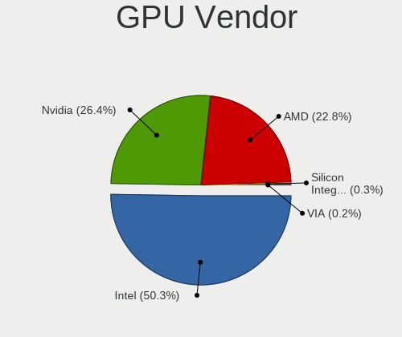

| Vendor                                       | Computers | Percent |
|----------------------------------------------|-----------|---------|
| Intel                                        | 303       | 51.53%  |
| Nvidia                                       | 144       | 24.49%  |
| AMD                                          | 136       | 23.13%  |
| XGI Technology (eXtreme Graphics Innovation) | 1         | 0.17%   |
| Silicon Integrated Systems [SiS]             | 1         | 0.17%   |
| Matrox Electronics Systems                   | 1         | 0.17%   |
| ATI Technologies                             | 1         | 0.17%   |
| ASPEED Technology                            | 1         | 0.17%   |

GPU Model
---------

Graphics card models

| Model                                                                                    | Computers | Percent |
|------------------------------------------------------------------------------------------|-----------|---------|
| Intel 2nd Generation Core Processor Family Integrated Graphics Controller                | 30        | 4.97%   |
| Intel 3rd Gen Core processor Graphics Controller                                         | 22        | 3.64%   |
| Intel Mobile 4 Series Chipset Integrated Graphics Controller                             | 19        | 3.15%   |
| Intel Haswell-ULT Integrated Graphics Controller                                         | 18        | 2.98%   |
| Intel Core Processor Integrated Graphics Controller                                      | 15        | 2.48%   |
| Intel 4th Gen Core Processor Integrated Graphics Controller                              | 15        | 2.48%   |
| AMD Picasso                                                                              | 15        | 2.48%   |
| Intel Skylake GT2 [HD Graphics 520]                                                      | 12        | 1.99%   |
| Intel TigerLake-LP GT2 [Iris Xe Graphics]                                                | 10        | 1.66%   |
| Intel HD Graphics 5500                                                                   | 10        | 1.66%   |
| AMD Renoir                                                                               | 10        | 1.66%   |
| Intel Xeon E3-1200 v3/4th Gen Core Processor Integrated Graphics Controller              | 9         | 1.49%   |
| Intel HD Graphics 530                                                                    | 9         | 1.49%   |
| Intel CoffeeLake-H GT2 [UHD Graphics 630]                                                | 9         | 1.49%   |
| Intel Atom/Celeron/Pentium Processor x5-E8000/J3xxx/N3xxx Integrated Graphics Controller | 9         | 1.49%   |
| Intel UHD Graphics 620                                                                   | 8         | 1.32%   |
| Intel HD Graphics 620                                                                    | 8         | 1.32%   |
| Intel Atom Processor Z36xxx/Z37xxx Series Graphics & Display                             | 8         | 1.32%   |
| AMD Ellesmere [Radeon RX 470/480/570/570X/580/580X/590]                                  | 8         | 1.32%   |
| Nvidia GK208B [GeForce GT 710]                                                           | 7         | 1.16%   |
| Intel WhiskeyLake-U GT2 [UHD Graphics 620]                                               | 7         | 1.16%   |
| Nvidia GP107 [GeForce GTX 1050 Ti]                                                       | 6         | 0.99%   |
| Intel Xeon E3-1200 v2/3rd Gen Core processor Graphics Controller                         | 6         | 0.99%   |
| Intel HD Graphics 500                                                                    | 6         | 0.99%   |
| Intel GeminiLake [UHD Graphics 600]                                                      | 6         | 0.99%   |
| AMD Lucienne                                                                             | 6         | 0.99%   |
| Nvidia GM107 [GeForce GTX 750 Ti]                                                        | 5         | 0.83%   |
| Intel HD Graphics 630                                                                    | 5         | 0.83%   |
| Intel 4 Series Chipset Integrated Graphics Controller                                    | 5         | 0.83%   |
| AMD Caicos [Radeon HD 6450/7450/8450 / R5 230 OEM]                                       | 5         | 0.83%   |
| Nvidia C61 [GeForce 6150SE nForce 430]                                                   | 4         | 0.66%   |
| Intel Mobile GM965/GL960 Integrated Graphics Controller (secondary)                      | 4         | 0.66%   |
| Intel Mobile GM965/GL960 Integrated Graphics Controller (primary)                        | 4         | 0.66%   |
| Intel Mobile 945GM/GMS/GME, 943/940GML Express Integrated Graphics Controller            | 4         | 0.66%   |
| Intel Mobile 945GM/GMS, 943/940GML Express Integrated Graphics Controller                | 4         | 0.66%   |
| Intel Iris Plus Graphics G1 (Ice Lake)                                                   | 4         | 0.66%   |
| Intel CometLake-U GT2 [UHD Graphics]                                                     | 4         | 0.66%   |
| Intel CometLake-S GT2 [UHD Graphics 630]                                                 | 4         | 0.66%   |
| Intel CometLake-H GT2 [UHD Graphics]                                                     | 4         | 0.66%   |
| Intel Atom Processor D4xx/D5xx/N4xx/N5xx Integrated Graphics Controller                  | 4         | 0.66%   |
| Intel 82G33/G31 Express Integrated Graphics Controller                                   | 4         | 0.66%   |
| AMD Topaz XT [Radeon R7 M260/M265 / M340/M360 / M440/M445 / 530/535 / 620/625 Mobile]    | 4         | 0.66%   |
| AMD Sun XT [Radeon HD 8670A/8670M/8690M / R5 M330 / M430 / Radeon 520 Mobile]            | 4         | 0.66%   |
| Nvidia TU117M [GeForce GTX 1650 Mobile / Max-Q]                                          | 3         | 0.5%    |
| Nvidia TU106M [GeForce RTX 2060 Mobile]                                                  | 3         | 0.5%    |
| Nvidia GT218 [GeForce 8400 GS Rev. 3]                                                    | 3         | 0.5%    |
| Nvidia GP108M [GeForce MX150]                                                            | 3         | 0.5%    |
| Nvidia GP107M [GeForce GTX 1050 Mobile]                                                  | 3         | 0.5%    |
| Nvidia GP104 [GeForce GTX 1070]                                                          | 3         | 0.5%    |
| Nvidia GM107M [GeForce GTX 850M]                                                         | 3         | 0.5%    |
| Nvidia GK107M [GeForce GT 750M]                                                          | 3         | 0.5%    |
| Nvidia GK107 [GeForce GT 640]                                                            | 3         | 0.5%    |
| Intel JasperLake [UHD Graphics]                                                          | 3         | 0.5%    |
| Intel HD Graphics 615                                                                    | 3         | 0.5%    |
| AMD Wani [Radeon R5/R6/R7 Graphics]                                                      | 3         | 0.5%    |
| AMD Stoney [Radeon R2/R3/R4/R5 Graphics]                                                 | 3         | 0.5%    |
| AMD RS880M [Mobility Radeon HD 4225/4250]                                                | 3         | 0.5%    |
| AMD RS880 [Radeon HD 4200]                                                               | 3         | 0.5%    |
| AMD RS780L [Radeon 3000]                                                                 | 3         | 0.5%    |
| AMD Baffin [Radeon RX 550 640SP / RX 560/560X]                                           | 3         | 0.5%    |

GPU Combo
---------

Combinations of graphics cards

| Name            | Computers | Percent |
|-----------------|-----------|---------|
| 1 x Intel       | 234       | 45.44%  |
| 1 x AMD         | 115       | 22.33%  |
| 1 x Nvidia      | 88        | 17.09%  |
| Intel + Nvidia  | 53        | 10.29%  |
| Intel + AMD     | 13        | 2.52%   |
| 2 x AMD         | 7         | 1.36%   |
| 1 x SiS         | 1         | 0.19%   |
| Nvidia + XGI    | 1         | 0.19%   |
| Nvidia + ASPEED | 1         | 0.19%   |
| 1 x Matrox      | 1         | 0.19%   |
| AMD + Nvidia    | 1         | 0.19%   |

GPU Driver
----------

Free vs proprietary

| Driver      | Computers | Percent |
|-------------|-----------|---------|
| Free        | 437       | 84.85%  |
| Proprietary | 50        | 9.71%   |
| Unknown     | 28        | 5.44%   |

GPU Memory
----------

Total video memory

| Size in GB | Computers | Percent |
|------------|-----------|---------|
| Unknown    | 270       | 52.43%  |
| 0.01-0.5   | 75        | 14.56%  |
| 1.01-2.0   | 66        | 12.82%  |
| 0.51-1.0   | 41        | 7.96%   |
| 3.01-4.0   | 36        | 6.99%   |
| 7.01-8.0   | 13        | 2.52%   |
| 5.01-6.0   | 8         | 1.55%   |
| 2.01-3.0   | 3         | 0.58%   |
| 8.01-16.0  | 3         | 0.58%   |

Monitor
-------

Monitor Vendor
--------------

Monitor vendors

| Vendor                  | Computers | Percent |
|-------------------------|-----------|---------|
| AU Optronics            | 71        | 13.52%  |
| Samsung Electronics     | 64        | 12.19%  |
| LG Display              | 53        | 10.1%   |
| Chimei Innolux          | 40        | 7.62%   |
| BOE                     | 32        | 6.1%    |
| Dell                    | 26        | 4.95%   |
| Goldstar                | 22        | 4.19%   |
| AOC                     | 21        | 4%      |
| Acer                    | 17        | 3.24%   |
| Ancor Communications    | 16        | 3.05%   |
| Philips                 | 15        | 2.86%   |
| Hewlett-Packard         | 15        | 2.86%   |
| BenQ                    | 15        | 2.86%   |
| Chi Mei Optoelectronics | 9         | 1.71%   |
| LG Electronics          | 8         | 1.52%   |
| Apple                   | 8         | 1.52%   |
| ViewSonic               | 6         | 1.14%   |
| Sharp                   | 6         | 1.14%   |
| Lenovo                  | 6         | 1.14%   |
| InfoVision              | 6         | 1.14%   |
| Sony                    | 5         | 0.95%   |
| LG Philips              | 5         | 0.95%   |
| Unknown                 | 4         | 0.76%   |
| Vizio                   | 3         | 0.57%   |
| Seiko/Epson             | 3         | 0.57%   |
| Iiyama                  | 3         | 0.57%   |
| HannStar                | 3         | 0.57%   |
| Eizo                    | 3         | 0.57%   |
| Toshiba                 | 2         | 0.38%   |
| RTK                     | 2         | 0.38%   |
| Hitachi                 | 2         | 0.38%   |
| DENON                   | 2         | 0.38%   |
| ASUSTek Computer        | 2         | 0.38%   |
| Unknown (XXX)           | 1         | 0.19%   |
| SLD                     | 1         | 0.19%   |
| SKY                     | 1         | 0.19%   |
| SENSY                   | 1         | 0.19%   |
| Sceptre Tech            | 1         | 0.19%   |
| Plain Tree Systems      | 1         | 0.19%   |
| PANDA                   | 1         | 0.19%   |
| Panasonic               | 1         | 0.19%   |
| MSI                     | 1         | 0.19%   |
| Medion                  | 1         | 0.19%   |
| Lenovo Group Limited    | 1         | 0.19%   |
| KTC                     | 1         | 0.19%   |
| Jean                    | 1         | 0.19%   |
| JDI                     | 1         | 0.19%   |
| InnoLux Display         | 1         | 0.19%   |
| IFS                     | 1         | 0.19%   |
| Idek Iiyama             | 1         | 0.19%   |
| IBM                     | 1         | 0.19%   |
| HPN                     | 1         | 0.19%   |
| HKC                     | 1         | 0.19%   |
| Gateway                 | 1         | 0.19%   |
| FUS                     | 1         | 0.19%   |
| Fujitsu Siemens         | 1         | 0.19%   |
| eMachines               | 1         | 0.19%   |
| CPT                     | 1         | 0.19%   |
| Compal                  | 1         | 0.19%   |
| CHR                     | 1         | 0.19%   |

Monitor Model
-------------

Monitor models

| Model                                                                    | Computers | Percent |
|--------------------------------------------------------------------------|-----------|---------|
| Chimei Innolux LCD Monitor CMN14D4 1920x1080 309x173mm 13.9-inch         | 4         | 0.74%   |
| AU Optronics LCD Monitor AUO38ED 1920x1080 340x190mm 15.3-inch           | 4         | 0.74%   |
| Sharp LQ100P1JX51 SHP14A6 1800x1200 211x141mm 10.0-inch                  | 3         | 0.56%   |
| Samsung Electronics LCD Monitor SEC5441 1366x768 344x194mm 15.5-inch     | 3         | 0.56%   |
| Samsung Electronics LCD Monitor SEC3245 1366x768 344x194mm 15.5-inch     | 3         | 0.56%   |
| InfoVision LCD Monitor IVO03F4 1920x1200 263x164mm 12.2-inch             | 3         | 0.56%   |
| BOE LCD Monitor BOE06A5 1366x768 344x194mm 15.5-inch                     | 3         | 0.56%   |
| AU Optronics LCD Monitor AUO21ED 1920x1080 344x194mm 15.5-inch           | 3         | 0.56%   |
| AU Optronics LCD Monitor AUO21EC 1366x768 340x190mm 15.3-inch            | 3         | 0.56%   |
| AU Optronics LCD Monitor AUO139E 1600x900 382x214mm 17.2-inch            | 3         | 0.56%   |
| Samsung Electronics LCD Monitor SEC3358 1280x800 331x207mm 15.4-inch     | 2         | 0.37%   |
| Samsung Electronics LCD Monitor SDC324C 1920x1080 344x194mm 15.5-inch    | 2         | 0.37%   |
| Samsung Electronics LCD Monitor SAM0509 1920x1080                        | 2         | 0.37%   |
| Samsung Electronics C27F390 SAM0D32 1920x1080 600x340mm 27.2-inch        | 2         | 0.37%   |
| Samsung Electronics C24F390 SAM0D2C 1920x1080 520x290mm 23.4-inch        | 2         | 0.37%   |
| Philips 160VW PHL0875 1366x768 344x194mm 15.5-inch                       | 2         | 0.37%   |
| LG Philips LCD Monitor LPLE300 1280x800 331x207mm 15.4-inch              | 2         | 0.37%   |
| LG Display LCD Monitor LGD0468 1366x768 340x190mm 15.3-inch              | 2         | 0.37%   |
| LG Display LCD Monitor LGD045C 1366x768 350x190mm 15.7-inch              | 2         | 0.37%   |
| LG Display LCD Monitor LGD0456 1366x768 344x194mm 15.5-inch              | 2         | 0.37%   |
| LG Display LCD Monitor LGD03AB 1366x768 344x194mm 15.5-inch              | 2         | 0.37%   |
| LG Display LCD Monitor LGD033A 1366x768 340x190mm 15.3-inch              | 2         | 0.37%   |
| LG Display LCD Monitor LGD02AC 1366x768 344x194mm 15.5-inch              | 2         | 0.37%   |
| LG Display LCD Monitor LGD01CA 1600x900 382x215mm 17.3-inch              | 2         | 0.37%   |
| Lenovo LCD Monitor LEN40B0 1366x768 344x194mm 15.5-inch                  | 2         | 0.37%   |
| Hewlett-Packard LA2205 HWP2848 1680x1050 473x296mm 22.0-inch             | 2         | 0.37%   |
| Goldstar FULL HD GSM5B55 1920x1080 480x270mm 21.7-inch                   | 2         | 0.37%   |
| Chimei Innolux LCD Monitor CMN15DB 1366x768 344x193mm 15.5-inch          | 2         | 0.37%   |
| Chimei Innolux LCD Monitor CMN14C3 1366x768 309x173mm 13.9-inch          | 2         | 0.37%   |
| Chimei Innolux LCD Monitor CMN1493 1366x768 310x170mm 13.9-inch          | 2         | 0.37%   |
| Chi Mei Optoelectronics LCD Monitor CMO15A2 1366x768 344x193mm 15.5-inch | 2         | 0.37%   |
| BOE LCD Monitor BOE0868 1920x1080 309x174mm 14.0-inch                    | 2         | 0.37%   |
| BOE LCD Monitor BOE0685 1600x900 382x215mm 17.3-inch                     | 2         | 0.37%   |
| BOE LCD Monitor BOE0672 1366x768 344x194mm 15.5-inch                     | 2         | 0.37%   |
| BenQ GW2265 BNQ78D1 1920x1080 477x268mm 21.5-inch                        | 2         | 0.37%   |
| BenQ GL2450H BNQ78A7 1920x1080 530x300mm 24.0-inch                       | 2         | 0.37%   |
| AU Optronics LCD Monitor AUO82ED 1920x1080 344x194mm 15.5-inch           | 2         | 0.37%   |
| AU Optronics LCD Monitor AUO71EC 1366x768 340x190mm 15.3-inch            | 2         | 0.37%   |
| AU Optronics LCD Monitor AUO26EC 1366x768 344x193mm 15.5-inch            | 2         | 0.37%   |
| AU Optronics LCD Monitor AUO223E 1600x900 309x174mm 14.0-inch            | 2         | 0.37%   |
| AU Optronics LCD Monitor AUO205C 1366x768 256x144mm 11.6-inch            | 2         | 0.37%   |
| AU Optronics LCD Monitor AUO183C 1366x768 309x173mm 13.9-inch            | 2         | 0.37%   |
| AU Optronics LCD Monitor AUO109D 1920x1080 381x214mm 17.2-inch           | 2         | 0.37%   |
| AU Optronics LCD Monitor AUO106C 1366x768 277x156mm 12.5-inch            | 2         | 0.37%   |
| Apple Color LCD APP9CC7 1280x800 290x180mm 13.4-inch                     | 2         | 0.37%   |
| AOC Q2790 AOC2790 2560x1440 600x340mm 27.2-inch                          | 2         | 0.37%   |
| AOC e2752Vq AOC2752 1920x1080 598x336mm 27.0-inch                        | 2         | 0.37%   |
| Ancor Communications VS278 ACI27A1 1920x1080 598x336mm 27.0-inch         | 2         | 0.37%   |
| Vizio VM230XVT VIZ0065 1920x1080 509x286mm 23.0-inch                     | 1         | 0.19%   |
| Vizio V405-H9 VIZ1039 3840x2160 870x480mm 39.1-inch                      | 1         | 0.19%   |
| Vizio E241i-A1 VIZ1005 1920x1080 521x293mm 23.5-inch                     | 1         | 0.19%   |
| ViewSonic VX3276-QHD VSCE635 2560x1440 698x393mm 31.5-inch               | 1         | 0.19%   |
| ViewSonic VX2457 VSCB931 1920x1080 520x290mm 23.4-inch                   | 1         | 0.19%   |
| ViewSonic VX2260WM VSCFC21 1920x1080 477x268mm 21.5-inch                 | 1         | 0.19%   |
| ViewSonic VA2703 Series VSC622A 1920x1080 598x336mm 27.0-inch            | 1         | 0.19%   |
| ViewSonic TD2220 VSC052C 1920x1080 480x270mm 21.7-inch                   | 1         | 0.19%   |
| ViewSonic LCD Monitor VX2457 1920x1080                                   | 1         | 0.19%   |
| ViewSonic LCD Monitor VSCDE2E 1920x1080 520x290mm 23.4-inch              | 1         | 0.19%   |
| Unknown LCD Monitor SAC LED MONITOR 1920x1080                            | 1         | 0.19%   |
| Unknown LCD Monitor ProView/EMC/PTS 776 1280x1024                        | 1         | 0.19%   |

Monitor Resolution
------------------

Monitor screen resolution

| Resolution         | Computers | Percent |
|--------------------|-----------|---------|
| 1920x1080 (FHD)    | 186       | 36.19%  |
| 1366x768 (WXGA)    | 131       | 25.49%  |
| 1600x900 (HD+)     | 30        | 5.84%   |
| 1680x1050 (WSXGA+) | 24        | 4.67%   |
| 1440x900 (WXGA+)   | 24        | 4.67%   |
| 3840x2160 (4K)     | 22        | 4.28%   |
| 1280x1024 (SXGA)   | 18        | 3.5%    |
| 1280x800 (WXGA)    | 15        | 2.92%   |
| 2560x1440 (QHD)    | 14        | 2.72%   |
| 1920x1200 (WUXGA)  | 9         | 1.75%   |
| Unknown            | 7         | 1.36%   |
| 1800x1200          | 3         | 0.58%   |
| 1360x768           | 3         | 0.58%   |
| 2560x1080          | 2         | 0.39%   |
| 1600x1200          | 2         | 0.39%   |
| 1280x768           | 2         | 0.39%   |
| 1024x768 (XGA)     | 2         | 0.39%   |
| 1024x600           | 2         | 0.39%   |
| 4721x1050          | 1         | 0.19%   |
| 4480x1440          | 1         | 0.19%   |
| 4480x1080          | 1         | 0.19%   |
| 3440x1440          | 1         | 0.19%   |
| 3360x1050          | 1         | 0.19%   |
| 3280x1050          | 1         | 0.19%   |
| 3120x1050          | 1         | 0.19%   |
| 3072x1920          | 1         | 0.19%   |
| 3000x2000          | 1         | 0.19%   |
| 2944x1080          | 1         | 0.19%   |
| 2560x1600          | 1         | 0.19%   |
| 2560x1024          | 1         | 0.19%   |
| 2240x1400          | 1         | 0.19%   |
| 2160x1440          | 1         | 0.19%   |
| 1920x1280          | 1         | 0.19%   |
| 1280x720 (HD)      | 1         | 0.19%   |
| 1152x864           | 1         | 0.19%   |
| 1080x2160          | 1         | 0.19%   |

Monitor Diagonal
----------------

Diagonal size in inches

| Inches  | Computers | Percent |
|---------|-----------|---------|
| 15      | 136       | 25.9%   |
| 17      | 43        | 8.19%   |
| 13      | 43        | 8.19%   |
| Unknown | 43        | 8.19%   |
| 14      | 40        | 7.62%   |
| 27      | 30        | 5.71%   |
| 24      | 28        | 5.33%   |
| 21      | 28        | 5.33%   |
| 23      | 26        | 4.95%   |
| 22      | 15        | 2.86%   |
| 19      | 12        | 2.29%   |
| 20      | 11        | 2.1%    |
| 18      | 10        | 1.9%    |
| 12      | 9         | 1.71%   |
| 31      | 7         | 1.33%   |
| 11      | 7         | 1.33%   |
| 10      | 6         | 1.14%   |
| 65      | 4         | 0.76%   |
| 72      | 3         | 0.57%   |
| 46      | 3         | 0.57%   |
| 40      | 3         | 0.57%   |
| 34      | 3         | 0.57%   |
| 84      | 2         | 0.38%   |
| 25      | 2         | 0.38%   |
| 16      | 2         | 0.38%   |
| 54      | 1         | 0.19%   |
| 47      | 1         | 0.19%   |
| 42      | 1         | 0.19%   |
| 39      | 1         | 0.19%   |
| 36      | 1         | 0.19%   |
| 33      | 1         | 0.19%   |
| 32      | 1         | 0.19%   |
| 29      | 1         | 0.19%   |
| 5       | 1         | 0.19%   |

Monitor Width
-------------

Physical width

| Width in mm | Computers | Percent |
|-------------|-----------|---------|
| 301-350     | 211       | 40.73%  |
| 501-600     | 80        | 15.44%  |
| 401-500     | 71        | 13.71%  |
| Unknown     | 43        | 8.3%    |
| 351-400     | 40        | 7.72%   |
| 201-300     | 38        | 7.34%   |
| 601-700     | 10        | 1.93%   |
| 1001-1500   | 8         | 1.54%   |
| 701-800     | 6         | 1.16%   |
| 1501-2000   | 5         | 0.97%   |
| 801-900     | 4         | 0.77%   |
| 901-1000    | 1         | 0.19%   |
| 1-100       | 1         | 0.19%   |

Aspect Ratio
------------

Proportional relationship between the width and the height

| Ratio   | Computers | Percent |
|---------|-----------|---------|
| 16/9    | 357       | 73.01%  |
| 16/10   | 64        | 13.09%  |
| Unknown | 36        | 7.36%   |
| 5/4     | 15        | 3.07%   |
| 3/2     | 9         | 1.84%   |
| 4/3     | 3         | 0.61%   |
| 21/9    | 3         | 0.61%   |
| 11/10   | 1         | 0.2%    |
| 0.46    | 1         | 0.2%    |

Monitor Area
------------

Area in inch

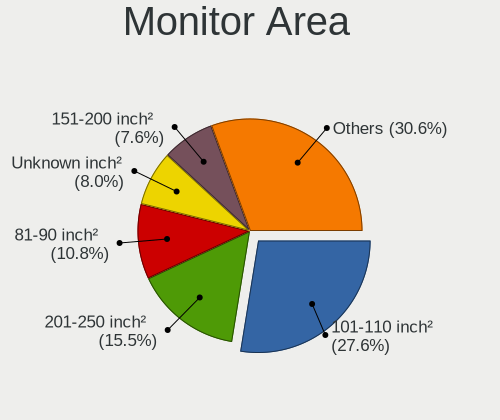

| Area in inch | Computers | Percent |
|----------------|-----------|---------|
| 101-110        | 136       | 26.2%   |
| 201-250        | 77        | 14.84%  |
| 81-90          | 70        | 13.49%  |
| Unknown        | 43        | 8.29%   |
| 151-200        | 34        | 6.55%   |
| 301-350        | 30        | 5.78%   |
| 121-130        | 25        | 4.82%   |
| 141-150        | 17        | 3.28%   |
| 351-500        | 13        | 2.5%    |
| 71-80          | 12        | 2.31%   |
| 251-300        | 11        | 2.12%   |
| More than 1000 | 10        | 1.93%   |
| 501-1000       | 10        | 1.93%   |
| 61-70          | 9         | 1.73%   |
| 51-60          | 7         | 1.35%   |
| 41-50          | 6         | 1.16%   |
| 131-140        | 6         | 1.16%   |
| 111-120        | 2         | 0.39%   |
| 1-40           | 1         | 0.19%   |

Pixel Density
-------------

Pixels per inch

| Density       | Computers | Percent |
|---------------|-----------|---------|
| 51-100        | 171       | 33.4%   |
| 101-120       | 164       | 32.03%  |
| 121-160       | 100       | 19.53%  |
| Unknown       | 43        | 8.4%    |
| 161-240       | 18        | 3.52%   |
| 1-50          | 12        | 2.34%   |
| More than 240 | 4         | 0.78%   |

Multiple Monitors
-----------------

Total monitors connected

| Total | Computers | Percent |
|-------|-----------|---------|
| 1     | 420       | 81.55%  |
| 2     | 67        | 13.01%  |
| 0     | 25        | 4.85%   |
| 3     | 3         | 0.58%   |

Network
-------

Net Controller Vendor
---------------------

Controller vendors

| Vendor                           | Computers | Percent |
|----------------------------------|-----------|---------|
| Realtek Semiconductor            | 304       | 38.83%  |
| Intel                            | 212       | 27.08%  |
| Qualcomm Atheros                 | 120       | 15.33%  |
| Broadcom                         | 36        | 4.6%    |
| Nvidia                           | 12        | 1.53%   |
| Marvell Technology Group         | 11        | 1.4%    |
| Broadcom Limited                 | 11        | 1.4%    |
| Ralink Technology                | 10        | 1.28%   |
| TP-Link                          | 9         | 1.15%   |
| Ralink                           | 7         | 0.89%   |
| Microsoft                        | 6         | 0.77%   |
| Qualcomm Atheros Communications  | 5         | 0.64%   |
| Samsung Electronics              | 4         | 0.51%   |
| MEDIATEK                         | 4         | 0.51%   |
| D-Link                           | 4         | 0.51%   |
| Sierra Wireless                  | 3         | 0.38%   |
| NetGear                          | 3         | 0.38%   |
| Linksys                          | 3         | 0.38%   |
| ASIX Electronics                 | 3         | 0.38%   |
| Xiaomi                           | 2         | 0.26%   |
| Motorola PCS                     | 2         | 0.26%   |
| Lenovo                           | 2         | 0.26%   |
| Huawei Technologies              | 2         | 0.26%   |
| VIA Technologies                 | 1         | 0.13%   |
| Silicon Integrated Systems [SiS] | 1         | 0.13%   |
| Microchip Technology             | 1         | 0.13%   |
| JMicron Technology               | 1         | 0.13%   |
| Hewlett-Packard                  | 1         | 0.13%   |
| Dell                             | 1         | 0.13%   |
| Attansic Technology              | 1         | 0.13%   |
| Apple                            | 1         | 0.13%   |

Net Controller Model
--------------------

Controller models

| Model                                                                   | Computers | Percent |
|-------------------------------------------------------------------------|-----------|---------|
| Realtek RTL8111/8168/8411 PCI Express Gigabit Ethernet Controller       | 211       | 23.19%  |
| Realtek RTL810xE PCI Express Fast Ethernet controller                   | 43        | 4.73%   |
| Qualcomm Atheros QCA9377 802.11ac Wireless Network Adapter              | 18        | 1.98%   |
| Qualcomm Atheros AR9485 Wireless Network Adapter                        | 18        | 1.98%   |
| Intel 82579LM Gigabit Network Connection (Lewisville)                   | 17        | 1.87%   |
| Qualcomm Atheros AR9285 Wireless Network Adapter (PCI-Express)          | 16        | 1.76%   |
| Realtek RTL8821CE 802.11ac PCIe Wireless Network Adapter                | 15        | 1.65%   |
| Intel Wi-Fi 6 AX200                                                     | 15        | 1.65%   |
| Qualcomm Atheros QCA9565 / AR9565 Wireless Network Adapter              | 14        | 1.54%   |
| Intel Wireless 7260                                                     | 14        | 1.54%   |
| Realtek RTL8822CE 802.11ac PCIe Wireless Network Adapter                | 10        | 1.1%    |
| Intel Wireless 8265 / 8275                                              | 10        | 1.1%    |
| Intel Wireless 8260                                                     | 10        | 1.1%    |
| Intel Wireless 3165                                                     | 10        | 1.1%    |
| Intel Ethernet Connection (2) I219-V                                    | 9         | 0.99%   |
| Intel Wireless-AC 9260                                                  | 8         | 0.88%   |
| Intel Wireless 7265                                                     | 8         | 0.88%   |
| Intel PRO/Wireless 3945ABG [Golan] Network Connection                   | 8         | 0.88%   |
| Intel Ethernet Connection I217-LM                                       | 8         | 0.88%   |
| Broadcom BCM4313 802.11bgn Wireless Network Adapter                     | 8         | 0.88%   |
| Realtek RTL8723BE PCIe Wireless Network Adapter                         | 7         | 0.77%   |
| Realtek RTL8153 Gigabit Ethernet Adapter                                | 7         | 0.77%   |
| Ralink MT7601U Wireless Adapter                                         | 7         | 0.77%   |
| Intel Wireless 3160                                                     | 7         | 0.77%   |
| Intel Centrino Advanced-N 6205 [Taylor Peak]                            | 7         | 0.77%   |
| Intel 82577LM Gigabit Network Connection                                | 7         | 0.77%   |
| Qualcomm Atheros QCA6174 802.11ac Wireless Network Adapter              | 6         | 0.66%   |
| Qualcomm Atheros AR9287 Wireless Network Adapter (PCI-Express)          | 6         | 0.66%   |
| Qualcomm Atheros AR8131 Gigabit Ethernet                                | 6         | 0.66%   |
| Qualcomm Atheros AR242x / AR542x Wireless Network Adapter (PCI-Express) | 6         | 0.66%   |
| Intel WiFi Link 5100                                                    | 6         | 0.66%   |
| Intel Wi-Fi 6 AX201                                                     | 6         | 0.66%   |
| Intel Ethernet Connection I218-LM                                       | 6         | 0.66%   |
| Intel Ethernet Connection I217-V                                        | 6         | 0.66%   |
| Realtek RTL8125 2.5GbE Controller                                       | 5         | 0.55%   |
| Qualcomm Atheros AR9271 802.11n                                         | 5         | 0.55%   |
| Qualcomm Atheros AR9462 Wireless Network Adapter                        | 5         | 0.55%   |
| Qualcomm Atheros AR8161 Gigabit Ethernet                                | 5         | 0.55%   |
| Nvidia MCP61 Ethernet                                                   | 5         | 0.55%   |
| Marvell Group 88E8040 PCI-E Fast Ethernet Controller                    | 5         | 0.55%   |
| Intel Dual Band Wireless-AC 3168NGW [Stone Peak]                        | 5         | 0.55%   |
| Intel Comet Lake PCH-LP CNVi WiFi                                       | 5         | 0.55%   |
| Intel Centrino Advanced-N 6200                                          | 5         | 0.55%   |
| Realtek RTL8822BE 802.11a/b/g/n/ac WiFi adapter                         | 4         | 0.44%   |
| Realtek RTL8723AE PCIe Wireless Network Adapter                         | 4         | 0.44%   |
| Realtek RTL8188CE 802.11b/g/n WiFi Adapter                              | 4         | 0.44%   |
| Realtek RTL-8100/8101L/8139 PCI Fast Ethernet Adapter                   | 4         | 0.44%   |
| Qualcomm Atheros AR93xx Wireless Network Adapter                        | 4         | 0.44%   |
| Qualcomm Atheros AR928X Wireless Network Adapter (PCI-Express)          | 4         | 0.44%   |
| Intel Ethernet Connection (3) I218-LM                                   | 4         | 0.44%   |
| Intel Centrino Wireless-N 1000 [Condor Peak]                            | 4         | 0.44%   |
| Intel Cannon Point-LP CNVi [Wireless-AC]                                | 4         | 0.44%   |
| Intel Cannon Lake PCH CNVi WiFi                                         | 4         | 0.44%   |
| Intel 82579V Gigabit Network Connection                                 | 4         | 0.44%   |
| Intel 82567LM Gigabit Network Connection                                | 4         | 0.44%   |
| Broadcom BCM4322 802.11a/b/g/n Wireless LAN Controller                  | 4         | 0.44%   |
| TP-Link TL-WN722N v2/v3 [Realtek RTL8188EUS]                            | 3         | 0.33%   |
| Sierra Wireless EM7345 4G LTE                                           | 3         | 0.33%   |
| Samsung Galaxy series, misc. (tethering mode)                           | 3         | 0.33%   |
| Realtek RTL8821AE 802.11ac PCIe Wireless Network Adapter                | 3         | 0.33%   |

Wireless Vendor
---------------

Wireless vendors

| Vendor                          | Computers | Percent |
|---------------------------------|-----------|---------|
| Intel                           | 157       | 37.47%  |
| Qualcomm Atheros                | 100       | 23.87%  |
| Realtek Semiconductor           | 77        | 18.38%  |
| Broadcom                        | 27        | 6.44%   |
| Ralink Technology               | 10        | 2.39%   |
| TP-Link                         | 9         | 2.15%   |
| Ralink                          | 7         | 1.67%   |
| Qualcomm Atheros Communications | 5         | 1.19%   |
| Broadcom Limited                | 5         | 1.19%   |
| Microsoft                       | 4         | 0.95%   |
| D-Link                          | 4         | 0.95%   |
| Sierra Wireless                 | 3         | 0.72%   |
| NetGear                         | 3         | 0.72%   |
| MEDIATEK                        | 3         | 0.72%   |
| Linksys                         | 3         | 0.72%   |
| Huawei Technologies             | 1         | 0.24%   |
| Dell                            | 1         | 0.24%   |

Wireless Model
--------------

Wireless models

| Model                                                                   | Computers | Percent |
|-------------------------------------------------------------------------|-----------|---------|
| Qualcomm Atheros QCA9377 802.11ac Wireless Network Adapter              | 18        | 4.29%   |
| Qualcomm Atheros AR9485 Wireless Network Adapter                        | 18        | 4.29%   |
| Qualcomm Atheros AR9285 Wireless Network Adapter (PCI-Express)          | 16        | 3.81%   |
| Realtek RTL8821CE 802.11ac PCIe Wireless Network Adapter                | 15        | 3.57%   |
| Intel Wi-Fi 6 AX200                                                     | 15        | 3.57%   |
| Qualcomm Atheros QCA9565 / AR9565 Wireless Network Adapter              | 14        | 3.33%   |
| Intel Wireless 7260                                                     | 14        | 3.33%   |
| Realtek RTL8822CE 802.11ac PCIe Wireless Network Adapter                | 10        | 2.38%   |
| Intel Wireless 8265 / 8275                                              | 10        | 2.38%   |
| Intel Wireless 8260                                                     | 10        | 2.38%   |
| Intel Wireless 3165                                                     | 10        | 2.38%   |
| Intel Wireless-AC 9260                                                  | 8         | 1.9%    |
| Intel Wireless 7265                                                     | 8         | 1.9%    |
| Intel PRO/Wireless 3945ABG [Golan] Network Connection                   | 8         | 1.9%    |
| Broadcom BCM4313 802.11bgn Wireless Network Adapter                     | 8         | 1.9%    |
| Realtek RTL8723BE PCIe Wireless Network Adapter                         | 7         | 1.67%   |
| Ralink MT7601U Wireless Adapter                                         | 7         | 1.67%   |
| Intel Wireless 3160                                                     | 7         | 1.67%   |
| Intel Centrino Advanced-N 6205 [Taylor Peak]                            | 7         | 1.67%   |
| Qualcomm Atheros QCA6174 802.11ac Wireless Network Adapter              | 6         | 1.43%   |
| Qualcomm Atheros AR9287 Wireless Network Adapter (PCI-Express)          | 6         | 1.43%   |
| Qualcomm Atheros AR242x / AR542x Wireless Network Adapter (PCI-Express) | 6         | 1.43%   |
| Intel WiFi Link 5100                                                    | 6         | 1.43%   |
| Intel Wi-Fi 6 AX201                                                     | 6         | 1.43%   |
| Qualcomm Atheros AR9271 802.11n                                         | 5         | 1.19%   |
| Qualcomm Atheros AR9462 Wireless Network Adapter                        | 5         | 1.19%   |
| Intel Dual Band Wireless-AC 3168NGW [Stone Peak]                        | 5         | 1.19%   |
| Intel Comet Lake PCH-LP CNVi WiFi                                       | 5         | 1.19%   |
| Intel Centrino Advanced-N 6200                                          | 5         | 1.19%   |
| Realtek RTL8822BE 802.11a/b/g/n/ac WiFi adapter                         | 4         | 0.95%   |
| Realtek RTL8723AE PCIe Wireless Network Adapter                         | 4         | 0.95%   |
| Realtek RTL8188CE 802.11b/g/n WiFi Adapter                              | 4         | 0.95%   |
| Qualcomm Atheros AR93xx Wireless Network Adapter                        | 4         | 0.95%   |
| Qualcomm Atheros AR928X Wireless Network Adapter (PCI-Express)          | 4         | 0.95%   |
| Intel Centrino Wireless-N 1000 [Condor Peak]                            | 4         | 0.95%   |
| Intel Cannon Point-LP CNVi [Wireless-AC]                                | 4         | 0.95%   |
| Intel Cannon Lake PCH CNVi WiFi                                         | 4         | 0.95%   |
| Broadcom BCM4322 802.11a/b/g/n Wireless LAN Controller                  | 4         | 0.95%   |
| TP-Link TL-WN722N v2/v3 [Realtek RTL8188EUS]                            | 3         | 0.71%   |
| Sierra Wireless EM7345 4G LTE                                           | 3         | 0.71%   |
| Realtek RTL8821AE 802.11ac PCIe Wireless Network Adapter                | 3         | 0.71%   |
| Realtek RTL8723DE Wireless Network Adapter                              | 3         | 0.71%   |
| Ralink RT3290 Wireless 802.11n 1T/1R PCIe                               | 3         | 0.71%   |
| NetGear A6100 AC600 DB Wireless Adapter [Realtek RTL8811AU]             | 3         | 0.71%   |
| Microsoft Xbox 360 Wireless Adapter                                     | 3         | 0.71%   |
| MEDIATEK Network controller                                             | 3         | 0.71%   |
| Intel Comet Lake PCH CNVi WiFi                                          | 3         | 0.71%   |
| Broadcom BCM43142 802.11b/g/n                                           | 3         | 0.71%   |
| Realtek RTL88x2bu [AC1200 Techkey]                                      | 2         | 0.48%   |
| Realtek RTL8812AE 802.11ac PCIe Wireless Network Adapter                | 2         | 0.48%   |
| Realtek RTL8192EU 802.11b/g/n WLAN Adapter                              | 2         | 0.48%   |
| Realtek RTL8192CU 802.11n WLAN Adapter                                  | 2         | 0.48%   |
| Realtek RTL8192CE PCIe Wireless Network Adapter                         | 2         | 0.48%   |
| Realtek RTL8188FTV 802.11b/g/n 1T1R 2.4G WLAN Adapter                   | 2         | 0.48%   |
| Realtek RTL8188EE Wireless Network Adapter                              | 2         | 0.48%   |
| Realtek 802.11ac NIC                                                    | 2         | 0.48%   |
| Ralink RT5370 Wireless Adapter                                          | 2         | 0.48%   |
| Ralink RT5390 Wireless 802.11n 1T/1R PCIe                               | 2         | 0.48%   |
| Intel Wi-Fi 6 AX201 160MHz                                              | 2         | 0.48%   |
| Intel Ultimate N WiFi Link 5300                                         | 2         | 0.48%   |

Ethernet Vendor
---------------

Ethernet vendors

| Vendor                           | Computers | Percent |
|----------------------------------|-----------|---------|
| Realtek Semiconductor            | 271       | 56.34%  |
| Intel                            | 115       | 23.91%  |
| Qualcomm Atheros                 | 31        | 6.44%   |
| Broadcom                         | 14        | 2.91%   |
| Nvidia                           | 12        | 2.49%   |
| Marvell Technology Group         | 11        | 2.29%   |
| Broadcom Limited                 | 6         | 1.25%   |
| Samsung Electronics              | 3         | 0.62%   |
| ASIX Electronics                 | 3         | 0.62%   |
| Xiaomi                           | 2         | 0.42%   |
| Motorola PCS                     | 2         | 0.42%   |
| Microsoft                        | 2         | 0.42%   |
| Lenovo                           | 2         | 0.42%   |
| VIA Technologies                 | 1         | 0.21%   |
| Silicon Integrated Systems [SiS] | 1         | 0.21%   |
| MediaTek                         | 1         | 0.21%   |
| JMicron Technology               | 1         | 0.21%   |
| Huawei Technologies              | 1         | 0.21%   |
| Attansic Technology              | 1         | 0.21%   |
| Apple                            | 1         | 0.21%   |

Ethernet Model
--------------

Ethernet models

| Model                                                             | Computers | Percent |
|-------------------------------------------------------------------|-----------|---------|
| Realtek RTL8111/8168/8411 PCI Express Gigabit Ethernet Controller | 211       | 43.42%  |
| Realtek RTL810xE PCI Express Fast Ethernet controller             | 43        | 8.85%   |
| Intel 82579LM Gigabit Network Connection (Lewisville)             | 17        | 3.5%    |
| Intel Ethernet Connection (2) I219-V                              | 9         | 1.85%   |
| Intel Ethernet Connection I217-LM                                 | 8         | 1.65%   |
| Realtek RTL8153 Gigabit Ethernet Adapter                          | 7         | 1.44%   |
| Intel 82577LM Gigabit Network Connection                          | 7         | 1.44%   |
| Qualcomm Atheros AR8131 Gigabit Ethernet                          | 6         | 1.23%   |
| Intel Ethernet Connection I218-LM                                 | 6         | 1.23%   |
| Intel Ethernet Connection I217-V                                  | 6         | 1.23%   |
| Realtek RTL8125 2.5GbE Controller                                 | 5         | 1.03%   |
| Qualcomm Atheros AR8161 Gigabit Ethernet                          | 5         | 1.03%   |
| Nvidia MCP61 Ethernet                                             | 5         | 1.03%   |
| Marvell Group 88E8040 PCI-E Fast Ethernet Controller              | 5         | 1.03%   |
| Realtek RTL-8100/8101L/8139 PCI Fast Ethernet Adapter             | 4         | 0.82%   |
| Intel Ethernet Connection (3) I218-LM                             | 4         | 0.82%   |
| Intel 82579V Gigabit Network Connection                           | 4         | 0.82%   |
| Intel 82567LM Gigabit Network Connection                          | 4         | 0.82%   |
| Samsung Galaxy series, misc. (tethering mode)                     | 3         | 0.62%   |
| Qualcomm Atheros Killer E2500 Gigabit Ethernet Controller         | 3         | 0.62%   |
| Qualcomm Atheros Killer E2400 Gigabit Ethernet Controller         | 3         | 0.62%   |
| Qualcomm Atheros Attansic L2 Fast Ethernet                        | 3         | 0.62%   |
| Qualcomm Atheros AR8162 Fast Ethernet                             | 3         | 0.62%   |
| Nvidia MCP77 Ethernet                                             | 3         | 0.62%   |
| Intel I211 Gigabit Network Connection                             | 3         | 0.62%   |
| Intel Ethernet Connection (7) I219-V                              | 3         | 0.62%   |
| Intel Ethernet Connection (2) I219-LM                             | 3         | 0.62%   |
| Intel 82567LM-3 Gigabit Network Connection                        | 3         | 0.62%   |
| Intel 82566DM-2 Gigabit Network Connection                        | 3         | 0.62%   |
| Broadcom NetXtreme BCM57765 Gigabit Ethernet PCIe                 | 3         | 0.62%   |
| Broadcom NetXtreme BCM5761 Gigabit Ethernet PCIe                  | 3         | 0.62%   |
| Broadcom NetLink BCM57780 Gigabit Ethernet PCIe                   | 3         | 0.62%   |
| Xiaomi Mi/Redmi series (RNDIS)                                    | 2         | 0.41%   |
| Qualcomm Atheros QCA8171 Gigabit Ethernet                         | 2         | 0.41%   |
| Qualcomm Atheros Killer E220x Gigabit Ethernet Controller         | 2         | 0.41%   |
| Qualcomm Atheros AR8152 v2.0 Fast Ethernet                        | 2         | 0.41%   |
| Motorola PCS moto g 5G plus                                       | 2         | 0.41%   |
| Microsoft RTL8153 GigE [Surface Ethernet Adapter]                 | 2         | 0.41%   |
| Marvell Group 88E8056 PCI-E Gigabit Ethernet Controller           | 2         | 0.41%   |
| Marvell Group 88E8055 PCI-E Gigabit Ethernet Controller           | 2         | 0.41%   |
| Intel I210 Gigabit Network Connection                             | 2         | 0.41%   |
| Intel Ethernet Connection I219-V                                  | 2         | 0.41%   |
| Intel Ethernet Connection I219-LM                                 | 2         | 0.41%   |
| Intel Ethernet Connection (5) I219-LM                             | 2         | 0.41%   |
| Intel Ethernet Connection (4) I219-LM                             | 2         | 0.41%   |
| Intel Ethernet Connection (2) I218-LM                             | 2         | 0.41%   |
| Intel Ethernet Connection (10) I219-V                             | 2         | 0.41%   |
| Intel 82574L Gigabit Network Connection                           | 2         | 0.41%   |
| Intel 82562V-2 10/100 Network Connection                          | 2         | 0.41%   |
| Broadcom Limited NetLink BCM57780 Gigabit Ethernet PCIe           | 2         | 0.41%   |
| ASIX AX88179 Gigabit Ethernet                                     | 2         | 0.41%   |
| VIA VT6105/VT6106S [Rhine-III]                                    | 1         | 0.21%   |
| Silicon Integrated Systems [SiS] 191 Gigabit Ethernet Adapter     | 1         | 0.21%   |
| Realtek RTL8152 Fast Ethernet Adapter                             | 1         | 0.21%   |
| Realtek Killer E2600 Gigabit Ethernet Controller                  | 1         | 0.21%   |
| Realtek Killer E2500 Gigabit Ethernet Controller                  | 1         | 0.21%   |
| Qualcomm Atheros QCA8172 Fast Ethernet                            | 1         | 0.21%   |
| Qualcomm Atheros AR8151 v2.0 Gigabit Ethernet                     | 1         | 0.21%   |
| Nvidia MCP79 Ethernet                                             | 1         | 0.21%   |
| Nvidia MCP73 Ethernet                                             | 1         | 0.21%   |

Net Controller Kind
-------------------

Ethernet, WiFi or modem

| Kind     | Computers | Percent |
|----------|-----------|---------|
| Ethernet | 460       | 53.43%  |
| WiFi     | 397       | 46.11%  |
| Modem    | 3         | 0.35%   |
| Unknown  | 1         | 0.12%   |

Used Controller
---------------

Currently used network controller

| Kind     | Computers | Percent |
|----------|-----------|---------|
| Ethernet | 364       | 50.84%  |
| WiFi     | 352       | 49.16%  |

NICs
----

Total network controllers on board

| Total | Computers | Percent |
|-------|-----------|---------|
| 2     | 310       | 60.19%  |
| 1     | 199       | 38.64%  |
| 3     | 3         | 0.58%   |
| 0     | 3         | 0.58%   |

IPv6
----

IPv6 vs IPv4

| Used | Computers | Percent |
|------|-----------|---------|
| No   | 374       | 72.62%  |
| Yes  | 141       | 27.38%  |

Bluetooth
---------

Bluetooth Vendor
----------------

Controller vendors

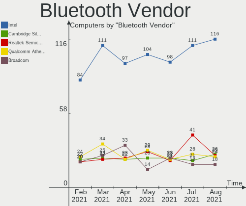

| Vendor                          | Computers | Percent |
|---------------------------------|-----------|---------|
| Intel                           | 111       | 38.01%  |
| Realtek Semiconductor           | 41        | 14.04%  |
| Qualcomm Atheros Communications | 26        | 8.9%    |
| Cambridge Silicon Radio         | 21        | 7.19%   |
| Broadcom                        | 18        | 6.16%   |
| Lite-On Technology              | 16        | 5.48%   |
| IMC Networks                    | 12        | 4.11%   |
| ASUSTek Computer                | 9         | 3.08%   |
| Foxconn / Hon Hai               | 8         | 2.74%   |
| Hewlett-Packard                 | 7         | 2.4%    |
| Apple                           | 6         | 2.05%   |
| Dell                            | 4         | 1.37%   |
| Ralink                          | 3         | 1.03%   |
| Toshiba                         | 2         | 0.68%   |
| Taiyo Yuden                     | 2         | 0.68%   |
| Alps Electric                   | 2         | 0.68%   |
| Realtek                         | 1         | 0.34%   |
| Ralink Technology               | 1         | 0.34%   |
| Foxconn International           | 1         | 0.34%   |
| Chicony Electronics             | 1         | 0.34%   |

Bluetooth Model
---------------

Controller models

| Model                                               | Computers | Percent |
|-----------------------------------------------------|-----------|---------|
| Intel Bluetooth wireless interface                  | 51        | 17.47%  |
| Realtek Bluetooth Radio                             | 28        | 9.59%   |
| Cambridge Silicon Radio Bluetooth Dongle (HCI mode) | 21        | 7.19%   |
| Intel AX201 Bluetooth                               | 16        | 5.48%   |
| Intel AX200 Bluetooth                               | 15        | 5.14%   |
| Qualcomm Atheros  Bluetooth Device                  | 14        | 4.79%   |
| Realtek  Bluetooth 4.2 Adapter                      | 12        | 4.11%   |
| Intel Bluetooth 9460/9560 Jefferson Peak (JfP)      | 10        | 3.42%   |
| Intel Wireless-AC 9260 Bluetooth Adapter            | 8         | 2.74%   |
| Lite-On Qualcomm Atheros QCA9377 Bluetooth          | 6         | 2.05%   |
| Qualcomm Atheros AR3011 Bluetooth                   | 5         | 1.71%   |
| Lite-On Atheros AR3012 Bluetooth                    | 5         | 1.71%   |
| Intel Wireless-AC 3168 Bluetooth                    | 5         | 1.71%   |
| Foxconn / Hon Hai Bluetooth Device                  | 5         | 1.71%   |
| IMC Networks Bluetooth Device                       | 4         | 1.37%   |
| HP Bluetooth 2.0 Interface [Broadcom BCM2045]       | 4         | 1.37%   |
| Ralink RT3290 Bluetooth                             | 3         | 1.03%   |
| Qualcomm Atheros Bluetooth USB Host Controller      | 3         | 1.03%   |
| Lite-On Wireless_Device                             | 3         | 1.03%   |
| Intel Centrino Advanced-N 6230 Bluetooth adapter    | 3         | 1.03%   |
| IMC Networks Bluetooth Radio                        | 3         | 1.03%   |
| HP Broadcom 2070 Bluetooth Combo                    | 3         | 1.03%   |
| Broadcom BCM2070 Bluetooth Device                   | 3         | 1.03%   |
| Broadcom BCM2045 Bluetooth                          | 3         | 1.03%   |
| ASUS Broadcom BCM20702A0 Bluetooth                  | 3         | 1.03%   |
| ASUS ASUS USB-BT500                                 | 3         | 1.03%   |
| Apple Bluetooth Host Controller                     | 3         | 1.03%   |
| Qualcomm Atheros AR3012 Bluetooth 4.0               | 2         | 0.68%   |
| Lite-On Bluetooth Device                            | 2         | 0.68%   |
| Intel Centrino Bluetooth Wireless Transceiver       | 2         | 0.68%   |
| IMC Networks Bluetooth USB Host Controller          | 2         | 0.68%   |
| IMC Networks Bluetooth                              | 2         | 0.68%   |
| Dell Wireless 355 Bluetooth                         | 2         | 0.68%   |
| Broadcom HP Portable SoftSailing                    | 2         | 0.68%   |
| Broadcom BCM20702A0 Bluetooth 4.0                   | 2         | 0.68%   |
| Broadcom BCM2045B (BDC-2.1)                         | 2         | 0.68%   |
| Apple Bluetooth USB Host Controller                 | 2         | 0.68%   |
| Toshiba RT Bluetooth Radio                          | 1         | 0.34%   |
| Toshiba Askey for                                   | 1         | 0.34%   |
| Taiyo Yuden Bluetooth Device (V2.0+EDR)             | 1         | 0.34%   |
| Taiyo Yuden Bluetooth Device                        | 1         | 0.34%   |
| Realtek RTL8821A Bluetooth                          | 1         | 0.34%   |
| Realtek Bluetooth Radio                             | 1         | 0.34%   |
| Ralink Motorola BC4 Bluetooth 3.0+HS Adapter        | 1         | 0.34%   |
| Qualcomm Atheros QCA61x4 Bluetooth 4.0              | 1         | 0.34%   |
| Qualcomm Atheros AR9462 Bluetooth                   | 1         | 0.34%   |
| Intel Bluetooth Device                              | 1         | 0.34%   |
| IMC Networks Atheros AR3012 Bluetooth 4.0 Adapter   | 1         | 0.34%   |
| Foxconn International BCM43142A0 Bluetooth module   | 1         | 0.34%   |
| Foxconn / Hon Hai Broadcom Bluetooth 2.1 Device     | 1         | 0.34%   |
| Foxconn / Hon Hai Bluetooth USB Host Controller     | 1         | 0.34%   |
| Foxconn / Hon Hai BCM20702A0                        | 1         | 0.34%   |
| Dell DW375 Bluetooth Module                         | 1         | 0.34%   |
| Dell BT Mini-Receiver                               | 1         | 0.34%   |
| Chicony Bluetooth Radio                             | 1         | 0.34%   |
| Broadcom HP Portable Valentine                      | 1         | 0.34%   |
| Broadcom HP Portable Bumble Bee                     | 1         | 0.34%   |
| Broadcom Bluetooth 3.0 Dongle                       | 1         | 0.34%   |
| Broadcom Bluetooth                                  | 1         | 0.34%   |
| Broadcom BCM43142 Bluetooth 4.0                     | 1         | 0.34%   |

Sound
-----

Sound Vendor
------------

Sound card vendors

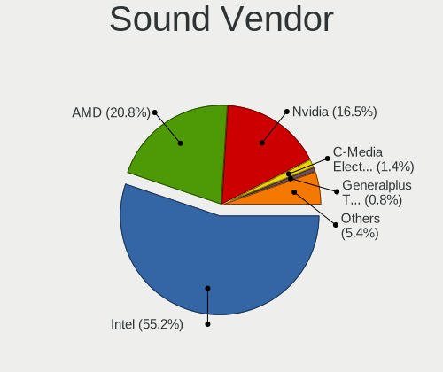

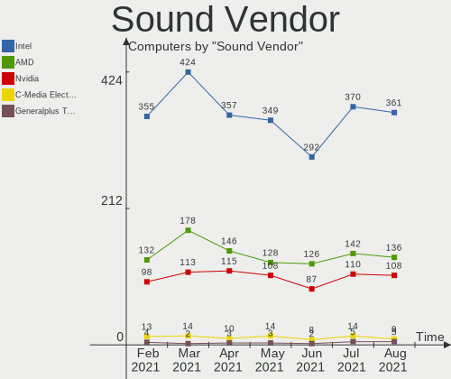

| Vendor                           | Computers | Percent |
|----------------------------------|-----------|---------|
| Intel                            | 370       | 54.25%  |
| AMD                              | 142       | 20.82%  |
| Nvidia                           | 110       | 16.13%  |
| C-Media Electronics              | 14        | 2.05%   |
| Creative Labs                    | 6         | 0.88%   |
| Generalplus Technology           | 5         | 0.73%   |
| JMTek                            | 4         | 0.59%   |
| SteelSeries ApS                  | 2         | 0.29%   |
| Logitech                         | 2         | 0.29%   |
| Focusrite-Novation               | 2         | 0.29%   |
| Corsair                          | 2         | 0.29%   |
| Texas Instruments                | 1         | 0.15%   |
| TerraTec Electronic              | 1         | 0.15%   |
| Tenx Technology                  | 1         | 0.15%   |
| Tdlasunnic                       | 1         | 0.15%   |
| Silicon Motion                   | 1         | 0.15%   |
| Silicon Integrated Systems [SiS] | 1         | 0.15%   |
| Sennheiser Communications        | 1         | 0.15%   |
| Schiit Audio                     | 1         | 0.15%   |
| RODE Microphones                 | 1         | 0.15%   |
| Realtek Semiconductor            | 1         | 0.15%   |
| PreSonus Audio Electronics       | 1         | 0.15%   |
| Native Instruments               | 1         | 0.15%   |
| Microsoft                        | 1         | 0.15%   |
| Lenovo                           | 1         | 0.15%   |
| KORG                             | 1         | 0.15%   |
| Kingston Technology              | 1         | 0.15%   |
| GN Netcom                        | 1         | 0.15%   |
| Creative Technology              | 1         | 0.15%   |
| C-Thru Music                     | 1         | 0.15%   |
| ATI Technologies                 | 1         | 0.15%   |
| ASUSTek Computer                 | 1         | 0.15%   |
| Apple                            | 1         | 0.15%   |
| AKAI                             | 1         | 0.15%   |

Sound Model
-----------

Sound card models

| Model                                                                                             | Computers | Percent |
|---------------------------------------------------------------------------------------------------|-----------|---------|
| AMD Family 17h (Models 10h-1fh) HD Audio Controller                                               | 37        | 4.55%   |
| Intel 7 Series/C216 Chipset Family High Definition Audio Controller                               | 36        | 4.43%   |
| Intel Sunrise Point-LP HD Audio                                                                   | 34        | 4.18%   |
| Intel 8 Series/C220 Series Chipset High Definition Audio Controller                               | 34        | 4.18%   |
| Intel 6 Series/C200 Series Chipset Family High Definition Audio Controller                        | 34        | 4.18%   |
| Intel 82801I (ICH9 Family) HD Audio Controller                                                    | 33        | 4.06%   |
| AMD SBx00 Azalia (Intel HDA)                                                                      | 29        | 3.57%   |
| Intel 5 Series/3400 Series Chipset High Definition Audio                                          | 24        | 2.95%   |
| Intel Xeon E3-1200 v3/4th Gen Core Processor HD Audio Controller                                  | 21        | 2.58%   |
| Intel NM10/ICH7 Family High Definition Audio Controller                                           | 19        | 2.34%   |
| Intel 8 Series HD Audio Controller                                                                | 18        | 2.21%   |
| Intel Haswell-ULT HD Audio Controller                                                             | 17        | 2.09%   |
| AMD Raven/Raven2/Fenghuang HDMI/DP Audio Controller                                               | 17        | 2.09%   |
| AMD Renoir Radeon High Definition Audio Controller                                                | 16        | 1.97%   |
| AMD FCH Azalia Controller                                                                         | 16        | 1.97%   |
| Intel Cannon Lake PCH cAVS                                                                        | 15        | 1.85%   |
| AMD Starship/Matisse HD Audio Controller                                                          | 15        | 1.85%   |
| Intel Wildcat Point-LP High Definition Audio Controller                                           | 12        | 1.48%   |
| Intel Broadwell-U Audio Controller                                                                | 12        | 1.48%   |
| Nvidia GP107GL High Definition Audio Controller                                                   | 11        | 1.35%   |
| Nvidia GK208 HDMI/DP Audio Controller                                                             | 11        | 1.35%   |
| Intel Tiger Lake-LP Smart Sound Technology Audio Controller                                       | 11        | 1.35%   |
| Intel 100 Series/C230 Series Chipset Family HD Audio Controller                                   | 11        | 1.35%   |
| Intel 200 Series PCH HD Audio                                                                     | 10        | 1.23%   |
| AMD Kabini HDMI/DP Audio                                                                          | 10        | 1.23%   |
| Nvidia High Definition Audio Controller                                                           | 9         | 1.11%   |
| Intel 82801H (ICH8 Family) HD Audio Controller                                                    | 9         | 1.11%   |
| Nvidia GM107 High Definition Audio Controller [GeForce 940MX]                                     | 8         | 0.98%   |
| AMD Ellesmere HDMI Audio [Radeon RX 470/480 / 570/580/590]                                        | 8         | 0.98%   |
| Nvidia TU107 GeForce GTX 1650 High Definition Audio Controller                                    | 7         | 0.86%   |
| Nvidia GF108 High Definition Audio Controller                                                     | 7         | 0.86%   |
| Intel Cannon Point-LP High Definition Audio Controller                                            | 7         | 0.86%   |
| Intel Atom Processor Z36xxx/Z37xxx Series High Definition Audio Controller                        | 7         | 0.86%   |
| AMD Family 17h (Models 00h-0fh) HD Audio Controller                                               | 7         | 0.86%   |
| AMD Caicos HDMI Audio [Radeon HD 6450 / 7450/8450/8490 OEM / R5 230/235/235X OEM]                 | 7         | 0.86%   |
| AMD Baffin HDMI/DP Audio [Radeon RX 550 640SP / RX 560/560X]                                      | 7         | 0.86%   |
| Nvidia TU106 High Definition Audio Controller                                                     | 6         | 0.74%   |
| Nvidia GK107 HDMI Audio Controller                                                                | 6         | 0.74%   |
| Intel Celeron/Pentium Silver Processor High Definition Audio                                      | 6         | 0.74%   |
| Intel Celeron N3350/Pentium N4200/Atom E3900 Series Audio Cluster                                 | 6         | 0.74%   |
| AMD Oland/Hainan/Cape Verde/Pitcairn HDMI Audio [Radeon HD 7000 Series]                           | 6         | 0.74%   |
| AMD Family 15h (Models 60h-6fh) Audio Controller                                                  | 6         | 0.74%   |
| Nvidia MCP61 High Definition Audio                                                                | 5         | 0.62%   |
| Nvidia GP104 High Definition Audio Controller                                                     | 5         | 0.62%   |
| Intel Comet Lake PCH-LP cAVS                                                                      | 5         | 0.62%   |
| Intel Comet Lake PCH cAVS                                                                         | 5         | 0.62%   |
| Intel Atom/Celeron/Pentium Processor x5-E8000/J3xxx/N3xxx Series High Definition Audio Controller | 5         | 0.62%   |
| Generalplus Technology USB Audio Device                                                           | 5         | 0.62%   |
| C-Media Electronics Audio Adapter (Unitek Y-247A)                                                 | 5         | 0.62%   |
| Nvidia MCP72XE/MCP72P/MCP78U/MCP78S High Definition Audio                                         | 4         | 0.49%   |
| Nvidia GF119 HDMI Audio Controller                                                                | 4         | 0.49%   |
| JMTek USB PnP Audio Device                                                                        | 4         | 0.49%   |
| Intel Ice Lake-LP Smart Sound Technology Audio Controller                                         | 4         | 0.49%   |
| AMD Wrestler HDMI Audio                                                                           | 4         | 0.49%   |
| AMD Navi 10 HDMI Audio                                                                            | 4         | 0.49%   |
| AMD Cedar HDMI Audio [Radeon HD 5400/6300/7300 Series]                                            | 4         | 0.49%   |
| Nvidia TU116 High Definition Audio Controller                                                     | 3         | 0.37%   |
| Nvidia GM206 High Definition Audio Controller                                                     | 3         | 0.37%   |
| Nvidia GM204 High Definition Audio Controller                                                     | 3         | 0.37%   |
| Nvidia GK104 HDMI Audio Controller                                                                | 3         | 0.37%   |

Memory
------

Memory Vendor
-------------

Memory module vendors

| Vendor              | Computers | Percent |
|---------------------|-----------|---------|
| Samsung Electronics | 52        | 23.11%  |
| SK Hynix            | 37        | 16.44%  |
| Micron Technology   | 26        | 11.56%  |
| Kingston            | 23        | 10.22%  |
| Unknown             | 16        | 7.11%   |
| Corsair             | 13        | 5.78%   |
| Crucial             | 12        | 5.33%   |
| A-DATA Technology   | 8         | 3.56%   |
| Ramaxel Technology  | 6         | 2.67%   |
| Unknown (ABCD)      | 5         | 2.22%   |
| G.Skill             | 5         | 2.22%   |
| Elpida              | 4         | 1.78%   |
| Patriot             | 3         | 1.33%   |
| Nanya Technology    | 3         | 1.33%   |
| Smart               | 2         | 0.89%   |
| Unknown (094A)      | 1         | 0.44%   |
| Teikon              | 1         | 0.44%   |
| Team                | 1         | 0.44%   |
| Qimonda             | 1         | 0.44%   |
| OnBoard             | 1         | 0.44%   |
| GeIL                | 1         | 0.44%   |
| Exceleram           | 1         | 0.44%   |
| ASint Technology    | 1         | 0.44%   |
| Apacer              | 1         | 0.44%   |
| 48spaces            | 1         | 0.44%   |

Memory Model
------------

Memory module models

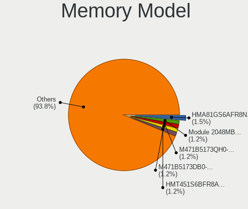

| Model                                                               | Computers | Percent |
|---------------------------------------------------------------------|-----------|---------|
| Unknown (ABCD) RAM 123456789012345678 1536MB SODIMM LPDDR3 2400MT/s | 4         | 1.65%   |
| Samsung RAM M471B5173EB0-YK0 4GB SODIMM DDR3 1600MT/s               | 4         | 1.65%   |
| SK Hynix RAM HMT451S6BFR8A-PB 4096MB SODIMM DDR3 1600MT/s           | 3         | 1.24%   |
| Samsung RAM M471A5244CB0-CTD 4GB SODIMM DDR4 2667MT/s               | 3         | 1.24%   |
| Samsung RAM M471A1K43CB1-CRC 8GB SODIMM DDR4 2667MT/s               | 3         | 1.24%   |
| SK Hynix RAM Module 4096MB SODIMM DDR3 1600MT/s                     | 2         | 0.83%   |
| SK Hynix RAM HMT41GS6BFR8A-PB 8GB SODIMM DDR3 1600MT/s              | 2         | 0.83%   |
| SK Hynix RAM HMA82GS6CJR8N-VK 16384MB SODIMM DDR4 2667MT/s          | 2         | 0.83%   |
| SK Hynix RAM HMA81GS6AFR8N-UH 8GB SODIMM DDR4 2667MT/s              | 2         | 0.83%   |
| Samsung RAM M471B5273DH0-CK0 4GB SODIMM DDR3 1600MT/s               | 2         | 0.83%   |
| Samsung RAM M471B5273CH0-YK0 4GB SODIMM DDR3 1600MT/s               | 2         | 0.83%   |
| Samsung RAM M471B5173DB0-YK0 4096MB SODIMM DDR3 1600MT/s            | 2         | 0.83%   |
| Samsung RAM M471B1G73QH0-YK0 8GB SODIMM DDR3 1600MT/s               | 2         | 0.83%   |
| Samsung RAM M471B1G73DB0-YK0 8GB SODIMM DDR3 1600MT/s               | 2         | 0.83%   |
| Samsung RAM M471A5244CB0-CWE 4GB SODIMM DDR4 3200MT/s               | 2         | 0.83%   |
| Samsung RAM M471A5244CB0-CRC 4GB SODIMM DDR4 2667MT/s               | 2         | 0.83%   |
| Samsung RAM M471A2K43DB1-CWE 16GB SODIMM DDR4 3200MT/s              | 2         | 0.83%   |
| Samsung RAM M471A1K43DB1-CWE 8GB SODIMM DDR4 3200MT/s               | 2         | 0.83%   |
| Samsung RAM M471A1G44AB0-CWE 8GB SODIMM DDR4 3200MT/s               | 2         | 0.83%   |
| Patriot RAM 3200 C16 Series 8192MB DIMM DDR4 3200MT/s               | 2         | 0.83%   |
| Micron RAM 8JSF25664HZ-1G4D1 2048MB SODIMM DDR3 1334MT/s            | 2         | 0.83%   |
| Micron RAM 4ATF1G64HZ-3G2E1 8192MB SODIMM DDR4 3200MT/s             | 2         | 0.83%   |
| Kingston RAM KHX3200C16D4/8GX 8GB DIMM DDR4 3533MT/s                | 2         | 0.83%   |
| Kingston RAM KHX2666C15S4/8G 8GB SODIMM DDR4 2667MT/s               | 2         | 0.83%   |
| Kingston RAM HP16D3LS1KBG/4G 4096MB SODIMM DDR3 1600MT/s            | 2         | 0.83%   |
| Corsair RAM CMK16GX4M2B3200C16 8GB DIMM DDR4 3600MT/s               | 2         | 0.83%   |
| A-DATA RAM DDR4 3000 2OZ 16384MB DIMM DDR4 3000MT/s                 | 2         | 0.83%   |
| Unknown SODIMM 2048MB SODIMM DDR2 667MT/s                           | 1         | 0.41%   |
| Unknown SODIMM 2048MB SODIMM 800MT/s                                | 1         | 0.41%   |
| Unknown RAM Module 8GB DIMM 667MT/s                                 | 1         | 0.41%   |
| Unknown RAM Module 8192MB SODIMM DDR3 1333MT/s                      | 1         | 0.41%   |
| Unknown RAM Module 8192MB DIMM DDR4 3600MT/s                        | 1         | 0.41%   |
| Unknown RAM Module 4GB SODIMM DDR2 800MT/s                          | 1         | 0.41%   |
| Unknown RAM Module 4096MB SODIMM DDR3 1333MT/s                      | 1         | 0.41%   |
| Unknown RAM Module 4096MB DIMM SDRAM 1066MT/s                       | 1         | 0.41%   |
| Unknown RAM Module 4096MB DIMM 1333MT/s                             | 1         | 0.41%   |
| Unknown RAM Module 2GB DIMM 667MT/s                                 | 1         | 0.41%   |
| Unknown RAM Module 2GB DIMM 533MT/s                                 | 1         | 0.41%   |
| Unknown RAM Module 2048MB DIMM DDR2 800MT/s                         | 1         | 0.41%   |
| Unknown RAM Module 2048MB DIMM DDR 667MT/s                          | 1         | 0.41%   |
| Unknown RAM Module 1024MB SODIMM LPDDR4 2133MT/s                    | 1         | 0.41%   |
| Unknown RAM Module 1024MB SODIMM DDR2                               | 1         | 0.41%   |
| Unknown RAM Module 1024MB DIMM 667MT/s                              | 1         | 0.41%   |
| Unknown RAM Kinlstuo 8192MB DIMM DDR3 1600MT/s                      | 1         | 0.41%   |
| Unknown (ABCD) RAM 123456789012345678 2GB DIMM LPDDR4 2133MT/s      | 1         | 0.41%   |
| Unknown (094A) RAM ZFWY8G1600LNB 8192MB SODIMM DDR3 1600MT/s        | 1         | 0.41%   |
| Teikon RAM TMT41GS6BFR8A-PBHC 8192MB SODIMM DDR3 1600MT/s           | 1         | 0.41%   |
| Team RAM TEAMGROUP-UD4-3000 16GB DIMM DDR4 3000MT/s                 | 1         | 0.41%   |
| Smart RAM SMS4TDC3C0K0446SCG 4096MB SODIMM DDR4 2667MT/s            | 1         | 0.41%   |
| Smart RAM SH564128FJ8NWRNSQR 4GB SODIMM DDR3 1600MT/s               | 1         | 0.41%   |
| SK Hynix RAM Module 2048MB Row Of Chips DDR3 1600MT/s               | 1         | 0.41%   |
| SK Hynix RAM Module 2048MB DIMM DDR3 1600MT/s                       | 1         | 0.41%   |
| SK Hynix RAM Module 16384MB SODIMM DDR4 3200MT/s                    | 1         | 0.41%   |
| SK Hynix RAM HYMP112S64CP6-S6 1024MB SODIMM DDR 975MT/s             | 1         | 0.41%   |
| SK Hynix RAM HMT451U7BFR8A-PB 4096MB DIMM DDR3 1600MT/s             | 1         | 0.41%   |
| SK Hynix RAM HMT451S6MFR8A-PB 4096MB SODIMM DDR3 1600MT/s           | 1         | 0.41%   |
| SK Hynix RAM HMT451S6MFR6A-PB 4GB SODIMM DDR3 1600MT/s              | 1         | 0.41%   |
| SK Hynix RAM HMT451S6AFR8A-PB 4GB SODIMM DDR3 1600MT/s              | 1         | 0.41%   |
| SK Hynix RAM HMT425S6CFR6A-PB 2048MB SODIMM DDR3 1600MT/s           | 1         | 0.41%   |
| SK Hynix RAM HMT425S6AFR6A-PB 2048MB SODIMM DDR3 1600MT/s           | 1         | 0.41%   |

Memory Kind
-----------

Memory module kinds

| Kind    | Computers | Percent |
|---------|-----------|---------|
| DDR4    | 86        | 44.33%  |
| DDR3    | 77        | 39.69%  |
| LPDDR4  | 9         | 4.64%   |
| SDRAM   | 7         | 3.61%   |
| DDR2    | 7         | 3.61%   |
| Unknown | 5         | 2.58%   |
| LPDDR3  | 2         | 1.03%   |
| DDR     | 1         | 0.52%   |

Memory Form Factor
------------------

Physical design of the memory module

| Name         | Computers | Percent |
|--------------|-----------|---------|
| SODIMM       | 126       | 65.28%  |
| DIMM         | 57        | 29.53%  |
| Row Of Chips | 10        | 5.18%   |

Memory Size
-----------

Memory module size

| Size  | Computers | Percent |
|-------|-----------|---------|
| 8192  | 73        | 34.93%  |
| 4096  | 66        | 31.58%  |
| 2048  | 34        | 16.27%  |
| 16384 | 25        | 11.96%  |
| 1024  | 6         | 2.87%   |
| 32768 | 5         | 2.39%   |

Memory Speed
------------

Memory module speed

| Speed   | Computers | Percent |
|---------|-----------|---------|
| 1600    | 57        | 27.54%  |
| 2667    | 32        | 15.46%  |
| 3200    | 29        | 14.01%  |
| 2400    | 13        | 6.28%   |
| 1333    | 13        | 6.28%   |
| 2133    | 9         | 4.35%   |
| 1334    | 7         | 3.38%   |
| 667     | 7         | 3.38%   |
| 3600    | 6         | 2.9%    |
| 800     | 5         | 2.42%   |
| 3000    | 3         | 1.45%   |
| 2048    | 3         | 1.45%   |
| 4267    | 2         | 0.97%   |
| 3533    | 2         | 0.97%   |
| 3400    | 2         | 0.97%   |
| 2800    | 2         | 0.97%   |
| 1067    | 2         | 0.97%   |
| 1066    | 2         | 0.97%   |
| 533     | 2         | 0.97%   |
| Unknown | 2         | 0.97%   |
| 4199    | 1         | 0.48%   |
| 2933    | 1         | 0.48%   |
| 2666    | 1         | 0.48%   |
| 2200    | 1         | 0.48%   |
| 1866    | 1         | 0.48%   |
| 975     | 1         | 0.48%   |
| 933     | 1         | 0.48%   |

Printers & scanners
-------------------

Printer Vendor
--------------

Printer device vendors

| Vendor                 | Computers | Percent |
|------------------------|-----------|---------|
| Hewlett-Packard        | 8         | 32%     |
| Seiko Epson            | 4         | 16%     |
| Brother Industries     | 4         | 16%     |
| QinHeng Electronics    | 2         | 8%      |
| Canon                  | 2         | 8%      |
| Samsung Electronics    | 1         | 4%      |
| Prolific Technology    | 1         | 4%      |
| Oki Data               | 1         | 4%      |
| Dell                   | 1         | 4%      |
| Agere Systems (Lucent) | 1         | 4%      |

Printer Model
-------------

Printer device models

| Model                                                                 | Computers | Percent |
|-----------------------------------------------------------------------|-----------|---------|
| QinHeng CH340S                                                        | 2         | 8%      |
| HP Deskjet 3050 J610 series                                           | 2         | 8%      |
| Seiko Epson WF-2830 Series                                            | 1         | 4%      |
| Seiko Epson ME OFFICE 620F Series/Stylus Office BX305F/BX305FW/TX320F | 1         | 4%      |
| Seiko Epson L395 Series                                               | 1         | 4%      |
| Seiko Epson L3150 Series                                              | 1         | 4%      |
| Samsung SCX-3400 Series                                               | 1         | 4%      |
| Prolific PL2305 Parallel Port                                         | 1         | 4%      |
| Oki Data USB Device                                                   | 1         | 4%      |
| HP Deskjet F2280 series                                               | 1         | 4%      |
| HP Deskjet 3050A                                                      | 1         | 4%      |
| HP DeskJet 2620 All-in-One Printer                                    | 1         | 4%      |
| HP DeskJet 2300 series                                                | 1         | 4%      |
| HP Deskjet 2050 J510                                                  | 1         | 4%      |
| HP DeskJet 1110 series                                                | 1         | 4%      |
| Dell 1250c Color Printer                                              | 1         | 4%      |
| Canon TS5100 series                                                   | 1         | 4%      |
| Canon TR4500 series                                                   | 1         | 4%      |
| Brother Printer                                                       | 1         | 4%      |
| Brother MFC-L2700DN                                                   | 1         | 4%      |
| Brother HL-L2360D series                                              | 1         | 4%      |
| Brother HL-2270DW Laser Printer                                       | 1         | 4%      |
| Agere Systems (Lucent) USS720 Parallel Port                           | 1         | 4%      |

Scanner Vendor
--------------

Scanner device vendors

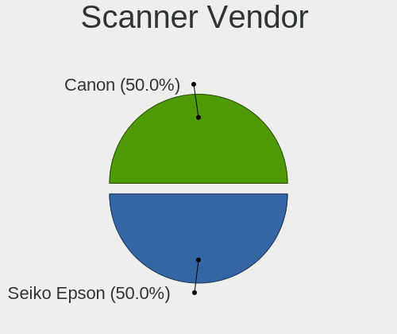

| Vendor      | Computers | Percent |
|-------------|-----------|---------|
| Canon       | 3         | 60%     |
| Seiko Epson | 2         | 40%     |

Scanner Model
-------------

Scanner device models

| Model                                         | Computers | Percent |
|-----------------------------------------------|-----------|---------|
| Canon CanoScan LiDE 210                       | 2         | 40%     |
| Seiko Epson Stylus Photo RX500/510            | 1         | 20%     |
| Seiko Epson GT-8300UF [Perfection 1660 PHOTO] | 1         | 20%     |
| Canon CanoScan LiDE 110                       | 1         | 20%     |

Camera
------

Camera Vendor
-------------

Camera device vendors

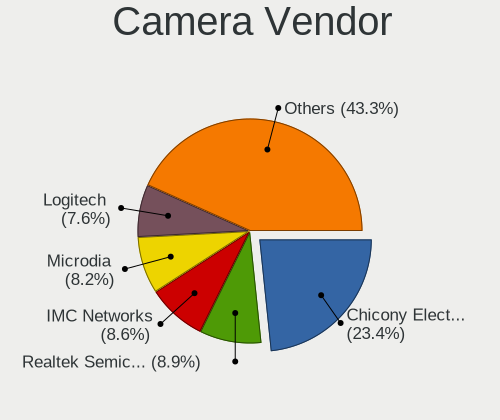

| Vendor                                 | Computers | Percent |
|----------------------------------------|-----------|---------|
| Chicony Electronics                    | 71        | 22.9%   |
| Microdia                               | 27        | 8.71%   |
| Quanta                                 | 23        | 7.42%   |
| Realtek Semiconductor                  | 20        | 6.45%   |
| Sunplus Innovation Technology          | 19        | 6.13%   |
| IMC Networks                           | 19        | 6.13%   |
| Acer                                   | 17        | 5.48%   |
| Logitech                               | 15        | 4.84%   |
| Suyin                                  | 13        | 4.19%   |
| Cheng Uei Precision Industry (Foxlink) | 13        | 4.19%   |
| Syntek                                 | 7         | 2.26%   |
| Apple                                  | 7         | 2.26%   |
| Z-Star Microelectronics                | 6         | 1.94%   |
| Silicon Motion                         | 5         | 1.61%   |
| Microsoft                              | 5         | 1.61%   |
| Ricoh                                  | 4         | 1.29%   |
| Lite-On Technology                     | 4         | 1.29%   |
| Luxvisions Innotech Limited            | 3         | 0.97%   |
| DLEQNA19IESZE9                         | 3         | 0.97%   |
| Alcor Micro                            | 3         | 0.97%   |
| Y Media                                | 2         | 0.65%   |
| OmniVision Technologies                | 2         | 0.65%   |
| Lenovo                                 | 2         | 0.65%   |
| Generalplus Technology                 | 2         | 0.65%   |
| DigiTech                               | 2         | 0.65%   |
| ARC International                      | 2         | 0.65%   |
| Xiaomi                                 | 1         | 0.32%   |
| Philips (or NXP)                       | 1         | 0.32%   |
| Nokia Mobile Phones                    | 1         | 0.32%   |
| Nikon                                  | 1         | 0.32%   |
| Nebraska Furniture Mart                | 1         | 0.32%   |
| MacroSilicon                           | 1         | 0.32%   |
| LG Electronics                         | 1         | 0.32%   |
| KYE Systems (Mouse Systems)            | 1         | 0.32%   |
| Intel                                  | 1         | 0.32%   |
| Importek                               | 1         | 0.32%   |
| HRY                                    | 1         | 0.32%   |
| eMPIA Technology                       | 1         | 0.32%   |
| DJKANA1RSEXXVE                         | 1         | 0.32%   |
| Alpha Imaging Technology               | 1         | 0.32%   |

Camera Model
------------

Camera device models

| Model                                                | Computers | Percent |
|------------------------------------------------------|-----------|---------|
| Chicony Integrated Camera                            | 13        | 4.19%   |
| Microdia Integrated_Webcam_HD                        | 8         | 2.58%   |
| Quanta HD User Facing                                | 7         | 2.26%   |
| Realtek Integrated_Webcam_HD                         | 6         | 1.94%   |
| Syntek Integrated Camera                             | 5         | 1.61%   |
| Chicony HP Truevision HD                             | 5         | 1.61%   |
| Quanta HP TrueVision HD Camera                       | 4         | 1.29%   |
| Microsoft LifeCam HD-3000                            | 4         | 1.29%   |
| Microdia Webcam Vitade AF                            | 4         | 1.29%   |
| Logitech Webcam C270                                 | 4         | 1.29%   |
| IMC Networks Integrated Camera                       | 4         | 1.29%   |
| Chicony HD WebCam                                    | 4         | 1.29%   |
| Chicony EasyCamera                                   | 4         | 1.29%   |
| Sunplus Laptop Integrated Webcam HD                  | 3         | 0.97%   |
| Sunplus Integrated_Webcam_HD                         | 3         | 0.97%   |
| Realtek USB Camera                                   | 3         | 0.97%   |
| Microdia Sonix USB 2.0 Camera                        | 3         | 0.97%   |
| IMC Networks USB2.0 HD UVC WebCam                    | 3         | 0.97%   |
| DLEQNA19IESZE9 HP TrueVision HD Camera               | 3         | 0.97%   |
| Chicony USB2.0 HD UVC WebCam                         | 3         | 0.97%   |
| Chicony Lenovo EasyCamera                            | 3         | 0.97%   |
| Acer Integrated Camera                               | 3         | 0.97%   |
| Z-Star Venus USB2.0 Camera                           | 2         | 0.65%   |
| Y Media USB Camera                                   | 2         | 0.65%   |
| Sunplus HP HD Webcam [Fixed]                         | 2         | 0.65%   |
| Sunplus HD WebCam                                    | 2         | 0.65%   |
| Silicon Motion WebCam SC-0311139N                    | 2         | 0.65%   |
| Realtek Integrated Webcam                            | 2         | 0.65%   |
| Realtek Acer 640 x 480 laptop camera                 | 2         | 0.65%   |
| Quanta Laptop_Integrated_Webcam_2HDM                 | 2         | 0.65%   |
| Quanta HP Webcam                                     | 2         | 0.65%   |
| Quanta HP HD Camera                                  | 2         | 0.65%   |
| Microdia Integrated Webcam                           | 2         | 0.65%   |
| Luxvisions Innotech Limited HP TrueVision HD Camera  | 2         | 0.65%   |
| Logitech Webcam C310                                 | 2         | 0.65%   |
| Logitech HD Pro Webcam C920                          | 2         | 0.65%   |
| Lite-On HP Wide Vision HD Camera                     | 2         | 0.65%   |
| Lenovo Integrated Webcam [R5U877]                    | 2         | 0.65%   |
| IMC Networks USB2.0 VGA UVC WebCam                   | 2         | 0.65%   |
| IMC Networks USB2.0 UVC HD Webcam                    | 2         | 0.65%   |
| Generalplus GENERAL WEBCAM                           | 2         | 0.65%   |
| Chicony VGA Webcam                                   | 2         | 0.65%   |
| Chicony USB2.0 VGA UVC WebCam                        | 2         | 0.65%   |
| Chicony HP Wide Vision HD Camera                     | 2         | 0.65%   |
| Chicony HP Webcam [2 MP Macro]                       | 2         | 0.65%   |
| Chicony HP Webcam                                    | 2         | 0.65%   |
| Chicony HP TrueVision HD Camera                      | 2         | 0.65%   |
| Chicony HP HD Camera                                 | 2         | 0.65%   |
| Chicony HD WebCam (Acer)                             | 2         | 0.65%   |
| Chicony HD User Facing                               | 2         | 0.65%   |
| Cheng Uei Precision Industry (Foxlink) Webcam        | 2         | 0.65%   |
| Cheng Uei Precision Industry (Foxlink) HP Webcam-101 | 2         | 0.65%   |
| ARC International Camera                             | 2         | 0.65%   |
| Apple FaceTime HD Camera (Built-in)                  | 2         | 0.65%   |
| Apple FaceTime HD Camera                             | 2         | 0.65%   |
| Apple Built-in iSight                                | 2         | 0.65%   |
| Alcor Micro USB 2.0 PC Camera                        | 2         | 0.65%   |
| Acer EasyCamera                                      | 2         | 0.65%   |
| Z-Star Webcam                                        | 1         | 0.32%   |
| Z-Star Sirius USB2.0 Camera                          | 1         | 0.32%   |

Security
--------

Fingerprint Vendor
------------------

Fingerprint sensor vendors

| Vendor                     | Computers | Percent |
|----------------------------|-----------|---------|
| Validity Sensors           | 17        | 36.96%  |
| Synaptics                  | 9         | 19.57%  |
| AuthenTec                  | 7         | 15.22%  |
| Upek                       | 5         | 10.87%  |
| LighTuning Technology      | 5         | 10.87%  |
| Shenzhen Goodix Technology | 3         | 6.52%   |

Fingerprint Model
-----------------

Fingerprint sensor models

| Model                                                      | Computers | Percent |
|------------------------------------------------------------|-----------|---------|
| Upek Biometric Touchchip/Touchstrip Fingerprint Sensor     | 5         | 10.87%  |
| Validity Sensors VFS 5011 fingerprint sensor               | 4         | 8.7%    |
| Validity Sensors VFS495 Fingerprint Reader                 | 3         | 6.52%   |
| Synaptics Prometheus MIS Touch Fingerprint Reader          | 3         | 6.52%   |
| Validity Sensors VFS5011 Fingerprint Reader                | 2         | 4.35%   |
| Validity Sensors VFS471 Fingerprint Reader                 | 2         | 4.35%   |
| Validity Sensors Fingerprint scanner                       | 2         | 4.35%   |
| Synaptics  FS7604 Touch Fingerprint Sensor with PurePrint  | 2         | 4.35%   |
| Shenzhen Goodix  FingerPrint Device                        | 2         | 4.35%   |
| LighTuning Fingerprint Reader                              | 2         | 4.35%   |
| LighTuning EgisTec Touch Fingerprint Sensor                | 2         | 4.35%   |
| AuthenTec Fingerprint Sensor                               | 2         | 4.35%   |
| AuthenTec AES2501 Fingerprint Sensor                       | 2         | 4.35%   |
| Unknown                                                    | 2         | 4.35%   |
| Validity Sensors VFS491                                    | 1         | 2.17%   |
| Validity Sensors VFS451 Fingerprint Reader                 | 1         | 2.17%   |
| Validity Sensors VFS300 Fingerprint Reader                 | 1         | 2.17%   |
| Validity Sensors Synaptics WBDI                            | 1         | 2.17%   |
| Synaptics  WBDI                                            | 1         | 2.17%   |
| Synaptics  VFS7552 Touch Fingerprint Sensor with PurePrint | 1         | 2.17%   |
| Shenzhen Goodix Fingerprint Reader                         | 1         | 2.17%   |
| LighTuning ES603 Swipe Fingerprint Sensor                  | 1         | 2.17%   |
| AuthenTec AES2810                                          | 1         | 2.17%   |
| AuthenTec AES2550 Fingerprint Sensor                       | 1         | 2.17%   |
| AuthenTec AES1600                                          | 1         | 2.17%   |

Chipcard Vendor
---------------

Chipcard module vendors

| Vendor           | Computers | Percent |
|------------------|-----------|---------|
| Broadcom         | 14        | 58.33%  |
| Alcor Micro      | 7         | 29.17%  |
| Upek             | 1         | 4.17%   |
| SCM Microsystems | 1         | 4.17%   |
| Lenovo           | 1         | 4.17%   |

Chipcard Model
--------------

Chipcard module models

| Model                                                                        | Computers | Percent |
|------------------------------------------------------------------------------|-----------|---------|
| Broadcom BCM5880 Secure Applications Processor                               | 7         | 29.17%  |
| Alcor Micro AU9540 Smartcard Reader                                          | 7         | 29.17%  |
| Broadcom BCM5880 Secure Applications Processor with fingerprint swipe sensor | 3         | 12.5%   |
| Broadcom 5880                                                                | 2         | 8.33%   |
| Broadcom 58200                                                               | 2         | 8.33%   |
| Upek TouchChip Fingerprint Coprocessor (WBF advanced mode)                   | 1         | 4.17%   |
| SCM Microsystems SCR3340 - ExpressCard54 Smart Card Reader                   | 1         | 4.17%   |
| Lenovo Integrated Smart Card Reader                                          | 1         | 4.17%   |

Unsupported
-----------

Unsupported Devices
-------------------

Total unsupported devices on board

| Total | Computers | Percent |
|-------|-----------|---------|
| 0     | 360       | 69.9%   |
| 1     | 117       | 22.72%  |
| 2     | 33        | 6.41%   |
| 3     | 3         | 0.58%   |
| 4     | 2         | 0.39%   |

Unsupported Device Types
------------------------

Types of unsupported devices

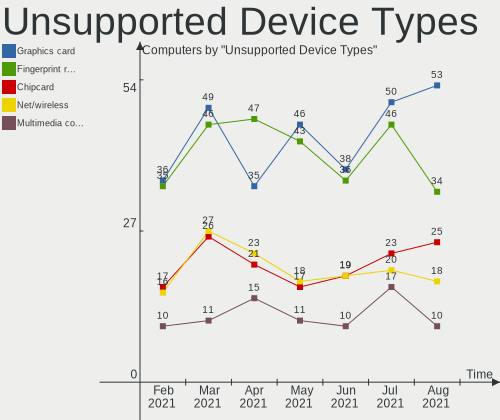

| Type                     | Computers | Percent |
|--------------------------|-----------|---------|
| Graphics card            | 50        | 25.64%  |
| Fingerprint reader       | 46        | 23.59%  |
| Chipcard                 | 23        | 11.79%  |
| Net/wireless             | 20        | 10.26%  |
| Multimedia controller    | 17        | 8.72%   |
| Communication controller | 12        | 6.15%   |
| Bluetooth                | 6         | 3.08%   |
| Sound                    | 4         | 2.05%   |
| Card reader              | 4         | 2.05%   |
| Camera                   | 4         | 2.05%   |
| Storage                  | 3         | 1.54%   |
| Unassigned class         | 2         | 1.03%   |
| Network                  | 2         | 1.03%   |
| Storage/ide              | 1         | 0.51%   |
| Net/ethernet             | 1         | 0.51%   |

