Mint Hardware Trends
--------------------

A project to identify most popular hardware characteristics and track their change
over time based on data collected by Mint users at https://Linux-Hardware.org.

Anyone can contribute to the study by uploading probes of their computers by
the [hw-probe](https://github.com/linuxhw/hw-probe) tool:

    sudo -E hw-probe -all -upload

This is a report for all computer types. See also reports for [desktops](/Dist/Mint/Desktop/README.md) and [notebooks](/Dist/Mint/Notebook/README.md).

Full-feature report is available here: https://linux-hardware.org/?view=trends

Period: Mar, 2021.

Contents
--------

- [ OS                       ](#os)
- [ OS Family                ](#os-family)
- [ Kernel                   ](#kernel)
- [ Kernel Family            ](#kernel-family)
- [ Kernel Major Ver.        ](#kernel-major-ver)
- [ Arch                     ](#arch)
- [ DE                       ](#de)
- [ Display Server           ](#display-server)
- [ Display Manager          ](#display-manager)
- [ OS Lang                  ](#os-lang)
- [ Boot Mode                ](#boot-mode)
- [ Filesystem               ](#filesystem)
- [ Part. scheme             ](#part-scheme)
- [ Dual Boot with Linux/BSD ](#dual-boot-with-linux/bsd)
- [ Dual Boot (Win)          ](#dual-boot-win)
- [ Country                  ](#country)
- [ City                     ](#city)
- [ Vendor                   ](#vendor)
- [ Model                    ](#model)
- [ Model Family             ](#model-family)
- [ MFG Year                 ](#mfg-year)
- [ Form Factor              ](#form-factor)
- [ Secure Boot              ](#secure-boot)
- [ Coreboot                 ](#coreboot)
- [ RAM Size                 ](#ram-size)
- [ RAM Used                 ](#ram-used)
- [ Has CD-ROM               ](#has-cd-rom)
- [ Total Drives             ](#total-drives)
- [ Has Ethernet             ](#has-ethernet)
- [ Has WiFi                 ](#has-wifi)
- [ Has Bluetooth            ](#has-bluetooth)
- [ Drive Vendor             ](#drive-vendor)
- [ Drive Model              ](#drive-model)
- [ HDD Vendor               ](#hdd-vendor)
- [ SSD Vendor               ](#ssd-vendor)
- [ Drive Kind               ](#drive-kind)
- [ Drive Connector          ](#drive-connector)
- [ Drive Size               ](#drive-size)
- [ Space Total              ](#space-total)
- [ Space Used               ](#space-used)
- [ Malfunc. Drives          ](#malfunc-drives)
- [ Malfunc. Drive Vendor    ](#malfunc-drive-vendor)
- [ Malfunc. HDD Vendor      ](#malfunc-hdd-vendor)
- [ Malfunc. Drive Kind      ](#malfunc-drive-kind)
- [ Failed Drives            ](#failed-drives)
- [ Failed Drive Vendor      ](#failed-drive-vendor)
- [ Drive Status             ](#drive-status)
- [ Storage Vendor           ](#storage-vendor)
- [ Storage Model            ](#storage-model)
- [ Storage Kind             ](#storage-kind)
- [ CPU Vendor               ](#cpu-vendor)
- [ CPU Model                ](#cpu-model)
- [ CPU Model Family         ](#cpu-model-family)
- [ CPU Cores                ](#cpu-cores)
- [ CPU Sockets              ](#cpu-sockets)
- [ CPU Threads              ](#cpu-threads)
- [ CPU Op-Modes             ](#cpu-op-modes)
- [ CPU Microcode            ](#cpu-microcode)
- [ CPU Microarch            ](#cpu-microarch)
- [ GPU Vendor               ](#gpu-vendor)
- [ GPU Model                ](#gpu-model)
- [ GPU Combo                ](#gpu-combo)
- [ GPU Driver               ](#gpu-driver)
- [ GPU Memory               ](#gpu-memory)
- [ Monitor Vendor           ](#monitor-vendor)
- [ Monitor Model            ](#monitor-model)
- [ Monitor Resolution       ](#monitor-resolution)
- [ Monitor Diagonal         ](#monitor-diagonal)
- [ Monitor Width            ](#monitor-width)
- [ Aspect Ratio             ](#aspect-ratio)
- [ Monitor Area             ](#monitor-area)
- [ Pixel Density            ](#pixel-density)
- [ Multiple Monitors        ](#multiple-monitors)
- [ Net Controller Vendor    ](#net-controller-vendor)
- [ Net Controller Model     ](#net-controller-model)
- [ Wireless Vendor          ](#wireless-vendor)
- [ Wireless Model           ](#wireless-model)
- [ Ethernet Vendor          ](#ethernet-vendor)
- [ Ethernet Model           ](#ethernet-model)
- [ Net Controller Kind      ](#net-controller-kind)
- [ Used Controller          ](#used-controller)
- [ NICs                     ](#nics)
- [ IPv6                     ](#ipv6)
- [ Memory Vendor            ](#memory-vendor)
- [ Memory Model             ](#memory-model)
- [ Memory Kind              ](#memory-kind)
- [ Memory Form Factor       ](#memory-form-factor)
- [ Memory Size              ](#memory-size)
- [ Memory Speed             ](#memory-speed)
- [ Sound Vendor             ](#sound-vendor)
- [ Sound Model              ](#sound-model)
- [ Camera Vendor            ](#camera-vendor)
- [ Camera Model             ](#camera-model)
- [ Fingerprint Vendor       ](#fingerprint-vendor)
- [ Fingerprint Model        ](#fingerprint-model)
- [ Chipcard Vendor          ](#chipcard-vendor)
- [ Chipcard Model           ](#chipcard-model)
- [ Printer Vendor           ](#printer-vendor)
- [ Printer Model            ](#printer-model)
- [ Scanner Vendor           ](#scanner-vendor)
- [ Scanner Model            ](#scanner-model)
- [ Bluetooth Vendor         ](#bluetooth-vendor)
- [ Bluetooth Model          ](#bluetooth-model)
- [ Unsupported Devices      ](#unsupported-devices)
- [ Unsupported Device Types ](#unsupported-device-types)

OS
--

Installed operating systems

| Name      | Computers | Percent |
|-----------|-----------|---------|
| Mint 20.1 | 413       | 69.88%  |
| Mint 19.3 | 75        | 12.69%  |
| Mint 20   | 64        | 10.83%  |
| Mint 19.1 | 16        | 2.71%   |
| Mint 19.2 | 10        | 1.69%   |
| Mint 19   | 6         | 1.02%   |
| Mint 18.3 | 6         | 1.02%   |
| Mint 17.3 | 1         | 0.17%   |

OS Family
---------

OS without a version

| Name | Computers | Percent |
|------|-----------|---------|
| Mint | 591       | 100%    |

Kernel
------

Version of the Linux kernel

| Version                    | Computers | Percent |
|----------------------------|-----------|---------|
| 5.4.0-66-generic           | 231       | 39.09%  |
| 5.4.0-67-generic           | 105       | 17.77%  |
| 5.4.0-70-generic           | 71        | 12.01%  |
| 5.4.0-58-generic           | 33        | 5.58%   |
| 5.8.0-45-generic           | 18        | 3.05%   |
| 5.8.0-44-generic           | 18        | 3.05%   |
| 5.4.0-65-generic           | 18        | 3.05%   |
| 5.4.0-26-generic           | 12        | 2.03%   |
| 4.15.0-136-generic         | 9         | 1.52%   |
| 5.8.0-48-generic           | 5         | 0.85%   |
| 5.4.0-62-generic           | 5         | 0.85%   |
| 5.0.0-32-generic           | 5         | 0.85%   |
| 4.15.0-137-generic         | 5         | 0.85%   |
| 5.8.0-43-generic           | 4         | 0.68%   |
| 4.15.0-20-generic          | 4         | 0.68%   |
| 4.15.0-139-generic         | 4         | 0.68%   |
| 4.15.0-54-generic          | 3         | 0.51%   |
| 4.15.0-140-generic         | 3         | 0.51%   |
| 5.4.0-56-generic           | 2         | 0.34%   |
| 5.4.0-54-generic           | 2         | 0.34%   |
| 4.15.0-66-generic          | 2         | 0.34%   |
| 4.15.0-135-generic         | 2         | 0.34%   |
| 4.10.0-38-generic          | 2         | 0.34%   |
| 5.9.4-050904-generic       | 1         | 0.17%   |
| 5.9.16-050916-generic      | 1         | 0.17%   |
| 5.9.1-050901-lowlatency    | 1         | 0.17%   |
| 5.8.0-7625-generic         | 1         | 0.17%   |
| 5.8.0-44-lowlatency        | 1         | 0.17%   |
| 5.8.0-432102030405-generic | 1         | 0.17%   |
| 5.8.0-41-lowlatency        | 1         | 0.17%   |
| 5.6.0-1052-oem             | 1         | 0.17%   |
| 5.6.0-1048-oem             | 1         | 0.17%   |
| 5.4.105-xanmod1            | 1         | 0.17%   |
| 5.4.0-68-generic           | 1         | 0.17%   |
| 5.4.0-67-lowlatency        | 1         | 0.17%   |
| 5.4.0-60-generic           | 1         | 0.17%   |
| 5.4.0-47-generic           | 1         | 0.17%   |
| 5.4.0-45-generic           | 1         | 0.17%   |
| 5.4.0-39-generic           | 1         | 0.17%   |
| 5.3.0-42-generic           | 1         | 0.17%   |
| 5.11.8-051108-generic      | 1         | 0.17%   |
| 5.11.6-xanmod1-cacule      | 1         | 0.17%   |
| 5.11.0-051100-generic      | 1         | 0.17%   |
| 5.10.21-051021-generic     | 1         | 0.17%   |
| 5.10.15-051015-generic     | 1         | 0.17%   |
| 5.10.0-1016-oem            | 1         | 0.17%   |
| 4.4.0-206-generic          | 1         | 0.17%   |
| 4.4.0-170-generic          | 1         | 0.17%   |
| 4.15.0-132-generic         | 1         | 0.17%   |
| 4.15.0-118-generic         | 1         | 0.17%   |
| 4.13.0-45-generic          | 1         | 0.17%   |

Kernel Family
-------------

Linux kernel without a distro release

| Version | Computers | Percent |
|---------|-----------|---------|
| 5.4.0   | 485       | 82.06%  |
| 5.8.0   | 49        | 8.29%   |
| 4.15.0  | 34        | 5.75%   |
| 5.0.0   | 5         | 0.85%   |
| 5.6.0   | 2         | 0.34%   |
| 4.4.0   | 2         | 0.34%   |
| 4.10.0  | 2         | 0.34%   |
| 5.9.4   | 1         | 0.17%   |
| 5.9.16  | 1         | 0.17%   |
| 5.9.1   | 1         | 0.17%   |
| 5.4.105 | 1         | 0.17%   |
| 5.3.0   | 1         | 0.17%   |
| 5.11.8  | 1         | 0.17%   |
| 5.11.6  | 1         | 0.17%   |
| 5.11.0  | 1         | 0.17%   |
| 5.10.21 | 1         | 0.17%   |
| 5.10.15 | 1         | 0.17%   |
| 5.10.0  | 1         | 0.17%   |
| 4.13.0  | 1         | 0.17%   |

Kernel Major Ver.
-----------------

Linux kernel major version

| Version | Computers | Percent |
|---------|-----------|---------|
| 5.4     | 486       | 82.23%  |
| 5.8     | 49        | 8.29%   |
| 4.15    | 34        | 5.75%   |
| 5.0     | 5         | 0.85%   |
| 5.9     | 3         | 0.51%   |
| 5.11    | 3         | 0.51%   |
| 5.10    | 3         | 0.51%   |
| 5.6     | 2         | 0.34%   |
| 4.4     | 2         | 0.34%   |
| 4.10    | 2         | 0.34%   |
| 5.3     | 1         | 0.17%   |
| 4.13    | 1         | 0.17%   |

Arch
----

OS architecture (x86_64, i586, etc.)

| Name   | Computers | Percent |
|--------|-----------|---------|
| x86_64 | 556       | 94.08%  |
| i686   | 35        | 5.92%   |

DE
--

Desktop Environment

| Name       | Computers | Percent |
|------------|-----------|---------|
| X-Cinnamon | 393       | 66.5%   |
| XFCE       | 72        | 12.18%  |
| MATE       | 63        | 10.66%  |
| Cinnamon   | 30        | 5.08%   |
| Unknown    | 18        | 3.05%   |
| GNOME      | 10        | 1.69%   |
| KDE        | 2         | 0.34%   |
| LXQt       | 1         | 0.17%   |
| KDE5       | 1         | 0.17%   |
| i3         | 1         | 0.17%   |

Display Server
--------------

X11 or Wayland

| Name    | Computers | Percent |
|---------|-----------|---------|
| X11     | 586       | 99.15%  |
| Wayland | 2         | 0.34%   |
| Tty     | 2         | 0.34%   |
| Unknown | 1         | 0.17%   |

Display Manager
---------------

SDDM, LightDM, etc.

| Name    | Computers | Percent |
|---------|-----------|---------|
| Unknown | 443       | 74.96%  |
| TDM     | 145       | 24.53%  |
| SDDM    | 1         | 0.17%   |
| MDM     | 1         | 0.17%   |
| Ly      | 1         | 0.17%   |

OS Lang
-------

Language

| Lang       | Computers | Percent |
|------------|-----------|---------|
| en_US      | 179       | 30.29%  |
| de_DE      | 69        | 11.68%  |
| pt_BR      | 45        | 7.61%   |
| ru_RU      | 32        | 5.41%   |
| fr_FR      | 32        | 5.41%   |
| en_GB      | 31        | 5.25%   |
| pl_PL      | 22        | 3.72%   |
| C          | 22        | 3.72%   |
| en_CA      | 20        | 3.38%   |
| it_IT      | 16        | 2.71%   |
| es_ES      | 14        | 2.37%   |
| en_AU      | 9         | 1.52%   |
| es_AR      | 8         | 1.35%   |
| nl_NL      | 7         | 1.18%   |
| en_IN      | 6         | 1.02%   |
| de_CH      | 6         | 1.02%   |
| ru_UA      | 5         | 0.85%   |
| pt_PT      | 5         | 0.85%   |
| hu_HU      | 4         | 0.68%   |
| fr_CA      | 4         | 0.68%   |
| es_MX      | 4         | 0.68%   |
| fi_FI      | 3         | 0.51%   |
| de_AT      | 3         | 0.51%   |
| Unknown    | 3         | 0.51%   |
| uk_UA      | 2         | 0.34%   |
| tr_TR      | 2         | 0.34%   |
| sv_SE      | 2         | 0.34%   |
| ro_RO      | 2         | 0.34%   |
| nl_BE      | 2         | 0.34%   |
| fr_CH      | 2         | 0.34%   |
| fr_BE      | 2         | 0.34%   |
| es_CL      | 2         | 0.34%   |
| en_ZA      | 2         | 0.34%   |
| en_NZ      | 2         | 0.34%   |
| en_IL      | 2         | 0.34%   |
| en_IE      | 2         | 0.34%   |
| el_GR      | 2         | 0.34%   |
| cs_CZ      | 2         | 0.34%   |
| ca_ES      | 2         | 0.34%   |
| bg_BG      | 2         | 0.34%   |
| ru_RU.UTF8 | 1         | 0.17%   |
| lzh_TW     | 1         | 0.17%   |
| lt_LT      | 1         | 0.17%   |
| ja_JP      | 1         | 0.17%   |
| hr_HR      | 1         | 0.17%   |
| he_IL      | 1         | 0.17%   |
| es_UY      | 1         | 0.17%   |
| es_GT      | 1         | 0.17%   |
| es_EC      | 1         | 0.17%   |
| es_BO      | 1         | 0.17%   |

Boot Mode
---------

EFI or BIOS

| Mode | Computers | Percent |
|------|-----------|---------|
| BIOS | 349       | 59.05%  |
| EFI  | 242       | 40.95%  |

Filesystem
----------

Type of filesystem

| Type    | Computers | Percent |
|---------|-----------|---------|
| Ext4    | 558       | 94.42%  |
| Overlay | 19        | 3.21%   |
| Btrfs   | 8         | 1.35%   |
| Ext2    | 3         | 0.51%   |
| Xfs     | 2         | 0.34%   |
| Ext3    | 1         | 0.17%   |

Part. scheme
------------

Scheme of partitioning

| Type    | Computers | Percent |
|---------|-----------|---------|
| Unknown | 433       | 73.27%  |
| GPT     | 95        | 16.07%  |
| MBR     | 63        | 10.66%  |

Dual Boot with Linux/BSD
------------------------

Hosting more than one Linux/BSD

| Dual boot | Computers | Percent |
|-----------|-----------|---------|
| No        | 560       | 94.75%  |
| Yes       | 31        | 5.25%   |

Dual Boot (Win)
---------------

Hosting Linux and Windows

| Dual boot | Computers | Percent |
|-----------|-----------|---------|
| No        | 516       | 87.31%  |
| Yes       | 75        | 12.69%  |

Country
-------

Geographic location (country)

| Country                | Computers | Percent |
|------------------------|-----------|---------|
| USA                    | 115       | 19.46%  |
| Germany                | 75        | 12.69%  |
| Brazil                 | 58        | 9.81%   |
| France                 | 32        | 5.41%   |
| Russia                 | 29        | 4.91%   |
| UK                     | 28        | 4.74%   |
| Poland                 | 25        | 4.23%   |
| Canada                 | 24        | 4.06%   |
| Switzerland            | 15        | 2.54%   |
| Ukraine                | 14        | 2.37%   |
| Spain                  | 13        | 2.2%    |
| Italy                  | 13        | 2.2%    |
| Netherlands            | 10        | 1.69%   |
| Argentina              | 10        | 1.69%   |
| Belgium                | 9         | 1.52%   |
| Australia              | 8         | 1.35%   |
| Sweden                 | 7         | 1.18%   |
| Mexico                 | 7         | 1.18%   |
| Austria                | 7         | 1.18%   |
| India                  | 6         | 1.02%   |
| Finland                | 6         | 1.02%   |
| Bulgaria               | 6         | 1.02%   |
| Turkey                 | 5         | 0.85%   |
| Portugal               | 5         | 0.85%   |
| Hungary                | 5         | 0.85%   |
| Israel                 | 4         | 0.68%   |
| Serbia                 | 3         | 0.51%   |
| Romania                | 3         | 0.51%   |
| Latvia                 | 3         | 0.51%   |
| Czechia                | 3         | 0.51%   |
| Belarus                | 3         | 0.51%   |
| Taiwan                 | 2         | 0.34%   |
| South Africa           | 2         | 0.34%   |
| Slovakia               | 2         | 0.34%   |
| New Zealand            | 2         | 0.34%   |
| Lithuania              | 2         | 0.34%   |
| Japan                  | 2         | 0.34%   |
| Greece                 | 2         | 0.34%   |
| Costa Rica             | 2         | 0.34%   |
| Bosnia and Herzegovina | 2         | 0.34%   |
| Uruguay                | 1         | 0.17%   |
| Slovenia               | 1         | 0.17%   |
| Singapore              | 1         | 0.17%   |
| Saudi Arabia           | 1         | 0.17%   |
| Qatar                  | 1         | 0.17%   |
| Peru                   | 1         | 0.17%   |
| Panama                 | 1         | 0.17%   |
| Norway                 | 1         | 0.17%   |
| Montenegro             | 1         | 0.17%   |
| Moldova                | 1         | 0.17%   |
| Ireland                | 1         | 0.17%   |
| Iran                   | 1         | 0.17%   |
| Indonesia              | 1         | 0.17%   |
| Guatemala              | 1         | 0.17%   |
| Estonia                | 1         | 0.17%   |
| Ecuador                | 1         | 0.17%   |
| Croatia                | 1         | 0.17%   |
| Chile                  | 1         | 0.17%   |
| Burkina Faso           | 1         | 0.17%   |
| Bolivia                | 1         | 0.17%   |

City
----

Geographic location (city)

| City                | Computers | Percent |
|---------------------|-----------|---------|
| Rockville           | 8         | 1.35%   |
| São Paulo          | 7         | 1.18%   |
| Moscow              | 7         | 1.18%   |
| Berlin              | 7         | 1.18%   |
| St Petersburg       | 6         | 1.02%   |
| Warsaw              | 5         | 0.85%   |
| Vienna              | 5         | 0.85%   |
| Porto Alegre        | 4         | 0.68%   |
| London              | 4         | 0.68%   |
| Bremen              | 4         | 0.68%   |
| Zurich              | 3         | 0.51%   |
| Wroclaw             | 3         | 0.51%   |
| Tel Aviv            | 3         | 0.51%   |
| Rome                | 3         | 0.51%   |
| Rio de Janeiro      | 3         | 0.51%   |
| Odessa              | 3         | 0.51%   |
| Minsk               | 3         | 0.51%   |
| Miami               | 3         | 0.51%   |
| Los Angeles         | 3         | 0.51%   |
| Kyiv                | 3         | 0.51%   |
| Istanbul            | 3         | 0.51%   |
| Helsinki            | 3         | 0.51%   |
| Hamburg             | 3         | 0.51%   |
| Ganterschwil        | 3         | 0.51%   |
| Florianópolis      | 3         | 0.51%   |
| Eugene              | 3         | 0.51%   |
| Amsterdam           | 3         | 0.51%   |
| Windsor             | 2         | 0.34%   |
| Wheaton             | 2         | 0.34%   |
| Villard-de-Lans     | 2         | 0.34%   |
| Toronto             | 2         | 0.34%   |
| São Caetano do Sul | 2         | 0.34%   |
| Stockholm           | 2         | 0.34%   |
| Spokane             | 2         | 0.34%   |
| Sofia               | 2         | 0.34%   |
| Seattle             | 2         | 0.34%   |
| Riga                | 2         | 0.34%   |
| Poznan              | 2         | 0.34%   |
| Paris               | 2         | 0.34%   |
| Novosibirsk         | 2         | 0.34%   |
| Nice                | 2         | 0.34%   |
| Minneapolis         | 2         | 0.34%   |
| Milan               | 2         | 0.34%   |
| Mendoza             | 2         | 0.34%   |
| La Grande           | 2         | 0.34%   |
| Joplin              | 2         | 0.34%   |
| Islington           | 2         | 0.34%   |
| Frankfurt am Main   | 2         | 0.34%   |
| Fayetteville        | 2         | 0.34%   |
| Elk Grove Village   | 2         | 0.34%   |
| Edmonton            | 2         | 0.34%   |
| Donetsk             | 2         | 0.34%   |
| Córdoba            | 2         | 0.34%   |
| Chicago             | 2         | 0.34%   |
| Chelyabinsk         | 2         | 0.34%   |
| Campinas            | 2         | 0.34%   |
| Brisbane            | 2         | 0.34%   |
| Bratislava          | 2         | 0.34%   |
| Bitterfeld-Wolfen   | 2         | 0.34%   |
| Belgrade            | 2         | 0.34%   |

Vendor
------

Motherboard manufacturer

| Name                    | Computers | Percent |
|-------------------------|-----------|---------|
| ASUSTek Computer        | 98        | 16.58%  |
| Hewlett-Packard         | 87        | 14.72%  |
| Dell                    | 86        | 14.55%  |
| Lenovo                  | 68        | 11.51%  |
| Gigabyte Technology     | 36        | 6.09%   |
| Acer                    | 30        | 5.08%   |
| ASRock                  | 27        | 4.57%   |
| MSI                     | 26        | 4.4%    |
| Toshiba                 | 17        | 2.88%   |
| Samsung Electronics     | 12        | 2.03%   |
| Intel                   | 11        | 1.86%   |
| Sony                    | 8         | 1.35%   |
| Apple                   | 8         | 1.35%   |
| Medion                  | 7         | 1.18%   |
| Pegatron                | 5         | 0.85%   |
| Fujitsu Siemens         | 5         | 0.85%   |
| Unknown                 | 5         | 0.85%   |
| Positivo                | 4         | 0.68%   |
| Packard Bell            | 4         | 0.68%   |
| Supermicro              | 3         | 0.51%   |
| ECS                     | 3         | 0.51%   |
| Tangent Computer        | 2         | 0.34%   |
| Shuttle                 | 2         | 0.34%   |
| Itautec                 | 2         | 0.34%   |
| Gateway                 | 2         | 0.34%   |
| Foxconn                 | 2         | 0.34%   |
| Biostar                 | 2         | 0.34%   |
| AZW                     | 2         | 0.34%   |
| ZOTAC                   | 1         | 0.17%   |
| TUXEDO                  | 1         | 0.17%   |
| TPV-INVENTA             | 1         | 0.17%   |
| Thomson                 | 1         | 0.17%   |
| SLIMBOOK                | 1         | 0.17%   |
| Semp Toshiba            | 1         | 0.17%   |
| Quest                   | 1         | 0.17%   |
| PCWare                  | 1         | 0.17%   |
| Panasonic               | 1         | 0.17%   |
| Notebook                | 1         | 0.17%   |
| Motion Computing        | 1         | 0.17%   |
| Minix                   | 1         | 0.17%   |
| Microsoft               | 1         | 0.17%   |
| Koloe                   | 1         | 0.17%   |
| Inventec                | 1         | 0.17%   |
| Info Quest Technologies | 1         | 0.17%   |
| IDEALMAX                | 1         | 0.17%   |
| HUAWEI                  | 1         | 0.17%   |
| HARDKERNEL              | 1         | 0.17%   |
| EVOO Products Company   | 1         | 0.17%   |
| EVGA                    | 1         | 0.17%   |
| Coradir                 | 1         | 0.17%   |
| Compal                  | 1         | 0.17%   |
| Clevo                   | 1         | 0.17%   |
| BCM                     | 1         | 0.17%   |
| AMI                     | 1         | 0.17%   |
| Alienware               | 1         | 0.17%   |

Model
-----

Motherboard model

| Name                                | Computers | Percent |
|-------------------------------------|-----------|---------|
| HP Pavilion dv7                     | 5         | 0.85%   |
| Dell OptiPlex 7010                  | 5         | 0.85%   |
| ASUS All Series                     | 5         | 0.85%   |
| Unknown                             | 5         | 0.85%   |
| MSI MS-7693                         | 4         | 0.68%   |
| Toshiba Satellite C660              | 3         | 0.51%   |
| MSI MS-7721                         | 3         | 0.51%   |
| ASUS PRIME B350-PLUS                | 3         | 0.51%   |
| Toshiba Satellite L40               | 2         | 0.34%   |
| Tangent Medix T19B                  | 2         | 0.34%   |
| Lenovo Y520-15IKBN 80WK             | 2         | 0.34%   |
| Lenovo IdeaPad 520-15IKB 81BF       | 2         | 0.34%   |
| HP Pavilion Gaming Laptop 17-cd1xxx | 2         | 0.34%   |
| HP Pavilion g7                      | 2         | 0.34%   |
| HP Pavilion g6                      | 2         | 0.34%   |
| HP Pavilion dv6                     | 2         | 0.34%   |
| HP G62                              | 2         | 0.34%   |
| HP EliteDesk 800 G1 SFF             | 2         | 0.34%   |
| HP Compaq Mini                      | 2         | 0.34%   |
| HP Compaq 8200 Elite CMT PC         | 2         | 0.34%   |
| HP 250 G8 Notebook PC               | 2         | 0.34%   |
| Gigabyte Z97X-Gaming 3              | 2         | 0.34%   |
| Gigabyte G31M-ES2L                  | 2         | 0.34%   |
| Gigabyte B450M DS3H                 | 2         | 0.34%   |
| Dell Vostro 3560                    | 2         | 0.34%   |
| Dell OptiPlex 790                   | 2         | 0.34%   |
| Dell OptiPlex 390                   | 2         | 0.34%   |
| Dell OptiPlex 3020                  | 2         | 0.34%   |
| Dell Latitude E7440                 | 2         | 0.34%   |
| Dell Latitude E6420                 | 2         | 0.34%   |
| Dell Inspiron 5521                  | 2         | 0.34%   |
| ASUS ROG STRIX B450-F GAMING        | 2         | 0.34%   |
| ASUS PRIME X370-PRO                 | 2         | 0.34%   |
| ASUS P8H67-M EVO                    | 2         | 0.34%   |
| ASUS P50IJ                          | 2         | 0.34%   |
| ASRock B550M Pro4                   | 2         | 0.34%   |
| ASRock B450M Pro4                   | 2         | 0.34%   |
| Acer Aspire 5741G                   | 2         | 0.34%   |
| Acer Aspire 5735                    | 2         | 0.34%   |
| ZOTAC ZBOXNXS-AD13                  | 1         | 0.17%   |
| TUXEDO P7xxTM1                      | 1         | 0.17%   |
| TPV-INVENTA 18-2003LA               | 1         | 0.17%   |
| Toshiba Satellite PRO NB10t-A-11J   | 1         | 0.17%   |
| Toshiba Satellite P300              | 1         | 0.17%   |
| Toshiba Satellite L855              | 1         | 0.17%   |
| Toshiba Satellite C855D             | 1         | 0.17%   |
| Toshiba Satellite C75D-C            | 1         | 0.17%   |
| Toshiba Satellite C55t-C            | 1         | 0.17%   |
| Toshiba Satellite C55-A             | 1         | 0.17%   |
| Toshiba Satellite C40D-A            | 1         | 0.17%   |
| Toshiba PORTEGE Z830                | 1         | 0.17%   |
| Toshiba PORTEGE Z30-A               | 1         | 0.17%   |
| Toshiba PORTEGE R830                | 1         | 0.17%   |
| Toshiba PORTEGE R500                | 1         | 0.17%   |
| Thomson HERO9.32B                   | 1         | 0.17%   |
| Supermicro X9DAi                    | 1         | 0.17%   |
| Supermicro X8DAL                    | 1         | 0.17%   |
| Supermicro P4DMS                    | 1         | 0.17%   |
| Sony VPCJ21S1E                      | 1         | 0.17%   |
| Sony VPCF11M1E                      | 1         | 0.17%   |

Model Family
------------

Motherboard model prefix

| Name                  | Computers | Percent |
|-----------------------|-----------|---------|
| Dell Inspiron         | 27        | 4.57%   |
| Lenovo ThinkPad       | 26        | 4.4%    |
| Acer Aspire           | 26        | 4.4%    |
| HP Pavilion           | 24        | 4.06%   |
| Dell Latitude         | 23        | 3.89%   |
| Lenovo IdeaPad        | 18        | 3.05%   |
| Dell OptiPlex         | 18        | 3.05%   |
| Toshiba Satellite     | 13        | 2.2%    |
| HP Compaq             | 13        | 2.2%    |
| ASUS PRIME            | 13        | 2.2%    |
| Dell Precision        | 9         | 1.52%   |
| HP EliteBook          | 8         | 1.35%   |
| ASUS TUF              | 7         | 1.18%   |
| ASUS ROG              | 7         | 1.18%   |
| Lenovo ThinkCentre    | 6         | 1.02%   |
| HP ProBook            | 6         | 1.02%   |
| HP Laptop             | 6         | 1.02%   |
| ASUS All              | 5         | 0.85%   |
| Unknown               | 5         | 0.85%   |
| Toshiba PORTEGE       | 4         | 0.68%   |
| MSI MS-7693           | 4         | 0.68%   |
| HP ENVY               | 4         | 0.68%   |
| HP 250                | 4         | 0.68%   |
| Fujitsu Siemens AMILO | 4         | 0.68%   |
| Dell XPS              | 4         | 0.68%   |
| ASUS M5A97            | 4         | 0.68%   |
| Packard Bell EasyNote | 3         | 0.51%   |
| MSI MS-7721           | 3         | 0.51%   |
| Lenovo Yoga           | 3         | 0.51%   |
| Gigabyte B450M        | 3         | 0.51%   |
| Dell Vostro           | 3         | 0.51%   |
| ASUS VivoBook         | 3         | 0.51%   |
| ASRock B450M          | 3         | 0.51%   |
| Tangent Medix         | 2         | 0.34%   |
| Lenovo Y520-15IKBN    | 2         | 0.34%   |
| Itautec Infoway       | 2         | 0.34%   |
| Intel H55             | 2         | 0.34%   |
| HP Stream             | 2         | 0.34%   |
| HP Mini               | 2         | 0.34%   |
| HP G62                | 2         | 0.34%   |
| HP EliteDesk          | 2         | 0.34%   |
| HP 15                 | 2         | 0.34%   |
| Gigabyte Z97X-Gaming  | 2         | 0.34%   |
| Gigabyte G31M-ES2L    | 2         | 0.34%   |
| Gigabyte B450         | 2         | 0.34%   |
| Gigabyte A320M-S2H    | 2         | 0.34%   |
| AZW Gemini            | 2         | 0.34%   |
| ASUS ZenBook          | 2         | 0.34%   |
| ASUS P8H67-M          | 2         | 0.34%   |
| ASUS P50IJ            | 2         | 0.34%   |
| ASUS M5A78L-M         | 2         | 0.34%   |
| ASRock B550M          | 2         | 0.34%   |
| ASRock B550           | 2         | 0.34%   |
| ZOTAC ZBOXNXS-AD13    | 1         | 0.17%   |
| TUXEDO P7xxTM1        | 1         | 0.17%   |
| TPV-INVENTA 18-2003LA | 1         | 0.17%   |
| Thomson HERO9.32B     | 1         | 0.17%   |
| Supermicro X9DAi      | 1         | 0.17%   |
| Supermicro X8DAL      | 1         | 0.17%   |
| Supermicro P4DMS      | 1         | 0.17%   |

MFG Year
--------

Motherboard manufacture year

| Year | Computers | Percent |
|------|-----------|---------|
| 2020 | 91        | 15.4%   |
| 2018 | 66        | 11.17%  |
| 2019 | 57        | 9.64%   |
| 2013 | 49        | 8.29%   |
| 2011 | 43        | 7.28%   |
| 2010 | 43        | 7.28%   |
| 2012 | 35        | 5.92%   |
| 2015 | 32        | 5.41%   |
| 2009 | 31        | 5.25%   |
| 2008 | 28        | 4.74%   |
| 2017 | 24        | 4.06%   |
| 2016 | 24        | 4.06%   |
| 2014 | 24        | 4.06%   |
| 2007 | 17        | 2.88%   |
| 2021 | 16        | 2.71%   |
| 2006 | 5         | 0.85%   |
| 2005 | 4         | 0.68%   |
| 2004 | 1         | 0.17%   |
| 2003 | 1         | 0.17%   |

Form Factor
-----------

Physical design of the computer

| Name        | Computers | Percent |
|-------------|-----------|---------|
| Notebook    | 316       | 53.47%  |
| Desktop     | 247       | 41.79%  |
| Mini pc     | 10        | 1.69%   |
| Convertible | 9         | 1.52%   |
| Tablet      | 3         | 0.51%   |
| All in one  | 3         | 0.51%   |
| Server      | 3         | 0.51%   |

Secure Boot
-----------

Enabled or disabled

| State    | Computers | Percent |
|----------|-----------|---------|
| Disabled | 554       | 93.74%  |
| Enabled  | 37        | 6.26%   |

Coreboot
--------

Have coreboot on board

| Used | Computers | Percent |
|------|-----------|---------|
| No   | 591       | 100%    |

RAM Size
--------

Total RAM memory

| Size in GB      | Computers | Percent |
|-----------------|-----------|---------|
| 3.01-4.0        | 137       | 23.18%  |
| 4.01-8.0        | 132       | 22.34%  |
| 16.01-24.0      | 110       | 18.61%  |
| 8.01-16.0       | 102       | 17.26%  |
| 32.01-64.0      | 42        | 7.11%   |
| 1.01-2.0        | 30        | 5.08%   |
| 2.01-3.0        | 20        | 3.38%   |
| 0.51-1.0        | 10        | 1.69%   |
| 24.01-32.0      | 4         | 0.68%   |
| 64.01-256.0     | 3         | 0.51%   |
| More than 256.0 | 1         | 0.17%   |

RAM Used
--------

Used RAM memory

| Used GB    | Computers | Percent |
|------------|-----------|---------|
| 1.01-2.0   | 269       | 45.52%  |
| 2.01-3.0   | 136       | 23.01%  |
| 0.51-1.0   | 55        | 9.31%   |
| 3.01-4.0   | 53        | 8.97%   |
| 4.01-8.0   | 50        | 8.46%   |
| 8.01-16.0  | 16        | 2.71%   |
| 0.01-0.5   | 9         | 1.52%   |
| 16.01-24.0 | 3         | 0.51%   |

Has CD-ROM
----------

Has CD-ROM on board

| Presented | Computers | Percent |
|-----------|-----------|---------|
| Yes       | 320       | 54.15%  |
| No        | 271       | 45.85%  |

Total Drives
------------

Number of drives on board

| Drives | Computers | Percent |
|--------|-----------|---------|
| 1      | 335       | 56.68%  |
| 2      | 167       | 28.26%  |
| 3      | 44        | 7.45%   |
| 4      | 28        | 4.74%   |
| 5      | 6         | 1.02%   |
| 0      | 4         | 0.68%   |
| 6      | 3         | 0.51%   |
| 8      | 2         | 0.34%   |
| 9      | 1         | 0.17%   |
| 7      | 1         | 0.17%   |

Has Ethernet
------------

Has Ethernet on board

| Presented | Computers | Percent |
|-----------|-----------|---------|
| Yes       | 542       | 91.71%  |
| No        | 49        | 8.29%   |

Has WiFi
--------

Has WiFi module

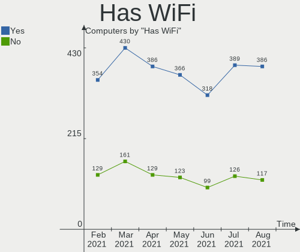

| Presented | Computers | Percent |
|-----------|-----------|---------|
| Yes       | 432       | 73.1%   |
| No        | 159       | 26.9%   |

Has Bluetooth
-------------

Has Bluetooth module

| Presented | Computers | Percent |
|-----------|-----------|---------|
| No        | 321       | 54.31%  |
| Yes       | 270       | 45.69%  |

Drive Vendor
------------

Hard drive vendors

| Vendor                    | Computers | Drives | Percent |
|---------------------------|-----------|--------|---------|
| WDC                       | 155       | 182    | 18.13%  |
| Seagate                   | 140       | 178    | 16.37%  |
| Samsung Electronics       | 114       | 140    | 13.33%  |
| Toshiba                   | 51        | 52     | 5.96%   |
| Hitachi                   | 46        | 47     | 5.38%   |
| Unknown                   | 44        | 48     | 5.15%   |
| SanDisk                   | 44        | 47     | 5.15%   |
| Kingston                  | 43        | 44     | 5.03%   |
| Crucial                   | 37        | 40     | 4.33%   |
| Intel                     | 19        | 21     | 2.22%   |
| A-DATA Technology         | 16        | 17     | 1.87%   |
| HGST                      | 15        | 15     | 1.75%   |
| SK Hynix                  | 13        | 13     | 1.52%   |
| Phison                    | 8         | 9      | 0.94%   |
| Maxtor                    | 8         | 9      | 0.94%   |
| Micron Technology         | 7         | 7      | 0.82%   |
| SPCC                      | 6         | 7      | 0.7%    |
| LITEON                    | 5         | 5      | 0.58%   |
| Fujitsu                   | 5         | 5      | 0.58%   |
| China                     | 5         | 5      | 0.58%   |
| Transcend                 | 4         | 5      | 0.47%   |
| OCZ                       | 4         | 5      | 0.47%   |
| GOODRAM                   | 4         | 4      | 0.47%   |
| Apacer                    | 4         | 4      | 0.47%   |
| XPG                       | 3         | 3      | 0.35%   |
| PLEXTOR                   | 3         | 3      | 0.35%   |
| KIOXIA                    | 3         | 3      | 0.35%   |
| JMicron                   | 3         | 3      | 0.35%   |
| Intenso                   | 3         | 3      | 0.35%   |
| Corsair                   | 3         | 3      | 0.35%   |
| ASMT                      | 3         | 4      | 0.35%   |
| Vaseky                    | 2         | 3      | 0.23%   |
| Union Memory              | 2         | 2      | 0.23%   |
| Team                      | 2         | 2      | 0.23%   |
| Realtek                   | 2         | 2      | 0.23%   |
| PNY                       | 2         | 4      | 0.23%   |
| Patriot                   | 2         | 2      | 0.23%   |
| Micron/Crucial Technology | 2         | 2      | 0.23%   |
| LITEONIT                  | 2         | 2      | 0.23%   |
| Apple                     | 2         | 3      | 0.23%   |
| WD MediaMax               | 1         | 1      | 0.12%   |
| Verbatim                  | 1         | 1      | 0.12%   |
| TO Exter                  | 1         | 1      | 0.12%   |
| THU                       | 1         | 1      | 0.12%   |
| T-FORCE                   | 1         | 1      | 0.12%   |
| SILICONMOTION             | 1         | 1      | 0.12%   |
| Silicon Motion            | 1         | 1      | 0.12%   |
| Realtek Semiconductor     | 1         | 1      | 0.12%   |
| Lexar                     | 1         | 1      | 0.12%   |
| Leven                     | 1         | 1      | 0.12%   |
| LDLC                      | 1         | 1      | 0.12%   |
| KingFast                  | 1         | 1      | 0.12%   |
| Inateck                   | 1         | 1      | 0.12%   |
| IBM-ESXS                  | 1         | 1      | 0.12%   |
| HPE                       | 1         | 1      | 0.12%   |
| External                  | 1         | 1      | 0.12%   |
| CLOVER                    | 1         | 1      | 0.12%   |
| BHT                       | 1         | 1      | 0.12%   |
| ADATA Technology          | 1         | 1      | 0.12%   |

Drive Model
-----------

Hard drive models

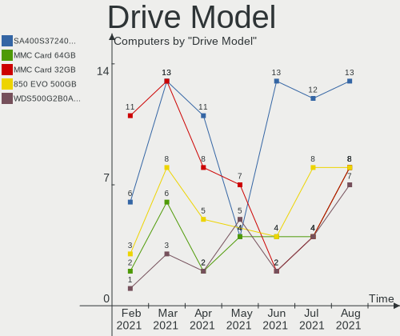

| Model                              | Computers | Percent |
|------------------------------------|-----------|---------|
| Unknown MMC Card  32GB             | 13        | 1.38%   |
| Kingston SA400S37240G 240GB SSD    | 13        | 1.38%   |
| Samsung SSD 860 EVO 1TB            | 12        | 1.28%   |
| Samsung SSD 860 EVO 500GB          | 10        | 1.06%   |
| Seagate ST1000LM024 HN-M101MBB 1TB | 9         | 0.96%   |
| Crucial CT1000MX500SSD1 1TB        | 9         | 0.96%   |
| Seagate ST1000DM010-2EP102 1TB     | 8         | 0.85%   |
| Samsung SSD 850 EVO 500GB          | 8         | 0.85%   |
| Samsung SSD 850 EVO 250GB          | 7         | 0.75%   |
| Crucial CT240BX500SSD1 240GB       | 7         | 0.75%   |
| WDC WDS240G2G0A-00JH30 240GB SSD   | 6         | 0.64%   |
| Unknown MMC Card  64GB             | 6         | 0.64%   |
| Toshiba MQ01ABD100 1TB             | 6         | 0.64%   |
| Toshiba DT01ACA100 1TB             | 6         | 0.64%   |
| Seagate ST9500325AS 500GB          | 6         | 0.64%   |
| Seagate ST1000LM035-1RK172 1TB     | 6         | 0.64%   |
| Kingston SA400S37480G 480GB SSD    | 6         | 0.64%   |
| WDC WD10EZEX-08WN4A0 1TB           | 5         | 0.53%   |
| Unknown SD/MMC/MS PRO 128GB        | 5         | 0.53%   |
| Seagate ST2000LM007-1R8174 2TB     | 5         | 0.53%   |
| Seagate ST2000DM008-2FR102 2TB     | 5         | 0.53%   |
| SanDisk SSD PLUS 240GB             | 5         | 0.53%   |
| SanDisk SDSSDA240G 240GB           | 5         | 0.53%   |
| Samsung SSD 860 EVO 250GB          | 5         | 0.53%   |
| Samsung NVMe SSD Drive 500GB       | 5         | 0.53%   |
| Intel NVMe SSD Drive 512GB         | 5         | 0.53%   |
| Unknown MMC Card  128GB            | 4         | 0.43%   |
| Toshiba MQ04ABF100 1TB             | 4         | 0.43%   |
| Toshiba MQ01ABD075 752GB           | 4         | 0.43%   |
| Seagate ST9320325AS 320GB          | 4         | 0.43%   |
| Seagate ST4000DM004-2CV104 4TB     | 4         | 0.43%   |
| Seagate ST3500418AS 500GB          | 4         | 0.43%   |
| Seagate ST31000524AS 1TB           | 4         | 0.43%   |
| Seagate ST1000DM003-1CH162 1TB     | 4         | 0.43%   |
| Seagate Expansion Desk 8TB         | 4         | 0.43%   |
| Kingston SUV400S37240G 240GB SSD   | 4         | 0.43%   |
| Kingston SA400S37120G 120GB SSD    | 4         | 0.43%   |
| WDC WDS500G2B0A-00SM50 500GB SSD   | 3         | 0.32%   |
| WDC WD5000AAKX-60U6AA0 500GB       | 3         | 0.32%   |
| WDC WD3200BEVT-22ZCT0 320GB        | 3         | 0.32%   |
| WDC WD20EZRX-00D8PB0 2TB           | 3         | 0.32%   |
| WDC WD10SPZX-00Z10T0 1TB           | 3         | 0.32%   |
| WDC WD10JPVX-60JC3T0 1TB           | 3         | 0.32%   |
| Unknown MMC Card  16GB             | 3         | 0.32%   |
| Toshiba MK1237GSX 120GB            | 3         | 0.32%   |
| Toshiba HDWD120 2TB                | 3         | 0.32%   |
| Toshiba DT01ACA300 3TB             | 3         | 0.32%   |
| Seagate ST500LT012-1DG142 500GB    | 3         | 0.32%   |
| Seagate ST1000LM048-2E7172 1TB     | 3         | 0.32%   |
| Seagate ST1000LM014-SSHD-8GB       | 3         | 0.32%   |
| Seagate ST1000DM003-1SB10C 1TB     | 3         | 0.32%   |
| Seagate Expansion 1TB              | 3         | 0.32%   |
| SanDisk SSD PLUS 480GB             | 3         | 0.32%   |
| SanDisk SSD PLUS 120GB             | 3         | 0.32%   |
| Sandisk NVMe SSD Drive 500GB       | 3         | 0.32%   |
| Samsung SSD 970 EVO Plus 500GB     | 3         | 0.32%   |
| Samsung SSD 840 EVO 500GB          | 3         | 0.32%   |
| Samsung NVMe SSD Drive 512GB       | 3         | 0.32%   |
| Samsung HM321HI 320GB              | 3         | 0.32%   |
| Phison NVMe SSD Drive 256GB        | 3         | 0.32%   |

HDD Vendor
----------

Hard disk drive vendors

| Vendor              | Computers | Drives | Percent |
|---------------------|-----------|--------|---------|
| Seagate             | 138       | 174    | 33.17%  |
| WDC                 | 130       | 155    | 31.25%  |
| Hitachi             | 46        | 47     | 11.06%  |
| Toshiba             | 41        | 41     | 9.86%   |
| Samsung Electronics | 26        | 28     | 6.25%   |
| HGST                | 15        | 15     | 3.61%   |
| Maxtor              | 8         | 9      | 1.92%   |
| Fujitsu             | 5         | 5      | 1.2%    |
| Unknown             | 2         | 3      | 0.48%   |
| WD MediaMax         | 1         | 1      | 0.24%   |
| TO Exter            | 1         | 1      | 0.24%   |
| SILICONMOTION       | 1         | 1      | 0.24%   |
| HPE                 | 1         | 1      | 0.24%   |
| ASMT                | 1         | 1      | 0.24%   |

SSD Vendor
----------

Solid state drive vendors

| Vendor              | Computers | Drives | Percent |
|---------------------|-----------|--------|---------|
| Samsung Electronics | 66        | 79     | 22.22%  |
| Kingston            | 42        | 43     | 14.14%  |
| SanDisk             | 38        | 39     | 12.79%  |
| Crucial             | 34        | 37     | 11.45%  |
| WDC                 | 21        | 22     | 7.07%   |
| A-DATA Technology   | 14        | 14     | 4.71%   |
| Toshiba             | 7         | 7      | 2.36%   |
| SPCC                | 6         | 7      | 2.02%   |
| Intel               | 6         | 6      | 2.02%   |
| LITEON              | 5         | 5      | 1.68%   |
| China               | 5         | 5      | 1.68%   |
| Transcend           | 4         | 5      | 1.35%   |
| SK Hynix            | 4         | 4      | 1.35%   |
| OCZ                 | 4         | 5      | 1.35%   |
| Micron Technology   | 4         | 4      | 1.35%   |
| GOODRAM             | 4         | 4      | 1.35%   |
| Apacer              | 4         | 4      | 1.35%   |
| Corsair             | 3         | 3      | 1.01%   |
| Vaseky              | 2         | 3      | 0.67%   |
| Unknown             | 2         | 2      | 0.67%   |
| Team                | 2         | 2      | 0.67%   |
| Seagate             | 2         | 2      | 0.67%   |
| PNY                 | 2         | 4      | 0.67%   |
| PLEXTOR             | 2         | 2      | 0.67%   |
| Patriot             | 2         | 2      | 0.67%   |
| LITEONIT            | 2         | 2      | 0.67%   |
| Intenso             | 2         | 2      | 0.67%   |
| Verbatim            | 1         | 1      | 0.34%   |
| THU                 | 1         | 1      | 0.34%   |
| Phison              | 1         | 1      | 0.34%   |
| JMicron             | 1         | 1      | 0.34%   |
| External            | 1         | 1      | 0.34%   |
| BHT                 | 1         | 1      | 0.34%   |
| ASMT                | 1         | 1      | 0.34%   |
| Apple               | 1         | 1      | 0.34%   |

Drive Kind
----------

HDD or SSD

| Kind    | Computers | Drives | Percent |
|---------|-----------|--------|---------|
| HDD     | 349       | 482    | 45.38%  |
| SSD     | 269       | 322    | 34.98%  |
| NVMe    | 96        | 109    | 12.48%  |
| MMC     | 32        | 35     | 4.16%   |
| Unknown | 23        | 24     | 2.99%   |

Drive Connector
---------------

SATA, SAS, NVMe, etc.

| Type | Computers | Drives | Percent |
|------|-----------|--------|---------|
| SATA | 520       | 783    | 76.47%  |
| NVMe | 96        | 109    | 14.12%  |
| SAS  | 32        | 45     | 4.71%   |
| MMC  | 32        | 35     | 4.71%   |

Drive Size
----------

Size of hard drive

| Size in TB | Computers | Drives | Percent |
|------------|-----------|--------|---------|
| 0.01-0.5   | 373       | 467    | 56.77%  |
| 0.51-1.0   | 203       | 231    | 30.9%   |
| 1.01-2.0   | 49        | 55     | 7.46%   |
| 3.01-4.0   | 13        | 16     | 1.98%   |
| 2.01-3.0   | 12        | 17     | 1.83%   |
| 4.01-10.0  | 7         | 18     | 1.07%   |

Space Total
-----------

Amount of disk space available on the file system

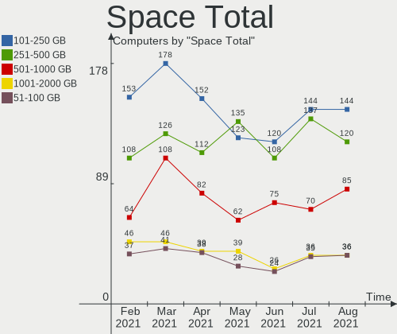

| Size in GB     | Computers | Percent |
|----------------|-----------|---------|
| 101-250        | 176       | 29.78%  |
| 251-500        | 126       | 21.32%  |
| 501-1000       | 109       | 18.44%  |
| 1001-2000      | 46        | 7.78%   |
| 51-100         | 41        | 6.94%   |
| More than 3000 | 28        | 4.74%   |
| 21-50          | 23        | 3.89%   |
| 2001-3000      | 19        | 3.21%   |
| 1-20           | 18        | 3.05%   |
| Unknown        | 5         | 0.85%   |

Space Used
----------

Amount of used disk space

| Used GB        | Computers | Percent |
|----------------|-----------|---------|
| 1-20           | 155       | 26.23%  |
| 21-50          | 124       | 20.98%  |
| 51-100         | 89        | 15.06%  |
| 101-250        | 88        | 14.89%  |
| 251-500        | 53        | 8.97%   |
| 501-1000       | 44        | 7.45%   |
| 1001-2000      | 20        | 3.38%   |
| More than 3000 | 9         | 1.52%   |
| Unknown        | 5         | 0.85%   |
| 2001-3000      | 4         | 0.68%   |

Malfunc. Drives
---------------

Drive models with a malfunction

| Model                                 | Computers | Drives | Percent |
|---------------------------------------|-----------|--------|---------|
| WDC WD5002ABYS-01B1B0 500GB           | 1         | 1      | 3.23%   |
| WDC WD40EZRZ-00WN9B0 4TB              | 1         | 1      | 3.23%   |
| WDC WD3200AAKS-00UU3A0 320GB          | 1         | 1      | 3.23%   |
| WDC WD30EZRX-00DC0B0 3TB              | 1         | 1      | 3.23%   |
| WDC WD2500BEVT-80A23T0 250GB          | 1         | 1      | 3.23%   |
| WDC WD2002FAEX-007BA0 2TB             | 1         | 1      | 3.23%   |
| WDC WD10SPZX-21Z10T0 1TB              | 1         | 1      | 3.23%   |
| WDC WD10EARS-22Y5B1 1TB               | 1         | 1      | 3.23%   |
| Toshiba MQ01ABD075 752GB              | 1         | 1      | 3.23%   |
| Toshiba MK3265GSXN 320GB              | 1         | 1      | 3.23%   |
| Toshiba MK1237GSX 120GB               | 1         | 1      | 3.23%   |
| SK Hynix SH920 mSATA 256GB SSD        | 1         | 1      | 3.23%   |
| Seagate ST340016A 40GB                | 1         | 1      | 3.23%   |
| Seagate ST31000524AS 1TB              | 1         | 1      | 3.23%   |
| Seagate ST250LM004 HN-M250MBB 250GB   | 1         | 1      | 3.23%   |
| Seagate ST1000VN002-2EY102 1TB        | 1         | 1      | 3.23%   |
| SanDisk SDSSDA240G 240GB              | 1         | 1      | 3.23%   |
| Samsung Electronics HM500JI 500GB     | 1         | 1      | 3.23%   |
| MAXTOR STM380215A 80GB                | 1         | 1      | 3.23%   |
| LITEONIT LCM-256M3S 2.5 7mm 256GB SSD | 1         | 1      | 3.23%   |
| LITEON CV8-8E128-HP 128GB SSD         | 1         | 1      | 3.23%   |
| Kingston SHPM2280P2H 240G SSD         | 1         | 1      | 3.23%   |
| Intel SSDSCKKF256H6 SATA 256GB        | 1         | 1      | 3.23%   |
| Intel SSDSC2CW120A3 120GB             | 1         | 1      | 3.23%   |
| Hitachi HTS547575A9E384 752GB         | 1         | 1      | 3.23%   |
| HGST HTS545050A7E680 500GB            | 1         | 1      | 3.23%   |
| HGST HTS541075A9E680 752GB            | 1         | 1      | 3.23%   |
| HGST HTS541010A9E680 1TB              | 1         | 1      | 3.23%   |
| Crucial CT500P1SSD8 500GB             | 1         | 1      | 3.23%   |
| A-DATA Technology XM12 32GB SSD       | 1         | 1      | 3.23%   |
| A-DATA Technology XM11 128GB SSD      | 1         | 1      | 3.23%   |

Malfunc. Drive Vendor
---------------------

Vendors of faulty drives

| Vendor              | Computers | Drives | Percent |
|---------------------|-----------|--------|---------|
| WDC                 | 8         | 8      | 25.81%  |
| Seagate             | 4         | 4      | 12.9%   |
| Toshiba             | 3         | 3      | 9.68%   |
| HGST                | 3         | 3      | 9.68%   |
| Intel               | 2         | 2      | 6.45%   |
| A-DATA Technology   | 2         | 2      | 6.45%   |
| SK Hynix            | 1         | 1      | 3.23%   |
| SanDisk             | 1         | 1      | 3.23%   |
| Samsung Electronics | 1         | 1      | 3.23%   |
| MAXTOR              | 1         | 1      | 3.23%   |
| LITEONIT            | 1         | 1      | 3.23%   |
| LITEON              | 1         | 1      | 3.23%   |
| Kingston            | 1         | 1      | 3.23%   |
| Hitachi             | 1         | 1      | 3.23%   |
| Crucial             | 1         | 1      | 3.23%   |

Malfunc. HDD Vendor
-------------------

Vendors of faulty HDD drives

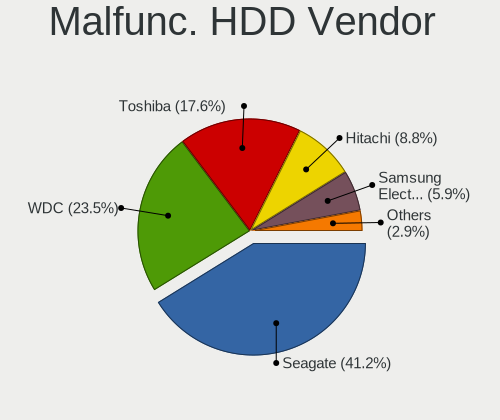

| Vendor              | Computers | Drives | Percent |
|---------------------|-----------|--------|---------|
| WDC                 | 8         | 8      | 38.1%   |
| Seagate             | 4         | 4      | 19.05%  |
| Toshiba             | 3         | 3      | 14.29%  |
| HGST                | 3         | 3      | 14.29%  |
| Samsung Electronics | 1         | 1      | 4.76%   |
| MAXTOR              | 1         | 1      | 4.76%   |
| Hitachi             | 1         | 1      | 4.76%   |

Malfunc. Drive Kind
-------------------

Kinds of faulty drives

| Kind | Computers | Drives | Percent |
|------|-----------|--------|---------|
| HDD  | 19        | 21     | 65.52%  |
| SSD  | 9         | 9      | 31.03%  |
| NVMe | 1         | 1      | 3.45%   |

Failed Drives
-------------

Failed drive models

| Model                         | Computers | Drives | Percent |
|-------------------------------|-----------|--------|---------|
| Toshiba MQ01ABD075 752GB      | 1         | 1      | 50%     |
| Hitachi HDS721050DLE630 500GB | 1         | 1      | 50%     |

Failed Drive Vendor
-------------------

Failed drive vendors

| Vendor  | Computers | Drives | Percent |
|---------|-----------|--------|---------|
| Toshiba | 1         | 1      | 50%     |
| Hitachi | 1         | 1      | 50%     |

Drive Status
------------

Number of failed and malfunc. drives

| Status   | Computers | Drives | Percent |
|----------|-----------|--------|---------|
| Detected | 446       | 728    | 72.4%   |
| Works    | 141       | 211    | 22.89%  |
| Malfunc  | 27        | 31     | 4.38%   |
| Failed   | 2         | 2      | 0.32%   |

Storage Vendor
--------------

Storage controller vendors

| Vendor                           | Computers | Percent |
|----------------------------------|-----------|---------|
| Intel                            | 424       | 61.63%  |
| AMD                              | 121       | 17.59%  |
| Samsung Electronics              | 30        | 4.36%   |
| Sandisk                          | 13        | 1.89%   |
| Nvidia                           | 13        | 1.89%   |
| JMicron Technology               | 11        | 1.6%    |
| SK Hynix                         | 9         | 1.31%   |
| Marvell Technology Group         | 9         | 1.31%   |
| ASMedia Technology               | 8         | 1.16%   |
| Phison Electronics               | 7         | 1.02%   |
| ADATA Technology                 | 5         | 0.73%   |
| VIA Technologies                 | 4         | 0.58%   |
| Toshiba America Info Systems     | 4         | 0.58%   |
| Micron/Crucial Technology        | 4         | 0.58%   |
| Silicon Integrated Systems [SiS] | 3         | 0.44%   |
| Micron Technology                | 3         | 0.44%   |
| KIOXIA                           | 3         | 0.44%   |
| Union Memory (Shenzhen)          | 2         | 0.29%   |
| Silicon Image                    | 2         | 0.29%   |
| Realtek Semiconductor            | 2         | 0.29%   |
| Kingston Technology Company      | 2         | 0.29%   |
| Adaptec                          | 2         | 0.29%   |
| ULi Electronics                  | 1         | 0.15%   |
| Silicon Motion                   | 1         | 0.15%   |
| Lite-On Technology               | 1         | 0.15%   |
| Hewlett-Packard                  | 1         | 0.15%   |
| Broadcom / LSI                   | 1         | 0.15%   |
| Broadcom                         | 1         | 0.15%   |
| Apple                            | 1         | 0.15%   |

Storage Model
-------------

Storage controller models

| Model                                                                                   | Computers | Percent |
|-----------------------------------------------------------------------------------------|-----------|---------|
| AMD FCH SATA Controller [AHCI mode]                                                     | 76        | 9.06%   |
| Intel Sunrise Point-LP SATA Controller [AHCI mode]                                      | 26        | 3.1%    |
| Intel 8 Series/C220 Series Chipset Family 6-port SATA Controller 1 [AHCI mode]          | 26        | 3.1%    |
| Intel 7 Series Chipset Family 6-port SATA Controller [AHCI mode]                        | 26        | 3.1%    |
| Intel 82801 Mobile SATA Controller [RAID mode]                                          | 25        | 2.98%   |
| Intel 6 Series/C200 Series Chipset Family 6 port Mobile SATA AHCI Controller            | 24        | 2.86%   |
| Intel 82801IBM/IEM (ICH9M/ICH9M-E) 4 port SATA Controller [AHCI mode]                   | 22        | 2.62%   |
| Intel 82801G (ICH7 Family) IDE Controller                                               | 19        | 2.26%   |
| Intel 6 Series/C200 Series Chipset Family 6 port Desktop SATA AHCI Controller           | 19        | 2.26%   |
| AMD 400 Series Chipset SATA Controller                                                  | 19        | 2.26%   |
| AMD SB7x0/SB8x0/SB9x0 SATA Controller [AHCI mode]                                       | 18        | 2.15%   |
| Intel NM10/ICH7 Family SATA Controller [IDE mode]                                       | 17        | 2.03%   |
| Samsung NVMe SSD Controller SM981/PM981/PM983                                           | 16        | 1.91%   |
| Intel 82801HM/HEM (ICH8M/ICH8M-E) IDE Controller                                        | 16        | 1.91%   |
| Intel 5 Series/3400 Series Chipset 6 port SATA AHCI Controller                          | 16        | 1.91%   |
| Intel 5 Series/3400 Series Chipset 4 port SATA AHCI Controller                          | 15        | 1.79%   |
| Intel 82801HM/HEM (ICH8M/ICH8M-E) SATA Controller [AHCI mode]                           | 14        | 1.67%   |
| AMD SB7x0/SB8x0/SB9x0 IDE Controller                                                    | 14        | 1.67%   |
| Intel Wildcat Point-LP SATA Controller [AHCI Mode]                                      | 13        | 1.55%   |
| Intel Cannon Lake PCH SATA AHCI Controller                                              | 12        | 1.43%   |
| Intel 8 Series SATA Controller 1 [AHCI mode]                                            | 12        | 1.43%   |
| Intel 6 Series/C200 Series Chipset Family Desktop SATA Controller (IDE mode, ports 4-5) | 12        | 1.43%   |
| Intel 6 Series/C200 Series Chipset Family Desktop SATA Controller (IDE mode, ports 0-3) | 12        | 1.43%   |
| Intel 7 Series/C210 Series Chipset Family 6-port SATA Controller [AHCI mode]            | 10        | 1.19%   |
| AMD Starship/Matisse Chipset SATA Controller [AHCI mode]                                | 10        | 1.19%   |
| AMD SB7x0/SB8x0/SB9x0 SATA Controller [IDE mode]                                        | 10        | 1.19%   |
| Intel SSD 660P Series                                                                   | 8         | 0.95%   |
| Intel Cannon Point-LP SATA Controller [AHCI Mode]                                       | 8         | 0.95%   |
| Intel 200 Series PCH SATA controller [AHCI mode]                                        | 8         | 0.95%   |
| ASMedia ASM1062 Serial ATA Controller                                                   | 8         | 0.95%   |
| Intel HM170/QM170 Chipset SATA Controller [AHCI Mode]                                   | 7         | 0.83%   |
| Intel Comet Lake SATA AHCI Controller                                                   | 7         | 0.83%   |
| Sandisk WD Blue SN550 NVMe SSD                                                          | 6         | 0.72%   |
| Nvidia MCP61 SATA Controller                                                            | 6         | 0.72%   |
| Nvidia MCP61 IDE                                                                        | 6         | 0.72%   |
| JMicron JMB363 SATA/IDE Controller                                                      | 6         | 0.72%   |
| Intel Volume Management Device NVMe RAID Controller                                     | 6         | 0.72%   |
| Intel SATA Controller [RAID mode]                                                       | 6         | 0.72%   |
| Intel Q170/Q150/B150/H170/H110/Z170/CM236 Chipset SATA Controller [AHCI Mode]           | 6         | 0.72%   |
| Intel NM10/ICH7 Family SATA Controller [AHCI mode]                                      | 6         | 0.72%   |
| AMD 300 Series Chipset SATA Controller                                                  | 6         | 0.72%   |
| Samsung NVMe SSD Controller SM961/PM961/SM963                                           | 5         | 0.6%    |
| Samsung NVMe Controller                                                                 | 5         | 0.6%    |
| Intel Atom Processor E3800 Series SATA AHCI Controller                                  | 5         | 0.6%    |
| Intel 9 Series Chipset Family SATA Controller [AHCI Mode]                               | 5         | 0.6%    |
| Intel 82801JI (ICH10 Family) 4 port SATA IDE Controller #1                              | 5         | 0.6%    |
| Intel 82801JI (ICH10 Family) 2 port SATA IDE Controller #2                              | 5         | 0.6%    |
| SK Hynix BC511                                                                          | 4         | 0.48%   |
| Phison E16 PCIe4 NVMe Controller                                                        | 4         | 0.48%   |
| Intel Celeron/Pentium Silver Processor SATA Controller                                  | 4         | 0.48%   |
| Intel Cannon Lake Mobile PCH SATA AHCI Controller                                       | 4         | 0.48%   |
| Intel Atom/Celeron/Pentium Processor x5-E8000/J3xxx/N3xxx Series SATA Controller        | 4         | 0.48%   |
| Intel 82801GBM/GHM (ICH7-M Family) SATA Controller [AHCI mode]                          | 4         | 0.48%   |
| Intel 5 Series/3400 Series Chipset 4 port SATA IDE Controller                           | 4         | 0.48%   |
| Intel 5 Series/3400 Series Chipset 2 port SATA IDE Controller                           | 4         | 0.48%   |
| Intel 4 Series Chipset PT IDER Controller                                               | 4         | 0.48%   |
| AMD FCH IDE Controller                                                                  | 4         | 0.48%   |
| ADATA XPG SX8200 Pro PCIe Gen3x4 M.2 2280 Solid State Drive                             | 4         | 0.48%   |
| SK Hynix Non-Volatile memory controller                                                 | 3         | 0.36%   |
| Silicon Integrated Systems [SiS] SATA Controller / IDE mode                             | 3         | 0.36%   |

Storage Kind
------------

Kind of storage controller (IDE, SATA, NVMe, SAS, ...)

| Kind | Computers | Percent |
|------|-----------|---------|
| SATA | 456       | 62.9%   |
| IDE  | 125       | 17.24%  |
| NVMe | 96        | 13.24%  |
| RAID | 45        | 6.21%   |
| SCSI | 2         | 0.28%   |
| SAS  | 1         | 0.14%   |

CPU Vendor
----------

Processor vendors

| Vendor | Computers | Percent |
|--------|-----------|---------|
| Intel  | 456       | 77.16%  |
| AMD    | 135       | 22.84%  |

CPU Model
---------

Processor models

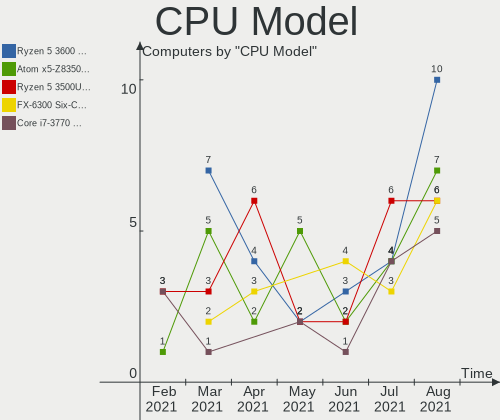

| Model                                         | Computers | Percent |
|-----------------------------------------------|-----------|---------|
| Intel Core i5-2520M CPU @ 2.50GHz             | 9         | 1.52%   |
| Intel Core i5-8250U CPU @ 1.60GHz             | 8         | 1.35%   |
| AMD FX-8350 Eight-Core Processor              | 8         | 1.35%   |
| Intel Core i5-3470 CPU @ 3.20GHz              | 7         | 1.18%   |
| Intel Core i5-3210M CPU @ 2.50GHz             | 7         | 1.18%   |
| AMD Ryzen 5 3600 6-Core Processor             | 7         | 1.18%   |
| Intel Core i5-8265U CPU @ 1.60GHz             | 6         | 1.02%   |
| Intel Core i5-5200U CPU @ 2.20GHz             | 6         | 1.02%   |
| Intel Core i5-5300U CPU @ 2.30GHz             | 5         | 0.85%   |
| Intel Atom x5-Z8350 CPU @ 1.44GHz             | 5         | 0.85%   |
| AMD Ryzen 5 4500U with Radeon Graphics        | 5         | 0.85%   |
| Intel Pentium Dual-Core CPU T4200 @ 2.00GHz   | 4         | 0.68%   |
| Intel Pentium CPU P6200 @ 2.13GHz             | 4         | 0.68%   |
| Intel Core i7-8700 CPU @ 3.20GHz              | 4         | 0.68%   |
| Intel Core i7-8565U CPU @ 1.80GHz             | 4         | 0.68%   |
| Intel Core i7-8550U CPU @ 1.80GHz             | 4         | 0.68%   |
| Intel Core i7-7500U CPU @ 2.70GHz             | 4         | 0.68%   |
| Intel Core i7-10750H CPU @ 2.60GHz            | 4         | 0.68%   |
| Intel Core i5-4590 CPU @ 3.30GHz              | 4         | 0.68%   |
| Intel Core 2 Duo CPU E8500 @ 3.16GHz          | 4         | 0.68%   |
| Intel Celeron CPU N3060 @ 1.60GHz             | 4         | 0.68%   |
| AMD Ryzen 7 3700X 8-Core Processor            | 4         | 0.68%   |
| AMD Ryzen 3 2200G with Radeon Vega Graphics   | 4         | 0.68%   |
| AMD E2-1800 APU with Radeon HD Graphics       | 4         | 0.68%   |
| Intel Pentium Dual-Core CPU T4500 @ 2.30GHz   | 3         | 0.51%   |
| Intel Pentium CPU G3220 @ 3.00GHz             | 3         | 0.51%   |
| Intel Core i7-7700HQ CPU @ 2.80GHz            | 3         | 0.51%   |
| Intel Core i7-4600U CPU @ 2.10GHz             | 3         | 0.51%   |
| Intel Core i7-2670QM CPU @ 2.20GHz            | 3         | 0.51%   |
| Intel Core i7-2600 CPU @ 3.40GHz              | 3         | 0.51%   |
| Intel Core i7-10510U CPU @ 1.80GHz            | 3         | 0.51%   |
| Intel Core i5-9400F CPU @ 2.90GHz             | 3         | 0.51%   |
| Intel Core i5-7200U CPU @ 2.50GHz             | 3         | 0.51%   |
| Intel Core i5-6300HQ CPU @ 2.30GHz            | 3         | 0.51%   |
| Intel Core i5-6200U CPU @ 2.30GHz             | 3         | 0.51%   |
| Intel Core i5-3230M CPU @ 2.60GHz             | 3         | 0.51%   |
| Intel Core i5-2500 CPU @ 3.30GHz              | 3         | 0.51%   |
| Intel Core i5-2400 CPU @ 3.10GHz              | 3         | 0.51%   |
| Intel Core i5 CPU 650 @ 3.20GHz               | 3         | 0.51%   |
| Intel Core i3-8100 CPU @ 3.60GHz              | 3         | 0.51%   |
| Intel Core i3-6006U CPU @ 2.00GHz             | 3         | 0.51%   |
| Intel Core i3 CPU 550 @ 3.20GHz               | 3         | 0.51%   |
| Intel Core 2 Quad CPU Q9400 @ 2.66GHz         | 3         | 0.51%   |
| Intel Core 2 Duo CPU E8400 @ 3.00GHz          | 3         | 0.51%   |
| Intel Atom CPU Z3735F @ 1.33GHz               | 3         | 0.51%   |
| Intel Atom CPU N450 @ 1.66GHz                 | 3         | 0.51%   |
| Intel Atom CPU N270 @ 1.60GHz                 | 3         | 0.51%   |
| AMD Ryzen 7 5800X 8-Core Processor            | 3         | 0.51%   |
| AMD Ryzen 7 4700U with Radeon Graphics        | 3         | 0.51%   |
| AMD Ryzen 5 3500U with Radeon Vega Mobile Gfx | 3         | 0.51%   |
| AMD Ryzen 5 2400G with Radeon Vega Graphics   | 3         | 0.51%   |
| AMD Ryzen 5 1600 Six-Core Processor           | 3         | 0.51%   |
| Intel Pentium Gold G5400 CPU @ 3.70GHz        | 2         | 0.34%   |
| Intel Pentium Dual-Core CPU E6600 @ 3.06GHz   | 2         | 0.34%   |
| Intel Pentium Dual CPU T2390 @ 1.86GHz        | 2         | 0.34%   |
| Intel Pentium Dual CPU T2310 @ 1.46GHz        | 2         | 0.34%   |
| Intel Pentium CPU P6000 @ 1.87GHz             | 2         | 0.34%   |
| Intel Pentium CPU G620 @ 2.60GHz              | 2         | 0.34%   |
| Intel Pentium 4 CPU 3.00GHz                   | 2         | 0.34%   |
| Intel Pentium 3558U @ 1.70GHz                 | 2         | 0.34%   |

CPU Model Family
----------------

Processor model prefix

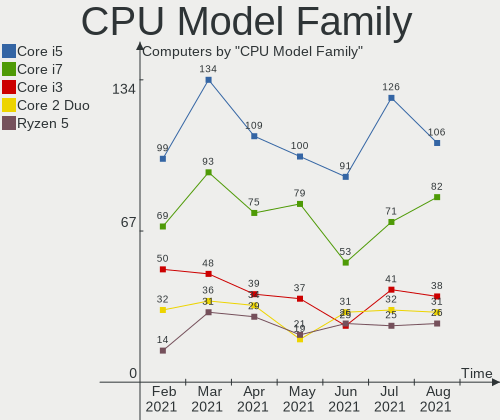

| Model                          | Computers | Percent |
|--------------------------------|-----------|---------|
| Intel Core i5                  | 134       | 22.67%  |
| Intel Core i7                  | 93        | 15.74%  |
| Intel Core i3                  | 48        | 8.12%   |
| Intel Core 2 Duo               | 36        | 6.09%   |
| AMD Ryzen 5                    | 31        | 5.25%   |
| Intel Celeron                  | 26        | 4.4%    |
| Intel Pentium                  | 22        | 3.72%   |
| Intel Atom                     | 20        | 3.38%   |
| AMD Ryzen 7                    | 20        | 3.38%   |
| AMD FX                         | 15        | 2.54%   |
| Intel Pentium Dual-Core        | 14        | 2.37%   |
| Intel Xeon                     | 11        | 1.86%   |
| Other                          | 10        | 1.69%   |
| Intel Core 2 Quad              | 9         | 1.52%   |
| AMD Ryzen 3                    | 8         | 1.35%   |
| AMD A6                         | 8         | 1.35%   |
| Intel Pentium Dual             | 7         | 1.18%   |
| Intel Genuine                  | 5         | 0.85%   |
| Intel Core 2                   | 5         | 0.85%   |
| AMD E2                         | 5         | 0.85%   |
| AMD A8                         | 5         | 0.85%   |
| Intel Pentium 4                | 4         | 0.68%   |
| AMD Phenom II X6               | 4         | 0.68%   |
| AMD A10                        | 4         | 0.68%   |
| Intel Pentium Gold             | 3         | 0.51%   |
| AMD Phenom II X4               | 3         | 0.51%   |
| AMD Athlon II X2               | 3         | 0.51%   |
| AMD Athlon 64 X2               | 3         | 0.51%   |
| AMD A4                         | 3         | 0.51%   |
| Intel Pentium Silver           | 2         | 0.34%   |
| Intel Core i9                  | 2         | 0.34%   |
| Intel Core Duo                 | 2         | 0.34%   |
| Intel Core 2 Solo              | 2         | 0.34%   |
| Intel Celeron Dual-Core        | 2         | 0.34%   |
| AMD Sempron                    | 2         | 0.34%   |
| AMD Ryzen 9                    | 2         | 0.34%   |
| AMD Ryzen 7 PRO                | 2         | 0.34%   |
| AMD Ryzen 5 PRO                | 2         | 0.34%   |
| AMD Phenom                     | 2         | 0.34%   |
| Intel Pentium D                | 1         | 0.17%   |
| Intel Core m5                  | 1         | 0.17%   |
| Intel Core m3                  | 1         | 0.17%   |
| Intel Celeron M                | 1         | 0.17%   |
| AMD Turion X2 Dual-Core Mobile | 1         | 0.17%   |
| AMD Turion 64 Mobile           | 1         | 0.17%   |
| AMD Phenom II X2               | 1         | 0.17%   |
| AMD Phenom II                  | 1         | 0.17%   |
| AMD G                          | 1         | 0.17%   |
| AMD E1                         | 1         | 0.17%   |
| AMD E                          | 1         | 0.17%   |
| AMD Athlon X4                  | 1         | 0.17%   |

CPU Cores
---------

Number of processor cores

| Number | Computers | Percent |
|--------|-----------|---------|
| 2      | 287       | 48.56%  |
| 4      | 185       | 31.3%   |
| 6      | 56        | 9.48%   |
| 1      | 28        | 4.74%   |
| 8      | 27        | 4.57%   |
| 12     | 3         | 0.51%   |
| 3      | 3         | 0.51%   |
| 20     | 1         | 0.17%   |
| 5      | 1         | 0.17%   |

CPU Sockets
-----------

Number of sockets

| Number | Computers | Percent |
|--------|-----------|---------|
| 1      | 585       | 98.98%  |
| 2      | 6         | 1.02%   |

CPU Threads
-----------

Threads per core (Hyper-Threading)

| Number | Computers | Percent |
|--------|-----------|---------|
| 2      | 340       | 57.53%  |
| 1      | 251       | 42.47%  |

CPU Op-Modes
------------

CPU Operation Modes (32-bit, 64-bit)

| Op mode        | Computers | Percent |
|----------------|-----------|---------|
| 32-bit, 64-bit | 577       | 97.63%  |
| 32-bit         | 14        | 2.37%   |

CPU Microcode
-------------

Microcode number

| Number     | Computers | Percent |
|------------|-----------|---------|
| 0x206a7    | 54        | 9.14%   |
| Unknown    | 53        | 8.97%   |
| 0x306a9    | 42        | 7.11%   |
| 0x1067a    | 35        | 5.92%   |
| 0x306c3    | 28        | 4.74%   |
| 0x20655    | 22        | 3.72%   |
| 0x6fd      | 16        | 2.71%   |
| 0x806ea    | 15        | 2.54%   |
| 0x906ea    | 14        | 2.37%   |
| 0x40651    | 14        | 2.37%   |
| 0x306d4    | 14        | 2.37%   |
| 0x06000852 | 14        | 2.37%   |
| 0x08701021 | 12        | 2.03%   |
| 0x406e3    | 11        | 1.86%   |
| 0x10676    | 10        | 1.69%   |
| 0x806ec    | 9         | 1.52%   |
| 0x406c4    | 9         | 1.52%   |
| 0x20652    | 9         | 1.52%   |
| 0x506e3    | 8         | 1.35%   |
| 0x06001119 | 8         | 1.35%   |
| 0x806e9    | 7         | 1.18%   |
| 0x30678    | 7         | 1.18%   |
| 0x806eb    | 6         | 1.02%   |
| 0x806c1    | 6         | 1.02%   |
| 0x0800820d | 6         | 1.02%   |
| 0x05000119 | 6         | 1.02%   |
| 0x906e9    | 5         | 0.85%   |
| 0x6fb      | 5         | 0.85%   |
| 0xa0655    | 4         | 0.68%   |
| 0xa0652    | 4         | 0.68%   |
| 0x906ed    | 4         | 0.68%   |
| 0x706a1    | 4         | 0.68%   |
| 0x6ec      | 4         | 0.68%   |
| 0x206c2    | 4         | 0.68%   |
| 0x106e5    | 4         | 0.68%   |
| 0x106ca    | 4         | 0.68%   |
| 0x10661    | 4         | 0.68%   |
| 0x08600106 | 4         | 0.68%   |
| 0x08600104 | 4         | 0.68%   |
| 0x08108109 | 4         | 0.68%   |
| 0x08101016 | 4         | 0.68%   |
| 0x010000c8 | 4         | 0.68%   |
| 0xf29      | 3         | 0.51%   |
| 0x6f6      | 3         | 0.51%   |
| 0x506c9    | 3         | 0.51%   |
| 0x406c3    | 3         | 0.51%   |
| 0x30661    | 3         | 0.51%   |
| 0x106c2    | 3         | 0.51%   |
| 0x0a201009 | 3         | 0.51%   |
| 0x08600103 | 3         | 0.51%   |
| 0x08108102 | 3         | 0.51%   |
| 0x0810100b | 3         | 0.51%   |
| 0x07030105 | 3         | 0.51%   |
| 0x06006705 | 3         | 0.51%   |
| 0x0600611a | 3         | 0.51%   |
| 0x06003106 | 3         | 0.51%   |
| 0x010000dc | 3         | 0.51%   |
| 0x906eb    | 2         | 0.34%   |
| 0x6f2      | 2         | 0.34%   |
| 0x306e4    | 2         | 0.34%   |

CPU Microarch
-------------

Microarchitecture

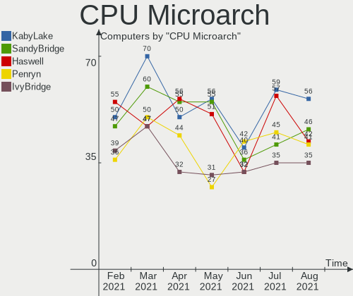

| Name            | Computers | Percent |
|-----------------|-----------|---------|
| KabyLake        | 70        | 11.84%  |
| SandyBridge     | 60        | 10.15%  |
| Penryn          | 50        | 8.46%   |
| IvyBridge       | 47        | 7.95%   |
| Haswell         | 47        | 7.95%   |
| Westmere        | 36        | 6.09%   |
| Core            | 31        | 5.25%   |
| Zen 2           | 26        | 4.4%    |
| Skylake         | 24        | 4.06%   |
| Piledriver      | 23        | 3.89%   |
| Silvermont      | 20        | 3.38%   |
| Zen+            | 18        | 3.05%   |
| Zen             | 17        | 2.88%   |
| K10             | 15        | 2.54%   |
| Broadwell       | 15        | 2.54%   |
| CometLake       | 11        | 1.86%   |
| Bonnell         | 10        | 1.69%   |
| NetBurst        | 8         | 1.35%   |
| Excavator       | 7         | 1.18%   |
| Bobcat          | 7         | 1.18%   |
| TigerLake       | 6         | 1.02%   |
| P6              | 6         | 1.02%   |
| Nehalem         | 6         | 1.02%   |
| K8 Hammer       | 6         | 1.02%   |
| Puma            | 5         | 0.85%   |
| Zen 3           | 4         | 0.68%   |
| Goldmont plus   | 4         | 0.68%   |
| Steamroller     | 3         | 0.51%   |
| Goldmont        | 3         | 0.51%   |
| Bulldozer       | 2         | 0.34%   |
| K8 & K10 hybrid | 1         | 0.17%   |
| Jaguar          | 1         | 0.17%   |
| IceLake         | 1         | 0.17%   |
| Unknown         | 1         | 0.17%   |

GPU Vendor
----------

Vendors of graphics cards

| Vendor                           | Computers | Percent |
|----------------------------------|-----------|---------|
| Intel                            | 345       | 50.51%  |
| AMD                              | 173       | 25.33%  |
| Nvidia                           | 157       | 22.99%  |
| Silicon Integrated Systems [SiS] | 3         | 0.44%   |
| VIA Technologies                 | 2         | 0.29%   |
| Matrox Electronics Systems       | 2         | 0.29%   |
| S3 Graphics                      | 1         | 0.15%   |

GPU Model
---------

Graphics card models

| Model                                                                                    | Computers | Percent |
|------------------------------------------------------------------------------------------|-----------|---------|
| Intel 2nd Generation Core Processor Family Integrated Graphics Controller                | 49        | 6.84%   |
| Intel 3rd Gen Core processor Graphics Controller                                         | 27        | 3.77%   |
| Intel Mobile 4 Series Chipset Integrated Graphics Controller                             | 21        | 2.93%   |
| Intel Core Processor Integrated Graphics Controller                                      | 20        | 2.79%   |
| Intel Xeon E3-1200 v3/4th Gen Core Processor Integrated Graphics Controller              | 15        | 2.09%   |
| Intel HD Graphics 5500                                                                   | 15        | 2.09%   |
| AMD Ellesmere [Radeon RX 470/480/570/570X/580/580X/590]                                  | 15        | 2.09%   |
| Intel Haswell-ULT Integrated Graphics Controller                                         | 14        | 1.96%   |
| Intel UHD Graphics 620                                                                   | 13        | 1.82%   |
| Intel Mobile GM965/GL960 Integrated Graphics Controller (secondary)                      | 13        | 1.82%   |
| Intel Mobile GM965/GL960 Integrated Graphics Controller (primary)                        | 13        | 1.82%   |
| Intel Xeon E3-1200 v2/3rd Gen Core processor Graphics Controller                         | 12        | 1.68%   |
| Intel Atom/Celeron/Pentium Processor x5-E8000/J3xxx/N3xxx Integrated Graphics Controller | 12        | 1.68%   |
| AMD Renoir                                                                               | 11        | 1.54%   |
| Intel WhiskeyLake-U GT2 [UHD Graphics 620]                                               | 10        | 1.4%    |
| Intel Skylake GT2 [HD Graphics 520]                                                      | 9         | 1.26%   |
| Intel 4th Gen Core Processor Integrated Graphics Controller                              | 9         | 1.26%   |
| AMD Raven Ridge [Radeon Vega Series / Radeon Vega Mobile Series]                         | 9         | 1.26%   |
| AMD Picasso                                                                              | 9         | 1.26%   |
| Intel Mobile 945GM/GMS/GME, 943/940GML Express Integrated Graphics Controller            | 8         | 1.12%   |
| Intel HD Graphics 620                                                                    | 8         | 1.12%   |
| Intel Atom Processor Z36xxx/Z37xxx Series Graphics & Display                             | 8         | 1.12%   |
| AMD Cedar [Radeon HD 5000/6000/7350/8350 Series]                                         | 8         | 1.12%   |
| Intel HD Graphics 530                                                                    | 7         | 0.98%   |
| Intel CometLake-U GT2 [UHD Graphics]                                                     | 7         | 0.98%   |
| Intel CometLake-S GT2 [UHD Graphics 630]                                                 | 7         | 0.98%   |
| Nvidia GT218 [GeForce 210]                                                               | 6         | 0.84%   |
| Intel CoffeeLake-H GT2 [UHD Graphics 630]                                                | 6         | 0.84%   |
| AMD Park [Mobility Radeon HD 5430/5450/5470]                                             | 6         | 0.84%   |
| Nvidia GP107 [GeForce GTX 1050 Ti]                                                       | 5         | 0.7%    |
| Intel Mobile 945GM/GMS, 943/940GML Express Integrated Graphics Controller                | 5         | 0.7%    |
| Intel CometLake-H GT2 [UHD Graphics]                                                     | 5         | 0.7%    |
| AMD Seymour [Radeon HD 6400M/7400M Series]                                               | 5         | 0.7%    |
| AMD Lexa PRO [Radeon 540/540X/550/550X / RX 540X/550/550X]                               | 5         | 0.7%    |
| Nvidia GP108M [GeForce MX150]                                                            | 4         | 0.56%   |
| Nvidia GM206 [GeForce GTX 960]                                                           | 4         | 0.56%   |
| Nvidia GF116 [GeForce GTX 550 Ti]                                                        | 4         | 0.56%   |
| Intel TigerLake GT2 [Iris Xe Graphics]                                                   | 4         | 0.56%   |
| Intel HD Graphics 630                                                                    | 4         | 0.56%   |
| Intel Atom Processor D4xx/D5xx/N4xx/N5xx Integrated Graphics Controller                  | 4         | 0.56%   |
| AMD Wrestler [Radeon HD 7340]                                                            | 4         | 0.56%   |
| AMD Topaz XT [Radeon R7 M260/M265 / M340/M360 / M440/M445 / 530/535 / 620/625 Mobile]    | 4         | 0.56%   |
| AMD Thames [Radeon HD 7500M/7600M Series]                                                | 4         | 0.56%   |
| AMD Stoney [Radeon R2/R3/R4/R5 Graphics]                                                 | 4         | 0.56%   |
| AMD Park [Mobility Radeon HD 5430]                                                       | 4         | 0.56%   |
| AMD Caicos [Radeon HD 6450/7450/8450 / R5 230 OEM]                                       | 4         | 0.56%   |
| Silicon Integrated Systems [SiS] 771/671 PCIE VGA Display Adapter                        | 3         | 0.42%   |
| Nvidia TU117M [GeForce GTX 1650 Mobile / Max-Q]                                          | 3         | 0.42%   |
| Nvidia TU116M [GeForce GTX 1660 Ti Mobile]                                               | 3         | 0.42%   |
| Nvidia GP108M [GeForce MX250]                                                            | 3         | 0.42%   |
| Nvidia GP107M [GeForce GTX 1050 Mobile]                                                  | 3         | 0.42%   |
| Nvidia GP106 [GeForce GTX 1060 6GB]                                                      | 3         | 0.42%   |
| Nvidia GP104 [GeForce GTX 1070]                                                          | 3         | 0.42%   |
| Nvidia GM204 [GeForce GTX 970]                                                           | 3         | 0.42%   |
| Nvidia GM108M [GeForce 920MX]                                                            | 3         | 0.42%   |
| Nvidia GM108M [GeForce 840M]                                                             | 3         | 0.42%   |
| Nvidia G98 [GeForce 8400 GS Rev. 2]                                                      | 3         | 0.42%   |
| Intel Mobile 945GSE Express Integrated Graphics Controller                               | 3         | 0.42%   |
| Intel HD Graphics 500                                                                    | 3         | 0.42%   |
| Intel CoffeeLake-S GT2 [UHD Graphics 630]                                                | 3         | 0.42%   |

GPU Combo
---------

Combinations of graphics cards

| Name            | Computers | Percent |
|-----------------|-----------|---------|
| 1 x Intel       | 263       | 44.5%   |
| 1 x AMD         | 137       | 23.18%  |
| 1 x Nvidia      | 92        | 15.57%  |
| Intel + Nvidia  | 58        | 9.81%   |
| Intel + AMD     | 21        | 3.55%   |
| 2 x AMD         | 6         | 1.02%   |
| AMD + Nvidia    | 6         | 1.02%   |
| 1 x SiS         | 3         | 0.51%   |
| 1 x VIA         | 2         | 0.34%   |
| 1 x Matrox      | 2         | 0.34%   |
| 1 x S3 Graphics | 1         | 0.17%   |

GPU Driver
----------

Free vs proprietary

| Driver      | Computers | Percent |
|-------------|-----------|---------|
| Free        | 448       | 75.8%   |
| Proprietary | 116       | 19.63%  |
| Unknown     | 27        | 4.57%   |

GPU Memory
----------

Total video memory

| Size in GB | Computers | Percent |
|------------|-----------|---------|
| Unknown    | 311       | 52.62%  |
| 0.01-0.5   | 81        | 13.71%  |
| 1.01-2.0   | 71        | 12.01%  |
| 0.51-1.0   | 61        | 10.32%  |
| 3.01-4.0   | 33        | 5.58%   |
| 5.01-6.0   | 15        | 2.54%   |
| 7.01-8.0   | 13        | 2.2%    |
| 2.01-3.0   | 3         | 0.51%   |
| 8.01-16.0  | 2         | 0.34%   |
| 16.01-24.0 | 1         | 0.17%   |

Monitor Vendor
--------------

Monitor vendors

| Vendor                  | Computers | Percent |
|-------------------------|-----------|---------|
| Samsung Electronics     | 90        | 14.63%  |
| AU Optronics            | 69        | 11.22%  |
| LG Display              | 55        | 8.94%   |
| BOE                     | 37        | 6.02%   |
| Dell                    | 35        | 5.69%   |
| Chimei Innolux          | 33        | 5.37%   |
| Goldstar                | 32        | 5.2%    |
| Hewlett-Packard         | 25        | 4.07%   |
| Acer                    | 24        | 3.9%    |
| Philips                 | 20        | 3.25%   |
| BenQ                    | 18        | 2.93%   |
| Ancor Communications    | 16        | 2.6%    |
| Unknown                 | 12        | 1.95%   |
| AOC                     | 12        | 1.95%   |
| Chi Mei Optoelectronics | 11        | 1.79%   |
| LG Philips              | 7         | 1.14%   |
| LG Electronics          | 7         | 1.14%   |
| HannStar                | 7         | 1.14%   |
| Apple                   | 7         | 1.14%   |
| Sony                    | 6         | 0.98%   |
| Sharp                   | 6         | 0.98%   |
| Lenovo                  | 6         | 0.98%   |
| CPT                     | 6         | 0.98%   |
| NEC Computers           | 4         | 0.65%   |
| ViewSonic               | 3         | 0.49%   |
| PANDA                   | 3         | 0.49%   |
| Panasonic               | 3         | 0.49%   |
| Medion                  | 3         | 0.49%   |
| Vizio                   | 2         | 0.33%   |
| Toshiba                 | 2         | 0.33%   |
| LGD                     | 2         | 0.33%   |
| Insignia                | 2         | 0.33%   |
| InfoVision              | 2         | 0.33%   |
| Iiyama                  | 2         | 0.33%   |
| Gateway                 | 2         | 0.33%   |
| Fujitsu Siemens         | 2         | 0.33%   |
| ASUSTek Computer        | 2         | 0.33%   |
| Westinghouse            | 1         | 0.16%   |
| Vestel Elektronik       | 1         | 0.16%   |
| TXD                     | 1         | 0.16%   |
| TM@                     | 1         | 0.16%   |
| TIANMA XM               | 1         | 0.16%   |
| SNN                     | 1         | 0.16%   |
| Semp Toshiba            | 1         | 0.16%   |
| Seiko/Epson             | 1         | 0.16%   |
| Seiki                   | 1         | 0.16%   |
| Sceptre Tech            | 1         | 0.16%   |
| Sceptre                 | 1         | 0.16%   |
| PZG                     | 1         | 0.16%   |
| Plain Tree Systems      | 1         | 0.16%   |
| Pioneer                 | 1         | 0.16%   |
| Orion                   | 1         | 0.16%   |
| ONN                     | 1         | 0.16%   |
| Onkyo                   | 1         | 0.16%   |
| OEM                     | 1         | 0.16%   |
| NUL                     | 1         | 0.16%   |
| NFC                     | 1         | 0.16%   |
| NCS                     | 1         | 0.16%   |
| MSI                     | 1         | 0.16%   |
| LLL                     | 1         | 0.16%   |

Monitor Model
-------------

Monitor models

| Model                                                                     | Computers | Percent |
|---------------------------------------------------------------------------|-----------|---------|
| Samsung Electronics LCD Monitor SEC5441 1366x768 344x194mm 15.5-inch      | 5         | 0.8%    |
| LG Display LCD Monitor LGD02DC 1366x768 344x194mm 15.5-inch               | 4         | 0.64%   |
| Chimei Innolux LCD Monitor CMN15DB 1366x768 344x193mm 15.5-inch           | 4         | 0.64%   |
| AU Optronics LCD Monitor AUO21EC 1366x768 340x190mm 15.3-inch             | 4         | 0.64%   |
| Samsung Electronics C24F390 SAM0D2C 1920x1080 520x290mm 23.4-inch         | 3         | 0.48%   |
| Chi Mei Optoelectronics LCD Monitor CMO15A7 1366x768 350x190mm 15.7-inch  | 3         | 0.48%   |
| BOE LCD Monitor BOE06A4 1366x768 344x194mm 15.5-inch                      | 3         | 0.48%   |
| AU Optronics LCD Monitor AUO23EC 1366x768 344x193mm 15.5-inch             | 3         | 0.48%   |
| AU Optronics LCD Monitor AUO20EC 1366x768 344x193mm 15.5-inch             | 3         | 0.48%   |
| AU Optronics LCD Monitor AUO159E 1600x900 380x210mm 17.1-inch             | 3         | 0.48%   |
| AU Optronics LCD Monitor AUO106C 1366x768 277x156mm 12.5-inch             | 3         | 0.48%   |
| ViewSonic VX2235wm-EU VSC591E 1680x1050 470x300mm 22.0-inch               | 2         | 0.32%   |
| Samsung Electronics LCD Monitor SEC5541 1366x768 344x193mm 15.5-inch      | 2         | 0.32%   |
| Samsung Electronics LCD Monitor SEC544B 1600x900 382x214mm 17.2-inch      | 2         | 0.32%   |
| Samsung Electronics LCD Monitor SEC3651 1366x768 344x194mm 15.5-inch      | 2         | 0.32%   |
| Samsung Electronics LCD Monitor SDC5441 1366x768 340x190mm 15.3-inch      | 2         | 0.32%   |
| Samsung Electronics LCD Monitor SDC4C48 1920x1080 409x230mm 18.5-inch     | 2         | 0.32%   |
| Samsung Electronics C27F390 SAM0D32 1920x1080 600x340mm 27.2-inch         | 2         | 0.32%   |
| Philips PHL 273V7 PHLC156 1920x1080 598x336mm 27.0-inch                   | 2         | 0.32%   |
| LG Display LCD Monitor LGD0468 1366x768 340x190mm 15.3-inch               | 2         | 0.32%   |
| LG Display LCD Monitor LGD03AB 1366x768 344x194mm 15.5-inch               | 2         | 0.32%   |
| LG Display LCD Monitor LGD038E 1366x768 340x190mm 15.3-inch               | 2         | 0.32%   |
| LG Display LCD Monitor LGD0354 1366x768 293x165mm 13.2-inch               | 2         | 0.32%   |
| LG Display LCD Monitor LGD033A 1366x768 340x190mm 15.3-inch               | 2         | 0.32%   |
| HannStar LCD Monitor HSD03E9 1024x600 220x129mm 10.0-inch                 | 2         | 0.32%   |
| HannStar Hanns.G HW191 HSD8991 1440x900 408x255mm 18.9-inch               | 2         | 0.32%   |
| Goldstar ULTRAWIDE GSM76F9 2560x1080 531x298mm 24.0-inch                  | 2         | 0.32%   |
| Goldstar LG ULTRAWIDE GSM59F1 1920x1080 580x240mm 24.7-inch               | 2         | 0.32%   |
| Goldstar E2241 GSM5818 1920x1080 477x268mm 21.5-inch                      | 2         | 0.32%   |
| Goldstar 2D FHD LG TV GSM59C6 1920x1080 509x286mm 23.0-inch               | 2         | 0.32%   |
| Dell U2412M DELA07A 1920x1200 518x324mm 24.1-inch                         | 2         | 0.32%   |
| Dell P2418D DELD0C2 2560x1440 526x296mm 23.8-inch                         | 2         | 0.32%   |
| Dell P2319H DELD0D6 1920x1080 509x286mm 23.0-inch                         | 2         | 0.32%   |
| Dell P190S DEL405B 1280x1024 380x300mm 19.1-inch                          | 2         | 0.32%   |
| Dell 1908FP DEL4025 1280x1024 380x300mm 19.1-inch                         | 2         | 0.32%   |
| CPT LCD Monitor CPT04EC 1024x600 222x130mm 10.1-inch                      | 2         | 0.32%   |
| Chimei Innolux LCD Monitor CMN1735 1920x1080 382x215mm 17.3-inch          | 2         | 0.32%   |
| Chimei Innolux LCD Monitor CMN15AB 1366x768 350x190mm 15.7-inch           | 2         | 0.32%   |
| Chi Mei Optoelectronics LCD Monitor CMO1720 1920x1080 382x215mm 17.3-inch | 2         | 0.32%   |
| BOE LCD Monitor BOE08D3 1920x1080 382x215mm 17.3-inch                     | 2         | 0.32%   |
| BOE LCD Monitor BOE0852 1920x1080 344x194mm 15.5-inch                     | 2         | 0.32%   |
| BOE LCD Monitor BOE0812 1920x1080 344x194mm 15.5-inch                     | 2         | 0.32%   |
| BOE LCD Monitor BOE06F9 1920x1080 344x193mm 15.5-inch                     | 2         | 0.32%   |
| BOE LCD Monitor BOE06BA 1920x1080 344x193mm 15.5-inch                     | 2         | 0.32%   |
| BOE LCD Monitor BOE06A5 1366x768 344x194mm 15.5-inch                      | 2         | 0.32%   |
| BOE LCD Monitor BOE0698 1366x768 309x173mm 13.9-inch                      | 2         | 0.32%   |
| BOE LCD Monitor BOE0685 1600x900 382x215mm 17.3-inch                      | 2         | 0.32%   |
| AU Optronics LCD Monitor AUO70EC 1366x768 340x190mm 15.3-inch             | 2         | 0.32%   |
| AU Optronics LCD Monitor AUO453D 1920x1080 309x174mm 14.0-inch            | 2         | 0.32%   |
| AU Optronics LCD Monitor AUO38ED 1920x1080 340x190mm 15.3-inch            | 2         | 0.32%   |
| AU Optronics LCD Monitor AUO31D2 1024x600 223x125mm 10.1-inch             | 2         | 0.32%   |
| AU Optronics LCD Monitor AUO313E 1600x900 309x174mm 14.0-inch             | 2         | 0.32%   |
| AU Optronics LCD Monitor AUO313C 1366x768 310x170mm 13.9-inch             | 2         | 0.32%   |
| AU Optronics LCD Monitor AUO312C 1366x768 293x164mm 13.2-inch             | 2         | 0.32%   |
| AU Optronics LCD Monitor AUO22EC 1366x768 344x193mm 15.5-inch             | 2         | 0.32%   |
| AU Optronics LCD Monitor AUO139E 1600x900 382x214mm 17.2-inch             | 2         | 0.32%   |
| Westinghouse WD32HBR105 WET6486 1366x768 700x390mm 31.5-inch              | 1         | 0.16%   |
| Vizio E321VL VIZ0083 1366x768 700x400mm 31.7-inch                         | 1         | 0.16%   |
| Vizio D32h-D1 VIZ1002 1360x768 697x392mm 31.5-inch                        | 1         | 0.16%   |
| ViewSonic LCD Monitor VA2226w-3                                           | 1         | 0.16%   |

Monitor Resolution
------------------

Monitor screen resolution

| Resolution         | Computers | Percent |
|--------------------|-----------|---------|
| 1920x1080 (FHD)    | 219       | 37.18%  |
| 1366x768 (WXGA)    | 143       | 24.28%  |
| 1600x900 (HD+)     | 32        | 5.43%   |
| 1280x1024 (SXGA)   | 30        | 5.09%   |
| 3840x2160 (4K)     | 24        | 4.07%   |
| 1280x800 (WXGA)    | 22        | 3.74%   |
| 1680x1050 (WSXGA+) | 20        | 3.4%    |
| 1440x900 (WXGA+)   | 17        | 2.89%   |
| 2560x1440 (QHD)    | 14        | 2.38%   |
| 1920x1200 (WUXGA)  | 12        | 2.04%   |
| Unknown            | 9         | 1.53%   |
| 1024x600           | 7         | 1.19%   |
| 2560x1080          | 6         | 1.02%   |
| 1360x768           | 6         | 1.02%   |
| 1920x540           | 3         | 0.51%   |
| 3440x1440          | 2         | 0.34%   |
| 3360x1080          | 2         | 0.34%   |
| 1600x1200          | 2         | 0.34%   |
| 1400x1050          | 2         | 0.34%   |
| 1280x960           | 2         | 0.34%   |
| 5520x2160          | 1         | 0.17%   |
| 4480x1440          | 1         | 0.17%   |
| 4480x1080          | 1         | 0.17%   |
| 3840x1080          | 1         | 0.17%   |
| 3520x1080          | 1         | 0.17%   |
| 3280x1080          | 1         | 0.17%   |
| 3200x1800 (QHD+)   | 1         | 0.17%   |
| 2966x900           | 1         | 0.17%   |
| 2560x1600          | 1         | 0.17%   |
| 2304x1440          | 1         | 0.17%   |
| 1680x945           | 1         | 0.17%   |
| 1280x768           | 1         | 0.17%   |
| 1280x720 (HD)      | 1         | 0.17%   |
| 1152x864           | 1         | 0.17%   |
| 1024x768 (XGA)     | 1         | 0.17%   |

Monitor Diagonal
----------------

Diagonal size in inches

| Inches  | Computers | Percent |
|---------|-----------|---------|
| 15      | 147       | 24.3%   |
| Unknown | 60        | 9.92%   |
| 14      | 48        | 7.93%   |
| 17      | 45        | 7.44%   |
| 23      | 43        | 7.11%   |
| 13      | 32        | 5.29%   |
| 21      | 31        | 5.12%   |
| 27      | 30        | 4.96%   |
| 24      | 28        | 4.63%   |
| 19      | 26        | 4.3%    |
| 18      | 16        | 2.64%   |
| 31      | 14        | 2.31%   |
| 12      | 12        | 1.98%   |
| 22      | 10        | 1.65%   |
| 20      | 9         | 1.49%   |
| 10      | 7         | 1.16%   |
| 84      | 6         | 0.99%   |
| 34      | 5         | 0.83%   |
| 11      | 5         | 0.83%   |
| 72      | 4         | 0.66%   |
| 46      | 3         | 0.5%    |
| 32      | 3         | 0.5%    |
| 25      | 3         | 0.5%    |
| 52      | 2         | 0.33%   |
| 40      | 2         | 0.33%   |
| 39      | 2         | 0.33%   |
| 65      | 1         | 0.17%   |
| 55      | 1         | 0.17%   |
| 54      | 1         | 0.17%   |
| 47      | 1         | 0.17%   |
| 44      | 1         | 0.17%   |
| 38      | 1         | 0.17%   |
| 37      | 1         | 0.17%   |
| 36      | 1         | 0.17%   |
| 33      | 1         | 0.17%   |
| 28      | 1         | 0.17%   |
| 16      | 1         | 0.17%   |
| 8       | 1         | 0.17%   |

Monitor Width
-------------

Physical width

| Width in mm | Computers | Percent |
|-------------|-----------|---------|
| 301-350     | 217       | 35.99%  |
| 501-600     | 99        | 16.42%  |
| 401-500     | 77        | 12.77%  |
| Unknown     | 60        | 9.95%   |
| 351-400     | 51        | 8.46%   |
| 201-300     | 44        | 7.3%    |
| 601-700     | 18        | 2.99%   |
| 701-800     | 10        | 1.66%   |
| 1501-2000   | 10        | 1.66%   |
| 1001-1500   | 9         | 1.49%   |
| 801-900     | 6         | 1%      |
| 101-200     | 1         | 0.17%   |
| 901-1000    | 1         | 0.17%   |

Aspect Ratio
------------

Proportional relationship between the width and the height

| Ratio   | Computers | Percent |
|---------|-----------|---------|
| 16/9    | 390       | 69.64%  |
| 16/10   | 71        | 12.68%  |
| Unknown | 56        | 10%     |
| 5/4     | 27        | 4.82%   |
| 4/3     | 9         | 1.61%   |
| 21/9    | 6         | 1.07%   |
| 3/2     | 1         | 0.18%   |

Monitor Area
------------

Area in inch²

| Area in inch² | Computers | Percent |
|----------------|-----------|---------|
| 101-110        | 143       | 23.75%  |
| 201-250        | 89        | 14.78%  |
| 81-90          | 61        | 10.13%  |
| Unknown        | 60        | 9.97%   |
| 151-200        | 50        | 8.31%   |
| 301-350        | 30        | 4.98%   |
| 121-130        | 29        | 4.82%   |
| 141-150        | 26        | 4.32%   |
| 351-500        | 23        | 3.82%   |
| 71-80          | 20        | 3.32%   |
| More than 1000 | 15        | 2.49%   |
| 251-300        | 14        | 2.33%   |
| 501-1000       | 11        | 1.83%   |
| 61-70          | 10        | 1.66%   |
| 41-50          | 7         | 1.16%   |
| 51-60          | 5         | 0.83%   |
| 91-100         | 4         | 0.66%   |
| 131-140        | 3         | 0.5%    |
| 1-40           | 1         | 0.17%   |
| 111-120        | 1         | 0.17%   |

Pixel Density
-------------

Pixels per inch

| Density       | Computers | Percent |
|---------------|-----------|---------|
| 51-100        | 210       | 35.47%  |
| 101-120       | 172       | 29.05%  |
| 121-160       | 106       | 17.91%  |
| Unknown       | 60        | 10.14%  |
| 1-50          | 22        | 3.72%   |
| 161-240       | 14        | 2.36%   |
| More than 240 | 8         | 1.35%   |

Multiple Monitors
-----------------

Total monitors connected

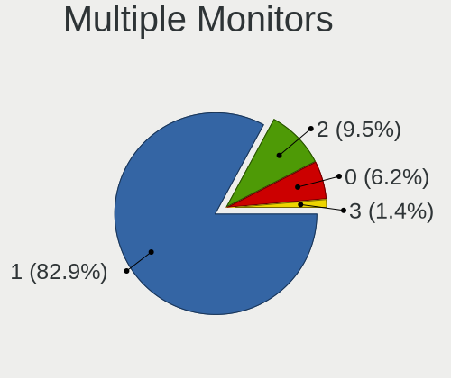

| Total | Computers | Percent |
|-------|-----------|---------|
| 1     | 488       | 82.57%  |
| 2     | 77        | 13.03%  |
| 0     | 19        | 3.21%   |
| 3     | 7         | 1.18%   |

Net Controller Vendor
---------------------

Controller vendors

| Vendor                            | Computers | Percent |
|-----------------------------------|-----------|---------|
| Realtek Semiconductor             | 333       | 36.43%  |
| Intel                             | 229       | 25.05%  |
| Qualcomm Atheros                  | 129       | 14.11%  |
| Broadcom Inc. and subsidiaries    | 58        | 6.35%   |
| Marvell Technology Group          | 27        | 2.95%   |
| Ralink                            | 17        | 1.86%   |
| Ralink Technology                 | 15        | 1.64%   |
| TP-Link                           | 13        | 1.42%   |
| Nvidia                            | 10        | 1.09%   |
| Broadcom Limited                  | 10        | 1.09%   |
| Dell                              | 5         | 0.55%   |
| D-Link                            | 4         | 0.44%   |
| ASUSTek Computer                  | 4         | 0.44%   |
| Xiaomi                            | 3         | 0.33%   |
| NetGear                           | 3         | 0.33%   |
| Ericsson Business Mobile Networks | 3         | 0.33%   |
| DisplayLink                       | 3         | 0.33%   |
| Belkin Components                 | 3         | 0.33%   |
| VIA Technologies                  | 2         | 0.22%   |
| Toshiba                           | 2         | 0.22%   |
| Silicon Integrated Systems [SiS]  | 2         | 0.22%   |
| Samsung Electronics               | 2         | 0.22%   |
| MosChip Semiconductor             | 2         | 0.22%   |
| Microsoft                         | 2         | 0.22%   |
| MediaTek                          | 2         | 0.22%   |
| Linksys                           | 2         | 0.22%   |
| LG Electronics                    | 2         | 0.22%   |
| JMicron Technology                | 2         | 0.22%   |
| IMC Networks                      | 2         | 0.22%   |
| D-Link System                     | 2         | 0.22%   |
| Broadcom                          | 2         | 0.22%   |
| Aquantia                          | 2         | 0.22%   |
| ZyDAS                             | 1         | 0.11%   |
| WiseGroup                         | 1         | 0.11%   |
| Winbond Electronics               | 1         | 0.11%   |
| Uniden                            | 1         | 0.11%   |
| ULi Electronics                   | 1         | 0.11%   |
| Sundance Technology Inc / IC Plus | 1         | 0.11%   |
| Sitecom Europe                    | 1         | 0.11%   |
| Sierra Wireless                   | 1         | 0.11%   |
| Qualcomm Atheros Communications   | 1         | 0.11%   |
| Qualcomm                          | 1         | 0.11%   |
| Mercucys                          | 1         | 0.11%   |
| HTC (High Tech Computer)          | 1         | 0.11%   |
| Guillemot                         | 1         | 0.11%   |
| Google                            | 1         | 0.11%   |
| Edimax Technology                 | 1         | 0.11%   |
| AVM                               | 1         | 0.11%   |
| ASIX Electronics                  | 1         | 0.11%   |

Net Controller Model
--------------------

Controller models

| Model                                                                     | Computers | Percent |
|---------------------------------------------------------------------------|-----------|---------|
| Realtek RTL8111/8168/8411 PCI Express Gigabit Ethernet Controller         | 230       | 21.74%  |
| Realtek RTL810xE PCI Express Fast Ethernet controller                     | 59        | 5.58%   |
| Intel 82579LM Gigabit Network Connection (Lewisville)                     | 36        | 3.4%    |
| Qualcomm Atheros AR9485 Wireless Network Adapter                          | 20        | 1.89%   |
| Intel Wi-Fi 6 AX200                                                       | 20        | 1.89%   |
| Qualcomm Atheros AR9285 Wireless Network Adapter (PCI-Express)            | 17        | 1.61%   |
| Qualcomm Atheros QCA9565 / AR9565 Wireless Network Adapter                | 14        | 1.32%   |
| Qualcomm Atheros QCA9377 802.11ac Wireless Network Adapter                | 14        | 1.32%   |
| Intel Wireless 7265                                                       | 14        | 1.32%   |
| Broadcom Inc. and subsidiaries BCM4313 802.11bgn Wireless Network Adapter | 12        | 1.13%   |
| Intel Wireless 7260                                                       | 11        | 1.04%   |
| Qualcomm Atheros AR242x / AR542x Wireless Network Adapter (PCI-Express)   | 10        | 0.95%   |
| Intel I211 Gigabit Network Connection                                     | 10        | 0.95%   |
| Intel Wireless 8265 / 8275                                                | 9         | 0.85%   |
| Intel Centrino Advanced-N 6205 [Taylor Peak]                              | 9         | 0.85%   |
| Realtek RTL8125 2.5GbE Controller                                         | 8         | 0.76%   |
| Qualcomm Atheros QCA6174 802.11ac Wireless Network Adapter                | 8         | 0.76%   |
| Intel Comet Lake PCH-LP CNVi WiFi                                         | 8         | 0.76%   |
| Intel Centrino Ultimate-N 6300                                            | 8         | 0.76%   |
| Realtek RTL88x2bu [AC1200 Techkey]                                        | 7         | 0.66%   |
| Intel Wireless 8260                                                       | 7         | 0.66%   |
| Intel Ethernet Connection I217-LM                                         | 7         | 0.66%   |
| Intel Ethernet Connection (3) I218-LM                                     | 7         | 0.66%   |
| Realtek RTL8188EUS 802.11n Wireless Network Adapter                       | 6         | 0.57%   |
| Realtek RTL8188EE Wireless Network Adapter                                | 6         | 0.57%   |
| Realtek RTL8153 Gigabit Ethernet Adapter                                  | 6         | 0.57%   |
| Qualcomm Atheros AR8151 v2.0 Gigabit Ethernet                             | 6         | 0.57%   |
| Marvell Group 88E8040 PCI-E Fast Ethernet Controller                      | 6         | 0.57%   |
| Intel Wireless-AC 9560 [Jefferson Peak]                                   | 6         | 0.57%   |
| Intel Ethernet Connection (7) I219-V                                      | 6         | 0.57%   |
| Intel Dual Band Wireless-AC 3168NGW [Stone Peak]                          | 6         | 0.57%   |
| Intel Centrino Wireless-N 2230                                            | 6         | 0.57%   |
| Realtek RTL8822CE 802.11ac PCIe Wireless Network Adapter                  | 5         | 0.47%   |
| Realtek RTL8822BE 802.11a/b/g/n/ac WiFi adapter                           | 5         | 0.47%   |
| Realtek RTL8821CE 802.11ac PCIe Wireless Network Adapter                  | 5         | 0.47%   |
| Realtek RTL-8100/8101L/8139 PCI Fast Ethernet Adapter                     | 5         | 0.47%   |
| Ralink RT2870/RT3070 Wireless Adapter                                     | 5         | 0.47%   |
| Ralink MT7601U Wireless Adapter                                           | 5         | 0.47%   |
| Ralink RT3090 Wireless 802.11n 1T/1R PCIe                                 | 5         | 0.47%   |
| Qualcomm Atheros QCA8171 Gigabit Ethernet                                 | 5         | 0.47%   |
| Qualcomm Atheros Killer E220x Gigabit Ethernet Controller                 | 5         | 0.47%   |
| Qualcomm Atheros AR9462 Wireless Network Adapter                          | 5         | 0.47%   |
| Qualcomm Atheros AR9287 Wireless Network Adapter (PCI-Express)            | 5         | 0.47%   |
| Qualcomm Atheros AR8162 Fast Ethernet                                     | 5         | 0.47%   |
| Qualcomm Atheros AR8131 Gigabit Ethernet                                  | 5         | 0.47%   |
| Nvidia MCP61 Ethernet                                                     | 5         | 0.47%   |
| Marvell Group 88E8056 PCI-E Gigabit Ethernet Controller                   | 5         | 0.47%   |
| Intel Wireless 3165                                                       | 5         | 0.47%   |
| Intel WiFi Link 5100                                                      | 5         | 0.47%   |
| Intel PRO/Wireless 3945ABG [Golan] Network Connection                     | 5         | 0.47%   |
| Intel Ethernet Connection (2) I219-V                                      | 5         | 0.47%   |
| Intel Cannon Point-LP CNVi [Wireless-AC]                                  | 5         | 0.47%   |
| Broadcom Inc. and subsidiaries BCM4312 802.11b/g LP-PHY                   | 5         | 0.47%   |
| TP-Link TL-WN823N v2/v3 [Realtek RTL8192EU]                               | 4         | 0.38%   |
| Realtek RTL8723DE Wireless Network Adapter                                | 4         | 0.38%   |
| Realtek RTL8192CU 802.11n WLAN Adapter                                    | 4         | 0.38%   |
| Realtek RTL8188CE 802.11b/g/n WiFi Adapter                                | 4         | 0.38%   |
| Ralink RT5370 Wireless Adapter                                            | 4         | 0.38%   |
| Intel Wireless 3160                                                       | 4         | 0.38%   |
| Intel Wi-Fi 6 AX201                                                       | 4         | 0.38%   |

Wireless Vendor
---------------

Wireless vendors

| Vendor                          | Computers | Percent |
|---------------------------------|-----------|---------|
| Intel                           | 165       | 35.71%  |
| Qualcomm Atheros                | 101       | 21.86%  |
| Realtek Semiconductor           | 72        | 15.58%  |
| Broadcom Inc. and subsidiaries  | 38        | 8.23%   |
| Ralink                          | 17        | 3.68%   |
| Ralink Technology               | 15        | 3.25%   |
| TP-Link                         | 12        | 2.6%    |
| Broadcom Limited                | 5         | 1.08%   |
| Dell                            | 4         | 0.87%   |
| D-Link                          | 4         | 0.87%   |
| ASUSTek Computer                | 4         | 0.87%   |
| NetGear                         | 3         | 0.65%   |
| Belkin Components               | 3         | 0.65%   |
| Microsoft                       | 2         | 0.43%   |
| Linksys                         | 2         | 0.43%   |
| IMC Networks                    | 2         | 0.43%   |
| D-Link System                   | 2         | 0.43%   |
| ZyDAS                           | 1         | 0.22%   |
| Winbond Electronics             | 1         | 0.22%   |
| Sitecom Europe                  | 1         | 0.22%   |
| Sierra Wireless                 | 1         | 0.22%   |
| Qualcomm Atheros Communications | 1         | 0.22%   |
| Mercucys                        | 1         | 0.22%   |
| MediaTek                        | 1         | 0.22%   |
| Marvell Technology Group        | 1         | 0.22%   |
| Guillemot                       | 1         | 0.22%   |
| Edimax Technology               | 1         | 0.22%   |
| AVM                             | 1         | 0.22%   |

Wireless Model
--------------

Wireless models

| Model                                                                     | Computers | Percent |
|---------------------------------------------------------------------------|-----------|---------|
| Qualcomm Atheros AR9485 Wireless Network Adapter                          | 20        | 4.27%   |
| Intel Wi-Fi 6 AX200                                                       | 20        | 4.27%   |
| Qualcomm Atheros AR9285 Wireless Network Adapter (PCI-Express)            | 17        | 3.63%   |
| Qualcomm Atheros QCA9565 / AR9565 Wireless Network Adapter                | 14        | 2.99%   |
| Qualcomm Atheros QCA9377 802.11ac Wireless Network Adapter                | 14        | 2.99%   |
| Intel Wireless 7265                                                       | 14        | 2.99%   |
| Broadcom Inc. and subsidiaries BCM4313 802.11bgn Wireless Network Adapter | 12        | 2.56%   |
| Intel Wireless 7260                                                       | 11        | 2.35%   |
| Qualcomm Atheros AR242x / AR542x Wireless Network Adapter (PCI-Express)   | 10        | 2.14%   |
| Intel Wireless 8265 / 8275                                                | 9         | 1.92%   |
| Intel Centrino Advanced-N 6205 [Taylor Peak]                              | 9         | 1.92%   |
| Qualcomm Atheros QCA6174 802.11ac Wireless Network Adapter                | 8         | 1.71%   |
| Intel Comet Lake PCH-LP CNVi WiFi                                         | 8         | 1.71%   |
| Intel Centrino Ultimate-N 6300                                            | 8         | 1.71%   |
| Realtek RTL88x2bu [AC1200 Techkey]                                        | 7         | 1.5%    |
| Intel Wireless 8260                                                       | 7         | 1.5%    |
| Realtek RTL8188EUS 802.11n Wireless Network Adapter                       | 6         | 1.28%   |
| Realtek RTL8188EE Wireless Network Adapter                                | 6         | 1.28%   |
| Intel Wireless-AC 9560 [Jefferson Peak]                                   | 6         | 1.28%   |
| Intel Dual Band Wireless-AC 3168NGW [Stone Peak]                          | 6         | 1.28%   |
| Intel Centrino Wireless-N 2230                                            | 6         | 1.28%   |
| Realtek RTL8822CE 802.11ac PCIe Wireless Network Adapter                  | 5         | 1.07%   |
| Realtek RTL8822BE 802.11a/b/g/n/ac WiFi adapter                           | 5         | 1.07%   |
| Realtek RTL8821CE 802.11ac PCIe Wireless Network Adapter                  | 5         | 1.07%   |
| Ralink RT2870/RT3070 Wireless Adapter                                     | 5         | 1.07%   |
| Ralink MT7601U Wireless Adapter                                           | 5         | 1.07%   |
| Ralink RT3090 Wireless 802.11n 1T/1R PCIe                                 | 5         | 1.07%   |
| Qualcomm Atheros AR9462 Wireless Network Adapter                          | 5         | 1.07%   |
| Qualcomm Atheros AR9287 Wireless Network Adapter (PCI-Express)            | 5         | 1.07%   |
| Intel Wireless 3165                                                       | 5         | 1.07%   |
| Intel WiFi Link 5100                                                      | 5         | 1.07%   |
| Intel PRO/Wireless 3945ABG [Golan] Network Connection                     | 5         | 1.07%   |
| Intel Cannon Point-LP CNVi [Wireless-AC]                                  | 5         | 1.07%   |
| Broadcom Inc. and subsidiaries BCM4312 802.11b/g LP-PHY                   | 5         | 1.07%   |
| TP-Link TL-WN823N v2/v3 [Realtek RTL8192EU]                               | 4         | 0.85%   |
| Realtek RTL8723DE Wireless Network Adapter                                | 4         | 0.85%   |
| Realtek RTL8192CU 802.11n WLAN Adapter                                    | 4         | 0.85%   |
| Realtek RTL8188CE 802.11b/g/n WiFi Adapter                                | 4         | 0.85%   |
| Ralink RT5370 Wireless Adapter                                            | 4         | 0.85%   |
| Intel Wireless 3160                                                       | 4         | 0.85%   |
| Intel Wi-Fi 6 AX201                                                       | 4         | 0.85%   |
| Intel PRO/Wireless 4965 AG or AGN [Kedron] Network Connection             | 4         | 0.85%   |
| Intel Comet Lake PCH CNVi WiFi                                            | 4         | 0.85%   |
| Intel Centrino Wireless-N 1000 [Condor Peak]                              | 4         | 0.85%   |
| Intel Centrino Advanced-N 6235                                            | 4         | 0.85%   |
| Realtek RTL8821AE 802.11ac PCIe Wireless Network Adapter                  | 3         | 0.64%   |
| Realtek RTL8723BE PCIe Wireless Network Adapter                           | 3         | 0.64%   |
| Realtek RTL8191SEvB Wireless LAN Controller                               | 3         | 0.64%   |
| Realtek RTL8187B Wireless 802.11g 54Mbps Network Adapter                  | 3         | 0.64%   |
| Realtek 802.11ac NIC                                                      | 3         | 0.64%   |
| Ralink RT3290 Wireless 802.11n 1T/1R PCIe                                 | 3         | 0.64%   |
| Ralink RT2561/RT61 802.11g PCI                                            | 3         | 0.64%   |
| Qualcomm Atheros AR928X Wireless Network Adapter (PCI-Express)            | 3         | 0.64%   |
| Intel Wireless-AC 9260                                                    | 3         | 0.64%   |
| Intel Ultimate N WiFi Link 5300                                           | 3         | 0.64%   |
| Intel Dual Band Wireless-AC 3165 Plus Bluetooth                           | 3         | 0.64%   |
| Intel Centrino Advanced-N 6230 [Rainbow Peak]                             | 3         | 0.64%   |
| Broadcom Inc. and subsidiaries BCM43224 802.11a/b/g/n                     | 3         | 0.64%   |
| Broadcom Inc. and subsidiaries BCM43142 802.11b/g/n                       | 3         | 0.64%   |
| Broadcom Inc. and subsidiaries BCM4311 802.11b/g WLAN                     | 3         | 0.64%   |

Ethernet Vendor
---------------

Ethernet vendors

| Vendor                            | Computers | Percent |
|-----------------------------------|-----------|---------|
| Realtek Semiconductor             | 309       | 54.02%  |
| Intel                             | 125       | 21.85%  |
| Qualcomm Atheros                  | 41        | 7.17%   |
| Broadcom Inc. and subsidiaries    | 28        | 4.9%    |
| Marvell Technology Group          | 26        | 4.55%   |
| Nvidia                            | 10        | 1.75%   |
| Broadcom Limited                  | 5         | 0.87%   |
| Xiaomi                            | 3         | 0.52%   |
| DisplayLink                       | 3         | 0.52%   |
| VIA Technologies                  | 2         | 0.35%   |
| Silicon Integrated Systems [SiS]  | 2         | 0.35%   |
| MosChip Semiconductor             | 2         | 0.35%   |
| JMicron Technology                | 2         | 0.35%   |
| Broadcom                          | 2         | 0.35%   |
| Aquantia                          | 2         | 0.35%   |
| ULi Electronics                   | 1         | 0.17%   |
| TP-Link                           | 1         | 0.17%   |
| Sundance Technology Inc / IC Plus | 1         | 0.17%   |
| Samsung Electronics               | 1         | 0.17%   |
| Qualcomm                          | 1         | 0.17%   |
| MediaTek                          | 1         | 0.17%   |
| LG Electronics                    | 1         | 0.17%   |
| HTC (High Tech Computer)          | 1         | 0.17%   |
| Google                            | 1         | 0.17%   |
| ASIX Electronics                  | 1         | 0.17%   |

Ethernet Model
--------------

Ethernet models

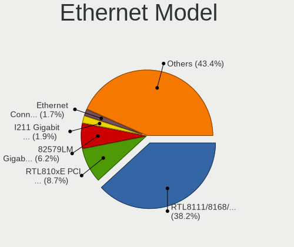

| Model                                                                          | Computers | Percent |
|--------------------------------------------------------------------------------|-----------|---------|
| Realtek RTL8111/8168/8411 PCI Express Gigabit Ethernet Controller              | 230       | 39.72%  |
| Realtek RTL810xE PCI Express Fast Ethernet controller                          | 59        | 10.19%  |
| Intel 82579LM Gigabit Network Connection (Lewisville)                          | 36        | 6.22%   |
| Intel I211 Gigabit Network Connection                                          | 10        | 1.73%   |
| Realtek RTL8125 2.5GbE Controller                                              | 8         | 1.38%   |
| Intel Ethernet Connection I217-LM                                              | 7         | 1.21%   |
| Intel Ethernet Connection (3) I218-LM                                          | 7         | 1.21%   |
| Realtek RTL8153 Gigabit Ethernet Adapter                                       | 6         | 1.04%   |
| Qualcomm Atheros AR8151 v2.0 Gigabit Ethernet                                  | 6         | 1.04%   |
| Marvell Group 88E8040 PCI-E Fast Ethernet Controller                           | 6         | 1.04%   |
| Intel Ethernet Connection (7) I219-V                                           | 6         | 1.04%   |
| Realtek RTL-8100/8101L/8139 PCI Fast Ethernet Adapter                          | 5         | 0.86%   |
| Qualcomm Atheros QCA8171 Gigabit Ethernet                                      | 5         | 0.86%   |
| Qualcomm Atheros Killer E220x Gigabit Ethernet Controller                      | 5         | 0.86%   |
| Qualcomm Atheros AR8162 Fast Ethernet                                          | 5         | 0.86%   |
| Qualcomm Atheros AR8131 Gigabit Ethernet                                       | 5         | 0.86%   |
| Nvidia MCP61 Ethernet                                                          | 5         | 0.86%   |
| Marvell Group 88E8056 PCI-E Gigabit Ethernet Controller                        | 5         | 0.86%   |
| Intel Ethernet Connection (2) I219-V                                           | 5         | 0.86%   |
| Intel Ethernet Connection I219-LM                                              | 4         | 0.69%   |
| Intel Ethernet Connection I218-LM                                              | 4         | 0.69%   |
| Intel 82577LM Gigabit Network Connection                                       | 4         | 0.69%   |
| Intel 82567LM Gigabit Network Connection                                       | 4         | 0.69%   |
| Broadcom Inc. and subsidiaries NetLink BCM5787M Gigabit Ethernet PCI Express   | 4         | 0.69%   |
| Xiaomi Mi/Redmi series (RNDIS)                                                 | 3         | 0.52%   |
| Qualcomm Atheros Attansic L2 Fast Ethernet                                     | 3         | 0.52%   |
| Qualcomm Atheros AR8121/AR8113/AR8114 Gigabit or Fast Ethernet                 | 3         | 0.52%   |
| Marvell Group Yukon Optima 88E8059 [PCIe Gigabit Ethernet Controller with AVB] | 3         | 0.52%   |
| Marvell Group 88E8039 PCI-E Fast Ethernet Controller                           | 3         | 0.52%   |
| Intel Ethernet Connection I217-V                                               | 3         | 0.52%   |
| Intel Ethernet Connection (7) I219-LM                                          | 3         | 0.52%   |
| Intel Ethernet Connection (6) I219-V                                           | 3         | 0.52%   |
| Intel Ethernet Connection (2) I219-LM                                          | 3         | 0.52%   |
| Intel 82574L Gigabit Network Connection                                        | 3         | 0.52%   |
| Intel 82567LM-3 Gigabit Network Connection                                     | 3         | 0.52%   |
| Broadcom Inc. and subsidiaries NetXtreme BCM5764M Gigabit Ethernet PCIe        | 3         | 0.52%   |
| Broadcom Inc. and subsidiaries NetLink BCM57780 Gigabit Ethernet PCIe          | 3         | 0.52%   |
| VIA VT6102/VT6103 [Rhine-II]                                                   | 2         | 0.35%   |
| Silicon Integrated Systems [SiS] 191 Gigabit Ethernet Adapter                  | 2         | 0.35%   |
| Realtek RTL8169 PCI Gigabit Ethernet Controller                                | 2         | 0.35%   |
| Qualcomm Atheros Killer E2400 Gigabit Ethernet Controller                      | 2         | 0.35%   |
| Qualcomm Atheros AR8152 v1.1 Fast Ethernet                                     | 2         | 0.35%   |
| Nvidia MCP79 Ethernet                                                          | 2         | 0.35%   |
| MosChip MCS7830 10/100 Mbps Ethernet adapter                                   | 2         | 0.35%   |
| Marvell Group 88E8071 PCI-E Gigabit Ethernet Controller                        | 2         | 0.35%   |
| Marvell Group 88E8058 PCI-E Gigabit Ethernet Controller                        | 2         | 0.35%   |
| Marvell Group 88E8057 PCI-E Gigabit Ethernet Controller                        | 2         | 0.35%   |
| Marvell Group 88E8055 PCI-E Gigabit Ethernet Controller                        | 2         | 0.35%   |
| JMicron JMC250 PCI Express Gigabit Ethernet Controller                         | 2         | 0.35%   |
| Intel Ethernet Connection (11) I219-V                                          | 2         | 0.35%   |
| Intel 82573L Gigabit Ethernet Controller                                       | 2         | 0.35%   |
| Intel 82566MM Gigabit Network Connection                                       | 2         | 0.35%   |
| Intel 82557/8/9/0/1 Ethernet Pro 100                                           | 2         | 0.35%   |
| Broadcom Limited NetLink BCM57780 Gigabit Ethernet PCIe                        | 2         | 0.35%   |
| Broadcom Inc. and subsidiaries NetXtreme BCM57765 Gigabit Ethernet PCIe        | 2         | 0.35%   |
| Broadcom Inc. and subsidiaries NetXtreme BCM5761 Gigabit Ethernet PCIe         | 2         | 0.35%   |
| Broadcom Inc. and subsidiaries NetLink BCM5906M Fast Ethernet PCI Express      | 2         | 0.35%   |
| Broadcom Inc. and subsidiaries NetLink BCM57785 Gigabit Ethernet PCIe          | 2         | 0.35%   |
| ULi ULi 1689,1573 integrated ethernet.                                         | 1         | 0.17%   |
| TP-Link UE300 10/100/1000 LAN (ethernet mode) [Realtek RTL8153]                | 1         | 0.17%   |

Net Controller Kind
-------------------

Ethernet, WiFi or modem

| Kind     | Computers | Percent |
|----------|-----------|---------|
| Ethernet | 541       | 55.04%  |
| WiFi     | 431       | 43.85%  |
| Modem    | 10        | 1.02%   |
| Unknown  | 1         | 0.1%    |

Used Controller
---------------

Currently used network controller

| Kind     | Computers | Percent |
|----------|-----------|---------|
| Ethernet | 442       | 52.81%  |
| WiFi     | 395       | 47.19%  |

NICs
----

Total network controllers on board

| Total | Computers | Percent |
|-------|-----------|---------|
| 2     | 330       | 55.84%  |
| 1     | 237       | 40.1%   |
| 3     | 13        | 2.2%    |
| 0     | 11        | 1.86%   |

IPv6
----

IPv6 vs IPv4

| Used | Computers | Percent |
|------|-----------|---------|
| No   | 436       | 73.77%  |
| Yes  | 155       | 26.23%  |

Memory Vendor
-------------

Memory module vendors

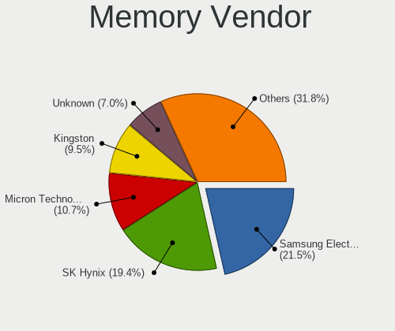

| Vendor                               | Computers | Percent |
|--------------------------------------|-----------|---------|
| Samsung Electronics                  | 44        | 19.3%   |
| SK Hynix                             | 43        | 18.86%  |
| Unknown                              | 26        | 11.4%   |
| Kingston                             | 26        | 11.4%   |
| Micron Technology                    | 18        | 7.89%   |
| Corsair                              | 13        | 5.7%    |
| Crucial                              | 12        | 5.26%   |
| G.Skill                              | 9         | 3.95%   |
| Ramaxel Technology                   | 5         | 2.19%   |
| Nanya Technology                     | 4         | 1.75%   |
| A-DATA Technology                    | 4         | 1.75%   |
| Unknown (ABCD)                       | 2         | 0.88%   |
| Patriot                              | 2         | 0.88%   |
| ELPIDA                               | 2         | 0.88%   |
| Avant                                | 2         | 0.88%   |
| Apacer                               | 2         | 0.88%   |
| Unknown (8A76)                       | 1         | 0.44%   |
| Teikon                               | 1         | 0.44%   |
| Team                                 | 1         | 0.44%   |
| Smart                                | 1         | 0.44%   |
| Sesame                               | 1         | 0.44%   |
| Qimonda                              | 1         | 0.44%   |
| Positivo                             | 1         | 0.44%   |
| Novatech                             | 1         | 0.44%   |
| Kingmax                              | 1         | 0.44%   |
| GOODRAM                              | 1         | 0.44%   |
| Foxline                              | 1         | 0.44%   |
| Chun Well Technology Holding Limited | 1         | 0.44%   |
| 430112204340C940                     | 1         | 0.44%   |
| 430112174392063E                     | 1         | 0.44%   |

Memory Model
------------

Memory module models

| Model                                                             | Computers | Percent |
|-------------------------------------------------------------------|-----------|---------|
| SK Hynix RAM HMT41GS6BFR8A-PB 8192MB SODIMM DDR3 1600MT/s         | 4         | 1.62%   |
| Samsung RAM M471A1K43DB1-CWE 8GB SODIMM DDR4 3200MT/s             | 4         | 1.62%   |
| SK Hynix RAM HMA851S6AFR6N-UH 4GB SODIMM DDR4 2667MT/s            | 3         | 1.21%   |
| Samsung RAM M471B5273CH0-CK0 4096MB SODIMM DDR3 1600MT/s          | 3         | 1.21%   |
| Samsung RAM M471A5244CB0-CRC 4GB SODIMM DDR4 2667MT/s             | 3         | 1.21%   |
| Micron RAM 4ATF51264HZ-2G6E1 4GB SODIMM DDR4 2667MT/s             | 3         | 1.21%   |
| Unknown RAM Module 4096MB DIMM DDR3 1600MT/s                      | 2         | 0.81%   |
| Unknown RAM Module 4096MB DIMM DDR3 1333MT/s                      | 2         | 0.81%   |
| Unknown RAM Module 2048MB DIMM SDRAM                              | 2         | 0.81%   |
| Unknown (ABCD) RAM 123456789012345678 2GB DIMM LPDDR4 2400MT/s    | 2         | 0.81%   |
| SK Hynix RAM HMT451U6AFR8C-PB 4096MB DIMM DDR3 1600MT/s           | 2         | 0.81%   |
| SK Hynix RAM HMT451S6MFR8A-PB 4GB SODIMM DDR3 1600MT/s            | 2         | 0.81%   |
| SK Hynix RAM HMA81GS6CJR8N-VK 8192MB SODIMM DDR4 2667MT/s         | 2         | 0.81%   |
| Samsung RAM M471B5773DH0-CH9 2048MB SODIMM DDR3 1600MT/s          | 2         | 0.81%   |
| Samsung RAM M471B5773CHS-CK0 2GB SODIMM DDR3 1600MT/s             | 2         | 0.81%   |
| Samsung RAM M471B5273CH0-YK0 4GB SODIMM DDR3 1600MT/s             | 2         | 0.81%   |
| Samsung RAM M471B5273CH0-CH9 4GB SODIMM DDR3 1334MT/s             | 2         | 0.81%   |
| Samsung RAM M471B5173EB0-YK0 4GB SODIMM DDR3 1600MT/s             | 2         | 0.81%   |
| Samsung RAM M471B1G73EB0-YK0 8192MB SODIMM DDR3 1600MT/s          | 2         | 0.81%   |
| Samsung RAM M471B1G73DB0-YK0 8GB SODIMM DDR3 1600MT/s             | 2         | 0.81%   |
| Samsung RAM M471A1K43CB1-CRC 8GB SODIMM DDR4 2667MT/s             | 2         | 0.81%   |
| Ramaxel RAM RMSA3260MH78HAF-2666 8192MB SODIMM DDR4 2667MT/s      | 2         | 0.81%   |
| Micron RAM MT52L1G32D4PG-093 8GB Row Of Chips LPDDR3 2133MT/s     | 2         | 0.81%   |
| Micron RAM 8ATF1G64HZ-3G2J1 8GB SODIMM DDR4 3200MT/s              | 2         | 0.81%   |
| Kingston RAM KHX2400C11D3/8GX 8192MB DIMM DDR3 2400MT/s           | 2         | 0.81%   |
| Kingston RAM 9905744-066.A00G 32GB SODIMM DDR4 3200MT/s           | 2         | 0.81%   |
| Crucial RAM CT102464BF160B.M16 8192MB SODIMM DDR3 1600MT/s        | 2         | 0.81%   |
| Avant RAM H641GU67G1600G 8192MB SODIMM DDR3 1600MT/s              | 2         | 0.81%   |
| Unknown SODIMM 2048MB SODIMM DDR2 667MT/s                         | 1         | 0.4%    |
| Unknown RAM Module 8GB SODIMM DDR3 1333MT/s                       | 1         | 0.4%    |
| Unknown RAM Module 8192MB Row Of Chips LPDDR4 4266MT/s            | 1         | 0.4%    |
| Unknown RAM Module 4096MB SODIMM DDR3 1600MT/s                    | 1         | 0.4%    |
| Unknown RAM Module 4096MB SODIMM DDR3                             | 1         | 0.4%    |
| Unknown RAM Module 4096MB SODIMM DDR2 667MT/s                     | 1         | 0.4%    |
| Unknown RAM Module 4096MB DIMM DDR2 800MT/s                       | 1         | 0.4%    |
| Unknown RAM Module 2GB SODIMM DDR3 1600MT/s                       | 1         | 0.4%    |
| Unknown RAM Module 2GB SODIMM DDR2                                | 1         | 0.4%    |
| Unknown RAM Module 2GB DIMM DDR2 800MT/s                          | 1         | 0.4%    |
| Unknown RAM Module 2GB DIMM 800MT/s                               | 1         | 0.4%    |
| Unknown RAM Module 256MB DIMM SDRAM                               | 1         | 0.4%    |
| Unknown RAM Module 2048MB SODIMM DRAM                             | 1         | 0.4%    |
| Unknown RAM Module 2048MB SODIMM DDR2 667MT/s                     | 1         | 0.4%    |
| Unknown RAM Module 2048MB DIMM DDR2 800MT/s                       | 1         | 0.4%    |
| Unknown RAM Module 2048MB DIMM DDR 1333MT/s                       | 1         | 0.4%    |
| Unknown RAM Module 2048MB DIMM 1333MT/s                           | 1         | 0.4%    |
| Unknown RAM Module 1GB SODIMM DDR2                                | 1         | 0.4%    |
| Unknown RAM Module 1024MB SODIMM SDRAM                            | 1         | 0.4%    |
| Unknown RAM Module 1024MB SODIMM DDR2 667MT/s                     | 1         | 0.4%    |
| Unknown RAM Module 1024MB SODIMM DDR2                             | 1         | 0.4%    |
| Unknown RAM Module 1024MB DIMM DDR2                               | 1         | 0.4%    |
| Unknown (8A76) RAM LD4AS008G-H2666GST 8192MB SODIMM DDR4 2667MT/s | 1         | 0.4%    |
| Teikon RAM TMA81GS6CJR8N-VKSC 8GB SODIMM DDR4 2667MT/s            | 1         | 0.4%    |
| Team RAM TEAMGROUP-SD4-2666 16384MB SODIMM DDR4 2667MT/s          | 1         | 0.4%    |
| Smart RAM SH5641G8FJ8NWRNSQG 8192MB SODIMM DDR3 1600MT/s          | 1         | 0.4%    |
| SK Hynix RAM Module 4096MB Row Of Chips LPDDR4 4267MT/s           | 1         | 0.4%    |
| SK Hynix RAM Module 2048MB DIMM DDR3 1333MT/s                     | 1         | 0.4%    |
| SK Hynix RAM Module 16384MB SODIMM DDR4 3200MT/s                  | 1         | 0.4%    |
| SK Hynix RAM Module 16384MB SODIMM DDR4 2667MT/s                  | 1         | 0.4%    |
| SK Hynix RAM HYMP112U72CP8-S6 1024MB DIMM DDR2 800MT/s            | 1         | 0.4%    |
| SK Hynix RAM HMT451S6BFR8A-PB 4GB SODIMM DDR3 1600MT/s            | 1         | 0.4%    |

Memory Kind
-----------

Memory module kinds

| Kind    | Computers | Percent |
|---------|-----------|---------|
| DDR3    | 83        | 43.46%  |
| DDR4    | 73        | 38.22%  |
| DDR2    | 13        | 6.81%   |
| LPDDR4  | 8         | 4.19%   |
| SDRAM   | 7         | 3.66%   |
| LPDDR3  | 3         | 1.57%   |
| Unknown | 2         | 1.05%   |
| DRAM    | 1         | 0.52%   |
| DDR     | 1         | 0.52%   |

Memory Form Factor
------------------

Physical design of the memory module

| Name         | Computers | Percent |
|--------------|-----------|---------|
| SODIMM       | 114       | 60.64%  |
| DIMM         | 66        | 35.11%  |
| Row Of Chips | 8         | 4.26%   |

Memory Size
-----------

Memory module size

| Size  | Computers | Percent |
|-------|-----------|---------|
| 8192  | 81        | 38.03%  |
| 4096  | 67        | 31.46%  |
| 2048  | 33        | 15.49%  |
| 16384 | 19        | 8.92%   |
| 1024  | 8         | 3.76%   |
| 32768 | 4         | 1.88%   |
| 256   | 1         | 0.47%   |

Memory Speed
------------

Memory module speed

| Speed   | Computers | Percent |
|---------|-----------|---------|
| 1600    | 54        | 26.21%  |
| 2667    | 28        | 13.59%  |
| 1333    | 23        | 11.17%  |
| 3200    | 22        | 10.68%  |
| 2400    | 16        | 7.77%   |
| 2133    | 9         | 4.37%   |
| Unknown | 9         | 4.37%   |
| 800     | 7         | 3.4%    |
| 1334    | 6         | 2.91%   |
| 667     | 5         | 2.43%   |
| 3600    | 4         | 1.94%   |
| 1067    | 3         | 1.46%   |
| 4267    | 2         | 0.97%   |
| 4199    | 2         | 0.97%   |
| 2666    | 2         | 0.97%   |
| 1867    | 2         | 0.97%   |
| 4266    | 1         | 0.49%   |
| 3800    | 1         | 0.49%   |
| 3533    | 1         | 0.49%   |
| 3334    | 1         | 0.49%   |
| 3266    | 1         | 0.49%   |
| 2933    | 1         | 0.49%   |
| 2800    | 1         | 0.49%   |
| 2048    | 1         | 0.49%   |
| 1866    | 1         | 0.49%   |
| 1800    | 1         | 0.49%   |
| 1648    | 1         | 0.49%   |
| 1066    | 1         | 0.49%   |

Sound Vendor
------------

Sound card vendors

| Vendor                                          | Computers | Percent |
|-------------------------------------------------|-----------|---------|
| Intel                                           | 424       | 53.54%  |
| AMD                                             | 178       | 22.47%  |
| Nvidia                                          | 113       | 14.27%  |
| C-Media Electronics                             | 14        | 1.77%   |
| Logitech                                        | 8         | 1.01%   |
| Creative Labs                                   | 7         | 0.88%   |
| GN Netcom                                       | 4         | 0.51%   |
| Silicon Integrated Systems [SiS]                | 3         | 0.38%   |
| Realtek Semiconductor                           | 3         | 0.38%   |
| Creative Technology                             | 3         | 0.38%   |
| VIA Technologies                                | 2         | 0.25%   |
| Texas Instruments                               | 2         | 0.25%   |
| Plantronics                                     | 2         | 0.25%   |
| Kingston Technology                             | 2         | 0.25%   |
| JMTek                                           | 2         | 0.25%   |
| Generalplus Technology                          | 2         | 0.25%   |
| Ensoniq                                         | 2         | 0.25%   |
| WinChipHead                                     | 1         | 0.13%   |
| ULi Electronics                                 | 1         | 0.13%   |
| TOWA Electronics                                | 1         | 0.13%   |
| Shure                                           | 1         | 0.13%   |
| Sennheiser Communications                       | 1         | 0.13%   |
| Samson Technologies                             | 1         | 0.13%   |
| Rockwell International                          | 1         | 0.13%   |
| Razer USA                                       | 1         | 0.13%   |
| Philips (or NXP)                                | 1         | 0.13%   |
| Native Instruments                              | 1         | 0.13%   |
| Microsoft                                       | 1         | 0.13%   |
| Microchip Technology                            | 1         | 0.13%   |
| Medeli Electronics                              | 1         | 0.13%   |
| Licensed by Sony Computer Entertainment America | 1         | 0.13%   |
| Hewlett-Packard                                 | 1         | 0.13%   |
| Evolution Electronics                           | 1         | 0.13%   |
| Dell                                            | 1         | 0.13%   |
| Corsair                                         | 1         | 0.13%   |
| Cambridge Silicon Radio                         | 1         | 0.13%   |
| BEHRINGER International                         | 1         | 0.13%   |
| Apple                                           | 1         | 0.13%   |

Sound Model
-----------

Sound card models

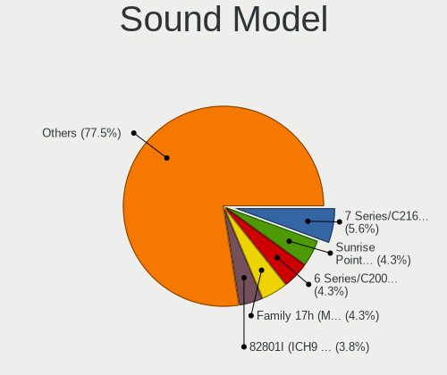

| Model                                                                                             | Computers | Percent |
|---------------------------------------------------------------------------------------------------|-----------|---------|
| Intel 6 Series/C200 Series Chipset Family High Definition Audio Controller                        | 60        | 6.37%   |
| Intel 7 Series/C216 Chipset Family High Definition Audio Controller                               | 43        | 4.56%   |
| Intel 5 Series/3400 Series Chipset High Definition Audio                                          | 36        | 3.82%   |
| Intel Sunrise Point-LP HD Audio                                                                   | 35        | 3.72%   |
| Intel NM10/ICH7 Family High Definition Audio Controller                                           | 30        | 3.18%   |
| AMD SBx00 Azalia (Intel HDA)                                                                      | 30        | 3.18%   |
| AMD Family 17h (Models 10h-1fh) HD Audio Controller                                               | 30        | 3.18%   |
| Intel 82801I (ICH9 Family) HD Audio Controller                                                    | 28        | 2.97%   |
| Intel 8 Series/C220 Series Chipset High Definition Audio Controller                               | 27        | 2.87%   |
| AMD FCH Azalia Controller                                                                         | 27        | 2.87%   |
| Intel Xeon E3-1200 v3/4th Gen Core Processor HD Audio Controller                                  | 24        | 2.55%   |
| Intel 82801H (ICH8 Family) HD Audio Controller                                                    | 19        | 2.02%   |
| Intel Cannon Lake PCH cAVS                                                                        | 18        | 1.91%   |
| AMD Starship/Matisse HD Audio Controller                                                          | 18        | 1.91%   |
| AMD Raven/Raven2/Fenghuang HDMI/DP Audio Controller                                               | 17        | 1.8%    |
| AMD Family 17h (Models 00h-0fh) HD Audio Controller                                               | 17        | 1.8%    |
| AMD Cedar HDMI Audio [Radeon HD 5400/6300/7300 Series]                                            | 17        | 1.8%    |
| Intel Wildcat Point-LP High Definition Audio Controller                                           | 15        | 1.59%   |
| Intel Broadwell-U Audio Controller                                                                | 15        | 1.59%   |
| AMD Ellesmere HDMI Audio [Radeon RX 470/480 / 570/580/590]                                        | 15        | 1.59%   |
| Intel Haswell-ULT HD Audio Controller                                                             | 14        | 1.49%   |
| Intel 8 Series HD Audio Controller                                                                | 14        | 1.49%   |
| Intel Cannon Point-LP High Definition Audio Controller                                            | 12        | 1.27%   |
| Nvidia GF108 High Definition Audio Controller                                                     | 11        | 1.17%   |
| AMD Renoir Radeon High Definition Audio Controller                                                | 11        | 1.17%   |
| Intel 100 Series/C230 Series Chipset Family HD Audio Controller                                   | 10        | 1.06%   |
| AMD RV710/730 HDMI Audio [Radeon HD 4000 series]                                                  | 10        | 1.06%   |
| Nvidia TU116 High Definition Audio Controller                                                     | 9         | 0.96%   |
| AMD Kabini HDMI/DP Audio                                                                          | 9         | 0.96%   |
| Nvidia GP106 High Definition Audio Controller                                                     | 8         | 0.85%   |
| Intel Comet Lake PCH-LP cAVS                                                                      | 8         | 0.85%   |
| Intel 82801JI (ICH10 Family) HD Audio Controller                                                  | 8         | 0.85%   |
| Intel 200 Series PCH HD Audio                                                                     | 8         | 0.85%   |
| Nvidia High Definition Audio Controller                                                           | 7         | 0.74%   |
| Intel Comet Lake PCH cAVS                                                                         | 7         | 0.74%   |
| AMD Trinity HDMI Audio Controller                                                                 | 7         | 0.74%   |
| AMD Oland/Hainan/Cape Verde/Pitcairn HDMI Audio [Radeon HD 7000 Series]                           | 7         | 0.74%   |
| Nvidia MCP61 High Definition Audio                                                                | 6         | 0.64%   |
| Nvidia GP107GL High Definition Audio Controller                                                   | 6         | 0.64%   |
| Nvidia GF119 HDMI Audio Controller                                                                | 6         | 0.64%   |
| Intel Tiger Lake-LP Smart Sound Technology Audio Controller                                       | 6         | 0.64%   |
| AMD Redwood HDMI Audio [Radeon HD 5000 Series]                                                    | 6         | 0.64%   |
| AMD Baffin HDMI/DP Audio [Radeon RX 550 640SP / RX 560/560X]                                      | 6         | 0.64%   |
| Nvidia TU107 GeForce GTX 1650 High Definition Audio Controller                                    | 5         | 0.53%   |
| Nvidia GK208 HDMI/DP Audio Controller                                                             | 5         | 0.53%   |
| Nvidia GF116 High Definition Audio Controller                                                     | 5         | 0.53%   |
| Intel Atom/Celeron/Pentium Processor x5-E8000/J3xxx/N3xxx Series High Definition Audio Controller | 5         | 0.53%   |
| Intel Atom Processor Z36xxx/Z37xxx Series High Definition Audio Controller                        | 5         | 0.53%   |
| AMD Wrestler HDMI Audio                                                                           | 5         | 0.53%   |
| AMD Family 15h (Models 60h-6fh) Audio Controller                                                  | 5         | 0.53%   |
| AMD Caicos HDMI Audio [Radeon HD 6450 / 7450/8450/8490 OEM / R5 230/235/235X OEM]                 | 5         | 0.53%   |
| Nvidia TU106 High Definition Audio Controller                                                     | 4         | 0.42%   |
| Nvidia GT216 HDMI Audio Controller                                                                | 4         | 0.42%   |
| Nvidia GP104 High Definition Audio Controller                                                     | 4         | 0.42%   |
| Nvidia GM206 High Definition Audio Controller                                                     | 4         | 0.42%   |
| Nvidia GK106 HDMI Audio Controller                                                                | 4         | 0.42%   |
| Nvidia GK104 HDMI Audio Controller                                                                | 4         | 0.42%   |
| Intel CM238 HD Audio Controller                                                                   | 4         | 0.42%   |
| Intel Celeron/Pentium Silver Processor High Definition Audio                                      | 4         | 0.42%   |
| Intel 9 Series Chipset Family HD Audio Controller                                                 | 4         | 0.42%   |

Camera Vendor
-------------

Camera device vendors

| Vendor                                 | Computers | Percent |
|----------------------------------------|-----------|---------|
| Chicony Electronics                    | 52        | 15.81%  |
| Realtek Semiconductor                  | 38        | 11.55%  |
| Microdia                               | 34        | 10.33%  |
| IMC Networks                           | 20        | 6.08%   |
| Suyin                                  | 18        | 5.47%   |
| Sunplus Innovation Technology          | 17        | 5.17%   |
| Logitech                               | 16        | 4.86%   |
| Acer                                   | 16        | 4.86%   |
| Syntek                                 | 12        | 3.65%   |
| Quanta                                 | 12        | 3.65%   |
| Cheng Uei Precision Industry (Foxlink) | 12        | 3.65%   |
| Silicon Motion                         | 8         | 2.43%   |
| Lite-On Technology                     | 8         | 2.43%   |
| Apple                                  | 8         | 2.43%   |
| Microsoft                              | 6         | 1.82%   |
| Ricoh                                  | 5         | 1.52%   |
| Importek                               | 4         | 1.22%   |
| Alcor Micro                            | 4         | 1.22%   |
| Samsung Electronics                    | 3         | 0.91%   |
| MacroSilicon                           | 3         | 0.91%   |
| Luxvisions Innotech Limited            | 3         | 0.91%   |
| Z-Star Microelectronics                | 2         | 0.61%   |
| SHENZHEN Fullhan                       | 2         | 0.61%   |
| OmniVision Technologies                | 2         | 0.61%   |
| KYE Systems (Mouse Systems)            | 2         | 0.61%   |
| Genesys Logic                          | 2         | 0.61%   |
| GEMBIRD                                | 2         | 0.61%   |
| Creative Technology                    | 2         | 0.61%   |
| ARC International                      | 2         | 0.61%   |
| ALi                                    | 2         | 0.61%   |
| Sunplus Technology                     | 1         | 0.3%    |
| Primax Electronics                     | 1         | 0.3%    |
| Pixart Imaging                         | 1         | 0.3%    |
| Novatek Microelectronics               | 1         | 0.3%    |
| Lenovo                                 | 1         | 0.3%    |
| Intel                                  | 1         | 0.3%    |
| Huawei Technologies                    | 1         | 0.3%    |
| Hewlett-Packard                        | 1         | 0.3%    |
| Generalplus Technology                 | 1         | 0.3%    |
| eMPIA Technology                       | 1         | 0.3%    |
| DigiTech                               | 1         | 0.3%    |
| Cubeternet                             | 1         | 0.3%    |

Camera Model
------------

Camera device models

| Model                                            | Computers | Percent |
|--------------------------------------------------|-----------|---------|
| Chicony Integrated Camera                        | 10        | 3.02%   |
| Realtek Integrated_Webcam_HD                     | 9         | 2.72%   |
| Microdia Integrated_Webcam_HD                    | 7         | 2.11%   |
| Microdia Integrated Webcam                       | 6         | 1.81%   |
| Logitech Webcam C270                             | 6         | 1.81%   |
| Suyin Acer CrystalEye Webcam                     | 5         | 1.51%   |
| Sunplus Integrated_Webcam_HD                     | 5         | 1.51%   |
| Acer Integrated Camera                           | 5         | 1.51%   |
| Syntek Integrated Camera                         | 4         | 1.21%   |
| Realtek USB Camera                               | 4         | 1.21%   |
| Microdia USB 2.0 Camera                          | 4         | 1.21%   |
| Microdia Laptop_Integrated_Webcam_HD             | 4         | 1.21%   |
| IMC Networks Integrated Camera                   | 4         | 1.21%   |
| Chicony EasyCamera                               | 4         | 1.21%   |
| Apple iPhone 5/5C/5S/6/SE                        | 4         | 1.21%   |
| Samsung Galaxy A5 (MTP)                          | 3         | 0.91%   |
| Realtek USB2.0 HD UVC WebCam                     | 3         | 0.91%   |
| Realtek Lenovo EasyCamera                        | 3         | 0.91%   |
| Realtek EasyCamera                               | 3         | 0.91%   |
| Quanta HP TrueVision HD Camera                   | 3         | 0.91%   |
| MacroSilicon USB Video                           | 3         | 0.91%   |
| IMC Networks USB2.0 VGA UVC WebCam               | 3         | 0.91%   |
| IMC Networks USB2.0 UVC VGA WebCam               | 3         | 0.91%   |
| IMC Networks USB2.0 HD UVC WebCam                | 3         | 0.91%   |
| Chicony USB2.0 HD UVC WebCam                     | 3         | 0.91%   |
| Chicony HP Truevision HD                         | 3         | 0.91%   |
| Chicony HD WebCam                                | 3         | 0.91%   |
| Cheng Uei Precision Industry (Foxlink) HP Webcam | 3         | 0.91%   |
| Apple Built-in iSight                            | 3         | 0.91%   |
| Acer EasyCamera                                  | 3         | 0.91%   |
| Syntek Lenovo EasyCamera                         | 2         | 0.6%    |
| Syntek EasyCamera                                | 2         | 0.6%    |
| Suyin Sony Visual Communication Camera           | 2         | 0.6%    |
| Suyin Acer/HP Integrated Webcam [CN0314]         | 2         | 0.6%    |
| Sunplus Laptop_Integrated_Webcam_HD              | 2         | 0.6%    |
| Sunplus Laptop_Integrated_Webcam_FHD             | 2         | 0.6%    |
| Sunplus HD WebCam                                | 2         | 0.6%    |
| Sunplus Dell Integrated Webcam                   | 2         | 0.6%    |
| Sunplus Asus Webcam                              | 2         | 0.6%    |
| Silicon Motion WebCam SC-13HDL11939N             | 2         | 0.6%    |
| Silicon Motion Web Camera                        | 2         | 0.6%    |
| SHENZHEN Fullhan webcam                          | 2         | 0.6%    |
| Realtek Integrated Webcam                        | 2         | 0.6%    |
| Realtek HP Webcam-101                            | 2         | 0.6%    |
| Realtek HP Truevision HD integrated webcam       | 2         | 0.6%    |
| Quanta HP Wide Vision HD Camera                  | 2         | 0.6%    |
| OmniVision OV2640 Webcam                         | 2         | 0.6%    |
| Microsoft LifeCam HD-3000                        | 2         | 0.6%    |
| Microdia USB Camera                              | 2         | 0.6%    |
| Microdia HP Webcam                               | 2         | 0.6%    |
| Luxvisions Innotech Limited Integrated Camera    | 2         | 0.6%    |
| Logitech QuickCam Pro 9000                       | 2         | 0.6%    |
| Lite-On TOSHIBA Web Camera - HD                  | 2         | 0.6%    |
| Lite-On Integrated Camera                        | 2         | 0.6%    |
| Lite-On HP Wide Vision HD Camera                 | 2         | 0.6%    |
| Lite-On HP HD Camera                             | 2         | 0.6%    |
| Importek TOSHIBA Web Camera - HD                 | 2         | 0.6%    |
| Importek Internal Webcam                         | 2         | 0.6%    |
| IMC Networks UVC VGA Webcam                      | 2         | 0.6%    |
| IMC Networks USB2.0 UVC HD Webcam                | 2         | 0.6%    |

Fingerprint Vendor
------------------

Fingerprint sensor vendors

| Vendor                     | Computers | Percent |
|----------------------------|-----------|---------|
| Validity Sensors           | 20        | 43.48%  |
| Synaptics                  | 8         | 17.39%  |
| AuthenTec                  | 7         | 15.22%  |
| Upek                       | 5         | 10.87%  |
| Shenzhen Goodix Technology | 3         | 6.52%   |
| Elan Microelectronics      | 2         | 4.35%   |
| STMicroelectronics         | 1         | 2.17%   |

Fingerprint Model
-----------------

Fingerprint sensor models

| Model                                                     | Computers | Percent |
|-----------------------------------------------------------|-----------|---------|
| Upek Biometric Touchchip/Touchstrip Fingerprint Sensor    | 5         | 10.87%  |
| Validity Sensors VFS 5011 fingerprint sensor              | 4         | 8.7%    |
| Validity Sensors Fingerprint scanner                      | 4         | 8.7%    |
| Validity Sensors VFS495 Fingerprint Reader                | 3         | 6.52%   |
| Validity Sensors VFS5011 Fingerprint Reader               | 2         | 4.35%   |
| Validity Sensors VFS471 Fingerprint Reader                | 2         | 4.35%   |
| Validity Sensors VFS301 Fingerprint Reader                | 2         | 4.35%   |
| Synaptics  WBDI                                           | 2         | 4.35%   |
| Synaptics  FS7604 Touch Fingerprint Sensor with PurePrint | 2         | 4.35%   |
| Elan ELAN:Fingerprint                                     | 2         | 4.35%   |
| AuthenTec Fingerprint Sensor                              | 2         | 4.35%   |
| AuthenTec AES1600                                         | 2         | 4.35%   |
| Unknown                                                   | 2         | 4.35%   |
| Validity Sensors VFS491                                   | 1         | 2.17%   |
| Validity Sensors VFS Fingerprint sensor                   | 1         | 2.17%   |
| Validity Sensors Swipe Fingerprint Sensor                 | 1         | 2.17%   |
| Synaptics WBDI Device                                     | 1         | 2.17%   |
| Synaptics Prometheus MIS Touch Fingerprint Reader         | 1         | 2.17%   |
| STMicroelectronics Fingerprint Reader                     | 1         | 2.17%   |
| Shenzhen Goodix  FingerPrint Device                       | 1         | 2.17%   |
| Shenzhen Goodix Fingerprint Reader                        | 1         | 2.17%   |
| Shenzhen Goodix FingerPrint                               | 1         | 2.17%   |
| AuthenTec AES2810                                         | 1         | 2.17%   |
| AuthenTec AES2550 Fingerprint Sensor                      | 1         | 2.17%   |
| AuthenTec AES2501 Fingerprint Sensor                      | 1         | 2.17%   |

Chipcard Vendor
---------------

Chipcard module vendors

| Vendor                   | Computers | Percent |
|--------------------------|-----------|---------|
| Broadcom                 | 19        | 63.33%  |
| Alcor Micro              | 3         | 10%     |
| SCM Microsystems         | 2         | 6.67%   |
| Upek                     | 1         | 3.33%   |
| Reiner SCT Kartensysteme | 1         | 3.33%   |
| O2 Micro                 | 1         | 3.33%   |
| Lenovo                   | 1         | 3.33%   |
| BIT4ID                   | 1         | 3.33%   |
| Advanced Card Systems    | 1         | 3.33%   |

Chipcard Model
--------------

Chipcard module models

| Model                                                                        | Computers | Percent |
|------------------------------------------------------------------------------|-----------|---------|
| Broadcom BCM5880 Secure Applications Processor                               | 11        | 36.67%  |
| Broadcom BCM5880 Secure Applications Processor with fingerprint swipe sensor | 3         | 10%     |
| Broadcom 5880                                                                | 3         | 10%     |
| Alcor Micro AU9540 Smartcard Reader                                          | 3         | 10%     |
| Broadcom 58200                                                               | 2         | 6.67%   |
| Upek TouchChip Fingerprint Coprocessor (WBF advanced mode)                   | 1         | 3.33%   |
| SCM Microsystems SCR35xx Smart Card Reader                                   | 1         | 3.33%   |
| SCM Microsystems SCR331-LC1 / SCR3310 SmartCard Reader                       | 1         | 3.33%   |
| Reiner SCT Kartensysteme tanJack USB                                         | 1         | 3.33%   |
| O2 Micro OZ776 CCID Smartcard Reader                                         | 1         | 3.33%   |
| Lenovo Integrated Smart Card Reader                                          | 1         | 3.33%   |
| BIT4ID miniLector-S                                                          | 1         | 3.33%   |
| Advanced Card Systems ACR122U                                                | 1         | 3.33%   |

Printer Vendor
--------------

Printer device vendors

| Vendor              | Computers | Percent |
|---------------------|-----------|---------|
| Hewlett-Packard     | 10        | 43.48%  |
| Canon               | 5         | 21.74%  |
| Brother Industries  | 3         | 13.04%  |
| Seiko Epson         | 1         | 4.35%   |
| Sato                | 1         | 4.35%   |
| Samsung Electronics | 1         | 4.35%   |
| QinHeng Electronics | 1         | 4.35%   |
| Dell                | 1         | 4.35%   |

Printer Model
-------------

Printer device models

| Model                          | Computers | Percent |
|--------------------------------|-----------|---------|
| Seiko Epson WF-3520 Series     | 1         | 4.35%   |
| Sato CG408                     | 1         | 4.35%   |
| Samsung M332x 382x 402x Series | 1         | 4.35%   |
| QinHeng CH340S                 | 1         | 4.35%   |
| HP PSC 1400                    | 1         | 4.35%   |
| HP OfficeJet Pro 69            | 1         | 4.35%   |
| HP Officejet 6600              | 1         | 4.35%   |
| HP OfficeJet 4650 series       | 1         | 4.35%   |
| HP OfficeJet 3830 series       | 1         | 4.35%   |
| HP LaserJet P2014              | 1         | 4.35%   |
| HP LaserJet M402dn             | 1         | 4.35%   |
| HP LaserJet 1320               | 1         | 4.35%   |
| HP ENVY 5000 series            | 1         | 4.35%   |
| HP DeskJet F4200 series        | 1         | 4.35%   |
| Dell 1250c Color Printer       | 1         | 4.35%   |
| Canon PIXMA MX450 Series       | 1         | 4.35%   |
| Canon PIXMA MG2900 Series      | 1         | 4.35%   |
| Canon PIXMA iP1800 Printer     | 1         | 4.35%   |
| Canon G3000 series             | 1         | 4.35%   |
| Canon E400 series              | 1         | 4.35%   |
| Brother MFC-1810               | 1         | 4.35%   |
| Brother HL-L2340D series       | 1         | 4.35%   |
| Brother HL-3040CN series       | 1         | 4.35%   |

Scanner Vendor
--------------

Scanner device vendors

| Vendor             | Computers | Percent |
|--------------------|-----------|---------|
| Canon              | 4         | 66.67%  |
| Ultima Electronics | 1         | 16.67%  |
| Seiko Epson        | 1         | 16.67%  |

Scanner Model
-------------

Scanner device models

| Model                                                                                 | Computers | Percent |
|---------------------------------------------------------------------------------------|-----------|---------|
| Ultima Artec Ultima 2000 (GT6801 based)/Lifetec LT9385/ScanMagic 1200 UB Plus Scanner | 1         | 16.67%  |
| Seiko Epson GT-9300UF [Perfection 2400 PHOTO]                                         | 1         | 16.67%  |
| Canon CanoScan N1240U/LiDE 30                                                         | 1         | 16.67%  |
| Canon CanoScan LiDE 700F                                                              | 1         | 16.67%  |
| Canon CanoScan LiDE 60                                                                | 1         | 16.67%  |
| Canon CanoScan LiDE 110                                                               | 1         | 16.67%  |

Bluetooth Vendor
----------------

Controller vendors

| Vendor                          | Computers | Percent |
|---------------------------------|-----------|---------|
| Intel                           | 111       | 40.51%  |
| Qualcomm Atheros Communications | 34        | 12.41%  |
| Broadcom                        | 25        | 9.12%   |
| Cambridge Silicon Radio         | 23        | 8.39%   |
| Realtek Semiconductor           | 22        | 8.03%   |
| Dell                            | 10        | 3.65%   |
| IMC Networks                    | 8         | 2.92%   |
| Lite-On Technology              | 7         | 2.55%   |
| Apple                           | 7         | 2.55%   |
| Toshiba                         | 5         | 1.82%   |
| Foxconn / Hon Hai               | 5         | 1.82%   |
| ASUSTek Computer                | 4         | 1.46%   |
| Ralink                          | 3         | 1.09%   |
| Ralink Technology               | 2         | 0.73%   |
| Hewlett-Packard                 | 2         | 0.73%   |
| Alps Electric                   | 2         | 0.73%   |
| Qcom                            | 1         | 0.36%   |
| Primax Electronics              | 1         | 0.36%   |
| Marvell Semiconductor           | 1         | 0.36%   |
| Edimax Technology               | 1         | 0.36%   |

Bluetooth Model
---------------

Controller models

| Model                                                                               | Computers | Percent |
|-------------------------------------------------------------------------------------|-----------|---------|
| Intel Bluetooth wireless interface                                                  | 47        | 17.09%  |
| Cambridge Silicon Radio Bluetooth Dongle (HCI mode)                                 | 23        | 8.36%   |
| Intel AX200 Bluetooth                                                               | 18        | 6.55%   |
| Intel Bluetooth Device                                                              | 17        | 6.18%   |
| Intel Bluetooth 9460/9560 Jefferson Peak (JfP)                                      | 17        | 6.18%   |
| Qualcomm Atheros  Bluetooth Device                                                  | 16        | 5.82%   |
| Realtek Bluetooth Radio                                                             | 13        | 4.73%   |
| Intel Centrino Bluetooth Wireless Transceiver                                       | 7         | 2.55%   |
| Realtek  Bluetooth 4.2 Adapter                                                      | 5         | 1.82%   |
| Qualcomm Atheros QCA61x4 Bluetooth 4.0                                              | 5         | 1.82%   |
| Qualcomm Atheros AR3012 Bluetooth 4.0                                               | 5         | 1.82%   |
| Dell DW375 Bluetooth Module                                                         | 5         | 1.82%   |
| IMC Networks Bluetooth Device                                                       | 4         | 1.45%   |
| Broadcom BCM2045B (BDC-2.1)                                                         | 4         | 1.45%   |
| Apple Bluetooth Host Controller                                                     | 4         | 1.45%   |
| Realtek 802.11n WLAN Adapter                                                        | 3         | 1.09%   |
| Ralink RT3290 Bluetooth                                                             | 3         | 1.09%   |
| Qualcomm Atheros AR3011 Bluetooth                                                   | 3         | 1.09%   |
| Lite-On Bluetooth Device                                                            | 3         | 1.09%   |
| Intel Wireless-AC 9260 Bluetooth Adapter                                            | 3         | 1.09%   |
| Dell BCM20702A0 Bluetooth Module                                                    | 3         | 1.09%   |
| Broadcom BCM20702A0 Bluetooth 4.0                                                   | 3         | 1.09%   |
| Qualcomm Atheros Bluetooth USB Host Controller                                      | 2         | 0.73%   |
| Qualcomm Atheros AR9462 Bluetooth                                                   | 2         | 0.73%   |
| Lite-On Qualcomm Atheros QCA9377 Bluetooth                                          | 2         | 0.73%   |
| Intel Centrino Advanced-N 6230 Bluetooth adapter                                    | 2         | 0.73%   |
| IMC Networks Bluetooth Radio                                                        | 2         | 0.73%   |
| IMC Networks Atheros AR3012 Bluetooth 4.0 Adapter                                   | 2         | 0.73%   |
| HP Bluetooth 2.0 Interface [Broadcom BCM2045]                                       | 2         | 0.73%   |
| Foxconn / Hon Hai Foxconn T77H114 BCM2070 [Single-Chip Bluetooth 2.1 + EDR Adapter] | 2         | 0.73%   |
| Foxconn / Hon Hai Bluetooth Device                                                  | 2         | 0.73%   |
| Broadcom BCM20702A0                                                                 | 2         | 0.73%   |
| Broadcom BCM2070 Bluetooth Device                                                   | 2         | 0.73%   |
| Broadcom BCM2045B (BDC-2) [Bluetooth Controller]                                    | 2         | 0.73%   |
| Broadcom BCM2045 Bluetooth                                                          | 2         | 0.73%   |
| ASUS Broadcom BCM20702A0 Bluetooth                                                  | 2         | 0.73%   |
| Apple Bluetooth HCI                                                                 | 2         | 0.73%   |
| Toshiba RT Bluetooth Radio                                                          | 1         | 0.36%   |
| Toshiba Integrated Bluetooth HCI                                                    | 1         | 0.36%   |
| Toshiba Bluetooth Radio                                                             | 1         | 0.36%   |
| Toshiba Bluetooth Device                                                            | 1         | 0.36%   |
| Toshiba BCM43142A0                                                                  | 1         | 0.36%   |
| Realtek RTL8723B Bluetooth                                                          | 1         | 0.36%   |
| Ralink Motorola BC4 Bluetooth 3.0+HS Adapter                                        | 1         | 0.36%   |
| Ralink CSR BS8510                                                                   | 1         | 0.36%   |
| Qualcomm Atheros Bluetooth                                                          | 1         | 0.36%   |
| Qcom Bluetooth USB                                                                  | 1         | 0.36%   |
| Primax Rocketfish RF-FLBTAD Bluetooth Adapter                                       | 1         | 0.36%   |
| Marvell Bluetooth and Wireless LAN Composite                                        | 1         | 0.36%   |
| Lite-On Qualcomm Atheros Bluetooth                                                  | 1         | 0.36%   |
| Lite-On Atheros AR3012 Bluetooth                                                    | 1         | 0.36%   |
| Foxconn / Hon Hai Bluetooth USB Host Controller                                     | 1         | 0.36%   |
| Edimax EW-7611ULB 802.11b/g/n and Bluetooth 4.0 Adapter                             | 1         | 0.36%   |
| Dell Wireless 370 Bluetooth Mini-card                                               | 1         | 0.36%   |
| Dell Wireless 365 Bluetooth                                                         | 1         | 0.36%   |
| Dell Wireless 360 Bluetooth                                                         | 1         | 0.36%   |
| Broadcom HP Portable SoftSailing                                                    | 1         | 0.36%   |
| Broadcom HP Portable Bumble Bee                                                     | 1         | 0.36%   |
| Broadcom HP Bluetooth Module                                                        | 1         | 0.36%   |
| Broadcom HP Bluethunder                                                             | 1         | 0.36%   |

Unsupported Devices
-------------------

Total unsupported devices on board

| Total | Computers | Percent |
|-------|-----------|---------|
| 0     | 427       | 72.25%  |
| 1     | 138       | 23.35%  |
| 2     | 22        | 3.72%   |
| 3     | 2         | 0.34%   |
| 7     | 1         | 0.17%   |
| 5     | 1         | 0.17%   |

Unsupported Device Types
------------------------

Types of unsupported devices

| Type                     | Computers | Percent |
|--------------------------|-----------|---------|
| Graphics card            | 49        | 25.13%  |
| Fingerprint reader       | 46        | 23.59%  |
| Net/wireless             | 27        | 13.85%  |
| Chipcard                 | 26        | 13.33%  |
| Multimedia controller    | 11        | 5.64%   |
| Storage                  | 8         | 4.1%    |
| Sound                    | 7         | 3.59%   |
| Communication controller | 6         | 3.08%   |
| Camera                   | 4         | 2.05%   |
| Bluetooth                | 4         | 2.05%   |
| Unassigned class         | 3         | 1.54%   |
| Modem                    | 2         | 1.03%   |
| Card reader              | 2         | 1.03%   |

