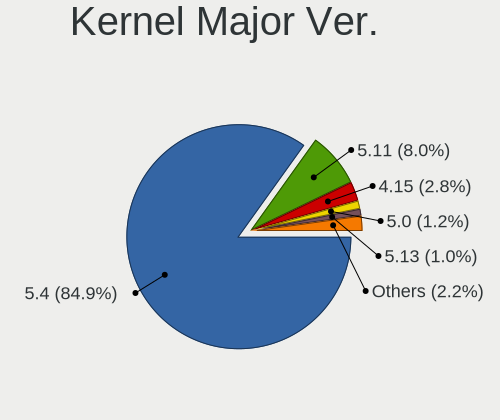
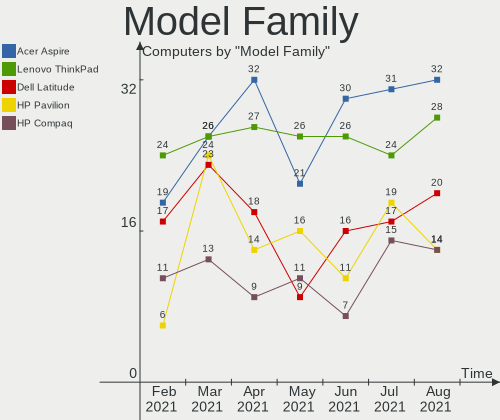
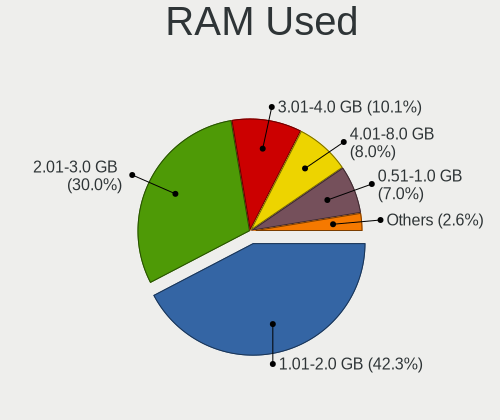
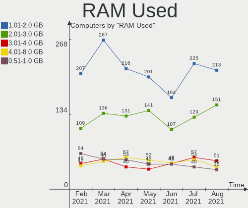
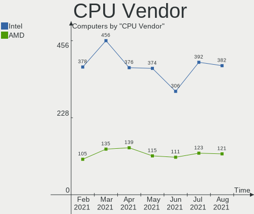
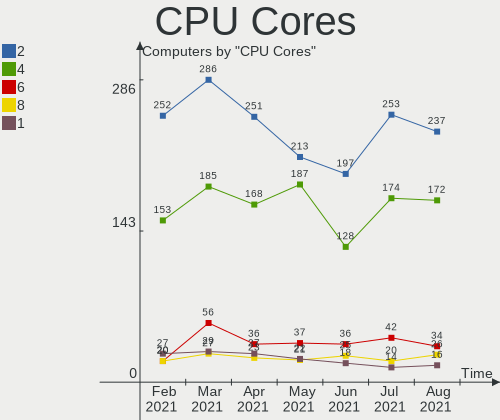
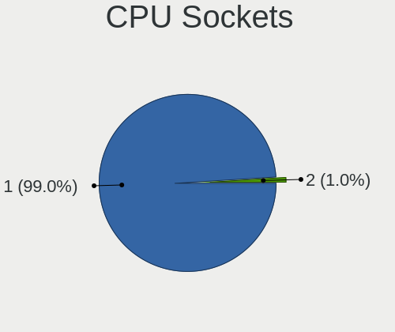
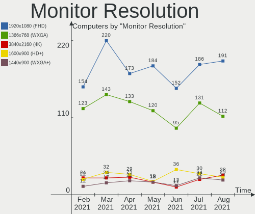
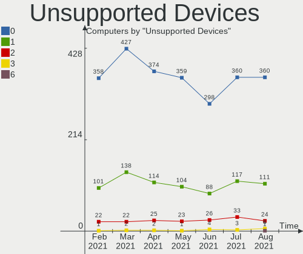

Mint Hardware Trends
--------------------

A project to identify most popular hardware characteristics and track their change
over time based on data collected by Mint users at https://Linux-Hardware.org.

Anyone can contribute to the study by uploading probes of their computers by
the [hw-probe](https://github.com/linuxhw/hw-probe) tool:

    sudo hw-probe -all -upload

This is a report for all computer types. See also reports for [desktops](/Dist/Mint/Desktop/README.md) and [notebooks](/Dist/Mint/Notebook/README.md).

Full-feature report is available here: https://linux-hardware.org/?view=trends

Period: Jan, 2020.

Contents
--------

- [ OS                       ](#os)
- [ OS Family                ](#os-family)
- [ Kernel                   ](#kernel)
- [ Kernel Family            ](#kernel-family)
- [ Kernel Major Ver.        ](#kernel-major-ver)
- [ Arch                     ](#arch)
- [ DE                       ](#de)
- [ Display Server           ](#display-server)
- [ OS Lang                  ](#os-lang)
- [ Boot Mode                ](#boot-mode)
- [ Filesystem               ](#filesystem)
- [ Dual Boot with Linux     ](#dual-boot-with-linux)
- [ Dual Boot (Win)          ](#dual-boot-win)
- [ Country                  ](#country)
- [ City                     ](#city)
- [ Vendor                   ](#vendor)
- [ Model                    ](#model)
- [ Model Family             ](#model-family)
- [ MFG Year                 ](#mfg-year)
- [ Form Factor              ](#form-factor)
- [ Secure Boot              ](#secure-boot)
- [ Coreboot                 ](#coreboot)
- [ RAM Size                 ](#ram-size)
- [ RAM Used                 ](#ram-used)
- [ Drive Vendor             ](#drive-vendor)
- [ Drive Model              ](#drive-model)
- [ Drive Kind               ](#drive-kind)
- [ Drive Connector          ](#drive-connector)
- [ Drive Size               ](#drive-size)
- [ Space Total              ](#space-total)
- [ Space Used               ](#space-used)
- [ Malfunc. Drives          ](#malfunc-drives)
- [ Malfunc. Drive Vendor    ](#malfunc-drive-vendor)
- [ Malfunc. Drive Kind      ](#malfunc-drive-kind)
- [ Failed Drives            ](#failed-drives)
- [ Failed Drive Vendor      ](#failed-drive-vendor)
- [ Drive Status             ](#drive-status)
- [ Storage Vendor           ](#storage-vendor)
- [ Storage Model            ](#storage-model)
- [ Storage Kind             ](#storage-kind)
- [ CPU Vendor               ](#cpu-vendor)
- [ CPU Model                ](#cpu-model)
- [ CPU Model Family         ](#cpu-model-family)
- [ CPU Cores                ](#cpu-cores)
- [ CPU Sockets              ](#cpu-sockets)
- [ CPU Threads              ](#cpu-threads)
- [ CPU Op-Modes             ](#cpu-op-modes)
- [ CPU Microarch            ](#cpu-microarch)
- [ CPU Microcode            ](#cpu-microcode)
- [ GPU Vendor               ](#gpu-vendor)
- [ GPU Model                ](#gpu-model)
- [ GPU Combo                ](#gpu-combo)
- [ GPU Driver               ](#gpu-driver)
- [ GPU Memory               ](#gpu-memory)
- [ Monitor Vendor           ](#monitor-vendor)
- [ Monitor Model            ](#monitor-model)
- [ Monitor Resolution       ](#monitor-resolution)
- [ Monitor Diagonal         ](#monitor-diagonal)
- [ Monitor Width            ](#monitor-width)
- [ Aspect Ratio             ](#aspect-ratio)
- [ Monitor Area             ](#monitor-area)
- [ Pixel Density            ](#pixel-density)
- [ Multiple Monitors        ](#multiple-monitors)
- [ Net Controller Vendor    ](#net-controller-vendor)
- [ Net Controller Model     ](#net-controller-model)
- [ Net Controller Kind      ](#net-controller-kind)
- [ Used Controller          ](#used-controller)
- [ NICs                     ](#nics)
- [ Unsupported Devices      ](#unsupported-devices)
- [ Unsupported Device Types ](#unsupported-device-types)

OS
--

Installed operating systems

| Name      | Computers | Percent |
|-----------|-----------|---------|
| Mint 19.3 | 202       | 79.53%  |
| Mint 19.2 | 17        | 6.69%   |
| Mint 19.1 | 16        | 6.3%    |
| Mint 19   | 10        | 3.94%   |
| Mint 18.3 | 8         | 3.15%   |
| Mint 17.2 | 1         | 0.39%   |

OS Family
---------

OS without a version

| Name | Computers | Percent |
|------|-----------|---------|
| Mint | 254       | 100%    |

Kernel
------

Version of the Linux kernel

| Version                   | Computers | Percent |
|---------------------------|-----------|---------|
| 5.0.0-37-generic          | 82        | 32.28%  |
| 5.3.0-26-generic          | 58        | 22.83%  |
| 4.15.0-74-generic         | 31        | 12.2%   |
| 5.0.0-32-generic          | 23        | 9.06%   |
| 5.3.0-28-generic          | 13        | 5.12%   |
| 5.3.0-24-generic          | 11        | 4.33%   |
| 4.15.0-72-generic         | 10        | 3.94%   |
| 4.15.0-54-generic         | 7         | 2.76%   |
| 4.15.0-76-generic         | 4         | 1.57%   |
| 4.15.0-20-generic         | 3         | 1.18%   |
| 4.15.0-65-generic         | 2         | 0.79%   |
| 5.5.0-050500rc4-generic   | 1         | 0.39%   |
| 5.4.12-050412-generic     | 1         | 0.39%   |
| 5.4.0-13.3-liquorix-amd64 | 1         | 0.39%   |
| 5.3.6-050306-generic      | 1         | 0.39%   |
| 4.4.0-173-generic         | 1         | 0.39%   |
| 4.15.0-70-generic         | 1         | 0.39%   |
| 4.15.0-62-generic         | 1         | 0.39%   |
| 4.15.0-47-generic         | 1         | 0.39%   |
| 4.10.0-38-generic         | 1         | 0.39%   |
| 3.16.0-38-generic         | 1         | 0.39%   |

Kernel Family
-------------

Linux kernel without a distro release

| Version | Computers | Percent |
|---------|-----------|---------|
| 5.0.0   | 105       | 41.34%  |
| 5.3.0   | 82        | 32.28%  |
| 4.15.0  | 60        | 23.62%  |
| 5.5.0   | 1         | 0.39%   |
| 5.4.12  | 1         | 0.39%   |
| 5.4.0   | 1         | 0.39%   |
| 5.3.6   | 1         | 0.39%   |
| 4.4.0   | 1         | 0.39%   |
| 4.10.0  | 1         | 0.39%   |
| 3.16.0  | 1         | 0.39%   |

Kernel Major Ver.
-----------------

Linux kernel major version

| Version | Computers | Percent |
|---------|-----------|---------|
| 5.0     | 105       | 41.34%  |
| 5.3     | 83        | 32.68%  |
| 4.15    | 60        | 23.62%  |
| 5.4     | 2         | 0.79%   |
| 5.5     | 1         | 0.39%   |
| 4.4     | 1         | 0.39%   |
| 4.10    | 1         | 0.39%   |
| 3.16    | 1         | 0.39%   |

Arch
----

OS architecture (x86_64, i586, etc.)

| Name   | Computers | Percent |
|--------|-----------|---------|
| x86_64 | 234       | 92.13%  |
| i686   | 20        | 7.87%   |

DE
--

Desktop Environment

| Name       | Computers | Percent |
|------------|-----------|---------|
| X-Cinnamon | 134       | 52.76%  |
| MATE       | 41        | 16.14%  |
| Cinnamon   | 39        | 15.35%  |
| XFCE       | 19        | 7.48%   |
| Unknown    | 16        | 6.3%    |
| GNOME      | 5         | 1.97%   |

Display Server
--------------

X11 or Wayland

| Name | Computers | Percent |
|------|-----------|---------|
| X11  | 254       | 100%    |

OS Lang
-------

Language

| Lang    | Computers | Percent |
|---------|-----------|---------|
| en_US   | 58        | 22.83%  |
| de_DE   | 38        | 14.96%  |
| pt_BR   | 23        | 9.06%   |
| ru_RU   | 18        | 7.09%   |
| Unknown | 17        | 6.69%   |
| it_IT   | 11        | 4.33%   |
| pl_PL   | 9         | 3.54%   |
| en_CA   | 9         | 3.54%   |
| es_ES   | 7         | 2.76%   |
| en_GB   | 6         | 2.36%   |
| pt_PT   | 5         | 1.97%   |
| en_AU   | 5         | 1.97%   |
| cs_CZ   | 5         | 1.97%   |
| de_AT   | 4         | 1.57%   |
| C       | 4         | 1.57%   |
| sv_SE   | 3         | 1.18%   |
| sk_SK   | 3         | 1.18%   |
| es_MX   | 3         | 1.18%   |
| ru_UA   | 2         | 0.79%   |
| nl_NL   | 2         | 0.79%   |
| fr_CA   | 2         | 0.79%   |
| es_PE   | 2         | 0.79%   |
| es_AR   | 2         | 0.79%   |
| en_ZA   | 2         | 0.79%   |
| ca_ES   | 2         | 0.79%   |
| zh_CN   | 1         | 0.39%   |
| tr_TR   | 1         | 0.39%   |
| sv_FI   | 1         | 0.39%   |
| ja_JP   | 1         | 0.39%   |
| hu_HU   | 1         | 0.39%   |
| fr_FR   | 1         | 0.39%   |
| fr_BE   | 1         | 0.39%   |
| es_EC   | 1         | 0.39%   |
| es_DO   | 1         | 0.39%   |
| es_CL   | 1         | 0.39%   |
| de_CH   | 1         | 0.39%   |
| bg_BG   | 1         | 0.39%   |

Boot Mode
---------

EFI or BIOS

| Mode | Computers | Percent |
|------|-----------|---------|
| BIOS | 148       | 58.27%  |
| EFI  | 106       | 41.73%  |

Filesystem
----------

Type of filesystem

| Type    | Computers | Percent |
|---------|-----------|---------|
| Ext4    | 247       | 97.24%  |
| Overlay | 3         | 1.18%   |
| Btrfs   | 3         | 1.18%   |
| Ext3    | 1         | 0.39%   |

Dual Boot with Linux
--------------------

Hosting more than one Linux

| Dual boot | Computers | Percent |
|-----------|-----------|---------|
| No        | 245       | 96.46%  |
| Yes       | 9         | 3.54%   |

Dual Boot (Win)
---------------

Hosting Linux and Windows

| Dual boot | Computers | Percent |
|-----------|-----------|---------|
| No        | 215       | 84.65%  |
| Yes       | 39        | 15.35%  |

Country
-------

Geographic location (country)

| Country            | Computers | Percent |
|--------------------|-----------|---------|
| Germany            | 39        | 15.35%  |
| USA                | 34        | 13.39%  |
| Brazil             | 29        | 11.42%  |
| Russia             | 18        | 7.09%   |
| Canada             | 15        | 5.91%   |
| Italy              | 12        | 4.72%   |
| Spain              | 9         | 3.54%   |
| Poland             | 9         | 3.54%   |
| Ukraine            | 5         | 1.97%   |
| UK                 | 5         | 1.97%   |
| Netherlands        | 5         | 1.97%   |
| Czech Republic     | 5         | 1.97%   |
| Australia          | 5         | 1.97%   |
| Mexico             | 4         | 1.57%   |
| Hungary            | 4         | 1.57%   |
| France             | 4         | 1.57%   |
| Austria            | 4         | 1.57%   |
| Switzerland        | 3         | 1.18%   |
| Slovakia           | 3         | 1.18%   |
| Thailand           | 2         | 0.79%   |
| Sweden             | 2         | 0.79%   |
| South Africa       | 2         | 0.79%   |
| Portugal           | 2         | 0.79%   |
| Finland            | 2         | 0.79%   |
| Denmark            | 2         | 0.79%   |
| Bulgaria           | 2         | 0.79%   |
| Argentina          | 2         | 0.79%   |
| Vietnam            | 1         | 0.39%   |
| Turkey             | 1         | 0.39%   |
| Taiwan             | 1         | 0.39%   |
| Romania            | 1         | 0.39%   |
| Puerto Rico        | 1         | 0.39%   |
| Philippines        | 1         | 0.39%   |
| Peru               | 1         | 0.39%   |
| Paraguay           | 1         | 0.39%   |
| New Zealand        | 1         | 0.39%   |
| Namibia            | 1         | 0.39%   |
| Latvia             | 1         | 0.39%   |
| Kyrgyzstan         | 1         | 0.39%   |
| Japan              | 1         | 0.39%   |
| Ireland            | 1         | 0.39%   |
| Greece             | 1         | 0.39%   |
| Egypt              | 1         | 0.39%   |
| Ecuador            | 1         | 0.39%   |
| Dominican Republic | 1         | 0.39%   |
| Croatia            | 1         | 0.39%   |
| Costa Rica         | 1         | 0.39%   |
| China              | 1         | 0.39%   |
| Chile              | 1         | 0.39%   |
| Belgium            | 1         | 0.39%   |
| Belarus            | 1         | 0.39%   |
| Bangladesh         | 1         | 0.39%   |
| Angola             | 1         | 0.39%   |

City
----

Geographic location (city)

| City                           | Computers | Percent |
|--------------------------------|-----------|---------|
| Warsaw                         | 5         | 1.97%   |
| São Paulo                     | 5         | 1.97%   |
| Toronto                        | 4         | 1.57%   |
| Berlin                         | 4         | 1.57%   |
| Vienna                         | 3         | 1.18%   |
| Rome                           | 3         | 1.18%   |
| Budapest                       | 3         | 1.18%   |
| Belo Horizonte                 | 3         | 1.18%   |
| Zelenec                        | 2         | 0.79%   |
| St Petersburg                  | 2         | 0.79%   |
| Ottawa                         | 2         | 0.79%   |
| Moscow                         | 2         | 0.79%   |
| Milton                         | 2         | 0.79%   |
| Kirov                          | 2         | 0.79%   |
| Kharkiv                        | 2         | 0.79%   |
| Ekaterinburg                   | 2         | 0.79%   |
| Dresden                        | 2         | 0.79%   |
| Dortmund                       | 2         | 0.79%   |
| Digne-les-Bains                | 2         | 0.79%   |
| Barcelona                      | 2         | 0.79%   |
| Bangkok                        | 2         | 0.79%   |
| Zurich                         | 1         | 0.39%   |
| Zagreb                         | 1         | 0.39%   |
| Wurenlingen                    | 1         | 0.39%   |
| Wolverhampton                  | 1         | 0.39%   |
| Winsen                         | 1         | 0.39%   |
| Windhoek                       | 1         | 0.39%   |
| Washington                     | 1         | 0.39%   |
| Warbsen                        | 1         | 0.39%   |
| Voluntari                      | 1         | 0.39%   |
| Volgograd                      | 1         | 0.39%   |
| Vladivostok                    | 1         | 0.39%   |
| Vladimir                       | 1         | 0.39%   |
| Vitória                       | 1         | 0.39%   |
| Virginia Beach                 | 1         | 0.39%   |
| Vecses                         | 1         | 0.39%   |
| Valladolid                     | 1         | 0.39%   |
| Uzhhorod                       | 1         | 0.39%   |
| Tuttlingen                     | 1         | 0.39%   |
| Turin                          | 1         | 0.39%   |
| Trappes                        | 1         | 0.39%   |
| Tolyatti                       | 1         | 0.39%   |
| Thessaloniki                   | 1         | 0.39%   |
| Tampa                          | 1         | 0.39%   |
| Taipei                         | 1         | 0.39%   |
| Stockholm                      | 1         | 0.39%   |
| Spring Hill                    | 1         | 0.39%   |
| South Bend                     | 1         | 0.39%   |
| Solingen                       | 1         | 0.39%   |
| Solidaridad                    | 1         | 0.39%   |
| Sofia                          | 1         | 0.39%   |
| Siemkowice                     | 1         | 0.39%   |
| Sidmouth                       | 1         | 0.39%   |
| Seville                        | 1         | 0.39%   |
| Secaucus                       | 1         | 0.39%   |
| Schmalkalden                   | 1         | 0.39%   |
| Schenectady                    | 1         | 0.39%   |
| Saraland                       | 1         | 0.39%   |
| Sao Sebastiao de Lagoa de Roca | 1         | 0.39%   |
| Santo André                   | 1         | 0.39%   |

Vendor
------

Motherboard manufacturer

| Name                  | Computers | Percent |
|-----------------------|-----------|---------|
| ASUSTek Computer      | 54        | 21.26%  |
| Hewlett-Packard       | 38        | 14.96%  |
| Dell                  | 27        | 10.63%  |
| Lenovo                | 22        | 8.66%   |
| Acer                  | 16        | 6.3%    |
| Gigabyte Technology   | 15        | 5.91%   |
| MSI                   | 12        | 4.72%   |
| ASRock                | 8         | 3.15%   |
| Toshiba               | 7         | 2.76%   |
| Intel                 | 6         | 2.36%   |
| Medion                | 5         | 1.97%   |
| Fujitsu Siemens       | 4         | 1.57%   |
| Fujitsu               | 4         | 1.57%   |
| ECS                   | 4         | 1.57%   |
| Sony                  | 2         | 0.79%   |
| Positivo              | 2         | 0.79%   |
| Packard Bell          | 2         | 0.79%   |
| Biostar               | 2         | 0.79%   |
| Apple                 | 2         | 0.79%   |
| XFX                   | 1         | 0.39%   |
| WinFast               | 1         | 0.39%   |
| TUXEDO                | 1         | 0.39%   |
| Shuttle               | 1         | 0.39%   |
| Semp Toshiba          | 1         | 0.39%   |
| Schenker              | 1         | 0.39%   |
| Samsung Electronics   | 1         | 0.39%   |
| Positivo Bahia - VAIO | 1         | 0.39%   |
| Pegatron              | 1         | 0.39%   |
| Panasonic             | 1         | 0.39%   |
| Notebook              | 1         | 0.39%   |
| Insyde                | 1         | 0.39%   |
| HARDKERNEL            | 1         | 0.39%   |
| eMachines             | 1         | 0.39%   |
| Dixonsxp              | 1         | 0.39%   |
| Digma                 | 1         | 0.39%   |
| Coradir               | 1         | 0.39%   |
| Connex                | 1         | 0.39%   |
| Compulab              | 1         | 0.39%   |
| Colorful Technology   | 1         | 0.39%   |
| Chuwi                 | 1         | 0.39%   |
| BESSTAR Tech          | 1         | 0.39%   |

Model
-----

Motherboard model

| Name                                        | Computers | Percent |
|---------------------------------------------|-----------|---------|
| ASUS All Series                             | 6         | 2.36%   |
| MSI MS-7C02                                 | 2         | 0.79%   |
| Intel DQ35JO AAD82085-807                   | 2         | 0.79%   |
| HP Laptop 15-ra0xx                          | 2         | 0.79%   |
| Fujitsu Siemens ESPRIMO P5720               | 2         | 0.79%   |
| Dell Latitude E6410                         | 2         | 0.79%   |
| ASUS X550CL                                 | 2         | 0.79%   |
| ASUS M5A78L-M/USB3                          | 2         | 0.79%   |
| ASUS K50IJ                                  | 2         | 0.79%   |
| XFX Nforce 680i LT                          | 1         | 0.39%   |
| WinFast 6100M2MA                            | 1         | 0.39%   |
| TUXEDO P65_67HSHP                           | 1         | 0.39%   |
| Toshiba Satellite U500                      | 1         | 0.39%   |
| Toshiba Satellite L505D                     | 1         | 0.39%   |
| Toshiba Satellite L500                      | 1         | 0.39%   |
| Toshiba Satellite L40                       | 1         | 0.39%   |
| Toshiba Satellite L300                      | 1         | 0.39%   |
| Toshiba Satellite C850D-D6S                 | 1         | 0.39%   |
| Toshiba NB550D                              | 1         | 0.39%   |
| Sony VPCEH2N1E                              | 1         | 0.39%   |
| Sony VGN-SZ430N                             | 1         | 0.39%   |
| Shuttle SH61R                               | 1         | 0.39%   |
| Semp Toshiba IS 1414                        | 1         | 0.39%   |
| Schenker SCHENKER_DOCK_15_SDO15L18_SDO15E19 | 1         | 0.39%   |
| Samsung Electronics 370E4K                  | 1         | 0.39%   |
| Positivo Q232A                              | 1         | 0.39%   |
| Positivo C14CR01                            | 1         | 0.39%   |
| Positivo Bahia - VAIO S14SL03               | 1         | 0.39%   |
| Pegatron C15B                               | 1         | 0.39%   |
| Panasonic CF-C2ACAZZLM                      | 1         | 0.39%   |
| Packard Bell T12UV                          | 1         | 0.39%   |
| Packard Bell EasyNote TK85                  | 1         | 0.39%   |
| Notebook W65_67SZ                           | 1         | 0.39%   |
| MSI WC910AA-ABZ HPE-120it                   | 1         | 0.39%   |
| MSI MS-7998                                 | 1         | 0.39%   |
| MSI MS-7823                                 | 1         | 0.39%   |
| MSI MS-7816                                 | 1         | 0.39%   |
| MSI MS-7693                                 | 1         | 0.39%   |
| MSI MS-7640                                 | 1         | 0.39%   |
| MSI MS-7589                                 | 1         | 0.39%   |
| MSI MS-7522                                 | 1         | 0.39%   |
| MSI MS-7276                                 | 1         | 0.39%   |
| MSI MS-7255                                 | 1         | 0.39%   |
| Medion P7649 MD60825                        | 1         | 0.39%   |
| Medion MS-7366                              | 1         | 0.39%   |
| Medion MD34185/2592                         | 1         | 0.39%   |
| Medion AKOYA THE TOUCH 10                   | 1         | 0.39%   |
| Medion AKOYA E40002 MD34016/C601            | 1         | 0.39%   |
| Lenovo Z40-75 80DW                          | 1         | 0.39%   |
| Lenovo Yoga 730-15IWL 81JS                  | 1         | 0.39%   |
| Lenovo Yoga 2 Pro 20266                     | 1         | 0.39%   |
| Lenovo ThinkPad X390 20Q0005XRT             | 1         | 0.39%   |
| Lenovo ThinkPad X230 Tablet 34372T6         | 1         | 0.39%   |
| Lenovo ThinkPad X1 Carbon 6th 20KHCTO1WW    | 1         | 0.39%   |
| Lenovo ThinkPad T490 20N3S19L00             | 1         | 0.39%   |
| Lenovo ThinkPad T420 4236AA2                | 1         | 0.39%   |
| Lenovo ThinkPad P52 20M9000KUS              | 1         | 0.39%   |
| Lenovo ThinkPad P50 20EN0005SP              | 1         | 0.39%   |
| Lenovo ThinkPad E595 20NFCTO1WW             | 1         | 0.39%   |
| Lenovo ThinkCentre M58 7360CN3              | 1         | 0.39%   |

Model Family
------------

Motherboard model prefix

| Name                          | Computers | Percent |
|-------------------------------|-----------|---------|
| Acer Aspire                   | 15        | 5.91%   |
| Dell Inspiron                 | 10        | 3.94%   |
| Lenovo ThinkPad               | 8         | 3.15%   |
| Toshiba Satellite             | 6         | 2.36%   |
| Lenovo IdeaPad                | 6         | 2.36%   |
| HP Pavilion                   | 6         | 2.36%   |
| HP Laptop                     | 6         | 2.36%   |
| ASUS All                      | 6         | 2.36%   |
| HP EliteBook                  | 5         | 1.97%   |
| HP 250                        | 5         | 1.97%   |
| Dell Latitude                 | 5         | 1.97%   |
| HP Compaq                     | 4         | 1.57%   |
| HP ProBook                    | 3         | 1.18%   |
| Fujitsu LIFEBOOK              | 3         | 1.18%   |
| Dell XPS                      | 3         | 1.18%   |
| Dell Vostro                   | 3         | 1.18%   |
| Dell OptiPlex                 | 3         | 1.18%   |
| ASUS PRIME                    | 3         | 1.18%   |
| ASUS M5A78L-M                 | 3         | 1.18%   |
| MSI MS-7C02                   | 2         | 0.79%   |
| Medion AKOYA                  | 2         | 0.79%   |
| Lenovo Yoga                   | 2         | 0.79%   |
| Intel DQ35JO                  | 2         | 0.79%   |
| HP EliteDesk                  | 2         | 0.79%   |
| Fujitsu Siemens ESPRIMO       | 2         | 0.79%   |
| ASUS X550CL                   | 2         | 0.79%   |
| ASUS VivoBook                 | 2         | 0.79%   |
| ASUS ROG                      | 2         | 0.79%   |
| ASUS K50IJ                    | 2         | 0.79%   |
| XFX Nforce                    | 1         | 0.39%   |
| WinFast 6100M2MA              | 1         | 0.39%   |
| TUXEDO P65                    | 1         | 0.39%   |
| Toshiba NB550D                | 1         | 0.39%   |
| Sony VPCEH2N1E                | 1         | 0.39%   |
| Sony VGN-SZ430N               | 1         | 0.39%   |
| Shuttle SH61R                 | 1         | 0.39%   |
| Semp Toshiba IS               | 1         | 0.39%   |
| Schenker SCHENKER             | 1         | 0.39%   |
| Samsung Electronics 370E4K    | 1         | 0.39%   |
| Positivo Q232A                | 1         | 0.39%   |
| Positivo C14CR01              | 1         | 0.39%   |
| Positivo Bahia - VAIO S14SL03 | 1         | 0.39%   |
| Pegatron C15B                 | 1         | 0.39%   |
| Panasonic CF-C2ACAZZLM        | 1         | 0.39%   |
| Packard Bell T12UV            | 1         | 0.39%   |
| Packard Bell EasyNote         | 1         | 0.39%   |
| Notebook W65                  | 1         | 0.39%   |
| MSI WC910AA-ABZ               | 1         | 0.39%   |
| MSI MS-7998                   | 1         | 0.39%   |
| MSI MS-7823                   | 1         | 0.39%   |
| MSI MS-7816                   | 1         | 0.39%   |
| MSI MS-7693                   | 1         | 0.39%   |
| MSI MS-7640                   | 1         | 0.39%   |
| MSI MS-7589                   | 1         | 0.39%   |
| MSI MS-7522                   | 1         | 0.39%   |
| MSI MS-7276                   | 1         | 0.39%   |
| MSI MS-7255                   | 1         | 0.39%   |
| Medion P7649                  | 1         | 0.39%   |
| Medion MS-7366                | 1         | 0.39%   |
| Medion MD34185                | 1         | 0.39%   |

MFG Year
--------

Motherboard manufacture year

| Year | Computers | Percent |
|------|-----------|---------|
| 2019 | 42        | 16.54%  |
| 2018 | 27        | 10.63%  |
| 2014 | 26        | 10.24%  |
| 2017 | 19        | 7.48%   |
| 2011 | 19        | 7.48%   |
| 2013 | 18        | 7.09%   |
| 2016 | 16        | 6.3%    |
| 2010 | 16        | 6.3%    |
| 2015 | 15        | 5.91%   |
| 2012 | 15        | 5.91%   |
| 2008 | 14        | 5.51%   |
| 2009 | 10        | 3.94%   |
| 2007 | 8         | 3.15%   |
| 2006 | 6         | 2.36%   |
| 2005 | 2         | 0.79%   |
| 2004 | 1         | 0.39%   |

Form Factor
-----------

Physical design of the computer

| Name        | Computers | Percent |
|-------------|-----------|---------|
| Notebook    | 136       | 53.54%  |
| Desktop     | 108       | 42.52%  |
| Tablet      | 3         | 1.18%   |
| Mini pc     | 3         | 1.18%   |
| Convertible | 2         | 0.79%   |
| All in one  | 1         | 0.39%   |
| Server      | 1         | 0.39%   |

Secure Boot
-----------

Enabled or disabled

| State    | Computers | Percent |
|----------|-----------|---------|
| Disabled | 236       | 92.91%  |
| Enabled  | 18        | 7.09%   |

Coreboot
--------

Have coreboot on board

| Used | Computers | Percent |
|------|-----------|---------|
| No   | 254       | 100%    |

RAM Size
--------

Total RAM memory

| Size in GB  | Computers | Percent |
|-------------|-----------|---------|
| 3.01-4.0    | 61        | 24.02%  |
| 4.01-8.0    | 53        | 20.87%  |
| 8.01-16.0   | 49        | 19.29%  |
| 16.01-24.0  | 45        | 17.72%  |
| 1.01-2.0    | 17        | 6.69%   |
| 32.01-64.0  | 14        | 5.51%   |
| 2.01-3.0    | 9         | 3.54%   |
| 64.01-256.0 | 3         | 1.18%   |
| 0.01-1.0    | 2         | 0.79%   |
| 24.01-32.0  | 1         | 0.39%   |

RAM Used
--------

Used RAM memory

| Used GB    | Computers | Percent |
|------------|-----------|---------|
| 1.01-2.0   | 112       | 44.09%  |
| 2.01-3.0   | 66        | 25.98%  |
| 3.01-4.0   | 26        | 10.24%  |
| 0.01-1.0   | 26        | 10.24%  |
| 4.01-8.0   | 15        | 5.91%   |
| 8.01-16.0  | 8         | 3.15%   |
| 24.01-32.0 | 1         | 0.39%   |

Drive Vendor
------------

Hard drive vendors

| Vendor              | Computers | Drives  | Percent |
|---------------------|-----------|---------|---------|
| WDC                 | 75        | 89      | 20.89%  |
| Seagate             | 57        | 67      | 15.88%  |
| Samsung Electronics | 50        | 60      | 13.93%  |
| Toshiba             | 28        | 29      | 7.8%    |
| HGST                | 17        | 17      | 4.74%   |
| Kingston            | 16        | 16      | 4.46%   |
| Hitachi             | 16        | 17      | 4.46%   |
| SanDisk             | 12        | 12      | 3.34%   |
| Unknown             | 11        | 15      | 3.06%   |
| Crucial             | 9         | 9       | 2.51%   |
| A-DATA Technology   | 9         | 9       | 2.51%   |
| Patriot             | 3         | 3       | 0.84%   |
| Maxtor              | 3         | 3       | 0.84%   |
| Intel               | 3         | 4       | 0.84%   |
| SK Hynix            | 2         | 2       | 0.56%   |
| Phison              | 2         | 2       | 0.56%   |
| Micron Technology   | 2         | 2       | 0.56%   |
| JMicron             | 2         | 2       | 0.56%   |
| Hewlett-Packard     | 2         | 2       | 0.56%   |
| Generic             | 2         | 2       | 0.56%   |
| Fujitsu             | 2         | 2       | 0.56%   |
| Corsair             | 2         | 2       | 0.56%   |
| China               | 2         | 2       | 0.56%   |
| Apacer              | 2         | 2       | 0.56%   |
| WD MediaMax         | 1         | 1       | 0.28%   |
| Transcend           | 1         | 1       | 0.28%   |
| Team                | 1         | 1       | 0.28%   |
| TCSUNBOW            | 1         | 1       | 0.28%   |
| SPCC                | 1         | 1       | 0.28%   |
| SDLFNDAR            | 1         | 1       | 0.28%   |
| PNY                 | 1         | 1       | 0.28%   |
| OEM                 | 1         | 1       | 0.28%   |
| OCZ-VERTEX3         | 1         | 1       | 0.28%   |
| Netac               | 1         | 1       | 0.28%   |
| MicroData           | 1         | 1       | 0.28%   |
| Maximus             | 1         | 1       | 0.28%   |
| MARVELL             | 1         | 1       | 0.28%   |
| LITEONIT            | 1         | 1       | 0.28%   |
| LITEON              | 1         | 1       | 0.28%   |
| Lenovo              | 1         | 1       | 0.28%   |
| LaCie               | 1         | 1       | 0.28%   |
| KingSpec            | 1         | 1       | 0.28%   |
| Kingmax             | 1         | 1       | 0.28%   |
| Kingchuxing         | 1         | 1       | 0.28%   |
| Intenso             | 1         | 1       | 0.28%   |
| HP SSD S            | 1         | 1       | 0.28%   |
| HL-DT-ST            | 1         | Unknown | 0.28%   |
| GOODRAM             | 1         | 1       | 0.28%   |
| EMTEC               | 1         | 1       | 0.28%   |
| CLOVER              | 1         | 1       | 0.28%   |
| BHT                 | 1         | 1       | 0.28%   |
| ASMT                | 1         | 1       | 0.28%   |
| AS25                | 1         | 1       | 0.28%   |
| Apple               | 1         | 1       | 0.28%   |

Drive Model
-----------

Hard drive models

| Model                         | Computers | Percent |
|-------------------------------|-----------|---------|
| ST1000LM024 HN-M101MBB 1TB    | 6         | 1.56%   |
| SSD 850 EVO 250GB             | 6         | 1.56%   |
| MMC Card  32GB                | 6         | 1.56%   |
| MQ01ABD100 1TB                | 5         | 1.3%    |
| HTS545050A7E680 500GB         | 5         | 1.3%    |
| ST500LM012 HN-M500MBB 500GB   | 4         | 1.04%   |
| ST1000LM035-1RK172 1TB        | 4         | 1.04%   |
| SSD 860 EVO 250GB             | 4         | 1.04%   |
| MMC Card  64GB                | 4         | 1.04%   |
| HTS541010A9E680 1TB           | 4         | 1.04%   |
| DT01ACA100 1TB                | 4         | 1.04%   |
| WD10JPVX-75JC3T0 1TB          | 3         | 0.78%   |
| WD10JPVX-22JC3T0 1TB          | 3         | 0.78%   |
| WD10EZEX-21WN4A0 1TB          | 3         | 0.78%   |
| WD10EZEX-08WN4A0 1TB          | 3         | 0.78%   |
| SV300S37A120G 120GB SSD       | 3         | 0.78%   |
| ST9750420AS 752GB             | 3         | 0.78%   |
| ST500LT012-1DG142 500GB       | 3         | 0.78%   |
| ST3500418AS 500GB             | 3         | 0.78%   |
| SSD 860 EVO 500GB             | 3         | 0.78%   |
| SSD 850 EVO 500GB             | 3         | 0.78%   |
| DT01ACA200 2TB                | 3         | 0.78%   |
| WD30EFRX-68EUZN0 3TB          | 2         | 0.52%   |
| WD20EFRX-68EUZN0 2TB          | 2         | 0.52%   |
| WD1600AAJS-00V4A0 160GB       | 2         | 0.52%   |
| WD10EZEX-21M2NA0 1TB          | 2         | 0.52%   |
| WD10EZEX-00WN4A0 1TB          | 2         | 0.52%   |
| WD10EZEX-00BN5A0 1TB          | 2         | 0.52%   |
| SU650 120GB SSD               | 2         | 0.52%   |
| ST500DM002-1BD142 500GB       | 2         | 0.52%   |
| ST320LT020-9YG142 320GB       | 2         | 0.52%   |
| ST3160815AS 160GB             | 2         | 0.52%   |
| ST3000DM001-1CH166 3TB        | 2         | 0.52%   |
| ST2000LX001-1RG174 2TB        | 2         | 0.52%   |
| SSD PLUS 240GB                | 2         | 0.52%   |
| SSD PLUS 1000GB               | 2         | 0.52%   |
| SSD 860 EVO 1TB               | 2         | 0.52%   |
| SSD 840 EVO 250GB             | 2         | 0.52%   |
| SP1603C 160GB                 | 2         | 0.52%   |
| SD/MMC/MS PRO 64GB            | 2         | 0.52%   |
| SA400S37240G 240GB SSD        | 2         | 0.52%   |
| SA400S37120G 120GB SSD        | 2         | 0.52%   |
| HTS541075A9E680 752GB         | 2         | 0.52%   |
| HDWD110 1TB                   | 2         | 0.52%   |
| HD502HJ 500GB                 | 2         | 0.52%   |
| HD502HI 500GB                 | 2         | 0.52%   |
| Burst 240GB SSD               | 2         | 0.52%   |
| X150 120GB                    | 1         | 0.26%   |
| WR202I0032G E70245F5 32GB SSD | 1         | 0.26%   |
| WL750GSA3254G 752GB           | 1         | 0.26%   |
| WDS500G2B0A-00SM50 500GB SSD  | 1         | 0.26%   |
| WDS250G2B0A-00SM50 250GB SSD  | 1         | 0.26%   |
| WDS120G2G0B-00EPW0 120GB SSD  | 1         | 0.26%   |
| WDBNCE5000PNC 500GB SSD       | 1         | 0.26%   |
| WD800JD-55JRC0 80GB           | 1         | 0.26%   |
| WD6400AACS-00M3B0 640GB       | 1         | 0.26%   |
| WD6400AACS-00G8B1 640GB       | 1         | 0.26%   |
| WD5002AALX-00J37A0 500GB      | 1         | 0.26%   |
| WD5000LPVX-60V0TT0 500GB      | 1         | 0.26%   |
| WD5000LPVT-75G33T0 500GB      | 1         | 0.26%   |

Drive Kind
----------

HDD or SSD

| Kind    | Computers | Drives | Percent |
|---------|-----------|--------|---------|
| HDD     | 172       | 236    | 54.6%   |
| SSD     | 98        | 112    | 31.11%  |
| NVMe    | 17        | 19     | 5.4%    |
| Unknown | 17        | 17     | 5.4%    |
| MMC     | 11        | 15     | 3.49%   |

Drive Connector
---------------

SATA, SAS, NVMe, etc.

| Type | Computers | Drives | Percent |
|------|-----------|--------|---------|
| SATA | 232       | 352    | 84.67%  |
| NVMe | 17        | 19     | 6.2%    |
| SAS  | 14        | 13     | 5.11%   |
| MMC  | 11        | 15     | 4.01%   |

Drive Size
----------

Size of hard drive

| Size in TB | Computers | Drives | Percent |
|------------|-----------|--------|---------|
| 0.01-0.5   | 191       | 245    | 59.87%  |
| 0.51-1.0   | 100       | 116    | 31.35%  |
| 1.01-2.0   | 17        | 22     | 5.33%   |
| 2.01-3.0   | 7         | 12     | 2.19%   |
| 3.01-4.0   | 3         | 3      | 0.94%   |
| 4.01-10.0  | 1         | 1      | 0.31%   |

Space Total
-----------

Amount of disk space available on the file system

| Size in GB     | Computers | Percent |
|----------------|-----------|---------|
| 101-250        | 85        | 33.46%  |
| 501-1000       | 49        | 19.29%  |
| 251-500        | 48        | 18.9%   |
| 1001-2000      | 23        | 9.06%   |
| 51-100         | 18        | 7.09%   |
| More than 3000 | 13        | 5.12%   |
| 21-50          | 9         | 3.54%   |
| 2001-3000      | 5         | 1.97%   |
| 1-20           | 3         | 1.18%   |
| Unknown        | 1         | 0.39%   |

Space Used
----------

Amount of used disk space

| Used GB        | Computers | Percent |
|----------------|-----------|---------|
| 1-20           | 66        | 25.98%  |
| 21-50          | 60        | 23.62%  |
| 101-250        | 42        | 16.54%  |
| 251-500        | 26        | 10.24%  |
| 51-100         | 26        | 10.24%  |
| 501-1000       | 16        | 6.3%    |
| More than 3000 | 7         | 2.76%   |
| 2001-3000      | 5         | 1.97%   |
| 1001-2000      | 5         | 1.97%   |
| Unknown        | 1         | 0.39%   |

Malfunc. Drives
---------------

Drive models with a malfunction

| Model                    | Computers | Drives | Percent |
|--------------------------|-----------|--------|---------|
| HTS545050A7E680 500GB    | 3         | 3      | 27.27%  |
| WD5000LPCX-60VHAT0 500GB | 1         | 1      | 9.09%   |
| SUV400S37480G 480GB SSD  | 1         | 1      | 9.09%   |
| ST320LT020-9YG142 320GB  | 1         | 1      | 9.09%   |
| ST1000LM035-1RK172 1TB   | 1         | 1      | 9.09%   |
| MK2565GSX 250GB          | 1         | 1      | 9.09%   |
| HD502HI 500GB            | 1         | 1      | 9.09%   |
| HD155UI 1TB              | 1         | 1      | 9.09%   |
| CT525MX300SSD1 528GB     | 1         | 1      | 9.09%   |

Malfunc. Drive Vendor
---------------------

Vendors of faulty drives

| Vendor              | Computers | Drives | Percent |
|---------------------|-----------|--------|---------|
| HGST                | 3         | 3      | 30%     |
| Seagate             | 2         | 2      | 20%     |
| WDC                 | 1         | 1      | 10%     |
| Toshiba             | 1         | 1      | 10%     |
| Samsung Electronics | 1         | 2      | 10%     |
| Kingston            | 1         | 1      | 10%     |
| Crucial             | 1         | 1      | 10%     |

Malfunc. Drive Kind
-------------------

Kinds of faulty drives

| Kind | Computers | Drives | Percent |
|------|-----------|--------|---------|
| HDD  | 7         | 9      | 77.78%  |
| SSD  | 2         | 2      | 22.22%  |

Failed Drives
-------------

Failed drive models

Zero info for selected period =(

Failed Drive Vendor
-------------------

Failed drive vendors

Zero info for selected period =(

Drive Status
------------

Number of failed and malfunc. drives

| Status   | Computers | Drives | Percent |
|----------|-----------|--------|---------|
| Detected | 203       | 312    | 78.38%  |
| Works    | 47        | 76     | 18.15%  |
| Malfunc  | 9         | 11     | 3.47%   |

Storage Vendor
--------------

Storage controller vendors

| Vendor                           | Computers | Percent |
|----------------------------------|-----------|---------|
| Intel                            | 176       | 58.67%  |
| AMD                              | 52        | 17.33%  |
| Samsung Electronics              | 14        | 4.67%   |
| Marvell Technology Group         | 11        | 3.67%   |
| Nvidia                           | 9         | 3%      |
| JMicron Technology               | 7         | 2.33%   |
| ASMedia Technology               | 7         | 2.33%   |
| Phison Electronics               | 5         | 1.67%   |
| VIA Technologies                 | 4         | 1.33%   |
| SK Hynix                         | 4         | 1.33%   |
| Toshiba America Info Systems     | 3         | 1%      |
| Kingston Technology Company      | 2         | 0.67%   |
| Silicon Integrated Systems [SiS] | 1         | 0.33%   |
| Silicon Image                    | 1         | 0.33%   |
| Sandisk                          | 1         | 0.33%   |
| LSI Logic / Symbios Logic        | 1         | 0.33%   |
| Lenovo                           | 1         | 0.33%   |
| HighPoint Technologies           | 1         | 0.33%   |

Storage Model
-------------

Storage controller models

| Model                                                                      | Computers | Percent |
|----------------------------------------------------------------------------|-----------|---------|
| FCH SATA Controller [AHCI mode]                                            | 29        | 7.9%    |
| Sunrise Point-LP SATA Controller [AHCI mode]                               | 15        | 4.09%   |
| SB7x0/SB8x0/SB9x0 IDE Controller                                           | 12        | 3.27%   |
| 8 Series/C220 Series Chipset Family 6-port SATA Controller 1 [AHCI mode]   | 12        | 3.27%   |
| Wildcat Point-LP SATA Controller [AHCI Mode]                               | 11        | 3%      |
| NVMe SSD Controller SM981/PM981/PM983                                      | 11        | 3%      |
| SB7x0/SB8x0/SB9x0 SATA Controller [AHCI mode]                              | 10        | 2.72%   |
| 7 Series Chipset Family 6-port SATA Controller [AHCI mode]                 | 10        | 2.72%   |
| 6 Series/C200 Series Chipset Family 6 port Mobile SATA AHCI Controller     | 9         | 2.45%   |
| SB7x0/SB8x0/SB9x0 SATA Controller [IDE mode]                               | 8         | 2.18%   |
| Q170/Q150/B150/H170/H110/Z170/CM236 Chipset SATA Controller [AHCI Mode]    | 8         | 2.18%   |
| 82801IBM/IEM (ICH9M/ICH9M-E) 4 port SATA Controller [AHCI mode]            | 8         | 2.18%   |
| 82801G (ICH7 Family) IDE Controller                                        | 8         | 2.18%   |
| Non-Volatile memory controller                                             | 7         | 1.91%   |
| Atom/Celeron/Pentium Processor x5-E8000/J3xxx/N3xxx Series SATA Controller | 7         | 1.91%   |
| ASM1062 Serial ATA Controller                                              | 7         | 1.91%   |
| 7 Series/C210 Series Chipset Family 6-port SATA Controller [AHCI mode]     | 7         | 1.91%   |
| Atom Processor E3800 Series SATA AHCI Controller                           | 6         | 1.63%   |
| 5 Series/3400 Series Chipset 6 port SATA AHCI Controller                   | 6         | 1.63%   |
| JMB363 SATA/IDE Controller                                                 | 5         | 1.36%   |
| 82801 Mobile SATA Controller [RAID mode]                                   | 5         | 1.36%   |
| 6 Series/C200 Series Chipset Family 6 port Desktop SATA AHCI Controller    | 5         | 1.36%   |
| SB600 Non-Raid-5 SATA                                                      | 4         | 1.09%   |
| SB600 IDE                                                                  | 4         | 1.09%   |
| SATA controller                                                            | 4         | 1.09%   |
| 9 Series Chipset Family SATA Controller [AHCI Mode]                        | 4         | 1.09%   |
| 82801I (ICH9 Family) 2 port SATA Controller [IDE mode]                     | 4         | 1.09%   |
| 5 Series/3400 Series Chipset 4 port SATA AHCI Controller                   | 4         | 1.09%   |
| 400 Series Chipset SATA Controller                                         | 4         | 1.09%   |
| 200 Series PCH SATA controller [AHCI mode]                                 | 4         | 1.09%   |
| SATA Controller [RAID mode]                                                | 3         | 0.82%   |
| NM10/ICH7 Family SATA Controller [IDE mode]                                | 3         | 0.82%   |
| NM10/ICH7 Family SATA Controller [AHCI mode]                               | 3         | 0.82%   |
| FCH IDE Controller                                                         | 3         | 0.82%   |
| Celeron N3350/Pentium N4200/Atom E3900 Series SATA AHCI Controller         | 3         | 0.82%   |
| Cannon Point-LP SATA Controller [AHCI Mode]                                | 3         | 0.82%   |
| 82Q35 Express PT IDER Controller                                           | 3         | 0.82%   |
| 82801IBM/IEM (ICH9M/ICH9M-E) 2 port SATA Controller [IDE mode]             | 3         | 0.82%   |
| 82801GBM/GHM (ICH7-M Family) SATA Controller [AHCI mode]                   | 3         | 0.82%   |
| 8 Series SATA Controller 1 [AHCI mode]                                     | 3         | 0.82%   |
| VT82C586A/B/VT82C686/A/B/VT823x/A/C PIPC Bus Master IDE                    | 2         | 0.54%   |
| VT8237A SATA 2-Port Controller                                             | 2         | 0.54%   |
| NVMe Storage Controller                                                    | 2         | 0.54%   |
| NVMe SSD Controller SM961/PM961                                            | 2         | 0.54%   |
| NVMe Controller                                                            | 2         | 0.54%   |
| MCP73 IDE Controller                                                       | 2         | 0.54%   |
| MCP61 SATA Controller                                                      | 2         | 0.54%   |
| JMB368 IDE controller                                                      | 2         | 0.54%   |
| HM170/QM170 Chipset SATA Controller [AHCI Mode]                            | 2         | 0.54%   |
| GeForce 7100/nForce 630i SATA                                              | 2         | 0.54%   |
| E12 NVMe Controller                                                        | 2         | 0.54%   |
| Cannon Lake PCH SATA AHCI Controller                                       | 2         | 0.54%   |
| C600/X79 series chipset 6-Port SATA AHCI Controller                        | 2         | 0.54%   |
| 88SE9230 PCIe SATA 6Gb/s Controller                                        | 2         | 0.54%   |
| 88SE6111/6121 SATA II / PATA Controller                                    | 2         | 0.54%   |
| 88SE6101/6102 single-port PATA133 interface                                | 2         | 0.54%   |
| 82801JI (ICH10 Family) 4 port SATA IDE Controller #1                       | 2         | 0.54%   |
| 82801JI (ICH10 Family) 2 port SATA IDE Controller #2                       | 2         | 0.54%   |
| 82801IR/IO/IH (ICH9R/DO/DH) 4 port SATA Controller [IDE mode]              | 2         | 0.54%   |
| 82801IB (ICH9) 2 port SATA Controller [IDE mode]                           | 2         | 0.54%   |

Storage Kind
------------

Kind of storage controller (IDE, SATA, NVMe, SAS, ...)

| Kind | Computers | Percent |
|------|-----------|---------|
| SATA | 201       | 65.26%  |
| IDE  | 64        | 20.78%  |
| NVMe | 31        | 10.06%  |
| RAID | 12        | 3.9%    |

CPU Vendor
----------

Processor vendors

| Vendor | Computers | Percent |
|--------|-----------|---------|
| Intel  | 194       | 76.38%  |
| AMD    | 60        | 23.62%  |

CPU Model
---------

Processor models

| Model                                         | Computers | Percent |
|-----------------------------------------------|-----------|---------|
| Intel Core i3-5005U CPU @ 2.00GHz             | 6         | 2.36%   |
| Intel Core i7-8565U CPU @ 1.80GHz             | 5         | 1.97%   |
| Intel Core i5-6200U CPU @ 2.30GHz             | 5         | 1.97%   |
| Intel Atom x5-Z8350 CPU @ 1.44GHz             | 4         | 1.57%   |
| Intel Core i7-7500U CPU @ 2.70GHz             | 3         | 1.18%   |
| Intel Core i7-5500U CPU @ 2.40GHz             | 3         | 1.18%   |
| Intel Core i7-4790 CPU @ 3.60GHz              | 3         | 1.18%   |
| Intel Core i7-4500U CPU @ 1.80GHz             | 3         | 1.18%   |
| Intel Core i3-2120 CPU @ 3.30GHz              | 3         | 1.18%   |
| Intel Celeron N4000 CPU @ 1.10GHz             | 3         | 1.18%   |
| Intel Celeron CPU N3060 @ 1.60GHz             | 3         | 1.18%   |
| Intel Atom CPU N2600 @ 1.60GHz                | 3         | 1.18%   |
| AMD Ryzen 5 3500U with Radeon Vega Mobile Gfx | 3         | 1.18%   |
| AMD FX-6300 Six-Core Processor                | 3         | 1.18%   |
| AMD FX-4300 Quad-Core Processor               | 3         | 1.18%   |
| Intel Pentium Dual-Core CPU T4300 @ 2.10GHz   | 2         | 0.79%   |
| Intel Pentium CPU N3700 @ 1.60GHz             | 2         | 0.79%   |
| Intel Pentium CPU G2030 @ 3.00GHz             | 2         | 0.79%   |
| Intel Pentium CPU 2117U @ 1.80GHz             | 2         | 0.79%   |
| Intel Pentium 4 CPU 2.80GHz                   | 2         | 0.79%   |
| Intel Core i7-6700K CPU @ 4.00GHz             | 2         | 0.79%   |
| Intel Core i7-6700HQ CPU @ 2.60GHz            | 2         | 0.79%   |
| Intel Core i7-4770K CPU @ 3.50GHz             | 2         | 0.79%   |
| Intel Core i7 CPU M 620 @ 2.67GHz             | 2         | 0.79%   |
| Intel Core i5-8250U CPU @ 1.60GHz             | 2         | 0.79%   |
| Intel Core i5-7200U CPU @ 2.50GHz             | 2         | 0.79%   |
| Intel Core i5-5300U CPU @ 2.30GHz             | 2         | 0.79%   |
| Intel Core i5-4460 CPU @ 3.20GHz              | 2         | 0.79%   |
| Intel Core i5-3470 CPU @ 3.20GHz              | 2         | 0.79%   |
| Intel Core i5-2520M CPU @ 2.50GHz             | 2         | 0.79%   |
| Intel Core i5-2430M CPU @ 2.40GHz             | 2         | 0.79%   |
| Intel Core i5 CPU M 520 @ 2.40GHz             | 2         | 0.79%   |
| Intel Core i3-6006U CPU @ 2.00GHz             | 2         | 0.79%   |
| Intel Core i3 CPU M 330 @ 2.13GHz             | 2         | 0.79%   |
| Intel Core 2 Quad CPU Q9550 @ 2.83GHz         | 2         | 0.79%   |
| Intel Core 2 Duo CPU E8400 @ 3.00GHz          | 2         | 0.79%   |
| Intel Core 2 CPU T7200 @ 2.00GHz              | 2         | 0.79%   |
| Intel Celeron CPU N2840 @ 2.16GHz             | 2         | 0.79%   |
| Intel Celeron CPU J1900 @ 1.99GHz             | 2         | 0.79%   |
| AMD Turion 64 X2 Mobile Technology TL-56      | 2         | 0.79%   |
| AMD Ryzen 7 2700X Eight-Core Processor        | 2         | 0.79%   |
| AMD Ryzen 5 2600 Six-Core Processor           | 2         | 0.79%   |
| AMD FX-8350 Eight-Core Processor              | 2         | 0.79%   |
| AMD Athlon 64 X2 Dual Core Processor 4200+    | 2         | 0.79%   |
| Intel Xeon CPU X5650 @ 2.67GHz                | 1         | 0.39%   |
| Intel Xeon CPU X3450 @ 2.67GHz                | 1         | 0.39%   |
| Intel Xeon CPU E5-2620 0 @ 2.00GHz            | 1         | 0.39%   |
| Intel Xeon CPU E3-1275 v6 @ 3.80GHz           | 1         | 0.39%   |
| Intel Xeon CPU E3-1245 V2 @ 3.40GHz           | 1         | 0.39%   |
| Intel Pentium Dual-Core CPU T4500 @ 2.30GHz   | 1         | 0.39%   |
| Intel Pentium Dual-Core CPU T4200 @ 2.00GHz   | 1         | 0.39%   |
| Intel Pentium Dual-Core CPU E6600 @ 3.06GHz   | 1         | 0.39%   |
| Intel Pentium Dual-Core CPU E6500 @ 2.93GHz   | 1         | 0.39%   |
| Intel Pentium Dual-Core CPU E5400 @ 2.70GHz   | 1         | 0.39%   |
| Intel Pentium Dual CPU T3400 @ 2.16GHz        | 1         | 0.39%   |
| Intel Pentium Dual CPU T2330 @ 1.60GHz        | 1         | 0.39%   |
| Intel Pentium Dual CPU E2220 @ 2.40GHz        | 1         | 0.39%   |
| Intel Pentium Dual CPU E2200 @ 2.20GHz        | 1         | 0.39%   |
| Intel Pentium D CPU 3.00GHz                   | 1         | 0.39%   |
| Intel Pentium D CPU 2.80GHz                   | 1         | 0.39%   |

CPU Model Family
----------------

Processor model prefix

| Model                   | Computers | Percent |
|-------------------------|-----------|---------|
| Intel Core i7           | 46        | 18.11%  |
| Intel Core i5           | 42        | 16.54%  |
| Intel Core i3           | 23        | 9.06%   |
| Intel Celeron           | 21        | 8.27%   |
| AMD FX                  | 10        | 3.94%   |
| Intel Pentium           | 9         | 3.54%   |
| Intel Atom              | 9         | 3.54%   |
| Intel Core 2 Duo        | 8         | 3.15%   |
| AMD A10                 | 8         | 3.15%   |
| Intel Pentium Dual-Core | 7         | 2.76%   |
| AMD Ryzen 5             | 6         | 2.36%   |
| Intel Xeon              | 5         | 1.97%   |
| Intel Core 2 Quad       | 5         | 1.97%   |
| Intel Core 2            | 5         | 1.97%   |
| AMD Athlon 64 X2        | 5         | 1.97%   |
| Intel Pentium Dual      | 4         | 1.57%   |
| AMD Ryzen 7             | 4         | 1.57%   |
| AMD Phenom II X4        | 3         | 1.18%   |
| Intel Pentium D         | 2         | 0.79%   |
| Intel Pentium 4         | 2         | 0.79%   |
| Intel Genuine           | 2         | 0.79%   |
| Intel Core i9           | 2         | 0.79%   |
| AMD Turion 64 X2 Mobile | 2         | 0.79%   |
| AMD E2                  | 2         | 0.79%   |
| AMD A8                  | 2         | 0.79%   |
| AMD A6                  | 2         | 0.79%   |
| AMD A12                 | 2         | 0.79%   |
| Other                   | 1         | 0.39%   |
| Intel Core Duo          | 1         | 0.39%   |
| Intel Celeron Dual-Core | 1         | 0.39%   |
| AMD Sempron             | 1         | 0.39%   |
| AMD Ryzen Threadripper  | 1         | 0.39%   |
| AMD Ryzen 7 PRO         | 1         | 0.39%   |
| AMD PRO A10             | 1         | 0.39%   |
| AMD Phenom II X6        | 1         | 0.39%   |
| AMD Phenom II X3        | 1         | 0.39%   |
| AMD Phenom II X2        | 1         | 0.39%   |
| AMD E                   | 1         | 0.39%   |
| AMD C-50                | 1         | 0.39%   |
| AMD Athlon II Dual-Core | 1         | 0.39%   |
| AMD Athlon Dual Core    | 1         | 0.39%   |
| AMD Athlon              | 1         | 0.39%   |
| AMD A4                  | 1         | 0.39%   |

CPU Cores
---------

Number of processor cores

| Number | Computers | Percent |
|--------|-----------|---------|
| 2      | 142       | 55.91%  |
| 4      | 85        | 33.46%  |
| 6      | 9         | 3.54%   |
| 1      | 8         | 3.15%   |
| 8      | 4         | 1.57%   |
| 3      | 4         | 1.57%   |
| 16     | 1         | 0.39%   |
| 12     | 1         | 0.39%   |

CPU Sockets
-----------

Number of sockets

| Number | Computers | Percent |
|--------|-----------|---------|
| 1      | 253       | 99.61%  |
| 2      | 1         | 0.39%   |

CPU Threads
-----------

Threads per core (Hyper-Threading)

| Number | Computers | Percent |
|--------|-----------|---------|
| 2      | 142       | 55.91%  |
| 1      | 112       | 44.09%  |

CPU Op-Modes
------------

CPU Operation Modes (32-bit, 64-bit)

| Op mode        | Computers | Percent |
|----------------|-----------|---------|
| 32-bit, 64-bit | 248       | 97.64%  |
| 32-bit         | 6         | 2.36%   |

CPU Microarch
-------------

Microarchitecture

| Name          | Computers | Percent |
|---------------|-----------|---------|
| Skylake       | 41        | 16.14%  |
| Core          | 31        | 12.2%   |
| Silvermont    | 20        | 7.87%   |
| Haswell       | 20        | 7.87%   |
| SandyBridge   | 19        | 7.48%   |
| IvyBridge     | 18        | 7.09%   |
| Piledriver    | 14        | 5.51%   |
| Westmere      | 12        | 4.72%   |
| Broadwell     | 12        | 4.72%   |
| Zen+          | 9         | 3.54%   |
| K8 Hammer     | 9         | 3.54%   |
| K10           | 8         | 3.15%   |
| Excavator     | 8         | 3.15%   |
| NetBurst      | 5         | 1.97%   |
| Goldmont plus | 4         | 1.57%   |
| Nehalem       | 3         | 1.18%   |
| Goldmont      | 3         | 1.18%   |
| Bonnell       | 3         | 1.18%   |
| Bobcat        | 3         | 1.18%   |
| Zen 2         | 2         | 0.79%   |
| Steamroller   | 2         | 0.79%   |
| P6            | 2         | 0.79%   |
| Jaguar        | 2         | 0.79%   |
| Zen           | 1         | 0.39%   |
| Puma          | 1         | 0.39%   |
| KabyLake      | 1         | 0.39%   |
| K10 Llano     | 1         | 0.39%   |

CPU Microcode
-------------

Microcode number

| Number     | Computers | Percent |
|------------|-----------|---------|
| Unknown    | 24        | 9.45%   |
| 0x306a9    | 17        | 6.69%   |
| 0x1067a    | 17        | 6.69%   |
| 0x206a7    | 16        | 6.3%    |
| 0x306c3    | 15        | 5.91%   |
| 0x306d4    | 12        | 4.72%   |
| 0x06000852 | 10        | 3.94%   |
| 0x406e3    | 8         | 3.15%   |
| 0x406c4    | 8         | 3.15%   |
| 0x906e9    | 7         | 2.76%   |
| 0x6fd      | 6         | 2.36%   |
| 0x20652    | 6         | 2.36%   |
| 0x806e9    | 5         | 1.97%   |
| 0x506e3    | 5         | 1.97%   |
| 0x20655    | 5         | 1.97%   |
| 0x806ea    | 4         | 1.57%   |
| 0x706a1    | 4         | 1.57%   |
| 0x6f6      | 4         | 1.57%   |
| 0x406c3    | 4         | 1.57%   |
| 0x40651    | 4         | 1.57%   |
| 0x30678    | 4         | 1.57%   |
| 0x0600611a | 4         | 1.57%   |
| 0x906ea    | 3         | 1.18%   |
| 0x806ec    | 3         | 1.18%   |
| 0x806eb    | 3         | 1.18%   |
| 0x08108102 | 3         | 1.18%   |
| 0x0800820d | 3         | 1.18%   |
| 0x06001119 | 3         | 1.18%   |
| 0x010000db | 3         | 1.18%   |
| 0xf29      | 2         | 0.79%   |
| 0x6fb      | 2         | 0.79%   |
| 0x506c9    | 2         | 0.79%   |
| 0x30673    | 2         | 0.79%   |
| 0x30661    | 2         | 0.79%   |
| 0x206d7    | 2         | 0.79%   |
| 0x106e5    | 2         | 0.79%   |
| 0x08701013 | 2         | 0.79%   |
| 0x08108109 | 2         | 0.79%   |
| 0x0700010f | 2         | 0.79%   |
| 0x06006705 | 2         | 0.79%   |
| 0x06003106 | 2         | 0.79%   |
| 0x010000c8 | 2         | 0.79%   |
| 0xf65      | 1         | 0.39%   |
| 0xf47      | 1         | 0.39%   |
| 0xf41      | 1         | 0.39%   |
| 0x906ed    | 1         | 0.39%   |
| 0x906eb    | 1         | 0.39%   |
| 0x6ec      | 1         | 0.39%   |
| 0x6e8      | 1         | 0.39%   |
| 0x50654    | 1         | 0.39%   |
| 0x206c2    | 1         | 0.39%   |
| 0x106a5    | 1         | 0.39%   |
| 0x10677    | 1         | 0.39%   |
| 0x0800820b | 1         | 0.39%   |
| 0x08001137 | 1         | 0.39%   |
| 0x07030104 | 1         | 0.39%   |
| 0x05000119 | 1         | 0.39%   |
| 0x05000029 | 1         | 0.39%   |
| 0x03000027 | 1         | 0.39%   |
| 0x010000dc | 1         | 0.39%   |

GPU Vendor
----------

Vendors of graphics cards

| Vendor                     | Computers | Percent |
|----------------------------|-----------|---------|
| Intel                      | 130       | 46.1%   |
| Nvidia                     | 81        | 28.72%  |
| AMD                        | 70        | 24.82%  |
| Matrox Electronics Systems | 1         | 0.35%   |

GPU Model
---------

Graphics card models

| Model                                                                              | Computers | Percent |
|------------------------------------------------------------------------------------|-----------|---------|
| 2nd Generation Core Processor Family Integrated Graphics Controller                | 15        | 5.02%   |
| Atom/Celeron/Pentium Processor x5-E8000/J3xxx/N3xxx Integrated Graphics Controller | 13        | 4.35%   |
| HD Graphics 5500                                                                   | 12        | 4.01%   |
| Skylake GT2 [HD Graphics 520]                                                      | 9         | 3.01%   |
| GP107 [GeForce GTX 1050 Ti]                                                        | 8         | 2.68%   |
| 3rd Gen Core processor Graphics Controller                                         | 8         | 2.68%   |
| Atom Processor Z36xxx/Z37xxx Series Graphics & Display                             | 7         | 2.34%   |
| UHD Graphics 620 (Whiskey Lake)                                                    | 6         | 2.01%   |
| Mobile 4 Series Chipset Integrated Graphics Controller                             | 6         | 2.01%   |
| Xeon E3-1200 v2/3rd Gen Core processor Graphics Controller                         | 5         | 1.67%   |
| Wani [Radeon R5/R6/R7 Graphics]                                                    | 5         | 1.67%   |
| Sun XT [Radeon HD 8670A/8670M/8690M / R5 M330 / M430 / Radeon 520 Mobile]          | 5         | 1.67%   |
| Picasso                                                                            | 5         | 1.67%   |
| HD Graphics 620                                                                    | 5         | 1.67%   |
| Ellesmere [Radeon RX 470/480/570/570X/580/580X/590]                                | 5         | 1.67%   |
| Core Processor Integrated Graphics Controller                                      | 5         | 1.67%   |
| UHD Graphics 605                                                                   | 4         | 1.34%   |
| Haswell-ULT Integrated Graphics Controller                                         | 4         | 1.34%   |
| GM204 [GeForce GTX 970]                                                            | 4         | 1.34%   |
| Xeon E3-1200 v3/4th Gen Core Processor Integrated Graphics Controller              | 3         | 1%      |
| UHD Graphics 620                                                                   | 3         | 1%      |
| Seymour [Radeon HD 6400M/7400M Series]                                             | 3         | 1%      |
| Oland PRO [Radeon R7 240/340]                                                      | 3         | 1%      |
| Mobile 945GM/GMS/GME, 943/940GML Express Integrated Graphics Controller            | 3         | 1%      |
| Mobile 945GM/GMS, 943/940GML Express Integrated Graphics Controller                | 3         | 1%      |
| HD Graphics 500                                                                    | 3         | 1%      |
| GK208B [GeForce GT 710]                                                            | 3         | 1%      |
| GF119 [GeForce GT 610]                                                             | 3         | 1%      |
| GF117M [GeForce 610M/710M/810M/820M / GT 620M/625M/630M/720M]                      | 3         | 1%      |
| GF108 [GeForce GT 730]                                                             | 3         | 1%      |
| Atom Processor D2xxx/N2xxx Integrated Graphics Controller                          | 3         | 1%      |
| 4th Gen Core Processor Integrated Graphics Controller                              | 3         | 1%      |
| Tobago PRO [Radeon R7 360 / R9 360 OEM]                                            | 2         | 0.67%   |
| Stoney [Radeon R2/R3/R4/R5 Graphics]                                               | 2         | 0.67%   |
| RV710 [Radeon HD 4350/4550]                                                        | 2         | 0.67%   |
| RS690 [Radeon X1200]                                                               | 2         | 0.67%   |
| Robson CE [Radeon HD 6370M/7370M]                                                  | 2         | 0.67%   |
| Mobile GM965/GL960 Integrated Graphics Controller (secondary)                      | 2         | 0.67%   |
| Mobile GM965/GL960 Integrated Graphics Controller (primary)                        | 2         | 0.67%   |
| Kabini [Radeon HD 8400 / R3 Series]                                                | 2         | 0.67%   |
| HD Graphics 530                                                                    | 2         | 0.67%   |
| GP108 [GeForce GT 1030]                                                            | 2         | 0.67%   |
| GM200 [GeForce GTX 980 Ti]                                                         | 2         | 0.67%   |
| GM108M [GeForce 940M]                                                              | 2         | 0.67%   |
| GM108M [GeForce 840M]                                                              | 2         | 0.67%   |
| GM107 [GeForce GTX 750 Ti]                                                         | 2         | 0.67%   |
| GF119M [GeForce 610M]                                                              | 2         | 0.67%   |
| G98 [GeForce 8400 GS Rev. 2]                                                       | 2         | 0.67%   |
| G70 [GeForce 7800 GT]                                                              | 2         | 0.67%   |
| Cedar [Radeon HD 5000/6000/7350/8350 Series]                                       | 2         | 0.67%   |
| Caicos [Radeon HD 6450/7450/8450 / R5 230 OEM]                                     | 2         | 0.67%   |
| Wrestler [Radeon HD 6310]                                                          | 1         | 0.33%   |
| Wrestler [Radeon HD 6250]                                                          | 1         | 0.33%   |
| Vega 10 XL/XT [Radeon RX Vega 56/64]                                               | 1         | 0.33%   |
| UHD Graphics 630 (Mobile)                                                          | 1         | 0.33%   |
| UHD Graphics 630 (Desktop 9 Series)                                                | 1         | 0.33%   |
| TU116 [GeForce GTX 1660]                                                           | 1         | 0.33%   |
| TU104 [GeForce RTX 2080 SUPER]                                                     | 1         | 0.33%   |
| Trinity [Radeon HD 7660G]                                                          | 1         | 0.33%   |
| Topaz XT [Radeon R7 M260/M265 / M340/M360 / M440/M445 / 530/535 / 620/625 Mobile]  | 1         | 0.33%   |

GPU Combo
---------

Combinations of graphics cards

| Name           | Computers | Percent |
|----------------|-----------|---------|
| 1 x Intel      | 102       | 40.16%  |
| 1 x Nvidia     | 57        | 22.44%  |
| 1 x AMD        | 55        | 21.65%  |
| Intel + Nvidia | 21        | 8.27%   |
| 2 x AMD        | 9         | 3.54%   |
| Intel + AMD    | 6         | 2.36%   |
| 2 x Nvidia     | 3         | 1.18%   |
| 1 x Matrox     | 1         | 0.39%   |

GPU Driver
----------

Free vs proprietary

| Driver      | Computers | Percent |
|-------------|-----------|---------|
| Free        | 189       | 74.41%  |
| Proprietary | 59        | 23.23%  |
| Unknown     | 6         | 2.36%   |

GPU Memory
----------

Total video memory

| Size in GB | Computers | Percent |
|------------|-----------|---------|
| Unknown    | 92        | 36.22%  |
| 1.01-2.0   | 53        | 20.87%  |
| 0.01-0.5   | 44        | 17.32%  |
| 3.01-4.0   | 28        | 11.02%  |
| 0.51-1.0   | 23        | 9.06%   |
| 7.01-8.0   | 8         | 3.15%   |
| 5.01-6.0   | 4         | 1.57%   |
| 2.01-3.0   | 2         | 0.79%   |

Monitor Vendor
--------------

Monitor vendors

| Vendor                                | Computers | Percent |
|---------------------------------------|-----------|---------|
| Samsung Electronics                   | 38        | 15.14%  |
| AU Optronics                          | 37        | 14.74%  |
| Chimei Innolux                        | 19        | 7.57%   |
| LG Display                            | 17        | 6.77%   |
| BOE                                   | 16        | 6.37%   |
| Dell                                  | 15        | 5.98%   |
| Goldstar                              | 14        | 5.58%   |
| Hewlett-Packard                       | 10        | 3.98%   |
| Acer                                  | 8         | 3.19%   |
| LG Electronics                        | 7         | 2.79%   |
| Chi Mei Optoelectronics               | 7         | 2.79%   |
| Philips                               | 4         | 1.59%   |
| BenQ                                  | 4         | 1.59%   |
| Ancor Communications                  | 4         | 1.59%   |
| Sceptre Tech                          | 3         | 1.2%    |
| LG Philips                            | 3         | 1.2%    |
| Lenovo                                | 3         | 1.2%    |
| InfoVision                            | 3         | 1.2%    |
| Fujitsu Siemens                       | 3         | 1.2%    |
| ViewSonic                             | 2         | 0.8%    |
| Unknown                               | 2         | 0.8%    |
| Sharp                                 | 2         | 0.8%    |
| LGD                                   | 2         | 0.8%    |
| Eizo                                  | 2         | 0.8%    |
| Apple                                 | 2         | 0.8%    |
| AOC                                   | 2         | 0.8%    |
| Westinghouse                          | 1         | 0.4%    |
| Vizio                                 | 1         | 0.4%    |
| Vestel                                | 1         | 0.4%    |
| Toshiba Matsushita Display Technology | 1         | 0.4%    |
| Toshiba                               | 1         | 0.4%    |
| STN                                   | 1         | 0.4%    |
| Sony                                  | 1         | 0.4%    |
| Sceptre                               | 1         | 0.4%    |
| Quanta Display                        | 1         | 0.4%    |
| Plain Tree Systems                    | 1         | 0.4%    |
| PANDA                                 | 1         | 0.4%    |
| Panasonic                             | 1         | 0.4%    |
| ONKYO                                 | 1         | 0.4%    |
| Olevia                                | 1         | 0.4%    |
| NEC Computers                         | 1         | 0.4%    |
| Lacie                                 | 1         | 0.4%    |
| InnoLux Display                       | 1         | 0.4%    |
| HannStar Display                      | 1         | 0.4%    |
| HannStar                              | 1         | 0.4%    |
| FUS                                   | 1         | 0.4%    |
| CPT                                   | 1         | 0.4%    |
| AGO                                   | 1         | 0.4%    |

Monitor Model
-------------

Monitor models

| Model                                               | Computers | Percent |
|-----------------------------------------------------|-----------|---------|
| LCD Monitor SEC5441 1366x768 344x194mm 15.5-inch    | 4         | 1.57%   |
| LCD Monitor BOE06A5 1366x768 344x194mm 15.5-inch    | 4         | 1.57%   |
| LCD Monitor AUO38ED 1920x1080 340x190mm 15.3-inch   | 4         | 1.57%   |
| LCD Monitor LGD046D 1920x1080 309x174mm 14.0-inch   | 3         | 1.18%   |
| X223HQ ACR0098 1920x1080 470x270mm 21.3-inch        | 2         | 0.78%   |
| w2408 HWP26CF 1920x1200 518x324mm 24.1-inch         | 2         | 0.78%   |
| U2412M DELA07A 1920x1200 518x324mm 24.1-inch        | 2         | 0.78%   |
| LCD Monitor SyncMaster 1920x1080                    | 2         | 0.78%   |
| LCD Monitor SEC324A 1366x768 344x194mm 15.5-inch    | 2         | 0.78%   |
| LCD Monitor LGD01E8 1366x768 340x190mm 15.3-inch    | 2         | 0.78%   |
| LCD Monitor IVO03F4 1920x1200 263x164mm 12.2-inch   | 2         | 0.78%   |
| LCD Monitor CMN15E8 1920x1080 344x193mm 15.5-inch   | 2         | 0.78%   |
| LCD Monitor CMN15CA 1366x768 340x190mm 15.3-inch    | 2         | 0.78%   |
| LCD Monitor CMN15C4 1920x1080 344x193mm 15.5-inch   | 2         | 0.78%   |
| LCD Monitor BOE0696 1366x768 309x173mm 13.9-inch    | 2         | 0.78%   |
| LCD Monitor AUO61ED 1920x1080 340x190mm 15.3-inch   | 2         | 0.78%   |
| LCD Monitor AUO26EC 1366x768 344x193mm 15.5-inch    | 2         | 0.78%   |
| LCD Monitor AUO18D4 1280x800 216x135mm 10.0-inch    | 2         | 0.78%   |
| LCD Monitor 1920x1080                               | 2         | 0.78%   |
| GL2450H BNQ78A7 1920x1080 530x300mm 24.0-inch       | 2         | 0.78%   |
| E275W-1920 SPT0ABF 1920x1080 443x249mm 20.0-inch    | 2         | 0.78%   |
| XB270HU ACR0408 2560x1440 600x340mm 27.2-inch       | 1         | 0.39%   |
| W2253 GSM56DC 1920x1080 477x268mm 21.5-inch         | 1         | 0.39%   |
| W1943 GSM4BAD 1024x768 410x230mm 18.5-inch          | 1         | 0.39%   |
| VX2757 VSCF931 1920x1080 598x336mm 27.0-inch        | 1         | 0.39%   |
| VS248 ACI2498 1920x1080 531x299mm 24.0-inch         | 1         | 0.39%   |
| VA2216w SERIE VSC2920 1680x1050 465x291mm 21.6-inch | 1         | 0.39%   |
| V226HQL ACR0335 1920x1080 477x268mm 21.5-inch       | 1         | 0.39%   |
| U2715H DELD066 1920x1080 600x340mm 27.2-inch        | 1         | 0.39%   |
| U2312HM DEL4073 1920x1080 510x287mm 23.0-inch       | 1         | 0.39%   |
| TV TSB0100 1360x768 580x320mm 26.1-inch             | 1         | 0.39%   |
| TV SNY7A02 1360x768 576x324mm 26.0-inch             | 1         | 0.39%   |
| T24D391 SAM0B73 1920x1080 521x293mm 23.5-inch       | 1         | 0.39%   |
| SyncMaster SAM03E5 1680x1050 470x300mm 22.0-inch    | 1         | 0.39%   |
| SyncMaster SAM027F 1680x1050 474x296mm 22.0-inch    | 1         | 0.39%   |
| SyncMaster SAM00A3 1280x1024 338x270mm 17.0-inch    | 1         | 0.39%   |
| S27B550 SAM091B 1920x1080 598x336mm 27.0-inch       | 1         | 0.39%   |
| S24E500 SAM0D0F 1920x1080 521x293mm 23.5-inch       | 1         | 0.39%   |
| S24B150 SAM0983 1680x1050 520x290mm 23.4-inch       | 1         | 0.39%   |
| S2309W DELA041 1920x1080 509x286mm 23.0-inch        | 1         | 0.39%   |
| PHL 244E5 PHLC0C0 1920x1080 530x300mm 24.0-inch     | 1         | 0.39%   |
| PHL 243V7 PHLC155 1920x1080 530x300mm 24.0-inch     | 1         | 0.39%   |
| P2715Q DEL40BF 3840x2160 597x336mm 27.0-inch        | 1         | 0.39%   |
| P193WA ACR000C 1440x900 410x256mm 19.0-inch         | 1         | 0.39%   |
| Non-PnP SYN3000 1920x1080 530x290mm 23.8-inch       | 1         | 0.39%   |
| N43 SPT110C 3840x2160 575x323mm 26.0-inch           | 1         | 0.39%   |
| Monitor PTS0899 1680x1050 474x296mm 22.0-inch       | 1         | 0.39%   |
| M550NV VIZ0063 1920x1080 1210x680mm 54.6-inch       | 1         | 0.39%   |
| M237WDP GSM5777 1920x1080 598x336mm 27.0-inch       | 1         | 0.39%   |
| LP101WSA-TLN1 LGD0295 1024x600 224x126mm 10.1-inch  | 1         | 0.39%   |
| LG ULTRAWIDE GSM59F1 1920x1080 580x240mm 24.7-inch  | 1         | 0.39%   |
| LEN P27h-10 LEN61AF 2560x1440 597x336mm 27.0-inch   | 1         | 0.39%   |
| LEN L171p LEN4BD9 1280x1024 360x300mm 18.4-inch     | 1         | 0.39%   |
| LE1711 HWP2856 1280x960 340x270mm 17.1-inch         | 1         | 0.39%   |
| LCM-27w4 WDE2704 1280x1024 597x336mm 27.0-inch      | 1         | 0.39%   |
| LCD Monitor X22HG 3120x1050                         | 1         | 0.39%   |
| LCD Monitor U2515H 5120x1440                        | 1         | 0.39%   |
| LCD Monitor U2515H                                  | 1         | 0.39%   |
| LCD Monitor U2414H 3840x1080                        | 1         | 0.39%   |
| LCD Monitor U2414H                                  | 1         | 0.39%   |

Monitor Resolution
------------------

Monitor screen resolution

| Resolution         | Computers | Percent |
|--------------------|-----------|---------|
| 1920x1080 (FHD)    | 91        | 36.99%  |
| 1366x768 (WXGA)    | 69        | 28.05%  |
| 1280x800 (WXGA)    | 13        | 5.28%   |
| 1280x1024 (SXGA)   | 12        | 4.88%   |
| 1440x900 (WXGA+)   | 9         | 3.66%   |
| 1680x1050 (WSXGA+) | 8         | 3.25%   |
| 1600x900 (HD+)     | 8         | 3.25%   |
| 1920x1200 (WUXGA)  | 7         | 2.85%   |
| 2560x1440 (QHD)    | 5         | 2.03%   |
| 1360x768           | 4         | 1.63%   |
| 1024x600           | 4         | 1.63%   |
| Unknown            | 4         | 1.63%   |
| 3840x2160 (4K)     | 3         | 1.22%   |
| 1024x768 (XGA)     | 2         | 0.81%   |
| 5120x1440          | 1         | 0.41%   |
| 3840x1080          | 1         | 0.41%   |
| 3200x1800 (QHD+)   | 1         | 0.41%   |
| 3120x1050          | 1         | 0.41%   |
| 2704x1050          | 1         | 0.41%   |
| 2560x1080          | 1         | 0.41%   |
| 1280x960           | 1         | 0.41%   |

Monitor Diagonal
----------------

Diagonal size in inches

| Inches  | Computers | Percent |
|---------|-----------|---------|
| 15      | 68        | 27.31%  |
| Unknown | 35        | 14.06%  |
| 13      | 22        | 8.84%   |
| 14      | 20        | 8.03%   |
| 24      | 15        | 6.02%   |
| 23      | 14        | 5.62%   |
| 17      | 14        | 5.62%   |
| 27      | 10        | 4.02%   |
| 21      | 9         | 3.61%   |
| 18      | 9         | 3.61%   |
| 19      | 7         | 2.81%   |
| 10      | 7         | 2.81%   |
| 20      | 4         | 1.61%   |
| 26      | 3         | 1.2%    |
| 22      | 3         | 1.2%    |
| 54      | 2         | 0.8%    |
| 12      | 2         | 0.8%    |
| 60      | 1         | 0.4%    |
| 47      | 1         | 0.4%    |
| 40      | 1         | 0.4%    |
| 29      | 1         | 0.4%    |
| 11      | 1         | 0.4%    |

Monitor Width
-------------

Physical width

| Width in mm | Computers | Percent |
|-------------|-----------|---------|
| 301-350     | 107       | 43.5%   |
| 501-600     | 39        | 15.85%  |
| Unknown     | 35        | 14.23%  |
| 401-500     | 28        | 11.38%  |
| 201-300     | 18        | 7.32%   |
| 351-400     | 12        | 4.88%   |
| 1001-1500   | 4         | 1.63%   |
| 601-700     | 2         | 0.81%   |
| 801-900     | 1         | 0.41%   |

Aspect Ratio
------------

Proportional relationship between the width and the height

| Ratio   | Computers | Percent |
|---------|-----------|---------|
| 16/9    | 160       | 67.23%  |
| Unknown | 35        | 14.71%  |
| 16/10   | 31        | 13.03%  |
| 5/4     | 9         | 3.78%   |
| 4/3     | 2         | 0.84%   |
| 21/9    | 1         | 0.42%   |

Monitor Area
------------

Area in inch²

| Area in inch² | Computers | Percent |
|----------------|-----------|---------|
| 101-110        | 67        | 26.91%  |
| 81-90          | 35        | 14.06%  |
| Unknown        | 35        | 14.06%  |
| 201-250        | 26        | 10.44%  |
| 151-200        | 20        | 8.03%   |
| 251-300        | 12        | 4.82%   |
| 141-150        | 12        | 4.82%   |
| 301-350        | 11        | 4.42%   |
| 71-80          | 8         | 3.21%   |
| 41-50          | 7         | 2.81%   |
| 121-130        | 7         | 2.81%   |
| More than 1000 | 3         | 1.2%    |
| 501-1000       | 2         | 0.8%    |
| 61-70          | 1         | 0.4%    |
| 51-60          | 1         | 0.4%    |
| 131-140        | 1         | 0.4%    |
| 91-100         | 1         | 0.4%    |

Pixel Density
-------------

Pixels per inch

| Density       | Computers | Percent |
|---------------|-----------|---------|
| 101-120       | 81        | 33.06%  |
| 51-100        | 76        | 31.02%  |
| 121-160       | 39        | 15.92%  |
| Unknown       | 35        | 14.29%  |
| 161-240       | 9         | 3.67%   |
| 1-50          | 3         | 1.22%   |
| More than 240 | 2         | 0.82%   |

Multiple Monitors
-----------------

Total monitors connected

| Total | Computers | Percent |
|-------|-----------|---------|
| 1     | 223       | 87.8%   |
| 2     | 24        | 9.45%   |
| 0     | 4         | 1.57%   |
| 3     | 3         | 1.18%   |

Net Controller Vendor
---------------------

Controller vendors

| Vendor                                            | Computers | Percent |
|---------------------------------------------------|-----------|---------|
| Intel                                             | 25        | 46.3%   |
| Realtek Semiconductor                             | 8         | 14.81%  |
| Nvidia                                            | 5         | 9.26%   |
| Huawei Technologies                               | 3         | 5.56%   |
| Hewlett-Packard                                   | 3         | 5.56%   |
| VIA Technologies                                  | 1         | 1.85%   |
| Sierra Wireless                                   | 1         | 1.85%   |
| Samsung Electronics                               | 1         | 1.85%   |
| Novatek Microelectronics                          | 1         | 1.85%   |
| NetGear                                           | 1         | 1.85%   |
| Motorola PCS                                      | 1         | 1.85%   |
| Kontron (Industrial Computer Source / ICS Advent) | 1         | 1.85%   |
| FIBOCOM                                           | 1         | 1.85%   |
| ASIX Electronics                                  | 1         | 1.85%   |
| Android                                           | 1         | 1.85%   |

Net Controller Model
--------------------

Controller models

| Model                                                              | Computers | Percent |
|--------------------------------------------------------------------|-----------|---------|
| 82579V Gigabit Network Connection                                  | 5         | 8.33%   |
| 82579LM Gigabit Network Connection (Lewisville)                    | 5         | 8.33%   |
| I211 Gigabit Network Connection                                    | 4         | 6.67%   |
| RTL8723DE Wireless Network Adapter                                 | 3         | 5%      |
| Centrino Advanced-N 6205 [Taylor Peak]                             | 3         | 5%      |
| 82577LM Gigabit Network Connection                                 | 3         | 5%      |
| 82566DM-2 Gigabit Network Connection                               | 3         | 5%      |
| RTL8723BU 802.11n WLAN Adapter                                     | 2         | 3.33%   |
| MCP61 Ethernet                                                     | 2         | 3.33%   |
| lt4120 Snapdragon X5 LTE                                           | 2         | 3.33%   |
| E398 LTE/UMTS/GSM Modem/Networkcard                                | 2         | 3.33%   |
| Centrino Ultimate-N 6300                                           | 2         | 3.33%   |
| VT6102/VT6103 [Rhine-II]                                           | 1         | 1.67%   |
| RTL8187 Wireless LAN Adapter                                       | 1         | 1.67%   |
| RTL8153 Gigabit Ethernet Adapter                                   | 1         | 1.67%   |
| RTL8152 Fast Ethernet Adapter                                      | 1         | 1.67%   |
| PRO/100 VE Network Connection                                      | 1         | 1.67%   |
| NVT-FPR                                                            | 1         | 1.67%   |
| Moto G (4)                                                         | 1         | 1.67%   |
| MCP55 Ethernet                                                     | 1         | 1.67%   |
| MCP51 Ethernet Controller                                          | 1         | 1.67%   |
| MC8305                                                             | 1         | 1.67%   |
| L830-EB-00                                                         | 1         | 1.67%   |
| I210 Gigabit Network Connection                                    | 1         | 1.67%   |
| hs2350 HSPA+ MobileBroadband                                       | 1         | 1.67%   |
| GT-I9500 [Galaxy S4] / GT-I9250 [Galaxy Nexus] (network tethering) | 1         | 1.67%   |
| DM9601 Fast Ethernet Adapter                                       | 1         | 1.67%   |
| DLI-TL20                                                           | 1         | 1.67%   |
| CK804 Ethernet Controller                                          | 1         | 1.67%   |
| Centrino Advanced-N 6200                                           | 1         | 1.67%   |
| AX88179 Gigabit Ethernet                                           | 1         | 1.67%   |
| Android                                                            | 1         | 1.67%   |
| A6210                                                              | 1         | 1.67%   |
| 82578DM Gigabit Network Connection                                 | 1         | 1.67%   |
| 82567LM-3 Gigabit Network Connection                               | 1         | 1.67%   |
| 82566DM Gigabit Network Connection                                 | 1         | 1.67%   |

Net Controller Kind
-------------------

Ethernet, WiFi or modem

| Kind     | Computers | Percent |
|----------|-----------|---------|
| Ethernet | 40        | 68.97%  |
| WiFi     | 14        | 24.14%  |
| Modem    | 4         | 6.9%    |

Used Controller
---------------

Currently used network controller

| Kind     | Computers | Percent |
|----------|-----------|---------|
| Ethernet | 23        | 71.88%  |
| WiFi     | 9         | 28.13%  |

NICs
----

Total network controllers on board

| Total | Computers | Percent |
|-------|-----------|---------|
| 2     | 151       | 59.45%  |
| 1     | 90        | 35.43%  |
| 0     | 7         | 2.76%   |
| 3     | 5         | 1.97%   |
| 4     | 1         | 0.39%   |

Unsupported Devices
-------------------

Total unsupported devices on board

| Total | Computers | Percent |
|-------|-----------|---------|
| 0     | 199       | 78.35%  |
| 1     | 46        | 18.11%  |
| 2     | 8         | 3.15%   |
| 3     | 1         | 0.39%   |

Unsupported Device Types
------------------------

Types of unsupported devices

| Type                     | Computers | Percent |
|--------------------------|-----------|---------|
| Fingerprint reader       | 22        | 36.07%  |
| Graphics card            | 10        | 16.39%  |
| Net/wireless             | 8         | 13.11%  |
| Chipcard                 | 8         | 13.11%  |
| Network                  | 3         | 4.92%   |
| Multimedia controller    | 3         | 4.92%   |
| Communication controller | 2         | 3.28%   |
| Bluetooth                | 2         | 3.28%   |
| Storage                  | 1         | 1.64%   |
| Flash memory             | 1         | 1.64%   |
| Dvb card                 | 1         | 1.64%   |

