Mint Hardware Trends
--------------------

A project to identify most popular hardware characteristics and track their change
over time based on data collected by Mint users at https://Linux-Hardware.org.

Anyone can contribute to the study by uploading probes of their computers by
the [hw-probe](https://github.com/linuxhw/hw-probe) tool:

    sudo -E hw-probe -all -upload

This is a report for all computer types. See also reports for [desktops](/Dist/Mint/Desktop/README.md) and [notebooks](/Dist/Mint/Notebook/README.md).

Full-feature report is available here: https://linux-hardware.org/?view=trends

Period: Jan, 2021.

Contents
--------

- [ OS                       ](#os)
- [ OS Family                ](#os-family)
- [ Kernel                   ](#kernel)
- [ Kernel Family            ](#kernel-family)
- [ Kernel Major Ver.        ](#kernel-major-ver)
- [ Arch                     ](#arch)
- [ DE                       ](#de)
- [ Display Server           ](#display-server)
- [ Display Manager          ](#display-manager)
- [ OS Lang                  ](#os-lang)
- [ Boot Mode                ](#boot-mode)
- [ Filesystem               ](#filesystem)
- [ Part. scheme             ](#part-scheme)
- [ Dual Boot with Linux/BSD ](#dual-boot-with-linux/bsd)
- [ Dual Boot (Win)          ](#dual-boot-win)
- [ Country                  ](#country)
- [ City                     ](#city)
- [ Vendor                   ](#vendor)
- [ Model                    ](#model)
- [ Model Family             ](#model-family)
- [ MFG Year                 ](#mfg-year)
- [ Form Factor              ](#form-factor)
- [ Secure Boot              ](#secure-boot)
- [ Coreboot                 ](#coreboot)
- [ RAM Size                 ](#ram-size)
- [ RAM Used                 ](#ram-used)
- [ Has CD-ROM               ](#has-cd-rom)
- [ Total Drives             ](#total-drives)
- [ Has Ethernet             ](#has-ethernet)
- [ Drive Vendor             ](#drive-vendor)
- [ Drive Model              ](#drive-model)
- [ HDD Vendor               ](#hdd-vendor)
- [ SSD Vendor               ](#ssd-vendor)
- [ Drive Kind               ](#drive-kind)
- [ Drive Connector          ](#drive-connector)
- [ Drive Size               ](#drive-size)
- [ Space Total              ](#space-total)
- [ Space Used               ](#space-used)
- [ Malfunc. Drives          ](#malfunc-drives)
- [ Malfunc. Drive Vendor    ](#malfunc-drive-vendor)
- [ Malfunc. HDD Vendor      ](#malfunc-hdd-vendor)
- [ Malfunc. Drive Kind      ](#malfunc-drive-kind)
- [ Failed Drives            ](#failed-drives)
- [ Failed Drive Vendor      ](#failed-drive-vendor)
- [ Drive Status             ](#drive-status)
- [ Storage Vendor           ](#storage-vendor)
- [ Storage Model            ](#storage-model)
- [ Storage Kind             ](#storage-kind)
- [ CPU Vendor               ](#cpu-vendor)
- [ CPU Model                ](#cpu-model)
- [ CPU Model Family         ](#cpu-model-family)
- [ CPU Cores                ](#cpu-cores)
- [ CPU Sockets              ](#cpu-sockets)
- [ CPU Threads              ](#cpu-threads)
- [ CPU Op-Modes             ](#cpu-op-modes)
- [ CPU Microcode            ](#cpu-microcode)
- [ CPU Microarch            ](#cpu-microarch)
- [ GPU Vendor               ](#gpu-vendor)
- [ GPU Model                ](#gpu-model)
- [ GPU Combo                ](#gpu-combo)
- [ GPU Driver               ](#gpu-driver)
- [ GPU Memory               ](#gpu-memory)
- [ Monitor Vendor           ](#monitor-vendor)
- [ Monitor Model            ](#monitor-model)
- [ Monitor Resolution       ](#monitor-resolution)
- [ Monitor Diagonal         ](#monitor-diagonal)
- [ Monitor Width            ](#monitor-width)
- [ Aspect Ratio             ](#aspect-ratio)
- [ Monitor Area             ](#monitor-area)
- [ Pixel Density            ](#pixel-density)
- [ Multiple Monitors        ](#multiple-monitors)
- [ Net Controller Vendor    ](#net-controller-vendor)
- [ Net Controller Model     ](#net-controller-model)
- [ Wireless Vendor          ](#wireless-vendor)
- [ Wireless Model           ](#wireless-model)
- [ Ethernet Vendor          ](#ethernet-vendor)
- [ Ethernet Model           ](#ethernet-model)
- [ Net Controller Kind      ](#net-controller-kind)
- [ Used Controller          ](#used-controller)
- [ NICs                     ](#nics)
- [ Memory Vendor            ](#memory-vendor)
- [ Memory Model             ](#memory-model)
- [ Memory Kind              ](#memory-kind)
- [ Memory Form Factor       ](#memory-form-factor)
- [ Memory Size              ](#memory-size)
- [ Memory Speed             ](#memory-speed)
- [ Sound Vendor             ](#sound-vendor)
- [ Sound Model              ](#sound-model)
- [ Camera Vendor            ](#camera-vendor)
- [ Camera Model             ](#camera-model)
- [ Fingerprint Vendor       ](#fingerprint-vendor)
- [ Fingerprint Model        ](#fingerprint-model)
- [ Chipcard Vendor          ](#chipcard-vendor)
- [ Chipcard Model           ](#chipcard-model)
- [ Printer Vendor           ](#printer-vendor)
- [ Printer Model            ](#printer-model)
- [ Scanner Vendor           ](#scanner-vendor)
- [ Scanner Model            ](#scanner-model)
- [ Bluetooth Vendor         ](#bluetooth-vendor)
- [ Bluetooth Model          ](#bluetooth-model)
- [ Unsupported Devices      ](#unsupported-devices)
- [ Unsupported Device Types ](#unsupported-device-types)

OS
--

Installed operating systems

| Name      | Computers | Percent |
|-----------|-----------|---------|
| Mint 20.1 | 272       | 44.08%  |
| Mint 20   | 228       | 36.95%  |
| Mint 19.3 | 88        | 14.26%  |
| Mint 19.1 | 12        | 1.94%   |
| Mint 19   | 10        | 1.62%   |
| Mint 19.2 | 5         | 0.81%   |
| Mint 18.3 | 2         | 0.32%   |

OS Family
---------

OS without a version

| Name | Computers | Percent |
|------|-----------|---------|
| Mint | 617       | 100%    |

Kernel
------

Version of the Linux kernel

| Version                   | Computers | Percent |
|---------------------------|-----------|---------|
| 5.4.0-58-generic          | 97        | 15.72%  |
| 5.4.0-62-generic          | 93        | 15.07%  |
| 5.4.0-60-generic          | 93        | 15.07%  |
| 5.4.0-64-generic          | 89        | 14.42%  |
| 5.4.0-59-generic          | 53        | 8.59%   |
| 5.4.0-65-generic          | 45        | 7.29%   |
| 5.4.0-26-generic          | 26        | 4.21%   |
| 5.0.0-32-generic          | 13        | 2.11%   |
| 5.8.0-33-generic          | 9         | 1.46%   |
| 5.8.0-40-generic          | 8         | 1.3%    |
| 5.4.0-56-generic          | 6         | 0.97%   |
| 4.15.0-128-generic        | 6         | 0.97%   |
| 5.8.0-41-generic          | 5         | 0.81%   |
| 5.8.0-36-generic          | 5         | 0.81%   |
| 5.4.0-54-generic          | 5         | 0.81%   |
| 4.15.0-20-generic         | 5         | 0.81%   |
| 4.15.0-135-generic        | 4         | 0.65%   |
| 5.8.0-38-generic          | 3         | 0.49%   |
| 5.4.0-51-generic          | 3         | 0.49%   |
| 5.4.0-42-generic          | 3         | 0.49%   |
| 4.15.0-132-generic        | 3         | 0.49%   |
| 4.15.0-130-generic        | 3         | 0.49%   |
| 5.8.0-34-generic          | 2         | 0.32%   |
| 5.6.0-1042-oem            | 2         | 0.32%   |
| 5.4.0-47-generic          | 2         | 0.32%   |
| 5.10.4-051004-generic     | 2         | 0.32%   |
| 4.15.0-134-generic        | 2         | 0.32%   |
| 4.15.0-112-generic        | 2         | 0.32%   |
| 5.9.15-xanmod1            | 1         | 0.16%   |
| 5.9.10-050910-generic     | 1         | 0.16%   |
| 5.9.0-050900-lowlatency   | 1         | 0.16%   |
| 5.9.0-050900-generic      | 1         | 0.16%   |
| 5.8.0-23-generic          | 1         | 0.16%   |
| 5.6.0-1035-oem            | 1         | 0.16%   |
| 5.4.93-xanmod1            | 1         | 0.16%   |
| 5.4.0-60-lowlatency       | 1         | 0.16%   |
| 5.4.0-52-generic          | 1         | 0.16%   |
| 5.4.0-48-generic          | 1         | 0.16%   |
| 5.4.0-40-generic          | 1         | 0.16%   |
| 5.4.0-37-generic          | 1         | 0.16%   |
| 5.10.8-surface            | 1         | 0.16%   |
| 5.10.7-051007-generic     | 1         | 0.16%   |
| 5.10.6-051006-generic     | 1         | 0.16%   |
| 5.10.4-msh                | 1         | 0.16%   |
| 5.10.11-051011-generic    | 1         | 0.16%   |
| 5.10.10-051010-generic    | 1         | 0.16%   |
| 5.10.0-9.1-liquorix-amd64 | 1         | 0.16%   |
| 5.10.0-4.3-liquorix-amd64 | 1         | 0.16%   |
| 4.15.0-91-generic         | 1         | 0.16%   |
| 4.15.0-72-generic         | 1         | 0.16%   |
| 4.15.0-70-generic         | 1         | 0.16%   |
| 4.15.0-55-generic         | 1         | 0.16%   |
| 4.15.0-54-generic         | 1         | 0.16%   |
| 4.15.0-30-generic         | 1         | 0.16%   |
| 4.15.0-126-generic        | 1         | 0.16%   |
| 4.15.0-117-generic        | 1         | 0.16%   |

Kernel Family
-------------

Linux kernel without a distro release

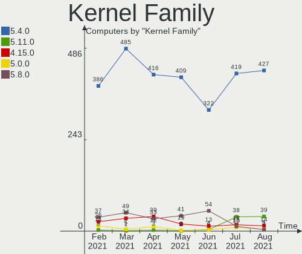

| Version | Computers | Percent |
|---------|-----------|---------|
| 5.4.0   | 520       | 84.28%  |
| 5.8.0   | 33        | 5.35%   |
| 4.15.0  | 33        | 5.35%   |
| 5.0.0   | 13        | 2.11%   |
| 5.6.0   | 3         | 0.49%   |
| 5.10.4  | 3         | 0.49%   |
| 5.9.0   | 2         | 0.32%   |
| 5.10.0  | 2         | 0.32%   |
| 5.9.15  | 1         | 0.16%   |
| 5.9.10  | 1         | 0.16%   |
| 5.4.93  | 1         | 0.16%   |
| 5.10.8  | 1         | 0.16%   |
| 5.10.7  | 1         | 0.16%   |
| 5.10.6  | 1         | 0.16%   |
| 5.10.11 | 1         | 0.16%   |
| 5.10.10 | 1         | 0.16%   |

Kernel Major Ver.
-----------------

Linux kernel major version

| Version | Computers | Percent |
|---------|-----------|---------|
| 5.4     | 521       | 84.44%  |
| 5.8     | 33        | 5.35%   |
| 4.15    | 33        | 5.35%   |
| 5.0     | 13        | 2.11%   |
| 5.10    | 10        | 1.62%   |
| 5.9     | 4         | 0.65%   |
| 5.6     | 3         | 0.49%   |

Arch
----

OS architecture (x86_64, i586, etc.)

| Name   | Computers | Percent |
|--------|-----------|---------|
| x86_64 | 587       | 95.14%  |
| i686   | 30        | 4.86%   |

DE
--

Desktop Environment

| Name       | Computers | Percent |
|------------|-----------|---------|
| X-Cinnamon | 417       | 67.59%  |
| XFCE       | 78        | 12.64%  |
| MATE       | 78        | 12.64%  |
| Cinnamon   | 27        | 4.38%   |
| GNOME      | 8         | 1.3%    |
| KDE        | 4         | 0.65%   |
| Unknown    | 4         | 0.65%   |
| LXDE       | 1         | 0.16%   |

Display Server
--------------

X11 or Wayland

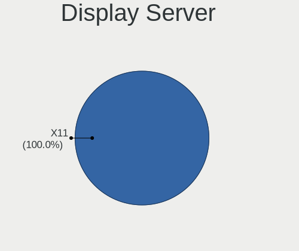

| Name | Computers | Percent |
|------|-----------|---------|
| X11  | 611       | 99.03%  |
| Tty  | 6         | 0.97%   |

Display Manager
---------------

SDDM, LightDM, etc.

| Name    | Computers | Percent |
|---------|-----------|---------|
| Unknown | 460       | 74.55%  |
| TDM     | 154       | 24.96%  |
| SDDM    | 1         | 0.16%   |
| MDM     | 1         | 0.16%   |
| GDM     | 1         | 0.16%   |

OS Lang
-------

Language

| Lang  | Computers | Percent |
|-------|-----------|---------|
| en_US | 179       | 29.01%  |
| de_DE | 101       | 16.37%  |
| pt_BR | 51        | 8.27%   |
| ru_RU | 31        | 5.02%   |
| en_GB | 28        | 4.54%   |
| fr_FR | 26        | 4.21%   |
| it_IT | 20        | 3.24%   |
| C     | 19        | 3.08%   |
| pl_PL | 18        | 2.92%   |
| es_ES | 16        | 2.59%   |
| en_CA | 16        | 2.59%   |
| en_AU | 9         | 1.46%   |
| ru_UA | 6         | 0.97%   |
| nl_NL | 6         | 0.97%   |
| es_MX | 6         | 0.97%   |
| en_ZA | 6         | 0.97%   |
| de_AT | 6         | 0.97%   |
| en_IN | 5         | 0.81%   |
| cs_CZ | 5         | 0.81%   |
| tr_TR | 4         | 0.65%   |
| hu_HU | 4         | 0.65%   |
| es_AR | 4         | 0.65%   |
| bg_BG | 4         | 0.65%   |
| zh_CN | 3         | 0.49%   |
| uk_UA | 3         | 0.49%   |
| sv_SE | 3         | 0.49%   |
| de_CH | 3         | 0.49%   |
| ro_RO | 2         | 0.32%   |
| nl_BE | 2         | 0.32%   |
| nb_NO | 2         | 0.32%   |
| hr_HR | 2         | 0.32%   |
| fr_CA | 2         | 0.32%   |
| fi_FI | 2         | 0.32%   |
| es_CO | 2         | 0.32%   |
| es_CL | 2         | 0.32%   |
| en_IE | 2         | 0.32%   |
| de_BE | 2         | 0.32%   |
| pt_PT | 1         | 0.16%   |
| lv_LV | 1         | 0.16%   |
| it_CH | 1         | 0.16%   |
| id_ID | 1         | 0.16%   |
| he_IL | 1         | 0.16%   |
| gl_ES | 1         | 0.16%   |
| fr_CH | 1         | 0.16%   |
| fr_BE | 1         | 0.16%   |
| es_VE | 1         | 0.16%   |
| es_PE | 1         | 0.16%   |
| es_GT | 1         | 0.16%   |
| es_EC | 1         | 0.16%   |
| en_ZM | 1         | 0.16%   |
| en_PH | 1         | 0.16%   |
| el_GR | 1         | 0.16%   |

Boot Mode
---------

EFI or BIOS

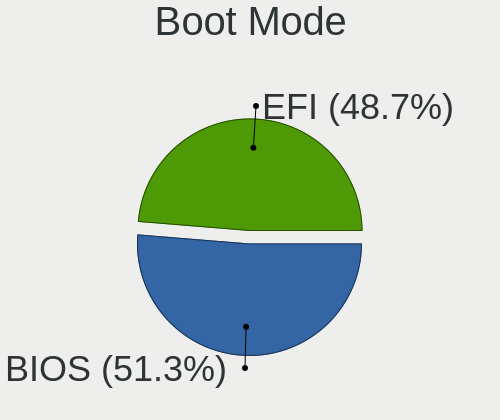

| Mode | Computers | Percent |
|------|-----------|---------|
| BIOS | 378       | 61.26%  |
| EFI  | 239       | 38.74%  |

Filesystem
----------

Type of filesystem

| Type    | Computers | Percent |
|---------|-----------|---------|
| Ext4    | 589       | 95.46%  |
| Overlay | 15        | 2.43%   |
| Btrfs   | 11        | 1.78%   |
| Xfs     | 1         | 0.16%   |
| ExX4    | 1         | 0.16%   |

Part. scheme
------------

Scheme of partitioning

| Type    | Computers | Percent |
|---------|-----------|---------|
| Unknown | 458       | 74.23%  |
| GPT     | 104       | 16.86%  |
| MBR     | 55        | 8.91%   |

Dual Boot with Linux/BSD
------------------------

Hosting more than one Linux/BSD

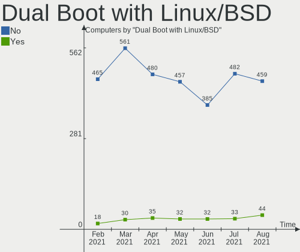

| Dual boot | Computers | Percent |
|-----------|-----------|---------|
| No        | 584       | 94.65%  |
| Yes       | 33        | 5.35%   |

Dual Boot (Win)
---------------

Hosting Linux and Windows

| Dual boot | Computers | Percent |
|-----------|-----------|---------|
| No        | 535       | 86.71%  |
| Yes       | 82        | 13.29%  |

Country
-------

Geographic location (country)

| Country                   | Computers | Percent |
|---------------------------|-----------|---------|
| Germany                   | 109       | 17.67%  |
| USA                       | 107       | 17.34%  |
| Brazil                    | 56        | 9.08%   |
| Russia                    | 32        | 5.19%   |
| France                    | 26        | 4.21%   |
| UK                        | 24        | 3.89%   |
| Italy                     | 24        | 3.89%   |
| Ukraine                   | 20        | 3.24%   |
| Canada                    | 20        | 3.24%   |
| Spain                     | 16        | 2.59%   |
| Poland                    | 14        | 2.27%   |
| Australia                 | 11        | 1.78%   |
| Netherlands               | 9         | 1.46%   |
| Finland                   | 9         | 1.46%   |
| Bulgaria                  | 9         | 1.46%   |
| Austria                   | 9         | 1.46%   |
| Switzerland               | 8         | 1.3%    |
| India                     | 7         | 1.13%   |
| Belgium                   | 7         | 1.13%   |
| Sweden                    | 6         | 0.97%   |
| South Africa              | 6         | 0.97%   |
| Romania                   | 6         | 0.97%   |
| Mexico                    | 6         | 0.97%   |
| Turkey                    | 5         | 0.81%   |
| Hungary                   | 4         | 0.65%   |
| Greece                    | 4         | 0.65%   |
| Czech Republic            | 4         | 0.65%   |
| Argentina                 | 4         | 0.65%   |
| Indonesia                 | 3         | 0.49%   |
| Colombia                  | 3         | 0.49%   |
| Belarus                   | 3         | 0.49%   |
| Thailand                  | 2         | 0.32%   |
| Slovakia                  | 2         | 0.32%   |
| Puerto Rico               | 2         | 0.32%   |
| Portugal                  | 2         | 0.32%   |
| Pakistan                  | 2         | 0.32%   |
| Lithuania                 | 2         | 0.32%   |
| Japan                     | 2         | 0.32%   |
| Ireland                   | 2         | 0.32%   |
| China                     | 2         | 0.32%   |
| Chile                     | 2         | 0.32%   |
| Zambia                    | 1         | 0.16%   |
| Vietnam                   | 1         | 0.16%   |
| Venezuela                 | 1         | 0.16%   |
| Trinidad and Tobago       | 1         | 0.16%   |
| Suriname                  | 1         | 0.16%   |
| Singapore                 | 1         | 0.16%   |
| Philippines               | 1         | 0.16%   |
| Norway                    | 1         | 0.16%   |
| Morocco                   | 1         | 0.16%   |
| Malaysia                  | 1         | 0.16%   |
| Macedonia                 | 1         | 0.16%   |
| Latvia                    | 1         | 0.16%   |
| Kenya                     | 1         | 0.16%   |
| Kazakhstan                | 1         | 0.16%   |
| Jamaica                   | 1         | 0.16%   |
| Israel                    | 1         | 0.16%   |
| Iran, Islamic Republic of | 1         | 0.16%   |
| Hong Kong                 | 1         | 0.16%   |
| Guatemala                 | 1         | 0.16%   |

City
----

Geographic location (city)

| City                     | Computers | Percent |
|--------------------------|-----------|---------|
| Rockville                | 8         | 1.3%    |
| St Petersburg            | 7         | 1.13%   |
| Moscow                   | 7         | 1.13%   |
| Berlin                   | 7         | 1.13%   |
| Vienna                   | 6         | 0.97%   |
| Rome                     | 6         | 0.97%   |
| Munich                   | 6         | 0.97%   |
| Lutsk                    | 6         | 0.97%   |
| São Paulo               | 5         | 0.81%   |
| Warsaw                   | 4         | 0.65%   |
| Vantaa                   | 4         | 0.65%   |
| Rio de Janeiro           | 4         | 0.65%   |
| Paris                    | 4         | 0.65%   |
| Montreal                 | 4         | 0.65%   |
| Kyiv                     | 4         | 0.65%   |
| Joinville                | 4         | 0.65%   |
| Istanbul                 | 4         | 0.65%   |
| Hamburg                  | 4         | 0.65%   |
| Cologne                  | 4         | 0.65%   |
| Chicago                  | 4         | 0.65%   |
| Wrocław                 | 3         | 0.49%   |
| Vancouver                | 3         | 0.49%   |
| Redfield                 | 3         | 0.49%   |
| Passo Fundo              | 3         | 0.49%   |
| Madrid                   | 3         | 0.49%   |
| Los Angeles              | 3         | 0.49%   |
| Kharkiv                  | 3         | 0.49%   |
| Johannesburg             | 3         | 0.49%   |
| Helsinki                 | 3         | 0.49%   |
| Dresden                  | 3         | 0.49%   |
| Barcelona                | 3         | 0.49%   |
| Amsterdam                | 3         | 0.49%   |
| Zlatoust                 | 2         | 0.32%   |
| Wennigsen                | 2         | 0.32%   |
| Varna                    | 2         | 0.32%   |
| Toronto                  | 2         | 0.32%   |
| Tolyatti                 | 2         | 0.32%   |
| Sydney                   | 2         | 0.32%   |
| Stuttgart                | 2         | 0.32%   |
| Stockholm                | 2         | 0.32%   |
| Sofia                    | 2         | 0.32%   |
| San Juan de Aznalfarache | 2         | 0.32%   |
| Rezé                    | 2         | 0.32%   |
| Phoenix                  | 2         | 0.32%   |
| Nuremberg                | 2         | 0.32%   |
| Nanning                  | 2         | 0.32%   |
| Mönchengladbach         | 2         | 0.32%   |
| Minneapolis              | 2         | 0.32%   |
| Menahga                  | 2         | 0.32%   |
| Medellín                | 2         | 0.32%   |
| Ludlow                   | 2         | 0.32%   |
| Leipzig                  | 2         | 0.32%   |
| Lausanne                 | 2         | 0.32%   |
| Kassel                   | 2         | 0.32%   |
| Jakarta                  | 2         | 0.32%   |
| Iztapalapa               | 2         | 0.32%   |
| Ituzaingo                | 2         | 0.32%   |
| Guadalajara              | 2         | 0.32%   |
| Frankfurt am Main        | 2         | 0.32%   |
| Fortaleza                | 2         | 0.32%   |

Vendor
------

Motherboard manufacturer

| Name                    | Computers | Percent |
|-------------------------|-----------|---------|
| ASUSTek Computer        | 105       | 17.02%  |
| Hewlett-Packard         | 102       | 16.53%  |
| Lenovo                  | 70        | 11.35%  |
| Dell                    | 63        | 10.21%  |
| Gigabyte Technology     | 49        | 7.94%   |
| Acer                    | 43        | 6.97%   |
| MSI                     | 27        | 4.38%   |
| ASRock                  | 20        | 3.24%   |
| Toshiba                 | 19        | 3.08%   |
| Samsung Electronics     | 16        | 2.59%   |
| Sony                    | 12        | 1.94%   |
| Apple                   | 12        | 1.94%   |
| Intel                   | 10        | 1.62%   |
| Fujitsu                 | 7         | 1.13%   |
| Unknown                 | 6         | 0.97%   |
| Positivo                | 3         | 0.49%   |
| Pegatron                | 3         | 0.49%   |
| Medion                  | 3         | 0.49%   |
| Fujitsu Siemens         | 3         | 0.49%   |
| Philco                  | 2         | 0.32%   |
| PCWare                  | 2         | 0.32%   |
| Packard Bell            | 2         | 0.32%   |
| Notebook                | 2         | 0.32%   |
| Gateway                 | 2         | 0.32%   |
| Foxconn                 | 2         | 0.32%   |
| ECS                     | 2         | 0.32%   |
| ZOTAC                   | 1         | 0.16%   |
| Wortmann AG             | 1         | 0.16%   |
| Wistron                 | 1         | 0.16%   |
| VS Company              | 1         | 0.16%   |
| TUXEDO                  | 1         | 0.16%   |
| TrekStor                | 1         | 0.16%   |
| Teclast                 | 1         | 0.16%   |
| PC Specialist           | 1         | 0.16%   |
| Mustek                  | 1         | 0.16%   |
| Microsoft               | 1         | 0.16%   |
| MAXDATA                 | 1         | 0.16%   |
| Itautec                 | 1         | 0.16%   |
| Inventec                | 1         | 0.16%   |
| Insyde                  | 1         | 0.16%   |
| HUAWEI                  | 1         | 0.16%   |
| HCL Infosystems Limited | 1         | 0.16%   |
| HARDKERNEL              | 1         | 0.16%   |
| Hampoo                  | 1         | 0.16%   |
| GREATWALL               | 1         | 0.16%   |
| Google                  | 1         | 0.16%   |
| FIC                     | 1         | 0.16%   |
| EVGA                    | 1         | 0.16%   |
| eMachines               | 1         | 0.16%   |
| Digibras                | 1         | 0.16%   |
| CODA                    | 1         | 0.16%   |
| BLAUPUNKT               | 1         | 0.16%   |
| BANGHO                  | 1         | 0.16%   |
| AOpen                   | 1         | 0.16%   |
| AMI                     | 1         | 0.16%   |
| Alienware               | 1         | 0.16%   |

Model
-----

Motherboard model

| Name                                   | Computers | Percent |
|----------------------------------------|-----------|---------|
| Unknown                                | 7         | 1.13%   |
| HP Notebook                            | 5         | 0.81%   |
| Dell Latitude E6420                    | 4         | 0.65%   |
| ASUS All Series                        | 4         | 0.65%   |
| Samsung R519/R719                      | 3         | 0.49%   |
| HP Z400 Workstation                    | 3         | 0.49%   |
| HP Pavilion 15                         | 3         | 0.49%   |
| HP EliteBook 840 G1                    | 3         | 0.49%   |
| Gigabyte G31M-ES2L                     | 3         | 0.49%   |
| Dell Inspiron N5110                    | 3         | 0.49%   |
| ASUS S400CA                            | 3         | 0.49%   |
| Samsung R530/R730                      | 2         | 0.32%   |
| MSI MS-7758                            | 2         | 0.32%   |
| Lenovo ThinkCentre M800 10FW001NUS     | 2         | 0.32%   |
| HP Z230 Tower Workstation              | 2         | 0.32%   |
| HP ProBook 6570b                       | 2         | 0.32%   |
| HP Presario CQ57                       | 2         | 0.32%   |
| HP Pavilion g7                         | 2         | 0.32%   |
| HP Pavilion dv6                        | 2         | 0.32%   |
| HP Compaq dc7900 Convertible Minitower | 2         | 0.32%   |
| HP 250 G7 Notebook PC                  | 2         | 0.32%   |
| Gigabyte G41M-Combo                    | 2         | 0.32%   |
| Dell OptiPlex 790                      | 2         | 0.32%   |
| Dell OptiPlex 780                      | 2         | 0.32%   |
| Dell OptiPlex 760                      | 2         | 0.32%   |
| Dell Latitude E6410                    | 2         | 0.32%   |
| Dell Inspiron 660s                     | 2         | 0.32%   |
| Dell Inspiron 580                      | 2         | 0.32%   |
| Dell Inspiron 3521                     | 2         | 0.32%   |
| ASUS VivoBook_ASUSLaptop X512FJ_X512FJ | 2         | 0.32%   |
| ASUS TUF GAMING X570-PLUS              | 2         | 0.32%   |
| ASUS PRIME B450M-A                     | 2         | 0.32%   |
| Acer Aspire A515-51G                   | 2         | 0.32%   |
| Acer Aspire A315-21                    | 2         | 0.32%   |
| Acer Aspire 5734Z                      | 2         | 0.32%   |
| ZOTAC B410                             | 1         | 0.16%   |
| Wistron ProLiant DL140 G3              | 1         | 0.16%   |
| VS Company VS-MCP61M                   | 1         | 0.16%   |
| TUXEDO P65_67HSHP                      | 1         | 0.16%   |
| TrekStor Notebook Slim S130            | 1         | 0.16%   |
| Toshiba Satellite W30t-A               | 1         | 0.16%   |
| Toshiba Satellite PRO C660             | 1         | 0.16%   |
| Toshiba Satellite P855                 | 1         | 0.16%   |
| Toshiba Satellite P200                 | 1         | 0.16%   |
| Toshiba Satellite P100                 | 1         | 0.16%   |
| Toshiba Satellite L840                 | 1         | 0.16%   |
| Toshiba Satellite L670                 | 1         | 0.16%   |
| Toshiba Satellite L655                 | 1         | 0.16%   |
| Toshiba Satellite L650                 | 1         | 0.16%   |
| Toshiba Satellite L305                 | 1         | 0.16%   |
| Toshiba Satellite C855-2J5             | 1         | 0.16%   |
| Toshiba Satellite C55t-C               | 1         | 0.16%   |
| Toshiba Satellite C50-B                | 1         | 0.16%   |
| Toshiba Satellite A500                 | 1         | 0.16%   |
| Toshiba Satellite A215                 | 1         | 0.16%   |
| Toshiba Satellite A100                 | 1         | 0.16%   |
| Toshiba QOSMIO PX30t-A                 | 1         | 0.16%   |
| Toshiba NB520                          | 1         | 0.16%   |
| Toshiba NB305                          | 1         | 0.16%   |
| Teclast F6 Plus                        | 1         | 0.16%   |

Model Family
------------

Motherboard model prefix

| Name                    | Computers | Percent |
|-------------------------|-----------|---------|
| Acer Aspire             | 30        | 4.86%   |
| Dell Inspiron           | 25        | 4.05%   |
| Lenovo IdeaPad          | 23        | 3.73%   |
| Lenovo ThinkPad         | 18        | 2.92%   |
| Toshiba Satellite       | 16        | 2.59%   |
| HP Pavilion             | 16        | 2.59%   |
| HP Compaq               | 15        | 2.43%   |
| Dell OptiPlex           | 13        | 2.11%   |
| HP ProBook              | 11        | 1.78%   |
| Dell Latitude           | 10        | 1.62%   |
| ASUS PRIME              | 10        | 1.62%   |
| HP Laptop               | 8         | 1.3%    |
| HP EliteBook            | 8         | 1.3%    |
| ASUS VivoBook           | 8         | 1.3%    |
| ASUS TUF                | 8         | 1.3%    |
| Lenovo ThinkCentre      | 7         | 1.13%   |
| Unknown                 | 7         | 1.13%   |
| Dell Vostro             | 6         | 0.97%   |
| HP Notebook             | 5         | 0.81%   |
| Dell Precision          | 5         | 0.81%   |
| Lenovo Legion           | 4         | 0.65%   |
| HP EliteDesk            | 4         | 0.65%   |
| Fujitsu ESPRIMO         | 4         | 0.65%   |
| ASUS ROG                | 4         | 0.65%   |
| ASUS All                | 4         | 0.65%   |
| Samsung R519            | 3         | 0.49%   |
| HP Z400                 | 3         | 0.49%   |
| HP 250                  | 3         | 0.49%   |
| Gigabyte G31M-ES2L      | 3         | 0.49%   |
| Dell XPS                | 3         | 0.49%   |
| ASUS S400CA             | 3         | 0.49%   |
| ASUS P8H61-M            | 3         | 0.49%   |
| Acer Extensa            | 3         | 0.49%   |
| Samsung R530            | 2         | 0.32%   |
| MSI MS-7758             | 2         | 0.32%   |
| Lenovo Yoga             | 2         | 0.32%   |
| HP Z230                 | 2         | 0.32%   |
| HP Stream               | 2         | 0.32%   |
| HP ProDesk              | 2         | 0.32%   |
| HP Presario             | 2         | 0.32%   |
| HP ENVY                 | 2         | 0.32%   |
| HP 255                  | 2         | 0.32%   |
| Gigabyte G41M-Combo     | 2         | 0.32%   |
| Gigabyte B550           | 2         | 0.32%   |
| Gigabyte B450M          | 2         | 0.32%   |
| Fujitsu Siemens ESPRIMO | 2         | 0.32%   |
| Fujitsu LIFEBOOK        | 2         | 0.32%   |
| ASUS ZenBook            | 2         | 0.32%   |
| ASUS P8Z77-V            | 2         | 0.32%   |
| ASUS P5Q                | 2         | 0.32%   |
| ASUS P5KPL-AM           | 2         | 0.32%   |
| ASUS M5A97              | 2         | 0.32%   |
| ASUS M2N-MX             | 2         | 0.32%   |
| Acer Veriton            | 2         | 0.32%   |
| Acer Predator           | 2         | 0.32%   |
| ZOTAC B410              | 1         | 0.16%   |
| Wistron ProLiant        | 1         | 0.16%   |
| VS Company VS-MCP61M    | 1         | 0.16%   |
| TUXEDO P65              | 1         | 0.16%   |
| TrekStor Notebook       | 1         | 0.16%   |

MFG Year
--------

Motherboard manufacture year

| Year    | Computers | Percent |
|---------|-----------|---------|
| 2020    | 89        | 14.42%  |
| 2019    | 57        | 9.24%   |
| 2012    | 55        | 8.91%   |
| 2018    | 53        | 8.59%   |
| 2011    | 53        | 8.59%   |
| 2010    | 52        | 8.43%   |
| 2013    | 48        | 7.78%   |
| 2014    | 38        | 6.16%   |
| 2015    | 34        | 5.51%   |
| 2009    | 33        | 5.35%   |
| 2016    | 29        | 4.7%    |
| 2008    | 27        | 4.38%   |
| 2017    | 24        | 3.89%   |
| 2007    | 13        | 2.11%   |
| 2006    | 4         | 0.65%   |
| 2021    | 2         | 0.32%   |
| 2004    | 2         | 0.32%   |
| Unknown | 2         | 0.32%   |
| 2005    | 1         | 0.16%   |
| 2003    | 1         | 0.16%   |

Form Factor
-----------

Physical design of the computer

| Name        | Computers | Percent |
|-------------|-----------|---------|
| Notebook    | 331       | 53.65%  |
| Desktop     | 259       | 41.98%  |
| All in one  | 10        | 1.62%   |
| Convertible | 7         | 1.13%   |
| Tablet      | 4         | 0.65%   |
| Mini pc     | 4         | 0.65%   |
| Server      | 2         | 0.32%   |

Secure Boot
-----------

Enabled or disabled

| State    | Computers | Percent |
|----------|-----------|---------|
| Disabled | 569       | 92.22%  |
| Enabled  | 48        | 7.78%   |

Coreboot
--------

Have coreboot on board

| Used | Computers | Percent |
|------|-----------|---------|
| No   | 616       | 99.84%  |
| Yes  | 1         | 0.16%   |

RAM Size
--------

Total RAM memory

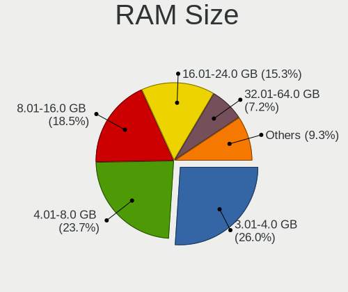

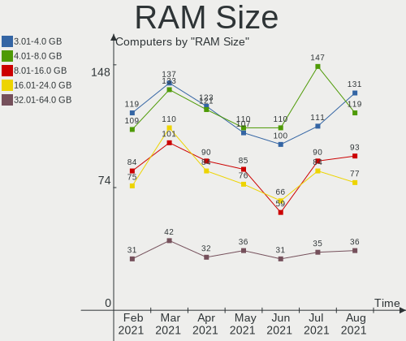

| Size in GB  | Computers | Percent |
|-------------|-----------|---------|
| 3.01-4.0    | 155       | 25.12%  |
| 4.01-8.0    | 146       | 23.66%  |
| 8.01-16.0   | 109       | 17.67%  |
| 16.01-24.0  | 97        | 15.72%  |
| 1.01-2.0    | 40        | 6.48%   |
| 32.01-64.0  | 39        | 6.32%   |
| 2.01-3.0    | 12        | 1.94%   |
| 0.51-1.0    | 9         | 1.46%   |
| 64.01-256.0 | 6         | 0.97%   |
| 24.01-32.0  | 4         | 0.65%   |

RAM Used
--------

Used RAM memory

| Used GB    | Computers | Percent |
|------------|-----------|---------|
| 1.01-2.0   | 283       | 45.87%  |
| 2.01-3.0   | 124       | 20.1%   |
| 0.51-1.0   | 75        | 12.16%  |
| 4.01-8.0   | 67        | 10.86%  |
| 3.01-4.0   | 54        | 8.75%   |
| 8.01-16.0  | 9         | 1.46%   |
| 0.01-0.5   | 3         | 0.49%   |
| 24.01-32.0 | 1         | 0.16%   |
| 16.01-24.0 | 1         | 0.16%   |

Has CD-ROM
----------

Has CD-ROM on board

| Presented | Computers | Percent |
|-----------|-----------|---------|
| Yes       | 322       | 52.19%  |
| No        | 295       | 47.81%  |

Total Drives
------------

Number of drives on board

| Drives | Computers | Percent |
|--------|-----------|---------|
| 1      | 346       | 56.08%  |
| 2      | 173       | 28.04%  |
| 3      | 56        | 9.08%   |
| 4      | 23        | 3.73%   |
| 5      | 10        | 1.62%   |
| 0      | 5         | 0.81%   |
| 7      | 2         | 0.32%   |
| 8      | 1         | 0.16%   |
| 6      | 1         | 0.16%   |

Has Ethernet
------------

Has Ethernet on board

| Presented | Computers | Percent |
|-----------|-----------|---------|
| Yes       | 559       | 90.6%   |
| No        | 58        | 9.4%    |

Drive Vendor
------------

Hard drive vendors

| Vendor                    | Computers | Drives | Percent |
|---------------------------|-----------|--------|---------|
| WDC                       | 183       | 214    | 20.54%  |
| Seagate                   | 162       | 193    | 18.18%  |
| Samsung Electronics       | 108       | 133    | 12.12%  |
| Kingston                  | 56        | 59     | 6.29%   |
| Toshiba                   | 53        | 55     | 5.95%   |
| SanDisk                   | 39        | 40     | 4.38%   |
| Hitachi                   | 38        | 40     | 4.26%   |
| Unknown                   | 29        | 31     | 3.25%   |
| Crucial                   | 25        | 30     | 2.81%   |
| Intel                     | 19        | 19     | 2.13%   |
| HGST                      | 18        | 20     | 2.02%   |
| A-DATA Technology         | 16        | 16     | 1.8%    |
| Patriot                   | 9         | 9      | 1.01%   |
| Micron Technology         | 9         | 9      | 1.01%   |
| SK Hynix                  | 8         | 8      | 0.9%    |
| Apple                     | 8         | 10     | 0.9%    |
| Maxtor                    | 7         | 7      | 0.79%   |
| China                     | 7         | 7      | 0.79%   |
| Intenso                   | 6         | 6      | 0.67%   |
| LITEON                    | 5         | 5      | 0.56%   |
| Fujitsu                   | 5         | 5      | 0.56%   |
| Apacer                    | 5         | 5      | 0.56%   |
| Transcend                 | 4         | 4      | 0.45%   |
| SPCC                      | 4         | 4      | 0.45%   |
| Phison                    | 4         | 4      | 0.45%   |
| OCZ                       | 4         | 4      | 0.45%   |
| Micron/Crucial Technology | 4         | 4      | 0.45%   |
| Union Memory (Shenzhen)   | 3         | 3      | 0.34%   |
| PNY                       | 3         | 3      | 0.34%   |
| Lexar                     | 3         | 3      | 0.34%   |
| Hewlett-Packard           | 3         | 3      | 0.34%   |
| ASMT                      | 3         | 4      | 0.34%   |
| Team                      | 2         | 2      | 0.22%   |
| Silicon Motion            | 2         | 2      | 0.22%   |
| SABRENT                   | 2         | 2      | 0.22%   |
| LITEONIT                  | 2         | 2      | 0.22%   |
| KingSpec                  | 2         | 2      | 0.22%   |
| JMicron                   | 2         | 2      | 0.22%   |
| GOODRAM                   | 2         | 2      | 0.22%   |
| Corsair                   | 2         | 2      | 0.22%   |
| XPG                       | 1         | 1      | 0.11%   |
| WD MediaMax               | 1         | 1      | 0.11%   |
| ViperTeq                  | 1         | 1      | 0.11%   |
| Verbatim                  | 1         | 1      | 0.11%   |
| USB30                     | 1         | 1      | 0.11%   |
| Union Memory              | 1         | 1      | 0.11%   |
| Teclast                   | 1         | 1      | 0.11%   |
| Super Talent              | 1         | 1      | 0.11%   |
| Realtek Semiconductor     | 1         | 1      | 0.11%   |
| PLEXTOR                   | 1         | 1      | 0.11%   |
| MyDigitalSSD              | 1         | 1      | 0.11%   |
| KIOXIA-EXCERIA            | 1         | 1      | 0.11%   |
| Kingmax                   | 1         | 1      | 0.11%   |
| INNOVATION IT             | 1         | 1      | 0.11%   |
| IBM-ESXS                  | 1         | 2      | 0.11%   |
| HS-SSD-C100               | 1         | 1      | 0.11%   |
| Hikvision                 | 1         | 1      | 0.11%   |
| HGST HTS                  | 1         | 1      | 0.11%   |
| Gigabyte Technology       | 1         | 1      | 0.11%   |
| Config                    | 1         | 2      | 0.11%   |

Drive Model
-----------

Hard drive models

| Model                               | Computers | Percent |
|-------------------------------------|-----------|---------|
| Seagate ST1000LM035-1RK172 1TB      | 15        | 1.54%   |
| Kingston SA400S37480G 480GB SSD     | 14        | 1.43%   |
| Samsung SSD 860 EVO 500GB           | 11        | 1.13%   |
| Kingston SA400S37240G 240GB SSD     | 10        | 1.02%   |
| Toshiba DT01ACA100 1TB              | 8         | 0.82%   |
| Seagate ST1000LM024 HN-M101MBB 1TB  | 8         | 0.82%   |
| Samsung SSD 860 EVO 250GB           | 8         | 0.82%   |
| Samsung SSD 860 EVO 1TB             | 8         | 0.82%   |
| Kingston SA400S37120G 120GB SSD     | 8         | 0.82%   |
| Seagate ST500DM002-1BD142 500GB     | 7         | 0.72%   |
| Unknown MMC Card  32GB              | 6         | 0.61%   |
| Seagate ST9500325AS 500GB           | 6         | 0.61%   |
| Seagate ST3500418AS 500GB           | 6         | 0.61%   |
| Seagate ST2000DM008-2FR102 2TB      | 6         | 0.61%   |
| Samsung SSD 850 EVO 500GB           | 6         | 0.61%   |
| WDC WD20EZRZ-00Z5HB0 2TB            | 5         | 0.51%   |
| WDC WD10EZEX-00BN5A0 1TB            | 5         | 0.51%   |
| Toshiba MQ01ABD100 1TB              | 5         | 0.51%   |
| Seagate ST9320325AS 320GB           | 5         | 0.51%   |
| Seagate ST500LT012-9WS142 500GB     | 5         | 0.51%   |
| Seagate ST1000DM003-1ER162 1TB      | 5         | 0.51%   |
| Seagate ST1000DM003-1CH162 1TB      | 5         | 0.51%   |
| Samsung SSD 850 EVO 250GB           | 5         | 0.51%   |
| Samsung HD250HJ 250GB               | 5         | 0.51%   |
| Patriot Burst 240GB SSD             | 5         | 0.51%   |
| Kingston SV300S37A240G 240GB SSD    | 5         | 0.51%   |
| Crucial CT480BX500SSD1 480GB        | 5         | 0.51%   |
| WDC WDS240G2G0A-00JH30 240GB SSD    | 4         | 0.41%   |
| WDC WD20EZRX-00D8PB0 2TB            | 4         | 0.41%   |
| WDC WD10SPZX-24Z10 1TB              | 4         | 0.41%   |
| Unknown SD/MMC/MS PRO 32GB          | 4         | 0.41%   |
| Unknown MMC Card  128GB             | 4         | 0.41%   |
| Seagate ST500LT012-1DG142 500GB     | 4         | 0.41%   |
| Seagate ST500LM000-SSHD-8GB         | 4         | 0.41%   |
| Seagate ST31000528AS 1TB            | 4         | 0.41%   |
| Seagate ST2000DM006-2DM164 2TB      | 4         | 0.41%   |
| Seagate ST2000DM001-1ER164 2TB      | 4         | 0.41%   |
| SanDisk SSD U100 24GB               | 4         | 0.41%   |
| Sandisk NVMe SSD Drive 500GB        | 4         | 0.41%   |
| Samsung NVMe SSD Drive 250GB        | 4         | 0.41%   |
| Micron 1100_MTFDDAV256TBN 256GB SSD | 4         | 0.41%   |
| Hitachi HDT721010SLA360 1TB         | 4         | 0.41%   |
| HGST HTS541010A9E680 1TB            | 4         | 0.41%   |
| Crucial CT1000MX500SSD1 1TB         | 4         | 0.41%   |
| WDC WD5000LPVX-22V0TT0 500GB        | 3         | 0.31%   |
| WDC WD5000AAKX-60U6AA0 500GB        | 3         | 0.31%   |
| WDC WD3200AAKS-00VYA0 320GB         | 3         | 0.31%   |
| WDC WD20EARS-00MVWB0 2TB            | 3         | 0.31%   |
| WDC WD10JPVX-22JC3T0 1TB            | 3         | 0.31%   |
| Unknown MMC Card  64GB              | 3         | 0.31%   |
| Unknown MMC Card  134GB             | 3         | 0.31%   |
| Toshiba MK5055GSX 500GB             | 3         | 0.31%   |
| Seagate ST9500420AS 500GB           | 3         | 0.31%   |
| Seagate ST500LM012 HN-M500MBB 500GB | 3         | 0.31%   |
| Seagate ST3500630AS 500GB           | 3         | 0.31%   |
| Seagate ST1000DM003-9YN162 1TB      | 3         | 0.31%   |
| SanDisk SSD PLUS 120GB              | 3         | 0.31%   |
| SanDisk SDSSDP128G 128GB            | 3         | 0.31%   |
| SanDisk SDSSDA240G 240GB            | 3         | 0.31%   |
| Sandisk NVMe SSD Drive 256GB        | 3         | 0.31%   |

HDD Vendor
----------

Hard disk drive vendors

| Vendor              | Computers | Drives | Percent |
|---------------------|-----------|--------|---------|
| Seagate             | 161       | 192    | 34.55%  |
| WDC                 | 157       | 186    | 33.69%  |
| Toshiba             | 49        | 50     | 10.52%  |
| Hitachi             | 38        | 40     | 8.15%   |
| Samsung Electronics | 23        | 25     | 4.94%   |
| HGST                | 18        | 20     | 3.86%   |
| Maxtor              | 7         | 7      | 1.5%    |
| Fujitsu             | 5         | 5      | 1.07%   |
| ASMT                | 2         | 2      | 0.43%   |
| Apple               | 2         | 2      | 0.43%   |
| WD MediaMax         | 1         | 1      | 0.21%   |
| HGST HTS            | 1         | 1      | 0.21%   |
| Hewlett-Packard     | 1         | 1      | 0.21%   |
| Config              | 1         | 1      | 0.21%   |

SSD Vendor
----------

Solid state drive vendors

| Vendor              | Computers | Drives | Percent |
|---------------------|-----------|--------|---------|
| Samsung Electronics | 70        | 84     | 22.8%   |
| Kingston            | 51        | 54     | 16.61%  |
| SanDisk             | 29        | 30     | 9.45%   |
| Crucial             | 24        | 29     | 7.82%   |
| A-DATA Technology   | 16        | 16     | 5.21%   |
| WDC                 | 13        | 13     | 4.23%   |
| Intel               | 10        | 10     | 3.26%   |
| Patriot             | 9         | 9      | 2.93%   |
| China               | 7         | 7      | 2.28%   |
| Micron Technology   | 6         | 6      | 1.95%   |
| Toshiba             | 5         | 5      | 1.63%   |
| LITEON              | 5         | 5      | 1.63%   |
| Apacer              | 5         | 5      | 1.63%   |
| Transcend           | 4         | 4      | 1.3%    |
| SPCC                | 4         | 4      | 1.3%    |
| OCZ                 | 4         | 4      | 1.3%    |
| Intenso             | 4         | 4      | 1.3%    |
| Apple               | 4         | 4      | 1.3%    |
| PNY                 | 3         | 3      | 0.98%   |
| Lexar               | 3         | 3      | 0.98%   |
| Unknown             | 2         | 2      | 0.65%   |
| Team                | 2         | 2      | 0.65%   |
| SABRENT             | 2         | 2      | 0.65%   |
| LITEONIT            | 2         | 2      | 0.65%   |
| KingSpec            | 2         | 2      | 0.65%   |
| Hewlett-Packard     | 2         | 2      | 0.65%   |
| GOODRAM             | 2         | 2      | 0.65%   |
| Corsair             | 2         | 2      | 0.65%   |
| ViperTeq            | 1         | 1      | 0.33%   |
| Verbatim            | 1         | 1      | 0.33%   |
| USB30               | 1         | 1      | 0.33%   |
| Teclast             | 1         | 1      | 0.33%   |
| PLEXTOR             | 1         | 1      | 0.33%   |
| MyDigitalSSD        | 1         | 1      | 0.33%   |
| KIOXIA-EXCERIA      | 1         | 1      | 0.33%   |
| Kingmax             | 1         | 1      | 0.33%   |
| JMicron             | 1         | 1      | 0.33%   |
| INNOVATION IT       | 1         | 1      | 0.33%   |
| Gigabyte Technology | 1         | 1      | 0.33%   |
| BIWIN               | 1         | 1      | 0.33%   |
| BHT                 | 1         | 1      | 0.33%   |
| BAITITON            | 1         | 1      | 0.33%   |
| Advantech           | 1         | 1      | 0.33%   |

Drive Kind
----------

HDD or SSD

| Kind    | Computers | Drives | Percent |
|---------|-----------|--------|---------|
| HDD     | 399       | 533    | 49.57%  |
| SSD     | 280       | 330    | 34.78%  |
| NVMe    | 89        | 96     | 11.06%  |
| MMC     | 24        | 26     | 2.98%   |
| Unknown | 13        | 15     | 1.61%   |

Drive Connector
---------------

SATA, SAS, NVMe, etc.

| Type | Computers | Drives | Percent |
|------|-----------|--------|---------|
| SATA | 559       | 850    | 80.09%  |
| NVMe | 89        | 96     | 12.75%  |
| SAS  | 26        | 28     | 3.72%   |
| MMC  | 24        | 26     | 3.44%   |

Drive Size
----------

Size of hard drive

| Size in TB | Computers | Drives | Percent |
|------------|-----------|--------|---------|
| 0.01-0.5   | 439       | 553    | 63.17%  |
| 0.51-1.0   | 186       | 212    | 26.76%  |
| 1.01-2.0   | 51        | 73     | 7.34%   |
| 3.01-4.0   | 10        | 14     | 1.44%   |
| 2.01-3.0   | 5         | 6      | 0.72%   |
| 4.01-10.0  | 3         | 4      | 0.43%   |
| 10.01-20.0 | 1         | 1      | 0.14%   |

Space Total
-----------

Amount of disk space available on the file system

| Size in GB     | Computers | Percent |
|----------------|-----------|---------|
| 101-250        | 186       | 30.15%  |
| 251-500        | 163       | 26.42%  |
| 501-1000       | 103       | 16.69%  |
| 1001-2000      | 42        | 6.81%   |
| 51-100         | 40        | 6.48%   |
| More than 3000 | 26        | 4.21%   |
| 21-50          | 23        | 3.73%   |
| 1-20           | 19        | 3.08%   |
| 2001-3000      | 15        | 2.43%   |

Space Used
----------

Amount of used disk space

| Used GB        | Computers | Percent |
|----------------|-----------|---------|
| 1-20           | 184       | 29.82%  |
| 21-50          | 141       | 22.85%  |
| 101-250        | 98        | 15.88%  |
| 51-100         | 83        | 13.45%  |
| 251-500        | 49        | 7.94%   |
| 501-1000       | 29        | 4.7%    |
| 1001-2000      | 18        | 2.92%   |
| 2001-3000      | 10        | 1.62%   |
| More than 3000 | 5         | 0.81%   |

Malfunc. Drives
---------------

Drive models with a malfunction

| Model                           | Computers | Drives | Percent |
|---------------------------------|-----------|--------|---------|
| Seagate ST1000LM035-1RK172 1TB  | 2         | 2      | 6.06%   |
| WDC WD7500AARS-00Y5B1 752GB     | 1         | 1      | 3.03%   |
| WDC WD5002ABYS-01B1B0 500GB     | 1         | 1      | 3.03%   |
| WDC WD5000LPVX-22V0TT0 500GB    | 1         | 1      | 3.03%   |
| WDC WD5000AVDS-63U7B1 500GB     | 1         | 1      | 3.03%   |
| WDC WD5000AAKX-00ERMA0 500GB    | 1         | 1      | 3.03%   |
| WDC WD3200AAJS-56M0A0 320GB     | 1         | 1      | 3.03%   |
| WDC WD3200AAJS-00L7A0 320GB     | 1         | 1      | 3.03%   |
| WDC WD2500BEKT-75PVMT1 250GB    | 1         | 1      | 3.03%   |
| WDC WD1600AAJS-75M0A0 160GB     | 1         | 1      | 3.03%   |
| WDC WD1003FBYX-05Y7B0 1TB       | 1         | 1      | 3.03%   |
| Toshiba MQ01ABD050 500GB        | 1         | 1      | 3.03%   |
| Toshiba MK7575GSX 752GB         | 1         | 1      | 3.03%   |
| Toshiba MK5059GSXP 500GB        | 1         | 1      | 3.03%   |
| Seagate ST9500325AS 500GB       | 1         | 1      | 3.03%   |
| Seagate ST9250827AS 250GB       | 1         | 1      | 3.03%   |
| Seagate ST9120822AS 120GB       | 1         | 1      | 3.03%   |
| Seagate ST500LT012-1DG142 500GB | 1         | 1      | 3.03%   |
| Seagate ST500LM000-SSHD-8GB     | 1         | 1      | 3.03%   |
| Seagate ST3500630NS 500GB       | 1         | 1      | 3.03%   |
| Seagate ST3500418AS 500GB       | 1         | 1      | 3.03%   |
| Seagate ST2000DM006-2DM164 2TB  | 1         | 1      | 3.03%   |
| Seagate ST1500DL003-9VT16L 1TB  | 1         | 1      | 3.03%   |
| Seagate ST1000LM049-2GH172 1TB  | 1         | 1      | 3.03%   |
| Samsung Electronics HD103UJ 1TB | 1         | 1      | 3.03%   |
| Intel SSDSC2KW180H6 180GB       | 1         | 1      | 3.03%   |
| Intel SSDSC2BX200G4R 200GB      | 1         | 1      | 3.03%   |
| Hitachi HDS721050CLA362 500GB   | 1         | 1      | 3.03%   |
| Hitachi HDS721010CLA332 1TB     | 1         | 1      | 3.03%   |
| HGST HTS545050A7E680 500GB      | 1         | 1      | 3.03%   |
| HGST HTS 545050A7E680 500GB     | 1         | 1      | 3.03%   |
| Fujitsu MHY2250BH 250GB         | 1         | 1      | 3.03%   |

Malfunc. Drive Vendor
---------------------

Vendors of faulty drives

| Vendor              | Computers | Drives | Percent |
|---------------------|-----------|--------|---------|
| Seagate             | 12        | 12     | 36.36%  |
| WDC                 | 10        | 10     | 30.3%   |
| Toshiba             | 3         | 3      | 9.09%   |
| Intel               | 2         | 2      | 6.06%   |
| Hitachi             | 2         | 2      | 6.06%   |
| Samsung Electronics | 1         | 1      | 3.03%   |
| HGST HTS            | 1         | 1      | 3.03%   |
| HGST                | 1         | 1      | 3.03%   |
| Fujitsu             | 1         | 1      | 3.03%   |

Malfunc. HDD Vendor
-------------------

Vendors of faulty HDD drives

| Vendor              | Computers | Drives | Percent |
|---------------------|-----------|--------|---------|
| Seagate             | 12        | 12     | 38.71%  |
| WDC                 | 10        | 10     | 32.26%  |
| Toshiba             | 3         | 3      | 9.68%   |
| Hitachi             | 2         | 2      | 6.45%   |
| Samsung Electronics | 1         | 1      | 3.23%   |
| HGST HTS            | 1         | 1      | 3.23%   |
| HGST                | 1         | 1      | 3.23%   |
| Fujitsu             | 1         | 1      | 3.23%   |

Malfunc. Drive Kind
-------------------

Kinds of faulty drives

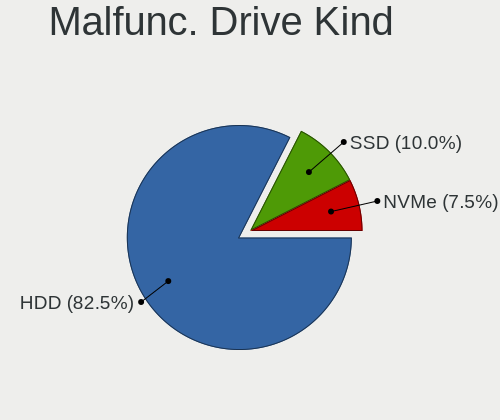

| Kind | Computers | Drives | Percent |
|------|-----------|--------|---------|
| HDD  | 31        | 31     | 93.94%  |
| SSD  | 2         | 2      | 6.06%   |

Failed Drives
-------------

Failed drive models

| Model                      | Computers | Drives | Percent |
|----------------------------|-----------|--------|---------|
| Seagate ST9160821AS 160GB  | 1         | 1      | 50%     |
| HGST HTS545050A7E380 500GB | 1         | 1      | 50%     |

Failed Drive Vendor
-------------------

Failed drive vendors

| Vendor  | Computers | Drives | Percent |
|---------|-----------|--------|---------|
| Seagate | 1         | 1      | 50%     |
| HGST    | 1         | 1      | 50%     |

Drive Status
------------

Number of failed and malfunc. drives

| Status   | Computers | Drives | Percent |
|----------|-----------|--------|---------|
| Detected | 471       | 758    | 73.36%  |
| Works    | 136       | 207    | 21.18%  |
| Malfunc  | 33        | 33     | 5.14%   |
| Failed   | 2         | 2      | 0.31%   |

Storage Vendor
--------------

Storage controller vendors

| Vendor                        | Computers | Percent |
|-------------------------------|-----------|---------|
| Intel                         | 456       | 63.16%  |
| AMD                           | 117       | 16.2%   |
| Samsung Electronics           | 27        | 3.74%   |
| Sandisk                       | 23        | 3.19%   |
| Nvidia                        | 18        | 2.49%   |
| JMicron Technology            | 15        | 2.08%   |
| Marvell Technology Group      | 13        | 1.8%    |
| SK Hynix                      | 8         | 1.11%   |
| ASMedia Technology            | 8         | 1.11%   |
| Phison Electronics            | 5         | 0.69%   |
| Kingston Technology Company   | 5         | 0.69%   |
| VIA Technologies              | 4         | 0.55%   |
| Union Memory (Shenzhen)       | 4         | 0.55%   |
| Micron/Crucial Technology     | 4         | 0.55%   |
| Micron Technology             | 3         | 0.42%   |
| Silicon Motion                | 2         | 0.28%   |
| LSI Logic / Symbios Logic     | 2         | 0.28%   |
| Apple                         | 2         | 0.28%   |
| Realtek Semiconductor         | 1         | 0.14%   |
| Lite-On IT Corp. / Plextor    | 1         | 0.14%   |
| Integrated Technology Express | 1         | 0.14%   |
| Hewlett-Packard               | 1         | 0.14%   |
| Broadcom / LSI                | 1         | 0.14%   |
| ADATA Technology              | 1         | 0.14%   |

Storage Model
-------------

Storage controller models

| Model                                                                                   | Computers | Percent |
|-----------------------------------------------------------------------------------------|-----------|---------|
| AMD FCH SATA Controller [AHCI mode]                                                     | 69        | 8.03%   |
| Intel 7 Series Chipset Family 6-port SATA Controller [AHCI mode]                        | 38        | 4.42%   |
| Intel Sunrise Point-LP SATA Controller [AHCI mode]                                      | 28        | 3.26%   |
| Intel 8 Series/C220 Series Chipset Family 6-port SATA Controller 1 [AHCI mode]          | 27        | 3.14%   |
| Intel 6 Series/C200 Series Chipset Family 6 port Mobile SATA AHCI Controller            | 24        | 2.79%   |
| Intel 82801IBM/IEM (ICH9M/ICH9M-E) 4 port SATA Controller [AHCI mode]                   | 23        | 2.68%   |
| Intel 6 Series/C200 Series Chipset Family 6 port Desktop SATA AHCI Controller           | 23        | 2.68%   |
| Intel 8 Series SATA Controller 1 [AHCI mode]                                            | 22        | 2.56%   |
| AMD SB7x0/SB8x0/SB9x0 SATA Controller [AHCI mode]                                       | 19        | 2.21%   |
| AMD SB7x0/SB8x0/SB9x0 IDE Controller                                                    | 19        | 2.21%   |
| Intel 82801G (ICH7 Family) IDE Controller                                               | 18        | 2.1%    |
| Intel NM10/ICH7 Family SATA Controller [IDE mode]                                       | 17        | 1.98%   |
| Intel 7 Series/C210 Series Chipset Family 6-port SATA Controller [AHCI mode]            | 17        | 1.98%   |
| Samsung NVMe SSD Controller SM981/PM981/PM983                                           | 16        | 1.86%   |
| Intel 82801 Mobile SATA Controller [RAID mode]                                          | 16        | 1.86%   |
| Intel 5 Series/3400 Series Chipset 4 port SATA AHCI Controller                          | 16        | 1.86%   |
| Intel Q170/Q150/B150/H170/H110/Z170/CM236 Chipset SATA Controller [AHCI Mode]           | 15        | 1.75%   |
| AMD 400 Series Chipset SATA Controller                                                  | 15        | 1.75%   |
| Intel 82801HM/HEM (ICH8M/ICH8M-E) IDE Controller                                        | 13        | 1.51%   |
| AMD SB7x0/SB8x0/SB9x0 SATA Controller [IDE mode]                                        | 13        | 1.51%   |
| Nvidia MCP61 SATA Controller                                                            | 11        | 1.28%   |
| Intel SATA Controller [RAID mode]                                                       | 11        | 1.28%   |
| Intel Celeron/Pentium Silver Processor SATA Controller                                  | 11        | 1.28%   |
| Intel 82801HM/HEM (ICH8M/ICH8M-E) SATA Controller [AHCI mode]                           | 11        | 1.28%   |
| Intel SSD 660P Series                                                                   | 9         | 1.05%   |
| Intel Atom Processor E3800 Series SATA AHCI Controller                                  | 9         | 1.05%   |
| JMicron JMB368 IDE controller                                                           | 8         | 0.93%   |
| Intel Wildcat Point-LP SATA Controller [AHCI Mode]                                      | 8         | 0.93%   |
| Intel 5 Series/3400 Series Chipset 6 port SATA AHCI Controller                          | 8         | 0.93%   |
| Intel 5 Series/3400 Series Chipset 4 port SATA IDE Controller                           | 8         | 0.93%   |
| Intel 200 Series PCH SATA controller [AHCI mode]                                        | 8         | 0.93%   |
| Nvidia MCP61 IDE                                                                        | 7         | 0.81%   |
| Intel Cannon Point-LP SATA Controller [AHCI Mode]                                       | 7         | 0.81%   |
| Intel Atom/Celeron/Pentium Processor x5-E8000/J3xxx/N3xxx Series SATA Controller        | 7         | 0.81%   |
| Intel 6 Series/C200 Series Chipset Family Desktop SATA Controller (IDE mode, ports 4-5) | 7         | 0.81%   |
| Intel 6 Series/C200 Series Chipset Family Desktop SATA Controller (IDE mode, ports 0-3) | 7         | 0.81%   |
| ASMedia ASM1062 Serial ATA Controller                                                   | 7         | 0.81%   |
| Sandisk WD Blue SN550 NVMe SSD                                                          | 6         | 0.7%    |
| JMicron JMB363 SATA/IDE Controller                                                      | 6         | 0.7%    |
| Intel NM10/ICH7 Family SATA Controller [AHCI mode]                                      | 6         | 0.7%    |
| Intel Cannon Lake Mobile PCH SATA AHCI Controller                                       | 6         | 0.7%    |
| Intel 82801JD/DO (ICH10 Family) SATA AHCI Controller                                    | 6         | 0.7%    |
| Intel 82801GBM/GHM (ICH7-M Family) SATA Controller [IDE mode]                           | 6         | 0.7%    |
| Intel 5 Series/3400 Series Chipset 2 port SATA IDE Controller                           | 6         | 0.7%    |
| Intel 4 Series Chipset PT IDER Controller                                               | 6         | 0.7%    |
| AMD SATA controller                                                                     | 6         | 0.7%    |
| SK Hynix Non-Volatile memory controller                                                 | 5         | 0.58%   |
| Sandisk WD Blue SN500 / PC SN520 NVMe SSD                                               | 5         | 0.58%   |
| Sandisk WD Black 2018 / PC SN720 NVMe SSD                                               | 5         | 0.58%   |
| Samsung Electronics Non-Volatile memory controller                                      | 5         | 0.58%   |
| Marvell Group 88SE9172 SATA 6Gb/s Controller                                            | 5         | 0.58%   |
| Intel 82801JI (ICH10 Family) SATA AHCI Controller                                       | 5         | 0.58%   |
| Intel 82801JI (ICH10 Family) 4 port SATA IDE Controller #1                              | 5         | 0.58%   |
| Intel 82801JI (ICH10 Family) 2 port SATA IDE Controller #2                              | 5         | 0.58%   |
| Sandisk WD Black SN750 / PC SN730 NVMe SSD                                              | 4         | 0.47%   |
| Intel Ice Lake-LP SATA Controller [AHCI mode]                                           | 4         | 0.47%   |
| Intel Celeron N3350/Pentium N4200/Atom E3900 Series SATA AHCI Controller                | 4         | 0.47%   |
| Intel 9 Series Chipset Family SATA Controller [AHCI Mode]                               | 4         | 0.47%   |
| Intel 82801GBM/GHM (ICH7-M Family) SATA Controller [AHCI mode]                          | 4         | 0.47%   |
| Intel 400 Series Chipset Family SATA AHCI Controller                                    | 4         | 0.47%   |

Storage Kind
------------

Kind of storage controller (IDE, SATA, NVMe, SAS, ...)

| Kind | Computers | Percent |
|------|-----------|---------|
| SATA | 483       | 65.09%  |
| IDE  | 135       | 18.19%  |
| NVMe | 88        | 11.86%  |
| RAID | 33        | 4.45%   |
| SCSI | 2         | 0.27%   |
| SAS  | 1         | 0.13%   |

CPU Vendor
----------

Processor vendors

| Vendor | Computers | Percent |
|--------|-----------|---------|
| Intel  | 476       | 77.15%  |
| AMD    | 141       | 22.85%  |

CPU Model
---------

Processor models

| Model                                         | Computers | Percent |
|-----------------------------------------------|-----------|---------|
| Intel Core i5-7200U CPU @ 2.50GHz             | 8         | 1.3%    |
| Intel Core i5-2520M CPU @ 2.50GHz             | 8         | 1.3%    |
| Intel Core i5-3470 CPU @ 3.20GHz              | 7         | 1.13%   |
| Intel Core i5-8250U CPU @ 1.60GHz             | 6         | 0.97%   |
| Intel Core i5-4570 CPU @ 3.20GHz              | 6         | 0.97%   |
| Intel Celeron N4000 CPU @ 1.10GHz             | 6         | 0.97%   |
| AMD Ryzen 7 4800H with Radeon Graphics        | 6         | 0.97%   |
| Intel Core i5-3230M CPU @ 2.60GHz             | 5         | 0.81%   |
| Intel Core i3-3240 CPU @ 3.40GHz              | 5         | 0.81%   |
| Intel Core i3-2310M CPU @ 2.10GHz             | 5         | 0.81%   |
| Intel Core i3 CPU M 330 @ 2.13GHz             | 5         | 0.81%   |
| Intel Celeron CPU N3060 @ 1.60GHz             | 5         | 0.81%   |
| AMD Ryzen 7 3700X 8-Core Processor            | 5         | 0.81%   |
| Intel Core i7-7500U CPU @ 2.70GHz             | 4         | 0.65%   |
| Intel Core i7-6700 CPU @ 3.40GHz              | 4         | 0.65%   |
| Intel Core i7-4790 CPU @ 3.60GHz              | 4         | 0.65%   |
| Intel Core i7-4510U CPU @ 2.00GHz             | 4         | 0.65%   |
| Intel Core i5-4210U CPU @ 1.70GHz             | 4         | 0.65%   |
| Intel Core i5-1035G1 CPU @ 1.00GHz            | 4         | 0.65%   |
| Intel Core i3-3217U CPU @ 1.80GHz             | 4         | 0.65%   |
| Intel Core i3-2100 CPU @ 3.10GHz              | 4         | 0.65%   |
| Intel Core i3 CPU M 370 @ 2.40GHz             | 4         | 0.65%   |
| Intel Core 2 Quad CPU Q6600 @ 2.40GHz         | 4         | 0.65%   |
| Intel Core 2 Duo CPU T8100 @ 2.10GHz          | 4         | 0.65%   |
| AMD Ryzen 7 3700U with Radeon Vega Mobile Gfx | 4         | 0.65%   |
| Intel Pentium Dual-Core CPU T4500 @ 2.30GHz   | 3         | 0.49%   |
| Intel Pentium Dual-Core CPU T4200 @ 2.00GHz   | 3         | 0.49%   |
| Intel Pentium Dual-Core CPU E6600 @ 3.06GHz   | 3         | 0.49%   |
| Intel Pentium Dual CPU T3200 @ 2.00GHz        | 3         | 0.49%   |
| Intel Pentium CPU N3700 @ 1.60GHz             | 3         | 0.49%   |
| Intel Core i7-9750H CPU @ 2.60GHz             | 3         | 0.49%   |
| Intel Core i7-8565U CPU @ 1.80GHz             | 3         | 0.49%   |
| Intel Core i7-4790K CPU @ 4.00GHz             | 3         | 0.49%   |
| Intel Core i7-4770K CPU @ 3.50GHz             | 3         | 0.49%   |
| Intel Core i7-3610QM CPU @ 2.30GHz            | 3         | 0.49%   |
| Intel Core i7-10510U CPU @ 1.80GHz            | 3         | 0.49%   |
| Intel Core i5-8265U CPU @ 1.60GHz             | 3         | 0.49%   |
| Intel Core i5-6500 CPU @ 3.20GHz              | 3         | 0.49%   |
| Intel Core i5-4200U CPU @ 1.60GHz             | 3         | 0.49%   |
| Intel Core i5-3570K CPU @ 3.40GHz             | 3         | 0.49%   |
| Intel Core i5-3330 CPU @ 3.00GHz              | 3         | 0.49%   |
| Intel Core i5-3317U CPU @ 1.70GHz             | 3         | 0.49%   |
| Intel Core i5-2500K CPU @ 3.30GHz             | 3         | 0.49%   |
| Intel Core i5-2450M CPU @ 2.50GHz             | 3         | 0.49%   |
| Intel Core i5 CPU M 560 @ 2.67GHz             | 3         | 0.49%   |
| Intel Core i3-5005U CPU @ 2.00GHz             | 3         | 0.49%   |
| Intel Core i3-3120M CPU @ 2.50GHz             | 3         | 0.49%   |
| Intel Core i3-2370M CPU @ 2.40GHz             | 3         | 0.49%   |
| Intel Core i3-2350M CPU @ 2.30GHz             | 3         | 0.49%   |
| Intel Core i3-2120 CPU @ 3.30GHz              | 3         | 0.49%   |
| Intel Core i3 CPU 550 @ 3.20GHz               | 3         | 0.49%   |
| Intel Core 2 Duo CPU T9300 @ 2.50GHz          | 3         | 0.49%   |
| Intel Core 2 Duo CPU E8500 @ 3.16GHz          | 3         | 0.49%   |
| Intel Core 2 Duo CPU E8400 @ 3.00GHz          | 3         | 0.49%   |
| Intel Celeron CPU N2830 @ 2.16GHz             | 3         | 0.49%   |
| Intel Celeron CPU 1007U @ 1.50GHz             | 3         | 0.49%   |
| Intel Atom CPU N570 @ 1.66GHz                 | 3         | 0.49%   |
| Intel Atom CPU N450 @ 1.66GHz                 | 3         | 0.49%   |
| AMD Ryzen 5 3600 6-Core Processor             | 3         | 0.49%   |
| AMD Ryzen 5 3400G with Radeon Vega Graphics   | 3         | 0.49%   |

CPU Model Family
----------------

Processor model prefix

| Model                   | Computers | Percent |
|-------------------------|-----------|---------|
| Intel Core i5           | 133       | 21.56%  |
| Intel Core i7           | 86        | 13.94%  |
| Intel Core i3           | 70        | 11.35%  |
| Intel Core 2 Duo        | 38        | 6.16%   |
| Intel Celeron           | 34        | 5.51%   |
| Intel Pentium           | 30        | 4.86%   |
| AMD Ryzen 7             | 23        | 3.73%   |
| AMD Ryzen 5             | 19        | 3.08%   |
| Intel Pentium Dual-Core | 16        | 2.59%   |
| Intel Xeon              | 15        | 2.43%   |
| Intel Atom              | 15        | 2.43%   |
| Intel Core 2 Quad       | 11        | 1.78%   |
| AMD FX                  | 10        | 1.62%   |
| AMD Ryzen 3             | 9         | 1.46%   |
| AMD A6                  | 8         | 1.3%    |
| AMD A4                  | 8         | 1.3%    |
| Intel Core 2            | 6         | 0.97%   |
| AMD Phenom II X4        | 6         | 0.97%   |
| Intel Pentium Dual      | 5         | 0.81%   |
| Other                   | 4         | 0.65%   |
| Intel Genuine           | 4         | 0.65%   |
| AMD E                   | 4         | 0.65%   |
| AMD Athlon II X2        | 4         | 0.65%   |
| AMD Athlon 64 X2        | 4         | 0.65%   |
| AMD A8                  | 4         | 0.65%   |
| Intel Pentium 4         | 3         | 0.49%   |
| AMD Ryzen 9             | 3         | 0.49%   |
| AMD Athlon II X4        | 3         | 0.49%   |
| AMD Athlon              | 3         | 0.49%   |
| AMD A10                 | 3         | 0.49%   |
| Intel Pentium Silver    | 2         | 0.32%   |
| Intel Celeron M         | 2         | 0.32%   |
| Intel Celeron Dual-Core | 2         | 0.32%   |
| AMD Turion II           | 2         | 0.32%   |
| AMD Ryzen 5 PRO         | 2         | 0.32%   |
| AMD Phenom II X2        | 2         | 0.32%   |
| AMD G                   | 2         | 0.32%   |
| AMD C-60                | 2         | 0.32%   |
| AMD Athlon X4           | 2         | 0.32%   |
| AMD Athlon X2           | 2         | 0.32%   |
| AMD A12                 | 2         | 0.32%   |
| Intel Core i9           | 1         | 0.16%   |
| Intel Core Duo          | 1         | 0.16%   |
| Intel Core 2 Extreme    | 1         | 0.16%   |
| AMD Turion 64 X2 Mobile | 1         | 0.16%   |
| AMD Sempron             | 1         | 0.16%   |
| AMD Phenom II X6        | 1         | 0.16%   |
| AMD Phenom II X3        | 1         | 0.16%   |
| AMD Phenom              | 1         | 0.16%   |
| AMD Opteron             | 1         | 0.16%   |
| AMD E2                  | 1         | 0.16%   |
| AMD E1                  | 1         | 0.16%   |
| AMD C-70                | 1         | 0.16%   |
| AMD Athlon Dual Core    | 1         | 0.16%   |
| AMD Athlon 64           | 1         | 0.16%   |

CPU Cores
---------

Number of processor cores

| Number | Computers | Percent |
|--------|-----------|---------|
| 2      | 323       | 52.35%  |
| 4      | 198       | 32.09%  |
| 6      | 32        | 5.19%   |
| 8      | 28        | 4.54%   |
| 1      | 27        | 4.38%   |
| 3      | 4         | 0.65%   |
| 12     | 3         | 0.49%   |
| 24     | 1         | 0.16%   |
| 16     | 1         | 0.16%   |

CPU Sockets
-----------

Number of sockets

| Number | Computers | Percent |
|--------|-----------|---------|
| 1      | 611       | 99.03%  |
| 2      | 6         | 0.97%   |

CPU Threads
-----------

Threads per core (Hyper-Threading)

| Number | Computers | Percent |
|--------|-----------|---------|
| 2      | 336       | 54.46%  |
| 1      | 281       | 45.54%  |

CPU Op-Modes
------------

CPU Operation Modes (32-bit, 64-bit)

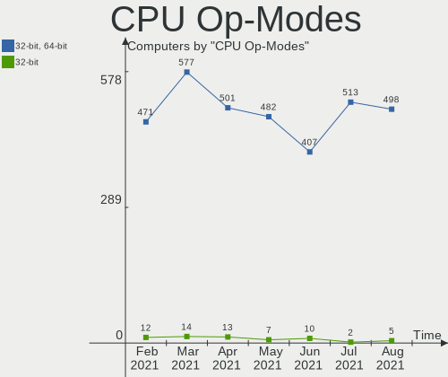

| Op mode        | Computers | Percent |
|----------------|-----------|---------|
| 32-bit, 64-bit | 606       | 98.22%  |
| 32-bit         | 11        | 1.78%   |

CPU Microcode
-------------

Microcode number

| Number     | Computers | Percent |
|------------|-----------|---------|
| 0x306a9    | 59        | 9.56%   |
| 0x206a7    | 55        | 8.91%   |
| Unknown    | 41        | 6.65%   |
| 0x1067a    | 38        | 6.16%   |
| 0x306c3    | 33        | 5.35%   |
| 0x40651    | 21        | 3.4%    |
| 0x20655    | 19        | 3.08%   |
| 0x10676    | 17        | 2.76%   |
| 0x506e3    | 16        | 2.59%   |
| 0x806e9    | 14        | 2.27%   |
| 0x706a1    | 12        | 1.94%   |
| 0x806ea    | 11        | 1.78%   |
| 0x6fd      | 11        | 1.78%   |
| 0x30678    | 11        | 1.78%   |
| 0x010000c8 | 11        | 1.78%   |
| 0x906ea    | 10        | 1.62%   |
| 0x20652    | 10        | 1.62%   |
| 0x08108109 | 10        | 1.62%   |
| 0x806ec    | 9         | 1.46%   |
| 0x08701021 | 9         | 1.46%   |
| 0x06001119 | 9         | 1.46%   |
| 0x05000119 | 9         | 1.46%   |
| 0x706e5    | 8         | 1.3%    |
| 0x6fb      | 8         | 1.3%    |
| 0x406c4    | 8         | 1.3%    |
| 0x306d4    | 8         | 1.3%    |
| 0x106ca    | 8         | 1.3%    |
| 0x08108102 | 8         | 1.3%    |
| 0x906e9    | 6         | 0.97%   |
| 0x06000852 | 6         | 0.97%   |
| 0x010000db | 6         | 0.97%   |
| 0xa0655    | 5         | 0.81%   |
| 0x406e3    | 5         | 0.81%   |
| 0x406c3    | 5         | 0.81%   |
| 0x206c2    | 5         | 0.81%   |
| 0x08600104 | 5         | 0.81%   |
| 0x6f6      | 4         | 0.65%   |
| 0x506c9    | 4         | 0.65%   |
| 0x08600106 | 4         | 0.65%   |
| 0x0800820d | 4         | 0.65%   |
| 0x0600063e | 4         | 0.65%   |
| 0xf29      | 3         | 0.49%   |
| 0x6e8      | 3         | 0.49%   |
| 0x106e5    | 3         | 0.49%   |
| 0x08701013 | 3         | 0.49%   |
| 0x08600103 | 3         | 0.49%   |
| 0x06006705 | 3         | 0.49%   |
| 0x06006118 | 3         | 0.49%   |
| 0x806eb    | 2         | 0.32%   |
| 0x6f2      | 2         | 0.32%   |
| 0x6ec      | 2         | 0.32%   |
| 0x206d7    | 2         | 0.32%   |
| 0x106c2    | 2         | 0.32%   |
| 0x106a5    | 2         | 0.32%   |
| 0x10677    | 2         | 0.32%   |
| 0x10661    | 2         | 0.32%   |
| 0x0810100b | 2         | 0.32%   |
| 0x07030106 | 2         | 0.32%   |
| 0x0700010f | 2         | 0.32%   |
| 0x06006704 | 2         | 0.32%   |

CPU Microarch
-------------

Microarchitecture

| Name            | Computers | Percent |
|-----------------|-----------|---------|
| IvyBridge       | 63        | 10.21%  |
| Haswell         | 61        | 9.89%   |
| KabyLake        | 60        | 9.72%   |
| SandyBridge     | 59        | 9.56%   |
| Penryn          | 58        | 9.4%    |
| Westmere        | 36        | 5.83%   |
| Core            | 28        | 4.54%   |
| Zen 2           | 27        | 4.38%   |
| Zen+            | 24        | 3.89%   |
| Silvermont      | 24        | 3.89%   |
| K10             | 24        | 3.89%   |
| Skylake         | 22        | 3.57%   |
| Piledriver      | 15        | 2.43%   |
| Goldmont plus   | 12        | 1.94%   |
| Excavator       | 11        | 1.78%   |
| Bobcat          | 11        | 1.78%   |
| Bonnell         | 10        | 1.62%   |
| Broadwell       | 9         | 1.46%   |
| IceLake         | 8         | 1.3%    |
| K8 Hammer       | 7         | 1.13%   |
| Zen             | 6         | 0.97%   |
| P6              | 6         | 0.97%   |
| Nehalem         | 6         | 0.97%   |
| CometLake       | 6         | 0.97%   |
| Goldmont        | 4         | 0.65%   |
| Bulldozer       | 4         | 0.65%   |
| Puma            | 3         | 0.49%   |
| NetBurst        | 3         | 0.49%   |
| Steamroller     | 2         | 0.32%   |
| K8 & K10 hybrid | 2         | 0.32%   |
| K10 Llano       | 2         | 0.32%   |
| Jaguar          | 2         | 0.32%   |
| TigerLake       | 1         | 0.16%   |
| Unknown         | 1         | 0.16%   |

GPU Vendor
----------

Vendors of graphics cards

| Vendor                     | Computers | Percent |
|----------------------------|-----------|---------|
| Intel                      | 357       | 51.07%  |
| Nvidia                     | 172       | 24.61%  |
| AMD                        | 168       | 24.03%  |
| VIA Technologies           | 1         | 0.14%   |
| Matrox Electronics Systems | 1         | 0.14%   |

GPU Model
---------

Graphics card models

| Model                                                                                    | Computers | Percent |
|------------------------------------------------------------------------------------------|-----------|---------|
| Intel 2nd Generation Core Processor Family Integrated Graphics Controller                | 49        | 6.74%   |
| Intel 3rd Gen Core processor Graphics Controller                                         | 30        | 4.13%   |
| Intel Haswell-ULT Integrated Graphics Controller                                         | 21        | 2.89%   |
| Intel Xeon E3-1200 v3/4th Gen Core Processor Integrated Graphics Controller              | 19        | 2.61%   |
| Intel Core Processor Integrated Graphics Controller                                      | 19        | 2.61%   |
| Intel Mobile 4 Series Chipset Integrated Graphics Controller                             | 18        | 2.48%   |
| AMD Picasso                                                                              | 18        | 2.48%   |
| Intel Xeon E3-1200 v2/3rd Gen Core processor Graphics Controller                         | 14        | 1.93%   |
| Intel HD Graphics 620                                                                    | 13        | 1.79%   |
| Intel Atom/Celeron/Pentium Processor x5-E8000/J3xxx/N3xxx Integrated Graphics Controller | 13        | 1.79%   |
| Intel UHD Graphics 605                                                                   | 12        | 1.65%   |
| Intel HD Graphics 530                                                                    | 12        | 1.65%   |
| Intel Atom Processor Z36xxx/Z37xxx Series Graphics & Display                             | 11        | 1.51%   |
| AMD Renoir                                                                               | 11        | 1.51%   |
| Intel Mobile 945GM/GMS/GME, 943/940GML Express Integrated Graphics Controller            | 10        | 1.38%   |
| Intel UHD Graphics 620                                                                   | 9         | 1.24%   |
| Intel 4 Series Chipset Integrated Graphics Controller                                    | 9         | 1.24%   |
| AMD Ellesmere [Radeon RX 470/480/570/570X/580/580X/590]                                  | 9         | 1.24%   |
| Intel Atom Processor D4xx/D5xx/N4xx/N5xx Integrated Graphics Controller                  | 8         | 1.1%    |
| Intel 82G33/G31 Express Integrated Graphics Controller                                   | 8         | 1.1%    |
| Intel UHD Graphics 630 (Mobile)                                                          | 7         | 0.96%   |
| Intel Mobile GM965/GL960 Integrated Graphics Controller (secondary)                      | 7         | 0.96%   |
| Intel Mobile GM965/GL960 Integrated Graphics Controller (primary)                        | 7         | 0.96%   |
| Intel Mobile 945GM/GMS, 943/940GML Express Integrated Graphics Controller                | 7         | 0.96%   |
| Intel HD Graphics 5500                                                                   | 7         | 0.96%   |
| Intel 4th Gen Core Processor Integrated Graphics Controller                              | 7         | 0.96%   |
| Nvidia TU116M [GeForce GTX 1660 Ti Mobile]                                               | 6         | 0.83%   |
| Nvidia GP108 [GeForce GT 1030]                                                           | 6         | 0.83%   |
| Nvidia GK208B [GeForce GT 710]                                                           | 6         | 0.83%   |
| Intel UHD Graphics 620 (Whiskey Lake)                                                    | 6         | 0.83%   |
| AMD Stoney [Radeon R2/R3/R4/R5 Graphics]                                                 | 6         | 0.83%   |
| Nvidia GF117M [GeForce 610M/710M/810M/820M / GT 620M/625M/630M/720M]                     | 5         | 0.69%   |
| Intel Skylake GT2 [HD Graphics 520]                                                      | 5         | 0.69%   |
| Intel Iris Plus Graphics G1 (Ice Lake)                                                   | 5         | 0.69%   |
| AMD Topaz XT [Radeon R7 M260/M265 / M340/M360 / M440/M445 / 530/535 / 620/625 Mobile]    | 5         | 0.69%   |
| AMD Park [Mobility Radeon HD 5430/5450/5470]                                             | 5         | 0.69%   |
| Nvidia TU117M [GeForce GTX 1650 Mobile / Max-Q]                                          | 4         | 0.55%   |
| Nvidia TU116 [GeForce GTX 1660 SUPER]                                                    | 4         | 0.55%   |
| Nvidia GP107 [GeForce GTX 1050 Ti]                                                       | 4         | 0.55%   |
| Nvidia GP106 [GeForce GTX 1060 3GB]                                                      | 4         | 0.55%   |
| Intel HD Graphics 630                                                                    | 4         | 0.55%   |
| Intel CometLake-U GT2 [UHD Graphics]                                                     | 4         | 0.55%   |
| AMD Wani [Radeon R5/R6/R7 Graphics]                                                      | 4         | 0.55%   |
| AMD Cedar [Radeon HD 5000/6000/7350/8350 Series]                                         | 4         | 0.55%   |
| AMD Baffin [Radeon RX 460/560D / Pro 450/455/460/555/555X/560/560X]                      | 4         | 0.55%   |
| Nvidia TU106M [GeForce RTX 2060 Mobile]                                                  | 3         | 0.41%   |
| Nvidia GT218 [GeForce 210]                                                               | 3         | 0.41%   |
| Nvidia GP107 [GeForce GTX 1050]                                                          | 3         | 0.41%   |
| Nvidia GP106 [GeForce GTX 1060 6GB]                                                      | 3         | 0.41%   |
| Nvidia GM206 [GeForce GTX 960]                                                           | 3         | 0.41%   |
| Nvidia GM107 [GeForce GTX 750 Ti]                                                        | 3         | 0.41%   |
| Nvidia GF119M [NVS 4200M]                                                                | 3         | 0.41%   |
| Nvidia GF108 [GeForce GT 430]                                                            | 3         | 0.41%   |
| Intel Mobile 945GSE Express Integrated Graphics Controller                               | 3         | 0.41%   |
| AMD Wrestler [Radeon HD 6310]                                                            | 3         | 0.41%   |
| AMD Seymour [Radeon HD 6400M/7400M Series]                                               | 3         | 0.41%   |
| AMD RV710 [Radeon HD 4350/4550]                                                          | 3         | 0.41%   |
| AMD RS780L [Radeon 3000]                                                                 | 3         | 0.41%   |
| AMD Mullins [Radeon R4/R5 Graphics]                                                      | 3         | 0.41%   |
| AMD Curacao XT / Trinidad XT [Radeon R7 370 / R9 270X/370X]                              | 3         | 0.41%   |

GPU Combo
---------

Combinations of graphics cards

| Name           | Computers | Percent |
|----------------|-----------|---------|
| 1 x Intel      | 284       | 46.03%  |
| 1 x AMD        | 133       | 21.56%  |
| 1 x Nvidia     | 111       | 17.99%  |
| Intel + Nvidia | 50        | 8.1%    |
| Intel + AMD    | 17        | 2.76%   |
| 2 x AMD        | 9         | 1.46%   |
| AMD + Nvidia   | 8         | 1.3%    |
| 2 x Nvidia     | 2         | 0.32%   |
| Other          | 1         | 0.16%   |
| 1 x VIA        | 1         | 0.16%   |
| 1 x Matrox     | 1         | 0.16%   |

GPU Driver
----------

Free vs proprietary

| Driver      | Computers | Percent |
|-------------|-----------|---------|
| Free        | 490       | 79.42%  |
| Proprietary | 113       | 18.31%  |
| Unknown     | 14        | 2.27%   |

GPU Memory
----------

Total video memory

| Size in GB | Computers | Percent |
|------------|-----------|---------|
| Unknown    | 316       | 51.22%  |
| 0.01-0.5   | 93        | 15.07%  |
| 1.01-2.0   | 82        | 13.29%  |
| 0.51-1.0   | 57        | 9.24%   |
| 3.01-4.0   | 29        | 4.7%    |
| 5.01-6.0   | 16        | 2.59%   |
| 7.01-8.0   | 13        | 2.11%   |
| 2.01-3.0   | 7         | 1.13%   |
| 8.01-16.0  | 3         | 0.49%   |
| 16.01-24.0 | 1         | 0.16%   |

Monitor Vendor
--------------

Monitor vendors

| Vendor                  | Computers | Percent |
|-------------------------|-----------|---------|
| Samsung Electronics     | 88        | 13.62%  |
| AU Optronics            | 77        | 11.92%  |
| LG Display              | 58        | 8.98%   |
| BOE                     | 40        | 6.19%   |
| Goldstar                | 35        | 5.42%   |
| Chimei Innolux          | 35        | 5.42%   |
| Hewlett-Packard         | 32        | 4.95%   |
| Dell                    | 32        | 4.95%   |
| Ancor Communications    | 25        | 3.87%   |
| Acer                    | 25        | 3.87%   |
| Chi Mei Optoelectronics | 19        | 2.94%   |
| BenQ                    | 17        | 2.63%   |
| Sony                    | 14        | 2.17%   |
| LG Electronics          | 14        | 2.17%   |
| Apple                   | 13        | 2.01%   |
| Philips                 | 12        | 1.86%   |
| AOC                     | 11        | 1.7%    |
| Unknown                 | 6         | 0.93%   |
| LG Philips              | 6         | 0.93%   |
| Eizo                    | 6         | 0.93%   |
| Vestel Elektronik       | 5         | 0.77%   |
| PANDA                   | 5         | 0.77%   |
| Lenovo                  | 5         | 0.77%   |
| ASUSTek Computer        | 5         | 0.77%   |
| ViewSonic               | 4         | 0.62%   |
| Panasonic               | 4         | 0.62%   |
| NEC Computers           | 4         | 0.62%   |
| Seiko/Epson             | 3         | 0.46%   |
| InfoVision              | 3         | 0.46%   |
| HannStar                | 3         | 0.46%   |
| CPT                     | 3         | 0.46%   |
| Toshiba                 | 2         | 0.31%   |
| Sceptre Tech            | 2         | 0.31%   |
| Pioneer                 | 2         | 0.31%   |
| Medion                  | 2         | 0.31%   |
| InnoLux Display         | 2         | 0.31%   |
| Iiyama                  | 2         | 0.31%   |
| Fujitsu Siemens         | 2         | 0.31%   |
| Xiaomi                  | 1         | 0.15%   |
| Vizio                   | 1         | 0.15%   |
| SHI                     | 1         | 0.15%   |
| Sharp                   | 1         | 0.15%   |
| Planar                  | 1         | 0.15%   |
| MStar                   | 1         | 0.15%   |
| Microstep               | 1         | 0.15%   |
| LGD                     | 1         | 0.15%   |
| INS                     | 1         | 0.15%   |
| IBM                     | 1         | 0.15%   |
| HannStar Display        | 1         | 0.15%   |
| GSV                     | 1         | 0.15%   |
| GKK                     | 1         | 0.15%   |
| FUS                     | 1         | 0.15%   |
| Envision Peripherals    | 1         | 0.15%   |
| ENM                     | 1         | 0.15%   |
| eMachines               | 1         | 0.15%   |
| CVT                     | 1         | 0.15%   |
| CTL                     | 1         | 0.15%   |
| COB                     | 1         | 0.15%   |
| CNC                     | 1         | 0.15%   |
| Belinea                 | 1         | 0.15%   |

Monitor Model
-------------

Monitor models

| Model                                                                     | Computers | Percent |
|---------------------------------------------------------------------------|-----------|---------|
| Vestel Elektronik 50UHD_LCD_TV VES3700 3840x2160 1872x1053mm 84.6-inch    | 5         | 0.75%   |
| AU Optronics LCD Monitor AUO303C 1366x768 309x173mm 13.9-inch             | 5         | 0.75%   |
| Samsung Electronics SyncMaster SAM0364 1360x768 344x194mm 15.5-inch       | 4         | 0.6%    |
| LG Display LCD Monitor LGD02DC 1366x768 344x194mm 15.5-inch               | 4         | 0.6%    |
| Goldstar 2D FHD LG TV GSM59C6 1920x1080 509x286mm 23.0-inch               | 4         | 0.6%    |
| BOE LCD Monitor BOE0696 1366x768 309x173mm 13.9-inch                      | 4         | 0.6%    |
| AU Optronics LCD Monitor AUO38ED 1920x1080 340x190mm 15.3-inch            | 4         | 0.6%    |
| Sony Nvidia Defaul SNY05FA 1366x768 290x170mm 13.2-inch                   | 3         | 0.45%   |
| Samsung Electronics LCD Monitor SEC5441 1366x768 344x194mm 15.5-inch      | 3         | 0.45%   |
| LG Display LCD Monitor LGD02DF 1600x900 310x174mm 14.0-inch               | 3         | 0.45%   |
| Goldstar HDR WFHD GSM7714 2560x1080 798x334mm 34.1-inch                   | 3         | 0.45%   |
| Dell P2411H DELA06D 1920x1080 531x299mm 24.0-inch                         | 3         | 0.45%   |
| Chimei Innolux LCD Monitor CMN15F5 1920x1080 344x193mm 15.5-inch          | 3         | 0.45%   |
| Chimei Innolux LCD Monitor CMN15DB 1366x768 344x193mm 15.5-inch           | 3         | 0.45%   |
| Chi Mei Optoelectronics LCD Monitor CMO1720 1920x1080 382x215mm 17.3-inch | 3         | 0.45%   |
| BOE LCD Monitor BOE06A5 1366x768 344x194mm 15.5-inch                      | 3         | 0.45%   |
| AU Optronics LCD Monitor AUO45EC 1366x768 340x190mm 15.3-inch             | 3         | 0.45%   |
| AU Optronics LCD Monitor AUO22EC 1366x768 344x193mm 15.5-inch             | 3         | 0.45%   |
| AU Optronics LCD Monitor AUO21ED 1920x1080 344x194mm 15.5-inch            | 3         | 0.45%   |
| Ancor Communications ASUS PB278 ACI27A3 2560x1440 597x336mm 27.0-inch     | 3         | 0.45%   |
| Acer AL1715 ACRAD12 1280x1024 338x270mm 17.0-inch                         | 3         | 0.45%   |
| Sony TV SNY5801 1280x720 1600x900mm 72.3-inch                             | 2         | 0.3%    |
| Samsung Electronics SyncMaster SAM036E 1280x1024 376x301mm 19.0-inch      | 2         | 0.3%    |
| Samsung Electronics LCD Monitor SEC544B 1600x900 382x214mm 17.2-inch      | 2         | 0.3%    |
| Samsung Electronics LCD Monitor SEC3633 1280x800 331x207mm 15.4-inch      | 2         | 0.3%    |
| Samsung Electronics LCD Monitor SEC325A 1366x768 344x194mm 15.5-inch      | 2         | 0.3%    |
| PANDA LCD Monitor NCP004D 1920x1080 344x194mm 15.5-inch                   | 2         | 0.3%    |
| LG Display LCD Monitor LGD039F 1366x768 345x194mm 15.6-inch               | 2         | 0.3%    |
| LG Display LCD Monitor LGD033C 1366x768 309x174mm 14.0-inch               | 2         | 0.3%    |
| LG Display LCD Monitor LGD033A 1366x768 340x190mm 15.3-inch               | 2         | 0.3%    |
| LG Display LCD Monitor LGD02F2 1366x768 344x194mm 15.5-inch               | 2         | 0.3%    |
| Lenovo LCD Monitor LEN40B1 1600x900 344x194mm 15.5-inch                   | 2         | 0.3%    |
| InfoVision LCD Monitor IVO03F4 1920x1200 263x164mm 12.2-inch              | 2         | 0.3%    |
| Hewlett-Packard w1907 HWP26A2 1440x900 408x255mm 18.9-inch                | 2         | 0.3%    |
| Hewlett-Packard VH240a HPN3499 1920x1080 527x296mm 23.8-inch              | 2         | 0.3%    |
| Hewlett-Packard 2011 HWP2934 1600x900 443x249mm 20.0-inch                 | 2         | 0.3%    |
| Goldstar LG ULTRAWIDE GSM59F1 1920x1080 580x240mm 24.7-inch               | 2         | 0.3%    |
| Goldstar IPS FULLHD GSM5AB8 1920x1080 480x270mm 21.7-inch                 | 2         | 0.3%    |
| Dell P2213 DELF043 1680x1050 473x296mm 22.0-inch                          | 2         | 0.3%    |
| Dell P190S DEL405B 1280x1024 380x300mm 19.1-inch                          | 2         | 0.3%    |
| Chimei Innolux LCD Monitor CMN15D5 1920x1080 340x190mm 15.3-inch          | 2         | 0.3%    |
| Chimei Innolux LCD Monitor CMN1487 1366x768 310x170mm 13.9-inch           | 2         | 0.3%    |
| Chi Mei Optoelectronics LCD Monitor CMO15A7 1366x768 350x190mm 15.7-inch  | 2         | 0.3%    |
| Chi Mei Optoelectronics LCD Monitor CMO1592 1366x768 344x193mm 15.5-inch  | 2         | 0.3%    |
| Chi Mei Optoelectronics LCD Monitor CMO1554 1280x800 331x207mm 15.4-inch  | 2         | 0.3%    |
| BOE LCD Monitor BOE0757 1366x768 344x194mm 15.5-inch                      | 2         | 0.3%    |
| BOE LCD Monitor BOE06BA 1920x1080 344x193mm 15.5-inch                     | 2         | 0.3%    |
| BOE LCD Monitor BOE0672 1366x768 344x194mm 15.5-inch                      | 2         | 0.3%    |
| BenQ GL2580 BNQ78E5 1920x1080 544x303mm 24.5-inch                         | 2         | 0.3%    |
| BenQ GL2450 BNQ78A5 1920x1080 531x298mm 24.0-inch                         | 2         | 0.3%    |
| AU Optronics LCD Monitor AUO8174 1280x800 331x207mm 15.4-inch             | 2         | 0.3%    |
| AU Optronics LCD Monitor AUO5544 1280x800 303x189mm 14.1-inch             | 2         | 0.3%    |
| AU Optronics LCD Monitor AUO313C 1366x768 310x170mm 13.9-inch             | 2         | 0.3%    |
| AU Optronics LCD Monitor AUO26EC 1366x768 344x193mm 15.5-inch             | 2         | 0.3%    |
| AU Optronics LCD Monitor AUO235C 1366x768 260x140mm 11.6-inch             | 2         | 0.3%    |
| AU Optronics LCD Monitor AUO21EC 1366x768 340x190mm 15.3-inch             | 2         | 0.3%    |
| AU Optronics LCD Monitor AUO205C 1366x768 256x144mm 11.6-inch             | 2         | 0.3%    |
| AU Optronics LCD Monitor AUO203D 1920x1080 309x174mm 14.0-inch            | 2         | 0.3%    |
| AU Optronics LCD Monitor AUO183C 1366x768 309x173mm 13.9-inch             | 2         | 0.3%    |
| AU Optronics LCD Monitor AUO12EC 1366x768 344x193mm 15.5-inch             | 2         | 0.3%    |

Monitor Resolution
------------------

Monitor screen resolution

| Resolution         | Computers | Percent |
|--------------------|-----------|---------|
| 1920x1080 (FHD)    | 209       | 33.17%  |
| 1366x768 (WXGA)    | 161       | 25.56%  |
| 1280x1024 (SXGA)   | 37        | 5.87%   |
| 1600x900 (HD+)     | 36        | 5.71%   |
| 1680x1050 (WSXGA+) | 29        | 4.6%    |
| 3840x2160 (4K)     | 28        | 4.44%   |
| 1440x900 (WXGA+)   | 23        | 3.65%   |
| 1280x800 (WXGA)    | 23        | 3.65%   |
| 2560x1440 (QHD)    | 15        | 2.38%   |
| 1920x1200 (WUXGA)  | 12        | 1.9%    |
| Unknown            | 11        | 1.75%   |
| 1360x768           | 8         | 1.27%   |
| 1024x600           | 7         | 1.11%   |
| 2560x1080          | 6         | 0.95%   |
| 1600x1200          | 5         | 0.79%   |
| 1280x720 (HD)      | 3         | 0.48%   |
| 3840x1080          | 2         | 0.32%   |
| 3600x1080          | 2         | 0.32%   |
| 2880x1800          | 2         | 0.32%   |
| 5760x2160          | 1         | 0.16%   |
| 4000x1440          | 1         | 0.16%   |
| 3286x1080          | 1         | 0.16%   |
| 3200x1800 (QHD+)   | 1         | 0.16%   |
| 3200x1080          | 1         | 0.16%   |
| 2640x800           | 1         | 0.16%   |
| 2560x1600          | 1         | 0.16%   |
| 2560x1024          | 1         | 0.16%   |
| 2160x1440          | 1         | 0.16%   |
| 1280x960           | 1         | 0.16%   |
| 1080x2160          | 1         | 0.16%   |

Monitor Diagonal
----------------

Diagonal size in inches

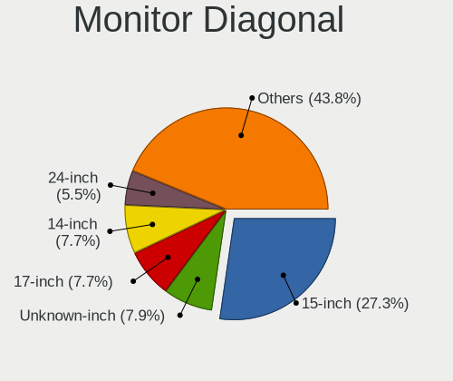

| Inches  | Computers | Percent |
|---------|-----------|---------|
| 15      | 174       | 27.15%  |
| Unknown | 62        | 9.67%   |
| 17      | 47        | 7.33%   |
| 24      | 44        | 6.86%   |
| 14      | 40        | 6.24%   |
| 13      | 40        | 6.24%   |
| 23      | 34        | 5.3%    |
| 27      | 30        | 4.68%   |
| 21      | 27        | 4.21%   |
| 19      | 25        | 3.9%    |
| 22      | 22        | 3.43%   |
| 20      | 13        | 2.03%   |
| 18      | 13        | 2.03%   |
| 84      | 9         | 1.4%    |
| 11      | 9         | 1.4%    |
| 31      | 8         | 1.25%   |
| 10      | 7         | 1.09%   |
| 72      | 6         | 0.94%   |
| 34      | 5         | 0.78%   |
| 12      | 5         | 0.78%   |
| 32      | 4         | 0.62%   |
| 54      | 2         | 0.31%   |
| 39      | 2         | 0.31%   |
| 36      | 2         | 0.31%   |
| 25      | 2         | 0.31%   |
| 65      | 1         | 0.16%   |
| 55      | 1         | 0.16%   |
| 52      | 1         | 0.16%   |
| 50      | 1         | 0.16%   |
| 48      | 1         | 0.16%   |
| 37      | 1         | 0.16%   |
| 33      | 1         | 0.16%   |
| 26      | 1         | 0.16%   |
| 5       | 1         | 0.16%   |

Monitor Width
-------------

Physical width

| Width in mm | Computers | Percent |
|-------------|-----------|---------|
| 301-350     | 253       | 39.97%  |
| 501-600     | 103       | 16.27%  |
| 401-500     | 83        | 13.11%  |
| Unknown     | 62        | 9.79%   |
| 351-400     | 50        | 7.9%    |
| 201-300     | 33        | 5.21%   |
| 1501-2000   | 15        | 2.37%   |
| 701-800     | 12        | 1.9%    |
| 601-700     | 11        | 1.74%   |
| 1001-1500   | 7         | 1.11%   |
| 801-900     | 3         | 0.47%   |
| 1-100       | 1         | 0.16%   |

Aspect Ratio
------------

Proportional relationship between the width and the height

| Ratio   | Computers | Percent |
|---------|-----------|---------|
| 16/9    | 419       | 70.42%  |
| 16/10   | 79        | 13.28%  |
| Unknown | 53        | 8.91%   |
| 5/4     | 31        | 5.21%   |
| 21/9    | 5         | 0.84%   |
| 4/3     | 4         | 0.67%   |
| 3/2     | 2         | 0.34%   |
| 6/5     | 1         | 0.17%   |
| 0.46    | 1         | 0.17%   |

Monitor Area
------------

Area in inch²

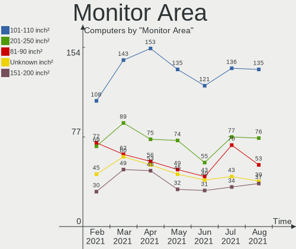

| Area in inch² | Computers | Percent |
|----------------|-----------|---------|
| 101-110        | 170       | 26.65%  |
| 201-250        | 105       | 16.46%  |
| 81-90          | 69        | 10.82%  |
| Unknown        | 62        | 9.72%   |
| 151-200        | 52        | 8.15%   |
| 301-350        | 31        | 4.86%   |
| 141-150        | 25        | 3.92%   |
| 121-130        | 25        | 3.92%   |
| More than 1000 | 20        | 3.13%   |
| 351-500        | 18        | 2.82%   |
| 251-300        | 13        | 2.04%   |
| 71-80          | 11        | 1.72%   |
| 51-60          | 9         | 1.41%   |
| 41-50          | 7         | 1.1%    |
| 501-1000       | 6         | 0.94%   |
| 61-70          | 5         | 0.78%   |
| 131-140        | 5         | 0.78%   |
| 91-100         | 4         | 0.63%   |
| 1-40           | 1         | 0.16%   |

Pixel Density
-------------

Pixels per inch

| Density       | Computers | Percent |
|---------------|-----------|---------|
| 51-100        | 233       | 37.46%  |
| 101-120       | 194       | 31.19%  |
| 121-160       | 104       | 16.72%  |
| Unknown       | 62        | 9.97%   |
| 1-50          | 15        | 2.41%   |
| More than 240 | 7         | 1.13%   |
| 161-240       | 7         | 1.13%   |

Multiple Monitors
-----------------

Total monitors connected

| Total | Computers | Percent |
|-------|-----------|---------|
| 1     | 509       | 82.5%   |
| 2     | 85        | 13.78%  |
| 0     | 17        | 2.76%   |
| 3     | 6         | 0.97%   |

Net Controller Vendor
---------------------

Controller vendors

| Vendor                            | Computers | Percent |
|-----------------------------------|-----------|---------|
| Realtek Semiconductor             | 351       | 36.72%  |
| Intel                             | 219       | 22.91%  |
| Qualcomm Atheros                  | 156       | 16.32%  |
| Broadcom Inc. and subsidiaries    | 71        | 7.43%   |
| Marvell Technology Group          | 26        | 2.72%   |
| Ralink Technology                 | 16        | 1.67%   |
| Broadcom Limited                  | 14        | 1.46%   |
| Ralink                            | 13        | 1.36%   |
| Nvidia                            | 12        | 1.26%   |
| TP-Link                           | 11        | 1.15%   |
| Samsung Electronics               | 4         | 0.42%   |
| Qualcomm Atheros Communications   | 4         | 0.42%   |
| JMicron Technology                | 4         | 0.42%   |
| VIA Technologies                  | 3         | 0.31%   |
| NetGear                           | 3         | 0.31%   |
| Microsoft                         | 3         | 0.31%   |
| MediaTek                          | 3         | 0.31%   |
| Huawei Technologies               | 3         | 0.31%   |
| Dell                              | 3         | 0.31%   |
| D-Link System                     | 3         | 0.31%   |
| Broadcom                          | 3         | 0.31%   |
| Motorola PCS                      | 2         | 0.21%   |
| Linksys                           | 2         | 0.21%   |
| Hewlett-Packard                   | 2         | 0.21%   |
| D-Link                            | 2         | 0.21%   |
| Attansic Technology               | 2         | 0.21%   |
| ASUSTek Computer                  | 2         | 0.21%   |
| Accton Technology                 | 2         | 0.21%   |
| ZyDAS                             | 1         | 0.1%    |
| Xiaomi                            | 1         | 0.1%    |
| Texas Instruments                 | 1         | 0.1%    |
| Sundance Technology Inc / IC Plus | 1         | 0.1%    |
| Sierra Wireless                   | 1         | 0.1%    |
| OnePlus Technology (Shenzhen)     | 1         | 0.1%    |
| NTmore                            | 1         | 0.1%    |
| LG Electronics                    | 1         | 0.1%    |
| Intersil                          | 1         | 0.1%    |
| IMC Networks                      | 1         | 0.1%    |
| Holtek Semiconductor              | 1         | 0.1%    |
| Gemtek                            | 1         | 0.1%    |
| Fibocom                           | 1         | 0.1%    |
| Ericsson Business Mobile Networks | 1         | 0.1%    |
| DisplayLink                       | 1         | 0.1%    |
| Cypress Semiconductor             | 1         | 0.1%    |
| ASIX Electronics                  | 1         | 0.1%    |

Net Controller Model
--------------------

Controller models

| Model                                                                          | Computers | Percent |
|--------------------------------------------------------------------------------|-----------|---------|
| Realtek RTL8111/8168/8411 PCI Express Gigabit Ethernet Controller              | 229       | 20.91%  |
| Realtek RTL810xE PCI Express Fast Ethernet controller                          | 71        | 6.48%   |
| Qualcomm Atheros AR9285 Wireless Network Adapter (PCI-Express)                 | 32        | 2.92%   |
| Qualcomm Atheros AR9485 Wireless Network Adapter                               | 27        | 2.47%   |
| Qualcomm Atheros QCA9377 802.11ac Wireless Network Adapter                     | 23        | 2.1%    |
| Intel 82579LM Gigabit Network Connection (Lewisville)                          | 22        | 2.01%   |
| Intel Wi-Fi 6 AX200                                                            | 21        | 1.92%   |
| Intel Wireless 7260                                                            | 15        | 1.37%   |
| Intel Centrino Advanced-N 6205 [Taylor Peak]                                   | 14        | 1.28%   |
| Realtek RTL8821CE 802.11ac PCIe Wireless Network Adapter                       | 13        | 1.19%   |
| Qualcomm Atheros QCA9565 / AR9565 Wireless Network Adapter                     | 12        | 1.1%    |
| Qualcomm Atheros AR8151 v2.0 Gigabit Ethernet                                  | 11        | 1%      |
| Intel Ethernet Connection I217-LM                                              | 11        | 1%      |
| Broadcom Inc. and subsidiaries BCM43142 802.11b/g/n                            | 10        | 0.91%   |
| Broadcom Inc. and subsidiaries BCM4313 802.11bgn Wireless Network Adapter      | 10        | 0.91%   |
| Nvidia MCP61 Ethernet                                                          | 9         | 0.82%   |
| Intel PRO/Wireless 3945ABG [Golan] Network Connection                          | 9         | 0.82%   |
| Intel 82579V Gigabit Network Connection                                        | 9         | 0.82%   |
| Realtek RTL8822CE 802.11ac PCIe Wireless Network Adapter                       | 8         | 0.73%   |
| Realtek RTL8723BE PCIe Wireless Network Adapter                                | 8         | 0.73%   |
| Qualcomm Atheros AR9287 Wireless Network Adapter (PCI-Express)                 | 8         | 0.73%   |
| Intel Wireless 7265                                                            | 8         | 0.73%   |
| Intel Ethernet Connection (2) I219-V                                           | 8         | 0.73%   |
| Intel 82567LM-3 Gigabit Network Connection                                     | 8         | 0.73%   |
| Realtek RTL8153 Gigabit Ethernet Adapter                                       | 7         | 0.64%   |
| Ralink MT7601U Wireless Adapter                                                | 7         | 0.64%   |
| Qualcomm Atheros AR8161 Gigabit Ethernet                                       | 7         | 0.64%   |
| Marvell Group 88E8040 PCI-E Fast Ethernet Controller                           | 7         | 0.64%   |
| Realtek RTL88x2bu [AC1200 Techkey]                                             | 6         | 0.55%   |
| Realtek 802.11ac NIC                                                           | 6         | 0.55%   |
| Intel Wireless-AC 9560 [Jefferson Peak]                                        | 6         | 0.55%   |
| Intel Wireless 8265 / 8275                                                     | 6         | 0.55%   |
| Intel Ethernet Connection I217-V                                               | 6         | 0.55%   |
| Intel Dual Band Wireless-AC 3165 Plus Bluetooth                                | 6         | 0.55%   |
| Broadcom Inc. and subsidiaries NetXtreme BCM5764M Gigabit Ethernet PCIe        | 6         | 0.55%   |
| TP-Link TL WN823N RTL8192EU                                                    | 5         | 0.46%   |
| Realtek RTL8822BE 802.11a/b/g/n/ac WiFi adapter                                | 5         | 0.46%   |
| Realtek RTL8192CU 802.11n WLAN Adapter                                         | 5         | 0.46%   |
| Realtek RTL8169 PCI Gigabit Ethernet Controller                                | 5         | 0.46%   |
| Realtek RTL8125 2.5GbE Controller                                              | 5         | 0.46%   |
| Ralink RT5370 Wireless Adapter                                                 | 5         | 0.46%   |
| Ralink RT3090 Wireless 802.11n 1T/1R PCIe                                      | 5         | 0.46%   |
| Qualcomm Atheros QCA6174 802.11ac Wireless Network Adapter                     | 5         | 0.46%   |
| Qualcomm Atheros AR8131 Gigabit Ethernet                                       | 5         | 0.46%   |
| Intel PRO/Wireless 5100 AGN [Shiloh] Network Connection                        | 5         | 0.46%   |
| Intel Ethernet Connection (2) I219-LM                                          | 5         | 0.46%   |
| Intel Centrino Wireless-N 2230                                                 | 5         | 0.46%   |
| Intel Centrino Advanced-N 6200                                                 | 5         | 0.46%   |
| Realtek RTL8821AE 802.11ac PCIe Wireless Network Adapter                       | 4         | 0.37%   |
| Realtek RTL-8100/8101L/8139 PCI Fast Ethernet Adapter                          | 4         | 0.37%   |
| Qualcomm Atheros AR9271 802.11n                                                | 4         | 0.37%   |
| Qualcomm Atheros AR8152 v2.0 Fast Ethernet                                     | 4         | 0.37%   |
| Qualcomm Atheros AR8132 Fast Ethernet                                          | 4         | 0.37%   |
| Qualcomm Atheros AR8121/AR8113/AR8114 Gigabit or Fast Ethernet                 | 4         | 0.37%   |
| Qualcomm Atheros AR242x / AR542x Wireless Network Adapter (PCI-Express)        | 4         | 0.37%   |
| Marvell Group Yukon Optima 88E8059 [PCIe Gigabit Ethernet Controller with AVB] | 4         | 0.37%   |
| Marvell Group 88E8055 PCI-E Gigabit Ethernet Controller                        | 4         | 0.37%   |
| JMicron JMC250 PCI Express Gigabit Ethernet Controller                         | 4         | 0.37%   |
| Intel Wireless 8260                                                            | 4         | 0.37%   |
| Intel Wireless 3165                                                            | 4         | 0.37%   |

Wireless Vendor
---------------

Wireless vendors

| Vendor                          | Computers | Percent |
|---------------------------------|-----------|---------|
| Intel                           | 154       | 31.56%  |
| Qualcomm Atheros                | 122       | 25%     |
| Realtek Semiconductor           | 89        | 18.24%  |
| Broadcom Inc. and subsidiaries  | 45        | 9.22%   |
| Ralink Technology               | 16        | 3.28%   |
| Ralink                          | 13        | 2.66%   |
| TP-Link                         | 11        | 2.25%   |
| Broadcom Limited                | 9         | 1.84%   |
| Qualcomm Atheros Communications | 4         | 0.82%   |
| NetGear                         | 3         | 0.61%   |
| Microsoft                       | 3         | 0.61%   |
| Marvell Technology Group        | 2         | 0.41%   |
| Linksys                         | 2         | 0.41%   |
| D-Link                          | 2         | 0.41%   |
| ASUSTek Computer                | 2         | 0.41%   |
| Accton Technology               | 2         | 0.41%   |
| ZyDAS                           | 1         | 0.2%    |
| Texas Instruments               | 1         | 0.2%    |
| Sierra Wireless                 | 1         | 0.2%    |
| MEDIATEK                        | 1         | 0.2%    |
| IMC Networks                    | 1         | 0.2%    |
| Hewlett-Packard                 | 1         | 0.2%    |
| Fibocom                         | 1         | 0.2%    |
| D-Link System                   | 1         | 0.2%    |
| Broadcom                        | 1         | 0.2%    |

Wireless Model
--------------

Wireless models

| Model                                                                     | Computers | Percent |
|---------------------------------------------------------------------------|-----------|---------|
| Qualcomm Atheros AR9285 Wireless Network Adapter (PCI-Express)            | 32        | 6.5%    |
| Qualcomm Atheros AR9485 Wireless Network Adapter                          | 27        | 5.49%   |
| Qualcomm Atheros QCA9377 802.11ac Wireless Network Adapter                | 23        | 4.67%   |
| Intel Wi-Fi 6 AX200                                                       | 21        | 4.27%   |
| Intel Wireless 7260                                                       | 15        | 3.05%   |
| Intel Centrino Advanced-N 6205 [Taylor Peak]                              | 14        | 2.85%   |
| Realtek RTL8821CE 802.11ac PCIe Wireless Network Adapter                  | 13        | 2.64%   |
| Qualcomm Atheros QCA9565 / AR9565 Wireless Network Adapter                | 12        | 2.44%   |
| Broadcom Inc. and subsidiaries BCM43142 802.11b/g/n                       | 10        | 2.03%   |
| Broadcom Inc. and subsidiaries BCM4313 802.11bgn Wireless Network Adapter | 10        | 2.03%   |
| Intel PRO/Wireless 3945ABG [Golan] Network Connection                     | 9         | 1.83%   |
| Realtek RTL8822CE 802.11ac PCIe Wireless Network Adapter                  | 8         | 1.63%   |
| Realtek RTL8723BE PCIe Wireless Network Adapter                           | 8         | 1.63%   |
| Qualcomm Atheros AR9287 Wireless Network Adapter (PCI-Express)            | 8         | 1.63%   |
| Intel Wireless 7265                                                       | 8         | 1.63%   |
| Ralink MT7601U Wireless Adapter                                           | 7         | 1.42%   |
| Realtek RTL88x2bu [AC1200 Techkey]                                        | 6         | 1.22%   |
| Realtek 802.11ac NIC                                                      | 6         | 1.22%   |
| Intel Wireless-AC 9560 [Jefferson Peak]                                   | 6         | 1.22%   |
| Intel Wireless 8265 / 8275                                                | 6         | 1.22%   |
| Intel Dual Band Wireless-AC 3165 Plus Bluetooth                           | 6         | 1.22%   |
| TP-Link TL WN823N RTL8192EU                                               | 5         | 1.02%   |
| Realtek RTL8822BE 802.11a/b/g/n/ac WiFi adapter                           | 5         | 1.02%   |
| Realtek RTL8192CU 802.11n WLAN Adapter                                    | 5         | 1.02%   |
| Ralink RT5370 Wireless Adapter                                            | 5         | 1.02%   |
| Ralink RT3090 Wireless 802.11n 1T/1R PCIe                                 | 5         | 1.02%   |
| Qualcomm Atheros QCA6174 802.11ac Wireless Network Adapter                | 5         | 1.02%   |
| Intel PRO/Wireless 5100 AGN [Shiloh] Network Connection                   | 5         | 1.02%   |
| Intel Centrino Wireless-N 2230                                            | 5         | 1.02%   |
| Intel Centrino Advanced-N 6200                                            | 5         | 1.02%   |
| Realtek RTL8821AE 802.11ac PCIe Wireless Network Adapter                  | 4         | 0.81%   |
| Qualcomm Atheros AR9271 802.11n                                           | 4         | 0.81%   |
| Qualcomm Atheros AR242x / AR542x Wireless Network Adapter (PCI-Express)   | 4         | 0.81%   |
| Intel Wireless 8260                                                       | 4         | 0.81%   |
| Intel Wireless 3165                                                       | 4         | 0.81%   |
| Intel Wireless 3160                                                       | 4         | 0.81%   |
| Intel WiFi Link 5100                                                      | 4         | 0.81%   |
| Intel Dual Band Wireless-AC 3168NGW [Stone Peak]                          | 4         | 0.81%   |
| Intel Comet Lake PCH-LP CNVi WiFi                                         | 4         | 0.81%   |
| Intel Centrino Ultimate-N 6300                                            | 4         | 0.81%   |
| Broadcom Inc. and subsidiaries BCM4312 802.11b/g LP-PHY                   | 4         | 0.81%   |
| Realtek RTL8811AU 802.11a/b/g/n/ac WLAN Adapter                           | 3         | 0.61%   |
| Realtek RTL8723DE Wireless Network Adapter                                | 3         | 0.61%   |
| Realtek RTL8191SEvB Wireless LAN Controller                               | 3         | 0.61%   |
| Realtek RTL8188EUS 802.11n Wireless Network Adapter                       | 3         | 0.61%   |
| Realtek RTL8188CE 802.11b/g/n WiFi Adapter                                | 3         | 0.61%   |
| Realtek 802.11n                                                           | 3         | 0.61%   |
| Ralink RT3290 Wireless 802.11n 1T/1R PCIe                                 | 3         | 0.61%   |
| Qualcomm Atheros AR93xx Wireless Network Adapter                          | 3         | 0.61%   |
| Qualcomm Atheros AR928X Wireless Network Adapter (PCI-Express)            | 3         | 0.61%   |
| Microsoft Xbox 360 Wireless Adapter                                       | 3         | 0.61%   |
| Intel PRO/Wireless 4965 AG or AGN [Kedron] Network Connection             | 3         | 0.61%   |
| Intel Centrino Wireless-N 1030 [Rainbow Peak]                             | 3         | 0.61%   |
| Intel Cannon Point-LP CNVi [Wireless-AC]                                  | 3         | 0.61%   |
| Broadcom Limited BCM4352 802.11ac Wireless Network Adapter                | 3         | 0.61%   |
| Broadcom Inc. and subsidiaries BCM4360 802.11ac Wireless Network Adapter  | 3         | 0.61%   |
| TP-Link TL-WN822N Version 4 RTL8192EU                                     | 2         | 0.41%   |
| TP-Link 802.11ac NIC                                                      | 2         | 0.41%   |
| Realtek RTL8812AU 802.11a/b/g/n/ac 2T2R DB WLAN Adapter                   | 2         | 0.41%   |
| Realtek RTL8192EE PCIe Wireless Network Adapter                           | 2         | 0.41%   |

Ethernet Vendor
---------------

Ethernet vendors

| Vendor                            | Computers | Percent |
|-----------------------------------|-----------|---------|
| Realtek Semiconductor             | 321       | 54.78%  |
| Intel                             | 116       | 19.8%   |
| Qualcomm Atheros                  | 47        | 8.02%   |
| Broadcom Inc. and subsidiaries    | 32        | 5.46%   |
| Marvell Technology Group          | 24        | 4.1%    |
| Nvidia                            | 12        | 2.05%   |
| Broadcom Limited                  | 5         | 0.85%   |
| Samsung Electronics               | 4         | 0.68%   |
| JMicron Technology                | 4         | 0.68%   |
| VIA Technologies                  | 3         | 0.51%   |
| MediaTek                          | 2         | 0.34%   |
| Huawei Technologies               | 2         | 0.34%   |
| D-Link System                     | 2         | 0.34%   |
| Broadcom                          | 2         | 0.34%   |
| Attansic Technology               | 2         | 0.34%   |
| Xiaomi                            | 1         | 0.17%   |
| Sundance Technology Inc / IC Plus | 1         | 0.17%   |
| OnePlus Technology (Shenzhen)     | 1         | 0.17%   |
| NTmore                            | 1         | 0.17%   |
| Gemtek                            | 1         | 0.17%   |
| DisplayLink                       | 1         | 0.17%   |
| Cypress Semiconductor             | 1         | 0.17%   |
| ASIX Electronics                  | 1         | 0.17%   |

Ethernet Model
--------------

Ethernet models

| Model                                                                          | Computers | Percent |
|--------------------------------------------------------------------------------|-----------|---------|
| Realtek RTL8111/8168/8411 PCI Express Gigabit Ethernet Controller              | 229       | 38.81%  |
| Realtek RTL810xE PCI Express Fast Ethernet controller                          | 71        | 12.03%  |
| Intel 82579LM Gigabit Network Connection (Lewisville)                          | 22        | 3.73%   |
| Qualcomm Atheros AR8151 v2.0 Gigabit Ethernet                                  | 11        | 1.86%   |
| Intel Ethernet Connection I217-LM                                              | 11        | 1.86%   |
| Nvidia MCP61 Ethernet                                                          | 9         | 1.53%   |
| Intel 82579V Gigabit Network Connection                                        | 9         | 1.53%   |
| Intel Ethernet Connection (2) I219-V                                           | 8         | 1.36%   |
| Intel 82567LM-3 Gigabit Network Connection                                     | 8         | 1.36%   |
| Realtek RTL8153 Gigabit Ethernet Adapter                                       | 7         | 1.19%   |
| Qualcomm Atheros AR8161 Gigabit Ethernet                                       | 7         | 1.19%   |
| Marvell Group 88E8040 PCI-E Fast Ethernet Controller                           | 7         | 1.19%   |
| Intel Ethernet Connection I217-V                                               | 6         | 1.02%   |
| Broadcom Inc. and subsidiaries NetXtreme BCM5764M Gigabit Ethernet PCIe        | 6         | 1.02%   |
| Realtek RTL8169 PCI Gigabit Ethernet Controller                                | 5         | 0.85%   |
| Qualcomm Atheros AR8131 Gigabit Ethernet                                       | 5         | 0.85%   |
| Intel Ethernet Connection (2) I219-LM                                          | 5         | 0.85%   |
| Realtek RTL8125 2.5GbE Controller                                              | 4         | 0.68%   |
| Realtek RTL-8100/8101L/8139 PCI Fast Ethernet Adapter                          | 4         | 0.68%   |
| Qualcomm Atheros AR8152 v2.0 Fast Ethernet                                     | 4         | 0.68%   |
| Qualcomm Atheros AR8132 Fast Ethernet                                          | 4         | 0.68%   |
| Qualcomm Atheros AR8121/AR8113/AR8114 Gigabit or Fast Ethernet                 | 4         | 0.68%   |
| Marvell Group Yukon Optima 88E8059 [PCIe Gigabit Ethernet Controller with AVB] | 4         | 0.68%   |
| Marvell Group 88E8055 PCI-E Gigabit Ethernet Controller                        | 4         | 0.68%   |
| JMicron JMC250 PCI Express Gigabit Ethernet Controller                         | 4         | 0.68%   |
| Intel I211 Gigabit Network Connection                                          | 4         | 0.68%   |
| Intel Ethernet Connection I218-LM                                              | 4         | 0.68%   |
| Samsung Galaxy series, misc. (tethering mode)                                  | 3         | 0.51%   |
| Qualcomm Atheros AR8152 v1.1 Fast Ethernet                                     | 3         | 0.51%   |
| Intel PRO/100 VE Network Connection                                            | 3         | 0.51%   |
| Intel Ethernet Connection (2) I218-V                                           | 3         | 0.51%   |
| Intel 82577LM Gigabit Network Connection                                       | 3         | 0.51%   |
| Intel 82567LM Gigabit Network Connection                                       | 3         | 0.51%   |
| Broadcom Limited NetXtreme BCM5761 Gigabit Ethernet PCIe                       | 3         | 0.51%   |
| Broadcom Inc. and subsidiaries NetXtreme BCM5754 Gigabit Ethernet PCI Express  | 3         | 0.51%   |
| Broadcom Inc. and subsidiaries NetLink BCM5787M Gigabit Ethernet PCI Express   | 3         | 0.51%   |
| Broadcom Inc. and subsidiaries NetLink BCM57788 Gigabit Ethernet PCIe          | 3         | 0.51%   |
| VIA VT6102/VT6103 [Rhine-II]                                                   | 2         | 0.34%   |
| Qualcomm Atheros Killer E2400 Gigabit Ethernet Controller                      | 2         | 0.34%   |
| Qualcomm Atheros Killer E220x Gigabit Ethernet Controller                      | 2         | 0.34%   |
| MediaTek MEIZU_M5                                                              | 2         | 0.34%   |
| Marvell Group 88E8058 PCI-E Gigabit Ethernet Controller                        | 2         | 0.34%   |
| Marvell Group 88E8056 PCI-E Gigabit Ethernet Controller                        | 2         | 0.34%   |
| Marvell Group 88E8053 PCI-E Gigabit Ethernet Controller                        | 2         | 0.34%   |
| Intel Ethernet Connection I218-V                                               | 2         | 0.34%   |
| Intel Ethernet Connection (6) I219-V                                           | 2         | 0.34%   |
| Intel Ethernet Connection (4) I219-V                                           | 2         | 0.34%   |
| Intel 82578DC Gigabit Network Connection                                       | 2         | 0.34%   |
| D-Link System DGE-528T Gigabit Ethernet Adapter                                | 2         | 0.34%   |
| Broadcom Inc. and subsidiaries NetXtreme BCM57766 Gigabit Ethernet PCIe        | 2         | 0.34%   |
| Broadcom Inc. and subsidiaries NetLink BCM57785 Gigabit Ethernet PCIe          | 2         | 0.34%   |
| Broadcom Inc. and subsidiaries NetLink BCM57781 Gigabit Ethernet PCIe          | 2         | 0.34%   |
| Broadcom Inc. and subsidiaries NetLink BCM57780 Gigabit Ethernet PCIe          | 2         | 0.34%   |
| Attansic AR8152 v2.0 Fast Ethernet                                             | 2         | 0.34%   |
| Xiaomi Mi/Redmi series (RNDIS)                                                 | 1         | 0.17%   |
| VIA VT6105/VT6106S [Rhine-III]                                                 | 1         | 0.17%   |
| Sundance Inc / IC Plus IC Plus IP100A Integrated 10/100 Ethernet MAC + PHY     | 1         | 0.17%   |
| Samsung Kiera                                                                  | 1         | 0.17%   |
| Realtek Killer E3000 2.5GbE Controller                                         | 1         | 0.17%   |
| Realtek Killer E2600 Gigabit Ethernet Controller                               | 1         | 0.17%   |

Net Controller Kind
-------------------

Ethernet, WiFi or modem

| Kind     | Computers | Percent |
|----------|-----------|---------|
| Ethernet | 558       | 54.12%  |
| WiFi     | 460       | 44.62%  |
| Modem    | 8         | 0.78%   |
| Unknown  | 5         | 0.48%   |

Used Controller
---------------

Currently used network controller

| Kind     | Computers | Percent |
|----------|-----------|---------|
| Ethernet | 464       | 52.61%  |
| WiFi     | 417       | 47.28%  |
| Modem    | 1         | 0.11%   |

NICs
----

Total network controllers on board

| Total | Computers | Percent |
|-------|-----------|---------|
| 2     | 363       | 58.83%  |
| 1     | 238       | 38.57%  |
| 0     | 9         | 1.46%   |
| 3     | 6         | 0.97%   |
| 4     | 1         | 0.16%   |

Memory Vendor
-------------

Memory module vendors

| Vendor              | Computers | Percent |
|---------------------|-----------|---------|
| Samsung Electronics | 48        | 22.33%  |
| SK Hynix            | 32        | 14.88%  |
| Kingston            | 32        | 14.88%  |
| Unknown             | 26        | 12.09%  |
| Micron Technology   | 20        | 9.3%    |
| Corsair             | 10        | 4.65%   |
| G.Skill             | 9         | 4.19%   |
| Elpida              | 6         | 2.79%   |
| Crucial             | 6         | 2.79%   |
| Ramaxel Technology  | 4         | 1.86%   |
| A-DATA Technology   | 4         | 1.86%   |
| Patriot             | 3         | 1.4%    |
| CSX                 | 3         | 1.4%    |
| Unknown (ABCD)      | 2         | 0.93%   |
| Smart               | 2         | 0.93%   |
| GOODRAM             | 2         | 0.93%   |
| Silicon Power       | 1         | 0.47%   |
| PNY                 | 1         | 0.47%   |
| OCZ                 | 1         | 0.47%   |
| H                   | 1         | 0.47%   |
| Apacer              | 1         | 0.47%   |
| AMD                 | 1         | 0.47%   |

Memory Model
------------

Memory module models

| Model                                                               | Computers | Percent |
|---------------------------------------------------------------------|-----------|---------|
| SK Hynix RAM HMT351S6CFR8C-PB 4096MB SODIMM DDR3 1600MT/s           | 3         | 1.29%   |
| Samsung RAM M471B5173DB0-YK0 4GB SODIMM DDR3 1600MT/s               | 3         | 1.29%   |
| Samsung RAM M471A1K43DB1-CWE 8192MB SODIMM DDR4 3200MT/s            | 3         | 1.29%   |
| Micron RAM 4ATF1G64HZ-3G2E1 8192MB SODIMM DDR4 3200MT/s             | 3         | 1.29%   |
| Unknown SODIMM 2048MB SODIMM DDR2 667MT/s                           | 2         | 0.86%   |
| Unknown RAM Module 2048MB DIMM 800MT/s                              | 2         | 0.86%   |
| SK Hynix RAM HMT451S6BFR8A-PB 4096MB SODIMM DDR3 1600MT/s           | 2         | 0.86%   |
| SK Hynix RAM HMT41GS6BFR8A-PB 8192MB SODIMM DDR3 1600MT/s           | 2         | 0.86%   |
| SK Hynix RAM HMA851S6AFR6N-UH 4GB SODIMM DDR4 2400MT/s              | 2         | 0.86%   |
| SK Hynix RAM HMA81GS6AFR8N-UH 8192MB SODIMM DDR4 2400MT/s           | 2         | 0.86%   |
| Samsung RAM M471B5674QH0-YK0 2GB SODIMM DDR3 1600MT/s               | 2         | 0.86%   |
| Samsung RAM M471B5173BH0-CK0 4096MB SODIMM DDR3 1600MT/s            | 2         | 0.86%   |
| Samsung RAM M471B1G73DB0-YK0 8GB SODIMM DDR3 1600MT/s               | 2         | 0.86%   |
| Samsung RAM M471A5244CB0-CTD 4096MB SODIMM DDR4 2667MT/s            | 2         | 0.86%   |
| Samsung RAM M471A2K43DB1-CWE 16GB SODIMM DDR4 3200MT/s              | 2         | 0.86%   |
| Samsung RAM M471A2K43CB1-CTD 16384MB SODIMM DDR4 2667MT/s           | 2         | 0.86%   |
| Micron RAM 4ATF51264HZ-2G6E1 4GB SODIMM DDR4 2667MT/s               | 2         | 0.86%   |
| Kingston RAM KHX2400C15D4/4G 4096MB DIMM DDR4 2400MT/s              | 2         | 0.86%   |
| Kingston RAM KHX2133C14D4/4G 4096MB DIMM DDR4 2933MT/s              | 2         | 0.86%   |
| Corsair RAM CMZ16GX3M2A1600C10 8GB DIMM DDR3 1600MT/s               | 2         | 0.86%   |
| Unknown SODIMM 4096MB SODIMM DDR2 800MT/s                           | 1         | 0.43%   |
| Unknown SODIMM 2GB SODIMM DDR2 667MT/s                              | 1         | 0.43%   |
| Unknown SODIMM 2048MB SODIMM DDR2 800MT/s                           | 1         | 0.43%   |
| Unknown SODIMM 1GB SODIMM DDR2 667MT/s                              | 1         | 0.43%   |
| Unknown RAM ZFNB8G1866LSEC 8192MB SODIMM DDR3 1400MT/s              | 1         | 0.43%   |
| Unknown RAM Module 8192MB DIMM DDR3 1866MT/s                        | 1         | 0.43%   |
| Unknown RAM Module 8192MB DIMM DDR3 1600MT/s                        | 1         | 0.43%   |
| Unknown RAM Module 4GB SODIMM DDR3 1333MT/s                         | 1         | 0.43%   |
| Unknown RAM Module 4GB DIMM DDR3 1333MT/s                           | 1         | 0.43%   |
| Unknown RAM Module 4096MB SODIMM DDR3 1600MT/s                      | 1         | 0.43%   |
| Unknown RAM Module 4096MB SODIMM DDR3 1066MT/s                      | 1         | 0.43%   |
| Unknown RAM Module 4096MB SODIMM DDR3                               | 1         | 0.43%   |
| Unknown RAM Module 4096MB DIMM 667MT/s                              | 1         | 0.43%   |
| Unknown RAM Module 2GB DIMM DDR2 800MT/s                            | 1         | 0.43%   |
| Unknown RAM Module 256MB DIMM SDRAM                                 | 1         | 0.43%   |
| Unknown RAM Module 2048MB SODIMM LPDDR4 2400MT/s                    | 1         | 0.43%   |
| Unknown RAM Module 2048MB SODIMM DDR2                               | 1         | 0.43%   |
| Unknown RAM Module 2048MB SODIMM 667MT/s                            | 1         | 0.43%   |
| Unknown RAM Module 2048MB DIMM DDR 800MT/s                          | 1         | 0.43%   |
| Unknown RAM Module 2048MB DIMM 667MT/s                              | 1         | 0.43%   |
| Unknown RAM Module 1GB DIMM 1333MT/s                                | 1         | 0.43%   |
| Unknown RAM Module 1024MB SODIMM DDR                                | 1         | 0.43%   |
| Unknown RAM Module 1024MB DIMM DDR2 800MT/s                         | 1         | 0.43%   |
| Unknown RAM LD4AS008G-H2666GST 8192MB SODIMM DDR4 2667MT/s          | 1         | 0.43%   |
| Unknown RAM C2NA0-0007-QBEX... 4096MB DIMM DDR2 800MT/s             | 1         | 0.43%   |
| Unknown (ABCD) RAM 123456789012345678 2GB DIMM DDR3 2400MT/s        | 1         | 0.43%   |
| Unknown (ABCD) RAM 123456789012345678 1024MB SODIMM LPDDR4 2400MT/s | 1         | 0.43%   |
| Smart RAM SMS4TDC3C0K0446SCG 4096MB SODIMM DDR4 2667MT/s            | 1         | 0.43%   |
| Smart RAM SH564128FH8NZPHSCG 4096MB SODIMM DDR3 1333MT/s            | 1         | 0.43%   |
| SK Hynix RAM Module 4096MB SODIMM DDR3 1600MT/s                     | 1         | 0.43%   |
| SK Hynix RAM HYMP112U64CP8-Y5 1024MB DIMM DDR2 1639MT/s             | 1         | 0.43%   |
| SK Hynix RAM HMT451U6BFR8A-PB 4GB DIMM DDR3 1600MT/s                | 1         | 0.43%   |
| SK Hynix RAM HMT451S6MFR6C-PB 4096MB SODIMM DDR3 1600MT/s           | 1         | 0.43%   |
| SK Hynix RAM HMT451S6BFR8A-PB 4GB SODIMM DDR3 1600MT/s              | 1         | 0.43%   |
| SK Hynix RAM HMT41GS6MFR8C-PB 8192MB SODIMM DDR3 1600MT/s           | 1         | 0.43%   |
| SK Hynix RAM HMT41GS6AFR8A-PB 8192MB SODIMM DDR3 1600MT/s           | 1         | 0.43%   |
| SK Hynix RAM HMT351U6CFR8C-PB 4096MB DIMM DDR3 1800MT/s             | 1         | 0.43%   |
| SK Hynix RAM HMT351S6EFR8A-PB 4GB SODIMM DDR3 1600MT/s              | 1         | 0.43%   |
| SK Hynix RAM HMT351S6CFR8C-H9 4096MB SODIMM DDR3 1334MT/s           | 1         | 0.43%   |
| SK Hynix RAM HMT325S6CFR8C-PB 2048MB SODIMM DDR3 1600MT/s           | 1         | 0.43%   |

Memory Kind
-----------

Memory module kinds

| Kind    | Computers | Percent |
|---------|-----------|---------|
| DDR3    | 82        | 46.33%  |
| DDR4    | 66        | 37.29%  |
| DDR2    | 8         | 4.52%   |
| LPDDR4  | 7         | 3.95%   |
| Unknown | 7         | 3.95%   |
| LPDDR3  | 3         | 1.69%   |
| SDRAM   | 2         | 1.13%   |
| DDR     | 2         | 1.13%   |

Memory Form Factor
------------------

Physical design of the memory module

| Name         | Computers | Percent |
|--------------|-----------|---------|
| SODIMM       | 103       | 57.54%  |
| DIMM         | 68        | 37.99%  |
| Row Of Chips | 6         | 3.35%   |
| Chip         | 1         | 0.56%   |
| Unknown      | 1         | 0.56%   |

Memory Size
-----------

Memory module size

| Size  | Computers | Percent |
|-------|-----------|---------|
| 4096  | 69        | 36.32%  |
| 8192  | 57        | 30%     |
| 2048  | 27        | 14.21%  |
| 16384 | 24        | 12.63%  |
| 1024  | 11        | 5.79%   |
| 32768 | 1         | 0.53%   |
| 256   | 1         | 0.53%   |

Memory Speed
------------

Memory module speed

| Speed   | Computers | Percent |
|---------|-----------|---------|
| 1600    | 50        | 25.51%  |
| 2400    | 22        | 11.22%  |
| 1333    | 22        | 11.22%  |
| 2667    | 21        | 10.71%  |
| 3200    | 19        | 9.69%   |
| 2133    | 9         | 4.59%   |
| 667     | 8         | 4.08%   |
| 1334    | 6         | 3.06%   |
| 800     | 6         | 3.06%   |
| 1067    | 4         | 2.04%   |
| Unknown | 4         | 2.04%   |
| 2933    | 3         | 1.53%   |
| 1066    | 3         | 1.53%   |
| 4267    | 2         | 1.02%   |
| 3600    | 2         | 1.02%   |
| 1867    | 2         | 1.02%   |
| 1866    | 2         | 1.02%   |
| 1639    | 2         | 1.02%   |
| 1400    | 2         | 1.02%   |
| 4333    | 1         | 0.51%   |
| 4266    | 1         | 0.51%   |
| 3400    | 1         | 0.51%   |
| 3000    | 1         | 0.51%   |
| 2465    | 1         | 0.51%   |
| 2134    | 1         | 0.51%   |
| 1800    | 1         | 0.51%   |

Sound Vendor
------------

Sound card vendors

| Vendor                                          | Computers | Percent |
|-------------------------------------------------|-----------|---------|
| Intel                                           | 456       | 54.94%  |
| AMD                                             | 174       | 20.96%  |
| Nvidia                                          | 128       | 15.42%  |
| C-Media Electronics                             | 13        | 1.57%   |
| Logitech                                        | 11        | 1.33%   |
| Creative Labs                                   | 8         | 0.96%   |
| Texas Instruments                               | 5         | 0.6%    |
| VIA Technologies                                | 4         | 0.48%   |
| JMTek                                           | 4         | 0.48%   |
| Generalplus Technology                          | 3         | 0.36%   |
| Creative Technology                             | 3         | 0.36%   |
| Realtek Semiconductor                           | 2         | 0.24%   |
| Corsair                                         | 2         | 0.24%   |
| XMOS                                            | 1         | 0.12%   |
| Tenx Technology                                 | 1         | 0.12%   |
| Steinberg Soft-und Hardware                     | 1         | 0.12%   |
| Shure                                           | 1         | 0.12%   |
| Samson Technologies                             | 1         | 0.12%   |
| Razer USA                                       | 1         | 0.12%   |
| QinHeng Electronics                             | 1         | 0.12%   |
| Plantronics                                     | 1         | 0.12%   |
| M-Audio                                         | 1         | 0.12%   |
| Licensed by Sony Computer Entertainment America | 1         | 0.12%   |
| Lenovo                                          | 1         | 0.12%   |
| Kingston Technology                             | 1         | 0.12%   |
| Focusrite-Novation                              | 1         | 0.12%   |
| ASUSTek Computer                                | 1         | 0.12%   |
| Argosy research                                 | 1         | 0.12%   |
| Apple                                           | 1         | 0.12%   |
| AKAI Professional M.I.                          | 1         | 0.12%   |

Sound Model
-----------

Sound card models

| Model                                                                                             | Computers | Percent |
|---------------------------------------------------------------------------------------------------|-----------|---------|
| Intel 6 Series/C200 Series Chipset Family High Definition Audio Controller                        | 60        | 6.15%   |
| Intel 7 Series/C216 Chipset Family High Definition Audio Controller                               | 58        | 5.94%   |
| AMD SBx00 Azalia (Intel HDA)                                                                      | 36        | 3.69%   |
| AMD Family 17h (Models 10h-1fh) HD Audio Controller                                               | 35        | 3.59%   |
| Intel NM10/ICH7 Family High Definition Audio Controller                                           | 34        | 3.48%   |
| Intel 5 Series/3400 Series Chipset High Definition Audio                                          | 33        | 3.38%   |
| Intel Sunrise Point-LP HD Audio                                                                   | 32        | 3.28%   |
| Intel 8 Series/C220 Series Chipset High Definition Audio Controller                               | 32        | 3.28%   |
| Intel 82801I (ICH9 Family) HD Audio Controller                                                    | 30        | 3.07%   |
| Intel Xeon E3-1200 v3/4th Gen Core Processor HD Audio Controller                                  | 23        | 2.36%   |
| Intel Haswell-ULT HD Audio Controller                                                             | 22        | 2.25%   |
| Intel 8 Series HD Audio Controller                                                                | 21        | 2.15%   |
| AMD Raven/Raven2/Fenghuang HDMI/DP Audio Controller                                               | 19        | 1.95%   |
| AMD FCH Azalia Controller                                                                         | 19        | 1.95%   |
| Intel 100 Series/C230 Series Chipset Family HD Audio Controller                                   | 16        | 1.64%   |
| Intel 82801H (ICH8 Family) HD Audio Controller                                                    | 14        | 1.43%   |
| AMD Starship/Matisse HD Audio Controller                                                          | 14        | 1.43%   |
| Intel 82801JI (ICH10 Family) HD Audio Controller                                                  | 13        | 1.33%   |
| Nvidia TU116 High Definition Audio Controller                                                     | 12        | 1.23%   |
| Intel Celeron/Pentium Silver Processor High Definition Audio                                      | 12        | 1.23%   |
| AMD Renoir Radeon High Definition Audio Controller                                                | 11        | 1.13%   |
| AMD Family 15h (Models 60h-6fh) Audio Controller                                                  | 11        | 1.13%   |
| AMD Cedar HDMI Audio [Radeon HD 5400/6300/7300 Series]                                            | 11        | 1.13%   |
| Nvidia MCP61 High Definition Audio                                                                | 10        | 1.02%   |
| Nvidia GK208 HDMI/DP Audio Controller                                                             | 10        | 1.02%   |
| Intel Cannon Lake PCH cAVS                                                                        | 10        | 1.02%   |
| Intel Atom Processor Z36xxx/Z37xxx Series High Definition Audio Controller                        | 10        | 1.02%   |
| Intel 82801JD/DO (ICH10 Family) HD Audio Controller                                               | 10        | 1.02%   |
| Nvidia GP107GL High Definition Audio Controller                                                   | 9         | 0.92%   |
| Intel Wildcat Point-LP High Definition Audio Controller                                           | 9         | 0.92%   |
| Intel Broadwell-U Audio Controller                                                                | 9         | 0.92%   |
| Intel Atom/Celeron/Pentium Processor x5-E8000/J3xxx/N3xxx Series High Definition Audio Controller | 9         | 0.92%   |
| AMD Oland/Hainan/Cape Verde/Pitcairn HDMI Audio [Radeon HD 7000 Series]                           | 9         | 0.92%   |
| AMD Kabini HDMI/DP Audio                                                                          | 9         | 0.92%   |
| AMD Family 17h (Models 00h-0fh) HD Audio Controller                                               | 9         | 0.92%   |
| AMD Ellesmere HDMI Audio [Radeon RX 470/480 / 570/580/590]                                        | 9         | 0.92%   |
| Nvidia GP106 High Definition Audio Controller                                                     | 8         | 0.82%   |
| Intel Cannon Point-LP High Definition Audio Controller                                            | 8         | 0.82%   |
| AMD Wrestler HDMI Audio                                                                           | 8         | 0.82%   |
| Nvidia GK107 HDMI Audio Controller                                                                | 7         | 0.72%   |
| Intel Ice Lake-LP Smart Sound Technology Audio Controller                                         | 7         | 0.72%   |
| Intel 200 Series PCH HD Audio                                                                     | 7         | 0.72%   |
| AMD Trinity HDMI Audio Controller                                                                 | 7         | 0.72%   |
| AMD RV710/730 HDMI Audio [Radeon HD 4000 series]                                                  | 7         | 0.72%   |
| AMD Baffin HDMI/DP Audio [Radeon RX 550 640SP / RX 560/560X]                                      | 7         | 0.72%   |
| Nvidia High Definition Audio Controller                                                           | 6         | 0.61%   |
| Nvidia GP108 High Definition Audio Controller                                                     | 6         | 0.61%   |
| Nvidia GM107 High Definition Audio Controller [GeForce 940MX]                                     | 6         | 0.61%   |
| AMD High Definition Audio Controller                                                              | 6         | 0.61%   |
| Nvidia GF119 HDMI Audio Controller                                                                | 5         | 0.51%   |
| Nvidia GF108 High Definition Audio Controller                                                     | 5         | 0.51%   |
| Intel Comet Lake PCH-LP cAVS                                                                      | 5         | 0.51%   |
| Intel Comet Lake PCH cAVS                                                                         | 5         | 0.51%   |
| AMD Turks HDMI Audio [Radeon HD 6500/6600 / 6700M Series]                                         | 5         | 0.51%   |
| AMD Caicos HDMI Audio [Radeon HD 6450 / 7450/8450/8490 OEM / R5 230/235/235X OEM]                 | 5         | 0.51%   |
| Nvidia TU106 High Definition Audio Controller                                                     | 4         | 0.41%   |
| Nvidia GP104 High Definition Audio Controller                                                     | 4         | 0.41%   |
| Nvidia GM206 High Definition Audio Controller                                                     | 4         | 0.41%   |
| Nvidia GK104 HDMI Audio Controller                                                                | 4         | 0.41%   |
| JMTek USB PnP Audio Device                                                                        | 4         | 0.41%   |

Camera Vendor
-------------

Camera device vendors

| Vendor                                 | Computers | Percent |
|----------------------------------------|-----------|---------|
| Chicony Electronics                    | 62        | 17.56%  |
| IMC Networks                           | 42        | 11.9%   |
| Acer                                   | 24        | 6.8%    |
| Realtek Semiconductor                  | 22        | 6.23%   |
| Sunplus Innovation Technology          | 21        | 5.95%   |
| Logitech                               | 20        | 5.67%   |
| Suyin                                  | 19        | 5.38%   |
| Microdia                               | 19        | 5.38%   |
| Quanta                                 | 16        | 4.53%   |
| Cheng Uei Precision Industry (Foxlink) | 13        | 3.68%   |
| Silicon Motion                         | 10        | 2.83%   |
| Syntek                                 | 8         | 2.27%   |
| Lite-On Technology                     | 8         | 2.27%   |
| Ricoh                                  | 7         | 1.98%   |
| Apple                                  | 7         | 1.98%   |
| Microsoft                              | 6         | 1.7%    |
| Importek                               | 6         | 1.7%    |
| Z-Star Microelectronics                | 5         | 1.42%   |
| ARC International                      | 4         | 1.13%   |
| Alcor Micro                            | 4         | 1.13%   |
| Samsung Electronics                    | 3         | 0.85%   |
| KYE Systems (Mouse Systems)            | 2         | 0.57%   |
| Generalplus Technology                 | 2         | 0.57%   |
| ALi                                    | 2         | 0.57%   |
| YSD-2053--200409                       | 1         | 0.28%   |
| Sunplus Technology                     | 1         | 0.28%   |
| Sonix Technology                       | 1         | 0.28%   |
| Primax Electronics                     | 1         | 0.28%   |
| Philips (or NXP)                       | 1         | 0.28%   |
| OmniVision Technologies                | 1         | 0.28%   |
| Novatel Wireless                       | 1         | 0.28%   |
| Luxvisions Innotech Limited            | 1         | 0.28%   |
| LG Electronics                         | 1         | 0.28%   |
| Lenovo                                 | 1         | 0.28%   |
| Jieli Technology                       | 1         | 0.28%   |
| Intel                                  | 1         | 0.28%   |
| Huawei Technologies                    | 1         | 0.28%   |
| Hewlett-Packard                        | 1         | 0.28%   |
| Guillemot                              | 1         | 0.28%   |
| GenesysLogic Technology                | 1         | 0.28%   |
| GEMBIRD                                | 1         | 0.28%   |
| Elecom                                 | 1         | 0.28%   |
| DJKCVA1G4E5NDI                         | 1         | 0.28%   |
| DigiTech                               | 1         | 0.28%   |
| Aveo Technology                        | 1         | 0.28%   |

Camera Model
------------

Camera device models

| Model                                               | Computers | Percent |
|-----------------------------------------------------|-----------|---------|
| IMC Networks USB2.0 HD UVC WebCam                   | 10        | 2.83%   |
| IMC Networks Integrated Camera                      | 9         | 2.55%   |
| Chicony Integrated Camera                           | 9         | 2.55%   |
| Logitech Webcam C270                                | 8         | 2.27%   |
| Chicony USB 2.0 Camera                              | 6         | 1.7%    |
| Chicony HD WebCam                                   | 6         | 1.7%    |
| Acer Integrated Camera                              | 6         | 1.7%    |
| IMC Networks USB2.0 VGA UVC WebCam                  | 5         | 1.42%   |
| Suyin USB 2.0 Camera                                | 4         | 1.13%   |
| Sunplus Asus Webcam                                 | 4         | 1.13%   |
| Realtek USB Camera                                  | 4         | 1.13%   |
| Realtek Integrated_Webcam_HD                        | 4         | 1.13%   |
| Microdia Integrated Webcam                          | 4         | 1.13%   |
| Lite-On Integrated Camera                           | 4         | 1.13%   |
| IMC Networks HP TrueVision HD Camera                | 4         | 1.13%   |
| Cheng Uei Precision Industry (Foxlink) HP HD Webcam | 4         | 1.13%   |
| ARC International Camera                            | 4         | 1.13%   |
| Acer EasyCamera                                     | 4         | 1.13%   |
| Suyin HP Truevision HD                              | 3         | 0.85%   |
| Sunplus Laptop_Integrated_Webcam_FHD                | 3         | 0.85%   |
| Sunplus Integrated_Webcam_HD                        | 3         | 0.85%   |
| Samsung Galaxy series, misc. (MTP mode)             | 3         | 0.85%   |
| Quanta HP Webcam                                    | 3         | 0.85%   |
| Quanta HD User Facing                               | 3         | 0.85%   |
| Microsoft LifeCam HD-3000                           | 3         | 0.85%   |
| Logitech Webcam C310                                | 3         | 0.85%   |
| IMC Networks UVC VGA Webcam                         | 3         | 0.85%   |
| Chicony TOSHIBA Web Camera - HD                     | 3         | 0.85%   |
| Chicony Lenovo EasyCamera                           | 3         | 0.85%   |
| Chicony HP Webcam                                   | 3         | 0.85%   |
| Chicony HP Truevision HD                            | 3         | 0.85%   |
| Cheng Uei Precision Industry (Foxlink) Webcam       | 3         | 0.85%   |
| Apple FaceTime HD Camera (Built-in)                 | 3         | 0.85%   |
| Alcor Micro USB Camera                              | 3         | 0.85%   |
| Z-Star WebCam SCB-0320N                             | 2         | 0.57%   |
| Syntek Lenovo EasyCamera                            | 2         | 0.57%   |
| Syntek EasyCamera                                   | 2         | 0.57%   |
| Suyin Integrated_Webcam_HD                          | 2         | 0.57%   |
| Sunplus HD WebCam                                   | 2         | 0.57%   |
| Sunplus Dell HD Webcam                              | 2         | 0.57%   |
| Silicon Motion WebCam SC-13HDL11939N                | 2         | 0.57%   |
| Silicon Motion WebCam SC-0311139N                   | 2         | 0.57%   |
| Silicon Motion HP Webcam-101                        | 2         | 0.57%   |
| Ricoh Visual Communication Camera VGP-VCC7 [R5U870] | 2         | 0.57%   |
| Ricoh Laptop_Integrated_Webcam_FHD                  | 2         | 0.57%   |
| Realtek USB2.0 HD UVC WebCam                        | 2         | 0.57%   |
| Realtek Integrated Webcam                           | 2         | 0.57%   |
| Realtek HP Truevision HD                            | 2         | 0.57%   |
| Quanta VGA WebCam                                   | 2         | 0.57%   |
| Microdia Laptop_Integrated_Webcam_HD                | 2         | 0.57%   |
| Microdia Dell Laptop Integrated Webcam HD           | 2         | 0.57%   |
| Logitech Webcam C170                                | 2         | 0.57%   |
| Logitech HD Webcam C525                             | 2         | 0.57%   |
| Lite-On HP Wide Vision HD Camera                    | 2         | 0.57%   |
| Importek Laptop Integrated Webcam                   | 2         | 0.57%   |
| IMC Networks USB2.0 HD IR UVC WebCam                | 2         | 0.57%   |
| IMC Networks USB Camera                             | 2         | 0.57%   |
| IMC Networks USB 2.0 UVC VGA WebCam                 | 2         | 0.57%   |
| Chicony VGA WebCam                                  | 2         | 0.57%   |
| Chicony USB2.0 VGA UVC WebCam                       | 2         | 0.57%   |

Fingerprint Vendor
------------------

Fingerprint sensor vendors

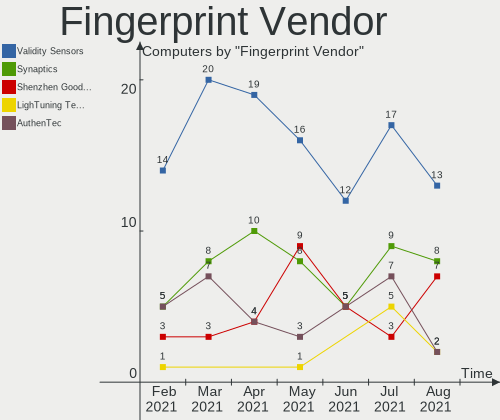

| Vendor                     | Computers | Percent |
|----------------------------|-----------|---------|
| Validity Sensors           | 16        | 45.71%  |
| Upek                       | 5         | 14.29%  |
| LighTuning Technology      | 4         | 11.43%  |
| AuthenTec                  | 4         | 11.43%  |
| Shenzhen Goodix Technology | 3         | 8.57%   |
| Synaptics                  | 2         | 5.71%   |
| Elan Microelectronics      | 1         | 2.86%   |

Fingerprint Model
-----------------

Fingerprint sensor models

| Model                                                  | Computers | Percent |
|--------------------------------------------------------|-----------|---------|
| Validity Sensors VFS495 Fingerprint Reader             | 4         | 11.43%  |
| Upek Biometric Touchchip/Touchstrip Fingerprint Sensor | 4         | 11.43%  |
| Validity Sensors VFS5011 Fingerprint Reader            | 2         | 5.71%   |
| Validity Sensors VFS491                                | 2         | 5.71%   |
| Validity Sensors VFS101 Fingerprint Reader             | 2         | 5.71%   |
| Validity Sensors Synaptics WBDI                        | 2         | 5.71%   |
| Shenzhen Goodix  FingerPrint Device                    | 2         | 5.71%   |
| LighTuning ES603 Swipe Fingerprint Sensor              | 2         | 5.71%   |
| AuthenTec AES2810                                      | 2         | 5.71%   |
| Validity Sensors VFS471 Fingerprint Reader             | 1         | 2.86%   |
| Validity Sensors VFS451 Fingerprint Reader             | 1         | 2.86%   |
| Validity Sensors VFS 5011 fingerprint sensor           | 1         | 2.86%   |
| Validity Sensors Fingerprint scanner                   | 1         | 2.86%   |
| Upek TCS5B Fingerprint sensor                          | 1         | 2.86%   |
| Synaptics Metallica MIS Touch Fingerprint Reader       | 1         | 2.86%   |
| Shenzhen Goodix Fingerprint Reader                     | 1         | 2.86%   |
| LighTuning Fingerprint Reader                          | 1         | 2.86%   |
| LighTuning EgisTec Touch Fingerprint Sensor            | 1         | 2.86%   |
| Elan ELAN:Fingerprint                                  | 1         | 2.86%   |
| AuthenTec Fingerprint Sensor                           | 1         | 2.86%   |
| AuthenTec AES1600                                      | 1         | 2.86%   |
| Unknown                                                | 1         | 2.86%   |

Chipcard Vendor
---------------

Chipcard module vendors

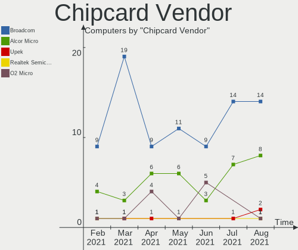

| Vendor      | Computers | Percent |
|-------------|-----------|---------|
| Broadcom    | 11        | 55%     |
| Alcor Micro | 6         | 30%     |
| Upek        | 2         | 10%     |
| O2 Micro    | 1         | 5%      |

Chipcard Model
--------------

Chipcard module models

| Model                                                                        | Computers | Percent |
|------------------------------------------------------------------------------|-----------|---------|
| Alcor Micro AU9540 Smartcard Reader                                          | 6         | 30%     |
| Broadcom BCM5880 Secure Applications Processor                               | 5         | 25%     |
| Broadcom BCM5880 Secure Applications Processor with fingerprint swipe sensor | 4         | 20%     |
| Upek TouchChip Fingerprint Coprocessor (WBF advanced mode)                   | 2         | 10%     |
| O2 Micro OZ776 CCID Smartcard Reader                                         | 1         | 5%      |
| Broadcom BCM5880 Secure Applications Processor with fingerprint touch sensor | 1         | 5%      |
| Broadcom 5880                                                                | 1         | 5%      |

Printer Vendor
--------------

Printer device vendors

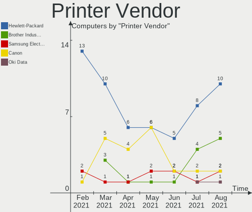

| Vendor                 | Computers | Percent |
|------------------------|-----------|---------|
| Canon                  | 5         | 31.25%  |
| Hewlett-Packard        | 4         | 25%     |
| Samsung Electronics    | 3         | 18.75%  |
| Brother Industries     | 3         | 18.75%  |
| Agere Systems (Lucent) | 1         | 6.25%   |

Printer Model
-------------

Printer device models

| Model                                       | Computers | Percent |
|---------------------------------------------|-----------|---------|
| Samsung ML-1865W Series                     | 1         | 6.25%   |
| Samsung M2020 Series                        | 1         | 6.25%   |
| Samsung Color Laser Printer                 | 1         | 6.25%   |
| HP OfficeJet Pro 8020 series                | 1         | 6.25%   |
| HP LaserJet P1005                           | 1         | 6.25%   |
| HP LaserJet M402dn                          | 1         | 6.25%   |
| HP Ink Tank Wireless 410 series             | 1         | 6.25%   |
| Canon PIXMA MX720 Series                    | 1         | 6.25%   |
| Canon MF3110                                | 1         | 6.25%   |
| Canon LiDE 300                              | 1         | 6.25%   |
| Canon LBP3010/LBP3018/LBP3050               | 1         | 6.25%   |
| Canon iP2600 series                         | 1         | 6.25%   |
| Brother MFC-J5335DW                         | 1         | 6.25%   |
| Brother DCP-J105                            | 1         | 6.25%   |
| Brother DCP-7055 scanner/printer            | 1         | 6.25%   |
| Agere Systems (Lucent) USS720 Parallel Port | 1         | 6.25%   |

Scanner Vendor
--------------

Scanner device vendors

| Vendor             | Computers | Percent |
|--------------------|-----------|---------|
| Canon              | 5         | 55.56%  |
| Hewlett-Packard    | 2         | 22.22%  |
| Ultima Electronics | 1         | 11.11%  |
| Seiko Epson        | 1         | 11.11%  |

Scanner Model
-------------

Scanner device models

| Model                                                                                 | Computers | Percent |
|---------------------------------------------------------------------------------------|-----------|---------|
| Ultima Artec Ultima 2000 (GT6801 based)/Lifetec LT9385/ScanMagic 1200 UB Plus Scanner | 1         | 11.11%  |
| Seiko Epson GT-X770 [Perfection V500]                                                 | 1         | 11.11%  |
| HP ScanJet 5300c/5370c                                                                | 1         | 11.11%  |
| HP Scanjet 200                                                                        | 1         | 11.11%  |
| Canon CanoScan LiDE 220                                                               | 1         | 11.11%  |
| Canon CanoScan LiDE 120                                                               | 1         | 11.11%  |
| Canon CanoScan LiDE 110                                                               | 1         | 11.11%  |
| Canon CanoScan LiDE 100                                                               | 1         | 11.11%  |
| Canon CanoScan 9000F Mark II                                                          | 1         | 11.11%  |

Bluetooth Vendor
----------------

Controller vendors

| Vendor                          | Computers | Percent |
|---------------------------------|-----------|---------|
| Intel                           | 96        | 32.65%  |
| Qualcomm Atheros Communications | 37        | 12.59%  |
| Realtek Semiconductor           | 32        | 10.88%  |
| Cambridge Silicon Radio         | 26        | 8.84%   |
| Broadcom                        | 21        | 7.14%   |
| Lite-On Technology              | 17        | 5.78%   |
| IMC Networks                    | 11        | 3.74%   |
| Dell                            | 10        | 3.4%    |
| Apple                           | 10        | 3.4%    |
| Foxconn / Hon Hai               | 7         | 2.38%   |
| Hewlett-Packard                 | 5         | 1.7%    |
| ASUSTek Computer                | 5         | 1.7%    |
| Toshiba                         | 4         | 1.36%   |
| Ralink Technology               | 3         | 1.02%   |
| Ralink                          | 3         | 1.02%   |
| Alps Electric                   | 3         | 1.02%   |
| Realtek                         | 1         | 0.34%   |
| Micro Star International        | 1         | 0.34%   |
| MediaTek                        | 1         | 0.34%   |
| Marvell Semiconductor           | 1         | 0.34%   |

Bluetooth Model
---------------

Controller models

| Model                                                    | Computers | Percent |
|----------------------------------------------------------|-----------|---------|
| Intel Bluetooth wireless interface                       | 44        | 14.97%  |
| Cambridge Silicon Radio Bluetooth Dongle (HCI mode)      | 26        | 8.84%   |
| Intel AX200 Bluetooth                                    | 20        | 6.8%    |
| Qualcomm Atheros  Bluetooth Device                       | 14        | 4.76%   |
| Realtek Bluetooth Radio                                  | 13        | 4.42%   |
| Intel Bluetooth Device                                   | 12        | 4.08%   |
| Intel Bluetooth 9460/9560 Jefferson Peak (JfP)           | 11        | 3.74%   |
| Realtek  Bluetooth 4.2 Adapter                           | 10        | 3.4%    |
| Qualcomm Atheros AR3011 Bluetooth                        | 10        | 3.4%    |
| Lite-On Qualcomm Atheros QCA9377 Bluetooth               | 9         | 3.06%   |
| Dell DW375 Bluetooth Module                              | 5         | 1.7%    |
| Qualcomm Atheros Bluetooth USB Host Controller           | 4         | 1.36%   |
| Qualcomm Atheros AR3012 Bluetooth 4.0                    | 4         | 1.36%   |
| Intel Wireless-AC 3168 Bluetooth                         | 4         | 1.36%   |
| Intel Centrino Advanced-N 6230 Bluetooth adapter         | 4         | 1.36%   |
| IMC Networks Bluetooth Radio                             | 4         | 1.36%   |
| Apple Bluetooth USB Host Controller                      | 4         | 1.36%   |
| Apple Bluetooth HCI                                      | 4         | 1.36%   |
| Realtek RTL8822BE Bluetooth 4.2 Adapter                  | 3         | 1.02%   |
| Realtek RTL8723B Bluetooth                               | 3         | 1.02%   |
| Realtek 802.11n WLAN Adapter                             | 3         | 1.02%   |
| Ralink Motorola BC4 Bluetooth 3.0+HS Adapter             | 3         | 1.02%   |
| Ralink RT3290 Bluetooth                                  | 3         | 1.02%   |
| Qualcomm Atheros QCA61x4 Bluetooth 4.0                   | 3         | 1.02%   |
| Lite-On Bluetooth Radio                                  | 3         | 1.02%   |
| Lite-On Bluetooth Device                                 | 3         | 1.02%   |
| IMC Networks Bluetooth Device                            | 3         | 1.02%   |
| HP Bluetooth 2.0 Interface [Broadcom BCM2045]            | 3         | 1.02%   |
| Broadcom BCM43142A0 Bluetooth 4.0                        | 3         | 1.02%   |
| Lite-On Atheros AR3012 Bluetooth                         | 2         | 0.68%   |
| IMC Networks Bluetooth USB Host Controller               | 2         | 0.68%   |
| IMC Networks Atheros AR3012 Bluetooth 4.0 Adapter        | 2         | 0.68%   |
| Foxconn / Hon Hai Bluetooth USB Host Controller          | 2         | 0.68%   |
| Foxconn / Hon Hai BCM20702A0                             | 2         | 0.68%   |
| Dell Broadcom BCM20702A0 Bluetooth                       | 2         | 0.68%   |
| Broadcom HP Portable SoftSailing                         | 2         | 0.68%   |
| Broadcom BCM43142A0 Bluetooth Device                     | 2         | 0.68%   |
| Broadcom BCM20702A0 Bluetooth 4.0                        | 2         | 0.68%   |
| Broadcom BCM20702 Bluetooth 4.0 [ThinkPad]               | 2         | 0.68%   |
| Broadcom BCM2070 Bluetooth 2.1 + EDR                     | 2         | 0.68%   |
| ASUS BCM20702A0                                          | 2         | 0.68%   |
| Alps Electric BCM2046 Bluetooth Device                   | 2         | 0.68%   |
| Toshiba Bluetooth USB Host Controller                    | 1         | 0.34%   |
| Toshiba Bluetooth Device                                 | 1         | 0.34%   |
| Toshiba BCM43142A0                                       | 1         | 0.34%   |
| Toshiba Askey Bluetooth Module                           | 1         | 0.34%   |
| Realtek Bluetooth Radio                                  | 1         | 0.34%   |
| Qualcomm Atheros Bluetooth                               | 1         | 0.34%   |
| Qualcomm Atheros AR9462 Bluetooth                        | 1         | 0.34%   |
| Micro Star International MS-6970 BToes Bluetooth adapter | 1         | 0.34%   |
| MediaTek MT7630e Bluetooth Adapter                       | 1         | 0.34%   |
| Marvell Bluetooth and Wireless LAN Composite Device      | 1         | 0.34%   |
| Intel Wireless-AC 9260 Bluetooth Adapter                 | 1         | 0.34%   |
| HP Broadcom 2070 Bluetooth Combo                         | 1         | 0.34%   |
| HP Bluetooth Adapter                                     | 1         | 0.34%   |
| Foxconn / Hon Hai Broadcom Bluetooth 2.1 Device          | 1         | 0.34%   |
| Foxconn / Hon Hai BCM43142A0 broadcom bluetooth          | 1         | 0.34%   |
| Foxconn / Hon Hai BCM2045A0                              | 1         | 0.34%   |
| Dell Wireless 365 Bluetooth                              | 1         | 0.34%   |
| Dell Wireless 355 Bluetooth                              | 1         | 0.34%   |

Unsupported Devices
-------------------

Total unsupported devices on board

| Total | Computers | Percent |
|-------|-----------|---------|
| 0     | 480       | 77.8%   |
| 1     | 112       | 18.15%  |
| 2     | 21        | 3.4%    |
| 4     | 2         | 0.32%   |
| 3     | 2         | 0.32%   |

Unsupported Device Types
------------------------

Types of unsupported devices

| Type                     | Computers | Percent |
|--------------------------|-----------|---------|
| Fingerprint reader       | 34        | 21.38%  |
| Graphics card            | 33        | 20.75%  |
| Net/wireless             | 30        | 18.87%  |
| Chipcard                 | 19        | 11.95%  |
| Multimedia controller    | 11        | 6.92%   |
| Storage                  | 9         | 5.66%   |
| Communication controller | 5         | 3.14%   |
| Sound                    | 4         | 2.52%   |
| Bluetooth                | 4         | 2.52%   |
| Camera                   | 3         | 1.89%   |
| Network                  | 2         | 1.26%   |
| Card reader              | 2         | 1.26%   |
| Unassigned class         | 1         | 0.63%   |
| Modem                    | 1         | 0.63%   |
| Dvb card                 | 1         | 0.63%   |

