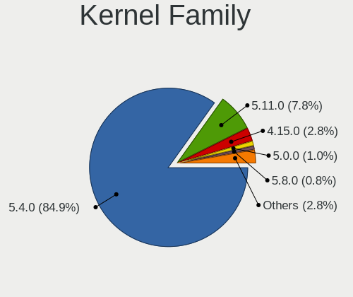
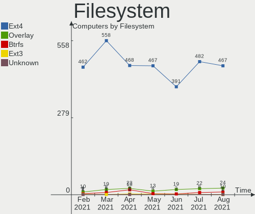
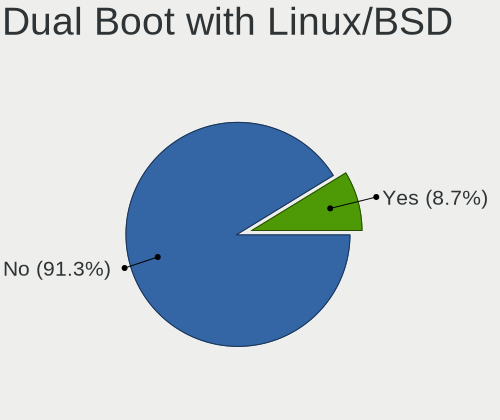
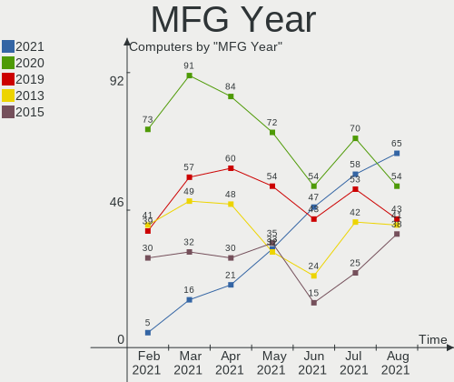

Mint Hardware Trends
--------------------

A project to identify most popular hardware characteristics and track their change
over time based on data collected by Mint users at https://Linux-Hardware.org.

Anyone can contribute to the study by uploading probes of their computers by
the [hw-probe](https://github.com/linuxhw/hw-probe) tool:

    sudo -E hw-probe -all -upload

This is a report for all computer types. See also reports for [desktops](/Dist/Mint/Desktop/README.md) and [notebooks](/Dist/Mint/Notebook/README.md).

Full-feature report is available here: https://linux-hardware.org/?view=trends

Period: May, 2020.

Contents
--------

- [ OS                       ](#os)
- [ OS Family                ](#os-family)
- [ Kernel                   ](#kernel)
- [ Kernel Family            ](#kernel-family)
- [ Kernel Major Ver.        ](#kernel-major-ver)
- [ Arch                     ](#arch)
- [ DE                       ](#de)
- [ Display Server           ](#display-server)
- [ Display Manager          ](#display-manager)
- [ OS Lang                  ](#os-lang)
- [ Boot Mode                ](#boot-mode)
- [ Filesystem               ](#filesystem)
- [ Part. scheme             ](#part-scheme)
- [ Dual Boot with Linux/BSD ](#dual-boot-with-linux/bsd)
- [ Dual Boot (Win)          ](#dual-boot-win)
- [ Country                  ](#country)
- [ City                     ](#city)
- [ Vendor                   ](#vendor)
- [ Model                    ](#model)
- [ Model Family             ](#model-family)
- [ MFG Year                 ](#mfg-year)
- [ Form Factor              ](#form-factor)
- [ Secure Boot              ](#secure-boot)
- [ Coreboot                 ](#coreboot)
- [ RAM Size                 ](#ram-size)
- [ RAM Used                 ](#ram-used)
- [ Drive Vendor             ](#drive-vendor)
- [ Drive Model              ](#drive-model)
- [ Drive Kind               ](#drive-kind)
- [ Drive Connector          ](#drive-connector)
- [ Drive Size               ](#drive-size)
- [ Space Total              ](#space-total)
- [ Space Used               ](#space-used)
- [ Malfunc. Drives          ](#malfunc-drives)
- [ Malfunc. Drive Vendor    ](#malfunc-drive-vendor)
- [ Malfunc. HDD Vendor      ](#malfunc-hdd-vendor)
- [ Malfunc. Drive Kind      ](#malfunc-drive-kind)
- [ Failed Drives            ](#failed-drives)
- [ Failed Drive Vendor      ](#failed-drive-vendor)
- [ Drive Status             ](#drive-status)
- [ Storage Vendor           ](#storage-vendor)
- [ Storage Model            ](#storage-model)
- [ Storage Kind             ](#storage-kind)
- [ CPU Vendor               ](#cpu-vendor)
- [ CPU Model                ](#cpu-model)
- [ CPU Model Family         ](#cpu-model-family)
- [ CPU Cores                ](#cpu-cores)
- [ CPU Sockets              ](#cpu-sockets)
- [ CPU Threads              ](#cpu-threads)
- [ CPU Op-Modes             ](#cpu-op-modes)
- [ CPU Microcode            ](#cpu-microcode)
- [ CPU Microarch            ](#cpu-microarch)
- [ GPU Vendor               ](#gpu-vendor)
- [ GPU Model                ](#gpu-model)
- [ GPU Combo                ](#gpu-combo)
- [ GPU Driver               ](#gpu-driver)
- [ GPU Memory               ](#gpu-memory)
- [ Monitor Vendor           ](#monitor-vendor)
- [ Monitor Model            ](#monitor-model)
- [ Monitor Resolution       ](#monitor-resolution)
- [ Monitor Diagonal         ](#monitor-diagonal)
- [ Monitor Width            ](#monitor-width)
- [ Aspect Ratio             ](#aspect-ratio)
- [ Monitor Area             ](#monitor-area)
- [ Pixel Density            ](#pixel-density)
- [ Multiple Monitors        ](#multiple-monitors)
- [ Net Controller Vendor    ](#net-controller-vendor)
- [ Net Controller Model     ](#net-controller-model)
- [ Wireless Vendor          ](#wireless-vendor)
- [ Wireless Model           ](#wireless-model)
- [ Ethernet Vendor          ](#ethernet-vendor)
- [ Ethernet Model           ](#ethernet-model)
- [ Net Controller Kind      ](#net-controller-kind)
- [ Used Controller          ](#used-controller)
- [ NICs                     ](#nics)
- [ Bluetooth Vendor         ](#bluetooth-vendor)
- [ Bluetooth Model          ](#bluetooth-model)
- [ Unsupported Devices      ](#unsupported-devices)
- [ Unsupported Device Types ](#unsupported-device-types)

OS
--

Installed operating systems

| Name      | Computers | Percent |
|-----------|-----------|---------|
| Mint 19.3 | 235       | 76.8%   |
| Mint 4    | 24        | 7.84%   |
| Mint 19.2 | 16        | 5.23%   |
| Mint 19.1 | 15        | 4.9%    |
| Mint 18.3 | 10        | 3.27%   |
| Mint 19   | 4         | 1.31%   |
| Mint 18.2 | 1         | 0.33%   |
| Mint 18.1 | 1         | 0.33%   |

OS Family
---------

OS without a version

| Name | Computers | Percent |
|------|-----------|---------|
| Mint | 306       | 100%    |

Kernel
------

Version of the Linux kernel

| Version               | Computers | Percent |
|-----------------------|-----------|---------|
| 5.3.0-51-generic      | 118       | 38.56%  |
| 5.3.0-53-generic      | 61        | 19.93%  |
| 5.0.0-32-generic      | 24        | 7.84%   |
| 4.15.0-99-generic     | 21        | 6.86%   |
| 4.15.0-101-generic    | 15        | 4.9%    |
| 4.19.0-9-amd64        | 13        | 4.25%   |
| 4.19.0-8-amd64        | 10        | 3.27%   |
| 5.3.0-46-generic      | 9         | 2.94%   |
| 4.15.0-96-generic     | 5         | 1.63%   |
| 4.10.0-38-generic     | 4         | 1.31%   |
| 4.15.0-54-generic     | 3         | 0.98%   |
| 4.15.0-65-generic     | 2         | 0.65%   |
| 4.15.0-58-generic     | 2         | 0.65%   |
| 4.15.0-20-generic     | 2         | 0.65%   |
| 5.6.7-050607-generic  | 1         | 0.33%   |
| 5.3.6-050306-generic  | 1         | 0.33%   |
| 5.3.18-050318-generic | 1         | 0.33%   |
| 5.3.0-45-generic      | 1         | 0.33%   |
| 5.3.0-42-generic      | 1         | 0.33%   |
| 5.3.0-40-generic      | 1         | 0.33%   |
| 5.3.0-28-generic      | 1         | 0.33%   |
| 5.3.0-26-generic      | 1         | 0.33%   |
| 4.4.0-53-generic      | 1         | 0.33%   |
| 4.19.0-9-686          | 1         | 0.33%   |
| 4.15.0-99-lowlatency  | 1         | 0.33%   |
| 4.15.0-74-generic     | 1         | 0.33%   |
| 4.15.0-72-generic     | 1         | 0.33%   |
| 4.15.0-62-generic     | 1         | 0.33%   |
| 4.15.0-51-generic     | 1         | 0.33%   |
| 4.15.0-34-generic     | 1         | 0.33%   |
| 4.10.0-42-generic     | 1         | 0.33%   |

Kernel Family
-------------

Linux kernel without a distro release

| Version | Computers | Percent |
|---------|-----------|---------|
| 5.3.0   | 193       | 63.07%  |
| 4.15.0  | 56        | 18.3%   |
| 5.0.0   | 24        | 7.84%   |
| 4.19.0  | 24        | 7.84%   |
| 4.10.0  | 5         | 1.63%   |
| 5.6.7   | 1         | 0.33%   |
| 5.3.6   | 1         | 0.33%   |
| 5.3.18  | 1         | 0.33%   |
| 4.4.0   | 1         | 0.33%   |

Kernel Major Ver.
-----------------

Linux kernel major version

| Version | Computers | Percent |
|---------|-----------|---------|
| 5.3     | 195       | 63.73%  |
| 4.15    | 56        | 18.3%   |
| 5.0     | 24        | 7.84%   |
| 4.19    | 24        | 7.84%   |
| 4.10    | 5         | 1.63%   |
| 5.6     | 1         | 0.33%   |
| 4.4     | 1         | 0.33%   |

Arch
----

OS architecture (x86_64, i586, etc.)

| Name   | Computers | Percent |
|--------|-----------|---------|
| x86_64 | 282       | 92.16%  |
| i686   | 24        | 7.84%   |

DE
--

Desktop Environment

| Name          | Computers | Percent |
|---------------|-----------|---------|
| X-Cinnamon    | 184       | 60.13%  |
| MATE          | 44        | 14.38%  |
| XFCE          | 29        | 9.48%   |
| Cinnamon      | 27        | 8.82%   |
| Unknown       | 14        | 4.58%   |
| GNOME         | 5         | 1.63%   |
| LXDE          | 1         | 0.33%   |
| i3            | 1         | 0.33%   |
| enlightenment | 1         | 0.33%   |

Display Server
--------------

X11 or Wayland

| Name | Computers | Percent |
|------|-----------|---------|
| X11  | 306       | 100%    |

Display Manager
---------------

SDDM, LightDM, etc.

| Name    | Computers | Percent |
|---------|-----------|---------|
| Unknown | 267       | 87.25%  |
| LightDM | 39        | 12.75%  |

OS Lang
-------

Language

| Lang    | Computers | Percent |
|---------|-----------|---------|
| en_US   | 85        | 27.78%  |
| pt_BR   | 34        | 11.11%  |
| de_DE   | 23        | 7.52%   |
| ru_RU   | 21        | 6.86%   |
| en_GB   | 16        | 5.23%   |
| fr_FR   | 15        | 4.9%    |
| es_ES   | 9         | 2.94%   |
| nl_NL   | 8         | 2.61%   |
| pl_PL   | 7         | 2.29%   |
| it_IT   | 7         | 2.29%   |
| en_CA   | 7         | 2.29%   |
| es_AR   | 5         | 1.63%   |
| en_AU   | 5         | 1.63%   |
| Unknown | 5         | 1.63%   |
| es_MX   | 4         | 1.31%   |
| en_IN   | 4         | 1.31%   |
| el_GR   | 4         | 1.31%   |
| bg_BG   | 4         | 1.31%   |
| ru_UA   | 3         | 0.98%   |
| nl_BE   | 3         | 0.98%   |
| ja_JP   | 3         | 0.98%   |
| es_UY   | 3         | 0.98%   |
| en_ZA   | 3         | 0.98%   |
| C       | 3         | 0.98%   |
| pt_PT   | 2         | 0.65%   |
| fr_BE   | 2         | 0.65%   |
| en_PH   | 2         | 0.65%   |
| en_NZ   | 2         | 0.65%   |
| de_CH   | 2         | 0.65%   |
| cs_CZ   | 2         | 0.65%   |
| tr_TR   | 1         | 0.33%   |
| sv_SE   | 1         | 0.33%   |
| hr_HR   | 1         | 0.33%   |
| fi_FI   | 1         | 0.33%   |
| es_VE   | 1         | 0.33%   |
| es_CO   | 1         | 0.33%   |
| es_CL   | 1         | 0.33%   |
| en_NG   | 1         | 0.33%   |
| en_IN   | 1         | 0.33%   |
| en_IL   | 1         | 0.33%   |
| en_IE   | 1         | 0.33%   |
| de_AT   | 1         | 0.33%   |
| da_DK   | 1         | 0.33%   |

Boot Mode
---------

EFI or BIOS

| Mode | Computers | Percent |
|------|-----------|---------|
| BIOS | 205       | 66.99%  |
| EFI  | 101       | 33.01%  |

Filesystem
----------

Type of filesystem

| Type    | Computers | Percent |
|---------|-----------|---------|
| Ext4    | 295       | 96.41%  |
| Btrfs   | 7         | 2.29%   |
| Overlay | 2         | 0.65%   |
| Tmpfs   | 1         | 0.33%   |
| Unknown | 1         | 0.33%   |

Part. scheme
------------

Scheme of partitioning

| Type    | Computers | Percent |
|---------|-----------|---------|
| Unknown | 285       | 93.14%  |
| GPT     | 11        | 3.59%   |
| MBR     | 10        | 3.27%   |

Dual Boot with Linux/BSD
------------------------

Hosting more than one Linux/BSD

| Dual boot | Computers | Percent |
|-----------|-----------|---------|
| No        | 287       | 93.79%  |
| Yes       | 19        | 6.21%   |

Dual Boot (Win)
---------------

Hosting Linux and Windows

| Dual boot | Computers | Percent |
|-----------|-----------|---------|
| No        | 260       | 84.97%  |
| Yes       | 46        | 15.03%  |

Country
-------

Geographic location (country)

| Country                | Computers | Percent |
|------------------------|-----------|---------|
| USA                    | 43        | 14.05%  |
| Brazil                 | 38        | 12.42%  |
| Russia                 | 24        | 7.84%   |
| Germany                | 24        | 7.84%   |
| France                 | 18        | 5.88%   |
| UK                     | 17        | 5.56%   |
| Spain                  | 11        | 3.59%   |
| Netherlands            | 10        | 3.27%   |
| Italy                  | 8         | 2.61%   |
| Canada                 | 8         | 2.61%   |
| Poland                 | 7         | 2.29%   |
| India                  | 7         | 2.29%   |
| Ukraine                | 6         | 1.96%   |
| Bulgaria               | 6         | 1.96%   |
| Belgium                | 5         | 1.63%   |
| Australia              | 5         | 1.63%   |
| Argentina              | 5         | 1.63%   |
| Mexico                 | 4         | 1.31%   |
| Greece                 | 4         | 1.31%   |
| Uruguay                | 3         | 0.98%   |
| Turkey                 | 3         | 0.98%   |
| South Africa           | 3         | 0.98%   |
| Romania                | 3         | 0.98%   |
| Portugal               | 3         | 0.98%   |
| Philippines            | 3         | 0.98%   |
| Switzerland            | 2         | 0.65%   |
| Serbia                 | 2         | 0.65%   |
| New Zealand            | 2         | 0.65%   |
| Japan                  | 2         | 0.65%   |
| Ireland                | 2         | 0.65%   |
| Indonesia              | 2         | 0.65%   |
| Hungary                | 2         | 0.65%   |
| Czech Republic         | 2         | 0.65%   |
| Chile                  | 2         | 0.65%   |
| Bahrain                | 2         | 0.65%   |
| Venezuela              | 1         | 0.33%   |
| Sweden                 | 1         | 0.33%   |
| Slovenia               | 1         | 0.33%   |
| Puerto Rico            | 1         | 0.33%   |
| Norway                 | 1         | 0.33%   |
| Namibia                | 1         | 0.33%   |
| Morocco                | 1         | 0.33%   |
| Jamaica                | 1         | 0.33%   |
| Israel                 | 1         | 0.33%   |
| Ghana                  | 1         | 0.33%   |
| Finland                | 1         | 0.33%   |
| Egypt                  | 1         | 0.33%   |
| Denmark                | 1         | 0.33%   |
| Colombia               | 1         | 0.33%   |
| Bosnia and Herzegovina | 1         | 0.33%   |
| Belarus                | 1         | 0.33%   |
| Austria                | 1         | 0.33%   |
| Angola                 | 1         | 0.33%   |

City
----

Geographic location (city)

| City                | Computers | Percent |
|---------------------|-----------|---------|
| Moscow              | 8         | 2.61%   |
| São Paulo          | 4         | 1.31%   |
| Athens              | 4         | 1.31%   |
| Toulouse            | 3         | 0.98%   |
| St Petersburg       | 3         | 0.98%   |
| Montevideo          | 3         | 0.98%   |
| Madrid              | 3         | 0.98%   |
| London              | 3         | 0.98%   |
| Frankfurt am Main   | 3         | 0.98%   |
| Berlin              | 3         | 0.98%   |
| Westminster         | 2         | 0.65%   |
| Tournefeuille       | 2         | 0.65%   |
| Toronto             | 2         | 0.65%   |
| Spruce Grove        | 2         | 0.65%   |
| Sofia               | 2         | 0.65%   |
| Sevran              | 2         | 0.65%   |
| Santiago            | 2         | 0.65%   |
| Rotterdam           | 2         | 0.65%   |
| Rho                 | 2         | 0.65%   |
| Poznan              | 2         | 0.65%   |
| Paris               | 2         | 0.65%   |
| Novokuznetsk        | 2         | 0.65%   |
| Nottingham          | 2         | 0.65%   |
| Manama              | 2         | 0.65%   |
| Londrina            | 2         | 0.65%   |
| Johannesburg        | 2         | 0.65%   |
| Glasgow             | 2         | 0.65%   |
| Curitiba            | 2         | 0.65%   |
| Bandung             | 2         | 0.65%   |
| Amsterdam           | 2         | 0.65%   |
| Alexandria          | 2         | 0.65%   |
| Čačak             | 1         | 0.33%   |
| Zufikon             | 1         | 0.33%   |
| Wrocław            | 1         | 0.33%   |
| Worcester           | 1         | 0.33%   |
| Windhoek            | 1         | 0.33%   |
| Wichita Falls       | 1         | 0.33%   |
| Westerlo            | 1         | 0.33%   |
| Wellington          | 1         | 0.33%   |
| Warsaw              | 1         | 0.33%   |
| Waalwijk            | 1         | 0.33%   |
| Vitória            | 1         | 0.33%   |
| Vila Franca de Xira | 1         | 0.33%   |
| Vienna              | 1         | 0.33%   |
| Viedma              | 1         | 0.33%   |
| Vernon              | 1         | 0.33%   |
| Varna               | 1         | 0.33%   |
| Valley              | 1         | 0.33%   |
| Valladolid          | 1         | 0.33%   |
| Valenii de Munte    | 1         | 0.33%   |
| Utebo               | 1         | 0.33%   |
| Ulm                 | 1         | 0.33%   |
| Uberlândia         | 1         | 0.33%   |
| Tuzla               | 1         | 0.33%   |
| Turin               | 1         | 0.33%   |
| Tucson              | 1         | 0.33%   |
| Trindade            | 1         | 0.33%   |
| Trier               | 1         | 0.33%   |
| Treviso             | 1         | 0.33%   |
| Tikhvin             | 1         | 0.33%   |

Vendor
------

Motherboard manufacturer

| Name                | Computers | Percent |
|---------------------|-----------|---------|
| Hewlett-Packard     | 61        | 19.93%  |
| ASUSTek Computer    | 45        | 14.71%  |
| Dell                | 38        | 12.42%  |
| Lenovo              | 36        | 11.76%  |
| Gigabyte Technology | 25        | 8.17%   |
| Acer                | 20        | 6.54%   |
| MSI                 | 10        | 3.27%   |
| ASRock              | 10        | 3.27%   |
| Intel               | 6         | 1.96%   |
| Samsung Electronics | 5         | 1.63%   |
| Unknown             | 5         | 1.63%   |
| Medion              | 4         | 1.31%   |
| Fujitsu Siemens     | 4         | 1.31%   |
| Toshiba             | 3         | 0.98%   |
| Notebook            | 3         | 0.98%   |
| Fujitsu             | 3         | 0.98%   |
| Apple               | 3         | 0.98%   |
| Sony                | 2         | 0.65%   |
| Shuttle             | 2         | 0.65%   |
| Biostar             | 2         | 0.65%   |
| WinFast             | 1         | 0.33%   |
| Semp Toshiba        | 1         | 0.33%   |
| Positivo            | 1         | 0.33%   |
| Pegatron            | 1         | 0.33%   |
| PCWare              | 1         | 0.33%   |
| Panasonic           | 1         | 0.33%   |
| Packard Bell        | 1         | 0.33%   |
| NEC Computers       | 1         | 0.33%   |
| Megaware            | 1         | 0.33%   |
| LG Electronics      | 1         | 0.33%   |
| Itautec             | 1         | 0.33%   |
| INTELBRAS           | 1         | 0.33%   |
| HARDKERNEL          | 1         | 0.33%   |
| Gateway             | 1         | 0.33%   |
| Digibras            | 1         | 0.33%   |
| Complet             | 1         | 0.33%   |
| Chuwi               | 1         | 0.33%   |
| AMI                 | 1         | 0.33%   |
| AMD                 | 1         | 0.33%   |

Model
-----

Motherboard model

| Name                                                              | Computers | Percent |
|-------------------------------------------------------------------|-----------|---------|
| Unknown                                                           | 6         | 1.96%   |
| ASUS All Series                                                   | 4         | 1.31%   |
| Lenovo IdeaPad S340-15IWL 81N8                                    | 2         | 0.65%   |
| Lenovo E41-25 81FS                                                | 2         | 0.65%   |
| HP Pavilion g6                                                    | 2         | 0.65%   |
| HP Pavilion dv7                                                   | 2         | 0.65%   |
| HP Laptop 15-ra0xx                                                | 2         | 0.65%   |
| HP Compaq Presario CQ60                                           | 2         | 0.65%   |
| HP 2000                                                           | 2         | 0.65%   |
| Gigabyte GA-990FXA-UD3                                            | 2         | 0.65%   |
| Dell OptiPlex 755                                                 | 2         | 0.65%   |
| Dell Latitude D630                                                | 2         | 0.65%   |
| ASUS M4N68T-M-LE-V2                                               | 2         | 0.65%   |
| ASUS K50IJ                                                        | 2         | 0.65%   |
| Acer Aspire A114-32                                               | 2         | 0.65%   |
| WinFast MCP61M2MA                                                 | 1         | 0.33%   |
| Toshiba Satellite U300                                            | 1         | 0.33%   |
| Toshiba Satellite C850-D1K                                        | 1         | 0.33%   |
| Toshiba Qosmio X870                                               | 1         | 0.33%   |
| Sony VPCSB4M9E                                                    | 1         | 0.33%   |
| Sony VGN-AW41MF_H                                                 | 1         | 0.33%   |
| Shuttle DX30D                                                     | 1         | 0.33%   |
| Shuttle DS81D                                                     | 1         | 0.33%   |
| Semp Toshiba STI 007467                                           | 1         | 0.33%   |
| Samsung Electronics RV411/RV511/E3511/S3511/RV711/E3411           | 1         | 0.33%   |
| Samsung Electronics QX310/QX410/QX510/SF310/SF410/SF510           | 1         | 0.33%   |
| Samsung Electronics 3570R/370R/470R/450R/510R/4450RV              | 1         | 0.33%   |
| Samsung Electronics 300E5EV/300E4EV/270E5EV/270E4EV/2470EV/2470EE | 1         | 0.33%   |
| Samsung Electronics 270E5G/270E5U                                 | 1         | 0.33%   |
| Positivo MOBILE                                                   | 1         | 0.33%   |
| Pegatron IPMH110Pro                                               | 1         | 0.33%   |
| PCWare PW-945GCX                                                  | 1         | 0.33%   |
| Panasonic CFSX4-1L                                                | 1         | 0.33%   |
| Packard Bell EasyNote TK85                                        | 1         | 0.33%   |
| Notebook W51XTU                                                   | 1         | 0.33%   |
| Notebook P9XXEN_EF_ED                                             | 1         | 0.33%   |
| Notebook N750BU                                                   | 1         | 0.33%   |
| NEC Computers Packard Bell EasyNote                               | 1         | 0.33%   |
| MSI Prestige 15 A10SC                                             | 1         | 0.33%   |
| MSI MS-7B79                                                       | 1         | 0.33%   |
| MSI MS-7B49                                                       | 1         | 0.33%   |
| MSI MS-7996                                                       | 1         | 0.33%   |
| MSI MS-7846                                                       | 1         | 0.33%   |
| MSI MS-7823                                                       | 1         | 0.33%   |
| MSI MS-7640                                                       | 1         | 0.33%   |
| MSI GX60 3CC                                                      | 1         | 0.33%   |
| MSI CX61 2QF                                                      | 1         | 0.33%   |
| MSI CU-7592                                                       | 1         | 0.33%   |
| Megaware MW-H61HD-MA                                              | 1         | 0.33%   |
| Medion P2212T                                                     | 1         | 0.33%   |
| Medion MS-7848                                                    | 1         | 0.33%   |
| Medion E7220                                                      | 1         | 0.33%   |
| Medion E4254 MD62100                                              | 1         | 0.33%   |
| LG Electronics F1-2A78R                                           | 1         | 0.33%   |
| Lenovo Z70-80 80FG                                                | 1         | 0.33%   |
| Lenovo V330-14IKB 81B0                                            | 1         | 0.33%   |
| Lenovo V155-15API 81V5                                            | 1         | 0.33%   |
| Lenovo V110-15ISK 80TL                                            | 1         | 0.33%   |
| Lenovo ThinkPad X220 4293AF4                                      | 1         | 0.33%   |
| Lenovo ThinkPad W530 2447AE3                                      | 1         | 0.33%   |

Model Family
------------

Motherboard model prefix

| Name                        | Computers | Percent |
|-----------------------------|-----------|---------|
| Acer Aspire                 | 15        | 4.9%    |
| Dell Latitude               | 13        | 4.25%   |
| Lenovo ThinkPad             | 11        | 3.59%   |
| Dell Inspiron               | 11        | 3.59%   |
| HP ProBook                  | 10        | 3.27%   |
| Lenovo IdeaPad              | 8         | 2.61%   |
| HP Laptop                   | 8         | 2.61%   |
| HP EliteBook                | 8         | 2.61%   |
| Dell OptiPlex               | 8         | 2.61%   |
| HP Compaq                   | 7         | 2.29%   |
| HP Pavilion                 | 6         | 1.96%   |
| Unknown                     | 6         | 1.96%   |
| Lenovo ThinkCentre          | 4         | 1.31%   |
| HP Presario                 | 4         | 1.31%   |
| ASUS All                    | 4         | 1.31%   |
| Fujitsu LIFEBOOK            | 3         | 0.98%   |
| ASUS TUF                    | 3         | 0.98%   |
| Toshiba Satellite           | 2         | 0.65%   |
| Lenovo E41-25               | 2         | 0.65%   |
| HP ENVY                     | 2         | 0.65%   |
| HP 2000                     | 2         | 0.65%   |
| HP 15                       | 2         | 0.65%   |
| Gigabyte Z390               | 2         | 0.65%   |
| Gigabyte GA-990FXA-UD3      | 2         | 0.65%   |
| Fujitsu Siemens ESPRIMO     | 2         | 0.65%   |
| Fujitsu Siemens AMILO       | 2         | 0.65%   |
| Dell Vostro                 | 2         | 0.65%   |
| Dell Precision              | 2         | 0.65%   |
| ASUS SABERTOOTH             | 2         | 0.65%   |
| ASUS PRIME                  | 2         | 0.65%   |
| ASUS M4N68T-M-LE-V2         | 2         | 0.65%   |
| ASUS K50IJ                  | 2         | 0.65%   |
| WinFast MCP61M2MA           | 1         | 0.33%   |
| Toshiba Qosmio              | 1         | 0.33%   |
| Sony VPCSB4M9E              | 1         | 0.33%   |
| Sony VGN-AW41MF             | 1         | 0.33%   |
| Shuttle DX30D               | 1         | 0.33%   |
| Shuttle DS81D               | 1         | 0.33%   |
| Semp Toshiba STI            | 1         | 0.33%   |
| Samsung Electronics RV411   | 1         | 0.33%   |
| Samsung Electronics QX310   | 1         | 0.33%   |
| Samsung Electronics 3570R   | 1         | 0.33%   |
| Samsung Electronics 300E5EV | 1         | 0.33%   |
| Samsung Electronics 270E5G  | 1         | 0.33%   |
| Positivo MOBILE             | 1         | 0.33%   |
| Pegatron IPMH110Pro         | 1         | 0.33%   |
| PCWare PW-945GCX            | 1         | 0.33%   |
| Panasonic CFSX4-1L          | 1         | 0.33%   |
| Packard Bell EasyNote       | 1         | 0.33%   |
| Notebook W51XTU             | 1         | 0.33%   |
| Notebook P9XXEN             | 1         | 0.33%   |
| Notebook N750BU             | 1         | 0.33%   |
| NEC Computers Packard       | 1         | 0.33%   |
| MSI Prestige                | 1         | 0.33%   |
| MSI MS-7B79                 | 1         | 0.33%   |
| MSI MS-7B49                 | 1         | 0.33%   |
| MSI MS-7996                 | 1         | 0.33%   |
| MSI MS-7846                 | 1         | 0.33%   |
| MSI MS-7823                 | 1         | 0.33%   |
| MSI MS-7640                 | 1         | 0.33%   |

MFG Year
--------

Motherboard manufacture year

| Year | Computers | Percent |
|------|-----------|---------|
| 2019 | 47        | 15.36%  |
| 2018 | 31        | 10.13%  |
| 2013 | 30        | 9.8%    |
| 2011 | 30        | 9.8%    |
| 2012 | 28        | 9.15%   |
| 2017 | 20        | 6.54%   |
| 2014 | 20        | 6.54%   |
| 2016 | 18        | 5.88%   |
| 2010 | 18        | 5.88%   |
| 2009 | 18        | 5.88%   |
| 2008 | 13        | 4.25%   |
| 2007 | 13        | 4.25%   |
| 2015 | 8         | 2.61%   |
| 2020 | 6         | 1.96%   |
| 2005 | 3         | 0.98%   |
| 2006 | 2         | 0.65%   |
| 2004 | 1         | 0.33%   |

Form Factor
-----------

Physical design of the computer

| Name        | Computers | Percent |
|-------------|-----------|---------|
| Notebook    | 185       | 60.46%  |
| Desktop     | 112       | 36.6%   |
| Mini pc     | 3         | 0.98%   |
| Tablet      | 2         | 0.65%   |
| Convertible | 2         | 0.65%   |
| All in one  | 2         | 0.65%   |

Secure Boot
-----------

Enabled or disabled

| State    | Computers | Percent |
|----------|-----------|---------|
| Disabled | 295       | 96.41%  |
| Enabled  | 11        | 3.59%   |

Coreboot
--------

Have coreboot on board

| Used | Computers | Percent |
|------|-----------|---------|
| No   | 306       | 100%    |

RAM Size
--------

Total RAM memory

| Size in GB  | Computers | Percent |
|-------------|-----------|---------|
| 3.01-4.0    | 96        | 31.37%  |
| 4.01-8.0    | 62        | 20.26%  |
| 8.01-16.0   | 49        | 16.01%  |
| 16.01-24.0  | 39        | 12.75%  |
| 1.01-2.0    | 32        | 10.46%  |
| 32.01-64.0  | 18        | 5.88%   |
| 24.01-32.0  | 3         | 0.98%   |
| 2.01-3.0    | 3         | 0.98%   |
| 64.01-256.0 | 3         | 0.98%   |
| 0.01-1.0    | 1         | 0.33%   |

RAM Used
--------

Used RAM memory

| Used GB    | Computers | Percent |
|------------|-----------|---------|
| 1.01-2.0   | 121       | 39.54%  |
| 2.01-3.0   | 81        | 26.47%  |
| 0.01-1.0   | 48        | 15.69%  |
| 3.01-4.0   | 29        | 9.48%   |
| 4.01-8.0   | 23        | 7.52%   |
| 8.01-16.0  | 3         | 0.98%   |
| 16.01-24.0 | 1         | 0.33%   |

Drive Vendor
------------

Hard drive vendors

| Vendor              | Computers | Drives  | Percent |
|---------------------|-----------|---------|---------|
| Seagate             | 93        | 100     | 22.85%  |
| WDC                 | 85        | 97      | 20.88%  |
| Samsung Electronics | 45        | 54      | 11.06%  |
| Toshiba             | 34        | 34      | 8.35%   |
| Kingston            | 23        | 23      | 5.65%   |
| Unknown             | 18        | 18      | 4.42%   |
| Hitachi             | 16        | 18      | 3.93%   |
| Crucial             | 13        | 14      | 3.19%   |
| SanDisk             | 12        | 13      | 2.95%   |
| HGST                | 11        | 11      | 2.7%    |
| A-DATA Technology   | 8         | 8       | 1.97%   |
| Transcend           | 5         | 5       | 1.23%   |
| MAXTOR              | 4         | 4       | 0.98%   |
| LITEON              | 4         | 4       | 0.98%   |
| SPCC                | 3         | 3       | 0.74%   |
| SK Hynix            | 2         | 2       | 0.49%   |
| OCZ                 | 2         | 2       | 0.49%   |
| Micron Technology   | 2         | 2       | 0.49%   |
| Intel               | 2         | 2       | 0.49%   |
| Hewlett-Packard     | 2         | 2       | 0.49%   |
| GOODRAM             | 2         | 2       | 0.49%   |
| Apple               | 2         | 3       | 0.49%   |
| Wolf                | 1         | 1       | 0.25%   |
| Vi550               | 1         | 1       | 0.25%   |
| TSA                 | 1         | 1       | 0.25%   |
| PNY                 | 1         | 1       | 0.25%   |
| PLEXTOR             | 1         | 1       | 0.25%   |
| Phison              | 1         | 1       | 0.25%   |
| Patriot             | 1         | 1       | 0.25%   |
| KingSpec            | 1         | 1       | 0.25%   |
| Karisin             | 1         | 1       | 0.25%   |
| INNOVATION          | 1         | 1       | 0.25%   |
| HL-DT-ST            | 1         | Unknown | 0.25%   |
| HCG8e               | 1         | 1       | 0.25%   |
| Gigabyte Technology | 1         | 1       | 0.25%   |
| Generic             | 1         | 1       | 0.25%   |
| Fujitsu             | 1         | 1       | 0.25%   |
| FORESEE             | 1         | 1       | 0.25%   |
| DF4128              | 1         | 1       | 0.25%   |
| ASMT109x            | 1         | 1       | 0.25%   |
| ASMT                | 1         | 1       | 0.25%   |

Drive Model
-----------

Hard drive models

| Model                        | Computers | Percent |
|------------------------------|-----------|---------|
| ST500LT012-1DG142 500GB      | 7         | 1.59%   |
| MMC Card  32GB               | 6         | 1.36%   |
| ST1000LM035-1RK172 1TB       | 5         | 1.14%   |
| SA400S37240G 240GB SSD       | 5         | 1.14%   |
| SA400S37120G 120GB SSD       | 5         | 1.14%   |
| MQ01ABD100 1TB               | 5         | 1.14%   |
| SV300S37A240G 240GB SSD      | 4         | 0.91%   |
| ST9500420AS 500GB            | 4         | 0.91%   |
| ST9320325AS 320GB            | 4         | 0.91%   |
| ST1000DM010-2EP102 1TB       | 4         | 0.91%   |
| ST1000DM003-1ER162 1TB       | 4         | 0.91%   |
| SSD 860 EVO 250GB            | 4         | 0.91%   |
| SSD 860 EVO 1TB              | 4         | 0.91%   |
| SSD 850 EVO 500GB            | 4         | 0.91%   |
| MMC Card  64GB               | 4         | 0.91%   |
| HTS545050A7E380 500GB        | 4         | 0.91%   |
| WD10EZEX-08WN4A0 1TB         | 3         | 0.68%   |
| SU650 120GB SSD              | 3         | 0.68%   |
| ST500LM012 HN-M500MBB 500GB  | 3         | 0.68%   |
| ST500DM002-1BD142 500GB      | 3         | 0.68%   |
| ST3250310AS 250GB            | 3         | 0.68%   |
| ST2000DM001-1ER164 2TB       | 3         | 0.68%   |
| ST1000LM024 HN-M101MBB 1TB   | 3         | 0.68%   |
| ST1000DM003-1CH162 1TB       | 3         | 0.68%   |
| SSD PLUS 240GB               | 3         | 0.68%   |
| SSD 850 EVO 250GB            | 3         | 0.68%   |
| MQ04ABF100 1TB               | 3         | 0.68%   |
| CT240BX500SSD1 240GB         | 3         | 0.68%   |
| WDS500G2B0A-00SM50 500GB SSD | 2         | 0.45%   |
| WDS240G2G0B-00EPW0 240GB SSD | 2         | 0.45%   |
| WDS240G2G0A-00JH30 240GB SSD | 2         | 0.45%   |
| WD5000LPCX-24VHAT0 500GB     | 2         | 0.45%   |
| WD5000AAKX-08U6AA0 500GB     | 2         | 0.45%   |
| WD5000AADS-00S9B0 500GB      | 2         | 0.45%   |
| WD1200BEVS-22UST0 120GB      | 2         | 0.45%   |
| WD10SPZX-24Z10T0 1TB         | 2         | 0.45%   |
| WD10JPVX-22JC3T0 1TB         | 2         | 0.45%   |
| WD10EZEX-60WN4A0 1TB         | 2         | 0.45%   |
| WD10EZEX-00WN4A0 1TB         | 2         | 0.45%   |
| TS256GSSD370S 256GB          | 2         | 0.45%   |
| SV300S37A60G 64GB SSD        | 2         | 0.45%   |
| SV300S37A120G 120GB SSD      | 2         | 0.45%   |
| ST500LT012-9WS142 500GB      | 2         | 0.45%   |
| ST3500312CS 500GB            | 2         | 0.45%   |
| ST31000528AS 1TB             | 2         | 0.45%   |
| ST2000LX001-1RG174 2TB       | 2         | 0.45%   |
| ST2000DM001-1CH164 2TB       | 2         | 0.45%   |
| SSDPR-CX400-01T              | 2         | 0.45%   |
| SSD 970 PRO 512GB            | 2         | 0.45%   |
| SSD 860 QVO 1TB              | 2         | 0.45%   |
| SSD 860 PRO 512GB            | 2         | 0.45%   |
| SSD 860 EVO 500GB            | 2         | 0.45%   |
| SA400S37480G 480GB SSD       | 2         | 0.45%   |
| SA400M8240G 240GB SSD        | 2         | 0.45%   |
| MQ01ABD050 500GB             | 2         | 0.45%   |
| MK7575GSX 752GB              | 2         | 0.45%   |
| MK1059GSM 1TB                | 2         | 0.45%   |
| HTS545032B9A300 320GB        | 2         | 0.45%   |
| HM321HI 320GB                | 2         | 0.45%   |
| HD502HJ 500GB                | 2         | 0.45%   |

Drive Kind
----------

HDD or SSD

| Kind    | Computers | Drives | Percent |
|---------|-----------|--------|---------|
| HDD     | 209       | 264    | 57.73%  |
| SSD     | 121       | 142    | 33.43%  |
| MMC     | 16        | 16     | 4.42%   |
| NVMe    | 9         | 11     | 2.49%   |
| Unknown | 7         | 6      | 1.93%   |

Drive Connector
---------------

SATA, SAS, NVMe, etc.

| Type | Computers | Drives | Percent |
|------|-----------|--------|---------|
| SATA | 285       | 400    | 88.51%  |
| MMC  | 16        | 16     | 4.97%   |
| SAS  | 12        | 12     | 3.73%   |
| NVMe | 9         | 11     | 2.8%    |

Drive Size
----------

Size of hard drive

| Size in TB | Computers | Drives | Percent |
|------------|-----------|--------|---------|
| 0.01-0.5   | 237       | 298    | 65.47%  |
| 0.51-1.0   | 94        | 109    | 25.97%  |
| 1.01-2.0   | 19        | 20     | 5.25%   |
| 2.01-3.0   | 6         | 6      | 1.66%   |
| 3.01-4.0   | 4         | 4      | 1.1%    |
| 4.01-10.0  | 2         | 2      | 0.55%   |

Space Total
-----------

Amount of disk space available on the file system

| Size in GB     | Computers | Percent |
|----------------|-----------|---------|
| 101-250        | 90        | 29.41%  |
| 251-500        | 84        | 27.45%  |
| 501-1000       | 58        | 18.95%  |
| 51-100         | 22        | 7.19%   |
| 1001-2000      | 20        | 6.54%   |
| More than 3000 | 14        | 4.58%   |
| 2001-3000      | 9         | 2.94%   |
| 21-50          | 5         | 1.63%   |
| Unknown        | 3         | 0.98%   |
| 1-20           | 1         | 0.33%   |

Space Used
----------

Amount of used disk space

| Used GB        | Computers | Percent |
|----------------|-----------|---------|
| 21-50          | 68        | 22.22%  |
| 1-20           | 62        | 20.26%  |
| 101-250        | 60        | 19.61%  |
| 51-100         | 58        | 18.95%  |
| 251-500        | 23        | 7.52%   |
| 501-1000       | 11        | 3.59%   |
| 1001-2000      | 9         | 2.94%   |
| More than 3000 | 7         | 2.29%   |
| 2001-3000      | 5         | 1.63%   |
| Unknown        | 3         | 0.98%   |

Malfunc. Drives
---------------

Drive models with a malfunction

| Model                             | Computers | Drives | Percent |
|-----------------------------------|-----------|--------|---------|
| ST9500420AS 500GB                 | 2         | 2      | 15.38%  |
| WD10EACS-00ZJB0 1TB               | 1         | 1      | 7.69%   |
| ST9320325AS 320GB                 | 1         | 1      | 7.69%   |
| ST9250315AS 250GB                 | 1         | 1      | 7.69%   |
| ST250DM000-1BD141 250GB           | 1         | 1      | 7.69%   |
| SD8SN8U-256G-1006 256GB SSD       | 1         | 1      | 7.69%   |
| SD8SN8U-128G-1006 128GB SSD       | 1         | 1      | 7.69%   |
| MTFDDAV256TDL-1AW1ZABHA 256GB SSD | 1         | 1      | 7.69%   |
| MQ01ABD100 1TB                    | 1         | 1      | 7.69%   |
| HTS547550A9E384 500GB             | 1         | 1      | 7.69%   |
| HM320JI 320GB                     | 1         | 1      | 7.69%   |
| HDS721050DLE630 500GB             | 1         | 1      | 7.69%   |

Malfunc. Drive Vendor
---------------------

Vendors of faulty drives

| Vendor              | Computers | Drives | Percent |
|---------------------|-----------|--------|---------|
| Seagate             | 5         | 5      | 38.46%  |
| SanDisk             | 2         | 2      | 15.38%  |
| Hitachi             | 2         | 2      | 15.38%  |
| WDC                 | 1         | 1      | 7.69%   |
| Toshiba             | 1         | 1      | 7.69%   |
| Samsung Electronics | 1         | 1      | 7.69%   |
| Micron Technology   | 1         | 1      | 7.69%   |

Malfunc. HDD Vendor
-------------------

Vendors of faulty HDD drives

| Vendor              | Computers | Drives | Percent |
|---------------------|-----------|--------|---------|
| Seagate             | 5         | 5      | 50%     |
| Hitachi             | 2         | 2      | 20%     |
| WDC                 | 1         | 1      | 10%     |
| Toshiba             | 1         | 1      | 10%     |
| Samsung Electronics | 1         | 1      | 10%     |

Malfunc. Drive Kind
-------------------

Kinds of faulty drives

| Kind | Computers | Drives | Percent |
|------|-----------|--------|---------|
| HDD  | 10        | 10     | 76.92%  |
| SSD  | 3         | 3      | 23.08%  |

Failed Drives
-------------

Failed drive models

Zero info for selected period =(

Failed Drive Vendor
-------------------

Failed drive vendors

Zero info for selected period =(

Drive Status
------------

Number of failed and malfunc. drives

| Status   | Computers | Drives | Percent |
|----------|-----------|--------|---------|
| Detected | 248       | 361    | 81.05%  |
| Works    | 45        | 65     | 14.71%  |
| Malfunc  | 13        | 13     | 4.25%   |

Storage Vendor
--------------

Storage controller vendors

| Vendor                           | Computers | Percent |
|----------------------------------|-----------|---------|
| Intel                            | 228       | 64.77%  |
| AMD                              | 56        | 15.91%  |
| Samsung Electronics              | 14        | 3.98%   |
| Nvidia                           | 10        | 2.84%   |
| Marvell Technology Group         | 9         | 2.56%   |
| Sandisk                          | 6         | 1.7%    |
| SK Hynix                         | 4         | 1.14%   |
| JMicron Technology               | 4         | 1.14%   |
| ASMedia Technology               | 4         | 1.14%   |
| VIA Technologies                 | 3         | 0.85%   |
| Phison Electronics               | 3         | 0.85%   |
| Silicon Integrated Systems [SiS] | 2         | 0.57%   |
| Realtek Semiconductor            | 2         | 0.57%   |
| Kingston Technology Company      | 2         | 0.57%   |
| Toshiba America Info Systems     | 1         | 0.28%   |
| Silicon Motion                   | 1         | 0.28%   |
| Silicon Image                    | 1         | 0.28%   |
| Micron Technology                | 1         | 0.28%   |
| Broadcom / LSI                   | 1         | 0.28%   |

Storage Model
-------------

Storage controller models

| Model                                                                             | Computers | Percent |
|-----------------------------------------------------------------------------------|-----------|---------|
| FCH SATA Controller [AHCI mode]                                                   | 36        | 8.51%   |
| 7 Series Chipset Family 6-port SATA Controller [AHCI mode]                        | 21        | 4.96%   |
| 6 Series/C200 Series Chipset Family 6 port Mobile SATA AHCI Controller            | 20        | 4.73%   |
| Sunrise Point-LP SATA Controller [AHCI mode]                                      | 15        | 3.55%   |
| NM10/ICH7 Family SATA Controller [IDE mode]                                       | 14        | 3.31%   |
| 82801IBM/IEM (ICH9M/ICH9M-E) 4 port SATA Controller [AHCI mode]                   | 14        | 3.31%   |
| 8 Series/C220 Series Chipset Family 6-port SATA Controller 1 [AHCI mode]          | 14        | 3.31%   |
| SB7x0/SB8x0/SB9x0 SATA Controller [AHCI mode]                                     | 10        | 2.36%   |
| SB7x0/SB8x0/SB9x0 IDE Controller                                                  | 10        | 2.36%   |
| 82801G (ICH7 Family) IDE Controller                                               | 10        | 2.36%   |
| MCP61 SATA Controller                                                             | 9         | 2.13%   |
| 82801 Mobile SATA Controller [RAID mode]                                          | 9         | 2.13%   |
| 5 Series/3400 Series Chipset 4 port SATA AHCI Controller                          | 9         | 2.13%   |
| NVMe SSD Controller SM981/PM981/PM983                                             | 8         | 1.89%   |
| MCP61 IDE                                                                         | 8         | 1.89%   |
| 5 Series/3400 Series Chipset 6 port SATA AHCI Controller                          | 8         | 1.89%   |
| SB7x0/SB8x0/SB9x0 SATA Controller [IDE mode]                                      | 7         | 1.65%   |
| SATA controller                                                                   | 7         | 1.65%   |
| Q170/Q150/B150/H170/H110/Z170/CM236 Chipset SATA Controller [AHCI Mode]           | 7         | 1.65%   |
| 82801HM/HEM (ICH8M/ICH8M-E) IDE Controller                                        | 7         | 1.65%   |
| 8 Series SATA Controller 1 [AHCI mode]                                            | 7         | 1.65%   |
| Non-Volatile memory controller                                                    | 6         | 1.42%   |
| Cannon Point-LP SATA Controller [AHCI Mode]                                       | 6         | 1.42%   |
| 6 Series/C200 Series Chipset Family 6 port Desktop SATA AHCI Controller           | 6         | 1.42%   |
| Atom/Celeron/Pentium Processor x5-E8000/J3xxx/N3xxx Series SATA Controller        | 5         | 1.18%   |
| 82801HM/HEM (ICH8M/ICH8M-E) SATA Controller [AHCI mode]                           | 5         | 1.18%   |
| SATA Controller [RAID mode]                                                       | 4         | 0.95%   |
| Cannon Lake Mobile PCH SATA AHCI Controller                                       | 4         | 0.95%   |
| BC501 NVMe Solid State Drive 512GB                                                | 4         | 0.95%   |
| 6 Series/C200 Series Chipset Family Desktop SATA Controller (IDE mode, ports 4-5) | 4         | 0.95%   |
| 6 Series/C200 Series Chipset Family Desktop SATA Controller (IDE mode, ports 0-3) | 4         | 0.95%   |
| Wildcat Point-LP SATA Controller [AHCI Mode]                                      | 3         | 0.71%   |
| NVMe SSD Controller SM961/PM961                                                   | 3         | 0.71%   |
| NM10/ICH7 Family SATA Controller [AHCI mode]                                      | 3         | 0.71%   |
| FCH IDE Controller                                                                | 3         | 0.71%   |
| Cannon Lake PCH SATA AHCI Controller                                              | 3         | 0.71%   |
| Atom Processor E3800 Series SATA AHCI Controller                                  | 3         | 0.71%   |
| ASM1062 Serial ATA Controller                                                     | 3         | 0.71%   |
| 82801JI (ICH10 Family) SATA AHCI Controller                                       | 3         | 0.71%   |
| 82801IR/IO/IH (ICH9R/DO/DH) 6 port SATA Controller [AHCI mode]                    | 3         | 0.71%   |
| 82801GBM/GHM (ICH7-M Family) SATA Controller [IDE mode]                           | 3         | 0.71%   |
| 82801FB/FBM/FR/FW/FRW (ICH6 Family) IDE Controller                                | 3         | 0.71%   |
| 400 Series Chipset SATA Controller                                                | 3         | 0.71%   |
| VT82C586A/B/VT82C686/A/B/VT823x/A/C PIPC Bus Master IDE                           | 2         | 0.47%   |
| Technology Company Non-Volatile memory controller                                 | 2         | 0.47%   |
| SSD 660P Series                                                                   | 2         | 0.47%   |
| Realtek Non-Volatile memory controller                                            | 2         | 0.47%   |
| Electronics Non-Volatile memory controller                                        | 2         | 0.47%   |
| E7 NVMe Controller                                                                | 2         | 0.47%   |
| Celeron N3350/Pentium N4200/Atom E3900 Series SATA AHCI Controller                | 2         | 0.47%   |
| 88SE6111/6121 SATA II / PATA Controller                                           | 2         | 0.47%   |
| 88SE6101/6102 single-port PATA133 interface                                       | 2         | 0.47%   |
| 82Q35 Express PT IDER Controller                                                  | 2         | 0.47%   |
| 82801JD/DO (ICH10 Family) SATA AHCI Controller                                    | 2         | 0.47%   |
| 82801I (ICH9 Family) 2 port SATA Controller [IDE mode]                            | 2         | 0.47%   |
| 82801HM/HEM (ICH8M/ICH8M-E) SATA Controller [IDE mode]                            | 2         | 0.47%   |
| 82801H (ICH8 Family) 4 port SATA Controller [IDE mode]                            | 2         | 0.47%   |
| 7 Series/C210 Series Chipset Family 6-port SATA Controller [AHCI mode]            | 2         | 0.47%   |
| 5513 IDE Controller                                                               | 2         | 0.47%   |
| 4 Series Chipset PT IDER Controller                                               | 2         | 0.47%   |

Storage Kind
------------

Kind of storage controller (IDE, SATA, NVMe, SAS, ...)

| Kind | Computers | Percent |
|------|-----------|---------|
| SATA | 237       | 64.58%  |
| IDE  | 78        | 21.25%  |
| NVMe | 36        | 9.81%   |
| RAID | 15        | 4.09%   |
| SAS  | 1         | 0.27%   |

CPU Vendor
----------

Processor vendors

| Vendor | Computers | Percent |
|--------|-----------|---------|
| Intel  | 237       | 77.45%  |
| AMD    | 69        | 22.55%  |

CPU Model
---------

Processor models

| Model                                         | Computers | Percent |
|-----------------------------------------------|-----------|---------|
| Intel Core i7-8565U CPU @ 1.80GHz             | 5         | 1.63%   |
| Intel Core i5-8265U CPU @ 1.60GHz             | 4         | 1.31%   |
| Intel Core i5 CPU M 460 @ 2.53GHz             | 4         | 1.31%   |
| Intel Core 2 Duo CPU E8400 @ 3.00GHz          | 4         | 1.31%   |
| Intel Celeron CPU N3060 @ 1.60GHz             | 4         | 1.31%   |
| Intel Pentium Dual-Core CPU E5700 @ 3.00GHz   | 3         | 0.98%   |
| Intel Core i7-8750H CPU @ 2.20GHz             | 3         | 0.98%   |
| Intel Core i5-6200U CPU @ 2.30GHz             | 3         | 0.98%   |
| Intel Core i5-4570 CPU @ 3.20GHz              | 3         | 0.98%   |
| Intel Core i5-2520M CPU @ 2.50GHz             | 3         | 0.98%   |
| Intel Core i3-4130 CPU @ 3.40GHz              | 3         | 0.98%   |
| Intel Core 2 Duo CPU E7500 @ 2.93GHz          | 3         | 0.98%   |
| AMD Phenom II X4 955 Processor                | 3         | 0.98%   |
| Intel Pentium Silver N5000 CPU @ 1.10GHz      | 2         | 0.65%   |
| Intel Pentium Dual-Core CPU T4500 @ 2.30GHz   | 2         | 0.65%   |
| Intel Pentium 4 CPU 3.00GHz                   | 2         | 0.65%   |
| Intel Core i7-7600U CPU @ 2.80GHz             | 2         | 0.65%   |
| Intel Core i7-7500U CPU @ 2.70GHz             | 2         | 0.65%   |
| Intel Core i7-6700HQ CPU @ 2.60GHz            | 2         | 0.65%   |
| Intel Core i7-4770 CPU @ 3.40GHz              | 2         | 0.65%   |
| Intel Core i7-4712MQ CPU @ 2.30GHz            | 2         | 0.65%   |
| Intel Core i7-3770 CPU @ 3.40GHz              | 2         | 0.65%   |
| Intel Core i7-3610QM CPU @ 2.30GHz            | 2         | 0.65%   |
| Intel Core i7-2670QM CPU @ 2.20GHz            | 2         | 0.65%   |
| Intel Core i7-2600 CPU @ 3.40GHz              | 2         | 0.65%   |
| Intel Core i5-8250U CPU @ 1.60GHz             | 2         | 0.65%   |
| Intel Core i5-6600K CPU @ 3.50GHz             | 2         | 0.65%   |
| Intel Core i5-4200U CPU @ 1.60GHz             | 2         | 0.65%   |
| Intel Core i5-3320M CPU @ 2.60GHz             | 2         | 0.65%   |
| Intel Core i5-3230M CPU @ 2.60GHz             | 2         | 0.65%   |
| Intel Core i5-2410M CPU @ 2.30GHz             | 2         | 0.65%   |
| Intel Core i5-2400 CPU @ 3.10GHz              | 2         | 0.65%   |
| Intel Core i5 CPU M 520 @ 2.40GHz             | 2         | 0.65%   |
| Intel Core i5 CPU 650 @ 3.20GHz               | 2         | 0.65%   |
| Intel Core i3-7100 CPU @ 3.90GHz              | 2         | 0.65%   |
| Intel Core i3-3110M CPU @ 2.40GHz             | 2         | 0.65%   |
| Intel Core i3-2330M CPU @ 2.20GHz             | 2         | 0.65%   |
| Intel Core i3 CPU M 370 @ 2.40GHz             | 2         | 0.65%   |
| Intel Core 2 Duo CPU E8200 @ 2.66GHz          | 2         | 0.65%   |
| Intel Celeron N4000 CPU @ 1.10GHz             | 2         | 0.65%   |
| Intel Atom x5-Z8350 CPU @ 1.44GHz             | 2         | 0.65%   |
| Intel Atom CPU N270 @ 1.60GHz                 | 2         | 0.65%   |
| AMD Ryzen 5 3500U with Radeon Vega Mobile Gfx | 2         | 0.65%   |
| AMD PRO A4-4350B R4, 5 COMPUTE CORES 2C+3G    | 2         | 0.65%   |
| AMD Phenom II X2 550 Processor                | 2         | 0.65%   |
| AMD FX-8150 Eight-Core Processor              | 2         | 0.65%   |
| AMD E1-2100 APU with Radeon HD Graphics       | 2         | 0.65%   |
| AMD A9-9420 RADEON R5, 5 COMPUTE CORES 2C+3G  | 2         | 0.65%   |
| Intel Xeon CPU E5-2670 0 @ 2.60GHz            | 1         | 0.33%   |
| Intel Xeon CPU E3-1245 v3 @ 3.40GHz           | 1         | 0.33%   |
| Intel Xeon CPU 5150 @ 2.66GHz                 | 1         | 0.33%   |
| Intel Pentium Silver J5005 CPU @ 1.50GHz      | 1         | 0.33%   |
| Intel Pentium Dual-Core CPU T4400 @ 2.20GHz   | 1         | 0.33%   |
| Intel Pentium Dual-Core CPU T4200 @ 2.00GHz   | 1         | 0.33%   |
| Intel Pentium Dual-Core CPU E6500 @ 2.93GHz   | 1         | 0.33%   |
| Intel Pentium Dual-Core CPU E5800 @ 3.20GHz   | 1         | 0.33%   |
| Intel Pentium Dual-Core CPU E5500 @ 2.80GHz   | 1         | 0.33%   |
| Intel Pentium Dual CPU T2330 @ 1.60GHz        | 1         | 0.33%   |
| Intel Pentium Dual CPU E2220 @ 2.40GHz        | 1         | 0.33%   |
| Intel Pentium Dual CPU E2180 @ 2.00GHz        | 1         | 0.33%   |

CPU Model Family
----------------

Processor model prefix

| Model                   | Computers | Percent |
|-------------------------|-----------|---------|
| Intel Core i5           | 61        | 19.93%  |
| Intel Core i7           | 53        | 17.32%  |
| Intel Core i3           | 30        | 9.8%    |
| Intel Core 2 Duo        | 28        | 9.15%   |
| Intel Celeron           | 17        | 5.56%   |
| Intel Pentium Dual-Core | 10        | 3.27%   |
| Intel Pentium           | 9         | 2.94%   |
| Other                   | 7         | 2.29%   |
| Intel Atom              | 7         | 2.29%   |
| AMD Ryzen 5             | 6         | 1.96%   |
| AMD FX                  | 5         | 1.63%   |
| AMD E1                  | 5         | 1.63%   |
| AMD Phenom II X4        | 4         | 1.31%   |
| AMD Athlon II X2        | 4         | 1.31%   |
| AMD Athlon 64 X2        | 4         | 1.31%   |
| Intel Xeon              | 3         | 0.98%   |
| Intel Pentium Silver    | 3         | 0.98%   |
| Intel Pentium Dual      | 3         | 0.98%   |
| Intel Genuine           | 3         | 0.98%   |
| Intel Core 2            | 3         | 0.98%   |
| AMD Sempron             | 3         | 0.98%   |
| AMD A8                  | 3         | 0.98%   |
| AMD A6                  | 3         | 0.98%   |
| AMD A4                  | 3         | 0.98%   |
| AMD A10                 | 3         | 0.98%   |
| Intel Pentium 4         | 2         | 0.65%   |
| Intel Core 2 Quad       | 2         | 0.65%   |
| AMD Turion 64 Mobile    | 2         | 0.65%   |
| AMD Ryzen 7             | 2         | 0.65%   |
| AMD Phenom II X2        | 2         | 0.65%   |
| AMD E                   | 2         | 0.65%   |
| AMD Athlon II X4        | 2         | 0.65%   |
| Intel Pentium D         | 1         | 0.33%   |
| Intel Core i9           | 1         | 0.33%   |
| Intel Celeron M         | 1         | 0.33%   |
| AMD Ryzen Threadripper  | 1         | 0.33%   |
| AMD Ryzen 9             | 1         | 0.33%   |
| AMD Ryzen 3             | 1         | 0.33%   |
| AMD Phenom II X3        | 1         | 0.33%   |
| AMD Phenom II           | 1         | 0.33%   |
| AMD Mobile Sempron      | 1         | 0.33%   |
| AMD G                   | 1         | 0.33%   |
| AMD Athlon II           | 1         | 0.33%   |
| AMD Athlon 64           | 1         | 0.33%   |

CPU Cores
---------

Number of processor cores

| Number | Computers | Percent |
|--------|-----------|---------|
| 2      | 180       | 58.82%  |
| 4      | 88        | 28.76%  |
| 1      | 18        | 5.88%   |
| 6      | 12        | 3.92%   |
| 16     | 3         | 0.98%   |
| 8      | 3         | 0.98%   |
| 3      | 2         | 0.65%   |

CPU Sockets
-----------

Number of sockets

| Number | Computers | Percent |
|--------|-----------|---------|
| 1      | 304       | 99.35%  |
| 2      | 2         | 0.65%   |

CPU Threads
-----------

Threads per core (Hyper-Threading)

| Number | Computers | Percent |
|--------|-----------|---------|
| 2      | 158       | 51.63%  |
| 1      | 148       | 48.37%  |

CPU Op-Modes
------------

CPU Operation Modes (32-bit, 64-bit)

| Op mode        | Computers | Percent |
|----------------|-----------|---------|
| 32-bit, 64-bit | 297       | 97.06%  |
| 32-bit         | 8         | 2.61%   |
| Unknown        | 1         | 0.33%   |

CPU Microcode
-------------

Microcode number

| Number     | Computers | Percent |
|------------|-----------|---------|
| 0x206a7    | 29        | 9.48%   |
| Unknown    | 29        | 9.48%   |
| 0x1067a    | 26        | 8.5%    |
| 0x306a9    | 22        | 7.19%   |
| 0x306c3    | 16        | 5.23%   |
| 0x20655    | 14        | 4.58%   |
| 0x6fd      | 9         | 2.94%   |
| 0x010000c8 | 9         | 2.94%   |
| 0x906ea    | 7         | 2.29%   |
| 0x706a1    | 7         | 2.29%   |
| 0x506e3    | 7         | 2.29%   |
| 0x406c4    | 7         | 2.29%   |
| 0x40651    | 7         | 2.29%   |
| 0x806eb    | 6         | 1.96%   |
| 0x806e9    | 6         | 1.96%   |
| 0x10676    | 6         | 1.96%   |
| 0x806ec    | 5         | 1.63%   |
| 0x806ea    | 5         | 1.63%   |
| 0x406e3    | 5         | 1.63%   |
| 0x06006705 | 5         | 1.63%   |
| 0x906e9    | 4         | 1.31%   |
| 0x010000db | 4         | 1.31%   |
| 0x6fb      | 3         | 0.98%   |
| 0x306d4    | 3         | 0.98%   |
| 0x20652    | 3         | 0.98%   |
| 0x08701013 | 3         | 0.98%   |
| 0x07030105 | 3         | 0.98%   |
| 0x0700010f | 3         | 0.98%   |
| 0x06006704 | 3         | 0.98%   |
| 0x06001119 | 3         | 0.98%   |
| 0x0600063e | 3         | 0.98%   |
| 0x03000027 | 3         | 0.98%   |
| 0xf41      | 2         | 0.65%   |
| 0x506c9    | 2         | 0.65%   |
| 0x30678    | 2         | 0.65%   |
| 0x106ca    | 2         | 0.65%   |
| 0x106c2    | 2         | 0.65%   |
| 0x08108109 | 2         | 0.65%   |
| 0x08108102 | 2         | 0.65%   |
| 0x06003104 | 2         | 0.65%   |
| 0x06000852 | 2         | 0.65%   |
| 0xf65      | 1         | 0.33%   |
| 0xa0660    | 1         | 0.33%   |
| 0x906ed    | 1         | 0.33%   |
| 0x6fa      | 1         | 0.33%   |
| 0x6f6      | 1         | 0.33%   |
| 0x6f2      | 1         | 0.33%   |
| 0x6e8      | 1         | 0.33%   |
| 0x6d6      | 1         | 0.33%   |
| 0x406c3    | 1         | 0.33%   |
| 0x306f2    | 1         | 0.33%   |
| 0x30673    | 1         | 0.33%   |
| 0x30661    | 1         | 0.33%   |
| 0x206d7    | 1         | 0.33%   |
| 0x106e5    | 1         | 0.33%   |
| 0x08600102 | 1         | 0.33%   |
| 0x0810100b | 1         | 0.33%   |
| 0x0800820d | 1         | 0.33%   |
| 0x08001137 | 1         | 0.33%   |
| 0x0600611a | 1         | 0.33%   |

CPU Microarch
-------------

Microarchitecture

| Name            | Computers | Percent |
|-----------------|-----------|---------|
| Core            | 50        | 16.34%  |
| Skylake         | 49        | 16.01%  |
| SandyBridge     | 33        | 10.78%  |
| Haswell         | 26        | 8.5%    |
| IvyBridge       | 23        | 7.52%   |
| Westmere        | 18        | 5.88%   |
| K10             | 16        | 5.23%   |
| Silvermont      | 11        | 3.59%   |
| Excavator       | 9         | 2.94%   |
| K8 Hammer       | 8         | 2.61%   |
| Goldmont plus   | 7         | 2.29%   |
| Piledriver      | 6         | 1.96%   |
| Zen+            | 5         | 1.63%   |
| Bonnell         | 5         | 1.63%   |
| Broadwell       | 4         | 1.31%   |
| Bobcat          | 4         | 1.31%   |
| Zen 2           | 3         | 0.98%   |
| Puma            | 3         | 0.98%   |
| NetBurst        | 3         | 0.98%   |
| K10 Llano       | 3         | 0.98%   |
| Jaguar          | 3         | 0.98%   |
| Bulldozer       | 3         | 0.98%   |
| Zen             | 2         | 0.65%   |
| Steamroller     | 2         | 0.65%   |
| P6              | 2         | 0.65%   |
| Nehalem         | 2         | 0.65%   |
| KabyLake        | 2         | 0.65%   |
| Goldmont        | 2         | 0.65%   |
| K8 & K10 hybrid | 1         | 0.33%   |
| Unknown         | 1         | 0.33%   |

GPU Vendor
----------

Vendors of graphics cards

| Vendor                           | Computers | Percent |
|----------------------------------|-----------|---------|
| Intel                            | 176       | 51.61%  |
| Nvidia                           | 82        | 24.05%  |
| AMD                              | 79        | 23.17%  |
| Silicon Integrated Systems [SiS] | 2         | 0.59%   |
| VIA Technologies                 | 1         | 0.29%   |
| Matrox Electronics Systems       | 1         | 0.29%   |

GPU Model
---------

Graphics card models

| Model                                                                              | Computers | Percent |
|------------------------------------------------------------------------------------|-----------|---------|
| 2nd Generation Core Processor Family Integrated Graphics Controller                | 28        | 7.84%   |
| 3rd Gen Core processor Graphics Controller                                         | 14        | 3.92%   |
| Core Processor Integrated Graphics Controller                                      | 12        | 3.36%   |
| UHD Graphics 620 (Whiskey Lake)                                                    | 10        | 2.8%    |
| Mobile 4 Series Chipset Integrated Graphics Controller                             | 9         | 2.52%   |
| Stoney [Radeon R2/R3/R4/R5 Graphics]                                               | 8         | 2.24%   |
| Atom/Celeron/Pentium Processor x5-E8000/J3xxx/N3xxx Integrated Graphics Controller | 8         | 2.24%   |
| UHD Graphics 605                                                                   | 7         | 1.96%   |
| Haswell-ULT Integrated Graphics Controller                                         | 7         | 1.96%   |
| Skylake GT2 [HD Graphics 520]                                                      | 6         | 1.68%   |
| Mobile GM965/GL960 Integrated Graphics Controller (secondary)                      | 6         | 1.68%   |
| Mobile GM965/GL960 Integrated Graphics Controller (primary)                        | 6         | 1.68%   |
| HD Graphics 620                                                                    | 6         | 1.68%   |
| Xeon E3-1200 v3/4th Gen Core Processor Integrated Graphics Controller              | 5         | 1.4%    |
| UHD Graphics 620                                                                   | 5         | 1.4%    |
| Ellesmere [Radeon RX 470/480/570/570X/580/580X/590]                                | 5         | 1.4%    |
| 4th Gen Core Processor Integrated Graphics Controller                              | 5         | 1.4%    |
| 4 Series Chipset Integrated Graphics Controller                                    | 5         | 1.4%    |
| Xeon E3-1200 v2/3rd Gen Core processor Graphics Controller                         | 4         | 1.12%   |
| UHD Graphics 630 (Mobile)                                                          | 4         | 1.12%   |
| HD Graphics 5500                                                                   | 4         | 1.12%   |
| Caicos [Radeon HD 6450/7450/8450 / R5 230 OEM]                                     | 4         | 1.12%   |
| TU117M [GeForce GTX 1650 Mobile / Max-Q]                                           | 3         | 0.84%   |
| Seymour [Radeon HD 6400M/7400M Series]                                             | 3         | 0.84%   |
| RS880M [Mobility Radeon HD 4225/4250]                                              | 3         | 0.84%   |
| RS780L [Radeon 3000]                                                               | 3         | 0.84%   |
| Picasso                                                                            | 3         | 0.84%   |
| Mobile 945GM/GMS/GME, 943/940GML Express Integrated Graphics Controller            | 3         | 0.84%   |
| Juniper XT [Radeon HD 5770]                                                        | 3         | 0.84%   |
| HD Graphics 530                                                                    | 3         | 0.84%   |
| GP107 [GeForce GTX 1050 Ti]                                                        | 3         | 0.84%   |
| GP106 [GeForce GTX 1060 6GB]                                                       | 3         | 0.84%   |
| Cedar [Radeon HD 5000/6000/7350/8350 Series]                                       | 3         | 0.84%   |
| Bonaire XTX [Radeon R7 260X/360]                                                   | 3         | 0.84%   |
| Atom Processor Z36xxx/Z37xxx Series Graphics & Display                             | 3         | 0.84%   |
| 82G33/G31 Express Integrated Graphics Controller                                   | 3         | 0.84%   |
| Wrestler [Radeon HD 6310]                                                          | 2         | 0.56%   |
| Whistler [Radeon HD 6630M/6650M/6750M/7670M/7690M]                                 | 2         | 0.56%   |
| UHD Graphics                                                                       | 2         | 0.56%   |
| Thames [Radeon HD 7550M/7570M/7650M]                                               | 2         | 0.56%   |
| Sun XT [Radeon HD 8670A/8670M/8690M / R5 M330 / M430 / Radeon 520 Mobile]          | 2         | 0.56%   |
| Redwood XT [Radeon HD 5670/5690/5730]                                              | 2         | 0.56%   |
| Mullins [Radeon R2 Graphics]                                                       | 2         | 0.56%   |
| Mobile 945GSE Express Integrated Graphics Controller                               | 2         | 0.56%   |
| Mars [Radeon HD 8670A/8670M/8750M]                                                 | 2         | 0.56%   |
| Kabini [Radeon HD 8210]                                                            | 2         | 0.56%   |
| GT218 [GeForce 210]                                                                | 2         | 0.56%   |
| GP108M [GeForce MX250]                                                             | 2         | 0.56%   |
| GP108M [GeForce MX150]                                                             | 2         | 0.56%   |
| GP108 [GeForce GT 1030]                                                            | 2         | 0.56%   |
| GP107M [GeForce GTX 1050 Ti Mobile]                                                | 2         | 0.56%   |
| GM108M [GeForce 840M]                                                              | 2         | 0.56%   |
| GK208B [GeForce GT 710]                                                            | 2         | 0.56%   |
| GF119 [GeForce GT 610]                                                             | 2         | 0.56%   |
| GF116 [GeForce GTX 550 Ti]                                                         | 2         | 0.56%   |
| GF114M [GeForce GTX 670M]                                                          | 2         | 0.56%   |
| GF108 [GeForce GT 430]                                                             | 2         | 0.56%   |
| G98 [GeForce 8400 GS Rev. 2]                                                       | 2         | 0.56%   |
| G96CM [GeForce 9600M GT]                                                           | 2         | 0.56%   |
| C61 [GeForce 7025 / nForce 630a]                                                   | 2         | 0.56%   |

GPU Combo
---------

Combinations of graphics cards

| Name           | Computers | Percent |
|----------------|-----------|---------|
| 1 x Intel      | 140       | 45.75%  |
| 1 x AMD        | 64        | 20.92%  |
| 1 x Nvidia     | 55        | 17.97%  |
| Intel + Nvidia | 27        | 8.82%   |
| Intel + AMD    | 7         | 2.29%   |
| 2 x AMD        | 6         | 1.96%   |
| AMD + Nvidia   | 3         | 0.98%   |
| 1 x SiS        | 2         | 0.65%   |
| 1 x VIA        | 1         | 0.33%   |
| 1 x Matrox     | 1         | 0.33%   |

GPU Driver
----------

Free vs proprietary

| Driver      | Computers | Percent |
|-------------|-----------|---------|
| Free        | 238       | 77.78%  |
| Proprietary | 58        | 18.95%  |
| Unknown     | 10        | 3.27%   |

GPU Memory
----------

Total video memory

| Size in GB | Computers | Percent |
|------------|-----------|---------|
| Unknown    | 142       | 46.41%  |
| 1.01-2.0   | 50        | 16.34%  |
| 0.01-0.5   | 48        | 15.69%  |
| 0.51-1.0   | 29        | 9.48%   |
| 3.01-4.0   | 21        | 6.86%   |
| 7.01-8.0   | 8         | 2.61%   |
| 5.01-6.0   | 4         | 1.31%   |
| 2.01-3.0   | 4         | 1.31%   |

Monitor Vendor
--------------

Monitor vendors

| Vendor                  | Computers | Percent |
|-------------------------|-----------|---------|
| Samsung Electronics     | 45        | 14.24%  |
| LG Display              | 39        | 12.34%  |
| AU Optronics            | 38        | 12.03%  |
| Chimei Innolux          | 21        | 6.65%   |
| BOE                     | 20        | 6.33%   |
| Dell                    | 14        | 4.43%   |
| Goldstar                | 13        | 4.11%   |
| Chi Mei Optoelectronics | 11        | 3.48%   |
| Hewlett-Packard         | 10        | 3.16%   |
| Acer                    | 9         | 2.85%   |
| AOC                     | 8         | 2.53%   |
| Unknown                 | 7         | 2.22%   |
| Philips                 | 7         | 2.22%   |
| Lenovo                  | 6         | 1.9%    |
| BenQ                    | 6         | 1.9%    |
| LG Electronics          | 5         | 1.58%   |
| ViewSonic               | 4         | 1.27%   |
| Seiko/Epson             | 4         | 1.27%   |
| HannStar                | 4         | 1.27%   |
| Apple                   | 4         | 1.27%   |
| Sony                    | 3         | 0.95%   |
| PANDA                   | 3         | 0.95%   |
| InnoLux Display         | 3         | 0.95%   |
| Ancor Communications    | 3         | 0.95%   |
| Sharp                   | 2         | 0.63%   |
| LGD                     | 2         | 0.63%   |
| Iiyama                  | 2         | 0.63%   |
| CPT                     | 2         | 0.63%   |
| Vizio                   | 1         | 0.32%   |
| VIZ                     | 1         | 0.32%   |
| Toshiba                 | 1         | 0.32%   |
| STN                     | 1         | 0.32%   |
| STD                     | 1         | 0.32%   |
| Panasonic               | 1         | 0.32%   |
| Packard Bell            | 1         | 0.32%   |
| ONKYO                   | 1         | 0.32%   |
| NEC Computers           | 1         | 0.32%   |
| Microstep               | 1         | 0.32%   |
| LG Philips              | 1         | 0.32%   |
| Lacie                   | 1         | 0.32%   |
| Insignia                | 1         | 0.32%   |
| InfoVision              | 1         | 0.32%   |
| Idek Iiyama             | 1         | 0.32%   |
| HannStar Display        | 1         | 0.32%   |
| GBT                     | 1         | 0.32%   |
| Gateway                 | 1         | 0.32%   |
| Fujitsu Siemens         | 1         | 0.32%   |
| Eizo                    | 1         | 0.32%   |
| DENON                   | 1         | 0.32%   |

Monitor Model
-------------

Monitor models

| Model                                               | Computers | Percent |
|-----------------------------------------------------|-----------|---------|
| LCD Monitor AUO2E3C 1366x768 309x173mm 13.9-inch    | 4         | 1.24%   |
| LCD Monitor 1920x1080                               | 4         | 1.24%   |
| LCD Monitor CMN14C3 1366x768 309x173mm 13.9-inch    | 3         | 0.93%   |
| SyncMaster SAM02E3 1440x900 367x229mm 17.0-inch     | 2         | 0.62%   |
| LP156WH1-TLA3 LGD01C2 1366x768 344x194mm 15.5-inch  | 2         | 0.62%   |
| LCD Monitor SEC5441 1366x768 344x194mm 15.5-inch    | 2         | 0.62%   |
| LCD Monitor SEC315A 1366x768 344x194mm 15.5-inch    | 2         | 0.62%   |
| LCD Monitor LGD0469 1920x1080 382x215mm 17.3-inch   | 2         | 0.62%   |
| LCD Monitor LGD02F1 1366x768 344x194mm 15.5-inch    | 2         | 0.62%   |
| LCD Monitor LEN40B0 1366x768 344x194mm 15.5-inch    | 2         | 0.62%   |
| LCD Monitor HSD03E9 1024x600 220x129mm 10.0-inch    | 2         | 0.62%   |
| LCD Monitor CMO15A1 1366x768 344x193mm 15.5-inch    | 2         | 0.62%   |
| LCD Monitor BOE0812 1920x1080 344x194mm 15.5-inch   | 2         | 0.62%   |
| LCD Monitor BOE06A5 1366x768 344x194mm 15.5-inch    | 2         | 0.62%   |
| LCD Monitor BOE0696 1366x768 309x173mm 13.9-inch    | 2         | 0.62%   |
| LCD Monitor BOE0675 1366x768 344x194mm 15.5-inch    | 2         | 0.62%   |
| LCD Monitor AUO71EC 1366x768 340x190mm 15.3-inch    | 2         | 0.62%   |
| LCD Monitor AUO70EC 1366x768 340x190mm 15.3-inch    | 2         | 0.62%   |
| LCD Monitor AUO61ED 1920x1080 340x190mm 15.3-inch   | 2         | 0.62%   |
| LCD Monitor AUO26EC 1366x768 344x193mm 15.5-inch    | 2         | 0.62%   |
| LCD Monitor AUO21EC 1366x768 340x190mm 15.3-inch    | 2         | 0.62%   |
| e2752Vq AOC2752 1920x1080 598x336mm 27.0-inch       | 2         | 0.62%   |
| Z23n HWP3283 1920x1080 509x286mm 23.0-inch          | 1         | 0.31%   |
| W2361 GSM56FA 1920x1080 510x290mm 23.1-inch         | 1         | 0.31%   |
| W1946 GSM4BCD 1360x768 406x229mm 18.4-inch          | 1         | 0.31%   |
| W1942 GSM4B70 1440x900 408x255mm 18.9-inch          | 1         | 0.31%   |
| W1942 GSM4B6F 1440x900 408x255mm 18.9-inch          | 1         | 0.31%   |
| w19 HWP2679 1440x900 400x250mm 18.6-inch            | 1         | 0.31%   |
| VX2457 VSCB931 1920x1080 520x290mm 23.4-inch        | 1         | 0.31%   |
| VX2336 SERIES VSC402A 1920x1080 510x290mm 23.1-inch | 1         | 0.31%   |
| vs17 HWP2647 1280x1024 340x270mm 17.1-inch          | 1         | 0.31%   |
| VA2246 SERIES VSC6F2E 1920x1080 477x268mm 21.5-inch | 1         | 0.31%   |
| V246HL ACR0336 1920x1080 531x299mm 24.0-inch        | 1         | 0.31%   |
| V223W ACR0027 1680x1050 473x296mm 22.0-inch         | 1         | 0.31%   |
| V196WL ACR032B 1440x900 408x255mm 18.9-inch         | 1         | 0.31%   |
| U2719D DEL415F 2560x1440 597x336mm 27.0-inch        | 1         | 0.31%   |
| U2412M DELA07B 1920x1200 518x324mm 24.1-inch        | 1         | 0.31%   |
| U2412M DELA07A 1920x1200 518x324mm 24.1-inch        | 1         | 0.31%   |
| U2410 DELF017 1920x1200 518x324mm 24.1-inch         | 1         | 0.31%   |
| TV SNYA301 1920x1080 1600x900mm 72.3-inch           | 1         | 0.31%   |
| TV MEIA0A4 1920x1080 698x392mm 31.5-inch            | 1         | 0.31%   |
| TV *00 SNY4B04 3840x2160 1600x900mm 72.3-inch       | 1         | 0.31%   |
| T24B350 SAM093C 1920x1080 531x299mm 24.0-inch       | 1         | 0.31%   |
| T22E390 SAM0C1D 1920x1080 477x268mm 21.5-inch       | 1         | 0.31%   |
| SyncMaster SAM04DE 1920x1080 477x268mm 21.5-inch    | 1         | 0.31%   |
| SyncMaster SAM0488 1680x1050                        | 1         | 0.31%   |
| SyncMaster SAM0472 1440x900 367x229mm 17.0-inch     | 1         | 0.31%   |
| SyncMaster SAM0421 1920x1200 518x324mm 24.1-inch    | 1         | 0.31%   |
| SyncMaster SAM0365 1280x1024 338x270mm 17.0-inch    | 1         | 0.31%   |
| SyncMaster SAM0354 1920x1200 291x364mm 18.3-inch    | 1         | 0.31%   |
| SyncMaster SAM0217 1280x1024 376x301mm 19.0-inch    | 1         | 0.31%   |
| SyncMaster SAM01B7 1280x1024 338x270mm 17.0-inch    | 1         | 0.31%   |
| STD HDMI TV STD00C7 1920x1080 698x392mm 31.5-inch   | 1         | 0.31%   |
| SMS19A200 SAM0830 1440x900 408x255mm 18.9-inch      | 1         | 0.31%   |
| SMBX2450 SAM0722 1920x1080 531x299mm 24.0-inch      | 1         | 0.31%   |
| SMB2230 SAM063E 1920x1080 477x268mm 21.5-inch       | 1         | 0.31%   |
| SMB2030N SAM0634 1440x900 440x250mm 19.9-inch       | 1         | 0.31%   |
| SE2216H DELF070 1920x1080 476x268mm 21.5-inch       | 1         | 0.31%   |
| SA300/350/360 SAM07D6 1920x1080 531x299mm 24.0-inch | 1         | 0.31%   |
| S3219D DELD0F0 2560x1440 708x399mm 32.0-inch        | 1         | 0.31%   |

Monitor Resolution
------------------

Monitor screen resolution

| Resolution         | Computers | Percent |
|--------------------|-----------|---------|
| 1366x768 (WXGA)    | 100       | 32.05%  |
| 1920x1080 (FHD)    | 96        | 30.77%  |
| 1280x1024 (SXGA)   | 18        | 5.77%   |
| 1600x900 (HD+)     | 15        | 4.81%   |
| 1440x900 (WXGA+)   | 13        | 4.17%   |
| 1680x1050 (WSXGA+) | 12        | 3.85%   |
| 1920x1200 (WUXGA)  | 9         | 2.88%   |
| 1280x800 (WXGA)    | 9         | 2.88%   |
| 3840x2160 (4K)     | 8         | 2.56%   |
| Unknown            | 8         | 2.56%   |
| 2560x1440 (QHD)    | 5         | 1.6%    |
| 1024x600           | 4         | 1.28%   |
| 1360x768           | 3         | 0.96%   |
| 3600x1080          | 2         | 0.64%   |
| 1024x768 (XGA)     | 2         | 0.64%   |
| 7680x2160          | 1         | 0.32%   |
| 4240x1440          | 1         | 0.32%   |
| 3840x1200          | 1         | 0.32%   |
| 3360x1050          | 1         | 0.32%   |
| 3280x1200          | 1         | 0.32%   |
| 2880x1800          | 1         | 0.32%   |
| 1920x2100          | 1         | 0.32%   |
| 1600x1200          | 1         | 0.32%   |

Monitor Diagonal
----------------

Diagonal size in inches

| Inches  | Computers | Percent |
|---------|-----------|---------|
| 15      | 94        | 30.52%  |
| Unknown | 39        | 12.66%  |
| 13      | 28        | 9.09%   |
| 14      | 24        | 7.79%   |
| 17      | 20        | 6.49%   |
| 21      | 17        | 5.52%   |
| 24      | 15        | 4.87%   |
| 23      | 12        | 3.9%    |
| 18      | 9         | 2.92%   |
| 20      | 7         | 2.27%   |
| 19      | 7         | 2.27%   |
| 11      | 7         | 2.27%   |
| 27      | 5         | 1.62%   |
| 31      | 4         | 1.3%    |
| 10      | 4         | 1.3%    |
| 22      | 3         | 0.97%   |
| 12      | 3         | 0.97%   |
| 84      | 2         | 0.65%   |
| 72      | 2         | 0.65%   |
| 26      | 2         | 0.65%   |
| 54      | 1         | 0.32%   |
| 32      | 1         | 0.32%   |
| 29      | 1         | 0.32%   |
| 16      | 1         | 0.32%   |

Monitor Width
-------------

Physical width

| Width in mm | Computers | Percent |
|-------------|-----------|---------|
| 301-350     | 144       | 48%     |
| Unknown     | 39        | 13%     |
| 401-500     | 35        | 11.67%  |
| 501-600     | 31        | 10.33%  |
| 201-300     | 23        | 7.67%   |
| 351-400     | 16        | 5.33%   |
| 601-700     | 6         | 2%      |
| 1501-2000   | 4         | 1.33%   |
| 701-800     | 1         | 0.33%   |
| 1001-1500   | 1         | 0.33%   |

Aspect Ratio
------------

Proportional relationship between the width and the height

| Ratio   | Computers | Percent |
|---------|-----------|---------|
| 16/9    | 202       | 68.94%  |
| Unknown | 37        | 12.63%  |
| 16/10   | 36        | 12.29%  |
| 5/4     | 14        | 4.78%   |
| 4/3     | 3         | 1.02%   |
| 0.80    | 1         | 0.34%   |

Monitor Area
------------

Area in inch²

| Area in inch² | Computers | Percent |
|----------------|-----------|---------|
| 101-110        | 94        | 30.82%  |
| 81-90          | 44        | 14.43%  |
| Unknown        | 39        | 12.79%  |
| 151-200        | 32        | 10.49%  |
| 201-250        | 25        | 8.2%    |
| 141-150        | 12        | 3.93%   |
| 121-130        | 10        | 3.28%   |
| 71-80          | 9         | 2.95%   |
| 251-300        | 8         | 2.62%   |
| 51-60          | 7         | 2.3%    |
| 301-350        | 7         | 2.3%    |
| 351-500        | 6         | 1.97%   |
| More than 1000 | 5         | 1.64%   |
| 41-50          | 4         | 1.31%   |
| 61-70          | 2         | 0.66%   |
| 91-100         | 1         | 0.33%   |

Pixel Density
-------------

Pixels per inch

| Density       | Computers | Percent |
|---------------|-----------|---------|
| 101-120       | 123       | 40.86%  |
| 51-100        | 75        | 24.92%  |
| 121-160       | 54        | 17.94%  |
| Unknown       | 39        | 12.96%  |
| 161-240       | 7         | 2.33%   |
| 1-50          | 2         | 0.66%   |
| More than 240 | 1         | 0.33%   |

Multiple Monitors
-----------------

Total monitors connected

| Total | Computers | Percent |
|-------|-----------|---------|
| 1     | 256       | 83.66%  |
| 2     | 38        | 12.42%  |
| 0     | 9         | 2.94%   |
| 3     | 2         | 0.65%   |
| 4     | 1         | 0.33%   |

Net Controller Vendor
---------------------

Controller vendors

| Vendor                            | Computers | Percent |
|-----------------------------------|-----------|---------|
| Realtek Semiconductor             | 161       | 33.89%  |
| Intel                             | 125       | 26.32%  |
| Qualcomm Atheros                  | 77        | 16.21%  |
| Broadcom Inc. and subsidiaries    | 32        | 6.74%   |
| Ralink                            | 12        | 2.53%   |
| Nvidia                            | 10        | 2.11%   |
| Broadcom Limited                  | 5         | 1.05%   |
| Ralink Technology                 | 4         | 0.84%   |
| Marvell Technology Group          | 4         | 0.84%   |
| Hewlett-Packard                   | 4         | 0.84%   |
| ASIX Electronics                  | 3         | 0.63%   |
| Xiaomi                            | 2         | 0.42%   |
| TP-Link                           | 2         | 0.42%   |
| Silicon Integrated Systems [SiS]  | 2         | 0.42%   |
| Sierra Wireless                   | 2         | 0.42%   |
| MediaTek                          | 2         | 0.42%   |
| Huawei Technologies               | 2         | 0.42%   |
| D-Link System                     | 2         | 0.42%   |
| Broadcom                          | 2         | 0.42%   |
| Attansic Technology               | 2         | 0.42%   |
| ASUSTek Computer                  | 2         | 0.42%   |
| ZTE WCDMA Technologies MSM        | 1         | 0.21%   |
| VIA Technologies                  | 1         | 0.21%   |
| TRENDnet                          | 1         | 0.21%   |
| Sundance Technology Inc / IC Plus | 1         | 0.21%   |
| STMicroelectronics                | 1         | 0.21%   |
| Sitecom Europe                    | 1         | 0.21%   |
| Samsung Electronics               | 1         | 0.21%   |
| PCTel                             | 1         | 0.21%   |
| NetGear                           | 1         | 0.21%   |
| Motorola PCS                      | 1         | 0.21%   |
| Linksys                           | 1         | 0.21%   |
| HTC (High Tech Computer)          | 1         | 0.21%   |
| Ericsson Business Mobile Networks | 1         | 0.21%   |
| Edimax Technology                 | 1         | 0.21%   |
| DisplayLink                       | 1         | 0.21%   |
| D-Link                            | 1         | 0.21%   |
| Belkin Components                 | 1         | 0.21%   |
| AMD                               | 1         | 0.21%   |

Net Controller Model
--------------------

Controller models

| Model                                                     | Computers | Percent |
|-----------------------------------------------------------|-----------|---------|
| RTL8111/8168/8411 PCI Express Gigabit Ethernet Controller | 113       | 20.29%  |
| RTL810xE PCI Express Fast Ethernet controller             | 34        | 6.1%    |
| QCA9377 802.11ac Wireless Network Adapter                 | 14        | 2.51%   |
| 82579LM Gigabit Network Connection (Lewisville)           | 13        | 2.33%   |
| AR9485 Wireless Network Adapter                           | 11        | 1.97%   |
| AR9285 Wireless Network Adapter (PCI-Express)             | 11        | 1.97%   |
| Wireless 8265 / 8275                                      | 10        | 1.8%    |
| MCP61 Ethernet                                            | 9         | 1.62%   |
| Centrino Advanced-N 6205 [Taylor Peak]                    | 9         | 1.62%   |
| QCA9565 / AR9565 Wireless Network Adapter                 | 8         | 1.44%   |
| Wireless 8260                                             | 7         | 1.26%   |
| RTL8723DE Wireless Network Adapter                        | 7         | 1.26%   |
| BCM4313 802.11bgn Wireless Network Adapter                | 7         | 1.26%   |
| Wireless 7260                                             | 6         | 1.08%   |
| PRO/Wireless 3945ABG [Golan] Network Connection           | 6         | 1.08%   |
| Ethernet Connection I217-LM                               | 6         | 1.08%   |
| AR8152 v2.0 Fast Ethernet                                 | 6         | 1.08%   |
| AR8151 v2.0 Gigabit Ethernet                              | 6         | 1.08%   |
| RTL8188EE Wireless Network Adapter                        | 5         | 0.9%    |
| RTL-8100/8101L/8139 PCI Fast Ethernet Adapter             | 5         | 0.9%    |
| NetLink BCM57780 Gigabit Ethernet PCIe                    | 5         | 0.9%    |
| I211 Gigabit Network Connection                           | 5         | 0.9%    |
| Wireless 3165                                             | 4         | 0.72%   |
| Wireless 3160                                             | 4         | 0.72%   |
| WiFi Link 5100                                            | 4         | 0.72%   |
| RTL8188EUS 802.11n Wireless Network Adapter               | 4         | 0.72%   |
| RTL8188CE 802.11b/g/n WiFi Adapter                        | 4         | 0.72%   |
| RT3290 Wireless 802.11n 1T/1R PCIe                        | 4         | 0.72%   |
| Ethernet Connection (2) I219-V                            | 4         | 0.72%   |
| Centrino Advanced-N 6200                                  | 4         | 0.72%   |
| AR9287 Wireless Network Adapter (PCI-Express)             | 4         | 0.72%   |
| AR8121/AR8113/AR8114 Gigabit or Fast Ethernet             | 4         | 0.72%   |
| 82579V Gigabit Network Connection                         | 4         | 0.72%   |
| 82577LM Gigabit Network Connection                        | 4         | 0.72%   |
| Wireless-AC 9560 [Jefferson Peak]                         | 3         | 0.54%   |
| Wireless-AC 9260                                          | 3         | 0.54%   |
| Wireless-AC 1550i Wireless Network Adapter (9560NGW)      | 3         | 0.54%   |
| Wireless 7265                                             | 3         | 0.54%   |
| Wi-Fi 6 AX200                                             | 3         | 0.54%   |
| RTL8723AE PCIe Wireless Network Adapter                   | 3         | 0.54%   |
| NetXtreme BCM5751 Gigabit Ethernet PCI Express            | 3         | 0.54%   |
| MT7601U Wireless Adapter                                  | 3         | 0.54%   |
| Ethernet Connection (7) I219-V                            | 3         | 0.54%   |
| Dual Band Wireless-AC 3165 Plus Bluetooth                 | 3         | 0.54%   |
| Centrino Wireless-N 1030 [Rainbow Peak]                   | 3         | 0.54%   |
| Centrino Wireless-N 1000 [Condor Peak]                    | 3         | 0.54%   |
| Centrino Ultimate-N 6300                                  | 3         | 0.54%   |
| BCM4312 802.11b/g LP-PHY                                  | 3         | 0.54%   |
| AR8132 Fast Ethernet                                      | 3         | 0.54%   |
| AR242x / AR542x Wireless Network Adapter (PCI-Express)    | 3         | 0.54%   |
| 802.11ac NIC                                              | 3         | 0.54%   |
| Wireless-AC 9462                                          | 2         | 0.36%   |
| USB3.0 802.11ac 1200M Adapter                             | 2         | 0.36%   |
| RTL8822BE 802.11a/b/g/n/ac WiFi adapter                   | 2         | 0.36%   |
| RTL8821CE 802.11ac PCIe Wireless Network Adapter          | 2         | 0.36%   |
| RTL8723BE PCIe Wireless Network Adapter                   | 2         | 0.36%   |
| RTL8191SEvB Wireless LAN Controller                       | 2         | 0.36%   |
| RTL8153 Gigabit Ethernet Adapter                          | 2         | 0.36%   |
| RT3062 Wireless 802.11n 2T/2R                             | 2         | 0.36%   |
| RT2561/RT61 802.11g PCI                                   | 2         | 0.36%   |

Wireless Vendor
---------------

Wireless vendors

| Vendor                         | Computers | Percent |
|--------------------------------|-----------|---------|
| Intel                          | 96        | 39.67%  |
| Qualcomm Atheros               | 57        | 23.55%  |
| Realtek Semiconductor          | 38        | 15.7%   |
| Broadcom Inc. and subsidiaries | 17        | 7.02%   |
| Ralink                         | 12        | 4.96%   |
| Ralink Technology              | 4         | 1.65%   |
| TP-Link                        | 2         | 0.83%   |
| Sierra Wireless                | 2         | 0.83%   |
| Broadcom                       | 2         | 0.83%   |
| ASUSTek Computer               | 2         | 0.83%   |
| TRENDnet                       | 1         | 0.41%   |
| Sitecom Europe                 | 1         | 0.41%   |
| NetGear                        | 1         | 0.41%   |
| Linksys                        | 1         | 0.41%   |
| Hewlett-Packard                | 1         | 0.41%   |
| Edimax Technology              | 1         | 0.41%   |
| D-Link System                  | 1         | 0.41%   |
| D-Link                         | 1         | 0.41%   |
| Broadcom Limited               | 1         | 0.41%   |
| Belkin Components              | 1         | 0.41%   |

Wireless Model
--------------

Wireless models

| Model                                                         | Computers | Percent |
|---------------------------------------------------------------|-----------|---------|
| QCA9377 802.11ac Wireless Network Adapter                     | 14        | 5.74%   |
| AR9485 Wireless Network Adapter                               | 11        | 4.51%   |
| AR9285 Wireless Network Adapter (PCI-Express)                 | 11        | 4.51%   |
| Wireless 8265 / 8275                                          | 10        | 4.1%    |
| Centrino Advanced-N 6205 [Taylor Peak]                        | 9         | 3.69%   |
| QCA9565 / AR9565 Wireless Network Adapter                     | 8         | 3.28%   |
| Wireless 8260                                                 | 7         | 2.87%   |
| RTL8723DE Wireless Network Adapter                            | 7         | 2.87%   |
| BCM4313 802.11bgn Wireless Network Adapter                    | 7         | 2.87%   |
| Wireless 7260                                                 | 6         | 2.46%   |
| PRO/Wireless 3945ABG [Golan] Network Connection               | 6         | 2.46%   |
| RTL8188EE Wireless Network Adapter                            | 5         | 2.05%   |
| Wireless 3165                                                 | 4         | 1.64%   |
| Wireless 3160                                                 | 4         | 1.64%   |
| WiFi Link 5100                                                | 4         | 1.64%   |
| RTL8188EUS 802.11n Wireless Network Adapter                   | 4         | 1.64%   |
| RTL8188CE 802.11b/g/n WiFi Adapter                            | 4         | 1.64%   |
| RT3290 Wireless 802.11n 1T/1R PCIe                            | 4         | 1.64%   |
| Centrino Advanced-N 6200                                      | 4         | 1.64%   |
| AR9287 Wireless Network Adapter (PCI-Express)                 | 4         | 1.64%   |
| Wireless-AC 9560 [Jefferson Peak]                             | 3         | 1.23%   |
| Wireless-AC 9260                                              | 3         | 1.23%   |
| Wireless-AC 1550i Wireless Network Adapter (9560NGW)          | 3         | 1.23%   |
| Wireless 7265                                                 | 3         | 1.23%   |
| Wi-Fi 6 AX200                                                 | 3         | 1.23%   |
| RTL8723AE PCIe Wireless Network Adapter                       | 3         | 1.23%   |
| MT7601U Wireless Adapter                                      | 3         | 1.23%   |
| Dual Band Wireless-AC 3165 Plus Bluetooth                     | 3         | 1.23%   |
| Centrino Wireless-N 1030 [Rainbow Peak]                       | 3         | 1.23%   |
| Centrino Wireless-N 1000 [Condor Peak]                        | 3         | 1.23%   |
| Centrino Ultimate-N 6300                                      | 3         | 1.23%   |
| BCM4312 802.11b/g LP-PHY                                      | 3         | 1.23%   |
| AR242x / AR542x Wireless Network Adapter (PCI-Express)        | 3         | 1.23%   |
| 802.11ac NIC                                                  | 3         | 1.23%   |
| Wireless-AC 9462                                              | 2         | 0.82%   |
| USB3.0 802.11ac 1200M Adapter                                 | 2         | 0.82%   |
| RTL8822BE 802.11a/b/g/n/ac WiFi adapter                       | 2         | 0.82%   |
| RTL8821CE 802.11ac PCIe Wireless Network Adapter              | 2         | 0.82%   |
| RTL8723BE PCIe Wireless Network Adapter                       | 2         | 0.82%   |
| RTL8191SEvB Wireless LAN Controller                           | 2         | 0.82%   |
| RT3062 Wireless 802.11n 2T/2R                                 | 2         | 0.82%   |
| RT2561/RT61 802.11g PCI                                       | 2         | 0.82%   |
| PRO/Wireless 5100 AGN [Shiloh] Network Connection             | 2         | 0.82%   |
| Dual Band Wireless-AC 3168NGW [Stone Peak]                    | 2         | 0.82%   |
| Centrino Wireless-N 2230                                      | 2         | 0.82%   |
| Centrino Advanced-N 6230 [Rainbow Peak]                       | 2         | 0.82%   |
| Cannon Point-LP CNVi [Wireless-AC]                            | 2         | 0.82%   |
| AR928X Wireless Network Adapter (PCI-Express)                 | 2         | 0.82%   |
| 802.11ac WLAN Adapter                                         | 2         | 0.82%   |
| WLA-5000 802.11abgn [Ralink RT3572]                           | 1         | 0.41%   |
| USB-N13 802.11n Network Adapter (rev. B1) [Realtek RTL8192CU] | 1         | 0.41%   |
| un2430 Mobile Broadband Module                                | 1         | 0.41%   |
| Ultimate N WiFi Link 5300                                     | 1         | 0.41%   |
| RTL8822CE 802.11ac PCIe Wireless Network Adapter              | 1         | 0.41%   |
| RTL8192EE PCIe Wireless Network Adapter                       | 1         | 0.41%   |
| RTL8192CU 802.11n WLAN Adapter                                | 1         | 0.41%   |
| RTL8191SU 802.11n WLAN Adapter                                | 1         | 0.41%   |
| RT5390 Wireless 802.11n 1T/1R PCIe                            | 1         | 0.41%   |
| RT2870/RT3070 Wireless Adapter                                | 1         | 0.41%   |
| RT2800 802.11n PCI                                            | 1         | 0.41%   |

Ethernet Vendor
---------------

Ethernet vendors

| Vendor                            | Computers | Percent |
|-----------------------------------|-----------|---------|
| Realtek Semiconductor             | 152       | 51.35%  |
| Intel                             | 63        | 21.28%  |
| Qualcomm Atheros                  | 27        | 9.12%   |
| Broadcom Inc. and subsidiaries    | 16        | 5.41%   |
| Nvidia                            | 10        | 3.38%   |
| Marvell Technology Group          | 4         | 1.35%   |
| Broadcom Limited                  | 4         | 1.35%   |
| ASIX Electronics                  | 3         | 1.01%   |
| Xiaomi                            | 2         | 0.68%   |
| Silicon Integrated Systems [SiS]  | 2         | 0.68%   |
| MediaTek                          | 2         | 0.68%   |
| Attansic Technology               | 2         | 0.68%   |
| ZTE WCDMA Technologies MSM        | 1         | 0.34%   |
| VIA Technologies                  | 1         | 0.34%   |
| Sundance Technology Inc / IC Plus | 1         | 0.34%   |
| Samsung Electronics               | 1         | 0.34%   |
| Motorola PCS                      | 1         | 0.34%   |
| Huawei Technologies               | 1         | 0.34%   |
| HTC (High Tech Computer)          | 1         | 0.34%   |
| DisplayLink                       | 1         | 0.34%   |
| D-Link System                     | 1         | 0.34%   |

Ethernet Model
--------------

Ethernet models

| Model                                                            | Computers | Percent |
|------------------------------------------------------------------|-----------|---------|
| RTL8111/8168/8411 PCI Express Gigabit Ethernet Controller        | 113       | 37.67%  |
| RTL810xE PCI Express Fast Ethernet controller                    | 34        | 11.33%  |
| 82579LM Gigabit Network Connection (Lewisville)                  | 13        | 4.33%   |
| MCP61 Ethernet                                                   | 9         | 3%      |
| Ethernet Connection I217-LM                                      | 6         | 2%      |
| AR8152 v2.0 Fast Ethernet                                        | 6         | 2%      |
| AR8151 v2.0 Gigabit Ethernet                                     | 6         | 2%      |
| RTL-8100/8101L/8139 PCI Fast Ethernet Adapter                    | 5         | 1.67%   |
| NetLink BCM57780 Gigabit Ethernet PCIe                           | 5         | 1.67%   |
| I211 Gigabit Network Connection                                  | 5         | 1.67%   |
| Ethernet Connection (2) I219-V                                   | 4         | 1.33%   |
| AR8121/AR8113/AR8114 Gigabit or Fast Ethernet                    | 4         | 1.33%   |
| 82579V Gigabit Network Connection                                | 4         | 1.33%   |
| 82577LM Gigabit Network Connection                               | 4         | 1.33%   |
| NetXtreme BCM5751 Gigabit Ethernet PCI Express                   | 3         | 1%      |
| Ethernet Connection (7) I219-V                                   | 3         | 1%      |
| AR8132 Fast Ethernet                                             | 3         | 1%      |
| RTL8153 Gigabit Ethernet Adapter                                 | 2         | 0.67%   |
| NetXtreme BCM5755M Gigabit Ethernet PCI Express                  | 2         | 0.67%   |
| NetXtreme BCM5754 Gigabit Ethernet PCI Express                   | 2         | 0.67%   |
| NetLink BCM57785 Gigabit Ethernet PCIe                           | 2         | 0.67%   |
| NetLink BCM57781 Gigabit Ethernet PCIe                           | 2         | 0.67%   |
| Mi/Redmi series (RNDIS)                                          | 2         | 0.67%   |
| Ethernet Connection (4) I219-LM                                  | 2         | 0.67%   |
| Ethernet Connection (3) I218-LM                                  | 2         | 0.67%   |
| Ethernet Connection (2) I218-V                                   | 2         | 0.67%   |
| AX88179 Gigabit Ethernet                                         | 2         | 0.67%   |
| Attansic L1 Gigabit Ethernet                                     | 2         | 0.67%   |
| AR8161 Gigabit Ethernet                                          | 2         | 0.67%   |
| AR8131 Gigabit Ethernet                                          | 2         | 0.67%   |
| 82567LM-3 Gigabit Network Connection                             | 2         | 0.67%   |
| 82567LM Gigabit Network Connection                               | 2         | 0.67%   |
| 82566DC-2 Gigabit Network Connection                             | 2         | 0.67%   |
| Yukon Optima 88E8059 [PCIe Gigabit Ethernet Controller with AVB] | 1         | 0.33%   |
| VT6102/VT6103 [Rhine-II]                                         | 1         | 0.33%   |
| STARTRAIL7                                                       | 1         | 0.33%   |
| Spreadtrum Phone                                                 | 1         | 0.33%   |
| SLA-L22                                                          | 1         | 0.33%   |
| SiS900 PCI Fast Ethernet                                         | 1         | 0.33%   |
| NetXtreme BCM57766 Gigabit Ethernet PCIe                         | 1         | 0.33%   |
| NetXtreme BCM5764M Gigabit Ethernet PCIe                         | 1         | 0.33%   |
| NetLink BCM5787M Gigabit Ethernet PCI Express                    | 1         | 0.33%   |
| NetLink BCM5786 Gigabit Ethernet PCI Express                     | 1         | 0.33%   |
| moto g(7) supra                                                  | 1         | 0.33%   |
| MCP77 Ethernet                                                   | 1         | 0.33%   |
| Le                                                               | 1         | 0.33%   |
| Killer E2400 Gigabit Ethernet Controller                         | 1         | 0.33%   |
| Killer E220x Gigabit Ethernet Controller                         | 1         | 0.33%   |
| IC Plus IP100A Integrated 10/100 Ethernet MAC + PHY              | 1         | 0.33%   |
| Galaxy series, misc. (tethering mode)                            | 1         | 0.33%   |
| Ethernet Connection I219-V                                       | 1         | 0.33%   |
| Ethernet Connection I219-LM                                      | 1         | 0.33%   |
| Ethernet Connection I218-V                                       | 1         | 0.33%   |
| Ethernet Connection I218-LM                                      | 1         | 0.33%   |
| Ethernet Connection I217-V                                       | 1         | 0.33%   |
| Ethernet Connection (6) I219-V                                   | 1         | 0.33%   |
| Ethernet Connection (4) I219-V                                   | 1         | 0.33%   |
| Ethernet Connection (2) I219-LM                                  | 1         | 0.33%   |
| DGE-528T Gigabit Ethernet Adapter                                | 1         | 0.33%   |
| Dell D3100 USB3.0 Dock                                           | 1         | 0.33%   |

Net Controller Kind
-------------------

Ethernet, WiFi or modem

| Kind     | Computers | Percent |
|----------|-----------|---------|
| Ethernet | 282       | 53.71%  |
| WiFi     | 230       | 43.81%  |
| Modem    | 11        | 2.1%    |
| Unknown  | 2         | 0.38%   |

Used Controller
---------------

Currently used network controller

| Kind     | Computers | Percent |
|----------|-----------|---------|
| WiFi     | 183       | 59.42%  |
| Ethernet | 125       | 40.58%  |

NICs
----

Total network controllers on board

| Total | Computers | Percent |
|-------|-----------|---------|
| 2     | 196       | 64.05%  |
| 1     | 105       | 34.31%  |
| 3     | 3         | 0.98%   |
| 4     | 1         | 0.33%   |
| 0     | 1         | 0.33%   |

Bluetooth Vendor
----------------

Controller vendors

| Vendor                          | Computers | Percent |
|---------------------------------|-----------|---------|
| Intel                           | 56        | 36.84%  |
| Qualcomm Atheros Communications | 20        | 13.16%  |
| Broadcom                        | 15        | 9.87%   |
| Realtek Semiconductor           | 13        | 8.55%   |
| Cambridge Silicon Radio         | 8         | 5.26%   |
| Lite-On Technology              | 7         | 4.61%   |
| Hewlett-Packard                 | 7         | 4.61%   |
| IMC Networks                    | 6         | 3.95%   |
| Ralink                          | 4         | 2.63%   |
| Dell                            | 4         | 2.63%   |
| Foxconn / Hon Hai               | 3         | 1.97%   |
| Toshiba                         | 2         | 1.32%   |
| ASUSTek Computer                | 2         | 1.32%   |
| Unknown                         | 1         | 0.66%   |
| Qualcomm Atheros                | 1         | 0.66%   |
| Micro Star International        | 1         | 0.66%   |
| Askey Computer                  | 1         | 0.66%   |
| Alps Electric                   | 1         | 0.66%   |

Bluetooth Model
---------------

Controller models

| Model                                      | Computers | Percent |
|--------------------------------------------|-----------|---------|
| Bluetooth Device                           | 65        | 42.76%  |
| Qualcomm Atheros Bluetooth Device          | 14        | 9.21%   |
| Bluetooth Radio                            | 8         | 5.26%   |
| Bluetooth Dongle (HCI mode)                | 8         | 5.26%   |
| 802.11n WLAN Adapter                       | 7         | 4.61%   |
| Broadcom 2070 Bluetooth Combo              | 5         | 3.29%   |
| RT3290 Bluetooth                           | 4         | 2.63%   |
| BCM2045B (BDC-2.1)                         | 4         | 2.63%   |
| AR3012 Bluetooth 4.0                       | 4         | 2.63%   |
| AR3011 Bluetooth                           | 3         | 1.97%   |
| Wireless 360 Bluetooth                     | 2         | 1.32%   |
| RT Bluetooth Radio                         | 2         | 1.32%   |
| Bluetooth 2.0 Interface [Broadcom BCM2045] | 2         | 1.32%   |
| BCM20702A0                                 | 2         | 1.32%   |
| BCM2070 Bluetooth 2.1 + EDR                | 2         | 1.32%   |
| Atheros AR3012 Bluetooth 4.0 Adapter       | 2         | 1.32%   |
| Wireless 370 Bluetooth Mini-card           | 1         | 0.66%   |
| Wireless 365 Bluetooth                     | 1         | 0.66%   |
| HP Portable Valentine                      | 1         | 0.66%   |
| HP Portable SoftSailing                    | 1         | 0.66%   |
| BT-183 Bluetooth 2.0+EDR adapter           | 1         | 0.66%   |
| Broadcom BCM20702A0 Bluetooth              | 1         | 0.66%   |
| Bluetooth USB Host Controller              | 1         | 0.66%   |
| Bluetooth EDR Device                       | 1         | 0.66%   |
| Bluetooth                                  | 1         | 0.66%   |
| BCM92046DG-CL1ROM Bluetooth 2.1 Adapter    | 1         | 0.66%   |
| BCM43142 Bluetooth 4.0                     | 1         | 0.66%   |
| BCM2210 Bluetooth                          | 1         | 0.66%   |
| BCM20702A0 Bluetooth 4.0                   | 1         | 0.66%   |
| BCM20702 Bluetooth 4.0 [ThinkPad]          | 1         | 0.66%   |
| BCM2070 Bluetooth Device                   | 1         | 0.66%   |
| BCM2046 Bluetooth Device                   | 1         | 0.66%   |
| BCM2045 Bluetooth                          | 1         | 0.66%   |
| Atheros AR3012 Bluetooth                   | 1         | 0.66%   |

Unsupported Devices
-------------------

Total unsupported devices on board

| Total | Computers | Percent |
|-------|-----------|---------|
| 0     | 209       | 68.3%   |
| 1     | 79        | 25.82%  |
| 2     | 14        | 4.58%   |
| 3     | 2         | 0.65%   |
| 5     | 1         | 0.33%   |
| 4     | 1         | 0.33%   |

Unsupported Device Types
------------------------

Types of unsupported devices

| Type                     | Computers | Percent |
|--------------------------|-----------|---------|
| Fingerprint reader       | 31        | 26.72%  |
| Graphics card            | 20        | 17.24%  |
| Chipcard                 | 20        | 17.24%  |
| Net/wireless             | 18        | 15.52%  |
| Communication controller | 6         | 5.17%   |
| Bluetooth                | 4         | 3.45%   |
| Multimedia controller    | 3         | 2.59%   |
| Unclassified device      | 2         | 1.72%   |
| Unassigned class         | 2         | 1.72%   |
| Sound                    | 2         | 1.72%   |
| Net/ethernet             | 2         | 1.72%   |
| Storage/ide              | 1         | 0.86%   |
| Storage                  | 1         | 0.86%   |
| Network                  | 1         | 0.86%   |
| Modem                    | 1         | 0.86%   |
| Firewire controller      | 1         | 0.86%   |
| Camera                   | 1         | 0.86%   |

