Mint Hardware Trends
--------------------

A project to identify most popular hardware characteristics and track their change
over time based on data collected by Mint users at https://Linux-Hardware.org.

Anyone can contribute to the study by uploading probes of their computers by
the [hw-probe](https://github.com/linuxhw/hw-probe) tool:

    sudo -E hw-probe -all -upload

This is a report for all computer types. See also reports for [desktops](/Dist/Mint/Desktop/README.md) and [notebooks](/Dist/Mint/Notebook/README.md).

Full-feature report is available here: https://linux-hardware.org/?view=trends

Period: Oct, 2020.

Contents
--------

- [ OS                       ](#os)
- [ OS Family                ](#os-family)
- [ Kernel                   ](#kernel)
- [ Kernel Family            ](#kernel-family)
- [ Kernel Major Ver.        ](#kernel-major-ver)
- [ Arch                     ](#arch)
- [ DE                       ](#de)
- [ Display Server           ](#display-server)
- [ Display Manager          ](#display-manager)
- [ OS Lang                  ](#os-lang)
- [ Boot Mode                ](#boot-mode)
- [ Filesystem               ](#filesystem)
- [ Part. scheme             ](#part-scheme)
- [ Dual Boot with Linux/BSD ](#dual-boot-with-linux/bsd)
- [ Dual Boot (Win)          ](#dual-boot-win)
- [ Country                  ](#country)
- [ City                     ](#city)
- [ Vendor                   ](#vendor)
- [ Model                    ](#model)
- [ Model Family             ](#model-family)
- [ MFG Year                 ](#mfg-year)
- [ Form Factor              ](#form-factor)
- [ Secure Boot              ](#secure-boot)
- [ Coreboot                 ](#coreboot)
- [ RAM Size                 ](#ram-size)
- [ RAM Used                 ](#ram-used)
- [ Has CD-ROM               ](#has-cd-rom)
- [ Total Drives             ](#total-drives)
- [ Has Ethernet             ](#has-ethernet)
- [ Drive Vendor             ](#drive-vendor)
- [ HDD Vendor               ](#hdd-vendor)
- [ SSD Vendor               ](#ssd-vendor)
- [ Drive Model              ](#drive-model)
- [ Drive Kind               ](#drive-kind)
- [ Drive Connector          ](#drive-connector)
- [ Drive Size               ](#drive-size)
- [ Space Total              ](#space-total)
- [ Space Used               ](#space-used)
- [ Malfunc. Drives          ](#malfunc-drives)
- [ Malfunc. Drive Vendor    ](#malfunc-drive-vendor)
- [ Malfunc. HDD Vendor      ](#malfunc-hdd-vendor)
- [ Malfunc. Drive Kind      ](#malfunc-drive-kind)
- [ Failed Drives            ](#failed-drives)
- [ Failed Drive Vendor      ](#failed-drive-vendor)
- [ Drive Status             ](#drive-status)
- [ Storage Vendor           ](#storage-vendor)
- [ Storage Model            ](#storage-model)
- [ Storage Kind             ](#storage-kind)
- [ CPU Vendor               ](#cpu-vendor)
- [ CPU Model                ](#cpu-model)
- [ CPU Model Family         ](#cpu-model-family)
- [ CPU Cores                ](#cpu-cores)
- [ CPU Sockets              ](#cpu-sockets)
- [ CPU Threads              ](#cpu-threads)
- [ CPU Op-Modes             ](#cpu-op-modes)
- [ CPU Microcode            ](#cpu-microcode)
- [ CPU Microarch            ](#cpu-microarch)
- [ GPU Vendor               ](#gpu-vendor)
- [ GPU Model                ](#gpu-model)
- [ GPU Combo                ](#gpu-combo)
- [ GPU Driver               ](#gpu-driver)
- [ GPU Memory               ](#gpu-memory)
- [ Monitor Vendor           ](#monitor-vendor)
- [ Monitor Model            ](#monitor-model)
- [ Monitor Resolution       ](#monitor-resolution)
- [ Monitor Diagonal         ](#monitor-diagonal)
- [ Monitor Width            ](#monitor-width)
- [ Aspect Ratio             ](#aspect-ratio)
- [ Monitor Area             ](#monitor-area)
- [ Pixel Density            ](#pixel-density)
- [ Multiple Monitors        ](#multiple-monitors)
- [ Net Controller Vendor    ](#net-controller-vendor)
- [ Net Controller Model     ](#net-controller-model)
- [ Wireless Vendor          ](#wireless-vendor)
- [ Wireless Model           ](#wireless-model)
- [ Ethernet Vendor          ](#ethernet-vendor)
- [ Ethernet Model           ](#ethernet-model)
- [ Net Controller Kind      ](#net-controller-kind)
- [ Used Controller          ](#used-controller)
- [ NICs                     ](#nics)
- [ Memory Vendor            ](#memory-vendor)
- [ Memory Model             ](#memory-model)
- [ Memory Kind              ](#memory-kind)
- [ Memory Form Factor       ](#memory-form-factor)
- [ Memory Size              ](#memory-size)
- [ Memory Speed             ](#memory-speed)
- [ Sound Vendor             ](#sound-vendor)
- [ Sound Model              ](#sound-model)
- [ Camera Vendor            ](#camera-vendor)
- [ Camera Model             ](#camera-model)
- [ Fingerprint Vendor       ](#fingerprint-vendor)
- [ Fingerprint Model        ](#fingerprint-model)
- [ Chipcard Vendor          ](#chipcard-vendor)
- [ Chipcard Model           ](#chipcard-model)
- [ Printer Vendor           ](#printer-vendor)
- [ Printer Model            ](#printer-model)
- [ Scanner Vendor           ](#scanner-vendor)
- [ Scanner Model            ](#scanner-model)
- [ Bluetooth Vendor         ](#bluetooth-vendor)
- [ Bluetooth Model          ](#bluetooth-model)
- [ Unsupported Devices      ](#unsupported-devices)
- [ Unsupported Device Types ](#unsupported-device-types)

OS
--

Installed operating systems

| Name      | Computers | Percent |
|-----------|-----------|---------|
| Mint 20   | 247       | 76.23%  |
| Mint 19.3 | 57        | 17.59%  |
| Mint 19   | 7         | 2.16%   |
| Mint 19.1 | 5         | 1.54%   |
| Mint 18.3 | 4         | 1.23%   |
| Mint 19.2 | 3         | 0.93%   |
| Mint 18   | 1         | 0.31%   |

OS Family
---------

OS without a version

| Name | Computers | Percent |
|------|-----------|---------|
| Mint | 324       | 100%    |

Kernel
------

Version of the Linux kernel

| Version                    | Computers | Percent |
|----------------------------|-----------|---------|
| 5.4.0-48-generic           | 121       | 37.35%  |
| 5.4.0-52-generic           | 65        | 20.06%  |
| 5.4.0-51-generic           | 50        | 15.43%  |
| 5.4.0-26-generic           | 14        | 4.32%   |
| 5.8.0-23-generic           | 12        | 3.7%    |
| 4.15.0-118-generic         | 9         | 2.78%   |
| 5.4.0-47-generic           | 7         | 2.16%   |
| 5.8.0-25-generic           | 3         | 0.93%   |
| 5.4.0-42-generic           | 3         | 0.93%   |
| 4.15.0-121-generic         | 3         | 0.93%   |
| 5.4.0-45-generic           | 2         | 0.62%   |
| 5.0.0-32-generic           | 2         | 0.62%   |
| 4.15.0-20-generic          | 2         | 0.62%   |
| 4.15.0-122-generic         | 2         | 0.62%   |
| 4.15.0-112-generic         | 2         | 0.62%   |
| 5.9.2-050902-generic       | 1         | 0.31%   |
| 5.9.1-xanmod1              | 1         | 0.31%   |
| 5.9.0-050900rc6-lowlatency | 1         | 0.31%   |
| 5.9.0-050900-generic       | 1         | 0.31%   |
| 5.8.16-xanmod1             | 1         | 0.31%   |
| 5.8.12-050812-generic      | 1         | 0.31%   |
| 5.8.0-16.1-liquorix-amd64  | 1         | 0.31%   |
| 5.7.19-mint19.3            | 1         | 0.31%   |
| 5.7.1-050701-generic       | 1         | 0.31%   |
| 5.6.0-1031-oem             | 1         | 0.31%   |
| 5.6.0-050600-generic       | 1         | 0.31%   |
| 5.4.14-050414-generic      | 1         | 0.31%   |
| 5.4.0-48-lowlatency        | 1         | 0.31%   |
| 5.4.0-472009090909-generic | 1         | 0.31%   |
| 5.4.0-40-generic           | 1         | 0.31%   |
| 5.4.0-37-generic           | 1         | 0.31%   |
| 5.3.0-62-generic           | 1         | 0.31%   |
| 5.3.0-46-generic           | 1         | 0.31%   |
| 5.3.0-24-generic           | 1         | 0.31%   |
| 4.4.0-21-generic           | 1         | 0.31%   |
| 4.15.0-91-generic          | 1         | 0.31%   |
| 4.15.0-88-generic          | 1         | 0.31%   |
| 4.15.0-72-generic          | 1         | 0.31%   |
| 4.15.0-54-generic          | 1         | 0.31%   |
| 4.15.0-117-generic         | 1         | 0.31%   |
| 4.15.0-101-generic         | 1         | 0.31%   |
| Unknown                    | 1         | 0.31%   |

Kernel Family
-------------

Linux kernel without a distro release

| Version | Computers | Percent |
|---------|-----------|---------|
| 5.4.0   | 266       | 82.1%   |
| 4.15.0  | 24        | 7.41%   |
| 5.8.0   | 16        | 4.94%   |
| 5.3.0   | 3         | 0.93%   |
| 5.9.0   | 2         | 0.62%   |
| 5.6.0   | 2         | 0.62%   |
| 5.0.0   | 2         | 0.62%   |
| 5.9.2   | 1         | 0.31%   |
| 5.9.1   | 1         | 0.31%   |
| 5.8.16  | 1         | 0.31%   |
| 5.8.12  | 1         | 0.31%   |
| 5.7.19  | 1         | 0.31%   |
| 5.7.1   | 1         | 0.31%   |
| 5.4.14  | 1         | 0.31%   |
| 4.4.0   | 1         | 0.31%   |
| Unknown | 1         | 0.31%   |

Kernel Major Ver.
-----------------

Linux kernel major version

| Version | Computers | Percent |
|---------|-----------|---------|
| 5.4     | 267       | 82.41%  |
| 4.15    | 24        | 7.41%   |
| 5.8     | 18        | 5.56%   |
| 5.9     | 4         | 1.23%   |
| 5.3     | 3         | 0.93%   |
| 5.7     | 2         | 0.62%   |
| 5.6     | 2         | 0.62%   |
| 5.0     | 2         | 0.62%   |
| 4.4     | 1         | 0.31%   |
| Unknown | 1         | 0.31%   |

Arch
----

OS architecture (x86_64, i586, etc.)

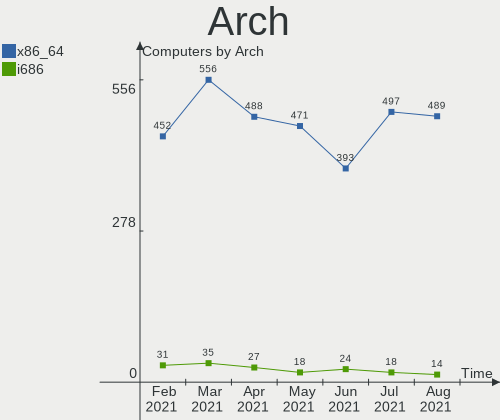

| Name   | Computers | Percent |
|--------|-----------|---------|
| x86_64 | 315       | 97.22%  |
| i686   | 9         | 2.78%   |

DE
--

Desktop Environment

| Name       | Computers | Percent |
|------------|-----------|---------|
| X-Cinnamon | 129       | 39.81%  |
| Cinnamon   | 96        | 29.63%  |
| MATE       | 49        | 15.12%  |
| XFCE       | 28        | 8.64%   |
| GNOME      | 16        | 4.94%   |
| Unknown    | 5         | 1.54%   |
| KDE        | 1         | 0.31%   |

Display Server
--------------

X11 or Wayland

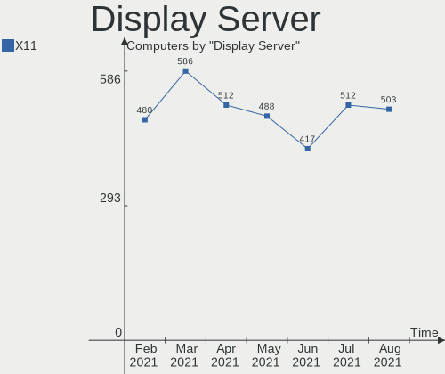

| Name | Computers | Percent |
|------|-----------|---------|
| X11  | 323       | 99.69%  |
| Tty  | 1         | 0.31%   |

Display Manager
---------------

SDDM, LightDM, etc.

| Name    | Computers | Percent |
|---------|-----------|---------|
| Unknown | 193       | 59.57%  |
| TDM     | 128       | 39.51%  |
| SDDM    | 1         | 0.31%   |
| LightDM | 1         | 0.31%   |
| GDM     | 1         | 0.31%   |

OS Lang
-------

Language

| Lang       | Computers | Percent |
|------------|-----------|---------|
| en_US      | 96        | 29.63%  |
| de_DE      | 48        | 14.81%  |
| pt_BR      | 40        | 12.35%  |
| ru_RU      | 18        | 5.56%   |
| en_GB      | 13        | 4.01%   |
| es_ES      | 10        | 3.09%   |
| it_IT      | 8         | 2.47%   |
| C          | 8         | 2.47%   |
| pl_PL      | 7         | 2.16%   |
| fr_FR      | 5         | 1.54%   |
| cs_CZ      | 5         | 1.54%   |
| pt_PT      | 4         | 1.23%   |
| hu_HU      | 4         | 1.23%   |
| fi_FI      | 4         | 1.23%   |
| en_IN      | 4         | 1.23%   |
| en_CA      | 4         | 1.23%   |
| en_AU      | 4         | 1.23%   |
| ru_UA      | 3         | 0.93%   |
| es_MX      | 3         | 0.93%   |
| sv_SE      | 2         | 0.62%   |
| nl_NL      | 2         | 0.62%   |
| nb_NO      | 2         | 0.62%   |
| lt_LT      | 2         | 0.62%   |
| fr_BE      | 2         | 0.62%   |
| es_AR      | 2         | 0.62%   |
| en_IE      | 2         | 0.62%   |
| da_DK      | 2         | 0.62%   |
| Unknown    | 2         | 0.62%   |
| uk_UA      | 1         | 0.31%   |
| sk_SK      | 1         | 0.31%   |
| ro_RO      | 1         | 0.31%   |
| nl_BE      | 1         | 0.31%   |
| lv_LV      | 1         | 0.31%   |
| ja_JP      | 1         | 0.31%   |
| fr_CA      | 1         | 0.31%   |
| fi_FI.utf8 | 1         | 0.31%   |
| es_VE      | 1         | 0.31%   |
| es_UY      | 1         | 0.31%   |
| es_DO      | 1         | 0.31%   |
| es_CL      | 1         | 0.31%   |
| en_ZW      | 1         | 0.31%   |
| en_IN      | 1         | 0.31%   |
| en_IL      | 1         | 0.31%   |
| en_HK      | 1         | 0.31%   |
| de_CH      | 1         | 0.31%   |
| bg_BG      | 1         | 0.31%   |

Boot Mode
---------

EFI or BIOS

| Mode | Computers | Percent |
|------|-----------|---------|
| BIOS | 192       | 59.26%  |
| EFI  | 132       | 40.74%  |

Filesystem
----------

Type of filesystem

| Type    | Computers | Percent |
|---------|-----------|---------|
| Ext4    | 306       | 94.44%  |
| Overlay | 8         | 2.47%   |
| Btrfs   | 7         | 2.16%   |
| Ext3    | 3         | 0.93%   |

Part. scheme
------------

Scheme of partitioning

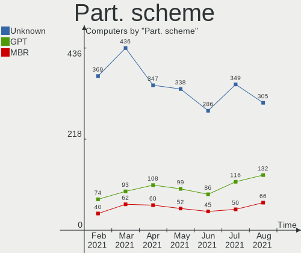

| Type    | Computers | Percent |
|---------|-----------|---------|
| Unknown | 191       | 58.95%  |
| GPT     | 89        | 27.47%  |
| MBR     | 44        | 13.58%  |

Dual Boot with Linux/BSD
------------------------

Hosting more than one Linux/BSD

| Dual boot | Computers | Percent |
|-----------|-----------|---------|
| No        | 303       | 93.52%  |
| Yes       | 21        | 6.48%   |

Dual Boot (Win)
---------------

Hosting Linux and Windows

| Dual boot | Computers | Percent |
|-----------|-----------|---------|
| No        | 239       | 73.77%  |
| Yes       | 85        | 26.23%  |

Country
-------

Geographic location (country)

| Country            | Computers | Percent |
|--------------------|-----------|---------|
| USA                | 53        | 16.36%  |
| Germany            | 50        | 15.43%  |
| Brazil             | 44        | 13.58%  |
| Russia             | 18        | 5.56%   |
| UK                 | 11        | 3.4%    |
| Spain              | 11        | 3.4%    |
| Italy              | 10        | 3.09%   |
| Ukraine            | 8         | 2.47%   |
| Canada             | 8         | 2.47%   |
| Poland             | 7         | 2.16%   |
| Sweden             | 6         | 1.85%   |
| France             | 6         | 1.85%   |
| Finland            | 6         | 1.85%   |
| Czech Republic     | 6         | 1.85%   |
| Netherlands        | 5         | 1.54%   |
| India              | 5         | 1.54%   |
| Portugal           | 4         | 1.23%   |
| Hungary            | 4         | 1.23%   |
| Bulgaria           | 4         | 1.23%   |
| Belgium            | 4         | 1.23%   |
| Australia          | 4         | 1.23%   |
| Norway             | 3         | 0.93%   |
| Mexico             | 3         | 0.93%   |
| Slovakia           | 2         | 0.62%   |
| Romania            | 2         | 0.62%   |
| Lithuania          | 2         | 0.62%   |
| Ireland            | 2         | 0.62%   |
| Greece             | 2         | 0.62%   |
| Denmark            | 2         | 0.62%   |
| Belarus            | 2         | 0.62%   |
| Bangladesh         | 2         | 0.62%   |
| Argentina          | 2         | 0.62%   |
| Zimbabwe           | 1         | 0.31%   |
| Venezuela          | 1         | 0.31%   |
| Uruguay            | 1         | 0.31%   |
| UAE                | 1         | 0.31%   |
| Turkey             | 1         | 0.31%   |
| Thailand           | 1         | 0.31%   |
| Taiwan             | 1         | 0.31%   |
| Sri Lanka          | 1         | 0.31%   |
| Panama             | 1         | 0.31%   |
| Pakistan           | 1         | 0.31%   |
| Nepal              | 1         | 0.31%   |
| Latvia             | 1         | 0.31%   |
| Korea, Republic of | 1         | 0.31%   |
| Kazakhstan         | 1         | 0.31%   |
| Jordan             | 1         | 0.31%   |
| Japan              | 1         | 0.31%   |
| Israel             | 1         | 0.31%   |
| Indonesia          | 1         | 0.31%   |
| Hong Kong          | 1         | 0.31%   |
| Egypt              | 1         | 0.31%   |
| Dominican Republic | 1         | 0.31%   |
| Croatia            | 1         | 0.31%   |
| Colombia           | 1         | 0.31%   |
| Chile              | 1         | 0.31%   |
| Algeria            | 1         | 0.31%   |
| Unknown            | 1         | 0.31%   |

City
----

Geographic location (city)

| City              | Computers | Percent |
|-------------------|-----------|---------|
| São Paulo        | 9         | 2.78%   |
| Rio de Janeiro    | 6         | 1.85%   |
| Hamburg           | 5         | 1.54%   |
| Berlin            | 5         | 1.54%   |
| Paris             | 4         | 1.23%   |
| Sofia             | 3         | 0.93%   |
| Maceió           | 3         | 0.93%   |
| Kyiv              | 3         | 0.93%   |
| Karlsruhe         | 3         | 0.93%   |
| Chicago           | 3         | 0.93%   |
| Birmingham        | 3         | 0.93%   |
| Warsaw            | 2         | 0.62%   |
| St Petersburg     | 2         | 0.62%   |
| Queimadas         | 2         | 0.62%   |
| Pune              | 2         | 0.62%   |
| Porto             | 2         | 0.62%   |
| Perth             | 2         | 0.62%   |
| Palo Alto         | 2         | 0.62%   |
| Oslo              | 2         | 0.62%   |
| Nuremberg         | 2         | 0.62%   |
| Mérida           | 2         | 0.62%   |
| Munich            | 2         | 0.62%   |
| Moscow            | 2         | 0.62%   |
| Helsinki          | 2         | 0.62%   |
| Glasgow           | 2         | 0.62%   |
| Frankfurt am Main | 2         | 0.62%   |
| Espoo             | 2         | 0.62%   |
| Düsseldorf       | 2         | 0.62%   |
| Douradina         | 2         | 0.62%   |
| Dallas            | 2         | 0.62%   |
| Bratislava        | 2         | 0.62%   |
| Barcelona         | 2         | 0.62%   |
| Atlanta           | 2         | 0.62%   |
| Zwickau           | 1         | 0.31%   |
| Zulpich           | 1         | 0.31%   |
| Yeovil            | 1         | 0.31%   |
| Yaroslavl         | 1         | 0.31%   |
| Wuppertal         | 1         | 0.31%   |
| Wolfsburg         | 1         | 0.31%   |
| Windsor           | 1         | 0.31%   |
| Whitney           | 1         | 0.31%   |
| Westerlo          | 1         | 0.31%   |
| West Islip        | 1         | 0.31%   |
| Weilburg          | 1         | 0.31%   |
| Voronezh          | 1         | 0.31%   |
| Volzhskiy         | 1         | 0.31%   |
| Vilnius           | 1         | 0.31%   |
| Velika Gorica     | 1         | 0.31%   |
| Valladolid        | 1         | 0.31%   |
| Utena             | 1         | 0.31%   |
| Union             | 1         | 0.31%   |
| Tyreso Strand     | 1         | 0.31%   |
| Turku             | 1         | 0.31%   |
| Tucson            | 1         | 0.31%   |
| Trim              | 1         | 0.31%   |
| Torokszentmiklos  | 1         | 0.31%   |
| Tlalnepantla      | 1         | 0.31%   |
| Tigre             | 1         | 0.31%   |
| Teplice           | 1         | 0.31%   |
| Tapiratiba        | 1         | 0.31%   |

Vendor
------

Motherboard manufacturer

| Name                | Computers | Percent |
|---------------------|-----------|---------|
| Hewlett-Packard     | 55        | 16.98%  |
| ASUSTek Computer    | 52        | 16.05%  |
| Lenovo              | 49        | 15.12%  |
| Dell                | 35        | 10.8%   |
| Acer                | 27        | 8.33%   |
| Gigabyte Technology | 22        | 6.79%   |
| MSI                 | 17        | 5.25%   |
| ASRock              | 11        | 3.4%    |
| Apple               | 7         | 2.16%   |
| Toshiba             | 6         | 1.85%   |
| Samsung Electronics | 4         | 1.23%   |
| Medion              | 4         | 1.23%   |
| Intel               | 4         | 1.23%   |
| Sony                | 3         | 0.93%   |
| Itautec             | 3         | 0.93%   |
| Unknown             | 3         | 0.93%   |
| Positivo            | 2         | 0.62%   |
| Notebook            | 2         | 0.62%   |
| Biostar             | 2         | 0.62%   |
| ZOTAC               | 1         | 0.31%   |
| TaNix               | 1         | 0.31%   |
| Semp Toshiba        | 1         | 0.31%   |
| Pegatron            | 1         | 0.31%   |
| PC Specialist       | 1         | 0.31%   |
| Megaware            | 1         | 0.31%   |
| HUAWEI              | 1         | 0.31%   |
| Fujitsu Siemens     | 1         | 0.31%   |
| Fujitsu             | 1         | 0.31%   |
| eMachines           | 1         | 0.31%   |
| Digma               | 1         | 0.31%   |
| Compaq              | 1         | 0.31%   |
| CCE                 | 1         | 0.31%   |
| Board Manufacturer  | 1         | 0.31%   |
| BESSTAR Tech        | 1         | 0.31%   |
| AZW                 | 1         | 0.31%   |

Model
-----

Motherboard model

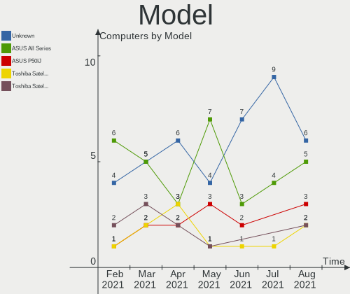

| Name                                                       | Computers | Percent |
|------------------------------------------------------------|-----------|---------|
| HP Notebook                                                | 4         | 1.23%   |
| ASUS All Series                                            | 4         | 1.23%   |
| Unknown                                                    | 3         | 0.93%   |
| Positivo Mobile                                            | 2         | 0.62%   |
| Lenovo IdeaPad S145-15IWL 81S9                             | 2         | 0.62%   |
| Lenovo G50-70 20351                                        | 2         | 0.62%   |
| Itautec Infoway                                            | 2         | 0.62%   |
| HP Presario CQ57                                           | 2         | 0.62%   |
| HP Pavilion Sleekbook 14 PC                                | 2         | 0.62%   |
| HP Pavilion dm4                                            | 2         | 0.62%   |
| Dell Latitude E6440                                        | 2         | 0.62%   |
| Dell Latitude E6400                                        | 2         | 0.62%   |
| ASUS M5A78L-M/USB3                                         | 2         | 0.62%   |
| ASRock B450 Gaming K4                                      | 2         | 0.62%   |
| ZOTAC ZBOX-CI327NANO-GS-01                                 | 1         | 0.31%   |
| Toshiba Satellite P770                                     | 1         | 0.31%   |
| Toshiba Satellite P205                                     | 1         | 0.31%   |
| Toshiba Satellite C850-11L                                 | 1         | 0.31%   |
| Toshiba Satellite C75D-B                                   | 1         | 0.31%   |
| Toshiba Satellite C55-A-1M7                                | 1         | 0.31%   |
| Toshiba Satellite C50-A-1HF                                | 1         | 0.31%   |
| TaNix Tx85                                                 | 1         | 0.31%   |
| Sony VPCEJ2J1E                                             | 1         | 0.31%   |
| Sony VGN-FW180E                                            | 1         | 0.31%   |
| Sony SVF1521A7EB                                           | 1         | 0.31%   |
| Semp Toshiba NI 1403                                       | 1         | 0.31%   |
| Samsung Electronics R519/R719                              | 1         | 0.31%   |
| Samsung Electronics 700Z3C/700Z5C                          | 1         | 0.31%   |
| Samsung Electronics 340XAA/350XAA/550XAA                   | 1         | 0.31%   |
| Samsung Electronics 300E5EV/300E4EV/270E5EV/270E4EV/2470EV | 1         | 0.31%   |
| Pegatron A15                                               | 1         | 0.31%   |
| PC Specialist N750HU                                       | 1         | 0.31%   |
| Notebook P9XXEN_EF_ED                                      | 1         | 0.31%   |
| Notebook DCL C483                                          | 1         | 0.31%   |
| MSI Prestige 15 A10SC                                      | 1         | 0.31%   |
| MSI MS-7C37                                                | 1         | 0.31%   |
| MSI MS-7B46                                                | 1         | 0.31%   |
| MSI MS-7B07                                                | 1         | 0.31%   |
| MSI MS-7A70                                                | 1         | 0.31%   |
| MSI MS-7A62                                                | 1         | 0.31%   |
| MSI MS-7971                                                | 1         | 0.31%   |
| MSI MS-7851                                                | 1         | 0.31%   |
| MSI MS-7823                                                | 1         | 0.31%   |
| MSI MS-7788                                                | 1         | 0.31%   |
| MSI MS-7759                                                | 1         | 0.31%   |
| MSI MS-7721                                                | 1         | 0.31%   |
| MSI MS-7250                                                | 1         | 0.31%   |
| MSI MS-1453                                                | 1         | 0.31%   |
| MSI GL63 8RD                                               | 1         | 0.31%   |
| MSI GE75 Raider 10SFS                                      | 1         | 0.31%   |
| MSI GE60 2OC\2OD\2OE                                       | 1         | 0.31%   |
| Megaware MW-H61HD-MA                                       | 1         | 0.31%   |
| Medion X681X                                               | 1         | 0.31%   |
| Medion P7649 MD60825                                       | 1         | 0.31%   |
| Medion E6435 MD60948                                       | 1         | 0.31%   |
| Medion BSWD-CM                                             | 1         | 0.31%   |
| Lenovo Yoga 2 11 20428                                     | 1         | 0.31%   |
| Lenovo Y50-70 20378                                        | 1         | 0.31%   |
| Lenovo ThinkPad X240 20AMS0J009                            | 1         | 0.31%   |
| Lenovo ThinkPad X220 4291T5Q                               | 1         | 0.31%   |

Model Family
------------

Motherboard model prefix

| Name                        | Computers | Percent |
|-----------------------------|-----------|---------|
| Acer Aspire                 | 21        | 6.48%   |
| Lenovo ThinkPad             | 19        | 5.86%   |
| Lenovo IdeaPad              | 14        | 4.32%   |
| Dell Inspiron               | 14        | 4.32%   |
| HP Pavilion                 | 11        | 3.4%    |
| HP Compaq                   | 11        | 3.4%    |
| Dell Latitude               | 11        | 3.4%    |
| Toshiba Satellite           | 6         | 1.85%   |
| HP ProBook                  | 6         | 1.85%   |
| HP EliteBook                | 6         | 1.85%   |
| Lenovo ThinkCentre          | 5         | 1.54%   |
| HP Notebook                 | 4         | 1.23%   |
| Dell OptiPlex               | 4         | 1.23%   |
| ASUS ROG                    | 4         | 1.23%   |
| ASUS All                    | 4         | 1.23%   |
| Lenovo Legion               | 3         | 0.93%   |
| Itautec Infoway             | 3         | 0.93%   |
| HP Presario                 | 3         | 0.93%   |
| ASUS PRIME                  | 3         | 0.93%   |
| ASUS M5A78L-M               | 3         | 0.93%   |
| Apple MacBookPro11          | 3         | 0.93%   |
| Unknown                     | 3         | 0.93%   |
| Positivo Mobile             | 2         | 0.62%   |
| Lenovo G50-70               | 2         | 0.62%   |
| HP ZBook                    | 2         | 0.62%   |
| HP ENVY                     | 2         | 0.62%   |
| HP EliteDesk                | 2         | 0.62%   |
| Gigabyte B550               | 2         | 0.62%   |
| Gigabyte 970A-DS3P          | 2         | 0.62%   |
| Dell XPS                    | 2         | 0.62%   |
| Dell Studio                 | 2         | 0.62%   |
| ASUS TUF                    | 2         | 0.62%   |
| ASUS SABERTOOTH             | 2         | 0.62%   |
| ASUS M5A97                  | 2         | 0.62%   |
| ASRock B450                 | 2         | 0.62%   |
| Acer Swift                  | 2         | 0.62%   |
| ZOTAC ZBOX-CI327NANO-GS-01  | 1         | 0.31%   |
| TaNix Tx85                  | 1         | 0.31%   |
| Sony VPCEJ2J1E              | 1         | 0.31%   |
| Sony VGN-FW180E             | 1         | 0.31%   |
| Sony SVF1521A7EB            | 1         | 0.31%   |
| Semp Toshiba NI             | 1         | 0.31%   |
| Samsung Electronics R519    | 1         | 0.31%   |
| Samsung Electronics 700Z3C  | 1         | 0.31%   |
| Samsung Electronics 340XAA  | 1         | 0.31%   |
| Samsung Electronics 300E5EV | 1         | 0.31%   |
| Pegatron A15                | 1         | 0.31%   |
| PC Specialist N750HU        | 1         | 0.31%   |
| Notebook P9XXEN             | 1         | 0.31%   |
| Notebook DCL                | 1         | 0.31%   |
| MSI Prestige                | 1         | 0.31%   |
| MSI MS-7C37                 | 1         | 0.31%   |
| MSI MS-7B46                 | 1         | 0.31%   |
| MSI MS-7B07                 | 1         | 0.31%   |
| MSI MS-7A70                 | 1         | 0.31%   |
| MSI MS-7A62                 | 1         | 0.31%   |
| MSI MS-7971                 | 1         | 0.31%   |
| MSI MS-7851                 | 1         | 0.31%   |
| MSI MS-7823                 | 1         | 0.31%   |
| MSI MS-7788                 | 1         | 0.31%   |

MFG Year
--------

Motherboard manufacture year

| Year | Computers | Percent |
|------|-----------|---------|
| 2019 | 59        | 18.21%  |
| 2020 | 36        | 11.11%  |
| 2018 | 33        | 10.19%  |
| 2013 | 32        | 9.88%   |
| 2012 | 32        | 9.88%   |
| 2014 | 25        | 7.72%   |
| 2011 | 21        | 6.48%   |
| 2015 | 19        | 5.86%   |
| 2009 | 15        | 4.63%   |
| 2017 | 12        | 3.7%    |
| 2016 | 12        | 3.7%    |
| 2010 | 10        | 3.09%   |
| 2008 | 8         | 2.47%   |
| 2007 | 8         | 2.47%   |
| 2006 | 2         | 0.62%   |

Form Factor
-----------

Physical design of the computer

| Name        | Computers | Percent |
|-------------|-----------|---------|
| Notebook    | 185       | 57.1%   |
| Desktop     | 131       | 40.43%  |
| Convertible | 4         | 1.23%   |
| Mini pc     | 2         | 0.62%   |
| All in one  | 2         | 0.62%   |

Secure Boot
-----------

Enabled or disabled

| State    | Computers | Percent |
|----------|-----------|---------|
| Disabled | 303       | 93.52%  |
| Enabled  | 21        | 6.48%   |

Coreboot
--------

Have coreboot on board

| Used | Computers | Percent |
|------|-----------|---------|
| No   | 324       | 100%    |

RAM Size
--------

Total RAM memory

| Size in GB  | Computers | Percent |
|-------------|-----------|---------|
| 4.01-8.0    | 86        | 26.54%  |
| 16.01-24.0  | 81        | 25%     |
| 3.01-4.0    | 77        | 23.77%  |
| 8.01-16.0   | 48        | 14.81%  |
| 32.01-64.0  | 16        | 4.94%   |
| 1.01-2.0    | 11        | 3.4%    |
| 64.01-256.0 | 2         | 0.62%   |
| 24.01-32.0  | 1         | 0.31%   |
| 2.01-3.0    | 1         | 0.31%   |
| 0.01-1.0    | 1         | 0.31%   |

RAM Used
--------

Used RAM memory

| Used GB    | Computers | Percent |
|------------|-----------|---------|
| 1.01-2.0   | 125       | 38.58%  |
| 2.01-3.0   | 74        | 22.84%  |
| 3.01-4.0   | 49        | 15.12%  |
| 4.01-8.0   | 38        | 11.73%  |
| 0.01-1.0   | 25        | 7.72%   |
| 8.01-16.0  | 12        | 3.7%    |
| 16.01-24.0 | 1         | 0.31%   |

Has CD-ROM
----------

Has CD-ROM on board

| Presented | Computers | Percent |
|-----------|-----------|---------|
| Yes       | 173       | 53.4%   |
| No        | 151       | 46.6%   |

Total Drives
------------

Number of drives on board

| Drives | Computers | Percent |
|--------|-----------|---------|
| 1      | 167       | 51.54%  |
| 2      | 97        | 29.94%  |
| 3      | 38        | 11.73%  |
| 4      | 13        | 4.01%   |
| 6      | 3         | 0.93%   |
| 5      | 3         | 0.93%   |
| 9      | 1         | 0.31%   |
| 7      | 1         | 0.31%   |
| 0      | 1         | 0.31%   |

Has Ethernet
------------

Has Ethernet on board

| Presented | Computers | Percent |
|-----------|-----------|---------|
| Yes       | 296       | 91.36%  |
| No        | 28        | 8.64%   |

Drive Vendor
------------

Hard drive vendors

| Vendor              | Computers | Drives | Percent |
|---------------------|-----------|--------|---------|
| WDC                 | 92        | 116    | 18.15%  |
| Seagate             | 90        | 107    | 17.75%  |
| Samsung Electronics | 63        | 70     | 12.43%  |
| Kingston            | 38        | 40     | 7.5%    |
| Toshiba             | 36        | 37     | 7.1%    |
| SanDisk             | 25        | 25     | 4.93%   |
| Hitachi             | 20        | 20     | 3.94%   |
| Unknown             | 19        | 24     | 3.75%   |
| Crucial             | 18        | 19     | 3.55%   |
| Intel               | 17        | 18     | 3.35%   |
| HGST                | 10        | 11     | 1.97%   |
| SK Hynix            | 9         | 9      | 1.78%   |
| A-DATA Technology   | 8         | 9      | 1.58%   |
| China               | 5         | 5      | 0.99%   |
| Transcend           | 4         | 4      | 0.79%   |
| Micron Technology   | 4         | 4      | 0.79%   |
| GOODRAM             | 4         | 4      | 0.79%   |
| MAXTOR              | 3         | 3      | 0.59%   |
| XPG                 | 2         | 2      | 0.39%   |
| USB3.0              | 2         | 2      | 0.39%   |
| Union Memory        | 2         | 2      | 0.39%   |
| SmartBuy            | 2         | 2      | 0.39%   |
| Silicon Motion      | 2         | 3      | 0.39%   |
| Phison              | 2         | 2      | 0.39%   |
| OCZ                 | 2         | 2      | 0.39%   |
| LITEON              | 2         | 2      | 0.39%   |
| Lite-On             | 2         | 2      | 0.39%   |
| KingSpec            | 2         | 2      | 0.39%   |
| Intenso             | 2         | 2      | 0.39%   |
| Fujitsu             | 2         | 2      | 0.39%   |
| Apple               | 2         | 2      | 0.39%   |
| WD MediaMax         | 1         | 1      | 0.2%    |
| TCSUNBOW            | 1         | 1      | 0.2%    |
| SPCC                | 1         | 1      | 0.2%    |
| SATA SSD            | 1         | 1      | 0.2%    |
| PLEXTOR             | 1         | 1      | 0.2%    |
| Patriot             | 1         | 1      | 0.2%    |
| PALIT               | 1         | 1      | 0.2%    |
| ORICO               | 1         | 1      | 0.2%    |
| Mushkin             | 1         | 1      | 0.2%    |
| LITEONIT            | 1         | 1      | 0.2%    |
| Lenovo              | 1         | 1      | 0.2%    |
| KingFast            | 1         | 1      | 0.2%    |
| HS-SSD-E100         | 1         | 1      | 0.2%    |
| Freecom             | 1         | 1      | 0.2%    |
| CT240BX5            | 1         | 1      | 0.2%    |
| Apricorn            | 1         | 2      | 0.2%    |

HDD Vendor
----------

Hard disk drive vendors

| Vendor              | Computers | Drives | Percent |
|---------------------|-----------|--------|---------|
| Seagate             | 88        | 104    | 35.06%  |
| WDC                 | 84        | 106    | 33.47%  |
| Toshiba             | 31        | 32     | 12.35%  |
| Hitachi             | 20        | 20     | 7.97%   |
| Samsung Electronics | 12        | 12     | 4.78%   |
| HGST                | 10        | 11     | 3.98%   |
| MAXTOR              | 3         | 3      | 1.2%    |
| Fujitsu             | 2         | 2      | 0.8%    |
| Intenso             | 1         | 1      | 0.4%    |

SSD Vendor
----------

Solid state drive vendors

| Vendor              | Computers | Drives | Percent |
|---------------------|-----------|--------|---------|
| Kingston            | 37        | 39     | 21.02%  |
| Samsung Electronics | 36        | 37     | 20.45%  |
| SanDisk             | 19        | 19     | 10.8%   |
| Crucial             | 17        | 18     | 9.66%   |
| Intel               | 9         | 10     | 5.11%   |
| WDC                 | 7         | 7      | 3.98%   |
| A-DATA Technology   | 7         | 7      | 3.98%   |
| SK Hynix            | 6         | 6      | 3.41%   |
| China               | 5         | 5      | 2.84%   |
| Transcend           | 4         | 4      | 2.27%   |
| GOODRAM             | 4         | 4      | 2.27%   |
| Micron Technology   | 3         | 3      | 1.7%    |
| SmartBuy            | 2         | 2      | 1.14%   |
| OCZ                 | 2         | 2      | 1.14%   |
| LITEON              | 2         | 2      | 1.14%   |
| KingSpec            | 2         | 2      | 1.14%   |
| Apple               | 2         | 2      | 1.14%   |
| Toshiba             | 1         | 1      | 0.57%   |
| SPCC                | 1         | 1      | 0.57%   |
| PLEXTOR             | 1         | 1      | 0.57%   |
| Patriot             | 1         | 1      | 0.57%   |
| PALIT               | 1         | 1      | 0.57%   |
| ORICO               | 1         | 1      | 0.57%   |
| Mushkin             | 1         | 1      | 0.57%   |
| LITEONIT            | 1         | 1      | 0.57%   |
| KingFast            | 1         | 1      | 0.57%   |
| Intenso             | 1         | 1      | 0.57%   |
| HS-SSD-E100         | 1         | 1      | 0.57%   |
| CT240BX5            | 1         | 1      | 0.57%   |

Drive Model
-----------

Hard drive models

| Model                        | Computers | Percent |
|------------------------------|-----------|---------|
| SA400S37240G 240GB SSD       | 10        | 1.82%   |
| SV300S37A120G 120GB SSD      | 8         | 1.46%   |
| SA400S37120G 120GB SSD       | 7         | 1.28%   |
| ST3500418AS 500GB            | 6         | 1.09%   |
| SSD 850 EVO 500GB            | 6         | 1.09%   |
| NVMe SSD Drive 512GB         | 6         | 1.09%   |
| WD10EZEX-08WN4A0 1TB         | 5         | 0.91%   |
| ST1000LM035-1RK172 1TB       | 5         | 0.91%   |
| ST1000DM010-2EP102 1TB       | 5         | 0.91%   |
| ST1000DM003-1SB102 1TB       | 5         | 0.91%   |
| SSD 860 EVO 500GB            | 5         | 0.91%   |
| NVMe SSD Drive 500GB         | 5         | 0.91%   |
| MMC Card  32GB               | 5         | 0.91%   |
| CT1000MX500SSD1 1TB          | 5         | 0.91%   |
| WD10SPZX-24Z10 1TB           | 4         | 0.73%   |
| ST1000LM049-2GH172 1TB       | 4         | 0.73%   |
| ST1000LM024 HN-M101MBB 1TB   | 4         | 0.73%   |
| SSDPEKNW010T8 1TB            | 4         | 0.73%   |
| SSD 860 EVO 250GB            | 4         | 0.73%   |
| NVMe SSD Drive 256GB         | 4         | 0.73%   |
| NVMe SSD Drive 128GB         | 4         | 0.73%   |
| MMC Card  64GB               | 4         | 0.73%   |
| HDWD110 1TB                  | 4         | 0.73%   |
| DT01ACA100 1TB               | 4         | 0.73%   |
| WD5000AAKX-60U6AA0 500GB     | 3         | 0.55%   |
| ST500LM000-1EJ162 500GB      | 3         | 0.55%   |
| ST500DM002-1BD142 500GB      | 3         | 0.55%   |
| ST3500312CS 500GB            | 3         | 0.55%   |
| ST3000DM001-1ER166 3TB       | 3         | 0.55%   |
| ST2000DM008-2FR102 2TB       | 3         | 0.55%   |
| ST1000DM003-1ER162 1TB       | 3         | 0.55%   |
| ST1000DM003-1CH162 1TB       | 3         | 0.55%   |
| SSD 850 EVO 250GB            | 3         | 0.55%   |
| SSD 120GB                    | 3         | 0.55%   |
| SD/MMC/MS PRO 32GB           | 3         | 0.55%   |
| SA400S37480G 480GB SSD       | 3         | 0.55%   |
| NVMe SSD Drive 1TB           | 3         | 0.55%   |
| HTS721010A9E630 1TB          | 3         | 0.55%   |
| DT01ACA050 500GB             | 3         | 0.55%   |
| CT250MX500SSD1 250GB         | 3         | 0.55%   |
| WDS250G2B0B-00YS70 250GB SSD | 2         | 0.36%   |
| WD7500BPKX-00HPJT0 752GB     | 2         | 0.36%   |
| WD5000LPVX-22V0TT0 500GB     | 2         | 0.36%   |
| WD5000LPCX-24C6HT0 500GB     | 2         | 0.36%   |
| WD5000AAKX-00ERMA0 500GB     | 2         | 0.36%   |
| WD5000AAKX-001CA0 500GB      | 2         | 0.36%   |
| WD20EZRZ-00Z5HB0 2TB         | 2         | 0.36%   |
| WD20EARS-00MVWB0 2TB         | 2         | 0.36%   |
| ST3250310AS 250GB            | 2         | 0.36%   |
| ST320LM001 HN-M320MBB 320GB  | 2         | 0.36%   |
| ST1500LM012-1R817G 1TB       | 2         | 0.36%   |
| ST1000LM014-1EJ164 1TB       | 2         | 0.36%   |
| ST1000DM003-9YN162 1TB       | 2         | 0.36%   |
| SSD PLUS 480GB               | 2         | 0.36%   |
| SSD PLUS 240GB               | 2         | 0.36%   |
| SSD 970 EVO Plus 500GB       | 2         | 0.36%   |
| SSD 970 EVO 500GB            | 2         | 0.36%   |
| SSD 960 EVO 250GB            | 2         | 0.36%   |
| SSD 850 PRO 128GB            | 2         | 0.36%   |
| SSD 750 EVO 250GB            | 2         | 0.36%   |

Drive Kind
----------

HDD or SSD

| Kind    | Computers | Drives | Percent |
|---------|-----------|--------|---------|
| HDD     | 215       | 291    | 47.25%  |
| SSD     | 155       | 181    | 34.07%  |
| NVMe    | 56        | 64     | 12.31%  |
| MMC     | 15        | 18     | 3.3%    |
| Unknown | 14        | 15     | 3.08%   |

Drive Connector
---------------

SATA, SAS, NVMe, etc.

| Type | Computers | Drives | Percent |
|------|-----------|--------|---------|
| SATA | 293       | 463    | 75.71%  |
| NVMe | 56        | 64     | 14.47%  |
| SAS  | 23        | 24     | 5.94%   |
| MMC  | 15        | 18     | 3.88%   |

Drive Size
----------

Size of hard drive

| Size in TB | Computers | Drives | Percent |
|------------|-----------|--------|---------|
| 0.01-0.5   | 226       | 286    | 59.79%  |
| 0.51-1.0   | 110       | 126    | 29.1%   |
| 1.01-2.0   | 25        | 34     | 6.61%   |
| 2.01-3.0   | 8         | 9      | 2.12%   |
| 3.01-4.0   | 7         | 8      | 1.85%   |
| 4.01-10.0  | 2         | 9      | 0.53%   |

Space Total
-----------

Amount of disk space available on the file system

| Size in GB     | Computers | Percent |
|----------------|-----------|---------|
| 101-250        | 99        | 30.56%  |
| 251-500        | 83        | 25.62%  |
| 501-1000       | 50        | 15.43%  |
| 1001-2000      | 32        | 9.88%   |
| More than 3000 | 21        | 6.48%   |
| 51-100         | 15        | 4.63%   |
| 21-50          | 12        | 3.7%    |
| 2001-3000      | 8         | 2.47%   |
| 1-20           | 3         | 0.93%   |
| Unknown        | 1         | 0.31%   |

Space Used
----------

Amount of used disk space

| Used GB        | Computers | Percent |
|----------------|-----------|---------|
| 101-250        | 77        | 23.77%  |
| 1-20           | 65        | 20.06%  |
| 21-50          | 51        | 15.74%  |
| 51-100         | 49        | 15.12%  |
| 251-500        | 28        | 8.64%   |
| 501-1000       | 23        | 7.1%    |
| 1001-2000      | 13        | 4.01%   |
| More than 3000 | 11        | 3.4%    |
| 2001-3000      | 6         | 1.85%   |
| Unknown        | 1         | 0.31%   |

Malfunc. Drives
---------------

Drive models with a malfunction

| Model                      | Computers | Drives | Percent |
|----------------------------|-----------|--------|---------|
| WD5000LPVX-22V0TT0 500GB   | 1         | 1      | 3.23%   |
| WD5000LPCX-24C6HT0 500GB   | 1         | 1      | 3.23%   |
| WD5000BPVT-24HXZT3 500GB   | 1         | 1      | 3.23%   |
| WD5000BEVT-60ZAT1 500GB    | 1         | 1      | 3.23%   |
| WD2500AAJS-00B4A0 250GB    | 1         | 1      | 3.23%   |
| WD20EURS-73TLHY0 2TB       | 1         | 1      | 3.23%   |
| WD10JPCX-24UE4T0 1TB       | 1         | 1      | 3.23%   |
| TOURO Mobile 1TB           | 1         | 1      | 3.23%   |
| ST9320325AS 320GB          | 1         | 1      | 3.23%   |
| ST500DM002-1BD142 500GB    | 1         | 1      | 3.23%   |
| ST3500418AS 500GB          | 1         | 1      | 3.23%   |
| ST3500412AS 500GB          | 1         | 1      | 3.23%   |
| ST3500320AS 500GB          | 1         | 2      | 3.23%   |
| ST1000LM049-2GH172 1TB     | 1         | 1      | 3.23%   |
| ST1000LM024 HN-M101MBB 1TB | 1         | 1      | 3.23%   |
| ST1000DM003-1CH162 1TB     | 1         | 1      | 3.23%   |
| SSD i100 16GB              | 1         | 1      | 3.23%   |
| SSD 970 EVO 500GB          | 1         | 1      | 3.23%   |
| SSD 128G                   | 1         | 1      | 3.23%   |
| SA400S37120G 120GB SSD     | 1         | 1      | 3.23%   |
| MQ04ABF100 1TB             | 1         | 1      | 3.23%   |
| MHZ2250BH G2 250GB         | 1         | 1      | 3.23%   |
| LMT-128M3M 128GB SSD       | 1         | 1      | 3.23%   |
| HTS725050A7E630 500GB      | 1         | 1      | 3.23%   |
| HTS547575A9E384 752GB      | 1         | 1      | 3.23%   |
| HTS545050A7E380 500GB      | 1         | 1      | 3.23%   |
| HTS543232A7A384 320GB      | 1         | 1      | 3.23%   |
| HM320II 320GB              | 1         | 1      | 3.23%   |
| HDP725050GLA360 500GB      | 1         | 1      | 3.23%   |
| CV8-8E128-HP 128GB SSD     | 1         | 1      | 3.23%   |
| CT525MX300SSD1 528GB       | 1         | 1      | 3.23%   |

Malfunc. Drive Vendor
---------------------

Vendors of faulty drives

| Vendor              | Computers | Drives | Percent |
|---------------------|-----------|--------|---------|
| WDC                 | 7         | 7      | 23.33%  |
| Seagate             | 7         | 9      | 23.33%  |
| Hitachi             | 4         | 4      | 13.33%  |
| Samsung Electronics | 2         | 2      | 6.67%   |
| HGST                | 2         | 2      | 6.67%   |
| Toshiba             | 1         | 1      | 3.33%   |
| SanDisk             | 1         | 1      | 3.33%   |
| LITEONIT            | 1         | 1      | 3.33%   |
| LITEON              | 1         | 1      | 3.33%   |
| Kingston            | 1         | 1      | 3.33%   |
| HS-SSD-E100         | 1         | 1      | 3.33%   |
| Fujitsu             | 1         | 1      | 3.33%   |
| Crucial             | 1         | 1      | 3.33%   |

Malfunc. HDD Vendor
-------------------

Vendors of faulty HDD drives

| Vendor              | Computers | Drives | Percent |
|---------------------|-----------|--------|---------|
| WDC                 | 7         | 7      | 30.43%  |
| Seagate             | 7         | 9      | 30.43%  |
| Hitachi             | 4         | 4      | 17.39%  |
| HGST                | 2         | 2      | 8.7%    |
| Toshiba             | 1         | 1      | 4.35%   |
| Samsung Electronics | 1         | 1      | 4.35%   |
| Fujitsu             | 1         | 1      | 4.35%   |

Malfunc. Drive Kind
-------------------

Kinds of faulty drives

| Kind | Computers | Drives | Percent |
|------|-----------|--------|---------|
| HDD  | 21        | 25     | 75%     |
| SSD  | 6         | 6      | 21.43%  |
| NVMe | 1         | 1      | 3.57%   |

Failed Drives
-------------

Failed drive models

| Model         | Computers | Drives | Percent |
|---------------|-----------|--------|---------|
| HD252HJ 250GB | 1         | 1      | 100%    |

Failed Drive Vendor
-------------------

Failed drive vendors

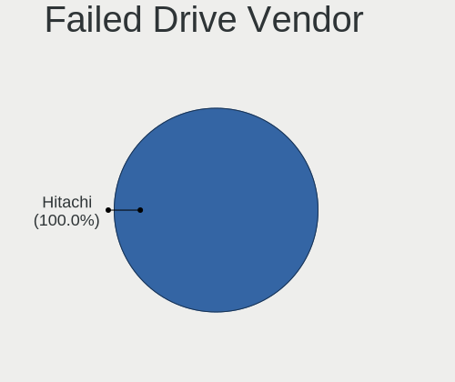

| Vendor              | Computers | Drives | Percent |
|---------------------|-----------|--------|---------|
| Samsung Electronics | 1         | 1      | 100%    |

Drive Status
------------

Number of failed and malfunc. drives

| Status   | Computers | Drives | Percent |
|----------|-----------|--------|---------|
| Detected | 204       | 350    | 58.29%  |
| Works    | 118       | 186    | 33.71%  |
| Malfunc  | 27        | 32     | 7.71%   |
| Failed   | 1         | 1      | 0.29%   |

Storage Vendor
--------------

Storage controller vendors

| Vendor                           | Computers | Percent |
|----------------------------------|-----------|---------|
| Intel                            | 232       | 60.26%  |
| AMD                              | 71        | 18.44%  |
| Samsung Electronics              | 22        | 5.71%   |
| Sandisk                          | 9         | 2.34%   |
| Nvidia                           | 9         | 2.34%   |
| ASMedia Technology               | 7         | 1.82%   |
| Toshiba America Info Systems     | 4         | 1.04%   |
| Marvell Technology Group         | 4         | 1.04%   |
| JMicron Technology               | 4         | 1.04%   |
| SK Hynix                         | 3         | 0.78%   |
| ADATA Technology                 | 3         | 0.78%   |
| Union Memory (Shenzhen)          | 2         | 0.52%   |
| Silicon Motion                   | 2         | 0.52%   |
| Phison Electronics               | 2         | 0.52%   |
| Lite-On Technology               | 2         | 0.52%   |
| VIA Technologies                 | 1         | 0.26%   |
| Silicon Integrated Systems [SiS] | 1         | 0.26%   |
| Silicon Image                    | 1         | 0.26%   |
| Seagate Technology               | 1         | 0.26%   |
| Realtek Semiconductor            | 1         | 0.26%   |
| Micron/Crucial Technology        | 1         | 0.26%   |
| Micron Technology                | 1         | 0.26%   |
| Lenovo                           | 1         | 0.26%   |
| Kingston Technology Company      | 1         | 0.26%   |

Storage Model
-------------

Storage controller models

| Model                                                                             | Computers | Percent |
|-----------------------------------------------------------------------------------|-----------|---------|
| FCH SATA Controller [AHCI mode]                                                   | 43        | 9.49%   |
| 7 Series Chipset Family 6-port SATA Controller [AHCI mode]                        | 21        | 4.64%   |
| 82801 Mobile SATA Controller [RAID mode]                                          | 18        | 3.97%   |
| 8 Series/C220 Series Chipset Family 6-port SATA Controller 1 [AHCI mode]          | 18        | 3.97%   |
| 6 Series/C200 Series Chipset Family 6 port Mobile SATA AHCI Controller            | 18        | 3.97%   |
| Sunrise Point-LP SATA Controller [AHCI mode]                                      | 14        | 3.09%   |
| SB7x0/SB8x0/SB9x0 SATA Controller [AHCI mode]                                     | 14        | 3.09%   |
| NVMe SSD Controller SM981/PM981/PM983                                             | 14        | 3.09%   |
| SB7x0/SB8x0/SB9x0 IDE Controller                                                  | 13        | 2.87%   |
| Non-Volatile memory controller                                                    | 13        | 2.87%   |
| 8 Series SATA Controller 1 [AHCI mode]                                            | 12        | 2.65%   |
| 82801IBM/IEM (ICH9M/ICH9M-E) 4 port SATA Controller [AHCI mode]                   | 11        | 2.43%   |
| 7 Series/C210 Series Chipset Family 6-port SATA Controller [AHCI mode]            | 11        | 2.43%   |
| Cannon Lake Mobile PCH SATA AHCI Controller                                       | 9         | 1.99%   |
| 6 Series/C200 Series Chipset Family 6 port Desktop SATA AHCI Controller           | 9         | 1.99%   |
| SB7x0/SB8x0/SB9x0 SATA Controller [IDE mode]                                      | 7         | 1.55%   |
| ASM1062 Serial ATA Controller                                                     | 7         | 1.55%   |
| 400 Series Chipset SATA Controller                                                | 7         | 1.55%   |
| 200 Series PCH SATA controller [AHCI mode]                                        | 7         | 1.55%   |
| SSD 660P Series                                                                   | 6         | 1.32%   |
| Q170/Q150/B150/H170/H110/Z170/CM236 Chipset SATA Controller [AHCI Mode]           | 6         | 1.32%   |
| 5 Series/3400 Series Chipset 6 port SATA AHCI Controller                          | 6         | 1.32%   |
| MCP61 SATA Controller                                                             | 5         | 1.1%    |
| MCP61 IDE                                                                         | 5         | 1.1%    |
| Cannon Point-LP SATA Controller [AHCI Mode]                                       | 5         | 1.1%    |
| 6 Series/C200 Series Chipset Family Desktop SATA Controller (IDE mode, ports 4-5) | 5         | 1.1%    |
| 6 Series/C200 Series Chipset Family Desktop SATA Controller (IDE mode, ports 0-3) | 5         | 1.1%    |
| Wildcat Point-LP SATA Controller [AHCI Mode]                                      | 4         | 0.88%   |
| NVMe SSD Controller SM961/PM961                                                   | 4         | 0.88%   |
| HM170/QM170 Chipset SATA Controller [AHCI Mode]                                   | 4         | 0.88%   |
| Cannon Lake PCH SATA AHCI Controller                                              | 4         | 0.88%   |
| Atom/Celeron/Pentium Processor x5-E8000/J3xxx/N3xxx Series SATA Controller        | 4         | 0.88%   |
| 5 Series/3400 Series Chipset 4 port SATA AHCI Controller                          | 4         | 0.88%   |
| XPG SX8200 Pro PCIe Gen3x4 M.2 2280 Solid State Drive                             | 3         | 0.66%   |
| WD Black 2018 / PC SN520 NVMe SSD                                                 | 3         | 0.66%   |
| SATA Controller [RAID mode]                                                       | 3         | 0.66%   |
| SATA controller                                                                   | 3         | 0.66%   |
| FCH SATA Controller D                                                             | 3         | 0.66%   |
| Celeron N3350/Pentium N4200/Atom E3900 Series SATA AHCI Controller                | 3         | 0.66%   |
| 82801I (ICH9 Family) 2 port SATA Controller [IDE mode]                            | 3         | 0.66%   |
| 82801HM/HEM (ICH8M/ICH8M-E) SATA Controller [AHCI mode]                           | 3         | 0.66%   |
| 82801HM/HEM (ICH8M/ICH8M-E) IDE Controller                                        | 3         | 0.66%   |
| 82801G (ICH7 Family) IDE Controller                                               | 3         | 0.66%   |
| 5 Series/3400 Series Chipset 4 port SATA IDE Controller                           | 3         | 0.66%   |
| 400 Series Chipset Family SATA AHCI Controller                                    | 3         | 0.66%   |
| 4 Series Chipset PT IDER Controller                                               | 3         | 0.66%   |
| X370 Series Chipset SATA Controller                                               | 2         | 0.44%   |
| WD Blue SN550 NVMe SSD                                                            | 2         | 0.44%   |
| NM10/ICH7 Family SATA Controller [IDE mode]                                       | 2         | 0.44%   |
| JMB368 IDE controller                                                             | 2         | 0.44%   |
| FCH SATA Controller [IDE mode]                                                    | 2         | 0.44%   |
| FCH IDE Controller                                                                | 2         | 0.44%   |
| Electronics Non-Volatile memory controller                                        | 2         | 0.44%   |
| BC501 NVMe Solid State Drive 512GB                                                | 2         | 0.44%   |
| Apple PCIe SSD                                                                    | 2         | 0.44%   |
| 82801IR/IO/IH (ICH9R/DO/DH) 4 port SATA Controller [IDE mode]                     | 2         | 0.44%   |
| 82801GBM/GHM (ICH7-M Family) SATA Controller [IDE mode]                           | 2         | 0.44%   |
| 6 Series/C200 Series Chipset Family IDE-r Controller                              | 2         | 0.44%   |
| 5 Series/3400 Series Chipset 2 port SATA IDE Controller                           | 2         | 0.44%   |
| XG4 NVMe SSD Controller                                                           | 1         | 0.22%   |

Storage Kind
------------

Kind of storage controller (IDE, SATA, NVMe, SAS, ...)

| Kind | Computers | Percent |
|------|-----------|---------|
| SATA | 259       | 65.74%  |
| IDE  | 57        | 14.47%  |
| NVMe | 56        | 14.21%  |
| RAID | 22        | 5.58%   |

CPU Vendor
----------

Processor vendors

| Vendor | Computers | Percent |
|--------|-----------|---------|
| Intel  | 243       | 75%     |
| AMD    | 81        | 25%     |

CPU Model
---------

Processor models

| Model                                         | Computers | Percent |
|-----------------------------------------------|-----------|---------|
| Intel Core i7-9750H CPU @ 2.60GHz             | 6         | 1.85%   |
| Intel Core i7-8750H CPU @ 2.20GHz             | 5         | 1.54%   |
| Intel Core i5-8250U CPU @ 1.60GHz             | 5         | 1.54%   |
| Intel Core i5-7200U CPU @ 2.50GHz             | 5         | 1.54%   |
| Intel Core i7-3632QM CPU @ 2.20GHz            | 4         | 1.23%   |
| Intel Core i5-8265U CPU @ 1.60GHz             | 4         | 1.23%   |
| Intel Core i5-2520M CPU @ 2.50GHz             | 4         | 1.23%   |
| AMD FX-6300 Six-Core Processor                | 4         | 1.23%   |
| Intel Core i7-4500U CPU @ 1.80GHz             | 3         | 0.93%   |
| Intel Core i7-2670QM CPU @ 2.20GHz            | 3         | 0.93%   |
| Intel Core i7-1065G7 CPU @ 1.30GHz            | 3         | 0.93%   |
| Intel Core i5-5200U CPU @ 2.20GHz             | 3         | 0.93%   |
| Intel Core i5-3210M CPU @ 2.50GHz             | 3         | 0.93%   |
| Intel Core i3-3220 CPU @ 3.30GHz              | 3         | 0.93%   |
| Intel Core 2 Duo CPU P8400 @ 2.26GHz          | 3         | 0.93%   |
| Intel Atom x5-Z8350 CPU @ 1.44GHz             | 3         | 0.93%   |
| AMD Ryzen 5 3500U with Radeon Vega Mobile Gfx | 3         | 0.93%   |
| AMD Ryzen 5 1600 Six-Core Processor           | 3         | 0.93%   |
| AMD FX-8350 Eight-Core Processor              | 3         | 0.93%   |
| Intel Pentium Dual-Core CPU T4300 @ 2.10GHz   | 2         | 0.62%   |
| Intel Pentium CPU 2117U @ 1.80GHz             | 2         | 0.62%   |
| Intel Core i7-8700K CPU @ 3.70GHz             | 2         | 0.62%   |
| Intel Core i7-7700HQ CPU @ 2.80GHz            | 2         | 0.62%   |
| Intel Core i7-6600U CPU @ 2.60GHz             | 2         | 0.62%   |
| Intel Core i7-4770HQ CPU @ 2.20GHz            | 2         | 0.62%   |
| Intel Core i7-4770 CPU @ 3.40GHz              | 2         | 0.62%   |
| Intel Core i7-4700MQ CPU @ 2.40GHz            | 2         | 0.62%   |
| Intel Core i7-2620M CPU @ 2.70GHz             | 2         | 0.62%   |
| Intel Core i5-7500 CPU @ 3.40GHz              | 2         | 0.62%   |
| Intel Core i5-6400 CPU @ 2.70GHz              | 2         | 0.62%   |
| Intel Core i5-4460 CPU @ 3.20GHz              | 2         | 0.62%   |
| Intel Core i5-4300U CPU @ 1.90GHz             | 2         | 0.62%   |
| Intel Core i5-3570 CPU @ 3.40GHz              | 2         | 0.62%   |
| Intel Core i5-3337U CPU @ 1.80GHz             | 2         | 0.62%   |
| Intel Core i5-3317U CPU @ 1.70GHz             | 2         | 0.62%   |
| Intel Core i5-2540M CPU @ 2.60GHz             | 2         | 0.62%   |
| Intel Core i5-2500 CPU @ 3.30GHz              | 2         | 0.62%   |
| Intel Core i5-2450M CPU @ 2.50GHz             | 2         | 0.62%   |
| Intel Core i5-2400S CPU @ 2.50GHz             | 2         | 0.62%   |
| Intel Core i5-2400 CPU @ 3.10GHz              | 2         | 0.62%   |
| Intel Core i5 CPU 760 @ 2.80GHz               | 2         | 0.62%   |
| Intel Core i3-7020U CPU @ 2.30GHz             | 2         | 0.62%   |
| Intel Core i3-4150 CPU @ 3.50GHz              | 2         | 0.62%   |
| Intel Core i3-4130 CPU @ 3.40GHz              | 2         | 0.62%   |
| Intel Core i3-4010U CPU @ 1.70GHz             | 2         | 0.62%   |
| Intel Core i3-4005U CPU @ 1.70GHz             | 2         | 0.62%   |
| Intel Core i3-3110M CPU @ 2.40GHz             | 2         | 0.62%   |
| Intel Core 2 Duo CPU P8600 @ 2.40GHz          | 2         | 0.62%   |
| Intel Core 2 Duo CPU E8400 @ 3.00GHz          | 2         | 0.62%   |
| Intel Core 2 Duo CPU E7200 @ 2.53GHz          | 2         | 0.62%   |
| Intel Celeron CPU G1610 @ 2.60GHz             | 2         | 0.62%   |
| AMD Ryzen 7 4700U with Radeon Graphics        | 2         | 0.62%   |
| AMD Ryzen 5 3600 6-Core Processor             | 2         | 0.62%   |
| AMD Ryzen 5 3500X 6-Core Processor            | 2         | 0.62%   |
| AMD Ryzen 5 2600 Six-Core Processor           | 2         | 0.62%   |
| AMD Ryzen 3 3200G with Radeon Vega Graphics   | 2         | 0.62%   |
| AMD FX-8320 Eight-Core Processor              | 2         | 0.62%   |
| AMD E-300 APU with Radeon HD Graphics         | 2         | 0.62%   |
| AMD Athlon II X4 630 Processor                | 2         | 0.62%   |
| AMD A6-9225 RADEON R4, 5 COMPUTE CORES 2C+3G  | 2         | 0.62%   |

CPU Model Family
----------------

Processor model prefix

| Model                   | Computers | Percent |
|-------------------------|-----------|---------|
| Intel Core i5           | 78        | 24.07%  |
| Intel Core i7           | 68        | 20.99%  |
| Intel Core i3           | 32        | 9.88%   |
| Intel Core 2 Duo        | 19        | 5.86%   |
| AMD Ryzen 5             | 16        | 4.94%   |
| Intel Celeron           | 13        | 4.01%   |
| AMD FX                  | 13        | 4.01%   |
| Intel Pentium           | 10        | 3.09%   |
| AMD Ryzen 7             | 8         | 2.47%   |
| AMD A6                  | 7         | 2.16%   |
| Intel Pentium Dual-Core | 5         | 1.54%   |
| Intel Atom              | 5         | 1.54%   |
| AMD Athlon 64 X2        | 5         | 1.54%   |
| Intel Xeon              | 4         | 1.23%   |
| AMD Ryzen 3             | 4         | 1.23%   |
| AMD A10                 | 4         | 1.23%   |
| AMD Phenom II X4        | 3         | 0.93%   |
| AMD E                   | 3         | 0.93%   |
| AMD Athlon II X2        | 3         | 0.93%   |
| AMD A8                  | 3         | 0.93%   |
| AMD A4                  | 3         | 0.93%   |
| Intel Core 2 Quad       | 2         | 0.62%   |
| AMD Athlon II X4        | 2         | 0.62%   |
| Other                   | 1         | 0.31%   |
| Intel Pentium Gold      | 1         | 0.31%   |
| Intel Pentium Dual      | 1         | 0.31%   |
| Intel Pentium D         | 1         | 0.31%   |
| Intel Genuine           | 1         | 0.31%   |
| Intel Core 2            | 1         | 0.31%   |
| Intel Celeron M         | 1         | 0.31%   |
| Intel Celeron Dual-Core | 1         | 0.31%   |
| AMD Ryzen 9             | 1         | 0.31%   |
| AMD E2                  | 1         | 0.31%   |
| AMD E1                  | 1         | 0.31%   |
| AMD C-50                | 1         | 0.31%   |
| AMD Athlon II X3        | 1         | 0.31%   |
| AMD Athlon              | 1         | 0.31%   |

CPU Cores
---------

Number of processor cores

| Number | Computers | Percent |
|--------|-----------|---------|
| 2      | 152       | 46.91%  |
| 4      | 116       | 35.8%   |
| 6      | 32        | 9.88%   |
| 8      | 12        | 3.7%    |
| 3      | 7         | 2.16%   |
| 1      | 5         | 1.54%   |

CPU Sockets
-----------

Number of sockets

| Number | Computers | Percent |
|--------|-----------|---------|
| 1      | 323       | 99.69%  |
| 2      | 1         | 0.31%   |

CPU Threads
-----------

Threads per core (Hyper-Threading)

| Number | Computers | Percent |
|--------|-----------|---------|
| 2      | 190       | 58.64%  |
| 1      | 134       | 41.36%  |

CPU Op-Modes
------------

CPU Operation Modes (32-bit, 64-bit)

| Op mode        | Computers | Percent |
|----------------|-----------|---------|
| 32-bit, 64-bit | 322       | 99.38%  |
| 32-bit         | 2         | 0.62%   |

CPU Microcode
-------------

Microcode number

| Number     | Computers | Percent |
|------------|-----------|---------|
| Unknown    | 33        | 10.19%  |
| 0x306a9    | 32        | 9.88%   |
| 0x206a7    | 28        | 8.64%   |
| 0x1067a    | 17        | 5.25%   |
| 0x906ea    | 16        | 4.94%   |
| 0x306c3    | 16        | 4.94%   |
| 0x40651    | 11        | 3.4%    |
| 0x806ea    | 10        | 3.09%   |
| 0x10676    | 10        | 3.09%   |
| 0x06000852 | 10        | 3.09%   |
| 0x906e9    | 8         | 2.47%   |
| 0x806e9    | 8         | 2.47%   |
| 0x08108102 | 8         | 2.47%   |
| 0x20655    | 6         | 1.85%   |
| 0x0800820d | 6         | 1.85%   |
| 0x506e3    | 5         | 1.54%   |
| 0x406c4    | 5         | 1.54%   |
| 0x010000c8 | 5         | 1.54%   |
| 0x406e3    | 4         | 1.23%   |
| 0x306d4    | 4         | 1.23%   |
| 0x20652    | 4         | 1.23%   |
| 0x06006705 | 4         | 1.23%   |
| 0x806ec    | 3         | 0.93%   |
| 0x706e5    | 3         | 0.93%   |
| 0x506c9    | 3         | 0.93%   |
| 0x40661    | 3         | 0.93%   |
| 0x106e5    | 3         | 0.93%   |
| 0x08701021 | 3         | 0.93%   |
| 0x07030105 | 3         | 0.93%   |
| 0xa0652    | 2         | 0.62%   |
| 0x906ed    | 2         | 0.62%   |
| 0x6f6      | 2         | 0.62%   |
| 0x406c3    | 2         | 0.62%   |
| 0x30678    | 2         | 0.62%   |
| 0x08701013 | 2         | 0.62%   |
| 0x08108109 | 2         | 0.62%   |
| 0x0700010f | 2         | 0.62%   |
| 0x06003106 | 2         | 0.62%   |
| 0x06001119 | 2         | 0.62%   |
| 0x0600063e | 2         | 0.62%   |
| 0x05000119 | 2         | 0.62%   |
| 0x05000029 | 2         | 0.62%   |
| 0x03000027 | 2         | 0.62%   |
| 0x010000db | 2         | 0.62%   |
| 0xf65      | 1         | 0.31%   |
| 0xa0660    | 1         | 0.31%   |
| 0xa0655    | 1         | 0.31%   |
| 0xa0653    | 1         | 0.31%   |
| 0x806eb    | 1         | 0.31%   |
| 0x706a1    | 1         | 0.31%   |
| 0x6fb      | 1         | 0.31%   |
| 0x6fa      | 1         | 0.31%   |
| 0x6e8      | 1         | 0.31%   |
| 0x306f2    | 1         | 0.31%   |
| 0x106ca    | 1         | 0.31%   |
| 0x106a4    | 1         | 0.31%   |
| 0x08600106 | 1         | 0.31%   |
| 0x08600103 | 1         | 0.31%   |
| 0x08600102 | 1         | 0.31%   |
| 0x08001138 | 1         | 0.31%   |

CPU Microarch
-------------

Microarchitecture

| Name          | Computers | Percent |
|---------------|-----------|---------|
| KabyLake      | 52        | 16.05%  |
| IvyBridge     | 36        | 11.11%  |
| Haswell       | 36        | 11.11%  |
| SandyBridge   | 33        | 10.19%  |
| Penryn        | 27        | 8.33%   |
| Zen+          | 16        | 4.94%   |
| Piledriver    | 14        | 4.32%   |
| Westmere      | 11        | 3.4%    |
| Zen 2         | 10        | 3.09%   |
| Skylake       | 10        | 3.09%   |
| Silvermont    | 9         | 2.78%   |
| K10           | 9         | 2.78%   |
| K8 Hammer     | 6         | 1.85%   |
| Excavator     | 6         | 1.85%   |
| CometLake     | 5         | 1.54%   |
| Puma          | 4         | 1.23%   |
| Nehalem       | 4         | 1.23%   |
| IceLake       | 4         | 1.23%   |
| Core          | 4         | 1.23%   |
| Broadwell     | 4         | 1.23%   |
| Bobcat        | 4         | 1.23%   |
| Zen           | 3         | 0.93%   |
| Steamroller   | 3         | 0.93%   |
| Goldmont      | 3         | 0.93%   |
| P6            | 2         | 0.62%   |
| K10 Llano     | 2         | 0.62%   |
| Jaguar        | 2         | 0.62%   |
| Bulldozer     | 2         | 0.62%   |
| NetBurst      | 1         | 0.31%   |
| Goldmont plus | 1         | 0.31%   |
| Bonnell       | 1         | 0.31%   |

GPU Vendor
----------

Vendors of graphics cards

| Vendor                           | Computers | Percent |
|----------------------------------|-----------|---------|
| Intel                            | 190       | 50.94%  |
| Nvidia                           | 103       | 27.61%  |
| AMD                              | 79        | 21.18%  |
| Silicon Integrated Systems [SiS] | 1         | 0.27%   |

GPU Model
---------

Graphics card models

| Model                                                                              | Computers | Percent |
|------------------------------------------------------------------------------------|-----------|---------|
| 2nd Generation Core Processor Family Integrated Graphics Controller                | 23        | 6.01%   |
| 3rd Gen Core processor Graphics Controller                                         | 22        | 5.74%   |
| Haswell-ULT Integrated Graphics Controller                                         | 11        | 2.87%   |
| Mobile 4 Series Chipset Integrated Graphics Controller                             | 10        | 2.61%   |
| Xeon E3-1200 v2/3rd Gen Core processor Graphics Controller                         | 9         | 2.35%   |
| UHD Graphics 630 (Mobile)                                                          | 9         | 2.35%   |
| Picasso                                                                            | 9         | 2.35%   |
| HD Graphics 620                                                                    | 9         | 2.35%   |
| Core Processor Integrated Graphics Controller                                      | 9         | 2.35%   |
| UHD Graphics 620                                                                   | 8         | 2.09%   |
| Atom/Celeron/Pentium Processor x5-E8000/J3xxx/N3xxx Integrated Graphics Controller | 7         | 1.83%   |
| 4th Gen Core Processor Integrated Graphics Controller                              | 7         | 1.83%   |
| Ellesmere [Radeon RX 470/480/570/570X/580/580X/590]                                | 6         | 1.57%   |
| UHD Graphics 620 (Whiskey Lake)                                                    | 5         | 1.31%   |
| TU117M [GeForce GTX 1650 Mobile / Max-Q]                                           | 5         | 1.31%   |
| Stoney [Radeon R2/R3/R4/R5 Graphics]                                               | 5         | 1.31%   |
| HD Graphics 630                                                                    | 5         | 1.31%   |
| Xeon E3-1200 v3/4th Gen Core Processor Integrated Graphics Controller              | 4         | 1.04%   |
| Skylake GT2 [HD Graphics 520]                                                      | 4         | 1.04%   |
| RS780L [Radeon 3000]                                                               | 4         | 1.04%   |
| Renoir                                                                             | 4         | 1.04%   |
| HD Graphics 5500                                                                   | 4         | 1.04%   |
| HD Graphics 530                                                                    | 4         | 1.04%   |
| GP107 [GeForce GTX 1050 Ti]                                                        | 4         | 1.04%   |
| GP106 [GeForce GTX 1060 6GB]                                                       | 4         | 1.04%   |
| GK208B [GeForce GT 710]                                                            | 4         | 1.04%   |
| Wrestler [Radeon HD 6310]                                                          | 3         | 0.78%   |
| UHD Graphics                                                                       | 3         | 0.78%   |
| TU116 [GeForce GTX 1650 SUPER]                                                     | 3         | 0.78%   |
| Seymour [Radeon HD 6400M/7400M Series]                                             | 3         | 0.78%   |
| Mobile 945GM/GMS/GME, 943/940GML Express Integrated Graphics Controller            | 3         | 0.78%   |
| Mobile 945GM/GMS, 943/940GML Express Integrated Graphics Controller                | 3         | 0.78%   |
| Iris Plus Graphics G7                                                              | 3         | 0.78%   |
| GM107 [GeForce GTX 750 Ti]                                                         | 3         | 0.78%   |
| 82G33/G31 Express Integrated Graphics Controller                                   | 3         | 0.78%   |
| 4th Generation Core Processor Family Integrated Graphics Controller                | 3         | 0.78%   |
| 4 Series Chipset Integrated Graphics Controller                                    | 3         | 0.78%   |
| UHD Graphics 630 (Desktop)                                                         | 2         | 0.52%   |
| TU116M [GeForce GTX 1660 Ti Mobile]                                                | 2         | 0.52%   |
| Tahiti PRO [Radeon HD 7950/8950 OEM / R9 280]                                      | 2         | 0.52%   |
| Sun XT [Radeon HD 8670A/8670M/8690M / R5 M330 / M430 / Radeon 520 Mobile]          | 2         | 0.52%   |
| Sumo [Radeon HD 6520G]                                                             | 2         | 0.52%   |
| RV620/M82 [Mobility Radeon HD 3450/3470]                                           | 2         | 0.52%   |
| Oland [Radeon HD 8570 / R5 430 OEM / R7 240/340 / Radeon 520 OEM]                  | 2         | 0.52%   |
| Navi 10 [Radeon RX 5600 OEM/5600 XT / 5700/5700 XT]                                | 2         | 0.52%   |
| Mullins [Radeon R4/R5 Graphics]                                                    | 2         | 0.52%   |
| Mobile GM965/GL960 Integrated Graphics Controller (secondary)                      | 2         | 0.52%   |
| Mobile GM965/GL960 Integrated Graphics Controller (primary)                        | 2         | 0.52%   |
| HD Graphics 500                                                                    | 2         | 0.52%   |
| GT218 [GeForce 210]                                                                | 2         | 0.52%   |
| GP108 [GeForce GT 1030]                                                            | 2         | 0.52%   |
| GP107M [GeForce GTX 1050 Ti Mobile]                                                | 2         | 0.52%   |
| GP104 [GeForce GTX 1080]                                                           | 2         | 0.52%   |
| GM206 [GeForce GTX 960]                                                            | 2         | 0.52%   |
| GM200 [GeForce GTX 980 Ti]                                                         | 2         | 0.52%   |
| GM108M [GeForce 940MX]                                                             | 2         | 0.52%   |
| GM107M [GeForce GTX 960M]                                                          | 2         | 0.52%   |
| GK107M [GeForce GT 640M]                                                           | 2         | 0.52%   |
| GK106 [GeForce GTX 660]                                                            | 2         | 0.52%   |
| GF119M [Quadro NVS 4200M]                                                          | 2         | 0.52%   |

GPU Combo
---------

Combinations of graphics cards

| Name           | Computers | Percent |
|----------------|-----------|---------|
| 1 x Intel      | 145       | 44.75%  |
| 1 x Nvidia     | 65        | 20.06%  |
| 1 x AMD        | 62        | 19.14%  |
| Intel + Nvidia | 35        | 10.8%   |
| Intel + AMD    | 9         | 2.78%   |
| 2 x AMD        | 5         | 1.54%   |
| AMD + Nvidia   | 2         | 0.62%   |
| 1 x SiS        | 1         | 0.31%   |

GPU Driver
----------

Free vs proprietary

| Driver      | Computers | Percent |
|-------------|-----------|---------|
| Free        | 236       | 72.84%  |
| Proprietary | 83        | 25.62%  |
| Unknown     | 5         | 1.54%   |

GPU Memory
----------

Total video memory

| Size in GB | Computers | Percent |
|------------|-----------|---------|
| Unknown    | 156       | 48.15%  |
| 1.01-2.0   | 48        | 14.81%  |
| 0.01-0.5   | 37        | 11.42%  |
| 0.51-1.0   | 30        | 9.26%   |
| 3.01-4.0   | 28        | 8.64%   |
| 7.01-8.0   | 12        | 3.7%    |
| 5.01-6.0   | 10        | 3.09%   |
| 2.01-3.0   | 3         | 0.93%   |

Monitor Vendor
--------------

Monitor vendors

| Vendor                  | Computers | Percent |
|-------------------------|-----------|---------|
| AU Optronics            | 48        | 12.94%  |
| Samsung Electronics     | 42        | 11.32%  |
| LG Display              | 38        | 10.24%  |
| Goldstar                | 26        | 7.01%   |
| Chimei Innolux          | 24        | 6.47%   |
| BOE                     | 24        | 6.47%   |
| Dell                    | 22        | 5.93%   |
| Acer                    | 16        | 4.31%   |
| Hewlett-Packard         | 13        | 3.5%    |
| Ancor Communications    | 12        | 3.23%   |
| BenQ                    | 10        | 2.7%    |
| Philips                 | 9         | 2.43%   |
| AOC                     | 9         | 2.43%   |
| Lenovo                  | 7         | 1.89%   |
| Chi Mei Optoelectronics | 7         | 1.89%   |
| Apple                   | 7         | 1.89%   |
| Unknown                 | 6         | 1.62%   |
| Iiyama                  | 5         | 1.35%   |
| Sharp                   | 4         | 1.08%   |
| LG Electronics          | 4         | 1.08%   |
| Medion                  | 3         | 0.81%   |
| ViewSonic               | 2         | 0.54%   |
| Vestel Elektronik       | 2         | 0.54%   |
| PANDA                   | 2         | 0.54%   |
| LG Philips              | 2         | 0.54%   |
| Fujitsu Siemens         | 2         | 0.54%   |
| Toshiba                 | 1         | 0.27%   |
| Tech Concepts           | 1         | 0.27%   |
| TAA                     | 1         | 0.27%   |
| STA                     | 1         | 0.27%   |
| Seiko/Epson             | 1         | 0.27%   |
| Rubin                   | 1         | 0.27%   |
| Plain Tree Systems      | 1         | 0.27%   |
| NEC Computers           | 1         | 0.27%   |
| NCS                     | 1         | 0.27%   |
| MStar                   | 1         | 0.27%   |
| Microstep               | 1         | 0.27%   |
| LPL                     | 1         | 0.27%   |
| Lenovo Group Limited    | 1         | 0.27%   |
| JDI                     | 1         | 0.27%   |
| HYT                     | 1         | 0.27%   |
| Hitachi                 | 1         | 0.27%   |
| HIC                     | 1         | 0.27%   |
| Grundig                 | 1         | 0.27%   |
| Gateway                 | 1         | 0.27%   |
| FUS                     | 1         | 0.27%   |
| Eizo                    | 1         | 0.27%   |
| CVT                     | 1         | 0.27%   |
| CPT                     | 1         | 0.27%   |
| CMN                     | 1         | 0.27%   |
| AUS                     | 1         | 0.27%   |

Monitor Model
-------------

Monitor models

| Model                                                | Computers | Percent |
|------------------------------------------------------|-----------|---------|
| FULL HD GSM5B55 1920x1080 480x270mm 21.7-inch        | 5         | 1.31%   |
| LCD Monitor LGD02DC 1366x768 344x194mm 15.5-inch     | 4         | 1.05%   |
| LCD Monitor AUO38ED 1920x1080 340x190mm 15.3-inch    | 4         | 1.05%   |
| LCD Monitor LGD02E9 1366x768 309x174mm 14.0-inch     | 3         | 0.79%   |
| LCD Monitor CMN15E6 1366x768 344x193mm 15.5-inch     | 3         | 0.79%   |
| LCD Monitor AUO203E 1600x900 310x170mm 13.9-inch     | 3         | 0.79%   |
| PLT2336 IVM5628 1920x1080 509x286mm 23.0-inch        | 2         | 0.52%   |
| LCD Monitor SEC544B 1600x900 382x214mm 17.2-inch     | 2         | 0.52%   |
| LCD Monitor SEC3942 1366x768 309x174mm 14.0-inch     | 2         | 0.52%   |
| LCD Monitor LGD0533 1920x1080 344x194mm 15.5-inch    | 2         | 0.52%   |
| LCD Monitor LGD02F2 1366x768 344x194mm 15.5-inch     | 2         | 0.52%   |
| LCD Monitor LEN4011 1280x800 261x163mm 12.1-inch     | 2         | 0.52%   |
| LCD Monitor CMO15A1 1366x768 344x193mm 15.5-inch     | 2         | 0.52%   |
| LCD Monitor CMN15F5 1920x1080 344x193mm 15.5-inch    | 2         | 0.52%   |
| LCD Monitor CMN14D4 1920x1080 309x173mm 13.9-inch    | 2         | 0.52%   |
| LCD Monitor CMN14C4 1366x768 309x173mm 13.9-inch     | 2         | 0.52%   |
| LCD Monitor BOE0671 1366x768 344x194mm 15.5-inch     | 2         | 0.52%   |
| LCD Monitor AUO8074 1280x800 331x207mm 15.4-inch     | 2         | 0.52%   |
| LCD Monitor AUO46EC 1366x768 344x193mm 15.5-inch     | 2         | 0.52%   |
| LCD Monitor AUO45EC 1366x768 340x190mm 15.3-inch     | 2         | 0.52%   |
| LCD Monitor AUO313C 1366x768 310x170mm 13.9-inch     | 2         | 0.52%   |
| LCD Monitor AUO21ED 1920x1080 344x194mm 15.5-inch    | 2         | 0.52%   |
| LCD Monitor AUO213E 1600x900 309x174mm 14.0-inch     | 2         | 0.52%   |
| LCD Monitor AUO139E 1600x900 382x214mm 17.2-inch     | 2         | 0.52%   |
| LCD Monitor AUO103C 1366x768 310x170mm 13.9-inch     | 2         | 0.52%   |
| G276HL ACR0300 1920x1080 600x340mm 27.2-inch         | 2         | 0.52%   |
| Color LCD APPA022 2880x1800 331x207mm 15.4-inch      | 2         | 0.52%   |
| 50UHD_LCD_TV VES3700 3840x2160 1872x1053mm 84.6-inch | 2         | 0.52%   |
| Z24i HWP309E 1920x1200 518x324mm 24.1-inch           | 1         | 0.26%   |
| XV272U ACR06C1 2560x1440 597x336mm 27.0-inch         | 1         | 0.26%   |
| X223W ACR0009 1680x1050 473x296mm 22.0-inch          | 1         | 0.26%   |
| X163W ACR0015 1366x768 344x193mm 15.5-inch           | 1         | 0.26%   |
| W2453 GSM56F5 1920x1080 531x299mm 24.0-inch          | 1         | 0.26%   |
| W2241 GSM56B3 1680x1050 474x296mm 22.0-inch          | 1         | 0.26%   |
| w2207 HWP26A9 1680x1050 473x296mm 22.0-inch          | 1         | 0.26%   |
| W1942 GSM4B6F 1440x900 408x255mm 18.9-inch           | 1         | 0.26%   |
| w1907 HWP26A2 1440x900 408x255mm 18.9-inch           | 1         | 0.26%   |
| Viseo 220Dx ACR00FF 1920x1080 477x268mm 21.5-inch    | 1         | 0.26%   |
| VE249 ACI2495 1920x1080 531x299mm 24.0-inch          | 1         | 0.26%   |
| VE245 ACI24F8 1920x1080 531x299mm 24.0-inch          | 1         | 0.26%   |
| VA2246 SERIES VSC6F2E 1920x1080 477x268mm 21.5-inch  | 1         | 0.26%   |
| V246HQL ACR0424 1920x1080 521x293mm 23.5-inch        | 1         | 0.26%   |
| V206HQL ACR0334 1280x1024 430x240mm 19.4-inch        | 1         | 0.26%   |
| U2719D DEL415A 2560x1440 597x336mm 27.0-inch         | 1         | 0.26%   |
| U2414H DELA0B2 1920x1080 530x300mm 24.0-inch         | 1         | 0.26%   |
| U2412M DELA07B 1920x1200 518x324mm 24.1-inch         | 1         | 0.26%   |
| U2412M DELA07A 1920x1200 518x324mm 24.1-inch         | 1         | 0.26%   |
| U2312HM DEL4072 1920x1080 510x290mm 23.1-inch        | 1         | 0.26%   |
| TV_MONITOR MST0030 1440x900 1150x650mm 52.0-inch     | 1         | 0.26%   |
| TFT19DXP PTS03A0 1280x1024 376x301mm 19.0-inch       | 1         | 0.26%   |
| SyncMaster SAM0601 1600x900                          | 1         | 0.26%   |
| SyncMaster SAM0524 1920x1080 477x268mm 21.5-inch     | 1         | 0.26%   |
| SyncMaster SAM0522 1600x900 443x249mm 20.0-inch      | 1         | 0.26%   |
| SyncMaster SAM036F 1440x900 428x255mm 19.6-inch      | 1         | 0.26%   |
| SyncMaster SAM034F 1440x900 428x255mm 19.6-inch      | 1         | 0.26%   |
| SyncMaster SAM027E 1680x1050 474x296mm 22.0-inch     | 1         | 0.26%   |
| SyncMaster SAM027D 1680x1050 433x271mm 20.1-inch     | 1         | 0.26%   |
| SyncMaster SAM0254 1680x1050 474x296mm 22.0-inch     | 1         | 0.26%   |
| SyncMaster SAM020D 1280x1024 338x270mm 17.0-inch     | 1         | 0.26%   |
| SyncMaster SAM0194 1280x1024 376x301mm 19.0-inch     | 1         | 0.26%   |

Monitor Resolution
------------------

Monitor screen resolution

| Resolution         | Computers | Percent |
|--------------------|-----------|---------|
| 1920x1080 (FHD)    | 126       | 34.33%  |
| 1366x768 (WXGA)    | 86        | 23.43%  |
| 1600x900 (HD+)     | 29        | 7.9%    |
| 1280x1024 (SXGA)   | 17        | 4.63%   |
| 1680x1050 (WSXGA+) | 14        | 3.81%   |
| 1280x800 (WXGA)    | 14        | 3.81%   |
| 1440x900 (WXGA+)   | 13        | 3.54%   |
| Unknown            | 13        | 3.54%   |
| 2560x1440 (QHD)    | 11        | 3%      |
| 3840x2160 (4K)     | 8         | 2.18%   |
| 1920x1200 (WUXGA)  | 8         | 2.18%   |
| 3840x1080          | 5         | 1.36%   |
| 2880x1800          | 3         | 0.82%   |
| 4480x1440          | 2         | 0.54%   |
| 2560x1080          | 2         | 0.54%   |
| 1024x768 (XGA)     | 2         | 0.54%   |
| 7680x1080          | 1         | 0.27%   |
| 7040x1440          | 1         | 0.27%   |
| 5760x1080          | 1         | 0.27%   |
| 4000x1440          | 1         | 0.27%   |
| 3000x2000          | 1         | 0.27%   |
| 2304x1024          | 1         | 0.27%   |
| 2256x1504          | 1         | 0.27%   |
| 1920x540           | 1         | 0.27%   |
| 1920x2160          | 1         | 0.27%   |
| 1680x945           | 1         | 0.27%   |
| 1600x1200          | 1         | 0.27%   |
| 1360x768           | 1         | 0.27%   |
| 1280x960           | 1         | 0.27%   |
| 1024x600           | 1         | 0.27%   |

Monitor Diagonal
----------------

Diagonal size in inches

| Inches  | Computers | Percent |
|---------|-----------|---------|
| 15      | 96        | 26.45%  |
| Unknown | 38        | 10.47%  |
| 13      | 30        | 8.26%   |
| 14      | 29        | 7.99%   |
| 17      | 24        | 6.61%   |
| 27      | 21        | 5.79%   |
| 21      | 19        | 5.23%   |
| 19      | 19        | 5.23%   |
| 24      | 17        | 4.68%   |
| 23      | 17        | 4.68%   |
| 22      | 9         | 2.48%   |
| 20      | 8         | 2.2%    |
| 18      | 7         | 1.93%   |
| 12      | 7         | 1.93%   |
| 31      | 5         | 1.38%   |
| 84      | 2         | 0.55%   |
| 34      | 2         | 0.55%   |
| 25      | 2         | 0.55%   |
| 11      | 2         | 0.55%   |
| 72      | 1         | 0.28%   |
| 54      | 1         | 0.28%   |
| 52      | 1         | 0.28%   |
| 48      | 1         | 0.28%   |
| 47      | 1         | 0.28%   |
| 40      | 1         | 0.28%   |
| 37      | 1         | 0.28%   |
| 26      | 1         | 0.28%   |
| 16      | 1         | 0.28%   |

Monitor Width
-------------

Physical width

| Width in mm | Computers | Percent |
|-------------|-----------|---------|
| 301-350     | 146       | 40.44%  |
| 501-600     | 55        | 15.24%  |
| 401-500     | 51        | 14.13%  |
| Unknown     | 38        | 10.53%  |
| 351-400     | 32        | 8.86%   |
| 201-300     | 22        | 6.09%   |
| 601-700     | 6         | 1.66%   |
| 1001-1500   | 4         | 1.11%   |
| 1501-2000   | 3         | 0.83%   |
| 801-900     | 2         | 0.55%   |
| 701-800     | 2         | 0.55%   |

Aspect Ratio
------------

Proportional relationship between the width and the height

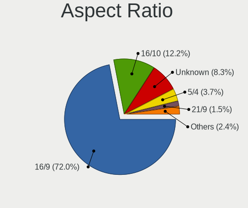

| Ratio   | Computers | Percent |
|---------|-----------|---------|
| 16/9    | 229       | 68.36%  |
| 16/10   | 38        | 11.34%  |
| Unknown | 36        | 10.75%  |
| 5/4     | 18        | 5.37%   |
| 3/2     | 6         | 1.79%   |
| 4/3     | 4         | 1.19%   |
| 21/9    | 2         | 0.6%    |
| 6/5     | 1         | 0.3%    |
| 1.96    | 1         | 0.3%    |

Monitor Area
------------

Area in inch²

| Area in inch² | Computers | Percent |
|----------------|-----------|---------|
| 101-110        | 95        | 26.17%  |
| 201-250        | 52        | 14.33%  |
| 81-90          | 51        | 14.05%  |
| Unknown        | 38        | 10.47%  |
| 151-200        | 36        | 9.92%   |
| 301-350        | 21        | 5.79%   |
| 121-130        | 16        | 4.41%   |
| 71-80          | 10        | 2.75%   |
| 141-150        | 10        | 2.75%   |
| 251-300        | 8         | 2.2%    |
| 351-500        | 7         | 1.93%   |
| More than 1000 | 5         | 1.38%   |
| 61-70          | 5         | 1.38%   |
| 501-1000       | 4         | 1.1%    |
| 51-60          | 2         | 0.55%   |
| 131-140        | 2         | 0.55%   |
| 91-100         | 1         | 0.28%   |

Pixel Density
-------------

Pixels per inch

| Density       | Computers | Percent |
|---------------|-----------|---------|
| 101-120       | 118       | 33.52%  |
| 51-100        | 111       | 31.53%  |
| 121-160       | 61        | 17.33%  |
| Unknown       | 38        | 10.8%   |
| 161-240       | 14        | 3.98%   |
| 1-50          | 7         | 1.99%   |
| More than 240 | 3         | 0.85%   |

Multiple Monitors
-----------------

Total monitors connected

| Total | Computers | Percent |
|-------|-----------|---------|
| 1     | 256       | 79.01%  |
| 2     | 59        | 18.21%  |
| 3     | 4         | 1.23%   |
| 0     | 4         | 1.23%   |
| 4     | 1         | 0.31%   |

Net Controller Vendor
---------------------

Controller vendors

| Vendor                            | Computers | Percent |
|-----------------------------------|-----------|---------|
| Realtek Semiconductor             | 187       | 37.55%  |
| Intel                             | 137       | 27.51%  |
| Qualcomm Atheros                  | 72        | 14.46%  |
| Broadcom Inc. and subsidiaries    | 28        | 5.62%   |
| Ralink Technology                 | 7         | 1.41%   |
| TP-Link                           | 6         | 1.2%    |
| Nvidia                            | 6         | 1.2%    |
| Broadcom Limited                  | 6         | 1.2%    |
| Ralink                            | 5         | 1%      |
| Marvell Technology Group          | 5         | 1%      |
| Samsung Electronics               | 4         | 0.8%    |
| Qualcomm Atheros Communications   | 4         | 0.8%    |
| Broadcom                          | 3         | 0.6%    |
| Xiaomi                            | 2         | 0.4%    |
| VIA Technologies                  | 2         | 0.4%    |
| Sitecom Europe                    | 2         | 0.4%    |
| Microsoft                         | 2         | 0.4%    |
| MediaTek                          | 2         | 0.4%    |
| Huawei Technologies               | 2         | 0.4%    |
| ZyDAS                             | 1         | 0.2%    |
| U-Blox                            | 1         | 0.2%    |
| Silicon Integrated Systems [SiS]  | 1         | 0.2%    |
| Qualcomm                          | 1         | 0.2%    |
| NetGear                           | 1         | 0.2%    |
| Motorola PCS                      | 1         | 0.2%    |
| Mellanox Technologies             | 1         | 0.2%    |
| Linksys                           | 1         | 0.2%    |
| JMicron Technology                | 1         | 0.2%    |
| Ericsson Business Mobile Networks | 1         | 0.2%    |
| Edimax Technology                 | 1         | 0.2%    |
| DisplayLink                       | 1         | 0.2%    |
| Dell                              | 1         | 0.2%    |
| D-Link                            | 1         | 0.2%    |
| Belkin Components                 | 1         | 0.2%    |
| ASUSTek Computer                  | 1         | 0.2%    |

Net Controller Model
--------------------

Controller models

| Model                                                     | Computers | Percent |
|-----------------------------------------------------------|-----------|---------|
| RTL8111/8168/8411 PCI Express Gigabit Ethernet Controller | 136       | 23.73%  |
| RTL810xE PCI Express Fast Ethernet controller             | 34        | 5.93%   |
| 82579LM Gigabit Network Connection (Lewisville)           | 19        | 3.32%   |
| QCA9565 / AR9565 Wireless Network Adapter                 | 12        | 2.09%   |
| Wireless 7260                                             | 11        | 1.92%   |
| QCA9377 802.11ac Wireless Network Adapter                 | 11        | 1.92%   |
| AR9285 Wireless Network Adapter (PCI-Express)             | 9         | 1.57%   |
| AR8151 v2.0 Gigabit Ethernet                              | 9         | 1.57%   |
| Wireless-AC 9560 [Jefferson Peak]                         | 8         | 1.4%    |
| Centrino Advanced-N 6205 [Taylor Peak]                    | 8         | 1.4%    |
| AR9485 Wireless Network Adapter                           | 8         | 1.4%    |
| Wireless 3165                                             | 7         | 1.22%   |
| RTL8723BE PCIe Wireless Network Adapter                   | 7         | 1.22%   |
| Wireless 8265 / 8275                                      | 6         | 1.05%   |
| Dual Band Wireless-AC 3168NGW [Stone Peak]                | 6         | 1.05%   |
| Wi-Fi 6 AX200                                             | 5         | 0.87%   |
| Ethernet Connection I217-LM                               | 5         | 0.87%   |
| Centrino Wireless-N 1030 [Rainbow Peak]                   | 5         | 0.87%   |
| BCM43142 802.11b/g/n                                      | 5         | 0.87%   |
| Wireless 8260                                             | 4         | 0.7%    |
| RTL8822BE 802.11a/b/g/n/ac WiFi adapter                   | 4         | 0.7%    |
| RTL8821CE 802.11ac PCIe Wireless Network Adapter          | 4         | 0.7%    |
| RTL8821AE 802.11ac PCIe Wireless Network Adapter          | 4         | 0.7%    |
| RTL8153 Gigabit Ethernet Adapter                          | 4         | 0.7%    |
| RT3290 Wireless 802.11n 1T/1R PCIe                        | 4         | 0.7%    |
| QCA8171 Gigabit Ethernet                                  | 4         | 0.7%    |
| I211 Gigabit Network Connection                           | 4         | 0.7%    |
| Galaxy series, misc. (tethering mode)                     | 4         | 0.7%    |
| Centrino Wireless-N 2230                                  | 4         | 0.7%    |
| Centrino Advanced-N 6235                                  | 4         | 0.7%    |
| BCM4360 802.11ac Wireless Network Adapter                 | 4         | 0.7%    |
| AR9271 802.11n                                            | 4         | 0.7%    |
| 82567LM Gigabit Network Connection                        | 4         | 0.7%    |
| 802.11ac NIC                                              | 4         | 0.7%    |
| Wireless 7265                                             | 3         | 0.52%   |
| RTL8822CE 802.11ac PCIe Wireless Network Adapter          | 3         | 0.52%   |
| RTL8191SEvB Wireless LAN Controller                       | 3         | 0.52%   |
| QCA6174 802.11ac Wireless Network Adapter                 | 3         | 0.52%   |
| PRO/Wireless 5100 AGN [Shiloh] Network Connection         | 3         | 0.52%   |
| PRO/Wireless 3945ABG [Golan] Network Connection           | 3         | 0.52%   |
| NetXtreme BCM5754 Gigabit Ethernet PCI Express            | 3         | 0.52%   |
| NetLink BCM5787M Gigabit Ethernet PCI Express             | 3         | 0.52%   |
| NetLink BCM57785 Gigabit Ethernet PCIe                    | 3         | 0.52%   |
| MT7601U Wireless Adapter                                  | 3         | 0.52%   |
| MCP61 Ethernet                                            | 3         | 0.52%   |
| Ethernet Connection I219-LM                               | 3         | 0.52%   |
| Ethernet Connection (7) I219-V                            | 3         | 0.52%   |
| Ethernet Connection (4) I219-LM                           | 3         | 0.52%   |
| Ethernet Connection (2) I219-V                            | 3         | 0.52%   |
| Dual Band Wireless-AC 3165 Plus Bluetooth                 | 3         | 0.52%   |
| AR9287 Wireless Network Adapter (PCI-Express)             | 3         | 0.52%   |
| AR8131 Gigabit Ethernet                                   | 3         | 0.52%   |
| AR242x / AR542x Wireless Network Adapter (PCI-Express)    | 3         | 0.52%   |
| 82577LM Gigabit Network Connection                        | 3         | 0.52%   |
| 82567LM-3 Gigabit Network Connection                      | 3         | 0.52%   |
| Xbox 360 Wireless Adapter                                 | 2         | 0.35%   |
| WiFi Link 5100                                            | 2         | 0.35%   |
| VT6105/VT6106S [Rhine-III]                                | 2         | 0.35%   |
| RTL8723AE PCIe Wireless Network Adapter                   | 2         | 0.35%   |
| RTL8188EUS 802.11n Wireless Network Adapter               | 2         | 0.35%   |

Wireless Vendor
---------------

Wireless vendors

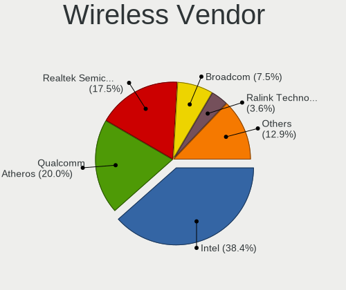

| Vendor                          | Computers | Percent |
|---------------------------------|-----------|---------|
| Intel                           | 96        | 38.1%   |
| Qualcomm Atheros                | 58        | 23.02%  |
| Realtek Semiconductor           | 41        | 16.27%  |
| Broadcom Inc. and subsidiaries  | 18        | 7.14%   |
| Ralink Technology               | 7         | 2.78%   |
| TP-Link                         | 6         | 2.38%   |
| Ralink                          | 5         | 1.98%   |
| Qualcomm Atheros Communications | 4         | 1.59%   |
| Sitecom Europe                  | 2         | 0.79%   |
| Microsoft                       | 2         | 0.79%   |
| Broadcom Limited                | 2         | 0.79%   |
| Broadcom                        | 2         | 0.79%   |
| ZyDAS                           | 1         | 0.4%    |
| NetGear                         | 1         | 0.4%    |
| MediaTek                        | 1         | 0.4%    |
| Linksys                         | 1         | 0.4%    |
| Edimax Technology               | 1         | 0.4%    |
| Dell                            | 1         | 0.4%    |
| D-Link                          | 1         | 0.4%    |
| Belkin Components               | 1         | 0.4%    |
| ASUSTek Computer                | 1         | 0.4%    |

Wireless Model
--------------

Wireless models

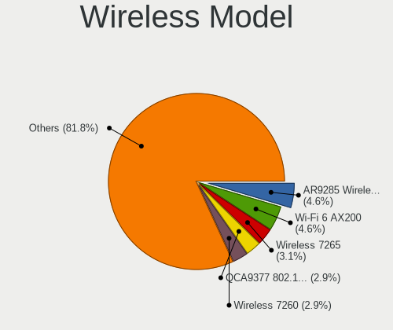

| Model                                                                                 | Computers | Percent |
|---------------------------------------------------------------------------------------|-----------|---------|
| QCA9565 / AR9565 Wireless Network Adapter                                             | 12        | 4.72%   |
| Wireless 7260                                                                         | 11        | 4.33%   |
| QCA9377 802.11ac Wireless Network Adapter                                             | 11        | 4.33%   |
| AR9285 Wireless Network Adapter (PCI-Express)                                         | 9         | 3.54%   |
| Wireless-AC 9560 [Jefferson Peak]                                                     | 8         | 3.15%   |
| Centrino Advanced-N 6205 [Taylor Peak]                                                | 8         | 3.15%   |
| AR9485 Wireless Network Adapter                                                       | 8         | 3.15%   |
| Wireless 3165                                                                         | 7         | 2.76%   |
| RTL8723BE PCIe Wireless Network Adapter                                               | 7         | 2.76%   |
| Wireless 8265 / 8275                                                                  | 6         | 2.36%   |
| Dual Band Wireless-AC 3168NGW [Stone Peak]                                            | 6         | 2.36%   |
| Wi-Fi 6 AX200                                                                         | 5         | 1.97%   |
| Centrino Wireless-N 1030 [Rainbow Peak]                                               | 5         | 1.97%   |
| BCM43142 802.11b/g/n                                                                  | 5         | 1.97%   |
| Wireless 8260                                                                         | 4         | 1.57%   |
| RTL8822BE 802.11a/b/g/n/ac WiFi adapter                                               | 4         | 1.57%   |
| RTL8821CE 802.11ac PCIe Wireless Network Adapter                                      | 4         | 1.57%   |
| RTL8821AE 802.11ac PCIe Wireless Network Adapter                                      | 4         | 1.57%   |
| RT3290 Wireless 802.11n 1T/1R PCIe                                                    | 4         | 1.57%   |
| Centrino Wireless-N 2230                                                              | 4         | 1.57%   |
| Centrino Advanced-N 6235                                                              | 4         | 1.57%   |
| BCM4360 802.11ac Wireless Network Adapter                                             | 4         | 1.57%   |
| AR9271 802.11n                                                                        | 4         | 1.57%   |
| 802.11ac NIC                                                                          | 4         | 1.57%   |
| Wireless 7265                                                                         | 3         | 1.18%   |
| RTL8822CE 802.11ac PCIe Wireless Network Adapter                                      | 3         | 1.18%   |
| RTL8191SEvB Wireless LAN Controller                                                   | 3         | 1.18%   |
| QCA6174 802.11ac Wireless Network Adapter                                             | 3         | 1.18%   |
| PRO/Wireless 5100 AGN [Shiloh] Network Connection                                     | 3         | 1.18%   |
| PRO/Wireless 3945ABG [Golan] Network Connection                                       | 3         | 1.18%   |
| MT7601U Wireless Adapter                                                              | 3         | 1.18%   |
| Dual Band Wireless-AC 3165 Plus Bluetooth                                             | 3         | 1.18%   |
| AR9287 Wireless Network Adapter (PCI-Express)                                         | 3         | 1.18%   |
| AR242x / AR542x Wireless Network Adapter (PCI-Express)                                | 3         | 1.18%   |
| Xbox 360 Wireless Adapter                                                             | 2         | 0.79%   |
| WiFi Link 5100                                                                        | 2         | 0.79%   |
| RTL8723AE PCIe Wireless Network Adapter                                               | 2         | 0.79%   |
| RTL8188EUS 802.11n Wireless Network Adapter                                           | 2         | 0.79%   |
| RTL8188CE 802.11b/g/n WiFi Adapter                                                    | 2         | 0.79%   |
| RTL8187B Wireless 802.11g 54Mbps Network Adapter                                      | 2         | 0.79%   |
| RT5370 Wireless Adapter                                                               | 2         | 0.79%   |
| Realtek 8812AU/8821AU 802.11ac WLAN Adapter [USB Wireless Dual-Band Adapter 2.4/5Ghz] | 2         | 0.79%   |
| Killer Wi-Fi 6 AX1650i 160MHz Wireless Network Adapter (201NGW)                       | 2         | 0.79%   |
| Centrino Advanced-N 6200                                                              | 2         | 0.79%   |
| Cannon Point-LP CNVi [Wireless-AC]                                                    | 2         | 0.79%   |
| BCM43228 802.11a/b/g/n                                                                | 2         | 0.79%   |
| BCM4322 802.11a/b/g/n Wireless LAN Controller                                         | 2         | 0.79%   |
| BCM4313 802.11bgn Wireless Network Adapter                                            | 2         | 0.79%   |
| BCM4312 802.11b/g LP-PHY                                                              | 2         | 0.79%   |
| AR93xx Wireless Network Adapter                                                       | 2         | 0.79%   |
| AR928X Wireless Network Adapter (PCI-Express)                                         | 2         | 0.79%   |
| 802.11ac WLAN Adapter                                                                 | 2         | 0.79%   |
| ZD1211B 802.11g                                                                       | 1         | 0.39%   |
| WNA1100 Wireless-N 150 [Atheros AR9271]                                               | 1         | 0.39%   |
| WLA-5000 802.11abgn [Ralink RT3572]                                                   | 1         | 0.39%   |
| Wireless-AC 9260                                                                      | 1         | 0.39%   |
| Wireless 3160                                                                         | 1         | 0.39%   |
| Wireless                                                                              | 1         | 0.39%   |
| Ultimate N WiFi Link 5300                                                             | 1         | 0.39%   |
| TL-WN822N Version 4 RTL8192EU                                                         | 1         | 0.39%   |

Ethernet Vendor
---------------

Ethernet vendors

| Vendor                           | Computers | Percent |
|----------------------------------|-----------|---------|
| Realtek Semiconductor            | 175       | 55.91%  |
| Intel                            | 71        | 22.68%  |
| Qualcomm Atheros                 | 24        | 7.67%   |
| Broadcom Inc. and subsidiaries   | 11        | 3.51%   |
| Nvidia                           | 6         | 1.92%   |
| Marvell Technology Group         | 5         | 1.6%    |
| Samsung Electronics              | 4         | 1.28%   |
| Broadcom Limited                 | 4         | 1.28%   |
| Xiaomi                           | 2         | 0.64%   |
| VIA Technologies                 | 2         | 0.64%   |
| Silicon Integrated Systems [SiS] | 1         | 0.32%   |
| Qualcomm                         | 1         | 0.32%   |
| Motorola PCS                     | 1         | 0.32%   |
| Mellanox Technologies            | 1         | 0.32%   |
| MediaTek                         | 1         | 0.32%   |
| JMicron Technology               | 1         | 0.32%   |
| Huawei Technologies              | 1         | 0.32%   |
| DisplayLink                      | 1         | 0.32%   |
| Broadcom                         | 1         | 0.32%   |

Ethernet Model
--------------

Ethernet models

| Model                                                     | Computers | Percent |
|-----------------------------------------------------------|-----------|---------|
| RTL8111/8168/8411 PCI Express Gigabit Ethernet Controller | 136       | 43.04%  |
| RTL810xE PCI Express Fast Ethernet controller             | 34        | 10.76%  |
| 82579LM Gigabit Network Connection (Lewisville)           | 19        | 6.01%   |
| AR8151 v2.0 Gigabit Ethernet                              | 9         | 2.85%   |
| Ethernet Connection I217-LM                               | 5         | 1.58%   |
| RTL8153 Gigabit Ethernet Adapter                          | 4         | 1.27%   |
| QCA8171 Gigabit Ethernet                                  | 4         | 1.27%   |
| I211 Gigabit Network Connection                           | 4         | 1.27%   |
| Galaxy series, misc. (tethering mode)                     | 4         | 1.27%   |
| 82567LM Gigabit Network Connection                        | 4         | 1.27%   |
| NetXtreme BCM5754 Gigabit Ethernet PCI Express            | 3         | 0.95%   |
| NetLink BCM5787M Gigabit Ethernet PCI Express             | 3         | 0.95%   |
| NetLink BCM57785 Gigabit Ethernet PCIe                    | 3         | 0.95%   |
| MCP61 Ethernet                                            | 3         | 0.95%   |
| Ethernet Connection I219-LM                               | 3         | 0.95%   |
| Ethernet Connection (7) I219-V                            | 3         | 0.95%   |
| Ethernet Connection (4) I219-LM                           | 3         | 0.95%   |
| Ethernet Connection (2) I219-V                            | 3         | 0.95%   |
| AR8131 Gigabit Ethernet                                   | 3         | 0.95%   |
| 82577LM Gigabit Network Connection                        | 3         | 0.95%   |
| 82567LM-3 Gigabit Network Connection                      | 3         | 0.95%   |
| VT6105/VT6106S [Rhine-III]                                | 2         | 0.63%   |
| RTL-8100/8101L/8139 PCI Fast Ethernet Adapter             | 2         | 0.63%   |
| Mi/Redmi series (RNDIS)                                   | 2         | 0.63%   |
| Killer E2500 Gigabit Ethernet Controller                  | 2         | 0.63%   |
| Killer E220x Gigabit Ethernet Controller                  | 2         | 0.63%   |
| Ethernet Connection I218-LM                               | 2         | 0.63%   |
| Ethernet Connection (7) I219-LM                           | 2         | 0.63%   |
| 88E8056 PCI-E Gigabit Ethernet Controller                 | 2         | 0.63%   |
| 82579V Gigabit Network Connection                         | 2         | 0.63%   |
| 82578DM Gigabit Network Connection                        | 2         | 0.63%   |
| 82567LF Gigabit Network Connection                        | 2         | 0.63%   |
| 82562V-2 10/100 Network Connection                        | 2         | 0.63%   |
| Targus USB3 DV1K-2K Compact Dock                          | 1         | 0.32%   |
| RTL8152 Fast Ethernet Adapter                             | 1         | 0.32%   |
| RTL8125 2.5GbE Controller                                 | 1         | 0.32%   |
| QCA8172 Fast Ethernet                                     | 1         | 0.32%   |
| Nokia 3.1                                                 | 1         | 0.32%   |
| NetXtreme BCM57765 Gigabit Ethernet PCIe                  | 1         | 0.32%   |
| NetXtreme BCM57762 Gigabit Ethernet PCIe                  | 1         | 0.32%   |
| NetXtreme BCM5764M Gigabit Ethernet PCIe                  | 1         | 0.32%   |
| NetXtreme BCM5761e Gigabit Ethernet PCIe                  | 1         | 0.32%   |
| NetXtreme BCM5761 Gigabit Ethernet PCIe                   | 1         | 0.32%   |
| NetXtreme BCM5755 Gigabit Ethernet PCI Express            | 1         | 0.32%   |
| NetLink BCM5784M Gigabit Ethernet PCIe                    | 1         | 0.32%   |
| MT27500 Family [ConnectX-3]                               | 1         | 0.32%   |
| moto g(7)                                                 | 1         | 0.32%   |
| MCP79 Ethernet                                            | 1         | 0.32%   |
| MCP55 Ethernet                                            | 1         | 0.32%   |
| Killer E2400 Gigabit Ethernet Controller                  | 1         | 0.32%   |
| JMC260 PCI Express Fast Ethernet Controller               | 1         | 0.32%   |
| Ethernet Controller I225-V                                | 1         | 0.32%   |
| Ethernet Connection I217-V                                | 1         | 0.32%   |
| Ethernet Connection (6) I219-V                            | 1         | 0.32%   |
| Ethernet Connection (4) I219-V                            | 1         | 0.32%   |
| Ethernet Connection (2) I219-LM                           | 1         | 0.32%   |
| Ethernet Connection (2) I218-V                            | 1         | 0.32%   |
| Ethernet Connection (12) I219-V                           | 1         | 0.32%   |
| E353/E3131                                                | 1         | 0.32%   |
| CK804 Ethernet Controller                                 | 1         | 0.32%   |

Net Controller Kind
-------------------

Ethernet, WiFi or modem

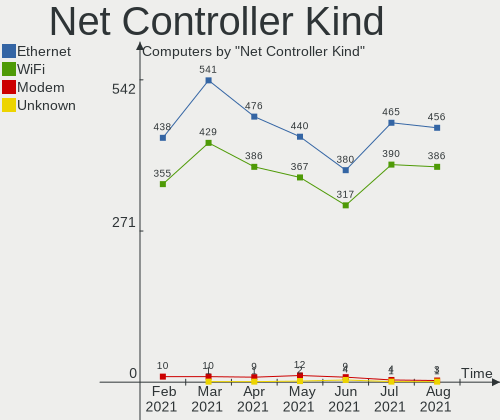

| Kind     | Computers | Percent |
|----------|-----------|---------|
| Ethernet | 296       | 54.92%  |
| WiFi     | 240       | 44.53%  |
| Modem    | 3         | 0.56%   |

Used Controller
---------------

Currently used network controller

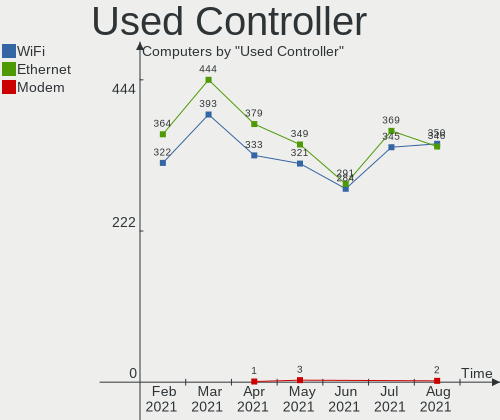

| Kind     | Computers | Percent |
|----------|-----------|---------|
| Ethernet | 216       | 52.05%  |
| WiFi     | 199       | 47.95%  |

NICs
----

Total network controllers on board

| Total | Computers | Percent |
|-------|-----------|---------|
| 2     | 185       | 57.1%   |
| 1     | 131       | 40.43%  |
| 3     | 4         | 1.23%   |
| 0     | 4         | 1.23%   |

Memory Vendor
-------------

Memory module vendors

| Vendor              | Computers | Percent |
|---------------------|-----------|---------|
| Samsung Electronics | 33        | 19.19%  |
| SK Hynix            | 31        | 18.02%  |
| Unknown             | 24        | 13.95%  |
| Kingston            | 24        | 13.95%  |
| Micron Technology   | 18        | 10.47%  |
| Corsair             | 7         | 4.07%   |
| A-DATA Technology   | 6         | 3.49%   |
| Ramaxel Technology  | 5         | 2.91%   |
| Smart               | 4         | 2.33%   |
| Elpida              | 4         | 2.33%   |
| Crucial             | 4         | 2.33%   |
| SMART Brazil        | 2         | 1.16%   |
| Patriot             | 2         | 1.16%   |
| G.Skill             | 2         | 1.16%   |
| Unknown (09C8)      | 1         | 0.58%   |
| Transcend           | 1         | 0.58%   |
| Nanya Technology    | 1         | 0.58%   |
| Multilaser          | 1         | 0.58%   |
| GOODRAM             | 1         | 0.58%   |
| Apacer              | 1         | 0.58%   |

Memory Model
------------

Memory module models

| Model                                                   | Computers | Percent |
|---------------------------------------------------------|-----------|---------|
| RAM M471A5244CB0-CRC 4GB SODIMM DDR4 2667MT/s           | 4         | 2.17%   |
| RAM RMSA3260ME78HAF-2666 8GB SODIMM DDR4 2667MT/s       | 3         | 1.63%   |
| RAM Module 8192MB SODIMM DDR3 1600MT/s                  | 3         | 1.63%   |
| RAM M471B5173DB0-YK0 4096MB SODIMM DDR3 1600MT/s        | 3         | 1.63%   |
| RAM M471A5244CB0-CTD 4096MB SODIMM DDR4 2667MT/s        | 3         | 1.63%   |
| RAM HMT451S6BFR8A-PB 4GB SODIMM DDR3 1600MT/s           | 3         | 1.63%   |
| RAM HMA81GS6AFR8N-UH 8GB SODIMM DDR4 2667MT/s           | 3         | 1.63%   |
| RAM SMS4TDC3C0K0446SCG 4096MB SODIMM DDR4 2667MT/s      | 2         | 1.09%   |
| RAM SH564568FH8NZPHSCG 2048MB SODIMM DDR3 1333MT/s      | 2         | 1.09%   |
| RAM SH564128FH8NZPHSCG 4096MB SODIMM DDR3 1333MT/s      | 2         | 1.09%   |
| RAM Module 8192MB SODIMM DDR4 2133MT/s                  | 2         | 1.09%   |
| RAM Module 8192MB DIMM DDR3 1600MT/s                    | 2         | 1.09%   |
| RAM Module 4096MB DIMM DDR3 1333MT/s                    | 2         | 1.09%   |
| RAM Module 2048MB DIMM DDR 1333MT/s                     | 2         | 1.09%   |
| RAM M471B5173QH0-YK0 4096MB SODIMM DDR3 1600MT/s        | 2         | 1.09%   |
| RAM M471B1G73QH0-YK0 8GB SODIMM DDR3 1600MT/s           | 2         | 1.09%   |
| RAM M471B1G73BH0-CK0 8GB SODIMM DDR3 1600MT/s           | 2         | 1.09%   |
| RAM M471A1K43DB1-CTD 8GB SODIMM DDR4 2667MT/s           | 2         | 1.09%   |
| RAM M378A1K43CB2-CTD 8192MB DIMM DDR4 3200MT/s          | 2         | 1.09%   |
| RAM KHX2666C15S4/16G 16384MB SODIMM DDR4 2667MT/s       | 2         | 1.09%   |
| RAM K4EBE304EB-EGCG 8192MB Row Of Chips LPDDR3 2133MT/s | 2         | 1.09%   |
| RAM HMT425S6AFR6A-PB 2GB SODIMM DDR3 1600MT/s           | 2         | 1.09%   |
| RAM HMT325S6BFR8C-H9 2GB SODIMM DDR3 1333MT/s           | 2         | 1.09%   |
| RAM 4ATF51264HZ-2G6E1 4GB SODIMM DDR4 2667MT/s          | 2         | 1.09%   |
| SODIMM 1024MB SODIMM DDR2 800MT/s                       | 1         | 0.54%   |
| SODIMM 1024MB SODIMM DDR2 667MT/s                       | 1         | 0.54%   |
| RAM VS1GB667D2 1024MB DIMM DDR2 667MT/s                 | 1         | 0.54%   |
| RAM SH564128FJ8NZRNSDG 4096MB SODIMM DDR3 1600MT/s      | 1         | 0.54%   |
| RAM SF4641G8CK8IEHLSBG 8192MB SODIMM DDR4 2400MT/s      | 1         | 0.54%   |
| RAM SemsoTai 4096MB DIMM DDR4 2400MT/s                  | 1         | 0.54%   |
| RAM RMT3170EF68F9W1600 4GB SODIMM DDR3 1600MT/s         | 1         | 0.54%   |
| RAM RMSA3260MD78HAF-2666 8192MB SODIMM DDR4 2667MT/s    | 1         | 0.54%   |
| RAM NT4GC64B8HB0NS-CG 4096MB SODIMM DDR3 1334MT/s       | 1         | 0.54%   |
| RAM Module 8192MB SODIMM DDR4 2400MT/s                  | 1         | 0.54%   |
| RAM Module 8192MB DIMM 667MT/s                          | 1         | 0.54%   |
| RAM Module 8192MB DIMM 1600MT/s                         | 1         | 0.54%   |
| RAM Module 4GB DIMM 1333MT/s                            | 1         | 0.54%   |
| RAM Module 4096MB SODIMM DDR4 2400MT/s                  | 1         | 0.54%   |
| RAM Module 4096MB SODIMM DDR3 1333MT/s                  | 1         | 0.54%   |
| RAM Module 4096MB SODIMM DDR3 1066MT/s                  | 1         | 0.54%   |
| RAM Module 4096MB DIMM DDR3 1600MT/s                    | 1         | 0.54%   |
| RAM Module 4096MB DIMM DDR 1333MT/s                     | 1         | 0.54%   |
| RAM Module 2048MB SODIMM DDR2 800MT/s                   | 1         | 0.54%   |
| RAM Module 2048MB SODIMM DDR2                           | 1         | 0.54%   |
| RAM Module 2048MB SODIMM                                | 1         | 0.54%   |
| RAM Module 2048MB DIMM DDR3 1600MT/s                    | 1         | 0.54%   |
| RAM Module 2048MB DIMM DDR3 1333MT/s                    | 1         | 0.54%   |
| RAM Module 2048MB DIMM DDR2 800MT/s                     | 1         | 0.54%   |
| RAM Module 2048MB DIMM DDR2 333MT/s                     | 1         | 0.54%   |
| RAM Module 2048MB DIMM 1333MT/s                         | 1         | 0.54%   |
| RAM Module 16384MB SODIMM DDR4 3200MT/s                 | 1         | 0.54%   |
| RAM Module 16384MB SODIMM DDR4 2667MT/s                 | 1         | 0.54%   |
| RAM Module 1024MB SODIMM DDR                            | 1         | 0.54%   |
| RAM Module 1024MB DIMM DDR2 333MT/s                     | 1         | 0.54%   |
| RAM MD3512NSA-CA3G1 4096MB DIMM DDR3 1333MT/s           | 1         | 0.54%   |
| RAM M471B5773CHS-CK0 2048MB SODIMM DDR3 1600MT/s        | 1         | 0.54%   |
| RAM M471B5273EB0-CK0 4096MB SODIMM DDR3 1600MT/s        | 1         | 0.54%   |
| RAM M471B5273DH0-YK0 4096MB SODIMM DDR3 1600MT/s        | 1         | 0.54%   |
| RAM M471B5273CH0-CH9 4096MB SODIMM DDR3 1334MT/s        | 1         | 0.54%   |
| RAM M471A5143EB0-CPB 4096MB SODIMM DDR4 2133MT/s        | 1         | 0.54%   |

Memory Kind
-----------

Memory module kinds

| Kind    | Computers | Percent |
|---------|-----------|---------|
| DDR3    | 69        | 45.7%   |
| DDR4    | 60        | 39.74%  |
| DDR2    | 7         | 4.64%   |
| Unknown | 5         | 3.31%   |
| LPDDR3  | 3         | 1.99%   |
| DDR     | 3         | 1.99%   |
| SDRAM   | 2         | 1.32%   |
| LPDDR4  | 2         | 1.32%   |

Memory Form Factor
------------------

Physical design of the memory module

| Name         | Computers | Percent |
|--------------|-----------|---------|
| SODIMM       | 97        | 64.67%  |
| DIMM         | 46        | 30.67%  |
| Row Of Chips | 5         | 3.33%   |
| Chip         | 2         | 1.33%   |

Memory Size
-----------

Memory module size

| Size  | Computers | Percent |
|-------|-----------|---------|
| 8192  | 63        | 37.5%   |
| 4096  | 62        | 36.9%   |
| 2048  | 24        | 14.29%  |
| 16384 | 14        | 8.33%   |
| 1024  | 5         | 2.98%   |

Memory Speed
------------

Memory module speed

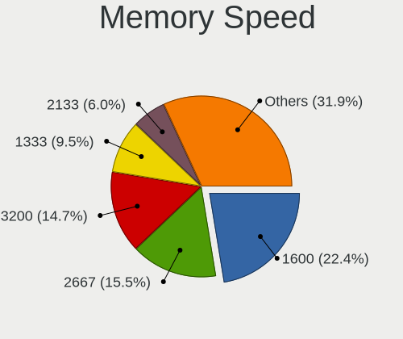

| Speed   | Computers | Percent |
|---------|-----------|---------|
| 1600    | 43        | 27.04%  |
| 2667    | 30        | 18.87%  |
| 1333    | 20        | 12.58%  |
| 3200    | 12        | 7.55%   |
| 2400    | 12        | 7.55%   |
| 2133    | 8         | 5.03%   |
| 1334    | 6         | 3.77%   |
| 1867    | 4         | 2.52%   |
| 667     | 4         | 2.52%   |
| 800     | 3         | 1.89%   |
| Unknown | 3         | 1.89%   |
| 3333    | 2         | 1.26%   |
| 1866    | 2         | 1.26%   |
| 4267    | 1         | 0.63%   |
| 4199    | 1         | 0.63%   |
| 3600    | 1         | 0.63%   |
| 3066    | 1         | 0.63%   |
| 2800    | 1         | 0.63%   |
| 1800    | 1         | 0.63%   |
| 1200    | 1         | 0.63%   |
| 1067    | 1         | 0.63%   |
| 1066    | 1         | 0.63%   |
| 333     | 1         | 0.63%   |

Sound Vendor
------------

Sound card vendors

| Vendor                           | Computers | Percent |
|----------------------------------|-----------|---------|
| Intel                            | 236       | 54%     |
| AMD                              | 91        | 20.82%  |
| Nvidia                           | 77        | 17.62%  |
| C-Media Electronics              | 6         | 1.37%   |
| Texas Instruments                | 5         | 1.14%   |
| Creative Labs                    | 5         | 1.14%   |
| Logitech                         | 3         | 0.69%   |
| Creative Technology              | 2         | 0.46%   |
| VIA Technologies                 | 1         | 0.23%   |
| Silicon Integrated Systems [SiS] | 1         | 0.23%   |
| Sennheiser Communications        | 1         | 0.23%   |
| Reloop                           | 1         | 0.23%   |
| Realtek Semiconductor            | 1         | 0.23%   |
| Razer USA                        | 1         | 0.23%   |
| Lenovo                           | 1         | 0.23%   |
| Kingston Technology              | 1         | 0.23%   |
| Generalplus Technology           | 1         | 0.23%   |
| Corsair                          | 1         | 0.23%   |
| ASUSTek Computer                 | 1         | 0.23%   |
| AKAI Professional M.I.           | 1         | 0.23%   |

Sound Model
-----------

Sound card models

| Model                                                                                       | Computers | Percent |
|---------------------------------------------------------------------------------------------|-----------|---------|
| 7 Series/C216 Chipset Family High Definition Audio Controller                               | 36        | 6.99%   |
| 6 Series/C200 Series Chipset Family High Definition Audio Controller                        | 33        | 6.41%   |
| 8 Series/C220 Series Chipset High Definition Audio Controller                               | 23        | 4.47%   |
| Sunrise Point-LP HD Audio                                                                   | 22        | 4.27%   |
| SBx00 Azalia (Intel HDA)                                                                    | 22        | 4.27%   |
| 82801I (ICH9 Family) HD Audio Controller                                                    | 18        | 3.5%    |
| Cannon Lake PCH cAVS                                                                        | 17        | 3.3%    |
| FCH Azalia Controller                                                                       | 15        | 2.91%   |
| Family 17h (Models 10h-1fh) HD Audio Controller                                             | 14        | 2.72%   |
| 5 Series/3400 Series Chipset High Definition Audio                                          | 14        | 2.72%   |
| Xeon E3-1200 v3/4th Gen Core Processor HD Audio Controller                                  | 13        | 2.52%   |
| Haswell-ULT HD Audio Controller                                                             | 12        | 2.33%   |
| 8 Series HD Audio Controller                                                                | 12        | 2.33%   |
| GP107GL High Definition Audio Controller                                                    | 9         | 1.75%   |
| Family 17h (Models 00h-0fh) HD Audio Controller                                             | 9         | 1.75%   |
| Raven/Raven2/Fenghuang HDMI/DP Audio Controller                                             | 8         | 1.55%   |
| 200 Series PCH HD Audio                                                                     | 7         | 1.36%   |
| 100 Series/C230 Series Chipset Family HD Audio Controller                                   | 7         | 1.36%   |
| TU116 High Definition Audio Controller                                                      | 6         | 1.17%   |
| Starship/Matisse HD Audio Controller                                                        | 6         | 1.17%   |
| NM10/ICH7 Family High Definition Audio Controller                                           | 6         | 1.17%   |
| Kabini HDMI/DP Audio                                                                        | 6         | 1.17%   |
| High Definition Audio Controller                                                            | 6         | 1.17%   |
| GF119 HDMI Audio Controller                                                                 | 6         | 1.17%   |
| Family 15h (Models 60h-6fh) Audio Controller                                                | 6         | 1.17%   |
| Ellesmere HDMI Audio [Radeon RX 470/480 / 570/580/590]                                      | 6         | 1.17%   |
| Cannon Point-LP High Definition Audio Controller                                            | 6         | 1.17%   |
| TU107 GeForce GTX 1650 High Definition Audio Controller                                     | 5         | 0.97%   |
| GK208 HDMI/DP Audio Controller                                                              | 5         | 0.97%   |
| Wildcat Point-LP High Definition Audio Controller                                           | 4         | 0.78%   |
| TU106 High Definition Audio Controller                                                      | 4         | 0.78%   |
| Smart Sound Technology Audio Controller                                                     | 4         | 0.78%   |
| Renoir Radeon High Definition Audio Controller                                              | 4         | 0.78%   |
| Oland/Hainan/Cape Verde/Pitcairn HDMI Audio [Radeon HD 7000 Series]                         | 4         | 0.78%   |
| MCP61 High Definition Audio                                                                 | 4         | 0.78%   |
| GP106 High Definition Audio Controller                                                      | 4         | 0.78%   |
| GK106 HDMI Audio Controller                                                                 | 4         | 0.78%   |
| Broadwell-U Audio Controller                                                                | 4         | 0.78%   |
| Atom/Celeron/Pentium Processor x5-E8000/J3xxx/N3xxx Series High Definition Audio Controller | 4         | 0.78%   |
| 82801H (ICH8 Family) HD Audio Controller                                                    | 4         | 0.78%   |
| USB Audio Device                                                                            | 3         | 0.58%   |
| RS780 HDMI Audio [Radeon 3000/3100 / HD 3200/3300]                                          | 3         | 0.58%   |
| GP104 High Definition Audio Controller                                                      | 3         | 0.58%   |
| GM206 High Definition Audio Controller                                                      | 3         | 0.58%   |
| GM107 High Definition Audio Controller [GeForce 940MX]                                      | 3         | 0.58%   |
| GF114 HDMI Audio Controller                                                                 | 3         | 0.58%   |
| GF108 High Definition Audio Controller                                                      | 3         | 0.58%   |
| EMU20k1 [Sound Blaster X-Fi Series]                                                         | 3         | 0.58%   |
| Comet Lake PCH cAVS                                                                         | 3         | 0.58%   |
| CM238 HD Audio Controller                                                                   | 3         | 0.58%   |
| Celeron N3350/Pentium N4200/Atom E3900 Series Audio Cluster                                 | 3         | 0.58%   |
| 82801JD/DO (ICH10 Family) HD Audio Controller                                               | 3         | 0.58%   |
| Wrestler HDMI Audio                                                                         | 2         | 0.39%   |
| USB Audio                                                                                   | 2         | 0.39%   |
| Turks HDMI Audio [Radeon HD 6500/6600 / 6700M Series]                                       | 2         | 0.39%   |
| Tahiti HDMI Audio [Radeon HD 7870 XT / 7950/7970]                                           | 2         | 0.39%   |
| RV710/730 HDMI Audio [Radeon HD 4000 series]                                                | 2         | 0.39%   |
| RV620 HDMI Audio [Radeon HD 3450/3470/3550/3570]                                            | 2         | 0.39%   |
| PCM2902 Audio Codec                                                                         | 2         | 0.39%   |
| Navi 10 HDMI Audio                                                                          | 2         | 0.39%   |

Camera Vendor
-------------

Camera device vendors

| Vendor                                 | Computers | Percent |
|----------------------------------------|-----------|---------|
| Chicony Electronics                    | 47        | 24.74%  |
| Acer                                   | 16        | 8.42%   |
| Sunplus Innovation Technology          | 14        | 7.37%   |
| Microdia                               | 13        | 6.84%   |
| Cheng Uei Precision Industry (Foxlink) | 13        | 6.84%   |
| Logitech                               | 12        | 6.32%   |
| Quanta                                 | 10        | 5.26%   |
| IMC Networks                           | 8         | 4.21%   |
| Realtek Semiconductor                  | 7         | 3.68%   |
| Lite-On Technology                     | 6         | 3.16%   |
| Suyin                                  | 5         | 2.63%   |
| Z-Star Microelectronics                | 4         | 2.11%   |
| Silicon Motion                         | 4         | 2.11%   |
| Alcor Micro                            | 4         | 2.11%   |
| Ricoh                                  | 3         | 1.58%   |
| Microsoft                              | 3         | 1.58%   |
| Apple                                  | 3         | 1.58%   |
| Syntek                                 | 2         | 1.05%   |
| Primax Electronics                     | 2         | 1.05%   |
| Importek                               | 2         | 1.05%   |
| Cubeternet                             | 2         | 1.05%   |
| Aveo Technology                        | 2         | 1.05%   |
| Trust                                  | 1         | 0.53%   |
| Samsung Electronics                    | 1         | 0.53%   |
| Linux Foundation                       | 1         | 0.53%   |
| Jieli Technology                       | 1         | 0.53%   |
| Huawei Technologies                    | 1         | 0.53%   |
| Generalplus Technology                 | 1         | 0.53%   |
| DJKCVA1G4DRJFS                         | 1         | 0.53%   |
| Arkmicro Technologies                  | 1         | 0.53%   |

Camera Model
------------

Camera device models

| Model                              | Computers | Percent |
|------------------------------------|-----------|---------|
| Integrated Camera                  | 17        | 8.95%   |
| HD WebCam                          | 9         | 4.74%   |
| Lenovo EasyCamera                  | 8         | 4.21%   |
| Integrated_Webcam_HD               | 7         | 3.68%   |
| HP Wide Vision HD Camera           | 7         | 3.68%   |
| VGA Webcam                         | 6         | 3.16%   |
| HP Truevision HD                   | 6         | 3.16%   |
| USB2.0 VGA UVC WebCam              | 5         | 2.63%   |
| USB2.0 HD UVC WebCam               | 5         | 2.63%   |
| HP Webcam                          | 5         | 2.63%   |
| USB2.0 Camera                      | 4         | 2.11%   |
| TOSHIBA Web Camera - HD            | 4         | 2.11%   |
| HP HD Webcam [Fixed]               | 4         | 2.11%   |
| HD User Facing                     | 4         | 2.11%   |
| Webcam C270                        | 3         | 1.58%   |
| SunplusIT Integrated Camera        | 3         | 1.58%   |
| Laptop_Integrated_Webcam_HD        | 3         | 1.58%   |
| Integrated Webcam                  | 3         | 1.58%   |
| HP Truevision HD Integrated Webcam | 3         | 1.58%   |
| HP HD Camera                       | 3         | 1.58%   |
| EasyCamera                         | 3         | 1.58%   |
| Acer Integrated Webcam             | 3         | 1.58%   |
| Vimicro USB Camera (Altair)        | 2         | 1.05%   |
| USB 2.0 Camera                     | 2         | 1.05%   |
| LifeCam HD-3000                    | 2         | 1.05%   |
| Lenovo Integrated Camera (0.3MP)   | 2         | 1.05%   |
| HP Webcam-101                      | 2         | 1.05%   |
| HP TrueVision HD Camera            | 2         | 1.05%   |
| BisonCam, NB Pro                   | 2         | 1.05%   |
| Webcam Vitade AF                   | 1         | 0.53%   |
| WebCam SCB-0320N                   | 1         | 0.53%   |
| WebCam SC-13HDL12131N              | 1         | 0.53%   |
| WebCam SC-10HDD12636N              | 1         | 0.53%   |
| Webcam C930e                       | 1         | 0.53%   |
| Webcam C925e                       | 1         | 0.53%   |
| Webcam C600                        | 1         | 0.53%   |
| Webcam C170                        | 1         | 0.53%   |
| Web Camera                         | 1         | 0.53%   |
| UVC VGA Webcam                     | 1         | 0.53%   |
| UVC camera (Bresser microscope)    | 1         | 0.53%   |
| UVC Camera                         | 1         | 0.53%   |
| USB2.0 UVC HD Webcam               | 1         | 0.53%   |
| USB2.0 UVC 1.3M Webcam             | 1         | 0.53%   |
| USB2.0 PC CAMERA                   | 1         | 0.53%   |
| USB Webcam gadget                  | 1         | 0.53%   |
| USB PHY 2.0                        | 1         | 0.53%   |
| USB Camera                         | 1         | 0.53%   |
| thinkpad t430s camera              | 1         | 0.53%   |
| SunplusIT INC. Integrated Camera   | 1         | 0.53%   |
| Sony Visual Communication Camera   | 1         | 0.53%   |
| Sony Vaio Integrated Webcam        | 1         | 0.53%   |
| Sonix USB 2.0 Camera               | 1         | 0.53%   |
| Sonix Integrated Webcam            | 1         | 0.53%   |
| NoData                             | 1         | 0.53%   |
| Live Streaming USB Device          | 1         | 0.53%   |
| LifeCam VX-2000                    | 1         | 0.53%   |
| Laptop_Integrated_Webcam_E4HD      | 1         | 0.53%   |
| Laptop_Integrated_Webcam_2HDM      | 1         | 0.53%   |
| Laptop_Integrated_Webcam_1.3M      | 1         | 0.53%   |
| iPhone 5/5C/5S/6/SE                | 1         | 0.53%   |

Fingerprint Vendor
------------------

Fingerprint sensor vendors

| Vendor                | Computers | Percent |
|-----------------------|-----------|---------|
| Validity Sensors      | 12        | 48%     |
| Synaptics             | 5         | 20%     |
| LighTuning Technology | 4         | 16%     |
| Upek                  | 3         | 12%     |
| AuthenTec             | 1         | 4%      |

Fingerprint Model
-----------------

Fingerprint sensor models

| Model                                                     | Computers | Percent |
|-----------------------------------------------------------|-----------|---------|
| VFS495 Fingerprint Reader                                 | 4         | 16%     |
| EgisTec Touch Fingerprint Sensor                          | 4         | 16%     |
| Biometric Touchchip/Touchstrip Fingerprint Sensor         | 3         | 12%     |
| Unknown                                                   | 3         | 12%     |
| VFS491                                                    | 2         | 8%      |
| Fingerprint scanner                                       | 2         | 8%      |
| VFS5011 Fingerprint Reader                                | 1         | 4%      |
| VFS471 Fingerprint Reader                                 | 1         | 4%      |
| VFS451 Fingerprint Reader                                 | 1         | 4%      |
| Synaptics VFS7552 Touch Fingerprint Sensor with PurePrint | 1         | 4%      |
| Metallica MOH Touch Fingerprint Reader                    | 1         | 4%      |
| Metallica MIS Touch Fingerprint Reader                    | 1         | 4%      |
| AES2501 Fingerprint Sensor                                | 1         | 4%      |

Chipcard Vendor
---------------

Chipcard module vendors

| Vendor      | Computers | Percent |
|-------------|-----------|---------|
| Broadcom    | 4         | 36.36%  |
| Alcor Micro | 4         | 36.36%  |
| Upek        | 2         | 18.18%  |
| OmniKey     | 1         | 9.09%   |

Chipcard Model
--------------

Chipcard module models

| Model                                                               | Computers | Percent |
|---------------------------------------------------------------------|-----------|---------|
| AU9540 Smartcard Reader                                             | 4         | 36.36%  |
| BCM5880 Secure Applications Processor                               | 3         | 27.27%  |
| TouchChip Fingerprint Coprocessor (WBF advanced mode)               | 2         | 18.18%  |
| CardMan 3021 / 3121                                                 | 1         | 9.09%   |
| BCM5880 Secure Applications Processor with fingerprint swipe sensor | 1         | 9.09%   |

Printer Vendor
--------------

Printer device vendors

| Vendor              | Computers | Percent |
|---------------------|-----------|---------|
| Hewlett-Packard     | 7         | 41.18%  |
| Canon               | 4         | 23.53%  |
| Seiko Epson         | 2         | 11.76%  |
| Samsung Electronics | 2         | 11.76%  |
| QinHeng Electronics | 1         | 5.88%   |
| Kyocera             | 1         | 5.88%   |

Printer Model
-------------

Printer device models

| Model                 | Computers | Percent |
|-----------------------|-----------|---------|
| SCX-4200 series       | 1         | 5.88%   |
| PIXMA MG5500 Series   | 1         | 5.88%   |
| PIXMA MG2500 Series   | 1         | 5.88%   |
| MF4410                | 1         | 5.88%   |
| MF230 Series UFRII LT | 1         | 5.88%   |
| M267x 287x Series     | 1         | 5.88%   |
| LaserJet 1018         | 1         | 5.88%   |
| L360 Series           | 1         | 5.88%   |
| FS-1030D printer      | 1         | 5.88%   |
| ET-2710 Series        | 1         | 5.88%   |
| ENVY 5000 series      | 1         | 5.88%   |
| ENVY 4520 series      | 1         | 5.88%   |
| DeskJet F4200 series  | 1         | 5.88%   |
| DeskJet 920c          | 1         | 5.88%   |
| DeskJet 3630 series   | 1         | 5.88%   |
| Deskjet 2050 J510     | 1         | 5.88%   |
| CH340S                | 1         | 5.88%   |

Scanner Vendor
--------------

Scanner device vendors

| Vendor         | Computers | Percent |
|----------------|-----------|---------|
| Canon          | 2         | 50%     |
| Seiko Epson    | 1         | 25%     |
| Mustek Systems | 1         | 25%     |

Scanner Model
-------------

Scanner device models

| Model                                   | Computers | Percent |
|-----------------------------------------|-----------|---------|
| ScanExpress 1200 UB                     | 1         | 25%     |
| GT-F520/GT-F570 [Perfection 3590 PHOTO] | 1         | 25%     |
| CanoScan LiDE 90                        | 1         | 25%     |
| CanoScan LIDE 25                        | 1         | 25%     |

Bluetooth Vendor
----------------

Controller vendors

| Vendor                          | Computers | Percent |
|---------------------------------|-----------|---------|
| Intel                           | 65        | 36.31%  |
| Realtek Semiconductor           | 20        | 11.17%  |
| Qualcomm Atheros Communications | 18        | 10.06%  |
| Cambridge Silicon Radio         | 15        | 8.38%   |
| Broadcom                        | 13        | 7.26%   |
| Lite-On Technology              | 10        | 5.59%   |
| IMC Networks                    | 8         | 4.47%   |
| Apple                           | 7         | 3.91%   |
| Hewlett-Packard                 | 5         | 2.79%   |
| Ralink                          | 4         | 2.23%   |
| Dell                            | 4         | 2.23%   |
| Foxconn International           | 2         | 1.12%   |
| ASUSTek Computer                | 2         | 1.12%   |
| Toshiba                         | 1         | 0.56%   |
| Qcom                            | 1         | 0.56%   |
| Foxconn / Hon Hai               | 1         | 0.56%   |
| Edimax Technology               | 1         | 0.56%   |
| Conwise Technology              | 1         | 0.56%   |
| Belkin Components               | 1         | 0.56%   |

Bluetooth Model
---------------

Controller models

| Model                                            | Computers | Percent |
|--------------------------------------------------|-----------|---------|
| Bluetooth wireless interface                     | 29        | 16.2%   |
| Bluetooth Radio                                  | 15        | 8.38%   |
| Bluetooth Dongle (HCI mode)                      | 15        | 8.38%   |
| Bluetooth Device                                 | 11        | 6.15%   |
| Qualcomm Atheros Bluetooth Device                | 10        | 5.59%   |
| Bluetooth 9460/9560 Jefferson Peak (JfP)         | 10        | 5.59%   |
| Centrino Bluetooth Wireless Transceiver          | 8         | 4.47%   |
| Wireless-AC 3168 Bluetooth                       | 5         | 2.79%   |
| AX200 Bluetooth                                  | 5         | 2.79%   |
| RT3290 Bluetooth                                 | 4         | 2.23%   |
| Realtek Bluetooth 4.2 Adapter                    | 4         | 2.23%   |
| Qualcomm Atheros QCA9377 Bluetooth               | 4         | 2.23%   |
| Centrino Advanced-N 6230 Bluetooth adapter       | 4         | 2.23%   |
| Broadcom 2070 Bluetooth Combo                    | 4         | 2.23%   |
| AR3011 Bluetooth                                 | 4         | 2.23%   |
| Wireless 370 Bluetooth Mini-card                 | 3         | 1.68%   |
| Bluetooth Host Controller                        | 3         | 1.68%   |
| BCM2045B (BDC-2.1)                               | 3         | 1.68%   |
| RTL8821A Bluetooth                               | 2         | 1.12%   |
| RTL8723B Bluetooth                               | 2         | 1.12%   |
| Built-in Bluetooth 2.0+EDR HCI                   | 2         | 1.12%   |
| Bluetooth                                        | 2         | 1.12%   |
| BCM43142A0 Bluetooth module                      | 2         | 1.12%   |
| BCM20702A0 Bluetooth 4.0                         | 2         | 1.12%   |
| BCM2045B (BDC-2.1) [Bluetooth Controller]        | 2         | 1.12%   |
| Atheros AR3012 Bluetooth                         | 2         | 1.12%   |
| AR3012 Bluetooth 4.0                             | 2         | 1.12%   |
| RTL8822BE Bluetooth 4.2 Adapter                  | 1         | 0.56%   |
| Internal Bluetooth                               | 1         | 0.56%   |
| HP Portable Bumble Bee                           | 1         | 0.56%   |
| EW-7611ULB 802.11b/g/n and Bluetooth 4.0 Adapter | 1         | 0.56%   |
| CW6622                                           | 1         | 0.56%   |
| Bluetooth USB Host Controller                    | 1         | 0.56%   |
| Bluetooth USB                                    | 1         | 0.56%   |
| Bluetooth HCI                                    | 1         | 0.56%   |
| Bluetooth Device with trace filter               | 1         | 0.56%   |
| Bluetooth Controller                             | 1         | 0.56%   |
| Bluetooth 3.0 Dongle                             | 1         | 0.56%   |
| Bluetooth 2.0 Interface [Broadcom BCM2045]       | 1         | 0.56%   |
| BCM920702 Bluetooth 4.0 Zero Touch Dongle        | 1         | 0.56%   |
| BCM43142A0 broadcom bluetooth                    | 1         | 0.56%   |
| BCM43142A0 Bluetooth 4.0                         | 1         | 0.56%   |
| BCM20702A0 Bluetooth Module                      | 1         | 0.56%   |
| BCM20702A0                                       | 1         | 0.56%   |
| BCM20702 Bluetooth 4.0 [ThinkPad]                | 1         | 0.56%   |
| Atheros AR3012 Bluetooth 4.0 Adapter             | 1         | 0.56%   |
| AR3012 Bluetooth                                 | 1         | 0.56%   |

Unsupported Devices
-------------------

Total unsupported devices on board

| Total | Computers | Percent |
|-------|-----------|---------|
| 0     | 251       | 77.47%  |
| 1     | 64        | 19.75%  |
| 2     | 6         | 1.85%   |
| 3     | 2         | 0.62%   |
| 4     | 1         | 0.31%   |

Unsupported Device Types
------------------------

Types of unsupported devices

| Type                     | Computers | Percent |
|--------------------------|-----------|---------|
| Fingerprint reader       | 25        | 30.49%  |
| Graphics card            | 15        | 18.29%  |
| Net/wireless             | 12        | 14.63%  |
| Chipcard                 | 11        | 13.41%  |
| Multimedia controller    | 5         | 6.1%    |
| Bluetooth                | 5         | 6.1%    |
| Storage/ide              | 2         | 2.44%   |
| Card reader              | 2         | 2.44%   |
| Camera                   | 2         | 2.44%   |
| Unassigned class         | 1         | 1.22%   |
| Sound                    | 1         | 1.22%   |
| Communication controller | 1         | 1.22%   |

