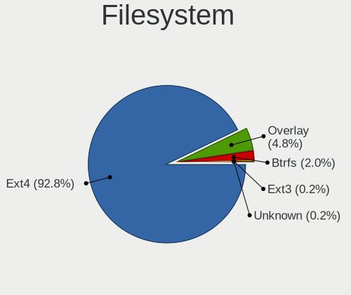
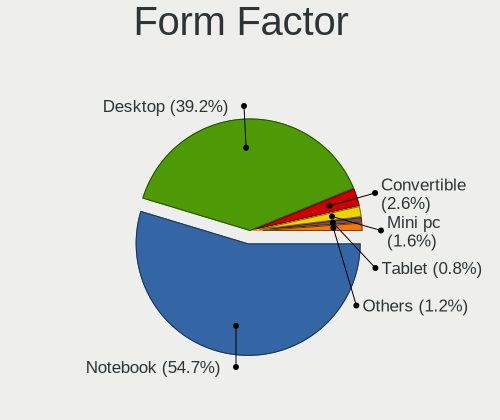
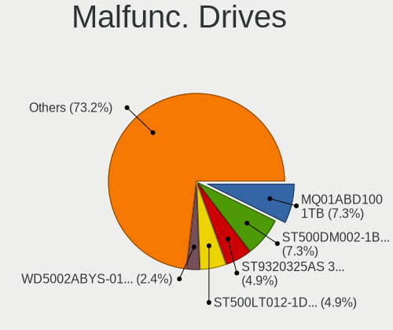
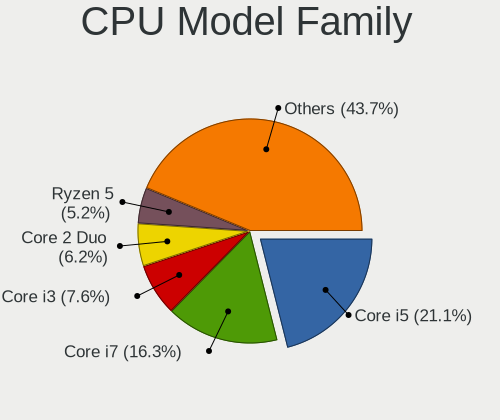
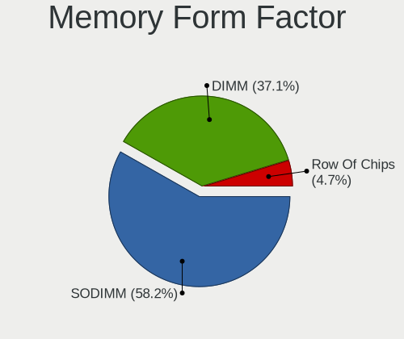
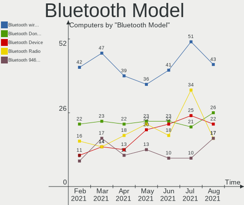

Mint Hardware Trends
--------------------

A project to identify most popular hardware characteristics and track their change
over time based on data collected by Mint users at https://Linux-Hardware.org.

Anyone can contribute to the study by uploading probes of their computers by
the [hw-probe](https://github.com/linuxhw/hw-probe) tool:

    sudo -E hw-probe -all -upload

This is a report for all computer types. See also reports for [desktops](/Dist/Mint/Desktop/README.md) and [notebooks](/Dist/Mint/Notebook/README.md).

Full-feature report is available here: https://linux-hardware.org/?view=trends

Period: Feb, 2021.

Contents
--------

- [ OS                       ](#os)
- [ OS Family                ](#os-family)
- [ Kernel                   ](#kernel)
- [ Kernel Family            ](#kernel-family)
- [ Kernel Major Ver.        ](#kernel-major-ver)
- [ Arch                     ](#arch)
- [ DE                       ](#de)
- [ Display Server           ](#display-server)
- [ Display Manager          ](#display-manager)
- [ OS Lang                  ](#os-lang)
- [ Boot Mode                ](#boot-mode)
- [ Filesystem               ](#filesystem)
- [ Part. scheme             ](#part-scheme)
- [ Dual Boot with Linux/BSD ](#dual-boot-with-linux/bsd)
- [ Dual Boot (Win)          ](#dual-boot-win)
- [ Country                  ](#country)
- [ City                     ](#city)
- [ Vendor                   ](#vendor)
- [ Model                    ](#model)
- [ Model Family             ](#model-family)
- [ MFG Year                 ](#mfg-year)
- [ Form Factor              ](#form-factor)
- [ Secure Boot              ](#secure-boot)
- [ Coreboot                 ](#coreboot)
- [ RAM Size                 ](#ram-size)
- [ RAM Used                 ](#ram-used)
- [ Has CD-ROM               ](#has-cd-rom)
- [ Total Drives             ](#total-drives)
- [ Has Ethernet             ](#has-ethernet)
- [ Drive Vendor             ](#drive-vendor)
- [ Drive Model              ](#drive-model)
- [ HDD Vendor               ](#hdd-vendor)
- [ SSD Vendor               ](#ssd-vendor)
- [ Drive Kind               ](#drive-kind)
- [ Drive Connector          ](#drive-connector)
- [ Drive Size               ](#drive-size)
- [ Space Total              ](#space-total)
- [ Space Used               ](#space-used)
- [ Malfunc. Drives          ](#malfunc-drives)
- [ Malfunc. Drive Vendor    ](#malfunc-drive-vendor)
- [ Malfunc. HDD Vendor      ](#malfunc-hdd-vendor)
- [ Malfunc. Drive Kind      ](#malfunc-drive-kind)
- [ Failed Drives            ](#failed-drives)
- [ Failed Drive Vendor      ](#failed-drive-vendor)
- [ Drive Status             ](#drive-status)
- [ Storage Vendor           ](#storage-vendor)
- [ Storage Model            ](#storage-model)
- [ Storage Kind             ](#storage-kind)
- [ CPU Vendor               ](#cpu-vendor)
- [ CPU Model                ](#cpu-model)
- [ CPU Model Family         ](#cpu-model-family)
- [ CPU Cores                ](#cpu-cores)
- [ CPU Sockets              ](#cpu-sockets)
- [ CPU Threads              ](#cpu-threads)
- [ CPU Op-Modes             ](#cpu-op-modes)
- [ CPU Microcode            ](#cpu-microcode)
- [ CPU Microarch            ](#cpu-microarch)
- [ GPU Vendor               ](#gpu-vendor)
- [ GPU Model                ](#gpu-model)
- [ GPU Combo                ](#gpu-combo)
- [ GPU Driver               ](#gpu-driver)
- [ GPU Memory               ](#gpu-memory)
- [ Monitor Vendor           ](#monitor-vendor)
- [ Monitor Model            ](#monitor-model)
- [ Monitor Resolution       ](#monitor-resolution)
- [ Monitor Diagonal         ](#monitor-diagonal)
- [ Monitor Width            ](#monitor-width)
- [ Aspect Ratio             ](#aspect-ratio)
- [ Monitor Area             ](#monitor-area)
- [ Pixel Density            ](#pixel-density)
- [ Multiple Monitors        ](#multiple-monitors)
- [ Net Controller Vendor    ](#net-controller-vendor)
- [ Net Controller Model     ](#net-controller-model)
- [ Wireless Vendor          ](#wireless-vendor)
- [ Wireless Model           ](#wireless-model)
- [ Ethernet Vendor          ](#ethernet-vendor)
- [ Ethernet Model           ](#ethernet-model)
- [ Net Controller Kind      ](#net-controller-kind)
- [ Used Controller          ](#used-controller)
- [ NICs                     ](#nics)
- [ Memory Vendor            ](#memory-vendor)
- [ Memory Model             ](#memory-model)
- [ Memory Kind              ](#memory-kind)
- [ Memory Form Factor       ](#memory-form-factor)
- [ Memory Size              ](#memory-size)
- [ Memory Speed             ](#memory-speed)
- [ Sound Vendor             ](#sound-vendor)
- [ Sound Model              ](#sound-model)
- [ Camera Vendor            ](#camera-vendor)
- [ Camera Model             ](#camera-model)
- [ Fingerprint Vendor       ](#fingerprint-vendor)
- [ Fingerprint Model        ](#fingerprint-model)
- [ Chipcard Vendor          ](#chipcard-vendor)
- [ Chipcard Model           ](#chipcard-model)
- [ Printer Vendor           ](#printer-vendor)
- [ Printer Model            ](#printer-model)
- [ Scanner Vendor           ](#scanner-vendor)
- [ Scanner Model            ](#scanner-model)
- [ Bluetooth Vendor         ](#bluetooth-vendor)
- [ Bluetooth Model          ](#bluetooth-model)
- [ Unsupported Devices      ](#unsupported-devices)
- [ Unsupported Device Types ](#unsupported-device-types)

OS
--

Installed operating systems

| Name      | Computers | Percent |
|-----------|-----------|---------|
| Mint 20.1 | 321       | 66.46%  |
| Mint 19.3 | 77        | 15.94%  |
| Mint 20   | 57        | 11.8%   |
| Mint 19.1 | 8         | 1.66%   |
| Mint 19   | 8         | 1.66%   |
| Mint 19.2 | 6         | 1.24%   |
| Mint 18.3 | 5         | 1.04%   |
| Mint 18.2 | 1         | 0.21%   |

OS Family
---------

OS without a version

| Name | Computers | Percent |
|------|-----------|---------|
| Mint | 483       | 100%    |

Kernel
------

Version of the Linux kernel

| Version                    | Computers | Percent |
|----------------------------|-----------|---------|
| 5.4.0-65-generic           | 275       | 56.94%  |
| 5.4.0-66-generic           | 52        | 10.77%  |
| 5.4.0-58-generic           | 24        | 4.97%   |
| 5.8.0-43-generic           | 19        | 3.93%   |
| 5.0.0-32-generic           | 14        | 2.9%    |
| 4.15.0-135-generic         | 12        | 2.48%   |
| 5.8.0-41-generic           | 10        | 2.07%   |
| 5.4.0-26-generic           | 10        | 2.07%   |
| 5.4.0-64-generic           | 9         | 1.86%   |
| 5.8.0-44-generic           | 6         | 1.24%   |
| 5.4.0-62-generic           | 5         | 1.04%   |
| 4.15.0-20-generic          | 5         | 1.04%   |
| 5.10.0-1011-oem            | 4         | 0.83%   |
| 5.4.0-56-generic           | 3         | 0.62%   |
| 5.4.0-54-generic           | 2         | 0.41%   |
| 5.4.0-42-generic           | 2         | 0.41%   |
| 5.10.12-051012-generic     | 2         | 0.41%   |
| 4.15.0-133-generic         | 2         | 0.41%   |
| 4.10.0-38-generic          | 2         | 0.41%   |
| 5.9.1-050901-generic       | 1         | 0.21%   |
| 5.8.0-41-lowlatency        | 1         | 0.21%   |
| 5.8.0-33-generic           | 1         | 0.21%   |
| 5.6.0-1047-oem             | 1         | 0.21%   |
| 5.6.0-1036-oem             | 1         | 0.21%   |
| 5.4.0-662102030405-generic | 1         | 0.21%   |
| 5.4.0-65-lowlatency        | 1         | 0.21%   |
| 5.4.0-60-generic           | 1         | 0.21%   |
| 5.4.0-52-generic           | 1         | 0.21%   |
| 5.11.0-2.2-liquorix-amd64  | 1         | 0.21%   |
| 5.11.0-051100rc7-generic   | 1         | 0.21%   |
| 5.11.0-051100-generic      | 1         | 0.21%   |
| 5.10.6-051006-generic      | 1         | 0.21%   |
| 5.10.15-051015-generic     | 1         | 0.21%   |
| 5.10.13-surface            | 1         | 0.21%   |
| 5.10.13-051013-generic     | 1         | 0.21%   |
| 5.10.0-1013-oem            | 1         | 0.21%   |
| 4.4.0-201-generic          | 1         | 0.21%   |
| 4.4.0-159-generic          | 1         | 0.21%   |
| 4.15.0-91-generic          | 1         | 0.21%   |
| 4.15.0-88-generic          | 1         | 0.21%   |
| 4.15.0-54-generic          | 1         | 0.21%   |
| 4.15.0-50-generic          | 1         | 0.21%   |
| 4.15.0-136-generic         | 1         | 0.21%   |
| 4.15.0-112-generic         | 1         | 0.21%   |

Kernel Family
-------------

Linux kernel without a distro release

| Version | Computers | Percent |
|---------|-----------|---------|
| 5.4.0   | 386       | 79.92%  |
| 5.8.0   | 37        | 7.66%   |
| 4.15.0  | 25        | 5.18%   |
| 5.0.0   | 14        | 2.9%    |
| 5.10.0  | 5         | 1.04%   |
| 5.11.0  | 3         | 0.62%   |
| 5.6.0   | 2         | 0.41%   |
| 5.10.13 | 2         | 0.41%   |
| 5.10.12 | 2         | 0.41%   |
| 4.4.0   | 2         | 0.41%   |
| 4.10.0  | 2         | 0.41%   |
| 5.9.1   | 1         | 0.21%   |
| 5.10.6  | 1         | 0.21%   |
| 5.10.15 | 1         | 0.21%   |

Kernel Major Ver.
-----------------

Linux kernel major version

| Version | Computers | Percent |
|---------|-----------|---------|
| 5.4     | 386       | 79.92%  |
| 5.8     | 37        | 7.66%   |
| 4.15    | 25        | 5.18%   |
| 5.0     | 14        | 2.9%    |
| 5.10    | 11        | 2.28%   |
| 5.11    | 3         | 0.62%   |
| 5.6     | 2         | 0.41%   |
| 4.4     | 2         | 0.41%   |
| 4.10    | 2         | 0.41%   |
| 5.9     | 1         | 0.21%   |

Arch
----

OS architecture (x86_64, i586, etc.)

| Name   | Computers | Percent |
|--------|-----------|---------|
| x86_64 | 452       | 93.58%  |
| i686   | 31        | 6.42%   |

DE
--

Desktop Environment

| Name            | Computers | Percent |
|-----------------|-----------|---------|
| X-Cinnamon      | 322       | 66.67%  |
| MATE            | 73        | 15.11%  |
| XFCE            | 59        | 12.22%  |
| Cinnamon        | 17        | 3.52%   |
| GNOME           | 5         | 1.04%   |
| Unknown         | 5         | 1.04%   |
| KDE             | 1         | 0.21%   |
| GNOME Flashback | 1         | 0.21%   |

Display Server
--------------

X11 or Wayland

| Name | Computers | Percent |
|------|-----------|---------|
| X11  | 480       | 99.38%  |
| Tty  | 3         | 0.62%   |

Display Manager
---------------

SDDM, LightDM, etc.

| Name    | Computers | Percent |
|---------|-----------|---------|
| Unknown | 371       | 76.81%  |
| TDM     | 110       | 22.77%  |
| MDM     | 1         | 0.21%   |
| GDM     | 1         | 0.21%   |

OS Lang
-------

Language

| Lang    | Computers | Percent |
|---------|-----------|---------|
| en_US   | 136       | 28.16%  |
| de_DE   | 63        | 13.04%  |
| pt_BR   | 34        | 7.04%   |
| en_GB   | 28        | 5.8%    |
| ru_RU   | 27        | 5.59%   |
| fr_FR   | 26        | 5.38%   |
| pl_PL   | 16        | 3.31%   |
| C       | 13        | 2.69%   |
| es_ES   | 12        | 2.48%   |
| en_CA   | 12        | 2.48%   |
| it_IT   | 9         | 1.86%   |
| en_AU   | 9         | 1.86%   |
| zh_CN   | 7         | 1.45%   |
| pt_PT   | 7         | 1.45%   |
| fi_FI   | 6         | 1.24%   |
| cs_CZ   | 6         | 1.24%   |
| nl_NL   | 5         | 1.04%   |
| ru_UA   | 4         | 0.83%   |
| es_AR   | 4         | 0.83%   |
| en_NZ   | 4         | 0.83%   |
| sv_SE   | 3         | 0.62%   |
| sk_SK   | 3         | 0.62%   |
| hu_HU   | 3         | 0.62%   |
| es_MX   | 3         | 0.62%   |
| es_CO   | 3         | 0.62%   |
| en_ZA   | 3         | 0.62%   |
| en_IN   | 3         | 0.62%   |
| de_CH   | 3         | 0.62%   |
| tr_TR   | 2         | 0.41%   |
| fr_CA   | 2         | 0.41%   |
| fr_BE   | 2         | 0.41%   |
| es_CL   | 2         | 0.41%   |
| en_IL   | 2         | 0.41%   |
| en_IE   | 2         | 0.41%   |
| el_GR   | 2         | 0.41%   |
| de_AT   | 2         | 0.41%   |
| ca_ES   | 2         | 0.41%   |
| bg_BG   | 2         | 0.41%   |
| sr_RS   | 1         | 0.21%   |
| nl_BE   | 1         | 0.21%   |
| ko_KR   | 1         | 0.21%   |
| es_PY   | 1         | 0.21%   |
| es_PE   | 1         | 0.21%   |
| es_CR   | 1         | 0.21%   |
| en_PH   | 1         | 0.21%   |
| en_DK   | 1         | 0.21%   |
| de_BE   | 1         | 0.21%   |
| da_DK   | 1         | 0.21%   |
| Unknown | 1         | 0.21%   |

Boot Mode
---------

EFI or BIOS

| Mode | Computers | Percent |
|------|-----------|---------|
| BIOS | 285       | 59.01%  |
| EFI  | 198       | 40.99%  |

Filesystem
----------

Type of filesystem

| Type    | Computers | Percent |
|---------|-----------|---------|
| Ext4    | 462       | 95.65%  |
| Overlay | 11        | 2.28%   |
| Btrfs   | 4         | 0.83%   |
| Ext2    | 3         | 0.62%   |
| Ext3    | 2         | 0.41%   |
| Xfs     | 1         | 0.21%   |

Part. scheme
------------

Scheme of partitioning

| Type    | Computers | Percent |
|---------|-----------|---------|
| Unknown | 369       | 76.4%   |
| GPT     | 74        | 15.32%  |
| MBR     | 40        | 8.28%   |

Dual Boot with Linux/BSD
------------------------

Hosting more than one Linux/BSD

| Dual boot | Computers | Percent |
|-----------|-----------|---------|
| No        | 465       | 96.27%  |
| Yes       | 18        | 3.73%   |

Dual Boot (Win)
---------------

Hosting Linux and Windows

| Dual boot | Computers | Percent |
|-----------|-----------|---------|
| No        | 423       | 87.58%  |
| Yes       | 60        | 12.42%  |

Country
-------

Geographic location (country)

| Country            | Computers | Percent |
|--------------------|-----------|---------|
| USA                | 80        | 16.56%  |
| Germany            | 68        | 14.08%  |
| Brazil             | 40        | 8.28%   |
| UK                 | 25        | 5.18%   |
| Russia             | 25        | 5.18%   |
| France             | 25        | 5.18%   |
| Spain              | 15        | 3.11%   |
| Poland             | 15        | 3.11%   |
| Canada             | 14        | 2.9%    |
| Italy              | 11        | 2.28%   |
| Ukraine            | 10        | 2.07%   |
| Finland            | 10        | 2.07%   |
| Australia          | 10        | 2.07%   |
| Portugal           | 8         | 1.66%   |
| Belgium            | 8         | 1.66%   |
| Slovakia           | 7         | 1.45%   |
| Netherlands        | 7         | 1.45%   |
| Austria            | 7         | 1.45%   |
| Mexico             | 6         | 1.24%   |
| Czech Republic     | 6         | 1.24%   |
| China              | 6         | 1.24%   |
| Sweden             | 5         | 1.04%   |
| Turkey             | 4         | 0.83%   |
| Switzerland        | 4         | 0.83%   |
| South Africa       | 4         | 0.83%   |
| New Zealand        | 4         | 0.83%   |
| Indonesia          | 4         | 0.83%   |
| India              | 4         | 0.83%   |
| Greece             | 4         | 0.83%   |
| Ireland            | 3         | 0.62%   |
| Hungary            | 3         | 0.62%   |
| Colombia           | 3         | 0.62%   |
| Bulgaria           | 3         | 0.62%   |
| Belarus            | 3         | 0.62%   |
| Argentina          | 3         | 0.62%   |
| Paraguay           | 2         | 0.41%   |
| Korea, Republic of | 2         | 0.41%   |
| Israel             | 2         | 0.41%   |
| Denmark            | 2         | 0.41%   |
| Chile              | 2         | 0.41%   |
| Uzbekistan         | 1         | 0.21%   |
| Sri Lanka          | 1         | 0.21%   |
| South Korea        | 1         | 0.21%   |
| Slovenia           | 1         | 0.21%   |
| Serbia             | 1         | 0.21%   |
| Puerto Rico        | 1         | 0.21%   |
| Philippines        | 1         | 0.21%   |
| Peru               | 1         | 0.21%   |
| Malaysia           | 1         | 0.21%   |
| Macedonia          | 1         | 0.21%   |
| Latvia             | 1         | 0.21%   |
| Kyrgyzstan         | 1         | 0.21%   |
| Japan              | 1         | 0.21%   |
| Hong Kong          | 1         | 0.21%   |
| Estonia            | 1         | 0.21%   |
| Costa Rica         | 1         | 0.21%   |
| Bangladesh         | 1         | 0.21%   |
| Angola             | 1         | 0.21%   |
| Algeria            | 1         | 0.21%   |

City
----

Geographic location (city)

| City             | Computers | Percent |
|------------------|-----------|---------|
| Helsinki         | 8         | 1.66%   |
| Berlin           | 6         | 1.24%   |
| Vienna           | 5         | 1.04%   |
| São Paulo       | 5         | 1.04%   |
| Nanning          | 5         | 1.04%   |
| Rio de Janeiro   | 4         | 0.83%   |
| Bratislava       | 4         | 0.83%   |
| Paris            | 3         | 0.62%   |
| Novosibirsk      | 3         | 0.62%   |
| Neunkirchen      | 3         | 0.62%   |
| Moscow           | 3         | 0.62%   |
| Madrid           | 3         | 0.62%   |
| Ludlow           | 3         | 0.62%   |
| Leipzig          | 3         | 0.62%   |
| Gadsden          | 3         | 0.62%   |
| Athens           | 3         | 0.62%   |
| Adelaide         | 3         | 0.62%   |
| Zlatoust         | 2         | 0.41%   |
| Wrocław         | 2         | 0.41%   |
| Voronezh         | 2         | 0.41%   |
| Vancouver        | 2         | 0.41%   |
| Spokane          | 2         | 0.41%   |
| Seattle          | 2         | 0.41%   |
| Schweitenkirchen | 2         | 0.41%   |
| Saarbrücken     | 2         | 0.41%   |
| Rockville        | 2         | 0.41%   |
| Richmond         | 2         | 0.41%   |
| Pretoria         | 2         | 0.41%   |
| Prague           | 2         | 0.41%   |
| Porto Alegre     | 2         | 0.41%   |
| Portland         | 2         | 0.41%   |
| Orlando          | 2         | 0.41%   |
| Omaha            | 2         | 0.41%   |
| Odesa            | 2         | 0.41%   |
| New York         | 2         | 0.41%   |
| New Delhi        | 2         | 0.41%   |
| Munich           | 2         | 0.41%   |
| Montijo          | 2         | 0.41%   |
| Minneapolis      | 2         | 0.41%   |
| Medellín        | 2         | 0.41%   |
| Kyiv             | 2         | 0.41%   |
| Krakow           | 2         | 0.41%   |
| Khabarovsk       | 2         | 0.41%   |
| Katowice         | 2         | 0.41%   |
| Glasgow          | 2         | 0.41%   |
| Edmonton         | 2         | 0.41%   |
| Dallas           | 2         | 0.41%   |
| Belém           | 2         | 0.41%   |
| Belo Horizonte   | 2         | 0.41%   |
| Barcelona        | 2         | 0.41%   |
| Augsburg         | 2         | 0.41%   |
| Auckland         | 2         | 0.41%   |
| Asunción        | 2         | 0.41%   |
| Antalya          | 2         | 0.41%   |
| Çankırı       | 1         | 0.21%   |
| Zurich           | 1         | 0.21%   |
| Znojmo           | 1         | 0.21%   |
| Ziar nad Hronom  | 1         | 0.21%   |
| Zdolbuniv        | 1         | 0.21%   |
| Zapopan          | 1         | 0.21%   |

Vendor
------

Motherboard manufacturer

| Name                  | Computers | Percent |
|-----------------------|-----------|---------|
| ASUSTek Computer      | 81        | 16.77%  |
| Hewlett-Packard       | 61        | 12.63%  |
| Dell                  | 60        | 12.42%  |
| Lenovo                | 52        | 10.77%  |
| Gigabyte Technology   | 32        | 6.63%   |
| Acer                  | 27        | 5.59%   |
| MSI                   | 25        | 5.18%   |
| ASRock                | 19        | 3.93%   |
| Toshiba               | 17        | 3.52%   |
| Samsung Electronics   | 11        | 2.28%   |
| Apple                 | 11        | 2.28%   |
| Sony                  | 10        | 2.07%   |
| Intel                 | 9         | 1.86%   |
| Fujitsu               | 7         | 1.45%   |
| Medion                | 5         | 1.04%   |
| Positivo              | 4         | 0.83%   |
| Timi                  | 3         | 0.62%   |
| Packard Bell          | 3         | 0.62%   |
| HUAWEI                | 3         | 0.62%   |
| ECS                   | 3         | 0.62%   |
| Biostar               | 3         | 0.62%   |
| Unknown               | 3         | 0.62%   |
| ZOTAC                 | 2         | 0.41%   |
| OEM                   | 2         | 0.41%   |
| Google                | 2         | 0.41%   |
| Foxconn               | 2         | 0.41%   |
| eMachines             | 2         | 0.41%   |
| TUXEDO                | 1         | 0.21%   |
| SZMZ                  | 1         | 0.21%   |
| Supermicro            | 1         | 0.21%   |
| Shuttle               | 1         | 0.21%   |
| Philco                | 1         | 0.21%   |
| Pegatron              | 1         | 0.21%   |
| PCChips               | 1         | 0.21%   |
| Notebook              | 1         | 0.21%   |
| NEC Computers         | 1         | 0.21%   |
| Minix                 | 1         | 0.21%   |
| Microsoft             | 1         | 0.21%   |
| Itautec               | 1         | 0.21%   |
| Inventec              | 1         | 0.21%   |
| Inupur                | 1         | 0.21%   |
| IBM                   | 1         | 0.21%   |
| Huanan                | 1         | 0.21%   |
| HARDKERNEL            | 1         | 0.21%   |
| Gateway               | 1         | 0.21%   |
| Fujitsu Siemens       | 1         | 0.21%   |
| EVOO Products Company | 1         | 0.21%   |
| DEXP                  | 1         | 0.21%   |
| Clevo                 | 1         | 0.21%   |
| BLAUPUNKT             | 1         | 0.21%   |
| Alienware             | 1         | 0.21%   |

Model
-----

Motherboard model

| Name                                  | Computers | Percent |
|---------------------------------------|-----------|---------|
| ASUS All Series                       | 6         | 1.24%   |
| Unknown                               | 4         | 0.83%   |
| HP Notebook                           | 3         | 0.62%   |
| HP G62                                | 3         | 0.62%   |
| Dell OptiPlex 3020                    | 3         | 0.62%   |
| Dell Latitude E6420                   | 3         | 0.62%   |
| Toshiba Satellite C660                | 2         | 0.41%   |
| Timi TM1703                           | 2         | 0.41%   |
| MSI MS-7C75                           | 2         | 0.41%   |
| HP Pavilion dv7                       | 2         | 0.41%   |
| HP 15                                 | 2         | 0.41%   |
| Gigabyte Z270X-Ultra Gaming           | 2         | 0.41%   |
| Dell Vostro 200                       | 2         | 0.41%   |
| Dell OptiPlex 390                     | 2         | 0.41%   |
| Dell Latitude E7470                   | 2         | 0.41%   |
| Dell Latitude E6540                   | 2         | 0.41%   |
| Dell G3 3590                          | 2         | 0.41%   |
| Biostar J1800NH2                      | 2         | 0.41%   |
| ASUS N61Jq                            | 2         | 0.41%   |
| Apple MacBook4,1                      | 2         | 0.41%   |
| Acer Aspire V3-771                    | 2         | 0.41%   |
| ZOTAC BayTrail-D                      | 1         | 0.21%   |
| TUXEDO Pulse 14 Gen1                  | 1         | 0.21%   |
| Toshiba TECRA A50-C                   | 1         | 0.21%   |
| Toshiba Satellite P105                | 1         | 0.21%   |
| Toshiba Satellite L50-C               | 1         | 0.21%   |
| Toshiba Satellite L40                 | 1         | 0.21%   |
| Toshiba Satellite L300                | 1         | 0.21%   |
| Toshiba Satellite C75D-B              | 1         | 0.21%   |
| Toshiba Satellite C55t-C              | 1         | 0.21%   |
| Toshiba Satellite C55Dt-A             | 1         | 0.21%   |
| Toshiba Satellite C55D-C              | 1         | 0.21%   |
| Toshiba Satellite C55-B               | 1         | 0.21%   |
| Toshiba Satellite C40-C               | 1         | 0.21%   |
| Toshiba Satellite A665                | 1         | 0.21%   |
| Toshiba Satellite A500                | 1         | 0.21%   |
| Toshiba Satellite A200                | 1         | 0.21%   |
| Toshiba PORTEGE R500                  | 1         | 0.21%   |
| Timi RedmiBook 14 II                  | 1         | 0.21%   |
| SZMZ X99M-H2                          | 1         | 0.21%   |
| Supermicro X8DAH                      | 1         | 0.21%   |
| Sony VPCYB35AL                        | 1         | 0.21%   |
| Sony VPCX11Z1E                        | 1         | 0.21%   |
| Sony VPCEB3E4E                        | 1         | 0.21%   |
| Sony VPCEB33FM                        | 1         | 0.21%   |
| Sony VGN-NR130FE                      | 1         | 0.21%   |
| Sony SVF15415CDW                      | 1         | 0.21%   |
| Sony SVF1521A7EB                      | 1         | 0.21%   |
| Sony SVE1713L1RW                      | 1         | 0.21%   |
| Sony SVE1511F4E                       | 1         | 0.21%   |
| Sony 91                               | 1         | 0.21%   |
| Shuttle XH61V                         | 1         | 0.21%   |
| Samsung RV415/RV515/E3415             | 1         | 0.21%   |
| Samsung RV411/RV511/E3511/S3511/RV711 | 1         | 0.21%   |
| Samsung RF511/RF411/RF711             | 1         | 0.21%   |
| Samsung N250P                         | 1         | 0.21%   |
| Samsung N102SP/N100SP/N101SP          | 1         | 0.21%   |
| Samsung M300A2A                       | 1         | 0.21%   |
| Samsung 550XBE/350XBE                 | 1         | 0.21%   |
| Samsung 355V4C/356V4C/3445VC/3545VC   | 1         | 0.21%   |

Model Family
------------

Motherboard model prefix

| Name                  | Computers | Percent |
|-----------------------|-----------|---------|
| Lenovo ThinkPad       | 24        | 4.97%   |
| Acer Aspire           | 19        | 3.93%   |
| Dell Latitude         | 17        | 3.52%   |
| Toshiba Satellite     | 15        | 3.11%   |
| Dell Inspiron         | 14        | 2.9%    |
| HP Compaq             | 11        | 2.28%   |
| Dell OptiPlex         | 9         | 1.86%   |
| Lenovo IdeaPad        | 8         | 1.66%   |
| HP ProBook            | 8         | 1.66%   |
| Dell Vostro           | 8         | 1.66%   |
| HP Laptop             | 7         | 1.45%   |
| ASUS PRIME            | 7         | 1.45%   |
| HP Pavilion           | 6         | 1.24%   |
| HP EliteBook          | 6         | 1.24%   |
| ASUS All              | 6         | 1.24%   |
| Lenovo ThinkCentre    | 5         | 1.04%   |
| Dell XPS              | 5         | 1.04%   |
| Lenovo Yoga           | 4         | 0.83%   |
| Dell Precision        | 4         | 0.83%   |
| Unknown               | 4         | 0.83%   |
| HP Notebook           | 3         | 0.62%   |
| HP G62                | 3         | 0.62%   |
| Timi TM1703           | 2         | 0.41%   |
| Packard Bell EasyNote | 2         | 0.41%   |
| MSI MS-7C75           | 2         | 0.41%   |
| HP Stream             | 2         | 0.41%   |
| HP 15                 | 2         | 0.41%   |
| Gigabyte Z270X-Ultra  | 2         | 0.41%   |
| Fujitsu LIFEBOOK      | 2         | 0.41%   |
| Fujitsu ESPRIMO       | 2         | 0.41%   |
| Dell G3               | 2         | 0.41%   |
| Biostar J1800NH2      | 2         | 0.41%   |
| ASUS ROG              | 2         | 0.41%   |
| ASUS P8H61-M          | 2         | 0.41%   |
| ASUS P5Q              | 2         | 0.41%   |
| ASUS N61Jq            | 2         | 0.41%   |
| Apple MacBook4        | 2         | 0.41%   |
| Acer TravelMate       | 2         | 0.41%   |
| Acer Swift            | 2         | 0.41%   |
| ZOTAC BayTrail-D      | 1         | 0.21%   |
| TUXEDO Pulse          | 1         | 0.21%   |
| Toshiba TECRA         | 1         | 0.21%   |
| Toshiba PORTEGE       | 1         | 0.21%   |
| Timi RedmiBook        | 1         | 0.21%   |
| SZMZ X99M-H2          | 1         | 0.21%   |
| Supermicro X8DAH      | 1         | 0.21%   |
| Sony VPCYB35AL        | 1         | 0.21%   |
| Sony VPCX11Z1E        | 1         | 0.21%   |
| Sony VPCEB3E4E        | 1         | 0.21%   |
| Sony VPCEB33FM        | 1         | 0.21%   |
| Sony VGN-NR130FE      | 1         | 0.21%   |
| Sony SVF15415CDW      | 1         | 0.21%   |
| Sony SVF1521A7EB      | 1         | 0.21%   |
| Sony SVE1713L1RW      | 1         | 0.21%   |
| Sony SVE1511F4E       | 1         | 0.21%   |
| Sony 91               | 1         | 0.21%   |
| Shuttle XH61V         | 1         | 0.21%   |
| Samsung RV415         | 1         | 0.21%   |
| Samsung RV411         | 1         | 0.21%   |
| Samsung RF511         | 1         | 0.21%   |

MFG Year
--------

Motherboard manufacture year

| Year    | Computers | Percent |
|---------|-----------|---------|
| 2020    | 73        | 15.11%  |
| 2012    | 45        | 9.32%   |
| 2013    | 41        | 8.49%   |
| 2019    | 39        | 8.07%   |
| 2018    | 39        | 8.07%   |
| 2010    | 34        | 7.04%   |
| 2011    | 32        | 6.63%   |
| 2015    | 30        | 6.21%   |
| 2014    | 30        | 6.21%   |
| 2009    | 30        | 6.21%   |
| 2008    | 26        | 5.38%   |
| 2017    | 18        | 3.73%   |
| 2016    | 17        | 3.52%   |
| 2007    | 13        | 2.69%   |
| 2021    | 5         | 1.04%   |
| 2006    | 5         | 1.04%   |
| 2005    | 3         | 0.62%   |
| 2004    | 1         | 0.21%   |
| 2003    | 1         | 0.21%   |
| Unknown | 1         | 0.21%   |

Form Factor
-----------

Physical design of the computer

| Name        | Computers | Percent |
|-------------|-----------|---------|
| Notebook    | 265       | 54.87%  |
| Desktop     | 205       | 42.44%  |
| Convertible | 4         | 0.83%   |
| Mini pc     | 3         | 0.62%   |
| Server      | 3         | 0.62%   |
| All in one  | 2         | 0.41%   |
| Tablet      | 1         | 0.21%   |

Secure Boot
-----------

Enabled or disabled

| State    | Computers | Percent |
|----------|-----------|---------|
| Disabled | 452       | 93.58%  |
| Enabled  | 31        | 6.42%   |

Coreboot
--------

Have coreboot on board

| Used | Computers | Percent |
|------|-----------|---------|
| No   | 481       | 99.59%  |
| Yes  | 2         | 0.41%   |

RAM Size
--------

Total RAM memory

| Size in GB  | Computers | Percent |
|-------------|-----------|---------|
| 3.01-4.0    | 119       | 24.64%  |
| 4.01-8.0    | 109       | 22.57%  |
| 8.01-16.0   | 84        | 17.39%  |
| 16.01-24.0  | 75        | 15.53%  |
| 1.01-2.0    | 43        | 8.9%    |
| 32.01-64.0  | 31        | 6.42%   |
| 2.01-3.0    | 11        | 2.28%   |
| 0.51-1.0    | 5         | 1.04%   |
| 64.01-256.0 | 4         | 0.83%   |
| 24.01-32.0  | 2         | 0.41%   |

RAM Used
--------

Used RAM memory

| Used GB    | Computers | Percent |
|------------|-----------|---------|
| 1.01-2.0   | 207       | 42.86%  |
| 2.01-3.0   | 109       | 22.57%  |
| 0.51-1.0   | 64        | 13.25%  |
| 3.01-4.0   | 46        | 9.52%   |
| 4.01-8.0   | 42        | 8.7%    |
| 8.01-16.0  | 10        | 2.07%   |
| 0.01-0.5   | 3         | 0.62%   |
| 24.01-32.0 | 1         | 0.21%   |
| 16.01-24.0 | 1         | 0.21%   |

Has CD-ROM
----------

Has CD-ROM on board

| Presented | Computers | Percent |
|-----------|-----------|---------|
| Yes       | 264       | 54.66%  |
| No        | 219       | 45.34%  |

Total Drives
------------

Number of drives on board

| Drives | Computers | Percent |
|--------|-----------|---------|
| 1      | 277       | 57.35%  |
| 2      | 122       | 25.26%  |
| 3      | 45        | 9.32%   |
| 4      | 17        | 3.52%   |
| 5      | 9         | 1.86%   |
| 0      | 5         | 1.04%   |
| 6      | 3         | 0.62%   |
| 8      | 2         | 0.41%   |
| 10     | 1         | 0.21%   |
| 9      | 1         | 0.21%   |
| 7      | 1         | 0.21%   |

Has Ethernet
------------

Has Ethernet on board

| Presented | Computers | Percent |
|-----------|-----------|---------|
| Yes       | 438       | 90.68%  |
| No        | 45        | 9.32%   |

Drive Vendor
------------

Hard drive vendors

| Vendor                  | Computers | Drives | Percent |
|-------------------------|-----------|--------|---------|
| Seagate                 | 127       | 152    | 18.09%  |
| WDC                     | 124       | 164    | 17.66%  |
| Samsung Electronics     | 96        | 116    | 13.68%  |
| Toshiba                 | 42        | 44     | 5.98%   |
| Sandisk                 | 38        | 39     | 5.41%   |
| Hitachi                 | 35        | 35     | 4.99%   |
| Kingston                | 34        | 39     | 4.84%   |
| Unknown                 | 31        | 36     | 4.42%   |
| Crucial                 | 30        | 33     | 4.27%   |
| HGST                    | 12        | 15     | 1.71%   |
| SK Hynix                | 10        | 10     | 1.42%   |
| A-DATA Technology       | 10        | 11     | 1.42%   |
| Intel                   | 8         | 9      | 1.14%   |
| Micron Technology       | 7         | 7      | 1%      |
| MAXTOR                  | 7         | 8      | 1%      |
| China                   | 7         | 7      | 1%      |
| Intenso                 | 6         | 6      | 0.85%   |
| Transcend               | 5         | 5      | 0.71%   |
| GOODRAM                 | 5         | 5      | 0.71%   |
| Apple                   | 5         | 5      | 0.71%   |
| OCZ                     | 4         | 4      | 0.57%   |
| SPCC                    | 3         | 3      | 0.43%   |
| PNY                     | 3         | 3      | 0.43%   |
| PLEXTOR                 | 3         | 3      | 0.43%   |
| KingSpec                | 3         | 3      | 0.43%   |
| Team                    | 2         | 2      | 0.28%   |
| Silicon Motion          | 2         | 2      | 0.28%   |
| Realtek Semiconductor   | 2         | 2      | 0.28%   |
| Phison                  | 2         | 3      | 0.28%   |
| Patriot                 | 2         | 2      | 0.28%   |
| LITEON                  | 2         | 2      | 0.28%   |
| KIOXIA                  | 2         | 2      | 0.28%   |
| Fujitsu                 | 2         | 2      | 0.28%   |
| Corsair                 | 2         | 2      | 0.28%   |
| ASMT                    | 2         | 2      | 0.28%   |
| Apacer                  | 2         | 2      | 0.28%   |
| WD MediaMax             | 1         | 1      | 0.14%   |
| Vaseky                  | 1         | 1      | 0.14%   |
| USB                     | 1         | 1      | 0.14%   |
| Union Memory (Shenzhen) | 1         | 1      | 0.14%   |
| Union Memory            | 1         | 1      | 0.14%   |
| TO Exter                | 1         | 1      | 0.14%   |
| TCSUNBOW                | 1         | 1      | 0.14%   |
| Smartbuy                | 1         | 1      | 0.14%   |
| SILICONMOTION           | 1         | 1      | 0.14%   |
| RDM-II                  | 1         | 1      | 0.14%   |
| OASDX                   | 1         | 1      | 0.14%   |
| Netac                   | 1         | 1      | 0.14%   |
| MyDigitalSSD            | 1         | 1      | 0.14%   |
| Mushkin                 | 1         | 1      | 0.14%   |
| LITEONIT                | 1         | 1      | 0.14%   |
| KingFast                | 1         | 1      | 0.14%   |
| JMicron                 | 1         | 1      | 0.14%   |
| HS-SSD-C100             | 1         | 1      | 0.14%   |
| HGST HTS                | 1         | 1      | 0.14%   |
| External                | 1         | 1      | 0.14%   |
| Config                  | 1         | 1      | 0.14%   |
| Colorful                | 1         | 1      | 0.14%   |
| BHT                     | 1         | 1      | 0.14%   |
| Avant                   | 1         | 1      | 0.14%   |

Drive Model
-----------

Hard drive models

| Model                              | Computers | Percent |
|------------------------------------|-----------|---------|
| Unknown MMC Card  32GB             | 11        | 1.39%   |
| Seagate ST9500325AS 500GB          | 8         | 1.01%   |
| Seagate ST1000LM024 HN-M101MBB 1TB | 7         | 0.88%   |
| Samsung SSD 850 EVO 250GB          | 7         | 0.88%   |
| Kingston SV300S37A120G 120GB SSD   | 7         | 0.88%   |
| Seagate ST1000DM010-2EP102 1TB     | 6         | 0.76%   |
| Samsung NVMe SSD Drive 256GB       | 6         | 0.76%   |
| Kingston SA400S37240G 240GB SSD    | 6         | 0.76%   |
| Crucial CT1000MX500SSD1 1TB        | 6         | 0.76%   |
| WDC WDS240G2G0A-00JH30 240GB SSD   | 5         | 0.63%   |
| WDC WD10EZEX-00BN5A0 1TB           | 5         | 0.63%   |
| Unknown SD/MMC/MS PRO 64GB         | 5         | 0.63%   |
| Toshiba MQ04ABF100 1TB             | 5         | 0.63%   |
| Toshiba DT01ACA100 1TB             | 5         | 0.63%   |
| Seagate ST500LT012-1DG142 500GB    | 5         | 0.63%   |
| Seagate ST500DM002-1BD142 500GB    | 5         | 0.63%   |
| Seagate ST1000LM035-1RK172 1TB     | 5         | 0.63%   |
| Crucial CT240BX500SSD1 240GB       | 5         | 0.63%   |
| Toshiba MQ01ABD100 1TB             | 4         | 0.5%    |
| Seagate ST4000DM004-2CV104 4TB     | 4         | 0.5%    |
| Seagate ST2000DM008-2FR102 2TB     | 4         | 0.5%    |
| Seagate Expansion 500GB            | 4         | 0.5%    |
| SanDisk SSD PLUS 240GB             | 4         | 0.5%    |
| SanDisk SSD PLUS 120GB             | 4         | 0.5%    |
| Samsung SSD 860 EVO 500GB          | 4         | 0.5%    |
| Samsung NVMe SSD Drive 512GB       | 4         | 0.5%    |
| Samsung NVMe SSD Drive 500GB       | 4         | 0.5%    |
| Samsung NVMe SSD Drive 1TB         | 4         | 0.5%    |
| Samsung MZ7KM480HMHQ-000 480GB SSD | 4         | 0.5%    |
| Hitachi HTS547575A9E384 752GB      | 4         | 0.5%    |
| HGST HTS721010A9E630 1TB           | 4         | 0.5%    |
| HGST HTS545050A7E680 500GB         | 4         | 0.5%    |
| WDC WDS240G2G0B-00EPW0 240GB SSD   | 3         | 0.38%   |
| WDC WD5000AVDS-63U7B1 500GB        | 3         | 0.38%   |
| WDC WD30EFRX-68EUZN0 3TB           | 3         | 0.38%   |
| Seagate ST500LT012-9WS142 500GB    | 3         | 0.38%   |
| Seagate ST2000DM001-1CH164 2TB     | 3         | 0.38%   |
| Seagate ST1000DM003-1ER162 1TB     | 3         | 0.38%   |
| Seagate ST1000DM003-1CH162 1TB     | 3         | 0.38%   |
| SanDisk SSD PLUS 480GB             | 3         | 0.38%   |
| Sandisk NVMe SSD Drive 512GB       | 3         | 0.38%   |
| Samsung SSD 860 EVO 1TB            | 3         | 0.38%   |
| Samsung SSD 850 EVO 500GB          | 3         | 0.38%   |
| Samsung SSD 840 EVO 120GB          | 3         | 0.38%   |
| Samsung HD501LJ 500GB              | 3         | 0.38%   |
| Kingston SA400S37480G 480GB SSD    | 3         | 0.38%   |
| Kingston SA400S37120G 120GB SSD    | 3         | 0.38%   |
| Crucial CT500MX500SSD1 500GB       | 3         | 0.38%   |
| Crucial CT480BX500SSD1 480GB       | 3         | 0.38%   |
| WDC WDS100T2B0A-00SM50 1TB SSD     | 2         | 0.25%   |
| WDC WD5000LPVX-22V0TT0 500GB       | 2         | 0.25%   |
| WDC WD5000AAKX-753CA1 500GB        | 2         | 0.25%   |
| WDC WD5000AAKX-22ERMA0 500GB       | 2         | 0.25%   |
| WDC WD5000AAKX-001CA0 500GB        | 2         | 0.25%   |
| WDC WD5000AAKS-00UU3A0 500GB       | 2         | 0.25%   |
| WDC WD40EFRX-68N32N0 4TB           | 2         | 0.25%   |
| WDC WD2500BEVT-22ZCT0 250GB        | 2         | 0.25%   |
| WDC WD20EZRZ-00Z5HB0 2TB           | 2         | 0.25%   |
| WDC WD20EARX-00PASB0 2TB           | 2         | 0.25%   |
| WDC WD10JPCX-24UE4T0 1TB           | 2         | 0.25%   |

HDD Vendor
----------

Hard disk drive vendors

| Vendor              | Computers | Drives | Percent |
|---------------------|-----------|--------|---------|
| Seagate             | 124       | 145    | 35.43%  |
| WDC                 | 105       | 142    | 30%     |
| Toshiba             | 37        | 39     | 10.57%  |
| Hitachi             | 35        | 35     | 10%     |
| Samsung Electronics | 20        | 21     | 5.71%   |
| HGST                | 12        | 15     | 3.43%   |
| MAXTOR              | 6         | 7      | 1.71%   |
| Apple               | 3         | 3      | 0.86%   |
| Unknown             | 2         | 3      | 0.57%   |
| Fujitsu             | 2         | 2      | 0.57%   |
| USB                 | 1         | 1      | 0.29%   |
| TO Exter            | 1         | 1      | 0.29%   |
| SILICONMOTION       | 1         | 1      | 0.29%   |
| ASMT                | 1         | 1      | 0.29%   |

SSD Vendor
----------

Solid state drive vendors

| Vendor              | Computers | Drives | Percent |
|---------------------|-----------|--------|---------|
| Samsung Electronics | 52        | 60     | 20.72%  |
| Kingston            | 31        | 33     | 12.35%  |
| Crucial             | 29        | 31     | 11.55%  |
| SanDisk             | 28        | 29     | 11.16%  |
| WDC                 | 18        | 18     | 7.17%   |
| A-DATA Technology   | 10        | 11     | 3.98%   |
| China               | 7         | 7      | 2.79%   |
| Intel               | 6         | 7      | 2.39%   |
| Transcend           | 5         | 5      | 1.99%   |
| Micron Technology   | 5         | 5      | 1.99%   |
| Intenso             | 5         | 5      | 1.99%   |
| GOODRAM             | 5         | 5      | 1.99%   |
| SK Hynix            | 4         | 4      | 1.59%   |
| OCZ                 | 4         | 4      | 1.59%   |
| SPCC                | 3         | 3      | 1.2%    |
| Seagate             | 3         | 3      | 1.2%    |
| PNY                 | 3         | 3      | 1.2%    |
| PLEXTOR             | 3         | 3      | 1.2%    |
| KingSpec            | 3         | 3      | 1.2%    |
| Toshiba             | 2         | 2      | 0.8%    |
| Team                | 2         | 2      | 0.8%    |
| Patriot             | 2         | 2      | 0.8%    |
| LITEON              | 2         | 2      | 0.8%    |
| Corsair             | 2         | 2      | 0.8%    |
| Apacer              | 2         | 2      | 0.8%    |
| Vaseky              | 1         | 1      | 0.4%    |
| Unknown             | 1         | 1      | 0.4%    |
| TCSUNBOW            | 1         | 1      | 0.4%    |
| Smartbuy            | 1         | 1      | 0.4%    |
| OASDX               | 1         | 1      | 0.4%    |
| Netac               | 1         | 1      | 0.4%    |
| MyDigitalSSD        | 1         | 1      | 0.4%    |
| Mushkin             | 1         | 1      | 0.4%    |
| Maxtor              | 1         | 1      | 0.4%    |
| LITEONIT            | 1         | 1      | 0.4%    |
| External            | 1         | 1      | 0.4%    |
| BHT                 | 1         | 1      | 0.4%    |
| Avant               | 1         | 1      | 0.4%    |
| ASMT                | 1         | 1      | 0.4%    |
| Apple               | 1         | 1      | 0.4%    |

Drive Kind
----------

HDD or SSD

| Kind    | Computers | Drives | Percent |
|---------|-----------|--------|---------|
| HDD     | 294       | 416    | 46.96%  |
| SSD     | 220       | 266    | 35.14%  |
| NVMe    | 70        | 82     | 11.18%  |
| MMC     | 21        | 25     | 3.35%   |
| Unknown | 21        | 21     | 3.35%   |

Drive Connector
---------------

SATA, SAS, NVMe, etc.

| Type | Computers | Drives | Percent |
|------|-----------|--------|---------|
| SATA | 423       | 667    | 77.76%  |
| NVMe | 70        | 82     | 12.87%  |
| SAS  | 30        | 36     | 5.51%   |
| MMC  | 21        | 25     | 3.86%   |

Drive Size
----------

Size of hard drive

| Size in TB | Computers | Drives | Percent |
|------------|-----------|--------|---------|
| 0.01-0.5   | 330       | 426    | 60.44%  |
| 0.51-1.0   | 144       | 167    | 26.37%  |
| 1.01-2.0   | 44        | 53     | 8.06%   |
| 3.01-4.0   | 15        | 20     | 2.75%   |
| 2.01-3.0   | 8         | 11     | 1.47%   |
| 4.01-10.0  | 4         | 4      | 0.73%   |
| 10.01-20.0 | 1         | 1      | 0.18%   |

Space Total
-----------

Amount of disk space available on the file system

| Size in GB     | Computers | Percent |
|----------------|-----------|---------|
| 101-250        | 153       | 31.68%  |
| 251-500        | 108       | 22.36%  |
| 501-1000       | 64        | 13.25%  |
| 1001-2000      | 46        | 9.52%   |
| 51-100         | 37        | 7.66%   |
| 21-50          | 25        | 5.18%   |
| More than 3000 | 23        | 4.76%   |
| 2001-3000      | 15        | 3.11%   |
| 1-20           | 12        | 2.48%   |

Space Used
----------

Amount of used disk space

| Used GB        | Computers | Percent |
|----------------|-----------|---------|
| 1-20           | 127       | 26.29%  |
| 21-50          | 121       | 25.05%  |
| 51-100         | 78        | 16.15%  |
| 101-250        | 65        | 13.46%  |
| 251-500        | 39        | 8.07%   |
| 501-1000       | 24        | 4.97%   |
| 1001-2000      | 19        | 3.93%   |
| More than 3000 | 8         | 1.66%   |
| 2001-3000      | 2         | 0.41%   |

Malfunc. Drives
---------------

Drive models with a malfunction

| Model                                 | Computers | Drives | Percent |
|---------------------------------------|-----------|--------|---------|
| WDC WD7500AARS-003BB1 752GB           | 1         | 1      | 3.03%   |
| WDC WD6400BEVT-80A0RT0 640GB          | 1         | 1      | 3.03%   |
| WDC WD5000AAKX-753CA1 500GB           | 1         | 1      | 3.03%   |
| WDC WD5000AAKX-001CA0 500GB           | 1         | 1      | 3.03%   |
| WDC WD2500BEVT-80A23T0 250GB          | 1         | 1      | 3.03%   |
| WDC WD20EARX-00MMMB0 2TB              | 1         | 1      | 3.03%   |
| WDC WD10EZEX-00RKKA0 1TB              | 1         | 1      | 3.03%   |
| WDC WD10EZEX-00BN5A0 1TB              | 1         | 2      | 3.03%   |
| Toshiba MQ01ABD100 1TB                | 1         | 1      | 3.03%   |
| Toshiba MK5065GSXF 500GB              | 1         | 1      | 3.03%   |
| Toshiba MK2046GSX 200GB               | 1         | 1      | 3.03%   |
| Toshiba MK1652GSX 160GB               | 1         | 1      | 3.03%   |
| Toshiba MK1237GSX 120GB               | 1         | 1      | 3.03%   |
| SK Hynix HFS256G32MND-2900A 256GB SSD | 1         | 1      | 3.03%   |
| Seagate ST9500423AS 500GB             | 1         | 1      | 3.03%   |
| Seagate ST9500420AS 500GB             | 1         | 1      | 3.03%   |
| Seagate ST9250410AS 250GB             | 1         | 1      | 3.03%   |
| Seagate ST500DM002-1BD142 500GB       | 1         | 1      | 3.03%   |
| Seagate ST3500320AS 500GB             | 1         | 1      | 3.03%   |
| Seagate ST3360320AS 360GB             | 1         | 1      | 3.03%   |
| Seagate ST1000LM024 HN-M101MBB 1TB    | 1         | 1      | 3.03%   |
| SanDisk SD8SN8U-128G-1006 128GB SSD   | 1         | 1      | 3.03%   |
| Samsung Electronics HD502HI 500GB     | 1         | 1      | 3.03%   |
| Kingston SHFS37A120G 120GB SSD        | 1         | 1      | 3.03%   |
| Kingston SH103S3240G 240GB SSD        | 1         | 1      | 3.03%   |
| Intel SSDSC2BF240A5L 240GB            | 1         | 1      | 3.03%   |
| Hitachi HTS545025B9A300 250GB         | 1         | 1      | 3.03%   |
| Hitachi HDT721025SLA380 250GB         | 1         | 1      | 3.03%   |
| Hitachi HDP725050GLA360 500GB         | 1         | 1      | 3.03%   |
| Hitachi HCS5C3232SLA380 320GB         | 1         | 1      | 3.03%   |
| HGST HTS545050A7E680 500GB            | 1         | 1      | 3.03%   |
| Crucial CT525MX300SSD1 528GB          | 1         | 1      | 3.03%   |
| Crucial CT1050MX300SSD1 1TB           | 1         | 1      | 3.03%   |

Malfunc. Drive Vendor
---------------------

Vendors of faulty drives

| Vendor              | Computers | Drives | Percent |
|---------------------|-----------|--------|---------|
| Seagate             | 7         | 7      | 22.58%  |
| WDC                 | 6         | 9      | 19.35%  |
| Toshiba             | 5         | 5      | 16.13%  |
| Hitachi             | 4         | 4      | 12.9%   |
| Kingston            | 2         | 2      | 6.45%   |
| Crucial             | 2         | 2      | 6.45%   |
| SK Hynix            | 1         | 1      | 3.23%   |
| SanDisk             | 1         | 1      | 3.23%   |
| Samsung Electronics | 1         | 1      | 3.23%   |
| Intel               | 1         | 1      | 3.23%   |
| HGST                | 1         | 1      | 3.23%   |

Malfunc. HDD Vendor
-------------------

Vendors of faulty HDD drives

| Vendor              | Computers | Drives | Percent |
|---------------------|-----------|--------|---------|
| Seagate             | 7         | 7      | 29.17%  |
| WDC                 | 6         | 9      | 25%     |
| Toshiba             | 5         | 5      | 20.83%  |
| Hitachi             | 4         | 4      | 16.67%  |
| Samsung Electronics | 1         | 1      | 4.17%   |
| HGST                | 1         | 1      | 4.17%   |

Malfunc. Drive Kind
-------------------

Kinds of faulty drives

| Kind | Computers | Drives | Percent |
|------|-----------|--------|---------|
| HDD  | 24        | 27     | 77.42%  |
| SSD  | 7         | 7      | 22.58%  |

Failed Drives
-------------

Failed drive models

Zero info for selected period =(

Failed Drive Vendor
-------------------

Failed drive vendors

Zero info for selected period =(

Drive Status
------------

Number of failed and malfunc. drives

| Status   | Computers | Drives | Percent |
|----------|-----------|--------|---------|
| Detected | 373       | 617    | 74.01%  |
| Works    | 100       | 159    | 19.84%  |
| Malfunc  | 31        | 34     | 6.15%   |

Storage Vendor
--------------

Storage controller vendors

| Vendor                           | Computers | Percent |
|----------------------------------|-----------|---------|
| Intel                            | 347       | 60.66%  |
| AMD                              | 87        | 15.21%  |
| Samsung Electronics              | 31        | 5.42%   |
| Nvidia                           | 16        | 2.8%    |
| Marvell Technology Group         | 15        | 2.62%   |
| Sandisk                          | 12        | 2.1%    |
| JMicron Technology               | 12        | 2.1%    |
| ASMedia Technology               | 9         | 1.57%   |
| SK Hynix                         | 6         | 1.05%   |
| Kingston Technology Company      | 4         | 0.7%    |
| Toshiba America Info Systems     | 3         | 0.52%   |
| Silicon Integrated Systems [SiS] | 3         | 0.52%   |
| LSI Logic / Symbios Logic        | 3         | 0.52%   |
| VIA Technologies                 | 2         | 0.35%   |
| Union Memory (Shenzhen)          | 2         | 0.35%   |
| Silicon Motion                   | 2         | 0.35%   |
| Silicon Image                    | 2         | 0.35%   |
| Realtek Semiconductor            | 2         | 0.35%   |
| Phison Electronics               | 2         | 0.35%   |
| Micron/Crucial Technology        | 2         | 0.35%   |
| Micron Technology                | 2         | 0.35%   |
| KIOXIA                           | 2         | 0.35%   |
| Solid State Storage Technology   | 1         | 0.17%   |
| Lite-On IT Corp. / Plextor       | 1         | 0.17%   |
| Hewlett-Packard                  | 1         | 0.17%   |
| Broadcom / LSI                   | 1         | 0.17%   |
| Apple                            | 1         | 0.17%   |
| ADATA Technology                 | 1         | 0.17%   |

Storage Model
-------------

Storage controller models

| Model                                                                                   | Computers | Percent |
|-----------------------------------------------------------------------------------------|-----------|---------|
| AMD FCH SATA Controller [AHCI mode]                                                     | 49        | 7.21%   |
| Intel 8 Series/C220 Series Chipset Family 6-port SATA Controller 1 [AHCI mode]          | 30        | 4.41%   |
| Intel 7 Series Chipset Family 6-port SATA Controller [AHCI mode]                        | 30        | 4.41%   |
| Samsung NVMe SSD Controller SM981/PM981/PM983                                           | 26        | 3.82%   |
| Intel Sunrise Point-LP SATA Controller [AHCI mode]                                      | 24        | 3.53%   |
| Intel 6 Series/C200 Series Chipset Family 6 port Mobile SATA AHCI Controller            | 19        | 2.79%   |
| AMD SB7x0/SB8x0/SB9x0 SATA Controller [AHCI mode]                                       | 17        | 2.5%    |
| Intel 82801 Mobile SATA Controller [RAID mode]                                          | 16        | 2.35%   |
| Intel 82801HM/HEM (ICH8M/ICH8M-E) IDE Controller                                        | 15        | 2.21%   |
| Intel 6 Series/C200 Series Chipset Family 6 port Desktop SATA AHCI Controller           | 15        | 2.21%   |
| Intel NM10/ICH7 Family SATA Controller [IDE mode]                                       | 13        | 1.91%   |
| Intel 8 Series SATA Controller 1 [AHCI mode]                                            | 13        | 1.91%   |
| AMD SB7x0/SB8x0/SB9x0 IDE Controller                                                    | 13        | 1.91%   |
| Intel 82801HM/HEM (ICH8M/ICH8M-E) SATA Controller [AHCI mode]                           | 12        | 1.76%   |
| Intel 5 Series/3400 Series Chipset 4 port SATA AHCI Controller                          | 12        | 1.76%   |
| Intel Cannon Lake PCH SATA AHCI Controller                                              | 9         | 1.32%   |
| Intel 82801IBM/IEM (ICH9M/ICH9M-E) 4 port SATA Controller [AHCI mode]                   | 9         | 1.32%   |
| Intel 82801G (ICH7 Family) IDE Controller                                               | 9         | 1.32%   |
| AMD SB7x0/SB8x0/SB9x0 SATA Controller [IDE mode]                                        | 9         | 1.32%   |
| Intel 7 Series/C210 Series Chipset Family 6-port SATA Controller [AHCI mode]            | 8         | 1.18%   |
| Intel 6 Series/C200 Series Chipset Family Desktop SATA Controller (IDE mode, ports 4-5) | 8         | 1.18%   |
| Intel 6 Series/C200 Series Chipset Family Desktop SATA Controller (IDE mode, ports 0-3) | 8         | 1.18%   |
| Intel 400 Series Chipset Family SATA AHCI Controller                                    | 8         | 1.18%   |
| Intel Atom Processor E3800 Series SATA AHCI Controller                                  | 7         | 1.03%   |
| Intel 5 Series/3400 Series Chipset 6 port SATA AHCI Controller                          | 7         | 1.03%   |
| Intel Wildcat Point-LP SATA Controller [AHCI Mode]                                      | 6         | 0.88%   |
| Intel NM10/ICH7 Family SATA Controller [AHCI mode]                                      | 6         | 0.88%   |
| Intel 82801JI (ICH10 Family) SATA AHCI Controller                                       | 6         | 0.88%   |
| ASMedia ASM1062 Serial ATA Controller                                                   | 6         | 0.88%   |
| AMD 400 Series Chipset SATA Controller                                                  | 6         | 0.88%   |
| Nvidia MCP61 SATA Controller                                                            | 5         | 0.74%   |
| Marvell Group 88SE9172 SATA 6Gb/s Controller                                            | 5         | 0.74%   |
| JMicron JMB368 IDE controller                                                           | 5         | 0.74%   |
| JMicron JMB363 SATA/IDE Controller                                                      | 5         | 0.74%   |
| Intel Q170/Q150/B150/H170/H110/Z170/CM236 Chipset SATA Controller [AHCI Mode]           | 5         | 0.74%   |
| Intel Celeron/Pentium Silver Processor SATA Controller                                  | 5         | 0.74%   |
| Intel Cannon Point-LP SATA Controller [AHCI Mode]                                       | 5         | 0.74%   |
| Intel 82801I (ICH9 Family) 2 port SATA Controller [IDE mode]                            | 5         | 0.74%   |
| Intel 82801GBM/GHM (ICH7-M Family) SATA Controller [IDE mode]                           | 5         | 0.74%   |
| Intel 5 Series/3400 Series Chipset 4 port SATA IDE Controller                           | 5         | 0.74%   |
| Intel 5 Series/3400 Series Chipset 2 port SATA IDE Controller                           | 5         | 0.74%   |
| Intel 200 Series PCH SATA controller [AHCI mode]                                        | 5         | 0.74%   |
| SK Hynix BC511                                                                          | 4         | 0.59%   |
| Sandisk WD Blue SN550 NVMe SSD                                                          | 4         | 0.59%   |
| Nvidia MCP61 IDE                                                                        | 4         | 0.59%   |
| Intel Celeron N3350/Pentium N4200/Atom E3900 Series SATA AHCI Controller                | 4         | 0.59%   |
| Intel Cannon Lake Mobile PCH SATA AHCI Controller                                       | 4         | 0.59%   |
| Intel 9 Series Chipset Family SATA Controller [AHCI Mode]                               | 4         | 0.59%   |
| Intel 82801JI (ICH10 Family) 4 port SATA IDE Controller #1                              | 4         | 0.59%   |
| Intel 82801JI (ICH10 Family) 2 port SATA IDE Controller #2                              | 4         | 0.59%   |
| Intel 82801IR/IO/IH (ICH9R/DO/DH) 4 port SATA Controller [IDE mode]                     | 4         | 0.59%   |
| AMD FCH SATA Controller [IDE mode]                                                      | 4         | 0.59%   |
| AMD FCH IDE Controller                                                                  | 4         | 0.59%   |
| AMD 300 Series Chipset SATA Controller                                                  | 4         | 0.59%   |
| Silicon Integrated Systems [SiS] 5513 IDE Controller                                    | 3         | 0.44%   |
| Samsung Electronics Non-Volatile memory controller                                      | 3         | 0.44%   |
| Nvidia MCP67 IDE Controller                                                             | 3         | 0.44%   |
| Nvidia MCP67 AHCI Controller                                                            | 3         | 0.44%   |
| Marvell Group 88SE9215 PCIe 2.0 x1 4-port SATA 6 Gb/s Controller                        | 3         | 0.44%   |
| Marvell Group 88SE6111/6121 SATA II / PATA Controller                                   | 3         | 0.44%   |

Storage Kind
------------

Kind of storage controller (IDE, SATA, NVMe, SAS, ...)

| Kind | Computers | Percent |
|------|-----------|---------|
| SATA | 365       | 62.39%  |
| IDE  | 119       | 20.34%  |
| NVMe | 70        | 11.97%  |
| RAID | 28        | 4.79%   |
| SCSI | 2         | 0.34%   |
| SAS  | 1         | 0.17%   |

CPU Vendor
----------

Processor vendors

| Vendor | Computers | Percent |
|--------|-----------|---------|
| Intel  | 378       | 78.26%  |
| AMD    | 105       | 21.74%  |

CPU Model
---------

Processor models

| Model                                         | Computers | Percent |
|-----------------------------------------------|-----------|---------|
| Intel Core i5-8250U CPU @ 1.60GHz             | 8         | 1.66%   |
| Intel Celeron CPU N3060 @ 1.60GHz             | 6         | 1.24%   |
| Intel Core i7-9750H CPU @ 2.60GHz             | 5         | 1.04%   |
| Intel Core i5-8265U CPU @ 1.60GHz             | 5         | 1.04%   |
| Intel Core i5-6200U CPU @ 2.30GHz             | 5         | 1.04%   |
| Intel Core i5-4590 CPU @ 3.30GHz              | 5         | 1.04%   |
| AMD Ryzen 5 4500U with Radeon Graphics        | 5         | 1.04%   |
| Intel Core i7-4790 CPU @ 3.60GHz              | 4         | 0.83%   |
| Intel Core i7 CPU Q 720 @ 1.60GHz             | 4         | 0.83%   |
| Intel Core i5-6300U CPU @ 2.40GHz             | 4         | 0.83%   |
| Intel Core i5-3210M CPU @ 2.50GHz             | 4         | 0.83%   |
| Intel Core i5-2520M CPU @ 2.50GHz             | 4         | 0.83%   |
| Intel Core i3-2310M CPU @ 2.10GHz             | 4         | 0.83%   |
| Intel Pentium CPU P6100 @ 2.00GHz             | 3         | 0.62%   |
| Intel Pentium CPU B960 @ 2.20GHz              | 3         | 0.62%   |
| Intel Core i7-8550U CPU @ 1.80GHz             | 3         | 0.62%   |
| Intel Core i7-7500U CPU @ 2.70GHz             | 3         | 0.62%   |
| Intel Core i7-3770 CPU @ 3.40GHz              | 3         | 0.62%   |
| Intel Core i5-7200U CPU @ 2.50GHz             | 3         | 0.62%   |
| Intel Core i5-4440 CPU @ 3.10GHz              | 3         | 0.62%   |
| Intel Core i5-2450M CPU @ 2.50GHz             | 3         | 0.62%   |
| Intel Core i5-10210U CPU @ 1.60GHz            | 3         | 0.62%   |
| Intel Core i3-8100 CPU @ 3.60GHz              | 3         | 0.62%   |
| Intel Core i3-4005U CPU @ 1.70GHz             | 3         | 0.62%   |
| Intel Core i3-4000M CPU @ 2.40GHz             | 3         | 0.62%   |
| Intel Core i3-2370M CPU @ 2.40GHz             | 3         | 0.62%   |
| Intel Core i3-2120 CPU @ 3.30GHz              | 3         | 0.62%   |
| Intel Core i3-2100 CPU @ 3.10GHz              | 3         | 0.62%   |
| Intel Core 2 Duo CPU T8300 @ 2.40GHz          | 3         | 0.62%   |
| Intel Core 2 Duo CPU T8100 @ 2.10GHz          | 3         | 0.62%   |
| Intel Core 2 Duo CPU T6500 @ 2.10GHz          | 3         | 0.62%   |
| Intel Core 2 Duo CPU P8400 @ 2.26GHz          | 3         | 0.62%   |
| Intel Atom CPU N450 @ 1.66GHz                 | 3         | 0.62%   |
| Intel Atom CPU N270 @ 1.60GHz                 | 3         | 0.62%   |
| AMD Ryzen 5 3500U with Radeon Vega Mobile Gfx | 3         | 0.62%   |
| AMD Ryzen 3 2200G with Radeon Vega Graphics   | 3         | 0.62%   |
| AMD E-450 APU with Radeon HD Graphics         | 3         | 0.62%   |
| Intel Xeon CPU X5690 @ 3.47GHz                | 2         | 0.41%   |
| Intel Pentium Dual CPU E2180 @ 2.00GHz        | 2         | 0.41%   |
| Intel Pentium Dual CPU E2160 @ 1.80GHz        | 2         | 0.41%   |
| Intel Pentium CPU P6000 @ 1.87GHz             | 2         | 0.41%   |
| Intel Pentium CPU G3220 @ 3.00GHz             | 2         | 0.41%   |
| Intel Pentium CPU 2020M @ 2.40GHz             | 2         | 0.41%   |
| Intel Core i7-9700K CPU @ 3.60GHz             | 2         | 0.41%   |
| Intel Core i7-7700K CPU @ 4.20GHz             | 2         | 0.41%   |
| Intel Core i7-6700 CPU @ 3.40GHz              | 2         | 0.41%   |
| Intel Core i7-4710HQ CPU @ 2.50GHz            | 2         | 0.41%   |
| Intel Core i7-3630QM CPU @ 2.40GHz            | 2         | 0.41%   |
| Intel Core i7-2670QM CPU @ 2.20GHz            | 2         | 0.41%   |
| Intel Core i7-2620M CPU @ 2.70GHz             | 2         | 0.41%   |
| Intel Core i7-10750H CPU @ 2.60GHz            | 2         | 0.41%   |
| Intel Core i7-10700K CPU @ 3.80GHz            | 2         | 0.41%   |
| Intel Core i7-10700 CPU @ 2.90GHz             | 2         | 0.41%   |
| Intel Core i7 CPU M 640 @ 2.80GHz             | 2         | 0.41%   |
| Intel Core i5-6600K CPU @ 3.50GHz             | 2         | 0.41%   |
| Intel Core i5-5200U CPU @ 2.20GHz             | 2         | 0.41%   |
| Intel Core i5-4300U CPU @ 1.90GHz             | 2         | 0.41%   |
| Intel Core i5-4300M CPU @ 2.60GHz             | 2         | 0.41%   |
| Intel Core i5-4210U CPU @ 1.70GHz             | 2         | 0.41%   |
| Intel Core i5-3570K CPU @ 3.40GHz             | 2         | 0.41%   |

CPU Model Family
----------------

Processor model prefix

| Model                   | Computers | Percent |
|-------------------------|-----------|---------|
| Intel Core i5           | 99        | 20.5%   |
| Intel Core i7           | 69        | 14.29%  |
| Intel Core i3           | 50        | 10.35%  |
| Intel Core 2 Duo        | 32        | 6.63%   |
| Intel Pentium           | 26        | 5.38%   |
| Intel Celeron           | 25        | 5.18%   |
| Intel Atom              | 16        | 3.31%   |
| AMD Ryzen 5             | 14        | 2.9%    |
| Intel Xeon              | 13        | 2.69%   |
| AMD FX                  | 10        | 2.07%   |
| Intel Core 2 Quad       | 9         | 1.86%   |
| Intel Pentium Dual      | 8         | 1.66%   |
| AMD Ryzen 3             | 8         | 1.66%   |
| AMD Ryzen 7             | 7         | 1.45%   |
| AMD A8                  | 7         | 1.45%   |
| Intel Pentium Dual-Core | 6         | 1.24%   |
| AMD Athlon 64 X2        | 6         | 1.24%   |
| AMD A4                  | 6         | 1.24%   |
| Intel Core 2            | 5         | 1.04%   |
| Intel Pentium 4         | 4         | 0.83%   |
| AMD E                   | 4         | 0.83%   |
| Other                   | 3         | 0.62%   |
| Intel Core i9           | 3         | 0.62%   |
| Intel Celeron M         | 3         | 0.62%   |
| AMD Ryzen 5 PRO         | 3         | 0.62%   |
| AMD Phenom II X2        | 3         | 0.62%   |
| AMD Athlon II X3        | 3         | 0.62%   |
| AMD Athlon II X2        | 3         | 0.62%   |
| AMD A6                  | 3         | 0.62%   |
| AMD A10                 | 3         | 0.62%   |
| Intel Pentium Silver    | 2         | 0.41%   |
| Intel Pentium M         | 2         | 0.41%   |
| AMD Athlon X4           | 2         | 0.41%   |
| AMD Athlon II X4        | 2         | 0.41%   |
| AMD Athlon II           | 2         | 0.41%   |
| Intel Pentium D         | 1         | 0.21%   |
| Intel Genuine           | 1         | 0.21%   |
| Intel Core M            | 1         | 0.21%   |
| Intel Core 2 Extreme    | 1         | 0.21%   |
| AMD Turion II Dual-Core | 1         | 0.21%   |
| AMD Turion 64 X2 Mobile | 1         | 0.21%   |
| AMD Ryzen 9             | 1         | 0.21%   |
| AMD Ryzen 7 PRO         | 1         | 0.21%   |
| AMD Ryzen 3 PRO         | 1         | 0.21%   |
| AMD PRO A10             | 1         | 0.21%   |
| AMD Phenom II X6        | 1         | 0.21%   |
| AMD Phenom II X4        | 1         | 0.21%   |
| AMD Phenom              | 1         | 0.21%   |
| AMD G                   | 1         | 0.21%   |
| AMD E2                  | 1         | 0.21%   |
| AMD E1                  | 1         | 0.21%   |
| AMD C-70                | 1         | 0.21%   |
| AMD Athlon X2           | 1         | 0.21%   |
| AMD Athlon II Dual-Core | 1         | 0.21%   |
| AMD Athlon Dual Core    | 1         | 0.21%   |
| AMD Athlon 64           | 1         | 0.21%   |
| AMD A12                 | 1         | 0.21%   |

CPU Cores
---------

Number of processor cores

| Number | Computers | Percent |
|--------|-----------|---------|
| 2      | 252       | 52.17%  |
| 4      | 153       | 31.68%  |
| 1      | 27        | 5.59%   |
| 8      | 20        | 4.14%   |
| 6      | 20        | 4.14%   |
| 12     | 5         | 1.04%   |
| 3      | 4         | 0.83%   |
| 24     | 1         | 0.21%   |
| 10     | 1         | 0.21%   |

CPU Sockets
-----------

Number of sockets

| Number | Computers | Percent |
|--------|-----------|---------|
| 1      | 477       | 98.76%  |
| 2      | 6         | 1.24%   |

CPU Threads
-----------

Threads per core (Hyper-Threading)

| Number | Computers | Percent |
|--------|-----------|---------|
| 2      | 264       | 54.66%  |
| 1      | 219       | 45.34%  |

CPU Op-Modes
------------

CPU Operation Modes (32-bit, 64-bit)

| Op mode        | Computers | Percent |
|----------------|-----------|---------|
| 32-bit, 64-bit | 471       | 97.52%  |
| 32-bit         | 12        | 2.48%   |

CPU Microcode
-------------

Microcode number

| Number     | Computers | Percent |
|------------|-----------|---------|
| 0x206a7    | 46        | 9.52%   |
| Unknown    | 42        | 8.7%    |
| 0x306a9    | 36        | 7.45%   |
| 0x306c3    | 31        | 6.42%   |
| 0x1067a    | 21        | 4.35%   |
| 0x40651    | 14        | 2.9%    |
| 0x20655    | 13        | 2.69%   |
| 0x806ea    | 12        | 2.48%   |
| 0x10676    | 12        | 2.48%   |
| 0x6fb      | 11        | 2.28%   |
| 0x406e3    | 11        | 2.28%   |
| 0x6fd      | 10        | 2.07%   |
| 0x010000c8 | 10        | 2.07%   |
| 0x906ea    | 8         | 1.66%   |
| 0x806e9    | 8         | 1.66%   |
| 0x30678    | 8         | 1.66%   |
| 0x406c4    | 7         | 1.45%   |
| 0x08600106 | 7         | 1.45%   |
| 0x06001119 | 7         | 1.45%   |
| 0xa0655    | 6         | 1.24%   |
| 0x806ec    | 6         | 1.24%   |
| 0x306d4    | 6         | 1.24%   |
| 0x106e5    | 6         | 1.24%   |
| 0x05000119 | 6         | 1.24%   |
| 0x506e3    | 5         | 1.04%   |
| 0x106ca    | 5         | 1.04%   |
| 0x906e9    | 4         | 0.83%   |
| 0x30661    | 4         | 0.83%   |
| 0x206c2    | 4         | 0.83%   |
| 0x106c2    | 4         | 0.83%   |
| 0x08108109 | 4         | 0.83%   |
| 0x06003106 | 4         | 0.83%   |
| 0x06000852 | 4         | 0.83%   |
| 0x906ec    | 3         | 0.62%   |
| 0x706a1    | 3         | 0.62%   |
| 0x6f6      | 3         | 0.62%   |
| 0x506c9    | 3         | 0.62%   |
| 0x406c3    | 3         | 0.62%   |
| 0x306f2    | 3         | 0.62%   |
| 0x10677    | 3         | 0.62%   |
| 0x08701021 | 3         | 0.62%   |
| 0x08600104 | 3         | 0.62%   |
| 0x07030105 | 3         | 0.62%   |
| 0x0700010f | 3         | 0.62%   |
| 0x0600063e | 3         | 0.62%   |
| 0x03000027 | 3         | 0.62%   |
| 0x010000db | 3         | 0.62%   |
| 0xa0653    | 2         | 0.41%   |
| 0xa0652    | 2         | 0.41%   |
| 0x906ed    | 2         | 0.41%   |
| 0x906eb    | 2         | 0.41%   |
| 0x806eb    | 2         | 0.41%   |
| 0x806c1    | 2         | 0.41%   |
| 0x6f2      | 2         | 0.41%   |
| 0x6d8      | 2         | 0.41%   |
| 0x695      | 2         | 0.41%   |
| 0x20652    | 2         | 0.41%   |
| 0x106a5    | 2         | 0.41%   |
| 0x0a201009 | 2         | 0.41%   |
| 0x08600103 | 2         | 0.41%   |

CPU Microarch
-------------

Microarchitecture

| Name          | Computers | Percent |
|---------------|-----------|---------|
| Haswell       | 55        | 11.39%  |
| KabyLake      | 50        | 10.35%  |
| SandyBridge   | 47        | 9.73%   |
| IvyBridge     | 39        | 8.07%   |
| Penryn        | 36        | 7.45%   |
| Core          | 29        | 6%      |
| Westmere      | 21        | 4.35%   |
| Skylake       | 19        | 3.93%   |
| Silvermont    | 19        | 3.93%   |
| K10           | 18        | 3.73%   |
| Zen 2         | 15        | 3.11%   |
| Piledriver    | 13        | 2.69%   |
| Bonnell       | 13        | 2.69%   |
| CometLake     | 10        | 2.07%   |
| Zen           | 9         | 1.86%   |
| Nehalem       | 9         | 1.86%   |
| K8 Hammer     | 9         | 1.86%   |
| Zen+          | 8         | 1.66%   |
| Broadwell     | 7         | 1.45%   |
| NetBurst      | 6         | 1.24%   |
| Bobcat        | 6         | 1.24%   |
| Steamroller   | 5         | 1.04%   |
| Puma          | 5         | 1.04%   |
| P6            | 5         | 1.04%   |
| Goldmont plus | 5         | 1.04%   |
| Bulldozer     | 5         | 1.04%   |
| Goldmont      | 4         | 0.83%   |
| K10 Llano     | 3         | 0.62%   |
| Jaguar        | 3         | 0.62%   |
| Excavator     | 3         | 0.62%   |
| Unknown       | 3         | 0.62%   |
| TigerLake     | 2         | 0.41%   |
| IceLake       | 2         | 0.41%   |

GPU Vendor
----------

Vendors of graphics cards

| Vendor                           | Computers | Percent |
|----------------------------------|-----------|---------|
| Intel                            | 270       | 49.09%  |
| Nvidia                           | 138       | 25.09%  |
| AMD                              | 136       | 24.73%  |
| Silicon Integrated Systems [SiS] | 3         | 0.55%   |
| Matrox Electronics Systems       | 2         | 0.36%   |
| VIA Technologies                 | 1         | 0.18%   |

GPU Model
---------

Graphics card models

| Model                                                                                    | Computers | Percent |
|------------------------------------------------------------------------------------------|-----------|---------|
| Intel 2nd Generation Core Processor Family Integrated Graphics Controller                | 37        | 6.41%   |
| Intel 3rd Gen Core processor Graphics Controller                                         | 24        | 4.16%   |
| Intel Haswell-ULT Integrated Graphics Controller                                         | 15        | 2.6%    |
| Intel Core Processor Integrated Graphics Controller                                      | 15        | 2.6%    |
| Intel Xeon E3-1200 v3/4th Gen Core Processor Integrated Graphics Controller              | 13        | 2.25%   |
| Intel Skylake GT2 [HD Graphics 520]                                                      | 12        | 2.08%   |
| Intel Mobile GM965/GL960 Integrated Graphics Controller (secondary)                      | 12        | 2.08%   |
| Intel Mobile GM965/GL960 Integrated Graphics Controller (primary)                        | 12        | 2.08%   |
| Intel 4th Gen Core Processor Integrated Graphics Controller                              | 12        | 2.08%   |
| AMD Renoir                                                                               | 12        | 2.08%   |
| Intel UHD Graphics 620                                                                   | 11        | 1.91%   |
| Intel Atom/Celeron/Pentium Processor x5-E8000/J3xxx/N3xxx Integrated Graphics Controller | 10        | 1.73%   |
| Intel Atom Processor Z36xxx/Z37xxx Series Graphics & Display                             | 8         | 1.39%   |
| AMD Ellesmere [Radeon RX 470/480/570/570X/580/580X/590]                                  | 8         | 1.39%   |
| Intel HD Graphics 620                                                                    | 7         | 1.21%   |
| AMD Picasso                                                                              | 7         | 1.21%   |
| Nvidia GT218 [GeForce 210]                                                               | 6         | 1.04%   |
| Intel Mobile 945GM/GMS/GME, 943/940GML Express Integrated Graphics Controller            | 6         | 1.04%   |
| Intel Mobile 4 Series Chipset Integrated Graphics Controller                             | 6         | 1.04%   |
| Intel CometLake-S GT2 [UHD Graphics 630]                                                 | 6         | 1.04%   |
| Intel CoffeeLake-H GT2 [UHD Graphics 630]                                                | 6         | 1.04%   |
| AMD Raven Ridge [Radeon Vega Series / Radeon Vega Mobile Series]                         | 6         | 1.04%   |
| Nvidia GP108M [GeForce MX150]                                                            | 5         | 0.87%   |
| Nvidia GK208B [GeForce GT 710]                                                           | 5         | 0.87%   |
| Nvidia GF117M [GeForce 610M/710M/810M/820M / GT 620M/625M/630M/720M]                     | 5         | 0.87%   |
| Intel Xeon E3-1200 v2/3rd Gen Core processor Graphics Controller                         | 5         | 0.87%   |
| Intel HD Graphics 5500                                                                   | 5         | 0.87%   |
| Intel CometLake-U GT2 [UHD Graphics]                                                     | 5         | 0.87%   |
| Intel Atom Processor D4xx/D5xx/N4xx/N5xx Integrated Graphics Controller                  | 5         | 0.87%   |
| Nvidia GK208B [GeForce GT 730]                                                           | 4         | 0.69%   |
| Intel WhiskeyLake-U GT2 [UHD Graphics 620]                                               | 4         | 0.69%   |
| Intel HD Graphics 500                                                                    | 4         | 0.69%   |
| Intel Atom Processor D2xxx/N2xxx Integrated Graphics Controller                          | 4         | 0.69%   |
| Intel 4 Series Chipset Integrated Graphics Controller                                    | 4         | 0.69%   |
| AMD Thames [Radeon HD 7500M/7600M Series]                                                | 4         | 0.69%   |
| AMD RS780L [Radeon 3000]                                                                 | 4         | 0.69%   |
| Nvidia TU117M [GeForce GTX 1650 Mobile / Max-Q]                                          | 3         | 0.52%   |
| Nvidia GP108 [GeForce GT 1030]                                                           | 3         | 0.52%   |
| Nvidia GP107 [GeForce GTX 1050]                                                          | 3         | 0.52%   |
| Nvidia GM108M [GeForce 930M]                                                             | 3         | 0.52%   |
| Intel Mobile 945GSE Express Integrated Graphics Controller                               | 3         | 0.52%   |
| Intel Mobile 945GM/GMS, 943/940GML Express Integrated Graphics Controller                | 3         | 0.52%   |
| Intel HD Graphics 530                                                                    | 3         | 0.52%   |
| Intel GeminiLake [UHD Graphics 600]                                                      | 3         | 0.52%   |
| Intel CoffeeLake-S GT2 [UHD Graphics 630]                                                | 3         | 0.52%   |
| Intel 82G33/G31 Express Integrated Graphics Controller                                   | 3         | 0.52%   |
| AMD Park [Mobility Radeon HD 5430/5450/5470]                                             | 3         | 0.52%   |
| AMD Curacao PRO [Radeon R7 370 / R9 270/370 OEM]                                         | 3         | 0.52%   |
| AMD Cedar [Radeon HD 5000/6000/7350/8350 Series]                                         | 3         | 0.52%   |
| AMD Caicos [Radeon HD 6450/7450/8450 / R5 230 OEM]                                       | 3         | 0.52%   |
| AMD Baffin [Radeon RX 460/560D / Pro 450/455/460/555/555X/560/560X]                      | 3         | 0.52%   |
| Silicon Integrated Systems [SiS] 771/671 PCIE VGA Display Adapter                        | 2         | 0.35%   |
| Nvidia TU116M [GeForce GTX 1660 Ti Mobile]                                               | 2         | 0.35%   |
| Nvidia TU116 [GeForce GTX 1660]                                                          | 2         | 0.35%   |
| Nvidia TU106M [GeForce RTX 2060 Mobile]                                                  | 2         | 0.35%   |
| Nvidia TU104 [GeForce RTX 2080 Rev. A]                                                   | 2         | 0.35%   |
| Nvidia GT218M [GeForce 310M]                                                             | 2         | 0.35%   |
| Nvidia GT216M [GeForce GT 330M]                                                          | 2         | 0.35%   |
| Nvidia GP104 [GeForce GTX 1070]                                                          | 2         | 0.35%   |
| Nvidia GM206 [GeForce GTX 960]                                                           | 2         | 0.35%   |

GPU Combo
---------

Combinations of graphics cards

| Name               | Computers | Percent |
|--------------------|-----------|---------|
| 1 x Intel          | 207       | 42.86%  |
| 1 x AMD            | 110       | 22.77%  |
| 1 x Nvidia         | 92        | 19.05%  |
| Intel + Nvidia     | 42        | 8.7%    |
| Intel + AMD        | 15        | 3.11%   |
| 2 x AMD            | 7         | 1.45%   |
| 1 x SiS            | 3         | 0.62%   |
| AMD + Nvidia       | 3         | 0.62%   |
| 1 x VIA            | 1         | 0.21%   |
| 1 x Matrox         | 1         | 0.21%   |
| Intel + 2 x Nvidia | 1         | 0.21%   |
| AMD + Matrox       | 1         | 0.21%   |

GPU Driver
----------

Free vs proprietary

| Driver      | Computers | Percent |
|-------------|-----------|---------|
| Free        | 386       | 79.92%  |
| Proprietary | 81        | 16.77%  |
| Unknown     | 16        | 3.31%   |

GPU Memory
----------

Total video memory

| Size in GB | Computers | Percent |
|------------|-----------|---------|
| Unknown    | 242       | 50.1%   |
| 1.01-2.0   | 77        | 15.94%  |
| 0.01-0.5   | 70        | 14.49%  |
| 0.51-1.0   | 53        | 10.97%  |
| 3.01-4.0   | 19        | 3.93%   |
| 7.01-8.0   | 9         | 1.86%   |
| 5.01-6.0   | 8         | 1.66%   |
| 2.01-3.0   | 5         | 1.04%   |

Monitor Vendor
--------------

Monitor vendors

| Vendor                  | Computers | Percent |
|-------------------------|-----------|---------|
| Samsung Electronics     | 63        | 12.73%  |
| AU Optronics            | 60        | 12.12%  |
| LG Display              | 44        | 8.89%   |
| BOE                     | 34        | 6.87%   |
| Chimei Innolux          | 31        | 6.26%   |
| Goldstar                | 27        | 5.45%   |
| Dell                    | 22        | 4.44%   |
| Hewlett-Packard         | 19        | 3.84%   |
| AOC                     | 16        | 3.23%   |
| Acer                    | 14        | 2.83%   |
| Sony                    | 11        | 2.22%   |
| Philips                 | 11        | 2.22%   |
| Ancor Communications    | 11        | 2.22%   |
| Apple                   | 10        | 2.02%   |
| Unknown                 | 9         | 1.82%   |
| BenQ                    | 8         | 1.62%   |
| ViewSonic               | 6         | 1.21%   |
| Lenovo                  | 6         | 1.21%   |
| Iiyama                  | 6         | 1.21%   |
| Fujitsu Siemens         | 6         | 1.21%   |
| Chi Mei Optoelectronics | 6         | 1.21%   |
| LG Philips              | 5         | 1.01%   |
| InfoVision              | 5         | 1.01%   |
| Sharp                   | 4         | 0.81%   |
| HannStar                | 4         | 0.81%   |
| Eizo                    | 4         | 0.81%   |
| Vestel Elektronik       | 3         | 0.61%   |
| Panasonic               | 3         | 0.61%   |
| Medion                  | 3         | 0.61%   |
| LG Electronics          | 3         | 0.61%   |
| InnoLux Display         | 3         | 0.61%   |
| CPT                     | 3         | 0.61%   |
| Vizio                   | 2         | 0.4%    |
| Toshiba                 | 2         | 0.4%    |
| Plain Tree Systems      | 2         | 0.4%    |
| Insignia                | 2         | 0.4%    |
| ASUSTek Computer        | 2         | 0.4%    |
| Vestel                  | 1         | 0.2%    |
| TXD                     | 1         | 0.2%    |
| STD                     | 1         | 0.2%    |
| Seiko/Epson             | 1         | 0.2%    |
| Seiki                   | 1         | 0.2%    |
| PRISM+                  | 1         | 0.2%    |
| PANDA                   | 1         | 0.2%    |
| ONN                     | 1         | 0.2%    |
| Onkyo                   | 1         | 0.2%    |
| Microstep               | 1         | 0.2%    |
| LGD                     | 1         | 0.2%    |
| Lenovo Group Limited    | 1         | 0.2%    |
| KDC                     | 1         | 0.2%    |
| JDI                     | 1         | 0.2%    |
| INS                     | 1         | 0.2%    |
| Idek Iiyama             | 1         | 0.2%    |
| IBM                     | 1         | 0.2%    |
| Hyundai ImageQuest      | 1         | 0.2%    |
| HRT                     | 1         | 0.2%    |
| HannStar Display        | 1         | 0.2%    |
| DMT                     | 1         | 0.2%    |
| CVT                     | 1         | 0.2%    |
| CL@                     | 1         | 0.2%    |

Monitor Model
-------------

Monitor models

| Model                                                                  | Computers | Percent |
|------------------------------------------------------------------------|-----------|---------|
| Samsung Electronics LCD Monitor SEC5441 1366x768 344x194mm 15.5-inch   | 5         | 0.98%   |
| LG Display LCD Monitor LGD02DC 1366x768 344x194mm 15.5-inch            | 4         | 0.78%   |
| AU Optronics LCD Monitor AUO26EC 1366x768 344x193mm 15.5-inch          | 4         | 0.78%   |
| Vestel Elektronik 50UHD_LCD_TV VES3700 3840x2160 1872x1053mm 84.6-inch | 3         | 0.59%   |
| InfoVision LCD Monitor IVO03F4 1920x1200 263x164mm 12.2-inch           | 3         | 0.59%   |
| BOE LCD Monitor BOE0696 1366x768 309x173mm 13.9-inch                   | 3         | 0.59%   |
| AU Optronics LCD Monitor AUO403D 1920x1080 309x173mm 13.9-inch         | 3         | 0.59%   |
| AU Optronics LCD Monitor AUO139E 1600x900 382x214mm 17.2-inch          | 3         | 0.59%   |
| AOC 2460 AOC2460 1920x1080 531x299mm 24.0-inch                         | 3         | 0.59%   |
| Samsung Electronics LCD Monitor SEC3451 1366x768 344x194mm 15.5-inch   | 2         | 0.39%   |
| Samsung Electronics LCD Monitor SAM07C5 1920x1080 1020x570mm 46.0-inch | 2         | 0.39%   |
| Samsung Electronics LCD Monitor SAM0678 1920x1080                      | 2         | 0.39%   |
| LG Display LCD Monitor LGD045E 1366x768 309x174mm 14.0-inch            | 2         | 0.39%   |
| LG Display LCD Monitor LGD0354 1366x768 293x165mm 13.2-inch            | 2         | 0.39%   |
| Iiyama PL2390 IVM562D 1920x1080 509x286mm 23.0-inch                    | 2         | 0.39%   |
| Fujitsu Siemens B23T-6 LED FUS07FD 1920x1080 510x290mm 23.1-inch       | 2         | 0.39%   |
| Dell U2412M DELA07A 1920x1200 518x324mm 24.1-inch                      | 2         | 0.39%   |
| Chimei Innolux LCD Monitor CMN1728 1600x900 382x215mm 17.3-inch        | 2         | 0.39%   |
| Chimei Innolux LCD Monitor CMN15C3 1920x1080 340x190mm 15.3-inch       | 2         | 0.39%   |
| Chimei Innolux LCD Monitor CMN14D6 1366x768 309x173mm 13.9-inch        | 2         | 0.39%   |
| Chimei Innolux LCD Monitor CMN1493 1366x768 310x170mm 13.9-inch        | 2         | 0.39%   |
| Chimei Innolux LCD Monitor CMN1469 1366x768 309x174mm 14.0-inch        | 2         | 0.39%   |
| Chimei Innolux LCD Monitor CMN1118 1366x768 256x144mm 11.6-inch        | 2         | 0.39%   |
| BOE LCD Monitor BOE0718 1920x1080 309x173mm 13.9-inch                  | 2         | 0.39%   |
| BenQ G2200W BNQ780E 1680x1050 470x300mm 22.0-inch                      | 2         | 0.39%   |
| AU Optronics LCD Monitor AUO71EC 1366x768 340x190mm 15.3-inch          | 2         | 0.39%   |
| AU Optronics LCD Monitor AUO45EC 1366x768 340x190mm 15.3-inch          | 2         | 0.39%   |
| AU Optronics LCD Monitor AUO42EC 1366x768 340x190mm 15.3-inch          | 2         | 0.39%   |
| AU Optronics LCD Monitor AUO405C 1366x768 256x144mm 11.6-inch          | 2         | 0.39%   |
| AU Optronics LCD Monitor AUO38ED 1920x1080 340x190mm 15.3-inch         | 2         | 0.39%   |
| AU Optronics LCD Monitor AUO21ED 1920x1080 344x194mm 15.5-inch         | 2         | 0.39%   |
| AU Optronics LCD Monitor AUO21EC 1366x768 340x190mm 15.3-inch          | 2         | 0.39%   |
| AU Optronics LCD Monitor AUO106C 1366x768 277x156mm 12.5-inch          | 2         | 0.39%   |
| AU Optronics LCD Monitor AUO1036 2560x1440 309x174mm 14.0-inch         | 2         | 0.39%   |
| Apple Color LCD APP9C5B 1280x800 290x180mm 13.4-inch                   | 2         | 0.39%   |
| AOC 27E1 AOC2701 1920x1080 598x336mm 27.0-inch                         | 2         | 0.39%   |
| Acer H236HL ACR0318 1920x1080 509x286mm 23.0-inch                      | 2         | 0.39%   |
| Acer AL1717 A ACRAD46 1280x1024 338x270mm 17.0-inch                    | 2         | 0.39%   |
| Vizio VO370M VIZ0050 1920x1080 820x460mm 37.0-inch                     | 1         | 0.2%    |
| Vizio E241i-A1 VIZ1005 1920x1080 521x293mm 23.5-inch                   | 1         | 0.2%    |
| ViewSonic VX2262wm VSC7821 1680x1050 474x296mm 22.0-inch               | 1         | 0.2%    |
| ViewSonic VX2260WM VSCFC21 1920x1080 477x268mm 21.5-inch               | 1         | 0.2%    |
| ViewSonic VX2235wm-EU VSC591E 1680x1050 470x300mm 22.0-inch            | 1         | 0.2%    |
| ViewSonic VE710s-2 VSC3A19 1280x1024 338x270mm 17.0-inch               | 1         | 0.2%    |
| ViewSonic VA912-4SERIES VSC721C 1280x1024 376x301mm 19.0-inch          | 1         | 0.2%    |
| ViewSonic LCD Monitor Q7b                                              | 1         | 0.2%    |
| Vestel LCD Monitor 49FHD_LCD_TV 1920x1080                              | 1         | 0.2%    |
| Unknown LCD Monitor Sanyo Electric Co.,Ltd. SANYO LCD 3840x2160        | 1         | 0.2%    |
| Unknown LCD Monitor SAMSUNG 3286x1080                                  | 1         | 0.2%    |
| Unknown LCD Monitor SAMSUNG 2720x768                                   | 1         | 0.2%    |
| Unknown LCD Monitor SAMSUNG 2560x1440                                  | 1         | 0.2%    |
| Unknown LCD Monitor SAMSUNG 1280x720                                   | 1         | 0.2%    |
| Unknown LCD Monitor ProView/EMC/PTS AY765 1280x1024                    | 1         | 0.2%    |
| Unknown LCD Monitor ProView/EMC/PTS 776 1280x1024                      | 1         | 0.2%    |
| Unknown LCD Monitor NON EM2770HB 1920x1080                             | 1         | 0.2%    |
| Unknown LCD Monitor Data Export EP-HDMI-RX                             | 1         | 0.2%    |
| TXD HDMI TXD7825 1600x900 410x260mm 19.1-inch                          | 1         | 0.2%    |
| Toshiba TV TSB0108 1920x1080 890x500mm 40.2-inch                       | 1         | 0.2%    |
| Toshiba ScreenXpert TSB8888 1080x2160                                  | 1         | 0.2%    |
| STD LCD TV STD0101 1920x1080 1600x900mm 72.3-inch                      | 1         | 0.2%    |

Monitor Resolution
------------------

Monitor screen resolution

| Resolution         | Computers | Percent |
|--------------------|-----------|---------|
| 1920x1080 (FHD)    | 154       | 31.75%  |
| 1366x768 (WXGA)    | 123       | 25.36%  |
| 1680x1050 (WSXGA+) | 25        | 5.15%   |
| 1280x1024 (SXGA)   | 24        | 4.95%   |
| 3840x2160 (4K)     | 23        | 4.74%   |
| 1600x900 (HD+)     | 22        | 4.54%   |
| 1280x800 (WXGA)    | 17        | 3.51%   |
| 1920x1200 (WUXGA)  | 16        | 3.3%    |
| 2560x1440 (QHD)    | 14        | 2.89%   |
| Unknown            | 13        | 2.68%   |
| 1440x900 (WXGA+)   | 12        | 2.47%   |
| 1360x768           | 7         | 1.44%   |
| 1024x600           | 5         | 1.03%   |
| 3200x1080          | 3         | 0.62%   |
| 1024x768 (XGA)     | 3         | 0.62%   |
| 1920x540           | 2         | 0.41%   |
| 1600x1200          | 2         | 0.41%   |
| 1280x720 (HD)      | 2         | 0.41%   |
| 5120x1440          | 1         | 0.21%   |
| 4480x1080          | 1         | 0.21%   |
| 3840x1080          | 1         | 0.21%   |
| 3520x1080          | 1         | 0.21%   |
| 3286x1080          | 1         | 0.21%   |
| 3200x1800 (QHD+)   | 1         | 0.21%   |
| 3200x1200          | 1         | 0.21%   |
| 3000x2000          | 1         | 0.21%   |
| 2960x1050          | 1         | 0.21%   |
| 2880x1800          | 1         | 0.21%   |
| 2720x768           | 1         | 0.21%   |
| 2560x1600          | 1         | 0.21%   |
| 2560x1080          | 1         | 0.21%   |
| 2560x1024          | 1         | 0.21%   |
| 2160x1440          | 1         | 0.21%   |
| 1720x720           | 1         | 0.21%   |
| 1280x960           | 1         | 0.21%   |
| 1080x2160          | 1         | 0.21%   |

Monitor Diagonal
----------------

Diagonal size in inches

| Inches  | Computers | Percent |
|---------|-----------|---------|
| 15      | 109       | 22.34%  |
| Unknown | 45        | 9.22%   |
| 13      | 44        | 9.02%   |
| 14      | 40        | 8.2%    |
| 17      | 32        | 6.56%   |
| 24      | 31        | 6.35%   |
| 23      | 25        | 5.12%   |
| 27      | 21        | 4.3%    |
| 19      | 19        | 3.89%   |
| 22      | 18        | 3.69%   |
| 21      | 16        | 3.28%   |
| 31      | 12        | 2.46%   |
| 11      | 12        | 2.46%   |
| 18      | 11        | 2.25%   |
| 84      | 7         | 1.43%   |
| 72      | 7         | 1.43%   |
| 12      | 7         | 1.43%   |
| 20      | 5         | 1.02%   |
| 10      | 5         | 1.02%   |
| 54      | 4         | 0.82%   |
| 65      | 3         | 0.61%   |
| 32      | 2         | 0.41%   |
| 50      | 1         | 0.2%    |
| 48      | 1         | 0.2%    |
| 46      | 1         | 0.2%    |
| 41      | 1         | 0.2%    |
| 39      | 1         | 0.2%    |
| 36      | 1         | 0.2%    |
| 34      | 1         | 0.2%    |
| 33      | 1         | 0.2%    |
| 29      | 1         | 0.2%    |
| 26      | 1         | 0.2%    |
| 25      | 1         | 0.2%    |
| 16      | 1         | 0.2%    |
| 5       | 1         | 0.2%    |

Monitor Width
-------------

Physical width

| Width in mm | Computers | Percent |
|-------------|-----------|---------|
| 301-350     | 179       | 36.83%  |
| 501-600     | 76        | 15.64%  |
| 401-500     | 58        | 11.93%  |
| Unknown     | 45        | 9.26%   |
| 201-300     | 42        | 8.64%   |
| 351-400     | 40        | 8.23%   |
| 601-700     | 14        | 2.88%   |
| 1501-2000   | 14        | 2.88%   |
| 1001-1500   | 10        | 2.06%   |
| 701-800     | 5         | 1.03%   |
| 801-900     | 1         | 0.21%   |
| 901-1000    | 1         | 0.21%   |
| 1-100       | 1         | 0.21%   |

Aspect Ratio
------------

Proportional relationship between the width and the height

| Ratio   | Computers | Percent |
|---------|-----------|---------|
| 16/9    | 318       | 69.13%  |
| 16/10   | 70        | 15.22%  |
| Unknown | 41        | 8.91%   |
| 5/4     | 20        | 4.35%   |
| 4/3     | 6         | 1.3%    |
| 3/2     | 2         | 0.43%   |
| 21/9    | 1         | 0.22%   |
| 1.96    | 1         | 0.22%   |
| 0.46    | 1         | 0.22%   |

Monitor Area
------------

Area in inch²

| Area in inch² | Computers | Percent |
|----------------|-----------|---------|
| 101-110        | 108       | 22.31%  |
| 81-90          | 72        | 14.88%  |
| 201-250        | 68        | 14.05%  |
| Unknown        | 45        | 9.3%    |
| 151-200        | 31        | 6.4%    |
| More than 1000 | 21        | 4.34%   |
| 301-350        | 21        | 4.34%   |
| 141-150        | 18        | 3.72%   |
| 351-500        | 17        | 3.51%   |
| 251-300        | 17        | 3.51%   |
| 121-130        | 17        | 3.51%   |
| 71-80          | 12        | 2.48%   |
| 51-60          | 12        | 2.48%   |
| 61-70          | 7         | 1.45%   |
| 131-140        | 6         | 1.24%   |
| 41-50          | 5         | 1.03%   |
| 501-1000       | 5         | 1.03%   |
| 1-40           | 1         | 0.21%   |
| 111-120        | 1         | 0.21%   |

Pixel Density
-------------

Pixels per inch

| Density       | Computers | Percent |
|---------------|-----------|---------|
| 51-100        | 165       | 34.96%  |
| 101-120       | 139       | 29.45%  |
| 121-160       | 81        | 17.16%  |
| Unknown       | 45        | 9.53%   |
| 1-50          | 20        | 4.24%   |
| 161-240       | 17        | 3.6%    |
| More than 240 | 5         | 1.06%   |

Multiple Monitors
-----------------

Total monitors connected

| Total | Computers | Percent |
|-------|-----------|---------|
| 1     | 392       | 81.16%  |
| 2     | 63        | 13.04%  |
| 0     | 21        | 4.35%   |
| 3     | 7         | 1.45%   |

Net Controller Vendor
---------------------

Controller vendors

| Vendor                            | Computers | Percent |
|-----------------------------------|-----------|---------|
| Realtek Semiconductor             | 277       | 37.08%  |
| Intel                             | 183       | 24.5%   |
| Qualcomm Atheros                  | 105       | 14.06%  |
| Broadcom Inc. and subsidiaries    | 46        | 6.16%   |
| Marvell Technology Group          | 19        | 2.54%   |
| Ralink Technology                 | 16        | 2.14%   |
| Nvidia                            | 15        | 2.01%   |
| Ralink                            | 14        | 1.87%   |
| Broadcom Limited                  | 6         | 0.8%    |
| TP-Link                           | 5         | 0.67%   |
| Dell                              | 5         | 0.67%   |
| Broadcom                          | 5         | 0.67%   |
| Samsung Electronics               | 4         | 0.54%   |
| Belkin Components                 | 4         | 0.54%   |
| Qualcomm Atheros Communications   | 3         | 0.4%    |
| Linksys                           | 3         | 0.4%    |
| Xiaomi                            | 2         | 0.27%   |
| Silicon Integrated Systems [SiS]  | 2         | 0.27%   |
| Sierra Wireless                   | 2         | 0.27%   |
| Motorola PCS                      | 2         | 0.27%   |
| Microsoft                         | 2         | 0.27%   |
| JMicron Technology                | 2         | 0.27%   |
| IMC Networks                      | 2         | 0.27%   |
| Huawei Technologies               | 2         | 0.27%   |
| Hewlett-Packard                   | 2         | 0.27%   |
| D-Link System                     | 2         | 0.27%   |
| ASUSTek Computer                  | 2         | 0.27%   |
| Apple                             | 2         | 0.27%   |
| VIA Technologies                  | 1         | 0.13%   |
| Qualcomm                          | 1         | 0.13%   |
| NetGear                           | 1         | 0.13%   |
| MEDIATEK                          | 1         | 0.13%   |
| LG Electronics                    | 1         | 0.13%   |
| IBM                               | 1         | 0.13%   |
| Gemtek                            | 1         | 0.13%   |
| Fibocom                           | 1         | 0.13%   |
| Ericsson Business Mobile Networks | 1         | 0.13%   |
| Edimax Technology                 | 1         | 0.13%   |
| D-Link                            | 1         | 0.13%   |
| Compal Electronics                | 1         | 0.13%   |
| Attansic Technology               | 1         | 0.13%   |

Net Controller Model
--------------------

Controller models

| Model                                                                          | Computers | Percent |
|--------------------------------------------------------------------------------|-----------|---------|
| Realtek RTL8111/8168/8411 PCI Express Gigabit Ethernet Controller              | 173       | 20.31%  |
| Realtek RTL810xE PCI Express Fast Ethernet controller                          | 47        | 5.52%   |
| Qualcomm Atheros AR9285 Wireless Network Adapter (PCI-Express)                 | 23        | 2.7%    |
| Qualcomm Atheros AR9485 Wireless Network Adapter                               | 18        | 2.11%   |
| Intel 82579LM Gigabit Network Connection (Lewisville)                          | 18        | 2.11%   |
| Intel Wireless 8265 / 8275                                                     | 13        | 1.53%   |
| Qualcomm Atheros QCA9377 802.11ac Wireless Network Adapter                     | 11        | 1.29%   |
| Intel Wireless 7260                                                            | 11        | 1.29%   |
| Intel Wi-Fi 6 AX200                                                            | 11        | 1.29%   |
| Realtek RTL-8100/8101L/8139 PCI Fast Ethernet Adapter                          | 10        | 1.17%   |
| Qualcomm Atheros AR8151 v2.0 Gigabit Ethernet                                  | 9         | 1.06%   |
| Intel Centrino Advanced-N 6205 [Taylor Peak]                                   | 9         | 1.06%   |
| Realtek RTL8821CE 802.11ac PCIe Wireless Network Adapter                       | 8         | 0.94%   |
| Qualcomm Atheros QCA9565 / AR9565 Wireless Network Adapter                     | 8         | 0.94%   |
| Realtek RTL8125 2.5GbE Controller                                              | 7         | 0.82%   |
| Qualcomm Atheros AR8131 Gigabit Ethernet                                       | 7         | 0.82%   |
| Intel Ethernet Connection I217-V                                               | 7         | 0.82%   |
| Intel 82579V Gigabit Network Connection                                        | 7         | 0.82%   |
| Realtek RTL8822CE 802.11ac PCIe Wireless Network Adapter                       | 6         | 0.7%    |
| Realtek RTL8188EUS 802.11n Wireless Network Adapter                            | 6         | 0.7%    |
| Realtek RTL8188CE 802.11b/g/n WiFi Adapter                                     | 6         | 0.7%    |
| Realtek RTL8153 Gigabit Ethernet Adapter                                       | 6         | 0.7%    |
| Ralink RT3290 Wireless 802.11n 1T/1R PCIe                                      | 6         | 0.7%    |
| Qualcomm Atheros AR9462 Wireless Network Adapter                               | 6         | 0.7%    |
| Qualcomm Atheros AR242x / AR542x Wireless Network Adapter (PCI-Express)        | 6         | 0.7%    |
| Intel Wireless-AC 9560 [Jefferson Peak]                                        | 6         | 0.7%    |
| Intel Wireless 8260                                                            | 6         | 0.7%    |
| Intel Wireless 7265                                                            | 6         | 0.7%    |
| Intel PRO/Wireless 3945ABG [Golan] Network Connection                          | 6         | 0.7%    |
| Intel Ethernet Connection (7) I219-V                                           | 6         | 0.7%    |
| Broadcom Inc. and subsidiaries BCM43142 802.11b/g/n                            | 6         | 0.7%    |
| Broadcom Inc. and subsidiaries BCM4313 802.11bgn Wireless Network Adapter      | 6         | 0.7%    |
| Ralink RT2870/RT3070 Wireless Adapter                                          | 5         | 0.59%   |
| Ralink MT7601U Wireless Adapter                                                | 5         | 0.59%   |
| Nvidia MCP61 Ethernet                                                          | 5         | 0.59%   |
| Marvell Group 88E8056 PCI-E Gigabit Ethernet Controller                        | 5         | 0.59%   |
| Intel Wireless 3165                                                            | 5         | 0.59%   |
| Intel Wireless 3160                                                            | 5         | 0.59%   |
| Intel Ethernet Connection I217-LM                                              | 5         | 0.59%   |
| Intel Ethernet Connection (2) I219-V                                           | 5         | 0.59%   |
| Broadcom Inc. and subsidiaries NetLink BCM57785 Gigabit Ethernet PCIe          | 5         | 0.59%   |
| Samsung Galaxy series, misc. (tethering mode)                                  | 4         | 0.47%   |
| Ralink RT5370 Wireless Adapter                                                 | 4         | 0.47%   |
| Intel PRO/Wireless 4965 AG or AGN [Kedron] Network Connection                  | 4         | 0.47%   |
| Intel Ethernet Connection I219-LM                                              | 4         | 0.47%   |
| Intel 82577LM Gigabit Network Connection                                       | 4         | 0.47%   |
| Intel 82562V-2 10/100 Network Connection                                       | 4         | 0.47%   |
| Realtek RTL8822BE 802.11a/b/g/n/ac WiFi adapter                                | 3         | 0.35%   |
| Realtek RTL8723BE PCIe Wireless Network Adapter                                | 3         | 0.35%   |
| Realtek RTL8192EU 802.11b/g/n WLAN Adapter                                     | 3         | 0.35%   |
| Realtek RTL8188EE Wireless Network Adapter                                     | 3         | 0.35%   |
| Realtek 802.11ac NIC                                                           | 3         | 0.35%   |
| Ralink RT3090 Wireless 802.11n 1T/1R PCIe                                      | 3         | 0.35%   |
| Qualcomm Atheros QCA6174 802.11ac Wireless Network Adapter                     | 3         | 0.35%   |
| Qualcomm Atheros AR928X Wireless Network Adapter (PCI-Express)                 | 3         | 0.35%   |
| Qualcomm Atheros AR9287 Wireless Network Adapter (PCI-Express)                 | 3         | 0.35%   |
| Qualcomm Atheros AR8152 v2.0 Fast Ethernet                                     | 3         | 0.35%   |
| Nvidia MCP67 Ethernet                                                          | 3         | 0.35%   |
| Marvell Group Yukon Optima 88E8059 [PCIe Gigabit Ethernet Controller with AVB] | 3         | 0.35%   |
| Marvell Group 88E8058 PCI-E Gigabit Ethernet Controller                        | 3         | 0.35%   |

Wireless Vendor
---------------

Wireless vendors

| Vendor                          | Computers | Percent |
|---------------------------------|-----------|---------|
| Intel                           | 126       | 33.6%   |
| Qualcomm Atheros                | 87        | 23.2%   |
| Realtek Semiconductor           | 65        | 17.33%  |
| Broadcom Inc. and subsidiaries  | 30        | 8%      |
| Ralink Technology               | 16        | 4.27%   |
| Ralink                          | 14        | 3.73%   |
| TP-Link                         | 5         | 1.33%   |
| Broadcom Limited                | 4         | 1.07%   |
| Belkin Components               | 4         | 1.07%   |
| Qualcomm Atheros Communications | 3         | 0.8%    |
| Sierra Wireless                 | 2         | 0.53%   |
| Linksys                         | 2         | 0.53%   |
| IMC Networks                    | 2         | 0.53%   |
| Dell                            | 2         | 0.53%   |
| Broadcom                        | 2         | 0.53%   |
| ASUSTek Computer                | 2         | 0.53%   |
| Xiaomi                          | 1         | 0.27%   |
| NetGear                         | 1         | 0.27%   |
| Microsoft                       | 1         | 0.27%   |
| MEDIATEK                        | 1         | 0.27%   |
| Marvell Technology Group        | 1         | 0.27%   |
| Fibocom                         | 1         | 0.27%   |
| Edimax Technology               | 1         | 0.27%   |
| D-Link System                   | 1         | 0.27%   |
| D-Link                          | 1         | 0.27%   |

Wireless Model
--------------

Wireless models

| Model                                                                                 | Computers | Percent |
|---------------------------------------------------------------------------------------|-----------|---------|
| Qualcomm Atheros AR9285 Wireless Network Adapter (PCI-Express)                        | 23        | 6.08%   |
| Qualcomm Atheros AR9485 Wireless Network Adapter                                      | 18        | 4.76%   |
| Intel Wireless 8265 / 8275                                                            | 13        | 3.44%   |
| Qualcomm Atheros QCA9377 802.11ac Wireless Network Adapter                            | 11        | 2.91%   |
| Intel Wireless 7260                                                                   | 11        | 2.91%   |
| Intel Wi-Fi 6 AX200                                                                   | 11        | 2.91%   |
| Intel Centrino Advanced-N 6205 [Taylor Peak]                                          | 9         | 2.38%   |
| Realtek RTL8821CE 802.11ac PCIe Wireless Network Adapter                              | 8         | 2.12%   |
| Qualcomm Atheros QCA9565 / AR9565 Wireless Network Adapter                            | 8         | 2.12%   |
| Realtek RTL8822CE 802.11ac PCIe Wireless Network Adapter                              | 6         | 1.59%   |
| Realtek RTL8188EUS 802.11n Wireless Network Adapter                                   | 6         | 1.59%   |
| Realtek RTL8188CE 802.11b/g/n WiFi Adapter                                            | 6         | 1.59%   |
| Ralink RT3290 Wireless 802.11n 1T/1R PCIe                                             | 6         | 1.59%   |
| Qualcomm Atheros AR9462 Wireless Network Adapter                                      | 6         | 1.59%   |
| Qualcomm Atheros AR242x / AR542x Wireless Network Adapter (PCI-Express)               | 6         | 1.59%   |
| Intel Wireless-AC 9560 [Jefferson Peak]                                               | 6         | 1.59%   |
| Intel Wireless 8260                                                                   | 6         | 1.59%   |
| Intel Wireless 7265                                                                   | 6         | 1.59%   |
| Intel PRO/Wireless 3945ABG [Golan] Network Connection                                 | 6         | 1.59%   |
| Broadcom Inc. and subsidiaries BCM43142 802.11b/g/n                                   | 6         | 1.59%   |
| Broadcom Inc. and subsidiaries BCM4313 802.11bgn Wireless Network Adapter             | 6         | 1.59%   |
| Ralink RT2870/RT3070 Wireless Adapter                                                 | 5         | 1.32%   |
| Ralink MT7601U Wireless Adapter                                                       | 5         | 1.32%   |
| Intel Wireless 3165                                                                   | 5         | 1.32%   |
| Intel Wireless 3160                                                                   | 5         | 1.32%   |
| Ralink RT5370 Wireless Adapter                                                        | 4         | 1.06%   |
| Intel PRO/Wireless 4965 AG or AGN [Kedron] Network Connection                         | 4         | 1.06%   |
| Realtek RTL8822BE 802.11a/b/g/n/ac WiFi adapter                                       | 3         | 0.79%   |
| Realtek RTL8723BE PCIe Wireless Network Adapter                                       | 3         | 0.79%   |
| Realtek RTL8192EU 802.11b/g/n WLAN Adapter                                            | 3         | 0.79%   |
| Realtek RTL8188EE Wireless Network Adapter                                            | 3         | 0.79%   |
| Realtek 802.11ac NIC                                                                  | 3         | 0.79%   |
| Ralink RT3090 Wireless 802.11n 1T/1R PCIe                                             | 3         | 0.79%   |
| Qualcomm Atheros QCA6174 802.11ac Wireless Network Adapter                            | 3         | 0.79%   |
| Qualcomm Atheros AR928X Wireless Network Adapter (PCI-Express)                        | 3         | 0.79%   |
| Qualcomm Atheros AR9287 Wireless Network Adapter (PCI-Express)                        | 3         | 0.79%   |
| Intel Wireless-AC 9260                                                                | 3         | 0.79%   |
| Intel Dual Band Wireless-AC 3168NGW [Stone Peak]                                      | 3         | 0.79%   |
| Intel Comet Lake PCH-LP CNVi WiFi                                                     | 3         | 0.79%   |
| Intel Centrino Wireless-N 2230                                                        | 3         | 0.79%   |
| Intel Centrino Wireless-N 1030 [Rainbow Peak]                                         | 3         | 0.79%   |
| Intel Centrino Advanced-N 6235                                                        | 3         | 0.79%   |
| Intel Centrino Advanced-N 6200                                                        | 3         | 0.79%   |
| Broadcom Inc. and subsidiaries BCM4321 802.11a/b/g/n                                  | 3         | 0.79%   |
| Realtek RTL8812AU 802.11a/b/g/n/ac 2T2R DB WLAN Adapter                               | 2         | 0.53%   |
| Realtek RTL8723DE Wireless Network Adapter                                            | 2         | 0.53%   |
| Realtek RTL8723BU 802.11b/g/n WLAN Adapter                                            | 2         | 0.53%   |
| Realtek RTL8192EE PCIe Wireless Network Adapter                                       | 2         | 0.53%   |
| Realtek RTL8191SEvB Wireless LAN Controller                                           | 2         | 0.53%   |
| Realtek RTL8188SU 802.11n WLAN Adapter                                                | 2         | 0.53%   |
| Realtek RTL8188CUS 802.11n WLAN Adapter                                               | 2         | 0.53%   |
| Realtek RTL8187SE Wireless LAN Controller                                             | 2         | 0.53%   |
| Ralink RT2561/RT61 802.11g PCI                                                        | 2         | 0.53%   |
| Qualcomm Atheros AR9271 802.11n                                                       | 2         | 0.53%   |
| Qualcomm Atheros AR5418 Wireless Network Adapter [AR5008E 802.11(a)bgn] (PCI-Express) | 2         | 0.53%   |
| Intel WiFi Link 5100                                                                  | 2         | 0.53%   |
| Intel Wi-Fi 6 AX201                                                                   | 2         | 0.53%   |
| Intel Ultimate N WiFi Link 5300                                                       | 2         | 0.53%   |
| Intel Killer Wi-Fi 6 AX1650i 160MHz Wireless Network Adapter (201NGW)                 | 2         | 0.53%   |
| Intel Comet Lake PCH CNVi WiFi                                                        | 2         | 0.53%   |

Ethernet Vendor
---------------

Ethernet vendors

| Vendor                           | Computers | Percent |
|----------------------------------|-----------|---------|
| Realtek Semiconductor            | 247       | 53.81%  |
| Intel                            | 98        | 21.35%  |
| Qualcomm Atheros                 | 31        | 6.75%   |
| Broadcom Inc. and subsidiaries   | 21        | 4.58%   |
| Marvell Technology Group         | 18        | 3.92%   |
| Nvidia                           | 15        | 3.27%   |
| Samsung Electronics              | 4         | 0.87%   |
| Broadcom                         | 3         | 0.65%   |
| Silicon Integrated Systems [SiS] | 2         | 0.44%   |
| Motorola PCS                     | 2         | 0.44%   |
| JMicron Technology               | 2         | 0.44%   |
| Huawei Technologies              | 2         | 0.44%   |
| Broadcom Limited                 | 2         | 0.44%   |
| Apple                            | 2         | 0.44%   |
| Xiaomi                           | 1         | 0.22%   |
| VIA Technologies                 | 1         | 0.22%   |
| Qualcomm                         | 1         | 0.22%   |
| Microsoft                        | 1         | 0.22%   |
| Linksys                          | 1         | 0.22%   |
| IBM                              | 1         | 0.22%   |
| Gemtek                           | 1         | 0.22%   |
| D-Link System                    | 1         | 0.22%   |
| Compal Electronics               | 1         | 0.22%   |
| Attansic Technology              | 1         | 0.22%   |

Ethernet Model
--------------

Ethernet models

| Model                                                                          | Computers | Percent |
|--------------------------------------------------------------------------------|-----------|---------|
| Realtek RTL8111/8168/8411 PCI Express Gigabit Ethernet Controller              | 173       | 37.28%  |
| Realtek RTL810xE PCI Express Fast Ethernet controller                          | 47        | 10.13%  |
| Intel 82579LM Gigabit Network Connection (Lewisville)                          | 18        | 3.88%   |
| Realtek RTL-8100/8101L/8139 PCI Fast Ethernet Adapter                          | 10        | 2.16%   |
| Qualcomm Atheros AR8151 v2.0 Gigabit Ethernet                                  | 9         | 1.94%   |
| Realtek RTL8125 2.5GbE Controller                                              | 7         | 1.51%   |
| Qualcomm Atheros AR8131 Gigabit Ethernet                                       | 7         | 1.51%   |
| Intel Ethernet Connection I217-V                                               | 7         | 1.51%   |
| Intel 82579V Gigabit Network Connection                                        | 7         | 1.51%   |
| Realtek RTL8153 Gigabit Ethernet Adapter                                       | 6         | 1.29%   |
| Intel Ethernet Connection (7) I219-V                                           | 6         | 1.29%   |
| Nvidia MCP61 Ethernet                                                          | 5         | 1.08%   |
| Marvell Group 88E8056 PCI-E Gigabit Ethernet Controller                        | 5         | 1.08%   |
| Intel Ethernet Connection I217-LM                                              | 5         | 1.08%   |
| Intel Ethernet Connection (2) I219-V                                           | 5         | 1.08%   |
| Broadcom Inc. and subsidiaries NetLink BCM57785 Gigabit Ethernet PCIe          | 5         | 1.08%   |
| Samsung Galaxy series, misc. (tethering mode)                                  | 4         | 0.86%   |
| Intel Ethernet Connection I219-LM                                              | 4         | 0.86%   |
| Intel 82577LM Gigabit Network Connection                                       | 4         | 0.86%   |
| Intel 82562V-2 10/100 Network Connection                                       | 4         | 0.86%   |
| Qualcomm Atheros AR8152 v2.0 Fast Ethernet                                     | 3         | 0.65%   |
| Nvidia MCP67 Ethernet                                                          | 3         | 0.65%   |
| Marvell Group Yukon Optima 88E8059 [PCIe Gigabit Ethernet Controller with AVB] | 3         | 0.65%   |
| Marvell Group 88E8058 PCI-E Gigabit Ethernet Controller                        | 3         | 0.65%   |
| Intel Ethernet Connection (2) I218-V                                           | 3         | 0.65%   |
| Silicon Integrated Systems [SiS] 191 Gigabit Ethernet Adapter                  | 2         | 0.43%   |
| Realtek Killer E3000 2.5GbE Controller                                         | 2         | 0.43%   |
| Qualcomm Atheros Killer E220x Gigabit Ethernet Controller                      | 2         | 0.43%   |
| Qualcomm Atheros AR8161 Gigabit Ethernet                                       | 2         | 0.43%   |
| Qualcomm Atheros AR8132 Fast Ethernet                                          | 2         | 0.43%   |
| Qualcomm Atheros AR8121/AR8113/AR8114 Gigabit or Fast Ethernet                 | 2         | 0.43%   |
| Nvidia MCP79 Ethernet                                                          | 2         | 0.43%   |
| Nvidia MCP77 Ethernet                                                          | 2         | 0.43%   |
| Motorola PCS Moto G (5)                                                        | 2         | 0.43%   |
| Marvell Group 88E8040 PCI-E Fast Ethernet Controller                           | 2         | 0.43%   |
| Marvell Group 88E8001 Gigabit Ethernet Controller                              | 2         | 0.43%   |
| Intel NM10/ICH7 Family LAN Controller                                          | 2         | 0.43%   |
| Intel I211 Gigabit Network Connection                                          | 2         | 0.43%   |
| Intel Ethernet Connection I218-LM                                              | 2         | 0.43%   |
| Intel Ethernet Connection (6) I219-V                                           | 2         | 0.43%   |
| Intel Ethernet Connection (4) I219-V                                           | 2         | 0.43%   |
| Intel Ethernet Connection (2) I219-LM                                          | 2         | 0.43%   |
| Intel 82574L Gigabit Network Connection                                        | 2         | 0.43%   |
| Intel 82567LM-3 Gigabit Network Connection                                     | 2         | 0.43%   |
| Intel 82567LM Gigabit Network Connection                                       | 2         | 0.43%   |
| Intel 82566MM Gigabit Network Connection                                       | 2         | 0.43%   |
| Huawei JNY-LX1                                                                 | 2         | 0.43%   |
| Broadcom NetLink BCM57780 Gigabit Ethernet PCIe                                | 2         | 0.43%   |
| Broadcom Inc. and subsidiaries NetXtreme BCM5761 Gigabit Ethernet PCIe         | 2         | 0.43%   |
| Broadcom Inc. and subsidiaries NetLink BCM5787M Gigabit Ethernet PCI Express   | 2         | 0.43%   |
| Xiaomi Mi/Redmi series (RNDIS)                                                 | 1         | 0.22%   |
| VIA VT6105/VT6106S [Rhine-III]                                                 | 1         | 0.22%   |
| Realtek RTL8169 PCI Gigabit Ethernet Controller                                | 1         | 0.22%   |
| Realtek RTL-8110SC/8169SC Gigabit Ethernet                                     | 1         | 0.22%   |
| Realtek Killer E2600 Gigabit Ethernet Controller                               | 1         | 0.22%   |
| Qualcomm Atheros QCA8171 Gigabit Ethernet                                      | 1         | 0.22%   |
| Qualcomm Atheros Killer E2500 Gigabit Ethernet Controller                      | 1         | 0.22%   |
| Qualcomm Atheros Attansic L2 Fast Ethernet                                     | 1         | 0.22%   |
| Qualcomm Atheros Attansic L1 Gigabit Ethernet                                  | 1         | 0.22%   |
| Qualcomm Android                                                               | 1         | 0.22%   |

Net Controller Kind
-------------------

Ethernet, WiFi or modem

| Kind     | Computers | Percent |
|----------|-----------|---------|
| Ethernet | 438       | 54.55%  |
| WiFi     | 355       | 44.21%  |
| Modem    | 10        | 1.25%   |

Used Controller
---------------

Currently used network controller

| Kind     | Computers | Percent |
|----------|-----------|---------|
| Ethernet | 364       | 53.06%  |
| WiFi     | 322       | 46.94%  |

NICs
----

Total network controllers on board

| Total | Computers | Percent |
|-------|-----------|---------|
| 2     | 265       | 54.87%  |
| 1     | 201       | 41.61%  |
| 0     | 8         | 1.66%   |
| 3     | 6         | 1.24%   |
| 5     | 2         | 0.41%   |
| 6     | 1         | 0.21%   |

Memory Vendor
-------------

Memory module vendors

| Vendor              | Computers | Percent |
|---------------------|-----------|---------|
| Samsung Electronics | 29        | 18.83%  |
| SK Hynix            | 26        | 16.88%  |
| Unknown             | 25        | 16.23%  |
| Kingston            | 17        | 11.04%  |
| Micron Technology   | 11        | 7.14%   |
| Crucial             | 10        | 6.49%   |
| Corsair             | 9         | 5.84%   |
| G.Skill             | 5         | 3.25%   |
| Nanya Technology    | 4         | 2.6%    |
| Team                | 2         | 1.3%    |
| A-DATA Technology   | 2         | 1.3%    |
| Unknown (ABCD)      | 1         | 0.65%   |
| Transcend           | 1         | 0.65%   |
| Toshiba             | 1         | 0.65%   |
| Teikon              | 1         | 0.65%   |
| Smart               | 1         | 0.65%   |
| Silicon Power       | 1         | 0.65%   |
| Ramaxel Technology  | 1         | 0.65%   |
| Qimonda             | 1         | 0.65%   |
| Patriot             | 1         | 0.65%   |
| Goldkey             | 1         | 0.65%   |
| Elpida              | 1         | 0.65%   |
| Avant               | 1         | 0.65%   |
| ASint Technology    | 1         | 0.65%   |
| Apacer              | 1         | 0.65%   |

Memory Model
------------

Memory module models

| Model                                                           | Computers | Percent |
|-----------------------------------------------------------------|-----------|---------|
| SK Hynix RAM HMT41GS6BFR8A-PB 8GB SODIMM DDR3 1600MT/s          | 4         | 2.38%   |
| Samsung RAM M471B5173QH0-YK0 4096MB SODIMM DDR3 1600MT/s        | 4         | 2.38%   |
| SK Hynix RAM HMA81GS6AFR8N-UH 8GB SODIMM DDR4 2667MT/s          | 3         | 1.79%   |
| Samsung RAM M471A1K43DB1-CWE 8192MB SODIMM DDR4 3200MT/s        | 3         | 1.79%   |
| Unknown RAM Module 8192MB DIMM DDR3 1600MT/s                    | 2         | 1.19%   |
| Unknown RAM Module 8192MB DIMM DDR3 1333MT/s                    | 2         | 1.19%   |
| Unknown RAM Module 4096MB SODIMM DDR3                           | 2         | 1.19%   |
| Unknown RAM Module 4096MB DIMM DDR3 1333MT/s                    | 2         | 1.19%   |
| Unknown RAM Module 1024MB SODIMM DDR2 667MT/s                   | 2         | 1.19%   |
| Samsung RAM M471B5273DH0-CH9 4096MB SODIMM DDR3 1334MT/s        | 2         | 1.19%   |
| Samsung RAM M471A1G44AB0-CWE 8192MB SODIMM DDR4 3200MT/s        | 2         | 1.19%   |
| Micron RAM 8ATF1G64HZ-3G2J1 8192MB SODIMM DDR4 3200MT/s         | 2         | 1.19%   |
| Kingston RAM KHX3200C16D4/8GX 8192MB DIMM DDR4 3533MT/s         | 2         | 1.19%   |
| Kingston RAM KHX1866C10D3/8G 8GB DIMM DDR3 1600MT/s             | 2         | 1.19%   |
| Unknown RAM Module 8GB DIMM 1333MT/s                            | 1         | 0.6%    |
| Unknown RAM Module 8192MB Row Of Chips LPDDR4 4266MT/s          | 1         | 0.6%    |
| Unknown RAM Module 8192MB DIMM DDR3 1866MT/s                    | 1         | 0.6%    |
| Unknown RAM Module 8192MB DIMM DDR 1333MT/s                     | 1         | 0.6%    |
| Unknown RAM Module 4GB DIMM SDRAM                               | 1         | 0.6%    |
| Unknown RAM Module 4096MB DIMM DDR 1333MT/s                     | 1         | 0.6%    |
| Unknown RAM Module 4096MB DIMM 400MT/s                          | 1         | 0.6%    |
| Unknown RAM Module 4096MB DIMM 1333MT/s                         | 1         | 0.6%    |
| Unknown RAM Module 256MB SODIMM DDR 266MT/s                     | 1         | 0.6%    |
| Unknown RAM Module 2048MB SODIMM DDR2 667MT/s                   | 1         | 0.6%    |
| Unknown RAM Module 2048MB DIMM DDR2 200MT/s                     | 1         | 0.6%    |
| Unknown RAM Module 2048MB DIMM DDR2 1333MT/s                    | 1         | 0.6%    |
| Unknown RAM Module 2048MB DIMM DDR2                             | 1         | 0.6%    |
| Unknown RAM Module 2048MB DIMM DDR 1333MT/s                     | 1         | 0.6%    |
| Unknown RAM Module 2048MB DIMM 667MT/s                          | 1         | 0.6%    |
| Unknown RAM Module 2048MB DIMM 400MT/s                          | 1         | 0.6%    |
| Unknown RAM Module 1GB SODIMM DDR 266MT/s                       | 1         | 0.6%    |
| Unknown RAM Module 1GB DIMM                                     | 1         | 0.6%    |
| Unknown RAM Module 16384MB DIMM DDR3 1067MT/s                   | 1         | 0.6%    |
| Unknown RAM Module 1024MB SODIMM DDR2                           | 1         | 0.6%    |
| Unknown RAM Module 1024MB DIMM DDR2 667MT/s                     | 1         | 0.6%    |
| Unknown (ABCD) RAM 123456789012345678 2GB DIMM LPDDR4 2400MT/s  | 1         | 0.6%    |
| Transcend RAM Module 1024MB SODIMM DDR2 667MT/s                 | 1         | 0.6%    |
| Toshiba RAM 8HTF12864HDY-800G1 4GB SODIMM 1066MT/s              | 1         | 0.6%    |
| Toshiba RAM 64T128020EDL2.5C2 1GB SODIMM 1066MT/s               | 1         | 0.6%    |
| Teikon RAM TMA851S6CJR6N-VKSC 4096MB SODIMM DDR4 2667MT/s       | 1         | 0.6%    |
| Team RAM TEAMGROUP-UD4-3200 16384MB DIMM DDR4 3200MT/s          | 1         | 0.6%    |
| Team RAM Elite-1333 2048MB DIMM DDR3 1333MT/s                   | 1         | 0.6%    |
| Smart RAM SH564128FJ8NWRNSQG 4GB SODIMM DDR3 1600MT/s           | 1         | 0.6%    |
| SK Hynix RAM Module 4GB SODIMM DDR3 1600MT/s                    | 1         | 0.6%    |
| SK Hynix RAM Module 4096MB FB-DIMM DDR2 667MT/s                 | 1         | 0.6%    |
| SK Hynix RAM HYMP125S64CP8-S6 2GB SODIMM DDR2 800MT/s           | 1         | 0.6%    |
| SK Hynix RAM HMT451S6BFR8A-PB 4GB SODIMM DDR3 1600MT/s          | 1         | 0.6%    |
| SK Hynix RAM HMT451S6BFR8A-PB 4096MB DIMM DDR3 1600MT/s         | 1         | 0.6%    |
| SK Hynix RAM HMT425S6AFR6A-PB 2GB SODIMM DDR3 1600MT/s          | 1         | 0.6%    |
| SK Hynix RAM HMT41GU6MFR8C-PB 8192MB DIMM DDR3 1600MT/s         | 1         | 0.6%    |
| SK Hynix RAM HMT351S6BFR8C-H9 4096MB SODIMM DDR3 1334MT/s       | 1         | 0.6%    |
| SK Hynix RAM HMT325S6BFR8C-H9 2GB SODIMM DDR3 1334MT/s          | 1         | 0.6%    |
| SK Hynix RAM HMAB2GS6AMR6N-XN 16384MB SODIMM DDR4 3200MT/s      | 1         | 0.6%    |
| SK Hynix RAM HMAA1GS6CMR6N-VK 8192MB Row Of Chips DDR4 2667MT/s | 1         | 0.6%    |
| SK Hynix RAM HMAA1GS6CJR6N-XN 8GB SODIMM DDR4 3200MT/s          | 1         | 0.6%    |
| SK Hynix RAM HMA82GS6JJR8N-VK 16384MB SODIMM DDR4 2667MT/s      | 1         | 0.6%    |
| SK Hynix RAM HMA81GS6JJR8N-VK 8GB SODIMM DDR4 2667MT/s          | 1         | 0.6%    |
| SK Hynix RAM HMA81GS6JJR8N-VK 8192MB SODIMM DDR4 2667MT/s       | 1         | 0.6%    |
| SK Hynix RAM HMA81GS6CJR8N-VK 8GB SODIMM DDR4 2667MT/s          | 1         | 0.6%    |
| SK Hynix RAM HMA81GS6AFR8N-UH 8192MB SODIMM DDR4 2400MT/s       | 1         | 0.6%    |

Memory Kind
-----------

Memory module kinds

| Kind    | Computers | Percent |
|---------|-----------|---------|
| DDR3    | 62        | 47.69%  |
| DDR4    | 41        | 31.54%  |
| DDR2    | 12        | 9.23%   |
| Unknown | 5         | 3.85%   |
| LPDDR3  | 4         | 3.08%   |
| LPDDR4  | 3         | 2.31%   |
| DDR     | 2         | 1.54%   |
| SDRAM   | 1         | 0.77%   |

Memory Form Factor
------------------

Physical design of the memory module

| Name         | Computers | Percent |
|--------------|-----------|---------|
| SODIMM       | 75        | 57.69%  |
| DIMM         | 46        | 35.38%  |
| Row Of Chips | 8         | 6.15%   |
| FB-DIMM      | 1         | 0.77%   |

Memory Size
-----------

Memory module size

| Size  | Computers | Percent |
|-------|-----------|---------|
| 8192  | 56        | 36.84%  |
| 4096  | 43        | 28.29%  |
| 2048  | 27        | 17.76%  |
| 16384 | 14        | 9.21%   |
| 1024  | 11        | 7.24%   |
| 256   | 1         | 0.66%   |

Memory Speed
------------

Memory module speed

| Speed   | Computers | Percent |
|---------|-----------|---------|
| 1600    | 35        | 25%     |
| 1333    | 21        | 15%     |
| 2667    | 17        | 12.14%  |
| 3200    | 15        | 10.71%  |
| 2400    | 7         | 5%      |
| 1334    | 7         | 5%      |
| 667     | 6         | 4.29%   |
| Unknown | 6         | 4.29%   |
| 2133    | 5         | 3.57%   |
| 1067    | 5         | 3.57%   |
| 3533    | 2         | 1.43%   |
| 1866    | 2         | 1.43%   |
| 1066    | 2         | 1.43%   |
| 4267    | 1         | 0.71%   |
| 4266    | 1         | 0.71%   |
| 3600    | 1         | 0.71%   |
| 3466    | 1         | 0.71%   |
| 2666    | 1         | 0.71%   |
| 800     | 1         | 0.71%   |
| 533     | 1         | 0.71%   |
| 400     | 1         | 0.71%   |
| 266     | 1         | 0.71%   |
| 200     | 1         | 0.71%   |

Sound Vendor
------------

Sound card vendors

| Vendor                           | Computers | Percent |
|----------------------------------|-----------|---------|
| Intel                            | 355       | 55.12%  |
| AMD                              | 132       | 20.5%   |
| Nvidia                           | 98        | 15.22%  |
| C-Media Electronics              | 13        | 2.02%   |
| Creative Labs                    | 7         | 1.09%   |
| Generalplus Technology           | 4         | 0.62%   |
| Silicon Integrated Systems [SiS] | 3         | 0.47%   |
| Creative Technology              | 3         | 0.47%   |
| Plantronics                      | 2         | 0.31%   |
| Logitech                         | 2         | 0.31%   |
| JMTek                            | 2         | 0.31%   |
| Yamaha                           | 1         | 0.16%   |
| XMOS                             | 1         | 0.16%   |
| VIA Technologies                 | 1         | 0.16%   |
| Turtle Beach                     | 1         | 0.16%   |
| Texas Instruments                | 1         | 0.16%   |
| Tenx Technology                  | 1         | 0.16%   |
| Tdlasunnic                       | 1         | 0.16%   |
| Samsung Electronics              | 1         | 0.16%   |
| Samson Technologies              | 1         | 0.16%   |
| Roland                           | 1         | 0.16%   |
| Realtek Semiconductor            | 1         | 0.16%   |
| Razer USA                        | 1         | 0.16%   |
| Pioneer                          | 1         | 0.16%   |
| Microsoft                        | 1         | 0.16%   |
| Medeli Electronics               | 1         | 0.16%   |
| M-Audio                          | 1         | 0.16%   |
| Lenovo                           | 1         | 0.16%   |
| Kingston Technology              | 1         | 0.16%   |
| Dell                             | 1         | 0.16%   |
| Casio Computer                   | 1         | 0.16%   |
| BEHRINGER International          | 1         | 0.16%   |
| Asahi Kasei Microsystems         | 1         | 0.16%   |
| Apple                            | 1         | 0.16%   |

Sound Model
-----------

Sound card models

| Model                                                                                             | Computers | Percent |
|---------------------------------------------------------------------------------------------------|-----------|---------|
| Intel 6 Series/C200 Series Chipset Family High Definition Audio Controller                        | 44        | 5.68%   |
| Intel 7 Series/C216 Chipset Family High Definition Audio Controller                               | 39        | 5.03%   |
| Intel Sunrise Point-LP HD Audio                                                                   | 31        | 4%      |
| Intel 8 Series/C220 Series Chipset High Definition Audio Controller                               | 29        | 3.74%   |
| AMD SBx00 Azalia (Intel HDA)                                                                      | 29        | 3.74%   |
| Intel NM10/ICH7 Family High Definition Audio Controller                                           | 27        | 3.48%   |
| Intel Xeon E3-1200 v3/4th Gen Core Processor HD Audio Controller                                  | 26        | 3.35%   |
| AMD FCH Azalia Controller                                                                         | 26        | 3.35%   |
| AMD Family 17h (Models 10h-1fh) HD Audio Controller                                               | 25        | 3.23%   |
| Intel 5 Series/3400 Series Chipset High Definition Audio                                          | 23        | 2.97%   |
| Intel 82801I (ICH9 Family) HD Audio Controller                                                    | 21        | 2.71%   |
| Intel 82801H (ICH8 Family) HD Audio Controller                                                    | 16        | 2.06%   |
| Intel Haswell-ULT HD Audio Controller                                                             | 15        | 1.94%   |
| Intel Cannon Lake PCH cAVS                                                                        | 15        | 1.94%   |
| Intel 8 Series HD Audio Controller                                                                | 15        | 1.94%   |
| Nvidia GK208 HDMI/DP Audio Controller                                                             | 13        | 1.68%   |
| AMD Raven/Raven2/Fenghuang HDMI/DP Audio Controller                                               | 13        | 1.68%   |
| AMD Renoir Radeon High Definition Audio Controller                                                | 12        | 1.55%   |
| Nvidia High Definition Audio Controller                                                           | 9         | 1.16%   |
| Intel Atom/Celeron/Pentium Processor x5-E8000/J3xxx/N3xxx Series High Definition Audio Controller | 9         | 1.16%   |
| Intel 82801JI (ICH10 Family) HD Audio Controller                                                  | 9         | 1.16%   |
| AMD Oland/Hainan/Cape Verde/Pitcairn HDMI Audio [Radeon HD 7000 Series]                           | 9         | 1.16%   |
| AMD Ellesmere HDMI Audio [Radeon RX 470/480 / 570/580/590]                                        | 9         | 1.16%   |
| Nvidia GF108 High Definition Audio Controller                                                     | 8         | 1.03%   |
| AMD Kabini HDMI/DP Audio                                                                          | 8         | 1.03%   |
| Intel Broadwell-U Audio Controller                                                                | 7         | 0.9%    |
| Intel Atom Processor Z36xxx/Z37xxx Series High Definition Audio Controller                        | 7         | 0.9%    |
| AMD Trinity HDMI Audio Controller                                                                 | 7         | 0.9%    |
| Nvidia TU116 High Definition Audio Controller                                                     | 6         | 0.77%   |
| Intel Wildcat Point-LP High Definition Audio Controller                                           | 6         | 0.77%   |
| Intel Cannon Point-LP High Definition Audio Controller                                            | 6         | 0.77%   |
| Intel 100 Series/C230 Series Chipset Family HD Audio Controller                                   | 6         | 0.77%   |
| AMD Starship/Matisse HD Audio Controller                                                          | 6         | 0.77%   |
| AMD Cedar HDMI Audio [Radeon HD 5400/6300/7300 Series]                                            | 6         | 0.77%   |
| Nvidia GT216 HDMI Audio Controller                                                                | 5         | 0.65%   |
| Nvidia GK107 HDMI Audio Controller                                                                | 5         | 0.65%   |
| Nvidia GF119 HDMI Audio Controller                                                                | 5         | 0.65%   |
| Intel Comet Lake PCH-LP cAVS                                                                      | 5         | 0.65%   |
| Intel Comet Lake PCH cAVS                                                                         | 5         | 0.65%   |
| Intel Celeron/Pentium Silver Processor High Definition Audio                                      | 5         | 0.65%   |
| Intel Audio device                                                                                | 5         | 0.65%   |
| Intel 9 Series Chipset Family HD Audio Controller                                                 | 5         | 0.65%   |
| AMD Turks HDMI Audio [Radeon HD 6500/6600 / 6700M Series]                                         | 5         | 0.65%   |
| AMD RV710/730 HDMI Audio [Radeon HD 4000 series]                                                  | 5         | 0.65%   |
| AMD Baffin HDMI/DP Audio [Radeon RX 550 640SP / RX 560/560X]                                      | 5         | 0.65%   |
| Nvidia TU106 High Definition Audio Controller                                                     | 4         | 0.52%   |
| Nvidia MCP61 High Definition Audio                                                                | 4         | 0.52%   |
| Nvidia GP107GL High Definition Audio Controller                                                   | 4         | 0.52%   |
| Nvidia GK106 HDMI Audio Controller                                                                | 4         | 0.52%   |
| Intel Celeron N3350/Pentium N4200/Atom E3900 Series Audio Cluster                                 | 4         | 0.52%   |
| Intel 82801JD/DO (ICH10 Family) HD Audio Controller                                               | 4         | 0.52%   |
| Intel 200 Series PCH HD Audio                                                                     | 4         | 0.52%   |
| Generalplus Technology USB Audio Device                                                           | 4         | 0.52%   |
| AMD Wrestler HDMI Audio                                                                           | 4         | 0.52%   |
| AMD Family 17h (Models 00h-0fh) HD Audio Controller                                               | 4         | 0.52%   |
| AMD Caicos HDMI Audio [Radeon HD 6450 / 7450/8450/8490 OEM / R5 230/235/235X OEM]                 | 4         | 0.52%   |
| Nvidia TU107 GeForce GTX 1650 High Definition Audio Controller                                    | 3         | 0.39%   |
| Nvidia TU104 HD Audio Controller                                                                  | 3         | 0.39%   |
| Nvidia MCP79 High Definition Audio                                                                | 3         | 0.39%   |
| Nvidia MCP67 High Definition Audio                                                                | 3         | 0.39%   |

Camera Vendor
-------------

Camera device vendors

| Vendor                                 | Computers | Percent |
|----------------------------------------|-----------|---------|
| Chicony Electronics                    | 73        | 27.86%  |
| Realtek Semiconductor                  | 20        | 7.63%   |
| IMC Networks                           | 20        | 7.63%   |
| Microdia                               | 18        | 6.87%   |
| Sunplus Innovation Technology          | 16        | 6.11%   |
| Logitech                               | 13        | 4.96%   |
| Cheng Uei Precision Industry (Foxlink) | 12        | 4.58%   |
| Acer                                   | 10        | 3.82%   |
| Silicon Motion                         | 9         | 3.44%   |
| Suyin                                  | 8         | 3.05%   |
| Syntek                                 | 5         | 1.91%   |
| Samsung Electronics                    | 5         | 1.91%   |
| Lite-On Technology                     | 5         | 1.91%   |
| Ricoh                                  | 4         | 1.53%   |
| Apple                                  | 4         | 1.53%   |
| Alcor Micro                            | 3         | 1.15%   |
| Z-Star Microelectronics                | 2         | 0.76%   |
| Quanta                                 | 2         | 0.76%   |
| Primax Electronics                     | 2         | 0.76%   |
| Microsoft                              | 2         | 0.76%   |
| MacroSilicon                           | 2         | 0.76%   |
| Lenovo                                 | 2         | 0.76%   |
| Importek                               | 2         | 0.76%   |
| Generalplus Technology                 | 2         | 0.76%   |
| GEMBIRD                                | 2         | 0.76%   |
| Creative Technology                    | 2         | 0.76%   |
| ARC International                      | 2         | 0.76%   |
| Unknown                                | 1         | 0.38%   |
| Trust                                  | 1         | 0.38%   |
| Sunplus Technology                     | 1         | 0.38%   |
| Sonix Technology                       | 1         | 0.38%   |
| Philips (or NXP)                       | 1         | 0.38%   |
| lihappe8                               | 1         | 0.38%   |
| KYE Systems (Mouse Systems)            | 1         | 0.38%   |
| Jieli Technology                       | 1         | 0.38%   |
| Intel                                  | 1         | 0.38%   |
| GenesysLogic Technology                | 1         | 0.38%   |
| eMPIA Technology                       | 1         | 0.38%   |
| Cubeternet                             | 1         | 0.38%   |
| Aveo Technology                        | 1         | 0.38%   |
| Arkmicro Technologies                  | 1         | 0.38%   |
| ALi                                    | 1         | 0.38%   |

Camera Model
------------

Camera device models

| Model                                                          | Computers | Percent |
|----------------------------------------------------------------|-----------|---------|
| Realtek Integrated_Webcam_HD                                   | 8         | 3.04%   |
| Chicony Integrated Camera                                      | 8         | 3.04%   |
| Chicony HD WebCam                                              | 8         | 3.04%   |
| Samsung Galaxy A5 (MTP)                                        | 5         | 1.9%    |
| Chicony HP Webcam                                              | 5         | 1.9%    |
| Syntek Integrated Camera                                       | 4         | 1.52%   |
| Sunplus Integrated_Webcam_HD                                   | 4         | 1.52%   |
| Sunplus HD WebCam                                              | 4         | 1.52%   |
| Microdia Integrated Webcam                                     | 4         | 1.52%   |
| Chicony EasyCamera                                             | 4         | 1.52%   |
| Acer Integrated Camera                                         | 4         | 1.52%   |
| Realtek HP Truevision HD                                       | 3         | 1.14%   |
| Microdia USB 2.0 Camera                                        | 3         | 1.14%   |
| Lite-On Integrated Camera                                      | 3         | 1.14%   |
| IMC Networks Integrated Camera                                 | 3         | 1.14%   |
| Chicony USB2.0 HD UVC WebCam                                   | 3         | 1.14%   |
| Chicony TOSHIBA Web Camera - HD                                | 3         | 1.14%   |
| Chicony HP HD Camera                                           | 3         | 1.14%   |
| Chicony CNF9055 Toshiba Webcam                                 | 3         | 1.14%   |
| Acer BisonCam, NB Pro                                          | 3         | 1.14%   |
| Sunplus Laptop_Integrated_Webcam_FHD                           | 2         | 0.76%   |
| Silicon Motion WebCam SC-0311139N                              | 2         | 0.76%   |
| Realtek USB2.0 HD UVC WebCam                                   | 2         | 0.76%   |
| Microdia Integrated_Webcam_HD                                  | 2         | 0.76%   |
| MacroSilicon MiraBox Capture                                   | 2         | 0.76%   |
| Logitech Webcam C310                                           | 2         | 0.76%   |
| IMC Networks VGA UVC WebCam                                    | 2         | 0.76%   |
| IMC Networks 2M Integrated Webcam                              | 2         | 0.76%   |
| Generalplus 808 Camera #9 (web-cam mode)                       | 2         | 0.76%   |
| Chicony VGA WebCam                                             | 2         | 0.76%   |
| Chicony USB2.0 VGA UVC WebCam                                  | 2         | 0.76%   |
| Chicony Lenovo EasyCamera                                      | 2         | 0.76%   |
| Chicony 1.3M HD WebCam                                         | 2         | 0.76%   |
| Cheng Uei Precision Industry (Foxlink) HP TrueVision HD Camera | 2         | 0.76%   |
| Cheng Uei Precision Industry (Foxlink) HP HD Webcam [Fixed]    | 2         | 0.76%   |
| Cheng Uei Precision Industry (Foxlink) HP HD Camera            | 2         | 0.76%   |
| ARC International Camera                                       | 2         | 0.76%   |
| Apple Built-in iSight                                          | 2         | 0.76%   |
| Z-Star Vimicro USB Camera (Altair)                             | 1         | 0.38%   |
| Z-Star Venus USB2.0 Camera                                     | 1         | 0.38%   |
| Unknown USB 2760 Camera                                        | 1         | 0.38%   |
| Trust 17676 Webcam                                             | 1         | 0.38%   |
| Syntek Lenovo EasyCamera                                       | 1         | 0.38%   |
| Suyin UVC 1.3MPixel WebCam                                     | 1         | 0.38%   |
| Suyin USB Webcam                                               | 1         | 0.38%   |
| Suyin Integrated_Webcam_HD                                     | 1         | 0.38%   |
| Suyin Integrated Webcam                                        | 1         | 0.38%   |
| Suyin HP webcam [dv6-1190en]                                   | 1         | 0.38%   |
| Suyin HP Truevision HD                                         | 1         | 0.38%   |
| Suyin HD WebCam                                                | 1         | 0.38%   |
| Suyin Acer CrystalEye Webcam                                   | 1         | 0.38%   |
| Sunplus 1.3M HD WebCam                                         | 1         | 0.38%   |
| Sunplus Laptop_Integrated_Webcam_HD                            | 1         | 0.38%   |
| Sunplus Integrated_Webcam_FHD                                  | 1         | 0.38%   |
| Sunplus HP Truevision Full HD                                  | 1         | 0.38%   |
| Sunplus Dell Integrated Webcam                                 | 1         | 0.38%   |
| Sunplus Dell HD Webcam                                         | 1         | 0.38%   |
| Sunplus ABKO APC930 QHD WEBCAM                                 | 1         | 0.38%   |
| Sonix USB 2.0 Camera                                           | 1         | 0.38%   |
| Silicon Motion WebCam SCB-1100N                                | 1         | 0.38%   |

Fingerprint Vendor
------------------

Fingerprint sensor vendors

| Vendor                     | Computers | Percent |
|----------------------------|-----------|---------|
| Validity Sensors           | 14        | 38.89%  |
| Synaptics                  | 5         | 13.89%  |
| AuthenTec                  | 5         | 13.89%  |
| STMicroelectronics         | 3         | 8.33%   |
| Shenzhen Goodix Technology | 3         | 8.33%   |
| Elan Microelectronics      | 3         | 8.33%   |
| Upek                       | 2         | 5.56%   |
| LighTuning Technology      | 1         | 2.78%   |

Fingerprint Model
-----------------

Fingerprint sensor models

| Model                                                  | Computers | Percent |
|--------------------------------------------------------|-----------|---------|
| Validity Sensors VFS495 Fingerprint Reader             | 5         | 13.89%  |
| Validity Sensors VFS491                                | 3         | 8.33%   |
| STMicroelectronics Fingerprint Reader                  | 3         | 8.33%   |
| Elan ELAN:Fingerprint                                  | 3         | 8.33%   |
| Upek Biometric Touchchip/Touchstrip Fingerprint Sensor | 2         | 5.56%   |
| Synaptics  WBDI                                        | 2         | 5.56%   |
| Synaptics Prometheus MIS Touch Fingerprint Reader      | 2         | 5.56%   |
| Shenzhen Goodix Fingerprint Reader                     | 2         | 5.56%   |
| AuthenTec AES2501 Fingerprint Sensor                   | 2         | 5.56%   |
| Validity Sensors VFS451 Fingerprint Reader             | 1         | 2.78%   |
| Validity Sensors VFS300 Fingerprint Reader             | 1         | 2.78%   |
| Validity Sensors VFS Fingerprint sensor                | 1         | 2.78%   |
| Validity Sensors VFS 5011 fingerprint sensor           | 1         | 2.78%   |
| Validity Sensors Synaptics WBDI                        | 1         | 2.78%   |
| Validity Sensors Fingerprint scanner                   | 1         | 2.78%   |
| Synaptics Metallica MIS Touch Fingerprint Reader       | 1         | 2.78%   |
| Shenzhen Goodix  FingerPrint Device                    | 1         | 2.78%   |
| LighTuning EgisTec Touch Fingerprint Sensor            | 1         | 2.78%   |
| AuthenTec AES2810                                      | 1         | 2.78%   |
| AuthenTec AES2550 Fingerprint Sensor                   | 1         | 2.78%   |
| AuthenTec AES1600                                      | 1         | 2.78%   |

Chipcard Vendor
---------------

Chipcard module vendors

| Vendor                | Computers | Percent |
|-----------------------|-----------|---------|
| Broadcom              | 9         | 47.37%  |
| Alcor Micro           | 4         | 21.05%  |
| Lenovo                | 3         | 15.79%  |
| Realtek Semiconductor | 1         | 5.26%   |
| OmniKey               | 1         | 5.26%   |
| O2 Micro              | 1         | 5.26%   |

Chipcard Model
--------------

Chipcard module models

| Model                                                                        | Computers | Percent |
|------------------------------------------------------------------------------|-----------|---------|
| Broadcom BCM5880 Secure Applications Processor                               | 6         | 31.58%  |
| Lenovo Integrated Smart Card Reader                                          | 3         | 15.79%  |
| Alcor Micro AU9540 Smartcard Reader                                          | 3         | 15.79%  |
| Broadcom BCM5880 Secure Applications Processor with fingerprint swipe sensor | 2         | 10.53%  |
| Realtek Semiconductor Smart Card Reader Interface                            | 1         | 5.26%   |
| OmniKey CardMan 3121                                                         | 1         | 5.26%   |
| O2 Micro OZ776 CCID Smartcard Reader                                         | 1         | 5.26%   |
| Broadcom 5880                                                                | 1         | 5.26%   |
| Alcor Micro EMV Certified Smart Card Reader                                  | 1         | 5.26%   |

Printer Vendor
--------------

Printer device vendors

| Vendor                 | Computers | Percent |
|------------------------|-----------|---------|
| Hewlett-Packard        | 13        | 72.22%  |
| Samsung Electronics    | 2         | 11.11%  |
| STMicroelectronics     | 1         | 5.56%   |
| Canon                  | 1         | 5.56%   |
| Agere Systems (Lucent) | 1         | 5.56%   |

Printer Model
-------------

Printer device models

| Model                                                     | Computers | Percent |
|-----------------------------------------------------------|-----------|---------|
| HP LaserJet 1020                                          | 2         | 11.11%  |
| STMicroelectronics LED badge -- mini LED display -- 11x44 | 1         | 5.56%   |
| Samsung M2070 Series                                      | 1         | 5.56%   |
| Samsung M2020 Series                                      | 1         | 5.56%   |
| HP OfficeJet Pro 8210                                     | 1         | 5.56%   |
| HP OfficeJet Pro 8020 series                              | 1         | 5.56%   |
| HP OfficeJet Pro 6960                                     | 1         | 5.56%   |
| HP OfficeJet 4650 series                                  | 1         | 5.56%   |
| HP OfficeJet 3830 series                                  | 1         | 5.56%   |
| HP LaserJet Pro M404-M405                                 | 1         | 5.56%   |
| HP LaserJet P2014                                         | 1         | 5.56%   |
| HP LaserJet M402dn                                        | 1         | 5.56%   |
| HP LaserJet 1320                                          | 1         | 5.56%   |
| HP Laser 107w                                             | 1         | 5.56%   |
| HP Deskjet F2280 series                                   | 1         | 5.56%   |
| Canon G3000 series                                        | 1         | 5.56%   |
| Agere Systems (Lucent) USS720 Parallel Port               | 1         | 5.56%   |

Scanner Vendor
--------------

Scanner device vendors

| Vendor | Computers | Percent |
|--------|-----------|---------|
| Canon  | 6         | 100%    |

Scanner Model
-------------

Scanner device models

| Model                    | Computers | Percent |
|--------------------------|-----------|---------|
| Canon CanoScan LiDE 120  | 3         | 50%     |
| Canon CanoScan LiDE 700F | 1         | 16.67%  |
| Canon CanoScan LIDE 25   | 1         | 16.67%  |
| Canon CanoScan LiDE 110  | 1         | 16.67%  |

Bluetooth Vendor
----------------

Controller vendors

| Vendor                          | Computers | Percent |
|---------------------------------|-----------|---------|
| Intel                           | 84        | 36.21%  |
| Qualcomm Atheros Communications | 24        | 10.34%  |
| Cambridge Silicon Radio         | 22        | 9.48%   |
| Realtek Semiconductor           | 20        | 8.62%   |
| Broadcom                        | 20        | 8.62%   |
| Apple                           | 10        | 4.31%   |
| Lite-On Technology              | 7         | 3.02%   |
| IMC Networks                    | 7         | 3.02%   |
| Ralink                          | 6         | 2.59%   |
| Dell                            | 6         | 2.59%   |
| Toshiba                         | 5         | 2.16%   |
| Hewlett-Packard                 | 5         | 2.16%   |
| Foxconn / Hon Hai               | 3         | 1.29%   |
| Realtek                         | 2         | 0.86%   |
| Ralink Technology               | 2         | 0.86%   |
| Alps Electric                   | 2         | 0.86%   |
| MediaTek                        | 1         | 0.43%   |
| Marvell Semiconductor           | 1         | 0.43%   |
| Integrated System Solution      | 1         | 0.43%   |
| Fujitsu                         | 1         | 0.43%   |
| Dynex                           | 1         | 0.43%   |
| ASUSTek Computer                | 1         | 0.43%   |
| Askey Computer                  | 1         | 0.43%   |

Bluetooth Model
---------------

Controller models

| Model                                                                               | Computers | Percent |
|-------------------------------------------------------------------------------------|-----------|---------|
| Intel Bluetooth wireless interface                                                  | 42        | 18.1%   |
| Cambridge Silicon Radio Bluetooth Dongle (HCI mode)                                 | 22        | 9.48%   |
| Qualcomm Atheros  Bluetooth Device                                                  | 12        | 5.17%   |
| Intel Bluetooth Device                                                              | 12        | 5.17%   |
| Realtek Bluetooth Radio                                                             | 10        | 4.31%   |
| Intel AX200 Bluetooth                                                               | 10        | 4.31%   |
| Realtek  Bluetooth 4.2 Adapter                                                      | 9         | 3.88%   |
| Intel Bluetooth 9460/9560 Jefferson Peak (JfP)                                      | 9         | 3.88%   |
| Ralink RT3290 Bluetooth                                                             | 6         | 2.59%   |
| Lite-On Bluetooth Device                                                            | 5         | 2.16%   |
| Intel Centrino Bluetooth Wireless Transceiver                                       | 5         | 2.16%   |
| Apple Bluetooth HCI                                                                 | 5         | 2.16%   |
| Qualcomm Atheros AR3012 Bluetooth 4.0                                               | 4         | 1.72%   |
| Qualcomm Atheros AR3011 Bluetooth                                                   | 4         | 1.72%   |
| Dell DW375 Bluetooth Module                                                         | 4         | 1.72%   |
| Intel Wireless-AC 9260 Bluetooth Adapter                                            | 3         | 1.29%   |
| Intel Wireless-AC 3168 Bluetooth                                                    | 3         | 1.29%   |
| HP Bluetooth 2.0 Interface [Broadcom BCM2045]                                       | 3         | 1.29%   |
| Broadcom BCM43142A0 Bluetooth 4.0                                                   | 3         | 1.29%   |
| Broadcom BCM20702A0 Bluetooth 4.0                                                   | 3         | 1.29%   |
| Apple Bluetooth Host Controller                                                     | 3         | 1.29%   |
| Toshiba Integrated Bluetooth HCI                                                    | 2         | 0.86%   |
| Toshiba BCM43142A0                                                                  | 2         | 0.86%   |
| Realtek Bluetooth Radio                                                             | 2         | 0.86%   |
| Ralink Motorola BC4 Bluetooth 3.0+HS Adapter                                        | 2         | 0.86%   |
| IMC Networks Bluetooth Radio                                                        | 2         | 0.86%   |
| IMC Networks Bluetooth Device                                                       | 2         | 0.86%   |
| IMC Networks Atheros AR3012 Bluetooth 4.0 Adapter                                   | 2         | 0.86%   |
| HP Broadcom 2070 Bluetooth Combo                                                    | 2         | 0.86%   |
| Broadcom HP Portable SoftSailing                                                    | 2         | 0.86%   |
| Broadcom BCM2045 Bluetooth                                                          | 2         | 0.86%   |
| Apple Bluetooth USB Host Controller                                                 | 2         | 0.86%   |
| Toshiba Bluetooth Radio                                                             | 1         | 0.43%   |
| Realtek RTL8822BE Bluetooth 4.2 Adapter                                             | 1         | 0.43%   |
| Qualcomm Atheros QCA61x4 Bluetooth 4.0                                              | 1         | 0.43%   |
| Qualcomm Atheros Bluetooth USB Host Controller                                      | 1         | 0.43%   |
| Qualcomm Atheros Bluetooth                                                          | 1         | 0.43%   |
| Qualcomm Atheros AR9462 Bluetooth                                                   | 1         | 0.43%   |
| MediaTek BT                                                                         | 1         | 0.43%   |
| Marvell Bluetooth and Wireless LAN Composite Device                                 | 1         | 0.43%   |
| Lite-On Qualcomm Atheros QCA9377 Bluetooth                                          | 1         | 0.43%   |
| Lite-On Atheros AR3012 Bluetooth                                                    | 1         | 0.43%   |
| Integrated System Solution KY-BT100 Bluetooth Adapter                               | 1         | 0.43%   |
| IMC Networks Bluetooth                                                              | 1         | 0.43%   |
| Fujitsu Bluetooth Device                                                            | 1         | 0.43%   |
| Foxconn / Hon Hai Foxconn T77H114 BCM2070 [Single-Chip Bluetooth 2.1 + EDR Adapter] | 1         | 0.43%   |
| Foxconn / Hon Hai Bluetooth Device                                                  | 1         | 0.43%   |
| Foxconn / Hon Hai BCM20702A0                                                        | 1         | 0.43%   |
| Dynex Bluetooth 4.0 Adapter [Broadcom, 1.12, BCM20702A0]                            | 1         | 0.43%   |
| Dell BCM20702A0 Bluetooth Module                                                    | 1         | 0.43%   |
| Dell BC02 Bluetooth Adapter                                                         | 1         | 0.43%   |
| Broadcom HP Portable Bumble Bee                                                     | 1         | 0.43%   |
| Broadcom Bluetooth 3.0 USB Dongle                                                   | 1         | 0.43%   |
| Broadcom Bluetooth 2.0+eDR dongle                                                   | 1         | 0.43%   |
| Broadcom BCM92046DG-CL1ROM Bluetooth 2.1 Adapter                                    | 1         | 0.43%   |
| Broadcom BCM20703A1 Bluetooth 4.1 + LE                                              | 1         | 0.43%   |
| Broadcom BCM20702A0                                                                 | 1         | 0.43%   |
| Broadcom BCM2070 Bluetooth Device                                                   | 1         | 0.43%   |
| Broadcom BCM2045B (BDC-2.1) [Bluetooth Controller]                                  | 1         | 0.43%   |
| Broadcom BCM2045B (BDC-2.1)                                                         | 1         | 0.43%   |

Unsupported Devices
-------------------

Total unsupported devices on board

| Total | Computers | Percent |
|-------|-----------|---------|
| 0     | 358       | 74.12%  |
| 1     | 101       | 20.91%  |
| 2     | 22        | 4.55%   |
| 4     | 1         | 0.21%   |
| 3     | 1         | 0.21%   |

Unsupported Device Types
------------------------

Types of unsupported devices

| Type                     | Computers | Percent |
|--------------------------|-----------|---------|
| Graphics card            | 36        | 24.32%  |
| Fingerprint reader       | 35        | 23.65%  |
| Chipcard                 | 17        | 11.49%  |
| Net/wireless             | 16        | 10.81%  |
| Multimedia controller    | 10        | 6.76%   |
| Storage                  | 8         | 5.41%   |
| Bluetooth                | 7         | 4.73%   |
| Sound                    | 4         | 2.7%    |
| Unassigned class         | 3         | 2.03%   |
| Modem                    | 3         | 2.03%   |
| Net/ethernet             | 2         | 1.35%   |
| Dvb card                 | 2         | 1.35%   |
| Communication controller | 2         | 1.35%   |
| Firewire controller      | 1         | 0.68%   |
| Card reader              | 1         | 0.68%   |
| Camera                   | 1         | 0.68%   |

