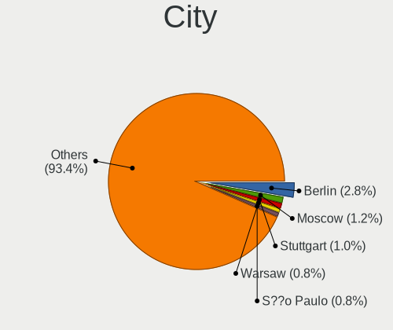
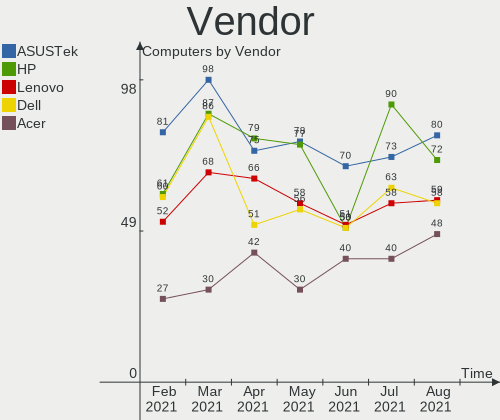
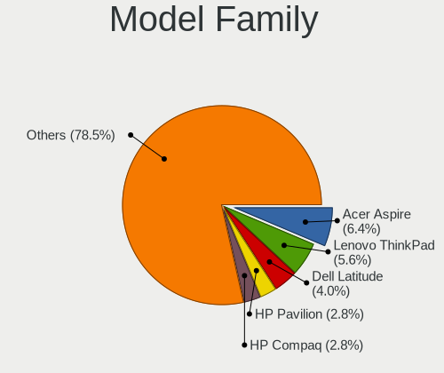
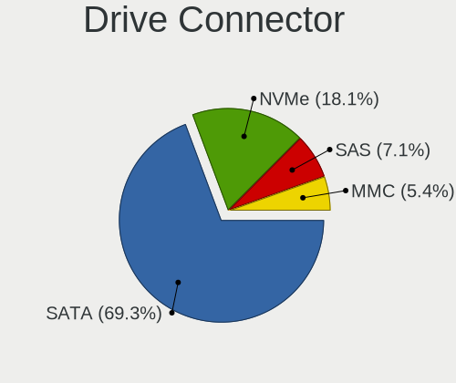
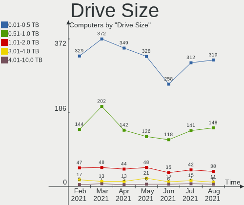
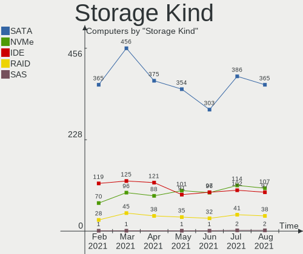
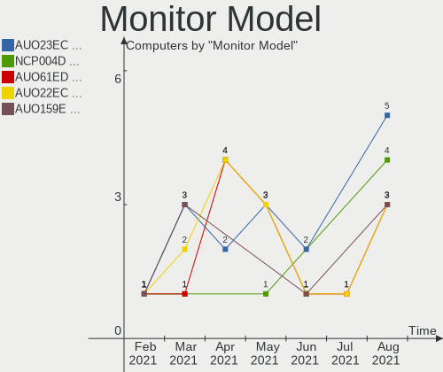
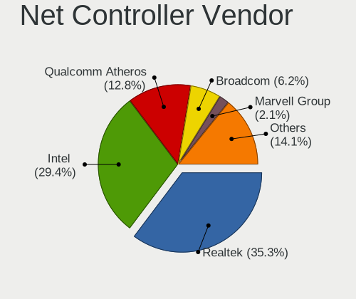
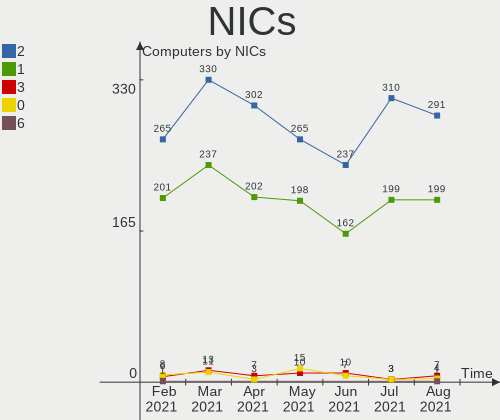

Mint Hardware Trends
--------------------

A project to identify most popular hardware characteristics and track their change
over time based on data collected by Mint users at https://Linux-Hardware.org.

Anyone can contribute to the study by uploading probes of their computers by
the [hw-probe](https://github.com/linuxhw/hw-probe) tool:

    sudo hw-probe -all -upload

This is a report for all computer types. See also reports for [desktops](/Dist/Mint/Desktop/README.md) and [notebooks](/Dist/Mint/Notebook/README.md).

Full-feature report is available here: https://linux-hardware.org/?view=trends

Period: Feb, 2020.

Contents
--------

- [ OS                       ](#os)
- [ OS Family                ](#os-family)
- [ Kernel                   ](#kernel)
- [ Kernel Family            ](#kernel-family)
- [ Kernel Major Ver.        ](#kernel-major-ver)
- [ Arch                     ](#arch)
- [ DE                       ](#de)
- [ Display Server           ](#display-server)
- [ OS Lang                  ](#os-lang)
- [ Boot Mode                ](#boot-mode)
- [ Filesystem               ](#filesystem)
- [ Dual Boot with Linux     ](#dual-boot-with-linux)
- [ Dual Boot (Win)          ](#dual-boot-win)
- [ Country                  ](#country)
- [ City                     ](#city)
- [ Vendor                   ](#vendor)
- [ Model                    ](#model)
- [ Model Family             ](#model-family)
- [ MFG Year                 ](#mfg-year)
- [ Form Factor              ](#form-factor)
- [ Secure Boot              ](#secure-boot)
- [ Coreboot                 ](#coreboot)
- [ RAM Size                 ](#ram-size)
- [ RAM Used                 ](#ram-used)
- [ Drive Vendor             ](#drive-vendor)
- [ Drive Model              ](#drive-model)
- [ Drive Kind               ](#drive-kind)
- [ Drive Connector          ](#drive-connector)
- [ Drive Size               ](#drive-size)
- [ Space Total              ](#space-total)
- [ Space Used               ](#space-used)
- [ Malfunc. Drives          ](#malfunc-drives)
- [ Malfunc. Drive Vendor    ](#malfunc-drive-vendor)
- [ Malfunc. Drive Kind      ](#malfunc-drive-kind)
- [ Failed Drives            ](#failed-drives)
- [ Failed Drive Vendor      ](#failed-drive-vendor)
- [ Drive Status             ](#drive-status)
- [ Storage Vendor           ](#storage-vendor)
- [ Storage Model            ](#storage-model)
- [ Storage Kind             ](#storage-kind)
- [ CPU Vendor               ](#cpu-vendor)
- [ CPU Model                ](#cpu-model)
- [ CPU Model Family         ](#cpu-model-family)
- [ CPU Cores                ](#cpu-cores)
- [ CPU Sockets              ](#cpu-sockets)
- [ CPU Threads              ](#cpu-threads)
- [ CPU Op-Modes             ](#cpu-op-modes)
- [ CPU Microarch            ](#cpu-microarch)
- [ CPU Microcode            ](#cpu-microcode)
- [ GPU Vendor               ](#gpu-vendor)
- [ GPU Model                ](#gpu-model)
- [ GPU Combo                ](#gpu-combo)
- [ GPU Driver               ](#gpu-driver)
- [ GPU Memory               ](#gpu-memory)
- [ Monitor Vendor           ](#monitor-vendor)
- [ Monitor Model            ](#monitor-model)
- [ Monitor Resolution       ](#monitor-resolution)
- [ Monitor Diagonal         ](#monitor-diagonal)
- [ Monitor Width            ](#monitor-width)
- [ Aspect Ratio             ](#aspect-ratio)
- [ Monitor Area             ](#monitor-area)
- [ Pixel Density            ](#pixel-density)
- [ Multiple Monitors        ](#multiple-monitors)
- [ Net Controller Vendor    ](#net-controller-vendor)
- [ Net Controller Model     ](#net-controller-model)
- [ Net Controller Kind      ](#net-controller-kind)
- [ Used Controller          ](#used-controller)
- [ NICs                     ](#nics)
- [ Unsupported Devices      ](#unsupported-devices)
- [ Unsupported Device Types ](#unsupported-device-types)

OS
--

Installed operating systems

| Name      | Computers | Percent |
|-----------|-----------|---------|
| Mint 19.3 | 174       | 79.09%  |
| Mint 19.2 | 18        | 8.18%   |
| Mint 19.1 | 13        | 5.91%   |
| Mint 19   | 8         | 3.64%   |
| Mint 18.3 | 5         | 2.27%   |
| Mint 3    | 1         | 0.45%   |
| Mint 18   | 1         | 0.45%   |

OS Family
---------

OS without a version

| Name | Computers | Percent |
|------|-----------|---------|
| Mint | 220       | 100%    |

Kernel
------

Version of the Linux kernel

| Version                 | Computers | Percent |
|-------------------------|-----------|---------|
| 5.3.0-28-generic        | 77        | 35%     |
| 5.3.0-40-generic        | 47        | 21.36%  |
| 4.15.0-76-generic       | 27        | 12.27%  |
| 5.0.0-32-generic        | 26        | 11.82%  |
| 4.15.0-88-generic       | 9         | 4.09%   |
| 4.15.0-20-generic       | 5         | 2.27%   |
| 4.15.0-74-generic       | 4         | 1.82%   |
| 4.15.0-54-generic       | 4         | 1.82%   |
| 5.3.0-26-generic        | 3         | 1.36%   |
| 4.15.0-70-generic       | 2         | 0.91%   |
| 5.6.0-050600rc2-generic | 1         | 0.45%   |
| 5.5.7-050507-generic    | 1         | 0.45%   |
| 5.5.1-050501-generic    | 1         | 0.45%   |
| 5.5.1                   | 1         | 0.45%   |
| 5.4.13-050413-generic   | 1         | 0.45%   |
| 5.4.10-050410-generic   | 1         | 0.45%   |
| 5.3.6-050306-generic    | 1         | 0.45%   |
| 5.3.0-24-generic        | 1         | 0.45%   |
| 5.3.0-050300-generic    | 1         | 0.45%   |
| 4.9.0-8-amd64           | 1         | 0.45%   |
| 4.4.0-21-generic        | 1         | 0.45%   |
| 4.15.0-72-generic       | 1         | 0.45%   |
| 4.15.0-65-generic       | 1         | 0.45%   |
| 4.15.0-64-generic       | 1         | 0.45%   |
| 4.15.0-60-generic       | 1         | 0.45%   |
| Unknown                 | 1         | 0.45%   |

Kernel Family
-------------

Linux kernel without a distro release

| Version | Computers | Percent |
|---------|-----------|---------|
| 5.3.0   | 129       | 58.64%  |
| 4.15.0  | 55        | 25%     |
| 5.0.0   | 26        | 11.82%  |
| 5.5.1   | 2         | 0.91%   |
| 5.6.0   | 1         | 0.45%   |
| 5.5.7   | 1         | 0.45%   |
| 5.4.13  | 1         | 0.45%   |
| 5.4.10  | 1         | 0.45%   |
| 5.3.6   | 1         | 0.45%   |
| 4.9.0   | 1         | 0.45%   |
| 4.4.0   | 1         | 0.45%   |
| Unknown | 1         | 0.45%   |

Kernel Major Ver.
-----------------

Linux kernel major version

| Version | Computers | Percent |
|---------|-----------|---------|
| 5.3     | 130       | 59.09%  |
| 4.15    | 55        | 25%     |
| 5.0     | 26        | 11.82%  |
| 5.5     | 3         | 1.36%   |
| 5.4     | 2         | 0.91%   |
| 5.6     | 1         | 0.45%   |
| 4.9     | 1         | 0.45%   |
| 4.4     | 1         | 0.45%   |
| Unknown | 1         | 0.45%   |

Arch
----

OS architecture (x86_64, i586, etc.)

| Name    | Computers | Percent |
|---------|-----------|---------|
| x86_64  | 202       | 91.82%  |
| i686    | 17        | 7.73%   |
| Unknown | 1         | 0.45%   |

DE
--

Desktop Environment

| Name       | Computers | Percent |
|------------|-----------|---------|
| X-Cinnamon | 122       | 55.45%  |
| Cinnamon   | 31        | 14.09%  |
| MATE       | 28        | 12.73%  |
| XFCE       | 21        | 9.55%   |
| Unknown    | 12        | 5.45%   |
| GNOME      | 6         | 2.73%   |

Display Server
--------------

X11 or Wayland

| Name | Computers | Percent |
|------|-----------|---------|
| X11  | 220       | 100%    |

OS Lang
-------

Language

| Lang    | Computers | Percent |
|---------|-----------|---------|
| en_US   | 58        | 26.36%  |
| pt_BR   | 24        | 10.91%  |
| de_DE   | 21        | 9.55%   |
| Unknown | 20        | 9.09%   |
| ru_RU   | 16        | 7.27%   |
| en_GB   | 9         | 4.09%   |
| fr_FR   | 8         | 3.64%   |
| es_ES   | 8         | 3.64%   |
| ru_UA   | 7         | 3.18%   |
| pl_PL   | 5         | 2.27%   |
| uk_UA   | 4         | 1.82%   |
| en_CA   | 4         | 1.82%   |
| en_AU   | 4         | 1.82%   |
| fi_FI   | 3         | 1.36%   |
| sv_SE   | 2         | 0.91%   |
| pt_PT   | 2         | 0.91%   |
| nl_NL   | 2         | 0.91%   |
| nl_BE   | 2         | 0.91%   |
| hu_HU   | 2         | 0.91%   |
| es_MX   | 2         | 0.91%   |
| es_AR   | 2         | 0.91%   |
| en_ZA   | 2         | 0.91%   |
| sk_SK   | 1         | 0.45%   |
| it_IT   | 1         | 0.45%   |
| fr_CA   | 1         | 0.45%   |
| fr_BE   | 1         | 0.45%   |
| es_CR   | 1         | 0.45%   |
| en_NG   | 1         | 0.45%   |
| en_IN   | 1         | 0.45%   |
| en_IE   | 1         | 0.45%   |
| el_GR   | 1         | 0.45%   |
| de_CH   | 1         | 0.45%   |
| de_AT   | 1         | 0.45%   |
| C       | 1         | 0.45%   |
| bg_BG   | 1         | 0.45%   |

Boot Mode
---------

EFI or BIOS

| Mode | Computers | Percent |
|------|-----------|---------|
| BIOS | 139       | 63.18%  |
| EFI  | 81        | 36.82%  |

Filesystem
----------

Type of filesystem

| Type    | Computers | Percent |
|---------|-----------|---------|
| Ext4    | 215       | 97.73%  |
| Ext2    | 2         | 0.91%   |
| Btrfs   | 2         | 0.91%   |
| Overlay | 1         | 0.45%   |

Dual Boot with Linux
--------------------

Hosting more than one Linux

| Dual boot | Computers | Percent |
|-----------|-----------|---------|
| No        | 208       | 94.55%  |
| Yes       | 12        | 5.45%   |

Dual Boot (Win)
---------------

Hosting Linux and Windows

| Dual boot | Computers | Percent |
|-----------|-----------|---------|
| No        | 193       | 87.73%  |
| Yes       | 27        | 12.27%  |

Country
-------

Geographic location (country)

| Country                | Computers | Percent |
|------------------------|-----------|---------|
| USA                    | 40        | 18.18%  |
| Brazil                 | 24        | 10.91%  |
| Germany                | 22        | 10%     |
| Russia                 | 17        | 7.73%   |
| Ukraine                | 13        | 5.91%   |
| UK                     | 11        | 5%      |
| France                 | 11        | 5%      |
| Spain                  | 10        | 4.55%   |
| Canada                 | 7         | 3.18%   |
| Mexico                 | 5         | 2.27%   |
| Belgium                | 5         | 2.27%   |
| Australia              | 5         | 2.27%   |
| Poland                 | 4         | 1.82%   |
| Turkey                 | 3         | 1.36%   |
| Serbia                 | 3         | 1.36%   |
| Portugal               | 3         | 1.36%   |
| Netherlands            | 3         | 1.36%   |
| Finland                | 3         | 1.36%   |
| Argentina              | 3         | 1.36%   |
| Sweden                 | 2         | 0.91%   |
| South Africa           | 2         | 0.91%   |
| Puerto Rico            | 2         | 0.91%   |
| Morocco                | 2         | 0.91%   |
| Italy                  | 2         | 0.91%   |
| Hungary                | 2         | 0.91%   |
| Greece                 | 2         | 0.91%   |
| Switzerland            | 1         | 0.45%   |
| Slovakia               | 1         | 0.45%   |
| Saudi Arabia           | 1         | 0.45%   |
| Nigeria                | 1         | 0.45%   |
| Latvia                 | 1         | 0.45%   |
| Israel                 | 1         | 0.45%   |
| Ireland                | 1         | 0.45%   |
| India                  | 1         | 0.45%   |
| Czech Republic         | 1         | 0.45%   |
| Costa Rica             | 1         | 0.45%   |
| Bulgaria               | 1         | 0.45%   |
| Bosnia and Herzegovina | 1         | 0.45%   |
| Belarus                | 1         | 0.45%   |
| Austria                | 1         | 0.45%   |

City
----

Geographic location (city)

| City               | Computers | Percent |
|--------------------|-----------|---------|
| Moscow             | 4         | 1.82%   |
| Madrid             | 4         | 1.82%   |
| São Paulo         | 3         | 1.36%   |
| Paris              | 3         | 1.36%   |
| Odesa              | 3         | 1.36%   |
| Chicago            | 3         | 1.36%   |
| Rio de Janeiro     | 2         | 0.91%   |
| Regina             | 2         | 0.91%   |
| Novi Sad           | 2         | 0.91%   |
| Lviv               | 2         | 0.91%   |
| Kyiv               | 2         | 0.91%   |
| Kryvyy Rih         | 2         | 0.91%   |
| Frankfurt am Main  | 2         | 0.91%   |
| Ellensburg         | 2         | 0.91%   |
| Curitiba           | 2         | 0.91%   |
| Chemnitz           | 2         | 0.91%   |
| Zurich             | 1         | 0.45%   |
| Zulte              | 1         | 0.45%   |
| Zuidlaren          | 1         | 0.45%   |
| Zabrze             | 1         | 0.45%   |
| Windsor            | 1         | 0.45%   |
| Wiesbaden          | 1         | 0.45%   |
| Wellingore         | 1         | 0.45%   |
| Welling            | 1         | 0.45%   |
| Warsaw             | 1         | 0.45%   |
| Warrington         | 1         | 0.45%   |
| Walnut Creek       | 1         | 0.45%   |
| Wahroonga          | 1         | 0.45%   |
| Voskresensk        | 1         | 0.45%   |
| Volos              | 1         | 0.45%   |
| Vitória           | 1         | 0.45%   |
| Vila Franca        | 1         | 0.45%   |
| Vienna             | 1         | 0.45%   |
| Valleyview         | 1         | 0.45%   |
| Valence            | 1         | 0.45%   |
| Vadodara           | 1         | 0.45%   |
| Ulyanovsk          | 1         | 0.45%   |
| Turramurra         | 1         | 0.45%   |
| Tucson             | 1         | 0.45%   |
| Troutdale          | 1         | 0.45%   |
| Trofa              | 1         | 0.45%   |
| Toenisvorst        | 1         | 0.45%   |
| Thessaloniki       | 1         | 0.45%   |
| Temiskaming Shores | 1         | 0.45%   |
| Tampere            | 1         | 0.45%   |
| São Leopoldo      | 1         | 0.45%   |
| Szarvas            | 1         | 0.45%   |
| Swartz Creek       | 1         | 0.45%   |
| Sumaré            | 1         | 0.45%   |
| Stuttgart          | 1         | 0.45%   |
| Stroud             | 1         | 0.45%   |
| Stoke-on-Trent     | 1         | 0.45%   |
| Stockholm          | 1         | 0.45%   |
| St. Petersburg     | 1         | 0.45%   |
| St Petersburg      | 1         | 0.45%   |
| Spring             | 1         | 0.45%   |
| Spokane            | 1         | 0.45%   |
| South Ozone Park   | 1         | 0.45%   |
| Soest              | 1         | 0.45%   |
| Smolensk           | 1         | 0.45%   |

Vendor
------

Motherboard manufacturer

| Name                | Computers | Percent |
|---------------------|-----------|---------|
| ASUSTek Computer    | 45        | 20.45%  |
| Hewlett-Packard     | 36        | 16.36%  |
| Dell                | 33        | 15%     |
| Lenovo              | 24        | 10.91%  |
| Acer                | 16        | 7.27%   |
| MSI                 | 15        | 6.82%   |
| Gigabyte Technology | 9         | 4.09%   |
| ASRock              | 9         | 4.09%   |
| Samsung Electronics | 4         | 1.82%   |
| Intel               | 4         | 1.82%   |
| Biostar             | 4         | 1.82%   |
| Toshiba             | 3         | 1.36%   |
| Pegatron            | 2         | 0.91%   |
| Fujitsu             | 2         | 0.91%   |
| Timi                | 1         | 0.45%   |
| Positivo            | 1         | 0.45%   |
| Packard Bell        | 1         | 0.45%   |
| Medion              | 1         | 0.45%   |
| Itautec             | 1         | 0.45%   |
| Gateway             | 1         | 0.45%   |
| Fujitsu Siemens     | 1         | 0.45%   |
| Foxconn             | 1         | 0.45%   |
| Digma               | 1         | 0.45%   |
| Compal              | 1         | 0.45%   |
| ASRockRack          | 1         | 0.45%   |
| Apple               | 1         | 0.45%   |
| AMI                 | 1         | 0.45%   |
| AAEON               | 1         | 0.45%   |

Model
-----

Motherboard model

| Name                                            | Computers | Percent |
|-------------------------------------------------|-----------|---------|
| MSI MS-7C02                                     | 2         | 0.91%   |
| HP Pavilion dv7                                 | 2         | 0.91%   |
| HP Laptop 15-bw0xx                              | 2         | 0.91%   |
| HP 250 G3                                       | 2         | 0.91%   |
| Dell Latitude E5550                             | 2         | 0.91%   |
| Dell Inspiron 3576                              | 2         | 0.91%   |
| ASUS P5Q                                        | 2         | 0.91%   |
| ASRock AB350M Pro4 R2.0                         | 2         | 0.91%   |
| Acer Nitro AN515-52                             | 2         | 0.91%   |
| Toshiba Satellite P750                          | 1         | 0.45%   |
| Toshiba Satellite L850-150                      | 1         | 0.45%   |
| Toshiba Satellite A100                          | 1         | 0.45%   |
| Timi TM1701                                     | 1         | 0.45%   |
| Samsung Electronics X120/X170/X171              | 1         | 0.45%   |
| Samsung Electronics RF511/RF411/RF711           | 1         | 0.45%   |
| Samsung Electronics 530U3C/530U4C/532U3C        | 1         | 0.45%   |
| Samsung Electronics 350V5C/351V5C/3540VC/3440VC | 1         | 0.45%   |
| Positivo C14CR01                                | 1         | 0.45%   |
| Pegatron p7-1257c                               | 1         | 0.45%   |
| Pegatron A15                                    | 1         | 0.45%   |
| Packard Bell EasyNote TK85                      | 1         | 0.45%   |
| MSI Z1-7641                                     | 1         | 0.45%   |
| MSI Prestige 15 A10SC                           | 1         | 0.45%   |
| MSI MS-N014                                     | 1         | 0.45%   |
| MSI MS-7B79                                     | 1         | 0.45%   |
| MSI MS-7B78                                     | 1         | 0.45%   |
| MSI MS-7A70                                     | 1         | 0.45%   |
| MSI MS-7A39                                     | 1         | 0.45%   |
| MSI MS-7A37                                     | 1         | 0.45%   |
| MSI MS-7976                                     | 1         | 0.45%   |
| MSI MS-7817                                     | 1         | 0.45%   |
| MSI MS-7666                                     | 1         | 0.45%   |
| MSI MS-7592                                     | 1         | 0.45%   |
| MSI EP120AA-ABD t3337.de                        | 1         | 0.45%   |
| Medion WIM2180                                  | 1         | 0.45%   |
| Lenovo Y520-15IKBN 80WK                         | 1         | 0.45%   |
| Lenovo ThinkPad X61s 874824U                    | 1         | 0.45%   |
| Lenovo ThinkPad X250 20CLS3ST01                 | 1         | 0.45%   |
| Lenovo ThinkPad X220 4293AF4                    | 1         | 0.45%   |
| Lenovo ThinkPad X1 Carbon 4th 20FCA0GC00        | 1         | 0.45%   |
| Lenovo ThinkPad X1 Carbon 34602SG               | 1         | 0.45%   |
| Lenovo ThinkPad T440s 20ARS0LU00                | 1         | 0.45%   |
| Lenovo ThinkPad T430 2349RB7                    | 1         | 0.45%   |
| Lenovo ThinkPad T420 4236AK9                    | 1         | 0.45%   |
| Lenovo ThinkPad T410s 29122PG                   | 1         | 0.45%   |
| Lenovo ThinkPad T400 6474AH2                    | 1         | 0.45%   |
| Lenovo ThinkPad SL510 28477MG                   | 1         | 0.45%   |
| Lenovo ThinkPad E14 20RA001MGE                  | 1         | 0.45%   |
| Lenovo ThinkCentre M93p 10AAA0GLAU              | 1         | 0.45%   |
| Lenovo ThinkCentre M55 8804Y1K                  | 1         | 0.45%   |
| Lenovo MIIX 320-10ICR 80XF                      | 1         | 0.45%   |
| Lenovo IdeaPad Y700 Touch-15ISK 80NW            | 1         | 0.45%   |
| Lenovo IdeaPad C340-14IWL 81N4                  | 1         | 0.45%   |
| Lenovo IdeaPad 720S-13IKB 81BV                  | 1         | 0.45%   |
| Lenovo IdeaCentre K450 10120                    | 1         | 0.45%   |
| Lenovo H420                                     | 1         | 0.45%   |
| Lenovo G585 2181                                | 1         | 0.45%   |
| Lenovo G400s VILG1                              | 1         | 0.45%   |
| Lenovo Flex 6-14ARR 81HA                        | 1         | 0.45%   |
| Itautec Infoway N8755                           | 1         | 0.45%   |

Model Family
------------

Motherboard model prefix

| Name                       | Computers | Percent |
|----------------------------|-----------|---------|
| Lenovo ThinkPad            | 12        | 5.45%   |
| Dell Inspiron              | 12        | 5.45%   |
| HP Pavilion                | 11        | 5%      |
| Acer Aspire                | 9         | 4.09%   |
| Dell OptiPlex              | 7         | 3.18%   |
| Dell Latitude              | 6         | 2.73%   |
| HP Laptop                  | 5         | 2.27%   |
| HP Compaq                  | 5         | 2.27%   |
| Dell Precision             | 4         | 1.82%   |
| Toshiba Satellite          | 3         | 1.36%   |
| Lenovo IdeaPad             | 3         | 1.36%   |
| HP EliteBook               | 3         | 1.36%   |
| Dell Vostro                | 3         | 1.36%   |
| ASUS ROG                   | 3         | 1.36%   |
| MSI MS-7C02                | 2         | 0.91%   |
| Lenovo ThinkCentre         | 2         | 0.91%   |
| HP 250                     | 2         | 0.91%   |
| ASUS PRIME                 | 2         | 0.91%   |
| ASUS P5Q                   | 2         | 0.91%   |
| ASUS M5A78L-M              | 2         | 0.91%   |
| ASRock AB350M              | 2         | 0.91%   |
| Acer Veriton               | 2         | 0.91%   |
| Acer Nitro                 | 2         | 0.91%   |
| Timi TM1701                | 1         | 0.45%   |
| Samsung Electronics X120   | 1         | 0.45%   |
| Samsung Electronics RF511  | 1         | 0.45%   |
| Samsung Electronics 530U3C | 1         | 0.45%   |
| Samsung Electronics 350V5C | 1         | 0.45%   |
| Positivo C14CR01           | 1         | 0.45%   |
| Pegatron p7-1257c          | 1         | 0.45%   |
| Pegatron A15               | 1         | 0.45%   |
| Packard Bell EasyNote      | 1         | 0.45%   |
| MSI Z1-7641                | 1         | 0.45%   |
| MSI Prestige               | 1         | 0.45%   |
| MSI MS-N014                | 1         | 0.45%   |
| MSI MS-7B79                | 1         | 0.45%   |
| MSI MS-7B78                | 1         | 0.45%   |
| MSI MS-7A70                | 1         | 0.45%   |
| MSI MS-7A39                | 1         | 0.45%   |
| MSI MS-7A37                | 1         | 0.45%   |
| MSI MS-7976                | 1         | 0.45%   |
| MSI MS-7817                | 1         | 0.45%   |
| MSI MS-7666                | 1         | 0.45%   |
| MSI MS-7592                | 1         | 0.45%   |
| MSI EP120AA-ABD            | 1         | 0.45%   |
| Medion WIM2180             | 1         | 0.45%   |
| Lenovo Y520-15IKBN         | 1         | 0.45%   |
| Lenovo MIIX                | 1         | 0.45%   |
| Lenovo IdeaCentre          | 1         | 0.45%   |
| Lenovo H420                | 1         | 0.45%   |
| Lenovo G585                | 1         | 0.45%   |
| Lenovo G400s               | 1         | 0.45%   |
| Lenovo Flex                | 1         | 0.45%   |
| Itautec Infoway            | 1         | 0.45%   |
| Intel NUC5CPYB             | 1         | 0.45%   |
| Intel Infoway              | 1         | 0.45%   |
| Intel HuronRiver           | 1         | 0.45%   |
| Intel D34010WYK            | 1         | 0.45%   |
| HP ZBook                   | 1         | 0.45%   |
| HP t5550                   | 1         | 0.45%   |

MFG Year
--------

Motherboard manufacture year

| Year | Computers | Percent |
|------|-----------|---------|
| 2019 | 39        | 17.73%  |
| 2018 | 28        | 12.73%  |
| 2013 | 21        | 9.55%   |
| 2012 | 20        | 9.09%   |
| 2014 | 18        | 8.18%   |
| 2011 | 16        | 7.27%   |
| 2010 | 14        | 6.36%   |
| 2017 | 12        | 5.45%   |
| 2015 | 12        | 5.45%   |
| 2016 | 10        | 4.55%   |
| 2008 | 10        | 4.55%   |
| 2007 | 8         | 3.64%   |
| 2009 | 7         | 3.18%   |
| 2006 | 2         | 0.91%   |
| 2004 | 2         | 0.91%   |
| 2005 | 1         | 0.45%   |

Form Factor
-----------

Physical design of the computer

| Name        | Computers | Percent |
|-------------|-----------|---------|
| Notebook    | 116       | 52.73%  |
| Desktop     | 98        | 44.55%  |
| Convertible | 2         | 0.91%   |
| Mini pc     | 2         | 0.91%   |
| Tablet      | 1         | 0.45%   |
| Server      | 1         | 0.45%   |

Secure Boot
-----------

Enabled or disabled

| State    | Computers | Percent |
|----------|-----------|---------|
| Disabled | 202       | 91.82%  |
| Enabled  | 18        | 8.18%   |

Coreboot
--------

Have coreboot on board

| Used | Computers | Percent |
|------|-----------|---------|
| No   | 220       | 100%    |

RAM Size
--------

Total RAM memory

| Size in GB  | Computers | Percent |
|-------------|-----------|---------|
| 3.01-4.0    | 52        | 23.64%  |
| 4.01-8.0    | 46        | 20.91%  |
| 16.01-24.0  | 42        | 19.09%  |
| 8.01-16.0   | 36        | 16.36%  |
| 1.01-2.0    | 18        | 8.18%   |
| 2.01-3.0    | 10        | 4.55%   |
| 32.01-64.0  | 8         | 3.64%   |
| 0.01-1.0    | 4         | 1.82%   |
| 24.01-32.0  | 2         | 0.91%   |
| 64.01-256.0 | 2         | 0.91%   |

RAM Used
--------

Used RAM memory

| Used GB    | Computers | Percent |
|------------|-----------|---------|
| 1.01-2.0   | 99        | 45%     |
| 2.01-3.0   | 44        | 20%     |
| 0.01-1.0   | 32        | 14.55%  |
| 4.01-8.0   | 25        | 11.36%  |
| 3.01-4.0   | 14        | 6.36%   |
| 8.01-16.0  | 5         | 2.27%   |
| 24.01-32.0 | 1         | 0.45%   |

Drive Vendor
------------

Hard drive vendors

| Vendor              | Computers | Drives | Percent |
|---------------------|-----------|--------|---------|
| WDC                 | 64        | 80     | 21.92%  |
| Seagate             | 52        | 61     | 17.81%  |
| Samsung Electronics | 44        | 50     | 15.07%  |
| Toshiba             | 22        | 23     | 7.53%   |
| Hitachi             | 18        | 21     | 6.16%   |
| Kingston            | 17        | 18     | 5.82%   |
| SanDisk             | 9         | 10     | 3.08%   |
| Unknown             | 8         | 10     | 2.74%   |
| Crucial             | 8         | 9      | 2.74%   |
| HGST                | 6         | 6      | 2.05%   |
| Maxtor              | 4         | 4      | 1.37%   |
| SPCC                | 3         | 3      | 1.03%   |
| OCZ                 | 3         | 3      | 1.03%   |
| Intel               | 3         | 3      | 1.03%   |
| Gigabyte Technology | 3         | 3      | 1.03%   |
| PNY                 | 2         | 2      | 0.68%   |
| LITEONIT            | 2         | 2      | 0.68%   |
| KingSpec            | 2         | 4      | 0.68%   |
| Hewlett-Packard     | 2         | 2      | 0.68%   |
| Fujitsu             | 2         | 2      | 0.68%   |
| China               | 2         | 2      | 0.68%   |
| XPG                 | 1         | 1      | 0.34%   |
| WDC WD50            | 1         | 1      | 0.34%   |
| Team                | 1         | 2      | 0.34%   |
| Super Talent        | 1         | 1      | 0.34%   |
| SK Hynix            | 1         | 1      | 0.34%   |
| PLEXTOR             | 1         | 1      | 0.34%   |
| Patriot             | 1         | 1      | 0.34%   |
| Micron Technology   | 1         | 1      | 0.34%   |
| Maxtor 6            | 1         | 1      | 0.34%   |
| Lexar               | 1         | 1      | 0.34%   |
| Kingchuxing         | 1         | 1      | 0.34%   |
| Integrated          | 1         | 1      | 0.34%   |
| GOODRAM             | 1         | 1      | 0.34%   |
| DREVO               | 1         | 1      | 0.34%   |
| Corsair             | 1         | 1      | 0.34%   |
| ASMT                | 1         | 1      | 0.34%   |

Drive Model
-----------

Hard drive models

| Model                        | Computers | Percent |
|------------------------------|-----------|---------|
| SA400S37120G 120GB SSD       | 7         | 2.17%   |
| ST500LM012 HN-M500MBB 500GB  | 6         | 1.86%   |
| SA400S37240G 240GB SSD       | 6         | 1.86%   |
| MQ01ABD100 1TB               | 5         | 1.55%   |
| WD10SPZX-21Z10T0 1TB         | 4         | 1.24%   |
| ST500LT012-1DG142 500GB      | 4         | 1.24%   |
| ST500DM002-1BD142 500GB      | 4         | 1.24%   |
| SSD 840 EVO 250GB            | 4         | 1.24%   |
| HTS545050A7E380 500GB        | 4         | 1.24%   |
| ST1000LM024 HN-M101MBB 1TB   | 3         | 0.93%   |
| SSD 850 EVO 250GB            | 3         | 0.93%   |
| MMC Card  16GB               | 3         | 0.93%   |
| DT01ACA100 1TB               | 3         | 0.93%   |
| WDS250G1B0A-00H9H0 250GB SSD | 2         | 0.62%   |
| WDS240G2G0A-00JH30 240GB SSD | 2         | 0.62%   |
| WD3200BPVT-22ZEST0 320GB     | 2         | 0.62%   |
| WD10EZEX-60WN4A0 1TB         | 2         | 0.62%   |
| WD10EZEX-08WN4A0 1TB         | 2         | 0.62%   |
| WD10EZEX-00WN4A0 1TB         | 2         | 0.62%   |
| ST9320423AS 320GB            | 2         | 0.62%   |
| ST750LM022 HN-M750MBB 752GB  | 2         | 0.62%   |
| ST500LT012-9WS142 500GB      | 2         | 0.62%   |
| ST3160815AS 160GB            | 2         | 0.62%   |
| ST31000524AS 1TB             | 2         | 0.62%   |
| ST2000DX001-1NS164 2TB       | 2         | 0.62%   |
| ST2000DL003-9VT166 2TB       | 2         | 0.62%   |
| SSD 860 EVO 500GB            | 2         | 0.62%   |
| SSD 850 EVO 500GB            | 2         | 0.62%   |
| SA400S37480G 480GB SSD       | 2         | 0.62%   |
| MMC Card  32GB               | 2         | 0.62%   |
| MK5059GSXP 500GB             | 2         | 0.62%   |
| HTS543216L9A300 160GB        | 2         | 0.62%   |
| HDS721616PLA380 160GB        | 2         | 0.62%   |
| HDS721025CLA382 250GB        | 2         | 0.62%   |
| HD322HJ 320GB                | 2         | 0.62%   |
| HD160JJ 160GB                | 2         | 0.62%   |
| Expansion 1TB                | 2         | 0.62%   |
| CT500MX500SSD1 500GB         | 2         | 0.62%   |
| CT120BX500SSD1 120GB         | 2         | 0.62%   |
| Y080L0 81GB                  | 1         | 0.31%   |
| X1 Pro SSD 128GB             | 1         | 0.31%   |
| WDS500G2B0B 500GB SSD        | 1         | 0.31%   |
| WDS240G1G0A-00SS50 240GB SSD | 1         | 0.31%   |
| WDS120G2G0A-00JH30 120GB SSD | 1         | 0.31%   |
| WD800JD-55JRC0 80GB          | 1         | 0.31%   |
| WD800BEVS-08RST2 80GB        | 1         | 0.31%   |
| WD6400BEVT-80A0RT0 640GB     | 1         | 0.31%   |
| WD6400AAKS-22A7B2 640GB      | 1         | 0.31%   |
| WD6400AAKS-08A7B2 640GB      | 1         | 0.31%   |
| WD60EZRX-00MVLB1 6TB         | 1         | 0.31%   |
| WD5002AALX-00J37A0 500GB     | 1         | 0.31%   |
| WD5000LPVX-60V0TT0 500GB     | 1         | 0.31%   |
| WD5000BEVT-22A0RT0 500GB     | 1         | 0.31%   |
| WD5000AAVS-00ZTB0 500GB      | 1         | 0.31%   |
| WD5000AAKS-75A7B2 500GB      | 1         | 0.31%   |
| WD40EZRZ-00GXCB0 4TB         | 1         | 0.31%   |
| WD400BD-75JMA0 40GB          | 1         | 0.31%   |
| WD3200BPVT-80JJ5T0 320GB     | 1         | 0.31%   |
| WD3200BEVT-80A0RT0 320GB     | 1         | 0.31%   |
| WD3200BEVT-22ZCT0 320GB      | 1         | 0.31%   |

Drive Kind
----------

HDD or SSD

| Kind    | Computers | Drives | Percent |
|---------|-----------|--------|---------|
| HDD     | 151       | 201    | 57.63%  |
| SSD     | 89        | 104    | 33.97%  |
| NVMe    | 10        | 11     | 3.82%   |
| MMC     | 7         | 10     | 2.67%   |
| Unknown | 5         | 9      | 1.91%   |

Drive Connector
---------------

SATA, SAS, NVMe, etc.

| Type | Computers | Drives | Percent |
|------|-----------|--------|---------|
| SATA | 200       | 300    | 88.11%  |
| SAS  | 10        | 14     | 4.41%   |
| NVMe | 10        | 11     | 4.41%   |
| MMC  | 7         | 10     | 3.08%   |

Drive Size
----------

Size of hard drive

| Size in TB | Computers | Drives | Percent |
|------------|-----------|--------|---------|
| 0.01-0.5   | 162       | 220    | 63.28%  |
| 0.51-1.0   | 70        | 86     | 27.34%  |
| 1.01-2.0   | 16        | 21     | 6.25%   |
| 3.01-4.0   | 4         | 4      | 1.56%   |
| 2.01-3.0   | 3         | 3      | 1.17%   |
| 4.01-10.0  | 1         | 1      | 0.39%   |

Space Total
-----------

Amount of disk space available on the file system

| Size in GB     | Computers | Percent |
|----------------|-----------|---------|
| 101-250        | 68        | 30.91%  |
| 251-500        | 57        | 25.91%  |
| 501-1000       | 34        | 15.45%  |
| 51-100         | 19        | 8.64%   |
| 1001-2000      | 13        | 5.91%   |
| More than 3000 | 11        | 5%      |
| 21-50          | 8         | 3.64%   |
| 2001-3000      | 6         | 2.73%   |
| 1-20           | 2         | 0.91%   |
| Unknown        | 2         | 0.91%   |

Space Used
----------

Amount of used disk space

| Used GB        | Computers | Percent |
|----------------|-----------|---------|
| 1-20           | 56        | 25.45%  |
| 21-50          | 52        | 23.64%  |
| 101-250        | 37        | 16.82%  |
| 51-100         | 29        | 13.18%  |
| 251-500        | 20        | 9.09%   |
| 501-1000       | 12        | 5.45%   |
| 1001-2000      | 6         | 2.73%   |
| More than 3000 | 4         | 1.82%   |
| 2001-3000      | 2         | 0.91%   |
| Unknown        | 2         | 0.91%   |

Malfunc. Drives
---------------

Drive models with a malfunction

| Model                        | Computers | Drives | Percent |
|------------------------------|-----------|--------|---------|
| WD10JPVX-60JC3T1 1TB         | 1         | 1      | 7.14%   |
| WD10JPVX-60JC3T0 1TB         | 1         | 1      | 7.14%   |
| ST500LM012 HN-M500MBB 500GB  | 1         | 1      | 7.14%   |
| SSDSC2CT120A3 120GB          | 1         | 1      | 7.14%   |
| SD7SB3Q256G1002 256GB SSD    | 1         | 1      | 7.14%   |
| MZNLN128HAHQ-000H1 128GB SSD | 1         | 1      | 7.14%   |
| MQ01ABD050 500GB             | 1         | 1      | 7.14%   |
| MK5059GSXP 500GB             | 1         | 1      | 7.14%   |
| HTS547550A9E384 500GB        | 1         | 1      | 7.14%   |
| HTS545050A7E680 500GB        | 1         | 1      | 7.14%   |
| HDS721050CLA360 500GB        | 1         | 1      | 7.14%   |
| HD502HI 500GB                | 1         | 1      | 7.14%   |
| HD322HJ 320GB                | 1         | 1      | 7.14%   |
| AGILITY3 128GB SSD           | 1         | 1      | 7.14%   |

Malfunc. Drive Vendor
---------------------

Vendors of faulty drives

| Vendor              | Computers | Drives | Percent |
|---------------------|-----------|--------|---------|
| Samsung Electronics | 3         | 3      | 21.43%  |
| WDC                 | 2         | 2      | 14.29%  |
| Toshiba             | 2         | 2      | 14.29%  |
| Hitachi             | 2         | 2      | 14.29%  |
| Seagate             | 1         | 1      | 7.14%   |
| SanDisk             | 1         | 1      | 7.14%   |
| OCZ                 | 1         | 1      | 7.14%   |
| Intel               | 1         | 1      | 7.14%   |
| HGST                | 1         | 1      | 7.14%   |

Malfunc. Drive Kind
-------------------

Kinds of faulty drives

| Kind | Computers | Drives | Percent |
|------|-----------|--------|---------|
| HDD  | 10        | 10     | 71.43%  |
| SSD  | 4         | 4      | 28.57%  |

Failed Drives
-------------

Failed drive models

Zero info for selected period =(

Failed Drive Vendor
-------------------

Failed drive vendors

Zero info for selected period =(

Drive Status
------------

Number of failed and malfunc. drives

| Status   | Computers | Drives | Percent |
|----------|-----------|--------|---------|
| Detected | 168       | 272    | 76.02%  |
| Works    | 39        | 49     | 17.65%  |
| Malfunc  | 14        | 14     | 6.33%   |

Storage Vendor
--------------

Storage controller vendors

| Vendor                           | Computers | Percent |
|----------------------------------|-----------|---------|
| Intel                            | 159       | 64.37%  |
| AMD                              | 43        | 17.41%  |
| Samsung Electronics              | 9         | 3.64%   |
| Nvidia                           | 7         | 2.83%   |
| Phison Electronics               | 4         | 1.62%   |
| Marvell Technology Group         | 4         | 1.62%   |
| VIA Technologies                 | 2         | 0.81%   |
| Toshiba America Info Systems     | 2         | 0.81%   |
| SK Hynix                         | 2         | 0.81%   |
| Sandisk                          | 2         | 0.81%   |
| JMicron Technology               | 2         | 0.81%   |
| ASMedia Technology               | 2         | 0.81%   |
| ADATA Technology                 | 2         | 0.81%   |
| Silicon Integrated Systems [SiS] | 1         | 0.4%    |
| Silicon Image                    | 1         | 0.4%    |
| Seagate Technology               | 1         | 0.4%    |
| Realtek Semiconductor            | 1         | 0.4%    |
| LSI Logic / Symbios Logic        | 1         | 0.4%    |
| Kingston Technology Company      | 1         | 0.4%    |
| Integrated Technology Express    | 1         | 0.4%    |

Storage Model
-------------

Storage controller models

| Model                                                                             | Computers | Percent |
|-----------------------------------------------------------------------------------|-----------|---------|
| FCH SATA Controller [AHCI mode]                                                   | 31        | 9.78%   |
| 7 Series Chipset Family 6-port SATA Controller [AHCI mode]                        | 15        | 4.73%   |
| 82801 Mobile SATA Controller [RAID mode]                                          | 10        | 3.15%   |
| 6 Series/C200 Series Chipset Family 6 port Mobile SATA AHCI Controller            | 10        | 3.15%   |
| NM10/ICH7 Family SATA Controller [IDE mode]                                       | 9         | 2.84%   |
| Q170/Q150/B150/H170/H110/Z170/CM236 Chipset SATA Controller [AHCI Mode]           | 8         | 2.52%   |
| 82801G (ICH7 Family) IDE Controller                                               | 8         | 2.52%   |
| 8 Series SATA Controller 1 [AHCI mode]                                            | 8         | 2.52%   |
| Sunrise Point-LP SATA Controller [AHCI mode]                                      | 7         | 2.21%   |
| 82801IBM/IEM (ICH9M/ICH9M-E) 4 port SATA Controller [AHCI mode]                   | 7         | 2.21%   |
| 8 Series/C220 Series Chipset Family 6-port SATA Controller 1 [AHCI mode]          | 7         | 2.21%   |
| SATA Controller [RAID mode]                                                       | 6         | 1.89%   |
| NVMe SSD Controller SM981/PM981/PM983                                             | 6         | 1.89%   |
| Atom Processor E3800 Series SATA AHCI Controller                                  | 6         | 1.89%   |
| SB7x0/SB8x0/SB9x0 IDE Controller                                                  | 5         | 1.58%   |
| Non-Volatile memory controller                                                    | 5         | 1.58%   |
| 400 Series Chipset SATA Controller                                                | 5         | 1.58%   |
| 200 Series PCH SATA controller [AHCI mode]                                        | 5         | 1.58%   |
| FCH IDE Controller                                                                | 4         | 1.26%   |
| 82801HM/HEM (ICH8M/ICH8M-E) SATA Controller [AHCI mode]                           | 4         | 1.26%   |
| 82801HM/HEM (ICH8M/ICH8M-E) IDE Controller                                        | 4         | 1.26%   |
| 7 Series/C210 Series Chipset Family 6-port SATA Controller [AHCI mode]            | 4         | 1.26%   |
| 6 Series/C200 Series Chipset Family 6 port Desktop SATA AHCI Controller           | 4         | 1.26%   |
| 5 Series/3400 Series Chipset 4 port SATA IDE Controller                           | 4         | 1.26%   |
| 300 Series Chipset SATA Controller                                                | 4         | 1.26%   |
| Wildcat Point-LP SATA Controller [AHCI Mode]                                      | 3         | 0.95%   |
| SB7x0/SB8x0/SB9x0 SATA Controller [IDE mode]                                      | 3         | 0.95%   |
| SB7x0/SB8x0/SB9x0 SATA Controller [AHCI mode]                                     | 3         | 0.95%   |
| NM10/ICH7 Family SATA Controller [AHCI mode]                                      | 3         | 0.95%   |
| MCP61 SATA Controller                                                             | 3         | 0.95%   |
| HM170/QM170 Chipset SATA Controller [AHCI Mode]                                   | 3         | 0.95%   |
| FCH SATA Controller [IDE mode]                                                    | 3         | 0.95%   |
| 82801JI (ICH10 Family) 4 port SATA IDE Controller #1                              | 3         | 0.95%   |
| 82801JI (ICH10 Family) 2 port SATA IDE Controller #2                              | 3         | 0.95%   |
| 82801IR/IO/IH (ICH9R/DO/DH) 4 port SATA Controller [IDE mode]                     | 3         | 0.95%   |
| 82801I (ICH9 Family) 2 port SATA Controller [IDE mode]                            | 3         | 0.95%   |
| 6 Series/C200 Series Chipset Family Desktop SATA Controller (IDE mode, ports 4-5) | 3         | 0.95%   |
| 6 Series/C200 Series Chipset Family Desktop SATA Controller (IDE mode, ports 0-3) | 3         | 0.95%   |
| 5 Series/3400 Series Chipset 4 port SATA AHCI Controller                          | 3         | 0.95%   |
| 5 Series/3400 Series Chipset 2 port SATA IDE Controller                           | 3         | 0.95%   |
| XPG SX8200 Pro PCIe Gen3x4 M.2 2280 Solid State Drive                             | 2         | 0.63%   |
| SSD 660P Series                                                                   | 2         | 0.63%   |
| SB600 Non-Raid-5 SATA                                                             | 2         | 0.63%   |
| SB600 IDE                                                                         | 2         | 0.63%   |
| NVMe SSD Controller SM961/PM961                                                   | 2         | 0.63%   |
| MCP61 IDE                                                                         | 2         | 0.63%   |
| E12 NVMe Controller                                                               | 2         | 0.63%   |
| CK804 Serial ATA Controller                                                       | 2         | 0.63%   |
| CK804 IDE                                                                         | 2         | 0.63%   |
| Cannon Point-LP SATA Controller [AHCI Mode]                                       | 2         | 0.63%   |
| Cannon Lake Mobile PCH SATA AHCI Controller                                       | 2         | 0.63%   |
| ASM1062 Serial ATA Controller                                                     | 2         | 0.63%   |
| 88SE91A3 SATA-600 Controller                                                      | 2         | 0.63%   |
| 88SE6111/6121 SATA II / PATA Controller                                           | 2         | 0.63%   |
| 8 Series/C220 Series Chipset Family 4-port SATA Controller 1 [IDE mode]           | 2         | 0.63%   |
| 8 Series/C220 Series Chipset Family 2-port SATA Controller 2 [IDE mode]           | 2         | 0.63%   |
| 5 Series/3400 Series Chipset 6 port SATA AHCI Controller                          | 2         | 0.63%   |
| 4 Series Chipset PT IDER Controller                                               | 2         | 0.63%   |
| X370 Series Chipset SATA Controller                                               | 1         | 0.32%   |
| WD Black 2018/PC SN520 NVMe SSD                                                   | 1         | 0.32%   |

Storage Kind
------------

Kind of storage controller (IDE, SATA, NVMe, SAS, ...)

| Kind | Computers | Percent |
|------|-----------|---------|
| SATA | 151       | 58.3%   |
| IDE  | 65        | 25.1%   |
| NVMe | 24        | 9.27%   |
| RAID | 19        | 7.34%   |

CPU Vendor
----------

Processor vendors

| Vendor       | Computers | Percent |
|--------------|-----------|---------|
| Intel        | 168       | 76.36%  |
| AMD          | 51        | 23.18%  |
| CentaurHauls | 1         | 0.45%   |

CPU Model
---------

Processor models

| Model                                           | Computers | Percent |
|-------------------------------------------------|-----------|---------|
| Intel Atom x5-Z8350 CPU @ 1.44GHz               | 4         | 1.82%   |
| Intel Core i5-8265U CPU @ 1.60GHz               | 3         | 1.36%   |
| Intel Core i5-7400 CPU @ 3.00GHz                | 3         | 1.36%   |
| Intel Core i5-2450M CPU @ 2.50GHz               | 3         | 1.36%   |
| Intel Core 2 Duo CPU E7500 @ 2.93GHz            | 3         | 1.36%   |
| Intel Xeon CPU X5650 @ 2.67GHz                  | 2         | 0.91%   |
| Intel Pentium CPU N3540 @ 2.16GHz               | 2         | 0.91%   |
| Intel Pentium CPU G620 @ 2.60GHz                | 2         | 0.91%   |
| Intel Core i7-9750H CPU @ 2.60GHz               | 2         | 0.91%   |
| Intel Core i7-8550U CPU @ 1.80GHz               | 2         | 0.91%   |
| Intel Core i7-6700K CPU @ 4.00GHz               | 2         | 0.91%   |
| Intel Core i7-5600U CPU @ 2.60GHz               | 2         | 0.91%   |
| Intel Core i7-4770 CPU @ 3.40GHz                | 2         | 0.91%   |
| Intel Core i7-4500U CPU @ 1.80GHz               | 2         | 0.91%   |
| Intel Core i7-2670QM CPU @ 2.20GHz              | 2         | 0.91%   |
| Intel Core i7-2640M CPU @ 2.80GHz               | 2         | 0.91%   |
| Intel Core i7-2630QM CPU @ 2.00GHz              | 2         | 0.91%   |
| Intel Core i5-8250U CPU @ 1.60GHz               | 2         | 0.91%   |
| Intel Core i5-7500 CPU @ 3.40GHz                | 2         | 0.91%   |
| Intel Core i5-4570 CPU @ 3.20GHz                | 2         | 0.91%   |
| Intel Core i5-4210U CPU @ 1.70GHz               | 2         | 0.91%   |
| Intel Core i5-3317U CPU @ 1.70GHz               | 2         | 0.91%   |
| Intel Core i3-3110M CPU @ 2.40GHz               | 2         | 0.91%   |
| Intel Core i3 CPU M 370 @ 2.40GHz               | 2         | 0.91%   |
| Intel Core 2 Quad CPU Q6600 @ 2.40GHz           | 2         | 0.91%   |
| Intel Core 2 Duo CPU T7500 @ 2.20GHz            | 2         | 0.91%   |
| Intel Core 2 Duo CPU E8400 @ 3.00GHz            | 2         | 0.91%   |
| Intel Celeron CPU N2840 @ 2.16GHz               | 2         | 0.91%   |
| Intel Atom CPU N455 @ 1.66GHz                   | 2         | 0.91%   |
| AMD Ryzen 7 2700X Eight-Core Processor          | 2         | 0.91%   |
| AMD Ryzen 7 1700 Eight-Core Processor           | 2         | 0.91%   |
| AMD Ryzen 3 1200 Quad-Core Processor            | 2         | 0.91%   |
| AMD FX-6300 Six-Core Processor                  | 2         | 0.91%   |
| AMD A9-9420 RADEON R5, 5 COMPUTE CORES 2C+3G    | 2         | 0.91%   |
| AMD A8-7410 APU with AMD Radeon R5 Graphics     | 2         | 0.91%   |
| AMD A10-9600P RADEON R5, 10 COMPUTE CORES 4C+6G | 2         | 0.91%   |
| Intel Xeon CPU X5690 @ 3.47GHz                  | 1         | 0.45%   |
| Intel Xeon CPU X3470 @ 2.93GHz                  | 1         | 0.45%   |
| Intel Xeon CPU E5450 @ 3.00GHz                  | 1         | 0.45%   |
| Intel Xeon CPU E5-1650 v2 @ 3.50GHz             | 1         | 0.45%   |
| Intel Xeon CPU E31225 @ 3.10GHz                 | 1         | 0.45%   |
| Intel Xeon CPU E31220 @ 3.10GHz                 | 1         | 0.45%   |
| Intel Pentium Dual-Core CPU T4200 @ 2.00GHz     | 1         | 0.45%   |
| Intel Pentium Dual-Core CPU E5700 @ 3.00GHz     | 1         | 0.45%   |
| Intel Pentium Dual-Core CPU E5200 @ 2.50GHz     | 1         | 0.45%   |
| Intel Pentium Dual CPU T3400 @ 2.16GHz          | 1         | 0.45%   |
| Intel Pentium Dual CPU E2200 @ 2.20GHz          | 1         | 0.45%   |
| Intel Pentium Dual CPU E2140 @ 1.60GHz          | 1         | 0.45%   |
| Intel Pentium D CPU 2.80GHz                     | 1         | 0.45%   |
| Intel Pentium CPU G850 @ 2.90GHz                | 1         | 0.45%   |
| Intel Pentium CPU G6960 @ 2.93GHz               | 1         | 0.45%   |
| Intel Pentium CPU G3420 @ 3.20GHz               | 1         | 0.45%   |
| Intel Pentium CPU G2030 @ 3.00GHz               | 1         | 0.45%   |
| Intel Pentium CPU 4417U @ 2.30GHz               | 1         | 0.45%   |
| Intel Pentium CPU 2117U @ 1.80GHz               | 1         | 0.45%   |
| Intel Pentium 4 CPU 3.00GHz                     | 1         | 0.45%   |
| Intel Pentium 4 CPU 2.80GHz                     | 1         | 0.45%   |
| Intel Genuine CPU U2300 @ 1.20GHz               | 1         | 0.45%   |
| Intel Genuine CPU T2250 @ 1.73GHz               | 1         | 0.45%   |
| Intel Core i7-8750H CPU @ 2.20GHz               | 1         | 0.45%   |

CPU Model Family
----------------

Processor model prefix

| Model                   | Computers | Percent |
|-------------------------|-----------|---------|
| Intel Core i5           | 44        | 20%     |
| Intel Core i7           | 38        | 17.27%  |
| Intel Core i3           | 18        | 8.18%   |
| Intel Core 2 Duo        | 16        | 7.27%   |
| Intel Pentium           | 10        | 4.55%   |
| Intel Atom              | 9         | 4.09%   |
| Intel Xeon              | 8         | 3.64%   |
| Intel Celeron           | 8         | 3.64%   |
| AMD A8                  | 8         | 3.64%   |
| AMD Ryzen 7             | 6         | 2.73%   |
| AMD Ryzen 5             | 5         | 2.27%   |
| AMD FX                  | 5         | 2.27%   |
| Intel Core 2 Quad       | 4         | 1.82%   |
| AMD Athlon 64 X2        | 4         | 1.82%   |
| AMD A10                 | 4         | 1.82%   |
| Other                   | 3         | 1.36%   |
| Intel Pentium Dual-Core | 3         | 1.36%   |
| Intel Pentium Dual      | 3         | 1.36%   |
| AMD Ryzen 3             | 3         | 1.36%   |
| Intel Pentium 4         | 2         | 0.91%   |
| Intel Genuine           | 2         | 0.91%   |
| Intel Core 2            | 2         | 0.91%   |
| AMD Athlon II X4        | 2         | 0.91%   |
| Intel Pentium D         | 1         | 0.45%   |
| CentaurHauls VIA Nano   | 1         | 0.45%   |
| AMD Turion 64 X2 Mobile | 1         | 0.45%   |
| AMD Ryzen Threadripper  | 1         | 0.45%   |
| AMD Ryzen 9             | 1         | 0.45%   |
| AMD Phenom II           | 1         | 0.45%   |
| AMD Phenom              | 1         | 0.45%   |
| AMD E1                  | 1         | 0.45%   |
| AMD Athlon Dual Core    | 1         | 0.45%   |
| AMD Athlon 64           | 1         | 0.45%   |
| AMD A6                  | 1         | 0.45%   |
| AMD A4                  | 1         | 0.45%   |
| AMD A12                 | 1         | 0.45%   |

CPU Cores
---------

Number of processor cores

| Number | Computers | Percent |
|--------|-----------|---------|
| 2      | 115       | 52.27%  |
| 4      | 75        | 34.09%  |
| 6      | 10        | 4.55%   |
| 1      | 9         | 4.09%   |
| 8      | 5         | 2.27%   |
| 3      | 3         | 1.36%   |
| 12     | 2         | 0.91%   |
| 32     | 1         | 0.45%   |

CPU Sockets
-----------

Number of sockets

| Number | Computers | Percent |
|--------|-----------|---------|
| 1      | 219       | 99.55%  |
| 2      | 1         | 0.45%   |

CPU Threads
-----------

Threads per core (Hyper-Threading)

| Number | Computers | Percent |
|--------|-----------|---------|
| 2      | 120       | 54.55%  |
| 1      | 100       | 45.45%  |

CPU Op-Modes
------------

CPU Operation Modes (32-bit, 64-bit)

| Op mode        | Computers | Percent |
|----------------|-----------|---------|
| 32-bit, 64-bit | 215       | 97.73%  |
| 32-bit         | 4         | 1.82%   |
| Unknown        | 1         | 0.45%   |

CPU Microarch
-------------

Microarchitecture

| Name        | Computers | Percent |
|-------------|-----------|---------|
| Skylake     | 38        | 17.27%  |
| Core        | 30        | 13.64%  |
| SandyBridge | 25        | 11.36%  |
| Haswell     | 19        | 8.64%   |
| IvyBridge   | 17        | 7.73%   |
| Westmere    | 13        | 5.91%   |
| Silvermont  | 12        | 5.45%   |
| Piledriver  | 9         | 4.09%   |
| Zen         | 8         | 3.64%   |
| K8 Hammer   | 7         | 3.18%   |
| Excavator   | 7         | 3.18%   |
| Zen+        | 6         | 2.73%   |
| Broadwell   | 4         | 1.82%   |
| Bonnell     | 4         | 1.82%   |
| NetBurst    | 3         | 1.36%   |
| K10 Llano   | 3         | 1.36%   |
| K10         | 3         | 1.36%   |
| Zen 2       | 2         | 0.91%   |
| Steamroller | 2         | 0.91%   |
| Puma        | 2         | 0.91%   |
| Penryn      | 1         | 0.45%   |
| P6          | 1         | 0.45%   |
| Nehalem     | 1         | 0.45%   |
| Bulldozer   | 1         | 0.45%   |
| Bobcat      | 1         | 0.45%   |
| Unknown     | 1         | 0.45%   |

CPU Microcode
-------------

Microcode number

| Number     | Computers | Percent |
|------------|-----------|---------|
| Unknown    | 27        | 12.27%  |
| 0x206a7    | 23        | 10.45%  |
| 0x306a9    | 14        | 6.36%   |
| 0x306c3    | 11        | 5%      |
| 0x1067a    | 11        | 5%      |
| 0x906e9    | 9         | 4.09%   |
| 0x40651    | 7         | 3.18%   |
| 0x506e3    | 6         | 2.73%   |
| 0x906ea    | 5         | 2.27%   |
| 0x806ea    | 5         | 2.27%   |
| 0x6fd      | 5         | 2.27%   |
| 0x6fb      | 5         | 2.27%   |
| 0x30678    | 5         | 2.27%   |
| 0x20655    | 5         | 2.27%   |
| 0x10676    | 5         | 2.27%   |
| 0x06001119 | 5         | 2.27%   |
| 0x406c4    | 4         | 1.82%   |
| 0x20652    | 4         | 1.82%   |
| 0x806ec    | 3         | 1.36%   |
| 0x306d4    | 3         | 1.36%   |
| 0x206c2    | 3         | 1.36%   |
| 0x0800820d | 3         | 1.36%   |
| 0x0600611a | 3         | 1.36%   |
| 0x03000027 | 3         | 1.36%   |
| 0x906eb    | 2         | 0.91%   |
| 0x806e9    | 2         | 0.91%   |
| 0x6f6      | 2         | 0.91%   |
| 0x106ca    | 2         | 0.91%   |
| 0x08108102 | 2         | 0.91%   |
| 0x08001138 | 2         | 0.91%   |
| 0x08001137 | 2         | 0.91%   |
| 0x06006705 | 2         | 0.91%   |
| 0x06006704 | 2         | 0.91%   |
| 0x06003106 | 2         | 0.91%   |
| 0x06000852 | 2         | 0.91%   |
| 0x010000c8 | 2         | 0.91%   |
| 0xf41      | 1         | 0.45%   |
| 0xf29      | 1         | 0.45%   |
| 0xa0660    | 1         | 0.45%   |
| 0x906ec    | 1         | 0.45%   |
| 0x806eb    | 1         | 0.45%   |
| 0x6fa      | 1         | 0.45%   |
| 0x6e8      | 1         | 0.45%   |
| 0x406c3    | 1         | 0.45%   |
| 0x306e4    | 1         | 0.45%   |
| 0x30673    | 1         | 0.45%   |
| 0x30661    | 1         | 0.45%   |
| 0x106e5    | 1         | 0.45%   |
| 0x10661    | 1         | 0.45%   |
| 0x08701013 | 1         | 0.45%   |
| 0x08301025 | 1         | 0.45%   |
| 0x0810100b | 1         | 0.45%   |
| 0x0800820b | 1         | 0.45%   |
| 0x08001122 | 1         | 0.45%   |
| 0x08001105 | 1         | 0.45%   |
| 0x07030105 | 1         | 0.45%   |
| 0x06000822 | 1         | 0.45%   |
| 0x01000095 | 1         | 0.45%   |

GPU Vendor
----------

Vendors of graphics cards

| Vendor                           | Computers | Percent |
|----------------------------------|-----------|---------|
| Intel                            | 125       | 48.26%  |
| Nvidia                           | 74        | 28.57%  |
| AMD                              | 55        | 21.24%  |
| Matrox Electronics Systems       | 2         | 0.77%   |
| VIA Technologies                 | 1         | 0.39%   |
| Silicon Integrated Systems [SiS] | 1         | 0.39%   |
| ASPEED Technology                | 1         | 0.39%   |

GPU Model
---------

Graphics card models

| Model                                                                              | Computers | Percent |
|------------------------------------------------------------------------------------|-----------|---------|
| 2nd Generation Core Processor Family Integrated Graphics Controller                | 19        | 7.04%   |
| 3rd Gen Core processor Graphics Controller                                         | 11        | 4.07%   |
| HD Graphics 630                                                                    | 8         | 2.96%   |
| Haswell-ULT Integrated Graphics Controller                                         | 8         | 2.96%   |
| Core Processor Integrated Graphics Controller                                      | 8         | 2.96%   |
| Atom Processor Z36xxx/Z37xxx Series Graphics & Display                             | 7         | 2.59%   |
| Xeon E3-1200 v3/4th Gen Core Processor Integrated Graphics Controller              | 6         | 2.22%   |
| Atom/Celeron/Pentium Processor x5-E8000/J3xxx/N3xxx Integrated Graphics Controller | 5         | 1.85%   |
| UHD Graphics 630 (Mobile)                                                          | 4         | 1.48%   |
| UHD Graphics 620                                                                   | 4         | 1.48%   |
| Stoney [Radeon R2/R3/R4/R5 Graphics]                                               | 4         | 1.48%   |
| Mobile GM965/GL960 Integrated Graphics Controller (secondary)                      | 4         | 1.48%   |
| Mobile GM965/GL960 Integrated Graphics Controller (primary)                        | 4         | 1.48%   |
| Mobile 4 Series Chipset Integrated Graphics Controller                             | 4         | 1.48%   |
| HD Graphics 5500                                                                   | 4         | 1.48%   |
| GP107 [GeForce GTX 1050 Ti]                                                        | 4         | 1.48%   |
| GK208B [GeForce GT 710]                                                            | 4         | 1.48%   |
| Wani [Radeon R5/R6/R7 Graphics]                                                    | 3         | 1.11%   |
| UHD Graphics 620 (Whiskey Lake)                                                    | 3         | 1.11%   |
| Topaz XT [Radeon R7 M260/M265 / M340/M360 / M440/M445 / 530/535 / 620/625 Mobile]  | 3         | 1.11%   |
| Skylake GT2 [HD Graphics 520]                                                      | 3         | 1.11%   |
| Lexa PRO [Radeon 540/540X/550/550X / RX 540X/550/550X]                             | 3         | 1.11%   |
| HD Graphics 530                                                                    | 3         | 1.11%   |
| GT218 [GeForce 210]                                                                | 3         | 1.11%   |
| GM108M [GeForce 840M]                                                              | 3         | 1.11%   |
| GF117M [GeForce 610M/710M/810M/820M / GT 620M/625M/630M/720M]                      | 3         | 1.11%   |
| Ellesmere [Radeon RX 470/480/570/570X/580/580X/590]                                | 3         | 1.11%   |
| UHD Graphics                                                                       | 2         | 0.74%   |
| TU117M [GeForce GTX 1650 Mobile / Max-Q]                                           | 2         | 0.74%   |
| TU117 [GeForce GTX 1650]                                                           | 2         | 0.74%   |
| Thames [Radeon HD 7500M/7600M Series]                                              | 2         | 0.74%   |
| Raven Ridge [Radeon Vega Series / Radeon Vega Mobile Series]                       | 2         | 0.74%   |
| Picasso                                                                            | 2         | 0.74%   |
| Mullins [Radeon R4/R5 Graphics]                                                    | 2         | 0.74%   |
| Mobile 945GM/GMS/GME, 943/940GML Express Integrated Graphics Controller            | 2         | 0.74%   |
| Mobile 945GM/GMS, 943/940GML Express Integrated Graphics Controller                | 2         | 0.74%   |
| Kaveri [Radeon R7 Graphics]                                                        | 2         | 0.74%   |
| Jet PRO [Radeon R5 M230 / R7 M260DX / Radeon 520 Mobile]                           | 2         | 0.74%   |
| HD Graphics 620                                                                    | 2         | 0.74%   |
| GT218M [NVS 3100M]                                                                 | 2         | 0.74%   |
| GP107M [GeForce GTX 1050 Mobile]                                                   | 2         | 0.74%   |
| GP106M [GeForce GTX 1060 Mobile]                                                   | 2         | 0.74%   |
| GK107 [GeForce GT 640]                                                             | 2         | 0.74%   |
| GF108M [GeForce GT 540M]                                                           | 2         | 0.74%   |
| GF108 [GeForce GT 430]                                                             | 2         | 0.74%   |
| G98 [GeForce 8400 GS Rev. 2]                                                       | 2         | 0.74%   |
| Cedar [Radeon HD 5000/6000/7350/8350 Series]                                       | 2         | 0.74%   |
| Caicos PRO [Radeon HD 7450]                                                        | 2         | 0.74%   |
| Baffin [Radeon RX 460/560D / Pro 450/455/460/555/555X/560/560X]                    | 2         | 0.74%   |
| Atom Processor D4xx/D5xx/N4xx/N5xx Integrated Graphics Controller                  | 2         | 0.74%   |
| Atom Processor D2xxx/N2xxx Integrated Graphics Controller                          | 2         | 0.74%   |
| 82G33/G31 Express Integrated Graphics Controller                                   | 2         | 0.74%   |
| 4th Gen Core Processor Integrated Graphics Controller                              | 2         | 0.74%   |
| 4 Series Chipset Integrated Graphics Controller                                    | 2         | 0.74%   |
| Xeon E3-1200 v2/3rd Gen Core processor Graphics Controller                         | 1         | 0.37%   |
| Xeon E3-1200 Processor Family Integrated Graphics Controller                       | 1         | 0.37%   |
| Wrestler [Radeon HD 7310]                                                          | 1         | 0.37%   |
| Whistler [Radeon HD 6730M/6770M/7690M XT]                                          | 1         | 0.37%   |
| Whistler [Radeon HD 6630M/6650M/6750M/7670M/7690M]                                 | 1         | 0.37%   |
| VX900 Graphics [Chrome9 HD]                                                        | 1         | 0.37%   |

GPU Combo
---------

Combinations of graphics cards

| Name            | Computers | Percent |
|-----------------|-----------|---------|
| 1 x Intel       | 90        | 40.91%  |
| 1 x Nvidia      | 45        | 20.45%  |
| 1 x AMD         | 41        | 18.64%  |
| Intel + Nvidia  | 26        | 11.82%  |
| Intel + AMD     | 7         | 3.18%   |
| 2 x AMD         | 5         | 2.27%   |
| 1 x VIA         | 1         | 0.45%   |
| 1 x SiS         | 1         | 0.45%   |
| Nvidia + ASPEED | 1         | 0.45%   |
| 1 x Matrox      | 1         | 0.45%   |
| AMD + Nvidia    | 1         | 0.45%   |
| AMD + Matrox    | 1         | 0.45%   |

GPU Driver
----------

Free vs proprietary

| Driver      | Computers | Percent |
|-------------|-----------|---------|
| Free        | 166       | 75.45%  |
| Proprietary | 50        | 22.73%  |
| Unknown     | 4         | 1.82%   |

GPU Memory
----------

Total video memory

| Size in GB | Computers | Percent |
|------------|-----------|---------|
| Unknown    | 85        | 38.64%  |
| 0.01-0.5   | 37        | 16.82%  |
| 1.01-2.0   | 33        | 15%     |
| 0.51-1.0   | 33        | 15%     |
| 3.01-4.0   | 26        | 11.82%  |
| 7.01-8.0   | 4         | 1.82%   |
| 5.01-6.0   | 1         | 0.45%   |
| 8.01-16.0  | 1         | 0.45%   |

Monitor Vendor
--------------

Monitor vendors

| Vendor                  | Computers | Percent |
|-------------------------|-----------|---------|
| Samsung Electronics     | 31        | 13.19%  |
| AU Optronics            | 29        | 12.34%  |
| LG Display              | 25        | 10.64%  |
| Goldstar                | 19        | 8.09%   |
| BOE                     | 13        | 5.53%   |
| Chimei Innolux          | 12        | 5.11%   |
| Dell                    | 11        | 4.68%   |
| Hewlett-Packard         | 10        | 4.26%   |
| Unknown                 | 9         | 3.83%   |
| Acer                    | 8         | 3.4%    |
| LG Electronics          | 6         | 2.55%   |
| AOC                     | 5         | 2.13%   |
| Philips                 | 4         | 1.7%    |
| Lenovo                  | 4         | 1.7%    |
| BenQ                    | 4         | 1.7%    |
| Ancor Communications    | 4         | 1.7%    |
| ViewSonic               | 3         | 1.28%   |
| Toshiba                 | 3         | 1.28%   |
| Sony                    | 3         | 1.28%   |
| LG Philips              | 3         | 1.28%   |
| CPT                     | 3         | 1.28%   |
| Sharp                   | 2         | 0.85%   |
| InnoLux Display         | 2         | 0.85%   |
| Eizo                    | 2         | 0.85%   |
| Chi Mei Optoelectronics | 2         | 0.85%   |
| ___                     | 1         | 0.43%   |
| Vizio                   | 1         | 0.43%   |
| Seiko/Epson             | 1         | 0.43%   |
| Plain Tree Systems      | 1         | 0.43%   |
| PANDA                   | 1         | 0.43%   |
| Panasonic               | 1         | 0.43%   |
| NEC Computers           | 1         | 0.43%   |
| LTM                     | 1         | 0.43%   |
| LPL                     | 1         | 0.43%   |
| LGD                     | 1         | 0.43%   |
| Lenovo Group Limited    | 1         | 0.43%   |
| Iiyama                  | 1         | 0.43%   |
| Hyundai ImageQuest      | 1         | 0.43%   |
| HannStar                | 1         | 0.43%   |
| Fujitsu Siemens         | 1         | 0.43%   |
| CTV                     | 1         | 0.43%   |
| CNC                     | 1         | 0.43%   |
| Apple                   | 1         | 0.43%   |

Monitor Model
-------------

Monitor models

| Model                                               | Computers | Percent |
|-----------------------------------------------------|-----------|---------|
| LCD Monitor AUO61ED 1920x1080 340x190mm 15.3-inch   | 4         | 1.65%   |
| LCD Monitor SEC5441 1366x768 344x194mm 15.5-inch    | 3         | 1.23%   |
| LG ULTRAWIDE GSM59F2 1920x1080 800x340mm 34.2-inch  | 2         | 0.82%   |
| LG ULTRAWIDE GSM59F1 1920x1080 580x240mm 24.7-inch  | 2         | 0.82%   |
| LCD Monitor SyncMaster 1024x768                     | 2         | 0.82%   |
| LCD Monitor SEC324A 1366x768 344x194mm 15.5-inch    | 2         | 0.82%   |
| LCD Monitor CMN15DB 1366x768 344x193mm 15.5-inch    | 2         | 0.82%   |
| LCD Monitor AUO71EC 1366x768 340x190mm 15.3-inch    | 2         | 0.82%   |
| LCD Monitor AUO313C 1366x768 310x170mm 13.9-inch    | 2         | 0.82%   |
| LCD Monitor AUO10EC 1366x768 340x190mm 15.3-inch    | 2         | 0.82%   |
| LCD Monitor 1280x800                                | 2         | 0.82%   |
| ASUS VP278 ACI27C8 1920x1080 598x336mm 27.0-inch    | 2         | 0.82%   |
| X223W ACR0050 1680x1050 474x296mm 22.0-inch         | 1         | 0.41%   |
| X223HQ ACR0098 1920x1080 470x270mm 21.3-inch        | 1         | 0.41%   |
| w2408 HWP26CF 1920x1200 518x324mm 24.1-inch         | 1         | 0.41%   |
| W2353 GSM56F0 1920x1080 510x290mm 23.1-inch         | 1         | 0.41%   |
| W2253 GSM56DC 1920x1080 477x268mm 21.5-inch         | 1         | 0.41%   |
| W2243 GSM56FE 1920x1080 477x269mm 21.6-inch         | 1         | 0.41%   |
| w2207 HWP26A8 1680x1050 473x296mm 22.0-inch         | 1         | 0.41%   |
| w2007 HWP26A7 1680x1050 433x271mm 20.1-inch         | 1         | 0.41%   |
| w1907 HWP26A2 1440x900 408x255mm 18.9-inch          | 1         | 0.41%   |
| VX2250 SERIES VSCCB25 1920x1080 477x268mm 21.5-inch | 1         | 0.41%   |
| VO320E VIZ0035 1366x768 700x390mm 31.5-inch         | 1         | 0.41%   |
| V206WQL ACR045D 1440x900 419x262mm 19.5-inch        | 1         | 0.41%   |
| TV TSB0200 1920x1080 530x300mm 24.0-inch            | 1         | 0.41%   |
| TV SNY7A02 1360x768 576x324mm 26.0-inch             | 1         | 0.41%   |
| TV MEIA0A6 1920x1080 698x392mm 31.5-inch            | 1         | 0.41%   |
| TV *00 SNY4B04 3840x2160 1600x900mm 72.3-inch       | 1         | 0.41%   |
| TV  *06 SNY8B03 4096x2160 1220x680mm 55.0-inch      | 1         | 0.41%   |
| SyncMaster SAM04E2 1600x900 443x249mm 20.0-inch     | 1         | 0.41%   |
| SyncMaster SAM0472 1440x900 367x229mm 17.0-inch     | 1         | 0.41%   |
| SyncMaster SAM03E5 1680x1050 470x300mm 22.0-inch    | 1         | 0.41%   |
| SP1908FP DEL4030 1280x1024 376x301mm 19.0-inch      | 1         | 0.41%   |
| SME2220NW SAM0697 1680x1050 474x296mm 22.0-inch     | 1         | 0.41%   |
| SMB2430H SAM064E 1920x1080                          | 1         | 0.41%   |
| SMB1630N SAM0630 1366x768 344x194mm 15.5-inch       | 1         | 0.41%   |
| SM2333T SAM0736 1920x1080 510x290mm 23.1-inch       | 1         | 0.41%   |
| SE2717H/HX DELD0A1 1920x1080 600x340mm 27.2-inch    | 1         | 0.41%   |
| SE2717H/HX DELD0A0 1920x1080 598x336mm 27.0-inch    | 1         | 0.41%   |
| SA300/SA350 SAM0790 1920x1080 510x287mm 23.0-inch   | 1         | 0.41%   |
| S2716DG DELA0D0 2560x1440 598x336mm 27.0-inch       | 1         | 0.41%   |
| S24F350 SAM0D20 1920x1080 521x293mm 23.5-inch       | 1         | 0.41%   |
| S24B150 SAM0983 1680x1050 520x290mm 23.4-inch       | 1         | 0.41%   |
| S220HQL ACR0281 1920x1080 477x268mm 21.5-inch       | 1         | 0.41%   |
| R271 ACR0496 1920x1080 598x336mm 27.0-inch          | 1         | 0.41%   |
| PMA982 PTS0319 1280x1024 376x301mm 19.0-inch        | 1         | 0.41%   |
| PL2409HD IVM560C 1920x1080 521x293mm 23.5-inch      | 1         | 0.41%   |
| PHL 243V5 PHLC0D1 1920x1080 521x293mm 23.5-inch     | 1         | 0.41%   |
| PHL 193V5 PHLC0CD 1366x768 410x230mm 18.5-inch      | 1         | 0.41%   |
| P2419H DELD0DA 1920x1080 527x296mm 23.8-inch        | 1         | 0.41%   |
| P2419H DELD0D9 1920x1080 527x296mm 23.8-inch        | 1         | 0.41%   |
| P2418D DELD0C2 2560x1440 526x296mm 23.8-inch        | 1         | 0.41%   |
| P196HQL ACR019C 1366x768 410x230mm 18.5-inch        | 1         | 0.41%   |
| P1913S DELA084 1280x1024 376x301mm 19.0-inch        | 1         | 0.41%   |
| MP59G GSM5B34 1920x1080 480x270mm 21.7-inch         | 1         | 0.41%   |
| LONTIUM LTM2C02 1920x1080 886x498mm 40.0-inch       | 1         | 0.41%   |
| LG FULL HD GSM5ABB 1920x1080 480x270mm 21.7-inch    | 1         | 0.41%   |
| LCD-MONITOR LCDE980 1440x900 408x255mm 18.9-inch    | 1         | 0.41%   |
| LCD Monitor X223W                                   | 1         | 0.41%   |
| LCD Monitor W2042 1680x1050                         | 1         | 0.41%   |

Monitor Resolution
------------------

Monitor screen resolution

| Resolution         | Computers | Percent |
|--------------------|-----------|---------|
| 1920x1080 (FHD)    | 81        | 35.68%  |
| 1366x768 (WXGA)    | 58        | 25.55%  |
| 1600x900 (HD+)     | 12        | 5.29%   |
| 1280x1024 (SXGA)   | 12        | 5.29%   |
| 1280x800 (WXGA)    | 10        | 4.41%   |
| 1680x1050 (WSXGA+) | 8         | 3.52%   |
| 1440x900 (WXGA+)   | 6         | 2.64%   |
| Unknown            | 6         | 2.64%   |
| 1024x768 (XGA)     | 5         | 2.2%    |
| 3840x2160 (4K)     | 4         | 1.76%   |
| 2560x1440 (QHD)    | 4         | 1.76%   |
| 1024x600           | 4         | 1.76%   |
| 2560x1080          | 3         | 1.32%   |
| 1360x768           | 3         | 1.32%   |
| 1920x1200 (WUXGA)  | 2         | 0.88%   |
| 5200x1080          | 1         | 0.44%   |
| 3840x1600          | 1         | 0.44%   |
| 3840x1080          | 1         | 0.44%   |
| 3600x1080          | 1         | 0.44%   |
| 3280x1200          | 1         | 0.44%   |
| 3046x1050          | 1         | 0.44%   |
| 2304x1024          | 1         | 0.44%   |
| 1280x960           | 1         | 0.44%   |
| 1280x720 (HD)      | 1         | 0.44%   |

Monitor Diagonal
----------------

Diagonal size in inches

| Inches  | Computers | Percent |
|---------|-----------|---------|
| 15      | 63        | 27.04%  |
| Unknown | 32        | 13.73%  |
| 14      | 20        | 8.58%   |
| 23      | 16        | 6.87%   |
| 27      | 12        | 5.15%   |
| 21      | 12        | 5.15%   |
| 17      | 12        | 5.15%   |
| 19      | 11        | 4.72%   |
| 13      | 11        | 4.72%   |
| 18      | 6         | 2.58%   |
| 24      | 5         | 2.15%   |
| 22      | 5         | 2.15%   |
| 10      | 5         | 2.15%   |
| 31      | 4         | 1.72%   |
| 12      | 4         | 1.72%   |
| 20      | 3         | 1.29%   |
| 34      | 2         | 0.86%   |
| 29      | 2         | 0.86%   |
| 84      | 1         | 0.43%   |
| 72      | 1         | 0.43%   |
| 49      | 1         | 0.43%   |
| 44      | 1         | 0.43%   |
| 40      | 1         | 0.43%   |
| 32      | 1         | 0.43%   |
| 26      | 1         | 0.43%   |
| 11      | 1         | 0.43%   |

Monitor Width
-------------

Physical width

| Width in mm | Computers | Percent |
|-------------|-----------|---------|
| 301-350     | 95        | 41.13%  |
| Unknown     | 32        | 13.85%  |
| 501-600     | 30        | 12.99%  |
| 401-500     | 28        | 12.12%  |
| 351-400     | 17        | 7.36%   |
| 201-300     | 13        | 5.63%   |
| 601-700     | 8         | 3.46%   |
| 701-800     | 3         | 1.3%    |
| 1501-2000   | 2         | 0.87%   |
| 801-900     | 1         | 0.43%   |
| 1001-1500   | 1         | 0.43%   |
| 901-1000    | 1         | 0.43%   |

Aspect Ratio
------------

Proportional relationship between the width and the height

| Ratio   | Computers | Percent |
|---------|-----------|---------|
| 16/9    | 146       | 67.91%  |
| Unknown | 29        | 13.49%  |
| 16/10   | 23        | 10.7%   |
| 5/4     | 12        | 5.58%   |
| 21/9    | 3         | 1.4%    |
| 4/3     | 2         | 0.93%   |

Monitor Area
------------

Area in inch²

| Area in inch² | Computers | Percent |
|----------------|-----------|---------|
| 101-110        | 64        | 27.71%  |
| Unknown        | 32        | 13.85%  |
| 81-90          | 28        | 12.12%  |
| 201-250        | 28        | 12.12%  |
| 151-200        | 23        | 9.96%   |
| 301-350        | 14        | 6.06%   |
| 141-150        | 8         | 3.46%   |
| 121-130        | 8         | 3.46%   |
| 351-500        | 7         | 3.03%   |
| 41-50          | 5         | 2.16%   |
| 61-70          | 4         | 1.73%   |
| More than 1000 | 3         | 1.3%    |
| 71-80          | 2         | 0.87%   |
| 251-300        | 2         | 0.87%   |
| 501-1000       | 2         | 0.87%   |
| 51-60          | 1         | 0.43%   |

Pixel Density
-------------

Pixels per inch

| Density       | Computers | Percent |
|---------------|-----------|---------|
| 101-120       | 74        | 32.74%  |
| 51-100        | 72        | 31.86%  |
| 121-160       | 41        | 18.14%  |
| Unknown       | 32        | 14.16%  |
| 1-50          | 3         | 1.33%   |
| 161-240       | 3         | 1.33%   |
| More than 240 | 1         | 0.44%   |

Multiple Monitors
-----------------

Total monitors connected

| Total | Computers | Percent |
|-------|-----------|---------|
| 1     | 184       | 83.64%  |
| 2     | 28        | 12.73%  |
| 0     | 5         | 2.27%   |
| 3     | 3         | 1.36%   |

Net Controller Vendor
---------------------

Controller vendors

| Vendor                            | Computers | Percent |
|-----------------------------------|-----------|---------|
| Intel                             | 37        | 57.81%  |
| Realtek Semiconductor             | 8         | 12.5%   |
| Nvidia                            | 5         | 7.81%   |
| Ericsson Business Mobile Networks | 3         | 4.69%   |
| Van Ooijen Technische Informatica | 1         | 1.56%   |
| T & A Mobile Phones               | 1         | 1.56%   |
| Samsung Electronics               | 1         | 1.56%   |
| Lenovo                            | 1         | 1.56%   |
| Huawei Technologies               | 1         | 1.56%   |
| HTC (High Tech Computer)          | 1         | 1.56%   |
| Broadcom Limited                  | 1         | 1.56%   |
| Broadcom Inc. and subsidiaries    | 1         | 1.56%   |
| Belkin Components                 | 1         | 1.56%   |
| ASIX Electronics                  | 1         | 1.56%   |
| Arduino SA                        | 1         | 1.56%   |

Net Controller Model
--------------------

Controller models

| Model                                                              | Computers | Percent |
|--------------------------------------------------------------------|-----------|---------|
| 82579LM Gigabit Network Connection (Lewisville)                    | 11        | 14.29%  |
| I211 Gigabit Network Connection                                    | 5         | 6.49%   |
| Centrino Advanced-N 6205 [Taylor Peak]                             | 5         | 6.49%   |
| Wi-Fi 6 AX200                                                      | 4         | 5.19%   |
| RTL8153 Gigabit Ethernet Adapter                                   | 4         | 5.19%   |
| Centrino Ultimate-N 6300                                           | 4         | 5.19%   |
| 82577LM Gigabit Network Connection                                 | 4         | 5.19%   |
| RTL8723DE Wireless Network Adapter                                 | 3         | 3.9%    |
| MCP61 Ethernet                                                     | 3         | 3.9%    |
| Centrino Advanced-N 6200                                           | 3         | 3.9%    |
| CK804 Ethernet Controller                                          | 2         | 2.6%    |
| Centrino Advanced-N 6235                                           | 2         | 2.6%    |
| 82579V Gigabit Network Connection                                  | 2         | 2.6%    |
| 82567LM-3 Gigabit Network Connection                               | 2         | 2.6%    |
| 82567LM Gigabit Network Connection                                 | 2         | 2.6%    |
| 82566MM Gigabit Network Connection                                 | 2         | 2.6%    |
| Teensyduino Serial                                                 | 1         | 1.3%    |
| RTL8152 Fast Ethernet Adapter                                      | 1         | 1.3%    |
| PRO/100 VE Network Connection                                      | 1         | 1.3%    |
| NetLink BCM5906M Fast Ethernet PCI Express                         | 1         | 1.3%    |
| N5321 gw                                                           | 1         | 1.3%    |
| Mobile                                                             | 1         | 1.3%    |
| Mega 2560 (CDC ACM)                                                | 1         | 1.3%    |
| I210 Gigabit Network Connection                                    | 1         | 1.3%    |
| H5321 gw Mobile Broadband Driver                                   | 1         | 1.3%    |
| GT-I9500 [Galaxy S4] / GT-I9250 [Galaxy Nexus] (network tethering) | 1         | 1.3%    |
| F5D7051 802.11g Adapter v1000 [Broadcom 4320 USB]                  | 1         | 1.3%    |
| F3507g Mobile Broadband Module                                     | 1         | 1.3%    |
| Ethernet adapter [U2L 100P-Y1]                                     | 1         | 1.3%    |
| BCM4401-B0 100Base-TX                                              | 1         | 1.3%    |
| AX88179 Gigabit Ethernet                                           | 1         | 1.3%    |
| Android Incorporated GSM Handset                                   | 1         | 1.3%    |
| ALCATEL ONETOUCH PIXI 3 (3.5)                                      | 1         | 1.3%    |
| 82574L Gigabit Network Connection                                  | 1         | 1.3%    |
| 82566DM-2 Gigabit Network Connection                               | 1         | 1.3%    |

Net Controller Kind
-------------------

Ethernet, WiFi or modem

| Kind     | Computers | Percent |
|----------|-----------|---------|
| Ethernet | 46        | 62.16%  |
| WiFi     | 22        | 29.73%  |
| Modem    | 5         | 6.76%   |
| Unknown  | 1         | 1.35%   |

Used Controller
---------------

Currently used network controller

| Kind     | Computers | Percent |
|----------|-----------|---------|
| Ethernet | 29        | 70.73%  |
| WiFi     | 12        | 29.27%  |

NICs
----

Total network controllers on board

| Total | Computers | Percent |
|-------|-----------|---------|
| 2     | 127       | 57.73%  |
| 1     | 88        | 40%     |
| 0     | 4         | 1.82%   |
| 3     | 1         | 0.45%   |

Unsupported Devices
-------------------

Total unsupported devices on board

| Total | Computers | Percent |
|-------|-----------|---------|
| 0     | 153       | 69.55%  |
| 1     | 52        | 23.64%  |
| 2     | 15        | 6.82%   |

Unsupported Device Types
------------------------

Types of unsupported devices

| Type                     | Computers | Percent |
|--------------------------|-----------|---------|
| Fingerprint reader       | 27        | 33.33%  |
| Graphics card            | 15        | 18.52%  |
| Chipcard                 | 10        | 12.35%  |
| Net/wireless             | 9         | 11.11%  |
| Bluetooth                | 5         | 6.17%   |
| Communication controller | 4         | 4.94%   |
| Storage                  | 3         | 3.7%    |
| Sound                    | 2         | 2.47%   |
| Network                  | 2         | 2.47%   |
| Multimedia controller    | 2         | 2.47%   |
| Modem                    | 1         | 1.23%   |
| Card reader              | 1         | 1.23%   |

