Mint Hardware Trends
--------------------

A project to identify most popular hardware characteristics and track their change
over time based on data collected by Mint users at https://Linux-Hardware.org.

Anyone can contribute to the study by uploading probes of their computers by
the [hw-probe](https://github.com/linuxhw/hw-probe) tool:

    sudo hw-probe -all -upload

This is a report for all computer types. See also reports for [desktops](/Dist/Mint/Desktop/README.md) and [notebooks](/Dist/Mint/Notebook/README.md).

Full-feature report is available here: https://linux-hardware.org/?view=trends

Period: Mar, 2020.

Contents
--------

- [ OS                       ](#os)
- [ OS Family                ](#os-family)
- [ Kernel                   ](#kernel)
- [ Kernel Family            ](#kernel-family)
- [ Kernel Major Ver.        ](#kernel-major-ver)
- [ Arch                     ](#arch)
- [ DE                       ](#de)
- [ Display Server           ](#display-server)
- [ OS Lang                  ](#os-lang)
- [ Boot Mode                ](#boot-mode)
- [ Filesystem               ](#filesystem)
- [ Dual Boot with Linux     ](#dual-boot-with-linux)
- [ Dual Boot (Win)          ](#dual-boot-win)
- [ Country                  ](#country)
- [ City                     ](#city)
- [ Vendor                   ](#vendor)
- [ Model                    ](#model)
- [ Model Family             ](#model-family)
- [ MFG Year                 ](#mfg-year)
- [ Form Factor              ](#form-factor)
- [ Secure Boot              ](#secure-boot)
- [ Coreboot                 ](#coreboot)
- [ RAM Size                 ](#ram-size)
- [ RAM Used                 ](#ram-used)
- [ Drive Vendor             ](#drive-vendor)
- [ Drive Model              ](#drive-model)
- [ Drive Kind               ](#drive-kind)
- [ Drive Connector          ](#drive-connector)
- [ Drive Size               ](#drive-size)
- [ Space Total              ](#space-total)
- [ Space Used               ](#space-used)
- [ Malfunc. Drives          ](#malfunc-drives)
- [ Malfunc. Drive Vendor    ](#malfunc-drive-vendor)
- [ Malfunc. Drive Kind      ](#malfunc-drive-kind)
- [ Failed Drives            ](#failed-drives)
- [ Failed Drive Vendor      ](#failed-drive-vendor)
- [ Drive Status             ](#drive-status)
- [ Storage Vendor           ](#storage-vendor)
- [ Storage Model            ](#storage-model)
- [ Storage Kind             ](#storage-kind)
- [ CPU Vendor               ](#cpu-vendor)
- [ CPU Model                ](#cpu-model)
- [ CPU Model Family         ](#cpu-model-family)
- [ CPU Cores                ](#cpu-cores)
- [ CPU Sockets              ](#cpu-sockets)
- [ CPU Threads              ](#cpu-threads)
- [ CPU Op-Modes             ](#cpu-op-modes)
- [ CPU Microarch            ](#cpu-microarch)
- [ CPU Microcode            ](#cpu-microcode)
- [ GPU Vendor               ](#gpu-vendor)
- [ GPU Model                ](#gpu-model)
- [ GPU Combo                ](#gpu-combo)
- [ GPU Driver               ](#gpu-driver)
- [ GPU Memory               ](#gpu-memory)
- [ Monitor Vendor           ](#monitor-vendor)
- [ Monitor Model            ](#monitor-model)
- [ Monitor Resolution       ](#monitor-resolution)
- [ Monitor Diagonal         ](#monitor-diagonal)
- [ Monitor Width            ](#monitor-width)
- [ Aspect Ratio             ](#aspect-ratio)
- [ Monitor Area             ](#monitor-area)
- [ Pixel Density            ](#pixel-density)
- [ Multiple Monitors        ](#multiple-monitors)
- [ Net Controller Vendor    ](#net-controller-vendor)
- [ Net Controller Model     ](#net-controller-model)
- [ Net Controller Kind      ](#net-controller-kind)
- [ Used Controller          ](#used-controller)
- [ NICs                     ](#nics)
- [ Unsupported Devices      ](#unsupported-devices)
- [ Unsupported Device Types ](#unsupported-device-types)

OS
--

Installed operating systems

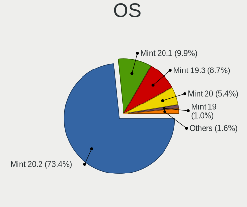

| Name      | Computers | Percent |
|-----------|-----------|---------|
| Mint 19.3 | 200       | 81.3%   |
| Mint 19.2 | 10        | 4.07%   |
| Mint 19.1 | 10        | 4.07%   |
| Mint 4    | 7         | 2.85%   |
| Mint 19   | 7         | 2.85%   |
| Mint 18.3 | 7         | 2.85%   |
| Mint 3    | 2         | 0.81%   |
| Mint 18.2 | 1         | 0.41%   |
| Mint 18.1 | 1         | 0.41%   |
| Mint 18   | 1         | 0.41%   |

OS Family
---------

OS without a version

| Name | Computers | Percent |
|------|-----------|---------|
| Mint | 246       | 100%    |

Kernel
------

Version of the Linux kernel

| Version                    | Computers | Percent |
|----------------------------|-----------|---------|
| 5.3.0-40-generic           | 72        | 29.27%  |
| 5.3.0-42-generic           | 66        | 26.83%  |
| 5.0.0-32-generic           | 31        | 12.6%   |
| 4.15.0-91-generic          | 17        | 6.91%   |
| 4.15.0-88-generic          | 12        | 4.88%   |
| 5.3.0-45-generic           | 6         | 2.44%   |
| 5.3.0-28-generic           | 5         | 2.03%   |
| 4.19.0-8-amd64             | 5         | 2.03%   |
| 4.15.0-54-generic          | 4         | 1.63%   |
| 4.15.0-20-generic          | 3         | 1.22%   |
| 4.15.0-76-generic          | 2         | 0.81%   |
| 4.15.0-74-generic          | 2         | 0.81%   |
| 5.6.0-050600rc7-lowlatency | 1         | 0.41%   |
| 5.6.0-050600rc5-generic    | 1         | 0.41%   |
| 5.5.6-050506-generic       | 1         | 0.41%   |
| 5.4.2-050402-generic       | 1         | 0.41%   |
| 5.4.16-050416-generic      | 1         | 0.41%   |
| 5.4.0-0.bpo.4-amd64        | 1         | 0.41%   |
| 5.3.0-45-lowlatency        | 1         | 0.41%   |
| 5.3.0-40-lowlatency        | 1         | 0.41%   |
| 5.3.0-26-generic           | 1         | 0.41%   |
| 4.9.0-8-amd64              | 1         | 0.41%   |
| 4.4.0-53-generic           | 1         | 0.41%   |
| 4.4.0-141-generic          | 1         | 0.41%   |
| 4.19.0-8-686               | 1         | 0.41%   |
| 4.19.0-0.bpo.8-amd64       | 1         | 0.41%   |
| 4.18.0-18-generic          | 1         | 0.41%   |
| 4.15.0-88-lowlatency       | 1         | 0.41%   |
| 4.15.0-66-generic          | 1         | 0.41%   |
| 4.15.0-65-generic          | 1         | 0.41%   |
| 4.15.0-60-generic          | 1         | 0.41%   |
| 4.15.0-45-generic          | 1         | 0.41%   |
| 4.10.0-38-generic          | 1         | 0.41%   |

Kernel Family
-------------

Linux kernel without a distro release

| Version | Computers | Percent |
|---------|-----------|---------|
| 5.3.0   | 152       | 61.79%  |
| 4.15.0  | 45        | 18.29%  |
| 5.0.0   | 31        | 12.6%   |
| 4.19.0  | 7         | 2.85%   |
| 5.6.0   | 2         | 0.81%   |
| 4.4.0   | 2         | 0.81%   |
| 5.5.6   | 1         | 0.41%   |
| 5.4.2   | 1         | 0.41%   |
| 5.4.16  | 1         | 0.41%   |
| 5.4.0   | 1         | 0.41%   |
| 4.9.0   | 1         | 0.41%   |
| 4.18.0  | 1         | 0.41%   |
| 4.10.0  | 1         | 0.41%   |

Kernel Major Ver.
-----------------

Linux kernel major version

| Version | Computers | Percent |
|---------|-----------|---------|
| 5.3     | 152       | 61.79%  |
| 4.15    | 45        | 18.29%  |
| 5.0     | 31        | 12.6%   |
| 4.19    | 7         | 2.85%   |
| 5.4     | 3         | 1.22%   |
| 5.6     | 2         | 0.81%   |
| 4.4     | 2         | 0.81%   |
| 5.5     | 1         | 0.41%   |
| 4.9     | 1         | 0.41%   |
| 4.18    | 1         | 0.41%   |
| 4.10    | 1         | 0.41%   |

Arch
----

OS architecture (x86_64, i586, etc.)

| Name   | Computers | Percent |
|--------|-----------|---------|
| x86_64 | 223       | 90.65%  |
| i686   | 23        | 9.35%   |

DE
--

Desktop Environment

| Name       | Computers | Percent |
|------------|-----------|---------|
| X-Cinnamon | 142       | 57.72%  |
| MATE       | 37        | 15.04%  |
| Cinnamon   | 36        | 14.63%  |
| XFCE       | 18        | 7.32%   |
| GNOME      | 6         | 2.44%   |
| Unknown    | 3         | 1.22%   |
| Deepin     | 2         | 0.81%   |
| KDE5       | 1         | 0.41%   |
| KDE        | 1         | 0.41%   |

Display Server
--------------

X11 or Wayland

| Name | Computers | Percent |
|------|-----------|---------|
| X11  | 246       | 100%    |

OS Lang
-------

Language

| Lang    | Computers | Percent |
|---------|-----------|---------|
| en_US   | 73        | 29.67%  |
| de_DE   | 28        | 11.38%  |
| ru_RU   | 20        | 8.13%   |
| pt_BR   | 19        | 7.72%   |
| en_GB   | 17        | 6.91%   |
| fr_FR   | 11        | 4.47%   |
| en_CA   | 10        | 4.07%   |
| it_IT   | 8         | 3.25%   |
| pl_PL   | 7         | 2.85%   |
| es_ES   | 7         | 2.85%   |
| nl_NL   | 5         | 2.03%   |
| es_AR   | 5         | 2.03%   |
| ru_UA   | 3         | 1.22%   |
| pt_PT   | 2         | 0.81%   |
| nl_BE   | 2         | 0.81%   |
| fr_CA   | 2         | 0.81%   |
| es_UY   | 2         | 0.81%   |
| en_IE   | 2         | 0.81%   |
| en_AU   | 2         | 0.81%   |
| Unknown | 2         | 0.81%   |
| uk_UA   | 1         | 0.41%   |
| tr_TR   | 1         | 0.41%   |
| sr_RS   | 1         | 0.41%   |
| sk_SK   | 1         | 0.41%   |
| ro_RO   | 1         | 0.41%   |
| hr_HR   | 1         | 0.41%   |
| fi_FI   | 1         | 0.41%   |
| es_VE   | 1         | 0.41%   |
| es_CO   | 1         | 0.41%   |
| en_PH   | 1         | 0.41%   |
| en_IN   | 1         | 0.41%   |
| en_IL   | 1         | 0.41%   |
| de_LI   | 1         | 0.41%   |
| de_AT   | 1         | 0.41%   |
| da_DK   | 1         | 0.41%   |
| cs_CZ   | 1         | 0.41%   |
| ca_AD   | 1         | 0.41%   |
| C       | 1         | 0.41%   |
| bg_BG   | 1         | 0.41%   |

Boot Mode
---------

EFI or BIOS

| Mode | Computers | Percent |
|------|-----------|---------|
| BIOS | 152       | 61.79%  |
| EFI  | 94        | 38.21%  |

Filesystem
----------

Type of filesystem

| Type    | Computers | Percent |
|---------|-----------|---------|
| Ext4    | 236       | 95.93%  |
| Btrfs   | 9         | 3.66%   |
| Overlay | 1         | 0.41%   |

Dual Boot with Linux
--------------------

Hosting more than one Linux

| Dual boot | Computers | Percent |
|-----------|-----------|---------|
| No        | 236       | 95.93%  |
| Yes       | 10        | 4.07%   |

Dual Boot (Win)
---------------

Hosting Linux and Windows

| Dual boot | Computers | Percent |
|-----------|-----------|---------|
| No        | 212       | 86.18%  |
| Yes       | 34        | 13.82%  |

Country
-------

Geographic location (country)

| Country                | Computers | Percent |
|------------------------|-----------|---------|
| USA                    | 45        | 18.29%  |
| Germany                | 32        | 13.01%  |
| Brazil                 | 21        | 8.54%   |
| Russia                 | 19        | 7.72%   |
| UK                     | 17        | 6.91%   |
| Canada                 | 12        | 4.88%   |
| Italy                  | 10        | 4.07%   |
| France                 | 9         | 3.66%   |
| Spain                  | 8         | 3.25%   |
| Poland                 | 6         | 2.44%   |
| Netherlands            | 6         | 2.44%   |
| Ukraine                | 5         | 2.03%   |
| Belgium                | 5         | 2.03%   |
| Argentina              | 5         | 2.03%   |
| Austria                | 3         | 1.22%   |
| Australia              | 3         | 1.22%   |
| Uruguay                | 2         | 0.81%   |
| Turkey                 | 2         | 0.81%   |
| Slovakia               | 2         | 0.81%   |
| Puerto Rico            | 2         | 0.81%   |
| Portugal               | 2         | 0.81%   |
| Mexico                 | 2         | 0.81%   |
| Kyrgyzstan             | 2         | 0.81%   |
| Ireland                | 2         | 0.81%   |
| Czech Republic         | 2         | 0.81%   |
| Bulgaria               | 2         | 0.81%   |
| Venezuela              | 1         | 0.41%   |
| Switzerland            | 1         | 0.41%   |
| Sweden                 | 1         | 0.41%   |
| Romania                | 1         | 0.41%   |
| Philippines            | 1         | 0.41%   |
| Norway                 | 1         | 0.41%   |
| Morocco                | 1         | 0.41%   |
| Latvia                 | 1         | 0.41%   |
| Israel                 | 1         | 0.41%   |
| Iran                   | 1         | 0.41%   |
| Indonesia              | 1         | 0.41%   |
| India                  | 1         | 0.41%   |
| Iceland                | 1         | 0.41%   |
| Finland                | 1         | 0.41%   |
| Denmark                | 1         | 0.41%   |
| Croatia                | 1         | 0.41%   |
| Costa Rica             | 1         | 0.41%   |
| Colombia               | 1         | 0.41%   |
| Bosnia and Herzegovina | 1         | 0.41%   |
| Belarus                | 1         | 0.41%   |

City
----

Geographic location (city)

| City                  | Computers | Percent |
|-----------------------|-----------|---------|
| São Paulo            | 4         | 1.63%   |
| Toronto               | 3         | 1.22%   |
| Walton on Thames      | 2         | 0.81%   |
| Vienna                | 2         | 0.81%   |
| St Petersburg         | 2         | 0.81%   |
| Rio de Janeiro        | 2         | 0.81%   |
| Prague                | 2         | 0.81%   |
| Paris                 | 2         | 0.81%   |
| Moscow                | 2         | 0.81%   |
| Milan                 | 2         | 0.81%   |
| Lisbon                | 2         | 0.81%   |
| Kyiv                  | 2         | 0.81%   |
| Krasnodar             | 2         | 0.81%   |
| Kostroma              | 2         | 0.81%   |
| Herne                 | 2         | 0.81%   |
| Halifax               | 2         | 0.81%   |
| Córdoba              | 2         | 0.81%   |
| Bishkek               | 2         | 0.81%   |
| Zelafon               | 1         | 0.41%   |
| Yuzhno-Sakhalinsk     | 1         | 0.41%   |
| Winnipeg              | 1         | 0.41%   |
| Wilhelmshaven         | 1         | 0.41%   |
| Wichita Falls         | 1         | 0.41%   |
| West Des Moines       | 1         | 0.41%   |
| Weiden                | 1         | 0.41%   |
| Wahroonga             | 1         | 0.41%   |
| Voronezh              | 1         | 0.41%   |
| Voorhout              | 1         | 0.41%   |
| Vinkovci              | 1         | 0.41%   |
| Villa Flandria        | 1         | 0.41%   |
| Valladolid            | 1         | 0.41%   |
| Tver                  | 1         | 0.41%   |
| Turin                 | 1         | 0.41%   |
| Tunja                 | 1         | 0.41%   |
| Tula                  | 1         | 0.41%   |
| Toenisvorst           | 1         | 0.41%   |
| Timelkam              | 1         | 0.41%   |
| Thornton              | 1         | 0.41%   |
| Tehran                | 1         | 0.41%   |
| Tampa                 | 1         | 0.41%   |
| São José dos Campos | 1         | 0.41%   |
| Sylvan Lake           | 1         | 0.41%   |
| Surgut                | 1         | 0.41%   |
| Stuttgart             | 1         | 0.41%   |
| Strasbourg            | 1         | 0.41%   |
| Stoke-on-Trent        | 1         | 0.41%   |
| St. Petersburg        | 1         | 0.41%   |
| St Austell            | 1         | 0.41%   |
| Spruce Grove          | 1         | 0.41%   |
| Sonneberg             | 1         | 0.41%   |
| Sofia                 | 1         | 0.41%   |
| Sjomarken             | 1         | 0.41%   |
| Severomorsk           | 1         | 0.41%   |
| Seattle               | 1         | 0.41%   |
| Schwabmunchen         | 1         | 0.41%   |
| Sarpsborg             | 1         | 0.41%   |
| Santa Maria           | 1         | 0.41%   |
| San Jose              | 1         | 0.41%   |
| San Giuliano Terme    | 1         | 0.41%   |
| San Diego             | 1         | 0.41%   |

Vendor
------

Motherboard manufacturer

| Name                | Computers | Percent |
|---------------------|-----------|---------|
| Hewlett-Packard     | 52        | 21.14%  |
| ASUSTek Computer    | 37        | 15.04%  |
| Lenovo              | 30        | 12.2%   |
| Dell                | 28        | 11.38%  |
| Acer                | 22        | 8.94%   |
| Gigabyte Technology | 18        | 7.32%   |
| Toshiba             | 9         | 3.66%   |
| MSI                 | 9         | 3.66%   |
| ASRock              | 8         | 3.25%   |
| Samsung Electronics | 4         | 1.63%   |
| Unknown             | 4         | 1.63%   |
| Pegatron            | 3         | 1.22%   |
| Sony                | 2         | 0.81%   |
| Notebook            | 2         | 0.81%   |
| Intel               | 2         | 0.81%   |
| Fujitsu             | 2         | 0.81%   |
| Biostar             | 2         | 0.81%   |
| Apple               | 2         | 0.81%   |
| Wistron             | 1         | 0.41%   |
| WinFast             | 1         | 0.41%   |
| OEGStone            | 1         | 0.41%   |
| Medion              | 1         | 0.41%   |
| Login Informatica   | 1         | 0.41%   |
| Linx                | 1         | 0.41%   |
| LG Electronics      | 1         | 0.41%   |
| Google              | 1         | 0.41%   |
| Gateway             | 1         | 0.41%   |
| Foxconn             | 1         | 0.41%   |

Model
-----

Motherboard model

| Name                                     | Computers | Percent |
|------------------------------------------|-----------|---------|
| Unknown                                  | 7         | 2.85%   |
| MSI MS-7C02                              | 3         | 1.22%   |
| Toshiba Satellite L650                   | 2         | 0.81%   |
| Samsung Electronics 300E4C/300E5C/300E7C | 2         | 0.81%   |
| HP ProBook 650 G1                        | 2         | 0.81%   |
| HP ProBook 4540s                         | 2         | 0.81%   |
| HP Pavilion g6                           | 2         | 0.81%   |
| HP Pavilion dv4                          | 2         | 0.81%   |
| HP Laptop 15-bw0xx                       | 2         | 0.81%   |
| HP ENVY x360 Convertible 13-ar0xxx       | 2         | 0.81%   |
| HP Compaq 8200 Elite CMT PC              | 2         | 0.81%   |
| Dell OptiPlex 790                        | 2         | 0.81%   |
| Dell Latitude E6430                      | 2         | 0.81%   |
| Dell Inspiron 15-3567                    | 2         | 0.81%   |
| ASUS M5A99X EVO R2.0                     | 2         | 0.81%   |
| ASUS M5A78L-M PLUS/USB3                  | 2         | 0.81%   |
| ASUS All Series                          | 2         | 0.81%   |
| Acer AO725                               | 2         | 0.81%   |
| Wistron ProLiant ML110 G5                | 1         | 0.41%   |
| WinFast MCP61M2MA                        | 1         | 0.41%   |
| Toshiba Satellite Pro C640               | 1         | 0.41%   |
| Toshiba Satellite L775D                  | 1         | 0.41%   |
| Toshiba Satellite L50-B                  | 1         | 0.41%   |
| Toshiba Satellite L300                   | 1         | 0.41%   |
| Toshiba Satellite C670D-10C              | 1         | 0.41%   |
| Toshiba PORTEGE R500                     | 1         | 0.41%   |
| Sony VPCEB1E1R                           | 1         | 0.41%   |
| Sony SVE1512B1EW                         | 1         | 0.41%   |
| Samsung Electronics R430/P430/R480       | 1         | 0.41%   |
| Samsung Electronics 530U3C/530U4C/532U3C | 1         | 0.41%   |
| Pegatron h8-1360t                        | 1         | 0.41%   |
| Pegatron Compaq dx2400 Microtower        | 1         | 0.41%   |
| Pegatron AY030AA-ABA CQ5320F             | 1         | 0.41%   |
| OEGStone M570RU                          | 1         | 0.41%   |
| Notebook N8xEJEK                         | 1         | 0.41%   |
| Notebook N85_N87HCHNHZ                   | 1         | 0.41%   |
| MSI MS-7B84                              | 1         | 0.41%   |
| MSI MS-7793                              | 1         | 0.41%   |
| MSI MS-7666                              | 1         | 0.41%   |
| MSI MS-7383                              | 1         | 0.41%   |
| MSI GX60 3CC                             | 1         | 0.41%   |
| MSI Compaq dx2420 Microtower             | 1         | 0.41%   |
| Medion MS-7501                           | 1         | 0.41%   |
| Login Informatica LOG-Q77H2-M            | 1         | 0.41%   |
| Linx LINX12X64                           | 1         | 0.41%   |
| LG Electronics V320-M.BG31P1             | 1         | 0.41%   |
| Lenovo Yoga 730-15IWL 81JS               | 1         | 0.41%   |
| Lenovo Yoga 300-11IBR 80M1               | 1         | 0.41%   |
| Lenovo V145-15AST 81MT                   | 1         | 0.41%   |
| Lenovo ThinkPad X250 20CM002VUS          | 1         | 0.41%   |
| Lenovo ThinkPad X220 42872WU             | 1         | 0.41%   |
| Lenovo ThinkPad X200 7459Z7N             | 1         | 0.41%   |
| Lenovo ThinkPad X1 Yoga 4th 20QGS01M00   | 1         | 0.41%   |
| Lenovo ThinkPad X1 Yoga 2nd 20JES03T00   | 1         | 0.41%   |
| Lenovo ThinkPad X1 Carbon 34485S4        | 1         | 0.41%   |
| Lenovo ThinkPad T440 20B7S26602          | 1         | 0.41%   |
| Lenovo ThinkPad T430 2349S52             | 1         | 0.41%   |
| Lenovo ThinkPad T420s 4173RR4            | 1         | 0.41%   |
| Lenovo ThinkPad P50 20EN0005SP           | 1         | 0.41%   |
| Lenovo ThinkPad Edge 13IAL# 01962EG      | 1         | 0.41%   |

Model Family
------------

Motherboard model prefix

| Name                          | Computers | Percent |
|-------------------------------|-----------|---------|
| Acer Aspire                   | 16        | 6.5%    |
| Lenovo ThinkPad               | 13        | 5.28%   |
| Dell Inspiron                 | 11        | 4.47%   |
| HP Compaq                     | 10        | 4.07%   |
| HP ProBook                    | 8         | 3.25%   |
| Toshiba Satellite             | 7         | 2.85%   |
| HP Pavilion                   | 7         | 2.85%   |
| Dell Latitude                 | 7         | 2.85%   |
| Unknown                       | 7         | 2.85%   |
| Dell OptiPlex                 | 6         | 2.44%   |
| Lenovo ThinkCentre            | 4         | 1.63%   |
| Lenovo IdeaPad                | 4         | 1.63%   |
| HP Laptop                     | 4         | 1.63%   |
| HP ENVY                       | 4         | 1.63%   |
| HP EliteBook                  | 4         | 1.63%   |
| ASUS PRIME                    | 4         | 1.63%   |
| ASUS M5A78L-M                 | 4         | 1.63%   |
| MSI MS-7C02                   | 3         | 1.22%   |
| Samsung Electronics 300E4C    | 2         | 0.81%   |
| Lenovo Yoga                   | 2         | 0.81%   |
| Lenovo 3000                   | 2         | 0.81%   |
| HP Presario                   | 2         | 0.81%   |
| Dell Vostro                   | 2         | 0.81%   |
| ASUS SABERTOOTH               | 2         | 0.81%   |
| ASUS M5A99X                   | 2         | 0.81%   |
| ASUS All                      | 2         | 0.81%   |
| Acer TravelMate               | 2         | 0.81%   |
| Acer AO725                    | 2         | 0.81%   |
| Wistron ProLiant              | 1         | 0.41%   |
| WinFast MCP61M2MA             | 1         | 0.41%   |
| Toshiba PORTEGE               | 1         | 0.41%   |
| Sony VPCEB1E1R                | 1         | 0.41%   |
| Sony SVE1512B1EW              | 1         | 0.41%   |
| Samsung Electronics R430      | 1         | 0.41%   |
| Samsung Electronics 530U3C    | 1         | 0.41%   |
| Pegatron h8-1360t             | 1         | 0.41%   |
| Pegatron Compaq               | 1         | 0.41%   |
| Pegatron AY030AA-ABA          | 1         | 0.41%   |
| OEGStone M570RU               | 1         | 0.41%   |
| Notebook N8xEJEK              | 1         | 0.41%   |
| Notebook N85                  | 1         | 0.41%   |
| MSI MS-7B84                   | 1         | 0.41%   |
| MSI MS-7793                   | 1         | 0.41%   |
| MSI MS-7666                   | 1         | 0.41%   |
| MSI MS-7383                   | 1         | 0.41%   |
| MSI GX60                      | 1         | 0.41%   |
| MSI Compaq                    | 1         | 0.41%   |
| Medion MS-7501                | 1         | 0.41%   |
| Login Informatica LOG-Q77H2-M | 1         | 0.41%   |
| Linx LINX12X64                | 1         | 0.41%   |
| LG Electronics V320-M.BG31P1  | 1         | 0.41%   |
| Lenovo V145-15AST             | 1         | 0.41%   |
| Lenovo G550                   | 1         | 0.41%   |
| Lenovo G50-80                 | 1         | 0.41%   |
| Lenovo G50-70                 | 1         | 0.41%   |
| Lenovo E31-70                 | 1         | 0.41%   |
| Intel NUC8i7BEH               | 1         | 0.41%   |
| Intel GT5408                  | 1         | 0.41%   |
| HP Z620                       | 1         | 0.41%   |
| HP Z400                       | 1         | 0.41%   |

MFG Year
--------

Motherboard manufacture year

| Year | Computers | Percent |
|------|-----------|---------|
| 2019 | 43        | 17.48%  |
| 2018 | 34        | 13.82%  |
| 2014 | 25        | 10.16%  |
| 2011 | 21        | 8.54%   |
| 2010 | 19        | 7.72%   |
| 2013 | 17        | 6.91%   |
| 2012 | 16        | 6.5%    |
| 2016 | 14        | 5.69%   |
| 2009 | 14        | 5.69%   |
| 2017 | 12        | 4.88%   |
| 2008 | 11        | 4.47%   |
| 2015 | 7         | 2.85%   |
| 2007 | 6         | 2.44%   |
| 2006 | 4         | 1.63%   |
| 2020 | 1         | 0.41%   |
| 2005 | 1         | 0.41%   |
| 2004 | 1         | 0.41%   |

Form Factor
-----------

Physical design of the computer

| Name        | Computers | Percent |
|-------------|-----------|---------|
| Notebook    | 138       | 56.1%   |
| Desktop     | 94        | 38.21%  |
| Convertible | 8         | 3.25%   |
| Tablet      | 2         | 0.81%   |
| Mini pc     | 2         | 0.81%   |
| All in one  | 2         | 0.81%   |

Secure Boot
-----------

Enabled or disabled

| State    | Computers | Percent |
|----------|-----------|---------|
| Disabled | 233       | 94.72%  |
| Enabled  | 13        | 5.28%   |

Coreboot
--------

Have coreboot on board

| Used | Computers | Percent |
|------|-----------|---------|
| No   | 245       | 99.59%  |
| Yes  | 1         | 0.41%   |

RAM Size
--------

Total RAM memory

| Size in GB | Computers | Percent |
|------------|-----------|---------|
| 4.01-8.0   | 63        | 25.61%  |
| 3.01-4.0   | 60        | 24.39%  |
| 16.01-24.0 | 40        | 16.26%  |
| 8.01-16.0  | 38        | 15.45%  |
| 1.01-2.0   | 20        | 8.13%   |
| 32.01-64.0 | 12        | 4.88%   |
| 2.01-3.0   | 9         | 3.66%   |
| 24.01-32.0 | 3         | 1.22%   |
| 0.01-1.0   | 1         | 0.41%   |

RAM Used
--------

Used RAM memory

| Used GB    | Computers | Percent |
|------------|-----------|---------|
| 1.01-2.0   | 102       | 41.46%  |
| 2.01-3.0   | 70        | 28.46%  |
| 0.01-1.0   | 28        | 11.38%  |
| 4.01-8.0   | 26        | 10.57%  |
| 3.01-4.0   | 14        | 5.69%   |
| 8.01-16.0  | 4         | 1.63%   |
| 16.01-24.0 | 2         | 0.81%   |

Drive Vendor
------------

Hard drive vendors

| Vendor              | Computers | Drives  | Percent |
|---------------------|-----------|---------|---------|
| Seagate             | 78        | 89      | 23.01%  |
| WDC                 | 55        | 63      | 16.22%  |
| Samsung Electronics | 40        | 42      | 11.8%   |
| Toshiba             | 28        | 29      | 8.26%   |
| Kingston            | 15        | 15      | 4.42%   |
| Hitachi             | 15        | 16      | 4.42%   |
| Unknown             | 13        | 13      | 3.83%   |
| Crucial             | 12        | 14      | 3.54%   |
| SanDisk             | 11        | 11      | 3.24%   |
| HGST                | 10        | 10      | 2.95%   |
| Intel               | 8         | 9       | 2.36%   |
| China               | 4         | 4       | 1.18%   |
| A-DATA Technology   | 4         | 4       | 1.18%   |
| Transcend           | 3         | 3       | 0.88%   |
| SK Hynix            | 3         | 3       | 0.88%   |
| PLEXTOR             | 3         | 3       | 0.88%   |
| OCZ                 | 3         | 3       | 0.88%   |
| MAXTOR              | 3         | 3       | 0.88%   |
| KingSpec            | 3         | 4       | 0.88%   |
| HL-DT-ST            | 3         | Unknown | 0.88%   |
| SPCC                | 2         | 2       | 0.59%   |
| PNY                 | 2         | 2       | 0.59%   |
| Micron Technology   | 2         | 2       | 0.59%   |
| KingDian            | 2         | 2       | 0.59%   |
| Gigabyte Technology | 2         | 2       | 0.59%   |
| Generic             | 2         | 2       | 0.59%   |
| WDC WD20            | 1         | 1       | 0.29%   |
| Vi550               | 1         | 1       | 0.29%   |
| TO Exter            | 1         | 1       | 0.29%   |
| TCSUNBOW            | 1         | 1       | 0.29%   |
| Super Talent        | 1         | 1       | 0.29%   |
| MyDigitalSSD        | 1         | 1       | 0.29%   |
| Maxone              | 1         | 1       | 0.29%   |
| LITEON              | 1         | 1       | 0.29%   |
| JMicron             | 1         | 1       | 0.29%   |
| Intenso             | 1         | 1       | 0.29%   |
| Hewlett-Packard     | 1         | 1       | 0.29%   |
| Fujitsu             | 1         | 1       | 0.29%   |
| Apple               | 1         | 1       | 0.29%   |

Drive Model
-----------

Hard drive models

| Model                        | Computers | Percent |
|------------------------------|-----------|---------|
| ST500DM002-1BD142 500GB      | 6         | 1.64%   |
| ST1000LM024 HN-M101MBB 1TB   | 6         | 1.64%   |
| ST1000LM035-1RK172 1TB       | 5         | 1.37%   |
| SSD 860 EVO 500GB            | 5         | 1.37%   |
| HTS545050A7E380 500GB        | 4         | 1.1%    |
| CT1000MX500SSD1 1TB          | 4         | 1.1%    |
| WD10EZEX-08WN4A0 1TB         | 3         | 0.82%   |
| WD10EZEX-00WN4A0 1TB         | 3         | 0.82%   |
| ST9500420AS 500GB            | 3         | 0.82%   |
| ST3500418AS 500GB            | 3         | 0.82%   |
| ST31000528AS 1TB             | 3         | 0.82%   |
| SSDPEKNW512G8H 512GB         | 3         | 0.82%   |
| SSD 860 EVO 250GB            | 3         | 0.82%   |
| SA400S37240G 240GB SSD       | 3         | 0.82%   |
| MQ01ABF050 500GB             | 3         | 0.82%   |
| MQ01ABD100 1TB               | 3         | 0.82%   |
| MMC Card  16GB               | 3         | 0.82%   |
| HD161HJ 160GB                | 3         | 0.82%   |
| DVDRAM GUE1N 3GB             | 3         | 0.82%   |
| WDS480G2G0B-00EPW0 480GB SSD | 2         | 0.55%   |
| WDS240G2G0A-00JH30 240GB SSD | 2         | 0.55%   |
| WDS120G2G0B-00EPW0 120GB SSD | 2         | 0.55%   |
| WDS100T2B0A-00SM50 1TB SSD   | 2         | 0.55%   |
| WD5000AAKX-003CA0 500GB      | 2         | 0.55%   |
| WD10EZRX-00L4HB0 1TB         | 2         | 0.55%   |
| SV300S37A120G 120GB SSD      | 2         | 0.55%   |
| ST500LT012-1DG142 500GB      | 2         | 0.55%   |
| ST500LM021-1KJ152 500GB      | 2         | 0.55%   |
| ST3320418AS 320GB            | 2         | 0.55%   |
| ST3160815AS 160GB            | 2         | 0.55%   |
| ST2000LX001-1RG174 2TB       | 2         | 0.55%   |
| ST2000DM008-2FR102 2TB       | 2         | 0.55%   |
| ST2000DM006-2DM164 2TB       | 2         | 0.55%   |
| ST1000LM014-1EJ164 1TB       | 2         | 0.55%   |
| ST1000DM003-9YN162 1TB       | 2         | 0.55%   |
| SSD 850 EVO 250GB            | 2         | 0.55%   |
| SSD 850 EVO 120GB            | 2         | 0.55%   |
| SSD 840 EVO 250GB            | 2         | 0.55%   |
| SD/MMC/MS PRO 16GB           | 2         | 0.55%   |
| SA400S37480G 480GB SSD       | 2         | 0.55%   |
| SA400S37120G 120GB SSD       | 2         | 0.55%   |
| MQ04ABF100 1TB               | 2         | 0.55%   |
| MQ01ABD075 752GB             | 2         | 0.55%   |
| MMC Card  393GB              | 2         | 0.55%   |
| MK3265GSX 320GB              | 2         | 0.55%   |
| HTS543232A7A384 320GB        | 2         | 0.55%   |
| HTS541075A9E680 752GB        | 2         | 0.55%   |
| HTS541010A9E680 1TB          | 2         | 0.55%   |
| HDT721010SLA360 1TB          | 2         | 0.55%   |
| HDP725050GLA360 500GB        | 2         | 0.55%   |
| HD322HJ 320GB                | 2         | 0.55%   |
| HD154UI 1TB                  | 2         | 0.55%   |
| Expansion 1TB                | 2         | 0.55%   |
| X3 120GB                     | 1         | 0.27%   |
| WDS500G2B0A-00SM50 500GB SSD | 1         | 0.27%   |
| WDS200T2B0A 2TB SSD          | 1         | 0.27%   |
| WDS120G2G0A-00JH30 120GB SSD | 1         | 0.27%   |
| WDBNCE2500PNC 250GB SSD      | 1         | 0.27%   |
| WD7500BPKX-80HPJT0 752GB     | 1         | 0.27%   |
| WD6400BPVT-60HXZT3 640GB     | 1         | 0.27%   |

Drive Kind
----------

HDD or SSD

| Kind    | Computers | Drives | Percent |
|---------|-----------|--------|---------|
| HDD     | 167       | 209    | 54.75%  |
| SSD     | 101       | 119    | 33.11%  |
| MMC     | 14        | 14     | 4.59%   |
| Unknown | 12        | 9      | 3.93%   |
| NVMe    | 11        | 12     | 3.61%   |

Drive Connector
---------------

SATA, SAS, NVMe, etc.

| Type | Computers | Drives | Percent |
|------|-----------|--------|---------|
| SATA | 226       | 326    | 85.28%  |
| SAS  | 14        | 11     | 5.28%   |
| MMC  | 14        | 14     | 5.28%   |
| NVMe | 11        | 12     | 4.15%   |

Drive Size
----------

Size of hard drive

| Size in TB | Computers | Drives | Percent |
|------------|-----------|--------|---------|
| 0.01-0.5   | 182       | 227    | 60.47%  |
| 0.51-1.0   | 88        | 103    | 29.24%  |
| 1.01-2.0   | 21        | 22     | 6.98%   |
| 2.01-3.0   | 6         | 6      | 1.99%   |
| 3.01-4.0   | 4         | 5      | 1.33%   |

Space Total
-----------

Amount of disk space available on the file system

| Size in GB     | Computers | Percent |
|----------------|-----------|---------|
| 101-250        | 74        | 30.08%  |
| 251-500        | 56        | 22.76%  |
| 501-1000       | 41        | 16.67%  |
| 1001-2000      | 25        | 10.16%  |
| 51-100         | 23        | 9.35%   |
| 21-50          | 9         | 3.66%   |
| More than 3000 | 8         | 3.25%   |
| 2001-3000      | 7         | 2.85%   |
| 1-20           | 2         | 0.81%   |
| Unknown        | 1         | 0.41%   |

Space Used
----------

Amount of used disk space

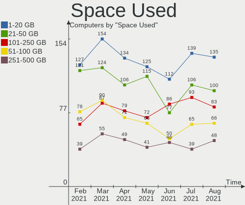

| Used GB        | Computers | Percent |
|----------------|-----------|---------|
| 1-20           | 63        | 25.61%  |
| 21-50          | 58        | 23.58%  |
| 101-250        | 45        | 18.29%  |
| 51-100         | 29        | 11.79%  |
| 251-500        | 25        | 10.16%  |
| 501-1000       | 16        | 6.5%    |
| 1001-2000      | 4         | 1.63%   |
| More than 3000 | 3         | 1.22%   |
| 2001-3000      | 2         | 0.81%   |
| Unknown        | 1         | 0.41%   |

Malfunc. Drives
---------------

Drive models with a malfunction

| Model                       | Computers | Drives | Percent |
|-----------------------------|-----------|--------|---------|
| ST500DM002-1BD142 500GB     | 2         | 2      | 10.53%  |
| WD2500AAKX-753CA1 250GB     | 1         | 1      | 5.26%   |
| WD10SPZX-60Z10T0 1TB        | 1         | 1      | 5.26%   |
| ST9250410AS 250GB           | 1         | 1      | 5.26%   |
| ST500LT012-9WS142 500GB     | 1         | 1      | 5.26%   |
| ST3160023AS 160GB           | 1         | 1      | 5.26%   |
| ST1000LM035-1RK172 1TB      | 1         | 1      | 5.26%   |
| ST1000LM014-1EJ164 1TB      | 1         | 1      | 5.26%   |
| SSDSC2CT120A3 120GB         | 1         | 1      | 5.26%   |
| SD8SN8U-128G-1006 128GB SSD | 1         | 1      | 5.26%   |
| SD7SB3Q256G1002 256GB SSD   | 1         | 1      | 5.26%   |
| MZVLW1T0HMLH-000L7 1TB      | 1         | 1      | 5.26%   |
| MQ02ABD100H 1TB             | 1         | 1      | 5.26%   |
| MQ01ABD100 1TB              | 1         | 1      | 5.26%   |
| MP0402H 40GB                | 1         | 1      | 5.26%   |
| MK3265GSX 320GB             | 1         | 1      | 5.26%   |
| HTS541075A9E680 752GB       | 1         | 1      | 5.26%   |
| CT240M500SSD1 240GB         | 1         | 1      | 5.26%   |

Malfunc. Drive Vendor
---------------------

Vendors of faulty drives

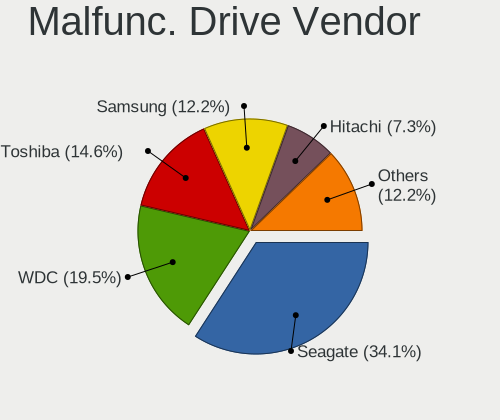

| Vendor              | Computers | Drives | Percent |
|---------------------|-----------|--------|---------|
| Seagate             | 7         | 7      | 36.84%  |
| Toshiba             | 3         | 3      | 15.79%  |
| WDC                 | 2         | 2      | 10.53%  |
| SanDisk             | 2         | 2      | 10.53%  |
| Samsung Electronics | 2         | 2      | 10.53%  |
| Intel               | 1         | 1      | 5.26%   |
| HGST                | 1         | 1      | 5.26%   |
| Crucial             | 1         | 1      | 5.26%   |

Malfunc. Drive Kind
-------------------

Kinds of faulty drives

| Kind | Computers | Drives | Percent |
|------|-----------|--------|---------|
| HDD  | 14        | 14     | 73.68%  |
| SSD  | 4         | 4      | 21.05%  |
| NVMe | 1         | 1      | 5.26%   |

Failed Drives
-------------

Failed drive models

Zero info for selected period =(

Failed Drive Vendor
-------------------

Failed drive vendors

Zero info for selected period =(

Drive Status
------------

Number of failed and malfunc. drives

| Status   | Computers | Drives | Percent |
|----------|-----------|--------|---------|
| Detected | 197       | 299    | 78.49%  |
| Works    | 35        | 45     | 13.94%  |
| Malfunc  | 19        | 19     | 7.57%   |

Storage Vendor
--------------

Storage controller vendors

| Vendor                        | Computers | Percent |
|-------------------------------|-----------|---------|
| Intel                         | 186       | 66.43%  |
| AMD                           | 46        | 16.43%  |
| Samsung Electronics           | 11        | 3.93%   |
| Nvidia                        | 6         | 2.14%   |
| JMicron Technology            | 6         | 2.14%   |
| ASMedia Technology            | 6         | 2.14%   |
| Toshiba America Info Systems  | 3         | 1.07%   |
| Marvell Technology Group      | 3         | 1.07%   |
| SK Hynix                      | 2         | 0.71%   |
| Phison Electronics            | 2         | 0.71%   |
| ADATA Technology              | 2         | 0.71%   |
| Silicon Motion                | 1         | 0.36%   |
| Silicon Image                 | 1         | 0.36%   |
| Sandisk                       | 1         | 0.36%   |
| Lite-On Technology            | 1         | 0.36%   |
| Kingston Technology Company   | 1         | 0.36%   |
| Integrated Technology Express | 1         | 0.36%   |
| Apple                         | 1         | 0.36%   |

Storage Model
-------------

Storage controller models

| Model                                                                             | Computers | Percent |
|-----------------------------------------------------------------------------------|-----------|---------|
| FCH SATA Controller [AHCI mode]                                                   | 30        | 9.01%   |
| Sunrise Point-LP SATA Controller [AHCI mode]                                      | 16        | 4.8%    |
| 7 Series Chipset Family 6-port SATA Controller [AHCI mode]                        | 15        | 4.5%    |
| 82801 Mobile SATA Controller [RAID mode]                                          | 11        | 3.3%    |
| SB7x0/SB8x0/SB9x0 SATA Controller [AHCI mode]                                     | 10        | 3%      |
| Q170/Q150/B150/H170/H110/Z170/CM236 Chipset SATA Controller [AHCI Mode]           | 10        | 3%      |
| SB7x0/SB8x0/SB9x0 IDE Controller                                                  | 9         | 2.7%    |
| NM10/ICH7 Family SATA Controller [IDE mode]                                       | 9         | 2.7%    |
| 8 Series/C220 Series Chipset Family 6-port SATA Controller 1 [AHCI mode]          | 9         | 2.7%    |
| 8 Series SATA Controller 1 [AHCI mode]                                            | 9         | 2.7%    |
| 82801G (ICH7 Family) IDE Controller                                               | 8         | 2.4%    |
| 6 Series/C200 Series Chipset Family 6 port Desktop SATA AHCI Controller           | 8         | 2.4%    |
| 5 Series/3400 Series Chipset 6 port SATA AHCI Controller                          | 8         | 2.4%    |
| NVMe SSD Controller SM981/PM981/PM983                                             | 7         | 2.1%    |
| 6 Series/C200 Series Chipset Family 6 port Mobile SATA AHCI Controller            | 7         | 2.1%    |
| 5 Series/3400 Series Chipset 4 port SATA AHCI Controller                          | 7         | 2.1%    |
| SSD 660P Series                                                                   | 6         | 1.8%    |
| SB7x0/SB8x0/SB9x0 SATA Controller [IDE mode]                                      | 6         | 1.8%    |
| Non-Volatile memory controller                                                    | 6         | 1.8%    |
| ASM1062 Serial ATA Controller                                                     | 6         | 1.8%    |
| 82801IBM/IEM (ICH9M/ICH9M-E) 4 port SATA Controller [AHCI mode]                   | 6         | 1.8%    |
| 7 Series/C210 Series Chipset Family 6-port SATA Controller [AHCI mode]            | 6         | 1.8%    |
| 400 Series Chipset SATA Controller                                                | 6         | 1.8%    |
| MCP61 SATA Controller                                                             | 5         | 1.5%    |
| HM170/QM170 Chipset SATA Controller [AHCI Mode]                                   | 5         | 1.5%    |
| 82801GBM/GHM (ICH7-M Family) SATA Controller [IDE mode]                           | 5         | 1.5%    |
| MCP61 IDE                                                                         | 4         | 1.2%    |
| JMB363 SATA/IDE Controller                                                        | 4         | 1.2%    |
| 200 Series PCH SATA controller [AHCI mode]                                        | 4         | 1.2%    |
| Wildcat Point-LP SATA Controller [AHCI Mode]                                      | 3         | 0.9%    |
| SATA Controller [RAID mode]                                                       | 3         | 0.9%    |
| NVMe SSD Controller SM961/PM961                                                   | 3         | 0.9%    |
| FCH IDE Controller                                                                | 3         | 0.9%    |
| Cannon Lake Mobile PCH SATA AHCI Controller                                       | 3         | 0.9%    |
| 82801I (ICH9 Family) 2 port SATA Controller [IDE mode]                            | 3         | 0.9%    |
| 82801HM/HEM (ICH8M/ICH8M-E) SATA Controller [AHCI mode]                           | 3         | 0.9%    |
| 82801HM/HEM (ICH8M/ICH8M-E) IDE Controller                                        | 3         | 0.9%    |
| 6 Series/C200 Series Chipset Family Desktop SATA Controller (IDE mode, ports 4-5) | 3         | 0.9%    |
| 6 Series/C200 Series Chipset Family Desktop SATA Controller (IDE mode, ports 0-3) | 3         | 0.9%    |
| XPG SX8200 Pro PCIe Gen3x4 M.2 2280 Solid State Drive                             | 2         | 0.6%    |
| SATA controller                                                                   | 2         | 0.6%    |
| NVMe Controller                                                                   | 2         | 0.6%    |
| Atom/Celeron/Pentium Processor x5-E8000/J3xxx/N3xxx Series SATA Controller        | 2         | 0.6%    |
| 9 Series Chipset Family SATA Controller [AHCI Mode]                               | 2         | 0.6%    |
| 82801JI (ICH10 Family) SATA AHCI Controller                                       | 2         | 0.6%    |
| 82801IR/IO/IH (ICH9R/DO/DH) 4 port SATA Controller [IDE mode]                     | 2         | 0.6%    |
| 82801GBM/GHM (ICH7-M Family) SATA Controller [AHCI mode]                          | 2         | 0.6%    |
| 82801FB/FBM/FR/FW/FRW (ICH6 Family) IDE Controller                                | 2         | 0.6%    |
| WD Black 2018/PC SN520 NVMe SSD                                                   | 1         | 0.3%    |
| US15W/US15X/US15L/UL11L SCH [Poulsbo] IDE Controller                              | 1         | 0.3%    |
| Toshiba America Info Non-Volatile memory controller                               | 1         | 0.3%    |
| SiI 3114 [SATALink/SATARaid] Serial ATA Controller                                | 1         | 0.3%    |
| S3X NVMe Controller                                                               | 1         | 0.3%    |
| NM10/ICH7 Family SATA Controller [AHCI mode]                                      | 1         | 0.3%    |
| Mobile 4 Series Chipset PT IDER Controller                                        | 1         | 0.3%    |
| JMB368 IDE controller                                                             | 1         | 0.3%    |
| JMB362 SATA Controller                                                            | 1         | 0.3%    |
| IT8213 IDE Controller                                                             | 1         | 0.3%    |
| FCH SATA Controller D                                                             | 1         | 0.3%    |
| Electronics SATA controller                                                       | 1         | 0.3%    |

Storage Kind
------------

Kind of storage controller (IDE, SATA, NVMe, SAS, ...)

| Kind | Computers | Percent |
|------|-----------|---------|
| SATA | 185       | 63.79%  |
| IDE  | 60        | 20.69%  |
| NVMe | 29        | 10%     |
| RAID | 15        | 5.17%   |
| SAS  | 1         | 0.34%   |

CPU Vendor
----------

Processor vendors

| Vendor | Computers | Percent |
|--------|-----------|---------|
| Intel  | 191       | 77.64%  |
| AMD    | 55        | 22.36%  |

CPU Model
---------

Processor models

| Model                                         | Computers | Percent |
|-----------------------------------------------|-----------|---------|
| Intel Core i7-8750H CPU @ 2.20GHz             | 3         | 1.22%   |
| Intel Core i5-8265U CPU @ 1.60GHz             | 3         | 1.22%   |
| Intel Core i5-4210U CPU @ 1.70GHz             | 3         | 1.22%   |
| Intel Core i5-3210M CPU @ 2.50GHz             | 3         | 1.22%   |
| Intel Core i5-2520M CPU @ 2.50GHz             | 3         | 1.22%   |
| Intel Core i5 CPU M 430 @ 2.27GHz             | 3         | 1.22%   |
| Intel Core i3-8130U CPU @ 2.20GHz             | 3         | 1.22%   |
| Intel Core i3-2120 CPU @ 3.30GHz              | 3         | 1.22%   |
| Intel Pentium Dual-Core CPU E5300 @ 2.60GHz   | 2         | 0.81%   |
| Intel Core i7-8700K CPU @ 3.70GHz             | 2         | 0.81%   |
| Intel Core i7-8565U CPU @ 1.80GHz             | 2         | 0.81%   |
| Intel Core i7-7700HQ CPU @ 2.80GHz            | 2         | 0.81%   |
| Intel Core i7-7500U CPU @ 2.70GHz             | 2         | 0.81%   |
| Intel Core i7-6700K CPU @ 4.00GHz             | 2         | 0.81%   |
| Intel Core i7-6700HQ CPU @ 2.60GHz            | 2         | 0.81%   |
| Intel Core i7-4790 CPU @ 3.60GHz              | 2         | 0.81%   |
| Intel Core i7-2600 CPU @ 3.40GHz              | 2         | 0.81%   |
| Intel Core i5-7500 CPU @ 3.40GHz              | 2         | 0.81%   |
| Intel Core i5-7300HQ CPU @ 2.50GHz            | 2         | 0.81%   |
| Intel Core i5-7200U CPU @ 2.50GHz             | 2         | 0.81%   |
| Intel Core i5-6200U CPU @ 2.30GHz             | 2         | 0.81%   |
| Intel Core i5-4570 CPU @ 3.20GHz              | 2         | 0.81%   |
| Intel Core i5-3470 CPU @ 3.20GHz              | 2         | 0.81%   |
| Intel Core i5-3320M CPU @ 2.60GHz             | 2         | 0.81%   |
| Intel Core i5-3230M CPU @ 2.60GHz             | 2         | 0.81%   |
| Intel Core i5-2410M CPU @ 2.30GHz             | 2         | 0.81%   |
| Intel Core i5-2400 CPU @ 3.10GHz              | 2         | 0.81%   |
| Intel Core i5 CPU M 480 @ 2.67GHz             | 2         | 0.81%   |
| Intel Core i5 CPU 650 @ 3.20GHz               | 2         | 0.81%   |
| Intel Core i3-7020U CPU @ 2.30GHz             | 2         | 0.81%   |
| Intel Core i3-6006U CPU @ 2.00GHz             | 2         | 0.81%   |
| Intel Core 2 CPU T7200 @ 2.00GHz              | 2         | 0.81%   |
| Intel Celeron N4000 CPU @ 1.10GHz             | 2         | 0.81%   |
| AMD Ryzen 7 3700U with Radeon Vega Mobile Gfx | 2         | 0.81%   |
| AMD FX-8350 Eight-Core Processor              | 2         | 0.81%   |
| AMD E-450 APU with Radeon HD Graphics         | 2         | 0.81%   |
| AMD Athlon 64 X2 Dual Core Processor 5200+    | 2         | 0.81%   |
| Intel Xeon CPU X5570 @ 2.93GHz                | 1         | 0.41%   |
| Intel Xeon CPU X3210 @ 2.13GHz                | 1         | 0.41%   |
| Intel Xeon CPU E5-2620 v2 @ 2.10GHz           | 1         | 0.41%   |
| Intel Xeon CPU E5-1650 v3 @ 3.50GHz           | 1         | 0.41%   |
| Intel Pentium M processor 1.86GHz             | 1         | 0.41%   |
| Intel Pentium Dual-Core CPU T4500 @ 2.30GHz   | 1         | 0.41%   |
| Intel Pentium Dual-Core CPU T4400 @ 2.20GHz   | 1         | 0.41%   |
| Intel Pentium Dual-Core CPU E5800 @ 3.20GHz   | 1         | 0.41%   |
| Intel Pentium Dual-Core CPU E5700 @ 3.00GHz   | 1         | 0.41%   |
| Intel Pentium Dual-Core CPU E5500 @ 2.80GHz   | 1         | 0.41%   |
| Intel Pentium Dual-Core CPU E5200 @ 2.50GHz   | 1         | 0.41%   |
| Intel Pentium Dual CPU T3200 @ 2.00GHz        | 1         | 0.41%   |
| Intel Pentium CPU N3710 @ 1.60GHz             | 1         | 0.41%   |
| Intel Pentium CPU G850 @ 2.90GHz              | 1         | 0.41%   |
| Intel Pentium CPU G620 @ 2.60GHz              | 1         | 0.41%   |
| Intel Pentium CPU G4400 @ 3.30GHz             | 1         | 0.41%   |
| Intel Pentium CPU G3420 @ 3.20GHz             | 1         | 0.41%   |
| Intel Pentium CPU G2030 @ 3.00GHz             | 1         | 0.41%   |
| Intel Pentium CPU 2117U @ 1.80GHz             | 1         | 0.41%   |
| Intel Pentium CPU 2020M @ 2.40GHz             | 1         | 0.41%   |
| Intel Pentium 4 CPU 3.00GHz                   | 1         | 0.41%   |
| Intel Pentium 3805U @ 1.90GHz                 | 1         | 0.41%   |
| Intel Genuine CPU U7300 @ 1.30GHz             | 1         | 0.41%   |

CPU Model Family
----------------

Processor model prefix

| Model                   | Computers | Percent |
|-------------------------|-----------|---------|
| Intel Core i5           | 57        | 23.17%  |
| Intel Core i7           | 45        | 18.29%  |
| Intel Core i3           | 25        | 10.16%  |
| Intel Core 2 Duo        | 12        | 4.88%   |
| Intel Pentium           | 9         | 3.66%   |
| Intel Celeron           | 9         | 3.66%   |
| Intel Pentium Dual-Core | 8         | 3.25%   |
| AMD Ryzen 5             | 7         | 2.85%   |
| AMD FX                  | 7         | 2.85%   |
| AMD A6                  | 5         | 2.03%   |
| AMD A10                 | 5         | 2.03%   |
| Intel Xeon              | 4         | 1.63%   |
| Intel Core 2            | 4         | 1.63%   |
| Intel Atom              | 4         | 1.63%   |
| AMD Ryzen 7             | 4         | 1.63%   |
| AMD Athlon II X2        | 4         | 1.63%   |
| AMD Athlon 64 X2        | 4         | 1.63%   |
| Intel Genuine           | 3         | 1.22%   |
| Intel Celeron M         | 3         | 1.22%   |
| AMD E                   | 3         | 1.22%   |
| Other                   | 2         | 0.81%   |
| AMD A8                  | 2         | 0.81%   |
| Intel Pentium M         | 1         | 0.41%   |
| Intel Pentium Dual      | 1         | 0.41%   |
| Intel Pentium 4         | 1         | 0.41%   |
| Intel Core m3           | 1         | 0.41%   |
| Intel Core i9           | 1         | 0.41%   |
| Intel Core 2 Solo       | 1         | 0.41%   |
| Intel Core 2 Quad       | 1         | 0.41%   |
| Intel Core 2 Extreme    | 1         | 0.41%   |
| AMD Sempron             | 1         | 0.41%   |
| AMD Ryzen 9             | 1         | 0.41%   |
| AMD Ryzen 3             | 1         | 0.41%   |
| AMD Phenom II X6        | 1         | 0.41%   |
| AMD Phenom II X4        | 1         | 0.41%   |
| AMD Phenom II X2        | 1         | 0.41%   |
| AMD Phenom              | 1         | 0.41%   |
| AMD E2                  | 1         | 0.41%   |
| AMD C-70                | 1         | 0.41%   |
| AMD C-60                | 1         | 0.41%   |
| AMD Athlon X4           | 1         | 0.41%   |
| AMD A4                  | 1         | 0.41%   |

CPU Cores
---------

Number of processor cores

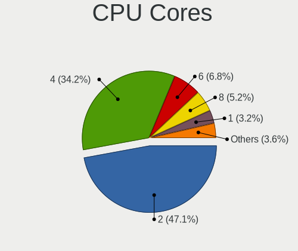

| Number | Computers | Percent |
|--------|-----------|---------|
| 2      | 138       | 56.1%   |
| 4      | 72        | 29.27%  |
| 6      | 15        | 6.1%    |
| 1      | 15        | 6.1%    |
| 3      | 3         | 1.22%   |
| 8      | 2         | 0.81%   |
| 12     | 1         | 0.41%   |

CPU Sockets
-----------

Number of sockets

| Number | Computers | Percent |
|--------|-----------|---------|
| 1      | 246       | 100%    |

CPU Threads
-----------

Threads per core (Hyper-Threading)

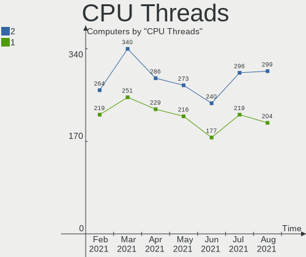

| Number | Computers | Percent |
|--------|-----------|---------|
| 2      | 146       | 59.35%  |
| 1      | 100       | 40.65%  |

CPU Op-Modes
------------

CPU Operation Modes (32-bit, 64-bit)

| Op mode        | Computers | Percent |
|----------------|-----------|---------|
| 32-bit, 64-bit | 238       | 96.75%  |
| 32-bit         | 8         | 3.25%   |

CPU Microarch
-------------

Microarchitecture

| Name          | Computers | Percent |
|---------------|-----------|---------|
| Skylake       | 47        | 19.11%  |
| Core          | 31        | 12.6%   |
| Haswell       | 23        | 9.35%   |
| SandyBridge   | 22        | 8.94%   |
| IvyBridge     | 22        | 8.94%   |
| Westmere      | 13        | 5.28%   |
| Piledriver    | 9         | 3.66%   |
| K10           | 8         | 3.25%   |
| Zen+          | 7         | 2.85%   |
| Silvermont    | 6         | 2.44%   |
| P6            | 6         | 2.44%   |
| Nehalem       | 5         | 2.03%   |
| KabyLake      | 5         | 2.03%   |
| Excavator     | 5         | 2.03%   |
| Bobcat        | 5         | 2.03%   |
| Zen           | 4         | 1.63%   |
| K8 Hammer     | 4         | 1.63%   |
| Broadwell     | 4         | 1.63%   |
| Bulldozer     | 3         | 1.22%   |
| Bonnell       | 3         | 1.22%   |
| Zen 2         | 2         | 0.81%   |
| Steamroller   | 2         | 0.81%   |
| Puma          | 2         | 0.81%   |
| K10 Llano     | 2         | 0.81%   |
| Jaguar        | 2         | 0.81%   |
| Goldmont plus | 2         | 0.81%   |
| Penryn        | 1         | 0.41%   |
| NetBurst      | 1         | 0.41%   |

CPU Microcode
-------------

Microcode number

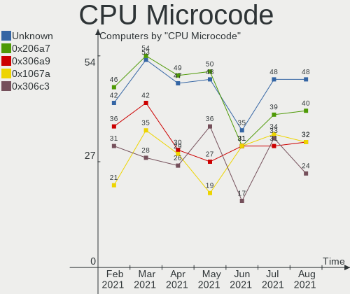

| Number     | Computers | Percent |
|------------|-----------|---------|
| Unknown    | 20        | 8.13%   |
| 0x306a9    | 19        | 7.72%   |
| 0x206a7    | 19        | 7.72%   |
| 0x1067a    | 14        | 5.69%   |
| 0x906e9    | 10        | 4.07%   |
| 0x306c3    | 10        | 4.07%   |
| 0x806e9    | 9         | 3.66%   |
| 0x40651    | 9         | 3.66%   |
| 0x906ea    | 8         | 3.25%   |
| 0x506e3    | 7         | 2.85%   |
| 0x20655    | 7         | 2.85%   |
| 0x20652    | 6         | 2.44%   |
| 0x806ec    | 5         | 2.03%   |
| 0x806ea    | 5         | 2.03%   |
| 0x406e3    | 5         | 2.03%   |
| 0x06001119 | 5         | 2.03%   |
| 0x6fd      | 4         | 1.63%   |
| 0x406c4    | 4         | 1.63%   |
| 0x306d4    | 4         | 1.63%   |
| 0x10676    | 4         | 1.63%   |
| 0x08108102 | 4         | 1.63%   |
| 0x06000852 | 4         | 1.63%   |
| 0x05000119 | 4         | 1.63%   |
| 0x010000c8 | 4         | 1.63%   |
| 0x106e5    | 3         | 1.22%   |
| 0x0800820d | 3         | 1.22%   |
| 0x06006705 | 3         | 1.22%   |
| 0x0600063e | 3         | 1.22%   |
| 0x706a1    | 2         | 0.81%   |
| 0x6fb      | 2         | 0.81%   |
| 0x6f6      | 2         | 0.81%   |
| 0x6f2      | 2         | 0.81%   |
| 0x6e8      | 2         | 0.81%   |
| 0x30678    | 2         | 0.81%   |
| 0x106c2    | 2         | 0.81%   |
| 0x106a5    | 2         | 0.81%   |
| 0x10661    | 2         | 0.81%   |
| 0x08701013 | 2         | 0.81%   |
| 0x03000027 | 2         | 0.81%   |
| 0x906ed    | 1         | 0.41%   |
| 0x806eb    | 1         | 0.41%   |
| 0x6fa      | 1         | 0.41%   |
| 0x6ec      | 1         | 0.41%   |
| 0x6d8      | 1         | 0.41%   |
| 0x6d6      | 1         | 0.41%   |
| 0x306f2    | 1         | 0.41%   |
| 0x306e4    | 1         | 0.41%   |
| 0x30661    | 1         | 0.41%   |
| 0x0810100b | 1         | 0.41%   |
| 0x08001138 | 1         | 0.41%   |
| 0x08001137 | 1         | 0.41%   |
| 0x07030106 | 1         | 0.41%   |
| 0x07030104 | 1         | 0.41%   |
| 0x0700010f | 1         | 0.41%   |
| 0x0700010b | 1         | 0.41%   |
| 0x06006110 | 1         | 0.41%   |
| 0x06003104 | 1         | 0.41%   |
| 0x05000029 | 1         | 0.41%   |
| 0x010000dc | 1         | 0.41%   |
| 0x010000db | 1         | 0.41%   |

GPU Vendor
----------

Vendors of graphics cards

| Vendor                     | Computers | Percent |
|----------------------------|-----------|---------|
| Intel                      | 149       | 51.03%  |
| Nvidia                     | 74        | 25.34%  |
| AMD                        | 68        | 23.29%  |
| Matrox Electronics Systems | 1         | 0.34%   |

GPU Model
---------

Graphics card models

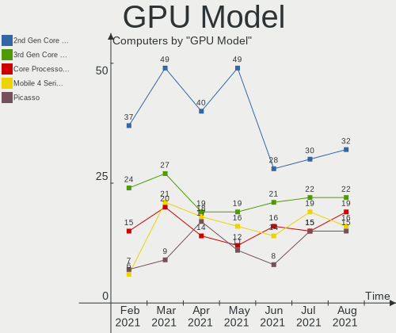

| Model                                                                              | Computers | Percent |
|------------------------------------------------------------------------------------|-----------|---------|
| 2nd Generation Core Processor Family Integrated Graphics Controller                | 18        | 5.84%   |
| 3rd Gen Core processor Graphics Controller                                         | 14        | 4.55%   |
| Haswell-ULT Integrated Graphics Controller                                         | 9         | 2.92%   |
| Core Processor Integrated Graphics Controller                                      | 9         | 2.92%   |
| Mobile 4 Series Chipset Integrated Graphics Controller                             | 8         | 2.6%    |
| Mobile 945GM/GMS/GME, 943/940GML Express Integrated Graphics Controller            | 7         | 2.27%   |
| HD Graphics 630                                                                    | 7         | 2.27%   |
| HD Graphics 620                                                                    | 7         | 2.27%   |
| Mobile 945GM/GMS, 943/940GML Express Integrated Graphics Controller                | 6         | 1.95%   |
| Ellesmere [Radeon RX 470/480/570/570X/580/580X/590]                                | 6         | 1.95%   |
| Xeon E3-1200 v3/4th Gen Core Processor Integrated Graphics Controller              | 5         | 1.62%   |
| UHD Graphics 620 (Whiskey Lake)                                                    | 5         | 1.62%   |
| Skylake GT2 [HD Graphics 520]                                                      | 5         | 1.62%   |
| 4th Gen Core Processor Integrated Graphics Controller                              | 5         | 1.62%   |
| UHD Graphics 630 (Mobile)                                                          | 4         | 1.3%    |
| UHD Graphics 620                                                                   | 4         | 1.3%    |
| Picasso                                                                            | 4         | 1.3%    |
| GP107M [GeForce GTX 1050 Mobile]                                                   | 4         | 1.3%    |
| Caicos [Radeon HD 6450/7450/8450 / R5 230 OEM]                                     | 4         | 1.3%    |
| Atom/Celeron/Pentium Processor x5-E8000/J3xxx/N3xxx Integrated Graphics Controller | 4         | 1.3%    |
| Xeon E3-1200 v2/3rd Gen Core processor Graphics Controller                         | 3         | 0.97%   |
| Sun XT [Radeon HD 8670A/8670M/8690M / R5 M330 / M430 / Radeon 520 Mobile]          | 3         | 0.97%   |
| Stoney [Radeon R2/R3/R4/R5 Graphics]                                               | 3         | 0.97%   |
| RS780L [Radeon 3000]                                                               | 3         | 0.97%   |
| HD Graphics 530                                                                    | 3         | 0.97%   |
| GK208B [GeForce GT 710]                                                            | 3         | 0.97%   |
| GK107M [GeForce GT 750M]                                                           | 3         | 0.97%   |
| 82G33/G31 Express Integrated Graphics Controller                                   | 3         | 0.97%   |
| 4 Series Chipset Integrated Graphics Controller                                    | 3         | 0.97%   |
| Wrestler [Radeon HD 6320]                                                          | 2         | 0.65%   |
| Wani [Radeon R5/R6/R7 Graphics]                                                    | 2         | 0.65%   |
| UHD Graphics 605                                                                   | 2         | 0.65%   |
| TU117M [GeForce GTX 1650 Mobile / Max-Q]                                           | 2         | 0.65%   |
| TU117 [GeForce GTX 1650]                                                           | 2         | 0.65%   |
| Thames [Radeon HD 7550M/7570M/7650M]                                               | 2         | 0.65%   |
| Thames [Radeon HD 7500M/7600M Series]                                              | 2         | 0.65%   |
| Sumo [Radeon HD 6520G]                                                             | 2         | 0.65%   |
| Raven Ridge [Radeon Vega Series / Radeon Vega Mobile Series]                       | 2         | 0.65%   |
| Park [Mobility Radeon HD 5430/5450/5470]                                           | 2         | 0.65%   |
| Mobile GM965/GL960 Integrated Graphics Controller (secondary)                      | 2         | 0.65%   |
| Mobile GM965/GL960 Integrated Graphics Controller (primary)                        | 2         | 0.65%   |
| Mobile 915GM/GMS/910GML Express Graphics Controller                                | 2         | 0.65%   |
| HD Graphics 5500                                                                   | 2         | 0.65%   |
| GT218 [GeForce 8400 GS Rev. 3]                                                     | 2         | 0.65%   |
| GP108M [GeForce MX150]                                                             | 2         | 0.65%   |
| GP107M [GeForce GTX 1050 Ti Mobile]                                                | 2         | 0.65%   |
| GP107 [GeForce GTX 1050 Ti]                                                        | 2         | 0.65%   |
| GP106 [GeForce GTX 1060 6GB]                                                       | 2         | 0.65%   |
| GM107 [GeForce 940MX]                                                              | 2         | 0.65%   |
| GK208B [GeForce GT 730]                                                            | 2         | 0.65%   |
| GF117M [GeForce 610M/710M/810M/820M / GT 620M/625M/630M/720M]                      | 2         | 0.65%   |
| GF108GLM [NVS 5200M]                                                               | 2         | 0.65%   |
| Curacao PRO [Radeon R7 370 / R9 270/370 OEM]                                       | 2         | 0.65%   |
| C61 [GeForce 7025 / nForce 630a]                                                   | 2         | 0.65%   |
| Atom Processor Z36xxx/Z37xxx Series Graphics & Display                             | 2         | 0.65%   |
| 82945G/GZ Integrated Graphics Controller                                           | 2         | 0.65%   |
| Wrestler [Radeon HD 7290]                                                          | 1         | 0.32%   |
| Wrestler [Radeon HD 6310]                                                          | 1         | 0.32%   |
| Wrestler [Radeon HD 6290]                                                          | 1         | 0.32%   |
| US15W/US15X SCH [Poulsbo] Graphics Controller                                      | 1         | 0.32%   |

GPU Combo
---------

Combinations of graphics cards

| Name           | Computers | Percent |
|----------------|-----------|---------|
| 1 x Intel      | 106       | 43.09%  |
| 1 x AMD        | 51        | 20.73%  |
| 1 x Nvidia     | 39        | 15.85%  |
| Intel + Nvidia | 33        | 13.41%  |
| Intel + AMD    | 8         | 3.25%   |
| 2 x AMD        | 7         | 2.85%   |
| 1 x Matrox     | 1         | 0.41%   |
| AMD + Nvidia   | 1         | 0.41%   |

GPU Driver
----------

Free vs proprietary

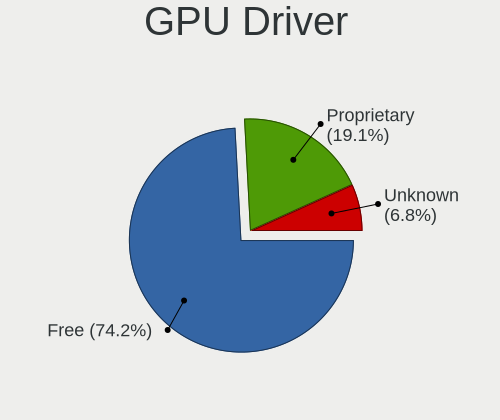

| Driver      | Computers | Percent |
|-------------|-----------|---------|
| Free        | 193       | 78.46%  |
| Proprietary | 50        | 20.33%  |
| Unknown     | 3         | 1.22%   |

GPU Memory
----------

Total video memory

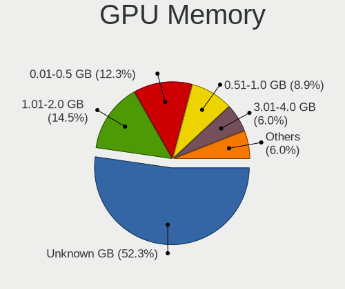

| Size in GB | Computers | Percent |
|------------|-----------|---------|
| Unknown    | 103       | 41.87%  |
| 1.01-2.0   | 47        | 19.11%  |
| 0.01-0.5   | 34        | 13.82%  |
| 0.51-1.0   | 26        | 10.57%  |
| 3.01-4.0   | 23        | 9.35%   |
| 7.01-8.0   | 8         | 3.25%   |
| 5.01-6.0   | 3         | 1.22%   |
| 2.01-3.0   | 1         | 0.41%   |
| 8.01-16.0  | 1         | 0.41%   |

Monitor Vendor
--------------

Monitor vendors

| Vendor                  | Computers | Percent |
|-------------------------|-----------|---------|
| Samsung Electronics     | 38        | 14.45%  |
| AU Optronics            | 36        | 13.69%  |
| LG Display              | 21        | 7.98%   |
| Chimei Innolux          | 21        | 7.98%   |
| BOE                     | 16        | 6.08%   |
| Hewlett-Packard         | 13        | 4.94%   |
| Goldstar                | 10        | 3.8%    |
| Dell                    | 10        | 3.8%    |
| ViewSonic               | 8         | 3.04%   |
| LG Electronics          | 8         | 3.04%   |
| BenQ                    | 8         | 3.04%   |
| AOC                     | 7         | 2.66%   |
| Ancor Communications    | 6         | 2.28%   |
| Acer                    | 6         | 2.28%   |
| Unknown                 | 5         | 1.9%    |
| LG Philips              | 5         | 1.9%    |
| Lenovo                  | 5         | 1.9%    |
| Iiyama                  | 5         | 1.9%    |
| Philips                 | 4         | 1.52%   |
| Chi Mei Optoelectronics | 4         | 1.52%   |
| Apple                   | 4         | 1.52%   |
| Sony                    | 3         | 1.14%   |
| InfoVision              | 3         | 1.14%   |
| Quanta Display          | 2         | 0.76%   |
| Unknown (AAA)           | 1         | 0.38%   |
| Toshiba                 | 1         | 0.38%   |
| Sharp                   | 1         | 0.38%   |
| Sceptre Tech            | 1         | 0.38%   |
| PANDA                   | 1         | 0.38%   |
| Packard Bell            | 1         | 0.38%   |
| MStar                   | 1         | 0.38%   |
| JVC                     | 1         | 0.38%   |
| Insignia                | 1         | 0.38%   |
| Idek Iiyama             | 1         | 0.38%   |
| IBM                     | 1         | 0.38%   |
| HannStar                | 1         | 0.38%   |
| Fujitsu Siemens         | 1         | 0.38%   |
| eMachines               | 1         | 0.38%   |
| Eizo                    | 1         | 0.38%   |

Monitor Model
-------------

Monitor models

| Model                                               | Computers | Percent |
|-----------------------------------------------------|-----------|---------|
| LCD Monitor CMN15D5 1920x1080 340x190mm 15.3-inch   | 3         | 1.12%   |
| LCD Monitor LGD0384 1366x768 344x194mm 15.5-inch    | 2         | 0.75%   |
| LCD Monitor CMN1470 1366x768 309x174mm 14.0-inch    | 2         | 0.75%   |
| LCD Monitor BOE0690 1920x1080 344x193mm 15.5-inch   | 2         | 0.75%   |
| LCD Monitor AUO71EC 1366x768 340x190mm 15.3-inch    | 2         | 0.75%   |
| LCD Monitor AUO61ED 1920x1080 340x190mm 15.3-inch   | 2         | 0.75%   |
| LCD Monitor AUO325C 1366x768 256x144mm 11.6-inch    | 2         | 0.75%   |
| LCD Monitor AUO219D 1920x1080 381x214mm 17.2-inch   | 2         | 0.75%   |
| LCD Monitor AUO106C 1366x768 277x156mm 12.5-inch    | 2         | 0.75%   |
| X193W ACR000F 1440x900 408x255mm 18.9-inch          | 1         | 0.37%   |
| W2343 GSM5700 1920x1080 474x296mm 22.0-inch         | 1         | 0.37%   |
| W2253 GSM56DC 1920x1080 477x268mm 21.5-inch         | 1         | 0.37%   |
| W2252 GSM567D 1680x1050 474x296mm 22.0-inch         | 1         | 0.37%   |
| VX2336 SERIES VSC402A 1920x1080 510x290mm 23.1-inch | 1         | 0.37%   |
| Viseo 191DXL PKB0222 1366x768 409x230mm 18.5-inch   | 1         | 0.37%   |
| VG2030wm VSCA51E 1680x1050 433x270mm 20.1-inch      | 1         | 0.37%   |
| VA925 SERIES VSC8F29 1280x1024 380x300mm 19.1-inch  | 1         | 0.37%   |
| VA2719 Series VSCC132 1920x1080 598x336mm 27.0-inch | 1         | 0.37%   |
| VA2246 SERIES VSC6F2E 1920x1080 477x268mm 21.5-inch | 1         | 0.37%   |
| VA2226w-3 VSC2051 1680x1050 495x291mm 22.6-inch     | 1         | 0.37%   |
| VA1916wSERIES VSCF91F 1440x900 410x256mm 19.0-inch  | 1         | 0.37%   |
| V320 GSM597A 1920x1080 509x286mm 23.0-inch          | 1         | 0.37%   |
| TV *00 SNY4B04 3840x2160 1600x900mm 72.3-inch       | 1         | 0.37%   |
| Thunderbolt APP9227 2560x1440 600x340mm 27.2-inch   | 1         | 0.37%   |
| SyncMaster SAM060D 1920x1080 531x299mm 24.0-inch    | 1         | 0.37%   |
| SyncMaster SAM0580 1280x1024 376x301mm 19.0-inch    | 1         | 0.37%   |
| SyncMaster SAM03F2 1920x1080                        | 1         | 0.37%   |
| SyncMaster SAM037B 1680x1050 474x296mm 22.0-inch    | 1         | 0.37%   |
| SyncMaster SAM036F 1440x900 428x255mm 19.6-inch     | 1         | 0.37%   |
| SyncMaster SAM030C 1680x1050 474x296mm 22.0-inch    | 1         | 0.37%   |
| SyncMaster SAM027E 1680x1050 474x296mm 22.0-inch    | 1         | 0.37%   |
| SMS19A200 SAM0830 1440x900 408x255mm 18.9-inch      | 1         | 0.37%   |
| SMB2430H SAM064E 1920x1080                          | 1         | 0.37%   |
| SDM-X52 SNY1F50 1024x768 304x228mm 15.0-inch        | 1         | 0.37%   |
| S2719DM DEL4166 2560x1440 600x340mm 27.2-inch       | 1         | 0.37%   |
| S24E390 SAM0C1A 1920x1080 520x290mm 23.4-inch       | 1         | 0.37%   |
| S2409W DELA039 1920x1080 531x298mm 24.0-inch        | 1         | 0.37%   |
| S22F350 SAM0D1B 1920x1080 477x268mm 21.5-inch       | 1         | 0.37%   |
| S2231 HWP2905 1920x1080 477x268mm 21.5-inch         | 1         | 0.37%   |
| R240HY ACR046F 1920x1080 530x300mm 24.0-inch        | 1         | 0.37%   |
| R230H ACR046E 1920x1080 509x286mm 23.0-inch         | 1         | 0.37%   |
| Q2775 AOC2775 2560x1440 597x336mm 27.0-inch         | 1         | 0.37%   |
| PLX2483H IVM6114 1920x1080 531x299mm 24.0-inch      | 1         | 0.37%   |
| PLT2336 IVM5628 1920x1080 509x286mm 23.0-inch       | 1         | 0.37%   |
| PLE2207WS IVM5609 1680x1050 474x296mm 22.0-inch     | 1         | 0.37%   |
| PL2773HD IVM6606 1920x1080 598x336mm 27.0-inch      | 1         | 0.37%   |
| PL2377 IVM561D 1920x1080 510x287mm 23.0-inch        | 1         | 0.37%   |
| PHL 193V5 PHLC0CD 1366x768 410x230mm 18.5-inch      | 1         | 0.37%   |
| P2715Q DEL40BF 3840x2160 597x336mm 27.0-inch        | 1         | 0.37%   |
| P2418D DELD0C2 2560x1440 526x296mm 23.8-inch        | 1         | 0.37%   |
| P2213 DELF042 1680x1050 473x296mm 22.0-inch         | 1         | 0.37%   |
| P2014H DEL4096 1600x900 434x236mm 19.4-inch         | 1         | 0.37%   |
| P191W ACR0010 1600x1200 408x255mm 18.9-inch         | 1         | 0.37%   |
| Nvidia Defaul SNY05FA 1366x768 290x170mm 13.2-inch  | 1         | 0.37%   |
| NS-32D310NA17 BBY0050 1360x768 760x450mm 34.8-inch  | 1         | 0.37%   |
| LV2011 HWP299A 1600x900 443x249mm 20.0-inch         | 1         | 0.37%   |
| LP154WX4-TLC8 LPL0120 1280x800 331x207mm 15.4-inch  | 1         | 0.37%   |
| LG ULTRAWIDE GSM59F1 1920x1080 580x240mm 24.7-inch  | 1         | 0.37%   |
| LG FULL HD GSM5ABB 1920x1080 480x270mm 21.7-inch    | 1         | 0.37%   |
| LEN P27h-10 LEN61AF 2560x1440 597x336mm 27.0-inch   | 1         | 0.37%   |

Monitor Resolution
------------------

Monitor screen resolution

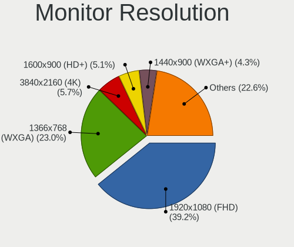

| Resolution         | Computers | Percent |
|--------------------|-----------|---------|
| 1920x1080 (FHD)    | 89        | 35.18%  |
| 1366x768 (WXGA)    | 62        | 24.51%  |
| 1680x1050 (WSXGA+) | 17        | 6.72%   |
| 1600x900 (HD+)     | 15        | 5.93%   |
| 1280x800 (WXGA)    | 15        | 5.93%   |
| 3840x2160 (4K)     | 9         | 3.56%   |
| 1280x1024 (SXGA)   | 8         | 3.16%   |
| 1440x900 (WXGA+)   | 7         | 2.77%   |
| 2560x1440 (QHD)    | 6         | 2.37%   |
| Unknown            | 5         | 1.98%   |
| 1920x1200 (WUXGA)  | 3         | 1.19%   |
| 3600x1080          | 2         | 0.79%   |
| 2560x1080          | 2         | 0.79%   |
| 1360x768           | 2         | 0.79%   |
| 3286x1080          | 1         | 0.4%    |
| 3200x1080          | 1         | 0.4%    |
| 2880x1800          | 1         | 0.4%    |
| 2560x1600          | 1         | 0.4%    |
| 2304x1024          | 1         | 0.4%    |
| 2160x1440          | 1         | 0.4%    |
| 1920x540           | 1         | 0.4%    |
| 1400x1050          | 1         | 0.4%    |
| 1280x960           | 1         | 0.4%    |
| 1024x768 (XGA)     | 1         | 0.4%    |
| 1024x600           | 1         | 0.4%    |

Monitor Diagonal
----------------

Diagonal size in inches

| Inches  | Computers | Percent |
|---------|-----------|---------|
| 15      | 71        | 27.41%  |
| Unknown | 30        | 11.58%  |
| 13      | 20        | 7.72%   |
| 17      | 19        | 7.34%   |
| 23      | 17        | 6.56%   |
| 14      | 17        | 6.56%   |
| 27      | 14        | 5.41%   |
| 22      | 11        | 4.25%   |
| 21      | 10        | 3.86%   |
| 19      | 10        | 3.86%   |
| 18      | 9         | 3.47%   |
| 12      | 8         | 3.09%   |
| 24      | 7         | 2.7%    |
| 11      | 4         | 1.54%   |
| 31      | 2         | 0.77%   |
| 26      | 2         | 0.77%   |
| 20      | 2         | 0.77%   |
| 84      | 1         | 0.39%   |
| 72      | 1         | 0.39%   |
| 40      | 1         | 0.39%   |
| 32      | 1         | 0.39%   |
| 28      | 1         | 0.39%   |
| 10      | 1         | 0.39%   |

Monitor Width
-------------

Physical width

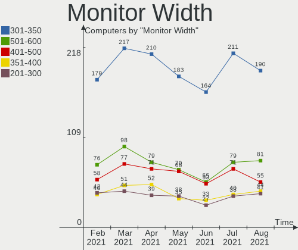

| Width in mm | Computers | Percent |
|-------------|-----------|---------|
| 301-350     | 98        | 38.13%  |
| 501-600     | 37        | 14.4%   |
| 401-500     | 35        | 13.62%  |
| Unknown     | 30        | 11.67%  |
| 201-300     | 25        | 9.73%   |
| 351-400     | 23        | 8.95%   |
| 601-700     | 5         | 1.95%   |
| 1501-2000   | 2         | 0.78%   |
| 801-900     | 1         | 0.39%   |
| 701-800     | 1         | 0.39%   |

Aspect Ratio
------------

Proportional relationship between the width and the height

| Ratio   | Computers | Percent |
|---------|-----------|---------|
| 16/9    | 162       | 67.78%  |
| 16/10   | 37        | 15.48%  |
| Unknown | 26        | 10.88%  |
| 5/4     | 8         | 3.35%   |
| 4/3     | 3         | 1.26%   |
| 32/9    | 1         | 0.42%   |
| 3/2     | 1         | 0.42%   |
| 21/9    | 1         | 0.42%   |

Monitor Area
------------

Area in inch²

| Area in inch² | Computers | Percent |
|----------------|-----------|---------|
| 101-110        | 67        | 25.87%  |
| 201-250        | 37        | 14.29%  |
| Unknown        | 30        | 11.58%  |
| 81-90          | 26        | 10.04%  |
| 151-200        | 22        | 8.49%   |
| 121-130        | 16        | 6.18%   |
| 301-350        | 15        | 5.79%   |
| 71-80          | 12        | 4.63%   |
| 61-70          | 7         | 2.7%    |
| 141-150        | 7         | 2.7%    |
| 91-100         | 5         | 1.93%   |
| 51-60          | 4         | 1.54%   |
| 351-500        | 3         | 1.16%   |
| 251-300        | 3         | 1.16%   |
| More than 1000 | 2         | 0.77%   |
| 41-50          | 1         | 0.39%   |
| 131-140        | 1         | 0.39%   |
| 501-1000       | 1         | 0.39%   |

Pixel Density
-------------

Pixels per inch

| Density       | Computers | Percent |
|---------------|-----------|---------|
| 51-100        | 75        | 29.76%  |
| 101-120       | 74        | 29.37%  |
| 121-160       | 57        | 22.62%  |
| Unknown       | 30        | 11.9%   |
| 161-240       | 9         | 3.57%   |
| More than 240 | 4         | 1.59%   |
| 1-50          | 3         | 1.19%   |

Multiple Monitors
-----------------

Total monitors connected

| Total | Computers | Percent |
|-------|-----------|---------|
| 1     | 213       | 86.59%  |
| 2     | 30        | 12.2%   |
| 3     | 2         | 0.81%   |
| 0     | 1         | 0.41%   |

Net Controller Vendor
---------------------

Controller vendors

| Vendor                            | Computers | Percent |
|-----------------------------------|-----------|---------|
| Intel                             | 41        | 56.94%  |
| Realtek Semiconductor             | 7         | 9.72%   |
| Nvidia                            | 6         | 8.33%   |
| Huawei Technologies               | 4         | 5.56%   |
| Ericsson Business Mobile Networks | 3         | 4.17%   |
| DisplayLink                       | 2         | 2.78%   |
| Broadcom Inc. and subsidiaries    | 2         | 2.78%   |
| ASIX Electronics                  | 2         | 2.78%   |
| Trendchip Technologies            | 1         | 1.39%   |
| Spreadtrum Communications         | 1         | 1.39%   |
| Sierra Wireless                   | 1         | 1.39%   |
| MediaTek                          | 1         | 1.39%   |
| Lenovo                            | 1         | 1.39%   |

Net Controller Model
--------------------

Controller models

| Model                                                      | Computers | Percent |
|------------------------------------------------------------|-----------|---------|
| 82579LM Gigabit Network Connection (Lewisville)            | 18        | 22.78%  |
| Centrino Advanced-N 6205 [Taylor Peak]                     | 6         | 7.59%   |
| MCP61 Ethernet                                             | 5         | 6.33%   |
| Wi-Fi 6 AX200                                              | 3         | 3.8%    |
| RTL8153 Gigabit Ethernet Adapter                           | 3         | 3.8%    |
| DLI-TL20                                                   | 3         | 3.8%    |
| 82579V Gigabit Network Connection                          | 3         | 3.8%    |
| RTL8723DE Wireless Network Adapter                         | 2         | 2.53%   |
| H5321 gw Mobile Broadband Driver                           | 2         | 2.53%   |
| BCM4401-B0 100Base-TX                                      | 2         | 2.53%   |
| AX88772                                                    | 2         | 2.53%   |
| 82801FB/FBM/FR/FW/FRW (ICH6 Family) AC'97 Modem Controller | 2         | 2.53%   |
| 82578DM Gigabit Network Connection                         | 2         | 2.53%   |
| 82567LM Gigabit Network Connection                         | 2         | 2.53%   |
| X5max_PRO                                                  | 1         | 1.27%   |
| Wireless-AC 9462                                           | 1         | 1.27%   |
| USB3.0 Dual Video Dock                                     | 1         | 1.27%   |
| USB-C Dock Ethernet                                        | 1         | 1.27%   |
| USB 3.0 5K Graphic Docking                                 | 1         | 1.27%   |
| Spreadtrum                                                 | 1         | 1.27%   |
| RTL8822CE 802.11ac PCIe Wireless Network Adapter           | 1         | 1.27%   |
| RTL8187 Wireless LAN Adapter                               | 1         | 1.27%   |
| PRO/100 VE Network Connection                              | 1         | 1.27%   |
| NM10/ICH7 Family LAN Controller                            | 1         | 1.27%   |
| I211 Gigabit Network Connection                            | 1         | 1.27%   |
| I210 Gigabit Network Connection                            | 1         | 1.27%   |
| F5521gw                                                    | 1         | 1.27%   |
| EM7455 Qualcomm Snapdragon X7 LTE-A                        | 1         | 1.27%   |
| E353/E3131 34GB                                            | 1         | 1.27%   |
| CK804 Ethernet Controller                                  | 1         | 1.27%   |
| Centrino Advanced-N 6235                                   | 1         | 1.27%   |
| Centrino Advanced-N 6230 [Rainbow Peak]                    | 1         | 1.27%   |
| Centrino Advanced-N 6200                                   | 1         | 1.27%   |
| 82574L Gigabit Network Connection                          | 1         | 1.27%   |
| 82567LM-3 Gigabit Network Connection                       | 1         | 1.27%   |
| 82566DM-2 Gigabit Network Connection                       | 1         | 1.27%   |
| 82562GT 10/100 Network Connection                          | 1         | 1.27%   |
| Unknown                                                    | 1         | 1.27%   |

Net Controller Kind
-------------------

Ethernet, WiFi or modem

| Kind     | Computers | Percent |
|----------|-----------|---------|
| Ethernet | 50        | 69.44%  |
| WiFi     | 18        | 25%     |
| Modem    | 4         | 5.56%   |

Used Controller
---------------

Currently used network controller

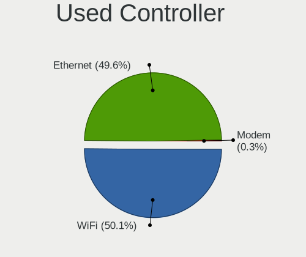

| Kind     | Computers | Percent |
|----------|-----------|---------|
| Ethernet | 28        | 71.79%  |
| WiFi     | 11        | 28.21%  |

NICs
----

Total network controllers on board

| Total | Computers | Percent |
|-------|-----------|---------|
| 2     | 158       | 64.23%  |
| 1     | 83        | 33.74%  |
| 3     | 4         | 1.63%   |
| 0     | 1         | 0.41%   |

Unsupported Devices
-------------------

Total unsupported devices on board

| Total | Computers | Percent |
|-------|-----------|---------|
| 0     | 178       | 72.36%  |
| 1     | 57        | 23.17%  |
| 2     | 9         | 3.66%   |
| 3     | 2         | 0.81%   |

Unsupported Device Types
------------------------

Types of unsupported devices

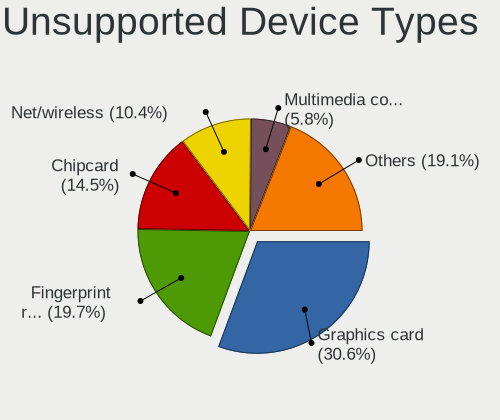

| Type                     | Computers | Percent |
|--------------------------|-----------|---------|
| Fingerprint reader       | 30        | 37.04%  |
| Graphics card            | 14        | 17.28%  |
| Chipcard                 | 10        | 12.35%  |
| Net/wireless             | 8         | 9.88%   |
| Bluetooth                | 5         | 6.17%   |
| Communication controller | 3         | 3.7%    |
| Network                  | 2         | 2.47%   |
| Flash memory             | 2         | 2.47%   |
| Camera                   | 2         | 2.47%   |
| Unassigned class         | 1         | 1.23%   |
| Storage                  | 1         | 1.23%   |
| Multimedia controller    | 1         | 1.23%   |
| Modem                    | 1         | 1.23%   |
| Dvb card                 | 1         | 1.23%   |

