Mint Hardware Trends
--------------------

A project to identify most popular hardware characteristics and track their change
over time based on data collected by Mint users at https://Linux-Hardware.org.

Anyone can contribute to the study by uploading probes of their computers by
the [hw-probe](https://github.com/linuxhw/hw-probe) tool:

    sudo -E hw-probe -all -upload

This is a report for all computer types. See also reports for [desktops](/Dist/Mint/Desktop/README.md) and [notebooks](/Dist/Mint/Notebook/README.md).

Full-feature report is available here: https://linux-hardware.org/?view=trends

Period: Nov, 2020.

Contents
--------

- [ OS                       ](#os)
- [ OS Family                ](#os-family)
- [ Kernel                   ](#kernel)
- [ Kernel Family            ](#kernel-family)
- [ Kernel Major Ver.        ](#kernel-major-ver)
- [ Arch                     ](#arch)
- [ DE                       ](#de)
- [ Display Server           ](#display-server)
- [ Display Manager          ](#display-manager)
- [ OS Lang                  ](#os-lang)
- [ Boot Mode                ](#boot-mode)
- [ Filesystem               ](#filesystem)
- [ Part. scheme             ](#part-scheme)
- [ Dual Boot with Linux/BSD ](#dual-boot-with-linux/bsd)
- [ Dual Boot (Win)          ](#dual-boot-win)
- [ Country                  ](#country)
- [ City                     ](#city)
- [ Vendor                   ](#vendor)
- [ Model                    ](#model)
- [ Model Family             ](#model-family)
- [ MFG Year                 ](#mfg-year)
- [ Form Factor              ](#form-factor)
- [ Secure Boot              ](#secure-boot)
- [ Coreboot                 ](#coreboot)
- [ RAM Size                 ](#ram-size)
- [ RAM Used                 ](#ram-used)
- [ Has CD-ROM               ](#has-cd-rom)
- [ Total Drives             ](#total-drives)
- [ Has Ethernet             ](#has-ethernet)
- [ Drive Vendor             ](#drive-vendor)
- [ Drive Model              ](#drive-model)
- [ HDD Vendor               ](#hdd-vendor)
- [ SSD Vendor               ](#ssd-vendor)
- [ Drive Kind               ](#drive-kind)
- [ Drive Connector          ](#drive-connector)
- [ Drive Size               ](#drive-size)
- [ Space Total              ](#space-total)
- [ Space Used               ](#space-used)
- [ Malfunc. Drives          ](#malfunc-drives)
- [ Malfunc. Drive Vendor    ](#malfunc-drive-vendor)
- [ Malfunc. HDD Vendor      ](#malfunc-hdd-vendor)
- [ Malfunc. Drive Kind      ](#malfunc-drive-kind)
- [ Failed Drives            ](#failed-drives)
- [ Failed Drive Vendor      ](#failed-drive-vendor)
- [ Drive Status             ](#drive-status)
- [ Storage Vendor           ](#storage-vendor)
- [ Storage Model            ](#storage-model)
- [ Storage Kind             ](#storage-kind)
- [ CPU Vendor               ](#cpu-vendor)
- [ CPU Model                ](#cpu-model)
- [ CPU Model Family         ](#cpu-model-family)
- [ CPU Cores                ](#cpu-cores)
- [ CPU Sockets              ](#cpu-sockets)
- [ CPU Threads              ](#cpu-threads)
- [ CPU Op-Modes             ](#cpu-op-modes)
- [ CPU Microcode            ](#cpu-microcode)
- [ CPU Microarch            ](#cpu-microarch)
- [ GPU Vendor               ](#gpu-vendor)
- [ GPU Model                ](#gpu-model)
- [ GPU Combo                ](#gpu-combo)
- [ GPU Driver               ](#gpu-driver)
- [ GPU Memory               ](#gpu-memory)
- [ Monitor Vendor           ](#monitor-vendor)
- [ Monitor Model            ](#monitor-model)
- [ Monitor Resolution       ](#monitor-resolution)
- [ Monitor Diagonal         ](#monitor-diagonal)
- [ Monitor Width            ](#monitor-width)
- [ Aspect Ratio             ](#aspect-ratio)
- [ Monitor Area             ](#monitor-area)
- [ Pixel Density            ](#pixel-density)
- [ Multiple Monitors        ](#multiple-monitors)
- [ Net Controller Vendor    ](#net-controller-vendor)
- [ Net Controller Model     ](#net-controller-model)
- [ Wireless Vendor          ](#wireless-vendor)
- [ Wireless Model           ](#wireless-model)
- [ Ethernet Vendor          ](#ethernet-vendor)
- [ Ethernet Model           ](#ethernet-model)
- [ Net Controller Kind      ](#net-controller-kind)
- [ Used Controller          ](#used-controller)
- [ NICs                     ](#nics)
- [ Memory Vendor            ](#memory-vendor)
- [ Memory Model             ](#memory-model)
- [ Memory Kind              ](#memory-kind)
- [ Memory Form Factor       ](#memory-form-factor)
- [ Memory Size              ](#memory-size)
- [ Memory Speed             ](#memory-speed)
- [ Sound Vendor             ](#sound-vendor)
- [ Sound Model              ](#sound-model)
- [ Camera Vendor            ](#camera-vendor)
- [ Camera Model             ](#camera-model)
- [ Fingerprint Vendor       ](#fingerprint-vendor)
- [ Fingerprint Model        ](#fingerprint-model)
- [ Chipcard Vendor          ](#chipcard-vendor)
- [ Chipcard Model           ](#chipcard-model)
- [ Printer Vendor           ](#printer-vendor)
- [ Printer Model            ](#printer-model)
- [ Scanner Vendor           ](#scanner-vendor)
- [ Scanner Model            ](#scanner-model)
- [ Bluetooth Vendor         ](#bluetooth-vendor)
- [ Bluetooth Model          ](#bluetooth-model)
- [ Unsupported Devices      ](#unsupported-devices)
- [ Unsupported Device Types ](#unsupported-device-types)

OS
--

Installed operating systems

| Name      | Computers | Percent |
|-----------|-----------|---------|
| Mint 20   | 213       | 74.48%  |
| Mint 19.3 | 60        | 20.98%  |
| Mint 19.1 | 6         | 2.1%    |
| Mint 19.2 | 2         | 0.7%    |
| Mint 19   | 2         | 0.7%    |
| Mint 18.3 | 2         | 0.7%    |
| Mint 18   | 1         | 0.35%   |

OS Family
---------

OS without a version

| Name | Computers | Percent |
|------|-----------|---------|
| Mint | 286       | 100%    |

Kernel
------

Version of the Linux kernel

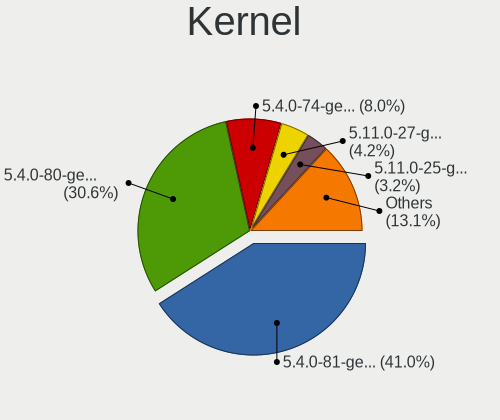

| Version                 | Computers | Percent |
|-------------------------|-----------|---------|
| 5.4.0-54-generic        | 75        | 26.22%  |
| 5.4.0-52-generic        | 75        | 26.22%  |
| 5.4.0-53-generic        | 45        | 15.73%  |
| 5.4.0-26-generic        | 13        | 4.55%   |
| 5.8.0-28-generic        | 9         | 3.15%   |
| 5.0.0-32-generic        | 9         | 3.15%   |
| 5.8.0-29-generic        | 7         | 2.45%   |
| 5.4.0-48-generic        | 7         | 2.45%   |
| 5.8.0-25-generic        | 5         | 1.75%   |
| 4.15.0-124-generic      | 4         | 1.4%    |
| 5.4.0-42-generic        | 3         | 1.05%   |
| 5.3.0-46-generic        | 3         | 1.05%   |
| 4.15.0-20-generic       | 3         | 1.05%   |
| 5.9.8-050908-generic    | 2         | 0.7%    |
| 5.9.4-050904-generic    | 2         | 0.7%    |
| 5.4.0-51-generic        | 2         | 0.7%    |
| 4.15.0-123-generic      | 2         | 0.7%    |
| 4.15.0-122-generic      | 2         | 0.7%    |
| 5.9.9-xanmod1           | 1         | 0.35%   |
| 5.9.1-050901-lowlatency | 1         | 0.35%   |
| 5.9.1-050901-generic    | 1         | 0.35%   |
| 5.8.16-xanmod1          | 1         | 0.35%   |
| 5.8.0-7625-generic      | 1         | 0.35%   |
| 5.8.0-050800-generic    | 1         | 0.35%   |
| 5.4.28-050428-generic   | 1         | 0.35%   |
| 5.4.2-050402-generic    | 1         | 0.35%   |
| 5.4.0-54-lowlatency     | 1         | 0.35%   |
| 5.4.0-45-generic        | 1         | 0.35%   |
| 5.4.0-39-generic        | 1         | 0.35%   |
| 5.3.0-62-generic        | 1         | 0.35%   |
| 5.3.0-59-generic        | 1         | 0.35%   |
| 5.3.0-28-generic        | 1         | 0.35%   |
| 4.4.0-112-generic       | 1         | 0.35%   |
| 4.15.0-39-generic       | 1         | 0.35%   |
| 4.15.0-115-generic      | 1         | 0.35%   |
| 4.15.0-108-generic      | 1         | 0.35%   |

Kernel Family
-------------

Linux kernel without a distro release

| Version | Computers | Percent |
|---------|-----------|---------|
| 5.4.0   | 223       | 77.97%  |
| 5.8.0   | 23        | 8.04%   |
| 4.15.0  | 14        | 4.9%    |
| 5.0.0   | 9         | 3.15%   |
| 5.3.0   | 6         | 2.1%    |
| 5.9.8   | 2         | 0.7%    |
| 5.9.4   | 2         | 0.7%    |
| 5.9.1   | 2         | 0.7%    |
| 5.9.9   | 1         | 0.35%   |
| 5.8.16  | 1         | 0.35%   |
| 5.4.28  | 1         | 0.35%   |
| 5.4.2   | 1         | 0.35%   |
| 4.4.0   | 1         | 0.35%   |

Kernel Major Ver.
-----------------

Linux kernel major version

| Version | Computers | Percent |
|---------|-----------|---------|
| 5.4     | 225       | 78.67%  |
| 5.8     | 24        | 8.39%   |
| 4.15    | 14        | 4.9%    |
| 5.0     | 9         | 3.15%   |
| 5.9     | 7         | 2.45%   |
| 5.3     | 6         | 2.1%    |
| 4.4     | 1         | 0.35%   |

Arch
----

OS architecture (x86_64, i586, etc.)

| Name   | Computers | Percent |
|--------|-----------|---------|
| x86_64 | 278       | 97.2%   |
| i686   | 8         | 2.8%    |

DE
--

Desktop Environment

| Name       | Computers | Percent |
|------------|-----------|---------|
| X-Cinnamon | 153       | 53.5%   |
| Cinnamon   | 56        | 19.58%  |
| XFCE       | 31        | 10.84%  |
| MATE       | 27        | 9.44%   |
| GNOME      | 9         | 3.15%   |
| Unknown    | 6         | 2.1%    |
| KDE        | 2         | 0.7%    |
| Pantheon   | 1         | 0.35%   |
| KDE5       | 1         | 0.35%   |

Display Server
--------------

X11 or Wayland

| Name | Computers | Percent |
|------|-----------|---------|
| X11  | 283       | 98.95%  |
| Tty  | 3         | 1.05%   |

Display Manager
---------------

SDDM, LightDM, etc.

| Name    | Computers | Percent |
|---------|-----------|---------|
| Unknown | 163       | 56.99%  |
| TDM     | 119       | 41.61%  |
| GDM     | 2         | 0.7%    |
| SDDM    | 1         | 0.35%   |
| LightDM | 1         | 0.35%   |

OS Lang
-------

Language

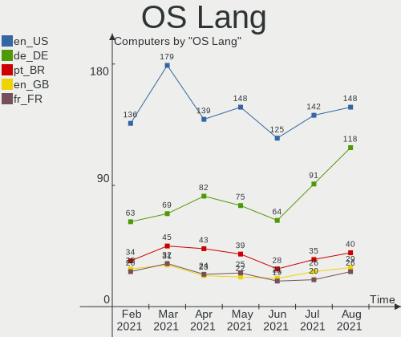

| Lang  | Computers | Percent |
|-------|-----------|---------|
| en_US | 88        | 30.77%  |
| de_DE | 42        | 14.69%  |
| pt_BR | 22        | 7.69%   |
| ru_RU | 21        | 7.34%   |
| fr_FR | 12        | 4.2%    |
| pl_PL | 9         | 3.15%   |
| es_ES | 8         | 2.8%    |
| en_GB | 8         | 2.8%    |
| C     | 7         | 2.45%   |
| nl_NL | 6         | 2.1%    |
| en_AU | 6         | 2.1%    |
| it_IT | 5         | 1.75%   |
| es_AR | 5         | 1.75%   |
| cs_CZ | 5         | 1.75%   |
| hu_HU | 4         | 1.4%    |
| en_IN | 4         | 1.4%    |
| en_CA | 3         | 1.05%   |
| tr_TR | 2         | 0.7%    |
| pt_PT | 2         | 0.7%    |
| fr_CA | 2         | 0.7%    |
| es_MX | 2         | 0.7%    |
| en_ZA | 2         | 0.7%    |
| en_IE | 2         | 0.7%    |
| de_AT | 2         | 0.7%    |
| uk_UA | 1         | 0.35%   |
| sr_RS | 1         | 0.35%   |
| sk_SK | 1         | 0.35%   |
| ru_UA | 1         | 0.35%   |
| nb_NO | 1         | 0.35%   |
| ja_JP | 1         | 0.35%   |
| ia_FR | 1         | 0.35%   |
| fi_FI | 1         | 0.35%   |
| es_VE | 1         | 0.35%   |
| es_CO | 1         | 0.35%   |
| es_CL | 1         | 0.35%   |
| en_NZ | 1         | 0.35%   |
| en_IN | 1         | 0.35%   |
| de_CH | 1         | 0.35%   |
| da_DK | 1         | 0.35%   |
| ca_ES | 1         | 0.35%   |
| bg_BG | 1         | 0.35%   |

Boot Mode
---------

EFI or BIOS

| Mode | Computers | Percent |
|------|-----------|---------|
| BIOS | 150       | 52.45%  |
| EFI  | 136       | 47.55%  |

Filesystem
----------

Type of filesystem

| Type    | Computers | Percent |
|---------|-----------|---------|
| Ext4    | 272       | 95.1%   |
| Overlay | 7         | 2.45%   |
| Btrfs   | 4         | 1.4%    |
| Ext3    | 2         | 0.7%    |
| Ext2    | 1         | 0.35%   |

Part. scheme
------------

Scheme of partitioning

| Type    | Computers | Percent |
|---------|-----------|---------|
| Unknown | 161       | 56.29%  |
| GPT     | 88        | 30.77%  |
| MBR     | 37        | 12.94%  |

Dual Boot with Linux/BSD
------------------------

Hosting more than one Linux/BSD

| Dual boot | Computers | Percent |
|-----------|-----------|---------|
| No        | 262       | 91.61%  |
| Yes       | 24        | 8.39%   |

Dual Boot (Win)
---------------

Hosting Linux and Windows

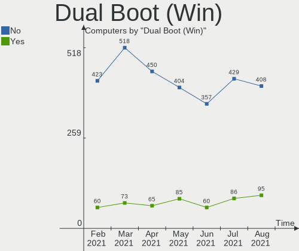

| Dual boot | Computers | Percent |
|-----------|-----------|---------|
| No        | 218       | 76.22%  |
| Yes       | 68        | 23.78%  |

Country
-------

Geographic location (country)

| Country              | Computers | Percent |
|----------------------|-----------|---------|
| USA                  | 54        | 18.88%  |
| Germany              | 45        | 15.73%  |
| Brazil               | 26        | 9.09%   |
| Russia               | 20        | 6.99%   |
| UK                   | 10        | 3.5%    |
| Poland               | 10        | 3.5%    |
| France               | 10        | 3.5%    |
| Spain                | 9         | 3.15%   |
| Netherlands          | 9         | 3.15%   |
| Canada               | 8         | 2.8%    |
| Italy                | 7         | 2.45%   |
| Czech Republic       | 6         | 2.1%    |
| Argentina            | 6         | 2.1%    |
| Hungary              | 5         | 1.75%   |
| Australia            | 5         | 1.75%   |
| India                | 4         | 1.4%    |
| Austria              | 4         | 1.4%    |
| Ukraine              | 3         | 1.05%   |
| Serbia               | 3         | 1.05%   |
| Finland              | 3         | 1.05%   |
| Turkey               | 2         | 0.7%    |
| Tunisia              | 2         | 0.7%    |
| Portugal             | 2         | 0.7%    |
| Nepal                | 2         | 0.7%    |
| Ireland              | 2         | 0.7%    |
| China                | 2         | 0.7%    |
| Venezuela            | 1         | 0.35%   |
| Uzbekistan           | 1         | 0.35%   |
| Switzerland          | 1         | 0.35%   |
| South Africa         | 1         | 0.35%   |
| Singapore            | 1         | 0.35%   |
| Romania              | 1         | 0.35%   |
| Puerto Rico          | 1         | 0.35%   |
| Pakistan             | 1         | 0.35%   |
| Norway               | 1         | 0.35%   |
| New Zealand          | 1         | 0.35%   |
| Moldova, Republic of | 1         | 0.35%   |
| Mexico               | 1         | 0.35%   |
| Lithuania            | 1         | 0.35%   |
| Japan                | 1         | 0.35%   |
| Israel               | 1         | 0.35%   |
| Indonesia            | 1         | 0.35%   |
| Iceland              | 1         | 0.35%   |
| Hong Kong            | 1         | 0.35%   |
| Greece               | 1         | 0.35%   |
| Denmark              | 1         | 0.35%   |
| Cyprus               | 1         | 0.35%   |
| Colombia             | 1         | 0.35%   |
| Chile                | 1         | 0.35%   |
| Cambodia             | 1         | 0.35%   |
| Bulgaria             | 1         | 0.35%   |
| Belgium              | 1         | 0.35%   |
| Belarus              | 1         | 0.35%   |

City
----

Geographic location (city)

| City                  | Computers | Percent |
|-----------------------|-----------|---------|
| Berlin                | 5         | 1.75%   |
| Rockville             | 4         | 1.4%    |
| Rio de Janeiro        | 4         | 1.4%    |
| Wrocław              | 3         | 1.05%   |
| Vienna                | 3         | 1.05%   |
| Tomsk                 | 3         | 1.05%   |
| Schkeuditz            | 3         | 1.05%   |
| Moscow                | 3         | 1.05%   |
| Williamsburg          | 2         | 0.7%    |
| Wiesbaden             | 2         | 0.7%    |
| Weiden                | 2         | 0.7%    |
| Vancouver             | 2         | 0.7%    |
| São Paulo            | 2         | 0.7%    |
| Stelle                | 2         | 0.7%    |
| St Petersburg         | 2         | 0.7%    |
| Saratov               | 2         | 0.7%    |
| Paris                 | 2         | 0.7%    |
| Mumbai                | 2         | 0.7%    |
| Kyiv                  | 2         | 0.7%    |
| Curitiba              | 2         | 0.7%    |
| Cologne               | 2         | 0.7%    |
| Bologna               | 2         | 0.7%    |
| Belo Horizonte        | 2         | 0.7%    |
| Avord                 | 2         | 0.7%    |
| Amsterdam             | 2         | 0.7%    |
| Zlatoust              | 1         | 0.35%   |
| Zhlobin               | 1         | 0.35%   |
| Weinstadt-Endersbach  | 1         | 0.35%   |
| Washington            | 1         | 0.35%   |
| Walthamstow           | 1         | 0.35%   |
| Vladikavkaz           | 1         | 0.35%   |
| Virginia Beach        | 1         | 0.35%   |
| Villa María          | 1         | 0.35%   |
| Villa Adelina         | 1         | 0.35%   |
| Vilanova i la Geltrú | 1         | 0.35%   |
| Vila Velha            | 1         | 0.35%   |
| Vantaa                | 1         | 0.35%   |
| Vale do Anari         | 1         | 0.35%   |
| Tunis                 | 1         | 0.35%   |
| Tuggerah              | 1         | 0.35%   |
| Tres Pontas           | 1         | 0.35%   |
| Toronto               | 1         | 0.35%   |
| Tomares               | 1         | 0.35%   |
| Titusville            | 1         | 0.35%   |
| Thessaloniki          | 1         | 0.35%   |
| Ternopil              | 1         | 0.35%   |
| Tel Aviv              | 1         | 0.35%   |
| Tashkent              | 1         | 0.35%   |
| Tarnowskie Gory       | 1         | 0.35%   |
| Tapioszolos           | 1         | 0.35%   |
| São Bento do Sul     | 1         | 0.35%   |
| Sumaré               | 1         | 0.35%   |
| Streatham             | 1         | 0.35%   |
| South Weymouth        | 1         | 0.35%   |
| Soultzeren            | 1         | 0.35%   |
| Sofia                 | 1         | 0.35%   |
| Sochi                 | 1         | 0.35%   |
| Silver Spring         | 1         | 0.35%   |
| Siklos                | 1         | 0.35%   |
| Shenzhen              | 1         | 0.35%   |

Vendor
------

Motherboard manufacturer

| Name                | Computers | Percent |
|---------------------|-----------|---------|
| Hewlett-Packard     | 55        | 19.23%  |
| Lenovo              | 37        | 12.94%  |
| ASUSTek Computer    | 36        | 12.59%  |
| Dell                | 32        | 11.19%  |
| Gigabyte Technology | 24        | 8.39%   |
| Acer                | 16        | 5.59%   |
| ASRock              | 14        | 4.9%    |
| MSI                 | 13        | 4.55%   |
| Toshiba             | 8         | 2.8%    |
| Samsung Electronics | 5         | 1.75%   |
| Apple               | 5         | 1.75%   |
| Packard Bell        | 4         | 1.4%    |
| Intel               | 4         | 1.4%    |
| TUXEDO              | 2         | 0.7%    |
| Positivo            | 2         | 0.7%    |
| Microsoft           | 2         | 0.7%    |
| Medion              | 2         | 0.7%    |
| HUAWEI              | 2         | 0.7%    |
| Fujitsu Siemens     | 2         | 0.7%    |
| Fujitsu             | 2         | 0.7%    |
| Biostar             | 2         | 0.7%    |
| Timi                | 1         | 0.35%   |
| Teclast             | 1         | 0.35%   |
| System76            | 1         | 0.35%   |
| Sony                | 1         | 0.35%   |
| Semp Toshiba        | 1         | 0.35%   |
| Schenker            | 1         | 0.35%   |
| PC Specialist       | 1         | 0.35%   |
| OEM                 | 1         | 0.35%   |
| Kobian              | 1         | 0.35%   |
| Insyde              | 1         | 0.35%   |
| In-Sing             | 1         | 0.35%   |
| HARDKERNEL          | 1         | 0.35%   |
| Hampoo              | 1         | 0.35%   |
| Gateway             | 1         | 0.35%   |
| Exo                 | 1         | 0.35%   |
| ABIT                | 1         | 0.35%   |
| Unknown             | 1         | 0.35%   |

Model
-----

Motherboard model

| Name                                           | Computers | Percent |
|------------------------------------------------|-----------|---------|
| Dell OptiPlex 3020                             | 3         | 1.05%   |
| Positivo Mobile                                | 2         | 0.7%    |
| HP ENVY x360 Convertible 15m-ee0xxx            | 2         | 0.7%    |
| HP 250 G5 Notebook PC                          | 2         | 0.7%    |
| Fujitsu Siemens ESPRIMO P7935                  | 2         | 0.7%    |
| Dell OptiPlex 780                              | 2         | 0.7%    |
| Dell Inspiron N7110                            | 2         | 0.7%    |
| Dell G3 3779                                   | 2         | 0.7%    |
| Unknown                                        | 2         | 0.7%    |
| TUXEDO P65_67HSHP                              | 1         | 0.35%   |
| TUXEDO Book BA1510                             | 1         | 0.35%   |
| Toshiba TECRA A8                               | 1         | 0.35%   |
| Toshiba Satellite S50-B                        | 1         | 0.35%   |
| Toshiba Satellite L75-B                        | 1         | 0.35%   |
| Toshiba Satellite L50D-B                       | 1         | 0.35%   |
| Toshiba Satellite L50-B                        | 1         | 0.35%   |
| Toshiba Satellite L40                          | 1         | 0.35%   |
| Toshiba Satellite A300                         | 1         | 0.35%   |
| Toshiba Satellite A200                         | 1         | 0.35%   |
| Timi TM1707                                    | 1         | 0.35%   |
| Teclast F6 Plus                                | 1         | 0.35%   |
| System76 Lemur                                 | 1         | 0.35%   |
| Sony VGN-NS31ST_S                              | 1         | 0.35%   |
| Semp Toshiba STI                               | 1         | 0.35%   |
| Schenker XMG NEO (M19, GTX 1660 Ti)            | 1         | 0.35%   |
| Samsung QX310/QX410/QX510/SF310/SF410/SF510    | 1         | 0.35%   |
| Samsung 550XBE/350XBE                          | 1         | 0.35%   |
| Samsung 340XAA/350XAA/550XAA                   | 1         | 0.35%   |
| Samsung 300V3A/300V4A/300V5A/200A4B/200A5B     | 1         | 0.35%   |
| Samsung 300E5EV/300E4EV/270E5EV/270E4EV/2470EV | 1         | 0.35%   |
| PC Specialist PCX0DX                           | 1         | 0.35%   |
| Packard Bell EASYNOTE_MX61-B-018               | 1         | 0.35%   |
| Packard Bell EasyNote TJ65                     | 1         | 0.35%   |
| Packard Bell EasyNote TE11HC                   | 1         | 0.35%   |
| Packard Bell EasyNote LM85                     | 1         | 0.35%   |
| MSI PS63 Modern 8RC                            | 1         | 0.35%   |
| MSI MS-7C94                                    | 1         | 0.35%   |
| MSI MS-7B89                                    | 1         | 0.35%   |
| MSI MS-7B86                                    | 1         | 0.35%   |
| MSI MS-7996                                    | 1         | 0.35%   |
| MSI MS-7994                                    | 1         | 0.35%   |
| MSI MS-7816                                    | 1         | 0.35%   |
| MSI MS-7721                                    | 1         | 0.35%   |
| MSI MS-7693                                    | 1         | 0.35%   |
| MSI MS-7520                                    | 1         | 0.35%   |
| MSI GE72 6QF                                   | 1         | 0.35%   |
| MSI Cubi N 8GL (MS-B171)                       | 1         | 0.35%   |
| MSI 500-054                                    | 1         | 0.35%   |
| Microsoft Surface Pro 3                        | 1         | 0.35%   |
| Microsoft Surface Pro 2                        | 1         | 0.35%   |
| Medion P8610                                   | 1         | 0.35%   |
| Medion E1210                                   | 1         | 0.35%   |
| Lenovo V14-IIL 82C4                            | 1         | 0.35%   |
| Lenovo ThinkPad Yoga 11e 3rd Gen 20G8S0MG00    | 1         | 0.35%   |
| Lenovo ThinkPad X270 20HNA00RAD                | 1         | 0.35%   |
| Lenovo ThinkPad X270 20HN0012UK                | 1         | 0.35%   |
| Lenovo ThinkPad X250 20CLA272CD                | 1         | 0.35%   |
| Lenovo ThinkPad X220 4291V39                   | 1         | 0.35%   |
| Lenovo ThinkPad X220 4291IM5                   | 1         | 0.35%   |
| Lenovo ThinkPad X220 4291HE3                   | 1         | 0.35%   |

Model Family
------------

Motherboard model prefix

| Name                    | Computers | Percent |
|-------------------------|-----------|---------|
| Lenovo ThinkPad         | 19        | 6.64%   |
| Dell Inspiron           | 12        | 4.2%    |
| Acer Aspire             | 12        | 4.2%    |
| Lenovo IdeaPad          | 11        | 3.85%   |
| HP Pavilion             | 10        | 3.5%    |
| Dell OptiPlex           | 8         | 2.8%    |
| Toshiba Satellite       | 7         | 2.45%   |
| HP Compaq               | 7         | 2.45%   |
| Dell Latitude           | 6         | 2.1%    |
| HP ENVY                 | 5         | 1.75%   |
| Packard Bell EasyNote   | 4         | 1.4%    |
| HP ProBook              | 4         | 1.4%    |
| HP Laptop               | 4         | 1.4%    |
| HP 250                  | 4         | 1.4%    |
| ASUS PRIME              | 4         | 1.4%    |
| HP EliteBook            | 3         | 1.05%   |
| Positivo Mobile         | 2         | 0.7%    |
| Microsoft Surface       | 2         | 0.7%    |
| Lenovo Legion           | 2         | 0.7%    |
| HP Spectre              | 2         | 0.7%    |
| Gigabyte Z390           | 2         | 0.7%    |
| Fujitsu Siemens ESPRIMO | 2         | 0.7%    |
| Dell Vostro             | 2         | 0.7%    |
| Dell G3                 | 2         | 0.7%    |
| ASUS VivoBook           | 2         | 0.7%    |
| ASUS TUF                | 2         | 0.7%    |
| ASRock P67              | 2         | 0.7%    |
| Acer Extensa            | 2         | 0.7%    |
| Unknown                 | 2         | 0.7%    |
| TUXEDO P65              | 1         | 0.35%   |
| TUXEDO Book             | 1         | 0.35%   |
| Toshiba TECRA           | 1         | 0.35%   |
| Timi TM1707             | 1         | 0.35%   |
| Teclast F6              | 1         | 0.35%   |
| System76 Lemur          | 1         | 0.35%   |
| Sony VGN-NS31ST         | 1         | 0.35%   |
| Semp Toshiba STI        | 1         | 0.35%   |
| Schenker XMG            | 1         | 0.35%   |
| Samsung QX310           | 1         | 0.35%   |
| Samsung 550XBE          | 1         | 0.35%   |
| Samsung 340XAA          | 1         | 0.35%   |
| Samsung 300V3A          | 1         | 0.35%   |
| Samsung 300E5EV         | 1         | 0.35%   |
| PC Specialist PCX0DX    | 1         | 0.35%   |
| MSI PS63                | 1         | 0.35%   |
| MSI MS-7C94             | 1         | 0.35%   |
| MSI MS-7B89             | 1         | 0.35%   |
| MSI MS-7B86             | 1         | 0.35%   |
| MSI MS-7996             | 1         | 0.35%   |
| MSI MS-7994             | 1         | 0.35%   |
| MSI MS-7816             | 1         | 0.35%   |
| MSI MS-7721             | 1         | 0.35%   |
| MSI MS-7693             | 1         | 0.35%   |
| MSI MS-7520             | 1         | 0.35%   |
| MSI GE72                | 1         | 0.35%   |
| MSI Cubi                | 1         | 0.35%   |
| MSI 500-054             | 1         | 0.35%   |
| Medion P8610            | 1         | 0.35%   |
| Medion E1210            | 1         | 0.35%   |
| Lenovo V14-IIL          | 1         | 0.35%   |

MFG Year
--------

Motherboard manufacture year

| Year | Computers | Percent |
|------|-----------|---------|
| 2020 | 43        | 15.03%  |
| 2019 | 40        | 13.99%  |
| 2018 | 29        | 10.14%  |
| 2014 | 22        | 7.69%   |
| 2013 | 20        | 6.99%   |
| 2012 | 19        | 6.64%   |
| 2016 | 18        | 6.29%   |
| 2015 | 18        | 6.29%   |
| 2011 | 15        | 5.24%   |
| 2010 | 14        | 4.9%    |
| 2017 | 12        | 4.2%    |
| 2009 | 11        | 3.85%   |
| 2007 | 11        | 3.85%   |
| 2008 | 9         | 3.15%   |
| 2006 | 4         | 1.4%    |
| 2003 | 1         | 0.35%   |

Form Factor
-----------

Physical design of the computer

| Name        | Computers | Percent |
|-------------|-----------|---------|
| Notebook    | 159       | 55.59%  |
| Desktop     | 112       | 39.16%  |
| Convertible | 7         | 2.45%   |
| Tablet      | 4         | 1.4%    |
| All in one  | 3         | 1.05%   |
| Mini pc     | 1         | 0.35%   |

Secure Boot
-----------

Enabled or disabled

| State    | Computers | Percent |
|----------|-----------|---------|
| Disabled | 264       | 92.31%  |
| Enabled  | 22        | 7.69%   |

Coreboot
--------

Have coreboot on board

| Used | Computers | Percent |
|------|-----------|---------|
| No   | 286       | 100%    |

RAM Size
--------

Total RAM memory

| Size in GB  | Computers | Percent |
|-------------|-----------|---------|
| 4.01-8.0    | 75        | 26.22%  |
| 16.01-24.0  | 59        | 20.63%  |
| 3.01-4.0    | 53        | 18.53%  |
| 8.01-16.0   | 53        | 18.53%  |
| 1.01-2.0    | 17        | 5.94%   |
| 32.01-64.0  | 14        | 4.9%    |
| 0.01-1.0    | 6         | 2.1%    |
| 2.01-3.0    | 4         | 1.4%    |
| 64.01-256.0 | 3         | 1.05%   |
| 24.01-32.0  | 2         | 0.7%    |

RAM Used
--------

Used RAM memory

| Used GB   | Computers | Percent |
|-----------|-----------|---------|
| 1.01-2.0  | 107       | 37.41%  |
| 2.01-3.0  | 66        | 23.08%  |
| 4.01-8.0  | 35        | 12.24%  |
| 3.01-4.0  | 33        | 11.54%  |
| 0.01-1.0  | 33        | 11.54%  |
| 8.01-16.0 | 12        | 4.2%    |

Has CD-ROM
----------

Has CD-ROM on board

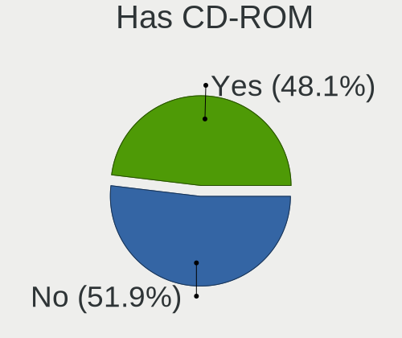

| Presented | Computers | Percent |
|-----------|-----------|---------|
| No        | 152       | 53.15%  |
| Yes       | 134       | 46.85%  |

Total Drives
------------

Number of drives on board

| Drives | Computers | Percent |
|--------|-----------|---------|
| 1      | 170       | 59.44%  |
| 2      | 72        | 25.17%  |
| 3      | 26        | 9.09%   |
| 4      | 8         | 2.8%    |
| 5      | 4         | 1.4%    |
| 7      | 2         | 0.7%    |
| 0      | 2         | 0.7%    |
| 8      | 1         | 0.35%   |
| 6      | 1         | 0.35%   |

Has Ethernet
------------

Has Ethernet on board

| Presented | Computers | Percent |
|-----------|-----------|---------|
| Yes       | 251       | 87.76%  |
| No        | 35        | 12.24%  |

Drive Vendor
------------

Hard drive vendors

| Vendor                    | Computers | Drives | Percent |
|---------------------------|-----------|--------|---------|
| Seagate                   | 66        | 77     | 16.02%  |
| WDC                       | 65        | 88     | 15.78%  |
| Samsung Electronics       | 57        | 67     | 13.83%  |
| Toshiba                   | 26        | 27     | 6.31%   |
| Unknown                   | 20        | 23     | 4.85%   |
| Kingston                  | 20        | 20     | 4.85%   |
| Hitachi                   | 20        | 20     | 4.85%   |
| Crucial                   | 18        | 19     | 4.37%   |
| SanDisk                   | 17        | 19     | 4.13%   |
| SK Hynix                  | 10        | 11     | 2.43%   |
| Intel                     | 9         | 11     | 2.18%   |
| A-DATA Technology         | 9         | 10     | 2.18%   |
| HGST                      | 8         | 8      | 1.94%   |
| Phison                    | 5         | 6      | 1.21%   |
| OCZ                       | 4         | 4      | 0.97%   |
| Micron Technology         | 4         | 4      | 0.97%   |
| Union Memory              | 3         | 3      | 0.73%   |
| SPCC                      | 3         | 3      | 0.73%   |
| PLEXTOR                   | 3         | 3      | 0.73%   |
| Fujitsu                   | 3         | 3      | 0.73%   |
| China                     | 3         | 4      | 0.73%   |
| Union Memory (Shenzhen)   | 2         | 2      | 0.49%   |
| Patriot                   | 2         | 2      | 0.49%   |
| ORICO                     | 2         | 2      | 0.49%   |
| LITEONIT                  | 2         | 2      | 0.49%   |
| LITEON                    | 2         | 2      | 0.49%   |
| KIOXIA                    | 2         | 2      | 0.49%   |
| Intenso                   | 2         | 2      | 0.49%   |
| Apple                     | 2         | 2      | 0.49%   |
| AMD                       | 2         | 2      | 0.49%   |
| XPG                       | 1         | 1      | 0.24%   |
| Verbatim                  | 1         | 1      | 0.24%   |
| USB3.0                    | 1         | 1      | 0.24%   |
| Transcend                 | 1         | 1      | 0.24%   |
| Teclast                   | 1         | 1      | 0.24%   |
| ShanDianZhe               | 1         | 1      | 0.24%   |
| SABRENT                   | 1         | 1      | 0.24%   |
| Realtek                   | 1         | 1      | 0.24%   |
| Micron/Crucial Technology | 1         | 1      | 0.24%   |
| MAXTOR                    | 1         | 1      | 0.24%   |
| Lexar                     | 1         | 1      | 0.24%   |
| KingSpec                  | 1         | 1      | 0.24%   |
| KingDian                  | 1         | 1      | 0.24%   |
| JMicron                   | 1         | 1      | 0.24%   |
| HUAWEI                    | 1         | 1      | 0.24%   |
| GOODRAM                   | 1         | 1      | 0.24%   |
| Gigabyte Technology       | 1         | 1      | 0.24%   |
| CT120BX5                  | 1         | 1      | 0.24%   |
| Corsair                   | 1         | 1      | 0.24%   |
| Biostar                   | 1         | 1      | 0.24%   |
| ASMT                      | 1         | 2      | 0.24%   |

Drive Model
-----------

Hard drive models

| Model                                   | Computers | Percent |
|-----------------------------------------|-----------|---------|
| Unknown MMC Card  64GB                  | 6         | 1.3%    |
| Kingston SA400S37240G 240GB SSD         | 6         | 1.3%    |
| Seagate ST500DM002-1BD142 500GB         | 5         | 1.09%   |
| WDC WDS240G2G0A-00JH30 240GB SSD        | 4         | 0.87%   |
| Unknown SD/MMC/MS PRO 128GB             | 4         | 0.87%   |
| Seagate ST1000LM049-2GH172 1TB          | 4         | 0.87%   |
| Seagate ST1000LM024 HN-M101MBB 1TB      | 4         | 0.87%   |
| Samsung SSD 860 EVO 1TB                 | 4         | 0.87%   |
| Crucial CT500MX500SSD1 500GB            | 4         | 0.87%   |
| WDC WDS100T2B0A-00SM50 1TB SSD          | 3         | 0.65%   |
| Unknown MMC Card  16GB                  | 3         | 0.65%   |
| Unknown MMC Card  128GB                 | 3         | 0.65%   |
| Toshiba NVMe SSD Drive 256GB            | 3         | 0.65%   |
| Toshiba MQ01ABF050 500GB                | 3         | 0.65%   |
| Toshiba MQ01ABD100 1TB                  | 3         | 0.65%   |
| Toshiba DT01ACA100 1TB                  | 3         | 0.65%   |
| Seagate ST3500418AS 500GB               | 3         | 0.65%   |
| Seagate ST2000DM006-2DM164 2TB          | 3         | 0.65%   |
| Seagate ST2000DM001-1ER164 2TB          | 3         | 0.65%   |
| Seagate Expansion Desk 4TB              | 3         | 0.65%   |
| Samsung SSD 860 EVO 500GB               | 3         | 0.65%   |
| Samsung SSD 850 EVO 500GB               | 3         | 0.65%   |
| Samsung SSD 850 EVO 250GB               | 3         | 0.65%   |
| Samsung SSD 840 EVO 250GB               | 3         | 0.65%   |
| Samsung NVMe SSD Drive 500GB            | 3         | 0.65%   |
| Kingston SA400S37480G 480GB SSD         | 3         | 0.65%   |
| Hitachi HTS547575A9E384 752GB           | 3         | 0.65%   |
| HGST HTS725050A7E630 500GB              | 3         | 0.65%   |
| WDC WDS250G2B0B-00YS70 250GB SSD        | 2         | 0.43%   |
| WDC WDS100T2B0C-00PXH0 1TB              | 2         | 0.43%   |
| WDC WD5000AAKS-00UU3A0 500GB            | 2         | 0.43%   |
| WDC WD40EZRZ-00GXCB0 4TB                | 2         | 0.43%   |
| WDC WD3200AAKS-75SBA0 320GB             | 2         | 0.43%   |
| WDC WD20EARX-00PASB0 2TB                | 2         | 0.43%   |
| WDC WD10JPCX-24UE4T0 1TB                | 2         | 0.43%   |
| WDC WD10EZEX-08WN4A0 1TB                | 2         | 0.43%   |
| WDC WD10EAVS-00D7B1 1TB                 | 2         | 0.43%   |
| WDC WD1003FZEX-00MK2A0 1TB              | 2         | 0.43%   |
| Unknown MMC Card  32GB                  | 2         | 0.43%   |
| Union Memory RPFTJ256PDD2MWX 256GB      | 2         | 0.43%   |
| Toshiba HDWD130 3TB                     | 2         | 0.43%   |
| Toshiba DT01ACA050 500GB                | 2         | 0.43%   |
| SK Hynix SC311 SATA 128GB SSD           | 2         | 0.43%   |
| SK Hynix BC511 HFM256GDJTNI-82A0A 256GB | 2         | 0.43%   |
| Seagate ST9250315AS 250GB               | 2         | 0.43%   |
| Seagate ST500LT012-1DG142 500GB         | 2         | 0.43%   |
| Seagate ST500LM021-1KJ152 500GB         | 2         | 0.43%   |
| Seagate ST4000DM004-2CV104 4TB          | 2         | 0.43%   |
| Seagate ST1000LM014-1EJ164 1TB          | 2         | 0.43%   |
| Seagate ST1000DM003-1SB102 1TB          | 2         | 0.43%   |
| Seagate ST1000DM003-1CH162 1TB          | 2         | 0.43%   |
| SanDisk SSD PLUS 120GB                  | 2         | 0.43%   |
| SanDisk SDSSDA240G 240GB                | 2         | 0.43%   |
| Samsung SSD 970 EVO Plus 1TB            | 2         | 0.43%   |
| Samsung SSD 840 EVO 120GB               | 2         | 0.43%   |
| Samsung SSD 830 Series 256GB            | 2         | 0.43%   |
| Phison NVMe SSD Drive 256GB             | 2         | 0.43%   |
| KIOXIA KBG40ZNV512G 512GB               | 2         | 0.43%   |
| Kingston SUV400S37120G 120GB SSD        | 2         | 0.43%   |
| Kingston SA400S37120G 120GB SSD         | 2         | 0.43%   |

HDD Vendor
----------

Hard disk drive vendors

| Vendor              | Computers | Drives | Percent |
|---------------------|-----------|--------|---------|
| Seagate             | 65        | 76     | 36.31%  |
| WDC                 | 52        | 72     | 29.05%  |
| Toshiba             | 20        | 21     | 11.17%  |
| Hitachi             | 20        | 20     | 11.17%  |
| HGST                | 8         | 8      | 4.47%   |
| Samsung Electronics | 7         | 7      | 3.91%   |
| Fujitsu             | 3         | 3      | 1.68%   |
| USB3.0              | 1         | 1      | 0.56%   |
| Unknown             | 1         | 1      | 0.56%   |
| MAXTOR              | 1         | 1      | 0.56%   |
| Apple               | 1         | 1      | 0.56%   |

SSD Vendor
----------

Solid state drive vendors

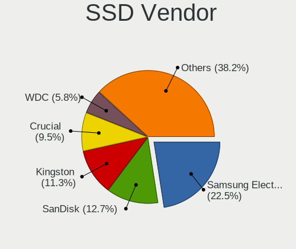

| Vendor              | Computers | Drives | Percent |
|---------------------|-----------|--------|---------|
| Samsung Electronics | 33        | 39     | 22.45%  |
| Kingston            | 19        | 19     | 12.93%  |
| Crucial             | 17        | 18     | 11.56%  |
| SanDisk             | 16        | 16     | 10.88%  |
| WDC                 | 13        | 13     | 8.84%   |
| A-DATA Technology   | 7         | 7      | 4.76%   |
| OCZ                 | 4         | 4      | 2.72%   |
| SK Hynix            | 3         | 3      | 2.04%   |
| Micron Technology   | 3         | 3      | 2.04%   |
| Intel               | 3         | 3      | 2.04%   |
| China               | 3         | 4      | 2.04%   |
| SPCC                | 2         | 2      | 1.36%   |
| Patriot             | 2         | 2      | 1.36%   |
| LITEONIT            | 2         | 2      | 1.36%   |
| LITEON              | 2         | 2      | 1.36%   |
| Intenso             | 2         | 2      | 1.36%   |
| AMD                 | 2         | 2      | 1.36%   |
| Verbatim            | 1         | 1      | 0.68%   |
| Transcend           | 1         | 1      | 0.68%   |
| Teclast             | 1         | 1      | 0.68%   |
| ShanDianZhe         | 1         | 1      | 0.68%   |
| SABRENT             | 1         | 1      | 0.68%   |
| PLEXTOR             | 1         | 1      | 0.68%   |
| ORICO               | 1         | 1      | 0.68%   |
| KingSpec            | 1         | 1      | 0.68%   |
| KingDian            | 1         | 1      | 0.68%   |
| GOODRAM             | 1         | 1      | 0.68%   |
| Gigabyte Technology | 1         | 1      | 0.68%   |
| CT120BX5            | 1         | 1      | 0.68%   |
| Corsair             | 1         | 1      | 0.68%   |
| Biostar             | 1         | 1      | 0.68%   |

Drive Kind
----------

HDD or SSD

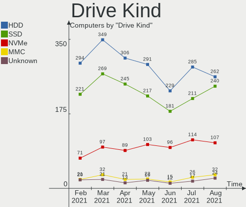

| Kind    | Computers | Drives | Percent |
|---------|-----------|--------|---------|
| HDD     | 162       | 211    | 42.97%  |
| SSD     | 128       | 155    | 33.95%  |
| NVMe    | 63        | 75     | 16.71%  |
| MMC     | 14        | 17     | 3.71%   |
| Unknown | 10        | 12     | 2.65%   |

Drive Connector
---------------

SATA, SAS, NVMe, etc.

| Type | Computers | Drives | Percent |
|------|-----------|--------|---------|
| SATA | 239       | 355    | 71.13%  |
| NVMe | 63        | 75     | 18.75%  |
| SAS  | 20        | 23     | 5.95%   |
| MMC  | 14        | 17     | 4.17%   |

Drive Size
----------

Size of hard drive

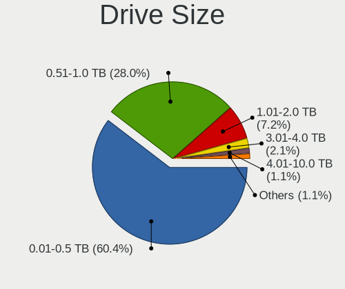

| Size in TB | Computers | Drives | Percent |
|------------|-----------|--------|---------|
| 0.01-0.5   | 174       | 226    | 59.79%  |
| 0.51-1.0   | 83        | 99     | 28.52%  |
| 1.01-2.0   | 18        | 22     | 6.19%   |
| 3.01-4.0   | 10        | 12     | 3.44%   |
| 2.01-3.0   | 6         | 7      | 2.06%   |

Space Total
-----------

Amount of disk space available on the file system

| Size in GB     | Computers | Percent |
|----------------|-----------|---------|
| 101-250        | 87        | 30.42%  |
| 251-500        | 82        | 28.67%  |
| 501-1000       | 45        | 15.73%  |
| 1001-2000      | 21        | 7.34%   |
| More than 3000 | 15        | 5.24%   |
| 51-100         | 13        | 4.55%   |
| 2001-3000      | 12        | 4.2%    |
| 1-20           | 6         | 2.1%    |
| 21-50          | 5         | 1.75%   |

Space Used
----------

Amount of used disk space

| Used GB        | Computers | Percent |
|----------------|-----------|---------|
| 1-20           | 63        | 22.03%  |
| 21-50          | 56        | 19.58%  |
| 101-250        | 45        | 15.73%  |
| 51-100         | 45        | 15.73%  |
| 251-500        | 32        | 11.19%  |
| 501-1000       | 23        | 8.04%   |
| 1001-2000      | 16        | 5.59%   |
| More than 3000 | 5         | 1.75%   |
| 2001-3000      | 1         | 0.35%   |

Malfunc. Drives
---------------

Drive models with a malfunction

| Model                               | Computers | Drives | Percent |
|-------------------------------------|-----------|--------|---------|
| Hitachi HTS547575A9E384 752GB       | 2         | 2      | 8%      |
| Hitachi HTS545032B9A300 320GB       | 2         | 2      | 8%      |
| HGST HTS725050A7E630 500GB          | 2         | 2      | 8%      |
| Crucial CT120M500SSD1 120GB         | 2         | 2      | 8%      |
| WDC WD5002ABYS-01B1B0 500GB         | 1         | 1      | 4%      |
| WDC WD5000BPVT-75HXZT3 500GB        | 1         | 1      | 4%      |
| WDC WD3200BEVT-22A0RT0 320GB        | 1         | 1      | 4%      |
| WDC WD10EZEX-21WN4A0 1TB            | 1         | 1      | 4%      |
| Toshiba MK4058GSX 400GB             | 1         | 1      | 4%      |
| Seagate ST95005620AS 500GB          | 1         | 1      | 4%      |
| Seagate ST9250315AS 250GB           | 1         | 1      | 4%      |
| Seagate ST500LM021-1KJ152 500GB     | 1         | 1      | 4%      |
| Seagate ST500DM002-1BD142 500GB     | 1         | 1      | 4%      |
| Seagate ST3500418AS 500GB           | 1         | 1      | 4%      |
| Seagate ST3000DM001-1CH166 3TB      | 1         | 1      | 4%      |
| Seagate ST1000DM003-1CH162 1TB      | 1         | 1      | 4%      |
| SanDisk SD9SN8W-256G-1006 256GB SSD | 1         | 1      | 4%      |
| HGST HTS545050A7E380 500GB          | 1         | 1      | 4%      |
| HGST HTS541010A9E680 1TB            | 1         | 1      | 4%      |
| Fujitsu MHZ2250BH G2 250GB          | 1         | 1      | 4%      |
| China SSD 240GB                     | 1         | 1      | 4%      |

Malfunc. Drive Vendor
---------------------

Vendors of faulty drives

| Vendor  | Computers | Drives | Percent |
|---------|-----------|--------|---------|
| Seagate | 6         | 7      | 25%     |
| WDC     | 4         | 4      | 16.67%  |
| Hitachi | 4         | 4      | 16.67%  |
| HGST    | 4         | 4      | 16.67%  |
| Crucial | 2         | 2      | 8.33%   |
| Toshiba | 1         | 1      | 4.17%   |
| SanDisk | 1         | 1      | 4.17%   |
| Fujitsu | 1         | 1      | 4.17%   |
| China   | 1         | 1      | 4.17%   |

Malfunc. HDD Vendor
-------------------

Vendors of faulty HDD drives

| Vendor  | Computers | Drives | Percent |
|---------|-----------|--------|---------|
| Seagate | 6         | 7      | 30%     |
| WDC     | 4         | 4      | 20%     |
| Hitachi | 4         | 4      | 20%     |
| HGST    | 4         | 4      | 20%     |
| Toshiba | 1         | 1      | 5%      |
| Fujitsu | 1         | 1      | 5%      |

Malfunc. Drive Kind
-------------------

Kinds of faulty drives

| Kind | Computers | Drives | Percent |
|------|-----------|--------|---------|
| HDD  | 19        | 21     | 82.61%  |
| SSD  | 4         | 4      | 17.39%  |

Failed Drives
-------------

Failed drive models

Zero info for selected period =(

Failed Drive Vendor
-------------------

Failed drive vendors

Zero info for selected period =(

Drive Status
------------

Number of failed and malfunc. drives

| Status   | Computers | Drives | Percent |
|----------|-----------|--------|---------|
| Detected | 171       | 292    | 56.62%  |
| Works    | 109       | 153    | 36.09%  |
| Malfunc  | 22        | 25     | 7.28%   |

Storage Vendor
--------------

Storage controller vendors

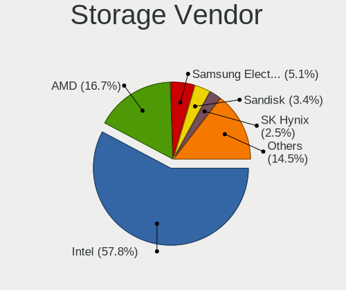

| Vendor                           | Computers | Percent |
|----------------------------------|-----------|---------|
| Intel                            | 205       | 59.59%  |
| AMD                              | 52        | 15.12%  |
| Samsung Electronics              | 20        | 5.81%   |
| Nvidia                           | 8         | 2.33%   |
| SK Hynix                         | 7         | 2.03%   |
| ASMedia Technology               | 7         | 2.03%   |
| Toshiba America Info Systems     | 6         | 1.74%   |
| Sandisk                          | 6         | 1.74%   |
| Phison Electronics               | 6         | 1.74%   |
| Marvell Technology Group         | 6         | 1.74%   |
| Union Memory (Shenzhen)          | 4         | 1.16%   |
| ADATA Technology                 | 3         | 0.87%   |
| Micron/Crucial Technology        | 2         | 0.58%   |
| Lite-On Technology               | 2         | 0.58%   |
| KIOXIA                           | 2         | 0.58%   |
| JMicron Technology               | 2         | 0.58%   |
| VIA Technologies                 | 1         | 0.29%   |
| Silicon Integrated Systems [SiS] | 1         | 0.29%   |
| Shenzhen Longsys Electronics     | 1         | 0.29%   |
| Micron Technology                | 1         | 0.29%   |
| Kingston Technology Company      | 1         | 0.29%   |
| Apple                            | 1         | 0.29%   |

Storage Model
-------------

Storage controller models

| Model                                                                            | Computers | Percent |
|----------------------------------------------------------------------------------|-----------|---------|
| AMD FCH SATA Controller [AHCI mode]                                              | 34        | 8.61%   |
| Intel 82801 Mobile SATA Controller [RAID mode]                                   | 17        | 4.3%    |
| Intel 7 Series Chipset Family 6-port SATA Controller [AHCI mode]                 | 16        | 4.05%   |
| Intel 8 Series/C220 Series Chipset Family 6-port SATA Controller 1 [AHCI mode]   | 13        | 3.29%   |
| Samsung Electronics NVMe SSD Controller SM981/PM981/PM983                        | 12        | 3.04%   |
| Intel Sunrise Point-LP SATA Controller [AHCI mode]                               | 12        | 3.04%   |
| Intel NM10/ICH7 Family SATA Controller [IDE mode]                                | 9         | 2.28%   |
| Intel 8 Series SATA Controller 1 [AHCI mode]                                     | 9         | 2.28%   |
| Intel 6 Series/C200 Series Chipset Family 6 port Desktop SATA AHCI Controller    | 8         | 2.03%   |
| AMD SB7x0/SB8x0/SB9x0 SATA Controller [AHCI mode]                                | 8         | 2.03%   |
| Intel Wildcat Point-LP SATA Controller [AHCI Mode]                               | 7         | 1.77%   |
| Intel SATA Controller [RAID mode]                                                | 7         | 1.77%   |
| Intel 82801G (ICH7 Family) IDE Controller                                        | 7         | 1.77%   |
| Intel 6 Series/C200 Series Chipset Family 6 port Mobile SATA AHCI Controller     | 7         | 1.77%   |
| Intel 5 Series/3400 Series Chipset 4 port SATA AHCI Controller                   | 7         | 1.77%   |
| Intel 200 Series PCH SATA controller [AHCI mode]                                 | 7         | 1.77%   |
| ASMedia Technology ASM1062 Serial ATA Controller                                 | 7         | 1.77%   |
| Samsung Electronics NVMe SSD Controller SM961/PM961                              | 6         | 1.52%   |
| Phison Electronics E12 NVMe Controller                                           | 6         | 1.52%   |
| Intel Q170/Q150/B150/H170/H110/Z170/CM236 Chipset SATA Controller [AHCI Mode]    | 6         | 1.52%   |
| Intel Atom/Celeron/Pentium Processor x5-E8000/J3xxx/N3xxx Series SATA Controller | 6         | 1.52%   |
| Intel 82801IBM/IEM (ICH9M/ICH9M-E) 4 port SATA Controller [AHCI mode]            | 6         | 1.52%   |
| SK Hynix Non-Volatile memory controller                                          | 5         | 1.27%   |
| Intel Cannon Lake Mobile PCH SATA AHCI Controller                                | 5         | 1.27%   |
| Intel 82801HM/HEM (ICH8M/ICH8M-E) SATA Controller [AHCI mode]                    | 5         | 1.27%   |
| Intel 82801HM/HEM (ICH8M/ICH8M-E) IDE Controller                                 | 5         | 1.27%   |
| AMD SB7x0/SB8x0/SB9x0 IDE Controller                                             | 5         | 1.27%   |
| Toshiba America Info Systems BG3 NVMe SSD Controller                             | 4         | 1.01%   |
| Nvidia MCP61 SATA Controller                                                     | 4         | 1.01%   |
| Nvidia MCP61 IDE                                                                 | 4         | 1.01%   |
| Intel HM170/QM170 Chipset SATA Controller [AHCI Mode]                            | 4         | 1.01%   |
| Intel Cannon Point-LP SATA Controller [AHCI Mode]                                | 4         | 1.01%   |
| Intel Cannon Lake PCH SATA AHCI Controller                                       | 4         | 1.01%   |
| AMD 400 Series Chipset SATA Controller                                           | 4         | 1.01%   |
| Union Memory (Shenzhen) Non-Volatile memory controller                           | 3         | 0.76%   |
| Marvell Technology Group 88SE9172 SATA 6Gb/s Controller                          | 3         | 0.76%   |
| Intel SATA controller                                                            | 3         | 0.76%   |
| Intel Non-Volatile memory controller                                             | 3         | 0.76%   |
| Intel Comet Lake PCH-LP SATA RAID Premium Controller                             | 3         | 0.76%   |
| Intel Atom Processor E3800 Series SATA AHCI Controller                           | 3         | 0.76%   |
| Intel 82801JD/DO (ICH10 Family) SATA AHCI Controller                             | 3         | 0.76%   |
| Intel 82801GBM/GHM (ICH7-M Family) SATA Controller [AHCI mode]                   | 3         | 0.76%   |
| Intel 7 Series/C210 Series Chipset Family 6-port SATA Controller [AHCI mode]     | 3         | 0.76%   |
| Intel 5 Series/3400 Series Chipset 6 port SATA AHCI Controller                   | 3         | 0.76%   |
| Intel 4 Series Chipset PT IDER Controller                                        | 3         | 0.76%   |
| AMD SB7x0/SB8x0/SB9x0 SATA Controller [IDE mode]                                 | 3         | 0.76%   |
| ADATA Technology XPG SX8200 Pro PCIe Gen3x4 M.2 2280 Solid State Drive           | 3         | 0.76%   |
| Toshiba America Info Systems Toshiba America Info Non-Volatile memory controller | 2         | 0.51%   |
| SK Hynix BC501 NVMe Solid State Drive 512GB                                      | 2         | 0.51%   |
| Sandisk WD Blue SN550 NVMe SSD                                                   | 2         | 0.51%   |
| Samsung Electronics Electronics Non-Volatile memory controller                   | 2         | 0.51%   |
| Nvidia MCP79 AHCI Controller                                                     | 2         | 0.51%   |
| Lite-On Technology Non-Volatile memory controller                                | 2         | 0.51%   |
| KIOXIA Non-Volatile memory controller                                            | 2         | 0.51%   |
| JMicron Technology JMB363 SATA/IDE Controller                                    | 2         | 0.51%   |
| Intel SSD 660P Series                                                            | 2         | 0.51%   |
| Intel C600/X79 series chipset 6-Port SATA AHCI Controller                        | 2         | 0.51%   |
| Intel 82801JI (ICH10 Family) 4 port SATA IDE Controller #1                       | 2         | 0.51%   |
| Intel 82801JI (ICH10 Family) 2 port SATA IDE Controller #2                       | 2         | 0.51%   |
| Intel 82801IR/IO/IH (ICH9R/DO/DH) 6 port SATA Controller [AHCI mode]             | 2         | 0.51%   |

Storage Kind
------------

Kind of storage controller (IDE, SATA, NVMe, SAS, ...)

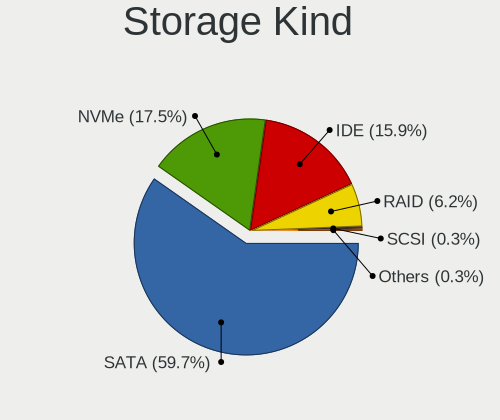

| Kind | Computers | Percent |
|------|-----------|---------|
| SATA | 212       | 60.57%  |
| NVMe | 63        | 18%     |
| IDE  | 47        | 13.43%  |
| RAID | 27        | 7.71%   |
| SAS  | 1         | 0.29%   |

CPU Vendor
----------

Processor vendors

| Vendor | Computers | Percent |
|--------|-----------|---------|
| Intel  | 221       | 77.27%  |
| AMD    | 65        | 22.73%  |

CPU Model
---------

Processor models

| Model                                         | Computers | Percent |
|-----------------------------------------------|-----------|---------|
| Intel Core i5-8265U CPU @ 1.60GHz             | 7         | 2.45%   |
| Intel Core i7-8750H CPU @ 2.20GHz             | 5         | 1.75%   |
| AMD Ryzen 5 3500U with Radeon Vega Mobile Gfx | 5         | 1.75%   |
| Intel Core i5-4300U CPU @ 1.90GHz             | 4         | 1.4%    |
| AMD Ryzen 5 4500U with Radeon Graphics        | 4         | 1.4%    |
| Intel Core i7-8550U CPU @ 1.80GHz             | 3         | 1.05%   |
| Intel Core i7-3630QM CPU @ 2.40GHz            | 3         | 1.05%   |
| Intel Core i7-3610QM CPU @ 2.30GHz            | 3         | 1.05%   |
| Intel Core i7-10510U CPU @ 1.80GHz            | 3         | 1.05%   |
| Intel Core i5-8250U CPU @ 1.60GHz             | 3         | 1.05%   |
| Intel Core i5-4570 CPU @ 3.20GHz              | 3         | 1.05%   |
| Intel Core i3-5010U CPU @ 2.10GHz             | 3         | 1.05%   |
| Intel Celeron CPU N3060 @ 1.60GHz             | 3         | 1.05%   |
| Intel Core i7-8700K CPU @ 3.70GHz             | 2         | 0.7%    |
| Intel Core i7-8565U CPU @ 1.80GHz             | 2         | 0.7%    |
| Intel Core i7-6700HQ CPU @ 2.60GHz            | 2         | 0.7%    |
| Intel Core i7-6500U CPU @ 2.50GHz             | 2         | 0.7%    |
| Intel Core i5-8400 CPU @ 2.80GHz              | 2         | 0.7%    |
| Intel Core i5-7500 CPU @ 3.40GHz              | 2         | 0.7%    |
| Intel Core i5-7400 CPU @ 3.00GHz              | 2         | 0.7%    |
| Intel Core i5-7200U CPU @ 2.50GHz             | 2         | 0.7%    |
| Intel Core i5-6500 CPU @ 3.20GHz              | 2         | 0.7%    |
| Intel Core i5-6300U CPU @ 2.40GHz             | 2         | 0.7%    |
| Intel Core i5-5200U CPU @ 2.20GHz             | 2         | 0.7%    |
| Intel Core i5-4590 CPU @ 3.30GHz              | 2         | 0.7%    |
| Intel Core i5-4200U CPU @ 1.60GHz             | 2         | 0.7%    |
| Intel Core i5-3470 CPU @ 3.20GHz              | 2         | 0.7%    |
| Intel Core i5-2450M CPU @ 2.50GHz             | 2         | 0.7%    |
| Intel Core i5-2400 CPU @ 3.10GHz              | 2         | 0.7%    |
| Intel Core i5-10210U CPU @ 1.60GHz            | 2         | 0.7%    |
| Intel Core i5 CPU M 460 @ 2.53GHz             | 2         | 0.7%    |
| Intel Core i3-8100 CPU @ 3.60GHz              | 2         | 0.7%    |
| Intel Core i3-3110M CPU @ 2.40GHz             | 2         | 0.7%    |
| Intel Core i3-2350M CPU @ 2.30GHz             | 2         | 0.7%    |
| Intel Core i3-2120 CPU @ 3.30GHz              | 2         | 0.7%    |
| Intel Core i3 CPU M 370 @ 2.40GHz             | 2         | 0.7%    |
| Intel Core 2 Duo CPU T6500 @ 2.10GHz          | 2         | 0.7%    |
| Intel Core 2 Duo CPU T5800 @ 2.00GHz          | 2         | 0.7%    |
| Intel Core 2 Duo CPU E8400 @ 3.00GHz          | 2         | 0.7%    |
| Intel Core 2 Duo CPU E7600 @ 3.06GHz          | 2         | 0.7%    |
| Intel Celeron CPU N2840 @ 2.16GHz             | 2         | 0.7%    |
| Intel Atom x5-Z8350 CPU @ 1.44GHz             | 2         | 0.7%    |
| Intel Atom CPU N270 @ 1.60GHz                 | 2         | 0.7%    |
| AMD Ryzen 5 1600 Six-Core Processor           | 2         | 0.7%    |
| AMD Ryzen 3 3200G with Radeon Vega Graphics   | 2         | 0.7%    |
| AMD Ryzen 3 2200G with Radeon Vega Graphics   | 2         | 0.7%    |
| AMD FX-6300 Six-Core Processor                | 2         | 0.7%    |
| AMD A8-7410 APU with AMD Radeon R5 Graphics   | 2         | 0.7%    |
| AMD A4-6300 APU with Radeon HD Graphics       | 2         | 0.7%    |
| Intel Xeon CPU X5365 @ 3.00GHz                | 1         | 0.35%   |
| Intel Xeon CPU W3550 @ 3.07GHz                | 1         | 0.35%   |
| Intel Xeon CPU E5-2620 v3 @ 2.40GHz           | 1         | 0.35%   |
| Intel Xeon CPU E5-2620 0 @ 2.00GHz            | 1         | 0.35%   |
| Intel Xeon CPU E3-1240 V2 @ 3.40GHz           | 1         | 0.35%   |
| Intel Pentium Silver N5000 CPU @ 1.10GHz      | 1         | 0.35%   |
| Intel Pentium Dual-Core CPU T4500 @ 2.30GHz   | 1         | 0.35%   |
| Intel Pentium Dual-Core CPU T4300 @ 2.10GHz   | 1         | 0.35%   |
| Intel Pentium Dual-Core CPU E5800 @ 3.20GHz   | 1         | 0.35%   |
| Intel Pentium Dual-Core CPU E5400 @ 2.70GHz   | 1         | 0.35%   |
| Intel Pentium Dual CPU T3200 @ 2.00GHz        | 1         | 0.35%   |

CPU Model Family
----------------

Processor model prefix

| Model                   | Computers | Percent |
|-------------------------|-----------|---------|
| Intel Core i5           | 69        | 24.13%  |
| Intel Core i7           | 48        | 16.78%  |
| Intel Core i3           | 29        | 10.14%  |
| Intel Core 2 Duo        | 17        | 5.94%   |
| AMD Ryzen 5             | 15        | 5.24%   |
| Intel Celeron           | 13        | 4.55%   |
| Intel Pentium           | 10        | 3.5%    |
| AMD FX                  | 9         | 3.15%   |
| Intel Atom              | 7         | 2.45%   |
| Intel Xeon              | 5         | 1.75%   |
| Intel Core 2 Quad       | 5         | 1.75%   |
| AMD Ryzen 3             | 5         | 1.75%   |
| AMD A8                  | 5         | 1.75%   |
| Intel Pentium Dual-Core | 4         | 1.4%    |
| Intel Pentium Dual      | 4         | 1.4%    |
| AMD Ryzen 7             | 4         | 1.4%    |
| AMD Athlon 64 X2        | 3         | 1.05%   |
| AMD A4                  | 3         | 1.05%   |
| Other                   | 2         | 0.7%    |
| Intel Pentium D         | 2         | 0.7%    |
| Intel Pentium 4         | 2         | 0.7%    |
| Intel Core 2            | 2         | 0.7%    |
| AMD Ryzen 9             | 2         | 0.7%    |
| AMD E2                  | 2         | 0.7%    |
| AMD Athlon II X2        | 2         | 0.7%    |
| AMD Athlon              | 2         | 0.7%    |
| AMD A6                  | 2         | 0.7%    |
| AMD A10                 | 2         | 0.7%    |
| Intel Pentium Silver    | 1         | 0.35%   |
| Intel Core i9           | 1         | 0.35%   |
| Intel Core Duo          | 1         | 0.35%   |
| Intel Celeron Dual-Core | 1         | 0.35%   |
| AMD Turion II Dual-Core | 1         | 0.35%   |
| AMD Turion 64 X2 Mobile | 1         | 0.35%   |
| AMD Turion 64 Mobile    | 1         | 0.35%   |
| AMD Ryzen 7 PRO         | 1         | 0.35%   |
| AMD Ryzen 5 PRO         | 1         | 0.35%   |
| AMD Phenom II X4        | 1         | 0.35%   |
| AMD E1                  | 1         | 0.35%   |

CPU Cores
---------

Number of processor cores

| Number | Computers | Percent |
|--------|-----------|---------|
| 2      | 124       | 43.36%  |
| 4      | 111       | 38.81%  |
| 6      | 27        | 9.44%   |
| 1      | 11        | 3.85%   |
| 8      | 8         | 2.8%    |
| 3      | 3         | 1.05%   |
| 12     | 2         | 0.7%    |

CPU Sockets
-----------

Number of sockets

| Number | Computers | Percent |
|--------|-----------|---------|
| 1      | 285       | 99.65%  |
| 2      | 1         | 0.35%   |

CPU Threads
-----------

Threads per core (Hyper-Threading)

| Number | Computers | Percent |
|--------|-----------|---------|
| 2      | 161       | 56.29%  |
| 1      | 125       | 43.71%  |

CPU Op-Modes
------------

CPU Operation Modes (32-bit, 64-bit)

| Op mode        | Computers | Percent |
|----------------|-----------|---------|
| 32-bit, 64-bit | 281       | 98.25%  |
| 32-bit         | 5         | 1.75%   |

CPU Microcode
-------------

Microcode number

| Number     | Computers | Percent |
|------------|-----------|---------|
| Unknown    | 38        | 13.29%  |
| 0x306a9    | 17        | 5.94%   |
| 0x206a7    | 16        | 5.59%   |
| 0x1067a    | 15        | 5.24%   |
| 0x906ea    | 13        | 4.55%   |
| 0x306c3    | 13        | 4.55%   |
| 0x6fd      | 9         | 3.15%   |
| 0x40651    | 9         | 3.15%   |
| 0x506e3    | 8         | 2.8%    |
| 0x306d4    | 7         | 2.45%   |
| 0x20655    | 7         | 2.45%   |
| 0x06000852 | 7         | 2.45%   |
| 0x906e9    | 6         | 2.1%    |
| 0x806ec    | 6         | 2.1%    |
| 0x806ea    | 6         | 2.1%    |
| 0x406c4    | 6         | 2.1%    |
| 0x08108109 | 6         | 2.1%    |
| 0x406e3    | 5         | 1.75%   |
| 0x30678    | 5         | 1.75%   |
| 0x06001119 | 5         | 1.75%   |
| 0xa0652    | 4         | 1.4%    |
| 0x806e9    | 4         | 1.4%    |
| 0x806eb    | 3         | 1.05%   |
| 0x706a1    | 3         | 1.05%   |
| 0x10676    | 3         | 1.05%   |
| 0x08600106 | 3         | 1.05%   |
| 0x08600104 | 3         | 1.05%   |
| 0x08108102 | 3         | 1.05%   |
| 0x0800820d | 3         | 1.05%   |
| 0x07030105 | 3         | 1.05%   |
| 0x906ed    | 2         | 0.7%    |
| 0x906eb    | 2         | 0.7%    |
| 0x706e5    | 2         | 0.7%    |
| 0x6fb      | 2         | 0.7%    |
| 0x406c3    | 2         | 0.7%    |
| 0x106c2    | 2         | 0.7%    |
| 0x106a5    | 2         | 0.7%    |
| 0x08701021 | 2         | 0.7%    |
| 0x0810100b | 2         | 0.7%    |
| 0x08001138 | 2         | 0.7%    |
| 0x06006705 | 2         | 0.7%    |
| 0xf65      | 1         | 0.35%   |
| 0xf47      | 1         | 0.35%   |
| 0xf33      | 1         | 0.35%   |
| 0xf29      | 1         | 0.35%   |
| 0xa0653    | 1         | 0.35%   |
| 0x906ec    | 1         | 0.35%   |
| 0x6f6      | 1         | 0.35%   |
| 0x6f2      | 1         | 0.35%   |
| 0x6ec      | 1         | 0.35%   |
| 0x506c9    | 1         | 0.35%   |
| 0x306f2    | 1         | 0.35%   |
| 0x306e4    | 1         | 0.35%   |
| 0x206d7    | 1         | 0.35%   |
| 0x20652    | 1         | 0.35%   |
| 0x106e5    | 1         | 0.35%   |
| 0x106ca    | 1         | 0.35%   |
| 0x10677    | 1         | 0.35%   |
| 0x0a201009 | 1         | 0.35%   |
| 0x08600103 | 1         | 0.35%   |

CPU Microarch
-------------

Microarchitecture

| Name          | Computers | Percent |
|---------------|-----------|---------|
| KabyLake      | 49        | 17.13%  |
| Haswell       | 27        | 9.44%   |
| IvyBridge     | 24        | 8.39%   |
| Penryn        | 22        | 7.69%   |
| SandyBridge   | 19        | 6.64%   |
| Piledriver    | 15        | 5.24%   |
| Skylake       | 14        | 4.9%    |
| Silvermont    | 14        | 4.9%    |
| Zen+          | 13        | 4.55%   |
| Core          | 13        | 4.55%   |
| Zen 2         | 10        | 3.5%    |
| Westmere      | 9         | 3.15%   |
| Broadwell     | 7         | 2.45%   |
| K8 Hammer     | 6         | 2.1%    |
| Zen           | 5         | 1.75%   |
| Puma          | 5         | 1.75%   |
| CometLake     | 5         | 1.75%   |
| NetBurst      | 4         | 1.4%    |
| Nehalem       | 4         | 1.4%    |
| K10           | 4         | 1.4%    |
| Goldmont plus | 3         | 1.05%   |
| Excavator     | 3         | 1.05%   |
| Bonnell       | 3         | 1.05%   |
| IceLake       | 2         | 0.7%    |
| Steamroller   | 1         | 0.35%   |
| P6            | 1         | 0.35%   |
| Jaguar        | 1         | 0.35%   |
| Goldmont      | 1         | 0.35%   |
| Bulldozer     | 1         | 0.35%   |
| Unknown       | 1         | 0.35%   |

GPU Vendor
----------

Vendors of graphics cards

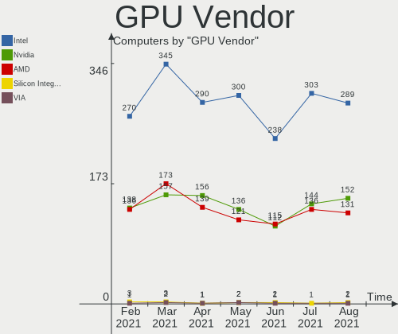

| Vendor                           | Computers | Percent |
|----------------------------------|-----------|---------|
| Intel                            | 163       | 48.22%  |
| AMD                              | 89        | 26.33%  |
| Nvidia                           | 85        | 25.15%  |
| Silicon Integrated Systems [SiS] | 1         | 0.3%    |

GPU Model
---------

Graphics card models

| Model                                                                                      | Computers | Percent |
|--------------------------------------------------------------------------------------------|-----------|---------|
| Intel 2nd Generation Core Processor Family Integrated Graphics Controller                  | 15        | 4.32%   |
| Intel 3rd Gen Core processor Graphics Controller                                           | 13        | 3.75%   |
| Intel Haswell-ULT Integrated Graphics Controller                                           | 10        | 2.88%   |
| Intel UHD Graphics 630 (Mobile)                                                            | 9         | 2.59%   |
| Intel UHD Graphics 620 (Whiskey Lake)                                                      | 9         | 2.59%   |
| Intel Atom/Celeron/Pentium Processor x5-E8000/J3xxx/N3xxx Integrated Graphics Controller   | 9         | 2.59%   |
| AMD Picasso                                                                                | 9         | 2.59%   |
| Intel UHD Graphics                                                                         | 8         | 2.31%   |
| AMD Renoir                                                                                 | 8         | 2.31%   |
| Intel Xeon E3-1200 v3/4th Gen Core Processor Integrated Graphics Controller                | 7         | 2.02%   |
| Intel Mobile 4 Series Chipset Integrated Graphics Controller                               | 7         | 2.02%   |
| Intel HD Graphics 5500                                                                     | 7         | 2.02%   |
| Intel HD Graphics 530                                                                      | 7         | 2.02%   |
| Intel UHD Graphics 620                                                                     | 6         | 1.73%   |
| Intel Skylake GT2 [HD Graphics 520]                                                        | 6         | 1.73%   |
| Intel Core Processor Integrated Graphics Controller                                        | 6         | 1.73%   |
| Intel Atom Processor Z36xxx/Z37xxx Series Graphics & Display                               | 5         | 1.44%   |
| Nvidia GP108M [GeForce MX250]                                                              | 4         | 1.15%   |
| Nvidia GK208B [GeForce GT 710]                                                             | 4         | 1.15%   |
| Intel Mobile GM965/GL960 Integrated Graphics Controller (secondary)                        | 4         | 1.15%   |
| Intel Mobile GM965/GL960 Integrated Graphics Controller (primary)                          | 4         | 1.15%   |
| Intel Mobile 945GM/GMS/GME, 943/940GML Express Integrated Graphics Controller              | 4         | 1.15%   |
| Intel HD Graphics 630                                                                      | 4         | 1.15%   |
| Intel HD Graphics 620                                                                      | 4         | 1.15%   |
| AMD Ellesmere [Radeon RX 470/480/570/570X/580/580X/590]                                    | 4         | 1.15%   |
| Nvidia TU117M                                                                              | 3         | 0.86%   |
| Nvidia GP107M [GeForce GTX 1050 Ti Mobile]                                                 | 3         | 0.86%   |
| Nvidia GK208B [GeForce GT 730]                                                             | 3         | 0.86%   |
| Intel UHD Graphics 630 (Desktop)                                                           | 3         | 0.86%   |
| Intel UHD Graphics 605                                                                     | 3         | 0.86%   |
| AMD Stoney [Radeon R2/R3/R4/R5 Graphics]                                                   | 3         | 0.86%   |
| AMD Raven Ridge [Radeon Vega Series / Radeon Vega Mobile Series]                           | 3         | 0.86%   |
| AMD Oland XT [Radeon HD 8670 / R7 250/350]                                                 | 3         | 0.86%   |
| AMD Mullins [Radeon R4/R5 Graphics]                                                        | 3         | 0.86%   |
| AMD Cedar [Radeon HD 5000/6000/7350/8350 Series]                                           | 3         | 0.86%   |
| Nvidia TU117 [GeForce GTX 1650]                                                            | 2         | 0.58%   |
| Nvidia GP107M [GeForce GTX 1050 Mobile]                                                    | 2         | 0.58%   |
| Nvidia GP107M [GeForce GTX 1050 3 GB Max-Q]                                                | 2         | 0.58%   |
| Nvidia GP107 [GeForce GTX 1050 Ti]                                                         | 2         | 0.58%   |
| Nvidia GP106M [GeForce GTX 1060 Mobile]                                                    | 2         | 0.58%   |
| Nvidia GP106 [GeForce GTX 1060 6GB]                                                        | 2         | 0.58%   |
| Nvidia GP104 [GeForce GTX 1080]                                                            | 2         | 0.58%   |
| Nvidia GM108M [GeForce MX110]                                                              | 2         | 0.58%   |
| Nvidia GK107M [GeForce GT 650M]                                                            | 2         | 0.58%   |
| Nvidia GK106 [GeForce GTX 660]                                                             | 2         | 0.58%   |
| Intel Xeon E3-1200 v2/3rd Gen Core processor Graphics Controller                           | 2         | 0.58%   |
| Intel Mobile 945GSE Express Integrated Graphics Controller                                 | 2         | 0.58%   |
| Intel Mobile 945GM/GMS, 943/940GML Express Integrated Graphics Controller                  | 2         | 0.58%   |
| Intel Iris Plus Graphics G1 (Ice Lake)                                                     | 2         | 0.58%   |
| Intel 82G33/G31 Express Integrated Graphics Controller                                     | 2         | 0.58%   |
| Intel 4th Gen Core Processor Integrated Graphics Controller                                | 2         | 0.58%   |
| Intel 4 Series Chipset Integrated Graphics Controller                                      | 2         | 0.58%   |
| AMD Turks PRO [Radeon HD 6570/7570/8550]                                                   | 2         | 0.58%   |
| AMD Topaz XT [Radeon R7 M260/M265 / M340/M360 / M440/M445 / 530/535 / 620/625 Mobile]      | 2         | 0.58%   |
| AMD Sun XT [Radeon HD 8670A/8670M/8690M / R5 M330 / M430 / Radeon 520 Mobile]              | 2         | 0.58%   |
| AMD Richland [Radeon HD 8370D]                                                             | 2         | 0.58%   |
| AMD Park [Mobility Radeon HD 5430/5450/5470]                                               | 2         | 0.58%   |
| AMD Hawaii PRO [Radeon R9 290/390]                                                         | 2         | 0.58%   |
| Silicon Integrated Systems [SiS] 661/741/760 PCI/AGP or 662/761Gx PCIE VGA Display Adapter | 1         | 0.29%   |
| Nvidia TU117M [GeForce GTX 1650 Mobile / Max-Q]                                            | 1         | 0.29%   |

GPU Combo
---------

Combinations of graphics cards

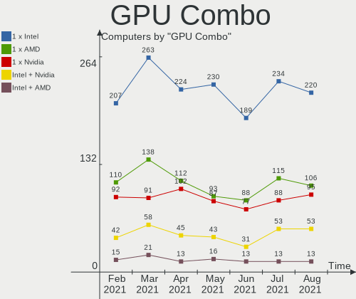

| Name           | Computers | Percent |
|----------------|-----------|---------|
| 1 x Intel      | 113       | 39.51%  |
| 1 x AMD        | 76        | 26.57%  |
| 1 x Nvidia     | 46        | 16.08%  |
| Intel + Nvidia | 36        | 12.59%  |
| Intel + AMD    | 11        | 3.85%   |
| AMD + Nvidia   | 2         | 0.7%    |
| 2 x Nvidia     | 1         | 0.35%   |
| 1 x SiS        | 1         | 0.35%   |

GPU Driver
----------

Free vs proprietary

| Driver      | Computers | Percent |
|-------------|-----------|---------|
| Free        | 215       | 75.17%  |
| Proprietary | 61        | 21.33%  |
| Unknown     | 10        | 3.5%    |

GPU Memory
----------

Total video memory

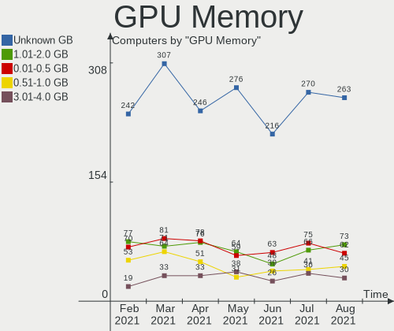

| Size in GB | Computers | Percent |
|------------|-----------|---------|
| Unknown    | 137       | 47.9%   |
| 0.01-0.5   | 41        | 14.34%  |
| 1.01-2.0   | 37        | 12.94%  |
| 0.51-1.0   | 34        | 11.89%  |
| 3.01-4.0   | 14        | 4.9%    |
| 7.01-8.0   | 11        | 3.85%   |
| 5.01-6.0   | 7         | 2.45%   |
| 2.01-3.0   | 5         | 1.75%   |

Monitor Vendor
--------------

Monitor vendors

| Vendor                  | Computers | Percent |
|-------------------------|-----------|---------|
| AU Optronics            | 43        | 14.73%  |
| Samsung Electronics     | 38        | 13.01%  |
| LG Display              | 37        | 12.67%  |
| Chimei Innolux          | 23        | 7.88%   |
| Dell                    | 21        | 7.19%   |
| Goldstar                | 18        | 6.16%   |
| BOE                     | 16        | 5.48%   |
| Ancor Communications    | 12        | 4.11%   |
| BenQ                    | 8         | 2.74%   |
| Acer                    | 7         | 2.4%    |
| LG Electronics          | 6         | 2.05%   |
| Hewlett-Packard         | 6         | 2.05%   |
| Chi Mei Optoelectronics | 5         | 1.71%   |
| Sharp                   | 3         | 1.03%   |
| LG Philips              | 3         | 1.03%   |
| InfoVision              | 3         | 1.03%   |
| Apple                   | 3         | 1.03%   |
| ViewSonic               | 2         | 0.68%   |
| Unknown                 | 2         | 0.68%   |
| Philips                 | 2         | 0.68%   |
| PANDA                   | 2         | 0.68%   |
| Lenovo                  | 2         | 0.68%   |
| Iiyama                  | 2         | 0.68%   |
| ASUSTek Computer        | 2         | 0.68%   |
| Yuraku                  | 1         | 0.34%   |
| Vestel                  | 1         | 0.34%   |
| TXD                     | 1         | 0.34%   |
| Toshiba                 | 1         | 0.34%   |
| Sony                    | 1         | 0.34%   |
| Panasonic               | 1         | 0.34%   |
| NUL                     | 1         | 0.34%   |
| NEC Computers           | 1         | 0.34%   |
| Microstep               | 1         | 0.34%   |
| LPL                     | 1         | 0.34%   |
| Lite-On                 | 1         | 0.34%   |
| Jean                    | 1         | 0.34%   |
| JDI                     | 1         | 0.34%   |
| INS                     | 1         | 0.34%   |
| Hyundai ImageQuest      | 1         | 0.34%   |
| Hitachi                 | 1         | 0.34%   |
| HannStar                | 1         | 0.34%   |
| GDH                     | 1         | 0.34%   |
| Gateway                 | 1         | 0.34%   |
| FUS                     | 1         | 0.34%   |
| Eizo                    | 1         | 0.34%   |
| CVT                     | 1         | 0.34%   |
| CPT                     | 1         | 0.34%   |
| CHR                     | 1         | 0.34%   |
| BBY                     | 1         | 0.34%   |
| AOC                     | 1         | 0.34%   |

Monitor Model
-------------

Monitor models

| Model                                                                 | Computers | Percent |
|-----------------------------------------------------------------------|-----------|---------|
| AU Optronics LCD Monitor AUO71EC 1366x768 340x190mm 15.3-inch         | 3         | 0.98%   |
| Samsung Electronics LCD Monitor SEC544B 1600x900 382x214mm 17.2-inch  | 2         | 0.65%   |
| Samsung Electronics LCD Monitor SEC3542 2160x1440 250x170mm 11.9-inch | 2         | 0.65%   |
| Samsung Electronics C24F390 SAM0D2C 1920x1080 520x290mm 23.4-inch     | 2         | 0.65%   |
| LG Display LCD Monitor LGD045C 1366x768 350x190mm 15.7-inch           | 2         | 0.65%   |
| LG Display LCD Monitor LGD02D8 1366x768 277x156mm 12.5-inch           | 2         | 0.65%   |
| LG Display LCD Monitor LGD02AC 1366x768 344x194mm 15.5-inch           | 2         | 0.65%   |
| Dell U2718Q DELA0EC 3840x2160 609x349mm 27.6-inch                     | 2         | 0.65%   |
| Dell U2312HM DEL4072 1920x1080 510x290mm 23.1-inch                    | 2         | 0.65%   |
| Chimei Innolux LCD Monitor CMN15F5 1920x1080 344x193mm 15.5-inch      | 2         | 0.65%   |
| Chimei Innolux LCD Monitor CMN1496 1366x768 309x173mm 13.9-inch       | 2         | 0.65%   |
| Chimei Innolux LCD Monitor CMN1239 1920x1080 276x155mm 12.5-inch      | 2         | 0.65%   |
| BOE LCD Monitor BOE077B 1920x1080 380x210mm 17.1-inch                 | 2         | 0.65%   |
| BOE LCD Monitor BOE0700 1920x1080 344x194mm 15.5-inch                 | 2         | 0.65%   |
| BOE LCD Monitor BOE0697 1366x768 309x173mm 13.9-inch                  | 2         | 0.65%   |
| AU Optronics LCD Monitor AUO21ED 1920x1080 344x194mm 15.5-inch        | 2         | 0.65%   |
| AU Optronics LCD Monitor AUO203D 1920x1080 309x174mm 14.0-inch        | 2         | 0.65%   |
| AU Optronics LCD Monitor AUO11ED 1920x1080 344x193mm 15.5-inch        | 2         | 0.65%   |
| Yuraku ML2321 FAC2321 1920x1080 510x287mm 23.0-inch                   | 1         | 0.33%   |
| ViewSonic VA2216w SERIE VSC2920 1680x1050 465x291mm 21.6-inch         | 1         | 0.33%   |
| ViewSonic LCD Monitor VA2026w 1680x1050                               | 1         | 0.33%   |
| Vestel LCD Monitor 43UHD_LCD_TV 3840x2160                             | 1         | 0.33%   |
| Unknown LCD Monitor SAMSUNG 1920x1080                                 | 1         | 0.33%   |
| Unknown LCD Monitor hp L2335 1920x1200                                | 1         | 0.33%   |
| TXD HDMI TXD7825 1440x900 410x260mm 19.1-inch                         | 1         | 0.33%   |
| Toshiba TV TSB0206 1920x1080 886x498mm 40.0-inch                      | 1         | 0.33%   |
| Sony TV SNY4302 1920x1080 1600x900mm 72.3-inch                        | 1         | 0.33%   |
| Sharp LCD Monitor SHP149A 1920x1080 344x194mm 15.5-inch               | 1         | 0.33%   |
| Sharp LC-50LE442U SHP348A 1920x1080 1100x620mm 49.7-inch              | 1         | 0.33%   |
| Sharp HDMI SHP106A 1920x1080 520x290mm 23.4-inch                      | 1         | 0.33%   |
| Samsung Electronics SyncMaster SAM052A 1920x1080 510x287mm 23.0-inch  | 1         | 0.33%   |
| Samsung Electronics SyncMaster SAM03F0 1680x1050 433x271mm 20.1-inch  | 1         | 0.33%   |
| Samsung Electronics SyncMaster SAM0370 1680x1050 459x296mm 21.5-inch  | 1         | 0.33%   |
| Samsung Electronics SyncMaster SAM036F 1440x900 428x255mm 19.6-inch   | 1         | 0.33%   |
| Samsung Electronics SyncMaster SAM02B5 1920x1200 518x324mm 24.1-inch  | 1         | 0.33%   |
| Samsung Electronics SyncMaster SAM0225 1440x900 410x257mm 19.1-inch   | 1         | 0.33%   |
| Samsung Electronics SyncMaster SAM00A6 1280x1024 380x310mm 19.3-inch  | 1         | 0.33%   |
| Samsung Electronics SMT24A550 SAM07B3 1920x1080 531x299mm 24.0-inch   | 1         | 0.33%   |
| Samsung Electronics SMB1630N SAM0630 1366x768 344x194mm 15.5-inch     | 1         | 0.33%   |
| Samsung Electronics S27E391 SAM0C16 1920x1080 600x340mm 27.2-inch     | 1         | 0.33%   |
| Samsung Electronics S24D390 SAM0B64 1920x1080 521x293mm 23.5-inch     | 1         | 0.33%   |
| Samsung Electronics S24D330 SAM0D92 1920x1080 531x299mm 24.0-inch     | 1         | 0.33%   |
| Samsung Electronics S23C350 SAM0A36 1920x1080 510x287mm 23.0-inch     | 1         | 0.33%   |
| Samsung Electronics S19B220 SAM096F 1366x768 410x230mm 18.5-inch      | 1         | 0.33%   |
| Samsung Electronics LCD Monitor T27B550 4480x1440                     | 1         | 0.33%   |
| Samsung Electronics LCD Monitor SEC5442 1440x900 367x230mm 17.1-inch  | 1         | 0.33%   |
| Samsung Electronics LCD Monitor SEC5441 1366x768 344x194mm 15.5-inch  | 1         | 0.33%   |
| Samsung Electronics LCD Monitor SEC4E45 1280x800 331x207mm 15.4-inch  | 1         | 0.33%   |
| Samsung Electronics LCD Monitor SEC4345 1366x768 309x174mm 14.0-inch  | 1         | 0.33%   |
| Samsung Electronics LCD Monitor SEC3842 1366x768 309x174mm 14.0-inch  | 1         | 0.33%   |
| Samsung Electronics LCD Monitor SEC3741 1280x800 331x207mm 15.4-inch  | 1         | 0.33%   |
| Samsung Electronics LCD Monitor SEC3649 1366x768 309x174mm 14.0-inch  | 1         | 0.33%   |
| Samsung Electronics LCD Monitor SEC3554 1600x900 382x215mm 17.3-inch  | 1         | 0.33%   |
| Samsung Electronics LCD Monitor SEC3355 1366x768 293x165mm 13.2-inch  | 1         | 0.33%   |
| Samsung Electronics LCD Monitor SEC324A 1366x768 344x194mm 15.5-inch  | 1         | 0.33%   |
| Samsung Electronics LCD Monitor SEC3242 1920x1080 230x130mm 10.4-inch | 1         | 0.33%   |
| Samsung Electronics LCD Monitor SEC3152 1366x768 344x194mm 15.5-inch  | 1         | 0.33%   |
| Samsung Electronics LCD Monitor SEC314B 1680x945 409x230mm 18.5-inch  | 1         | 0.33%   |
| Samsung Electronics LCD Monitor SEC3047 1366x768 277x156mm 12.5-inch  | 1         | 0.33%   |
| Samsung Electronics LCD Monitor SDC4E51 1366x768 340x190mm 15.3-inch  | 1         | 0.33%   |

Monitor Resolution
------------------

Monitor screen resolution

| Resolution         | Computers | Percent |
|--------------------|-----------|---------|
| 1920x1080 (FHD)    | 121       | 41.87%  |
| 1366x768 (WXGA)    | 65        | 22.49%  |
| 1600x900 (HD+)     | 14        | 4.84%   |
| 2560x1440 (QHD)    | 13        | 4.5%    |
| 1680x1050 (WSXGA+) | 11        | 3.81%   |
| 3840x2160 (4K)     | 10        | 3.46%   |
| 1280x1024 (SXGA)   | 10        | 3.46%   |
| 1440x900 (WXGA+)   | 9         | 3.11%   |
| 1280x800 (WXGA)    | 8         | 2.77%   |
| 1920x1200 (WUXGA)  | 5         | 1.73%   |
| 1024x768 (XGA)     | 5         | 1.73%   |
| 1360x768           | 3         | 1.04%   |
| Unknown            | 3         | 1.04%   |
| 2160x1440          | 2         | 0.69%   |
| 1600x1200          | 2         | 0.69%   |
| 4480x1440          | 1         | 0.35%   |
| 3520x1080          | 1         | 0.35%   |
| 3440x1440          | 1         | 0.35%   |
| 3000x2000          | 1         | 0.35%   |
| 2880x900           | 1         | 0.35%   |
| 2560x1600          | 1         | 0.35%   |
| 1680x945           | 1         | 0.35%   |
| 1024x600           | 1         | 0.35%   |

Monitor Diagonal
----------------

Diagonal size in inches

| Inches  | Computers | Percent |
|---------|-----------|---------|
| 15      | 81        | 27.09%  |
| 23      | 24        | 8.03%   |
| 14      | 24        | 8.03%   |
| 13      | 23        | 7.69%   |
| Unknown | 23        | 7.69%   |
| 27      | 21        | 7.02%   |
| 17      | 21        | 7.02%   |
| 21      | 18        | 6.02%   |
| 24      | 15        | 5.02%   |
| 19      | 13        | 4.35%   |
| 22      | 6         | 2.01%   |
| 12      | 6         | 2.01%   |
| 18      | 4         | 1.34%   |
| 11      | 3         | 1%      |
| 25      | 2         | 0.67%   |
| 10      | 2         | 0.67%   |
| 84      | 1         | 0.33%   |
| 74      | 1         | 0.33%   |
| 72      | 1         | 0.33%   |
| 49      | 1         | 0.33%   |
| 46      | 1         | 0.33%   |
| 40      | 1         | 0.33%   |
| 39      | 1         | 0.33%   |
| 36      | 1         | 0.33%   |
| 34      | 1         | 0.33%   |
| 32      | 1         | 0.33%   |
| 31      | 1         | 0.33%   |
| 29      | 1         | 0.33%   |
| 20      | 1         | 0.33%   |

Monitor Width
-------------

Physical width

| Width in mm | Computers | Percent |
|-------------|-----------|---------|
| 301-350     | 121       | 40.88%  |
| 501-600     | 52        | 17.57%  |
| 401-500     | 37        | 12.5%   |
| 351-400     | 27        | 9.12%   |
| Unknown     | 23        | 7.77%   |
| 201-300     | 19        | 6.42%   |
| 601-700     | 7         | 2.36%   |
| 701-800     | 3         | 1.01%   |
| 1501-2000   | 3         | 1.01%   |
| 801-900     | 2         | 0.68%   |
| 1001-1500   | 2         | 0.68%   |

Aspect Ratio
------------

Proportional relationship between the width and the height

| Ratio   | Computers | Percent |
|---------|-----------|---------|
| 16/9    | 208       | 75.91%  |
| 16/10   | 27        | 9.85%   |
| Unknown | 22        | 8.03%   |
| 5/4     | 6         | 2.19%   |
| 4/3     | 6         | 2.19%   |
| 3/2     | 3         | 1.09%   |
| 6/5     | 1         | 0.36%   |
| 21/9    | 1         | 0.36%   |

Monitor Area
------------

Area in inch²

| Area in inch² | Computers | Percent |
|----------------|-----------|---------|
| 101-110        | 82        | 27.8%   |
| 201-250        | 53        | 17.97%  |
| 81-90          | 41        | 13.9%   |
| Unknown        | 23        | 7.8%    |
| 301-350        | 21        | 7.12%   |
| 151-200        | 19        | 6.44%   |
| 121-130        | 18        | 6.1%    |
| 61-70          | 6         | 2.03%   |
| 71-80          | 5         | 1.69%   |
| 141-150        | 5         | 1.69%   |
| More than 1000 | 4         | 1.36%   |
| 351-500        | 4         | 1.36%   |
| 251-300        | 4         | 1.36%   |
| 501-1000       | 4         | 1.36%   |
| 51-60          | 3         | 1.02%   |
| 41-50          | 2         | 0.68%   |
| 131-140        | 1         | 0.34%   |

Pixel Density
-------------

Pixels per inch

| Density       | Computers | Percent |
|---------------|-----------|---------|
| 101-120       | 94        | 32.64%  |
| 51-100        | 85        | 29.51%  |
| 121-160       | 73        | 25.35%  |
| Unknown       | 23        | 7.99%   |
| 161-240       | 6         | 2.08%   |
| 1-50          | 4         | 1.39%   |
| More than 240 | 3         | 1.04%   |

Multiple Monitors
-----------------

Total monitors connected

| Total | Computers | Percent |
|-------|-----------|---------|
| 1     | 237       | 82.87%  |
| 2     | 35        | 12.24%  |
| 0     | 8         | 2.8%    |
| 3     | 6         | 2.1%    |

Net Controller Vendor
---------------------

Controller vendors

| Vendor                           | Computers | Percent |
|----------------------------------|-----------|---------|
| Realtek Semiconductor            | 163       | 37.3%   |
| Intel                            | 126       | 28.83%  |
| Qualcomm Atheros                 | 60        | 13.73%  |
| Broadcom Inc. and subsidiaries   | 23        | 5.26%   |
| Ralink Technology                | 9         | 2.06%   |
| Marvell Technology Group         | 8         | 1.83%   |
| TP-Link                          | 7         | 1.6%    |
| Ralink                           | 7         | 1.6%    |
| Nvidia                           | 7         | 1.6%    |
| Broadcom Limited                 | 4         | 0.92%   |
| ASUSTek Computer                 | 4         | 0.92%   |
| JMicron Technology               | 3         | 0.69%   |
| FIBOCOM                          | 2         | 0.46%   |
| VIA Technologies                 | 1         | 0.23%   |
| Sitecom Europe                   | 1         | 0.23%   |
| Silicon Integrated Systems [SiS] | 1         | 0.23%   |
| Samsung Electronics              | 1         | 0.23%   |
| Qualcomm Atheros Communications  | 1         | 0.23%   |
| NetGear                          | 1         | 0.23%   |
| Motorola PCS                     | 1         | 0.23%   |
| Microsoft                        | 1         | 0.23%   |
| MediaTek                         | 1         | 0.23%   |
| Lenovo                           | 1         | 0.23%   |
| Huawei Technologies              | 1         | 0.23%   |
| Edimax Technology                | 1         | 0.23%   |
| D-Link System                    | 1         | 0.23%   |
| D-Link                           | 1         | 0.23%   |

Net Controller Model
--------------------

Controller models

| Model                                                                     | Computers | Percent |
|---------------------------------------------------------------------------|-----------|---------|
| Realtek RTL8111/8168/8411 PCI Express Gigabit Ethernet Controller         | 113       | 22.16%  |
| Realtek RTL810xE PCI Express Fast Ethernet controller                     | 26        | 5.1%    |
| Intel 82579LM Gigabit Network Connection (Lewisville)                     | 12        | 2.35%   |
| Qualcomm Atheros QCA9377 802.11ac Wireless Network Adapter                | 11        | 2.16%   |
| Intel Wi-Fi 6 AX200                                                       | 11        | 2.16%   |
| Qualcomm Atheros QCA9565 / AR9565 Wireless Network Adapter                | 9         | 1.76%   |
| Realtek RTL8821CE 802.11ac PCIe Wireless Network Adapter                  | 8         | 1.57%   |
| Intel Wireless 8265 / 8275                                                | 8         | 1.57%   |
| Intel Wireless 3165                                                       | 8         | 1.57%   |
| Qualcomm Atheros AR9485 Wireless Network Adapter                          | 7         | 1.37%   |
| Intel Wireless 7260                                                       | 7         | 1.37%   |
| Realtek RTL8822CE 802.11ac PCIe Wireless Network Adapter                  | 6         | 1.18%   |
| Realtek RTL-8100/8101L/8139 PCI Fast Ethernet Adapter                     | 6         | 1.18%   |
| Qualcomm Atheros AR928X Wireless Network Adapter (PCI-Express)            | 6         | 1.18%   |
| Intel I211 Gigabit Network Connection                                     | 6         | 1.18%   |
| Intel Ethernet Connection (2) I219-V                                      | 6         | 1.18%   |
| Intel Dual Band Wireless-AC 3168NGW [Stone Peak]                          | 6         | 1.18%   |
| Intel Centrino Advanced-N 6205 [Taylor Peak]                              | 6         | 1.18%   |
| Broadcom Inc. and subsidiaries BCM43142 802.11b/g/n                       | 6         | 1.18%   |
| Realtek RTL8822BE 802.11a/b/g/n/ac WiFi adapter                           | 5         | 0.98%   |
| Intel Wireless 7265                                                       | 5         | 0.98%   |
| Intel Comet Lake PCH-LP CNVi WiFi                                         | 5         | 0.98%   |
| Intel 82579V Gigabit Network Connection                                   | 5         | 0.98%   |
| Ralink MT7601U Wireless Adapter                                           | 4         | 0.78%   |
| Qualcomm Atheros AR8161 Gigabit Ethernet                                  | 4         | 0.78%   |
| Intel Wireless 8260                                                       | 4         | 0.78%   |
| Intel Wireless 3160                                                       | 4         | 0.78%   |
| Intel PRO/Wireless 3945ABG [Golan] Network Connection                     | 4         | 0.78%   |
| Intel Ethernet Connection I217-LM                                         | 4         | 0.78%   |
| Intel Centrino Wireless-N 2230                                            | 4         | 0.78%   |
| Intel 82567LM-3 Gigabit Network Connection                                | 4         | 0.78%   |
| Broadcom Inc. and subsidiaries BCM4313 802.11bgn Wireless Network Adapter | 4         | 0.78%   |
| Realtek RTL88x2bu [AC1200 Techkey]                                        | 3         | 0.59%   |
| Realtek RTL8169 PCI Gigabit Ethernet Controller                           | 3         | 0.59%   |
| Realtek RTL8125 2.5GbE Controller                                         | 3         | 0.59%   |
| Qualcomm Atheros AR9287 Wireless Network Adapter (PCI-Express)            | 3         | 0.59%   |
| Qualcomm Atheros AR9285 Wireless Network Adapter (PCI-Express)            | 3         | 0.59%   |
| Qualcomm Atheros AR8152 v2.0 Fast Ethernet                                | 3         | 0.59%   |
| Nvidia MCP79 Ethernet                                                     | 3         | 0.59%   |
| Nvidia MCP61 Ethernet                                                     | 3         | 0.59%   |
| JMicron JMC250 PCI Express Gigabit Ethernet Controller                    | 3         | 0.59%   |
| Intel Wireless-AC 9560 [Jefferson Peak]                                   | 3         | 0.59%   |
| Intel WiFi Link 5100                                                      | 3         | 0.59%   |
| Intel Ethernet Connection I218-LM                                         | 3         | 0.59%   |
| Intel Ethernet Connection (4) I219-V                                      | 3         | 0.59%   |
| Broadcom Inc. and subsidiaries NetLink BCM57780 Gigabit Ethernet PCIe     | 3         | 0.59%   |
| TP-Link TL-WN823N v2/v3 [Realtek RTL8192EU]                               | 2         | 0.39%   |
| TP-Link 802.11ac WLAN Adapter                                             | 2         | 0.39%   |
| Realtek RTL8723DE Wireless Network Adapter                                | 2         | 0.39%   |
| Realtek RTL8191SEvB Wireless LAN Controller                               | 2         | 0.39%   |
| Realtek RTL8188EUS 802.11n Wireless Network Adapter                       | 2         | 0.39%   |
| Realtek RTL8188CE 802.11b/g/n WiFi Adapter                                | 2         | 0.39%   |
| Realtek RTL-8110SC/8169SC Gigabit Ethernet                                | 2         | 0.39%   |
| Realtek 802.11ac NIC                                                      | 2         | 0.39%   |
| Ralink RT5370 Wireless Adapter                                            | 2         | 0.39%   |
| Ralink RT2870/RT3070 Wireless Adapter                                     | 2         | 0.39%   |
| Ralink RT5390R 802.11bgn PCIe Wireless Network Adapter                    | 2         | 0.39%   |
| Qualcomm Atheros QCA6174 802.11ac Wireless Network Adapter                | 2         | 0.39%   |
| Qualcomm Atheros AR9462 Wireless Network Adapter                          | 2         | 0.39%   |
| Qualcomm Atheros AR8132 Fast Ethernet                                     | 2         | 0.39%   |

Wireless Vendor
---------------

Wireless vendors

| Vendor                          | Computers | Percent |
|---------------------------------|-----------|---------|
| Intel                           | 94        | 40.17%  |
| Qualcomm Atheros                | 48        | 20.51%  |
| Realtek Semiconductor           | 38        | 16.24%  |
| Broadcom Inc. and subsidiaries  | 15        | 6.41%   |
| Ralink Technology               | 9         | 3.85%   |
| Ralink                          | 7         | 2.99%   |
| TP-Link                         | 6         | 2.56%   |
| ASUSTek Computer                | 4         | 1.71%   |
| Marvell Technology Group        | 2         | 0.85%   |
| Fibocom                         | 2         | 0.85%   |
| Broadcom Limited                | 2         | 0.85%   |
| Sitecom Europe                  | 1         | 0.43%   |
| Qualcomm Atheros Communications | 1         | 0.43%   |
| NetGear                         | 1         | 0.43%   |
| Microsoft                       | 1         | 0.43%   |
| Edimax Technology               | 1         | 0.43%   |
| D-Link System                   | 1         | 0.43%   |
| D-Link                          | 1         | 0.43%   |

Wireless Model
--------------

Wireless models

| Model                                                                        | Computers | Percent |
|------------------------------------------------------------------------------|-----------|---------|
| Qualcomm Atheros QCA9377 802.11ac Wireless Network Adapter                   | 11        | 4.6%    |
| Intel Wi-Fi 6 AX200                                                          | 11        | 4.6%    |
| Qualcomm Atheros QCA9565 / AR9565 Wireless Network Adapter                   | 9         | 3.77%   |
| Realtek RTL8821CE 802.11ac PCIe Wireless Network Adapter                     | 8         | 3.35%   |
| Intel Wireless 8265 / 8275                                                   | 8         | 3.35%   |
| Intel Wireless 3165                                                          | 8         | 3.35%   |
| Qualcomm Atheros AR9485 Wireless Network Adapter                             | 7         | 2.93%   |
| Intel Wireless 7260                                                          | 7         | 2.93%   |
| Realtek RTL8822CE 802.11ac PCIe Wireless Network Adapter                     | 6         | 2.51%   |
| Qualcomm Atheros AR928X Wireless Network Adapter (PCI-Express)               | 6         | 2.51%   |
| Intel Dual Band Wireless-AC 3168NGW [Stone Peak]                             | 6         | 2.51%   |
| Intel Centrino Advanced-N 6205 [Taylor Peak]                                 | 6         | 2.51%   |
| Broadcom Inc. and subsidiaries BCM43142 802.11b/g/n                          | 6         | 2.51%   |
| Realtek RTL8822BE 802.11a/b/g/n/ac WiFi adapter                              | 5         | 2.09%   |
| Intel Wireless 7265                                                          | 5         | 2.09%   |
| Intel Comet Lake PCH-LP CNVi WiFi                                            | 5         | 2.09%   |
| Ralink MT7601U Wireless Adapter                                              | 4         | 1.67%   |
| Intel Wireless 8260                                                          | 4         | 1.67%   |
| Intel Wireless 3160                                                          | 4         | 1.67%   |
| Intel PRO/Wireless 3945ABG [Golan] Network Connection                        | 4         | 1.67%   |
| Intel Centrino Wireless-N 2230                                               | 4         | 1.67%   |
| Broadcom Inc. and subsidiaries BCM4313 802.11bgn Wireless Network Adapter    | 4         | 1.67%   |
| Realtek RTL88x2bu [AC1200 Techkey]                                           | 3         | 1.26%   |
| Qualcomm Atheros AR9287 Wireless Network Adapter (PCI-Express)               | 3         | 1.26%   |
| Qualcomm Atheros AR9285 Wireless Network Adapter (PCI-Express)               | 3         | 1.26%   |
| Intel Wireless-AC 9560 [Jefferson Peak]                                      | 3         | 1.26%   |
| Intel WiFi Link 5100                                                         | 3         | 1.26%   |
| TP-Link TL-WN823N v2/v3 [Realtek RTL8192EU]                                  | 2         | 0.84%   |
| TP-Link 802.11ac WLAN Adapter                                                | 2         | 0.84%   |
| Realtek RTL8723DE Wireless Network Adapter                                   | 2         | 0.84%   |
| Realtek RTL8191SEvB Wireless LAN Controller                                  | 2         | 0.84%   |
| Realtek RTL8188EUS 802.11n Wireless Network Adapter                          | 2         | 0.84%   |
| Realtek RTL8188CE 802.11b/g/n WiFi Adapter                                   | 2         | 0.84%   |
| Realtek 802.11ac NIC                                                         | 2         | 0.84%   |
| Ralink RT5370 Wireless Adapter                                               | 2         | 0.84%   |
| Ralink RT2870/RT3070 Wireless Adapter                                        | 2         | 0.84%   |
| Ralink RT5390R 802.11bgn PCIe Wireless Network Adapter                       | 2         | 0.84%   |
| Qualcomm Atheros QCA6174 802.11ac Wireless Network Adapter                   | 2         | 0.84%   |
| Qualcomm Atheros AR9462 Wireless Network Adapter                             | 2         | 0.84%   |
| Qualcomm Atheros AR242x / AR542x Wireless Network Adapter (PCI-Express)      | 2         | 0.84%   |
| Intel Wireless-AC 9260                                                       | 2         | 0.84%   |
| Intel Comet Lake PCH CNVi WiFi                                               | 2         | 0.84%   |
| Intel Centrino Wireless-N 1030 [Rainbow Peak]                                | 2         | 0.84%   |
| Intel Cannon Point-LP CNVi [Wireless-AC]                                     | 2         | 0.84%   |
| Broadcom Inc. and subsidiaries BCM4322 802.11a/b/g/n Wireless LAN Controller | 2         | 0.84%   |
| TP-Link 802.11n WLAN Adapter                                                 | 1         | 0.42%   |
| TP-Link 802.11ac NIC                                                         | 1         | 0.42%   |
| Sitecom Europe 802.11n WLAN Adapter                                          | 1         | 0.42%   |
| Realtek RTL8821AE 802.11ac PCIe Wireless Network Adapter                     | 1         | 0.42%   |
| Realtek RTL8812AE 802.11ac PCIe Wireless Network Adapter                     | 1         | 0.42%   |
| Realtek RTL8811AU 802.11a/b/g/n/ac WLAN Adapter                              | 1         | 0.42%   |
| Realtek RTL8723BE PCIe Wireless Network Adapter                              | 1         | 0.42%   |
| Realtek RTL8192CE PCIe Wireless Network Adapter                              | 1         | 0.42%   |
| Realtek RTL8188SU 802.11n WLAN Adapter                                       | 1         | 0.42%   |
| Realtek RTL8188FTV 802.11b/g/n 1T1R 2.4G WLAN Adapter                        | 1         | 0.42%   |
| Realtek RTL8188CUS 802.11n WLAN Adapter                                      | 1         | 0.42%   |
| Realtek RTL8187B Wireless Adapter                                            | 1         | 0.42%   |
| Ralink RT3072 Wireless Adapter                                               | 1         | 0.42%   |
| Ralink RT5392 PCIe Wireless Network Adapter                                  | 1         | 0.42%   |
| Ralink RT5390 Wireless 802.11n 1T/1R PCIe                                    | 1         | 0.42%   |

Ethernet Vendor
---------------

Ethernet vendors

| Vendor                           | Computers | Percent |
|----------------------------------|-----------|---------|
| Realtek Semiconductor            | 152       | 58.24%  |
| Intel                            | 60        | 22.99%  |
| Qualcomm Atheros                 | 15        | 5.75%   |
| Broadcom Inc. and subsidiaries   | 10        | 3.83%   |
| Nvidia                           | 7         | 2.68%   |
| Marvell Technology Group         | 6         | 2.3%    |
| JMicron Technology               | 3         | 1.15%   |
| Broadcom Limited                 | 2         | 0.77%   |
| TP-Link                          | 1         | 0.38%   |
| Silicon Integrated Systems [SiS] | 1         | 0.38%   |
| Samsung Electronics              | 1         | 0.38%   |
| Motorola PCS                     | 1         | 0.38%   |
| MediaTek                         | 1         | 0.38%   |
| Lenovo                           | 1         | 0.38%   |

Ethernet Model
--------------

Ethernet models

| Model                                                                          | Computers | Percent |
|--------------------------------------------------------------------------------|-----------|---------|
| Realtek RTL8111/8168/8411 PCI Express Gigabit Ethernet Controller              | 113       | 42.16%  |
| Realtek RTL810xE PCI Express Fast Ethernet controller                          | 26        | 9.7%    |
| Intel 82579LM Gigabit Network Connection (Lewisville)                          | 12        | 4.48%   |
| Realtek RTL-8100/8101L/8139 PCI Fast Ethernet Adapter                          | 6         | 2.24%   |
| Intel I211 Gigabit Network Connection                                          | 6         | 2.24%   |
| Intel Ethernet Connection (2) I219-V                                           | 6         | 2.24%   |
| Intel 82579V Gigabit Network Connection                                        | 5         | 1.87%   |
| Qualcomm Atheros AR8161 Gigabit Ethernet                                       | 4         | 1.49%   |
| Intel Ethernet Connection I217-LM                                              | 4         | 1.49%   |
| Intel 82567LM-3 Gigabit Network Connection                                     | 4         | 1.49%   |
| Realtek RTL8169 PCI Gigabit Ethernet Controller                                | 3         | 1.12%   |
| Realtek RTL8125 2.5GbE Controller                                              | 3         | 1.12%   |
| Qualcomm Atheros AR8152 v2.0 Fast Ethernet                                     | 3         | 1.12%   |
| Nvidia MCP79 Ethernet                                                          | 3         | 1.12%   |
| Nvidia MCP61 Ethernet                                                          | 3         | 1.12%   |
| JMicron JMC250 PCI Express Gigabit Ethernet Controller                         | 3         | 1.12%   |
| Intel Ethernet Connection I218-LM                                              | 3         | 1.12%   |
| Intel Ethernet Connection (4) I219-V                                           | 3         | 1.12%   |
| Broadcom Inc. and subsidiaries NetLink BCM57780 Gigabit Ethernet PCIe          | 3         | 1.12%   |
| Realtek RTL-8110SC/8169SC Gigabit Ethernet                                     | 2         | 0.75%   |
| Qualcomm Atheros AR8132 Fast Ethernet                                          | 2         | 0.75%   |
| Qualcomm Atheros AR8131 Gigabit Ethernet                                       | 2         | 0.75%   |
| Intel Ethernet Connection I219-LM                                              | 2         | 0.75%   |
| Intel Ethernet Connection I217-V                                               | 2         | 0.75%   |
| Intel Ethernet Connection (7) I219-V                                           | 2         | 0.75%   |
| Intel Ethernet Connection (6) I219-V                                           | 2         | 0.75%   |
| Intel Ethernet Connection (3) I218-LM                                          | 2         | 0.75%   |
| Intel Ethernet Connection (2) I219-LM                                          | 2         | 0.75%   |
| Broadcom Inc. and subsidiaries NetXtreme BCM5764M Gigabit Ethernet PCIe        | 2         | 0.75%   |
| Broadcom Inc. and subsidiaries NetLink BCM57785 Gigabit Ethernet PCIe          | 2         | 0.75%   |
| TP-Link USB 10/100 LAN                                                         | 1         | 0.37%   |
| Silicon Integrated Systems [SiS] SiS900 PCI Fast Ethernet                      | 1         | 0.37%   |
| Samsung Galaxy series, misc. (tethering mode)                                  | 1         | 0.37%   |
| Realtek RTL8153 Gigabit Ethernet Adapter                                       | 1         | 0.37%   |
| Qualcomm Atheros Killer E2400 Gigabit Ethernet Controller                      | 1         | 0.37%   |
| Qualcomm Atheros Killer E220x Gigabit Ethernet Controller                      | 1         | 0.37%   |
| Qualcomm Atheros AR8151 v2.0 Gigabit Ethernet                                  | 1         | 0.37%   |
| Qualcomm Atheros AR8121/AR8113/AR8114 Gigabit or Fast Ethernet                 | 1         | 0.37%   |
| Nvidia MCP67 Ethernet                                                          | 1         | 0.37%   |
| Motorola PCS moto g(7) optimo maxx(XT1955DL)                                   | 1         | 0.37%   |
| MediaTek Infinix X572                                                          | 1         | 0.37%   |
| Marvell Group Yukon Optima 88E8059 [PCIe Gigabit Ethernet Controller with AVB] | 1         | 0.37%   |
| Marvell Group 88E8056 PCI-E Gigabit Ethernet Controller                        | 1         | 0.37%   |
| Marvell Group 88E8055 PCI-E Gigabit Ethernet Controller                        | 1         | 0.37%   |
| Marvell Group 88E8053 PCI-E Gigabit Ethernet Controller                        | 1         | 0.37%   |
| Marvell Group 88E8042 PCI-E Fast Ethernet Controller                           | 1         | 0.37%   |
| Marvell Group 88E8040 PCI-E Fast Ethernet Controller                           | 1         | 0.37%   |
| Lenovo RTL8153 Gigabit Ethernet [ThinkPad OneLink Pro Dock]                    | 1         | 0.37%   |
| Intel WiMAX Connection 2400m                                                   | 1         | 0.37%   |
| Intel Ethernet Connection (2) I218-LM                                          | 1         | 0.37%   |
| Intel Ethernet Connection (12) I219-V                                          | 1         | 0.37%   |
| Intel 82577LM Gigabit Network Connection                                       | 1         | 0.37%   |
| Intel 82576 Gigabit Network Connection                                         | 1         | 0.37%   |
| Intel 82573L Gigabit Ethernet Controller                                       | 1         | 0.37%   |
| Intel 82567LM Gigabit Network Connection                                       | 1         | 0.37%   |
| Intel 82566DM-2 Gigabit Network Connection                                     | 1         | 0.37%   |
| Intel 82562EZ 10/100 Ethernet Controller                                       | 1         | 0.37%   |
| Intel 80003ES2LAN Gigabit Ethernet Controller (Copper)                         | 1         | 0.37%   |
| Broadcom Limited NetXtreme BCM5755 Gigabit Ethernet PCI Express                | 1         | 0.37%   |
| Broadcom Limited NetXtreme BCM5751M Gigabit Ethernet PCI Express               | 1         | 0.37%   |

Net Controller Kind
-------------------

Ethernet, WiFi or modem

| Kind     | Computers | Percent |
|----------|-----------|---------|
| Ethernet | 251       | 53.29%  |
| WiFi     | 217       | 46.07%  |
| Modem    | 2         | 0.42%   |
| Unknown  | 1         | 0.21%   |

Used Controller
---------------

Currently used network controller

| Kind     | Computers | Percent |
|----------|-----------|---------|
| Ethernet | 181       | 50.14%  |
| WiFi     | 180       | 49.86%  |

NICs
----

Total network controllers on board

| Total | Computers | Percent |
|-------|-----------|---------|
| 2     | 166       | 58.04%  |
| 1     | 107       | 37.41%  |
| 3     | 7         | 2.45%   |
| 0     | 5         | 1.75%   |
| 5     | 1         | 0.35%   |

Memory Vendor
-------------

Memory module vendors

| Vendor              | Computers | Percent |
|---------------------|-----------|---------|
| Samsung Electronics | 39        | 23.35%  |
| Kingston            | 28        | 16.77%  |
| SK Hynix            | 27        | 16.17%  |
| Unknown             | 19        | 11.38%  |
| Micron Technology   | 14        | 8.38%   |
| Corsair             | 11        | 6.59%   |
| Crucial             | 6         | 3.59%   |
| ELPIDA              | 4         | 2.4%    |
| Ramaxel Technology  | 3         | 1.8%    |
| G.Skill             | 3         | 1.8%    |
| Team                | 2         | 1.2%    |
| A-DATA Technology   | 2         | 1.2%    |
| Unknown (ABCD)      | 1         | 0.6%    |
| Unifosa             | 1         | 0.6%    |
| Transcend           | 1         | 0.6%    |
| Smart               | 1         | 0.6%    |
| Silicon Power       | 1         | 0.6%    |
| Innodisk            | 1         | 0.6%    |
| Apacer              | 1         | 0.6%    |
| AMD                 | 1         | 0.6%    |
| 83250000830B        | 1         | 0.6%    |

Memory Model
------------

Memory module models

| Model                                                            | Computers | Percent |
|------------------------------------------------------------------|-----------|---------|
| Samsung RAM M471B5173DB0-YK0 4096MB SODIMM DDR3 1600MT/s         | 4         | 2.25%   |
| Samsung RAM M471A5244CB0-CTD 4GB SODIMM DDR4 2667MT/s            | 4         | 2.25%   |
| SK Hynix RAM HMT351S6CFR8C-PB 4096MB SODIMM DDR3 1600MT/s        | 3         | 1.69%   |
| Micron RAM 4ATF51264HZ-3G2J1 4GB SODIMM DDR4 3200MT/s            | 3         | 1.69%   |
| Micron RAM 4ATF51264HZ-2G6E1 4096MB SODIMM DDR4 2667MT/s         | 3         | 1.69%   |
| Unknown RAM Module 512MB SODIMM DDR2                             | 2         | 1.12%   |
| Unknown RAM Module 4096MB DIMM DDR3 1333MT/s                     | 2         | 1.12%   |
| Unknown RAM Module 2048MB SODIMM DDR3 1600MT/s                   | 2         | 1.12%   |
| SK Hynix RAM HMA81GS6CJR8N-VK 8192MB SODIMM DDR4 2667MT/s        | 2         | 1.12%   |
| SK Hynix RAM HMA81GS6AFR8N-UH 8192MB SODIMM DDR4 2667MT/s        | 2         | 1.12%   |
| Samsung RAM M471B5273DH0-CH9 4096MB SODIMM DDR3 1334MT/s         | 2         | 1.12%   |
| Kingston RAM KNWMX1-ETB 4096MB SODIMM DDR3 1600MT/s              | 2         | 1.12%   |
| Unknown RAM Module 8192MB DIMM DDR3 1600MT/s                     | 1         | 0.56%   |
| Unknown RAM Module 8192MB DIMM 1333MT/s                          | 1         | 0.56%   |
| Unknown RAM Module 4GB DIMM 1600MT/s                             | 1         | 0.56%   |
| Unknown RAM Module 4096MB SODIMM DDR3 1600MT/s                   | 1         | 0.56%   |
| Unknown RAM Module 4096MB DIMM SDRAM                             | 1         | 0.56%   |
| Unknown RAM Module 4096MB DIMM 1333MT/s                          | 1         | 0.56%   |
| Unknown RAM Module 2GB DIMM DDR2 800MT/s                         | 1         | 0.56%   |
| Unknown RAM Module 2GB DIMM DDR2                                 | 1         | 0.56%   |
| Unknown RAM Module 2GB DIMM                                      | 1         | 0.56%   |
| Unknown RAM Module 2048MB SODIMM DDR3 1333MT/s                   | 1         | 0.56%   |
| Unknown RAM Module 2048MB SODIMM DDR2                            | 1         | 0.56%   |
| Unknown RAM Module 1GB SODIMM DDR2 333MT/s                       | 1         | 0.56%   |
| Unknown RAM Module 1024MB SODIMM DDR2 667MT/s                    | 1         | 0.56%   |
| Unknown RAM Module 1024MB DIMM SDRAM                             | 1         | 0.56%   |
| Unknown (ABCD) RAM 123456789012345678 2GB DIMM LPDDR4 2400MT/s   | 1         | 0.56%   |
| Unifosa RAM Module 2048MB DIMM DDR3 1333MT/s                     | 1         | 0.56%   |
| Transcend RAM JM800QLU-2G 2048MB DIMM DDR2 2048MT/s              | 1         | 0.56%   |
| Team RAM Vulcan-2400 8192MB DIMM DDR3 1600MT/s                   | 1         | 0.56%   |
| Team RAM TEAMGROUP-UD4-2400 16384MB DIMM DDR4 2400MT/s           | 1         | 0.56%   |
| Smart RAM SH564568FH8NWPHSFR 2048MB SODIMM DDR3 1334MT/s         | 1         | 0.56%   |
| SK Hynix RAM Module 4096MB SODIMM DDR3 1600MT/s                  | 1         | 0.56%   |
| SK Hynix RAM Module 2048MB SODIMM DDR2 667MT/s                   | 1         | 0.56%   |
| SK Hynix RAM Module 2048MB DIMM DDR3 1067MT/s                    | 1         | 0.56%   |
| SK Hynix RAM HMT851S6AMR6A-PB 4096MB Chip DDR3 1600MT/s          | 1         | 0.56%   |
| SK Hynix RAM HMT451U6AFR8C-PB 4GB DIMM DDR3 1600MT/s             | 1         | 0.56%   |
| SK Hynix RAM HMT451S6BFR8A-PB 4GB SODIMM DDR3 1600MT/s           | 1         | 0.56%   |
| SK Hynix RAM HMT451S6AFR8A-PB 4096MB SODIMM DDR3 1600MT/s        | 1         | 0.56%   |
| SK Hynix RAM HMT41GS6BFR8A-PB 8192MB SODIMM DDR3 1600MT/s        | 1         | 0.56%   |
| SK Hynix RAM HMT41GS6AFR8A-PB 8GB SODIMM DDR3 1600MT/s           | 1         | 0.56%   |
| SK Hynix RAM HMT351S6EFR8A-PB 4096MB SODIMM DDR3 1600MT/s        | 1         | 0.56%   |
| SK Hynix RAM HMT351S6BFR8C-H9 4GB SODIMM DDR3 1334MT/s           | 1         | 0.56%   |
| SK Hynix RAM HMT325S6CFR8C-PB 2048MB SODIMM DDR3 1600MT/s        | 1         | 0.56%   |
| SK Hynix RAM HMT325S6CFR8C-H9 2048MB SODIMM DDR3 1333MT/s        | 1         | 0.56%   |
| SK Hynix RAM HMAB2GS6AMR6N-XN 16384MB SODIMM DDR4 3200MT/s       | 1         | 0.56%   |
| SK Hynix RAM HMA851S6JJR6N-VK 4096MB SODIMM DDR4 2667MT/s        | 1         | 0.56%   |
| SK Hynix RAM HMA851S6CJR6N-VK 4GB Row Of Chips DDR4 2667MT/s     | 1         | 0.56%   |
| SK Hynix RAM HMA851S6CJR6N-VK 4096MB SODIMM DDR4 2667MT/s        | 1         | 0.56%   |
| SK Hynix RAM HMA851S6CJR6N-VK 4096MB Row Of Chips DDR4 1866MT/s  | 1         | 0.56%   |
| SK Hynix RAM HMA82GS6DJR8N-XN 16384MB SODIMM DDR4 3200MT/s       | 1         | 0.56%   |
| SK Hynix RAM HMA81GS6DJR8N-VK 8192MB SODIMM DDR4 2667MT/s        | 1         | 0.56%   |
| SK Hynix RAM HMA41GS6AFR8N-TF 8192MB SODIMM DDR4 2133MT/s        | 1         | 0.56%   |
| SK Hynix RAM H9CCNNNCLGALAR-NVD 8GB Row Of Chips LPDDR3 2133MT/s | 1         | 0.56%   |
| Silicon Power RAM SP008GBLFU240B02 8192MB DIMM DDR4 2400MT/s     | 1         | 0.56%   |
| Samsung RAM Module 8GB DIMM DDR4 2133MT/s                        | 1         | 0.56%   |
| Samsung RAM Module 8192MB SODIMM DDR4 3200MT/s                   | 1         | 0.56%   |
| Samsung RAM Module 8192MB SODIMM DDR4 2133MT/s                   | 1         | 0.56%   |
| Samsung RAM Module 8192MB DIMM DDR4 2667MT/s                     | 1         | 0.56%   |
| Samsung RAM Module 4096MB SODIMM DDR3 1600MT/s                   | 1         | 0.56%   |

Memory Kind
-----------

Memory module kinds

| Kind    | Computers | Percent |
|---------|-----------|---------|
| DDR4    | 62        | 43.66%  |
| DDR3    | 56        | 39.44%  |
| DDR2    | 13        | 9.15%   |
| SDRAM   | 4         | 2.82%   |
| LPDDR3  | 3         | 2.11%   |
| Unknown | 3         | 2.11%   |
| LPDDR4  | 1         | 0.7%    |

Memory Form Factor
------------------

Physical design of the memory module

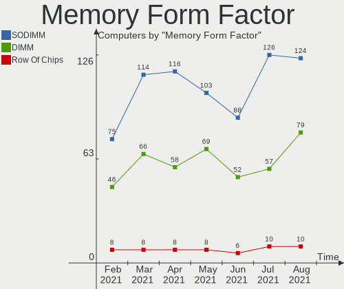

| Name         | Computers | Percent |
|--------------|-----------|---------|
| SODIMM       | 90        | 63.83%  |
| DIMM         | 45        | 31.91%  |
| Row Of Chips | 5         | 3.55%   |
| Chip         | 1         | 0.71%   |

Memory Size
-----------

Memory module size

| Size  | Computers | Percent |
|-------|-----------|---------|
| 4096  | 56        | 35.9%   |
| 8192  | 55        | 35.26%  |
| 2048  | 22        | 14.1%   |
| 16384 | 16        | 10.26%  |
| 1024  | 4         | 2.56%   |
| 512   | 2         | 1.28%   |
| 32768 | 1         | 0.64%   |

Memory Speed
------------

Memory module speed

| Speed   | Computers | Percent |
|---------|-----------|---------|
| 1600    | 44        | 29.33%  |
| 2667    | 28        | 18.67%  |
| 3200    | 13        | 8.67%   |
| 2400    | 10        | 6.67%   |
| 1333    | 10        | 6.67%   |
| 2133    | 8         | 5.33%   |
| Unknown | 7         | 4.67%   |
| 1334    | 4         | 2.67%   |
| 800     | 4         | 2.67%   |
| 667     | 4         | 2.67%   |
| 3400    | 2         | 1.33%   |
| 3000    | 2         | 1.33%   |
| 1866    | 2         | 1.33%   |
| 1067    | 2         | 1.33%   |
| 3600    | 1         | 0.67%   |
| 3266    | 1         | 0.67%   |
| 2933    | 1         | 0.67%   |
| 2800    | 1         | 0.67%   |
| 2666    | 1         | 0.67%   |
| 2048    | 1         | 0.67%   |
| 1867    | 1         | 0.67%   |
| 1639    | 1         | 0.67%   |
| 533     | 1         | 0.67%   |
| 333     | 1         | 0.67%   |

Sound Vendor
------------

Sound card vendors

| Vendor                               | Computers | Percent |
|--------------------------------------|-----------|---------|
| Intel                                | 210       | 54.69%  |
| AMD                                  | 86        | 22.4%   |
| Nvidia                               | 58        | 15.1%   |
| C-Media Electronics                  | 5         | 1.3%    |
| Creative Labs                        | 4         | 1.04%   |
| Texas Instruments                    | 2         | 0.52%   |
| Tenx Technology                      | 2         | 0.52%   |
| Generalplus Technology               | 2         | 0.52%   |
| Yamaha                               | 1         | 0.26%   |
| Thesycon Systemsoftware & Consulting | 1         | 0.26%   |
| Sony                                 | 1         | 0.26%   |
| Silicon Integrated Systems [SiS]     | 1         | 0.26%   |
| RODE Microphones                     | 1         | 0.26%   |
| Logitech                             | 1         | 0.26%   |
| Lenovo                               | 1         | 0.26%   |
| Kingston Technology                  | 1         | 0.26%   |
| Griffin Technology                   | 1         | 0.26%   |
| FiiO                                 | 1         | 0.26%   |
| Creative Technology                  | 1         | 0.26%   |
| Corsair                              | 1         | 0.26%   |
| BlackWeb                             | 1         | 0.26%   |
| ASUSTek Computer                     | 1         | 0.26%   |
| Apple                                | 1         | 0.26%   |

Sound Model
-----------

Sound card models

| Model                                                                                             | Computers | Percent |
|---------------------------------------------------------------------------------------------------|-----------|---------|
| Intel 7 Series/C216 Chipset Family High Definition Audio Controller                               | 23        | 4.99%   |
| AMD Family 17h (Models 10h-1fh) HD Audio Controller                                               | 21        | 4.56%   |
| Intel Sunrise Point-LP HD Audio                                                                   | 17        | 3.69%   |
| Intel 6 Series/C200 Series Chipset Family High Definition Audio Controller                        | 17        | 3.69%   |
| Intel Cannon Lake PCH cAVS                                                                        | 15        | 3.25%   |
| Intel 8 Series/C220 Series Chipset High Definition Audio Controller                               | 15        | 3.25%   |
| Intel NM10/ICH7 Family High Definition Audio Controller                                           | 14        | 3.04%   |
| AMD FCH Azalia Controller                                                                         | 14        | 3.04%   |
| AMD SBx00 Azalia (Intel HDA)                                                                      | 13        | 2.82%   |
| Intel 82801I (ICH9 Family) HD Audio Controller                                                    | 11        | 2.39%   |
| Intel 5 Series/3400 Series Chipset High Definition Audio                                          | 11        | 2.39%   |
| AMD Raven/Raven2/Fenghuang HDMI/DP Audio Controller                                               | 11        | 2.39%   |
| Intel Haswell-ULT HD Audio Controller                                                             | 10        | 2.17%   |
| Intel 8 Series HD Audio Controller                                                                | 10        | 2.17%   |
| Intel Xeon E3-1200 v3/4th Gen Core Processor HD Audio Controller                                  | 9         | 1.95%   |
| Intel Cannon Point-LP High Definition Audio Controller                                            | 9         | 1.95%   |
| Intel 100 Series/C230 Series Chipset Family HD Audio Controller                                   | 9         | 1.95%   |
| Nvidia GK208 HDMI/DP Audio Controller                                                             | 8         | 1.74%   |
| Intel Wildcat Point-LP High Definition Audio Controller                                           | 7         | 1.52%   |
| Intel Broadwell-U Audio Controller                                                                | 7         | 1.52%   |
| Intel 200 Series PCH HD Audio                                                                     | 7         | 1.52%   |
| AMD Renoir Radeon High Definition Audio Controller                                                | 7         | 1.52%   |
| AMD Oland/Hainan/Cape Verde/Pitcairn HDMI Audio [Radeon HD 7000 Series]                           | 7         | 1.52%   |
| Nvidia GF108 High Definition Audio Controller                                                     | 6         | 1.3%    |
| Intel Atom/Celeron/Pentium Processor x5-E8000/J3xxx/N3xxx Series High Definition Audio Controller | 6         | 1.3%    |
| AMD Kabini HDMI/DP Audio                                                                          | 6         | 1.3%    |
| AMD Cedar HDMI Audio [Radeon HD 5400/6300/7300 Series]                                            | 6         | 1.3%    |
| Nvidia GP107GL High Definition Audio Controller                                                   | 5         | 1.08%   |
| Nvidia GK106 HDMI Audio Controller                                                                | 5         | 1.08%   |
| Intel Comet Lake PCH-LP cAVS                                                                      | 5         | 1.08%   |
| Intel 82801H (ICH8 Family) HD Audio Controller                                                    | 5         | 1.08%   |
| AMD Trinity HDMI Audio Controller                                                                 | 5         | 1.08%   |
| Nvidia TU107 GeForce GTX 1650 High Definition Audio Controller                                    | 4         | 0.87%   |
| Nvidia MCP61 High Definition Audio                                                                | 4         | 0.87%   |
| Nvidia GP106 High Definition Audio Controller                                                     | 4         | 0.87%   |
| Intel Comet Lake PCH cAVS                                                                         | 4         | 0.87%   |
| Intel Atom Processor Z36xxx/Z37xxx Series High Definition Audio Controller                        | 4         | 0.87%   |
| Intel 82801JD/DO (ICH10 Family) HD Audio Controller                                               | 4         | 0.87%   |
| AMD Family 17h (Models 00h-0fh) HD Audio Controller                                               | 4         | 0.87%   |
| AMD Ellesmere HDMI Audio [Radeon RX 470/480 / 570/580/590]                                        | 4         | 0.87%   |
| Nvidia TU106 High Definition Audio Controller                                                     | 3         | 0.65%   |
| Nvidia MCP79 High Definition Audio                                                                | 3         | 0.65%   |
| Nvidia GP104 High Definition Audio Controller                                                     | 3         | 0.65%   |
| Intel Celeron/Pentium Silver Processor High Definition Audio                                      | 3         | 0.65%   |
| Intel 82801JI (ICH10 Family) HD Audio Controller                                                  | 3         | 0.65%   |
| C-Media Electronics CMI8788 [Oxygen HD Audio]                                                     | 3         | 0.65%   |
| AMD Starship/Matisse HD Audio Controller                                                          | 3         | 0.65%   |
| AMD High Definition Audio Controller                                                              | 3         | 0.65%   |
| AMD Family 15h (Models 60h-6fh) Audio Controller                                                  | 3         | 0.65%   |
| Tenx Technology USB AUDIO                                                                         | 2         | 0.43%   |
| Nvidia TU104 HD Audio Controller                                                                  | 2         | 0.43%   |
| Nvidia High Definition Audio Controller                                                           | 2         | 0.43%   |
| Nvidia GK107 HDMI Audio Controller                                                                | 2         | 0.43%   |
| Nvidia GF114 HDMI Audio Controller                                                                | 2         | 0.43%   |
| Nvidia GF106 High Definition Audio Controller                                                     | 2         | 0.43%   |
| Intel USB PnP Sound Device                                                                        | 2         | 0.43%   |
| Intel Smart Sound Technology Audio Controller                                                     | 2         | 0.43%   |
| Intel C600/X79 series chipset High Definition Audio Controller                                    | 2         | 0.43%   |
| Generalplus Technology USB Audio Device                                                           | 2         | 0.43%   |
| C-Media Electronics CMI8738/CMI8768 PCI Audio                                                     | 2         | 0.43%   |

Camera Vendor
-------------

Camera device vendors

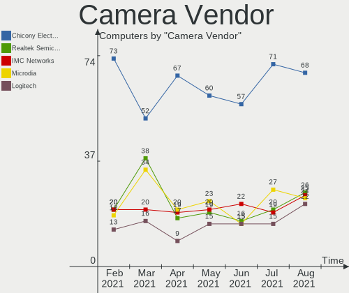

| Vendor                                 | Computers | Percent |
|----------------------------------------|-----------|---------|
| Chicony Electronics                    | 35        | 19.77%  |
| IMC Networks                           | 15        | 8.47%   |
| Logitech                               | 14        | 7.91%   |
| Sunplus Innovation Technology          | 11        | 6.21%   |
| Realtek Semiconductor                  | 11        | 6.21%   |
| Cheng Uei Precision Industry (Foxlink) | 11        | 6.21%   |
| Microdia                               | 9         | 5.08%   |
| Acer                                   | 9         | 5.08%   |
| Suyin                                  | 7         | 3.95%   |
| Lite-On Technology                     | 7         | 3.95%   |
| Quanta                                 | 6         | 3.39%   |
| Microsoft                              | 6         | 3.39%   |
| Silicon Motion                         | 5         | 2.82%   |
| Syntek                                 | 4         | 2.26%   |
| Apple                                  | 4         | 2.26%   |
| Z-Star Microelectronics                | 3         | 1.69%   |
| Samsung Electronics                    | 3         | 1.69%   |
| Ricoh                                  | 2         | 1.13%   |
| Unknown                                | 1         | 0.56%   |
| Primax Electronics                     | 1         | 0.56%   |
| LG Electronics                         | 1         | 0.56%   |
| Jieli Technology                       | 1         | 0.56%   |
| Importek                               | 1         | 0.56%   |
| Huawei Technologies                    | 1         | 0.56%   |
| Generalplus Technology                 | 1         | 0.56%   |
| GEMBIRD                                | 1         | 0.56%   |
| eMPIA Technology                       | 1         | 0.56%   |
| Elecom                                 | 1         | 0.56%   |
| DJBKFA19IDX18K                         | 1         | 0.56%   |
| Cubeternet                             | 1         | 0.56%   |
| Aveo Technology                        | 1         | 0.56%   |
| ARC International                      | 1         | 0.56%   |
| Alcor Micro                            | 1         | 0.56%   |

Camera Model
------------

Camera device models

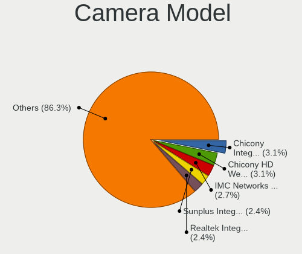

| Model                                                                      | Computers | Percent |
|----------------------------------------------------------------------------|-----------|---------|
| IMC Networks Integrated Camera                                             | 6         | 3.37%   |
| Chicony Integrated Camera                                                  | 6         | 3.37%   |
| Logitech Webcam C270                                                       | 4         | 2.25%   |
| Lite-On Integrated Camera                                                  | 4         | 2.25%   |
| Sunplus HD WebCam                                                          | 3         | 1.69%   |
| Sunplus Asus Webcam                                                        | 3         | 1.69%   |
| Samsung Galaxy A5 (MTP)                                                    | 3         | 1.69%   |
| Microdia Integrated_Webcam_HD                                              | 3         | 1.69%   |
| Logitech HD Pro Webcam C920                                                | 3         | 1.69%   |
| IMC Networks USB2.0 HD UVC WebCam                                          | 3         | 1.69%   |
| Chicony USB 2.0 Camera                                                     | 3         | 1.69%   |
| Chicony HP Webcam                                                          | 3         | 1.69%   |
| Cheng Uei Precision Industry (Foxlink) HP Webcam                           | 3         | 1.69%   |
| Acer BisonCam, NB Pro                                                      | 3         | 1.69%   |
| Z-Star Venus USB2.0 Camera                                                 | 2         | 1.12%   |
| Syntek Integrated Camera                                                   | 2         | 1.12%   |
| Suyin Integrated_Webcam_HD                                                 | 2         | 1.12%   |
| Suyin Acer/HP Integrated Webcam [CN0314]                                   | 2         | 1.12%   |
| Sunplus Laptop_Integrated_Webcam_HD                                        | 2         | 1.12%   |
| Sunplus Integrated_Webcam_HD                                               | 2         | 1.12%   |
| Silicon Motion Web Camera                                                  | 2         | 1.12%   |
| Realtek Integrated_Webcam_HD                                               | 2         | 1.12%   |
| Quanta HP TrueVision HD Camera                                             | 2         | 1.12%   |
| Quanta HD User Facing                                                      | 2         | 1.12%   |
| Microsoft LifeCam HD-3000                                                  | 2         | 1.12%   |
| Microdia Webcam Vitade AF                                                  | 2         | 1.12%   |
| Logitech C922 Pro Stream Webcam                                            | 2         | 1.12%   |
| Chicony USB2.0 VGA UVC WebCam                                              | 2         | 1.12%   |
| Chicony HP Truevision HD                                                   | 2         | 1.12%   |
| Chicony HD Webcam                                                          | 2         | 1.12%   |
| Chicony 1.3M Webcam                                                        | 2         | 1.12%   |
| Cheng Uei Precision Industry (Foxlink) Webcam                              | 2         | 1.12%   |
| Cheng Uei Precision Industry (Foxlink) HP Wide Vision HD Integrated Webcam | 2         | 1.12%   |
| Apple Built-in iSight                                                      | 2         | 1.12%   |
| Z-Star Vimicro USB Camera (Altair)                                         | 1         | 0.56%   |
| Unknown HD camera                                                          | 1         | 0.56%   |
| Syntek USB 2.0 UVC PC Camera                                               | 1         | 0.56%   |
| Syntek Lenovo EasyCamera                                                   | 1         | 0.56%   |
| Suyin HP webcam [dv6-1190en]                                               | 1         | 0.56%   |
| Suyin HP TrueVision HD Integrated Webcam                                   | 1         | 0.56%   |
| Suyin HP Truevision HD                                                     | 1         | 0.56%   |
| Sunplus Integrated Webcam                                                  | 1         | 0.56%   |
| Silicon Motion WebCam SCB-1100N                                            | 1         | 0.56%   |
| Silicon Motion WebCam SCB-0370N                                            | 1         | 0.56%   |
| Silicon Motion WebCam SC-10HDD12636N                                       | 1         | 0.56%   |
| Ricoh Sony Vaio Integrated Webcam                                          | 1         | 0.56%   |
| Ricoh Integrated Webcam                                                    | 1         | 0.56%   |
| Realtek USB2.0-Camera                                                      | 1         | 0.56%   |
| Realtek USB2.0 HD UVC WebCam                                               | 1         | 0.56%   |
| Realtek USB Camera                                                         | 1         | 0.56%   |
| Realtek Integrated Webcam HD                                               | 1         | 0.56%   |
| Realtek Integrated Webcam                                                  | 1         | 0.56%   |
| Realtek Integrated Camera                                                  | 1         | 0.56%   |
| Realtek HD Webcam - Realtek                                                | 1         | 0.56%   |
| Realtek HD WebCam                                                          | 1         | 0.56%   |
| Realtek EasyCamera                                                         | 1         | 0.56%   |
| Quanta HP Wide Vision HD Camera                                            | 1         | 0.56%   |
| Quanta HP HD Camera                                                        | 1         | 0.56%   |
| Primax HP HD Webcam [Fixed]                                                | 1         | 0.56%   |
| Microsoft Rear LifeCam                                                     | 1         | 0.56%   |

Fingerprint Vendor
------------------

Fingerprint sensor vendors

| Vendor                     | Computers | Percent |
|----------------------------|-----------|---------|
| Validity Sensors           | 14        | 53.85%  |
| Synaptics                  | 7         | 26.92%  |
| Shenzhen Goodix Technology | 2         | 7.69%   |
| Elan Microelectronics      | 2         | 7.69%   |
| LighTuning Technology      | 1         | 3.85%   |

Fingerprint Model
-----------------

Fingerprint sensor models

| Model                                             | Computers | Percent |
|---------------------------------------------------|-----------|---------|
| Unknown                                           | 4         | 15.38%  |
| Validity Sensors VFS491                           | 3         | 11.54%  |
| Validity Sensors VFS 5011 fingerprint sensor      | 3         | 11.54%  |
| Validity Sensors VFS5011 Fingerprint Reader       | 2         | 7.69%   |
| Validity Sensors VFS495 Fingerprint Reader        | 2         | 7.69%   |
| Validity Sensors Synaptics WBDI                   | 2         | 7.69%   |
| Validity Sensors Fingerprint scanner              | 2         | 7.69%   |
| Synaptics Prometheus MIS Touch Fingerprint Reader | 2         | 7.69%   |
| Elan ELAN:Fingerprint                             | 2         | 7.69%   |
| Synaptics  WBDI                                   | 1         | 3.85%   |
| Shenzhen Goodix  Fingerprint Device               | 1         | 3.85%   |
| Shenzhen Goodix Fingerprint Reader                | 1         | 3.85%   |
| LighTuning ES603 Swipe Fingerprint Sensor         | 1         | 3.85%   |

Chipcard Vendor
---------------

Chipcard module vendors

| Vendor      | Computers | Percent |
|-------------|-----------|---------|
| Alcor Micro | 7         | 63.64%  |
| Upek        | 2         | 18.18%  |
| Broadcom    | 2         | 18.18%  |

Chipcard Model
--------------

Chipcard module models

| Model                                                      | Computers | Percent |
|------------------------------------------------------------|-----------|---------|
| Alcor Micro AU9540 Smartcard Reader                        | 7         | 63.64%  |
| Upek TouchChip Fingerprint Coprocessor (WBF advanced mode) | 2         | 18.18%  |
| Broadcom BCM5880 Secure Applications Processor             | 2         | 18.18%  |

Printer Vendor
--------------

Printer device vendors

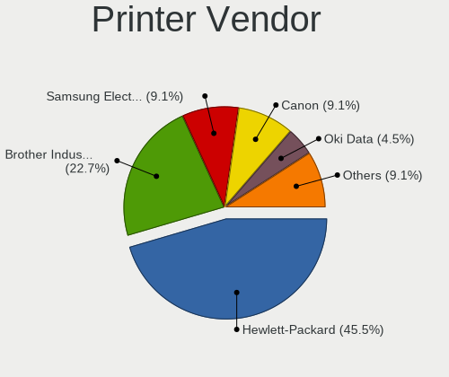

| Vendor              | Computers | Percent |
|---------------------|-----------|---------|
| Hewlett-Packard     | 3         | 27.27%  |
| Samsung Electronics | 2         | 18.18%  |
| Canon               | 2         | 18.18%  |
| Brother Industries  | 2         | 18.18%  |
| Seiko Epson         | 1         | 9.09%   |
| Pantum              | 1         | 9.09%   |

Printer Model
-------------

Printer device models

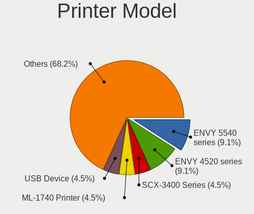

| Model                         | Computers | Percent |
|-------------------------------|-----------|---------|
| Seiko Epson L555 Series       | 1         | 9.09%   |
| Samsung M301x Series          | 1         | 9.09%   |
| Samsung M267x 287x Series     | 1         | 9.09%   |
| Pantum M6500 series           | 1         | 9.09%   |
| HP LaserJet 1320              | 1         | 9.09%   |
| HP LaserJet 1018              | 1         | 9.09%   |
| HP ENVY 5000 series           | 1         | 9.09%   |
| Canon PIXMA MG3600 Series     | 1         | 9.09%   |
| Canon LBP6030/6030B/6018L     | 1         | 9.09%   |
| Brother HL-L2320D series      | 1         | 9.09%   |
| Brother HL-1430 Laser Printer | 1         | 9.09%   |

Scanner Vendor
--------------

Scanner device vendors

Zero info for selected period =(

Scanner Model
-------------

Scanner device models

Zero info for selected period =(

Bluetooth Vendor
----------------

Controller vendors

| Vendor                          | Computers | Percent |
|---------------------------------|-----------|---------|
| Intel                           | 71        | 43.29%  |
| Realtek Semiconductor           | 19        | 11.59%  |
| Qualcomm Atheros Communications | 15        | 9.15%   |
| Broadcom                        | 11        | 6.71%   |
| Cambridge Silicon Radio         | 10        | 6.1%    |
| IMC Networks                    | 9         | 5.49%   |
| Dell                            | 4         | 2.44%   |
| Apple                           | 4         | 2.44%   |
| Toshiba                         | 3         | 1.83%   |
| Hewlett-Packard                 | 3         | 1.83%   |
| Marvell Semiconductor           | 2         | 1.22%   |
| Lite-On Technology              | 2         | 1.22%   |
| Foxconn / Hon Hai               | 2         | 1.22%   |
| ASUSTek Computer                | 2         | 1.22%   |
| Roper                           | 1         | 0.61%   |
| Realtek                         | 1         | 0.61%   |
| Ralink                          | 1         | 0.61%   |
| Primax Electronics              | 1         | 0.61%   |
| Integrated System Solution      | 1         | 0.61%   |
| Fujitsu                         | 1         | 0.61%   |
| Chicony Electronics             | 1         | 0.61%   |

Bluetooth Model
---------------

Controller models

| Model                                                       | Computers | Percent |
|-------------------------------------------------------------|-----------|---------|
| Intel Bluetooth wireless interface                          | 33        | 20.12%  |
| Qualcomm Atheros  Bluetooth Device                          | 13        | 7.93%   |
| Intel AX200 Bluetooth                                       | 11        | 6.71%   |
| Cambridge Silicon Radio Bluetooth Dongle (HCI mode)         | 10        | 6.1%    |
| Realtek  Bluetooth 4.2 Adapter                              | 9         | 5.49%   |
| Realtek Bluetooth Radio                                     | 7         | 4.27%   |
| Intel Wireless-AC 3168 Bluetooth                            | 7         | 4.27%   |
| Intel Bluetooth 9460/9560 Jefferson Peak (JfP)              | 7         | 4.27%   |
| Intel Centrino Bluetooth Wireless Transceiver               | 5         | 3.05%   |
| IMC Networks Bluetooth Device                               | 5         | 3.05%   |
| Realtek RTL8822BE Bluetooth 4.2 Adapter                     | 3         | 1.83%   |
| Intel Centrino Advanced-N 6230 Bluetooth adapter            | 3         | 1.83%   |
| Intel Bluetooth Device                                      | 3         | 1.83%   |
| Apple Built-in Bluetooth 2.0+EDR HCI                        | 3         | 1.83%   |
| Toshiba BCM43142A0                                          | 2         | 1.22%   |
| Marvell Bluetooth and Wireless LAN Composite Device         | 2         | 1.22%   |
| Intel Wireless-AC 9260 Bluetooth Adapter                    | 2         | 1.22%   |
| IMC Networks Bluetooth Radio                                | 2         | 1.22%   |
| IMC Networks Atheros AR3012 Bluetooth 4.0 Adapter           | 2         | 1.22%   |
| HP Bluetooth 2.0 Interface [Broadcom BCM2045]               | 2         | 1.22%   |
| Broadcom BCM43142A0 Bluetooth 4.0                           | 2         | 1.22%   |
| Toshiba Integrated Bluetooth HCI                            | 1         | 0.61%   |
| Roper Class 1 Bluetooth Dongle                              | 1         | 0.61%   |
| Realtek Bluetooth Radio                                     | 1         | 0.61%   |
| Ralink RT3290 Bluetooth                                     | 1         | 0.61%   |
| Qualcomm Atheros AR9462 Bluetooth                           | 1         | 0.61%   |
| Qualcomm Atheros AR3011 Bluetooth                           | 1         | 0.61%   |
| Primax Rocketfish RF-FLBTAD Bluetooth Adapter               | 1         | 0.61%   |
| Lite-On Bluetooth Device                                    | 1         | 0.61%   |
| Lite-On Atheros AR3012 Bluetooth                            | 1         | 0.61%   |
| Integrated System Solution KY-BT100 Bluetooth Adapter       | 1         | 0.61%   |
| HP Integrated Module with Bluetooth 2.1 Wireless technology | 1         | 0.61%   |
| Fujitsu Bluetooth Device                                    | 1         | 0.61%   |
| Foxconn / Hon Hai Bluetooth Device                          | 1         | 0.61%   |
| Foxconn / Hon Hai BCM43142A0 broadcom bluetooth             | 1         | 0.61%   |
| Dell Wireless 370 Bluetooth Mini-card                       | 1         | 0.61%   |
| Dell Wireless 365 Bluetooth                                 | 1         | 0.61%   |
| Dell DW375 Bluetooth Module                                 | 1         | 0.61%   |
| Dell BCM20702A0 Bluetooth Module                            | 1         | 0.61%   |
| Chicony Bluetooth Radio                                     | 1         | 0.61%   |
| Broadcom HP Portable SoftSailing                            | 1         | 0.61%   |
| Broadcom Bluetooth Controller                               | 1         | 0.61%   |
| Broadcom BCM92046DG-CL1ROM Bluetooth 2.1 Adapter            | 1         | 0.61%   |
| Broadcom BCM43142A0 Bluetooth Device                        | 1         | 0.61%   |
| Broadcom BCM20702 Bluetooth 4.0 [ThinkPad]                  | 1         | 0.61%   |
| Broadcom BCM2070 Bluetooth Device                           | 1         | 0.61%   |
| Broadcom BCM2070 Bluetooth 2.1 + EDR                        | 1         | 0.61%   |
| Broadcom BCM2045B (BDC-2.1)                                 | 1         | 0.61%   |
| Broadcom BCM2045 Bluetooth                                  | 1         | 0.61%   |
| ASUS Broadcom BCM20702 Single-Chip Bluetooth 4.0 + LE       | 1         | 0.61%   |
| ASUS BCM20702A0                                             | 1         | 0.61%   |
| Apple Bluetooth HCI                                         | 1         | 0.61%   |

Unsupported Devices
-------------------

Total unsupported devices on board

| Total | Computers | Percent |
|-------|-----------|---------|
| 0     | 207       | 72.38%  |
| 1     | 60        | 20.98%  |
| 2     | 15        | 5.24%   |
| 3     | 3         | 1.05%   |
| 6     | 1         | 0.35%   |

Unsupported Device Types
------------------------

Types of unsupported devices

| Type                     | Computers | Percent |
|--------------------------|-----------|---------|
| Fingerprint reader       | 26        | 26.53%  |
| Graphics card            | 22        | 22.45%  |
| Net/wireless             | 21        | 21.43%  |
| Chipcard                 | 10        | 10.2%   |
| Multimedia controller    | 6         | 6.12%   |
| Storage/raid             | 2         | 2.04%   |
| Sound                    | 2         | 2.04%   |
| Network                  | 2         | 2.04%   |
| Communication controller | 2         | 2.04%   |
| Unassigned class         | 1         | 1.02%   |
| Modem                    | 1         | 1.02%   |
| Flash memory             | 1         | 1.02%   |
| Card reader              | 1         | 1.02%   |
| Bluetooth                | 1         | 1.02%   |

