Mint Hardware Trends
--------------------

A project to identify most popular hardware characteristics and track their change
over time based on data collected by Mint users at https://Linux-Hardware.org.

Anyone can contribute to the study by uploading probes of their computers by
the [hw-probe](https://github.com/linuxhw/hw-probe) tool:

    sudo -E hw-probe -all -upload

This is a report for all computer types. See also reports for [desktops](/Dist/Mint/Desktop/README.md) and [notebooks](/Dist/Mint/Notebook/README.md).

Full-feature report is available here: https://linux-hardware.org/?view=trends

Period: May, 2021.

Contents
--------

- [ OS                       ](#os)
- [ OS Family                ](#os-family)
- [ Kernel                   ](#kernel)
- [ Kernel Family            ](#kernel-family)
- [ Kernel Major Ver.        ](#kernel-major-ver)
- [ Arch                     ](#arch)
- [ DE                       ](#de)
- [ Display Server           ](#display-server)
- [ Display Manager          ](#display-manager)
- [ OS Lang                  ](#os-lang)
- [ Boot Mode                ](#boot-mode)
- [ Filesystem               ](#filesystem)
- [ Part. scheme             ](#part-scheme)
- [ Dual Boot with Linux/BSD ](#dual-boot-with-linux/bsd)
- [ Dual Boot (Win)          ](#dual-boot-win)
- [ Country                  ](#country)
- [ City                     ](#city)
- [ Vendor                   ](#vendor)
- [ Model                    ](#model)
- [ Model Family             ](#model-family)
- [ MFG Year                 ](#mfg-year)
- [ Form Factor              ](#form-factor)
- [ Secure Boot              ](#secure-boot)
- [ Coreboot                 ](#coreboot)
- [ RAM Size                 ](#ram-size)
- [ RAM Used                 ](#ram-used)
- [ Has CD-ROM               ](#has-cd-rom)
- [ Total Drives             ](#total-drives)
- [ Has Ethernet             ](#has-ethernet)
- [ Has WiFi                 ](#has-wifi)
- [ Has Bluetooth            ](#has-bluetooth)
- [ Drive Vendor             ](#drive-vendor)
- [ Drive Model              ](#drive-model)
- [ HDD Vendor               ](#hdd-vendor)
- [ SSD Vendor               ](#ssd-vendor)
- [ Drive Kind               ](#drive-kind)
- [ Drive Connector          ](#drive-connector)
- [ Drive Size               ](#drive-size)
- [ Space Total              ](#space-total)
- [ Space Used               ](#space-used)
- [ Malfunc. Drives          ](#malfunc-drives)
- [ Malfunc. Drive Vendor    ](#malfunc-drive-vendor)
- [ Malfunc. HDD Vendor      ](#malfunc-hdd-vendor)
- [ Malfunc. Drive Kind      ](#malfunc-drive-kind)
- [ Failed Drives            ](#failed-drives)
- [ Failed Drive Vendor      ](#failed-drive-vendor)
- [ Drive Status             ](#drive-status)
- [ Storage Vendor           ](#storage-vendor)
- [ Storage Model            ](#storage-model)
- [ Storage Kind             ](#storage-kind)
- [ CPU Vendor               ](#cpu-vendor)
- [ CPU Model                ](#cpu-model)
- [ CPU Model Family         ](#cpu-model-family)
- [ CPU Cores                ](#cpu-cores)
- [ CPU Sockets              ](#cpu-sockets)
- [ CPU Threads              ](#cpu-threads)
- [ CPU Op-Modes             ](#cpu-op-modes)
- [ CPU Microcode            ](#cpu-microcode)
- [ CPU Microarch            ](#cpu-microarch)
- [ GPU Vendor               ](#gpu-vendor)
- [ GPU Model                ](#gpu-model)
- [ GPU Combo                ](#gpu-combo)
- [ GPU Driver               ](#gpu-driver)
- [ GPU Memory               ](#gpu-memory)
- [ Monitor Vendor           ](#monitor-vendor)
- [ Monitor Model            ](#monitor-model)
- [ Monitor Resolution       ](#monitor-resolution)
- [ Monitor Diagonal         ](#monitor-diagonal)
- [ Monitor Width            ](#monitor-width)
- [ Aspect Ratio             ](#aspect-ratio)
- [ Monitor Area             ](#monitor-area)
- [ Pixel Density            ](#pixel-density)
- [ Multiple Monitors        ](#multiple-monitors)
- [ Net Controller Vendor    ](#net-controller-vendor)
- [ Net Controller Model     ](#net-controller-model)
- [ Wireless Vendor          ](#wireless-vendor)
- [ Wireless Model           ](#wireless-model)
- [ Ethernet Vendor          ](#ethernet-vendor)
- [ Ethernet Model           ](#ethernet-model)
- [ Net Controller Kind      ](#net-controller-kind)
- [ Used Controller          ](#used-controller)
- [ NICs                     ](#nics)
- [ IPv6                     ](#ipv6)
- [ Memory Vendor            ](#memory-vendor)
- [ Memory Model             ](#memory-model)
- [ Memory Kind              ](#memory-kind)
- [ Memory Form Factor       ](#memory-form-factor)
- [ Memory Size              ](#memory-size)
- [ Memory Speed             ](#memory-speed)
- [ Sound Vendor             ](#sound-vendor)
- [ Sound Model              ](#sound-model)
- [ Camera Vendor            ](#camera-vendor)
- [ Camera Model             ](#camera-model)
- [ Fingerprint Vendor       ](#fingerprint-vendor)
- [ Fingerprint Model        ](#fingerprint-model)
- [ Chipcard Vendor          ](#chipcard-vendor)
- [ Chipcard Model           ](#chipcard-model)
- [ Printer Vendor           ](#printer-vendor)
- [ Printer Model            ](#printer-model)
- [ Scanner Vendor           ](#scanner-vendor)
- [ Scanner Model            ](#scanner-model)
- [ Bluetooth Vendor         ](#bluetooth-vendor)
- [ Bluetooth Model          ](#bluetooth-model)
- [ Unsupported Devices      ](#unsupported-devices)
- [ Unsupported Device Types ](#unsupported-device-types)

OS
--

Installed operating systems

| Name      | Computers | Percent |
|-----------|-----------|---------|
| Mint 20.1 | 388       | 79.35%  |
| Mint 20   | 43        | 8.79%   |
| Mint 19.3 | 38        | 7.77%   |
| Mint 19.1 | 8         | 1.64%   |
| Mint 19.2 | 4         | 0.82%   |
| Mint 18.3 | 4         | 0.82%   |
| Mint 19   | 3         | 0.61%   |
| Mint 18   | 1         | 0.2%    |

OS Family
---------

OS without a version

| Name | Computers | Percent |
|------|-----------|---------|
| Mint | 489       | 100%    |

Kernel
------

Version of the Linux kernel

| Version                    | Computers | Percent |
|----------------------------|-----------|---------|
| 5.4.0-73-generic           | 210       | 42.94%  |
| 5.4.0-72-generic           | 129       | 26.38%  |
| 5.4.0-58-generic           | 38        | 7.77%   |
| 5.8.0-53-generic           | 26        | 5.32%   |
| 5.8.0-50-generic           | 12        | 2.45%   |
| 5.4.0-26-generic           | 9         | 1.84%   |
| 4.15.0-142-generic         | 8         | 1.64%   |
| 5.4.0-70-generic           | 7         | 1.43%   |
| 5.4.0-65-generic           | 4         | 0.82%   |
| 4.15.0-143-generic         | 4         | 0.82%   |
| 4.15.0-54-generic          | 3         | 0.61%   |
| 4.15.0-20-generic          | 3         | 0.61%   |
| 5.6.0-1056-oem             | 2         | 0.41%   |
| 5.4.0-71-generic           | 2         | 0.41%   |
| 5.4.0-67-generic           | 2         | 0.41%   |
| 5.4.0-62-generic           | 2         | 0.41%   |
| 5.4.0-59-generic           | 2         | 0.41%   |
| 5.12.2-051202-generic      | 2         | 0.41%   |
| 5.0.0-32-generic           | 2         | 0.41%   |
| 4.4.0-210-generic          | 2         | 0.41%   |
| 4.10.0-38-generic          | 2         | 0.41%   |
| 5.9.0-050900-generic       | 1         | 0.2%    |
| 5.8.0-50-lowlatency        | 1         | 0.2%    |
| 5.8.0-48-generic           | 1         | 0.2%    |
| 5.8.0-43-generic           | 1         | 0.2%    |
| 5.4.0-72-lowlatency        | 1         | 0.2%    |
| 5.4.0-66-generic           | 1         | 0.2%    |
| 5.4.0-60-generic           | 1         | 0.2%    |
| 5.4.0-56-generic           | 1         | 0.2%    |
| 5.12.6-051206-generic      | 1         | 0.2%    |
| 5.12.3-051203-generic      | 1         | 0.2%    |
| 5.12.0-051200rc8-generic   | 1         | 0.2%    |
| 5.12.0-051200-generic      | 1         | 0.2%    |
| 5.11.0-18.1-liquorix-amd64 | 1         | 0.2%    |
| 5.10.5-2006-amd+           | 1         | 0.2%    |
| 5.10.0-1014-oem            | 1         | 0.2%    |
| 5.10.0-051000-generic      | 1         | 0.2%    |
| 5.0.21-050021-generic      | 1         | 0.2%    |
| 4.15.0-106-generic         | 1         | 0.2%    |

Kernel Family
-------------

Linux kernel without a distro release

| Version | Computers | Percent |
|---------|-----------|---------|
| 5.4.0   | 409       | 83.64%  |
| 5.8.0   | 41        | 8.38%   |
| 4.15.0  | 19        | 3.89%   |
| 5.6.0   | 2         | 0.41%   |
| 5.12.2  | 2         | 0.41%   |
| 5.12.0  | 2         | 0.41%   |
| 5.10.0  | 2         | 0.41%   |
| 5.0.0   | 2         | 0.41%   |
| 4.4.0   | 2         | 0.41%   |
| 4.10.0  | 2         | 0.41%   |
| 5.9.0   | 1         | 0.2%    |
| 5.12.6  | 1         | 0.2%    |
| 5.12.3  | 1         | 0.2%    |
| 5.11.0  | 1         | 0.2%    |
| 5.10.5  | 1         | 0.2%    |
| 5.0.21  | 1         | 0.2%    |

Kernel Major Ver.
-----------------

Linux kernel major version

| Version | Computers | Percent |
|---------|-----------|---------|
| 5.4     | 409       | 83.64%  |
| 5.8     | 41        | 8.38%   |
| 4.15    | 19        | 3.89%   |
| 5.12    | 6         | 1.23%   |
| 5.10    | 3         | 0.61%   |
| 5.0     | 3         | 0.61%   |
| 5.6     | 2         | 0.41%   |
| 4.4     | 2         | 0.41%   |
| 4.10    | 2         | 0.41%   |
| 5.9     | 1         | 0.2%    |
| 5.11    | 1         | 0.2%    |

Arch
----

OS architecture (x86_64, i586, etc.)

| Name   | Computers | Percent |
|--------|-----------|---------|
| x86_64 | 471       | 96.32%  |
| i686   | 18        | 3.68%   |

DE
--

Desktop Environment

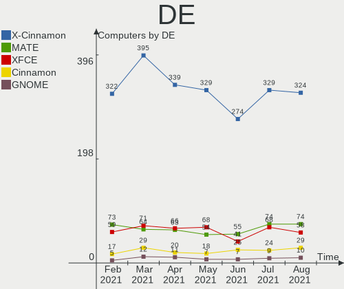

| Name       | Computers | Percent |
|------------|-----------|---------|
| X-Cinnamon | 329       | 67.28%  |
| XFCE       | 68        | 13.91%  |
| MATE       | 54        | 11.04%  |
| Cinnamon   | 18        | 3.68%   |
| Unknown    | 8         | 1.64%   |
| GNOME      | 7         | 1.43%   |
| KDE        | 3         | 0.61%   |
| LXDE       | 1         | 0.2%    |
| KDE5       | 1         | 0.2%    |

Display Server
--------------

X11 or Wayland

| Name | Computers | Percent |
|------|-----------|---------|
| X11  | 488       | 99.8%   |
| Tty  | 1         | 0.2%    |

Display Manager
---------------

SDDM, LightDM, etc.

| Name    | Computers | Percent |
|---------|-----------|---------|
| Unknown | 342       | 69.94%  |
| TDM     | 144       | 29.45%  |
| GDM     | 2         | 0.41%   |
| SDDM    | 1         | 0.2%    |

OS Lang
-------

Language

| Lang        | Computers | Percent |
|-------------|-----------|---------|
| en_US       | 148       | 30.27%  |
| de_DE       | 75        | 15.34%  |
| pt_BR       | 39        | 7.98%   |
| fr_FR       | 25        | 5.11%   |
| en_GB       | 22        | 4.5%    |
| C           | 18        | 3.68%   |
| ru_RU       | 15        | 3.07%   |
| es_ES       | 13        | 2.66%   |
| en_CA       | 13        | 2.66%   |
| pl_PL       | 12        | 2.45%   |
| it_IT       | 11        | 2.25%   |
| nl_NL       | 8         | 1.64%   |
| en_AU       | 8         | 1.64%   |
| tr_TR       | 7         | 1.43%   |
| de_CH       | 5         | 1.02%   |
| sk_SK       | 4         | 0.82%   |
| pt_PT       | 4         | 0.82%   |
| es_CL       | 4         | 0.82%   |
| en_ZA       | 4         | 0.82%   |
| en_NZ       | 4         | 0.82%   |
| en_IN       | 4         | 0.82%   |
| fr_CA       | 3         | 0.61%   |
| es_UY       | 3         | 0.61%   |
| es_MX       | 3         | 0.61%   |
| el_GR       | 3         | 0.61%   |
| de_AT       | 3         | 0.61%   |
| cs_CZ       | 3         | 0.61%   |
| uk_UA       | 2         | 0.41%   |
| es_US       | 2         | 0.41%   |
| es_AR       | 2         | 0.41%   |
| en_PH       | 2         | 0.41%   |
| en_IL       | 2         | 0.41%   |
| da_DK       | 2         | 0.41%   |
| Unknown     | 2         | 0.41%   |
| zh_TW       | 1         | 0.2%    |
| zh_CN       | 1         | 0.2%    |
| sr_RS@latin | 1         | 0.2%    |
| sr_RS       | 1         | 0.2%    |
| ru_UA       | 1         | 0.2%    |
| ro_RO       | 1         | 0.2%    |
| nl_BE       | 1         | 0.2%    |
| hu_HU       | 1         | 0.2%    |
| fi_FI       | 1         | 0.2%    |
| eu_ES       | 1         | 0.2%    |
| es_VE       | 1         | 0.2%    |
| es_BO       | 1         | 0.2%    |
| en_DK       | 1         | 0.2%    |
| de_BE       | 1         | 0.2%    |

Boot Mode
---------

EFI or BIOS

| Mode | Computers | Percent |
|------|-----------|---------|
| BIOS | 266       | 54.4%   |
| EFI  | 223       | 45.6%   |

Filesystem
----------

Type of filesystem

| Type    | Computers | Percent |
|---------|-----------|---------|
| Ext4    | 467       | 95.5%   |
| Overlay | 13        | 2.66%   |
| Btrfs   | 4         | 0.82%   |
| Xfs     | 2         | 0.41%   |
| Ext2    | 2         | 0.41%   |
| Jfs     | 1         | 0.2%    |

Part. scheme
------------

Scheme of partitioning

| Type    | Computers | Percent |
|---------|-----------|---------|
| Unknown | 338       | 69.12%  |
| GPT     | 99        | 20.25%  |
| MBR     | 52        | 10.63%  |

Dual Boot with Linux/BSD
------------------------

Hosting more than one Linux/BSD

| Dual boot | Computers | Percent |
|-----------|-----------|---------|
| No        | 457       | 93.46%  |
| Yes       | 32        | 6.54%   |

Dual Boot (Win)
---------------

Hosting Linux and Windows

| Dual boot | Computers | Percent |
|-----------|-----------|---------|
| No        | 404       | 82.62%  |
| Yes       | 85        | 17.38%  |

Country
-------

Geographic location (country)

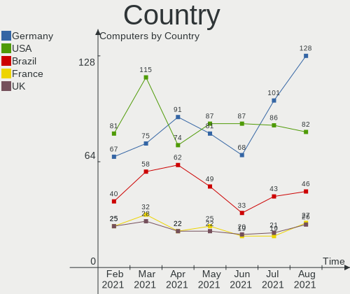

| Country                | Computers | Percent |
|------------------------|-----------|---------|
| USA                    | 87        | 17.79%  |
| Germany                | 81        | 16.56%  |
| Brazil                 | 49        | 10.02%  |
| France                 | 25        | 5.11%   |
| UK                     | 22        | 4.5%    |
| Canada                 | 19        | 3.89%   |
| Russia                 | 16        | 3.27%   |
| Spain                  | 14        | 2.86%   |
| Poland                 | 14        | 2.86%   |
| Italy                  | 14        | 2.86%   |
| Netherlands            | 10        | 2.04%   |
| Turkey                 | 8         | 1.64%   |
| Switzerland            | 8         | 1.64%   |
| Australia              | 7         | 1.43%   |
| South Africa           | 5         | 1.02%   |
| Slovakia               | 5         | 1.02%   |
| Serbia                 | 5         | 1.02%   |
| India                  | 5         | 1.02%   |
| Romania                | 4         | 0.82%   |
| Portugal               | 4         | 0.82%   |
| New Zealand            | 4         | 0.82%   |
| Mexico                 | 4         | 0.82%   |
| Greece                 | 4         | 0.82%   |
| Chile                  | 4         | 0.82%   |
| Argentina              | 4         | 0.82%   |
| Uruguay                | 3         | 0.61%   |
| Ukraine                | 3         | 0.61%   |
| Norway                 | 3         | 0.61%   |
| Indonesia              | 3         | 0.61%   |
| Finland                | 3         | 0.61%   |
| Denmark                | 3         | 0.61%   |
| Czechia                | 3         | 0.61%   |
| Bulgaria               | 3         | 0.61%   |
| Belgium                | 3         | 0.61%   |
| Austria                | 3         | 0.61%   |
| Sweden                 | 2         | 0.41%   |
| Philippines            | 2         | 0.41%   |
| Kazakhstan             | 2         | 0.41%   |
| Israel                 | 2         | 0.41%   |
| Hungary                | 2         | 0.41%   |
| Colombia               | 2         | 0.41%   |
| China                  | 2         | 0.41%   |
| Bosnia and Herzegovina | 2         | 0.41%   |
| Algeria                | 2         | 0.41%   |
| Venezuela              | 1         | 0.2%    |
| UAE                    | 1         | 0.2%    |
| Thailand               | 1         | 0.2%    |
| Taiwan                 | 1         | 0.2%    |
| Saudi Arabia           | 1         | 0.2%    |
| Puerto Rico            | 1         | 0.2%    |
| Myanmar                | 1         | 0.2%    |
| Lithuania              | 1         | 0.2%    |
| Iran                   | 1         | 0.2%    |
| French Polynesia       | 1         | 0.2%    |
| Ethiopia               | 1         | 0.2%    |
| Estonia                | 1         | 0.2%    |
| Egypt                  | 1         | 0.2%    |
| Ecuador                | 1         | 0.2%    |
| Cyprus                 | 1         | 0.2%    |
| Cuba                   | 1         | 0.2%    |

City
----

Geographic location (city)

| City              | Computers | Percent |
|-------------------|-----------|---------|
| Rockville         | 5         | 1.02%   |
| Moscow            | 5         | 1.02%   |
| Sydney            | 4         | 0.82%   |
| Hamburg           | 4         | 0.82%   |
| Frankfurt am Main | 4         | 0.82%   |
| Belgrade          | 4         | 0.82%   |
| Wellington        | 3         | 0.61%   |
| Toronto           | 3         | 0.61%   |
| Sochi             | 3         | 0.61%   |
| Santiago          | 3         | 0.61%   |
| Rio de Janeiro    | 3         | 0.61%   |
| London            | 3         | 0.61%   |
| Leipzig           | 3         | 0.61%   |
| Dresden           | 3         | 0.61%   |
| Cologne           | 3         | 0.61%   |
| Berlin            | 3         | 0.61%   |
| Zurich            | 2         | 0.41%   |
| Wroclaw           | 2         | 0.41%   |
| Warsaw            | 2         | 0.41%   |
| Turin             | 2         | 0.41%   |
| Tel Aviv          | 2         | 0.41%   |
| Szczecin          | 2         | 0.41%   |
| Stuttgart         | 2         | 0.41%   |
| Sofia             | 2         | 0.41%   |
| Seattle           | 2         | 0.41%   |
| San Antonio       | 2         | 0.41%   |
| Salvador          | 2         | 0.41%   |
| Palm Coast        | 2         | 0.41%   |
| Oslo              | 2         | 0.41%   |
| Osasco            | 2         | 0.41%   |
| Ober Urdorf       | 2         | 0.41%   |
| Nuremberg         | 2         | 0.41%   |
| Neuss             | 2         | 0.41%   |
| Miami             | 2         | 0.41%   |
| Mexico City       | 2         | 0.41%   |
| Lodz              | 2         | 0.41%   |
| Lexington         | 2         | 0.41%   |
| Johannesburg      | 2         | 0.41%   |
| Istanbul          | 2         | 0.41%   |
| Helsinki          | 2         | 0.41%   |
| Halle             | 2         | 0.41%   |
| Granada           | 2         | 0.41%   |
| Goiânia          | 2         | 0.41%   |
| Glasgow           | 2         | 0.41%   |
| Florianópolis    | 2         | 0.41%   |
| Eragny            | 2         | 0.41%   |
| Chicago           | 2         | 0.41%   |
| Campinas          | 2         | 0.41%   |
| Buenos Aires      | 2         | 0.41%   |
| Budapest          | 2         | 0.41%   |
| Bratislava        | 2         | 0.41%   |
| Bogotá           | 2         | 0.41%   |
| Bensheim          | 2         | 0.41%   |
| Ankara            | 2         | 0.41%   |
| Zuidhorn          | 1         | 0.2%    |
| Zehdenick         | 1         | 0.2%    |
| Zalău            | 1         | 0.2%    |
| Yangon            | 1         | 0.2%    |
| Xàtiva           | 1         | 0.2%    |
| Workington        | 1         | 0.2%    |

Vendor
------

Motherboard manufacturer

| Name                                  | Computers | Percent |
|---------------------------------------|-----------|---------|
| ASUSTek Computer                      | 78        | 15.95%  |
| Hewlett-Packard                       | 77        | 15.75%  |
| Lenovo                                | 58        | 11.86%  |
| Dell                                  | 56        | 11.45%  |
| Acer                                  | 30        | 6.13%   |
| Gigabyte Technology                   | 26        | 5.32%   |
| ASRock                                | 25        | 5.11%   |
| MSI                                   | 24        | 4.91%   |
| Toshiba                               | 13        | 2.66%   |
| Samsung Electronics                   | 12        | 2.45%   |
| Intel                                 | 9         | 1.84%   |
| Pegatron                              | 7         | 1.43%   |
| Apple                                 | 7         | 1.43%   |
| Fujitsu Siemens                       | 6         | 1.23%   |
| Sony                                  | 4         | 0.82%   |
| Notebook                              | 4         | 0.82%   |
| Unknown                               | 4         | 0.82%   |
| PCWare                                | 3         | 0.61%   |
| Packard Bell                          | 3         | 0.61%   |
| ECS                                   | 3         | 0.61%   |
| Digibras                              | 3         | 0.61%   |
| Teclast                               | 2         | 0.41%   |
| Semp Toshiba                          | 2         | 0.41%   |
| Medion                                | 2         | 0.41%   |
| HUAWEI                                | 2         | 0.41%   |
| Fujitsu                               | 2         | 0.41%   |
| AMI                                   | 2         | 0.41%   |
| Alienware                             | 2         | 0.41%   |
| ZOTAC                                 | 1         | 0.2%    |
| Wistron                               | 1         | 0.2%    |
| TrekStor                              | 1         | 0.2%    |
| Supermicro                            | 1         | 0.2%    |
| Seco                                  | 1         | 0.2%    |
| Schenker                              | 1         | 0.2%    |
| Prestigio                             | 1         | 0.2%    |
| Positivo                              | 1         | 0.2%    |
| Personal Computer Factory             | 1         | 0.2%    |
| Panasonic                             | 1         | 0.2%    |
| ONDA                                  | 1         | 0.2%    |
| Lanix                                 | 1         | 0.2%    |
| Insyde                                | 1         | 0.2%    |
| Huanan                                | 1         | 0.2%    |
| Google                                | 1         | 0.2%    |
| Gateway                               | 1         | 0.2%    |
| Foxconn                               | 1         | 0.2%    |
| eMachines                             | 1         | 0.2%    |
| Digitron                              | 1         | 0.2%    |
| Desenvolvido para positivo Infomatica | 1         | 0.2%    |
| Board Manufacturer                    | 1         | 0.2%    |
| AZW                                   | 1         | 0.2%    |
| Acidanthera                           | 1         | 0.2%    |

Model
-----

Motherboard model

| Name                                   | Computers | Percent |
|----------------------------------------|-----------|---------|
| ASUS All Series                        | 7         | 1.43%   |
| Unknown                                | 4         | 0.82%   |
| HP Pavilion g7                         | 3         | 0.61%   |
| Dell Inspiron 1545                     | 3         | 0.61%   |
| ASUS P50IJ                             | 3         | 0.61%   |
| Semp Toshiba STI                       | 2         | 0.41%   |
| Samsung 300E4C/300E5C/300E7C           | 2         | 0.41%   |
| MSI MS-7C91                            | 2         | 0.41%   |
| MSI MS-7693                            | 2         | 0.41%   |
| Lenovo IdeaPad S145-14AST 81ST         | 2         | 0.41%   |
| Intel Intel powered classmate PC       | 2         | 0.41%   |
| HP ProBook 4530s                       | 2         | 0.41%   |
| HP Pavilion Gaming Laptop 15-dk0xxx    | 2         | 0.41%   |
| HP Pavilion dv7                        | 2         | 0.41%   |
| HP Notebook                            | 2         | 0.41%   |
| HP Laptop 15-bs0xx                     | 2         | 0.41%   |
| HP G60                                 | 2         | 0.41%   |
| HP EliteBook 8470p                     | 2         | 0.41%   |
| Gigabyte G41M-ES2L                     | 2         | 0.41%   |
| Fujitsu Siemens AMILO Pi 1505          | 2         | 0.41%   |
| Digibras NH4CU53                       | 2         | 0.41%   |
| Dell G5 5587                           | 2         | 0.41%   |
| Dell G3 3579                           | 2         | 0.41%   |
| ASUS TUF GAMING X570-PLUS              | 2         | 0.41%   |
| ASUS PRIME B450M-A                     | 2         | 0.41%   |
| ASUS PRIME B350-PLUS                   | 2         | 0.41%   |
| ASUS PRIME A320M-K                     | 2         | 0.41%   |
| ASUS M5A99FX PRO R2.0                  | 2         | 0.41%   |
| ASUS K30AD_M31AD_M51AD                 | 2         | 0.41%   |
| ASRock N68C-S UCC                      | 2         | 0.41%   |
| ASRock B450M Pro4                      | 2         | 0.41%   |
| Acer Aspire ES1-711                    | 2         | 0.41%   |
| ZOTAC ZBOX-CI327NANO-GS-01             | 1         | 0.2%    |
| Wistron ProLiant ML110 G6              | 1         | 0.2%    |
| TrekStor Primebook C13                 | 1         | 0.2%    |
| Toshiba Satellite PRO U200             | 1         | 0.2%    |
| Toshiba Satellite L645                 | 1         | 0.2%    |
| Toshiba Satellite L50-B                | 1         | 0.2%    |
| Toshiba Satellite L50-A                | 1         | 0.2%    |
| Toshiba Satellite L40                  | 1         | 0.2%    |
| Toshiba Satellite C660                 | 1         | 0.2%    |
| Toshiba Satellite C55t-C               | 1         | 0.2%    |
| Toshiba Satellite C55-C                | 1         | 0.2%    |
| Toshiba Satellite C55-A-136            | 1         | 0.2%    |
| Toshiba Satellite C55-A                | 1         | 0.2%    |
| Toshiba Satellite C45-A                | 1         | 0.2%    |
| Toshiba Satellite A300                 | 1         | 0.2%    |
| Toshiba QOSMIO PX30t-A                 | 1         | 0.2%    |
| Teclast F6 Plus                        | 1         | 0.2%    |
| Teclast F15                            | 1         | 0.2%    |
| Supermicro Super Server                | 1         | 0.2%    |
| Sony VPCJ21S1E                         | 1         | 0.2%    |
| Sony VPCEH35FM                         | 1         | 0.2%    |
| Sony VGN-FS415B                        | 1         | 0.2%    |
| Sony SVE11126CGB                       | 1         | 0.2%    |
| Seco C40                               | 1         | 0.2%    |
| Schenker SCHENKER VISION 15 (SVS15E21) | 1         | 0.2%    |
| Samsung RV411/RV511/E3511/S3511/RV711  | 1         | 0.2%    |
| Samsung Q330                           | 1         | 0.2%    |
| Samsung NC10                           | 1         | 0.2%    |

Model Family
------------

Motherboard model prefix

| Name                       | Computers | Percent |
|----------------------------|-----------|---------|
| Lenovo ThinkPad            | 26        | 5.32%   |
| Acer Aspire                | 21        | 4.29%   |
| Dell Inspiron              | 19        | 3.89%   |
| HP Pavilion                | 16        | 3.27%   |
| Lenovo IdeaPad             | 13        | 2.66%   |
| Toshiba Satellite          | 12        | 2.45%   |
| ASUS PRIME                 | 12        | 2.45%   |
| HP Compaq                  | 11        | 2.25%   |
| Dell Vostro                | 9         | 1.84%   |
| Dell Latitude              | 9         | 1.84%   |
| HP Laptop                  | 8         | 1.64%   |
| HP EliteBook               | 7         | 1.43%   |
| ASUS TUF                   | 7         | 1.43%   |
| ASUS ROG                   | 7         | 1.43%   |
| ASUS All                   | 7         | 1.43%   |
| Lenovo ThinkCentre         | 6         | 1.23%   |
| Dell OptiPlex              | 6         | 1.23%   |
| Fujitsu Siemens AMILO      | 5         | 1.02%   |
| HP ProBook                 | 4         | 0.82%   |
| HP EliteDesk               | 4         | 0.82%   |
| Unknown                    | 4         | 0.82%   |
| Dell Precision             | 3         | 0.61%   |
| Dell G3                    | 3         | 0.61%   |
| ASUS P50IJ                 | 3         | 0.61%   |
| Acer Swift                 | 3         | 0.61%   |
| Semp Toshiba STI           | 2         | 0.41%   |
| Samsung 350V5C             | 2         | 0.41%   |
| Samsung 300E4C             | 2         | 0.41%   |
| MSI MS-7C91                | 2         | 0.41%   |
| MSI MS-7693                | 2         | 0.41%   |
| Intel Intel                | 2         | 0.41%   |
| HP Notebook                | 2         | 0.41%   |
| HP G60                     | 2         | 0.41%   |
| HP ENVY                    | 2         | 0.41%   |
| Gigabyte G41M-ES2L         | 2         | 0.41%   |
| Fujitsu LIFEBOOK           | 2         | 0.41%   |
| Digibras NH4CU53           | 2         | 0.41%   |
| Dell XPS                   | 2         | 0.41%   |
| Dell G5                    | 2         | 0.41%   |
| ASUS VivoBook              | 2         | 0.41%   |
| ASUS M5A99FX               | 2         | 0.41%   |
| ASUS K30AD                 | 2         | 0.41%   |
| ASRock Z77                 | 2         | 0.41%   |
| ASRock N68C-S              | 2         | 0.41%   |
| ASRock B450M               | 2         | 0.41%   |
| ASRock B365M               | 2         | 0.41%   |
| ASRock B150M               | 2         | 0.41%   |
| Acer Veriton               | 2         | 0.41%   |
| ZOTAC ZBOX-CI327NANO-GS-01 | 1         | 0.2%    |
| Wistron ProLiant           | 1         | 0.2%    |
| TrekStor Primebook         | 1         | 0.2%    |
| Toshiba QOSMIO             | 1         | 0.2%    |
| Teclast F6                 | 1         | 0.2%    |
| Teclast F15                | 1         | 0.2%    |
| Supermicro Super           | 1         | 0.2%    |
| Sony VPCJ21S1E             | 1         | 0.2%    |
| Sony VPCEH35FM             | 1         | 0.2%    |
| Sony VGN-FS415B            | 1         | 0.2%    |
| Sony SVE11126CGB           | 1         | 0.2%    |
| Seco C40                   | 1         | 0.2%    |

MFG Year
--------

Motherboard manufacture year

| Year    | Computers | Percent |
|---------|-----------|---------|
| 2020    | 72        | 14.72%  |
| 2019    | 54        | 11.04%  |
| 2018    | 39        | 7.98%   |
| 2012    | 38        | 7.77%   |
| 2015    | 35        | 7.16%   |
| 2021    | 33        | 6.75%   |
| 2011    | 33        | 6.75%   |
| 2013    | 32        | 6.54%   |
| 2009    | 27        | 5.52%   |
| 2014    | 26        | 5.32%   |
| 2010    | 25        | 5.11%   |
| 2016    | 20        | 4.09%   |
| 2017    | 16        | 3.27%   |
| 2008    | 16        | 3.27%   |
| 2007    | 13        | 2.66%   |
| 2006    | 5         | 1.02%   |
| 2005    | 3         | 0.61%   |
| 2004    | 1         | 0.2%    |
| Unknown | 1         | 0.2%    |

Form Factor
-----------

Physical design of the computer

| Name        | Computers | Percent |
|-------------|-----------|---------|
| Notebook    | 260       | 53.17%  |
| Desktop     | 201       | 41.1%   |
| All in one  | 9         | 1.84%   |
| Convertible | 8         | 1.64%   |
| Mini pc     | 6         | 1.23%   |
| Tablet      | 3         | 0.61%   |
| Server      | 2         | 0.41%   |

Secure Boot
-----------

Enabled or disabled

| State    | Computers | Percent |
|----------|-----------|---------|
| Disabled | 453       | 92.64%  |
| Enabled  | 36        | 7.36%   |

Coreboot
--------

Have coreboot on board

| Used | Computers | Percent |
|------|-----------|---------|
| No   | 488       | 99.8%   |
| Yes  | 1         | 0.2%    |

RAM Size
--------

Total RAM memory

| Size in GB  | Computers | Percent |
|-------------|-----------|---------|
| 4.01-8.0    | 110       | 22.49%  |
| 3.01-4.0    | 107       | 21.88%  |
| 8.01-16.0   | 85        | 17.38%  |
| 16.01-24.0  | 76        | 15.54%  |
| 1.01-2.0    | 38        | 7.77%   |
| 32.01-64.0  | 36        | 7.36%   |
| 2.01-3.0    | 18        | 3.68%   |
| 24.01-32.0  | 10        | 2.04%   |
| 64.01-256.0 | 7         | 1.43%   |
| 0.51-1.0    | 1         | 0.2%    |
| 0.01-0.5    | 1         | 0.2%    |

RAM Used
--------

Used RAM memory

| Used GB    | Computers | Percent |
|------------|-----------|---------|
| 1.01-2.0   | 201       | 41.1%   |
| 2.01-3.0   | 141       | 28.83%  |
| 4.01-8.0   | 52        | 10.63%  |
| 0.51-1.0   | 45        | 9.2%    |
| 3.01-4.0   | 36        | 7.36%   |
| 8.01-16.0  | 8         | 1.64%   |
| 24.01-32.0 | 3         | 0.61%   |
| 0.01-0.5   | 3         | 0.61%   |

Has CD-ROM
----------

Has CD-ROM on board

| Presented | Computers | Percent |
|-----------|-----------|---------|
| No        | 252       | 51.53%  |
| Yes       | 237       | 48.47%  |

Total Drives
------------

Number of drives on board

| Drives | Computers | Percent |
|--------|-----------|---------|
| 1      | 271       | 55.42%  |
| 2      | 137       | 28.02%  |
| 3      | 42        | 8.59%   |
| 4      | 12        | 2.45%   |
| 5      | 11        | 2.25%   |
| 6      | 7         | 1.43%   |
| 0      | 4         | 0.82%   |
| 7      | 3         | 0.61%   |
| 8      | 2         | 0.41%   |

Has Ethernet
------------

Has Ethernet on board

| Presented | Computers | Percent |
|-----------|-----------|---------|
| Yes       | 439       | 89.78%  |
| No        | 50        | 10.22%  |

Has WiFi
--------

Has WiFi module

| Presented | Computers | Percent |
|-----------|-----------|---------|
| Yes       | 367       | 75.05%  |
| No        | 122       | 24.95%  |

Has Bluetooth
-------------

Has Bluetooth module

| Presented | Computers | Percent |
|-----------|-----------|---------|
| Yes       | 247       | 50.51%  |
| No        | 242       | 49.49%  |

Drive Vendor
------------

Hard drive vendors

| Vendor                    | Computers | Drives | Percent |
|---------------------------|-----------|--------|---------|
| WDC                       | 132       | 174    | 18.01%  |
| Seagate                   | 123       | 146    | 16.78%  |
| Samsung Electronics       | 100       | 119    | 13.64%  |
| Toshiba                   | 48        | 49     | 6.55%   |
| SanDisk                   | 40        | 41     | 5.46%   |
| Hitachi                   | 36        | 38     | 4.91%   |
| Kingston                  | 33        | 34     | 4.5%    |
| Unknown                   | 28        | 36     | 3.82%   |
| Crucial                   | 26        | 28     | 3.55%   |
| SK Hynix                  | 15        | 15     | 2.05%   |
| Intel                     | 14        | 14     | 1.91%   |
| HGST                      | 12        | 12     | 1.64%   |
| A-DATA Technology         | 12        | 12     | 1.64%   |
| Fujitsu                   | 8         | 8      | 1.09%   |
| China                     | 8         | 8      | 1.09%   |
| PNY                       | 5         | 5      | 0.68%   |
| Phison                    | 4         | 4      | 0.55%   |
| Intenso                   | 4         | 4      | 0.55%   |
| ASMT                      | 4         | 6      | 0.55%   |
| XPG                       | 3         | 3      | 0.41%   |
| WD MediaMax               | 3         | 4      | 0.41%   |
| SPCC                      | 3         | 3      | 0.41%   |
| Silicon Motion            | 3         | 3      | 0.41%   |
| Micron/Crucial Technology | 3         | 3      | 0.41%   |
| Maxtor                    | 3         | 3      | 0.41%   |
| Lexar                     | 3         | 3      | 0.41%   |
| EMTEC                     | 3         | 3      | 0.41%   |
| Verbatim                  | 2         | 2      | 0.27%   |
| Vaseky                    | 2         | 2      | 0.27%   |
| Union Memory              | 2         | 2      | 0.27%   |
| Teclast                   | 2         | 2      | 0.27%   |
| Realtek Semiconductor     | 2         | 2      | 0.27%   |
| Patriot                   | 2         | 2      | 0.27%   |
| OCZ                       | 2         | 2      | 0.27%   |
| Netac                     | 2         | 2      | 0.27%   |
| Micron Technology         | 2         | 2      | 0.27%   |
| Leven                     | 2         | 2      | 0.27%   |
| KIOXIA                    | 2         | 3      | 0.27%   |
| Corsair                   | 2         | 2      | 0.27%   |
| Apple                     | 2         | 2      | 0.27%   |
| Apacer                    | 2         | 2      | 0.27%   |
| ADATA Technology          | 2         | 2      | 0.27%   |
| USB                       | 1         | 1      | 0.14%   |
| TO Exter                  | 1         | 1      | 0.14%   |
| TCSUNBOW                  | 1         | 1      | 0.14%   |
| Solid State Storage       | 1         | 1      | 0.14%   |
| PLEXTOR                   | 1         | 1      | 0.14%   |
| Phison Electronics        | 1         | 1      | 0.14%   |
| OEM                       | 1         | 1      | 0.14%   |
| LITEON                    | 1         | 1      | 0.14%   |
| Lite-On                   | 1         | 1      | 0.14%   |
| Lenovo                    | 1         | 1      | 0.14%   |
| LDLC                      | 1         | 1      | 0.14%   |
| LaCie                     | 1         | 1      | 0.14%   |
| KingDian                  | 1         | 1      | 0.14%   |
| KINGBANK                  | 1         | 1      | 0.14%   |
| KESU                      | 1         | 1      | 0.14%   |
| JMicron                   | 1         | 1      | 0.14%   |
| HS-SSD-C100               | 1         | 1      | 0.14%   |
| HPE                       | 1         | 2      | 0.14%   |

Drive Model
-----------

Hard drive models

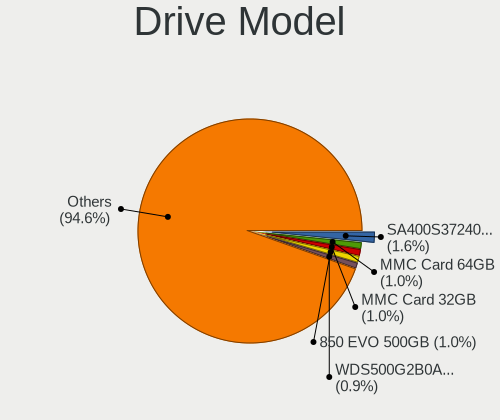

| Model                               | Computers | Percent |
|-------------------------------------|-----------|---------|
| Seagate ST500DM002-1BD142 500GB     | 9         | 1.11%   |
| Kingston SA400S37120G 120GB SSD     | 9         | 1.11%   |
| Seagate ST9500325AS 500GB           | 8         | 0.99%   |
| Samsung SSD 850 EVO 250GB           | 8         | 0.99%   |
| Unknown MMC Card  32GB              | 7         | 0.86%   |
| SanDisk SSD PLUS 240GB              | 7         | 0.86%   |
| WDC WDS500G2B0A-00SM50 500GB SSD    | 5         | 0.62%   |
| Unknown SD/MMC/MS PRO 8GB           | 5         | 0.62%   |
| Toshiba MQ01ABD100 1TB              | 5         | 0.62%   |
| Samsung SSD 860 EVO 500GB           | 5         | 0.62%   |
| Kingston SA400S37480G 480GB SSD     | 5         | 0.62%   |
| Crucial CT500MX500SSD1 500GB        | 5         | 0.62%   |
| WDC WD20EZRX-00D8PB0 2TB            | 4         | 0.49%   |
| Unknown MMC Card  64GB              | 4         | 0.49%   |
| Unknown MMC Card  128GB             | 4         | 0.49%   |
| SK Hynix NVMe SSD Drive 512GB       | 4         | 0.49%   |
| Seagate ST2000LX001-1RG174 2TB      | 4         | 0.49%   |
| Seagate ST2000DM008-2FR102 2TB      | 4         | 0.49%   |
| Seagate ST2000DM006-2DM164 2TB      | 4         | 0.49%   |
| Seagate ST2000DM001-1CH164 2TB      | 4         | 0.49%   |
| Sandisk NVMe SSD Drive 256GB        | 4         | 0.49%   |
| Samsung SSD 840 EVO 250GB           | 4         | 0.49%   |
| Samsung NVMe SSD Drive 256GB        | 4         | 0.49%   |
| Kingston SA400S37240G 240GB SSD     | 4         | 0.49%   |
| WDC WDS240G2G0A-00JH30 240GB SSD    | 3         | 0.37%   |
| WDC WD40EZRZ-00GXCB0 4TB            | 3         | 0.37%   |
| WDC WD4000FYYZ-01UL1B1 4TB          | 3         | 0.37%   |
| WDC WD10EZEX-08WN4A0 1TB            | 3         | 0.37%   |
| WDC WD10EZEX-00BN5A0 1TB            | 3         | 0.37%   |
| Toshiba MQ04ABF100 1TB              | 3         | 0.37%   |
| Toshiba DT01ACA300 3TB              | 3         | 0.37%   |
| Toshiba DT01ACA100 1TB              | 3         | 0.37%   |
| Toshiba DT01ACA050 500GB            | 3         | 0.37%   |
| Seagate ST9500420AS 500GB           | 3         | 0.37%   |
| Seagate ST500LT012-1DG142 500GB     | 3         | 0.37%   |
| Seagate ST500LM012 HN-M500MBB 500GB | 3         | 0.37%   |
| Seagate ST3000DM001-1ER166 3TB      | 3         | 0.37%   |
| Seagate ST2000DM001-1ER164 2TB      | 3         | 0.37%   |
| Seagate ST1000LM035-1RK172 1TB      | 3         | 0.37%   |
| Seagate ST1000LM024 HN-M101MBB 1TB  | 3         | 0.37%   |
| SanDisk SSD PLUS 480GB              | 3         | 0.37%   |
| Sandisk NVMe SSD Drive 512GB        | 3         | 0.37%   |
| Samsung SSD 870 EVO 1TB             | 3         | 0.37%   |
| Samsung SSD 860 EVO M.2 500GB       | 3         | 0.37%   |
| Samsung SSD 860 EVO 1TB             | 3         | 0.37%   |
| Samsung SSD 840 EVO 500GB           | 3         | 0.37%   |
| Samsung SSD 840 EVO 120GB           | 3         | 0.37%   |
| Samsung NVMe SSD Drive 512GB        | 3         | 0.37%   |
| Samsung NVMe SSD Drive 500GB        | 3         | 0.37%   |
| Samsung NVMe SSD Drive 250GB        | 3         | 0.37%   |
| Kingston SV300S37A120G 120GB SSD    | 3         | 0.37%   |
| Hitachi HUS724030ALE641 3TB         | 3         | 0.37%   |
| HGST HTS725050A7E630 500GB          | 3         | 0.37%   |
| Crucial CT240BX500SSD1 240GB        | 3         | 0.37%   |
| A-DATA SU650 120GB SSD              | 3         | 0.37%   |
| WDC WD800JD-00MSA1 80GB             | 2         | 0.25%   |
| WDC WD5000LPCX-24VHAT0 500GB        | 2         | 0.25%   |
| WDC WD5000BEVT-22ZAT0 500GB         | 2         | 0.25%   |
| WDC WD5000AAKX-60U6AA0 500GB        | 2         | 0.25%   |
| WDC WD40EZRX-22SPEB0 4TB            | 2         | 0.25%   |

HDD Vendor
----------

Hard disk drive vendors

| Vendor              | Computers | Drives | Percent |
|---------------------|-----------|--------|---------|
| Seagate             | 121       | 140    | 34.77%  |
| WDC                 | 108       | 144    | 31.03%  |
| Toshiba             | 38        | 39     | 10.92%  |
| Hitachi             | 36        | 38     | 10.34%  |
| Samsung Electronics | 17        | 17     | 4.89%   |
| HGST                | 12        | 12     | 3.45%   |
| Fujitsu             | 7         | 7      | 2.01%   |
| Maxtor              | 3         | 3      | 0.86%   |
| WD MediaMax         | 2         | 3      | 0.57%   |
| ASMT                | 2         | 4      | 0.57%   |
| HPE                 | 1         | 2      | 0.29%   |
| HGST HTS            | 1         | 1      | 0.29%   |

SSD Vendor
----------

Solid state drive vendors

| Vendor              | Computers | Drives | Percent |
|---------------------|-----------|--------|---------|
| Samsung Electronics | 56        | 68     | 23.05%  |
| SanDisk             | 28        | 29     | 11.52%  |
| Kingston            | 27        | 28     | 11.11%  |
| Crucial             | 25        | 27     | 10.29%  |
| WDC                 | 15        | 15     | 6.17%   |
| A-DATA Technology   | 11        | 11     | 4.53%   |
| China               | 8         | 8      | 3.29%   |
| Intel               | 7         | 7      | 2.88%   |
| SK Hynix            | 6         | 6      | 2.47%   |
| Toshiba             | 5         | 5      | 2.06%   |
| PNY                 | 5         | 5      | 2.06%   |
| Intenso             | 4         | 4      | 1.65%   |
| SPCC                | 3         | 3      | 1.23%   |
| Lexar               | 3         | 3      | 1.23%   |
| Verbatim            | 2         | 2      | 0.82%   |
| Union Memory        | 2         | 2      | 0.82%   |
| Teclast             | 2         | 2      | 0.82%   |
| Seagate             | 2         | 2      | 0.82%   |
| Patriot             | 2         | 2      | 0.82%   |
| OCZ                 | 2         | 2      | 0.82%   |
| Netac               | 2         | 2      | 0.82%   |
| Leven               | 2         | 2      | 0.82%   |
| ASMT                | 2         | 2      | 0.82%   |
| Apple               | 2         | 2      | 0.82%   |
| Apacer              | 2         | 2      | 0.82%   |
| Vaseky              | 1         | 1      | 0.41%   |
| TO Exter            | 1         | 1      | 0.41%   |
| TCSUNBOW            | 1         | 1      | 0.41%   |
| PLEXTOR             | 1         | 1      | 0.41%   |
| Micron Technology   | 1         | 1      | 0.41%   |
| LITEON              | 1         | 1      | 0.41%   |
| LDLC                | 1         | 1      | 0.41%   |
| KingDian            | 1         | 1      | 0.41%   |
| KINGBANK            | 1         | 1      | 0.41%   |
| KESU                | 1         | 1      | 0.41%   |
| JMicron             | 1         | 1      | 0.41%   |
| GOODRAM             | 1         | 1      | 0.41%   |
| Gigastone           | 1         | 1      | 0.41%   |
| Gigabyte Technology | 1         | 1      | 0.41%   |
| Fujitsu             | 1         | 1      | 0.41%   |
| FORESEE             | 1         | 1      | 0.41%   |
| Corsair             | 1         | 1      | 0.41%   |
| BP4e                | 1         | 1      | 0.41%   |

Drive Kind
----------

HDD or SSD

| Kind    | Computers | Drives | Percent |
|---------|-----------|--------|---------|
| HDD     | 290       | 410    | 44.55%  |
| SSD     | 217       | 259    | 33.33%  |
| NVMe    | 103       | 118    | 15.82%  |
| MMC     | 22        | 29     | 3.38%   |
| Unknown | 19        | 22     | 2.92%   |

Drive Connector
---------------

SATA, SAS, NVMe, etc.

| Type | Computers | Drives | Percent |
|------|-----------|--------|---------|
| SATA | 406       | 648    | 71.99%  |
| NVMe | 102       | 116    | 18.09%  |
| SAS  | 34        | 45     | 6.03%   |
| MMC  | 22        | 29     | 3.9%    |

Drive Size
----------

Size of hard drive

| Size in TB | Computers | Drives | Percent |
|------------|-----------|--------|---------|
| 0.01-0.5   | 328       | 415    | 60.97%  |
| 0.51-1.0   | 126       | 140    | 23.42%  |
| 1.01-2.0   | 49        | 62     | 9.11%   |
| 3.01-4.0   | 18        | 30     | 3.35%   |
| 2.01-3.0   | 10        | 15     | 1.86%   |
| 4.01-10.0  | 7         | 7      | 1.3%    |

Space Total
-----------

Amount of disk space available on the file system

| Size in GB     | Computers | Percent |
|----------------|-----------|---------|
| 251-500        | 135       | 27.61%  |
| 101-250        | 123       | 25.15%  |
| 501-1000       | 62        | 12.68%  |
| 1001-2000      | 39        | 7.98%   |
| More than 3000 | 35        | 7.16%   |
| 21-50          | 35        | 7.16%   |
| 51-100         | 28        | 5.73%   |
| 2001-3000      | 18        | 3.68%   |
| 1-20           | 11        | 2.25%   |
| Unknown        | 3         | 0.61%   |

Space Used
----------

Amount of used disk space

| Used GB        | Computers | Percent |
|----------------|-----------|---------|
| 1-20           | 125       | 25.56%  |
| 21-50          | 115       | 23.52%  |
| 101-250        | 72        | 14.72%  |
| 51-100         | 66        | 13.5%   |
| 251-500        | 41        | 8.38%   |
| 501-1000       | 25        | 5.11%   |
| More than 3000 | 19        | 3.89%   |
| 1001-2000      | 15        | 3.07%   |
| 2001-3000      | 8         | 1.64%   |
| Unknown        | 3         | 0.61%   |

Malfunc. Drives
---------------

Drive models with a malfunction

| Model                                 | Computers | Drives | Percent |
|---------------------------------------|-----------|--------|---------|
| Seagate ST500DM002-1BD142 500GB       | 2         | 2      | 5.71%   |
| Seagate ST1000LM024 HN-M101MBB 1TB    | 2         | 2      | 5.71%   |
| HGST HTS725050A7E630 500GB            | 2         | 2      | 5.71%   |
| WDC WD5002ABYS-01B1B0 500GB           | 1         | 1      | 2.86%   |
| WDC WD400BB-00CAA1 40GB               | 1         | 1      | 2.86%   |
| WDC WD3200BEKT-60V5T1 320GB           | 1         | 1      | 2.86%   |
| WDC WD2500BEVT-80A23T0 250GB          | 1         | 1      | 2.86%   |
| WDC WD2500BEVT-75A23T0 250GB          | 1         | 1      | 2.86%   |
| WDC WD20EARX-00PASB0 2TB              | 1         | 1      | 2.86%   |
| WDC WD2000F9YZ-09N20L0 2TB            | 1         | 1      | 2.86%   |
| WDC WD10EZEX-00BN5A0 1TB              | 1         | 1      | 2.86%   |
| Toshiba MQ04ABF100 1TB                | 1         | 1      | 2.86%   |
| Toshiba MK6475GSX 640GB               | 1         | 1      | 2.86%   |
| Toshiba MK6465GSX 640GB               | 1         | 1      | 2.86%   |
| Toshiba MK1237GSX 120GB               | 1         | 1      | 2.86%   |
| Seagate ST500LT012-1DG142 500GB       | 1         | 1      | 2.86%   |
| Seagate ST500LM021-1KJ152 500GB       | 1         | 1      | 2.86%   |
| Seagate ST500LM012 HN-M500MBB 500GB   | 1         | 1      | 2.86%   |
| Seagate ST320LT007-9ZV142 320GB       | 1         | 1      | 2.86%   |
| Seagate ST2000DM008-2FR102 2TB        | 1         | 1      | 2.86%   |
| SanDisk SSD PLUS 480 GB               | 1         | 1      | 2.86%   |
| SanDisk SSD PLUS 240GB                | 1         | 1      | 2.86%   |
| Samsung Electronics SSD 980 PRO 250GB | 1         | 1      | 2.86%   |
| Patriot P200 256GB SSD                | 1         | 1      | 2.86%   |
| Maxtor 6Y080L0 81GB                   | 1         | 1      | 2.86%   |
| Leven JAJS300M480C 480GB SSD          | 1         | 1      | 2.86%   |
| LDLC SSD 120GB                        | 1         | 1      | 2.86%   |
| Kingston SA400S37120G 120GB SSD       | 1         | 1      | 2.86%   |
| Hitachi HTS725050A9A364 500GB         | 1         | 1      | 2.86%   |
| Hitachi HTS545050A7E380 500GB         | 1         | 1      | 2.86%   |
| Hitachi HTS543232L9A300 320GB         | 1         | 1      | 2.86%   |
| Hitachi HDS722020ALA330 2TB           | 1         | 1      | 2.86%   |

Malfunc. Drive Vendor
---------------------

Vendors of faulty drives

| Vendor              | Computers | Drives | Percent |
|---------------------|-----------|--------|---------|
| Seagate             | 9         | 9      | 25.71%  |
| WDC                 | 8         | 8      | 22.86%  |
| Toshiba             | 4         | 4      | 11.43%  |
| Hitachi             | 4         | 4      | 11.43%  |
| SanDisk             | 2         | 2      | 5.71%   |
| HGST                | 2         | 2      | 5.71%   |
| Samsung Electronics | 1         | 1      | 2.86%   |
| Patriot             | 1         | 1      | 2.86%   |
| Maxtor              | 1         | 1      | 2.86%   |
| Leven               | 1         | 1      | 2.86%   |
| LDLC                | 1         | 1      | 2.86%   |
| Kingston            | 1         | 1      | 2.86%   |

Malfunc. HDD Vendor
-------------------

Vendors of faulty HDD drives

| Vendor  | Computers | Drives | Percent |
|---------|-----------|--------|---------|
| Seagate | 9         | 9      | 32.14%  |
| WDC     | 8         | 8      | 28.57%  |
| Toshiba | 4         | 4      | 14.29%  |
| Hitachi | 4         | 4      | 14.29%  |
| HGST    | 2         | 2      | 7.14%   |
| Maxtor  | 1         | 1      | 3.57%   |

Malfunc. Drive Kind
-------------------

Kinds of faulty drives

| Kind | Computers | Drives | Percent |
|------|-----------|--------|---------|
| HDD  | 28        | 28     | 80%     |
| SSD  | 6         | 6      | 17.14%  |
| NVMe | 1         | 1      | 2.86%   |

Failed Drives
-------------

Failed drive models

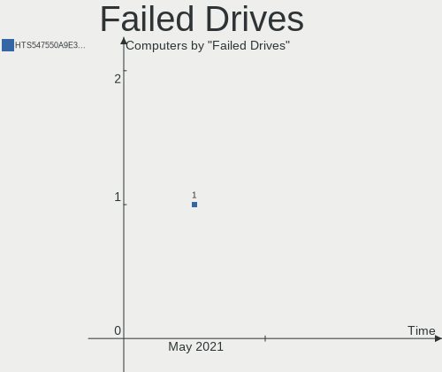

| Model                         | Computers | Drives | Percent |
|-------------------------------|-----------|--------|---------|
| Hitachi HTS547550A9E384 500GB | 1         | 1      | 100%    |

Failed Drive Vendor
-------------------

Failed drive vendors

| Vendor  | Computers | Drives | Percent |
|---------|-----------|--------|---------|
| Hitachi | 1         | 1      | 100%    |

Drive Status
------------

Number of failed and malfunc. drives

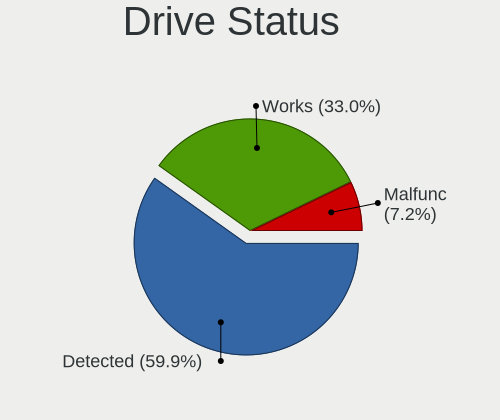

| Status   | Computers | Drives | Percent |
|----------|-----------|--------|---------|
| Detected | 355       | 589    | 67.88%  |
| Works    | 132       | 213    | 25.24%  |
| Malfunc  | 35        | 35     | 6.69%   |
| Failed   | 1         | 1      | 0.19%   |

Storage Vendor
--------------

Storage controller vendors

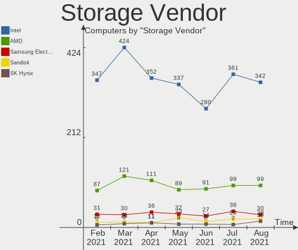

| Vendor                           | Computers | Percent |
|----------------------------------|-----------|---------|
| Intel                            | 337       | 57.9%   |
| AMD                              | 89        | 15.29%  |
| Samsung Electronics              | 32        | 5.5%    |
| Sandisk                          | 23        | 3.95%   |
| ASMedia Technology               | 14        | 2.41%   |
| Nvidia                           | 12        | 2.06%   |
| Marvell Technology Group         | 10        | 1.72%   |
| SK Hynix                         | 8         | 1.37%   |
| Phison Electronics               | 7         | 1.2%    |
| Kingston Technology Company      | 6         | 1.03%   |
| VIA Technologies                 | 5         | 0.86%   |
| ADATA Technology                 | 5         | 0.86%   |
| Toshiba America Info Systems     | 4         | 0.69%   |
| Silicon Motion                   | 4         | 0.69%   |
| Micron/Crucial Technology        | 4         | 0.69%   |
| JMicron Technology               | 4         | 0.69%   |
| KIOXIA                           | 3         | 0.52%   |
| Silicon Integrated Systems [SiS] | 2         | 0.34%   |
| Silicon Image                    | 2         | 0.34%   |
| Realtek Semiconductor            | 2         | 0.34%   |
| ULi Electronics                  | 1         | 0.17%   |
| Solid State Storage Technology   | 1         | 0.17%   |
| Seagate Technology               | 1         | 0.17%   |
| Micron Technology                | 1         | 0.17%   |
| LSI Logic / Symbios Logic        | 1         | 0.17%   |
| Lite-On Technology               | 1         | 0.17%   |
| Lenovo                           | 1         | 0.17%   |
| HighPoint Technologies           | 1         | 0.17%   |
| Broadcom / LSI                   | 1         | 0.17%   |

Storage Model
-------------

Storage controller models

| Model                                                                                   | Computers | Percent |
|-----------------------------------------------------------------------------------------|-----------|---------|
| AMD FCH SATA Controller [AHCI mode]                                                     | 58        | 8.41%   |
| Intel 8 Series/C220 Series Chipset Family 6-port SATA Controller 1 [AHCI mode]          | 29        | 4.2%    |
| Intel 7 Series Chipset Family 6-port SATA Controller [AHCI mode]                        | 24        | 3.48%   |
| Intel 6 Series/C200 Series Chipset Family 6 port Mobile SATA AHCI Controller            | 23        | 3.33%   |
| Samsung NVMe SSD Controller SM981/PM981/PM983                                           | 18        | 2.61%   |
| Intel Sunrise Point-LP SATA Controller [AHCI mode]                                      | 17        | 2.46%   |
| Intel 82801IBM/IEM (ICH9M/ICH9M-E) 4 port SATA Controller [AHCI mode]                   | 17        | 2.46%   |
| Intel 82801G (ICH7 Family) IDE Controller                                               | 17        | 2.46%   |
| Intel 82801 Mobile SATA Controller [RAID mode]                                          | 15        | 2.17%   |
| AMD SB7x0/SB8x0/SB9x0 SATA Controller [AHCI mode]                                       | 15        | 2.17%   |
| AMD 400 Series Chipset SATA Controller                                                  | 14        | 2.03%   |
| Intel 6 Series/C200 Series Chipset Family 6 port Desktop SATA AHCI Controller           | 13        | 1.88%   |
| ASMedia ASM1062 Serial ATA Controller                                                   | 13        | 1.88%   |
| AMD SB7x0/SB8x0/SB9x0 IDE Controller                                                    | 13        | 1.88%   |
| Intel Q170/Q150/B150/H170/H110/Z170/CM236 Chipset SATA Controller [AHCI Mode]           | 12        | 1.74%   |
| Intel NM10/ICH7 Family SATA Controller [IDE mode]                                       | 12        | 1.74%   |
| Intel 200 Series PCH SATA controller [AHCI mode]                                        | 12        | 1.74%   |
| Intel 5 Series/3400 Series Chipset 4 port SATA AHCI Controller                          | 10        | 1.45%   |
| Intel Comet Lake SATA AHCI Controller                                                   | 8         | 1.16%   |
| Intel Cannon Lake Mobile PCH SATA AHCI Controller                                       | 8         | 1.16%   |
| Intel 82801HM/HEM (ICH8M/ICH8M-E) IDE Controller                                        | 8         | 1.16%   |
| Intel 8 Series SATA Controller 1 [AHCI mode]                                            | 8         | 1.16%   |
| Intel 7 Series/C210 Series Chipset Family 6-port SATA Controller [AHCI mode]            | 8         | 1.16%   |
| Sandisk WD Black SN750 / PC SN730 NVMe SSD                                              | 7         | 1.01%   |
| Intel SATA Controller [RAID mode]                                                       | 7         | 1.01%   |
| Intel NM10/ICH7 Family SATA Controller [AHCI mode]                                      | 7         | 1.01%   |
| Sandisk WD Blue SN550 NVMe SSD                                                          | 6         | 0.87%   |
| Sandisk Non-Volatile memory controller                                                  | 6         | 0.87%   |
| Samsung NVMe Controller                                                                 | 6         | 0.87%   |
| Nvidia MCP61 SATA Controller                                                            | 6         | 0.87%   |
| Intel Wildcat Point-LP SATA Controller [AHCI Mode]                                      | 6         | 0.87%   |
| Intel Atom Processor E3800 Series SATA AHCI Controller                                  | 6         | 0.87%   |
| Intel 9 Series Chipset Family SATA Controller [AHCI Mode]                               | 6         | 0.87%   |
| Intel 82801HM/HEM (ICH8M/ICH8M-E) SATA Controller [AHCI mode]                           | 6         | 0.87%   |
| AMD SB7x0/SB8x0/SB9x0 SATA Controller [IDE mode]                                        | 6         | 0.87%   |
| Intel Volume Management Device NVMe RAID Controller                                     | 5         | 0.72%   |
| Intel SSD 660P Series                                                                   | 5         | 0.72%   |
| Intel Celeron/Pentium Silver Processor SATA Controller                                  | 5         | 0.72%   |
| Intel Atom/Celeron/Pentium Processor x5-E8000/J3xxx/N3xxx Series SATA Controller        | 5         | 0.72%   |
| Intel 82801GBM/GHM (ICH7-M Family) SATA Controller [IDE mode]                           | 5         | 0.72%   |
| Intel 5 Series/3400 Series Chipset 6 port SATA AHCI Controller                          | 5         | 0.72%   |
| AMD Starship/Matisse Chipset SATA Controller [AHCI mode]                                | 5         | 0.72%   |
| AMD FCH SATA Controller D                                                               | 5         | 0.72%   |
| Toshiba America Info Systems XG6 NVMe SSD Controller                                    | 4         | 0.58%   |
| SK Hynix BC511                                                                          | 4         | 0.58%   |
| Samsung NVMe SSD Controller SM961/PM961/SM963                                           | 4         | 0.58%   |
| Intel Celeron N3350/Pentium N4200/Atom E3900 Series SATA AHCI Controller                | 4         | 0.58%   |
| Intel Cannon Lake PCH SATA AHCI Controller                                              | 4         | 0.58%   |
| Intel 82801JI (ICH10 Family) SATA AHCI Controller                                       | 4         | 0.58%   |
| Intel 6 Series/C200 Series Chipset Family Mobile SATA Controller (IDE mode, ports 4-5)  | 4         | 0.58%   |
| Intel 6 Series/C200 Series Chipset Family Mobile SATA Controller (IDE mode, ports 0-3)  | 4         | 0.58%   |
| Intel 6 Series/C200 Series Chipset Family Desktop SATA Controller (IDE mode, ports 4-5) | 4         | 0.58%   |
| Intel 6 Series/C200 Series Chipset Family Desktop SATA Controller (IDE mode, ports 0-3) | 4         | 0.58%   |
| Intel 5 Series/3400 Series Chipset 4 port SATA IDE Controller                           | 4         | 0.58%   |
| Intel 5 Series/3400 Series Chipset 2 port SATA IDE Controller                           | 4         | 0.58%   |
| AMD 300 Series Chipset SATA Controller                                                  | 4         | 0.58%   |
| VIA VT82C586A/B/VT82C686/A/B/VT823x/A/C PIPC Bus Master IDE                             | 3         | 0.43%   |
| Silicon Motion SM2263EN/SM2263XT SSD Controller                                         | 3         | 0.43%   |
| Samsung NVMe SSD Controller PM9A1/PM9A3/980PRO                                          | 3         | 0.43%   |
| Phison E12 NVMe Controller                                                              | 3         | 0.43%   |

Storage Kind
------------

Kind of storage controller (IDE, SATA, NVMe, SAS, ...)

| Kind | Computers | Percent |
|------|-----------|---------|
| SATA | 354       | 60.82%  |
| NVMe | 101       | 17.35%  |
| IDE  | 91        | 15.64%  |
| RAID | 35        | 6.01%   |
| SAS  | 1         | 0.17%   |

CPU Vendor
----------

Processor vendors

| Vendor | Computers | Percent |
|--------|-----------|---------|
| Intel  | 374       | 76.48%  |
| AMD    | 115       | 23.52%  |

CPU Model
---------

Processor models

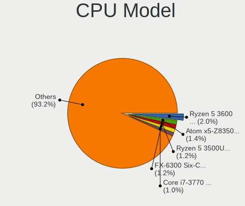

| Model                                        | Computers | Percent |
|----------------------------------------------|-----------|---------|
| AMD FX-8350 Eight-Core Processor             | 8         | 1.64%   |
| Intel Core i5-2520M CPU @ 2.50GHz            | 6         | 1.23%   |
| Intel 11th Gen Core i7-1165G7 @ 2.80GHz      | 6         | 1.23%   |
| AMD Ryzen 7 3700X 8-Core Processor           | 6         | 1.23%   |
| Intel Core i7-4790 CPU @ 3.60GHz             | 5         | 1.02%   |
| Intel Core i7-2670QM CPU @ 2.20GHz           | 5         | 1.02%   |
| Intel Core i5-4590 CPU @ 3.30GHz             | 5         | 1.02%   |
| Intel Core i5-3320M CPU @ 2.60GHz            | 5         | 1.02%   |
| Intel Core i5-2450M CPU @ 2.50GHz            | 5         | 1.02%   |
| Intel Core i3-2120 CPU @ 3.30GHz             | 5         | 1.02%   |
| Intel Atom x5-Z8350 CPU @ 1.44GHz            | 5         | 1.02%   |
| Intel 11th Gen Core i5-1135G7 @ 2.40GHz      | 5         | 1.02%   |
| AMD Ryzen 5 4500U with Radeon Graphics       | 5         | 1.02%   |
| Intel Pentium CPU N3540 @ 2.16GHz            | 4         | 0.82%   |
| Intel Core i7-4790K CPU @ 4.00GHz            | 4         | 0.82%   |
| Intel Core i5-4210U CPU @ 1.70GHz            | 4         | 0.82%   |
| Intel Core 2 Quad CPU Q6600 @ 2.40GHz        | 4         | 0.82%   |
| Intel Pentium CPU G4400 @ 3.30GHz            | 3         | 0.61%   |
| Intel Pentium CPU G3240 @ 3.10GHz            | 3         | 0.61%   |
| Intel Core i7-8750H CPU @ 2.20GHz            | 3         | 0.61%   |
| Intel Core i7-8550U CPU @ 1.80GHz            | 3         | 0.61%   |
| Intel Core i7-6700K CPU @ 4.00GHz            | 3         | 0.61%   |
| Intel Core i7-1065G7 CPU @ 1.30GHz           | 3         | 0.61%   |
| Intel Core i7-10510U CPU @ 1.80GHz           | 3         | 0.61%   |
| Intel Core i5-8300H CPU @ 2.30GHz            | 3         | 0.61%   |
| Intel Core i5-6400 CPU @ 2.70GHz             | 3         | 0.61%   |
| Intel Core i5-6300U CPU @ 2.40GHz            | 3         | 0.61%   |
| Intel Core i5-3230M CPU @ 2.60GHz            | 3         | 0.61%   |
| Intel Core i5-2400S CPU @ 2.50GHz            | 3         | 0.61%   |
| Intel Core i5 CPU M 460 @ 2.53GHz            | 3         | 0.61%   |
| Intel Core i3-7100U CPU @ 2.40GHz            | 3         | 0.61%   |
| Intel Core 2 Duo CPU T6670 @ 2.20GHz         | 3         | 0.61%   |
| AMD Ryzen 5 2600 Six-Core Processor          | 3         | 0.61%   |
| AMD FX-8120 Eight-Core Processor             | 3         | 0.61%   |
| AMD A6-9225 RADEON R4, 5 COMPUTE CORES 2C+3G | 3         | 0.61%   |
| Intel Pentium Dual-Core CPU T4200 @ 2.00GHz  | 2         | 0.41%   |
| Intel Pentium Dual CPU E2200 @ 2.20GHz       | 2         | 0.41%   |
| Intel Pentium Dual CPU E2180 @ 2.00GHz       | 2         | 0.41%   |
| Intel Pentium CPU B960 @ 2.20GHz             | 2         | 0.41%   |
| Intel Pentium CPU B940 @ 2.00GHz             | 2         | 0.41%   |
| Intel Core i9-8950HK CPU @ 2.90GHz           | 2         | 0.41%   |
| Intel Core i7-9750H CPU @ 2.60GHz            | 2         | 0.41%   |
| Intel Core i7-8650U CPU @ 1.90GHz            | 2         | 0.41%   |
| Intel Core i7-7700 CPU @ 3.60GHz             | 2         | 0.41%   |
| Intel Core i7-7500U CPU @ 2.70GHz            | 2         | 0.41%   |
| Intel Core i7-5820K CPU @ 3.30GHz            | 2         | 0.41%   |
| Intel Core i7-4800MQ CPU @ 2.70GHz           | 2         | 0.41%   |
| Intel Core i7-4770 CPU @ 3.40GHz             | 2         | 0.41%   |
| Intel Core i7-4700MQ CPU @ 2.40GHz           | 2         | 0.41%   |
| Intel Core i7-3770 CPU @ 3.40GHz             | 2         | 0.41%   |
| Intel Core i7-3630QM CPU @ 2.40GHz           | 2         | 0.41%   |
| Intel Core i7-3610QM CPU @ 2.30GHz           | 2         | 0.41%   |
| Intel Core i7-2630QM CPU @ 2.00GHz           | 2         | 0.41%   |
| Intel Core i7-2600 CPU @ 3.40GHz             | 2         | 0.41%   |
| Intel Core i7 CPU Q 720 @ 1.60GHz            | 2         | 0.41%   |
| Intel Core i5-9600K CPU @ 3.70GHz            | 2         | 0.41%   |
| Intel Core i5-8265U CPU @ 1.60GHz            | 2         | 0.41%   |
| Intel Core i5-8250U CPU @ 1.60GHz            | 2         | 0.41%   |
| Intel Core i5-7400 CPU @ 3.00GHz             | 2         | 0.41%   |
| Intel Core i5-5200U CPU @ 2.20GHz            | 2         | 0.41%   |

CPU Model Family
----------------

Processor model prefix

| Model                                | Computers | Percent |
|--------------------------------------|-----------|---------|
| Intel Core i5                        | 100       | 20.45%  |
| Intel Core i7                        | 79        | 16.16%  |
| Intel Core i3                        | 37        | 7.57%   |
| Intel Celeron                        | 24        | 4.91%   |
| Intel Pentium                        | 23        | 4.7%    |
| Intel Atom                           | 21        | 4.29%   |
| AMD Ryzen 5                          | 21        | 4.29%   |
| Intel Core 2 Duo                     | 19        | 3.89%   |
| AMD Ryzen 7                          | 14        | 2.86%   |
| Other                                | 13        | 2.66%   |
| AMD FX                               | 13        | 2.66%   |
| Intel Pentium Dual                   | 10        | 2.04%   |
| Intel Xeon                           | 9         | 1.84%   |
| Intel Pentium Dual-Core              | 8         | 1.64%   |
| AMD Ryzen 3                          | 7         | 1.43%   |
| AMD A6                               | 7         | 1.43%   |
| Intel Core i9                        | 6         | 1.23%   |
| Intel Core 2 Quad                    | 6         | 1.23%   |
| Intel Core 2                         | 6         | 1.23%   |
| AMD Ryzen 9                          | 5         | 1.02%   |
| AMD Athlon                           | 5         | 1.02%   |
| AMD A4                               | 5         | 1.02%   |
| Intel Genuine                        | 4         | 0.82%   |
| AMD E2                               | 4         | 0.82%   |
| AMD Sempron                          | 3         | 0.61%   |
| AMD Athlon II X4                     | 3         | 0.61%   |
| AMD A10                              | 3         | 0.61%   |
| Intel Pentium Silver                 | 2         | 0.41%   |
| Intel Pentium D                      | 2         | 0.41%   |
| AMD Turion 64 X2 Mobile              | 2         | 0.41%   |
| AMD Ryzen 7 PRO                      | 2         | 0.41%   |
| AMD Athlon II X2                     | 2         | 0.41%   |
| AMD A8                               | 2         | 0.41%   |
| Intel Pentium M                      | 1         | 0.2%    |
| Intel Pentium Gold                   | 1         | 0.2%    |
| Intel Pentium 4                      | 1         | 0.2%    |
| Intel Core m5                        | 1         | 0.2%    |
| Intel Core Duo                       | 1         | 0.2%    |
| Intel Core 2 Solo                    | 1         | 0.2%    |
| AMD Turion II Ultra Dual-Core Mobile | 1         | 0.2%    |
| AMD Turion 64 Mobile                 | 1         | 0.2%    |
| AMD Turion                           | 1         | 0.2%    |
| AMD Ryzen Embedded                   | 1         | 0.2%    |
| AMD Ryzen 5 PRO                      | 1         | 0.2%    |
| AMD Phenom II X6                     | 1         | 0.2%    |
| AMD Phenom II X4                     | 1         | 0.2%    |
| AMD Mobile Sempron                   | 1         | 0.2%    |
| AMD C-60                             | 1         | 0.2%    |
| AMD Athlon X4                        | 1         | 0.2%    |
| AMD Athlon X2                        | 1         | 0.2%    |
| AMD Athlon II X3                     | 1         | 0.2%    |
| AMD Athlon II Dual-Core              | 1         | 0.2%    |
| AMD Athlon 64 X2                     | 1         | 0.2%    |
| AMD Athlon 64                        | 1         | 0.2%    |
| AMD A12                              | 1         | 0.2%    |

CPU Cores
---------

Number of processor cores

| Number | Computers | Percent |
|--------|-----------|---------|
| 2      | 213       | 43.56%  |
| 4      | 187       | 38.24%  |
| 6      | 37        | 7.57%   |
| 1      | 22        | 4.5%    |
| 8      | 21        | 4.29%   |
| 10     | 3         | 0.61%   |
| 16     | 2         | 0.41%   |
| 12     | 2         | 0.41%   |
| 24     | 1         | 0.2%    |
| 3      | 1         | 0.2%    |

CPU Sockets
-----------

Number of sockets

| Number | Computers | Percent |
|--------|-----------|---------|
| 1      | 486       | 99.39%  |
| 2      | 3         | 0.61%   |

CPU Threads
-----------

Threads per core (Hyper-Threading)

| Number | Computers | Percent |
|--------|-----------|---------|
| 2      | 273       | 55.83%  |
| 1      | 216       | 44.17%  |

CPU Op-Modes
------------

CPU Operation Modes (32-bit, 64-bit)

| Op mode        | Computers | Percent |
|----------------|-----------|---------|
| 32-bit, 64-bit | 482       | 98.57%  |
| 32-bit         | 7         | 1.43%   |

CPU Microcode
-------------

Microcode number

| Number     | Computers | Percent |
|------------|-----------|---------|
| 0x206a7    | 50        | 10.22%  |
| Unknown    | 48        | 9.82%   |
| 0x306c3    | 36        | 7.36%   |
| 0x306a9    | 27        | 5.52%   |
| 0x1067a    | 19        | 3.89%   |
| 0x6fd      | 18        | 3.68%   |
| 0x806c1    | 13        | 2.66%   |
| 0x906ea    | 11        | 2.25%   |
| 0x506e3    | 11        | 2.25%   |
| 0x30678    | 10        | 2.04%   |
| 0x08701021 | 10        | 2.04%   |
| 0x40651    | 9         | 1.84%   |
| 0x08108109 | 9         | 1.84%   |
| 0x06000852 | 9         | 1.84%   |
| 0x806ec    | 8         | 1.64%   |
| 0x806ea    | 8         | 1.64%   |
| 0x406c4    | 8         | 1.64%   |
| 0x20655    | 8         | 1.64%   |
| 0x906ed    | 7         | 1.43%   |
| 0x10676    | 7         | 1.43%   |
| 0x0800820d | 7         | 1.43%   |
| 0x906e9    | 6         | 1.23%   |
| 0x806e9    | 6         | 1.23%   |
| 0x306d4    | 6         | 1.23%   |
| 0x706e5    | 5         | 1.02%   |
| 0x6f6      | 5         | 1.02%   |
| 0x406e3    | 5         | 1.02%   |
| 0x406c3    | 5         | 1.02%   |
| 0x20652    | 5         | 1.02%   |
| 0x106e5    | 5         | 1.02%   |
| 0x010000c8 | 5         | 1.02%   |
| 0x6fb      | 4         | 0.82%   |
| 0x206c2    | 4         | 0.82%   |
| 0x106ca    | 4         | 0.82%   |
| 0x08600106 | 4         | 0.82%   |
| 0x08600103 | 4         | 0.82%   |
| 0x06003106 | 4         | 0.82%   |
| 0x03000027 | 4         | 0.82%   |
| 0xa0655    | 3         | 0.61%   |
| 0x906eb    | 3         | 0.61%   |
| 0x706a1    | 3         | 0.61%   |
| 0x506c9    | 3         | 0.61%   |
| 0x0810100b | 3         | 0.61%   |
| 0x06006705 | 3         | 0.61%   |
| 0x0600611a | 3         | 0.61%   |
| 0x0600063e | 3         | 0.61%   |
| 0x05000119 | 3         | 0.61%   |
| 0x010000db | 3         | 0.61%   |
| 0xa0652    | 2         | 0.41%   |
| 0x6f2      | 2         | 0.41%   |
| 0x6e8      | 2         | 0.41%   |
| 0x306f2    | 2         | 0.41%   |
| 0x106c2    | 2         | 0.41%   |
| 0x08600104 | 2         | 0.41%   |
| 0x07030105 | 2         | 0.41%   |
| 0x02000032 | 2         | 0.41%   |
| 0xf65      | 1         | 0.2%    |
| 0xf47      | 1         | 0.2%    |
| 0xf33      | 1         | 0.2%    |
| 0x906ec    | 1         | 0.2%    |

CPU Microarch
-------------

Microarchitecture

| Name            | Computers | Percent |
|-----------------|-----------|---------|
| KabyLake        | 56        | 11.45%  |
| SandyBridge     | 55        | 11.25%  |
| Haswell         | 51        | 10.43%  |
| IvyBridge       | 31        | 6.34%   |
| Core            | 30        | 6.13%   |
| Penryn          | 27        | 5.52%   |
| Silvermont      | 24        | 4.91%   |
| Zen 2           | 23        | 4.7%    |
| Skylake         | 22        | 4.5%    |
| Zen+            | 19        | 3.89%   |
| Westmere        | 18        | 3.68%   |
| TigerLake       | 13        | 2.66%   |
| K10             | 12        | 2.45%   |
| Piledriver      | 11        | 2.25%   |
| Excavator       | 10        | 2.04%   |
| K8 Hammer       | 9         | 1.84%   |
| Zen             | 8         | 1.64%   |
| Broadwell       | 7         | 1.43%   |
| Bonnell         | 7         | 1.43%   |
| Nehalem         | 6         | 1.23%   |
| IceLake         | 5         | 1.02%   |
| Goldmont plus   | 5         | 1.02%   |
| CometLake       | 5         | 1.02%   |
| Steamroller     | 4         | 0.82%   |
| P6              | 4         | 0.82%   |
| K10 Llano       | 4         | 0.82%   |
| Goldmont        | 4         | 0.82%   |
| NetBurst        | 3         | 0.61%   |
| Bulldozer       | 3         | 0.61%   |
| Bobcat          | 3         | 0.61%   |
| Unknown         | 3         | 0.61%   |
| Zen 3           | 2         | 0.41%   |
| Puma            | 2         | 0.41%   |
| K8 & K10 hybrid | 2         | 0.41%   |
| Jaguar          | 1         | 0.2%    |

GPU Vendor
----------

Vendors of graphics cards

| Vendor                           | Computers | Percent |
|----------------------------------|-----------|---------|
| Intel                            | 300       | 53.19%  |
| Nvidia                           | 136       | 24.11%  |
| AMD                              | 121       | 21.45%  |
| VIA Technologies                 | 2         | 0.35%   |
| Silicon Integrated Systems [SiS] | 2         | 0.35%   |
| Matrox Electronics Systems       | 2         | 0.35%   |
| ASPEED Technology                | 1         | 0.18%   |

GPU Model
---------

Graphics card models

| Model                                                                                    | Computers | Percent |
|------------------------------------------------------------------------------------------|-----------|---------|
| Intel 2nd Generation Core Processor Family Integrated Graphics Controller                | 49        | 8.38%   |
| Intel Xeon E3-1200 v3/4th Gen Core Processor Integrated Graphics Controller              | 21        | 3.59%   |
| Intel 3rd Gen Core processor Graphics Controller                                         | 19        | 3.25%   |
| Intel Mobile 4 Series Chipset Integrated Graphics Controller                             | 16        | 2.74%   |
| Intel Atom/Celeron/Pentium Processor x5-E8000/J3xxx/N3xxx Integrated Graphics Controller | 13        | 2.22%   |
| Intel TigerLake-LP GT2 [Iris Xe Graphics]                                                | 12        | 2.05%   |
| Intel Core Processor Integrated Graphics Controller                                      | 12        | 2.05%   |
| Nvidia GK208B [GeForce GT 710]                                                           | 11        | 1.88%   |
| Intel CoffeeLake-H GT2 [UHD Graphics 630]                                                | 11        | 1.88%   |
| Intel Atom Processor Z36xxx/Z37xxx Series Graphics & Display                             | 11        | 1.88%   |
| AMD Renoir                                                                               | 11        | 1.88%   |
| AMD Picasso                                                                              | 11        | 1.88%   |
| Intel Haswell-ULT Integrated Graphics Controller                                         | 9         | 1.54%   |
| Intel UHD Graphics 620                                                                   | 8         | 1.37%   |
| Intel HD Graphics 530                                                                    | 8         | 1.37%   |
| Nvidia GM206 [GeForce GTX 960]                                                           | 7         | 1.2%    |
| Intel Xeon E3-1200 v2/3rd Gen Core processor Graphics Controller                         | 7         | 1.2%    |
| Intel Skylake GT2 [HD Graphics 520]                                                      | 6         | 1.03%   |
| Intel HD Graphics 620                                                                    | 6         | 1.03%   |
| Intel CometLake-U GT2 [UHD Graphics]                                                     | 6         | 1.03%   |
| Intel 4th Gen Core Processor Integrated Graphics Controller                              | 6         | 1.03%   |
| AMD Stoney [Radeon R2/R3/R4/R5 Graphics]                                                 | 6         | 1.03%   |
| Nvidia TU117 [GeForce GTX 1650]                                                          | 5         | 0.85%   |
| Intel Mobile GM965/GL960 Integrated Graphics Controller (secondary)                      | 5         | 0.85%   |
| Intel Mobile GM965/GL960 Integrated Graphics Controller (primary)                        | 5         | 0.85%   |
| Intel Mobile 945GM/GMS/GME, 943/940GML Express Integrated Graphics Controller            | 5         | 0.85%   |
| Intel HD Graphics 630                                                                    | 5         | 0.85%   |
| Intel HD Graphics 5500                                                                   | 5         | 0.85%   |
| Intel CoffeeLake-S GT2 [UHD Graphics 630]                                                | 5         | 0.85%   |
| Intel 82G33/G31 Express Integrated Graphics Controller                                   | 5         | 0.85%   |
| AMD Seymour [Radeon HD 6400M/7400M Series]                                               | 5         | 0.85%   |
| AMD Ellesmere [Radeon RX 470/480/570/570X/580/580X/590]                                  | 5         | 0.85%   |
| Nvidia TU117M [GeForce GTX 1650 Mobile / Max-Q]                                          | 4         | 0.68%   |
| Nvidia GP108 [GeForce GT 1030]                                                           | 4         | 0.68%   |
| Nvidia GP107 [GeForce GTX 1050 Ti]                                                       | 4         | 0.68%   |
| Nvidia GP106 [GeForce GTX 1060 6GB]                                                      | 4         | 0.68%   |
| Nvidia GF117M [GeForce 610M/710M/810M/820M / GT 620M/625M/630M/720M]                     | 4         | 0.68%   |
| Intel WhiskeyLake-U GT2 [UHD Graphics 620]                                               | 4         | 0.68%   |
| Intel Mobile 945GM/GMS, 943/940GML Express Integrated Graphics Controller                | 4         | 0.68%   |
| Intel GeminiLake [UHD Graphics 600]                                                      | 4         | 0.68%   |
| Intel Atom Processor D4xx/D5xx/N4xx/N5xx Integrated Graphics Controller                  | 4         | 0.68%   |
| AMD Thames [Radeon HD 7500M/7600M Series]                                                | 4         | 0.68%   |
| AMD Raven Ridge [Radeon Vega Series / Radeon Vega Mobile Series]                         | 4         | 0.68%   |
| AMD Caicos [Radeon HD 6450/7450/8450 / R5 230 OEM]                                       | 4         | 0.68%   |
| Nvidia TU106 [GeForce RTX 2070 Rev. A]                                                   | 3         | 0.51%   |
| Nvidia GP107M [GeForce GTX 1050 Mobile]                                                  | 3         | 0.51%   |
| Nvidia GP107 [GeForce GTX 1050]                                                          | 3         | 0.51%   |
| Nvidia GP106M [GeForce GTX 1060 Mobile]                                                  | 3         | 0.51%   |
| Intel Iris Plus Graphics G7                                                              | 3         | 0.51%   |
| Intel HD Graphics 510                                                                    | 3         | 0.51%   |
| Intel HD Graphics 500                                                                    | 3         | 0.51%   |
| Intel CometLake-S GT2 [UHD Graphics 630]                                                 | 3         | 0.51%   |
| Intel 4 Series Chipset Integrated Graphics Controller                                    | 3         | 0.51%   |
| AMD Wani [Radeon R5/R6/R7 Graphics]                                                      | 3         | 0.51%   |
| AMD Oland PRO [Radeon R7 240/340]                                                        | 3         | 0.51%   |
| AMD Lexa PRO [Radeon 540/540X/550/550X / RX 540X/550/550X]                               | 3         | 0.51%   |
| AMD Kaveri [Radeon R7 Graphics]                                                          | 3         | 0.51%   |
| Nvidia TU117M [GeForce MX450]                                                            | 2         | 0.34%   |
| Nvidia GT218 [GeForce 210]                                                               | 2         | 0.34%   |
| Nvidia GT216M [GeForce GT 330M]                                                          | 2         | 0.34%   |

GPU Combo
---------

Combinations of graphics cards

| Name            | Computers | Percent |
|-----------------|-----------|---------|
| 1 x Intel       | 230       | 47.03%  |
| 1 x AMD         | 93        | 19.02%  |
| 1 x Nvidia      | 87        | 17.79%  |
| Intel + Nvidia  | 43        | 8.79%   |
| Intel + AMD     | 16        | 3.27%   |
| 2 x AMD         | 8         | 1.64%   |
| AMD + Nvidia    | 3         | 0.61%   |
| 2 x Nvidia      | 2         | 0.41%   |
| 1 x VIA         | 2         | 0.41%   |
| 1 x SiS         | 2         | 0.41%   |
| 1 x Matrox      | 2         | 0.41%   |
| Nvidia + ASPEED | 1         | 0.2%    |

GPU Driver
----------

Free vs proprietary

| Driver      | Computers | Percent |
|-------------|-----------|---------|
| Free        | 368       | 75.26%  |
| Proprietary | 94        | 19.22%  |
| Unknown     | 27        | 5.52%   |

GPU Memory
----------

Total video memory

| Size in GB | Computers | Percent |
|------------|-----------|---------|
| Unknown    | 276       | 56.44%  |
| 1.01-2.0   | 64        | 13.09%  |
| 0.01-0.5   | 59        | 12.07%  |
| 3.01-4.0   | 38        | 7.77%   |
| 0.51-1.0   | 31        | 6.34%   |
| 7.01-8.0   | 12        | 2.45%   |
| 5.01-6.0   | 6         | 1.23%   |
| 8.01-16.0  | 2         | 0.41%   |
| 2.01-3.0   | 1         | 0.2%    |

Monitor Vendor
--------------

Monitor vendors

| Vendor                  | Computers | Percent |
|-------------------------|-----------|---------|
| Samsung Electronics     | 79        | 15.83%  |
| AU Optronics            | 61        | 12.22%  |
| LG Display              | 48        | 9.62%   |
| Chimei Innolux          | 30        | 6.01%   |
| Acer                    | 29        | 5.81%   |
| Dell                    | 28        | 5.61%   |
| BOE                     | 23        | 4.61%   |
| Goldstar                | 20        | 4.01%   |
| Hewlett-Packard         | 16        | 3.21%   |
| AOC                     | 14        | 2.81%   |
| Ancor Communications    | 13        | 2.61%   |
| BenQ                    | 11        | 2.2%    |
| LG Philips              | 8         | 1.6%    |
| Lenovo                  | 8         | 1.6%    |
| Chi Mei Optoelectronics | 8         | 1.6%    |
| Apple                   | 8         | 1.6%    |
| Philips                 | 7         | 1.4%    |
| PANDA                   | 7         | 1.4%    |
| Iiyama                  | 6         | 1.2%    |
| Sharp                   | 5         | 1%      |
| ViewSonic               | 4         | 0.8%    |
| Unknown                 | 4         | 0.8%    |
| Sony                    | 4         | 0.8%    |
| LG Electronics          | 4         | 0.8%    |
| ASUSTek Computer        | 4         | 0.8%    |
| InnoLux Display         | 3         | 0.6%    |
| Eizo                    | 3         | 0.6%    |
| CPT                     | 3         | 0.6%    |
| Westinghouse            | 2         | 0.4%    |
| MiTAC                   | 2         | 0.4%    |
| LGD                     | 2         | 0.4%    |
| InfoVision              | 2         | 0.4%    |
| HKC                     | 2         | 0.4%    |
| HannStar                | 2         | 0.4%    |
| VIZ                     | 1         | 0.2%    |
| Vestel                  | 1         | 0.2%    |
| Toshiba                 | 1         | 0.2%    |
| TopView                 | 1         | 0.2%    |
| SDC                     | 1         | 0.2%    |
| PLN                     | 1         | 0.2%    |
| ONN                     | 1         | 0.2%    |
| NEC Computers           | 1         | 0.2%    |
| MStar                   | 1         | 0.2%    |
| MSI                     | 1         | 0.2%    |
| Mi                      | 1         | 0.2%    |
| Medion                  | 1         | 0.2%    |
| Lenovo Group Limited    | 1         | 0.2%    |
| JVC                     | 1         | 0.2%    |
| Insignia                | 1         | 0.2%    |
| Idek Iiyama             | 1         | 0.2%    |
| Huion                   | 1         | 0.2%    |
| Hitachi                 | 1         | 0.2%    |
| GRM                     | 1         | 0.2%    |
| FUS                     | 1         | 0.2%    |
| Denver                  | 1         | 0.2%    |
| Daewoo                  | 1         | 0.2%    |
| CTV                     | 1         | 0.2%    |
| CNC                     | 1         | 0.2%    |
| Cbox                    | 1         | 0.2%    |
| Braview                 | 1         | 0.2%    |

Monitor Model
-------------

Monitor models

| Model                                                                    | Computers | Percent |
|--------------------------------------------------------------------------|-----------|---------|
| Samsung Electronics LCD Monitor SEC5441 1366x768 344x194mm 15.5-inch     | 3         | 0.59%   |
| LG Display LCD Monitor LGD033A 1366x768 340x190mm 15.3-inch              | 3         | 0.59%   |
| LG Display LCD Monitor LGD02DC 1366x768 344x194mm 15.5-inch              | 3         | 0.59%   |
| Lenovo LCD Monitor LEN40BA 1920x1080 344x194mm 15.5-inch                 | 3         | 0.59%   |
| Goldstar W1752 GSM4490 1440x900 370x232mm 17.2-inch                      | 3         | 0.59%   |
| Goldstar LG ULTRAWIDE GSM59F1 1920x1080 580x240mm 24.7-inch              | 3         | 0.59%   |
| Chimei Innolux LCD Monitor CMN15DB 1366x768 344x193mm 15.5-inch          | 3         | 0.59%   |
| AU Optronics LCD Monitor AUO71EC 1366x768 340x190mm 15.3-inch            | 3         | 0.59%   |
| AU Optronics LCD Monitor AUO61ED 1920x1080 340x190mm 15.3-inch           | 3         | 0.59%   |
| AU Optronics LCD Monitor AUO23EC 1366x768 344x193mm 15.5-inch            | 3         | 0.59%   |
| AU Optronics LCD Monitor AUO22EC 1366x768 344x193mm 15.5-inch            | 3         | 0.59%   |
| AU Optronics LCD Monitor AUO183C 1366x768 309x173mm 13.9-inch            | 3         | 0.59%   |
| Samsung Electronics SyncMaster SAM0598 1360x768 410x230mm 18.5-inch      | 2         | 0.39%   |
| Samsung Electronics LCD Monitor SEC4251 1366x768 344x194mm 15.5-inch     | 2         | 0.39%   |
| Samsung Electronics LCD Monitor SEC3741 1280x800 331x207mm 15.4-inch     | 2         | 0.39%   |
| Samsung Electronics C32F391 SAM0D35 1920x1080 698x393mm 31.5-inch        | 2         | 0.39%   |
| Philips LCD Monitor PHILIPS FTV 1920x1080                                | 2         | 0.39%   |
| PANDA LM156LF1L03 NCP001C 1920x1080 344x194mm 15.5-inch                  | 2         | 0.39%   |
| MiTAC JVC TV SZM0074 3840x2160 800x450mm 36.1-inch                       | 2         | 0.39%   |
| LG Display LCD Monitor LGD05D0 1920x1080 344x194mm 15.5-inch             | 2         | 0.39%   |
| LG Display LCD Monitor LGD0493 1366x768 344x194mm 15.5-inch              | 2         | 0.39%   |
| LG Display LCD Monitor LGD0385 1366x768 309x174mm 14.0-inch              | 2         | 0.39%   |
| LG Display LCD Monitor LGD0306 1600x900 310x174mm 14.0-inch              | 2         | 0.39%   |
| Dell SE2216H DELF071 1920x1080 476x268mm 21.5-inch                       | 2         | 0.39%   |
| Dell 1909W DELA03D 1440x900 408x255mm 18.9-inch                          | 2         | 0.39%   |
| Chimei Innolux LCD Monitor CMN15E7 1920x1080 344x193mm 15.5-inch         | 2         | 0.39%   |
| Chimei Innolux LCD Monitor CMN15E6 1366x768 344x193mm 15.5-inch          | 2         | 0.39%   |
| Chimei Innolux LCD Monitor CMN1406 1920x1080 309x173mm 13.9-inch         | 2         | 0.39%   |
| Chi Mei Optoelectronics LCD Monitor CMO15A7 1366x768 350x190mm 15.7-inch | 2         | 0.39%   |
| AU Optronics LCD Monitor AUO31EC 1366x768 340x190mm 15.3-inch            | 2         | 0.39%   |
| AU Optronics LCD Monitor AUO21EC 1366x768 340x190mm 15.3-inch            | 2         | 0.39%   |
| AU Optronics LCD Monitor AUO203D 1920x1080 309x174mm 14.0-inch           | 2         | 0.39%   |
| AU Optronics LCD Monitor AUO193C 1366x768 309x173mm 13.9-inch            | 2         | 0.39%   |
| AU Optronics LCD Monitor AUO129E 1600x900 382x214mm 17.2-inch            | 2         | 0.39%   |
| AU Optronics LCD Monitor 1280x800                                        | 2         | 0.39%   |
| Ancor Communications VS278 ACI27A1 1920x1080 598x336mm 27.0-inch         | 2         | 0.39%   |
| Westinghouse WD32HBR105 WET6486 1366x768 700x390mm 31.5-inch             | 1         | 0.2%    |
| Westinghouse EU24H1G1 WDT1D42 1366x768 1150x650mm 52.0-inch              | 1         | 0.2%    |
| VIZ LCD Monitor E320i-A2 1280x720                                        | 1         | 0.2%    |
| ViewSonic VX2457 VSCB931 1920x1080 520x290mm 23.4-inch                   | 1         | 0.2%    |
| ViewSonic VX2453 Series VSC0C28 1920x1080 520x290mm 23.4-inch            | 1         | 0.2%    |
| ViewSonic VG2439 SERIES VSCD22B 1920x1080 521x293mm 23.5-inch            | 1         | 0.2%    |
| ViewSonic VA2248 SERIES VSC0E28 1920x1080 477x268mm 21.5-inch            | 1         | 0.2%    |
| ViewSonic VA2231 Series VSCBB25 1920x1080 477x268mm 21.5-inch            | 1         | 0.2%    |
| Vestel LCD Monitor 40W LCD-TV 3600x1080                                  | 1         | 0.2%    |
| Vestel LCD Monitor 40W LCD-TV 1920x1080                                  | 1         | 0.2%    |
| Unknown LCD Monitor Toshiba 55UHD_LCD_TV 4096x2160                       | 1         | 0.2%    |
| Unknown LCD Monitor SAMSUNG                                              | 1         | 0.2%    |
| Unknown LCD Monitor KSA LD4262D 1360x768                                 | 1         | 0.2%    |
| Unknown LCD Monitor BENQ G2320HDB 1920x1080                              | 1         | 0.2%    |
| Toshiba TV TSB0109 1920x1080 1600x900mm 72.3-inch                        | 1         | 0.2%    |
| TopView HD TV TOPC37E 1920x1080 700x390mm 31.5-inch                      | 1         | 0.2%    |
| Sony TV XV SNY5C01 1920x1080 1600x900mm 72.3-inch                        | 1         | 0.2%    |
| Sony TV SNYA401 1920x1080 1600x900mm 72.3-inch                           | 1         | 0.2%    |
| Sony TV SNY4803 1920x1080 1107x623mm 50.0-inch                           | 1         | 0.2%    |
| Sony TV SNY2C02 1920x1080 708x398mm 32.0-inch                            | 1         | 0.2%    |
| Sharp LCDTV SHP1003 1360x768 440x250mm 19.9-inch                         | 1         | 0.2%    |
| Sharp LCD Monitor SHP14F9 1920x1200 288x180mm 13.4-inch                  | 1         | 0.2%    |
| Sharp LCD Monitor SHP14CB 1920x1200 288x180mm 13.4-inch                  | 1         | 0.2%    |
| Sharp LCD Monitor SHP1464 1920x1080 294x165mm 13.3-inch                  | 1         | 0.2%    |

Monitor Resolution
------------------

Monitor screen resolution

| Resolution         | Computers | Percent |
|--------------------|-----------|---------|
| 1920x1080 (FHD)    | 183       | 38.13%  |
| 1366x768 (WXGA)    | 120       | 25%     |
| 1600x900 (HD+)     | 19        | 3.96%   |
| 3840x2160 (4K)     | 18        | 3.75%   |
| 1440x900 (WXGA+)   | 18        | 3.75%   |
| 1280x1024 (SXGA)   | 18        | 3.75%   |
| 1280x800 (WXGA)    | 16        | 3.33%   |
| Unknown            | 13        | 2.71%   |
| 1920x1200 (WUXGA)  | 12        | 2.5%    |
| 1680x1050 (WSXGA+) | 11        | 2.29%   |
| 1360x768           | 9         | 1.88%   |
| 2560x1440 (QHD)    | 7         | 1.46%   |
| 2560x1080          | 6         | 1.25%   |
| 3440x1440          | 4         | 0.83%   |
| 1024x600           | 4         | 0.83%   |
| 3840x1080          | 3         | 0.63%   |
| 6400x1440          | 1         | 0.21%   |
| 5760x2160          | 1         | 0.21%   |
| 5120x1440          | 1         | 0.21%   |
| 4480x1440          | 1         | 0.21%   |
| 4096x2160          | 1         | 0.21%   |
| 3600x1080          | 1         | 0.21%   |
| 3360x1050          | 1         | 0.21%   |
| 3280x1080          | 1         | 0.21%   |
| 3200x1080          | 1         | 0.21%   |
| 3000x2000          | 1         | 0.21%   |
| 2560x1600          | 1         | 0.21%   |
| 2384x768           | 1         | 0.21%   |
| 2288x1287          | 1         | 0.21%   |
| 2160x1440          | 1         | 0.21%   |
| 1600x1200          | 1         | 0.21%   |
| 1536x2048          | 1         | 0.21%   |
| 1400x1050          | 1         | 0.21%   |
| 1280x720 (HD)      | 1         | 0.21%   |
| 1024x576           | 1         | 0.21%   |

Monitor Diagonal
----------------

Diagonal size in inches

| Inches  | Computers | Percent |
|---------|-----------|---------|
| 15      | 134       | 27.46%  |
| Unknown | 45        | 9.22%   |
| 13      | 35        | 7.17%   |
| 14      | 30        | 6.15%   |
| 23      | 27        | 5.53%   |
| 17      | 27        | 5.53%   |
| 21      | 26        | 5.33%   |
| 24      | 25        | 5.12%   |
| 19      | 20        | 4.1%    |
| 27      | 19        | 3.89%   |
| 18      | 18        | 3.69%   |
| 31      | 9         | 1.84%   |
| 22      | 9         | 1.84%   |
| 12      | 8         | 1.64%   |
| 34      | 7         | 1.43%   |
| 10      | 7         | 1.43%   |
| 32      | 5         | 1.02%   |
| 11      | 5         | 1.02%   |
| 25      | 4         | 0.82%   |
| 84      | 3         | 0.61%   |
| 72      | 3         | 0.61%   |
| 20      | 3         | 0.61%   |
| 55      | 2         | 0.41%   |
| 54      | 2         | 0.41%   |
| 52      | 2         | 0.41%   |
| 48      | 2         | 0.41%   |
| 36      | 2         | 0.41%   |
| 16      | 2         | 0.41%   |
| 80      | 1         | 0.2%    |
| 46      | 1         | 0.2%    |
| 40      | 1         | 0.2%    |
| 35      | 1         | 0.2%    |
| 30      | 1         | 0.2%    |
| 26      | 1         | 0.2%    |
| 9       | 1         | 0.2%    |

Monitor Width
-------------

Physical width

| Width in mm | Computers | Percent |
|-------------|-----------|---------|
| 301-350     | 183       | 37.73%  |
| 501-600     | 70        | 14.43%  |
| 401-500     | 68        | 14.02%  |
| Unknown     | 45        | 9.28%   |
| 201-300     | 38        | 7.84%   |
| 351-400     | 35        | 7.22%   |
| 701-800     | 14        | 2.89%   |
| 601-700     | 13        | 2.68%   |
| 1001-1500   | 9         | 1.86%   |
| 1501-2000   | 7         | 1.44%   |
| 801-900     | 2         | 0.41%   |
| 101-200     | 1         | 0.21%   |

Aspect Ratio
------------

Proportional relationship between the width and the height

| Ratio   | Computers | Percent |
|---------|-----------|---------|
| 16/9    | 322       | 71.4%   |
| 16/10   | 54        | 11.97%  |
| Unknown | 45        | 9.98%   |
| 5/4     | 14        | 3.1%    |
| 21/9    | 9         | 2%      |
| 3/2     | 3         | 0.67%   |
| 4/3     | 2         | 0.44%   |
| 6/5     | 1         | 0.22%   |
| 0.75    | 1         | 0.22%   |

Monitor Area
------------

Area in inch²

| Area in inch² | Computers | Percent |
|----------------|-----------|---------|
| 101-110        | 135       | 27.61%  |
| 201-250        | 74        | 15.13%  |
| 81-90          | 49        | 10.02%  |
| Unknown        | 45        | 9.2%    |
| 151-200        | 32        | 6.54%   |
| 141-150        | 24        | 4.91%   |
| 351-500        | 22        | 4.5%    |
| 301-350        | 21        | 4.29%   |
| 71-80          | 16        | 3.27%   |
| More than 1000 | 15        | 3.07%   |
| 121-130        | 13        | 2.66%   |
| 251-300        | 9         | 1.84%   |
| 61-70          | 8         | 1.64%   |
| 41-50          | 8         | 1.64%   |
| 131-140        | 7         | 1.43%   |
| 51-60          | 5         | 1.02%   |
| 501-1000       | 4         | 0.82%   |
| 91-100         | 2         | 0.41%   |

Pixel Density
-------------

Pixels per inch

| Density       | Computers | Percent |
|---------------|-----------|---------|
| 51-100        | 168       | 34.93%  |
| 101-120       | 142       | 29.52%  |
| 121-160       | 91        | 18.92%  |
| Unknown       | 45        | 9.36%   |
| 1-50          | 16        | 3.33%   |
| 161-240       | 15        | 3.12%   |
| More than 240 | 4         | 0.83%   |

Multiple Monitors
-----------------

Total monitors connected

| Total | Computers | Percent |
|-------|-----------|---------|
| 1     | 391       | 79.96%  |
| 2     | 77        | 15.75%  |
| 0     | 21        | 4.29%   |

Net Controller Vendor
---------------------

Controller vendors

| Vendor                                 | Computers | Percent |
|----------------------------------------|-----------|---------|
| Realtek Semiconductor                  | 286       | 38.29%  |
| Intel                                  | 198       | 26.51%  |
| Qualcomm Atheros                       | 101       | 13.52%  |
| Broadcom                               | 37        | 4.95%   |
| Marvell Technology Group               | 14        | 1.87%   |
| Ralink Technology                      | 12        | 1.61%   |
| Broadcom Limited                       | 11        | 1.47%   |
| Ralink                                 | 9         | 1.2%    |
| Nvidia                                 | 9         | 1.2%    |
| Samsung Electronics                    | 5         | 0.67%   |
| Qualcomm Atheros Communications        | 5         | 0.67%   |
| Ericsson Business Mobile Networks      | 5         | 0.67%   |
| TP-Link                                | 4         | 0.54%   |
| NetGear                                | 4         | 0.54%   |
| D-Link System                          | 4         | 0.54%   |
| VIA Technologies                       | 3         | 0.4%    |
| Sierra Wireless                        | 3         | 0.4%    |
| Microsoft                              | 3         | 0.4%    |
| Xiaomi                                 | 2         | 0.27%   |
| Sony Ericsson Mobile Communications AB | 2         | 0.27%   |
| Silicon Integrated Systems [SiS]       | 2         | 0.27%   |
| Qualcomm                               | 2         | 0.27%   |
| Mercucys                               | 2         | 0.27%   |
| Huawei Technologies                    | 2         | 0.27%   |
| Hewlett-Packard                        | 2         | 0.27%   |
| Edimax Technology                      | 2         | 0.27%   |
| D-Link                                 | 2         | 0.27%   |
| AVM                                    | 2         | 0.27%   |
| ASUSTek Computer                       | 2         | 0.27%   |
| T & A Mobile Phones                    | 1         | 0.13%   |
| Motorola                               | 1         | 0.13%   |
| MediaTek                               | 1         | 0.13%   |
| LG Electronics                         | 1         | 0.13%   |
| Lenovo                                 | 1         | 0.13%   |
| ICS Advent                             | 1         | 0.13%   |
| Holtek Semiconductor                   | 1         | 0.13%   |
| Google                                 | 1         | 0.13%   |
| Fujitsu Siemens Computers              | 1         | 0.13%   |
| Dell                                   | 1         | 0.13%   |
| ASIX Electronics                       | 1         | 0.13%   |
| Apple                                  | 1         | 0.13%   |

Net Controller Model
--------------------

Controller models

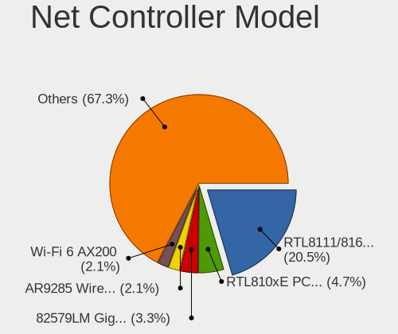

| Model                                                                   | Computers | Percent |
|-------------------------------------------------------------------------|-----------|---------|
| Realtek RTL8111/8168/8411 PCI Express Gigabit Ethernet Controller       | 196       | 22.4%   |
| Realtek RTL810xE PCI Express Fast Ethernet controller                   | 44        | 5.03%   |
| Intel Wi-Fi 6 AX200                                                     | 23        | 2.63%   |
| Intel 82579LM Gigabit Network Connection (Lewisville)                   | 19        | 2.17%   |
| Intel Ethernet Connection (2) I219-V                                    | 17        | 1.94%   |
| Qualcomm Atheros AR9485 Wireless Network Adapter                        | 16        | 1.83%   |
| Qualcomm Atheros AR9285 Wireless Network Adapter (PCI-Express)          | 15        | 1.71%   |
| Realtek RTL8821CE 802.11ac PCIe Wireless Network Adapter                | 11        | 1.26%   |
| Realtek RTL8153 Gigabit Ethernet Adapter                                | 11        | 1.26%   |
| Qualcomm Atheros QCA9565 / AR9565 Wireless Network Adapter              | 11        | 1.26%   |
| Qualcomm Atheros QCA9377 802.11ac Wireless Network Adapter              | 11        | 1.26%   |
| Intel Wireless 8265 / 8275                                              | 11        | 1.26%   |
| Intel Wireless 7260                                                     | 10        | 1.14%   |
| Intel Ethernet Connection I217-LM                                       | 10        | 1.14%   |
| Realtek RTL8188CE 802.11b/g/n WiFi Adapter                              | 9         | 1.03%   |
| Intel Wi-Fi 6 AX201                                                     | 9         | 1.03%   |
| Intel Centrino Advanced-N 6205 [Taylor Peak]                            | 9         | 1.03%   |
| Intel Cannon Lake PCH CNVi WiFi                                         | 9         | 1.03%   |
| Qualcomm Atheros QCA6174 802.11ac Wireless Network Adapter              | 8         | 0.91%   |
| Qualcomm Atheros AR242x / AR542x Wireless Network Adapter (PCI-Express) | 8         | 0.91%   |
| Marvell Group 88E8040 PCI-E Fast Ethernet Controller                    | 7         | 0.8%    |
| Intel Wireless 8260                                                     | 7         | 0.8%    |
| Intel PRO/Wireless 3945ABG [Golan] Network Connection                   | 7         | 0.8%    |
| Broadcom BCM4313 802.11bgn Wireless Network Adapter                     | 7         | 0.8%    |
| Realtek RTL8822CE 802.11ac PCIe Wireless Network Adapter                | 6         | 0.69%   |
| Realtek RTL8723BE PCIe Wireless Network Adapter                         | 6         | 0.69%   |
| Nvidia MCP61 Ethernet                                                   | 6         | 0.69%   |
| Intel Ethernet Connection (2) I218-V                                    | 6         | 0.69%   |
| Intel Dual Band Wireless-AC 3168NGW [Stone Peak]                        | 6         | 0.69%   |
| Realtek RTL88x2bu [AC1200 Techkey]                                      | 5         | 0.57%   |
| Realtek RTL8822BE 802.11a/b/g/n/ac WiFi adapter                         | 5         | 0.57%   |
| Realtek 802.11ac NIC                                                    | 5         | 0.57%   |
| Qualcomm Atheros AR9271 802.11n                                         | 5         | 0.57%   |
| Qualcomm Atheros AR93xx Wireless Network Adapter                        | 5         | 0.57%   |
| Qualcomm Atheros AR8151 v2.0 Gigabit Ethernet                           | 5         | 0.57%   |
| Qualcomm Atheros AR8121/AR8113/AR8114 Gigabit or Fast Ethernet          | 5         | 0.57%   |
| Intel Wireless 3165                                                     | 5         | 0.57%   |
| Intel Ethernet Connection I219-LM                                       | 5         | 0.57%   |
| Intel Ethernet Connection I217-V                                        | 5         | 0.57%   |
| Intel Ethernet Connection (2) I219-LM                                   | 5         | 0.57%   |
| Intel Centrino Wireless-N 1000 [Condor Peak]                            | 5         | 0.57%   |
| Broadcom BCM43142 802.11b/g/n                                           | 5         | 0.57%   |
| Realtek RTL8125 2.5GbE Controller                                       | 4         | 0.46%   |
| Realtek RTL-8100/8101L/8139 PCI Fast Ethernet Adapter                   | 4         | 0.46%   |
| Ralink RT2870/RT3070 Wireless Adapter                                   | 4         | 0.46%   |
| Ralink MT7601U Wireless Adapter                                         | 4         | 0.46%   |
| Ralink RT5390 Wireless 802.11n 1T/1R PCIe                               | 4         | 0.46%   |
| Qualcomm Atheros AR9287 Wireless Network Adapter (PCI-Express)          | 4         | 0.46%   |
| Intel Wireless-AC 9260                                                  | 4         | 0.46%   |
| Intel I210 Gigabit Network Connection                                   | 4         | 0.46%   |
| Intel Centrino Wireless-N 2230                                          | 4         | 0.46%   |
| Broadcom Limited BCM4312 802.11b/g LP-PHY                               | 4         | 0.46%   |
| VIA VT6102/VT6103 [Rhine-II]                                            | 3         | 0.34%   |
| Samsung Galaxy series, misc. (tethering mode)                           | 3         | 0.34%   |
| Realtek RTL8812AU 802.11a/b/g/n/ac 2T2R DB WLAN Adapter                 | 3         | 0.34%   |
| Realtek RTL8192EU 802.11b/g/n WLAN Adapter                              | 3         | 0.34%   |
| Realtek RTL8192CE PCIe Wireless Network Adapter                         | 3         | 0.34%   |
| Realtek RTL8188EUS 802.11n Wireless Network Adapter                     | 3         | 0.34%   |
| Realtek RTL8188EE Wireless Network Adapter                              | 3         | 0.34%   |
| Qualcomm Atheros Killer E220x Gigabit Ethernet Controller               | 3         | 0.34%   |

Wireless Vendor
---------------

Wireless vendors

| Vendor                          | Computers | Percent |
|---------------------------------|-----------|---------|
| Intel                           | 140       | 35.81%  |
| Qualcomm Atheros                | 84        | 21.48%  |
| Realtek Semiconductor           | 80        | 20.46%  |
| Broadcom                        | 25        | 6.39%   |
| Ralink Technology               | 12        | 3.07%   |
| Ralink                          | 9         | 2.3%    |
| Broadcom Limited                | 8         | 2.05%   |
| Qualcomm Atheros Communications | 5         | 1.28%   |
| TP-Link                         | 4         | 1.02%   |
| NetGear                         | 4         | 1.02%   |
| Sierra Wireless                 | 3         | 0.77%   |
| Microsoft                       | 3         | 0.77%   |
| Mercucys                        | 2         | 0.51%   |
| Edimax Technology               | 2         | 0.51%   |
| D-Link System                   | 2         | 0.51%   |
| AVM                             | 2         | 0.51%   |
| ASUSTek Computer                | 2         | 0.51%   |
| Qualcomm                        | 1         | 0.26%   |
| MediaTek                        | 1         | 0.26%   |
| Fujitsu Siemens Computers       | 1         | 0.26%   |
| D-Link                          | 1         | 0.26%   |

Wireless Model
--------------

Wireless models

| Model                                                                   | Computers | Percent |
|-------------------------------------------------------------------------|-----------|---------|
| Intel Wi-Fi 6 AX200                                                     | 23        | 5.85%   |
| Qualcomm Atheros AR9485 Wireless Network Adapter                        | 16        | 4.07%   |
| Qualcomm Atheros AR9285 Wireless Network Adapter (PCI-Express)          | 15        | 3.82%   |
| Realtek RTL8821CE 802.11ac PCIe Wireless Network Adapter                | 11        | 2.8%    |
| Qualcomm Atheros QCA9565 / AR9565 Wireless Network Adapter              | 11        | 2.8%    |
| Qualcomm Atheros QCA9377 802.11ac Wireless Network Adapter              | 11        | 2.8%    |
| Intel Wireless 8265 / 8275                                              | 11        | 2.8%    |
| Intel Wireless 7260                                                     | 10        | 2.54%   |
| Realtek RTL8188CE 802.11b/g/n WiFi Adapter                              | 9         | 2.29%   |
| Intel Wi-Fi 6 AX201                                                     | 9         | 2.29%   |
| Intel Centrino Advanced-N 6205 [Taylor Peak]                            | 9         | 2.29%   |
| Intel Cannon Lake PCH CNVi WiFi                                         | 9         | 2.29%   |
| Qualcomm Atheros QCA6174 802.11ac Wireless Network Adapter              | 8         | 2.04%   |
| Qualcomm Atheros AR242x / AR542x Wireless Network Adapter (PCI-Express) | 8         | 2.04%   |
| Intel Wireless 8260                                                     | 7         | 1.78%   |
| Intel PRO/Wireless 3945ABG [Golan] Network Connection                   | 7         | 1.78%   |
| Broadcom BCM4313 802.11bgn Wireless Network Adapter                     | 7         | 1.78%   |
| Realtek RTL8822CE 802.11ac PCIe Wireless Network Adapter                | 6         | 1.53%   |
| Realtek RTL8723BE PCIe Wireless Network Adapter                         | 6         | 1.53%   |
| Intel Dual Band Wireless-AC 3168NGW [Stone Peak]                        | 6         | 1.53%   |
| Realtek RTL88x2bu [AC1200 Techkey]                                      | 5         | 1.27%   |
| Realtek RTL8822BE 802.11a/b/g/n/ac WiFi adapter                         | 5         | 1.27%   |
| Realtek 802.11ac NIC                                                    | 5         | 1.27%   |
| Qualcomm Atheros AR9271 802.11n                                         | 5         | 1.27%   |
| Qualcomm Atheros AR93xx Wireless Network Adapter                        | 5         | 1.27%   |
| Intel Wireless 3165                                                     | 5         | 1.27%   |
| Intel Centrino Wireless-N 1000 [Condor Peak]                            | 5         | 1.27%   |
| Broadcom BCM43142 802.11b/g/n                                           | 5         | 1.27%   |
| Ralink RT2870/RT3070 Wireless Adapter                                   | 4         | 1.02%   |
| Ralink MT7601U Wireless Adapter                                         | 4         | 1.02%   |
| Ralink RT5390 Wireless 802.11n 1T/1R PCIe                               | 4         | 1.02%   |
| Qualcomm Atheros AR9287 Wireless Network Adapter (PCI-Express)          | 4         | 1.02%   |
| Intel Wireless-AC 9260                                                  | 4         | 1.02%   |
| Intel Centrino Wireless-N 2230                                          | 4         | 1.02%   |
| Broadcom Limited BCM4312 802.11b/g LP-PHY                               | 4         | 1.02%   |
| Realtek RTL8812AU 802.11a/b/g/n/ac 2T2R DB WLAN Adapter                 | 3         | 0.76%   |
| Realtek RTL8192EU 802.11b/g/n WLAN Adapter                              | 3         | 0.76%   |
| Realtek RTL8192CE PCIe Wireless Network Adapter                         | 3         | 0.76%   |
| Realtek RTL8188EUS 802.11n Wireless Network Adapter                     | 3         | 0.76%   |
| Realtek RTL8188EE Wireless Network Adapter                              | 3         | 0.76%   |
| Qualcomm Atheros AR928X Wireless Network Adapter (PCI-Express)          | 3         | 0.76%   |
| Intel Ice Lake-LP PCH CNVi WiFi                                         | 3         | 0.76%   |
| Intel Comet Lake PCH-LP CNVi WiFi                                       | 3         | 0.76%   |
| Intel Centrino Wireless-N 1030 [Rainbow Peak]                           | 3         | 0.76%   |
| Intel Centrino Advanced-N 6200                                          | 3         | 0.76%   |
| Broadcom BCM4312 802.11b/g LP-PHY                                       | 3         | 0.76%   |
| TP-Link TL-WN823N v2/v3 [Realtek RTL8192EU]                             | 2         | 0.51%   |
| Realtek RTL8821AE 802.11ac PCIe Wireless Network Adapter                | 2         | 0.51%   |
| Realtek RTL8723BU 802.11b/g/n WLAN Adapter                              | 2         | 0.51%   |
| Realtek RTL8191SU 802.11n WLAN Adapter                                  | 2         | 0.51%   |
| Realtek RTL8188SU 802.11n WLAN Adapter                                  | 2         | 0.51%   |
| Realtek RTL8187B Wireless 802.11g 54Mbps Network Adapter                | 2         | 0.51%   |
| Realtek 802.11n                                                         | 2         | 0.51%   |
| Ralink RT5370 Wireless Adapter                                          | 2         | 0.51%   |
| Qualcomm Atheros AR9462 Wireless Network Adapter                        | 2         | 0.51%   |
| Microsoft Xbox 360 Wireless Adapter                                     | 2         | 0.51%   |
| Intel Wireless 7265                                                     | 2         | 0.51%   |
| Intel PRO/Wireless 5100 AGN [Shiloh] Network Connection                 | 2         | 0.51%   |
| Intel Comet Lake PCH CNVi WiFi                                          | 2         | 0.51%   |
| Intel Centrino Wireless-N 130                                           | 2         | 0.51%   |

Ethernet Vendor
---------------

Ethernet vendors

| Vendor                                 | Computers | Percent |
|----------------------------------------|-----------|---------|
| Realtek Semiconductor                  | 259       | 56.18%  |
| Intel                                  | 105       | 22.78%  |
| Qualcomm Atheros                       | 30        | 6.51%   |
| Broadcom                               | 17        | 3.69%   |
| Marvell Technology Group               | 14        | 3.04%   |
| Nvidia                                 | 9         | 1.95%   |
| Samsung Electronics                    | 5         | 1.08%   |
| VIA Technologies                       | 3         | 0.65%   |
| Broadcom Limited                       | 3         | 0.65%   |
| Xiaomi                                 | 2         | 0.43%   |
| Sony Ericsson Mobile Communications AB | 2         | 0.43%   |
| Silicon Integrated Systems [SiS]       | 2         | 0.43%   |
| D-Link System                          | 2         | 0.43%   |
| Qualcomm                               | 1         | 0.22%   |
| Lenovo                                 | 1         | 0.22%   |
| ICS Advent                             | 1         | 0.22%   |
| Huawei Technologies                    | 1         | 0.22%   |
| Google                                 | 1         | 0.22%   |
| D-Link                                 | 1         | 0.22%   |
| ASIX Electronics                       | 1         | 0.22%   |
| Apple                                  | 1         | 0.22%   |

Ethernet Model
--------------

Ethernet models

| Model                                                             | Computers | Percent |
|-------------------------------------------------------------------|-----------|---------|
| Realtek RTL8111/8168/8411 PCI Express Gigabit Ethernet Controller | 196       | 41.97%  |
| Realtek RTL810xE PCI Express Fast Ethernet controller             | 44        | 9.42%   |
| Intel 82579LM Gigabit Network Connection (Lewisville)             | 19        | 4.07%   |
| Intel Ethernet Connection (2) I219-V                              | 17        | 3.64%   |
| Realtek RTL8153 Gigabit Ethernet Adapter                          | 11        | 2.36%   |
| Intel Ethernet Connection I217-LM                                 | 10        | 2.14%   |
| Marvell Group 88E8040 PCI-E Fast Ethernet Controller              | 7         | 1.5%    |
| Nvidia MCP61 Ethernet                                             | 6         | 1.28%   |
| Intel Ethernet Connection (2) I218-V                              | 6         | 1.28%   |
| Qualcomm Atheros AR8151 v2.0 Gigabit Ethernet                     | 5         | 1.07%   |
| Qualcomm Atheros AR8121/AR8113/AR8114 Gigabit or Fast Ethernet    | 5         | 1.07%   |
| Intel Ethernet Connection I219-LM                                 | 5         | 1.07%   |
| Intel Ethernet Connection I217-V                                  | 5         | 1.07%   |
| Intel Ethernet Connection (2) I219-LM                             | 5         | 1.07%   |
| Realtek RTL8125 2.5GbE Controller                                 | 4         | 0.86%   |
| Realtek RTL-8100/8101L/8139 PCI Fast Ethernet Adapter             | 4         | 0.86%   |
| Intel I210 Gigabit Network Connection                             | 4         | 0.86%   |
| VIA VT6102/VT6103 [Rhine-II]                                      | 3         | 0.64%   |
| Samsung Galaxy series, misc. (tethering mode)                     | 3         | 0.64%   |
| Qualcomm Atheros Killer E220x Gigabit Ethernet Controller         | 3         | 0.64%   |
| Qualcomm Atheros AR8161 Gigabit Ethernet                          | 3         | 0.64%   |
| Intel Ethernet Controller I225-V                                  | 3         | 0.64%   |
| Intel Ethernet Connection I218-LM                                 | 3         | 0.64%   |
| Intel 82577LM Gigabit Network Connection                          | 3         | 0.64%   |
| Intel 82567LM-3 Gigabit Network Connection                        | 3         | 0.64%   |
| Broadcom NetLink BCM5906M Fast Ethernet PCI Express               | 3         | 0.64%   |
| Samsung GT-I9070 (network tethering, USB debugging enabled)       | 2         | 0.43%   |
| Realtek RTL8169 PCI Gigabit Ethernet Controller                   | 2         | 0.43%   |
| Qualcomm Atheros QCA8171 Gigabit Ethernet                         | 2         | 0.43%   |
| Qualcomm Atheros Killer E2400 Gigabit Ethernet Controller         | 2         | 0.43%   |
| Qualcomm Atheros AR8162 Fast Ethernet                             | 2         | 0.43%   |
| Marvell Group 88E8071 PCI-E Gigabit Ethernet Controller           | 2         | 0.43%   |
| Marvell Group 88E8053 PCI-E Gigabit Ethernet Controller           | 2         | 0.43%   |
| Intel NM10/ICH7 Family LAN Controller                             | 2         | 0.43%   |
| Intel I211 Gigabit Network Connection                             | 2         | 0.43%   |
| Intel Ethernet Connection (7) I219-LM                             | 2         | 0.43%   |
| Intel Ethernet Connection (4) I219-V                              | 2         | 0.43%   |
| Intel Ethernet Connection (4) I219-LM                             | 2         | 0.43%   |
| Intel 82579V Gigabit Network Connection                           | 2         | 0.43%   |
| Intel 82574L Gigabit Network Connection                           | 2         | 0.43%   |
| Broadcom NetXtreme BCM5764M Gigabit Ethernet PCIe                 | 2         | 0.43%   |
| Broadcom NetLink BCM57785 Gigabit Ethernet PCIe                   | 2         | 0.43%   |
| Broadcom NetLink BCM57781 Gigabit Ethernet PCIe                   | 2         | 0.43%   |
| Broadcom Limited NetLink BCM5787M Gigabit Ethernet PCI Express    | 2         | 0.43%   |
| Xiaomi Mi/Redmi series (RNDIS)                                    | 1         | 0.21%   |
| Xiaomi Mi/Redmi series (RNDIS + ADB)                              | 1         | 0.21%   |
| Sony Ericsson Mobile AB F3311                                     | 1         | 0.21%   |
| Sony Ericsson Mobile AB E5603                                     | 1         | 0.21%   |
| Silicon Integrated Systems [SiS] SiS900 PCI Fast Ethernet         | 1         | 0.21%   |
| Silicon Integrated Systems [SiS] 191 Gigabit Ethernet Adapter     | 1         | 0.21%   |
| Qualcomm U693CL                                                   | 1         | 0.21%   |
| Qualcomm Atheros QCA8172 Fast Ethernet                            | 1         | 0.21%   |
| Qualcomm Atheros Killer E2500 Gigabit Ethernet Controller         | 1         | 0.21%   |
| Qualcomm Atheros Attansic L2 Fast Ethernet                        | 1         | 0.21%   |
| Qualcomm Atheros Attansic L1 Gigabit Ethernet                     | 1         | 0.21%   |
| Qualcomm Atheros AR8152 v1.1 Fast Ethernet                        | 1         | 0.21%   |
| Qualcomm Atheros AR8151 v1.0 Gigabit Ethernet                     | 1         | 0.21%   |
| Qualcomm Atheros AR8132 Fast Ethernet                             | 1         | 0.21%   |
| Qualcomm Atheros AR8131 Gigabit Ethernet                          | 1         | 0.21%   |
| Nvidia MCP77 Ethernet                                             | 1         | 0.21%   |

Net Controller Kind
-------------------

Ethernet, WiFi or modem

| Kind     | Computers | Percent |
|----------|-----------|---------|
| Ethernet | 439       | 53.41%  |
| WiFi     | 368       | 44.77%  |
| Modem    | 13        | 1.58%   |
| Unknown  | 2         | 0.24%   |

Used Controller
---------------

Currently used network controller

| Kind     | Computers | Percent |
|----------|-----------|---------|
| Ethernet | 348       | 51.71%  |
| WiFi     | 322       | 47.85%  |
| Modem    | 3         | 0.45%   |

NICs
----

Total network controllers on board

| Total | Computers | Percent |
|-------|-----------|---------|
| 2     | 265       | 54.19%  |
| 1     | 198       | 40.49%  |
| 0     | 15        | 3.07%   |
| 3     | 10        | 2.04%   |
| 4     | 1         | 0.2%    |

IPv6
----

IPv6 vs IPv4

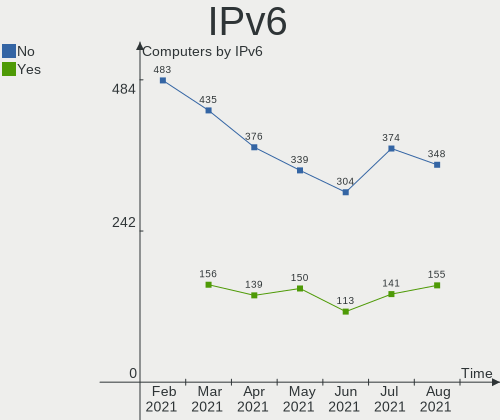

| Used | Computers | Percent |
|------|-----------|---------|
| No   | 339       | 69.33%  |
| Yes  | 150       | 30.67%  |

Memory Vendor
-------------

Memory module vendors

| Vendor              | Computers | Percent |
|---------------------|-----------|---------|
| Samsung Electronics | 51        | 24.4%   |
| SK Hynix            | 28        | 13.4%   |
| Kingston            | 23        | 11%     |
| Unknown             | 22        | 10.53%  |
| Crucial             | 17        | 8.13%   |
| Corsair             | 13        | 6.22%   |
| Micron Technology   | 12        | 5.74%   |
| G.Skill             | 7         | 3.35%   |
| Team                | 5         | 2.39%   |
| A-DATA Technology   | 5         | 2.39%   |
| Nanya Technology    | 4         | 1.91%   |
| Ramaxel Technology  | 3         | 1.44%   |
| Unknown (ABCD)      | 2         | 0.96%   |
| Patriot             | 2         | 0.96%   |
| Elpida              | 2         | 0.96%   |
| AMD                 | 2         | 0.96%   |
| Sesame              | 1         | 0.48%   |
| Ramos Technology    | 1         | 0.48%   |
| Qimonda             | 1         | 0.48%   |
| PNY                 | 1         | 0.48%   |
| OLOY                | 1         | 0.48%   |
| Kllisre             | 1         | 0.48%   |
| GOODRAM             | 1         | 0.48%   |
| Goldkey             | 1         | 0.48%   |
| Carry               | 1         | 0.48%   |
| Apacer              | 1         | 0.48%   |
| 3235CB0010E4        | 1         | 0.48%   |

Memory Model
------------

Memory module models

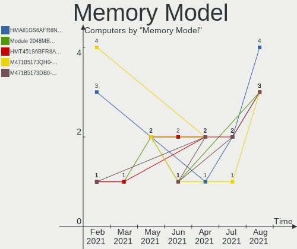

| Model                                                            | Computers | Percent |
|------------------------------------------------------------------|-----------|---------|
| Samsung RAM M471A5244CB0-CTD 4GB SODIMM DDR4 2667MT/s            | 4         | 1.69%   |
| Team RAM TEAMGROUP-UD4-3600 16384MB DIMM DDR4 3600MT/s           | 3         | 1.27%   |
| SK Hynix RAM HMT351S6CFR8C-PB 4GB SODIMM DDR3 1600MT/s           | 3         | 1.27%   |
| SK Hynix RAM HMA81GS6CJR8N-VK 8GB SODIMM DDR4 2667MT/s           | 3         | 1.27%   |
| Samsung RAM M471B5273DH0-CH9 4GB SODIMM DDR3 1334MT/s            | 3         | 1.27%   |
| Samsung RAM M471A5244CB0-CWE 4GB SODIMM DDR4 3200MT/s            | 3         | 1.27%   |
| Unknown RAM Module 2048MB SODIMM DDR2 667MT/s                    | 2         | 0.85%   |
| Unknown RAM Module 2048MB DIMM DDR3 1333MT/s                     | 2         | 0.85%   |
| Unknown (ABCD) RAM 123456789012345678 4GB SODIMM LPDDR4 2400MT/s | 2         | 0.85%   |
| SK Hynix RAM HMT451S6BFR8A-PB 4GB SODIMM DDR3 1600MT/s           | 2         | 0.85%   |
| SK Hynix RAM HMA851S6AFR6N-UH 4GB SODIMM DDR4 2667MT/s           | 2         | 0.85%   |
| Samsung RAM M471B5674QH0-YK0 2GB SODIMM DDR3 1600MT/s            | 2         | 0.85%   |
| Samsung RAM M471B5673FH0-CH9 2GB SODIMM DDR3 1334MT/s            | 2         | 0.85%   |
| Samsung RAM M471B5273CH0-CH9 4GB SODIMM DDR3 1334MT/s            | 2         | 0.85%   |
| Samsung RAM M471B5173QH0-YK0 4GB SODIMM DDR3 1600MT/s            | 2         | 0.85%   |
| Samsung RAM M471A2K43DB1-CWE 16384MB SODIMM DDR4 3200MT/s        | 2         | 0.85%   |
| Samsung RAM M471A1K43DB1-CWE 8192MB SODIMM DDR4 3200MT/s         | 2         | 0.85%   |
| Micron RAM 4ATF51264HZ-2G6E1 4096MB SODIMM DDR4 2667MT/s         | 2         | 0.85%   |
| Kingston RAM KHX3200C16D4/8GX 8GB DIMM DDR4 3533MT/s             | 2         | 0.85%   |
| Kingston RAM 99U5469-046.A00LF 4GB SODIMM DDR3 1333MT/s          | 2         | 0.85%   |
| Crucial RAM CT102464BF160B.M16 8192MB SODIMM DDR3 1600MT/s       | 2         | 0.85%   |
| Crucial RAM CT102464BF160B.C16 8192MB SODIMM DDR3 1600MT/s       | 2         | 0.85%   |
| Corsair RAM CMZ16GX3M2A1866C10 8192MB DIMM DDR3 1333MT/s         | 2         | 0.85%   |
| Unknown SODIMM 2048MB SODIMM DDR2 533MT/s                        | 1         | 0.42%   |
| Unknown RAM Module 8192MB Row Of Chips LPDDR4 4267MT/s           | 1         | 0.42%   |
| Unknown RAM Module 8192MB DIMM DDR3 1066MT/s                     | 1         | 0.42%   |
| Unknown RAM Module 512MB DIMM DDR 200MT/s                        | 1         | 0.42%   |
| Unknown RAM Module 4GB DIMM 1333MT/s                             | 1         | 0.42%   |
| Unknown RAM Module 4096MB SODIMM DDR3 1600MT/s                   | 1         | 0.42%   |
| Unknown RAM Module 4096MB SODIMM DDR3                            | 1         | 0.42%   |
| Unknown RAM Module 4096MB Row Of Chips LPDDR4 4267MT/s           | 1         | 0.42%   |
| Unknown RAM Module 4096MB DIMM 1333MT/s                          | 1         | 0.42%   |
| Unknown RAM Module 2GB SODIMM DDR3 1333MT/s                      | 1         | 0.42%   |
| Unknown RAM Module 2048MB SODIMM DDR3 1066MT/s                   | 1         | 0.42%   |
| Unknown RAM Module 2048MB DIMM DDR2 667MT/s                      | 1         | 0.42%   |
| Unknown RAM Module 2048MB DIMM DDR2 52217MT/s                    | 1         | 0.42%   |
| Unknown RAM Module 16384MB SODIMM DDR4 2400MT/s                  | 1         | 0.42%   |
| Unknown RAM Module 1024MB SODIMM DRAM                            | 1         | 0.42%   |
| Unknown RAM Module 1024MB SODIMM DDR3 1333MT/s                   | 1         | 0.42%   |
| Unknown RAM Module 1024MB SODIMM DDR2                            | 1         | 0.42%   |
| Unknown RAM Module 1024MB DIMM DDR 200MT/s                       | 1         | 0.42%   |
| Unknown RAM Module 1024MB DIMM 52217MT/s                         | 1         | 0.42%   |
| Unknown RAM 1866 CL10 Series 8192MB DIMM DDR3 933MT/s            | 1         | 0.42%   |
| Team RAM TEAMGROUP-UD4-3000 8GB DIMM DDR4 3000MT/s               | 1         | 0.42%   |
| Team RAM Elite-1333 4GB DIMM DDR3 1333MT/s                       | 1         | 0.42%   |
| SK Hynix RAM Module 8192MB SODIMM DDR4 2133MT/s                  | 1         | 0.42%   |
| SK Hynix RAM Module 4096MB DIMM DDR3 1600MT/s                    | 1         | 0.42%   |
| SK Hynix RAM HYMP125U 2048MB DIMM DDR2 800MT/s                   | 1         | 0.42%   |
| SK Hynix RAM HYMP112S64CP6-S6 1024MB SODIMM DDR 975MT/s          | 1         | 0.42%   |
| SK Hynix RAM HMT451U6BFR8A-PB 4096MB DIMM DDR3 1600MT/s          | 1         | 0.42%   |
| SK Hynix RAM HMT451S6MFR8C-PB 4096MB SODIMM DDR3 1600MT/s        | 1         | 0.42%   |
| SK Hynix RAM HMT451S6MFR8A-PB 4096MB SODIMM DDR3 1600MT/s        | 1         | 0.42%   |
| SK Hynix RAM HMT451S6MFR6A-PB 4096MB SODIMM DDR3 1600MT/s        | 1         | 0.42%   |
| SK Hynix RAM HMT451S6DFR8A-PB 4096MB SODIMM DDR3 1600MT/s        | 1         | 0.42%   |
| SK Hynix RAM HMT351U6EFR8C-PB 4096MB DIMM DDR3 1800MT/s          | 1         | 0.42%   |
| SK Hynix RAM HMT351U6CFR8C-PB 4096MB DIMM DDR3 1800MT/s          | 1         | 0.42%   |
| SK Hynix RAM HMT351S6CFR8C-H9 4096MB SODIMM DDR3 1333MT/s        | 1         | 0.42%   |
| SK Hynix RAM HMP125U6EFR8C-S6 2048MB DIMM DDR2 800MT/s           | 1         | 0.42%   |
| SK Hynix RAM HMAA1GS6CMR8N-VK 8GB Row Of Chips DDR4 2667MT/s     | 1         | 0.42%   |
| SK Hynix RAM HMAA1GS6CMR6N-VK 8192MB SODIMM DDR4 2667MT/s        | 1         | 0.42%   |

Memory Kind
-----------

Memory module kinds

| Kind    | Computers | Percent |
|---------|-----------|---------|
| DDR4    | 78        | 41.71%  |
| DDR3    | 73        | 39.04%  |
| DDR2    | 16        | 8.56%   |
| LPDDR4  | 8         | 4.28%   |
| SDRAM   | 6         | 3.21%   |
| Unknown | 3         | 1.6%    |
| LPDDR3  | 1         | 0.53%   |
| DRAM    | 1         | 0.53%   |
| DDR     | 1         | 0.53%   |

Memory Form Factor
------------------

Physical design of the memory module

| Name         | Computers | Percent |
|--------------|-----------|---------|
| SODIMM       | 103       | 57.22%  |
| DIMM         | 69        | 38.33%  |
| Row Of Chips | 8         | 4.44%   |

Memory Size
-----------

Memory module size

| Size  | Computers | Percent |
|-------|-----------|---------|
| 4096  | 70        | 34.15%  |
| 8192  | 65        | 31.71%  |
| 2048  | 33        | 16.1%   |
| 16384 | 20        | 9.76%   |
| 1024  | 13        | 6.34%   |
| 32768 | 3         | 1.46%   |
| 512   | 1         | 0.49%   |

Memory Speed
------------

Memory module speed

| Speed   | Computers | Percent |
|---------|-----------|---------|
| 1600    | 47        | 23.5%   |
| 2667    | 28        | 14%     |
| 3200    | 18        | 9%      |
| 2400    | 15        | 7.5%    |
| 1333    | 15        | 7.5%    |
| 2133    | 13        | 6.5%    |
| 1334    | 9         | 4.5%    |
| 800     | 6         | 3%      |
| 4267    | 4         | 2%      |
| 3600    | 4         | 2%      |
| 1867    | 4         | 2%      |
| 667     | 4         | 2%      |
| 4199    | 3         | 1.5%    |
| 3000    | 3         | 1.5%    |
| Unknown | 3         | 1.5%    |
| 3533    | 2         | 1%      |
| 2933    | 2         | 1%      |
| 2048    | 2         | 1%      |
| 1866    | 2         | 1%      |
| 1066    | 2         | 1%      |
| 975     | 2         | 1%      |
| 533     | 2         | 1%      |
| 52217   | 1         | 0.5%    |
| 49926   | 1         | 0.5%    |
| 3733    | 1         | 0.5%    |
| 3466    | 1         | 0.5%    |
| 2934    | 1         | 0.5%    |
| 1800    | 1         | 0.5%    |
| 1639    | 1         | 0.5%    |
| 1200    | 1         | 0.5%    |
| 1067    | 1         | 0.5%    |
| 200     | 1         | 0.5%    |

Sound Vendor
------------

Sound card vendors

| Vendor                           | Computers | Percent |
|----------------------------------|-----------|---------|
| Intel                            | 349       | 54.11%  |
| AMD                              | 128       | 19.84%  |
| Nvidia                           | 108       | 16.74%  |
| C-Media Electronics              | 14        | 2.17%   |
| Logitech                         | 6         | 0.93%   |
| Plantronics                      | 4         | 0.62%   |
| VIA Technologies                 | 3         | 0.47%   |
| Texas Instruments                | 3         | 0.47%   |
| GN Netcom                        | 3         | 0.47%   |
| Generalplus Technology           | 3         | 0.47%   |
| Creative Labs                    | 3         | 0.47%   |
| Silicon Integrated Systems [SiS] | 2         | 0.31%   |
| Razer USA                        | 2         | 0.31%   |
| XMOS                             | 1         | 0.16%   |
| Unknown                          | 1         | 0.16%   |
| ULi Electronics                  | 1         | 0.16%   |
| Syntek                           | 1         | 0.16%   |
| Sony                             | 1         | 0.16%   |
| SHARKOON Technologies            | 1         | 0.16%   |
| ROCCAT                           | 1         | 0.16%   |
| Kingston Technology              | 1         | 0.16%   |
| GYROCOM C&C                      | 1         | 0.16%   |
| Guillemot                        | 1         | 0.16%   |
| Griffin Technology               | 1         | 0.16%   |
| Fry's Electronics                | 1         | 0.16%   |
| FiiO Electronics Technology      | 1         | 0.16%   |
| Ensoniq                          | 1         | 0.16%   |
| Creative Technology              | 1         | 0.16%   |
| Conexant Systems                 | 1         | 0.16%   |
| ASUSTek Computer                 | 1         | 0.16%   |

Sound Model
-----------

Sound card models

| Model                                                                                             | Computers | Percent |
|---------------------------------------------------------------------------------------------------|-----------|---------|
| Intel 6 Series/C200 Series Chipset Family High Definition Audio Controller                        | 47        | 6.18%   |
| Intel 7 Series/C216 Chipset Family High Definition Audio Controller                               | 37        | 4.87%   |
| Intel 8 Series/C220 Series Chipset High Definition Audio Controller                               | 30        | 3.95%   |
| AMD Family 17h (Models 10h-1fh) HD Audio Controller                                               | 30        | 3.95%   |
| Intel Xeon E3-1200 v3/4th Gen Core Processor HD Audio Controller                                  | 27        | 3.55%   |
| Intel NM10/ICH7 Family High Definition Audio Controller                                           | 25        | 3.29%   |
| Intel 82801I (ICH9 Family) HD Audio Controller                                                    | 23        | 3.03%   |
| AMD SBx00 Azalia (Intel HDA)                                                                      | 23        | 3.03%   |
| Intel Sunrise Point-LP HD Audio                                                                   | 22        | 2.89%   |
| Intel 5 Series/3400 Series Chipset High Definition Audio                                          | 19        | 2.5%    |
| Intel Cannon Lake PCH cAVS                                                                        | 16        | 2.11%   |
| Intel 100 Series/C230 Series Chipset Family HD Audio Controller                                   | 15        | 1.97%   |
| AMD FCH Azalia Controller                                                                         | 15        | 1.97%   |
| Nvidia GK208 HDMI/DP Audio Controller                                                             | 14        | 1.84%   |
| AMD Renoir Radeon High Definition Audio Controller                                                | 14        | 1.84%   |
| AMD Raven/Raven2/Fenghuang HDMI/DP Audio Controller                                               | 14        | 1.84%   |
| Intel Tiger Lake-LP Smart Sound Technology Audio Controller                                       | 13        | 1.71%   |
| AMD Starship/Matisse HD Audio Controller                                                          | 13        | 1.71%   |
| Nvidia GP107GL High Definition Audio Controller                                                   | 12        | 1.58%   |
| Intel 200 Series PCH HD Audio                                                                     | 12        | 1.58%   |
| Intel Haswell-ULT HD Audio Controller                                                             | 10        | 1.32%   |
| Intel 8 Series HD Audio Controller                                                                | 10        | 1.32%   |
| AMD Family 17h (Models 00h-0fh) HD Audio Controller                                               | 10        | 1.32%   |
| Nvidia TU107 GeForce GTX 1650 High Definition Audio Controller                                    | 9         | 1.18%   |
| Intel 82801H (ICH8 Family) HD Audio Controller                                                    | 9         | 1.18%   |
| AMD Oland/Hainan/Cape Verde/Pitcairn HDMI Audio [Radeon HD 7000 Series]                           | 9         | 1.18%   |
| AMD Family 15h (Models 60h-6fh) Audio Controller                                                  | 9         | 1.18%   |
| Nvidia GP106 High Definition Audio Controller                                                     | 7         | 0.92%   |
| Intel Wildcat Point-LP High Definition Audio Controller                                           | 7         | 0.92%   |
| Intel Broadwell-U Audio Controller                                                                | 7         | 0.92%   |
| Intel 9 Series Chipset Family HD Audio Controller                                                 | 7         | 0.92%   |
| Nvidia MCP61 High Definition Audio                                                                | 6         | 0.79%   |
| Nvidia GM206 High Definition Audio Controller                                                     | 6         | 0.79%   |
| Intel Comet Lake PCH-LP cAVS                                                                      | 6         | 0.79%   |
| Intel Atom Processor Z36xxx/Z37xxx Series High Definition Audio Controller                        | 6         | 0.79%   |
| AMD High Definition Audio Controller                                                              | 6         | 0.79%   |
| Nvidia TU106 High Definition Audio Controller                                                     | 5         | 0.66%   |
| Nvidia GK107 HDMI Audio Controller                                                                | 5         | 0.66%   |
| Nvidia GK106 HDMI Audio Controller                                                                | 5         | 0.66%   |
| Intel Ice Lake-LP Smart Sound Technology Audio Controller                                         | 5         | 0.66%   |
| Intel Comet Lake PCH cAVS                                                                         | 5         | 0.66%   |
| Intel Atom/Celeron/Pentium Processor x5-E8000/J3xxx/N3xxx Series High Definition Audio Controller | 5         | 0.66%   |
| Intel 82801JI (ICH10 Family) HD Audio Controller                                                  | 5         | 0.66%   |
| AMD Kabini HDMI/DP Audio                                                                          | 5         | 0.66%   |
| AMD Ellesmere HDMI Audio [Radeon RX 470/480 / 570/580/590]                                        | 5         | 0.66%   |
| AMD Caicos HDMI Audio [Radeon HD 6450 / 7450/8450/8490 OEM / R5 230/235/235X OEM]                 | 5         | 0.66%   |
| AMD Baffin HDMI/DP Audio [Radeon RX 550 640SP / RX 560/560X]                                      | 5         | 0.66%   |
| Nvidia High Definition Audio Controller                                                           | 4         | 0.53%   |
| Nvidia GT216 HDMI Audio Controller                                                                | 4         | 0.53%   |
| Nvidia GP108 High Definition Audio Controller                                                     | 4         | 0.53%   |
| Nvidia GK104 HDMI Audio Controller                                                                | 4         | 0.53%   |
| Nvidia GF108 High Definition Audio Controller                                                     | 4         | 0.53%   |
| Intel Celeron/Pentium Silver Processor High Definition Audio                                      | 4         | 0.53%   |
| Intel Celeron N3350/Pentium N4200/Atom E3900 Series Audio Cluster                                 | 4         | 0.53%   |
| Intel Cannon Point-LP High Definition Audio Controller                                            | 4         | 0.53%   |
| Nvidia GM204 High Definition Audio Controller                                                     | 3         | 0.39%   |
| Intel C610/X99 series chipset HD Audio Controller                                                 | 3         | 0.39%   |
| Intel 82801JD/DO (ICH10 Family) HD Audio Controller                                               | 3         | 0.39%   |
| Generalplus Technology USB Audio Device                                                           | 3         | 0.39%   |
| C-Media Electronics USB Audio Device                                                              | 3         | 0.39%   |

Camera Vendor
-------------

Camera device vendors

| Vendor                                 | Computers | Percent |
|----------------------------------------|-----------|---------|
| Chicony Electronics                    | 60        | 22.14%  |
| Microdia                               | 23        | 8.49%   |
| IMC Networks                           | 20        | 7.38%   |
| Realtek Semiconductor                  | 19        | 7.01%   |
| Acer                                   | 18        | 6.64%   |
| Logitech                               | 15        | 5.54%   |
| Quanta                                 | 14        | 5.17%   |
| Cheng Uei Precision Industry (Foxlink) | 14        | 5.17%   |
| Sunplus Innovation Technology          | 11        | 4.06%   |
| Suyin                                  | 9         | 3.32%   |
| Silicon Motion                         | 7         | 2.58%   |
| Microsoft                              | 6         | 2.21%   |
| Z-Star Microelectronics                | 5         | 1.85%   |
| Ricoh                                  | 5         | 1.85%   |
| Syntek                                 | 4         | 1.48%   |
| Lite-On Technology                     | 4         | 1.48%   |
| Alcor Micro                            | 4         | 1.48%   |
| Samsung Electronics                    | 3         | 1.11%   |
| Generalplus Technology                 | 3         | 1.11%   |
| GEMBIRD                                | 3         | 1.11%   |
| Apple                                  | 3         | 1.11%   |
| Importek                               | 2         | 0.74%   |
| Creative Technology                    | 2         | 0.74%   |
| Arkmicro Technologies                  | 2         | 0.74%   |
| ALi                                    | 2         | 0.74%   |
| Trust                                  | 1         | 0.37%   |
| Novatek Microelectronics               | 1         | 0.37%   |
| Luxvisions Innotech Limited            | 1         | 0.37%   |
| Lenovo                                 | 1         | 0.37%   |
| Intel                                  | 1         | 0.37%   |
| Image Processor                        | 1         | 0.37%   |
| Elecom                                 | 1         | 0.37%   |
| DigiTech                               | 1         | 0.37%   |
| Aveo Technology                        | 1         | 0.37%   |
| Asuscom Network                        | 1         | 0.37%   |
| Alpha Imaging Technology               | 1         | 0.37%   |
| 8SSC20X55495L1GZ04205G1                | 1         | 0.37%   |
| 8SSC20F27114V1SR0AM1M3P                | 1         | 0.37%   |

Camera Model
------------

Camera device models

| Model                                                           | Computers | Percent |
|-----------------------------------------------------------------|-----------|---------|
| Chicony Integrated Camera                                       | 11        | 4.01%   |
| Realtek Integrated_Webcam_HD                                    | 9         | 3.28%   |
| Acer Integrated Camera                                          | 8         | 2.92%   |
| Logitech Webcam C270                                            | 6         | 2.19%   |
| IMC Networks Integrated Camera                                  | 6         | 2.19%   |
| Microsoft LifeCam HD-3000                                       | 4         | 1.46%   |
| Microdia Integrated_Webcam_HD                                   | 4         | 1.46%   |
| IMC Networks USB2.0 HD UVC WebCam                               | 4         | 1.46%   |
| Chicony HD WebCam                                               | 4         | 1.46%   |
| Silicon Motion WebCam SC-13HDL11939N                            | 3         | 1.09%   |
| Samsung Galaxy A5 (MTP)                                         | 3         | 1.09%   |
| Realtek Integrated Webcam                                       | 3         | 1.09%   |
| Quanta HD User Facing                                           | 3         | 1.09%   |
| Microdia Webcam Vitade AF                                       | 3         | 1.09%   |
| Microdia Laptop_Integrated_Webcam_HD                            | 3         | 1.09%   |
| Microdia Camera                                                 | 3         | 1.09%   |
| IMC Networks USB2.0 UVC VGA WebCam                              | 3         | 1.09%   |
| GEMBIRD Generic UVC 1.00 camera [AppoTech AX2311]               | 3         | 1.09%   |
| Chicony VGA Webcam                                              | 3         | 1.09%   |
| Alcor Micro USB 2.0 WebCamera                                   | 3         | 1.09%   |
| Z-Star Webcam                                                   | 2         | 0.73%   |
| Syntek HP Webcam                                                | 2         | 0.73%   |
| Suyin Acer/Lenovo Webcam [CN0316]                               | 2         | 0.73%   |
| Sunplus Full HD webcam                                          | 2         | 0.73%   |
| Ricoh Integrated Webcam                                         | 2         | 0.73%   |
| Realtek Acer 640 x 480 laptop camera                            | 2         | 0.73%   |
| Quanta VGA WebCam                                               | 2         | 0.73%   |
| Quanta HP TrueVision HD Camera                                  | 2         | 0.73%   |
| Quanta HD Webcam                                                | 2         | 0.73%   |
| Microdia Integrated_Webcam_1.3M                                 | 2         | 0.73%   |
| Microdia Integrated Webcam                                      | 2         | 0.73%   |
| Logitech Webcam C310                                            | 2         | 0.73%   |
| Logitech HD Webcam C525                                         | 2         | 0.73%   |
| Lite-On Integrated Camera                                       | 2         | 0.73%   |
| Importek TOSHIBA Web Camera - HD                                | 2         | 0.73%   |
| IMC Networks TOSHIBA Web Camera - HD                            | 2         | 0.73%   |
| IMC Networks HP TrueVision HD Camera                            | 2         | 0.73%   |
| Chicony Webcam                                                  | 2         | 0.73%   |
| Chicony USB2.0 Camera                                           | 2         | 0.73%   |
| Chicony USB 2.0 Camera                                          | 2         | 0.73%   |
| Chicony TOSHIBA Web Camera - HD                                 | 2         | 0.73%   |
| Chicony Lenovo Integrated Camera (0.3MP)                        | 2         | 0.73%   |
| Chicony Lenovo Integrated Camera                                | 2         | 0.73%   |
| Chicony Integrated HP HD Webcam                                 | 2         | 0.73%   |
| Chicony HP TrueVision HD Camera                                 | 2         | 0.73%   |
| Chicony HP HD Camera                                            | 2         | 0.73%   |
| Chicony FJ Camera                                               | 2         | 0.73%   |
| Chicony EasyCamera                                              | 2         | 0.73%   |
| Chicony CNF9055 Toshiba Webcam                                  | 2         | 0.73%   |
| Cheng Uei Precision Industry (Foxlink) HP Wide Vision HD Camera | 2         | 0.73%   |
| Cheng Uei Precision Industry (Foxlink) HP Webcam-101            | 2         | 0.73%   |
| Cheng Uei Precision Industry (Foxlink) HP Truevision HD         | 2         | 0.73%   |
| ALi Gateway Webcam                                              | 2         | 0.73%   |
| Acer Lenovo EasyCamera                                          | 2         | 0.73%   |
| Acer BisonCam, NB Pro                                           | 2         | 0.73%   |
| Z-Star Venus USB2.0 Camera                                      | 1         | 0.36%   |
| Z-Star Namuga 1.3M Webcam                                       | 1         | 0.36%   |
| Z-Star Lenovo USB2.0 UVC Camera                                 | 1         | 0.36%   |
| Trust USB Camera                                                | 1         | 0.36%   |
| Syntek Lenovo EasyCamera                                        | 1         | 0.36%   |

Fingerprint Vendor
------------------

Fingerprint sensor vendors

| Vendor                     | Computers | Percent |
|----------------------------|-----------|---------|
| Validity Sensors           | 16        | 36.36%  |
| Shenzhen Goodix Technology | 9         | 20.45%  |
| Synaptics                  | 8         | 18.18%  |
| Upek                       | 6         | 13.64%  |
| AuthenTec                  | 3         | 6.82%   |
| STMicroelectronics         | 1         | 2.27%   |
| LighTuning Technology      | 1         | 2.27%   |

Fingerprint Model
-----------------

Fingerprint sensor models

| Model                                                  | Computers | Percent |
|--------------------------------------------------------|-----------|---------|
| Upek Biometric Touchchip/Touchstrip Fingerprint Sensor | 6         | 13.64%  |
| Validity Sensors VFS5011 Fingerprint Reader            | 5         | 11.36%  |
| Shenzhen Goodix Fingerprint Reader                     | 5         | 11.36%  |
| Unknown                                                | 5         | 11.36%  |
| Shenzhen Goodix  FingerPrint Device                    | 3         | 6.82%   |
| Validity Sensors VFS495 Fingerprint Reader             | 2         | 4.55%   |
| Validity Sensors VFS491                                | 2         | 4.55%   |
| Validity Sensors VFS471 Fingerprint Reader             | 2         | 4.55%   |
| Validity Sensors Fingerprint scanner                   | 2         | 4.55%   |
| Synaptics Metallica MIS Touch Fingerprint Reader       | 2         | 4.55%   |
| AuthenTec AES2501 Fingerprint Sensor                   | 2         | 4.55%   |
| Validity Sensors VFS101 Fingerprint Reader             | 1         | 2.27%   |
| Validity Sensors VFS 5011 fingerprint sensor           | 1         | 2.27%   |
| Validity Sensors Synaptics WBDI                        | 1         | 2.27%   |
| Synaptics Prometheus MIS Touch Fingerprint Reader      | 1         | 2.27%   |
| STMicroelectronics Fingerprint Reader                  | 1         | 2.27%   |
| Shenzhen Goodix FingerPrint                            | 1         | 2.27%   |
| LighTuning ES603 Swipe Fingerprint Sensor              | 1         | 2.27%   |
| AuthenTec Fingerprint Sensor                           | 1         | 2.27%   |

Chipcard Vendor
---------------

Chipcard module vendors

| Vendor      | Computers | Percent |
|-------------|-----------|---------|
| Broadcom    | 11        | 55%     |
| Alcor Micro | 6         | 30%     |
| O2 Micro    | 1         | 5%      |
| Lenovo      | 1         | 5%      |
| Cherry      | 1         | 5%      |

Chipcard Model
--------------

Chipcard module models

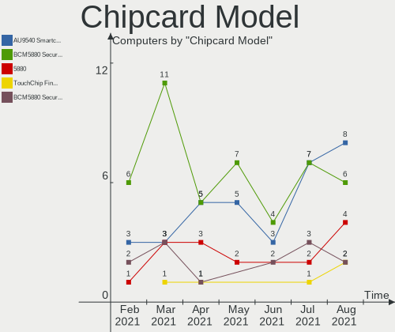

| Model                                          | Computers | Percent |
|------------------------------------------------|-----------|---------|
| Broadcom BCM5880 Secure Applications Processor | 7         | 35%     |
| Alcor Micro AU9540 Smartcard Reader            | 5         | 25%     |
| Broadcom 5880                                  | 2         | 10%     |
| Broadcom 58200                                 | 2         | 10%     |
| O2 Micro OZ776 CCID Smartcard Reader           | 1         | 5%      |
| Lenovo Integrated Smart Card Reader            | 1         | 5%      |
| Cherry SmartCard Reader Keyboard KC 1000 SC    | 1         | 5%      |
| Alcor Micro Watchdata W 1981                   | 1         | 5%      |

Printer Vendor
--------------

Printer device vendors

| Vendor              | Computers | Percent |
|---------------------|-----------|---------|
| Hewlett-Packard     | 6         | 35.29%  |
| Canon               | 6         | 35.29%  |
| Samsung Electronics | 2         | 11.76%  |
| Xerox               | 1         | 5.88%   |
| Seiko Epson         | 1         | 5.88%   |
| Brother Industries  | 1         | 5.88%   |

Printer Model
-------------

Printer device models

| Model                                                 | Computers | Percent |
|-------------------------------------------------------|-----------|---------|
| Xerox Phaser 6180N                                    | 1         | 5.88%   |
| Seiko Epson L395 Series                               | 1         | 5.88%   |
| Samsung ML-1740 Printer                               | 1         | 5.88%   |
| Samsung C48x Series Color Laser Multifunction Printer | 1         | 5.88%   |
| HP Officejet 6600                                     | 1         | 5.88%   |
| HP LaserJet P2015 series                              | 1         | 5.88%   |
| HP LaserJet CP 1025                                   | 1         | 5.88%   |
| HP LaserJet 1020                                      | 1         | 5.88%   |
| HP DeskJet F4100 Printer series                       | 1         | 5.88%   |
| HP Deskjet F2280 series                               | 1         | 5.88%   |
| Canon TS3100 series                                   | 1         | 5.88%   |
| Canon PIXMA MX920 Series                              | 1         | 5.88%   |
| Canon PIXMA MX450 Series                              | 1         | 5.88%   |
| Canon PIXMA MG5500 Series                             | 1         | 5.88%   |
| Canon PIXMA iX6850 Printer                            | 1         | 5.88%   |
| Canon LiDE 400                                        | 1         | 5.88%   |
| Brother DCP-T300                                      | 1         | 5.88%   |

Scanner Vendor
--------------

Scanner device vendors

| Vendor      | Computers | Percent |
|-------------|-----------|---------|
| Seiko Epson | 2         | 50%     |
| Canon       | 2         | 50%     |

Scanner Model
-------------

Scanner device models

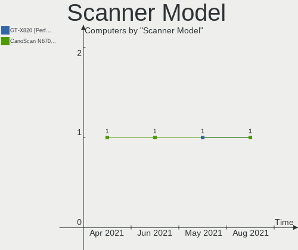

| Model                                       | Computers | Percent |
|---------------------------------------------|-----------|---------|
| Seiko Epson GT-X820 [Perfection V600 Photo] | 1         | 25%     |
| Seiko Epson GT-F600 [Perfection 4180]       | 1         | 25%     |
| Canon CanoScan LIDE 25                      | 1         | 25%     |
| Canon CanoScan                              | 1         | 25%     |

Bluetooth Vendor
----------------

Controller vendors

| Vendor                          | Computers | Percent |
|---------------------------------|-----------|---------|
| Intel                           | 104       | 42.11%  |
| Qualcomm Atheros Communications | 29        | 11.74%  |
| Realtek Semiconductor           | 28        | 11.34%  |
| Cambridge Silicon Radio         | 23        | 9.31%   |
| Broadcom                        | 14        | 5.67%   |
| Lite-On Technology              | 8         | 3.24%   |
| ASUSTek Computer                | 7         | 2.83%   |
| Apple                           | 7         | 2.83%   |
| Toshiba                         | 6         | 2.43%   |
| Hewlett-Packard                 | 5         | 2.02%   |
| Dell                            | 5         | 2.02%   |
| IMC Networks                    | 4         | 1.62%   |
| Foxconn / Hon Hai               | 3         | 1.21%   |
| Realtek                         | 1         | 0.4%    |
| Ralink Technology               | 1         | 0.4%    |
| Conwise Technology              | 1         | 0.4%    |
| Belkin Components               | 1         | 0.4%    |

Bluetooth Model
---------------

Controller models

| Model                                               | Computers | Percent |
|-----------------------------------------------------|-----------|---------|
| Intel Bluetooth Device                              | 29        | 11.74%  |
| Intel Bluetooth wireless interface                  | 28        | 11.34%  |
| Realtek Bluetooth Radio                             | 23        | 9.31%   |
| Cambridge Silicon Radio Bluetooth Dongle (HCI mode) | 23        | 9.31%   |
| Intel AX200 Bluetooth                               | 21        | 8.5%    |
| Intel Bluetooth 9460/9560 Jefferson Peak (JfP)      | 13        | 5.26%   |
| Qualcomm Atheros  Bluetooth Device                  | 12        | 4.86%   |
| Qualcomm Atheros AR3012 Bluetooth 4.0               | 8         | 3.24%   |
| Intel Wireless-AC 3168 Bluetooth                    | 6         | 2.43%   |
| Qualcomm Atheros AR3011 Bluetooth                   | 5         | 2.02%   |
| Lite-On Qualcomm Atheros QCA9377 Bluetooth          | 4         | 1.62%   |
| Intel Wireless-AC 9260 Bluetooth Adapter            | 4         | 1.62%   |
| Toshiba Bluetooth Device                            | 3         | 1.21%   |
| Qualcomm Atheros Bluetooth USB Host Controller      | 3         | 1.21%   |
| Intel Centrino Bluetooth Wireless Transceiver       | 3         | 1.21%   |
| IMC Networks Bluetooth Radio                        | 3         | 1.21%   |
| HP Bluetooth 2.0 Interface [Broadcom BCM2045]       | 3         | 1.21%   |
| Dell DW375 Bluetooth Module                         | 3         | 1.21%   |
| Broadcom BCM2045B (BDC-2.1)                         | 3         | 1.21%   |
| ASUS Broadcom BCM20702A0 Bluetooth                  | 3         | 1.21%   |
| Apple Bluetooth Host Controller                     | 3         | 1.21%   |
| Lite-On Atheros AR3012 Bluetooth                    | 2         | 0.81%   |
| HP Broadcom 2070 Bluetooth Combo                    | 2         | 0.81%   |
| Foxconn / Hon Hai Bluetooth USB Host Controller     | 2         | 0.81%   |
| Apple Bluetooth HCI                                 | 2         | 0.81%   |
| Toshiba Integrated Bluetooth HCI                    | 1         | 0.4%    |
| Toshiba BCM43142A0                                  | 1         | 0.4%    |
| Toshiba Askey Bluetooth Module                      | 1         | 0.4%    |
| Realtek RTL8822BE Bluetooth 4.2 Adapter             | 1         | 0.4%    |
| Realtek RTL8821A Bluetooth                          | 1         | 0.4%    |
| Realtek RTL8723B Bluetooth                          | 1         | 0.4%    |
| Realtek  Bluetooth 4.2 Adapter                      | 1         | 0.4%    |
| Realtek CSR BS8510                                  | 1         | 0.4%    |
| Realtek Bluetooth Radio                             | 1         | 0.4%    |
| Ralink Motorola BC4 Bluetooth 3.0+HS Adapter        | 1         | 0.4%    |
| Qualcomm Atheros AR9462 Bluetooth                   | 1         | 0.4%    |
| Lite-On Broadcom BCM43142A0 Bluetooth Device        | 1         | 0.4%    |
| Lite-On Bluetooth Device                            | 1         | 0.4%    |
| IMC Networks Atheros AR3012 Bluetooth 4.0 Adapter   | 1         | 0.4%    |
| Foxconn / Hon Hai Bluetooth Device                  | 1         | 0.4%    |
| Dell Wireless 360 Bluetooth                         | 1         | 0.4%    |
| Dell BC02 Bluetooth Adapter                         | 1         | 0.4%    |
| Conwise CW6622                                      | 1         | 0.4%    |
| Broadcom HP Portable SoftSailing                    | 1         | 0.4%    |
| Broadcom HP Bluetooth Module                        | 1         | 0.4%    |
| Broadcom BCM43142A0 Bluetooth Device                | 1         | 0.4%    |
| Broadcom BCM43142A0 Bluetooth 4.0                   | 1         | 0.4%    |
| Broadcom BCM20702A0 Bluetooth 4.0                   | 1         | 0.4%    |
| Broadcom BCM20702A0                                 | 1         | 0.4%    |
| Broadcom BCM20702 Bluetooth 4.0 [ThinkPad]          | 1         | 0.4%    |
| Broadcom BCM2070 Bluetooth Device                   | 1         | 0.4%    |
| Broadcom BCM2070 Bluetooth 2.1 + EDR                | 1         | 0.4%    |
| Broadcom BCM2046 Bluetooth Device                   | 1         | 0.4%    |
| Broadcom BCM2045 Bluetooth                          | 1         | 0.4%    |
| Belkin Components Bluetooth Mini Dongle             | 1         | 0.4%    |
| ASUS Qualcomm Bluetooth 4.1                         | 1         | 0.4%    |
| ASUS BT-183 Bluetooth 2.0+EDR adapter               | 1         | 0.4%    |
| ASUS Bluetooth Radio                                | 1         | 0.4%    |
| ASUS BCM20702A0                                     | 1         | 0.4%    |
| Apple Built-in Bluetooth 2.0+EDR HCI                | 1         | 0.4%    |

Unsupported Devices
-------------------

Total unsupported devices on board

| Total | Computers | Percent |
|-------|-----------|---------|
| 0     | 359       | 73.42%  |
| 1     | 104       | 21.27%  |
| 2     | 23        | 4.7%    |
| 5     | 1         | 0.2%    |
| 4     | 1         | 0.2%    |
| 3     | 1         | 0.2%    |

Unsupported Device Types
------------------------

Types of unsupported devices

| Type                     | Computers | Percent |
|--------------------------|-----------|---------|
| Graphics card            | 46        | 29.49%  |
| Fingerprint reader       | 43        | 27.56%  |
| Net/wireless             | 18        | 11.54%  |
| Chipcard                 | 17        | 10.9%   |
| Multimedia controller    | 11        | 7.05%   |
| Storage                  | 5         | 3.21%   |
| Communication controller | 4         | 2.56%   |
| Unassigned class         | 3         | 1.92%   |
| Modem                    | 3         | 1.92%   |
| Storage/raid             | 1         | 0.64%   |
| Storage/ide              | 1         | 0.64%   |
| Sound                    | 1         | 0.64%   |
| Net/ethernet             | 1         | 0.64%   |
| Card reader              | 1         | 0.64%   |
| Bluetooth                | 1         | 0.64%   |

