NixOS - Hardware Trends
-----------------------

A project to identify most popular hardware characteristics and track their change
over time based on data collected by Linux users at https://Linux-Hardware.org.

Anyone can contribute to this report by the [hw-probe](https://github.com/linuxhw/hw-probe) tool:

    sudo -E hw-probe -all -upload

This is a report for all computer types. See also reports for [desktops](/Dist/NixOS/Desktop/README.md) and [notebooks](/Dist/NixOS/Notebook/README.md).

This report is for one last month. Overall report since the beginning of time: [TestDays](https://github.com/linuxhw/TestDays)

Period: Dec, 2025.

Contents
--------

* [ System ](#system)
  - [ OS                       ](#os)
  - [ OS Family                ](#os-family)
  - [ Kernel                   ](#kernel)
  - [ Kernel Family            ](#kernel-family)
  - [ Kernel Major Ver.        ](#kernel-major-ver)
  - [ Arch                     ](#arch)
  - [ DE                       ](#de)
  - [ Display Server           ](#display-server)
  - [ Display Manager          ](#display-manager)
  - [ OS Lang                  ](#os-lang)
  - [ Boot Mode                ](#boot-mode)
  - [ Filesystem               ](#filesystem)
  - [ Part. scheme             ](#part-scheme)
  - [ Dual Boot with Linux/BSD ](#dual-boot-with-linuxbsd)
  - [ Dual Boot (Win)          ](#dual-boot-win)

* [ Board ](#board)
  - [ Vendor                   ](#vendor)
  - [ Model                    ](#model)
  - [ Model Family             ](#model-family)
  - [ MFG Year                 ](#mfg-year)
  - [ Form Factor              ](#form-factor)
  - [ Secure Boot              ](#secure-boot)
  - [ Coreboot                 ](#coreboot)
  - [ RAM Size                 ](#ram-size)
  - [ RAM Used                 ](#ram-used)
  - [ Total Drives             ](#total-drives)
  - [ Has CD-ROM               ](#has-cd-rom)
  - [ Has Ethernet             ](#has-ethernet)
  - [ Has WiFi                 ](#has-wifi)
  - [ Has Bluetooth            ](#has-bluetooth)

* [ Location ](#location)
  - [ Country                  ](#country)
  - [ City                     ](#city)

* [ Drives ](#drives)
  - [ Drive Vendor             ](#drive-vendor)
  - [ Drive Model              ](#drive-model)
  - [ HDD Vendor               ](#hdd-vendor)
  - [ SSD Vendor               ](#ssd-vendor)
  - [ Drive Kind               ](#drive-kind)
  - [ Drive Connector          ](#drive-connector)
  - [ Drive Size               ](#drive-size)
  - [ Space Total              ](#space-total)
  - [ Space Used               ](#space-used)
  - [ Malfunc. Drives          ](#malfunc-drives)
  - [ Malfunc. Drive Vendor    ](#malfunc-drive-vendor)
  - [ Malfunc. HDD Vendor      ](#malfunc-hdd-vendor)
  - [ Malfunc. Drive Kind      ](#malfunc-drive-kind)
  - [ Failed Drives            ](#failed-drives)
  - [ Failed Drive Vendor      ](#failed-drive-vendor)
  - [ Drive Status             ](#drive-status)

* [ Storage controller ](#storage-controller)
  - [ Storage Vendor           ](#storage-vendor)
  - [ Storage Model            ](#storage-model)
  - [ Storage Kind             ](#storage-kind)

* [ Processor ](#processor)
  - [ CPU Vendor               ](#cpu-vendor)
  - [ CPU Model                ](#cpu-model)
  - [ CPU Model Family         ](#cpu-model-family)
  - [ CPU Cores                ](#cpu-cores)
  - [ CPU Sockets              ](#cpu-sockets)
  - [ CPU Threads              ](#cpu-threads)
  - [ CPU Op-Modes             ](#cpu-op-modes)
  - [ CPU Microcode            ](#cpu-microcode)
  - [ CPU Microarch            ](#cpu-microarch)

* [ Graphics ](#graphics)
  - [ GPU Vendor               ](#gpu-vendor)
  - [ GPU Model                ](#gpu-model)
  - [ GPU Combo                ](#gpu-combo)
  - [ GPU Driver               ](#gpu-driver)
  - [ GPU Memory               ](#gpu-memory)

* [ Monitor ](#monitor)
  - [ Monitor Vendor           ](#monitor-vendor)
  - [ Monitor Model            ](#monitor-model)
  - [ Monitor Resolution       ](#monitor-resolution)
  - [ Monitor Diagonal         ](#monitor-diagonal)
  - [ Monitor Width            ](#monitor-width)
  - [ Aspect Ratio             ](#aspect-ratio)
  - [ Monitor Area             ](#monitor-area)
  - [ Pixel Density            ](#pixel-density)
  - [ Multiple Monitors        ](#multiple-monitors)

* [ Network ](#network)
  - [ Net Controller Vendor    ](#net-controller-vendor)
  - [ Net Controller Model     ](#net-controller-model)
  - [ Wireless Vendor          ](#wireless-vendor)
  - [ Wireless Model           ](#wireless-model)
  - [ Ethernet Vendor          ](#ethernet-vendor)
  - [ Ethernet Model           ](#ethernet-model)
  - [ Net Controller Kind      ](#net-controller-kind)
  - [ Used Controller          ](#used-controller)
  - [ NICs                     ](#nics)
  - [ IPv6                     ](#ipv6)

* [ Bluetooth ](#bluetooth)
  - [ Bluetooth Vendor         ](#bluetooth-vendor)
  - [ Bluetooth Model          ](#bluetooth-model)

* [ Sound ](#sound)
  - [ Sound Vendor             ](#sound-vendor)
  - [ Sound Model              ](#sound-model)

* [ Memory ](#memory)
  - [ Memory Vendor            ](#memory-vendor)
  - [ Memory Model             ](#memory-model)
  - [ Memory Kind              ](#memory-kind)
  - [ Memory Form Factor       ](#memory-form-factor)
  - [ Memory Size              ](#memory-size)
  - [ Memory Speed             ](#memory-speed)

* [ Printers & scanners ](#printers--scanners)
  - [ Printer Vendor           ](#printer-vendor)
  - [ Printer Model            ](#printer-model)
  - [ Scanner Vendor           ](#scanner-vendor)
  - [ Scanner Model            ](#scanner-model)

* [ Camera ](#camera)
  - [ Camera Vendor            ](#camera-vendor)
  - [ Camera Model             ](#camera-model)

* [ Security ](#security)
  - [ Fingerprint Vendor       ](#fingerprint-vendor)
  - [ Fingerprint Model        ](#fingerprint-model)
  - [ Chipcard Vendor          ](#chipcard-vendor)
  - [ Chipcard Model           ](#chipcard-model)

* [ Unsupported ](#unsupported)
  - [ Unsupported Devices      ](#unsupported-devices)
  - [ Unsupported Device Types ](#unsupported-device-types)

System
------

OS
--

Installed operating systems

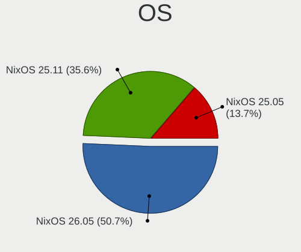

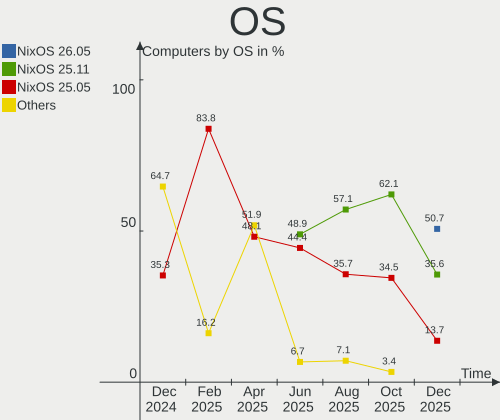

| Name        | Computers | Percent |
|-------------|-----------|---------|
| NixOS 26.05 | 37        | 50.68%  |
| NixOS 25.11 | 26        | 35.62%  |
| NixOS 25.05 | 10        | 13.7%   |

OS Family
---------

OS without a version

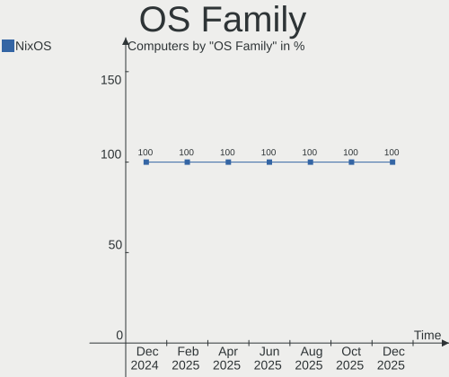

| Name  | Computers | Percent |
|-------|-----------|---------|
| NixOS | 73        | 100%    |

Kernel
------

Version of the Linux kernel

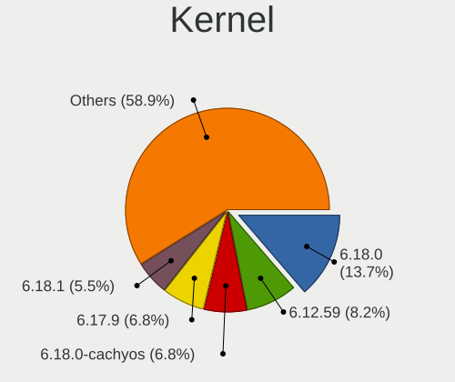

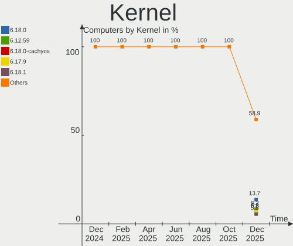

| Version           | Computers | Percent |
|-------------------|-----------|---------|
| 6.18.0            | 10        | 13.7%   |
| 6.12.59           | 6         | 8.22%   |
| 6.18.0-cachyos    | 5         | 6.85%   |
| 6.17.9            | 5         | 6.85%   |
| 6.18.1            | 4         | 5.48%   |
| 6.18.2            | 3         | 4.11%   |
| 6.12.62           | 3         | 4.11%   |
| 6.12.60           | 3         | 4.11%   |
| 6.12.58           | 3         | 4.11%   |
| 6.12.57           | 3         | 4.11%   |
| 6.17.9-zen1       | 2         | 2.74%   |
| 6.12.63           | 2         | 2.74%   |
| 6.1.159           | 2         | 2.74%   |
| 6.6.119           | 1         | 1.37%   |
| 6.6.117           | 1         | 1.37%   |
| 6.18.1-zen1       | 1         | 1.37%   |
| 6.17.9-xanmod1    | 1         | 1.37%   |
| 6.17.9-lqx1       | 1         | 1.37%   |
| 6.17.8-zen1       | 1         | 1.37%   |
| 6.17.8-cachyos    | 1         | 1.37%   |
| 6.17.8            | 1         | 1.37%   |
| 6.17.7-zen1       | 1         | 1.37%   |
| 6.17.6            | 1         | 1.37%   |
| 6.17.5-cachyos    | 1         | 1.37%   |
| 6.17.5            | 1         | 1.37%   |
| 6.17.4            | 1         | 1.37%   |
| 6.17.13           | 1         | 1.37%   |
| 6.12.61           | 1         | 1.37%   |
| 6.12.60-cachyos   | 1         | 1.37%   |
| 6.12.59-xanmod1   | 1         | 1.37%   |
| 6.12.59-cachyos   | 1         | 1.37%   |
| 6.12.57-xanmod1   | 1         | 1.37%   |
| 6.12.56-hardened1 | 1         | 1.37%   |
| 6.12.55           | 1         | 1.37%   |
| 6.12.40           | 1         | 1.37%   |

Kernel Family
-------------

Linux kernel without a distro release

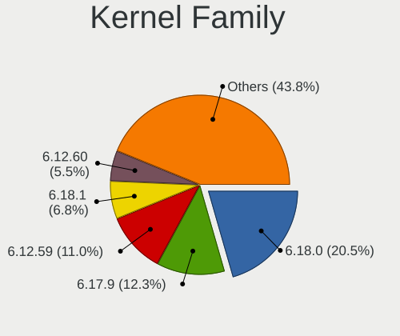

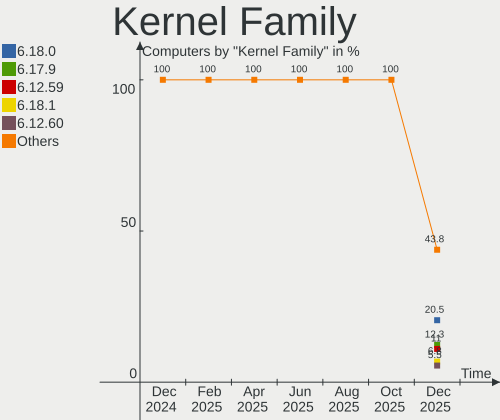

| Version | Computers | Percent |
|---------|-----------|---------|
| 6.18.0  | 15        | 20.55%  |
| 6.17.9  | 9         | 12.33%  |
| 6.12.59 | 8         | 10.96%  |
| 6.18.1  | 5         | 6.85%   |
| 6.12.60 | 4         | 5.48%   |
| 6.12.57 | 4         | 5.48%   |
| 6.18.2  | 3         | 4.11%   |
| 6.17.8  | 3         | 4.11%   |
| 6.12.62 | 3         | 4.11%   |
| 6.12.58 | 3         | 4.11%   |
| 6.17.5  | 2         | 2.74%   |
| 6.12.63 | 2         | 2.74%   |
| 6.1.159 | 2         | 2.74%   |
| 6.6.119 | 1         | 1.37%   |
| 6.6.117 | 1         | 1.37%   |
| 6.17.7  | 1         | 1.37%   |
| 6.17.6  | 1         | 1.37%   |
| 6.17.4  | 1         | 1.37%   |
| 6.17.13 | 1         | 1.37%   |
| 6.12.61 | 1         | 1.37%   |
| 6.12.56 | 1         | 1.37%   |
| 6.12.55 | 1         | 1.37%   |
| 6.12.40 | 1         | 1.37%   |

Kernel Major Ver.
-----------------

Linux kernel major version

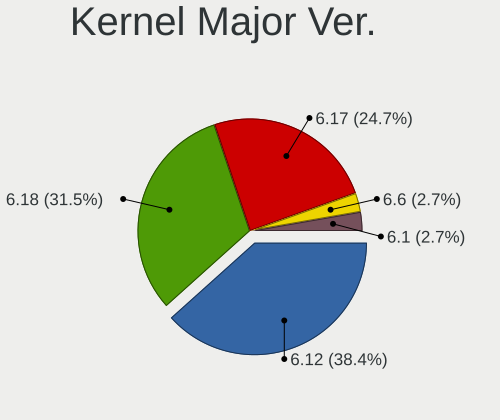

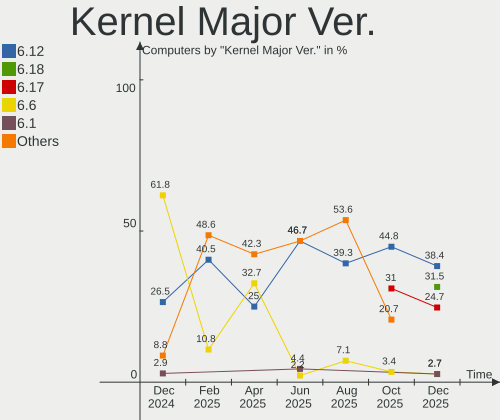

| Version | Computers | Percent |
|---------|-----------|---------|
| 6.12    | 28        | 38.36%  |
| 6.18    | 23        | 31.51%  |
| 6.17    | 18        | 24.66%  |
| 6.6     | 2         | 2.74%   |
| 6.1     | 2         | 2.74%   |

Arch
----

OS architecture (x86_64, i586, etc.)

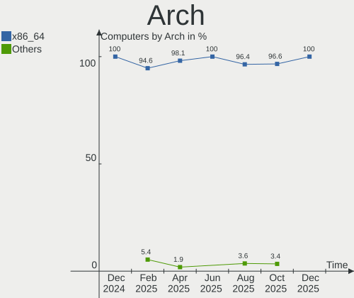

| Name   | Computers | Percent |
|--------|-----------|---------|
| x86_64 | 73        | 100%    |

DE
--

Desktop Environment

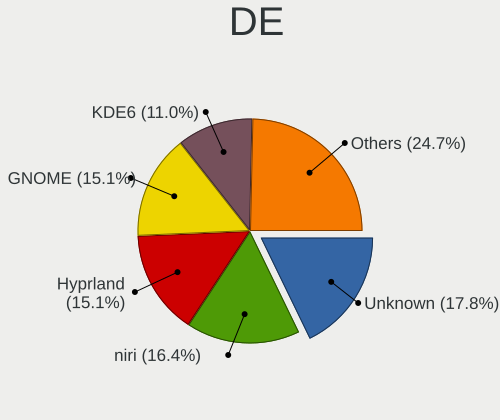

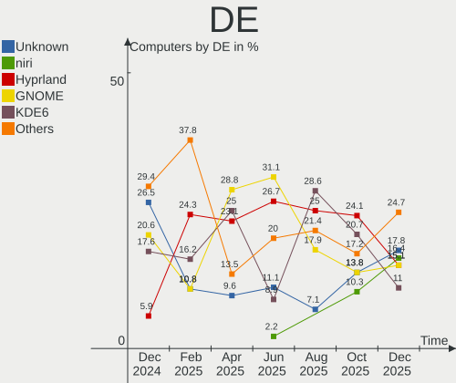

| Name           | Computers | Percent |
|----------------|-----------|---------|
| Unknown        | 13        | 17.81%  |
| niri           | 12        | 16.44%  |
| Hyprland       | 11        | 15.07%  |
| GNOME          | 11        | 15.07%  |
| KDE6           | 8         | 10.96%  |
| sway           | 6         | 8.22%   |
| KDE            | 6         | 8.22%   |
| XFCE           | 2         | 2.74%   |
| X-Cinnamon     | 2         | 2.74%   |
| start-hyprland | 1         | 1.37%   |
| COSMIC         | 1         | 1.37%   |

Display Server
--------------

X11 or Wayland

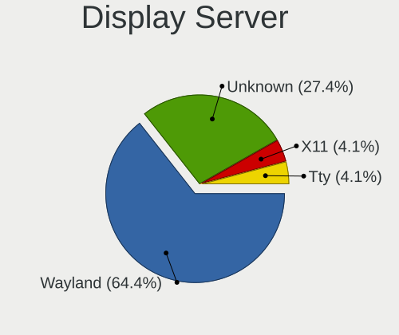

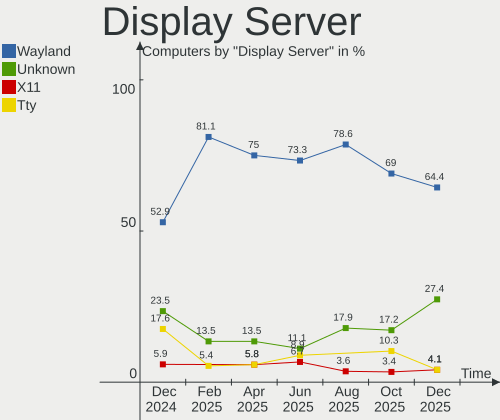

| Name    | Computers | Percent |
|---------|-----------|---------|
| Wayland | 47        | 64.38%  |
| Unknown | 20        | 27.4%   |
| X11     | 3         | 4.11%   |
| Tty     | 3         | 4.11%   |

Display Manager
---------------

SDDM, LightDM, etc.

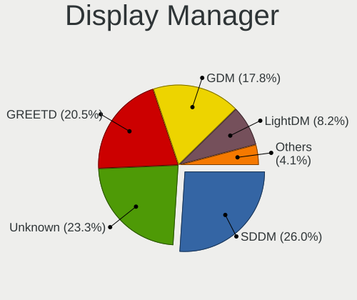

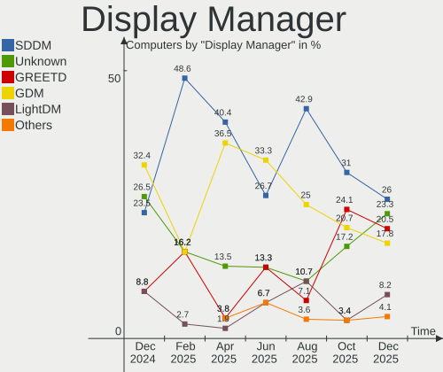

| Name                  | Computers | Percent |
|-----------------------|-----------|---------|
| SDDM                  | 19        | 26.03%  |
| Unknown               | 17        | 23.29%  |
| GREETD                | 15        | 20.55%  |
| GDM                   | 13        | 17.81%  |
| LightDM               | 6         | 8.22%   |
| DISPLAY-MANAGER-START | 3         | 4.11%   |

OS Lang
-------

Language

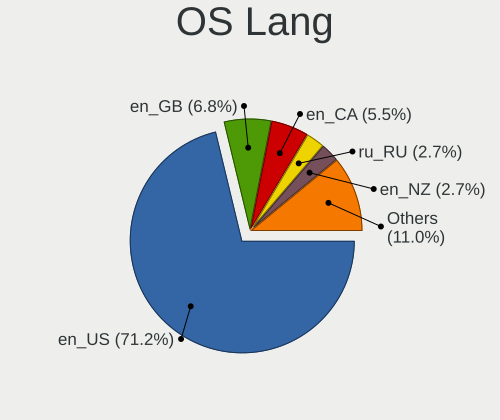

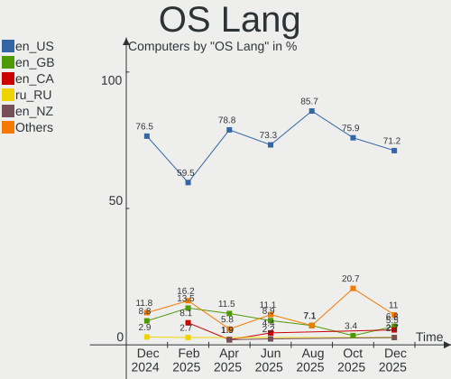

| Lang       | Computers | Percent |
|------------|-----------|---------|
| en_US      | 52        | 71.23%  |
| en_GB      | 5         | 6.85%   |
| en_CA      | 4         | 5.48%   |
| ru_RU      | 2         | 2.74%   |
| en_NZ      | 2         | 2.74%   |
| en_DK      | 2         | 2.74%   |
| de_DE      | 2         | 2.74%   |
| zh_CN      | 1         | 1.37%   |
| en_US.UTF8 | 1         | 1.37%   |
| en_AU      | 1         | 1.37%   |
| cs_CZ      | 1         | 1.37%   |

Boot Mode
---------

EFI or BIOS

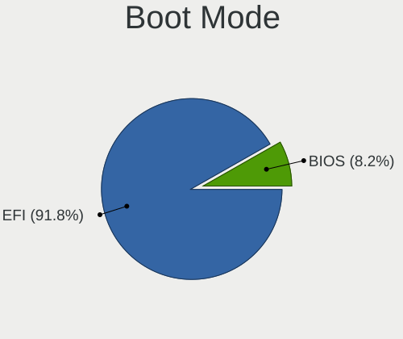

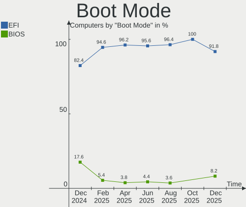

| Mode | Computers | Percent |
|------|-----------|---------|
| EFI  | 67        | 91.78%  |
| BIOS | 6         | 8.22%   |

Filesystem
----------

Type of filesystem

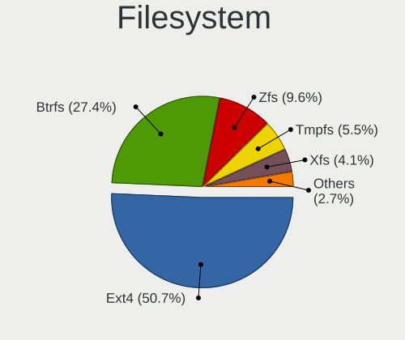

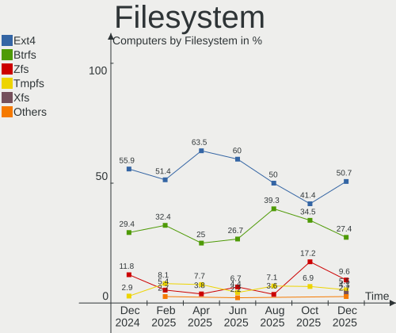

| Type     | Computers | Percent |
|----------|-----------|---------|
| Ext4     | 37        | 50.68%  |
| Btrfs    | 20        | 27.4%   |
| Zfs      | 7         | 9.59%   |
| Tmpfs    | 4         | 5.48%   |
| Xfs      | 3         | 4.11%   |
| XXXXX    | 1         | 1.37%   |
| Bcachefs | 1         | 1.37%   |

Part. scheme
------------

Scheme of partitioning

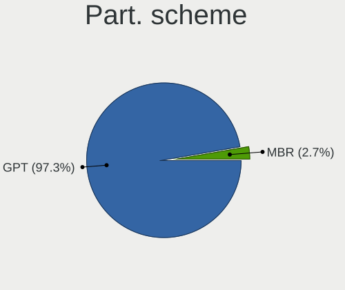

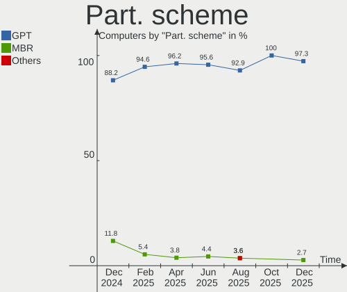

| Type | Computers | Percent |
|------|-----------|---------|
| GPT  | 71        | 97.26%  |
| MBR  | 2         | 2.74%   |

Dual Boot with Linux/BSD
------------------------

Hosting more than one Linux/BSD

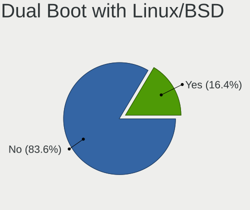

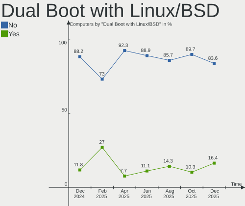

| Dual boot | Computers | Percent |
|-----------|-----------|---------|
| No        | 61        | 83.56%  |
| Yes       | 12        | 16.44%  |

Dual Boot (Win)
---------------

Hosting Linux and Windows

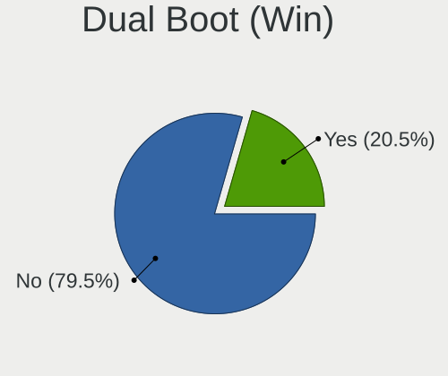

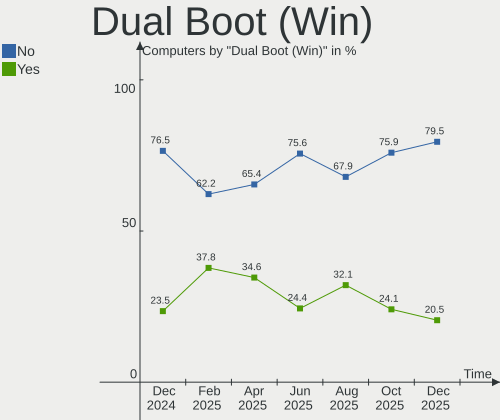

| Dual boot | Computers | Percent |
|-----------|-----------|---------|
| No        | 58        | 79.45%  |
| Yes       | 15        | 20.55%  |

Board
-----

Vendor
------

Motherboard manufacturer

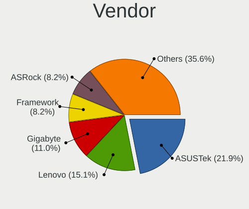

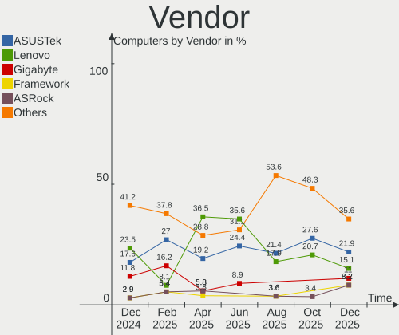

| Name                | Computers | Percent |
|---------------------|-----------|---------|
| ASUSTek Computer    | 16        | 21.92%  |
| Lenovo              | 11        | 15.07%  |
| Gigabyte Technology | 8         | 10.96%  |
| Framework           | 6         | 8.22%   |
| ASRock              | 6         | 8.22%   |
| Dell                | 5         | 6.85%   |
| MSI                 | 4         | 5.48%   |
| Hewlett-Packard     | 4         | 5.48%   |
| Acer                | 3         | 4.11%   |
| HUAWEI              | 2         | 2.74%   |
| TUXEDO              | 1         | 1.37%   |
| Timi                | 1         | 1.37%   |
| Supermicro          | 1         | 1.37%   |
| Bosgame             | 1         | 1.37%   |
| AZW                 | 1         | 1.37%   |
| Apple               | 1         | 1.37%   |
| Alienware           | 1         | 1.37%   |
| Unknown             | 1         | 1.37%   |

Model
-----

Motherboard model

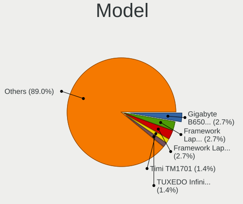

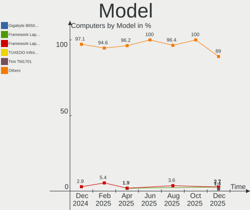

| Name                                          | Computers | Percent |
|-----------------------------------------------|-----------|---------|
| Gigabyte B650 AORUS ELITE AX V2               | 2         | 2.74%   |
| Framework Laptop 16 (AMD Ryzen 7040 Series)   | 2         | 2.74%   |
| Framework Laptop 13 (AMD Ryzen 7040Series)    | 2         | 2.74%   |
| TUXEDO InfinityBook Pro AMD Gen10             | 1         | 1.37%   |
| Timi TM1701                                   | 1         | 1.37%   |
| Supermicro X10SLM+-LN4F                       | 1         | 1.37%   |
| MSI MS-7E26                                   | 1         | 1.37%   |
| MSI MS-7D52                                   | 1         | 1.37%   |
| MSI MS-7C56                                   | 1         | 1.37%   |
| MSI MS-7B84                                   | 1         | 1.37%   |
| Lenovo Yoga Pro 7 14AKP10 83KG                | 1         | 1.37%   |
| Lenovo Yoga 6 13ABR8 83B2                     | 1         | 1.37%   |
| Lenovo ThinkStation P3 Ultra 30HACTO1WW       | 1         | 1.37%   |
| Lenovo ThinkPad X250 20CLS78N00               | 1         | 1.37%   |
| Lenovo ThinkPad X1 Carbon Gen 13 21NS001ACD   | 1         | 1.37%   |
| Lenovo ThinkPad T580 20L9CTO1WW               | 1         | 1.37%   |
| Lenovo ThinkPad T490 20N3S64000               | 1         | 1.37%   |
| Lenovo ThinkPad T14 Gen 3 21CF0037MX          | 1         | 1.37%   |
| Lenovo ThinkPad P15v Gen 1 20TQCTO1WW         | 1         | 1.37%   |
| Lenovo ThinkBook 14 G7+ ASP 21Q4              | 1         | 1.37%   |
| Lenovo IdeaPadFlex 5 14ABR8 82XX              | 1         | 1.37%   |
| HUAWEI MDF-XX                                 | 1         | 1.37%   |
| HUAWEI HVY-WXX9                               | 1         | 1.37%   |
| HP OmniBook Ultra Laptop 14-fd0xxx            | 1         | 1.37%   |
| HP OMEN by Gaming Laptop 16-n0xxx             | 1         | 1.37%   |
| HP ENVY TS 15                                 | 1         | 1.37%   |
| HP EliteBook 840 G3                           | 1         | 1.37%   |
| Gigabyte Z690 UD DDR4                         | 1         | 1.37%   |
| Gigabyte Z390 GAMING SLI                      | 1         | 1.37%   |
| Gigabyte Z270X-UD3                            | 1         | 1.37%   |
| Gigabyte Z170-HD3-CF                          | 1         | 1.37%   |
| Gigabyte X870 AORUS ELITE WIFI7               | 1         | 1.37%   |
| Gigabyte B550 AORUS ELITE V2                  | 1         | 1.37%   |
| Framework Laptop 13 (AMD Ryzen AI 300 Series) | 1         | 1.37%   |
| Framework Laptop (13th Gen Intel Core)        | 1         | 1.37%   |
| Dell XPS 9320                                 | 1         | 1.37%   |
| Dell XPS 15 9520                              | 1         | 1.37%   |
| Dell XPS 13 9360                              | 1         | 1.37%   |
| Dell PowerEdge R740                           | 1         | 1.37%   |
| Dell OptiPlex 5040                            | 1         | 1.37%   |

Model Family
------------

Motherboard model prefix

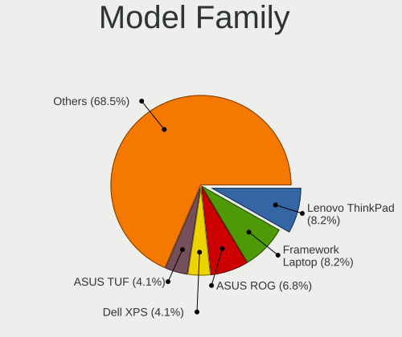

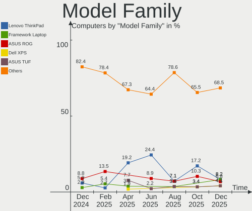

| Name                    | Computers | Percent |
|-------------------------|-----------|---------|
| Lenovo ThinkPad         | 6         | 8.22%   |
| Framework Laptop        | 6         | 8.22%   |
| ASUS ROG                | 5         | 6.85%   |
| Dell XPS                | 3         | 4.11%   |
| ASUS TUF                | 3         | 4.11%   |
| Lenovo Yoga             | 2         | 2.74%   |
| Gigabyte B650           | 2         | 2.74%   |
| ASUS PRIME              | 2         | 2.74%   |
| ASUS ASUS               | 2         | 2.74%   |
| TUXEDO InfinityBook     | 1         | 1.37%   |
| Timi TM1701             | 1         | 1.37%   |
| Supermicro X10SLM+-LN4F | 1         | 1.37%   |
| MSI MS-7E26             | 1         | 1.37%   |
| MSI MS-7D52             | 1         | 1.37%   |
| MSI MS-7C56             | 1         | 1.37%   |
| MSI MS-7B84             | 1         | 1.37%   |
| Lenovo ThinkStation     | 1         | 1.37%   |
| Lenovo ThinkBook        | 1         | 1.37%   |
| Lenovo IdeaPadFlex      | 1         | 1.37%   |
| HUAWEI MDF-XX           | 1         | 1.37%   |
| HUAWEI HVY-WXX9         | 1         | 1.37%   |
| HP OmniBook             | 1         | 1.37%   |
| HP OMEN                 | 1         | 1.37%   |
| HP ENVY                 | 1         | 1.37%   |
| HP EliteBook            | 1         | 1.37%   |
| Gigabyte Z690           | 1         | 1.37%   |
| Gigabyte Z390           | 1         | 1.37%   |
| Gigabyte Z270X-UD3      | 1         | 1.37%   |
| Gigabyte Z170-HD3-CF    | 1         | 1.37%   |
| Gigabyte X870           | 1         | 1.37%   |
| Gigabyte B550           | 1         | 1.37%   |
| Dell PowerEdge          | 1         | 1.37%   |
| Dell OptiPlex           | 1         | 1.37%   |
| Bosgame BeyondMax       | 1         | 1.37%   |
| AZW MINI                | 1         | 1.37%   |
| ASUS VivoBook           | 1         | 1.37%   |
| ASUS UX360UAK           | 1         | 1.37%   |
| ASUS ProArt             | 1         | 1.37%   |
| ASUS Amd                | 1         | 1.37%   |
| ASRock X570             | 1         | 1.37%   |

MFG Year
--------

Motherboard manufacture year

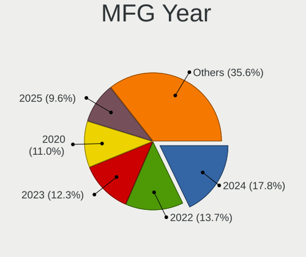

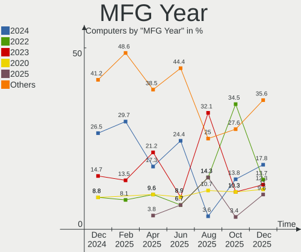

| Year | Computers | Percent |
|------|-----------|---------|
| 2024 | 13        | 17.81%  |
| 2022 | 10        | 13.7%   |
| 2023 | 9         | 12.33%  |
| 2020 | 8         | 10.96%  |
| 2025 | 7         | 9.59%   |
| 2021 | 4         | 5.48%   |
| 2019 | 4         | 5.48%   |
| 2016 | 4         | 5.48%   |
| 2015 | 4         | 5.48%   |
| 2012 | 3         | 4.11%   |
| 2018 | 2         | 2.74%   |
| 2017 | 2         | 2.74%   |
| 2013 | 1         | 1.37%   |
| 2011 | 1         | 1.37%   |
| 2007 | 1         | 1.37%   |

Form Factor
-----------

Physical design of the computer

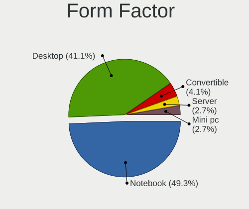

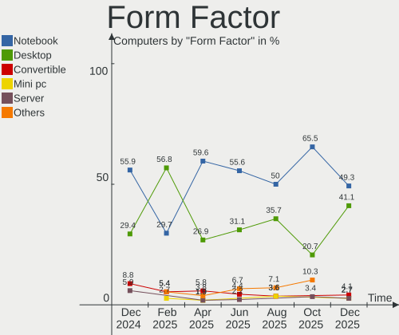

| Name        | Computers | Percent |
|-------------|-----------|---------|
| Notebook    | 36        | 49.32%  |
| Desktop     | 30        | 41.1%   |
| Convertible | 3         | 4.11%   |
| Mini pc     | 2         | 2.74%   |
| Server      | 2         | 2.74%   |

Secure Boot
-----------

Enabled or disabled

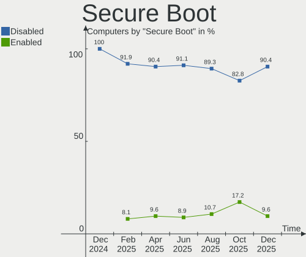

| State    | Computers | Percent |
|----------|-----------|---------|
| Disabled | 66        | 90.41%  |
| Enabled  | 7         | 9.59%   |

Coreboot
--------

Have coreboot on board

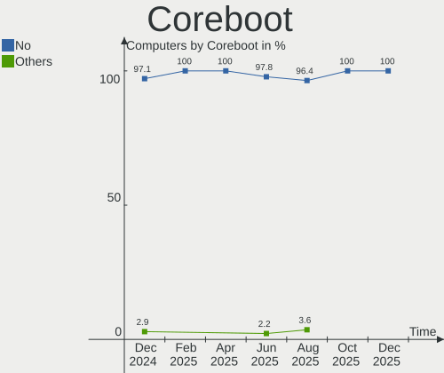

| Used | Computers | Percent |
|------|-----------|---------|
| No   | 73        | 100%    |

RAM Size
--------

Total RAM memory

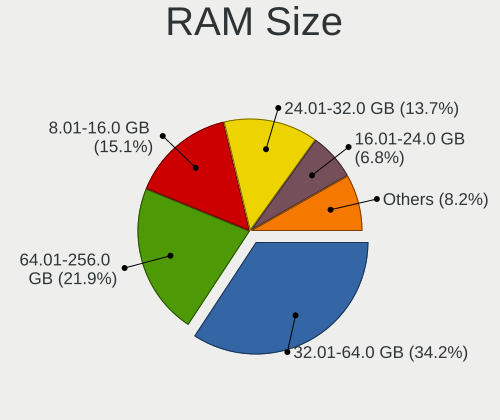

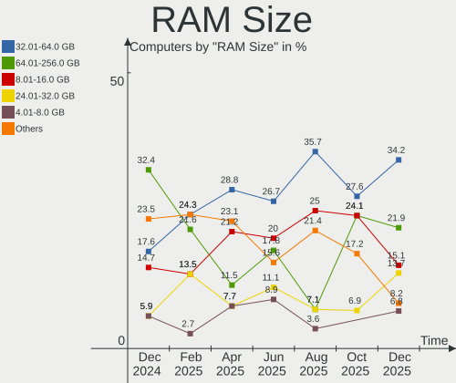

| Size in GB  | Computers | Percent |
|-------------|-----------|---------|
| 32.01-64.0  | 25        | 34.25%  |
| 64.01-256.0 | 16        | 21.92%  |
| 8.01-16.0   | 11        | 15.07%  |
| 24.01-32.0  | 10        | 13.7%   |
| 4.01-8.0    | 5         | 6.85%   |
| 16.01-24.0  | 5         | 6.85%   |
| 2.01-3.0    | 1         | 1.37%   |

RAM Used
--------

Used RAM memory

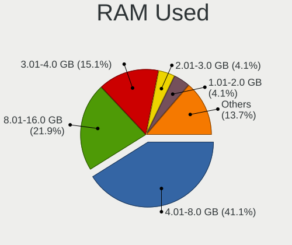

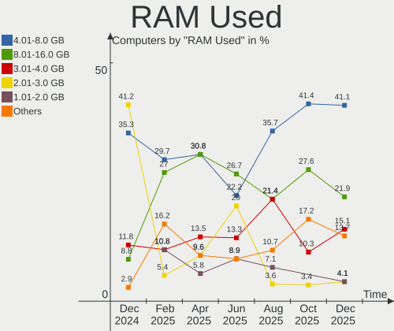

| Used GB     | Computers | Percent |
|-------------|-----------|---------|
| 4.01-8.0    | 30        | 41.1%   |
| 8.01-16.0   | 16        | 21.92%  |
| 3.01-4.0    | 11        | 15.07%  |
| 2.01-3.0    | 3         | 4.11%   |
| 1.01-2.0    | 3         | 4.11%   |
| 24.01-32.0  | 2         | 2.74%   |
| 64.01-256.0 | 2         | 2.74%   |
| 16.01-24.0  | 2         | 2.74%   |
| 0.51-1.0    | 2         | 2.74%   |
| 32.01-64.0  | 1         | 1.37%   |
| 0.01-0.5    | 1         | 1.37%   |

Total Drives
------------

Number of drives on board

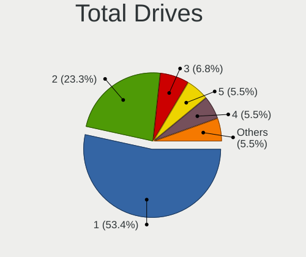

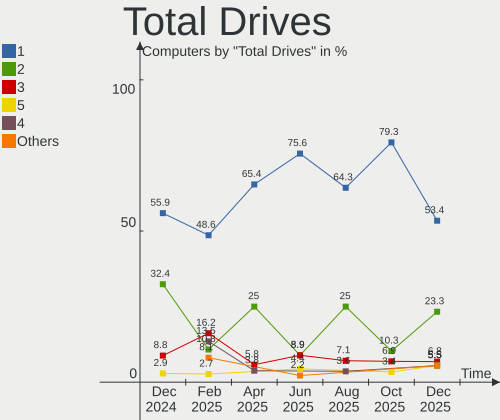

| Drives | Computers | Percent |
|--------|-----------|---------|
| 1      | 39        | 53.42%  |
| 2      | 17        | 23.29%  |
| 3      | 5         | 6.85%   |
| 5      | 4         | 5.48%   |
| 4      | 4         | 5.48%   |
| 6      | 2         | 2.74%   |
| 7      | 1         | 1.37%   |
| 0      | 1         | 1.37%   |

Has CD-ROM
----------

Has CD-ROM on board

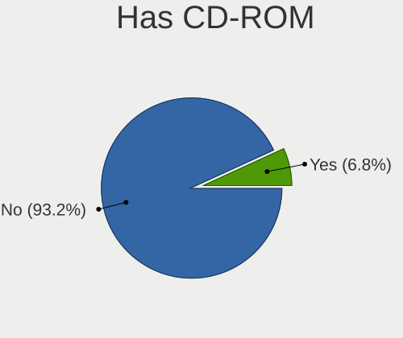

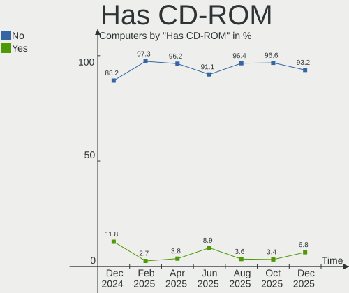

| Presented | Computers | Percent |
|-----------|-----------|---------|
| No        | 68        | 93.15%  |
| Yes       | 5         | 6.85%   |

Has Ethernet
------------

Has Ethernet on board

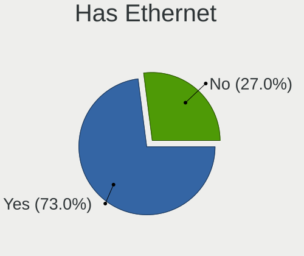

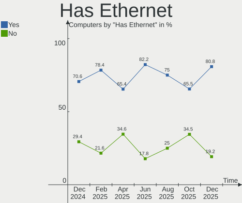

| Presented | Computers | Percent |
|-----------|-----------|---------|
| Yes       | 59        | 80.82%  |
| No        | 14        | 19.18%  |

Has WiFi
--------

Has WiFi module

| Presented | Computers | Percent |
|-----------|-----------|---------|
| Yes       | 54        | 73.97%  |
| No        | 19        | 26.03%  |

Has Bluetooth
-------------

Has Bluetooth module

| Presented | Computers | Percent |
|-----------|-----------|---------|
| Yes       | 57        | 78.08%  |
| No        | 16        | 21.92%  |

Location
--------

Country
-------

Geographic location (country)

| Country         | Computers | Percent |
|-----------------|-----------|---------|
| USA             | 12        | 16.44%  |
| Germany         | 9         | 12.33%  |
| Poland          | 7         | 9.59%   |
| Netherlands     | 6         | 8.22%   |
| Russia          | 4         | 5.48%   |
| Canada          | 4         | 5.48%   |
| Czechia         | 3         | 4.11%   |
| UK              | 2         | 2.74%   |
| Türkiye        | 2         | 2.74%   |
| Turkey          | 2         | 2.74%   |
| New Zealand     | 2         | 2.74%   |
| Italy           | 2         | 2.74%   |
| France          | 2         | 2.74%   |
| Denmark         | 2         | 2.74%   |
| Ukraine         | 1         | 1.37%   |
| The Netherlands | 1         | 1.37%   |
| Sweden          | 1         | 1.37%   |
| Spain           | 1         | 1.37%   |
| South Korea     | 1         | 1.37%   |
| Serbia          | 1         | 1.37%   |
| Romania         | 1         | 1.37%   |
| Norway          | 1         | 1.37%   |
| India           | 1         | 1.37%   |
| Hong Kong       | 1         | 1.37%   |
| Estonia         | 1         | 1.37%   |
| Brazil          | 1         | 1.37%   |
| Austria         | 1         | 1.37%   |
| Australia       | 1         | 1.37%   |

City
----

Geographic location (city)

| City                   | Computers | Percent |
|------------------------|-----------|---------|
| Haarlem                | 5         | 6.85%   |
| Warsaw                 | 4         | 5.48%   |
| Tiefenbach             | 3         | 4.11%   |
| Moscow                 | 3         | 4.11%   |
| Woodbridge             | 2         | 2.74%   |
| Rocklin                | 2         | 2.74%   |
| Kongens Lyngby         | 2         | 2.74%   |
| Denizli                | 2         | 2.74%   |
| Annapolis              | 2         | 2.74%   |
| Velke Bilovice         | 1         | 1.37%   |
| Thornton               | 1         | 1.37%   |
| The Hague              | 1         | 1.37%   |
| Tallinn                | 1         | 1.37%   |
| St Petersburg          | 1         | 1.37%   |
| Sint Annaland          | 1         | 1.37%   |
| Shreveport             | 1         | 1.37%   |
| Seodaemun-gu           | 1         | 1.37%   |
| Saint-Martin-le-Vinoux | 1         | 1.37%   |
| Saint Paul             | 1         | 1.37%   |
| Prague                 | 1         | 1.37%   |
| Poznan                 | 1         | 1.37%   |
| Portland               | 1         | 1.37%   |
| Ponte a Poppi          | 1         | 1.37%   |
| Ottawa                 | 1         | 1.37%   |
| Naples                 | 1         | 1.37%   |
| Melbourne              | 1         | 1.37%   |
| Long Beach             | 1         | 1.37%   |
| London                 | 1         | 1.37%   |
| Leipzig                | 1         | 1.37%   |
| Le Meux                | 1         | 1.37%   |
| Kufstein               | 1         | 1.37%   |
| Krakow                 | 1         | 1.37%   |
| Kosiv                  | 1         | 1.37%   |
| Jessheim               | 1         | 1.37%   |
| Izmir                  | 1         | 1.37%   |
| Hamburg                | 1         | 1.37%   |
| Grass Valley           | 1         | 1.37%   |
| Gothenburg             | 1         | 1.37%   |
| Garbsen                | 1         | 1.37%   |
| Delbrueck              | 1         | 1.37%   |

Drives
------

Drive Vendor
------------

Hard drive vendors

| Vendor                      | Computers | Drives | Percent |
|-----------------------------|-----------|--------|---------|
| Samsung Electronics         | 28        | 36     | 24.35%  |
| WDC                         | 14        | 21     | 12.17%  |
| Unknown                     | 8         | 8      | 6.96%   |
| Crucial                     | 8         | 11     | 6.96%   |
| Toshiba                     | 6         | 7      | 5.22%   |
| Seagate                     | 6         | 14     | 5.22%   |
| Kingston Technology Company | 6         | 7      | 5.22%   |
| A-DATA Technology           | 6         | 7      | 5.22%   |
| SK hynix                    | 4         | 4      | 3.48%   |
| Intel                       | 4         | 4      | 3.48%   |
| Micron Technology           | 3         | 3      | 2.61%   |
| Kingston                    | 3         | 4      | 2.61%   |
| Unknown                     | 3         | 4      | 2.61%   |
| KIOXIA                      | 2         | 2      | 1.74%   |
| Apple                       | 2         | 3      | 1.74%   |
| Verbatim                    | 1         | 2      | 0.87%   |
| UMIS                        | 1         | 1      | 0.87%   |
| Team                        | 1         | 1      | 0.87%   |
| T-FORCE                     | 1         | 1      | 0.87%   |
| Synology                    | 1         | 1      | 0.87%   |
| SPCC                        | 1         | 1      | 0.87%   |
| Silicon Motion              | 1         | 1      | 0.87%   |
| Phison                      | 1         | 1      | 0.87%   |
| KINGBANK                    | 1         | 2      | 0.87%   |
| Fanxiang                    | 1         | 1      | 0.87%   |
| Corsair                     | 1         | 1      | 0.87%   |
| Apacer                      | 1         | 1      | 0.87%   |

Drive Model
-----------

Hard drive models

| Model                                | Computers | Percent |
|--------------------------------------|-----------|---------|
| Unknown NVMe SSD Drive 1TB           | 4         | 3.08%   |
| Unknown                              | 3         | 2.31%   |
| Unknown NVMe SSD Drive 512GB         | 2         | 1.54%   |
| Toshiba DT01ACA100 1TB               | 2         | 1.54%   |
| Samsung SSD 990 PRO 2TB              | 2         | 1.54%   |
| Samsung SSD 990 PRO 1TB              | 2         | 1.54%   |
| Samsung SSD 980 PRO 2TB              | 2         | 1.54%   |
| Samsung SSD 980 1TB                  | 2         | 1.54%   |
| Samsung SSD 970 EVO Plus 1TB         | 2         | 1.54%   |
| Samsung SSD 860 EVO 500GB            | 2         | 1.54%   |
| Kingston Company SNV3S1000G 1TB      | 2         | 1.54%   |
| Kingston Company SNV2S1000G 1TB      | 2         | 1.54%   |
| Kingston SA400S37480G 480GB SSD      | 2         | 1.54%   |
| Crucial CT2000T500SSD8 2TB           | 2         | 1.54%   |
| A-DATA SX8200PNP 256GB               | 2         | 1.54%   |
| WDC WDS100T2B0C-00PXH0 1TB           | 1         | 0.77%   |
| WDC WD80EFZZ-68BTXN0 8TB             | 1         | 0.77%   |
| WDC WD80EFAX-68KNBN0 8TB             | 1         | 0.77%   |
| WDC WD5000AZLX-08K2TA0 500GB         | 1         | 0.77%   |
| WDC WD5000AAKX-60U6AA0 500GB         | 1         | 0.77%   |
| WDC WD40EFPX-68C6CN0 4TB             | 1         | 0.77%   |
| WDC WD30EFRX-68EUZN0 3TB             | 1         | 0.77%   |
| WDC WD30EFRX-68A 3TB                 | 1         | 0.77%   |
| WDC WD20EARX-00PASB0 2TB             | 1         | 0.77%   |
| WDC WD20EARS-00MVWB0 2TB             | 1         | 0.77%   |
| WDC WD10EZEX-35WN4A0 1TB             | 1         | 0.77%   |
| WDC WD10EZEX-08M2NA0 1TB             | 1         | 0.77%   |
| WDC WD1003FBYX-01Y7B1 1TB            | 1         | 0.77%   |
| WDC PC SN810 NVMe 2048GB             | 1         | 0.77%   |
| WDC PC SN730 SDBQNTY-256G-1001 256GB | 1         | 0.77%   |
| WDC PC SN730 SDBPNTY-512G-1027 512GB | 1         | 0.77%   |
| WDC PC SN730 SDBPNTY-512G            | 1         | 0.77%   |
| WDC PC SN530 SDBPNPZ-1T00-1114 1TB   | 1         | 0.77%   |
| Verbatim Vi550 S3 1024GB             | 1         | 0.77%   |
| Unknown MMC Card  32GB               | 1         | 0.77%   |
| Unknown MMC Card  1TB                | 1         | 0.77%   |
| UMIS RPJYJ1T24MML1AWY 1TB            | 1         | 0.77%   |
| Toshiba THNSN5256GPUK NVMe 256GB     | 1         | 0.77%   |
| Toshiba MQ02ABF100 1TB               | 1         | 0.77%   |
| Toshiba MQ01ABD050 500GB             | 1         | 0.77%   |

HDD Vendor
----------

Hard disk drive vendors

| Vendor              | Computers | Drives | Percent |
|---------------------|-----------|--------|---------|
| WDC                 | 9         | 15     | 40.91%  |
| Toshiba             | 5         | 6      | 22.73%  |
| Seagate             | 5         | 13     | 22.73%  |
| Synology            | 1         | 1      | 4.55%   |
| Samsung Electronics | 1         | 1      | 4.55%   |
| Apple               | 1         | 2      | 4.55%   |

SSD Vendor
----------

Solid state drive vendors

| Vendor              | Computers | Drives | Percent |
|---------------------|-----------|--------|---------|
| Samsung Electronics | 5         | 5      | 23.81%  |
| Crucial             | 4         | 7      | 19.05%  |
| Kingston            | 3         | 3      | 14.29%  |
| A-DATA Technology   | 3         | 3      | 14.29%  |
| Verbatim            | 1         | 2      | 4.76%   |
| T-FORCE             | 1         | 1      | 4.76%   |
| SPCC                | 1         | 1      | 4.76%   |
| Intel               | 1         | 1      | 4.76%   |
| Fanxiang            | 1         | 1      | 4.76%   |
| Apacer              | 1         | 1      | 4.76%   |

Drive Kind
----------

HDD or SSD

| Kind | Computers | Drives | Percent |
|------|-----------|--------|---------|
| NVMe | 65        | 84     | 65%     |
| SSD  | 18        | 25     | 18%     |
| HDD  | 15        | 38     | 15%     |
| MMC  | 2         | 2      | 2%      |

Drive Connector
---------------

SATA, SAS, NVMe, etc.

| Type | Computers | Drives | Percent |
|------|-----------|--------|---------|
| NVMe | 65        | 84     | 69.89%  |
| SATA | 26        | 63     | 27.96%  |
| MMC  | 2         | 2      | 2.15%   |

Drive Size
----------

Size of hard drive

| Size in TB | Computers | Drives | Percent |
|------------|-----------|--------|---------|
| 0.51-1.0   | 13        | 20     | 37.14%  |
| 0.01-0.5   | 13        | 18     | 37.14%  |
| 3.01-4.0   | 3         | 9      | 8.57%   |
| 2.01-3.0   | 2         | 2      | 5.71%   |
| 1.01-2.0   | 2         | 5      | 5.71%   |
| 4.01-10.0  | 2         | 9      | 5.71%   |

Space Total
-----------

Amount of disk space available on the file system

| Size in GB     | Computers | Percent |
|----------------|-----------|---------|
| 1-20           | 15        | 20.55%  |
| 501-1000       | 14        | 19.18%  |
| More than 3000 | 12        | 16.44%  |
| 1001-2000      | 11        | 15.07%  |
| 2001-3000      | 8         | 10.96%  |
| 251-500        | 7         | 9.59%   |
| 101-250        | 4         | 5.48%   |
| 51-100         | 1         | 1.37%   |
| Unknown        | 1         | 1.37%   |

Space Used
----------

Amount of used disk space

| Used GB        | Computers | Percent |
|----------------|-----------|---------|
| 1-20           | 16        | 21.92%  |
| 251-500        | 13        | 17.81%  |
| 501-1000       | 12        | 16.44%  |
| 1001-2000      | 7         | 9.59%   |
| More than 3000 | 6         | 8.22%   |
| 21-50          | 6         | 8.22%   |
| 51-100         | 6         | 8.22%   |
| 2001-3000      | 3         | 4.11%   |
| 101-250        | 3         | 4.11%   |
| Unknown        | 1         | 1.37%   |

Malfunc. Drives
---------------

Drive models with a malfunction

| Model                             | Computers | Drives | Percent |
|-----------------------------------|-----------|--------|---------|
| WDC WD80EFZZ-68BTXN0 8TB          | 1         | 1      | 9.09%   |
| WDC WD5000AAKX-60U6AA0 500GB      | 1         | 1      | 9.09%   |
| WDC WD20EARX-00PASB0 2TB          | 1         | 1      | 9.09%   |
| WDC WD20EARS-00MVWB0 2TB          | 1         | 1      | 9.09%   |
| Toshiba MQ02ABF100 1TB            | 1         | 1      | 9.09%   |
| Toshiba MQ01ABD050 500GB          | 1         | 2      | 9.09%   |
| Seagate ST1000LM035-1RK172 1TB    | 1         | 3      | 9.09%   |
| Samsung Electronics SSD 980 1TB   | 1         | 1      | 9.09%   |
| Kingston SNV425S2128GB SSD        | 1         | 1      | 9.09%   |
| Apple HDD HTS547550A9E384 500GB   | 1         | 1      | 9.09%   |
| A-DATA Technology SP900 256GB SSD | 1         | 1      | 9.09%   |

Malfunc. Drive Vendor
---------------------

Vendors of faulty drives

| Vendor              | Computers | Drives | Percent |
|---------------------|-----------|--------|---------|
| WDC                 | 3         | 4      | 30%     |
| Toshiba             | 2         | 3      | 20%     |
| Seagate             | 1         | 3      | 10%     |
| Samsung Electronics | 1         | 1      | 10%     |
| Kingston            | 1         | 1      | 10%     |
| Apple               | 1         | 1      | 10%     |
| A-DATA Technology   | 1         | 1      | 10%     |

Malfunc. HDD Vendor
-------------------

Vendors of faulty HDD drives

| Vendor  | Computers | Drives | Percent |
|---------|-----------|--------|---------|
| WDC     | 3         | 4      | 42.86%  |
| Toshiba | 2         | 3      | 28.57%  |
| Seagate | 1         | 3      | 14.29%  |
| Apple   | 1         | 1      | 14.29%  |

Malfunc. Drive Kind
-------------------

Kinds of faulty drives

| Kind | Computers | Drives | Percent |
|------|-----------|--------|---------|
| HDD  | 4         | 11     | 57.14%  |
| SSD  | 2         | 2      | 28.57%  |
| NVMe | 1         | 1      | 14.29%  |

Failed Drives
-------------

Failed drive models

Zero info for selected period =(

Failed Drive Vendor
-------------------

Failed drive vendors

Zero info for selected period =(

Drive Status
------------

Number of failed and malfunc. drives

| Status   | Computers | Drives | Percent |
|----------|-----------|--------|---------|
| Works    | 64        | 123    | 79.01%  |
| Detected | 11        | 12     | 13.58%  |
| Malfunc  | 6         | 14     | 7.41%   |

Storage controller
------------------

Storage Vendor
--------------

Storage controller vendors

| Vendor                                  | Computers | Percent |
|-----------------------------------------|-----------|---------|
| AMD                                     | 25        | 20.49%  |
| Samsung Electronics                     | 24        | 19.67%  |
| Intel                                   | 21        | 17.21%  |
| SanDisk                                 | 14        | 11.48%  |
| Kingston Technology Company             | 7         | 5.74%   |
| SK hynix                                | 4         | 3.28%   |
| Micron/Crucial Technology               | 4         | 3.28%   |
| ADATA Technology                        | 4         | 3.28%   |
| Micron Technology                       | 3         | 2.46%   |
| MAXIO Technology (Hangzhou)             | 3         | 2.46%   |
| KIOXIA                                  | 3         | 2.46%   |
| ASMedia Technology                      | 2         | 1.64%   |
| Toshiba America Info Systems            | 1         | 0.82%   |
| Silicon Motion                          | 1         | 0.82%   |
| Shenzhen Unionmemory Information System | 1         | 0.82%   |
| Seagate Technology                      | 1         | 0.82%   |
| Phison Electronics                      | 1         | 0.82%   |
| LSI Logic / Symbios Logic               | 1         | 0.82%   |
| Corsair Memory                          | 1         | 0.82%   |
| Apple                                   | 1         | 0.82%   |

Storage Model
-------------

Storage controller models

| Model                                                                          | Computers | Percent |
|--------------------------------------------------------------------------------|-----------|---------|
| AMD 600 Series Chipset SATA Controller                                         | 11        | 8.8%    |
| AMD 500 Series Chipset SATA Controller                                         | 7         | 5.6%    |
| Samsung NVMe SSD Controller S4LV008[Pascal]                                    | 6         | 4.8%    |
| AMD FCH SATA Controller [AHCI mode]                                            | 6         | 4.8%    |
| Samsung NVMe SSD Controller SM981/PM981/PM983                                  | 5         | 4%      |
| Samsung NVMe SSD Controller PM9A1/PM9A3/980PRO                                 | 5         | 4%      |
| SanDisk WD SN560/SN740/SN770/SN5000 NVMe SSD                                   | 4         | 3.2%    |
| SanDisk Extreme Pro / WD Black SN750 / PC SN730 / Red SN700 NVMe SSD           | 3         | 2.4%    |
| Samsung NVMe SSD Controller 980 (DRAM-less)                                    | 3         | 2.4%    |
| MAXIO (Hangzhou) NVMe SSD Controller MAP1202 (DRAM-less)                       | 3         | 2.4%    |
| Sandisk WD Black SN850X NVMe SSD                                               | 2         | 1.6%    |
| SanDisk Ultra 3D / WD PC SN530, IX SN530, Blue SN550 NVMe SSD (DRAM-less)      | 2         | 1.6%    |
| Samsung NVMe SSD Controller SM961/PM961/SM963                                  | 2         | 1.6%    |
| Samsung NVMe SSD 9100 PRO [PM9E1]                                              | 2         | 1.6%    |
| Micron/Crucial T500 NVMe PCIe SSD                                              | 2         | 1.6%    |
| Micron/Crucial P2 [Nick P2] / P3 / P3 Plus NVMe PCIe SSD (DRAM-less)           | 2         | 1.6%    |
| Kingston Company NV3 NVMe SSD [TC2201] (DRAM-less)                             | 2         | 1.6%    |
| Kingston Company NV2 NVMe SSD [SM2267XT] (DRAM-less)                           | 2         | 1.6%    |
| Intel Sunrise Point-LP SATA Controller [AHCI mode]                             | 2         | 1.6%    |
| Intel Q170/Q150/B150/H170/H110/Z170/CM236 Chipset SATA Controller [AHCI Mode]  | 2         | 1.6%    |
| Intel Alder Lake-S PCH SATA Controller [AHCI Mode]                             | 2         | 1.6%    |
| Intel 8 Series/C220 Series Chipset Family 6-port SATA Controller 1 [AHCI mode] | 2         | 1.6%    |
| ADATA XPG SX8200 Pro PCIe Gen3x4 M.2 2280 Solid State Drive                    | 2         | 1.6%    |
| Toshiba America Info Systems XG4 NVMe SSD Controller                           | 1         | 0.8%    |
| SK hynix Platinum P41/PC801 NVMe Solid State Drive                             | 1         | 0.8%    |
| SK hynix PCB01 NVMe Solid State Drive                                          | 1         | 0.8%    |
| SK hynix PC611 NVMe Solid State Drive                                          | 1         | 0.8%    |
| SK hynix Gold P31/BC711/PC711 NVMe Solid State Drive                           | 1         | 0.8%    |
| Silicon Motion Non-Volatile memory controller                                  | 1         | 0.8%    |
| Shenzhen Unionmemory Information System Non-Volatile memory controller         | 1         | 0.8%    |
| Seagate E18 PCIe SSD                                                           | 1         | 0.8%    |
| Sandisk WD_BLACK SN7100/WD PC SN7100S M.2 2280 NVMe SSD (DRAM-less)            | 1         | 0.8%    |
| SanDisk WD PC SN810 / Black SN850 NVMe SSD                                     | 1         | 0.8%    |
| Sandisk WD PC SN8050S / WD_BLACK SN8100 NVMe SSD                               | 1         | 0.8%    |
| Samsung NVMe SSD Controller PM9C1a (DRAM-less)                                 | 1         | 0.8%    |
| Samsung NVMe SSD Controller PM9B1 (DRAM-less)                                  | 1         | 0.8%    |
| Phison E12 NVMe Controller                                                     | 1         | 0.8%    |
| Micron 9400 PRO NVMe SSD                                                       | 1         | 0.8%    |
| Micron 2450 NVMe SSD [HendrixV] (DRAM-less)                                    | 1         | 0.8%    |
| Micron 2400 NVMe SSD (DRAM-less)                                               | 1         | 0.8%    |

Storage Kind
------------

Kind of storage controller (IDE, SATA, NVMe, SAS, ...)

| Kind | Computers | Percent |
|------|-----------|---------|
| NVMe | 65        | 59.63%  |
| SATA | 41        | 37.61%  |
| RAID | 3         | 2.75%   |

Processor
---------

CPU Vendor
----------

Processor vendors

| Vendor | Computers | Percent |
|--------|-----------|---------|
| AMD    | 44        | 60.27%  |
| Intel  | 29        | 39.73%  |

CPU Model
---------

Processor models

| Model                                      | Computers | Percent |
|--------------------------------------------|-----------|---------|
| AMD Ryzen 9 9950X3D 16-Core Processor      | 3         | 4.11%   |
| AMD Ryzen 9 5950X 16-Core Processor        | 3         | 4.11%   |
| AMD Ryzen 7 9800X3D 8-Core Processor       | 3         | 4.11%   |
| Intel Core i7-7500U CPU @ 2.70GHz          | 2         | 2.74%   |
| Intel Core i7-6700K CPU @ 4.00GHz          | 2         | 2.74%   |
| AMD Ryzen AI 9 HX 370 w/ Radeon 890M       | 2         | 2.74%   |
| AMD Ryzen AI 9 365 w/ Radeon 880M          | 2         | 2.74%   |
| AMD Ryzen 9 5900X 12-Core Processor        | 2         | 2.74%   |
| AMD Ryzen 7 7840HS w/ Radeon 780M Graphics | 2         | 2.74%   |
| AMD Ryzen 7 7730U with Radeon Graphics     | 2         | 2.74%   |
| AMD Ryzen 5 7640U w/ Radeon 760M Graphics  | 2         | 2.74%   |
| AMD Ryzen 5 5600X 6-Core Processor         | 2         | 2.74%   |
| Intel Xeon Silver 4114 CPU @ 2.20GHz       | 1         | 1.37%   |
| Intel Pentium CPU B960 @ 2.20GHz           | 1         | 1.37%   |
| Intel N100                                 | 1         | 1.37%   |
| Intel Core Ultra 9 275HX                   | 1         | 1.37%   |
| Intel Core Ultra 7 258V                    | 1         | 1.37%   |
| Intel Core i9-9900KF CPU @ 3.60GHz         | 1         | 1.37%   |
| Intel Core i9-14900K                       | 1         | 1.37%   |
| Intel Core i7-8665U CPU @ 1.90GHz          | 1         | 1.37%   |
| Intel Core i7-8550U CPU @ 1.80GHz          | 1         | 1.37%   |
| Intel Core i7-6700 CPU @ 3.40GHz           | 1         | 1.37%   |
| Intel Core i7-4790 CPU @ 3.60GHz           | 1         | 1.37%   |
| Intel Core i7-4702MQ CPU @ 2.20GHz         | 1         | 1.37%   |
| Intel Core i5-8250U CPU @ 1.60GHz          | 1         | 1.37%   |
| Intel Core i5-6300U CPU @ 2.40GHz          | 1         | 1.37%   |
| Intel Core i5-4300U CPU @ 1.90GHz          | 1         | 1.37%   |
| Intel Core i5-10300H CPU @ 2.50GHz         | 1         | 1.37%   |
| Intel Core i3-1000NG4 CPU @ 1.10GHz        | 1         | 1.37%   |
| Intel Celeron J4125 CPU @ 2.00GHz          | 1         | 1.37%   |
| Intel Atom CPU N2600 @ 1.60GHz             | 1         | 1.37%   |
| Intel 13th Gen Core i9-13900H              | 1         | 1.37%   |
| Intel 13th Gen Core i7-1370P               | 1         | 1.37%   |
| Intel 13th Gen Core i7-1360P               | 1         | 1.37%   |
| Intel 12th Gen Core i7-12700H              | 1         | 1.37%   |
| Intel 12th Gen Core i5-12600K              | 1         | 1.37%   |
| Intel 12th Gen Core i5-1240P               | 1         | 1.37%   |
| AMD RYZEN AI MAX+ 395 w/ Radeon 8060S      | 1         | 1.37%   |
| AMD Ryzen AI 7 350 w/ Radeon 860M          | 1         | 1.37%   |
| AMD Ryzen 9 9900X 12-Core Processor        | 1         | 1.37%   |

CPU Model Family
----------------

Processor model prefix

| Model             | Computers | Percent |
|-------------------|-----------|---------|
| AMD Ryzen 7       | 14        | 19.18%  |
| Other             | 13        | 17.81%  |
| AMD Ryzen 9       | 12        | 16.44%  |
| AMD Ryzen 5       | 11        | 15.07%  |
| Intel Core i7     | 9         | 12.33%  |
| Intel Core i5     | 4         | 5.48%   |
| Intel Core i9     | 2         | 2.74%   |
| Intel Core        | 2         | 2.74%   |
| Intel Xeon Silver | 1         | 1.37%   |
| Intel Pentium     | 1         | 1.37%   |
| Intel Core i3     | 1         | 1.37%   |
| Intel Celeron     | 1         | 1.37%   |
| Intel Atom        | 1         | 1.37%   |
| AMD Ryzen 7 PRO   | 1         | 1.37%   |

CPU Cores
---------

Number of processor cores

| Number | Computers | Percent |
|--------|-----------|---------|
| 8      | 19        | 26.03%  |
| 4      | 12        | 16.44%  |
| 6      | 10        | 13.7%   |
| 16     | 9         | 12.33%  |
| 12     | 7         | 9.59%   |
| 2      | 7         | 9.59%   |
| 14     | 3         | 4.11%   |
| 10     | 3         | 4.11%   |
| 24     | 2         | 2.74%   |
| 20     | 1         | 1.37%   |

CPU Sockets
-----------

Number of sockets

| Number | Computers | Percent |
|--------|-----------|---------|
| 1      | 72        | 98.63%  |
| 2      | 1         | 1.37%   |

CPU Threads
-----------

Threads per core (Hyper-Threading)

| Number | Computers | Percent |
|--------|-----------|---------|
| 2      | 67        | 91.78%  |
| 1      | 6         | 8.22%   |

CPU Op-Modes
------------

CPU Operation Modes (32-bit, 64-bit)

| Op mode        | Computers | Percent |
|----------------|-----------|---------|
| 32-bit, 64-bit | 73        | 100%    |

CPU Microcode
-------------

Microcode number

| Number     | Computers | Percent |
|------------|-----------|---------|
| Unknown    | 67        | 91.78%  |
| 0x0b404035 | 2         | 2.74%   |
| 0x0b204037 | 2         | 2.74%   |
| 0x506e3    | 1         | 1.37%   |
| 0x30661    | 1         | 1.37%   |

CPU Microarch
-------------

Microarchitecture

| Name             | Computers | Percent |
|------------------|-----------|---------|
| Unknown          | 26        | 35.62%  |
| Zen 3            | 14        | 19.18%  |
| Alderlake Hybrid | 7         | 9.59%   |
| KabyLake         | 6         | 8.22%   |
| Skylake          | 5         | 6.85%   |
| Zen 2            | 3         | 4.11%   |
| Haswell          | 3         | 4.11%   |
| Lunarlake Hybrid | 2         | 2.74%   |
| Zen+             | 1         | 1.37%   |
| SandyBridge      | 1         | 1.37%   |
| IceLake          | 1         | 1.37%   |
| Gracemont        | 1         | 1.37%   |
| Goldmont plus    | 1         | 1.37%   |
| CometLake        | 1         | 1.37%   |
| Bonnell          | 1         | 1.37%   |

Graphics
--------

GPU Vendor
----------

Vendors of graphics cards

| Vendor                     | Computers | Percent |
|----------------------------|-----------|---------|
| AMD                        | 39        | 41.94%  |
| Nvidia                     | 26        | 27.96%  |
| Intel                      | 26        | 27.96%  |
| Matrox Electronics Systems | 1         | 1.08%   |
| ASPEED Technology          | 1         | 1.08%   |

GPU Model
---------

Graphics card models

| Model                                                                    | Computers | Percent |
|--------------------------------------------------------------------------|-----------|---------|
| AMD Granite Ridge [Radeon Graphics]                                      | 8         | 7.92%   |
| AMD Strix [Radeon 880M / 890M]                                           | 4         | 3.96%   |
| AMD Phoenix1                                                             | 4         | 3.96%   |
| AMD Navi 33 [Radeon RX 7600/7600 XT/7600M XT/7600S/7700S / PRO W7600]    | 4         | 3.96%   |
| AMD Rembrandt [Radeon 680M]                                              | 3         | 2.97%   |
| AMD Raphael                                                              | 3         | 2.97%   |
| AMD Navi 48 [Radeon RX 9070/9070 XT/9070 GRE]                            | 3         | 2.97%   |
| AMD Barcelo                                                              | 3         | 2.97%   |
| Nvidia GP108M [GeForce MX150]                                            | 2         | 1.98%   |
| Nvidia GP107 [GeForce GTX 1050 Ti]                                       | 2         | 1.98%   |
| Nvidia GA106 [GeForce RTX 3060 Lite Hash Rate]                           | 2         | 1.98%   |
| Intel Raptor Lake-P [Iris Xe Graphics]                                   | 2         | 1.98%   |
| Intel Kaby Lake-U GT2 [HD Graphics 620]                                  | 2         | 1.98%   |
| Intel Kaby Lake-R GT2 [UHD Graphics 620]                                 | 2         | 1.98%   |
| Intel Battlemage G21 [Arc B580]                                          | 2         | 1.98%   |
| Intel Alder Lake-P GT2 [Iris Xe Graphics]                                | 2         | 1.98%   |
| AMD Navi 23 [Radeon RX 6600/6600 XT/6600M]                               | 2         | 1.98%   |
| AMD Navi 22 [Radeon RX 6700/6700 XT/6750 XT / 6800M/6850M XT]            | 2         | 1.98%   |
| Nvidia TU117GL [T1000 8GB]                                               | 1         | 0.99%   |
| Nvidia TU117 [GeForce GTX 1650]                                          | 1         | 0.99%   |
| Nvidia TU116 [GeForce GTX 1660 SUPER]                                    | 1         | 0.99%   |
| Nvidia TU104 [GeForce RTX 2070 SUPER]                                    | 1         | 0.99%   |
| Nvidia TU102 [GeForce RTX 2080 Ti Rev. A]                                | 1         | 0.99%   |
| Nvidia GP107GLM [Quadro P620]                                            | 1         | 0.99%   |
| Nvidia GP106 [GeForce GTX 1060 3GB]                                      | 1         | 0.99%   |
| Nvidia GK107M [GeForce GT 750M]                                          | 1         | 0.99%   |
| Nvidia GB206M [GeForce RTX 5070 Max-Q / Mobile]                          | 1         | 0.99%   |
| Nvidia GB206M [GeForce RTX 5060 Max-Q / Mobile]                          | 1         | 0.99%   |
| Nvidia GA107M [GeForce RTX 3050 Mobile]                                  | 1         | 0.99%   |
| Nvidia GA106M [GeForce RTX 3060 Mobile / Max-Q]                          | 1         | 0.99%   |
| Nvidia GA106 [GeForce RTX 3060]                                          | 1         | 0.99%   |
| Nvidia GA104 [GeForce RTX 3070]                                          | 1         | 0.99%   |
| Nvidia GA104 [Geforce RTX 3070 Ti Laptop GPU]                            | 1         | 0.99%   |
| Nvidia GA102 [GeForce RTX 3090 Ti]                                       | 1         | 0.99%   |
| Nvidia G96C [GeForce 9400 GT]                                            | 1         | 0.99%   |
| Nvidia AD106M [GeForce RTX 4070 Max-Q / Mobile]                          | 1         | 0.99%   |
| Nvidia AD104 [GeForce RTX 4060 Ti]                                       | 1         | 0.99%   |
| Nvidia AD103 [GeForce RTX 4070 Ti SUPER]                                 | 1         | 0.99%   |
| Nvidia AD102 [GeForce RTX 4090]                                          | 1         | 0.99%   |
| Matrox Electronics Systems Integrated Matrox G200eW3 Graphics Controller | 1         | 0.99%   |

GPU Combo
---------

Combinations of graphics cards

| Name            | Computers | Percent |
|-----------------|-----------|---------|
| 1 x AMD         | 23        | 31.51%  |
| 1 x Intel       | 14        | 19.18%  |
| Intel + Nvidia  | 9         | 12.33%  |
| 1 x Nvidia      | 8         | 10.96%  |
| 2 x AMD         | 7         | 9.59%   |
| AMD + Nvidia    | 6         | 8.22%   |
| Intel + AMD     | 3         | 4.11%   |
| 2 x Nvidia      | 1         | 1.37%   |
| Nvidia + Matrox | 1         | 1.37%   |
| Nvidia + ASPEED | 1         | 1.37%   |

GPU Driver
----------

Free vs proprietary

| Driver      | Computers | Percent |
|-------------|-----------|---------|
| Free        | 55        | 75.34%  |
| Proprietary | 14        | 19.18%  |
| Unknown     | 4         | 5.48%   |

GPU Memory
----------

Total video memory

| Size in GB | Computers | Percent |
|------------|-----------|---------|
| Unknown    | 38        | 52.05%  |
| 8.01-16.0  | 10        | 13.7%   |
| 0.01-0.5   | 9         | 12.33%  |
| 7.01-8.0   | 6         | 8.22%   |
| 1.01-2.0   | 4         | 5.48%   |
| 0.51-1.0   | 3         | 4.11%   |
| 3.01-4.0   | 2         | 2.74%   |
| 32.01-64.0 | 1         | 1.37%   |

Monitor
-------

Monitor Vendor
--------------

Monitor vendors

| Vendor               | Computers | Percent |
|----------------------|-----------|---------|
| BOE                  | 14        | 16.67%  |
| Samsung Electronics  | 6         | 7.14%   |
| Dell                 | 6         | 7.14%   |
| AU Optronics         | 6         | 7.14%   |
| MSI                  | 5         | 5.95%   |
| Goldstar             | 5         | 5.95%   |
| Lenovo               | 4         | 4.76%   |
| Chimei Innolux       | 4         | 4.76%   |
| Philips              | 3         | 3.57%   |
| Hewlett-Packard      | 3         | 3.57%   |
| BenQ                 | 3         | 3.57%   |
| Sharp                | 2         | 2.38%   |
| MNR                  | 2         | 2.38%   |
| LG Display           | 2         | 2.38%   |
| Gigabyte Technology  | 2         | 2.38%   |
| ASUSTek Computer     | 2         | 2.38%   |
| AOC                  | 2         | 2.38%   |
| Acer                 | 2         | 2.38%   |
| VCS                  | 1         | 1.19%   |
| TMX                  | 1         | 1.19%   |
| TCL                  | 1         | 1.19%   |
| SGT                  | 1         | 1.19%   |
| PANDA                | 1         | 1.19%   |
| Lanix                | 1         | 1.19%   |
| InfoVision           | 1         | 1.19%   |
| HSN                  | 1         | 1.19%   |
| EQV                  | 1         | 1.19%   |
| Apple                | 1         | 1.19%   |
| Ancor Communications | 1         | 1.19%   |

Monitor Model
-------------

Monitor models

| Model                                                                 | Computers | Percent |
|-----------------------------------------------------------------------|-----------|---------|
| BOE LCD Monitor BOE0BCA 2256x1504 285x190mm 13.5-inch                 | 3         | 3.37%   |
| MNR A32 V2 MNR3212 2560x1440 597x336mm 27.0-inch                      | 2         | 2.25%   |
| Dell P3221D DEL41EB 2560x1440 698x393mm 31.5-inch                     | 2         | 2.25%   |
| BOE LCD Monitor BOE0BC9 2560x1600 345x215mm 16.0-inch                 | 2         | 2.25%   |
| VCS Connector VCS1145 1920x1080 575x323mm 26.0-inch                   | 1         | 1.12%   |
| TMX TL160ADMP03-0 TMX1603 2560x1600 345x215mm 16.0-inch               | 1         | 1.12%   |
| TCL 27R83U TCL2701 3840x2160 597x336mm 27.0-inch                      | 1         | 1.12%   |
| Sharp LCD Monitor SHP1547 1920x1200 288x180mm 13.4-inch               | 1         | 1.12%   |
| Sharp LCD Monitor SHP1449 1920x1080 294x165mm 13.3-inch               | 1         | 1.12%   |
| SGT DP SGT2556 1920x1080 520x320mm 24.0-inch                          | 1         | 1.12%   |
| Samsung Electronics SyncMaster SAM0498 1600x900 443x249mm 20.0-inch   | 1         | 1.12%   |
| Samsung Electronics S27D390 SAM0B67 1920x1080 598x336mm 27.0-inch     | 1         | 1.12%   |
| Samsung Electronics LS32A600N SAM715F 2560x1440 698x393mm 31.5-inch   | 1         | 1.12%   |
| Samsung Electronics LS32A600N SAM715E 2560x1440 698x393mm 31.5-inch   | 1         | 1.12%   |
| Samsung Electronics LCD Monitor SDC419F 2880x1800 302x189mm 14.0-inch | 1         | 1.12%   |
| Samsung Electronics LCD Monitor SDC4189 2944x1840 312x195mm 14.5-inch | 1         | 1.12%   |
| Samsung Electronics C49RG9x SAM0F9C 3360x1440 1193x336mm 48.8-inch    | 1         | 1.12%   |
| Philips PHL 27M1F5800 PHLC267 3840x2160 597x336mm 27.0-inch           | 1         | 1.12%   |
| Philips PHL 273V7 PHLC156 1920x1080 598x336mm 27.0-inch               | 1         | 1.12%   |
| Philips 27B2G5500 PHL1019 2560x1440 597x336mm 27.0-inch               | 1         | 1.12%   |
| PANDA LCD Monitor NCP004D 1920x1080 344x194mm 15.5-inch               | 1         | 1.12%   |
| MSI MPG 274URF QD MSIBCC2 3840x2160 597x336mm 27.0-inch               | 1         | 1.12%   |
| MSI MP273QP MSI30B6 2560x1440 600x330mm 27.0-inch                     | 1         | 1.12%   |
| MSI MAG274Q QD E2 MSIACC2 2560x1440 597x336mm 27.0-inch               | 1         | 1.12%   |
| MSI G24C6 MSI3BA0 1920x1080 521x293mm 23.5-inch                       | 1         | 1.12%   |
| MSI G24C MSI3EA0 1920x1080 521x293mm 23.5-inch                        | 1         | 1.12%   |
| LG Display LCD Monitor LGD06B3 1920x1200 336x210mm 15.6-inch          | 1         | 1.12%   |
| LG Display LCD Monitor LGD03CD 1366x768 277x156mm 12.5-inch           | 1         | 1.12%   |
| Lenovo LEN P27h-10 LEN61AF 2560x1440 597x336mm 27.0-inch              | 1         | 1.12%   |
| Lenovo LEN L24q-30 LEN65FB 2560x1440 527x296mm 23.8-inch              | 1         | 1.12%   |
| Lenovo LCD Monitor LEN9125 1920x1200 302x189mm 14.0-inch              | 1         | 1.12%   |
| Lenovo LCD Monitor LEN8AB1 3072x1920 312x195mm 14.5-inch              | 1         | 1.12%   |
| Lenovo B140UAN02.7 LEN403A 1920x1200 302x188mm 14.0-inch              | 1         | 1.12%   |
| Lanix PiKVM V3 LNX7771 1680x1050 527x296mm 23.8-inch                  | 1         | 1.12%   |
| InfoVision LCD Monitor IVO854A 1920x1200 286x179mm 13.3-inch          | 1         | 1.12%   |
| HSN TFG32U16P HSNFFFF 3840x2160 709x399mm 32.0-inch                   | 1         | 1.12%   |
| Hewlett-Packard OMEN by HP 25 HPN3426 1920x1080 543x302mm 24.5-inch   | 1         | 1.12%   |
| Hewlett-Packard OMEN 27qs HPN3967 2560x1440 597x336mm 27.0-inch       | 1         | 1.12%   |
| Hewlett-Packard OMEN 24 HPN3937 1920x1080 527x296mm 23.8-inch         | 1         | 1.12%   |
| Hewlett-Packard E22 G4 HPN3683 1920x1080 476x267mm 21.5-inch          | 1         | 1.12%   |

Monitor Resolution
------------------

Monitor screen resolution

| Resolution        | Computers | Percent |
|-------------------|-----------|---------|
| 1920x1080 (FHD)   | 22        | 27.16%  |
| 2560x1440 (QHD)   | 19        | 23.46%  |
| 3840x2160 (4K)    | 9         | 11.11%  |
| 1920x1200 (WUXGA) | 9         | 11.11%  |
| 2560x1600         | 7         | 8.64%   |
| 2256x1504         | 3         | 3.7%    |
| 1600x900 (HD+)    | 3         | 3.7%    |
| 3840x1600         | 1         | 1.23%   |
| 3840x1080         | 1         | 1.23%   |
| 3072x1920         | 1         | 1.23%   |
| 2944x1840         | 1         | 1.23%   |
| 2880x1920         | 1         | 1.23%   |
| 2880x1800         | 1         | 1.23%   |
| 2240x1400         | 1         | 1.23%   |
| 1366x768 (WXGA)   | 1         | 1.23%   |
| 1024x600          | 1         | 1.23%   |

Monitor Diagonal
----------------

Diagonal size in inches

| Inches | Computers | Percent |
|--------|-----------|---------|
| 27     | 20        | 23.26%  |
| 13     | 11        | 12.79%  |
| 16     | 9         | 10.47%  |
| 15     | 7         | 8.14%   |
| 14     | 7         | 8.14%   |
| 31     | 6         | 6.98%   |
| 24     | 6         | 6.98%   |
| 23     | 6         | 6.98%   |
| 21     | 4         | 4.65%   |
| 26     | 2         | 2.33%   |
| 20     | 2         | 2.33%   |
| 48     | 1         | 1.16%   |
| 37     | 1         | 1.16%   |
| 32     | 1         | 1.16%   |
| 17     | 1         | 1.16%   |
| 12     | 1         | 1.16%   |
| 10     | 1         | 1.16%   |

Monitor Width
-------------

Physical width

| Width in mm | Computers | Percent |
|-------------|-----------|---------|
| 501-600     | 30        | 36.59%  |
| 301-350     | 23        | 28.05%  |
| 201-300     | 11        | 13.41%  |
| 601-700     | 6         | 7.32%   |
| 401-500     | 6         | 7.32%   |
| 351-400     | 3         | 3.66%   |
| 801-900     | 1         | 1.22%   |
| 701-800     | 1         | 1.22%   |
| 1001-1500   | 1         | 1.22%   |

Aspect Ratio
------------

Proportional relationship between the width and the height

| Ratio | Computers | Percent |
|-------|-----------|---------|
| 16/9  | 45        | 61.64%  |
| 16/10 | 22        | 30.14%  |
| 3/2   | 4         | 5.48%   |
| 32/9  | 1         | 1.37%   |
| 21/9  | 1         | 1.37%   |

Monitor Area
------------

Area in inch²

| Area in inch² | Computers | Percent |
|----------------|-----------|---------|
| 301-350        | 20        | 23.81%  |
| 81-90          | 12        | 14.29%  |
| 201-250        | 9         | 10.71%  |
| 351-500        | 8         | 9.52%   |
| 111-120        | 8         | 9.52%   |
| 101-110        | 8         | 9.52%   |
| 251-300        | 6         | 7.14%   |
| 71-80          | 4         | 4.76%   |
| 151-200        | 3         | 3.57%   |
| 91-100         | 2         | 2.38%   |
| 61-70          | 1         | 1.19%   |
| 41-50          | 1         | 1.19%   |
| 121-130        | 1         | 1.19%   |
| 501-1000       | 1         | 1.19%   |

Pixel Density
-------------

Pixels per inch

| Density       | Computers | Percent |
|---------------|-----------|---------|
| 161-240       | 25        | 29.76%  |
| 51-100        | 21        | 25%     |
| 101-120       | 19        | 22.62%  |
| 121-160       | 16        | 19.05%  |
| More than 240 | 3         | 3.57%   |

Multiple Monitors
-----------------

Total monitors connected

| Total | Computers | Percent |
|-------|-----------|---------|
| 1     | 47        | 64.38%  |
| 2     | 17        | 23.29%  |
| 0     | 6         | 8.22%   |
| 3     | 3         | 4.11%   |

Network
-------

Net Controller Vendor
---------------------

Controller vendors

| Vendor                      | Computers | Percent |
|-----------------------------|-----------|---------|
| Realtek Semiconductor       | 40        | 33.9%   |
| Intel                       | 33        | 27.97%  |
| MediaTek                    | 23        | 19.49%  |
| Aquantia                    | 4         | 3.39%   |
| Qualcomm Atheros            | 3         | 2.54%   |
| Broadcom                    | 3         | 2.54%   |
| TP-Link                     | 1         | 0.85%   |
| Shenzhen Goodix Technology  | 1         | 0.85%   |
| Samsung Electronics         | 1         | 0.85%   |
| Raspberry Pi                | 1         | 0.85%   |
| Qualcomm Technologies       | 1         | 0.85%   |
| Qualcomm                    | 1         | 0.85%   |
| QinHeng Electronics         | 1         | 0.85%   |
| Motorcomm Microelectronics. | 1         | 0.85%   |
| Framework Computer          | 1         | 0.85%   |
| Dell                        | 1         | 0.85%   |
| Broadcom Limited            | 1         | 0.85%   |
| Apple                       | 1         | 0.85%   |

Net Controller Model
--------------------

Controller models

| Model                                                                           | Computers | Percent |
|---------------------------------------------------------------------------------|-----------|---------|
| Realtek RTL8125 2.5GbE Controller                                               | 17        | 12.69%  |
| Realtek RTL8111/8168/8211/8411 PCI Express Gigabit Ethernet Controller          | 13        | 9.7%    |
| MediaTek MT7922 802.11ax PCI Express Wireless Network Adapter                   | 7         | 5.22%   |
| Realtek RTL8153 Gigabit Ethernet Adapter                                        | 5         | 3.73%   |
| MediaTek MT7925 802.11be 160MHz 2x2 PCIe Wireless Network Adapter [Filogic 360] | 5         | 3.73%   |
| MediaTek MT7921 802.11ax PCIe Wireless Network Adapter [Filogic 330]            | 4         | 2.99%   |
| Intel Ethernet Controller I226-V                                                | 4         | 2.99%   |
| MediaTek MT7925 (RZ717) Wi-Fi 7 160MHz                                          | 3         | 2.24%   |
| Intel Wi-Fi 6E(802.11ax) AX210/AX1675* 2x2 [Typhoon Peak]                       | 3         | 2.24%   |
| Realtek RTL8852CE PCIe 802.11ax Wireless Network Controller                     | 2         | 1.49%   |
| Realtek RTL8852BE PCIe 802.11ax Wireless Network Controller                     | 2         | 1.49%   |
| MediaTek Network controller                                                     | 2         | 1.49%   |
| MediaTek MT7902 802.11ax PCIe Wireless Network Adapter [Filogic 310]            | 2         | 1.49%   |
| Intel Wireless 8265 / 8275                                                      | 2         | 1.49%   |
| Intel Wireless 8260                                                             | 2         | 1.49%   |
| Intel Wi-Fi 6 AX200                                                             | 2         | 1.49%   |
| Intel Raptor Lake PCH CNVi WiFi                                                 | 2         | 1.49%   |
| Intel I211 Gigabit Network Connection                                           | 2         | 1.49%   |
| Intel I210 Gigabit Network Connection                                           | 2         | 1.49%   |
| Intel Ethernet Controller I225-V                                                | 2         | 1.49%   |
| Intel Ethernet Connection (2) I219-V                                            | 2         | 1.49%   |
| Intel Alder Lake-P PCH CNVi WiFi                                                | 2         | 1.49%   |
| Intel 82599 10 Gigabit Network Connection                                       | 2         | 1.49%   |
| Aquantia AQtion AQC113 NBase-T/IEEE 802.3an Ethernet Controller [Antigua 10G]   | 2         | 1.49%   |
| TP-Link AC600 wireless Realtek RTL8811AU [Archer T2U Nano]                      | 1         | 0.75%   |
| Shenzhen Goodix Unknow device                                                   | 1         | 0.75%   |
| Samsung Galaxy series, misc. (tethering mode)                                   | 1         | 0.75%   |
| Realtek USB 10/100/1G/2.5 LAN                                                   | 1         | 0.75%   |
| Realtek RTL8851BE PCIe 802.11ax Wireless Network Controller                     | 1         | 0.75%   |
| Realtek RTL8111/8168/8411 PCI Express Gigabit Ethernet Controller               | 1         | 0.75%   |
| Realtek RTL810xE PCI Express Fast Ethernet controller                           | 1         | 0.75%   |
| Realtek Killer E2600 GbE Controller                                             | 1         | 0.75%   |
| Raspberry Pi Raspberry Pi USB Gadget                                            | 1         | 0.75%   |
| Qualcomm WCN785x Wi-Fi 7(802.11be) 320MHz 2x2 [FastConnect 7800]                | 1         | 0.75%   |
| Qualcomm QCNFA765 Wireless Network Adapter                                      | 1         | 0.75%   |
| Qualcomm Atheros QCA6174 802.11ac Wireless Network Adapter                      | 1         | 0.75%   |
| Qualcomm Atheros AR9485 Wireless Network Adapter                                | 1         | 0.75%   |
| Qualcomm Atheros AR9287 Wireless Network Adapter (PCI-Express)                  | 1         | 0.75%   |
| Qualcomm Atheros AR8151 v2.0 Gigabit Ethernet                                   | 1         | 0.75%   |
| QinHeng USB 10/100 LAN                                                          | 1         | 0.75%   |

Wireless Vendor
---------------

Wireless vendors

| Vendor                | Computers | Percent |
|-----------------------|-----------|---------|
| MediaTek              | 21        | 38.18%  |
| Intel                 | 19        | 34.55%  |
| Realtek Semiconductor | 5         | 9.09%   |
| Qualcomm Atheros      | 3         | 5.45%   |
| Broadcom              | 3         | 5.45%   |
| TP-Link               | 1         | 1.82%   |
| Qualcomm Technologies | 1         | 1.82%   |
| Qualcomm              | 1         | 1.82%   |
| Broadcom Limited      | 1         | 1.82%   |

Wireless Model
--------------

Wireless models

| Model                                                                           | Computers | Percent |
|---------------------------------------------------------------------------------|-----------|---------|
| MediaTek MT7922 802.11ax PCI Express Wireless Network Adapter                   | 7         | 12.73%  |
| MediaTek MT7925 802.11be 160MHz 2x2 PCIe Wireless Network Adapter [Filogic 360] | 5         | 9.09%   |
| MediaTek MT7921 802.11ax PCIe Wireless Network Adapter [Filogic 330]            | 4         | 7.27%   |
| MediaTek MT7925 (RZ717) Wi-Fi 7 160MHz                                          | 3         | 5.45%   |
| Intel Wi-Fi 6E(802.11ax) AX210/AX1675* 2x2 [Typhoon Peak]                       | 3         | 5.45%   |
| Realtek RTL8852CE PCIe 802.11ax Wireless Network Controller                     | 2         | 3.64%   |
| Realtek RTL8852BE PCIe 802.11ax Wireless Network Controller                     | 2         | 3.64%   |
| MediaTek MT7902 802.11ax PCIe Wireless Network Adapter [Filogic 310]            | 2         | 3.64%   |
| Intel Wireless 8265 / 8275                                                      | 2         | 3.64%   |
| Intel Wireless 8260                                                             | 2         | 3.64%   |
| Intel Wi-Fi 6 AX200                                                             | 2         | 3.64%   |
| Intel Raptor Lake PCH CNVi WiFi                                                 | 2         | 3.64%   |
| TP-Link AC600 wireless Realtek RTL8811AU [Archer T2U Nano]                      | 1         | 1.82%   |
| Realtek RTL8851BE PCIe 802.11ax Wireless Network Controller                     | 1         | 1.82%   |
| Qualcomm WCN785x Wi-Fi 7(802.11be) 320MHz 2x2 [FastConnect 7800]                | 1         | 1.82%   |
| Qualcomm QCNFA765 Wireless Network Adapter                                      | 1         | 1.82%   |
| Qualcomm Atheros QCA6174 802.11ac Wireless Network Adapter                      | 1         | 1.82%   |
| Qualcomm Atheros AR9485 Wireless Network Adapter                                | 1         | 1.82%   |
| Qualcomm Atheros AR9287 Wireless Network Adapter (PCI-Express)                  | 1         | 1.82%   |
| Intel Wireless 7265                                                             | 1         | 1.82%   |
| Intel Wi-Fi 5(802.11ac) Wireless-AC 9x6x [Thunder Peak]                         | 1         | 1.82%   |
| Intel Gemini Lake PCH CNVi WiFi                                                 | 1         | 1.82%   |
| Intel Comet Lake PCH CNVi WiFi                                                  | 1         | 1.82%   |
| Intel Cannon Point-LP CNVi [Wireless-AC]                                        | 1         | 1.82%   |
| Intel BE201 320MHz                                                              | 1         | 1.82%   |
| Intel Alder Lake-P PCH CNVi WiFi                                                | 1         | 1.82%   |
| Intel Alder Lake-N PCH CNVi WiFi                                                | 1         | 1.82%   |
| Broadcom Limited BCM4352 802.11ac Dual Band Wireless Network Adapter            | 1         | 1.82%   |
| Broadcom BCM4377b Wireless Network Adapter                                      | 1         | 1.82%   |
| Broadcom BCM4360 802.11ac Dual Band Wireless Network Adapter                    | 1         | 1.82%   |
| Broadcom BCM4313 802.11bgn Wireless Network Adapter                             | 1         | 1.82%   |

Ethernet Vendor
---------------

Ethernet vendors

| Vendor                      | Computers | Percent |
|-----------------------------|-----------|---------|
| Realtek Semiconductor       | 38        | 55.07%  |
| Intel                       | 20        | 28.99%  |
| Aquantia                    | 4         | 5.8%    |
| Samsung Electronics         | 1         | 1.45%   |
| Raspberry Pi                | 1         | 1.45%   |
| Qualcomm Atheros            | 1         | 1.45%   |
| QinHeng Electronics         | 1         | 1.45%   |
| Motorcomm Microelectronics. | 1         | 1.45%   |
| Dell                        | 1         | 1.45%   |
| Apple                       | 1         | 1.45%   |

Ethernet Model
--------------

Ethernet models

| Model                                                                             | Computers | Percent |
|-----------------------------------------------------------------------------------|-----------|---------|
| Realtek RTL8125 2.5GbE Controller                                                 | 17        | 22.97%  |
| Realtek RTL8111/8168/8211/8411 PCI Express Gigabit Ethernet Controller            | 13        | 17.57%  |
| Realtek RTL8153 Gigabit Ethernet Adapter                                          | 5         | 6.76%   |
| Intel Ethernet Controller I226-V                                                  | 4         | 5.41%   |
| Intel I211 Gigabit Network Connection                                             | 2         | 2.7%    |
| Intel I210 Gigabit Network Connection                                             | 2         | 2.7%    |
| Intel Ethernet Controller I225-V                                                  | 2         | 2.7%    |
| Intel Ethernet Connection (2) I219-V                                              | 2         | 2.7%    |
| Intel 82599 10 Gigabit Network Connection                                         | 2         | 2.7%    |
| Aquantia AQtion AQC113 NBase-T/IEEE 802.3an Ethernet Controller [Antigua 10G]     | 2         | 2.7%    |
| Samsung Galaxy series, misc. (tethering mode)                                     | 1         | 1.35%   |
| Realtek USB 10/100/1G/2.5 LAN                                                     | 1         | 1.35%   |
| Realtek RTL8111/8168/8411 PCI Express Gigabit Ethernet Controller                 | 1         | 1.35%   |
| Realtek RTL810xE PCI Express Fast Ethernet controller                             | 1         | 1.35%   |
| Realtek Killer E2600 GbE Controller                                               | 1         | 1.35%   |
| Raspberry Pi Raspberry Pi USB Gadget                                              | 1         | 1.35%   |
| Qualcomm Atheros AR8151 v2.0 Gigabit Ethernet                                     | 1         | 1.35%   |
| QinHeng USB 10/100 LAN                                                            | 1         | 1.35%   |
| Motorcomm Microelectronics. YT6801 Gigabit Ethernet Controller                    | 1         | 1.35%   |
| Intel I350 Gigabit Network Connection                                             | 1         | 1.35%   |
| Intel Ethernet Controller I225-LM                                                 | 1         | 1.35%   |
| Intel Ethernet Connection I219-LM                                                 | 1         | 1.35%   |
| Intel Ethernet Connection I218-LM                                                 | 1         | 1.35%   |
| Intel Ethernet Connection (7) I219-V                                              | 1         | 1.35%   |
| Intel Ethernet Connection (6) I219-LM                                             | 1         | 1.35%   |
| Intel Ethernet Connection (4) I219-V                                              | 1         | 1.35%   |
| Intel Ethernet Connection (11) I219-V                                             | 1         | 1.35%   |
| Intel Alder Lake-P PCH CNVi WiFi                                                  | 1         | 1.35%   |
| Intel 82599ES 10-Gigabit SFI/SFP+ Network Connection                              | 1         | 1.35%   |
| Dell iDRAC Virtual NIC                                                            | 1         | 1.35%   |
| Aquantia AQtion AQC100S NBase-T/IEEE 802.3an Ethernet Controller [Atlantic 10G]   | 1         | 1.35%   |
| Aquantia AQC113C NBase-T/IEEE 802.3an Ethernet Controller [Marvell Scalable mGig] | 1         | 1.35%   |
| Apple iBridge                                                                     | 1         | 1.35%   |

Net Controller Kind
-------------------

Ethernet, WiFi or modem

| Kind     | Computers | Percent |
|----------|-----------|---------|
| Ethernet | 59        | 50.43%  |
| WiFi     | 53        | 45.3%   |
| Unknown  | 4         | 3.42%   |
| Modem    | 1         | 0.85%   |

Used Controller
---------------

Currently used network controller

| Kind     | Computers | Percent |
|----------|-----------|---------|
| WiFi     | 38        | 51.35%  |
| Ethernet | 36        | 48.65%  |

NICs
----

Total network controllers on board

| Total | Computers | Percent |
|-------|-----------|---------|
| 2     | 35        | 47.95%  |
| 1     | 31        | 42.47%  |
| 3     | 5         | 6.85%   |
| 5     | 1         | 1.37%   |
| 4     | 1         | 1.37%   |

IPv6
----

IPv6 vs IPv4

| Used | Computers | Percent |
|------|-----------|---------|
| No   | 44        | 60.27%  |
| Yes  | 29        | 39.73%  |

Bluetooth
---------

Bluetooth Vendor
----------------

Controller vendors

| Vendor                          | Computers | Percent |
|---------------------------------|-----------|---------|
| Intel                           | 20        | 33.33%  |
| MediaTek                        | 11        | 18.33%  |
| IMC Networks                    | 10        | 16.67%  |
| Foxconn / Hon Hai               | 6         | 10%     |
| Realtek Semiconductor           | 3         | 5%      |
| Cambridge Silicon Radio         | 3         | 5%      |
| Qualcomm Atheros Communications | 2         | 3.33%   |
| Broadcom                        | 2         | 3.33%   |
| USI                             | 1         | 1.67%   |
| TP-Link                         | 1         | 1.67%   |
| Lite-On Technology              | 1         | 1.67%   |

Bluetooth Model
---------------

Controller models

| Model                                               | Computers | Percent |
|-----------------------------------------------------|-----------|---------|
| MediaTek Wireless_Device                            | 11        | 18.33%  |
| IMC Networks Wireless_Device                        | 6         | 10%     |
| Intel Bluetooth wireless interface                  | 5         | 8.33%   |
| IMC Networks Bluetooth Radio                        | 4         | 6.67%   |
| Foxconn / Hon Hai Wireless_Device                   | 4         | 6.67%   |
| Realtek Bluetooth Radio                             | 3         | 5%      |
| Intel Bluetooth Device                              | 3         | 5%      |
| Intel AX210 Bluetooth                               | 3         | 5%      |
| Intel AX201 Bluetooth                               | 3         | 5%      |
| Cambridge Silicon Radio Bluetooth Dongle (HCI mode) | 3         | 5%      |
| Intel Bluetooth 9460/9560 Jefferson Peak (JfP)      | 2         | 3.33%   |
| Intel AX200 Bluetooth                               | 2         | 3.33%   |
| USI Bluetooth Device                                | 1         | 1.67%   |
| TP-Link TP-T@- UB500 Adapter                        | 1         | 1.67%   |
| Qualcomm Atheros QCA61x4 Bluetooth 4.0              | 1         | 1.67%   |
| Qualcomm Atheros AR3012 Bluetooth 4.0               | 1         | 1.67%   |
| Lite-On Wireless_Device                             | 1         | 1.67%   |
| Intel Wireless-AC 9260 Bluetooth Adapter            | 1         | 1.67%   |
| Intel Bluetooth                                     | 1         | 1.67%   |
| Foxconn / Hon Hai MediaTek Bluetooth Adapter        | 1         | 1.67%   |
| Foxconn / Hon Hai Bluetooth Device                  | 1         | 1.67%   |
| Broadcom BCM20702A0 Bluetooth 4.0                   | 1         | 1.67%   |
| Broadcom BCM20702A0                                 | 1         | 1.67%   |

Sound
-----

Sound Vendor
------------

Sound card vendors

| Vendor                               | Computers | Percent |
|--------------------------------------|-----------|---------|
| AMD                                  | 43        | 33.08%  |
| Intel                                | 28        | 21.54%  |
| Nvidia                               | 20        | 15.38%  |
| Logitech                             | 4         | 3.08%   |
| Kingston Technology                  | 3         | 2.31%   |
| C-Media Electronics                  | 3         | 2.31%   |
| SteelSeries ApS                      | 2         | 1.54%   |
| Sony                                 | 2         | 1.54%   |
| Razer USA                            | 2         | 1.54%   |
| Focusrite-Novation                   | 2         | 1.54%   |
| Trust                                | 1         | 0.77%   |
| Thesycon Systemsoftware & Consulting | 1         | 0.77%   |
| Texas Instruments                    | 1         | 0.77%   |
| Synaptics                            | 1         | 0.77%   |
| SM950T Microphone                    | 1         | 0.77%   |
| Sennheiser                           | 1         | 0.77%   |
| Samson Technologies                  | 1         | 0.77%   |
| RME                                  | 1         | 0.77%   |
| Realtek Semiconductor                | 1         | 0.77%   |
| Midiplus                             | 1         | 0.77%   |
| Medeli Electronics                   | 1         | 0.77%   |
| Lenovo                               | 1         | 0.77%   |
| JMTek                                | 1         | 0.77%   |
| Hewlett-Packard                      | 1         | 0.77%   |
| GYROCOM C&C                          | 1         | 0.77%   |
| FiiO Electronics Technology          | 1         | 0.77%   |
| fifinemicrophone.com                 | 1         | 0.77%   |
| Audio-Technica                       | 1         | 0.77%   |
| ASUSTek Computer                     | 1         | 0.77%   |
| ASRock                               | 1         | 0.77%   |
| Apple                                | 1         | 0.77%   |

Sound Model
-----------

Sound card models

| Model                                                           | Computers | Percent |
|-----------------------------------------------------------------|-----------|---------|
| AMD Ryzen HD Audio Controller                                   | 31        | 17.61%  |
| AMD Radeon High Definition Audio Controller                     | 24        | 13.64%  |
| AMD Starship/Matisse HD Audio Controller                        | 9         | 5.11%   |
| AMD Navi 21/23 HDMI/DP Audio Controller                         | 6         | 3.41%   |
| Intel Sunrise Point-LP HD Audio                                 | 5         | 2.84%   |
| AMD Renoir/Cezanne HDMI/DP Audio Controller                     | 5         | 2.84%   |
| Nvidia GA106 High Definition Audio Controller                   | 4         | 2.27%   |
| AMD Navi 48 HDMI/DP Audio Controller                            | 4         | 2.27%   |
| AMD Navi 31 HDMI/DP Audio                                       | 4         | 2.27%   |
| Intel Raptor Lake-P/U/H cAVS                                    | 3         | 1.7%    |
| Sony DualSense wireless controller (PS5)                        | 2         | 1.14%   |
| Nvidia TU107 GeForce GTX 1650 High Definition Audio Controller  | 2         | 1.14%   |
| Nvidia GP107GL High Definition Audio Controller                 | 2         | 1.14%   |
| Nvidia GB206 High Definition Audio Controller                   | 2         | 1.14%   |
| Nvidia GA104 High Definition Audio Controller                   | 2         | 1.14%   |
| Kingston Technology HyperX 7.1 Audio                            | 2         | 1.14%   |
| Intel Audio device                                              | 2         | 1.14%   |
| Intel Alder Lake-S HD Audio Controller                          | 2         | 1.14%   |
| Intel Alder Lake PCH-P High Definition Audio Controller         | 2         | 1.14%   |
| Intel 100 Series/C230 Series Chipset Family HD Audio Controller | 2         | 1.14%   |
| Trust KLIM LINGO                                                | 1         | 0.57%   |
| Thesycon Systemsoftware & Consulting E30                        | 1         | 0.57%   |
| Texas Instruments PCM2900C Audio CODEC                          | 1         | 0.57%   |
| Synaptics CX31993+MAX97220 HiFiAudio                            | 1         | 0.57%   |
| SteelSeries ApS SteelSeries Arena 7                             | 1         | 0.57%   |
| SteelSeries ApS SteelSeries Arctis 9                            | 1         | 0.57%   |
| SM950T Microphone SM950T Microphone                             | 1         | 0.57%   |
| Sennheiser BTD 700                                              | 1         | 0.57%   |
| Samson Technologies GoMic compact condenser mic                 | 1         | 0.57%   |
| RME ADI-2 DAC (51120366)                                        | 1         | 0.57%   |
| Realtek Semiconductor BenQ GW2790QT                             | 1         | 0.57%   |
| Razer USA Razer Barracuda X 2.4                                 | 1         | 0.57%   |
| Razer USA BlackShark V3 Pro                                     | 1         | 0.57%   |
| Nvidia TU116 High Definition Audio Controller                   | 1         | 0.57%   |
| Nvidia TU104 HD Audio Controller                                | 1         | 0.57%   |
| Nvidia TU102 High Definition Audio Controller                   | 1         | 0.57%   |
| Nvidia GP106 High Definition Audio Controller                   | 1         | 0.57%   |
| Nvidia GA102 High Definition Audio Controller                   | 1         | 0.57%   |
| Nvidia AD106M High Definition Audio Controller                  | 1         | 0.57%   |
| Nvidia AD104 High Definition Audio Controller                   | 1         | 0.57%   |

Memory
------

Memory Vendor
-------------

Memory module vendors

| Vendor              | Computers | Percent |
|---------------------|-----------|---------|
| SK hynix            | 13        | 15.66%  |
| Samsung Electronics | 12        | 14.46%  |
| Micron Technology   | 12        | 14.46%  |
| Corsair             | 12        | 14.46%  |
| Kingston            | 10        | 12.05%  |
| Crucial             | 6         | 7.23%   |
| A-DATA Technology   | 4         | 4.82%   |
| Unknown             | 4         | 4.82%   |
| Patriot             | 2         | 2.41%   |
| G.Skill             | 2         | 2.41%   |
| Unknown             | 1         | 1.2%    |
| Timetec             | 1         | 1.2%    |
| TeamGroup           | 1         | 1.2%    |
| Team                | 1         | 1.2%    |
| Nanya Technology    | 1         | 1.2%    |
| Lexar Co Limited    | 1         | 1.2%    |

Memory Model
------------

Memory module models

| Model                                                            | Computers | Percent |
|------------------------------------------------------------------|-----------|---------|
| Unknown                                                          | 4         | 4.71%   |
| SK hynix RAM H9CCNNNCLTMLAR-NUD 8GB Row Of Chips LPDDR3 1867MT/s | 2         | 2.35%   |
| Unknown RAM Module 16GB DIMM DDR4 2400MT/s                       | 1         | 1.18%   |
| Timetec RAM U8G-1600 8GB DIMM DDR3 1600MT/s                      | 1         | 1.18%   |
| TeamGroup RAM UD5-8000 16GB DIMM DDR5 8000MT/s                   | 1         | 1.18%   |
| Team RAM TEAMGROUP-SD4-3200 16GB SODIMM DDR4 3200MT/s            | 1         | 1.18%   |
| SK hynix RAM Module 8GB LPDDR5 7500MT/s                          | 1         | 1.18%   |
| SK hynix RAM HMT451S6BFR8A-PB 4GB SODIMM DDR3 1600MT/s           | 1         | 1.18%   |
| SK hynix RAM HMT41GU6DFR8A-PB 8GB DIMM DDR3 1600MT/s             | 1         | 1.18%   |
| SK hynix RAM HMCG78MEBSA092N 16GB SODIMM DDR5 4800MT/s           | 1         | 1.18%   |
| SK hynix RAM HMCG78AGBSA095N 16GB SODIMM DDR5 5600MT/s           | 1         | 1.18%   |
| SK hynix RAM HMAG68EXNSA051N 8GB SODIMM DDR4 3200MT/s            | 1         | 1.18%   |
| SK hynix RAM HMAA2GU6AJR8N-XN 16GB DIMM DDR4 2400MT/s            | 1         | 1.18%   |
| SK hynix RAM HMA81GS6DJR8N-XN 8GB SODIMM DDR4 3200MT/s           | 1         | 1.18%   |
| SK hynix RAM HMA42GR7MFR4N-TF 16GB DIMM DDR4 2133MT/s            | 1         | 1.18%   |
| SK hynix RAM H58G66BK7BX067 8GB SODIMM LPDDR5 7500MT/s           | 1         | 1.18%   |
| SK hynix RAM H58G66BK7BX067 8GB Row Of Chips LPDDR5 7500MT/s     | 1         | 1.18%   |
| SK hynix RAM H54G56CYRBX247N 2GB Row Of Chips LPDDR4 4267MT/s    | 1         | 1.18%   |
| Samsung RAM Module 4GB Row Of Chips LPDDR5 8533MT/s              | 1         | 1.18%   |
| Samsung RAM M471B1G73EB0-YK0 8192MB SODIMM DDR3 1600MT/s         | 1         | 1.18%   |
| Samsung RAM M471B1G73DB0-YK0 8GB SODIMM DDR3 1600MT/s            | 1         | 1.18%   |
| Samsung RAM M471A5244BB0-CRC 4GB SODIMM DDR4 2667MT/s            | 1         | 1.18%   |
| Samsung RAM M471A2K43EB1-CWE 16GB SODIMM DDR4 3200MT/s           | 1         | 1.18%   |
| Samsung RAM M471A2K43CB1-CRC 16GB SODIMM DDR4 2667MT/s           | 1         | 1.18%   |
| Samsung RAM M471A1K43EB1-CWE 8GB SODIMM DDR4 3200MT/s            | 1         | 1.18%   |
| Samsung RAM M471A1G44BB0-CWE 8GB SODIMM DDR4 3200MT/s            | 1         | 1.18%   |
| Samsung RAM M425R2GA3BB0-CQKOL 16GB SODIMM DDR5 4800MT/s         | 1         | 1.18%   |
| Samsung RAM K4UBE3D4AA-MGCR 2GB Row Of Chips LPDDR4 4267MT/s     | 1         | 1.18%   |
| Samsung RAM K4U6E3S4AB-MGCL 4GB Row Of Chips LPDDR4 4267MT/s     | 1         | 1.18%   |
| Samsung RAM K3KLALA0EM-MGCV 16GB DIMM LPDDR5 8000MT/s            | 1         | 1.18%   |
| Patriot RAM PSD416G24002 16GB DIMM DDR4 2400MT/s                 | 1         | 1.18%   |
| Patriot RAM PSD34G1600L81S 4GB SODIMM DDR3 1600MT/s              | 1         | 1.18%   |
| Nanya RAM M2F8G64CC8HD5N-DI 8GB DIMM DDR3 1600MT/s               | 1         | 1.18%   |
| Micron RAM MTC8C1084S1SC56BD1 K 16GiB SODIMM DDR5 5600MT/s       | 1         | 1.18%   |
| Micron RAM MT62F2G32D4DS-023 WT 8GB Row Of Chips LPDDR5 8533MT/s | 1         | 1.18%   |
| Micron RAM MT62F1G32D4DR-031 WT 4GB SODIMM LPDDR5 6400MT/s       | 1         | 1.18%   |
| Micron RAM MT53E512M64D4NW-053 4GB Row Of Chips LPDDR4 3733MT/s  | 1         | 1.18%   |
| Micron RAM CT64G56C46S5.M16B1 64GB SODIMM DDR5 5600MT/s          | 1         | 1.18%   |
| Micron RAM CT48G56C46S5.M16C1 48GB SODIMM DDR5 5600MT/s          | 1         | 1.18%   |
| Micron RAM CT16G48C40S5.M8A1 16GB SODIMM DDR5 4800MT/s           | 1         | 1.18%   |

Memory Kind
-----------

Memory module kinds

| Kind   | Computers | Percent |
|--------|-----------|---------|
| DDR4   | 30        | 41.1%   |
| DDR5   | 23        | 31.51%  |
| LPDDR5 | 7         | 9.59%   |
| DDR3   | 6         | 8.22%   |
| LPDDR4 | 4         | 5.48%   |
| LPDDR3 | 2         | 2.74%   |
| DRAM   | 1         | 1.37%   |

Memory Form Factor
------------------

Physical design of the memory module

| Name         | Computers | Percent |
|--------------|-----------|---------|
| DIMM         | 33        | 45.21%  |
| SODIMM       | 28        | 38.36%  |
| Row Of Chips | 11        | 15.07%  |
| Unknown      | 1         | 1.37%   |

Memory Size
-----------

Memory module size

| Size  | Computers | Percent |
|-------|-----------|---------|
| 16384 | 29        | 39.73%  |
| 8192  | 19        | 26.03%  |
| 32768 | 10        | 13.7%   |
| 4096  | 7         | 9.59%   |
| 49152 | 4         | 5.48%   |
| 24576 | 2         | 2.74%   |
| 65536 | 1         | 1.37%   |
| 12288 | 1         | 1.37%   |

Memory Speed
------------

Memory module speed

| Speed | Computers | Percent |
|-------|-----------|---------|
| 3200  | 12        | 15.79%  |
| 5600  | 11        | 14.47%  |
| 1600  | 6         | 7.89%   |
| 6000  | 5         | 6.58%   |
| 3733  | 5         | 6.58%   |
| 3600  | 5         | 6.58%   |
| 4800  | 4         | 5.26%   |
| 2667  | 4         | 5.26%   |
| 4267  | 3         | 3.95%   |
| 8533  | 2         | 2.63%   |
| 8000  | 2         | 2.63%   |
| 7500  | 2         | 2.63%   |
| 6400  | 2         | 2.63%   |
| 5200  | 2         | 2.63%   |
| 3800  | 2         | 2.63%   |
| 2400  | 2         | 2.63%   |
| 1867  | 2         | 2.63%   |
| 5900  | 1         | 1.32%   |
| 3466  | 1         | 1.32%   |
| 3000  | 1         | 1.32%   |
| 2666  | 1         | 1.32%   |
| 2133  | 1         | 1.32%   |

Printers & scanners
-------------------

Printer Vendor
--------------

Printer device vendors

| Vendor | Computers | Percent |
|--------|-----------|---------|
| Canon  | 1         | 100%    |

Printer Model
-------------

Printer device models

| Model                     | Computers | Percent |
|---------------------------|-----------|---------|
| Canon PIXMA MG3600 Series | 1         | 100%    |

Scanner Vendor
--------------

Scanner device vendors

Zero info for selected period =(

Scanner Model
-------------

Scanner device models

Zero info for selected period =(

Camera
------

Camera Vendor
-------------

Camera device vendors

| Vendor                                 | Computers | Percent |
|----------------------------------------|-----------|---------|
| Chicony Electronics                    | 9         | 19.57%  |
| Logitech                               | 7         | 15.22%  |
| Microdia                               | 4         | 8.7%    |
| Realtek Semiconductor                  | 3         | 6.52%   |
| Luxvisions Innotech Limited            | 3         | 6.52%   |
| Sunplus Innovation Technology          | 2         | 4.35%   |
| ShineTech                              | 2         | 4.35%   |
| MacroSilicon                           | 2         | 4.35%   |
| Bison Electronics                      | 2         | 4.35%   |
| Syntek                                 | 1         | 2.17%   |
| Suyin                                  | 1         | 2.17%   |
| Sonix Technology                       | 1         | 2.17%   |
| Razer USA                              | 1         | 2.17%   |
| Quanta                                 | 1         | 2.17%   |
| Lite-On Technology                     | 1         | 2.17%   |
| kingcome                               | 1         | 2.17%   |
| IMC Networks                           | 1         | 2.17%   |
| GoPro                                  | 1         | 2.17%   |
| Framework                              | 1         | 2.17%   |
| Cheng Uei Precision Industry (Foxlink) | 1         | 2.17%   |
| Apple                                  | 1         | 2.17%   |

Camera Model
------------

Camera device models

| Model                                                | Computers | Percent |
|------------------------------------------------------|-----------|---------|
| Microdia USB 2.0 Camera                              | 2         | 4.35%   |
| Luxvisions Innotech Limited Integrated Camera        | 2         | 4.35%   |
| Logitech HD Pro Webcam C920                          | 2         | 4.35%   |
| Syntek Integrated Camera                             | 1         | 2.17%   |
| Suyin 1.3M HD WebCam                                 | 1         | 2.17%   |
| Sunplus HD Camera                                    | 1         | 2.17%   |
| Sunplus Full HD webcam                               | 1         | 2.17%   |
| Sonix USB2.0 HD UVC WebCam                           | 1         | 2.17%   |
| ShineTech USB2.0 HD UVC WebCam                       | 1         | 2.17%   |
| Shinetech ASUS FHD webcam                            | 1         | 2.17%   |
| Realtek USB2.0 HD UVC WebCam                         | 1         | 2.17%   |
| Realtek Laptop Camera                                | 1         | 2.17%   |
| Realtek Integrated_Webcam_FHD                        | 1         | 2.17%   |
| Razer USA Razer Kiyo Pro                             | 1         | 2.17%   |
| Quanta USB2.0 HD UVC WebCam                          | 1         | 2.17%   |
| Microdia Integrated_Webcam_HD                        | 1         | 2.17%   |
| Microdia Integrated Webcam HD                        | 1         | 2.17%   |
| MacroSilicon USB Video                               | 1         | 2.17%   |
| MacroSilicon UGREEN 15390                            | 1         | 2.17%   |
| Luxvisions Innotech Limited HP Wide Vision HD Camera | 1         | 2.17%   |
| Logitech StreamCam                                   | 1         | 2.17%   |
| Logitech Logi Webcam C920e                           | 1         | 2.17%   |
| Logitech C922 Pro Stream Webcam                      | 1         | 2.17%   |
| Logitech C920 PRO HD Webcam                          | 1         | 2.17%   |
| Logitech Brio 100                                    | 1         | 2.17%   |
| Lite-On Integrated Camera                            | 1         | 2.17%   |
| kingcome FHD WebCam                                  | 1         | 2.17%   |
| IMC Networks Integrated Camera                       | 1         | 2.17%   |
| GoPro HERO7 Silver                                   | 1         | 2.17%   |
| Framework Laptop Webcam Module (2nd Gen)             | 1         | 2.17%   |
| Chicony XiaoMi USB 2.0 Webcam                        | 1         | 2.17%   |
| Chicony WebCam                                       | 1         | 2.17%   |
| Chicony ThinkPad T490 Webcam                         | 1         | 2.17%   |
| Chicony Integrated Camera (1280x720@30)              | 1         | 2.17%   |
| Chicony Integrated Camera                            | 1         | 2.17%   |
| Chicony HP Truevision HD                             | 1         | 2.17%   |
| Chicony HP HD Camera                                 | 1         | 2.17%   |
| Chicony HP 9MP Camera                                | 1         | 2.17%   |
| Chicony HD User Facing                               | 1         | 2.17%   |
| Cheng Uei Precision Industry (Foxlink) HD Camera     | 1         | 2.17%   |

Security
--------

Fingerprint Vendor
------------------

Fingerprint sensor vendors

| Vendor                | Computers | Percent |
|-----------------------|-----------|---------|
| Synaptics             | 4         | 57.14%  |
| Validity Sensors      | 2         | 28.57%  |
| Elan Microelectronics | 1         | 14.29%  |

Fingerprint Model
-----------------

Fingerprint sensor models

| Model                                             | Computers | Percent |
|---------------------------------------------------|-----------|---------|
| Synaptics Prometheus MIS Touch Fingerprint Reader | 2         | 28.57%  |
| Validity Sensors VFS495 Fingerprint Reader        | 1         | 14.29%  |
| Validity Sensors Swipe Fingerprint Sensor         | 1         | 14.29%  |
| Synaptics UWP WBDI Device                         | 1         | 14.29%  |
| Synaptics Metallica MIS Touch Fingerprint Reader  | 1         | 14.29%  |
| Elan ELAN:Fingerprint                             | 1         | 14.29%  |

Chipcard Vendor
---------------

Chipcard module vendors

| Vendor      | Computers | Percent |
|-------------|-----------|---------|
| Alcor Micro | 2         | 100%    |

Chipcard Model
--------------

Chipcard module models

| Model                               | Computers | Percent |
|-------------------------------------|-----------|---------|
| Alcor Micro AU9540 Smartcard Reader | 2         | 100%    |

Unsupported
-----------

Unsupported Devices
-------------------

Total unsupported devices on board

| Total | Computers | Percent |
|-------|-----------|---------|
| 0     | 48        | 65.75%  |
| 1     | 17        | 23.29%  |
| 2     | 6         | 8.22%   |
| 4     | 1         | 1.37%   |
| 3     | 1         | 1.37%   |

Unsupported Device Types
------------------------

Types of unsupported devices

| Type                     | Computers | Percent |
|--------------------------|-----------|---------|
| Fingerprint reader       | 7         | 21.88%  |
| Graphics card            | 6         | 18.75%  |
| Multimedia controller    | 5         | 15.63%  |
| Net/wireless             | 4         | 12.5%   |
| Network                  | 3         | 9.38%   |
| Communication controller | 2         | 6.25%   |
| Unassigned class         | 1         | 3.13%   |
| Storage/raid             | 1         | 3.13%   |
| Sound                    | 1         | 3.13%   |
| Chipcard                 | 1         | 3.13%   |
| Camera                   | 1         | 3.13%   |

