NixOS - Hardware Trends (Desktops)
----------------------------------

A project to identify most popular hardware characteristics and track their change
over time based on data collected by Linux users at https://Linux-Hardware.org.

Anyone can contribute to this report by the [hw-probe](https://github.com/linuxhw/hw-probe) tool:

    sudo -E hw-probe -all -upload

This report is for one last month. Overall report since the beginning of time: [TestDays](https://github.com/linuxhw/TestDays)

Period: Dec, 2025.

Contents
--------

* [ System ](#system)
  - [ OS                       ](#os)
  - [ OS Family                ](#os-family)
  - [ Kernel                   ](#kernel)
  - [ Kernel Family            ](#kernel-family)
  - [ Kernel Major Ver.        ](#kernel-major-ver)
  - [ Arch                     ](#arch)
  - [ DE                       ](#de)
  - [ Display Server           ](#display-server)
  - [ Display Manager          ](#display-manager)
  - [ OS Lang                  ](#os-lang)
  - [ Boot Mode                ](#boot-mode)
  - [ Filesystem               ](#filesystem)
  - [ Part. scheme             ](#part-scheme)
  - [ Dual Boot with Linux/BSD ](#dual-boot-with-linuxbsd)
  - [ Dual Boot (Win)          ](#dual-boot-win)

* [ Board ](#board)
  - [ Vendor                   ](#vendor)
  - [ Model                    ](#model)
  - [ Model Family             ](#model-family)
  - [ MFG Year                 ](#mfg-year)
  - [ Form Factor              ](#form-factor)
  - [ Secure Boot              ](#secure-boot)
  - [ Coreboot                 ](#coreboot)
  - [ RAM Size                 ](#ram-size)
  - [ RAM Used                 ](#ram-used)
  - [ Total Drives             ](#total-drives)
  - [ Has CD-ROM               ](#has-cd-rom)
  - [ Has Ethernet             ](#has-ethernet)
  - [ Has WiFi                 ](#has-wifi)
  - [ Has Bluetooth            ](#has-bluetooth)

* [ Location ](#location)
  - [ Country                  ](#country)
  - [ City                     ](#city)

* [ Drives ](#drives)
  - [ Drive Vendor             ](#drive-vendor)
  - [ Drive Model              ](#drive-model)
  - [ HDD Vendor               ](#hdd-vendor)
  - [ SSD Vendor               ](#ssd-vendor)
  - [ Drive Kind               ](#drive-kind)
  - [ Drive Connector          ](#drive-connector)
  - [ Drive Size               ](#drive-size)
  - [ Space Total              ](#space-total)
  - [ Space Used               ](#space-used)
  - [ Malfunc. Drives          ](#malfunc-drives)
  - [ Malfunc. Drive Vendor    ](#malfunc-drive-vendor)
  - [ Malfunc. HDD Vendor      ](#malfunc-hdd-vendor)
  - [ Malfunc. Drive Kind      ](#malfunc-drive-kind)
  - [ Failed Drives            ](#failed-drives)
  - [ Failed Drive Vendor      ](#failed-drive-vendor)
  - [ Drive Status             ](#drive-status)

* [ Storage controller ](#storage-controller)
  - [ Storage Vendor           ](#storage-vendor)
  - [ Storage Model            ](#storage-model)
  - [ Storage Kind             ](#storage-kind)

* [ Processor ](#processor)
  - [ CPU Vendor               ](#cpu-vendor)
  - [ CPU Model                ](#cpu-model)
  - [ CPU Model Family         ](#cpu-model-family)
  - [ CPU Cores                ](#cpu-cores)
  - [ CPU Sockets              ](#cpu-sockets)
  - [ CPU Threads              ](#cpu-threads)
  - [ CPU Op-Modes             ](#cpu-op-modes)
  - [ CPU Microcode            ](#cpu-microcode)
  - [ CPU Microarch            ](#cpu-microarch)

* [ Graphics ](#graphics)
  - [ GPU Vendor               ](#gpu-vendor)
  - [ GPU Model                ](#gpu-model)
  - [ GPU Combo                ](#gpu-combo)
  - [ GPU Driver               ](#gpu-driver)
  - [ GPU Memory               ](#gpu-memory)

* [ Monitor ](#monitor)
  - [ Monitor Vendor           ](#monitor-vendor)
  - [ Monitor Model            ](#monitor-model)
  - [ Monitor Resolution       ](#monitor-resolution)
  - [ Monitor Diagonal         ](#monitor-diagonal)
  - [ Monitor Width            ](#monitor-width)
  - [ Aspect Ratio             ](#aspect-ratio)
  - [ Monitor Area             ](#monitor-area)
  - [ Pixel Density            ](#pixel-density)
  - [ Multiple Monitors        ](#multiple-monitors)

* [ Network ](#network)
  - [ Net Controller Vendor    ](#net-controller-vendor)
  - [ Net Controller Model     ](#net-controller-model)
  - [ Wireless Vendor          ](#wireless-vendor)
  - [ Wireless Model           ](#wireless-model)
  - [ Ethernet Vendor          ](#ethernet-vendor)
  - [ Ethernet Model           ](#ethernet-model)
  - [ Net Controller Kind      ](#net-controller-kind)
  - [ Used Controller          ](#used-controller)
  - [ NICs                     ](#nics)
  - [ IPv6                     ](#ipv6)

* [ Bluetooth ](#bluetooth)
  - [ Bluetooth Vendor         ](#bluetooth-vendor)
  - [ Bluetooth Model          ](#bluetooth-model)

* [ Sound ](#sound)
  - [ Sound Vendor             ](#sound-vendor)
  - [ Sound Model              ](#sound-model)

* [ Memory ](#memory)
  - [ Memory Vendor            ](#memory-vendor)
  - [ Memory Model             ](#memory-model)
  - [ Memory Kind              ](#memory-kind)
  - [ Memory Form Factor       ](#memory-form-factor)
  - [ Memory Size              ](#memory-size)
  - [ Memory Speed             ](#memory-speed)

* [ Printers & scanners ](#printers--scanners)
  - [ Printer Vendor           ](#printer-vendor)
  - [ Printer Model            ](#printer-model)
  - [ Scanner Vendor           ](#scanner-vendor)
  - [ Scanner Model            ](#scanner-model)

* [ Camera ](#camera)
  - [ Camera Vendor            ](#camera-vendor)
  - [ Camera Model             ](#camera-model)

* [ Security ](#security)
  - [ Fingerprint Vendor       ](#fingerprint-vendor)
  - [ Fingerprint Model        ](#fingerprint-model)
  - [ Chipcard Vendor          ](#chipcard-vendor)
  - [ Chipcard Model           ](#chipcard-model)

* [ Unsupported ](#unsupported)
  - [ Unsupported Devices      ](#unsupported-devices)
  - [ Unsupported Device Types ](#unsupported-device-types)

System
------

OS
--

Installed operating systems

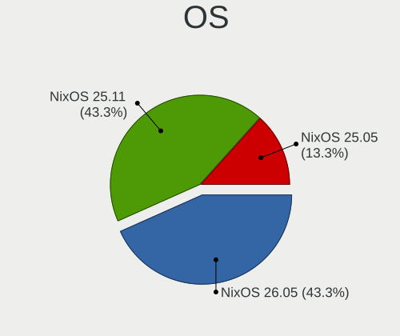

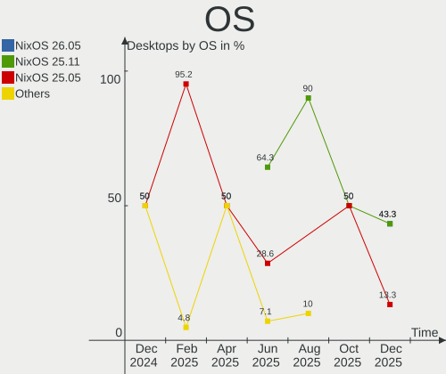

| Name        | Desktops | Percent |
|-------------|----------|---------|
| NixOS 26.05 | 13       | 43.33%  |
| NixOS 25.11 | 13       | 43.33%  |
| NixOS 25.05 | 4        | 13.33%  |

OS Family
---------

OS without a version

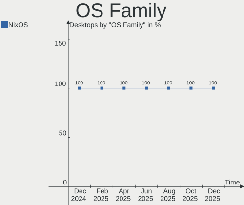

| Name  | Desktops | Percent |
|-------|----------|---------|
| NixOS | 30       | 100%    |

Kernel
------

Version of the Linux kernel

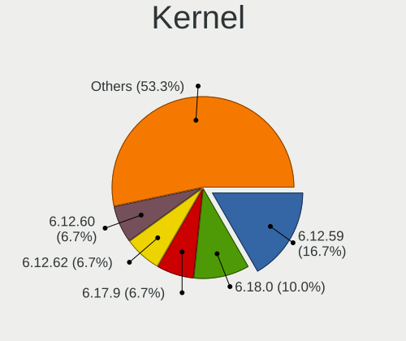

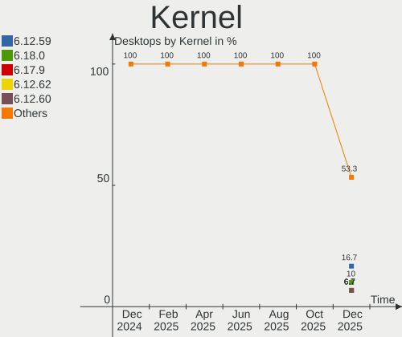

| Version           | Desktops | Percent |
|-------------------|----------|---------|
| 6.12.59           | 5        | 16.67%  |
| 6.18.0            | 3        | 10%     |
| 6.17.9            | 2        | 6.67%   |
| 6.12.62           | 2        | 6.67%   |
| 6.12.60           | 2        | 6.67%   |
| 6.6.117           | 1        | 3.33%   |
| 6.18.2            | 1        | 3.33%   |
| 6.18.1-zen1       | 1        | 3.33%   |
| 6.18.0-cachyos    | 1        | 3.33%   |
| 6.17.9-zen1       | 1        | 3.33%   |
| 6.17.8-zen1       | 1        | 3.33%   |
| 6.17.8-cachyos    | 1        | 3.33%   |
| 6.17.8            | 1        | 3.33%   |
| 6.17.13           | 1        | 3.33%   |
| 6.12.60-cachyos   | 1        | 3.33%   |
| 6.12.59-xanmod1   | 1        | 3.33%   |
| 6.12.58           | 1        | 3.33%   |
| 6.12.57-xanmod1   | 1        | 3.33%   |
| 6.12.56-hardened1 | 1        | 3.33%   |
| 6.12.40           | 1        | 3.33%   |
| 6.1.159           | 1        | 3.33%   |

Kernel Family
-------------

Linux kernel without a distro release

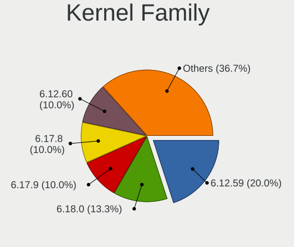

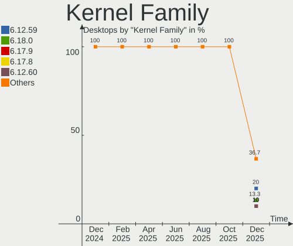

| Version | Desktops | Percent |
|---------|----------|---------|
| 6.12.59 | 6        | 20%     |
| 6.18.0  | 4        | 13.33%  |
| 6.17.9  | 3        | 10%     |
| 6.17.8  | 3        | 10%     |
| 6.12.60 | 3        | 10%     |
| 6.12.62 | 2        | 6.67%   |
| 6.6.117 | 1        | 3.33%   |
| 6.18.2  | 1        | 3.33%   |
| 6.18.1  | 1        | 3.33%   |
| 6.17.13 | 1        | 3.33%   |
| 6.12.58 | 1        | 3.33%   |
| 6.12.57 | 1        | 3.33%   |
| 6.12.56 | 1        | 3.33%   |
| 6.12.40 | 1        | 3.33%   |
| 6.1.159 | 1        | 3.33%   |

Kernel Major Ver.
-----------------

Linux kernel major version

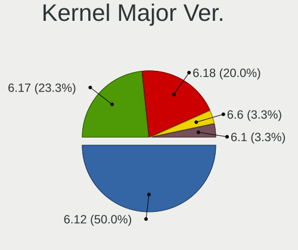

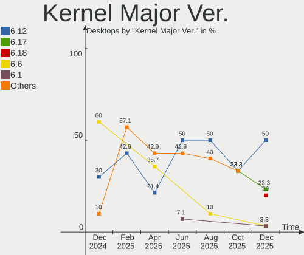

| Version | Desktops | Percent |
|---------|----------|---------|
| 6.12    | 15       | 50%     |
| 6.17    | 7        | 23.33%  |
| 6.18    | 6        | 20%     |
| 6.6     | 1        | 3.33%   |
| 6.1     | 1        | 3.33%   |

Arch
----

OS architecture (x86_64, i586, etc.)

| Name   | Desktops | Percent |
|--------|----------|---------|
| x86_64 | 30       | 100%    |

DE
--

Desktop Environment

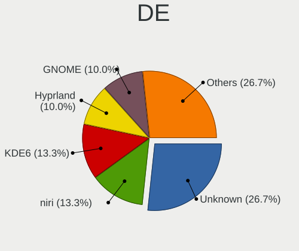

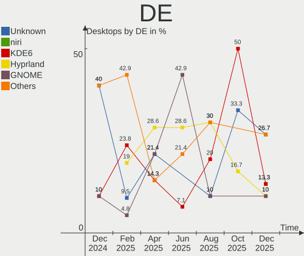

| Name           | Desktops | Percent |
|----------------|----------|---------|
| Unknown        | 8        | 26.67%  |
| niri           | 4        | 13.33%  |
| KDE6           | 4        | 13.33%  |
| Hyprland       | 3        | 10%     |
| GNOME          | 3        | 10%     |
| X-Cinnamon     | 2        | 6.67%   |
| KDE            | 2        | 6.67%   |
| XFCE           | 1        | 3.33%   |
| sway           | 1        | 3.33%   |
| start-hyprland | 1        | 3.33%   |
| COSMIC         | 1        | 3.33%   |

Display Server
--------------

X11 or Wayland

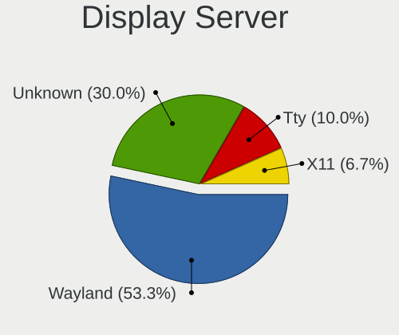

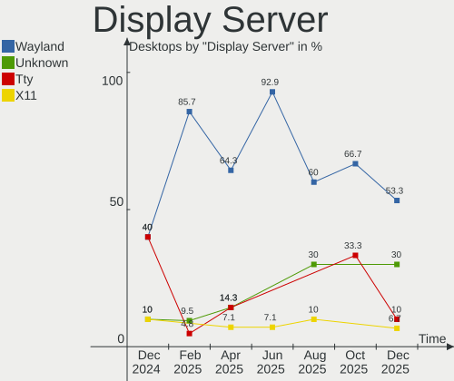

| Name    | Desktops | Percent |
|---------|----------|---------|
| Wayland | 16       | 53.33%  |
| Unknown | 9        | 30%     |
| Tty     | 3        | 10%     |
| X11     | 2        | 6.67%   |

Display Manager
---------------

SDDM, LightDM, etc.

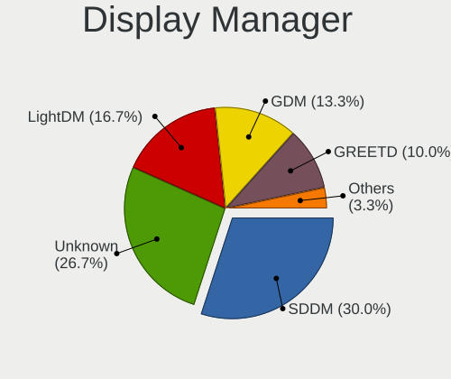

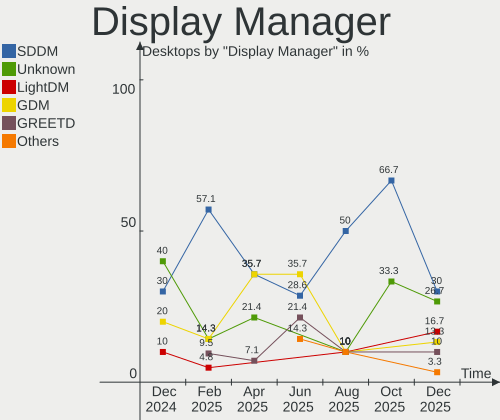

| Name                  | Desktops | Percent |
|-----------------------|----------|---------|
| SDDM                  | 9        | 30%     |
| Unknown               | 8        | 26.67%  |
| LightDM               | 5        | 16.67%  |
| GDM                   | 4        | 13.33%  |
| GREETD                | 3        | 10%     |
| DISPLAY-MANAGER-START | 1        | 3.33%   |

OS Lang
-------

Language

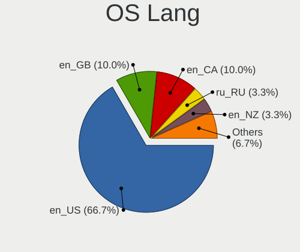

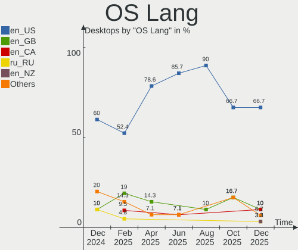

| Lang  | Desktops | Percent |
|-------|----------|---------|
| en_US | 20       | 66.67%  |
| en_GB | 3        | 10%     |
| en_CA | 3        | 10%     |
| ru_RU | 1        | 3.33%   |
| en_NZ | 1        | 3.33%   |
| en_AU | 1        | 3.33%   |
| de_DE | 1        | 3.33%   |

Boot Mode
---------

EFI or BIOS

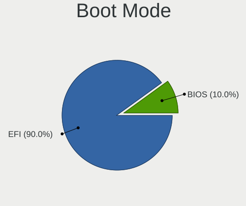

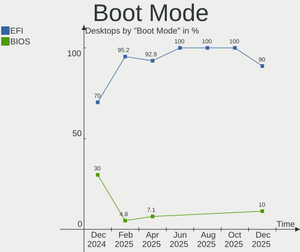

| Mode | Desktops | Percent |
|------|----------|---------|
| EFI  | 27       | 90%     |
| BIOS | 3        | 10%     |

Filesystem
----------

Type of filesystem

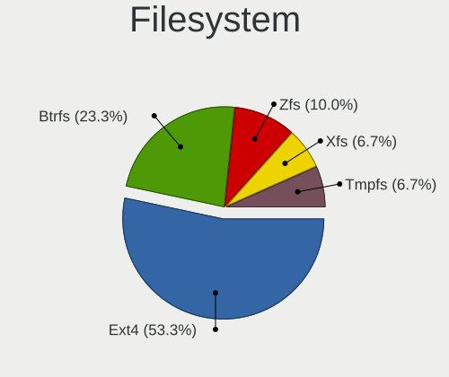

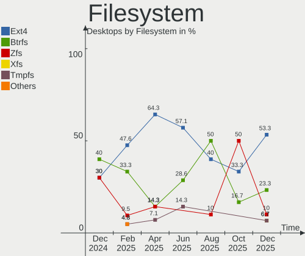

| Type  | Desktops | Percent |
|-------|----------|---------|
| Ext4  | 16       | 53.33%  |
| Btrfs | 7        | 23.33%  |
| Zfs   | 3        | 10%     |
| Xfs   | 2        | 6.67%   |
| Tmpfs | 2        | 6.67%   |

Part. scheme
------------

Scheme of partitioning

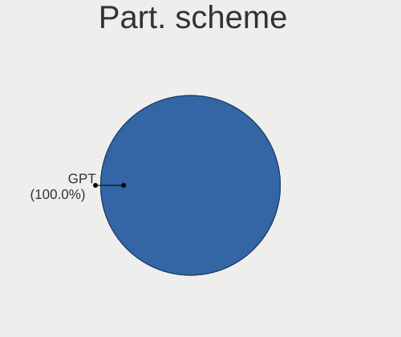

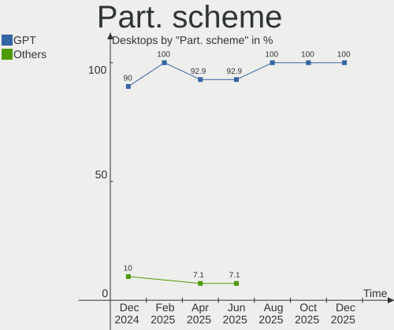

| Type | Desktops | Percent |
|------|----------|---------|
| GPT  | 30       | 100%    |

Dual Boot with Linux/BSD
------------------------

Hosting more than one Linux/BSD

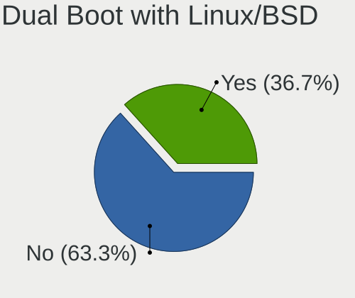

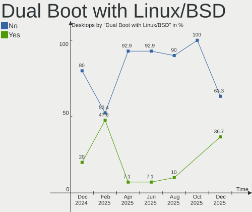

| Dual boot | Desktops | Percent |
|-----------|----------|---------|
| No        | 19       | 63.33%  |
| Yes       | 11       | 36.67%  |

Dual Boot (Win)
---------------

Hosting Linux and Windows

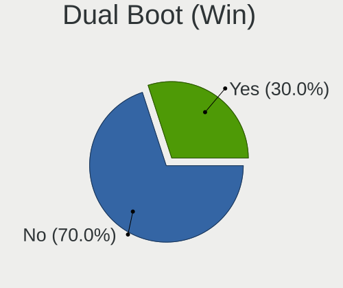

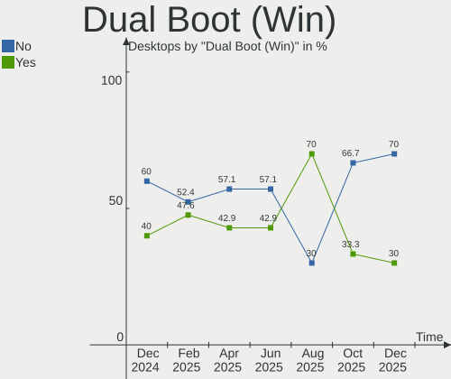

| Dual boot | Desktops | Percent |
|-----------|----------|---------|
| No        | 21       | 70%     |
| Yes       | 9        | 30%     |

Board
-----

Vendor
------

Motherboard manufacturer

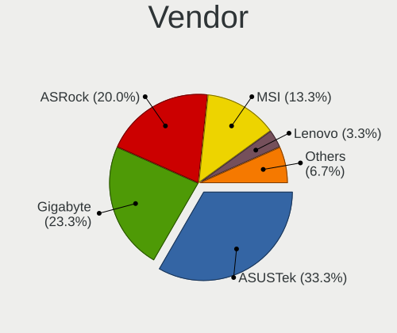

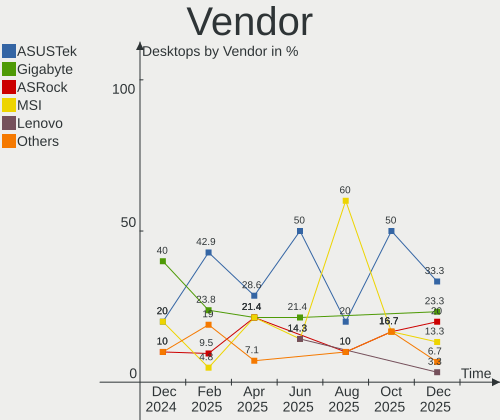

| Name                | Desktops | Percent |
|---------------------|----------|---------|
| ASUSTek Computer    | 10       | 33.33%  |
| Gigabyte Technology | 7        | 23.33%  |
| ASRock              | 6        | 20%     |
| MSI                 | 4        | 13.33%  |
| Lenovo              | 1        | 3.33%   |
| Dell                | 1        | 3.33%   |
| AZW                 | 1        | 3.33%   |

Model
-----

Motherboard model

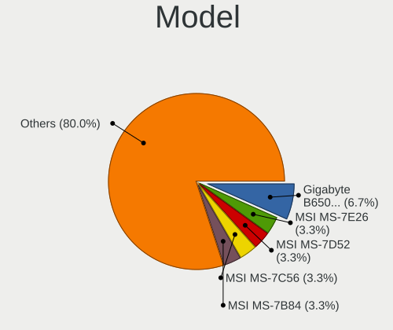

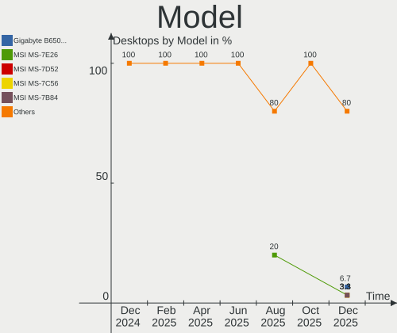

| Name                                    | Desktops | Percent |
|-----------------------------------------|----------|---------|
| Gigabyte B650 AORUS ELITE AX V2         | 2        | 6.67%   |
| MSI MS-7E26                             | 1        | 3.33%   |
| MSI MS-7D52                             | 1        | 3.33%   |
| MSI MS-7C56                             | 1        | 3.33%   |
| MSI MS-7B84                             | 1        | 3.33%   |
| Lenovo ThinkStation P3 Ultra 30HACTO1WW | 1        | 3.33%   |
| Gigabyte Z690 UD DDR4                   | 1        | 3.33%   |
| Gigabyte Z390 GAMING SLI                | 1        | 3.33%   |
| Gigabyte Z270X-UD3                      | 1        | 3.33%   |
| Gigabyte Z170-HD3-CF                    | 1        | 3.33%   |
| Gigabyte X870 AORUS ELITE WIFI7         | 1        | 3.33%   |
| Dell OptiPlex 5040                      | 1        | 3.33%   |
| AZW MINI S                              | 1        | 3.33%   |
| ASUS TUF Gaming X570-PLUS               | 1        | 3.33%   |
| ASUS TUF Gaming B550-PLUS               | 1        | 3.33%   |
| ASUS ROG STRIX X870-F GAMING WIFI       | 1        | 3.33%   |
| ASUS ROG STRIX X570-F GAMING            | 1        | 3.33%   |
| ASUS ROG STRIX B550-I GAMING            | 1        | 3.33%   |
| ASUS ROG STRIX B550-F GAMING            | 1        | 3.33%   |
| ASUS ProArt X870E-CREATOR WIFI          | 1        | 3.33%   |
| ASUS PRIME X670E-PRO WIFI               | 1        | 3.33%   |
| ASUS PRIME B550M-A WIFI II              | 1        | 3.33%   |
| ASUS Amd Am5                            | 1        | 3.33%   |
| ASRock X570 Phantom Gaming-ITX/TB3      | 1        | 3.33%   |
| ASRock J4125M                           | 1        | 3.33%   |
| ASRock B850 Steel Legend WiFi           | 1        | 3.33%   |
| ASRock B650M PG Riptide                 | 1        | 3.33%   |
| ASRock B550M Steel Legend               | 1        | 3.33%   |
| ASRock AB350M Pro4                      | 1        | 3.33%   |

Model Family
------------

Motherboard model prefix

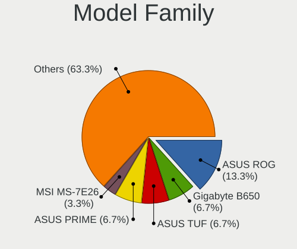

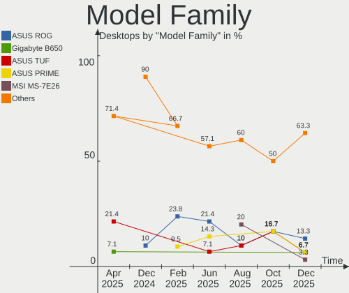

| Name                 | Desktops | Percent |
|----------------------|----------|---------|
| ASUS ROG             | 4        | 13.33%  |
| Gigabyte B650        | 2        | 6.67%   |
| ASUS TUF             | 2        | 6.67%   |
| ASUS PRIME           | 2        | 6.67%   |
| MSI MS-7E26          | 1        | 3.33%   |
| MSI MS-7D52          | 1        | 3.33%   |
| MSI MS-7C56          | 1        | 3.33%   |
| MSI MS-7B84          | 1        | 3.33%   |
| Lenovo ThinkStation  | 1        | 3.33%   |
| Gigabyte Z690        | 1        | 3.33%   |
| Gigabyte Z390        | 1        | 3.33%   |
| Gigabyte Z270X-UD3   | 1        | 3.33%   |
| Gigabyte Z170-HD3-CF | 1        | 3.33%   |
| Gigabyte X870        | 1        | 3.33%   |
| Dell OptiPlex        | 1        | 3.33%   |
| AZW MINI             | 1        | 3.33%   |
| ASUS ProArt          | 1        | 3.33%   |
| ASUS Amd             | 1        | 3.33%   |
| ASRock X570          | 1        | 3.33%   |
| ASRock J4125M        | 1        | 3.33%   |
| ASRock B850          | 1        | 3.33%   |
| ASRock B650M         | 1        | 3.33%   |
| ASRock B550M         | 1        | 3.33%   |
| ASRock AB350M        | 1        | 3.33%   |

MFG Year
--------

Motherboard manufacture year

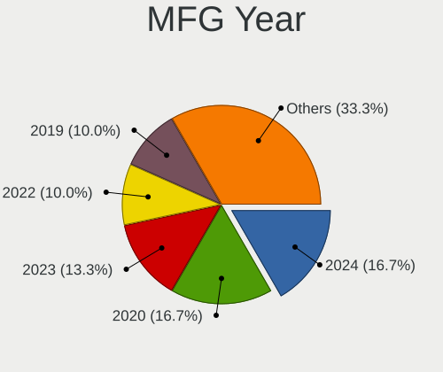

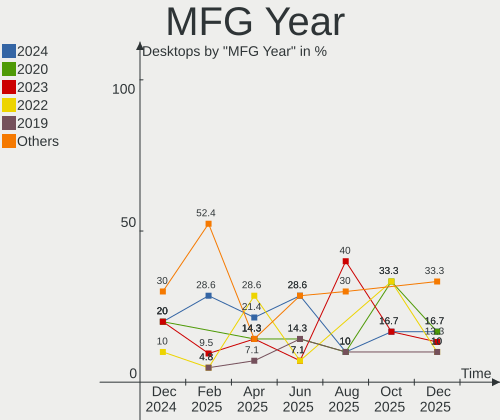

| Year | Desktops | Percent |
|------|----------|---------|
| 2024 | 5        | 16.67%  |
| 2020 | 5        | 16.67%  |
| 2023 | 4        | 13.33%  |
| 2022 | 3        | 10%     |
| 2019 | 3        | 10%     |
| 2015 | 3        | 10%     |
| 2021 | 2        | 6.67%   |
| 2025 | 1        | 3.33%   |
| 2018 | 1        | 3.33%   |
| 2017 | 1        | 3.33%   |
| 2016 | 1        | 3.33%   |
| 2012 | 1        | 3.33%   |

Form Factor
-----------

Physical design of the computer

| Name    | Desktops | Percent |
|---------|----------|---------|
| Desktop | 30       | 100%    |

Secure Boot
-----------

Enabled or disabled

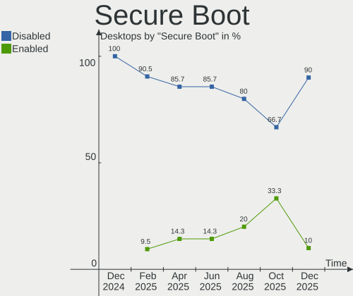

| State    | Desktops | Percent |
|----------|----------|---------|
| Disabled | 27       | 90%     |
| Enabled  | 3        | 10%     |

Coreboot
--------

Have coreboot on board

| Used | Desktops | Percent |
|------|----------|---------|
| No   | 30       | 100%    |

RAM Size
--------

Total RAM memory

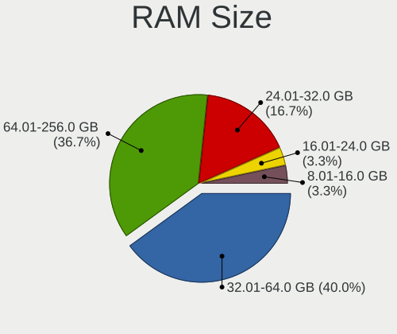

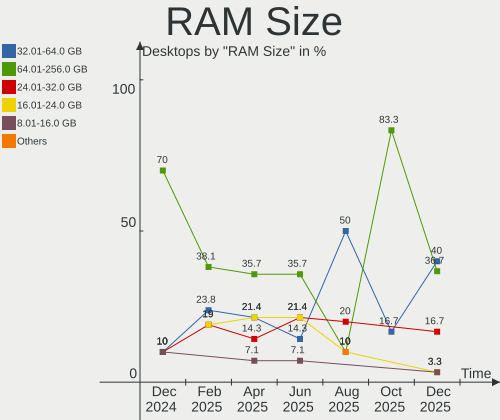

| Size in GB  | Desktops | Percent |
|-------------|----------|---------|
| 32.01-64.0  | 12       | 40%     |
| 64.01-256.0 | 11       | 36.67%  |
| 24.01-32.0  | 5        | 16.67%  |
| 16.01-24.0  | 1        | 3.33%   |
| 8.01-16.0   | 1        | 3.33%   |

RAM Used
--------

Used RAM memory

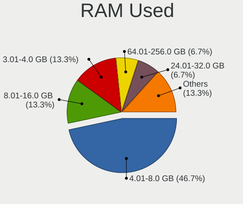

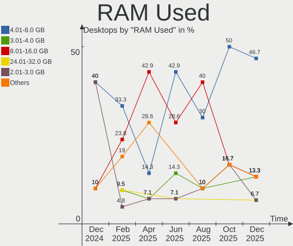

| Used GB     | Desktops | Percent |
|-------------|----------|---------|
| 4.01-8.0    | 14       | 46.67%  |
| 3.01-4.0    | 4        | 13.33%  |
| 8.01-16.0   | 4        | 13.33%  |
| 24.01-32.0  | 2        | 6.67%   |
| 2.01-3.0    | 2        | 6.67%   |
| 64.01-256.0 | 2        | 6.67%   |
| 32.01-64.0  | 1        | 3.33%   |
| 16.01-24.0  | 1        | 3.33%   |

Total Drives
------------

Number of drives on board

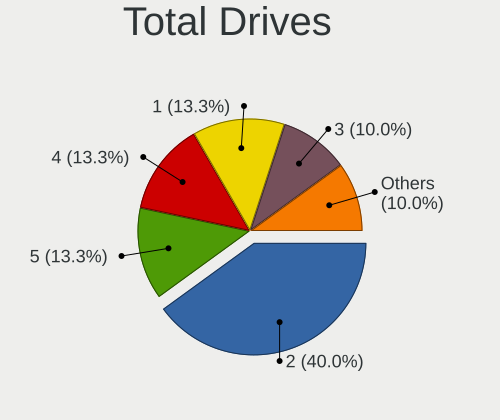

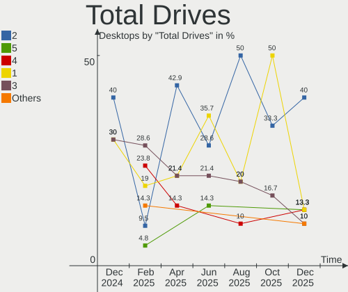

| Drives | Desktops | Percent |
|--------|----------|---------|
| 2      | 12       | 40%     |
| 5      | 4        | 13.33%  |
| 4      | 4        | 13.33%  |
| 1      | 4        | 13.33%  |
| 3      | 3        | 10%     |
| 6      | 2        | 6.67%   |
| 7      | 1        | 3.33%   |

Has CD-ROM
----------

Has CD-ROM on board

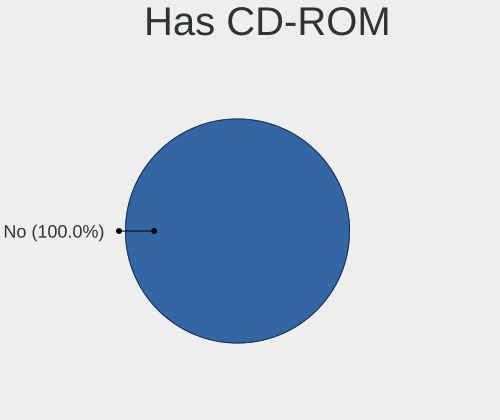

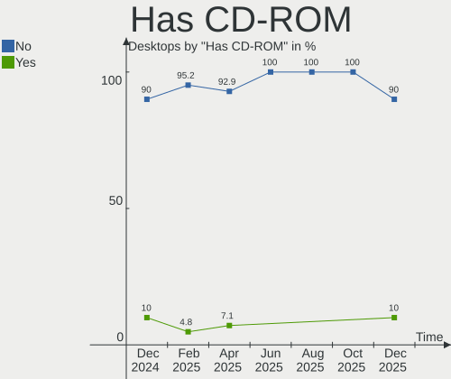

| Presented | Desktops | Percent |
|-----------|----------|---------|
| No        | 27       | 90%     |
| Yes       | 3        | 10%     |

Has Ethernet
------------

Has Ethernet on board

| Presented | Desktops | Percent |
|-----------|----------|---------|
| Yes       | 30       | 100%    |

Has WiFi
--------

Has WiFi module

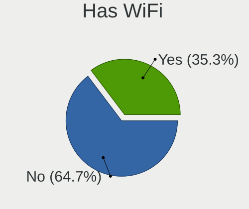

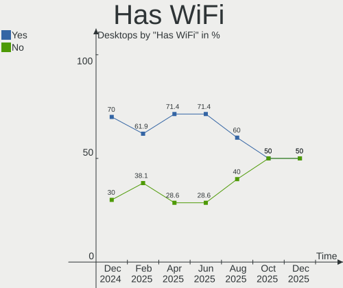

| Presented | Desktops | Percent |
|-----------|----------|---------|
| Yes       | 15       | 50%     |
| No        | 15       | 50%     |

Has Bluetooth
-------------

Has Bluetooth module

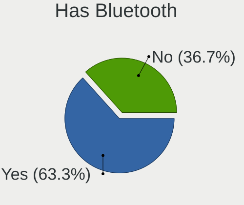

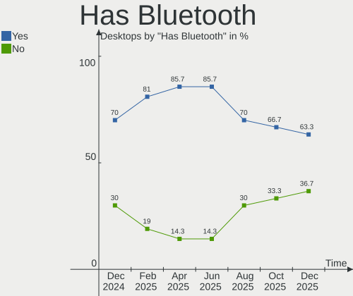

| Presented | Desktops | Percent |
|-----------|----------|---------|
| Yes       | 19       | 63.33%  |
| No        | 11       | 36.67%  |

Location
--------

Country
-------

Geographic location (country)

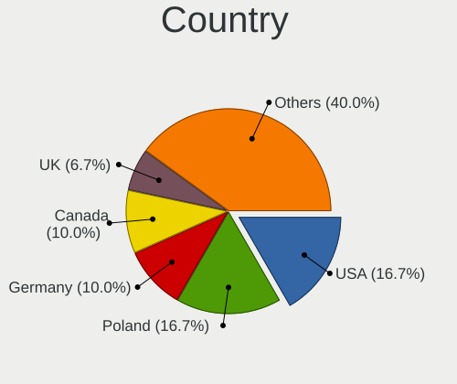

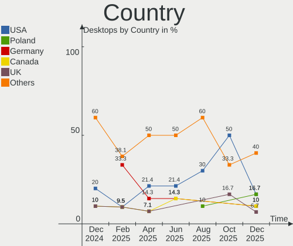

| Country     | Desktops | Percent |
|-------------|----------|---------|
| USA         | 5        | 16.67%  |
| Poland      | 5        | 16.67%  |
| Germany     | 3        | 10%     |
| Canada      | 3        | 10%     |
| UK          | 2        | 6.67%   |
| Netherlands | 2        | 6.67%   |
| Czechia     | 2        | 6.67%   |
| Sweden      | 1        | 3.33%   |
| Russia      | 1        | 3.33%   |
| Romania     | 1        | 3.33%   |
| Norway      | 1        | 3.33%   |
| New Zealand | 1        | 3.33%   |
| France      | 1        | 3.33%   |
| Austria     | 1        | 3.33%   |
| Australia   | 1        | 3.33%   |

City
----

Geographic location (city)

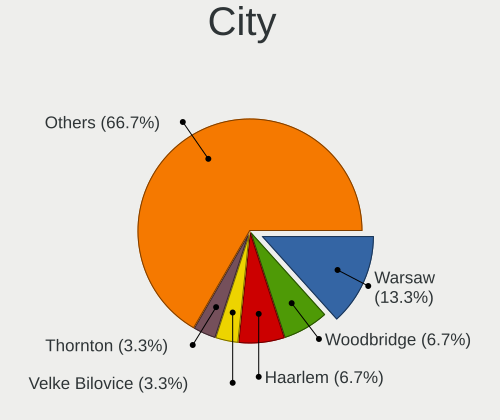

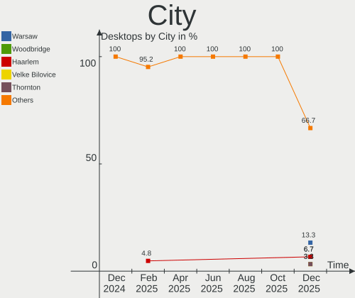

| City           | Desktops | Percent |
|----------------|----------|---------|
| Warsaw         | 4        | 13.33%  |
| Woodbridge     | 2        | 6.67%   |
| Haarlem        | 2        | 6.67%   |
| Velke Bilovice | 1        | 3.33%   |
| Thornton       | 1        | 3.33%   |
| Shreveport     | 1        | 3.33%   |
| Portland       | 1        | 3.33%   |
| Ottawa         | 1        | 3.33%   |
| Moscow         | 1        | 3.33%   |
| Melbourne      | 1        | 3.33%   |
| Leipzig        | 1        | 3.33%   |
| Le Meux        | 1        | 3.33%   |
| Kufstein       | 1        | 3.33%   |
| Krakow         | 1        | 3.33%   |
| Jessheim       | 1        | 3.33%   |
| Gothenburg     | 1        | 3.33%   |
| Garbsen        | 1        | 3.33%   |
| Decatur        | 1        | 3.33%   |
| Crimla         | 1        | 3.33%   |
| Coventry       | 1        | 3.33%   |
| Bucharest      | 1        | 3.33%   |
| Brno           | 1        | 3.33%   |
| Bradford       | 1        | 3.33%   |
| Auckland       | 1        | 3.33%   |
| Annapolis      | 1        | 3.33%   |

Drives
------

Drive Vendor
------------

Hard drive vendors

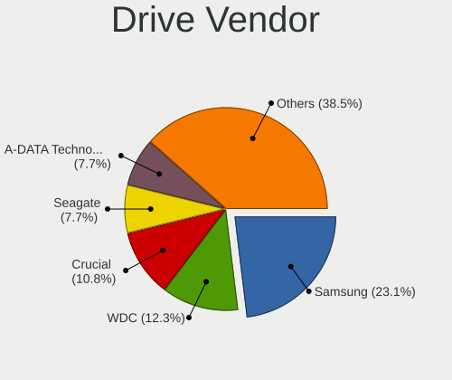

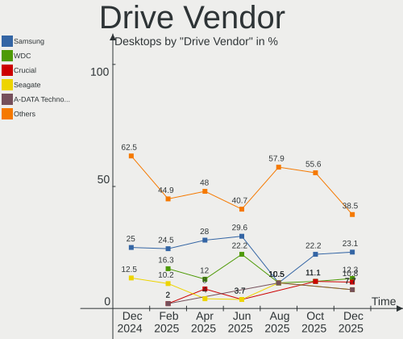

| Vendor                      | Desktops | Drives | Percent |
|-----------------------------|----------|--------|---------|
| Samsung Electronics         | 15       | 22     | 23.08%  |
| WDC                         | 8        | 14     | 12.31%  |
| Crucial                     | 7        | 10     | 10.77%  |
| Seagate                     | 5        | 11     | 7.69%   |
| A-DATA Technology           | 5        | 6      | 7.69%   |
| Toshiba                     | 4        | 4      | 6.15%   |
| Intel                       | 3        | 3      | 4.62%   |
| Unknown                     | 2        | 2      | 3.08%   |
| Kingston Technology Company | 2        | 3      | 3.08%   |
| Unknown                     | 2        | 3      | 3.08%   |
| Verbatim                    | 1        | 2      | 1.54%   |
| Team                        | 1        | 1      | 1.54%   |
| T-FORCE                     | 1        | 1      | 1.54%   |
| Synology                    | 1        | 1      | 1.54%   |
| SPCC                        | 1        | 1      | 1.54%   |
| Phison                      | 1        | 1      | 1.54%   |
| Micron Technology           | 1        | 1      | 1.54%   |
| KINGBANK                    | 1        | 2      | 1.54%   |
| Fanxiang                    | 1        | 1      | 1.54%   |
| Corsair                     | 1        | 1      | 1.54%   |
| Apple                       | 1        | 2      | 1.54%   |
| Apacer                      | 1        | 1      | 1.54%   |

Drive Model
-----------

Hard drive models

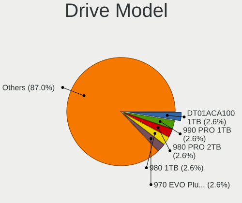

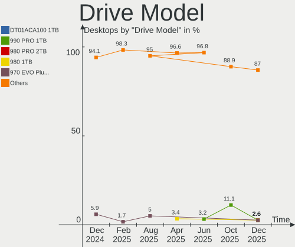

| Model                                                 | Desktops | Percent |
|-------------------------------------------------------|----------|---------|
| Toshiba DT01ACA100 1TB                                | 2        | 2.6%    |
| Samsung SSD 990 PRO 1TB                               | 2        | 2.6%    |
| Samsung SSD 980 PRO 2TB                               | 2        | 2.6%    |
| Samsung SSD 980 1TB                                   | 2        | 2.6%    |
| Samsung SSD 970 EVO Plus 1TB                          | 2        | 2.6%    |
| Samsung SSD 860 EVO 500GB                             | 2        | 2.6%    |
| Crucial CT2000T500SSD8 2TB                            | 2        | 2.6%    |
| A-DATA SX8200PNP 256GB                                | 2        | 2.6%    |
| Unknown                                               | 2        | 2.6%    |
| WDC WD80EFZZ-68BTXN0 8TB                              | 1        | 1.3%    |
| WDC WD80EFAX-68KNBN0 8TB                              | 1        | 1.3%    |
| WDC WD5000AZLX-08K2TA0 500GB                          | 1        | 1.3%    |
| WDC WD5000AAKX-60U6AA0 500GB                          | 1        | 1.3%    |
| WDC WD40EFPX-68C6CN0 4TB                              | 1        | 1.3%    |
| WDC WD30EFRX-68EUZN0 3TB                              | 1        | 1.3%    |
| WDC WD30EFRX-68A 3TB                                  | 1        | 1.3%    |
| WDC WD20EARX-00PASB0 2TB                              | 1        | 1.3%    |
| WDC WD20EARS-00MVWB0 2TB                              | 1        | 1.3%    |
| WDC WD10EZEX-08M2NA0 1TB                              | 1        | 1.3%    |
| WDC WD1003FBYX-01Y7B1 1TB                             | 1        | 1.3%    |
| Verbatim Vi550 S3 1024GB                              | 1        | 1.3%    |
| Unknown NVMe SSD Drive 512GB                          | 1        | 1.3%    |
| Unknown NVMe SSD Drive 1TB                            | 1        | 1.3%    |
| Toshiba THNSN5256GPUK NVMe 256GB                      | 1        | 1.3%    |
| Toshiba MQ02ABF100 1TB                                | 1        | 1.3%    |
| Team TM8FPD002T 2TB                                   | 1        | 1.3%    |
| T-FORCE SSD 1TB                                       | 1        | 1.3%    |
| Synology HAT3300-4T                                   | 1        | 1.3%    |
| SPCC Solid State Disk 2TB                             | 1        | 1.3%    |
| Seagate ST8000DM004-2CX188 8TB                        | 1        | 1.3%    |
| Seagate ST4000VN006-3CW104 4TB                        | 1        | 1.3%    |
| Seagate ST4000DM000-1F2168 4TB                        | 1        | 1.3%    |
| Seagate ST1000DM010-2EP102 1TB                        | 1        | 1.3%    |
| Seagate ST10000NT001-3LY101 10TB                      | 1        | 1.3%    |
| Seagate FireCuda SE SSD ZP500GM30033 500GB            | 1        | 1.3%    |
| Samsung SSD 990 PRO 4TB                               | 1        | 1.3%    |
| Samsung SSD 990 PRO 2TB                               | 1        | 1.3%    |
| Samsung SSD 980 PRO with Heatsink 1TB S6WSNS0WC08248Z | 1        | 1.3%    |
| Samsung SSD 980 PRO with Heatsink 1TB                 | 1        | 1.3%    |
| Samsung SSD 980 500GB                                 | 1        | 1.3%    |

HDD Vendor
----------

Hard disk drive vendors

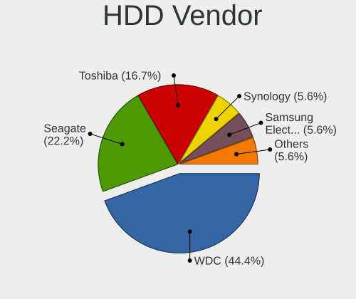

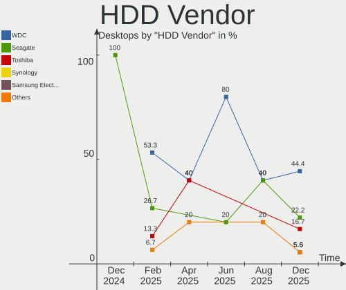

| Vendor              | Desktops | Drives | Percent |
|---------------------|----------|--------|---------|
| WDC                 | 8        | 14     | 44.44%  |
| Seagate             | 4        | 10     | 22.22%  |
| Toshiba             | 3        | 3      | 16.67%  |
| Synology            | 1        | 1      | 5.56%   |
| Samsung Electronics | 1        | 1      | 5.56%   |
| Apple               | 1        | 2      | 5.56%   |

SSD Vendor
----------

Solid state drive vendors

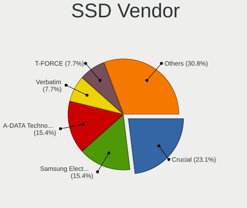

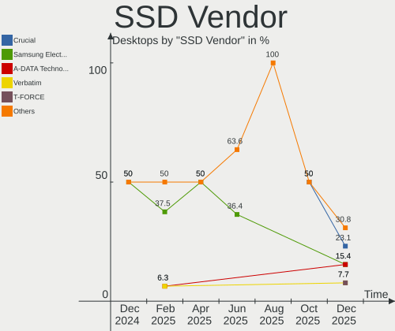

| Vendor              | Desktops | Drives | Percent |
|---------------------|----------|--------|---------|
| Crucial             | 3        | 6      | 23.08%  |
| Samsung Electronics | 2        | 2      | 15.38%  |
| A-DATA Technology   | 2        | 2      | 15.38%  |
| Verbatim            | 1        | 2      | 7.69%   |
| T-FORCE             | 1        | 1      | 7.69%   |
| SPCC                | 1        | 1      | 7.69%   |
| Intel               | 1        | 1      | 7.69%   |
| Fanxiang            | 1        | 1      | 7.69%   |
| Apacer              | 1        | 1      | 7.69%   |

Drive Kind
----------

HDD or SSD

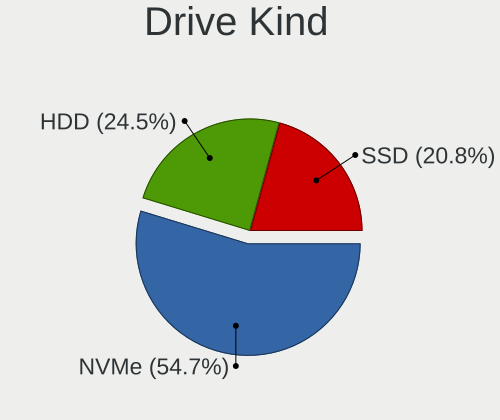

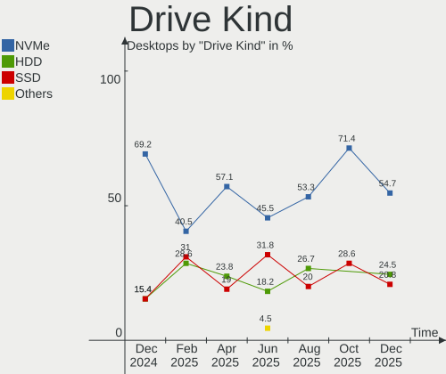

| Kind | Desktops | Drives | Percent |
|------|----------|--------|---------|
| NVMe | 29       | 45     | 54.72%  |
| HDD  | 13       | 31     | 24.53%  |
| SSD  | 11       | 17     | 20.75%  |

Drive Connector
---------------

SATA, SAS, NVMe, etc.

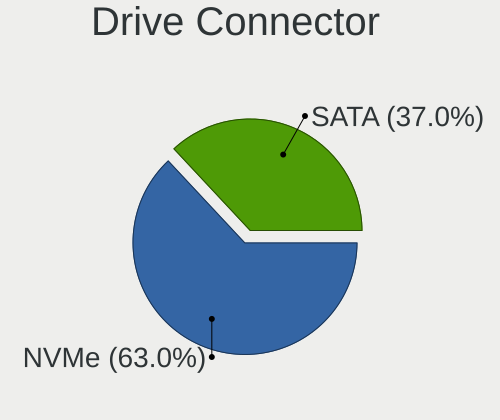

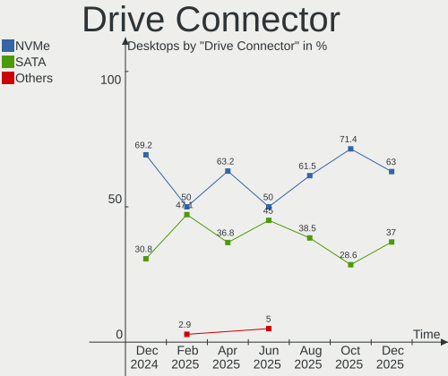

| Type | Desktops | Drives | Percent |
|------|----------|--------|---------|
| NVMe | 29       | 45     | 63.04%  |
| SATA | 17       | 48     | 36.96%  |

Drive Size
----------

Size of hard drive

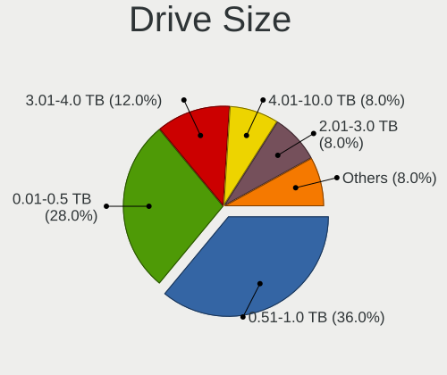

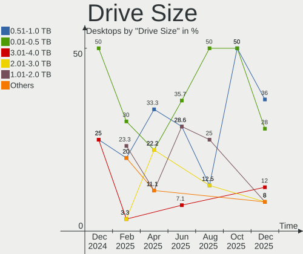

| Size in TB | Desktops | Drives | Percent |
|------------|----------|--------|---------|
| 0.51-1.0   | 9        | 13     | 36%     |
| 0.01-0.5   | 7        | 10     | 28%     |
| 3.01-4.0   | 3        | 9      | 12%     |
| 2.01-3.0   | 2        | 2      | 8%      |
| 1.01-2.0   | 2        | 5      | 8%      |
| 4.01-10.0  | 2        | 9      | 8%      |

Space Total
-----------

Amount of disk space available on the file system

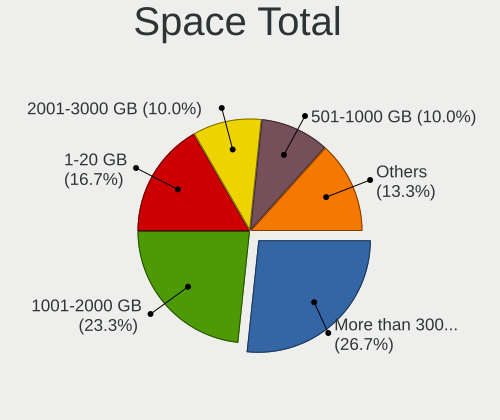

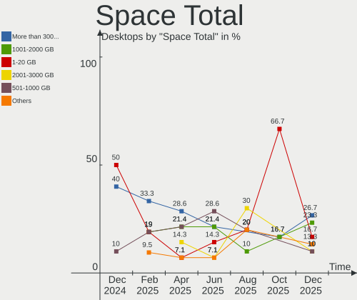

| Size in GB     | Desktops | Percent |
|----------------|----------|---------|
| More than 3000 | 8        | 26.67%  |
| 1001-2000      | 7        | 23.33%  |
| 1-20           | 5        | 16.67%  |
| 2001-3000      | 3        | 10%     |
| 501-1000       | 3        | 10%     |
| 251-500        | 2        | 6.67%   |
| 101-250        | 1        | 3.33%   |
| 51-100         | 1        | 3.33%   |

Space Used
----------

Amount of used disk space

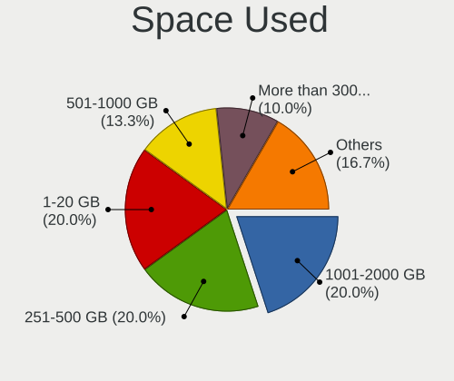

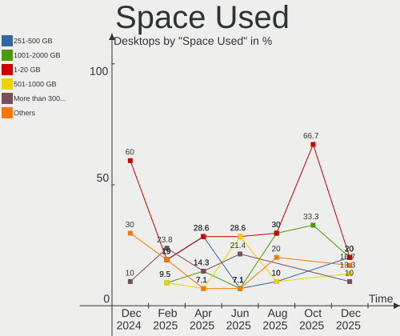

| Used GB        | Desktops | Percent |
|----------------|----------|---------|
| 251-500        | 6        | 20%     |
| 1001-2000      | 6        | 20%     |
| 1-20           | 6        | 20%     |
| 501-1000       | 4        | 13.33%  |
| More than 3000 | 3        | 10%     |
| 21-50          | 2        | 6.67%   |
| 51-100         | 2        | 6.67%   |
| 101-250        | 1        | 3.33%   |

Malfunc. Drives
---------------

Drive models with a malfunction

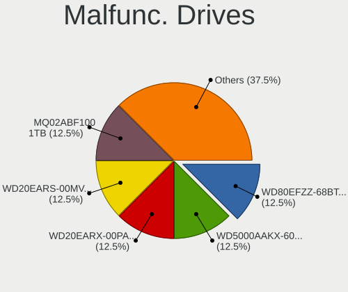

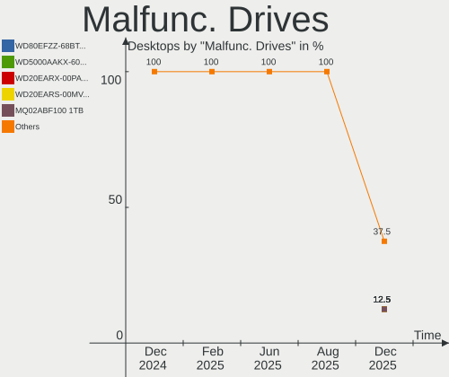

| Model                             | Desktops | Drives | Percent |
|-----------------------------------|----------|--------|---------|
| WDC WD80EFZZ-68BTXN0 8TB          | 1        | 1      | 12.5%   |
| WDC WD5000AAKX-60U6AA0 500GB      | 1        | 1      | 12.5%   |
| WDC WD20EARX-00PASB0 2TB          | 1        | 1      | 12.5%   |
| WDC WD20EARS-00MVWB0 2TB          | 1        | 1      | 12.5%   |
| Toshiba MQ02ABF100 1TB            | 1        | 1      | 12.5%   |
| Samsung Electronics SSD 980 1TB   | 1        | 1      | 12.5%   |
| Apple HDD HTS547550A9E384 500GB   | 1        | 1      | 12.5%   |
| A-DATA Technology SP900 256GB SSD | 1        | 1      | 12.5%   |

Malfunc. Drive Vendor
---------------------

Vendors of faulty drives

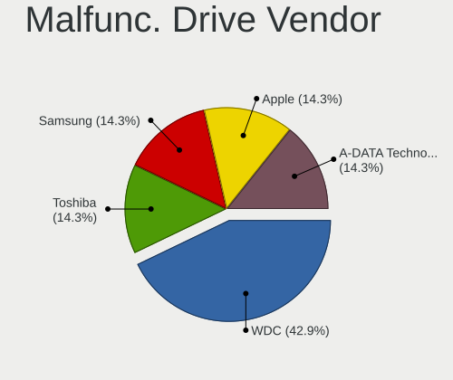

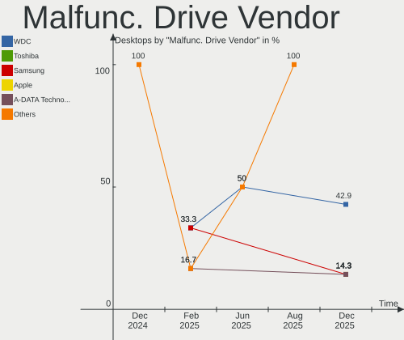

| Vendor              | Desktops | Drives | Percent |
|---------------------|----------|--------|---------|
| WDC                 | 3        | 4      | 42.86%  |
| Toshiba             | 1        | 1      | 14.29%  |
| Samsung Electronics | 1        | 1      | 14.29%  |
| Apple               | 1        | 1      | 14.29%  |
| A-DATA Technology   | 1        | 1      | 14.29%  |

Malfunc. HDD Vendor
-------------------

Vendors of faulty HDD drives

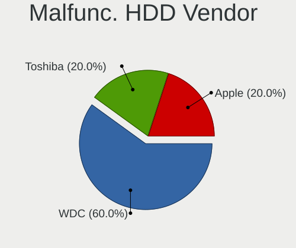

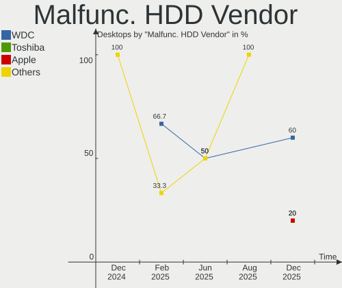

| Vendor  | Desktops | Drives | Percent |
|---------|----------|--------|---------|
| WDC     | 3        | 4      | 60%     |
| Toshiba | 1        | 1      | 20%     |
| Apple   | 1        | 1      | 20%     |

Malfunc. Drive Kind
-------------------

Kinds of faulty drives

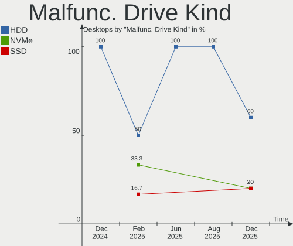

| Kind | Desktops | Drives | Percent |
|------|----------|--------|---------|
| HDD  | 3        | 6      | 60%     |
| NVMe | 1        | 1      | 20%     |
| SSD  | 1        | 1      | 20%     |

Failed Drives
-------------

Failed drive models

Zero info for selected period =(

Failed Drive Vendor
-------------------

Failed drive vendors

Zero info for selected period =(

Drive Status
------------

Number of failed and malfunc. drives

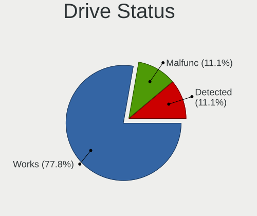

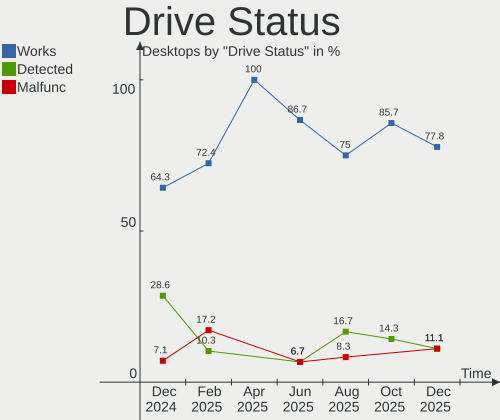

| Status   | Desktops | Drives | Percent |
|----------|----------|--------|---------|
| Works    | 28       | 80     | 77.78%  |
| Detected | 4        | 5      | 11.11%  |
| Malfunc  | 4        | 8      | 11.11%  |

Storage controller
------------------

Storage Vendor
--------------

Storage controller vendors

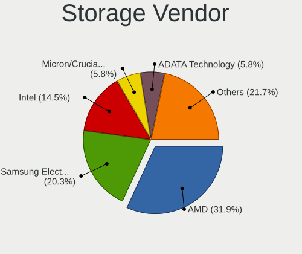

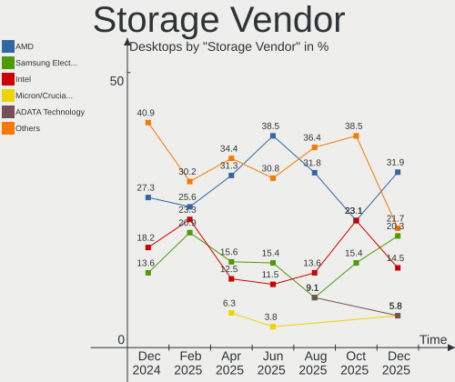

| Vendor                       | Desktops | Percent |
|------------------------------|----------|---------|
| AMD                          | 22       | 31.88%  |
| Samsung Electronics          | 14       | 20.29%  |
| Intel                        | 10       | 14.49%  |
| Micron/Crucial Technology    | 4        | 5.8%    |
| ADATA Technology             | 4        | 5.8%    |
| Sandisk                      | 3        | 4.35%   |
| MAXIO Technology (Hangzhou)  | 3        | 4.35%   |
| Kingston Technology Company  | 2        | 2.9%    |
| ASMedia Technology           | 2        | 2.9%    |
| Toshiba America Info Systems | 1        | 1.45%   |
| Seagate Technology           | 1        | 1.45%   |
| Phison Electronics           | 1        | 1.45%   |
| Micron Technology            | 1        | 1.45%   |
| Corsair Memory               | 1        | 1.45%   |

Storage Model
-------------

Storage controller models

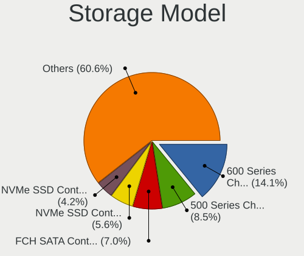

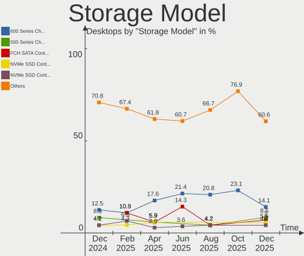

| Model                                                                         | Desktops | Percent |
|-------------------------------------------------------------------------------|----------|---------|
| AMD 600 Series Chipset SATA Controller                                        | 10       | 14.08%  |
| AMD 500 Series Chipset SATA Controller                                        | 6        | 8.45%   |
| AMD FCH SATA Controller [AHCI mode]                                           | 5        | 7.04%   |
| Samsung NVMe SSD Controller PM9A1/PM9A3/980PRO                                | 4        | 5.63%   |
| Samsung NVMe SSD Controller SM981/PM981/PM983                                 | 3        | 4.23%   |
| Samsung NVMe SSD Controller S4LV008[Pascal]                                   | 3        | 4.23%   |
| Samsung NVMe SSD Controller 980 (DRAM-less)                                   | 3        | 4.23%   |
| MAXIO (Hangzhou) NVMe SSD Controller MAP1202 (DRAM-less)                      | 3        | 4.23%   |
| Samsung NVMe SSD 9100 PRO [PM9E1]                                             | 2        | 2.82%   |
| Micron/Crucial T500 NVMe PCIe SSD                                             | 2        | 2.82%   |
| Micron/Crucial P2 [Nick P2] / P3 / P3 Plus NVMe PCIe SSD (DRAM-less)          | 2        | 2.82%   |
| Kingston Company NV2 NVMe SSD [SM2267XT] (DRAM-less)                          | 2        | 2.82%   |
| Intel Q170/Q150/B150/H170/H110/Z170/CM236 Chipset SATA Controller [AHCI Mode] | 2        | 2.82%   |
| Intel Alder Lake-S PCH SATA Controller [AHCI Mode]                            | 2        | 2.82%   |
| ADATA XPG SX8200 Pro PCIe Gen3x4 M.2 2280 Solid State Drive                   | 2        | 2.82%   |
| Toshiba America Info Systems XG4 NVMe SSD Controller                          | 1        | 1.41%   |
| Seagate E18 PCIe SSD                                                          | 1        | 1.41%   |
| SanDisk WD SN560/SN740/SN770/SN5000 NVMe SSD                                  | 1        | 1.41%   |
| Sandisk WD PC SN8050S / WD_BLACK SN8100 NVMe SSD                              | 1        | 1.41%   |
| Sandisk WD Black SN850X NVMe SSD                                              | 1        | 1.41%   |
| Phison E12 NVMe Controller                                                    | 1        | 1.41%   |
| Micron 9400 PRO NVMe SSD                                                      | 1        | 1.41%   |
| Intel SSD 670p Series [Keystone Harbor]                                       | 1        | 1.41%   |
| Intel SSD 660P Series                                                         | 1        | 1.41%   |
| Intel Celeron/Pentium Silver Processor SATA Controller                        | 1        | 1.41%   |
| Intel Cannon Lake PCH SATA AHCI Controller                                    | 1        | 1.41%   |
| Intel Alder Lake-N SATA AHCI Controller                                       | 1        | 1.41%   |
| Intel 200 Series PCH SATA controller [AHCI mode]                              | 1        | 1.41%   |
| Corsair Memory Non-Volatile memory controller                                 | 1        | 1.41%   |
| ASMedia ASM106x Serial ATA AHCI Controller                                    | 1        | 1.41%   |
| ASMedia ASM1061/ASM1062 Serial ATA Controller                                 | 1        | 1.41%   |
| AMD 400 Series Chipset SATA Controller                                        | 1        | 1.41%   |
| AMD 300 Series Chipset SATA Controller                                        | 1        | 1.41%   |
| ADATA LEGEND 850 LITE NVMe SSD (DRAM-less)                                    | 1        | 1.41%   |
| ADATA FALCON, GAMMIX S41, SPECTRIX S40G NVMe SSD (DRAM-less)                  | 1        | 1.41%   |

Storage Kind
------------

Kind of storage controller (IDE, SATA, NVMe, SAS, ...)

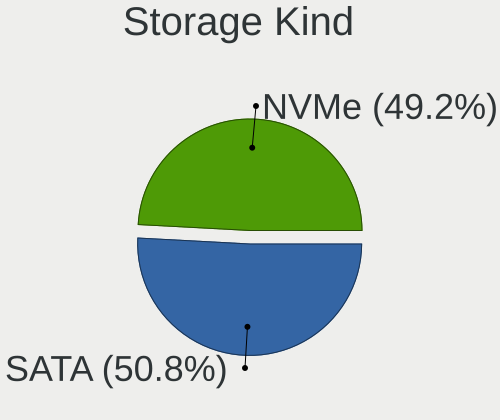

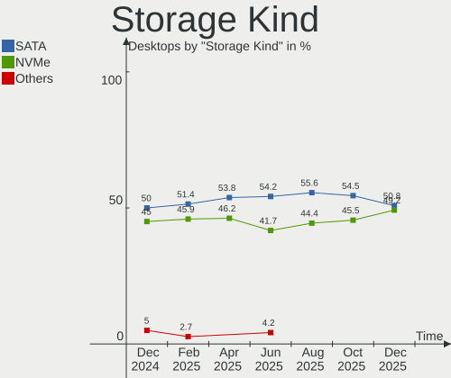

| Kind | Desktops | Percent |
|------|----------|---------|
| SATA | 30       | 50.85%  |
| NVMe | 29       | 49.15%  |

Processor
---------

CPU Vendor
----------

Processor vendors

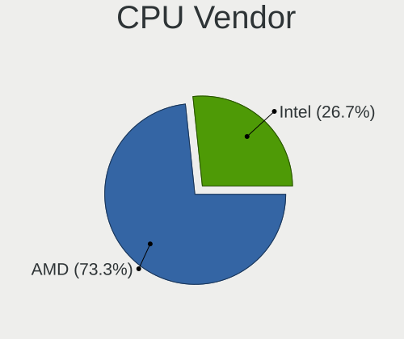

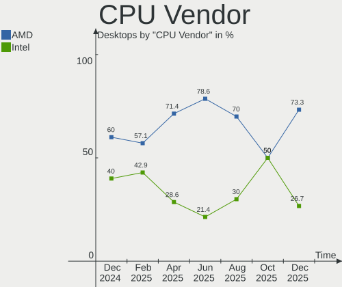

| Vendor | Desktops | Percent |
|--------|----------|---------|
| AMD    | 22       | 73.33%  |
| Intel  | 8        | 26.67%  |

CPU Model
---------

Processor models

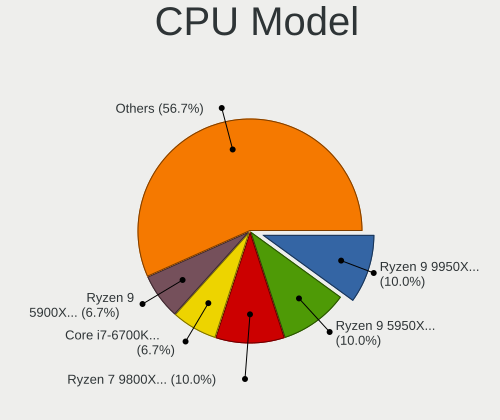

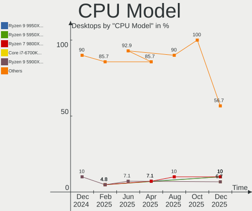

| Model                                       | Desktops | Percent |
|---------------------------------------------|----------|---------|
| AMD Ryzen 9 9950X3D 16-Core Processor       | 3        | 10%     |
| AMD Ryzen 9 5950X 16-Core Processor         | 3        | 10%     |
| AMD Ryzen 7 9800X3D 8-Core Processor        | 3        | 10%     |
| Intel Core i7-6700K CPU @ 4.00GHz           | 2        | 6.67%   |
| AMD Ryzen 9 5900X 12-Core Processor         | 2        | 6.67%   |
| AMD Ryzen 5 5600X 6-Core Processor          | 2        | 6.67%   |
| Intel N100                                  | 1        | 3.33%   |
| Intel Core i9-9900KF CPU @ 3.60GHz          | 1        | 3.33%   |
| Intel Core i9-14900K                        | 1        | 3.33%   |
| Intel Core i7-6700 CPU @ 3.40GHz            | 1        | 3.33%   |
| Intel Celeron J4125 CPU @ 2.00GHz           | 1        | 3.33%   |
| Intel 12th Gen Core i5-12600K               | 1        | 3.33%   |
| AMD Ryzen 9 9900X 12-Core Processor         | 1        | 3.33%   |
| AMD Ryzen 9 3950X 16-Core Processor         | 1        | 3.33%   |
| AMD Ryzen 7 9700X 8-Core Processor          | 1        | 3.33%   |
| AMD Ryzen 7 5700                            | 1        | 3.33%   |
| AMD Ryzen 5 9600X 6-Core Processor          | 1        | 3.33%   |
| AMD Ryzen 5 7600 6-Core Processor           | 1        | 3.33%   |
| AMD Ryzen 5 5600 6-Core Processor           | 1        | 3.33%   |
| AMD Ryzen 5 3600X 6-Core Processor          | 1        | 3.33%   |
| AMD Ryzen 5 3400G with Radeon Vega Graphics | 1        | 3.33%   |

CPU Model Family
----------------

Processor model prefix

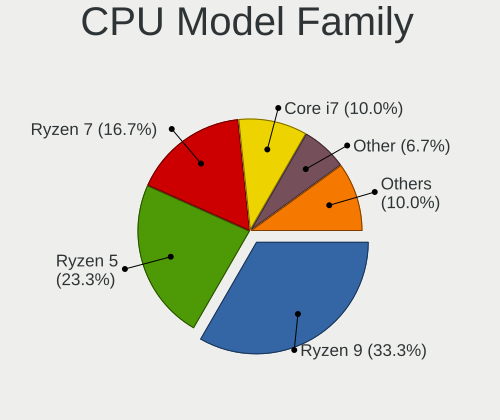

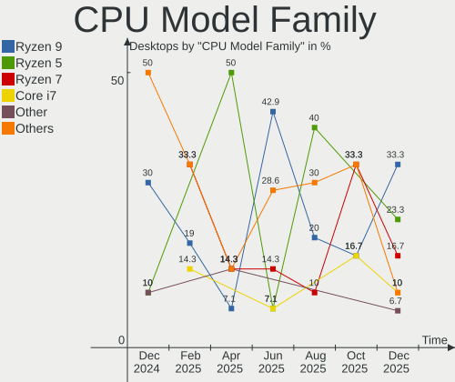

| Model         | Desktops | Percent |
|---------------|----------|---------|
| AMD Ryzen 9   | 10       | 33.33%  |
| AMD Ryzen 5   | 7        | 23.33%  |
| AMD Ryzen 7   | 5        | 16.67%  |
| Intel Core i7 | 3        | 10%     |
| Other         | 2        | 6.67%   |
| Intel Core i9 | 2        | 6.67%   |
| Intel Celeron | 1        | 3.33%   |

CPU Cores
---------

Number of processor cores

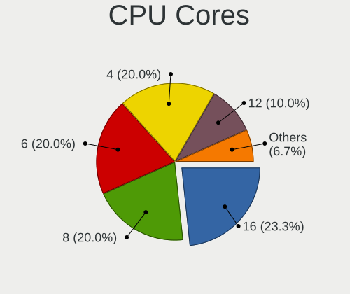

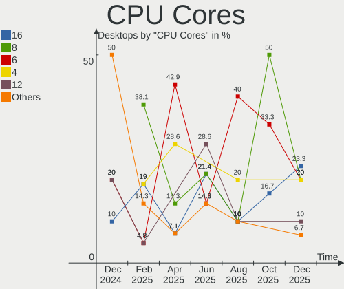

| Number | Desktops | Percent |
|--------|----------|---------|
| 16     | 7        | 23.33%  |
| 8      | 6        | 20%     |
| 6      | 6        | 20%     |
| 4      | 6        | 20%     |
| 12     | 3        | 10%     |
| 24     | 1        | 3.33%   |
| 10     | 1        | 3.33%   |

CPU Sockets
-----------

Number of sockets

| Number | Desktops | Percent |
|--------|----------|---------|
| 1      | 30       | 100%    |

CPU Threads
-----------

Threads per core (Hyper-Threading)

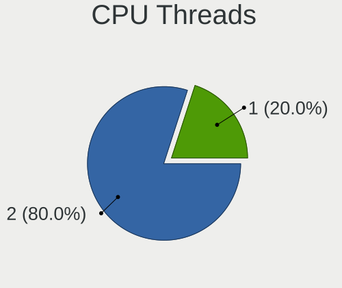

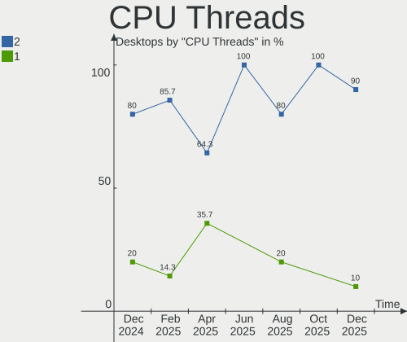

| Number | Desktops | Percent |
|--------|----------|---------|
| 2      | 27       | 90%     |
| 1      | 3        | 10%     |

CPU Op-Modes
------------

CPU Operation Modes (32-bit, 64-bit)

| Op mode        | Desktops | Percent |
|----------------|----------|---------|
| 32-bit, 64-bit | 30       | 100%    |

CPU Microcode
-------------

Microcode number

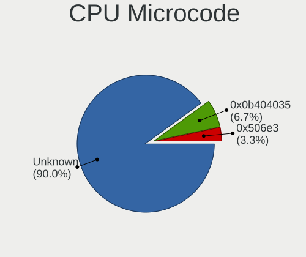

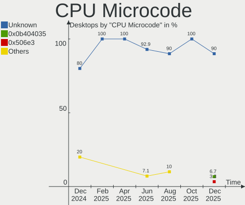

| Number     | Desktops | Percent |
|------------|----------|---------|
| Unknown    | 27       | 90%     |
| 0x0b404035 | 2        | 6.67%   |
| 0x506e3    | 1        | 3.33%   |

CPU Microarch
-------------

Microarchitecture

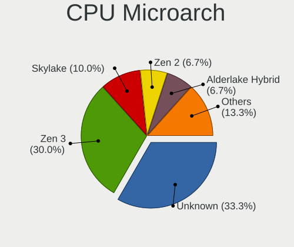

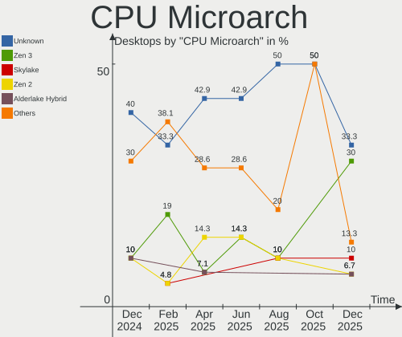

| Name             | Desktops | Percent |
|------------------|----------|---------|
| Unknown          | 10       | 33.33%  |
| Zen 3            | 9        | 30%     |
| Skylake          | 3        | 10%     |
| Zen 2            | 2        | 6.67%   |
| Alderlake Hybrid | 2        | 6.67%   |
| Zen+             | 1        | 3.33%   |
| KabyLake         | 1        | 3.33%   |
| Gracemont        | 1        | 3.33%   |
| Goldmont plus    | 1        | 3.33%   |

Graphics
--------

GPU Vendor
----------

Vendors of graphics cards

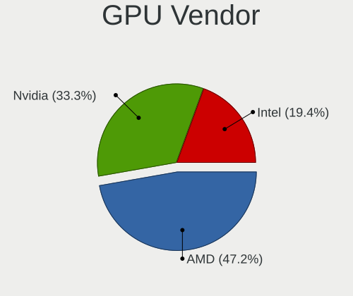

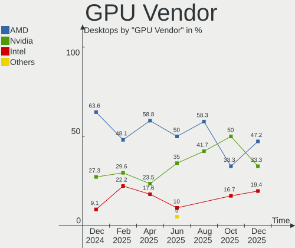

| Vendor | Desktops | Percent |
|--------|----------|---------|
| AMD    | 17       | 47.22%  |
| Nvidia | 12       | 33.33%  |
| Intel  | 7        | 19.44%  |

GPU Model
---------

Graphics card models

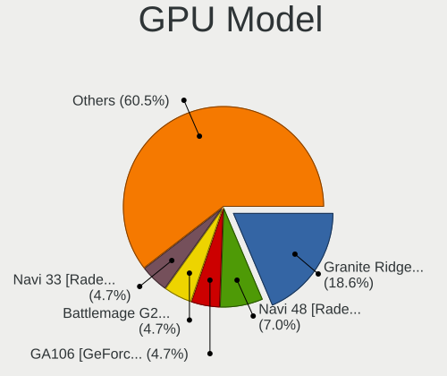

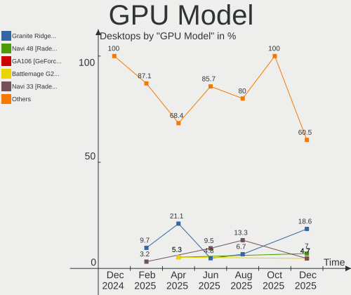

| Model                                                                 | Desktops | Percent |
|-----------------------------------------------------------------------|----------|---------|
| AMD Granite Ridge [Radeon Graphics]                                   | 8        | 18.6%   |
| AMD Navi 48 [Radeon RX 9070/9070 XT/9070 GRE]                         | 3        | 6.98%   |
| Nvidia GA106 [GeForce RTX 3060 Lite Hash Rate]                        | 2        | 4.65%   |
| Intel Battlemage G21 [Arc B580]                                       | 2        | 4.65%   |
| AMD Navi 33 [Radeon RX 7600/7600 XT/7600M XT/7600S/7700S / PRO W7600] | 2        | 4.65%   |
| AMD Navi 23 [Radeon RX 6600/6600 XT/6600M]                            | 2        | 4.65%   |
| AMD Navi 22 [Radeon RX 6700/6700 XT/6750 XT / 6800M/6850M XT]         | 2        | 4.65%   |
| Nvidia TU117GL [T1000 8GB]                                            | 1        | 2.33%   |
| Nvidia TU117 [GeForce GTX 1650]                                       | 1        | 2.33%   |
| Nvidia TU116 [GeForce GTX 1660 SUPER]                                 | 1        | 2.33%   |
| Nvidia TU104 [GeForce RTX 2070 SUPER]                                 | 1        | 2.33%   |
| Nvidia TU102 [GeForce RTX 2080 Ti Rev. A]                             | 1        | 2.33%   |
| Nvidia GP106 [GeForce GTX 1060 3GB]                                   | 1        | 2.33%   |
| Nvidia GA106 [GeForce RTX 3060]                                       | 1        | 2.33%   |
| Nvidia GA104 [GeForce RTX 3070]                                       | 1        | 2.33%   |
| Nvidia G96C [GeForce 9400 GT]                                         | 1        | 2.33%   |
| Nvidia AD103 [GeForce RTX 4070 Ti SUPER]                              | 1        | 2.33%   |
| Nvidia AD102 [GeForce RTX 4090]                                       | 1        | 2.33%   |
| Intel Skylake-S GT2 [HD Graphics 530]                                 | 1        | 2.33%   |
| Intel Raptor Lake-S GT1 [UHD Graphics 770]                            | 1        | 2.33%   |
| Intel GeminiLake [UHD Graphics 600]                                   | 1        | 2.33%   |
| Intel Alder Lake-S GT1 [UHD Graphics 770]                             | 1        | 2.33%   |
| Intel Alder Lake-N [UHD Graphics]                                     | 1        | 2.33%   |
| AMD Raphael                                                           | 1        | 2.33%   |
| AMD Picasso/Raven 2 [Radeon Vega Series / Radeon Vega Mobile Series]  | 1        | 2.33%   |
| AMD Navi 44 [Radeon RX 9060 XT]                                       | 1        | 2.33%   |
| AMD Navi 21 [Radeon RX 6950 XT]                                       | 1        | 2.33%   |
| AMD Navi 21 [Radeon RX 6800/6800 XT / 6900 XT]                        | 1        | 2.33%   |
| AMD Baffin [Radeon RX 460/560D / Pro 450/455/460/555/555X/560/560X]   | 1        | 2.33%   |

GPU Combo
---------

Combinations of graphics cards

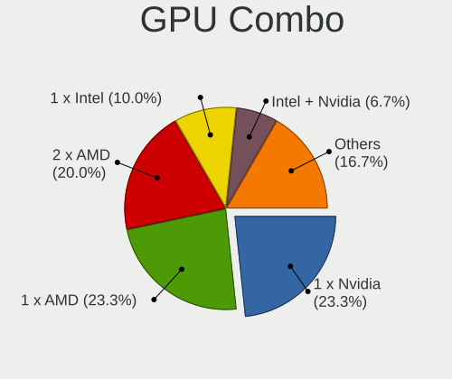

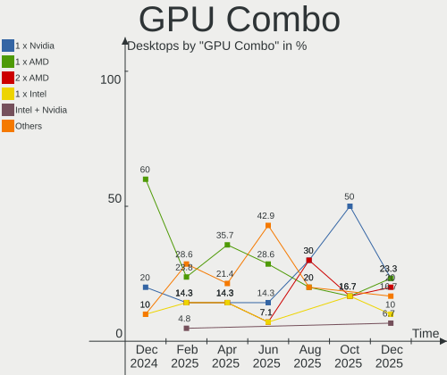

| Name           | Desktops | Percent |
|----------------|----------|---------|
| 1 x Nvidia     | 7        | 23.33%  |
| 1 x AMD        | 7        | 23.33%  |
| 2 x AMD        | 6        | 20%     |
| 1 x Intel      | 3        | 10%     |
| Intel + Nvidia | 2        | 6.67%   |
| Intel + AMD    | 2        | 6.67%   |
| AMD + Nvidia   | 2        | 6.67%   |
| 2 x Nvidia     | 1        | 3.33%   |

GPU Driver
----------

Free vs proprietary

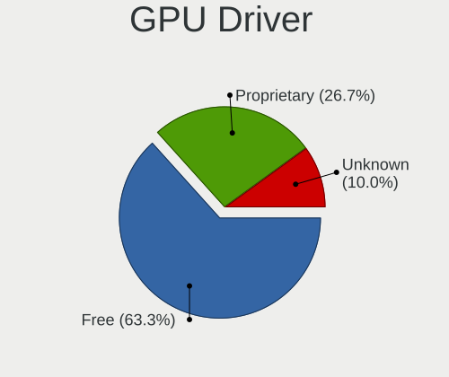

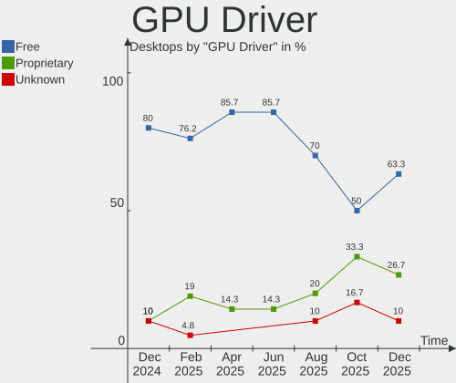

| Driver      | Desktops | Percent |
|-------------|----------|---------|
| Free        | 19       | 63.33%  |
| Proprietary | 8        | 26.67%  |
| Unknown     | 3        | 10%     |

GPU Memory
----------

Total video memory

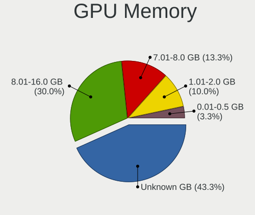

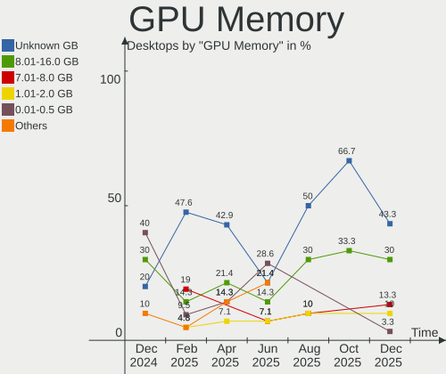

| Size in GB | Desktops | Percent |
|------------|----------|---------|
| Unknown    | 13       | 43.33%  |
| 8.01-16.0  | 9        | 30%     |
| 7.01-8.0   | 4        | 13.33%  |
| 1.01-2.0   | 3        | 10%     |
| 0.01-0.5   | 1        | 3.33%   |

Monitor
-------

Monitor Vendor
--------------

Monitor vendors

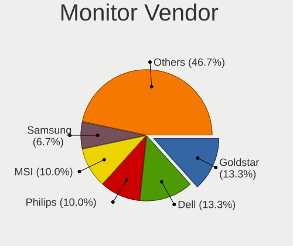

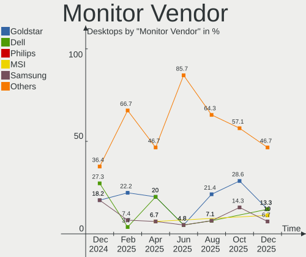

| Vendor              | Desktops | Percent |
|---------------------|----------|---------|
| Goldstar            | 4        | 13.33%  |
| Dell                | 4        | 13.33%  |
| Philips             | 3        | 10%     |
| MSI                 | 3        | 10%     |
| Samsung Electronics | 2        | 6.67%   |
| Gigabyte Technology | 2        | 6.67%   |
| BenQ                | 2        | 6.67%   |
| ASUSTek Computer    | 2        | 6.67%   |
| VCS                 | 1        | 3.33%   |
| TCL                 | 1        | 3.33%   |
| SGT                 | 1        | 3.33%   |
| Lenovo              | 1        | 3.33%   |
| Lanix               | 1        | 3.33%   |
| Hewlett-Packard     | 1        | 3.33%   |
| AOC                 | 1        | 3.33%   |
| Acer                | 1        | 3.33%   |

Monitor Model
-------------

Monitor models

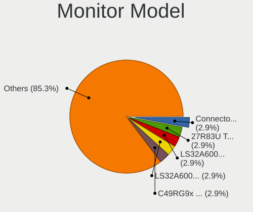

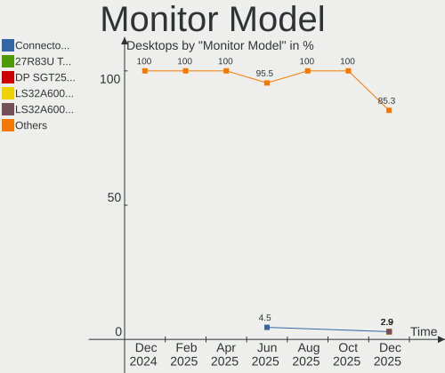

| Model                                                               | Desktops | Percent |
|---------------------------------------------------------------------|----------|---------|
| VCS Connector VCS1145 1920x1080 575x323mm 26.0-inch                 | 1        | 2.94%   |
| TCL 27R83U TCL2701 3840x2160 597x336mm 27.0-inch                    | 1        | 2.94%   |
| SGT DP SGT2556 1920x1080 520x320mm 24.0-inch                        | 1        | 2.94%   |
| Samsung Electronics LS32A600N SAM715F 2560x1440 698x393mm 31.5-inch | 1        | 2.94%   |
| Samsung Electronics LS32A600N SAM715E 2560x1440 698x393mm 31.5-inch | 1        | 2.94%   |
| Samsung Electronics C49RG9x SAM0F9C 3360x1440 1193x336mm 48.8-inch  | 1        | 2.94%   |
| Philips PHL 27M1F5800 PHLC267 3840x2160 597x336mm 27.0-inch         | 1        | 2.94%   |
| Philips PHL 273V7 PHLC156 1920x1080 598x336mm 27.0-inch             | 1        | 2.94%   |
| Philips 27B2G5500 PHL1019 2560x1440 597x336mm 27.0-inch             | 1        | 2.94%   |
| MSI MPG 274URF QD MSIBCC2 3840x2160 597x336mm 27.0-inch             | 1        | 2.94%   |
| MSI MAG274Q QD E2 MSIACC2 2560x1440 597x336mm 27.0-inch             | 1        | 2.94%   |
| MSI G24C MSI3EA0 1920x1080 521x293mm 23.5-inch                      | 1        | 2.94%   |
| Lenovo LEN P27h-10 LEN61AF 2560x1440 597x336mm 27.0-inch            | 1        | 2.94%   |
| Lenovo LEN L24q-30 LEN65FB 2560x1440 527x296mm 23.8-inch            | 1        | 2.94%   |
| Lanix PiKVM V3 LNX7771 1680x1050 527x296mm 23.8-inch                | 1        | 2.94%   |
| Hewlett-Packard OMEN 27qs HPN3967 2560x1440 597x336mm 27.0-inch     | 1        | 2.94%   |
| Hewlett-Packard OMEN 24 HPN3937 1920x1080 527x296mm 23.8-inch       | 1        | 2.94%   |
| Goldstar ULTRAWIDE GSM76FB 3840x1600 874x366mm 37.3-inch            | 1        | 2.94%   |
| Goldstar ULTRAGEAR GSM5BB4 2560x1440 597x336mm 27.0-inch            | 1        | 2.94%   |
| Goldstar Ultra HD GSM5B09 3840x2160 600x340mm 27.2-inch             | 1        | 2.94%   |
| Goldstar HDR 4K GSM7706 3840x2160 600x340mm 27.2-inch               | 1        | 2.94%   |
| Gigabyte Technology M32U GBT3204 3840x2160 697x392mm 31.5-inch      | 1        | 2.94%   |
| Gigabyte Technology M27Q GBT270D 2560x1440 597x336mm 27.0-inch      | 1        | 2.94%   |
| Dell U2715H DELD067 2560x1440 597x336mm 27.0-inch                   | 1        | 2.94%   |
| Dell U2412M DELA07A 1920x1200 518x324mm 24.1-inch                   | 1        | 2.94%   |
| Dell S2422HG DELA1BF 1920x1080 521x293mm 23.5-inch                  | 1        | 2.94%   |
| Dell P2214H DELA097 1920x1080 477x268mm 21.5-inch                   | 1        | 2.94%   |
| BenQ RL2455 BNQ7F1C 1920x1080 531x298mm 24.0-inch                   | 1        | 2.94%   |
| BenQ GW2270 BNQ78DB 1920x1080 476x268mm 21.5-inch                   | 1        | 2.94%   |
| ASUSTek Computer VG249 AUS2421 1920x1080 527x296mm 23.8-inch        | 1        | 2.94%   |
| ASUSTek Computer ROG PG278QR AUS27B1 2560x1440 598x336mm 27.0-inch  | 1        | 2.94%   |
| AOC Q24G4 AOCB410 2560x1440 527x296mm 23.8-inch                     | 1        | 2.94%   |
| Acer XV242Y ACR0764 1920x1080 527x296mm 23.8-inch                   | 1        | 2.94%   |
| Acer G205HV ACR022C 1600x900 443x249mm 20.0-inch                    | 1        | 2.94%   |

Monitor Resolution
------------------

Monitor screen resolution

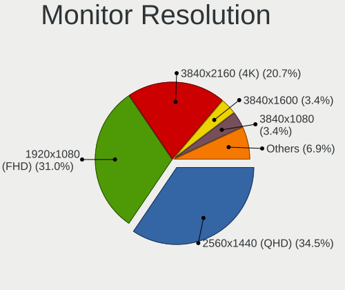

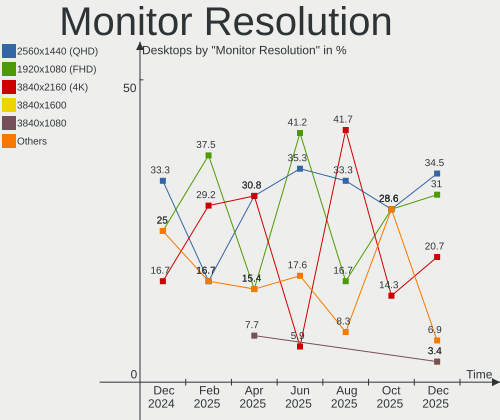

| Resolution        | Desktops | Percent |
|-------------------|----------|---------|
| 2560x1440 (QHD)   | 10       | 34.48%  |
| 1920x1080 (FHD)   | 9        | 31.03%  |
| 3840x2160 (4K)    | 6        | 20.69%  |
| 3840x1600         | 1        | 3.45%   |
| 3840x1080         | 1        | 3.45%   |
| 1920x1200 (WUXGA) | 1        | 3.45%   |
| 1600x900 (HD+)    | 1        | 3.45%   |

Monitor Diagonal
----------------

Diagonal size in inches

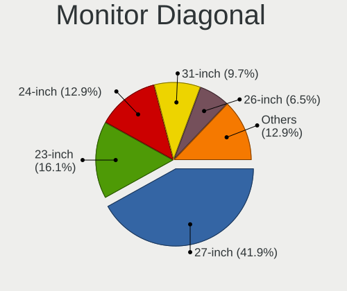

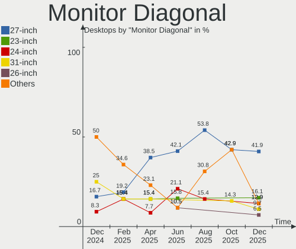

| Inches | Desktops | Percent |
|--------|----------|---------|
| 27     | 13       | 41.94%  |
| 23     | 5        | 16.13%  |
| 24     | 4        | 12.9%   |
| 31     | 3        | 9.68%   |
| 26     | 2        | 6.45%   |
| 48     | 1        | 3.23%   |
| 37     | 1        | 3.23%   |
| 21     | 1        | 3.23%   |
| 20     | 1        | 3.23%   |

Monitor Width
-------------

Physical width

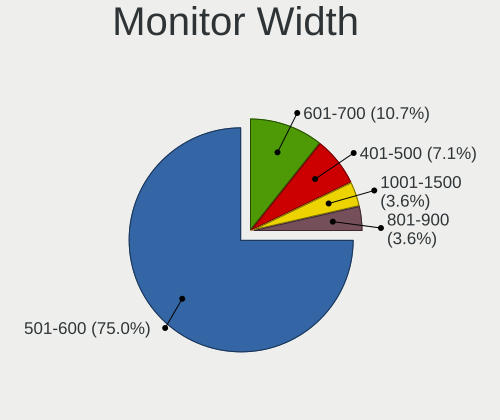

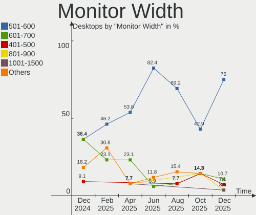

| Width in mm | Desktops | Percent |
|-------------|----------|---------|
| 501-600     | 21       | 75%     |
| 601-700     | 3        | 10.71%  |
| 401-500     | 2        | 7.14%   |
| 801-900     | 1        | 3.57%   |
| 1001-1500   | 1        | 3.57%   |

Aspect Ratio
------------

Proportional relationship between the width and the height

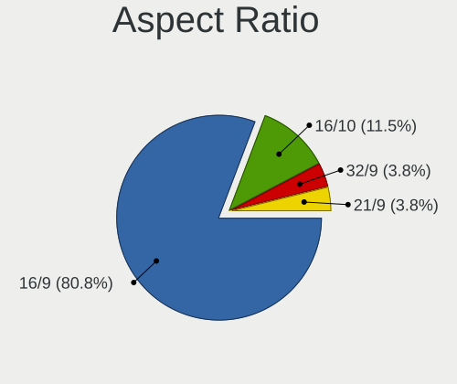

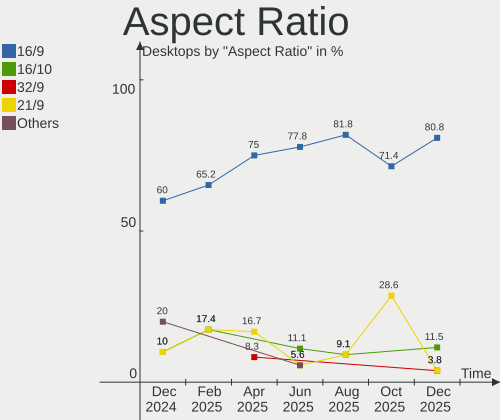

| Ratio | Desktops | Percent |
|-------|----------|---------|
| 16/9  | 21       | 80.77%  |
| 16/10 | 3        | 11.54%  |
| 32/9  | 1        | 3.85%   |
| 21/9  | 1        | 3.85%   |

Monitor Area
------------

Area in inch²

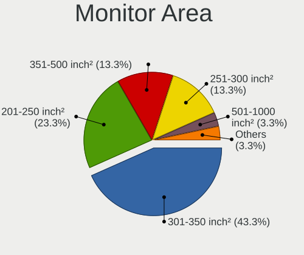

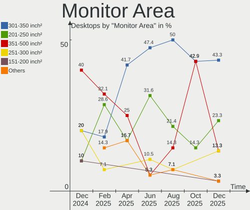

| Area in inch² | Desktops | Percent |
|----------------|----------|---------|
| 301-350        | 13       | 43.33%  |
| 201-250        | 7        | 23.33%  |
| 351-500        | 4        | 13.33%  |
| 251-300        | 4        | 13.33%  |
| 151-200        | 1        | 3.33%   |
| 501-1000       | 1        | 3.33%   |

Pixel Density
-------------

Pixels per inch

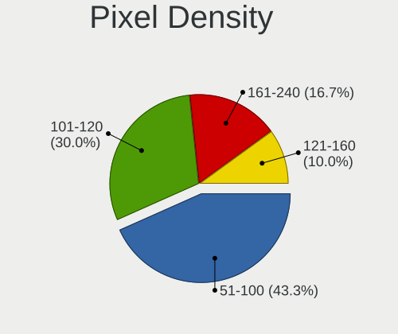

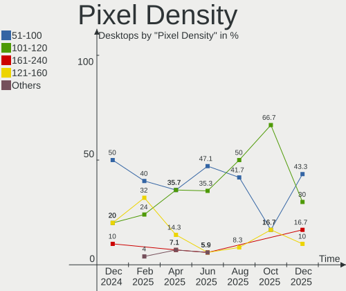

| Density | Desktops | Percent |
|---------|----------|---------|
| 51-100  | 13       | 43.33%  |
| 101-120 | 9        | 30%     |
| 161-240 | 5        | 16.67%  |
| 121-160 | 3        | 10%     |

Multiple Monitors
-----------------

Total monitors connected

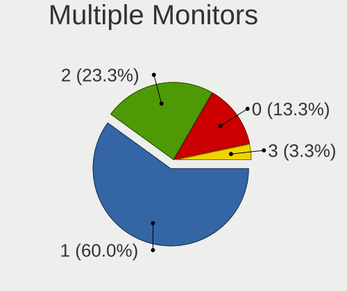

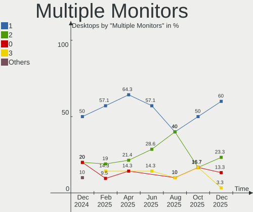

| Total | Desktops | Percent |
|-------|----------|---------|
| 1     | 18       | 60%     |
| 2     | 7        | 23.33%  |
| 0     | 4        | 13.33%  |
| 3     | 1        | 3.33%   |

Network
-------

Net Controller Vendor
---------------------

Controller vendors

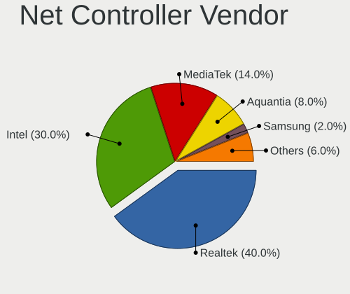

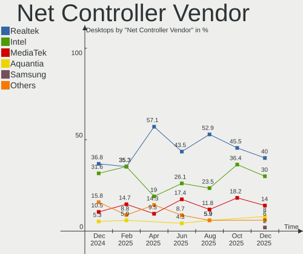

| Vendor                | Desktops | Percent |
|-----------------------|----------|---------|
| Realtek Semiconductor | 20       | 40%     |
| Intel                 | 15       | 30%     |
| MediaTek              | 7        | 14%     |
| Aquantia              | 4        | 8%      |
| Samsung Electronics   | 1        | 2%      |
| Qualcomm Technologies | 1        | 2%      |
| Qualcomm Atheros      | 1        | 2%      |
| Broadcom              | 1        | 2%      |

Net Controller Model
--------------------

Controller models

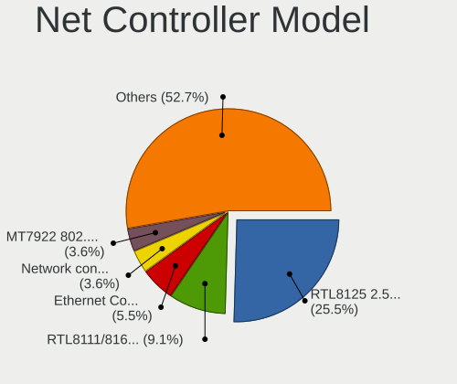

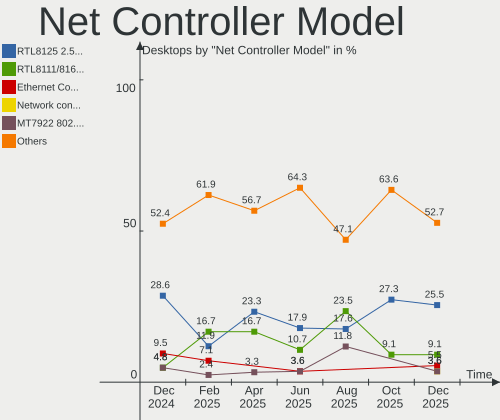

| Model                                                                             | Desktops | Percent |
|-----------------------------------------------------------------------------------|----------|---------|
| Realtek RTL8125 2.5GbE Controller                                                 | 14       | 25.45%  |
| Realtek RTL8111/8168/8211/8411 PCI Express Gigabit Ethernet Controller            | 5        | 9.09%   |
| Intel Ethernet Controller I226-V                                                  | 3        | 5.45%   |
| MediaTek Network controller                                                       | 2        | 3.64%   |
| MediaTek MT7922 802.11ax PCI Express Wireless Network Adapter                     | 2        | 3.64%   |
| Intel I211 Gigabit Network Connection                                             | 2        | 3.64%   |
| Intel Ethernet Controller I225-V                                                  | 2        | 3.64%   |
| Intel Ethernet Connection (2) I219-V                                              | 2        | 3.64%   |
| Aquantia AQtion AQC113 NBase-T/IEEE 802.3an Ethernet Controller [Antigua 10G]     | 2        | 3.64%   |
| Samsung Galaxy series, misc. (tethering mode)                                     | 1        | 1.82%   |
| Realtek RTL8852CE PCIe 802.11ax Wireless Network Controller                       | 1        | 1.82%   |
| Realtek RTL8153 Gigabit Ethernet Adapter                                          | 1        | 1.82%   |
| Realtek RTL8111/8168/8411 PCI Express Gigabit Ethernet Controller                 | 1        | 1.82%   |
| Qualcomm WCN785x Wi-Fi 7(802.11be) 320MHz 2x2 [FastConnect 7800]                  | 1        | 1.82%   |
| Qualcomm Atheros AR9287 Wireless Network Adapter (PCI-Express)                    | 1        | 1.82%   |
| MediaTek MT7925 802.11be 160MHz 2x2 PCIe Wireless Network Adapter [Filogic 360]   | 1        | 1.82%   |
| MediaTek MT7925 (RZ717) Wi-Fi 7 160MHz                                            | 1        | 1.82%   |
| MediaTek MT7921 802.11ax PCIe Wireless Network Adapter [Filogic 330]              | 1        | 1.82%   |
| Intel Wi-Fi 6E(802.11ax) AX210/AX1675* 2x2 [Typhoon Peak]                         | 1        | 1.82%   |
| Intel Wi-Fi 6 AX200                                                               | 1        | 1.82%   |
| Intel Wi-Fi 5(802.11ac) Wireless-AC 9x6x [Thunder Peak]                           | 1        | 1.82%   |
| Intel I210 Gigabit Network Connection                                             | 1        | 1.82%   |
| Intel Gemini Lake PCH CNVi WiFi                                                   | 1        | 1.82%   |
| Intel Ethernet Controller I225-LM                                                 | 1        | 1.82%   |
| Intel Ethernet Connection (7) I219-V                                              | 1        | 1.82%   |
| Intel Alder Lake-N PCH CNVi WiFi                                                  | 1        | 1.82%   |
| Intel 82599 10 Gigabit Network Connection                                         | 1        | 1.82%   |
| Broadcom BCM4360 802.11ac Dual Band Wireless Network Adapter                      | 1        | 1.82%   |
| Aquantia AQtion AQC100S NBase-T/IEEE 802.3an Ethernet Controller [Atlantic 10G]   | 1        | 1.82%   |
| Aquantia AQC113C NBase-T/IEEE 802.3an Ethernet Controller [Marvell Scalable mGig] | 1        | 1.82%   |

Wireless Vendor
---------------

Wireless vendors

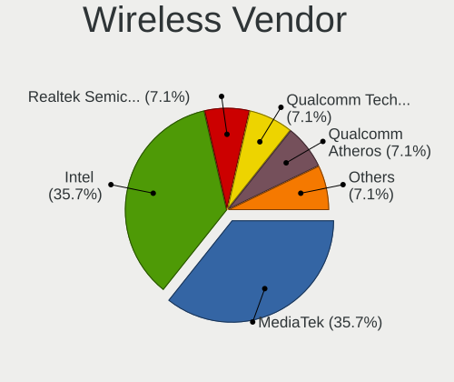

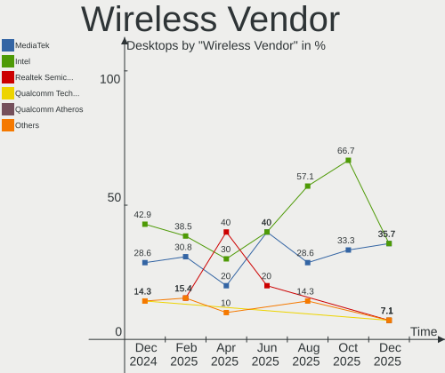

| Vendor                | Desktops | Percent |
|-----------------------|----------|---------|
| MediaTek              | 5        | 35.71%  |
| Intel                 | 5        | 35.71%  |
| Realtek Semiconductor | 1        | 7.14%   |
| Qualcomm Technologies | 1        | 7.14%   |
| Qualcomm Atheros      | 1        | 7.14%   |
| Broadcom              | 1        | 7.14%   |

Wireless Model
--------------

Wireless models

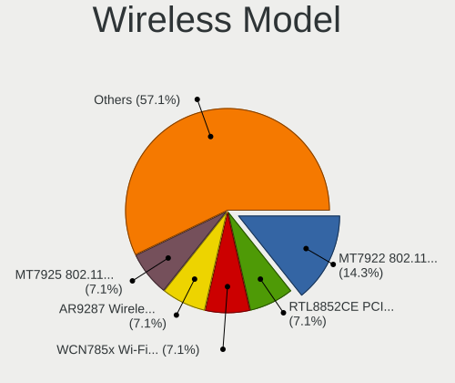

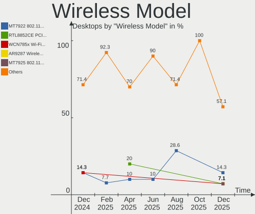

| Model                                                                           | Desktops | Percent |
|---------------------------------------------------------------------------------|----------|---------|
| MediaTek MT7922 802.11ax PCI Express Wireless Network Adapter                   | 2        | 14.29%  |
| Realtek RTL8852CE PCIe 802.11ax Wireless Network Controller                     | 1        | 7.14%   |
| Qualcomm WCN785x Wi-Fi 7(802.11be) 320MHz 2x2 [FastConnect 7800]                | 1        | 7.14%   |
| Qualcomm Atheros AR9287 Wireless Network Adapter (PCI-Express)                  | 1        | 7.14%   |
| MediaTek MT7925 802.11be 160MHz 2x2 PCIe Wireless Network Adapter [Filogic 360] | 1        | 7.14%   |
| MediaTek MT7925 (RZ717) Wi-Fi 7 160MHz                                          | 1        | 7.14%   |
| MediaTek MT7921 802.11ax PCIe Wireless Network Adapter [Filogic 330]            | 1        | 7.14%   |
| Intel Wi-Fi 6E(802.11ax) AX210/AX1675* 2x2 [Typhoon Peak]                       | 1        | 7.14%   |
| Intel Wi-Fi 6 AX200                                                             | 1        | 7.14%   |
| Intel Wi-Fi 5(802.11ac) Wireless-AC 9x6x [Thunder Peak]                         | 1        | 7.14%   |
| Intel Gemini Lake PCH CNVi WiFi                                                 | 1        | 7.14%   |
| Intel Alder Lake-N PCH CNVi WiFi                                                | 1        | 7.14%   |
| Broadcom BCM4360 802.11ac Dual Band Wireless Network Adapter                    | 1        | 7.14%   |

Ethernet Vendor
---------------

Ethernet vendors

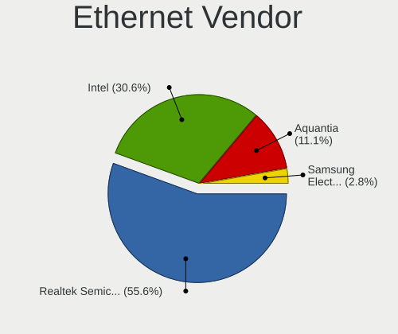

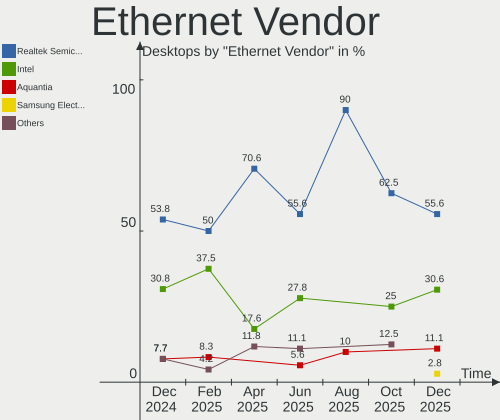

| Vendor                | Desktops | Percent |
|-----------------------|----------|---------|
| Realtek Semiconductor | 20       | 55.56%  |
| Intel                 | 11       | 30.56%  |
| Aquantia              | 4        | 11.11%  |
| Samsung Electronics   | 1        | 2.78%   |

Ethernet Model
--------------

Ethernet models

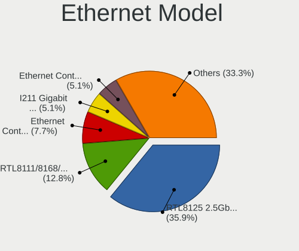

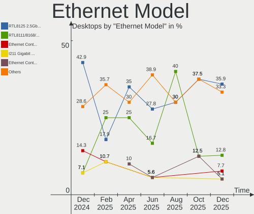

| Model                                                                             | Desktops | Percent |
|-----------------------------------------------------------------------------------|----------|---------|
| Realtek RTL8125 2.5GbE Controller                                                 | 14       | 35.9%   |
| Realtek RTL8111/8168/8211/8411 PCI Express Gigabit Ethernet Controller            | 5        | 12.82%  |
| Intel Ethernet Controller I226-V                                                  | 3        | 7.69%   |
| Intel I211 Gigabit Network Connection                                             | 2        | 5.13%   |
| Intel Ethernet Controller I225-V                                                  | 2        | 5.13%   |
| Intel Ethernet Connection (2) I219-V                                              | 2        | 5.13%   |
| Aquantia AQtion AQC113 NBase-T/IEEE 802.3an Ethernet Controller [Antigua 10G]     | 2        | 5.13%   |
| Samsung Galaxy series, misc. (tethering mode)                                     | 1        | 2.56%   |
| Realtek RTL8153 Gigabit Ethernet Adapter                                          | 1        | 2.56%   |
| Realtek RTL8111/8168/8411 PCI Express Gigabit Ethernet Controller                 | 1        | 2.56%   |
| Intel I210 Gigabit Network Connection                                             | 1        | 2.56%   |
| Intel Ethernet Controller I225-LM                                                 | 1        | 2.56%   |
| Intel Ethernet Connection (7) I219-V                                              | 1        | 2.56%   |
| Intel 82599 10 Gigabit Network Connection                                         | 1        | 2.56%   |
| Aquantia AQtion AQC100S NBase-T/IEEE 802.3an Ethernet Controller [Atlantic 10G]   | 1        | 2.56%   |
| Aquantia AQC113C NBase-T/IEEE 802.3an Ethernet Controller [Marvell Scalable mGig] | 1        | 2.56%   |

Net Controller Kind
-------------------

Ethernet, WiFi or modem

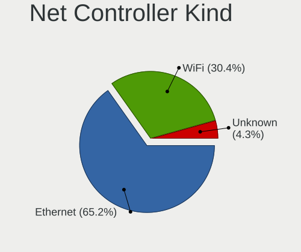

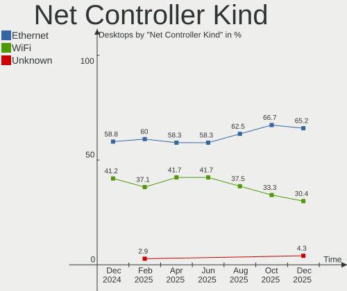

| Kind     | Desktops | Percent |
|----------|----------|---------|
| Ethernet | 30       | 65.22%  |
| WiFi     | 14       | 30.43%  |
| Unknown  | 2        | 4.35%   |

Used Controller
---------------

Currently used network controller

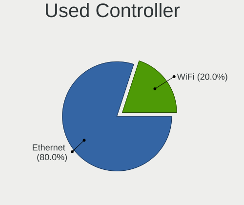

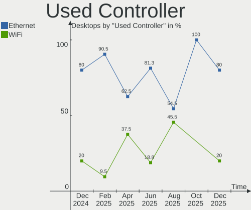

| Kind     | Desktops | Percent |
|----------|----------|---------|
| Ethernet | 24       | 80%     |
| WiFi     | 6        | 20%     |

NICs
----

Total network controllers on board

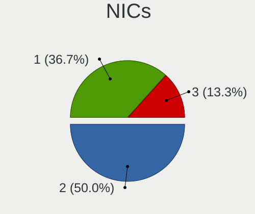

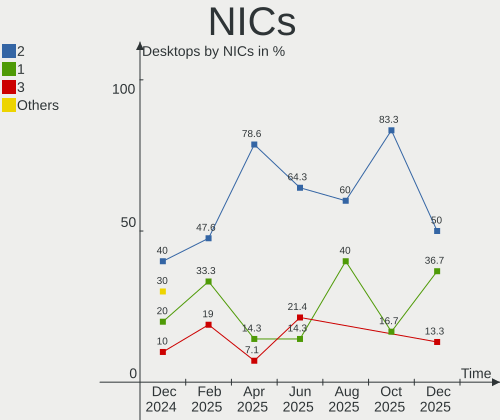

| Total | Desktops | Percent |
|-------|----------|---------|
| 2     | 15       | 50%     |
| 1     | 11       | 36.67%  |
| 3     | 4        | 13.33%  |

IPv6
----

IPv6 vs IPv4

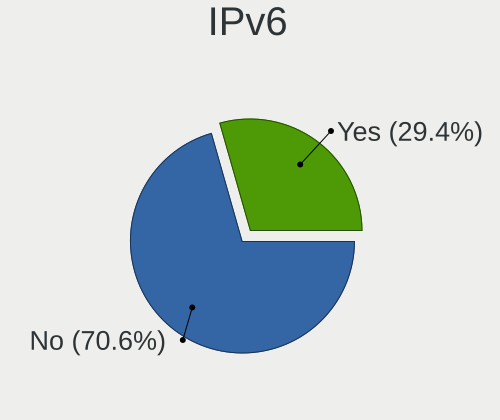

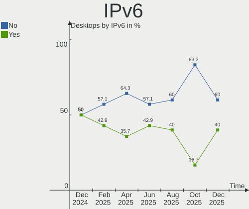

| Used | Desktops | Percent |
|------|----------|---------|
| No   | 18       | 60%     |
| Yes  | 12       | 40%     |

Bluetooth
---------

Bluetooth Vendor
----------------

Controller vendors

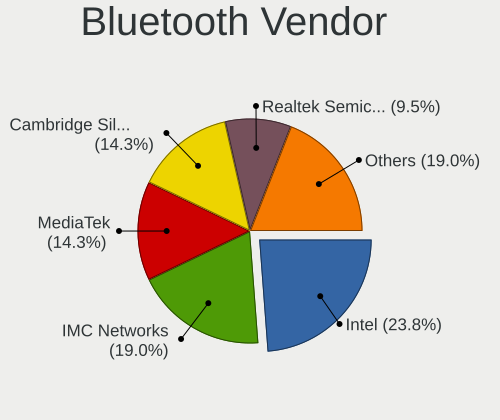

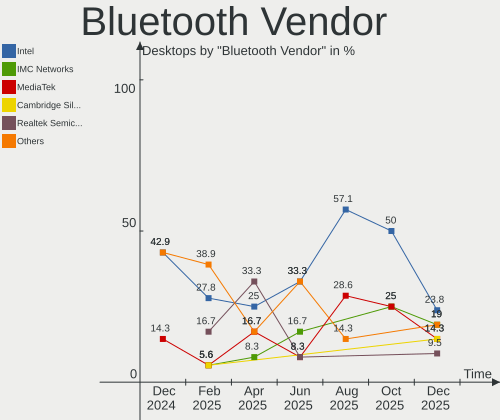

| Vendor                  | Desktops | Percent |
|-------------------------|----------|---------|
| Intel                   | 5        | 23.81%  |
| IMC Networks            | 4        | 19.05%  |
| MediaTek                | 3        | 14.29%  |
| Cambridge Silicon Radio | 3        | 14.29%  |
| Realtek Semiconductor   | 2        | 9.52%   |
| Foxconn / Hon Hai       | 2        | 9.52%   |
| TP-Link                 | 1        | 4.76%   |
| Broadcom                | 1        | 4.76%   |

Bluetooth Model
---------------

Controller models

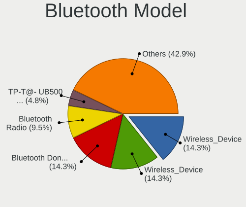

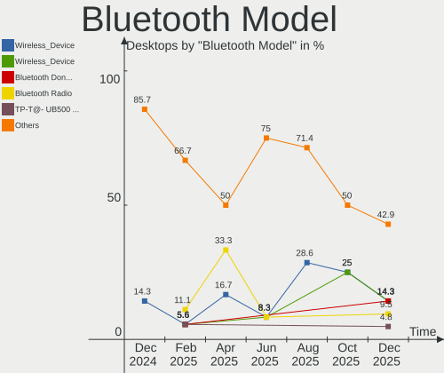

| Model                                               | Desktops | Percent |
|-----------------------------------------------------|----------|---------|
| MediaTek Wireless_Device                            | 3        | 14.29%  |
| IMC Networks Wireless_Device                        | 3        | 14.29%  |
| Cambridge Silicon Radio Bluetooth Dongle (HCI mode) | 3        | 14.29%  |
| Realtek Bluetooth Radio                             | 2        | 9.52%   |
| TP-Link TP-T@- UB500 Adapter                        | 1        | 4.76%   |
| Intel Wireless-AC 9260 Bluetooth Adapter            | 1        | 4.76%   |
| Intel Bluetooth 9460/9560 Jefferson Peak (JfP)      | 1        | 4.76%   |
| Intel AX210 Bluetooth                               | 1        | 4.76%   |
| Intel AX201 Bluetooth                               | 1        | 4.76%   |
| Intel AX200 Bluetooth                               | 1        | 4.76%   |
| IMC Networks Bluetooth Radio                        | 1        | 4.76%   |
| Foxconn / Hon Hai Wireless_Device                   | 1        | 4.76%   |
| Foxconn / Hon Hai Bluetooth Device                  | 1        | 4.76%   |
| Broadcom BCM20702A0 Bluetooth 4.0                   | 1        | 4.76%   |

Sound
-----

Sound Vendor
------------

Sound card vendors

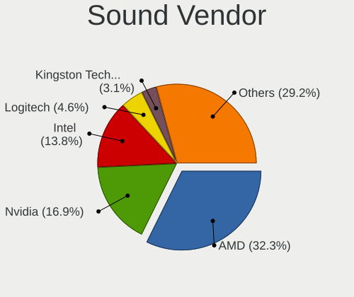

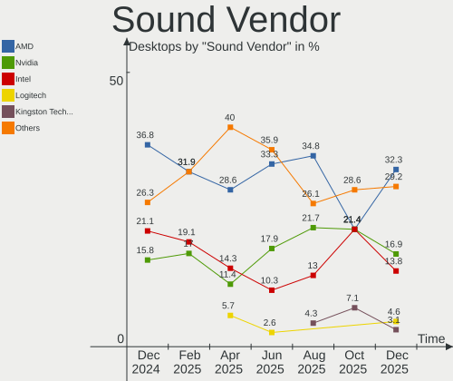

| Vendor                      | Desktops | Percent |
|-----------------------------|----------|---------|
| AMD                         | 21       | 32.31%  |
| Nvidia                      | 11       | 16.92%  |
| Intel                       | 9        | 13.85%  |
| Logitech                    | 3        | 4.62%   |
| Kingston Technology         | 2        | 3.08%   |
| Trust                       | 1        | 1.54%   |
| Texas Instruments           | 1        | 1.54%   |
| Synaptics                   | 1        | 1.54%   |
| SteelSeries ApS             | 1        | 1.54%   |
| Sony                        | 1        | 1.54%   |
| SM950T Microphone           | 1        | 1.54%   |
| RME                         | 1        | 1.54%   |
| Razer USA                   | 1        | 1.54%   |
| Midiplus                    | 1        | 1.54%   |
| Medeli Electronics          | 1        | 1.54%   |
| JMTek                       | 1        | 1.54%   |
| GYROCOM C&C                 | 1        | 1.54%   |
| Focusrite-Novation          | 1        | 1.54%   |
| FiiO Electronics Technology | 1        | 1.54%   |
| fifinemicrophone.com        | 1        | 1.54%   |
| C-Media Electronics         | 1        | 1.54%   |
| Audio-Technica              | 1        | 1.54%   |
| ASUSTek Computer            | 1        | 1.54%   |
| ASRock                      | 1        | 1.54%   |

Sound Model
-----------

Sound card models

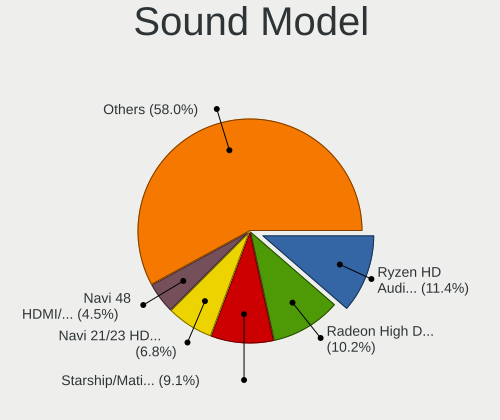

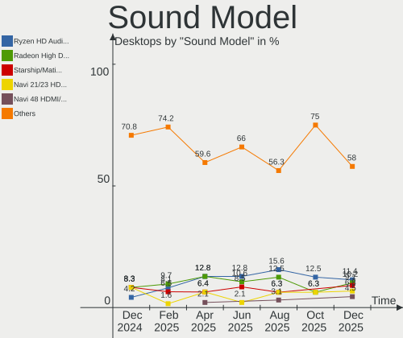

| Model                                                           | Desktops | Percent |
|-----------------------------------------------------------------|----------|---------|
| AMD Ryzen HD Audio Controller                                   | 10       | 11.36%  |
| AMD Radeon High Definition Audio Controller                     | 9        | 10.23%  |
| AMD Starship/Matisse HD Audio Controller                        | 8        | 9.09%   |
| AMD Navi 21/23 HDMI/DP Audio Controller                         | 6        | 6.82%   |
| AMD Navi 48 HDMI/DP Audio Controller                            | 4        | 4.55%   |
| Nvidia GA106 High Definition Audio Controller                   | 3        | 3.41%   |
| Nvidia TU107 GeForce GTX 1650 High Definition Audio Controller  | 2        | 2.27%   |
| Intel Audio device                                              | 2        | 2.27%   |
| Intel Alder Lake-S HD Audio Controller                          | 2        | 2.27%   |
| Intel 100 Series/C230 Series Chipset Family HD Audio Controller | 2        | 2.27%   |
| AMD Navi 31 HDMI/DP Audio                                       | 2        | 2.27%   |
| Trust KLIM LINGO                                                | 1        | 1.14%   |
| Texas Instruments PCM2900C Audio CODEC                          | 1        | 1.14%   |
| Synaptics CX31993+MAX97220 HiFiAudio                            | 1        | 1.14%   |
| SteelSeries ApS SteelSeries Arena 7                             | 1        | 1.14%   |
| Sony DualSense wireless controller (PS5)                        | 1        | 1.14%   |
| SM950T Microphone SM950T Microphone                             | 1        | 1.14%   |
| RME ADI-2 DAC (51120366)                                        | 1        | 1.14%   |
| Razer USA BlackShark V3 Pro                                     | 1        | 1.14%   |
| Nvidia TU116 High Definition Audio Controller                   | 1        | 1.14%   |
| Nvidia TU104 HD Audio Controller                                | 1        | 1.14%   |
| Nvidia TU102 High Definition Audio Controller                   | 1        | 1.14%   |
| Nvidia GP106 High Definition Audio Controller                   | 1        | 1.14%   |
| Nvidia GA104 High Definition Audio Controller                   | 1        | 1.14%   |
| Nvidia AD103 High Definition Audio Controller                   | 1        | 1.14%   |
| Nvidia AD102 High Definition Audio Controller                   | 1        | 1.14%   |
| Midiplus SmartPAD                                               | 1        | 1.14%   |
| Medeli Electronics USB FS AUDIO                                 | 1        | 1.14%   |
| Logitech Yeti GX                                                | 1        | 1.14%   |
| Logitech PRO X 2 LIGHTSPEED                                     | 1        | 1.14%   |
| Logitech G930                                                   | 1        | 1.14%   |
| Logitech Blue Microphones                                       | 1        | 1.14%   |
| Kingston Technology HyperX Cloud Flight Wireless                | 1        | 1.14%   |
| Kingston Technology HyperX 7.1 Audio                            | 1        | 1.14%   |
| JMTek USB PnP Audio Device                                      | 1        | 1.14%   |
| Intel Cannon Lake PCH cAVS                                      | 1        | 1.14%   |
| Intel Alder Lake-N PCH High Definition Audio Controller         | 1        | 1.14%   |
| Intel 200 Series PCH HD Audio                                   | 1        | 1.14%   |
| GYROCOM C&C Fiio E10                                            | 1        | 1.14%   |
| Focusrite-Novation Scarlett Solo (3rd Gen.)                     | 1        | 1.14%   |

Memory
------

Memory Vendor
-------------

Memory module vendors

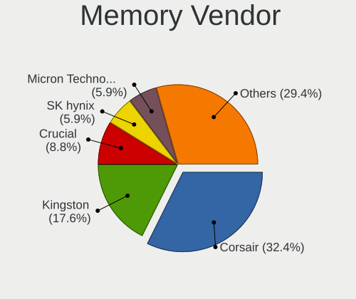

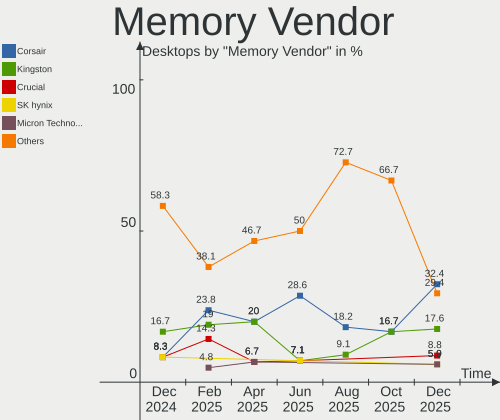

| Vendor            | Desktops | Percent |
|-------------------|----------|---------|
| Corsair           | 11       | 32.35%  |
| Kingston          | 6        | 17.65%  |
| Crucial           | 3        | 8.82%   |
| SK hynix          | 2        | 5.88%   |
| Micron Technology | 2        | 5.88%   |
| G.Skill           | 2        | 5.88%   |
| Unknown           | 2        | 5.88%   |
| Unknown           | 1        | 2.94%   |
| Timetec           | 1        | 2.94%   |
| TeamGroup         | 1        | 2.94%   |
| Patriot           | 1        | 2.94%   |
| Lexar Co Limited  | 1        | 2.94%   |
| A-DATA Technology | 1        | 2.94%   |

Memory Model
------------

Memory module models

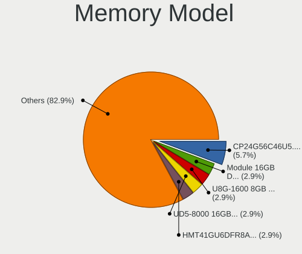

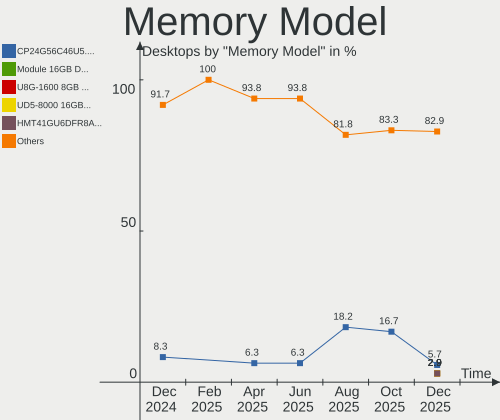

| Model                                                       | Desktops | Percent |
|-------------------------------------------------------------|----------|---------|
| Unknown                                                     | 2        | 5.71%   |
| Unknown RAM Module 16GB DIMM DDR4 2400MT/s                  | 1        | 2.86%   |
| Timetec RAM U8G-1600 8GB DIMM DDR3 1600MT/s                 | 1        | 2.86%   |
| TeamGroup RAM UD5-8000 16GB DIMM DDR5 8000MT/s              | 1        | 2.86%   |
| SK hynix RAM HMT41GU6DFR8A-PB 8GB DIMM DDR3 1600MT/s        | 1        | 2.86%   |
| SK hynix RAM HMAA2GU6AJR8N-XN 16GB DIMM DDR4 2400MT/s       | 1        | 2.86%   |
| Patriot RAM PSD416G24002 16GB DIMM DDR4 2400MT/s            | 1        | 2.86%   |
| Micron RAM CT16G48C40S5.M8A1 16GB SODIMM DDR5 4800MT/s      | 1        | 2.86%   |
| Micron RAM CP16G64C38U5B.M8D1 16GB DIMM DDR5 6000MT/s       | 1        | 2.86%   |
| Lexar Co Limited RAM LD5U32G64C32BR 32GB DIMM DDR5 5600MT/s | 1        | 2.86%   |
| Kingston RAM KF560C30-16 16GB DIMM DDR5 6000MT/s            | 1        | 2.86%   |
| Kingston RAM KF548C38-16 16GB DIMM DDR5 5900MT/s            | 1        | 2.86%   |
| Kingston RAM KF3200C16D4/8GX 8GiB DIMM DDR4 3600MT/s        | 1        | 2.86%   |
| Kingston RAM KF3200C16D4/16GX 16GB DIMM DDR4 3733MT/s       | 1        | 2.86%   |
| Kingston RAM 9965745-020.A00G 32GB DIMM DDR4 3600MT/s       | 1        | 2.86%   |
| Kingston RAM 9905743-213.A00G 16GB DIMM DDR4 3200MT/s       | 1        | 2.86%   |
| G.Skill RAM F4-3800C14-16GTZN 16GB DIMM DDR4 3800MT/s       | 1        | 2.86%   |
| G.Skill RAM F4-3600C18-32GTZN 32GB DIMM DDR4 3800MT/s       | 1        | 2.86%   |
| Crucial RAM CT16G4DFRA32A.M16FR 16GB DIMM DDR4 3200MT/s     | 1        | 2.86%   |
| Crucial RAM CT16G4DFRA32A.C16FP 16GB DIMM DDR4 3200MT/s     | 1        | 2.86%   |
| Crucial RAM BL32G36C16U4B.M16FB1 32GB DIMM DDR4 3733MT/s    | 1        | 2.86%   |
| Corsair RAM CMW32GX4M2Z3600C18 16GB DIMM DDR4 3733MT/s      | 1        | 2.86%   |
| Corsair RAM CMK96GX5M2B6000Z30 48GB DIMM DDR5 6000MT/s      | 1        | 2.86%   |
| Corsair RAM CMK96GX5M2B5200C38 48GB DIMM DDR5 5200MT/s      | 1        | 2.86%   |
| Corsair RAM CMK64GX4M2D3600C18 32GB DIMM DDR4 3600MT/s      | 1        | 2.86%   |
| Corsair RAM CMK32GX4M4A2400C14 8GB DIMM DDR4 2666MT/s       | 1        | 2.86%   |
| Corsair RAM CMK32GX4M2D3600C16 16GB DIMM DDR4 3600MT/s      | 1        | 2.86%   |
| Corsair RAM CMK32GX4M2D3000C16 16GB DIMM DDR4 3200MT/s      | 1        | 2.86%   |
| Corsair RAM CMK32GX4M2B3000C15 16GB DIMM DDR4 3000MT/s      | 1        | 2.86%   |
| Corsair RAM CMK16GX4M2E3200C16 8GB DIMM DDR4 3466MT/s       | 1        | 2.86%   |
| Corsair RAM CMK16GX4M1D3000C16 16GB DIMM DDR4 3600MT/s      | 1        | 2.86%   |
| Corsair RAM CMH64GX5M2B6000Z30 32GiB DIMM DDR5 6000MT/s     | 1        | 2.86%   |
| Corsair RAM CMH192GX5M4B5200C38 48GB DIMM DDR5 5200MT/s     | 1        | 2.86%   |
| A-DATA RAM AX5U5200C3816G-BLABK 16GB DIMM DDR5 4800MT/s     | 1        | 2.86%   |

Memory Kind
-----------

Memory module kinds

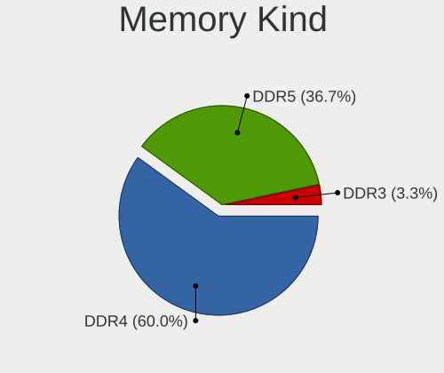

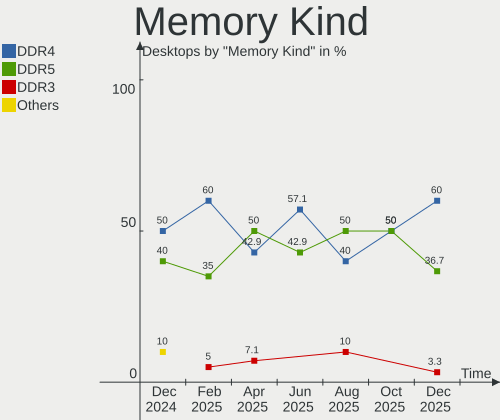

| Kind | Desktops | Percent |
|------|----------|---------|
| DDR4 | 18       | 60%     |
| DDR5 | 11       | 36.67%  |
| DDR3 | 1        | 3.33%   |

Memory Form Factor
------------------

Physical design of the memory module

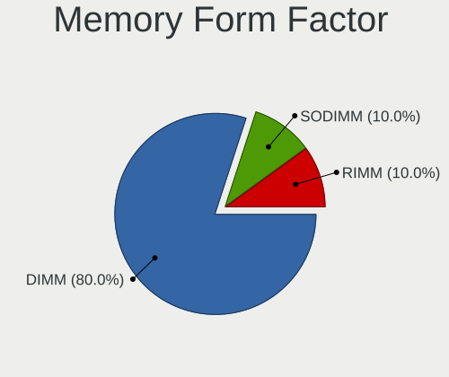

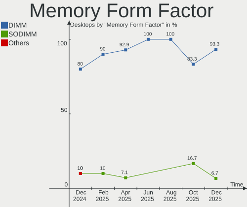

| Name   | Desktops | Percent |
|--------|----------|---------|
| DIMM   | 28       | 93.33%  |
| SODIMM | 2        | 6.67%   |

Memory Size
-----------

Memory module size

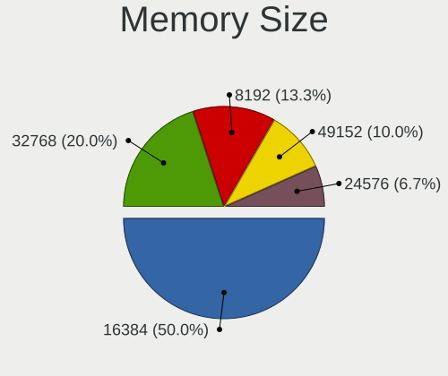

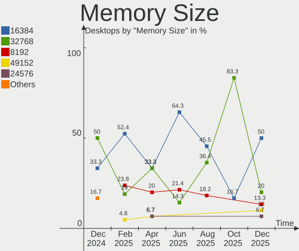

| Size  | Desktops | Percent |
|-------|----------|---------|
| 16384 | 15       | 50%     |
| 32768 | 6        | 20%     |
| 8192  | 4        | 13.33%  |
| 49152 | 3        | 10%     |
| 24576 | 2        | 6.67%   |

Memory Speed
------------

Memory module speed

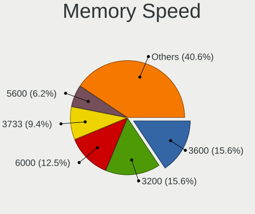

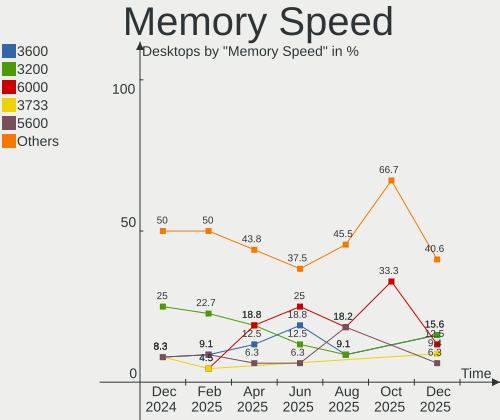

| Speed | Desktops | Percent |
|-------|----------|---------|
| 3600  | 5        | 15.63%  |
| 3200  | 5        | 15.63%  |
| 6000  | 4        | 12.5%   |
| 3733  | 3        | 9.38%   |
| 5600  | 2        | 6.25%   |
| 5200  | 2        | 6.25%   |
| 4800  | 2        | 6.25%   |
| 3800  | 2        | 6.25%   |
| 8000  | 1        | 3.13%   |
| 5900  | 1        | 3.13%   |
| 3466  | 1        | 3.13%   |
| 3000  | 1        | 3.13%   |
| 2666  | 1        | 3.13%   |
| 2400  | 1        | 3.13%   |
| 1600  | 1        | 3.13%   |

Printers & scanners
-------------------

Printer Vendor
--------------

Printer device vendors

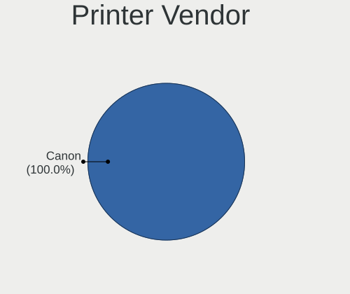

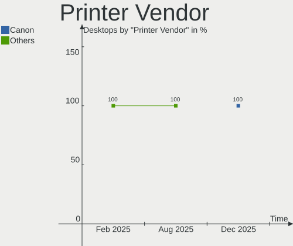

| Vendor | Desktops | Percent |
|--------|----------|---------|
| Canon  | 1        | 100%    |

Printer Model
-------------

Printer device models

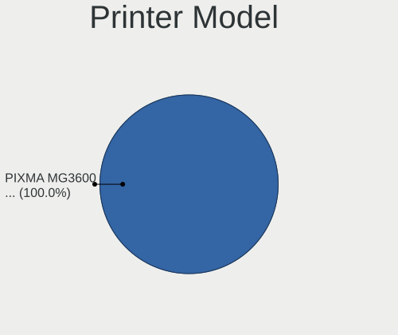

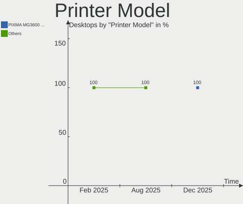

| Model                     | Desktops | Percent |
|---------------------------|----------|---------|
| Canon PIXMA MG3600 Series | 1        | 100%    |

Scanner Vendor
--------------

Scanner device vendors

Zero info for selected period =(

Scanner Model
-------------

Scanner device models

Zero info for selected period =(

Camera
------

Camera Vendor
-------------

Camera device vendors

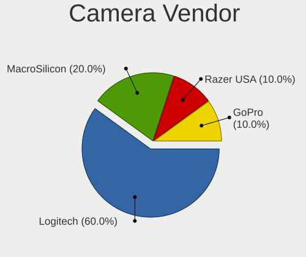

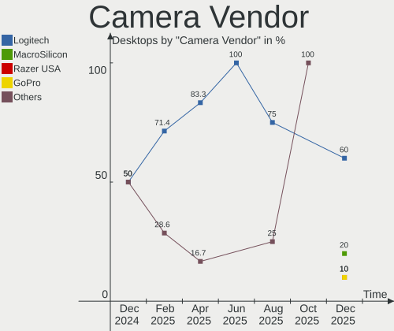

| Vendor       | Desktops | Percent |
|--------------|----------|---------|
| Logitech     | 6        | 60%     |
| MacroSilicon | 2        | 20%     |
| Razer USA    | 1        | 10%     |
| GoPro        | 1        | 10%     |

Camera Model
------------

Camera device models

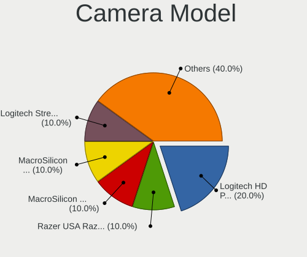

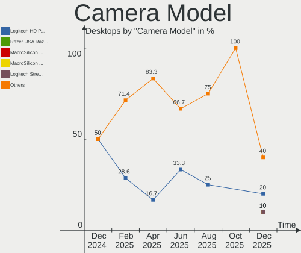

| Model                           | Desktops | Percent |
|---------------------------------|----------|---------|
| Logitech HD Pro Webcam C920     | 2        | 20%     |
| Razer USA Razer Kiyo Pro        | 1        | 10%     |
| MacroSilicon USB Video          | 1        | 10%     |
| MacroSilicon UGREEN 15390       | 1        | 10%     |
| Logitech StreamCam              | 1        | 10%     |
| Logitech C922 Pro Stream Webcam | 1        | 10%     |
| Logitech C920 PRO HD Webcam     | 1        | 10%     |
| Logitech Brio 100               | 1        | 10%     |
| GoPro HERO7 Silver              | 1        | 10%     |

Security
--------

Fingerprint Vendor
------------------

Fingerprint sensor vendors

Zero info for selected period =(

Fingerprint Model
-----------------

Fingerprint sensor models

Zero info for selected period =(

Chipcard Vendor
---------------

Chipcard module vendors

Zero info for selected period =(

Chipcard Model
--------------

Chipcard module models

Zero info for selected period =(

Unsupported
-----------

Unsupported Devices
-------------------

Total unsupported devices on board

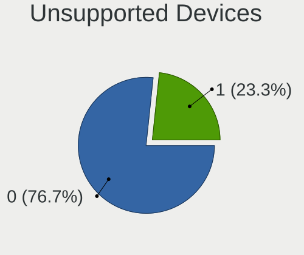

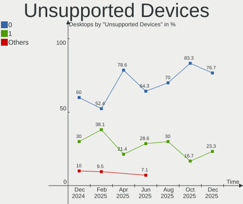

| Total | Desktops | Percent |
|-------|----------|---------|
| 0     | 23       | 76.67%  |
| 1     | 7        | 23.33%  |

Unsupported Device Types
------------------------

Types of unsupported devices

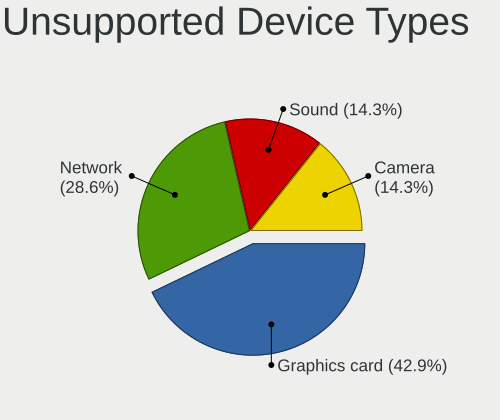

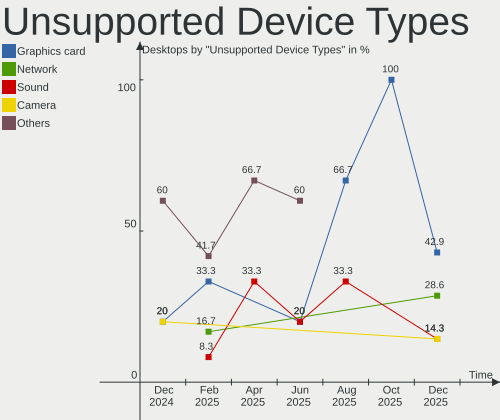

| Type          | Desktops | Percent |
|---------------|----------|---------|
| Graphics card | 3        | 42.86%  |
| Network       | 2        | 28.57%  |
| Sound         | 1        | 14.29%  |
| Camera        | 1        | 14.29%  |

