NixOS - Hardware Trends (Desktops)
----------------------------------

A project to identify most popular hardware characteristics and track their change
over time based on data collected by Linux users at https://Linux-Hardware.org.

Anyone can contribute to this report by the [hw-probe](https://github.com/linuxhw/hw-probe) tool:

    sudo -E hw-probe -all -upload

This report is for one last month. Overall report since the beginning of time: [TestDays](https://github.com/linuxhw/TestDays)

Period: Dec, 2024.

Contents
--------

* [ System ](#system)
  - [ OS                       ](#os)
  - [ OS Family                ](#os-family)
  - [ Kernel                   ](#kernel)
  - [ Kernel Family            ](#kernel-family)
  - [ Kernel Major Ver.        ](#kernel-major-ver)
  - [ Arch                     ](#arch)
  - [ DE                       ](#de)
  - [ Display Server           ](#display-server)
  - [ Display Manager          ](#display-manager)
  - [ OS Lang                  ](#os-lang)
  - [ Boot Mode                ](#boot-mode)
  - [ Filesystem               ](#filesystem)
  - [ Part. scheme             ](#part-scheme)
  - [ Dual Boot with Linux/BSD ](#dual-boot-with-linuxbsd)
  - [ Dual Boot (Win)          ](#dual-boot-win)

* [ Board ](#board)
  - [ Vendor                   ](#vendor)
  - [ Model                    ](#model)
  - [ Model Family             ](#model-family)
  - [ MFG Year                 ](#mfg-year)
  - [ Form Factor              ](#form-factor)
  - [ Secure Boot              ](#secure-boot)
  - [ Coreboot                 ](#coreboot)
  - [ RAM Size                 ](#ram-size)
  - [ RAM Used                 ](#ram-used)
  - [ Total Drives             ](#total-drives)
  - [ Has CD-ROM               ](#has-cd-rom)
  - [ Has Ethernet             ](#has-ethernet)
  - [ Has WiFi                 ](#has-wifi)
  - [ Has Bluetooth            ](#has-bluetooth)

* [ Location ](#location)
  - [ Country                  ](#country)
  - [ City                     ](#city)

* [ Drives ](#drives)
  - [ Drive Vendor             ](#drive-vendor)
  - [ Drive Model              ](#drive-model)
  - [ HDD Vendor               ](#hdd-vendor)
  - [ SSD Vendor               ](#ssd-vendor)
  - [ Drive Kind               ](#drive-kind)
  - [ Drive Connector          ](#drive-connector)
  - [ Drive Size               ](#drive-size)
  - [ Space Total              ](#space-total)
  - [ Space Used               ](#space-used)
  - [ Malfunc. Drives          ](#malfunc-drives)
  - [ Malfunc. Drive Vendor    ](#malfunc-drive-vendor)
  - [ Malfunc. HDD Vendor      ](#malfunc-hdd-vendor)
  - [ Malfunc. Drive Kind      ](#malfunc-drive-kind)
  - [ Failed Drives            ](#failed-drives)
  - [ Failed Drive Vendor      ](#failed-drive-vendor)
  - [ Drive Status             ](#drive-status)

* [ Storage controller ](#storage-controller)
  - [ Storage Vendor           ](#storage-vendor)
  - [ Storage Model            ](#storage-model)
  - [ Storage Kind             ](#storage-kind)

* [ Processor ](#processor)
  - [ CPU Vendor               ](#cpu-vendor)
  - [ CPU Model                ](#cpu-model)
  - [ CPU Model Family         ](#cpu-model-family)
  - [ CPU Cores                ](#cpu-cores)
  - [ CPU Sockets              ](#cpu-sockets)
  - [ CPU Threads              ](#cpu-threads)
  - [ CPU Op-Modes             ](#cpu-op-modes)
  - [ CPU Microcode            ](#cpu-microcode)
  - [ CPU Microarch            ](#cpu-microarch)

* [ Graphics ](#graphics)
  - [ GPU Vendor               ](#gpu-vendor)
  - [ GPU Model                ](#gpu-model)
  - [ GPU Combo                ](#gpu-combo)
  - [ GPU Driver               ](#gpu-driver)
  - [ GPU Memory               ](#gpu-memory)

* [ Monitor ](#monitor)
  - [ Monitor Vendor           ](#monitor-vendor)
  - [ Monitor Model            ](#monitor-model)
  - [ Monitor Resolution       ](#monitor-resolution)
  - [ Monitor Diagonal         ](#monitor-diagonal)
  - [ Monitor Width            ](#monitor-width)
  - [ Aspect Ratio             ](#aspect-ratio)
  - [ Monitor Area             ](#monitor-area)
  - [ Pixel Density            ](#pixel-density)
  - [ Multiple Monitors        ](#multiple-monitors)

* [ Network ](#network)
  - [ Net Controller Vendor    ](#net-controller-vendor)
  - [ Net Controller Model     ](#net-controller-model)
  - [ Wireless Vendor          ](#wireless-vendor)
  - [ Wireless Model           ](#wireless-model)
  - [ Ethernet Vendor          ](#ethernet-vendor)
  - [ Ethernet Model           ](#ethernet-model)
  - [ Net Controller Kind      ](#net-controller-kind)
  - [ Used Controller          ](#used-controller)
  - [ NICs                     ](#nics)
  - [ IPv6                     ](#ipv6)

* [ Bluetooth ](#bluetooth)
  - [ Bluetooth Vendor         ](#bluetooth-vendor)
  - [ Bluetooth Model          ](#bluetooth-model)

* [ Sound ](#sound)
  - [ Sound Vendor             ](#sound-vendor)
  - [ Sound Model              ](#sound-model)

* [ Memory ](#memory)
  - [ Memory Vendor            ](#memory-vendor)
  - [ Memory Model             ](#memory-model)
  - [ Memory Kind              ](#memory-kind)
  - [ Memory Form Factor       ](#memory-form-factor)
  - [ Memory Size              ](#memory-size)
  - [ Memory Speed             ](#memory-speed)

* [ Printers & scanners ](#printers--scanners)
  - [ Printer Vendor           ](#printer-vendor)
  - [ Printer Model            ](#printer-model)
  - [ Scanner Vendor           ](#scanner-vendor)
  - [ Scanner Model            ](#scanner-model)

* [ Camera ](#camera)
  - [ Camera Vendor            ](#camera-vendor)
  - [ Camera Model             ](#camera-model)

* [ Security ](#security)
  - [ Fingerprint Vendor       ](#fingerprint-vendor)
  - [ Fingerprint Model        ](#fingerprint-model)
  - [ Chipcard Vendor          ](#chipcard-vendor)
  - [ Chipcard Model           ](#chipcard-model)

* [ Unsupported ](#unsupported)
  - [ Unsupported Devices      ](#unsupported-devices)
  - [ Unsupported Device Types ](#unsupported-device-types)

System
------

OS
--

Installed operating systems

| Name        | Desktops | Percent |
|-------------|----------|---------|
| NixOS 25.05 | 5        | 50%     |
| NixOS 24.11 | 5        | 50%     |

OS Family
---------

OS without a version

| Name  | Desktops | Percent |
|-------|----------|---------|
| NixOS | 10       | 100%    |

Kernel
------

Version of the Linux kernel

| Version         | Desktops | Percent |
|-----------------|----------|---------|
| 6.6.63          | 3        | 30%     |
| 6.6.67          | 1        | 10%     |
| 6.6.64          | 1        | 10%     |
| 6.6.62          | 1        | 10%     |
| 6.12.6          | 1        | 10%     |
| 6.12.5-cachyos  | 1        | 10%     |
| 6.12.2-zen1     | 1        | 10%     |
| 6.11.10-xanmod1 | 1        | 10%     |

Kernel Family
-------------

Linux kernel without a distro release

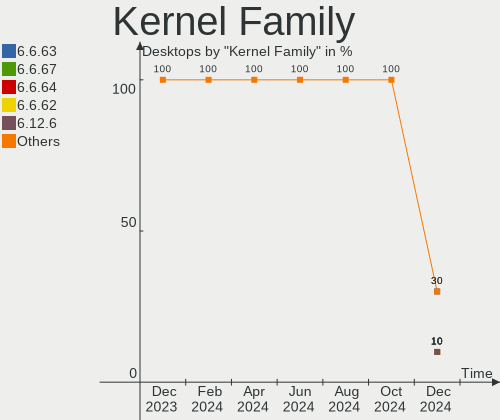

| Version | Desktops | Percent |
|---------|----------|---------|
| 6.6.63  | 3        | 30%     |
| 6.6.67  | 1        | 10%     |
| 6.6.64  | 1        | 10%     |
| 6.6.62  | 1        | 10%     |
| 6.12.6  | 1        | 10%     |
| 6.12.5  | 1        | 10%     |
| 6.12.2  | 1        | 10%     |
| 6.11.10 | 1        | 10%     |

Kernel Major Ver.
-----------------

Linux kernel major version

| Version | Desktops | Percent |
|---------|----------|---------|
| 6.6     | 6        | 60%     |
| 6.12    | 3        | 30%     |
| 6.11    | 1        | 10%     |

Arch
----

OS architecture (x86_64, i586, etc.)

| Name   | Desktops | Percent |
|--------|----------|---------|
| x86_64 | 10       | 100%    |

DE
--

Desktop Environment

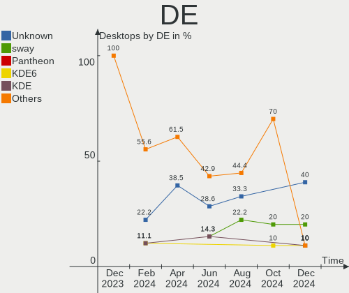

| Name     | Desktops | Percent |
|----------|----------|---------|
| Unknown  | 4        | 40%     |
| sway     | 2        | 20%     |
| Pantheon | 1        | 10%     |
| KDE6     | 1        | 10%     |
| KDE      | 1        | 10%     |
| GNOME    | 1        | 10%     |

Display Server
--------------

X11 or Wayland

| Name    | Desktops | Percent |
|---------|----------|---------|
| Wayland | 4        | 40%     |
| Tty     | 4        | 40%     |
| X11     | 1        | 10%     |
| Unknown | 1        | 10%     |

Display Manager
---------------

SDDM, LightDM, etc.

| Name    | Desktops | Percent |
|---------|----------|---------|
| Unknown | 4        | 40%     |
| SDDM    | 3        | 30%     |
| GDM     | 2        | 20%     |
| LightDM | 1        | 10%     |

OS Lang
-------

Language

| Lang       | Desktops | Percent |
|------------|----------|---------|
| en_US      | 6        | 60%     |
| sv_SE      | 1        | 10%     |
| ru_RU      | 1        | 10%     |
| en_IE.UTF8 | 1        | 10%     |
| en_GB      | 1        | 10%     |

Boot Mode
---------

EFI or BIOS

| Mode | Desktops | Percent |
|------|----------|---------|
| EFI  | 7        | 70%     |
| BIOS | 3        | 30%     |

Filesystem
----------

Type of filesystem

| Type  | Desktops | Percent |
|-------|----------|---------|
| Btrfs | 4        | 40%     |
| Zfs   | 3        | 30%     |
| Ext4  | 3        | 30%     |

Part. scheme
------------

Scheme of partitioning

| Type | Desktops | Percent |
|------|----------|---------|
| GPT  | 9        | 90%     |
| MBR  | 1        | 10%     |

Dual Boot with Linux/BSD
------------------------

Hosting more than one Linux/BSD

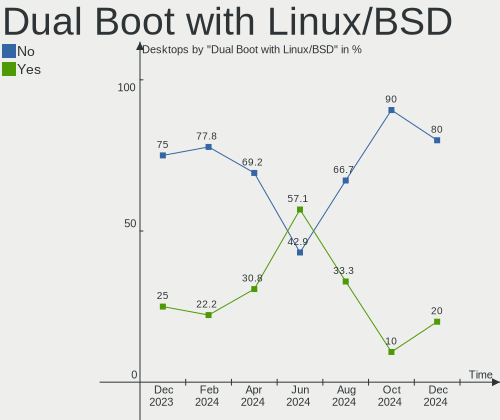

| Dual boot | Desktops | Percent |
|-----------|----------|---------|
| No        | 8        | 80%     |
| Yes       | 2        | 20%     |

Dual Boot (Win)
---------------

Hosting Linux and Windows

| Dual boot | Desktops | Percent |
|-----------|----------|---------|
| No        | 6        | 60%     |
| Yes       | 4        | 40%     |

Board
-----

Vendor
------

Motherboard manufacturer

| Name                | Desktops | Percent |
|---------------------|----------|---------|
| Gigabyte Technology | 4        | 40%     |
| MSI                 | 2        | 20%     |
| ASUSTek Computer    | 2        | 20%     |
| CWWK                | 1        | 10%     |
| ASRock              | 1        | 10%     |

Model
-----

Motherboard model

| Name                              | Desktops | Percent |
|-----------------------------------|----------|---------|
| MSI US Desktop Aegis R2           | 1        | 10%     |
| MSI MS-7D73                       | 1        | 10%     |
| Gigabyte Z390 AORUS PRO WIFI      | 1        | 10%     |
| Gigabyte TRX50 AERO D             | 1        | 10%     |
| Gigabyte GA-MA790GP-DS4H          | 1        | 10%     |
| Gigabyte B550I AORUS PRO AX       | 1        | 10%     |
| CWWK CW-MBX-AD12                  | 1        | 10%     |
| ASUS ROG STRIX X870-I GAMING WIFI | 1        | 10%     |
| ASUS All Series                   | 1        | 10%     |
| ASRock B550M Steel Legend         | 1        | 10%     |

Model Family
------------

Motherboard model prefix

| Name                     | Desktops | Percent |
|--------------------------|----------|---------|
| MSI US                   | 1        | 10%     |
| MSI MS-7D73              | 1        | 10%     |
| Gigabyte Z390            | 1        | 10%     |
| Gigabyte TRX50           | 1        | 10%     |
| Gigabyte GA-MA790GP-DS4H | 1        | 10%     |
| Gigabyte B550I           | 1        | 10%     |
| CWWK CW-MBX-AD12         | 1        | 10%     |
| ASUS ROG                 | 1        | 10%     |
| ASUS All                 | 1        | 10%     |
| ASRock B550M             | 1        | 10%     |

MFG Year
--------

Motherboard manufacture year

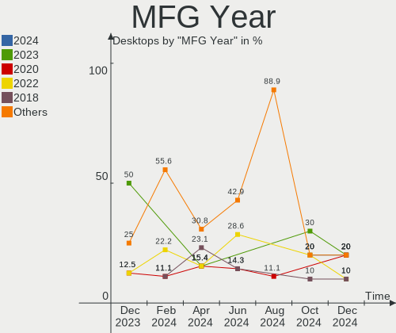

| Year | Desktops | Percent |
|------|----------|---------|
| 2024 | 2        | 20%     |
| 2023 | 2        | 20%     |
| 2020 | 2        | 20%     |
| 2022 | 1        | 10%     |
| 2018 | 1        | 10%     |
| 2012 | 1        | 10%     |
| 2008 | 1        | 10%     |

Form Factor
-----------

Physical design of the computer

| Name    | Desktops | Percent |
|---------|----------|---------|
| Desktop | 10       | 100%    |

Secure Boot
-----------

Enabled or disabled

| State    | Desktops | Percent |
|----------|----------|---------|
| Disabled | 10       | 100%    |

Coreboot
--------

Have coreboot on board

| Used | Desktops | Percent |
|------|----------|---------|
| No   | 10       | 100%    |

RAM Size
--------

Total RAM memory

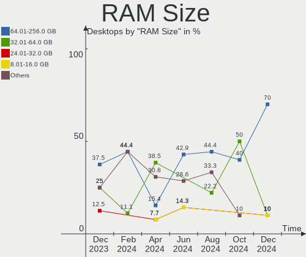

| Size in GB  | Desktops | Percent |
|-------------|----------|---------|
| 64.01-256.0 | 7        | 70%     |
| 32.01-64.0  | 1        | 10%     |
| 24.01-32.0  | 1        | 10%     |
| 8.01-16.0   | 1        | 10%     |

RAM Used
--------

Used RAM memory

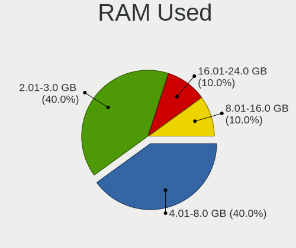

| Used GB    | Desktops | Percent |
|------------|----------|---------|
| 4.01-8.0   | 4        | 40%     |
| 2.01-3.0   | 4        | 40%     |
| 16.01-24.0 | 1        | 10%     |
| 8.01-16.0  | 1        | 10%     |

Total Drives
------------

Number of drives on board

| Drives | Desktops | Percent |
|--------|----------|---------|
| 2      | 4        | 40%     |
| 3      | 3        | 30%     |
| 1      | 3        | 30%     |

Has CD-ROM
----------

Has CD-ROM on board

| Presented | Desktops | Percent |
|-----------|----------|---------|
| No        | 9        | 90%     |
| Yes       | 1        | 10%     |

Has Ethernet
------------

Has Ethernet on board

| Presented | Desktops | Percent |
|-----------|----------|---------|
| Yes       | 10       | 100%    |

Has WiFi
--------

Has WiFi module

| Presented | Desktops | Percent |
|-----------|----------|---------|
| Yes       | 6        | 60%     |
| No        | 4        | 40%     |

Has Bluetooth
-------------

Has Bluetooth module

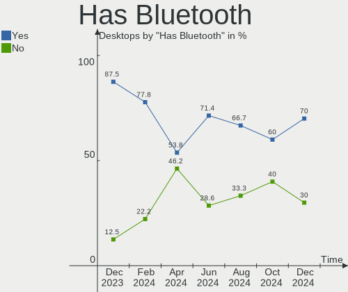

| Presented | Desktops | Percent |
|-----------|----------|---------|
| Yes       | 7        | 70%     |
| No        | 3        | 30%     |

Location
--------

Country
-------

Geographic location (country)

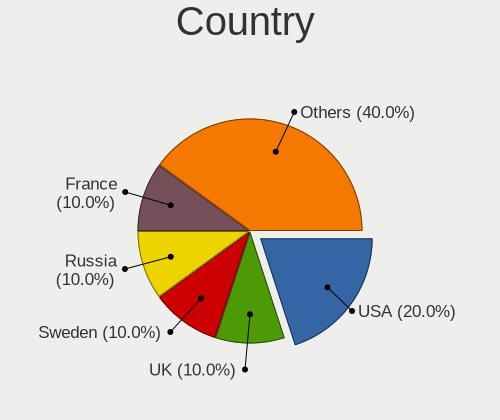

| Country | Desktops | Percent |
|---------|----------|---------|
| USA     | 2        | 20%     |
| UK      | 1        | 10%     |
| Sweden  | 1        | 10%     |
| Russia  | 1        | 10%     |
| France  | 1        | 10%     |
| Czechia | 1        | 10%     |
| Canada  | 1        | 10%     |
| Brazil  | 1        | 10%     |
| Belgium | 1        | 10%     |

City
----

Geographic location (city)

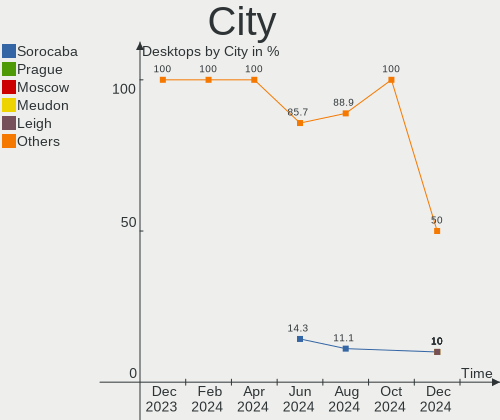

| City        | Desktops | Percent |
|-------------|----------|---------|
| Sorocaba    | 1        | 10%     |
| Prague      | 1        | 10%     |
| Moscow      | 1        | 10%     |
| Meudon      | 1        | 10%     |
| Leigh       | 1        | 10%     |
| Langley     | 1        | 10%     |
| Jönköping | 1        | 10%     |
| Hamme       | 1        | 10%     |
| Bedford     | 1        | 10%     |
| Aliso Viejo | 1        | 10%     |

Drives
------

Drive Vendor
------------

Hard drive vendors

| Vendor                      | Desktops | Drives | Percent |
|-----------------------------|----------|--------|---------|
| Samsung Electronics         | 4        | 5      | 25%     |
| Unknown                     | 3        | 3      | 18.75%  |
| Seagate                     | 2        | 3      | 12.5%   |
| Team                        | 1        | 1      | 6.25%   |
| Silicon Motion              | 1        | 1      | 6.25%   |
| Lexar                       | 1        | 1      | 6.25%   |
| Kingston Technology Company | 1        | 2      | 6.25%   |
| Kingston                    | 1        | 1      | 6.25%   |
| Apacer                      | 1        | 2      | 6.25%   |
| Unknown                     | 1        | 1      | 6.25%   |

Drive Model
-----------

Hard drive models

| Model                                 | Desktops | Percent |
|---------------------------------------|----------|---------|
| Unknown NVMe SSD Drive 1TB            | 3        | 17.65%  |
| Samsung SSD 990 PRO with Heatsink 2TB | 2        | 11.76%  |
| Team TM8FP4002T 2TB                   | 1        | 5.88%   |
| Silicon Motion Q3DT-2TSCSYD-NM2 2TB   | 1        | 5.88%   |
| Seagate ST4000DM004-2CV104 4TB        | 1        | 5.88%   |
| Seagate ST31500341AS 1TB              | 1        | 5.88%   |
| Samsung SSD 980 PRO 1TB               | 1        | 5.88%   |
| Samsung SSD 970 EVO Plus 1TB          | 1        | 5.88%   |
| Samsung SSD 840 Series 120GB          | 1        | 5.88%   |
| Lexar SSD NQ100 480GB                 | 1        | 5.88%   |
| Kingston Company SNV2S1000G 1TB       | 1        | 5.88%   |
| Kingston SFYRS500G 500GB              | 1        | 5.88%   |
| Apacer AS2280Q4 2TB                   | 1        | 5.88%   |
| Unknown                               | 1        | 5.88%   |

HDD Vendor
----------

Hard disk drive vendors

| Vendor  | Desktops | Drives | Percent |
|---------|----------|--------|---------|
| Seagate | 2        | 3      | 100%    |

SSD Vendor
----------

Solid state drive vendors

| Vendor              | Desktops | Drives | Percent |
|---------------------|----------|--------|---------|
| Samsung Electronics | 1        | 1      | 50%     |
| Lexar               | 1        | 1      | 50%     |

Drive Kind
----------

HDD or SSD

| Kind | Desktops | Drives | Percent |
|------|----------|--------|---------|
| NVMe | 9        | 15     | 69.23%  |
| SSD  | 2        | 2      | 15.38%  |
| HDD  | 2        | 3      | 15.38%  |

Drive Connector
---------------

SATA, SAS, NVMe, etc.

| Type | Desktops | Drives | Percent |
|------|----------|--------|---------|
| NVMe | 9        | 15     | 69.23%  |
| SATA | 4        | 5      | 30.77%  |

Drive Size
----------

Size of hard drive

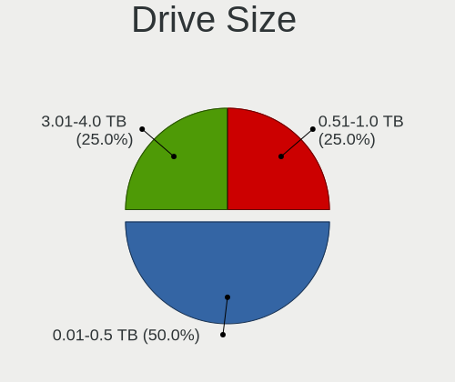

| Size in TB | Desktops | Drives | Percent |
|------------|----------|--------|---------|
| 0.01-0.5   | 2        | 2      | 50%     |
| 3.01-4.0   | 1        | 1      | 25%     |
| 0.51-1.0   | 1        | 2      | 25%     |

Space Total
-----------

Amount of disk space available on the file system

| Size in GB     | Desktops | Percent |
|----------------|----------|---------|
| 1-20           | 5        | 50%     |
| More than 3000 | 4        | 40%     |
| 501-1000       | 1        | 10%     |

Space Used
----------

Amount of used disk space

| Used GB        | Desktops | Percent |
|----------------|----------|---------|
| 1-20           | 6        | 60%     |
| 101-250        | 2        | 20%     |
| More than 3000 | 1        | 10%     |
| 2001-3000      | 1        | 10%     |

Malfunc. Drives
---------------

Drive models with a malfunction

| Model                    | Desktops | Drives | Percent |
|--------------------------|----------|--------|---------|
| Seagate ST31500341AS 1TB | 1        | 2      | 100%    |

Malfunc. Drive Vendor
---------------------

Vendors of faulty drives

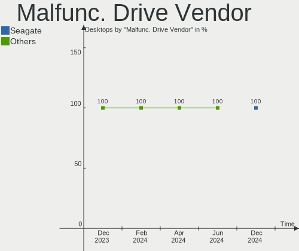

| Vendor  | Desktops | Drives | Percent |
|---------|----------|--------|---------|
| Seagate | 1        | 2      | 100%    |

Malfunc. HDD Vendor
-------------------

Vendors of faulty HDD drives

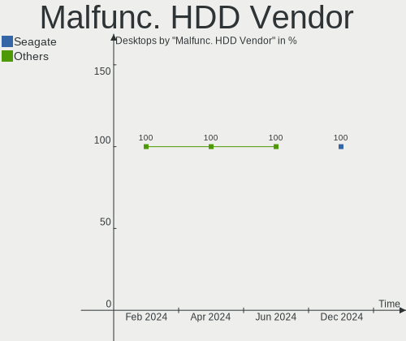

| Vendor  | Desktops | Drives | Percent |
|---------|----------|--------|---------|
| Seagate | 1        | 2      | 100%    |

Malfunc. Drive Kind
-------------------

Kinds of faulty drives

| Kind | Desktops | Drives | Percent |
|------|----------|--------|---------|
| HDD  | 1        | 2      | 100%    |

Failed Drives
-------------

Failed drive models

Zero info for selected period =(

Failed Drive Vendor
-------------------

Failed drive vendors

Zero info for selected period =(

Drive Status
------------

Number of failed and malfunc. drives

| Status   | Desktops | Drives | Percent |
|----------|----------|--------|---------|
| Works    | 9        | 14     | 64.29%  |
| Detected | 4        | 4      | 28.57%  |
| Malfunc  | 1        | 2      | 7.14%   |

Storage controller
------------------

Storage Vendor
--------------

Storage controller vendors

| Vendor                      | Desktops | Percent |
|-----------------------------|----------|---------|
| AMD                         | 6        | 27.27%  |
| Intel                       | 4        | 18.18%  |
| SanDisk                     | 3        | 13.64%  |
| Samsung Electronics         | 3        | 13.64%  |
| Kingston Technology Company | 2        | 9.09%   |
| Solidigm                    | 1        | 4.55%   |
| Silicon Motion              | 1        | 4.55%   |
| Realtek Semiconductor       | 1        | 4.55%   |
| MAXIO Technology (Hangzhou) | 1        | 4.55%   |

Storage Model
-------------

Storage controller models

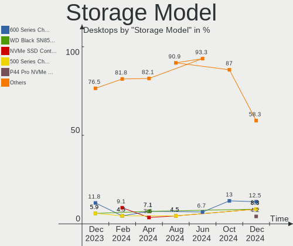

| Model                                                            | Desktops | Percent |
|------------------------------------------------------------------|----------|---------|
| AMD 600 Series Chipset SATA Controller                           | 3        | 12.5%   |
| Sandisk WD Black SN850X NVMe SSD                                 | 2        | 8.33%   |
| Samsung NVMe SSD Controller S4LV008[Pascal]                      | 2        | 8.33%   |
| AMD 500 Series Chipset SATA Controller                           | 2        | 8.33%   |
| Solidigm P44 Pro NVMe SSD [Hollywood Beach]                      | 1        | 4.17%   |
| Silicon Motion SM2262/SM2262EN SSD Controller                    | 1        | 4.17%   |
| SanDisk WD PC SN540 / Green SN350 NVMe SSD 1 TB (DRAM-less)      | 1        | 4.17%   |
| Samsung NVMe SSD Controller SM981/PM981/PM983                    | 1        | 4.17%   |
| Samsung NVMe SSD Controller PM9A1/PM9A3/980PRO                   | 1        | 4.17%   |
| Realtek RTS5762 NVMe SSD Controller                              | 1        | 4.17%   |
| MAXIO (Hangzhou) NVMe SSD Controller MAP1602 (DRAM-less)         | 1        | 4.17%   |
| Kingston Company NV2 NVMe SSD [E21T] (DRAM-less)                 | 1        | 4.17%   |
| Kingston Company KC3000/FURY Renegade NVMe SSD [E18]             | 1        | 4.17%   |
| Intel Raptor Lake SATA AHCI Controller                           | 1        | 4.17%   |
| Intel Cannon Lake PCH SATA AHCI Controller                       | 1        | 4.17%   |
| Intel C610/X99 series chipset 6-Port SATA Controller [AHCI mode] | 1        | 4.17%   |
| Intel Alder Lake-P SATA AHCI Controller                          | 1        | 4.17%   |
| AMD SB7x0/SB8x0/SB9x0 SATA Controller [AHCI mode]                | 1        | 4.17%   |
| AMD SB7x0/SB8x0/SB9x0 IDE Controller                             | 1        | 4.17%   |

Storage Kind
------------

Kind of storage controller (IDE, SATA, NVMe, SAS, ...)

| Kind | Desktops | Percent |
|------|----------|---------|
| SATA | 10       | 50%     |
| NVMe | 9        | 45%     |
| IDE  | 1        | 5%      |

Processor
---------

CPU Vendor
----------

Processor vendors

| Vendor | Desktops | Percent |
|--------|----------|---------|
| AMD    | 6        | 60%     |
| Intel  | 4        | 40%     |

CPU Model
---------

Processor models

| Model                                      | Desktops | Percent |
|--------------------------------------------|----------|---------|
| Intel Xeon CPU E5-2696 v4 @ 2.20GHz        | 1        | 10%     |
| Intel Core i9-14900F                       | 1        | 10%     |
| Intel Core i5-9600KF CPU @ 3.70GHz         | 1        | 10%     |
| Intel 12th Gen Core i7-1265U               | 1        | 10%     |
| AMD Ryzen Threadripper 7960X 24-Cores      | 1        | 10%     |
| AMD Ryzen 9 7950X3D 16-Core Processor      | 1        | 10%     |
| AMD Ryzen 9 5900X 12-Core Processor        | 1        | 10%     |
| AMD Ryzen 9 3900X 12-Core Processor        | 1        | 10%     |
| AMD Ryzen 5 8600G w/ Radeon 760M Graphics  | 1        | 10%     |
| AMD Athlon 64 X2 Dual Core Processor 5000+ | 1        | 10%     |

CPU Model Family
----------------

Processor model prefix

| Model                  | Desktops | Percent |
|------------------------|----------|---------|
| AMD Ryzen 9            | 3        | 30%     |
| Other                  | 1        | 10%     |
| Intel Xeon             | 1        | 10%     |
| Intel Core i9          | 1        | 10%     |
| Intel Core i5          | 1        | 10%     |
| AMD Ryzen Threadripper | 1        | 10%     |
| AMD Ryzen 5            | 1        | 10%     |
| AMD Athlon 64 X2       | 1        | 10%     |

CPU Cores
---------

Number of processor cores

| Number | Desktops | Percent |
|--------|----------|---------|
| 24     | 2        | 20%     |
| 12     | 2        | 20%     |
| 6      | 2        | 20%     |
| 22     | 1        | 10%     |
| 16     | 1        | 10%     |
| 10     | 1        | 10%     |
| 2      | 1        | 10%     |

CPU Sockets
-----------

Number of sockets

| Number | Desktops | Percent |
|--------|----------|---------|
| 1      | 10       | 100%    |

CPU Threads
-----------

Threads per core (Hyper-Threading)

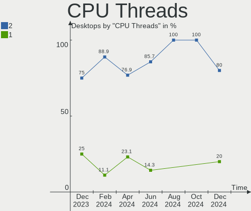

| Number | Desktops | Percent |
|--------|----------|---------|
| 2      | 8        | 80%     |
| 1      | 2        | 20%     |

CPU Op-Modes
------------

CPU Operation Modes (32-bit, 64-bit)

| Op mode        | Desktops | Percent |
|----------------|----------|---------|
| 32-bit, 64-bit | 10       | 100%    |

CPU Microcode
-------------

Microcode number

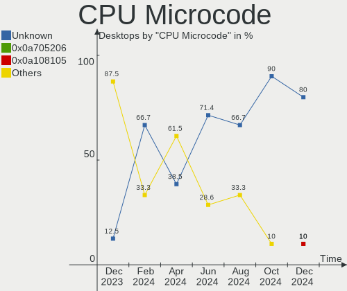

| Number     | Desktops | Percent |
|------------|----------|---------|
| Unknown    | 8        | 80%     |
| 0x0a705206 | 1        | 10%     |
| 0x0a108105 | 1        | 10%     |

CPU Microarch
-------------

Microarchitecture

| Name             | Desktops | Percent |
|------------------|----------|---------|
| Unknown          | 4        | 40%     |
| Zen 3            | 1        | 10%     |
| Zen 2            | 1        | 10%     |
| KabyLake         | 1        | 10%     |
| K8 Hammer        | 1        | 10%     |
| Broadwell        | 1        | 10%     |
| Alderlake Hybrid | 1        | 10%     |

Graphics
--------

GPU Vendor
----------

Vendors of graphics cards

| Vendor | Desktops | Percent |
|--------|----------|---------|
| AMD    | 7        | 63.64%  |
| Nvidia | 3        | 27.27%  |
| Intel  | 1        | 9.09%   |

GPU Model
---------

Graphics card models

| Model                                                         | Desktops | Percent |
|---------------------------------------------------------------|----------|---------|
| Nvidia GT218 [GeForce 210]                                    | 1        | 9.09%   |
| Nvidia AD104 [GeForce RTX 4070]                               | 1        | 9.09%   |
| Nvidia AD104 [GeForce RTX 4070 SUPER]                         | 1        | 9.09%   |
| Intel Alder Lake-UP3 GT2 [Iris Xe Graphics]                   | 1        | 9.09%   |
| AMD Raphael                                                   | 1        | 9.09%   |
| AMD Phoenix1                                                  | 1        | 9.09%   |
| AMD Navi 32 [Radeon RX 7700 XT / 7800 XT]                     | 1        | 9.09%   |
| AMD Navi 31 [Radeon RX 7900 XT/7900 XTX/7900 GRE/7900M]       | 1        | 9.09%   |
| AMD Navi 22 [Radeon RX 6700/6700 XT/6750 XT / 6800M/6850M XT] | 1        | 9.09%   |
| AMD Navi 21 [Radeon RX 6800/6800 XT / 6900 XT]                | 1        | 9.09%   |
| AMD Cedar [Radeon HD 5000/6000/7350/8350 Series]              | 1        | 9.09%   |

GPU Combo
---------

Combinations of graphics cards

| Name         | Desktops | Percent |
|--------------|----------|---------|
| 1 x AMD      | 6        | 60%     |
| 1 x Nvidia   | 2        | 20%     |
| 1 x Intel    | 1        | 10%     |
| AMD + Nvidia | 1        | 10%     |

GPU Driver
----------

Free vs proprietary

| Driver      | Desktops | Percent |
|-------------|----------|---------|
| Free        | 7        | 70%     |
| Proprietary | 2        | 20%     |
| Unknown     | 1        | 10%     |

GPU Memory
----------

Total video memory

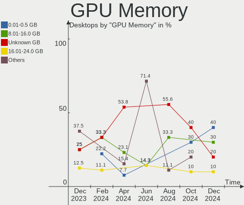

| Size in GB | Desktops | Percent |
|------------|----------|---------|
| 0.01-0.5   | 4        | 40%     |
| 8.01-16.0  | 3        | 30%     |
| Unknown    | 2        | 20%     |
| 16.01-24.0 | 1        | 10%     |

Monitor
-------

Monitor Vendor
--------------

Monitor vendors

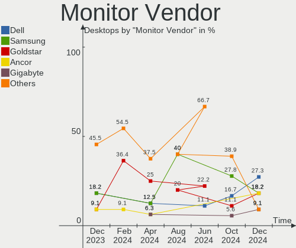

| Vendor               | Desktops | Percent |
|----------------------|----------|---------|
| Dell                 | 3        | 27.27%  |
| Samsung Electronics  | 2        | 18.18%  |
| Goldstar             | 2        | 18.18%  |
| Ancor Communications | 2        | 18.18%  |
| Gigabyte Technology  | 1        | 9.09%   |
| BenQ                 | 1        | 9.09%   |

Monitor Model
-------------

Monitor models

| Model                                                                  | Desktops | Percent |
|------------------------------------------------------------------------|----------|---------|
| Samsung Electronics LU28R55 SAM1015 3840x2160 632x360mm 28.6-inch      | 1        | 8.33%   |
| Samsung Electronics C32JG5x SAM0F54 2560x1440 697x392mm 31.5-inch      | 1        | 8.33%   |
| Goldstar ULTRAWIDE GSM59F1 2560x1080 677x290mm 29.0-inch               | 1        | 8.33%   |
| Goldstar HDR QHD GSM771B 2560x1440 697x392mm 31.5-inch                 | 1        | 8.33%   |
| Goldstar BK750Y GSM5B3D 1920x1080 480x270mm 21.7-inch                  | 1        | 8.33%   |
| Gigabyte Technology M32QC GBT3205 2560x1440 697x392mm 31.5-inch        | 1        | 8.33%   |
| Dell U2515H DELD072 2560x1440 553x311mm 25.0-inch                      | 1        | 8.33%   |
| Dell U2415 DELA0BA 1920x1200 518x324mm 24.1-inch                       | 1        | 8.33%   |
| Dell P190S DEL405B 1280x1024 376x301mm 19.0-inch                       | 1        | 8.33%   |
| BenQ RD280U BNQ805B 3840x2560 597x397mm 28.2-inch                      | 1        | 8.33%   |
| Ancor Communications VS278 ACI27A1 1920x1080 598x336mm 27.0-inch       | 1        | 8.33%   |
| Ancor Communications ASUS PB287Q ACI28A3 3840x2160 621x341mm 27.9-inch | 1        | 8.33%   |

Monitor Resolution
------------------

Monitor screen resolution

| Resolution       | Desktops | Percent |
|------------------|----------|---------|
| 2560x1440 (QHD)  | 4        | 33.33%  |
| 1920x1080 (FHD)  | 3        | 25%     |
| 3840x2160 (4K)   | 2        | 16.67%  |
| 3840x2560        | 1        | 8.33%   |
| 2560x1080        | 1        | 8.33%   |
| 1280x1024 (SXGA) | 1        | 8.33%   |

Monitor Diagonal
----------------

Diagonal size in inches

| Inches | Desktops | Percent |
|--------|----------|---------|
| 31     | 3        | 25%     |
| 28     | 2        | 16.67%  |
| 27     | 2        | 16.67%  |
| 34     | 1        | 8.33%   |
| 25     | 1        | 8.33%   |
| 24     | 1        | 8.33%   |
| 21     | 1        | 8.33%   |
| 19     | 1        | 8.33%   |

Monitor Width
-------------

Physical width

| Width in mm | Desktops | Percent |
|-------------|----------|---------|
| 601-700     | 4        | 36.36%  |
| 501-600     | 4        | 36.36%  |
| 701-800     | 1        | 9.09%   |
| 401-500     | 1        | 9.09%   |
| 351-400     | 1        | 9.09%   |

Aspect Ratio
------------

Proportional relationship between the width and the height

| Ratio | Desktops | Percent |
|-------|----------|---------|
| 16/9  | 6        | 60%     |
| 5/4   | 1        | 10%     |
| 3/2   | 1        | 10%     |
| 21/9  | 1        | 10%     |
| 16/10 | 1        | 10%     |

Monitor Area
------------

Area in inch²

| Area in inch² | Desktops | Percent |
|----------------|----------|---------|
| 351-500        | 4        | 40%     |
| 301-350        | 2        | 20%     |
| 251-300        | 2        | 20%     |
| 201-250        | 1        | 10%     |
| 151-200        | 1        | 10%     |

Pixel Density
-------------

Pixels per inch

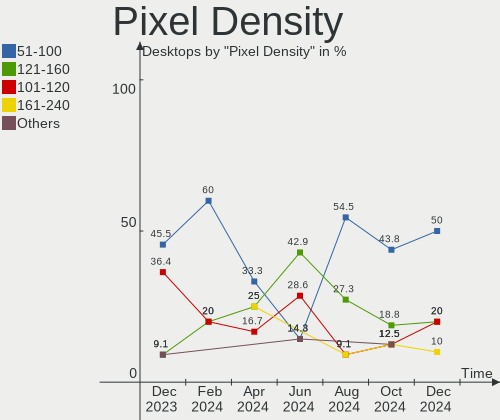

| Density | Desktops | Percent |
|---------|----------|---------|
| 51-100  | 5        | 50%     |
| 121-160 | 2        | 20%     |
| 101-120 | 2        | 20%     |
| 161-240 | 1        | 10%     |

Multiple Monitors
-----------------

Total monitors connected

| Total | Desktops | Percent |
|-------|----------|---------|
| 1     | 5        | 50%     |
| 2     | 2        | 20%     |
| 0     | 2        | 20%     |
| 4     | 1        | 10%     |

Network
-------

Net Controller Vendor
---------------------

Controller vendors

| Vendor                 | Desktops | Percent |
|------------------------|----------|---------|
| Realtek Semiconductor  | 7        | 36.84%  |
| Intel                  | 6        | 31.58%  |
| MediaTek               | 2        | 10.53%  |
| Qualcomm Technologies  | 1        | 5.26%   |
| Chelsio Communications | 1        | 5.26%   |
| Broadcom               | 1        | 5.26%   |
| Aquantia               | 1        | 5.26%   |

Net Controller Model
--------------------

Controller models

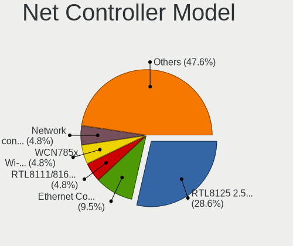

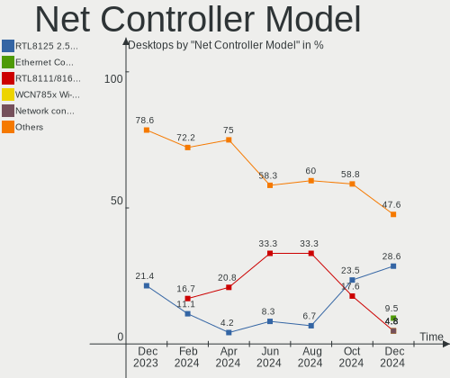

| Model                                                                             | Desktops | Percent |
|-----------------------------------------------------------------------------------|----------|---------|
| Realtek RTL8125 2.5GbE Controller                                                 | 6        | 28.57%  |
| Intel Ethernet Controller I226-V                                                  | 2        | 9.52%   |
| Realtek RTL8111/8168/8211/8411 PCI Express Gigabit Ethernet Controller            | 1        | 4.76%   |
| Qualcomm WCN785x Wi-Fi 7(802.11be) 320MHz 2x2 [FastConnect 7800]                  | 1        | 4.76%   |
| MediaTek Network controller                                                       | 1        | 4.76%   |
| MediaTek MT7922 802.11ax PCI Express Wireless Network Adapter                     | 1        | 4.76%   |
| Intel Wi-Fi 6 AX200                                                               | 1        | 4.76%   |
| Intel I211 Gigabit Network Connection                                             | 1        | 4.76%   |
| Intel Ethernet Connection (7) I219-V                                              | 1        | 4.76%   |
| Intel Ethernet Connection (2) I218-V                                              | 1        | 4.76%   |
| Intel Dual Band Wireless-AC 3168NGW [Stone Peak]                                  | 1        | 4.76%   |
| Intel Cannon Lake PCH CNVi WiFi                                                   | 1        | 4.76%   |
| Chelsio T320 10GbE Dual Port Adapter                                              | 1        | 4.76%   |
| Broadcom BCM4360 802.11ac Dual Band Wireless Network Adapter                      | 1        | 4.76%   |
| Aquantia AQC113C NBase-T/IEEE 802.3an Ethernet Controller [Marvell Scalable mGig] | 1        | 4.76%   |

Wireless Vendor
---------------

Wireless vendors

| Vendor                | Desktops | Percent |
|-----------------------|----------|---------|
| Intel                 | 3        | 50%     |
| Qualcomm Technologies | 1        | 16.67%  |
| MediaTek              | 1        | 16.67%  |
| Broadcom              | 1        | 16.67%  |

Wireless Model
--------------

Wireless models

| Model                                                            | Desktops | Percent |
|------------------------------------------------------------------|----------|---------|
| Qualcomm WCN785x Wi-Fi 7(802.11be) 320MHz 2x2 [FastConnect 7800] | 1        | 16.67%  |
| MediaTek MT7922 802.11ax PCI Express Wireless Network Adapter    | 1        | 16.67%  |
| Intel Wi-Fi 6 AX200                                              | 1        | 16.67%  |
| Intel Dual Band Wireless-AC 3168NGW [Stone Peak]                 | 1        | 16.67%  |
| Intel Cannon Lake PCH CNVi WiFi                                  | 1        | 16.67%  |
| Broadcom BCM4360 802.11ac Dual Band Wireless Network Adapter     | 1        | 16.67%  |

Ethernet Vendor
---------------

Ethernet vendors

| Vendor                 | Desktops | Percent |
|------------------------|----------|---------|
| Realtek Semiconductor  | 7        | 53.85%  |
| Intel                  | 4        | 30.77%  |
| Chelsio Communications | 1        | 7.69%   |
| Aquantia               | 1        | 7.69%   |

Ethernet Model
--------------

Ethernet models

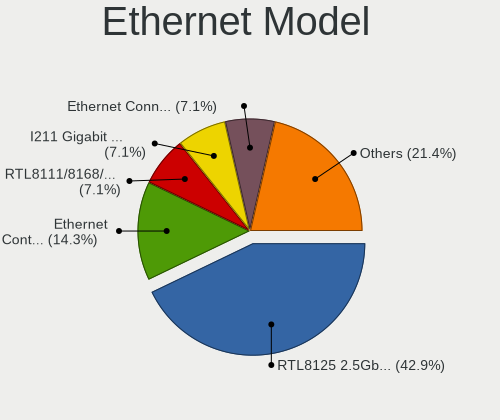

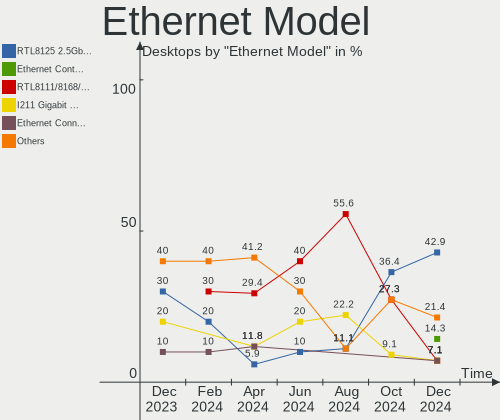

| Model                                                                             | Desktops | Percent |
|-----------------------------------------------------------------------------------|----------|---------|
| Realtek RTL8125 2.5GbE Controller                                                 | 6        | 42.86%  |
| Intel Ethernet Controller I226-V                                                  | 2        | 14.29%  |
| Realtek RTL8111/8168/8211/8411 PCI Express Gigabit Ethernet Controller            | 1        | 7.14%   |
| Intel I211 Gigabit Network Connection                                             | 1        | 7.14%   |
| Intel Ethernet Connection (7) I219-V                                              | 1        | 7.14%   |
| Intel Ethernet Connection (2) I218-V                                              | 1        | 7.14%   |
| Chelsio T320 10GbE Dual Port Adapter                                              | 1        | 7.14%   |
| Aquantia AQC113C NBase-T/IEEE 802.3an Ethernet Controller [Marvell Scalable mGig] | 1        | 7.14%   |

Net Controller Kind
-------------------

Ethernet, WiFi or modem

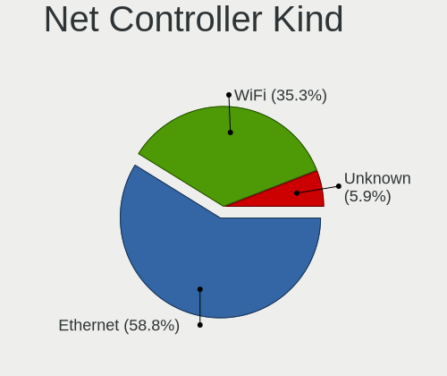

| Kind     | Desktops | Percent |
|----------|----------|---------|
| Ethernet | 10       | 58.82%  |
| WiFi     | 6        | 35.29%  |
| Unknown  | 1        | 5.88%   |

Used Controller
---------------

Currently used network controller

| Kind     | Desktops | Percent |
|----------|----------|---------|
| Ethernet | 8        | 80%     |
| WiFi     | 2        | 20%     |

NICs
----

Total network controllers on board

| Total | Desktops | Percent |
|-------|----------|---------|
| 2     | 4        | 40%     |
| 4     | 2        | 20%     |
| 1     | 2        | 20%     |
| 6     | 1        | 10%     |
| 3     | 1        | 10%     |

IPv6
----

IPv6 vs IPv4

| Used | Desktops | Percent |
|------|----------|---------|
| Yes  | 5        | 50%     |
| No   | 5        | 50%     |

Bluetooth
---------

Bluetooth Vendor
----------------

Controller vendors

| Vendor            | Desktops | Percent |
|-------------------|----------|---------|
| Intel             | 3        | 42.86%  |
| Foxconn / Hon Hai | 2        | 28.57%  |
| MediaTek          | 1        | 14.29%  |
| ASUSTek Computer  | 1        | 14.29%  |

Bluetooth Model
---------------

Controller models

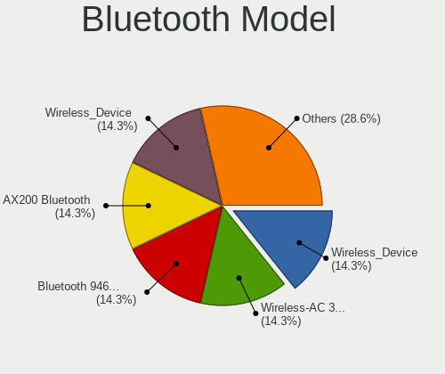

| Model                                                 | Desktops | Percent |
|-------------------------------------------------------|----------|---------|
| MediaTek Wireless_Device                              | 1        | 14.29%  |
| Intel Wireless-AC 3168 Bluetooth                      | 1        | 14.29%  |
| Intel Bluetooth 9460/9560 Jefferson Peak (JfP)        | 1        | 14.29%  |
| Intel AX200 Bluetooth                                 | 1        | 14.29%  |
| Foxconn / Hon Hai Wireless_Device                     | 1        | 14.29%  |
| Foxconn / Hon Hai Bluetooth Device                    | 1        | 14.29%  |
| ASUS Broadcom BCM20702 Single-Chip Bluetooth 4.0 + LE | 1        | 14.29%  |

Sound
-----

Sound Vendor
------------

Sound card vendors

| Vendor                               | Desktops | Percent |
|--------------------------------------|----------|---------|
| AMD                                  | 7        | 36.84%  |
| Intel                                | 4        | 21.05%  |
| Nvidia                               | 3        | 15.79%  |
| Thesycon Systemsoftware & Consulting | 1        | 5.26%   |
| Micro Star International             | 1        | 5.26%   |
| Giga-Byte Technology                 | 1        | 5.26%   |
| C-Media Electronics                  | 1        | 5.26%   |
| ASUSTek Computer                     | 1        | 5.26%   |

Sound Model
-----------

Sound card models

| Model                                                          | Desktops | Percent |
|----------------------------------------------------------------|----------|---------|
| Nvidia AD104 High Definition Audio Controller                  | 2        | 8.33%   |
| AMD Starship/Matisse HD Audio Controller                       | 2        | 8.33%   |
| AMD Rembrandt Radeon High Definition Audio Controller          | 2        | 8.33%   |
| AMD Navi 31 HDMI/DP Audio                                      | 2        | 8.33%   |
| AMD Navi 21/23 HDMI/DP Audio Controller                        | 2        | 8.33%   |
| Thesycon Systemsoftware & Consulting Donner Livejack Usb Audio | 1        | 4.17%   |
| Nvidia High Definition Audio Controller                        | 1        | 4.17%   |
| Micro Star International USB Audio                             | 1        | 4.17%   |
| Intel Raptor Lake High Definition Audio Controller             | 1        | 4.17%   |
| Intel Cannon Lake PCH cAVS                                     | 1        | 4.17%   |
| Intel C610/X99 series chipset HD Audio Controller              | 1        | 4.17%   |
| Intel Alder Lake PCH-P High Definition Audio Controller        | 1        | 4.17%   |
| Giga-Byte Technology USB Audio                                 | 1        | 4.17%   |
| C-Media Electronics CM108 Audio Controller                     | 1        | 4.17%   |
| ASUSTek Computer AUDIO DONGLE                                  | 1        | 4.17%   |
| AMD SBx00 Azalia (Intel HDA)                                   | 1        | 4.17%   |
| AMD Genoa HD Audio Controller                                  | 1        | 4.17%   |
| AMD Family 17h/19h/1ah HD Audio Controller                     | 1        | 4.17%   |
| AMD Cedar HDMI Audio [Radeon HD 5400/6300/7300 Series]         | 1        | 4.17%   |

Memory
------

Memory Vendor
-------------

Memory module vendors

| Vendor              | Desktops | Percent |
|---------------------|----------|---------|
| Team                | 2        | 16.67%  |
| Kingston            | 2        | 16.67%  |
| Unknown             | 1        | 8.33%   |
| SK hynix            | 1        | 8.33%   |
| Samsung Electronics | 1        | 8.33%   |
| Patriot             | 1        | 8.33%   |
| Crucial             | 1        | 8.33%   |
| Corsair             | 1        | 8.33%   |
| A-DATA Technology   | 1        | 8.33%   |
| Unknown             | 1        | 8.33%   |

Memory Model
------------

Memory module models

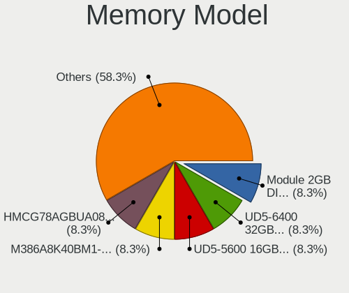

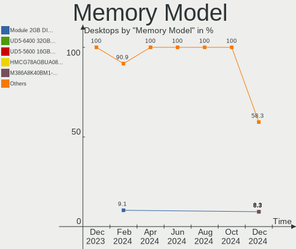

| Model                                                    | Desktops | Percent |
|----------------------------------------------------------|----------|---------|
| Unknown RAM Module 2GB DIMM 667MT/s                      | 1        | 8.33%   |
| Team RAM UD5-6400 32GB DIMM DDR5 6400MT/s                | 1        | 8.33%   |
| Team RAM UD5-5600 16GB DIMM DDR5 12800MT/s               | 1        | 8.33%   |
| SK hynix RAM HMCG78AGBUA084N 16GB DIMM DDR5 5600MT/s     | 1        | 8.33%   |
| Samsung RAM M386A8K40BM1-CRC 64GB RIMM DDR4 2400MT/s     | 1        | 8.33%   |
| Patriot RAM 3200 C16 Series 4GB DIMM DDR4 3600MT/s       | 1        | 8.33%   |
| Kingston RAM KF560R32-32 32GB DIMM DDR5 4800MT/s         | 1        | 8.33%   |
| Kingston RAM KF552C36-16 16GB DIMM DDR5 5200MT/s         | 1        | 8.33%   |
| Crucial RAM BL32G32C16U4R.M16FB1 32GB DIMM DDR4 3200MT/s | 1        | 8.33%   |
| Corsair RAM CMW32GX4M2Z3600C18 16GB DIMM DDR4 3733MT/s   | 1        | 8.33%   |
| A-DATA RAM DDR4 3200 8GB DIMM DDR4 3200MT/s              | 1        | 8.33%   |
| Unknown                                                  | 1        | 8.33%   |

Memory Kind
-----------

Memory module kinds

| Kind    | Desktops | Percent |
|---------|----------|---------|
| DDR4    | 5        | 50%     |
| DDR5    | 4        | 40%     |
| Unknown | 1        | 10%     |

Memory Form Factor
------------------

Physical design of the memory module

| Name   | Desktops | Percent |
|--------|----------|---------|
| DIMM   | 8        | 80%     |
| SODIMM | 1        | 10%     |
| RIMM   | 1        | 10%     |

Memory Size
-----------

Memory module size

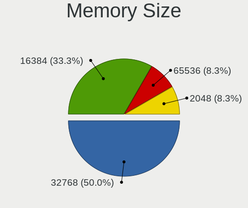

| Size  | Desktops | Percent |
|-------|----------|---------|
| 32768 | 6        | 50%     |
| 16384 | 4        | 33.33%  |
| 65536 | 1        | 8.33%   |
| 2048  | 1        | 8.33%   |

Memory Speed
------------

Memory module speed

| Speed | Desktops | Percent |
|-------|----------|---------|
| 3200  | 3        | 25%     |
| 12800 | 1        | 8.33%   |
| 6400  | 1        | 8.33%   |
| 5600  | 1        | 8.33%   |
| 5200  | 1        | 8.33%   |
| 4800  | 1        | 8.33%   |
| 3733  | 1        | 8.33%   |
| 3600  | 1        | 8.33%   |
| 2400  | 1        | 8.33%   |
| 667   | 1        | 8.33%   |

Printers & scanners
-------------------

Printer Vendor
--------------

Printer device vendors

Zero info for selected period =(

Printer Model
-------------

Printer device models

Zero info for selected period =(

Scanner Vendor
--------------

Scanner device vendors

Zero info for selected period =(

Scanner Model
-------------

Scanner device models

Zero info for selected period =(

Camera
------

Camera Vendor
-------------

Camera device vendors

| Vendor   | Desktops | Percent |
|----------|----------|---------|
| Logitech | 1        | 50%     |
| Apple    | 1        | 50%     |

Camera Model
------------

Camera device models

| Model                              | Desktops | Percent |
|------------------------------------|----------|---------|
| Logitech HD Pro Webcam C920        | 1        | 50%     |
| Apple iPhone 5/5C/5S/6/SE/7/8/X/XR | 1        | 50%     |

Security
--------

Fingerprint Vendor
------------------

Fingerprint sensor vendors

Zero info for selected period =(

Fingerprint Model
-----------------

Fingerprint sensor models

Zero info for selected period =(

Chipcard Vendor
---------------

Chipcard module vendors

Zero info for selected period =(

Chipcard Model
--------------

Chipcard module models

Zero info for selected period =(

Unsupported
-----------

Unsupported Devices
-------------------

Total unsupported devices on board

| Total | Desktops | Percent |
|-------|----------|---------|
| 0     | 6        | 60%     |
| 1     | 3        | 30%     |
| 6     | 1        | 10%     |

Unsupported Device Types
------------------------

Types of unsupported devices

| Type             | Desktops | Percent |
|------------------|----------|---------|
| Unassigned class | 1        | 20%     |
| Network          | 1        | 20%     |
| Net/wireless     | 1        | 20%     |
| Graphics card    | 1        | 20%     |
| Camera           | 1        | 20%     |

