NixOS - Hardware Trends (Desktops)
----------------------------------

A project to identify most popular hardware characteristics and track their change
over time based on data collected by Linux users at https://Linux-Hardware.org.

Anyone can contribute to this report by the [hw-probe](https://github.com/linuxhw/hw-probe) tool:

    sudo -E hw-probe -all -upload

This report is for one last month. Overall report since the beginning of time: [TestDays](https://github.com/linuxhw/TestDays)

Period: Apr, 2024.

Contents
--------

* [ System ](#system)
  - [ OS                       ](#os)
  - [ OS Family                ](#os-family)
  - [ Kernel                   ](#kernel)
  - [ Kernel Family            ](#kernel-family)
  - [ Kernel Major Ver.        ](#kernel-major-ver)
  - [ Arch                     ](#arch)
  - [ DE                       ](#de)
  - [ Display Server           ](#display-server)
  - [ Display Manager          ](#display-manager)
  - [ OS Lang                  ](#os-lang)
  - [ Boot Mode                ](#boot-mode)
  - [ Filesystem               ](#filesystem)
  - [ Part. scheme             ](#part-scheme)
  - [ Dual Boot with Linux/BSD ](#dual-boot-with-linuxbsd)
  - [ Dual Boot (Win)          ](#dual-boot-win)

* [ Board ](#board)
  - [ Vendor                   ](#vendor)
  - [ Model                    ](#model)
  - [ Model Family             ](#model-family)
  - [ MFG Year                 ](#mfg-year)
  - [ Form Factor              ](#form-factor)
  - [ Secure Boot              ](#secure-boot)
  - [ Coreboot                 ](#coreboot)
  - [ RAM Size                 ](#ram-size)
  - [ RAM Used                 ](#ram-used)
  - [ Total Drives             ](#total-drives)
  - [ Has CD-ROM               ](#has-cd-rom)
  - [ Has Ethernet             ](#has-ethernet)
  - [ Has WiFi                 ](#has-wifi)
  - [ Has Bluetooth            ](#has-bluetooth)

* [ Location ](#location)
  - [ Country                  ](#country)
  - [ City                     ](#city)

* [ Drives ](#drives)
  - [ Drive Vendor             ](#drive-vendor)
  - [ Drive Model              ](#drive-model)
  - [ HDD Vendor               ](#hdd-vendor)
  - [ SSD Vendor               ](#ssd-vendor)
  - [ Drive Kind               ](#drive-kind)
  - [ Drive Connector          ](#drive-connector)
  - [ Drive Size               ](#drive-size)
  - [ Space Total              ](#space-total)
  - [ Space Used               ](#space-used)
  - [ Malfunc. Drives          ](#malfunc-drives)
  - [ Malfunc. Drive Vendor    ](#malfunc-drive-vendor)
  - [ Malfunc. HDD Vendor      ](#malfunc-hdd-vendor)
  - [ Malfunc. Drive Kind      ](#malfunc-drive-kind)
  - [ Failed Drives            ](#failed-drives)
  - [ Failed Drive Vendor      ](#failed-drive-vendor)
  - [ Drive Status             ](#drive-status)

* [ Storage controller ](#storage-controller)
  - [ Storage Vendor           ](#storage-vendor)
  - [ Storage Model            ](#storage-model)
  - [ Storage Kind             ](#storage-kind)

* [ Processor ](#processor)
  - [ CPU Vendor               ](#cpu-vendor)
  - [ CPU Model                ](#cpu-model)
  - [ CPU Model Family         ](#cpu-model-family)
  - [ CPU Cores                ](#cpu-cores)
  - [ CPU Sockets              ](#cpu-sockets)
  - [ CPU Threads              ](#cpu-threads)
  - [ CPU Op-Modes             ](#cpu-op-modes)
  - [ CPU Microcode            ](#cpu-microcode)
  - [ CPU Microarch            ](#cpu-microarch)

* [ Graphics ](#graphics)
  - [ GPU Vendor               ](#gpu-vendor)
  - [ GPU Model                ](#gpu-model)
  - [ GPU Combo                ](#gpu-combo)
  - [ GPU Driver               ](#gpu-driver)
  - [ GPU Memory               ](#gpu-memory)

* [ Monitor ](#monitor)
  - [ Monitor Vendor           ](#monitor-vendor)
  - [ Monitor Model            ](#monitor-model)
  - [ Monitor Resolution       ](#monitor-resolution)
  - [ Monitor Diagonal         ](#monitor-diagonal)
  - [ Monitor Width            ](#monitor-width)
  - [ Aspect Ratio             ](#aspect-ratio)
  - [ Monitor Area             ](#monitor-area)
  - [ Pixel Density            ](#pixel-density)
  - [ Multiple Monitors        ](#multiple-monitors)

* [ Network ](#network)
  - [ Net Controller Vendor    ](#net-controller-vendor)
  - [ Net Controller Model     ](#net-controller-model)
  - [ Wireless Vendor          ](#wireless-vendor)
  - [ Wireless Model           ](#wireless-model)
  - [ Ethernet Vendor          ](#ethernet-vendor)
  - [ Ethernet Model           ](#ethernet-model)
  - [ Net Controller Kind      ](#net-controller-kind)
  - [ Used Controller          ](#used-controller)
  - [ NICs                     ](#nics)
  - [ IPv6                     ](#ipv6)

* [ Bluetooth ](#bluetooth)
  - [ Bluetooth Vendor         ](#bluetooth-vendor)
  - [ Bluetooth Model          ](#bluetooth-model)

* [ Sound ](#sound)
  - [ Sound Vendor             ](#sound-vendor)
  - [ Sound Model              ](#sound-model)

* [ Memory ](#memory)
  - [ Memory Vendor            ](#memory-vendor)
  - [ Memory Model             ](#memory-model)
  - [ Memory Kind              ](#memory-kind)
  - [ Memory Form Factor       ](#memory-form-factor)
  - [ Memory Size              ](#memory-size)
  - [ Memory Speed             ](#memory-speed)

* [ Printers & scanners ](#printers--scanners)
  - [ Printer Vendor           ](#printer-vendor)
  - [ Printer Model            ](#printer-model)
  - [ Scanner Vendor           ](#scanner-vendor)
  - [ Scanner Model            ](#scanner-model)

* [ Camera ](#camera)
  - [ Camera Vendor            ](#camera-vendor)
  - [ Camera Model             ](#camera-model)

* [ Security ](#security)
  - [ Fingerprint Vendor       ](#fingerprint-vendor)
  - [ Fingerprint Model        ](#fingerprint-model)
  - [ Chipcard Vendor          ](#chipcard-vendor)
  - [ Chipcard Model           ](#chipcard-model)

* [ Unsupported ](#unsupported)
  - [ Unsupported Devices      ](#unsupported-devices)
  - [ Unsupported Device Types ](#unsupported-device-types)

System
------

OS
--

Installed operating systems

| Name        | Desktops | Percent |
|-------------|----------|---------|
| NixOS 23.11 | 8        | 61.54%  |
| NixOS 24.05 | 5        | 38.46%  |

OS Family
---------

OS without a version

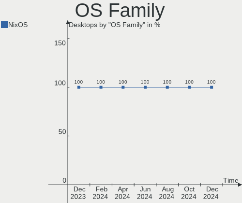

| Name  | Desktops | Percent |
|-------|----------|---------|
| NixOS | 13       | 100%    |

Kernel
------

Version of the Linux kernel

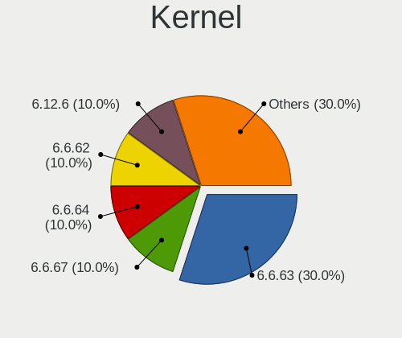

| Version | Desktops | Percent |
|---------|----------|---------|
| 6.8.6   | 1        | 7.69%   |
| 6.8.3   | 1        | 7.69%   |
| 6.8.1   | 1        | 7.69%   |
| 6.6.28  | 1        | 7.69%   |
| 6.6.26  | 1        | 7.69%   |
| 6.6.25  | 1        | 7.69%   |
| 6.6.23  | 1        | 7.69%   |
| 6.6.22  | 1        | 7.69%   |
| 6.1.86  | 1        | 7.69%   |
| 6.1.82  | 1        | 7.69%   |
| 6.1.79  | 1        | 7.69%   |
| 6.1.72  | 1        | 7.69%   |
| 6.1.64  | 1        | 7.69%   |

Kernel Family
-------------

Linux kernel without a distro release

| Version | Desktops | Percent |
|---------|----------|---------|
| 6.8.6   | 1        | 7.69%   |
| 6.8.3   | 1        | 7.69%   |
| 6.8.1   | 1        | 7.69%   |
| 6.6.28  | 1        | 7.69%   |
| 6.6.26  | 1        | 7.69%   |
| 6.6.25  | 1        | 7.69%   |
| 6.6.23  | 1        | 7.69%   |
| 6.6.22  | 1        | 7.69%   |
| 6.1.86  | 1        | 7.69%   |
| 6.1.82  | 1        | 7.69%   |
| 6.1.79  | 1        | 7.69%   |
| 6.1.72  | 1        | 7.69%   |
| 6.1.64  | 1        | 7.69%   |

Kernel Major Ver.
-----------------

Linux kernel major version

| Version | Desktops | Percent |
|---------|----------|---------|
| 6.6     | 5        | 38.46%  |
| 6.1     | 5        | 38.46%  |
| 6.8     | 3        | 23.08%  |

Arch
----

OS architecture (x86_64, i586, etc.)

| Name   | Desktops | Percent |
|--------|----------|---------|
| x86_64 | 13       | 100%    |

DE
--

Desktop Environment

| Name     | Desktops | Percent |
|----------|----------|---------|
| Unknown  | 5        | 38.46%  |
| Hyprland | 3        | 23.08%  |
| KDE5     | 2        | 15.38%  |
| GNOME    | 2        | 15.38%  |
| XFCE     | 1        | 7.69%   |

Display Server
--------------

X11 or Wayland

| Name    | Desktops | Percent |
|---------|----------|---------|
| Wayland | 5        | 38.46%  |
| X11     | 3        | 23.08%  |
| Unknown | 3        | 23.08%  |
| Tty     | 2        | 15.38%  |

Display Manager
---------------

SDDM, LightDM, etc.

| Name    | Desktops | Percent |
|---------|----------|---------|
| GDM     | 4        | 30.77%  |
| LightDM | 3        | 23.08%  |
| Unknown | 3        | 23.08%  |
| SDDM    | 2        | 15.38%  |
| GREETD  | 1        | 7.69%   |

OS Lang
-------

Language

| Lang    | Desktops | Percent |
|---------|----------|---------|
| en_US   | 10       | 76.92%  |
| en_GB   | 2        | 15.38%  |
| Unknown | 1        | 7.69%   |

Boot Mode
---------

EFI or BIOS

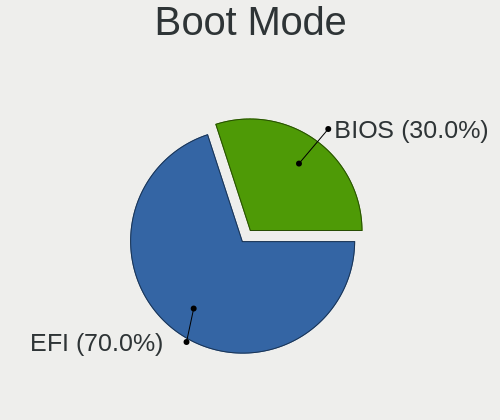

| Mode | Desktops | Percent |
|------|----------|---------|
| EFI  | 13       | 100%    |

Filesystem
----------

Type of filesystem

| Type  | Desktops | Percent |
|-------|----------|---------|
| Ext4  | 9        | 69.23%  |
| Btrfs | 3        | 23.08%  |
| Zfs   | 1        | 7.69%   |

Part. scheme
------------

Scheme of partitioning

| Type | Desktops | Percent |
|------|----------|---------|
| GPT  | 13       | 100%    |

Dual Boot with Linux/BSD
------------------------

Hosting more than one Linux/BSD

| Dual boot | Desktops | Percent |
|-----------|----------|---------|
| No        | 9        | 69.23%  |
| Yes       | 4        | 30.77%  |

Dual Boot (Win)
---------------

Hosting Linux and Windows

| Dual boot | Desktops | Percent |
|-----------|----------|---------|
| No        | 9        | 69.23%  |
| Yes       | 4        | 30.77%  |

Board
-----

Vendor
------

Motherboard manufacturer

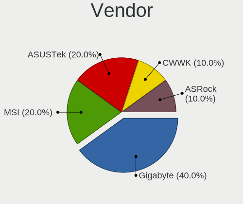

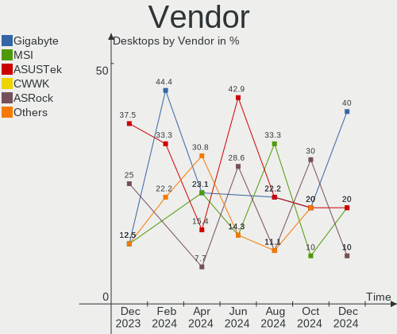

| Name                | Desktops | Percent |
|---------------------|----------|---------|
| MSI                 | 3        | 23.08%  |
| Gigabyte Technology | 3        | 23.08%  |
| ASUSTek Computer    | 2        | 15.38%  |
| Jetway              | 1        | 7.69%   |
| Hewlett-Packard     | 1        | 7.69%   |
| ASRock              | 1        | 7.69%   |
| Apple               | 1        | 7.69%   |
| Unknown             | 1        | 7.69%   |

Model
-----

Motherboard model

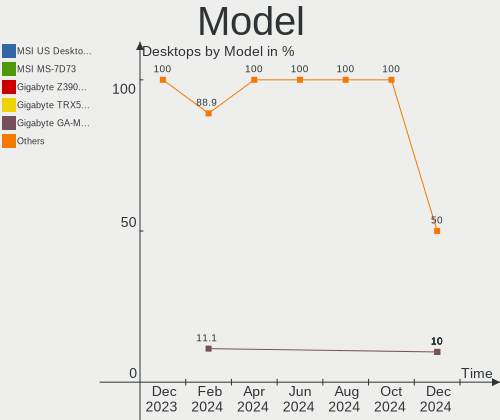

| Name                                      | Desktops | Percent |
|-------------------------------------------|----------|---------|
| MSI MS-7E06                               | 1        | 7.69%   |
| MSI MS-7B86                               | 1        | 7.69%   |
| MSI MS-7B85                               | 1        | 7.69%   |
| Jetway 1.0                                | 1        | 7.69%   |
| HP Victus by 15L Gaming Desktop TG02-0xxx | 1        | 7.69%   |
| Gigabyte Z790 UD                          | 1        | 7.69%   |
| Gigabyte Z390 GAMING SLI                  | 1        | 7.69%   |
| Gigabyte GA-H61TN-SI                      | 1        | 7.69%   |
| ASUS ROG Maximus XI HERO                  | 1        | 7.69%   |
| ASUS ProArt X670E-CREATOR WIFI            | 1        | 7.69%   |
| ASRock B650E PG Riptide WiFi              | 1        | 7.69%   |
| Apple MacPro6,1                           | 1        | 7.69%   |
| Unknown                                   | 1        | 7.69%   |

Model Family
------------

Motherboard model prefix

| Name                 | Desktops | Percent |
|----------------------|----------|---------|
| MSI MS-7E06          | 1        | 7.69%   |
| MSI MS-7B86          | 1        | 7.69%   |
| MSI MS-7B85          | 1        | 7.69%   |
| Jetway 1.0           | 1        | 7.69%   |
| HP Victus            | 1        | 7.69%   |
| Gigabyte Z790        | 1        | 7.69%   |
| Gigabyte Z390        | 1        | 7.69%   |
| Gigabyte GA-H61TN-SI | 1        | 7.69%   |
| ASUS ROG             | 1        | 7.69%   |
| ASUS ProArt          | 1        | 7.69%   |
| ASRock B650E         | 1        | 7.69%   |
| Apple MacPro6        | 1        | 7.69%   |
| Unknown              | 1        | 7.69%   |

MFG Year
--------

Motherboard manufacture year

| Year | Desktops | Percent |
|------|----------|---------|
| 2022 | 3        | 23.08%  |
| 2018 | 3        | 23.08%  |
| 2023 | 2        | 15.38%  |
| 2020 | 2        | 15.38%  |
| 2019 | 1        | 7.69%   |
| 2015 | 1        | 7.69%   |
| 2013 | 1        | 7.69%   |

Form Factor
-----------

Physical design of the computer

| Name    | Desktops | Percent |
|---------|----------|---------|
| Desktop | 13       | 100%    |

Secure Boot
-----------

Enabled or disabled

| State    | Desktops | Percent |
|----------|----------|---------|
| Disabled | 12       | 92.31%  |
| Enabled  | 1        | 7.69%   |

Coreboot
--------

Have coreboot on board

| Used | Desktops | Percent |
|------|----------|---------|
| No   | 13       | 100%    |

RAM Size
--------

Total RAM memory

| Size in GB  | Desktops | Percent |
|-------------|----------|---------|
| 32.01-64.0  | 5        | 38.46%  |
| 64.01-256.0 | 2        | 15.38%  |
| 16.01-24.0  | 2        | 15.38%  |
| 4.01-8.0    | 1        | 7.69%   |
| 3.01-4.0    | 1        | 7.69%   |
| 24.01-32.0  | 1        | 7.69%   |
| 8.01-16.0   | 1        | 7.69%   |

RAM Used
--------

Used RAM memory

| Used GB    | Desktops | Percent |
|------------|----------|---------|
| 4.01-8.0   | 4        | 30.77%  |
| 3.01-4.0   | 3        | 23.08%  |
| 8.01-16.0  | 3        | 23.08%  |
| 32.01-64.0 | 1        | 7.69%   |
| 2.01-3.0   | 1        | 7.69%   |
| 1.01-2.0   | 1        | 7.69%   |

Total Drives
------------

Number of drives on board

| Drives | Desktops | Percent |
|--------|----------|---------|
| 1      | 6        | 46.15%  |
| 2      | 5        | 38.46%  |
| 3      | 2        | 15.38%  |

Has CD-ROM
----------

Has CD-ROM on board

| Presented | Desktops | Percent |
|-----------|----------|---------|
| No        | 13       | 100%    |

Has Ethernet
------------

Has Ethernet on board

| Presented | Desktops | Percent |
|-----------|----------|---------|
| Yes       | 13       | 100%    |

Has WiFi
--------

Has WiFi module

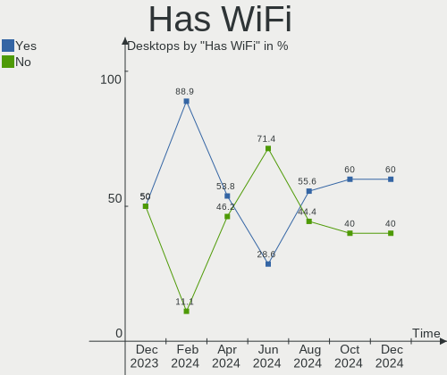

| Presented | Desktops | Percent |
|-----------|----------|---------|
| Yes       | 8        | 61.54%  |
| No        | 5        | 38.46%  |

Has Bluetooth
-------------

Has Bluetooth module

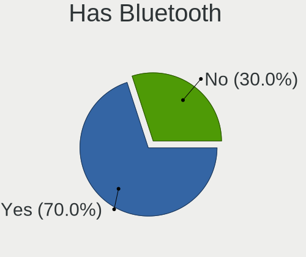

| Presented | Desktops | Percent |
|-----------|----------|---------|
| Yes       | 7        | 53.85%  |
| No        | 6        | 46.15%  |

Location
--------

Country
-------

Geographic location (country)

| Country     | Desktops | Percent |
|-------------|----------|---------|
| USA         | 2        | 15.38%  |
| Romania     | 2        | 15.38%  |
| UK          | 1        | 7.69%   |
| Taiwan      | 1        | 7.69%   |
| Sweden      | 1        | 7.69%   |
| Russia      | 1        | 7.69%   |
| Netherlands | 1        | 7.69%   |
| Jordan      | 1        | 7.69%   |
| Canada      | 1        | 7.69%   |
| Brazil      | 1        | 7.69%   |
| Australia   | 1        | 7.69%   |

City
----

Geographic location (city)

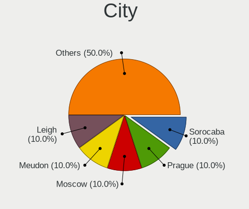

| City       | Desktops | Percent |
|------------|----------|---------|
| Taipei     | 1        | 7.69%   |
| Stockholm  | 1        | 7.69%   |
| Sibiu      | 1        | 7.69%   |
| Reading    | 1        | 7.69%   |
| Portao     | 1        | 7.69%   |
| Port Moody | 1        | 7.69%   |
| Brisbane   | 1        | 7.69%   |
| Boerne     | 1        | 7.69%   |
| Balusesti  | 1        | 7.69%   |
| Athens     | 1        | 7.69%   |
| Amsterdam  | 1        | 7.69%   |
| Amman      | 1        | 7.69%   |
| Agryz      | 1        | 7.69%   |

Drives
------

Drive Vendor
------------

Hard drive vendors

| Vendor                      | Desktops | Drives | Percent |
|-----------------------------|----------|--------|---------|
| WDC                         | 4        | 4      | 25%     |
| Sandisk                     | 3        | 4      | 18.75%  |
| Samsung Electronics         | 3        | 4      | 18.75%  |
| Micron Technology           | 1        | 1      | 6.25%   |
| Kingston Technology Company | 1        | 2      | 6.25%   |
| Kingston                    | 1        | 3      | 6.25%   |
| Intel                       | 1        | 1      | 6.25%   |
| HGST                        | 1        | 2      | 6.25%   |
| Apple                       | 1        | 1      | 6.25%   |

Drive Model
-----------

Hard drive models

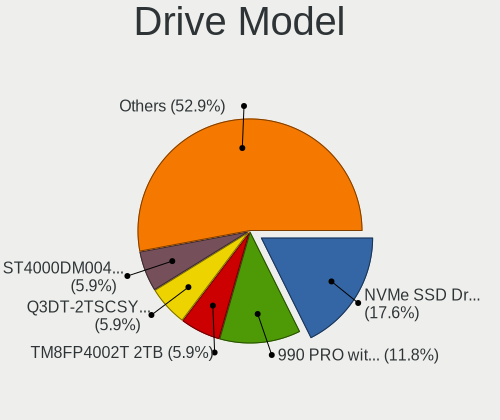

| Model                                             | Desktops | Percent |
|---------------------------------------------------|----------|---------|
| Sandisk WD_BLACK SN850X 1000GB                    | 2        | 11.76%  |
| WDC WDS100T3X0C-00SJG0 1TB                        | 1        | 5.88%   |
| WDC WD5000AAKS-00V1A0 500GB                       | 1        | 5.88%   |
| WDC WD5000AADS-00M2B0 500GB                       | 1        | 5.88%   |
| WDC WD1001FALS-403AA0 1TB                         | 1        | 5.88%   |
| Sandisk WD Blue SN570 2TB                         | 1        | 5.88%   |
| Sandisk WD Blue SN550 NVMe SSD 2TB                | 1        | 5.88%   |
| Samsung SSD 990 PRO 2TB                           | 1        | 5.88%   |
| Samsung SSD 980 500GB                             | 1        | 5.88%   |
| Samsung NVMe SSD Controller SM981/PM981/PM983 1TB | 1        | 5.88%   |
| Micron MTFDKBA1T0TFH-1BC1AABHA 1024GB             | 1        | 5.88%   |
| Kingston Company SNV2S1000G 1TB                   | 1        | 5.88%   |
| Kingston SFYRD2000G 2TB                           | 1        | 5.88%   |
| Intel SSDSA2M080G2GC 80GB                         | 1        | 5.88%   |
| HGST HTS545050A7E380 500GB                        | 1        | 5.88%   |
| Apple SSD SM1024F 1TB                             | 1        | 5.88%   |

HDD Vendor
----------

Hard disk drive vendors

| Vendor | Desktops | Drives | Percent |
|--------|----------|--------|---------|
| WDC    | 3        | 3      | 75%     |
| HGST   | 1        | 2      | 25%     |

SSD Vendor
----------

Solid state drive vendors

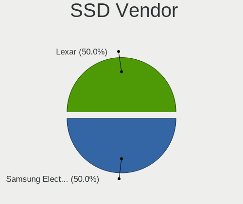

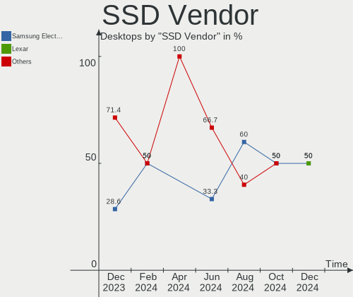

| Vendor | Desktops | Drives | Percent |
|--------|----------|--------|---------|
| Intel  | 1        | 1      | 50%     |
| Apple  | 1        | 1      | 50%     |

Drive Kind
----------

HDD or SSD

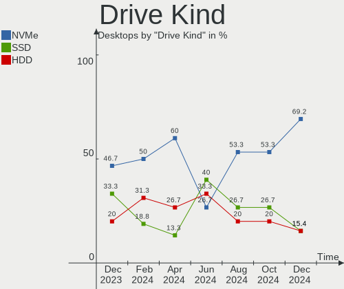

| Kind | Desktops | Drives | Percent |
|------|----------|--------|---------|
| NVMe | 9        | 15     | 60%     |
| HDD  | 4        | 5      | 26.67%  |
| SSD  | 2        | 2      | 13.33%  |

Drive Connector
---------------

SATA, SAS, NVMe, etc.

| Type | Desktops | Drives | Percent |
|------|----------|--------|---------|
| NVMe | 9        | 15     | 60%     |
| SATA | 6        | 7      | 40%     |

Drive Size
----------

Size of hard drive

| Size in TB | Desktops | Drives | Percent |
|------------|----------|--------|---------|
| 0.01-0.5   | 4        | 5      | 66.67%  |
| 0.51-1.0   | 2        | 2      | 33.33%  |

Space Total
-----------

Amount of disk space available on the file system

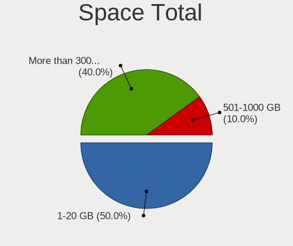

| Size in GB     | Desktops | Percent |
|----------------|----------|---------|
| 1001-2000      | 3        | 23.08%  |
| 501-1000       | 3        | 23.08%  |
| More than 3000 | 2        | 15.38%  |
| 251-500        | 2        | 15.38%  |
| 1-20           | 2        | 15.38%  |
| Unknown        | 1        | 7.69%   |

Space Used
----------

Amount of used disk space

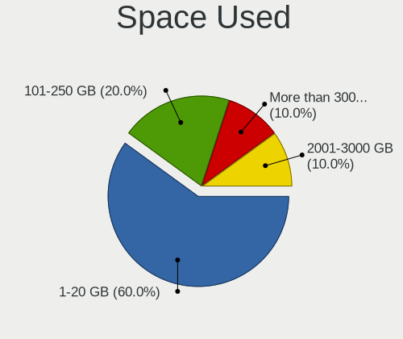

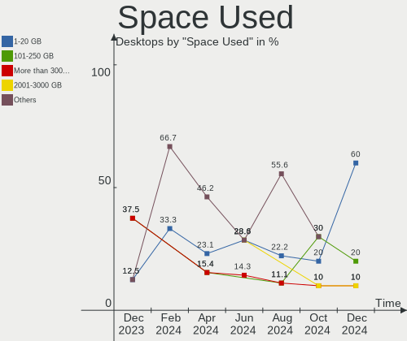

| Used GB        | Desktops | Percent |
|----------------|----------|---------|
| 1-20           | 3        | 23.08%  |
| More than 3000 | 2        | 15.38%  |
| 21-50          | 2        | 15.38%  |
| 101-250        | 2        | 15.38%  |
| 251-500        | 1        | 7.69%   |
| 501-1000       | 1        | 7.69%   |
| 51-100         | 1        | 7.69%   |
| Unknown        | 1        | 7.69%   |

Malfunc. Drives
---------------

Drive models with a malfunction

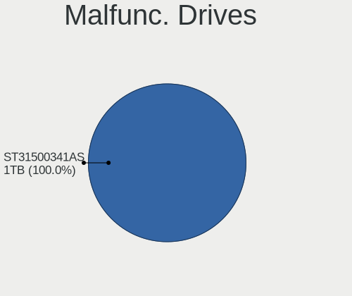

| Model                       | Desktops | Drives | Percent |
|-----------------------------|----------|--------|---------|
| WDC WD5000AAKS-00V1A0 500GB | 1        | 1      | 33.33%  |
| WDC WD1001FALS-403AA0 1TB   | 1        | 1      | 33.33%  |
| Intel SSDSA2M080G2GC 80GB   | 1        | 1      | 33.33%  |

Malfunc. Drive Vendor
---------------------

Vendors of faulty drives

| Vendor | Desktops | Drives | Percent |
|--------|----------|--------|---------|
| WDC    | 2        | 2      | 66.67%  |
| Intel  | 1        | 1      | 33.33%  |

Malfunc. HDD Vendor
-------------------

Vendors of faulty HDD drives

| Vendor | Desktops | Drives | Percent |
|--------|----------|--------|---------|
| WDC    | 2        | 2      | 100%    |

Malfunc. Drive Kind
-------------------

Kinds of faulty drives

| Kind | Desktops | Drives | Percent |
|------|----------|--------|---------|
| HDD  | 2        | 2      | 66.67%  |
| SSD  | 1        | 1      | 33.33%  |

Failed Drives
-------------

Failed drive models

Zero info for selected period =(

Failed Drive Vendor
-------------------

Failed drive vendors

Zero info for selected period =(

Drive Status
------------

Number of failed and malfunc. drives

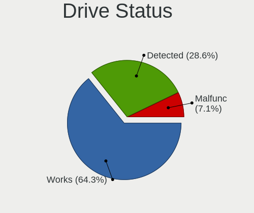

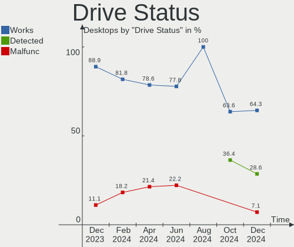

| Status  | Desktops | Drives | Percent |
|---------|----------|--------|---------|
| Works   | 11       | 19     | 78.57%  |
| Malfunc | 3        | 3      | 21.43%  |

Storage controller
------------------

Storage Vendor
--------------

Storage controller vendors

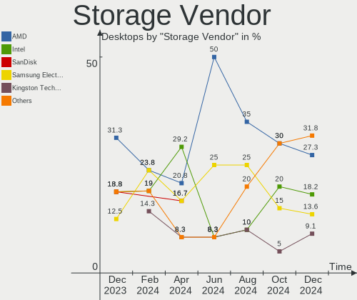

| Vendor                      | Desktops | Percent |
|-----------------------------|----------|---------|
| Intel                       | 7        | 29.17%  |
| AMD                         | 5        | 20.83%  |
| Sandisk                     | 4        | 16.67%  |
| Samsung Electronics         | 4        | 16.67%  |
| Kingston Technology Company | 2        | 8.33%   |
| Micron Technology           | 1        | 4.17%   |
| ASMedia Technology          | 1        | 4.17%   |

Storage Model
-------------

Storage controller models

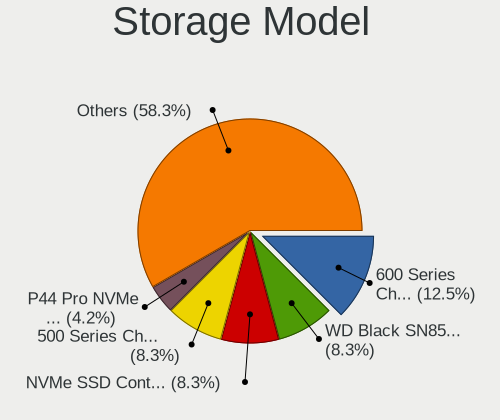

| Model                                                                         | Desktops | Percent |
|-------------------------------------------------------------------------------|----------|---------|
| AMD 400 Series Chipset SATA Controller                                        | 3        | 10.71%  |
| Sandisk WD Black SN850X NVMe SSD                                              | 2        | 7.14%   |
| Intel Raptor Lake SATA AHCI Controller                                        | 2        | 7.14%   |
| Intel Cannon Lake PCH SATA AHCI Controller                                    | 2        | 7.14%   |
| Intel 6 Series/C200 Series Chipset Family 6 port Desktop SATA AHCI Controller | 2        | 7.14%   |
| AMD FCH SATA Controller [AHCI mode]                                           | 2        | 7.14%   |
| AMD 600 Series Chipset SATA Controller                                        | 2        | 7.14%   |
| SanDisk WD Blue SN570 NVMe SSD 2TB                                            | 1        | 3.57%   |
| SanDisk Ultra 3D / WD Blue SN550 NVMe SSD                                     | 1        | 3.57%   |
| SanDisk Extreme Pro / WD Black SN750 / PC SN730 / Red SN700 NVMe SSD          | 1        | 3.57%   |
| Samsung S4LN053X01 AHCI SSD Controller(Apple slot)                            | 1        | 3.57%   |
| Samsung NVMe SSD Controller SM981/PM981/PM983                                 | 1        | 3.57%   |
| Samsung NVMe SSD Controller S4LV008[Pascal]                                   | 1        | 3.57%   |
| Samsung NVMe SSD Controller 980 (DRAM-less)                                   | 1        | 3.57%   |
| Micron 3400 NVMe SSD [Hendrix]                                                | 1        | 3.57%   |
| Kingston Company NV2 NVMe SSD SM2267XT (DRAM-less)                            | 1        | 3.57%   |
| Kingston Company KC3000/FURY Renegade NVMe SSD E18                            | 1        | 3.57%   |
| Intel Volume Management Device NVMe RAID Controller                           | 1        | 3.57%   |
| Intel Atom Processor E3800 Series SATA AHCI Controller                        | 1        | 3.57%   |
| ASMedia ASM1061/ASM1062 Serial ATA Controller                                 | 1        | 3.57%   |

Storage Kind
------------

Kind of storage controller (IDE, SATA, NVMe, SAS, ...)

| Kind | Desktops | Percent |
|------|----------|---------|
| SATA | 13       | 56.52%  |
| NVMe | 9        | 39.13%  |
| RAID | 1        | 4.35%   |

Processor
---------

CPU Vendor
----------

Processor vendors

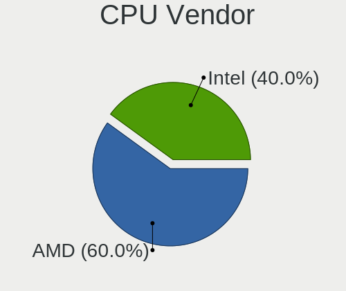

| Vendor | Desktops | Percent |
|--------|----------|---------|
| Intel  | 8        | 61.54%  |
| AMD    | 5        | 38.46%  |

CPU Model
---------

Processor models

| Model                                  | Desktops | Percent |
|----------------------------------------|----------|---------|
| Intel Xeon CPU E5-2640 v2 @ 2.00GHz    | 1        | 7.69%   |
| Intel Xeon CPU E5-1650 v2 @ 3.50GHz    | 1        | 7.69%   |
| Intel Core i9-9900KF CPU @ 3.60GHz     | 1        | 7.69%   |
| Intel Core i7-9700K CPU @ 3.60GHz      | 1        | 7.69%   |
| Intel Core i5-14500                    | 1        | 7.69%   |
| Intel Celeron CPU J1900 @ 1.99GHz      | 1        | 7.69%   |
| Intel Celeron CPU G1610 @ 2.60GHz      | 1        | 7.69%   |
| Intel 13th Gen Core i5-13600K          | 1        | 7.69%   |
| AMD Ryzen 9 7950X 16-Core Processor    | 1        | 7.69%   |
| AMD Ryzen 9 7900 12-Core Processor     | 1        | 7.69%   |
| AMD Ryzen 7 5700G with Radeon Graphics | 1        | 7.69%   |
| AMD Ryzen 7 2700X Eight-Core Processor | 1        | 7.69%   |
| AMD Ryzen 5 3600 6-Core Processor      | 1        | 7.69%   |

CPU Model Family
----------------

Processor model prefix

| Model         | Desktops | Percent |
|---------------|----------|---------|
| Intel Xeon    | 2        | 15.38%  |
| Intel Celeron | 2        | 15.38%  |
| AMD Ryzen 9   | 2        | 15.38%  |
| AMD Ryzen 7   | 2        | 15.38%  |
| Other         | 1        | 7.69%   |
| Intel Core i9 | 1        | 7.69%   |
| Intel Core i7 | 1        | 7.69%   |
| Intel Core i5 | 1        | 7.69%   |
| AMD Ryzen 5   | 1        | 7.69%   |

CPU Cores
---------

Number of processor cores

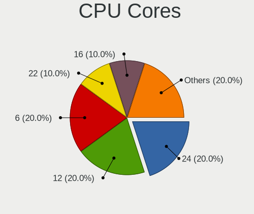

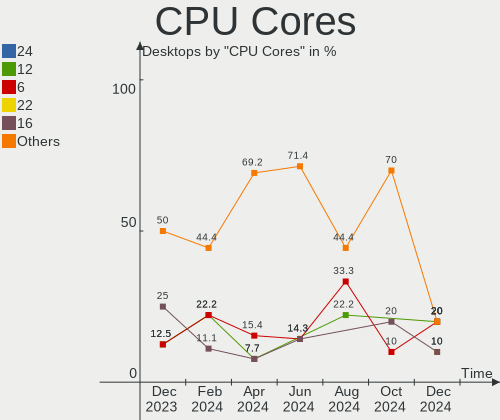

| Number | Desktops | Percent |
|--------|----------|---------|
| 8      | 5        | 38.46%  |
| 14     | 2        | 15.38%  |
| 6      | 2        | 15.38%  |
| 16     | 1        | 7.69%   |
| 12     | 1        | 7.69%   |
| 4      | 1        | 7.69%   |
| 2      | 1        | 7.69%   |

CPU Sockets
-----------

Number of sockets

| Number | Desktops | Percent |
|--------|----------|---------|
| 1      | 13       | 100%    |

CPU Threads
-----------

Threads per core (Hyper-Threading)

| Number | Desktops | Percent |
|--------|----------|---------|
| 2      | 10       | 76.92%  |
| 1      | 3        | 23.08%  |

CPU Op-Modes
------------

CPU Operation Modes (32-bit, 64-bit)

| Op mode        | Desktops | Percent |
|----------------|----------|---------|
| 32-bit, 64-bit | 13       | 100%    |

CPU Microcode
-------------

Microcode number

| Number     | Desktops | Percent |
|------------|----------|---------|
| Unknown    | 5        | 38.46%  |
| 0x0a601206 | 2        | 15.38%  |
| 0xb0671    | 1        | 7.69%   |
| 0x306e4    | 1        | 7.69%   |
| 0x306a9    | 1        | 7.69%   |
| 0x30679    | 1        | 7.69%   |
| 0x0a50000c | 1        | 7.69%   |
| 0x0800820d | 1        | 7.69%   |

CPU Microarch
-------------

Microarchitecture

| Name             | Desktops | Percent |
|------------------|----------|---------|
| IvyBridge        | 3        | 23.08%  |
| KabyLake         | 2        | 15.38%  |
| Alderlake Hybrid | 2        | 15.38%  |
| Unknown          | 2        | 15.38%  |
| Zen+             | 1        | 7.69%   |
| Zen 3            | 1        | 7.69%   |
| Zen 2            | 1        | 7.69%   |
| Silvermont       | 1        | 7.69%   |

Graphics
--------

GPU Vendor
----------

Vendors of graphics cards

| Vendor | Desktops | Percent |
|--------|----------|---------|
| Nvidia | 7        | 41.18%  |
| AMD    | 6        | 35.29%  |
| Intel  | 4        | 23.53%  |

GPU Model
---------

Graphics card models

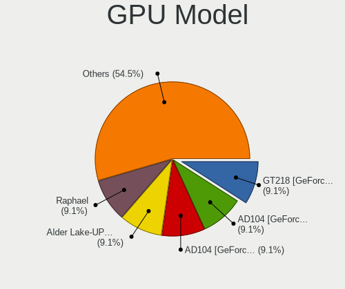

| Model                                                            | Desktops | Percent |
|------------------------------------------------------------------|----------|---------|
| AMD Raphael                                                      | 2        | 11.76%  |
| Nvidia TU116 [GeForce GTX 1650 SUPER]                            | 1        | 5.88%   |
| Nvidia TU106 [GeForce RTX 2070 Rev. A]                           | 1        | 5.88%   |
| Nvidia TU104 [GeForce RTX 2080 Rev. A]                           | 1        | 5.88%   |
| Nvidia GP107GL [Quadro P600]                                     | 1        | 5.88%   |
| Nvidia GA106 [GeForce RTX 3060 Lite Hash Rate]                   | 1        | 5.88%   |
| Nvidia AD106 [GeForce RTX 4060 Ti]                               | 1        | 5.88%   |
| Nvidia AD102 [GeForce RTX 4090]                                  | 1        | 5.88%   |
| Intel Xeon E3-1200 v2/3rd Gen Core processor Graphics Controller | 1        | 5.88%   |
| Intel Raptor Lake-S GT1 [UHD Graphics 770]                       | 1        | 5.88%   |
| Intel Atom Processor Z36xxx/Z37xxx Series Graphics & Display     | 1        | 5.88%   |
| Intel AlderLake-S GT1                                            | 1        | 5.88%   |
| AMD Tahiti LE [Radeon HD 7870 XT]                                | 1        | 5.88%   |
| AMD Navi 23 [Radeon RX 6650 XT / 6700S / 6800S]                  | 1        | 5.88%   |
| AMD Navi 21 [Radeon RX 6800/6800 XT / 6900 XT]                   | 1        | 5.88%   |
| AMD Cezanne [Radeon Vega Series / Radeon Vega Mobile Series]     | 1        | 5.88%   |

GPU Combo
---------

Combinations of graphics cards

| Name           | Desktops | Percent |
|----------------|----------|---------|
| 1 x Nvidia     | 3        | 23.08%  |
| 1 x AMD        | 3        | 23.08%  |
| Intel + Nvidia | 2        | 15.38%  |
| 1 x Intel      | 2        | 15.38%  |
| AMD + Nvidia   | 2        | 15.38%  |
| 2 x AMD        | 1        | 7.69%   |

GPU Driver
----------

Free vs proprietary

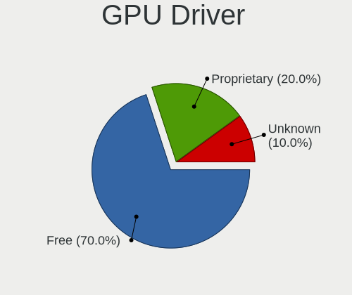

| Driver      | Desktops | Percent |
|-------------|----------|---------|
| Free        | 7        | 53.85%  |
| Proprietary | 6        | 46.15%  |

GPU Memory
----------

Total video memory

| Size in GB | Desktops | Percent |
|------------|----------|---------|
| Unknown    | 7        | 53.85%  |
| 8.01-16.0  | 3        | 23.08%  |
| 7.01-8.0   | 1        | 7.69%   |
| 2.01-3.0   | 1        | 7.69%   |
| 0.01-0.5   | 1        | 7.69%   |

Monitor
-------

Monitor Vendor
--------------

Monitor vendors

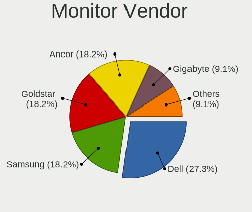

| Vendor               | Desktops | Percent |
|----------------------|----------|---------|
| Goldstar             | 4        | 25%     |
| ASUSTek Computer     | 3        | 18.75%  |
| Samsung Electronics  | 2        | 12.5%   |
| Dell                 | 2        | 12.5%   |
| Lenovo               | 1        | 6.25%   |
| HUAWEI               | 1        | 6.25%   |
| Gigabyte Technology  | 1        | 6.25%   |
| Eizo                 | 1        | 6.25%   |
| Ancor Communications | 1        | 6.25%   |

Monitor Model
-------------

Monitor models

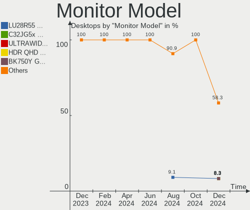

| Model                                                                  | Desktops | Percent |
|------------------------------------------------------------------------|----------|---------|
| Goldstar ULTRAFINE GSM5BC2 3840x2160 697x392mm 31.5-inch               | 2        | 11.76%  |
| Samsung Electronics SyncMaster SAM0592 1920x1080 510x290mm 23.1-inch   | 1        | 5.88%   |
| Samsung Electronics C27HG7x SAM0E15 2560x1440 598x336mm 27.0-inch      | 1        | 5.88%   |
| Lenovo L15 LEN66E4 1920x1080 344x194mm 15.5-inch                       | 1        | 5.88%   |
| HUAWEI MateView HWV6E22 3840x2560 596x397mm 28.2-inch                  | 1        | 5.88%   |
| Goldstar ULTRAWIDE GSM76F9 2560x1080 531x298mm 24.0-inch               | 1        | 5.88%   |
| Goldstar ULTRAFINE GSM5BC1 3840x2160 600x340mm 27.2-inch               | 1        | 5.88%   |
| Goldstar E2411 GSM583B 1920x1080 477x268mm 21.5-inch                   | 1        | 5.88%   |
| Gigabyte Technology G34WQC GBT3400 3440x1440 797x334mm 34.0-inch       | 1        | 5.88%   |
| Eizo S2000 ENC1816 1600x1200 408x306mm 20.1-inch                       | 1        | 5.88%   |
| Dell SE2417HG DELD08D 1920x1080 521x293mm 23.5-inch                    | 1        | 5.88%   |
| Dell S2721QS DELA198 3840x2160 597x336mm 27.0-inch                     | 1        | 5.88%   |
| ASUSTek Computer VG277Q1A AUS272D 1920x1080 598x336mm 27.0-inch        | 1        | 5.88%   |
| ASUSTek Computer ROG PG27U AUS27A4 3840x2160 598x336mm 27.0-inch       | 1        | 5.88%   |
| ASUSTek Computer PA279 AUS2768 3840x2160 597x336mm 27.0-inch           | 1        | 5.88%   |
| Ancor Communications ASUS PB287Q ACI28A3 3840x2160 621x341mm 27.9-inch | 1        | 5.88%   |

Monitor Resolution
------------------

Monitor screen resolution

| Resolution      | Desktops | Percent |
|-----------------|----------|---------|
| 3840x2160 (4K)  | 5        | 38.46%  |
| 1920x1080 (FHD) | 3        | 23.08%  |
| 3840x2560       | 1        | 7.69%   |
| 3440x1440       | 1        | 7.69%   |
| 2560x1440 (QHD) | 1        | 7.69%   |
| 2560x1080       | 1        | 7.69%   |
| 1600x1200       | 1        | 7.69%   |

Monitor Diagonal
----------------

Diagonal size in inches

| Inches | Desktops | Percent |
|--------|----------|---------|
| 27     | 5        | 35.71%  |
| 34     | 2        | 14.29%  |
| 31     | 2        | 14.29%  |
| 28     | 1        | 7.14%   |
| 24     | 1        | 7.14%   |
| 23     | 1        | 7.14%   |
| 20     | 1        | 7.14%   |
| 15     | 1        | 7.14%   |

Monitor Width
-------------

Physical width

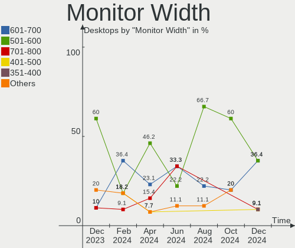

| Width in mm | Desktops | Percent |
|-------------|----------|---------|
| 501-600     | 6        | 46.15%  |
| 601-700     | 3        | 23.08%  |
| 701-800     | 2        | 15.38%  |
| 401-500     | 1        | 7.69%   |
| 301-350     | 1        | 7.69%   |

Aspect Ratio
------------

Proportional relationship between the width and the height

| Ratio | Desktops | Percent |
|-------|----------|---------|
| 16/9  | 8        | 66.67%  |
| 21/9  | 2        | 16.67%  |
| 4/3   | 1        | 8.33%   |
| 3/2   | 1        | 8.33%   |

Monitor Area
------------

Area in inch²

| Area in inch² | Desktops | Percent |
|----------------|----------|---------|
| 351-500        | 5        | 38.46%  |
| 301-350        | 5        | 38.46%  |
| 201-250        | 1        | 7.69%   |
| 151-200        | 1        | 7.69%   |
| 101-110        | 1        | 7.69%   |

Pixel Density
-------------

Pixels per inch

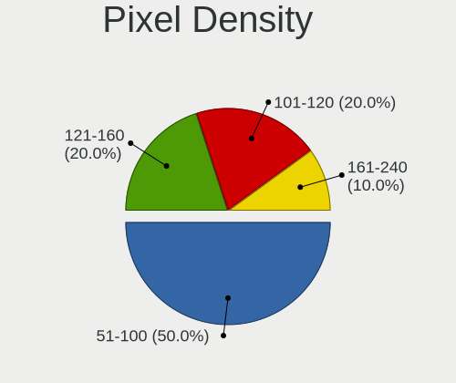

| Density | Desktops | Percent |
|---------|----------|---------|
| 51-100  | 4        | 33.33%  |
| 161-240 | 3        | 25%     |
| 121-160 | 3        | 25%     |
| 101-120 | 2        | 16.67%  |

Multiple Monitors
-----------------

Total monitors connected

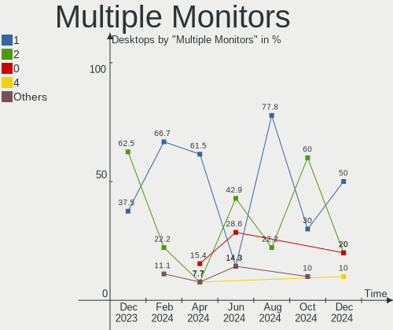

| Total | Desktops | Percent |
|-------|----------|---------|
| 1     | 8        | 61.54%  |
| 0     | 2        | 15.38%  |
| 4     | 1        | 7.69%   |
| 3     | 1        | 7.69%   |
| 2     | 1        | 7.69%   |

Network
-------

Net Controller Vendor
---------------------

Controller vendors

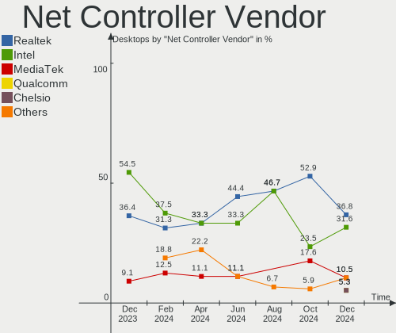

| Vendor                | Desktops | Percent |
|-----------------------|----------|---------|
| Realtek Semiconductor | 6        | 33.33%  |
| Intel                 | 6        | 33.33%  |
| MediaTek              | 2        | 11.11%  |
| TP-Link               | 1        | 5.56%   |
| Qualcomm Atheros      | 1        | 5.56%   |
| Broadcom              | 1        | 5.56%   |
| Aquantia              | 1        | 5.56%   |

Net Controller Model
--------------------

Controller models

| Model                                                                           | Desktops | Percent |
|---------------------------------------------------------------------------------|----------|---------|
| Realtek RTL8111/8168/8211/8411 PCI Express Gigabit Ethernet Controller          | 5        | 20.83%  |
| Intel I211 Gigabit Network Connection                                           | 2        | 8.33%   |
| Intel Ethernet Controller I225-V                                                | 2        | 8.33%   |
| Intel Ethernet Connection (7) I219-V                                            | 2        | 8.33%   |
| TP-Link TL-WN823N v2/v3 [Realtek RTL8192EU]                                     | 1        | 4.17%   |
| Realtek RTL8852AE 802.11ax PCIe Wireless Network Adapter                        | 1        | 4.17%   |
| Realtek RTL8125 2.5GbE Controller                                               | 1        | 4.17%   |
| Realtek Killer E3000 2.5GbE Controller                                          | 1        | 4.17%   |
| Qualcomm Atheros QCA986x/988x 802.11ac Wireless Network Adapter                 | 1        | 4.17%   |
| MediaTek MT7922 802.11ax PCI Express Wireless Network Adapter                   | 1        | 4.17%   |
| MediaTek MT7921K (RZ608) Wi-Fi 6E 80MHz                                         | 1        | 4.17%   |
| Intel Wi-Fi 5(802.11ac) Wireless-AC 9x6x [Thunder Peak]                         | 1        | 4.17%   |
| Intel Raptor Lake-S PCH CNVi WiFi                                               | 1        | 4.17%   |
| Intel 82599 10 Gigabit Network Connection                                       | 1        | 4.17%   |
| Broadcom NetXtreme BCM57762 Gigabit Ethernet PCIe                               | 1        | 4.17%   |
| Broadcom BCM4360 802.11ac Dual Band Wireless Network Adapter                    | 1        | 4.17%   |
| Aquantia AQtion AQC113CS NBase-T/IEEE 802.3an Ethernet Controller [Antigua 10G] | 1        | 4.17%   |

Wireless Vendor
---------------

Wireless vendors

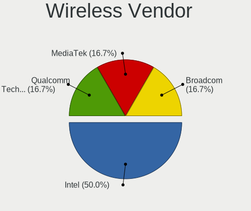

| Vendor                | Desktops | Percent |
|-----------------------|----------|---------|
| MediaTek              | 2        | 25%     |
| Intel                 | 2        | 25%     |
| TP-Link               | 1        | 12.5%   |
| Realtek Semiconductor | 1        | 12.5%   |
| Qualcomm Atheros      | 1        | 12.5%   |
| Broadcom              | 1        | 12.5%   |

Wireless Model
--------------

Wireless models

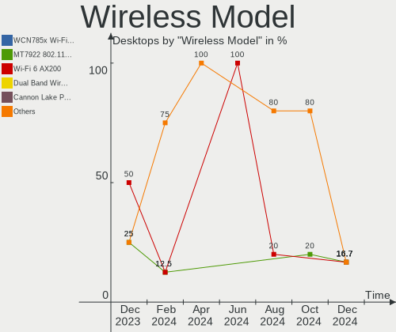

| Model                                                           | Desktops | Percent |
|-----------------------------------------------------------------|----------|---------|
| TP-Link TL-WN823N v2/v3 [Realtek RTL8192EU]                     | 1        | 12.5%   |
| Realtek RTL8852AE 802.11ax PCIe Wireless Network Adapter        | 1        | 12.5%   |
| Qualcomm Atheros QCA986x/988x 802.11ac Wireless Network Adapter | 1        | 12.5%   |
| MediaTek MT7922 802.11ax PCI Express Wireless Network Adapter   | 1        | 12.5%   |
| MediaTek MT7921K (RZ608) Wi-Fi 6E 80MHz                         | 1        | 12.5%   |
| Intel Wi-Fi 5(802.11ac) Wireless-AC 9x6x [Thunder Peak]         | 1        | 12.5%   |
| Intel Raptor Lake-S PCH CNVi WiFi                               | 1        | 12.5%   |
| Broadcom BCM4360 802.11ac Dual Band Wireless Network Adapter    | 1        | 12.5%   |

Ethernet Vendor
---------------

Ethernet vendors

| Vendor                | Desktops | Percent |
|-----------------------|----------|---------|
| Realtek Semiconductor | 6        | 42.86%  |
| Intel                 | 6        | 42.86%  |
| Broadcom              | 1        | 7.14%   |
| Aquantia              | 1        | 7.14%   |

Ethernet Model
--------------

Ethernet models

| Model                                                                           | Desktops | Percent |
|---------------------------------------------------------------------------------|----------|---------|
| Realtek RTL8111/8168/8211/8411 PCI Express Gigabit Ethernet Controller          | 5        | 31.25%  |
| Intel I211 Gigabit Network Connection                                           | 2        | 12.5%   |
| Intel Ethernet Controller I225-V                                                | 2        | 12.5%   |
| Intel Ethernet Connection (7) I219-V                                            | 2        | 12.5%   |
| Realtek RTL8125 2.5GbE Controller                                               | 1        | 6.25%   |
| Realtek Killer E3000 2.5GbE Controller                                          | 1        | 6.25%   |
| Intel 82599 10 Gigabit Network Connection                                       | 1        | 6.25%   |
| Broadcom NetXtreme BCM57762 Gigabit Ethernet PCIe                               | 1        | 6.25%   |
| Aquantia AQtion AQC113CS NBase-T/IEEE 802.3an Ethernet Controller [Antigua 10G] | 1        | 6.25%   |

Net Controller Kind
-------------------

Ethernet, WiFi or modem

| Kind     | Desktops | Percent |
|----------|----------|---------|
| Ethernet | 13       | 61.9%   |
| WiFi     | 8        | 38.1%   |

Used Controller
---------------

Currently used network controller

| Kind     | Desktops | Percent |
|----------|----------|---------|
| Ethernet | 10       | 76.92%  |
| WiFi     | 3        | 23.08%  |

NICs
----

Total network controllers on board

| Total | Desktops | Percent |
|-------|----------|---------|
| 2     | 6        | 46.15%  |
| 1     | 4        | 30.77%  |
| 3     | 2        | 15.38%  |
| 5     | 1        | 7.69%   |

IPv6
----

IPv6 vs IPv4

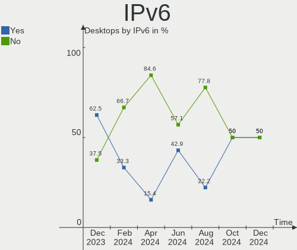

| Used | Desktops | Percent |
|------|----------|---------|
| No   | 11       | 84.62%  |
| Yes  | 2        | 15.38%  |

Bluetooth
---------

Bluetooth Vendor
----------------

Controller vendors

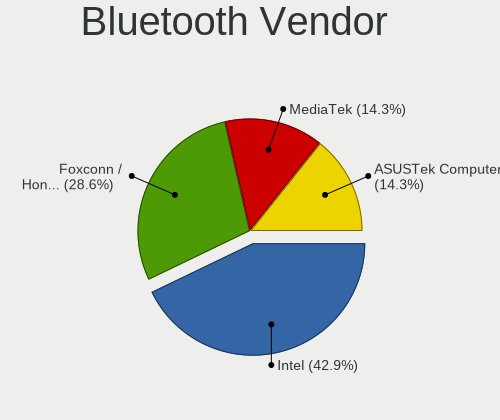

| Vendor                  | Desktops | Percent |
|-------------------------|----------|---------|
| Intel                   | 2        | 28.57%  |
| Realtek Semiconductor   | 1        | 14.29%  |
| MediaTek                | 1        | 14.29%  |
| Foxconn / Hon Hai       | 1        | 14.29%  |
| Cambridge Silicon Radio | 1        | 14.29%  |
| Apple                   | 1        | 14.29%  |

Bluetooth Model
---------------

Controller models

| Model                                               | Desktops | Percent |
|-----------------------------------------------------|----------|---------|
| Realtek Bluetooth Radio                             | 1        | 14.29%  |
| MediaTek Wireless_Device                            | 1        | 14.29%  |
| Intel Wireless-AC 9260 Bluetooth Adapter            | 1        | 14.29%  |
| Intel AX211 Bluetooth                               | 1        | 14.29%  |
| Foxconn / Hon Hai Wireless_Device                   | 1        | 14.29%  |
| Cambridge Silicon Radio Bluetooth Dongle (HCI mode) | 1        | 14.29%  |
| Apple Bluetooth Host Controller                     | 1        | 14.29%  |

Sound
-----

Sound Vendor
------------

Sound card vendors

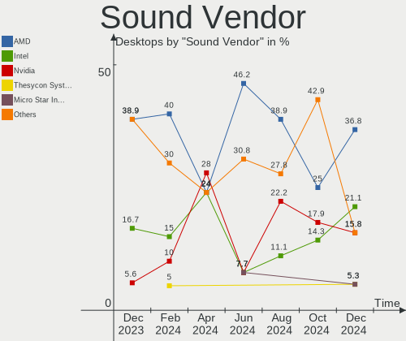

| Vendor            | Desktops | Percent |
|-------------------|----------|---------|
| Nvidia            | 7        | 28%     |
| Intel             | 6        | 24%     |
| AMD               | 6        | 24%     |
| Texas Instruments | 1        | 4%      |
| Shure             | 1        | 4%      |
| Roland            | 1        | 4%      |
| Logitech          | 1        | 4%      |
| Creative Labs     | 1        | 4%      |
| Blue Microphones  | 1        | 4%      |

Sound Model
-----------

Sound card models

| Model                                                                      | Desktops | Percent |
|----------------------------------------------------------------------------|----------|---------|
| AMD Family 17h/19h HD Audio Controller                                     | 3        | 10%     |
| Intel Raptor Lake High Definition Audio Controller                         | 2        | 6.67%   |
| Intel 6 Series/C200 Series Chipset Family High Definition Audio Controller | 2        | 6.67%   |
| AMD Rembrandt Radeon High Definition Audio Controller                      | 2        | 6.67%   |
| AMD Navi 21/23 HDMI/DP Audio Controller                                    | 2        | 6.67%   |
| Texas Instruments PCM2902 Audio Codec                                      | 1        | 3.33%   |
| Shure MV7                                                                  | 1        | 3.33%   |
| Roland QUAD-CAPTURE                                                        | 1        | 3.33%   |
| Nvidia TU116 High Definition Audio Controller                              | 1        | 3.33%   |
| Nvidia TU106 High Definition Audio Controller                              | 1        | 3.33%   |
| Nvidia TU104 HD Audio Controller                                           | 1        | 3.33%   |
| Nvidia GP107GL High Definition Audio Controller                            | 1        | 3.33%   |
| Nvidia GA106 High Definition Audio Controller                              | 1        | 3.33%   |
| Nvidia Audio device                                                        | 1        | 3.33%   |
| Nvidia AD102 High Definition Audio Controller                              | 1        | 3.33%   |
| Logitech Blue Snowball                                                     | 1        | 3.33%   |
| Intel Cannon Lake PCH cAVS                                                 | 1        | 3.33%   |
| Intel C600/X79 series chipset High Definition Audio Controller             | 1        | 3.33%   |
| Creative Labs EMU20k2 [Sound Blaster X-Fi Titanium Series]                 | 1        | 3.33%   |
| Blue Microphones Yeti Nano                                                 | 1        | 3.33%   |
| AMD Tahiti HDMI Audio [Radeon HD 7870 XT / 7950/7970]                      | 1        | 3.33%   |
| AMD Starship/Matisse HD Audio Controller                                   | 1        | 3.33%   |
| AMD Renoir Radeon High Definition Audio Controller                         | 1        | 3.33%   |
| AMD Family 17h (Models 00h-0fh) HD Audio Controller                        | 1        | 3.33%   |

Memory
------

Memory Vendor
-------------

Memory module vendors

| Vendor              | Desktops | Percent |
|---------------------|----------|---------|
| Kingston            | 2        | 15.38%  |
| G.Skill             | 2        | 15.38%  |
| Crucial             | 2        | 15.38%  |
| Corsair             | 2        | 15.38%  |
| Transcend           | 1        | 7.69%   |
| SK hynix            | 1        | 7.69%   |
| Samsung Electronics | 1        | 7.69%   |
| Micron Technology   | 1        | 7.69%   |
| A-DATA Technology   | 1        | 7.69%   |

Memory Model
------------

Memory module models

| Model                                                   | Desktops | Percent |
|---------------------------------------------------------|----------|---------|
| Transcend RAM JM1600KSH-8G 8GB SODIMM DDR3 1600MT/s     | 1        | 7.14%   |
| SK hynix RAM HMT42GR7BMR4C 16GB DIMM DDR3 1066MT/s      | 1        | 7.14%   |
| Samsung RAM M378A1K43EB2-CWE 8GB DIMM DDR4 3200MT/s     | 1        | 7.14%   |
| Micron RAM Module 16GB DIMM DDR3 1866MT/s               | 1        | 7.14%   |
| Kingston RAM KF560C36-16 16GB DIMM DDR5 6000MT/s        | 1        | 7.14%   |
| Kingston RAM KF556C36-32 32GB DIMM DDR5 5600MT/s        | 1        | 7.14%   |
| G.Skill RAM F4-3600C18-32GTZN 32GB DIMM DDR4 3800MT/s   | 1        | 7.14%   |
| G.Skill RAM F4-3000C15-8GVRB 8GB DIMM DDR4 3000MT/s     | 1        | 7.14%   |
| Crucial RAM CT51264BF160BJ.M8F 4GB DIMM DDR3 1600MT/s   | 1        | 7.14%   |
| Crucial RAM CT16G56C46U5.M8G1 16GB DIMM DDR5 5600MT/s   | 1        | 7.14%   |
| Corsair RAM CMK32GX4M2B3000C15 16GB DIMM DDR4 3000MT/s  | 1        | 7.14%   |
| Corsair RAM CMK16GX4M2B3200C16 8GB DIMM DDR4 3600MT/s   | 1        | 7.14%   |
| Corsair RAM CMK16GX4M2B3000C15 8GB DIMM DDR4 3600MT/s   | 1        | 7.14%   |
| A-DATA RAM AX5U6000C3016G-BLABB 16GB DIMM DDR5 6000MT/s | 1        | 7.14%   |

Memory Kind
-----------

Memory module kinds

| Kind | Desktops | Percent |
|------|----------|---------|
| DDR4 | 5        | 38.46%  |
| DDR5 | 4        | 30.77%  |
| DDR3 | 4        | 30.77%  |

Memory Form Factor
------------------

Physical design of the memory module

| Name   | Desktops | Percent |
|--------|----------|---------|
| DIMM   | 12       | 92.31%  |
| SODIMM | 1        | 7.69%   |

Memory Size
-----------

Memory module size

| Size  | Desktops | Percent |
|-------|----------|---------|
| 16384 | 6        | 46.15%  |
| 8192  | 4        | 30.77%  |
| 32768 | 2        | 15.38%  |
| 4096  | 1        | 7.69%   |

Memory Speed
------------

Memory module speed

| Speed | Desktops | Percent |
|-------|----------|---------|
| 6000  | 2        | 14.29%  |
| 5600  | 2        | 14.29%  |
| 3600  | 2        | 14.29%  |
| 3000  | 2        | 14.29%  |
| 1600  | 2        | 14.29%  |
| 3800  | 1        | 7.14%   |
| 3200  | 1        | 7.14%   |
| 1866  | 1        | 7.14%   |
| 1066  | 1        | 7.14%   |

Printers & scanners
-------------------

Printer Vendor
--------------

Printer device vendors

Zero info for selected period =(

Printer Model
-------------

Printer device models

Zero info for selected period =(

Scanner Vendor
--------------

Scanner device vendors

Zero info for selected period =(

Scanner Model
-------------

Scanner device models

Zero info for selected period =(

Camera
------

Camera Vendor
-------------

Camera device vendors

| Vendor              | Desktops | Percent |
|---------------------|----------|---------|
| Logitech            | 2        | 66.67%  |
| Samsung Electronics | 1        | 33.33%  |

Camera Model
------------

Camera device models

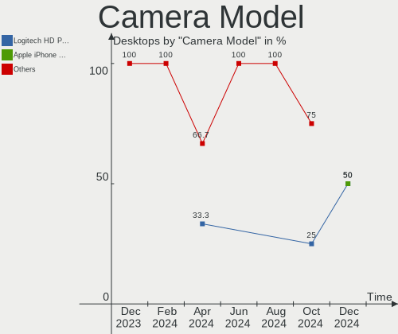

| Model                                   | Desktops | Percent |
|-----------------------------------------|----------|---------|
| Samsung Galaxy series, misc. (MTP mode) | 1        | 33.33%  |
| Logitech HD Pro Webcam C920             | 1        | 33.33%  |
| Logitech C922 Pro Stream Webcam         | 1        | 33.33%  |

Security
--------

Fingerprint Vendor
------------------

Fingerprint sensor vendors

Zero info for selected period =(

Fingerprint Model
-----------------

Fingerprint sensor models

Zero info for selected period =(

Chipcard Vendor
---------------

Chipcard module vendors

Zero info for selected period =(

Chipcard Model
--------------

Chipcard module models

Zero info for selected period =(

Unsupported
-----------

Unsupported Devices
-------------------

Total unsupported devices on board

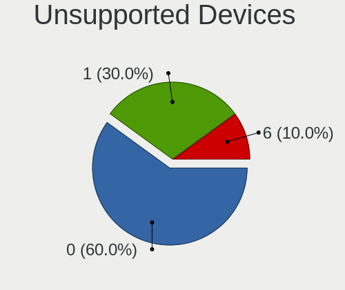

| Total | Desktops | Percent |
|-------|----------|---------|
| 0     | 11       | 84.62%  |
| 1     | 2        | 15.38%  |

Unsupported Device Types
------------------------

Types of unsupported devices

| Type                | Desktops | Percent |
|---------------------|----------|---------|
| Graphics card       | 1        | 50%     |
| Firewire controller | 1        | 50%     |

