NixOS - Hardware Trends (Desktops)
----------------------------------

A project to identify most popular hardware characteristics and track their change
over time based on data collected by Linux users at https://Linux-Hardware.org.

Anyone can contribute to this report by the [hw-probe](https://github.com/linuxhw/hw-probe) tool:

    sudo -E hw-probe -all -upload

This report is for one last month. Overall report since the beginning of time: [TestDays](https://github.com/linuxhw/TestDays)

Period: Jan, 2024.

Contents
--------

* [ System ](#system)
  - [ OS                       ](#os)
  - [ OS Family                ](#os-family)
  - [ Kernel                   ](#kernel)
  - [ Kernel Family            ](#kernel-family)
  - [ Kernel Major Ver.        ](#kernel-major-ver)
  - [ Arch                     ](#arch)
  - [ DE                       ](#de)
  - [ Display Server           ](#display-server)
  - [ Display Manager          ](#display-manager)
  - [ OS Lang                  ](#os-lang)
  - [ Boot Mode                ](#boot-mode)
  - [ Filesystem               ](#filesystem)
  - [ Part. scheme             ](#part-scheme)
  - [ Dual Boot with Linux/BSD ](#dual-boot-with-linuxbsd)
  - [ Dual Boot (Win)          ](#dual-boot-win)

* [ Board ](#board)
  - [ Vendor                   ](#vendor)
  - [ Model                    ](#model)
  - [ Model Family             ](#model-family)
  - [ MFG Year                 ](#mfg-year)
  - [ Form Factor              ](#form-factor)
  - [ Secure Boot              ](#secure-boot)
  - [ Coreboot                 ](#coreboot)
  - [ RAM Size                 ](#ram-size)
  - [ RAM Used                 ](#ram-used)
  - [ Total Drives             ](#total-drives)
  - [ Has CD-ROM               ](#has-cd-rom)
  - [ Has Ethernet             ](#has-ethernet)
  - [ Has WiFi                 ](#has-wifi)
  - [ Has Bluetooth            ](#has-bluetooth)

* [ Location ](#location)
  - [ Country                  ](#country)
  - [ City                     ](#city)

* [ Drives ](#drives)
  - [ Drive Vendor             ](#drive-vendor)
  - [ Drive Model              ](#drive-model)
  - [ HDD Vendor               ](#hdd-vendor)
  - [ SSD Vendor               ](#ssd-vendor)
  - [ Drive Kind               ](#drive-kind)
  - [ Drive Connector          ](#drive-connector)
  - [ Drive Size               ](#drive-size)
  - [ Space Total              ](#space-total)
  - [ Space Used               ](#space-used)
  - [ Malfunc. Drives          ](#malfunc-drives)
  - [ Malfunc. Drive Vendor    ](#malfunc-drive-vendor)
  - [ Malfunc. HDD Vendor      ](#malfunc-hdd-vendor)
  - [ Malfunc. Drive Kind      ](#malfunc-drive-kind)
  - [ Failed Drives            ](#failed-drives)
  - [ Failed Drive Vendor      ](#failed-drive-vendor)
  - [ Drive Status             ](#drive-status)

* [ Storage controller ](#storage-controller)
  - [ Storage Vendor           ](#storage-vendor)
  - [ Storage Model            ](#storage-model)
  - [ Storage Kind             ](#storage-kind)

* [ Processor ](#processor)
  - [ CPU Vendor               ](#cpu-vendor)
  - [ CPU Model                ](#cpu-model)
  - [ CPU Model Family         ](#cpu-model-family)
  - [ CPU Cores                ](#cpu-cores)
  - [ CPU Sockets              ](#cpu-sockets)
  - [ CPU Threads              ](#cpu-threads)
  - [ CPU Op-Modes             ](#cpu-op-modes)
  - [ CPU Microcode            ](#cpu-microcode)
  - [ CPU Microarch            ](#cpu-microarch)

* [ Graphics ](#graphics)
  - [ GPU Vendor               ](#gpu-vendor)
  - [ GPU Model                ](#gpu-model)
  - [ GPU Combo                ](#gpu-combo)
  - [ GPU Driver               ](#gpu-driver)
  - [ GPU Memory               ](#gpu-memory)

* [ Monitor ](#monitor)
  - [ Monitor Vendor           ](#monitor-vendor)
  - [ Monitor Model            ](#monitor-model)
  - [ Monitor Resolution       ](#monitor-resolution)
  - [ Monitor Diagonal         ](#monitor-diagonal)
  - [ Monitor Width            ](#monitor-width)
  - [ Aspect Ratio             ](#aspect-ratio)
  - [ Monitor Area             ](#monitor-area)
  - [ Pixel Density            ](#pixel-density)
  - [ Multiple Monitors        ](#multiple-monitors)

* [ Network ](#network)
  - [ Net Controller Vendor    ](#net-controller-vendor)
  - [ Net Controller Model     ](#net-controller-model)
  - [ Wireless Vendor          ](#wireless-vendor)
  - [ Wireless Model           ](#wireless-model)
  - [ Ethernet Vendor          ](#ethernet-vendor)
  - [ Ethernet Model           ](#ethernet-model)
  - [ Net Controller Kind      ](#net-controller-kind)
  - [ Used Controller          ](#used-controller)
  - [ NICs                     ](#nics)
  - [ IPv6                     ](#ipv6)

* [ Bluetooth ](#bluetooth)
  - [ Bluetooth Vendor         ](#bluetooth-vendor)
  - [ Bluetooth Model          ](#bluetooth-model)

* [ Sound ](#sound)
  - [ Sound Vendor             ](#sound-vendor)
  - [ Sound Model              ](#sound-model)

* [ Memory ](#memory)
  - [ Memory Vendor            ](#memory-vendor)
  - [ Memory Model             ](#memory-model)
  - [ Memory Kind              ](#memory-kind)
  - [ Memory Form Factor       ](#memory-form-factor)
  - [ Memory Size              ](#memory-size)
  - [ Memory Speed             ](#memory-speed)

* [ Printers & scanners ](#printers--scanners)
  - [ Printer Vendor           ](#printer-vendor)
  - [ Printer Model            ](#printer-model)
  - [ Scanner Vendor           ](#scanner-vendor)
  - [ Scanner Model            ](#scanner-model)

* [ Camera ](#camera)
  - [ Camera Vendor            ](#camera-vendor)
  - [ Camera Model             ](#camera-model)

* [ Security ](#security)
  - [ Fingerprint Vendor       ](#fingerprint-vendor)
  - [ Fingerprint Model        ](#fingerprint-model)
  - [ Chipcard Vendor          ](#chipcard-vendor)
  - [ Chipcard Model           ](#chipcard-model)

* [ Unsupported ](#unsupported)
  - [ Unsupported Devices      ](#unsupported-devices)
  - [ Unsupported Device Types ](#unsupported-device-types)

System
------

OS
--

Installed operating systems

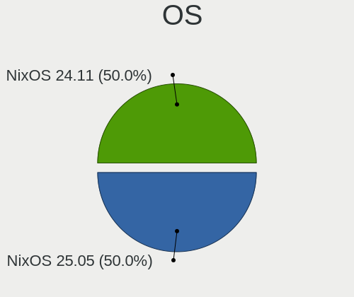

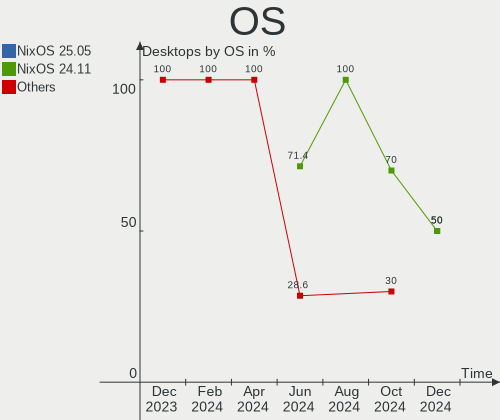

| Name        | Desktops | Percent |
|-------------|----------|---------|
| NixOS 24.05 | 8        | 47.06%  |
| NixOS 23.11 | 7        | 41.18%  |
| NixOS 23.05 | 1        | 5.88%   |
| NixOS 22.11 | 1        | 5.88%   |

OS Family
---------

OS without a version

| Name  | Desktops | Percent |
|-------|----------|---------|
| NixOS | 17       | 100%    |

Kernel
------

Version of the Linux kernel

| Version   | Desktops | Percent |
|-----------|----------|---------|
| 6.6.8     | 3        | 17.65%  |
| 6.1.69    | 3        | 17.65%  |
| 6.7.0     | 2        | 11.76%  |
| 6.1.71    | 2        | 11.76%  |
| 6.7.0-rc7 | 1        | 5.88%   |
| 6.6.11    | 1        | 5.88%   |
| 6.5.13    | 1        | 5.88%   |
| 6.1.65    | 1        | 5.88%   |
| 6.1.61    | 1        | 5.88%   |
| 6.1.57    | 1        | 5.88%   |
| 5.15.108  | 1        | 5.88%   |

Kernel Family
-------------

Linux kernel without a distro release

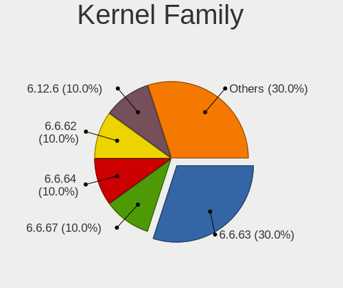

| Version  | Desktops | Percent |
|----------|----------|---------|
| 6.7.0    | 3        | 17.65%  |
| 6.6.8    | 3        | 17.65%  |
| 6.1.69   | 3        | 17.65%  |
| 6.1.71   | 2        | 11.76%  |
| 6.6.11   | 1        | 5.88%   |
| 6.5.13   | 1        | 5.88%   |
| 6.1.65   | 1        | 5.88%   |
| 6.1.61   | 1        | 5.88%   |
| 6.1.57   | 1        | 5.88%   |
| 5.15.108 | 1        | 5.88%   |

Kernel Major Ver.
-----------------

Linux kernel major version

| Version | Desktops | Percent |
|---------|----------|---------|
| 6.1     | 8        | 47.06%  |
| 6.6     | 4        | 23.53%  |
| 6.7     | 3        | 17.65%  |
| 6.5     | 1        | 5.88%   |
| 5.15    | 1        | 5.88%   |

Arch
----

OS architecture (x86_64, i586, etc.)

| Name   | Desktops | Percent |
|--------|----------|---------|
| x86_64 | 17       | 100%    |

DE
--

Desktop Environment

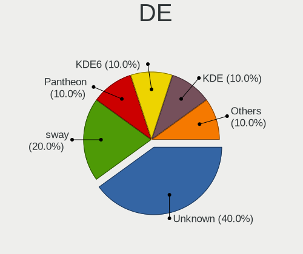

| Name    | Desktops | Percent |
|---------|----------|---------|
| KDE5    | 7        | 41.18%  |
| Unknown | 4        | 23.53%  |
| sway    | 2        | 11.76%  |
| XFCE    | 1        | 5.88%   |
| none+i3 | 1        | 5.88%   |
| KDE6    | 1        | 5.88%   |
| KDE     | 1        | 5.88%   |

Display Server
--------------

X11 or Wayland

| Name    | Desktops | Percent |
|---------|----------|---------|
| X11     | 7        | 41.18%  |
| Unknown | 6        | 35.29%  |
| Wayland | 2        | 11.76%  |
| Tty     | 2        | 11.76%  |

Display Manager
---------------

SDDM, LightDM, etc.

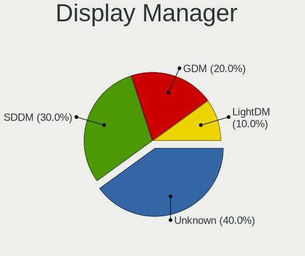

| Name    | Desktops | Percent |
|---------|----------|---------|
| SDDM    | 9        | 52.94%  |
| Unknown | 4        | 23.53%  |
| LightDM | 2        | 11.76%  |
| GDM     | 2        | 11.76%  |

OS Lang
-------

Language

| Lang  | Desktops | Percent |
|-------|----------|---------|
| en_US | 14       | 82.35%  |
| sv_SE | 1        | 5.88%   |
| ru_RU | 1        | 5.88%   |
| en_GB | 1        | 5.88%   |

Boot Mode
---------

EFI or BIOS

| Mode | Desktops | Percent |
|------|----------|---------|
| EFI  | 15       | 88.24%  |
| BIOS | 2        | 11.76%  |

Filesystem
----------

Type of filesystem

| Type  | Desktops | Percent |
|-------|----------|---------|
| Ext4  | 12       | 70.59%  |
| Zfs   | 1        | 5.88%   |
| Xfs   | 1        | 5.88%   |
| Tmpfs | 1        | 5.88%   |
| F2fs  | 1        | 5.88%   |
| Btrfs | 1        | 5.88%   |

Part. scheme
------------

Scheme of partitioning

| Type | Desktops | Percent |
|------|----------|---------|
| GPT  | 17       | 100%    |

Dual Boot with Linux/BSD
------------------------

Hosting more than one Linux/BSD

| Dual boot | Desktops | Percent |
|-----------|----------|---------|
| No        | 14       | 82.35%  |
| Yes       | 3        | 17.65%  |

Dual Boot (Win)
---------------

Hosting Linux and Windows

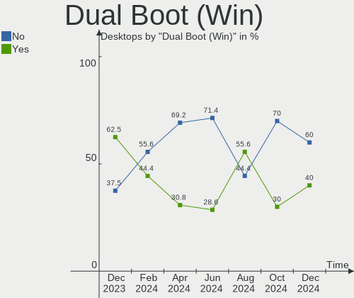

| Dual boot | Desktops | Percent |
|-----------|----------|---------|
| No        | 11       | 64.71%  |
| Yes       | 6        | 35.29%  |

Board
-----

Vendor
------

Motherboard manufacturer

| Name                | Desktops | Percent |
|---------------------|----------|---------|
| ASUSTek Computer    | 8        | 47.06%  |
| Gigabyte Technology | 4        | 23.53%  |
| MSI                 | 2        | 11.76%  |
| Hewlett-Packard     | 1        | 5.88%   |
| Dell                | 1        | 5.88%   |
| Biostar             | 1        | 5.88%   |

Model
-----

Motherboard model

| Name                            | Desktops | Percent |
|---------------------------------|----------|---------|
| MSI MS-7998                     | 1        | 5.88%   |
| MSI CML-U PRO Cubi 5 (MS-B183)  | 1        | 5.88%   |
| HP Z220 CMT Workstation         | 1        | 5.88%   |
| Gigabyte Z690 AORUS MASTER      | 1        | 5.88%   |
| Gigabyte Z390 AORUS PRO         | 1        | 5.88%   |
| Gigabyte B650M GAMING X AX      | 1        | 5.88%   |
| Gigabyte B450 AORUS M           | 1        | 5.88%   |
| Dell OptiPlex 5090              | 1        | 5.88%   |
| Biostar TZ590-BTC DUO           | 1        | 5.88%   |
| ASUS TUF Gaming Z490-PLUS       | 1        | 5.88%   |
| ASUS TUF Gaming X670E-PLUS WIFI | 1        | 5.88%   |
| ASUS STRIX Z270H GAMING         | 1        | 5.88%   |
| ASUS ROG STRIX B550-A GAMING    | 1        | 5.88%   |
| ASUS Pro WS X570-ACE            | 1        | 5.88%   |
| ASUS Pro WS TRX50-SAGE WIFI     | 1        | 5.88%   |
| ASUS PRIME H410M-E              | 1        | 5.88%   |
| ASUS P8Z77-V LE                 | 1        | 5.88%   |

Model Family
------------

Motherboard model prefix

| Name              | Desktops | Percent |
|-------------------|----------|---------|
| ASUS TUF          | 2        | 11.76%  |
| ASUS Pro          | 2        | 11.76%  |
| MSI MS-7998       | 1        | 5.88%   |
| MSI CML-U         | 1        | 5.88%   |
| HP Z220           | 1        | 5.88%   |
| Gigabyte Z690     | 1        | 5.88%   |
| Gigabyte Z390     | 1        | 5.88%   |
| Gigabyte B650M    | 1        | 5.88%   |
| Gigabyte B450     | 1        | 5.88%   |
| Dell OptiPlex     | 1        | 5.88%   |
| Biostar TZ590-BTC | 1        | 5.88%   |
| ASUS STRIX        | 1        | 5.88%   |
| ASUS ROG          | 1        | 5.88%   |
| ASUS PRIME        | 1        | 5.88%   |
| ASUS P8Z77-V      | 1        | 5.88%   |

MFG Year
--------

Motherboard manufacture year

| Year | Desktops | Percent |
|------|----------|---------|
| 2020 | 4        | 23.53%  |
| 2021 | 3        | 17.65%  |
| 2022 | 2        | 11.76%  |
| 2018 | 2        | 11.76%  |
| 2016 | 2        | 11.76%  |
| 2012 | 2        | 11.76%  |
| 2023 | 1        | 5.88%   |
| 2019 | 1        | 5.88%   |

Form Factor
-----------

Physical design of the computer

| Name    | Desktops | Percent |
|---------|----------|---------|
| Desktop | 17       | 100%    |

Secure Boot
-----------

Enabled or disabled

| State    | Desktops | Percent |
|----------|----------|---------|
| Disabled | 17       | 100%    |

Coreboot
--------

Have coreboot on board

| Used | Desktops | Percent |
|------|----------|---------|
| No   | 17       | 100%    |

RAM Size
--------

Total RAM memory

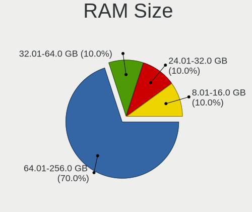

| Size in GB      | Desktops | Percent |
|-----------------|----------|---------|
| 16.01-24.0      | 7        | 41.18%  |
| 64.01-256.0     | 4        | 23.53%  |
| 32.01-64.0      | 2        | 11.76%  |
| 24.01-32.0      | 2        | 11.76%  |
| More than 256.0 | 1        | 5.88%   |
| 8.01-16.0       | 1        | 5.88%   |

RAM Used
--------

Used RAM memory

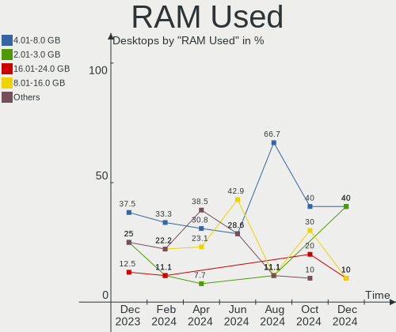

| Used GB   | Desktops | Percent |
|-----------|----------|---------|
| 8.01-16.0 | 6        | 35.29%  |
| 2.01-3.0  | 5        | 29.41%  |
| 1.01-2.0  | 3        | 17.65%  |
| 4.01-8.0  | 1        | 5.88%   |
| 3.01-4.0  | 1        | 5.88%   |
| 0.51-1.0  | 1        | 5.88%   |

Total Drives
------------

Number of drives on board

| Drives | Desktops | Percent |
|--------|----------|---------|
| 2      | 6        | 35.29%  |
| 3      | 4        | 23.53%  |
| 1      | 4        | 23.53%  |
| 4      | 2        | 11.76%  |
| 5      | 1        | 5.88%   |

Has CD-ROM
----------

Has CD-ROM on board

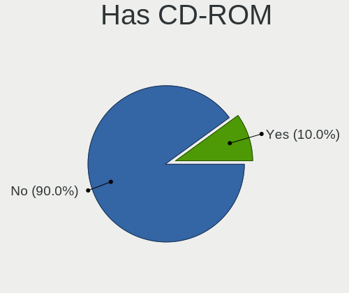

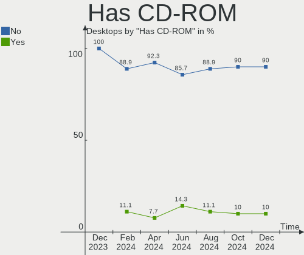

| Presented | Desktops | Percent |
|-----------|----------|---------|
| No        | 12       | 70.59%  |
| Yes       | 5        | 29.41%  |

Has Ethernet
------------

Has Ethernet on board

| Presented | Desktops | Percent |
|-----------|----------|---------|
| Yes       | 17       | 100%    |

Has WiFi
--------

Has WiFi module

| Presented | Desktops | Percent |
|-----------|----------|---------|
| No        | 11       | 64.71%  |
| Yes       | 6        | 35.29%  |

Has Bluetooth
-------------

Has Bluetooth module

| Presented | Desktops | Percent |
|-----------|----------|---------|
| Yes       | 9        | 52.94%  |
| No        | 8        | 47.06%  |

Location
--------

Country
-------

Geographic location (country)

| Country     | Desktops | Percent |
|-------------|----------|---------|
| USA         | 7        | 41.18%  |
| Russia      | 2        | 11.76%  |
| Belgium     | 2        | 11.76%  |
| Turkey      | 1        | 5.88%   |
| Sweden      | 1        | 5.88%   |
| Romania     | 1        | 5.88%   |
| Netherlands | 1        | 5.88%   |
| Germany     | 1        | 5.88%   |
| Brazil      | 1        | 5.88%   |

City
----

Geographic location (city)

| City           | Desktops | Percent |
|----------------|----------|---------|
| Salt Lake City | 2        | 11.76%  |
| Duffel         | 2        | 11.76%  |
| Winchester     | 1        | 5.88%   |
| Svenljunga     | 1        | 5.88%   |
| St Petersburg  | 1        | 5.88%   |
| Santa Clara    | 1        | 5.88%   |
| Rochester      | 1        | 5.88%   |
| Rapid City     | 1        | 5.88%   |
| Moscow         | 1        | 5.88%   |
| Hamburg        | 1        | 5.88%   |
| Cluj-Napoca    | 1        | 5.88%   |
| Casstown       | 1        | 5.88%   |
| Campinas       | 1        | 5.88%   |
| Bursa          | 1        | 5.88%   |
| Amsterdam      | 1        | 5.88%   |

Drives
------

Drive Vendor
------------

Hard drive vendors

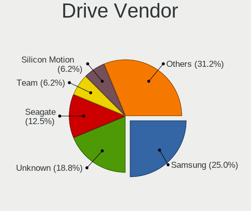

| Vendor                      | Desktops | Drives | Percent |
|-----------------------------|----------|--------|---------|
| Samsung Electronics         | 9        | 15     | 30%     |
| WDC                         | 4        | 7      | 13.33%  |
| Seagate                     | 4        | 5      | 13.33%  |
| Toshiba                     | 2        | 2      | 6.67%   |
| Realtek Semiconductor       | 2        | 2      | 6.67%   |
| Kingston                    | 2        | 2      | 6.67%   |
| Unknown                     | 1        | 1      | 3.33%   |
| SK hynix                    | 1        | 1      | 3.33%   |
| Phison Electronics          | 1        | 2      | 3.33%   |
| Patriot                     | 1        | 1      | 3.33%   |
| Kingston Technology Company | 1        | 1      | 3.33%   |
| KingFast                    | 1        | 1      | 3.33%   |
| Unknown                     | 1        | 1      | 3.33%   |

Drive Model
-----------

Hard drive models

| Model                                              | Desktops | Percent |
|----------------------------------------------------|----------|---------|
| Samsung NVMe SSD Controller SM981/PM981/PM983 1TB  | 5        | 13.89%  |
| Samsung SSD 850 EVO 500GB                          | 2        | 5.56%   |
| Samsung NVMe SSD Controller PM9A1/PM9A3/980PRO 2TB | 2        | 5.56%   |
| WDC WDS100T2G0A-00JH30 1TB SSD                     | 1        | 2.78%   |
| WDC WD5002AALX-32Z3A0 500GB                        | 1        | 2.78%   |
| WDC WD5000AZLX-75K2TA1 500GB                       | 1        | 2.78%   |
| WDC WD5000AZLX-75K2TA0 500GB                       | 1        | 2.78%   |
| WDC WD40EZRZ-22GXCB0 4TB                           | 1        | 2.78%   |
| WDC WD30EZAZ-00SF3B0 3TB                           | 1        | 2.78%   |
| WDC WD10EZEX-60ZF5A0 1TB                           | 1        | 2.78%   |
| Unknown NVMe SSD Drive 512GB                       | 1        | 2.78%   |
| Toshiba XG6 NVMe SSD Controller 256GB              | 1        | 2.78%   |
| Toshiba MQ04ABF100 1TB                             | 1        | 2.78%   |
| SK hynix HFS250G32TND-N1A2A 250GB SSD              | 1        | 2.78%   |
| Seagate ST14000NE0008-2RX103 14TB                  | 1        | 2.78%   |
| Seagate ST14000NE0008-2JK101 14TB                  | 1        | 2.78%   |
| Seagate ST1000LM024 HN-M101MBB 1TB                 | 1        | 2.78%   |
| Seagate Expansion 1TB                              | 1        | 2.78%   |
| Samsung SSD 870 EVO 250GB                          | 1        | 2.78%   |
| Samsung SSD 860 EVO 500GB                          | 1        | 2.78%   |
| Samsung SSD 850 EVO 1TB                            | 1        | 2.78%   |
| Realtek RTS5763DL NVMe SSD Controller 2TB          | 1        | 2.78%   |
| Realtek ADATA SWORDFISH 1TB                        | 1        | 2.78%   |
| Phison Corsair MP700 PRO 2TB                       | 1        | 2.78%   |
| Patriot Burst 240GB SSD                            | 1        | 2.78%   |
| Kingston Company U-SNS8154P3 NVMe SSD 512GB        | 1        | 2.78%   |
| Kingston SA400S37960G 960GB SSD                    | 1        | 2.78%   |
| Kingston SA400S37480G 480GB SSD                    | 1        | 2.78%   |
| KingFast SSD 256GB                                 | 1        | 2.78%   |
| Unknown                                            | 1        | 2.78%   |

HDD Vendor
----------

Hard disk drive vendors

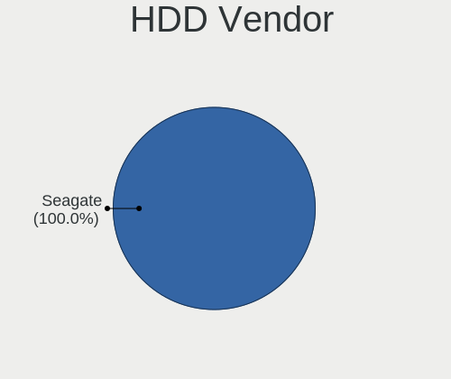

| Vendor  | Desktops | Drives | Percent |
|---------|----------|--------|---------|
| Seagate | 4        | 5      | 50%     |
| WDC     | 3        | 6      | 37.5%   |
| Toshiba | 1        | 1      | 12.5%   |

SSD Vendor
----------

Solid state drive vendors

| Vendor              | Desktops | Drives | Percent |
|---------------------|----------|--------|---------|
| Samsung Electronics | 5        | 5      | 41.67%  |
| Kingston            | 2        | 2      | 16.67%  |
| WDC                 | 1        | 1      | 8.33%   |
| SK hynix            | 1        | 1      | 8.33%   |
| Patriot             | 1        | 1      | 8.33%   |
| KingFast            | 1        | 1      | 8.33%   |
| Unknown             | 1        | 1      | 8.33%   |

Drive Kind
----------

HDD or SSD

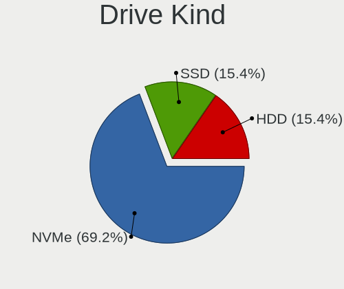

| Kind | Desktops | Drives | Percent |
|------|----------|--------|---------|
| NVMe | 12       | 17     | 41.38%  |
| SSD  | 10       | 12     | 34.48%  |
| HDD  | 7        | 12     | 24.14%  |

Drive Connector
---------------

SATA, SAS, NVMe, etc.

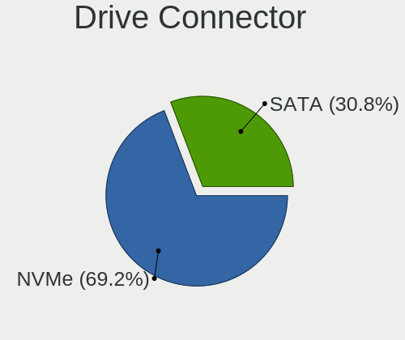

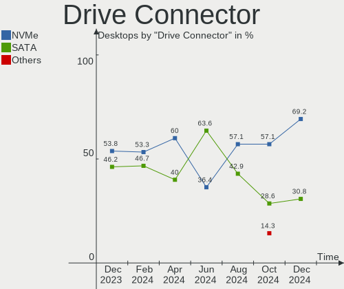

| Type | Desktops | Drives | Percent |
|------|----------|--------|---------|
| SATA | 14       | 23     | 51.85%  |
| NVMe | 12       | 17     | 44.44%  |
| SAS  | 1        | 1      | 3.7%    |

Drive Size
----------

Size of hard drive

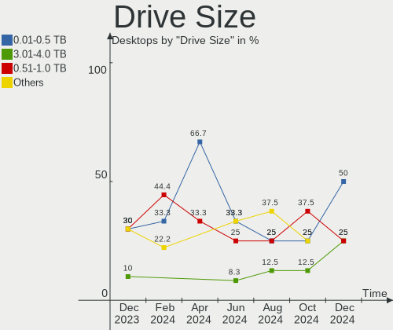

| Size in TB | Desktops | Drives | Percent |
|------------|----------|--------|---------|
| 0.01-0.5   | 10       | 12     | 50%     |
| 0.51-1.0   | 6        | 7      | 30%     |
| 10.01-20.0 | 2        | 3      | 10%     |
| 3.01-4.0   | 1        | 1      | 5%      |
| 2.01-3.0   | 1        | 1      | 5%      |

Space Total
-----------

Amount of disk space available on the file system

| Size in GB     | Desktops | Percent |
|----------------|----------|---------|
| 1-20           | 5        | 29.41%  |
| 1001-2000      | 3        | 17.65%  |
| 501-1000       | 3        | 17.65%  |
| More than 3000 | 2        | 11.76%  |
| 2001-3000      | 2        | 11.76%  |
| 251-500        | 1        | 5.88%   |
| 101-250        | 1        | 5.88%   |

Space Used
----------

Amount of used disk space

| Used GB        | Desktops | Percent |
|----------------|----------|---------|
| 1-20           | 6        | 35.29%  |
| 101-250        | 3        | 17.65%  |
| 21-50          | 2        | 11.76%  |
| 1001-2000      | 2        | 11.76%  |
| 501-1000       | 2        | 11.76%  |
| More than 3000 | 1        | 5.88%   |
| 2001-3000      | 1        | 5.88%   |

Malfunc. Drives
---------------

Drive models with a malfunction

| Model                                 | Desktops | Drives | Percent |
|---------------------------------------|----------|--------|---------|
| SK hynix HFS250G32TND-N1A2A 250GB SSD | 1        | 1      | 50%     |
| Samsung Electronics SSD 850 EVO 1TB   | 1        | 1      | 50%     |

Malfunc. Drive Vendor
---------------------

Vendors of faulty drives

| Vendor              | Desktops | Drives | Percent |
|---------------------|----------|--------|---------|
| SK hynix            | 1        | 1      | 50%     |
| Samsung Electronics | 1        | 1      | 50%     |

Malfunc. HDD Vendor
-------------------

Vendors of faulty HDD drives

Zero info for selected period =(

Malfunc. Drive Kind
-------------------

Kinds of faulty drives

| Kind | Desktops | Drives | Percent |
|------|----------|--------|---------|
| SSD  | 2        | 2      | 100%    |

Failed Drives
-------------

Failed drive models

Zero info for selected period =(

Failed Drive Vendor
-------------------

Failed drive vendors

Zero info for selected period =(

Drive Status
------------

Number of failed and malfunc. drives

| Status   | Desktops | Drives | Percent |
|----------|----------|--------|---------|
| Works    | 16       | 37     | 80%     |
| Detected | 2        | 2      | 10%     |
| Malfunc  | 2        | 2      | 10%     |

Storage controller
------------------

Storage Vendor
--------------

Storage controller vendors

| Vendor                       | Desktops | Percent |
|------------------------------|----------|---------|
| Intel                        | 11       | 34.38%  |
| Samsung Electronics          | 7        | 21.88%  |
| AMD                          | 6        | 18.75%  |
| Realtek Semiconductor        | 2        | 6.25%   |
| Toshiba America Info Systems | 1        | 3.13%   |
| Phison Electronics           | 1        | 3.13%   |
| Marvell Technology Group     | 1        | 3.13%   |
| Kingston Technology Company  | 1        | 3.13%   |
| INNOGRIT                     | 1        | 3.13%   |
| ASMedia Technology           | 1        | 3.13%   |

Storage Model
-------------

Storage controller models

| Model                                                                         | Desktops | Percent |
|-------------------------------------------------------------------------------|----------|---------|
| Samsung NVMe SSD Controller SM981/PM981/PM983                                 | 5        | 15.15%  |
| AMD 600 Series Chipset SATA Controller                                        | 3        | 9.09%   |
| Samsung NVMe SSD Controller PM9A1/PM9A3/980PRO                                | 2        | 6.06%   |
| Intel Comet Lake SATA AHCI Controller                                         | 2        | 6.06%   |
| Intel 500 Series Chipset Family SATA AHCI Controller                          | 2        | 6.06%   |
| AMD FCH SATA Controller [AHCI mode]                                           | 2        | 6.06%   |
| Toshiba America Info Systems XG6 NVMe SSD Controller                          | 1        | 3.03%   |
| Realtek RTS5763DL NVMe SSD Controller (DRAM-less)                             | 1        | 3.03%   |
| Realtek RTS5762 NVMe SSD Controller                                           | 1        | 3.03%   |
| Phison PS5026-E26 PCIe5 NVMe Controller                                       | 1        | 3.03%   |
| Marvell Group 88SE9120 SATA 6Gb/s Controller                                  | 1        | 3.03%   |
| Kingston Company A1000/U-SNS8154P3 x2 NVMe SSD                                | 1        | 3.03%   |
| Intel SATA Controller [RAID mode]                                             | 1        | 3.03%   |
| Intel Q170/Q150/B150/H170/H110/Z170/CM236 Chipset SATA Controller [AHCI Mode] | 1        | 3.03%   |
| Intel Cannon Lake PCH SATA AHCI Controller                                    | 1        | 3.03%   |
| Intel Alder Lake-S PCH SATA Controller [AHCI Mode]                            | 1        | 3.03%   |
| Intel 7 Series/C210 Series Chipset Family 6-port SATA Controller [AHCI mode]  | 1        | 3.03%   |
| Intel 400 Series Chipset Family SATA AHCI Controller                          | 1        | 3.03%   |
| Intel 200 Series PCH SATA controller [AHCI mode]                              | 1        | 3.03%   |
| INNOGRIT NVMe SSD Controller IG5216 (DRAM-less)                               | 1        | 3.03%   |
| ASMedia ASM1064 Serial ATA Controller                                         | 1        | 3.03%   |
| AMD 500 Series Chipset SATA Controller                                        | 1        | 3.03%   |
| AMD 400 Series Chipset SATA Controller                                        | 1        | 3.03%   |

Storage Kind
------------

Kind of storage controller (IDE, SATA, NVMe, SAS, ...)

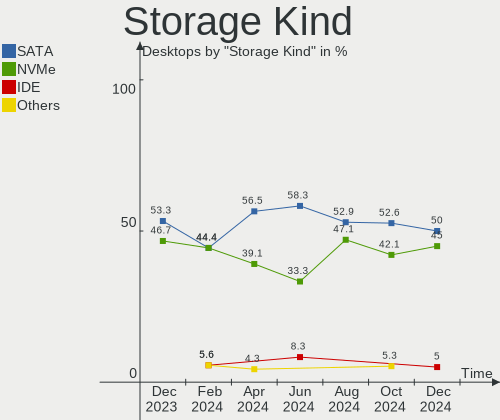

| Kind | Desktops | Percent |
|------|----------|---------|
| SATA | 16       | 55.17%  |
| NVMe | 12       | 41.38%  |
| RAID | 1        | 3.45%   |

Processor
---------

CPU Vendor
----------

Processor vendors

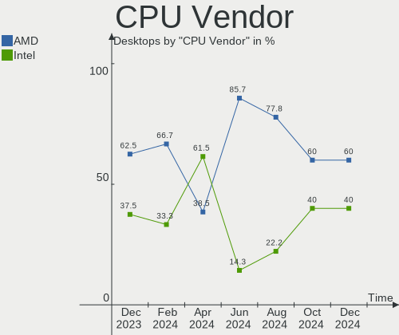

| Vendor | Desktops | Percent |
|--------|----------|---------|
| Intel  | 11       | 64.71%  |
| AMD    | 6        | 35.29%  |

CPU Model
---------

Processor models

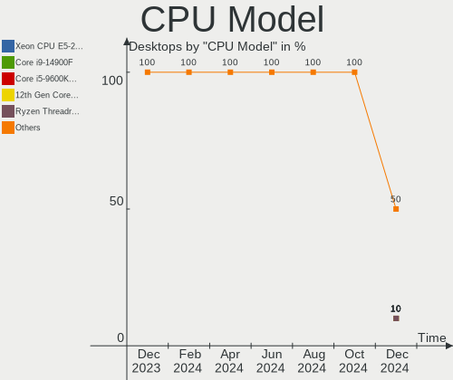

| Model                                       | Desktops | Percent |
|---------------------------------------------|----------|---------|
| AMD Ryzen 9 7950X 16-Core Processor         | 2        | 11.76%  |
| Intel Core i7-9700K CPU @ 3.60GHz           | 1        | 5.88%   |
| Intel Core i7-7700K CPU @ 4.20GHz           | 1        | 5.88%   |
| Intel Core i7-6700K CPU @ 4.00GHz           | 1        | 5.88%   |
| Intel Core i7-3770K CPU @ 3.50GHz           | 1        | 5.88%   |
| Intel Core i7-3770 CPU @ 3.40GHz            | 1        | 5.88%   |
| Intel Core i7-10700F CPU @ 2.90GHz          | 1        | 5.88%   |
| Intel Core i7-10700 CPU @ 2.90GHz           | 1        | 5.88%   |
| Intel Core i5-10210U CPU @ 1.60GHz          | 1        | 5.88%   |
| Intel 12th Gen Core i7-12700K               | 1        | 5.88%   |
| Intel 11th Gen Core i7-11700 @ 2.50GHz      | 1        | 5.88%   |
| Intel 11th Gen Core i5-11600K @ 3.90GHz     | 1        | 5.88%   |
| AMD Ryzen Threadripper 7980X 64-Cores       | 1        | 5.88%   |
| AMD Ryzen 9 5950X 16-Core Processor         | 1        | 5.88%   |
| AMD Ryzen 5 3600 6-Core Processor           | 1        | 5.88%   |
| AMD Ryzen 3 2200G with Radeon Vega Graphics | 1        | 5.88%   |

CPU Model Family
----------------

Processor model prefix

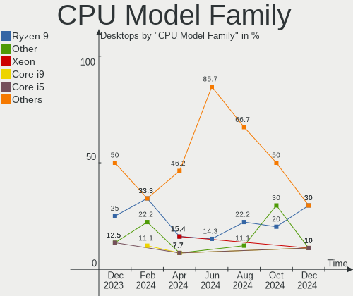

| Model                  | Desktops | Percent |
|------------------------|----------|---------|
| Intel Core i7          | 7        | 41.18%  |
| Other                  | 3        | 17.65%  |
| AMD Ryzen 9            | 3        | 17.65%  |
| Intel Core i5          | 1        | 5.88%   |
| AMD Ryzen Threadripper | 1        | 5.88%   |
| AMD Ryzen 5            | 1        | 5.88%   |
| AMD Ryzen 3            | 1        | 5.88%   |

CPU Cores
---------

Number of processor cores

| Number | Desktops | Percent |
|--------|----------|---------|
| 4      | 6        | 35.29%  |
| 8      | 4        | 23.53%  |
| 16     | 3        | 17.65%  |
| 6      | 2        | 11.76%  |
| 64     | 1        | 5.88%   |
| 12     | 1        | 5.88%   |

CPU Sockets
-----------

Number of sockets

| Number | Desktops | Percent |
|--------|----------|---------|
| 1      | 17       | 100%    |

CPU Threads
-----------

Threads per core (Hyper-Threading)

| Number | Desktops | Percent |
|--------|----------|---------|
| 2      | 15       | 88.24%  |
| 1      | 2        | 11.76%  |

CPU Op-Modes
------------

CPU Operation Modes (32-bit, 64-bit)

| Op mode        | Desktops | Percent |
|----------------|----------|---------|
| 32-bit, 64-bit | 17       | 100%    |

CPU Microcode
-------------

Microcode number

| Number     | Desktops | Percent |
|------------|----------|---------|
| Unknown    | 7        | 41.18%  |
| 0x306a9    | 2        | 11.76%  |
| 0xa0655    | 1        | 5.88%   |
| 0x906ec    | 1        | 5.88%   |
| 0x906e9    | 1        | 5.88%   |
| 0x806ec    | 1        | 5.88%   |
| 0x0a601203 | 1        | 5.88%   |
| 0x0a20102b | 1        | 5.88%   |
| 0x08701021 | 1        | 5.88%   |
| 0x08101016 | 1        | 5.88%   |

CPU Microarch
-------------

Microarchitecture

| Name             | Desktops | Percent |
|------------------|----------|---------|
| KabyLake         | 3        | 17.65%  |
| Unknown          | 3        | 17.65%  |
| IvyBridge        | 2        | 11.76%  |
| Icelake          | 2        | 11.76%  |
| CometLake        | 2        | 11.76%  |
| Zen 3            | 1        | 5.88%   |
| Zen 2            | 1        | 5.88%   |
| Zen              | 1        | 5.88%   |
| Skylake          | 1        | 5.88%   |
| Alderlake Hybrid | 1        | 5.88%   |

Graphics
--------

GPU Vendor
----------

Vendors of graphics cards

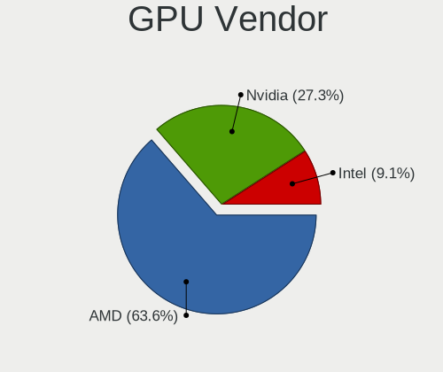

| Vendor | Desktops | Percent |
|--------|----------|---------|
| AMD    | 9        | 40.91%  |
| Nvidia | 7        | 31.82%  |
| Intel  | 6        | 27.27%  |

GPU Model
---------

Graphics card models

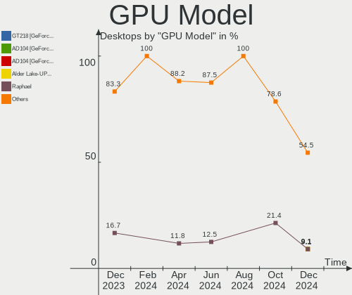

| Model                                                            | Desktops | Percent |
|------------------------------------------------------------------|----------|---------|
| Intel RocketLake-S GT1 [UHD Graphics 750]                        | 2        | 8.33%   |
| AMD Raphael                                                      | 2        | 8.33%   |
| Nvidia TU104 [GeForce RTX 2080 Rev. A]                           | 1        | 4.17%   |
| Nvidia GP107GL [Quadro P1000]                                    | 1        | 4.17%   |
| Nvidia GM204 [GeForce GTX 970]                                   | 1        | 4.17%   |
| Nvidia GK208B [GeForce GT 710]                                   | 1        | 4.17%   |
| Nvidia GF108GL [Quadro 600]                                      | 1        | 4.17%   |
| Nvidia GA107 [GeForce RTX 3050 8GB]                              | 1        | 4.17%   |
| Nvidia GA102 [GeForce RTX 3080 Lite Hash Rate]                   | 1        | 4.17%   |
| Intel IvyBridge GT2 [HD Graphics 4000]                           | 1        | 4.17%   |
| Intel HD Graphics 630                                            | 1        | 4.17%   |
| Intel DG2 [Arc A380]                                             | 1        | 4.17%   |
| Intel CometLake-U GT2 [UHD Graphics]                             | 1        | 4.17%   |
| Intel AlderLake-S GT1                                            | 1        | 4.17%   |
| AMD Raven Ridge [Radeon Vega Series / Radeon Vega Mobile Series] | 1        | 4.17%   |
| AMD Navi 33 [Radeon RX 7700S/7600/7600S/7600M XT/PRO W7600]      | 1        | 4.17%   |
| AMD Navi 32 [Radeon RX 7700 XT / 7800 XT]                        | 1        | 4.17%   |
| AMD Navi 23 [Radeon RX 6600/6600 XT/6600M]                       | 1        | 4.17%   |
| AMD Navi 22 [Radeon RX 6700/6700 XT/6750 XT / 6800M/6850M XT]    | 1        | 4.17%   |
| AMD Navi 21 [Radeon RX 6800/6800 XT / 6900 XT]                   | 1        | 4.17%   |
| AMD Navi 10 [Radeon RX 5600 OEM/5600 XT / 5700/5700 XT]          | 1        | 4.17%   |
| AMD Ellesmere [Radeon RX 470/480/570/570X/580/580X/590]          | 1        | 4.17%   |

GPU Combo
---------

Combinations of graphics cards

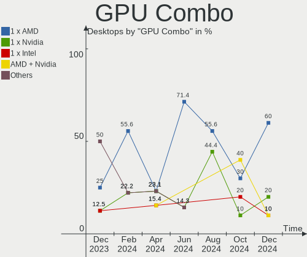

| Name            | Desktops | Percent |
|-----------------|----------|---------|
| 1 x AMD         | 6        | 35.29%  |
| 1 x Nvidia      | 4        | 23.53%  |
| Intel + Nvidia  | 2        | 11.76%  |
| 1 x Intel       | 2        | 11.76%  |
| 2 x AMD         | 1        | 5.88%   |
| Intel + 2 x AMD | 1        | 5.88%   |
| AMD + Nvidia    | 1        | 5.88%   |

GPU Driver
----------

Free vs proprietary

| Driver      | Desktops | Percent |
|-------------|----------|---------|
| Free        | 12       | 70.59%  |
| Proprietary | 4        | 23.53%  |
| Unknown     | 1        | 5.88%   |

GPU Memory
----------

Total video memory

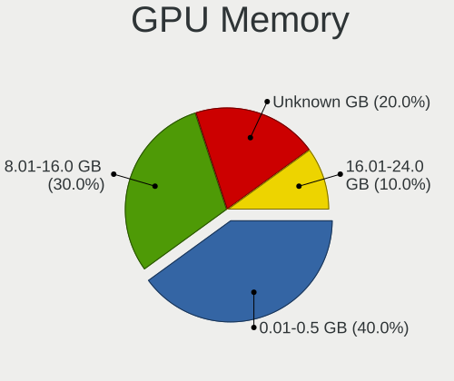

| Size in GB | Desktops | Percent |
|------------|----------|---------|
| Unknown    | 8        | 47.06%  |
| 8.01-16.0  | 3        | 17.65%  |
| 7.01-8.0   | 2        | 11.76%  |
| 1.01-2.0   | 2        | 11.76%  |
| 16.01-24.0 | 1        | 5.88%   |
| 0.01-0.5   | 1        | 5.88%   |

Monitor
-------

Monitor Vendor
--------------

Monitor vendors

| Vendor               | Desktops | Percent |
|----------------------|----------|---------|
| Samsung Electronics  | 3        | 16.67%  |
| Acer                 | 3        | 16.67%  |
| Goldstar             | 2        | 11.11%  |
| Dell                 | 2        | 11.11%  |
| BenQ                 | 2        | 11.11%  |
| Ancor Communications | 2        | 11.11%  |
| Insignia             | 1        | 5.56%   |
| Hitachi              | 1        | 5.56%   |
| Hewlett-Packard      | 1        | 5.56%   |
| ASUSTek Computer     | 1        | 5.56%   |

Monitor Model
-------------

Monitor models

| Model                                                                  | Desktops | Percent |
|------------------------------------------------------------------------|----------|---------|
| Samsung Electronics SMT27A550 SAM07B8 1920x1080 598x336mm 27.0-inch    | 1        | 5%      |
| Samsung Electronics LS49A950U SAM71CC 3840x1080 1192x336mm 48.8-inch   | 1        | 5%      |
| Samsung Electronics LCD Monitor SAM0D3B 3840x2160 1020x570mm 46.0-inch | 1        | 5%      |
| Insignia NS-32F202NA22 BBY3292 1920x1080 697x392mm 31.5-inch           | 1        | 5%      |
| Hitachi HISENSE HEC0030 3840x2160 1872x1053mm 84.6-inch                | 1        | 5%      |
| Hewlett-Packard 24o HPN337C 1920x1080 531x299mm 24.0-inch              | 1        | 5%      |
| Goldstar SDQHD GSM5BF5 2560x2880 465x523mm 27.6-inch                   | 1        | 5%      |
| Goldstar QHD GSM772A 2560x1440 697x392mm 31.5-inch                     | 1        | 5%      |
| Goldstar HDR WQHD GSM772E 3440x1440 800x335mm 34.1-inch                | 1        | 5%      |
| Dell S2721DS DELA19C 2560x1440 597x336mm 27.0-inch                     | 1        | 5%      |
| Dell 1907FP DEL4015 1280x1024 376x301mm 19.0-inch                      | 1        | 5%      |
| BenQ GW2780 BNQ78E6 1920x1080 598x336mm 27.0-inch                      | 1        | 5%      |
| BenQ GW2480 BNQ78E7 1920x1080 527x296mm 23.8-inch                      | 1        | 5%      |
| BenQ BL2480 BNQ802C 1920x1080 527x296mm 23.8-inch                      | 1        | 5%      |
| ASUSTek Computer MG248 AUS24A4 1920x1080 531x299mm 24.0-inch           | 1        | 5%      |
| Ancor Communications ASUS VX279 ACI27E4 1920x1080 598x336mm 27.0-inch  | 1        | 5%      |
| Ancor Communications ASUS PB278 ACI27A3 2560x1440 597x336mm 27.0-inch  | 1        | 5%      |
| Acer XZ322QU ACR073A 2560x1440 697x392mm 31.5-inch                     | 1        | 5%      |
| Acer P215H ACR00E5 1920x1080 477x268mm 21.5-inch                       | 1        | 5%      |
| Acer G257HU ACR0416 2560x1440 552x311mm 24.9-inch                      | 1        | 5%      |

Monitor Resolution
------------------

Monitor screen resolution

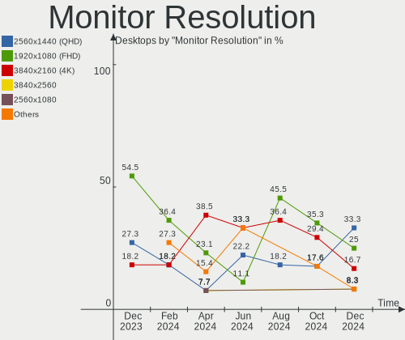

| Resolution       | Desktops | Percent |
|------------------|----------|---------|
| 1920x1080 (FHD)  | 8        | 42.11%  |
| 2560x1440 (QHD)  | 5        | 26.32%  |
| 3840x2160 (4K)   | 3        | 15.79%  |
| 3840x1080        | 1        | 5.26%   |
| 2560x2880        | 1        | 5.26%   |
| 1280x1024 (SXGA) | 1        | 5.26%   |

Monitor Diagonal
----------------

Diagonal size in inches

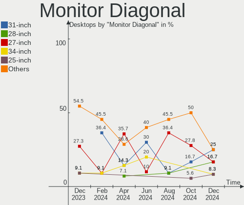

| Inches | Desktops | Percent |
|--------|----------|---------|
| 27     | 6        | 31.58%  |
| 24     | 4        | 21.05%  |
| 31     | 3        | 15.79%  |
| 84     | 2        | 10.53%  |
| 48     | 1        | 5.26%   |
| 34     | 1        | 5.26%   |
| 21     | 1        | 5.26%   |
| 19     | 1        | 5.26%   |

Monitor Width
-------------

Physical width

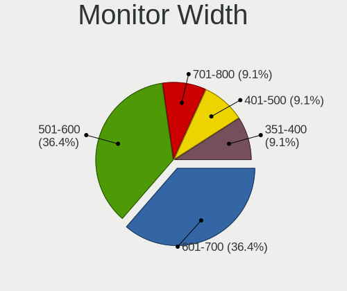

| Width in mm | Desktops | Percent |
|-------------|----------|---------|
| 501-600     | 8        | 42.11%  |
| 601-700     | 4        | 21.05%  |
| 401-500     | 2        | 10.53%  |
| 1501-2000   | 2        | 10.53%  |
| 701-800     | 1        | 5.26%   |
| 351-400     | 1        | 5.26%   |
| 1001-1500   | 1        | 5.26%   |

Aspect Ratio
------------

Proportional relationship between the width and the height

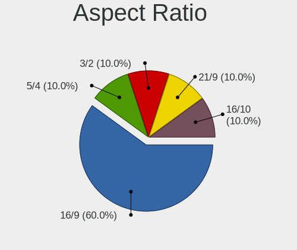

| Ratio | Desktops | Percent |
|-------|----------|---------|
| 16/9  | 13       | 76.47%  |
| 5/4   | 1        | 5.88%   |
| 32/9  | 1        | 5.88%   |
| 21/9  | 1        | 5.88%   |
| 0.89  | 1        | 5.88%   |

Monitor Area
------------

Area in inch²

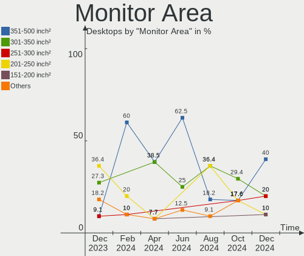

| Area in inch² | Desktops | Percent |
|----------------|----------|---------|
| 301-350        | 5        | 27.78%  |
| 351-500        | 4        | 22.22%  |
| 201-250        | 3        | 16.67%  |
| More than 1000 | 2        | 11.11%  |
| 151-200        | 2        | 11.11%  |
| 251-300        | 1        | 5.56%   |
| 501-1000       | 1        | 5.56%   |

Pixel Density
-------------

Pixels per inch

| Density | Desktops | Percent |
|---------|----------|---------|
| 51-100  | 11       | 64.71%  |
| 101-120 | 5        | 29.41%  |
| 121-160 | 1        | 5.88%   |

Multiple Monitors
-----------------

Total monitors connected

| Total | Desktops | Percent |
|-------|----------|---------|
| 1     | 11       | 64.71%  |
| 2     | 3        | 17.65%  |
| 0     | 2        | 11.76%  |
| 3     | 1        | 5.88%   |

Network
-------

Net Controller Vendor
---------------------

Controller vendors

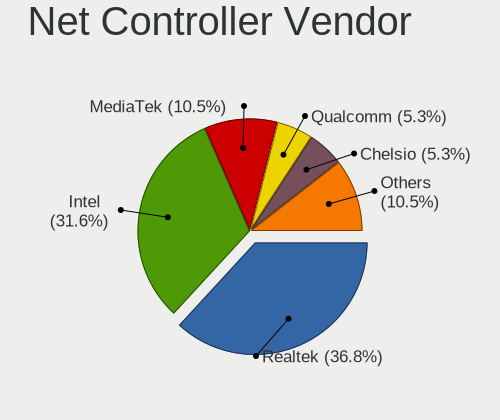

| Vendor                | Desktops | Percent |
|-----------------------|----------|---------|
| Intel                 | 12       | 46.15%  |
| Realtek Semiconductor | 9        | 34.62%  |
| MediaTek              | 2        | 7.69%   |
| Aquantia              | 2        | 7.69%   |
| D-Link System         | 1        | 3.85%   |

Net Controller Model
--------------------

Controller models

| Model                                                                             | Desktops | Percent |
|-----------------------------------------------------------------------------------|----------|---------|
| Realtek RTL8111/8168/8211/8411 PCI Express Gigabit Ethernet Controller            | 4        | 13.79%  |
| Realtek RTL8153 Gigabit Ethernet Adapter                                          | 2        | 6.9%    |
| Realtek RTL8125 2.5GbE Controller                                                 | 2        | 6.9%    |
| MediaTek MT7922 802.11ax PCI Express Wireless Network Adapter                     | 2        | 6.9%    |
| Intel Ethernet Connection (2) I219-V                                              | 2        | 6.9%    |
| Realtek RTL8111/8168/8411 PCI Express Gigabit Ethernet Controller                 | 1        | 3.45%   |
| Intel Wireless 8260                                                               | 1        | 3.45%   |
| Intel Wi-Fi 6E(802.11ax) AX210/AX1675* 2x2 [Typhoon Peak]                         | 1        | 3.45%   |
| Intel I211 Gigabit Network Connection                                             | 1        | 3.45%   |
| Intel Ethernet Controller I226-LM                                                 | 1        | 3.45%   |
| Intel Ethernet Controller I225-V                                                  | 1        | 3.45%   |
| Intel Ethernet Connection (7) I219-V                                              | 1        | 3.45%   |
| Intel Ethernet Connection (6) I219-V                                              | 1        | 3.45%   |
| Intel Ethernet Connection (14) I219-V                                             | 1        | 3.45%   |
| Intel Ethernet Connection (14) I219-LM                                            | 1        | 3.45%   |
| Intel Ethernet Connection (11) I219-V                                             | 1        | 3.45%   |
| Intel Comet Lake PCH-LP CNVi WiFi                                                 | 1        | 3.45%   |
| Intel Comet Lake PCH CNVi WiFi                                                    | 1        | 3.45%   |
| Intel 82579LM Gigabit Network Connection (Lewisville)                             | 1        | 3.45%   |
| D-Link System DGE-528T Gigabit Ethernet Adapter                                   | 1        | 3.45%   |
| Aquantia AQtion AQC113 NBase-T/IEEE 802.3an Ethernet Controller [Antigua 10G]     | 1        | 3.45%   |
| Aquantia AQC113C NBase-T/IEEE 802.3an Ethernet Controller [Marvell Scalable mGig] | 1        | 3.45%   |

Wireless Vendor
---------------

Wireless vendors

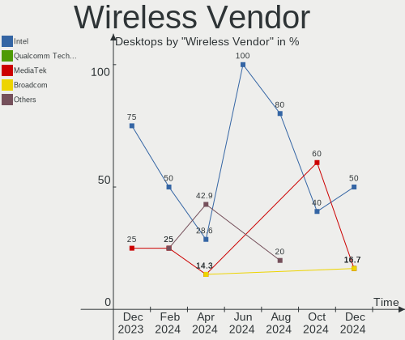

| Vendor   | Desktops | Percent |
|----------|----------|---------|
| Intel    | 4        | 66.67%  |
| MediaTek | 2        | 33.33%  |

Wireless Model
--------------

Wireless models

| Model                                                         | Desktops | Percent |
|---------------------------------------------------------------|----------|---------|
| MediaTek MT7922 802.11ax PCI Express Wireless Network Adapter | 2        | 33.33%  |
| Intel Wireless 8260                                           | 1        | 16.67%  |
| Intel Wi-Fi 6E(802.11ax) AX210/AX1675* 2x2 [Typhoon Peak]     | 1        | 16.67%  |
| Intel Comet Lake PCH-LP CNVi WiFi                             | 1        | 16.67%  |
| Intel Comet Lake PCH CNVi WiFi                                | 1        | 16.67%  |

Ethernet Vendor
---------------

Ethernet vendors

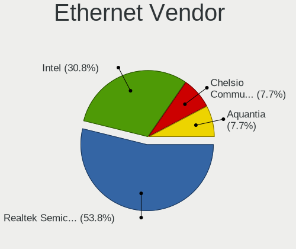

| Vendor                | Desktops | Percent |
|-----------------------|----------|---------|
| Intel                 | 11       | 47.83%  |
| Realtek Semiconductor | 9        | 39.13%  |
| Aquantia              | 2        | 8.7%    |
| D-Link System         | 1        | 4.35%   |

Ethernet Model
--------------

Ethernet models

| Model                                                                             | Desktops | Percent |
|-----------------------------------------------------------------------------------|----------|---------|
| Realtek RTL8111/8168/8211/8411 PCI Express Gigabit Ethernet Controller            | 4        | 17.39%  |
| Realtek RTL8153 Gigabit Ethernet Adapter                                          | 2        | 8.7%    |
| Realtek RTL8125 2.5GbE Controller                                                 | 2        | 8.7%    |
| Intel Ethernet Connection (2) I219-V                                              | 2        | 8.7%    |
| Realtek RTL8111/8168/8411 PCI Express Gigabit Ethernet Controller                 | 1        | 4.35%   |
| Intel I211 Gigabit Network Connection                                             | 1        | 4.35%   |
| Intel Ethernet Controller I226-LM                                                 | 1        | 4.35%   |
| Intel Ethernet Controller I225-V                                                  | 1        | 4.35%   |
| Intel Ethernet Connection (7) I219-V                                              | 1        | 4.35%   |
| Intel Ethernet Connection (6) I219-V                                              | 1        | 4.35%   |
| Intel Ethernet Connection (14) I219-V                                             | 1        | 4.35%   |
| Intel Ethernet Connection (14) I219-LM                                            | 1        | 4.35%   |
| Intel Ethernet Connection (11) I219-V                                             | 1        | 4.35%   |
| Intel 82579LM Gigabit Network Connection (Lewisville)                             | 1        | 4.35%   |
| D-Link System DGE-528T Gigabit Ethernet Adapter                                   | 1        | 4.35%   |
| Aquantia AQtion AQC113 NBase-T/IEEE 802.3an Ethernet Controller [Antigua 10G]     | 1        | 4.35%   |
| Aquantia AQC113C NBase-T/IEEE 802.3an Ethernet Controller [Marvell Scalable mGig] | 1        | 4.35%   |

Net Controller Kind
-------------------

Ethernet, WiFi or modem

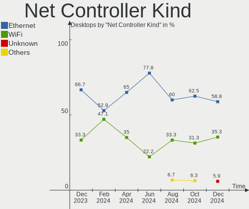

| Kind     | Desktops | Percent |
|----------|----------|---------|
| Ethernet | 17       | 73.91%  |
| WiFi     | 6        | 26.09%  |

Used Controller
---------------

Currently used network controller

| Kind     | Desktops | Percent |
|----------|----------|---------|
| Ethernet | 17       | 94.44%  |
| WiFi     | 1        | 5.56%   |

NICs
----

Total network controllers on board

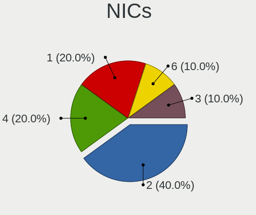

| Total | Desktops | Percent |
|-------|----------|---------|
| 2     | 8        | 47.06%  |
| 1     | 8        | 47.06%  |
| 3     | 1        | 5.88%   |

IPv6
----

IPv6 vs IPv4

| Used | Desktops | Percent |
|------|----------|---------|
| No   | 12       | 70.59%  |
| Yes  | 5        | 29.41%  |

Bluetooth
---------

Bluetooth Vendor
----------------

Controller vendors

| Vendor                  | Desktops | Percent |
|-------------------------|----------|---------|
| Intel                   | 4        | 40%     |
| Realtek Semiconductor   | 1        | 10%     |
| IMC Networks            | 1        | 10%     |
| Foxconn / Hon Hai       | 1        | 10%     |
| Cambridge Silicon Radio | 1        | 10%     |
| Belkin Components       | 1        | 10%     |
| ASUSTek Computer        | 1        | 10%     |

Bluetooth Model
---------------

Controller models

| Model                                                 | Desktops | Percent |
|-------------------------------------------------------|----------|---------|
| Realtek Bluetooth Radio                               | 1        | 10%     |
| Intel Bluetooth wireless interface                    | 1        | 10%     |
| Intel Bluetooth 9460/9560 Jefferson Peak (JfP)        | 1        | 10%     |
| Intel AX210 Bluetooth                                 | 1        | 10%     |
| Intel AX201 Bluetooth                                 | 1        | 10%     |
| IMC Networks Wireless_Device                          | 1        | 10%     |
| Foxconn / Hon Hai Wireless_Device                     | 1        | 10%     |
| Cambridge Silicon Radio Bluetooth Dongle (HCI mode)   | 1        | 10%     |
| Belkin Components F8T065BF Mini Bluetooth 4.0 Adapter | 1        | 10%     |
| ASUS ASUS USB-BT500                                   | 1        | 10%     |

Sound
-----

Sound Vendor
------------

Sound card vendors

| Vendor              | Desktops | Percent |
|---------------------|----------|---------|
| Intel               | 11       | 28.95%  |
| AMD                 | 9        | 23.68%  |
| Nvidia              | 7        | 18.42%  |
| RODE Microphones    | 3        | 7.89%   |
| SteelSeries ApS     | 1        | 2.63%   |
| Schiit Audio        | 1        | 2.63%   |
| Razer USA           | 1        | 2.63%   |
| Logitech            | 1        | 2.63%   |
| Focusrite-Novation  | 1        | 2.63%   |
| C-Media Electronics | 1        | 2.63%   |
| Blue Microphones    | 1        | 2.63%   |
| ASUSTek Computer    | 1        | 2.63%   |

Sound Model
-----------

Sound card models

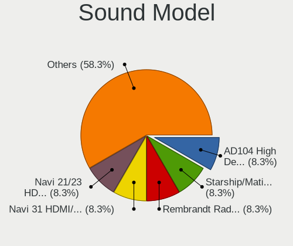

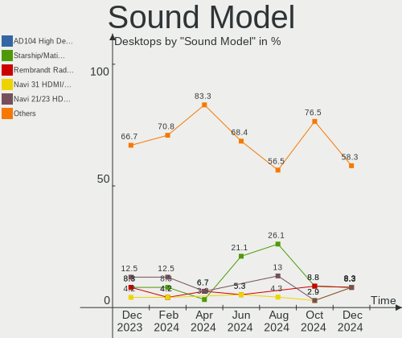

| Model                                                               | Desktops | Percent |
|---------------------------------------------------------------------|----------|---------|
| AMD Navi 21/23 HDMI/DP Audio Controller                             | 3        | 6.67%   |
| AMD Family 17h/19h HD Audio Controller                              | 3        | 6.67%   |
| Intel Tiger Lake-H HD Audio Controller                              | 2        | 4.44%   |
| Intel 7 Series/C216 Chipset Family High Definition Audio Controller | 2        | 4.44%   |
| AMD Rembrandt Radeon High Definition Audio Controller               | 2        | 4.44%   |
| AMD Navi 31 HDMI/DP Audio                                           | 2        | 4.44%   |
| SteelSeries ApS Arctis 7+                                           | 1        | 2.22%   |
| Schiit Audio Schiit Modi 3+                                         | 1        | 2.22%   |
| RODE Microphones RODE NT-USB Mini                                   | 1        | 2.22%   |
| RODE Microphones RODE NT-USB                                        | 1        | 2.22%   |
| RODE Microphones RODE AI-1                                          | 1        | 2.22%   |
| Razer USA RZ19-0229 Gaming Microphone                               | 1        | 2.22%   |
| Nvidia TU104 HD Audio Controller                                    | 1        | 2.22%   |
| Nvidia GP107GL High Definition Audio Controller                     | 1        | 2.22%   |
| Nvidia GM204 High Definition Audio Controller                       | 1        | 2.22%   |
| Nvidia GK208 HDMI/DP Audio Controller                               | 1        | 2.22%   |
| Nvidia GF108 High Definition Audio Controller                       | 1        | 2.22%   |
| Nvidia GA102 High Definition Audio Controller                       | 1        | 2.22%   |
| Nvidia Audio device                                                 | 1        | 2.22%   |
| Logitech Logi USB Headset                                           | 1        | 2.22%   |
| Intel DG2 Audio Controller                                          | 1        | 2.22%   |
| Intel Comet Lake PCH-V cAVS                                         | 1        | 2.22%   |
| Intel Comet Lake PCH-LP cAVS                                        | 1        | 2.22%   |
| Intel Comet Lake PCH cAVS                                           | 1        | 2.22%   |
| Intel Cannon Lake PCH cAVS                                          | 1        | 2.22%   |
| Intel Alder Lake-S HD Audio Controller                              | 1        | 2.22%   |
| Intel 200 Series PCH HD Audio                                       | 1        | 2.22%   |
| Intel 100 Series/C230 Series Chipset Family HD Audio Controller     | 1        | 2.22%   |
| Focusrite-Novation Scarlett 2i2 3rd Gen                             | 1        | 2.22%   |
| C-Media Electronics CM108 Audio Controller                          | 1        | 2.22%   |
| Blue Microphones Yeti Stereo Microphone                             | 1        | 2.22%   |
| ASUSTek Computer XONAR SOUND CARD                                   | 1        | 2.22%   |
| AMD Starship/Matisse HD Audio Controller                            | 1        | 2.22%   |
| AMD Raven/Raven2/Fenghuang HDMI/DP Audio Controller                 | 1        | 2.22%   |
| AMD Navi 10 HDMI Audio                                              | 1        | 2.22%   |
| AMD Genoa HD Audio Controller                                       | 1        | 2.22%   |
| AMD Ellesmere HDMI Audio [Radeon RX 470/480 / 570/580/590]          | 1        | 2.22%   |

Memory
------

Memory Vendor
-------------

Memory module vendors

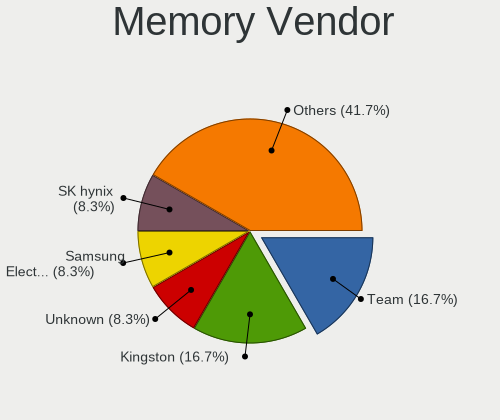

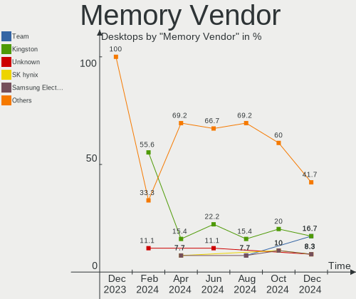

| Vendor              | Desktops | Percent |
|---------------------|----------|---------|
| Corsair             | 6        | 35.29%  |
| Kingston            | 4        | 23.53%  |
| SK hynix            | 2        | 11.76%  |
| Samsung Electronics | 2        | 11.76%  |
| Transcend           | 1        | 5.88%   |
| Patriot             | 1        | 5.88%   |
| A-DATA Technology   | 1        | 5.88%   |

Memory Model
------------

Memory module models

| Model                                                   | Desktops | Percent |
|---------------------------------------------------------|----------|---------|
| Corsair RAM CMK16GX4M2B3000C15 8GB DIMM DDR4 3533MT/s   | 3        | 16.67%  |
| Transcend RAM JM4800ALE-16G 16GB DIMM DDR5 4800MT/s     | 1        | 5.56%   |
| SK hynix RAM HMT351U6EFR8C-PB 4096MB DIMM DDR3 1800MT/s | 1        | 5.56%   |
| SK hynix RAM HMAA2GU6CJR8N-XN 16GB DIMM DDR4 3200MT/s   | 1        | 5.56%   |
| Samsung RAM M471A1K43CB1-CTD 8GB SODIMM DDR4 2667MT/s   | 1        | 5.56%   |
| Samsung RAM M391A2K43BB1-CTD 16GB DIMM DDR4 3600MT/s    | 1        | 5.56%   |
| Patriot RAM 3400 C16 Series 8GB DIMM DDR4 3200MT/s      | 1        | 5.56%   |
| Kingston RAM KF552C40-32 32GB DIMM DDR5 5200MT/s        | 1        | 5.56%   |
| Kingston RAM KF2666C16D4/32GX 32GB DIMM DDR4 2667MT/s   | 1        | 5.56%   |
| Kingston RAM 9965788-052.A00G 64GB DIMM DDR5 5600MT/s   | 1        | 5.56%   |
| Kingston RAM 9905625-066.A00G 16GB DIMM DDR4 2667MT/s   | 1        | 5.56%   |
| Corsair RAM CML8GX3M2A1600C9 4GB DIMM DDR3 1867MT/s     | 1        | 5.56%   |
| Corsair RAM CML16GX3M2A1600C10 8GB DIMM DDR3 1600MT/s   | 1        | 5.56%   |
| Corsair RAM CMK16GX4M2A2400C16 8GB DIMM DDR4 2933MT/s   | 1        | 5.56%   |
| Corsair RAM CMK16GX4M1D3000C16 16GB DIMM DDR4 3000MT/s  | 1        | 5.56%   |
| A-DATA RAM AX5U6400C3232G-BLABK 32GB DIMM DDR5 3600MT/s | 1        | 5.56%   |

Memory Kind
-----------

Memory module kinds

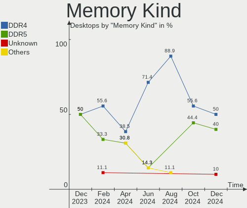

| Kind | Desktops | Percent |
|------|----------|---------|
| DDR4 | 11       | 64.71%  |
| DDR5 | 4        | 23.53%  |
| DDR3 | 2        | 11.76%  |

Memory Form Factor
------------------

Physical design of the memory module

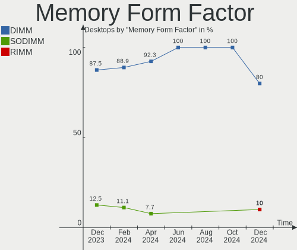

| Name   | Desktops | Percent |
|--------|----------|---------|
| DIMM   | 16       | 94.12%  |
| SODIMM | 1        | 5.88%   |

Memory Size
-----------

Memory module size

| Size  | Desktops | Percent |
|-------|----------|---------|
| 8192  | 7        | 38.89%  |
| 16384 | 5        | 27.78%  |
| 32768 | 3        | 16.67%  |
| 4096  | 2        | 11.11%  |
| 65536 | 1        | 5.56%   |

Memory Speed
------------

Memory module speed

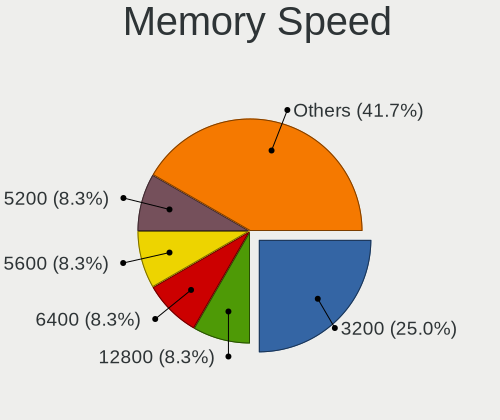

| Speed | Desktops | Percent |
|-------|----------|---------|
| 3533  | 3        | 16.67%  |
| 2667  | 3        | 16.67%  |
| 3600  | 2        | 11.11%  |
| 3200  | 2        | 11.11%  |
| 5600  | 1        | 5.56%   |
| 5200  | 1        | 5.56%   |
| 4800  | 1        | 5.56%   |
| 3000  | 1        | 5.56%   |
| 2933  | 1        | 5.56%   |
| 1867  | 1        | 5.56%   |
| 1800  | 1        | 5.56%   |
| 1600  | 1        | 5.56%   |

Printers & scanners
-------------------

Printer Vendor
--------------

Printer device vendors

Zero info for selected period =(

Printer Model
-------------

Printer device models

Zero info for selected period =(

Scanner Vendor
--------------

Scanner device vendors

Zero info for selected period =(

Scanner Model
-------------

Scanner device models

Zero info for selected period =(

Camera
------

Camera Vendor
-------------

Camera device vendors

| Vendor       | Desktops | Percent |
|--------------|----------|---------|
| Logitech     | 4        | 66.67%  |
| Razer USA    | 1        | 16.67%  |
| MacroSilicon | 1        | 16.67%  |

Camera Model
------------

Camera device models

| Model                           | Desktops | Percent |
|---------------------------------|----------|---------|
| Razer USA Razer Kiyo Pro        | 1        | 16.67%  |
| MacroSilicon USB3. 0 capture    | 1        | 16.67%  |
| Logitech Webcam C930e           | 1        | 16.67%  |
| Logitech Webcam C270            | 1        | 16.67%  |
| Logitech C922 Pro Stream Webcam | 1        | 16.67%  |
| Logitech C920 PRO HD Webcam     | 1        | 16.67%  |

Security
--------

Fingerprint Vendor
------------------

Fingerprint sensor vendors

Zero info for selected period =(

Fingerprint Model
-----------------

Fingerprint sensor models

Zero info for selected period =(

Chipcard Vendor
---------------

Chipcard module vendors

| Vendor           | Desktops | Percent |
|------------------|----------|---------|
| SCM Microsystems | 1        | 100%    |

Chipcard Model
--------------

Chipcard module models

| Model                                                  | Desktops | Percent |
|--------------------------------------------------------|----------|---------|
| SCM Microsystems SCR331-LC1 / SCR3310 SmartCard Reader | 1        | 100%    |

Unsupported
-----------

Unsupported Devices
-------------------

Total unsupported devices on board

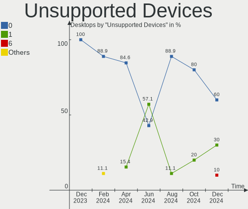

| Total | Desktops | Percent |
|-------|----------|---------|
| 0     | 11       | 64.71%  |
| 1     | 5        | 29.41%  |
| 2     | 1        | 5.88%   |

Unsupported Device Types
------------------------

Types of unsupported devices

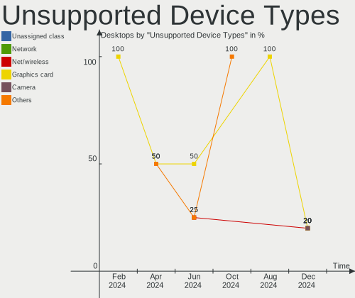

| Type          | Desktops | Percent |
|---------------|----------|---------|
| Graphics card | 4        | 66.67%  |
| Net/ethernet  | 1        | 16.67%  |
| Chipcard      | 1        | 16.67%  |

