NixOS - Hardware Trends (Notebooks)
-----------------------------------

A project to identify most popular hardware characteristics and track their change
over time based on data collected by Linux users at https://Linux-Hardware.org.

Anyone can contribute to this report by the [hw-probe](https://github.com/linuxhw/hw-probe) tool:

    sudo -E hw-probe -all -upload

This report is for one last month. Overall report since the beginning of time: [TestDays](https://github.com/linuxhw/TestDays)

Period: Dec, 2025.

Contents
--------

* [ System ](#system)
  - [ OS                       ](#os)
  - [ OS Family                ](#os-family)
  - [ Kernel                   ](#kernel)
  - [ Kernel Family            ](#kernel-family)
  - [ Kernel Major Ver.        ](#kernel-major-ver)
  - [ Arch                     ](#arch)
  - [ DE                       ](#de)
  - [ Display Server           ](#display-server)
  - [ Display Manager          ](#display-manager)
  - [ OS Lang                  ](#os-lang)
  - [ Boot Mode                ](#boot-mode)
  - [ Filesystem               ](#filesystem)
  - [ Part. scheme             ](#part-scheme)
  - [ Dual Boot with Linux/BSD ](#dual-boot-with-linuxbsd)
  - [ Dual Boot (Win)          ](#dual-boot-win)

* [ Board ](#board)
  - [ Vendor                   ](#vendor)
  - [ Model                    ](#model)
  - [ Model Family             ](#model-family)
  - [ MFG Year                 ](#mfg-year)
  - [ Form Factor              ](#form-factor)
  - [ Secure Boot              ](#secure-boot)
  - [ Coreboot                 ](#coreboot)
  - [ RAM Size                 ](#ram-size)
  - [ RAM Used                 ](#ram-used)
  - [ Total Drives             ](#total-drives)
  - [ Has CD-ROM               ](#has-cd-rom)
  - [ Has Ethernet             ](#has-ethernet)
  - [ Has WiFi                 ](#has-wifi)
  - [ Has Bluetooth            ](#has-bluetooth)

* [ Location ](#location)
  - [ Country                  ](#country)
  - [ City                     ](#city)

* [ Drives ](#drives)
  - [ Drive Vendor             ](#drive-vendor)
  - [ Drive Model              ](#drive-model)
  - [ HDD Vendor               ](#hdd-vendor)
  - [ SSD Vendor               ](#ssd-vendor)
  - [ Drive Kind               ](#drive-kind)
  - [ Drive Connector          ](#drive-connector)
  - [ Drive Size               ](#drive-size)
  - [ Space Total              ](#space-total)
  - [ Space Used               ](#space-used)
  - [ Malfunc. Drives          ](#malfunc-drives)
  - [ Malfunc. Drive Vendor    ](#malfunc-drive-vendor)
  - [ Malfunc. HDD Vendor      ](#malfunc-hdd-vendor)
  - [ Malfunc. Drive Kind      ](#malfunc-drive-kind)
  - [ Failed Drives            ](#failed-drives)
  - [ Failed Drive Vendor      ](#failed-drive-vendor)
  - [ Drive Status             ](#drive-status)

* [ Storage controller ](#storage-controller)
  - [ Storage Vendor           ](#storage-vendor)
  - [ Storage Model            ](#storage-model)
  - [ Storage Kind             ](#storage-kind)

* [ Processor ](#processor)
  - [ CPU Vendor               ](#cpu-vendor)
  - [ CPU Model                ](#cpu-model)
  - [ CPU Model Family         ](#cpu-model-family)
  - [ CPU Cores                ](#cpu-cores)
  - [ CPU Sockets              ](#cpu-sockets)
  - [ CPU Threads              ](#cpu-threads)
  - [ CPU Op-Modes             ](#cpu-op-modes)
  - [ CPU Microcode            ](#cpu-microcode)
  - [ CPU Microarch            ](#cpu-microarch)

* [ Graphics ](#graphics)
  - [ GPU Vendor               ](#gpu-vendor)
  - [ GPU Model                ](#gpu-model)
  - [ GPU Combo                ](#gpu-combo)
  - [ GPU Driver               ](#gpu-driver)
  - [ GPU Memory               ](#gpu-memory)

* [ Monitor ](#monitor)
  - [ Monitor Vendor           ](#monitor-vendor)
  - [ Monitor Model            ](#monitor-model)
  - [ Monitor Resolution       ](#monitor-resolution)
  - [ Monitor Diagonal         ](#monitor-diagonal)
  - [ Monitor Width            ](#monitor-width)
  - [ Aspect Ratio             ](#aspect-ratio)
  - [ Monitor Area             ](#monitor-area)
  - [ Pixel Density            ](#pixel-density)
  - [ Multiple Monitors        ](#multiple-monitors)

* [ Network ](#network)
  - [ Net Controller Vendor    ](#net-controller-vendor)
  - [ Net Controller Model     ](#net-controller-model)
  - [ Wireless Vendor          ](#wireless-vendor)
  - [ Wireless Model           ](#wireless-model)
  - [ Ethernet Vendor          ](#ethernet-vendor)
  - [ Ethernet Model           ](#ethernet-model)
  - [ Net Controller Kind      ](#net-controller-kind)
  - [ Used Controller          ](#used-controller)
  - [ NICs                     ](#nics)
  - [ IPv6                     ](#ipv6)

* [ Bluetooth ](#bluetooth)
  - [ Bluetooth Vendor         ](#bluetooth-vendor)
  - [ Bluetooth Model          ](#bluetooth-model)

* [ Sound ](#sound)
  - [ Sound Vendor             ](#sound-vendor)
  - [ Sound Model              ](#sound-model)

* [ Memory ](#memory)
  - [ Memory Vendor            ](#memory-vendor)
  - [ Memory Model             ](#memory-model)
  - [ Memory Kind              ](#memory-kind)
  - [ Memory Form Factor       ](#memory-form-factor)
  - [ Memory Size              ](#memory-size)
  - [ Memory Speed             ](#memory-speed)

* [ Printers & scanners ](#printers--scanners)
  - [ Printer Vendor           ](#printer-vendor)
  - [ Printer Model            ](#printer-model)
  - [ Scanner Vendor           ](#scanner-vendor)
  - [ Scanner Model            ](#scanner-model)

* [ Camera ](#camera)
  - [ Camera Vendor            ](#camera-vendor)
  - [ Camera Model             ](#camera-model)

* [ Security ](#security)
  - [ Fingerprint Vendor       ](#fingerprint-vendor)
  - [ Fingerprint Model        ](#fingerprint-model)
  - [ Chipcard Vendor          ](#chipcard-vendor)
  - [ Chipcard Model           ](#chipcard-model)

* [ Unsupported ](#unsupported)
  - [ Unsupported Devices      ](#unsupported-devices)
  - [ Unsupported Device Types ](#unsupported-device-types)

System
------

OS
--

Installed operating systems

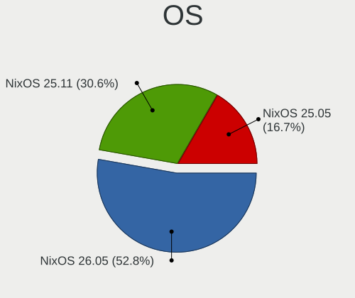

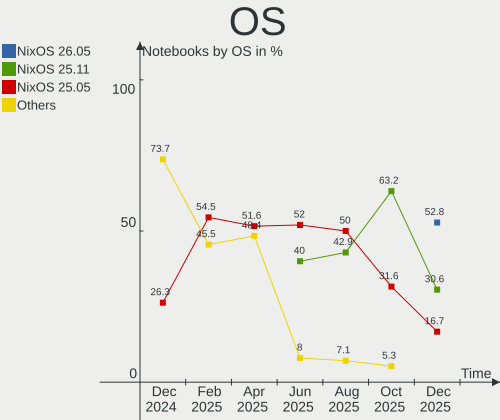

| Name        | Notebooks | Percent |
|-------------|-----------|---------|
| NixOS 26.05 | 19        | 52.78%  |
| NixOS 25.11 | 11        | 30.56%  |
| NixOS 25.05 | 6         | 16.67%  |

OS Family
---------

OS without a version

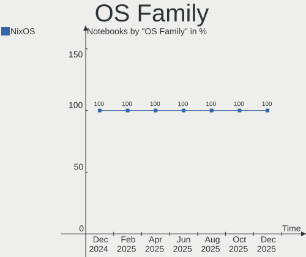

| Name  | Notebooks | Percent |
|-------|-----------|---------|
| NixOS | 36        | 100%    |

Kernel
------

Version of the Linux kernel

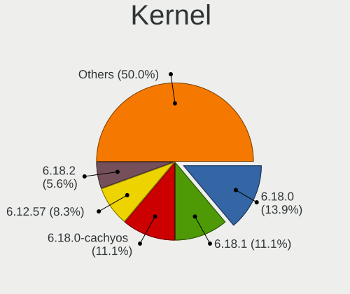

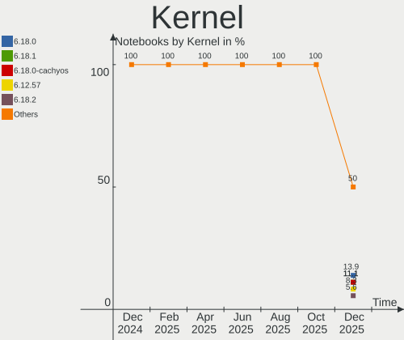

| Version        | Notebooks | Percent |
|----------------|-----------|---------|
| 6.18.0         | 5         | 13.89%  |
| 6.18.1         | 4         | 11.11%  |
| 6.18.0-cachyos | 4         | 11.11%  |
| 6.12.57        | 3         | 8.33%   |
| 6.18.2         | 2         | 5.56%   |
| 6.17.9         | 2         | 5.56%   |
| 6.12.58        | 2         | 5.56%   |
| 6.6.119        | 1         | 2.78%   |
| 6.17.9-zen1    | 1         | 2.78%   |
| 6.17.9-xanmod1 | 1         | 2.78%   |
| 6.17.7-zen1    | 1         | 2.78%   |
| 6.17.6         | 1         | 2.78%   |
| 6.17.5-cachyos | 1         | 2.78%   |
| 6.17.5         | 1         | 2.78%   |
| 6.17.4         | 1         | 2.78%   |
| 6.12.63        | 1         | 2.78%   |
| 6.12.62        | 1         | 2.78%   |
| 6.12.61        | 1         | 2.78%   |
| 6.12.60        | 1         | 2.78%   |
| 6.12.55        | 1         | 2.78%   |
| 6.1.159        | 1         | 2.78%   |

Kernel Family
-------------

Linux kernel without a distro release

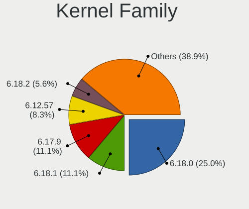

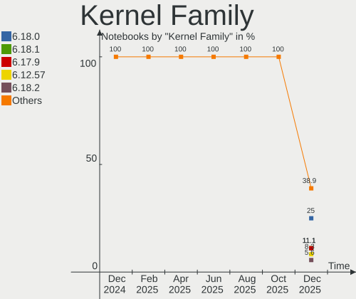

| Version | Notebooks | Percent |
|---------|-----------|---------|
| 6.18.0  | 9         | 25%     |
| 6.18.1  | 4         | 11.11%  |
| 6.17.9  | 4         | 11.11%  |
| 6.12.57 | 3         | 8.33%   |
| 6.18.2  | 2         | 5.56%   |
| 6.17.5  | 2         | 5.56%   |
| 6.12.58 | 2         | 5.56%   |
| 6.6.119 | 1         | 2.78%   |
| 6.17.7  | 1         | 2.78%   |
| 6.17.6  | 1         | 2.78%   |
| 6.17.4  | 1         | 2.78%   |
| 6.12.63 | 1         | 2.78%   |
| 6.12.62 | 1         | 2.78%   |
| 6.12.61 | 1         | 2.78%   |
| 6.12.60 | 1         | 2.78%   |
| 6.12.55 | 1         | 2.78%   |
| 6.1.159 | 1         | 2.78%   |

Kernel Major Ver.
-----------------

Linux kernel major version

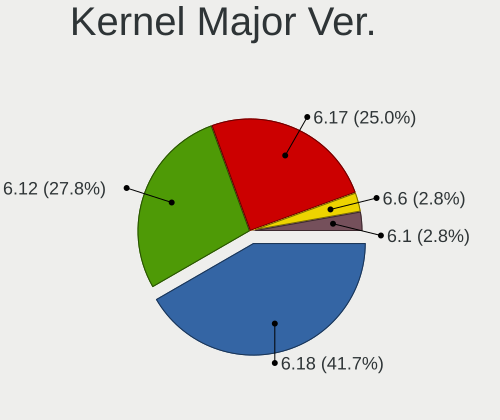

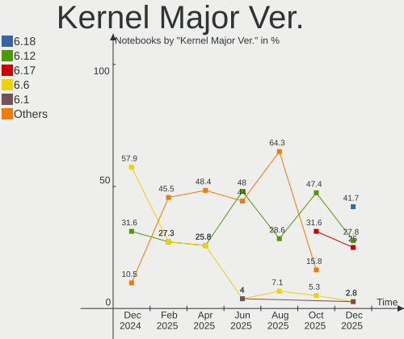

| Version | Notebooks | Percent |
|---------|-----------|---------|
| 6.18    | 15        | 41.67%  |
| 6.12    | 10        | 27.78%  |
| 6.17    | 9         | 25%     |
| 6.6     | 1         | 2.78%   |
| 6.1     | 1         | 2.78%   |

Arch
----

OS architecture (x86_64, i586, etc.)

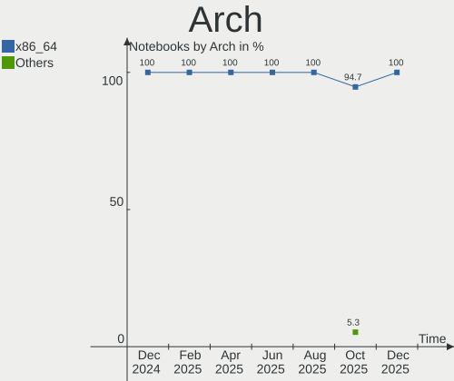

| Name   | Notebooks | Percent |
|--------|-----------|---------|
| x86_64 | 36        | 100%    |

DE
--

Desktop Environment

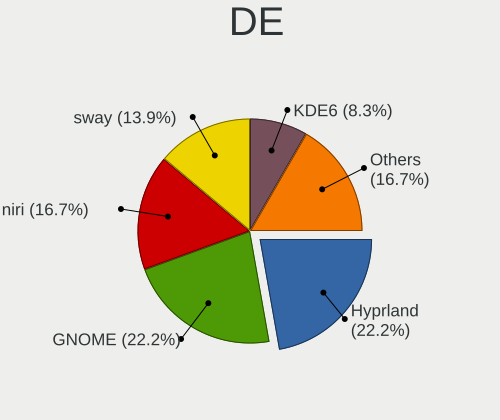

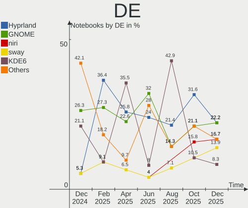

| Name     | Notebooks | Percent |
|----------|-----------|---------|
| Hyprland | 8         | 22.22%  |
| GNOME    | 8         | 22.22%  |
| niri     | 6         | 16.67%  |
| sway     | 5         | 13.89%  |
| KDE6     | 3         | 8.33%   |
| Unknown  | 3         | 8.33%   |
| KDE      | 2         | 5.56%   |
| XFCE     | 1         | 2.78%   |

Display Server
--------------

X11 or Wayland

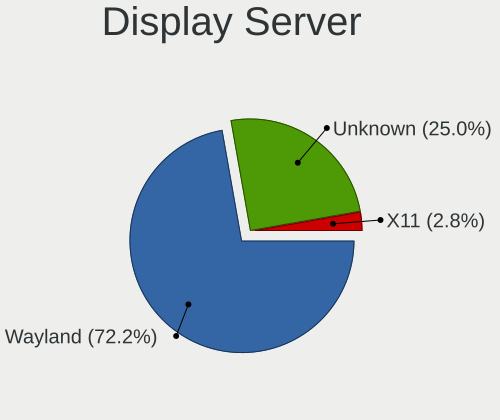

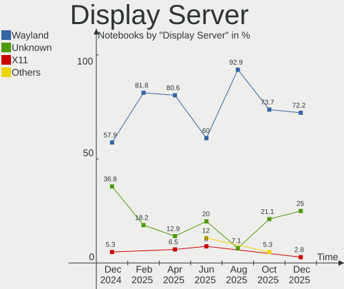

| Name    | Notebooks | Percent |
|---------|-----------|---------|
| Wayland | 26        | 72.22%  |
| Unknown | 9         | 25%     |
| X11     | 1         | 2.78%   |

Display Manager
---------------

SDDM, LightDM, etc.

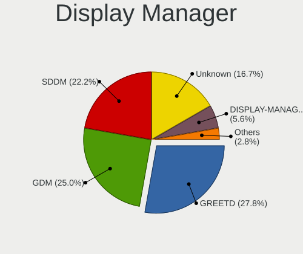

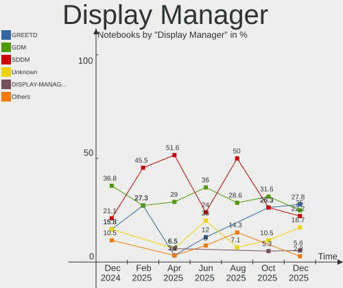

| Name                  | Notebooks | Percent |
|-----------------------|-----------|---------|
| GREETD                | 10        | 27.78%  |
| GDM                   | 9         | 25%     |
| SDDM                  | 8         | 22.22%  |
| Unknown               | 6         | 16.67%  |
| DISPLAY-MANAGER-START | 2         | 5.56%   |
| LightDM               | 1         | 2.78%   |

OS Lang
-------

Language

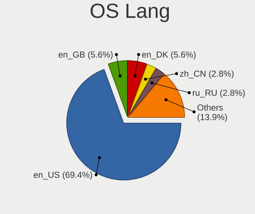

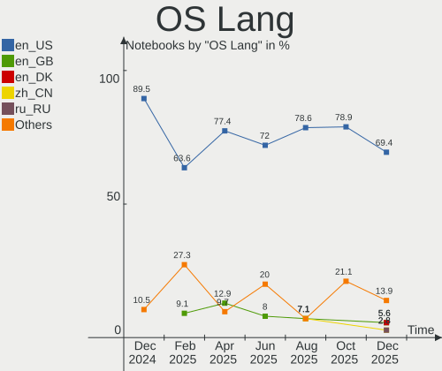

| Lang       | Notebooks | Percent |
|------------|-----------|---------|
| en_US      | 25        | 69.44%  |
| en_GB      | 2         | 5.56%   |
| en_DK      | 2         | 5.56%   |
| zh_CN      | 1         | 2.78%   |
| ru_RU      | 1         | 2.78%   |
| en_US.UTF8 | 1         | 2.78%   |
| en_NZ      | 1         | 2.78%   |
| en_CA      | 1         | 2.78%   |
| de_DE      | 1         | 2.78%   |
| cs_CZ      | 1         | 2.78%   |

Boot Mode
---------

EFI or BIOS

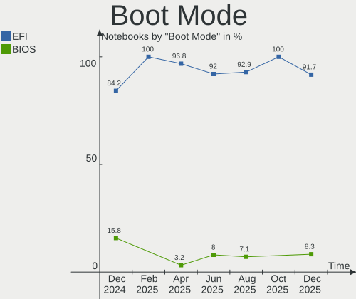

| Mode | Notebooks | Percent |
|------|-----------|---------|
| EFI  | 33        | 91.67%  |
| BIOS | 3         | 8.33%   |

Filesystem
----------

Type of filesystem

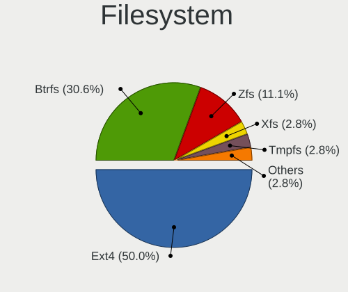

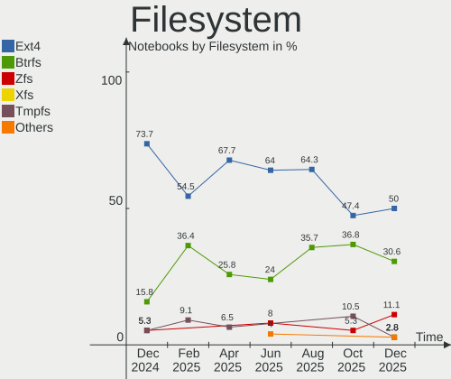

| Type     | Notebooks | Percent |
|----------|-----------|---------|
| Ext4     | 18        | 50%     |
| Btrfs    | 11        | 30.56%  |
| Zfs      | 4         | 11.11%  |
| Xfs      | 1         | 2.78%   |
| Tmpfs    | 1         | 2.78%   |
| Bcachefs | 1         | 2.78%   |

Part. scheme
------------

Scheme of partitioning

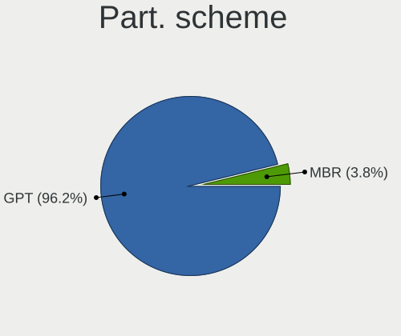

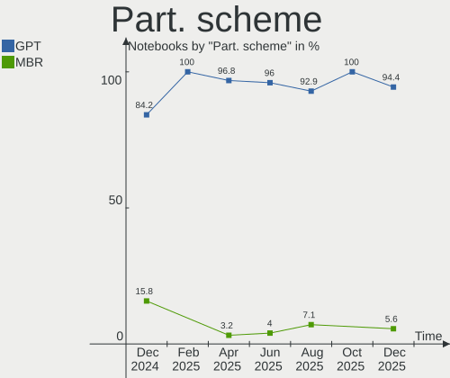

| Type | Notebooks | Percent |
|------|-----------|---------|
| GPT  | 34        | 94.44%  |
| MBR  | 2         | 5.56%   |

Dual Boot with Linux/BSD
------------------------

Hosting more than one Linux/BSD

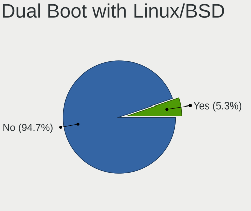

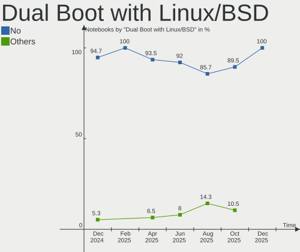

| Dual boot | Notebooks | Percent |
|-----------|-----------|---------|
| No        | 36        | 100%    |

Dual Boot (Win)
---------------

Hosting Linux and Windows

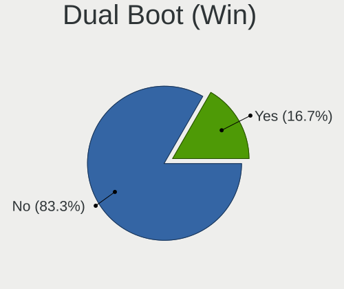

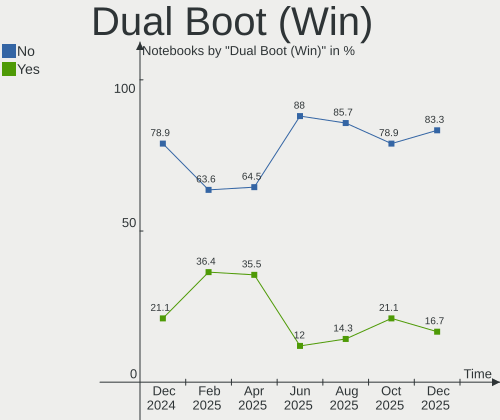

| Dual boot | Notebooks | Percent |
|-----------|-----------|---------|
| No        | 30        | 83.33%  |
| Yes       | 6         | 16.67%  |

Board
-----

Vendor
------

Motherboard manufacturer

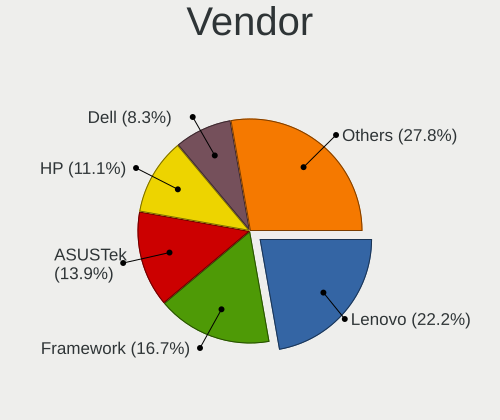

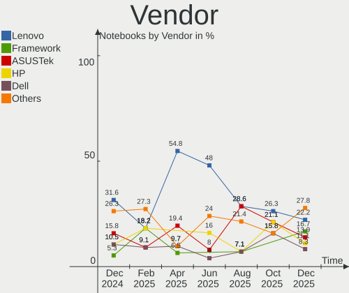

| Name                | Notebooks | Percent |
|---------------------|-----------|---------|
| Lenovo              | 8         | 22.22%  |
| Framework           | 6         | 16.67%  |
| ASUSTek Computer    | 5         | 13.89%  |
| Hewlett-Packard     | 4         | 11.11%  |
| Dell                | 3         | 8.33%   |
| Acer                | 3         | 8.33%   |
| HUAWEI              | 2         | 5.56%   |
| TUXEDO              | 1         | 2.78%   |
| Timi                | 1         | 2.78%   |
| Gigabyte Technology | 1         | 2.78%   |
| Apple               | 1         | 2.78%   |
| Alienware           | 1         | 2.78%   |

Model
-----

Motherboard model

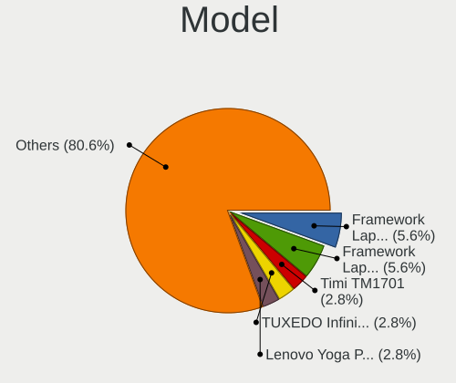

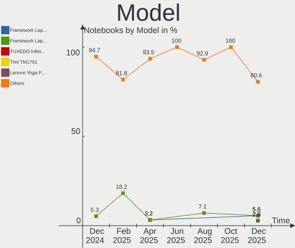

| Name                                          | Notebooks | Percent |
|-----------------------------------------------|-----------|---------|
| Framework Laptop 16 (AMD Ryzen 7040 Series)   | 2         | 5.56%   |
| Framework Laptop 13 (AMD Ryzen 7040Series)    | 2         | 5.56%   |
| TUXEDO InfinityBook Pro AMD Gen10             | 1         | 2.78%   |
| Timi TM1701                                   | 1         | 2.78%   |
| Lenovo Yoga Pro 7 14AKP10 83KG                | 1         | 2.78%   |
| Lenovo ThinkPad X250 20CLS78N00               | 1         | 2.78%   |
| Lenovo ThinkPad X1 Carbon Gen 13 21NS001ACD   | 1         | 2.78%   |
| Lenovo ThinkPad T580 20L9CTO1WW               | 1         | 2.78%   |
| Lenovo ThinkPad T490 20N3S64000               | 1         | 2.78%   |
| Lenovo ThinkPad T14 Gen 3 21CF0037MX          | 1         | 2.78%   |
| Lenovo ThinkPad P15v Gen 1 20TQCTO1WW         | 1         | 2.78%   |
| Lenovo ThinkBook 14 G7+ ASP 21Q4              | 1         | 2.78%   |
| HUAWEI MDF-XX                                 | 1         | 2.78%   |
| HUAWEI HVY-WXX9                               | 1         | 2.78%   |
| HP OmniBook Ultra Laptop 14-fd0xxx            | 1         | 2.78%   |
| HP OMEN by Gaming Laptop 16-n0xxx             | 1         | 2.78%   |
| HP ENVY TS 15                                 | 1         | 2.78%   |
| HP EliteBook 840 G3                           | 1         | 2.78%   |
| Gigabyte B550 AORUS ELITE V2                  | 1         | 2.78%   |
| Framework Laptop 13 (AMD Ryzen AI 300 Series) | 1         | 2.78%   |
| Framework Laptop (13th Gen Intel Core)        | 1         | 2.78%   |
| Dell XPS 9320                                 | 1         | 2.78%   |
| Dell XPS 15 9520                              | 1         | 2.78%   |
| Dell XPS 13 9360                              | 1         | 2.78%   |
| ASUS VivoBook_ASUSLaptop M1605YA_M1605YA      | 1         | 2.78%   |
| ASUS TUF Gaming A620M-PLUS WIFI               | 1         | 2.78%   |
| ASUS ROG Zephyrus G16 GU603VI_GU603VI         | 1         | 2.78%   |
| ASUS ASUS TUF Gaming A16 FA617NSR_FA617NSR    | 1         | 2.78%   |
| ASUS ASUS TUF Gaming A16 FA608PP_FA608PP      | 1         | 2.78%   |
| Apple MacBookAir9,1                           | 1         | 2.78%   |
| Alienware 16X Aurora AC16251                  | 1         | 2.78%   |
| Acer Nitro AN515-45                           | 1         | 2.78%   |
| Acer Aspire 7750ZG                            | 1         | 2.78%   |
| Acer AOD270                                   | 1         | 2.78%   |

Model Family
------------

Motherboard model prefix

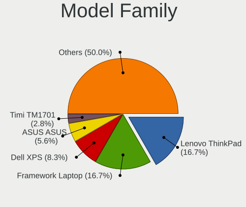

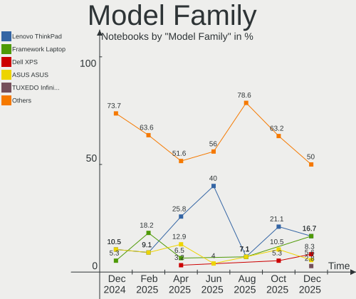

| Name                | Notebooks | Percent |
|---------------------|-----------|---------|
| Lenovo ThinkPad     | 6         | 16.67%  |
| Framework Laptop    | 6         | 16.67%  |
| Dell XPS            | 3         | 8.33%   |
| ASUS ASUS           | 2         | 5.56%   |
| TUXEDO InfinityBook | 1         | 2.78%   |
| Timi TM1701         | 1         | 2.78%   |
| Lenovo Yoga         | 1         | 2.78%   |
| Lenovo ThinkBook    | 1         | 2.78%   |
| HUAWEI MDF-XX       | 1         | 2.78%   |
| HUAWEI HVY-WXX9     | 1         | 2.78%   |
| HP OmniBook         | 1         | 2.78%   |
| HP OMEN             | 1         | 2.78%   |
| HP ENVY             | 1         | 2.78%   |
| HP EliteBook        | 1         | 2.78%   |
| Gigabyte B550       | 1         | 2.78%   |
| ASUS VivoBook       | 1         | 2.78%   |
| ASUS TUF            | 1         | 2.78%   |
| ASUS ROG            | 1         | 2.78%   |
| Apple MacBookAir9   | 1         | 2.78%   |
| Alienware 16X       | 1         | 2.78%   |
| Acer Nitro          | 1         | 2.78%   |
| Acer Aspire         | 1         | 2.78%   |
| Acer AOD270         | 1         | 2.78%   |

MFG Year
--------

Motherboard manufacture year

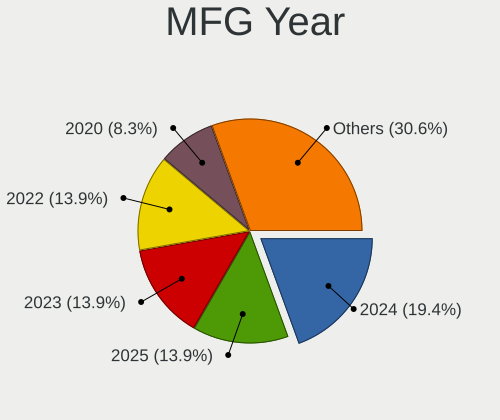

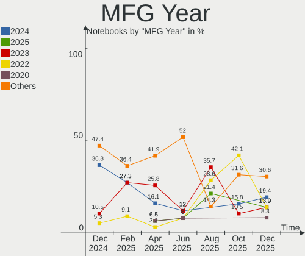

| Year | Notebooks | Percent |
|------|-----------|---------|
| 2024 | 7         | 19.44%  |
| 2025 | 5         | 13.89%  |
| 2023 | 5         | 13.89%  |
| 2022 | 5         | 13.89%  |
| 2020 | 3         | 8.33%   |
| 2016 | 2         | 5.56%   |
| 2021 | 1         | 2.78%   |
| 2019 | 1         | 2.78%   |
| 2018 | 1         | 2.78%   |
| 2017 | 1         | 2.78%   |
| 2015 | 1         | 2.78%   |
| 2013 | 1         | 2.78%   |
| 2012 | 1         | 2.78%   |
| 2011 | 1         | 2.78%   |
| 2007 | 1         | 2.78%   |

Form Factor
-----------

Physical design of the computer

| Name     | Notebooks | Percent |
|----------|-----------|---------|
| Notebook | 36        | 100%    |

Secure Boot
-----------

Enabled or disabled

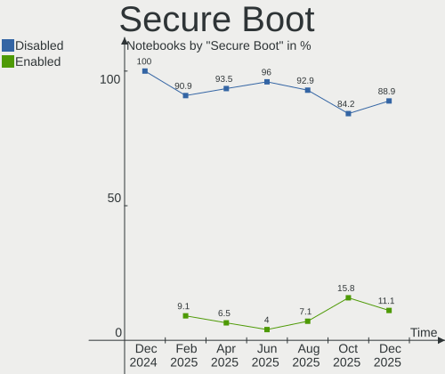

| State    | Notebooks | Percent |
|----------|-----------|---------|
| Disabled | 32        | 88.89%  |
| Enabled  | 4         | 11.11%  |

Coreboot
--------

Have coreboot on board

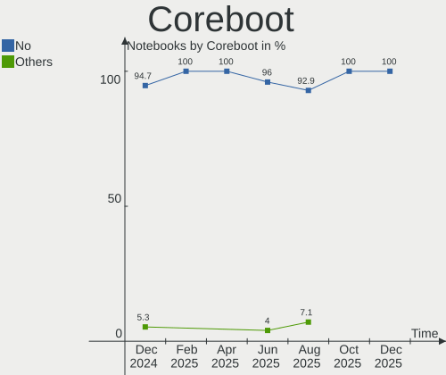

| Used | Notebooks | Percent |
|------|-----------|---------|
| No   | 36        | 100%    |

RAM Size
--------

Total RAM memory

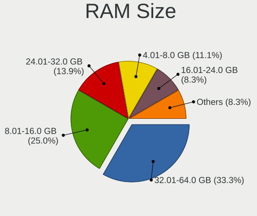

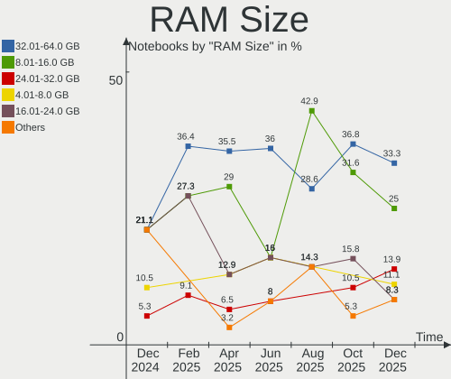

| Size in GB  | Notebooks | Percent |
|-------------|-----------|---------|
| 32.01-64.0  | 12        | 33.33%  |
| 8.01-16.0   | 9         | 25%     |
| 24.01-32.0  | 5         | 13.89%  |
| 4.01-8.0    | 4         | 11.11%  |
| 16.01-24.0  | 3         | 8.33%   |
| 64.01-256.0 | 2         | 5.56%   |
| 2.01-3.0    | 1         | 2.78%   |

RAM Used
--------

Used RAM memory

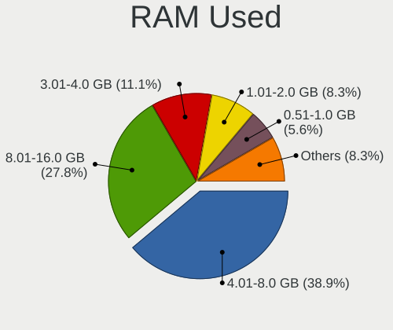

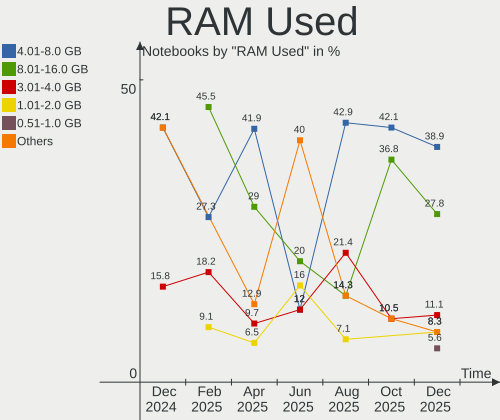

| Used GB    | Notebooks | Percent |
|------------|-----------|---------|
| 4.01-8.0   | 14        | 38.89%  |
| 8.01-16.0  | 10        | 27.78%  |
| 3.01-4.0   | 4         | 11.11%  |
| 1.01-2.0   | 3         | 8.33%   |
| 0.51-1.0   | 2         | 5.56%   |
| 2.01-3.0   | 1         | 2.78%   |
| 16.01-24.0 | 1         | 2.78%   |
| 0.01-0.5   | 1         | 2.78%   |

Total Drives
------------

Number of drives on board

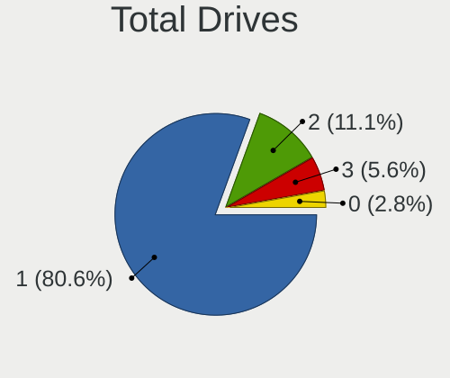

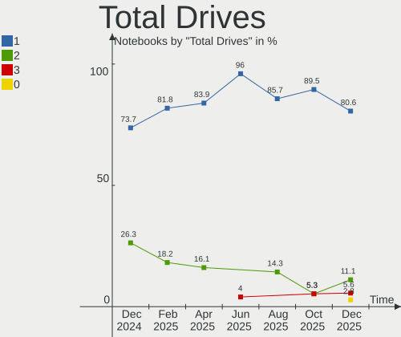

| Drives | Notebooks | Percent |
|--------|-----------|---------|
| 1      | 29        | 80.56%  |
| 2      | 4         | 11.11%  |
| 3      | 2         | 5.56%   |
| 0      | 1         | 2.78%   |

Has CD-ROM
----------

Has CD-ROM on board

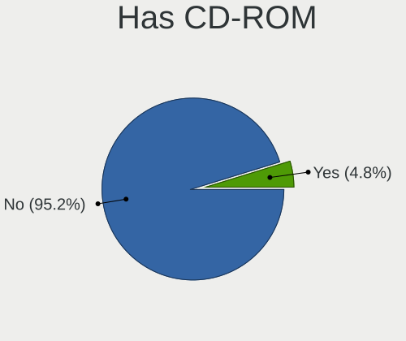

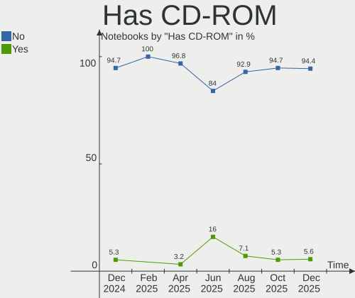

| Presented | Notebooks | Percent |
|-----------|-----------|---------|
| No        | 34        | 94.44%  |
| Yes       | 2         | 5.56%   |

Has Ethernet
------------

Has Ethernet on board

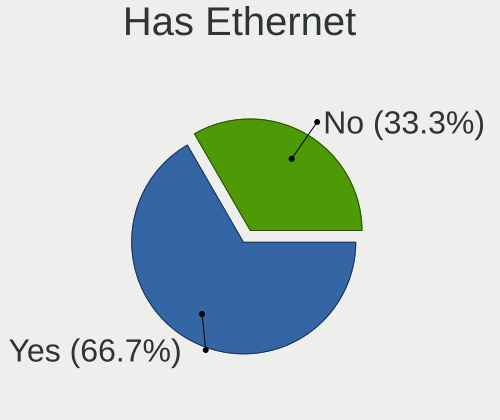

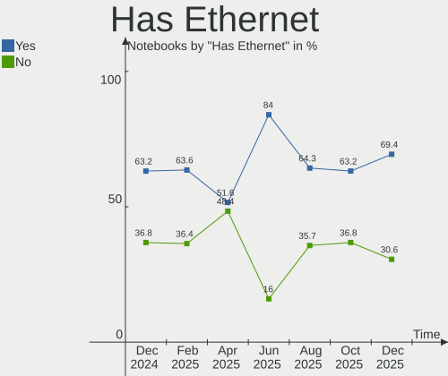

| Presented | Notebooks | Percent |
|-----------|-----------|---------|
| Yes       | 25        | 69.44%  |
| No        | 11        | 30.56%  |

Has WiFi
--------

Has WiFi module

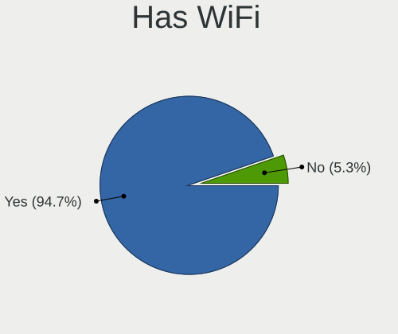

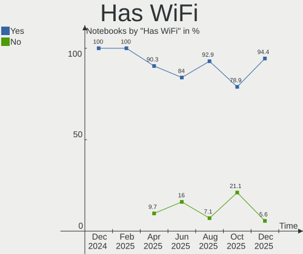

| Presented | Notebooks | Percent |
|-----------|-----------|---------|
| Yes       | 34        | 94.44%  |
| No        | 2         | 5.56%   |

Has Bluetooth
-------------

Has Bluetooth module

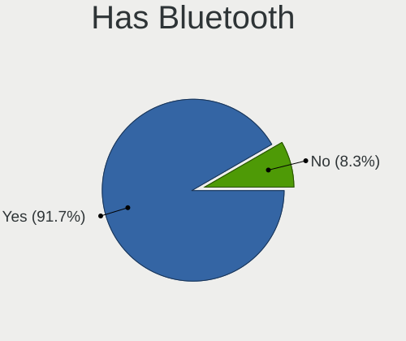

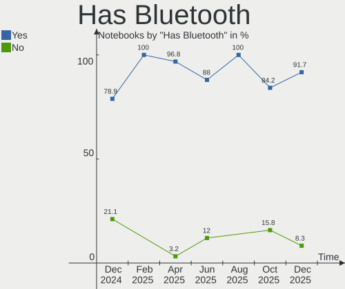

| Presented | Notebooks | Percent |
|-----------|-----------|---------|
| Yes       | 33        | 91.67%  |
| No        | 3         | 8.33%   |

Location
--------

Country
-------

Geographic location (country)

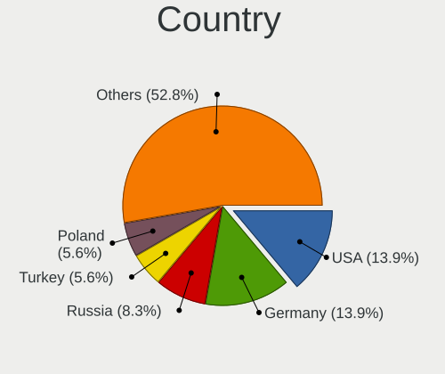

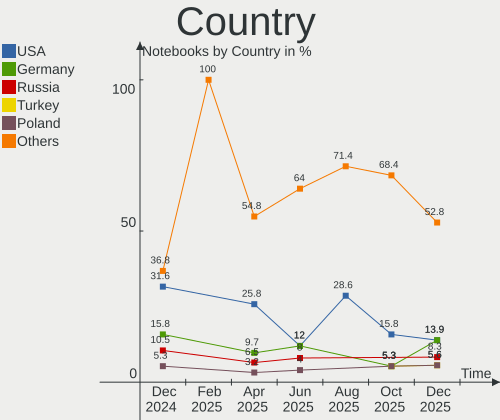

| Country         | Notebooks | Percent |
|-----------------|-----------|---------|
| USA             | 5         | 13.89%  |
| Germany         | 5         | 13.89%  |
| Russia          | 3         | 8.33%   |
| Turkey          | 2         | 5.56%   |
| Poland          | 2         | 5.56%   |
| Netherlands     | 2         | 5.56%   |
| Italy           | 2         | 5.56%   |
| Denmark         | 2         | 5.56%   |
| Ukraine         | 1         | 2.78%   |
| The Netherlands | 1         | 2.78%   |
| Spain           | 1         | 2.78%   |
| South Korea     | 1         | 2.78%   |
| Serbia          | 1         | 2.78%   |
| New Zealand     | 1         | 2.78%   |
| India           | 1         | 2.78%   |
| Hong Kong       | 1         | 2.78%   |
| France          | 1         | 2.78%   |
| Estonia         | 1         | 2.78%   |
| Czechia         | 1         | 2.78%   |
| Canada          | 1         | 2.78%   |
| Brazil          | 1         | 2.78%   |

City
----

Geographic location (city)

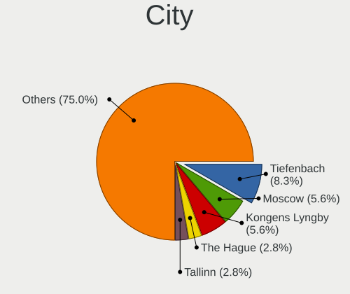

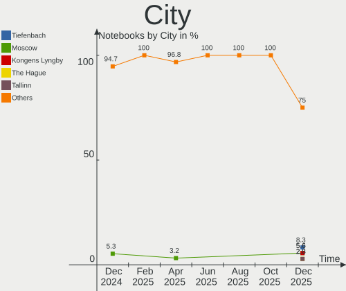

| City                   | Notebooks | Percent |
|------------------------|-----------|---------|
| Tiefenbach             | 3         | 8.33%   |
| Moscow                 | 2         | 5.56%   |
| Kongens Lyngby         | 2         | 5.56%   |
| The Hague              | 1         | 2.78%   |
| Tallinn                | 1         | 2.78%   |
| St Petersburg          | 1         | 2.78%   |
| Sint Annaland          | 1         | 2.78%   |
| Seodaemun-gu           | 1         | 2.78%   |
| Saint-Martin-le-Vinoux | 1         | 2.78%   |
| Saint Paul             | 1         | 2.78%   |
| Rocklin                | 1         | 2.78%   |
| Prague                 | 1         | 2.78%   |
| Poznan                 | 1         | 2.78%   |
| Ponte a Poppi          | 1         | 2.78%   |
| Naples                 | 1         | 2.78%   |
| Long Beach             | 1         | 2.78%   |
| London                 | 1         | 2.78%   |
| Kosiv                  | 1         | 2.78%   |
| Izmir                  | 1         | 2.78%   |
| Hamburg                | 1         | 2.78%   |
| Haarlem                | 1         | 2.78%   |
| Delbrueck              | 1         | 2.78%   |
| Curitiba               | 1         | 2.78%   |
| Christchurch           | 1         | 2.78%   |
| Chorzów               | 1         | 2.78%   |
| Central                | 1         | 2.78%   |
| Belgrade               | 1         | 2.78%   |
| Avilés                | 1         | 2.78%   |
| Atlanta                | 1         | 2.78%   |
| Annapolis              | 1         | 2.78%   |
| Ankara                 | 1         | 2.78%   |
| Ahmedabad              | 1         | 2.78%   |

Drives
------

Drive Vendor
------------

Hard drive vendors

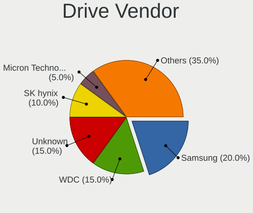

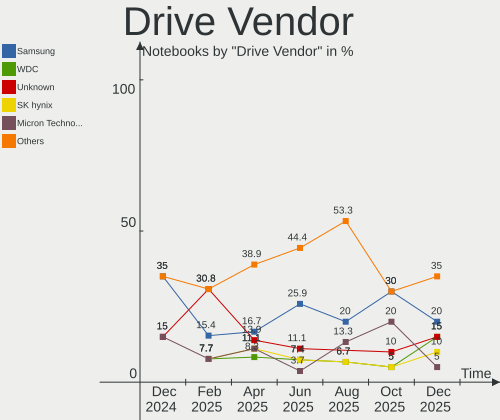

| Vendor                      | Notebooks | Drives | Percent |
|-----------------------------|-----------|--------|---------|
| Samsung Electronics         | 8         | 9      | 20%     |
| WDC                         | 6         | 7      | 15%     |
| Unknown                     | 6         | 6      | 15%     |
| SK hynix                    | 4         | 4      | 10%     |
| Micron Technology           | 2         | 2      | 5%      |
| KIOXIA                      | 2         | 2      | 5%      |
| Kingston Technology Company | 2         | 2      | 5%      |
| Kingston                    | 2         | 3      | 5%      |
| UMIS                        | 1         | 1      | 2.5%    |
| Toshiba                     | 1         | 1      | 2.5%    |
| Silicon Motion              | 1         | 1      | 2.5%    |
| Intel                       | 1         | 1      | 2.5%    |
| Crucial                     | 1         | 1      | 2.5%    |
| Apple                       | 1         | 1      | 2.5%    |
| A-DATA Technology           | 1         | 1      | 2.5%    |
| Unknown                     | 1         | 1      | 2.5%    |

Drive Model
-----------

Hard drive models

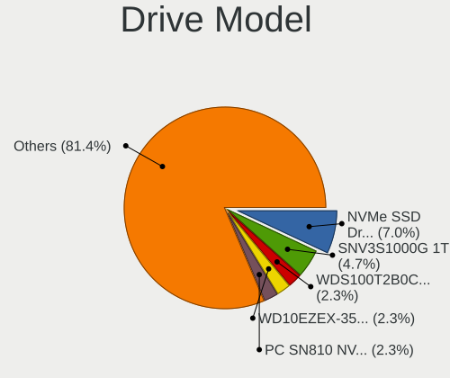

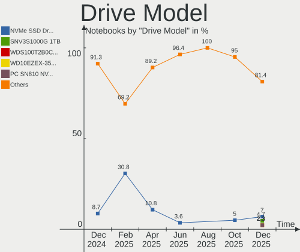

| Model                                                 | Notebooks | Percent |
|-------------------------------------------------------|-----------|---------|
| Unknown NVMe SSD Drive 1TB                            | 3         | 6.98%   |
| Kingston Company SNV3S1000G 1TB                       | 2         | 4.65%   |
| WDC WDS100T2B0C-00PXH0 1TB                            | 1         | 2.33%   |
| WDC WD10EZEX-35WN4A0 1TB                              | 1         | 2.33%   |
| WDC PC SN810 NVMe 2048GB                              | 1         | 2.33%   |
| WDC PC SN730 SDBQNTY-256G-1001 256GB                  | 1         | 2.33%   |
| WDC PC SN730 SDBPNTY-512G-1027 512GB                  | 1         | 2.33%   |
| WDC PC SN730 SDBPNTY-512G                             | 1         | 2.33%   |
| WDC PC SN530 SDBPNPZ-1T00-1114 1TB                    | 1         | 2.33%   |
| Unknown NVMe SSD Drive 512GB                          | 1         | 2.33%   |
| Unknown MMC Card  32GB                                | 1         | 2.33%   |
| Unknown MMC Card  1TB                                 | 1         | 2.33%   |
| UMIS RPJYJ1T24MML1AWY 1TB                             | 1         | 2.33%   |
| Toshiba HDWD110 1TB                                   | 1         | 2.33%   |
| SK hynix SKHynix_HFS256GD9TNI-L2B0B 256GB             | 1         | 2.33%   |
| SK hynix SKHynix_HFS001TFM9X179N 1TB                  | 1         | 2.33%   |
| SK hynix SHGP31-1000GM 1TB                            | 1         | 2.33%   |
| SK hynix PC801 NVMe 512GB                             | 1         | 2.33%   |
| Silicon Motion PCIe-8 SSD 512GB                       | 1         | 2.33%   |
| Samsung SSD 990 PRO with Heatsink 2TB S7HPNJ0X401828N | 1         | 2.33%   |
| Samsung SSD 990 PRO with Heatsink 2TB                 | 1         | 2.33%   |
| Samsung SSD 990 PRO 2TB S7HENJ0Y307924D               | 1         | 2.33%   |
| Samsung SSD 870 EVO 500GB                             | 1         | 2.33%   |
| Samsung PM981 NVMe 512GB                              | 1         | 2.33%   |
| Samsung MZVLW256HEHP-000H1 256GB                      | 1         | 2.33%   |
| Samsung MZVLW256HEHP-00000 256GB                      | 1         | 2.33%   |
| Samsung MZVL21T0HCLR-00BH1 1TB                        | 1         | 2.33%   |
| Samsung MZAL81T0HFLB-00BL2 1TB                        | 1         | 2.33%   |
| Micron MTFDKBA1T0TFK 1TB                              | 1         | 2.33%   |
| Micron 2400_MTFDKBA1T0QFM 1TB                         | 1         | 2.33%   |
| KIOXIA KXG80ZNV1T02 1TB                               | 1         | 2.33%   |
| KIOXIA KBG60ZNV1T02 1TB                               | 1         | 2.33%   |
| Kingston SNVS500G 500GB                               | 1         | 2.33%   |
| Kingston SNV425S2128GB SSD                            | 1         | 2.33%   |
| Kingston SA400S37480G 480GB SSD                       | 1         | 2.33%   |
| Intel SSDPEKKW512G7 512GB                             | 1         | 2.33%   |
| Crucial CT1000MX500SSD1 1TB                           | 1         | 2.33%   |
| Apple SSD AP0256N 256GB                               | 1         | 2.33%   |
| A-DATA SP580 480GB SSD                                | 1         | 2.33%   |
| Unknown                                               | 1         | 2.33%   |

HDD Vendor
----------

Hard disk drive vendors

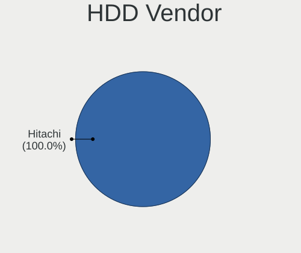

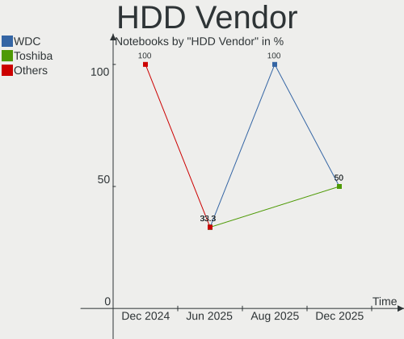

| Vendor  | Notebooks | Drives | Percent |
|---------|-----------|--------|---------|
| WDC     | 1         | 1      | 50%     |
| Toshiba | 1         | 1      | 50%     |

SSD Vendor
----------

Solid state drive vendors

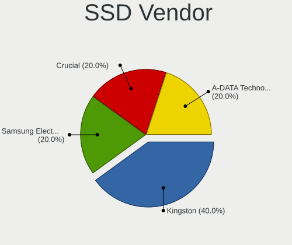

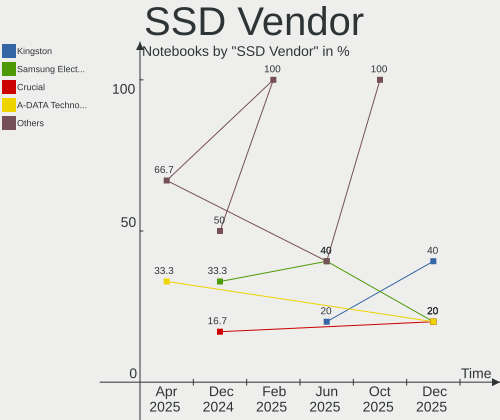

| Vendor              | Notebooks | Drives | Percent |
|---------------------|-----------|--------|---------|
| Kingston            | 2         | 2      | 40%     |
| Samsung Electronics | 1         | 1      | 20%     |
| Crucial             | 1         | 1      | 20%     |
| A-DATA Technology   | 1         | 1      | 20%     |

Drive Kind
----------

HDD or SSD

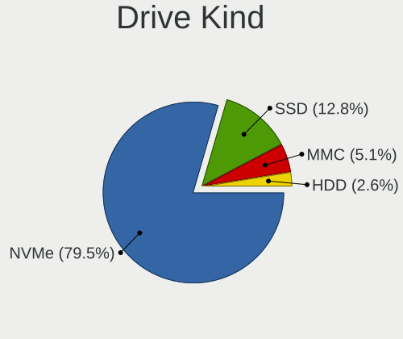

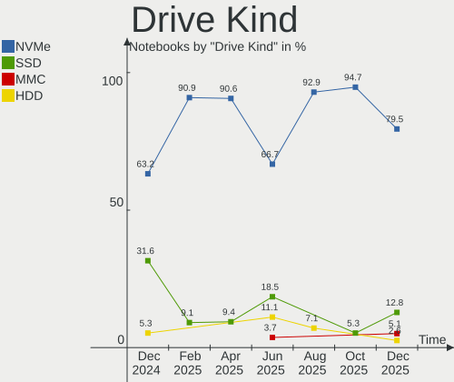

| Kind | Notebooks | Drives | Percent |
|------|-----------|--------|---------|
| NVMe | 31        | 34     | 79.49%  |
| SSD  | 5         | 5      | 12.82%  |
| MMC  | 2         | 2      | 5.13%   |
| HDD  | 1         | 2      | 2.56%   |

Drive Connector
---------------

SATA, SAS, NVMe, etc.

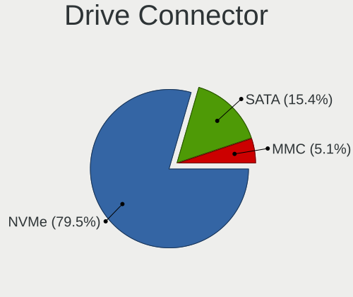

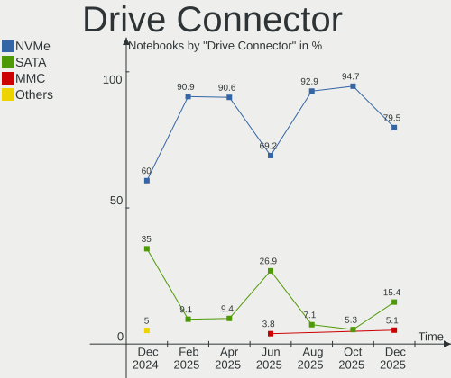

| Type | Notebooks | Drives | Percent |
|------|-----------|--------|---------|
| NVMe | 31        | 34     | 79.49%  |
| SATA | 6         | 7      | 15.38%  |
| MMC  | 2         | 2      | 5.13%   |

Drive Size
----------

Size of hard drive

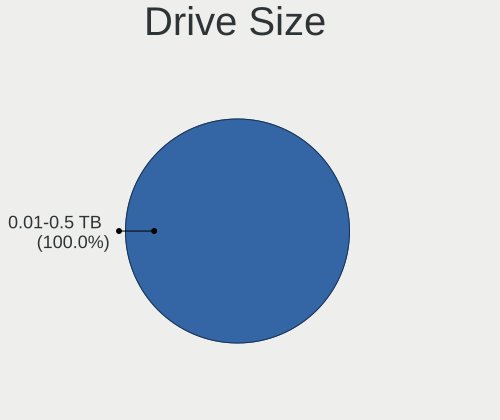

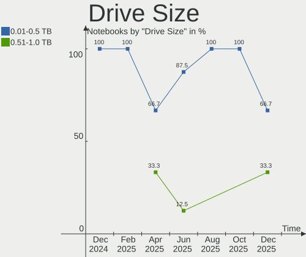

| Size in TB | Notebooks | Drives | Percent |
|------------|-----------|--------|---------|
| 0.01-0.5   | 4         | 4      | 66.67%  |
| 0.51-1.0   | 2         | 3      | 33.33%  |

Space Total
-----------

Amount of disk space available on the file system

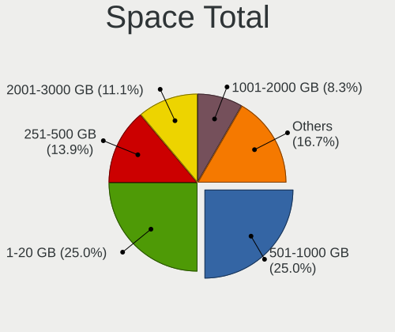

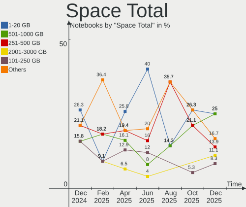

| Size in GB     | Notebooks | Percent |
|----------------|-----------|---------|
| 1-20           | 9         | 25%     |
| 501-1000       | 9         | 25%     |
| 251-500        | 5         | 13.89%  |
| 2001-3000      | 4         | 11.11%  |
| 101-250        | 3         | 8.33%   |
| 1001-2000      | 3         | 8.33%   |
| More than 3000 | 2         | 5.56%   |
| Unknown        | 1         | 2.78%   |

Space Used
----------

Amount of used disk space

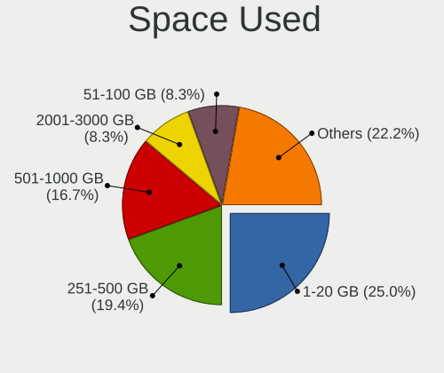

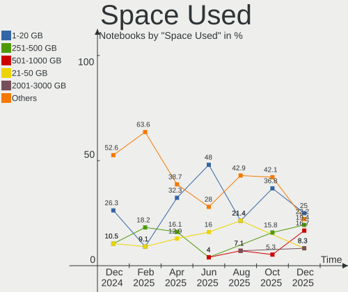

| Used GB        | Notebooks | Percent |
|----------------|-----------|---------|
| 1-20           | 9         | 25%     |
| 251-500        | 7         | 19.44%  |
| 501-1000       | 6         | 16.67%  |
| 21-50          | 3         | 8.33%   |
| 2001-3000      | 3         | 8.33%   |
| 51-100         | 3         | 8.33%   |
| 101-250        | 2         | 5.56%   |
| More than 3000 | 1         | 2.78%   |
| 1001-2000      | 1         | 2.78%   |
| Unknown        | 1         | 2.78%   |

Malfunc. Drives
---------------

Drive models with a malfunction

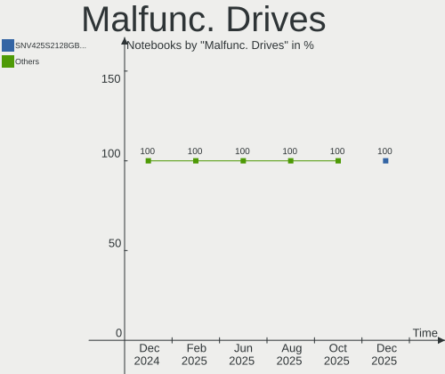

| Model                      | Notebooks | Drives | Percent |
|----------------------------|-----------|--------|---------|
| Kingston SNV425S2128GB SSD | 1         | 1      | 100%    |

Malfunc. Drive Vendor
---------------------

Vendors of faulty drives

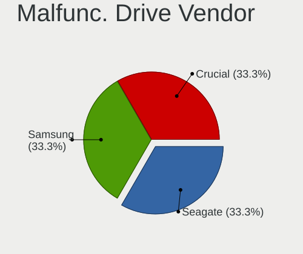

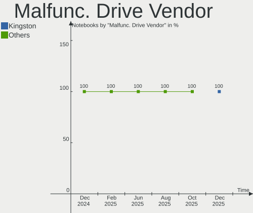

| Vendor   | Notebooks | Drives | Percent |
|----------|-----------|--------|---------|
| Kingston | 1         | 1      | 100%    |

Malfunc. HDD Vendor
-------------------

Vendors of faulty HDD drives

Zero info for selected period =(

Malfunc. Drive Kind
-------------------

Kinds of faulty drives

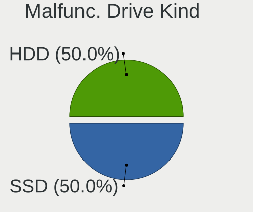

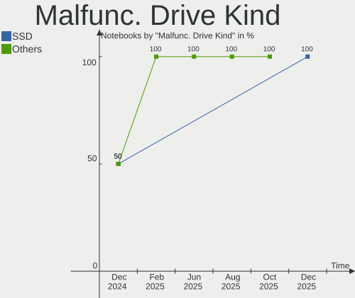

| Kind | Notebooks | Drives | Percent |
|------|-----------|--------|---------|
| SSD  | 1         | 1      | 100%    |

Failed Drives
-------------

Failed drive models

Zero info for selected period =(

Failed Drive Vendor
-------------------

Failed drive vendors

Zero info for selected period =(

Drive Status
------------

Number of failed and malfunc. drives

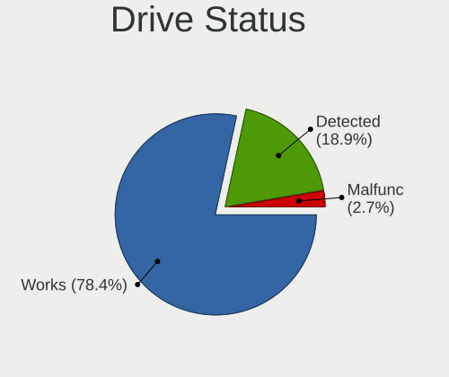

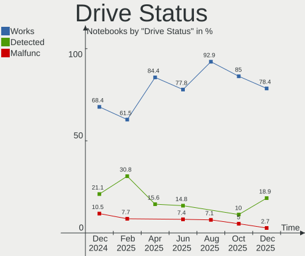

| Status   | Notebooks | Drives | Percent |
|----------|-----------|--------|---------|
| Works    | 29        | 35     | 78.38%  |
| Detected | 7         | 7      | 18.92%  |
| Malfunc  | 1         | 1      | 2.7%    |

Storage controller
------------------

Storage Vendor
--------------

Storage controller vendors

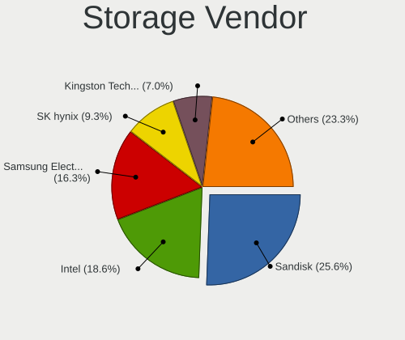

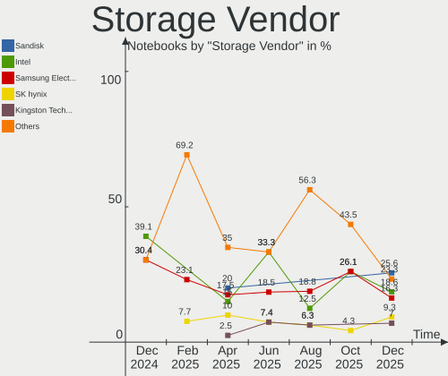

| Vendor                                  | Notebooks | Percent |
|-----------------------------------------|-----------|---------|
| Sandisk                                 | 11        | 25.58%  |
| Intel                                   | 8         | 18.6%   |
| Samsung Electronics                     | 7         | 16.28%  |
| SK hynix                                | 4         | 9.3%    |
| Kingston Technology Company             | 3         | 6.98%   |
| AMD                                     | 3         | 6.98%   |
| Micron Technology                       | 2         | 4.65%   |
| KIOXIA                                  | 2         | 4.65%   |
| Silicon Motion                          | 1         | 2.33%   |
| Shenzhen Unionmemory Information System | 1         | 2.33%   |
| Apple                                   | 1         | 2.33%   |

Storage Model
-------------

Storage controller models

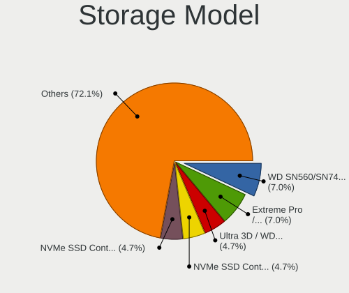

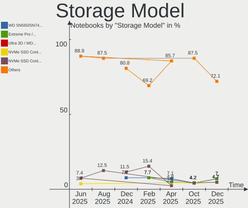

| Model                                                                          | Notebooks | Percent |
|--------------------------------------------------------------------------------|-----------|---------|
| SanDisk WD SN560/SN740/SN770/SN5000 NVMe SSD                                   | 3         | 6.98%   |
| SanDisk Extreme Pro / WD Black SN750 / PC SN730 / Red SN700 NVMe SSD           | 3         | 6.98%   |
| SanDisk Ultra 3D / WD PC SN530, IX SN530, Blue SN550 NVMe SSD (DRAM-less)      | 2         | 4.65%   |
| Samsung NVMe SSD Controller SM961/PM961/SM963                                  | 2         | 4.65%   |
| Samsung NVMe SSD Controller S4LV008[Pascal]                                    | 2         | 4.65%   |
| Kingston Company NV3 NVMe SSD [TC2201] (DRAM-less)                             | 2         | 4.65%   |
| SK hynix Platinum P41/PC801 NVMe Solid State Drive                             | 1         | 2.33%   |
| SK hynix PCB01 NVMe Solid State Drive                                          | 1         | 2.33%   |
| SK hynix PC611 NVMe Solid State Drive                                          | 1         | 2.33%   |
| SK hynix Gold P31/BC711/PC711 NVMe Solid State Drive                           | 1         | 2.33%   |
| Silicon Motion Non-Volatile memory controller                                  | 1         | 2.33%   |
| Shenzhen Unionmemory Information System Non-Volatile memory controller         | 1         | 2.33%   |
| Sandisk WD_BLACK SN7100/WD PC SN7100S M.2 2280 NVMe SSD (DRAM-less)            | 1         | 2.33%   |
| SanDisk WD PC SN810 / Black SN850 NVMe SSD                                     | 1         | 2.33%   |
| Sandisk WD Black SN850X NVMe SSD                                               | 1         | 2.33%   |
| Samsung NVMe SSD Controller SM981/PM981/PM983                                  | 1         | 2.33%   |
| Samsung NVMe SSD Controller PM9C1a (DRAM-less)                                 | 1         | 2.33%   |
| Samsung NVMe SSD Controller PM9A1/PM9A3/980PRO                                 | 1         | 2.33%   |
| Micron 2450 NVMe SSD [HendrixV] (DRAM-less)                                    | 1         | 2.33%   |
| Micron 2400 NVMe SSD (DRAM-less)                                               | 1         | 2.33%   |
| KIOXIA NVMe SSD Controller XG8                                                 | 1         | 2.33%   |
| KIOXIA NVMe SSD Controller BG6 (DRAM-less)                                     | 1         | 2.33%   |
| Kingston Company NV1 NVMe SSD [SM2263XT] (DRAM-less)                           | 1         | 2.33%   |
| Intel Volume Management Device NVMe RAID Controller Intel Corporation          | 1         | 2.33%   |
| Intel Sunrise Point-LP SATA Controller [AHCI mode]                             | 1         | 2.33%   |
| Intel SSD 600P Series                                                          | 1         | 2.33%   |
| Intel NM10/ICH7 Family SATA Controller [AHCI mode]                             | 1         | 2.33%   |
| Intel 82801 Mobile SATA Controller [RAID mode]                                 | 1         | 2.33%   |
| Intel 8 Series/C220 Series Chipset Family 6-port SATA Controller 1 [AHCI mode] | 1         | 2.33%   |
| Intel 8 Series SATA Controller 1 [AHCI mode]                                   | 1         | 2.33%   |
| Intel 6 Series/C200 Series Chipset Family 6 port Mobile SATA AHCI Controller   | 1         | 2.33%   |
| Apple ANS2 NVMe Controller                                                     | 1         | 2.33%   |
| AMD FCH SATA Controller [AHCI mode]                                            | 1         | 2.33%   |
| AMD 600 Series Chipset SATA Controller                                         | 1         | 2.33%   |
| AMD 500 Series Chipset SATA Controller                                         | 1         | 2.33%   |

Storage Kind
------------

Kind of storage controller (IDE, SATA, NVMe, SAS, ...)

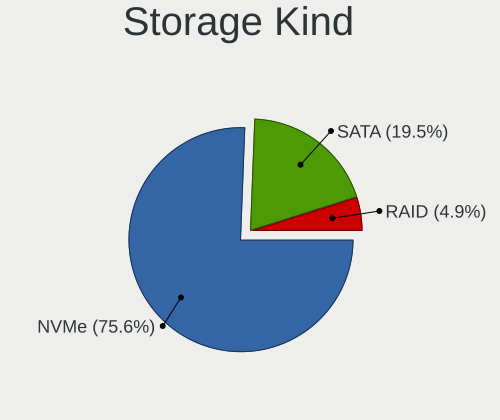

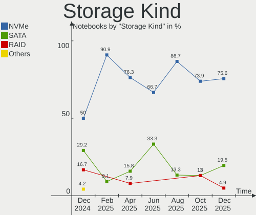

| Kind | Notebooks | Percent |
|------|-----------|---------|
| NVMe | 31        | 75.61%  |
| SATA | 8         | 19.51%  |
| RAID | 2         | 4.88%   |

Processor
---------

CPU Vendor
----------

Processor vendors

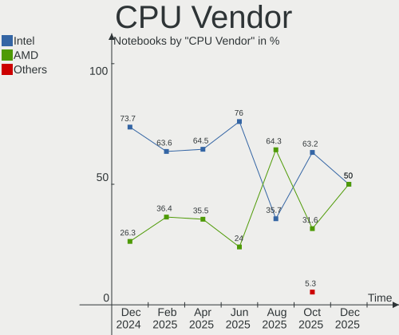

| Vendor | Notebooks | Percent |
|--------|-----------|---------|
| Intel  | 18        | 50%     |
| AMD    | 18        | 50%     |

CPU Model
---------

Processor models

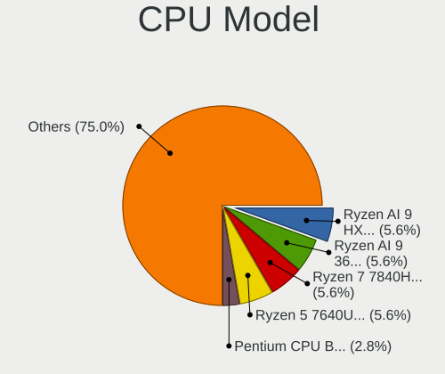

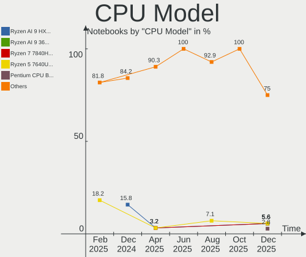

| Model                                      | Notebooks | Percent |
|--------------------------------------------|-----------|---------|
| AMD Ryzen AI 9 HX 370 w/ Radeon 890M       | 2         | 5.56%   |
| AMD Ryzen AI 9 365 w/ Radeon 880M          | 2         | 5.56%   |
| AMD Ryzen 7 7840HS w/ Radeon 780M Graphics | 2         | 5.56%   |
| AMD Ryzen 5 7640U w/ Radeon 760M Graphics  | 2         | 5.56%   |
| Intel Pentium CPU B960 @ 2.20GHz           | 1         | 2.78%   |
| Intel Core Ultra 9 275HX                   | 1         | 2.78%   |
| Intel Core Ultra 7 258V                    | 1         | 2.78%   |
| Intel Core i7-8665U CPU @ 1.90GHz          | 1         | 2.78%   |
| Intel Core i7-8550U CPU @ 1.80GHz          | 1         | 2.78%   |
| Intel Core i7-7500U CPU @ 2.70GHz          | 1         | 2.78%   |
| Intel Core i7-4702MQ CPU @ 2.20GHz         | 1         | 2.78%   |
| Intel Core i5-8250U CPU @ 1.60GHz          | 1         | 2.78%   |
| Intel Core i5-6300U CPU @ 2.40GHz          | 1         | 2.78%   |
| Intel Core i5-4300U CPU @ 1.90GHz          | 1         | 2.78%   |
| Intel Core i5-10300H CPU @ 2.50GHz         | 1         | 2.78%   |
| Intel Core i3-1000NG4 CPU @ 1.10GHz        | 1         | 2.78%   |
| Intel Atom CPU N2600 @ 1.60GHz             | 1         | 2.78%   |
| Intel 13th Gen Core i9-13900H              | 1         | 2.78%   |
| Intel 13th Gen Core i7-1370P               | 1         | 2.78%   |
| Intel 13th Gen Core i7-1360P               | 1         | 2.78%   |
| Intel 12th Gen Core i7-12700H              | 1         | 2.78%   |
| Intel 12th Gen Core i5-1240P               | 1         | 2.78%   |
| AMD Ryzen AI 7 350 w/ Radeon 860M          | 1         | 2.78%   |
| AMD Ryzen 9 8940HX with Radeon Graphics    | 1         | 2.78%   |
| AMD Ryzen 7 PRO 6850U with Radeon Graphics | 1         | 2.78%   |
| AMD Ryzen 7 7800X3D 8-Core Processor       | 1         | 2.78%   |
| AMD Ryzen 7 7730U with Radeon Graphics     | 1         | 2.78%   |
| AMD Ryzen 7 7435HS                         | 1         | 2.78%   |
| AMD Ryzen 7 6800H with Radeon Graphics     | 1         | 2.78%   |
| AMD Ryzen 7 5800X 8-Core Processor         | 1         | 2.78%   |
| AMD Ryzen 7 5800H with Radeon Graphics     | 1         | 2.78%   |
| AMD Ryzen 5 4600H with Radeon Graphics     | 1         | 2.78%   |

CPU Model Family
----------------

Processor model prefix

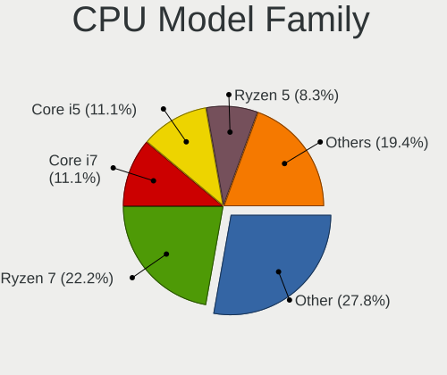

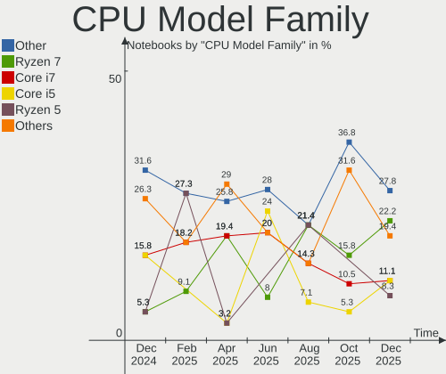

| Model           | Notebooks | Percent |
|-----------------|-----------|---------|
| Other           | 10        | 27.78%  |
| AMD Ryzen 7     | 8         | 22.22%  |
| Intel Core i7   | 4         | 11.11%  |
| Intel Core i5   | 4         | 11.11%  |
| AMD Ryzen 5     | 3         | 8.33%   |
| Intel Core      | 2         | 5.56%   |
| Intel Pentium   | 1         | 2.78%   |
| Intel Core i3   | 1         | 2.78%   |
| Intel Atom      | 1         | 2.78%   |
| AMD Ryzen 9     | 1         | 2.78%   |
| AMD Ryzen 7 PRO | 1         | 2.78%   |

CPU Cores
---------

Number of processor cores

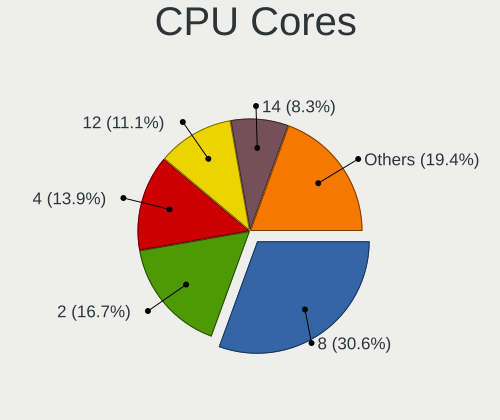

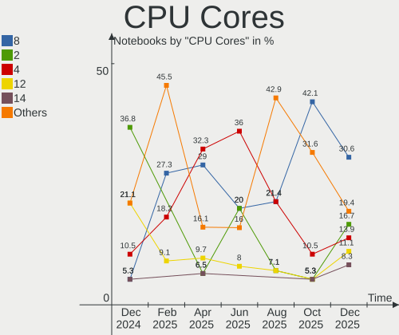

| Number | Notebooks | Percent |
|--------|-----------|---------|
| 8      | 11        | 30.56%  |
| 2      | 6         | 16.67%  |
| 4      | 5         | 13.89%  |
| 12     | 4         | 11.11%  |
| 14     | 3         | 8.33%   |
| 6      | 3         | 8.33%   |
| 10     | 2         | 5.56%   |
| 24     | 1         | 2.78%   |
| 16     | 1         | 2.78%   |

CPU Sockets
-----------

Number of sockets

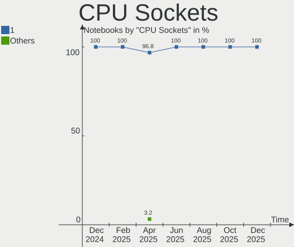

| Number | Notebooks | Percent |
|--------|-----------|---------|
| 1      | 36        | 100%    |

CPU Threads
-----------

Threads per core (Hyper-Threading)

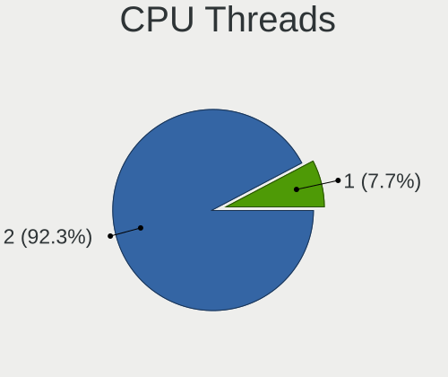

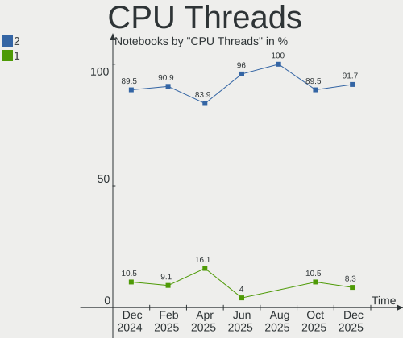

| Number | Notebooks | Percent |
|--------|-----------|---------|
| 2      | 33        | 91.67%  |
| 1      | 3         | 8.33%   |

CPU Op-Modes
------------

CPU Operation Modes (32-bit, 64-bit)

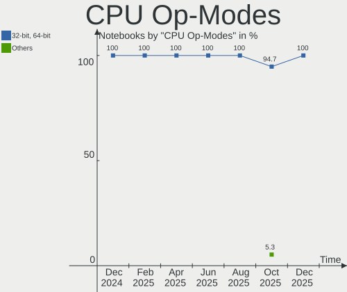

| Op mode        | Notebooks | Percent |
|----------------|-----------|---------|
| 32-bit, 64-bit | 36        | 100%    |

CPU Microcode
-------------

Microcode number

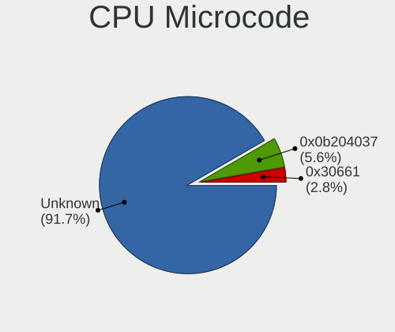

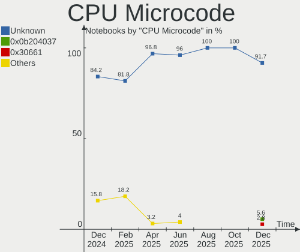

| Number     | Notebooks | Percent |
|------------|-----------|---------|
| Unknown    | 33        | 91.67%  |
| 0x0b204037 | 2         | 5.56%   |
| 0x30661    | 1         | 2.78%   |

CPU Microarch
-------------

Microarchitecture

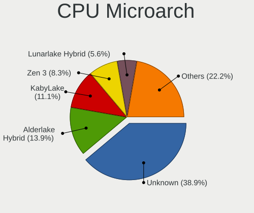

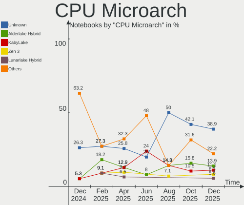

| Name             | Notebooks | Percent |
|------------------|-----------|---------|
| Unknown          | 14        | 38.89%  |
| Alderlake Hybrid | 5         | 13.89%  |
| KabyLake         | 4         | 11.11%  |
| Zen 3            | 3         | 8.33%   |
| Lunarlake Hybrid | 2         | 5.56%   |
| Haswell          | 2         | 5.56%   |
| Zen 2            | 1         | 2.78%   |
| Skylake          | 1         | 2.78%   |
| SandyBridge      | 1         | 2.78%   |
| IceLake          | 1         | 2.78%   |
| CometLake        | 1         | 2.78%   |
| Bonnell          | 1         | 2.78%   |

Graphics
--------

GPU Vendor
----------

Vendors of graphics cards

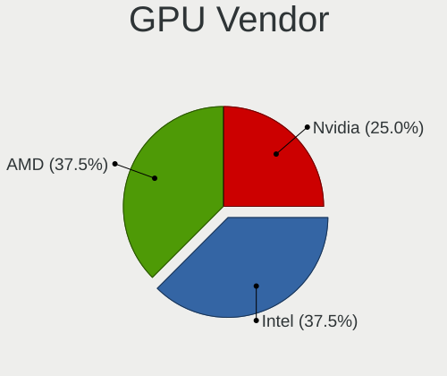

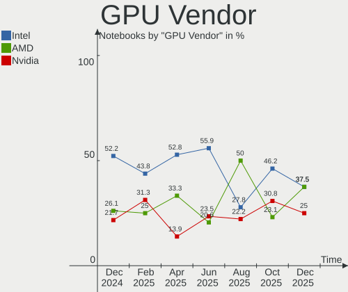

| Vendor | Notebooks | Percent |
|--------|-----------|---------|
| Intel  | 18        | 37.5%   |
| AMD    | 18        | 37.5%   |
| Nvidia | 12        | 25%     |

GPU Model
---------

Graphics card models

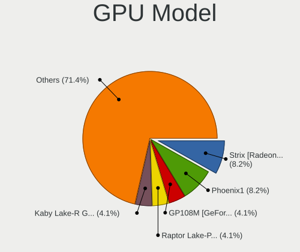

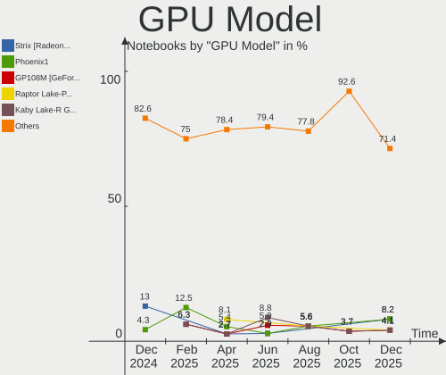

| Model                                                                     | Notebooks | Percent |
|---------------------------------------------------------------------------|-----------|---------|
| AMD Strix [Radeon 880M / 890M]                                            | 4         | 8.16%   |
| AMD Phoenix1                                                              | 4         | 8.16%   |
| Nvidia GP108M [GeForce MX150]                                             | 2         | 4.08%   |
| Intel Raptor Lake-P [Iris Xe Graphics]                                    | 2         | 4.08%   |
| Intel Kaby Lake-R GT2 [UHD Graphics 620]                                  | 2         | 4.08%   |
| Intel Alder Lake-P GT2 [Iris Xe Graphics]                                 | 2         | 4.08%   |
| AMD Rembrandt [Radeon 680M]                                               | 2         | 4.08%   |
| AMD Raphael                                                               | 2         | 4.08%   |
| AMD Navi 33 [Radeon RX 7600/7600 XT/7600M XT/7600S/7700S / PRO W7600]     | 2         | 4.08%   |
| Nvidia GP107GLM [Quadro P620]                                             | 1         | 2.04%   |
| Nvidia GK107M [GeForce GT 750M]                                           | 1         | 2.04%   |
| Nvidia GB206M [GeForce RTX 5070 Max-Q / Mobile]                           | 1         | 2.04%   |
| Nvidia GB206M [GeForce RTX 5060 Max-Q / Mobile]                           | 1         | 2.04%   |
| Nvidia GA107M [GeForce RTX 3050 Mobile]                                   | 1         | 2.04%   |
| Nvidia GA106M [GeForce RTX 3060 Mobile / Max-Q]                           | 1         | 2.04%   |
| Nvidia GA104 [Geforce RTX 3070 Ti Laptop GPU]                             | 1         | 2.04%   |
| Nvidia GA102 [GeForce RTX 3090 Ti]                                        | 1         | 2.04%   |
| Nvidia AD106M [GeForce RTX 4070 Max-Q / Mobile]                           | 1         | 2.04%   |
| Nvidia AD104 [GeForce RTX 4060 Ti]                                        | 1         | 2.04%   |
| Intel WhiskeyLake-U GT2 [UHD Graphics 620]                                | 1         | 2.04%   |
| Intel Skylake-U GT2 [HD Graphics 520]                                     | 1         | 2.04%   |
| Intel Raptor Lake-P [UHD Graphics]                                        | 1         | 2.04%   |
| Intel Lunar Lake [Intel Arc Graphics 130V / 140V]                         | 1         | 2.04%   |
| Intel Kaby Lake-U GT2 [HD Graphics 620]                                   | 1         | 2.04%   |
| Intel Iris Plus Graphics G4 (Ice Lake)                                    | 1         | 2.04%   |
| Intel Haswell-ULT Integrated Graphics Controller                          | 1         | 2.04%   |
| Intel CometLake-H GT2 [UHD Graphics]                                      | 1         | 2.04%   |
| Intel Atom Processor D2xxx/N2xxx Integrated Graphics Controller           | 1         | 2.04%   |
| Intel Arrow Lake-S [Intel Graphics]                                       | 1         | 2.04%   |
| Intel 4th Gen Core Processor Integrated Graphics Controller               | 1         | 2.04%   |
| Intel 2nd Generation Core Processor Family Integrated Graphics Controller | 1         | 2.04%   |
| AMD Thames [Radeon HD 7500M/7600M Series]                                 | 1         | 2.04%   |
| AMD Renoir [Radeon Vega Series / Radeon Vega Mobile Series]               | 1         | 2.04%   |
| AMD Krackan [Radeon 840M / 860M Graphics]                                 | 1         | 2.04%   |
| AMD Cezanne [Radeon Vega Series / Radeon Vega Mobile Series]              | 1         | 2.04%   |
| AMD Barcelo                                                               | 1         | 2.04%   |

GPU Combo
---------

Combinations of graphics cards

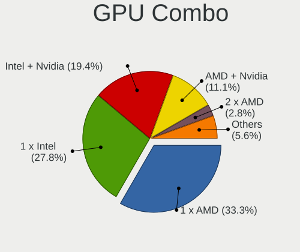

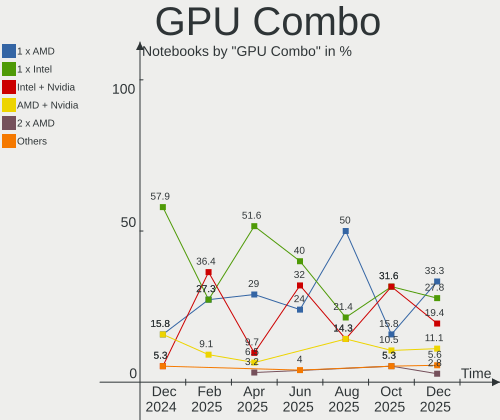

| Name           | Notebooks | Percent |
|----------------|-----------|---------|
| 1 x AMD        | 12        | 33.33%  |
| 1 x Intel      | 10        | 27.78%  |
| Intel + Nvidia | 7         | 19.44%  |
| AMD + Nvidia   | 4         | 11.11%  |
| 2 x AMD        | 1         | 2.78%   |
| 1 x Nvidia     | 1         | 2.78%   |
| Intel + AMD    | 1         | 2.78%   |

GPU Driver
----------

Free vs proprietary

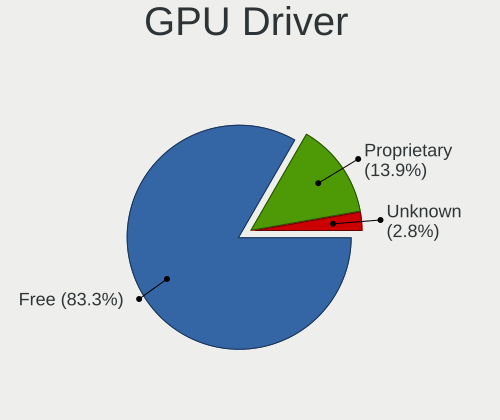

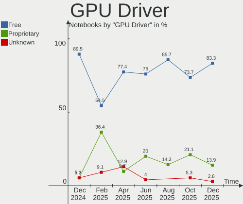

| Driver      | Notebooks | Percent |
|-------------|-----------|---------|
| Free        | 30        | 83.33%  |
| Proprietary | 5         | 13.89%  |
| Unknown     | 1         | 2.78%   |

GPU Memory
----------

Total video memory

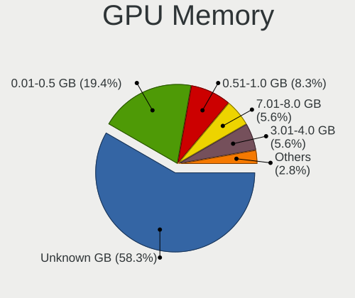

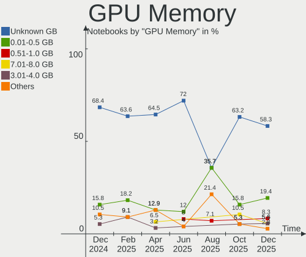

| Size in GB | Notebooks | Percent |
|------------|-----------|---------|
| Unknown    | 21        | 58.33%  |
| 0.01-0.5   | 7         | 19.44%  |
| 0.51-1.0   | 3         | 8.33%   |
| 7.01-8.0   | 2         | 5.56%   |
| 3.01-4.0   | 2         | 5.56%   |
| 8.01-16.0  | 1         | 2.78%   |

Monitor
-------

Monitor Vendor
--------------

Monitor vendors

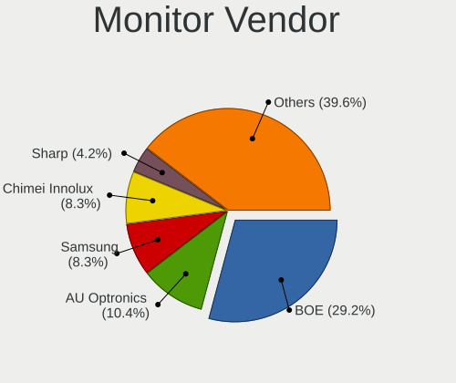

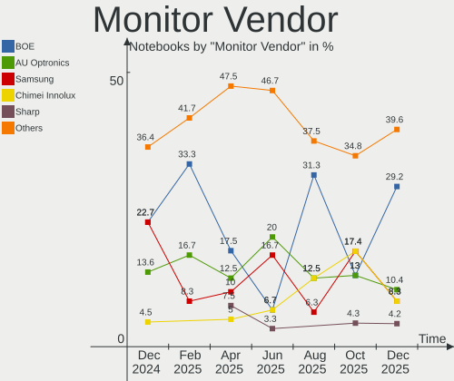

| Vendor               | Notebooks | Percent |
|----------------------|-----------|---------|
| BOE                  | 14        | 29.17%  |
| AU Optronics         | 5         | 10.42%  |
| Samsung Electronics  | 4         | 8.33%   |
| Chimei Innolux       | 4         | 8.33%   |
| Sharp                | 2         | 4.17%   |
| MSI                  | 2         | 4.17%   |
| LG Display           | 2         | 4.17%   |
| Lenovo               | 2         | 4.17%   |
| Hewlett-Packard      | 2         | 4.17%   |
| Dell                 | 2         | 4.17%   |
| TMX                  | 1         | 2.08%   |
| PANDA                | 1         | 2.08%   |
| HSN                  | 1         | 2.08%   |
| Goldstar             | 1         | 2.08%   |
| EQV                  | 1         | 2.08%   |
| Apple                | 1         | 2.08%   |
| AOC                  | 1         | 2.08%   |
| Ancor Communications | 1         | 2.08%   |
| Acer                 | 1         | 2.08%   |

Monitor Model
-------------

Monitor models

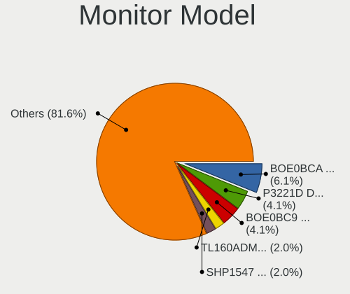

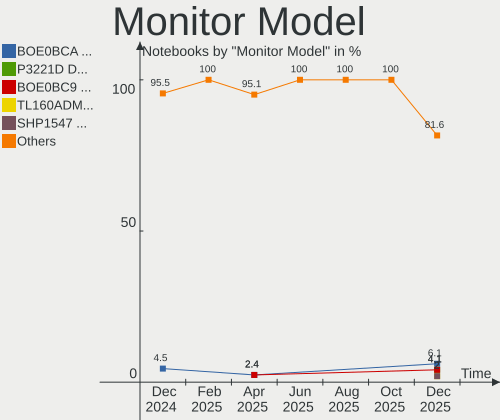

| Model                                                                 | Notebooks | Percent |
|-----------------------------------------------------------------------|-----------|---------|
| BOE LCD Monitor BOE0BCA 2256x1504 285x190mm 13.5-inch                 | 3         | 6.12%   |
| Dell P3221D DEL41EB 2560x1440 698x393mm 31.5-inch                     | 2         | 4.08%   |
| BOE LCD Monitor BOE0BC9 2560x1600 345x215mm 16.0-inch                 | 2         | 4.08%   |
| TMX TL160ADMP03-0 TMX1603 2560x1600 345x215mm 16.0-inch               | 1         | 2.04%   |
| Sharp LCD Monitor SHP1547 1920x1200 288x180mm 13.4-inch               | 1         | 2.04%   |
| Sharp LCD Monitor SHP1449 1920x1080 294x165mm 13.3-inch               | 1         | 2.04%   |
| Samsung Electronics SyncMaster SAM0498 1600x900 443x249mm 20.0-inch   | 1         | 2.04%   |
| Samsung Electronics S27D390 SAM0B67 1920x1080 598x336mm 27.0-inch     | 1         | 2.04%   |
| Samsung Electronics LCD Monitor SDC419F 2880x1800 302x189mm 14.0-inch | 1         | 2.04%   |
| Samsung Electronics LCD Monitor SDC4189 2944x1840 312x195mm 14.5-inch | 1         | 2.04%   |
| PANDA LCD Monitor NCP004D 1920x1080 344x194mm 15.5-inch               | 1         | 2.04%   |
| MSI MP273QP MSI30B6 2560x1440 600x330mm 27.0-inch                     | 1         | 2.04%   |
| MSI G24C6 MSI3BA0 1920x1080 521x293mm 23.5-inch                       | 1         | 2.04%   |
| LG Display LCD Monitor LGD06B3 1920x1200 336x210mm 15.6-inch          | 1         | 2.04%   |
| LG Display LCD Monitor LGD03CD 1366x768 277x156mm 12.5-inch           | 1         | 2.04%   |
| Lenovo LCD Monitor LEN8AB1 3072x1920 312x195mm 14.5-inch              | 1         | 2.04%   |
| Lenovo B140UAN02.7 LEN403A 1920x1200 302x188mm 14.0-inch              | 1         | 2.04%   |
| HSN TFG32U16P HSNFFFF 3840x2160 709x399mm 32.0-inch                   | 1         | 2.04%   |
| Hewlett-Packard OMEN by HP 25 HPN3426 1920x1080 543x302mm 24.5-inch   | 1         | 2.04%   |
| Hewlett-Packard E22 G4 HPN3683 1920x1080 476x267mm 21.5-inch          | 1         | 2.04%   |
| Goldstar 27GL850 GSM5B80 2560x1440 697x392mm 31.5-inch                | 1         | 2.04%   |
| EQV LCD Monitor EQV1081 1920x1080 477x268mm 21.5-inch                 | 1         | 2.04%   |
| Chimei Innolux LCD Monitor CMN1618 1920x1200 344x215mm 16.0-inch      | 1         | 2.04%   |
| Chimei Innolux LCD Monitor CMN1604 1920x1080 355x199mm 16.0-inch      | 1         | 2.04%   |
| Chimei Innolux LCD Monitor CMN15BB 1920x1080 344x194mm 15.5-inch      | 1         | 2.04%   |
| Chimei Innolux LCD Monitor CMN14D4 1920x1080 309x173mm 13.9-inch      | 1         | 2.04%   |
| BOE NE160WUM-NX2 BOE0B33 1920x1200 345x215mm 16.0-inch                | 1         | 2.04%   |
| BOE NE160QDM-NYM BOE0D16 2560x1600 344x215mm 16.0-inch                | 1         | 2.04%   |
| BOE NE153QDM-NZ2 BOE0D5F 2560x1600 329x206mm 15.3-inch                | 1         | 2.04%   |
| BOE NE135A1M-NY1 BOE0CB4 2880x1920 285x190mm 13.5-inch                | 1         | 2.04%   |
| BOE LCD Monitor BOE0CBF 2560x1600 345x215mm 16.0-inch                 | 1         | 2.04%   |
| BOE LCD Monitor BOE0B54 1920x1200 302x188mm 14.0-inch                 | 1         | 2.04%   |
| BOE LCD Monitor BOE09E5 2560x1440 355x200mm 16.0-inch                 | 1         | 2.04%   |
| BOE LCD Monitor BOE08C2 1920x1080 344x194mm 15.5-inch                 | 1         | 2.04%   |
| BOE LCD Monitor BOE0747 1920x1080 344x194mm 15.5-inch                 | 1         | 2.04%   |
| AU Optronics LCD Monitor AUO61D2 1024x600 222x125mm 10.0-inch         | 1         | 2.04%   |
| AU Optronics LCD Monitor AUO48B0 2240x1400 301x188mm 14.0-inch        | 1         | 2.04%   |
| AU Optronics LCD Monitor AUO20ED 1920x1080 344x193mm 15.5-inch        | 1         | 2.04%   |
| AU Optronics LCD Monitor AUO139E 1600x900 382x214mm 17.2-inch         | 1         | 2.04%   |
| AU Optronics LCD Monitor AUO123D 1920x1080 309x173mm 13.9-inch        | 1         | 2.04%   |

Monitor Resolution
------------------

Monitor screen resolution

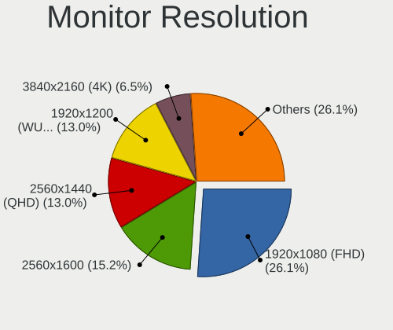

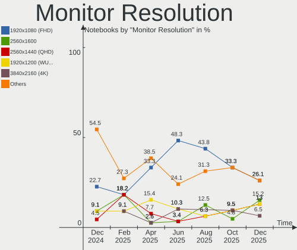

| Resolution        | Notebooks | Percent |
|-------------------|-----------|---------|
| 1920x1080 (FHD)   | 12        | 26.09%  |
| 2560x1600         | 7         | 15.22%  |
| 2560x1440 (QHD)   | 6         | 13.04%  |
| 1920x1200 (WUXGA) | 6         | 13.04%  |
| 3840x2160 (4K)    | 3         | 6.52%   |
| 2256x1504         | 3         | 6.52%   |
| 1600x900 (HD+)    | 2         | 4.35%   |
| 3072x1920         | 1         | 2.17%   |
| 2944x1840         | 1         | 2.17%   |
| 2880x1920         | 1         | 2.17%   |
| 2880x1800         | 1         | 2.17%   |
| 2240x1400         | 1         | 2.17%   |
| 1366x768 (WXGA)   | 1         | 2.17%   |
| 1024x600          | 1         | 2.17%   |

Monitor Diagonal
----------------

Diagonal size in inches

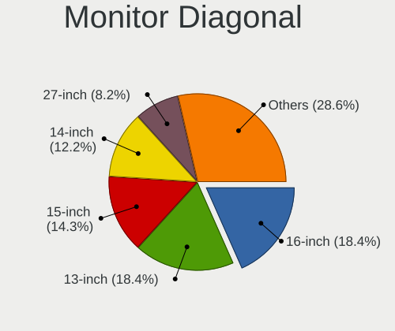

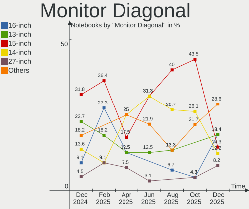

| Inches | Notebooks | Percent |
|--------|-----------|---------|
| 16     | 9         | 18.37%  |
| 13     | 9         | 18.37%  |
| 15     | 7         | 14.29%  |
| 14     | 6         | 12.24%  |
| 27     | 4         | 8.16%   |
| 31     | 3         | 6.12%   |
| 21     | 3         | 6.12%   |
| 24     | 2         | 4.08%   |
| 32     | 1         | 2.04%   |
| 23     | 1         | 2.04%   |
| 20     | 1         | 2.04%   |
| 17     | 1         | 2.04%   |
| 12     | 1         | 2.04%   |
| 10     | 1         | 2.04%   |

Monitor Width
-------------

Physical width

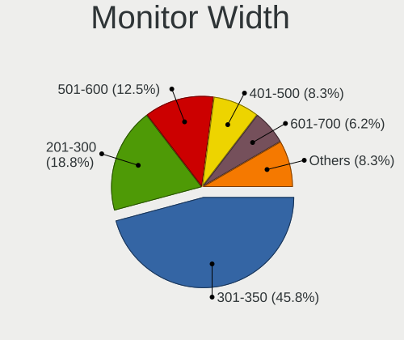

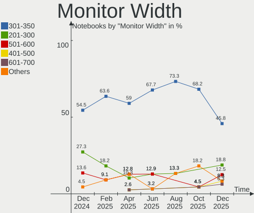

| Width in mm | Notebooks | Percent |
|-------------|-----------|---------|
| 301-350     | 22        | 45.83%  |
| 201-300     | 9         | 18.75%  |
| 501-600     | 6         | 12.5%   |
| 401-500     | 4         | 8.33%   |
| 601-700     | 3         | 6.25%   |
| 351-400     | 3         | 6.25%   |
| 701-800     | 1         | 2.08%   |

Aspect Ratio
------------

Proportional relationship between the width and the height

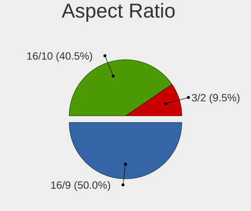

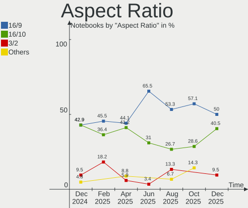

| Ratio | Notebooks | Percent |
|-------|-----------|---------|
| 16/9  | 21        | 50%     |
| 16/10 | 17        | 40.48%  |
| 3/2   | 4         | 9.52%   |

Monitor Area
------------

Area in inch²

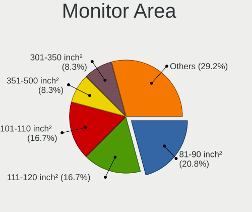

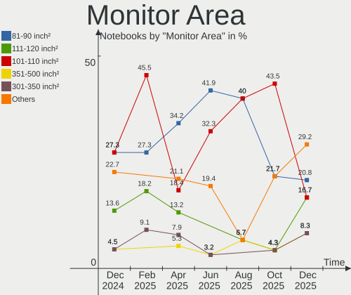

| Area in inch² | Notebooks | Percent |
|----------------|-----------|---------|
| 81-90          | 10        | 20.83%  |
| 111-120        | 8         | 16.67%  |
| 101-110        | 8         | 16.67%  |
| 351-500        | 4         | 8.33%   |
| 301-350        | 4         | 8.33%   |
| 71-80          | 3         | 6.25%   |
| 251-300        | 2         | 4.17%   |
| 201-250        | 2         | 4.17%   |
| 151-200        | 2         | 4.17%   |
| 91-100         | 2         | 4.17%   |
| 61-70          | 1         | 2.08%   |
| 41-50          | 1         | 2.08%   |
| 121-130        | 1         | 2.08%   |

Pixel Density
-------------

Pixels per inch

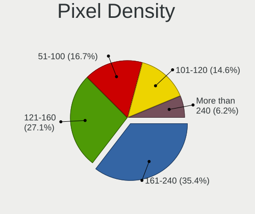

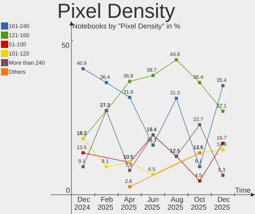

| Density       | Notebooks | Percent |
|---------------|-----------|---------|
| 161-240       | 17        | 35.42%  |
| 121-160       | 13        | 27.08%  |
| 51-100        | 8         | 16.67%  |
| 101-120       | 7         | 14.58%  |
| More than 240 | 3         | 6.25%   |

Multiple Monitors
-----------------

Total monitors connected

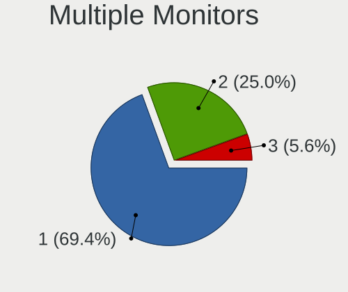

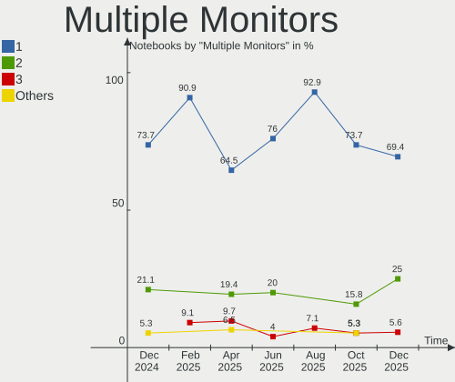

| Total | Notebooks | Percent |
|-------|-----------|---------|
| 1     | 25        | 69.44%  |
| 2     | 9         | 25%     |
| 3     | 2         | 5.56%   |

Network
-------

Net Controller Vendor
---------------------

Controller vendors

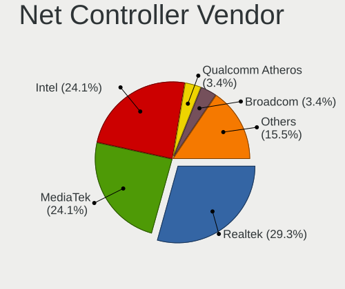

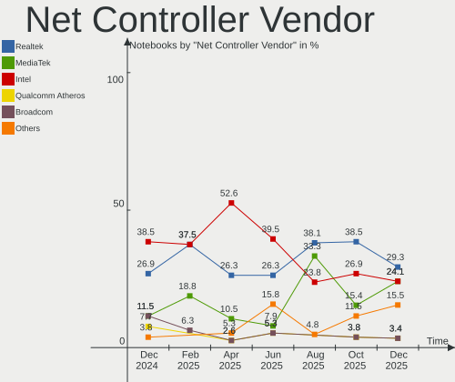

| Vendor                      | Notebooks | Percent |
|-----------------------------|-----------|---------|
| Realtek Semiconductor       | 17        | 29.31%  |
| MediaTek                    | 14        | 24.14%  |
| Intel                       | 14        | 24.14%  |
| Qualcomm Atheros            | 2         | 3.45%   |
| Broadcom                    | 2         | 3.45%   |
| TP-Link                     | 1         | 1.72%   |
| Shenzhen Goodix Technology  | 1         | 1.72%   |
| Raspberry Pi                | 1         | 1.72%   |
| Qualcomm                    | 1         | 1.72%   |
| QinHeng Electronics         | 1         | 1.72%   |
| Motorcomm Microelectronics. | 1         | 1.72%   |
| Framework Computer          | 1         | 1.72%   |
| Broadcom Limited            | 1         | 1.72%   |
| Apple                       | 1         | 1.72%   |

Net Controller Model
--------------------

Controller models

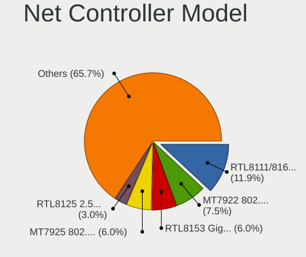

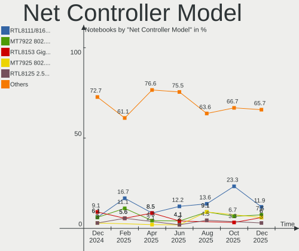

| Model                                                                           | Notebooks | Percent |
|---------------------------------------------------------------------------------|-----------|---------|
| Realtek RTL8111/8168/8211/8411 PCI Express Gigabit Ethernet Controller          | 8         | 11.94%  |
| MediaTek MT7922 802.11ax PCI Express Wireless Network Adapter                   | 5         | 7.46%   |
| Realtek RTL8153 Gigabit Ethernet Adapter                                        | 4         | 5.97%   |
| MediaTek MT7925 802.11be 160MHz 2x2 PCIe Wireless Network Adapter [Filogic 360] | 4         | 5.97%   |
| Realtek RTL8125 2.5GbE Controller                                               | 2         | 2.99%   |
| MediaTek MT7921 802.11ax PCIe Wireless Network Adapter [Filogic 330]            | 2         | 2.99%   |
| MediaTek MT7902 802.11ax PCIe Wireless Network Adapter [Filogic 310]            | 2         | 2.99%   |
| Intel Wireless 8265 / 8275                                                      | 2         | 2.99%   |
| Intel Wi-Fi 6E(802.11ax) AX210/AX1675* 2x2 [Typhoon Peak]                       | 2         | 2.99%   |
| Intel Raptor Lake PCH CNVi WiFi                                                 | 2         | 2.99%   |
| Intel Alder Lake-P PCH CNVi WiFi                                                | 2         | 2.99%   |
| TP-Link AC600 wireless Realtek RTL8811AU [Archer T2U Nano]                      | 1         | 1.49%   |
| Shenzhen Goodix Unknow device                                                   | 1         | 1.49%   |
| Realtek USB 10/100/1G/2.5 LAN                                                   | 1         | 1.49%   |
| Realtek RTL8852CE PCIe 802.11ax Wireless Network Controller                     | 1         | 1.49%   |
| Realtek RTL8852BE PCIe 802.11ax Wireless Network Controller                     | 1         | 1.49%   |
| Realtek RTL810xE PCI Express Fast Ethernet controller                           | 1         | 1.49%   |
| Realtek Killer E2600 GbE Controller                                             | 1         | 1.49%   |
| Raspberry Pi Raspberry Pi USB Gadget                                            | 1         | 1.49%   |
| Qualcomm QCNFA765 Wireless Network Adapter                                      | 1         | 1.49%   |
| Qualcomm Atheros QCA6174 802.11ac Wireless Network Adapter                      | 1         | 1.49%   |
| Qualcomm Atheros AR9485 Wireless Network Adapter                                | 1         | 1.49%   |
| Qualcomm Atheros AR8151 v2.0 Gigabit Ethernet                                   | 1         | 1.49%   |
| QinHeng USB 10/100 LAN                                                          | 1         | 1.49%   |
| Motorcomm Microelectronics. YT6801 Gigabit Ethernet Controller                  | 1         | 1.49%   |
| MediaTek MT7925 (RZ717) Wi-Fi 7 160MHz                                          | 1         | 1.49%   |
| Intel Wireless 8260                                                             | 1         | 1.49%   |
| Intel Wireless 7265                                                             | 1         | 1.49%   |
| Intel Wi-Fi 6 AX200                                                             | 1         | 1.49%   |
| Intel Ethernet Connection I219-LM                                               | 1         | 1.49%   |
| Intel Ethernet Connection I218-LM                                               | 1         | 1.49%   |
| Intel Ethernet Connection (6) I219-LM                                           | 1         | 1.49%   |
| Intel Ethernet Connection (4) I219-V                                            | 1         | 1.49%   |
| Intel Ethernet Connection (11) I219-V                                           | 1         | 1.49%   |
| Intel Comet Lake PCH CNVi WiFi                                                  | 1         | 1.49%   |
| Intel Cannon Point-LP CNVi [Wireless-AC]                                        | 1         | 1.49%   |
| Intel BE201 320MHz                                                              | 1         | 1.49%   |
| Framework LED Matrix Input Module                                               | 1         | 1.49%   |
| Broadcom Limited BCM4352 802.11ac Dual Band Wireless Network Adapter            | 1         | 1.49%   |
| Broadcom BRCM4377 Bluetooth Controller                                          | 1         | 1.49%   |

Wireless Vendor
---------------

Wireless vendors

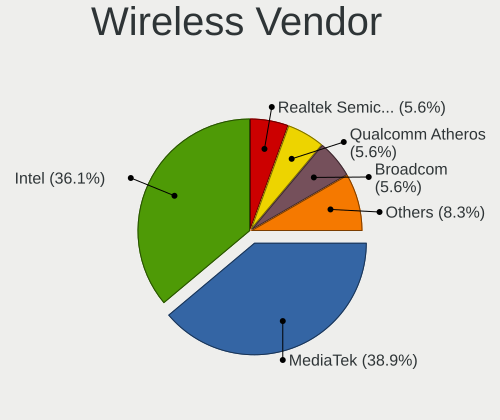

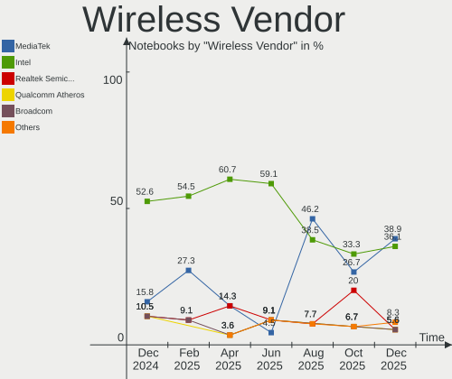

| Vendor                | Notebooks | Percent |
|-----------------------|-----------|---------|
| MediaTek              | 14        | 38.89%  |
| Intel                 | 13        | 36.11%  |
| Realtek Semiconductor | 2         | 5.56%   |
| Qualcomm Atheros      | 2         | 5.56%   |
| Broadcom              | 2         | 5.56%   |
| TP-Link               | 1         | 2.78%   |
| Qualcomm              | 1         | 2.78%   |
| Broadcom Limited      | 1         | 2.78%   |

Wireless Model
--------------

Wireless models

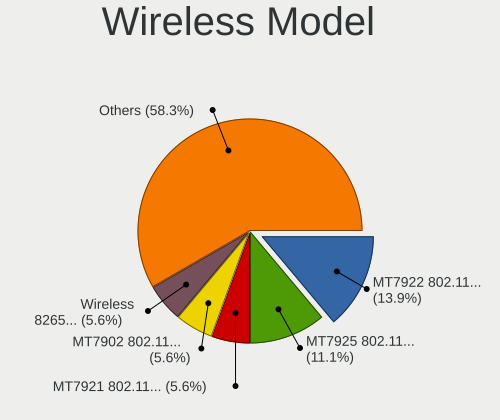

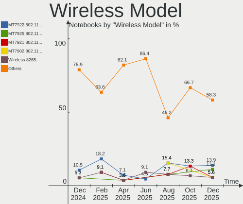

| Model                                                                           | Notebooks | Percent |
|---------------------------------------------------------------------------------|-----------|---------|
| MediaTek MT7922 802.11ax PCI Express Wireless Network Adapter                   | 5         | 13.89%  |
| MediaTek MT7925 802.11be 160MHz 2x2 PCIe Wireless Network Adapter [Filogic 360] | 4         | 11.11%  |
| MediaTek MT7921 802.11ax PCIe Wireless Network Adapter [Filogic 330]            | 2         | 5.56%   |
| MediaTek MT7902 802.11ax PCIe Wireless Network Adapter [Filogic 310]            | 2         | 5.56%   |
| Intel Wireless 8265 / 8275                                                      | 2         | 5.56%   |
| Intel Wi-Fi 6E(802.11ax) AX210/AX1675* 2x2 [Typhoon Peak]                       | 2         | 5.56%   |
| Intel Raptor Lake PCH CNVi WiFi                                                 | 2         | 5.56%   |
| TP-Link AC600 wireless Realtek RTL8811AU [Archer T2U Nano]                      | 1         | 2.78%   |
| Realtek RTL8852CE PCIe 802.11ax Wireless Network Controller                     | 1         | 2.78%   |
| Realtek RTL8852BE PCIe 802.11ax Wireless Network Controller                     | 1         | 2.78%   |
| Qualcomm QCNFA765 Wireless Network Adapter                                      | 1         | 2.78%   |
| Qualcomm Atheros QCA6174 802.11ac Wireless Network Adapter                      | 1         | 2.78%   |
| Qualcomm Atheros AR9485 Wireless Network Adapter                                | 1         | 2.78%   |
| MediaTek MT7925 (RZ717) Wi-Fi 7 160MHz                                          | 1         | 2.78%   |
| Intel Wireless 8260                                                             | 1         | 2.78%   |
| Intel Wireless 7265                                                             | 1         | 2.78%   |
| Intel Wi-Fi 6 AX200                                                             | 1         | 2.78%   |
| Intel Comet Lake PCH CNVi WiFi                                                  | 1         | 2.78%   |
| Intel Cannon Point-LP CNVi [Wireless-AC]                                        | 1         | 2.78%   |
| Intel BE201 320MHz                                                              | 1         | 2.78%   |
| Intel Alder Lake-P PCH CNVi WiFi                                                | 1         | 2.78%   |
| Broadcom Limited BCM4352 802.11ac Dual Band Wireless Network Adapter            | 1         | 2.78%   |
| Broadcom BCM4377b Wireless Network Adapter                                      | 1         | 2.78%   |
| Broadcom BCM4313 802.11bgn Wireless Network Adapter                             | 1         | 2.78%   |

Ethernet Vendor
---------------

Ethernet vendors

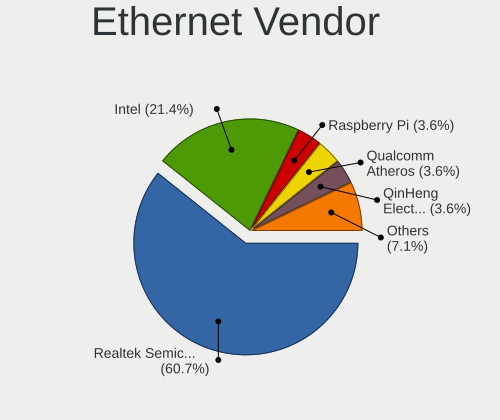

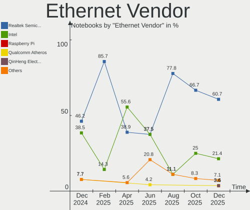

| Vendor                      | Notebooks | Percent |
|-----------------------------|-----------|---------|
| Realtek Semiconductor       | 17        | 60.71%  |
| Intel                       | 6         | 21.43%  |
| Raspberry Pi                | 1         | 3.57%   |
| Qualcomm Atheros            | 1         | 3.57%   |
| QinHeng Electronics         | 1         | 3.57%   |
| Motorcomm Microelectronics. | 1         | 3.57%   |
| Apple                       | 1         | 3.57%   |

Ethernet Model
--------------

Ethernet models

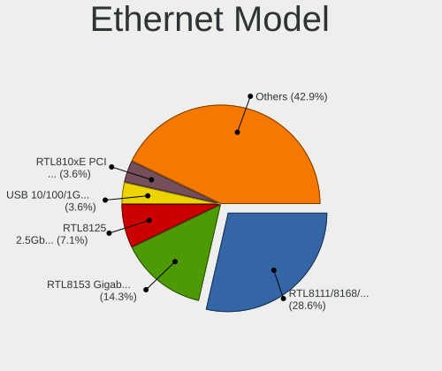

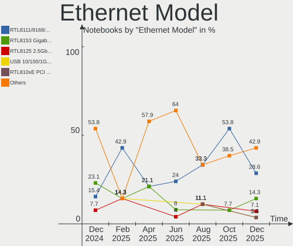

| Model                                                                  | Notebooks | Percent |
|------------------------------------------------------------------------|-----------|---------|
| Realtek RTL8111/8168/8211/8411 PCI Express Gigabit Ethernet Controller | 8         | 28.57%  |
| Realtek RTL8153 Gigabit Ethernet Adapter                               | 4         | 14.29%  |
| Realtek RTL8125 2.5GbE Controller                                      | 2         | 7.14%   |
| Realtek USB 10/100/1G/2.5 LAN                                          | 1         | 3.57%   |
| Realtek RTL810xE PCI Express Fast Ethernet controller                  | 1         | 3.57%   |
| Realtek Killer E2600 GbE Controller                                    | 1         | 3.57%   |
| Raspberry Pi Raspberry Pi USB Gadget                                   | 1         | 3.57%   |
| Qualcomm Atheros AR8151 v2.0 Gigabit Ethernet                          | 1         | 3.57%   |
| QinHeng USB 10/100 LAN                                                 | 1         | 3.57%   |
| Motorcomm Microelectronics. YT6801 Gigabit Ethernet Controller         | 1         | 3.57%   |
| Intel Ethernet Connection I219-LM                                      | 1         | 3.57%   |
| Intel Ethernet Connection I218-LM                                      | 1         | 3.57%   |
| Intel Ethernet Connection (6) I219-LM                                  | 1         | 3.57%   |
| Intel Ethernet Connection (4) I219-V                                   | 1         | 3.57%   |
| Intel Ethernet Connection (11) I219-V                                  | 1         | 3.57%   |
| Intel Alder Lake-P PCH CNVi WiFi                                       | 1         | 3.57%   |
| Apple iBridge                                                          | 1         | 3.57%   |

Net Controller Kind
-------------------

Ethernet, WiFi or modem

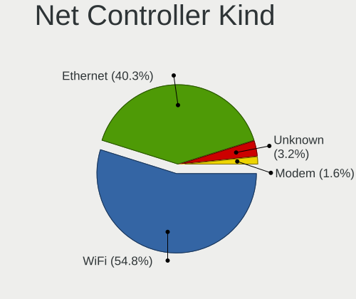

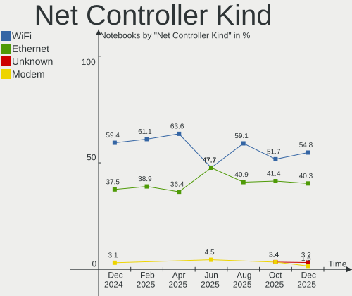

| Kind     | Notebooks | Percent |
|----------|-----------|---------|
| WiFi     | 34        | 54.84%  |
| Ethernet | 25        | 40.32%  |
| Unknown  | 2         | 3.23%   |
| Modem    | 1         | 1.61%   |

Used Controller
---------------

Currently used network controller

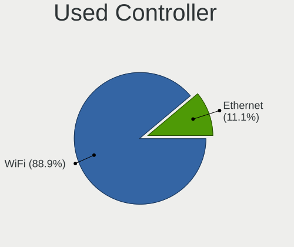

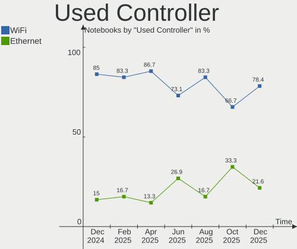

| Kind     | Notebooks | Percent |
|----------|-----------|---------|
| WiFi     | 29        | 78.38%  |
| Ethernet | 8         | 21.62%  |

NICs
----

Total network controllers on board

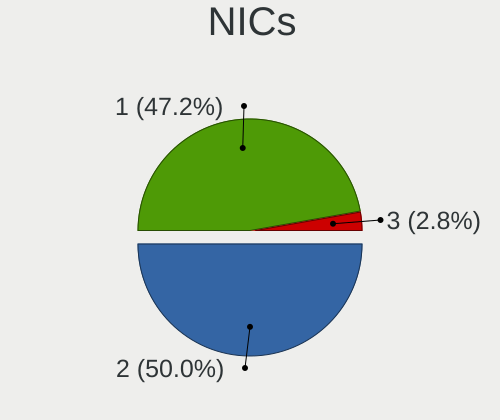

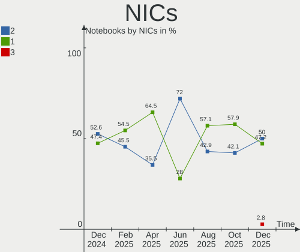

| Total | Notebooks | Percent |
|-------|-----------|---------|
| 2     | 18        | 50%     |
| 1     | 17        | 47.22%  |
| 3     | 1         | 2.78%   |

IPv6
----

IPv6 vs IPv4

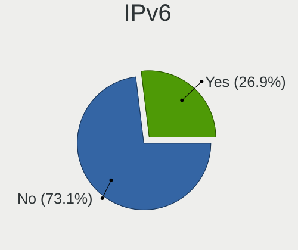

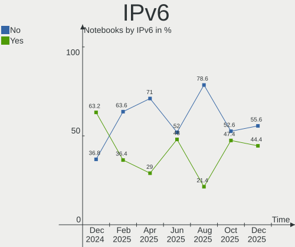

| Used | Notebooks | Percent |
|------|-----------|---------|
| No   | 20        | 55.56%  |
| Yes  | 16        | 44.44%  |

Bluetooth
---------

Bluetooth Vendor
----------------

Controller vendors

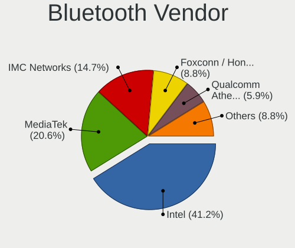

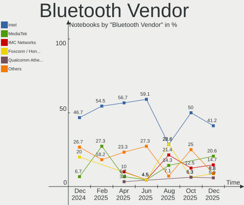

| Vendor                          | Notebooks | Percent |
|---------------------------------|-----------|---------|
| Intel                           | 14        | 41.18%  |
| MediaTek                        | 7         | 20.59%  |
| IMC Networks                    | 5         | 14.71%  |
| Foxconn / Hon Hai               | 3         | 8.82%   |
| Qualcomm Atheros Communications | 2         | 5.88%   |
| USI                             | 1         | 2.94%   |
| Lite-On Technology              | 1         | 2.94%   |
| Broadcom                        | 1         | 2.94%   |

Bluetooth Model
---------------

Controller models

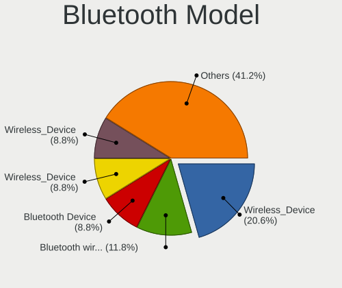

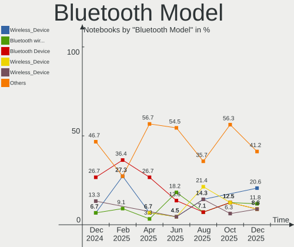

| Model                                          | Notebooks | Percent |
|------------------------------------------------|-----------|---------|
| MediaTek Wireless_Device                       | 7         | 20.59%  |
| Intel Bluetooth wireless interface             | 4         | 11.76%  |
| Intel Bluetooth Device                         | 3         | 8.82%   |
| IMC Networks Wireless_Device                   | 3         | 8.82%   |
| Foxconn / Hon Hai Wireless_Device              | 3         | 8.82%   |
| Intel AX210 Bluetooth                          | 2         | 5.88%   |
| Intel AX201 Bluetooth                          | 2         | 5.88%   |
| IMC Networks Bluetooth Radio                   | 2         | 5.88%   |
| USI Bluetooth Device                           | 1         | 2.94%   |
| Qualcomm Atheros QCA61x4 Bluetooth 4.0         | 1         | 2.94%   |
| Qualcomm Atheros AR3012 Bluetooth 4.0          | 1         | 2.94%   |
| Lite-On Wireless_Device                        | 1         | 2.94%   |
| Intel Bluetooth 9460/9560 Jefferson Peak (JfP) | 1         | 2.94%   |
| Intel Bluetooth                                | 1         | 2.94%   |
| Intel AX200 Bluetooth                          | 1         | 2.94%   |
| Broadcom BCM20702A0                            | 1         | 2.94%   |

Sound
-----

Sound Vendor
------------

Sound card vendors

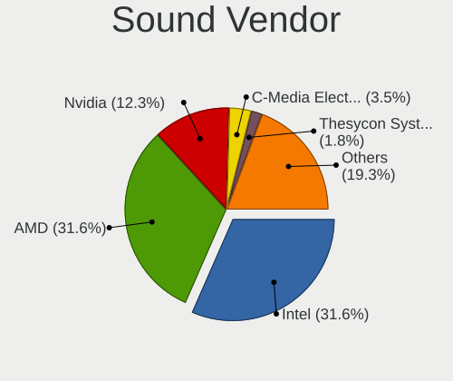

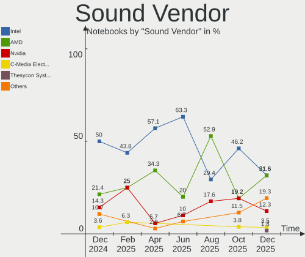

| Vendor                               | Notebooks | Percent |
|--------------------------------------|-----------|---------|
| Intel                                | 18        | 31.58%  |
| AMD                                  | 18        | 31.58%  |
| Nvidia                               | 7         | 12.28%  |
| C-Media Electronics                  | 2         | 3.51%   |
| Thesycon Systemsoftware & Consulting | 1         | 1.75%   |
| SteelSeries ApS                      | 1         | 1.75%   |
| Sony                                 | 1         | 1.75%   |
| Sennheiser                           | 1         | 1.75%   |
| Samson Technologies                  | 1         | 1.75%   |
| Razer USA                            | 1         | 1.75%   |
| Logitech                             | 1         | 1.75%   |
| Lenovo                               | 1         | 1.75%   |
| Kingston Technology                  | 1         | 1.75%   |
| Hewlett-Packard                      | 1         | 1.75%   |
| Focusrite-Novation                   | 1         | 1.75%   |
| Apple                                | 1         | 1.75%   |

Sound Model
-----------

Sound card models

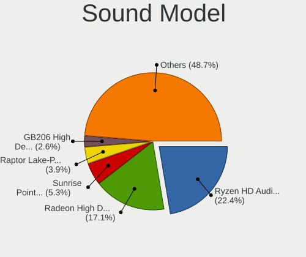

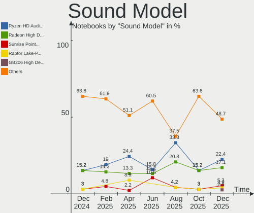

| Model                                                                      | Notebooks | Percent |
|----------------------------------------------------------------------------|-----------|---------|
| AMD Ryzen HD Audio Controller                                              | 17        | 22.37%  |
| AMD Radeon High Definition Audio Controller                                | 13        | 17.11%  |
| Intel Sunrise Point-LP HD Audio                                            | 4         | 5.26%   |
| Intel Raptor Lake-P/U/H cAVS                                               | 3         | 3.95%   |
| Nvidia GB206 High Definition Audio Controller                              | 2         | 2.63%   |
| Intel Alder Lake PCH-P High Definition Audio Controller                    | 2         | 2.63%   |
| AMD Renoir/Cezanne HDMI/DP Audio Controller                                | 2         | 2.63%   |
| AMD Navi 31 HDMI/DP Audio                                                  | 2         | 2.63%   |
| Thesycon Systemsoftware & Consulting E30                                   | 1         | 1.32%   |
| SteelSeries ApS SteelSeries Arctis 9                                       | 1         | 1.32%   |
| Sony DualSense wireless controller (PS5)                                   | 1         | 1.32%   |
| Sennheiser BTD 700                                                         | 1         | 1.32%   |
| Samson Technologies GoMic compact condenser mic                            | 1         | 1.32%   |
| Razer USA Razer Barracuda X 2.4                                            | 1         | 1.32%   |
| Nvidia GA106 High Definition Audio Controller                              | 1         | 1.32%   |
| Nvidia GA104 High Definition Audio Controller                              | 1         | 1.32%   |
| Nvidia GA102 High Definition Audio Controller                              | 1         | 1.32%   |
| Nvidia AD106M High Definition Audio Controller                             | 1         | 1.32%   |
| Nvidia AD104 High Definition Audio Controller                              | 1         | 1.32%   |
| Logitech PRO X Wireless Gaming Headset                                     | 1         | 1.32%   |
| Lenovo Legion H7 gaming earbuds                                            | 1         | 1.32%   |
| Kingston Technology HyperX 7.1 Audio                                       | 1         | 1.32%   |
| Intel Xeon E3-1200 v3/4th Gen Core Processor HD Audio Controller           | 1         | 1.32%   |
| Intel NM10/ICH7 Family High Definition Audio Controller                    | 1         | 1.32%   |
| Intel Lunar Lake-M HD Audio Controller                                     | 1         | 1.32%   |
| Intel Ice Lake-LP Smart Sound Technology Audio Controller                  | 1         | 1.32%   |
| Intel Haswell-ULT HD Audio Controller                                      | 1         | 1.32%   |
| Intel Comet Lake PCH cAVS                                                  | 1         | 1.32%   |
| Intel Cannon Point-LP High Definition Audio Controller                     | 1         | 1.32%   |
| Intel 800 Series ACE (Audio Context Engine)                                | 1         | 1.32%   |
| Intel 8 Series/C220 Series Chipset High Definition Audio Controller        | 1         | 1.32%   |
| Intel 8 Series HD Audio Controller                                         | 1         | 1.32%   |
| Intel 6 Series/C200 Series Chipset Family High Definition Audio Controller | 1         | 1.32%   |
| Hewlett-Packard HyperX SoloCast                                            | 1         | 1.32%   |
| Focusrite-Novation Focusrite Scarlett 2i2 2nd Gen                          | 1         | 1.32%   |
| C-Media Electronics CM106 Like Sound Device                                | 1         | 1.32%   |
| C-Media Electronics Audio Adapter (Unitek Y-247A)                          | 1         | 1.32%   |
| Apple Audio Device                                                         | 1         | 1.32%   |
| AMD Starship/Matisse HD Audio Controller                                   | 1         | 1.32%   |

Memory
------

Memory Vendor
-------------

Memory module vendors

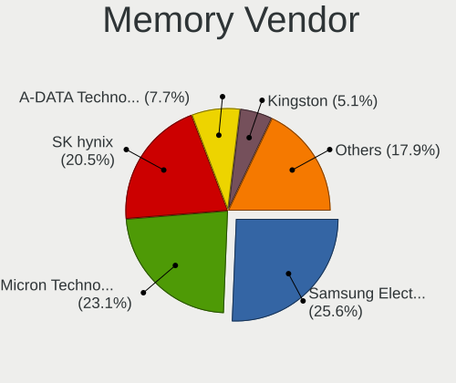

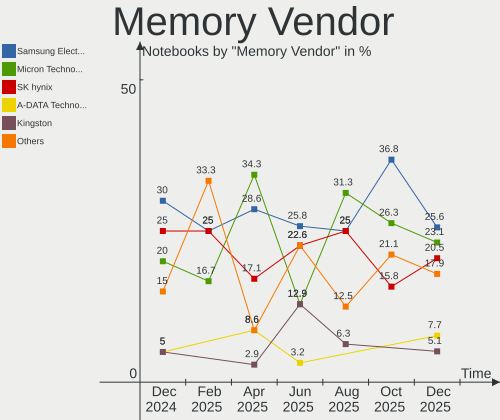

| Vendor              | Notebooks | Percent |
|---------------------|-----------|---------|
| Samsung Electronics | 10        | 25.64%  |
| Micron Technology   | 9         | 23.08%  |
| SK hynix            | 8         | 20.51%  |
| A-DATA Technology   | 3         | 7.69%   |
| Kingston            | 2         | 5.13%   |
| Crucial             | 2         | 5.13%   |
| Unknown             | 2         | 5.13%   |
| Team                | 1         | 2.56%   |
| Patriot             | 1         | 2.56%   |
| Corsair             | 1         | 2.56%   |

Memory Model
------------

Memory module models

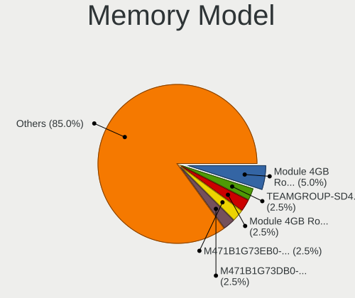

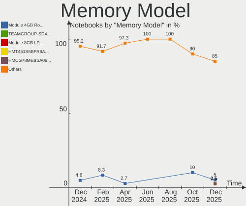

| Model                                                            | Notebooks | Percent |
|------------------------------------------------------------------|-----------|---------|
| Unknown                                                          | 2         | 5%      |
| Team RAM TEAMGROUP-SD4-3200 16GB SODIMM DDR4 3200MT/s            | 1         | 2.5%    |
| SK hynix RAM Module 8GB LPDDR5 7500MT/s                          | 1         | 2.5%    |
| SK hynix RAM HMT451S6BFR8A-PB 4GB SODIMM DDR3 1600MT/s           | 1         | 2.5%    |
| SK hynix RAM HMCG78MEBSA092N 16GB SODIMM DDR5 4800MT/s           | 1         | 2.5%    |
| SK hynix RAM HMCG78AGBSA095N 16GB SODIMM DDR5 5600MT/s           | 1         | 2.5%    |
| SK hynix RAM HMAG68EXNSA051N 8GB SODIMM DDR4 3200MT/s            | 1         | 2.5%    |
| SK hynix RAM HMA81GS6DJR8N-XN 8GB SODIMM DDR4 3200MT/s           | 1         | 2.5%    |
| SK hynix RAM H9CCNNNCLTMLAR-NUD 8GB Row Of Chips LPDDR3 1867MT/s | 1         | 2.5%    |
| SK hynix RAM H58G66BK7BX067 8GB SODIMM LPDDR5 7500MT/s           | 1         | 2.5%    |
| SK hynix RAM H58G66BK7BX067 8GB Row Of Chips LPDDR5 7500MT/s     | 1         | 2.5%    |
| Samsung RAM Module 4GB Row Of Chips LPDDR5 8533MT/s              | 1         | 2.5%    |
| Samsung RAM M471B1G73EB0-YK0 8192MB SODIMM DDR3 1600MT/s         | 1         | 2.5%    |
| Samsung RAM M471B1G73DB0-YK0 8GB SODIMM DDR3 1600MT/s            | 1         | 2.5%    |
| Samsung RAM M471A5244BB0-CRC 4GB SODIMM DDR4 2667MT/s            | 1         | 2.5%    |
| Samsung RAM M471A2K43EB1-CWE 16GB SODIMM DDR4 3200MT/s           | 1         | 2.5%    |
| Samsung RAM M471A2K43CB1-CRC 16GB SODIMM DDR4 2667MT/s           | 1         | 2.5%    |
| Samsung RAM M471A1K43EB1-CWE 8GB SODIMM DDR4 3200MT/s            | 1         | 2.5%    |
| Samsung RAM M471A1G44BB0-CWE 8GB SODIMM DDR4 3200MT/s            | 1         | 2.5%    |
| Samsung RAM M425R2GA3BB0-CQKOL 16GB SODIMM DDR5 4800MT/s         | 1         | 2.5%    |
| Samsung RAM K4UBE3D4AA-MGCR 2GB Row Of Chips LPDDR4 4267MT/s     | 1         | 2.5%    |
| Patriot RAM PSD34G1600L81S 4GB SODIMM DDR3 1600MT/s              | 1         | 2.5%    |
| Micron RAM MTC8C1084S1SC56BD1 K 16GiB SODIMM DDR5 5600MT/s       | 1         | 2.5%    |
| Micron RAM MT62F2G32D4DS-023 WT 8GB Row Of Chips LPDDR5 8533MT/s | 1         | 2.5%    |
| Micron RAM MT62F1G32D4DR-031 WT 4GB SODIMM LPDDR5 6400MT/s       | 1         | 2.5%    |
| Micron RAM MT53E512M64D4NW-053 4GB Row Of Chips LPDDR4 3733MT/s  | 1         | 2.5%    |
| Micron RAM CT64G56C46S5.M16B1 64GB SODIMM DDR5 5600MT/s          | 1         | 2.5%    |
| Micron RAM CT48G56C46S5.M16C1 48GB SODIMM DDR5 5600MT/s          | 1         | 2.5%    |
| Micron RAM ATF2G64AZ-3G2F1 16GB SODIMM DDR4 3200MT/s             | 1         | 2.5%    |
| Micron RAM 4ATS1G64HZ-2G6E1 8GB SODIMM DDR4 2667MT/s             | 1         | 2.5%    |
| Micron RAM 4ATF1G64HZ-3G2E1 8GB Row Of Chips DDR4 3200MT/s       | 1         | 2.5%    |
| Kingston RAM KHX3733C19D4/16GX 16GB DIMM DDR4 3733MT/s           | 1         | 2.5%    |
| Kingston RAM 9905744-108.A00G 16GB SODIMM DDR4 3200MT/s          | 1         | 2.5%    |
| Crucial RAM CT32G4SFD832A.M16FF 32GB SODIMM DDR4 3200MT/s        | 1         | 2.5%    |
| Crucial RAM CT16G4SFRA266.C8FE 16GB SODIMM DDR4 2667MT/s         | 1         | 2.5%    |
| Corsair RAM CMK32GX5M2E6000C36 16GiB DIMM DDR5 6000MT/s          | 1         | 2.5%    |
| A-DATA RAM AD5S56008G-SFW 8GB SODIMM DDR5 5600MT/s               | 1         | 2.5%    |
| A-DATA RAM AD5S560032G-B 32GB SODIMM DDR5 5600MT/s               | 1         | 2.5%    |
| A-DATA RAM AD5S560016G-SFW 16GiB SODIMM DDR5 5600MT/s            | 1         | 2.5%    |

Memory Kind
-----------

Memory module kinds

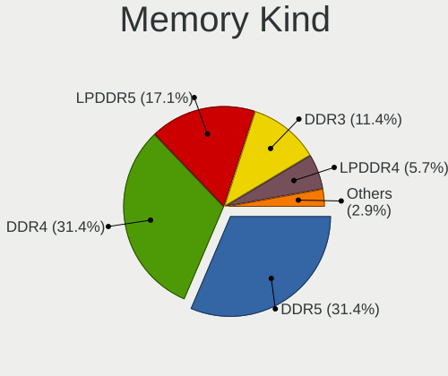

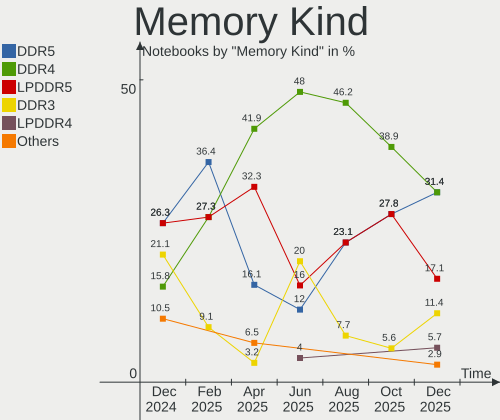

| Kind   | Notebooks | Percent |
|--------|-----------|---------|
| DDR5   | 11        | 31.43%  |
| DDR4   | 11        | 31.43%  |
| LPDDR5 | 6         | 17.14%  |
| DDR3   | 4         | 11.43%  |
| LPDDR4 | 2         | 5.71%   |
| LPDDR3 | 1         | 2.86%   |

Memory Form Factor
------------------

Physical design of the memory module

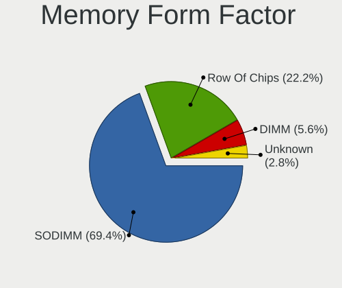

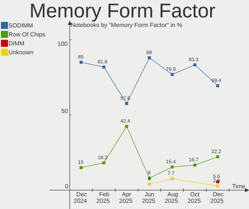

| Name         | Notebooks | Percent |
|--------------|-----------|---------|
| SODIMM       | 25        | 69.44%  |
| Row Of Chips | 8         | 22.22%  |
| DIMM         | 2         | 5.56%   |
| Unknown      | 1         | 2.78%   |

Memory Size
-----------

Memory module size

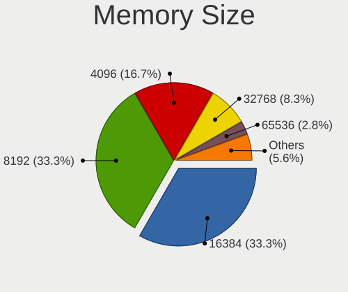

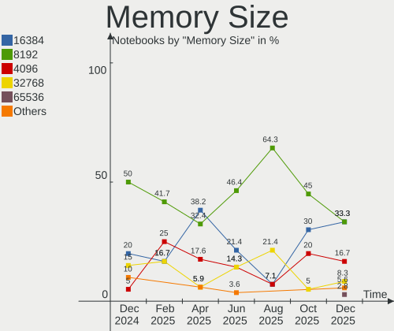

| Size  | Notebooks | Percent |
|-------|-----------|---------|
| 16384 | 12        | 33.33%  |
| 8192  | 12        | 33.33%  |
| 4096  | 6         | 16.67%  |
| 32768 | 3         | 8.33%   |
| 65536 | 1         | 2.78%   |
| 49152 | 1         | 2.78%   |
| 12288 | 1         | 2.78%   |

Memory Speed
------------

Memory module speed

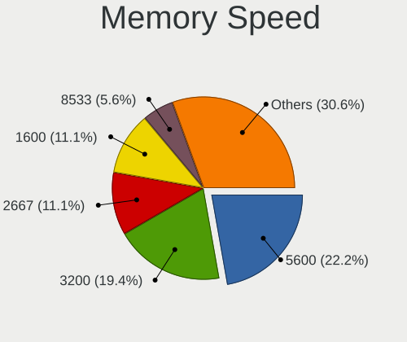

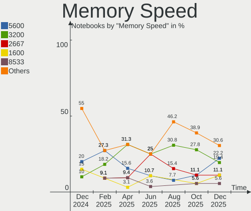

| Speed | Notebooks | Percent |
|-------|-----------|---------|
| 5600  | 8         | 22.22%  |
| 3200  | 7         | 19.44%  |
| 2667  | 4         | 11.11%  |
| 1600  | 4         | 11.11%  |
| 8533  | 2         | 5.56%   |
| 7500  | 2         | 5.56%   |
| 6400  | 2         | 5.56%   |
| 4800  | 2         | 5.56%   |
| 3733  | 2         | 5.56%   |
| 6000  | 1         | 2.78%   |
| 4267  | 1         | 2.78%   |
| 1867  | 1         | 2.78%   |

Printers & scanners
-------------------

Printer Vendor
--------------

Printer device vendors

Zero info for selected period =(

Printer Model
-------------

Printer device models

Zero info for selected period =(

Scanner Vendor
--------------

Scanner device vendors

Zero info for selected period =(

Scanner Model
-------------

Scanner device models

Zero info for selected period =(

Camera
------

Camera Vendor
-------------

Camera device vendors

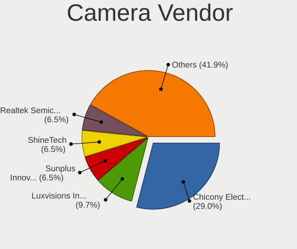

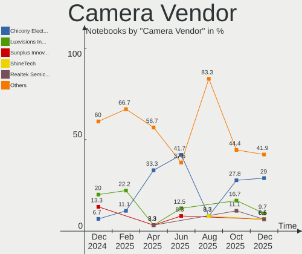

| Vendor                                 | Notebooks | Percent |
|----------------------------------------|-----------|---------|
| Chicony Electronics                    | 9         | 29.03%  |
| Luxvisions Innotech Limited            | 3         | 9.68%   |
| Sunplus Innovation Technology          | 2         | 6.45%   |
| ShineTech                              | 2         | 6.45%   |
| Realtek Semiconductor                  | 2         | 6.45%   |
| Microdia                               | 2         | 6.45%   |
| Suyin                                  | 1         | 3.23%   |
| Sonix Technology                       | 1         | 3.23%   |
| Quanta                                 | 1         | 3.23%   |
| Logitech                               | 1         | 3.23%   |
| Lite-On Technology                     | 1         | 3.23%   |
| kingcome                               | 1         | 3.23%   |
| IMC Networks                           | 1         | 3.23%   |
| Framework                              | 1         | 3.23%   |
| Cheng Uei Precision Industry (Foxlink) | 1         | 3.23%   |
| Bison Electronics                      | 1         | 3.23%   |
| Apple                                  | 1         | 3.23%   |

Camera Model
------------

Camera device models

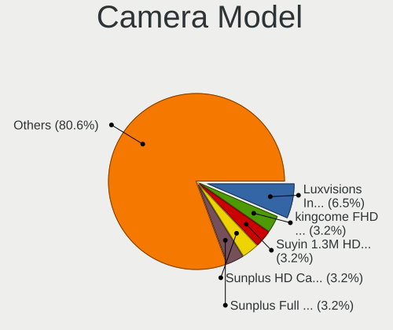

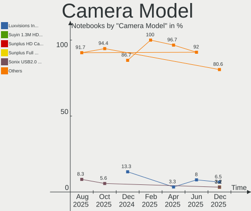

| Model                                                | Notebooks | Percent |
|------------------------------------------------------|-----------|---------|
| Luxvisions Innotech Limited Integrated Camera        | 2         | 6.45%   |
| Suyin 1.3M HD WebCam                                 | 1         | 3.23%   |
| Sunplus HD Camera                                    | 1         | 3.23%   |
| Sunplus Full HD webcam                               | 1         | 3.23%   |
| Sonix USB2.0 HD UVC WebCam                           | 1         | 3.23%   |
| ShineTech USB2.0 HD UVC WebCam                       | 1         | 3.23%   |
| Shinetech ASUS FHD webcam                            | 1         | 3.23%   |
| Realtek Laptop Camera                                | 1         | 3.23%   |
| Realtek Integrated_Webcam_FHD                        | 1         | 3.23%   |
| Quanta USB2.0 HD UVC WebCam                          | 1         | 3.23%   |
| Microdia Integrated_Webcam_HD                        | 1         | 3.23%   |
| Microdia Integrated Webcam HD                        | 1         | 3.23%   |
| Luxvisions Innotech Limited HP Wide Vision HD Camera | 1         | 3.23%   |
| Logitech Logi Webcam C920e                           | 1         | 3.23%   |
| Lite-On Integrated Camera                            | 1         | 3.23%   |
| kingcome FHD WebCam                                  | 1         | 3.23%   |
| IMC Networks Integrated Camera                       | 1         | 3.23%   |
| Framework Laptop Webcam Module (2nd Gen)             | 1         | 3.23%   |
| Chicony XiaoMi USB 2.0 Webcam                        | 1         | 3.23%   |
| Chicony WebCam                                       | 1         | 3.23%   |
| Chicony ThinkPad T490 Webcam                         | 1         | 3.23%   |
| Chicony Integrated Camera (1280x720@30)              | 1         | 3.23%   |
| Chicony Integrated Camera                            | 1         | 3.23%   |
| Chicony HP Truevision HD                             | 1         | 3.23%   |
| Chicony HP HD Camera                                 | 1         | 3.23%   |
| Chicony HP 9MP Camera                                | 1         | 3.23%   |
| Chicony HD User Facing                               | 1         | 3.23%   |
| Cheng Uei Precision Industry (Foxlink) HD Camera     | 1         | 3.23%   |
| Bison Integrated RGB Camera                          | 1         | 3.23%   |
| Apple FaceTime HD Camera (Built-in)                  | 1         | 3.23%   |

Security
--------

Fingerprint Vendor
------------------

Fingerprint sensor vendors

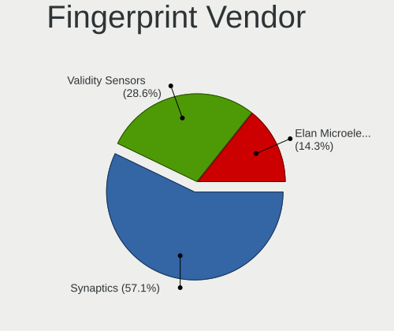

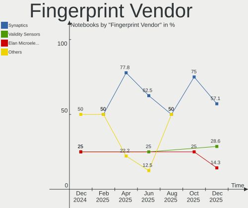

| Vendor                | Notebooks | Percent |
|-----------------------|-----------|---------|
| Synaptics             | 4         | 57.14%  |
| Validity Sensors      | 2         | 28.57%  |
| Elan Microelectronics | 1         | 14.29%  |

Fingerprint Model
-----------------

Fingerprint sensor models

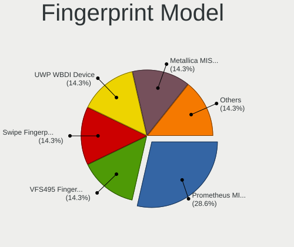

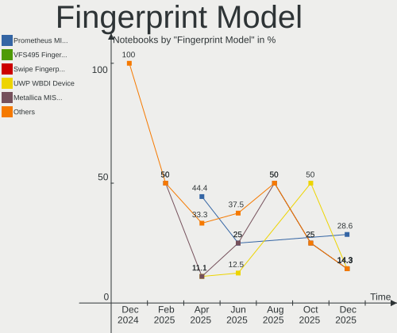

| Model                                             | Notebooks | Percent |
|---------------------------------------------------|-----------|---------|
| Synaptics Prometheus MIS Touch Fingerprint Reader | 2         | 28.57%  |
| Validity Sensors VFS495 Fingerprint Reader        | 1         | 14.29%  |
| Validity Sensors Swipe Fingerprint Sensor         | 1         | 14.29%  |
| Synaptics UWP WBDI Device                         | 1         | 14.29%  |
| Synaptics Metallica MIS Touch Fingerprint Reader  | 1         | 14.29%  |
| Elan ELAN:Fingerprint                             | 1         | 14.29%  |

Chipcard Vendor
---------------

Chipcard module vendors

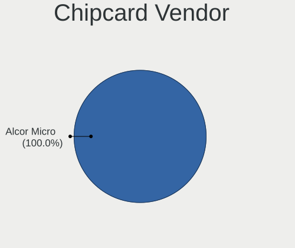

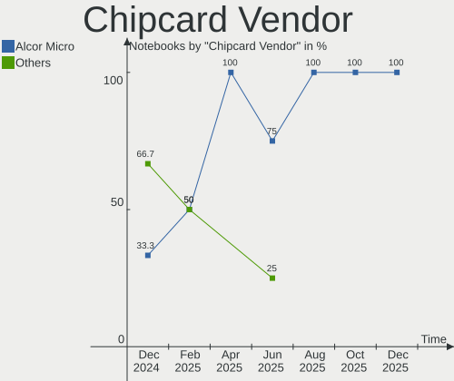

| Vendor      | Notebooks | Percent |
|-------------|-----------|---------|
| Alcor Micro | 2         | 100%    |

Chipcard Model
--------------

Chipcard module models

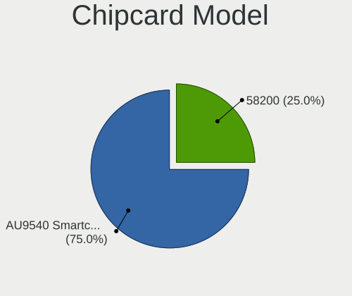

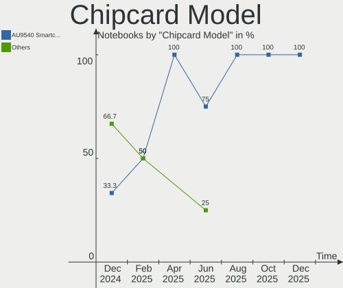

| Model                               | Notebooks | Percent |
|-------------------------------------|-----------|---------|
| Alcor Micro AU9540 Smartcard Reader | 2         | 100%    |

Unsupported
-----------

Unsupported Devices
-------------------

Total unsupported devices on board

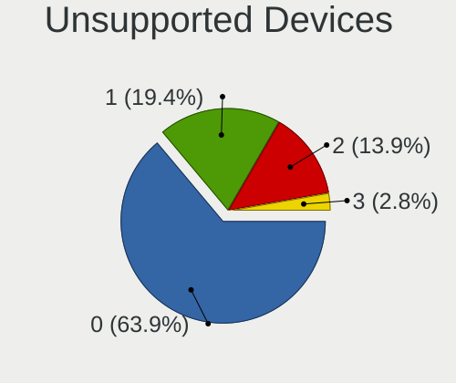

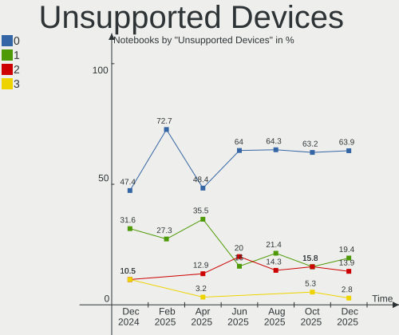

| Total | Notebooks | Percent |
|-------|-----------|---------|
| 0     | 23        | 63.89%  |
| 1     | 7         | 19.44%  |
| 2     | 5         | 13.89%  |
| 3     | 1         | 2.78%   |

Unsupported Device Types
------------------------

Types of unsupported devices

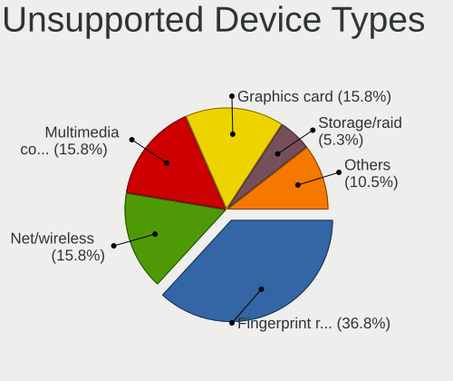

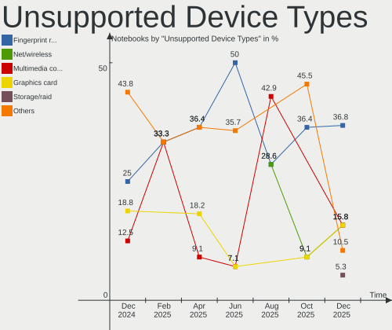

| Type                  | Notebooks | Percent |
|-----------------------|-----------|---------|
| Fingerprint reader    | 7         | 36.84%  |
| Net/wireless          | 3         | 15.79%  |
| Multimedia controller | 3         | 15.79%  |
| Graphics card         | 3         | 15.79%  |
| Storage/raid          | 1         | 5.26%   |
| Network               | 1         | 5.26%   |
| Chipcard              | 1         | 5.26%   |

