NixOS - Hardware Trends (Notebooks)
-----------------------------------

A project to identify most popular hardware characteristics and track their change
over time based on data collected by Linux users at https://Linux-Hardware.org.

Anyone can contribute to this report by the [hw-probe](https://github.com/linuxhw/hw-probe) tool:

    sudo -E hw-probe -all -upload

This report is for one last month. Overall report since the beginning of time: [TestDays](https://github.com/linuxhw/TestDays)

Period: Jan, 2024.

Contents
--------

* [ System ](#system)
  - [ OS                       ](#os)
  - [ OS Family                ](#os-family)
  - [ Kernel                   ](#kernel)
  - [ Kernel Family            ](#kernel-family)
  - [ Kernel Major Ver.        ](#kernel-major-ver)
  - [ Arch                     ](#arch)
  - [ DE                       ](#de)
  - [ Display Server           ](#display-server)
  - [ Display Manager          ](#display-manager)
  - [ OS Lang                  ](#os-lang)
  - [ Boot Mode                ](#boot-mode)
  - [ Filesystem               ](#filesystem)
  - [ Part. scheme             ](#part-scheme)
  - [ Dual Boot with Linux/BSD ](#dual-boot-with-linuxbsd)
  - [ Dual Boot (Win)          ](#dual-boot-win)

* [ Board ](#board)
  - [ Vendor                   ](#vendor)
  - [ Model                    ](#model)
  - [ Model Family             ](#model-family)
  - [ MFG Year                 ](#mfg-year)
  - [ Form Factor              ](#form-factor)
  - [ Secure Boot              ](#secure-boot)
  - [ Coreboot                 ](#coreboot)
  - [ RAM Size                 ](#ram-size)
  - [ RAM Used                 ](#ram-used)
  - [ Total Drives             ](#total-drives)
  - [ Has CD-ROM               ](#has-cd-rom)
  - [ Has Ethernet             ](#has-ethernet)
  - [ Has WiFi                 ](#has-wifi)
  - [ Has Bluetooth            ](#has-bluetooth)

* [ Location ](#location)
  - [ Country                  ](#country)
  - [ City                     ](#city)

* [ Drives ](#drives)
  - [ Drive Vendor             ](#drive-vendor)
  - [ Drive Model              ](#drive-model)
  - [ HDD Vendor               ](#hdd-vendor)
  - [ SSD Vendor               ](#ssd-vendor)
  - [ Drive Kind               ](#drive-kind)
  - [ Drive Connector          ](#drive-connector)
  - [ Drive Size               ](#drive-size)
  - [ Space Total              ](#space-total)
  - [ Space Used               ](#space-used)
  - [ Malfunc. Drives          ](#malfunc-drives)
  - [ Malfunc. Drive Vendor    ](#malfunc-drive-vendor)
  - [ Malfunc. HDD Vendor      ](#malfunc-hdd-vendor)
  - [ Malfunc. Drive Kind      ](#malfunc-drive-kind)
  - [ Failed Drives            ](#failed-drives)
  - [ Failed Drive Vendor      ](#failed-drive-vendor)
  - [ Drive Status             ](#drive-status)

* [ Storage controller ](#storage-controller)
  - [ Storage Vendor           ](#storage-vendor)
  - [ Storage Model            ](#storage-model)
  - [ Storage Kind             ](#storage-kind)

* [ Processor ](#processor)
  - [ CPU Vendor               ](#cpu-vendor)
  - [ CPU Model                ](#cpu-model)
  - [ CPU Model Family         ](#cpu-model-family)
  - [ CPU Cores                ](#cpu-cores)
  - [ CPU Sockets              ](#cpu-sockets)
  - [ CPU Threads              ](#cpu-threads)
  - [ CPU Op-Modes             ](#cpu-op-modes)
  - [ CPU Microcode            ](#cpu-microcode)
  - [ CPU Microarch            ](#cpu-microarch)

* [ Graphics ](#graphics)
  - [ GPU Vendor               ](#gpu-vendor)
  - [ GPU Model                ](#gpu-model)
  - [ GPU Combo                ](#gpu-combo)
  - [ GPU Driver               ](#gpu-driver)
  - [ GPU Memory               ](#gpu-memory)

* [ Monitor ](#monitor)
  - [ Monitor Vendor           ](#monitor-vendor)
  - [ Monitor Model            ](#monitor-model)
  - [ Monitor Resolution       ](#monitor-resolution)
  - [ Monitor Diagonal         ](#monitor-diagonal)
  - [ Monitor Width            ](#monitor-width)
  - [ Aspect Ratio             ](#aspect-ratio)
  - [ Monitor Area             ](#monitor-area)
  - [ Pixel Density            ](#pixel-density)
  - [ Multiple Monitors        ](#multiple-monitors)

* [ Network ](#network)
  - [ Net Controller Vendor    ](#net-controller-vendor)
  - [ Net Controller Model     ](#net-controller-model)
  - [ Wireless Vendor          ](#wireless-vendor)
  - [ Wireless Model           ](#wireless-model)
  - [ Ethernet Vendor          ](#ethernet-vendor)
  - [ Ethernet Model           ](#ethernet-model)
  - [ Net Controller Kind      ](#net-controller-kind)
  - [ Used Controller          ](#used-controller)
  - [ NICs                     ](#nics)
  - [ IPv6                     ](#ipv6)

* [ Bluetooth ](#bluetooth)
  - [ Bluetooth Vendor         ](#bluetooth-vendor)
  - [ Bluetooth Model          ](#bluetooth-model)

* [ Sound ](#sound)
  - [ Sound Vendor             ](#sound-vendor)
  - [ Sound Model              ](#sound-model)

* [ Memory ](#memory)
  - [ Memory Vendor            ](#memory-vendor)
  - [ Memory Model             ](#memory-model)
  - [ Memory Kind              ](#memory-kind)
  - [ Memory Form Factor       ](#memory-form-factor)
  - [ Memory Size              ](#memory-size)
  - [ Memory Speed             ](#memory-speed)

* [ Printers & scanners ](#printers--scanners)
  - [ Printer Vendor           ](#printer-vendor)
  - [ Printer Model            ](#printer-model)
  - [ Scanner Vendor           ](#scanner-vendor)
  - [ Scanner Model            ](#scanner-model)

* [ Camera ](#camera)
  - [ Camera Vendor            ](#camera-vendor)
  - [ Camera Model             ](#camera-model)

* [ Security ](#security)
  - [ Fingerprint Vendor       ](#fingerprint-vendor)
  - [ Fingerprint Model        ](#fingerprint-model)
  - [ Chipcard Vendor          ](#chipcard-vendor)
  - [ Chipcard Model           ](#chipcard-model)

* [ Unsupported ](#unsupported)
  - [ Unsupported Devices      ](#unsupported-devices)
  - [ Unsupported Device Types ](#unsupported-device-types)

System
------

OS
--

Installed operating systems

| Name        | Notebooks | Percent |
|-------------|-----------|---------|
| NixOS 23.11 | 15        | 57.69%  |
| NixOS 24.05 | 11        | 42.31%  |

OS Family
---------

OS without a version

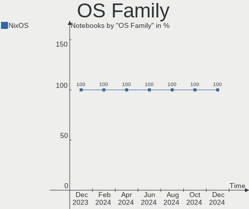

| Name  | Notebooks | Percent |
|-------|-----------|---------|
| NixOS | 26        | 100%    |

Kernel
------

Version of the Linux kernel

| Version       | Notebooks | Percent |
|---------------|-----------|---------|
| 6.1.69        | 7         | 26.92%  |
| 6.6.8         | 4         | 15.38%  |
| 6.1.68        | 2         | 7.69%   |
| 6.7.1         | 1         | 3.85%   |
| 6.7.0-zen3    | 1         | 3.85%   |
| 6.7.0-cachyos | 1         | 3.85%   |
| 6.7.0         | 1         | 3.85%   |
| 6.6.8-lqx1    | 1         | 3.85%   |
| 6.6.3         | 1         | 3.85%   |
| 6.6.11        | 1         | 3.85%   |
| 6.6.10        | 1         | 3.85%   |
| 6.1.74        | 1         | 3.85%   |
| 6.1.72        | 1         | 3.85%   |
| 6.1.71        | 1         | 3.85%   |
| 6.1.64        | 1         | 3.85%   |
| 6.1.52        | 1         | 3.85%   |

Kernel Family
-------------

Linux kernel without a distro release

| Version | Notebooks | Percent |
|---------|-----------|---------|
| 6.1.69  | 7         | 26.92%  |
| 6.6.8   | 5         | 19.23%  |
| 6.7.0   | 3         | 11.54%  |
| 6.1.68  | 2         | 7.69%   |
| 6.7.1   | 1         | 3.85%   |
| 6.6.3   | 1         | 3.85%   |
| 6.6.11  | 1         | 3.85%   |
| 6.6.10  | 1         | 3.85%   |
| 6.1.74  | 1         | 3.85%   |
| 6.1.72  | 1         | 3.85%   |
| 6.1.71  | 1         | 3.85%   |
| 6.1.64  | 1         | 3.85%   |
| 6.1.52  | 1         | 3.85%   |

Kernel Major Ver.
-----------------

Linux kernel major version

| Version | Notebooks | Percent |
|---------|-----------|---------|
| 6.1     | 14        | 53.85%  |
| 6.6     | 8         | 30.77%  |
| 6.7     | 4         | 15.38%  |

Arch
----

OS architecture (x86_64, i586, etc.)

| Name   | Notebooks | Percent |
|--------|-----------|---------|
| x86_64 | 26        | 100%    |

DE
--

Desktop Environment

| Name     | Notebooks | Percent |
|----------|-----------|---------|
| GNOME    | 6         | 23.08%  |
| sway     | 5         | 19.23%  |
| KDE      | 5         | 19.23%  |
| Hyprland | 5         | 19.23%  |
| KDE5     | 3         | 11.54%  |
| none+i3  | 1         | 3.85%   |
| Unknown  | 1         | 3.85%   |

Display Server
--------------

X11 or Wayland

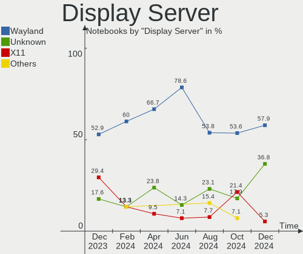

| Name    | Notebooks | Percent |
|---------|-----------|---------|
| Wayland | 15        | 57.69%  |
| Unknown | 8         | 30.77%  |
| X11     | 3         | 11.54%  |

Display Manager
---------------

SDDM, LightDM, etc.

| Name    | Notebooks | Percent |
|---------|-----------|---------|
| SDDM    | 9         | 34.62%  |
| Unknown | 8         | 30.77%  |
| GDM     | 7         | 26.92%  |
| LightDM | 2         | 7.69%   |

OS Lang
-------

Language

| Lang       | Notebooks | Percent |
|------------|-----------|---------|
| en_US      | 17        | 65.38%  |
| pt_PT      | 2         | 7.69%   |
| en_GB      | 2         | 7.69%   |
| fr_FR      | 1         | 3.85%   |
| en_IE.UTF8 | 1         | 3.85%   |
| en_AU      | 1         | 3.85%   |
| de_DE      | 1         | 3.85%   |
| Unknown    | 1         | 3.85%   |

Boot Mode
---------

EFI or BIOS

| Mode | Notebooks | Percent |
|------|-----------|---------|
| EFI  | 25        | 96.15%  |
| BIOS | 1         | 3.85%   |

Filesystem
----------

Type of filesystem

| Type  | Notebooks | Percent |
|-------|-----------|---------|
| Ext4  | 14        | 53.85%  |
| Btrfs | 6         | 23.08%  |
| Zfs   | 4         | 15.38%  |
| Tmpfs | 2         | 7.69%   |

Part. scheme
------------

Scheme of partitioning

| Type | Notebooks | Percent |
|------|-----------|---------|
| GPT  | 25        | 96.15%  |
| MBR  | 1         | 3.85%   |

Dual Boot with Linux/BSD
------------------------

Hosting more than one Linux/BSD

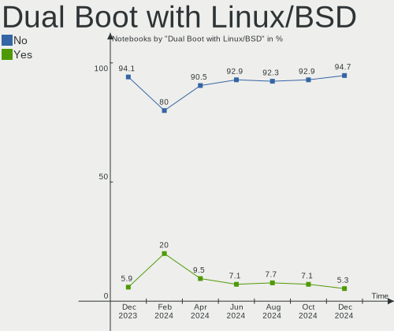

| Dual boot | Notebooks | Percent |
|-----------|-----------|---------|
| No        | 24        | 92.31%  |
| Yes       | 2         | 7.69%   |

Dual Boot (Win)
---------------

Hosting Linux and Windows

| Dual boot | Notebooks | Percent |
|-----------|-----------|---------|
| No        | 20        | 76.92%  |
| Yes       | 6         | 23.08%  |

Board
-----

Vendor
------

Motherboard manufacturer

| Name                | Notebooks | Percent |
|---------------------|-----------|---------|
| Lenovo              | 9         | 34.62%  |
| Dell                | 3         | 11.54%  |
| Apple               | 3         | 11.54%  |
| Framework           | 2         | 7.69%   |
| Timi                | 1         | 3.85%   |
| System76            | 1         | 3.85%   |
| Sony                | 1         | 3.85%   |
| HUAWEI              | 1         | 3.85%   |
| Gigabyte Technology | 1         | 3.85%   |
| Fujitsu             | 1         | 3.85%   |
| Dynabook            | 1         | 3.85%   |
| Corsair             | 1         | 3.85%   |
| ASUSTek Computer    | 1         | 3.85%   |

Model
-----

Motherboard model

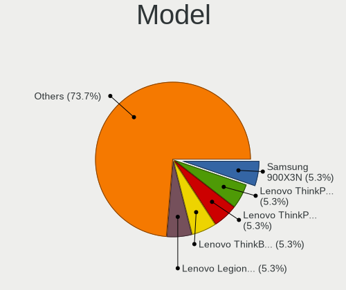

| Name                                        | Notebooks | Percent |
|---------------------------------------------|-----------|---------|
| Timi Xiaomi Book Pro 16 2022                | 1         | 3.85%   |
| System76 Oryx Pro                           | 1         | 3.85%   |
| Sony VGN-CS11S_Q                            | 1         | 3.85%   |
| Lenovo Yoga Slim 7 13ACN5 82CY              | 1         | 3.85%   |
| Lenovo Yoga 7 16IRL8 82YN                   | 1         | 3.85%   |
| Lenovo ThinkPad X1 Carbon Gen 11 21HNA09QCD | 1         | 3.85%   |
| Lenovo ThinkPad Twist 33476LU               | 1         | 3.85%   |
| Lenovo ThinkPad T495 20NJ0016MX             | 1         | 3.85%   |
| Lenovo ThinkPad T470s 20HF0000MX            | 1         | 3.85%   |
| Lenovo ThinkPad L14 Gen 3 21C60010BO        | 1         | 3.85%   |
| Lenovo Legion Y530-15ICH 81FV               | 1         | 3.85%   |
| Lenovo IdeaPad 5 14ALC05 82LM               | 1         | 3.85%   |
| HUAWEI WRT-WX9                              | 1         | 3.85%   |
| Gigabyte B550I AORUS PRO AX                 | 1         | 3.85%   |
| Fujitsu LIFEBOOK U7412                      | 1         | 3.85%   |
| Framework Laptop (12th Gen Intel Core)      | 1         | 3.85%   |
| Framework Laptop                            | 1         | 3.85%   |
| Dynabook PORTEGE X30L-K                     | 1         | 3.85%   |
| Dell XPS 9315                               | 1         | 3.85%   |
| Dell XPS 15 9530                            | 1         | 3.85%   |
| Dell Inspiron 5767                          | 1         | 3.85%   |
| Corsair Voyager a1600                       | 1         | 3.85%   |
| ASUS VivoBook_ASUSLaptop X1504VA_A1504VA    | 1         | 3.85%   |
| Apple MacBookPro3,1                         | 1         | 3.85%   |
| Apple MacBookPro11,5                        | 1         | 3.85%   |
| Apple MacBookPro11,3                        | 1         | 3.85%   |

Model Family
------------

Motherboard model prefix

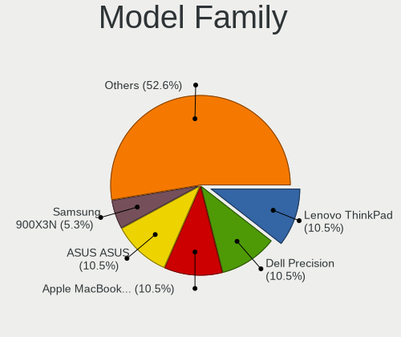

| Name               | Notebooks | Percent |
|--------------------|-----------|---------|
| Lenovo ThinkPad    | 5         | 19.23%  |
| Lenovo Yoga        | 2         | 7.69%   |
| Framework Laptop   | 2         | 7.69%   |
| Dell XPS           | 2         | 7.69%   |
| Apple MacBookPro11 | 2         | 7.69%   |
| Timi Xiaomi        | 1         | 3.85%   |
| System76 Oryx      | 1         | 3.85%   |
| Sony VGN-CS11S     | 1         | 3.85%   |
| Lenovo Legion      | 1         | 3.85%   |
| Lenovo IdeaPad     | 1         | 3.85%   |
| HUAWEI WRT-WX9     | 1         | 3.85%   |
| Gigabyte B550I     | 1         | 3.85%   |
| Fujitsu LIFEBOOK   | 1         | 3.85%   |
| Dynabook PORTEGE   | 1         | 3.85%   |
| Dell Inspiron      | 1         | 3.85%   |
| Corsair Voyager    | 1         | 3.85%   |
| ASUS VivoBook      | 1         | 3.85%   |
| Apple MacBookPro3  | 1         | 3.85%   |

MFG Year
--------

Motherboard manufacture year

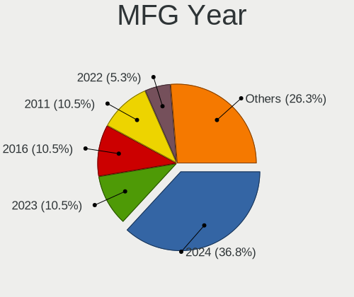

| Year | Notebooks | Percent |
|------|-----------|---------|
| 2022 | 6         | 23.08%  |
| 2023 | 5         | 19.23%  |
| 2021 | 3         | 11.54%  |
| 2018 | 2         | 7.69%   |
| 2016 | 2         | 7.69%   |
| 2020 | 1         | 3.85%   |
| 2019 | 1         | 3.85%   |
| 2017 | 1         | 3.85%   |
| 2014 | 1         | 3.85%   |
| 2013 | 1         | 3.85%   |
| 2012 | 1         | 3.85%   |
| 2008 | 1         | 3.85%   |
| 2007 | 1         | 3.85%   |

Form Factor
-----------

Physical design of the computer

| Name     | Notebooks | Percent |
|----------|-----------|---------|
| Notebook | 26        | 100%    |

Secure Boot
-----------

Enabled or disabled

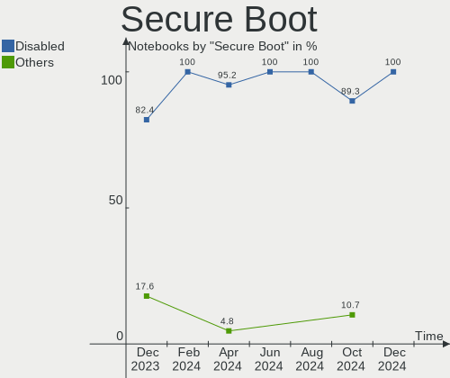

| State    | Notebooks | Percent |
|----------|-----------|---------|
| Disabled | 25        | 96.15%  |
| Enabled  | 1         | 3.85%   |

Coreboot
--------

Have coreboot on board

| Used | Notebooks | Percent |
|------|-----------|---------|
| No   | 25        | 96.15%  |
| Yes  | 1         | 3.85%   |

RAM Size
--------

Total RAM memory

| Size in GB  | Notebooks | Percent |
|-------------|-----------|---------|
| 16.01-24.0  | 7         | 26.92%  |
| 8.01-16.0   | 7         | 26.92%  |
| 32.01-64.0  | 5         | 19.23%  |
| 64.01-256.0 | 3         | 11.54%  |
| 4.01-8.0    | 2         | 7.69%   |
| 3.01-4.0    | 1         | 3.85%   |
| 24.01-32.0  | 1         | 3.85%   |

RAM Used
--------

Used RAM memory

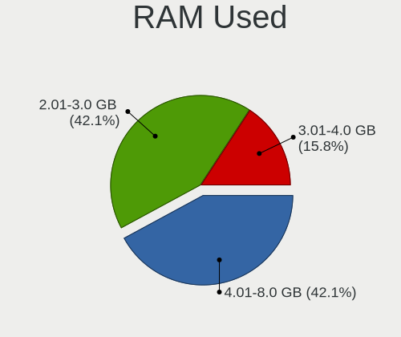

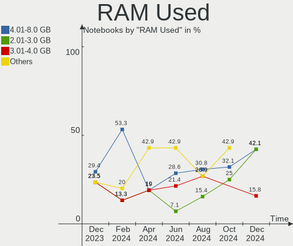

| Used GB    | Notebooks | Percent |
|------------|-----------|---------|
| 4.01-8.0   | 10        | 38.46%  |
| 2.01-3.0   | 7         | 26.92%  |
| 3.01-4.0   | 4         | 15.38%  |
| 1.01-2.0   | 2         | 7.69%   |
| 8.01-16.0  | 2         | 7.69%   |
| 16.01-24.0 | 1         | 3.85%   |

Total Drives
------------

Number of drives on board

| Drives | Notebooks | Percent |
|--------|-----------|---------|
| 1      | 19        | 73.08%  |
| 2      | 7         | 26.92%  |

Has CD-ROM
----------

Has CD-ROM on board

| Presented | Notebooks | Percent |
|-----------|-----------|---------|
| No        | 24        | 92.31%  |
| Yes       | 2         | 7.69%   |

Has Ethernet
------------

Has Ethernet on board

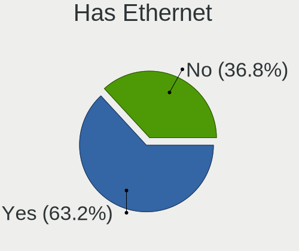

| Presented | Notebooks | Percent |
|-----------|-----------|---------|
| No        | 14        | 53.85%  |
| Yes       | 12        | 46.15%  |

Has WiFi
--------

Has WiFi module

| Presented | Notebooks | Percent |
|-----------|-----------|---------|
| Yes       | 26        | 100%    |

Has Bluetooth
-------------

Has Bluetooth module

| Presented | Notebooks | Percent |
|-----------|-----------|---------|
| Yes       | 25        | 96.15%  |
| No        | 1         | 3.85%   |

Location
--------

Country
-------

Geographic location (country)

| Country       | Notebooks | Percent |
|---------------|-----------|---------|
| USA           | 7         | 26.92%  |
| Germany       | 3         | 11.54%  |
| Sweden        | 2         | 7.69%   |
| Portugal      | 2         | 7.69%   |
| Brazil        | 2         | 7.69%   |
| UK            | 1         | 3.85%   |
| Thailand      | 1         | 3.85%   |
| Singapore     | 1         | 3.85%   |
| Russia        | 1         | 3.85%   |
| Romania       | 1         | 3.85%   |
| Netherlands   | 1         | 3.85%   |
| Malaysia      | 1         | 3.85%   |
| Italy         | 1         | 3.85%   |
| France        | 1         | 3.85%   |
| Faroe Islands | 1         | 3.85%   |

City
----

Geographic location (city)

| City           | Notebooks | Percent |
|----------------|-----------|---------|
| Porto          | 2         | 7.69%   |
| Spinetoli      | 1         | 3.85%   |
| Sorocaba       | 1         | 3.85%   |
| Sollentuna     | 1         | 3.85%   |
| Singapore      | 1         | 3.85%   |
| Salt Lake City | 1         | 3.85%   |
| Rochester      | 1         | 3.85%   |
| Richmond       | 1         | 3.85%   |
| Oklahoma City  | 1         | 3.85%   |
| Norfolk        | 1         | 3.85%   |
| Montpellier    | 1         | 3.85%   |
| Mannheim       | 1         | 3.85%   |
| Malmo          | 1         | 3.85%   |
| Laudenbach     | 1         | 3.85%   |
| Kuala Lumpur   | 1         | 3.85%   |
| Kansas City    | 1         | 3.85%   |
| Hoyvík        | 1         | 3.85%   |
| Hamminkeln     | 1         | 3.85%   |
| Dallas         | 1         | 3.85%   |
| Coventry       | 1         | 3.85%   |
| Cluj-Napoca    | 1         | 3.85%   |
| Chapayevsk     | 1         | 3.85%   |
| Campinas       | 1         | 3.85%   |
| Bangkok        | 1         | 3.85%   |
| Amsterdam      | 1         | 3.85%   |

Drives
------

Drive Vendor
------------

Hard drive vendors

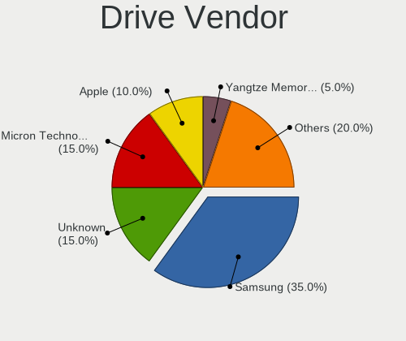

| Vendor                      | Notebooks | Drives | Percent |
|-----------------------------|-----------|--------|---------|
| Samsung Electronics         | 8         | 8      | 25%     |
| SanDisk                     | 6         | 6      | 18.75%  |
| Unknown                     | 3         | 3      | 9.38%   |
| Union Memory (Shenzhen)     | 2         | 2      | 6.25%   |
| Seagate                     | 2         | 2      | 6.25%   |
| SK hynix                    | 1         | 1      | 3.13%   |
| Realtek Semiconductor       | 1         | 2      | 3.13%   |
| Phison Electronics          | 1         | 1      | 3.13%   |
| Micron/Crucial Technology   | 1         | 1      | 3.13%   |
| Micron Technology           | 1         | 1      | 3.13%   |
| MAXIO Technology (Hangzhou) | 1         | 1      | 3.13%   |
| KIOXIA                      | 1         | 1      | 3.13%   |
| Kingston                    | 1         | 1      | 3.13%   |
| Crucial                     | 1         | 1      | 3.13%   |
| Apple                       | 1         | 1      | 3.13%   |
| A-DATA Technology           | 1         | 1      | 3.13%   |

Drive Model
-----------

Hard drive models

| Model                                               | Notebooks | Percent |
|-----------------------------------------------------|-----------|---------|
| Samsung SSD 850 EVO 250GB                           | 2         | 6.25%   |
| Samsung NVMe SSD Controller SM981/PM981/PM983 1TB   | 2         | 6.25%   |
| Unknown MMC Card  64GB                              | 1         | 3.13%   |
| Unknown MMC Card  537GB                             | 1         | 3.13%   |
| Unknown MMC Card  32GB                              | 1         | 3.13%   |
| Union Memory (Shenzhen) UMIS RPJTJ512MGE1QDQ 512GB  | 1         | 3.13%   |
| Union Memory (Shenzhen) UMIS RPETJ1T24MKP2QDQ 1TB   | 1         | 3.13%   |
| SK hynix PC801 NVMe 1TB                             | 1         | 3.13%   |
| Seagate ST500LT012-9WS142 500GB                     | 1         | 3.13%   |
| Seagate ST2000LM007-1R8174 2TB                      | 1         | 3.13%   |
| Sandisk WD_BLACK SN850X 4000GB                      | 1         | 3.13%   |
| Sandisk WD PC SN740 SDDPMQD-512G-1101 512GB         | 1         | 3.13%   |
| Sandisk WD Blue SN570 1TB                           | 1         | 3.13%   |
| Sandisk WD Blue SN550 NVMe SSD 512GB                | 1         | 3.13%   |
| Sandisk WD Black SN750 / PC SN730 NVMe SSD 512GB    | 1         | 3.13%   |
| SanDisk Extreme 55AE 1TB SSD                        | 1         | 3.13%   |
| Samsung SSD 980 500GB                               | 1         | 3.13%   |
| Samsung NVMe SSD Controller SM961/PM961/SM963 256GB | 1         | 3.13%   |
| Samsung NVMe SSD Controller PM9A1/PM9A3/980PRO 2TB  | 1         | 3.13%   |
| Samsung MZVLQ512HBLU-00B00 512GB                    | 1         | 3.13%   |
| Realtek RTS5763DL NVMe SSD Controller 2TB           | 1         | 3.13%   |
| Phison ESE2A044-512 NVMe 512GB                      | 1         | 3.13%   |
| Micron/Crucial P2 NVMe PCIe SSD 1TB                 | 1         | 3.13%   |
| Micron 2400_MTFDKBA512QFM 512GB                     | 1         | 3.13%   |
| MAXIO (Hangzhou) NVMe SSD Controller MAP1202 512GB  | 1         | 3.13%   |
| KIOXIA KBG50ZNV512G 512GB                           | 1         | 3.13%   |
| Kingston SNVS500G 500GB                             | 1         | 3.13%   |
| Crucial CT500MX500SSD1 500GB                        | 1         | 3.13%   |
| Apple SSD SM0512F 500GB                             | 1         | 3.13%   |
| A-DATA SP550 240GB SSD                              | 1         | 3.13%   |

HDD Vendor
----------

Hard disk drive vendors

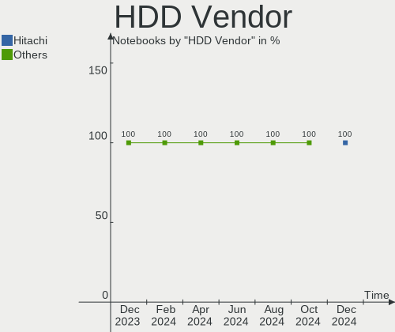

| Vendor  | Notebooks | Drives | Percent |
|---------|-----------|--------|---------|
| Seagate | 2         | 2      | 100%    |

SSD Vendor
----------

Solid state drive vendors

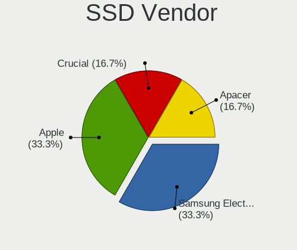

| Vendor              | Notebooks | Drives | Percent |
|---------------------|-----------|--------|---------|
| Samsung Electronics | 2         | 2      | 33.33%  |
| SanDisk             | 1         | 1      | 16.67%  |
| Crucial             | 1         | 1      | 16.67%  |
| Apple               | 1         | 1      | 16.67%  |
| A-DATA Technology   | 1         | 1      | 16.67%  |

Drive Kind
----------

HDD or SSD

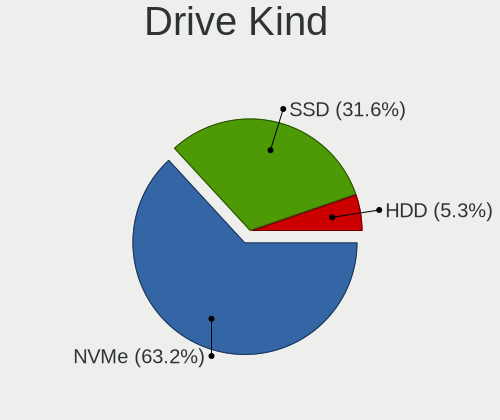

| Kind | Notebooks | Drives | Percent |
|------|-----------|--------|---------|
| NVMe | 21        | 22     | 65.63%  |
| SSD  | 6         | 6      | 18.75%  |
| MMC  | 3         | 3      | 9.38%   |
| HDD  | 2         | 2      | 6.25%   |

Drive Connector
---------------

SATA, SAS, NVMe, etc.

| Type | Notebooks | Drives | Percent |
|------|-----------|--------|---------|
| NVMe | 21        | 22     | 67.74%  |
| SATA | 6         | 7      | 19.35%  |
| MMC  | 3         | 3      | 9.68%   |
| SAS  | 1         | 1      | 3.23%   |

Drive Size
----------

Size of hard drive

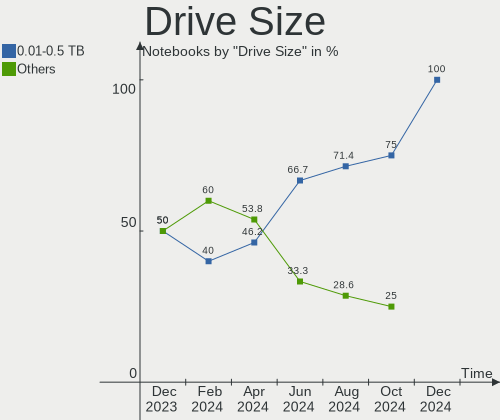

| Size in TB | Notebooks | Drives | Percent |
|------------|-----------|--------|---------|
| 0.01-0.5   | 6         | 6      | 75%     |
| 1.01-2.0   | 1         | 1      | 12.5%   |
| 0.51-1.0   | 1         | 1      | 12.5%   |

Space Total
-----------

Amount of disk space available on the file system

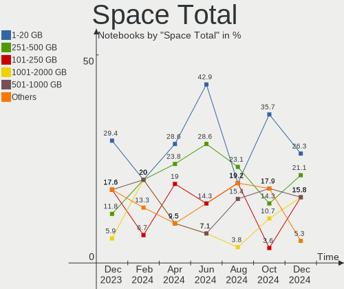

| Size in GB | Notebooks | Percent |
|------------|-----------|---------|
| 1-20       | 8         | 30.77%  |
| 251-500    | 6         | 23.08%  |
| 1001-2000  | 5         | 19.23%  |
| 101-250    | 3         | 11.54%  |
| 2001-3000  | 2         | 7.69%   |
| 501-1000   | 2         | 7.69%   |

Space Used
----------

Amount of used disk space

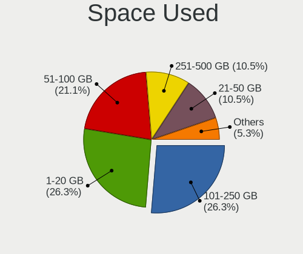

| Used GB   | Notebooks | Percent |
|-----------|-----------|---------|
| 1-20      | 11        | 42.31%  |
| 251-500   | 4         | 15.38%  |
| 21-50     | 4         | 15.38%  |
| 101-250   | 3         | 11.54%  |
| 1001-2000 | 2         | 7.69%   |
| 501-1000  | 1         | 3.85%   |
| 51-100    | 1         | 3.85%   |

Malfunc. Drives
---------------

Drive models with a malfunction

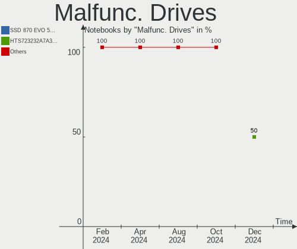

| Model                           | Notebooks | Drives | Percent |
|---------------------------------|-----------|--------|---------|
| Seagate ST500LT012-9WS142 500GB | 1         | 1      | 100%    |

Malfunc. Drive Vendor
---------------------

Vendors of faulty drives

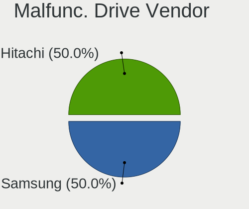

| Vendor  | Notebooks | Drives | Percent |
|---------|-----------|--------|---------|
| Seagate | 1         | 1      | 100%    |

Malfunc. HDD Vendor
-------------------

Vendors of faulty HDD drives

| Vendor  | Notebooks | Drives | Percent |
|---------|-----------|--------|---------|
| Seagate | 1         | 1      | 100%    |

Malfunc. Drive Kind
-------------------

Kinds of faulty drives

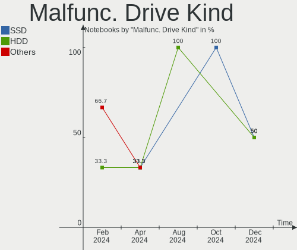

| Kind | Notebooks | Drives | Percent |
|------|-----------|--------|---------|
| HDD  | 1         | 1      | 100%    |

Failed Drives
-------------

Failed drive models

Zero info for selected period =(

Failed Drive Vendor
-------------------

Failed drive vendors

Zero info for selected period =(

Drive Status
------------

Number of failed and malfunc. drives

| Status   | Notebooks | Drives | Percent |
|----------|-----------|--------|---------|
| Works    | 25        | 28     | 83.33%  |
| Detected | 4         | 4      | 13.33%  |
| Malfunc  | 1         | 1      | 3.33%   |

Storage controller
------------------

Storage Vendor
--------------

Storage controller vendors

| Vendor                                  | Notebooks | Percent |
|-----------------------------------------|-----------|---------|
| Samsung Electronics                     | 7         | 23.33%  |
| Intel                                   | 6         | 20%     |
| Sandisk                                 | 5         | 16.67%  |
| AMD                                     | 2         | 6.67%   |
| Union Memory (Shenzhen)                 | 1         | 3.33%   |
| SK hynix                                | 1         | 3.33%   |
| Shenzhen Unionmemory Information System | 1         | 3.33%   |
| Realtek Semiconductor                   | 1         | 3.33%   |
| Phison Electronics                      | 1         | 3.33%   |
| Micron/Crucial Technology               | 1         | 3.33%   |
| Micron Technology                       | 1         | 3.33%   |
| MAXIO Technology (Hangzhou)             | 1         | 3.33%   |
| KIOXIA                                  | 1         | 3.33%   |
| Kingston Technology Company             | 1         | 3.33%   |

Storage Model
-------------

Storage controller models

| Model                                                                  | Notebooks | Percent |
|------------------------------------------------------------------------|-----------|---------|
| Samsung NVMe SSD Controller SM981/PM981/PM983                          | 2         | 6.45%   |
| Samsung NVMe SSD Controller 980 (DRAM-less)                            | 2         | 6.45%   |
| Union Memory (Shenzhen) AM630 PCIe 4.0 x4 NVMe SSD Controller          | 1         | 3.23%   |
| SK hynix Platinum P41/PC801 NVMe Solid State Drive                     | 1         | 3.23%   |
| Shenzhen Unionmemory Information System Non-Volatile memory controller | 1         | 3.23%   |
| Sandisk WD PC SN740 NVMe SSD 512GB (DRAM-less)                         | 1         | 3.23%   |
| Sandisk WD Black SN850X NVMe SSD                                       | 1         | 3.23%   |
| SanDisk Ultra 3D / WD Blue SN570 NVMe SSD (DRAM-less)                  | 1         | 3.23%   |
| SanDisk Ultra 3D / WD Blue SN550 NVMe SSD                              | 1         | 3.23%   |
| SanDisk Extreme Pro / WD Black SN750 / PC SN730 / Red SN700 NVMe SSD   | 1         | 3.23%   |
| Samsung S4LN053X01 AHCI SSD Controller(Apple slot)                     | 1         | 3.23%   |
| Samsung NVMe SSD Controller SM961/PM961/SM963                          | 1         | 3.23%   |
| Samsung NVMe SSD Controller PM9A1/PM9A3/980PRO                         | 1         | 3.23%   |
| Realtek RTS5762 NVMe SSD Controller                                    | 1         | 3.23%   |
| Phison PS5019-E19 PCIe4 NVMe Controller (DRAM-less)                    | 1         | 3.23%   |
| Micron/Crucial P2 [Nick P2] / P3 / P3 Plus NVMe PCIe SSD (DRAM-less)   | 1         | 3.23%   |
| Micron 2400 NVMe SSD (DRAM-less)                                       | 1         | 3.23%   |
| MAXIO (Hangzhou) NVMe SSD Controller MAP1202 (DRAM-less)               | 1         | 3.23%   |
| KIOXIA NVMe SSD Controller BG5 (DRAM-less)                             | 1         | 3.23%   |
| Kingston Company NV1 NVMe SSD SM2263XT (DRAM-less)                     | 1         | 3.23%   |
| Intel Volume Management Device NVMe RAID Controller                    | 1         | 3.23%   |
| Intel Sunrise Point-LP SATA Controller [AHCI mode]                     | 1         | 3.23%   |
| Intel Cannon Lake Mobile PCH SATA AHCI Controller                      | 1         | 3.23%   |
| Intel 82801IBM/IEM (ICH9M/ICH9M-E) 4 port SATA Controller [AHCI mode]  | 1         | 3.23%   |
| Intel 82801HM/HEM (ICH8M/ICH8M-E) SATA Controller [AHCI mode]          | 1         | 3.23%   |
| Intel 82801HM/HEM (ICH8M/ICH8M-E) IDE Controller                       | 1         | 3.23%   |
| Intel 7 Series Chipset Family 6-port SATA Controller [AHCI mode]       | 1         | 3.23%   |
| AMD FCH SATA Controller [AHCI mode]                                    | 1         | 3.23%   |
| AMD 500 Series Chipset SATA Controller                                 | 1         | 3.23%   |

Storage Kind
------------

Kind of storage controller (IDE, SATA, NVMe, SAS, ...)

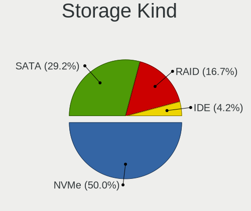

| Kind | Notebooks | Percent |
|------|-----------|---------|
| NVMe | 21        | 67.74%  |
| SATA | 8         | 25.81%  |
| RAID | 1         | 3.23%   |
| IDE  | 1         | 3.23%   |

Processor
---------

CPU Vendor
----------

Processor vendors

| Vendor | Notebooks | Percent |
|--------|-----------|---------|
| Intel  | 20        | 76.92%  |
| AMD    | 6         | 23.08%  |

CPU Model
---------

Processor models

| Model                                           | Notebooks | Percent |
|-------------------------------------------------|-----------|---------|
| Intel 12th Gen Core i7-1260P                    | 2         | 7.69%   |
| Intel Core i7-8750H CPU @ 2.20GHz               | 1         | 3.85%   |
| Intel Core i7-7500U CPU @ 2.70GHz               | 1         | 3.85%   |
| Intel Core i7-4980HQ CPU @ 2.80GHz              | 1         | 3.85%   |
| Intel Core i7-4850HQ CPU @ 2.30GHz              | 1         | 3.85%   |
| Intel Core i7-3537U CPU @ 2.00GHz               | 1         | 3.85%   |
| Intel Core i5-8265U CPU @ 1.60GHz               | 1         | 3.85%   |
| Intel Core i5-7200U CPU @ 2.50GHz               | 1         | 3.85%   |
| Intel Core 2 Duo CPU T7700 @ 2.40GHz            | 1         | 3.85%   |
| Intel Core 2 Duo CPU P8400 @ 2.26GHz            | 1         | 3.85%   |
| Intel 13th Gen Core i9-13900H                   | 1         | 3.85%   |
| Intel 13th Gen Core i7-13700H                   | 1         | 3.85%   |
| Intel 13th Gen Core i7-1365U                    | 1         | 3.85%   |
| Intel 13th Gen Core i7-1355U                    | 1         | 3.85%   |
| Intel 13th Gen Core i5-1335U                    | 1         | 3.85%   |
| Intel 12th Gen Core i7-1270P                    | 1         | 3.85%   |
| Intel 12th Gen Core i7-1250U                    | 1         | 3.85%   |
| Intel 12th Gen Core i5-1240P                    | 1         | 3.85%   |
| Intel 11th Gen Core i5-1135G7 @ 2.40GHz         | 1         | 3.85%   |
| AMD Ryzen 9 6900HS with Radeon Graphics         | 1         | 3.85%   |
| AMD Ryzen 9 5900X 12-Core Processor             | 1         | 3.85%   |
| AMD Ryzen 7 PRO 5875U with Radeon Graphics      | 1         | 3.85%   |
| AMD Ryzen 7 5800U with Radeon Graphics          | 1         | 3.85%   |
| AMD Ryzen 7 5700U with Radeon Graphics          | 1         | 3.85%   |
| AMD Ryzen 5 PRO 3500U w/ Radeon Vega Mobile Gfx | 1         | 3.85%   |

CPU Model Family
----------------

Processor model prefix

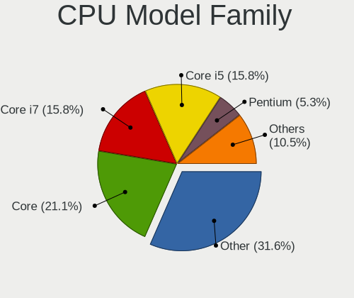

| Model            | Notebooks | Percent |
|------------------|-----------|---------|
| Other            | 11        | 42.31%  |
| Intel Core i7    | 5         | 19.23%  |
| Intel Core i5    | 2         | 7.69%   |
| Intel Core 2 Duo | 2         | 7.69%   |
| AMD Ryzen 9      | 2         | 7.69%   |
| AMD Ryzen 7      | 2         | 7.69%   |
| AMD Ryzen 7 PRO  | 1         | 3.85%   |
| AMD Ryzen 5 PRO  | 1         | 3.85%   |

CPU Cores
---------

Number of processor cores

| Number | Notebooks | Percent |
|--------|-----------|---------|
| 12     | 5         | 19.23%  |
| 4      | 5         | 19.23%  |
| 2      | 5         | 19.23%  |
| 10     | 4         | 15.38%  |
| 8      | 4         | 15.38%  |
| 14     | 2         | 7.69%   |
| 6      | 1         | 3.85%   |

CPU Sockets
-----------

Number of sockets

| Number | Notebooks | Percent |
|--------|-----------|---------|
| 1      | 26        | 100%    |

CPU Threads
-----------

Threads per core (Hyper-Threading)

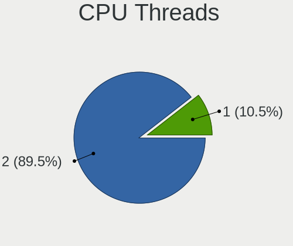

| Number | Notebooks | Percent |
|--------|-----------|---------|
| 2      | 24        | 92.31%  |
| 1      | 2         | 7.69%   |

CPU Op-Modes
------------

CPU Operation Modes (32-bit, 64-bit)

| Op mode        | Notebooks | Percent |
|----------------|-----------|---------|
| 32-bit, 64-bit | 26        | 100%    |

CPU Microcode
-------------

Microcode number

| Number     | Notebooks | Percent |
|------------|-----------|---------|
| Unknown    | 10        | 38.46%  |
| 0xb06a3    | 2         | 7.69%   |
| 0x906a3    | 2         | 7.69%   |
| 0x40661    | 2         | 7.69%   |
| 0x0a50000c | 2         | 7.69%   |
| 0xb06a2    | 1         | 3.85%   |
| 0x906ea    | 1         | 3.85%   |
| 0x906a4    | 1         | 3.85%   |
| 0x806ec    | 1         | 3.85%   |
| 0x806e9    | 1         | 3.85%   |
| 0x306a9    | 1         | 3.85%   |
| 0x10676    | 1         | 3.85%   |
| 0x08108109 | 1         | 3.85%   |

CPU Microarch
-------------

Microarchitecture

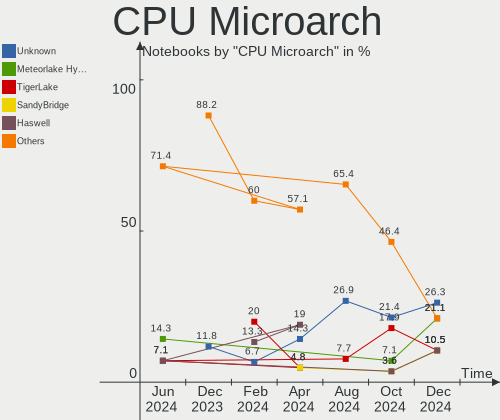

| Name             | Notebooks | Percent |
|------------------|-----------|---------|
| Alderlake Hybrid | 9         | 34.62%  |
| KabyLake         | 4         | 15.38%  |
| Zen 3            | 3         | 11.54%  |
| Unknown          | 3         | 11.54%  |
| Haswell          | 2         | 7.69%   |
| Zen+             | 1         | 3.85%   |
| TigerLake        | 1         | 3.85%   |
| Penryn           | 1         | 3.85%   |
| IvyBridge        | 1         | 3.85%   |
| Core             | 1         | 3.85%   |

Graphics
--------

GPU Vendor
----------

Vendors of graphics cards

| Vendor | Notebooks | Percent |
|--------|-----------|---------|
| Intel  | 16        | 51.61%  |
| AMD    | 8         | 25.81%  |
| Nvidia | 7         | 22.58%  |

GPU Model
---------

Graphics card models

| Model                                                                                 | Notebooks | Percent |
|---------------------------------------------------------------------------------------|-----------|---------|
| Intel Raptor Lake-P [Iris Xe Graphics]                                                | 5         | 15.63%  |
| Intel Alder Lake-P GT2 [Iris Xe Graphics]                                             | 4         | 12.5%   |
| Intel HD Graphics 620                                                                 | 2         | 6.25%   |
| Nvidia GP108M [GeForce MX250]                                                         | 1         | 3.13%   |
| Nvidia GP107M [GeForce GTX 1050 Mobile]                                               | 1         | 3.13%   |
| Nvidia GK107M [GeForce GT 750M Mac Edition]                                           | 1         | 3.13%   |
| Nvidia G98M [GeForce 9300M GS]                                                        | 1         | 3.13%   |
| Nvidia G84M [GeForce 8600M GT]                                                        | 1         | 3.13%   |
| Nvidia AD107M [GeForce RTX 4050 Max-Q / Mobile]                                       | 1         | 3.13%   |
| Nvidia AD106M [GeForce RTX 4070 Max-Q / Mobile]                                       | 1         | 3.13%   |
| Intel WhiskeyLake-U GT2 [UHD Graphics 620]                                            | 1         | 3.13%   |
| Intel TigerLake-LP GT2 [Iris Xe Graphics]                                             | 1         | 3.13%   |
| Intel CoffeeLake-H GT2 [UHD Graphics 630]                                             | 1         | 3.13%   |
| Intel Alder Lake-UP4 GT2 [Iris Xe Graphics]                                           | 1         | 3.13%   |
| Intel 3rd Gen Core processor Graphics Controller                                      | 1         | 3.13%   |
| AMD Venus XT [Radeon HD 8870M / R9 M270X/M370X]                                       | 1         | 3.13%   |
| AMD Topaz XT [Radeon R7 M260/M265 / M340/M360 / M440/M445 / 530/535 / 620/625 Mobile] | 1         | 3.13%   |
| AMD Rembrandt [Radeon 680M]                                                           | 1         | 3.13%   |
| AMD Picasso/Raven 2 [Radeon Vega Series / Radeon Vega Mobile Series]                  | 1         | 3.13%   |
| AMD Navi 22 [Radeon RX 6700/6700 XT/6750 XT / 6800M/6850M XT]                         | 1         | 3.13%   |
| AMD Navi 21 [Radeon RX 6800/6800 XT / 6900 XT]                                        | 1         | 3.13%   |
| AMD Lucienne                                                                          | 1         | 3.13%   |
| AMD Cezanne [Radeon Vega Series / Radeon Vega Mobile Series]                          | 1         | 3.13%   |
| AMD Barcelo                                                                           | 1         | 3.13%   |

GPU Combo
---------

Combinations of graphics cards

| Name           | Notebooks | Percent |
|----------------|-----------|---------|
| 1 x Intel      | 11        | 42.31%  |
| 1 x AMD        | 6         | 23.08%  |
| Intel + Nvidia | 4         | 15.38%  |
| 1 x Nvidia     | 3         | 11.54%  |
| 2 x AMD        | 1         | 3.85%   |
| Intel + AMD    | 1         | 3.85%   |

GPU Driver
----------

Free vs proprietary

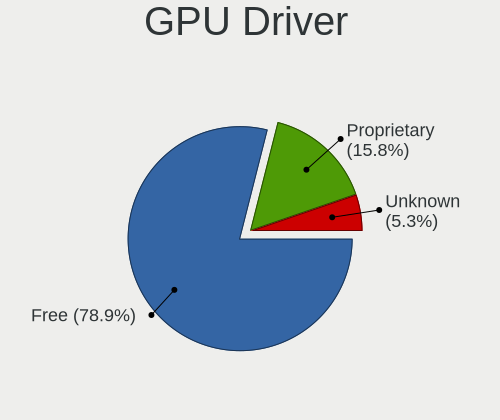

| Driver      | Notebooks | Percent |
|-------------|-----------|---------|
| Free        | 22        | 84.62%  |
| Proprietary | 4         | 15.38%  |

GPU Memory
----------

Total video memory

| Size in GB | Notebooks | Percent |
|------------|-----------|---------|
| Unknown    | 15        | 57.69%  |
| 0.01-0.5   | 4         | 15.38%  |
| 1.01-2.0   | 3         | 11.54%  |
| 8.01-16.0  | 2         | 7.69%   |
| 3.01-4.0   | 1         | 3.85%   |
| 0.51-1.0   | 1         | 3.85%   |

Monitor
-------

Monitor Vendor
--------------

Monitor vendors

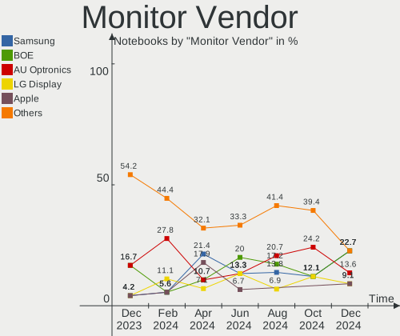

| Vendor              | Notebooks | Percent |
|---------------------|-----------|---------|
| LG Display          | 7         | 23.33%  |
| Chimei Innolux      | 4         | 13.33%  |
| BOE                 | 4         | 13.33%  |
| Apple               | 3         | 10%     |
| Sharp               | 2         | 6.67%   |
| Samsung Electronics | 2         | 6.67%   |
| Hewlett-Packard     | 2         | 6.67%   |
| AU Optronics        | 2         | 6.67%   |
| Goldstar            | 1         | 3.33%   |
| Dell                | 1         | 3.33%   |
| CSO                 | 1         | 3.33%   |
| BenQ                | 1         | 3.33%   |

Monitor Model
-------------

Monitor models

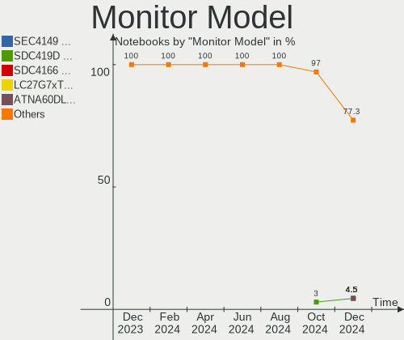

| Model                                                                 | Notebooks | Percent |
|-----------------------------------------------------------------------|-----------|---------|
| BOE LCD Monitor BOE095F 2256x1504 285x190mm 13.5-inch                 | 2         | 6.67%   |
| Sharp LCD Monitor SHP1548 1920x1200 288x180mm 13.4-inch               | 1         | 3.33%   |
| Sharp LCD Monitor SHP14B8 1920x1080 294x165mm 13.3-inch               | 1         | 3.33%   |
| Samsung Electronics LU28R55 SAM1015 3840x2160 632x360mm 28.6-inch     | 1         | 3.33%   |
| Samsung Electronics LCD Monitor SDC4173 3840x2400 344x215mm 16.0-inch | 1         | 3.33%   |
| LG Display LCD Monitor LGD40A9 1920x1080 309x174mm 14.0-inch          | 1         | 3.33%   |
| LG Display LCD Monitor LGD06B3 1920x1200 336x210mm 15.6-inch          | 1         | 3.33%   |
| LG Display LCD Monitor LGD05FA 1920x1080 309x174mm 14.0-inch          | 1         | 3.33%   |
| LG Display LCD Monitor LGD0563 1920x1080 344x194mm 15.5-inch          | 1         | 3.33%   |
| LG Display LCD Monitor LGD0521 1920x1080 309x174mm 14.0-inch          | 1         | 3.33%   |
| LG Display LCD Monitor LGD0513 1920x1080 382x215mm 17.3-inch          | 1         | 3.33%   |
| LG Display LCD Monitor LGD037A 1366x768 277x156mm 12.5-inch           | 1         | 3.33%   |
| Hewlett-Packard ZR24w HWP286A 1920x1200 546x352mm 25.6-inch           | 1         | 3.33%   |
| Hewlett-Packard M27fe FHD HPN385F 1920x1080 597x336mm 27.0-inch       | 1         | 3.33%   |
| Goldstar ULTRAGEAR GSM5BB3 2560x1440 597x336mm 27.0-inch              | 1         | 3.33%   |
| Dell U2515H DELD072 2560x1440 553x311mm 25.0-inch                     | 1         | 3.33%   |
| CSO LCD Monitor CSO130B 2560x1600 286x179mm 13.3-inch                 | 1         | 3.33%   |
| Chimei Innolux P130ZFA-BA1 CMN8201 2160x1440 275x183mm 13.0-inch      | 1         | 3.33%   |
| Chimei Innolux LCD Monitor CMN1614 1920x1200 344x215mm 16.0-inch      | 1         | 3.33%   |
| Chimei Innolux LCD Monitor CMN14F2 1920x1080 309x173mm 13.9-inch      | 1         | 3.33%   |
| Chimei Innolux LCD Monitor CMN140A 1920x1080 309x173mm 13.9-inch      | 1         | 3.33%   |
| BOE LCD Monitor BOE0BB8 1920x1200 345x215mm 16.0-inch                 | 1         | 3.33%   |
| BOE LCD Monitor BOE0A3B 2560x1600 344x215mm 16.0-inch                 | 1         | 3.33%   |
| BenQ BL2283 BNQ78EA 1920x1080 476x268mm 21.5-inch                     | 1         | 3.33%   |
| AU Optronics LCD Monitor AUOA195 2240x1400 300x188mm 13.9-inch        | 1         | 3.33%   |
| AU Optronics LCD Monitor AUO21ED 1920x1080 344x193mm 15.5-inch        | 1         | 3.33%   |
| Apple LCD Monitor APP9C69 1920x1200 367x230mm 17.1-inch               | 1         | 3.33%   |
| Apple Color LCD APPA02E 2880x1800 331x207mm 15.4-inch                 | 1         | 3.33%   |
| Apple Color LCD APPA022 2880x1800 331x207mm 15.4-inch                 | 1         | 3.33%   |

Monitor Resolution
------------------

Monitor screen resolution

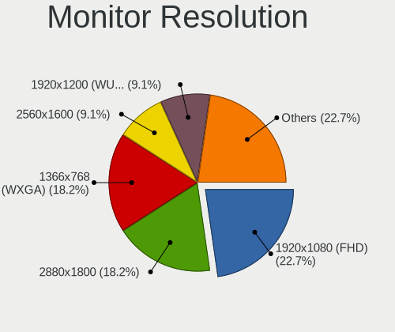

| Resolution        | Notebooks | Percent |
|-------------------|-----------|---------|
| 1920x1080 (FHD)   | 10        | 34.48%  |
| 1920x1200 (WUXGA) | 6         | 20.69%  |
| 2880x1800         | 2         | 6.9%    |
| 2560x1600         | 2         | 6.9%    |
| 2560x1440 (QHD)   | 2         | 6.9%    |
| 2256x1504         | 2         | 6.9%    |
| 3840x2400         | 1         | 3.45%   |
| 3840x2160 (4K)    | 1         | 3.45%   |
| 2240x1400         | 1         | 3.45%   |
| 2160x1440         | 1         | 3.45%   |
| 1366x768 (WXGA)   | 1         | 3.45%   |

Monitor Diagonal
----------------

Diagonal size in inches

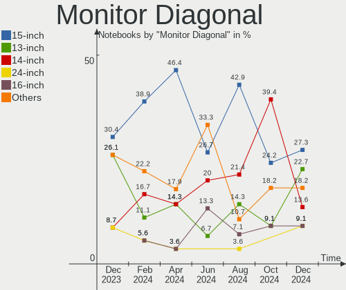

| Inches | Notebooks | Percent |
|--------|-----------|---------|
| 13     | 9         | 30%     |
| 15     | 5         | 16.67%  |
| 16     | 4         | 13.33%  |
| 14     | 3         | 10%     |
| 27     | 2         | 6.67%   |
| 25     | 2         | 6.67%   |
| 17     | 2         | 6.67%   |
| 28     | 1         | 3.33%   |
| 21     | 1         | 3.33%   |
| 12     | 1         | 3.33%   |

Monitor Width
-------------

Physical width

| Width in mm | Notebooks | Percent |
|-------------|-----------|---------|
| 301-350     | 14        | 46.67%  |
| 201-300     | 8         | 26.67%  |
| 501-600     | 4         | 13.33%  |
| 351-400     | 2         | 6.67%   |
| 601-700     | 1         | 3.33%   |
| 401-500     | 1         | 3.33%   |

Aspect Ratio
------------

Proportional relationship between the width and the height

| Ratio | Notebooks | Percent |
|-------|-----------|---------|
| 16/9  | 13        | 46.43%  |
| 16/10 | 12        | 42.86%  |
| 3/2   | 3         | 10.71%  |

Monitor Area
------------

Area in inch²

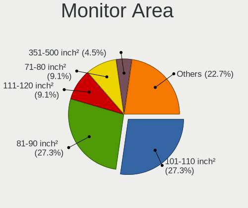

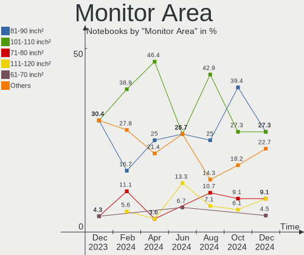

| Area in inch² | Notebooks | Percent |
|----------------|-----------|---------|
| 81-90          | 8         | 26.67%  |
| 101-110        | 5         | 16.67%  |
| 71-80          | 4         | 13.33%  |
| 111-120        | 4         | 13.33%  |
| 301-350        | 2         | 6.67%   |
| 251-300        | 2         | 6.67%   |
| 61-70          | 1         | 3.33%   |
| 351-500        | 1         | 3.33%   |
| 151-200        | 1         | 3.33%   |
| 131-140        | 1         | 3.33%   |
| 121-130        | 1         | 3.33%   |

Pixel Density
-------------

Pixels per inch

| Density       | Notebooks | Percent |
|---------------|-----------|---------|
| 121-160       | 14        | 46.67%  |
| 161-240       | 10        | 33.33%  |
| 101-120       | 3         | 10%     |
| 51-100        | 2         | 6.67%   |
| More than 240 | 1         | 3.33%   |

Multiple Monitors
-----------------

Total monitors connected

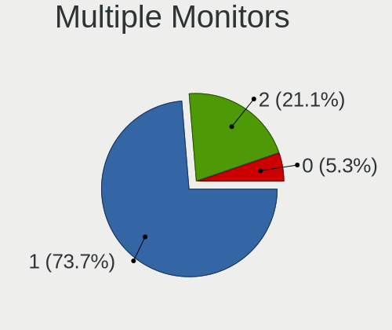

| Total | Notebooks | Percent |
|-------|-----------|---------|
| 1     | 20        | 76.92%  |
| 2     | 5         | 19.23%  |
| 0     | 1         | 3.85%   |

Network
-------

Net Controller Vendor
---------------------

Controller vendors

| Vendor                          | Notebooks | Percent |
|---------------------------------|-----------|---------|
| Intel                           | 17        | 44.74%  |
| Realtek Semiconductor           | 8         | 21.05%  |
| Qualcomm Atheros                | 2         | 5.26%   |
| MediaTek                        | 2         | 5.26%   |
| Marvell Technology Group        | 2         | 5.26%   |
| Broadcom                        | 2         | 5.26%   |
| TP-Link                         | 1         | 2.63%   |
| Qualcomm Atheros Communications | 1         | 2.63%   |
| Qualcomm                        | 1         | 2.63%   |
| ICS Advent                      | 1         | 2.63%   |
| Broadcom Limited                | 1         | 2.63%   |

Net Controller Model
--------------------

Controller models

| Model                                                                                 | Notebooks | Percent |
|---------------------------------------------------------------------------------------|-----------|---------|
| Realtek RTL8111/8168/8211/8411 PCI Express Gigabit Ethernet Controller                | 4         | 9.52%   |
| Intel Raptor Lake PCH CNVi WiFi                                                       | 4         | 9.52%   |
| Intel Alder Lake-P PCH CNVi WiFi                                                      | 4         | 9.52%   |
| Realtek RTL8125 2.5GbE Controller                                                     | 2         | 4.76%   |
| Intel Wi-Fi 6E(802.11ax) AX210/AX1675* 2x2 [Typhoon Peak]                             | 2         | 4.76%   |
| Intel Wi-Fi 6 AX200                                                                   | 2         | 4.76%   |
| TP-Link TL-WN823N v2/v3 [Realtek RTL8192EU]                                           | 1         | 2.38%   |
| Realtek RTL8852AE 802.11ax PCIe Wireless Network Adapter                              | 1         | 2.38%   |
| Realtek RTL8153 Gigabit Ethernet Adapter                                              | 1         | 2.38%   |
| Realtek RTL810xE PCI Express Fast Ethernet controller                                 | 1         | 2.38%   |
| Qualcomm QCNFA765 Wireless Network Adapter                                            | 1         | 2.38%   |
| Qualcomm Atheros AR9271 802.11n                                                       | 1         | 2.38%   |
| Qualcomm Atheros AR9285 Wireless Network Adapter (PCI-Express)                        | 1         | 2.38%   |
| Qualcomm Atheros AR5418 Wireless Network Adapter [AR5008E 802.11(a)bgn] (PCI-Express) | 1         | 2.38%   |
| MediaTek Wi-Fi 6E MT7902 Wireless Network Adapter                                     | 1         | 2.38%   |
| MediaTek MT7922 802.11ax PCI Express Wireless Network Adapter                         | 1         | 2.38%   |
| Marvell Group 88E8058 PCI-E Gigabit Ethernet Controller                               | 1         | 2.38%   |
| Marvell Group 88E8040 PCI-E Fast Ethernet Controller                                  | 1         | 2.38%   |
| Intel Wireless 8265 / 8275                                                            | 1         | 2.38%   |
| Intel Wireless 3165                                                                   | 1         | 2.38%   |
| Intel Wi-Fi 5(802.11ac) Wireless-AC 9x6x [Thunder Peak]                               | 1         | 2.38%   |
| Intel Ethernet Connection (4) I219-V                                                  | 1         | 2.38%   |
| Intel Ethernet Connection (16) I219-V                                                 | 1         | 2.38%   |
| Intel Ethernet Connection (16) I219-LM                                                | 1         | 2.38%   |
| Intel Cannon Point-LP CNVi [Wireless-AC]                                              | 1         | 2.38%   |
| Intel Cannon Lake PCH CNVi WiFi                                                       | 1         | 2.38%   |
| ICS Advent USB 10/100 LAN                                                             | 1         | 2.38%   |
| Broadcom Limited BCM43228 802.11a/b/g/n                                               | 1         | 2.38%   |
| Broadcom BCM43602 802.11ac Wireless LAN SoC                                           | 1         | 2.38%   |
| Broadcom BCM4360 802.11ac Dual Band Wireless Network Adapter                          | 1         | 2.38%   |

Wireless Vendor
---------------

Wireless vendors

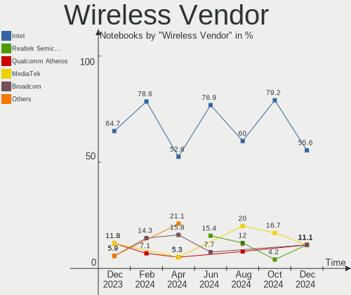

| Vendor                          | Notebooks | Percent |
|---------------------------------|-----------|---------|
| Intel                           | 17        | 60.71%  |
| Qualcomm Atheros                | 2         | 7.14%   |
| MediaTek                        | 2         | 7.14%   |
| Broadcom                        | 2         | 7.14%   |
| TP-Link                         | 1         | 3.57%   |
| Realtek Semiconductor           | 1         | 3.57%   |
| Qualcomm Atheros Communications | 1         | 3.57%   |
| Qualcomm                        | 1         | 3.57%   |
| Broadcom Limited                | 1         | 3.57%   |

Wireless Model
--------------

Wireless models

| Model                                                                                 | Notebooks | Percent |
|---------------------------------------------------------------------------------------|-----------|---------|
| Intel Raptor Lake PCH CNVi WiFi                                                       | 4         | 14.29%  |
| Intel Alder Lake-P PCH CNVi WiFi                                                      | 4         | 14.29%  |
| Intel Wi-Fi 6E(802.11ax) AX210/AX1675* 2x2 [Typhoon Peak]                             | 2         | 7.14%   |
| Intel Wi-Fi 6 AX200                                                                   | 2         | 7.14%   |
| TP-Link TL-WN823N v2/v3 [Realtek RTL8192EU]                                           | 1         | 3.57%   |
| Realtek RTL8852AE 802.11ax PCIe Wireless Network Adapter                              | 1         | 3.57%   |
| Qualcomm QCNFA765 Wireless Network Adapter                                            | 1         | 3.57%   |
| Qualcomm Atheros AR9271 802.11n                                                       | 1         | 3.57%   |
| Qualcomm Atheros AR9285 Wireless Network Adapter (PCI-Express)                        | 1         | 3.57%   |
| Qualcomm Atheros AR5418 Wireless Network Adapter [AR5008E 802.11(a)bgn] (PCI-Express) | 1         | 3.57%   |
| MediaTek Wi-Fi 6E MT7902 Wireless Network Adapter                                     | 1         | 3.57%   |
| MediaTek MT7922 802.11ax PCI Express Wireless Network Adapter                         | 1         | 3.57%   |
| Intel Wireless 8265 / 8275                                                            | 1         | 3.57%   |
| Intel Wireless 3165                                                                   | 1         | 3.57%   |
| Intel Wi-Fi 5(802.11ac) Wireless-AC 9x6x [Thunder Peak]                               | 1         | 3.57%   |
| Intel Cannon Point-LP CNVi [Wireless-AC]                                              | 1         | 3.57%   |
| Intel Cannon Lake PCH CNVi WiFi                                                       | 1         | 3.57%   |
| Broadcom Limited BCM43228 802.11a/b/g/n                                               | 1         | 3.57%   |
| Broadcom BCM43602 802.11ac Wireless LAN SoC                                           | 1         | 3.57%   |
| Broadcom BCM4360 802.11ac Dual Band Wireless Network Adapter                          | 1         | 3.57%   |

Ethernet Vendor
---------------

Ethernet vendors

| Vendor                   | Notebooks | Percent |
|--------------------------|-----------|---------|
| Realtek Semiconductor    | 7         | 53.85%  |
| Intel                    | 3         | 23.08%  |
| Marvell Technology Group | 2         | 15.38%  |
| ICS Advent               | 1         | 7.69%   |

Ethernet Model
--------------

Ethernet models

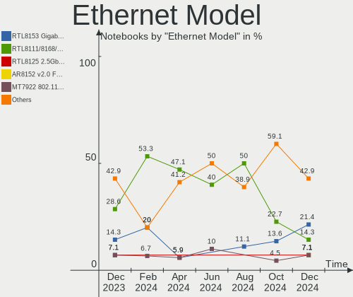

| Model                                                                  | Notebooks | Percent |
|------------------------------------------------------------------------|-----------|---------|
| Realtek RTL8111/8168/8211/8411 PCI Express Gigabit Ethernet Controller | 4         | 28.57%  |
| Realtek RTL8125 2.5GbE Controller                                      | 2         | 14.29%  |
| Realtek RTL8153 Gigabit Ethernet Adapter                               | 1         | 7.14%   |
| Realtek RTL810xE PCI Express Fast Ethernet controller                  | 1         | 7.14%   |
| Marvell Group 88E8058 PCI-E Gigabit Ethernet Controller                | 1         | 7.14%   |
| Marvell Group 88E8040 PCI-E Fast Ethernet Controller                   | 1         | 7.14%   |
| Intel Ethernet Connection (4) I219-V                                   | 1         | 7.14%   |
| Intel Ethernet Connection (16) I219-V                                  | 1         | 7.14%   |
| Intel Ethernet Connection (16) I219-LM                                 | 1         | 7.14%   |
| ICS Advent USB 10/100 LAN                                              | 1         | 7.14%   |

Net Controller Kind
-------------------

Ethernet, WiFi or modem

| Kind     | Notebooks | Percent |
|----------|-----------|---------|
| WiFi     | 26        | 68.42%  |
| Ethernet | 12        | 31.58%  |

Used Controller
---------------

Currently used network controller

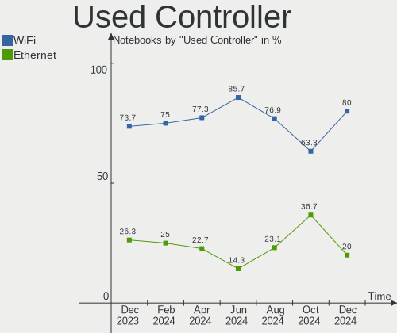

| Kind     | Notebooks | Percent |
|----------|-----------|---------|
| WiFi     | 24        | 88.89%  |
| Ethernet | 3         | 11.11%  |

NICs
----

Total network controllers on board

| Total | Notebooks | Percent |
|-------|-----------|---------|
| 1     | 14        | 53.85%  |
| 2     | 11        | 42.31%  |
| 3     | 1         | 3.85%   |

IPv6
----

IPv6 vs IPv4

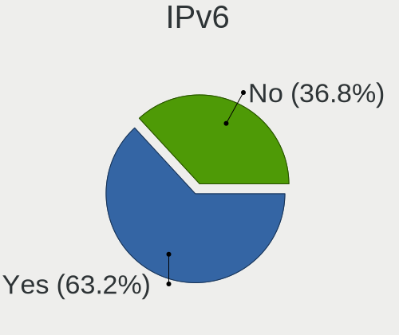

| Used | Notebooks | Percent |
|------|-----------|---------|
| No   | 19        | 73.08%  |
| Yes  | 7         | 26.92%  |

Bluetooth
---------

Bluetooth Vendor
----------------

Controller vendors

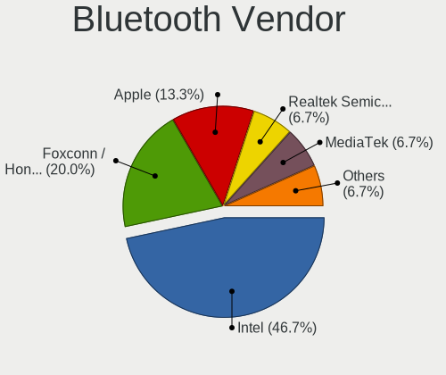

| Vendor                | Notebooks | Percent |
|-----------------------|-----------|---------|
| Intel                 | 16        | 64%     |
| Apple                 | 3         | 12%     |
| Foxconn / Hon Hai     | 2         | 8%      |
| Realtek Semiconductor | 1         | 4%      |
| IMC Networks          | 1         | 4%      |
| Broadcom              | 1         | 4%      |
| Alps Electric         | 1         | 4%      |

Bluetooth Model
---------------

Controller models

| Model                                          | Notebooks | Percent |
|------------------------------------------------|-----------|---------|
| Intel Bluetooth Device                         | 7         | 28%     |
| Intel Bluetooth wireless interface             | 2         | 8%      |
| Intel Bluetooth 9460/9560 Jefferson Peak (JfP) | 2         | 8%      |
| Intel AX210 Bluetooth                          | 2         | 8%      |
| Intel AX200 Bluetooth                          | 2         | 8%      |
| Apple Bluetooth Host Controller                | 2         | 8%      |
| Realtek Bluetooth Radio                        | 1         | 4%      |
| Intel Wireless-AC 9260 Bluetooth Adapter       | 1         | 4%      |
| IMC Networks Wireless_Device                   | 1         | 4%      |
| Foxconn / Hon Hai Wireless_Device              | 1         | 4%      |
| Foxconn / Hon Hai Bluetooth Device             | 1         | 4%      |
| Broadcom BCM20702A0                            | 1         | 4%      |
| Apple Bluetooth HCI                            | 1         | 4%      |
| Alps Electric BCM2046 Bluetooth Device         | 1         | 4%      |

Sound
-----

Sound Vendor
------------

Sound card vendors

| Vendor             | Notebooks | Percent |
|--------------------|-----------|---------|
| Intel              | 20        | 62.5%   |
| AMD                | 7         | 21.88%  |
| Nvidia             | 3         | 9.38%   |
| Sony               | 1         | 3.13%   |
| Focusrite-Novation | 1         | 3.13%   |

Sound Model
-----------

Sound card models

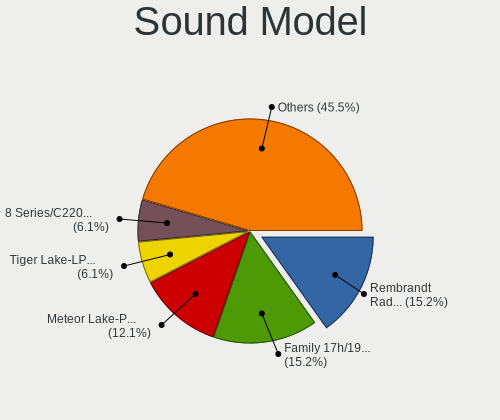

| Model                                                                   | Notebooks | Percent |
|-------------------------------------------------------------------------|-----------|---------|
| Intel Raptor Lake-P/U/H cAVS                                            | 5         | 12.82%  |
| AMD Family 17h/19h HD Audio Controller                                  | 5         | 12.82%  |
| Intel Alder Lake PCH-P High Definition Audio Controller                 | 4         | 10.26%  |
| AMD Renoir Radeon High Definition Audio Controller                      | 3         | 7.69%   |
| Intel Sunrise Point-LP HD Audio                                         | 2         | 5.13%   |
| Intel 8 Series/C220 Series Chipset High Definition Audio Controller     | 2         | 5.13%   |
| AMD Navi 21/23 HDMI/DP Audio Controller                                 | 2         | 5.13%   |
| Sony DualSense wireless controller (PS5)                                | 1         | 2.56%   |
| Nvidia GP107GL High Definition Audio Controller                         | 1         | 2.56%   |
| Nvidia GK107 HDMI Audio Controller                                      | 1         | 2.56%   |
| Nvidia Audio device                                                     | 1         | 2.56%   |
| Intel Tiger Lake-LP Smart Sound Technology Audio Controller             | 1         | 2.56%   |
| Intel Cannon Point-LP High Definition Audio Controller                  | 1         | 2.56%   |
| Intel Cannon Lake PCH cAVS                                              | 1         | 2.56%   |
| Intel Alder Lake Smart Sound Technology Audio Controller                | 1         | 2.56%   |
| Intel 82801I (ICH9 Family) HD Audio Controller                          | 1         | 2.56%   |
| Intel 82801H (ICH8 Family) HD Audio Controller                          | 1         | 2.56%   |
| Intel 7 Series/C216 Chipset Family High Definition Audio Controller     | 1         | 2.56%   |
| Focusrite-Novation Scarlett Solo (3rd Gen.)                             | 1         | 2.56%   |
| AMD Starship/Matisse HD Audio Controller                                | 1         | 2.56%   |
| AMD Rembrandt Radeon High Definition Audio Controller                   | 1         | 2.56%   |
| AMD Raven/Raven2/Fenghuang HDMI/DP Audio Controller                     | 1         | 2.56%   |
| AMD Oland/Hainan/Cape Verde/Pitcairn HDMI Audio [Radeon HD 7000 Series] | 1         | 2.56%   |

Memory
------

Memory Vendor
-------------

Memory module vendors

| Vendor              | Notebooks | Percent |
|---------------------|-----------|---------|
| SK hynix            | 6         | 20%     |
| Micron Technology   | 6         | 20%     |
| Samsung Electronics | 5         | 16.67%  |
| Crucial             | 4         | 13.33%  |
| Unknown             | 3         | 10%     |
| Unknown             | 2         | 6.67%   |
| Team                | 1         | 3.33%   |
| Ramaxel Technology  | 1         | 3.33%   |
| Kingston            | 1         | 3.33%   |
| Avant               | 1         | 3.33%   |

Memory Model
------------

Memory module models

| Model                                                            | Notebooks | Percent |
|------------------------------------------------------------------|-----------|---------|
| Unknown                                                          | 3         | 10%     |
| SK hynix RAM Module 8GB SODIMM DDR3 1600MT/s                     | 2         | 6.67%   |
| Unknown RAM Module 8GB SODIMM DDR3 1333MT/s                      | 1         | 3.33%   |
| Unknown RAM Module 4GB SODIMM DDR2                               | 1         | 3.33%   |
| Team RAM TEAMGROUP-SD4-3200 16GB SODIMM DDR4 3200MT/s            | 1         | 3.33%   |
| SK hynix RAM HMCG78AEBSA095N 16GB SODIMM DDR5 4800MT/s           | 1         | 3.33%   |
| SK hynix RAM HMA82GS6AFR8N-UH 16GB SODIMM DDR4 2667MT/s          | 1         | 3.33%   |
| SK hynix RAM H9JCNNNCP3MLYR-N6E 2GB Row Of Chips LPDDR5 6400MT/s | 1         | 3.33%   |
| SK hynix RAM H9HCNNNCPMMLXR-NEE 8GB Row Of Chips LPDDR4 4266MT/s | 1         | 3.33%   |
| Samsung RAM M471A5244BB0-CRC 4GB SODIMM DDR4 2667MT/s            | 1         | 3.33%   |
| Samsung RAM M471A1K43CB1-CTD 8GB SODIMM DDR4 2667MT/s            | 1         | 3.33%   |
| Samsung RAM K3LKBKB@BM-MGCP 2GB Row Of Chips LPDDR5 6400MT/s     | 1         | 3.33%   |
| Samsung RAM K3KL9L90CM-MGCT 4GB Row Of Chips LPDDR5 7467MT/s     | 1         | 3.33%   |
| Samsung RAM H9CCNNNBJTALAR-NVD 4GB Row Of Chips LPDDR3 2133MT/s  | 1         | 3.33%   |
| Ramaxel RAM RMSA3260ME78HAF-2666 8GB SODIMM DDR4 2667MT/s        | 1         | 3.33%   |
| Micron RAM MT62F1G64D8CH-031 2GB Row Of Chips LPDDR5 6400MT/s    | 1         | 3.33%   |
| Micron RAM Module 2GB Row Of Chips LPDDR5 6400MT/s               | 1         | 3.33%   |
| Micron RAM 8ATF2G64HZ-3G2F1 16GB SODIMM DDR4 3200MT/s            | 1         | 3.33%   |
| Micron RAM 4ATS1G64HZ-2G6E1 8GB SODIMM DDR4 2667MT/s             | 1         | 3.33%   |
| Micron RAM 4ATF1G64HZ-3G2F1 8GB SODIMM DDR4 3200MT/s             | 1         | 3.33%   |
| Micron RAM 4ATF1G64HZ-3G2E1 8GB Row Of Chips DDR4 3200MT/s       | 1         | 3.33%   |
| Kingston RAM 9905630-051.A00G 16GB SODIMM DDR4 2400MT/s          | 1         | 3.33%   |
| Crucial RAM CT8G4SFRA266.C8FE 8GB SODIMM DDR4 2667MT/s           | 1         | 3.33%   |
| Crucial RAM CT32G4SFD832A.M16FF 32GB SODIMM DDR4 3200MT/s        | 1         | 3.33%   |
| Crucial RAM BL32G32C16U4R.M16FB1 32GB DIMM DDR4 3200MT/s         | 1         | 3.33%   |
| Crucial RAM BL16G32C16S4B.16FE 16GB SODIMM DDR4 3200MT/s         | 1         | 3.33%   |
| Avant RAM Module 2GB SODIMM DDR2 667MT/s                         | 1         | 3.33%   |

Memory Kind
-----------

Memory module kinds

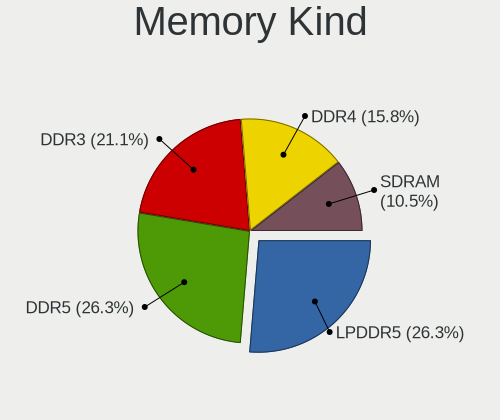

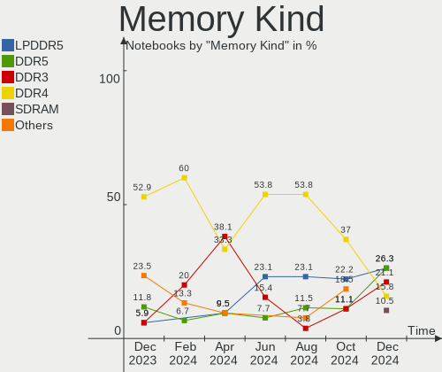

| Kind   | Notebooks | Percent |
|--------|-----------|---------|
| DDR4   | 11        | 42.31%  |
| LPDDR5 | 5         | 19.23%  |
| DDR5   | 3         | 11.54%  |
| DDR3   | 3         | 11.54%  |
| DDR2   | 2         | 7.69%   |
| LPDDR4 | 1         | 3.85%   |
| LPDDR3 | 1         | 3.85%   |

Memory Form Factor
------------------

Physical design of the memory module

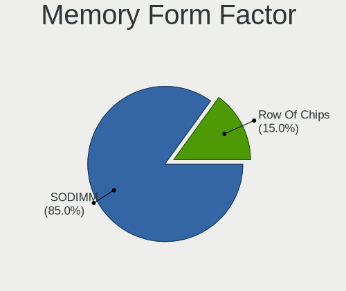

| Name         | Notebooks | Percent |
|--------------|-----------|---------|
| SODIMM       | 17        | 65.38%  |
| Row Of Chips | 8         | 30.77%  |
| DIMM         | 1         | 3.85%   |

Memory Size
-----------

Memory module size

| Size  | Notebooks | Percent |
|-------|-----------|---------|
| 8192  | 11        | 39.29%  |
| 16384 | 6         | 21.43%  |
| 32768 | 4         | 14.29%  |
| 4096  | 4         | 14.29%  |
| 2048  | 3         | 10.71%  |

Memory Speed
------------

Memory module speed

| Speed   | Notebooks | Percent |
|---------|-----------|---------|
| 3200    | 7         | 25.93%  |
| 6400    | 4         | 14.81%  |
| 2667    | 4         | 14.81%  |
| 4800    | 3         | 11.11%  |
| 1600    | 2         | 7.41%   |
| 7467    | 1         | 3.7%    |
| 4266    | 1         | 3.7%    |
| 2400    | 1         | 3.7%    |
| 2133    | 1         | 3.7%    |
| 1333    | 1         | 3.7%    |
| 667     | 1         | 3.7%    |
| Unknown | 1         | 3.7%    |

Printers & scanners
-------------------

Printer Vendor
--------------

Printer device vendors

Zero info for selected period =(

Printer Model
-------------

Printer device models

Zero info for selected period =(

Scanner Vendor
--------------

Scanner device vendors

Zero info for selected period =(

Scanner Model
-------------

Scanner device models

Zero info for selected period =(

Camera
------

Camera Vendor
-------------

Camera device vendors

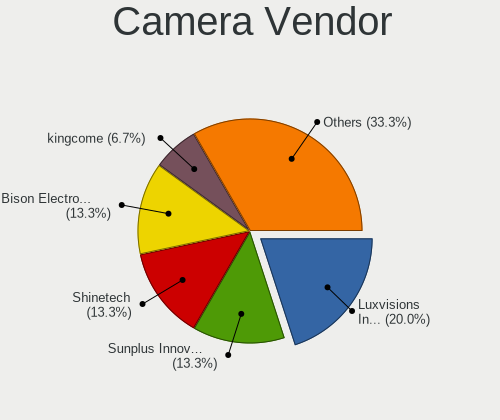

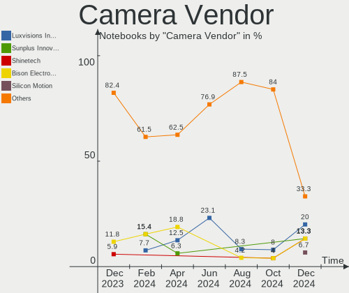

| Vendor                        | Notebooks | Percent |
|-------------------------------|-----------|---------|
| Chicony Electronics           | 5         | 23.81%  |
| IMC Networks                  | 3         | 14.29%  |
| Bison Electronics             | 3         | 14.29%  |
| Microdia                      | 2         | 9.52%   |
| Z-Star Microelectronics       | 1         | 4.76%   |
| Syntek                        | 1         | 4.76%   |
| Sunplus Innovation Technology | 1         | 4.76%   |
| ShineTech                     | 1         | 4.76%   |
| Ricoh                         | 1         | 4.76%   |
| Realtek Semiconductor         | 1         | 4.76%   |
| Luxvisions Innotech Limited   | 1         | 4.76%   |
| Apple                         | 1         | 4.76%   |

Camera Model
------------

Camera device models

| Model                                                    | Notebooks | Percent |
|----------------------------------------------------------|-----------|---------|
| Microdia Integrated_Webcam_HD                            | 2         | 9.52%   |
| IMC Networks Integrated Camera                           | 2         | 9.52%   |
| Chicony Integrated Camera                                | 2         | 9.52%   |
| Bison Integrated Camera                                  | 2         | 9.52%   |
| Z-Star Venus USB2.0 Camera                               | 1         | 4.76%   |
| Syntek Integrated Camera                                 | 1         | 4.76%   |
| Sunplus XiaoMi WebCam                                    | 1         | 4.76%   |
| ShineTech USB2.0 HD UVC WebCam                           | 1         | 4.76%   |
| Ricoh Sony Visual Communication Camera Integrated Webcam | 1         | 4.76%   |
| Realtek Laptop Camera                                    | 1         | 4.76%   |
| Luxvisions Innotech Limited Integrated Camera            | 1         | 4.76%   |
| IMC Networks HD Camera                                   | 1         | 4.76%   |
| Chicony FJ Camera                                        | 1         | 4.76%   |
| Chicony FHD Webcam                                       | 1         | 4.76%   |
| Chicony Chicony USB2.0 Camera                            | 1         | 4.76%   |
| Bison Web Camera - HD                                    | 1         | 4.76%   |
| Apple Built-in iSight                                    | 1         | 4.76%   |

Security
--------

Fingerprint Vendor
------------------

Fingerprint sensor vendors

| Vendor                     | Notebooks | Percent |
|----------------------------|-----------|---------|
| Synaptics                  | 2         | 66.67%  |
| Shenzhen Goodix Technology | 1         | 33.33%  |

Fingerprint Model
-----------------

Fingerprint sensor models

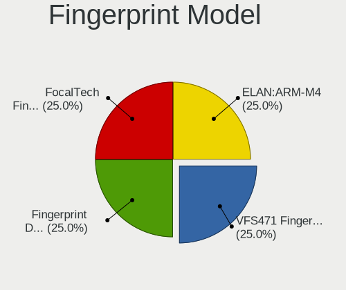

| Model                                             | Notebooks | Percent |
|---------------------------------------------------|-----------|---------|
| Synaptics UWP WBDI Device                         | 1         | 33.33%  |
| Synaptics Prometheus MIS Touch Fingerprint Reader | 1         | 33.33%  |
| Shenzhen Goodix Fingerprint Reader                | 1         | 33.33%  |

Chipcard Vendor
---------------

Chipcard module vendors

| Vendor      | Notebooks | Percent |
|-------------|-----------|---------|
| Alcor Micro | 3         | 100%    |

Chipcard Model
--------------

Chipcard module models

| Model                               | Notebooks | Percent |
|-------------------------------------|-----------|---------|
| Alcor Micro AU9540 Smartcard Reader | 3         | 100%    |

Unsupported
-----------

Unsupported Devices
-------------------

Total unsupported devices on board

| Total | Notebooks | Percent |
|-------|-----------|---------|
| 0     | 18        | 69.23%  |
| 1     | 6         | 23.08%  |
| 3     | 1         | 3.85%   |
| 2     | 1         | 3.85%   |

Unsupported Device Types
------------------------

Types of unsupported devices

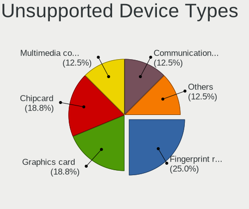

| Type                  | Notebooks | Percent |
|-----------------------|-----------|---------|
| Multimedia controller | 3         | 27.27%  |
| Fingerprint reader    | 3         | 27.27%  |
| Chipcard              | 3         | 27.27%  |
| Net/wireless          | 1         | 9.09%   |
| Graphics card         | 1         | 9.09%   |

