NixOS - Hardware Trends (Notebooks)
-----------------------------------

A project to identify most popular hardware characteristics and track their change
over time based on data collected by Linux users at https://Linux-Hardware.org.

Anyone can contribute to this report by the [hw-probe](https://github.com/linuxhw/hw-probe) tool:

    sudo -E hw-probe -all -upload

This report is for one last month. Overall report since the beginning of time: [TestDays](https://github.com/linuxhw/TestDays)

Period: Dec, 2024.

Contents
--------

* [ System ](#system)
  - [ OS                       ](#os)
  - [ OS Family                ](#os-family)
  - [ Kernel                   ](#kernel)
  - [ Kernel Family            ](#kernel-family)
  - [ Kernel Major Ver.        ](#kernel-major-ver)
  - [ Arch                     ](#arch)
  - [ DE                       ](#de)
  - [ Display Server           ](#display-server)
  - [ Display Manager          ](#display-manager)
  - [ OS Lang                  ](#os-lang)
  - [ Boot Mode                ](#boot-mode)
  - [ Filesystem               ](#filesystem)
  - [ Part. scheme             ](#part-scheme)
  - [ Dual Boot with Linux/BSD ](#dual-boot-with-linuxbsd)
  - [ Dual Boot (Win)          ](#dual-boot-win)

* [ Board ](#board)
  - [ Vendor                   ](#vendor)
  - [ Model                    ](#model)
  - [ Model Family             ](#model-family)
  - [ MFG Year                 ](#mfg-year)
  - [ Form Factor              ](#form-factor)
  - [ Secure Boot              ](#secure-boot)
  - [ Coreboot                 ](#coreboot)
  - [ RAM Size                 ](#ram-size)
  - [ RAM Used                 ](#ram-used)
  - [ Total Drives             ](#total-drives)
  - [ Has CD-ROM               ](#has-cd-rom)
  - [ Has Ethernet             ](#has-ethernet)
  - [ Has WiFi                 ](#has-wifi)
  - [ Has Bluetooth            ](#has-bluetooth)

* [ Location ](#location)
  - [ Country                  ](#country)
  - [ City                     ](#city)

* [ Drives ](#drives)
  - [ Drive Vendor             ](#drive-vendor)
  - [ Drive Model              ](#drive-model)
  - [ HDD Vendor               ](#hdd-vendor)
  - [ SSD Vendor               ](#ssd-vendor)
  - [ Drive Kind               ](#drive-kind)
  - [ Drive Connector          ](#drive-connector)
  - [ Drive Size               ](#drive-size)
  - [ Space Total              ](#space-total)
  - [ Space Used               ](#space-used)
  - [ Malfunc. Drives          ](#malfunc-drives)
  - [ Malfunc. Drive Vendor    ](#malfunc-drive-vendor)
  - [ Malfunc. HDD Vendor      ](#malfunc-hdd-vendor)
  - [ Malfunc. Drive Kind      ](#malfunc-drive-kind)
  - [ Failed Drives            ](#failed-drives)
  - [ Failed Drive Vendor      ](#failed-drive-vendor)
  - [ Drive Status             ](#drive-status)

* [ Storage controller ](#storage-controller)
  - [ Storage Vendor           ](#storage-vendor)
  - [ Storage Model            ](#storage-model)
  - [ Storage Kind             ](#storage-kind)

* [ Processor ](#processor)
  - [ CPU Vendor               ](#cpu-vendor)
  - [ CPU Model                ](#cpu-model)
  - [ CPU Model Family         ](#cpu-model-family)
  - [ CPU Cores                ](#cpu-cores)
  - [ CPU Sockets              ](#cpu-sockets)
  - [ CPU Threads              ](#cpu-threads)
  - [ CPU Op-Modes             ](#cpu-op-modes)
  - [ CPU Microcode            ](#cpu-microcode)
  - [ CPU Microarch            ](#cpu-microarch)

* [ Graphics ](#graphics)
  - [ GPU Vendor               ](#gpu-vendor)
  - [ GPU Model                ](#gpu-model)
  - [ GPU Combo                ](#gpu-combo)
  - [ GPU Driver               ](#gpu-driver)
  - [ GPU Memory               ](#gpu-memory)

* [ Monitor ](#monitor)
  - [ Monitor Vendor           ](#monitor-vendor)
  - [ Monitor Model            ](#monitor-model)
  - [ Monitor Resolution       ](#monitor-resolution)
  - [ Monitor Diagonal         ](#monitor-diagonal)
  - [ Monitor Width            ](#monitor-width)
  - [ Aspect Ratio             ](#aspect-ratio)
  - [ Monitor Area             ](#monitor-area)
  - [ Pixel Density            ](#pixel-density)
  - [ Multiple Monitors        ](#multiple-monitors)

* [ Network ](#network)
  - [ Net Controller Vendor    ](#net-controller-vendor)
  - [ Net Controller Model     ](#net-controller-model)
  - [ Wireless Vendor          ](#wireless-vendor)
  - [ Wireless Model           ](#wireless-model)
  - [ Ethernet Vendor          ](#ethernet-vendor)
  - [ Ethernet Model           ](#ethernet-model)
  - [ Net Controller Kind      ](#net-controller-kind)
  - [ Used Controller          ](#used-controller)
  - [ NICs                     ](#nics)
  - [ IPv6                     ](#ipv6)

* [ Bluetooth ](#bluetooth)
  - [ Bluetooth Vendor         ](#bluetooth-vendor)
  - [ Bluetooth Model          ](#bluetooth-model)

* [ Sound ](#sound)
  - [ Sound Vendor             ](#sound-vendor)
  - [ Sound Model              ](#sound-model)

* [ Memory ](#memory)
  - [ Memory Vendor            ](#memory-vendor)
  - [ Memory Model             ](#memory-model)
  - [ Memory Kind              ](#memory-kind)
  - [ Memory Form Factor       ](#memory-form-factor)
  - [ Memory Size              ](#memory-size)
  - [ Memory Speed             ](#memory-speed)

* [ Printers & scanners ](#printers--scanners)
  - [ Printer Vendor           ](#printer-vendor)
  - [ Printer Model            ](#printer-model)
  - [ Scanner Vendor           ](#scanner-vendor)
  - [ Scanner Model            ](#scanner-model)

* [ Camera ](#camera)
  - [ Camera Vendor            ](#camera-vendor)
  - [ Camera Model             ](#camera-model)

* [ Security ](#security)
  - [ Fingerprint Vendor       ](#fingerprint-vendor)
  - [ Fingerprint Model        ](#fingerprint-model)
  - [ Chipcard Vendor          ](#chipcard-vendor)
  - [ Chipcard Model           ](#chipcard-model)

* [ Unsupported ](#unsupported)
  - [ Unsupported Devices      ](#unsupported-devices)
  - [ Unsupported Device Types ](#unsupported-device-types)

System
------

OS
--

Installed operating systems

| Name        | Notebooks | Percent |
|-------------|-----------|---------|
| NixOS 24.11 | 13        | 68.42%  |
| NixOS 25.05 | 5         | 26.32%  |
| NixOS 24.05 | 1         | 5.26%   |

OS Family
---------

OS without a version

| Name  | Notebooks | Percent |
|-------|-----------|---------|
| NixOS | 19        | 100%    |

Kernel
------

Version of the Linux kernel

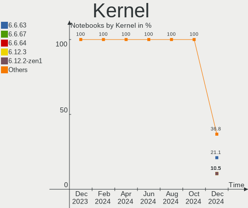

| Version         | Notebooks | Percent |
|-----------------|-----------|---------|
| 6.6.63          | 4         | 21.05%  |
| 6.6.67          | 2         | 10.53%  |
| 6.6.64          | 2         | 10.53%  |
| 6.12.3          | 2         | 10.53%  |
| 6.12.2-zen1     | 2         | 10.53%  |
| 6.12.1          | 2         | 10.53%  |
| 6.9.7           | 1         | 5.26%   |
| 6.6.66          | 1         | 5.26%   |
| 6.6.54          | 1         | 5.26%   |
| 6.6.48          | 1         | 5.26%   |
| 6.11.10-xanmod1 | 1         | 5.26%   |

Kernel Family
-------------

Linux kernel without a distro release

| Version | Notebooks | Percent |
|---------|-----------|---------|
| 6.6.63  | 4         | 21.05%  |
| 6.6.67  | 2         | 10.53%  |
| 6.6.64  | 2         | 10.53%  |
| 6.12.3  | 2         | 10.53%  |
| 6.12.2  | 2         | 10.53%  |
| 6.12.1  | 2         | 10.53%  |
| 6.9.7   | 1         | 5.26%   |
| 6.6.66  | 1         | 5.26%   |
| 6.6.54  | 1         | 5.26%   |
| 6.6.48  | 1         | 5.26%   |
| 6.11.10 | 1         | 5.26%   |

Kernel Major Ver.
-----------------

Linux kernel major version

| Version | Notebooks | Percent |
|---------|-----------|---------|
| 6.6     | 11        | 57.89%  |
| 6.12    | 6         | 31.58%  |
| 6.9     | 1         | 5.26%   |
| 6.11    | 1         | 5.26%   |

Arch
----

OS architecture (x86_64, i586, etc.)

| Name   | Notebooks | Percent |
|--------|-----------|---------|
| x86_64 | 19        | 100%    |

DE
--

Desktop Environment

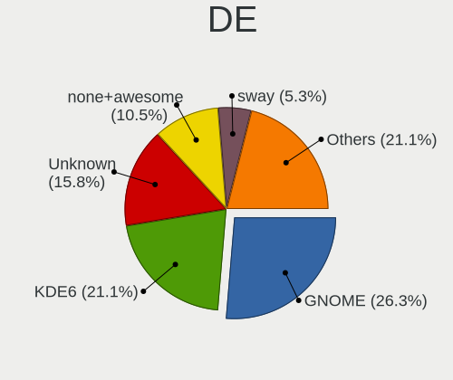

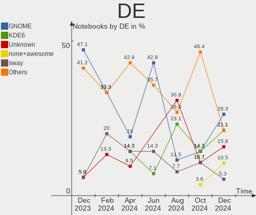

| Name         | Notebooks | Percent |
|--------------|-----------|---------|
| GNOME        | 5         | 26.32%  |
| KDE6         | 4         | 21.05%  |
| Unknown      | 3         | 15.79%  |
| none+awesome | 2         | 10.53%  |
| sway         | 1         | 5.26%   |
| KDE          | 1         | 5.26%   |
| Hyprland     | 1         | 5.26%   |
| COSMIC       | 1         | 5.26%   |
| Budgie       | 1         | 5.26%   |

Display Server
--------------

X11 or Wayland

| Name    | Notebooks | Percent |
|---------|-----------|---------|
| Wayland | 11        | 57.89%  |
| Unknown | 7         | 36.84%  |
| X11     | 1         | 5.26%   |

Display Manager
---------------

SDDM, LightDM, etc.

| Name    | Notebooks | Percent |
|---------|-----------|---------|
| GDM     | 7         | 36.84%  |
| SDDM    | 4         | 21.05%  |
| GREETD  | 3         | 15.79%  |
| Unknown | 3         | 15.79%  |
| LightDM | 2         | 10.53%  |

OS Lang
-------

Language

| Lang    | Notebooks | Percent |
|---------|-----------|---------|
| en_US   | 17        | 89.47%  |
| Unknown | 2         | 10.53%  |

Boot Mode
---------

EFI or BIOS

| Mode | Notebooks | Percent |
|------|-----------|---------|
| EFI  | 16        | 84.21%  |
| BIOS | 3         | 15.79%  |

Filesystem
----------

Type of filesystem

| Type  | Notebooks | Percent |
|-------|-----------|---------|
| Ext4  | 14        | 73.68%  |
| Btrfs | 3         | 15.79%  |
| Zfs   | 1         | 5.26%   |
| Tmpfs | 1         | 5.26%   |

Part. scheme
------------

Scheme of partitioning

| Type | Notebooks | Percent |
|------|-----------|---------|
| GPT  | 16        | 84.21%  |
| MBR  | 3         | 15.79%  |

Dual Boot with Linux/BSD
------------------------

Hosting more than one Linux/BSD

| Dual boot | Notebooks | Percent |
|-----------|-----------|---------|
| No        | 18        | 94.74%  |
| Yes       | 1         | 5.26%   |

Dual Boot (Win)
---------------

Hosting Linux and Windows

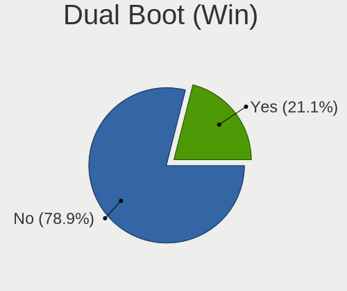

| Dual boot | Notebooks | Percent |
|-----------|-----------|---------|
| No        | 15        | 78.95%  |
| Yes       | 4         | 21.05%  |

Board
-----

Vendor
------

Motherboard manufacturer

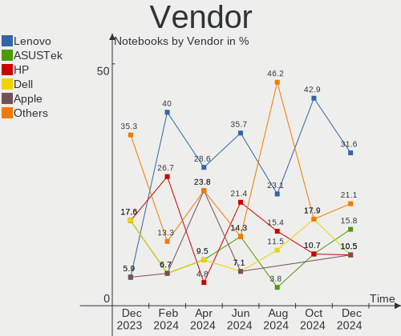

| Name                | Notebooks | Percent |
|---------------------|-----------|---------|
| Lenovo              | 6         | 31.58%  |
| ASUSTek Computer    | 3         | 15.79%  |
| Hewlett-Packard     | 2         | 10.53%  |
| Dell                | 2         | 10.53%  |
| Apple               | 2         | 10.53%  |
| Samsung Electronics | 1         | 5.26%   |
| GPD                 | 1         | 5.26%   |
| Framework           | 1         | 5.26%   |
| Acer                | 1         | 5.26%   |

Model
-----

Motherboard model

| Name                                       | Notebooks | Percent |
|--------------------------------------------|-----------|---------|
| Samsung 900X3N                             | 1         | 5.26%   |
| Lenovo ThinkPad X230 23252CG               | 1         | 5.26%   |
| Lenovo ThinkPad T14 Gen 5 21ML0076VA       | 1         | 5.26%   |
| Lenovo ThinkBook 14 G6 IRL 21NQ            | 1         | 5.26%   |
| Lenovo Legion 5 Pro 16ARH7H 82RG           | 1         | 5.26%   |
| Lenovo IdeaPad 3 14ITL05 81X7              | 1         | 5.26%   |
| Lenovo G570 20079                          | 1         | 5.26%   |
| HP Laptop 15-dy2xxx                        | 1         | 5.26%   |
| HP EliteBook 2560p                         | 1         | 5.26%   |
| GPD G1622-01                               | 1         | 5.26%   |
| Framework Laptop 13 (AMD Ryzen 7040Series) | 1         | 5.26%   |
| Dell Precision 5690                        | 1         | 5.26%   |
| Dell Precision 3591                        | 1         | 5.26%   |
| ASUS ROG Zephyrus G16 GA605WI_GA605WI      | 1         | 5.26%   |
| ASUS ASUS Zenbook 14 UX3405MA_UX3405MA     | 1         | 5.26%   |
| ASUS ASUS TUF Gaming A16 FA608WV_FA608WV   | 1         | 5.26%   |
| Apple MacBookPro11,5                       | 1         | 5.26%   |
| Apple MacBookPro11,3                       | 1         | 5.26%   |
| Acer Aspire 5742Z                          | 1         | 5.26%   |

Model Family
------------

Motherboard model prefix

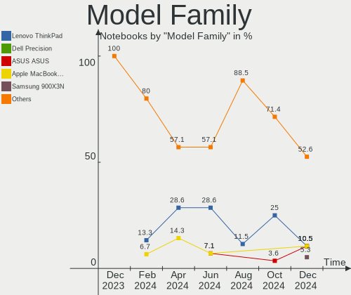

| Name               | Notebooks | Percent |
|--------------------|-----------|---------|
| Lenovo ThinkPad    | 2         | 10.53%  |
| Dell Precision     | 2         | 10.53%  |
| ASUS ASUS          | 2         | 10.53%  |
| Apple MacBookPro11 | 2         | 10.53%  |
| Samsung 900X3N     | 1         | 5.26%   |
| Lenovo ThinkBook   | 1         | 5.26%   |
| Lenovo Legion      | 1         | 5.26%   |
| Lenovo IdeaPad     | 1         | 5.26%   |
| Lenovo G570        | 1         | 5.26%   |
| HP Laptop          | 1         | 5.26%   |
| HP EliteBook       | 1         | 5.26%   |
| GPD G1622-01       | 1         | 5.26%   |
| Framework Laptop   | 1         | 5.26%   |
| ASUS ROG           | 1         | 5.26%   |
| Acer Aspire        | 1         | 5.26%   |

MFG Year
--------

Motherboard manufacture year

| Year | Notebooks | Percent |
|------|-----------|---------|
| 2024 | 7         | 36.84%  |
| 2023 | 2         | 10.53%  |
| 2016 | 2         | 10.53%  |
| 2011 | 2         | 10.53%  |
| 2022 | 1         | 5.26%   |
| 2021 | 1         | 5.26%   |
| 2017 | 1         | 5.26%   |
| 2013 | 1         | 5.26%   |
| 2010 | 1         | 5.26%   |
| 2008 | 1         | 5.26%   |

Form Factor
-----------

Physical design of the computer

| Name     | Notebooks | Percent |
|----------|-----------|---------|
| Notebook | 19        | 100%    |

Secure Boot
-----------

Enabled or disabled

| State    | Notebooks | Percent |
|----------|-----------|---------|
| Disabled | 19        | 100%    |

Coreboot
--------

Have coreboot on board

| Used | Notebooks | Percent |
|------|-----------|---------|
| No   | 18        | 94.74%  |
| Yes  | 1         | 5.26%   |

RAM Size
--------

Total RAM memory

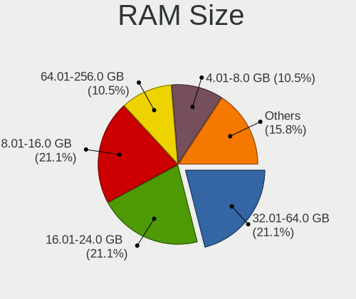

| Size in GB  | Notebooks | Percent |
|-------------|-----------|---------|
| 32.01-64.0  | 4         | 21.05%  |
| 16.01-24.0  | 4         | 21.05%  |
| 8.01-16.0   | 4         | 21.05%  |
| 4.01-8.0    | 2         | 10.53%  |
| 3.01-4.0    | 2         | 10.53%  |
| 64.01-256.0 | 2         | 10.53%  |
| 24.01-32.0  | 1         | 5.26%   |

RAM Used
--------

Used RAM memory

| Used GB  | Notebooks | Percent |
|----------|-----------|---------|
| 4.01-8.0 | 8         | 42.11%  |
| 2.01-3.0 | 8         | 42.11%  |
| 3.01-4.0 | 3         | 15.79%  |

Total Drives
------------

Number of drives on board

| Drives | Notebooks | Percent |
|--------|-----------|---------|
| 1      | 14        | 73.68%  |
| 2      | 5         | 26.32%  |

Has CD-ROM
----------

Has CD-ROM on board

| Presented | Notebooks | Percent |
|-----------|-----------|---------|
| No        | 18        | 94.74%  |
| Yes       | 1         | 5.26%   |

Has Ethernet
------------

Has Ethernet on board

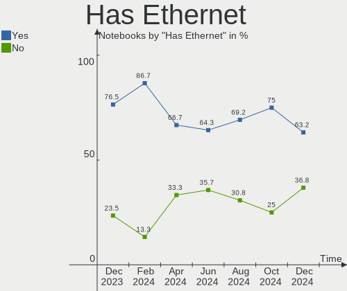

| Presented | Notebooks | Percent |
|-----------|-----------|---------|
| Yes       | 12        | 63.16%  |
| No        | 7         | 36.84%  |

Has WiFi
--------

Has WiFi module

| Presented | Notebooks | Percent |
|-----------|-----------|---------|
| Yes       | 18        | 94.74%  |
| No        | 1         | 5.26%   |

Has Bluetooth
-------------

Has Bluetooth module

| Presented | Notebooks | Percent |
|-----------|-----------|---------|
| Yes       | 15        | 78.95%  |
| No        | 4         | 21.05%  |

Location
--------

Country
-------

Geographic location (country)

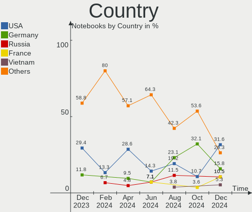

| Country  | Notebooks | Percent |
|----------|-----------|---------|
| USA      | 6         | 31.58%  |
| Germany  | 3         | 15.79%  |
| Russia   | 2         | 10.53%  |
| France   | 2         | 10.53%  |
| Vietnam  | 1         | 5.26%   |
| Ukraine  | 1         | 5.26%   |
| Portugal | 1         | 5.26%   |
| Poland   | 1         | 5.26%   |
| Czechia  | 1         | 5.26%   |
| Brazil   | 1         | 5.26%   |

City
----

Geographic location (city)

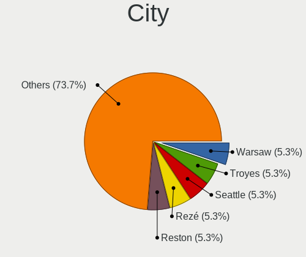

| City          | Notebooks | Percent |
|---------------|-----------|---------|
| Warsaw        | 1         | 5.26%   |
| Troyes        | 1         | 5.26%   |
| Seattle       | 1         | 5.26%   |
| Rezé         | 1         | 5.26%   |
| Reston        | 1         | 5.26%   |
| Overland Park | 1         | 5.26%   |
| Norfolk       | 1         | 5.26%   |
| Mozhga        | 1         | 5.26%   |
| Moscow        | 1         | 5.26%   |
| Mesa          | 1         | 5.26%   |
| Mannheim      | 1         | 5.26%   |
| Londrina      | 1         | 5.26%   |
| Lisbon        | 1         | 5.26%   |
| Hanoi         | 1         | 5.26%   |
| Darmstadt     | 1         | 5.26%   |
| Coesfeld      | 1         | 5.26%   |
| Brovary       | 1         | 5.26%   |
| Brno          | 1         | 5.26%   |
| Austin        | 1         | 5.26%   |

Drives
------

Drive Vendor
------------

Hard drive vendors

| Vendor                      | Notebooks | Drives | Percent |
|-----------------------------|-----------|--------|---------|
| Samsung Electronics         | 7         | 11     | 35%     |
| Unknown                     | 3         | 3      | 15%     |
| Micron Technology           | 3         | 3      | 15%     |
| Apple                       | 2         | 2      | 10%     |
| Yangtze Memory Technologies | 1         | 1      | 5%      |
| Realtek                     | 1         | 1      | 5%      |
| Hitachi                     | 1         | 1      | 5%      |
| Crucial                     | 1         | 1      | 5%      |
| Apacer                      | 1         | 1      | 5%      |

Drive Model
-----------

Hard drive models

| Model                                    | Notebooks | Percent |
|------------------------------------------|-----------|---------|
| Micron MTFDKBA1T0QFM-1BD1AABGB 1024GB    | 3         | 13.04%  |
| Unknown NVMe SSD Drive 1TB               | 2         | 8.7%    |
| Samsung PM9F1 1024GB                     | 2         | 8.7%    |
| Yangtze Memory YMTC YMSS1ED02B21MC 128GB | 1         | 4.35%   |
| Unknown NVMe SSD Drive 500GB             | 1         | 4.35%   |
| Samsung SSD 990 PRO 4TB S7KGNU0XA05987B  | 1         | 4.35%   |
| Samsung SSD 990 PRO 4TB S7KGNU0X919166A  | 1         | 4.35%   |
| Samsung SSD 990 PRO 4TB                  | 1         | 4.35%   |
| Samsung SSD 980 1TB                      | 1         | 4.35%   |
| Samsung SSD 870 EVO 500GB                | 1         | 4.35%   |
| Samsung MZVL2512HDJD-00BL2 512GB         | 1         | 4.35%   |
| Samsung MZVL21T0HCLR-00BL2 1TB           | 1         | 4.35%   |
| Samsung MZNTY256HDHP-000 256GB SSD       | 1         | 4.35%   |
| Realtek RTL9210 NVME 128GB               | 1         | 4.35%   |
| Hitachi HTS723232A7A364 320GB            | 1         | 4.35%   |
| Crucial CT500MX500SSD1 500GB             | 1         | 4.35%   |
| Apple SSD SM0512G 500GB                  | 1         | 4.35%   |
| Apple SSD SM0512F 500GB                  | 1         | 4.35%   |
| Apacer AS340 120GB SSD                   | 1         | 4.35%   |

HDD Vendor
----------

Hard disk drive vendors

| Vendor  | Notebooks | Drives | Percent |
|---------|-----------|--------|---------|
| Hitachi | 1         | 1      | 100%    |

SSD Vendor
----------

Solid state drive vendors

| Vendor              | Notebooks | Drives | Percent |
|---------------------|-----------|--------|---------|
| Samsung Electronics | 2         | 2      | 33.33%  |
| Apple               | 2         | 2      | 33.33%  |
| Crucial             | 1         | 1      | 16.67%  |
| Apacer              | 1         | 1      | 16.67%  |

Drive Kind
----------

HDD or SSD

| Kind | Notebooks | Drives | Percent |
|------|-----------|--------|---------|
| NVMe | 12        | 17     | 63.16%  |
| SSD  | 6         | 6      | 31.58%  |
| HDD  | 1         | 1      | 5.26%   |

Drive Connector
---------------

SATA, SAS, NVMe, etc.

| Type | Notebooks | Drives | Percent |
|------|-----------|--------|---------|
| NVMe | 12        | 16     | 60%     |
| SATA | 7         | 7      | 35%     |
| SAS  | 1         | 1      | 5%      |

Drive Size
----------

Size of hard drive

| Size in TB | Notebooks | Drives | Percent |
|------------|-----------|--------|---------|
| 0.01-0.5   | 7         | 7      | 100%    |

Space Total
-----------

Amount of disk space available on the file system

| Size in GB | Notebooks | Percent |
|------------|-----------|---------|
| 1-20       | 5         | 26.32%  |
| 251-500    | 4         | 21.05%  |
| 101-250    | 3         | 15.79%  |
| 1001-2000  | 3         | 15.79%  |
| 501-1000   | 3         | 15.79%  |
| Unknown    | 1         | 5.26%   |

Space Used
----------

Amount of used disk space

| Used GB | Notebooks | Percent |
|---------|-----------|---------|
| 101-250 | 5         | 26.32%  |
| 1-20    | 5         | 26.32%  |
| 51-100  | 4         | 21.05%  |
| 251-500 | 2         | 10.53%  |
| 21-50   | 2         | 10.53%  |
| Unknown | 1         | 5.26%   |

Malfunc. Drives
---------------

Drive models with a malfunction

| Model                                 | Notebooks | Drives | Percent |
|---------------------------------------|-----------|--------|---------|
| Samsung Electronics SSD 870 EVO 500GB | 1         | 1      | 50%     |
| Hitachi HTS723232A7A364 320GB         | 1         | 1      | 50%     |

Malfunc. Drive Vendor
---------------------

Vendors of faulty drives

| Vendor              | Notebooks | Drives | Percent |
|---------------------|-----------|--------|---------|
| Samsung Electronics | 1         | 1      | 50%     |
| Hitachi             | 1         | 1      | 50%     |

Malfunc. HDD Vendor
-------------------

Vendors of faulty HDD drives

| Vendor  | Notebooks | Drives | Percent |
|---------|-----------|--------|---------|
| Hitachi | 1         | 1      | 100%    |

Malfunc. Drive Kind
-------------------

Kinds of faulty drives

| Kind | Notebooks | Drives | Percent |
|------|-----------|--------|---------|
| SSD  | 1         | 1      | 50%     |
| HDD  | 1         | 1      | 50%     |

Failed Drives
-------------

Failed drive models

Zero info for selected period =(

Failed Drive Vendor
-------------------

Failed drive vendors

Zero info for selected period =(

Drive Status
------------

Number of failed and malfunc. drives

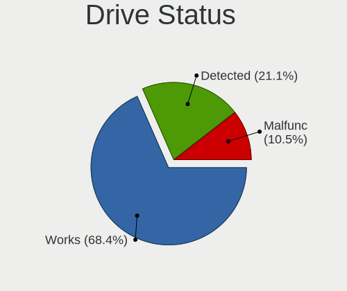

| Status   | Notebooks | Drives | Percent |
|----------|-----------|--------|---------|
| Works    | 13        | 18     | 68.42%  |
| Detected | 4         | 4      | 21.05%  |
| Malfunc  | 2         | 2      | 10.53%  |

Storage controller
------------------

Storage Vendor
--------------

Storage controller vendors

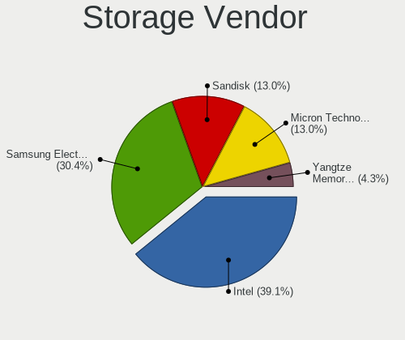

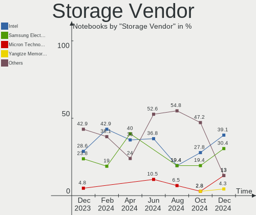

| Vendor                      | Notebooks | Percent |
|-----------------------------|-----------|---------|
| Intel                       | 9         | 39.13%  |
| Samsung Electronics         | 7         | 30.43%  |
| Sandisk                     | 3         | 13.04%  |
| Micron Technology           | 3         | 13.04%  |
| Yangtze Memory Technologies | 1         | 4.35%   |

Storage Model
-------------

Storage controller models

| Model                                                                                  | Notebooks | Percent |
|----------------------------------------------------------------------------------------|-----------|---------|
| Samsung NVMe SSD Controller S4LV008[Pascal]                                            | 3         | 11.54%  |
| Micron 2400 NVMe SSD (DRAM-less)                                                       | 3         | 11.54%  |
| SanDisk WD Black SN770 / PC SN740 256GB / PC SN560 (DRAM-less) NVMe SSD                | 2         | 7.69%   |
| Samsung NVMe SSD Controller PM9A1/PM9A3/980PRO                                         | 2         | 7.69%   |
| Intel Volume Management Device NVMe RAID Controller Intel Corporation                  | 2         | 7.69%   |
| Intel Volume Management Device NVMe RAID Controller                                    | 2         | 7.69%   |
| Yangtze Memory PC210 NVMe SSD                                                          | 1         | 3.85%   |
| Sandisk WD Black SN850X NVMe SSD                                                       | 1         | 3.85%   |
| Samsung S4LN058A01[SSUBX] AHCI SSD Controller (Apple slot)                             | 1         | 3.85%   |
| Samsung S4LN053X01 AHCI SSD Controller(Apple slot)                                     | 1         | 3.85%   |
| Samsung NVMe SSD Controller 980 (DRAM-less)                                            | 1         | 3.85%   |
| Intel Tiger Lake-LP SATA Controller                                                    | 1         | 3.85%   |
| Intel Sunrise Point-LP SATA Controller [AHCI mode]                                     | 1         | 3.85%   |
| Intel 7 Series Chipset Family 6-port SATA Controller [AHCI mode]                       | 1         | 3.85%   |
| Intel 6 Series/C200 Series Chipset Family Mobile SATA Controller (IDE mode, ports 4-5) | 1         | 3.85%   |
| Intel 6 Series/C200 Series Chipset Family Mobile SATA Controller (IDE mode, ports 0-3) | 1         | 3.85%   |
| Intel 6 Series/C200 Series Chipset Family 6 port Mobile SATA AHCI Controller           | 1         | 3.85%   |
| Intel 5 Series/3400 Series Chipset 4 port SATA AHCI Controller                         | 1         | 3.85%   |

Storage Kind
------------

Kind of storage controller (IDE, SATA, NVMe, SAS, ...)

| Kind | Notebooks | Percent |
|------|-----------|---------|
| NVMe | 12        | 50%     |
| SATA | 7         | 29.17%  |
| RAID | 4         | 16.67%  |
| IDE  | 1         | 4.17%   |

Processor
---------

CPU Vendor
----------

Processor vendors

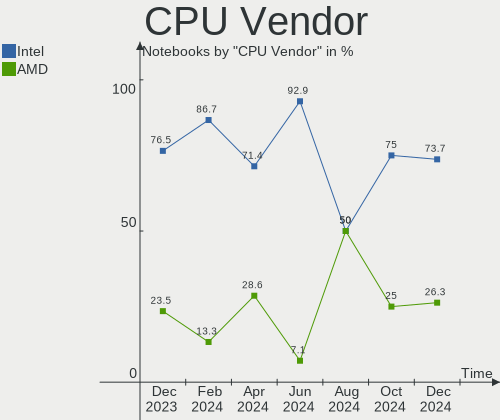

| Vendor | Notebooks | Percent |
|--------|-----------|---------|
| Intel  | 14        | 73.68%  |
| AMD    | 5         | 26.32%  |

CPU Model
---------

Processor models

| Model                                     | Notebooks | Percent |
|-------------------------------------------|-----------|---------|
| AMD Ryzen AI 9 HX 370 w/ Radeon 890M      | 3         | 15.79%  |
| Intel Core Ultra 9 185H                   | 2         | 10.53%  |
| Intel 11th Gen Core i3-1115G4 @ 3.00GHz   | 2         | 10.53%  |
| Intel Pentium CPU P6100 @ 2.00GHz         | 1         | 5.26%   |
| Intel Core Ultra 7 155H                   | 1         | 5.26%   |
| Intel Core Ultra 5 125U                   | 1         | 5.26%   |
| Intel Core i7-7500U CPU @ 2.70GHz         | 1         | 5.26%   |
| Intel Core i7-4870HQ CPU @ 2.50GHz        | 1         | 5.26%   |
| Intel Core i7-4850HQ CPU @ 2.30GHz        | 1         | 5.26%   |
| Intel Core i5-3320M CPU @ 2.60GHz         | 1         | 5.26%   |
| Intel Core i5-2520M CPU @ 2.50GHz         | 1         | 5.26%   |
| Intel Core i5-2410M CPU @ 2.30GHz         | 1         | 5.26%   |
| Intel 13th Gen Core i7-13700H             | 1         | 5.26%   |
| AMD Ryzen 7 7840U w/ Radeon 780M Graphics | 1         | 5.26%   |
| AMD Ryzen 5 6600H with Radeon Graphics    | 1         | 5.26%   |

CPU Model Family
----------------

Processor model prefix

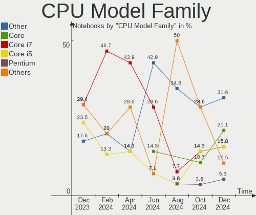

| Model         | Notebooks | Percent |
|---------------|-----------|---------|
| Other         | 6         | 31.58%  |
| Intel Core    | 4         | 21.05%  |
| Intel Core i7 | 3         | 15.79%  |
| Intel Core i5 | 3         | 15.79%  |
| Intel Pentium | 1         | 5.26%   |
| AMD Ryzen 7   | 1         | 5.26%   |
| AMD Ryzen 5   | 1         | 5.26%   |

CPU Cores
---------

Number of processor cores

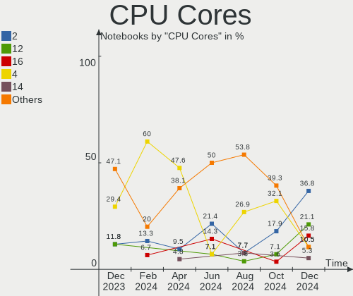

| Number | Notebooks | Percent |
|--------|-----------|---------|
| 2      | 7         | 36.84%  |
| 12     | 4         | 21.05%  |
| 16     | 3         | 15.79%  |
| 4      | 2         | 10.53%  |
| 14     | 1         | 5.26%   |
| 8      | 1         | 5.26%   |
| 6      | 1         | 5.26%   |

CPU Sockets
-----------

Number of sockets

| Number | Notebooks | Percent |
|--------|-----------|---------|
| 1      | 19        | 100%    |

CPU Threads
-----------

Threads per core (Hyper-Threading)

| Number | Notebooks | Percent |
|--------|-----------|---------|
| 2      | 17        | 89.47%  |
| 1      | 2         | 10.53%  |

CPU Op-Modes
------------

CPU Operation Modes (32-bit, 64-bit)

| Op mode        | Notebooks | Percent |
|----------------|-----------|---------|
| 32-bit, 64-bit | 19        | 100%    |

CPU Microcode
-------------

Microcode number

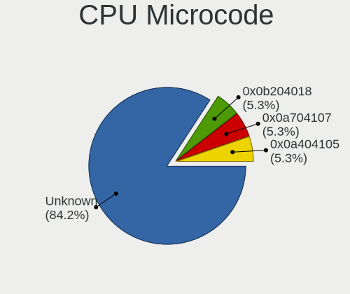

| Number     | Notebooks | Percent |
|------------|-----------|---------|
| Unknown    | 16        | 84.21%  |
| 0x0b204018 | 1         | 5.26%   |
| 0x0a704107 | 1         | 5.26%   |
| 0x0a404105 | 1         | 5.26%   |

CPU Microarch
-------------

Microarchitecture

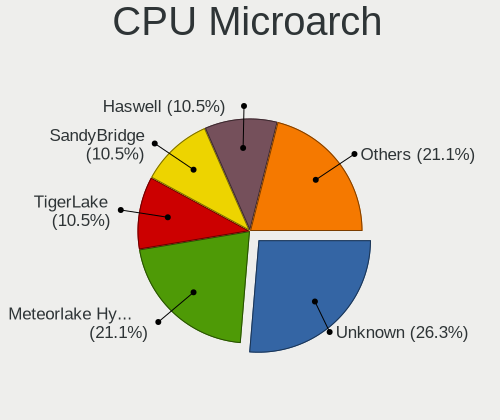

| Name              | Notebooks | Percent |
|-------------------|-----------|---------|
| Unknown           | 5         | 26.32%  |
| Meteorlake Hybrid | 4         | 21.05%  |
| TigerLake         | 2         | 10.53%  |
| SandyBridge       | 2         | 10.53%  |
| Haswell           | 2         | 10.53%  |
| Westmere          | 1         | 5.26%   |
| KabyLake          | 1         | 5.26%   |
| IvyBridge         | 1         | 5.26%   |
| Alderlake Hybrid  | 1         | 5.26%   |

Graphics
--------

GPU Vendor
----------

Vendors of graphics cards

| Vendor | Notebooks | Percent |
|--------|-----------|---------|
| Intel  | 12        | 52.17%  |
| AMD    | 6         | 26.09%  |
| Nvidia | 5         | 21.74%  |

GPU Model
---------

Graphics card models

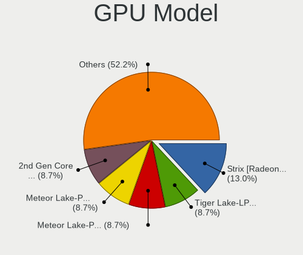

| Model                                                                     | Notebooks | Percent |
|---------------------------------------------------------------------------|-----------|---------|
| AMD Strix [Radeon 880M / 890M]                                            | 3         | 13.04%  |
| Intel Tiger Lake-LP GT2 [UHD Graphics G4]                                 | 2         | 8.7%    |
| Intel Meteor Lake-P [Intel Graphics]                                      | 2         | 8.7%    |
| Intel Meteor Lake-P [Intel Arc Graphics]                                  | 2         | 8.7%    |
| Intel 2nd Generation Core Processor Family Integrated Graphics Controller | 2         | 8.7%    |
| Nvidia GK107M [GeForce GT 750M Mac Edition]                               | 1         | 4.35%   |
| Nvidia GA106M [GeForce RTX 3060 Mobile / Max-Q]                           | 1         | 4.35%   |
| Nvidia AD107M [GeForce RTX 4060 Max-Q / Mobile]                           | 1         | 4.35%   |
| Nvidia AD107GLM [RTX 500 Ada Generation Laptop GPU]                       | 1         | 4.35%   |
| Nvidia AD106M [GeForce RTX 4070 Max-Q / Mobile]                           | 1         | 4.35%   |
| Intel Raptor Lake-P [UHD Graphics]                                        | 1         | 4.35%   |
| Intel HD Graphics 620                                                     | 1         | 4.35%   |
| Intel Core Processor Integrated Graphics Controller                       | 1         | 4.35%   |
| Intel 3rd Gen Core processor Graphics Controller                          | 1         | 4.35%   |
| AMD Venus XT [Radeon HD 8870M / R9 M270X/M370X]                           | 1         | 4.35%   |
| AMD Rembrandt [Radeon 680M]                                               | 1         | 4.35%   |
| AMD Phoenix1                                                              | 1         | 4.35%   |

GPU Combo
---------

Combinations of graphics cards

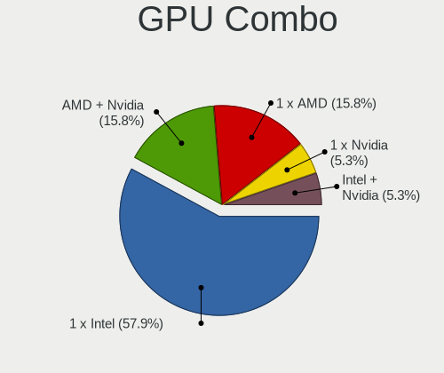

| Name           | Notebooks | Percent |
|----------------|-----------|---------|
| 1 x Intel      | 11        | 57.89%  |
| AMD + Nvidia   | 3         | 15.79%  |
| 1 x AMD        | 3         | 15.79%  |
| 1 x Nvidia     | 1         | 5.26%   |
| Intel + Nvidia | 1         | 5.26%   |

GPU Driver
----------

Free vs proprietary

| Driver      | Notebooks | Percent |
|-------------|-----------|---------|
| Free        | 15        | 78.95%  |
| Proprietary | 3         | 15.79%  |
| Unknown     | 1         | 5.26%   |

GPU Memory
----------

Total video memory

| Size in GB | Notebooks | Percent |
|------------|-----------|---------|
| Unknown    | 13        | 68.42%  |
| 0.01-0.5   | 3         | 15.79%  |
| 1.01-2.0   | 2         | 10.53%  |
| 3.01-4.0   | 1         | 5.26%   |

Monitor
-------

Monitor Vendor
--------------

Monitor vendors

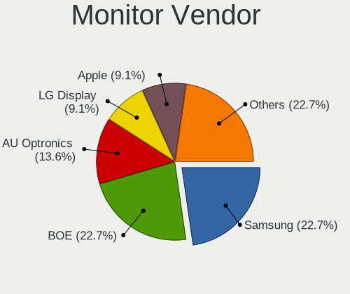

| Vendor              | Notebooks | Percent |
|---------------------|-----------|---------|
| Samsung Electronics | 5         | 22.73%  |
| BOE                 | 5         | 22.73%  |
| AU Optronics        | 3         | 13.64%  |
| LG Display          | 2         | 9.09%   |
| Apple               | 2         | 9.09%   |
| Lenovo              | 1         | 4.55%   |
| Hewlett-Packard     | 1         | 4.55%   |
| Dell                | 1         | 4.55%   |
| Chimei Innolux      | 1         | 4.55%   |
| Acer                | 1         | 4.55%   |

Monitor Model
-------------

Monitor models

| Model                                                                 | Notebooks | Percent |
|-----------------------------------------------------------------------|-----------|---------|
| Samsung Electronics LCD Monitor SEC4149 1366x768 292x174mm 13.4-inch  | 1         | 4.55%   |
| Samsung Electronics LCD Monitor SDC419D 2880x1800 302x189mm 14.0-inch | 1         | 4.55%   |
| Samsung Electronics LCD Monitor SDC4166 2880x1800 289x186mm 13.5-inch | 1         | 4.55%   |
| Samsung Electronics LC27G7xT SAM105C 2560x1440 597x336mm 27.0-inch    | 1         | 4.55%   |
| Samsung Electronics ATNA60DL04-0  SDC41AE                             | 1         | 4.55%   |
| LG Display LCD Monitor LGD06CF 1920x1080 344x194mm 15.5-inch          | 1         | 4.55%   |
| LG Display LCD Monitor LGD03A3 1366x768 277x156mm 12.5-inch           | 1         | 4.55%   |
| Lenovo LCD Monitor LEN40B0 1366x768 345x194mm 15.6-inch               | 1         | 4.55%   |
| Hewlett-Packard P24h G4 HPN3661 1920x1080 527x296mm 23.8-inch         | 1         | 4.55%   |
| Dell U2412M DELA07B 1920x1200 518x324mm 24.1-inch                     | 1         | 4.55%   |
| Chimei Innolux LCD Monitor CMN153B 1920x1080 344x193mm 15.5-inch      | 1         | 4.55%   |
| BOE NE160QDM-NYJ BOE0C80 2560x1600 344x215mm 16.0-inch                | 1         | 4.55%   |
| BOE LCD Monitor BOE0BCA 2256x1504 285x190mm 13.5-inch                 | 1         | 4.55%   |
| BOE LCD Monitor BOE0A9B 2560x1600 344x215mm 16.0-inch                 | 1         | 4.55%   |
| BOE LCD Monitor BOE08F2 1920x1080 310x174mm 14.0-inch                 | 1         | 4.55%   |
| BOE LCD Monitor BOE06E1 1920x1080 294x165mm 13.3-inch                 | 1         | 4.55%   |
| AU Optronics LCD Monitor AUOA195 2240x1400 300x188mm 13.9-inch        | 1         | 4.55%   |
| AU Optronics LCD Monitor AUO22EC 1366x768 344x193mm 15.5-inch         | 1         | 4.55%   |
| AU Optronics LCD Monitor AUO20A7 1920x1200 301x188mm 14.0-inch        | 1         | 4.55%   |
| Apple Color LCD APPA02E 2880x1800 331x207mm 15.4-inch                 | 1         | 4.55%   |
| Apple Color LCD APPA022 2880x1800 331x207mm 15.4-inch                 | 1         | 4.55%   |
| Acer XR341CK ACR044F 3440x1440 819x363mm 35.3-inch                    | 1         | 4.55%   |

Monitor Resolution
------------------

Monitor screen resolution

| Resolution        | Notebooks | Percent |
|-------------------|-----------|---------|
| 1920x1080 (FHD)   | 5         | 22.73%  |
| 2880x1800         | 4         | 18.18%  |
| 1366x768 (WXGA)   | 4         | 18.18%  |
| 2560x1600         | 2         | 9.09%   |
| 1920x1200 (WUXGA) | 2         | 9.09%   |
| 3440x1440         | 1         | 4.55%   |
| 2560x1440 (QHD)   | 1         | 4.55%   |
| 2256x1504         | 1         | 4.55%   |
| 2240x1400         | 1         | 4.55%   |
| Unknown           | 1         | 4.55%   |

Monitor Diagonal
----------------

Diagonal size in inches

| Inches  | Notebooks | Percent |
|---------|-----------|---------|
| 15      | 6         | 27.27%  |
| 13      | 5         | 22.73%  |
| 14      | 3         | 13.64%  |
| 24      | 2         | 9.09%   |
| 16      | 2         | 9.09%   |
| 35      | 1         | 4.55%   |
| 27      | 1         | 4.55%   |
| 12      | 1         | 4.55%   |
| Unknown | 1         | 4.55%   |

Monitor Width
-------------

Physical width

| Width in mm | Notebooks | Percent |
|-------------|-----------|---------|
| 301-350     | 11        | 50%     |
| 201-300     | 6         | 27.27%  |
| 501-600     | 3         | 13.64%  |
| 801-900     | 1         | 4.55%   |
| Unknown     | 1         | 4.55%   |

Aspect Ratio
------------

Proportional relationship between the width and the height

| Ratio   | Notebooks | Percent |
|---------|-----------|---------|
| 16/9    | 9         | 42.86%  |
| 16/10   | 9         | 42.86%  |
| 3/2     | 1         | 4.76%   |
| 21/9    | 1         | 4.76%   |
| Unknown | 1         | 4.76%   |

Monitor Area
------------

Area in inch²

| Area in inch² | Notebooks | Percent |
|----------------|-----------|---------|
| 81-90          | 6         | 27.27%  |
| 101-110        | 6         | 27.27%  |
| 71-80          | 2         | 9.09%   |
| 111-120        | 2         | 9.09%   |
| 61-70          | 1         | 4.55%   |
| 351-500        | 1         | 4.55%   |
| 301-350        | 1         | 4.55%   |
| 251-300        | 1         | 4.55%   |
| 201-250        | 1         | 4.55%   |
| Unknown        | 1         | 4.55%   |

Pixel Density
-------------

Pixels per inch

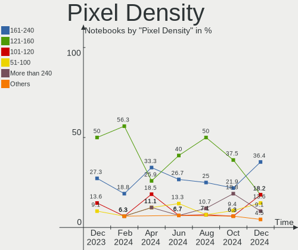

| Density       | Notebooks | Percent |
|---------------|-----------|---------|
| 161-240       | 8         | 36.36%  |
| 121-160       | 4         | 18.18%  |
| 101-120       | 4         | 18.18%  |
| 51-100        | 3         | 13.64%  |
| More than 240 | 2         | 9.09%   |
| Unknown       | 1         | 4.55%   |

Multiple Monitors
-----------------

Total monitors connected

| Total | Notebooks | Percent |
|-------|-----------|---------|
| 1     | 14        | 73.68%  |
| 2     | 4         | 21.05%  |
| 0     | 1         | 5.26%   |

Network
-------

Net Controller Vendor
---------------------

Controller vendors

| Vendor                            | Notebooks | Percent |
|-----------------------------------|-----------|---------|
| Intel                             | 10        | 38.46%  |
| Realtek Semiconductor             | 7         | 26.92%  |
| MediaTek                          | 3         | 11.54%  |
| Broadcom                          | 3         | 11.54%  |
| Qualcomm Atheros                  | 2         | 7.69%   |
| Ericsson Business Mobile Networks | 1         | 3.85%   |

Net Controller Model
--------------------

Controller models

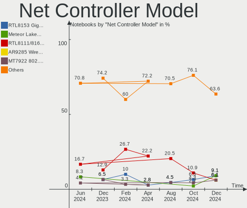

| Model                                                                  | Notebooks | Percent |
|------------------------------------------------------------------------|-----------|---------|
| Realtek RTL8153 Gigabit Ethernet Adapter                               | 3         | 9.09%   |
| Intel Meteor Lake PCH CNVi WiFi                                        | 3         | 9.09%   |
| Realtek RTL8111/8168/8211/8411 PCI Express Gigabit Ethernet Controller | 2         | 6.06%   |
| Qualcomm Atheros AR9285 Wireless Network Adapter (PCI-Express)         | 2         | 6.06%   |
| MediaTek MT7922 802.11ax PCI Express Wireless Network Adapter          | 2         | 6.06%   |
| Intel Centrino Advanced-N 6205 [Taylor Peak]                           | 2         | 6.06%   |
| Realtek RTL8852CE PCIe 802.11ax Wireless Network Controller            | 1         | 3.03%   |
| Realtek RTL8821CE 802.11ac PCIe Wireless Network Adapter               | 1         | 3.03%   |
| Realtek RTL8125 2.5GbE Controller                                      | 1         | 3.03%   |
| Qualcomm Atheros AR8152 v2.0 Fast Ethernet                             | 1         | 3.03%   |
| MediaTek Network controller                                            | 1         | 3.03%   |
| Intel Wireless 8265 / 8275                                             | 1         | 3.03%   |
| Intel Wi-Fi 7(802.11be) AX1775*/AX1790*/BE20*/BE401/BE1750* 2x2        | 1         | 3.03%   |
| Intel Wi-Fi 6E(802.11ax) AX210/AX1675* 2x2 [Typhoon Peak]              | 1         | 3.03%   |
| Intel Wi-Fi 6 AX201                                                    | 1         | 3.03%   |
| Intel Raptor Lake PCH CNVi WiFi                                        | 1         | 3.03%   |
| Intel Ethernet Controller I219-V                                       | 1         | 3.03%   |
| Intel Ethernet Controller I219-LM                                      | 1         | 3.03%   |
| Intel Ethernet Connection (23) I219-V                                  | 1         | 3.03%   |
| Intel 82579V Gigabit Network Connection                                | 1         | 3.03%   |
| Intel 82579LM Gigabit Network Connection (Lewisville)                  | 1         | 3.03%   |
| Ericsson Business Mobile Networks H5321 gw Mobile Broadband Module     | 1         | 3.03%   |
| Broadcom NetLink BCM57780 Gigabit Ethernet PCIe                        | 1         | 3.03%   |
| Broadcom BCM43602 802.11ac Wireless LAN SoC                            | 1         | 3.03%   |
| Broadcom BCM4360 802.11ac Dual Band Wireless Network Adapter           | 1         | 3.03%   |

Wireless Vendor
---------------

Wireless vendors

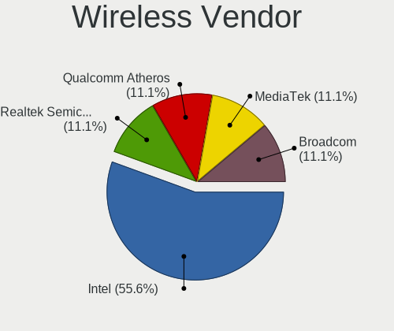

| Vendor                | Notebooks | Percent |
|-----------------------|-----------|---------|
| Intel                 | 10        | 55.56%  |
| Realtek Semiconductor | 2         | 11.11%  |
| Qualcomm Atheros      | 2         | 11.11%  |
| MediaTek              | 2         | 11.11%  |
| Broadcom              | 2         | 11.11%  |

Wireless Model
--------------

Wireless models

| Model                                                           | Notebooks | Percent |
|-----------------------------------------------------------------|-----------|---------|
| Intel Meteor Lake PCH CNVi WiFi                                 | 3         | 16.67%  |
| Qualcomm Atheros AR9285 Wireless Network Adapter (PCI-Express)  | 2         | 11.11%  |
| Intel Centrino Advanced-N 6205 [Taylor Peak]                    | 2         | 11.11%  |
| Realtek RTL8852CE PCIe 802.11ax Wireless Network Controller     | 1         | 5.56%   |
| Realtek RTL8821CE 802.11ac PCIe Wireless Network Adapter        | 1         | 5.56%   |
| MediaTek Network controller                                     | 1         | 5.56%   |
| MediaTek MT7922 802.11ax PCI Express Wireless Network Adapter   | 1         | 5.56%   |
| Intel Wireless 8265 / 8275                                      | 1         | 5.56%   |
| Intel Wi-Fi 7(802.11be) AX1775*/AX1790*/BE20*/BE401/BE1750* 2x2 | 1         | 5.56%   |
| Intel Wi-Fi 6E(802.11ax) AX210/AX1675* 2x2 [Typhoon Peak]       | 1         | 5.56%   |
| Intel Wi-Fi 6 AX201                                             | 1         | 5.56%   |
| Intel Raptor Lake PCH CNVi WiFi                                 | 1         | 5.56%   |
| Broadcom BCM43602 802.11ac Wireless LAN SoC                     | 1         | 5.56%   |
| Broadcom BCM4360 802.11ac Dual Band Wireless Network Adapter    | 1         | 5.56%   |

Ethernet Vendor
---------------

Ethernet vendors

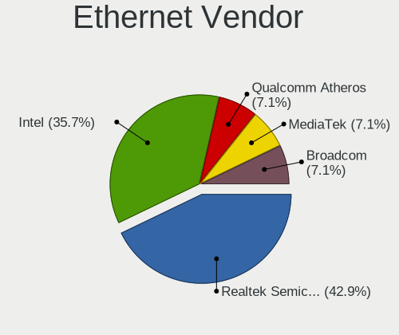

| Vendor                | Notebooks | Percent |
|-----------------------|-----------|---------|
| Realtek Semiconductor | 6         | 42.86%  |
| Intel                 | 5         | 35.71%  |
| Qualcomm Atheros      | 1         | 7.14%   |
| MediaTek              | 1         | 7.14%   |
| Broadcom              | 1         | 7.14%   |

Ethernet Model
--------------

Ethernet models

| Model                                                                  | Notebooks | Percent |
|------------------------------------------------------------------------|-----------|---------|
| Realtek RTL8153 Gigabit Ethernet Adapter                               | 3         | 21.43%  |
| Realtek RTL8111/8168/8211/8411 PCI Express Gigabit Ethernet Controller | 2         | 14.29%  |
| Realtek RTL8125 2.5GbE Controller                                      | 1         | 7.14%   |
| Qualcomm Atheros AR8152 v2.0 Fast Ethernet                             | 1         | 7.14%   |
| MediaTek MT7922 802.11ax PCI Express Wireless Network Adapter          | 1         | 7.14%   |
| Intel Ethernet Controller I219-V                                       | 1         | 7.14%   |
| Intel Ethernet Controller I219-LM                                      | 1         | 7.14%   |
| Intel Ethernet Connection (23) I219-V                                  | 1         | 7.14%   |
| Intel 82579V Gigabit Network Connection                                | 1         | 7.14%   |
| Intel 82579LM Gigabit Network Connection (Lewisville)                  | 1         | 7.14%   |
| Broadcom NetLink BCM57780 Gigabit Ethernet PCIe                        | 1         | 7.14%   |

Net Controller Kind
-------------------

Ethernet, WiFi or modem

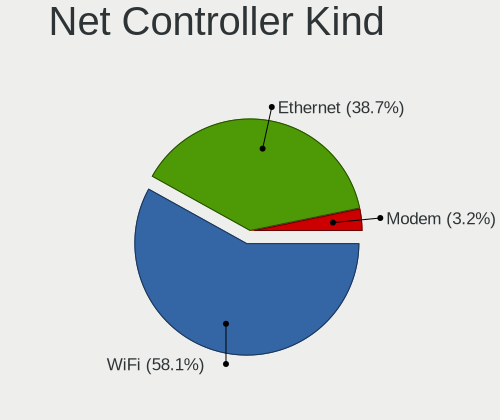

| Kind     | Notebooks | Percent |
|----------|-----------|---------|
| WiFi     | 18        | 58.06%  |
| Ethernet | 12        | 38.71%  |
| Modem    | 1         | 3.23%   |

Used Controller
---------------

Currently used network controller

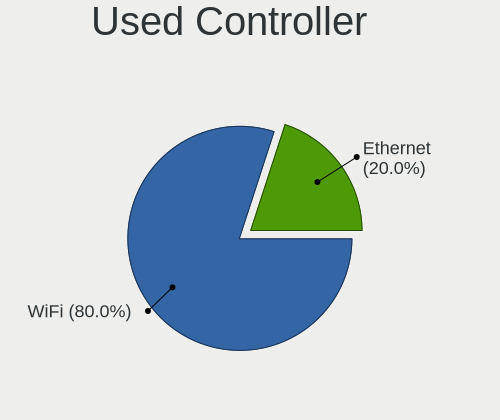

| Kind     | Notebooks | Percent |
|----------|-----------|---------|
| WiFi     | 16        | 80%     |
| Ethernet | 4         | 20%     |

NICs
----

Total network controllers on board

| Total | Notebooks | Percent |
|-------|-----------|---------|
| 2     | 10        | 52.63%  |
| 1     | 9         | 47.37%  |

IPv6
----

IPv6 vs IPv4

| Used | Notebooks | Percent |
|------|-----------|---------|
| Yes  | 12        | 63.16%  |
| No   | 7         | 36.84%  |

Bluetooth
---------

Bluetooth Vendor
----------------

Controller vendors

| Vendor                | Notebooks | Percent |
|-----------------------|-----------|---------|
| Intel                 | 7         | 46.67%  |
| Foxconn / Hon Hai     | 3         | 20%     |
| Apple                 | 2         | 13.33%  |
| Realtek Semiconductor | 1         | 6.67%   |
| MediaTek              | 1         | 6.67%   |
| Broadcom              | 1         | 6.67%   |

Bluetooth Model
---------------

Controller models

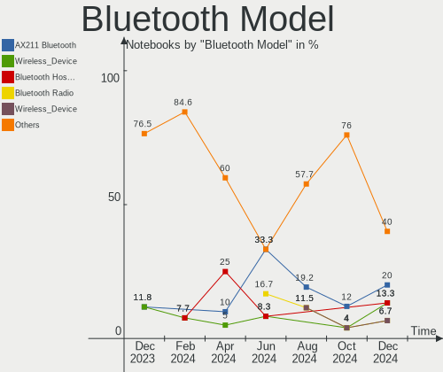

| Model                                      | Notebooks | Percent |
|--------------------------------------------|-----------|---------|
| Intel AX211 Bluetooth                      | 3         | 20%     |
| Foxconn / Hon Hai Wireless_Device          | 2         | 13.33%  |
| Apple Bluetooth Host Controller            | 2         | 13.33%  |
| Realtek Bluetooth Radio                    | 1         | 6.67%   |
| MediaTek Wireless_Device                   | 1         | 6.67%   |
| Intel Bluetooth wireless interface         | 1         | 6.67%   |
| Intel Bluetooth Device                     | 1         | 6.67%   |
| Intel AX210 Bluetooth                      | 1         | 6.67%   |
| Intel AX201 Bluetooth                      | 1         | 6.67%   |
| Foxconn / Hon Hai Bluetooth Radio          | 1         | 6.67%   |
| Broadcom BCM20702 Bluetooth 4.0 [ThinkPad] | 1         | 6.67%   |

Sound
-----

Sound Vendor
------------

Sound card vendors

| Vendor                 | Notebooks | Percent |
|------------------------|-----------|---------|
| Intel                  | 14        | 50%     |
| AMD                    | 6         | 21.43%  |
| Nvidia                 | 4         | 14.29%  |
| Native Instruments     | 1         | 3.57%   |
| Jieli Technology       | 1         | 3.57%   |
| Generalplus Technology | 1         | 3.57%   |
| C-Media Electronics    | 1         | 3.57%   |

Sound Model
-----------

Sound card models

| Model                                                                      | Notebooks | Percent |
|----------------------------------------------------------------------------|-----------|---------|
| AMD Rembrandt Radeon High Definition Audio Controller                      | 5         | 15.15%  |
| AMD Family 17h/19h/1ah HD Audio Controller                                 | 5         | 15.15%  |
| Intel Meteor Lake-P HD Audio Controller                                    | 4         | 12.12%  |
| Intel Tiger Lake-LP Smart Sound Technology Audio Controller                | 2         | 6.06%   |
| Intel 8 Series/C220 Series Chipset High Definition Audio Controller        | 2         | 6.06%   |
| Intel 6 Series/C200 Series Chipset Family High Definition Audio Controller | 2         | 6.06%   |
| Nvidia GK107 HDMI Audio Controller                                         | 1         | 3.03%   |
| Nvidia GA106 High Definition Audio Controller                              | 1         | 3.03%   |
| Nvidia AD107 High Definition Audio Controller                              | 1         | 3.03%   |
| Nvidia AD106M High Definition Audio Controller                             | 1         | 3.03%   |
| Native Instruments Komplete Audio 6                                        | 1         | 3.03%   |
| Jieli Technology GO Work USB                                               | 1         | 3.03%   |
| Intel Sunrise Point-LP HD Audio                                            | 1         | 3.03%   |
| Intel Raptor Lake-P/U/H cAVS                                               | 1         | 3.03%   |
| Intel 7 Series/C216 Chipset Family High Definition Audio Controller        | 1         | 3.03%   |
| Intel 5 Series/3400 Series Chipset High Definition Audio                   | 1         | 3.03%   |
| Generalplus Technology USB Audio Device                                    | 1         | 3.03%   |
| C-Media Electronics Audio Adapter (Unitek Y-247A)                          | 1         | 3.03%   |
| AMD Oland/Hainan/Cape Verde/Pitcairn HDMI Audio [Radeon HD 7000 Series]    | 1         | 3.03%   |

Memory
------

Memory Vendor
-------------

Memory module vendors

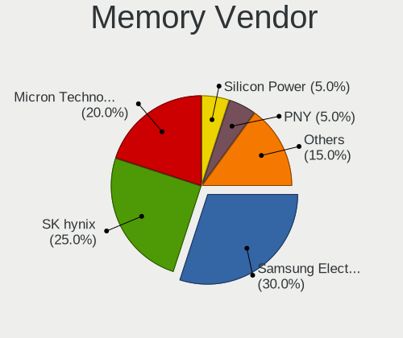

| Vendor              | Notebooks | Percent |
|---------------------|-----------|---------|
| Samsung Electronics | 6         | 30%     |
| SK hynix            | 5         | 25%     |
| Micron Technology   | 4         | 20%     |
| Silicon Power       | 1         | 5%      |
| PNY                 | 1         | 5%      |
| Kingston            | 1         | 5%      |
| A-DATA Technology   | 1         | 5%      |
| Unknown             | 1         | 5%      |

Memory Model
------------

Memory module models

| Model                                                          | Notebooks | Percent |
|----------------------------------------------------------------|-----------|---------|
| SK hynix RAM Module 8GB SODIMM DDR3 1600MT/s                   | 2         | 9.52%   |
| SK hynix RAM HMCG88AGBSA092N 32GB SODIMM DDR5 5600MT/s         | 2         | 9.52%   |
| Samsung RAM M471B5773CHS-CH9 2GB SODIMM DDR3 4199MT/s          | 2         | 9.52%   |
| SK hynix RAM HMCG78AGBSA092N 16GB SODIMM DDR5 5600MT/s         | 1         | 4.76%   |
| Silicon Power RAM Module 8GB SODIMM DDR3 1333MT/s              | 1         | 4.76%   |
| Samsung RAM M471B1G73DB0-YK0 8GB SODIMM DDR3 1600MT/s          | 1         | 4.76%   |
| Samsung RAM M471A5244CB0-CWE 4096MB SODIMM DDR4 3200MT/s       | 1         | 4.76%   |
| Samsung RAM M471A5244CB0-CWE 4096MB Row Of Chips DDR4 3200MT/s | 1         | 4.76%   |
| Samsung RAM M471A1K43BB0-CPB 8GB SODIMM DDR4 2133MT/s          | 1         | 4.76%   |
| Samsung RAM K3KL8L80CM-MGCT 4GB SODIMM LPDDR5 7500MT/s         | 1         | 4.76%   |
| PNY RAM M4S08S681QMMM52-12 8GB SODIMM DDR4 3200MT/s            | 1         | 4.76%   |
| Micron RAM MTC4C10163S1SC48BA1 8GB SODIMM DDR5 4800MT/s        | 1         | 4.76%   |
| Micron RAM MT62F4G32D8DV-026 WT 16GB SODIMM LPDDR5 7500MT/s    | 1         | 4.76%   |
| Micron RAM MT62F2G32D4DS-026 WT 8GB SODIMM LPDDR5 7500MT/s     | 1         | 4.76%   |
| Micron RAM MT62F2G32D4DS-026 4GB Row Of Chips LPDDR5 7467MT/s  | 1         | 4.76%   |
| Kingston RAM 99U5428-063.A00L 8GB SODIMM DDR3 800MT/s          | 1         | 4.76%   |
| A-DATA RAM AD5S560032G-SFW 32GB SODIMM DDR5 5600MT/s           | 1         | 4.76%   |
| Unknown                                                        | 1         | 4.76%   |

Memory Kind
-----------

Memory module kinds

| Kind   | Notebooks | Percent |
|--------|-----------|---------|
| LPDDR5 | 5         | 26.32%  |
| DDR5   | 5         | 26.32%  |
| DDR3   | 4         | 21.05%  |
| DDR4   | 3         | 15.79%  |
| SDRAM  | 2         | 10.53%  |

Memory Form Factor
------------------

Physical design of the memory module

| Name         | Notebooks | Percent |
|--------------|-----------|---------|
| SODIMM       | 17        | 85%     |
| Row Of Chips | 3         | 15%     |

Memory Size
-----------

Memory module size

| Size  | Notebooks | Percent |
|-------|-----------|---------|
| 8192  | 10        | 50%     |
| 16384 | 4         | 20%     |
| 32768 | 3         | 15%     |
| 2048  | 2         | 10%     |
| 4096  | 1         | 5%      |

Memory Speed
------------

Memory module speed

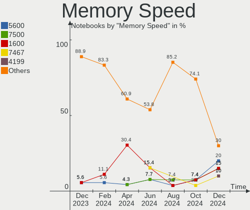

| Speed | Notebooks | Percent |
|-------|-----------|---------|
| 5600  | 4         | 20%     |
| 7500  | 3         | 15%     |
| 1600  | 3         | 15%     |
| 7467  | 2         | 10%     |
| 4199  | 2         | 10%     |
| 3200  | 2         | 10%     |
| 4800  | 1         | 5%      |
| 2133  | 1         | 5%      |
| 1333  | 1         | 5%      |
| 800   | 1         | 5%      |

Printers & scanners
-------------------

Printer Vendor
--------------

Printer device vendors

Zero info for selected period =(

Printer Model
-------------

Printer device models

Zero info for selected period =(

Scanner Vendor
--------------

Scanner device vendors

Zero info for selected period =(

Scanner Model
-------------

Scanner device models

Zero info for selected period =(

Camera
------

Camera Vendor
-------------

Camera device vendors

| Vendor                        | Notebooks | Percent |
|-------------------------------|-----------|---------|
| Luxvisions Innotech Limited   | 3         | 20%     |
| Sunplus Innovation Technology | 2         | 13.33%  |
| Shinetech                     | 2         | 13.33%  |
| Bison Electronics             | 2         | 13.33%  |
| Silicon Motion                | 1         | 6.67%   |
| Logitech                      | 1         | 6.67%   |
| kingcome                      | 1         | 6.67%   |
| Hopewin Electronic Material   | 1         | 6.67%   |
| Chicony Electronics           | 1         | 6.67%   |
| ALi                           | 1         | 6.67%   |

Camera Model
------------

Camera device models

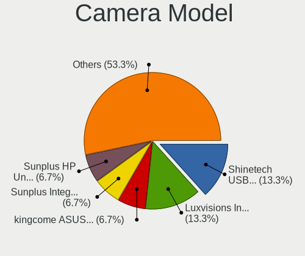

| Model                                               | Notebooks | Percent |
|-----------------------------------------------------|-----------|---------|
| Shinetech USB2.0 FHD UVC WebCam                     | 2         | 13.33%  |
| Luxvisions Innotech Limited Integrated Camera       | 2         | 13.33%  |
| Sunplus Integrated_Webcam_FHD                       | 1         | 6.67%   |
| Sunplus HP Universal Camera                         | 1         | 6.67%   |
| Silicon Motion 720p HD Camera                       | 1         | 6.67%   |
| Luxvisions Innotech Limited HP TrueVision HD Camera | 1         | 6.67%   |
| Logitech C922 Pro Stream Webcam                     | 1         | 6.67%   |
| kingcome ASUS FHD webcam                            | 1         | 6.67%   |
| Hopewin Electronic Material Integrated Camera       | 1         | 6.67%   |
| Chicony Lenovo EasyCamera                           | 1         | 6.67%   |
| Bison ThinkPad Integrated Camera                    | 1         | 6.67%   |
| Bison Integrated Camera                             | 1         | 6.67%   |
| ALi Gateway Webcam                                  | 1         | 6.67%   |

Security
--------

Fingerprint Vendor
------------------

Fingerprint sensor vendors

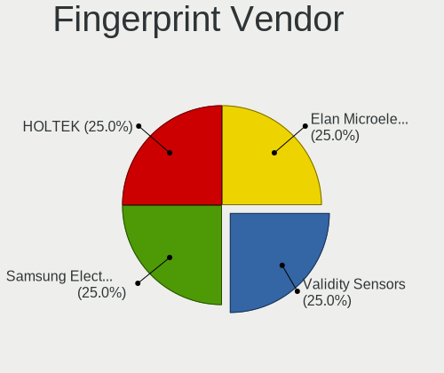

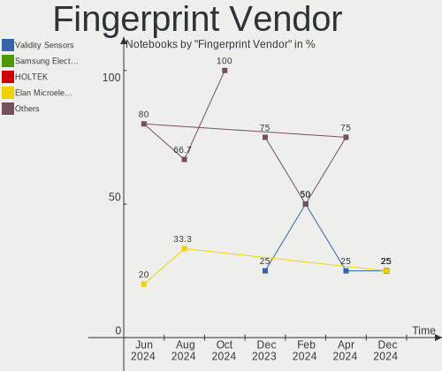

| Vendor                | Notebooks | Percent |
|-----------------------|-----------|---------|
| Validity Sensors      | 1         | 25%     |
| Samsung Electronics   | 1         | 25%     |
| HOLTEK                | 1         | 25%     |
| Elan Microelectronics | 1         | 25%     |

Fingerprint Model
-----------------

Fingerprint sensor models

| Model                                      | Notebooks | Percent |
|--------------------------------------------|-----------|---------|
| Validity Sensors VFS471 Fingerprint Reader | 1         | 25%     |
| Samsung Fingerprint Device                 | 1         | 25%     |
| HOLTEK FocalTech Fingerprint Device        | 1         | 25%     |
| Elan ELAN:ARM-M4                           | 1         | 25%     |

Chipcard Vendor
---------------

Chipcard module vendors

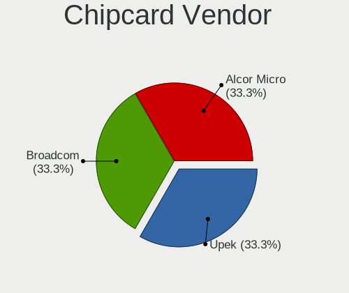

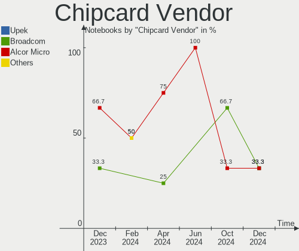

| Vendor      | Notebooks | Percent |
|-------------|-----------|---------|
| Upek        | 1         | 33.33%  |
| Broadcom    | 1         | 33.33%  |
| Alcor Micro | 1         | 33.33%  |

Chipcard Model
--------------

Chipcard module models

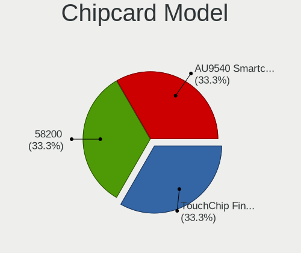

| Model                                                      | Notebooks | Percent |
|------------------------------------------------------------|-----------|---------|
| Upek TouchChip Fingerprint Coprocessor (WBF advanced mode) | 1         | 33.33%  |
| Broadcom 58200                                             | 1         | 33.33%  |
| Alcor Micro AU9540 Smartcard Reader                        | 1         | 33.33%  |

Unsupported
-----------

Unsupported Devices
-------------------

Total unsupported devices on board

| Total | Notebooks | Percent |
|-------|-----------|---------|
| 0     | 9         | 47.37%  |
| 1     | 6         | 31.58%  |
| 3     | 2         | 10.53%  |
| 2     | 2         | 10.53%  |

Unsupported Device Types
------------------------

Types of unsupported devices

| Type                     | Notebooks | Percent |
|--------------------------|-----------|---------|
| Fingerprint reader       | 4         | 25%     |
| Graphics card            | 3         | 18.75%  |
| Chipcard                 | 3         | 18.75%  |
| Multimedia controller    | 2         | 12.5%   |
| Communication controller | 2         | 12.5%   |
| Unassigned class         | 1         | 6.25%   |
| Network                  | 1         | 6.25%   |

