NixOS - Hardware Trends (Notebooks)
-----------------------------------

A project to identify most popular hardware characteristics and track their change
over time based on data collected by Linux users at https://Linux-Hardware.org.

Anyone can contribute to this report by the [hw-probe](https://github.com/linuxhw/hw-probe) tool:

    sudo -E hw-probe -all -upload

This report is for one last month. Overall report since the beginning of time: [TestDays](https://github.com/linuxhw/TestDays)

Period: Apr, 2024.

Contents
--------

* [ System ](#system)
  - [ OS                       ](#os)
  - [ OS Family                ](#os-family)
  - [ Kernel                   ](#kernel)
  - [ Kernel Family            ](#kernel-family)
  - [ Kernel Major Ver.        ](#kernel-major-ver)
  - [ Arch                     ](#arch)
  - [ DE                       ](#de)
  - [ Display Server           ](#display-server)
  - [ Display Manager          ](#display-manager)
  - [ OS Lang                  ](#os-lang)
  - [ Boot Mode                ](#boot-mode)
  - [ Filesystem               ](#filesystem)
  - [ Part. scheme             ](#part-scheme)
  - [ Dual Boot with Linux/BSD ](#dual-boot-with-linuxbsd)
  - [ Dual Boot (Win)          ](#dual-boot-win)

* [ Board ](#board)
  - [ Vendor                   ](#vendor)
  - [ Model                    ](#model)
  - [ Model Family             ](#model-family)
  - [ MFG Year                 ](#mfg-year)
  - [ Form Factor              ](#form-factor)
  - [ Secure Boot              ](#secure-boot)
  - [ Coreboot                 ](#coreboot)
  - [ RAM Size                 ](#ram-size)
  - [ RAM Used                 ](#ram-used)
  - [ Total Drives             ](#total-drives)
  - [ Has CD-ROM               ](#has-cd-rom)
  - [ Has Ethernet             ](#has-ethernet)
  - [ Has WiFi                 ](#has-wifi)
  - [ Has Bluetooth            ](#has-bluetooth)

* [ Location ](#location)
  - [ Country                  ](#country)
  - [ City                     ](#city)

* [ Drives ](#drives)
  - [ Drive Vendor             ](#drive-vendor)
  - [ Drive Model              ](#drive-model)
  - [ HDD Vendor               ](#hdd-vendor)
  - [ SSD Vendor               ](#ssd-vendor)
  - [ Drive Kind               ](#drive-kind)
  - [ Drive Connector          ](#drive-connector)
  - [ Drive Size               ](#drive-size)
  - [ Space Total              ](#space-total)
  - [ Space Used               ](#space-used)
  - [ Malfunc. Drives          ](#malfunc-drives)
  - [ Malfunc. Drive Vendor    ](#malfunc-drive-vendor)
  - [ Malfunc. HDD Vendor      ](#malfunc-hdd-vendor)
  - [ Malfunc. Drive Kind      ](#malfunc-drive-kind)
  - [ Failed Drives            ](#failed-drives)
  - [ Failed Drive Vendor      ](#failed-drive-vendor)
  - [ Drive Status             ](#drive-status)

* [ Storage controller ](#storage-controller)
  - [ Storage Vendor           ](#storage-vendor)
  - [ Storage Model            ](#storage-model)
  - [ Storage Kind             ](#storage-kind)

* [ Processor ](#processor)
  - [ CPU Vendor               ](#cpu-vendor)
  - [ CPU Model                ](#cpu-model)
  - [ CPU Model Family         ](#cpu-model-family)
  - [ CPU Cores                ](#cpu-cores)
  - [ CPU Sockets              ](#cpu-sockets)
  - [ CPU Threads              ](#cpu-threads)
  - [ CPU Op-Modes             ](#cpu-op-modes)
  - [ CPU Microcode            ](#cpu-microcode)
  - [ CPU Microarch            ](#cpu-microarch)

* [ Graphics ](#graphics)
  - [ GPU Vendor               ](#gpu-vendor)
  - [ GPU Model                ](#gpu-model)
  - [ GPU Combo                ](#gpu-combo)
  - [ GPU Driver               ](#gpu-driver)
  - [ GPU Memory               ](#gpu-memory)

* [ Monitor ](#monitor)
  - [ Monitor Vendor           ](#monitor-vendor)
  - [ Monitor Model            ](#monitor-model)
  - [ Monitor Resolution       ](#monitor-resolution)
  - [ Monitor Diagonal         ](#monitor-diagonal)
  - [ Monitor Width            ](#monitor-width)
  - [ Aspect Ratio             ](#aspect-ratio)
  - [ Monitor Area             ](#monitor-area)
  - [ Pixel Density            ](#pixel-density)
  - [ Multiple Monitors        ](#multiple-monitors)

* [ Network ](#network)
  - [ Net Controller Vendor    ](#net-controller-vendor)
  - [ Net Controller Model     ](#net-controller-model)
  - [ Wireless Vendor          ](#wireless-vendor)
  - [ Wireless Model           ](#wireless-model)
  - [ Ethernet Vendor          ](#ethernet-vendor)
  - [ Ethernet Model           ](#ethernet-model)
  - [ Net Controller Kind      ](#net-controller-kind)
  - [ Used Controller          ](#used-controller)
  - [ NICs                     ](#nics)
  - [ IPv6                     ](#ipv6)

* [ Bluetooth ](#bluetooth)
  - [ Bluetooth Vendor         ](#bluetooth-vendor)
  - [ Bluetooth Model          ](#bluetooth-model)

* [ Sound ](#sound)
  - [ Sound Vendor             ](#sound-vendor)
  - [ Sound Model              ](#sound-model)

* [ Memory ](#memory)
  - [ Memory Vendor            ](#memory-vendor)
  - [ Memory Model             ](#memory-model)
  - [ Memory Kind              ](#memory-kind)
  - [ Memory Form Factor       ](#memory-form-factor)
  - [ Memory Size              ](#memory-size)
  - [ Memory Speed             ](#memory-speed)

* [ Printers & scanners ](#printers--scanners)
  - [ Printer Vendor           ](#printer-vendor)
  - [ Printer Model            ](#printer-model)
  - [ Scanner Vendor           ](#scanner-vendor)
  - [ Scanner Model            ](#scanner-model)

* [ Camera ](#camera)
  - [ Camera Vendor            ](#camera-vendor)
  - [ Camera Model             ](#camera-model)

* [ Security ](#security)
  - [ Fingerprint Vendor       ](#fingerprint-vendor)
  - [ Fingerprint Model        ](#fingerprint-model)
  - [ Chipcard Vendor          ](#chipcard-vendor)
  - [ Chipcard Model           ](#chipcard-model)

* [ Unsupported ](#unsupported)
  - [ Unsupported Devices      ](#unsupported-devices)
  - [ Unsupported Device Types ](#unsupported-device-types)

System
------

OS
--

Installed operating systems

| Name        | Notebooks | Percent |
|-------------|-----------|---------|
| NixOS 24.05 | 12        | 57.14%  |
| NixOS 23.11 | 9         | 42.86%  |

OS Family
---------

OS without a version

| Name  | Notebooks | Percent |
|-------|-----------|---------|
| NixOS | 21        | 100%    |

Kernel
------

Version of the Linux kernel

| Version       | Notebooks | Percent |
|---------------|-----------|---------|
| 6.6.28        | 3         | 14.29%  |
| 6.1.82        | 3         | 14.29%  |
| 6.6.26        | 2         | 9.52%   |
| 6.6.23        | 2         | 9.52%   |
| 6.1.87        | 2         | 9.52%   |
| 6.1.84        | 2         | 9.52%   |
| 6.8.7         | 1         | 4.76%   |
| 6.8.6-xanmod1 | 1         | 4.76%   |
| 6.8.6         | 1         | 4.76%   |
| 6.8.5-error   | 1         | 4.76%   |
| 6.8.4         | 1         | 4.76%   |
| 6.8.1         | 1         | 4.76%   |
| 6.6.24        | 1         | 4.76%   |

Kernel Family
-------------

Linux kernel without a distro release

| Version | Notebooks | Percent |
|---------|-----------|---------|
| 6.6.28  | 3         | 14.29%  |
| 6.1.82  | 3         | 14.29%  |
| 6.8.6   | 2         | 9.52%   |
| 6.6.26  | 2         | 9.52%   |
| 6.6.23  | 2         | 9.52%   |
| 6.1.87  | 2         | 9.52%   |
| 6.1.84  | 2         | 9.52%   |
| 6.8.7   | 1         | 4.76%   |
| 6.8.5   | 1         | 4.76%   |
| 6.8.4   | 1         | 4.76%   |
| 6.8.1   | 1         | 4.76%   |
| 6.6.24  | 1         | 4.76%   |

Kernel Major Ver.
-----------------

Linux kernel major version

| Version | Notebooks | Percent |
|---------|-----------|---------|
| 6.6     | 8         | 38.1%   |
| 6.1     | 7         | 33.33%  |
| 6.8     | 6         | 28.57%  |

Arch
----

OS architecture (x86_64, i586, etc.)

| Name   | Notebooks | Percent |
|--------|-----------|---------|
| x86_64 | 21        | 100%    |

DE
--

Desktop Environment

| Name     | Notebooks | Percent |
|----------|-----------|---------|
| Hyprland | 6         | 28.57%  |
| GNOME    | 4         | 19.05%  |
| sway     | 3         | 14.29%  |
| KDE6     | 3         | 14.29%  |
| Unknown  | 2         | 9.52%   |
| none+i3  | 1         | 4.76%   |
| MATE     | 1         | 4.76%   |
| KDE      | 1         | 4.76%   |

Display Server
--------------

X11 or Wayland

| Name    | Notebooks | Percent |
|---------|-----------|---------|
| Wayland | 14        | 66.67%  |
| Unknown | 5         | 23.81%  |
| X11     | 2         | 9.52%   |

Display Manager
---------------

SDDM, LightDM, etc.

| Name    | Notebooks | Percent |
|---------|-----------|---------|
| Unknown | 8         | 38.1%   |
| LightDM | 6         | 28.57%  |
| GDM     | 4         | 19.05%  |
| SDDM    | 2         | 9.52%   |
| GREETD  | 1         | 4.76%   |

OS Lang
-------

Language

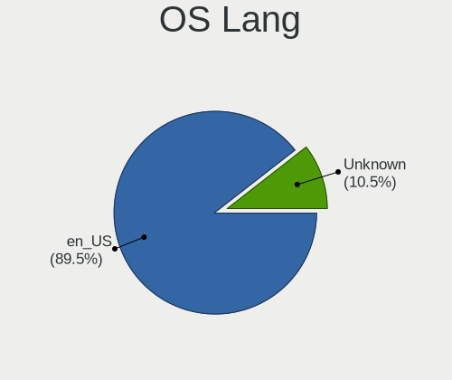

| Lang    | Notebooks | Percent |
|---------|-----------|---------|
| en_US   | 16        | 76.19%  |
| en_SG   | 1         | 4.76%   |
| en_GB   | 1         | 4.76%   |
| en_DK   | 1         | 4.76%   |
| en_AU   | 1         | 4.76%   |
| Unknown | 1         | 4.76%   |

Boot Mode
---------

EFI or BIOS

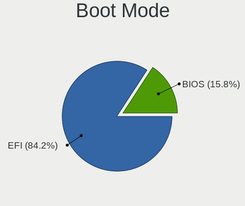

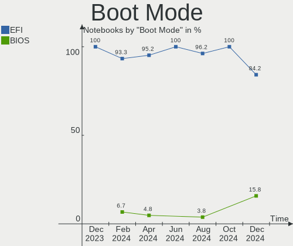

| Mode | Notebooks | Percent |
|------|-----------|---------|
| EFI  | 20        | 95.24%  |
| BIOS | 1         | 4.76%   |

Filesystem
----------

Type of filesystem

| Type  | Notebooks | Percent |
|-------|-----------|---------|
| Ext4  | 14        | 66.67%  |
| Btrfs | 4         | 19.05%  |
| Zfs   | 3         | 14.29%  |

Part. scheme
------------

Scheme of partitioning

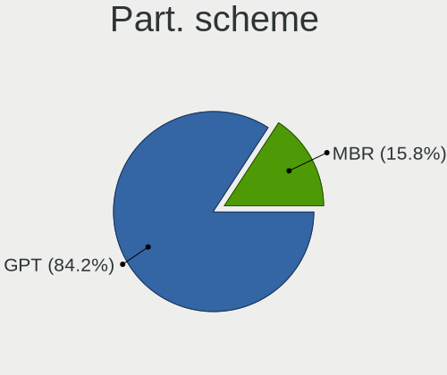

| Type | Notebooks | Percent |
|------|-----------|---------|
| GPT  | 20        | 95.24%  |
| MBR  | 1         | 4.76%   |

Dual Boot with Linux/BSD
------------------------

Hosting more than one Linux/BSD

| Dual boot | Notebooks | Percent |
|-----------|-----------|---------|
| No        | 19        | 90.48%  |
| Yes       | 2         | 9.52%   |

Dual Boot (Win)
---------------

Hosting Linux and Windows

| Dual boot | Notebooks | Percent |
|-----------|-----------|---------|
| No        | 17        | 80.95%  |
| Yes       | 4         | 19.05%  |

Board
-----

Vendor
------

Motherboard manufacturer

| Name             | Notebooks | Percent |
|------------------|-----------|---------|
| Lenovo           | 6         | 28.57%  |
| Apple            | 5         | 23.81%  |
| Razer            | 2         | 9.52%   |
| MSI              | 2         | 9.52%   |
| Dell             | 2         | 9.52%   |
| ASUSTek Computer | 2         | 9.52%   |
| Hewlett-Packard  | 1         | 4.76%   |
| Google           | 1         | 4.76%   |

Model
-----

Motherboard model

| Name                                  | Notebooks | Percent |
|---------------------------------------|-----------|---------|
| Razer Blade 14 - RZ09-0508            | 1         | 4.76%   |
| Razer Blade                           | 1         | 4.76%   |
| MSI GL65 9SC                          | 1         | 4.76%   |
| MSI GE60 2PE                          | 1         | 4.76%   |
| Lenovo ThinkPad Z13 Gen 1 21D2CT01WW  | 1         | 4.76%   |
| Lenovo ThinkPad T480 20L5CTO1WW       | 1         | 4.76%   |
| Lenovo ThinkPad P50 20EN0007MH        | 1         | 4.76%   |
| Lenovo ThinkPad P16s Gen 2 21K9CTO1WW | 1         | 4.76%   |
| Lenovo ThinkPad L15 Gen 1 20U70004RI  | 1         | 4.76%   |
| Lenovo ThinkPad L14 Gen 3 21C60010BO  | 1         | 4.76%   |
| HP ProBook 440 G2                     | 1         | 4.76%   |
| Google Redrix                         | 1         | 4.76%   |
| Dell XPS 15 9530                      | 1         | 4.76%   |
| Dell Latitude 7330 Rugged Extreme     | 1         | 4.76%   |
| ASUS ROG Strix G513QY_G513QY          | 1         | 4.76%   |
| ASUS K53SJ                            | 1         | 4.76%   |
| Apple MacBookPro12,1                  | 1         | 4.76%   |
| Apple MacBookPro11,5                  | 1         | 4.76%   |
| Apple MacBookPro11,3                  | 1         | 4.76%   |
| Apple MacBookPro11,2                  | 1         | 4.76%   |
| Apple MacBookPro10,1                  | 1         | 4.76%   |

Model Family
------------

Motherboard model prefix

| Name               | Notebooks | Percent |
|--------------------|-----------|---------|
| Lenovo ThinkPad    | 6         | 28.57%  |
| Apple MacBookPro11 | 3         | 14.29%  |
| Razer Blade        | 2         | 9.52%   |
| MSI GL65           | 1         | 4.76%   |
| MSI GE60           | 1         | 4.76%   |
| HP ProBook         | 1         | 4.76%   |
| Google Redrix      | 1         | 4.76%   |
| Dell XPS           | 1         | 4.76%   |
| Dell Latitude      | 1         | 4.76%   |
| ASUS ROG           | 1         | 4.76%   |
| ASUS K53SJ         | 1         | 4.76%   |
| Apple MacBookPro12 | 1         | 4.76%   |
| Apple MacBookPro10 | 1         | 4.76%   |

MFG Year
--------

Motherboard manufacture year

| Year | Notebooks | Percent |
|------|-----------|---------|
| 2023 | 4         | 19.05%  |
| 2014 | 3         | 14.29%  |
| 2021 | 2         | 9.52%   |
| 2020 | 2         | 9.52%   |
| 2018 | 2         | 9.52%   |
| 2015 | 2         | 9.52%   |
| 2013 | 2         | 9.52%   |
| 2022 | 1         | 4.76%   |
| 2016 | 1         | 4.76%   |
| 2012 | 1         | 4.76%   |
| 2011 | 1         | 4.76%   |

Form Factor
-----------

Physical design of the computer

| Name     | Notebooks | Percent |
|----------|-----------|---------|
| Notebook | 21        | 100%    |

Secure Boot
-----------

Enabled or disabled

| State    | Notebooks | Percent |
|----------|-----------|---------|
| Disabled | 20        | 95.24%  |
| Enabled  | 1         | 4.76%   |

Coreboot
--------

Have coreboot on board

| Used | Notebooks | Percent |
|------|-----------|---------|
| No   | 20        | 95.24%  |
| Yes  | 1         | 4.76%   |

RAM Size
--------

Total RAM memory

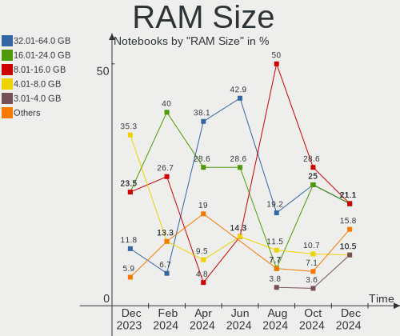

| Size in GB  | Notebooks | Percent |
|-------------|-----------|---------|
| 32.01-64.0  | 8         | 38.1%   |
| 16.01-24.0  | 6         | 28.57%  |
| 4.01-8.0    | 2         | 9.52%   |
| 24.01-32.0  | 2         | 9.52%   |
| 64.01-256.0 | 2         | 9.52%   |
| 8.01-16.0   | 1         | 4.76%   |

RAM Used
--------

Used RAM memory

| Used GB    | Notebooks | Percent |
|------------|-----------|---------|
| 4.01-8.0   | 4         | 19.05%  |
| 3.01-4.0   | 4         | 19.05%  |
| 2.01-3.0   | 4         | 19.05%  |
| 8.01-16.0  | 4         | 19.05%  |
| 1.01-2.0   | 2         | 9.52%   |
| 24.01-32.0 | 1         | 4.76%   |
| 16.01-24.0 | 1         | 4.76%   |
| 0.51-1.0   | 1         | 4.76%   |

Total Drives
------------

Number of drives on board

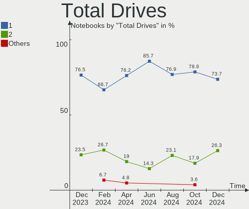

| Drives | Notebooks | Percent |
|--------|-----------|---------|
| 1      | 16        | 76.19%  |
| 2      | 4         | 19.05%  |
| 3      | 1         | 4.76%   |

Has CD-ROM
----------

Has CD-ROM on board

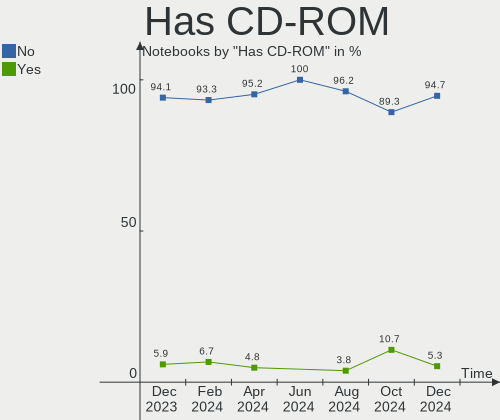

| Presented | Notebooks | Percent |
|-----------|-----------|---------|
| No        | 20        | 95.24%  |
| Yes       | 1         | 4.76%   |

Has Ethernet
------------

Has Ethernet on board

| Presented | Notebooks | Percent |
|-----------|-----------|---------|
| Yes       | 14        | 66.67%  |
| No        | 7         | 33.33%  |

Has WiFi
--------

Has WiFi module

| Presented | Notebooks | Percent |
|-----------|-----------|---------|
| Yes       | 20        | 95.24%  |
| No        | 1         | 4.76%   |

Has Bluetooth
-------------

Has Bluetooth module

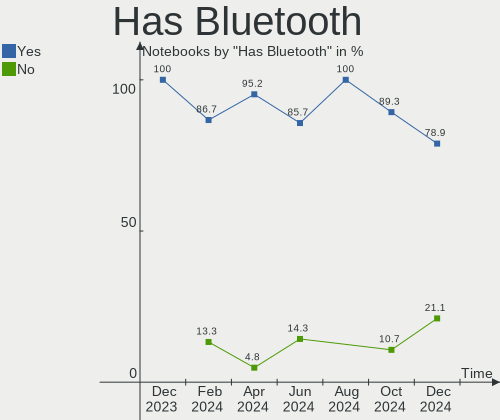

| Presented | Notebooks | Percent |
|-----------|-----------|---------|
| Yes       | 20        | 95.24%  |
| No        | 1         | 4.76%   |

Location
--------

Country
-------

Geographic location (country)

| Country         | Notebooks | Percent |
|-----------------|-----------|---------|
| USA             | 6         | 28.57%  |
| Poland          | 2         | 9.52%   |
| Germany         | 2         | 9.52%   |
| The Netherlands | 1         | 4.76%   |
| Thailand        | 1         | 4.76%   |
| Sweden          | 1         | 4.76%   |
| Singapore       | 1         | 4.76%   |
| Russia          | 1         | 4.76%   |
| Romania         | 1         | 4.76%   |
| Portugal        | 1         | 4.76%   |
| Netherlands     | 1         | 4.76%   |
| Japan           | 1         | 4.76%   |
| Canada          | 1         | 4.76%   |
| Brazil          | 1         | 4.76%   |

City
----

Geographic location (city)

| City        | Notebooks | Percent |
|-------------|-----------|---------|
| Warsaw      | 1         | 4.76%   |
| Waalwijk    | 1         | 4.76%   |
| Tokyo       | 1         | 4.76%   |
| Stuttgart   | 1         | 4.76%   |
| Sorocaba    | 1         | 4.76%   |
| Singapore   | 1         | 4.76%   |
| Sibiu       | 1         | 4.76%   |
| San Ramon   | 1         | 4.76%   |
| Porto       | 1         | 4.76%   |
| Port Moody  | 1         | 4.76%   |
| Minneapolis | 1         | 4.76%   |
| Los Angeles | 1         | 4.76%   |
| Lessebo     | 1         | 4.76%   |
| Kingwood    | 1         | 4.76%   |
| Kingston    | 1         | 4.76%   |
| Katowice    | 1         | 4.76%   |
| Dordrecht   | 1         | 4.76%   |
| Chiang Mai  | 1         | 4.76%   |
| Bremen      | 1         | 4.76%   |
| Balakovo    | 1         | 4.76%   |
| Austin      | 1         | 4.76%   |

Drives
------

Drive Vendor
------------

Hard drive vendors

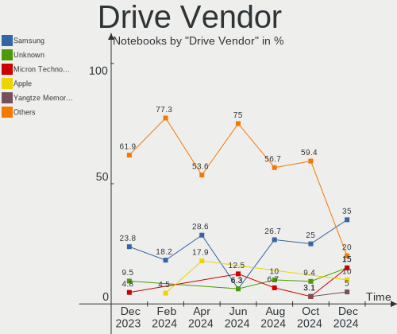

| Vendor                       | Notebooks | Drives | Percent |
|------------------------------|-----------|--------|---------|
| Samsung Electronics          | 8         | 9      | 28.57%  |
| Apple                        | 5         | 5      | 17.86%  |
| Crucial                      | 3         | 3      | 10.71%  |
| Union Memory (Shenzhen)      | 2         | 2      | 7.14%   |
| WDC                          | 1         | 1      | 3.57%   |
| SK hynix                     | 1         | 1      | 3.57%   |
| Silicon Motion               | 1         | 1      | 3.57%   |
| Shenzhen Longsys Electronics | 1         | 1      | 3.57%   |
| Seagate                      | 1         | 1      | 3.57%   |
| Sandisk                      | 1         | 1      | 3.57%   |
| PNY                          | 1         | 1      | 3.57%   |
| Lexar                        | 1         | 1      | 3.57%   |
| Kingston                     | 1         | 1      | 3.57%   |
| Intel                        | 1         | 1      | 3.57%   |

Drive Model
-----------

Hard drive models

| Model                                              | Notebooks | Percent |
|----------------------------------------------------|-----------|---------|
| Samsung NVMe SSD Controller SM981/PM981/PM983 1TB  | 4         | 13.79%  |
| Union Memory (Shenzhen) UMIS RPJTJ512MGE1QDQ 512GB | 2         | 6.9%    |
| Samsung NVMe SSD Controller PM9A1/PM9A3/980PRO 1TB | 2         | 6.9%    |
| WDC WD5000LPVX-75V0TT0 500GB                       | 1         | 3.45%   |
| SK hynix PC801 NVMe 1TB                            | 1         | 3.45%   |
| Silicon Motion SM2262/SM2262EN SSD Controller 2TB  | 1         | 3.45%   |
| Shenzhen Longsys Lexar SSD NM710 2TB               | 1         | 3.45%   |
| Seagate ST2000LM015-2E8174 2TB                     | 1         | 3.45%   |
| Sandisk WD PC SN740 SDDQNQD-512G-1201 512GB        | 1         | 3.45%   |
| Samsung SSD 990 PRO 1TB                            | 1         | 3.45%   |
| Samsung SSD 850 EVO 250GB                          | 1         | 3.45%   |
| Samsung MZVLQ512HBLU-00BH1 512GB                   | 1         | 3.45%   |
| PNY CS900 1TB SSD                                  | 1         | 3.45%   |
| Lexar SSD NS100 512GB                              | 1         | 3.45%   |
| Kingston OMSP0S3512Q-00 512GB SSD                  | 1         | 3.45%   |
| Intel SSDPEKNU512GZ 512GB                          | 1         | 3.45%   |
| Crucial CT275MX300SSD1 275GB                       | 1         | 3.45%   |
| Crucial CT120M500SSD3 120GB                        | 1         | 3.45%   |
| Crucial CT1000MX500SSD1 1TB                        | 1         | 3.45%   |
| Apple SSD SM768E 752GB                             | 1         | 3.45%   |
| Apple SSD SM1024F 1TB                              | 1         | 3.45%   |
| Apple SSD SM0512G 500GB                            | 1         | 3.45%   |
| Apple SSD SM0512F 500GB                            | 1         | 3.45%   |
| Apple SSD SM0256G 256GB                            | 1         | 3.45%   |

HDD Vendor
----------

Hard disk drive vendors

| Vendor  | Notebooks | Drives | Percent |
|---------|-----------|--------|---------|
| WDC     | 1         | 1      | 50%     |
| Seagate | 1         | 1      | 50%     |

SSD Vendor
----------

Solid state drive vendors

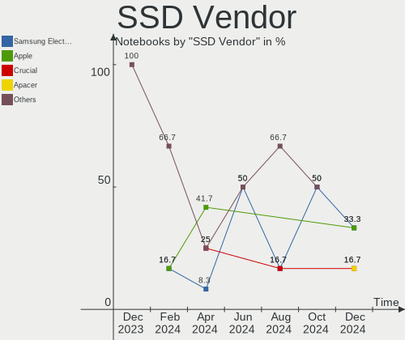

| Vendor              | Notebooks | Drives | Percent |
|---------------------|-----------|--------|---------|
| Apple               | 5         | 5      | 41.67%  |
| Crucial             | 3         | 3      | 25%     |
| Samsung Electronics | 1         | 1      | 8.33%   |
| PNY                 | 1         | 1      | 8.33%   |
| Lexar               | 1         | 1      | 8.33%   |
| Kingston            | 1         | 1      | 8.33%   |

Drive Kind
----------

HDD or SSD

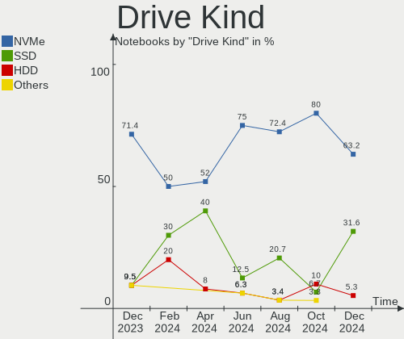

| Kind | Notebooks | Drives | Percent |
|------|-----------|--------|---------|
| NVMe | 13        | 15     | 52%     |
| SSD  | 10        | 12     | 40%     |
| HDD  | 2         | 2      | 8%      |

Drive Connector
---------------

SATA, SAS, NVMe, etc.

| Type | Notebooks | Drives | Percent |
|------|-----------|--------|---------|
| NVMe | 13        | 15     | 54.17%  |
| SATA | 11        | 14     | 45.83%  |

Drive Size
----------

Size of hard drive

| Size in TB | Notebooks | Drives | Percent |
|------------|-----------|--------|---------|
| 0.51-1.0   | 6         | 6      | 46.15%  |
| 0.01-0.5   | 6         | 7      | 46.15%  |
| 1.01-2.0   | 1         | 1      | 7.69%   |

Space Total
-----------

Amount of disk space available on the file system

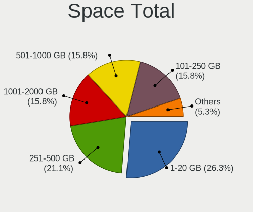

| Size in GB | Notebooks | Percent |
|------------|-----------|---------|
| 1-20       | 6         | 28.57%  |
| 251-500    | 5         | 23.81%  |
| 101-250    | 4         | 19.05%  |
| 1001-2000  | 2         | 9.52%   |
| 501-1000   | 2         | 9.52%   |
| 51-100     | 1         | 4.76%   |
| Unknown    | 1         | 4.76%   |

Space Used
----------

Amount of used disk space

| Used GB   | Notebooks | Percent |
|-----------|-----------|---------|
| 1-20      | 9         | 42.86%  |
| 21-50     | 3         | 14.29%  |
| 101-250   | 3         | 14.29%  |
| 51-100    | 2         | 9.52%   |
| 251-500   | 1         | 4.76%   |
| 1001-2000 | 1         | 4.76%   |
| 501-1000  | 1         | 4.76%   |
| Unknown   | 1         | 4.76%   |

Malfunc. Drives
---------------

Drive models with a malfunction

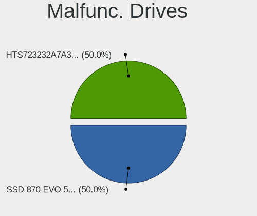

| Model                                                         | Notebooks | Drives | Percent |
|---------------------------------------------------------------|-----------|--------|---------|
| Seagate ST2000LM015-2E8174 2TB                                | 1         | 1      | 33.33%  |
| Samsung Electronics NVMe SSD Controller SM981/PM981/PM983 1TB | 1         | 1      | 33.33%  |
| Crucial CT120M500SSD3 120GB                                   | 1         | 1      | 33.33%  |

Malfunc. Drive Vendor
---------------------

Vendors of faulty drives

| Vendor              | Notebooks | Drives | Percent |
|---------------------|-----------|--------|---------|
| Seagate             | 1         | 1      | 33.33%  |
| Samsung Electronics | 1         | 1      | 33.33%  |
| Crucial             | 1         | 1      | 33.33%  |

Malfunc. HDD Vendor
-------------------

Vendors of faulty HDD drives

| Vendor  | Notebooks | Drives | Percent |
|---------|-----------|--------|---------|
| Seagate | 1         | 1      | 100%    |

Malfunc. Drive Kind
-------------------

Kinds of faulty drives

| Kind | Notebooks | Drives | Percent |
|------|-----------|--------|---------|
| NVMe | 1         | 1      | 33.33%  |
| SSD  | 1         | 1      | 33.33%  |
| HDD  | 1         | 1      | 33.33%  |

Failed Drives
-------------

Failed drive models

Zero info for selected period =(

Failed Drive Vendor
-------------------

Failed drive vendors

Zero info for selected period =(

Drive Status
------------

Number of failed and malfunc. drives

| Status   | Notebooks | Drives | Percent |
|----------|-----------|--------|---------|
| Works    | 20        | 25     | 86.96%  |
| Malfunc  | 2         | 3      | 8.7%    |
| Detected | 1         | 1      | 4.35%   |

Storage controller
------------------

Storage Vendor
--------------

Storage controller vendors

| Vendor                       | Notebooks | Percent |
|------------------------------|-----------|---------|
| Samsung Electronics          | 10        | 40%     |
| Intel                        | 9         | 36%     |
| Union Memory (Shenzhen)      | 2         | 8%      |
| SK hynix                     | 1         | 4%      |
| Silicon Motion               | 1         | 4%      |
| Shenzhen Longsys Electronics | 1         | 4%      |
| SanDisk                      | 1         | 4%      |

Storage Model
-------------

Storage controller models

| Model                                                                          | Notebooks | Percent |
|--------------------------------------------------------------------------------|-----------|---------|
| Samsung NVMe SSD Controller SM981/PM981/PM983                                  | 4         | 16%     |
| Union Memory (Shenzhen) AM630 PCIe 4.0 x4 NVMe SSD Controller                  | 2         | 8%      |
| Samsung S4LN058A01[SSUBX] AHCI SSD Controller (Apple slot)                     | 2         | 8%      |
| Samsung S4LN053X01 AHCI SSD Controller(Apple slot)                             | 2         | 8%      |
| Intel Cannon Lake Mobile PCH SATA AHCI Controller                              | 2         | 8%      |
| SK hynix Platinum P41/PC801 NVMe Solid State Drive                             | 1         | 4%      |
| Silicon Motion SM2262/SM2262EN SSD Controller                                  | 1         | 4%      |
| Shenzhen Longsys Lexar NM790 NVME SSD (DRAM-less)                              | 1         | 4%      |
| SanDisk WD Black SN770 / PC SN740 256GB / PC SN560 (DRAM-less) NVMe SSD        | 1         | 4%      |
| Samsung NVMe SSD Controller PM9A1/PM9A3/980PRO                                 | 1         | 4%      |
| Samsung NVMe SSD Controller 980 (DRAM-less)                                    | 1         | 4%      |
| Intel Wildcat Point-LP SATA Controller [AHCI Mode]                             | 1         | 4%      |
| Intel Sunrise Point-LP SATA Controller [AHCI mode]                             | 1         | 4%      |
| Intel SSD 670p Series [Keystone Harbor]                                        | 1         | 4%      |
| Intel Q170/Q150/B150/H170/H110/Z170/CM236 Chipset SATA Controller [AHCI Mode]  | 1         | 4%      |
| Intel 8 Series/C220 Series Chipset Family 6-port SATA Controller 1 [AHCI mode] | 1         | 4%      |
| Intel 7 Series Chipset Family 6-port SATA Controller [AHCI mode]               | 1         | 4%      |
| Intel 6 Series/C200 Series Chipset Family 6 port Mobile SATA AHCI Controller   | 1         | 4%      |

Storage Kind
------------

Kind of storage controller (IDE, SATA, NVMe, SAS, ...)

| Kind | Notebooks | Percent |
|------|-----------|---------|
| NVMe | 12        | 50%     |
| SATA | 12        | 50%     |

Processor
---------

CPU Vendor
----------

Processor vendors

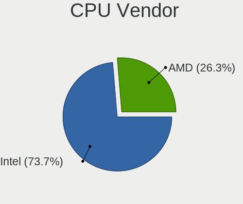

| Vendor | Notebooks | Percent |
|--------|-----------|---------|
| Intel  | 15        | 71.43%  |
| AMD    | 6         | 28.57%  |

CPU Model
---------

Processor models

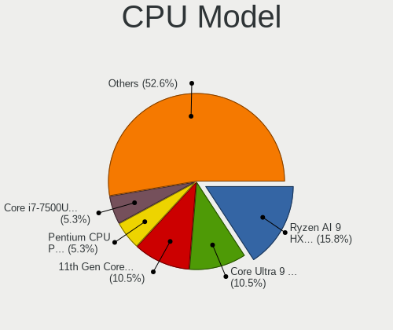

| Model                                         | Notebooks | Percent |
|-----------------------------------------------|-----------|---------|
| Intel Core i7-8750H CPU @ 2.20GHz             | 1         | 4.76%   |
| Intel Core i7-6820HQ CPU @ 2.70GHz            | 1         | 4.76%   |
| Intel Core i7-5557U CPU @ 3.10GHz             | 1         | 4.76%   |
| Intel Core i7-4980HQ CPU @ 2.80GHz            | 1         | 4.76%   |
| Intel Core i7-4870HQ CPU @ 2.50GHz            | 1         | 4.76%   |
| Intel Core i7-4770HQ CPU @ 2.20GHz            | 1         | 4.76%   |
| Intel Core i7-4710HQ CPU @ 2.50GHz            | 1         | 4.76%   |
| Intel Core i7-3820QM CPU @ 2.70GHz            | 1         | 4.76%   |
| Intel Core i7-2630QM CPU @ 2.00GHz            | 1         | 4.76%   |
| Intel Core i5-9300H CPU @ 2.40GHz             | 1         | 4.76%   |
| Intel Core i5-8350U CPU @ 1.70GHz             | 1         | 4.76%   |
| Intel Core i5-5200U CPU @ 2.20GHz             | 1         | 4.76%   |
| Intel 13th Gen Core i9-13900H                 | 1         | 4.76%   |
| Intel 12th Gen Core i7-1265U                  | 1         | 4.76%   |
| Intel 11th Gen Core i7-1185G7 @ 3.00GHz       | 1         | 4.76%   |
| AMD Ryzen 9 8945HS w/ Radeon 780M Graphics    | 1         | 4.76%   |
| AMD Ryzen 9 5980HX with Radeon Graphics       | 1         | 4.76%   |
| AMD Ryzen 7 PRO 7840U w/ Radeon 780M Graphics | 1         | 4.76%   |
| AMD Ryzen 7 PRO 6860Z with Radeon Graphics    | 1         | 4.76%   |
| AMD Ryzen 7 PRO 5875U with Radeon Graphics    | 1         | 4.76%   |
| AMD Ryzen 7 PRO 4750U with Radeon Graphics    | 1         | 4.76%   |

CPU Model Family
----------------

Processor model prefix

| Model           | Notebooks | Percent |
|-----------------|-----------|---------|
| Intel Core i7   | 9         | 42.86%  |
| AMD Ryzen 7 PRO | 4         | 19.05%  |
| Other           | 3         | 14.29%  |
| Intel Core i5   | 3         | 14.29%  |
| AMD Ryzen 9     | 2         | 9.52%   |

CPU Cores
---------

Number of processor cores

| Number | Notebooks | Percent |
|--------|-----------|---------|
| 4      | 10        | 47.62%  |
| 8      | 6         | 28.57%  |
| 2      | 2         | 9.52%   |
| 14     | 1         | 4.76%   |
| 10     | 1         | 4.76%   |
| 6      | 1         | 4.76%   |

CPU Sockets
-----------

Number of sockets

| Number | Notebooks | Percent |
|--------|-----------|---------|
| 1      | 21        | 100%    |

CPU Threads
-----------

Threads per core (Hyper-Threading)

| Number | Notebooks | Percent |
|--------|-----------|---------|
| 2      | 21        | 100%    |

CPU Op-Modes
------------

CPU Operation Modes (32-bit, 64-bit)

| Op mode        | Notebooks | Percent |
|----------------|-----------|---------|
| 32-bit, 64-bit | 21        | 100%    |

CPU Microcode
-------------

Microcode number

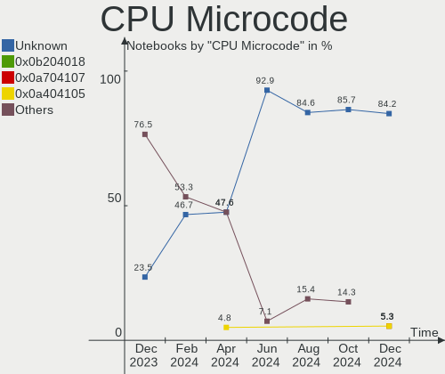

| Number     | Notebooks | Percent |
|------------|-----------|---------|
| Unknown    | 10        | 47.62%  |
| 0x906ea    | 2         | 9.52%   |
| 0x40661    | 2         | 9.52%   |
| 0x306d4    | 2         | 9.52%   |
| 0x506e3    | 1         | 4.76%   |
| 0x0a704104 | 1         | 4.76%   |
| 0x0a50000c | 1         | 4.76%   |
| 0x0a404105 | 1         | 4.76%   |
| 0x08600106 | 1         | 4.76%   |

CPU Microarch
-------------

Microarchitecture

| Name             | Notebooks | Percent |
|------------------|-----------|---------|
| Haswell          | 4         | 19.05%  |
| KabyLake         | 3         | 14.29%  |
| Unknown          | 3         | 14.29%  |
| Zen 3            | 2         | 9.52%   |
| Broadwell        | 2         | 9.52%   |
| Alderlake Hybrid | 2         | 9.52%   |
| Zen 2            | 1         | 4.76%   |
| TigerLake        | 1         | 4.76%   |
| Skylake          | 1         | 4.76%   |
| SandyBridge      | 1         | 4.76%   |
| IvyBridge        | 1         | 4.76%   |

Graphics
--------

GPU Vendor
----------

Vendors of graphics cards

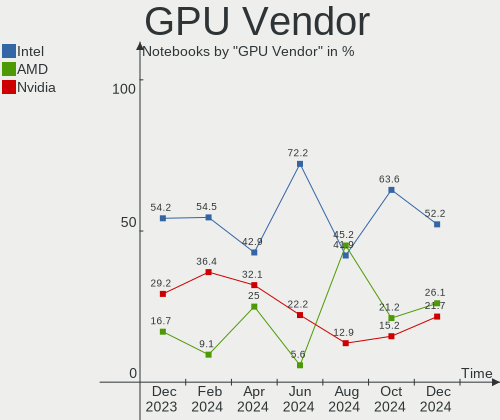

| Vendor | Notebooks | Percent |
|--------|-----------|---------|
| Intel  | 12        | 42.86%  |
| Nvidia | 9         | 32.14%  |
| AMD    | 7         | 25%     |

GPU Model
---------

Graphics card models

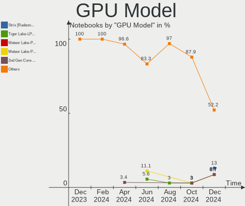

| Model                                                                     | Notebooks | Percent |
|---------------------------------------------------------------------------|-----------|---------|
| Nvidia AD106M [GeForce RTX 4070 Max-Q / Mobile]                           | 2         | 6.9%    |
| Intel CoffeeLake-H GT2 [UHD Graphics 630]                                 | 2         | 6.9%    |
| Nvidia TU117M [GeForce GTX 1650 Mobile / Max-Q]                           | 1         | 3.45%   |
| Nvidia GP106M [GeForce GTX 1060 Mobile]                                   | 1         | 3.45%   |
| Nvidia GM107M [GeForce GTX 860M]                                          | 1         | 3.45%   |
| Nvidia GM107GLM [Quadro M2000M]                                           | 1         | 3.45%   |
| Nvidia GK107M [GeForce GT 750M Mac Edition]                               | 1         | 3.45%   |
| Nvidia GK107M [GeForce GT 650M Mac Edition]                               | 1         | 3.45%   |
| Nvidia GF119M [GeForce GT 520M]                                           | 1         | 3.45%   |
| Intel UHD Graphics 620                                                    | 1         | 3.45%   |
| Intel TigerLake-LP GT2 [Iris Xe Graphics]                                 | 1         | 3.45%   |
| Intel Raptor Lake-P [Iris Xe Graphics]                                    | 1         | 3.45%   |
| Intel Iris Graphics 6100                                                  | 1         | 3.45%   |
| Intel HD Graphics 5500                                                    | 1         | 3.45%   |
| Intel Crystal Well Integrated Graphics Controller                         | 1         | 3.45%   |
| Intel Alder Lake-UP3 GT2 [Iris Xe Graphics]                               | 1         | 3.45%   |
| Intel 4th Gen Core Processor Integrated Graphics Controller               | 1         | 3.45%   |
| Intel 3rd Gen Core processor Graphics Controller                          | 1         | 3.45%   |
| Intel 2nd Generation Core Processor Family Integrated Graphics Controller | 1         | 3.45%   |
| AMD Venus XT [Radeon HD 8870M / R9 M270X/M370X]                           | 1         | 3.45%   |
| AMD Renoir [Radeon RX Vega 6 (Ryzen 4000/5000 Mobile Series)]             | 1         | 3.45%   |
| AMD Rembrandt [Radeon 680M]                                               | 1         | 3.45%   |
| AMD Phoenix3                                                              | 1         | 3.45%   |
| AMD Phoenix1                                                              | 1         | 3.45%   |
| AMD Navi 22 [Radeon RX 6700/6700 XT/6750 XT / 6800M/6850M XT]             | 1         | 3.45%   |
| AMD Cezanne [Radeon Vega Series / Radeon Vega Mobile Series]              | 1         | 3.45%   |
| AMD Barcelo                                                               | 1         | 3.45%   |

GPU Combo
---------

Combinations of graphics cards

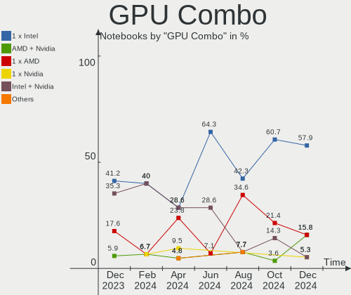

| Name           | Notebooks | Percent |
|----------------|-----------|---------|
| Intel + Nvidia | 6         | 28.57%  |
| 1 x Intel      | 6         | 28.57%  |
| 1 x AMD        | 5         | 23.81%  |
| 1 x Nvidia     | 2         | 9.52%   |
| 2 x AMD        | 1         | 4.76%   |
| AMD + Nvidia   | 1         | 4.76%   |

GPU Driver
----------

Free vs proprietary

| Driver      | Notebooks | Percent |
|-------------|-----------|---------|
| Free        | 16        | 76.19%  |
| Proprietary | 5         | 23.81%  |

GPU Memory
----------

Total video memory

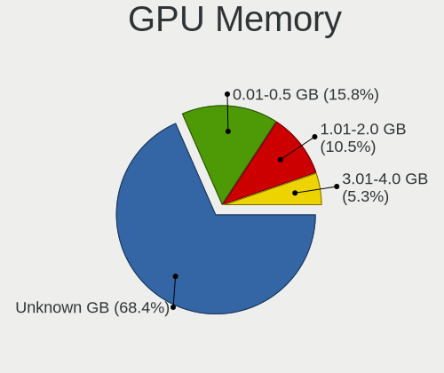

| Size in GB | Notebooks | Percent |
|------------|-----------|---------|
| Unknown    | 11        | 52.38%  |
| 0.51-1.0   | 3         | 14.29%  |
| 0.01-0.5   | 3         | 14.29%  |
| 1.01-2.0   | 2         | 9.52%   |
| 3.01-4.0   | 1         | 4.76%   |
| 8.01-16.0  | 1         | 4.76%   |

Monitor
-------

Monitor Vendor
--------------

Monitor vendors

| Vendor              | Notebooks | Percent |
|---------------------|-----------|---------|
| Samsung Electronics | 6         | 21.43%  |
| Apple               | 5         | 17.86%  |
| BOE                 | 3         | 10.71%  |
| AU Optronics        | 3         | 10.71%  |
| Sharp               | 2         | 7.14%   |
| LG Display          | 2         | 7.14%   |
| Dell                | 2         | 7.14%   |
| Chimei Innolux      | 2         | 7.14%   |
| ViewSonic           | 1         | 3.57%   |
| Goldstar            | 1         | 3.57%   |
| ASUSTek Computer    | 1         | 3.57%   |

Monitor Model
-------------

Monitor models

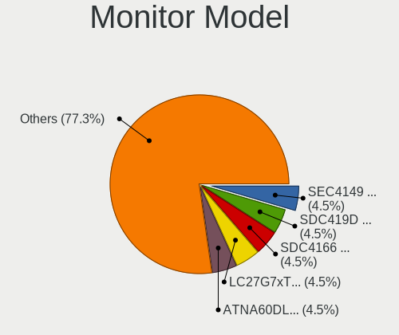

| Model                                                                 | Notebooks | Percent |
|-----------------------------------------------------------------------|-----------|---------|
| ViewSonic VA2232 Series VSC8224 1680x1050 474x296mm 22.0-inch         | 1         | 3.57%   |
| Sharp LCD Monitor SHP153E 1920x1080 294x165mm 13.3-inch               | 1         | 3.57%   |
| Sharp LCD Monitor SHP143B 3840x2160 346x194mm 15.6-inch               | 1         | 3.57%   |
| Samsung Electronics LF24T35 SAM707D 1920x1080 528x297mm 23.9-inch     | 1         | 3.57%   |
| Samsung Electronics LCD Monitor SEC3151 1366x768 344x194mm 15.5-inch  | 1         | 3.57%   |
| Samsung Electronics LCD Monitor SDC4167 2880x1800 289x186mm 13.5-inch | 1         | 3.57%   |
| Samsung Electronics LCD Monitor SDC414D 3456x2160 336x210mm 15.6-inch | 1         | 3.57%   |
| Samsung Electronics LCD Monitor SDC324C 1920x1080 344x194mm 15.5-inch | 1         | 3.57%   |
| Samsung Electronics LC49G95T SAM7053 3840x1080 1193x336mm 48.8-inch   | 1         | 3.57%   |
| LG Display LCD Monitor LGD40A9 1920x1080 309x174mm 14.0-inch          | 1         | 3.57%   |
| LG Display LCD Monitor LGD0521 1920x1080 309x174mm 14.0-inch          | 1         | 3.57%   |
| Goldstar ULTRAGEAR+ GSM5C34 2560x1440 590x333mm 26.7-inch             | 1         | 3.57%   |
| Dell U2715H DELD069 2560x1440 597x336mm 27.0-inch                     | 1         | 3.57%   |
| Dell S2721DGF DEL41DA 2560x1440 597x336mm 27.0-inch                   | 1         | 3.57%   |
| Chimei Innolux LCD Monitor CMN1540 2560x1440 344x193mm 15.5-inch      | 1         | 3.57%   |
| Chimei Innolux LCD Monitor CMN1495 1366x768 309x173mm 13.9-inch       | 1         | 3.57%   |
| BOE LCD Monitor BOE0B94 2560x1600 302x188mm 14.0-inch                 | 1         | 3.57%   |
| BOE LCD Monitor BOE0A76 2256x1504 285x190mm 13.5-inch                 | 1         | 3.57%   |
| BOE LCD Monitor BOE0747 1920x1080 344x194mm 15.5-inch                 | 1         | 3.57%   |
| AU Optronics LCD Monitor AUOD0ED 1920x1080 344x193mm 15.5-inch        | 1         | 3.57%   |
| AU Optronics LCD Monitor AUO8B9B 1920x1200 344x215mm 16.0-inch        | 1         | 3.57%   |
| AU Optronics LCD Monitor AUO2E8D 1920x1080 344x194mm 15.5-inch        | 1         | 3.57%   |
| ASUSTek Computer MB16AHP AUS1662 1920x1080 344x194mm 15.5-inch        | 1         | 3.57%   |
| Apple Color LCD APPA02E 2880x1800 331x207mm 15.4-inch                 | 1         | 3.57%   |
| Apple Color LCD APPA029 2560x1600 286x179mm 13.3-inch                 | 1         | 3.57%   |
| Apple Color LCD APPA022 2880x1800 331x207mm 15.4-inch                 | 1         | 3.57%   |
| Apple Color LCD APPA019 2880x1800 331x207mm 15.4-inch                 | 1         | 3.57%   |
| Apple Color LCD APPA00E 2880x1800 331x207mm 15.4-inch                 | 1         | 3.57%   |

Monitor Resolution
------------------

Monitor screen resolution

| Resolution         | Notebooks | Percent |
|--------------------|-----------|---------|
| 1920x1080 (FHD)    | 8         | 30.77%  |
| 2880x1800          | 5         | 19.23%  |
| 2560x1440 (QHD)    | 3         | 11.54%  |
| 2560x1600          | 2         | 7.69%   |
| 1366x768 (WXGA)    | 2         | 7.69%   |
| 3840x2160 (4K)     | 1         | 3.85%   |
| 3840x1080          | 1         | 3.85%   |
| 3456x2160          | 1         | 3.85%   |
| 2256x1504          | 1         | 3.85%   |
| 1920x1200 (WUXGA)  | 1         | 3.85%   |
| 1680x1050 (WSXGA+) | 1         | 3.85%   |

Monitor Diagonal
----------------

Diagonal size in inches

| Inches | Notebooks | Percent |
|--------|-----------|---------|
| 15     | 13        | 46.43%  |
| 14     | 4         | 14.29%  |
| 13     | 4         | 14.29%  |
| 27     | 2         | 7.14%   |
| 48     | 1         | 3.57%   |
| 26     | 1         | 3.57%   |
| 24     | 1         | 3.57%   |
| 22     | 1         | 3.57%   |
| 16     | 1         | 3.57%   |

Monitor Width
-------------

Physical width

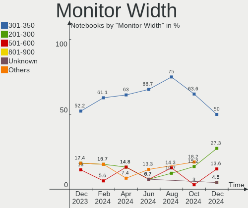

| Width in mm | Notebooks | Percent |
|-------------|-----------|---------|
| 301-350     | 17        | 62.96%  |
| 501-600     | 4         | 14.81%  |
| 201-300     | 4         | 14.81%  |
| 401-500     | 1         | 3.7%    |
| 1001-1500   | 1         | 3.7%    |

Aspect Ratio
------------

Proportional relationship between the width and the height

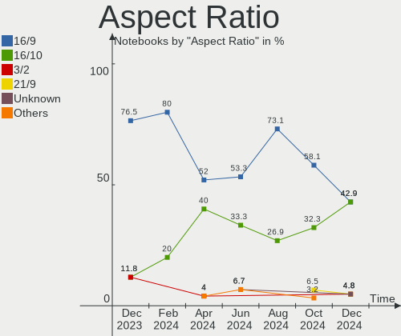

| Ratio | Notebooks | Percent |
|-------|-----------|---------|
| 16/9  | 13        | 52%     |
| 16/10 | 10        | 40%     |
| 32/9  | 1         | 4%      |
| 3/2   | 1         | 4%      |

Monitor Area
------------

Area in inch²

| Area in inch² | Notebooks | Percent |
|----------------|-----------|---------|
| 101-110        | 13        | 46.43%  |
| 81-90          | 7         | 25%     |
| 301-350        | 3         | 10.71%  |
| 201-250        | 2         | 7.14%   |
| 71-80          | 1         | 3.57%   |
| 111-120        | 1         | 3.57%   |
| 501-1000       | 1         | 3.57%   |

Pixel Density
-------------

Pixels per inch

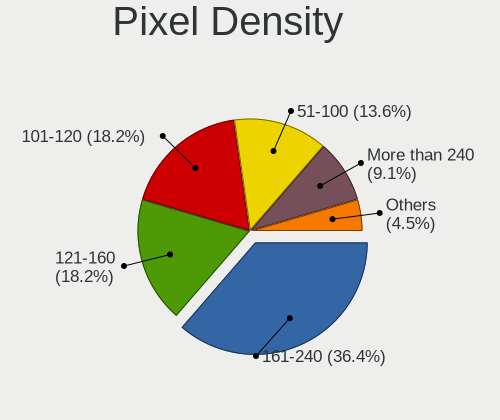

| Density       | Notebooks | Percent |
|---------------|-----------|---------|
| 161-240       | 9         | 33.33%  |
| 121-160       | 7         | 25.93%  |
| 101-120       | 5         | 18.52%  |
| More than 240 | 3         | 11.11%  |
| 51-100        | 3         | 11.11%  |

Multiple Monitors
-----------------

Total monitors connected

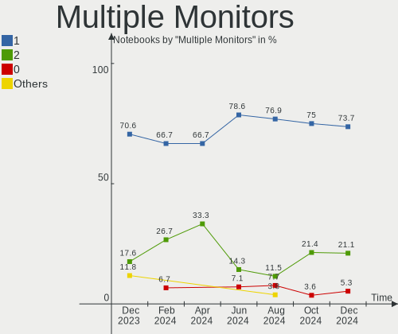

| Total | Notebooks | Percent |
|-------|-----------|---------|
| 1     | 14        | 66.67%  |
| 2     | 7         | 33.33%  |

Network
-------

Net Controller Vendor
---------------------

Controller vendors

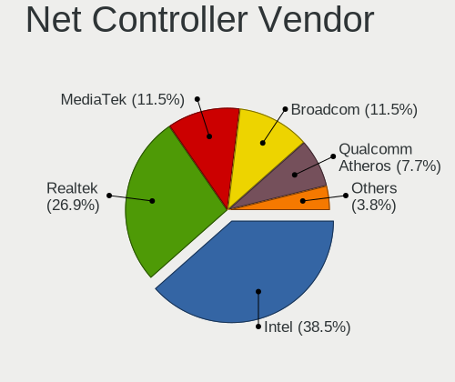

| Vendor                | Notebooks | Percent |
|-----------------------|-----------|---------|
| Intel                 | 10        | 30.3%   |
| Realtek Semiconductor | 9         | 27.27%  |
| Broadcom              | 4         | 12.12%  |
| Qualcomm Atheros      | 2         | 6.06%   |
| Qualcomm              | 2         | 6.06%   |
| MediaTek              | 2         | 6.06%   |
| Qualcomm Technologies | 1         | 3.03%   |
| Broadcom Limited      | 1         | 3.03%   |
| ASIX Electronics      | 1         | 3.03%   |
| Apple                 | 1         | 3.03%   |

Net Controller Model
--------------------

Controller models

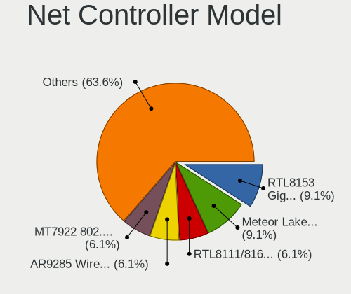

| Model                                                                  | Notebooks | Percent |
|------------------------------------------------------------------------|-----------|---------|
| Realtek RTL8111/8168/8211/8411 PCI Express Gigabit Ethernet Controller | 8         | 22.22%  |
| Qualcomm QCNFA765 Wireless Network Adapter                             | 2         | 5.56%   |
| Intel Wireless 3160                                                    | 2         | 5.56%   |
| Intel Wi-Fi 6 AX200                                                    | 2         | 5.56%   |
| Broadcom BCM43602 802.11ac Wireless LAN SoC                            | 2         | 5.56%   |
| Realtek RTL8153 Gigabit Ethernet Adapter                               | 1         | 2.78%   |
| Qualcomm WCN785x Wi-Fi 7(802.11be) 320MHz 2x2 [FastConnect 7800]       | 1         | 2.78%   |
| Qualcomm Atheros Killer E220x Gigabit Ethernet Controller              | 1         | 2.78%   |
| Qualcomm Atheros AR9462 Wireless Network Adapter                       | 1         | 2.78%   |
| MediaTek MT7922 802.11ax PCI Express Wireless Network Adapter          | 1         | 2.78%   |
| MediaTek MT7921 802.11ax PCI Express Wireless Network Adapter          | 1         | 2.78%   |
| Intel Wireless 8265 / 8275                                             | 1         | 2.78%   |
| Intel Wireless 8260                                                    | 1         | 2.78%   |
| Intel Wi-Fi 6E(802.11ax) AX210/AX1675* 2x2 [Typhoon Peak]              | 1         | 2.78%   |
| Intel Wi-Fi 5(802.11ac) Wireless-AC 9x6x [Thunder Peak]                | 1         | 2.78%   |
| Intel Raptor Lake PCH CNVi WiFi                                        | 1         | 2.78%   |
| Intel Ethernet Connection (4) I219-LM                                  | 1         | 2.78%   |
| Intel Ethernet Connection (2) I219-LM                                  | 1         | 2.78%   |
| Intel Ethernet Connection (13) I219-LM                                 | 1         | 2.78%   |
| Intel Alder Lake-P PCH CNVi WiFi                                       | 1         | 2.78%   |
| Broadcom NetXtreme BCM57786 Gigabit Ethernet PCIe                      | 1         | 2.78%   |
| Broadcom Limited BCM4331 802.11a/b/g/n                                 | 1         | 2.78%   |
| Broadcom BCM4360 802.11ac Dual Band Wireless Network Adapter           | 1         | 2.78%   |
| ASIX AX88179 Gigabit Ethernet                                          | 1         | 2.78%   |
| Apple Ethernet Adapter [A1277]                                         | 1         | 2.78%   |

Wireless Vendor
---------------

Wireless vendors

| Vendor                | Notebooks | Percent |
|-----------------------|-----------|---------|
| Intel                 | 10        | 50%     |
| Broadcom              | 3         | 15%     |
| Qualcomm              | 2         | 10%     |
| MediaTek              | 2         | 10%     |
| Qualcomm Technologies | 1         | 5%      |
| Qualcomm Atheros      | 1         | 5%      |
| Broadcom Limited      | 1         | 5%      |

Wireless Model
--------------

Wireless models

| Model                                                            | Notebooks | Percent |
|------------------------------------------------------------------|-----------|---------|
| Qualcomm QCNFA765 Wireless Network Adapter                       | 2         | 10%     |
| Intel Wireless 3160                                              | 2         | 10%     |
| Intel Wi-Fi 6 AX200                                              | 2         | 10%     |
| Broadcom BCM43602 802.11ac Wireless LAN SoC                      | 2         | 10%     |
| Qualcomm WCN785x Wi-Fi 7(802.11be) 320MHz 2x2 [FastConnect 7800] | 1         | 5%      |
| Qualcomm Atheros AR9462 Wireless Network Adapter                 | 1         | 5%      |
| MediaTek MT7922 802.11ax PCI Express Wireless Network Adapter    | 1         | 5%      |
| MediaTek MT7921 802.11ax PCI Express Wireless Network Adapter    | 1         | 5%      |
| Intel Wireless 8265 / 8275                                       | 1         | 5%      |
| Intel Wireless 8260                                              | 1         | 5%      |
| Intel Wi-Fi 6E(802.11ax) AX210/AX1675* 2x2 [Typhoon Peak]        | 1         | 5%      |
| Intel Wi-Fi 5(802.11ac) Wireless-AC 9x6x [Thunder Peak]          | 1         | 5%      |
| Intel Raptor Lake PCH CNVi WiFi                                  | 1         | 5%      |
| Intel Alder Lake-P PCH CNVi WiFi                                 | 1         | 5%      |
| Broadcom Limited BCM4331 802.11a/b/g/n                           | 1         | 5%      |
| Broadcom BCM4360 802.11ac Dual Band Wireless Network Adapter     | 1         | 5%      |

Ethernet Vendor
---------------

Ethernet vendors

| Vendor                | Notebooks | Percent |
|-----------------------|-----------|---------|
| Realtek Semiconductor | 9         | 56.25%  |
| Intel                 | 3         | 18.75%  |
| Qualcomm Atheros      | 1         | 6.25%   |
| Broadcom              | 1         | 6.25%   |
| ASIX Electronics      | 1         | 6.25%   |
| Apple                 | 1         | 6.25%   |

Ethernet Model
--------------

Ethernet models

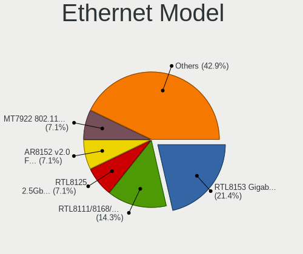

| Model                                                                  | Notebooks | Percent |
|------------------------------------------------------------------------|-----------|---------|
| Realtek RTL8111/8168/8211/8411 PCI Express Gigabit Ethernet Controller | 8         | 50%     |
| Realtek RTL8153 Gigabit Ethernet Adapter                               | 1         | 6.25%   |
| Qualcomm Atheros Killer E220x Gigabit Ethernet Controller              | 1         | 6.25%   |
| Intel Ethernet Connection (4) I219-LM                                  | 1         | 6.25%   |
| Intel Ethernet Connection (2) I219-LM                                  | 1         | 6.25%   |
| Intel Ethernet Connection (13) I219-LM                                 | 1         | 6.25%   |
| Broadcom NetXtreme BCM57786 Gigabit Ethernet PCIe                      | 1         | 6.25%   |
| ASIX AX88179 Gigabit Ethernet                                          | 1         | 6.25%   |
| Apple Ethernet Adapter [A1277]                                         | 1         | 6.25%   |

Net Controller Kind
-------------------

Ethernet, WiFi or modem

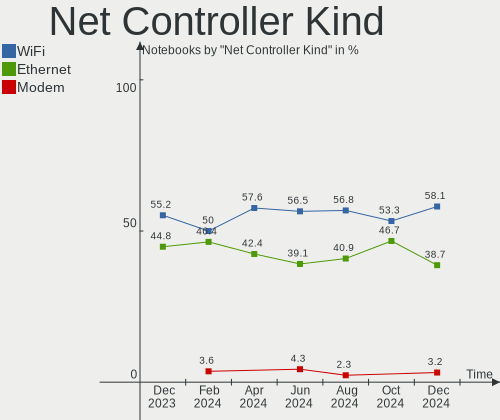

| Kind     | Notebooks | Percent |
|----------|-----------|---------|
| WiFi     | 20        | 58.82%  |
| Ethernet | 14        | 41.18%  |

Used Controller
---------------

Currently used network controller

| Kind     | Notebooks | Percent |
|----------|-----------|---------|
| WiFi     | 18        | 81.82%  |
| Ethernet | 4         | 18.18%  |

NICs
----

Total network controllers on board

| Total | Notebooks | Percent |
|-------|-----------|---------|
| 2     | 13        | 61.9%   |
| 1     | 7         | 33.33%  |
| 0     | 1         | 4.76%   |

IPv6
----

IPv6 vs IPv4

| Used | Notebooks | Percent |
|------|-----------|---------|
| No   | 12        | 57.14%  |
| Yes  | 9         | 42.86%  |

Bluetooth
---------

Bluetooth Vendor
----------------

Controller vendors

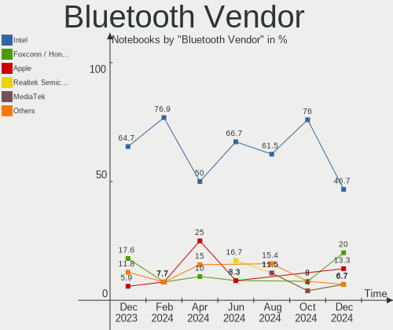

| Vendor            | Notebooks | Percent |
|-------------------|-----------|---------|
| Intel             | 10        | 50%     |
| Apple             | 5         | 25%     |
| USI               | 2         | 10%     |
| Foxconn / Hon Hai | 2         | 10%     |
| IMC Networks      | 1         | 5%      |

Bluetooth Model
---------------

Controller models

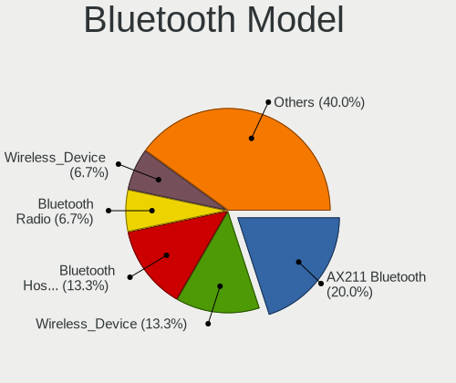

| Model                                    | Notebooks | Percent |
|------------------------------------------|-----------|---------|
| Apple Bluetooth Host Controller          | 5         | 25%     |
| USI Bluetooth Device                     | 2         | 10%     |
| Intel Bluetooth wireless interface       | 2         | 10%     |
| Intel Bluetooth Device                   | 2         | 10%     |
| Intel AX211 Bluetooth                    | 2         | 10%     |
| Intel AX200 Bluetooth                    | 2         | 10%     |
| Intel Wireless-AC 9260 Bluetooth Adapter | 1         | 5%      |
| Intel AX210 Bluetooth                    | 1         | 5%      |
| IMC Networks Wireless_Device             | 1         | 5%      |
| Foxconn / Hon Hai Wireless_Device        | 1         | 5%      |
| Foxconn / Hon Hai Bluetooth Device       | 1         | 5%      |

Sound
-----

Sound Vendor
------------

Sound card vendors

| Vendor              | Notebooks | Percent |
|---------------------|-----------|---------|
| Intel               | 15        | 53.57%  |
| AMD                 | 7         | 25%     |
| Nvidia              | 5         | 17.86%  |
| Kingston Technology | 1         | 3.57%   |

Sound Model
-----------

Sound card models

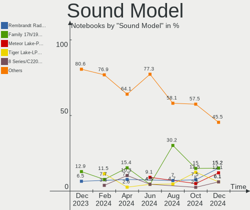

| Model                                                                      | Notebooks | Percent |
|----------------------------------------------------------------------------|-----------|---------|
| AMD Family 17h/19h HD Audio Controller                                     | 6         | 15.38%  |
| Intel 8 Series/C220 Series Chipset High Definition Audio Controller        | 4         | 10.26%  |
| AMD Renoir Radeon High Definition Audio Controller                         | 3         | 7.69%   |
| AMD Rembrandt Radeon High Definition Audio Controller                      | 3         | 7.69%   |
| Nvidia GK107 HDMI Audio Controller                                         | 2         | 5.13%   |
| Intel Wildcat Point-LP High Definition Audio Controller                    | 2         | 5.13%   |
| Intel Cannon Lake PCH cAVS                                                 | 2         | 5.13%   |
| Intel Broadwell-U Audio Controller                                         | 2         | 5.13%   |
| Nvidia GP106 High Definition Audio Controller                              | 1         | 2.56%   |
| Nvidia GM107 High Definition Audio Controller [GeForce 940MX]              | 1         | 2.56%   |
| Nvidia Audio device                                                        | 1         | 2.56%   |
| Kingston Technology HyperX Cloud Orbit S Hi-Res 2Ch                        | 1         | 2.56%   |
| Intel Xeon E3-1200 v3/4th Gen Core Processor HD Audio Controller           | 1         | 2.56%   |
| Intel Tiger Lake-LP Smart Sound Technology Audio Controller                | 1         | 2.56%   |
| Intel Sunrise Point-LP HD Audio                                            | 1         | 2.56%   |
| Intel Raptor Lake-P/U/H cAVS                                               | 1         | 2.56%   |
| Intel Crystal Well HD Audio Controller                                     | 1         | 2.56%   |
| Intel Alder Lake PCH-P High Definition Audio Controller                    | 1         | 2.56%   |
| Intel 7 Series/C216 Chipset Family High Definition Audio Controller        | 1         | 2.56%   |
| Intel 6 Series/C200 Series Chipset Family High Definition Audio Controller | 1         | 2.56%   |
| Intel 100 Series/C230 Series Chipset Family HD Audio Controller            | 1         | 2.56%   |
| AMD Oland/Hainan/Cape Verde/Pitcairn HDMI Audio [Radeon HD 7000 Series]    | 1         | 2.56%   |
| AMD Navi 21/23 HDMI/DP Audio Controller                                    | 1         | 2.56%   |

Memory
------

Memory Vendor
-------------

Memory module vendors

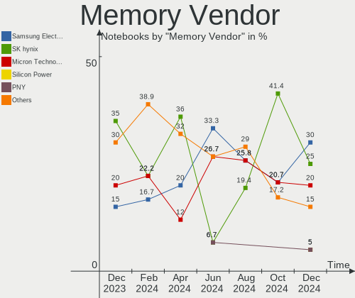

| Vendor              | Notebooks | Percent |
|---------------------|-----------|---------|
| SK hynix            | 9         | 36%     |
| Samsung Electronics | 5         | 20%     |
| Kingston            | 4         | 16%     |
| Micron Technology   | 3         | 12%     |
| Crucial             | 2         | 8%      |
| Unknown             | 2         | 8%      |

Memory Model
------------

Memory module models

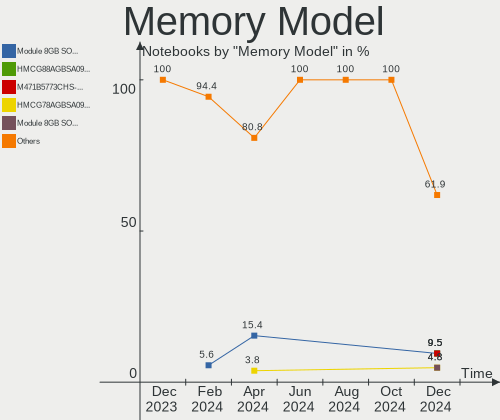

| Model                                                              | Notebooks | Percent |
|--------------------------------------------------------------------|-----------|---------|
| SK hynix RAM Module 8GB SODIMM DDR3 1600MT/s                       | 4         | 15.38%  |
| Unknown                                                            | 2         | 7.69%   |
| SK hynix RAM HMT351S6CFR8C-PB 4GB SODIMM DDR3 1600MT/s             | 1         | 3.85%   |
| SK hynix RAM HMT351S6CFR8C-H9 4GB SODIMM DDR3 1333MT/s             | 1         | 3.85%   |
| SK hynix RAM HMCG78AGBSA092N 16GB SODIMM DDR5 5600MT/s             | 1         | 3.85%   |
| SK hynix RAM HMCG78AEBSA095N 16GB SODIMM 4800MT/s                  | 1         | 3.85%   |
| SK hynix RAM HMA451S6AFR8N-TF 4GB SODIMM DDR4 2133MT/s             | 1         | 3.85%   |
| SK hynix RAM H9JCNNNFA5MLYR-N6E 8GB SODIMM LPDDR5 6400MT/s         | 1         | 3.85%   |
| Samsung RAM Module 8GB SODIMM DDR3 1867MT/s                        | 1         | 3.85%   |
| Samsung RAM M471B1G73EB0-YK0 8GB SODIMM DDR3 1600MT/s              | 1         | 3.85%   |
| Samsung RAM M471B1G73DB0-YK0 8GB SODIMM DDR3 1600MT/s              | 1         | 3.85%   |
| Samsung RAM M471A5143DB0-CPB 4GB SODIMM DDR4 2133MT/s              | 1         | 3.85%   |
| Samsung RAM M471A1K43CB1-CTD 8GB SODIMM DDR4 2667MT/s              | 1         | 3.85%   |
| Micron RAM MT62F4G32D8DV-026 WT 16GB SODIMM LPDDR5 7500MT/s        | 1         | 3.85%   |
| Micron RAM MT53E2G32D4NQ-046 WT:A 4GB Row Of Chips LPDDR4 4267MT/s | 1         | 3.85%   |
| Micron RAM 16ATF1G64HZ-2G1A2 8GB SODIMM DDR4 2133MT/s              | 1         | 3.85%   |
| Kingston RAM MSI16D3LS1KFG/8G 8GB SODIMM DDR3 1600MT/s             | 1         | 3.85%   |
| Kingston RAM KHX2666C15S4/16G 16GB SODIMM DDR4 2667MT/s            | 1         | 3.85%   |
| Kingston RAM 9905744-066.A00G 32GB SODIMM DDR4 3200MT/s            | 1         | 3.85%   |
| Kingston RAM 9905744-035.A00G 16GB SODIMM DDR4 3200MT/s            | 1         | 3.85%   |
| Crucial RAM CT32G4SFD832A.C16FF 32GB SODIMM DDR4 3200MT/s          | 1         | 3.85%   |
| Crucial RAM CT16G4SFD824A.M16FJ 16GB SODIMM DDR4 2400MT/s          | 1         | 3.85%   |

Memory Kind
-----------

Memory module kinds

| Kind   | Notebooks | Percent |
|--------|-----------|---------|
| DDR3   | 8         | 38.1%   |
| DDR4   | 7         | 33.33%  |
| LPDDR5 | 2         | 9.52%   |
| LPDDR4 | 2         | 9.52%   |
| DDR5   | 2         | 9.52%   |

Memory Form Factor
------------------

Physical design of the memory module

| Name         | Notebooks | Percent |
|--------------|-----------|---------|
| SODIMM       | 19        | 90.48%  |
| Row Of Chips | 2         | 9.52%   |

Memory Size
-----------

Memory module size

| Size  | Notebooks | Percent |
|-------|-----------|---------|
| 8192  | 11        | 47.83%  |
| 16384 | 6         | 26.09%  |
| 4096  | 4         | 17.39%  |
| 32768 | 2         | 8.7%    |

Memory Speed
------------

Memory module speed

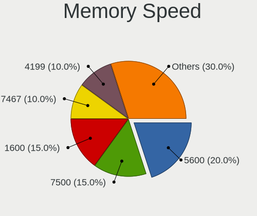

| Speed | Notebooks | Percent |
|-------|-----------|---------|
| 1600  | 7         | 30.43%  |
| 3200  | 4         | 17.39%  |
| 4267  | 2         | 8.7%    |
| 2667  | 2         | 8.7%    |
| 7500  | 1         | 4.35%   |
| 6400  | 1         | 4.35%   |
| 5600  | 1         | 4.35%   |
| 4800  | 1         | 4.35%   |
| 2400  | 1         | 4.35%   |
| 2133  | 1         | 4.35%   |
| 1867  | 1         | 4.35%   |
| 1333  | 1         | 4.35%   |

Printers & scanners
-------------------

Printer Vendor
--------------

Printer device vendors

Zero info for selected period =(

Printer Model
-------------

Printer device models

Zero info for selected period =(

Scanner Vendor
--------------

Scanner device vendors

Zero info for selected period =(

Scanner Model
-------------

Scanner device models

Zero info for selected period =(

Camera
------

Camera Vendor
-------------

Camera device vendors

| Vendor                        | Notebooks | Percent |
|-------------------------------|-----------|---------|
| IMC Networks                  | 4         | 25%     |
| Bison Electronics             | 4         | 25%     |
| Luxvisions Innotech Limited   | 2         | 12.5%   |
| Chicony Electronics           | 2         | 12.5%   |
| Sunplus Innovation Technology | 1         | 6.25%   |
| Microdia                      | 1         | 6.25%   |
| Logitech                      | 1         | 6.25%   |
| Apple                         | 1         | 6.25%   |

Camera Model
------------

Camera device models

| Model                                         | Notebooks | Percent |
|-----------------------------------------------|-----------|---------|
| Luxvisions Innotech Limited Integrated Camera | 2         | 11.76%  |
| IMC Networks Integrated Camera                | 2         | 11.76%  |
| Sunplus Integrated_Webcam_FHD                 | 1         | 5.88%   |
| Microdia Integrated_Webcam_HD                 | 1         | 5.88%   |
| Logitech BRIO Ultra HD Webcam                 | 1         | 5.88%   |
| IMC Networks UVC VGA Webcam                   | 1         | 5.88%   |
| IMC Networks USB Camera                       | 1         | 5.88%   |
| IMC Networks Integrated IR Camera             | 1         | 5.88%   |
| Chicony Integrated Camera                     | 1         | 5.88%   |
| Chicony HP HD Webcam                          | 1         | 5.88%   |
| Bison SunplusIT Integrated Camera             | 1         | 5.88%   |
| Bison Integrated Camera                       | 1         | 5.88%   |
| Bison HD Webcam                               | 1         | 5.88%   |
| Bison BisonCam, NB Pro                        | 1         | 5.88%   |
| Apple FaceTime HD Camera (Built-in)           | 1         | 5.88%   |

Security
--------

Fingerprint Vendor
------------------

Fingerprint sensor vendors

| Vendor                     | Notebooks | Percent |
|----------------------------|-----------|---------|
| Synaptics                  | 2         | 50%     |
| Validity Sensors           | 1         | 25%     |
| Shenzhen Goodix Technology | 1         | 25%     |

Fingerprint Model
-----------------

Fingerprint sensor models

| Model                                             | Notebooks | Percent |
|---------------------------------------------------|-----------|---------|
| Synaptics UWP WBDI Device                         | 2         | 50%     |
| Validity Sensors VFS7500 Touch Fingerprint Sensor | 1         | 25%     |
| Shenzhen Goodix Fingerprint Reader                | 1         | 25%     |

Chipcard Vendor
---------------

Chipcard module vendors

| Vendor      | Notebooks | Percent |
|-------------|-----------|---------|
| Alcor Micro | 3         | 75%     |
| Broadcom    | 1         | 25%     |

Chipcard Model
--------------

Chipcard module models

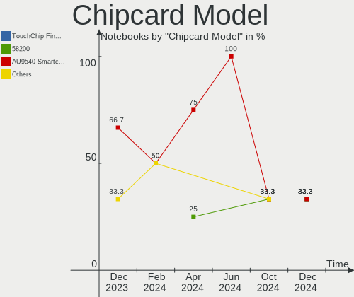

| Model                               | Notebooks | Percent |
|-------------------------------------|-----------|---------|
| Alcor Micro AU9540 Smartcard Reader | 3         | 75%     |
| Broadcom 58200                      | 1         | 25%     |

Unsupported
-----------

Unsupported Devices
-------------------

Total unsupported devices on board

| Total | Notebooks | Percent |
|-------|-----------|---------|
| 0     | 11        | 52.38%  |
| 1     | 6         | 28.57%  |
| 3     | 2         | 9.52%   |
| 2     | 2         | 9.52%   |

Unsupported Device Types
------------------------

Types of unsupported devices

| Type                  | Notebooks | Percent |
|-----------------------|-----------|---------|
| Multimedia controller | 5         | 31.25%  |
| Fingerprint reader    | 4         | 25%     |
| Chipcard              | 4         | 25%     |
| Net/ethernet          | 1         | 6.25%   |
| Graphics card         | 1         | 6.25%   |
| Camera                | 1         | 6.25%   |

