NixOS - Hardware Trends
-----------------------

A project to identify most popular hardware characteristics and track their change
over time based on data collected by Linux users at https://Linux-Hardware.org.

Anyone can contribute to this report by the [hw-probe](https://github.com/linuxhw/hw-probe) tool:

    sudo -E hw-probe -all -upload

This is a report for all computer types. See also reports for [desktops](/Dist/NixOS/Desktop/README.md) and [notebooks](/Dist/NixOS/Notebook/README.md).

This report is for one last month. Overall report since the beginning of time: [TestDays](https://github.com/linuxhw/TestDays)

Period: Jan, 2024.

Contents
--------

* [ System ](#system)
  - [ OS                       ](#os)
  - [ OS Family                ](#os-family)
  - [ Kernel                   ](#kernel)
  - [ Kernel Family            ](#kernel-family)
  - [ Kernel Major Ver.        ](#kernel-major-ver)
  - [ Arch                     ](#arch)
  - [ DE                       ](#de)
  - [ Display Server           ](#display-server)
  - [ Display Manager          ](#display-manager)
  - [ OS Lang                  ](#os-lang)
  - [ Boot Mode                ](#boot-mode)
  - [ Filesystem               ](#filesystem)
  - [ Part. scheme             ](#part-scheme)
  - [ Dual Boot with Linux/BSD ](#dual-boot-with-linuxbsd)
  - [ Dual Boot (Win)          ](#dual-boot-win)

* [ Board ](#board)
  - [ Vendor                   ](#vendor)
  - [ Model                    ](#model)
  - [ Model Family             ](#model-family)
  - [ MFG Year                 ](#mfg-year)
  - [ Form Factor              ](#form-factor)
  - [ Secure Boot              ](#secure-boot)
  - [ Coreboot                 ](#coreboot)
  - [ RAM Size                 ](#ram-size)
  - [ RAM Used                 ](#ram-used)
  - [ Total Drives             ](#total-drives)
  - [ Has CD-ROM               ](#has-cd-rom)
  - [ Has Ethernet             ](#has-ethernet)
  - [ Has WiFi                 ](#has-wifi)
  - [ Has Bluetooth            ](#has-bluetooth)

* [ Location ](#location)
  - [ Country                  ](#country)
  - [ City                     ](#city)

* [ Drives ](#drives)
  - [ Drive Vendor             ](#drive-vendor)
  - [ Drive Model              ](#drive-model)
  - [ HDD Vendor               ](#hdd-vendor)
  - [ SSD Vendor               ](#ssd-vendor)
  - [ Drive Kind               ](#drive-kind)
  - [ Drive Connector          ](#drive-connector)
  - [ Drive Size               ](#drive-size)
  - [ Space Total              ](#space-total)
  - [ Space Used               ](#space-used)
  - [ Malfunc. Drives          ](#malfunc-drives)
  - [ Malfunc. Drive Vendor    ](#malfunc-drive-vendor)
  - [ Malfunc. HDD Vendor      ](#malfunc-hdd-vendor)
  - [ Malfunc. Drive Kind      ](#malfunc-drive-kind)
  - [ Failed Drives            ](#failed-drives)
  - [ Failed Drive Vendor      ](#failed-drive-vendor)
  - [ Drive Status             ](#drive-status)

* [ Storage controller ](#storage-controller)
  - [ Storage Vendor           ](#storage-vendor)
  - [ Storage Model            ](#storage-model)
  - [ Storage Kind             ](#storage-kind)

* [ Processor ](#processor)
  - [ CPU Vendor               ](#cpu-vendor)
  - [ CPU Model                ](#cpu-model)
  - [ CPU Model Family         ](#cpu-model-family)
  - [ CPU Cores                ](#cpu-cores)
  - [ CPU Sockets              ](#cpu-sockets)
  - [ CPU Threads              ](#cpu-threads)
  - [ CPU Op-Modes             ](#cpu-op-modes)
  - [ CPU Microcode            ](#cpu-microcode)
  - [ CPU Microarch            ](#cpu-microarch)

* [ Graphics ](#graphics)
  - [ GPU Vendor               ](#gpu-vendor)
  - [ GPU Model                ](#gpu-model)
  - [ GPU Combo                ](#gpu-combo)
  - [ GPU Driver               ](#gpu-driver)
  - [ GPU Memory               ](#gpu-memory)

* [ Monitor ](#monitor)
  - [ Monitor Vendor           ](#monitor-vendor)
  - [ Monitor Model            ](#monitor-model)
  - [ Monitor Resolution       ](#monitor-resolution)
  - [ Monitor Diagonal         ](#monitor-diagonal)
  - [ Monitor Width            ](#monitor-width)
  - [ Aspect Ratio             ](#aspect-ratio)
  - [ Monitor Area             ](#monitor-area)
  - [ Pixel Density            ](#pixel-density)
  - [ Multiple Monitors        ](#multiple-monitors)

* [ Network ](#network)
  - [ Net Controller Vendor    ](#net-controller-vendor)
  - [ Net Controller Model     ](#net-controller-model)
  - [ Wireless Vendor          ](#wireless-vendor)
  - [ Wireless Model           ](#wireless-model)
  - [ Ethernet Vendor          ](#ethernet-vendor)
  - [ Ethernet Model           ](#ethernet-model)
  - [ Net Controller Kind      ](#net-controller-kind)
  - [ Used Controller          ](#used-controller)
  - [ NICs                     ](#nics)
  - [ IPv6                     ](#ipv6)

* [ Bluetooth ](#bluetooth)
  - [ Bluetooth Vendor         ](#bluetooth-vendor)
  - [ Bluetooth Model          ](#bluetooth-model)

* [ Sound ](#sound)
  - [ Sound Vendor             ](#sound-vendor)
  - [ Sound Model              ](#sound-model)

* [ Memory ](#memory)
  - [ Memory Vendor            ](#memory-vendor)
  - [ Memory Model             ](#memory-model)
  - [ Memory Kind              ](#memory-kind)
  - [ Memory Form Factor       ](#memory-form-factor)
  - [ Memory Size              ](#memory-size)
  - [ Memory Speed             ](#memory-speed)

* [ Printers & scanners ](#printers--scanners)
  - [ Printer Vendor           ](#printer-vendor)
  - [ Printer Model            ](#printer-model)
  - [ Scanner Vendor           ](#scanner-vendor)
  - [ Scanner Model            ](#scanner-model)

* [ Camera ](#camera)
  - [ Camera Vendor            ](#camera-vendor)
  - [ Camera Model             ](#camera-model)

* [ Security ](#security)
  - [ Fingerprint Vendor       ](#fingerprint-vendor)
  - [ Fingerprint Model        ](#fingerprint-model)
  - [ Chipcard Vendor          ](#chipcard-vendor)
  - [ Chipcard Model           ](#chipcard-model)

* [ Unsupported ](#unsupported)
  - [ Unsupported Devices      ](#unsupported-devices)
  - [ Unsupported Device Types ](#unsupported-device-types)

System
------

OS
--

Installed operating systems

| Name        | Computers | Percent |
|-------------|-----------|---------|
| NixOS 23.11 | 25        | 51.02%  |
| NixOS 24.05 | 22        | 44.9%   |
| NixOS 23.05 | 1         | 2.04%   |
| NixOS 22.11 | 1         | 2.04%   |

OS Family
---------

OS without a version

| Name  | Computers | Percent |
|-------|-----------|---------|
| NixOS | 49        | 100%    |

Kernel
------

Version of the Linux kernel

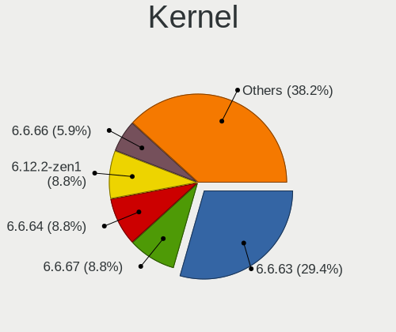

| Version       | Computers | Percent |
|---------------|-----------|---------|
| 6.1.69        | 11        | 22.45%  |
| 6.6.8         | 8         | 16.33%  |
| 6.7.0         | 4         | 8.16%   |
| 6.1.72        | 3         | 6.12%   |
| 6.1.71        | 3         | 6.12%   |
| 6.1.68        | 3         | 6.12%   |
| 6.6.11        | 2         | 4.08%   |
| 6.7.1         | 1         | 2.04%   |
| 6.7.0-zen3    | 1         | 2.04%   |
| 6.7.0-rc7     | 1         | 2.04%   |
| 6.7.0-cachyos | 1         | 2.04%   |
| 6.6.8-lqx1    | 1         | 2.04%   |
| 6.6.3         | 1         | 2.04%   |
| 6.6.10        | 1         | 2.04%   |
| 6.5.13        | 1         | 2.04%   |
| 6.1.74        | 1         | 2.04%   |
| 6.1.65        | 1         | 2.04%   |
| 6.1.64        | 1         | 2.04%   |
| 6.1.61        | 1         | 2.04%   |
| 6.1.57        | 1         | 2.04%   |
| 6.1.52        | 1         | 2.04%   |
| 5.15.108      | 1         | 2.04%   |

Kernel Family
-------------

Linux kernel without a distro release

| Version  | Computers | Percent |
|----------|-----------|---------|
| 6.1.69   | 11        | 22.45%  |
| 6.6.8    | 9         | 18.37%  |
| 6.7.0    | 7         | 14.29%  |
| 6.1.72   | 3         | 6.12%   |
| 6.1.71   | 3         | 6.12%   |
| 6.1.68   | 3         | 6.12%   |
| 6.6.11   | 2         | 4.08%   |
| 6.7.1    | 1         | 2.04%   |
| 6.6.3    | 1         | 2.04%   |
| 6.6.10   | 1         | 2.04%   |
| 6.5.13   | 1         | 2.04%   |
| 6.1.74   | 1         | 2.04%   |
| 6.1.65   | 1         | 2.04%   |
| 6.1.64   | 1         | 2.04%   |
| 6.1.61   | 1         | 2.04%   |
| 6.1.57   | 1         | 2.04%   |
| 6.1.52   | 1         | 2.04%   |
| 5.15.108 | 1         | 2.04%   |

Kernel Major Ver.
-----------------

Linux kernel major version

| Version | Computers | Percent |
|---------|-----------|---------|
| 6.1     | 26        | 53.06%  |
| 6.6     | 13        | 26.53%  |
| 6.7     | 8         | 16.33%  |
| 6.5     | 1         | 2.04%   |
| 5.15    | 1         | 2.04%   |

Arch
----

OS architecture (x86_64, i586, etc.)

| Name   | Computers | Percent |
|--------|-----------|---------|
| x86_64 | 49        | 100%    |

DE
--

Desktop Environment

| Name       | Computers | Percent |
|------------|-----------|---------|
| KDE5       | 13        | 26.53%  |
| sway       | 7         | 14.29%  |
| GNOME      | 7         | 14.29%  |
| KDE        | 6         | 12.24%  |
| Hyprland   | 5         | 10.2%   |
| Unknown    | 5         | 10.2%   |
| none+i3    | 3         | 6.12%   |
| XFCE       | 1         | 2.04%   |
| X-Cinnamon | 1         | 2.04%   |
| KDE6       | 1         | 2.04%   |

Display Server
--------------

X11 or Wayland

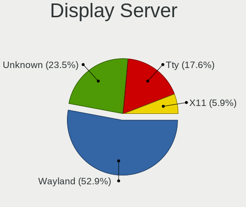

| Name    | Computers | Percent |
|---------|-----------|---------|
| Wayland | 20        | 40.82%  |
| Unknown | 15        | 30.61%  |
| X11     | 12        | 24.49%  |
| Tty     | 2         | 4.08%   |

Display Manager
---------------

SDDM, LightDM, etc.

| Name    | Computers | Percent |
|---------|-----------|---------|
| SDDM    | 21        | 42.86%  |
| Unknown | 12        | 24.49%  |
| GDM     | 10        | 20.41%  |
| LightDM | 6         | 12.24%  |

OS Lang
-------

Language

| Lang       | Computers | Percent |
|------------|-----------|---------|
| en_US      | 36        | 73.47%  |
| en_GB      | 3         | 6.12%   |
| pt_PT      | 2         | 4.08%   |
| en_AU      | 2         | 4.08%   |
| sv_SE      | 1         | 2.04%   |
| ru_RU      | 1         | 2.04%   |
| fr_FR      | 1         | 2.04%   |
| en_IE.UTF8 | 1         | 2.04%   |
| de_DE      | 1         | 2.04%   |
| Unknown    | 1         | 2.04%   |

Boot Mode
---------

EFI or BIOS

| Mode | Computers | Percent |
|------|-----------|---------|
| EFI  | 46        | 93.88%  |
| BIOS | 3         | 6.12%   |

Filesystem
----------

Type of filesystem

| Type  | Computers | Percent |
|-------|-----------|---------|
| Ext4  | 30        | 61.22%  |
| Btrfs | 8         | 16.33%  |
| Zfs   | 6         | 12.24%  |
| Tmpfs | 3         | 6.12%   |
| Xfs   | 1         | 2.04%   |
| F2fs  | 1         | 2.04%   |

Part. scheme
------------

Scheme of partitioning

| Type | Computers | Percent |
|------|-----------|---------|
| GPT  | 48        | 97.96%  |
| MBR  | 1         | 2.04%   |

Dual Boot with Linux/BSD
------------------------

Hosting more than one Linux/BSD

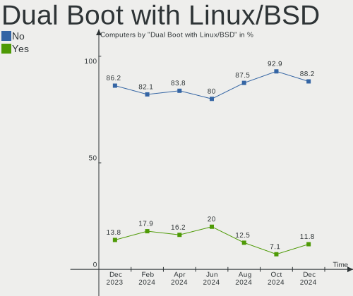

| Dual boot | Computers | Percent |
|-----------|-----------|---------|
| No        | 43        | 87.76%  |
| Yes       | 6         | 12.24%  |

Dual Boot (Win)
---------------

Hosting Linux and Windows

| Dual boot | Computers | Percent |
|-----------|-----------|---------|
| No        | 36        | 73.47%  |
| Yes       | 13        | 26.53%  |

Board
-----

Vendor
------

Motherboard manufacturer

| Name                | Computers | Percent |
|---------------------|-----------|---------|
| ASUSTek Computer    | 11        | 22.45%  |
| Lenovo              | 10        | 20.41%  |
| Gigabyte Technology | 5         | 10.2%   |
| Dell                | 5         | 10.2%   |
| Apple               | 4         | 8.16%   |
| MSI                 | 2         | 4.08%   |
| Hewlett-Packard     | 2         | 4.08%   |
| Framework           | 2         | 4.08%   |
| Timi                | 1         | 2.04%   |
| System76            | 1         | 2.04%   |
| Sony                | 1         | 2.04%   |
| HUAWEI              | 1         | 2.04%   |
| Fujitsu             | 1         | 2.04%   |
| Dynabook            | 1         | 2.04%   |
| Corsair             | 1         | 2.04%   |
| Biostar             | 1         | 2.04%   |

Model
-----

Motherboard model

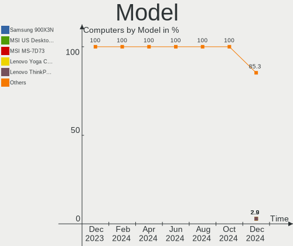

| Name                                        | Computers | Percent |
|---------------------------------------------|-----------|---------|
| Timi Xiaomi Book Pro 16 2022                | 1         | 2.04%   |
| System76 Oryx Pro                           | 1         | 2.04%   |
| Sony VGN-CS11S_Q                            | 1         | 2.04%   |
| MSI MS-7998                                 | 1         | 2.04%   |
| MSI CML-U PRO Cubi 5 (MS-B183)              | 1         | 2.04%   |
| Lenovo Yoga Slim 7 13ACN5 82CY              | 1         | 2.04%   |
| Lenovo Yoga 7 16IRL8 82YN                   | 1         | 2.04%   |
| Lenovo ThinkPad X1 Carbon Gen 11 21HNA09QCD | 1         | 2.04%   |
| Lenovo ThinkPad Twist 33476LU               | 1         | 2.04%   |
| Lenovo ThinkPad T495 20NJ0016MX             | 1         | 2.04%   |
| Lenovo ThinkPad T470s 20HF0000MX            | 1         | 2.04%   |
| Lenovo ThinkPad L14 Gen 3 21C60010BO        | 1         | 2.04%   |
| Lenovo Legion Y530-15ICH 81FV               | 1         | 2.04%   |
| Lenovo IdeaPadFlex 5 14ITL05 82HS           | 1         | 2.04%   |
| Lenovo IdeaPad 5 14ALC05 82LM               | 1         | 2.04%   |
| HUAWEI WRT-WX9                              | 1         | 2.04%   |
| HP Z220 CMT Workstation                     | 1         | 2.04%   |
| HP EliteBook x360 1030 G2                   | 1         | 2.04%   |
| Gigabyte Z690 AORUS MASTER                  | 1         | 2.04%   |
| Gigabyte Z390 AORUS PRO                     | 1         | 2.04%   |
| Gigabyte B650M GAMING X AX                  | 1         | 2.04%   |
| Gigabyte B550I AORUS PRO AX                 | 1         | 2.04%   |
| Gigabyte B450 AORUS M                       | 1         | 2.04%   |
| Fujitsu LIFEBOOK U7412                      | 1         | 2.04%   |
| Framework Laptop (12th Gen Intel Core)      | 1         | 2.04%   |
| Framework Laptop                            | 1         | 2.04%   |
| Dynabook PORTEGE X30L-K                     | 1         | 2.04%   |
| Dell XPS 9315                               | 1         | 2.04%   |
| Dell XPS 15 9530                            | 1         | 2.04%   |
| Dell OptiPlex 5090                          | 1         | 2.04%   |
| Dell Inspiron 7506 2n1                      | 1         | 2.04%   |
| Dell Inspiron 5767                          | 1         | 2.04%   |
| Corsair Voyager a1600                       | 1         | 2.04%   |
| Biostar TZ590-BTC DUO                       | 1         | 2.04%   |
| ASUS VivoBook_ASUSLaptop X1504VA_A1504VA    | 1         | 2.04%   |
| ASUS UX370UAF                               | 1         | 2.04%   |
| ASUS TUF Gaming Z490-PLUS                   | 1         | 2.04%   |
| ASUS TUF Gaming X670E-PLUS WIFI             | 1         | 2.04%   |
| ASUS STRIX Z270H GAMING                     | 1         | 2.04%   |
| ASUS ROG STRIX B550-A GAMING                | 1         | 2.04%   |

Model Family
------------

Motherboard model prefix

| Name               | Computers | Percent |
|--------------------|-----------|---------|
| Lenovo ThinkPad    | 5         | 10.2%   |
| Lenovo Yoga        | 2         | 4.08%   |
| Framework Laptop   | 2         | 4.08%   |
| Dell XPS           | 2         | 4.08%   |
| Dell Inspiron      | 2         | 4.08%   |
| ASUS TUF           | 2         | 4.08%   |
| ASUS Pro           | 2         | 4.08%   |
| Apple MacBookPro11 | 2         | 4.08%   |
| Timi Xiaomi        | 1         | 2.04%   |
| System76 Oryx      | 1         | 2.04%   |
| Sony VGN-CS11S     | 1         | 2.04%   |
| MSI MS-7998        | 1         | 2.04%   |
| MSI CML-U          | 1         | 2.04%   |
| Lenovo Legion      | 1         | 2.04%   |
| Lenovo IdeaPadFlex | 1         | 2.04%   |
| Lenovo IdeaPad     | 1         | 2.04%   |
| HUAWEI WRT-WX9     | 1         | 2.04%   |
| HP Z220            | 1         | 2.04%   |
| HP EliteBook       | 1         | 2.04%   |
| Gigabyte Z690      | 1         | 2.04%   |
| Gigabyte Z390      | 1         | 2.04%   |
| Gigabyte B650M     | 1         | 2.04%   |
| Gigabyte B550I     | 1         | 2.04%   |
| Gigabyte B450      | 1         | 2.04%   |
| Fujitsu LIFEBOOK   | 1         | 2.04%   |
| Dynabook PORTEGE   | 1         | 2.04%   |
| Dell OptiPlex      | 1         | 2.04%   |
| Corsair Voyager    | 1         | 2.04%   |
| Biostar TZ590-BTC  | 1         | 2.04%   |
| ASUS VivoBook      | 1         | 2.04%   |
| ASUS UX370UAF      | 1         | 2.04%   |
| ASUS STRIX         | 1         | 2.04%   |
| ASUS ROG           | 1         | 2.04%   |
| ASUS PRIME         | 1         | 2.04%   |
| ASUS P8Z77-V       | 1         | 2.04%   |
| ASUS ASUS          | 1         | 2.04%   |
| Apple MacBookPro3  | 1         | 2.04%   |
| Apple iMac16       | 1         | 2.04%   |

MFG Year
--------

Motherboard manufacture year

| Year | Computers | Percent |
|------|-----------|---------|
| 2022 | 9         | 18.37%  |
| 2020 | 7         | 14.29%  |
| 2023 | 6         | 12.24%  |
| 2021 | 6         | 12.24%  |
| 2018 | 5         | 10.2%   |
| 2016 | 4         | 8.16%   |
| 2017 | 3         | 6.12%   |
| 2012 | 3         | 6.12%   |
| 2019 | 2         | 4.08%   |
| 2014 | 1         | 2.04%   |
| 2013 | 1         | 2.04%   |
| 2008 | 1         | 2.04%   |
| 2007 | 1         | 2.04%   |

Form Factor
-----------

Physical design of the computer

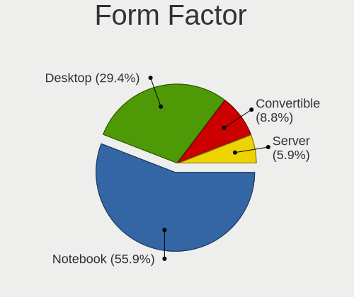

| Name        | Computers | Percent |
|-------------|-----------|---------|
| Notebook    | 26        | 53.06%  |
| Desktop     | 17        | 34.69%  |
| Convertible | 5         | 10.2%   |
| All in one  | 1         | 2.04%   |

Secure Boot
-----------

Enabled or disabled

| State    | Computers | Percent |
|----------|-----------|---------|
| Disabled | 48        | 97.96%  |
| Enabled  | 1         | 2.04%   |

Coreboot
--------

Have coreboot on board

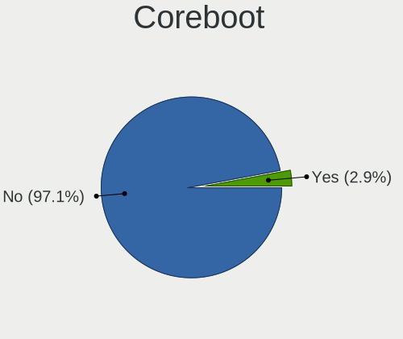

| Used | Computers | Percent |
|------|-----------|---------|
| No   | 48        | 97.96%  |
| Yes  | 1         | 2.04%   |

RAM Size
--------

Total RAM memory

| Size in GB      | Computers | Percent |
|-----------------|-----------|---------|
| 16.01-24.0      | 16        | 32.65%  |
| 8.01-16.0       | 9         | 18.37%  |
| 32.01-64.0      | 7         | 14.29%  |
| 64.01-256.0     | 7         | 14.29%  |
| 4.01-8.0        | 5         | 10.2%   |
| 24.01-32.0      | 3         | 6.12%   |
| More than 256.0 | 1         | 2.04%   |
| 3.01-4.0        | 1         | 2.04%   |

RAM Used
--------

Used RAM memory

| Used GB    | Computers | Percent |
|------------|-----------|---------|
| 4.01-8.0   | 15        | 30.61%  |
| 2.01-3.0   | 14        | 28.57%  |
| 8.01-16.0  | 8         | 16.33%  |
| 3.01-4.0   | 5         | 10.2%   |
| 1.01-2.0   | 5         | 10.2%   |
| 16.01-24.0 | 1         | 2.04%   |
| 0.51-1.0   | 1         | 2.04%   |

Total Drives
------------

Number of drives on board

| Drives | Computers | Percent |
|--------|-----------|---------|
| 1      | 29        | 59.18%  |
| 2      | 13        | 26.53%  |
| 3      | 4         | 8.16%   |
| 4      | 2         | 4.08%   |
| 5      | 1         | 2.04%   |

Has CD-ROM
----------

Has CD-ROM on board

| Presented | Computers | Percent |
|-----------|-----------|---------|
| No        | 42        | 85.71%  |
| Yes       | 7         | 14.29%  |

Has Ethernet
------------

Has Ethernet on board

| Presented | Computers | Percent |
|-----------|-----------|---------|
| Yes       | 32        | 65.31%  |
| No        | 17        | 34.69%  |

Has WiFi
--------

Has WiFi module

| Presented | Computers | Percent |
|-----------|-----------|---------|
| Yes       | 38        | 77.55%  |
| No        | 11        | 22.45%  |

Has Bluetooth
-------------

Has Bluetooth module

| Presented | Computers | Percent |
|-----------|-----------|---------|
| Yes       | 40        | 81.63%  |
| No        | 9         | 18.37%  |

Location
--------

Country
-------

Geographic location (country)

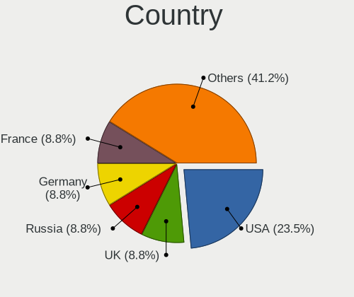

| Country       | Computers | Percent |
|---------------|-----------|---------|
| USA           | 15        | 30.61%  |
| Germany       | 6         | 12.24%  |
| Sweden        | 3         | 6.12%   |
| Russia        | 3         | 6.12%   |
| Netherlands   | 3         | 6.12%   |
| Brazil        | 3         | 6.12%   |
| Romania       | 2         | 4.08%   |
| Portugal      | 2         | 4.08%   |
| Belgium       | 2         | 4.08%   |
| UK            | 1         | 2.04%   |
| Turkey        | 1         | 2.04%   |
| Thailand      | 1         | 2.04%   |
| Singapore     | 1         | 2.04%   |
| Malaysia      | 1         | 2.04%   |
| Italy         | 1         | 2.04%   |
| France        | 1         | 2.04%   |
| Faroe Islands | 1         | 2.04%   |
| Cameroon      | 1         | 2.04%   |
| Australia     | 1         | 2.04%   |

City
----

Geographic location (city)

| City           | Computers | Percent |
|----------------|-----------|---------|
| Salt Lake City | 3         | 6.12%   |
| Rochester      | 2         | 4.08%   |
| Porto          | 2         | 4.08%   |
| Duffel         | 2         | 4.08%   |
| Cluj-Napoca    | 2         | 4.08%   |
| Campinas       | 2         | 4.08%   |
| Amsterdam      | 2         | 4.08%   |
| Yaoundé       | 1         | 2.04%   |
| Winchester     | 1         | 2.04%   |
| The Hague      | 1         | 2.04%   |
| Sydney         | 1         | 2.04%   |
| Svenljunga     | 1         | 2.04%   |
| St Petersburg  | 1         | 2.04%   |
| Spinetoli      | 1         | 2.04%   |
| Sorocaba       | 1         | 2.04%   |
| Sollentuna     | 1         | 2.04%   |
| Singapore      | 1         | 2.04%   |
| Santa Clara    | 1         | 2.04%   |
| Richmond       | 1         | 2.04%   |
| Rapid City     | 1         | 2.04%   |
| Oklahoma City  | 1         | 2.04%   |
| Norfolk        | 1         | 2.04%   |
| Moscow         | 1         | 2.04%   |
| Montpellier    | 1         | 2.04%   |
| Mannheim       | 1         | 2.04%   |
| Malmo          | 1         | 2.04%   |
| Laudenbach     | 1         | 2.04%   |
| Kuala Lumpur   | 1         | 2.04%   |
| Kansas City    | 1         | 2.04%   |
| Hoyvík        | 1         | 2.04%   |
| Hamminkeln     | 1         | 2.04%   |
| Hamburg        | 1         | 2.04%   |
| Göttingen     | 1         | 2.04%   |
| Dallas         | 1         | 2.04%   |
| Coventry       | 1         | 2.04%   |
| Chicago        | 1         | 2.04%   |
| Chemnitz       | 1         | 2.04%   |
| Chapayevsk     | 1         | 2.04%   |
| Casstown       | 1         | 2.04%   |
| Bursa          | 1         | 2.04%   |

Drives
------

Drive Vendor
------------

Hard drive vendors

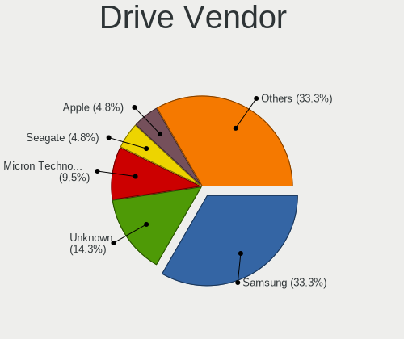

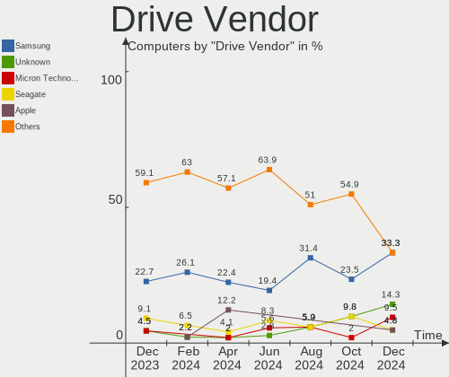

| Vendor                      | Computers | Drives | Percent |
|-----------------------------|-----------|--------|---------|
| Samsung Electronics         | 19        | 25     | 27.94%  |
| Seagate                     | 6         | 7      | 8.82%   |
| Sandisk                     | 6         | 6      | 8.82%   |
| WDC                         | 4         | 7      | 5.88%   |
| Unknown                     | 4         | 4      | 5.88%   |
| Realtek Semiconductor       | 3         | 4      | 4.41%   |
| Kingston                    | 3         | 3      | 4.41%   |
| Union Memory (Shenzhen)     | 2         | 2      | 2.94%   |
| Toshiba                     | 2         | 2      | 2.94%   |
| SK hynix                    | 2         | 2      | 2.94%   |
| Phison Electronics          | 2         | 3      | 2.94%   |
| Micron Technology           | 2         | 2      | 2.94%   |
| Crucial                     | 2         | 2      | 2.94%   |
| Patriot                     | 1         | 1      | 1.47%   |
| Micron/Crucial Technology   | 1         | 1      | 1.47%   |
| MAXIO Technology (Hangzhou) | 1         | 1      | 1.47%   |
| Lite-On Technology          | 1         | 1      | 1.47%   |
| KIOXIA                      | 1         | 1      | 1.47%   |
| Kingston Technology Company | 1         | 1      | 1.47%   |
| KingFast                    | 1         | 1      | 1.47%   |
| Intel                       | 1         | 1      | 1.47%   |
| Apple                       | 1         | 1      | 1.47%   |
| A-DATA Technology           | 1         | 1      | 1.47%   |
| Unknown                     | 1         | 1      | 1.47%   |

Drive Model
-----------

Hard drive models

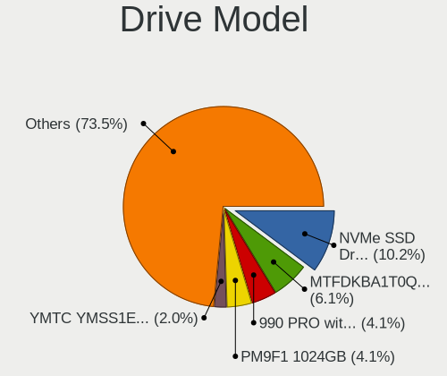

| Model                                               | Computers | Percent |
|-----------------------------------------------------|-----------|---------|
| Samsung NVMe SSD Controller SM981/PM981/PM983 1TB   | 8         | 10.81%  |
| Samsung NVMe SSD Controller PM9A1/PM9A3/980PRO 2TB  | 3         | 4.05%   |
| Samsung SSD 850 EVO 500GB                           | 2         | 2.7%    |
| Samsung SSD 850 EVO 250GB                           | 2         | 2.7%    |
| Realtek RTS5763DL NVMe SSD Controller 2TB           | 2         | 2.7%    |
| WDC WDS100T2G0A-00JH30 1TB SSD                      | 1         | 1.35%   |
| WDC WD5002AALX-32Z3A0 500GB                         | 1         | 1.35%   |
| WDC WD5000AZLX-75K2TA1 500GB                        | 1         | 1.35%   |
| WDC WD5000AZLX-75K2TA0 500GB                        | 1         | 1.35%   |
| WDC WD40EZRZ-22GXCB0 4TB                            | 1         | 1.35%   |
| WDC WD30EZAZ-00SF3B0 3TB                            | 1         | 1.35%   |
| WDC WD10EZEX-60ZF5A0 1TB                            | 1         | 1.35%   |
| Unknown NVMe SSD Drive 512GB                        | 1         | 1.35%   |
| Unknown MMC Card  64GB                              | 1         | 1.35%   |
| Unknown MMC Card  537GB                             | 1         | 1.35%   |
| Unknown MMC Card  32GB                              | 1         | 1.35%   |
| Union Memory (Shenzhen) UMIS RPJTJ512MGE1QDQ 512GB  | 1         | 1.35%   |
| Union Memory (Shenzhen) UMIS RPETJ1T24MKP2QDQ 1TB   | 1         | 1.35%   |
| Toshiba XG6 NVMe SSD Controller 256GB               | 1         | 1.35%   |
| Toshiba MQ04ABF100 1TB                              | 1         | 1.35%   |
| SK hynix PC801 NVMe 1TB                             | 1         | 1.35%   |
| SK hynix HFS250G32TND-N1A2A 250GB SSD               | 1         | 1.35%   |
| Seagate ST500LT012-9WS142 500GB                     | 1         | 1.35%   |
| Seagate ST2000LM007-1R8174 2TB                      | 1         | 1.35%   |
| Seagate ST14000NE0008-2RX103 14TB                   | 1         | 1.35%   |
| Seagate ST14000NE0008-2JK101 14TB                   | 1         | 1.35%   |
| Seagate ST1000LM024 HN-M101MBB 1TB                  | 1         | 1.35%   |
| Seagate Expansion 1TB                               | 1         | 1.35%   |
| Sandisk WD_BLACK SN850X 4000GB                      | 1         | 1.35%   |
| Sandisk WD PC SN740 SDDPMQD-512G-1101 512GB         | 1         | 1.35%   |
| Sandisk WD Blue SN570 1TB                           | 1         | 1.35%   |
| Sandisk WD Blue SN550 NVMe SSD 512GB                | 1         | 1.35%   |
| Sandisk WD Black SN750 / PC SN730 NVMe SSD 512GB    | 1         | 1.35%   |
| SanDisk Extreme 55AE 1TB SSD                        | 1         | 1.35%   |
| Samsung SSD 980 500GB                               | 1         | 1.35%   |
| Samsung SSD 870 EVO 250GB                           | 1         | 1.35%   |
| Samsung SSD 860 EVO 500GB                           | 1         | 1.35%   |
| Samsung SSD 850 EVO 1TB                             | 1         | 1.35%   |
| Samsung NVMe SSD Controller SM961/PM961/SM963 256GB | 1         | 1.35%   |
| Samsung NVMe SSD Controller SM951/PM951 256GB       | 1         | 1.35%   |

HDD Vendor
----------

Hard disk drive vendors

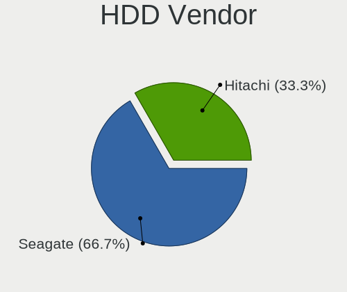

| Vendor  | Computers | Drives | Percent |
|---------|-----------|--------|---------|
| Seagate | 6         | 7      | 60%     |
| WDC     | 3         | 6      | 30%     |
| Toshiba | 1         | 1      | 10%     |

SSD Vendor
----------

Solid state drive vendors

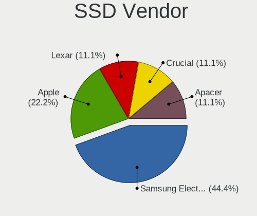

| Vendor              | Computers | Drives | Percent |
|---------------------|-----------|--------|---------|
| Samsung Electronics | 7         | 7      | 36.84%  |
| Kingston            | 2         | 2      | 10.53%  |
| Crucial             | 2         | 2      | 10.53%  |
| WDC                 | 1         | 1      | 5.26%   |
| SK hynix            | 1         | 1      | 5.26%   |
| SanDisk             | 1         | 1      | 5.26%   |
| Patriot             | 1         | 1      | 5.26%   |
| KingFast            | 1         | 1      | 5.26%   |
| Apple               | 1         | 1      | 5.26%   |
| A-DATA Technology   | 1         | 1      | 5.26%   |
| Unknown             | 1         | 1      | 5.26%   |

Drive Kind
----------

HDD or SSD

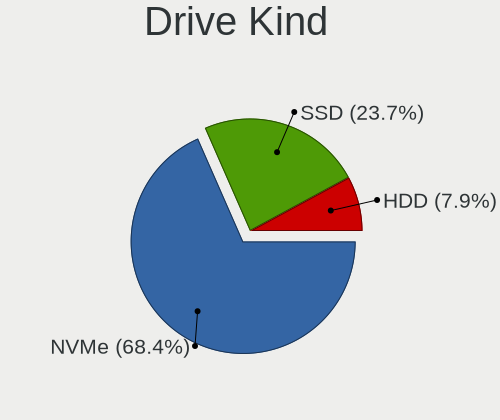

| Kind | Computers | Drives | Percent |
|------|-----------|--------|---------|
| NVMe | 38        | 44     | 56.72%  |
| SSD  | 17        | 19     | 25.37%  |
| HDD  | 9         | 14     | 13.43%  |
| MMC  | 3         | 3      | 4.48%   |

Drive Connector
---------------

SATA, SAS, NVMe, etc.

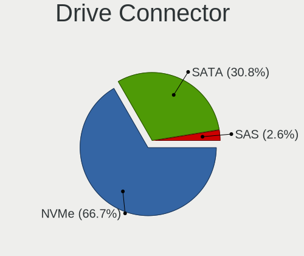

| Type | Computers | Drives | Percent |
|------|-----------|--------|---------|
| NVMe | 38        | 44     | 59.38%  |
| SATA | 21        | 31     | 32.81%  |
| MMC  | 3         | 3      | 4.69%   |
| SAS  | 2         | 2      | 3.13%   |

Drive Size
----------

Size of hard drive

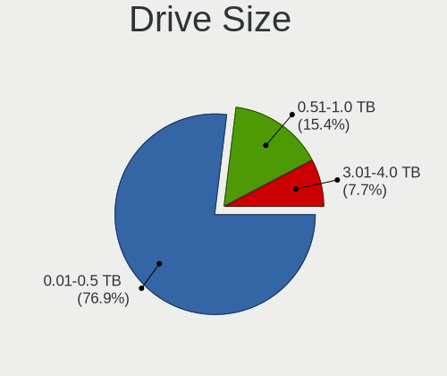

| Size in TB | Computers | Drives | Percent |
|------------|-----------|--------|---------|
| 0.01-0.5   | 17        | 19     | 58.62%  |
| 0.51-1.0   | 7         | 8      | 24.14%  |
| 10.01-20.0 | 2         | 3      | 6.9%    |
| 3.01-4.0   | 1         | 1      | 3.45%   |
| 2.01-3.0   | 1         | 1      | 3.45%   |
| 1.01-2.0   | 1         | 1      | 3.45%   |

Space Total
-----------

Amount of disk space available on the file system

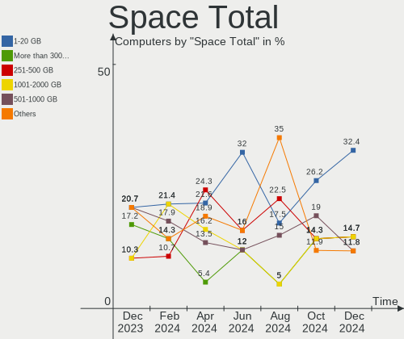

| Size in GB     | Computers | Percent |
|----------------|-----------|---------|
| 1-20           | 14        | 28.57%  |
| 1001-2000      | 10        | 20.41%  |
| 251-500        | 9         | 18.37%  |
| 101-250        | 5         | 10.2%   |
| 501-1000       | 5         | 10.2%   |
| 2001-3000      | 4         | 8.16%   |
| More than 3000 | 2         | 4.08%   |

Space Used
----------

Amount of used disk space

| Used GB        | Computers | Percent |
|----------------|-----------|---------|
| 1-20           | 19        | 38.78%  |
| 21-50          | 8         | 16.33%  |
| 101-250        | 6         | 12.24%  |
| 251-500        | 5         | 10.2%   |
| 1001-2000      | 4         | 8.16%   |
| 501-1000       | 4         | 8.16%   |
| More than 3000 | 1         | 2.04%   |
| 2001-3000      | 1         | 2.04%   |
| 51-100         | 1         | 2.04%   |

Malfunc. Drives
---------------

Drive models with a malfunction

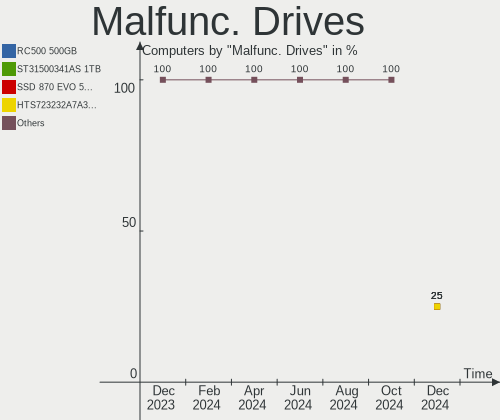

| Model                                 | Computers | Drives | Percent |
|---------------------------------------|-----------|--------|---------|
| SK hynix HFS250G32TND-N1A2A 250GB SSD | 1         | 1      | 33.33%  |
| Seagate ST500LT012-9WS142 500GB       | 1         | 1      | 33.33%  |
| Samsung Electronics SSD 850 EVO 1TB   | 1         | 1      | 33.33%  |

Malfunc. Drive Vendor
---------------------

Vendors of faulty drives

| Vendor              | Computers | Drives | Percent |
|---------------------|-----------|--------|---------|
| SK hynix            | 1         | 1      | 33.33%  |
| Seagate             | 1         | 1      | 33.33%  |
| Samsung Electronics | 1         | 1      | 33.33%  |

Malfunc. HDD Vendor
-------------------

Vendors of faulty HDD drives

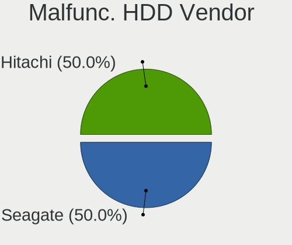

| Vendor  | Computers | Drives | Percent |
|---------|-----------|--------|---------|
| Seagate | 1         | 1      | 100%    |

Malfunc. Drive Kind
-------------------

Kinds of faulty drives

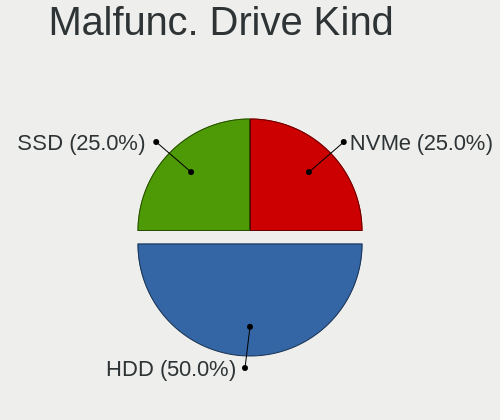

| Kind | Computers | Drives | Percent |
|------|-----------|--------|---------|
| SSD  | 2         | 2      | 66.67%  |
| HDD  | 1         | 1      | 33.33%  |

Failed Drives
-------------

Failed drive models

Zero info for selected period =(

Failed Drive Vendor
-------------------

Failed drive vendors

Zero info for selected period =(

Drive Status
------------

Number of failed and malfunc. drives

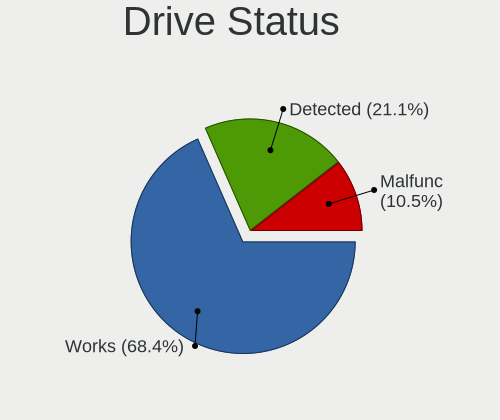

| Status   | Computers | Drives | Percent |
|----------|-----------|--------|---------|
| Works    | 47        | 71     | 83.93%  |
| Detected | 6         | 6      | 10.71%  |
| Malfunc  | 3         | 3      | 5.36%   |

Storage controller
------------------

Storage Vendor
--------------

Storage controller vendors

| Vendor                                  | Computers | Percent |
|-----------------------------------------|-----------|---------|
| Intel                                   | 19        | 27.94%  |
| Samsung Electronics                     | 16        | 23.53%  |
| AMD                                     | 8         | 11.76%  |
| Sandisk                                 | 5         | 7.35%   |
| Realtek Semiconductor                   | 3         | 4.41%   |
| Phison Electronics                      | 2         | 2.94%   |
| Micron Technology                       | 2         | 2.94%   |
| Kingston Technology Company             | 2         | 2.94%   |
| Union Memory (Shenzhen)                 | 1         | 1.47%   |
| Toshiba America Info Systems            | 1         | 1.47%   |
| SK hynix                                | 1         | 1.47%   |
| Shenzhen Unionmemory Information System | 1         | 1.47%   |
| Micron/Crucial Technology               | 1         | 1.47%   |
| MAXIO Technology (Hangzhou)             | 1         | 1.47%   |
| Marvell Technology Group                | 1         | 1.47%   |
| Lite-On Technology                      | 1         | 1.47%   |
| KIOXIA                                  | 1         | 1.47%   |
| INNOGRIT                                | 1         | 1.47%   |
| ASMedia Technology                      | 1         | 1.47%   |

Storage Model
-------------

Storage controller models

| Model                                                                         | Computers | Percent |
|-------------------------------------------------------------------------------|-----------|---------|
| Samsung NVMe SSD Controller SM981/PM981/PM983                                 | 8         | 11.43%  |
| Samsung NVMe SSD Controller PM9A1/PM9A3/980PRO                                | 3         | 4.29%   |
| AMD FCH SATA Controller [AHCI mode]                                           | 3         | 4.29%   |
| AMD 600 Series Chipset SATA Controller                                        | 3         | 4.29%   |
| Samsung NVMe SSD Controller 980 (DRAM-less)                                   | 2         | 2.86%   |
| Realtek RTS5762 NVMe SSD Controller                                           | 2         | 2.86%   |
| Intel Comet Lake SATA AHCI Controller                                         | 2         | 2.86%   |
| Intel 500 Series Chipset Family SATA AHCI Controller                          | 2         | 2.86%   |
| AMD 500 Series Chipset SATA Controller                                        | 2         | 2.86%   |
| Union Memory (Shenzhen) AM630 PCIe 4.0 x4 NVMe SSD Controller                 | 1         | 1.43%   |
| Toshiba America Info Systems XG6 NVMe SSD Controller                          | 1         | 1.43%   |
| SK hynix Platinum P41/PC801 NVMe Solid State Drive                            | 1         | 1.43%   |
| Shenzhen Unionmemory Information System Non-Volatile memory controller        | 1         | 1.43%   |
| Sandisk WD PC SN740 NVMe SSD 512GB (DRAM-less)                                | 1         | 1.43%   |
| Sandisk WD Black SN850X NVMe SSD                                              | 1         | 1.43%   |
| SanDisk Ultra 3D / WD Blue SN570 NVMe SSD (DRAM-less)                         | 1         | 1.43%   |
| SanDisk Ultra 3D / WD Blue SN550 NVMe SSD                                     | 1         | 1.43%   |
| SanDisk Extreme Pro / WD Black SN750 / PC SN730 / Red SN700 NVMe SSD          | 1         | 1.43%   |
| Samsung S4LN053X01 AHCI SSD Controller(Apple slot)                            | 1         | 1.43%   |
| Samsung NVMe SSD Controller SM961/PM961/SM963                                 | 1         | 1.43%   |
| Samsung NVMe SSD Controller SM951/PM951                                       | 1         | 1.43%   |
| Realtek RTS5763DL NVMe SSD Controller (DRAM-less)                             | 1         | 1.43%   |
| Phison PS5026-E26 PCIe5 NVMe Controller                                       | 1         | 1.43%   |
| Phison PS5019-E19 PCIe4 NVMe Controller (DRAM-less)                           | 1         | 1.43%   |
| Micron/Crucial P2 [Nick P2] / P3 / P3 Plus NVMe PCIe SSD (DRAM-less)          | 1         | 1.43%   |
| Micron 2450 NVMe SSD [HendrixV] (DRAM-less)                                   | 1         | 1.43%   |
| Micron 2400 NVMe SSD (DRAM-less)                                              | 1         | 1.43%   |
| MAXIO (Hangzhou) NVMe SSD Controller MAP1202 (DRAM-less)                      | 1         | 1.43%   |
| Marvell Group 88SE9120 SATA 6Gb/s Controller                                  | 1         | 1.43%   |
| Lite-On CL1-3D256, CL1-8D512 NVMe SSD (DRAM-less)                             | 1         | 1.43%   |
| KIOXIA NVMe SSD Controller BG5 (DRAM-less)                                    | 1         | 1.43%   |
| Kingston Company NV1 NVMe SSD SM2263XT (DRAM-less)                            | 1         | 1.43%   |
| Kingston Company A1000/U-SNS8154P3 x2 NVMe SSD                                | 1         | 1.43%   |
| Intel Volume Management Device NVMe RAID Controller                           | 1         | 1.43%   |
| Intel Sunrise Point-LP SATA Controller [AHCI mode]                            | 1         | 1.43%   |
| Intel SSD 670p Series [Keystone Harbor]                                       | 1         | 1.43%   |
| Intel SATA Controller [RAID mode]                                             | 1         | 1.43%   |
| Intel Q170/Q150/B150/H170/H110/Z170/CM236 Chipset SATA Controller [AHCI Mode] | 1         | 1.43%   |
| Intel Cannon Lake PCH SATA AHCI Controller                                    | 1         | 1.43%   |
| Intel Cannon Lake Mobile PCH SATA AHCI Controller                             | 1         | 1.43%   |

Storage Kind
------------

Kind of storage controller (IDE, SATA, NVMe, SAS, ...)

| Kind | Computers | Percent |
|------|-----------|---------|
| NVMe | 38        | 57.58%  |
| SATA | 25        | 37.88%  |
| RAID | 2         | 3.03%   |
| IDE  | 1         | 1.52%   |

Processor
---------

CPU Vendor
----------

Processor vendors

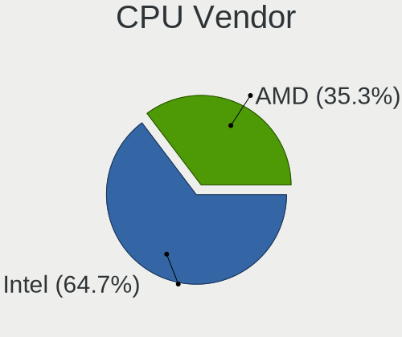

| Vendor | Computers | Percent |
|--------|-----------|---------|
| Intel  | 37        | 75.51%  |
| AMD    | 12        | 24.49%  |

CPU Model
---------

Processor models

| Model                                      | Computers | Percent |
|--------------------------------------------|-----------|---------|
| Intel Core i7-7500U CPU @ 2.70GHz          | 2         | 4.08%   |
| Intel 12th Gen Core i7-1260P               | 2         | 4.08%   |
| Intel 12th Gen Core i5-1240P               | 2         | 4.08%   |
| Intel 11th Gen Core i5-1135G7 @ 2.40GHz    | 2         | 4.08%   |
| AMD Ryzen 9 7950X 16-Core Processor        | 2         | 4.08%   |
| Intel Core i7-9700K CPU @ 3.60GHz          | 1         | 2.04%   |
| Intel Core i7-8750H CPU @ 2.20GHz          | 1         | 2.04%   |
| Intel Core i7-7700K CPU @ 4.20GHz          | 1         | 2.04%   |
| Intel Core i7-6700K CPU @ 4.00GHz          | 1         | 2.04%   |
| Intel Core i7-5775R CPU @ 3.30GHz          | 1         | 2.04%   |
| Intel Core i7-4980HQ CPU @ 2.80GHz         | 1         | 2.04%   |
| Intel Core i7-4850HQ CPU @ 2.30GHz         | 1         | 2.04%   |
| Intel Core i7-3770K CPU @ 3.50GHz          | 1         | 2.04%   |
| Intel Core i7-3770 CPU @ 3.40GHz           | 1         | 2.04%   |
| Intel Core i7-3537U CPU @ 2.00GHz          | 1         | 2.04%   |
| Intel Core i7-10700F CPU @ 2.90GHz         | 1         | 2.04%   |
| Intel Core i7-10700 CPU @ 2.90GHz          | 1         | 2.04%   |
| Intel Core i5-8265U CPU @ 1.60GHz          | 1         | 2.04%   |
| Intel Core i5-7300U CPU @ 2.60GHz          | 1         | 2.04%   |
| Intel Core i5-7200U CPU @ 2.50GHz          | 1         | 2.04%   |
| Intel Core i5-10210U CPU @ 1.60GHz         | 1         | 2.04%   |
| Intel Core 2 Duo CPU T7700 @ 2.40GHz       | 1         | 2.04%   |
| Intel Core 2 Duo CPU P8400 @ 2.26GHz       | 1         | 2.04%   |
| Intel 13th Gen Core i9-13900H              | 1         | 2.04%   |
| Intel 13th Gen Core i7-13700H              | 1         | 2.04%   |
| Intel 13th Gen Core i7-1365U               | 1         | 2.04%   |
| Intel 13th Gen Core i7-1355U               | 1         | 2.04%   |
| Intel 13th Gen Core i5-1335U               | 1         | 2.04%   |
| Intel 12th Gen Core i7-1270P               | 1         | 2.04%   |
| Intel 12th Gen Core i7-12700K              | 1         | 2.04%   |
| Intel 12th Gen Core i7-1250U               | 1         | 2.04%   |
| Intel 11th Gen Core i7-11700 @ 2.50GHz     | 1         | 2.04%   |
| Intel 11th Gen Core i5-11600K @ 3.90GHz    | 1         | 2.04%   |
| Intel 11th Gen Core i3-1115G4 @ 3.00GHz    | 1         | 2.04%   |
| AMD Ryzen Threadripper 7980X 64-Cores      | 1         | 2.04%   |
| AMD Ryzen 9 6900HS with Radeon Graphics    | 1         | 2.04%   |
| AMD Ryzen 9 5950X 16-Core Processor        | 1         | 2.04%   |
| AMD Ryzen 9 5900X 12-Core Processor        | 1         | 2.04%   |
| AMD Ryzen 7 PRO 5875U with Radeon Graphics | 1         | 2.04%   |
| AMD Ryzen 7 5800U with Radeon Graphics     | 1         | 2.04%   |

CPU Model Family
----------------

Processor model prefix

| Model                  | Computers | Percent |
|------------------------|-----------|---------|
| Other                  | 17        | 34.69%  |
| Intel Core i7          | 14        | 28.57%  |
| AMD Ryzen 9            | 5         | 10.2%   |
| Intel Core i5          | 4         | 8.16%   |
| Intel Core 2 Duo       | 2         | 4.08%   |
| AMD Ryzen 7            | 2         | 4.08%   |
| AMD Ryzen Threadripper | 1         | 2.04%   |
| AMD Ryzen 7 PRO        | 1         | 2.04%   |
| AMD Ryzen 5 PRO        | 1         | 2.04%   |
| AMD Ryzen 5            | 1         | 2.04%   |
| AMD Ryzen 3            | 1         | 2.04%   |

CPU Cores
---------

Number of processor cores

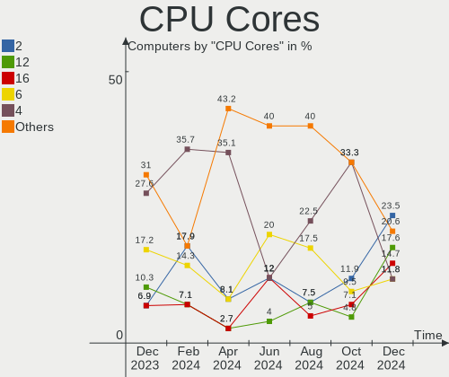

| Number | Computers | Percent |
|--------|-----------|---------|
| 4      | 13        | 26.53%  |
| 8      | 8         | 16.33%  |
| 2      | 8         | 16.33%  |
| 12     | 7         | 14.29%  |
| 10     | 4         | 8.16%   |
| 16     | 3         | 6.12%   |
| 6      | 3         | 6.12%   |
| 14     | 2         | 4.08%   |
| 64     | 1         | 2.04%   |

CPU Sockets
-----------

Number of sockets

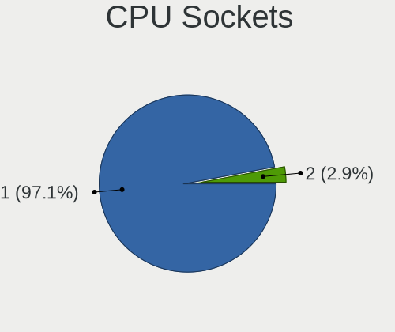

| Number | Computers | Percent |
|--------|-----------|---------|
| 1      | 49        | 100%    |

CPU Threads
-----------

Threads per core (Hyper-Threading)

| Number | Computers | Percent |
|--------|-----------|---------|
| 2      | 45        | 91.84%  |
| 1      | 4         | 8.16%   |

CPU Op-Modes
------------

CPU Operation Modes (32-bit, 64-bit)

| Op mode        | Computers | Percent |
|----------------|-----------|---------|
| 32-bit, 64-bit | 49        | 100%    |

CPU Microcode
-------------

Microcode number

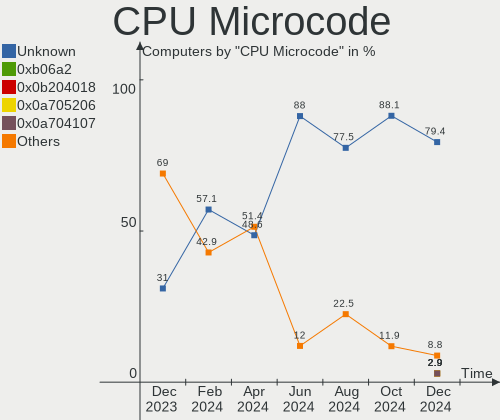

| Number     | Computers | Percent |
|------------|-----------|---------|
| Unknown    | 19        | 38.78%  |
| 0x906a3    | 3         | 6.12%   |
| 0x306a9    | 3         | 6.12%   |
| 0xb06a3    | 2         | 4.08%   |
| 0x806ec    | 2         | 4.08%   |
| 0x806e9    | 2         | 4.08%   |
| 0x40661    | 2         | 4.08%   |
| 0x0a50000c | 2         | 4.08%   |
| 0xb06a2    | 1         | 2.04%   |
| 0xa0655    | 1         | 2.04%   |
| 0x906ec    | 1         | 2.04%   |
| 0x906ea    | 1         | 2.04%   |
| 0x906e9    | 1         | 2.04%   |
| 0x906a4    | 1         | 2.04%   |
| 0x806c1    | 1         | 2.04%   |
| 0x40671    | 1         | 2.04%   |
| 0x10676    | 1         | 2.04%   |
| 0x0a601203 | 1         | 2.04%   |
| 0x0a20102b | 1         | 2.04%   |
| 0x08701021 | 1         | 2.04%   |
| 0x08108109 | 1         | 2.04%   |
| 0x08101016 | 1         | 2.04%   |

CPU Microarch
-------------

Microarchitecture

| Name             | Computers | Percent |
|------------------|-----------|---------|
| Alderlake Hybrid | 11        | 22.45%  |
| KabyLake         | 9         | 18.37%  |
| Unknown          | 6         | 12.24%  |
| Zen 3            | 4         | 8.16%   |
| TigerLake        | 3         | 6.12%   |
| IvyBridge        | 3         | 6.12%   |
| Icelake          | 2         | 4.08%   |
| Haswell          | 2         | 4.08%   |
| CometLake        | 2         | 4.08%   |
| Zen+             | 1         | 2.04%   |
| Zen 2            | 1         | 2.04%   |
| Zen              | 1         | 2.04%   |
| Skylake          | 1         | 2.04%   |
| Penryn           | 1         | 2.04%   |
| Core             | 1         | 2.04%   |
| Broadwell        | 1         | 2.04%   |

Graphics
--------

GPU Vendor
----------

Vendors of graphics cards

| Vendor | Computers | Percent |
|--------|-----------|---------|
| Intel  | 28        | 47.46%  |
| AMD    | 17        | 28.81%  |
| Nvidia | 14        | 23.73%  |

GPU Model
---------

Graphics card models

| Model                                                                                 | Computers | Percent |
|---------------------------------------------------------------------------------------|-----------|---------|
| Intel Raptor Lake-P [Iris Xe Graphics]                                                | 5         | 8.06%   |
| Intel HD Graphics 620                                                                 | 4         | 6.45%   |
| Intel Alder Lake-P GT2 [Iris Xe Graphics]                                             | 4         | 6.45%   |
| Intel TigerLake-LP GT2 [Iris Xe Graphics]                                             | 2         | 3.23%   |
| Intel RocketLake-S GT1 [UHD Graphics 750]                                             | 2         | 3.23%   |
| AMD Raphael                                                                           | 2         | 3.23%   |
| AMD Navi 22 [Radeon RX 6700/6700 XT/6750 XT / 6800M/6850M XT]                         | 2         | 3.23%   |
| AMD Navi 21 [Radeon RX 6800/6800 XT / 6900 XT]                                        | 2         | 3.23%   |
| Nvidia TU104 [GeForce RTX 2080 Rev. A]                                                | 1         | 1.61%   |
| Nvidia GP108M [GeForce MX250]                                                         | 1         | 1.61%   |
| Nvidia GP107M [GeForce GTX 1050 Mobile]                                               | 1         | 1.61%   |
| Nvidia GP107GL [Quadro P1000]                                                         | 1         | 1.61%   |
| Nvidia GM204 [GeForce GTX 970]                                                        | 1         | 1.61%   |
| Nvidia GK208B [GeForce GT 710]                                                        | 1         | 1.61%   |
| Nvidia GK107M [GeForce GT 750M Mac Edition]                                           | 1         | 1.61%   |
| Nvidia GF108GL [Quadro 600]                                                           | 1         | 1.61%   |
| Nvidia GA107 [GeForce RTX 3050 8GB]                                                   | 1         | 1.61%   |
| Nvidia GA102 [GeForce RTX 3080 Lite Hash Rate]                                        | 1         | 1.61%   |
| Nvidia G98M [GeForce 9300M GS]                                                        | 1         | 1.61%   |
| Nvidia G84M [GeForce 8600M GT]                                                        | 1         | 1.61%   |
| Nvidia AD107M [GeForce RTX 4050 Max-Q / Mobile]                                       | 1         | 1.61%   |
| Nvidia AD106M [GeForce RTX 4070 Max-Q / Mobile]                                       | 1         | 1.61%   |
| Intel WhiskeyLake-U GT2 [UHD Graphics 620]                                            | 1         | 1.61%   |
| Intel Tiger Lake-LP GT2 [UHD Graphics G4]                                             | 1         | 1.61%   |
| Intel IvyBridge GT2 [HD Graphics 4000]                                                | 1         | 1.61%   |
| Intel Iris Pro Graphics 6200                                                          | 1         | 1.61%   |
| Intel HD Graphics 630                                                                 | 1         | 1.61%   |
| Intel DG2 [Arc A380]                                                                  | 1         | 1.61%   |
| Intel CometLake-U GT2 [UHD Graphics]                                                  | 1         | 1.61%   |
| Intel CoffeeLake-H GT2 [UHD Graphics 630]                                             | 1         | 1.61%   |
| Intel AlderLake-S GT1                                                                 | 1         | 1.61%   |
| Intel Alder Lake-UP4 GT2 [Iris Xe Graphics]                                           | 1         | 1.61%   |
| Intel Alder Lake-P Integrated Graphics Controller                                     | 1         | 1.61%   |
| Intel 3rd Gen Core processor Graphics Controller                                      | 1         | 1.61%   |
| AMD Venus XT [Radeon HD 8870M / R9 M270X/M370X]                                       | 1         | 1.61%   |
| AMD Topaz XT [Radeon R7 M260/M265 / M340/M360 / M440/M445 / 530/535 / 620/625 Mobile] | 1         | 1.61%   |
| AMD Rembrandt [Radeon 680M]                                                           | 1         | 1.61%   |
| AMD Raven Ridge [Radeon Vega Series / Radeon Vega Mobile Series]                      | 1         | 1.61%   |
| AMD Picasso/Raven 2 [Radeon Vega Series / Radeon Vega Mobile Series]                  | 1         | 1.61%   |
| AMD Navi 33 [Radeon RX 7700S/7600/7600S/7600M XT/PRO W7600]                           | 1         | 1.61%   |

GPU Combo
---------

Combinations of graphics cards

| Name            | Computers | Percent |
|-----------------|-----------|---------|
| 1 x Intel       | 19        | 38.78%  |
| 1 x AMD         | 12        | 24.49%  |
| 1 x Nvidia      | 7         | 14.29%  |
| Intel + Nvidia  | 6         | 12.24%  |
| 2 x AMD         | 2         | 4.08%   |
| Intel + 2 x AMD | 1         | 2.04%   |
| Intel + AMD     | 1         | 2.04%   |
| AMD + Nvidia    | 1         | 2.04%   |

GPU Driver
----------

Free vs proprietary

| Driver      | Computers | Percent |
|-------------|-----------|---------|
| Free        | 40        | 81.63%  |
| Proprietary | 8         | 16.33%  |
| Unknown     | 1         | 2.04%   |

GPU Memory
----------

Total video memory

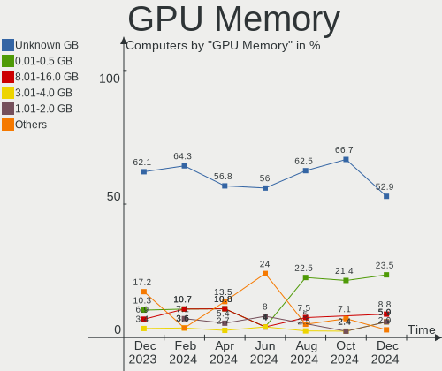

| Size in GB | Computers | Percent |
|------------|-----------|---------|
| Unknown    | 29        | 59.18%  |
| 1.01-2.0   | 5         | 10.2%   |
| 8.01-16.0  | 5         | 10.2%   |
| 0.01-0.5   | 5         | 10.2%   |
| 7.01-8.0   | 2         | 4.08%   |
| 3.01-4.0   | 1         | 2.04%   |
| 16.01-24.0 | 1         | 2.04%   |
| 0.51-1.0   | 1         | 2.04%   |

Monitor
-------

Monitor Vendor
--------------

Monitor vendors

| Vendor               | Computers | Percent |
|----------------------|-----------|---------|
| LG Display           | 8         | 14.55%  |
| Samsung Electronics  | 5         | 9.09%   |
| Chimei Innolux       | 5         | 9.09%   |
| BOE                  | 5         | 9.09%   |
| Dell                 | 4         | 7.27%   |
| AU Optronics         | 4         | 7.27%   |
| Apple                | 4         | 7.27%   |
| Hewlett-Packard      | 3         | 5.45%   |
| Goldstar             | 3         | 5.45%   |
| BenQ                 | 3         | 5.45%   |
| Acer                 | 3         | 5.45%   |
| Sharp                | 2         | 3.64%   |
| Ancor Communications | 2         | 3.64%   |
| Insignia             | 1         | 1.82%   |
| Hitachi              | 1         | 1.82%   |
| CSO                  | 1         | 1.82%   |
| ASUSTek Computer     | 1         | 1.82%   |

Monitor Model
-------------

Monitor models

| Model                                                                  | Computers | Percent |
|------------------------------------------------------------------------|-----------|---------|
| LG Display LCD Monitor LGD40A9 1920x1080 309x174mm 14.0-inch           | 2         | 3.51%   |
| BOE LCD Monitor BOE095F 2256x1504 285x190mm 13.5-inch                  | 2         | 3.51%   |
| Sharp LCD Monitor SHP1548 1920x1200 288x180mm 13.4-inch                | 1         | 1.75%   |
| Sharp LCD Monitor SHP14B8 1920x1080 294x165mm 13.3-inch                | 1         | 1.75%   |
| Samsung Electronics SMT27A550 SAM07B8 1920x1080 598x336mm 27.0-inch    | 1         | 1.75%   |
| Samsung Electronics LU28R55 SAM1015 3840x2160 632x360mm 28.6-inch      | 1         | 1.75%   |
| Samsung Electronics LS49A950U SAM71CC 3840x1080 1192x336mm 48.8-inch   | 1         | 1.75%   |
| Samsung Electronics LCD Monitor SDC4173 3840x2400 344x215mm 16.0-inch  | 1         | 1.75%   |
| Samsung Electronics LCD Monitor SAM0D3B 3840x2160 1020x570mm 46.0-inch | 1         | 1.75%   |
| LG Display LCD Monitor LGD06B3 1920x1200 336x210mm 15.6-inch           | 1         | 1.75%   |
| LG Display LCD Monitor LGD05FA 1920x1080 309x174mm 14.0-inch           | 1         | 1.75%   |
| LG Display LCD Monitor LGD0563 1920x1080 344x194mm 15.5-inch           | 1         | 1.75%   |
| LG Display LCD Monitor LGD0521 1920x1080 309x174mm 14.0-inch           | 1         | 1.75%   |
| LG Display LCD Monitor LGD0513 1920x1080 382x215mm 17.3-inch           | 1         | 1.75%   |
| LG Display LCD Monitor LGD037A 1366x768 277x156mm 12.5-inch            | 1         | 1.75%   |
| Insignia NS-32F202NA22 BBY3292 1920x1080 697x392mm 31.5-inch           | 1         | 1.75%   |
| Hitachi HISENSE HEC0030 3840x2160 1872x1053mm 84.6-inch                | 1         | 1.75%   |
| Hewlett-Packard ZR24w HWP286A 1920x1200 546x352mm 25.6-inch            | 1         | 1.75%   |
| Hewlett-Packard M27fe FHD HPN385F 1920x1080 597x336mm 27.0-inch        | 1         | 1.75%   |
| Hewlett-Packard 24o HPN337C 1920x1080 531x299mm 24.0-inch              | 1         | 1.75%   |
| Goldstar ULTRAGEAR GSM5BB3 2560x1440 597x336mm 27.0-inch               | 1         | 1.75%   |
| Goldstar SDQHD GSM5BF5 2560x2880 465x523mm 27.6-inch                   | 1         | 1.75%   |
| Goldstar QHD GSM772A 2560x1440 697x392mm 31.5-inch                     | 1         | 1.75%   |
| Goldstar HDR WQHD GSM772E 3440x1440 800x335mm 34.1-inch                | 1         | 1.75%   |
| Dell U2515H DELD072 2560x1440 553x311mm 25.0-inch                      | 1         | 1.75%   |
| Dell S2721DS DELA19C 2560x1440 597x336mm 27.0-inch                     | 1         | 1.75%   |
| Dell S2419NX DELD0DD 1920x1080 527x296mm 23.8-inch                     | 1         | 1.75%   |
| Dell 1907FP DEL4015 1280x1024 376x301mm 19.0-inch                      | 1         | 1.75%   |
| CSO LCD Monitor CSO130B 2560x1600 286x179mm 13.3-inch                  | 1         | 1.75%   |
| Chimei Innolux P130ZFA-BA1 CMN8201 2160x1440 275x183mm 13.0-inch       | 1         | 1.75%   |
| Chimei Innolux LCD Monitor CMN1614 1920x1200 344x215mm 16.0-inch       | 1         | 1.75%   |
| Chimei Innolux LCD Monitor CMN14F2 1920x1080 309x173mm 13.9-inch       | 1         | 1.75%   |
| Chimei Innolux LCD Monitor CMN140A 1920x1080 309x173mm 13.9-inch       | 1         | 1.75%   |
| Chimei Innolux LCD Monitor CMN1374 1920x1080 293x165mm 13.2-inch       | 1         | 1.75%   |
| BOE LCD Monitor BOE0BB8 1920x1200 345x215mm 16.0-inch                  | 1         | 1.75%   |
| BOE LCD Monitor BOE0A3B 2560x1600 344x215mm 16.0-inch                  | 1         | 1.75%   |
| BOE LCD Monitor BOE09F5 1920x1200 302x188mm 14.0-inch                  | 1         | 1.75%   |
| BenQ GW2780 BNQ78E6 1920x1080 598x336mm 27.0-inch                      | 1         | 1.75%   |
| BenQ GW2480 BNQ78E7 1920x1080 527x296mm 23.8-inch                      | 1         | 1.75%   |
| BenQ BL2480 BNQ802C 1920x1080 527x296mm 23.8-inch                      | 1         | 1.75%   |

Monitor Resolution
------------------

Monitor screen resolution

| Resolution        | Computers | Percent |
|-------------------|-----------|---------|
| 1920x1080 (FHD)   | 22        | 40.74%  |
| 2560x1440 (QHD)   | 7         | 12.96%  |
| 1920x1200 (WUXGA) | 7         | 12.96%  |
| 3840x2160 (4K)    | 5         | 9.26%   |
| 2880x1800         | 2         | 3.7%    |
| 2560x1600         | 2         | 3.7%    |
| 2256x1504         | 2         | 3.7%    |
| 3840x2400         | 1         | 1.85%   |
| 3840x1080         | 1         | 1.85%   |
| 2560x2880         | 1         | 1.85%   |
| 2240x1400         | 1         | 1.85%   |
| 2160x1440         | 1         | 1.85%   |
| 1366x768 (WXGA)   | 1         | 1.85%   |
| 1280x1024 (SXGA)  | 1         | 1.85%   |

Monitor Diagonal
----------------

Diagonal size in inches

| Inches | Computers | Percent |
|--------|-----------|---------|
| 13     | 11        | 19.64%  |
| 27     | 8         | 14.29%  |
| 15     | 6         | 10.71%  |
| 14     | 5         | 8.93%   |
| 24     | 4         | 7.14%   |
| 16     | 4         | 7.14%   |
| 31     | 3         | 5.36%   |
| 21     | 3         | 5.36%   |
| 84     | 2         | 3.57%   |
| 25     | 2         | 3.57%   |
| 17     | 2         | 3.57%   |
| 48     | 1         | 1.79%   |
| 34     | 1         | 1.79%   |
| 28     | 1         | 1.79%   |
| 23     | 1         | 1.79%   |
| 19     | 1         | 1.79%   |
| 12     | 1         | 1.79%   |

Monitor Width
-------------

Physical width

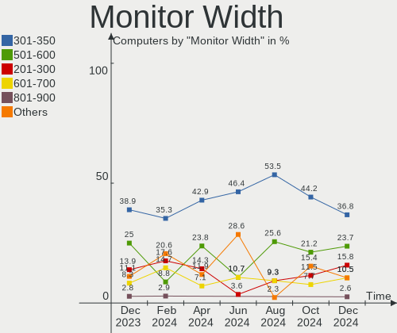

| Width in mm | Computers | Percent |
|-------------|-----------|---------|
| 301-350     | 17        | 30.36%  |
| 501-600     | 13        | 23.21%  |
| 201-300     | 10        | 17.86%  |
| 601-700     | 5         | 8.93%   |
| 401-500     | 4         | 7.14%   |
| 351-400     | 3         | 5.36%   |
| 1501-2000   | 2         | 3.57%   |
| 701-800     | 1         | 1.79%   |
| 1001-1500   | 1         | 1.79%   |

Aspect Ratio
------------

Proportional relationship between the width and the height

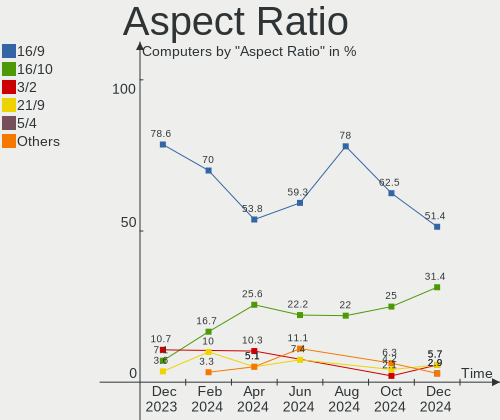

| Ratio | Computers | Percent |
|-------|-----------|---------|
| 16/9  | 31        | 60.78%  |
| 16/10 | 13        | 25.49%  |
| 3/2   | 3         | 5.88%   |
| 5/4   | 1         | 1.96%   |
| 32/9  | 1         | 1.96%   |
| 21/9  | 1         | 1.96%   |
| 0.89  | 1         | 1.96%   |

Monitor Area
------------

Area in inch²

| Area in inch² | Computers | Percent |
|----------------|-----------|---------|
| 81-90          | 10        | 18.18%  |
| 301-350        | 7         | 12.73%  |
| 71-80          | 6         | 10.91%  |
| 101-110        | 6         | 10.91%  |
| 351-500        | 5         | 9.09%   |
| 201-250        | 4         | 7.27%   |
| 151-200        | 4         | 7.27%   |
| 111-120        | 4         | 7.27%   |
| 251-300        | 3         | 5.45%   |
| More than 1000 | 2         | 3.64%   |
| 61-70          | 1         | 1.82%   |
| 131-140        | 1         | 1.82%   |
| 121-130        | 1         | 1.82%   |
| 501-1000       | 1         | 1.82%   |

Pixel Density
-------------

Pixels per inch

| Density       | Computers | Percent |
|---------------|-----------|---------|
| 121-160       | 17        | 31.48%  |
| 161-240       | 14        | 25.93%  |
| 51-100        | 14        | 25.93%  |
| 101-120       | 8         | 14.81%  |
| More than 240 | 1         | 1.85%   |

Multiple Monitors
-----------------

Total monitors connected

| Total | Computers | Percent |
|-------|-----------|---------|
| 1     | 36        | 73.47%  |
| 2     | 9         | 18.37%  |
| 0     | 3         | 6.12%   |
| 3     | 1         | 2.04%   |

Network
-------

Net Controller Vendor
---------------------

Controller vendors

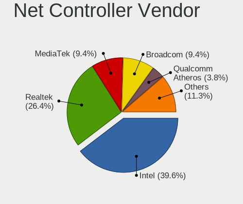

| Vendor                          | Computers | Percent |
|---------------------------------|-----------|---------|
| Intel                           | 34        | 47.89%  |
| Realtek Semiconductor           | 18        | 25.35%  |
| MediaTek                        | 4         | 5.63%   |
| Broadcom                        | 3         | 4.23%   |
| Qualcomm Atheros                | 2         | 2.82%   |
| Marvell Technology Group        | 2         | 2.82%   |
| Aquantia                        | 2         | 2.82%   |
| TP-Link                         | 1         | 1.41%   |
| Qualcomm Atheros Communications | 1         | 1.41%   |
| Qualcomm                        | 1         | 1.41%   |
| ICS Advent                      | 1         | 1.41%   |
| D-Link System                   | 1         | 1.41%   |
| Broadcom Limited                | 1         | 1.41%   |

Net Controller Model
--------------------

Controller models

| Model                                                                                 | Computers | Percent |
|---------------------------------------------------------------------------------------|-----------|---------|
| Realtek RTL8111/8168/8211/8411 PCI Express Gigabit Ethernet Controller                | 8         | 10%     |
| Intel Alder Lake-P PCH CNVi WiFi                                                      | 5         | 6.25%   |
| Realtek RTL8153 Gigabit Ethernet Adapter                                              | 4         | 5%      |
| Realtek RTL8125 2.5GbE Controller                                                     | 4         | 5%      |
| Intel Raptor Lake PCH CNVi WiFi                                                       | 4         | 5%      |
| MediaTek MT7922 802.11ax PCI Express Wireless Network Adapter                         | 3         | 3.75%   |
| Intel Wi-Fi 6E(802.11ax) AX210/AX1675* 2x2 [Typhoon Peak]                             | 3         | 3.75%   |
| Intel Wireless 8265 / 8275                                                            | 2         | 2.5%    |
| Intel Wireless 8260                                                                   | 2         | 2.5%    |
| Intel Wi-Fi 6 AX201                                                                   | 2         | 2.5%    |
| Intel Wi-Fi 6 AX200                                                                   | 2         | 2.5%    |
| Intel Ethernet Connection (2) I219-V                                                  | 2         | 2.5%    |
| Intel Ethernet Connection (16) I219-V                                                 | 2         | 2.5%    |
| Broadcom BCM43602 802.11ac Wireless LAN SoC                                           | 2         | 2.5%    |
| TP-Link TL-WN823N v2/v3 [Realtek RTL8192EU]                                           | 1         | 1.25%   |
| Realtek RTL8852AE 802.11ax PCIe Wireless Network Adapter                              | 1         | 1.25%   |
| Realtek RTL8111/8168/8411 PCI Express Gigabit Ethernet Controller                     | 1         | 1.25%   |
| Realtek RTL810xE PCI Express Fast Ethernet controller                                 | 1         | 1.25%   |
| Qualcomm QCNFA765 Wireless Network Adapter                                            | 1         | 1.25%   |
| Qualcomm Atheros AR9271 802.11n                                                       | 1         | 1.25%   |
| Qualcomm Atheros AR9285 Wireless Network Adapter (PCI-Express)                        | 1         | 1.25%   |
| Qualcomm Atheros AR5418 Wireless Network Adapter [AR5008E 802.11(a)bgn] (PCI-Express) | 1         | 1.25%   |
| MediaTek Wi-Fi 6E MT7902 Wireless Network Adapter                                     | 1         | 1.25%   |
| Marvell Group 88E8058 PCI-E Gigabit Ethernet Controller                               | 1         | 1.25%   |
| Marvell Group 88E8040 PCI-E Fast Ethernet Controller                                  | 1         | 1.25%   |
| Intel Wireless 3165                                                                   | 1         | 1.25%   |
| Intel Wi-Fi 5(802.11ac) Wireless-AC 9x6x [Thunder Peak]                               | 1         | 1.25%   |
| Intel I211 Gigabit Network Connection                                                 | 1         | 1.25%   |
| Intel Ethernet Controller I226-LM                                                     | 1         | 1.25%   |
| Intel Ethernet Controller I225-V                                                      | 1         | 1.25%   |
| Intel Ethernet Connection (7) I219-V                                                  | 1         | 1.25%   |
| Intel Ethernet Connection (6) I219-V                                                  | 1         | 1.25%   |
| Intel Ethernet Connection (4) I219-V                                                  | 1         | 1.25%   |
| Intel Ethernet Connection (16) I219-LM                                                | 1         | 1.25%   |
| Intel Ethernet Connection (14) I219-V                                                 | 1         | 1.25%   |
| Intel Ethernet Connection (14) I219-LM                                                | 1         | 1.25%   |
| Intel Ethernet Connection (11) I219-V                                                 | 1         | 1.25%   |
| Intel Comet Lake PCH-LP CNVi WiFi                                                     | 1         | 1.25%   |
| Intel Comet Lake PCH CNVi WiFi                                                        | 1         | 1.25%   |
| Intel Cannon Point-LP CNVi [Wireless-AC]                                              | 1         | 1.25%   |

Wireless Vendor
---------------

Wireless vendors

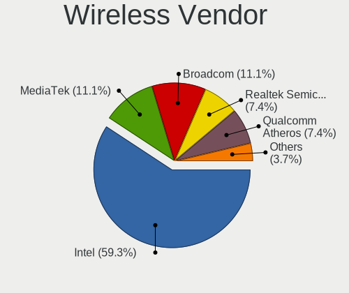

| Vendor                          | Computers | Percent |
|---------------------------------|-----------|---------|
| Intel                           | 26        | 65%     |
| MediaTek                        | 4         | 10%     |
| Broadcom                        | 3         | 7.5%    |
| Qualcomm Atheros                | 2         | 5%      |
| TP-Link                         | 1         | 2.5%    |
| Realtek Semiconductor           | 1         | 2.5%    |
| Qualcomm Atheros Communications | 1         | 2.5%    |
| Qualcomm                        | 1         | 2.5%    |
| Broadcom Limited                | 1         | 2.5%    |

Wireless Model
--------------

Wireless models

| Model                                                                                 | Computers | Percent |
|---------------------------------------------------------------------------------------|-----------|---------|
| Intel Alder Lake-P PCH CNVi WiFi                                                      | 5         | 12.5%   |
| Intel Raptor Lake PCH CNVi WiFi                                                       | 4         | 10%     |
| MediaTek MT7922 802.11ax PCI Express Wireless Network Adapter                         | 3         | 7.5%    |
| Intel Wi-Fi 6E(802.11ax) AX210/AX1675* 2x2 [Typhoon Peak]                             | 3         | 7.5%    |
| Intel Wireless 8265 / 8275                                                            | 2         | 5%      |
| Intel Wireless 8260                                                                   | 2         | 5%      |
| Intel Wi-Fi 6 AX201                                                                   | 2         | 5%      |
| Intel Wi-Fi 6 AX200                                                                   | 2         | 5%      |
| Broadcom BCM43602 802.11ac Wireless LAN SoC                                           | 2         | 5%      |
| TP-Link TL-WN823N v2/v3 [Realtek RTL8192EU]                                           | 1         | 2.5%    |
| Realtek RTL8852AE 802.11ax PCIe Wireless Network Adapter                              | 1         | 2.5%    |
| Qualcomm QCNFA765 Wireless Network Adapter                                            | 1         | 2.5%    |
| Qualcomm Atheros AR9271 802.11n                                                       | 1         | 2.5%    |
| Qualcomm Atheros AR9285 Wireless Network Adapter (PCI-Express)                        | 1         | 2.5%    |
| Qualcomm Atheros AR5418 Wireless Network Adapter [AR5008E 802.11(a)bgn] (PCI-Express) | 1         | 2.5%    |
| MediaTek Wi-Fi 6E MT7902 Wireless Network Adapter                                     | 1         | 2.5%    |
| Intel Wireless 3165                                                                   | 1         | 2.5%    |
| Intel Wi-Fi 5(802.11ac) Wireless-AC 9x6x [Thunder Peak]                               | 1         | 2.5%    |
| Intel Comet Lake PCH-LP CNVi WiFi                                                     | 1         | 2.5%    |
| Intel Comet Lake PCH CNVi WiFi                                                        | 1         | 2.5%    |
| Intel Cannon Point-LP CNVi [Wireless-AC]                                              | 1         | 2.5%    |
| Intel Cannon Lake PCH CNVi WiFi                                                       | 1         | 2.5%    |
| Broadcom Limited BCM43228 802.11a/b/g/n                                               | 1         | 2.5%    |
| Broadcom BCM4360 802.11ac Dual Band Wireless Network Adapter                          | 1         | 2.5%    |

Ethernet Vendor
---------------

Ethernet vendors

| Vendor                   | Computers | Percent |
|--------------------------|-----------|---------|
| Realtek Semiconductor    | 17        | 43.59%  |
| Intel                    | 15        | 38.46%  |
| Marvell Technology Group | 2         | 5.13%   |
| Aquantia                 | 2         | 5.13%   |
| ICS Advent               | 1         | 2.56%   |
| D-Link System            | 1         | 2.56%   |
| Broadcom                 | 1         | 2.56%   |

Ethernet Model
--------------

Ethernet models

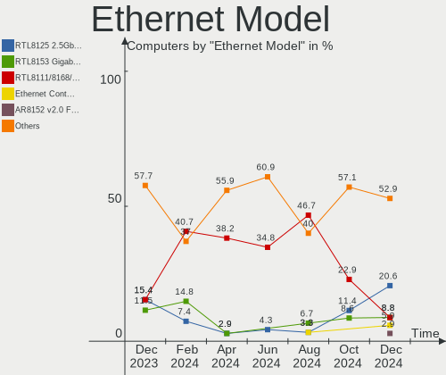

| Model                                                                             | Computers | Percent |
|-----------------------------------------------------------------------------------|-----------|---------|
| Realtek RTL8111/8168/8211/8411 PCI Express Gigabit Ethernet Controller            | 8         | 20%     |
| Realtek RTL8153 Gigabit Ethernet Adapter                                          | 4         | 10%     |
| Realtek RTL8125 2.5GbE Controller                                                 | 4         | 10%     |
| Intel Ethernet Connection (2) I219-V                                              | 2         | 5%      |
| Intel Ethernet Connection (16) I219-V                                             | 2         | 5%      |
| Realtek RTL8111/8168/8411 PCI Express Gigabit Ethernet Controller                 | 1         | 2.5%    |
| Realtek RTL810xE PCI Express Fast Ethernet controller                             | 1         | 2.5%    |
| Marvell Group 88E8058 PCI-E Gigabit Ethernet Controller                           | 1         | 2.5%    |
| Marvell Group 88E8040 PCI-E Fast Ethernet Controller                              | 1         | 2.5%    |
| Intel I211 Gigabit Network Connection                                             | 1         | 2.5%    |
| Intel Ethernet Controller I226-LM                                                 | 1         | 2.5%    |
| Intel Ethernet Controller I225-V                                                  | 1         | 2.5%    |
| Intel Ethernet Connection (7) I219-V                                              | 1         | 2.5%    |
| Intel Ethernet Connection (6) I219-V                                              | 1         | 2.5%    |
| Intel Ethernet Connection (4) I219-V                                              | 1         | 2.5%    |
| Intel Ethernet Connection (16) I219-LM                                            | 1         | 2.5%    |
| Intel Ethernet Connection (14) I219-V                                             | 1         | 2.5%    |
| Intel Ethernet Connection (14) I219-LM                                            | 1         | 2.5%    |
| Intel Ethernet Connection (11) I219-V                                             | 1         | 2.5%    |
| Intel 82579LM Gigabit Network Connection (Lewisville)                             | 1         | 2.5%    |
| ICS Advent USB 10/100 LAN                                                         | 1         | 2.5%    |
| D-Link System DGE-528T Gigabit Ethernet Adapter                                   | 1         | 2.5%    |
| Broadcom NetXtreme BCM57766 Gigabit Ethernet PCIe                                 | 1         | 2.5%    |
| Aquantia AQtion AQC113 NBase-T/IEEE 802.3an Ethernet Controller [Antigua 10G]     | 1         | 2.5%    |
| Aquantia AQC113C NBase-T/IEEE 802.3an Ethernet Controller [Marvell Scalable mGig] | 1         | 2.5%    |

Net Controller Kind
-------------------

Ethernet, WiFi or modem

| Kind     | Computers | Percent |
|----------|-----------|---------|
| WiFi     | 38        | 54.29%  |
| Ethernet | 32        | 45.71%  |

Used Controller
---------------

Currently used network controller

| Kind     | Computers | Percent |
|----------|-----------|---------|
| WiFi     | 31        | 58.49%  |
| Ethernet | 22        | 41.51%  |

NICs
----

Total network controllers on board

| Total | Computers | Percent |
|-------|-----------|---------|
| 1     | 26        | 53.06%  |
| 2     | 21        | 42.86%  |
| 3     | 2         | 4.08%   |

IPv6
----

IPv6 vs IPv4

| Used | Computers | Percent |
|------|-----------|---------|
| No   | 35        | 71.43%  |
| Yes  | 14        | 28.57%  |

Bluetooth
---------

Bluetooth Vendor
----------------

Controller vendors

| Vendor                  | Computers | Percent |
|-------------------------|-----------|---------|
| Intel                   | 25        | 60.98%  |
| Apple                   | 4         | 9.76%   |
| Foxconn / Hon Hai       | 3         | 7.32%   |
| Realtek Semiconductor   | 2         | 4.88%   |
| IMC Networks            | 2         | 4.88%   |
| Cambridge Silicon Radio | 1         | 2.44%   |
| Broadcom                | 1         | 2.44%   |
| Belkin Components       | 1         | 2.44%   |
| ASUSTek Computer        | 1         | 2.44%   |
| Alps Electric           | 1         | 2.44%   |

Bluetooth Model
---------------

Controller models

| Model                                                 | Computers | Percent |
|-------------------------------------------------------|-----------|---------|
| Intel Bluetooth Device                                | 8         | 19.51%  |
| Intel Bluetooth wireless interface                    | 5         | 12.2%   |
| Intel Bluetooth 9460/9560 Jefferson Peak (JfP)        | 4         | 9.76%   |
| Intel AX210 Bluetooth                                 | 3         | 7.32%   |
| Realtek Bluetooth Radio                               | 2         | 4.88%   |
| Intel AX201 Bluetooth                                 | 2         | 4.88%   |
| Intel AX200 Bluetooth                                 | 2         | 4.88%   |
| IMC Networks Wireless_Device                          | 2         | 4.88%   |
| Foxconn / Hon Hai Wireless_Device                     | 2         | 4.88%   |
| Apple Bluetooth Host Controller                       | 2         | 4.88%   |
| Intel Wireless-AC 9260 Bluetooth Adapter              | 1         | 2.44%   |
| Foxconn / Hon Hai Bluetooth Device                    | 1         | 2.44%   |
| Cambridge Silicon Radio Bluetooth Dongle (HCI mode)   | 1         | 2.44%   |
| Broadcom BCM20702A0                                   | 1         | 2.44%   |
| Belkin Components F8T065BF Mini Bluetooth 4.0 Adapter | 1         | 2.44%   |
| ASUS ASUS USB-BT500                                   | 1         | 2.44%   |
| Apple Bluetooth USB Host Controller                   | 1         | 2.44%   |
| Apple Bluetooth HCI                                   | 1         | 2.44%   |
| Alps Electric BCM2046 Bluetooth Device                | 1         | 2.44%   |

Sound
-----

Sound Vendor
------------

Sound card vendors

| Vendor              | Computers | Percent |
|---------------------|-----------|---------|
| Intel               | 37        | 48.68%  |
| AMD                 | 16        | 21.05%  |
| Nvidia              | 10        | 13.16%  |
| RODE Microphones    | 3         | 3.95%   |
| Focusrite-Novation  | 2         | 2.63%   |
| SteelSeries ApS     | 1         | 1.32%   |
| Sony                | 1         | 1.32%   |
| Schiit Audio        | 1         | 1.32%   |
| Razer USA           | 1         | 1.32%   |
| Logitech            | 1         | 1.32%   |
| C-Media Electronics | 1         | 1.32%   |
| Blue Microphones    | 1         | 1.32%   |
| ASUSTek Computer    | 1         | 1.32%   |

Sound Model
-----------

Sound card models

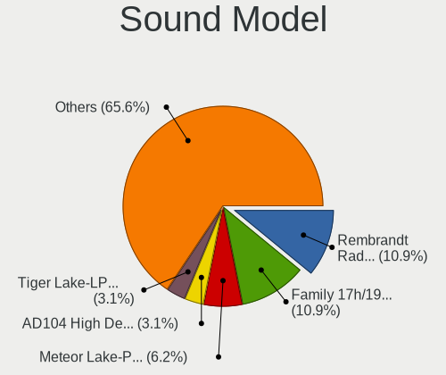

| Model                                                               | Computers | Percent |
|---------------------------------------------------------------------|-----------|---------|
| AMD Family 17h/19h HD Audio Controller                              | 8         | 8.79%   |
| Intel Raptor Lake-P/U/H cAVS                                        | 5         | 5.49%   |
| Intel Alder Lake PCH-P High Definition Audio Controller             | 5         | 5.49%   |
| AMD Navi 21/23 HDMI/DP Audio Controller                             | 5         | 5.49%   |
| Intel Sunrise Point-LP HD Audio                                     | 4         | 4.4%    |
| Intel Tiger Lake-LP Smart Sound Technology Audio Controller         | 3         | 3.3%    |
| Intel 7 Series/C216 Chipset Family High Definition Audio Controller | 3         | 3.3%    |
| AMD Renoir Radeon High Definition Audio Controller                  | 3         | 3.3%    |
| AMD Rembrandt Radeon High Definition Audio Controller               | 3         | 3.3%    |
| Nvidia GP107GL High Definition Audio Controller                     | 2         | 2.2%    |
| Nvidia Audio device                                                 | 2         | 2.2%    |
| Intel Tiger Lake-H HD Audio Controller                              | 2         | 2.2%    |
| Intel Cannon Lake PCH cAVS                                          | 2         | 2.2%    |
| Intel 8 Series/C220 Series Chipset High Definition Audio Controller | 2         | 2.2%    |
| AMD Starship/Matisse HD Audio Controller                            | 2         | 2.2%    |
| AMD Raven/Raven2/Fenghuang HDMI/DP Audio Controller                 | 2         | 2.2%    |
| AMD Navi 31 HDMI/DP Audio                                           | 2         | 2.2%    |
| SteelSeries ApS Arctis 7+                                           | 1         | 1.1%    |
| Sony DualSense wireless controller (PS5)                            | 1         | 1.1%    |
| Schiit Audio Schiit Modi 3+                                         | 1         | 1.1%    |
| RODE Microphones RODE NT-USB Mini                                   | 1         | 1.1%    |
| RODE Microphones RODE NT-USB                                        | 1         | 1.1%    |
| RODE Microphones RODE AI-1                                          | 1         | 1.1%    |
| Razer USA RZ19-0229 Gaming Microphone                               | 1         | 1.1%    |
| Nvidia TU104 HD Audio Controller                                    | 1         | 1.1%    |
| Nvidia GM204 High Definition Audio Controller                       | 1         | 1.1%    |
| Nvidia GK208 HDMI/DP Audio Controller                               | 1         | 1.1%    |
| Nvidia GK107 HDMI Audio Controller                                  | 1         | 1.1%    |
| Nvidia GF108 High Definition Audio Controller                       | 1         | 1.1%    |
| Nvidia GA102 High Definition Audio Controller                       | 1         | 1.1%    |
| Logitech Logi USB Headset                                           | 1         | 1.1%    |
| Intel DG2 Audio Controller                                          | 1         | 1.1%    |
| Intel Comet Lake PCH-V cAVS                                         | 1         | 1.1%    |
| Intel Comet Lake PCH-LP cAVS                                        | 1         | 1.1%    |
| Intel Comet Lake PCH cAVS                                           | 1         | 1.1%    |
| Intel Cannon Point-LP High Definition Audio Controller              | 1         | 1.1%    |
| Intel Broadwell-U Audio Controller                                  | 1         | 1.1%    |
| Intel Alder Lake-S HD Audio Controller                              | 1         | 1.1%    |
| Intel Alder Lake Smart Sound Technology Audio Controller            | 1         | 1.1%    |
| Intel 9 Series Chipset Family HD Audio Controller                   | 1         | 1.1%    |

Memory
------

Memory Vendor
-------------

Memory module vendors

| Vendor              | Computers | Percent |
|---------------------|-----------|---------|
| Samsung Electronics | 10        | 18.87%  |
| SK hynix            | 9         | 16.98%  |
| Micron Technology   | 7         | 13.21%  |
| Corsair             | 7         | 13.21%  |
| Kingston            | 5         | 9.43%   |
| Crucial             | 4         | 7.55%   |
| Unknown             | 3         | 5.66%   |
| Unknown             | 2         | 3.77%   |
| Transcend           | 1         | 1.89%   |
| Team                | 1         | 1.89%   |
| Ramaxel Technology  | 1         | 1.89%   |
| Patriot             | 1         | 1.89%   |
| Avant               | 1         | 1.89%   |
| A-DATA Technology   | 1         | 1.89%   |

Memory Model
------------

Memory module models

| Model                                                            | Computers | Percent |
|------------------------------------------------------------------|-----------|---------|
| Corsair RAM CMK16GX4M2B3000C15 8GB DIMM DDR4 3533MT/s            | 3         | 5.56%   |
| Unknown                                                          | 3         | 5.56%   |
| SK hynix RAM Module 8GB SODIMM DDR3 1600MT/s                     | 2         | 3.7%    |
| Samsung RAM M471A1K43CB1-CTD 8GB SODIMM DDR4 2667MT/s            | 2         | 3.7%    |
| Unknown RAM Module 8GB SODIMM DDR3 1333MT/s                      | 1         | 1.85%   |
| Unknown RAM Module 4GB SODIMM DDR2                               | 1         | 1.85%   |
| Transcend RAM JM4800ALE-16G 16GB DIMM DDR5 4800MT/s              | 1         | 1.85%   |
| Team RAM TEAMGROUP-SD4-3200 16GB SODIMM DDR4 3200MT/s            | 1         | 1.85%   |
| SK hynix RAM HMT351U6EFR8C-PB 4096MB DIMM DDR3 1800MT/s          | 1         | 1.85%   |
| SK hynix RAM HMCG78MEBSA092N 16GB SODIMM DDR5 4800MT/s           | 1         | 1.85%   |
| SK hynix RAM HMCG78AEBSA095N 16GB SODIMM DDR5 4800MT/s           | 1         | 1.85%   |
| SK hynix RAM HMAA2GU6CJR8N-XN 16GB DIMM DDR4 3200MT/s            | 1         | 1.85%   |
| SK hynix RAM HMA82GS6AFR8N-UH 16GB SODIMM DDR4 2667MT/s          | 1         | 1.85%   |
| SK hynix RAM H9JCNNNCP3MLYR-N6E 2GB Row Of Chips LPDDR5 6400MT/s | 1         | 1.85%   |
| SK hynix RAM H9HCNNNCPMMLXR-NEE 8GB Row Of Chips LPDDR4 4266MT/s | 1         | 1.85%   |
| Samsung RAM Module 4GB SODIMM DDR3 1867MT/s                      | 1         | 1.85%   |
| Samsung RAM M471A5244CB0-CWE 4GB SODIMM DDR4 3200MT/s            | 1         | 1.85%   |
| Samsung RAM M471A5244BB0-CRC 4GB SODIMM DDR4 2667MT/s            | 1         | 1.85%   |
| Samsung RAM M391A2K43BB1-CTD 16GB DIMM DDR4 3600MT/s             | 1         | 1.85%   |
| Samsung RAM K4EBE304EB-EGCG 8GB Row Of Chips LPDDR3 2133MT/s     | 1         | 1.85%   |
| Samsung RAM K3LKBKB@BM-MGCP 2GB Row Of Chips LPDDR5 6400MT/s     | 1         | 1.85%   |
| Samsung RAM K3KL9L90CM-MGCT 4GB Row Of Chips LPDDR5 7467MT/s     | 1         | 1.85%   |
| Samsung RAM H9CCNNNBJTALAR-NVD 4GB Row Of Chips LPDDR3 2133MT/s  | 1         | 1.85%   |
| Ramaxel RAM RMSA3260ME78HAF-2666 8GB SODIMM DDR4 2667MT/s        | 1         | 1.85%   |
| Patriot RAM 3400 C16 Series 8GB DIMM DDR4 3200MT/s               | 1         | 1.85%   |
| Micron RAM MT62F1G64D8CH-031 2GB Row Of Chips LPDDR5 6400MT/s    | 1         | 1.85%   |
| Micron RAM Module 4GB SODIMM DDR4 2133MT/s                       | 1         | 1.85%   |
| Micron RAM Module 2GB Row Of Chips LPDDR5 6400MT/s               | 1         | 1.85%   |
| Micron RAM 8ATF2G64HZ-3G2F1 16GB SODIMM DDR4 3200MT/s            | 1         | 1.85%   |
| Micron RAM 4ATS1G64HZ-2G6E1 8GB SODIMM DDR4 2667MT/s             | 1         | 1.85%   |
| Micron RAM 4ATF1G64HZ-3G2F1 8GB SODIMM DDR4 3200MT/s             | 1         | 1.85%   |
| Micron RAM 4ATF1G64HZ-3G2E1 8GB Row Of Chips DDR4 3200MT/s       | 1         | 1.85%   |
| Kingston RAM KF552C40-32 32GB DIMM DDR5 5200MT/s                 | 1         | 1.85%   |
| Kingston RAM KF2666C16D4/32GX 32GB DIMM DDR4 2667MT/s            | 1         | 1.85%   |
| Kingston RAM 9965788-052.A00G 64GB DIMM DDR5 5600MT/s            | 1         | 1.85%   |
| Kingston RAM 9905630-051.A00G 16GB SODIMM DDR4 2400MT/s          | 1         | 1.85%   |
| Kingston RAM 9905625-066.A00G 16GB DIMM DDR4 2667MT/s            | 1         | 1.85%   |
| Crucial RAM CT8G4SFRA266.C8FE 8GB SODIMM DDR4 2667MT/s           | 1         | 1.85%   |
| Crucial RAM CT32G4SFD832A.M16FF 32GB SODIMM DDR4 3200MT/s        | 1         | 1.85%   |
| Crucial RAM BL32G32C16U4R.M16FB1 32GB DIMM DDR4 3200MT/s         | 1         | 1.85%   |

Memory Kind
-----------

Memory module kinds

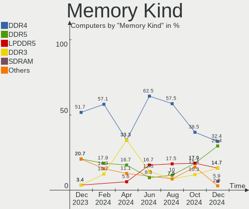

| Kind   | Computers | Percent |
|--------|-----------|---------|
| DDR4   | 25        | 51.02%  |
| DDR5   | 8         | 16.33%  |
| DDR3   | 6         | 12.24%  |
| LPDDR5 | 5         | 10.2%   |
| LPDDR3 | 2         | 4.08%   |
| DDR2   | 2         | 4.08%   |
| LPDDR4 | 1         | 2.04%   |

Memory Form Factor
------------------

Physical design of the memory module

| Name         | Computers | Percent |
|--------------|-----------|---------|
| SODIMM       | 23        | 46.94%  |
| DIMM         | 17        | 34.69%  |
| Row Of Chips | 9         | 18.37%  |

Memory Size
-----------

Memory module size

| Size  | Computers | Percent |
|-------|-----------|---------|
| 8192  | 20        | 38.46%  |
| 16384 | 13        | 25%     |
| 4096  | 8         | 15.38%  |
| 32768 | 7         | 13.46%  |
| 2048  | 3         | 5.77%   |
| 65536 | 1         | 1.92%   |

Memory Speed
------------

Memory module speed

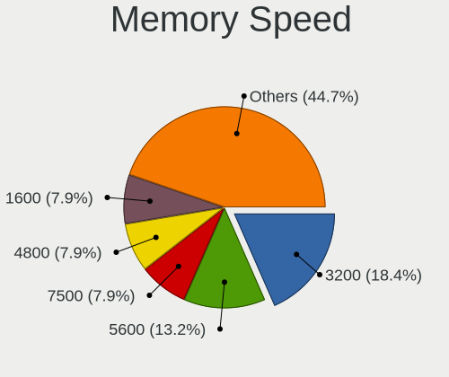

| Speed   | Computers | Percent |
|---------|-----------|---------|
| 3200    | 10        | 19.61%  |
| 2667    | 8         | 15.69%  |
| 4800    | 5         | 9.8%    |
| 6400    | 4         | 7.84%   |
| 3533    | 3         | 5.88%   |
| 2133    | 3         | 5.88%   |
| 1600    | 3         | 5.88%   |
| 3600    | 2         | 3.92%   |
| 1867    | 2         | 3.92%   |
| 7467    | 1         | 1.96%   |
| 5600    | 1         | 1.96%   |
| 5200    | 1         | 1.96%   |
| 4266    | 1         | 1.96%   |
| 3000    | 1         | 1.96%   |
| 2933    | 1         | 1.96%   |
| 2400    | 1         | 1.96%   |
| 1800    | 1         | 1.96%   |
| 1333    | 1         | 1.96%   |
| 667     | 1         | 1.96%   |
| Unknown | 1         | 1.96%   |

Printers & scanners
-------------------

Printer Vendor
--------------

Printer device vendors

Zero info for selected period =(

Printer Model
-------------

Printer device models

Zero info for selected period =(

Scanner Vendor
--------------

Scanner device vendors

Zero info for selected period =(

Scanner Model
-------------

Scanner device models

Zero info for selected period =(

Camera
------

Camera Vendor
-------------

Camera device vendors

| Vendor                        | Computers | Percent |
|-------------------------------|-----------|---------|
| Chicony Electronics           | 6         | 18.18%  |
| IMC Networks                  | 5         | 15.15%  |
| Logitech                      | 4         | 12.12%  |
| Bison Electronics             | 4         | 12.12%  |
| Realtek Semiconductor         | 2         | 6.06%   |
| Microdia                      | 2         | 6.06%   |
| Apple                         | 2         | 6.06%   |
| Z-Star Microelectronics       | 1         | 3.03%   |
| Syntek                        | 1         | 3.03%   |
| Sunplus Innovation Technology | 1         | 3.03%   |
| ShineTech                     | 1         | 3.03%   |
| Ricoh                         | 1         | 3.03%   |
| Razer USA                     | 1         | 3.03%   |
| MacroSilicon                  | 1         | 3.03%   |
| Luxvisions Innotech Limited   | 1         | 3.03%   |

Camera Model
------------

Camera device models

| Model                                                    | Computers | Percent |
|----------------------------------------------------------|-----------|---------|
| Bison Integrated Camera                                  | 3         | 8.82%   |
| Microdia Integrated_Webcam_HD                            | 2         | 5.88%   |
| IMC Networks Integrated Camera                           | 2         | 5.88%   |
| Chicony Integrated Camera                                | 2         | 5.88%   |
| Z-Star Venus USB2.0 Camera                               | 1         | 2.94%   |
| Syntek Integrated Camera                                 | 1         | 2.94%   |
| Sunplus XiaoMi WebCam                                    | 1         | 2.94%   |
| ShineTech USB2.0 HD UVC WebCam                           | 1         | 2.94%   |
| Ricoh Sony Visual Communication Camera Integrated Webcam | 1         | 2.94%   |
| Realtek Laptop Camera                                    | 1         | 2.94%   |
| Realtek Integrated_Webcam_HD                             | 1         | 2.94%   |
| Razer USA Razer Kiyo Pro                                 | 1         | 2.94%   |
| MacroSilicon USB3. 0 capture                             | 1         | 2.94%   |
| Luxvisions Innotech Limited Integrated Camera            | 1         | 2.94%   |
| Logitech Webcam C930e                                    | 1         | 2.94%   |
| Logitech Webcam C270                                     | 1         | 2.94%   |
| Logitech C922 Pro Stream Webcam                          | 1         | 2.94%   |
| Logitech C920 PRO HD Webcam                              | 1         | 2.94%   |
| IMC Networks USB2.0 VGA UVC WebCam                       | 1         | 2.94%   |
| IMC Networks USB2.0 HD UVC WebCam                        | 1         | 2.94%   |
| IMC Networks HD Camera                                   | 1         | 2.94%   |
| Chicony HP IR Camera                                     | 1         | 2.94%   |
| Chicony HP HD Camera                                     | 1         | 2.94%   |
| Chicony FJ Camera                                        | 1         | 2.94%   |
| Chicony FHD Webcam                                       | 1         | 2.94%   |
| Chicony Chicony USB2.0 Camera                            | 1         | 2.94%   |
| Bison Web Camera - HD                                    | 1         | 2.94%   |
| Apple FaceTime HD Camera (Built-in)                      | 1         | 2.94%   |
| Apple Built-in iSight                                    | 1         | 2.94%   |

Security
--------

Fingerprint Vendor
------------------

Fingerprint sensor vendors

| Vendor                     | Computers | Percent |
|----------------------------|-----------|---------|
| Synaptics                  | 3         | 60%     |
| Validity Sensors           | 1         | 20%     |
| Shenzhen Goodix Technology | 1         | 20%     |

Fingerprint Model
-----------------

Fingerprint sensor models

| Model                                                       | Computers | Percent |
|-------------------------------------------------------------|-----------|---------|
| Validity Sensors Synaptics VFS7552 Touch Fingerprint Sensor | 1         | 20%     |
| Synaptics WBDI                                              | 1         | 20%     |
| Synaptics UWP WBDI Device                                   | 1         | 20%     |
| Synaptics Prometheus MIS Touch Fingerprint Reader           | 1         | 20%     |
| Shenzhen Goodix Fingerprint Reader                          | 1         | 20%     |

Chipcard Vendor
---------------

Chipcard module vendors

| Vendor           | Computers | Percent |
|------------------|-----------|---------|
| Alcor Micro      | 4         | 80%     |
| SCM Microsystems | 1         | 20%     |

Chipcard Model
--------------

Chipcard module models

| Model                                                  | Computers | Percent |
|--------------------------------------------------------|-----------|---------|
| Alcor Micro AU9540 Smartcard Reader                    | 4         | 80%     |
| SCM Microsystems SCR331-LC1 / SCR3310 SmartCard Reader | 1         | 20%     |

Unsupported
-----------

Unsupported Devices
-------------------

Total unsupported devices on board

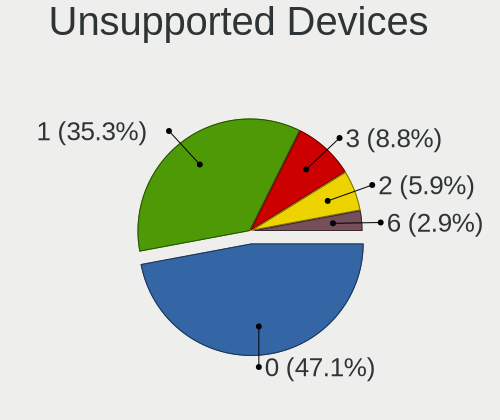

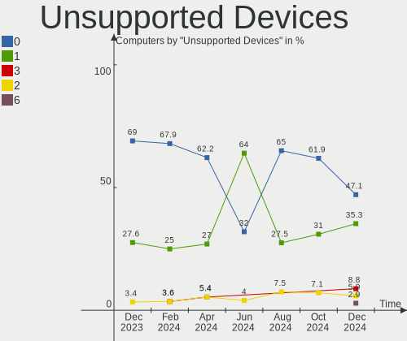

| Total | Computers | Percent |
|-------|-----------|---------|
| 0     | 32        | 65.31%  |
| 1     | 14        | 28.57%  |
| 2     | 2         | 4.08%   |
| 3     | 1         | 2.04%   |

Unsupported Device Types
------------------------

Types of unsupported devices

| Type                  | Computers | Percent |
|-----------------------|-----------|---------|
| Graphics card         | 5         | 25%     |
| Fingerprint reader    | 5         | 25%     |
| Chipcard              | 5         | 25%     |
| Multimedia controller | 3         | 15%     |
| Net/wireless          | 1         | 5%      |
| Net/ethernet          | 1         | 5%      |

