NixOS - Hardware Trends
-----------------------

A project to identify most popular hardware characteristics and track their change
over time based on data collected by Linux users at https://Linux-Hardware.org.

Anyone can contribute to this report by the [hw-probe](https://github.com/linuxhw/hw-probe) tool:

    sudo -E hw-probe -all -upload

This is a report for all computer types. See also reports for [desktops](/Dist/NixOS/Desktop/README.md) and [notebooks](/Dist/NixOS/Notebook/README.md).

This report is for one last month. Overall report since the beginning of time: [TestDays](https://github.com/linuxhw/TestDays)

Period: Dec, 2024.

Contents
--------

* [ System ](#system)
  - [ OS                       ](#os)
  - [ OS Family                ](#os-family)
  - [ Kernel                   ](#kernel)
  - [ Kernel Family            ](#kernel-family)
  - [ Kernel Major Ver.        ](#kernel-major-ver)
  - [ Arch                     ](#arch)
  - [ DE                       ](#de)
  - [ Display Server           ](#display-server)
  - [ Display Manager          ](#display-manager)
  - [ OS Lang                  ](#os-lang)
  - [ Boot Mode                ](#boot-mode)
  - [ Filesystem               ](#filesystem)
  - [ Part. scheme             ](#part-scheme)
  - [ Dual Boot with Linux/BSD ](#dual-boot-with-linuxbsd)
  - [ Dual Boot (Win)          ](#dual-boot-win)

* [ Board ](#board)
  - [ Vendor                   ](#vendor)
  - [ Model                    ](#model)
  - [ Model Family             ](#model-family)
  - [ MFG Year                 ](#mfg-year)
  - [ Form Factor              ](#form-factor)
  - [ Secure Boot              ](#secure-boot)
  - [ Coreboot                 ](#coreboot)
  - [ RAM Size                 ](#ram-size)
  - [ RAM Used                 ](#ram-used)
  - [ Total Drives             ](#total-drives)
  - [ Has CD-ROM               ](#has-cd-rom)
  - [ Has Ethernet             ](#has-ethernet)
  - [ Has WiFi                 ](#has-wifi)
  - [ Has Bluetooth            ](#has-bluetooth)

* [ Location ](#location)
  - [ Country                  ](#country)
  - [ City                     ](#city)

* [ Drives ](#drives)
  - [ Drive Vendor             ](#drive-vendor)
  - [ Drive Model              ](#drive-model)
  - [ HDD Vendor               ](#hdd-vendor)
  - [ SSD Vendor               ](#ssd-vendor)
  - [ Drive Kind               ](#drive-kind)
  - [ Drive Connector          ](#drive-connector)
  - [ Drive Size               ](#drive-size)
  - [ Space Total              ](#space-total)
  - [ Space Used               ](#space-used)
  - [ Malfunc. Drives          ](#malfunc-drives)
  - [ Malfunc. Drive Vendor    ](#malfunc-drive-vendor)
  - [ Malfunc. HDD Vendor      ](#malfunc-hdd-vendor)
  - [ Malfunc. Drive Kind      ](#malfunc-drive-kind)
  - [ Failed Drives            ](#failed-drives)
  - [ Failed Drive Vendor      ](#failed-drive-vendor)
  - [ Drive Status             ](#drive-status)

* [ Storage controller ](#storage-controller)
  - [ Storage Vendor           ](#storage-vendor)
  - [ Storage Model            ](#storage-model)
  - [ Storage Kind             ](#storage-kind)

* [ Processor ](#processor)
  - [ CPU Vendor               ](#cpu-vendor)
  - [ CPU Model                ](#cpu-model)
  - [ CPU Model Family         ](#cpu-model-family)
  - [ CPU Cores                ](#cpu-cores)
  - [ CPU Sockets              ](#cpu-sockets)
  - [ CPU Threads              ](#cpu-threads)
  - [ CPU Op-Modes             ](#cpu-op-modes)
  - [ CPU Microcode            ](#cpu-microcode)
  - [ CPU Microarch            ](#cpu-microarch)

* [ Graphics ](#graphics)
  - [ GPU Vendor               ](#gpu-vendor)
  - [ GPU Model                ](#gpu-model)
  - [ GPU Combo                ](#gpu-combo)
  - [ GPU Driver               ](#gpu-driver)
  - [ GPU Memory               ](#gpu-memory)

* [ Monitor ](#monitor)
  - [ Monitor Vendor           ](#monitor-vendor)
  - [ Monitor Model            ](#monitor-model)
  - [ Monitor Resolution       ](#monitor-resolution)
  - [ Monitor Diagonal         ](#monitor-diagonal)
  - [ Monitor Width            ](#monitor-width)
  - [ Aspect Ratio             ](#aspect-ratio)
  - [ Monitor Area             ](#monitor-area)
  - [ Pixel Density            ](#pixel-density)
  - [ Multiple Monitors        ](#multiple-monitors)

* [ Network ](#network)
  - [ Net Controller Vendor    ](#net-controller-vendor)
  - [ Net Controller Model     ](#net-controller-model)
  - [ Wireless Vendor          ](#wireless-vendor)
  - [ Wireless Model           ](#wireless-model)
  - [ Ethernet Vendor          ](#ethernet-vendor)
  - [ Ethernet Model           ](#ethernet-model)
  - [ Net Controller Kind      ](#net-controller-kind)
  - [ Used Controller          ](#used-controller)
  - [ NICs                     ](#nics)
  - [ IPv6                     ](#ipv6)

* [ Bluetooth ](#bluetooth)
  - [ Bluetooth Vendor         ](#bluetooth-vendor)
  - [ Bluetooth Model          ](#bluetooth-model)

* [ Sound ](#sound)
  - [ Sound Vendor             ](#sound-vendor)
  - [ Sound Model              ](#sound-model)

* [ Memory ](#memory)
  - [ Memory Vendor            ](#memory-vendor)
  - [ Memory Model             ](#memory-model)
  - [ Memory Kind              ](#memory-kind)
  - [ Memory Form Factor       ](#memory-form-factor)
  - [ Memory Size              ](#memory-size)
  - [ Memory Speed             ](#memory-speed)

* [ Printers & scanners ](#printers--scanners)
  - [ Printer Vendor           ](#printer-vendor)
  - [ Printer Model            ](#printer-model)
  - [ Scanner Vendor           ](#scanner-vendor)
  - [ Scanner Model            ](#scanner-model)

* [ Camera ](#camera)
  - [ Camera Vendor            ](#camera-vendor)
  - [ Camera Model             ](#camera-model)

* [ Security ](#security)
  - [ Fingerprint Vendor       ](#fingerprint-vendor)
  - [ Fingerprint Model        ](#fingerprint-model)
  - [ Chipcard Vendor          ](#chipcard-vendor)
  - [ Chipcard Model           ](#chipcard-model)

* [ Unsupported ](#unsupported)
  - [ Unsupported Devices      ](#unsupported-devices)
  - [ Unsupported Device Types ](#unsupported-device-types)

System
------

OS
--

Installed operating systems

| Name        | Computers | Percent |
|-------------|-----------|---------|
| NixOS 24.11 | 20        | 58.82%  |
| NixOS 25.05 | 12        | 35.29%  |
| NixOS 24.05 | 1         | 2.94%   |
| NixOS 23.11 | 1         | 2.94%   |

OS Family
---------

OS without a version

| Name  | Computers | Percent |
|-------|-----------|---------|
| NixOS | 34        | 100%    |

Kernel
------

Version of the Linux kernel

| Version         | Computers | Percent |
|-----------------|-----------|---------|
| 6.6.63          | 10        | 29.41%  |
| 6.6.67          | 3         | 8.82%   |
| 6.6.64          | 3         | 8.82%   |
| 6.12.2-zen1     | 3         | 8.82%   |
| 6.6.66          | 2         | 5.88%   |
| 6.12.3          | 2         | 5.88%   |
| 6.12.1          | 2         | 5.88%   |
| 6.11.10-xanmod1 | 2         | 5.88%   |
| 6.9.7           | 1         | 2.94%   |
| 6.6.62          | 1         | 2.94%   |
| 6.6.54          | 1         | 2.94%   |
| 6.6.48          | 1         | 2.94%   |
| 6.12.6          | 1         | 2.94%   |
| 6.12.5-cachyos  | 1         | 2.94%   |
| 6.1.96          | 1         | 2.94%   |

Kernel Family
-------------

Linux kernel without a distro release

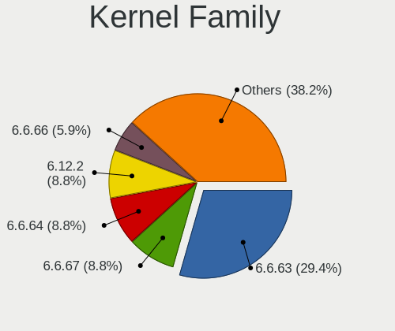

| Version | Computers | Percent |
|---------|-----------|---------|
| 6.6.63  | 10        | 29.41%  |
| 6.6.67  | 3         | 8.82%   |
| 6.6.64  | 3         | 8.82%   |
| 6.12.2  | 3         | 8.82%   |
| 6.6.66  | 2         | 5.88%   |
| 6.12.3  | 2         | 5.88%   |
| 6.12.1  | 2         | 5.88%   |
| 6.11.10 | 2         | 5.88%   |
| 6.9.7   | 1         | 2.94%   |
| 6.6.62  | 1         | 2.94%   |
| 6.6.54  | 1         | 2.94%   |
| 6.6.48  | 1         | 2.94%   |
| 6.12.6  | 1         | 2.94%   |
| 6.12.5  | 1         | 2.94%   |
| 6.1.96  | 1         | 2.94%   |

Kernel Major Ver.
-----------------

Linux kernel major version

| Version | Computers | Percent |
|---------|-----------|---------|
| 6.6     | 21        | 61.76%  |
| 6.12    | 9         | 26.47%  |
| 6.11    | 2         | 5.88%   |
| 6.9     | 1         | 2.94%   |
| 6.1     | 1         | 2.94%   |

Arch
----

OS architecture (x86_64, i586, etc.)

| Name   | Computers | Percent |
|--------|-----------|---------|
| x86_64 | 34        | 100%    |

DE
--

Desktop Environment

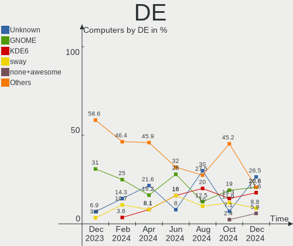

| Name         | Computers | Percent |
|--------------|-----------|---------|
| Unknown      | 9         | 26.47%  |
| GNOME        | 7         | 20.59%  |
| KDE6         | 6         | 17.65%  |
| sway         | 3         | 8.82%   |
| none+awesome | 2         | 5.88%   |
| KDE          | 2         | 5.88%   |
| Hyprland     | 2         | 5.88%   |
| Pantheon     | 1         | 2.94%   |
| COSMIC       | 1         | 2.94%   |
| Budgie       | 1         | 2.94%   |

Display Server
--------------

X11 or Wayland

| Name    | Computers | Percent |
|---------|-----------|---------|
| Wayland | 18        | 52.94%  |
| Unknown | 8         | 23.53%  |
| Tty     | 6         | 17.65%  |
| X11     | 2         | 5.88%   |

Display Manager
---------------

SDDM, LightDM, etc.

| Name    | Computers | Percent |
|---------|-----------|---------|
| GDM     | 11        | 32.35%  |
| Unknown | 9         | 26.47%  |
| SDDM    | 8         | 23.53%  |
| LightDM | 3         | 8.82%   |
| GREETD  | 3         | 8.82%   |

OS Lang
-------

Language

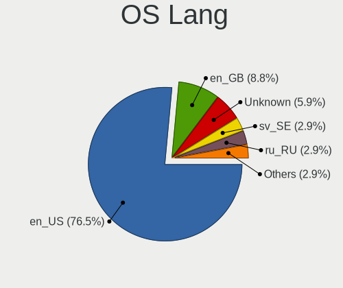

| Lang       | Computers | Percent |
|------------|-----------|---------|
| en_US      | 26        | 76.47%  |
| en_GB      | 3         | 8.82%   |
| Unknown    | 2         | 5.88%   |
| sv_SE      | 1         | 2.94%   |
| ru_RU      | 1         | 2.94%   |
| en_IE.UTF8 | 1         | 2.94%   |

Boot Mode
---------

EFI or BIOS

| Mode | Computers | Percent |
|------|-----------|---------|
| EFI  | 28        | 82.35%  |
| BIOS | 6         | 17.65%  |

Filesystem
----------

Type of filesystem

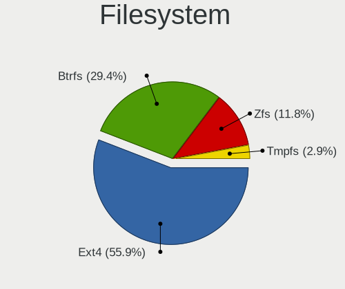

| Type  | Computers | Percent |
|-------|-----------|---------|
| Ext4  | 19        | 55.88%  |
| Btrfs | 10        | 29.41%  |
| Zfs   | 4         | 11.76%  |
| Tmpfs | 1         | 2.94%   |

Part. scheme
------------

Scheme of partitioning

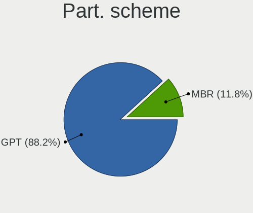

| Type | Computers | Percent |
|------|-----------|---------|
| GPT  | 30        | 88.24%  |
| MBR  | 4         | 11.76%  |

Dual Boot with Linux/BSD
------------------------

Hosting more than one Linux/BSD

| Dual boot | Computers | Percent |
|-----------|-----------|---------|
| No        | 30        | 88.24%  |
| Yes       | 4         | 11.76%  |

Dual Boot (Win)
---------------

Hosting Linux and Windows

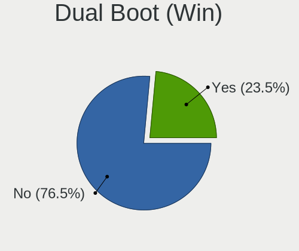

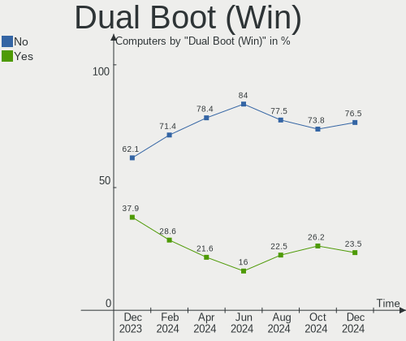

| Dual boot | Computers | Percent |
|-----------|-----------|---------|
| No        | 26        | 76.47%  |
| Yes       | 8         | 23.53%  |

Board
-----

Vendor
------

Motherboard manufacturer

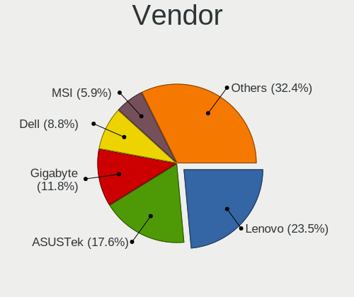

| Name                | Computers | Percent |
|---------------------|-----------|---------|
| Lenovo              | 8         | 23.53%  |
| ASUSTek Computer    | 6         | 17.65%  |
| Gigabyte Technology | 4         | 11.76%  |
| Dell                | 3         | 8.82%   |
| MSI                 | 2         | 5.88%   |
| Hewlett-Packard     | 2         | 5.88%   |
| Apple               | 2         | 5.88%   |
| Samsung Electronics | 1         | 2.94%   |
| GPD                 | 1         | 2.94%   |
| Framework           | 1         | 2.94%   |
| CWWK                | 1         | 2.94%   |
| ASRockRack          | 1         | 2.94%   |
| ASRock              | 1         | 2.94%   |
| Acer                | 1         | 2.94%   |

Model
-----

Motherboard model

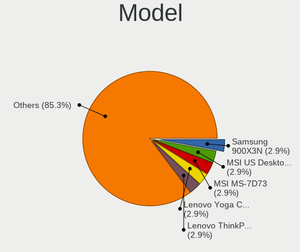

| Name                                       | Computers | Percent |
|--------------------------------------------|-----------|---------|
| Samsung 900X3N                             | 1         | 2.94%   |
| MSI US Desktop Aegis R2                    | 1         | 2.94%   |
| MSI MS-7D73                                | 1         | 2.94%   |
| Lenovo Yoga C740-15IML 81TD                | 1         | 2.94%   |
| Lenovo ThinkPad X230 23252CG               | 1         | 2.94%   |
| Lenovo ThinkPad T14 Gen 5 21ML0076VA       | 1         | 2.94%   |
| Lenovo ThinkBook 14 G6 IRL 21NQ            | 1         | 2.94%   |
| Lenovo Legion 5 Pro 16ARH7H 82RG           | 1         | 2.94%   |
| Lenovo IdeaPad C340-15IIL 81XJ             | 1         | 2.94%   |
| Lenovo IdeaPad 3 14ITL05 81X7              | 1         | 2.94%   |
| Lenovo G570 20079                          | 1         | 2.94%   |
| HP Laptop 15-dy2xxx                        | 1         | 2.94%   |
| HP EliteBook 2560p                         | 1         | 2.94%   |
| GPD G1622-01                               | 1         | 2.94%   |
| Gigabyte Z390 AORUS PRO WIFI               | 1         | 2.94%   |
| Gigabyte TRX50 AERO D                      | 1         | 2.94%   |
| Gigabyte GA-MA790GP-DS4H                   | 1         | 2.94%   |
| Gigabyte B550I AORUS PRO AX                | 1         | 2.94%   |
| Framework Laptop 13 (AMD Ryzen 7040Series) | 1         | 2.94%   |
| Dell Precision 5690                        | 1         | 2.94%   |
| Dell Precision 3591                        | 1         | 2.94%   |
| Dell PowerEdge R720                        | 1         | 2.94%   |
| CWWK CW-MBX-AD12                           | 1         | 2.94%   |
| ASUS ROG Zephyrus G16 GA605WI_GA605WI      | 1         | 2.94%   |
| ASUS ROG STRIX X870-I GAMING WIFI          | 1         | 2.94%   |
| ASUS ROG Flow X16 GV601VI_GV601VI          | 1         | 2.94%   |
| ASUS ASUS Zenbook 14 UX3405MA_UX3405MA     | 1         | 2.94%   |
| ASUS ASUS TUF Gaming A16 FA608WV_FA608WV   | 1         | 2.94%   |
| ASUS All Series                            | 1         | 2.94%   |
| ASRockRack X570D4U                         | 1         | 2.94%   |
| ASRock B550M Steel Legend                  | 1         | 2.94%   |
| Apple MacBookPro11,5                       | 1         | 2.94%   |
| Apple MacBookPro11,3                       | 1         | 2.94%   |
| Acer Aspire 5742Z                          | 1         | 2.94%   |

Model Family
------------

Motherboard model prefix

| Name                     | Computers | Percent |
|--------------------------|-----------|---------|
| ASUS ROG                 | 3         | 8.82%   |
| Lenovo ThinkPad          | 2         | 5.88%   |
| Lenovo IdeaPad           | 2         | 5.88%   |
| Dell Precision           | 2         | 5.88%   |
| ASUS ASUS                | 2         | 5.88%   |
| Apple MacBookPro11       | 2         | 5.88%   |
| Samsung 900X3N           | 1         | 2.94%   |
| MSI US                   | 1         | 2.94%   |
| MSI MS-7D73              | 1         | 2.94%   |
| Lenovo Yoga              | 1         | 2.94%   |
| Lenovo ThinkBook         | 1         | 2.94%   |
| Lenovo Legion            | 1         | 2.94%   |
| Lenovo G570              | 1         | 2.94%   |
| HP Laptop                | 1         | 2.94%   |
| HP EliteBook             | 1         | 2.94%   |
| GPD G1622-01             | 1         | 2.94%   |
| Gigabyte Z390            | 1         | 2.94%   |
| Gigabyte TRX50           | 1         | 2.94%   |
| Gigabyte GA-MA790GP-DS4H | 1         | 2.94%   |
| Gigabyte B550I           | 1         | 2.94%   |
| Framework Laptop         | 1         | 2.94%   |
| Dell PowerEdge           | 1         | 2.94%   |
| CWWK CW-MBX-AD12         | 1         | 2.94%   |
| ASUS All                 | 1         | 2.94%   |
| ASRockRack X570D4U       | 1         | 2.94%   |
| ASRock B550M             | 1         | 2.94%   |
| Acer Aspire              | 1         | 2.94%   |

MFG Year
--------

Motherboard manufacture year

| Year | Computers | Percent |
|------|-----------|---------|
| 2024 | 9         | 26.47%  |
| 2023 | 5         | 14.71%  |
| 2022 | 3         | 8.82%   |
| 2020 | 3         | 8.82%   |
| 2019 | 2         | 5.88%   |
| 2016 | 2         | 5.88%   |
| 2011 | 2         | 5.88%   |
| 2008 | 2         | 5.88%   |
| 2021 | 1         | 2.94%   |
| 2018 | 1         | 2.94%   |
| 2017 | 1         | 2.94%   |
| 2013 | 1         | 2.94%   |
| 2012 | 1         | 2.94%   |
| 2010 | 1         | 2.94%   |

Form Factor
-----------

Physical design of the computer

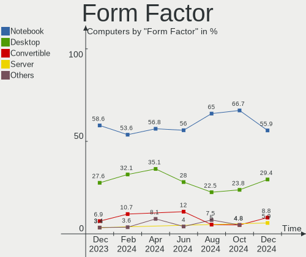

| Name        | Computers | Percent |
|-------------|-----------|---------|
| Notebook    | 19        | 55.88%  |
| Desktop     | 10        | 29.41%  |
| Convertible | 3         | 8.82%   |
| Server      | 2         | 5.88%   |

Secure Boot
-----------

Enabled or disabled

| State    | Computers | Percent |
|----------|-----------|---------|
| Disabled | 34        | 100%    |

Coreboot
--------

Have coreboot on board

| Used | Computers | Percent |
|------|-----------|---------|
| No   | 33        | 97.06%  |
| Yes  | 1         | 2.94%   |

RAM Size
--------

Total RAM memory

| Size in GB  | Computers | Percent |
|-------------|-----------|---------|
| 64.01-256.0 | 11        | 32.35%  |
| 32.01-64.0  | 6         | 17.65%  |
| 16.01-24.0  | 6         | 17.65%  |
| 8.01-16.0   | 5         | 14.71%  |
| 4.01-8.0    | 2         | 5.88%   |
| 3.01-4.0    | 2         | 5.88%   |
| 24.01-32.0  | 2         | 5.88%   |

RAM Used
--------

Used RAM memory

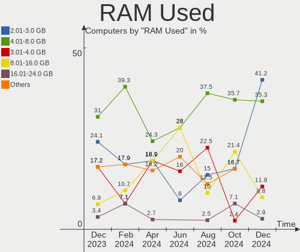

| Used GB    | Computers | Percent |
|------------|-----------|---------|
| 2.01-3.0   | 14        | 41.18%  |
| 4.01-8.0   | 12        | 35.29%  |
| 3.01-4.0   | 4         | 11.76%  |
| 8.01-16.0  | 3         | 8.82%   |
| 16.01-24.0 | 1         | 2.94%   |

Total Drives
------------

Number of drives on board

| Drives | Computers | Percent |
|--------|-----------|---------|
| 1      | 19        | 55.88%  |
| 2      | 11        | 32.35%  |
| 3      | 3         | 8.82%   |
| 5      | 1         | 2.94%   |

Has CD-ROM
----------

Has CD-ROM on board

| Presented | Computers | Percent |
|-----------|-----------|---------|
| No        | 30        | 88.24%  |
| Yes       | 4         | 11.76%  |

Has Ethernet
------------

Has Ethernet on board

| Presented | Computers | Percent |
|-----------|-----------|---------|
| Yes       | 24        | 70.59%  |
| No        | 10        | 29.41%  |

Has WiFi
--------

Has WiFi module

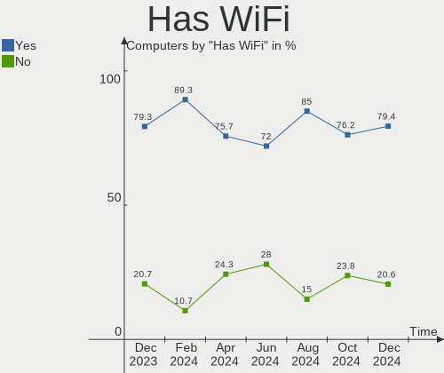

| Presented | Computers | Percent |
|-----------|-----------|---------|
| Yes       | 27        | 79.41%  |
| No        | 7         | 20.59%  |

Has Bluetooth
-------------

Has Bluetooth module

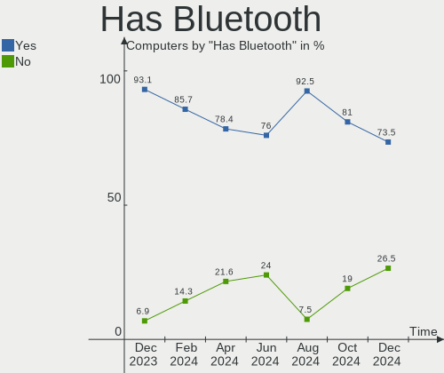

| Presented | Computers | Percent |
|-----------|-----------|---------|
| Yes       | 25        | 73.53%  |
| No        | 9         | 26.47%  |

Location
--------

Country
-------

Geographic location (country)

| Country     | Computers | Percent |
|-------------|-----------|---------|
| USA         | 8         | 23.53%  |
| UK          | 3         | 8.82%   |
| Russia      | 3         | 8.82%   |
| Germany     | 3         | 8.82%   |
| France      | 3         | 8.82%   |
| Czechia     | 2         | 5.88%   |
| Brazil      | 2         | 5.88%   |
| Vietnam     | 1         | 2.94%   |
| Ukraine     | 1         | 2.94%   |
| Sweden      | 1         | 2.94%   |
| Spain       | 1         | 2.94%   |
| Portugal    | 1         | 2.94%   |
| Poland      | 1         | 2.94%   |
| Netherlands | 1         | 2.94%   |
| Israel      | 1         | 2.94%   |
| Canada      | 1         | 2.94%   |
| Belgium     | 1         | 2.94%   |

City
----

Geographic location (city)

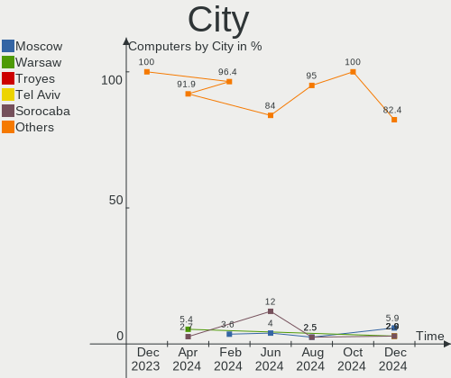

| City          | Computers | Percent |
|---------------|-----------|---------|
| Moscow        | 2         | 5.88%   |
| Warsaw        | 1         | 2.94%   |
| Troyes        | 1         | 2.94%   |
| Tel Aviv      | 1         | 2.94%   |
| Sorocaba      | 1         | 2.94%   |
| Seattle       | 1         | 2.94%   |
| Richmond      | 1         | 2.94%   |
| Rezé         | 1         | 2.94%   |
| Reston        | 1         | 2.94%   |
| Prague        | 1         | 2.94%   |
| Overland Park | 1         | 2.94%   |
| Norfolk       | 1         | 2.94%   |
| Mozhga        | 1         | 2.94%   |
| Meudon        | 1         | 2.94%   |
| Mesa          | 1         | 2.94%   |
| Mannheim      | 1         | 2.94%   |
| Londrina      | 1         | 2.94%   |
| London        | 1         | 2.94%   |
| Lisbon        | 1         | 2.94%   |
| Leigh         | 1         | 2.94%   |
| Langley       | 1         | 2.94%   |
| Jönköping   | 1         | 2.94%   |
| Hanoi         | 1         | 2.94%   |
| Hamme         | 1         | 2.94%   |
| Don Benito    | 1         | 2.94%   |
| Darmstadt     | 1         | 2.94%   |
| Coesfeld      | 1         | 2.94%   |
| Brovary       | 1         | 2.94%   |
| Brno          | 1         | 2.94%   |
| Bedford       | 1         | 2.94%   |
| Austin        | 1         | 2.94%   |
| Amsterdam     | 1         | 2.94%   |
| Aliso Viejo   | 1         | 2.94%   |

Drives
------

Drive Vendor
------------

Hard drive vendors

| Vendor                      | Computers | Drives | Percent |
|-----------------------------|-----------|--------|---------|
| Samsung Electronics         | 14        | 23     | 33.33%  |
| Unknown                     | 6         | 6      | 14.29%  |
| Micron Technology           | 4         | 4      | 9.52%   |
| Seagate                     | 2         | 3      | 4.76%   |
| Apple                       | 2         | 2      | 4.76%   |
| Apacer                      | 2         | 3      | 4.76%   |
| Yangtze Memory Technologies | 1         | 1      | 2.38%   |
| Toshiba                     | 1         | 2      | 2.38%   |
| Team                        | 1         | 1      | 2.38%   |
| Silicon Motion              | 1         | 1      | 2.38%   |
| Realtek                     | 1         | 1      | 2.38%   |
| Lexar                       | 1         | 1      | 2.38%   |
| KIOXIA-EXCERIA              | 1         | 1      | 2.38%   |
| Kingston Technology Company | 1         | 2      | 2.38%   |
| Kingston                    | 1         | 1      | 2.38%   |
| Hitachi                     | 1         | 1      | 2.38%   |
| Crucial                     | 1         | 1      | 2.38%   |
| Unknown                     | 1         | 1      | 2.38%   |

Drive Model
-----------

Hard drive models

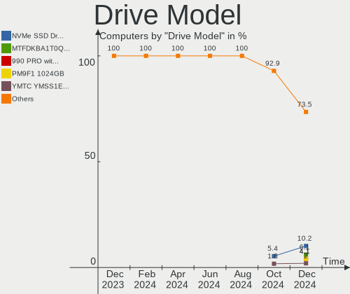

| Model                                                | Computers | Percent |
|------------------------------------------------------|-----------|---------|
| Unknown NVMe SSD Drive 1TB                           | 5         | 10.2%   |
| Micron MTFDKBA1T0QFM-1BD1AABGB 1024GB                | 3         | 6.12%   |
| Samsung SSD 990 PRO with Heatsink 2TB                | 2         | 4.08%   |
| Samsung PM9F1 1024GB                                 | 2         | 4.08%   |
| Yangtze Memory YMTC YMSS1ED02B21MC 128GB             | 1         | 2.04%   |
| Unknown NVMe SSD Drive 500GB                         | 1         | 2.04%   |
| Toshiba RC500 500GB                                  | 1         | 2.04%   |
| Team TM8FP4002T 2TB                                  | 1         | 2.04%   |
| Silicon Motion Q3DT-2TSCSYD-NM2 2TB                  | 1         | 2.04%   |
| Seagate ST4000DM004-2CV104 4TB                       | 1         | 2.04%   |
| Seagate ST31500341AS 1TB                             | 1         | 2.04%   |
| Samsung SSD 990 PRO 4TB S7KGNU0XA05987B              | 1         | 2.04%   |
| Samsung SSD 990 PRO 4TB S7KGNU0X919166A              | 1         | 2.04%   |
| Samsung SSD 990 PRO 4TB                              | 1         | 2.04%   |
| Samsung SSD 980 PRO 1TB                              | 1         | 2.04%   |
| Samsung SSD 980 1TB                                  | 1         | 2.04%   |
| Samsung SSD 970 EVO Plus 1TB                         | 1         | 2.04%   |
| Samsung SSD 970 EVO 500GB S466NX0KA19072X            | 1         | 2.04%   |
| Samsung SSD 960 EVO 500GB                            | 1         | 2.04%   |
| Samsung SSD 870 EVO 500GB                            | 1         | 2.04%   |
| Samsung SSD 860 EVO 250GB                            | 1         | 2.04%   |
| Samsung SSD 860 EVO 1TB                              | 1         | 2.04%   |
| Samsung SSD 840 Series 120GB                         | 1         | 2.04%   |
| Samsung NVMe SSD Controller PM9A1/PM9A3/980PRO 512GB | 1         | 2.04%   |
| Samsung MZVLB1T0HBLR-000L2 1TB                       | 1         | 2.04%   |
| Samsung MZVL2512HDJD-00BL2 512GB                     | 1         | 2.04%   |
| Samsung MZVL21T0HCLR-00BL2 1TB                       | 1         | 2.04%   |
| Samsung MZNTY256HDHP-000 256GB SSD                   | 1         | 2.04%   |
| Realtek RTL9210 NVME 128GB                           | 1         | 2.04%   |
| Micron 2400_MTFDKBA1T0QFM 1TB                        | 1         | 2.04%   |
| Lexar SSD NQ100 480GB                                | 1         | 2.04%   |
| KIOXIA-EXCERIA SSD 500GB                             | 1         | 2.04%   |
| Kingston Company SNV2S1000G 1TB                      | 1         | 2.04%   |
| Kingston SFYRS500G 500GB                             | 1         | 2.04%   |
| Hitachi HTS723232A7A364 320GB                        | 1         | 2.04%   |
| Crucial CT500MX500SSD1 500GB                         | 1         | 2.04%   |
| Apple SSD SM0512G 500GB                              | 1         | 2.04%   |
| Apple SSD SM0512F 500GB                              | 1         | 2.04%   |
| Apacer AS340 120GB SSD                               | 1         | 2.04%   |
| Apacer AS2280Q4 2TB                                  | 1         | 2.04%   |

HDD Vendor
----------

Hard disk drive vendors

| Vendor  | Computers | Drives | Percent |
|---------|-----------|--------|---------|
| Seagate | 2         | 3      | 66.67%  |
| Hitachi | 1         | 1      | 33.33%  |

SSD Vendor
----------

Solid state drive vendors

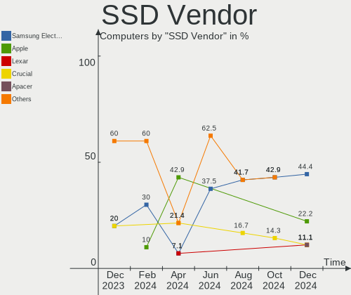

| Vendor              | Computers | Drives | Percent |
|---------------------|-----------|--------|---------|
| Samsung Electronics | 4         | 6      | 44.44%  |
| Apple               | 2         | 2      | 22.22%  |
| Lexar               | 1         | 1      | 11.11%  |
| Crucial             | 1         | 1      | 11.11%  |
| Apacer              | 1         | 1      | 11.11%  |

Drive Kind
----------

HDD or SSD

| Kind | Computers | Drives | Percent |
|------|-----------|--------|---------|
| NVMe | 26        | 40     | 68.42%  |
| SSD  | 9         | 11     | 23.68%  |
| HDD  | 3         | 4      | 7.89%   |

Drive Connector
---------------

SATA, SAS, NVMe, etc.

| Type | Computers | Drives | Percent |
|------|-----------|--------|---------|
| NVMe | 26        | 39     | 66.67%  |
| SATA | 12        | 15     | 30.77%  |
| SAS  | 1         | 1      | 2.56%   |

Drive Size
----------

Size of hard drive

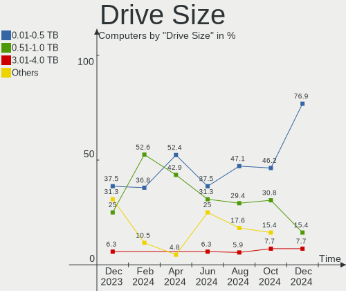

| Size in TB | Computers | Drives | Percent |
|------------|-----------|--------|---------|
| 0.01-0.5   | 10        | 10     | 76.92%  |
| 0.51-1.0   | 2         | 4      | 15.38%  |
| 3.01-4.0   | 1         | 1      | 7.69%   |

Space Total
-----------

Amount of disk space available on the file system

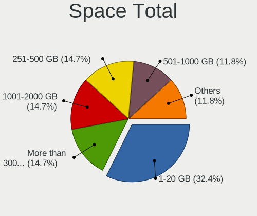

| Size in GB     | Computers | Percent |
|----------------|-----------|---------|
| 1-20           | 11        | 32.35%  |
| More than 3000 | 5         | 14.71%  |
| 251-500        | 5         | 14.71%  |
| 1001-2000      | 5         | 14.71%  |
| 501-1000       | 4         | 11.76%  |
| 101-250        | 3         | 8.82%   |
| Unknown        | 1         | 2.94%   |

Space Used
----------

Amount of used disk space

| Used GB        | Computers | Percent |
|----------------|-----------|---------|
| 1-20           | 12        | 35.29%  |
| 101-250        | 7         | 20.59%  |
| 51-100         | 5         | 14.71%  |
| 251-500        | 3         | 8.82%   |
| 21-50          | 2         | 5.88%   |
| 501-1000       | 2         | 5.88%   |
| More than 3000 | 1         | 2.94%   |
| 2001-3000      | 1         | 2.94%   |
| Unknown        | 1         | 2.94%   |

Malfunc. Drives
---------------

Drive models with a malfunction

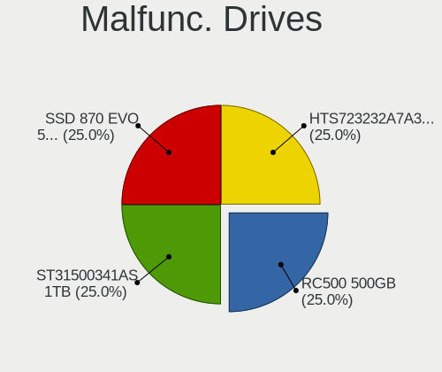

| Model                                 | Computers | Drives | Percent |
|---------------------------------------|-----------|--------|---------|
| Toshiba RC500 500GB                   | 1         | 2      | 25%     |
| Seagate ST31500341AS 1TB              | 1         | 2      | 25%     |
| Samsung Electronics SSD 870 EVO 500GB | 1         | 1      | 25%     |
| Hitachi HTS723232A7A364 320GB         | 1         | 1      | 25%     |

Malfunc. Drive Vendor
---------------------

Vendors of faulty drives

| Vendor              | Computers | Drives | Percent |
|---------------------|-----------|--------|---------|
| Toshiba             | 1         | 2      | 25%     |
| Seagate             | 1         | 2      | 25%     |
| Samsung Electronics | 1         | 1      | 25%     |
| Hitachi             | 1         | 1      | 25%     |

Malfunc. HDD Vendor
-------------------

Vendors of faulty HDD drives

| Vendor  | Computers | Drives | Percent |
|---------|-----------|--------|---------|
| Seagate | 1         | 2      | 50%     |
| Hitachi | 1         | 1      | 50%     |

Malfunc. Drive Kind
-------------------

Kinds of faulty drives

| Kind | Computers | Drives | Percent |
|------|-----------|--------|---------|
| HDD  | 2         | 3      | 50%     |
| NVMe | 1         | 2      | 25%     |
| SSD  | 1         | 1      | 25%     |

Failed Drives
-------------

Failed drive models

Zero info for selected period =(

Failed Drive Vendor
-------------------

Failed drive vendors

Zero info for selected period =(

Drive Status
------------

Number of failed and malfunc. drives

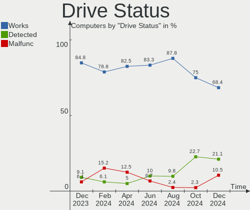

| Status   | Computers | Drives | Percent |
|----------|-----------|--------|---------|
| Works    | 26        | 41     | 68.42%  |
| Detected | 8         | 8      | 21.05%  |
| Malfunc  | 4         | 6      | 10.53%  |

Storage controller
------------------

Storage Vendor
--------------

Storage controller vendors

| Vendor                      | Computers | Percent |
|-----------------------------|-----------|---------|
| Intel                       | 17        | 29.82%  |
| Samsung Electronics         | 13        | 22.81%  |
| AMD                         | 7         | 12.28%  |
| Sandisk                     | 6         | 10.53%  |
| Micron Technology           | 4         | 7.02%   |
| KIOXIA                      | 2         | 3.51%   |
| Kingston Technology Company | 2         | 3.51%   |
| Yangtze Memory Technologies | 1         | 1.75%   |
| Solidigm                    | 1         | 1.75%   |
| Silicon Motion              | 1         | 1.75%   |
| Realtek Semiconductor       | 1         | 1.75%   |
| MAXIO Technology (Hangzhou) | 1         | 1.75%   |
| LSI Logic / Symbios Logic   | 1         | 1.75%   |

Storage Model
-------------

Storage controller models

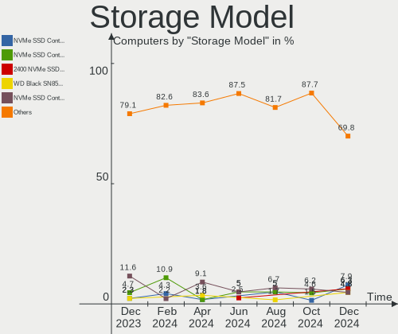

| Model                                                                                  | Computers | Percent |
|----------------------------------------------------------------------------------------|-----------|---------|
| Samsung NVMe SSD Controller S4LV008[Pascal]                                            | 5         | 7.94%   |
| Samsung NVMe SSD Controller PM9A1/PM9A3/980PRO                                         | 4         | 6.35%   |
| Micron 2400 NVMe SSD (DRAM-less)                                                       | 4         | 6.35%   |
| Sandisk WD Black SN850X NVMe SSD                                                       | 3         | 4.76%   |
| Samsung NVMe SSD Controller SM981/PM981/PM983                                          | 3         | 4.76%   |
| Intel Volume Management Device NVMe RAID Controller Intel Corporation                  | 3         | 4.76%   |
| AMD 600 Series Chipset SATA Controller                                                 | 3         | 4.76%   |
| SanDisk WD Black SN770 / PC SN740 256GB / PC SN560 (DRAM-less) NVMe SSD                | 2         | 3.17%   |
| KIOXIA NVMe SSD                                                                        | 2         | 3.17%   |
| Intel Volume Management Device NVMe RAID Controller                                    | 2         | 3.17%   |
| AMD 500 Series Chipset SATA Controller                                                 | 2         | 3.17%   |
| Yangtze Memory PC210 NVMe SSD                                                          | 1         | 1.59%   |
| Solidigm P44 Pro NVMe SSD [Hollywood Beach]                                            | 1         | 1.59%   |
| Silicon Motion SM2262/SM2262EN SSD Controller                                          | 1         | 1.59%   |
| SanDisk WD PC SN540 / Green SN350 NVMe SSD 1 TB (DRAM-less)                            | 1         | 1.59%   |
| Samsung S4LN058A01[SSUBX] AHCI SSD Controller (Apple slot)                             | 1         | 1.59%   |
| Samsung S4LN053X01 AHCI SSD Controller(Apple slot)                                     | 1         | 1.59%   |
| Samsung NVMe SSD Controller SM961/PM961/SM963                                          | 1         | 1.59%   |
| Samsung NVMe SSD Controller 980 (DRAM-less)                                            | 1         | 1.59%   |
| Realtek RTS5762 NVMe SSD Controller                                                    | 1         | 1.59%   |
| MAXIO (Hangzhou) NVMe SSD Controller MAP1602 (DRAM-less)                               | 1         | 1.59%   |
| LSI Logic / Symbios Logic MegaRAID SAS 2208 [Thunderbolt]                              | 1         | 1.59%   |
| Kingston Company NV2 NVMe SSD [E21T] (DRAM-less)                                       | 1         | 1.59%   |
| Kingston Company KC3000/FURY Renegade NVMe SSD [E18]                                   | 1         | 1.59%   |
| Intel Tiger Lake-LP SATA Controller                                                    | 1         | 1.59%   |
| Intel Sunrise Point-LP SATA Controller [AHCI mode]                                     | 1         | 1.59%   |
| Intel Raptor Lake SATA AHCI Controller                                                 | 1         | 1.59%   |
| Intel Ice Lake-LP SATA Controller [AHCI mode]                                          | 1         | 1.59%   |
| Intel Comet Lake SATA AHCI Controller                                                  | 1         | 1.59%   |
| Intel Cannon Lake PCH SATA AHCI Controller                                             | 1         | 1.59%   |
| Intel C610/X99 series chipset 6-Port SATA Controller [AHCI mode]                       | 1         | 1.59%   |
| Intel C600/X79 series chipset 6-Port SATA AHCI Controller                              | 1         | 1.59%   |
| Intel Alder Lake-P SATA AHCI Controller                                                | 1         | 1.59%   |
| Intel 7 Series Chipset Family 6-port SATA Controller [AHCI mode]                       | 1         | 1.59%   |
| Intel 6 Series/C200 Series Chipset Family Mobile SATA Controller (IDE mode, ports 4-5) | 1         | 1.59%   |
| Intel 6 Series/C200 Series Chipset Family Mobile SATA Controller (IDE mode, ports 0-3) | 1         | 1.59%   |
| Intel 6 Series/C200 Series Chipset Family 6 port Mobile SATA AHCI Controller           | 1         | 1.59%   |
| Intel 5 Series/3400 Series Chipset 4 port SATA AHCI Controller                         | 1         | 1.59%   |
| AMD SB7x0/SB8x0/SB9x0 SATA Controller [AHCI mode]                                      | 1         | 1.59%   |
| AMD SB7x0/SB8x0/SB9x0 IDE Controller                                                   | 1         | 1.59%   |

Storage Kind
------------

Kind of storage controller (IDE, SATA, NVMe, SAS, ...)

| Kind | Computers | Percent |
|------|-----------|---------|
| NVMe | 26        | 47.27%  |
| SATA | 21        | 38.18%  |
| RAID | 6         | 10.91%  |
| IDE  | 2         | 3.64%   |

Processor
---------

CPU Vendor
----------

Processor vendors

| Vendor | Computers | Percent |
|--------|-----------|---------|
| Intel  | 22        | 64.71%  |
| AMD    | 12        | 35.29%  |

CPU Model
---------

Processor models

| Model                                      | Computers | Percent |
|--------------------------------------------|-----------|---------|
| AMD Ryzen AI 9 HX 370 w/ Radeon 890M       | 3         | 8.82%   |
| Intel Core Ultra 9 185H                    | 2         | 5.88%   |
| Intel 11th Gen Core i3-1115G4 @ 3.00GHz    | 2         | 5.88%   |
| Intel Xeon CPU E5-2696 v4 @ 2.20GHz        | 1         | 2.94%   |
| Intel Xeon CPU E5-2650L 0 @ 1.80GHz        | 1         | 2.94%   |
| Intel Pentium CPU P6100 @ 2.00GHz          | 1         | 2.94%   |
| Intel Core Ultra 7 155H                    | 1         | 2.94%   |
| Intel Core Ultra 5 125U                    | 1         | 2.94%   |
| Intel Core i9-14900F                       | 1         | 2.94%   |
| Intel Core i7-7500U CPU @ 2.70GHz          | 1         | 2.94%   |
| Intel Core i7-4870HQ CPU @ 2.50GHz         | 1         | 2.94%   |
| Intel Core i7-4850HQ CPU @ 2.30GHz         | 1         | 2.94%   |
| Intel Core i7-10510U CPU @ 1.80GHz         | 1         | 2.94%   |
| Intel Core i5-9600KF CPU @ 3.70GHz         | 1         | 2.94%   |
| Intel Core i5-3320M CPU @ 2.60GHz          | 1         | 2.94%   |
| Intel Core i5-2520M CPU @ 2.50GHz          | 1         | 2.94%   |
| Intel Core i5-2410M CPU @ 2.30GHz          | 1         | 2.94%   |
| Intel Core i5-1035G1 CPU @ 1.00GHz         | 1         | 2.94%   |
| Intel 13th Gen Core i9-13900H              | 1         | 2.94%   |
| Intel 13th Gen Core i7-13700H              | 1         | 2.94%   |
| Intel 12th Gen Core i7-1265U               | 1         | 2.94%   |
| AMD Ryzen Threadripper 7960X 24-Cores      | 1         | 2.94%   |
| AMD Ryzen 9 7950X3D 16-Core Processor      | 1         | 2.94%   |
| AMD Ryzen 9 5900X 12-Core Processor        | 1         | 2.94%   |
| AMD Ryzen 9 3900X 12-Core Processor        | 1         | 2.94%   |
| AMD Ryzen 7 7840U w/ Radeon 780M Graphics  | 1         | 2.94%   |
| AMD Ryzen 5 8600G w/ Radeon 760M Graphics  | 1         | 2.94%   |
| AMD Ryzen 5 6600H with Radeon Graphics     | 1         | 2.94%   |
| AMD Ryzen 5 5600G with Radeon Graphics     | 1         | 2.94%   |
| AMD Athlon 64 X2 Dual Core Processor 5000+ | 1         | 2.94%   |

CPU Model Family
----------------

Processor model prefix

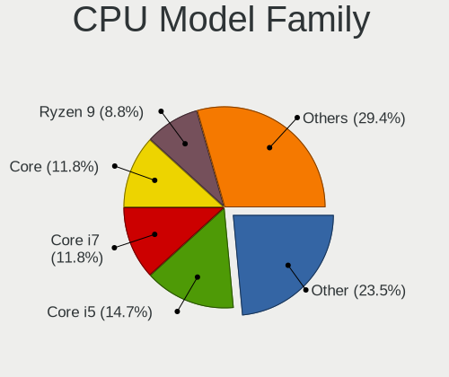

| Model                  | Computers | Percent |
|------------------------|-----------|---------|
| Other                  | 8         | 23.53%  |
| Intel Core i5          | 5         | 14.71%  |
| Intel Core i7          | 4         | 11.76%  |
| Intel Core             | 4         | 11.76%  |
| AMD Ryzen 9            | 3         | 8.82%   |
| AMD Ryzen 5            | 3         | 8.82%   |
| Intel Xeon             | 2         | 5.88%   |
| Intel Pentium          | 1         | 2.94%   |
| Intel Core i9          | 1         | 2.94%   |
| AMD Ryzen Threadripper | 1         | 2.94%   |
| AMD Ryzen 7            | 1         | 2.94%   |
| AMD Athlon 64 X2       | 1         | 2.94%   |

CPU Cores
---------

Number of processor cores

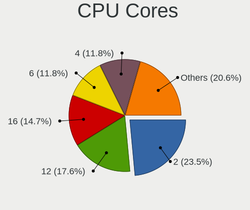

| Number | Computers | Percent |
|--------|-----------|---------|
| 2      | 8         | 23.53%  |
| 12     | 6         | 17.65%  |
| 16     | 5         | 14.71%  |
| 6      | 4         | 11.76%  |
| 4      | 4         | 11.76%  |
| 24     | 2         | 5.88%   |
| 14     | 2         | 5.88%   |
| 22     | 1         | 2.94%   |
| 10     | 1         | 2.94%   |
| 8      | 1         | 2.94%   |

CPU Sockets
-----------

Number of sockets

| Number | Computers | Percent |
|--------|-----------|---------|
| 1      | 33        | 97.06%  |
| 2      | 1         | 2.94%   |

CPU Threads
-----------

Threads per core (Hyper-Threading)

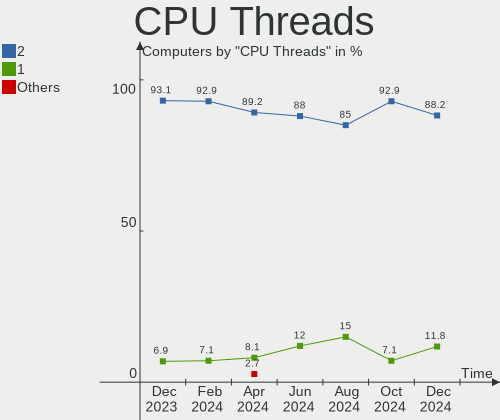

| Number | Computers | Percent |
|--------|-----------|---------|
| 2      | 30        | 88.24%  |
| 1      | 4         | 11.76%  |

CPU Op-Modes
------------

CPU Operation Modes (32-bit, 64-bit)

| Op mode        | Computers | Percent |
|----------------|-----------|---------|
| 32-bit, 64-bit | 34        | 100%    |

CPU Microcode
-------------

Microcode number

| Number     | Computers | Percent |
|------------|-----------|---------|
| Unknown    | 27        | 79.41%  |
| 0xb06a2    | 1         | 2.94%   |
| 0x0b204018 | 1         | 2.94%   |
| 0x0a705206 | 1         | 2.94%   |
| 0x0a704107 | 1         | 2.94%   |
| 0x0a50000d | 1         | 2.94%   |
| 0x0a404105 | 1         | 2.94%   |
| 0x0a108105 | 1         | 2.94%   |

CPU Microarch
-------------

Microarchitecture

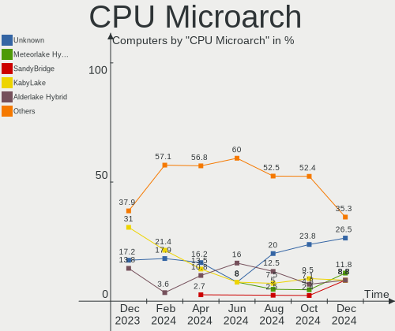

| Name              | Computers | Percent |
|-------------------|-----------|---------|
| Unknown           | 9         | 26.47%  |
| Meteorlake Hybrid | 4         | 11.76%  |
| SandyBridge       | 3         | 8.82%   |
| KabyLake          | 3         | 8.82%   |
| Alderlake Hybrid  | 3         | 8.82%   |
| Zen 3             | 2         | 5.88%   |
| TigerLake         | 2         | 5.88%   |
| Haswell           | 2         | 5.88%   |
| Zen 2             | 1         | 2.94%   |
| Westmere          | 1         | 2.94%   |
| K8 Hammer         | 1         | 2.94%   |
| IvyBridge         | 1         | 2.94%   |
| IceLake           | 1         | 2.94%   |
| Broadwell         | 1         | 2.94%   |

Graphics
--------

GPU Vendor
----------

Vendors of graphics cards

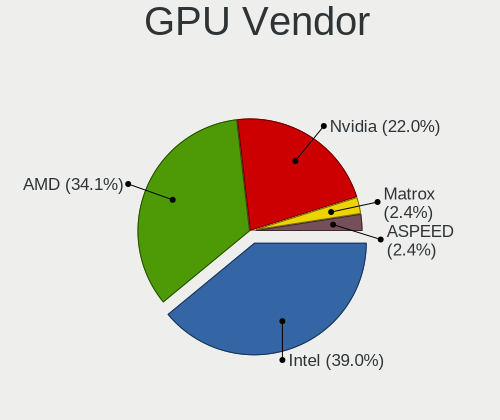

| Vendor                     | Computers | Percent |
|----------------------------|-----------|---------|
| Intel                      | 16        | 39.02%  |
| AMD                        | 14        | 34.15%  |
| Nvidia                     | 9         | 21.95%  |
| Matrox Electronics Systems | 1         | 2.44%   |
| ASPEED Technology          | 1         | 2.44%   |

GPU Model
---------

Graphics card models

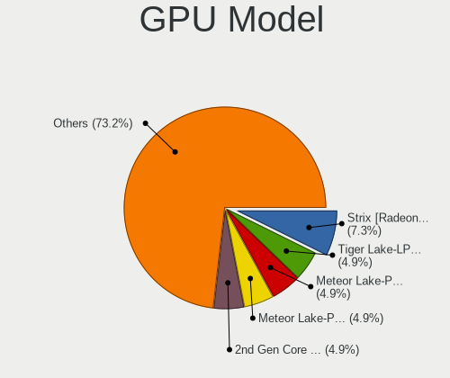

| Model                                                                     | Computers | Percent |
|---------------------------------------------------------------------------|-----------|---------|
| AMD Strix [Radeon 880M / 890M]                                            | 3         | 7.32%   |
| Intel Tiger Lake-LP GT2 [UHD Graphics G4]                                 | 2         | 4.88%   |
| Intel Meteor Lake-P [Intel Graphics]                                      | 2         | 4.88%   |
| Intel Meteor Lake-P [Intel Arc Graphics]                                  | 2         | 4.88%   |
| Intel 2nd Generation Core Processor Family Integrated Graphics Controller | 2         | 4.88%   |
| AMD Phoenix1                                                              | 2         | 4.88%   |
| Nvidia GT218 [GeForce 210]                                                | 1         | 2.44%   |
| Nvidia GP107 [GeForce GTX 1050 Ti]                                        | 1         | 2.44%   |
| Nvidia GK107M [GeForce GT 750M Mac Edition]                               | 1         | 2.44%   |
| Nvidia GA106M [GeForce RTX 3060 Mobile / Max-Q]                           | 1         | 2.44%   |
| Nvidia AD107M [GeForce RTX 4060 Max-Q / Mobile]                           | 1         | 2.44%   |
| Nvidia AD107GLM [RTX 500 Ada Generation Laptop GPU]                       | 1         | 2.44%   |
| Nvidia AD106M [GeForce RTX 4070 Max-Q / Mobile]                           | 1         | 2.44%   |
| Nvidia AD104 [GeForce RTX 4070]                                           | 1         | 2.44%   |
| Nvidia AD104 [GeForce RTX 4070 SUPER]                                     | 1         | 2.44%   |
| Matrox Electronics Systems G200eR2                                        | 1         | 2.44%   |
| Intel Raptor Lake-P [UHD Graphics]                                        | 1         | 2.44%   |
| Intel Raptor Lake-P [Iris Xe Graphics]                                    | 1         | 2.44%   |
| Intel Iris Plus Graphics G1 (Ice Lake)                                    | 1         | 2.44%   |
| Intel HD Graphics 620                                                     | 1         | 2.44%   |
| Intel Core Processor Integrated Graphics Controller                       | 1         | 2.44%   |
| Intel CometLake-U GT2 [UHD Graphics]                                      | 1         | 2.44%   |
| Intel Alder Lake-UP3 GT2 [Iris Xe Graphics]                               | 1         | 2.44%   |
| Intel 3rd Gen Core processor Graphics Controller                          | 1         | 2.44%   |
| ASPEED Technology ASPEED Graphics Family                                  | 1         | 2.44%   |
| AMD Venus XT [Radeon HD 8870M / R9 M270X/M370X]                           | 1         | 2.44%   |
| AMD Rembrandt [Radeon 680M]                                               | 1         | 2.44%   |
| AMD Raphael                                                               | 1         | 2.44%   |
| AMD Navi 32 [Radeon RX 7700 XT / 7800 XT]                                 | 1         | 2.44%   |
| AMD Navi 31 [Radeon RX 7900 XT/7900 XTX/7900 GRE/7900M]                   | 1         | 2.44%   |
| AMD Navi 22 [Radeon RX 6700/6700 XT/6750 XT / 6800M/6850M XT]             | 1         | 2.44%   |
| AMD Navi 21 [Radeon RX 6800/6800 XT / 6900 XT]                            | 1         | 2.44%   |
| AMD Cezanne [Radeon Vega Series / Radeon Vega Mobile Series]              | 1         | 2.44%   |
| AMD Cedar [Radeon HD 5000/6000/7350/8350 Series]                          | 1         | 2.44%   |

GPU Combo
---------

Combinations of graphics cards

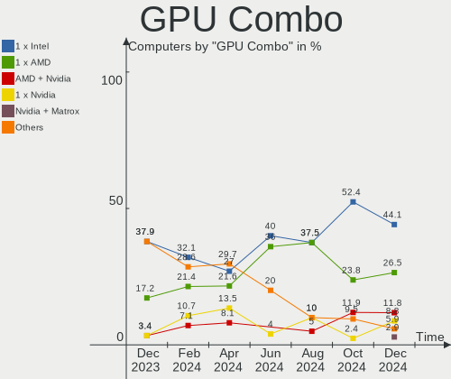

| Name            | Computers | Percent |
|-----------------|-----------|---------|
| 1 x Intel       | 15        | 44.12%  |
| 1 x AMD         | 9         | 26.47%  |
| AMD + Nvidia    | 4         | 11.76%  |
| 1 x Nvidia      | 3         | 8.82%   |
| Nvidia + Matrox | 1         | 2.94%   |
| Intel + Nvidia  | 1         | 2.94%   |
| AMD + ASPEED    | 1         | 2.94%   |

GPU Driver
----------

Free vs proprietary

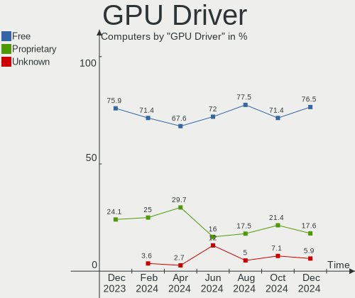

| Driver      | Computers | Percent |
|-------------|-----------|---------|
| Free        | 26        | 76.47%  |
| Proprietary | 6         | 17.65%  |
| Unknown     | 2         | 5.88%   |

GPU Memory
----------

Total video memory

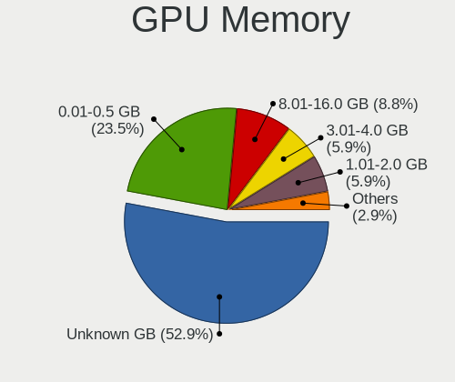

| Size in GB | Computers | Percent |
|------------|-----------|---------|
| Unknown    | 18        | 52.94%  |
| 0.01-0.5   | 8         | 23.53%  |
| 8.01-16.0  | 3         | 8.82%   |
| 3.01-4.0   | 2         | 5.88%   |
| 1.01-2.0   | 2         | 5.88%   |
| 16.01-24.0 | 1         | 2.94%   |

Monitor
-------

Monitor Vendor
--------------

Monitor vendors

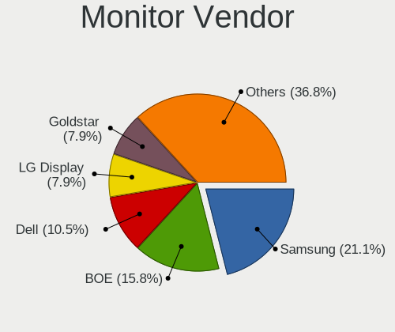

| Vendor               | Computers | Percent |
|----------------------|-----------|---------|
| Samsung Electronics  | 8         | 21.05%  |
| BOE                  | 6         | 15.79%  |
| Dell                 | 4         | 10.53%  |
| LG Display           | 3         | 7.89%   |
| Goldstar             | 3         | 7.89%   |
| AU Optronics         | 3         | 7.89%   |
| Chimei Innolux       | 2         | 5.26%   |
| Apple                | 2         | 5.26%   |
| Ancor Communications | 2         | 5.26%   |
| Lenovo               | 1         | 2.63%   |
| Hewlett-Packard      | 1         | 2.63%   |
| Gigabyte Technology  | 1         | 2.63%   |
| BenQ                 | 1         | 2.63%   |
| Acer                 | 1         | 2.63%   |

Monitor Model
-------------

Monitor models

| Model                                                                  | Computers | Percent |
|------------------------------------------------------------------------|-----------|---------|
| Samsung Electronics S23B550 SAM0918 1920x1080 510x287mm 23.0-inch      | 1         | 2.56%   |
| Samsung Electronics LU28R55 SAM1015 3840x2160 632x360mm 28.6-inch      | 1         | 2.56%   |
| Samsung Electronics LCD Monitor SEC4149 1366x768 292x174mm 13.4-inch   | 1         | 2.56%   |
| Samsung Electronics LCD Monitor SDC419D 2880x1800 302x189mm 14.0-inch  | 1         | 2.56%   |
| Samsung Electronics LCD Monitor SDC4166 2880x1800 289x186mm 13.5-inch  | 1         | 2.56%   |
| Samsung Electronics LC27G7xT SAM105C 2560x1440 597x336mm 27.0-inch     | 1         | 2.56%   |
| Samsung Electronics C32JG5x SAM0F54 2560x1440 697x392mm 31.5-inch      | 1         | 2.56%   |
| Samsung Electronics ATNA60DL04-0  SDC41AE                              | 1         | 2.56%   |
| LG Display LCD Monitor LGD06CF 1920x1080 344x194mm 15.5-inch           | 1         | 2.56%   |
| LG Display LCD Monitor LGD0630 1920x1080 344x194mm 15.5-inch           | 1         | 2.56%   |
| LG Display LCD Monitor LGD03A3 1366x768 277x156mm 12.5-inch            | 1         | 2.56%   |
| Lenovo LCD Monitor LEN40B0 1366x768 345x194mm 15.6-inch                | 1         | 2.56%   |
| Hewlett-Packard P24h G4 HPN3661 1920x1080 527x296mm 23.8-inch          | 1         | 2.56%   |
| Goldstar ULTRAWIDE GSM59F1 2560x1080 677x290mm 29.0-inch               | 1         | 2.56%   |
| Goldstar HDR QHD GSM771B 2560x1440 697x392mm 31.5-inch                 | 1         | 2.56%   |
| Goldstar FHD GSM5C64 1920x1080 530x300mm 24.0-inch                     | 1         | 2.56%   |
| Goldstar BK750Y GSM5B3D 1920x1080 480x270mm 21.7-inch                  | 1         | 2.56%   |
| Gigabyte Technology M32QC GBT3205 2560x1440 697x392mm 31.5-inch        | 1         | 2.56%   |
| Dell U2515H DELD072 2560x1440 553x311mm 25.0-inch                      | 1         | 2.56%   |
| Dell U2415 DELA0BA 1920x1200 518x324mm 24.1-inch                       | 1         | 2.56%   |
| Dell U2412M DELA07B 1920x1200 518x324mm 24.1-inch                      | 1         | 2.56%   |
| Dell P190S DEL405B 1280x1024 376x301mm 19.0-inch                       | 1         | 2.56%   |
| Chimei Innolux LCD Monitor CMN15E7 1920x1080 344x193mm 15.5-inch       | 1         | 2.56%   |
| Chimei Innolux LCD Monitor CMN153B 1920x1080 344x193mm 15.5-inch       | 1         | 2.56%   |
| BOE NE160QDM-NYJ BOE0C80 2560x1600 344x215mm 16.0-inch                 | 1         | 2.56%   |
| BOE NE160QDM-NM4 BOE0B74 2560x1600 345x215mm 16.0-inch                 | 1         | 2.56%   |
| BOE LCD Monitor BOE0BCA 2256x1504 285x190mm 13.5-inch                  | 1         | 2.56%   |
| BOE LCD Monitor BOE0A9B 2560x1600 344x215mm 16.0-inch                  | 1         | 2.56%   |
| BOE LCD Monitor BOE08F2 1920x1080 310x174mm 14.0-inch                  | 1         | 2.56%   |
| BOE LCD Monitor BOE06E1 1920x1080 294x165mm 13.3-inch                  | 1         | 2.56%   |
| BenQ RD280U BNQ805B 3840x2560 597x397mm 28.2-inch                      | 1         | 2.56%   |
| AU Optronics LCD Monitor AUOA195 2240x1400 300x188mm 13.9-inch         | 1         | 2.56%   |
| AU Optronics LCD Monitor AUO22EC 1366x768 344x193mm 15.5-inch          | 1         | 2.56%   |
| AU Optronics LCD Monitor AUO20A7 1920x1200 301x188mm 14.0-inch         | 1         | 2.56%   |
| Apple Color LCD APPA02E 2880x1800 331x207mm 15.4-inch                  | 1         | 2.56%   |
| Apple Color LCD APPA022 2880x1800 331x207mm 15.4-inch                  | 1         | 2.56%   |
| Ancor Communications VS278 ACI27A1 1920x1080 598x336mm 27.0-inch       | 1         | 2.56%   |
| Ancor Communications ASUS PB287Q ACI28A3 3840x2160 621x341mm 27.9-inch | 1         | 2.56%   |
| Acer XR341CK ACR044F 3440x1440 819x363mm 35.3-inch                     | 1         | 2.56%   |

Monitor Resolution
------------------

Monitor screen resolution

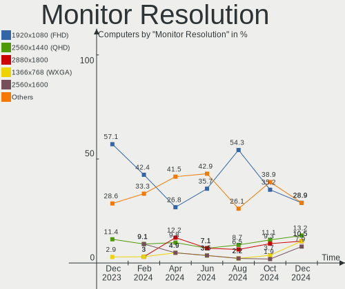

| Resolution        | Computers | Percent |
|-------------------|-----------|---------|
| 1920x1080 (FHD)   | 11        | 28.95%  |
| 2560x1440 (QHD)   | 5         | 13.16%  |
| 2880x1800         | 4         | 10.53%  |
| 1366x768 (WXGA)   | 4         | 10.53%  |
| 2560x1600         | 3         | 7.89%   |
| 3840x2160 (4K)    | 2         | 5.26%   |
| 1920x1200 (WUXGA) | 2         | 5.26%   |
| 3840x2560         | 1         | 2.63%   |
| 3440x1440         | 1         | 2.63%   |
| 2560x1080         | 1         | 2.63%   |
| 2256x1504         | 1         | 2.63%   |
| 2240x1400         | 1         | 2.63%   |
| 1280x1024 (SXGA)  | 1         | 2.63%   |
| Unknown           | 1         | 2.63%   |

Monitor Diagonal
----------------

Diagonal size in inches

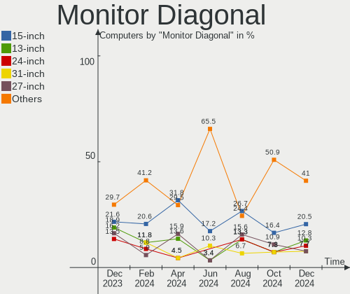

| Inches  | Computers | Percent |
|---------|-----------|---------|
| 15      | 8         | 20.51%  |
| 13      | 5         | 12.82%  |
| 24      | 4         | 10.26%  |
| 31      | 3         | 7.69%   |
| 27      | 3         | 7.69%   |
| 16      | 3         | 7.69%   |
| 14      | 3         | 7.69%   |
| 28      | 2         | 5.13%   |
| 35      | 1         | 2.56%   |
| 34      | 1         | 2.56%   |
| 25      | 1         | 2.56%   |
| 23      | 1         | 2.56%   |
| 21      | 1         | 2.56%   |
| 19      | 1         | 2.56%   |
| 12      | 1         | 2.56%   |
| Unknown | 1         | 2.56%   |

Monitor Width
-------------

Physical width

| Width in mm | Computers | Percent |
|-------------|-----------|---------|
| 301-350     | 14        | 36.84%  |
| 501-600     | 9         | 23.68%  |
| 201-300     | 6         | 15.79%  |
| 601-700     | 4         | 10.53%  |
| 801-900     | 1         | 2.63%   |
| 701-800     | 1         | 2.63%   |
| 401-500     | 1         | 2.63%   |
| 351-400     | 1         | 2.63%   |
| Unknown     | 1         | 2.63%   |

Aspect Ratio
------------

Proportional relationship between the width and the height

| Ratio   | Computers | Percent |
|---------|-----------|---------|
| 16/9    | 18        | 51.43%  |
| 16/10   | 11        | 31.43%  |
| 3/2     | 2         | 5.71%   |
| 21/9    | 2         | 5.71%   |
| 5/4     | 1         | 2.86%   |
| Unknown | 1         | 2.86%   |

Monitor Area
------------

Area in inch²

| Area in inch² | Computers | Percent |
|----------------|-----------|---------|
| 101-110        | 8         | 21.62%  |
| 81-90          | 6         | 16.22%  |
| 351-500        | 5         | 13.51%  |
| 201-250        | 4         | 10.81%  |
| 301-350        | 3         | 8.11%   |
| 251-300        | 3         | 8.11%   |
| 111-120        | 3         | 8.11%   |
| 71-80          | 2         | 5.41%   |
| 61-70          | 1         | 2.7%    |
| 151-200        | 1         | 2.7%    |
| Unknown        | 1         | 2.7%    |

Pixel Density
-------------

Pixels per inch

| Density       | Computers | Percent |
|---------------|-----------|---------|
| 161-240       | 10        | 27.03%  |
| 51-100        | 10        | 27.03%  |
| 121-160       | 8         | 21.62%  |
| 101-120       | 6         | 16.22%  |
| More than 240 | 2         | 5.41%   |
| Unknown       | 1         | 2.7%    |

Multiple Monitors
-----------------

Total monitors connected

| Total | Computers | Percent |
|-------|-----------|---------|
| 1     | 22        | 64.71%  |
| 2     | 7         | 20.59%  |
| 0     | 4         | 11.76%  |
| 4     | 1         | 2.94%   |

Network
-------

Net Controller Vendor
---------------------

Controller vendors

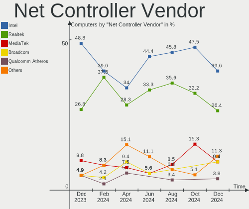

| Vendor                            | Computers | Percent |
|-----------------------------------|-----------|---------|
| Intel                             | 21        | 39.62%  |
| Realtek Semiconductor             | 14        | 26.42%  |
| MediaTek                          | 5         | 9.43%   |
| Broadcom                          | 5         | 9.43%   |
| Qualcomm Atheros                  | 2         | 3.77%   |
| Qualcomm Technologies             | 1         | 1.89%   |
| Ericsson Business Mobile Networks | 1         | 1.89%   |
| Dell                              | 1         | 1.89%   |
| Chelsio Communications            | 1         | 1.89%   |
| Aquantia                          | 1         | 1.89%   |
| American Megatrends               | 1         | 1.89%   |

Net Controller Model
--------------------

Controller models

| Model                                                                  | Computers | Percent |
|------------------------------------------------------------------------|-----------|---------|
| Realtek RTL8125 2.5GbE Controller                                      | 7         | 11.11%  |
| Realtek RTL8153 Gigabit Ethernet Adapter                               | 3         | 4.76%   |
| Realtek RTL8111/8168/8211/8411 PCI Express Gigabit Ethernet Controller | 3         | 4.76%   |
| MediaTek MT7922 802.11ax PCI Express Wireless Network Adapter          | 3         | 4.76%   |
| Intel Meteor Lake PCH CNVi WiFi                                        | 3         | 4.76%   |
| Qualcomm Atheros AR9285 Wireless Network Adapter (PCI-Express)         | 2         | 3.17%   |
| MediaTek Network controller                                            | 2         | 3.17%   |
| Intel Raptor Lake PCH CNVi WiFi                                        | 2         | 3.17%   |
| Intel Ethernet Controller I226-V                                       | 2         | 3.17%   |
| Intel Centrino Advanced-N 6205 [Taylor Peak]                           | 2         | 3.17%   |
| Broadcom BCM4360 802.11ac Dual Band Wireless Network Adapter           | 2         | 3.17%   |
| Realtek RTL8852CE PCIe 802.11ax Wireless Network Controller            | 1         | 1.59%   |
| Realtek RTL8821CE 802.11ac PCIe Wireless Network Adapter               | 1         | 1.59%   |
| Qualcomm WCN785x Wi-Fi 7(802.11be) 320MHz 2x2 [FastConnect 7800]       | 1         | 1.59%   |
| Qualcomm Atheros AR8152 v2.0 Fast Ethernet                             | 1         | 1.59%   |
| Intel Wireless 8265 / 8275                                             | 1         | 1.59%   |
| Intel Wi-Fi 7(802.11be) AX1775*/AX1790*/BE20*/BE401/BE1750* 2x2        | 1         | 1.59%   |
| Intel Wi-Fi 6E(802.11ax) AX210/AX1675* 2x2 [Typhoon Peak]              | 1         | 1.59%   |
| Intel Wi-Fi 6 AX201                                                    | 1         | 1.59%   |
| Intel Wi-Fi 6 AX200                                                    | 1         | 1.59%   |
| Intel Ice Lake-LP PCH CNVi WiFi                                        | 1         | 1.59%   |
| Intel I211 Gigabit Network Connection                                  | 1         | 1.59%   |
| Intel I210 Gigabit Network Connection                                  | 1         | 1.59%   |
| Intel Ethernet Controller I219-V                                       | 1         | 1.59%   |
| Intel Ethernet Controller I219-LM                                      | 1         | 1.59%   |
| Intel Ethernet Connection (7) I219-V                                   | 1         | 1.59%   |
| Intel Ethernet Connection (23) I219-V                                  | 1         | 1.59%   |
| Intel Ethernet Connection (2) I218-V                                   | 1         | 1.59%   |
| Intel Dual Band Wireless-AC 3168NGW [Stone Peak]                       | 1         | 1.59%   |
| Intel Comet Lake PCH-LP CNVi WiFi                                      | 1         | 1.59%   |
| Intel Cannon Lake PCH CNVi WiFi                                        | 1         | 1.59%   |
| Intel 82599ES 10-Gigabit SFI/SFP+ Network Connection                   | 1         | 1.59%   |
| Intel 82599 10 Gigabit Network Connection                              | 1         | 1.59%   |
| Intel 82579V Gigabit Network Connection                                | 1         | 1.59%   |
| Intel 82579LM Gigabit Network Connection (Lewisville)                  | 1         | 1.59%   |
| Ericsson Business Mobile Networks H5321 gw Mobile Broadband Module     | 1         | 1.59%   |
| Dell iDRAC Virtual NIC                                                 | 1         | 1.59%   |
| Chelsio T320 10GbE Dual Port Adapter                                   | 1         | 1.59%   |
| Broadcom NetXtreme BCM5720 Gigabit Ethernet PCIe                       | 1         | 1.59%   |
| Broadcom NetLink BCM57780 Gigabit Ethernet PCIe                        | 1         | 1.59%   |

Wireless Vendor
---------------

Wireless vendors

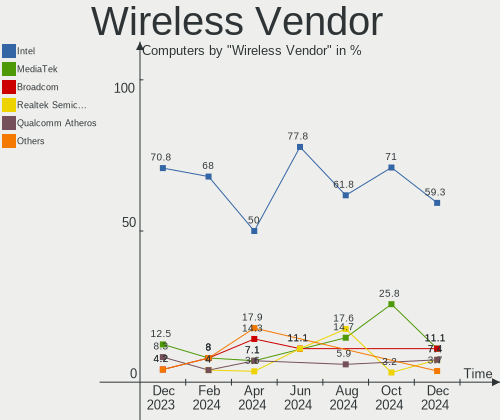

| Vendor                | Computers | Percent |
|-----------------------|-----------|---------|
| Intel                 | 16        | 59.26%  |
| MediaTek              | 3         | 11.11%  |
| Broadcom              | 3         | 11.11%  |
| Realtek Semiconductor | 2         | 7.41%   |
| Qualcomm Atheros      | 2         | 7.41%   |
| Qualcomm Technologies | 1         | 3.7%    |

Wireless Model
--------------

Wireless models

| Model                                                            | Computers | Percent |
|------------------------------------------------------------------|-----------|---------|
| Intel Meteor Lake PCH CNVi WiFi                                  | 3         | 11.11%  |
| Qualcomm Atheros AR9285 Wireless Network Adapter (PCI-Express)   | 2         | 7.41%   |
| MediaTek MT7922 802.11ax PCI Express Wireless Network Adapter    | 2         | 7.41%   |
| Intel Raptor Lake PCH CNVi WiFi                                  | 2         | 7.41%   |
| Intel Centrino Advanced-N 6205 [Taylor Peak]                     | 2         | 7.41%   |
| Broadcom BCM4360 802.11ac Dual Band Wireless Network Adapter     | 2         | 7.41%   |
| Realtek RTL8852CE PCIe 802.11ax Wireless Network Controller      | 1         | 3.7%    |
| Realtek RTL8821CE 802.11ac PCIe Wireless Network Adapter         | 1         | 3.7%    |
| Qualcomm WCN785x Wi-Fi 7(802.11be) 320MHz 2x2 [FastConnect 7800] | 1         | 3.7%    |
| MediaTek Network controller                                      | 1         | 3.7%    |
| Intel Wireless 8265 / 8275                                       | 1         | 3.7%    |
| Intel Wi-Fi 7(802.11be) AX1775*/AX1790*/BE20*/BE401/BE1750* 2x2  | 1         | 3.7%    |
| Intel Wi-Fi 6E(802.11ax) AX210/AX1675* 2x2 [Typhoon Peak]        | 1         | 3.7%    |
| Intel Wi-Fi 6 AX201                                              | 1         | 3.7%    |
| Intel Wi-Fi 6 AX200                                              | 1         | 3.7%    |
| Intel Ice Lake-LP PCH CNVi WiFi                                  | 1         | 3.7%    |
| Intel Dual Band Wireless-AC 3168NGW [Stone Peak]                 | 1         | 3.7%    |
| Intel Comet Lake PCH-LP CNVi WiFi                                | 1         | 3.7%    |
| Intel Cannon Lake PCH CNVi WiFi                                  | 1         | 3.7%    |
| Broadcom BCM43602 802.11ac Wireless LAN SoC                      | 1         | 3.7%    |

Ethernet Vendor
---------------

Ethernet vendors

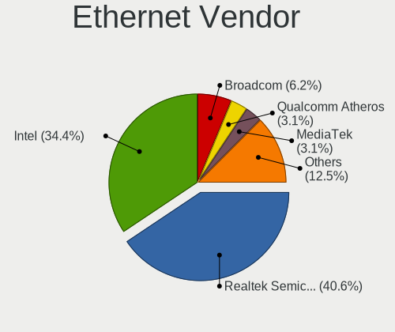

| Vendor                 | Computers | Percent |
|------------------------|-----------|---------|
| Realtek Semiconductor  | 13        | 40.63%  |
| Intel                  | 11        | 34.38%  |
| Broadcom               | 2         | 6.25%   |
| Qualcomm Atheros       | 1         | 3.13%   |
| MediaTek               | 1         | 3.13%   |
| Dell                   | 1         | 3.13%   |
| Chelsio Communications | 1         | 3.13%   |
| Aquantia               | 1         | 3.13%   |
| American Megatrends    | 1         | 3.13%   |

Ethernet Model
--------------

Ethernet models

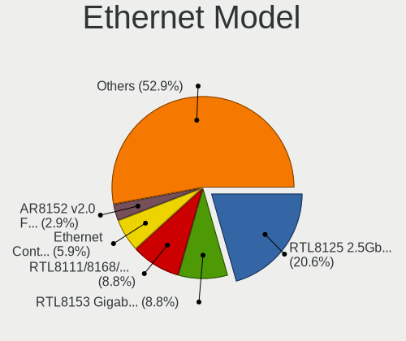

| Model                                                                             | Computers | Percent |
|-----------------------------------------------------------------------------------|-----------|---------|
| Realtek RTL8125 2.5GbE Controller                                                 | 7         | 20.59%  |
| Realtek RTL8153 Gigabit Ethernet Adapter                                          | 3         | 8.82%   |
| Realtek RTL8111/8168/8211/8411 PCI Express Gigabit Ethernet Controller            | 3         | 8.82%   |
| Intel Ethernet Controller I226-V                                                  | 2         | 5.88%   |
| Qualcomm Atheros AR8152 v2.0 Fast Ethernet                                        | 1         | 2.94%   |
| MediaTek MT7922 802.11ax PCI Express Wireless Network Adapter                     | 1         | 2.94%   |
| Intel I211 Gigabit Network Connection                                             | 1         | 2.94%   |
| Intel I210 Gigabit Network Connection                                             | 1         | 2.94%   |
| Intel Ethernet Controller I219-V                                                  | 1         | 2.94%   |
| Intel Ethernet Controller I219-LM                                                 | 1         | 2.94%   |
| Intel Ethernet Connection (7) I219-V                                              | 1         | 2.94%   |
| Intel Ethernet Connection (23) I219-V                                             | 1         | 2.94%   |
| Intel Ethernet Connection (2) I218-V                                              | 1         | 2.94%   |
| Intel 82599ES 10-Gigabit SFI/SFP+ Network Connection                              | 1         | 2.94%   |
| Intel 82599 10 Gigabit Network Connection                                         | 1         | 2.94%   |
| Intel 82579V Gigabit Network Connection                                           | 1         | 2.94%   |
| Intel 82579LM Gigabit Network Connection (Lewisville)                             | 1         | 2.94%   |
| Dell iDRAC Virtual NIC                                                            | 1         | 2.94%   |
| Chelsio T320 10GbE Dual Port Adapter                                              | 1         | 2.94%   |
| Broadcom NetXtreme BCM5720 Gigabit Ethernet PCIe                                  | 1         | 2.94%   |
| Broadcom NetLink BCM57780 Gigabit Ethernet PCIe                                   | 1         | 2.94%   |
| Aquantia AQC113C NBase-T/IEEE 802.3an Ethernet Controller [Marvell Scalable mGig] | 1         | 2.94%   |
| American Megatrends Virtual Ethernet.                                             | 1         | 2.94%   |

Net Controller Kind
-------------------

Ethernet, WiFi or modem

| Kind     | Computers | Percent |
|----------|-----------|---------|
| WiFi     | 27        | 50.94%  |
| Ethernet | 24        | 45.28%  |
| Modem    | 1         | 1.89%   |
| Unknown  | 1         | 1.89%   |

Used Controller
---------------

Currently used network controller

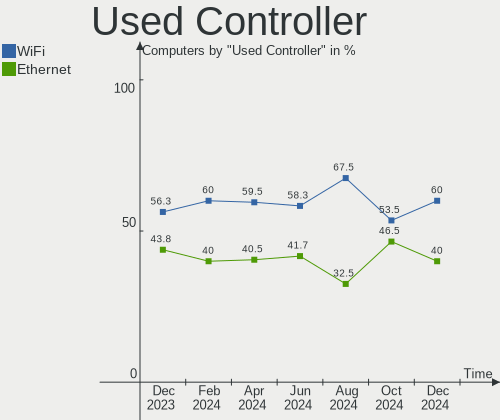

| Kind     | Computers | Percent |
|----------|-----------|---------|
| WiFi     | 21        | 60%     |
| Ethernet | 14        | 40%     |

NICs
----

Total network controllers on board

| Total | Computers | Percent |
|-------|-----------|---------|
| 2     | 14        | 41.18%  |
| 1     | 14        | 41.18%  |
| 4     | 3         | 8.82%   |
| 6     | 1         | 2.94%   |
| 5     | 1         | 2.94%   |
| 3     | 1         | 2.94%   |

IPv6
----

IPv6 vs IPv4

| Used | Computers | Percent |
|------|-----------|---------|
| Yes  | 20        | 58.82%  |
| No   | 14        | 41.18%  |

Bluetooth
---------

Bluetooth Vendor
----------------

Controller vendors

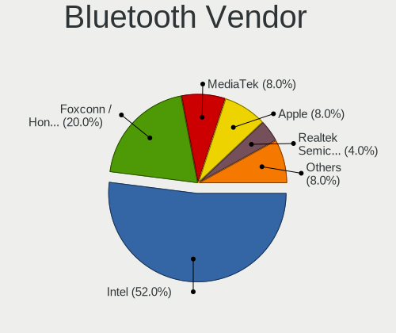

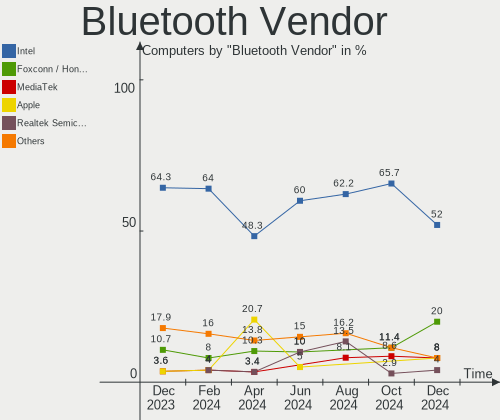

| Vendor                | Computers | Percent |
|-----------------------|-----------|---------|
| Intel                 | 13        | 52%     |
| Foxconn / Hon Hai     | 5         | 20%     |
| MediaTek              | 2         | 8%      |
| Apple                 | 2         | 8%      |
| Realtek Semiconductor | 1         | 4%      |
| Broadcom              | 1         | 4%      |
| ASUSTek Computer      | 1         | 4%      |

Bluetooth Model
---------------

Controller models

| Model                                                 | Computers | Percent |
|-------------------------------------------------------|-----------|---------|
| Intel AX211 Bluetooth                                 | 4         | 16%     |
| Foxconn / Hon Hai Wireless_Device                     | 3         | 12%     |
| MediaTek Wireless_Device                              | 2         | 8%      |
| Intel Bluetooth 9460/9560 Jefferson Peak (JfP)        | 2         | 8%      |
| Intel AX201 Bluetooth                                 | 2         | 8%      |
| Apple Bluetooth Host Controller                       | 2         | 8%      |
| Realtek Bluetooth Radio                               | 1         | 4%      |
| Intel Wireless-AC 3168 Bluetooth                      | 1         | 4%      |
| Intel Bluetooth wireless interface                    | 1         | 4%      |
| Intel Bluetooth Device                                | 1         | 4%      |
| Intel AX210 Bluetooth                                 | 1         | 4%      |
| Intel AX200 Bluetooth                                 | 1         | 4%      |
| Foxconn / Hon Hai Bluetooth Radio                     | 1         | 4%      |
| Foxconn / Hon Hai Bluetooth Device                    | 1         | 4%      |
| Broadcom BCM20702 Bluetooth 4.0 [ThinkPad]            | 1         | 4%      |
| ASUS Broadcom BCM20702 Single-Chip Bluetooth 4.0 + LE | 1         | 4%      |

Sound
-----

Sound Vendor
------------

Sound card vendors

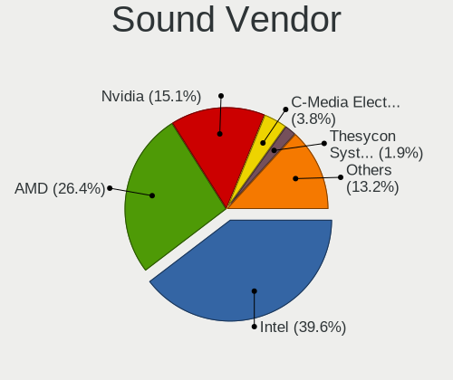

| Vendor                               | Computers | Percent |
|--------------------------------------|-----------|---------|
| Intel                                | 21        | 39.62%  |
| AMD                                  | 14        | 26.42%  |
| Nvidia                               | 8         | 15.09%  |
| C-Media Electronics                  | 2         | 3.77%   |
| Thesycon Systemsoftware & Consulting | 1         | 1.89%   |
| Plantronics                          | 1         | 1.89%   |
| Native Instruments                   | 1         | 1.89%   |
| Micro Star International             | 1         | 1.89%   |
| Jieli Technology                     | 1         | 1.89%   |
| Giga-Byte Technology                 | 1         | 1.89%   |
| Generalplus Technology               | 1         | 1.89%   |
| ASUSTek Computer                     | 1         | 1.89%   |

Sound Model
-----------

Sound card models

| Model                                                                        | Computers | Percent |
|------------------------------------------------------------------------------|-----------|---------|
| AMD Rembrandt Radeon High Definition Audio Controller                        | 7         | 10.94%  |
| AMD Family 17h/19h/1ah HD Audio Controller                                   | 7         | 10.94%  |
| Intel Meteor Lake-P HD Audio Controller                                      | 4         | 6.25%   |
| Nvidia AD104 High Definition Audio Controller                                | 2         | 3.13%   |
| Intel Tiger Lake-LP Smart Sound Technology Audio Controller                  | 2         | 3.13%   |
| Intel Raptor Lake-P/U/H cAVS                                                 | 2         | 3.13%   |
| Intel 8 Series/C220 Series Chipset High Definition Audio Controller          | 2         | 3.13%   |
| Intel 6 Series/C200 Series Chipset Family High Definition Audio Controller   | 2         | 3.13%   |
| AMD Starship/Matisse HD Audio Controller                                     | 2         | 3.13%   |
| AMD Navi 31 HDMI/DP Audio                                                    | 2         | 3.13%   |
| AMD Navi 21/23 HDMI/DP Audio Controller                                      | 2         | 3.13%   |
| Thesycon Systemsoftware & Consulting Donner Livejack Usb Audio               | 1         | 1.56%   |
| Plantronics Blackwire C5220 headset (remote control and 3.5mm audio adapter) | 1         | 1.56%   |
| Nvidia High Definition Audio Controller                                      | 1         | 1.56%   |
| Nvidia GP107GL High Definition Audio Controller                              | 1         | 1.56%   |
| Nvidia GK107 HDMI Audio Controller                                           | 1         | 1.56%   |
| Nvidia GA106 High Definition Audio Controller                                | 1         | 1.56%   |
| Nvidia AD107 High Definition Audio Controller                                | 1         | 1.56%   |
| Nvidia AD106M High Definition Audio Controller                               | 1         | 1.56%   |
| Native Instruments Komplete Audio 6                                          | 1         | 1.56%   |
| Micro Star International USB Audio                                           | 1         | 1.56%   |
| Jieli Technology GO Work USB                                                 | 1         | 1.56%   |
| Intel Sunrise Point-LP HD Audio                                              | 1         | 1.56%   |
| Intel Raptor Lake High Definition Audio Controller                           | 1         | 1.56%   |
| Intel Ice Lake-LP Smart Sound Technology Audio Controller                    | 1         | 1.56%   |
| Intel Comet Lake PCH-LP cAVS                                                 | 1         | 1.56%   |
| Intel Cannon Lake PCH cAVS                                                   | 1         | 1.56%   |
| Intel C610/X99 series chipset HD Audio Controller                            | 1         | 1.56%   |
| Intel Alder Lake PCH-P High Definition Audio Controller                      | 1         | 1.56%   |
| Intel 7 Series/C216 Chipset Family High Definition Audio Controller          | 1         | 1.56%   |
| Intel 5 Series/3400 Series Chipset High Definition Audio                     | 1         | 1.56%   |
| Giga-Byte Technology USB Audio                                               | 1         | 1.56%   |
| Generalplus Technology USB Audio Device                                      | 1         | 1.56%   |
| C-Media Electronics CM108 Audio Controller                                   | 1         | 1.56%   |
| C-Media Electronics Audio Adapter (Unitek Y-247A)                            | 1         | 1.56%   |
| ASUSTek Computer AUDIO DONGLE                                                | 1         | 1.56%   |
| AMD SBx00 Azalia (Intel HDA)                                                 | 1         | 1.56%   |
| AMD Renoir Radeon High Definition Audio Controller                           | 1         | 1.56%   |
| AMD Oland/Hainan/Cape Verde/Pitcairn HDMI Audio [Radeon HD 7000 Series]      | 1         | 1.56%   |
| AMD Genoa HD Audio Controller                                                | 1         | 1.56%   |

Memory
------

Memory Vendor
-------------

Memory module vendors

| Vendor              | Computers | Percent |
|---------------------|-----------|---------|
| Samsung Electronics | 9         | 23.68%  |
| SK hynix            | 7         | 18.42%  |
| Micron Technology   | 6         | 15.79%  |
| Kingston            | 4         | 10.53%  |
| Team                | 2         | 5.26%   |
| A-DATA Technology   | 2         | 5.26%   |
| Unknown             | 2         | 5.26%   |
| Unknown             | 1         | 2.63%   |
| Silicon Power       | 1         | 2.63%   |
| PNY                 | 1         | 2.63%   |
| Patriot             | 1         | 2.63%   |
| Crucial             | 1         | 2.63%   |
| Corsair             | 1         | 2.63%   |

Memory Model
------------

Memory module models

| Model                                                          | Computers | Percent |
|----------------------------------------------------------------|-----------|---------|
| SK hynix RAM Module 8GB SODIMM DDR3 1600MT/s                   | 2         | 5.13%   |
| SK hynix RAM HMCG88AGBSA092N 32GB SODIMM DDR5 5600MT/s         | 2         | 5.13%   |
| Samsung RAM M471B5773CHS-CH9 2GB SODIMM DDR3 4199MT/s          | 2         | 5.13%   |
| Unknown                                                        | 2         | 5.13%   |
| Unknown RAM Module 2GB DIMM 667MT/s                            | 1         | 2.56%   |
| Team RAM UD5-6400 32GB DIMM DDR5 6400MT/s                      | 1         | 2.56%   |
| Team RAM UD5-5600 16GB DIMM DDR5 12800MT/s                     | 1         | 2.56%   |
| SK hynix RAM HMCG78MEBSA092N 16GB SODIMM DDR5 4800MT/s         | 1         | 2.56%   |
| SK hynix RAM HMCG78AGBUA084N 16GB DIMM DDR5 5600MT/s           | 1         | 2.56%   |
| SK hynix RAM HMCG78AGBSA092N 16GB SODIMM DDR5 5600MT/s         | 1         | 2.56%   |
| Silicon Power RAM Module 8GB SODIMM DDR3 1333MT/s              | 1         | 2.56%   |
| Samsung RAM M471B1G73DB0-YK0 8GB SODIMM DDR3 1600MT/s          | 1         | 2.56%   |
| Samsung RAM M471A5244CB0-CWE 4096MB SODIMM DDR4 3200MT/s       | 1         | 2.56%   |
| Samsung RAM M471A5244CB0-CWE 4096MB Row Of Chips DDR4 3200MT/s | 1         | 2.56%   |
| Samsung RAM M471A2K43DB1-CTD 16GB SODIMM DDR4 2667MT/s         | 1         | 2.56%   |
| Samsung RAM M471A1K43BB1-CTD 8GB Row Of Chips DDR4 2667MT/s    | 1         | 2.56%   |
| Samsung RAM M471A1K43BB0-CPB 8GB SODIMM DDR4 2133MT/s          | 1         | 2.56%   |
| Samsung RAM M386A8K40BM1-CRC 64GB RIMM DDR4 2400MT/s           | 1         | 2.56%   |
| Samsung RAM K3KL8L80CM-MGCT 4GB SODIMM LPDDR5 7500MT/s         | 1         | 2.56%   |
| PNY RAM M4S08S681QMMM52-12 8GB SODIMM DDR4 3200MT/s            | 1         | 2.56%   |
| Patriot RAM 3200 C16 Series 4GB DIMM DDR4 3600MT/s             | 1         | 2.56%   |
| Micron RAM MTC4C10163S1SC48BA1 8GB SODIMM DDR5 4800MT/s        | 1         | 2.56%   |
| Micron RAM MT62F4G32D8DV-026 WT 16GB SODIMM LPDDR5 7500MT/s    | 1         | 2.56%   |
| Micron RAM MT62F2G32D4DS-026 WT 8GB SODIMM LPDDR5 7500MT/s     | 1         | 2.56%   |
| Micron RAM MT62F2G32D4DS-026 4GB Row Of Chips LPDDR5 7467MT/s  | 1         | 2.56%   |
| Micron RAM 4ATF51264HZ-3G2J1 4GB SODIMM DDR4 3200MT/s          | 1         | 2.56%   |
| Micron RAM 36KSF1G72PZ-1G4K1 8GB DIMM DDR3 1333MT/s            | 1         | 2.56%   |
| Kingston RAM KF560R32-32 32GB DIMM DDR5 4800MT/s               | 1         | 2.56%   |
| Kingston RAM KF552C36-16 16GB DIMM DDR5 5200MT/s               | 1         | 2.56%   |
| Kingston RAM 99U5428-063.A00L 8GB SODIMM DDR3 800MT/s          | 1         | 2.56%   |
| Kingston RAM 9965745-039.A00G 32GB DIMM DDR4 3200MT/s          | 1         | 2.56%   |
| Crucial RAM BL32G32C16U4R.M16FB1 32GB DIMM DDR4 3200MT/s       | 1         | 2.56%   |
| Corsair RAM CMW32GX4M2Z3600C18 16GB DIMM DDR4 3733MT/s         | 1         | 2.56%   |
| A-DATA RAM DDR4 3200 8GB DIMM DDR4 3200MT/s                    | 1         | 2.56%   |
| A-DATA RAM AD5S560032G-SFW 32GB SODIMM DDR5 5600MT/s           | 1         | 2.56%   |

Memory Kind
-----------

Memory module kinds

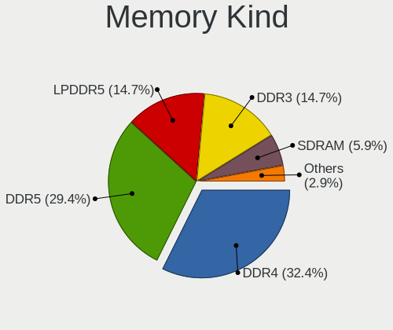

| Kind    | Computers | Percent |
|---------|-----------|---------|
| DDR4    | 11        | 32.35%  |
| DDR5    | 10        | 29.41%  |
| LPDDR5  | 5         | 14.71%  |
| DDR3    | 5         | 14.71%  |
| SDRAM   | 2         | 5.88%   |
| Unknown | 1         | 2.94%   |

Memory Form Factor
------------------

Physical design of the memory module

| Name         | Computers | Percent |
|--------------|-----------|---------|
| SODIMM       | 20        | 57.14%  |
| DIMM         | 10        | 28.57%  |
| Row Of Chips | 4         | 11.43%  |
| RIMM         | 1         | 2.86%   |

Memory Size
-----------

Memory module size

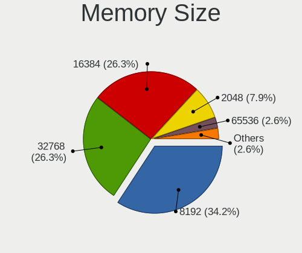

| Size  | Computers | Percent |
|-------|-----------|---------|
| 8192  | 13        | 34.21%  |
| 32768 | 10        | 26.32%  |
| 16384 | 10        | 26.32%  |
| 2048  | 3         | 7.89%   |
| 65536 | 1         | 2.63%   |
| 4096  | 1         | 2.63%   |

Memory Speed
------------

Memory module speed

| Speed | Computers | Percent |
|-------|-----------|---------|
| 3200  | 7         | 18.42%  |
| 5600  | 5         | 13.16%  |
| 7500  | 3         | 7.89%   |
| 4800  | 3         | 7.89%   |
| 1600  | 3         | 7.89%   |
| 7467  | 2         | 5.26%   |
| 4199  | 2         | 5.26%   |
| 2667  | 2         | 5.26%   |
| 1333  | 2         | 5.26%   |
| 12800 | 1         | 2.63%   |
| 6400  | 1         | 2.63%   |
| 5200  | 1         | 2.63%   |
| 3733  | 1         | 2.63%   |
| 3600  | 1         | 2.63%   |
| 2400  | 1         | 2.63%   |
| 2133  | 1         | 2.63%   |
| 800   | 1         | 2.63%   |
| 667   | 1         | 2.63%   |

Printers & scanners
-------------------

Printer Vendor
--------------

Printer device vendors

Zero info for selected period =(

Printer Model
-------------

Printer device models

Zero info for selected period =(

Scanner Vendor
--------------

Scanner device vendors

Zero info for selected period =(

Scanner Model
-------------

Scanner device models

Zero info for selected period =(

Camera
------

Camera Vendor
-------------

Camera device vendors

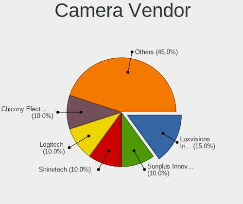

| Vendor                        | Computers | Percent |
|-------------------------------|-----------|---------|
| Luxvisions Innotech Limited   | 3         | 15%     |
| Sunplus Innovation Technology | 2         | 10%     |
| Shinetech                     | 2         | 10%     |
| Logitech                      | 2         | 10%     |
| Chicony Electronics           | 2         | 10%     |
| Bison Electronics             | 2         | 10%     |
| Sonix Technology              | 1         | 5%      |
| Silicon Motion                | 1         | 5%      |
| kingcome                      | 1         | 5%      |
| IMC Networks                  | 1         | 5%      |
| Hopewin Electronic Material   | 1         | 5%      |
| Apple                         | 1         | 5%      |
| ALi                           | 1         | 5%      |

Camera Model
------------

Camera device models

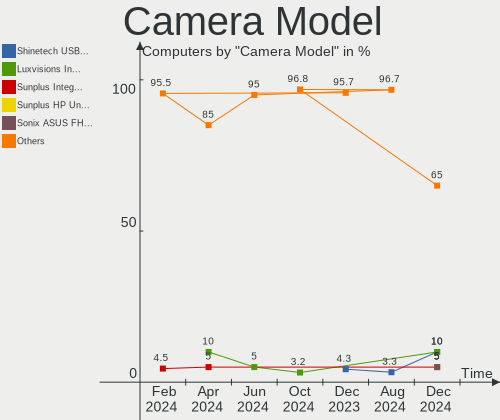

| Model                                               | Computers | Percent |
|-----------------------------------------------------|-----------|---------|
| Shinetech USB2.0 FHD UVC WebCam                     | 2         | 10%     |
| Luxvisions Innotech Limited Integrated Camera       | 2         | 10%     |
| Sunplus Integrated_Webcam_FHD                       | 1         | 5%      |
| Sunplus HP Universal Camera                         | 1         | 5%      |
| Sonix ASUS FHD webcam                               | 1         | 5%      |
| Silicon Motion 720p HD Camera                       | 1         | 5%      |
| Luxvisions Innotech Limited HP TrueVision HD Camera | 1         | 5%      |
| Logitech HD Pro Webcam C920                         | 1         | 5%      |
| Logitech C922 Pro Stream Webcam                     | 1         | 5%      |
| kingcome ASUS FHD webcam                            | 1         | 5%      |
| IMC Networks Integrated Camera                      | 1         | 5%      |
| Hopewin Electronic Material Integrated Camera       | 1         | 5%      |
| Chicony Lenovo EasyCamera                           | 1         | 5%      |
| Chicony Integrated Camera                           | 1         | 5%      |
| Bison ThinkPad Integrated Camera                    | 1         | 5%      |
| Bison Integrated Camera                             | 1         | 5%      |
| Apple iPhone 5/5C/5S/6/SE/7/8/X/XR                  | 1         | 5%      |
| ALi Gateway Webcam                                  | 1         | 5%      |

Security
--------

Fingerprint Vendor
------------------

Fingerprint sensor vendors

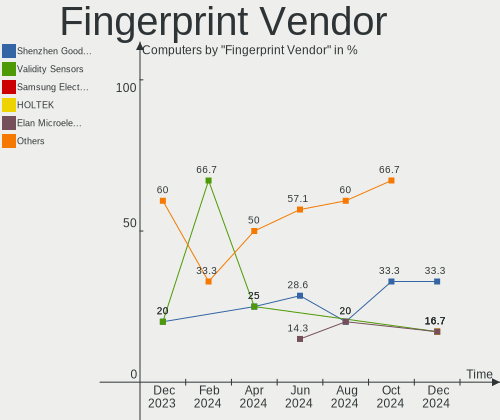

| Vendor                     | Computers | Percent |
|----------------------------|-----------|---------|
| Shenzhen Goodix Technology | 2         | 33.33%  |
| Validity Sensors           | 1         | 16.67%  |
| Samsung Electronics        | 1         | 16.67%  |
| HOLTEK                     | 1         | 16.67%  |
| Elan Microelectronics      | 1         | 16.67%  |

Fingerprint Model
-----------------

Fingerprint sensor models

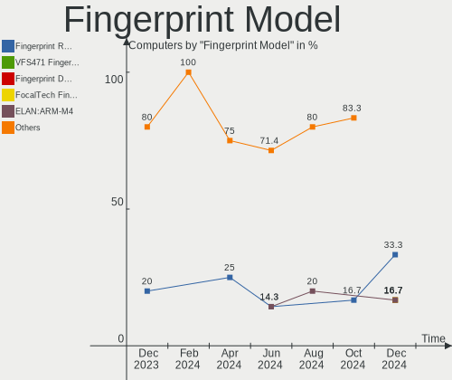

| Model                                      | Computers | Percent |
|--------------------------------------------|-----------|---------|
| Shenzhen Goodix Fingerprint Reader         | 2         | 33.33%  |
| Validity Sensors VFS471 Fingerprint Reader | 1         | 16.67%  |
| Samsung Fingerprint Device                 | 1         | 16.67%  |
| HOLTEK FocalTech Fingerprint Device        | 1         | 16.67%  |
| Elan ELAN:ARM-M4                           | 1         | 16.67%  |

Chipcard Vendor
---------------

Chipcard module vendors

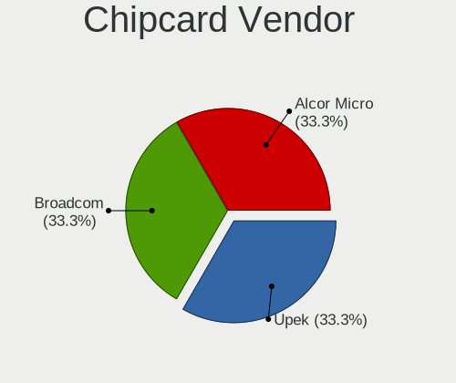

| Vendor      | Computers | Percent |
|-------------|-----------|---------|
| Upek        | 1         | 33.33%  |
| Broadcom    | 1         | 33.33%  |
| Alcor Micro | 1         | 33.33%  |

Chipcard Model
--------------

Chipcard module models

| Model                                                      | Computers | Percent |
|------------------------------------------------------------|-----------|---------|
| Upek TouchChip Fingerprint Coprocessor (WBF advanced mode) | 1         | 33.33%  |
| Broadcom 58200                                             | 1         | 33.33%  |
| Alcor Micro AU9540 Smartcard Reader                        | 1         | 33.33%  |

Unsupported
-----------

Unsupported Devices
-------------------

Total unsupported devices on board

| Total | Computers | Percent |
|-------|-----------|---------|
| 0     | 16        | 47.06%  |
| 1     | 12        | 35.29%  |
| 3     | 3         | 8.82%   |
| 2     | 2         | 5.88%   |
| 6     | 1         | 2.94%   |

Unsupported Device Types
------------------------

Types of unsupported devices

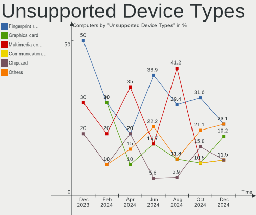

| Type                     | Computers | Percent |
|--------------------------|-----------|---------|
| Fingerprint reader       | 6         | 23.08%  |
| Graphics card            | 5         | 19.23%  |
| Multimedia controller    | 3         | 11.54%  |
| Communication controller | 3         | 11.54%  |
| Chipcard                 | 3         | 11.54%  |
| Unassigned class         | 2         | 7.69%   |
| Network                  | 2         | 7.69%   |
| Net/wireless             | 1         | 3.85%   |
| Camera                   | 1         | 3.85%   |

