NixOS - Hardware Trends
-----------------------

A project to identify most popular hardware characteristics and track their change
over time based on data collected by Linux users at https://Linux-Hardware.org.

Anyone can contribute to this report by the [hw-probe](https://github.com/linuxhw/hw-probe) tool:

    sudo -E hw-probe -all -upload

This is a report for all computer types. See also reports for [desktops](/Dist/NixOS/Desktop/README.md) and [notebooks](/Dist/NixOS/Notebook/README.md).

This report is for one last month. Overall report since the beginning of time: [TestDays](https://github.com/linuxhw/TestDays)

Period: Apr, 2024.

Contents
--------

* [ System ](#system)
  - [ OS                       ](#os)
  - [ OS Family                ](#os-family)
  - [ Kernel                   ](#kernel)
  - [ Kernel Family            ](#kernel-family)
  - [ Kernel Major Ver.        ](#kernel-major-ver)
  - [ Arch                     ](#arch)
  - [ DE                       ](#de)
  - [ Display Server           ](#display-server)
  - [ Display Manager          ](#display-manager)
  - [ OS Lang                  ](#os-lang)
  - [ Boot Mode                ](#boot-mode)
  - [ Filesystem               ](#filesystem)
  - [ Part. scheme             ](#part-scheme)
  - [ Dual Boot with Linux/BSD ](#dual-boot-with-linuxbsd)
  - [ Dual Boot (Win)          ](#dual-boot-win)

* [ Board ](#board)
  - [ Vendor                   ](#vendor)
  - [ Model                    ](#model)
  - [ Model Family             ](#model-family)
  - [ MFG Year                 ](#mfg-year)
  - [ Form Factor              ](#form-factor)
  - [ Secure Boot              ](#secure-boot)
  - [ Coreboot                 ](#coreboot)
  - [ RAM Size                 ](#ram-size)
  - [ RAM Used                 ](#ram-used)
  - [ Total Drives             ](#total-drives)
  - [ Has CD-ROM               ](#has-cd-rom)
  - [ Has Ethernet             ](#has-ethernet)
  - [ Has WiFi                 ](#has-wifi)
  - [ Has Bluetooth            ](#has-bluetooth)

* [ Location ](#location)
  - [ Country                  ](#country)
  - [ City                     ](#city)

* [ Drives ](#drives)
  - [ Drive Vendor             ](#drive-vendor)
  - [ Drive Model              ](#drive-model)
  - [ HDD Vendor               ](#hdd-vendor)
  - [ SSD Vendor               ](#ssd-vendor)
  - [ Drive Kind               ](#drive-kind)
  - [ Drive Connector          ](#drive-connector)
  - [ Drive Size               ](#drive-size)
  - [ Space Total              ](#space-total)
  - [ Space Used               ](#space-used)
  - [ Malfunc. Drives          ](#malfunc-drives)
  - [ Malfunc. Drive Vendor    ](#malfunc-drive-vendor)
  - [ Malfunc. HDD Vendor      ](#malfunc-hdd-vendor)
  - [ Malfunc. Drive Kind      ](#malfunc-drive-kind)
  - [ Failed Drives            ](#failed-drives)
  - [ Failed Drive Vendor      ](#failed-drive-vendor)
  - [ Drive Status             ](#drive-status)

* [ Storage controller ](#storage-controller)
  - [ Storage Vendor           ](#storage-vendor)
  - [ Storage Model            ](#storage-model)
  - [ Storage Kind             ](#storage-kind)

* [ Processor ](#processor)
  - [ CPU Vendor               ](#cpu-vendor)
  - [ CPU Model                ](#cpu-model)
  - [ CPU Model Family         ](#cpu-model-family)
  - [ CPU Cores                ](#cpu-cores)
  - [ CPU Sockets              ](#cpu-sockets)
  - [ CPU Threads              ](#cpu-threads)
  - [ CPU Op-Modes             ](#cpu-op-modes)
  - [ CPU Microcode            ](#cpu-microcode)
  - [ CPU Microarch            ](#cpu-microarch)

* [ Graphics ](#graphics)
  - [ GPU Vendor               ](#gpu-vendor)
  - [ GPU Model                ](#gpu-model)
  - [ GPU Combo                ](#gpu-combo)
  - [ GPU Driver               ](#gpu-driver)
  - [ GPU Memory               ](#gpu-memory)

* [ Monitor ](#monitor)
  - [ Monitor Vendor           ](#monitor-vendor)
  - [ Monitor Model            ](#monitor-model)
  - [ Monitor Resolution       ](#monitor-resolution)
  - [ Monitor Diagonal         ](#monitor-diagonal)
  - [ Monitor Width            ](#monitor-width)
  - [ Aspect Ratio             ](#aspect-ratio)
  - [ Monitor Area             ](#monitor-area)
  - [ Pixel Density            ](#pixel-density)
  - [ Multiple Monitors        ](#multiple-monitors)

* [ Network ](#network)
  - [ Net Controller Vendor    ](#net-controller-vendor)
  - [ Net Controller Model     ](#net-controller-model)
  - [ Wireless Vendor          ](#wireless-vendor)
  - [ Wireless Model           ](#wireless-model)
  - [ Ethernet Vendor          ](#ethernet-vendor)
  - [ Ethernet Model           ](#ethernet-model)
  - [ Net Controller Kind      ](#net-controller-kind)
  - [ Used Controller          ](#used-controller)
  - [ NICs                     ](#nics)
  - [ IPv6                     ](#ipv6)

* [ Bluetooth ](#bluetooth)
  - [ Bluetooth Vendor         ](#bluetooth-vendor)
  - [ Bluetooth Model          ](#bluetooth-model)

* [ Sound ](#sound)
  - [ Sound Vendor             ](#sound-vendor)
  - [ Sound Model              ](#sound-model)

* [ Memory ](#memory)
  - [ Memory Vendor            ](#memory-vendor)
  - [ Memory Model             ](#memory-model)
  - [ Memory Kind              ](#memory-kind)
  - [ Memory Form Factor       ](#memory-form-factor)
  - [ Memory Size              ](#memory-size)
  - [ Memory Speed             ](#memory-speed)

* [ Printers & scanners ](#printers--scanners)
  - [ Printer Vendor           ](#printer-vendor)
  - [ Printer Model            ](#printer-model)
  - [ Scanner Vendor           ](#scanner-vendor)
  - [ Scanner Model            ](#scanner-model)

* [ Camera ](#camera)
  - [ Camera Vendor            ](#camera-vendor)
  - [ Camera Model             ](#camera-model)

* [ Security ](#security)
  - [ Fingerprint Vendor       ](#fingerprint-vendor)
  - [ Fingerprint Model        ](#fingerprint-model)
  - [ Chipcard Vendor          ](#chipcard-vendor)
  - [ Chipcard Model           ](#chipcard-model)

* [ Unsupported ](#unsupported)
  - [ Unsupported Devices      ](#unsupported-devices)
  - [ Unsupported Device Types ](#unsupported-device-types)

System
------

OS
--

Installed operating systems

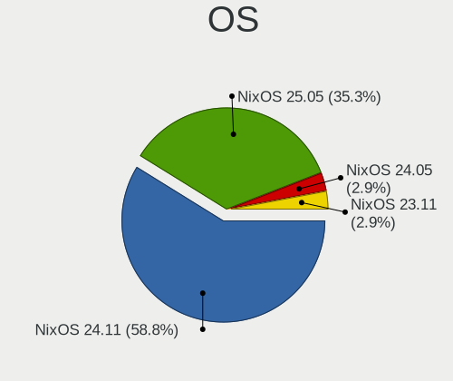

| Name        | Computers | Percent |
|-------------|-----------|---------|
| NixOS 24.05 | 20        | 54.05%  |
| NixOS 23.11 | 17        | 45.95%  |

OS Family
---------

OS without a version

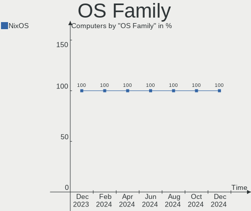

| Name  | Computers | Percent |
|-------|-----------|---------|
| NixOS | 37        | 100%    |

Kernel
------

Version of the Linux kernel

| Version        | Computers | Percent |
|----------------|-----------|---------|
| 6.6.28         | 4         | 10.81%  |
| 6.6.26         | 4         | 10.81%  |
| 6.1.82         | 4         | 10.81%  |
| 6.6.23         | 3         | 8.11%   |
| 6.8.6          | 2         | 5.41%   |
| 6.8.1          | 2         | 5.41%   |
| 6.1.87         | 2         | 5.41%   |
| 6.1.84         | 2         | 5.41%   |
| 6.8.7          | 1         | 2.7%    |
| 6.8.6-xanmod1  | 1         | 2.7%    |
| 6.8.5-error    | 1         | 2.7%    |
| 6.8.4          | 1         | 2.7%    |
| 6.8.3          | 1         | 2.7%    |
| 6.7.12-xanmod1 | 1         | 2.7%    |
| 6.6.25         | 1         | 2.7%    |
| 6.6.24         | 1         | 2.7%    |
| 6.6.22         | 1         | 2.7%    |
| 6.6.13         | 1         | 2.7%    |
| 6.1.86         | 1         | 2.7%    |
| 6.1.79         | 1         | 2.7%    |
| 6.1.72         | 1         | 2.7%    |
| 6.1.64         | 1         | 2.7%    |

Kernel Family
-------------

Linux kernel without a distro release

| Version | Computers | Percent |
|---------|-----------|---------|
| 6.6.28  | 4         | 10.81%  |
| 6.6.26  | 4         | 10.81%  |
| 6.1.82  | 4         | 10.81%  |
| 6.8.6   | 3         | 8.11%   |
| 6.6.23  | 3         | 8.11%   |
| 6.8.1   | 2         | 5.41%   |
| 6.1.87  | 2         | 5.41%   |
| 6.1.84  | 2         | 5.41%   |
| 6.8.7   | 1         | 2.7%    |
| 6.8.5   | 1         | 2.7%    |
| 6.8.4   | 1         | 2.7%    |
| 6.8.3   | 1         | 2.7%    |
| 6.7.12  | 1         | 2.7%    |
| 6.6.25  | 1         | 2.7%    |
| 6.6.24  | 1         | 2.7%    |
| 6.6.22  | 1         | 2.7%    |
| 6.6.13  | 1         | 2.7%    |
| 6.1.86  | 1         | 2.7%    |
| 6.1.79  | 1         | 2.7%    |
| 6.1.72  | 1         | 2.7%    |
| 6.1.64  | 1         | 2.7%    |

Kernel Major Ver.
-----------------

Linux kernel major version

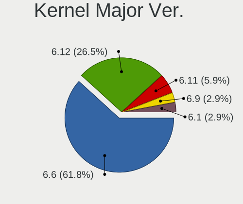

| Version | Computers | Percent |
|---------|-----------|---------|
| 6.6     | 15        | 40.54%  |
| 6.1     | 12        | 32.43%  |
| 6.8     | 9         | 24.32%  |
| 6.7     | 1         | 2.7%    |

Arch
----

OS architecture (x86_64, i586, etc.)

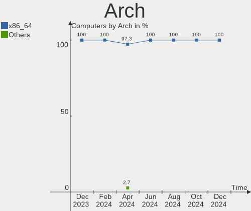

| Name    | Computers | Percent |
|---------|-----------|---------|
| x86_64  | 36        | 97.3%   |
| aarch64 | 1         | 2.7%    |

DE
--

Desktop Environment

| Name     | Computers | Percent |
|----------|-----------|---------|
| Hyprland | 10        | 27.03%  |
| Unknown  | 8         | 21.62%  |
| GNOME    | 6         | 16.22%  |
| sway     | 3         | 8.11%   |
| KDE6     | 3         | 8.11%   |
| KDE5     | 2         | 5.41%   |
| XFCE     | 1         | 2.7%    |
| plasma   | 1         | 2.7%    |
| none+i3  | 1         | 2.7%    |
| MATE     | 1         | 2.7%    |
| KDE      | 1         | 2.7%    |

Display Server
--------------

X11 or Wayland

| Name    | Computers | Percent |
|---------|-----------|---------|
| Wayland | 21        | 56.76%  |
| Unknown | 9         | 24.32%  |
| X11     | 5         | 13.51%  |
| Tty     | 2         | 5.41%   |

Display Manager
---------------

SDDM, LightDM, etc.

| Name    | Computers | Percent |
|---------|-----------|---------|
| Unknown | 12        | 32.43%  |
| LightDM | 9         | 24.32%  |
| GDM     | 8         | 21.62%  |
| SDDM    | 5         | 13.51%  |
| GREETD  | 3         | 8.11%   |

OS Lang
-------

Language

| Lang    | Computers | Percent |
|---------|-----------|---------|
| en_US   | 29        | 78.38%  |
| en_GB   | 3         | 8.11%   |
| Unknown | 2         | 5.41%   |
| en_SG   | 1         | 2.7%    |
| en_DK   | 1         | 2.7%    |
| en_AU   | 1         | 2.7%    |

Boot Mode
---------

EFI or BIOS

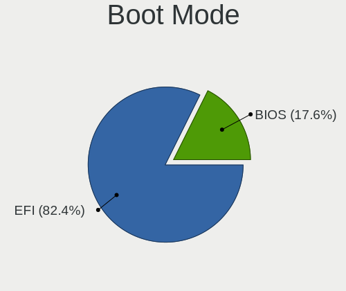

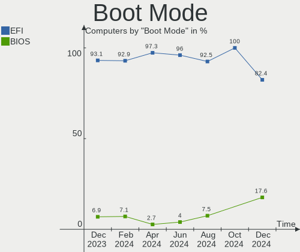

| Mode | Computers | Percent |
|------|-----------|---------|
| EFI  | 36        | 97.3%   |
| BIOS | 1         | 2.7%    |

Filesystem
----------

Type of filesystem

| Type  | Computers | Percent |
|-------|-----------|---------|
| Ext4  | 24        | 64.86%  |
| Btrfs | 9         | 24.32%  |
| Zfs   | 4         | 10.81%  |

Part. scheme
------------

Scheme of partitioning

| Type | Computers | Percent |
|------|-----------|---------|
| GPT  | 36        | 97.3%   |
| MBR  | 1         | 2.7%    |

Dual Boot with Linux/BSD
------------------------

Hosting more than one Linux/BSD

| Dual boot | Computers | Percent |
|-----------|-----------|---------|
| No        | 31        | 83.78%  |
| Yes       | 6         | 16.22%  |

Dual Boot (Win)
---------------

Hosting Linux and Windows

| Dual boot | Computers | Percent |
|-----------|-----------|---------|
| No        | 29        | 78.38%  |
| Yes       | 8         | 21.62%  |

Board
-----

Vendor
------

Motherboard manufacturer

| Name                    | Computers | Percent |
|-------------------------|-----------|---------|
| Lenovo                  | 6         | 16.22%  |
| Apple                   | 6         | 16.22%  |
| MSI                     | 5         | 13.51%  |
| ASUSTek Computer        | 4         | 10.81%  |
| Gigabyte Technology     | 3         | 8.11%   |
| Dell                    | 3         | 8.11%   |
| Razer                   | 2         | 5.41%   |
| Hewlett-Packard         | 2         | 5.41%   |
| Raspberry Pi Foundation | 1         | 2.7%    |
| Microsoft               | 1         | 2.7%    |
| Jetway                  | 1         | 2.7%    |
| Google                  | 1         | 2.7%    |
| ASRock                  | 1         | 2.7%    |
| Unknown                 | 1         | 2.7%    |

Model
-----

Motherboard model

| Name                                      | Computers | Percent |
|-------------------------------------------|-----------|---------|
| Razer Blade 14 - RZ09-0508                | 1         | 2.7%    |
| Razer Blade                               | 1         | 2.7%    |
| RPi Raspberry Pi 4 Model B Rev 1.4        | 1         | 2.7%    |
| MSI MS-7E06                               | 1         | 2.7%    |
| MSI MS-7B86                               | 1         | 2.7%    |
| MSI MS-7B85                               | 1         | 2.7%    |
| MSI GL65 9SC                              | 1         | 2.7%    |
| MSI GE60 2PE                              | 1         | 2.7%    |
| Microsoft Surface Pro 7                   | 1         | 2.7%    |
| Lenovo ThinkPad Z13 Gen 1 21D2CT01WW      | 1         | 2.7%    |
| Lenovo ThinkPad T480 20L5CTO1WW           | 1         | 2.7%    |
| Lenovo ThinkPad P50 20EN0007MH            | 1         | 2.7%    |
| Lenovo ThinkPad P16s Gen 2 21K9CTO1WW     | 1         | 2.7%    |
| Lenovo ThinkPad L15 Gen 1 20U70004RI      | 1         | 2.7%    |
| Lenovo ThinkPad L14 Gen 3 21C60010BO      | 1         | 2.7%    |
| Jetway 1.0                                | 1         | 2.7%    |
| HP Victus by 15L Gaming Desktop TG02-0xxx | 1         | 2.7%    |
| HP ProBook 440 G2                         | 1         | 2.7%    |
| Google Redrix                             | 1         | 2.7%    |
| Gigabyte Z790 UD                          | 1         | 2.7%    |
| Gigabyte Z390 GAMING SLI                  | 1         | 2.7%    |
| Gigabyte GA-H61TN-SI                      | 1         | 2.7%    |
| Dell XPS 15 9530                          | 1         | 2.7%    |
| Dell Latitude 7330 Rugged Extreme         | 1         | 2.7%    |
| Dell Latitude 7320 Detachable             | 1         | 2.7%    |
| ASUS ROG Strix G513QY_G513QY              | 1         | 2.7%    |
| ASUS ROG Maximus XI HERO                  | 1         | 2.7%    |
| ASUS ProArt X670E-CREATOR WIFI            | 1         | 2.7%    |
| ASUS K53SJ                                | 1         | 2.7%    |
| ASRock B650E PG Riptide WiFi              | 1         | 2.7%    |
| Apple MacPro6,1                           | 1         | 2.7%    |
| Apple MacBookPro12,1                      | 1         | 2.7%    |
| Apple MacBookPro11,5                      | 1         | 2.7%    |
| Apple MacBookPro11,3                      | 1         | 2.7%    |
| Apple MacBookPro11,2                      | 1         | 2.7%    |
| Apple MacBookPro10,1                      | 1         | 2.7%    |
| Unknown                                   | 1         | 2.7%    |

Model Family
------------

Motherboard model prefix

| Name                 | Computers | Percent |
|----------------------|-----------|---------|
| Lenovo ThinkPad      | 6         | 16.22%  |
| Apple MacBookPro11   | 3         | 8.11%   |
| Razer Blade          | 2         | 5.41%   |
| Dell Latitude        | 2         | 5.41%   |
| ASUS ROG             | 2         | 5.41%   |
| RPi Raspberry        | 1         | 2.7%    |
| MSI MS-7E06          | 1         | 2.7%    |
| MSI MS-7B86          | 1         | 2.7%    |
| MSI MS-7B85          | 1         | 2.7%    |
| MSI GL65             | 1         | 2.7%    |
| MSI GE60             | 1         | 2.7%    |
| Microsoft Surface    | 1         | 2.7%    |
| Jetway 1.0           | 1         | 2.7%    |
| HP Victus            | 1         | 2.7%    |
| HP ProBook           | 1         | 2.7%    |
| Google Redrix        | 1         | 2.7%    |
| Gigabyte Z790        | 1         | 2.7%    |
| Gigabyte Z390        | 1         | 2.7%    |
| Gigabyte GA-H61TN-SI | 1         | 2.7%    |
| Dell XPS             | 1         | 2.7%    |
| ASUS ProArt          | 1         | 2.7%    |
| ASUS K53SJ           | 1         | 2.7%    |
| ASRock B650E         | 1         | 2.7%    |
| Apple MacPro6        | 1         | 2.7%    |
| Apple MacBookPro12   | 1         | 2.7%    |
| Apple MacBookPro10   | 1         | 2.7%    |
| Unknown              | 1         | 2.7%    |

MFG Year
--------

Motherboard manufacture year

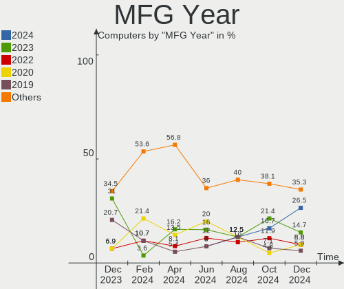

| Year    | Computers | Percent |
|---------|-----------|---------|
| 2023    | 6         | 16.22%  |
| 2018    | 5         | 13.51%  |
| 2022    | 4         | 10.81%  |
| 2020    | 4         | 10.81%  |
| 2021    | 3         | 8.11%   |
| 2015    | 3         | 8.11%   |
| 2014    | 3         | 8.11%   |
| 2013    | 3         | 8.11%   |
| 2019    | 2         | 5.41%   |
| 2016    | 1         | 2.7%    |
| 2012    | 1         | 2.7%    |
| 2011    | 1         | 2.7%    |
| Unknown | 1         | 2.7%    |

Form Factor
-----------

Physical design of the computer

| Name           | Computers | Percent |
|----------------|-----------|---------|
| Notebook       | 21        | 56.76%  |
| Desktop        | 13        | 35.14%  |
| Tablet         | 2         | 5.41%   |
| System on chip | 1         | 2.7%    |

Secure Boot
-----------

Enabled or disabled

| State    | Computers | Percent |
|----------|-----------|---------|
| Disabled | 35        | 94.59%  |
| Enabled  | 2         | 5.41%   |

Coreboot
--------

Have coreboot on board

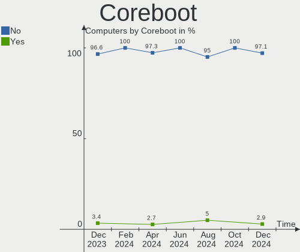

| Used | Computers | Percent |
|------|-----------|---------|
| No   | 36        | 97.3%   |
| Yes  | 1         | 2.7%    |

RAM Size
--------

Total RAM memory

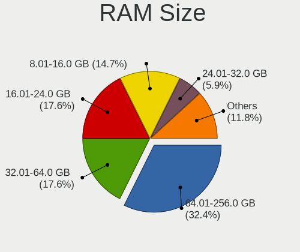

| Size in GB  | Computers | Percent |
|-------------|-----------|---------|
| 32.01-64.0  | 13        | 35.14%  |
| 16.01-24.0  | 8         | 21.62%  |
| 64.01-256.0 | 4         | 10.81%  |
| 8.01-16.0   | 4         | 10.81%  |
| 4.01-8.0    | 3         | 8.11%   |
| 24.01-32.0  | 3         | 8.11%   |
| 3.01-4.0    | 2         | 5.41%   |

RAM Used
--------

Used RAM memory

| Used GB    | Computers | Percent |
|------------|-----------|---------|
| 4.01-8.0   | 9         | 24.32%  |
| 3.01-4.0   | 7         | 18.92%  |
| 2.01-3.0   | 7         | 18.92%  |
| 8.01-16.0  | 7         | 18.92%  |
| 1.01-2.0   | 3         | 8.11%   |
| 32.01-64.0 | 1         | 2.7%    |
| 24.01-32.0 | 1         | 2.7%    |
| 16.01-24.0 | 1         | 2.7%    |
| 0.51-1.0   | 1         | 2.7%    |

Total Drives
------------

Number of drives on board

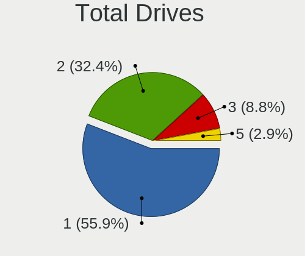

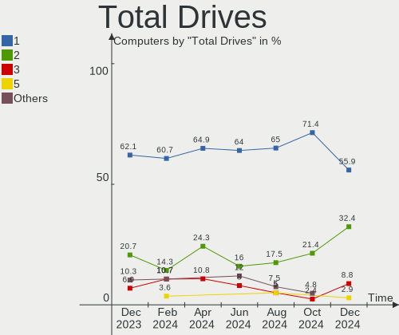

| Drives | Computers | Percent |
|--------|-----------|---------|
| 1      | 24        | 64.86%  |
| 2      | 9         | 24.32%  |
| 3      | 4         | 10.81%  |

Has CD-ROM
----------

Has CD-ROM on board

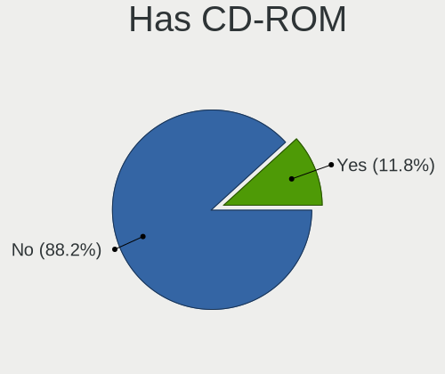

| Presented | Computers | Percent |
|-----------|-----------|---------|
| No        | 36        | 97.3%   |
| Yes       | 1         | 2.7%    |

Has Ethernet
------------

Has Ethernet on board

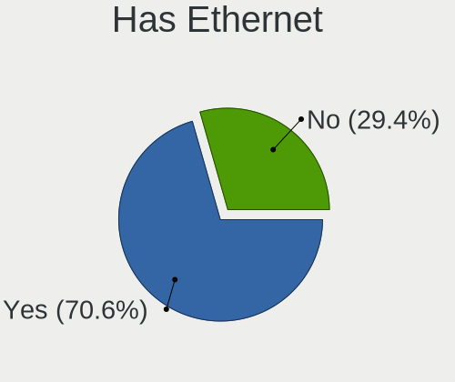

| Presented | Computers | Percent |
|-----------|-----------|---------|
| Yes       | 27        | 72.97%  |
| No        | 10        | 27.03%  |

Has WiFi
--------

Has WiFi module

| Presented | Computers | Percent |
|-----------|-----------|---------|
| Yes       | 30        | 81.08%  |
| No        | 7         | 18.92%  |

Has Bluetooth
-------------

Has Bluetooth module

| Presented | Computers | Percent |
|-----------|-----------|---------|
| Yes       | 29        | 78.38%  |
| No        | 8         | 21.62%  |

Location
--------

Country
-------

Geographic location (country)

| Country         | Computers | Percent |
|-----------------|-----------|---------|
| USA             | 9         | 24.32%  |
| Romania         | 3         | 8.11%   |
| Poland          | 3         | 8.11%   |
| Sweden          | 2         | 5.41%   |
| Russia          | 2         | 5.41%   |
| Netherlands     | 2         | 5.41%   |
| Germany         | 2         | 5.41%   |
| Canada          | 2         | 5.41%   |
| Brazil          | 2         | 5.41%   |
| UK              | 1         | 2.7%    |
| The Netherlands | 1         | 2.7%    |
| Thailand        | 1         | 2.7%    |
| Taiwan          | 1         | 2.7%    |
| Singapore       | 1         | 2.7%    |
| Portugal        | 1         | 2.7%    |
| Jordan          | 1         | 2.7%    |
| Japan           | 1         | 2.7%    |
| China           | 1         | 2.7%    |
| Australia       | 1         | 2.7%    |

City
----

Geographic location (city)

| City        | Computers | Percent |
|-------------|-----------|---------|
| Warsaw      | 2         | 5.41%   |
| Sibiu       | 2         | 5.41%   |
| Port Moody  | 2         | 5.41%   |
| Waalwijk    | 1         | 2.7%    |
| Tokyo       | 1         | 2.7%    |
| Taipei      | 1         | 2.7%    |
| Stuttgart   | 1         | 2.7%    |
| Stockholm   | 1         | 2.7%    |
| Sorocaba    | 1         | 2.7%    |
| Singapore   | 1         | 2.7%    |
| Shanghai    | 1         | 2.7%    |
| San Ramon   | 1         | 2.7%    |
| Reading     | 1         | 2.7%    |
| Porto       | 1         | 2.7%    |
| Portao      | 1         | 2.7%    |
| Minneapolis | 1         | 2.7%    |
| Los Angeles | 1         | 2.7%    |
| Lessebo     | 1         | 2.7%    |
| Kingwood    | 1         | 2.7%    |
| Kingston    | 1         | 2.7%    |
| Katowice    | 1         | 2.7%    |
| Dordrecht   | 1         | 2.7%    |
| Chicago     | 1         | 2.7%    |
| Chiang Mai  | 1         | 2.7%    |
| Brisbane    | 1         | 2.7%    |
| Bremen      | 1         | 2.7%    |
| Boerne      | 1         | 2.7%    |
| Balusesti   | 1         | 2.7%    |
| Balakovo    | 1         | 2.7%    |
| Austin      | 1         | 2.7%    |
| Athens      | 1         | 2.7%    |
| Amsterdam   | 1         | 2.7%    |
| Amman       | 1         | 2.7%    |
| Agryz       | 1         | 2.7%    |

Drives
------

Drive Vendor
------------

Hard drive vendors

| Vendor                       | Computers | Drives | Percent |
|------------------------------|-----------|--------|---------|
| Samsung Electronics          | 11        | 13     | 22.45%  |
| WDC                          | 6         | 6      | 12.24%  |
| Apple                        | 6         | 6      | 12.24%  |
| Sandisk                      | 4         | 5      | 8.16%   |
| Crucial                      | 3         | 3      | 6.12%   |
| Union Memory (Shenzhen)      | 2         | 2      | 4.08%   |
| SK hynix                     | 2         | 2      | 4.08%   |
| Seagate                      | 2         | 2      | 4.08%   |
| Kingston                     | 2         | 4      | 4.08%   |
| Intel                        | 2         | 2      | 4.08%   |
| Unknown                      | 1         | 1      | 2.04%   |
| Silicon Motion               | 1         | 1      | 2.04%   |
| Shenzhen Longsys Electronics | 1         | 1      | 2.04%   |
| PNY                          | 1         | 1      | 2.04%   |
| Micron Technology            | 1         | 1      | 2.04%   |
| Lexar                        | 1         | 1      | 2.04%   |
| KIOXIA                       | 1         | 1      | 2.04%   |
| Kingston Technology Company  | 1         | 2      | 2.04%   |
| HGST                         | 1         | 2      | 2.04%   |

Drive Model
-----------

Hard drive models

| Model                                              | Computers | Percent |
|----------------------------------------------------|-----------|---------|
| Samsung NVMe SSD Controller SM981/PM981/PM983 1TB  | 5         | 9.8%    |
| Union Memory (Shenzhen) UMIS RPJTJ512MGE1QDQ 512GB | 2         | 3.92%   |
| Sandisk WD_BLACK SN850X 1000GB                     | 2         | 3.92%   |
| Samsung NVMe SSD Controller PM9A1/PM9A3/980PRO 1TB | 2         | 3.92%   |
| Apple SSD SM1024F 1TB                              | 2         | 3.92%   |
| WDC WDS100T3X0C-00SJG0 1TB                         | 1         | 1.96%   |
| WDC WD5000LPVX-75V0TT0 500GB                       | 1         | 1.96%   |
| WDC WD5000AAKS-00V1A0 500GB                        | 1         | 1.96%   |
| WDC WD5000AADS-00M2B0 500GB                        | 1         | 1.96%   |
| WDC WD1001FALS-403AA0 1TB                          | 1         | 1.96%   |
| WDC WD10 EZEX-08M2NA0 1TB                          | 1         | 1.96%   |
| Unknown MMC Card  128GB                            | 1         | 1.96%   |
| SK hynix PC801 NVMe 1TB                            | 1         | 1.96%   |
| SK hynix BC501 NVMe Solid State Drive 512GB        | 1         | 1.96%   |
| Silicon Motion SM2262/SM2262EN SSD Controller 2TB  | 1         | 1.96%   |
| Shenzhen Longsys Lexar SSD NM710 2TB               | 1         | 1.96%   |
| Seagate ST500DM0 02-1BD142 500GB                   | 1         | 1.96%   |
| Seagate ST2000LM015-2E8174 2TB                     | 1         | 1.96%   |
| Sandisk WD PC SN740 SDDQNQD-512G-1201 512GB        | 1         | 1.96%   |
| Sandisk WD Blue SN570 2TB                          | 1         | 1.96%   |
| Sandisk WD Blue SN550 NVMe SSD 2TB                 | 1         | 1.96%   |
| Samsung SSD 990 PRO 2TB                            | 1         | 1.96%   |
| Samsung SSD 990 PRO 1TB                            | 1         | 1.96%   |
| Samsung SSD 980 500GB                              | 1         | 1.96%   |
| Samsung SSD 850 EVO 250GB                          | 1         | 1.96%   |
| Samsung MZVLQ512HBLU-00BH1 512GB                   | 1         | 1.96%   |
| PNY CS900 1TB SSD                                  | 1         | 1.96%   |
| Micron MTFDKBA1T0TFH-1BC1AABHA 1024GB              | 1         | 1.96%   |
| Lexar SSD NS100 512GB                              | 1         | 1.96%   |
| KIOXIA KBG50ZNS512G NVMe 512GB                     | 1         | 1.96%   |
| Kingston Company SNV2S1000G 1TB                    | 1         | 1.96%   |
| Kingston SFYRD2000G 2TB                            | 1         | 1.96%   |
| Kingston OMSP0S3512Q-00 512GB SSD                  | 1         | 1.96%   |
| Intel SSDSA2M080G2GC 80GB                          | 1         | 1.96%   |
| Intel SSDPEKNU512GZ 512GB                          | 1         | 1.96%   |
| HGST HTS545050A7E380 500GB                         | 1         | 1.96%   |
| Crucial CT275MX300SSD1 275GB                       | 1         | 1.96%   |
| Crucial CT120M500SSD3 120GB                        | 1         | 1.96%   |
| Crucial CT1000MX500SSD1 1TB                        | 1         | 1.96%   |
| Apple SSD SM768E 752GB                             | 1         | 1.96%   |

HDD Vendor
----------

Hard disk drive vendors

| Vendor  | Computers | Drives | Percent |
|---------|-----------|--------|---------|
| WDC     | 5         | 5      | 62.5%   |
| Seagate | 2         | 2      | 25%     |
| HGST    | 1         | 2      | 12.5%   |

SSD Vendor
----------

Solid state drive vendors

| Vendor              | Computers | Drives | Percent |
|---------------------|-----------|--------|---------|
| Apple               | 6         | 6      | 42.86%  |
| Crucial             | 3         | 3      | 21.43%  |
| Samsung Electronics | 1         | 1      | 7.14%   |
| PNY                 | 1         | 1      | 7.14%   |
| Lexar               | 1         | 1      | 7.14%   |
| Kingston            | 1         | 1      | 7.14%   |
| Intel               | 1         | 1      | 7.14%   |

Drive Kind
----------

HDD or SSD

| Kind | Computers | Drives | Percent |
|------|-----------|--------|---------|
| NVMe | 24        | 32     | 54.55%  |
| SSD  | 12        | 14     | 27.27%  |
| HDD  | 7         | 9      | 15.91%  |
| MMC  | 1         | 1      | 2.27%   |

Drive Connector
---------------

SATA, SAS, NVMe, etc.

| Type | Computers | Drives | Percent |
|------|-----------|--------|---------|
| NVMe | 24        | 32     | 55.81%  |
| SATA | 17        | 21     | 39.53%  |
| SAS  | 1         | 2      | 2.33%   |
| MMC  | 1         | 1      | 2.33%   |

Drive Size
----------

Size of hard drive

| Size in TB | Computers | Drives | Percent |
|------------|-----------|--------|---------|
| 0.01-0.5   | 11        | 13     | 52.38%  |
| 0.51-1.0   | 9         | 9      | 42.86%  |
| 1.01-2.0   | 1         | 1      | 4.76%   |

Space Total
-----------

Amount of disk space available on the file system

| Size in GB     | Computers | Percent |
|----------------|-----------|---------|
| 251-500        | 9         | 24.32%  |
| 1-20           | 8         | 21.62%  |
| 1001-2000      | 6         | 16.22%  |
| 501-1000       | 5         | 13.51%  |
| 101-250        | 4         | 10.81%  |
| More than 3000 | 2         | 5.41%   |
| Unknown        | 2         | 5.41%   |
| 51-100         | 1         | 2.7%    |

Space Used
----------

Amount of used disk space

| Used GB        | Computers | Percent |
|----------------|-----------|---------|
| 1-20           | 12        | 32.43%  |
| 101-250        | 6         | 16.22%  |
| 21-50          | 5         | 13.51%  |
| 251-500        | 4         | 10.81%  |
| 51-100         | 3         | 8.11%   |
| More than 3000 | 2         | 5.41%   |
| 501-1000       | 2         | 5.41%   |
| Unknown        | 2         | 5.41%   |
| 1001-2000      | 1         | 2.7%    |

Malfunc. Drives
---------------

Drive models with a malfunction

| Model                                                         | Computers | Drives | Percent |
|---------------------------------------------------------------|-----------|--------|---------|
| WDC WD5000AAKS-00V1A0 500GB                                   | 1         | 1      | 16.67%  |
| WDC WD1001FALS-403AA0 1TB                                     | 1         | 1      | 16.67%  |
| Seagate ST2000LM015-2E8174 2TB                                | 1         | 1      | 16.67%  |
| Samsung Electronics NVMe SSD Controller SM981/PM981/PM983 1TB | 1         | 1      | 16.67%  |
| Intel SSDSA2M080G2GC 80GB                                     | 1         | 1      | 16.67%  |
| Crucial CT120M500SSD3 120GB                                   | 1         | 1      | 16.67%  |

Malfunc. Drive Vendor
---------------------

Vendors of faulty drives

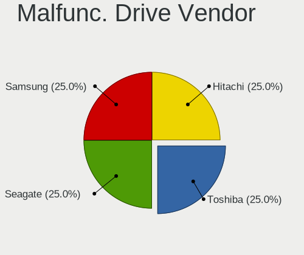

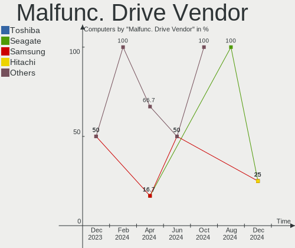

| Vendor              | Computers | Drives | Percent |
|---------------------|-----------|--------|---------|
| WDC                 | 2         | 2      | 33.33%  |
| Seagate             | 1         | 1      | 16.67%  |
| Samsung Electronics | 1         | 1      | 16.67%  |
| Intel               | 1         | 1      | 16.67%  |
| Crucial             | 1         | 1      | 16.67%  |

Malfunc. HDD Vendor
-------------------

Vendors of faulty HDD drives

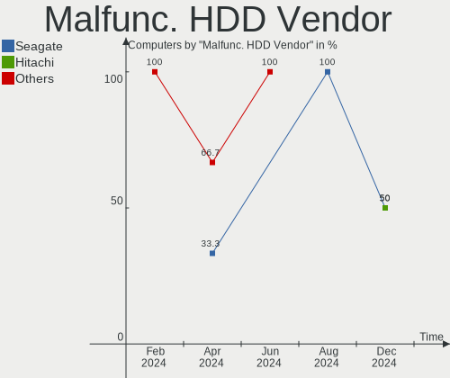

| Vendor  | Computers | Drives | Percent |
|---------|-----------|--------|---------|
| WDC     | 2         | 2      | 66.67%  |
| Seagate | 1         | 1      | 33.33%  |

Malfunc. Drive Kind
-------------------

Kinds of faulty drives

| Kind | Computers | Drives | Percent |
|------|-----------|--------|---------|
| HDD  | 3         | 3      | 50%     |
| SSD  | 2         | 2      | 33.33%  |
| NVMe | 1         | 1      | 16.67%  |

Failed Drives
-------------

Failed drive models

Zero info for selected period =(

Failed Drive Vendor
-------------------

Failed drive vendors

Zero info for selected period =(

Drive Status
------------

Number of failed and malfunc. drives

| Status   | Computers | Drives | Percent |
|----------|-----------|--------|---------|
| Works    | 33        | 46     | 82.5%   |
| Malfunc  | 5         | 6      | 12.5%   |
| Detected | 2         | 4      | 5%      |

Storage controller
------------------

Storage Vendor
--------------

Storage controller vendors

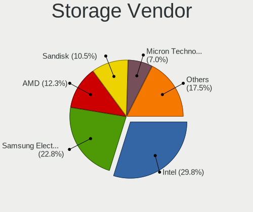

| Vendor                       | Computers | Percent |
|------------------------------|-----------|---------|
| Intel                        | 16        | 31.37%  |
| Samsung Electronics          | 14        | 27.45%  |
| Sandisk                      | 5         | 9.8%    |
| AMD                          | 5         | 9.8%    |
| Union Memory (Shenzhen)      | 2         | 3.92%   |
| SK hynix                     | 2         | 3.92%   |
| Kingston Technology Company  | 2         | 3.92%   |
| Silicon Motion               | 1         | 1.96%   |
| Shenzhen Longsys Electronics | 1         | 1.96%   |
| Micron Technology            | 1         | 1.96%   |
| KIOXIA                       | 1         | 1.96%   |
| ASMedia Technology           | 1         | 1.96%   |

Storage Model
-------------

Storage controller models

| Model                                                                          | Computers | Percent |
|--------------------------------------------------------------------------------|-----------|---------|
| Samsung NVMe SSD Controller SM981/PM981/PM983                                  | 5         | 9.09%   |
| Samsung S4LN053X01 AHCI SSD Controller(Apple slot)                             | 3         | 5.45%   |
| AMD 400 Series Chipset SATA Controller                                         | 3         | 5.45%   |
| Union Memory (Shenzhen) AM630 PCIe 4.0 x4 NVMe SSD Controller                  | 2         | 3.64%   |
| Sandisk WD Black SN850X NVMe SSD                                               | 2         | 3.64%   |
| Samsung S4LN058A01[SSUBX] AHCI SSD Controller (Apple slot)                     | 2         | 3.64%   |
| Samsung NVMe SSD Controller 980 (DRAM-less)                                    | 2         | 3.64%   |
| Intel Raptor Lake SATA AHCI Controller                                         | 2         | 3.64%   |
| Intel Cannon Lake PCH SATA AHCI Controller                                     | 2         | 3.64%   |
| Intel Cannon Lake Mobile PCH SATA AHCI Controller                              | 2         | 3.64%   |
| Intel 6 Series/C200 Series Chipset Family 6 port Desktop SATA AHCI Controller  | 2         | 3.64%   |
| AMD FCH SATA Controller [AHCI mode]                                            | 2         | 3.64%   |
| AMD 600 Series Chipset SATA Controller                                         | 2         | 3.64%   |
| SK hynix Platinum P41/PC801 NVMe Solid State Drive                             | 1         | 1.82%   |
| SK hynix BC501 NVMe Solid State Drive                                          | 1         | 1.82%   |
| Silicon Motion SM2262/SM2262EN SSD Controller                                  | 1         | 1.82%   |
| Shenzhen Longsys Lexar NM790 NVME SSD (DRAM-less)                              | 1         | 1.82%   |
| SanDisk WD Blue SN570 NVMe SSD 2TB                                             | 1         | 1.82%   |
| SanDisk WD Black SN770 / PC SN740 256GB / PC SN560 (DRAM-less) NVMe SSD        | 1         | 1.82%   |
| SanDisk Ultra 3D / WD Blue SN550 NVMe SSD                                      | 1         | 1.82%   |
| SanDisk Extreme Pro / WD Black SN750 / PC SN730 / Red SN700 NVMe SSD           | 1         | 1.82%   |
| Samsung NVMe SSD Controller S4LV008[Pascal]                                    | 1         | 1.82%   |
| Samsung NVMe SSD Controller PM9A1/PM9A3/980PRO                                 | 1         | 1.82%   |
| Micron 3400 NVMe SSD [Hendrix]                                                 | 1         | 1.82%   |
| KIOXIA NVMe SSD Controller BG5 (DRAM-less)                                     | 1         | 1.82%   |
| Kingston Company NV2 NVMe SSD SM2267XT (DRAM-less)                             | 1         | 1.82%   |
| Kingston Company KC3000/FURY Renegade NVMe SSD E18                             | 1         | 1.82%   |
| Intel Wildcat Point-LP SATA Controller [AHCI Mode]                             | 1         | 1.82%   |
| Intel Volume Management Device NVMe RAID Controller                            | 1         | 1.82%   |
| Intel Sunrise Point-LP SATA Controller [AHCI mode]                             | 1         | 1.82%   |
| Intel SSD 670p Series [Keystone Harbor]                                        | 1         | 1.82%   |
| Intel Q170/Q150/B150/H170/H110/Z170/CM236 Chipset SATA Controller [AHCI Mode]  | 1         | 1.82%   |
| Intel Atom Processor E3800 Series SATA AHCI Controller                         | 1         | 1.82%   |
| Intel 8 Series/C220 Series Chipset Family 6-port SATA Controller 1 [AHCI mode] | 1         | 1.82%   |
| Intel 7 Series Chipset Family 6-port SATA Controller [AHCI mode]               | 1         | 1.82%   |
| Intel 6 Series/C200 Series Chipset Family 6 port Mobile SATA AHCI Controller   | 1         | 1.82%   |
| ASMedia ASM1061/ASM1062 Serial ATA Controller                                  | 1         | 1.82%   |

Storage Kind
------------

Kind of storage controller (IDE, SATA, NVMe, SAS, ...)

| Kind | Computers | Percent |
|------|-----------|---------|
| SATA | 25        | 51.02%  |
| NVMe | 23        | 46.94%  |
| RAID | 1         | 2.04%   |

Processor
---------

CPU Vendor
----------

Processor vendors

| Vendor | Computers | Percent |
|--------|-----------|---------|
| Intel  | 25        | 67.57%  |
| AMD    | 11        | 29.73%  |
| ARM    | 1         | 2.7%    |

CPU Model
---------

Processor models

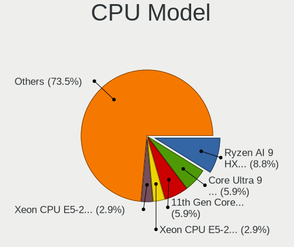

| Model                                         | Computers | Percent |
|-----------------------------------------------|-----------|---------|
| Intel Xeon CPU E5-2640 v2 @ 2.00GHz           | 1         | 2.7%    |
| Intel Xeon CPU E5-1650 v2 @ 3.50GHz           | 1         | 2.7%    |
| Intel Core i9-9900KF CPU @ 3.60GHz            | 1         | 2.7%    |
| Intel Core i7-9700K CPU @ 3.60GHz             | 1         | 2.7%    |
| Intel Core i7-8750H CPU @ 2.20GHz             | 1         | 2.7%    |
| Intel Core i7-6820HQ CPU @ 2.70GHz            | 1         | 2.7%    |
| Intel Core i7-5557U CPU @ 3.10GHz             | 1         | 2.7%    |
| Intel Core i7-4980HQ CPU @ 2.80GHz            | 1         | 2.7%    |
| Intel Core i7-4870HQ CPU @ 2.50GHz            | 1         | 2.7%    |
| Intel Core i7-4770HQ CPU @ 2.20GHz            | 1         | 2.7%    |
| Intel Core i7-4710HQ CPU @ 2.50GHz            | 1         | 2.7%    |
| Intel Core i7-3820QM CPU @ 2.70GHz            | 1         | 2.7%    |
| Intel Core i7-2630QM CPU @ 2.00GHz            | 1         | 2.7%    |
| Intel Core i7-1065G7 CPU @ 1.30GHz            | 1         | 2.7%    |
| Intel Core i5-9300H CPU @ 2.40GHz             | 1         | 2.7%    |
| Intel Core i5-8350U CPU @ 1.70GHz             | 1         | 2.7%    |
| Intel Core i5-5200U CPU @ 2.20GHz             | 1         | 2.7%    |
| Intel Core i5-14500                           | 1         | 2.7%    |
| Intel Celeron CPU J1900 @ 1.99GHz             | 1         | 2.7%    |
| Intel Celeron CPU G1610 @ 2.60GHz             | 1         | 2.7%    |
| Intel 13th Gen Core i9-13900H                 | 1         | 2.7%    |
| Intel 13th Gen Core i5-13600K                 | 1         | 2.7%    |
| Intel 12th Gen Core i7-1265U                  | 1         | 2.7%    |
| Intel 11th Gen Core i7-1185G7 @ 3.00GHz       | 1         | 2.7%    |
| Intel 11th Gen Core i5-1140G7 @ 1.10GHz       | 1         | 2.7%    |
| ARM Processor                                 | 1         | 2.7%    |
| AMD Ryzen 9 8945HS w/ Radeon 780M Graphics    | 1         | 2.7%    |
| AMD Ryzen 9 7950X 16-Core Processor           | 1         | 2.7%    |
| AMD Ryzen 9 7900 12-Core Processor            | 1         | 2.7%    |
| AMD Ryzen 9 5980HX with Radeon Graphics       | 1         | 2.7%    |
| AMD Ryzen 7 PRO 7840U w/ Radeon 780M Graphics | 1         | 2.7%    |
| AMD Ryzen 7 PRO 6860Z with Radeon Graphics    | 1         | 2.7%    |
| AMD Ryzen 7 PRO 5875U with Radeon Graphics    | 1         | 2.7%    |
| AMD Ryzen 7 PRO 4750U with Radeon Graphics    | 1         | 2.7%    |
| AMD Ryzen 7 5700G with Radeon Graphics        | 1         | 2.7%    |
| AMD Ryzen 7 2700X Eight-Core Processor        | 1         | 2.7%    |
| AMD Ryzen 5 3600 6-Core Processor             | 1         | 2.7%    |

CPU Model Family
----------------

Processor model prefix

| Model           | Computers | Percent |
|-----------------|-----------|---------|
| Intel Core i7   | 11        | 29.73%  |
| Other           | 6         | 16.22%  |
| Intel Core i5   | 4         | 10.81%  |
| AMD Ryzen 9     | 4         | 10.81%  |
| AMD Ryzen 7 PRO | 4         | 10.81%  |
| Intel Xeon      | 2         | 5.41%   |
| Intel Celeron   | 2         | 5.41%   |
| AMD Ryzen 7     | 2         | 5.41%   |
| Intel Core i9   | 1         | 2.7%    |
| AMD Ryzen 5     | 1         | 2.7%    |

CPU Cores
---------

Number of processor cores

| Number  | Computers | Percent |
|---------|-----------|---------|
| 4       | 13        | 35.14%  |
| 8       | 11        | 29.73%  |
| 14      | 3         | 8.11%   |
| 6       | 3         | 8.11%   |
| 2       | 3         | 8.11%   |
| 16      | 1         | 2.7%    |
| 12      | 1         | 2.7%    |
| 10      | 1         | 2.7%    |
| Unknown | 1         | 2.7%    |

CPU Sockets
-----------

Number of sockets

| Number  | Computers | Percent |
|---------|-----------|---------|
| 1       | 36        | 97.3%   |
| Unknown | 1         | 2.7%    |

CPU Threads
-----------

Threads per core (Hyper-Threading)

| Number  | Computers | Percent |
|---------|-----------|---------|
| 2       | 33        | 89.19%  |
| 1       | 3         | 8.11%   |
| Unknown | 1         | 2.7%    |

CPU Op-Modes
------------

CPU Operation Modes (32-bit, 64-bit)

| Op mode        | Computers | Percent |
|----------------|-----------|---------|
| 32-bit, 64-bit | 37        | 100%    |

CPU Microcode
-------------

Microcode number

| Number     | Computers | Percent |
|------------|-----------|---------|
| Unknown    | 18        | 48.65%  |
| 0x906ea    | 2         | 5.41%   |
| 0x40661    | 2         | 5.41%   |
| 0x306d4    | 2         | 5.41%   |
| 0x0a601206 | 2         | 5.41%   |
| 0x0a50000c | 2         | 5.41%   |
| 0xb0671    | 1         | 2.7%    |
| 0x506e3    | 1         | 2.7%    |
| 0x306e4    | 1         | 2.7%    |
| 0x306a9    | 1         | 2.7%    |
| 0x30679    | 1         | 2.7%    |
| 0x0a704104 | 1         | 2.7%    |
| 0x0a404105 | 1         | 2.7%    |
| 0x08600106 | 1         | 2.7%    |
| 0x0800820d | 1         | 2.7%    |

CPU Microarch
-------------

Microarchitecture

| Name             | Computers | Percent |
|------------------|-----------|---------|
| Unknown          | 6         | 16.22%  |
| KabyLake         | 5         | 13.51%  |
| IvyBridge        | 4         | 10.81%  |
| Haswell          | 4         | 10.81%  |
| Alderlake Hybrid | 4         | 10.81%  |
| Zen 3            | 3         | 8.11%   |
| Zen 2            | 2         | 5.41%   |
| TigerLake        | 2         | 5.41%   |
| Broadwell        | 2         | 5.41%   |
| Zen+             | 1         | 2.7%    |
| Skylake          | 1         | 2.7%    |
| Silvermont       | 1         | 2.7%    |
| SandyBridge      | 1         | 2.7%    |
| IceLake          | 1         | 2.7%    |

Graphics
--------

GPU Vendor
----------

Vendors of graphics cards

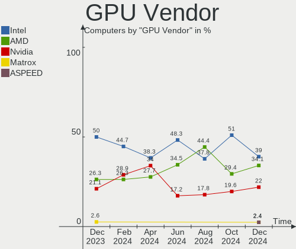

| Vendor | Computers | Percent |
|--------|-----------|---------|
| Intel  | 18        | 38.3%   |
| Nvidia | 16        | 34.04%  |
| AMD    | 13        | 27.66%  |

GPU Model
---------

Graphics card models

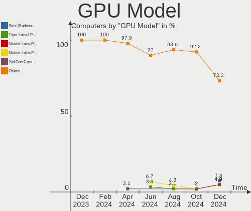

| Model                                                                     | Computers | Percent |
|---------------------------------------------------------------------------|-----------|---------|
| Nvidia AD106M [GeForce RTX 4070 Max-Q / Mobile]                           | 2         | 4.17%   |
| Intel CoffeeLake-H GT2 [UHD Graphics 630]                                 | 2         | 4.17%   |
| AMD Raphael                                                               | 2         | 4.17%   |
| AMD Cezanne [Radeon Vega Series / Radeon Vega Mobile Series]              | 2         | 4.17%   |
| Nvidia TU117M [GeForce GTX 1650 Mobile / Max-Q]                           | 1         | 2.08%   |
| Nvidia TU116 [GeForce GTX 1650 SUPER]                                     | 1         | 2.08%   |
| Nvidia TU106 [GeForce RTX 2070 Rev. A]                                    | 1         | 2.08%   |
| Nvidia TU104 [GeForce RTX 2080 Rev. A]                                    | 1         | 2.08%   |
| Nvidia GP107GL [Quadro P600]                                              | 1         | 2.08%   |
| Nvidia GP106M [GeForce GTX 1060 Mobile]                                   | 1         | 2.08%   |
| Nvidia GM107M [GeForce GTX 860M]                                          | 1         | 2.08%   |
| Nvidia GM107GLM [Quadro M2000M]                                           | 1         | 2.08%   |
| Nvidia GK107M [GeForce GT 750M Mac Edition]                               | 1         | 2.08%   |
| Nvidia GK107M [GeForce GT 650M Mac Edition]                               | 1         | 2.08%   |
| Nvidia GF119M [GeForce GT 520M]                                           | 1         | 2.08%   |
| Nvidia GA106 [GeForce RTX 3060 Lite Hash Rate]                            | 1         | 2.08%   |
| Nvidia AD106 [GeForce RTX 4060 Ti]                                        | 1         | 2.08%   |
| Nvidia AD102 [GeForce RTX 4090]                                           | 1         | 2.08%   |
| Intel Xeon E3-1200 v2/3rd Gen Core processor Graphics Controller          | 1         | 2.08%   |
| Intel UHD Graphics 620                                                    | 1         | 2.08%   |
| Intel TigerLake-LP GT2 [Iris Xe Graphics]                                 | 1         | 2.08%   |
| Intel Tiger Lake-UP4 GT2 [Iris Xe Graphics]                               | 1         | 2.08%   |
| Intel Raptor Lake-S GT1 [UHD Graphics 770]                                | 1         | 2.08%   |
| Intel Raptor Lake-P [Iris Xe Graphics]                                    | 1         | 2.08%   |
| Intel Iris Plus Graphics G7                                               | 1         | 2.08%   |
| Intel Iris Graphics 6100                                                  | 1         | 2.08%   |
| Intel HD Graphics 5500                                                    | 1         | 2.08%   |
| Intel Crystal Well Integrated Graphics Controller                         | 1         | 2.08%   |
| Intel Atom Processor Z36xxx/Z37xxx Series Graphics & Display              | 1         | 2.08%   |
| Intel AlderLake-S GT1                                                     | 1         | 2.08%   |
| Intel Alder Lake-UP3 GT2 [Iris Xe Graphics]                               | 1         | 2.08%   |
| Intel 4th Gen Core Processor Integrated Graphics Controller               | 1         | 2.08%   |
| Intel 3rd Gen Core processor Graphics Controller                          | 1         | 2.08%   |
| Intel 2nd Generation Core Processor Family Integrated Graphics Controller | 1         | 2.08%   |
| AMD Venus XT [Radeon HD 8870M / R9 M270X/M370X]                           | 1         | 2.08%   |
| AMD Tahiti LE [Radeon HD 7870 XT]                                         | 1         | 2.08%   |
| AMD Renoir [Radeon RX Vega 6 (Ryzen 4000/5000 Mobile Series)]             | 1         | 2.08%   |
| AMD Rembrandt [Radeon 680M]                                               | 1         | 2.08%   |
| AMD Phoenix3                                                              | 1         | 2.08%   |
| AMD Phoenix1                                                              | 1         | 2.08%   |

GPU Combo
---------

Combinations of graphics cards

| Name           | Computers | Percent |
|----------------|-----------|---------|
| 1 x Intel      | 10        | 27.03%  |
| Intel + Nvidia | 8         | 21.62%  |
| 1 x AMD        | 8         | 21.62%  |
| 1 x Nvidia     | 5         | 13.51%  |
| AMD + Nvidia   | 3         | 8.11%   |
| 2 x AMD        | 2         | 5.41%   |
| Other          | 1         | 2.7%    |

GPU Driver
----------

Free vs proprietary

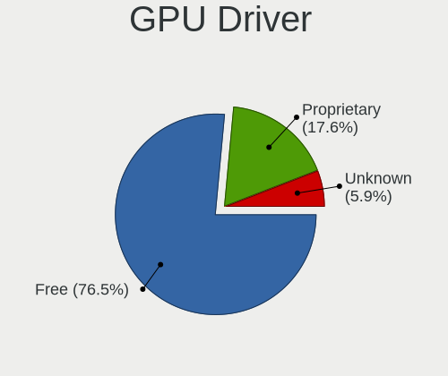

| Driver      | Computers | Percent |
|-------------|-----------|---------|
| Free        | 25        | 67.57%  |
| Proprietary | 11        | 29.73%  |
| Unknown     | 1         | 2.7%    |

GPU Memory
----------

Total video memory

| Size in GB | Computers | Percent |
|------------|-----------|---------|
| Unknown    | 21        | 56.76%  |
| 8.01-16.0  | 4         | 10.81%  |
| 0.01-0.5   | 4         | 10.81%  |
| 0.51-1.0   | 3         | 8.11%   |
| 1.01-2.0   | 2         | 5.41%   |
| 7.01-8.0   | 1         | 2.7%    |
| 3.01-4.0   | 1         | 2.7%    |
| 2.01-3.0   | 1         | 2.7%    |

Monitor
-------

Monitor Vendor
--------------

Monitor vendors

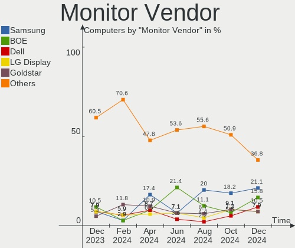

| Vendor               | Computers | Percent |
|----------------------|-----------|---------|
| Samsung Electronics  | 8         | 17.39%  |
| Goldstar             | 5         | 10.87%  |
| Apple                | 5         | 10.87%  |
| Dell                 | 4         | 8.7%    |
| BOE                  | 4         | 8.7%    |
| ASUSTek Computer     | 4         | 8.7%    |
| LG Display           | 3         | 6.52%   |
| AU Optronics         | 3         | 6.52%   |
| Sharp                | 2         | 4.35%   |
| Chimei Innolux       | 2         | 4.35%   |
| ViewSonic            | 1         | 2.17%   |
| Lenovo               | 1         | 2.17%   |
| HUAWEI               | 1         | 2.17%   |
| Gigabyte Technology  | 1         | 2.17%   |
| Eizo                 | 1         | 2.17%   |
| Ancor Communications | 1         | 2.17%   |

Monitor Model
-------------

Monitor models

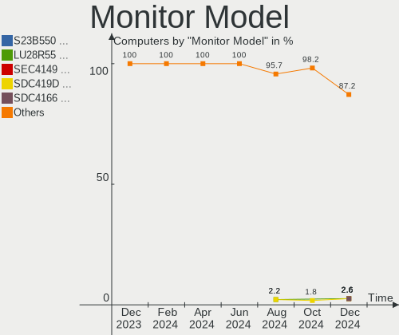

| Model                                                                 | Computers | Percent |
|-----------------------------------------------------------------------|-----------|---------|
| Goldstar ULTRAFINE GSM5BC2 3840x2160 697x392mm 31.5-inch              | 2         | 4.26%   |
| ViewSonic VA2232 Series VSC8224 1680x1050 474x296mm 22.0-inch         | 1         | 2.13%   |
| Sharp LCD Monitor SHP153E 1920x1080 294x165mm 13.3-inch               | 1         | 2.13%   |
| Sharp LCD Monitor SHP143B 3840x2160 346x194mm 15.6-inch               | 1         | 2.13%   |
| Samsung Electronics SyncMaster SAM0592 1920x1080 510x290mm 23.1-inch  | 1         | 2.13%   |
| Samsung Electronics LF24T35 SAM707D 1920x1080 528x297mm 23.9-inch     | 1         | 2.13%   |
| Samsung Electronics LCD Monitor SEC3151 1366x768 344x194mm 15.5-inch  | 1         | 2.13%   |
| Samsung Electronics LCD Monitor SDC4167 2880x1800 289x186mm 13.5-inch | 1         | 2.13%   |
| Samsung Electronics LCD Monitor SDC414D 3456x2160 336x210mm 15.6-inch | 1         | 2.13%   |
| Samsung Electronics LCD Monitor SDC324C 1920x1080 344x194mm 15.5-inch | 1         | 2.13%   |
| Samsung Electronics LC49G95T SAM7053 3840x1080 1193x336mm 48.8-inch   | 1         | 2.13%   |
| Samsung Electronics C27HG7x SAM0E15 2560x1440 598x336mm 27.0-inch     | 1         | 2.13%   |
| LG Display LCD Monitor LGD40A9 1920x1080 309x174mm 14.0-inch          | 1         | 2.13%   |
| LG Display LCD Monitor LGD0555 2736x1824 260x170mm 12.2-inch          | 1         | 2.13%   |
| LG Display LCD Monitor LGD0521 1920x1080 309x174mm 14.0-inch          | 1         | 2.13%   |
| Lenovo L15 LEN66E4 1920x1080 344x194mm 15.5-inch                      | 1         | 2.13%   |
| HUAWEI MateView HWV6E22 3840x2560 596x397mm 28.2-inch                 | 1         | 2.13%   |
| Goldstar ULTRAWIDE GSM76F9 2560x1080 531x298mm 24.0-inch              | 1         | 2.13%   |
| Goldstar ULTRAGEAR+ GSM5C34 2560x1440 590x333mm 26.7-inch             | 1         | 2.13%   |
| Goldstar ULTRAFINE GSM5BC1 3840x2160 600x340mm 27.2-inch              | 1         | 2.13%   |
| Goldstar E2411 GSM583B 1920x1080 477x268mm 21.5-inch                  | 1         | 2.13%   |
| Gigabyte Technology G34WQC GBT3400 3440x1440 797x334mm 34.0-inch      | 1         | 2.13%   |
| Eizo S2000 ENC1816 1600x1200 408x306mm 20.1-inch                      | 1         | 2.13%   |
| Dell U2715H DELD069 2560x1440 597x336mm 27.0-inch                     | 1         | 2.13%   |
| Dell SE2417HG DELD08D 1920x1080 521x293mm 23.5-inch                   | 1         | 2.13%   |
| Dell S2721QS DELA198 3840x2160 597x336mm 27.0-inch                    | 1         | 2.13%   |
| Dell S2721DGF DEL41DA 2560x1440 597x336mm 27.0-inch                   | 1         | 2.13%   |
| Chimei Innolux LCD Monitor CMN1540 2560x1440 344x193mm 15.5-inch      | 1         | 2.13%   |
| Chimei Innolux LCD Monitor CMN1495 1366x768 309x173mm 13.9-inch       | 1         | 2.13%   |
| BOE LCD Monitor BOE0B94 2560x1600 302x188mm 14.0-inch                 | 1         | 2.13%   |
| BOE LCD Monitor BOE0AEC 1920x1280 274x182mm 13.0-inch                 | 1         | 2.13%   |
| BOE LCD Monitor BOE0A76 2256x1504 285x190mm 13.5-inch                 | 1         | 2.13%   |
| BOE LCD Monitor BOE0747 1920x1080 344x194mm 15.5-inch                 | 1         | 2.13%   |
| AU Optronics LCD Monitor AUOD0ED 1920x1080 344x193mm 15.5-inch        | 1         | 2.13%   |
| AU Optronics LCD Monitor AUO8B9B 1920x1200 344x215mm 16.0-inch        | 1         | 2.13%   |
| AU Optronics LCD Monitor AUO2E8D 1920x1080 344x194mm 15.5-inch        | 1         | 2.13%   |
| ASUSTek Computer VG277Q1A AUS272D 1920x1080 598x336mm 27.0-inch       | 1         | 2.13%   |
| ASUSTek Computer ROG PG27U AUS27A4 3840x2160 598x336mm 27.0-inch      | 1         | 2.13%   |
| ASUSTek Computer PA279 AUS2768 3840x2160 597x336mm 27.0-inch          | 1         | 2.13%   |
| ASUSTek Computer MB16AHP AUS1662 1920x1080 344x194mm 15.5-inch        | 1         | 2.13%   |

Monitor Resolution
------------------

Monitor screen resolution

| Resolution         | Computers | Percent |
|--------------------|-----------|---------|
| 1920x1080 (FHD)    | 11        | 26.83%  |
| 3840x2160 (4K)     | 6         | 14.63%  |
| 2880x1800          | 5         | 12.2%   |
| 2560x1440 (QHD)    | 4         | 9.76%   |
| 2560x1600          | 2         | 4.88%   |
| 1366x768 (WXGA)    | 2         | 4.88%   |
| 3840x2560          | 1         | 2.44%   |
| 3840x1080          | 1         | 2.44%   |
| 3456x2160          | 1         | 2.44%   |
| 3440x1440          | 1         | 2.44%   |
| 2736x1824          | 1         | 2.44%   |
| 2560x1080          | 1         | 2.44%   |
| 2256x1504          | 1         | 2.44%   |
| 1920x1280          | 1         | 2.44%   |
| 1920x1200 (WUXGA)  | 1         | 2.44%   |
| 1680x1050 (WSXGA+) | 1         | 2.44%   |
| 1600x1200          | 1         | 2.44%   |

Monitor Diagonal
----------------

Diagonal size in inches

| Inches | Computers | Percent |
|--------|-----------|---------|
| 15     | 14        | 31.82%  |
| 27     | 7         | 15.91%  |
| 13     | 5         | 11.36%  |
| 14     | 4         | 9.09%   |
| 34     | 2         | 4.55%   |
| 31     | 2         | 4.55%   |
| 24     | 2         | 4.55%   |
| 48     | 1         | 2.27%   |
| 28     | 1         | 2.27%   |
| 26     | 1         | 2.27%   |
| 23     | 1         | 2.27%   |
| 22     | 1         | 2.27%   |
| 20     | 1         | 2.27%   |
| 16     | 1         | 2.27%   |
| 12     | 1         | 2.27%   |

Monitor Width
-------------

Physical width

| Width in mm | Computers | Percent |
|-------------|-----------|---------|
| 301-350     | 18        | 42.86%  |
| 501-600     | 10        | 23.81%  |
| 201-300     | 6         | 14.29%  |
| 601-700     | 3         | 7.14%   |
| 701-800     | 2         | 4.76%   |
| 401-500     | 2         | 4.76%   |
| 1001-1500   | 1         | 2.38%   |

Aspect Ratio
------------

Proportional relationship between the width and the height

| Ratio | Computers | Percent |
|-------|-----------|---------|
| 16/9  | 21        | 53.85%  |
| 16/10 | 10        | 25.64%  |
| 3/2   | 4         | 10.26%  |
| 21/9  | 2         | 5.13%   |
| 4/3   | 1         | 2.56%   |
| 32/9  | 1         | 2.56%   |

Monitor Area
------------

Area in inch

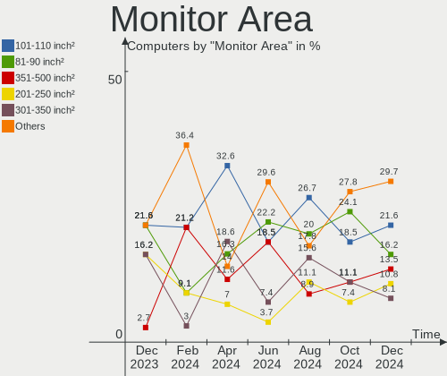

| Area in inch | Computers | Percent |
|----------------|-----------|---------|
| 101-110        | 14        | 32.56%  |
| 301-350        | 8         | 18.6%   |
| 81-90          | 7         | 16.28%  |
| 351-500        | 5         | 11.63%  |
| 71-80          | 3         | 6.98%   |
| 201-250        | 3         | 6.98%   |
| 151-200        | 1         | 2.33%   |
| 111-120        | 1         | 2.33%   |
| 501-1000       | 1         | 2.33%   |

Pixel Density
-------------

Pixels per inch

| Density       | Computers | Percent |
|---------------|-----------|---------|
| 161-240       | 13        | 31.71%  |
| 121-160       | 11        | 26.83%  |
| 101-120       | 7         | 17.07%  |
| 51-100        | 7         | 17.07%  |
| More than 240 | 3         | 7.32%   |

Multiple Monitors
-----------------

Total monitors connected

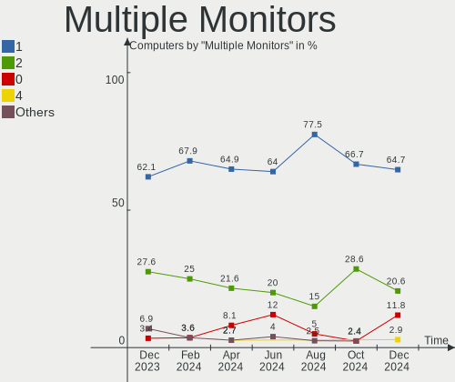

| Total | Computers | Percent |
|-------|-----------|---------|
| 1     | 24        | 64.86%  |
| 2     | 8         | 21.62%  |
| 0     | 3         | 8.11%   |
| 4     | 1         | 2.7%    |
| 3     | 1         | 2.7%    |

Network
-------

Net Controller Vendor
---------------------

Controller vendors

| Vendor                | Computers | Percent |
|-----------------------|-----------|---------|
| Intel                 | 18        | 33.96%  |
| Realtek Semiconductor | 15        | 28.3%   |
| Broadcom              | 5         | 9.43%   |
| MediaTek              | 4         | 7.55%   |
| Qualcomm Atheros      | 3         | 5.66%   |
| Qualcomm              | 2         | 3.77%   |
| TP-Link               | 1         | 1.89%   |
| Qualcomm Technologies | 1         | 1.89%   |
| Broadcom Limited      | 1         | 1.89%   |
| ASIX Electronics      | 1         | 1.89%   |
| Aquantia              | 1         | 1.89%   |
| Apple                 | 1         | 1.89%   |

Net Controller Model
--------------------

Controller models

| Model                                                                           | Computers | Percent |
|---------------------------------------------------------------------------------|-----------|---------|
| Realtek RTL8111/8168/8211/8411 PCI Express Gigabit Ethernet Controller          | 13        | 20.97%  |
| Qualcomm QCNFA765 Wireless Network Adapter                                      | 2         | 3.23%   |
| MediaTek MT7922 802.11ax PCI Express Wireless Network Adapter                   | 2         | 3.23%   |
| Intel Wireless 3160                                                             | 2         | 3.23%   |
| Intel Wi-Fi 6 AX200                                                             | 2         | 3.23%   |
| Intel Wi-Fi 5(802.11ac) Wireless-AC 9x6x [Thunder Peak]                         | 2         | 3.23%   |
| Intel I211 Gigabit Network Connection                                           | 2         | 3.23%   |
| Intel Ethernet Controller I225-V                                                | 2         | 3.23%   |
| Intel Ethernet Connection (7) I219-V                                            | 2         | 3.23%   |
| Broadcom BCM43602 802.11ac Wireless LAN SoC                                     | 2         | 3.23%   |
| Broadcom BCM4360 802.11ac Dual Band Wireless Network Adapter                    | 2         | 3.23%   |
| TP-Link TL-WN823N v2/v3 [Realtek RTL8192EU]                                     | 1         | 1.61%   |
| Realtek RTL8852AE 802.11ax PCIe Wireless Network Adapter                        | 1         | 1.61%   |
| Realtek RTL8153 Gigabit Ethernet Adapter                                        | 1         | 1.61%   |
| Realtek RTL8125 2.5GbE Controller                                               | 1         | 1.61%   |
| Realtek Killer E3000 2.5GbE Controller                                          | 1         | 1.61%   |
| Qualcomm WCN785x Wi-Fi 7(802.11be) 320MHz 2x2 [FastConnect 7800]                | 1         | 1.61%   |
| Qualcomm Atheros QCA986x/988x 802.11ac Wireless Network Adapter                 | 1         | 1.61%   |
| Qualcomm Atheros Killer E220x Gigabit Ethernet Controller                       | 1         | 1.61%   |
| Qualcomm Atheros AR9462 Wireless Network Adapter                                | 1         | 1.61%   |
| MediaTek MT7921K (RZ608) Wi-Fi 6E 80MHz                                         | 1         | 1.61%   |
| MediaTek MT7921 802.11ax PCI Express Wireless Network Adapter                   | 1         | 1.61%   |
| Intel Wireless 8265 / 8275                                                      | 1         | 1.61%   |
| Intel Wireless 8260                                                             | 1         | 1.61%   |
| Intel Wi-Fi 6E(802.11ax) AX210/AX1675* 2x2 [Typhoon Peak]                       | 1         | 1.61%   |
| Intel Wi-Fi 6 AX201                                                             | 1         | 1.61%   |
| Intel Raptor Lake-S PCH CNVi WiFi                                               | 1         | 1.61%   |
| Intel Raptor Lake PCH CNVi WiFi                                                 | 1         | 1.61%   |
| Intel Ice Lake-LP PCH CNVi WiFi                                                 | 1         | 1.61%   |
| Intel Ethernet Connection (4) I219-LM                                           | 1         | 1.61%   |
| Intel Ethernet Connection (2) I219-LM                                           | 1         | 1.61%   |
| Intel Ethernet Connection (13) I219-LM                                          | 1         | 1.61%   |
| Intel Alder Lake-P PCH CNVi WiFi                                                | 1         | 1.61%   |
| Intel 82599 10 Gigabit Network Connection                                       | 1         | 1.61%   |
| Broadcom NetXtreme BCM57786 Gigabit Ethernet PCIe                               | 1         | 1.61%   |
| Broadcom NetXtreme BCM57762 Gigabit Ethernet PCIe                               | 1         | 1.61%   |
| Broadcom Limited BCM4331 802.11a/b/g/n                                          | 1         | 1.61%   |
| ASIX AX88179 Gigabit Ethernet                                                   | 1         | 1.61%   |
| Aquantia AQtion AQC113CS NBase-T/IEEE 802.3an Ethernet Controller [Antigua 10G] | 1         | 1.61%   |
| Apple Ethernet Adapter [A1277]                                                  | 1         | 1.61%   |

Wireless Vendor
---------------

Wireless vendors

| Vendor                | Computers | Percent |
|-----------------------|-----------|---------|
| Intel                 | 14        | 46.67%  |
| MediaTek              | 4         | 13.33%  |
| Broadcom              | 4         | 13.33%  |
| Qualcomm Atheros      | 2         | 6.67%   |
| Qualcomm              | 2         | 6.67%   |
| TP-Link               | 1         | 3.33%   |
| Realtek Semiconductor | 1         | 3.33%   |
| Qualcomm Technologies | 1         | 3.33%   |
| Broadcom Limited      | 1         | 3.33%   |

Wireless Model
--------------

Wireless models

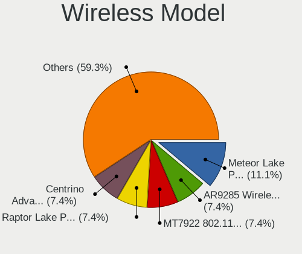

| Model                                                            | Computers | Percent |
|------------------------------------------------------------------|-----------|---------|
| Qualcomm QCNFA765 Wireless Network Adapter                       | 2         | 6.67%   |
| MediaTek MT7922 802.11ax PCI Express Wireless Network Adapter    | 2         | 6.67%   |
| Intel Wireless 3160                                              | 2         | 6.67%   |
| Intel Wi-Fi 6 AX200                                              | 2         | 6.67%   |
| Intel Wi-Fi 5(802.11ac) Wireless-AC 9x6x [Thunder Peak]          | 2         | 6.67%   |
| Broadcom BCM43602 802.11ac Wireless LAN SoC                      | 2         | 6.67%   |
| Broadcom BCM4360 802.11ac Dual Band Wireless Network Adapter     | 2         | 6.67%   |
| TP-Link TL-WN823N v2/v3 [Realtek RTL8192EU]                      | 1         | 3.33%   |
| Realtek RTL8852AE 802.11ax PCIe Wireless Network Adapter         | 1         | 3.33%   |
| Qualcomm WCN785x Wi-Fi 7(802.11be) 320MHz 2x2 [FastConnect 7800] | 1         | 3.33%   |
| Qualcomm Atheros QCA986x/988x 802.11ac Wireless Network Adapter  | 1         | 3.33%   |
| Qualcomm Atheros AR9462 Wireless Network Adapter                 | 1         | 3.33%   |
| MediaTek MT7921K (RZ608) Wi-Fi 6E 80MHz                          | 1         | 3.33%   |
| MediaTek MT7921 802.11ax PCI Express Wireless Network Adapter    | 1         | 3.33%   |
| Intel Wireless 8265 / 8275                                       | 1         | 3.33%   |
| Intel Wireless 8260                                              | 1         | 3.33%   |
| Intel Wi-Fi 6E(802.11ax) AX210/AX1675* 2x2 [Typhoon Peak]        | 1         | 3.33%   |
| Intel Wi-Fi 6 AX201                                              | 1         | 3.33%   |
| Intel Raptor Lake-S PCH CNVi WiFi                                | 1         | 3.33%   |
| Intel Raptor Lake PCH CNVi WiFi                                  | 1         | 3.33%   |
| Intel Ice Lake-LP PCH CNVi WiFi                                  | 1         | 3.33%   |
| Intel Alder Lake-P PCH CNVi WiFi                                 | 1         | 3.33%   |
| Broadcom Limited BCM4331 802.11a/b/g/n                           | 1         | 3.33%   |

Ethernet Vendor
---------------

Ethernet vendors

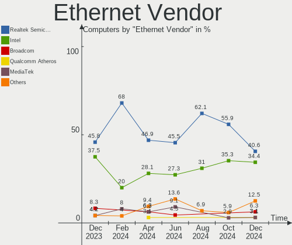

| Vendor                | Computers | Percent |
|-----------------------|-----------|---------|
| Realtek Semiconductor | 15        | 50%     |
| Intel                 | 9         | 30%     |
| Broadcom              | 2         | 6.67%   |
| Qualcomm Atheros      | 1         | 3.33%   |
| ASIX Electronics      | 1         | 3.33%   |
| Aquantia              | 1         | 3.33%   |
| Apple                 | 1         | 3.33%   |

Ethernet Model
--------------

Ethernet models

| Model                                                                           | Computers | Percent |
|---------------------------------------------------------------------------------|-----------|---------|
| Realtek RTL8111/8168/8211/8411 PCI Express Gigabit Ethernet Controller          | 13        | 40.63%  |
| Intel I211 Gigabit Network Connection                                           | 2         | 6.25%   |
| Intel Ethernet Controller I225-V                                                | 2         | 6.25%   |
| Intel Ethernet Connection (7) I219-V                                            | 2         | 6.25%   |
| Realtek RTL8153 Gigabit Ethernet Adapter                                        | 1         | 3.13%   |
| Realtek RTL8125 2.5GbE Controller                                               | 1         | 3.13%   |
| Realtek Killer E3000 2.5GbE Controller                                          | 1         | 3.13%   |
| Qualcomm Atheros Killer E220x Gigabit Ethernet Controller                       | 1         | 3.13%   |
| Intel Ethernet Connection (4) I219-LM                                           | 1         | 3.13%   |
| Intel Ethernet Connection (2) I219-LM                                           | 1         | 3.13%   |
| Intel Ethernet Connection (13) I219-LM                                          | 1         | 3.13%   |
| Intel 82599 10 Gigabit Network Connection                                       | 1         | 3.13%   |
| Broadcom NetXtreme BCM57786 Gigabit Ethernet PCIe                               | 1         | 3.13%   |
| Broadcom NetXtreme BCM57762 Gigabit Ethernet PCIe                               | 1         | 3.13%   |
| ASIX AX88179 Gigabit Ethernet                                                   | 1         | 3.13%   |
| Aquantia AQtion AQC113CS NBase-T/IEEE 802.3an Ethernet Controller [Antigua 10G] | 1         | 3.13%   |
| Apple Ethernet Adapter [A1277]                                                  | 1         | 3.13%   |

Net Controller Kind
-------------------

Ethernet, WiFi or modem

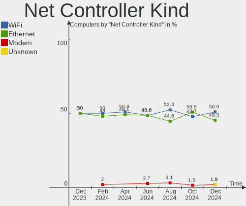

| Kind     | Computers | Percent |
|----------|-----------|---------|
| WiFi     | 30        | 52.63%  |
| Ethernet | 27        | 47.37%  |

Used Controller
---------------

Currently used network controller

| Kind     | Computers | Percent |
|----------|-----------|---------|
| WiFi     | 23        | 62.16%  |
| Ethernet | 14        | 37.84%  |

NICs
----

Total network controllers on board

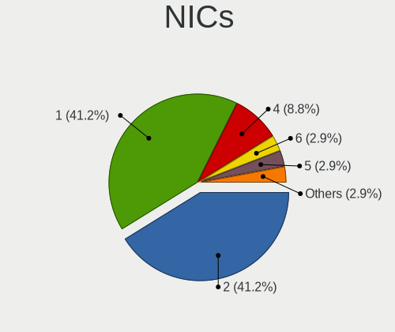

| Total | Computers | Percent |
|-------|-----------|---------|
| 2     | 19        | 51.35%  |
| 1     | 13        | 35.14%  |
| 3     | 2         | 5.41%   |
| 0     | 2         | 5.41%   |
| 5     | 1         | 2.7%    |

IPv6
----

IPv6 vs IPv4

| Used | Computers | Percent |
|------|-----------|---------|
| No   | 26        | 70.27%  |
| Yes  | 11        | 29.73%  |

Bluetooth
---------

Bluetooth Vendor
----------------

Controller vendors

| Vendor                  | Computers | Percent |
|-------------------------|-----------|---------|
| Intel                   | 14        | 48.28%  |
| Apple                   | 6         | 20.69%  |
| Foxconn / Hon Hai       | 3         | 10.34%  |
| USI                     | 2         | 6.9%    |
| Realtek Semiconductor   | 1         | 3.45%   |
| MediaTek                | 1         | 3.45%   |
| IMC Networks            | 1         | 3.45%   |
| Cambridge Silicon Radio | 1         | 3.45%   |

Bluetooth Model
---------------

Controller models

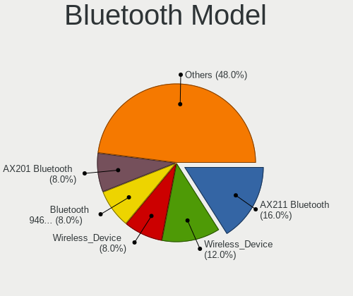

| Model                                               | Computers | Percent |
|-----------------------------------------------------|-----------|---------|
| Apple Bluetooth Host Controller                     | 6         | 20.69%  |
| Intel AX211 Bluetooth                               | 3         | 10.34%  |
| USI Bluetooth Device                                | 2         | 6.9%    |
| Intel Wireless-AC 9260 Bluetooth Adapter            | 2         | 6.9%    |
| Intel Bluetooth wireless interface                  | 2         | 6.9%    |
| Intel Bluetooth Device                              | 2         | 6.9%    |
| Intel AX201 Bluetooth                               | 2         | 6.9%    |
| Intel AX200 Bluetooth                               | 2         | 6.9%    |
| Foxconn / Hon Hai Wireless_Device                   | 2         | 6.9%    |
| Realtek Bluetooth Radio                             | 1         | 3.45%   |
| MediaTek Wireless_Device                            | 1         | 3.45%   |
| Intel AX210 Bluetooth                               | 1         | 3.45%   |
| IMC Networks Wireless_Device                        | 1         | 3.45%   |
| Foxconn / Hon Hai Bluetooth Device                  | 1         | 3.45%   |
| Cambridge Silicon Radio Bluetooth Dongle (HCI mode) | 1         | 3.45%   |

Sound
-----

Sound Vendor
------------

Sound card vendors

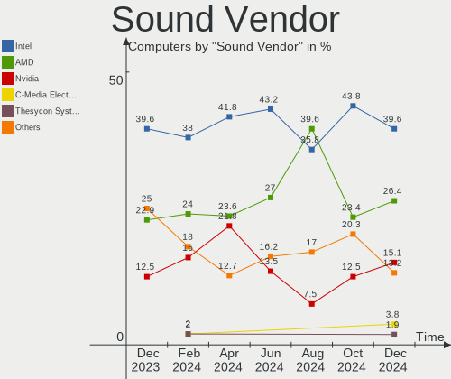

| Vendor              | Computers | Percent |
|---------------------|-----------|---------|
| Intel               | 23        | 41.82%  |
| AMD                 | 13        | 23.64%  |
| Nvidia              | 12        | 21.82%  |
| Texas Instruments   | 1         | 1.82%   |
| Shure               | 1         | 1.82%   |
| Roland              | 1         | 1.82%   |
| Logitech            | 1         | 1.82%   |
| Kingston Technology | 1         | 1.82%   |
| Creative Labs       | 1         | 1.82%   |
| Blue Microphones    | 1         | 1.82%   |

Sound Model
-----------

Sound card models

| Model                                                                      | Computers | Percent |
|----------------------------------------------------------------------------|-----------|---------|
| AMD Family 17h/19h HD Audio Controller                                     | 9         | 12.68%  |
| AMD Rembrandt Radeon High Definition Audio Controller                      | 5         | 7.04%   |
| Intel 8 Series/C220 Series Chipset High Definition Audio Controller        | 4         | 5.63%   |
| AMD Renoir Radeon High Definition Audio Controller                         | 4         | 5.63%   |
| Intel Cannon Lake PCH cAVS                                                 | 3         | 4.23%   |
| Intel 6 Series/C200 Series Chipset Family High Definition Audio Controller | 3         | 4.23%   |
| AMD Navi 21/23 HDMI/DP Audio Controller                                    | 3         | 4.23%   |
| Nvidia GK107 HDMI Audio Controller                                         | 2         | 2.82%   |
| Nvidia Audio device                                                        | 2         | 2.82%   |
| Intel Wildcat Point-LP High Definition Audio Controller                    | 2         | 2.82%   |
| Intel Tiger Lake-LP Smart Sound Technology Audio Controller                | 2         | 2.82%   |
| Intel Raptor Lake High Definition Audio Controller                         | 2         | 2.82%   |
| Intel Broadwell-U Audio Controller                                         | 2         | 2.82%   |
| Texas Instruments PCM2902 Audio Codec                                      | 1         | 1.41%   |
| Shure MV7                                                                  | 1         | 1.41%   |
| Roland QUAD-CAPTURE                                                        | 1         | 1.41%   |
| Nvidia TU116 High Definition Audio Controller                              | 1         | 1.41%   |
| Nvidia TU106 High Definition Audio Controller                              | 1         | 1.41%   |
| Nvidia TU104 HD Audio Controller                                           | 1         | 1.41%   |
| Nvidia GP107GL High Definition Audio Controller                            | 1         | 1.41%   |
| Nvidia GP106 High Definition Audio Controller                              | 1         | 1.41%   |
| Nvidia GM107 High Definition Audio Controller [GeForce 940MX]              | 1         | 1.41%   |
| Nvidia GA106 High Definition Audio Controller                              | 1         | 1.41%   |
| Nvidia AD102 High Definition Audio Controller                              | 1         | 1.41%   |
| Logitech Blue Snowball                                                     | 1         | 1.41%   |
| Kingston Technology HyperX Cloud Orbit S Hi-Res 2Ch                        | 1         | 1.41%   |
| Intel Xeon E3-1200 v3/4th Gen Core Processor HD Audio Controller           | 1         | 1.41%   |
| Intel Sunrise Point-LP HD Audio                                            | 1         | 1.41%   |
| Intel Raptor Lake-P/U/H cAVS                                               | 1         | 1.41%   |
| Intel Ice Lake-LP Smart Sound Technology Audio Controller                  | 1         | 1.41%   |
| Intel Crystal Well HD Audio Controller                                     | 1         | 1.41%   |
| Intel C600/X79 series chipset High Definition Audio Controller             | 1         | 1.41%   |
| Intel Alder Lake PCH-P High Definition Audio Controller                    | 1         | 1.41%   |
| Intel 7 Series/C216 Chipset Family High Definition Audio Controller        | 1         | 1.41%   |
| Intel 100 Series/C230 Series Chipset Family HD Audio Controller            | 1         | 1.41%   |
| Creative Labs EMU20k2 [Sound Blaster X-Fi Titanium Series]                 | 1         | 1.41%   |
| Blue Microphones Yeti Nano                                                 | 1         | 1.41%   |
| AMD Tahiti HDMI Audio [Radeon HD 7870 XT / 7950/7970]                      | 1         | 1.41%   |
| AMD Starship/Matisse HD Audio Controller                                   | 1         | 1.41%   |
| AMD Oland/Hainan/Cape Verde/Pitcairn HDMI Audio [Radeon HD 7000 Series]    | 1         | 1.41%   |

Memory
------

Memory Vendor
-------------

Memory module vendors

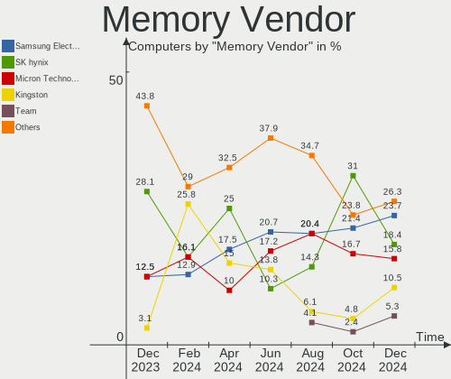

| Vendor              | Computers | Percent |
|---------------------|-----------|---------|
| SK hynix            | 10        | 25%     |
| Samsung Electronics | 7         | 17.5%   |
| Kingston            | 6         | 15%     |
| Micron Technology   | 4         | 10%     |
| Crucial             | 4         | 10%     |
| Unknown             | 3         | 7.5%    |
| G.Skill             | 2         | 5%      |
| Corsair             | 2         | 5%      |
| Transcend           | 1         | 2.5%    |
| A-DATA Technology   | 1         | 2.5%    |

Memory Model
------------

Memory module models

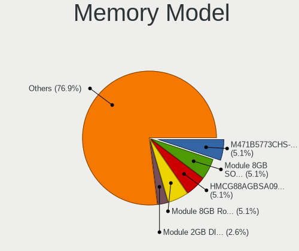

| Model                                                              | Computers | Percent |
|--------------------------------------------------------------------|-----------|---------|
| SK hynix RAM Module 8GB SODIMM DDR3 1600MT/s                       | 4         | 9.52%   |
| Unknown                                                            | 3         | 7.14%   |
| Transcend RAM JM1600KSH-8G 8GB SODIMM DDR3 1600MT/s                | 1         | 2.38%   |
| SK hynix RAM HMT42GR7BMR4C 16GB DIMM DDR3 1066MT/s                 | 1         | 2.38%   |
| SK hynix RAM HMT351S6CFR8C-PB 4GB SODIMM DDR3 1600MT/s             | 1         | 2.38%   |
| SK hynix RAM HMT351S6CFR8C-H9 4GB SODIMM DDR3 1333MT/s             | 1         | 2.38%   |
| SK hynix RAM HMCG78AGBSA092N 16GB SODIMM DDR5 5600MT/s             | 1         | 2.38%   |
| SK hynix RAM HMCG78AEBSA095N 16GB SODIMM 4800MT/s                  | 1         | 2.38%   |
| SK hynix RAM HMA451S6AFR8N-TF 4GB SODIMM DDR4 2133MT/s             | 1         | 2.38%   |
| SK hynix RAM H9JCNNNFA5MLYR-N6E 8GB SODIMM LPDDR5 6400MT/s         | 1         | 2.38%   |
| Samsung RAM Module 8GB SODIMM DDR3 1867MT/s                        | 1         | 2.38%   |
| Samsung RAM M471B1G73EB0-YK0 8GB SODIMM DDR3 1600MT/s              | 1         | 2.38%   |
| Samsung RAM M471B1G73DB0-YK0 8GB SODIMM DDR3 1600MT/s              | 1         | 2.38%   |
| Samsung RAM M471A5143DB0-CPB 4GB SODIMM DDR4 2133MT/s              | 1         | 2.38%   |
| Samsung RAM M471A1K43CB1-CTD 8GB SODIMM DDR4 2667MT/s              | 1         | 2.38%   |
| Samsung RAM M378A1K43EB2-CWE 8GB DIMM DDR4 3200MT/s                | 1         | 2.38%   |
| Samsung RAM K4UBE3D4AA-MGCL 8GB Row Of Chips LPDDR4 4267MT/s       | 1         | 2.38%   |
| Micron RAM MT62F4G32D8DV-026 WT 16GB SODIMM LPDDR5 7500MT/s        | 1         | 2.38%   |
| Micron RAM MT53E2G32D4NQ-046 WT:A 4GB Row Of Chips LPDDR4 4267MT/s | 1         | 2.38%   |
| Micron RAM Module 16GB DIMM DDR3 1866MT/s                          | 1         | 2.38%   |
| Micron RAM 16ATF1G64HZ-2G1A2 8GB SODIMM DDR4 2133MT/s              | 1         | 2.38%   |
| Kingston RAM MSI16D3LS1KFG/8G 8GB SODIMM DDR3 1600MT/s             | 1         | 2.38%   |
| Kingston RAM KHX2666C15S4/16G 16GB SODIMM DDR4 2667MT/s            | 1         | 2.38%   |
| Kingston RAM KF560C36-16 16GB DIMM DDR5 6000MT/s                   | 1         | 2.38%   |
| Kingston RAM KF556C36-32 32GB DIMM DDR5 5600MT/s                   | 1         | 2.38%   |
| Kingston RAM 9905744-066.A00G 32GB SODIMM DDR4 3200MT/s            | 1         | 2.38%   |
| Kingston RAM 9905744-035.A00G 16GB SODIMM DDR4 3200MT/s            | 1         | 2.38%   |
| G.Skill RAM F4-3600C18-32GTZN 32GB DIMM DDR4 3800MT/s              | 1         | 2.38%   |
| G.Skill RAM F4-3000C15-8GVRB 8GB DIMM DDR4 3000MT/s                | 1         | 2.38%   |
| Crucial RAM CT51264BF160BJ.M8F 4GB DIMM DDR3 1600MT/s              | 1         | 2.38%   |
| Crucial RAM CT32G4SFD832A.C16FF 32GB SODIMM DDR4 3200MT/s          | 1         | 2.38%   |
| Crucial RAM CT16G56C46U5.M8G1 16GB DIMM DDR5 5600MT/s              | 1         | 2.38%   |
| Crucial RAM CT16G4SFD824A.M16FJ 16GB SODIMM DDR4 2400MT/s          | 1         | 2.38%   |
| Corsair RAM CMK32GX4M2B3000C15 16GB DIMM DDR4 3000MT/s             | 1         | 2.38%   |
| Corsair RAM CMK16GX4M2B3200C16 8GB DIMM DDR4 3600MT/s              | 1         | 2.38%   |
| Corsair RAM CMK16GX4M2B3000C15 8GB DIMM DDR4 3600MT/s              | 1         | 2.38%   |
| A-DATA RAM AX5U6000C3016G-BLABB 16GB DIMM DDR5 6000MT/s            | 1         | 2.38%   |

Memory Kind
-----------

Memory module kinds

| Kind   | Computers | Percent |
|--------|-----------|---------|
| DDR4   | 12        | 33.33%  |
| DDR3   | 12        | 33.33%  |
| DDR5   | 6         | 16.67%  |
| LPDDR4 | 4         | 11.11%  |
| LPDDR5 | 2         | 5.56%   |

Memory Form Factor
------------------

Physical design of the memory module

| Name         | Computers | Percent |
|--------------|-----------|---------|
| SODIMM       | 20        | 55.56%  |
| DIMM         | 12        | 33.33%  |
| Row Of Chips | 4         | 11.11%  |

Memory Size
-----------

Memory module size

| Size  | Computers | Percent |
|-------|-----------|---------|
| 8192  | 16        | 42.11%  |
| 16384 | 12        | 31.58%  |
| 4096  | 5         | 13.16%  |
| 32768 | 4         | 10.53%  |
| 2048  | 1         | 2.63%   |

Memory Speed
------------

Memory module speed

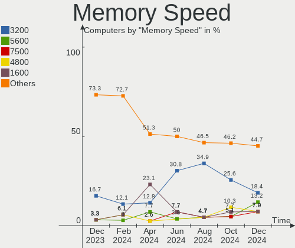

| Speed | Computers | Percent |
|-------|-----------|---------|
| 1600  | 9         | 23.08%  |
| 3200  | 5         | 12.82%  |
| 4267  | 4         | 10.26%  |
| 5600  | 3         | 7.69%   |
| 6000  | 2         | 5.13%   |
| 3600  | 2         | 5.13%   |
| 3000  | 2         | 5.13%   |
| 2667  | 2         | 5.13%   |
| 7500  | 1         | 2.56%   |
| 6400  | 1         | 2.56%   |
| 4800  | 1         | 2.56%   |
| 3800  | 1         | 2.56%   |
| 2400  | 1         | 2.56%   |
| 2133  | 1         | 2.56%   |
| 1867  | 1         | 2.56%   |
| 1866  | 1         | 2.56%   |
| 1333  | 1         | 2.56%   |
| 1066  | 1         | 2.56%   |

Printers & scanners
-------------------

Printer Vendor
--------------

Printer device vendors

Zero info for selected period =(

Printer Model
-------------

Printer device models

Zero info for selected period =(

Scanner Vendor
--------------

Scanner device vendors

Zero info for selected period =(

Scanner Model
-------------

Scanner device models

Zero info for selected period =(

Camera
------

Camera Vendor
-------------

Camera device vendors

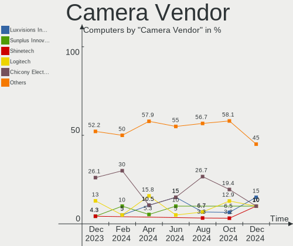

| Vendor                        | Computers | Percent |
|-------------------------------|-----------|---------|
| IMC Networks                  | 4         | 21.05%  |
| Bison Electronics             | 4         | 21.05%  |
| Logitech                      | 3         | 15.79%  |
| Luxvisions Innotech Limited   | 2         | 10.53%  |
| Chicony Electronics           | 2         | 10.53%  |
| Sunplus Innovation Technology | 1         | 5.26%   |
| Samsung Electronics           | 1         | 5.26%   |
| Microdia                      | 1         | 5.26%   |
| Apple                         | 1         | 5.26%   |

Camera Model
------------

Camera device models

| Model                                         | Computers | Percent |
|-----------------------------------------------|-----------|---------|
| Luxvisions Innotech Limited Integrated Camera | 2         | 10%     |
| IMC Networks Integrated Camera                | 2         | 10%     |
| Sunplus Integrated_Webcam_FHD                 | 1         | 5%      |
| Samsung Galaxy series, misc. (MTP mode)       | 1         | 5%      |
| Microdia Integrated_Webcam_HD                 | 1         | 5%      |
| Logitech HD Pro Webcam C920                   | 1         | 5%      |
| Logitech C922 Pro Stream Webcam               | 1         | 5%      |
| Logitech BRIO Ultra HD Webcam                 | 1         | 5%      |
| IMC Networks UVC VGA Webcam                   | 1         | 5%      |
| IMC Networks USB Camera                       | 1         | 5%      |
| IMC Networks Integrated IR Camera             | 1         | 5%      |
| Chicony Integrated Camera                     | 1         | 5%      |
| Chicony HP HD Webcam                          | 1         | 5%      |
| Bison SunplusIT Integrated Camera             | 1         | 5%      |
| Bison Integrated Camera                       | 1         | 5%      |
| Bison HD Webcam                               | 1         | 5%      |
| Bison BisonCam, NB Pro                        | 1         | 5%      |
| Apple FaceTime HD Camera (Built-in)           | 1         | 5%      |

Security
--------

Fingerprint Vendor
------------------

Fingerprint sensor vendors

| Vendor                     | Computers | Percent |
|----------------------------|-----------|---------|
| Synaptics                  | 2         | 50%     |
| Validity Sensors           | 1         | 25%     |
| Shenzhen Goodix Technology | 1         | 25%     |

Fingerprint Model
-----------------

Fingerprint sensor models

| Model                                             | Computers | Percent |
|---------------------------------------------------|-----------|---------|
| Synaptics UWP WBDI Device                         | 2         | 50%     |
| Validity Sensors VFS7500 Touch Fingerprint Sensor | 1         | 25%     |
| Shenzhen Goodix Fingerprint Reader                | 1         | 25%     |

Chipcard Vendor
---------------

Chipcard module vendors

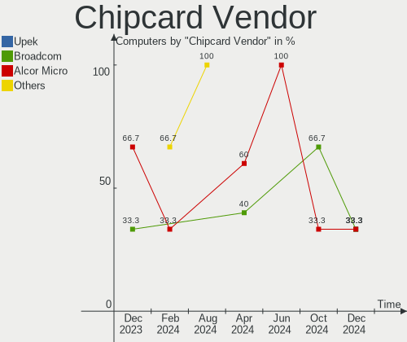

| Vendor      | Computers | Percent |
|-------------|-----------|---------|
| Alcor Micro | 3         | 60%     |
| Broadcom    | 2         | 40%     |

Chipcard Model
--------------

Chipcard module models

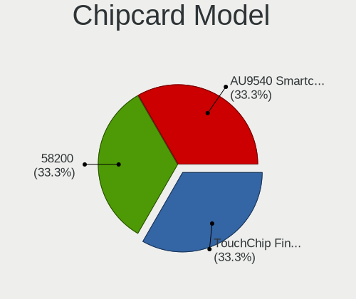

| Model                               | Computers | Percent |
|-------------------------------------|-----------|---------|
| Alcor Micro AU9540 Smartcard Reader | 3         | 60%     |
| Broadcom 58200                      | 2         | 40%     |

Unsupported
-----------

Unsupported Devices
-------------------

Total unsupported devices on board

| Total | Computers | Percent |
|-------|-----------|---------|
| 0     | 23        | 62.16%  |
| 1     | 10        | 27.03%  |
| 3     | 2         | 5.41%   |
| 2     | 2         | 5.41%   |

Unsupported Device Types
------------------------

Types of unsupported devices

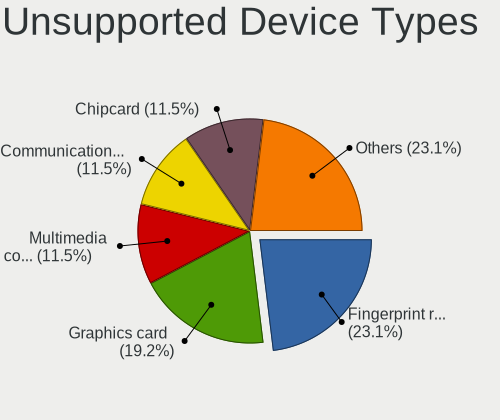

| Type                  | Computers | Percent |
|-----------------------|-----------|---------|
| Multimedia controller | 7         | 35%     |
| Fingerprint reader    | 4         | 20%     |
| Chipcard              | 4         | 20%     |
| Graphics card         | 2         | 10%     |
| Net/ethernet          | 1         | 5%      |
| Firewire controller   | 1         | 5%      |
| Camera                | 1         | 5%      |

