Nobara - Hardware Trends
------------------------

A project to identify most popular hardware characteristics and track their change
over time based on data collected by Linux users at https://Linux-Hardware.org.

Anyone can contribute to this report by the [hw-probe](https://github.com/linuxhw/hw-probe) tool:

    sudo -E hw-probe -all -upload

This is a report for all computer types. See also reports for [desktops](/Dist/Nobara/Desktop/README.md) and [notebooks](/Dist/Nobara/Notebook/README.md).

This report is for one last month. Overall report since the beginning of time: [TestCoverage](https://github.com/linuxhw/TestCoverage)

Period: Oct, 2022.

Contents
--------

* [ System ](#system)
  - [ OS                       ](#os)
  - [ OS Family                ](#os-family)
  - [ Kernel                   ](#kernel)
  - [ Kernel Family            ](#kernel-family)
  - [ Kernel Major Ver.        ](#kernel-major-ver)
  - [ Arch                     ](#arch)
  - [ DE                       ](#de)
  - [ Display Server           ](#display-server)
  - [ Display Manager          ](#display-manager)
  - [ OS Lang                  ](#os-lang)
  - [ Boot Mode                ](#boot-mode)
  - [ Filesystem               ](#filesystem)
  - [ Part. scheme             ](#part-scheme)
  - [ Dual Boot with Linux/BSD ](#dual-boot-with-linuxbsd)
  - [ Dual Boot (Win)          ](#dual-boot-win)

* [ Board ](#board)
  - [ Vendor                   ](#vendor)
  - [ Model                    ](#model)
  - [ Model Family             ](#model-family)
  - [ MFG Year                 ](#mfg-year)
  - [ Form Factor              ](#form-factor)
  - [ Secure Boot              ](#secure-boot)
  - [ Coreboot                 ](#coreboot)
  - [ RAM Size                 ](#ram-size)
  - [ RAM Used                 ](#ram-used)
  - [ Total Drives             ](#total-drives)
  - [ Has CD-ROM               ](#has-cd-rom)
  - [ Has Ethernet             ](#has-ethernet)
  - [ Has WiFi                 ](#has-wifi)
  - [ Has Bluetooth            ](#has-bluetooth)

* [ Location ](#location)
  - [ Country                  ](#country)
  - [ City                     ](#city)

* [ Drives ](#drives)
  - [ Drive Vendor             ](#drive-vendor)
  - [ Drive Model              ](#drive-model)
  - [ HDD Vendor               ](#hdd-vendor)
  - [ SSD Vendor               ](#ssd-vendor)
  - [ Drive Kind               ](#drive-kind)
  - [ Drive Connector          ](#drive-connector)
  - [ Drive Size               ](#drive-size)
  - [ Space Total              ](#space-total)
  - [ Space Used               ](#space-used)
  - [ Malfunc. Drives          ](#malfunc-drives)
  - [ Malfunc. Drive Vendor    ](#malfunc-drive-vendor)
  - [ Malfunc. HDD Vendor      ](#malfunc-hdd-vendor)
  - [ Malfunc. Drive Kind      ](#malfunc-drive-kind)
  - [ Failed Drives            ](#failed-drives)
  - [ Failed Drive Vendor      ](#failed-drive-vendor)
  - [ Drive Status             ](#drive-status)

* [ Storage controller ](#storage-controller)
  - [ Storage Vendor           ](#storage-vendor)
  - [ Storage Model            ](#storage-model)
  - [ Storage Kind             ](#storage-kind)

* [ Processor ](#processor)
  - [ CPU Vendor               ](#cpu-vendor)
  - [ CPU Model                ](#cpu-model)
  - [ CPU Model Family         ](#cpu-model-family)
  - [ CPU Cores                ](#cpu-cores)
  - [ CPU Sockets              ](#cpu-sockets)
  - [ CPU Threads              ](#cpu-threads)
  - [ CPU Op-Modes             ](#cpu-op-modes)
  - [ CPU Microcode            ](#cpu-microcode)
  - [ CPU Microarch            ](#cpu-microarch)

* [ Graphics ](#graphics)
  - [ GPU Vendor               ](#gpu-vendor)
  - [ GPU Model                ](#gpu-model)
  - [ GPU Combo                ](#gpu-combo)
  - [ GPU Driver               ](#gpu-driver)
  - [ GPU Memory               ](#gpu-memory)

* [ Monitor ](#monitor)
  - [ Monitor Vendor           ](#monitor-vendor)
  - [ Monitor Model            ](#monitor-model)
  - [ Monitor Resolution       ](#monitor-resolution)
  - [ Monitor Diagonal         ](#monitor-diagonal)
  - [ Monitor Width            ](#monitor-width)
  - [ Aspect Ratio             ](#aspect-ratio)
  - [ Monitor Area             ](#monitor-area)
  - [ Pixel Density            ](#pixel-density)
  - [ Multiple Monitors        ](#multiple-monitors)

* [ Network ](#network)
  - [ Net Controller Vendor    ](#net-controller-vendor)
  - [ Net Controller Model     ](#net-controller-model)
  - [ Wireless Vendor          ](#wireless-vendor)
  - [ Wireless Model           ](#wireless-model)
  - [ Ethernet Vendor          ](#ethernet-vendor)
  - [ Ethernet Model           ](#ethernet-model)
  - [ Net Controller Kind      ](#net-controller-kind)
  - [ Used Controller          ](#used-controller)
  - [ NICs                     ](#nics)
  - [ IPv6                     ](#ipv6)

* [ Bluetooth ](#bluetooth)
  - [ Bluetooth Vendor         ](#bluetooth-vendor)
  - [ Bluetooth Model          ](#bluetooth-model)

* [ Sound ](#sound)
  - [ Sound Vendor             ](#sound-vendor)
  - [ Sound Model              ](#sound-model)

* [ Memory ](#memory)
  - [ Memory Vendor            ](#memory-vendor)
  - [ Memory Model             ](#memory-model)
  - [ Memory Kind              ](#memory-kind)
  - [ Memory Form Factor       ](#memory-form-factor)
  - [ Memory Size              ](#memory-size)
  - [ Memory Speed             ](#memory-speed)

* [ Printers & scanners ](#printers--scanners)
  - [ Printer Vendor           ](#printer-vendor)
  - [ Printer Model            ](#printer-model)
  - [ Scanner Vendor           ](#scanner-vendor)
  - [ Scanner Model            ](#scanner-model)

* [ Camera ](#camera)
  - [ Camera Vendor            ](#camera-vendor)
  - [ Camera Model             ](#camera-model)

* [ Security ](#security)
  - [ Fingerprint Vendor       ](#fingerprint-vendor)
  - [ Fingerprint Model        ](#fingerprint-model)
  - [ Chipcard Vendor          ](#chipcard-vendor)
  - [ Chipcard Model           ](#chipcard-model)

* [ Unsupported ](#unsupported)
  - [ Unsupported Devices      ](#unsupported-devices)
  - [ Unsupported Device Types ](#unsupported-device-types)

System
------

OS
--

Installed operating systems

| Name      | Computers | Percent |
|-----------|-----------|---------|
| Nobara 36 | 63        | 100%    |

OS Family
---------

OS without a version

| Name   | Computers | Percent |
|--------|-----------|---------|
| Nobara | 63        | 100%    |

Kernel
------

Version of the Linux kernel

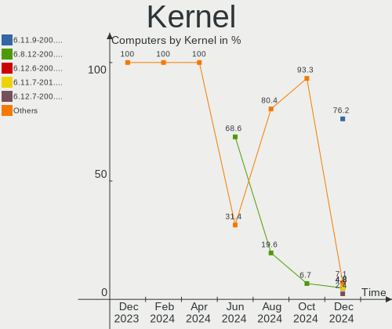

| Version                       | Computers | Percent |
|-------------------------------|-----------|---------|
| 5.19.14-201.fsync.fc36.x86_64 | 22        | 34.92%  |
| 5.19.16-201.fsync.fc36.x86_64 | 11        | 17.46%  |
| 5.19.12-201.fsync.fc36.x86_64 | 8         | 12.7%   |
| 5.19.7-204.fsync.fc36.x86_64  | 6         | 9.52%   |
| 5.19.15-202.fsync.fc36.x86_64 | 6         | 9.52%   |
| 6.0.5-201.fsync.fc36.x86_64   | 5         | 7.94%   |
| 5.19.13-202.fsync.fc36.x86_64 | 2         | 3.17%   |
| 6.0.2-xm1.0.fc36.x86_64       | 1         | 1.59%   |
| 5.19.13-201.fsync.fc36.x86_64 | 1         | 1.59%   |
| 5.19.10-201.fsync.fc36.x86_64 | 1         | 1.59%   |

Kernel Family
-------------

Linux kernel without a distro release

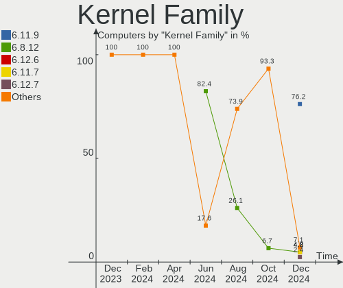

| Version | Computers | Percent |
|---------|-----------|---------|
| 5.19.14 | 22        | 34.92%  |
| 5.19.16 | 11        | 17.46%  |
| 5.19.12 | 8         | 12.7%   |
| 5.19.7  | 6         | 9.52%   |
| 5.19.15 | 6         | 9.52%   |
| 6.0.5   | 5         | 7.94%   |
| 5.19.13 | 3         | 4.76%   |
| 6.0.2   | 1         | 1.59%   |
| 5.19.10 | 1         | 1.59%   |

Kernel Major Ver.
-----------------

Linux kernel major version

| Version | Computers | Percent |
|---------|-----------|---------|
| 5.19    | 57        | 90.48%  |
| 6.0     | 6         | 9.52%   |

Arch
----

OS architecture (x86_64, i586, etc.)

| Name   | Computers | Percent |
|--------|-----------|---------|
| x86_64 | 63        | 100%    |

DE
--

Desktop Environment

| Name       | Computers | Percent |
|------------|-----------|---------|
| GNOME      | 44        | 69.84%  |
| KDE5       | 17        | 26.98%  |
| X-Cinnamon | 1         | 1.59%   |
| Unknown    | 1         | 1.59%   |

Display Server
--------------

X11 or Wayland

| Name    | Computers | Percent |
|---------|-----------|---------|
| Wayland | 45        | 71.43%  |
| X11     | 17        | 26.98%  |
| Unknown | 1         | 1.59%   |

Display Manager
---------------

SDDM, LightDM, etc.

| Name    | Computers | Percent |
|---------|-----------|---------|
| Unknown | 52        | 82.54%  |
| SDDM    | 5         | 7.94%   |
| GDM     | 5         | 7.94%   |
| LightDM | 1         | 1.59%   |

OS Lang
-------

Language

| Lang  | Computers | Percent |
|-------|-----------|---------|
| en_US | 36        | 57.14%  |
| pt_PT | 3         | 4.76%   |
| pl_PL | 3         | 4.76%   |
| it_IT | 2         | 3.17%   |
| es_MX | 2         | 3.17%   |
| es_ES | 2         | 3.17%   |
| en_GB | 2         | 3.17%   |
| en_CA | 2         | 3.17%   |
| de_DE | 2         | 3.17%   |
| sv_SE | 1         | 1.59%   |
| pt_BR | 1         | 1.59%   |
| fr_FR | 1         | 1.59%   |
| es_GT | 1         | 1.59%   |
| es_AR | 1         | 1.59%   |
| en_NZ | 1         | 1.59%   |
| en_AU | 1         | 1.59%   |
| cs_CZ | 1         | 1.59%   |
| C     | 1         | 1.59%   |

Boot Mode
---------

EFI or BIOS

| Mode | Computers | Percent |
|------|-----------|---------|
| EFI  | 47        | 74.6%   |
| BIOS | 16        | 25.4%   |

Filesystem
----------

Type of filesystem

| Type  | Computers | Percent |
|-------|-----------|---------|
| Ext4  | 32        | 50.79%  |
| Btrfs | 31        | 49.21%  |

Part. scheme
------------

Scheme of partitioning

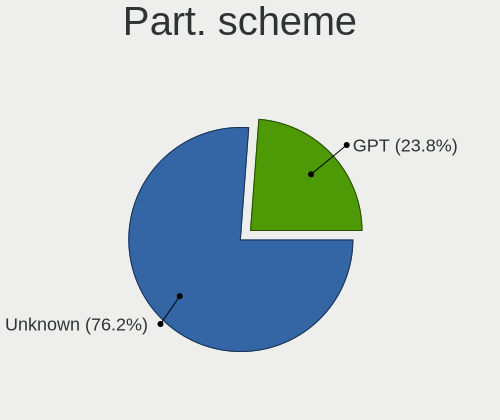

| Type    | Computers | Percent |
|---------|-----------|---------|
| Unknown | 50        | 79.37%  |
| GPT     | 11        | 17.46%  |
| MBR     | 2         | 3.17%   |

Dual Boot with Linux/BSD
------------------------

Hosting more than one Linux/BSD

| Dual boot | Computers | Percent |
|-----------|-----------|---------|
| No        | 59        | 93.65%  |
| Yes       | 4         | 6.35%   |

Dual Boot (Win)
---------------

Hosting Linux and Windows

| Dual boot | Computers | Percent |
|-----------|-----------|---------|
| No        | 57        | 90.48%  |
| Yes       | 6         | 9.52%   |

Board
-----

Vendor
------

Motherboard manufacturer

| Name                | Computers | Percent |
|---------------------|-----------|---------|
| ASUSTek Computer    | 15        | 23.81%  |
| Hewlett-Packard     | 11        | 17.46%  |
| MSI                 | 8         | 12.7%   |
| Lenovo              | 6         | 9.52%   |
| Gigabyte Technology | 5         | 7.94%   |
| Dell                | 5         | 7.94%   |
| ASRock              | 3         | 4.76%   |
| Toshiba             | 2         | 3.17%   |
| Apple               | 2         | 3.17%   |
| Positivo            | 1         | 1.59%   |
| Intel               | 1         | 1.59%   |
| EVOO                | 1         | 1.59%   |
| ECS                 | 1         | 1.59%   |
| Casper              | 1         | 1.59%   |
| Acer                | 1         | 1.59%   |

Model
-----

Motherboard model

| Name                                  | Computers | Percent |
|---------------------------------------|-----------|---------|
| Dell OptiPlex 390                     | 2         | 3.17%   |
| Toshiba Satellite L850                | 1         | 1.59%   |
| Toshiba Satellite L650                | 1         | 1.59%   |
| Positivo N1250                        | 1         | 1.59%   |
| MSI Pulse GL76 12UEK                  | 1         | 1.59%   |
| MSI MS-7D25                           | 1         | 1.59%   |
| MSI MS-7B86                           | 1         | 1.59%   |
| MSI MS-7B51                           | 1         | 1.59%   |
| MSI MS-7B17                           | 1         | 1.59%   |
| MSI MS-7A34                           | 1         | 1.59%   |
| MSI MS-7811                           | 1         | 1.59%   |
| MSI GE60 0NC/GE60 0ND                 | 1         | 1.59%   |
| Lenovo Yoga Slim 7 Pro 14ACH5 OD 82NK | 1         | 1.59%   |
| Lenovo ThinkPad E14 Gen 3 20Y7CTO1WW  | 1         | 1.59%   |
| Lenovo Legion 5 Pro 16IAH7H 82RF      | 1         | 1.59%   |
| Lenovo IdeaPad Y700-15ISK 80NV        | 1         | 1.59%   |
| Lenovo IdeaPad C340-14API 81N6        | 1         | 1.59%   |
| Lenovo IdeaPad 320-15IKB 80YH         | 1         | 1.59%   |
| Intel B75                             | 1         | 1.59%   |
| HP ZBook 17 G6                        | 1         | 1.59%   |
| HP Pavilion Gaming Laptop 15-ec1xxx   | 1         | 1.59%   |
| HP Pavilion Gaming Desktop TG01-0xxx  | 1         | 1.59%   |
| HP OMEN Notebook PC 15                | 1         | 1.59%   |
| HP Laptop 15-dw0xxx                   | 1         | 1.59%   |
| HP EliteDesk 800 G1 SFF               | 1         | 1.59%   |
| HP EliteBook 850 G2                   | 1         | 1.59%   |
| HP EliteBook 850 G1                   | 1         | 1.59%   |
| HP Compaq dc5850 Small Form Factor    | 1         | 1.59%   |
| HP 240 G7 Notebook PC                 | 1         | 1.59%   |
| HP 2000                               | 1         | 1.59%   |
| Gigabyte Z97-HD3                      | 1         | 1.59%   |
| Gigabyte Z590I VISION D               | 1         | 1.59%   |
| Gigabyte X570 I AORUS PRO WIFI        | 1         | 1.59%   |
| Gigabyte B450M DS3H                   | 1         | 1.59%   |
| Gigabyte 970A-DS3P                    | 1         | 1.59%   |
| EVOO EG-LP10                          | 1         | 1.59%   |
| ECS H61H2-CM                          | 1         | 1.59%   |
| Dell Vostro 15 5510                   | 1         | 1.59%   |
| Dell Precision WorkStation T3500      | 1         | 1.59%   |
| Dell Precision 5530                   | 1         | 1.59%   |

Model Family
------------

Motherboard model prefix

| Name               | Computers | Percent |
|--------------------|-----------|---------|
| ASUS TUF           | 4         | 6.35%   |
| Lenovo IdeaPad     | 3         | 4.76%   |
| Toshiba Satellite  | 2         | 3.17%   |
| HP Pavilion        | 2         | 3.17%   |
| HP EliteBook       | 2         | 3.17%   |
| Dell Precision     | 2         | 3.17%   |
| Dell OptiPlex      | 2         | 3.17%   |
| ASUS ROG           | 2         | 3.17%   |
| ASUS PRIME         | 2         | 3.17%   |
| Positivo N1250     | 1         | 1.59%   |
| MSI Pulse          | 1         | 1.59%   |
| MSI MS-7D25        | 1         | 1.59%   |
| MSI MS-7B86        | 1         | 1.59%   |
| MSI MS-7B51        | 1         | 1.59%   |
| MSI MS-7B17        | 1         | 1.59%   |
| MSI MS-7A34        | 1         | 1.59%   |
| MSI MS-7811        | 1         | 1.59%   |
| MSI GE60           | 1         | 1.59%   |
| Lenovo Yoga        | 1         | 1.59%   |
| Lenovo ThinkPad    | 1         | 1.59%   |
| Lenovo Legion      | 1         | 1.59%   |
| Intel B75          | 1         | 1.59%   |
| HP ZBook           | 1         | 1.59%   |
| HP OMEN            | 1         | 1.59%   |
| HP Laptop          | 1         | 1.59%   |
| HP EliteDesk       | 1         | 1.59%   |
| HP Compaq          | 1         | 1.59%   |
| HP 240             | 1         | 1.59%   |
| HP 2000            | 1         | 1.59%   |
| Gigabyte Z97-HD3   | 1         | 1.59%   |
| Gigabyte Z590I     | 1         | 1.59%   |
| Gigabyte X570      | 1         | 1.59%   |
| Gigabyte B450M     | 1         | 1.59%   |
| Gigabyte 970A-DS3P | 1         | 1.59%   |
| EVOO EG-LP10       | 1         | 1.59%   |
| ECS H61H2-CM       | 1         | 1.59%   |
| Dell Vostro        | 1         | 1.59%   |
| Casper EXCALIBUR   | 1         | 1.59%   |
| ASUS VivoBook      | 1         | 1.59%   |
| ASUS SABERTOOTH    | 1         | 1.59%   |

MFG Year
--------

Motherboard manufacture year

| Year | Computers | Percent |
|------|-----------|---------|
| 2019 | 11        | 17.46%  |
| 2021 | 9         | 14.29%  |
| 2018 | 9         | 14.29%  |
| 2017 | 5         | 7.94%   |
| 2020 | 4         | 6.35%   |
| 2013 | 4         | 6.35%   |
| 2012 | 4         | 6.35%   |
| 2011 | 4         | 6.35%   |
| 2014 | 3         | 4.76%   |
| 2022 | 2         | 3.17%   |
| 2016 | 2         | 3.17%   |
| 2015 | 2         | 3.17%   |
| 2010 | 2         | 3.17%   |
| 2009 | 1         | 1.59%   |
| 2008 | 1         | 1.59%   |

Form Factor
-----------

Physical design of the computer

| Name     | Computers | Percent |
|----------|-----------|---------|
| Notebook | 34        | 53.97%  |
| Desktop  | 29        | 46.03%  |

Secure Boot
-----------

Enabled or disabled

| State    | Computers | Percent |
|----------|-----------|---------|
| Disabled | 63        | 100%    |

Coreboot
--------

Have coreboot on board

| Used | Computers | Percent |
|------|-----------|---------|
| No   | 63        | 100%    |

RAM Size
--------

Total RAM memory

| Size in GB | Computers | Percent |
|------------|-----------|---------|
| 16.01-24.0 | 19        | 30.16%  |
| 4.01-8.0   | 13        | 20.63%  |
| 8.01-16.0  | 12        | 19.05%  |
| 32.01-64.0 | 10        | 15.87%  |
| 3.01-4.0   | 8         | 12.7%   |
| 24.01-32.0 | 1         | 1.59%   |

RAM Used
--------

Used RAM memory

| Used GB    | Computers | Percent |
|------------|-----------|---------|
| 4.01-8.0   | 35        | 55.56%  |
| 3.01-4.0   | 13        | 20.63%  |
| 2.01-3.0   | 9         | 14.29%  |
| 8.01-16.0  | 4         | 6.35%   |
| 16.01-24.0 | 1         | 1.59%   |
| 1.01-2.0   | 1         | 1.59%   |

Total Drives
------------

Number of drives on board

| Drives | Computers | Percent |
|--------|-----------|---------|
| 1      | 31        | 49.21%  |
| 2      | 15        | 23.81%  |
| 3      | 12        | 19.05%  |
| 5      | 3         | 4.76%   |
| 10     | 1         | 1.59%   |
| 4      | 1         | 1.59%   |

Has CD-ROM
----------

Has CD-ROM on board

| Presented | Computers | Percent |
|-----------|-----------|---------|
| No        | 50        | 79.37%  |
| Yes       | 13        | 20.63%  |

Has Ethernet
------------

Has Ethernet on board

| Presented | Computers | Percent |
|-----------|-----------|---------|
| Yes       | 55        | 87.3%   |
| No        | 8         | 12.7%   |

Has WiFi
--------

Has WiFi module

| Presented | Computers | Percent |
|-----------|-----------|---------|
| Yes       | 49        | 77.78%  |
| No        | 14        | 22.22%  |

Has Bluetooth
-------------

Has Bluetooth module

| Presented | Computers | Percent |
|-----------|-----------|---------|
| Yes       | 42        | 66.67%  |
| No        | 21        | 33.33%  |

Location
--------

Country
-------

Geographic location (country)

| Country      | Computers | Percent |
|--------------|-----------|---------|
| USA          | 17        | 26.98%  |
| Germany      | 5         | 7.94%   |
| Mexico       | 4         | 6.35%   |
| Portugal     | 3         | 4.76%   |
| Poland       | 3         | 4.76%   |
| Brazil       | 3         | 4.76%   |
| Spain        | 2         | 3.17%   |
| Philippines  | 2         | 3.17%   |
| Italy        | 2         | 3.17%   |
| France       | 2         | 3.17%   |
| Croatia      | 2         | 3.17%   |
| Canada       | 2         | 3.17%   |
| Venezuela    | 1         | 1.59%   |
| Sweden       | 1         | 1.59%   |
| South Africa | 1         | 1.59%   |
| Serbia       | 1         | 1.59%   |
| Romania      | 1         | 1.59%   |
| Pakistan     | 1         | 1.59%   |
| New Zealand  | 1         | 1.59%   |
| Netherlands  | 1         | 1.59%   |
| Morocco      | 1         | 1.59%   |
| Indonesia    | 1         | 1.59%   |
| Guatemala    | 1         | 1.59%   |
| Czechia      | 1         | 1.59%   |
| Chile        | 1         | 1.59%   |
| Belgium      | 1         | 1.59%   |
| Australia    | 1         | 1.59%   |
| Argentina    | 1         | 1.59%   |

City
----

Geographic location (city)

| City          | Computers | Percent |
|---------------|-----------|---------|
| Schmalkalden  | 2         | 3.17%   |
| Philadelphia  | 2         | 3.17%   |
| Guadalajara   | 2         | 3.17%   |
| Zagreb        | 1         | 1.59%   |
| Wiesbaden     | 1         | 1.59%   |
| Warsaw        | 1         | 1.59%   |
| Waldorf       | 1         | 1.59%   |
| Wabrzezno     | 1         | 1.59%   |
| Villa Nueva   | 1         | 1.59%   |
| Varaždin     | 1         | 1.59%   |
| Vagos         | 1         | 1.59%   |
| Tulsa         | 1         | 1.59%   |
| Tomah         | 1         | 1.59%   |
| Silves        | 1         | 1.59%   |
| Schenectady   | 1         | 1.59%   |
| Santiago      | 1         | 1.59%   |
| San Jose      | 1         | 1.59%   |
| San Antonio   | 1         | 1.59%   |
| Saltsjoebaden | 1         | 1.59%   |
| Salamanca     | 1         | 1.59%   |
| Saint-Jerome  | 1         | 1.59%   |
| Rome          | 1         | 1.59%   |
| Ramos Mejia   | 1         | 1.59%   |
| Quezon City   | 1         | 1.59%   |
| Prichsenstadt | 1         | 1.59%   |
| Prague        | 1         | 1.59%   |
| Paris         | 1         | 1.59%   |
| Nova Mutum    | 1         | 1.59%   |
| Milan         | 1         | 1.59%   |
| Marin         | 1         | 1.59%   |
| Loznica       | 1         | 1.59%   |
| Los Mochis    | 1         | 1.59%   |
| Long Lake     | 1         | 1.59%   |
| Johannesburg  | 1         | 1.59%   |
| Islamabad     | 1         | 1.59%   |
| Hixson        | 1         | 1.59%   |
| Goiânia      | 1         | 1.59%   |
| Gelang        | 1         | 1.59%   |
| Gatineau      | 1         | 1.59%   |
| Gastonia      | 1         | 1.59%   |

Drives
------

Drive Vendor
------------

Hard drive vendors

| Vendor                       | Computers | Drives | Percent |
|------------------------------|-----------|--------|---------|
| Samsung Electronics          | 20        | 28     | 19.05%  |
| WDC                          | 13        | 18     | 12.38%  |
| Toshiba                      | 12        | 12     | 11.43%  |
| Crucial                      | 8         | 10     | 7.62%   |
| Seagate                      | 6         | 8      | 5.71%   |
| SanDisk                      | 6         | 6      | 5.71%   |
| Kingston                     | 5         | 7      | 4.76%   |
| Phison Electronics           | 4         | 4      | 3.81%   |
| Intel                        | 4         | 5      | 3.81%   |
| SK hynix                     | 3         | 3      | 2.86%   |
| Micron Technology            | 3         | 3      | 2.86%   |
| Micron/Crucial Technology    | 2         | 2      | 1.9%    |
| KIOXIA                       | 2         | 2      | 1.9%    |
| Hitachi                      | 2         | 2      | 1.9%    |
| Unknown                      | 2         | 2      | 1.9%    |
| Verbatim                     | 1         | 1      | 0.95%   |
| Silicon Motion               | 1         | 1      | 0.95%   |
| Shenzhen Longsys Electronics | 1         | 1      | 0.95%   |
| Ramsta                       | 1         | 1      | 0.95%   |
| PNY                          | 1         | 1      | 0.95%   |
| Phison                       | 1         | 1      | 0.95%   |
| OCZ                          | 1         | 1      | 0.95%   |
| MyDigitalSSD                 | 1         | 1      | 0.95%   |
| LITEON                       | 1         | 1      | 0.95%   |
| JMicron Technology           | 1         | 1      | 0.95%   |
| HGST HTS                     | 1         | 1      | 0.95%   |
| China                        | 1         | 1      | 0.95%   |
| ADATA Technology             | 1         | 1      | 0.95%   |

Drive Model
-----------

Hard drive models

| Model                                                | Computers | Percent |
|------------------------------------------------------|-----------|---------|
| Toshiba HDWD110 1TB                                  | 3         | 2.5%    |
| Samsung NVMe SSD Controller SM981/PM981/PM983 500GB  | 3         | 2.5%    |
| Phison E12 NVMe Controller 2TB                       | 3         | 2.5%    |
| WDC WDS100T2B0A-00SM50 1TB SSD                       | 2         | 1.67%   |
| WDC WD5000BEVT-75ZAT0 500GB                          | 2         | 1.67%   |
| Toshiba MQ04ABF100 1TB                               | 2         | 1.67%   |
| Toshiba DT01ACA100 1TB                               | 2         | 1.67%   |
| Samsung SSD 860 EVO 500GB                            | 2         | 1.67%   |
| Samsung SSD 850 EVO 500GB                            | 2         | 1.67%   |
| Samsung NVMe SSD Controller PM9A1/PM9A3/980PRO 250GB | 2         | 1.67%   |
| Micron/Crucial P2 NVMe PCIe SSD 500GB                | 2         | 1.67%   |
| Kingston SA400S37240G 240GB SSD                      | 2         | 1.67%   |
| Intel SSD 660P Series 1024GB                         | 2         | 1.67%   |
| Crucial CT500MX500SSD1 500GB                         | 2         | 1.67%   |
| Unknown                                              | 2         | 1.67%   |
| WDC WDS500G3X0C-00SJG0 500GB                         | 1         | 0.83%   |
| WDC WDS500G2B0A-00SM50 500GB SSD                     | 1         | 0.83%   |
| WDC WDS240G2G0A-00JH30 240GB SSD                     | 1         | 0.83%   |
| WDC WDBNCE5000PNC 500GB SSD                          | 1         | 0.83%   |
| WDC WD4005FZBX-00K5WB0 4TB                           | 1         | 0.83%   |
| WDC WD20EZAZ-00GGJB0 2TB                             | 1         | 0.83%   |
| WDC WD2002FAEX-007BA0 2TB                            | 1         | 0.83%   |
| WDC WD10SPCX-24HWST1 1TB                             | 1         | 0.83%   |
| WDC WD10JPVT-22A1YT0 1TB                             | 1         | 0.83%   |
| WDC WD10EZRX-00A8LB0 1TB                             | 1         | 0.83%   |
| WDC WD10EZEX-60ZF5A0 1TB                             | 1         | 0.83%   |
| WDC WD10EZEX-00MFCA0 1TB                             | 1         | 0.83%   |
| WDC WD10EAVS-00D7B1 1TB                              | 1         | 0.83%   |
| WDC PC SN520 SDAPNUW-512G-1006 512GB                 | 1         | 0.83%   |
| Verbatim Vi560 SATA III M.2 SSD 256GB                | 1         | 0.83%   |
| Toshiba TR200 240GB SSD                              | 1         | 0.83%   |
| Toshiba MQ01ABF050 500GB                             | 1         | 0.83%   |
| Toshiba MK3265GSXN 320GB                             | 1         | 0.83%   |
| Toshiba MD03ACA400V 4TB                              | 1         | 0.83%   |
| Toshiba KXG5AZNV512G 512GB                           | 1         | 0.83%   |
| SK hynix SKHynix_HFS001TDE9X084N 1TB                 | 1         | 0.83%   |
| SK hynix SKHynix_HFM256GD3HX015N 256GB               | 1         | 0.83%   |
| SK hynix PC711 NVMe 512GB                            | 1         | 0.83%   |
| Silicon Motion Asgard AN2 250NVMe-M.2-80 250GB       | 1         | 0.83%   |
| Shenzhen Longsys Lexar SSD NM620 512GB               | 1         | 0.83%   |

HDD Vendor
----------

Hard disk drive vendors

| Vendor              | Computers | Drives | Percent |
|---------------------|-----------|--------|---------|
| Toshiba             | 10        | 10     | 33.33%  |
| WDC                 | 8         | 11     | 26.67%  |
| Seagate             | 6         | 7      | 20%     |
| Samsung Electronics | 3         | 3      | 10%     |
| Hitachi             | 2         | 2      | 6.67%   |
| HGST HTS            | 1         | 1      | 3.33%   |

SSD Vendor
----------

Solid state drive vendors

| Vendor              | Computers | Drives | Percent |
|---------------------|-----------|--------|---------|
| Samsung Electronics | 9         | 12     | 21.95%  |
| Crucial             | 8         | 10     | 19.51%  |
| SanDisk             | 5         | 5      | 12.2%   |
| WDC                 | 4         | 5      | 9.76%   |
| Kingston            | 4         | 6      | 9.76%   |
| Intel               | 2         | 2      | 4.88%   |
| Verbatim            | 1         | 1      | 2.44%   |
| Toshiba             | 1         | 1      | 2.44%   |
| Seagate             | 1         | 1      | 2.44%   |
| Ramsta              | 1         | 1      | 2.44%   |
| PNY                 | 1         | 1      | 2.44%   |
| OCZ                 | 1         | 1      | 2.44%   |
| MyDigitalSSD        | 1         | 1      | 2.44%   |
| LITEON              | 1         | 1      | 2.44%   |
| China               | 1         | 1      | 2.44%   |

Drive Kind
----------

HDD or SSD

| Kind    | Computers | Drives | Percent |
|---------|-----------|--------|---------|
| NVMe    | 32        | 40     | 34.78%  |
| SSD     | 32        | 49     | 34.78%  |
| HDD     | 26        | 34     | 28.26%  |
| Unknown | 2         | 2      | 2.17%   |

Drive Connector
---------------

SATA, SAS, NVMe, etc.

| Type | Computers | Drives | Percent |
|------|-----------|--------|---------|
| SATA | 46        | 83     | 57.5%   |
| NVMe | 31        | 39     | 38.75%  |
| SAS  | 3         | 3      | 3.75%   |

Drive Size
----------

Size of hard drive

| Size in TB | Computers | Drives | Percent |
|------------|-----------|--------|---------|
| 0.01-0.5   | 33        | 43     | 50.77%  |
| 0.51-1.0   | 25        | 31     | 38.46%  |
| 1.01-2.0   | 4         | 6      | 6.15%   |
| 3.01-4.0   | 2         | 2      | 3.08%   |
| 10.01-20.0 | 1         | 1      | 1.54%   |

Space Total
-----------

Amount of disk space available on the file system

| Size in GB     | Computers | Percent |
|----------------|-----------|---------|
| 251-500        | 22        | 34.92%  |
| 101-250        | 15        | 23.81%  |
| 501-1000       | 11        | 17.46%  |
| 1001-2000      | 6         | 9.52%   |
| 51-100         | 4         | 6.35%   |
| 2001-3000      | 2         | 3.17%   |
| More than 3000 | 1         | 1.59%   |
| 21-50          | 1         | 1.59%   |
| Unknown        | 1         | 1.59%   |

Space Used
----------

Amount of used disk space

| Used GB   | Computers | Percent |
|-----------|-----------|---------|
| 1-20      | 22        | 34.92%  |
| 21-50     | 18        | 28.57%  |
| 101-250   | 8         | 12.7%   |
| 251-500   | 5         | 7.94%   |
| 51-100    | 5         | 7.94%   |
| 501-1000  | 2         | 3.17%   |
| 2001-3000 | 1         | 1.59%   |
| 1001-2000 | 1         | 1.59%   |
| Unknown   | 1         | 1.59%   |

Malfunc. Drives
---------------

Drive models with a malfunction

| Model                               | Computers | Drives | Percent |
|-------------------------------------|-----------|--------|---------|
| WDC WD5000BEVT-75ZAT0 500GB         | 2         | 2      | 40%     |
| Samsung Electronics SSD 970 EVO 1TB | 1         | 1      | 20%     |
| Samsung Electronics HD161GJ 160GB   | 1         | 1      | 20%     |
| Ramsta SSD S800 240GB               | 1         | 1      | 20%     |

Malfunc. Drive Vendor
---------------------

Vendors of faulty drives

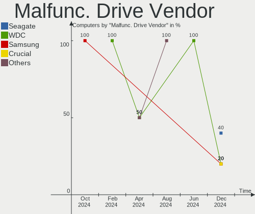

| Vendor              | Computers | Drives | Percent |
|---------------------|-----------|--------|---------|
| WDC                 | 2         | 2      | 40%     |
| Samsung Electronics | 2         | 2      | 40%     |
| Ramsta              | 1         | 1      | 20%     |

Malfunc. HDD Vendor
-------------------

Vendors of faulty HDD drives

| Vendor              | Computers | Drives | Percent |
|---------------------|-----------|--------|---------|
| WDC                 | 2         | 2      | 66.67%  |
| Samsung Electronics | 1         | 1      | 33.33%  |

Malfunc. Drive Kind
-------------------

Kinds of faulty drives

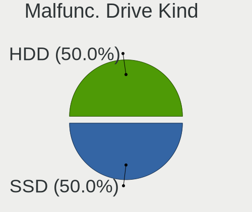

| Kind | Computers | Drives | Percent |
|------|-----------|--------|---------|
| HDD  | 3         | 3      | 60%     |
| NVMe | 1         | 1      | 20%     |
| SSD  | 1         | 1      | 20%     |

Failed Drives
-------------

Failed drive models

Zero info for selected period =(

Failed Drive Vendor
-------------------

Failed drive vendors

Zero info for selected period =(

Drive Status
------------

Number of failed and malfunc. drives

| Status   | Computers | Drives | Percent |
|----------|-----------|--------|---------|
| Detected | 51        | 100    | 77.27%  |
| Works    | 10        | 20     | 15.15%  |
| Malfunc  | 5         | 5      | 7.58%   |

Storage controller
------------------

Storage Vendor
--------------

Storage controller vendors

| Vendor                       | Computers | Percent |
|------------------------------|-----------|---------|
| Intel                        | 38        | 40.43%  |
| AMD                          | 17        | 18.09%  |
| Samsung Electronics          | 11        | 11.7%   |
| Phison Electronics           | 5         | 5.32%   |
| SK hynix                     | 3         | 3.19%   |
| SanDisk                      | 3         | 3.19%   |
| Micron Technology            | 3         | 3.19%   |
| ASMedia Technology           | 3         | 3.19%   |
| Micron/Crucial Technology    | 2         | 2.13%   |
| KIOXIA                       | 2         | 2.13%   |
| Toshiba America Info Systems | 1         | 1.06%   |
| Silicon Motion               | 1         | 1.06%   |
| Shenzhen Longsys Electronics | 1         | 1.06%   |
| Nvidia                       | 1         | 1.06%   |
| Marvell Technology Group     | 1         | 1.06%   |
| Kingston Technology Company  | 1         | 1.06%   |
| ADATA Technology             | 1         | 1.06%   |

Storage Model
-------------

Storage controller models

| Model                                                                                   | Computers | Percent |
|-----------------------------------------------------------------------------------------|-----------|---------|
| AMD FCH SATA Controller [AHCI mode]                                                     | 12        | 11.43%  |
| Intel 82801 Mobile SATA Controller [RAID mode]                                          | 6         | 5.71%   |
| Samsung NVMe SSD Controller SM981/PM981/PM983                                           | 5         | 4.76%   |
| Intel Cannon Lake PCH SATA AHCI Controller                                              | 4         | 3.81%   |
| AMD 400 Series Chipset SATA Controller                                                  | 4         | 3.81%   |
| SK hynix Gold P31 SSD                                                                   | 3         | 2.86%   |
| Samsung NVMe SSD Controller 980                                                         | 3         | 2.86%   |
| Phison E12 NVMe Controller                                                              | 3         | 2.86%   |
| Micron Non-Volatile memory controller                                                   | 3         | 2.86%   |
| Intel Cannon Lake Mobile PCH SATA AHCI Controller                                       | 3         | 2.86%   |
| Intel 8 Series/C220 Series Chipset Family 6-port SATA Controller 1 [AHCI mode]          | 3         | 2.86%   |
| Intel 7 Series Chipset Family 6-port SATA Controller [AHCI mode]                        | 3         | 2.86%   |
| ASMedia ASM1062 Serial ATA Controller                                                   | 3         | 2.86%   |
| Samsung NVMe SSD Controller PM9A1/PM9A3/980PRO                                          | 2         | 1.9%    |
| Micron/Crucial P2 NVMe PCIe SSD                                                         | 2         | 1.9%    |
| Intel SSD 660P Series                                                                   | 2         | 1.9%    |
| Intel HM170/QM170 Chipset SATA Controller [AHCI Mode]                                   | 2         | 1.9%    |
| Intel 7 Series/C210 Series Chipset Family 6-port SATA Controller [AHCI mode]            | 2         | 1.9%    |
| Intel 6 Series/C200 Series Chipset Family Desktop SATA Controller (IDE mode, ports 4-5) | 2         | 1.9%    |
| Intel 6 Series/C200 Series Chipset Family Desktop SATA Controller (IDE mode, ports 0-3) | 2         | 1.9%    |
| Intel 6 Series/C200 Series Chipset Family 6 port Desktop SATA AHCI Controller           | 2         | 1.9%    |
| AMD SB7x0/SB8x0/SB9x0 SATA Controller [AHCI mode]                                       | 2         | 1.9%    |
| Toshiba America Info Systems Toshiba America Info Non-Volatile memory controller        | 1         | 0.95%   |
| Silicon Motion SM2263EN/SM2263XT SSD Controller                                         | 1         | 0.95%   |
| Shenzhen Longsys Electronics Non-Volatile memory controller                             | 1         | 0.95%   |
| SanDisk WD Blue SN550 NVMe SSD                                                          | 1         | 0.95%   |
| SanDisk WD Blue SN500 / PC SN520 NVMe SSD                                               | 1         | 0.95%   |
| SanDisk WD Black SN750 / PC SN730 NVMe SSD                                              | 1         | 0.95%   |
| Samsung NVMe SSD Controller SM961/PM961/SM963                                           | 1         | 0.95%   |
| Samsung NVMe SSD Controller SM951/PM951                                                 | 1         | 0.95%   |
| Phison PS5013 E13 NVMe Controller                                                       | 1         | 0.95%   |
| Phison E16 PCIe4 NVMe Controller                                                        | 1         | 0.95%   |
| Nvidia MCP79 AHCI Controller                                                            | 1         | 0.95%   |
| Marvell Group 88SS9183 PCIe SSD Controller                                              | 1         | 0.95%   |
| KIOXIA NVMe SSD Controller BG4                                                          | 1         | 0.95%   |
| KIOXIA NVMe SSD                                                                         | 1         | 0.95%   |
| Kingston Company A2000 NVMe SSD                                                         | 1         | 0.95%   |
| Intel Wildcat Point-LP SATA Controller [AHCI Mode]                                      | 1         | 0.95%   |
| Intel Volume Management Device NVMe RAID Controller                                     | 1         | 0.95%   |
| Intel Celeron/Pentium Silver Processor SATA Controller                                  | 1         | 0.95%   |

Storage Kind
------------

Kind of storage controller (IDE, SATA, NVMe, SAS, ...)

| Kind | Computers | Percent |
|------|-----------|---------|
| SATA | 47        | 53.41%  |
| NVMe | 31        | 35.23%  |
| RAID | 7         | 7.95%   |
| IDE  | 3         | 3.41%   |

Processor
---------

CPU Vendor
----------

Processor vendors

| Vendor | Computers | Percent |
|--------|-----------|---------|
| Intel  | 41        | 65.08%  |
| AMD    | 22        | 34.92%  |

CPU Model
---------

Processor models

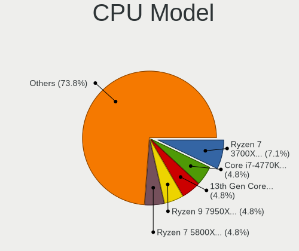

| Model                                   | Computers | Percent |
|-----------------------------------------|-----------|---------|
| Intel Core i9-9900K CPU @ 3.60GHz       | 2         | 3.17%   |
| Intel Core i7-7700HQ CPU @ 2.80GHz      | 2         | 3.17%   |
| Intel Core i5-9400F CPU @ 2.90GHz       | 2         | 3.17%   |
| Intel 12th Gen Core i7-12700H           | 2         | 3.17%   |
| AMD Ryzen 5 4600H with Radeon Graphics  | 2         | 3.17%   |
| AMD Ryzen 5 3600 6-Core Processor       | 2         | 3.17%   |
| Intel Xeon CPU W3530 @ 2.80GHz          | 1         | 1.59%   |
| Intel Xeon CPU E3-1240 V2 @ 3.40GHz     | 1         | 1.59%   |
| Intel Pentium CPU G640 @ 2.80GHz        | 1         | 1.59%   |
| Intel Core i7-9850H CPU @ 2.60GHz       | 1         | 1.59%   |
| Intel Core i7-8850H CPU @ 2.60GHz       | 1         | 1.59%   |
| Intel Core i7-8565U CPU @ 1.80GHz       | 1         | 1.59%   |
| Intel Core i7-7500U CPU @ 2.70GHz       | 1         | 1.59%   |
| Intel Core i7-6920HQ CPU @ 2.90GHz      | 1         | 1.59%   |
| Intel Core i7-6700HQ CPU @ 2.60GHz      | 1         | 1.59%   |
| Intel Core i7-5600U CPU @ 2.60GHz       | 1         | 1.59%   |
| Intel Core i7-4790 CPU @ 3.60GHz        | 1         | 1.59%   |
| Intel Core i7-4770K CPU @ 3.50GHz       | 1         | 1.59%   |
| Intel Core i7-4770 CPU @ 3.40GHz        | 1         | 1.59%   |
| Intel Core i7-4710HQ CPU @ 2.50GHz      | 1         | 1.59%   |
| Intel Core i7-4600U CPU @ 2.10GHz       | 1         | 1.59%   |
| Intel Core i7-3630QM CPU @ 2.40GHz      | 1         | 1.59%   |
| Intel Core i7-3610QM CPU @ 2.30GHz      | 1         | 1.59%   |
| Intel Core i7-3517U CPU @ 1.90GHz       | 1         | 1.59%   |
| Intel Core i7-2600 CPU @ 3.40GHz        | 1         | 1.59%   |
| Intel Core i5-8300H CPU @ 2.30GHz       | 1         | 1.59%   |
| Intel Core i5-10300H CPU @ 2.50GHz      | 1         | 1.59%   |
| Intel Core i5 CPU M 480 @ 2.67GHz       | 1         | 1.59%   |
| Intel Core i3-7020U CPU @ 2.30GHz       | 1         | 1.59%   |
| Intel Core i3-3240 CPU @ 3.40GHz        | 1         | 1.59%   |
| Intel Core i3-3220 CPU @ 3.30GHz        | 1         | 1.59%   |
| Intel Core i3-2120 CPU @ 3.30GHz        | 1         | 1.59%   |
| Intel Core i3-1005G1 CPU @ 1.20GHz      | 1         | 1.59%   |
| Intel Core 2 Duo CPU P7550 @ 2.26GHz    | 1         | 1.59%   |
| Intel Celeron N4020 CPU @ 1.10GHz       | 1         | 1.59%   |
| Intel 12th Gen Core i5-12600K           | 1         | 1.59%   |
| Intel 11th Gen Core i5-11600 @ 2.80GHz  | 1         | 1.59%   |
| Intel 11th Gen Core i5-11400H @ 2.70GHz | 1         | 1.59%   |
| Intel 11th Gen Core i5-11300H @ 3.10GHz | 1         | 1.59%   |
| AMD Ryzen 9 5900X 12-Core Processor     | 1         | 1.59%   |

CPU Model Family
----------------

Processor model prefix

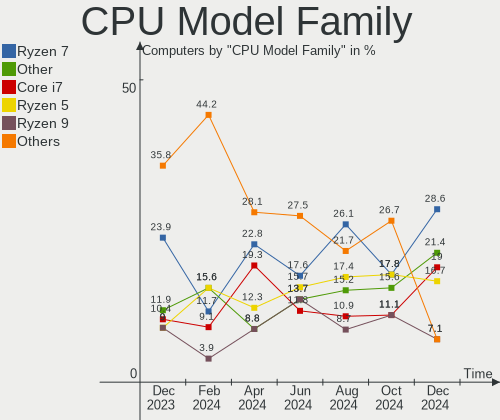

| Model                | Computers | Percent |
|----------------------|-----------|---------|
| Intel Core i7        | 18        | 28.57%  |
| AMD Ryzen 5          | 13        | 20.63%  |
| Other                | 6         | 9.52%   |
| Intel Core i5        | 5         | 7.94%   |
| Intel Core i3        | 5         | 7.94%   |
| AMD Ryzen 7          | 3         | 4.76%   |
| Intel Xeon           | 2         | 3.17%   |
| Intel Core i9        | 2         | 3.17%   |
| AMD Ryzen 9          | 2         | 3.17%   |
| AMD FX               | 2         | 3.17%   |
| Intel Pentium        | 1         | 1.59%   |
| Intel Core 2 Duo     | 1         | 1.59%   |
| Intel Celeron        | 1         | 1.59%   |
| AMD E                | 1         | 1.59%   |
| AMD Athlon Dual Core | 1         | 1.59%   |

CPU Cores
---------

Number of processor cores

| Number | Computers | Percent |
|--------|-----------|---------|
| 4      | 23        | 36.51%  |
| 6      | 15        | 23.81%  |
| 2      | 15        | 23.81%  |
| 8      | 5         | 7.94%   |
| 14     | 2         | 3.17%   |
| 12     | 1         | 1.59%   |
| 10     | 1         | 1.59%   |
| 3      | 1         | 1.59%   |

CPU Sockets
-----------

Number of sockets

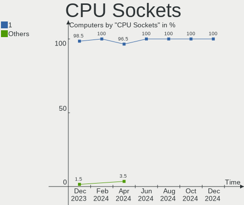

| Number | Computers | Percent |
|--------|-----------|---------|
| 1      | 63        | 100%    |

CPU Threads
-----------

Threads per core (Hyper-Threading)

| Number | Computers | Percent |
|--------|-----------|---------|
| 2      | 55        | 87.3%   |
| 1      | 8         | 12.7%   |

CPU Op-Modes
------------

CPU Operation Modes (32-bit, 64-bit)

| Op mode        | Computers | Percent |
|----------------|-----------|---------|
| 32-bit, 64-bit | 63        | 100%    |

CPU Microcode
-------------

Microcode number

| Number     | Computers | Percent |
|------------|-----------|---------|
| Unknown    | 7         | 11.11%  |
| 0x306a9    | 6         | 9.52%   |
| 0x306c3    | 4         | 6.35%   |
| 0x906ea    | 3         | 4.76%   |
| 0x0a50000c | 3         | 4.76%   |
| 0x08701021 | 3         | 4.76%   |
| 0x906ec    | 2         | 3.17%   |
| 0x906e9    | 2         | 3.17%   |
| 0x906a3    | 2         | 3.17%   |
| 0x806e9    | 2         | 3.17%   |
| 0x506e3    | 2         | 3.17%   |
| 0x206a7    | 2         | 3.17%   |
| 0x08108109 | 2         | 3.17%   |
| 0x0800820d | 2         | 3.17%   |
| 0x06000822 | 2         | 3.17%   |
| 0xa0652    | 1         | 1.59%   |
| 0x906ed    | 1         | 1.59%   |
| 0x90672    | 1         | 1.59%   |
| 0x806ec    | 1         | 1.59%   |
| 0x806d1    | 1         | 1.59%   |
| 0x806c1    | 1         | 1.59%   |
| 0x706e5    | 1         | 1.59%   |
| 0x40651    | 1         | 1.59%   |
| 0x306d4    | 1         | 1.59%   |
| 0x20655    | 1         | 1.59%   |
| 0x106a5    | 1         | 1.59%   |
| 0x1067a    | 1         | 1.59%   |
| 0x0a50000d | 1         | 1.59%   |
| 0x0a201016 | 1         | 1.59%   |
| 0x08608103 | 1         | 1.59%   |
| 0x08600104 | 1         | 1.59%   |
| 0x08108102 | 1         | 1.59%   |
| 0x08001138 | 1         | 1.59%   |
| 0x0500010d | 1         | 1.59%   |

CPU Microarch
-------------

Microarchitecture

| Name             | Computers | Percent |
|------------------|-----------|---------|
| KabyLake         | 12        | 19.05%  |
| IvyBridge        | 6         | 9.52%   |
| Zen+             | 5         | 7.94%   |
| Zen 3            | 5         | 7.94%   |
| Zen 2            | 5         | 7.94%   |
| Haswell          | 5         | 7.94%   |
| SandyBridge      | 3         | 4.76%   |
| Alderlake Hybrid | 3         | 4.76%   |
| Zen              | 2         | 3.17%   |
| Skylake          | 2         | 3.17%   |
| Piledriver       | 2         | 3.17%   |
| Icelake          | 2         | 3.17%   |
| Unknown          | 2         | 3.17%   |
| Westmere         | 1         | 1.59%   |
| TigerLake        | 1         | 1.59%   |
| Penryn           | 1         | 1.59%   |
| Nehalem          | 1         | 1.59%   |
| K8 Hammer        | 1         | 1.59%   |
| Goldmont plus    | 1         | 1.59%   |
| CometLake        | 1         | 1.59%   |
| Broadwell        | 1         | 1.59%   |
| Bobcat           | 1         | 1.59%   |

Graphics
--------

GPU Vendor
----------

Vendors of graphics cards

| Vendor | Computers | Percent |
|--------|-----------|---------|
| Nvidia | 39        | 44.83%  |
| Intel  | 26        | 29.89%  |
| AMD    | 22        | 25.29%  |

GPU Model
---------

Graphics card models

| Model                                                                       | Computers | Percent |
|-----------------------------------------------------------------------------|-----------|---------|
| Nvidia TU106 [GeForce RTX 2070]                                             | 3         | 3.41%   |
| Intel CoffeeLake-H GT2 [UHD Graphics 630]                                   | 3         | 3.41%   |
| AMD Ellesmere [Radeon RX 470/480/570/570X/580/580X/590]                     | 3         | 3.41%   |
| AMD Cezanne                                                                 | 3         | 3.41%   |
| Nvidia TU117M [GeForce MX450]                                               | 2         | 2.27%   |
| Nvidia TU117M                                                               | 2         | 2.27%   |
| Nvidia TU117 [GeForce GTX 1650]                                             | 2         | 2.27%   |
| Nvidia GP107M [GeForce GTX 1050 Mobile]                                     | 2         | 2.27%   |
| Nvidia GP102 [GeForce GTX 1080 Ti]                                          | 2         | 2.27%   |
| Nvidia GA106M [GeForce RTX 3060 Mobile / Max-Q]                             | 2         | 2.27%   |
| Intel Xeon E3-1200 v3/4th Gen Core Processor Integrated Graphics Controller | 2         | 2.27%   |
| Intel Alder Lake-P Integrated Graphics Controller                           | 2         | 2.27%   |
| Intel 3rd Gen Core processor Graphics Controller                            | 2         | 2.27%   |
| Intel 2nd Generation Core Processor Family Integrated Graphics Controller   | 2         | 2.27%   |
| AMD Renoir                                                                  | 2         | 2.27%   |
| AMD Picasso/Raven 2 [Radeon Vega Series / Radeon Vega Mobile Series]        | 2         | 2.27%   |
| AMD Baffin [Radeon RX 460/560D / Pro 450/455/460/555/555X/560/560X]         | 2         | 2.27%   |
| Nvidia TU117M [GeForce GTX 1650 Ti Mobile]                                  | 1         | 1.14%   |
| Nvidia TU116 [GeForce GTX 1660]                                             | 1         | 1.14%   |
| Nvidia TU106M [GeForce RTX 2060 Mobile]                                     | 1         | 1.14%   |
| Nvidia TU104GLM [Quadro RTX 5000 Mobile / Max-Q]                            | 1         | 1.14%   |
| Nvidia TU104 [GeForce RTX 2060]                                             | 1         | 1.14%   |
| Nvidia GP107GLM [Quadro P1000 Mobile]                                       | 1         | 1.14%   |
| Nvidia GP107 [GeForce GTX 1050 Ti]                                          | 1         | 1.14%   |
| Nvidia GP106BM [GeForce GTX 1060 Mobile 6GB]                                | 1         | 1.14%   |
| Nvidia GP106 [GeForce GTX 1060 3GB]                                         | 1         | 1.14%   |
| Nvidia GM204 [GeForce GTX 970]                                              | 1         | 1.14%   |
| Nvidia GM108M [GeForce MX130]                                               | 1         | 1.14%   |
| Nvidia GM108M [GeForce 940MX]                                               | 1         | 1.14%   |
| Nvidia GM107M [GeForce GTX 960M]                                            | 1         | 1.14%   |
| Nvidia GM107M [GeForce GTX 860M]                                            | 1         | 1.14%   |
| Nvidia GK107M [GeForce GTX 660M]                                            | 1         | 1.14%   |
| Nvidia GK107M [GeForce GT 740M]                                             | 1         | 1.14%   |
| Nvidia GF108 [GeForce GT 630]                                               | 1         | 1.14%   |
| Nvidia GF106GL [Quadro 2000]                                                | 1         | 1.14%   |
| Nvidia GA107M [GeForce RTX 3050 Mobile]                                     | 1         | 1.14%   |
| Nvidia GA106 [GeForce RTX 3060 Lite Hash Rate]                              | 1         | 1.14%   |
| Nvidia GA104M [Geforce RTX 3070 Ti Laptop GPU]                              | 1         | 1.14%   |
| Nvidia GA104 [GeForce RTX 3060 Ti Lite Hash Rate]                           | 1         | 1.14%   |
| Nvidia G96 [GeForce 9500 GS]                                                | 1         | 1.14%   |

GPU Combo
---------

Combinations of graphics cards

| Name           | Computers | Percent |
|----------------|-----------|---------|
| 1 x Nvidia     | 19        | 30.16%  |
| Intel + Nvidia | 15        | 23.81%  |
| 1 x AMD        | 14        | 22.22%  |
| 1 x Intel      | 7         | 11.11%  |
| AMD + Nvidia   | 5         | 7.94%   |
| Intel + AMD    | 2         | 3.17%   |
| 2 x AMD        | 1         | 1.59%   |

GPU Driver
----------

Free vs proprietary

| Driver      | Computers | Percent |
|-------------|-----------|---------|
| Free        | 33        | 52.38%  |
| Proprietary | 30        | 47.62%  |

GPU Memory
----------

Total video memory

| Size in GB | Computers | Percent |
|------------|-----------|---------|
| Unknown    | 29        | 46.03%  |
| 0.01-0.5   | 9         | 14.29%  |
| 7.01-8.0   | 6         | 9.52%   |
| 3.01-4.0   | 6         | 9.52%   |
| 0.51-1.0   | 6         | 9.52%   |
| 1.01-2.0   | 3         | 4.76%   |
| 5.01-6.0   | 2         | 3.17%   |
| 2.01-3.0   | 1         | 1.59%   |
| 8.01-16.0  | 1         | 1.59%   |

Monitor
-------

Monitor Vendor
--------------

Monitor vendors

| Vendor                  | Computers | Percent |
|-------------------------|-----------|---------|
| Samsung Electronics     | 9         | 12.68%  |
| AU Optronics            | 7         | 9.86%   |
| Dell                    | 5         | 7.04%   |
| Chimei Innolux          | 5         | 7.04%   |
| BOE                     | 5         | 7.04%   |
| BenQ                    | 4         | 5.63%   |
| Philips                 | 3         | 4.23%   |
| PANDA                   | 3         | 4.23%   |
| LG Display              | 3         | 4.23%   |
| Ancor Communications    | 3         | 4.23%   |
| Sony                    | 2         | 2.82%   |
| Sharp                   | 2         | 2.82%   |
| Hewlett-Packard         | 2         | 2.82%   |
| Apple                   | 2         | 2.82%   |
| Acer                    | 2         | 2.82%   |
| ___                     | 1         | 1.41%   |
| Vizio                   | 1         | 1.41%   |
| ViewSonic               | 1         | 1.41%   |
| Unknown                 | 1         | 1.41%   |
| Toshiba                 | 1         | 1.41%   |
| SNC                     | 1         | 1.41%   |
| SFX                     | 1         | 1.41%   |
| Sceptre Tech            | 1         | 1.41%   |
| MSI                     | 1         | 1.41%   |
| MLT                     | 1         | 1.41%   |
| Goldstar                | 1         | 1.41%   |
| Chi Mei Optoelectronics | 1         | 1.41%   |
| ASUSTek Computer        | 1         | 1.41%   |
| AOC                     | 1         | 1.41%   |

Monitor Model
-------------

Monitor models

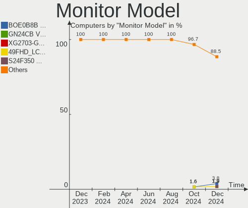

| Model                                                                 | Computers | Percent |
|-----------------------------------------------------------------------|-----------|---------|
| ___ LCD TV ___9000 1360x768                                           | 1         | 1.32%   |
| Vizio VX42L HDTV10A VIZ0030 1280x720 930x523mm 42.0-inch              | 1         | 1.32%   |
| ViewSonic XG2401 SERIES VSCBB31 1920x1080 531x299mm 24.0-inch         | 1         | 1.32%   |
| Unknown LCDTV 9000 1360x768 1600x900mm 72.3-inch                      | 1         | 1.32%   |
| Toshiba LCD-MONITOR LCDE980 1440x900 408x255mm 18.9-inch              | 1         | 1.32%   |
| Sony TV SNY8F03 1360x768                                              | 1         | 1.32%   |
| Sony TV *00 SNYF303 1920x1080 1439x809mm 65.0-inch                    | 1         | 1.32%   |
| SNC SKP_E20-32 SNC3200 1920x1080 477x268mm 21.5-inch                  | 1         | 1.32%   |
| Sharp LQ140M1JW49 SHP1523 1920x1080 309x174mm 14.0-inch               | 1         | 1.32%   |
| Sharp LCD Monitor SHP149A 1920x1080 344x194mm 15.5-inch               | 1         | 1.32%   |
| SFX HDMI2.0 KVM SFX0100 1920x1080 708x398mm 32.0-inch                 | 1         | 1.32%   |
| Sceptre Tech Sceptre P30 SPT0BCC 2560x1080 690x291mm 29.5-inch        | 1         | 1.32%   |
| Sceptre Tech Sceptre M27 SPT0ACD 1920x1080 598x336mm 27.0-inch        | 1         | 1.32%   |
| Samsung Electronics U28D590 SAM0B80 3840x2160 607x345mm 27.5-inch     | 1         | 1.32%   |
| Samsung Electronics SyncMaster SAM0422 1920x1200 518x324mm 24.1-inch  | 1         | 1.32%   |
| Samsung Electronics SyncMaster SAM0168 1280x1024 338x270mm 17.0-inch  | 1         | 1.32%   |
| Samsung Electronics S27F350 SAM0D22 1920x1080 598x336mm 27.0-inch     | 1         | 1.32%   |
| Samsung Electronics S24E650 SAM0C86 1920x1200 518x324mm 24.1-inch     | 1         | 1.32%   |
| Samsung Electronics LCD Monitor SEC334A 1366x768 344x194mm 15.5-inch  | 1         | 1.32%   |
| Samsung Electronics LCD Monitor SDC5344 1920x1080 344x194mm 15.5-inch | 1         | 1.32%   |
| Samsung Electronics LCD Monitor SDC4152 2880x1800 302x189mm 14.0-inch | 1         | 1.32%   |
| Samsung Electronics LCD Monitor SDC3752 1920x1080 344x194mm 15.5-inch | 1         | 1.32%   |
| Samsung Electronics LCD Monitor SAM0B7C 1920x1080 886x498mm 40.0-inch | 1         | 1.32%   |
| Samsung Electronics C27F390 SAM0D32 1920x1080 598x336mm 27.0-inch     | 1         | 1.32%   |
| Philips PHL 323E7 PHLC121 1920x1080 698x393mm 31.5-inch               | 1         | 1.32%   |
| Philips PHL 276E9Q PHLC17B 1920x1080 598x336mm 27.0-inch              | 1         | 1.32%   |
| Philips PHL 246V5 PHLC0C5 1920x1080 531x299mm 24.0-inch               | 1         | 1.32%   |
| PANDA LCD Monitor NCP0058 1920x1080 344x194mm 15.5-inch               | 1         | 1.32%   |
| PANDA LCD Monitor NCP004D 1920x1080 344x194mm 15.5-inch               | 1         | 1.32%   |
| PANDA LCD Monitor NCP0029 1920x1080 344x194mm 15.5-inch               | 1         | 1.32%   |
| MSI G24C MSI3EA0 1920x1080 521x293mm 23.5-inch                        | 1         | 1.32%   |
| MLT MN101 MLT0236 1920x1080 530x280mm 23.6-inch                       | 1         | 1.32%   |
| LG Display LCD Monitor LGD05D8 1920x1080 344x194mm 15.5-inch          | 1         | 1.32%   |
| LG Display LCD Monitor LGD046F 1920x1080 345x194mm 15.6-inch          | 1         | 1.32%   |
| LG Display LCD Monitor LGD0259 1920x1080 345x194mm 15.6-inch          | 1         | 1.32%   |
| Hewlett-Packard P204 HPN3631 1600x900 432x240mm 19.5-inch             | 1         | 1.32%   |
| Hewlett-Packard 22cwa HWP3183 1920x1080 476x268mm 21.5-inch           | 1         | 1.32%   |
| Goldstar QHD GSM772A 2560x1440 697x392mm 31.5-inch                    | 1         | 1.32%   |
| Goldstar LG HDR 4K GSM774F 3840x2160 700x400mm 31.7-inch              | 1         | 1.32%   |
| Dell U2711 DELA056 1920x1080 597x336mm 27.0-inch                      | 1         | 1.32%   |

Monitor Resolution
------------------

Monitor screen resolution

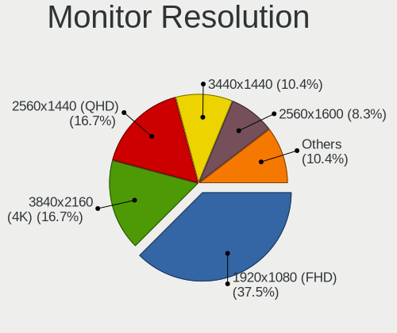

| Resolution         | Computers | Percent |
|--------------------|-----------|---------|
| 1920x1080 (FHD)    | 42        | 60%     |
| 1366x768 (WXGA)    | 7         | 10%     |
| 2560x1440 (QHD)    | 5         | 7.14%   |
| 3840x2160 (4K)     | 3         | 4.29%   |
| 2880x1800          | 2         | 2.86%   |
| 1440x900 (WXGA+)   | 2         | 2.86%   |
| 1360x768           | 2         | 2.86%   |
| 2560x1600          | 1         | 1.43%   |
| 2560x1080          | 1         | 1.43%   |
| 1920x1200 (WUXGA)  | 1         | 1.43%   |
| 1680x1050 (WSXGA+) | 1         | 1.43%   |
| 1600x900 (HD+)     | 1         | 1.43%   |
| 1280x800 (WXGA)    | 1         | 1.43%   |
| 1280x1024 (SXGA)   | 1         | 1.43%   |

Monitor Diagonal
----------------

Diagonal size in inches

| Inches  | Computers | Percent |
|---------|-----------|---------|
| 15      | 21        | 28.38%  |
| 27      | 10        | 13.51%  |
| 24      | 7         | 9.46%   |
| 23      | 4         | 5.41%   |
| 21      | 4         | 5.41%   |
| 17      | 4         | 5.41%   |
| 13      | 4         | 5.41%   |
| 31      | 3         | 4.05%   |
| 14      | 3         | 4.05%   |
| 19      | 2         | 2.7%    |
| 18      | 2         | 2.7%    |
| Unknown | 2         | 2.7%    |
| 75      | 1         | 1.35%   |
| 72      | 1         | 1.35%   |
| 42      | 1         | 1.35%   |
| 40      | 1         | 1.35%   |
| 38      | 1         | 1.35%   |
| 32      | 1         | 1.35%   |
| 29      | 1         | 1.35%   |
| 16      | 1         | 1.35%   |

Monitor Width
-------------

Physical width

| Width in mm | Computers | Percent |
|-------------|-----------|---------|
| 301-350     | 29        | 40.28%  |
| 501-600     | 18        | 25%     |
| 401-500     | 8         | 11.11%  |
| 601-700     | 5         | 6.94%   |
| 351-400     | 3         | 4.17%   |
| 801-900     | 2         | 2.78%   |
| 1501-2000   | 2         | 2.78%   |
| Unknown     | 2         | 2.78%   |
| 701-800     | 1         | 1.39%   |
| 201-300     | 1         | 1.39%   |
| 901-1000    | 1         | 1.39%   |

Aspect Ratio
------------

Proportional relationship between the width and the height

| Ratio | Computers | Percent |
|-------|-----------|---------|
| 16/9  | 52        | 85.25%  |
| 16/10 | 7         | 11.48%  |
| 5/4   | 1         | 1.64%   |
| 21/9  | 1         | 1.64%   |

Monitor Area
------------

Area in inch²

| Area in inch² | Computers | Percent |
|----------------|-----------|---------|
| 101-110        | 21        | 29.17%  |
| 201-250        | 13        | 18.06%  |
| 301-350        | 10        | 13.89%  |
| 81-90          | 7         | 9.72%   |
| 351-500        | 4         | 5.56%   |
| 151-200        | 3         | 4.17%   |
| 121-130        | 3         | 4.17%   |
| 501-1000       | 3         | 4.17%   |
| More than 1000 | 2         | 2.78%   |
| 141-150        | 2         | 2.78%   |
| Unknown        | 2         | 2.78%   |
| 251-300        | 1         | 1.39%   |
| 111-120        | 1         | 1.39%   |

Pixel Density
-------------

Pixels per inch

| Density       | Computers | Percent |
|---------------|-----------|---------|
| 121-160       | 25        | 36.23%  |
| 51-100        | 22        | 31.88%  |
| 101-120       | 13        | 18.84%  |
| 1-50          | 3         | 4.35%   |
| 161-240       | 3         | 4.35%   |
| Unknown       | 2         | 2.9%    |
| More than 240 | 1         | 1.45%   |

Multiple Monitors
-----------------

Total monitors connected

| Total | Computers | Percent |
|-------|-----------|---------|
| 1     | 46        | 73.02%  |
| 2     | 11        | 17.46%  |
| 3     | 3         | 4.76%   |
| 0     | 3         | 4.76%   |

Network
-------

Net Controller Vendor
---------------------

Controller vendors

| Vendor                | Computers | Percent |
|-----------------------|-----------|---------|
| Realtek Semiconductor | 39        | 43.82%  |
| Intel                 | 26        | 29.21%  |
| Qualcomm Atheros      | 10        | 11.24%  |
| Broadcom              | 4         | 4.49%   |
| MediaTek              | 3         | 3.37%   |
| Xiaomi                | 1         | 1.12%   |
| TP-Link               | 1         | 1.12%   |
| Ralink                | 1         | 1.12%   |
| Nvidia                | 1         | 1.12%   |
| ICS Advent            | 1         | 1.12%   |
| Broadcom Limited      | 1         | 1.12%   |
| ASUSTek Computer      | 1         | 1.12%   |

Net Controller Model
--------------------

Controller models

| Model                                                             | Computers | Percent |
|-------------------------------------------------------------------|-----------|---------|
| Realtek RTL8111/8168/8411 PCI Express Gigabit Ethernet Controller | 36        | 33.03%  |
| Intel Wi-Fi 6 AX200                                               | 6         | 5.5%    |
| Realtek RTL8822CE 802.11ac PCIe Wireless Network Adapter          | 4         | 3.67%   |
| Qualcomm Atheros AR9485 Wireless Network Adapter                  | 3         | 2.75%   |
| Intel I211 Gigabit Network Connection                             | 3         | 2.75%   |
| Intel Ethernet Controller I225-V                                  | 3         | 2.75%   |
| Intel Ethernet Connection (7) I219-V                              | 3         | 2.75%   |
| Realtek RTL8821CE 802.11ac PCIe Wireless Network Adapter          | 2         | 1.83%   |
| Qualcomm Atheros QCA9377 802.11ac Wireless Network Adapter        | 2         | 1.83%   |
| Qualcomm Atheros Killer E220x Gigabit Ethernet Controller         | 2         | 1.83%   |
| MediaTek MT7921 802.11ax PCI Express Wireless Network Adapter     | 2         | 1.83%   |
| Intel Wireless 8260                                               | 2         | 1.83%   |
| Intel Wireless 7260                                               | 2         | 1.83%   |
| Intel Cannon Lake PCH CNVi WiFi                                   | 2         | 1.83%   |
| Intel Alder Lake-P PCH CNVi WiFi                                  | 2         | 1.83%   |
| Xiaomi Mi/Redmi series (RNDIS)                                    | 1         | 0.92%   |
| TP-Link 802.11ac NIC                                              | 1         | 0.92%   |
| Realtek RTL8852AE 802.11ax PCIe Wireless Network Adapter          | 1         | 0.92%   |
| Realtek RTL8822BE 802.11a/b/g/n/ac WiFi adapter                   | 1         | 0.92%   |
| Realtek RTL8812AU 802.11a/b/g/n/ac 2T2R DB WLAN Adapter           | 1         | 0.92%   |
| Realtek RTL8812AE 802.11ac PCIe Wireless Network Adapter          | 1         | 0.92%   |
| Realtek RTL8723BU 802.11b/g/n WLAN Adapter                        | 1         | 0.92%   |
| Realtek RTL8188EUS 802.11n Wireless Network Adapter               | 1         | 0.92%   |
| Realtek RTL8150 Fast Ethernet Adapter                             | 1         | 0.92%   |
| Realtek RTL810xE PCI Express Fast Ethernet controller             | 1         | 0.92%   |
| Realtek 802.11ac NIC                                              | 1         | 0.92%   |
| Ralink RT5390 Wireless 802.11n 1T/1R PCIe                         | 1         | 0.92%   |
| Qualcomm Atheros QCA6174 802.11ac Wireless Network Adapter        | 1         | 0.92%   |
| Qualcomm Atheros AR9462 Wireless Network Adapter                  | 1         | 0.92%   |
| Qualcomm Atheros AR8152 v1.1 Fast Ethernet                        | 1         | 0.92%   |
| Nvidia MCP79 Ethernet                                             | 1         | 0.92%   |
| MediaTek MT7921K (RZ608) Wi-Fi 6E 80MHz                           | 1         | 0.92%   |
| Intel Wireless-AC 9260                                            | 1         | 0.92%   |
| Intel Wireless 8265 / 8275                                        | 1         | 0.92%   |
| Intel Wireless 7265                                               | 1         | 0.92%   |
| Intel Wi-Fi 6 AX201                                               | 1         | 0.92%   |
| Intel Tiger Lake PCH CNVi WiFi                                    | 1         | 0.92%   |
| Intel Ethernet Connection I218-LM                                 | 1         | 0.92%   |
| Intel Ethernet Connection I217-LM                                 | 1         | 0.92%   |
| Intel Ethernet Connection (7) I219-LM                             | 1         | 0.92%   |

Wireless Vendor
---------------

Wireless vendors

| Vendor                | Computers | Percent |
|-----------------------|-----------|---------|
| Intel                 | 21        | 42%     |
| Realtek Semiconductor | 13        | 26%     |
| Qualcomm Atheros      | 7         | 14%     |
| MediaTek              | 3         | 6%      |
| Broadcom              | 3         | 6%      |
| TP-Link               | 1         | 2%      |
| Ralink                | 1         | 2%      |
| ASUSTek Computer      | 1         | 2%      |

Wireless Model
--------------

Wireless models

| Model                                                         | Computers | Percent |
|---------------------------------------------------------------|-----------|---------|
| Intel Wi-Fi 6 AX200                                           | 6         | 12%     |
| Realtek RTL8822CE 802.11ac PCIe Wireless Network Adapter      | 4         | 8%      |
| Qualcomm Atheros AR9485 Wireless Network Adapter              | 3         | 6%      |
| Realtek RTL8821CE 802.11ac PCIe Wireless Network Adapter      | 2         | 4%      |
| Qualcomm Atheros QCA9377 802.11ac Wireless Network Adapter    | 2         | 4%      |
| MediaTek MT7921 802.11ax PCI Express Wireless Network Adapter | 2         | 4%      |
| Intel Wireless 8260                                           | 2         | 4%      |
| Intel Wireless 7260                                           | 2         | 4%      |
| Intel Cannon Lake PCH CNVi WiFi                               | 2         | 4%      |
| Intel Alder Lake-P PCH CNVi WiFi                              | 2         | 4%      |
| TP-Link 802.11ac NIC                                          | 1         | 2%      |
| Realtek RTL8852AE 802.11ax PCIe Wireless Network Adapter      | 1         | 2%      |
| Realtek RTL8822BE 802.11a/b/g/n/ac WiFi adapter               | 1         | 2%      |
| Realtek RTL8812AU 802.11a/b/g/n/ac 2T2R DB WLAN Adapter       | 1         | 2%      |
| Realtek RTL8812AE 802.11ac PCIe Wireless Network Adapter      | 1         | 2%      |
| Realtek RTL8723BU 802.11b/g/n WLAN Adapter                    | 1         | 2%      |
| Realtek RTL8188EUS 802.11n Wireless Network Adapter           | 1         | 2%      |
| Realtek 802.11ac NIC                                          | 1         | 2%      |
| Ralink RT5390 Wireless 802.11n 1T/1R PCIe                     | 1         | 2%      |
| Qualcomm Atheros QCA6174 802.11ac Wireless Network Adapter    | 1         | 2%      |
| Qualcomm Atheros AR9462 Wireless Network Adapter              | 1         | 2%      |
| MediaTek MT7921K (RZ608) Wi-Fi 6E 80MHz                       | 1         | 2%      |
| Intel Wireless-AC 9260                                        | 1         | 2%      |
| Intel Wireless 8265 / 8275                                    | 1         | 2%      |
| Intel Wireless 7265                                           | 1         | 2%      |
| Intel Wi-Fi 6 AX201                                           | 1         | 2%      |
| Intel Tiger Lake PCH CNVi WiFi                                | 1         | 2%      |
| Intel Comet Lake PCH CNVi WiFi                                | 1         | 2%      |
| Intel Centrino Wireless-N 135                                 | 1         | 2%      |
| Broadcom BCM43602 802.11ac Wireless LAN SoC                   | 1         | 2%      |
| Broadcom BCM4322 802.11a/b/g/n Wireless LAN Controller        | 1         | 2%      |
| Broadcom BCM4313 802.11bgn Wireless Network Adapter           | 1         | 2%      |
| ASUS 802.11ac WLAN                                            | 1         | 2%      |

Ethernet Vendor
---------------

Ethernet vendors

| Vendor                | Computers | Percent |
|-----------------------|-----------|---------|
| Realtek Semiconductor | 37        | 63.79%  |
| Intel                 | 13        | 22.41%  |
| Qualcomm Atheros      | 3         | 5.17%   |
| Xiaomi                | 1         | 1.72%   |
| Nvidia                | 1         | 1.72%   |
| ICS Advent            | 1         | 1.72%   |
| Broadcom Limited      | 1         | 1.72%   |
| Broadcom              | 1         | 1.72%   |

Ethernet Model
--------------

Ethernet models

| Model                                                             | Computers | Percent |
|-------------------------------------------------------------------|-----------|---------|
| Realtek RTL8111/8168/8411 PCI Express Gigabit Ethernet Controller | 36        | 61.02%  |
| Intel I211 Gigabit Network Connection                             | 3         | 5.08%   |
| Intel Ethernet Controller I225-V                                  | 3         | 5.08%   |
| Intel Ethernet Connection (7) I219-V                              | 3         | 5.08%   |
| Qualcomm Atheros Killer E220x Gigabit Ethernet Controller         | 2         | 3.39%   |
| Xiaomi Mi/Redmi series (RNDIS)                                    | 1         | 1.69%   |
| Realtek RTL8150 Fast Ethernet Adapter                             | 1         | 1.69%   |
| Realtek RTL810xE PCI Express Fast Ethernet controller             | 1         | 1.69%   |
| Qualcomm Atheros AR8152 v1.1 Fast Ethernet                        | 1         | 1.69%   |
| Nvidia MCP79 Ethernet                                             | 1         | 1.69%   |
| Intel Ethernet Connection I218-LM                                 | 1         | 1.69%   |
| Intel Ethernet Connection I217-LM                                 | 1         | 1.69%   |
| Intel Ethernet Connection (7) I219-LM                             | 1         | 1.69%   |
| Intel Ethernet Connection (3) I218-LM                             | 1         | 1.69%   |
| ICS Advent 10/100M LAN                                            | 1         | 1.69%   |
| Broadcom NetXtreme BCM5761 Gigabit Ethernet PCIe                  | 1         | 1.69%   |
| Broadcom Limited NetXtreme BCM5754 Gigabit Ethernet PCI Express   | 1         | 1.69%   |

Net Controller Kind
-------------------

Ethernet, WiFi or modem

| Kind     | Computers | Percent |
|----------|-----------|---------|
| Ethernet | 55        | 52.88%  |
| WiFi     | 49        | 47.12%  |

Used Controller
---------------

Currently used network controller

| Kind     | Computers | Percent |
|----------|-----------|---------|
| WiFi     | 39        | 60%     |
| Ethernet | 26        | 40%     |

NICs
----

Total network controllers on board

| Total | Computers | Percent |
|-------|-----------|---------|
| 2     | 38        | 60.32%  |
| 1     | 24        | 38.1%   |
| 0     | 1         | 1.59%   |

IPv6
----

IPv6 vs IPv4

| Used | Computers | Percent |
|------|-----------|---------|
| No   | 43        | 68.25%  |
| Yes  | 20        | 31.75%  |

Bluetooth
---------

Bluetooth Vendor
----------------

Controller vendors

| Vendor                          | Computers | Percent |
|---------------------------------|-----------|---------|
| Intel                           | 20        | 46.51%  |
| Realtek Semiconductor           | 6         | 13.95%  |
| IMC Networks                    | 3         | 6.98%   |
| Lite-On Technology              | 2         | 4.65%   |
| Foxconn / Hon Hai               | 2         | 4.65%   |
| Cambridge Silicon Radio         | 2         | 4.65%   |
| TP-Link                         | 1         | 2.33%   |
| Toshiba                         | 1         | 2.33%   |
| Qualcomm Atheros Communications | 1         | 2.33%   |
| MediaTek                        | 1         | 2.33%   |
| Broadcom                        | 1         | 2.33%   |
| ASUSTek Computer                | 1         | 2.33%   |
| Apple                           | 1         | 2.33%   |
| Unknown                         | 1         | 2.33%   |

Bluetooth Model
---------------

Controller models

| Model                                               | Computers | Percent |
|-----------------------------------------------------|-----------|---------|
| Intel Bluetooth wireless interface                  | 6         | 13.95%  |
| Intel AX200 Bluetooth                               | 6         | 13.95%  |
| Intel AX201 Bluetooth                               | 5         | 11.63%  |
| Realtek Bluetooth Radio                             | 4         | 9.3%    |
| Intel Bluetooth 9460/9560 Jefferson Peak (JfP)      | 2         | 4.65%   |
| Cambridge Silicon Radio Bluetooth Dongle (HCI mode) | 2         | 4.65%   |
| TP-Link TPuLink UB500 Adapter                       | 1         | 2.33%   |
| Toshiba Askey Bluetooth Module                      | 1         | 2.33%   |
| Realtek RTL8822BE Bluetooth 4.2 Adapter             | 1         | 2.33%   |
| Realtek  Bluetooth 4.2 Adapter                      | 1         | 2.33%   |
| Qualcomm Atheros  Bluetooth Device                  | 1         | 2.33%   |
| MediaTek Wireless_Device                            | 1         | 2.33%   |
| Lite-On Bluetooth Radio                             | 1         | 2.33%   |
| Lite-On Bluetooth Device                            | 1         | 2.33%   |
| Intel Wireless-AC 9260 Bluetooth Adapter            | 1         | 2.33%   |
| IMC Networks Wireless_Device                        | 1         | 2.33%   |
| IMC Networks Bluetooth Radio                        | 1         | 2.33%   |
| IMC Networks Bluetooth Device                       | 1         | 2.33%   |
| Foxconn / Hon Hai Wireless_Device                   | 1         | 2.33%   |
| Foxconn / Hon Hai Bluetooth Device                  | 1         | 2.33%   |
| Broadcom Bluetooth Device                           | 1         | 2.33%   |
| ASUS ASUS USB-BT500                                 | 1         | 2.33%   |
| Apple Bluetooth Host Controller                     | 1         | 2.33%   |
| Unknown                                             | 1         | 2.33%   |

Sound
-----

Sound Vendor
------------

Sound card vendors

| Vendor                 | Computers | Percent |
|------------------------|-----------|---------|
| Intel                  | 39        | 33.62%  |
| Nvidia                 | 28        | 24.14%  |
| AMD                    | 27        | 23.28%  |
| C-Media Electronics    | 3         | 2.59%   |
| Samson Technologies    | 2         | 1.72%   |
| Razer USA              | 2         | 1.72%   |
| Plantronics            | 2         | 1.72%   |
| JMTek                  | 2         | 1.72%   |
| Focusrite-Novation     | 2         | 1.72%   |
| Creative Technology    | 2         | 1.72%   |
| Realtek Semiconductor  | 1         | 0.86%   |
| Logitech               | 1         | 0.86%   |
| Kingston Technology    | 1         | 0.86%   |
| Generalplus Technology | 1         | 0.86%   |
| Elgato Systems         | 1         | 0.86%   |
| Creative Labs          | 1         | 0.86%   |
| Corsair                | 1         | 0.86%   |

Sound Model
-----------

Sound card models

| Model                                                                      | Computers | Percent |
|----------------------------------------------------------------------------|-----------|---------|
| AMD Family 17h/19h HD Audio Controller                                     | 10        | 7.46%   |
| Intel Cannon Lake PCH cAVS                                                 | 7         | 5.22%   |
| AMD Renoir Radeon High Definition Audio Controller                         | 6         | 4.48%   |
| Nvidia TU107 GeForce GTX 1650 High Definition Audio Controller             | 5         | 3.73%   |
| Intel 7 Series/C216 Chipset Family High Definition Audio Controller        | 5         | 3.73%   |
| Nvidia TU106 High Definition Audio Controller                              | 4         | 2.99%   |
| Intel 6 Series/C200 Series Chipset Family High Definition Audio Controller | 4         | 2.99%   |
| AMD Starship/Matisse HD Audio Controller                                   | 4         | 2.99%   |
| Nvidia GA106 High Definition Audio Controller                              | 3         | 2.24%   |
| Intel Xeon E3-1200 v3/4th Gen Core Processor HD Audio Controller           | 3         | 2.24%   |
| Intel 8 Series/C220 Series Chipset High Definition Audio Controller        | 3         | 2.24%   |
| AMD SBx00 Azalia (Intel HDA)                                               | 3         | 2.24%   |
| AMD Family 17h (Models 00h-0fh) HD Audio Controller                        | 3         | 2.24%   |
| AMD Ellesmere HDMI Audio [Radeon RX 470/480 / 570/580/590]                 | 3         | 2.24%   |
| Nvidia TU104 HD Audio Controller                                           | 2         | 1.49%   |
| Nvidia GP106 High Definition Audio Controller                              | 2         | 1.49%   |
| Nvidia GP102 HDMI Audio Controller                                         | 2         | 1.49%   |
| Nvidia GA104 High Definition Audio Controller                              | 2         | 1.49%   |
| JMTek USB PnP Audio Device                                                 | 2         | 1.49%   |
| Intel Sunrise Point-LP HD Audio                                            | 2         | 1.49%   |
| Intel CM238 HD Audio Controller                                            | 2         | 1.49%   |
| Intel Alder Lake PCH-P High Definition Audio Controller                    | 2         | 1.49%   |
| Intel 100 Series/C230 Series Chipset Family HD Audio Controller            | 2         | 1.49%   |
| C-Media Electronics USB Audio Device                                       | 2         | 1.49%   |
| AMD Raven/Raven2/Fenghuang HDMI/DP Audio Controller                        | 2         | 1.49%   |
| AMD Oland/Hainan/Cape Verde/Pitcairn HDMI Audio [Radeon HD 7000 Series]    | 2         | 1.49%   |
| AMD Navi 21/23 HDMI/DP Audio Controller                                    | 2         | 1.49%   |
| Samson Technologies Q2U handheld mic with XLR                              | 1         | 0.75%   |
| Samson Technologies G-Track Pro microphone                                 | 1         | 0.75%   |
| Realtek Semiconductor Realtek Audio USB                                    | 1         | 0.75%   |
| Razer USA Razer USB Sound Card                                             | 1         | 0.75%   |
| Razer USA Razer Seiren Mini                                                | 1         | 0.75%   |
| Plantronics GameCom 818                                                    | 1         | 0.75%   |
| Plantronics BT600                                                          | 1         | 0.75%   |
| Nvidia TU116 High Definition Audio Controller                              | 1         | 0.75%   |
| Nvidia MCP79 High Definition Audio                                         | 1         | 0.75%   |
| Nvidia GP107GL High Definition Audio Controller                            | 1         | 0.75%   |
| Nvidia GM204 High Definition Audio Controller                              | 1         | 0.75%   |
| Nvidia GK107 HDMI Audio Controller                                         | 1         | 0.75%   |
| Nvidia GF108 High Definition Audio Controller                              | 1         | 0.75%   |

Memory
------

Memory Vendor
-------------

Memory module vendors

| Vendor              | Computers | Percent |
|---------------------|-----------|---------|
| Samsung Electronics | 5         | 23.81%  |
| SK hynix            | 3         | 14.29%  |
| Unknown             | 2         | 9.52%   |
| Micron Technology   | 2         | 9.52%   |
| Unknown (ABCD)      | 1         | 4.76%   |
| Transcend           | 1         | 4.76%   |
| Team                | 1         | 4.76%   |
| Ramaxel Technology  | 1         | 4.76%   |
| Nanya Technology    | 1         | 4.76%   |
| G.Skill             | 1         | 4.76%   |
| Crucial             | 1         | 4.76%   |
| Corsair             | 1         | 4.76%   |
| Asgard              | 1         | 4.76%   |

Memory Model
------------

Memory module models

| Model                                                            | Computers | Percent |
|------------------------------------------------------------------|-----------|---------|
| Micron RAM 4ATF1G64HZ-3G2E1 8GB SODIMM DDR4 3200MT/s             | 2         | 9.52%   |
| Unknown RAM Module 2GB DIMM DDR3 1066MT/s                        | 1         | 4.76%   |
| Unknown RAM 2400 C15 Series 16384MB DIMM DDR4 2133MT/s           | 1         | 4.76%   |
| Unknown (ABCD) RAM 123456789012345678 2GB SODIMM LPDDR4 2400MT/s | 1         | 4.76%   |
| Transcend RAM JM2666HSH-4G 4GB SODIMM DDR4 2667MT/s              | 1         | 4.76%   |
| Team RAM TEAMGROUP-UD3 8GB DIMM DDR3 1600MT/s                    | 1         | 4.76%   |
| SK hynix RAM HMA851S6CJR6N-VK 4GB SODIMM DDR4 2667MT/s           | 1         | 4.76%   |
| SK hynix RAM HMA81GS6JJR8N-VK 8GB SODIMM DDR4 2667MT/s           | 1         | 4.76%   |
| SK hynix RAM HMA81GS6AFR8N-UH 8GB SODIMM DDR4 2667MT/s           | 1         | 4.76%   |
| Samsung RAM M474A2K43BB1-CPB 16GB SODIMM DDR4 2133MT/s           | 1         | 4.76%   |
| Samsung RAM M471A1K43CB1-CRC 8GB SODIMM DDR4 2667MT/s            | 1         | 4.76%   |
| Samsung RAM M471A1G44BB0-CWE 8GB SODIMM DDR4 3200MT/s            | 1         | 4.76%   |
| Samsung RAM M471A1G44AB0-CWE 8GB SODIMM DDR4 3200MT/s            | 1         | 4.76%   |
| Samsung RAM M3 78T2863QZS-CF7 1GB DIMM DDR2 800MT/s              | 1         | 4.76%   |
| Ramaxel RAM RMR5030ED58E8W1600 2GB DIMM DDR3 1600MT/s            | 1         | 4.76%   |
| Nanya RAM M2S4G64CB8HG4N-DI 4GB SODIMM DDR3 1600MT/s             | 1         | 4.76%   |
| G.Skill RAM F4-3200C16-8GVKB 8GB DIMM DDR4 3866MT/s              | 1         | 4.76%   |
| Crucial RAM BL16G32C16U4B.16FE 16GB DIMM DDR4 3200MT/s           | 1         | 4.76%   |
| Corsair RAM CMZ16GX3M4A2133C11 4GB DIMM DDR3 1600MT/s            | 1         | 4.76%   |
| Asgard RAM VMA45UG-MEC1U2AW2 8GB DIMM DDR4 2400MT/s              | 1         | 4.76%   |

Memory Kind
-----------

Memory module kinds

| Kind   | Computers | Percent |
|--------|-----------|---------|
| DDR4   | 9         | 60%     |
| DDR3   | 4         | 26.67%  |
| SDRAM  | 1         | 6.67%   |
| LPDDR4 | 1         | 6.67%   |

Memory Form Factor
------------------

Physical design of the memory module

| Name   | Computers | Percent |
|--------|-----------|---------|
| DIMM   | 8         | 53.33%  |
| SODIMM | 7         | 46.67%  |

Memory Size
-----------

Memory module size

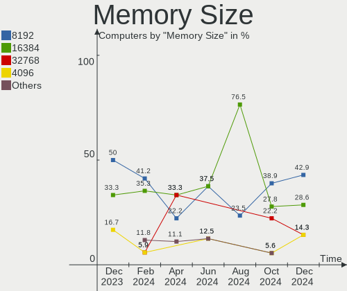

| Size  | Computers | Percent |
|-------|-----------|---------|
| 8192  | 8         | 47.06%  |
| 4096  | 4         | 23.53%  |
| 16384 | 3         | 17.65%  |
| 2048  | 1         | 5.88%   |
| 1024  | 1         | 5.88%   |

Memory Speed
------------

Memory module speed

| Speed | Computers | Percent |
|-------|-----------|---------|
| 1600  | 4         | 23.53%  |
| 3200  | 3         | 17.65%  |
| 2667  | 3         | 17.65%  |
| 2400  | 3         | 17.65%  |
| 3866  | 1         | 5.88%   |
| 2133  | 1         | 5.88%   |
| 1066  | 1         | 5.88%   |
| 800   | 1         | 5.88%   |

Printers & scanners
-------------------

Printer Vendor
--------------

Printer device vendors

Zero info for selected period =(

Printer Model
-------------

Printer device models

Zero info for selected period =(

Scanner Vendor
--------------

Scanner device vendors

Zero info for selected period =(

Scanner Model
-------------

Scanner device models

Zero info for selected period =(

Camera
------

Camera Vendor
-------------

Camera device vendors

| Vendor                                 | Computers | Percent |
|----------------------------------------|-----------|---------|
| IMC Networks                           | 7         | 18.92%  |
| Logitech                               | 4         | 10.81%  |
| Chicony Electronics                    | 3         | 8.11%   |
| Acer                                   | 3         | 8.11%   |
| Suyin                                  | 2         | 5.41%   |
| Quanta                                 | 2         | 5.41%   |
| Cheng Uei Precision Industry (Foxlink) | 2         | 5.41%   |
| Apple                                  | 2         | 5.41%   |
| Syntek                                 | 1         | 2.7%    |
| SunplusIT                              | 1         | 2.7%    |
| Sunplus Innovation Technology          | 1         | 2.7%    |
| Sonix Technology                       | 1         | 2.7%    |
| Samsung Electronics                    | 1         | 2.7%    |
| Realtek Semiconductor                  | 1         | 2.7%    |
| Microsoft                              | 1         | 2.7%    |
| Microdia                               | 1         | 2.7%    |
| Luxvisions Innotech Limited            | 1         | 2.7%    |
| Lenovo                                 | 1         | 2.7%    |
| Intel                                  | 1         | 2.7%    |
| Importek                               | 1         | 2.7%    |

Camera Model
------------

Camera device models

| Model                                                                    | Computers | Percent |
|--------------------------------------------------------------------------|-----------|---------|
| IMC Networks USB2.0 HD UVC WebCam                                        | 4         | 10.81%  |
| Logitech C922 Pro Stream Webcam                                          | 2         | 5.41%   |
| Acer HD Webcam                                                           | 2         | 5.41%   |
| Syntek EasyCamera                                                        | 1         | 2.7%    |
| Suyin HP TrueVision HD Integrated Webcam                                 | 1         | 2.7%    |
| Suyin HP TrueVision Full HD                                              | 1         | 2.7%    |
| SunplusIT MTD camera                                                     | 1         | 2.7%    |
| Sunplus Integrated_Webcam_HD                                             | 1         | 2.7%    |
| Sonix USB2.0 HD UVC WebCam                                               | 1         | 2.7%    |
| Samsung Galaxy series, misc. (MTP mode)                                  | 1         | 2.7%    |
| Realtek USB Camera                                                       | 1         | 2.7%    |
| Quanta USB HD Webcam                                                     | 1         | 2.7%    |
| Quanta HD Webcam                                                         | 1         | 2.7%    |
| Microsoft LifeCam Cinema                                                 | 1         | 2.7%    |
| Microdia Integrated_Webcam_HD                                            | 1         | 2.7%    |
| Luxvisions Innotech Limited HP TrueVision HD Camera                      | 1         | 2.7%    |
| Logitech QuickCam Pro 9000                                               | 1         | 2.7%    |
| Logitech HD Pro Webcam C920                                              | 1         | 2.7%    |
| Lenovo 500 RGB Camera                                                    | 1         | 2.7%    |
| Intel RealSense 3D Camera (Front F200)                                   | 1         | 2.7%    |
| Importek Laptop Integrated Webcam                                        | 1         | 2.7%    |
| IMC Networks USB2.0 VGA UVC WebCam                                       | 1         | 2.7%    |
| IMC Networks Integrated Camera                                           | 1         | 2.7%    |
| IMC Networks HP TrueVision HD Camera                                     | 1         | 2.7%    |
| Chicony TOSHIBA Web Camera                                               | 1         | 2.7%    |
| Chicony Integrated Camera                                                | 1         | 2.7%    |
| Chicony HP HD Camera                                                     | 1         | 2.7%    |
| Cheng Uei Precision Industry (Foxlink) HP HD Webcam                      | 1         | 2.7%    |
| Cheng Uei Precision Industry (Foxlink) HP EliteBook integrated HD Webcam | 1         | 2.7%    |
| Apple iPhone 5/5C/5S/6/SE                                                | 1         | 2.7%    |
| Apple Built-in iSight                                                    | 1         | 2.7%    |
| Acer Integrated Camera                                                   | 1         | 2.7%    |

Security
--------

Fingerprint Vendor
------------------

Fingerprint sensor vendors

| Vendor                     | Computers | Percent |
|----------------------------|-----------|---------|
| Validity Sensors           | 2         | 40%     |
| Synaptics                  | 1         | 20%     |
| Shenzhen Goodix Technology | 1         | 20%     |
| Elan Microelectronics      | 1         | 20%     |

Fingerprint Model
-----------------

Fingerprint sensor models

| Model                                                      | Computers | Percent |
|------------------------------------------------------------|-----------|---------|
| Validity Sensors VFS495 Fingerprint Reader                 | 2         | 40%     |
| Synaptics  VFS7552 Touch Fingerprint Sensor with PurePrint | 1         | 20%     |
| Shenzhen Goodix  FingerPrint Device                        | 1         | 20%     |
| Elan ELAN:ARM-M4                                           | 1         | 20%     |

Chipcard Vendor
---------------

Chipcard module vendors

Zero info for selected period =(

Chipcard Model
--------------

Chipcard module models

Zero info for selected period =(

Unsupported
-----------

Unsupported Devices
-------------------

Total unsupported devices on board

| Total | Computers | Percent |
|-------|-----------|---------|
| 0     | 48        | 76.19%  |
| 1     | 12        | 19.05%  |
| 2     | 3         | 4.76%   |

Unsupported Device Types
------------------------

Types of unsupported devices

| Type                     | Computers | Percent |
|--------------------------|-----------|---------|
| Graphics card            | 7         | 38.89%  |
| Fingerprint reader       | 5         | 27.78%  |
| Net/wireless             | 2         | 11.11%  |
| Multimedia controller    | 2         | 11.11%  |
| Modem                    | 1         | 5.56%   |
| Communication controller | 1         | 5.56%   |

