Nobara - Hardware Trends
------------------------

A project to identify most popular hardware characteristics and track their change
over time based on data collected by Linux users at https://Linux-Hardware.org.

Anyone can contribute to this report by the [hw-probe](https://github.com/linuxhw/hw-probe) tool:

    sudo -E hw-probe -all -upload

This is a report for all computer types. See also reports for [desktops](/Dist/Nobara/Desktop/README.md) and [notebooks](/Dist/Nobara/Notebook/README.md).

This report is for one last month. Overall report since the beginning of time: [TestDays](https://github.com/linuxhw/TestDays)

Period: Jul, 2023.

Contents
--------

* [ System ](#system)
  - [ OS                       ](#os)
  - [ OS Family                ](#os-family)
  - [ Kernel                   ](#kernel)
  - [ Kernel Family            ](#kernel-family)
  - [ Kernel Major Ver.        ](#kernel-major-ver)
  - [ Arch                     ](#arch)
  - [ DE                       ](#de)
  - [ Display Server           ](#display-server)
  - [ Display Manager          ](#display-manager)
  - [ OS Lang                  ](#os-lang)
  - [ Boot Mode                ](#boot-mode)
  - [ Filesystem               ](#filesystem)
  - [ Part. scheme             ](#part-scheme)
  - [ Dual Boot with Linux/BSD ](#dual-boot-with-linuxbsd)
  - [ Dual Boot (Win)          ](#dual-boot-win)

* [ Board ](#board)
  - [ Vendor                   ](#vendor)
  - [ Model                    ](#model)
  - [ Model Family             ](#model-family)
  - [ MFG Year                 ](#mfg-year)
  - [ Form Factor              ](#form-factor)
  - [ Secure Boot              ](#secure-boot)
  - [ Coreboot                 ](#coreboot)
  - [ RAM Size                 ](#ram-size)
  - [ RAM Used                 ](#ram-used)
  - [ Total Drives             ](#total-drives)
  - [ Has CD-ROM               ](#has-cd-rom)
  - [ Has Ethernet             ](#has-ethernet)
  - [ Has WiFi                 ](#has-wifi)
  - [ Has Bluetooth            ](#has-bluetooth)

* [ Location ](#location)
  - [ Country                  ](#country)
  - [ City                     ](#city)

* [ Drives ](#drives)
  - [ Drive Vendor             ](#drive-vendor)
  - [ Drive Model              ](#drive-model)
  - [ HDD Vendor               ](#hdd-vendor)
  - [ SSD Vendor               ](#ssd-vendor)
  - [ Drive Kind               ](#drive-kind)
  - [ Drive Connector          ](#drive-connector)
  - [ Drive Size               ](#drive-size)
  - [ Space Total              ](#space-total)
  - [ Space Used               ](#space-used)
  - [ Malfunc. Drives          ](#malfunc-drives)
  - [ Malfunc. Drive Vendor    ](#malfunc-drive-vendor)
  - [ Malfunc. HDD Vendor      ](#malfunc-hdd-vendor)
  - [ Malfunc. Drive Kind      ](#malfunc-drive-kind)
  - [ Failed Drives            ](#failed-drives)
  - [ Failed Drive Vendor      ](#failed-drive-vendor)
  - [ Drive Status             ](#drive-status)

* [ Storage controller ](#storage-controller)
  - [ Storage Vendor           ](#storage-vendor)
  - [ Storage Model            ](#storage-model)
  - [ Storage Kind             ](#storage-kind)

* [ Processor ](#processor)
  - [ CPU Vendor               ](#cpu-vendor)
  - [ CPU Model                ](#cpu-model)
  - [ CPU Model Family         ](#cpu-model-family)
  - [ CPU Cores                ](#cpu-cores)
  - [ CPU Sockets              ](#cpu-sockets)
  - [ CPU Threads              ](#cpu-threads)
  - [ CPU Op-Modes             ](#cpu-op-modes)
  - [ CPU Microcode            ](#cpu-microcode)
  - [ CPU Microarch            ](#cpu-microarch)

* [ Graphics ](#graphics)
  - [ GPU Vendor               ](#gpu-vendor)
  - [ GPU Model                ](#gpu-model)
  - [ GPU Combo                ](#gpu-combo)
  - [ GPU Driver               ](#gpu-driver)
  - [ GPU Memory               ](#gpu-memory)

* [ Monitor ](#monitor)
  - [ Monitor Vendor           ](#monitor-vendor)
  - [ Monitor Model            ](#monitor-model)
  - [ Monitor Resolution       ](#monitor-resolution)
  - [ Monitor Diagonal         ](#monitor-diagonal)
  - [ Monitor Width            ](#monitor-width)
  - [ Aspect Ratio             ](#aspect-ratio)
  - [ Monitor Area             ](#monitor-area)
  - [ Pixel Density            ](#pixel-density)
  - [ Multiple Monitors        ](#multiple-monitors)

* [ Network ](#network)
  - [ Net Controller Vendor    ](#net-controller-vendor)
  - [ Net Controller Model     ](#net-controller-model)
  - [ Wireless Vendor          ](#wireless-vendor)
  - [ Wireless Model           ](#wireless-model)
  - [ Ethernet Vendor          ](#ethernet-vendor)
  - [ Ethernet Model           ](#ethernet-model)
  - [ Net Controller Kind      ](#net-controller-kind)
  - [ Used Controller          ](#used-controller)
  - [ NICs                     ](#nics)
  - [ IPv6                     ](#ipv6)

* [ Bluetooth ](#bluetooth)
  - [ Bluetooth Vendor         ](#bluetooth-vendor)
  - [ Bluetooth Model          ](#bluetooth-model)

* [ Sound ](#sound)
  - [ Sound Vendor             ](#sound-vendor)
  - [ Sound Model              ](#sound-model)

* [ Memory ](#memory)
  - [ Memory Vendor            ](#memory-vendor)
  - [ Memory Model             ](#memory-model)
  - [ Memory Kind              ](#memory-kind)
  - [ Memory Form Factor       ](#memory-form-factor)
  - [ Memory Size              ](#memory-size)
  - [ Memory Speed             ](#memory-speed)

* [ Printers & scanners ](#printers--scanners)
  - [ Printer Vendor           ](#printer-vendor)
  - [ Printer Model            ](#printer-model)
  - [ Scanner Vendor           ](#scanner-vendor)
  - [ Scanner Model            ](#scanner-model)

* [ Camera ](#camera)
  - [ Camera Vendor            ](#camera-vendor)
  - [ Camera Model             ](#camera-model)

* [ Security ](#security)
  - [ Fingerprint Vendor       ](#fingerprint-vendor)
  - [ Fingerprint Model        ](#fingerprint-model)
  - [ Chipcard Vendor          ](#chipcard-vendor)
  - [ Chipcard Model           ](#chipcard-model)

* [ Unsupported ](#unsupported)
  - [ Unsupported Devices      ](#unsupported-devices)
  - [ Unsupported Device Types ](#unsupported-device-types)

System
------

OS
--

Installed operating systems

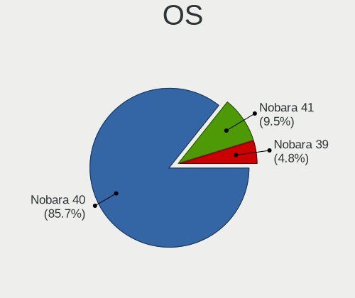

| Name      | Computers | Percent |
|-----------|-----------|---------|
| Nobara 38 | 46        | 85.19%  |
| Nobara 37 | 7         | 12.96%  |
| Nobara 36 | 1         | 1.85%   |

OS Family
---------

OS without a version

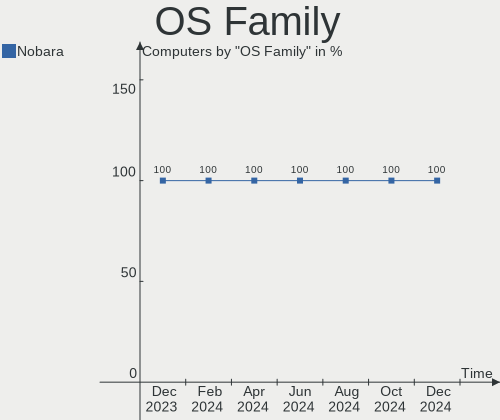

| Name   | Computers | Percent |
|--------|-----------|---------|
| Nobara | 54        | 100%    |

Kernel
------

Version of the Linux kernel

| Version                      | Computers | Percent |
|------------------------------|-----------|---------|
| 6.3.12-204.fsync.fc38.x86_64 | 25        | 46.3%   |
| 6.3.10-200.fsync.fc38.x86_64 | 12        | 22.22%  |
| 6.3.12-203.fsync.fc38.x86_64 | 6         | 11.11%  |
| 6.3.12-204.fsync.fc37.x86_64 | 4         | 7.41%   |
| 6.3.10-200.fsync.fc37.x86_64 | 3         | 5.56%   |
| 6.3.10-203.fsync.fc38.x86_64 | 2         | 3.7%    |
| 6.3.12-205.fsync.fc38.x86_64 | 1         | 1.85%   |
| 6.0.14-201.fsync.fc36.x86_64 | 1         | 1.85%   |

Kernel Family
-------------

Linux kernel without a distro release

| Version | Computers | Percent |
|---------|-----------|---------|
| 6.3.12  | 36        | 66.67%  |
| 6.3.10  | 17        | 31.48%  |
| 6.0.14  | 1         | 1.85%   |

Kernel Major Ver.
-----------------

Linux kernel major version

| Version | Computers | Percent |
|---------|-----------|---------|
| 6.3     | 53        | 98.15%  |
| 6.0     | 1         | 1.85%   |

Arch
----

OS architecture (x86_64, i586, etc.)

| Name   | Computers | Percent |
|--------|-----------|---------|
| x86_64 | 54        | 100%    |

DE
--

Desktop Environment

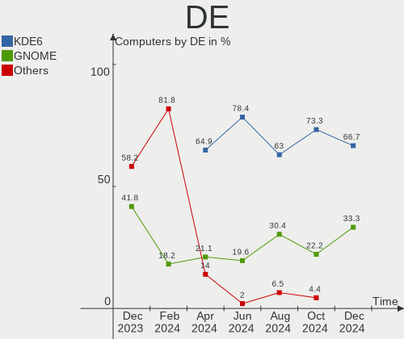

| Name    | Computers | Percent |
|---------|-----------|---------|
| GNOME   | 39        | 72.22%  |
| KDE5    | 13        | 24.07%  |
| Unknown | 2         | 3.7%    |

Display Server
--------------

X11 or Wayland

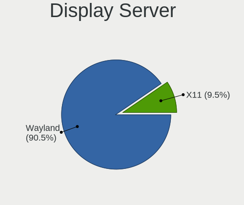

| Name    | Computers | Percent |
|---------|-----------|---------|
| Wayland | 41        | 75.93%  |
| X11     | 12        | 22.22%  |
| Unknown | 1         | 1.85%   |

Display Manager
---------------

SDDM, LightDM, etc.

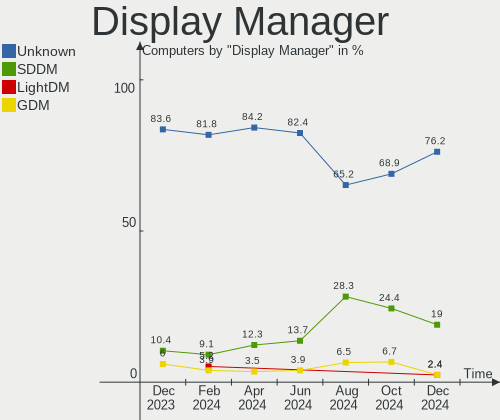

| Name    | Computers | Percent |
|---------|-----------|---------|
| Unknown | 44        | 81.48%  |
| GDM     | 10        | 18.52%  |

OS Lang
-------

Language

| Lang  | Computers | Percent |
|-------|-----------|---------|
| en_US | 30        | 55.56%  |
| en_GB | 7         | 12.96%  |
| pl_PL | 4         | 7.41%   |
| es_ES | 4         | 7.41%   |
| pt_BR | 2         | 3.7%    |
| de_DE | 2         | 3.7%    |
| ru_RU | 1         | 1.85%   |
| es_MX | 1         | 1.85%   |
| en_PH | 1         | 1.85%   |
| en_BW | 1         | 1.85%   |
| de_AT | 1         | 1.85%   |

Boot Mode
---------

EFI or BIOS

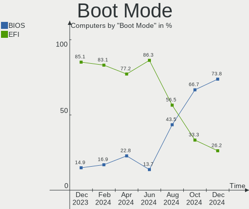

| Mode | Computers | Percent |
|------|-----------|---------|
| EFI  | 45        | 83.33%  |
| BIOS | 9         | 16.67%  |

Filesystem
----------

Type of filesystem

| Type  | Computers | Percent |
|-------|-----------|---------|
| Btrfs | 51        | 94.44%  |
| Ext4  | 3         | 5.56%   |

Part. scheme
------------

Scheme of partitioning

| Type    | Computers | Percent |
|---------|-----------|---------|
| Unknown | 42        | 77.78%  |
| GPT     | 12        | 22.22%  |

Dual Boot with Linux/BSD
------------------------

Hosting more than one Linux/BSD

| Dual boot | Computers | Percent |
|-----------|-----------|---------|
| No        | 52        | 96.3%   |
| Yes       | 2         | 3.7%    |

Dual Boot (Win)
---------------

Hosting Linux and Windows

| Dual boot | Computers | Percent |
|-----------|-----------|---------|
| No        | 51        | 94.44%  |
| Yes       | 3         | 5.56%   |

Board
-----

Vendor
------

Motherboard manufacturer

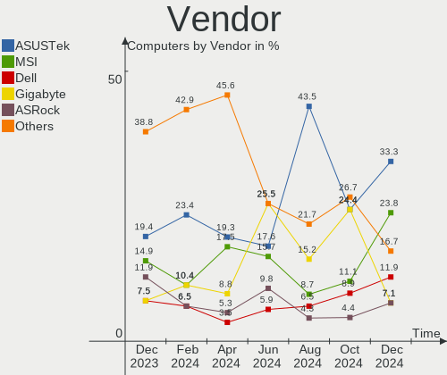

| Name                                 | Computers | Percent |
|--------------------------------------|-----------|---------|
| MSI                                  | 8         | 14.81%  |
| Lenovo                               | 8         | 14.81%  |
| ASUSTek Computer                     | 8         | 14.81%  |
| Gigabyte Technology                  | 6         | 11.11%  |
| Hewlett-Packard                      | 4         | 7.41%   |
| Dell                                 | 4         | 7.41%   |
| ASRock                               | 4         | 7.41%   |
| Acer                                 | 3         | 5.56%   |
| Toshiba                              | 1         | 1.85%   |
| Shenzhen Meigao Electronic Equipment | 1         | 1.85%   |
| Samsung Electronics                  | 1         | 1.85%   |
| NZXT                                 | 1         | 1.85%   |
| Microsoft                            | 1         | 1.85%   |
| GPD                                  | 1         | 1.85%   |
| Apple                                | 1         | 1.85%   |
| Acidanthera                          | 1         | 1.85%   |
| Unknown                              | 1         | 1.85%   |

Model
-----

Motherboard model

| Name                                       | Computers | Percent |
|--------------------------------------------|-----------|---------|
| MSI MS-7D25                                | 2         | 3.7%    |
| Dell Inspiron 15 3520                      | 2         | 3.7%    |
| Toshiba Satellite S55t-C                   | 1         | 1.85%   |
| Shenzhen Meigao Electronic Equipment UM590 | 1         | 1.85%   |
| Samsung 730QED                             | 1         | 1.85%   |
| NZXT N7 B650E                              | 1         | 1.85%   |
| MSI MS-7D54                                | 1         | 1.85%   |
| MSI MS-7C87                                | 1         | 1.85%   |
| MSI MS-7B86                                | 1         | 1.85%   |
| MSI MS-7B84                                | 1         | 1.85%   |
| MSI MS-7821                                | 1         | 1.85%   |
| MSI GT70 2PE                               | 1         | 1.85%   |
| Microsoft Surface Pro 4                    | 1         | 1.85%   |
| Lenovo Yoga 7 14ARB7 82QF                  | 1         | 1.85%   |
| Lenovo Yoga 6 13ALC7 82UD                  | 1         | 1.85%   |
| Lenovo ThinkPad Yoga 370 20JJS1DU05        | 1         | 1.85%   |
| Lenovo ThinkPad T470 20HES0FA03            | 1         | 1.85%   |
| Lenovo Legion 5 Pro 16ACH6H 82JQ           | 1         | 1.85%   |
| Lenovo Legion 5 15ARH05H 82B1              | 1         | 1.85%   |
| Lenovo IdeaPad Y700-15ISK 80NV             | 1         | 1.85%   |
| Lenovo IdeaPad 3 17ABA7 82RQ               | 1         | 1.85%   |
| HP Pavilion Gaming Laptop 15-ec2xxx        | 1         | 1.85%   |
| HP Pavilion Gaming Laptop 15-ec1xxx        | 1         | 1.85%   |
| HP Pavilion Gaming Desktop TG01-2xxx       | 1         | 1.85%   |
| HP Compaq Elite 8300 CMT                   | 1         | 1.85%   |
| GPD G1618-03                               | 1         | 1.85%   |
| Gigabyte X670 GAMING X AX                  | 1         | 1.85%   |
| Gigabyte X570 AORUS MASTER                 | 1         | 1.85%   |
| Gigabyte X570 AORUS ELITE                  | 1         | 1.85%   |
| Gigabyte X399 DESIGNARE EX                 | 1         | 1.85%   |
| Gigabyte B75M-D3H                          | 1         | 1.85%   |
| Gigabyte B550M DS3H AC                     | 1         | 1.85%   |
| Dell Latitude E5440                        | 1         | 1.85%   |
| Dell G7 7790                               | 1         | 1.85%   |
| ASUS X541SA                                | 1         | 1.85%   |
| ASUS TUF Gaming X670E-PLUS WIFI            | 1         | 1.85%   |
| ASUS TUF Gaming X670E-PLUS                 | 1         | 1.85%   |
| ASUS TUF Gaming X570-PLUS_BR               | 1         | 1.85%   |
| ASUS ROG Zephyrus M16 GU603ZM_GU603ZM      | 1         | 1.85%   |
| ASUS ROG STRIX Z690-E GAMING WIFI          | 1         | 1.85%   |

Model Family
------------

Motherboard model prefix

| Name                                       | Computers | Percent |
|--------------------------------------------|-----------|---------|
| HP Pavilion                                | 3         | 5.56%   |
| ASUS TUF                                   | 3         | 5.56%   |
| MSI MS-7D25                                | 2         | 3.7%    |
| Lenovo Yoga                                | 2         | 3.7%    |
| Lenovo ThinkPad                            | 2         | 3.7%    |
| Lenovo Legion                              | 2         | 3.7%    |
| Lenovo IdeaPad                             | 2         | 3.7%    |
| Gigabyte X570                              | 2         | 3.7%    |
| Dell Inspiron                              | 2         | 3.7%    |
| ASUS ROG                                   | 2         | 3.7%    |
| Acer Nitro                                 | 2         | 3.7%    |
| Toshiba Satellite                          | 1         | 1.85%   |
| Shenzhen Meigao Electronic Equipment UM590 | 1         | 1.85%   |
| Samsung 730QED                             | 1         | 1.85%   |
| NZXT N7                                    | 1         | 1.85%   |
| MSI MS-7D54                                | 1         | 1.85%   |
| MSI MS-7C87                                | 1         | 1.85%   |
| MSI MS-7B86                                | 1         | 1.85%   |
| MSI MS-7B84                                | 1         | 1.85%   |
| MSI MS-7821                                | 1         | 1.85%   |
| MSI GT70                                   | 1         | 1.85%   |
| Microsoft Surface                          | 1         | 1.85%   |
| HP Compaq                                  | 1         | 1.85%   |
| GPD G1618-03                               | 1         | 1.85%   |
| Gigabyte X670                              | 1         | 1.85%   |
| Gigabyte X399                              | 1         | 1.85%   |
| Gigabyte B75M-D3H                          | 1         | 1.85%   |
| Gigabyte B550M                             | 1         | 1.85%   |
| Dell Latitude                              | 1         | 1.85%   |
| Dell G7                                    | 1         | 1.85%   |
| ASUS X541SA                                | 1         | 1.85%   |
| ASUS CROSSHAIR                             | 1         | 1.85%   |
| ASUS All                                   | 1         | 1.85%   |
| ASRock Z170                                | 1         | 1.85%   |
| ASRock X299                                | 1         | 1.85%   |
| ASRock WRX80                               | 1         | 1.85%   |
| ASRock H370                                | 1         | 1.85%   |
| Apple MacBookPro5                          | 1         | 1.85%   |
| Acidanthera MacPro7                        | 1         | 1.85%   |
| Acer Predator                              | 1         | 1.85%   |

MFG Year
--------

Motherboard manufacture year

| Year | Computers | Percent |
|------|-----------|---------|
| 2022 | 13        | 24.07%  |
| 2021 | 10        | 18.52%  |
| 2020 | 7         | 12.96%  |
| 2019 | 7         | 12.96%  |
| 2018 | 4         | 7.41%   |
| 2016 | 3         | 5.56%   |
| 2017 | 2         | 3.7%    |
| 2015 | 2         | 3.7%    |
| 2013 | 2         | 3.7%    |
| 2012 | 2         | 3.7%    |
| 2014 | 1         | 1.85%   |
| 2009 | 1         | 1.85%   |

Form Factor
-----------

Physical design of the computer

| Name        | Computers | Percent |
|-------------|-----------|---------|
| Desktop     | 30        | 55.56%  |
| Notebook    | 18        | 33.33%  |
| Convertible | 4         | 7.41%   |
| Other       | 1         | 1.85%   |
| Tablet      | 1         | 1.85%   |

Secure Boot
-----------

Enabled or disabled

| State    | Computers | Percent |
|----------|-----------|---------|
| Disabled | 54        | 100%    |

Coreboot
--------

Have coreboot on board

| Used | Computers | Percent |
|------|-----------|---------|
| No   | 54        | 100%    |

RAM Size
--------

Total RAM memory

| Size in GB      | Computers | Percent |
|-----------------|-----------|---------|
| 16.01-24.0      | 18        | 33.33%  |
| 32.01-64.0      | 11        | 20.37%  |
| 4.01-8.0        | 8         | 14.81%  |
| 8.01-16.0       | 7         | 12.96%  |
| 64.01-256.0     | 4         | 7.41%   |
| 24.01-32.0      | 3         | 5.56%   |
| 3.01-4.0        | 2         | 3.7%    |
| More than 256.0 | 1         | 1.85%   |

RAM Used
--------

Used RAM memory

| Used GB    | Computers | Percent |
|------------|-----------|---------|
| 4.01-8.0   | 33        | 61.11%  |
| 3.01-4.0   | 8         | 14.81%  |
| 8.01-16.0  | 6         | 11.11%  |
| 2.01-3.0   | 3         | 5.56%   |
| 24.01-32.0 | 2         | 3.7%    |
| 16.01-24.0 | 1         | 1.85%   |
| 1.01-2.0   | 1         | 1.85%   |

Total Drives
------------

Number of drives on board

| Drives | Computers | Percent |
|--------|-----------|---------|
| 1      | 22        | 40.74%  |
| 2      | 16        | 29.63%  |
| 5      | 7         | 12.96%  |
| 3      | 5         | 9.26%   |
| 9      | 1         | 1.85%   |
| 8      | 1         | 1.85%   |
| 6      | 1         | 1.85%   |
| 4      | 1         | 1.85%   |

Has CD-ROM
----------

Has CD-ROM on board

| Presented | Computers | Percent |
|-----------|-----------|---------|
| No        | 44        | 81.48%  |
| Yes       | 10        | 18.52%  |

Has Ethernet
------------

Has Ethernet on board

| Presented | Computers | Percent |
|-----------|-----------|---------|
| Yes       | 45        | 83.33%  |
| No        | 9         | 16.67%  |

Has WiFi
--------

Has WiFi module

| Presented | Computers | Percent |
|-----------|-----------|---------|
| Yes       | 46        | 85.19%  |
| No        | 8         | 14.81%  |

Has Bluetooth
-------------

Has Bluetooth module

| Presented | Computers | Percent |
|-----------|-----------|---------|
| Yes       | 48        | 88.89%  |
| No        | 6         | 11.11%  |

Location
--------

Country
-------

Geographic location (country)

| Country      | Computers | Percent |
|--------------|-----------|---------|
| USA          | 18        | 33.33%  |
| UK           | 6         | 11.11%  |
| Spain        | 4         | 7.41%   |
| Poland       | 4         | 7.41%   |
| Netherlands  | 3         | 5.56%   |
| Germany      | 3         | 5.56%   |
| Finland      | 2         | 3.7%    |
| Brazil       | 2         | 3.7%    |
| Saudi Arabia | 1         | 1.85%   |
| Russia       | 1         | 1.85%   |
| Philippines  | 1         | 1.85%   |
| Malaysia     | 1         | 1.85%   |
| Japan        | 1         | 1.85%   |
| Italy        | 1         | 1.85%   |
| France       | 1         | 1.85%   |
| Estonia      | 1         | 1.85%   |
| Botswana     | 1         | 1.85%   |
| Belarus      | 1         | 1.85%   |
| Austria      | 1         | 1.85%   |
| Argentina    | 1         | 1.85%   |

City
----

Geographic location (city)

| City                     | Computers | Percent |
|--------------------------|-----------|---------|
| Donostia / San Sebastian | 2         | 3.7%    |
| Cadalso de los Vidrios   | 2         | 3.7%    |
| Wilkesboro               | 1         | 1.85%   |
| Villa General Belgrano   | 1         | 1.85%   |
| Utrecht                  | 1         | 1.85%   |
| Turek                    | 1         | 1.85%   |
| Tipton                   | 1         | 1.85%   |
| The Bronx                | 1         | 1.85%   |
| Staunton                 | 1         | 1.85%   |
| San Jose                 | 1         | 1.85%   |
| San Francisco            | 1         | 1.85%   |
| Samara                   | 1         | 1.85%   |
| Saltara                  | 1         | 1.85%   |
| Ryczowek                 | 1         | 1.85%   |
| Rotterdam                | 1         | 1.85%   |
| Raleigh                  | 1         | 1.85%   |
| Quezon City              | 1         | 1.85%   |
| Pinsdorf                 | 1         | 1.85%   |
| Pärnu                   | 1         | 1.85%   |
| Newport                  | 1         | 1.85%   |
| New Bern                 | 1         | 1.85%   |
| Minsk                    | 1         | 1.85%   |
| Mannheim                 | 1         | 1.85%   |
| Manchester               | 1         | 1.85%   |
| Manassas                 | 1         | 1.85%   |
| Liberty                  | 1         | 1.85%   |
| Lakeland                 | 1         | 1.85%   |
| Kuala Lumpur             | 1         | 1.85%   |
| Kaiserslautern           | 1         | 1.85%   |
| Johnstown                | 1         | 1.85%   |
| Houston                  | 1         | 1.85%   |
| Herten                   | 1         | 1.85%   |
| Helsinki                 | 1         | 1.85%   |
| Gdynia                   | 1         | 1.85%   |
| Gaborone                 | 1         | 1.85%   |
| Fort Worth               | 1         | 1.85%   |
| Espoo                    | 1         | 1.85%   |
| Ellesmere Port           | 1         | 1.85%   |
| East Stroudsburg         | 1         | 1.85%   |
| Dammam                   | 1         | 1.85%   |

Drives
------

Drive Vendor
------------

Hard drive vendors

| Vendor                      | Computers | Drives | Percent |
|-----------------------------|-----------|--------|---------|
| Samsung Electronics         | 23        | 34     | 22.12%  |
| Sandisk                     | 14        | 16     | 13.46%  |
| WDC                         | 11        | 13     | 10.58%  |
| Seagate                     | 8         | 12     | 7.69%   |
| Kingston                    | 6         | 8      | 5.77%   |
| Phison Electronics          | 5         | 7      | 4.81%   |
| Toshiba                     | 4         | 5      | 3.85%   |
| Intel                       | 3         | 4      | 2.88%   |
| HGST                        | 3         | 4      | 2.88%   |
| Crucial                     | 3         | 3      | 2.88%   |
| Unknown                     | 2         | 2      | 1.92%   |
| Micron/Crucial Technology   | 2         | 2      | 1.92%   |
| Micron Technology           | 2         | 2      | 1.92%   |
| KIOXIA                      | 2         | 2      | 1.92%   |
| Verbatim                    | 1         | 1      | 0.96%   |
| Union Memory                | 1         | 1      | 0.96%   |
| Team                        | 1         | 1      | 0.96%   |
| SPCC                        | 1         | 1      | 0.96%   |
| SK hynix                    | 1         | 1      | 0.96%   |
| Silicon Motion              | 1         | 1      | 0.96%   |
| Realtek                     | 1         | 1      | 0.96%   |
| Plextor                     | 1         | 1      | 0.96%   |
| Phison                      | 1         | 1      | 0.96%   |
| MAXIO Technology (Hangzhou) | 1         | 1      | 0.96%   |
| Kingston Technology Company | 1         | 1      | 0.96%   |
| Intenso                     | 1         | 1      | 0.96%   |
| Hitachi                     | 1         | 1      | 0.96%   |
| Gigabyte Technology         | 1         | 1      | 0.96%   |
| Biwin Storage Technology    | 1         | 1      | 0.96%   |
| AMD                         | 1         | 2      | 0.96%   |

Drive Model
-----------

Hard drive models

| Model                                                 | Computers | Percent |
|-------------------------------------------------------|-----------|---------|
| Samsung NVMe SSD Controller SM981/PM981/PM983 500GB   | 7         | 5.98%   |
| Sandisk WD Blue SN550 NVMe SSD 250GB                  | 4         | 3.42%   |
| Samsung NVMe SSD Controller PM9A1/PM9A3/980PRO 1TB    | 3         | 2.56%   |
| WDC WDS100T2B0A-00SM50 1TB SSD                        | 2         | 1.71%   |
| Seagate ST4000DM004-2CV104 4TB                        | 2         | 1.71%   |
| Seagate ST2000DM008-2FR102 2TB                        | 2         | 1.71%   |
| Sandisk WD_BLACK SN850X 2000GB                        | 2         | 1.71%   |
| Sandisk WD_BLACK SN770 1TB                            | 2         | 1.71%   |
| Sandisk PC SN740 NVMe WD 512GB                        | 2         | 1.71%   |
| Samsung SSD 870 EVO 2TB                               | 2         | 1.71%   |
| Samsung SSD 860 EVO 1TB                               | 2         | 1.71%   |
| Samsung NVMe SSD Controller SM961/PM961/SM963 256GB   | 2         | 1.71%   |
| Phison E12 NVMe Controller 2TB                        | 2         | 1.71%   |
| Kingston SA400S37240G 240GB SSD                       | 2         | 1.71%   |
| WDC WDS500G2B0A-00SM50 500GB SSD                      | 1         | 0.85%   |
| WDC WDS240G2G0A-00JH30 240GB SSD                      | 1         | 0.85%   |
| WDC WD5000BEVT-24A0RT0 500GB                          | 1         | 0.85%   |
| WDC WD5000AAVS-00ZTB0 500GB                           | 1         | 0.85%   |
| WDC WD50 00LPCX-24C6HT0 500GB                         | 1         | 0.85%   |
| WDC WD4005FZBX-00K5WB0 4TB                            | 1         | 0.85%   |
| WDC WD10SPCX-24HWST1 1TB                              | 1         | 0.85%   |
| WDC WD10EZRZ-00HTKB0 1TB                              | 1         | 0.85%   |
| WDC WD10EZEX-21WN4A0 1TB                              | 1         | 0.85%   |
| WDC WD10EURX-63UY4Y0 1TB                              | 1         | 0.85%   |
| Verbatim Vi550 S3 SSD 1TB                             | 1         | 0.85%   |
| Unknown MMC Card  64GB                                | 1         | 0.85%   |
| Unknown MMC Card  256GB                               | 1         | 0.85%   |
| Union Memory UMIS RPJTJ256MEE1OWX 256GB               | 1         | 0.85%   |
| Toshiba THNSNJ128GMCU 128GB SSD                       | 1         | 0.85%   |
| Toshiba MK2555GSX 250GB                               | 1         | 0.85%   |
| Toshiba MD04ACA400 4TB                                | 1         | 0.85%   |
| Toshiba HDWD120 2TB                                   | 1         | 0.85%   |
| Team T2532TB SSD                                      | 1         | 0.85%   |
| SPCC Solid State Disk 256GB                           | 1         | 0.85%   |
| SK hynix SKHynix_HFS001TDE9X084N 1TB                  | 1         | 0.85%   |
| Silicon Motion SM2263EN/SM2263XT SSD Controller 500GB | 1         | 0.85%   |
| Seagate ST95005620AS 500GB                            | 1         | 0.85%   |
| Seagate ST9500530NS 500GB                             | 1         | 0.85%   |
| Seagate ST500DM002-1BD142 500GB                       | 1         | 0.85%   |
| Seagate ST3000NM0023 3TB                              | 1         | 0.85%   |

HDD Vendor
----------

Hard disk drive vendors

| Vendor              | Computers | Drives | Percent |
|---------------------|-----------|--------|---------|
| WDC                 | 8         | 8      | 32%     |
| Seagate             | 8         | 12     | 32%     |
| Toshiba             | 3         | 3      | 12%     |
| HGST                | 3         | 4      | 12%     |
| Samsung Electronics | 2         | 3      | 8%      |
| Hitachi             | 1         | 1      | 4%      |

SSD Vendor
----------

Solid state drive vendors

| Vendor              | Computers | Drives | Percent |
|---------------------|-----------|--------|---------|
| Samsung Electronics | 11        | 15     | 36.67%  |
| Kingston            | 4         | 6      | 13.33%  |
| WDC                 | 3         | 5      | 10%     |
| Crucial             | 3         | 3      | 10%     |
| SanDisk             | 2         | 3      | 6.67%   |
| Verbatim            | 1         | 1      | 3.33%   |
| Toshiba             | 1         | 2      | 3.33%   |
| Team                | 1         | 1      | 3.33%   |
| SPCC                | 1         | 1      | 3.33%   |
| Plextor             | 1         | 1      | 3.33%   |
| Intenso             | 1         | 1      | 3.33%   |
| Gigabyte Technology | 1         | 1      | 3.33%   |

Drive Kind
----------

HDD or SSD

| Kind | Computers | Drives | Percent |
|------|-----------|--------|---------|
| NVMe | 45        | 58     | 50%     |
| SSD  | 23        | 40     | 25.56%  |
| HDD  | 20        | 31     | 22.22%  |
| MMC  | 2         | 2      | 2.22%   |

Drive Connector
---------------

SATA, SAS, NVMe, etc.

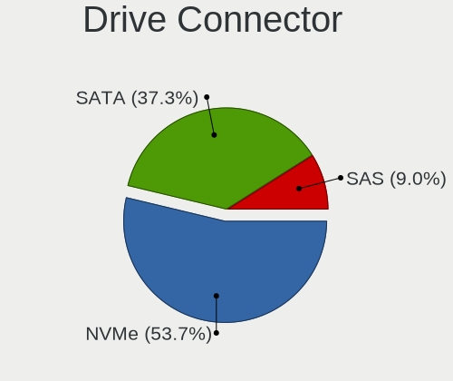

| Type | Computers | Drives | Percent |
|------|-----------|--------|---------|
| NVMe | 44        | 57     | 54.32%  |
| SATA | 30        | 64     | 37.04%  |
| SAS  | 5         | 8      | 6.17%   |
| MMC  | 2         | 2      | 2.47%   |

Drive Size
----------

Size of hard drive

| Size in TB | Computers | Drives | Percent |
|------------|-----------|--------|---------|
| 0.01-0.5   | 21        | 29     | 41.18%  |
| 0.51-1.0   | 17        | 23     | 33.33%  |
| 1.01-2.0   | 7         | 10     | 13.73%  |
| 3.01-4.0   | 5         | 6      | 9.8%    |
| 2.01-3.0   | 1         | 3      | 1.96%   |

Space Total
-----------

Amount of disk space available on the file system

| Size in GB     | Computers | Percent |
|----------------|-----------|---------|
| 1001-2000      | 12        | 22.22%  |
| 501-1000       | 12        | 22.22%  |
| More than 3000 | 11        | 20.37%  |
| 251-500        | 9         | 16.67%  |
| 101-250        | 3         | 5.56%   |
| 2001-3000      | 2         | 3.7%    |
| Unknown        | 2         | 3.7%    |
| 21-50          | 1         | 1.85%   |
| 1-20           | 1         | 1.85%   |
| 51-100         | 1         | 1.85%   |

Space Used
----------

Amount of used disk space

| Used GB        | Computers | Percent |
|----------------|-----------|---------|
| 21-50          | 11        | 20.37%  |
| 51-100         | 9         | 16.67%  |
| 251-500        | 8         | 14.81%  |
| 1-20           | 8         | 14.81%  |
| 101-250        | 7         | 12.96%  |
| 501-1000       | 5         | 9.26%   |
| More than 3000 | 2         | 3.7%    |
| 1001-2000      | 2         | 3.7%    |
| Unknown        | 2         | 3.7%    |

Malfunc. Drives
---------------

Drive models with a malfunction

Zero info for selected period =(

Malfunc. Drive Vendor
---------------------

Vendors of faulty drives

Zero info for selected period =(

Malfunc. HDD Vendor
-------------------

Vendors of faulty HDD drives

Zero info for selected period =(

Malfunc. Drive Kind
-------------------

Kinds of faulty drives

Zero info for selected period =(

Failed Drives
-------------

Failed drive models

Zero info for selected period =(

Failed Drive Vendor
-------------------

Failed drive vendors

Zero info for selected period =(

Drive Status
------------

Number of failed and malfunc. drives

| Status   | Computers | Drives | Percent |
|----------|-----------|--------|---------|
| Detected | 43        | 109    | 78.18%  |
| Works    | 12        | 22     | 21.82%  |

Storage controller
------------------

Storage Vendor
--------------

Storage controller vendors

| Vendor                      | Computers | Percent |
|-----------------------------|-----------|---------|
| Intel                       | 25        | 25%     |
| AMD                         | 24        | 24%     |
| Samsung Electronics         | 14        | 14%     |
| SanDisk                     | 12        | 12%     |
| Phison Electronics          | 5         | 5%      |
| Kingston Technology Company | 3         | 3%      |
| ASMedia Technology          | 3         | 3%      |
| Micron/Crucial Technology   | 2         | 2%      |
| Micron Technology           | 2         | 2%      |
| KIOXIA                      | 2         | 2%      |
| Union Memory (Shenzhen)     | 1         | 1%      |
| SK hynix                    | 1         | 1%      |
| Silicon Motion              | 1         | 1%      |
| Nvidia                      | 1         | 1%      |
| MAXIO Technology (Hangzhou) | 1         | 1%      |
| Marvell Technology Group    | 1         | 1%      |
| LSI Logic / Symbios Logic   | 1         | 1%      |
| Biwin Storage Technology    | 1         | 1%      |

Storage Model
-------------

Storage controller models

| Model                                                                   | Computers | Percent |
|-------------------------------------------------------------------------|-----------|---------|
| AMD FCH SATA Controller [AHCI mode]                                     | 18        | 16.22%  |
| Samsung NVMe SSD Controller SM981/PM981/PM983                           | 7         | 6.31%   |
| SanDisk WD Blue SN550 NVMe SSD                                          | 4         | 3.6%    |
| Intel Volume Management Device NVMe RAID Controller                     | 4         | 3.6%    |
| Intel Alder Lake-S PCH SATA Controller [AHCI Mode]                      | 4         | 3.6%    |
| AMD 400 Series Chipset SATA Controller                                  | 4         | 3.6%    |
| SanDisk WD Black SN770 / PC SN740 256GB / PC SN560 (DRAM-less) NVMe SSD | 3         | 2.7%    |
| Samsung NVMe SSD Controller PM9A1/PM9A3/980PRO                          | 3         | 2.7%    |
| Intel Cannon Lake Mobile PCH SATA AHCI Controller                       | 3         | 2.7%    |
| ASMedia ASM1062 Serial ATA Controller                                   | 3         | 2.7%    |
| Sandisk Western Digital WD Black SN850X NVMe SSD                        | 2         | 1.8%    |
| Sandisk PC SN740 NVMe SSD (DRAM-less)                                   | 2         | 1.8%    |
| Samsung NVMe SSD Controller SM961/PM961/SM963                           | 2         | 1.8%    |
| Phison E12 NVMe Controller                                              | 2         | 1.8%    |
| Intel Tiger Lake-LP SATA Controller                                     | 2         | 1.8%    |
| Intel HM170/QM170 Chipset SATA Controller [AHCI Mode]                   | 2         | 1.8%    |
| Intel 82801 Mobile SATA Controller [RAID mode]                          | 2         | 1.8%    |
| AMD 500 Series Chipset SATA Controller                                  | 2         | 1.8%    |
| Union Memory (Shenzhen) AM620 PCIe 3.0 NVMe SSD 256GB                   | 1         | 0.9%    |
| SK hynix Gold P31/BC711/PC711 NVMe Solid State Drive                    | 1         | 0.9%    |
| Silicon Motion SM2263EN/SM2263XT (DRAM-less) NVMe SSD Controllers       | 1         | 0.9%    |
| SanDisk WD Green SN350 NVMe SSD 240GB (DRAM-less)                       | 1         | 0.9%    |
| SanDisk PC SN735 NVMe SSD (DRAM-less)                                   | 1         | 0.9%    |
| Samsung NVMe SSD Controller SM951/PM951                                 | 1         | 0.9%    |
| Samsung NVMe SSD Controller 980                                         | 1         | 0.9%    |
| Phison PS5021-E21 PCIe4 NVMe Controller (DRAM-less)                     | 1         | 0.9%    |
| Phison PS5013 E13 NVMe Controller                                       | 1         | 0.9%    |
| Phison E18 PCIe4 NVMe Controller                                        | 1         | 0.9%    |
| Phison E16 PCIe4 NVMe Controller                                        | 1         | 0.9%    |
| Nvidia MCP79 AHCI Controller                                            | 1         | 0.9%    |
| Micron/Crucial P5 Plus NVMe PCIe SSD                                    | 1         | 0.9%    |
| Micron/Crucial P1 NVMe PCIe SSD[Frampton]                               | 1         | 0.9%    |
| Micron 2450 NVMe SSD [HendrixV] (DRAM-less)                             | 1         | 0.9%    |
| Micron 2210 NVMe SSD [Cobain]                                           | 1         | 0.9%    |
| MAXIO (Hangzhou) NVMe SSD Controller MAP1602                            | 1         | 0.9%    |
| Marvell Group 88SE9215 PCIe 2.0 x1 4-port SATA 6 Gb/s Controller        | 1         | 0.9%    |
| LSI Logic / Symbios Logic SAS2008 PCI-Express Fusion-MPT SAS-2 [Falcon] | 1         | 0.9%    |
| KIOXIA NVMe SSD Controller BG4 (DRAM-less)                              | 1         | 0.9%    |
| KIOXIA NVMe SSD                                                         | 1         | 0.9%    |
| Kingston Company Company Non-Volatile memory controller                 | 1         | 0.9%    |

Storage Kind
------------

Kind of storage controller (IDE, SATA, NVMe, SAS, ...)

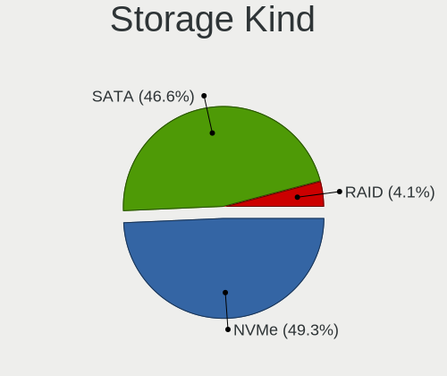

| Kind | Computers | Percent |
|------|-----------|---------|
| NVMe | 44        | 45.83%  |
| SATA | 43        | 44.79%  |
| RAID | 7         | 7.29%   |
| SAS  | 1         | 1.04%   |
| IDE  | 1         | 1.04%   |

Processor
---------

CPU Vendor
----------

Processor vendors

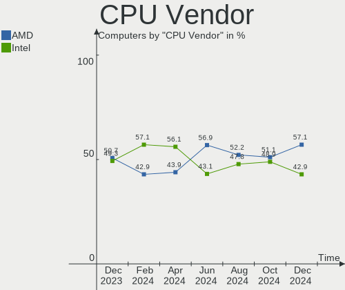

| Vendor | Computers | Percent |
|--------|-----------|---------|
| Intel  | 29        | 53.7%   |
| AMD    | 25        | 46.3%   |

CPU Model
---------

Processor models

| Model                                           | Computers | Percent |
|-------------------------------------------------|-----------|---------|
| AMD Ryzen 9 7900X 12-Core Processor             | 3         | 5.56%   |
| Intel Core i7-9750H CPU @ 2.60GHz               | 2         | 3.7%    |
| Intel Core i5-7300U CPU @ 2.60GHz               | 2         | 3.7%    |
| Intel Core i5-3470 CPU @ 3.20GHz                | 2         | 3.7%    |
| Intel 11th Gen Core i5-1135G7 @ 2.40GHz         | 2         | 3.7%    |
| AMD Ryzen 9 3900X 12-Core Processor             | 2         | 3.7%    |
| AMD Ryzen 5 5600X 6-Core Processor              | 2         | 3.7%    |
| AMD Ryzen 5 5600G with Radeon Graphics          | 2         | 3.7%    |
| AMD Ryzen 5 3600 6-Core Processor               | 2         | 3.7%    |
| Intel Pentium CPU N3710 @ 1.60GHz               | 1         | 1.85%   |
| Intel Core i9-10940X CPU @ 3.30GHz              | 1         | 1.85%   |
| Intel Core i7-8700 CPU @ 3.20GHz                | 1         | 1.85%   |
| Intel Core i7-6700HQ CPU @ 2.60GHz              | 1         | 1.85%   |
| Intel Core i7-5820K CPU @ 3.30GHz               | 1         | 1.85%   |
| Intel Core i7-4810MQ CPU @ 2.80GHz              | 1         | 1.85%   |
| Intel Core i7-4770K CPU @ 3.50GHz               | 1         | 1.85%   |
| Intel Core i5-9300H CPU @ 2.40GHz               | 1         | 1.85%   |
| Intel Core i5-6600 CPU @ 3.30GHz                | 1         | 1.85%   |
| Intel Core i5-6300U CPU @ 2.40GHz               | 1         | 1.85%   |
| Intel Core i5-6300HQ CPU @ 2.30GHz              | 1         | 1.85%   |
| Intel Core i5-4310U CPU @ 2.00GHz               | 1         | 1.85%   |
| Intel Core 2 Duo CPU P8700 @ 2.53GHz            | 1         | 1.85%   |
| Intel 13th Gen Core i7-13700K                   | 1         | 1.85%   |
| Intel 13th Gen Core i5-13500                    | 1         | 1.85%   |
| Intel 12th Gen Core i9-12900K                   | 1         | 1.85%   |
| Intel 12th Gen Core i7-12700K                   | 1         | 1.85%   |
| Intel 12th Gen Core i7-12700H                   | 1         | 1.85%   |
| Intel 12th Gen Core i5-1235U                    | 1         | 1.85%   |
| Intel 11th Gen Core i7-1195G7 @ 2.90GHz         | 1         | 1.85%   |
| Intel 11th Gen Core i5-11400F @ 2.60GHz         | 1         | 1.85%   |
| AMD Ryzen Threadripper PRO 5955WX 16-Cores      | 1         | 1.85%   |
| AMD Ryzen Threadripper 2970WX 24-Core Processor | 1         | 1.85%   |
| AMD Ryzen 9 5900HX with Radeon Graphics         | 1         | 1.85%   |
| AMD Ryzen 7 7800X3D 8-Core Processor            | 1         | 1.85%   |
| AMD Ryzen 7 6800U with Radeon Graphics          | 1         | 1.85%   |
| AMD Ryzen 7 5800X 8-Core Processor              | 1         | 1.85%   |
| AMD Ryzen 7 5800H with Radeon Graphics          | 1         | 1.85%   |
| AMD Ryzen 7 4800H with Radeon Graphics          | 1         | 1.85%   |
| AMD Ryzen 7 3700X 8-Core Processor              | 1         | 1.85%   |
| AMD Ryzen 5 5625U with Radeon Graphics          | 1         | 1.85%   |

CPU Model Family
----------------

Processor model prefix

| Model                  | Computers | Percent |
|------------------------|-----------|---------|
| AMD Ryzen 5            | 11        | 20.37%  |
| Other                  | 10        | 18.52%  |
| Intel Core i5          | 9         | 16.67%  |
| Intel Core i7          | 7         | 12.96%  |
| AMD Ryzen 9            | 6         | 11.11%  |
| AMD Ryzen 7            | 6         | 11.11%  |
| AMD Ryzen Threadripper | 2         | 3.7%    |
| Intel Pentium          | 1         | 1.85%   |
| Intel Core i9          | 1         | 1.85%   |
| Intel Core 2 Duo       | 1         | 1.85%   |

CPU Cores
---------

Number of processor cores

| Number | Computers | Percent |
|--------|-----------|---------|
| 6      | 16        | 29.63%  |
| 4      | 12        | 22.22%  |
| 8      | 7         | 12.96%  |
| 12     | 6         | 11.11%  |
| 2      | 5         | 9.26%   |
| 16     | 3         | 5.56%   |
| 14     | 3         | 5.56%   |
| 24     | 1         | 1.85%   |
| 10     | 1         | 1.85%   |

CPU Sockets
-----------

Number of sockets

| Number | Computers | Percent |
|--------|-----------|---------|
| 1      | 54        | 100%    |

CPU Threads
-----------

Threads per core (Hyper-Threading)

| Number | Computers | Percent |
|--------|-----------|---------|
| 2      | 47        | 87.04%  |
| 1      | 7         | 12.96%  |

CPU Op-Modes
------------

CPU Operation Modes (32-bit, 64-bit)

| Op mode        | Computers | Percent |
|----------------|-----------|---------|
| 32-bit, 64-bit | 54        | 100%    |

CPU Microcode
-------------

Microcode number

| Number     | Computers | Percent |
|------------|-----------|---------|
| Unknown    | 31        | 57.41%  |
| 0x0a50000c | 4         | 7.41%   |
| 0x0a601203 | 3         | 5.56%   |
| 0x08701021 | 3         | 5.56%   |
| 0x08701030 | 2         | 3.7%    |
| 0x0a601201 | 1         | 1.85%   |
| 0x0a50000d | 1         | 1.85%   |
| 0x0a404101 | 1         | 1.85%   |
| 0x0a201205 | 1         | 1.85%   |
| 0x0a201025 | 1         | 1.85%   |
| 0x0a201016 | 1         | 1.85%   |
| 0x0a008204 | 1         | 1.85%   |
| 0x08608103 | 1         | 1.85%   |
| 0x08600106 | 1         | 1.85%   |
| 0x08600104 | 1         | 1.85%   |
| 0x0800820b | 1         | 1.85%   |

CPU Microarch
-------------

Microarchitecture

| Name             | Computers | Percent |
|------------------|-----------|---------|
| Zen 3            | 9         | 16.67%  |
| Unknown          | 9         | 16.67%  |
| Zen 2            | 7         | 12.96%  |
| KabyLake         | 6         | 11.11%  |
| Skylake          | 5         | 9.26%   |
| Haswell          | 4         | 7.41%   |
| Alderlake Hybrid | 4         | 7.41%   |
| TigerLake        | 3         | 5.56%   |
| Zen+             | 2         | 3.7%    |
| IvyBridge        | 2         | 3.7%    |
| Silvermont       | 1         | 1.85%   |
| Penryn           | 1         | 1.85%   |
| Icelake          | 1         | 1.85%   |

Graphics
--------

GPU Vendor
----------

Vendors of graphics cards

| Vendor | Computers | Percent |
|--------|-----------|---------|
| Nvidia | 25        | 36.76%  |
| AMD    | 22        | 32.35%  |
| Intel  | 21        | 30.88%  |

GPU Model
---------

Graphics card models

| Model                                                                                    | Computers | Percent |
|------------------------------------------------------------------------------------------|-----------|---------|
| AMD Cezanne [Radeon Vega Series / Radeon Vega Mobile Series]                             | 5         | 7.14%   |
| Intel TigerLake-LP GT2 [Iris Xe Graphics]                                                | 3         | 4.29%   |
| Intel CoffeeLake-H GT2 [UHD Graphics 630]                                                | 3         | 4.29%   |
| AMD Raphael                                                                              | 3         | 4.29%   |
| AMD Ellesmere [Radeon RX 470/480/570/570X/580/580X/590]                                  | 3         | 4.29%   |
| Nvidia TU106M [GeForce RTX 2060 Mobile]                                                  | 2         | 2.86%   |
| Nvidia GA106M [GeForce RTX 3060 Mobile / Max-Q]                                          | 2         | 2.86%   |
| Intel HD Graphics 620                                                                    | 2         | 2.86%   |
| Intel HD Graphics 530                                                                    | 2         | 2.86%   |
| Intel AlderLake-S GT1                                                                    | 2         | 2.86%   |
| AMD Navi 23 [Radeon RX 6600/6600 XT/6600M]                                               | 2         | 2.86%   |
| AMD Navi 22 [Radeon RX 6700/6700 XT/6750 XT / 6800M/6850M XT]                            | 2         | 2.86%   |
| AMD Navi 21 [Radeon RX 6800/6800 XT / 6900 XT]                                           | 2         | 2.86%   |
| Nvidia TU117M [GeForce GTX 1650 Ti Mobile]                                               | 1         | 1.43%   |
| Nvidia TU117M                                                                            | 1         | 1.43%   |
| Nvidia TU116M [GeForce GTX 1660 Ti Mobile]                                               | 1         | 1.43%   |
| Nvidia TU116 [GeForce GTX 1660 SUPER]                                                    | 1         | 1.43%   |
| Nvidia TU116 [GeForce GTX 1650 SUPER]                                                    | 1         | 1.43%   |
| Nvidia TU106 [GeForce RTX 2070 Rev. A]                                                   | 1         | 1.43%   |
| Nvidia TU104 [GeForce RTX 2060]                                                          | 1         | 1.43%   |
| Nvidia GP107 [GeForce GTX 1050]                                                          | 1         | 1.43%   |
| Nvidia GP104 [GeForce GTX 1070]                                                          | 1         | 1.43%   |
| Nvidia GP104 [GeForce GTX 1060 6GB]                                                      | 1         | 1.43%   |
| Nvidia GM107M [GeForce GTX 960M]                                                         | 1         | 1.43%   |
| Nvidia GM107M [GeForce GTX 950M]                                                         | 1         | 1.43%   |
| Nvidia GK104M [GeForce GTX 880M]                                                         | 1         | 1.43%   |
| Nvidia GA106 [GeForce RTX 3060 Lite Hash Rate]                                           | 1         | 1.43%   |
| Nvidia GA104 [GeForce RTX 3070]                                                          | 1         | 1.43%   |
| Nvidia GA104 [GeForce RTX 3070 Lite Hash Rate]                                           | 1         | 1.43%   |
| Nvidia GA102 [GeForce RTX 3090 Ti]                                                       | 1         | 1.43%   |
| Nvidia GA102 [GeForce RTX 3080 Ti]                                                       | 1         | 1.43%   |
| Nvidia GA102 [GeForce RTX 3080 12GB]                                                     | 1         | 1.43%   |
| Nvidia C79 [GeForce 9400M]                                                               | 1         | 1.43%   |
| Nvidia AD102 [GeForce RTX 4090]                                                          | 1         | 1.43%   |
| Intel Xeon E3-1200 v3/4th Gen Core Processor Integrated Graphics Controller              | 1         | 1.43%   |
| Intel Xeon E3-1200 v2/3rd Gen Core processor Graphics Controller                         | 1         | 1.43%   |
| Intel Skylake GT2 [HD Graphics 520]                                                      | 1         | 1.43%   |
| Intel Raptor Lake-S GT1 [UHD Graphics 770]                                               | 1         | 1.43%   |
| Intel Haswell-ULT Integrated Graphics Controller                                         | 1         | 1.43%   |
| Intel Atom/Celeron/Pentium Processor x5-E8000/J3xxx/N3xxx Integrated Graphics Controller | 1         | 1.43%   |

GPU Combo
---------

Combinations of graphics cards

| Name           | Computers | Percent |
|----------------|-----------|---------|
| 1 x AMD        | 16        | 29.63%  |
| 1 x Nvidia     | 14        | 25.93%  |
| 1 x Intel      | 11        | 20.37%  |
| Intel + Nvidia | 7         | 12.96%  |
| 2 x AMD        | 3         | 5.56%   |
| AMD + Nvidia   | 3         | 5.56%   |

GPU Driver
----------

Free vs proprietary

| Driver      | Computers | Percent |
|-------------|-----------|---------|
| Free        | 33        | 61.11%  |
| Proprietary | 20        | 37.04%  |
| Unknown     | 1         | 1.85%   |

GPU Memory
----------

Total video memory

| Size in GB | Computers | Percent |
|------------|-----------|---------|
| Unknown    | 27        | 50%     |
| 7.01-8.0   | 7         | 12.96%  |
| 8.01-16.0  | 6         | 11.11%  |
| 0.01-0.5   | 6         | 11.11%  |
| 1.01-2.0   | 4         | 7.41%   |
| 5.01-6.0   | 2         | 3.7%    |
| 3.01-4.0   | 1         | 1.85%   |
| 0.51-1.0   | 1         | 1.85%   |

Monitor
-------

Monitor Vendor
--------------

Monitor vendors

| Vendor                  | Computers | Percent |
|-------------------------|-----------|---------|
| Samsung Electronics     | 13        | 19.4%   |
| Goldstar                | 6         | 8.96%   |
| AU Optronics            | 6         | 8.96%   |
| LG Display              | 5         | 7.46%   |
| Dell                    | 4         | 5.97%   |
| BOE                     | 4         | 5.97%   |
| ASUSTek Computer        | 3         | 4.48%   |
| AOC                     | 3         | 4.48%   |
| ViewSonic               | 2         | 2.99%   |
| Sharp                   | 2         | 2.99%   |
| Gigabyte Technology     | 2         | 2.99%   |
| BenQ                    | 2         | 2.99%   |
| Ancor Communications    | 2         | 2.99%   |
| Acer                    | 2         | 2.99%   |
| WIT                     | 1         | 1.49%   |
| Sony                    | 1         | 1.49%   |
| NEC Computers           | 1         | 1.49%   |
| MSI                     | 1         | 1.49%   |
| Iiyama                  | 1         | 1.49%   |
| Hewlett-Packard         | 1         | 1.49%   |
| Eizo                    | 1         | 1.49%   |
| CSO                     | 1         | 1.49%   |
| Corsair                 | 1         | 1.49%   |
| Chimei Innolux          | 1         | 1.49%   |
| Chi Mei Optoelectronics | 1         | 1.49%   |

Monitor Model
-------------

Monitor models

| Model                                                                   | Computers | Percent |
|-------------------------------------------------------------------------|-----------|---------|
| LG Display LCD Monitor LGD0738 1920x1080 344x194mm 15.5-inch            | 2         | 2.86%   |
| WIT DVI WIT00FA 2560x1600 670x430mm 31.3-inch                           | 1         | 1.43%   |
| ViewSonic XG2401 SERIES VSCBB31 1920x1080 531x299mm 24.0-inch           | 1         | 1.43%   |
| ViewSonic VX2778 Series VSC8432 2560x1440 597x336mm 27.0-inch           | 1         | 1.43%   |
| Sony TV *30 SNYB905 3840x2160 1439x809mm 65.0-inch                      | 1         | 1.43%   |
| Sharp LCD Monitor SHP147B 1920x1080 290x170mm 13.2-inch                 | 1         | 1.43%   |
| Sharp HDMI SHP10E6 1920x1080 1330x750mm 60.1-inch                       | 1         | 1.43%   |
| Samsung Electronics SyncMaster SAM0214 1680x1050 408x306mm 20.1-inch    | 1         | 1.43%   |
| Samsung Electronics SMT27A550 SAM07B6 1920x1080 600x340mm 27.2-inch     | 1         | 1.43%   |
| Samsung Electronics SMBX2031N SAM0769 1600x900 443x249mm 20.0-inch      | 1         | 1.43%   |
| Samsung Electronics SMB2230H SAM0648 1920x1080                          | 1         | 1.43%   |
| Samsung Electronics S24F350 SAM0D20 1920x1080 521x293mm 23.5-inch       | 1         | 1.43%   |
| Samsung Electronics LCD Monitor SDC417A 2880x1800 302x189mm 14.0-inch   | 1         | 1.43%   |
| Samsung Electronics LCD Monitor SDC4156 1920x1080 294x165mm 13.3-inch   | 1         | 1.43%   |
| Samsung Electronics LCD Monitor SDC3853 2736x1824 260x173mm 12.3-inch   | 1         | 1.43%   |
| Samsung Electronics LCD Monitor SAM712A 3840x1600 1872x1053mm 84.6-inch | 1         | 1.43%   |
| Samsung Electronics LCD Monitor SAM7103 3840x2160 700x390mm 31.5-inch   | 1         | 1.43%   |
| Samsung Electronics LCD Monitor SAM07D0 1360x768 700x390mm 31.5-inch    | 1         | 1.43%   |
| Samsung Electronics LCD Monitor SAM07C0 1920x1080 480x270mm 21.7-inch   | 1         | 1.43%   |
| Samsung Electronics LC32G7xT SAM7058 2560x1440 698x393mm 31.5-inch      | 1         | 1.43%   |
| NEC Computers EA305WMi NEC2BAB 2560x1600 641x401mm 29.8-inch            | 1         | 1.43%   |
| MSI Optix G241VC MSI1462 1920x1080 521x294mm 23.6-inch                  | 1         | 1.43%   |
| LG Display LCD Monitor LGD0533 1920x1080 344x194mm 15.5-inch            | 1         | 1.43%   |
| LG Display LCD Monitor LGD04E1 1366x768 344x194mm 15.5-inch             | 1         | 1.43%   |
| LG Display LCD Monitor LGD0470 1920x1080 345x194mm 15.6-inch            | 1         | 1.43%   |
| Iiyama PL2466H IVM614C 1920x1080 522x294mm 23.6-inch                    | 1         | 1.43%   |
| Hewlett-Packard X32 HPN3726 2560x1440 698x393mm 31.5-inch               | 1         | 1.43%   |
| Goldstar W1943 GSM4BAD 1360x768 406x229mm 18.4-inch                     | 1         | 1.43%   |
| Goldstar M237WA GSM5726 1920x1080 509x286mm 23.0-inch                   | 1         | 1.43%   |
| Goldstar M2350D GSM57F4 1920x1080 598x336mm 27.0-inch                   | 1         | 1.43%   |
| Goldstar HDR 4K GSM7706 3840x2160 600x340mm 27.2-inch                   | 1         | 1.43%   |
| Goldstar FULL HD GSM5BDF 1920x1080 480x270mm 21.7-inch                  | 1         | 1.43%   |
| Goldstar 27GK750F GSM770F 1920x1080 531x298mm 24.0-inch                 | 1         | 1.43%   |
| Gigabyte Technology M27Q GBT270D 2560x1440 596x335mm 26.9-inch          | 1         | 1.43%   |
| Gigabyte Technology G27QC GBT270B 2560x1440 597x336mm 27.0-inch         | 1         | 1.43%   |
| Eizo FS2333 ENC2419 1920x1080 510x287mm 23.0-inch                       | 1         | 1.43%   |
| Dell SE2417HGX DELD0F6 1920x1080 521x293mm 23.5-inch                    | 1         | 1.43%   |
| Dell SE2219H DELF10F 1920x1080 480x270mm 21.7-inch                      | 1         | 1.43%   |
| Dell S2721DGF DEL41D9 2560x1440 597x336mm 27.0-inch                     | 1         | 1.43%   |
| Dell P2418D DELD0C1 2560x1440 530x300mm 24.0-inch                       | 1         | 1.43%   |

Monitor Resolution
------------------

Monitor screen resolution

| Resolution         | Computers | Percent |
|--------------------|-----------|---------|
| 1920x1080 (FHD)    | 31        | 48.44%  |
| 2560x1440 (QHD)    | 12        | 18.75%  |
| 3840x2160 (4K)     | 5         | 7.81%   |
| 2560x1600          | 3         | 4.69%   |
| 1920x1200 (WUXGA)  | 2         | 3.13%   |
| 1366x768 (WXGA)    | 2         | 3.13%   |
| 1360x768           | 2         | 3.13%   |
| 3840x1600          | 1         | 1.56%   |
| 3440x1440          | 1         | 1.56%   |
| 2880x1800          | 1         | 1.56%   |
| 2736x1824          | 1         | 1.56%   |
| 1680x1050 (WSXGA+) | 1         | 1.56%   |
| 1600x900 (HD+)     | 1         | 1.56%   |
| 1280x1024 (SXGA)   | 1         | 1.56%   |

Monitor Diagonal
----------------

Diagonal size in inches

| Inches  | Computers | Percent |
|---------|-----------|---------|
| 27      | 14        | 20.59%  |
| 15      | 10        | 14.71%  |
| 31      | 6         | 8.82%   |
| 23      | 6         | 8.82%   |
| 13      | 5         | 7.35%   |
| 17      | 4         | 5.88%   |
| 24      | 3         | 4.41%   |
| 21      | 3         | 4.41%   |
| 20      | 2         | 2.94%   |
| 16      | 2         | 2.94%   |
| 85      | 1         | 1.47%   |
| 84      | 1         | 1.47%   |
| 60      | 1         | 1.47%   |
| 46      | 1         | 1.47%   |
| 43      | 1         | 1.47%   |
| 34      | 1         | 1.47%   |
| 32      | 1         | 1.47%   |
| 29      | 1         | 1.47%   |
| 26      | 1         | 1.47%   |
| 18      | 1         | 1.47%   |
| 14      | 1         | 1.47%   |
| 12      | 1         | 1.47%   |
| Unknown | 1         | 1.47%   |

Monitor Width
-------------

Physical width

| Width in mm | Computers | Percent |
|-------------|-----------|---------|
| 501-600     | 21        | 31.82%  |
| 301-350     | 16        | 24.24%  |
| 601-700     | 8         | 12.12%  |
| 401-500     | 6         | 9.09%   |
| 201-300     | 4         | 6.06%   |
| 351-400     | 3         | 4.55%   |
| 701-800     | 2         | 3.03%   |
| 1501-2000   | 2         | 3.03%   |
| 1001-1500   | 2         | 3.03%   |
| 901-1000    | 1         | 1.52%   |
| Unknown     | 1         | 1.52%   |

Aspect Ratio
------------

Proportional relationship between the width and the height

| Ratio | Computers | Percent |
|-------|-----------|---------|
| 16/9  | 45        | 81.82%  |
| 16/10 | 6         | 10.91%  |
| 5/4   | 1         | 1.82%   |
| 4/3   | 1         | 1.82%   |
| 3/2   | 1         | 1.82%   |
| 21/9  | 1         | 1.82%   |

Monitor Area
------------

Area in inch²

| Area in inch² | Computers | Percent |
|----------------|-----------|---------|
| 301-350        | 14        | 21.54%  |
| 201-250        | 10        | 15.38%  |
| 101-110        | 10        | 15.38%  |
| 351-500        | 9         | 13.85%  |
| More than 1000 | 3         | 4.62%   |
| 81-90          | 3         | 4.62%   |
| 71-80          | 3         | 4.62%   |
| 121-130        | 3         | 4.62%   |
| 151-200        | 2         | 3.08%   |
| 141-150        | 2         | 3.08%   |
| 111-120        | 2         | 3.08%   |
| 501-1000       | 2         | 3.08%   |
| 61-70          | 1         | 1.54%   |
| Unknown        | 1         | 1.54%   |

Pixel Density
-------------

Pixels per inch

| Density       | Computers | Percent |
|---------------|-----------|---------|
| 51-100        | 21        | 32.81%  |
| 121-160       | 16        | 25%     |
| 101-120       | 15        | 23.44%  |
| 161-240       | 5         | 7.81%   |
| 1-50          | 4         | 6.25%   |
| More than 240 | 2         | 3.13%   |
| Unknown       | 1         | 1.56%   |

Multiple Monitors
-----------------

Total monitors connected

| Total | Computers | Percent |
|-------|-----------|---------|
| 1     | 37        | 68.52%  |
| 2     | 11        | 20.37%  |
| 3     | 4         | 7.41%   |
| 0     | 2         | 3.7%    |

Network
-------

Net Controller Vendor
---------------------

Controller vendors

| Vendor                   | Computers | Percent |
|--------------------------|-----------|---------|
| Intel                    | 33        | 38.82%  |
| Realtek Semiconductor    | 31        | 36.47%  |
| MediaTek                 | 6         | 7.06%   |
| Qualcomm Atheros         | 3         | 3.53%   |
| Xiaomi                   | 2         | 2.35%   |
| Broadcom                 | 2         | 2.35%   |
| TP-Link                  | 1         | 1.18%   |
| OPPO Electronics         | 1         | 1.18%   |
| Nvidia                   | 1         | 1.18%   |
| Microsoft                | 1         | 1.18%   |
| Microchip Technology     | 1         | 1.18%   |
| Marvell Technology Group | 1         | 1.18%   |
| Aquantia                 | 1         | 1.18%   |
| American Megatrends      | 1         | 1.18%   |

Net Controller Model
--------------------

Controller models

| Model                                                             | Computers | Percent |
|-------------------------------------------------------------------|-----------|---------|
| Realtek RTL8111/8168/8411 PCI Express Gigabit Ethernet Controller | 16        | 15.69%  |
| Realtek RTL8125 2.5GbE Controller                                 | 8         | 7.84%   |
| Intel Wi-Fi 6 AX210/AX211/AX411 160MHz                            | 5         | 4.9%    |
| Intel Wi-Fi 6 AX200                                               | 5         | 4.9%    |
| Intel I211 Gigabit Network Connection                             | 5         | 4.9%    |
| Intel Ethernet Controller I225-V                                  | 4         | 3.92%   |
| MediaTek MT7921K (RZ608) Wi-Fi 6E 80MHz                           | 3         | 2.94%   |
| Intel Wireless 8265 / 8275                                        | 3         | 2.94%   |
| Intel Alder Lake-S PCH CNVi WiFi                                  | 3         | 2.94%   |
| Xiaomi Mi/Redmi series (RNDIS)                                    | 2         | 1.96%   |
| Realtek RTL8852BE PCIe 802.11ax Wireless Network Controller       | 2         | 1.96%   |
| Realtek RTL8821CE 802.11ac PCIe Wireless Network Adapter          | 2         | 1.96%   |
| Realtek RTL8188EUS 802.11n Wireless Network Adapter               | 2         | 1.96%   |
| Qualcomm Atheros Killer E220x Gigabit Ethernet Controller         | 2         | 1.96%   |
| MediaTek MT7922 802.11ax PCI Express Wireless Network Adapter     | 2         | 1.96%   |
| Intel Ethernet Connection (4) I219-LM                             | 2         | 1.96%   |
| Intel Ethernet Connection (2) I219-V                              | 2         | 1.96%   |
| Intel Dual Band Wireless-AC 3168NGW [Stone Peak]                  | 2         | 1.96%   |
| Intel Alder Lake-P PCH CNVi WiFi                                  | 2         | 1.96%   |
| TP-Link 802.11ac NIC                                              | 1         | 0.98%   |
| Realtek RTL88x2bu [AC1200 Techkey]                                | 1         | 0.98%   |
| Realtek RTL8852AE 802.11ax PCIe Wireless Network Adapter          | 1         | 0.98%   |
| Realtek RTL8822CE 802.11ac PCIe Wireless Network Adapter          | 1         | 0.98%   |
| Realtek RTL8814AU 802.11a/b/g/n/ac Wireless Adapter               | 1         | 0.98%   |
| Realtek RTL810xE PCI Express Fast Ethernet controller             | 1         | 0.98%   |
| Realtek Killer E2500 Gigabit Ethernet Controller                  | 1         | 0.98%   |
| Qualcomm Atheros Killer E2500 Gigabit Ethernet Controller         | 1         | 0.98%   |
| Qualcomm Atheros AR9462 Wireless Network Adapter                  | 1         | 0.98%   |
| OPPO SM6375-QRD _SN:F4A23F05                                      | 1         | 0.98%   |
| Nvidia MCP79 Ethernet                                             | 1         | 0.98%   |
| Microsoft Xbox Wireless Adapter for Windows                       | 1         | 0.98%   |
| Microchip CDC RS-232 Emulation Demo                               | 1         | 0.98%   |
| MediaTek MT7921 802.11ax PCI Express Wireless Network Adapter     | 1         | 0.98%   |
| Marvell Group 88W8897 [AVASTAR] 802.11ac Wireless                 | 1         | 0.98%   |
| Intel Wireless-AC 9260                                            | 1         | 0.98%   |
| Intel Wireless 8260                                               | 1         | 0.98%   |
| Intel Wireless 7265                                               | 1         | 0.98%   |
| Intel Wireless 7260                                               | 1         | 0.98%   |
| Intel Wi-Fi 6 AX201                                               | 1         | 0.98%   |
| Intel Tiger Lake PCH CNVi WiFi                                    | 1         | 0.98%   |

Wireless Vendor
---------------

Wireless vendors

| Vendor                   | Computers | Percent |
|--------------------------|-----------|---------|
| Intel                    | 26        | 54.17%  |
| Realtek Semiconductor    | 10        | 20.83%  |
| MediaTek                 | 6         | 12.5%   |
| Broadcom                 | 2         | 4.17%   |
| TP-Link                  | 1         | 2.08%   |
| Qualcomm Atheros         | 1         | 2.08%   |
| Microsoft                | 1         | 2.08%   |
| Marvell Technology Group | 1         | 2.08%   |

Wireless Model
--------------

Wireless models

| Model                                                         | Computers | Percent |
|---------------------------------------------------------------|-----------|---------|
| Intel Wi-Fi 6 AX210/AX211/AX411 160MHz                        | 5         | 10.42%  |
| Intel Wi-Fi 6 AX200                                           | 5         | 10.42%  |
| MediaTek MT7921K (RZ608) Wi-Fi 6E 80MHz                       | 3         | 6.25%   |
| Intel Wireless 8265 / 8275                                    | 3         | 6.25%   |
| Intel Alder Lake-S PCH CNVi WiFi                              | 3         | 6.25%   |
| Realtek RTL8852BE PCIe 802.11ax Wireless Network Controller   | 2         | 4.17%   |
| Realtek RTL8821CE 802.11ac PCIe Wireless Network Adapter      | 2         | 4.17%   |
| Realtek RTL8188EUS 802.11n Wireless Network Adapter           | 2         | 4.17%   |
| MediaTek MT7922 802.11ax PCI Express Wireless Network Adapter | 2         | 4.17%   |
| Intel Dual Band Wireless-AC 3168NGW [Stone Peak]              | 2         | 4.17%   |
| Intel Alder Lake-P PCH CNVi WiFi                              | 2         | 4.17%   |
| TP-Link 802.11ac NIC                                          | 1         | 2.08%   |
| Realtek RTL88x2bu [AC1200 Techkey]                            | 1         | 2.08%   |
| Realtek RTL8852AE 802.11ax PCIe Wireless Network Adapter      | 1         | 2.08%   |
| Realtek RTL8822CE 802.11ac PCIe Wireless Network Adapter      | 1         | 2.08%   |
| Realtek RTL8814AU 802.11a/b/g/n/ac Wireless Adapter           | 1         | 2.08%   |
| Qualcomm Atheros AR9462 Wireless Network Adapter              | 1         | 2.08%   |
| Microsoft Xbox Wireless Adapter for Windows                   | 1         | 2.08%   |
| MediaTek MT7921 802.11ax PCI Express Wireless Network Adapter | 1         | 2.08%   |
| Marvell Group 88W8897 [AVASTAR] 802.11ac Wireless             | 1         | 2.08%   |
| Intel Wireless-AC 9260                                        | 1         | 2.08%   |
| Intel Wireless 8260                                           | 1         | 2.08%   |
| Intel Wireless 7265                                           | 1         | 2.08%   |
| Intel Wireless 7260                                           | 1         | 2.08%   |
| Intel Wi-Fi 6 AX201                                           | 1         | 2.08%   |
| Intel Tiger Lake PCH CNVi WiFi                                | 1         | 2.08%   |
| Broadcom BCM4360 802.11ac Wireless Network Adapter            | 1         | 2.08%   |
| Broadcom BCM4322 802.11a/b/g/n Wireless LAN Controller        | 1         | 2.08%   |

Ethernet Vendor
---------------

Ethernet vendors

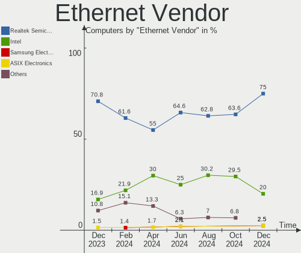

| Vendor                | Computers | Percent |
|-----------------------|-----------|---------|
| Realtek Semiconductor | 26        | 50.98%  |
| Intel                 | 16        | 31.37%  |
| Qualcomm Atheros      | 3         | 5.88%   |
| Xiaomi                | 2         | 3.92%   |
| OPPO Electronics      | 1         | 1.96%   |
| Nvidia                | 1         | 1.96%   |
| Aquantia              | 1         | 1.96%   |
| American Megatrends   | 1         | 1.96%   |

Ethernet Model
--------------

Ethernet models

| Model                                                               | Computers | Percent |
|---------------------------------------------------------------------|-----------|---------|
| Realtek RTL8111/8168/8411 PCI Express Gigabit Ethernet Controller   | 16        | 30.19%  |
| Realtek RTL8125 2.5GbE Controller                                   | 8         | 15.09%  |
| Intel I211 Gigabit Network Connection                               | 5         | 9.43%   |
| Intel Ethernet Controller I225-V                                    | 4         | 7.55%   |
| Xiaomi Mi/Redmi series (RNDIS)                                      | 2         | 3.77%   |
| Qualcomm Atheros Killer E220x Gigabit Ethernet Controller           | 2         | 3.77%   |
| Intel Ethernet Connection (4) I219-LM                               | 2         | 3.77%   |
| Intel Ethernet Connection (2) I219-V                                | 2         | 3.77%   |
| Realtek RTL810xE PCI Express Fast Ethernet controller               | 1         | 1.89%   |
| Realtek Killer E2500 Gigabit Ethernet Controller                    | 1         | 1.89%   |
| Qualcomm Atheros Killer E2500 Gigabit Ethernet Controller           | 1         | 1.89%   |
| OPPO SM6375-QRD _SN:F4A23F05                                        | 1         | 1.89%   |
| Nvidia MCP79 Ethernet                                               | 1         | 1.89%   |
| Intel Ethernet Controller 10-Gigabit X540-AT2                       | 1         | 1.89%   |
| Intel Ethernet Connection I218-LM                                   | 1         | 1.89%   |
| Intel Ethernet Connection (7) I219-V                                | 1         | 1.89%   |
| Intel Ethernet Connection (2) I218-V                                | 1         | 1.89%   |
| Intel 82579LM Gigabit Network Connection (Lewisville)               | 1         | 1.89%   |
| Aquantia AQC113CS NBase-T/IEEE 802.3bz Ethernet Controller [AQtion] | 1         | 1.89%   |
| American Megatrends Virtual Ethernet.                               | 1         | 1.89%   |

Net Controller Kind
-------------------

Ethernet, WiFi or modem

| Kind     | Computers | Percent |
|----------|-----------|---------|
| WiFi     | 46        | 50%     |
| Ethernet | 45        | 48.91%  |
| Modem    | 1         | 1.09%   |

Used Controller
---------------

Currently used network controller

| Kind     | Computers | Percent |
|----------|-----------|---------|
| WiFi     | 30        | 55.56%  |
| Ethernet | 24        | 44.44%  |

NICs
----

Total network controllers on board

| Total | Computers | Percent |
|-------|-----------|---------|
| 2     | 28        | 51.85%  |
| 1     | 21        | 38.89%  |
| 3     | 4         | 7.41%   |
| 4     | 1         | 1.85%   |

IPv6
----

IPv6 vs IPv4

| Used | Computers | Percent |
|------|-----------|---------|
| No   | 38        | 70.37%  |
| Yes  | 16        | 29.63%  |

Bluetooth
---------

Bluetooth Vendor
----------------

Controller vendors

| Vendor                          | Computers | Percent |
|---------------------------------|-----------|---------|
| Intel                           | 26        | 53.06%  |
| Realtek Semiconductor           | 7         | 14.29%  |
| MediaTek                        | 4         | 8.16%   |
| Cambridge Silicon Radio         | 4         | 8.16%   |
| Foxconn / Hon Hai               | 2         | 4.08%   |
| Qualcomm Atheros Communications | 1         | 2.04%   |
| Marvell Semiconductor           | 1         | 2.04%   |
| IMC Networks                    | 1         | 2.04%   |
| ASUSTek Computer                | 1         | 2.04%   |
| Apple                           | 1         | 2.04%   |
| Actions                         | 1         | 2.04%   |

Bluetooth Model
---------------

Controller models

| Model                                                 | Computers | Percent |
|-------------------------------------------------------|-----------|---------|
| Realtek Bluetooth Radio                               | 7         | 14.29%  |
| Intel Bluetooth wireless interface                    | 6         | 12.24%  |
| Intel Bluetooth Device                                | 5         | 10.2%   |
| Intel AX210 Bluetooth                                 | 5         | 10.2%   |
| Intel AX200 Bluetooth                                 | 5         | 10.2%   |
| MediaTek Wireless_Device                              | 4         | 8.16%   |
| Cambridge Silicon Radio Bluetooth Dongle (HCI mode)   | 4         | 8.16%   |
| Intel Wireless-AC 3168 Bluetooth                      | 2         | 4.08%   |
| Qualcomm Atheros AR3012 Bluetooth 4.0                 | 1         | 2.04%   |
| Marvell Bluetooth and Wireless LAN Composite          | 1         | 2.04%   |
| Intel Wireless-AC 9260 Bluetooth Adapter              | 1         | 2.04%   |
| Intel Bluetooth 9460/9560 Jefferson Peak (JfP)        | 1         | 2.04%   |
| Intel AX201 Bluetooth                                 | 1         | 2.04%   |
| IMC Networks Bluetooth Device                         | 1         | 2.04%   |
| Foxconn / Hon Hai Wireless_Device                     | 1         | 2.04%   |
| Foxconn / Hon Hai MediaTek Bluetooth Adapter          | 1         | 2.04%   |
| ASUS Broadcom BCM20702 Single-Chip Bluetooth 4.0 + LE | 1         | 2.04%   |
| Apple Bluetooth Host Controller                       | 1         | 2.04%   |
| Actions general adapter                               | 1         | 2.04%   |

Sound
-----

Sound Vendor
------------

Sound card vendors

| Vendor              | Computers | Percent |
|---------------------|-----------|---------|
| AMD                 | 29        | 30.21%  |
| Intel               | 28        | 29.17%  |
| Nvidia              | 22        | 22.92%  |
| Texas Instruments   | 2         | 2.08%   |
| Razer USA           | 2         | 2.08%   |
| Kingston Technology | 2         | 2.08%   |
| GN Netcom           | 2         | 2.08%   |
| C-Media Electronics | 2         | 2.08%   |
| Native Instruments  | 1         | 1.04%   |
| Logitech            | 1         | 1.04%   |
| Creative Labs       | 1         | 1.04%   |
| Corsair             | 1         | 1.04%   |
| ASUSTek Computer    | 1         | 1.04%   |
| ASRock              | 1         | 1.04%   |
| Unknown             | 1         | 1.04%   |

Sound Model
-----------

Sound card models

| Model                                                                                             | Computers | Percent |
|---------------------------------------------------------------------------------------------------|-----------|---------|
| AMD Family 17h/19h HD Audio Controller                                                            | 14        | 12.39%  |
| AMD Starship/Matisse HD Audio Controller                                                          | 7         | 6.19%   |
| AMD Navi 21/23 HDMI/DP Audio Controller                                                           | 7         | 6.19%   |
| AMD Renoir Radeon High Definition Audio Controller                                                | 5         | 4.42%   |
| Intel Cannon Lake PCH cAVS                                                                        | 4         | 3.54%   |
| Intel Alder Lake-S HD Audio Controller                                                            | 4         | 3.54%   |
| AMD Rembrandt Radeon High Definition Audio Controller                                             | 4         | 3.54%   |
| AMD Ellesmere HDMI Audio [Radeon RX 470/480 / 570/580/590]                                        | 4         | 3.54%   |
| Nvidia TU116 High Definition Audio Controller                                                     | 3         | 2.65%   |
| Nvidia TU106 High Definition Audio Controller                                                     | 3         | 2.65%   |
| Nvidia GA106 High Definition Audio Controller                                                     | 3         | 2.65%   |
| Nvidia GA102 High Definition Audio Controller                                                     | 3         | 2.65%   |
| Intel Tiger Lake-LP Smart Sound Technology Audio Controller                                       | 3         | 2.65%   |
| Intel Sunrise Point-LP HD Audio                                                                   | 3         | 2.65%   |
| Intel 100 Series/C230 Series Chipset Family HD Audio Controller                                   | 3         | 2.65%   |
| Nvidia GP104 High Definition Audio Controller                                                     | 2         | 1.77%   |
| Nvidia GA104 High Definition Audio Controller                                                     | 2         | 1.77%   |
| Intel Alder Lake PCH-P High Definition Audio Controller                                           | 2         | 1.77%   |
| Intel 8 Series/C220 Series Chipset High Definition Audio Controller                               | 2         | 1.77%   |
| Intel 7 Series/C216 Chipset Family High Definition Audio Controller                               | 2         | 1.77%   |
| AMD Family 17h (Models 00h-0fh) HD Audio Controller                                               | 2         | 1.77%   |
| Texas Instruments SMSL Q5 AMP                                                                     | 1         | 0.88%   |
| Texas Instruments PCM2900C Audio CODEC                                                            | 1         | 0.88%   |
| Razer USA Razer BlackShark V2 Pro                                                                 | 1         | 0.88%   |
| Razer USA Kraken 7.1                                                                              | 1         | 0.88%   |
| Nvidia TU107 GeForce GTX 1650 High Definition Audio Controller                                    | 1         | 0.88%   |
| Nvidia TU104 HD Audio Controller                                                                  | 1         | 0.88%   |
| Nvidia MCP79 High Definition Audio                                                                | 1         | 0.88%   |
| Nvidia GP107GL High Definition Audio Controller                                                   | 1         | 0.88%   |
| Nvidia GK104 HDMI Audio Controller                                                                | 1         | 0.88%   |
| Nvidia AD102 High Definition Audio Controller                                                     | 1         | 0.88%   |
| Native Instruments Komplete Audio 6                                                               | 1         | 0.88%   |
| Logitech G933 Wireless Headset Dongle                                                             | 1         | 0.88%   |
| Kingston Technology HyperX QuadCast                                                               | 1         | 0.88%   |
| Kingston Technology HyperX Cloud II Wireless                                                      | 1         | 0.88%   |
| Intel Xeon E3-1200 v3/4th Gen Core Processor HD Audio Controller                                  | 1         | 0.88%   |
| Intel Tiger Lake-H HD Audio Controller                                                            | 1         | 0.88%   |
| Intel Haswell-ULT HD Audio Controller                                                             | 1         | 0.88%   |
| Intel C610/X99 series chipset HD Audio Controller                                                 | 1         | 0.88%   |
| Intel Atom/Celeron/Pentium Processor x5-E8000/J3xxx/N3xxx Series High Definition Audio Controller | 1         | 0.88%   |

Memory
------

Memory Vendor
-------------

Memory module vendors

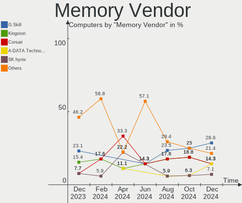

| Vendor              | Computers | Percent |
|---------------------|-----------|---------|
| Kingston            | 4         | 26.67%  |
| Samsung Electronics | 3         | 20%     |
| SK hynix            | 2         | 13.33%  |
| Micron Technology   | 2         | 13.33%  |
| G.Skill             | 2         | 13.33%  |
| Crucial             | 2         | 13.33%  |

Memory Model
------------

Memory module models

| Model                                                            | Computers | Percent |
|------------------------------------------------------------------|-----------|---------|
| Samsung RAM M471A1G44AB0-CWE 8GB SODIMM DDR4 3200MT/s            | 2         | 12.5%   |
| SK hynix RAM HMA84GR7AFR4N-UH 32GB DIMM DDR4 2400MT/s            | 1         | 6.25%   |
| SK hynix RAM HMA82GS6AFR8N-UH 16GB SODIMM DDR4 2667MT/s          | 1         | 6.25%   |
| Samsung RAM Module 2GB Row Of Chips LPDDR4 4267MT/s              | 1         | 6.25%   |
| Micron RAM MT62F1G32D4DR-031 WT 4GB Row Of Chips LPDDR5 6400MT/s | 1         | 6.25%   |
| Micron RAM MT53E512M32D2NP-046 4GB Row Of Chips LPDDR4 4267MT/s  | 1         | 6.25%   |
| Kingston RAM KHX3200C16D4/8GX 8GB DIMM DDR4 3600MT/s             | 1         | 6.25%   |
| Kingston RAM KF552C40-16 16GB DIMM DDR5 5200MT/s                 | 1         | 6.25%   |
| Kingston RAM CL16-18-18 D4-3200 8GB DIMM DDR4 3200MT/s           | 1         | 6.25%   |
| Kingston RAM ACR26D4S9S8ME-8 8GB SODIMM DDR4 2667MT/s            | 1         | 6.25%   |
| G.Skill RAM F5-5600J3636D32G 32GB DIMM DDR5 5600MT/s             | 1         | 6.25%   |
| G.Skill RAM F4-3200C22-16GRS 16GB SODIMM DDR4 3200MT/s           | 1         | 6.25%   |
| Crucial RAM BLS8G4D32AESCK.M8FE 8GB DIMM DDR4 3200MT/s           | 1         | 6.25%   |
| Crucial RAM BL8G32C16U4WL.M8FE 8GB DIMM DDR4 3200MT/s            | 1         | 6.25%   |
| Crucial RAM BL8G32C16U4R.8FE 8GB DIMM DDR4 3200MT/s              | 1         | 6.25%   |

Memory Kind
-----------

Memory module kinds

| Kind   | Computers | Percent |
|--------|-----------|---------|
| DDR4   | 8         | 61.54%  |
| LPDDR4 | 2         | 15.38%  |
| DDR5   | 2         | 15.38%  |
| LPDDR5 | 1         | 7.69%   |

Memory Form Factor
------------------

Physical design of the memory module

| Name         | Computers | Percent |
|--------------|-----------|---------|
| DIMM         | 6         | 46.15%  |
| SODIMM       | 4         | 30.77%  |
| Row Of Chips | 3         | 23.08%  |

Memory Size
-----------

Memory module size

| Size  | Computers | Percent |
|-------|-----------|---------|
| 8192  | 5         | 35.71%  |
| 16384 | 4         | 28.57%  |
| 32768 | 2         | 14.29%  |
| 4096  | 2         | 14.29%  |
| 2048  | 1         | 7.14%   |

Memory Speed
------------

Memory module speed

| Speed | Computers | Percent |
|-------|-----------|---------|
| 3200  | 5         | 35.71%  |
| 4267  | 2         | 14.29%  |
| 2667  | 2         | 14.29%  |
| 6400  | 1         | 7.14%   |
| 5600  | 1         | 7.14%   |
| 5200  | 1         | 7.14%   |
| 3600  | 1         | 7.14%   |
| 2400  | 1         | 7.14%   |

Printers & scanners
-------------------

Printer Vendor
--------------

Printer device vendors

| Vendor | Computers | Percent |
|--------|-----------|---------|
| Dell   | 1         | 50%     |
| Canon  | 1         | 50%     |

Printer Model
-------------

Printer device models

| Model                   | Computers | Percent |
|-------------------------|-----------|---------|
| Dell 1130 Laser Printer | 1         | 50%     |
| Canon TS700 series      | 1         | 50%     |

Scanner Vendor
--------------

Scanner device vendors

| Vendor | Computers | Percent |
|--------|-----------|---------|
| Canon  | 1         | 100%    |

Scanner Model
-------------

Scanner device models

| Model                         | Computers | Percent |
|-------------------------------|-----------|---------|
| Canon CanoScan N1240U/LiDE 30 | 1         | 100%    |

Camera
------

Camera Vendor
-------------

Camera device vendors

| Vendor                        | Computers | Percent |
|-------------------------------|-----------|---------|
| Chicony Electronics           | 6         | 19.35%  |
| Sunplus Innovation Technology | 3         | 9.68%   |
| Realtek Semiconductor         | 3         | 9.68%   |
| Quanta                        | 3         | 9.68%   |
| Logitech                      | 2         | 6.45%   |
| IMC Networks                  | 2         | 6.45%   |
| Apple                         | 2         | 6.45%   |
| Syntek                        | 1         | 3.23%   |
| SunplusIT                     | 1         | 3.23%   |
| Samsung Electronics           | 1         | 3.23%   |
| Microsoft                     | 1         | 3.23%   |
| Microdia                      | 1         | 3.23%   |
| MacroSilicon                  | 1         | 3.23%   |
| Luxvisions Innotech Limited   | 1         | 3.23%   |
| KYE Systems (Mouse Systems)   | 1         | 3.23%   |
| Intel                         | 1         | 3.23%   |
| 2M UVC CAMERA                 | 1         | 3.23%   |

Camera Model
------------

Camera device models

| Model                                             | Computers | Percent |
|---------------------------------------------------|-----------|---------|
| Chicony Integrated Camera                         | 4         | 12.9%   |
| Realtek Integrated_Webcam_HD                      | 3         | 9.68%   |
| Sunplus FULL HD webcam                            | 2         | 6.45%   |
| Quanta HP TrueVision HD Camera                    | 2         | 6.45%   |
| Syntek Integrated Camera                          | 1         | 3.23%   |
| SunplusIT 720p HD Camera                          | 1         | 3.23%   |
| Sunplus Sandberg USB Webcam Pro                   | 1         | 3.23%   |
| Samsung Galaxy series, misc. (MTP mode)           | 1         | 3.23%   |
| Quanta HD User Facing                             | 1         | 3.23%   |
| Microsoft LifeCam Studio                          | 1         | 3.23%   |
| Microdia Laptop_Integrated_Webcam_HD              | 1         | 3.23%   |
| MacroSilicon USB Video                            | 1         | 3.23%   |
| Luxvisions Innotech Limited Integrated RGB Camera | 1         | 3.23%   |
| Logitech HD Pro Webcam C920                       | 1         | 3.23%   |
| Logitech C922 Pro Stream Webcam                   | 1         | 3.23%   |
| KYE Systems (Mouse Systems) PC-LM1E Camera        | 1         | 3.23%   |
| Intel RealSense 3D Camera (Front F200)            | 1         | 3.23%   |
| IMC Networks USB2.0 VGA UVC WebCam                | 1         | 3.23%   |
| IMC Networks USB2.0 HD UVC WebCam                 | 1         | 3.23%   |
| Chicony TOSHIBA Web Camera - HD                   | 1         | 3.23%   |
| Chicony HD User Facing                            | 1         | 3.23%   |
| Apple iPhone 5/5C/5S/6/SE/7/8/X                   | 1         | 3.23%   |
| Apple Built-in iSight                             | 1         | 3.23%   |
| 2M UVC CAMERA Web Camera                          | 1         | 3.23%   |

Security
--------

Fingerprint Vendor
------------------

Fingerprint sensor vendors

| Vendor                     | Computers | Percent |
|----------------------------|-----------|---------|
| Validity Sensors           | 3         | 60%     |
| Shenzhen Goodix Technology | 2         | 40%     |

Fingerprint Model
-----------------

Fingerprint sensor models

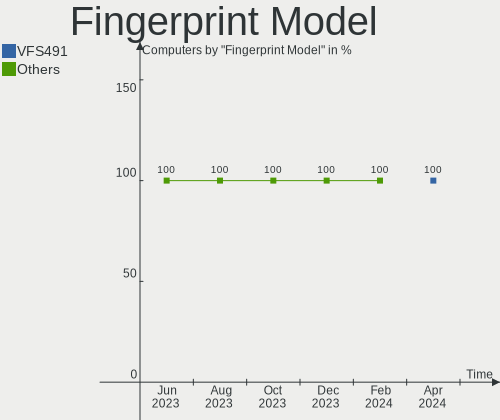

| Model                                      | Computers | Percent |
|--------------------------------------------|-----------|---------|
| Validity Sensors Synaptics WBDI            | 2         | 40%     |
| Shenzhen Goodix Fingerprint Reader         | 2         | 40%     |
| Validity Sensors VFS495 Fingerprint Reader | 1         | 20%     |

Chipcard Vendor
---------------

Chipcard module vendors

Zero info for selected period =(

Chipcard Model
--------------

Chipcard module models

Zero info for selected period =(

Unsupported
-----------

Unsupported Devices
-------------------

Total unsupported devices on board

| Total | Computers | Percent |
|-------|-----------|---------|
| 0     | 38        | 70.37%  |
| 1     | 15        | 27.78%  |
| 3     | 1         | 1.85%   |

Unsupported Device Types
------------------------

Types of unsupported devices

| Type                  | Computers | Percent |
|-----------------------|-----------|---------|
| Multimedia controller | 6         | 33.33%  |
| Graphics card         | 4         | 22.22%  |
| Fingerprint reader    | 4         | 22.22%  |
| Net/wireless          | 2         | 11.11%  |
| Unassigned class      | 1         | 5.56%   |
| Camera                | 1         | 5.56%   |

