Nobara - Hardware Trends
------------------------

A project to identify most popular hardware characteristics and track their change
over time based on data collected by Linux users at https://Linux-Hardware.org.

Anyone can contribute to this report by the [hw-probe](https://github.com/linuxhw/hw-probe) tool:

    sudo -E hw-probe -all -upload

This is a report for all computer types. See also reports for [desktops](/Dist/Nobara/Desktop/README.md) and [notebooks](/Dist/Nobara/Notebook/README.md).

This report is for one last month. Overall report since the beginning of time: [TestCoverage](https://github.com/linuxhw/TestCoverage)

Period: Sep, 2022.

Contents
--------

* [ System ](#system)
  - [ OS                       ](#os)
  - [ OS Family                ](#os-family)
  - [ Kernel                   ](#kernel)
  - [ Kernel Family            ](#kernel-family)
  - [ Kernel Major Ver.        ](#kernel-major-ver)
  - [ Arch                     ](#arch)
  - [ DE                       ](#de)
  - [ Display Server           ](#display-server)
  - [ Display Manager          ](#display-manager)
  - [ OS Lang                  ](#os-lang)
  - [ Boot Mode                ](#boot-mode)
  - [ Filesystem               ](#filesystem)
  - [ Part. scheme             ](#part-scheme)
  - [ Dual Boot with Linux/BSD ](#dual-boot-with-linuxbsd)
  - [ Dual Boot (Win)          ](#dual-boot-win)

* [ Board ](#board)
  - [ Vendor                   ](#vendor)
  - [ Model                    ](#model)
  - [ Model Family             ](#model-family)
  - [ MFG Year                 ](#mfg-year)
  - [ Form Factor              ](#form-factor)
  - [ Secure Boot              ](#secure-boot)
  - [ Coreboot                 ](#coreboot)
  - [ RAM Size                 ](#ram-size)
  - [ RAM Used                 ](#ram-used)
  - [ Total Drives             ](#total-drives)
  - [ Has CD-ROM               ](#has-cd-rom)
  - [ Has Ethernet             ](#has-ethernet)
  - [ Has WiFi                 ](#has-wifi)
  - [ Has Bluetooth            ](#has-bluetooth)

* [ Location ](#location)
  - [ Country                  ](#country)
  - [ City                     ](#city)

* [ Drives ](#drives)
  - [ Drive Vendor             ](#drive-vendor)
  - [ Drive Model              ](#drive-model)
  - [ HDD Vendor               ](#hdd-vendor)
  - [ SSD Vendor               ](#ssd-vendor)
  - [ Drive Kind               ](#drive-kind)
  - [ Drive Connector          ](#drive-connector)
  - [ Drive Size               ](#drive-size)
  - [ Space Total              ](#space-total)
  - [ Space Used               ](#space-used)
  - [ Malfunc. Drives          ](#malfunc-drives)
  - [ Malfunc. Drive Vendor    ](#malfunc-drive-vendor)
  - [ Malfunc. HDD Vendor      ](#malfunc-hdd-vendor)
  - [ Malfunc. Drive Kind      ](#malfunc-drive-kind)
  - [ Failed Drives            ](#failed-drives)
  - [ Failed Drive Vendor      ](#failed-drive-vendor)
  - [ Drive Status             ](#drive-status)

* [ Storage controller ](#storage-controller)
  - [ Storage Vendor           ](#storage-vendor)
  - [ Storage Model            ](#storage-model)
  - [ Storage Kind             ](#storage-kind)

* [ Processor ](#processor)
  - [ CPU Vendor               ](#cpu-vendor)
  - [ CPU Model                ](#cpu-model)
  - [ CPU Model Family         ](#cpu-model-family)
  - [ CPU Cores                ](#cpu-cores)
  - [ CPU Sockets              ](#cpu-sockets)
  - [ CPU Threads              ](#cpu-threads)
  - [ CPU Op-Modes             ](#cpu-op-modes)
  - [ CPU Microcode            ](#cpu-microcode)
  - [ CPU Microarch            ](#cpu-microarch)

* [ Graphics ](#graphics)
  - [ GPU Vendor               ](#gpu-vendor)
  - [ GPU Model                ](#gpu-model)
  - [ GPU Combo                ](#gpu-combo)
  - [ GPU Driver               ](#gpu-driver)
  - [ GPU Memory               ](#gpu-memory)

* [ Monitor ](#monitor)
  - [ Monitor Vendor           ](#monitor-vendor)
  - [ Monitor Model            ](#monitor-model)
  - [ Monitor Resolution       ](#monitor-resolution)
  - [ Monitor Diagonal         ](#monitor-diagonal)
  - [ Monitor Width            ](#monitor-width)
  - [ Aspect Ratio             ](#aspect-ratio)
  - [ Monitor Area             ](#monitor-area)
  - [ Pixel Density            ](#pixel-density)
  - [ Multiple Monitors        ](#multiple-monitors)

* [ Network ](#network)
  - [ Net Controller Vendor    ](#net-controller-vendor)
  - [ Net Controller Model     ](#net-controller-model)
  - [ Wireless Vendor          ](#wireless-vendor)
  - [ Wireless Model           ](#wireless-model)
  - [ Ethernet Vendor          ](#ethernet-vendor)
  - [ Ethernet Model           ](#ethernet-model)
  - [ Net Controller Kind      ](#net-controller-kind)
  - [ Used Controller          ](#used-controller)
  - [ NICs                     ](#nics)
  - [ IPv6                     ](#ipv6)

* [ Bluetooth ](#bluetooth)
  - [ Bluetooth Vendor         ](#bluetooth-vendor)
  - [ Bluetooth Model          ](#bluetooth-model)

* [ Sound ](#sound)
  - [ Sound Vendor             ](#sound-vendor)
  - [ Sound Model              ](#sound-model)

* [ Memory ](#memory)
  - [ Memory Vendor            ](#memory-vendor)
  - [ Memory Model             ](#memory-model)
  - [ Memory Kind              ](#memory-kind)
  - [ Memory Form Factor       ](#memory-form-factor)
  - [ Memory Size              ](#memory-size)
  - [ Memory Speed             ](#memory-speed)

* [ Printers & scanners ](#printers--scanners)
  - [ Printer Vendor           ](#printer-vendor)
  - [ Printer Model            ](#printer-model)
  - [ Scanner Vendor           ](#scanner-vendor)
  - [ Scanner Model            ](#scanner-model)

* [ Camera ](#camera)
  - [ Camera Vendor            ](#camera-vendor)
  - [ Camera Model             ](#camera-model)

* [ Security ](#security)
  - [ Fingerprint Vendor       ](#fingerprint-vendor)
  - [ Fingerprint Model        ](#fingerprint-model)
  - [ Chipcard Vendor          ](#chipcard-vendor)
  - [ Chipcard Model           ](#chipcard-model)

* [ Unsupported ](#unsupported)
  - [ Unsupported Devices      ](#unsupported-devices)
  - [ Unsupported Device Types ](#unsupported-device-types)

System
------

OS
--

Installed operating systems

| Name      | Computers | Percent |
|-----------|-----------|---------|
| Nobara 36 | 49        | 100%    |

OS Family
---------

OS without a version

| Name   | Computers | Percent |
|--------|-----------|---------|
| Nobara | 49        | 100%    |

Kernel
------

Version of the Linux kernel

| Version                       | Computers | Percent |
|-------------------------------|-----------|---------|
| 5.19.9-201.fsync.fc36.x86_64  | 16        | 32.65%  |
| 5.19.7-204.fsync.fc36.x86_64  | 10        | 20.41%  |
| 5.19.10-201.fsync.fc36.x86_64 | 7         | 14.29%  |
| 5.19.11-201.fsync.fc36.x86_64 | 6         | 12.24%  |
| 5.19.8-201.fsync.fc36.x86_64  | 4         | 8.16%   |
| 5.19.4-201.fsync.fc36.x86_64  | 3         | 6.12%   |
| 5.19.7-203.fsync.fc36.x86_64  | 2         | 4.08%   |
| 5.18.13-201.fsync.fc36.x86_64 | 1         | 2.04%   |

Kernel Family
-------------

Linux kernel without a distro release

| Version | Computers | Percent |
|---------|-----------|---------|
| 5.19.9  | 16        | 32.65%  |
| 5.19.7  | 12        | 24.49%  |
| 5.19.10 | 7         | 14.29%  |
| 5.19.11 | 6         | 12.24%  |
| 5.19.8  | 4         | 8.16%   |
| 5.19.4  | 3         | 6.12%   |
| 5.18.13 | 1         | 2.04%   |

Kernel Major Ver.
-----------------

Linux kernel major version

| Version | Computers | Percent |
|---------|-----------|---------|
| 5.19    | 48        | 97.96%  |
| 5.18    | 1         | 2.04%   |

Arch
----

OS architecture (x86_64, i586, etc.)

| Name   | Computers | Percent |
|--------|-----------|---------|
| x86_64 | 49        | 100%    |

DE
--

Desktop Environment

| Name    | Computers | Percent |
|---------|-----------|---------|
| GNOME   | 37        | 75.51%  |
| KDE5    | 11        | 22.45%  |
| Unknown | 1         | 2.04%   |

Display Server
--------------

X11 or Wayland

| Name    | Computers | Percent |
|---------|-----------|---------|
| Wayland | 42        | 85.71%  |
| X11     | 6         | 12.24%  |
| Unknown | 1         | 2.04%   |

Display Manager
---------------

SDDM, LightDM, etc.

| Name    | Computers | Percent |
|---------|-----------|---------|
| Unknown | 43        | 87.76%  |
| SDDM    | 3         | 6.12%   |
| GDM     | 3         | 6.12%   |

OS Lang
-------

Language

| Lang    | Computers | Percent |
|---------|-----------|---------|
| en_US   | 24        | 48.98%  |
| es_ES   | 3         | 6.12%   |
| es_AR   | 3         | 6.12%   |
| en_IN   | 3         | 6.12%   |
| es_MX   | 2         | 4.08%   |
| en_GB   | 2         | 4.08%   |
| de_DE   | 2         | 4.08%   |
| sk_SK   | 1         | 2.04%   |
| ru_RU   | 1         | 2.04%   |
| pt_BR   | 1         | 2.04%   |
| hr_HR   | 1         | 2.04%   |
| es_EC   | 1         | 2.04%   |
| es_CL   | 1         | 2.04%   |
| en_NZ   | 1         | 2.04%   |
| en_CA   | 1         | 2.04%   |
| en_AU   | 1         | 2.04%   |
| Unknown | 1         | 2.04%   |

Boot Mode
---------

EFI or BIOS

| Mode | Computers | Percent |
|------|-----------|---------|
| EFI  | 35        | 71.43%  |
| BIOS | 14        | 28.57%  |

Filesystem
----------

Type of filesystem

| Type  | Computers | Percent |
|-------|-----------|---------|
| Ext4  | 42        | 85.71%  |
| Btrfs | 6         | 12.24%  |
| Xfs   | 1         | 2.04%   |

Part. scheme
------------

Scheme of partitioning

| Type    | Computers | Percent |
|---------|-----------|---------|
| Unknown | 43        | 87.76%  |
| GPT     | 6         | 12.24%  |

Dual Boot with Linux/BSD
------------------------

Hosting more than one Linux/BSD

| Dual boot | Computers | Percent |
|-----------|-----------|---------|
| No        | 46        | 93.88%  |
| Yes       | 3         | 6.12%   |

Dual Boot (Win)
---------------

Hosting Linux and Windows

| Dual boot | Computers | Percent |
|-----------|-----------|---------|
| No        | 45        | 91.84%  |
| Yes       | 4         | 8.16%   |

Board
-----

Vendor
------

Motherboard manufacturer

| Name                | Computers | Percent |
|---------------------|-----------|---------|
| Lenovo              | 10        | 20.41%  |
| ASUSTek Computer    | 10        | 20.41%  |
| Dell                | 6         | 12.24%  |
| MSI                 | 5         | 10.2%   |
| Gigabyte Technology | 4         | 8.16%   |
| Hewlett-Packard     | 2         | 4.08%   |
| ASRock              | 2         | 4.08%   |
| Apple               | 2         | 4.08%   |
| Acer                | 2         | 4.08%   |
| Toshiba             | 1         | 2.04%   |
| Intel               | 1         | 2.04%   |
| Gateway             | 1         | 2.04%   |
| Biostar             | 1         | 2.04%   |
| Alienware           | 1         | 2.04%   |
| Unknown             | 1         | 2.04%   |

Model
-----

Motherboard model

| Name                                     | Computers | Percent |
|------------------------------------------|-----------|---------|
| Toshiba TECRA A50-A                      | 1         | 2.04%   |
| MSI MS-7C84                              | 1         | 2.04%   |
| MSI MS-7C37                              | 1         | 2.04%   |
| MSI MS-7C35                              | 1         | 2.04%   |
| MSI MS-7721                              | 1         | 2.04%   |
| MSI MS-7693                              | 1         | 2.04%   |
| Lenovo V330-15IKB 81AX                   | 1         | 2.04%   |
| Lenovo ThinkPad P1 20MD0020US            | 1         | 2.04%   |
| Lenovo ThinkCentre M92p 3238E5U          | 1         | 2.04%   |
| Lenovo ThinkCentre M920q 10RS0030MX      | 1         | 2.04%   |
| Lenovo ThinkBook 15 G3 ACL 21A4          | 1         | 2.04%   |
| Lenovo Legion 5 15ARH05 82B5             | 1         | 2.04%   |
| Lenovo IdeaPadFlex 10 20324              | 1         | 2.04%   |
| Lenovo IdeaPad 5 15ARE05 81YQ            | 1         | 2.04%   |
| Lenovo IdeaPad 310-15IAP 80TT            | 1         | 2.04%   |
| Lenovo G580 20157                        | 1         | 2.04%   |
| Intel B75                                | 1         | 2.04%   |
| HP EliteDesk 800 G5 Desktop Mini         | 1         | 2.04%   |
| HP 15                                    | 1         | 2.04%   |
| Gigabyte H270-Gaming 3                   | 1         | 2.04%   |
| Gigabyte EP45-UD3L                       | 1         | 2.04%   |
| Gigabyte AB350-Gaming 3                  | 1         | 2.04%   |
| Gigabyte A320M-S2H                       | 1         | 2.04%   |
| Gateway NE56R                            | 1         | 2.04%   |
| Dell Precision M6400                     | 1         | 2.04%   |
| Dell Precision 3510                      | 1         | 2.04%   |
| Dell OptiPlex 780                        | 1         | 2.04%   |
| Dell Latitude 7275                       | 1         | 2.04%   |
| Dell Inspiron 3542                       | 1         | 2.04%   |
| Dell G5 5505                             | 1         | 2.04%   |
| Biostar H410MH S2                        | 1         | 2.04%   |
| ASUS VivoBook_ASUSLaptop X3400PH_K3400PH | 1         | 2.04%   |
| ASUS TUF Gaming X570-PRO                 | 1         | 2.04%   |
| ASUS TUF Gaming B550M-PLUS WIFI II       | 1         | 2.04%   |
| ASUS ROG Zephyrus G14 GA401II_GA401II    | 1         | 2.04%   |
| ASUS Q504UAK                             | 1         | 2.04%   |
| ASUS PRIME H410M-A                       | 1         | 2.04%   |
| ASUS PRIME H310M-E R2.0                  | 1         | 2.04%   |
| ASUS PRIME A320M-K                       | 1         | 2.04%   |
| ASUS N56VZ                               | 1         | 2.04%   |

Model Family
------------

Motherboard model prefix

| Name                  | Computers | Percent |
|-----------------------|-----------|---------|
| ASUS PRIME            | 3         | 6.12%   |
| Lenovo ThinkCentre    | 2         | 4.08%   |
| Lenovo IdeaPad        | 2         | 4.08%   |
| Dell Precision        | 2         | 4.08%   |
| ASUS TUF              | 2         | 4.08%   |
| Acer Aspire           | 2         | 4.08%   |
| Toshiba TECRA         | 1         | 2.04%   |
| MSI MS-7C84           | 1         | 2.04%   |
| MSI MS-7C37           | 1         | 2.04%   |
| MSI MS-7C35           | 1         | 2.04%   |
| MSI MS-7721           | 1         | 2.04%   |
| MSI MS-7693           | 1         | 2.04%   |
| Lenovo V330-15IKB     | 1         | 2.04%   |
| Lenovo ThinkPad       | 1         | 2.04%   |
| Lenovo ThinkBook      | 1         | 2.04%   |
| Lenovo Legion         | 1         | 2.04%   |
| Lenovo IdeaPadFlex    | 1         | 2.04%   |
| Lenovo G580           | 1         | 2.04%   |
| Intel B75             | 1         | 2.04%   |
| HP EliteDesk          | 1         | 2.04%   |
| HP 15                 | 1         | 2.04%   |
| Gigabyte H270-Gaming  | 1         | 2.04%   |
| Gigabyte EP45-UD3L    | 1         | 2.04%   |
| Gigabyte AB350-Gaming | 1         | 2.04%   |
| Gigabyte A320M-S2H    | 1         | 2.04%   |
| Gateway NE56R         | 1         | 2.04%   |
| Dell OptiPlex         | 1         | 2.04%   |
| Dell Latitude         | 1         | 2.04%   |
| Dell Inspiron         | 1         | 2.04%   |
| Dell G5               | 1         | 2.04%   |
| Biostar H410MH        | 1         | 2.04%   |
| ASUS VivoBook         | 1         | 2.04%   |
| ASUS ROG              | 1         | 2.04%   |
| ASUS Q504UAK          | 1         | 2.04%   |
| ASUS N56VZ            | 1         | 2.04%   |
| ASUS 970              | 1         | 2.04%   |
| ASRock X470           | 1         | 2.04%   |
| ASRock FM2A55M-HD+    | 1         | 2.04%   |
| Apple MacBookPro8     | 1         | 2.04%   |
| Apple MacBookAir4     | 1         | 2.04%   |

MFG Year
--------

Motherboard manufacture year

| Year | Computers | Percent |
|------|-----------|---------|
| 2020 | 7         | 14.29%  |
| 2019 | 6         | 12.24%  |
| 2017 | 6         | 12.24%  |
| 2021 | 5         | 10.2%   |
| 2013 | 5         | 10.2%   |
| 2018 | 4         | 8.16%   |
| 2016 | 4         | 8.16%   |
| 2012 | 4         | 8.16%   |
| 2014 | 3         | 6.12%   |
| 2015 | 2         | 4.08%   |
| 2022 | 1         | 2.04%   |
| 2009 | 1         | 2.04%   |
| 2008 | 1         | 2.04%   |

Form Factor
-----------

Physical design of the computer

| Name        | Computers | Percent |
|-------------|-----------|---------|
| Desktop     | 23        | 46.94%  |
| Notebook    | 23        | 46.94%  |
| Tablet      | 1         | 2.04%   |
| Convertible | 1         | 2.04%   |
| Mini pc     | 1         | 2.04%   |

Secure Boot
-----------

Enabled or disabled

| State    | Computers | Percent |
|----------|-----------|---------|
| Disabled | 49        | 100%    |

Coreboot
--------

Have coreboot on board

| Used | Computers | Percent |
|------|-----------|---------|
| No   | 49        | 100%    |

RAM Size
--------

Total RAM memory

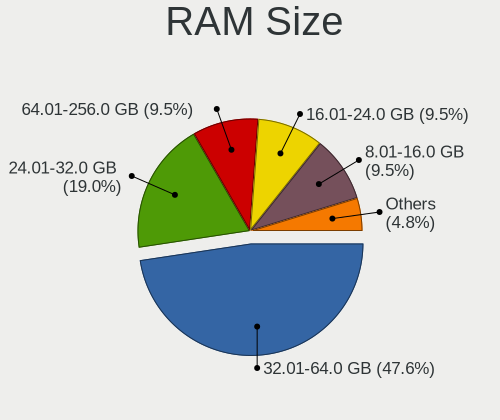

| Size in GB | Computers | Percent |
|------------|-----------|---------|
| 8.01-16.0  | 14        | 28.57%  |
| 16.01-24.0 | 11        | 22.45%  |
| 32.01-64.0 | 9         | 18.37%  |
| 3.01-4.0   | 8         | 16.33%  |
| 4.01-8.0   | 5         | 10.2%   |
| 24.01-32.0 | 1         | 2.04%   |
| 1.01-2.0   | 1         | 2.04%   |

RAM Used
--------

Used RAM memory

| Used GB    | Computers | Percent |
|------------|-----------|---------|
| 4.01-8.0   | 18        | 36.73%  |
| 2.01-3.0   | 13        | 26.53%  |
| 3.01-4.0   | 12        | 24.49%  |
| 8.01-16.0  | 3         | 6.12%   |
| 1.01-2.0   | 2         | 4.08%   |
| 24.01-32.0 | 1         | 2.04%   |

Total Drives
------------

Number of drives on board

| Drives | Computers | Percent |
|--------|-----------|---------|
| 1      | 26        | 53.06%  |
| 2      | 14        | 28.57%  |
| 5      | 6         | 12.24%  |
| 3      | 3         | 6.12%   |

Has CD-ROM
----------

Has CD-ROM on board

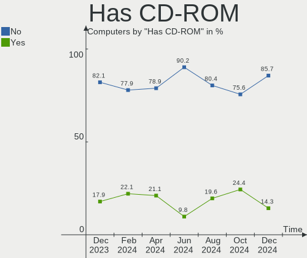

| Presented | Computers | Percent |
|-----------|-----------|---------|
| No        | 34        | 69.39%  |
| Yes       | 15        | 30.61%  |

Has Ethernet
------------

Has Ethernet on board

| Presented | Computers | Percent |
|-----------|-----------|---------|
| Yes       | 44        | 89.8%   |
| No        | 5         | 10.2%   |

Has WiFi
--------

Has WiFi module

| Presented | Computers | Percent |
|-----------|-----------|---------|
| Yes       | 39        | 79.59%  |
| No        | 10        | 20.41%  |

Has Bluetooth
-------------

Has Bluetooth module

| Presented | Computers | Percent |
|-----------|-----------|---------|
| Yes       | 33        | 67.35%  |
| No        | 16        | 32.65%  |

Location
--------

Country
-------

Geographic location (country)

| Country     | Computers | Percent |
|-------------|-----------|---------|
| USA         | 13        | 26.53%  |
| India       | 4         | 8.16%   |
| Canada      | 3         | 6.12%   |
| Argentina   | 3         | 6.12%   |
| Spain       | 2         | 4.08%   |
| Russia      | 2         | 4.08%   |
| Norway      | 2         | 4.08%   |
| Germany     | 2         | 4.08%   |
| Chile       | 2         | 4.08%   |
| Vietnam     | 1         | 2.04%   |
| UK          | 1         | 2.04%   |
| Slovakia    | 1         | 2.04%   |
| Singapore   | 1         | 2.04%   |
| Serbia      | 1         | 2.04%   |
| New Zealand | 1         | 2.04%   |
| Mexico      | 1         | 2.04%   |
| Kenya       | 1         | 2.04%   |
| France      | 1         | 2.04%   |
| Ecuador     | 1         | 2.04%   |
| Croatia     | 1         | 2.04%   |
| Colombia    | 1         | 2.04%   |
| Brazil      | 1         | 2.04%   |
| Belgium     | 1         | 2.04%   |
| Austria     | 1         | 2.04%   |
| Australia   | 1         | 2.04%   |

City
----

Geographic location (city)

| City            | Computers | Percent |
|-----------------|-----------|---------|
| San Antonio     | 2         | 4.08%   |
| Zamora          | 1         | 2.04%   |
| Zadar           | 1         | 2.04%   |
| Wesley Chapel   | 1         | 2.04%   |
| Wellington      | 1         | 2.04%   |
| Wayne           | 1         | 2.04%   |
| Villarrica      | 1         | 2.04%   |
| Villa Nueva     | 1         | 2.04%   |
| Smolensk        | 1         | 2.04%   |
| Singapore       | 1         | 2.04%   |
| Sao Paulo       | 1         | 2.04%   |
| Salem           | 1         | 2.04%   |
| Quito           | 1         | 2.04%   |
| Philipsburg     | 1         | 2.04%   |
| Novosibirsk     | 1         | 2.04%   |
| North Vancouver | 1         | 2.04%   |
| New Delhi       | 1         | 2.04%   |
| Nairobi         | 1         | 2.04%   |
| Mumbai          | 1         | 2.04%   |
| Mendoza         | 1         | 2.04%   |
| Melbourne       | 1         | 2.04%   |
| Lünen          | 1         | 2.04%   |
| Los Angeles     | 1         | 2.04%   |
| Laurel          | 1         | 2.04%   |
| Lake Elsinore   | 1         | 2.04%   |
| La Serena       | 1         | 2.04%   |
| Koblenz         | 1         | 2.04%   |
| Istres          | 1         | 2.04%   |
| Innsbruck       | 1         | 2.04%   |
| Hoa Binh        | 1         | 2.04%   |
| Hermosillo      | 1         | 2.04%   |
| Hauglandshella  | 1         | 2.04%   |
| Gurgaon         | 1         | 2.04%   |
| Grande Prairie  | 1         | 2.04%   |
| Grand Rapids    | 1         | 2.04%   |
| Gavere          | 1         | 2.04%   |
| Fort Atkinson   | 1         | 2.04%   |
| Fornebu         | 1         | 2.04%   |
| Edmonton        | 1         | 2.04%   |
| Dayton          | 1         | 2.04%   |

Drives
------

Drive Vendor
------------

Hard drive vendors

| Vendor                | Computers | Drives | Percent |
|-----------------------|-----------|--------|---------|
| WDC                   | 15        | 17     | 17.44%  |
| Samsung Electronics   | 15        | 20     | 17.44%  |
| Seagate               | 12        | 14     | 13.95%  |
| Toshiba               | 6         | 6      | 6.98%   |
| Sandisk               | 6         | 6      | 6.98%   |
| Crucial               | 6         | 6      | 6.98%   |
| Kingston              | 5         | 5      | 5.81%   |
| Intel                 | 3         | 3      | 3.49%   |
| A-DATA Technology     | 3         | 3      | 3.49%   |
| SK hynix              | 2         | 2      | 2.33%   |
| Unknown               | 1         | 1      | 1.16%   |
| Team                  | 1         | 1      | 1.16%   |
| SuperSSpeed           | 1         | 1      | 1.16%   |
| SPCC                  | 1         | 1      | 1.16%   |
| Realtek Semiconductor | 1         | 1      | 1.16%   |
| PNY                   | 1         | 1      | 1.16%   |
| Phison                | 1         | 1      | 1.16%   |
| Micron Technology     | 1         | 1      | 1.16%   |
| LITEON                | 1         | 1      | 1.16%   |
| Hitachi               | 1         | 1      | 1.16%   |
| Fujitsu               | 1         | 1      | 1.16%   |
| Apple                 | 1         | 1      | 1.16%   |
| Unknown               | 1         | 1      | 1.16%   |

Drive Model
-----------

Hard drive models

| Model                                               | Computers | Percent |
|-----------------------------------------------------|-----------|---------|
| Samsung NVMe SSD Controller SM981/PM981/PM983 256GB | 3         | 3.19%   |
| WDC WDS480G2G0A-00JH30 480GB SSD                    | 2         | 2.13%   |
| Seagate ST1000LM024 HN-M101MBB 1TB                  | 2         | 2.13%   |
| Seagate BUP Portable 4TB                            | 2         | 2.13%   |
| Sandisk WD Blue SN550 NVMe SSD 1024GB               | 2         | 2.13%   |
| Sandisk WD Black SN750 / PC SN730 NVMe SSD 1024GB   | 2         | 2.13%   |
| Kingston SA400S37240G 240GB SSD                     | 2         | 2.13%   |
| WDC WDS240G2G0B-00EPW0 240GB SSD                    | 1         | 1.06%   |
| WDC WDS100T2B0C-00PXH0 1TB                          | 1         | 1.06%   |
| WDC WDBNCE5000PNC 500GB SSD                         | 1         | 1.06%   |
| WDC WD6400AAKS-65A7B2 640GB                         | 1         | 1.06%   |
| WDC WD40PURZ-74AKKY0 4TB                            | 1         | 1.06%   |
| WDC WD20EZBX-00AYRA0 2TB                            | 1         | 1.06%   |
| WDC WD20EARX-00PASB0 2TB                            | 1         | 1.06%   |
| WDC WD1600AAJS-08L7A0 160GB                         | 1         | 1.06%   |
| WDC WD120EFBX-68B0EN0 12TB                          | 1         | 1.06%   |
| WDC WD10SPZX-21Z10T0 1TB                            | 1         | 1.06%   |
| WDC WD10PURX-64E5EY0 1TB                            | 1         | 1.06%   |
| WDC WD10EZEX-60WN4A0 1TB                            | 1         | 1.06%   |
| WDC WD10EZEX-08WN4A0 1TB                            | 1         | 1.06%   |
| WDC WD10EZEX-00BN5A0 1TB                            | 1         | 1.06%   |
| WDC WD10EADS-00M2B0 1TB                             | 1         | 1.06%   |
| Unknown MMC Card  64GB                              | 1         | 1.06%   |
| Toshiba MQ04ABF100 1TB                              | 1         | 1.06%   |
| Toshiba MQ01ABF050 500GB                            | 1         | 1.06%   |
| Toshiba MQ01ABD100 1TB                              | 1         | 1.06%   |
| Toshiba MQ01ABD050 500GB                            | 1         | 1.06%   |
| Toshiba MK7559GSXF 752GB                            | 1         | 1.06%   |
| Toshiba A100 120GB SSD                              | 1         | 1.06%   |
| Team T2531TB 1024GB SSD                             | 1         | 1.06%   |
| SuperSSpeed S540 240GB                              | 1         | 1.06%   |
| SPCC Solid State Disk 512GB                         | 1         | 1.06%   |
| SK hynix SKHynix_HFS512GD9TNI-L2A0B 512GB           | 1         | 1.06%   |
| SK hynix HFM256GDJTNG-8310A 256GB                   | 1         | 1.06%   |
| Seagate ST500LT012-1DG142 500GB                     | 1         | 1.06%   |
| Seagate ST3500418AS 500GB                           | 1         | 1.06%   |
| Seagate ST3000DM008-2DM166 3TB                      | 1         | 1.06%   |
| Seagate ST2000DM008-2FR102 2TB                      | 1         | 1.06%   |
| Seagate ST2000DM001-1ER164 2TB                      | 1         | 1.06%   |
| Seagate ST2000DL003-9VT166 2TB                      | 1         | 1.06%   |

HDD Vendor
----------

Hard disk drive vendors

| Vendor              | Computers | Drives | Percent |
|---------------------|-----------|--------|---------|
| Seagate             | 12        | 14     | 37.5%   |
| WDC                 | 11        | 12     | 34.38%  |
| Toshiba             | 5         | 5      | 15.63%  |
| Samsung Electronics | 2         | 3      | 6.25%   |
| Hitachi             | 1         | 1      | 3.13%   |
| Fujitsu             | 1         | 1      | 3.13%   |

SSD Vendor
----------

Solid state drive vendors

| Vendor              | Computers | Drives | Percent |
|---------------------|-----------|--------|---------|
| Samsung Electronics | 6         | 6      | 19.35%  |
| Crucial             | 6         | 6      | 19.35%  |
| WDC                 | 4         | 4      | 12.9%   |
| Kingston            | 4         | 4      | 12.9%   |
| A-DATA Technology   | 3         | 3      | 9.68%   |
| Toshiba             | 1         | 1      | 3.23%   |
| Team                | 1         | 1      | 3.23%   |
| SuperSSpeed         | 1         | 1      | 3.23%   |
| SPCC                | 1         | 1      | 3.23%   |
| PNY                 | 1         | 1      | 3.23%   |
| LITEON              | 1         | 1      | 3.23%   |
| Apple               | 1         | 1      | 3.23%   |
| Unknown             | 1         | 1      | 3.23%   |

Drive Kind
----------

HDD or SSD

| Kind | Computers | Drives | Percent |
|------|-----------|--------|---------|
| SSD  | 27        | 31     | 36%     |
| HDD  | 25        | 36     | 33.33%  |
| NVMe | 22        | 27     | 29.33%  |
| MMC  | 1         | 1      | 1.33%   |

Drive Connector
---------------

SATA, SAS, NVMe, etc.

| Type | Computers | Drives | Percent |
|------|-----------|--------|---------|
| SATA | 39        | 62     | 58.21%  |
| NVMe | 22        | 27     | 32.84%  |
| SAS  | 5         | 5      | 7.46%   |
| MMC  | 1         | 1      | 1.49%   |

Drive Size
----------

Size of hard drive

| Size in TB | Computers | Drives | Percent |
|------------|-----------|--------|---------|
| 0.01-0.5   | 27        | 31     | 46.55%  |
| 0.51-1.0   | 19        | 22     | 32.76%  |
| 1.01-2.0   | 6         | 8      | 10.34%  |
| 3.01-4.0   | 3         | 3      | 5.17%   |
| 2.01-3.0   | 1         | 1      | 1.72%   |
| 10.01-20.0 | 1         | 1      | 1.72%   |
| 4.01-10.0  | 1         | 1      | 1.72%   |

Space Total
-----------

Amount of disk space available on the file system

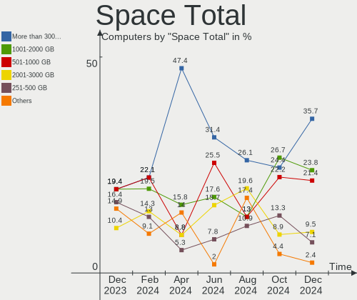

| Size in GB     | Computers | Percent |
|----------------|-----------|---------|
| 101-250        | 22        | 44.9%   |
| 501-1000       | 10        | 20.41%  |
| 251-500        | 8         | 16.33%  |
| 1001-2000      | 4         | 8.16%   |
| More than 3000 | 3         | 6.12%   |
| 2001-3000      | 1         | 2.04%   |
| 51-100         | 1         | 2.04%   |

Space Used
----------

Amount of used disk space

| Used GB        | Computers | Percent |
|----------------|-----------|---------|
| 21-50          | 19        | 38.78%  |
| 1-20           | 12        | 24.49%  |
| 51-100         | 5         | 10.2%   |
| 101-250        | 4         | 8.16%   |
| 501-1000       | 4         | 8.16%   |
| 251-500        | 2         | 4.08%   |
| 2001-3000      | 2         | 4.08%   |
| More than 3000 | 1         | 2.04%   |

Malfunc. Drives
---------------

Drive models with a malfunction

Zero info for selected period =(

Malfunc. Drive Vendor
---------------------

Vendors of faulty drives

Zero info for selected period =(

Malfunc. HDD Vendor
-------------------

Vendors of faulty HDD drives

Zero info for selected period =(

Malfunc. Drive Kind
-------------------

Kinds of faulty drives

Zero info for selected period =(

Failed Drives
-------------

Failed drive models

Zero info for selected period =(

Failed Drive Vendor
-------------------

Failed drive vendors

Zero info for selected period =(

Drive Status
------------

Number of failed and malfunc. drives

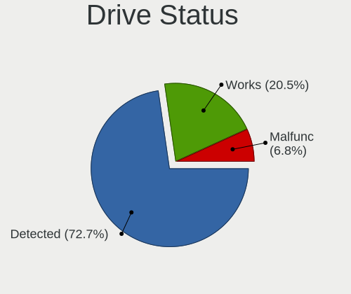

| Status   | Computers | Drives | Percent |
|----------|-----------|--------|---------|
| Detected | 44        | 81     | 86.27%  |
| Works    | 7         | 14     | 13.73%  |

Storage controller
------------------

Storage Vendor
--------------

Storage controller vendors

| Vendor                      | Computers | Percent |
|-----------------------------|-----------|---------|
| Intel                       | 28        | 38.36%  |
| AMD                         | 19        | 26.03%  |
| Samsung Electronics         | 10        | 13.7%   |
| SanDisk                     | 7         | 9.59%   |
| SK hynix                    | 2         | 2.74%   |
| Silicon Image               | 1         | 1.37%   |
| Realtek Semiconductor       | 1         | 1.37%   |
| Phison Electronics          | 1         | 1.37%   |
| Micron Technology           | 1         | 1.37%   |
| Kingston Technology Company | 1         | 1.37%   |
| JMicron Technology          | 1         | 1.37%   |
| ASMedia Technology          | 1         | 1.37%   |

Storage Model
-------------

Storage controller models

| Model                                                                          | Computers | Percent |
|--------------------------------------------------------------------------------|-----------|---------|
| AMD FCH SATA Controller [AHCI mode]                                            | 15        | 18.52%  |
| Samsung NVMe SSD Controller SM981/PM981/PM983                                  | 5         | 6.17%   |
| SanDisk WD Blue SN550 NVMe SSD                                                 | 3         | 3.7%    |
| SanDisk WD Black SN750 / PC SN730 NVMe SSD                                     | 2         | 2.47%   |
| Samsung NVMe SSD Controller 980                                                | 2         | 2.47%   |
| Intel Sunrise Point-LP SATA Controller [AHCI mode]                             | 2         | 2.47%   |
| Intel SATA Controller [RAID mode]                                              | 2         | 2.47%   |
| Intel Cannon Lake PCH SATA AHCI Controller                                     | 2         | 2.47%   |
| Intel 8 Series SATA Controller 1 [AHCI mode]                                   | 2         | 2.47%   |
| Intel 7 Series/C210 Series Chipset Family 6-port SATA Controller [AHCI mode]   | 2         | 2.47%   |
| Intel 7 Series Chipset Family 6-port SATA Controller [AHCI mode]               | 2         | 2.47%   |
| Intel 6 Series/C200 Series Chipset Family 6 port Mobile SATA AHCI Controller   | 2         | 2.47%   |
| Intel 200 Series PCH SATA controller [AHCI mode]                               | 2         | 2.47%   |
| AMD SB7x0/SB8x0/SB9x0 SATA Controller [AHCI mode]                              | 2         | 2.47%   |
| AMD FCH SATA Controller D                                                      | 2         | 2.47%   |
| SK hynix Non-Volatile memory controller                                        | 1         | 1.23%   |
| SK hynix BC501 NVMe Solid State Drive                                          | 1         | 1.23%   |
| Silicon Image SiI 3132 Serial ATA Raid II Controller                           | 1         | 1.23%   |
| SanDisk WD PC SN810 / Black SN850 NVMe SSD                                     | 1         | 1.23%   |
| SanDisk WD Blue SN570 NVMe SSD                                                 | 1         | 1.23%   |
| Samsung NVMe SSD Controller SM961/PM961/SM963                                  | 1         | 1.23%   |
| Samsung NVMe SSD Controller SM951/PM951                                        | 1         | 1.23%   |
| Samsung NVMe SSD Controller PM9A1/PM9A3/980PRO                                 | 1         | 1.23%   |
| Realtek RTS5763DL NVMe SSD Controller                                          | 1         | 1.23%   |
| Phison E16 PCIe4 NVMe Controller                                               | 1         | 1.23%   |
| Micron Non-Volatile memory controller                                          | 1         | 1.23%   |
| Kingston Company A2000 NVMe SSD                                                | 1         | 1.23%   |
| JMicron JMB368 IDE controller                                                  | 1         | 1.23%   |
| Intel Volume Management Device NVMe RAID Controller                            | 1         | 1.23%   |
| Intel SSD 660P Series                                                          | 1         | 1.23%   |
| Intel SSD 600P Series                                                          | 1         | 1.23%   |
| Intel Non-Volatile memory controller                                           | 1         | 1.23%   |
| Intel HM170/QM170 Chipset SATA Controller [AHCI Mode]                          | 1         | 1.23%   |
| Intel Comet Lake SATA AHCI Controller                                          | 1         | 1.23%   |
| Intel Celeron N3350/Pentium N4200/Atom E3900 Series SATA AHCI Controller       | 1         | 1.23%   |
| Intel Atom Processor E3800 Series SATA AHCI Controller                         | 1         | 1.23%   |
| Intel 82801JI (ICH10 Family) SATA AHCI Controller                              | 1         | 1.23%   |
| Intel 82801 Mobile SATA Controller [RAID mode]                                 | 1         | 1.23%   |
| Intel 8 Series/C220 Series Chipset Family 6-port SATA Controller 1 [AHCI mode] | 1         | 1.23%   |
| Intel 7 Series Chipset Family 4-port SATA Controller [IDE mode]                | 1         | 1.23%   |

Storage Kind
------------

Kind of storage controller (IDE, SATA, NVMe, SAS, ...)

| Kind | Computers | Percent |
|------|-----------|---------|
| SATA | 41        | 57.75%  |
| NVMe | 22        | 30.99%  |
| RAID | 4         | 5.63%   |
| IDE  | 4         | 5.63%   |

Processor
---------

CPU Vendor
----------

Processor vendors

| Vendor | Computers | Percent |
|--------|-----------|---------|
| Intel  | 30        | 61.22%  |
| AMD    | 19        | 38.78%  |

CPU Model
---------

Processor models

| Model                                    | Computers | Percent |
|------------------------------------------|-----------|---------|
| Intel Core i5-3210M CPU @ 2.50GHz        | 2         | 4.08%   |
| AMD FX-8350 Eight-Core Processor         | 2         | 4.08%   |
| Intel Pentium CPU N4200 @ 1.10GHz        | 1         | 2.04%   |
| Intel Pentium CPU B960 @ 2.20GHz         | 1         | 2.04%   |
| Intel Core m7-6Y75 CPU @ 1.20GHz         | 1         | 2.04%   |
| Intel Core i7-8850H CPU @ 2.60GHz        | 1         | 2.04%   |
| Intel Core i7-8700T CPU @ 2.40GHz        | 1         | 2.04%   |
| Intel Core i7-8550U CPU @ 1.80GHz        | 1         | 2.04%   |
| Intel Core i7-7700HQ CPU @ 2.80GHz       | 1         | 2.04%   |
| Intel Core i7-6820HQ CPU @ 2.70GHz       | 1         | 2.04%   |
| Intel Core i7-2720QM CPU @ 2.20GHz       | 1         | 2.04%   |
| Intel Core i7-10700F CPU @ 2.90GHz       | 1         | 2.04%   |
| Intel Core i7-10700 CPU @ 2.90GHz        | 1         | 2.04%   |
| Intel Core i5-9500 CPU @ 3.00GHz         | 1         | 2.04%   |
| Intel Core i5-8400 CPU @ 2.80GHz         | 1         | 2.04%   |
| Intel Core i5-7600 CPU @ 3.50GHz         | 1         | 2.04%   |
| Intel Core i5-7200U CPU @ 2.50GHz        | 1         | 2.04%   |
| Intel Core i5-4200M CPU @ 2.50GHz        | 1         | 2.04%   |
| Intel Core i5-3470T CPU @ 2.90GHz        | 1         | 2.04%   |
| Intel Core i5-2557M CPU @ 1.70GHz        | 1         | 2.04%   |
| Intel Core i5-10400F CPU @ 2.90GHz       | 1         | 2.04%   |
| Intel Core i3-4030U CPU @ 1.90GHz        | 1         | 2.04%   |
| Intel Core i3-4005U CPU @ 1.70GHz        | 1         | 2.04%   |
| Intel Core i3-3220 CPU @ 3.30GHz         | 1         | 2.04%   |
| Intel Core 2 Extreme CPU X9100 @ 3.06GHz | 1         | 2.04%   |
| Intel Core 2 Duo CPU E8400 @ 3.00GHz     | 1         | 2.04%   |
| Intel Core 2 Duo CPU E7500 @ 2.93GHz     | 1         | 2.04%   |
| Intel Celeron CPU N2807 @ 1.58GHz        | 1         | 2.04%   |
| Intel Atom x5-Z8350 CPU @ 1.44GHz        | 1         | 2.04%   |
| Intel 11th Gen Core i5-11300H @ 3.10GHz  | 1         | 2.04%   |
| AMD Ryzen 9 5900X 12-Core Processor      | 1         | 2.04%   |
| AMD Ryzen 9 3900X 12-Core Processor      | 1         | 2.04%   |
| AMD Ryzen 7 5700X 8-Core Processor       | 1         | 2.04%   |
| AMD Ryzen 7 5700U with Radeon Graphics   | 1         | 2.04%   |
| AMD Ryzen 7 4800U with Radeon Graphics   | 1         | 2.04%   |
| AMD Ryzen 7 4800HS with Radeon Graphics  | 1         | 2.04%   |
| AMD Ryzen 7 4800H with Radeon Graphics   | 1         | 2.04%   |
| AMD Ryzen 7 3800X 8-Core Processor       | 1         | 2.04%   |
| AMD Ryzen 5 5600X 6-Core Processor       | 1         | 2.04%   |
| AMD Ryzen 5 4600H with Radeon Graphics   | 1         | 2.04%   |

CPU Model Family
----------------

Processor model prefix

| Model                | Computers | Percent |
|----------------------|-----------|---------|
| Intel Core i5        | 10        | 20.41%  |
| Intel Core i7        | 8         | 16.33%  |
| AMD Ryzen 7          | 6         | 12.24%  |
| AMD Ryzen 5          | 6         | 12.24%  |
| Intel Core i3        | 3         | 6.12%   |
| Intel Pentium        | 2         | 4.08%   |
| Intel Core 2 Duo     | 2         | 4.08%   |
| AMD Ryzen 9          | 2         | 4.08%   |
| AMD FX               | 2         | 4.08%   |
| Other                | 1         | 2.04%   |
| Intel Core m7        | 1         | 2.04%   |
| Intel Core 2 Extreme | 1         | 2.04%   |
| Intel Celeron        | 1         | 2.04%   |
| Intel Atom           | 1         | 2.04%   |
| AMD Ryzen 3          | 1         | 2.04%   |
| AMD Athlon X4        | 1         | 2.04%   |
| AMD A10              | 1         | 2.04%   |

CPU Cores
---------

Number of processor cores

| Number | Computers | Percent |
|--------|-----------|---------|
| 2      | 17        | 34.69%  |
| 4      | 13        | 26.53%  |
| 6      | 9         | 18.37%  |
| 8      | 8         | 16.33%  |
| 12     | 2         | 4.08%   |

CPU Sockets
-----------

Number of sockets

| Number | Computers | Percent |
|--------|-----------|---------|
| 1      | 49        | 100%    |

CPU Threads
-----------

Threads per core (Hyper-Threading)

| Number | Computers | Percent |
|--------|-----------|---------|
| 2      | 38        | 77.55%  |
| 1      | 11        | 22.45%  |

CPU Op-Modes
------------

CPU Operation Modes (32-bit, 64-bit)

| Op mode        | Computers | Percent |
|----------------|-----------|---------|
| 32-bit, 64-bit | 49        | 100%    |

CPU Microcode
-------------

Microcode number

| Number     | Computers | Percent |
|------------|-----------|---------|
| 0x906ea    | 4         | 8.16%   |
| 0x306a9    | 4         | 8.16%   |
| 0x206a7    | 3         | 6.12%   |
| 0x08701021 | 3         | 6.12%   |
| 0xa0655    | 2         | 4.08%   |
| 0x906e9    | 2         | 4.08%   |
| 0x40651    | 2         | 4.08%   |
| 0x1067a    | 2         | 4.08%   |
| 0x0a201204 | 2         | 4.08%   |
| 0x08600106 | 2         | 4.08%   |
| 0x08600104 | 2         | 4.08%   |
| 0x08108109 | 2         | 4.08%   |
| 0x06000822 | 2         | 4.08%   |
| 0xa0653    | 1         | 2.04%   |
| 0x806ea    | 1         | 2.04%   |
| 0x806e9    | 1         | 2.04%   |
| 0x806c1    | 1         | 2.04%   |
| 0x506e3    | 1         | 2.04%   |
| 0x506c9    | 1         | 2.04%   |
| 0x406e3    | 1         | 2.04%   |
| 0x406c4    | 1         | 2.04%   |
| 0x30678    | 1         | 2.04%   |
| 0x10676    | 1         | 2.04%   |
| 0x0a201016 | 1         | 2.04%   |
| 0x08608103 | 1         | 2.04%   |
| 0x08108102 | 1         | 2.04%   |
| 0x08001138 | 1         | 2.04%   |
| 0x06003106 | 1         | 2.04%   |
| 0x06001119 | 1         | 2.04%   |
| Unknown    | 1         | 2.04%   |

CPU Microarch
-------------

Microarchitecture

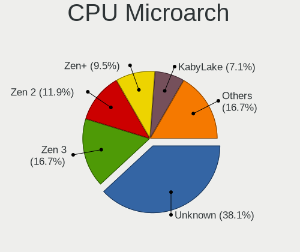

| Name        | Computers | Percent |
|-------------|-----------|---------|
| KabyLake    | 8         | 16.33%  |
| Zen 2       | 7         | 14.29%  |
| IvyBridge   | 4         | 8.16%   |
| Zen+        | 3         | 6.12%   |
| Zen 3       | 3         | 6.12%   |
| SandyBridge | 3         | 6.12%   |
| Piledriver  | 3         | 6.12%   |
| Penryn      | 3         | 6.12%   |
| Haswell     | 3         | 6.12%   |
| CometLake   | 3         | 6.12%   |
| Skylake     | 2         | 4.08%   |
| Silvermont  | 2         | 4.08%   |
| Zen         | 1         | 2.04%   |
| TigerLake   | 1         | 2.04%   |
| Steamroller | 1         | 2.04%   |
| Goldmont    | 1         | 2.04%   |
| Unknown     | 1         | 2.04%   |

Graphics
--------

GPU Vendor
----------

Vendors of graphics cards

| Vendor | Computers | Percent |
|--------|-----------|---------|
| Intel  | 24        | 40.68%  |
| AMD    | 19        | 32.2%   |
| Nvidia | 16        | 27.12%  |

GPU Model
---------

Graphics card models

| Model                                                                                    | Computers | Percent |
|------------------------------------------------------------------------------------------|-----------|---------|
| AMD Ellesmere [Radeon RX 470/480/570/570X/580/580X/590]                                  | 4         | 6.56%   |
| Intel 2nd Generation Core Processor Family Integrated Graphics Controller                | 3         | 4.92%   |
| AMD Renoir                                                                               | 3         | 4.92%   |
| AMD Picasso/Raven 2 [Radeon Vega Series / Radeon Vega Mobile Series]                     | 3         | 4.92%   |
| Nvidia TU116 [GeForce GTX 1650 SUPER]                                                    | 2         | 3.28%   |
| Intel Xeon E3-1200 v2/3rd Gen Core processor Graphics Controller                         | 2         | 3.28%   |
| Intel Haswell-ULT Integrated Graphics Controller                                         | 2         | 3.28%   |
| Intel CoffeeLake-S GT2 [UHD Graphics 630]                                                | 2         | 3.28%   |
| Intel 3rd Gen Core processor Graphics Controller                                         | 2         | 3.28%   |
| AMD Navi 10 [Radeon RX 5600 OEM/5600 XT / 5700/5700 XT]                                  | 2         | 3.28%   |
| Nvidia TU117M [GeForce GTX 1650 Ti Mobile]                                               | 1         | 1.64%   |
| Nvidia TU117M [GeForce GTX 1650 Mobile / Max-Q]                                          | 1         | 1.64%   |
| Nvidia TU116M [GeForce GTX 1650 Ti Mobile]                                               | 1         | 1.64%   |
| Nvidia TU104BM [GeForce RTX 2070 SUPER Mobile / Max-Q]                                   | 1         | 1.64%   |
| Nvidia TU102 [GeForce RTX 2080 Ti Rev. A]                                                | 1         | 1.64%   |
| Nvidia GP107M [GeForce GTX 1050 Mobile]                                                  | 1         | 1.64%   |
| Nvidia GP107GLM [Quadro P2000 Mobile]                                                    | 1         | 1.64%   |
| Nvidia GP107 [GeForce GTX 1050 Ti]                                                       | 1         | 1.64%   |
| Nvidia GP104 [GeForce GTX 1070]                                                          | 1         | 1.64%   |
| Nvidia GK107M [GeForce GT 650M]                                                          | 1         | 1.64%   |
| Nvidia GK106 [GeForce GTX 650 OEM]                                                       | 1         | 1.64%   |
| Nvidia GF108 [GeForce GT 430]                                                            | 1         | 1.64%   |
| Nvidia GA104 [GeForce RTX 3060 Ti Lite Hash Rate]                                        | 1         | 1.64%   |
| Nvidia G94GLM [Quadro FX 2700M]                                                          | 1         | 1.64%   |
| Intel UHD Graphics 620                                                                   | 1         | 1.64%   |
| Intel TigerLake-LP GT2 [Iris Xe Graphics]                                                | 1         | 1.64%   |
| Intel HD Graphics 630                                                                    | 1         | 1.64%   |
| Intel HD Graphics 620                                                                    | 1         | 1.64%   |
| Intel HD Graphics 530                                                                    | 1         | 1.64%   |
| Intel HD Graphics 515                                                                    | 1         | 1.64%   |
| Intel CometLake-S GT2 [UHD Graphics 630]                                                 | 1         | 1.64%   |
| Intel CoffeeLake-H GT2 [UHD Graphics 630]                                                | 1         | 1.64%   |
| Intel Celeron N3350/Pentium N4200/Atom E3900 Series Integrated Graphics Controller       | 1         | 1.64%   |
| Intel Atom/Celeron/Pentium Processor x5-E8000/J3xxx/N3xxx Integrated Graphics Controller | 1         | 1.64%   |
| Intel Atom Processor Z36xxx/Z37xxx Series Graphics & Display                             | 1         | 1.64%   |
| Intel 4th Gen Core Processor Integrated Graphics Controller                              | 1         | 1.64%   |
| Intel 4 Series Chipset Integrated Graphics Controller                                    | 1         | 1.64%   |
| AMD Whistler [Radeon HD 6630M/6650M/6750M/7670M/7690M]                                   | 1         | 1.64%   |
| AMD Sun XT [Radeon HD 8670A/8670M/8690M / R5 M330 / M430 / Radeon 520 Mobile]            | 1         | 1.64%   |
| AMD Navi 23 [Radeon RX 6600/6600 XT/6600M]                                               | 1         | 1.64%   |

GPU Combo
---------

Combinations of graphics cards

| Name           | Computers | Percent |
|----------------|-----------|---------|
| 1 x Intel      | 16        | 32.65%  |
| 1 x AMD        | 12        | 24.49%  |
| 1 x Nvidia     | 10        | 20.41%  |
| Intel + Nvidia | 4         | 8.16%   |
| Intel + AMD    | 3         | 6.12%   |
| 2 x AMD        | 2         | 4.08%   |
| AMD + Nvidia   | 2         | 4.08%   |

GPU Driver
----------

Free vs proprietary

| Driver      | Computers | Percent |
|-------------|-----------|---------|
| Free        | 37        | 75.51%  |
| Proprietary | 12        | 24.49%  |

GPU Memory
----------

Total video memory

| Size in GB | Computers | Percent |
|------------|-----------|---------|
| Unknown    | 25        | 51.02%  |
| 1.01-2.0   | 8         | 16.33%  |
| 7.01-8.0   | 5         | 10.2%   |
| 0.51-1.0   | 4         | 8.16%   |
| 8.01-16.0  | 3         | 6.12%   |
| 0.01-0.5   | 2         | 4.08%   |
| 5.01-6.0   | 1         | 2.04%   |
| 3.01-4.0   | 1         | 2.04%   |

Monitor
-------

Monitor Vendor
--------------

Monitor vendors

| Vendor              | Computers | Percent |
|---------------------|-----------|---------|
| AU Optronics        | 8         | 15.38%  |
| Samsung Electronics | 6         | 11.54%  |
| Goldstar            | 5         | 9.62%   |
| BOE                 | 4         | 7.69%   |
| LG Display          | 3         | 5.77%   |
| Dell                | 3         | 5.77%   |
| Chimei Innolux      | 3         | 5.77%   |
| Acer                | 3         | 5.77%   |
| Vizio               | 2         | 3.85%   |
| ViewSonic           | 2         | 3.85%   |
| Hewlett-Packard     | 2         | 3.85%   |
| Apple               | 2         | 3.85%   |
| AOC                 | 2         | 3.85%   |
| Sharp               | 1         | 1.92%   |
| PANDA               | 1         | 1.92%   |
| MSI                 | 1         | 1.92%   |
| Lenovo              | 1         | 1.92%   |
| InfoVision          | 1         | 1.92%   |
| GDH                 | 1         | 1.92%   |
| BenQ                | 1         | 1.92%   |

Monitor Model
-------------

Monitor models

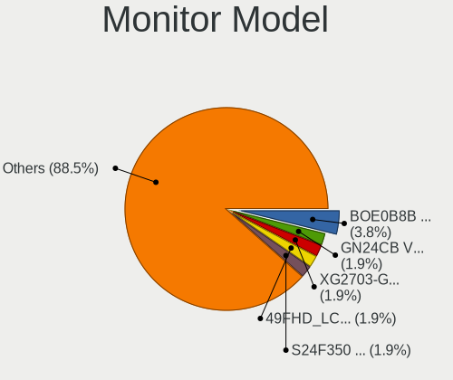

| Model                                                                 | Computers | Percent |
|-----------------------------------------------------------------------|-----------|---------|
| Vizio M322i-B1 VIZ1005 1920x1080 698x392mm 31.5-inch                  | 1         | 1.85%   |
| Vizio E3D420VX VIZ0092 1920x1080 930x523mm 42.0-inch                  | 1         | 1.85%   |
| ViewSonic VX3218-PC-mhd VSCEB3A 1920x1080 609x348mm 27.6-inch         | 1         | 1.85%   |
| ViewSonic VX2768-2KP VSC0A3B 2560x1440 597x336mm 27.0-inch            | 1         | 1.85%   |
| Sharp LCD Monitor SHP143D 3840x2160 276x156mm 12.5-inch               | 1         | 1.85%   |
| Samsung Electronics SyncMaster SAM03E5 1680x1050 470x300mm 22.0-inch  | 1         | 1.85%   |
| Samsung Electronics LF24T35 SAM707D 1920x1080 528x297mm 23.9-inch     | 1         | 1.85%   |
| Samsung Electronics LCD Monitor SDC4171 2880x1800 302x189mm 14.0-inch | 1         | 1.85%   |
| Samsung Electronics LCD Monitor SAM105F 1366x768 575x323mm 26.0-inch  | 1         | 1.85%   |
| Samsung Electronics LCD Monitor SAM0A7A 1920x1080 480x270mm 21.7-inch | 1         | 1.85%   |
| Samsung Electronics C34H89x SAM0E26 3440x1440 797x333mm 34.0-inch     | 1         | 1.85%   |
| Samsung Electronics C24F390 SAM0D2C 1920x1080 521x293mm 23.5-inch     | 1         | 1.85%   |
| PANDA LCD Monitor NCP0050 1920x1080 309x174mm 14.0-inch               | 1         | 1.85%   |
| MSI G273 MSI3CA7 1920x1080 597x336mm 27.0-inch                        | 1         | 1.85%   |
| MSI AG321CQR MSI3DB4 2560x1440 700x390mm 31.5-inch                    | 1         | 1.85%   |
| LG Display LCD Monitor LGD40BA 1920x1080 344x194mm 15.5-inch          | 1         | 1.85%   |
| LG Display LCD Monitor LGD0657 1920x1080 344x194mm 15.5-inch          | 1         | 1.85%   |
| LG Display LCD Monitor LGD0456 1366x768 344x194mm 15.5-inch           | 1         | 1.85%   |
| Lenovo LEN P27h-10 LEN61AF 2560x1440 597x336mm 27.0-inch              | 1         | 1.85%   |
| InfoVision LCD Monitor IVO03FA 1366x768 223x125mm 10.1-inch           | 1         | 1.85%   |
| Hewlett-Packard 23es HWP331E 1920x1080 509x286mm 23.0-inch            | 1         | 1.85%   |
| Hewlett-Packard 2011 HWP2935 1600x900 443x249mm 20.0-inch             | 1         | 1.85%   |
| Goldstar ULTRAWIDE GSM76E4 3440x1440 800x335mm 34.1-inch              | 1         | 1.85%   |
| Goldstar LG ULTRAWIDE GSM76F9 2560x1080 800x340mm 34.2-inch           | 1         | 1.85%   |
| Goldstar FULL HD GSM5B55 1920x1080 480x270mm 21.7-inch                | 1         | 1.85%   |
| Goldstar 2D HD TV GSM59CA 1366x768 509x286mm 23.0-inch                | 1         | 1.85%   |
| Goldstar 22EA53 GSM59A5 1920x1080 477x268mm 21.5-inch                 | 1         | 1.85%   |
| GDH PHILCO GDH0030 1920x540 708x398mm 32.0-inch                       | 1         | 1.85%   |
| Dell ST2220L DELA065 1920x1080 477x268mm 21.5-inch                    | 1         | 1.85%   |
| Dell P2720DC DELD0FB 2560x1440 597x336mm 27.0-inch                    | 1         | 1.85%   |
| Dell P2211H DEL4061 1920x1080 477x268mm 21.5-inch                     | 1         | 1.85%   |
| Chimei Innolux LCD Monitor CMN15DC 1366x768 344x193mm 15.5-inch       | 1         | 1.85%   |
| Chimei Innolux LCD Monitor CMN15C5 1366x768 344x193mm 15.5-inch       | 1         | 1.85%   |
| Chimei Innolux LCD Monitor CMN150C 1920x1080 344x193mm 15.5-inch      | 1         | 1.85%   |
| BOE LCD Monitor BOE07CB 1920x1080 344x193mm 15.5-inch                 | 1         | 1.85%   |
| BOE LCD Monitor BOE078B 1366x768 344x194mm 15.5-inch                  | 1         | 1.85%   |
| BOE LCD Monitor BOE06C6 1920x1080 344x194mm 15.5-inch                 | 1         | 1.85%   |
| BOE LCD Monitor BOE065F 1920x1080 344x194mm 15.5-inch                 | 1         | 1.85%   |
| BenQ PD2700U BNQ802E 3840x2160 597x336mm 27.0-inch                    | 1         | 1.85%   |
| AU Optronics LCD Monitor AUOEC91 1920x1080 382x215mm 17.3-inch        | 1         | 1.85%   |

Monitor Resolution
------------------

Monitor screen resolution

| Resolution         | Computers | Percent |
|--------------------|-----------|---------|
| 1920x1080 (FHD)    | 20        | 40%     |
| 1366x768 (WXGA)    | 9         | 18%     |
| 3840x2160 (4K)     | 6         | 12%     |
| 2560x1440 (QHD)    | 5         | 10%     |
| 3440x1440          | 2         | 4%      |
| 1680x1050 (WSXGA+) | 2         | 4%      |
| 1440x900 (WXGA+)   | 2         | 4%      |
| 2880x1800          | 1         | 2%      |
| 2560x1080          | 1         | 2%      |
| 1920x1200 (WUXGA)  | 1         | 2%      |
| 1600x900 (HD+)     | 1         | 2%      |

Monitor Diagonal
----------------

Diagonal size in inches

| Inches | Computers | Percent |
|--------|-----------|---------|
| 15     | 16        | 29.63%  |
| 27     | 7         | 12.96%  |
| 23     | 5         | 9.26%   |
| 21     | 4         | 7.41%   |
| 34     | 3         | 5.56%   |
| 17     | 3         | 5.56%   |
| 31     | 2         | 3.7%    |
| 14     | 2         | 3.7%    |
| 60     | 1         | 1.85%   |
| 52     | 1         | 1.85%   |
| 48     | 1         | 1.85%   |
| 33     | 1         | 1.85%   |
| 26     | 1         | 1.85%   |
| 24     | 1         | 1.85%   |
| 22     | 1         | 1.85%   |
| 20     | 1         | 1.85%   |
| 19     | 1         | 1.85%   |
| 13     | 1         | 1.85%   |
| 12     | 1         | 1.85%   |
| 10     | 1         | 1.85%   |

Monitor Width
-------------

Physical width

| Width in mm | Computers | Percent |
|-------------|-----------|---------|
| 301-350     | 18        | 33.33%  |
| 501-600     | 13        | 24.07%  |
| 401-500     | 7         | 12.96%  |
| 701-800     | 4         | 7.41%   |
| 601-700     | 3         | 5.56%   |
| 351-400     | 3         | 5.56%   |
| 201-300     | 3         | 5.56%   |
| 1001-1500   | 3         | 5.56%   |

Aspect Ratio
------------

Proportional relationship between the width and the height

| Ratio | Computers | Percent |
|-------|-----------|---------|
| 16/9  | 35        | 79.55%  |
| 16/10 | 6         | 13.64%  |
| 21/9  | 3         | 6.82%   |

Monitor Area
------------

Area in inch²

| Area in inch² | Computers | Percent |
|----------------|-----------|---------|
| 101-110        | 16        | 29.63%  |
| 201-250        | 10        | 18.52%  |
| 301-350        | 7         | 12.96%  |
| 351-500        | 6         | 11.11%  |
| More than 1000 | 3         | 5.56%   |
| 81-90          | 3         | 5.56%   |
| 251-300        | 2         | 3.7%    |
| 151-200        | 2         | 3.7%    |
| 121-130        | 2         | 3.7%    |
| 61-70          | 1         | 1.85%   |
| 41-50          | 1         | 1.85%   |
| 131-140        | 1         | 1.85%   |

Pixel Density
-------------

Pixels per inch

| Density       | Computers | Percent |
|---------------|-----------|---------|
| 101-120       | 17        | 33.33%  |
| 51-100        | 15        | 29.41%  |
| 121-160       | 12        | 23.53%  |
| More than 240 | 3         | 5.88%   |
| 1-50          | 3         | 5.88%   |
| 161-240       | 1         | 1.96%   |

Multiple Monitors
-----------------

Total monitors connected

| Total | Computers | Percent |
|-------|-----------|---------|
| 1     | 35        | 71.43%  |
| 2     | 11        | 22.45%  |
| 0     | 2         | 4.08%   |
| 3     | 1         | 2.04%   |

Network
-------

Net Controller Vendor
---------------------

Controller vendors

| Vendor                | Computers | Percent |
|-----------------------|-----------|---------|
| Realtek Semiconductor | 25        | 30.86%  |
| Intel                 | 25        | 30.86%  |
| Qualcomm Atheros      | 10        | 12.35%  |
| TP-Link               | 4         | 4.94%   |
| Broadcom              | 4         | 4.94%   |
| Qualcomm              | 2         | 2.47%   |
| Microsoft             | 2         | 2.47%   |
| MediaTek              | 2         | 2.47%   |
| Ralink Technology     | 1         | 1.23%   |
| Ralink                | 1         | 1.23%   |
| Holtek Semiconductor  | 1         | 1.23%   |
| D-Link                | 1         | 1.23%   |
| Broadcom Limited      | 1         | 1.23%   |
| ASUSTek Computer      | 1         | 1.23%   |
| ASIX Electronics      | 1         | 1.23%   |

Net Controller Model
--------------------

Controller models

| Model                                                             | Computers | Percent |
|-------------------------------------------------------------------|-----------|---------|
| Realtek RTL8111/8168/8411 PCI Express Gigabit Ethernet Controller | 18        | 20%     |
| Intel Wi-Fi 6 AX200                                               | 9         | 10%     |
| Realtek RTL8125 2.5GbE Controller                                 | 3         | 3.33%   |
| Intel Ethernet Connection (7) I219-LM                             | 3         | 3.33%   |
| Qualcomm Atheros QCA9565 / AR9565 Wireless Network Adapter        | 2         | 2.22%   |
| Qualcomm Atheros AR9485 Wireless Network Adapter                  | 2         | 2.22%   |
| MediaTek MT7921 802.11ax PCI Express Wireless Network Adapter     | 2         | 2.22%   |
| Intel Wireless 8260                                               | 2         | 2.22%   |
| Intel I211 Gigabit Network Connection                             | 2         | 2.22%   |
| Intel Dual Band Wireless-AC 3165 Plus Bluetooth                   | 2         | 2.22%   |
| Intel Cannon Lake PCH CNVi WiFi                                   | 2         | 2.22%   |
| TP-Link UE300 10/100/1000 LAN (ethernet mode) [Realtek RTL8153]   | 1         | 1.11%   |
| TP-Link TL-WN823N v2/v3 [Realtek RTL8192EU]                       | 1         | 1.11%   |
| TP-Link TL-WN821N v5/v6 [RTL8192EU]                               | 1         | 1.11%   |
| TP-Link TL-WN722N v2/v3 [Realtek RTL8188EUS]                      | 1         | 1.11%   |
| Realtek RTL8188EUS 802.11n Wireless Network Adapter               | 1         | 1.11%   |
| Realtek RTL8153 Gigabit Ethernet Adapter                          | 1         | 1.11%   |
| Realtek RTL8152 Fast Ethernet Adapter                             | 1         | 1.11%   |
| Realtek RTL810xE PCI Express Fast Ethernet controller             | 1         | 1.11%   |
| Realtek Killer E3000 2.5GbE Controller                            | 1         | 1.11%   |
| Realtek 802.11ac NIC                                              | 1         | 1.11%   |
| Ralink MT7601U Wireless Adapter                                   | 1         | 1.11%   |
| Ralink RT3290 Wireless 802.11n 1T/1R PCIe                         | 1         | 1.11%   |
| Qualcomm Mobile Router                                            | 1         | 1.11%   |
| Qualcomm MDM9207-MTP _SN:F0565CAE                                 | 1         | 1.11%   |
| Qualcomm Atheros QCA9377 802.11ac Wireless Network Adapter        | 1         | 1.11%   |
| Qualcomm Atheros QCA6174 802.11ac Wireless Network Adapter        | 1         | 1.11%   |
| Qualcomm Atheros Killer E2500 Gigabit Ethernet Controller         | 1         | 1.11%   |
| Qualcomm Atheros Killer E220x Gigabit Ethernet Controller         | 1         | 1.11%   |
| Qualcomm Atheros AR9462 Wireless Network Adapter                  | 1         | 1.11%   |
| Qualcomm Atheros AR8162 Fast Ethernet                             | 1         | 1.11%   |
| Qualcomm Atheros AR8161 Gigabit Ethernet                          | 1         | 1.11%   |
| Microsoft Xbox 360 Wireless Adapter                               | 1         | 1.11%   |
| Microsoft Wireless XBox Controller Dongle                         | 1         | 1.11%   |
| Intel Wireless 3160                                               | 1         | 1.11%   |
| Intel WiFi Link 5100                                              | 1         | 1.11%   |
| Intel Wi-Fi 6 AX201                                               | 1         | 1.11%   |
| Intel Ethernet Controller I225-V                                  | 1         | 1.11%   |
| Intel Ethernet Connection I217-V                                  | 1         | 1.11%   |
| Intel Ethernet Connection (2) I219-LM                             | 1         | 1.11%   |

Wireless Vendor
---------------

Wireless vendors

| Vendor                | Computers | Percent |
|-----------------------|-----------|---------|
| Intel                 | 19        | 45.24%  |
| Qualcomm Atheros      | 7         | 16.67%  |
| TP-Link               | 3         | 7.14%   |
| Broadcom              | 3         | 7.14%   |
| Realtek Semiconductor | 2         | 4.76%   |
| Microsoft             | 2         | 4.76%   |
| MediaTek              | 2         | 4.76%   |
| Ralink Technology     | 1         | 2.38%   |
| Ralink                | 1         | 2.38%   |
| D-Link                | 1         | 2.38%   |
| ASUSTek Computer      | 1         | 2.38%   |

Wireless Model
--------------

Wireless models

| Model                                                         | Computers | Percent |
|---------------------------------------------------------------|-----------|---------|
| Intel Wi-Fi 6 AX200                                           | 9         | 21.43%  |
| Qualcomm Atheros QCA9565 / AR9565 Wireless Network Adapter    | 2         | 4.76%   |
| Qualcomm Atheros AR9485 Wireless Network Adapter              | 2         | 4.76%   |
| MediaTek MT7921 802.11ax PCI Express Wireless Network Adapter | 2         | 4.76%   |
| Intel Wireless 8260                                           | 2         | 4.76%   |
| Intel Dual Band Wireless-AC 3165 Plus Bluetooth               | 2         | 4.76%   |
| Intel Cannon Lake PCH CNVi WiFi                               | 2         | 4.76%   |
| TP-Link TL-WN823N v2/v3 [Realtek RTL8192EU]                   | 1         | 2.38%   |
| TP-Link TL-WN821N v5/v6 [RTL8192EU]                           | 1         | 2.38%   |
| TP-Link TL-WN722N v2/v3 [Realtek RTL8188EUS]                  | 1         | 2.38%   |
| Realtek RTL8188EUS 802.11n Wireless Network Adapter           | 1         | 2.38%   |
| Realtek 802.11ac NIC                                          | 1         | 2.38%   |
| Ralink MT7601U Wireless Adapter                               | 1         | 2.38%   |
| Ralink RT3290 Wireless 802.11n 1T/1R PCIe                     | 1         | 2.38%   |
| Qualcomm Atheros QCA9377 802.11ac Wireless Network Adapter    | 1         | 2.38%   |
| Qualcomm Atheros QCA6174 802.11ac Wireless Network Adapter    | 1         | 2.38%   |
| Qualcomm Atheros AR9462 Wireless Network Adapter              | 1         | 2.38%   |
| Microsoft Xbox 360 Wireless Adapter                           | 1         | 2.38%   |
| Microsoft Wireless XBox Controller Dongle                     | 1         | 2.38%   |
| Intel Wireless 3160                                           | 1         | 2.38%   |
| Intel WiFi Link 5100                                          | 1         | 2.38%   |
| Intel Wi-Fi 6 AX201                                           | 1         | 2.38%   |
| Intel Comet Lake PCH CNVi WiFi                                | 1         | 2.38%   |
| D-Link 802.11ac NIC                                           | 1         | 2.38%   |
| Broadcom BCM4331 802.11a/b/g/n                                | 1         | 2.38%   |
| Broadcom BCM43224 802.11a/b/g/n                               | 1         | 2.38%   |
| Broadcom BCM4313 802.11bgn Wireless Network Adapter           | 1         | 2.38%   |
| ASUS 802.11ac WLAN Adapter                                    | 1         | 2.38%   |

Ethernet Vendor
---------------

Ethernet vendors

| Vendor                | Computers | Percent |
|-----------------------|-----------|---------|
| Realtek Semiconductor | 24        | 52.17%  |
| Intel                 | 11        | 23.91%  |
| Qualcomm Atheros      | 4         | 8.7%    |
| Qualcomm              | 2         | 4.35%   |
| Broadcom              | 2         | 4.35%   |
| TP-Link               | 1         | 2.17%   |
| Broadcom Limited      | 1         | 2.17%   |
| ASIX Electronics      | 1         | 2.17%   |

Ethernet Model
--------------

Ethernet models

| Model                                                             | Computers | Percent |
|-------------------------------------------------------------------|-----------|---------|
| Realtek RTL8111/8168/8411 PCI Express Gigabit Ethernet Controller | 18        | 38.3%   |
| Realtek RTL8125 2.5GbE Controller                                 | 3         | 6.38%   |
| Intel Ethernet Connection (7) I219-LM                             | 3         | 6.38%   |
| Intel I211 Gigabit Network Connection                             | 2         | 4.26%   |
| TP-Link UE300 10/100/1000 LAN (ethernet mode) [Realtek RTL8153]   | 1         | 2.13%   |
| Realtek RTL8153 Gigabit Ethernet Adapter                          | 1         | 2.13%   |
| Realtek RTL8152 Fast Ethernet Adapter                             | 1         | 2.13%   |
| Realtek RTL810xE PCI Express Fast Ethernet controller             | 1         | 2.13%   |
| Realtek Killer E3000 2.5GbE Controller                            | 1         | 2.13%   |
| Qualcomm Mobile Router                                            | 1         | 2.13%   |
| Qualcomm MDM9207-MTP _SN:F0565CAE                                 | 1         | 2.13%   |
| Qualcomm Atheros Killer E2500 Gigabit Ethernet Controller         | 1         | 2.13%   |
| Qualcomm Atheros Killer E220x Gigabit Ethernet Controller         | 1         | 2.13%   |
| Qualcomm Atheros AR8162 Fast Ethernet                             | 1         | 2.13%   |
| Qualcomm Atheros AR8161 Gigabit Ethernet                          | 1         | 2.13%   |
| Intel Ethernet Controller I225-V                                  | 1         | 2.13%   |
| Intel Ethernet Connection I217-V                                  | 1         | 2.13%   |
| Intel Ethernet Connection (2) I219-LM                             | 1         | 2.13%   |
| Intel Ethernet Connection (14) I219-V                             | 1         | 2.13%   |
| Intel 82579LM Gigabit Network Connection (Lewisville)             | 1         | 2.13%   |
| Intel 82567LM-3 Gigabit Network Connection                        | 1         | 2.13%   |
| Broadcom NetXtreme BCM57765 Gigabit Ethernet PCIe                 | 1         | 2.13%   |
| Broadcom NetLink BCM57785 Gigabit Ethernet PCIe                   | 1         | 2.13%   |
| Broadcom Limited NetXtreme BCM5761e Gigabit Ethernet PCIe         | 1         | 2.13%   |
| ASIX AX88772B                                                     | 1         | 2.13%   |

Net Controller Kind
-------------------

Ethernet, WiFi or modem

| Kind     | Computers | Percent |
|----------|-----------|---------|
| Ethernet | 44        | 52.38%  |
| WiFi     | 39        | 46.43%  |
| Unknown  | 1         | 1.19%   |

Used Controller
---------------

Currently used network controller

| Kind     | Computers | Percent |
|----------|-----------|---------|
| Ethernet | 28        | 52.83%  |
| WiFi     | 25        | 47.17%  |

NICs
----

Total network controllers on board

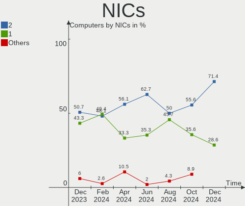

| Total | Computers | Percent |
|-------|-----------|---------|
| 1     | 25        | 51.02%  |
| 2     | 24        | 48.98%  |

IPv6
----

IPv6 vs IPv4

| Used | Computers | Percent |
|------|-----------|---------|
| No   | 29        | 59.18%  |
| Yes  | 20        | 40.82%  |

Bluetooth
---------

Bluetooth Vendor
----------------

Controller vendors

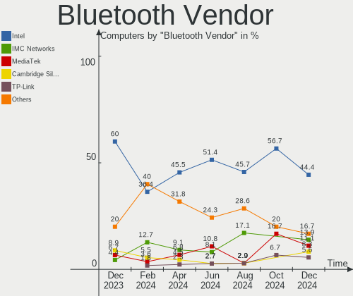

| Vendor                          | Computers | Percent |
|---------------------------------|-----------|---------|
| Intel                           | 18        | 54.55%  |
| Cambridge Silicon Radio         | 4         | 12.12%  |
| Foxconn / Hon Hai               | 3         | 9.09%   |
| Qualcomm Atheros Communications | 2         | 6.06%   |
| Lite-On Technology              | 2         | 6.06%   |
| Apple                           | 2         | 6.06%   |
| Ralink                          | 1         | 3.03%   |
| IMC Networks                    | 1         | 3.03%   |

Bluetooth Model
---------------

Controller models

| Model                                               | Computers | Percent |
|-----------------------------------------------------|-----------|---------|
| Intel AX200 Bluetooth                               | 9         | 27.27%  |
| Intel Bluetooth wireless interface                  | 5         | 15.15%  |
| Cambridge Silicon Radio Bluetooth Dongle (HCI mode) | 4         | 12.12%  |
| Intel Bluetooth 9460/9560 Jefferson Peak (JfP)      | 2         | 6.06%   |
| Intel AX201 Bluetooth                               | 2         | 6.06%   |
| Ralink RT3290 Bluetooth                             | 1         | 3.03%   |
| Qualcomm Atheros AR9462 Bluetooth                   | 1         | 3.03%   |
| Qualcomm Atheros AR3012 Bluetooth 4.0               | 1         | 3.03%   |
| Lite-On Qualcomm Atheros QCA9377 Bluetooth          | 1         | 3.03%   |
| Lite-On Bluetooth Device                            | 1         | 3.03%   |
| IMC Networks Wireless_Device                        | 1         | 3.03%   |
| Foxconn / Hon Hai Wireless_Device                   | 1         | 3.03%   |
| Foxconn / Hon Hai Broadcom BCM20702 Bluetooth       | 1         | 3.03%   |
| Foxconn / Hon Hai Bluetooth Device                  | 1         | 3.03%   |
| Apple Built-in Bluetooth 2.0+EDR HCI                | 1         | 3.03%   |
| Apple Bluetooth Host Controller                     | 1         | 3.03%   |

Sound
-----

Sound Vendor
------------

Sound card vendors

| Vendor              | Computers | Percent |
|---------------------|-----------|---------|
| Intel               | 29        | 40.85%  |
| AMD                 | 22        | 30.99%  |
| Nvidia              | 13        | 18.31%  |
| C-Media Electronics | 5         | 7.04%   |
| SteelSeries ApS     | 1         | 1.41%   |
| Logitech            | 1         | 1.41%   |

Sound Model
-----------

Sound card models

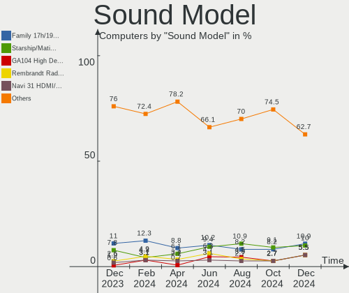

| Model                                                                      | Computers | Percent |
|----------------------------------------------------------------------------|-----------|---------|
| AMD Family 17h/19h HD Audio Controller                                     | 8         | 8.89%   |
| AMD Starship/Matisse HD Audio Controller                                   | 6         | 6.67%   |
| Intel 7 Series/C216 Chipset Family High Definition Audio Controller        | 5         | 5.56%   |
| AMD Renoir Radeon High Definition Audio Controller                         | 4         | 4.44%   |
| AMD Ellesmere HDMI Audio [Radeon RX 470/480 / 570/580/590]                 | 4         | 4.44%   |
| Nvidia TU116 High Definition Audio Controller                              | 3         | 3.33%   |
| Intel Sunrise Point-LP HD Audio                                            | 3         | 3.33%   |
| Intel Cannon Lake PCH cAVS                                                 | 3         | 3.33%   |
| AMD Raven/Raven2/Fenghuang HDMI/DP Audio Controller                        | 3         | 3.33%   |
| AMD Navi 21/23 HDMI/DP Audio Controller                                    | 3         | 3.33%   |
| Nvidia GP107GL High Definition Audio Controller                            | 2         | 2.22%   |
| Intel Haswell-ULT HD Audio Controller                                      | 2         | 2.22%   |
| Intel 8 Series HD Audio Controller                                         | 2         | 2.22%   |
| Intel 6 Series/C200 Series Chipset Family High Definition Audio Controller | 2         | 2.22%   |
| Intel 200 Series PCH HD Audio                                              | 2         | 2.22%   |
| C-Media Electronics Blue Snowball                                          | 2         | 2.22%   |
| AMD SBx00 Azalia (Intel HDA)                                               | 2         | 2.22%   |
| AMD Navi 10 HDMI Audio                                                     | 2         | 2.22%   |
| AMD FCH Azalia Controller                                                  | 2         | 2.22%   |
| SteelSeries ApS SteelSeries Arctis 7X                                      | 1         | 1.11%   |
| Nvidia TU107 GeForce GTX 1650 High Definition Audio Controller             | 1         | 1.11%   |
| Nvidia TU104 HD Audio Controller                                           | 1         | 1.11%   |
| Nvidia TU102 High Definition Audio Controller                              | 1         | 1.11%   |
| Nvidia GP104 High Definition Audio Controller                              | 1         | 1.11%   |
| Nvidia GK107 HDMI Audio Controller                                         | 1         | 1.11%   |
| Nvidia GK106 HDMI Audio Controller                                         | 1         | 1.11%   |
| Nvidia GF108 High Definition Audio Controller                              | 1         | 1.11%   |
| Nvidia GA104 High Definition Audio Controller                              | 1         | 1.11%   |
| Logitech H390 headset with microphone                                      | 1         | 1.11%   |
| Intel Xeon E3-1200 v3/4th Gen Core Processor HD Audio Controller           | 1         | 1.11%   |
| Intel Tiger Lake-LP Smart Sound Technology Audio Controller                | 1         | 1.11%   |
| Intel Comet Lake PCH-V cAVS                                                | 1         | 1.11%   |
| Intel Comet Lake PCH cAVS                                                  | 1         | 1.11%   |
| Intel CM238 HD Audio Controller                                            | 1         | 1.11%   |
| Intel Celeron N3350/Pentium N4200/Atom E3900 Series Audio Cluster          | 1         | 1.11%   |
| Intel Audio device                                                         | 1         | 1.11%   |
| Intel Atom Processor Z36xxx/Z37xxx Series High Definition Audio Controller | 1         | 1.11%   |
| Intel 82801JI (ICH10 Family) HD Audio Controller                           | 1         | 1.11%   |
| Intel 82801JD/DO (ICH10 Family) HD Audio Controller                        | 1         | 1.11%   |
| Intel 82801I (ICH9 Family) HD Audio Controller                             | 1         | 1.11%   |

Memory
------

Memory Vendor
-------------

Memory module vendors

| Vendor              | Computers | Percent |
|---------------------|-----------|---------|
| SK hynix            | 3         | 30%     |
| Samsung Electronics | 3         | 30%     |
| Micron Technology   | 1         | 10%     |
| Kingston            | 1         | 10%     |
| Crucial             | 1         | 10%     |
| Corsair             | 1         | 10%     |

Memory Model
------------

Memory module models

| Model                                                        | Computers | Percent |
|--------------------------------------------------------------|-----------|---------|
| SK hynix RAM Module 2GB SODIMM DDR3 1333MT/s                 | 1         | 9.09%   |
| SK hynix RAM HMT451S6BFR8A-PB 4GB SODIMM DDR3 1600MT/s       | 1         | 9.09%   |
| SK hynix RAM HMAA1GS6CJR6N-XN 8GB Row Of Chips DDR4 3200MT/s | 1         | 9.09%   |
| Samsung RAM M471B5173DB0-YK0 4GB SODIMM DDR3 1600MT/s        | 1         | 9.09%   |
| Samsung RAM M471A1G44AB0-CWE 8GB SODIMM DDR4 3200MT/s        | 1         | 9.09%   |
| Samsung RAM M471A1G44AB0-CWE 8GB Row Of Chips DDR4 3200MT/s  | 1         | 9.09%   |
| Micron RAM Module 8GB SODIMM DDR4 3200MT/s                   | 1         | 9.09%   |
| Kingston RAM LV32D4S2S8HD-8 8GB SODIMM DDR4 3200MT/s         | 1         | 9.09%   |
| Crucial RAM CB16GS2666.C8ET 16GB SODIMM DDR4 2667MT/s        | 1         | 9.09%   |
| Corsair RAM CMK16GX4M2B3200C16 8GB DIMM DDR4 3600MT/s        | 1         | 9.09%   |
| Corsair RAM CMK16GX4M2B3000C15 8GB DIMM DDR4 3200MT/s        | 1         | 9.09%   |

Memory Kind
-----------

Memory module kinds

| Kind | Computers | Percent |
|------|-----------|---------|
| DDR4 | 6         | 75%     |
| DDR3 | 2         | 25%     |

Memory Form Factor
------------------

Physical design of the memory module

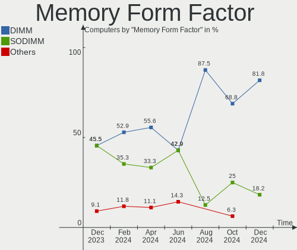

| Name         | Computers | Percent |
|--------------|-----------|---------|
| SODIMM       | 6         | 66.67%  |
| Row Of Chips | 2         | 22.22%  |
| DIMM         | 1         | 11.11%  |

Memory Size
-----------

Memory module size

| Size  | Computers | Percent |
|-------|-----------|---------|
| 8192  | 5         | 62.5%   |
| 16384 | 1         | 12.5%   |
| 4096  | 1         | 12.5%   |
| 2048  | 1         | 12.5%   |

Memory Speed
------------

Memory module speed

| Speed | Computers | Percent |
|-------|-----------|---------|
| 3200  | 4         | 44.44%  |
| 3600  | 1         | 11.11%  |
| 3466  | 1         | 11.11%  |
| 2667  | 1         | 11.11%  |
| 1600  | 1         | 11.11%  |
| 1333  | 1         | 11.11%  |

Printers & scanners
-------------------

Printer Vendor
--------------

Printer device vendors

Zero info for selected period =(

Printer Model
-------------

Printer device models

Zero info for selected period =(

Scanner Vendor
--------------

Scanner device vendors

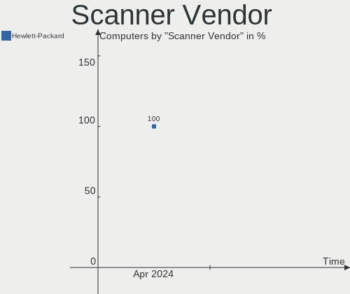

| Vendor          | Computers | Percent |
|-----------------|-----------|---------|
| Hewlett-Packard | 1         | 100%    |

Scanner Model
-------------

Scanner device models

| Model            | Computers | Percent |
|------------------|-----------|---------|
| HP ScanJet 2400c | 1         | 100%    |

Camera
------

Camera Vendor
-------------

Camera device vendors

| Vendor                        | Computers | Percent |
|-------------------------------|-----------|---------|
| Chicony Electronics           | 5         | 17.86%  |
| Sunplus Innovation Technology | 3         | 10.71%  |
| Realtek Semiconductor         | 3         | 10.71%  |
| IMC Networks                  | 3         | 10.71%  |
| Apple                         | 3         | 10.71%  |
| Acer                          | 3         | 10.71%  |
| Microdia                      | 2         | 7.14%   |
| Tobii Technology AB           | 1         | 3.57%   |
| Syntek                        | 1         | 3.57%   |
| Quanta                        | 1         | 3.57%   |
| Microsoft                     | 1         | 3.57%   |
| Logitech                      | 1         | 3.57%   |
| Hewlett-Packard               | 1         | 3.57%   |

Camera Model
------------

Camera device models

| Model                                      | Computers | Percent |
|--------------------------------------------|-----------|---------|
| Realtek Integrated_Webcam_HD               | 2         | 6.9%    |
| IMC Networks USB2.0 HD UVC WebCam          | 2         | 6.9%    |
| Acer Integrated Camera                     | 2         | 6.9%    |
| Tobii AB EyeChip                           | 1         | 3.45%   |
| Syntek Integrated Camera                   | 1         | 3.45%   |
| Sunplus Integrated_Webcam_HD               | 1         | 3.45%   |
| Sunplus HD WebCam                          | 1         | 3.45%   |
| Sunplus ASUS USB2.0 Webcam                 | 1         | 3.45%   |
| Realtek HP Truevision HD integrated webcam | 1         | 3.45%   |
| Quanta VGA WebCam                          | 1         | 3.45%   |
| Microsoft Xbox NUI Camera                  | 1         | 3.45%   |
| Microdia Integrated_Webcam_HD              | 1         | 3.45%   |
| Microdia Integrated Camera                 | 1         | 3.45%   |
| Logitech Webcam C270                       | 1         | 3.45%   |
| IMC Networks Lenovo EasyCamera             | 1         | 3.45%   |
| HP Webcam HD 2300                          | 1         | 3.45%   |
| Chicony TOSHIBA Web Camera - FHD           | 1         | 3.45%   |
| Chicony Integrated IR Camera               | 1         | 3.45%   |
| Chicony Integrated Camera (1280x720@30)    | 1         | 3.45%   |
| Chicony Integrated Camera                  | 1         | 3.45%   |
| Chicony HD WebCam                          | 1         | 3.45%   |
| Chicony EasyCamera                         | 1         | 3.45%   |
| Apple iPhone5/5C/5S/6                      | 1         | 3.45%   |
| Apple FaceTime HD Camera                   | 1         | 3.45%   |
| Apple FaceTime Camera                      | 1         | 3.45%   |
| Acer Lenovo Integrated Webcam              | 1         | 3.45%   |

Security
--------

Fingerprint Vendor
------------------

Fingerprint sensor vendors

| Vendor                     | Computers | Percent |
|----------------------------|-----------|---------|
| Synaptics                  | 2         | 50%     |
| Shenzhen Goodix Technology | 1         | 25%     |
| Elan Microelectronics      | 1         | 25%     |

Fingerprint Model
-----------------

Fingerprint sensor models

| Model                                            | Computers | Percent |
|--------------------------------------------------|-----------|---------|
| Synaptics  WBDI                                  | 1         | 25%     |
| Synaptics Metallica MIS Touch Fingerprint Reader | 1         | 25%     |
| Shenzhen Goodix  FingerPrint Device              | 1         | 25%     |
| Elan ELAN:Fingerprint                            | 1         | 25%     |

Chipcard Vendor
---------------

Chipcard module vendors

| Vendor   | Computers | Percent |
|----------|-----------|---------|
| Broadcom | 1         | 100%    |

Chipcard Model
--------------

Chipcard module models

| Model                                                                        | Computers | Percent |
|------------------------------------------------------------------------------|-----------|---------|
| Broadcom BCM5880 Secure Applications Processor with fingerprint swipe sensor | 1         | 100%    |

Unsupported
-----------

Unsupported Devices
-------------------

Total unsupported devices on board

| Total | Computers | Percent |
|-------|-----------|---------|
| 0     | 38        | 77.55%  |
| 1     | 7         | 14.29%  |
| 2     | 4         | 8.16%   |

Unsupported Device Types
------------------------

Types of unsupported devices

| Type                  | Computers | Percent |
|-----------------------|-----------|---------|
| Multimedia controller | 4         | 28.57%  |
| Fingerprint reader    | 4         | 28.57%  |
| Net/wireless          | 2         | 14.29%  |
| Sound                 | 1         | 7.14%   |
| Graphics card         | 1         | 7.14%   |
| Chipcard              | 1         | 7.14%   |
| Bluetooth             | 1         | 7.14%   |

