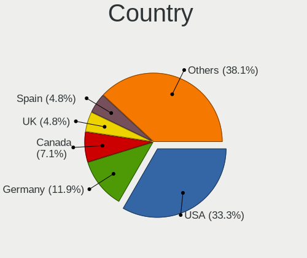
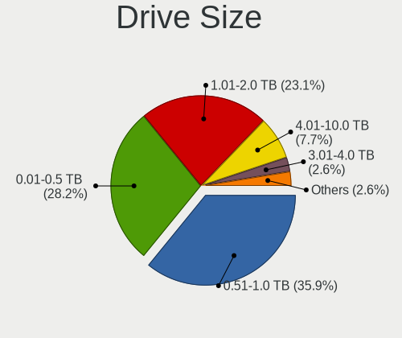
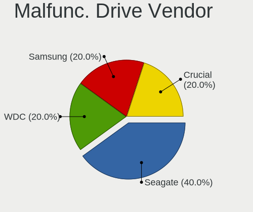
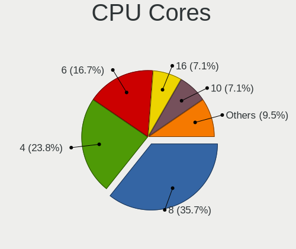
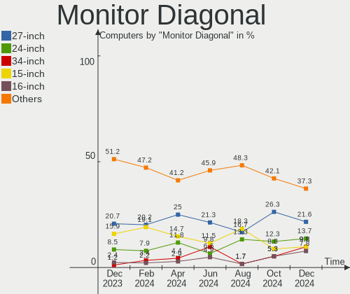
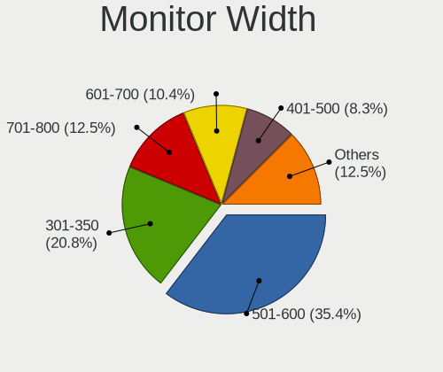
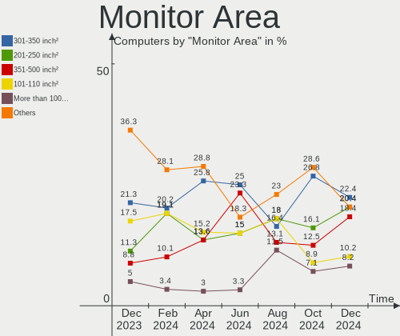
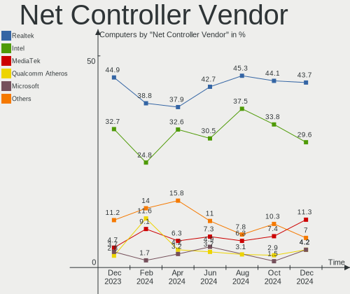
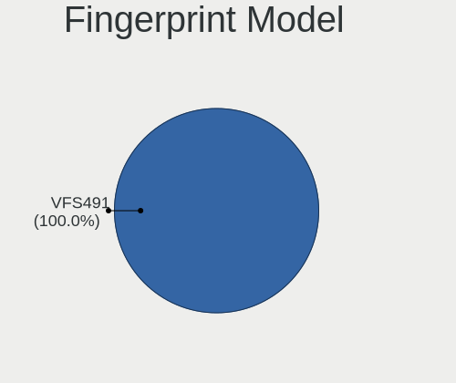
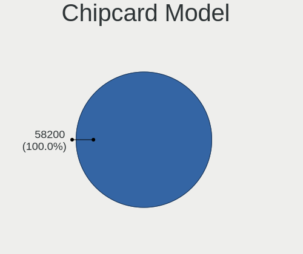

Nobara - Hardware Trends
------------------------

A project to identify most popular hardware characteristics and track their change
over time based on data collected by Linux users at https://Linux-Hardware.org.

Anyone can contribute to this report by the [hw-probe](https://github.com/linuxhw/hw-probe) tool:

    sudo -E hw-probe -all -upload

This is a report for all computer types. See also reports for [desktops](/Dist/Nobara/Desktop/README.md) and [notebooks](/Dist/Nobara/Notebook/README.md).

This report is for one last month. Overall report since the beginning of time: [TestDays](https://github.com/linuxhw/TestDays)

Period: Aug, 2023.

Contents
--------

* [ System ](#system)
  - [ OS                       ](#os)
  - [ OS Family                ](#os-family)
  - [ Kernel                   ](#kernel)
  - [ Kernel Family            ](#kernel-family)
  - [ Kernel Major Ver.        ](#kernel-major-ver)
  - [ Arch                     ](#arch)
  - [ DE                       ](#de)
  - [ Display Server           ](#display-server)
  - [ Display Manager          ](#display-manager)
  - [ OS Lang                  ](#os-lang)
  - [ Boot Mode                ](#boot-mode)
  - [ Filesystem               ](#filesystem)
  - [ Part. scheme             ](#part-scheme)
  - [ Dual Boot with Linux/BSD ](#dual-boot-with-linuxbsd)
  - [ Dual Boot (Win)          ](#dual-boot-win)

* [ Board ](#board)
  - [ Vendor                   ](#vendor)
  - [ Model                    ](#model)
  - [ Model Family             ](#model-family)
  - [ MFG Year                 ](#mfg-year)
  - [ Form Factor              ](#form-factor)
  - [ Secure Boot              ](#secure-boot)
  - [ Coreboot                 ](#coreboot)
  - [ RAM Size                 ](#ram-size)
  - [ RAM Used                 ](#ram-used)
  - [ Total Drives             ](#total-drives)
  - [ Has CD-ROM               ](#has-cd-rom)
  - [ Has Ethernet             ](#has-ethernet)
  - [ Has WiFi                 ](#has-wifi)
  - [ Has Bluetooth            ](#has-bluetooth)

* [ Location ](#location)
  - [ Country                  ](#country)
  - [ City                     ](#city)

* [ Drives ](#drives)
  - [ Drive Vendor             ](#drive-vendor)
  - [ Drive Model              ](#drive-model)
  - [ HDD Vendor               ](#hdd-vendor)
  - [ SSD Vendor               ](#ssd-vendor)
  - [ Drive Kind               ](#drive-kind)
  - [ Drive Connector          ](#drive-connector)
  - [ Drive Size               ](#drive-size)
  - [ Space Total              ](#space-total)
  - [ Space Used               ](#space-used)
  - [ Malfunc. Drives          ](#malfunc-drives)
  - [ Malfunc. Drive Vendor    ](#malfunc-drive-vendor)
  - [ Malfunc. HDD Vendor      ](#malfunc-hdd-vendor)
  - [ Malfunc. Drive Kind      ](#malfunc-drive-kind)
  - [ Failed Drives            ](#failed-drives)
  - [ Failed Drive Vendor      ](#failed-drive-vendor)
  - [ Drive Status             ](#drive-status)

* [ Storage controller ](#storage-controller)
  - [ Storage Vendor           ](#storage-vendor)
  - [ Storage Model            ](#storage-model)
  - [ Storage Kind             ](#storage-kind)

* [ Processor ](#processor)
  - [ CPU Vendor               ](#cpu-vendor)
  - [ CPU Model                ](#cpu-model)
  - [ CPU Model Family         ](#cpu-model-family)
  - [ CPU Cores                ](#cpu-cores)
  - [ CPU Sockets              ](#cpu-sockets)
  - [ CPU Threads              ](#cpu-threads)
  - [ CPU Op-Modes             ](#cpu-op-modes)
  - [ CPU Microcode            ](#cpu-microcode)
  - [ CPU Microarch            ](#cpu-microarch)

* [ Graphics ](#graphics)
  - [ GPU Vendor               ](#gpu-vendor)
  - [ GPU Model                ](#gpu-model)
  - [ GPU Combo                ](#gpu-combo)
  - [ GPU Driver               ](#gpu-driver)
  - [ GPU Memory               ](#gpu-memory)

* [ Monitor ](#monitor)
  - [ Monitor Vendor           ](#monitor-vendor)
  - [ Monitor Model            ](#monitor-model)
  - [ Monitor Resolution       ](#monitor-resolution)
  - [ Monitor Diagonal         ](#monitor-diagonal)
  - [ Monitor Width            ](#monitor-width)
  - [ Aspect Ratio             ](#aspect-ratio)
  - [ Monitor Area             ](#monitor-area)
  - [ Pixel Density            ](#pixel-density)
  - [ Multiple Monitors        ](#multiple-monitors)

* [ Network ](#network)
  - [ Net Controller Vendor    ](#net-controller-vendor)
  - [ Net Controller Model     ](#net-controller-model)
  - [ Wireless Vendor          ](#wireless-vendor)
  - [ Wireless Model           ](#wireless-model)
  - [ Ethernet Vendor          ](#ethernet-vendor)
  - [ Ethernet Model           ](#ethernet-model)
  - [ Net Controller Kind      ](#net-controller-kind)
  - [ Used Controller          ](#used-controller)
  - [ NICs                     ](#nics)
  - [ IPv6                     ](#ipv6)

* [ Bluetooth ](#bluetooth)
  - [ Bluetooth Vendor         ](#bluetooth-vendor)
  - [ Bluetooth Model          ](#bluetooth-model)

* [ Sound ](#sound)
  - [ Sound Vendor             ](#sound-vendor)
  - [ Sound Model              ](#sound-model)

* [ Memory ](#memory)
  - [ Memory Vendor            ](#memory-vendor)
  - [ Memory Model             ](#memory-model)
  - [ Memory Kind              ](#memory-kind)
  - [ Memory Form Factor       ](#memory-form-factor)
  - [ Memory Size              ](#memory-size)
  - [ Memory Speed             ](#memory-speed)

* [ Printers & scanners ](#printers--scanners)
  - [ Printer Vendor           ](#printer-vendor)
  - [ Printer Model            ](#printer-model)
  - [ Scanner Vendor           ](#scanner-vendor)
  - [ Scanner Model            ](#scanner-model)

* [ Camera ](#camera)
  - [ Camera Vendor            ](#camera-vendor)
  - [ Camera Model             ](#camera-model)

* [ Security ](#security)
  - [ Fingerprint Vendor       ](#fingerprint-vendor)
  - [ Fingerprint Model        ](#fingerprint-model)
  - [ Chipcard Vendor          ](#chipcard-vendor)
  - [ Chipcard Model           ](#chipcard-model)

* [ Unsupported ](#unsupported)
  - [ Unsupported Devices      ](#unsupported-devices)
  - [ Unsupported Device Types ](#unsupported-device-types)

System
------

OS
--

Installed operating systems

| Name      | Computers | Percent |
|-----------|-----------|---------|
| Nobara 38 | 31        | 81.58%  |
| Nobara 37 | 5         | 13.16%  |
| Nobara 36 | 2         | 5.26%   |

OS Family
---------

OS without a version

| Name   | Computers | Percent |
|--------|-----------|---------|
| Nobara | 38        | 100%    |

Kernel
------

Version of the Linux kernel

| Version                      | Computers | Percent |
|------------------------------|-----------|---------|
| 6.3.12-205.fsync.fc38.x86_64 | 10        | 26.32%  |
| 6.4.10-202.fsync.fc38.x86_64 | 8         | 21.05%  |
| 6.4.10-201.fsync.fc38.x86_64 | 3         | 7.89%   |
| 6.3.12-205.fsync.fc37.x86_64 | 3         | 7.89%   |
| 6.4.8-203.fsync.fc38.x86_64  | 2         | 5.26%   |
| 6.4.8-202.fsync.fc38.x86_64  | 2         | 5.26%   |
| 6.3.12-204.fsync.fc38.x86_64 | 2         | 5.26%   |
| 6.4.8-202.fsync.fc37.x86_64  | 1         | 2.63%   |
| 6.4.10-cb1.0.fc38.x86_64     | 1         | 2.63%   |
| 6.4.10-202.fsync.fc37.x86_64 | 1         | 2.63%   |
| 6.3.9-200.fsync.fc38.x86_64  | 1         | 2.63%   |
| 6.3.7-200.fsync.fc37.x86_64  | 1         | 2.63%   |
| 6.3.12-203.fsync.fc38.x86_64 | 1         | 2.63%   |
| 6.0.14-201.fsync.fc36.x86_64 | 1         | 2.63%   |
| 5.19.7-204.fsync.fc36.x86_64 | 1         | 2.63%   |

Kernel Family
-------------

Linux kernel without a distro release

| Version | Computers | Percent |
|---------|-----------|---------|
| 6.3.12  | 16        | 42.11%  |
| 6.4.10  | 13        | 34.21%  |
| 6.4.8   | 5         | 13.16%  |
| 6.3.9   | 1         | 2.63%   |
| 6.3.7   | 1         | 2.63%   |
| 6.0.14  | 1         | 2.63%   |
| 5.19.7  | 1         | 2.63%   |

Kernel Major Ver.
-----------------

Linux kernel major version

| Version | Computers | Percent |
|---------|-----------|---------|
| 6.4     | 18        | 47.37%  |
| 6.3     | 18        | 47.37%  |
| 6.0     | 1         | 2.63%   |
| 5.19    | 1         | 2.63%   |

Arch
----

OS architecture (x86_64, i586, etc.)

| Name   | Computers | Percent |
|--------|-----------|---------|
| x86_64 | 38        | 100%    |

DE
--

Desktop Environment

| Name    | Computers | Percent |
|---------|-----------|---------|
| GNOME   | 28        | 73.68%  |
| KDE5    | 9         | 23.68%  |
| Unknown | 1         | 2.63%   |

Display Server
--------------

X11 or Wayland

| Name    | Computers | Percent |
|---------|-----------|---------|
| Wayland | 28        | 73.68%  |
| X11     | 9         | 23.68%  |
| Unknown | 1         | 2.63%   |

Display Manager
---------------

SDDM, LightDM, etc.

| Name    | Computers | Percent |
|---------|-----------|---------|
| Unknown | 32        | 84.21%  |
| GDM     | 5         | 13.16%  |
| SDDM    | 1         | 2.63%   |

OS Lang
-------

Language

| Lang  | Computers | Percent |
|-------|-----------|---------|
| en_US | 19        | 50%     |
| es_MX | 3         | 7.89%   |
| en_GB | 3         | 7.89%   |
| de_DE | 3         | 7.89%   |
| fr_FR | 2         | 5.26%   |
| es_ES | 2         | 5.26%   |
| pt_BR | 1         | 2.63%   |
| it_IT | 1         | 2.63%   |
| en_NZ | 1         | 2.63%   |
| en_CA | 1         | 2.63%   |
| en_AU | 1         | 2.63%   |
| de_AT | 1         | 2.63%   |

Boot Mode
---------

EFI or BIOS

| Mode | Computers | Percent |
|------|-----------|---------|
| EFI  | 29        | 76.32%  |
| BIOS | 9         | 23.68%  |

Filesystem
----------

Type of filesystem

| Type  | Computers | Percent |
|-------|-----------|---------|
| Btrfs | 35        | 92.11%  |
| Ext4  | 3         | 7.89%   |

Part. scheme
------------

Scheme of partitioning

| Type    | Computers | Percent |
|---------|-----------|---------|
| Unknown | 31        | 81.58%  |
| GPT     | 7         | 18.42%  |

Dual Boot with Linux/BSD
------------------------

Hosting more than one Linux/BSD

| Dual boot | Computers | Percent |
|-----------|-----------|---------|
| No        | 35        | 92.11%  |
| Yes       | 3         | 7.89%   |

Dual Boot (Win)
---------------

Hosting Linux and Windows

| Dual boot | Computers | Percent |
|-----------|-----------|---------|
| No        | 31        | 81.58%  |
| Yes       | 7         | 18.42%  |

Board
-----

Vendor
------

Motherboard manufacturer

| Name                             | Computers | Percent |
|----------------------------------|-----------|---------|
| ASUSTek Computer                 | 6         | 15.79%  |
| MSI                              | 5         | 13.16%  |
| Gigabyte Technology              | 5         | 13.16%  |
| ASRock                           | 5         | 13.16%  |
| Lenovo                           | 4         | 10.53%  |
| Hewlett-Packard                  | 3         | 7.89%   |
| Dell                             | 2         | 5.26%   |
| Samsung Electronics              | 1         | 2.63%   |
| Pegatron                         | 1         | 2.63%   |
| Micro Computer (HK) Tech Limited | 1         | 2.63%   |
| Intel                            | 1         | 2.63%   |
| Infinix                          | 1         | 2.63%   |
| Apple                            | 1         | 2.63%   |
| AOpen                            | 1         | 2.63%   |
| Acer                             | 1         | 2.63%   |

Model
-----

Motherboard model

| Name                                     | Computers | Percent |
|------------------------------------------|-----------|---------|
| Samsung 340XAA/350XAA/550XAA             | 1         | 2.63%   |
| Pegatron NF335AA-ABZ a6664it             | 1         | 2.63%   |
| MSI MS-7D91                              | 1         | 2.63%   |
| MSI MS-7D67                              | 1         | 2.63%   |
| MSI MS-7B86                              | 1         | 2.63%   |
| MSI MS-7978                              | 1         | 2.63%   |
| MSI MS-7721                              | 1         | 2.63%   |
| Micro (HK) Tech Limited NUCXI7           | 1         | 2.63%   |
| Lenovo ThinkPad T450 20BUS3ES0A          | 1         | 2.63%   |
| Lenovo Legion T5 28IMB05 90NC001MUS      | 1         | 2.63%   |
| Lenovo Legion Slim 7 16IRH8 82Y3         | 1         | 2.63%   |
| Lenovo IdeaPad 3 15ITL6 82H8             | 1         | 2.63%   |
| Intel NUC7i5BNK                          | 1         | 2.63%   |
| Infinix INBOOK X2 GEN11                  | 1         | 2.63%   |
| HP ENVY x360 Convertible 13-ar0xxx       | 1         | 2.63%   |
| HP ENVY Laptop 16-h1xxx                  | 1         | 2.63%   |
| HP EliteBook x360 1030 G2                | 1         | 2.63%   |
| Gigabyte Z270P-D3                        | 1         | 2.63%   |
| Gigabyte X670 AORUS ELITE AX             | 1         | 2.63%   |
| Gigabyte H410M H                         | 1         | 2.63%   |
| Gigabyte H310M H 2.0                     | 1         | 2.63%   |
| Gigabyte G1.Sniper M3-CF                 | 1         | 2.63%   |
| Dell XPS 17 9730                         | 1         | 2.63%   |
| Dell Inspiron 3180                       | 1         | 2.63%   |
| ASUS VivoBook_ASUSLaptop M1502IA_M1502IA | 1         | 2.63%   |
| ASUS ROG STRIX B550-F GAMING             | 1         | 2.63%   |
| ASUS ROG CROSSHAIR X670E GENE            | 1         | 2.63%   |
| ASUS Pro B550M-C                         | 1         | 2.63%   |
| ASUS G751JM                              | 1         | 2.63%   |
| ASUS CROSSHAIR VI HERO                   | 1         | 2.63%   |
| ASRock Z490M Pro4                        | 1         | 2.63%   |
| ASRock Z170 Extreme6+                    | 1         | 2.63%   |
| ASRock B650 PG Lightning                 | 1         | 2.63%   |
| ASRock B550M Steel Legend                | 1         | 2.63%   |
| ASRock B550 Phantom Gaming-ITX/ax        | 1         | 2.63%   |
| Apple iMac14,1                           | 1         | 2.63%   |
| AOpen DEX5350                            | 1         | 2.63%   |
| Acer Nitro AN515-56                      | 1         | 2.63%   |

Model Family
------------

Motherboard model prefix

| Name                           | Computers | Percent |
|--------------------------------|-----------|---------|
| Lenovo Legion                  | 2         | 5.26%   |
| HP ENVY                        | 2         | 5.26%   |
| ASUS ROG                       | 2         | 5.26%   |
| Samsung 340XAA                 | 1         | 2.63%   |
| Pegatron NF335AA-ABZ           | 1         | 2.63%   |
| MSI MS-7D91                    | 1         | 2.63%   |
| MSI MS-7D67                    | 1         | 2.63%   |
| MSI MS-7B86                    | 1         | 2.63%   |
| MSI MS-7978                    | 1         | 2.63%   |
| MSI MS-7721                    | 1         | 2.63%   |
| Micro (HK) Tech Limited NUCXI7 | 1         | 2.63%   |
| Lenovo ThinkPad                | 1         | 2.63%   |
| Lenovo IdeaPad                 | 1         | 2.63%   |
| Intel NUC7i5BNK                | 1         | 2.63%   |
| Infinix INBOOK                 | 1         | 2.63%   |
| HP EliteBook                   | 1         | 2.63%   |
| Gigabyte Z270P-D3              | 1         | 2.63%   |
| Gigabyte X670                  | 1         | 2.63%   |
| Gigabyte H410M                 | 1         | 2.63%   |
| Gigabyte H310M                 | 1         | 2.63%   |
| Gigabyte G1.Sniper             | 1         | 2.63%   |
| Dell XPS                       | 1         | 2.63%   |
| Dell Inspiron                  | 1         | 2.63%   |
| ASUS VivoBook                  | 1         | 2.63%   |
| ASUS Pro                       | 1         | 2.63%   |
| ASUS G751JM                    | 1         | 2.63%   |
| ASUS CROSSHAIR                 | 1         | 2.63%   |
| ASRock Z490M                   | 1         | 2.63%   |
| ASRock Z170                    | 1         | 2.63%   |
| ASRock B650                    | 1         | 2.63%   |
| ASRock B550M                   | 1         | 2.63%   |
| ASRock B550                    | 1         | 2.63%   |
| Apple iMac14                   | 1         | 2.63%   |
| AOpen DEX5350                  | 1         | 2.63%   |
| Acer Nitro                     | 1         | 2.63%   |

MFG Year
--------

Motherboard manufacture year

| Year | Computers | Percent |
|------|-----------|---------|
| 2022 | 8         | 21.05%  |
| 2020 | 6         | 15.79%  |
| 2023 | 5         | 13.16%  |
| 2018 | 4         | 10.53%  |
| 2021 | 3         | 7.89%   |
| 2019 | 2         | 5.26%   |
| 2017 | 2         | 5.26%   |
| 2015 | 2         | 5.26%   |
| 2014 | 2         | 5.26%   |
| 2016 | 1         | 2.63%   |
| 2013 | 1         | 2.63%   |
| 2012 | 1         | 2.63%   |
| 2008 | 1         | 2.63%   |

Form Factor
-----------

Physical design of the computer

| Name        | Computers | Percent |
|-------------|-----------|---------|
| Desktop     | 22        | 57.89%  |
| Notebook    | 12        | 31.58%  |
| Convertible | 2         | 5.26%   |
| Mini pc     | 1         | 2.63%   |
| All in one  | 1         | 2.63%   |

Secure Boot
-----------

Enabled or disabled

| State    | Computers | Percent |
|----------|-----------|---------|
| Disabled | 38        | 100%    |

Coreboot
--------

Have coreboot on board

| Used | Computers | Percent |
|------|-----------|---------|
| No   | 38        | 100%    |

RAM Size
--------

Total RAM memory

| Size in GB  | Computers | Percent |
|-------------|-----------|---------|
| 32.01-64.0  | 10        | 26.32%  |
| 16.01-24.0  | 9         | 23.68%  |
| 4.01-8.0    | 5         | 13.16%  |
| 64.01-256.0 | 5         | 13.16%  |
| 8.01-16.0   | 4         | 10.53%  |
| 3.01-4.0    | 3         | 7.89%   |
| 24.01-32.0  | 2         | 5.26%   |

RAM Used
--------

Used RAM memory

| Used GB    | Computers | Percent |
|------------|-----------|---------|
| 4.01-8.0   | 15        | 39.47%  |
| 3.01-4.0   | 9         | 23.68%  |
| 2.01-3.0   | 6         | 15.79%  |
| 8.01-16.0  | 3         | 7.89%   |
| 16.01-24.0 | 2         | 5.26%   |
| 1.01-2.0   | 2         | 5.26%   |
| 32.01-64.0 | 1         | 2.63%   |

Total Drives
------------

Number of drives on board

| Drives | Computers | Percent |
|--------|-----------|---------|
| 1      | 16        | 42.11%  |
| 3      | 8         | 21.05%  |
| 2      | 8         | 21.05%  |
| 4      | 3         | 7.89%   |
| 8      | 1         | 2.63%   |
| 6      | 1         | 2.63%   |
| 5      | 1         | 2.63%   |

Has CD-ROM
----------

Has CD-ROM on board

| Presented | Computers | Percent |
|-----------|-----------|---------|
| No        | 35        | 92.11%  |
| Yes       | 3         | 7.89%   |

Has Ethernet
------------

Has Ethernet on board

| Presented | Computers | Percent |
|-----------|-----------|---------|
| Yes       | 29        | 76.32%  |
| No        | 9         | 23.68%  |

Has WiFi
--------

Has WiFi module

| Presented | Computers | Percent |
|-----------|-----------|---------|
| Yes       | 28        | 73.68%  |
| No        | 10        | 26.32%  |

Has Bluetooth
-------------

Has Bluetooth module

| Presented | Computers | Percent |
|-----------|-----------|---------|
| Yes       | 23        | 60.53%  |
| No        | 15        | 39.47%  |

Location
--------

Country
-------

Geographic location (country)

| Country             | Computers | Percent |
|---------------------|-----------|---------|
| USA                 | 9         | 23.68%  |
| Germany             | 4         | 10.53%  |
| Mexico              | 3         | 7.89%   |
| France              | 3         | 7.89%   |
| UK                  | 2         | 5.26%   |
| Spain               | 2         | 5.26%   |
| Italy               | 2         | 5.26%   |
| Canada              | 2         | 5.26%   |
| Brazil              | 2         | 5.26%   |
| Australia           | 2         | 5.26%   |
| Turkey              | 1         | 2.63%   |
| Trinidad and Tobago | 1         | 2.63%   |
| Sweden              | 1         | 2.63%   |
| New Zealand         | 1         | 2.63%   |
| Netherlands         | 1         | 2.63%   |
| Indonesia           | 1         | 2.63%   |
| Austria             | 1         | 2.63%   |

City
----

Geographic location (city)

| City                  | Computers | Percent |
|-----------------------|-----------|---------|
| Villahermosa          | 1         | 2.63%   |
| Toulouse              | 1         | 2.63%   |
| Sydney                | 1         | 2.63%   |
| Stockholm             | 1         | 2.63%   |
| St Louis              | 1         | 2.63%   |
| San Leandro           | 1         | 2.63%   |
| San Francisco         | 1         | 2.63%   |
| Roseville             | 1         | 2.63%   |
| Ried in der Riedmark  | 1         | 2.63%   |
| Port of Spain         | 1         | 2.63%   |
| Nuremberg             | 1         | 2.63%   |
| New York              | 1         | 2.63%   |
| Missoula              | 1         | 2.63%   |
| Milano                | 1         | 2.63%   |
| Milan                 | 1         | 2.63%   |
| Mérida               | 1         | 2.63%   |
| Las Vegas             | 1         | 2.63%   |
| Guadalajara           | 1         | 2.63%   |
| Great Meadows         | 1         | 2.63%   |
| Gold Coast            | 1         | 2.63%   |
| Gijón                | 1         | 2.63%   |
| Florianópolis        | 1         | 2.63%   |
| Estevan               | 1         | 2.63%   |
| Duisburg              | 1         | 2.63%   |
| Doncaster             | 1         | 2.63%   |
| Donaueschingen        | 1         | 2.63%   |
| Courbevoie            | 1         | 2.63%   |
| Cormeilles-en-Parisis | 1         | 2.63%   |
| Cold Lake             | 1         | 2.63%   |
| Christchurch          | 1         | 2.63%   |
| Chattanooga           | 1         | 2.63%   |
| Carapicuiba           | 1         | 2.63%   |
| Canvey Island         | 1         | 2.63%   |
| Bursa                 | 1         | 2.63%   |
| Bandung               | 1         | 2.63%   |
| Bad Wildbad           | 1         | 2.63%   |
| Amsterdam             | 1         | 2.63%   |
| Alicante              | 1         | 2.63%   |

Drives
------

Drive Vendor
------------

Hard drive vendors

| Vendor                       | Computers | Drives | Percent |
|------------------------------|-----------|--------|---------|
| Samsung Electronics          | 13        | 19     | 17.57%  |
| Seagate                      | 10        | 13     | 13.51%  |
| WDC                          | 8         | 9      | 10.81%  |
| Phison Electronics           | 4         | 4      | 5.41%   |
| Unknown                      | 3         | 4      | 4.05%   |
| Toshiba                      | 3         | 3      | 4.05%   |
| SanDisk                      | 3         | 4      | 4.05%   |
| Kingston                     | 3         | 4      | 4.05%   |
| Crucial                      | 3         | 3      | 4.05%   |
| Micron Technology            | 2         | 2      | 2.7%    |
| Kingston Technology Company  | 2         | 2      | 2.7%    |
| Intel                        | 2         | 2      | 2.7%    |
| WDC WDS                      | 1         | 1      | 1.35%   |
| SSSTC                        | 1         | 1      | 1.35%   |
| SK hynix                     | 1         | 1      | 1.35%   |
| Shenzhen Longsys Electronics | 1         | 1      | 1.35%   |
| Realtek Semiconductor        | 1         | 1      | 1.35%   |
| Micron/Crucial Technology    | 1         | 1      | 1.35%   |
| Maxtor                       | 1         | 1      | 1.35%   |
| Lexar                        | 1         | 1      | 1.35%   |
| Leven                        | 1         | 1      | 1.35%   |
| KIOXIA                       | 1         | 1      | 1.35%   |
| Hitachi                      | 1         | 1      | 1.35%   |
| HGST                         | 1         | 1      | 1.35%   |
| DUEX                         | 1         | 1      | 1.35%   |
| Dell                         | 1         | 1      | 1.35%   |
| China                        | 1         | 1      | 1.35%   |
| Apple                        | 1         | 1      | 1.35%   |
| ADATA Technology             | 1         | 1      | 1.35%   |
| A-DATA Technology            | 1         | 1      | 1.35%   |

Drive Model
-----------

Hard drive models

| Model                                                 | Computers | Percent |
|-------------------------------------------------------|-----------|---------|
| Phison E12 NVMe Controller 256GB                      | 4         | 4.76%   |
| Unknown NVMe SSD Drive 2TB                            | 2         | 2.38%   |
| Samsung SSD 870 EVO 2TB                               | 2         | 2.38%   |
| Samsung SSD 860 EVO 1TB                               | 2         | 2.38%   |
| Samsung NVMe SSD Controller PM9A1/PM9A3/980PRO 1024GB | 2         | 2.38%   |
| WDC WDS480G2G0B-00EPW0 480GB SSD                      | 1         | 1.19%   |
| WDC WDS100T2B0B-00YS70 1TB SSD                        | 1         | 1.19%   |
| WDC WDS 200T2B0B-00Y 2TB SSD                          | 1         | 1.19%   |
| WDC WD5001AALS-00L3B2 500GB                           | 1         | 1.19%   |
| WDC WD3000F9YZ-09N20L1 3TB                            | 1         | 1.19%   |
| WDC WD20SPZX-22UA7T0 2TB                              | 1         | 1.19%   |
| WDC WD20EARS-22MVWB0 2TB                              | 1         | 1.19%   |
| WDC WD10SPZX-35Z10T0 1TB                              | 1         | 1.19%   |
| WDC WD10EALS-00Z8A0 1TB                               | 1         | 1.19%   |
| WDC WD1001FALS-00J7B1 1TB                             | 1         | 1.19%   |
| Unknown SD/MMC/MS PRO 1GB                             | 1         | 1.19%   |
| Toshiba MK5076GSX 500GB                               | 1         | 1.19%   |
| Toshiba HDWE160 6TB                                   | 1         | 1.19%   |
| Toshiba HDWD120 2TB                                   | 1         | 1.19%   |
| SSSTC CVB-8D128-HP 128GB                              | 1         | 1.19%   |
| SK hynix SKHynix_HFS001TEJ9X115N 1TB                  | 1         | 1.19%   |
| Shenzhen Longsys FORESEE VP1000F256G 256GB            | 1         | 1.19%   |
| Seagate ST500DM002-1BD142 500GB                       | 1         | 1.19%   |
| Seagate ST3320813AS 320GB                             | 1         | 1.19%   |
| Seagate ST3320620AS 320GB                             | 1         | 1.19%   |
| Seagate ST31000524AS 1TB                              | 1         | 1.19%   |
| Seagate ST2000LX 001-1RG174 2TB                       | 1         | 1.19%   |
| Seagate ST2000DX001-1NS164 2TB                        | 1         | 1.19%   |
| Seagate ST1000VM002-1CT162 1TB                        | 1         | 1.19%   |
| Seagate ST1000DM003-1SB102 1TB                        | 1         | 1.19%   |
| Seagate ST10000DM0004-1ZC101 10TB                     | 1         | 1.19%   |
| Seagate FireCuda Dock 4TB                             | 1         | 1.19%   |
| Seagate Expansion Desk 2TB                            | 1         | 1.19%   |
| Seagate Backup+ Hub BK 8TB                            | 1         | 1.19%   |
| Sandisk WD Blue SN550 NVMe SSD 250GB                  | 1         | 1.19%   |
| Sandisk WD Black SN750 / PC SN730 NVMe SSD 1024GB     | 1         | 1.19%   |
| SanDisk SDSSDH32000G 2TB                              | 1         | 1.19%   |
| SanDisk SDSSDH3 1T00 1TB                              | 1         | 1.19%   |
| Samsung SSD 990 PRO 2TB                               | 1         | 1.19%   |
| Samsung SSD 980 1TB                                   | 1         | 1.19%   |

HDD Vendor
----------

Hard disk drive vendors

| Vendor              | Computers | Drives | Percent |
|---------------------|-----------|--------|---------|
| Seagate             | 10        | 12     | 40%     |
| WDC                 | 6         | 7      | 24%     |
| Toshiba             | 3         | 3      | 12%     |
| Unknown             | 1         | 1      | 4%      |
| Samsung Electronics | 1         | 1      | 4%      |
| Maxtor              | 1         | 1      | 4%      |
| Hitachi             | 1         | 1      | 4%      |
| HGST                | 1         | 1      | 4%      |
| Apple               | 1         | 1      | 4%      |

SSD Vendor
----------

Solid state drive vendors

| Vendor              | Computers | Drives | Percent |
|---------------------|-----------|--------|---------|
| Samsung Electronics | 8         | 11     | 32%     |
| Kingston            | 3         | 3      | 12%     |
| Crucial             | 3         | 3      | 12%     |
| WDC                 | 2         | 2      | 8%      |
| WDC WDS             | 1         | 1      | 4%      |
| SSSTC               | 1         | 1      | 4%      |
| SanDisk             | 1         | 2      | 4%      |
| Micron Technology   | 1         | 1      | 4%      |
| Leven               | 1         | 1      | 4%      |
| DUEX                | 1         | 1      | 4%      |
| Dell                | 1         | 1      | 4%      |
| China               | 1         | 1      | 4%      |
| A-DATA Technology   | 1         | 1      | 4%      |

Drive Kind
----------

HDD or SSD

| Kind    | Computers | Drives | Percent |
|---------|-----------|--------|---------|
| NVMe    | 21        | 28     | 33.33%  |
| SSD     | 20        | 29     | 31.75%  |
| HDD     | 20        | 28     | 31.75%  |
| Unknown | 2         | 2      | 3.17%   |

Drive Connector
---------------

SATA, SAS, NVMe, etc.

| Type | Computers | Drives | Percent |
|------|-----------|--------|---------|
| SATA | 28        | 51     | 52.83%  |
| NVMe | 21        | 28     | 39.62%  |
| SAS  | 4         | 8      | 7.55%   |

Drive Size
----------

Size of hard drive

| Size in TB | Computers | Drives | Percent |
|------------|-----------|--------|---------|
| 0.01-0.5   | 16        | 22     | 35.56%  |
| 0.51-1.0   | 13        | 15     | 28.89%  |
| 1.01-2.0   | 9         | 13     | 20%     |
| 3.01-4.0   | 3         | 3      | 6.67%   |
| 4.01-10.0  | 3         | 3      | 6.67%   |
| 2.01-3.0   | 1         | 1      | 2.22%   |

Space Total
-----------

Amount of disk space available on the file system

| Size in GB     | Computers | Percent |
|----------------|-----------|---------|
| More than 3000 | 8         | 21.05%  |
| 251-500        | 8         | 21.05%  |
| 1001-2000      | 7         | 18.42%  |
| 501-1000       | 6         | 15.79%  |
| 2001-3000      | 3         | 7.89%   |
| 101-250        | 3         | 7.89%   |
| 21-50          | 2         | 5.26%   |
| Unknown        | 1         | 2.63%   |

Space Used
----------

Amount of used disk space

| Used GB        | Computers | Percent |
|----------------|-----------|---------|
| 21-50          | 17        | 44.74%  |
| 251-500        | 4         | 10.53%  |
| 1-20           | 4         | 10.53%  |
| 101-250        | 3         | 7.89%   |
| 1001-2000      | 3         | 7.89%   |
| More than 3000 | 2         | 5.26%   |
| 2001-3000      | 2         | 5.26%   |
| 501-1000       | 2         | 5.26%   |
| Unknown        | 1         | 2.63%   |

Malfunc. Drives
---------------

Drive models with a malfunction

| Model                           | Computers | Drives | Percent |
|---------------------------------|-----------|--------|---------|
| Samsung Electronics SSD 980 1TB | 1         | 1      | 100%    |

Malfunc. Drive Vendor
---------------------

Vendors of faulty drives

| Vendor              | Computers | Drives | Percent |
|---------------------|-----------|--------|---------|
| Samsung Electronics | 1         | 1      | 100%    |

Malfunc. HDD Vendor
-------------------

Vendors of faulty HDD drives

Zero info for selected period =(

Malfunc. Drive Kind
-------------------

Kinds of faulty drives

| Kind | Computers | Drives | Percent |
|------|-----------|--------|---------|
| NVMe | 1         | 1      | 100%    |

Failed Drives
-------------

Failed drive models

Zero info for selected period =(

Failed Drive Vendor
-------------------

Failed drive vendors

Zero info for selected period =(

Drive Status
------------

Number of failed and malfunc. drives

| Status   | Computers | Drives | Percent |
|----------|-----------|--------|---------|
| Detected | 32        | 76     | 80%     |
| Works    | 7         | 10     | 17.5%   |
| Malfunc  | 1         | 1      | 2.5%    |

Storage controller
------------------

Storage Vendor
--------------

Storage controller vendors

| Vendor                       | Computers | Percent |
|------------------------------|-----------|---------|
| Intel                        | 23        | 36.51%  |
| AMD                          | 12        | 19.05%  |
| Samsung Electronics          | 6         | 9.52%   |
| Phison Electronics           | 4         | 6.35%   |
| Kingston Technology Company  | 3         | 4.76%   |
| ASMedia Technology           | 3         | 4.76%   |
| Solidigm                     | 2         | 3.17%   |
| SanDisk                      | 2         | 3.17%   |
| SK hynix                     | 1         | 1.59%   |
| Shenzhen Longsys Electronics | 1         | 1.59%   |
| Realtek Semiconductor        | 1         | 1.59%   |
| Micron/Crucial Technology    | 1         | 1.59%   |
| Micron Technology            | 1         | 1.59%   |
| Marvell Technology Group     | 1         | 1.59%   |
| KIOXIA                       | 1         | 1.59%   |
| ADATA Technology             | 1         | 1.59%   |

Storage Model
-------------

Storage controller models

| Model                                                                          | Computers | Percent |
|--------------------------------------------------------------------------------|-----------|---------|
| AMD FCH SATA Controller [AHCI mode]                                            | 7         | 10.45%  |
| Phison E12 NVMe Controller                                                     | 4         | 5.97%   |
| AMD 500 Series Chipset SATA Controller                                         | 4         | 5.97%   |
| Intel Tiger Lake-LP SATA Controller                                            | 3         | 4.48%   |
| Intel Sunrise Point-LP SATA Controller [AHCI mode]                             | 3         | 4.48%   |
| ASMedia ASM1062 Serial ATA Controller                                          | 3         | 4.48%   |
| Samsung NVMe SSD Controller PM9A1/PM9A3/980PRO                                 | 2         | 2.99%   |
| Samsung NVMe SSD Controller 980                                                | 2         | 2.99%   |
| Kingston Company Company Non-Volatile memory controller                        | 2         | 2.99%   |
| Intel Wildcat Point-LP SATA Controller [AHCI Mode]                             | 2         | 2.99%   |
| Intel Volume Management Device NVMe RAID Controller                            | 2         | 2.99%   |
| Intel Q170/Q150/B150/H170/H110/Z170/CM236 Chipset SATA Controller [AHCI Mode]  | 2         | 2.99%   |
| Intel 8 Series/C220 Series Chipset Family 6-port SATA Controller 1 [AHCI mode] | 2         | 2.99%   |
| Intel 400 Series Chipset Family SATA AHCI Controller                           | 2         | 2.99%   |
| Intel 200 Series PCH SATA controller [AHCI mode]                               | 2         | 2.99%   |
| Solidigm P44 Pro NVMe SSD                                                      | 1         | 1.49%   |
| Solidigm P41 Plus NVMe SSD (DRAM-less)                                         | 1         | 1.49%   |
| SK hynix Platinum P41/PC801 NVMe Solid State Drive                             | 1         | 1.49%   |
| Shenzhen Longsys Lexar NM620 NVME SSD (DRAM-less)                              | 1         | 1.49%   |
| SanDisk WD Blue SN550 NVMe SSD                                                 | 1         | 1.49%   |
| SanDisk WD Black SN750 / PC SN730 NVMe SSD                                     | 1         | 1.49%   |
| Samsung NVMe SSD Controller SM981/PM981/PM983                                  | 1         | 1.49%   |
| Samsung NVMe SSD Controller SM961/PM961/SM963                                  | 1         | 1.49%   |
| Samsung NVMe SSD Controller S4LV008[Pascal]                                    | 1         | 1.49%   |
| Realtek RTS5765DL NVMe SSD Controller (DRAM-less)                              | 1         | 1.49%   |
| Micron/Crucial P2 [Nick P2] / P3 / P3 Plus NVMe PCIe SSD (DRAM-less)           | 1         | 1.49%   |
| Micron 3400 NVMe SSD [Hendrix]                                                 | 1         | 1.49%   |
| Marvell Group 88SE9215 PCIe 2.0 x1 4-port SATA 6 Gb/s Controller               | 1         | 1.49%   |
| KIOXIA NVMe SSD Controller XG8                                                 | 1         | 1.49%   |
| Kingston Company KC3000/Renegade NVMe SSD                                      | 1         | 1.49%   |
| Intel Volume Management Device NVMe RAID Controller Intel Corporation          | 1         | 1.49%   |
| Intel SSD 670p Series [Keystone Harbor]                                        | 1         | 1.49%   |
| Intel SSD 660P Series                                                          | 1         | 1.49%   |
| Intel SATA Controller [RAID mode]                                              | 1         | 1.49%   |
| Intel Comet Lake SATA AHCI Controller                                          | 1         | 1.49%   |
| Intel 700 Series Chipset Family SATA AHCI Controller                           | 1         | 1.49%   |
| Intel 7 Series/C210 Series Chipset Family 6-port SATA Controller [AHCI mode]   | 1         | 1.49%   |
| AMD X370 Series Chipset SATA Controller                                        | 1         | 1.49%   |
| AMD 400 Series Chipset SATA Controller                                         | 1         | 1.49%   |
| ADATA XPG SX8200 Pro PCIe Gen3x4 M.2 2280 Solid State Drive                    | 1         | 1.49%   |

Storage Kind
------------

Kind of storage controller (IDE, SATA, NVMe, SAS, ...)

| Kind | Computers | Percent |
|------|-----------|---------|
| SATA | 31        | 55.36%  |
| NVMe | 21        | 37.5%   |
| RAID | 4         | 7.14%   |

Processor
---------

CPU Vendor
----------

Processor vendors

| Vendor | Computers | Percent |
|--------|-----------|---------|
| Intel  | 24        | 63.16%  |
| AMD    | 14        | 36.84%  |

CPU Model
---------

Processor models

| Model                                         | Computers | Percent |
|-----------------------------------------------|-----------|---------|
| Intel 13th Gen Core i7-13700H                 | 2         | 5.26%   |
| Intel Core i7-7700K CPU @ 4.20GHz             | 1         | 2.63%   |
| Intel Core i7-7600U CPU @ 2.80GHz             | 1         | 2.63%   |
| Intel Core i7-4710HQ CPU @ 2.50GHz            | 1         | 2.63%   |
| Intel Core i7-3770K CPU @ 3.50GHz             | 1         | 2.63%   |
| Intel Core i7-10700K CPU @ 3.80GHz            | 1         | 2.63%   |
| Intel Core i5-8250U CPU @ 1.60GHz             | 1         | 2.63%   |
| Intel Core i5-7260U CPU @ 2.20GHz             | 1         | 2.63%   |
| Intel Core i5-6600K CPU @ 3.50GHz             | 1         | 2.63%   |
| Intel Core i5-6600 CPU @ 3.30GHz              | 1         | 2.63%   |
| Intel Core i5-5300U CPU @ 2.30GHz             | 1         | 2.63%   |
| Intel Core i5-4570R CPU @ 2.70GHz             | 1         | 2.63%   |
| Intel Core i5-10400F CPU @ 2.90GHz            | 1         | 2.63%   |
| Intel Core i3-8100 CPU @ 3.60GHz              | 1         | 2.63%   |
| Intel Core i3-5010U CPU @ 2.10GHz             | 1         | 2.63%   |
| Intel Core i3-10100F CPU @ 3.60GHz            | 1         | 2.63%   |
| Intel Core 2 Quad CPU Q6600 @ 2.40GHz         | 1         | 2.63%   |
| Intel 13th Gen Core i9-13900K                 | 1         | 2.63%   |
| Intel 13th Gen Core i9-13900H                 | 1         | 2.63%   |
| Intel 11th Gen Core i7-11800H @ 2.30GHz       | 1         | 2.63%   |
| Intel 11th Gen Core i5-1135G7 @ 2.40GHz       | 1         | 2.63%   |
| Intel 11th Gen Core i5-11300H @ 3.10GHz       | 1         | 2.63%   |
| Intel 11th Gen Core i3-1115G4 @ 3.00GHz       | 1         | 2.63%   |
| AMD Ryzen 9 7950X3D 16-Core Processor         | 1         | 2.63%   |
| AMD Ryzen 9 7950X 16-Core Processor           | 1         | 2.63%   |
| AMD Ryzen 9 7900 12-Core Processor            | 1         | 2.63%   |
| AMD Ryzen 7 5700X 8-Core Processor            | 1         | 2.63%   |
| AMD Ryzen 7 5700G with Radeon Graphics        | 1         | 2.63%   |
| AMD Ryzen 7 3700U with Radeon Vega Mobile Gfx | 1         | 2.63%   |
| AMD Ryzen 5 7600X 6-Core Processor            | 1         | 2.63%   |
| AMD Ryzen 5 5600X 6-Core Processor            | 1         | 2.63%   |
| AMD Ryzen 5 5600 6-Core Processor             | 1         | 2.63%   |
| AMD Ryzen 5 4600H with Radeon Graphics        | 1         | 2.63%   |
| AMD Ryzen 5 3600 6-Core Processor             | 1         | 2.63%   |
| AMD Ryzen 5 2600X Six-Core Processor          | 1         | 2.63%   |
| AMD A6-9220e RADEON R4, 5 COMPUTE CORES 2C+3G | 1         | 2.63%   |
| AMD A4-5300 APU with Radeon HD Graphics       | 1         | 2.63%   |

CPU Model Family
----------------

Processor model prefix

| Model             | Computers | Percent |
|-------------------|-----------|---------|
| Other             | 8         | 21.05%  |
| Intel Core i5     | 7         | 18.42%  |
| AMD Ryzen 5       | 6         | 15.79%  |
| Intel Core i7     | 5         | 13.16%  |
| Intel Core i3     | 3         | 7.89%   |
| AMD Ryzen 9       | 3         | 7.89%   |
| AMD Ryzen 7       | 3         | 7.89%   |
| Intel Core 2 Quad | 1         | 2.63%   |
| AMD A6            | 1         | 2.63%   |
| AMD A4            | 1         | 2.63%   |

CPU Cores
---------

Number of processor cores

| Number | Computers | Percent |
|--------|-----------|---------|
| 4      | 13        | 34.21%  |
| 6      | 7         | 18.42%  |
| 2      | 6         | 15.79%  |
| 8      | 4         | 10.53%  |
| 14     | 3         | 7.89%   |
| 16     | 2         | 5.26%   |
| 24     | 1         | 2.63%   |
| 12     | 1         | 2.63%   |
| 1      | 1         | 2.63%   |

CPU Sockets
-----------

Number of sockets

| Number | Computers | Percent |
|--------|-----------|---------|
| 1      | 38        | 100%    |

CPU Threads
-----------

Threads per core (Hyper-Threading)

| Number | Computers | Percent |
|--------|-----------|---------|
| 2      | 32        | 84.21%  |
| 1      | 6         | 15.79%  |

CPU Op-Modes
------------

CPU Operation Modes (32-bit, 64-bit)

| Op mode        | Computers | Percent |
|----------------|-----------|---------|
| 32-bit, 64-bit | 38        | 100%    |

CPU Microcode
-------------

Microcode number

| Number     | Computers | Percent |
|------------|-----------|---------|
| Unknown    | 24        | 63.16%  |
| 0x0a601203 | 4         | 10.53%  |
| 0x906e9    | 1         | 2.63%   |
| 0x0a50000d | 1         | 2.63%   |
| 0x0a20120a | 1         | 2.63%   |
| 0x0a201025 | 1         | 2.63%   |
| 0x0a201016 | 1         | 2.63%   |
| 0x08701021 | 1         | 2.63%   |
| 0x08108109 | 1         | 2.63%   |
| 0x0800820d | 1         | 2.63%   |
| 0x06006704 | 1         | 2.63%   |
| 0x06001119 | 1         | 2.63%   |

CPU Microarch
-------------

Microarchitecture

| Name             | Computers | Percent |
|------------------|-----------|---------|
| KabyLake         | 5         | 13.16%  |
| Zen 3            | 4         | 10.53%  |
| Alderlake Hybrid | 4         | 10.53%  |
| Unknown          | 4         | 10.53%  |
| TigerLake        | 3         | 7.89%   |
| CometLake        | 3         | 7.89%   |
| Zen+             | 2         | 5.26%   |
| Zen 2            | 2         | 5.26%   |
| Skylake          | 2         | 5.26%   |
| Haswell          | 2         | 5.26%   |
| Broadwell        | 2         | 5.26%   |
| Piledriver       | 1         | 2.63%   |
| IvyBridge        | 1         | 2.63%   |
| Icelake          | 1         | 2.63%   |
| Excavator        | 1         | 2.63%   |
| Core             | 1         | 2.63%   |

Graphics
--------

GPU Vendor
----------

Vendors of graphics cards

| Vendor | Computers | Percent |
|--------|-----------|---------|
| Nvidia | 16        | 34.04%  |
| AMD    | 16        | 34.04%  |
| Intel  | 15        | 31.91%  |

GPU Model
---------

Graphics card models

| Model                                                                | Computers | Percent |
|----------------------------------------------------------------------|-----------|---------|
| Intel Raptor Lake-P [Iris Xe Graphics]                               | 3         | 6.25%   |
| AMD Raphael                                                          | 3         | 6.25%   |
| AMD Navi 31 [Radeon RX 7900 XT/7900 XTX]                             | 3         | 6.25%   |
| AMD Ellesmere [Radeon RX 470/480/570/570X/580/580X/590]              | 3         | 6.25%   |
| Nvidia GA104 [GeForce RTX 3060 Ti Lite Hash Rate]                    | 2         | 4.17%   |
| Intel TigerLake-LP GT2 [Iris Xe Graphics]                            | 2         | 4.17%   |
| Intel HD Graphics 5500                                               | 2         | 4.17%   |
| Nvidia TU116 [GeForce GTX 1660 SUPER]                                | 1         | 2.08%   |
| Nvidia TU104 [GeForce RTX 2070 SUPER]                                | 1         | 2.08%   |
| Nvidia TU104 [GeForce RTX 2060]                                      | 1         | 2.08%   |
| Nvidia GP104 [GeForce GTX 1070]                                      | 1         | 2.08%   |
| Nvidia GM108M [GeForce MX110]                                        | 1         | 2.08%   |
| Nvidia GM107M [GeForce GTX 860M]                                     | 1         | 2.08%   |
| Nvidia GK107 [GeForce GT 640]                                        | 1         | 2.08%   |
| Nvidia GA107M [GeForce RTX 3050 Mobile]                              | 1         | 2.08%   |
| Nvidia GA106 [GeForce RTX 3060 Lite Hash Rate]                       | 1         | 2.08%   |
| Nvidia GA104M [GeForce RTX 3070 Mobile / Max-Q]                      | 1         | 2.08%   |
| Nvidia GA104 [GeForce RTX 3070 Lite Hash Rate]                       | 1         | 2.08%   |
| Nvidia AD107M [GeForce RTX 4060 Max-Q / Mobile]                      | 1         | 2.08%   |
| Nvidia AD107M [GeForce RTX 4050 Max-Q / Mobile]                      | 1         | 2.08%   |
| Nvidia AD102 [GeForce RTX 4090]                                      | 1         | 2.08%   |
| Intel UHD Graphics 620                                               | 1         | 2.08%   |
| Intel Tiger Lake-LP GT2 [UHD Graphics G4]                            | 1         | 2.08%   |
| Intel Raptor Lake-S GT1 [UHD Graphics 770]                           | 1         | 2.08%   |
| Intel IvyBridge GT2 [HD Graphics 4000]                               | 1         | 2.08%   |
| Intel Iris Plus Graphics 640                                         | 1         | 2.08%   |
| Intel HD Graphics 620                                                | 1         | 2.08%   |
| Intel Crystal Well Integrated Iris Pro Graphics 5200                 | 1         | 2.08%   |
| Intel 4th Gen Core Processor Integrated Graphics Controller          | 1         | 2.08%   |
| AMD Stoney [Radeon R2/R3/R4/R5 Graphics]                             | 1         | 2.08%   |
| AMD RV620 LE [Radeon HD 3450]                                        | 1         | 2.08%   |
| AMD Renoir                                                           | 1         | 2.08%   |
| AMD Picasso/Raven 2 [Radeon Vega Series / Radeon Vega Mobile Series] | 1         | 2.08%   |
| AMD Navi 23 [Radeon RX 6600/6600 XT/6600M]                           | 1         | 2.08%   |
| AMD Navi 21 [Radeon RX 6950 XT]                                      | 1         | 2.08%   |
| AMD Cezanne [Radeon Vega Series / Radeon Vega Mobile Series]         | 1         | 2.08%   |
| AMD Baffin [Radeon RX 550 640SP / RX 560/560X]                       | 1         | 2.08%   |

GPU Combo
---------

Combinations of graphics cards

| Name           | Computers | Percent |
|----------------|-----------|---------|
| 1 x AMD        | 12        | 31.58%  |
| 1 x Nvidia     | 9         | 23.68%  |
| 1 x Intel      | 9         | 23.68%  |
| Intel + Nvidia | 5         | 13.16%  |
| AMD + Nvidia   | 2         | 5.26%   |
| 2 x AMD        | 1         | 2.63%   |

GPU Driver
----------

Free vs proprietary

| Driver      | Computers | Percent |
|-------------|-----------|---------|
| Free        | 24        | 63.16%  |
| Proprietary | 12        | 31.58%  |
| Unknown     | 2         | 5.26%   |

GPU Memory
----------

Total video memory

| Size in GB | Computers | Percent |
|------------|-----------|---------|
| Unknown    | 18        | 47.37%  |
| 7.01-8.0   | 7         | 18.42%  |
| 0.01-0.5   | 4         | 10.53%  |
| 16.01-24.0 | 3         | 7.89%   |
| 1.01-2.0   | 2         | 5.26%   |
| 8.01-16.0  | 2         | 5.26%   |
| 5.01-6.0   | 1         | 2.63%   |
| 3.01-4.0   | 1         | 2.63%   |

Monitor
-------

Monitor Vendor
--------------

Monitor vendors

| Vendor               | Computers | Percent |
|----------------------|-----------|---------|
| Samsung Electronics  | 7         | 15.56%  |
| Goldstar             | 5         | 11.11%  |
| AU Optronics         | 4         | 8.89%   |
| Chimei Innolux       | 3         | 6.67%   |
| Acer                 | 3         | 6.67%   |
| Hewlett-Packard      | 2         | 4.44%   |
| BOE                  | 2         | 4.44%   |
| Apple                | 2         | 4.44%   |
| Yeyian               | 1         | 2.22%   |
| XUE                  | 1         | 2.22%   |
| Toshiba              | 1         | 2.22%   |
| TMX                  | 1         | 2.22%   |
| Sharp                | 1         | 2.22%   |
| Philips              | 1         | 2.22%   |
| Packard Bell         | 1         | 2.22%   |
| ODH                  | 1         | 2.22%   |
| NEC Computers        | 1         | 2.22%   |
| LG Display           | 1         | 2.22%   |
| InfoVision           | 1         | 2.22%   |
| Dell                 | 1         | 2.22%   |
| Corsair              | 1         | 2.22%   |
| BenQ                 | 1         | 2.22%   |
| ASUSTek Computer     | 1         | 2.22%   |
| AOC                  | 1         | 2.22%   |
| Ancor Communications | 1         | 2.22%   |

Monitor Model
-------------

Monitor models

| Model                                                                  | Computers | Percent |
|------------------------------------------------------------------------|-----------|---------|
| Yeyian YMC-70102 YEY2700 1920x1080 698x393mm 31.5-inch                 | 1         | 2.22%   |
| XUE HDMI XUE1600 1920x1200 360x190mm 16.0-inch                         | 1         | 2.22%   |
| Toshiba TOS_MobileLCD TOS1626 1366x768 310x170mm 13.9-inch             | 1         | 2.22%   |
| TMX TL140VDXP04-0 TMX1398 1920x1080 309x174mm 14.0-inch                | 1         | 2.22%   |
| Sharp LCD Monitor SHP1517 3840x2400 366x229mm 17.0-inch                | 1         | 2.22%   |
| Samsung Electronics SyncMaster SAM0214 1680x1050 408x306mm 20.1-inch   | 1         | 2.22%   |
| Samsung Electronics Odyssey G7 SAM7232 3840x2160 698x392mm 31.5-inch   | 1         | 2.22%   |
| Samsung Electronics Odyssey G52A SAM71E7 2560x1440 699x393mm 31.6-inch | 1         | 2.22%   |
| Samsung Electronics Odyssey G50A SAM7181 2560x1440 597x336mm 27.0-inch | 1         | 2.22%   |
| Samsung Electronics LCD Monitor SAM029D 1280x720                       | 1         | 2.22%   |
| Samsung Electronics LC27RG50 SAM100A 1920x1080 532x304mm 24.1-inch     | 1         | 2.22%   |
| Samsung Electronics C24F390 SAM0D2C 1920x1080 521x293mm 23.5-inch      | 1         | 2.22%   |
| Philips PHL 272V8 PHLC21A 1920x1080 598x336mm 27.0-inch                | 1         | 2.22%   |
| Packard Bell Viseo 230Ws PKB00C1 1920x1080 509x286mm 23.0-inch         | 1         | 2.22%   |
| ODH C78 v2 ODH2021 1920x1080 600x330mm 27.0-inch                       | 1         | 2.22%   |
| NEC Computers EA305WMi NEC2BAB 2560x1600 641x401mm 29.8-inch           | 1         | 2.22%   |
| LG Display LCD Monitor LGD046C 1920x1080 382x215mm 17.3-inch           | 1         | 2.22%   |
| InfoVision LCD Monitor IVO0535 1920x1080 294x165mm 13.3-inch           | 1         | 2.22%   |
| Hewlett-Packard LE1911 HWP2857 1280x1024 380x300mm 19.1-inch           | 1         | 2.22%   |
| Hewlett-Packard 2509 HWP283B 1920x1080 553x311mm 25.0-inch             | 1         | 2.22%   |
| Goldstar W2242 GSM5678 1680x1050 474x296mm 22.0-inch                   | 1         | 2.22%   |
| Goldstar ULTRAWIDE GSM7768 3440x1440 800x334mm 34.1-inch               | 1         | 2.22%   |
| Goldstar ULTRAWIDE GSM59F2 2560x1080 798x334mm 34.1-inch               | 1         | 2.22%   |
| Goldstar QHD GSM772A 2560x1440 697x392mm 31.5-inch                     | 1         | 2.22%   |
| Goldstar 29EA93 GSM5974 2560x1080 677x290mm 29.0-inch                  | 1         | 2.22%   |
| Dell UP2716D DEL40DE 2560x1440 597x336mm 27.0-inch                     | 1         | 2.22%   |
| Corsair 32QHD165 CRM1B1C 2560x1440 708x399mm 32.0-inch                 | 1         | 2.22%   |
| Chimei Innolux LCD Monitor CMN15F5 1920x1080 344x193mm 15.5-inch       | 1         | 2.22%   |
| Chimei Innolux LCD Monitor CMN14A7 1920x1080 308x173mm 13.9-inch       | 1         | 2.22%   |
| Chimei Innolux LCD Monitor CMN1132 1366x768 256x144mm 11.6-inch        | 1         | 2.22%   |
| BOE LCD Monitor BOE0B8A 2560x1600 345x215mm 16.0-inch                  | 1         | 2.22%   |
| BOE LCD Monitor BOE08C2 1920x1080 344x194mm 15.5-inch                  | 1         | 2.22%   |
| BenQ XL2410T BNQ7F02 1920x1080 521x293mm 23.5-inch                     | 1         | 2.22%   |
| AU Optronics LCD Monitor AUOF1A7 3200x2000 344x215mm 16.0-inch         | 1         | 2.22%   |
| AU Optronics LCD Monitor AUOAF90 1920x1080 344x193mm 15.5-inch         | 1         | 2.22%   |
| AU Optronics LCD Monitor AUO71EC 1366x768 344x193mm 15.5-inch          | 1         | 2.22%   |
| AU Optronics LCD Monitor AUO552D 1920x1080 293x165mm 13.2-inch         | 1         | 2.22%   |
| ASUSTek Computer VG289 AUS28BA 3840x2160 621x341mm 27.9-inch           | 1         | 2.22%   |
| Apple iMac APPA012 1920x1080 475x267mm 21.5-inch                       | 1         | 2.22%   |
| Apple Cinema HD APP9221 2560x1600 641x401mm 29.8-inch                  | 1         | 2.22%   |

Monitor Resolution
------------------

Monitor screen resolution

| Resolution         | Computers | Percent |
|--------------------|-----------|---------|
| 1920x1080 (FHD)    | 18        | 40%     |
| 2560x1440 (QHD)    | 8         | 17.78%  |
| 2560x1600          | 4         | 8.89%   |
| 3840x2160 (4K)     | 3         | 6.67%   |
| 1366x768 (WXGA)    | 3         | 6.67%   |
| 2560x1080          | 2         | 4.44%   |
| 1680x1050 (WSXGA+) | 2         | 4.44%   |
| 3840x2400          | 1         | 2.22%   |
| 3440x1440          | 1         | 2.22%   |
| 3200x2000          | 1         | 2.22%   |
| 1360x768           | 1         | 2.22%   |
| 1280x960           | 1         | 2.22%   |

Monitor Diagonal
----------------

Diagonal size in inches

| Inches  | Computers | Percent |
|---------|-----------|---------|
| 27      | 6         | 13.64%  |
| 31      | 4         | 9.09%   |
| 23      | 4         | 9.09%   |
| 15      | 4         | 9.09%   |
| 13      | 4         | 9.09%   |
| 29      | 3         | 6.82%   |
| 16      | 3         | 6.82%   |
| 34      | 2         | 4.55%   |
| 24      | 2         | 4.55%   |
| 21      | 2         | 4.55%   |
| 17      | 2         | 4.55%   |
| 33      | 1         | 2.27%   |
| 32      | 1         | 2.27%   |
| 25      | 1         | 2.27%   |
| 20      | 1         | 2.27%   |
| 19      | 1         | 2.27%   |
| 14      | 1         | 2.27%   |
| 11      | 1         | 2.27%   |
| Unknown | 1         | 2.27%   |

Monitor Width
-------------

Physical width

| Width in mm | Computers | Percent |
|-------------|-----------|---------|
| 501-600     | 11        | 25.58%  |
| 301-350     | 9         | 20.93%  |
| 601-700     | 8         | 18.6%   |
| 401-500     | 4         | 9.3%    |
| 351-400     | 4         | 9.3%    |
| 701-800     | 3         | 6.98%   |
| 201-300     | 3         | 6.98%   |
| Unknown     | 1         | 2.33%   |

Aspect Ratio
------------

Proportional relationship between the width and the height

| Ratio | Computers | Percent |
|-------|-----------|---------|
| 16/9  | 30        | 73.17%  |
| 16/10 | 5         | 12.2%   |
| 21/9  | 3         | 7.32%   |
| 5/4   | 1         | 2.44%   |
| 4/3   | 1         | 2.44%   |
| 3/2   | 1         | 2.44%   |

Monitor Area
------------

Area in inch²

| Area in inch² | Computers | Percent |
|----------------|-----------|---------|
| 351-500        | 8         | 19.05%  |
| 301-350        | 7         | 16.67%  |
| 201-250        | 7         | 16.67%  |
| 101-110        | 5         | 11.9%   |
| 81-90          | 3         | 7.14%   |
| 71-80          | 2         | 4.76%   |
| 251-300        | 2         | 4.76%   |
| 151-200        | 2         | 4.76%   |
| 121-130        | 2         | 4.76%   |
| 111-120        | 2         | 4.76%   |
| 51-60          | 1         | 2.38%   |
| Unknown        | 1         | 2.38%   |

Pixel Density
-------------

Pixels per inch

| Density       | Computers | Percent |
|---------------|-----------|---------|
| 51-100        | 17        | 39.53%  |
| 101-120       | 10        | 23.26%  |
| 121-160       | 9         | 20.93%  |
| 161-240       | 5         | 11.63%  |
| More than 240 | 1         | 2.33%   |
| Unknown       | 1         | 2.33%   |

Multiple Monitors
-----------------

Total monitors connected

| Total | Computers | Percent |
|-------|-----------|---------|
| 1     | 28        | 73.68%  |
| 2     | 9         | 23.68%  |
| 0     | 1         | 2.63%   |

Network
-------

Net Controller Vendor
---------------------

Controller vendors

| Vendor                | Computers | Percent |
|-----------------------|-----------|---------|
| Intel                 | 21        | 40.38%  |
| Realtek Semiconductor | 17        | 32.69%  |
| Qualcomm Atheros      | 4         | 7.69%   |
| Broadcom              | 3         | 5.77%   |
| MediaTek              | 2         | 3.85%   |
| TP-Link               | 1         | 1.92%   |
| Sierra Wireless       | 1         | 1.92%   |
| Ralink Technology     | 1         | 1.92%   |
| Microsoft             | 1         | 1.92%   |
| Hewlett-Packard       | 1         | 1.92%   |

Net Controller Model
--------------------

Controller models

| Model                                                             | Computers | Percent |
|-------------------------------------------------------------------|-----------|---------|
| Realtek RTL8111/8168/8411 PCI Express Gigabit Ethernet Controller | 7         | 11.48%  |
| Realtek RTL8125 2.5GbE Controller                                 | 4         | 6.56%   |
| Intel Wi-Fi 6 AX200                                               | 4         | 6.56%   |
| Intel Ethernet Controller I225-V                                  | 4         | 6.56%   |
| Intel Wi-Fi 6 AX210/AX211/AX411 160MHz                            | 3         | 4.92%   |
| Intel Wi-Fi 6 AX201                                               | 3         | 4.92%   |
| Realtek RTL8153 Gigabit Ethernet Adapter                          | 2         | 3.28%   |
| MediaTek MT7922 802.11ax PCI Express Wireless Network Adapter     | 2         | 3.28%   |
| Intel Wireless 8265 / 8275                                        | 2         | 3.28%   |
| Intel Raptor Lake PCH CNVi WiFi                                   | 2         | 3.28%   |
| Intel Ethernet Connection (3) I218-LM                             | 2         | 3.28%   |
| Broadcom BCM4360 802.11ac Wireless Network Adapter                | 2         | 3.28%   |
| TP-Link TL-WN722N v2/v3 [Realtek RTL8188EUS]                      | 1         | 1.64%   |
| Sierra Wireless EM7345 4G LTE                                     | 1         | 1.64%   |
| Realtek RTL8822BE 802.11a/b/g/n/ac WiFi adapter                   | 1         | 1.64%   |
| Realtek RTL8821CE 802.11ac PCIe Wireless Network Adapter          | 1         | 1.64%   |
| Realtek RTL810xE PCI Express Fast Ethernet controller             | 1         | 1.64%   |
| Realtek Killer E2600 Gigabit Ethernet Controller                  | 1         | 1.64%   |
| Ralink RT2501/RT2573 Wireless Adapter                             | 1         | 1.64%   |
| Qualcomm Atheros QCA9565 / AR9565 Wireless Network Adapter        | 1         | 1.64%   |
| Qualcomm Atheros QCA9377 802.11ac Wireless Network Adapter        | 1         | 1.64%   |
| Qualcomm Atheros QCA8171 Gigabit Ethernet                         | 1         | 1.64%   |
| Qualcomm Atheros Killer E2400 Gigabit Ethernet Controller         | 1         | 1.64%   |
| Microsoft Wireless XBox Controller Dongle                         | 1         | 1.64%   |
| Intel Wireless 7265                                               | 1         | 1.64%   |
| Intel I211 Gigabit Network Connection                             | 1         | 1.64%   |
| Intel Ethernet Controller I226-V                                  | 1         | 1.64%   |
| Intel Ethernet Connection (4) I219-V                              | 1         | 1.64%   |
| Intel Ethernet Connection (2) I219-V                              | 1         | 1.64%   |
| Intel Ethernet Connection (11) I219-V                             | 1         | 1.64%   |
| Intel Centrino Advanced-N 6205 [Taylor Peak]                      | 1         | 1.64%   |
| Intel 82579V Gigabit Network Connection                           | 1         | 1.64%   |
| Intel 700 Series Chipset Family Wi-Fi                             | 1         | 1.64%   |
| HP HP lt4120 Snapdragon X5 LTE                                    | 1         | 1.64%   |
| Broadcom NetXtreme BCM57766 Gigabit Ethernet PCIe                 | 1         | 1.64%   |
| Broadcom BCM4352 802.11ac Wireless Network Adapter                | 1         | 1.64%   |

Wireless Vendor
---------------

Wireless vendors

| Vendor                | Computers | Percent |
|-----------------------|-----------|---------|
| Intel                 | 17        | 56.67%  |
| Broadcom              | 3         | 10%     |
| Realtek Semiconductor | 2         | 6.67%   |
| Qualcomm Atheros      | 2         | 6.67%   |
| MediaTek              | 2         | 6.67%   |
| TP-Link               | 1         | 3.33%   |
| Sierra Wireless       | 1         | 3.33%   |
| Ralink Technology     | 1         | 3.33%   |
| Microsoft             | 1         | 3.33%   |

Wireless Model
--------------

Wireless models

| Model                                                         | Computers | Percent |
|---------------------------------------------------------------|-----------|---------|
| Intel Wi-Fi 6 AX200                                           | 4         | 13.33%  |
| Intel Wi-Fi 6 AX210/AX211/AX411 160MHz                        | 3         | 10%     |
| Intel Wi-Fi 6 AX201                                           | 3         | 10%     |
| MediaTek MT7922 802.11ax PCI Express Wireless Network Adapter | 2         | 6.67%   |
| Intel Wireless 8265 / 8275                                    | 2         | 6.67%   |
| Intel Raptor Lake PCH CNVi WiFi                               | 2         | 6.67%   |
| Broadcom BCM4360 802.11ac Wireless Network Adapter            | 2         | 6.67%   |
| TP-Link TL-WN722N v2/v3 [Realtek RTL8188EUS]                  | 1         | 3.33%   |
| Sierra Wireless EM7345 4G LTE                                 | 1         | 3.33%   |
| Realtek RTL8822BE 802.11a/b/g/n/ac WiFi adapter               | 1         | 3.33%   |
| Realtek RTL8821CE 802.11ac PCIe Wireless Network Adapter      | 1         | 3.33%   |
| Ralink RT2501/RT2573 Wireless Adapter                         | 1         | 3.33%   |
| Qualcomm Atheros QCA9565 / AR9565 Wireless Network Adapter    | 1         | 3.33%   |
| Qualcomm Atheros QCA9377 802.11ac Wireless Network Adapter    | 1         | 3.33%   |
| Microsoft Wireless XBox Controller Dongle                     | 1         | 3.33%   |
| Intel Wireless 7265                                           | 1         | 3.33%   |
| Intel Centrino Advanced-N 6205 [Taylor Peak]                  | 1         | 3.33%   |
| Intel 700 Series Chipset Family Wi-Fi                         | 1         | 3.33%   |
| Broadcom BCM4352 802.11ac Wireless Network Adapter            | 1         | 3.33%   |

Ethernet Vendor
---------------

Ethernet vendors

| Vendor                | Computers | Percent |
|-----------------------|-----------|---------|
| Realtek Semiconductor | 15        | 48.39%  |
| Intel                 | 12        | 38.71%  |
| Qualcomm Atheros      | 2         | 6.45%   |
| Hewlett-Packard       | 1         | 3.23%   |
| Broadcom              | 1         | 3.23%   |

Ethernet Model
--------------

Ethernet models

| Model                                                             | Computers | Percent |
|-------------------------------------------------------------------|-----------|---------|
| Realtek RTL8111/8168/8411 PCI Express Gigabit Ethernet Controller | 7         | 22.58%  |
| Realtek RTL8125 2.5GbE Controller                                 | 4         | 12.9%   |
| Intel Ethernet Controller I225-V                                  | 4         | 12.9%   |
| Realtek RTL8153 Gigabit Ethernet Adapter                          | 2         | 6.45%   |
| Intel Ethernet Connection (3) I218-LM                             | 2         | 6.45%   |
| Realtek RTL810xE PCI Express Fast Ethernet controller             | 1         | 3.23%   |
| Realtek Killer E2600 Gigabit Ethernet Controller                  | 1         | 3.23%   |
| Qualcomm Atheros QCA8171 Gigabit Ethernet                         | 1         | 3.23%   |
| Qualcomm Atheros Killer E2400 Gigabit Ethernet Controller         | 1         | 3.23%   |
| Intel I211 Gigabit Network Connection                             | 1         | 3.23%   |
| Intel Ethernet Controller I226-V                                  | 1         | 3.23%   |
| Intel Ethernet Connection (4) I219-V                              | 1         | 3.23%   |
| Intel Ethernet Connection (2) I219-V                              | 1         | 3.23%   |
| Intel Ethernet Connection (11) I219-V                             | 1         | 3.23%   |
| Intel 82579V Gigabit Network Connection                           | 1         | 3.23%   |
| HP HP lt4120 Snapdragon X5 LTE                                    | 1         | 3.23%   |
| Broadcom NetXtreme BCM57766 Gigabit Ethernet PCIe                 | 1         | 3.23%   |

Net Controller Kind
-------------------

Ethernet, WiFi or modem

| Kind     | Computers | Percent |
|----------|-----------|---------|
| Ethernet | 29        | 50.88%  |
| WiFi     | 28        | 49.12%  |

Used Controller
---------------

Currently used network controller

| Kind     | Computers | Percent |
|----------|-----------|---------|
| Ethernet | 22        | 53.66%  |
| WiFi     | 19        | 46.34%  |

NICs
----

Total network controllers on board

| Total | Computers | Percent |
|-------|-----------|---------|
| 1     | 20        | 52.63%  |
| 2     | 17        | 44.74%  |
| 0     | 1         | 2.63%   |

IPv6
----

IPv6 vs IPv4

| Used | Computers | Percent |
|------|-----------|---------|
| No   | 26        | 68.42%  |
| Yes  | 12        | 31.58%  |

Bluetooth
---------

Bluetooth Vendor
----------------

Controller vendors

| Vendor                          | Computers | Percent |
|---------------------------------|-----------|---------|
| Intel                           | 15        | 62.5%   |
| Cambridge Silicon Radio         | 2         | 8.33%   |
| TP-Link                         | 1         | 4.17%   |
| Realtek Semiconductor           | 1         | 4.17%   |
| Qualcomm Atheros Communications | 1         | 4.17%   |
| MediaTek                        | 1         | 4.17%   |
| Lite-On Technology              | 1         | 4.17%   |
| IMC Networks                    | 1         | 4.17%   |
| Apple                           | 1         | 4.17%   |

Bluetooth Model
---------------

Controller models

| Model                                               | Computers | Percent |
|-----------------------------------------------------|-----------|---------|
| Intel Bluetooth wireless interface                  | 3         | 12.5%   |
| Intel Bluetooth Device                              | 3         | 12.5%   |
| Intel AX210 Bluetooth                               | 3         | 12.5%   |
| Intel AX200 Bluetooth                               | 3         | 12.5%   |
| Intel AX201 Bluetooth                               | 2         | 8.33%   |
| Cambridge Silicon Radio Bluetooth Dongle (HCI mode) | 2         | 8.33%   |
| TP-Link UB5A Adapter                                | 1         | 4.17%   |
| Realtek  Bluetooth 4.2 Adapter                      | 1         | 4.17%   |
| Qualcomm Atheros  Bluetooth Device                  | 1         | 4.17%   |
| MediaTek Wireless_Device                            | 1         | 4.17%   |
| Lite-On Bluetooth Radio                             | 1         | 4.17%   |
| Intel Bluetooth 9460/9560 Jefferson Peak (JfP)      | 1         | 4.17%   |
| IMC Networks BCM20702A0                             | 1         | 4.17%   |
| Apple Bluetooth Host Controller                     | 1         | 4.17%   |

Sound
-----

Sound Vendor
------------

Sound card vendors

| Vendor                     | Computers | Percent |
|----------------------------|-----------|---------|
| Intel                      | 24        | 31.58%  |
| AMD                        | 20        | 26.32%  |
| Nvidia                     | 13        | 17.11%  |
| Logitech                   | 4         | 5.26%   |
| Micro Star International   | 2         | 2.63%   |
| VIA Technologies           | 1         | 1.32%   |
| Turtle Beach               | 1         | 1.32%   |
| Texas Instruments          | 1         | 1.32%   |
| Realtek Semiconductor      | 1         | 1.32%   |
| PreSonus Audio Electronics | 1         | 1.32%   |
| Native Instruments         | 1         | 1.32%   |
| Kingston Technology        | 1         | 1.32%   |
| Hewlett-Packard            | 1         | 1.32%   |
| C-Media Electronics        | 1         | 1.32%   |
| ASUSTek Computer           | 1         | 1.32%   |
| Apple                      | 1         | 1.32%   |
| Anlya.cn                   | 1         | 1.32%   |
| Unknown                    | 1         | 1.32%   |

Sound Model
-----------

Sound card models

| Model                                                               | Computers | Percent |
|---------------------------------------------------------------------|-----------|---------|
| AMD Family 17h/19h HD Audio Controller                              | 6         | 6.74%   |
| Nvidia GA104 High Definition Audio Controller                       | 4         | 4.49%   |
| AMD Starship/Matisse HD Audio Controller                            | 4         | 4.49%   |
| Intel Tiger Lake-LP Smart Sound Technology Audio Controller         | 3         | 3.37%   |
| Intel Sunrise Point-LP HD Audio                                     | 3         | 3.37%   |
| Intel Raptor Lake-P/U/H cAVS                                        | 3         | 3.37%   |
| AMD Rembrandt Radeon High Definition Audio Controller               | 3         | 3.37%   |
| AMD Navi 31 HDMI/DP Audio                                           | 3         | 3.37%   |
| AMD Ellesmere HDMI Audio [Radeon RX 470/480 / 570/580/590]          | 3         | 3.37%   |
| Nvidia TU104 HD Audio Controller                                    | 2         | 2.25%   |
| Nvidia Audio device                                                 | 2         | 2.25%   |
| Micro Star International USB Audio                                  | 2         | 2.25%   |
| Logitech PRO X Wireless Gaming Headset                              | 2         | 2.25%   |
| Intel Wildcat Point-LP High Definition Audio Controller             | 2         | 2.25%   |
| Intel Comet Lake PCH-V cAVS                                         | 2         | 2.25%   |
| Intel Broadwell-U Audio Controller                                  | 2         | 2.25%   |
| Intel 8 Series/C220 Series Chipset High Definition Audio Controller | 2         | 2.25%   |
| Intel 200 Series PCH HD Audio                                       | 2         | 2.25%   |
| Intel 100 Series/C230 Series Chipset Family HD Audio Controller     | 2         | 2.25%   |
| AMD Renoir Radeon High Definition Audio Controller                  | 2         | 2.25%   |
| AMD Navi 21/23 HDMI/DP Audio Controller                             | 2         | 2.25%   |
| VIA Technologies ICE1712 [Envy24] PCI Multi-Channel I/O Controller  | 1         | 1.12%   |
| Turtle Beach PLa Headset                                            | 1         | 1.12%   |
| Texas Instruments PCM2912A Audio Codec                              | 1         | 1.12%   |
| Realtek Semiconductor USB SPDIF Adapter                             | 1         | 1.12%   |
| PreSonus Audio Electronics AudioBox USB 96                          | 1         | 1.12%   |
| Nvidia TU116 High Definition Audio Controller                       | 1         | 1.12%   |
| Nvidia GP104 High Definition Audio Controller                       | 1         | 1.12%   |
| Nvidia GK107 HDMI Audio Controller                                  | 1         | 1.12%   |
| Nvidia GA106 High Definition Audio Controller                       | 1         | 1.12%   |
| Nvidia AD102 High Definition Audio Controller                       | 1         | 1.12%   |
| Native Instruments Komplete Audio 6 MK2                             | 1         | 1.12%   |
| Logitech H390 headset with microphone                               | 1         | 1.12%   |
| Logitech Blue Microphones                                           | 1         | 1.12%   |
| Kingston Technology HyperX Cloud Stinger Wireless                   | 1         | 1.12%   |
| Intel Xeon E3-1200 v3/4th Gen Core Processor HD Audio Controller    | 1         | 1.12%   |
| Intel Tiger Lake-H HD Audio Controller                              | 1         | 1.12%   |
| Intel Crystal Well HD Audio Controller                              | 1         | 1.12%   |
| Intel Comet Lake PCH cAVS                                           | 1         | 1.12%   |
| Intel 82801I (ICH9 Family) HD Audio Controller                      | 1         | 1.12%   |

Memory
------

Memory Vendor
-------------

Memory module vendors

| Vendor              | Computers | Percent |
|---------------------|-----------|---------|
| Samsung Electronics | 2         | 28.57%  |
| A-DATA Technology   | 2         | 28.57%  |
| SK hynix            | 1         | 14.29%  |
| Kingston            | 1         | 14.29%  |
| G.Skill             | 1         | 14.29%  |

Memory Model
------------

Memory module models

| Model                                                    | Computers | Percent |
|----------------------------------------------------------|-----------|---------|
| SK hynix RAM HMCG88MEBSA095N 32GB SODIMM DDR5 4800MT/s   | 1         | 12.5%   |
| Samsung RAM M425R2GA3BB0-CWMOL 16GB SODIMM DDR5 5600MT/s | 1         | 12.5%   |
| Samsung RAM M425R2GA3BB0-CWMOD 16GB SODIMM DDR5 5600MT/s | 1         | 12.5%   |
| Samsung RAM M425R1GB4BB0-CWMOD 8GB SODIMM DDR5 5600MT/s  | 1         | 12.5%   |
| Kingston RAM KF3200C20S4/16G 16GB SODIMM DDR4 3200MT/s   | 1         | 12.5%   |
| G.Skill RAM F4-3000C16-16GISB 16GB DIMM DDR4 3200MT/s    | 1         | 12.5%   |
| A-DATA RAM Module 16GB SODIMM DDR4 3200MT/s              | 1         | 12.5%   |
| A-DATA RAM DDR4 3200 16GB DIMM DDR4 3200MT/s             | 1         | 12.5%   |

Memory Kind
-----------

Memory module kinds

| Kind | Computers | Percent |
|------|-----------|---------|
| DDR4 | 4         | 57.14%  |
| DDR5 | 3         | 42.86%  |

Memory Form Factor
------------------

Physical design of the memory module

| Name   | Computers | Percent |
|--------|-----------|---------|
| SODIMM | 5         | 71.43%  |
| DIMM   | 2         | 28.57%  |

Memory Size
-----------

Memory module size

| Size  | Computers | Percent |
|-------|-----------|---------|
| 16384 | 5         | 71.43%  |
| 32768 | 1         | 14.29%  |
| 8192  | 1         | 14.29%  |

Memory Speed
------------

Memory module speed

| Speed | Computers | Percent |
|-------|-----------|---------|
| 3200  | 4         | 57.14%  |
| 5600  | 2         | 28.57%  |
| 4800  | 1         | 14.29%  |

Printers & scanners
-------------------

Printer Vendor
--------------

Printer device vendors

| Vendor | Computers | Percent |
|--------|-----------|---------|
| Canon  | 1         | 100%    |

Printer Model
-------------

Printer device models

| Model              | Computers | Percent |
|--------------------|-----------|---------|
| Canon TS700 series | 1         | 100%    |

Scanner Vendor
--------------

Scanner device vendors

Zero info for selected period =(

Scanner Model
-------------

Scanner device models

Zero info for selected period =(

Camera
------

Camera Vendor
-------------

Camera device vendors

| Vendor                                 | Computers | Percent |
|----------------------------------------|-----------|---------|
| Chicony Electronics                    | 6         | 28.57%  |
| Microdia                               | 2         | 9.52%   |
| ARC International                      | 2         | 9.52%   |
| Apple                                  | 2         | 9.52%   |
| Silicon Motion                         | 1         | 4.76%   |
| Shine-optics                           | 1         | 4.76%   |
| Realtek Semiconductor                  | 1         | 4.76%   |
| MacroSilicon                           | 1         | 4.76%   |
| Logitech                               | 1         | 4.76%   |
| Lite-On Technology                     | 1         | 4.76%   |
| lihappe8                               | 1         | 4.76%   |
| Google                                 | 1         | 4.76%   |
| Cheng Uei Precision Industry (Foxlink) | 1         | 4.76%   |

Camera Model
------------

Camera device models

| Model                                               | Computers | Percent |
|-----------------------------------------------------|-----------|---------|
| Chicony Integrated Camera                           | 3         | 13.64%  |
| ARC International Camera                            | 2         | 9.09%   |
| Silicon Motion Web Camera                           | 1         | 4.55%   |
| Shine-optics USB2.0 HD UVC WebCam                   | 1         | 4.55%   |
| Realtek Integrated_Webcam_HD                        | 1         | 4.55%   |
| Microdia Integrated_Webcam_HD                       | 1         | 4.55%   |
| Microdia GC02M2                                     | 1         | 4.55%   |
| MacroSilicon USB Video                              | 1         | 4.55%   |
| Logitech StreamCam                                  | 1         | 4.55%   |
| Lite-On HP Wide Vision HD Camera                    | 1         | 4.55%   |
| lihappe8 USB 2.0 Camera                             | 1         | 4.55%   |
| Google Nexus/Pixel Device (MTP + debug)             | 1         | 4.55%   |
| Chicony USB2.0 HD UVC WebCam                        | 1         | 4.55%   |
| Chicony HP True Vision 5MP Camera                   | 1         | 4.55%   |
| Chicony HD User Facing                              | 1         | 4.55%   |
| Cheng Uei Precision Industry (Foxlink) HP IR Camera | 1         | 4.55%   |
| Cheng Uei Precision Industry (Foxlink) HP HD Camera | 1         | 4.55%   |
| Apple iPhone 5/5C/5S/6/SE/7/8/X                     | 1         | 4.55%   |
| Apple FaceTime HD Camera (Built-in)                 | 1         | 4.55%   |

Security
--------

Fingerprint Vendor
------------------

Fingerprint sensor vendors

| Vendor                     | Computers | Percent |
|----------------------------|-----------|---------|
| Validity Sensors           | 1         | 50%     |
| Shenzhen Goodix Technology | 1         | 50%     |

Fingerprint Model
-----------------

Fingerprint sensor models

| Model                                                       | Computers | Percent |
|-------------------------------------------------------------|-----------|---------|
| Validity Sensors Synaptics VFS7552 Touch Fingerprint Sensor | 1         | 50%     |
| Shenzhen Goodix  FingerPrint Device                         | 1         | 50%     |

Chipcard Vendor
---------------

Chipcard module vendors

| Vendor      | Computers | Percent |
|-------------|-----------|---------|
| Alcor Micro | 1         | 100%    |

Chipcard Model
--------------

Chipcard module models

| Model                               | Computers | Percent |
|-------------------------------------|-----------|---------|
| Alcor Micro AU9540 Smartcard Reader | 1         | 100%    |

Unsupported
-----------

Unsupported Devices
-------------------

Total unsupported devices on board

| Total | Computers | Percent |
|-------|-----------|---------|
| 0     | 29        | 76.32%  |
| 1     | 8         | 21.05%  |
| 2     | 1         | 2.63%   |

Unsupported Device Types
------------------------

Types of unsupported devices

| Type                  | Computers | Percent |
|-----------------------|-----------|---------|
| Graphics card         | 5         | 50%     |
| Net/wireless          | 2         | 20%     |
| Fingerprint reader    | 2         | 20%     |
| Multimedia controller | 1         | 10%     |

