Nobara - Hardware Trends
------------------------

A project to identify most popular hardware characteristics and track their change
over time based on data collected by Linux users at https://Linux-Hardware.org.

Anyone can contribute to this report by the [hw-probe](https://github.com/linuxhw/hw-probe) tool:

    sudo -E hw-probe -all -upload

This is a report for all computer types. See also reports for [desktops](/Dist/Nobara/Desktop/README.md) and [notebooks](/Dist/Nobara/Notebook/README.md).

This report is for one last month. Overall report since the beginning of time: [TestCoverage](https://github.com/linuxhw/TestCoverage)

Period: Jan, 2023.

Contents
--------

* [ System ](#system)
  - [ OS                       ](#os)
  - [ OS Family                ](#os-family)
  - [ Kernel                   ](#kernel)
  - [ Kernel Family            ](#kernel-family)
  - [ Kernel Major Ver.        ](#kernel-major-ver)
  - [ Arch                     ](#arch)
  - [ DE                       ](#de)
  - [ Display Server           ](#display-server)
  - [ Display Manager          ](#display-manager)
  - [ OS Lang                  ](#os-lang)
  - [ Boot Mode                ](#boot-mode)
  - [ Filesystem               ](#filesystem)
  - [ Part. scheme             ](#part-scheme)
  - [ Dual Boot with Linux/BSD ](#dual-boot-with-linuxbsd)
  - [ Dual Boot (Win)          ](#dual-boot-win)

* [ Board ](#board)
  - [ Vendor                   ](#vendor)
  - [ Model                    ](#model)
  - [ Model Family             ](#model-family)
  - [ MFG Year                 ](#mfg-year)
  - [ Form Factor              ](#form-factor)
  - [ Secure Boot              ](#secure-boot)
  - [ Coreboot                 ](#coreboot)
  - [ RAM Size                 ](#ram-size)
  - [ RAM Used                 ](#ram-used)
  - [ Total Drives             ](#total-drives)
  - [ Has CD-ROM               ](#has-cd-rom)
  - [ Has Ethernet             ](#has-ethernet)
  - [ Has WiFi                 ](#has-wifi)
  - [ Has Bluetooth            ](#has-bluetooth)

* [ Location ](#location)
  - [ Country                  ](#country)
  - [ City                     ](#city)

* [ Drives ](#drives)
  - [ Drive Vendor             ](#drive-vendor)
  - [ Drive Model              ](#drive-model)
  - [ HDD Vendor               ](#hdd-vendor)
  - [ SSD Vendor               ](#ssd-vendor)
  - [ Drive Kind               ](#drive-kind)
  - [ Drive Connector          ](#drive-connector)
  - [ Drive Size               ](#drive-size)
  - [ Space Total              ](#space-total)
  - [ Space Used               ](#space-used)
  - [ Malfunc. Drives          ](#malfunc-drives)
  - [ Malfunc. Drive Vendor    ](#malfunc-drive-vendor)
  - [ Malfunc. HDD Vendor      ](#malfunc-hdd-vendor)
  - [ Malfunc. Drive Kind      ](#malfunc-drive-kind)
  - [ Failed Drives            ](#failed-drives)
  - [ Failed Drive Vendor      ](#failed-drive-vendor)
  - [ Drive Status             ](#drive-status)

* [ Storage controller ](#storage-controller)
  - [ Storage Vendor           ](#storage-vendor)
  - [ Storage Model            ](#storage-model)
  - [ Storage Kind             ](#storage-kind)

* [ Processor ](#processor)
  - [ CPU Vendor               ](#cpu-vendor)
  - [ CPU Model                ](#cpu-model)
  - [ CPU Model Family         ](#cpu-model-family)
  - [ CPU Cores                ](#cpu-cores)
  - [ CPU Sockets              ](#cpu-sockets)
  - [ CPU Threads              ](#cpu-threads)
  - [ CPU Op-Modes             ](#cpu-op-modes)
  - [ CPU Microcode            ](#cpu-microcode)
  - [ CPU Microarch            ](#cpu-microarch)

* [ Graphics ](#graphics)
  - [ GPU Vendor               ](#gpu-vendor)
  - [ GPU Model                ](#gpu-model)
  - [ GPU Combo                ](#gpu-combo)
  - [ GPU Driver               ](#gpu-driver)
  - [ GPU Memory               ](#gpu-memory)

* [ Monitor ](#monitor)
  - [ Monitor Vendor           ](#monitor-vendor)
  - [ Monitor Model            ](#monitor-model)
  - [ Monitor Resolution       ](#monitor-resolution)
  - [ Monitor Diagonal         ](#monitor-diagonal)
  - [ Monitor Width            ](#monitor-width)
  - [ Aspect Ratio             ](#aspect-ratio)
  - [ Monitor Area             ](#monitor-area)
  - [ Pixel Density            ](#pixel-density)
  - [ Multiple Monitors        ](#multiple-monitors)

* [ Network ](#network)
  - [ Net Controller Vendor    ](#net-controller-vendor)
  - [ Net Controller Model     ](#net-controller-model)
  - [ Wireless Vendor          ](#wireless-vendor)
  - [ Wireless Model           ](#wireless-model)
  - [ Ethernet Vendor          ](#ethernet-vendor)
  - [ Ethernet Model           ](#ethernet-model)
  - [ Net Controller Kind      ](#net-controller-kind)
  - [ Used Controller          ](#used-controller)
  - [ NICs                     ](#nics)
  - [ IPv6                     ](#ipv6)

* [ Bluetooth ](#bluetooth)
  - [ Bluetooth Vendor         ](#bluetooth-vendor)
  - [ Bluetooth Model          ](#bluetooth-model)

* [ Sound ](#sound)
  - [ Sound Vendor             ](#sound-vendor)
  - [ Sound Model              ](#sound-model)

* [ Memory ](#memory)
  - [ Memory Vendor            ](#memory-vendor)
  - [ Memory Model             ](#memory-model)
  - [ Memory Kind              ](#memory-kind)
  - [ Memory Form Factor       ](#memory-form-factor)
  - [ Memory Size              ](#memory-size)
  - [ Memory Speed             ](#memory-speed)

* [ Printers & scanners ](#printers--scanners)
  - [ Printer Vendor           ](#printer-vendor)
  - [ Printer Model            ](#printer-model)
  - [ Scanner Vendor           ](#scanner-vendor)
  - [ Scanner Model            ](#scanner-model)

* [ Camera ](#camera)
  - [ Camera Vendor            ](#camera-vendor)
  - [ Camera Model             ](#camera-model)

* [ Security ](#security)
  - [ Fingerprint Vendor       ](#fingerprint-vendor)
  - [ Fingerprint Model        ](#fingerprint-model)
  - [ Chipcard Vendor          ](#chipcard-vendor)
  - [ Chipcard Model           ](#chipcard-model)

* [ Unsupported ](#unsupported)
  - [ Unsupported Devices      ](#unsupported-devices)
  - [ Unsupported Device Types ](#unsupported-device-types)

System
------

OS
--

Installed operating systems

| Name      | Computers | Percent |
|-----------|-----------|---------|
| Nobara 37 | 39        | 67.24%  |
| Nobara 36 | 19        | 32.76%  |

OS Family
---------

OS without a version

| Name   | Computers | Percent |
|--------|-----------|---------|
| Nobara | 58        | 100%    |

Kernel
------

Version of the Linux kernel

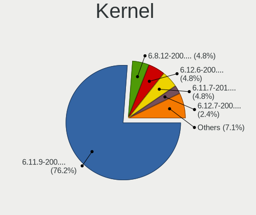

| Version                                                  | Computers | Percent |
|----------------------------------------------------------|-----------|---------|
| 6.0.14-201.fsync.fc36.x86_64                             | 16        | 27.59%  |
| 6.1.4-203.fsync.fc37.x86_64                              | 11        | 18.97%  |
| 6.1.6-203.fsync.fc37.x86_64                              | 8         | 13.79%  |
| 6.0.16-301.fsync.fc37.x86_64                             | 8         | 13.79%  |
| 6.1.6-201.fsync.fc37.x86_64                              | 4         | 6.9%    |
| 6.1.6-202.fsync.fc37.x86_64                              | 2         | 3.45%   |
| 6.0.18-301.fsync.fc37.x86_64                             | 2         | 3.45%   |
| 6.0.15-301.fsync.fc37.x86_64                             | 2         | 3.45%   |
| 6.0.10-201.fc36.x86_64                                   | 2         | 3.45%   |
| 6.2.0-0.rc3.20230109git1fe4fd6f5cad.24.fsync.fc37.x86_64 | 1         | 1.72%   |
| 6.1.8-200.fsync.fc37.x86_64                              | 1         | 1.72%   |
| 5.19.16-201.fsync.fc36.x86_64                            | 1         | 1.72%   |

Kernel Family
-------------

Linux kernel without a distro release

| Version | Computers | Percent |
|---------|-----------|---------|
| 6.0.14  | 16        | 27.59%  |
| 6.1.6   | 14        | 24.14%  |
| 6.1.4   | 11        | 18.97%  |
| 6.0.16  | 8         | 13.79%  |
| 6.0.18  | 2         | 3.45%   |
| 6.0.15  | 2         | 3.45%   |
| 6.0.10  | 2         | 3.45%   |
| 6.2.0   | 1         | 1.72%   |
| 6.1.8   | 1         | 1.72%   |
| 5.19.16 | 1         | 1.72%   |

Kernel Major Ver.
-----------------

Linux kernel major version

| Version | Computers | Percent |
|---------|-----------|---------|
| 6.0     | 30        | 51.72%  |
| 6.1     | 26        | 44.83%  |
| 6.2     | 1         | 1.72%   |
| 5.19    | 1         | 1.72%   |

Arch
----

OS architecture (x86_64, i586, etc.)

| Name   | Computers | Percent |
|--------|-----------|---------|
| x86_64 | 58        | 100%    |

DE
--

Desktop Environment

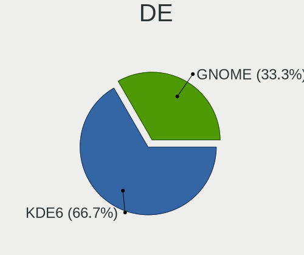

| Name          | Computers | Percent |
|---------------|-----------|---------|
| GNOME         | 44        | 75.86%  |
| KDE5          | 13        | 22.41%  |
| GNOME Classic | 1         | 1.72%   |

Display Server
--------------

X11 or Wayland

| Name    | Computers | Percent |
|---------|-----------|---------|
| Wayland | 46        | 79.31%  |
| X11     | 12        | 20.69%  |

Display Manager
---------------

SDDM, LightDM, etc.

| Name    | Computers | Percent |
|---------|-----------|---------|
| Unknown | 48        | 82.76%  |
| GDM     | 8         | 13.79%  |
| SDDM    | 1         | 1.72%   |
| LightDM | 1         | 1.72%   |

OS Lang
-------

Language

| Lang    | Computers | Percent |
|---------|-----------|---------|
| en_US   | 31        | 53.45%  |
| en_GB   | 5         | 8.62%   |
| de_DE   | 3         | 5.17%   |
| ru_RU   | 2         | 3.45%   |
| pl_PL   | 2         | 3.45%   |
| fr_FR   | 2         | 3.45%   |
| es_MX   | 2         | 3.45%   |
| en_CA   | 2         | 3.45%   |
| tr_TR   | 1         | 1.72%   |
| pt_BR   | 1         | 1.72%   |
| nl_NL   | 1         | 1.72%   |
| nb_NO   | 1         | 1.72%   |
| es_AR   | 1         | 1.72%   |
| en_PH   | 1         | 1.72%   |
| en_IE   | 1         | 1.72%   |
| de_AT   | 1         | 1.72%   |
| Unknown | 1         | 1.72%   |

Boot Mode
---------

EFI or BIOS

| Mode | Computers | Percent |
|------|-----------|---------|
| EFI  | 46        | 79.31%  |
| BIOS | 12        | 20.69%  |

Filesystem
----------

Type of filesystem

| Type  | Computers | Percent |
|-------|-----------|---------|
| Btrfs | 50        | 86.21%  |
| Ext4  | 7         | 12.07%  |
| Xfs   | 1         | 1.72%   |

Part. scheme
------------

Scheme of partitioning

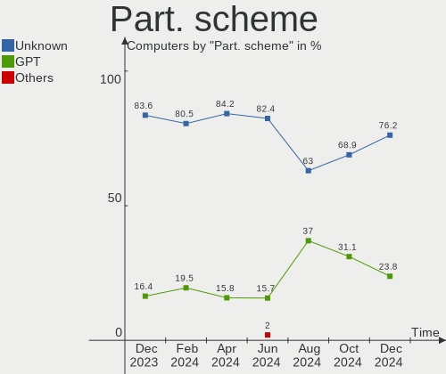

| Type    | Computers | Percent |
|---------|-----------|---------|
| Unknown | 48        | 82.76%  |
| GPT     | 9         | 15.52%  |
| MBR     | 1         | 1.72%   |

Dual Boot with Linux/BSD
------------------------

Hosting more than one Linux/BSD

| Dual boot | Computers | Percent |
|-----------|-----------|---------|
| No        | 56        | 96.55%  |
| Yes       | 2         | 3.45%   |

Dual Boot (Win)
---------------

Hosting Linux and Windows

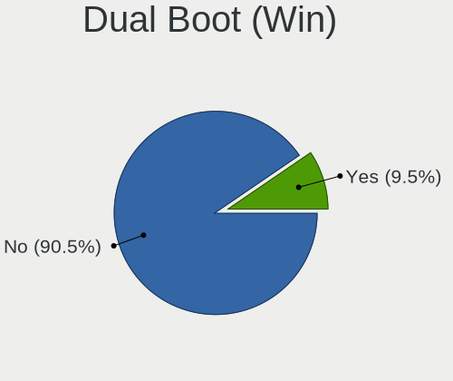

| Dual boot | Computers | Percent |
|-----------|-----------|---------|
| No        | 54        | 93.1%   |
| Yes       | 4         | 6.9%    |

Board
-----

Vendor
------

Motherboard manufacturer

| Name                | Computers | Percent |
|---------------------|-----------|---------|
| ASUSTek Computer    | 18        | 31.03%  |
| MSI                 | 11        | 18.97%  |
| Hewlett-Packard     | 7         | 12.07%  |
| Lenovo              | 6         | 10.34%  |
| Gigabyte Technology | 4         | 6.9%    |
| ASRock              | 4         | 6.9%    |
| Samsung Electronics | 1         | 1.72%   |
| Positivo            | 1         | 1.72%   |
| Notebook            | 1         | 1.72%   |
| Monster             | 1         | 1.72%   |
| Medion              | 1         | 1.72%   |
| AZW                 | 1         | 1.72%   |
| Apple               | 1         | 1.72%   |
| Acer                | 1         | 1.72%   |

Model
-----

Motherboard model

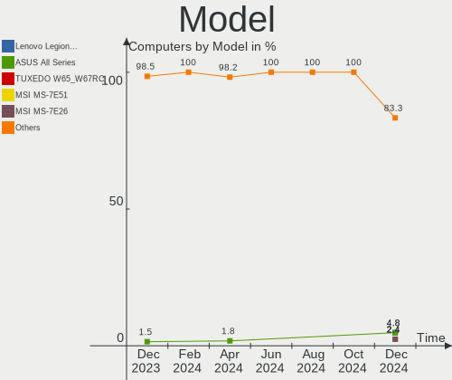

| Name                                                     | Computers | Percent |
|----------------------------------------------------------|-----------|---------|
| MSI MS-7B86                                              | 2         | 3.45%   |
| Samsung R520/R522/R620                                   | 1         | 1.72%   |
| Positivo N1240                                           | 1         | 1.72%   |
| Notebook NP5x_NP6x_NP7xHP                                | 1         | 1.72%   |
| MSI MS-7D17                                              | 1         | 1.72%   |
| MSI MS-7C91                                              | 1         | 1.72%   |
| MSI MS-7C75                                              | 1         | 1.72%   |
| MSI MS-7C37                                              | 1         | 1.72%   |
| MSI MS-7B79                                              | 1         | 1.72%   |
| MSI MS-7B50                                              | 1         | 1.72%   |
| MSI MS-7597                                              | 1         | 1.72%   |
| MSI Katana GF76 11UD                                     | 1         | 1.72%   |
| MSI GT680R/GX680R/GT683R/GT683DXR/GT685R/GT687R/GX660DXR | 1         | 1.72%   |
| Monster ABRA A7 V12.1                                    | 1         | 1.72%   |
| Medion GUARDIAN X10                                      | 1         | 1.72%   |
| Lenovo ThinkPad T460 20FMS79000                          | 1         | 1.72%   |
| Lenovo ThinkPad P51 20HJS02H00                           | 1         | 1.72%   |
| Lenovo Legion 5 17ACH6H 82JY                             | 1         | 1.72%   |
| Lenovo Legion 5 15ARH05 82B5                             | 1         | 1.72%   |
| Lenovo IdeaPad Gaming 3 15ARH05 82EY                     | 1         | 1.72%   |
| Lenovo IdeaPad 3 15ALC6 82KU                             | 1         | 1.72%   |
| HP ZBook 15u G3                                          | 1         | 1.72%   |
| HP Pavilion Notebook                                     | 1         | 1.72%   |
| HP Pavilion 15                                           | 1         | 1.72%   |
| HP ENVY x360 Convertible 15-eu0xxx                       | 1         | 1.72%   |
| HP EliteDesk 800 G2 SFF                                  | 1         | 1.72%   |
| HP EliteBook 840 G1                                      | 1         | 1.72%   |
| HP Compaq 6200 Pro SFF PC                                | 1         | 1.72%   |
| Gigabyte Z77-D3H                                         | 1         | 1.72%   |
| Gigabyte F2A88XM-D3H                                     | 1         | 1.72%   |
| Gigabyte B550M DS3H                                      | 1         | 1.72%   |
| Gigabyte B450 AORUS M                                    | 1         | 1.72%   |
| AZW S3                                                   | 1         | 1.72%   |
| ASUS TUF Gaming X570-PLUS                                | 1         | 1.72%   |
| ASUS TUF Gaming FX505DT_FX505DT                          | 1         | 1.72%   |
| ASUS TUF Gaming B550M-PLUS                               | 1         | 1.72%   |
| ASUS ROG Zephyrus G14 GA402RK_GA402RK                    | 1         | 1.72%   |
| ASUS ROG STRIX Z490-F GAMING                             | 1         | 1.72%   |
| ASUS ROG Strix G713RM_G713RM                             | 1         | 1.72%   |
| ASUS ROG STRIX B650E-I GAMING WIFI                       | 1         | 1.72%   |

Model Family
------------

Motherboard model prefix

| Name                 | Computers | Percent |
|----------------------|-----------|---------|
| ASUS ROG             | 9         | 15.52%  |
| ASUS TUF             | 3         | 5.17%   |
| ASUS PRIME           | 3         | 5.17%   |
| MSI MS-7B86          | 2         | 3.45%   |
| Lenovo ThinkPad      | 2         | 3.45%   |
| Lenovo Legion        | 2         | 3.45%   |
| Lenovo IdeaPad       | 2         | 3.45%   |
| HP Pavilion          | 2         | 3.45%   |
| Samsung R520         | 1         | 1.72%   |
| Positivo N1240       | 1         | 1.72%   |
| Notebook NP5x        | 1         | 1.72%   |
| MSI MS-7D17          | 1         | 1.72%   |
| MSI MS-7C91          | 1         | 1.72%   |
| MSI MS-7C75          | 1         | 1.72%   |
| MSI MS-7C37          | 1         | 1.72%   |
| MSI MS-7B79          | 1         | 1.72%   |
| MSI MS-7B50          | 1         | 1.72%   |
| MSI MS-7597          | 1         | 1.72%   |
| MSI Katana           | 1         | 1.72%   |
| MSI GT680R           | 1         | 1.72%   |
| Monster ABRA         | 1         | 1.72%   |
| Medion GUARDIAN      | 1         | 1.72%   |
| HP ZBook             | 1         | 1.72%   |
| HP ENVY              | 1         | 1.72%   |
| HP EliteDesk         | 1         | 1.72%   |
| HP EliteBook         | 1         | 1.72%   |
| HP Compaq            | 1         | 1.72%   |
| Gigabyte Z77-D3H     | 1         | 1.72%   |
| Gigabyte F2A88XM-D3H | 1         | 1.72%   |
| Gigabyte B550M       | 1         | 1.72%   |
| Gigabyte B450        | 1         | 1.72%   |
| AZW S3               | 1         | 1.72%   |
| ASUS P9X79           | 1         | 1.72%   |
| ASUS G20AJ           | 1         | 1.72%   |
| ASUS All             | 1         | 1.72%   |
| ASRock X570          | 1         | 1.72%   |
| ASRock X470          | 1         | 1.72%   |
| ASRock H77M-ITX      | 1         | 1.72%   |
| ASRock B450          | 1         | 1.72%   |
| Apple MacBook5       | 1         | 1.72%   |

MFG Year
--------

Motherboard manufacture year

| Year | Computers | Percent |
|------|-----------|---------|
| 2020 | 10        | 17.24%  |
| 2021 | 9         | 15.52%  |
| 2019 | 9         | 15.52%  |
| 2022 | 6         | 10.34%  |
| 2018 | 6         | 10.34%  |
| 2013 | 3         | 5.17%   |
| 2012 | 3         | 5.17%   |
| 2009 | 3         | 5.17%   |
| 2017 | 2         | 3.45%   |
| 2016 | 2         | 3.45%   |
| 2014 | 2         | 3.45%   |
| 2011 | 2         | 3.45%   |
| 2015 | 1         | 1.72%   |

Form Factor
-----------

Physical design of the computer

| Name        | Computers | Percent |
|-------------|-----------|---------|
| Desktop     | 32        | 55.17%  |
| Notebook    | 24        | 41.38%  |
| Convertible | 1         | 1.72%   |
| Mini pc     | 1         | 1.72%   |

Secure Boot
-----------

Enabled or disabled

| State    | Computers | Percent |
|----------|-----------|---------|
| Disabled | 58        | 100%    |

Coreboot
--------

Have coreboot on board

| Used | Computers | Percent |
|------|-----------|---------|
| No   | 58        | 100%    |

RAM Size
--------

Total RAM memory

| Size in GB  | Computers | Percent |
|-------------|-----------|---------|
| 32.01-64.0  | 17        | 29.31%  |
| 16.01-24.0  | 16        | 27.59%  |
| 8.01-16.0   | 11        | 18.97%  |
| 4.01-8.0    | 6         | 10.34%  |
| 24.01-32.0  | 4         | 6.9%    |
| 3.01-4.0    | 3         | 5.17%   |
| 64.01-256.0 | 1         | 1.72%   |

RAM Used
--------

Used RAM memory

| Used GB   | Computers | Percent |
|-----------|-----------|---------|
| 4.01-8.0  | 30        | 51.72%  |
| 3.01-4.0  | 10        | 17.24%  |
| 2.01-3.0  | 10        | 17.24%  |
| 8.01-16.0 | 8         | 13.79%  |

Total Drives
------------

Number of drives on board

| Drives | Computers | Percent |
|--------|-----------|---------|
| 1      | 22        | 37.93%  |
| 2      | 15        | 25.86%  |
| 3      | 11        | 18.97%  |
| 5      | 6         | 10.34%  |
| 4      | 4         | 6.9%    |

Has CD-ROM
----------

Has CD-ROM on board

| Presented | Computers | Percent |
|-----------|-----------|---------|
| No        | 45        | 77.59%  |
| Yes       | 13        | 22.41%  |

Has Ethernet
------------

Has Ethernet on board

| Presented | Computers | Percent |
|-----------|-----------|---------|
| Yes       | 52        | 89.66%  |
| No        | 6         | 10.34%  |

Has WiFi
--------

Has WiFi module

| Presented | Computers | Percent |
|-----------|-----------|---------|
| Yes       | 46        | 79.31%  |
| No        | 12        | 20.69%  |

Has Bluetooth
-------------

Has Bluetooth module

| Presented | Computers | Percent |
|-----------|-----------|---------|
| Yes       | 42        | 72.41%  |
| No        | 16        | 27.59%  |

Location
--------

Country
-------

Geographic location (country)

| Country      | Computers | Percent |
|--------------|-----------|---------|
| USA          | 13        | 22.41%  |
| Germany      | 5         | 8.62%   |
| Poland       | 4         | 6.9%    |
| France       | 4         | 6.9%    |
| UK           | 3         | 5.17%   |
| Russia       | 3         | 5.17%   |
| Mexico       | 3         | 5.17%   |
| Sweden       | 2         | 3.45%   |
| Spain        | 2         | 3.45%   |
| Canada       | 2         | 3.45%   |
| Brazil       | 2         | 3.45%   |
| Argentina    | 2         | 3.45%   |
| Ukraine      | 1         | 1.72%   |
| Turkey       | 1         | 1.72%   |
| Saudi Arabia | 1         | 1.72%   |
| Romania      | 1         | 1.72%   |
| Philippines  | 1         | 1.72%   |
| Norway       | 1         | 1.72%   |
| Netherlands  | 1         | 1.72%   |
| Kuwait       | 1         | 1.72%   |
| Italy        | 1         | 1.72%   |
| Ireland      | 1         | 1.72%   |
| Indonesia    | 1         | 1.72%   |
| Bulgaria     | 1         | 1.72%   |
| Austria      | 1         | 1.72%   |

City
----

Geographic location (city)

| City                      | Computers | Percent |
|---------------------------|-----------|---------|
| Wroclaw                   | 2         | 3.45%   |
| Valladolid                | 2         | 3.45%   |
| Guadalajara               | 2         | 3.45%   |
| Vouziers                  | 1         | 1.72%   |
| Vladivostok               | 1         | 1.72%   |
| Ulm                       | 1         | 1.72%   |
| Uhldingen-Muhlhofen       | 1         | 1.72%   |
| Tübingen                 | 1         | 1.72%   |
| Stockholm                 | 1         | 1.72%   |
| Sosnowiec                 | 1         | 1.72%   |
| Sofia                     | 1         | 1.72%   |
| Sao Paulo                 | 1         | 1.72%   |
| San Juan del Río         | 1         | 1.72%   |
| San Diego                 | 1         | 1.72%   |
| Saint Paul                | 1         | 1.72%   |
| Rosario                   | 1         | 1.72%   |
| Rome                      | 1         | 1.72%   |
| River Grove               | 1         | 1.72%   |
| Rejomulyo                 | 1         | 1.72%   |
| Reimlingen                | 1         | 1.72%   |
| Plano                     | 1         | 1.72%   |
| Perm                      | 1         | 1.72%   |
| Pantelimon                | 1         | 1.72%   |
| Oughterard                | 1         | 1.72%   |
| Oslo                      | 1         | 1.72%   |
| Odesa                     | 1         | 1.72%   |
| Nicholasville             | 1         | 1.72%   |
| Nice                      | 1         | 1.72%   |
| Niagara-on-the-Lake       | 1         | 1.72%   |
| New York                  | 1         | 1.72%   |
| Neukirchen an der Voeckla | 1         | 1.72%   |
| Nashville                 | 1         | 1.72%   |
| Nanterre                  | 1         | 1.72%   |
| Moscow                    | 1         | 1.72%   |
| Moelndal                  | 1         | 1.72%   |
| Minneapolis               | 1         | 1.72%   |
| Mansfield                 | 1         | 1.72%   |
| Longmont                  | 1         | 1.72%   |
| Lelystad                  | 1         | 1.72%   |
| Lanus                     | 1         | 1.72%   |

Drives
------

Drive Vendor
------------

Hard drive vendors

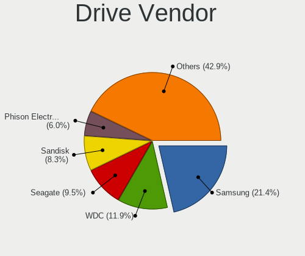

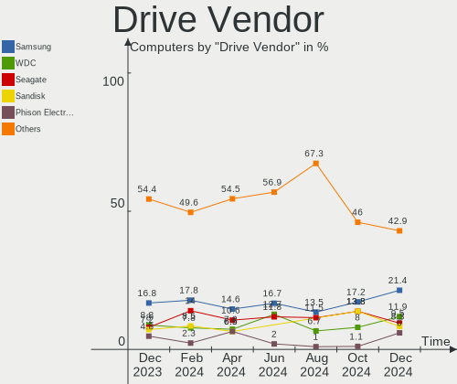

| Vendor                      | Computers | Drives | Percent |
|-----------------------------|-----------|--------|---------|
| Samsung Electronics         | 23        | 31     | 20%     |
| WDC                         | 10        | 14     | 8.7%    |
| Seagate                     | 10        | 12     | 8.7%    |
| Kingston                    | 10        | 10     | 8.7%    |
| Toshiba                     | 7         | 7      | 6.09%   |
| Crucial                     | 7         | 9      | 6.09%   |
| Sandisk                     | 5         | 5      | 4.35%   |
| Phison Electronics          | 5         | 5      | 4.35%   |
| Intel                       | 4         | 5      | 3.48%   |
| PNY                         | 3         | 3      | 2.61%   |
| Micron/Crucial Technology   | 3         | 3      | 2.61%   |
| Micron Technology           | 3         | 3      | 2.61%   |
| SPCC                        | 2         | 2      | 1.74%   |
| Kingston Technology Company | 2         | 2      | 1.74%   |
| China                       | 2         | 2      | 1.74%   |
| Apple                       | 2         | 2      | 1.74%   |
| USB3.0                      | 1         | 1      | 0.87%   |
| SK hynix                    | 1         | 1      | 0.87%   |
| Silicon Motion              | 1         | 1      | 0.87%   |
| Realtek Semiconductor       | 1         | 1      | 0.87%   |
| PNY CS90                    | 1         | 1      | 0.87%   |
| Patriot                     | 1         | 1      | 0.87%   |
| Mushkin                     | 1         | 1      | 0.87%   |
| Maxtor                      | 1         | 1      | 0.87%   |
| MAXIO Technology (Hangzhou) | 1         | 1      | 0.87%   |
| KIOXIA                      | 1         | 1      | 0.87%   |
| HS-SSD-E100N                | 1         | 1      | 0.87%   |
| Hitachi                     | 1         | 1      | 0.87%   |
| HGST                        | 1         | 1      | 0.87%   |
| Emtec                       | 1         | 1      | 0.87%   |
| Drevo                       | 1         | 1      | 0.87%   |
| ADATA Technology            | 1         | 1      | 0.87%   |
| A-DATA Technology           | 1         | 1      | 0.87%   |

Drive Model
-----------

Hard drive models

| Model                                                 | Computers | Percent |
|-------------------------------------------------------|-----------|---------|
| Kingston SA400S37240G 240GB SSD                       | 6         | 4.69%   |
| Samsung NVMe SSD Controller SM981/PM981/PM983 500GB   | 4         | 3.13%   |
| Samsung NVMe SSD Controller PM9A1/PM9A3/980PRO 512GB  | 4         | 3.13%   |
| Phison E12 NVMe Controller 1TB                        | 3         | 2.34%   |
| Toshiba MQ01ABD100 1TB                                | 2         | 1.56%   |
| Toshiba DT01ACA200 2TB                                | 2         | 1.56%   |
| Toshiba DT01ACA100 1TB                                | 2         | 1.56%   |
| Seagate ST1000DM003-1ER162 1TB                        | 2         | 1.56%   |
| Sandisk WD Blue SN500 / PC SN520 NVMe SSD 512GB       | 2         | 1.56%   |
| Samsung SSD 970 EVO Plus 500GB                        | 2         | 1.56%   |
| Samsung SSD 850 EVO 250GB                             | 2         | 1.56%   |
| Samsung SSD 840 EVO 120GB                             | 2         | 1.56%   |
| Samsung NVMe SSD Controller SM961/PM961/SM963 256GB   | 2         | 1.56%   |
| Micron/Crucial P2 NVMe PCIe SSD 500GB                 | 2         | 1.56%   |
| Micron 2450_MTFDKBA1T0TFK 1TB                         | 2         | 1.56%   |
| Intel SSD 660P Series 512GB                           | 2         | 1.56%   |
| Crucial CT1000MX500SSD1 1TB                           | 2         | 1.56%   |
| WDC WD80EFAX-68KNBN0 8TB                              | 1         | 0.78%   |
| WDC WD6001FZWX-00A2VA0 6TB                            | 1         | 0.78%   |
| WDC WD5000LPCX-00VHAT0 500GB                          | 1         | 0.78%   |
| WDC WD5000AAKX-003CA0 500GB                           | 1         | 0.78%   |
| WDC WD3200BEVT-22A0RT0 320GB                          | 1         | 0.78%   |
| WDC WD25EZRS-00J99B0 2TB                              | 1         | 0.78%   |
| WDC WD20EZRZ-00Z5HB0 2TB                              | 1         | 0.78%   |
| WDC WD20EARX-00AZ6B0 2TB                              | 1         | 0.78%   |
| WDC WD20EARS-00MVWB0 2TB                              | 1         | 0.78%   |
| WDC WD20EARS-00J99B0 2TB                              | 1         | 0.78%   |
| WDC WD10EZEX-60WN4A1 1TB                              | 1         | 0.78%   |
| WDC WD10EADS-00M2B0 1TB                               | 1         | 0.78%   |
| WDC WD Green 2.5 240GB                                | 1         | 0.78%   |
| USB3.0 SSD 240GB                                      | 1         | 0.78%   |
| Toshiba XG6 NVMe SSD Controller 512GB                 | 1         | 0.78%   |
| SPCC Solid State Disk 120GB                           | 1         | 0.78%   |
| SPCC Solid State Disk 1024GB                          | 1         | 0.78%   |
| SK hynix BC511 512GB                                  | 1         | 0.78%   |
| Silicon Motion SM2263EN/SM2263XT SSD Controller 512GB | 1         | 0.78%   |
| Seagate ST95005620AS 500GB                            | 1         | 0.78%   |
| Seagate ST8000VN0022-2EL112 8TB                       | 1         | 0.78%   |
| Seagate ST3500413AS 500GB                             | 1         | 0.78%   |
| Seagate ST31000524AS 1TB                              | 1         | 0.78%   |

HDD Vendor
----------

Hard disk drive vendors

| Vendor              | Computers | Drives | Percent |
|---------------------|-----------|--------|---------|
| WDC                 | 10        | 13     | 30.3%   |
| Seagate             | 10        | 12     | 30.3%   |
| Toshiba             | 6         | 6      | 18.18%  |
| Samsung Electronics | 2         | 2      | 6.06%   |
| Apple               | 2         | 2      | 6.06%   |
| Maxtor              | 1         | 1      | 3.03%   |
| Hitachi             | 1         | 1      | 3.03%   |
| HGST                | 1         | 1      | 3.03%   |

SSD Vendor
----------

Solid state drive vendors

| Vendor              | Computers | Drives | Percent |
|---------------------|-----------|--------|---------|
| Samsung Electronics | 9         | 11     | 20.93%  |
| Kingston            | 9         | 9      | 20.93%  |
| Crucial             | 7         | 9      | 16.28%  |
| PNY                 | 3         | 3      | 6.98%   |
| SPCC                | 2         | 2      | 4.65%   |
| SanDisk             | 2         | 2      | 4.65%   |
| China               | 2         | 2      | 4.65%   |
| WDC                 | 1         | 1      | 2.33%   |
| USB3.0              | 1         | 1      | 2.33%   |
| PNY CS90            | 1         | 1      | 2.33%   |
| Patriot             | 1         | 1      | 2.33%   |
| Mushkin             | 1         | 1      | 2.33%   |
| Intel               | 1         | 1      | 2.33%   |
| Emtec               | 1         | 1      | 2.33%   |
| Drevo               | 1         | 1      | 2.33%   |
| A-DATA Technology   | 1         | 1      | 2.33%   |

Drive Kind
----------

HDD or SSD

| Kind    | Computers | Drives | Percent |
|---------|-----------|--------|---------|
| NVMe    | 36        | 46     | 37.5%   |
| SSD     | 32        | 47     | 33.33%  |
| HDD     | 27        | 38     | 28.13%  |
| Unknown | 1         | 1      | 1.04%   |

Drive Connector
---------------

SATA, SAS, NVMe, etc.

| Type | Computers | Drives | Percent |
|------|-----------|--------|---------|
| SATA | 41        | 83     | 51.9%   |
| NVMe | 36        | 46     | 45.57%  |
| SAS  | 2         | 3      | 2.53%   |

Drive Size
----------

Size of hard drive

| Size in TB | Computers | Drives | Percent |
|------------|-----------|--------|---------|
| 0.01-0.5   | 28        | 41     | 43.75%  |
| 0.51-1.0   | 20        | 22     | 31.25%  |
| 1.01-2.0   | 13        | 17     | 20.31%  |
| 4.01-10.0  | 2         | 3      | 3.13%   |
| 10.01-20.0 | 1         | 2      | 1.56%   |

Space Total
-----------

Amount of disk space available on the file system

| Size in GB     | Computers | Percent |
|----------------|-----------|---------|
| 1001-2000      | 14        | 24.14%  |
| 251-500        | 11        | 18.97%  |
| 501-1000       | 11        | 18.97%  |
| More than 3000 | 9         | 15.52%  |
| 101-250        | 8         | 13.79%  |
| 2001-3000      | 3         | 5.17%   |
| 21-50          | 1         | 1.72%   |
| Unknown        | 1         | 1.72%   |

Space Used
----------

Amount of used disk space

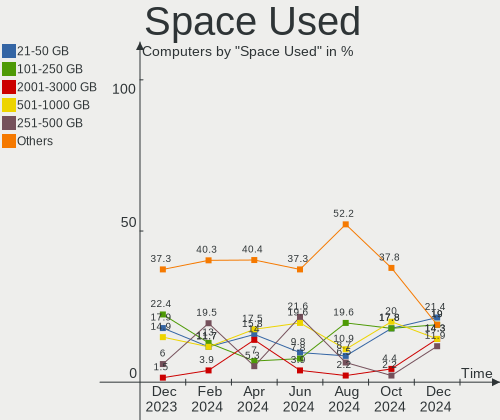

| Used GB        | Computers | Percent |
|----------------|-----------|---------|
| 21-50          | 20        | 34.48%  |
| 251-500        | 7         | 12.07%  |
| 101-250        | 7         | 12.07%  |
| More than 3000 | 5         | 8.62%   |
| 1-20           | 5         | 8.62%   |
| 51-100         | 5         | 8.62%   |
| 501-1000       | 4         | 6.9%    |
| 2001-3000      | 2         | 3.45%   |
| 1001-2000      | 2         | 3.45%   |
| Unknown        | 1         | 1.72%   |

Malfunc. Drives
---------------

Drive models with a malfunction

Zero info for selected period =(

Malfunc. Drive Vendor
---------------------

Vendors of faulty drives

Zero info for selected period =(

Malfunc. HDD Vendor
-------------------

Vendors of faulty HDD drives

Zero info for selected period =(

Malfunc. Drive Kind
-------------------

Kinds of faulty drives

Zero info for selected period =(

Failed Drives
-------------

Failed drive models

Zero info for selected period =(

Failed Drive Vendor
-------------------

Failed drive vendors

Zero info for selected period =(

Drive Status
------------

Number of failed and malfunc. drives

| Status   | Computers | Drives | Percent |
|----------|-----------|--------|---------|
| Detected | 48        | 108    | 82.76%  |
| Works    | 10        | 24     | 17.24%  |

Storage controller
------------------

Storage Vendor
--------------

Storage controller vendors

| Vendor                       | Computers | Percent |
|------------------------------|-----------|---------|
| Intel                        | 27        | 28.13%  |
| AMD                          | 24        | 25%     |
| Samsung Electronics          | 16        | 16.67%  |
| Phison Electronics           | 5         | 5.21%   |
| SanDisk                      | 3         | 3.13%   |
| Micron/Crucial Technology    | 3         | 3.13%   |
| Micron Technology            | 3         | 3.13%   |
| Kingston Technology Company  | 3         | 3.13%   |
| Nvidia                       | 2         | 2.08%   |
| ASMedia Technology           | 2         | 2.08%   |
| Toshiba America Info Systems | 1         | 1.04%   |
| SK hynix                     | 1         | 1.04%   |
| Silicon Motion               | 1         | 1.04%   |
| Realtek Semiconductor        | 1         | 1.04%   |
| MAXIO Technology (Hangzhou)  | 1         | 1.04%   |
| Marvell Technology Group     | 1         | 1.04%   |
| KIOXIA                       | 1         | 1.04%   |
| ADATA Technology             | 1         | 1.04%   |

Storage Model
-------------

Storage controller models

| Model                                                                         | Computers | Percent |
|-------------------------------------------------------------------------------|-----------|---------|
| AMD FCH SATA Controller [AHCI mode]                                           | 16        | 14.55%  |
| AMD 400 Series Chipset SATA Controller                                        | 9         | 8.18%   |
| Samsung NVMe SSD Controller SM981/PM981/PM983                                 | 7         | 6.36%   |
| Samsung NVMe SSD Controller PM9A1/PM9A3/980PRO                                | 4         | 3.64%   |
| Samsung NVMe SSD Controller 980                                               | 4         | 3.64%   |
| AMD 500 Series Chipset SATA Controller                                        | 4         | 3.64%   |
| Phison E12 NVMe Controller                                                    | 3         | 2.73%   |
| Micron Non-Volatile memory controller                                         | 3         | 2.73%   |
| Intel Volume Management Device NVMe RAID Controller                           | 3         | 2.73%   |
| Intel Sunrise Point-LP SATA Controller [AHCI mode]                            | 3         | 2.73%   |
| Intel 500 Series Chipset Family SATA AHCI Controller                          | 3         | 2.73%   |
| SanDisk WD Blue SN500 / PC SN520 NVMe SSD                                     | 2         | 1.82%   |
| Samsung NVMe SSD Controller SM961/PM961/SM963                                 | 2         | 1.82%   |
| Micron/Crucial P2 NVMe PCIe SSD                                               | 2         | 1.82%   |
| Intel SSD 660P Series                                                         | 2         | 1.82%   |
| Intel Comet Lake SATA AHCI Controller                                         | 2         | 1.82%   |
| Intel Cannon Lake PCH SATA AHCI Controller                                    | 2         | 1.82%   |
| Intel 8 Series SATA Controller 1 [AHCI mode]                                  | 2         | 1.82%   |
| Intel 400 Series Chipset Family SATA AHCI Controller                          | 2         | 1.82%   |
| ASMedia ASM1062 Serial ATA Controller                                         | 2         | 1.82%   |
| Toshiba America Info Systems XG6 NVMe SSD Controller                          | 1         | 0.91%   |
| SK hynix BC511                                                                | 1         | 0.91%   |
| Silicon Motion SM2263EN/SM2263XT SSD Controller                               | 1         | 0.91%   |
| SanDisk Non-Volatile memory controller                                        | 1         | 0.91%   |
| Samsung NVMe SSD Controller SM951/PM951                                       | 1         | 0.91%   |
| Realtek RTS5763DL NVMe SSD Controller                                         | 1         | 0.91%   |
| Phison PS5013 E13 NVMe Controller                                             | 1         | 0.91%   |
| Phison NVMe Storage Controller                                                | 1         | 0.91%   |
| Nvidia MCP79 AHCI Controller                                                  | 1         | 0.91%   |
| Nvidia MCP61 SATA Controller                                                  | 1         | 0.91%   |
| Nvidia MCP61 IDE                                                              | 1         | 0.91%   |
| Micron/Crucial Non-Volatile memory controller                                 | 1         | 0.91%   |
| MAXIO (Hangzhou) NVMe SSD Controller MAP1202                                  | 1         | 0.91%   |
| Marvell Group 88SE9128 PCIe SATA 6 Gb/s RAID controller with HyperDuo         | 1         | 0.91%   |
| KIOXIA NVMe SSD Controller BG4                                                | 1         | 0.91%   |
| Kingston Company Company Non-Volatile memory controller                       | 1         | 0.91%   |
| Kingston Company OM3PDP3 NVMe SSD                                             | 1         | 0.91%   |
| Kingston Company A2000 NVMe SSD                                               | 1         | 0.91%   |
| Intel SATA Controller [RAID mode]                                             | 1         | 0.91%   |
| Intel Q170/Q150/B150/H170/H110/Z170/CM236 Chipset SATA Controller [AHCI Mode] | 1         | 0.91%   |

Storage Kind
------------

Kind of storage controller (IDE, SATA, NVMe, SAS, ...)

| Kind | Computers | Percent |
|------|-----------|---------|
| SATA | 48        | 53.33%  |
| NVMe | 36        | 40%     |
| RAID | 4         | 4.44%   |
| IDE  | 2         | 2.22%   |

Processor
---------

CPU Vendor
----------

Processor vendors

| Vendor | Computers | Percent |
|--------|-----------|---------|
| AMD    | 30        | 51.72%  |
| Intel  | 28        | 48.28%  |

CPU Model
---------

Processor models

| Model                                         | Computers | Percent |
|-----------------------------------------------|-----------|---------|
| AMD Ryzen 7 3700X 8-Core Processor            | 3         | 5.17%   |
| AMD Ryzen 5 5600G with Radeon Graphics        | 3         | 5.17%   |
| Intel Core i7-6500U CPU @ 2.50GHz             | 2         | 3.45%   |
| Intel 11th Gen Core i7-11800H @ 2.30GHz       | 2         | 3.45%   |
| AMD Ryzen 9 5950X 16-Core Processor           | 2         | 3.45%   |
| AMD Ryzen 9 5900X 12-Core Processor           | 2         | 3.45%   |
| AMD Ryzen 5 5600X 6-Core Processor            | 2         | 3.45%   |
| AMD Ryzen 5 5500U with Radeon Graphics        | 2         | 3.45%   |
| AMD Ryzen 5 2600 Six-Core Processor           | 2         | 3.45%   |
| Intel Pentium Dual-Core CPU T4200 @ 2.00GHz   | 1         | 1.72%   |
| Intel Core i9-9900K CPU @ 3.60GHz             | 1         | 1.72%   |
| Intel Core i7-9700 CPU @ 3.00GHz              | 1         | 1.72%   |
| Intel Core i7-7820HQ CPU @ 2.90GHz            | 1         | 1.72%   |
| Intel Core i7-4790 CPU @ 3.60GHz              | 1         | 1.72%   |
| Intel Core i7-3960X CPU @ 3.30GHz             | 1         | 1.72%   |
| Intel Core i7-3770K CPU @ 3.50GHz             | 1         | 1.72%   |
| Intel Core i7-3770 CPU @ 3.40GHz              | 1         | 1.72%   |
| Intel Core i7-2670QM CPU @ 2.20GHz            | 1         | 1.72%   |
| Intel Core i7-10750H CPU @ 2.60GHz            | 1         | 1.72%   |
| Intel Core i7-10700K CPU @ 3.80GHz            | 1         | 1.72%   |
| Intel Core i5-8600K CPU @ 3.60GHz             | 1         | 1.72%   |
| Intel Core i5-6500 CPU @ 3.20GHz              | 1         | 1.72%   |
| Intel Core i5-6300U CPU @ 2.40GHz             | 1         | 1.72%   |
| Intel Core i5-4690K CPU @ 3.50GHz             | 1         | 1.72%   |
| Intel Core i5-4300U CPU @ 1.90GHz             | 1         | 1.72%   |
| Intel Core i5-2500 CPU @ 3.30GHz              | 1         | 1.72%   |
| Intel Core i5-10600K CPU @ 4.10GHz            | 1         | 1.72%   |
| Intel Core i5-10300H CPU @ 2.50GHz            | 1         | 1.72%   |
| Intel Core i3-4030U CPU @ 1.90GHz             | 1         | 1.72%   |
| Intel Core 2 Duo CPU P7350 @ 2.00GHz          | 1         | 1.72%   |
| Intel Celeron N4000 CPU @ 1.10GHz             | 1         | 1.72%   |
| Intel 12th Gen Core i5-1240P                  | 1         | 1.72%   |
| Intel 11th Gen Core i5-11400 @ 2.60GHz        | 1         | 1.72%   |
| AMD Ryzen 9 6900HS with Radeon Graphics       | 1         | 1.72%   |
| AMD Ryzen 9 5900HS with Radeon Graphics       | 1         | 1.72%   |
| AMD Ryzen 7 6800H with Radeon Graphics        | 1         | 1.72%   |
| AMD Ryzen 7 5800H with Radeon Graphics        | 1         | 1.72%   |
| AMD Ryzen 7 5700G with Radeon Graphics        | 1         | 1.72%   |
| AMD Ryzen 7 4800H with Radeon Graphics        | 1         | 1.72%   |
| AMD Ryzen 7 3750H with Radeon Vega Mobile Gfx | 1         | 1.72%   |

CPU Model Family
----------------

Processor model prefix

| Model                   | Computers | Percent |
|-------------------------|-----------|---------|
| AMD Ryzen 5             | 13        | 22.41%  |
| Intel Core i7           | 11        | 18.97%  |
| AMD Ryzen 7             | 9         | 15.52%  |
| Intel Core i5           | 8         | 13.79%  |
| AMD Ryzen 9             | 6         | 10.34%  |
| Other                   | 4         | 6.9%    |
| Intel Pentium Dual-Core | 1         | 1.72%   |
| Intel Core i9           | 1         | 1.72%   |
| Intel Core i3           | 1         | 1.72%   |
| Intel Core 2 Duo        | 1         | 1.72%   |
| Intel Celeron           | 1         | 1.72%   |
| AMD Phenom II X4        | 1         | 1.72%   |
| AMD A4                  | 1         | 1.72%   |

CPU Cores
---------

Number of processor cores

| Number | Computers | Percent |
|--------|-----------|---------|
| 6      | 17        | 29.31%  |
| 8      | 15        | 25.86%  |
| 4      | 12        | 20.69%  |
| 2      | 8         | 13.79%  |
| 12     | 3         | 5.17%   |
| 16     | 2         | 3.45%   |
| 1      | 1         | 1.72%   |

CPU Sockets
-----------

Number of sockets

| Number | Computers | Percent |
|--------|-----------|---------|
| 1      | 58        | 100%    |

CPU Threads
-----------

Threads per core (Hyper-Threading)

| Number | Computers | Percent |
|--------|-----------|---------|
| 2      | 49        | 84.48%  |
| 1      | 9         | 15.52%  |

CPU Op-Modes
------------

CPU Operation Modes (32-bit, 64-bit)

| Op mode        | Computers | Percent |
|----------------|-----------|---------|
| 32-bit, 64-bit | 58        | 100%    |

CPU Microcode
-------------

Microcode number

| Number     | Computers | Percent |
|------------|-----------|---------|
| 0x0a50000c | 4         | 6.9%    |
| 0x406e3    | 3         | 5.17%   |
| 0xa0655    | 2         | 3.45%   |
| 0xa0652    | 2         | 3.45%   |
| 0x806d1    | 2         | 3.45%   |
| 0x40651    | 2         | 3.45%   |
| 0x306c3    | 2         | 3.45%   |
| 0x306a9    | 2         | 3.45%   |
| 0x206a7    | 2         | 3.45%   |
| 0x0a50000d | 2         | 3.45%   |
| 0x0a201205 | 2         | 3.45%   |
| 0x08701021 | 2         | 3.45%   |
| 0x08701013 | 2         | 3.45%   |
| 0x08608103 | 2         | 3.45%   |
| 0x0800820d | 2         | 3.45%   |
| 0xa0671    | 1         | 1.72%   |
| 0x906ed    | 1         | 1.72%   |
| 0x906ec    | 1         | 1.72%   |
| 0x906ea    | 1         | 1.72%   |
| 0x906e9    | 1         | 1.72%   |
| 0x906a3    | 1         | 1.72%   |
| 0x706a1    | 1         | 1.72%   |
| 0x506e3    | 1         | 1.72%   |
| 0x206d7    | 1         | 1.72%   |
| 0x1067a    | 1         | 1.72%   |
| 0x10676    | 1         | 1.72%   |
| 0x0a601203 | 1         | 1.72%   |
| 0x0a404102 | 1         | 1.72%   |
| 0x0a404101 | 1         | 1.72%   |
| 0x0a20120a | 1         | 1.72%   |
| 0x0a201204 | 1         | 1.72%   |
| 0x0a201016 | 1         | 1.72%   |
| 0x0a201009 | 1         | 1.72%   |
| 0x08600104 | 1         | 1.72%   |
| 0x08108109 | 1         | 1.72%   |
| 0x08108102 | 1         | 1.72%   |
| 0x0800820b | 1         | 1.72%   |
| 0x06001119 | 1         | 1.72%   |
| 0x01000086 | 1         | 1.72%   |
| Unknown    | 1         | 1.72%   |

CPU Microarch
-------------

Microarchitecture

| Name             | Computers | Percent |
|------------------|-----------|---------|
| Zen 3            | 12        | 20.69%  |
| Zen 2            | 6         | 10.34%  |
| Zen+             | 5         | 8.62%   |
| Unknown          | 5         | 8.62%   |
| Skylake          | 4         | 6.9%    |
| KabyLake         | 4         | 6.9%    |
| Haswell          | 4         | 6.9%    |
| CometLake        | 4         | 6.9%    |
| SandyBridge      | 3         | 5.17%   |
| Icelake          | 3         | 5.17%   |
| Penryn           | 2         | 3.45%   |
| IvyBridge        | 2         | 3.45%   |
| Piledriver       | 1         | 1.72%   |
| K10              | 1         | 1.72%   |
| Goldmont plus    | 1         | 1.72%   |
| Alderlake Hybrid | 1         | 1.72%   |

Graphics
--------

GPU Vendor
----------

Vendors of graphics cards

| Vendor | Computers | Percent |
|--------|-----------|---------|
| Nvidia | 35        | 46.67%  |
| AMD    | 24        | 32%     |
| Intel  | 16        | 21.33%  |

GPU Model
---------

Graphics card models

| Model                                                                       | Computers | Percent |
|-----------------------------------------------------------------------------|-----------|---------|
| AMD Navi 22 [Radeon RX 6700/6700 XT/6750 XT / 6800M]                        | 6         | 7.79%   |
| Nvidia GA106M [GeForce RTX 3060 Mobile / Max-Q]                             | 3         | 3.9%    |
| Intel Skylake GT2 [HD Graphics 520]                                         | 3         | 3.9%    |
| Nvidia TU117M                                                               | 2         | 2.6%    |
| Nvidia GP104 [GeForce GTX 1080]                                             | 2         | 2.6%    |
| Nvidia GA107M [GeForce RTX 3050 Ti Mobile]                                  | 2         | 2.6%    |
| Nvidia GA104 [GeForce RTX 3070]                                             | 2         | 2.6%    |
| Nvidia GA102 [GeForce RTX 3080]                                             | 2         | 2.6%    |
| Intel TigerLake-H GT1 [UHD Graphics]                                        | 2         | 2.6%    |
| Intel Haswell-ULT Integrated Graphics Controller                            | 2         | 2.6%    |
| Intel CometLake-H GT2 [UHD Graphics]                                        | 2         | 2.6%    |
| AMD Rembrandt [Radeon 680M]                                                 | 2         | 2.6%    |
| AMD Picasso/Raven 2 [Radeon Vega Series / Radeon Vega Mobile Series]        | 2         | 2.6%    |
| AMD Navi 21 [Radeon RX 6800/6800 XT / 6900 XT]                              | 2         | 2.6%    |
| AMD Lucienne                                                                | 2         | 2.6%    |
| AMD Cezanne [Radeon Vega Series / Radeon Vega Mobile Series]                | 2         | 2.6%    |
| Nvidia TU117M [GeForce GTX 1650 Ti Mobile]                                  | 1         | 1.3%    |
| Nvidia TU117M [GeForce GTX 1650 Mobile / Max-Q]                             | 1         | 1.3%    |
| Nvidia TU116 [GeForce GTX 1660 SUPER]                                       | 1         | 1.3%    |
| Nvidia TU106 [GeForce RTX 2070]                                             | 1         | 1.3%    |
| Nvidia TU104M [GeForce RTX 2070 SUPER Mobile / Max-Q]                       | 1         | 1.3%    |
| Nvidia TU104 [GeForce RTX 2070 SUPER]                                       | 1         | 1.3%    |
| Nvidia TU102 [GeForce RTX 2080 Ti Rev. A]                                   | 1         | 1.3%    |
| Nvidia GP107 [GeForce GTX 1050 Ti]                                          | 1         | 1.3%    |
| Nvidia GP104GL [Quadro P4000]                                               | 1         | 1.3%    |
| Nvidia GP104 [GeForce GTX 1070]                                             | 1         | 1.3%    |
| Nvidia GM206GLM [Quadro M2200 Mobile]                                       | 1         | 1.3%    |
| Nvidia GM204 [GeForce GTX 970]                                              | 1         | 1.3%    |
| Nvidia GM108M [GeForce 940M]                                                | 1         | 1.3%    |
| Nvidia GM108M [GeForce 830M]                                                | 1         | 1.3%    |
| Nvidia GK208B [GeForce GT 730]                                              | 1         | 1.3%    |
| Nvidia GK104 [GeForce GTX 760]                                              | 1         | 1.3%    |
| Nvidia GF114M [GeForce GTX 570M]                                            | 1         | 1.3%    |
| Nvidia GA107M [GeForce RTX 3050 Mobile]                                     | 1         | 1.3%    |
| Nvidia GA104 [GeForce RTX 3060]                                             | 1         | 1.3%    |
| Nvidia GA104 [GeForce RTX 3060 Ti Lite Hash Rate]                           | 1         | 1.3%    |
| Nvidia GA102 [GeForce RTX 3090]                                             | 1         | 1.3%    |
| Nvidia GA102 [GeForce RTX 3090 Ti]                                          | 1         | 1.3%    |
| Nvidia C79 [GeForce 9400M]                                                  | 1         | 1.3%    |
| Intel Xeon E3-1200 v3/4th Gen Core Processor Integrated Graphics Controller | 1         | 1.3%    |

GPU Combo
---------

Combinations of graphics cards

| Name               | Computers | Percent |
|--------------------|-----------|---------|
| 1 x Nvidia         | 21        | 36.21%  |
| 1 x AMD            | 15        | 25.86%  |
| AMD + Nvidia       | 7         | 12.07%  |
| Intel + Nvidia     | 6         | 10.34%  |
| 1 x Intel          | 6         | 10.34%  |
| 2 x AMD            | 1         | 1.72%   |
| Intel + 2 x Nvidia | 1         | 1.72%   |
| Intel + AMD        | 1         | 1.72%   |

GPU Driver
----------

Free vs proprietary

| Driver      | Computers | Percent |
|-------------|-----------|---------|
| Free        | 28        | 48.28%  |
| Proprietary | 27        | 46.55%  |
| Unknown     | 3         | 5.17%   |

GPU Memory
----------

Total video memory

| Size in GB | Computers | Percent |
|------------|-----------|---------|
| Unknown    | 23        | 39.66%  |
| 8.01-16.0  | 11        | 18.97%  |
| 0.01-0.5   | 8         | 13.79%  |
| 3.01-4.0   | 6         | 10.34%  |
| 7.01-8.0   | 5         | 8.62%   |
| 5.01-6.0   | 2         | 3.45%   |
| 1.01-2.0   | 2         | 3.45%   |
| 16.01-24.0 | 1         | 1.72%   |

Monitor
-------

Monitor Vendor
--------------

Monitor vendors

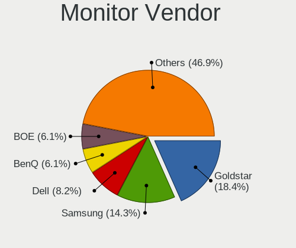

| Vendor               | Computers | Percent |
|----------------------|-----------|---------|
| Samsung Electronics  | 10        | 13.89%  |
| Goldstar             | 10        | 13.89%  |
| AU Optronics         | 7         | 9.72%   |
| BOE                  | 5         | 6.94%   |
| Acer                 | 5         | 6.94%   |
| LG Display           | 3         | 4.17%   |
| Chimei Innolux       | 3         | 4.17%   |
| BenQ                 | 3         | 4.17%   |
| Ancor Communications | 3         | 4.17%   |
| ViewSonic            | 2         | 2.78%   |
| Toshiba              | 2         | 2.78%   |
| MSI                  | 2         | 2.78%   |
| Hewlett-Packard      | 2         | 2.78%   |
| Dell                 | 2         | 2.78%   |
| ASUSTek Computer     | 2         | 2.78%   |
| AOC                  | 2         | 2.78%   |
| Sharp                | 1         | 1.39%   |
| Sceptre Tech         | 1         | 1.39%   |
| Iiyama               | 1         | 1.39%   |
| HUAWEI               | 1         | 1.39%   |
| Eizo                 | 1         | 1.39%   |
| Dark Matter          | 1         | 1.39%   |
| CPT                  | 1         | 1.39%   |
| Apple                | 1         | 1.39%   |
| Unknown              | 1         | 1.39%   |

Monitor Model
-------------

Monitor models

| Model                                                                   | Computers | Percent |
|-------------------------------------------------------------------------|-----------|---------|
| Toshiba TV TSB0108 1440x900 700x390mm 31.5-inch                         | 2         | 2.74%   |
| Goldstar IPS FULLHD GSM5AB8 1920x1080 480x270mm 21.7-inch               | 2         | 2.74%   |
| ViewSonic XG2402 SERIES VSC1B35 1920x1080 531x299mm 24.0-inch           | 1         | 1.37%   |
| ViewSonic VX2452 Series VSCDE2E 1920x1080 521x293mm 23.5-inch           | 1         | 1.37%   |
| Sharp LQ134N1JW52 SHP151E 1920x1200 288x180mm 13.4-inch                 | 1         | 1.37%   |
| Sceptre Tech Sceptre O345 SPT8540 3440x1440 797x334mm 34.0-inch         | 1         | 1.37%   |
| Samsung Electronics U32R59x SAM0F94 3840x2160 697x392mm 31.5-inch       | 1         | 1.37%   |
| Samsung Electronics SyncMaster SAM05FC 1920x1080                        | 1         | 1.37%   |
| Samsung Electronics SyncMaster SAM03E5 1680x1050 474x296mm 22.0-inch    | 1         | 1.37%   |
| Samsung Electronics SyncMaster SAM037A 1680x1050 433x271mm 20.1-inch    | 1         | 1.37%   |
| Samsung Electronics SyncMaster SAM0124 1280x1024 338x270mm 17.0-inch    | 1         | 1.37%   |
| Samsung Electronics SMB2030N SAM0634 1600x900 443x249mm 20.0-inch       | 1         | 1.37%   |
| Samsung Electronics LCD Monitor SDC5344 1920x1080 344x194mm 15.5-inch   | 1         | 1.37%   |
| Samsung Electronics LCD Monitor SAM0F0E 3840x2160 1872x1053mm 84.6-inch | 1         | 1.37%   |
| Samsung Electronics LCD Monitor SAM0A7A 1920x1080 1060x626mm 48.5-inch  | 1         | 1.37%   |
| Samsung Electronics LC27G5xT SAM707A 2560x1440 597x336mm 27.0-inch      | 1         | 1.37%   |
| MSI G27C4 MSI3CA9 1920x1080 598x336mm 27.0-inch                         | 1         | 1.37%   |
| MSI G273Q MSI3CA8 2560x1440 597x336mm 27.0-inch                         | 1         | 1.37%   |
| LG Display LCD Monitor LGD065B 1920x1080 382x215mm 17.3-inch            | 1         | 1.37%   |
| LG Display LCD Monitor LGD05CF 1920x1080 344x194mm 15.5-inch            | 1         | 1.37%   |
| LG Display LCD Monitor LGD039F 1366x768 345x194mm 15.6-inch             | 1         | 1.37%   |
| Iiyama PL3271Q IVM761C 2560x1440 698x393mm 31.5-inch                    | 1         | 1.37%   |
| HUAWEI AD80HW HWV2402 1920x1080 527x296mm 23.8-inch                     | 1         | 1.37%   |
| Hewlett-Packard 22xi HWP302E 1920x1080 480x270mm 21.7-inch              | 1         | 1.37%   |
| Hewlett-Packard 2009 HWP2827 1600x900 443x250mm 20.0-inch               | 1         | 1.37%   |
| Goldstar ULTRAWIDE GSM76E4 3440x1440 800x335mm 34.1-inch                | 1         | 1.37%   |
| Goldstar ULTRAWIDE GSM76E3 3440x1440 800x335mm 34.1-inch                | 1         | 1.37%   |
| Goldstar ULTRAWIDE GSM5A2A 2560x1080 677x290mm 29.0-inch                | 1         | 1.37%   |
| Goldstar ULTRAGEAR GSM774B 3440x1440 800x335mm 34.1-inch                | 1         | 1.37%   |
| Goldstar ULTRAGEAR GSM5BD3 2560x1440 697x392mm 31.5-inch                | 1         | 1.37%   |
| Goldstar Ultra HD GSM5B09 3840x2160 600x340mm 27.2-inch                 | 1         | 1.37%   |
| Goldstar 27GN7 GSM5B8D 1920x1080 600x303mm 26.5-inch                    | 1         | 1.37%   |
| Goldstar 19EN33 GSM4C18 1366x768 410x230mm 18.5-inch                    | 1         | 1.37%   |
| Eizo EV2335W ENC2293 1920x1080 510x287mm 23.0-inch                      | 1         | 1.37%   |
| Dell U2717D DEL40EB 2560x1440 597x336mm 27.0-inch                       | 1         | 1.37%   |
| Dell G2422HS DELA1E7 1920x1080 527x296mm 23.8-inch                      | 1         | 1.37%   |
| Dark Matter 43305 DMGFFFF 3840x2160 1194x336mm 48.8-inch                | 1         | 1.37%   |
| CPT LCD Monitor CPT14BF 1366x768 344x193mm 15.5-inch                    | 1         | 1.37%   |
| Chimei Innolux LCD Monitor CMN175C 1920x1080 381x214mm 17.2-inch        | 1         | 1.37%   |
| Chimei Innolux LCD Monitor CMN1521 1920x1080 344x193mm 15.5-inch        | 1         | 1.37%   |

Monitor Resolution
------------------

Monitor screen resolution

| Resolution         | Computers | Percent |
|--------------------|-----------|---------|
| 1920x1080 (FHD)    | 26        | 39.39%  |
| 2560x1440 (QHD)    | 9         | 13.64%  |
| 3840x2160 (4K)     | 6         | 9.09%   |
| 1366x768 (WXGA)    | 5         | 7.58%   |
| 3440x1440          | 4         | 6.06%   |
| 1680x1050 (WSXGA+) | 3         | 4.55%   |
| 1920x540           | 2         | 3.03%   |
| 1600x900 (HD+)     | 2         | 3.03%   |
| 5760x1080          | 1         | 1.52%   |
| 2560x1600          | 1         | 1.52%   |
| 2560x1080          | 1         | 1.52%   |
| 2240x1400          | 1         | 1.52%   |
| 1920x1200 (WUXGA)  | 1         | 1.52%   |
| 1440x900 (WXGA+)   | 1         | 1.52%   |
| 1280x800 (WXGA)    | 1         | 1.52%   |
| 1280x1024 (SXGA)   | 1         | 1.52%   |
| Unknown            | 1         | 1.52%   |

Monitor Diagonal
----------------

Diagonal size in inches

| Inches  | Computers | Percent |
|---------|-----------|---------|
| 27      | 12        | 17.14%  |
| 15      | 9         | 12.86%  |
| 17      | 7         | 10%     |
| 13      | 5         | 7.14%   |
| 34      | 4         | 5.71%   |
| 31      | 4         | 5.71%   |
| 23      | 4         | 5.71%   |
| 21      | 4         | 5.71%   |
| 24      | 3         | 4.29%   |
| 20      | 3         | 4.29%   |
| 72      | 2         | 2.86%   |
| 48      | 2         | 2.86%   |
| 22      | 2         | 2.86%   |
| 14      | 2         | 2.86%   |
| Unknown | 2         | 2.86%   |
| 84      | 1         | 1.43%   |
| 29      | 1         | 1.43%   |
| 26      | 1         | 1.43%   |
| 19      | 1         | 1.43%   |
| 18      | 1         | 1.43%   |

Monitor Width
-------------

Physical width

| Width in mm | Computers | Percent |
|-------------|-----------|---------|
| 501-600     | 15        | 22.06%  |
| 301-350     | 14        | 20.59%  |
| 401-500     | 11        | 16.18%  |
| 601-700     | 8         | 11.76%  |
| 351-400     | 6         | 8.82%   |
| 701-800     | 4         | 5.88%   |
| 201-300     | 3         | 4.41%   |
| 1501-2000   | 3         | 4.41%   |
| 1001-1500   | 2         | 2.94%   |
| Unknown     | 2         | 2.94%   |

Aspect Ratio
------------

Proportional relationship between the width and the height

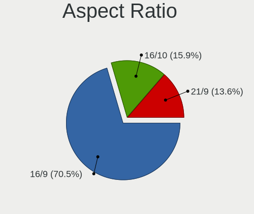

| Ratio   | Computers | Percent |
|---------|-----------|---------|
| 16/9    | 42        | 71.19%  |
| 16/10   | 9         | 15.25%  |
| 21/9    | 5         | 8.47%   |
| 5/4     | 1         | 1.69%   |
| 32/9    | 1         | 1.69%   |
| Unknown | 1         | 1.69%   |

Monitor Area
------------

Area in inch²

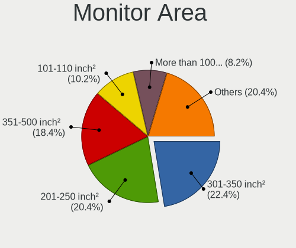

| Area in inch² | Computers | Percent |
|----------------|-----------|---------|
| 301-350        | 14        | 20%     |
| 201-250        | 12        | 17.14%  |
| 101-110        | 9         | 12.86%  |
| 351-500        | 8         | 11.43%  |
| 121-130        | 6         | 8.57%   |
| 81-90          | 5         | 7.14%   |
| 151-200        | 5         | 7.14%   |
| More than 1000 | 4         | 5.71%   |
| 71-80          | 2         | 2.86%   |
| 141-150        | 2         | 2.86%   |
| Unknown        | 2         | 2.86%   |
| 501-1000       | 1         | 1.43%   |

Pixel Density
-------------

Pixels per inch

| Density | Computers | Percent |
|---------|-----------|---------|
| 51-100  | 24        | 36.92%  |
| 121-160 | 16        | 24.62%  |
| 101-120 | 16        | 24.62%  |
| 161-240 | 4         | 6.15%   |
| 1-50    | 3         | 4.62%   |
| Unknown | 2         | 3.08%   |

Multiple Monitors
-----------------

Total monitors connected

| Total | Computers | Percent |
|-------|-----------|---------|
| 1     | 38        | 65.52%  |
| 2     | 13        | 22.41%  |
| 0     | 4         | 6.9%    |
| 3     | 3         | 5.17%   |

Network
-------

Net Controller Vendor
---------------------

Controller vendors

| Vendor                   | Computers | Percent |
|--------------------------|-----------|---------|
| Realtek Semiconductor    | 36        | 37.11%  |
| Intel                    | 35        | 36.08%  |
| Microsoft                | 5         | 5.15%   |
| Broadcom                 | 4         | 4.12%   |
| Qualcomm Atheros         | 3         | 3.09%   |
| MediaTek                 | 3         | 3.09%   |
| TP-Link                  | 2         | 2.06%   |
| Samsung Electronics      | 2         | 2.06%   |
| Sierra Wireless          | 1         | 1.03%   |
| Ralink Technology        | 1         | 1.03%   |
| Ralink                   | 1         | 1.03%   |
| Oculus VR                | 1         | 1.03%   |
| Nvidia                   | 1         | 1.03%   |
| Motorola PCS             | 1         | 1.03%   |
| Marvell Technology Group | 1         | 1.03%   |

Net Controller Model
--------------------

Controller models

| Model                                                                   | Computers | Percent |
|-------------------------------------------------------------------------|-----------|---------|
| Realtek RTL8111/8168/8411 PCI Express Gigabit Ethernet Controller       | 24        | 21.82%  |
| Intel Wi-Fi 6 AX200                                                     | 8         | 7.27%   |
| Realtek RTL8125 2.5GbE Controller                                       | 6         | 5.45%   |
| Intel I211 Gigabit Network Connection                                   | 6         | 5.45%   |
| Samsung Galaxy series, misc. (tethering mode)                           | 2         | 1.82%   |
| Realtek RTL8822CE 802.11ac PCIe Wireless Network Adapter                | 2         | 1.82%   |
| Realtek RTL810xE PCI Express Fast Ethernet controller                   | 2         | 1.82%   |
| Microsoft Xbox 360 Wireless Adapter                                     | 2         | 1.82%   |
| Microsoft Wireless XBox Controller Dongle                               | 2         | 1.82%   |
| Intel Wireless 8260                                                     | 2         | 1.82%   |
| Intel Wi-Fi 6 AX210/AX211/AX411 160MHz                                  | 2         | 1.82%   |
| Intel Ethernet Controller I225-V                                        | 2         | 1.82%   |
| Intel Ethernet Connection (7) I219-V                                    | 2         | 1.82%   |
| Intel Ethernet Connection (2) I218-V                                    | 2         | 1.82%   |
| Intel Comet Lake PCH CNVi WiFi                                          | 2         | 1.82%   |
| Intel Cannon Lake PCH CNVi WiFi                                         | 2         | 1.82%   |
| Broadcom BCM43142 802.11b/g/n                                           | 2         | 1.82%   |
| TP-Link TL-WN823N v2/v3 [Realtek RTL8192EU]                             | 1         | 0.91%   |
| TP-Link 802.11ac NIC                                                    | 1         | 0.91%   |
| Sierra Wireless EM7455                                                  | 1         | 0.91%   |
| Realtek RTL88x2bu [AC1200 Techkey]                                      | 1         | 0.91%   |
| Realtek RTL8852AE 802.11ax PCIe Wireless Network Adapter                | 1         | 0.91%   |
| Realtek RTL8821CE 802.11ac PCIe Wireless Network Adapter                | 1         | 0.91%   |
| Realtek RTL8821AE 802.11ac PCIe Wireless Network Adapter                | 1         | 0.91%   |
| Realtek RTL8723BU 802.11b/g/n WLAN Adapter                              | 1         | 0.91%   |
| Realtek RTL8153 Gigabit Ethernet Adapter                                | 1         | 0.91%   |
| Realtek 802.11ac NIC                                                    | 1         | 0.91%   |
| Ralink RT5572 Wireless Adapter                                          | 1         | 0.91%   |
| Ralink RT2800 802.11n PCI                                               | 1         | 0.91%   |
| Qualcomm Atheros AR9285 Wireless Network Adapter (PCI-Express)          | 1         | 0.91%   |
| Qualcomm Atheros AR8151 v2.0 Gigabit Ethernet                           | 1         | 0.91%   |
| Qualcomm Atheros AR242x / AR542x Wireless Network Adapter (PCI-Express) | 1         | 0.91%   |
| Oculus VR Rift S                                                        | 1         | 0.91%   |
| Nvidia MCP79 Ethernet                                                   | 1         | 0.91%   |
| Motorola PCS motorola one 5G ace                                        | 1         | 0.91%   |
| Microsoft XBOX ACC                                                      | 1         | 0.91%   |
| MediaTek WLAN controller                                                | 1         | 0.91%   |
| MediaTek MT7922 802.11ax PCI Express Wireless Network Adapter           | 1         | 0.91%   |
| MediaTek MT7921K (RZ608) Wi-Fi 6E 80MHz                                 | 1         | 0.91%   |
| Marvell Group 88E8057 PCI-E Gigabit Ethernet Controller                 | 1         | 0.91%   |

Wireless Vendor
---------------

Wireless vendors

| Vendor                | Computers | Percent |
|-----------------------|-----------|---------|
| Intel                 | 24        | 47.06%  |
| Realtek Semiconductor | 8         | 15.69%  |
| Microsoft             | 5         | 9.8%    |
| Broadcom              | 4         | 7.84%   |
| MediaTek              | 3         | 5.88%   |
| TP-Link               | 2         | 3.92%   |
| Qualcomm Atheros      | 2         | 3.92%   |
| Sierra Wireless       | 1         | 1.96%   |
| Ralink Technology     | 1         | 1.96%   |
| Ralink                | 1         | 1.96%   |

Wireless Model
--------------

Wireless models

| Model                                                                   | Computers | Percent |
|-------------------------------------------------------------------------|-----------|---------|
| Intel Wi-Fi 6 AX200                                                     | 8         | 15.69%  |
| Realtek RTL8822CE 802.11ac PCIe Wireless Network Adapter                | 2         | 3.92%   |
| Microsoft Xbox 360 Wireless Adapter                                     | 2         | 3.92%   |
| Microsoft Wireless XBox Controller Dongle                               | 2         | 3.92%   |
| Intel Wireless 8260                                                     | 2         | 3.92%   |
| Intel Wi-Fi 6 AX210/AX211/AX411 160MHz                                  | 2         | 3.92%   |
| Intel Comet Lake PCH CNVi WiFi                                          | 2         | 3.92%   |
| Intel Cannon Lake PCH CNVi WiFi                                         | 2         | 3.92%   |
| Broadcom BCM43142 802.11b/g/n                                           | 2         | 3.92%   |
| TP-Link TL-WN823N v2/v3 [Realtek RTL8192EU]                             | 1         | 1.96%   |
| TP-Link 802.11ac NIC                                                    | 1         | 1.96%   |
| Sierra Wireless EM7455                                                  | 1         | 1.96%   |
| Realtek RTL88x2bu [AC1200 Techkey]                                      | 1         | 1.96%   |
| Realtek RTL8852AE 802.11ax PCIe Wireless Network Adapter                | 1         | 1.96%   |
| Realtek RTL8821CE 802.11ac PCIe Wireless Network Adapter                | 1         | 1.96%   |
| Realtek RTL8821AE 802.11ac PCIe Wireless Network Adapter                | 1         | 1.96%   |
| Realtek RTL8723BU 802.11b/g/n WLAN Adapter                              | 1         | 1.96%   |
| Realtek 802.11ac NIC                                                    | 1         | 1.96%   |
| Ralink RT5572 Wireless Adapter                                          | 1         | 1.96%   |
| Ralink RT2800 802.11n PCI                                               | 1         | 1.96%   |
| Qualcomm Atheros AR9285 Wireless Network Adapter (PCI-Express)          | 1         | 1.96%   |
| Qualcomm Atheros AR242x / AR542x Wireless Network Adapter (PCI-Express) | 1         | 1.96%   |
| Microsoft XBOX ACC                                                      | 1         | 1.96%   |
| MediaTek WLAN controller                                                | 1         | 1.96%   |
| MediaTek MT7922 802.11ax PCI Express Wireless Network Adapter           | 1         | 1.96%   |
| MediaTek MT7921K (RZ608) Wi-Fi 6E 80MHz                                 | 1         | 1.96%   |
| Intel Wireless-AC 9260                                                  | 1         | 1.96%   |
| Intel Wireless 8265 / 8275                                              | 1         | 1.96%   |
| Intel Wireless 7265                                                     | 1         | 1.96%   |
| Intel Wireless 7260                                                     | 1         | 1.96%   |
| Intel Tiger Lake PCH CNVi WiFi                                          | 1         | 1.96%   |
| Intel Dual Band Wireless-AC 3168NGW [Stone Peak]                        | 1         | 1.96%   |
| Intel Centrino Wireless-N 130                                           | 1         | 1.96%   |
| Intel Alder Lake-P PCH CNVi WiFi                                        | 1         | 1.96%   |
| Broadcom BCM4360 802.11ac Wireless Network Adapter                      | 1         | 1.96%   |
| Broadcom BCM4322 802.11a/b/g/n Wireless LAN Controller                  | 1         | 1.96%   |

Ethernet Vendor
---------------

Ethernet vendors

| Vendor                   | Computers | Percent |
|--------------------------|-----------|---------|
| Realtek Semiconductor    | 32        | 56.14%  |
| Intel                    | 19        | 33.33%  |
| Samsung Electronics      | 2         | 3.51%   |
| Qualcomm Atheros         | 1         | 1.75%   |
| Nvidia                   | 1         | 1.75%   |
| Motorola PCS             | 1         | 1.75%   |
| Marvell Technology Group | 1         | 1.75%   |

Ethernet Model
--------------

Ethernet models

| Model                                                             | Computers | Percent |
|-------------------------------------------------------------------|-----------|---------|
| Realtek RTL8111/8168/8411 PCI Express Gigabit Ethernet Controller | 24        | 41.38%  |
| Realtek RTL8125 2.5GbE Controller                                 | 6         | 10.34%  |
| Intel I211 Gigabit Network Connection                             | 6         | 10.34%  |
| Samsung Galaxy series, misc. (tethering mode)                     | 2         | 3.45%   |
| Realtek RTL810xE PCI Express Fast Ethernet controller             | 2         | 3.45%   |
| Intel Ethernet Controller I225-V                                  | 2         | 3.45%   |
| Intel Ethernet Connection (7) I219-V                              | 2         | 3.45%   |
| Intel Ethernet Connection (2) I218-V                              | 2         | 3.45%   |
| Realtek RTL8153 Gigabit Ethernet Adapter                          | 1         | 1.72%   |
| Qualcomm Atheros AR8151 v2.0 Gigabit Ethernet                     | 1         | 1.72%   |
| Nvidia MCP79 Ethernet                                             | 1         | 1.72%   |
| Motorola PCS motorola one 5G ace                                  | 1         | 1.72%   |
| Marvell Group 88E8057 PCI-E Gigabit Ethernet Controller           | 1         | 1.72%   |
| Intel Ethernet Connection I219-LM                                 | 1         | 1.72%   |
| Intel Ethernet Connection I218-LM                                 | 1         | 1.72%   |
| Intel Ethernet Connection (5) I219-LM                             | 1         | 1.72%   |
| Intel Ethernet Connection (2) I219-V                              | 1         | 1.72%   |
| Intel Ethernet Connection (2) I219-LM                             | 1         | 1.72%   |
| Intel 82579V Gigabit Network Connection                           | 1         | 1.72%   |
| Intel 82579LM Gigabit Network Connection (Lewisville)             | 1         | 1.72%   |

Net Controller Kind
-------------------

Ethernet, WiFi or modem

| Kind     | Computers | Percent |
|----------|-----------|---------|
| Ethernet | 52        | 53.06%  |
| WiFi     | 45        | 45.92%  |
| Modem    | 1         | 1.02%   |

Used Controller
---------------

Currently used network controller

| Kind     | Computers | Percent |
|----------|-----------|---------|
| Ethernet | 32        | 51.61%  |
| WiFi     | 30        | 48.39%  |

NICs
----

Total network controllers on board

| Total | Computers | Percent |
|-------|-----------|---------|
| 2     | 30        | 51.72%  |
| 1     | 24        | 41.38%  |
| 3     | 3         | 5.17%   |
| 0     | 1         | 1.72%   |

IPv6
----

IPv6 vs IPv4

| Used | Computers | Percent |
|------|-----------|---------|
| No   | 43        | 74.14%  |
| Yes  | 15        | 25.86%  |

Bluetooth
---------

Bluetooth Vendor
----------------

Controller vendors

| Vendor                          | Computers | Percent |
|---------------------------------|-----------|---------|
| Intel                           | 24        | 55.81%  |
| Realtek Semiconductor           | 3         | 6.98%   |
| Cambridge Silicon Radio         | 3         | 6.98%   |
| Broadcom                        | 3         | 6.98%   |
| IMC Networks                    | 2         | 4.65%   |
| TP-Link                         | 1         | 2.33%   |
| Qualcomm Atheros Communications | 1         | 2.33%   |
| MediaTek                        | 1         | 2.33%   |
| Integrated System Solution      | 1         | 2.33%   |
| Foxconn / Hon Hai               | 1         | 2.33%   |
| Edimax Technology               | 1         | 2.33%   |
| ASUSTek Computer                | 1         | 2.33%   |
| Apple                           | 1         | 2.33%   |

Bluetooth Model
---------------

Controller models

| Model                                                   | Computers | Percent |
|---------------------------------------------------------|-----------|---------|
| Intel AX200 Bluetooth                                   | 8         | 18.6%   |
| Intel Bluetooth wireless interface                      | 5         | 11.63%  |
| Intel Bluetooth Device                                  | 4         | 9.3%    |
| Realtek Bluetooth Radio                                 | 3         | 6.98%   |
| Cambridge Silicon Radio Bluetooth Dongle (HCI mode)     | 3         | 6.98%   |
| Intel Bluetooth 9460/9560 Jefferson Peak (JfP)          | 2         | 4.65%   |
| Intel AX210 Bluetooth                                   | 2         | 4.65%   |
| IMC Networks Bluetooth Radio                            | 2         | 4.65%   |
| TP-Link TPuLink UB500 Adapter                           | 1         | 2.33%   |
| Qualcomm Atheros AR3011 Bluetooth                       | 1         | 2.33%   |
| MediaTek Wireless_Device                                | 1         | 2.33%   |
| Intel Wireless-AC 9260 Bluetooth Adapter                | 1         | 2.33%   |
| Intel Wireless-AC 3168 Bluetooth                        | 1         | 2.33%   |
| Intel Centrino Advanced-N 6230 Bluetooth adapter        | 1         | 2.33%   |
| Integrated System Solution KY-BT100 Bluetooth Adapter   | 1         | 2.33%   |
| Foxconn / Hon Hai Wireless_Device                       | 1         | 2.33%   |
| Edimax EW-7611ULB 802.11b/g/n and Bluetooth 4.0 Adapter | 1         | 2.33%   |
| Broadcom BCM43142A0 Bluetooth Device                    | 1         | 2.33%   |
| Broadcom BCM43142A0 Bluetooth 4.0                       | 1         | 2.33%   |
| Broadcom BCM20702A0 Bluetooth 4.0                       | 1         | 2.33%   |
| ASUS ASUS USB-BT500                                     | 1         | 2.33%   |
| Apple Bluetooth Host Controller                         | 1         | 2.33%   |

Sound
-----

Sound Vendor
------------

Sound card vendors

| Vendor                   | Computers | Percent |
|--------------------------|-----------|---------|
| AMD                      | 31        | 29.25%  |
| Nvidia                   | 30        | 28.3%   |
| Intel                    | 26        | 24.53%  |
| Logitech                 | 6         | 5.66%   |
| SteelSeries ApS          | 2         | 1.89%   |
| C-Media Electronics      | 2         | 1.89%   |
| TTGK Technology          | 1         | 0.94%   |
| Sony                     | 1         | 0.94%   |
| Realtek Semiconductor    | 1         | 0.94%   |
| Focusrite-Novation       | 1         | 0.94%   |
| Cambridge Silicon Radio  | 1         | 0.94%   |
| Blue Microphones         | 1         | 0.94%   |
| ASUSTek Computer         | 1         | 0.94%   |
| Asahi Kasei Microsystems | 1         | 0.94%   |
| AKAI Professional M.I.   | 1         | 0.94%   |

Sound Model
-----------

Sound card models

| Model                                                                      | Computers | Percent |
|----------------------------------------------------------------------------|-----------|---------|
| AMD Family 17h/19h HD Audio Controller                                     | 14        | 10.77%  |
| AMD Navi 21/23 HDMI/DP Audio Controller                                    | 12        | 9.23%   |
| AMD Starship/Matisse HD Audio Controller                                   | 9         | 6.92%   |
| AMD Renoir Radeon High Definition Audio Controller                         | 7         | 5.38%   |
| Nvidia TU107 GeForce GTX 1650 High Definition Audio Controller             | 4         | 3.08%   |
| Nvidia GP104 High Definition Audio Controller                              | 4         | 3.08%   |
| Nvidia GA104 High Definition Audio Controller                              | 4         | 3.08%   |
| Nvidia GA102 High Definition Audio Controller                              | 4         | 3.08%   |
| Intel Comet Lake PCH cAVS                                                  | 4         | 3.08%   |
| Nvidia GA106 High Definition Audio Controller                              | 3         | 2.31%   |
| Intel Tiger Lake-H HD Audio Controller                                     | 3         | 2.31%   |
| Intel Sunrise Point-LP HD Audio                                            | 3         | 2.31%   |
| AMD Family 17h (Models 00h-0fh) HD Audio Controller                        | 3         | 2.31%   |
| Nvidia TU104 HD Audio Controller                                           | 2         | 1.54%   |
| Intel Haswell-ULT HD Audio Controller                                      | 2         | 1.54%   |
| Intel Cannon Lake PCH cAVS                                                 | 2         | 1.54%   |
| Intel 9 Series Chipset Family HD Audio Controller                          | 2         | 1.54%   |
| Intel 8 Series HD Audio Controller                                         | 2         | 1.54%   |
| Intel 6 Series/C200 Series Chipset Family High Definition Audio Controller | 2         | 1.54%   |
| AMD Rembrandt Radeon High Definition Audio Controller                      | 2         | 1.54%   |
| TTGK Technology Audio                                                      | 1         | 0.77%   |
| SteelSeries ApS SteelSeries Arctis 9                                       | 1         | 0.77%   |
| SteelSeries ApS Arctis Pro Wireless                                        | 1         | 0.77%   |
| Sony DualSense wireless controller (PS5)                                   | 1         | 0.77%   |
| Realtek Semiconductor USB Audio                                            | 1         | 0.77%   |
| Nvidia TU116 High Definition Audio Controller                              | 1         | 0.77%   |
| Nvidia TU106 High Definition Audio Controller                              | 1         | 0.77%   |
| Nvidia TU102 High Definition Audio Controller                              | 1         | 0.77%   |
| Nvidia MCP79 High Definition Audio                                         | 1         | 0.77%   |
| Nvidia MCP61 High Definition Audio                                         | 1         | 0.77%   |
| Nvidia GP107GL High Definition Audio Controller                            | 1         | 0.77%   |
| Nvidia GM206 High Definition Audio Controller                              | 1         | 0.77%   |
| Nvidia GK208 HDMI/DP Audio Controller                                      | 1         | 0.77%   |
| Nvidia GK104 HDMI Audio Controller                                         | 1         | 0.77%   |
| Nvidia GF114 HDMI Audio Controller                                         | 1         | 0.77%   |
| Logitech USB Headset                                                       | 1         | 0.77%   |
| Logitech PRO X Wireless Gaming Headset                                     | 1         | 0.77%   |
| Logitech PRO X                                                             | 1         | 0.77%   |
| Logitech G935 Gaming Headset                                               | 1         | 0.77%   |
| Logitech G560 Gaming Speaker                                               | 1         | 0.77%   |

Memory
------

Memory Vendor
-------------

Memory module vendors

| Vendor              | Computers | Percent |
|---------------------|-----------|---------|
| SK hynix            | 2         | 18.18%  |
| Samsung Electronics | 2         | 18.18%  |
| Corsair             | 2         | 18.18%  |
| Unknown (ABCD)      | 1         | 9.09%   |
| Team                | 1         | 9.09%   |
| Micron Technology   | 1         | 9.09%   |
| Kingston            | 1         | 9.09%   |
| Elpida              | 1         | 9.09%   |

Memory Model
------------

Memory module models

| Model                                                            | Computers | Percent |
|------------------------------------------------------------------|-----------|---------|
| Unknown (ABCD) RAM 123456789012345678 2GB SODIMM LPDDR4 2400MT/s | 1         | 7.69%   |
| Team RAM TEAMGROUP-UD4-3600 16GB DIMM DDR4 3733MT/s              | 1         | 7.69%   |
| SK hynix RAM HMA851S6DJR6N-XN 4GB SODIMM DDR4 3200MT/s           | 1         | 7.69%   |
| SK hynix RAM HMA81GS6DJR8N-XN 8GB SODIMM DDR4 3200MT/s           | 1         | 7.69%   |
| Samsung RAM M471B5173QH0-YK0 4GB SODIMM DDR3 1600MT/s            | 1         | 7.69%   |
| Samsung RAM M425R1GB4BB0-CQKOL 8GB SODIMM DDR5 4800MT/s          | 1         | 7.69%   |
| Micron RAM 8ATF1G64HZ-3G2J1 8GB SODIMM DDR4 3200MT/s             | 1         | 7.69%   |
| Kingston RAM KHX2933C15D4/8GX 8GB DIMM DDR4 2933MT/s             | 1         | 7.69%   |
| Elpida RAM EBJ40UG8EFU0-GN-F 4GB SODIMM DDR3 1600MT/s            | 1         | 7.69%   |
| Corsair RAM CMK8GX4M1A2666C16 8GB DIMM DDR4 3000MT/s             | 1         | 7.69%   |
| Corsair RAM CMK8GX4M1A2400C14 8GB DIMM DDR4 2800MT/s             | 1         | 7.69%   |
| Corsair RAM CMK16GX4M2B3200C16 8GB DIMM DDR4 3600MT/s            | 1         | 7.69%   |
| Corsair RAM CMK16GX4M2B3000C15 8GB DIMM DDR4 3200MT/s            | 1         | 7.69%   |

Memory Kind
-----------

Memory module kinds

| Kind   | Computers | Percent |
|--------|-----------|---------|
| DDR4   | 7         | 70%     |
| LPDDR4 | 1         | 10%     |
| DDR5   | 1         | 10%     |
| DDR3   | 1         | 10%     |

Memory Form Factor
------------------

Physical design of the memory module

| Name   | Computers | Percent |
|--------|-----------|---------|
| SODIMM | 6         | 60%     |
| DIMM   | 4         | 40%     |

Memory Size
-----------

Memory module size

| Size  | Computers | Percent |
|-------|-----------|---------|
| 8192  | 7         | 70%     |
| 4096  | 2         | 20%     |
| 32768 | 1         | 10%     |

Memory Speed
------------

Memory module speed

| Speed | Computers | Percent |
|-------|-----------|---------|
| 3200  | 3         | 25%     |
| 4800  | 1         | 8.33%   |
| 3733  | 1         | 8.33%   |
| 3600  | 1         | 8.33%   |
| 3466  | 1         | 8.33%   |
| 3000  | 1         | 8.33%   |
| 2933  | 1         | 8.33%   |
| 2800  | 1         | 8.33%   |
| 2400  | 1         | 8.33%   |
| 1600  | 1         | 8.33%   |

Printers & scanners
-------------------

Printer Vendor
--------------

Printer device vendors

| Vendor             | Computers | Percent |
|--------------------|-----------|---------|
| Canon              | 1         | 50%     |
| Brother Industries | 1         | 50%     |

Printer Model
-------------

Printer device models

| Model                     | Computers | Percent |
|---------------------------|-----------|---------|
| Canon PIXMA MX370 Series  | 1         | 50%     |
| Brother HL-L2370DW series | 1         | 50%     |

Scanner Vendor
--------------

Scanner device vendors

Zero info for selected period =(

Scanner Model
-------------

Scanner device models

Zero info for selected period =(

Camera
------

Camera Vendor
-------------

Camera device vendors

| Vendor                                 | Computers | Percent |
|----------------------------------------|-----------|---------|
| Chicony Electronics                    | 10        | 31.25%  |
| Logitech                               | 4         | 12.5%   |
| IMC Networks                           | 3         | 9.38%   |
| Cheng Uei Precision Industry (Foxlink) | 2         | 6.25%   |
| Apple                                  | 2         | 6.25%   |
| Acer                                   | 2         | 6.25%   |
| Z-Star Microelectronics                | 1         | 3.13%   |
| Syntek                                 | 1         | 3.13%   |
| Suyin                                  | 1         | 3.13%   |
| Silicon Motion                         | 1         | 3.13%   |
| Owon                                   | 1         | 3.13%   |
| Microsoft                              | 1         | 3.13%   |
| Lite-On Technology                     | 1         | 3.13%   |
| Hewlett-Packard                        | 1         | 3.13%   |
| HD WEBCAM                              | 1         | 3.13%   |

Camera Model
------------

Camera device models

| Model                                               | Computers | Percent |
|-----------------------------------------------------|-----------|---------|
| IMC Networks USB2.0 HD UVC WebCam                   | 3         | 9.38%   |
| Chicony Integrated Camera                           | 3         | 9.38%   |
| Chicony USB2.0 Camera                               | 2         | 6.25%   |
| Z-Star Namuga 1.3M Webcam                           | 1         | 3.13%   |
| Syntek Integrated Camera                            | 1         | 3.13%   |
| Suyin HP Truevision HD                              | 1         | 3.13%   |
| Silicon Motion 300k Pixel Camera                    | 1         | 3.13%   |
| Owon USB CAMERA                                     | 1         | 3.13%   |
| Microsoft Xbox NUI Camera                           | 1         | 3.13%   |
| Logitech StreamCam                                  | 1         | 3.13%   |
| Logitech HD Pro Webcam C920                         | 1         | 3.13%   |
| Logitech C922 Pro Stream Webcam                     | 1         | 3.13%   |
| Logitech C920 PRO HD Webcam                         | 1         | 3.13%   |
| Lite-On HP HD Camera                                | 1         | 3.13%   |
| HP Webcam HD 2300                                   | 1         | 3.13%   |
| HD WEBCAM Web Camera                                | 1         | 3.13%   |
| Chicony HP Wide Vision HD Camera                    | 1         | 3.13%   |
| Chicony HP Webcam 2100                              | 1         | 3.13%   |
| Chicony HD Webcam                                   | 1         | 3.13%   |
| Chicony CNFA035                                     | 1         | 3.13%   |
| Chicony ACER FHD User Facing                        | 1         | 3.13%   |
| Cheng Uei Precision Industry (Foxlink) Webcam       | 1         | 3.13%   |
| Cheng Uei Precision Industry (Foxlink) HP HD Webcam | 1         | 3.13%   |
| Apple iPhone 5/5C/5S/6/SE                           | 1         | 3.13%   |
| Apple Built-in iSight                               | 1         | 3.13%   |
| Acer Integrated Camera                              | 1         | 3.13%   |
| Acer HD Webcam                                      | 1         | 3.13%   |

Security
--------

Fingerprint Vendor
------------------

Fingerprint sensor vendors

| Vendor           | Computers | Percent |
|------------------|-----------|---------|
| Validity Sensors | 4         | 100%    |

Fingerprint Model
-----------------

Fingerprint sensor models

| Model                                        | Computers | Percent |
|----------------------------------------------|-----------|---------|
| Validity Sensors VFS495 Fingerprint Reader   | 2         | 50%     |
| Validity Sensors VFS 5011 fingerprint sensor | 1         | 25%     |
| Validity Sensors Synaptics WBDI              | 1         | 25%     |

Chipcard Vendor
---------------

Chipcard module vendors

| Vendor      | Computers | Percent |
|-------------|-----------|---------|
| Alcor Micro | 1         | 100%    |

Chipcard Model
--------------

Chipcard module models

| Model                               | Computers | Percent |
|-------------------------------------|-----------|---------|
| Alcor Micro AU9540 Smartcard Reader | 1         | 100%    |

Unsupported
-----------

Unsupported Devices
-------------------

Total unsupported devices on board

| Total | Computers | Percent |
|-------|-----------|---------|
| 0     | 43        | 74.14%  |
| 1     | 14        | 24.14%  |
| 2     | 1         | 1.72%   |

Unsupported Device Types
------------------------

Types of unsupported devices

| Type                  | Computers | Percent |
|-----------------------|-----------|---------|
| Graphics card         | 5         | 31.25%  |
| Multimedia controller | 4         | 25%     |
| Fingerprint reader    | 4         | 25%     |
| Net/wireless          | 3         | 18.75%  |

