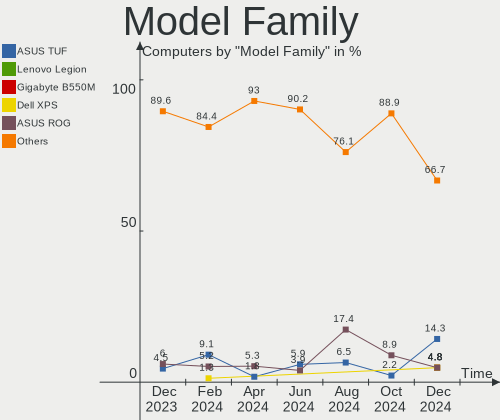
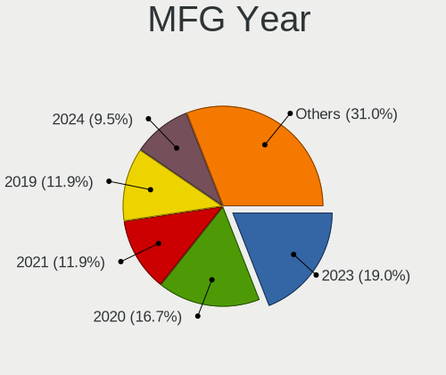
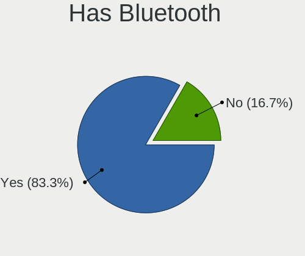
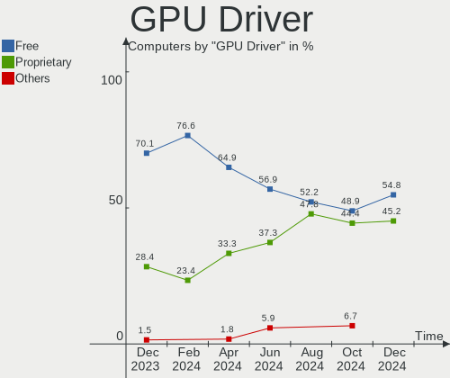
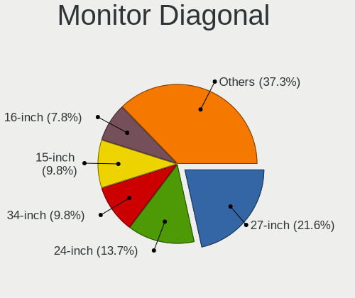
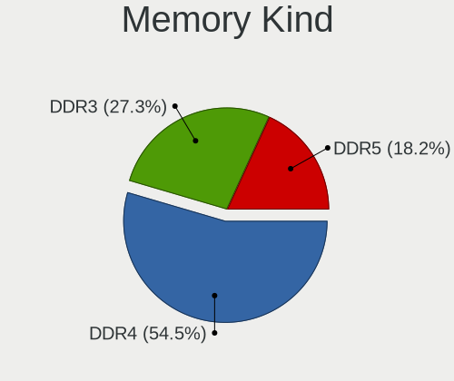
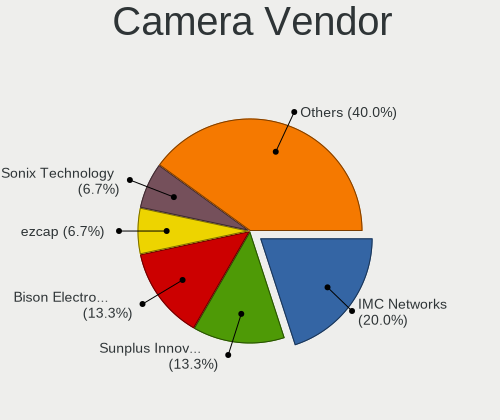
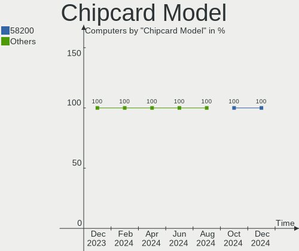
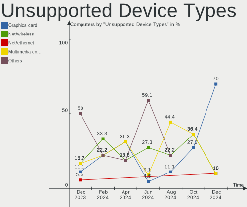

Nobara - Hardware Trends
------------------------

A project to identify most popular hardware characteristics and track their change
over time based on data collected by Linux users at https://Linux-Hardware.org.

Anyone can contribute to this report by the [hw-probe](https://github.com/linuxhw/hw-probe) tool:

    sudo -E hw-probe -all -upload

This is a report for all computer types. See also reports for [desktops](/Dist/Nobara/Desktop/README.md) and [notebooks](/Dist/Nobara/Notebook/README.md).

This report is for one last month. Overall report since the beginning of time: [TestDays](https://github.com/linuxhw/TestDays)

Period: Mar, 2023.

Contents
--------

* [ System ](#system)
  - [ OS                       ](#os)
  - [ OS Family                ](#os-family)
  - [ Kernel                   ](#kernel)
  - [ Kernel Family            ](#kernel-family)
  - [ Kernel Major Ver.        ](#kernel-major-ver)
  - [ Arch                     ](#arch)
  - [ DE                       ](#de)
  - [ Display Server           ](#display-server)
  - [ Display Manager          ](#display-manager)
  - [ OS Lang                  ](#os-lang)
  - [ Boot Mode                ](#boot-mode)
  - [ Filesystem               ](#filesystem)
  - [ Part. scheme             ](#part-scheme)
  - [ Dual Boot with Linux/BSD ](#dual-boot-with-linuxbsd)
  - [ Dual Boot (Win)          ](#dual-boot-win)

* [ Board ](#board)
  - [ Vendor                   ](#vendor)
  - [ Model                    ](#model)
  - [ Model Family             ](#model-family)
  - [ MFG Year                 ](#mfg-year)
  - [ Form Factor              ](#form-factor)
  - [ Secure Boot              ](#secure-boot)
  - [ Coreboot                 ](#coreboot)
  - [ RAM Size                 ](#ram-size)
  - [ RAM Used                 ](#ram-used)
  - [ Total Drives             ](#total-drives)
  - [ Has CD-ROM               ](#has-cd-rom)
  - [ Has Ethernet             ](#has-ethernet)
  - [ Has WiFi                 ](#has-wifi)
  - [ Has Bluetooth            ](#has-bluetooth)

* [ Location ](#location)
  - [ Country                  ](#country)
  - [ City                     ](#city)

* [ Drives ](#drives)
  - [ Drive Vendor             ](#drive-vendor)
  - [ Drive Model              ](#drive-model)
  - [ HDD Vendor               ](#hdd-vendor)
  - [ SSD Vendor               ](#ssd-vendor)
  - [ Drive Kind               ](#drive-kind)
  - [ Drive Connector          ](#drive-connector)
  - [ Drive Size               ](#drive-size)
  - [ Space Total              ](#space-total)
  - [ Space Used               ](#space-used)
  - [ Malfunc. Drives          ](#malfunc-drives)
  - [ Malfunc. Drive Vendor    ](#malfunc-drive-vendor)
  - [ Malfunc. HDD Vendor      ](#malfunc-hdd-vendor)
  - [ Malfunc. Drive Kind      ](#malfunc-drive-kind)
  - [ Failed Drives            ](#failed-drives)
  - [ Failed Drive Vendor      ](#failed-drive-vendor)
  - [ Drive Status             ](#drive-status)

* [ Storage controller ](#storage-controller)
  - [ Storage Vendor           ](#storage-vendor)
  - [ Storage Model            ](#storage-model)
  - [ Storage Kind             ](#storage-kind)

* [ Processor ](#processor)
  - [ CPU Vendor               ](#cpu-vendor)
  - [ CPU Model                ](#cpu-model)
  - [ CPU Model Family         ](#cpu-model-family)
  - [ CPU Cores                ](#cpu-cores)
  - [ CPU Sockets              ](#cpu-sockets)
  - [ CPU Threads              ](#cpu-threads)
  - [ CPU Op-Modes             ](#cpu-op-modes)
  - [ CPU Microcode            ](#cpu-microcode)
  - [ CPU Microarch            ](#cpu-microarch)

* [ Graphics ](#graphics)
  - [ GPU Vendor               ](#gpu-vendor)
  - [ GPU Model                ](#gpu-model)
  - [ GPU Combo                ](#gpu-combo)
  - [ GPU Driver               ](#gpu-driver)
  - [ GPU Memory               ](#gpu-memory)

* [ Monitor ](#monitor)
  - [ Monitor Vendor           ](#monitor-vendor)
  - [ Monitor Model            ](#monitor-model)
  - [ Monitor Resolution       ](#monitor-resolution)
  - [ Monitor Diagonal         ](#monitor-diagonal)
  - [ Monitor Width            ](#monitor-width)
  - [ Aspect Ratio             ](#aspect-ratio)
  - [ Monitor Area             ](#monitor-area)
  - [ Pixel Density            ](#pixel-density)
  - [ Multiple Monitors        ](#multiple-monitors)

* [ Network ](#network)
  - [ Net Controller Vendor    ](#net-controller-vendor)
  - [ Net Controller Model     ](#net-controller-model)
  - [ Wireless Vendor          ](#wireless-vendor)
  - [ Wireless Model           ](#wireless-model)
  - [ Ethernet Vendor          ](#ethernet-vendor)
  - [ Ethernet Model           ](#ethernet-model)
  - [ Net Controller Kind      ](#net-controller-kind)
  - [ Used Controller          ](#used-controller)
  - [ NICs                     ](#nics)
  - [ IPv6                     ](#ipv6)

* [ Bluetooth ](#bluetooth)
  - [ Bluetooth Vendor         ](#bluetooth-vendor)
  - [ Bluetooth Model          ](#bluetooth-model)

* [ Sound ](#sound)
  - [ Sound Vendor             ](#sound-vendor)
  - [ Sound Model              ](#sound-model)

* [ Memory ](#memory)
  - [ Memory Vendor            ](#memory-vendor)
  - [ Memory Model             ](#memory-model)
  - [ Memory Kind              ](#memory-kind)
  - [ Memory Form Factor       ](#memory-form-factor)
  - [ Memory Size              ](#memory-size)
  - [ Memory Speed             ](#memory-speed)

* [ Printers & scanners ](#printers--scanners)
  - [ Printer Vendor           ](#printer-vendor)
  - [ Printer Model            ](#printer-model)
  - [ Scanner Vendor           ](#scanner-vendor)
  - [ Scanner Model            ](#scanner-model)

* [ Camera ](#camera)
  - [ Camera Vendor            ](#camera-vendor)
  - [ Camera Model             ](#camera-model)

* [ Security ](#security)
  - [ Fingerprint Vendor       ](#fingerprint-vendor)
  - [ Fingerprint Model        ](#fingerprint-model)
  - [ Chipcard Vendor          ](#chipcard-vendor)
  - [ Chipcard Model           ](#chipcard-model)

* [ Unsupported ](#unsupported)
  - [ Unsupported Devices      ](#unsupported-devices)
  - [ Unsupported Device Types ](#unsupported-device-types)

System
------

OS
--

Installed operating systems

| Name      | Computers | Percent |
|-----------|-----------|---------|
| Nobara 37 | 55        | 90.16%  |
| Nobara 36 | 6         | 9.84%   |

OS Family
---------

OS without a version

| Name   | Computers | Percent |
|--------|-----------|---------|
| Nobara | 61        | 100%    |

Kernel
------

Version of the Linux kernel

| Version                      | Computers | Percent |
|------------------------------|-----------|---------|
| 6.1.14-201.fsync.fc37.x86_64 | 25        | 40.98%  |
| 6.2.6-201.fsync.fc37.x86_64  | 16        | 26.23%  |
| 6.1.11-201.fsync.fc37.x86_64 | 8         | 13.11%  |
| 6.0.14-201.fsync.fc36.x86_64 | 5         | 8.2%    |
| 6.0.16-301.fsync.fc37.x86_64 | 3         | 4.92%   |
| 6.2.8-200.fsync.fc37.x86_64  | 2         | 3.28%   |
| 6.1.4-203.fsync.fc37.x86_64  | 1         | 1.64%   |
| 6.0.10-201.fc36.x86_64       | 1         | 1.64%   |

Kernel Family
-------------

Linux kernel without a distro release

| Version | Computers | Percent |
|---------|-----------|---------|
| 6.1.14  | 25        | 40.98%  |
| 6.2.6   | 16        | 26.23%  |
| 6.1.11  | 8         | 13.11%  |
| 6.0.14  | 5         | 8.2%    |
| 6.0.16  | 3         | 4.92%   |
| 6.2.8   | 2         | 3.28%   |
| 6.1.4   | 1         | 1.64%   |
| 6.0.10  | 1         | 1.64%   |

Kernel Major Ver.
-----------------

Linux kernel major version

| Version | Computers | Percent |
|---------|-----------|---------|
| 6.1     | 34        | 55.74%  |
| 6.2     | 18        | 29.51%  |
| 6.0     | 9         | 14.75%  |

Arch
----

OS architecture (x86_64, i586, etc.)

| Name   | Computers | Percent |
|--------|-----------|---------|
| x86_64 | 61        | 100%    |

DE
--

Desktop Environment

| Name  | Computers | Percent |
|-------|-----------|---------|
| GNOME | 47        | 77.05%  |
| KDE5  | 14        | 22.95%  |

Display Server
--------------

X11 or Wayland

| Name    | Computers | Percent |
|---------|-----------|---------|
| Wayland | 50        | 81.97%  |
| X11     | 11        | 18.03%  |

Display Manager
---------------

SDDM, LightDM, etc.

| Name    | Computers | Percent |
|---------|-----------|---------|
| Unknown | 47        | 77.05%  |
| GDM     | 9         | 14.75%  |
| SDDM    | 4         | 6.56%   |
| LightDM | 1         | 1.64%   |

OS Lang
-------

Language

| Lang    | Computers | Percent |
|---------|-----------|---------|
| en_US   | 26        | 42.62%  |
| en_GB   | 7         | 11.48%  |
| ru_RU   | 5         | 8.2%    |
| de_DE   | 4         | 6.56%   |
| pt_BR   | 3         | 4.92%   |
| es_ES   | 3         | 4.92%   |
| it_IT   | 2         | 3.28%   |
| zh_TW   | 1         | 1.64%   |
| tr_TR   | 1         | 1.64%   |
| fr_FR   | 1         | 1.64%   |
| es_US   | 1         | 1.64%   |
| es_MX   | 1         | 1.64%   |
| es_CO   | 1         | 1.64%   |
| en_PH   | 1         | 1.64%   |
| de_AT   | 1         | 1.64%   |
| da_DK   | 1         | 1.64%   |
| ar_SA   | 1         | 1.64%   |
| Unknown | 1         | 1.64%   |

Boot Mode
---------

EFI or BIOS

| Mode | Computers | Percent |
|------|-----------|---------|
| EFI  | 52        | 85.25%  |
| BIOS | 9         | 14.75%  |

Filesystem
----------

Type of filesystem

| Type  | Computers | Percent |
|-------|-----------|---------|
| Btrfs | 54        | 88.52%  |
| Ext4  | 7         | 11.48%  |

Part. scheme
------------

Scheme of partitioning

| Type    | Computers | Percent |
|---------|-----------|---------|
| Unknown | 47        | 77.05%  |
| GPT     | 12        | 19.67%  |
| MBR     | 2         | 3.28%   |

Dual Boot with Linux/BSD
------------------------

Hosting more than one Linux/BSD

| Dual boot | Computers | Percent |
|-----------|-----------|---------|
| No        | 57        | 93.44%  |
| Yes       | 4         | 6.56%   |

Dual Boot (Win)
---------------

Hosting Linux and Windows

| Dual boot | Computers | Percent |
|-----------|-----------|---------|
| No        | 54        | 88.52%  |
| Yes       | 7         | 11.48%  |

Board
-----

Vendor
------

Motherboard manufacturer

| Name                | Computers | Percent |
|---------------------|-----------|---------|
| ASUSTek Computer    | 18        | 29.51%  |
| MSI                 | 8         | 13.11%  |
| Lenovo              | 6         | 9.84%   |
| Dell                | 6         | 9.84%   |
| ASRock              | 5         | 8.2%    |
| Acer                | 5         | 8.2%    |
| Gigabyte Technology | 4         | 6.56%   |
| Intel               | 3         | 4.92%   |
| Apple               | 2         | 3.28%   |
| Schenker            | 1         | 1.64%   |
| ONE-NETBOOK         | 1         | 1.64%   |
| Hewlett-Packard     | 1         | 1.64%   |
| Acidanthera         | 1         | 1.64%   |

Model
-----

Motherboard model

| Name                                        | Computers | Percent |
|---------------------------------------------|-----------|---------|
| Dell Vostro 3400                            | 2         | 3.28%   |
| ASUS TUF Gaming B550-PLUS                   | 2         | 3.28%   |
| ASUS ROG STRIX B550-F GAMING                | 2         | 3.28%   |
| ASRock X670E Steel Legend                   | 2         | 3.28%   |
| Schenker XMG NEO (M19, RTX 2070)            | 1         | 1.64%   |
| ONE-NETBOOK ONEXPLAYER 2 ARP23              | 1         | 1.64%   |
| MSI Summit E14Evo A12M                      | 1         | 1.64%   |
| MSI P65 Creator 8RD                         | 1         | 1.64%   |
| MSI MS-7C92                                 | 1         | 1.64%   |
| MSI MS-7C56                                 | 1         | 1.64%   |
| MSI MS-7C02                                 | 1         | 1.64%   |
| MSI MS-7B86                                 | 1         | 1.64%   |
| MSI MS-7B79                                 | 1         | 1.64%   |
| MSI GP65 Leopard 9SF                        | 1         | 1.64%   |
| Lenovo ThinkPad X1 Extreme Gen 5 21DECTO1WW | 1         | 1.64%   |
| Lenovo ThinkCentre M715q 10M30008US         | 1         | 1.64%   |
| Lenovo IP 5-14ALC05 82LM                    | 1         | 1.64%   |
| Lenovo IdeaPad C340-14API 81N6              | 1         | 1.64%   |
| Lenovo IdeaPad 5 Pro 14ACN6 82L7            | 1         | 1.64%   |
| Intel X79                                   | 1         | 1.64%   |
| Intel powered classmate PC                  | 1         | 1.64%   |
| Intel DB85FL AAG89861-203                   | 1         | 1.64%   |
| HP ZBook 17 G2                              | 1         | 1.64%   |
| Gigabyte Z77P-D3                            | 1         | 1.64%   |
| Gigabyte Z390 AORUS ULTRA                   | 1         | 1.64%   |
| Gigabyte GA-970A-DS3                        | 1         | 1.64%   |
| Gigabyte AERO 15 XD                         | 1         | 1.64%   |
| Dell OptiPlex 7010                          | 1         | 1.64%   |
| Dell Latitude 7390                          | 1         | 1.64%   |
| Dell Inspiron 660                           | 1         | 1.64%   |
| Dell Inspiron 3542                          | 1         | 1.64%   |
| ASUS X580VD                                 | 1         | 1.64%   |
| ASUS VivoBook_ASUSLaptop X509DA_D509DA      | 1         | 1.64%   |
| ASUS VivoBook_ASUSLaptop N7601ZM_N7601ZM    | 1         | 1.64%   |
| ASUS VivoBook_ASUS Laptop X509UA            | 1         | 1.64%   |
| ASUS ROG STRIX X470-F GAMING                | 1         | 1.64%   |
| ASUS ROG Strix G513QY_G513QY                | 1         | 1.64%   |
| ASUS ROG STRIX B650E-E GAMING WIFI          | 1         | 1.64%   |
| ASUS PRIME Z690M-PLUS D4                    | 1         | 1.64%   |
| ASUS PRIME X370-PRO                         | 1         | 1.64%   |

Model Family
------------

Motherboard model prefix

| Name                   | Computers | Percent |
|------------------------|-----------|---------|
| ASUS ROG               | 5         | 8.2%    |
| ASUS PRIME             | 4         | 6.56%   |
| ASUS VivoBook          | 3         | 4.92%   |
| Acer Aspire            | 3         | 4.92%   |
| Lenovo IdeaPad         | 2         | 3.28%   |
| Dell Vostro            | 2         | 3.28%   |
| Dell Inspiron          | 2         | 3.28%   |
| ASUS TUF               | 2         | 3.28%   |
| ASRock X670E           | 2         | 3.28%   |
| Schenker XMG           | 1         | 1.64%   |
| ONE-NETBOOK ONEXPLAYER | 1         | 1.64%   |
| MSI Summit             | 1         | 1.64%   |
| MSI P65                | 1         | 1.64%   |
| MSI MS-7C92            | 1         | 1.64%   |
| MSI MS-7C56            | 1         | 1.64%   |
| MSI MS-7C02            | 1         | 1.64%   |
| MSI MS-7B86            | 1         | 1.64%   |
| MSI MS-7B79            | 1         | 1.64%   |
| MSI GP65               | 1         | 1.64%   |
| Lenovo ThinkPad        | 1         | 1.64%   |
| Lenovo ThinkCentre     | 1         | 1.64%   |
| Lenovo IP              | 1         | 1.64%   |
| Intel X79              | 1         | 1.64%   |
| Intel powered          | 1         | 1.64%   |
| Intel DB85FL           | 1         | 1.64%   |
| HP ZBook               | 1         | 1.64%   |
| Gigabyte Z77P-D3       | 1         | 1.64%   |
| Gigabyte Z390          | 1         | 1.64%   |
| Gigabyte GA-970A-DS3   | 1         | 1.64%   |
| Gigabyte AERO          | 1         | 1.64%   |
| Dell OptiPlex          | 1         | 1.64%   |
| Dell Latitude          | 1         | 1.64%   |
| ASUS X580VD            | 1         | 1.64%   |
| ASUS M3N78             | 1         | 1.64%   |
| ASUS GL752VW           | 1         | 1.64%   |
| ASUS All               | 1         | 1.64%   |
| ASRock X470            | 1         | 1.64%   |
| ASRock H310M-HDV       | 1         | 1.64%   |
| ASRock B660M-ITX       | 1         | 1.64%   |
| Apple Macmini6         | 1         | 1.64%   |

MFG Year
--------

Motherboard manufacture year

| Year | Computers | Percent |
|------|-----------|---------|
| 2018 | 11        | 18.03%  |
| 2020 | 8         | 13.11%  |
| 2022 | 7         | 11.48%  |
| 2021 | 6         | 9.84%   |
| 2019 | 6         | 9.84%   |
| 2017 | 4         | 6.56%   |
| 2014 | 4         | 6.56%   |
| 2012 | 4         | 6.56%   |
| 2013 | 3         | 4.92%   |
| 2010 | 3         | 4.92%   |
| 2023 | 1         | 1.64%   |
| 2016 | 1         | 1.64%   |
| 2015 | 1         | 1.64%   |
| 2008 | 1         | 1.64%   |
| 2007 | 1         | 1.64%   |

Form Factor
-----------

Physical design of the computer

| Name       | Computers | Percent |
|------------|-----------|---------|
| Desktop    | 30        | 49.18%  |
| Notebook   | 27        | 44.26%  |
| Mini pc    | 2         | 3.28%   |
| All in one | 2         | 3.28%   |

Secure Boot
-----------

Enabled or disabled

| State    | Computers | Percent |
|----------|-----------|---------|
| Disabled | 61        | 100%    |

Coreboot
--------

Have coreboot on board

| Used | Computers | Percent |
|------|-----------|---------|
| No   | 61        | 100%    |

RAM Size
--------

Total RAM memory

| Size in GB  | Computers | Percent |
|-------------|-----------|---------|
| 32.01-64.0  | 18        | 29.51%  |
| 16.01-24.0  | 18        | 29.51%  |
| 4.01-8.0    | 6         | 9.84%   |
| 8.01-16.0   | 6         | 9.84%   |
| 3.01-4.0    | 5         | 8.2%    |
| 24.01-32.0  | 4         | 6.56%   |
| 64.01-256.0 | 3         | 4.92%   |
| 1.01-2.0    | 1         | 1.64%   |

RAM Used
--------

Used RAM memory

| Used GB   | Computers | Percent |
|-----------|-----------|---------|
| 4.01-8.0  | 32        | 52.46%  |
| 3.01-4.0  | 13        | 21.31%  |
| 8.01-16.0 | 7         | 11.48%  |
| 2.01-3.0  | 6         | 9.84%   |
| 1.01-2.0  | 3         | 4.92%   |

Total Drives
------------

Number of drives on board

| Drives | Computers | Percent |
|--------|-----------|---------|
| 1      | 29        | 47.54%  |
| 2      | 20        | 32.79%  |
| 3      | 5         | 8.2%    |
| 5      | 2         | 3.28%   |
| 4      | 2         | 3.28%   |
| 10     | 1         | 1.64%   |
| 7      | 1         | 1.64%   |
| 6      | 1         | 1.64%   |

Has CD-ROM
----------

Has CD-ROM on board

| Presented | Computers | Percent |
|-----------|-----------|---------|
| No        | 52        | 85.25%  |
| Yes       | 9         | 14.75%  |

Has Ethernet
------------

Has Ethernet on board

| Presented | Computers | Percent |
|-----------|-----------|---------|
| Yes       | 53        | 86.89%  |
| No        | 8         | 13.11%  |

Has WiFi
--------

Has WiFi module

| Presented | Computers | Percent |
|-----------|-----------|---------|
| Yes       | 50        | 81.97%  |
| No        | 11        | 18.03%  |

Has Bluetooth
-------------

Has Bluetooth module

| Presented | Computers | Percent |
|-----------|-----------|---------|
| Yes       | 42        | 68.85%  |
| No        | 19        | 31.15%  |

Location
--------

Country
-------

Geographic location (country)

| Country      | Computers | Percent |
|--------------|-----------|---------|
| USA          | 18        | 29.51%  |
| Russia       | 5         | 8.2%    |
| Germany      | 5         | 8.2%    |
| Spain        | 4         | 6.56%   |
| UK           | 3         | 4.92%   |
| France       | 3         | 4.92%   |
| Brazil       | 3         | 4.92%   |
| Philippines  | 2         | 3.28%   |
| Italy        | 2         | 3.28%   |
| Estonia      | 2         | 3.28%   |
| Venezuela    | 1         | 1.64%   |
| Turkey       | 1         | 1.64%   |
| Sweden       | 1         | 1.64%   |
| Slovenia     | 1         | 1.64%   |
| Saudi Arabia | 1         | 1.64%   |
| Portugal     | 1         | 1.64%   |
| Japan        | 1         | 1.64%   |
| Hong Kong    | 1         | 1.64%   |
| Denmark      | 1         | 1.64%   |
| Colombia     | 1         | 1.64%   |
| Canada       | 1         | 1.64%   |
| Austria      | 1         | 1.64%   |
| Australia    | 1         | 1.64%   |
| Argentina    | 1         | 1.64%   |

City
----

Geographic location (city)

| City             | Computers | Percent |
|------------------|-----------|---------|
| Perm             | 2         | 3.28%   |
| London           | 2         | 3.28%   |
| Zaragoza         | 1         | 1.64%   |
| Villacarrillo    | 1         | 1.64%   |
| Vienna           | 1         | 1.64%   |
| Tucson           | 1         | 1.64%   |
| Toulouse         | 1         | 1.64%   |
| Thornton         | 1         | 1.64%   |
| Tartu            | 1         | 1.64%   |
| Tallinn          | 1         | 1.64%   |
| Stella           | 1         | 1.64%   |
| Staten Island    | 1         | 1.64%   |
| Springfield      | 1         | 1.64%   |
| Simbach am Inn   | 1         | 1.64%   |
| Shepparton       | 1         | 1.64%   |
| Sestri Levante   | 1         | 1.64%   |
| Saskatoon        | 1         | 1.64%   |
| San Fior         | 1         | 1.64%   |
| San Diego        | 1         | 1.64%   |
| San Angelo       | 1         | 1.64%   |
| Samara           | 1         | 1.64%   |
| Salem            | 1         | 1.64%   |
| Saarbrücken     | 1         | 1.64%   |
| Riyadh           | 1         | 1.64%   |
| Perols           | 1         | 1.64%   |
| Pereira          | 1         | 1.64%   |
| Oklahoma City    | 1         | 1.64%   |
| Novosibirsk      | 1         | 1.64%   |
| Nice             | 1         | 1.64%   |
| Nacka            | 1         | 1.64%   |
| Moscow           | 1         | 1.64%   |
| Mönchengladbach | 1         | 1.64%   |
| Medvode          | 1         | 1.64%   |
| Málaga          | 1         | 1.64%   |
| Macomb           | 1         | 1.64%   |
| La Plata         | 1         | 1.64%   |
| Itaguai          | 1         | 1.64%   |
| Itabashi-ku      | 1         | 1.64%   |
| Istanbul         | 1         | 1.64%   |
| Irvine           | 1         | 1.64%   |

Drives
------

Drive Vendor
------------

Hard drive vendors

| Vendor                      | Computers | Drives | Percent |
|-----------------------------|-----------|--------|---------|
| Samsung Electronics         | 22        | 28     | 20.95%  |
| WDC                         | 14        | 21     | 13.33%  |
| Seagate                     | 10        | 10     | 9.52%   |
| Kingston                    | 7         | 7      | 6.67%   |
| Toshiba                     | 6         | 7      | 5.71%   |
| Sandisk                     | 6         | 7      | 5.71%   |
| Micron/Crucial Technology   | 5         | 9      | 4.76%   |
| Unknown                     | 3         | 3      | 2.86%   |
| SK hynix                    | 3         | 3      | 2.86%   |
| Crucial                     | 3         | 3      | 2.86%   |
| SPCC                        | 2         | 2      | 1.9%    |
| Silicon Motion              | 2         | 2      | 1.9%    |
| Phison Electronics          | 2         | 2      | 1.9%    |
| Micron Technology           | 2         | 2      | 1.9%    |
| KIOXIA                      | 2         | 2      | 1.9%    |
| Kingston Technology Company | 2         | 2      | 1.9%    |
| Apacer                      | 2         | 2      | 1.9%    |
| XSTAR                       | 1         | 1      | 0.95%   |
| Team                        | 1         | 1      | 0.95%   |
| SABRENT                     | 1         | 1      | 0.95%   |
| Realtek                     | 1         | 1      | 0.95%   |
| ORTIAL                      | 1         | 1      | 0.95%   |
| KingFast                    | 1         | 1      | 0.95%   |
| Intenso                     | 1         | 1      | 0.95%   |
| Intel                       | 1         | 1      | 0.95%   |
| Hitachi                     | 1         | 2      | 0.95%   |
| HGST                        | 1         | 1      | 0.95%   |
| Hewlett-Packard             | 1         | 1      | 0.95%   |
| Corsair                     | 1         | 1      | 0.95%   |

Drive Model
-----------

Hard drive models

| Model                                               | Computers | Percent |
|-----------------------------------------------------|-----------|---------|
| Micron/Crucial P2 NVMe PCIe SSD 1TB                 | 5         | 4.13%   |
| Samsung NVMe SSD Controller SM981/PM981/PM983 250GB | 4         | 3.31%   |
| Samsung SSD 850 EVO 500GB                           | 3         | 2.48%   |
| Kingston SA400S37240G 240GB SSD                     | 3         | 2.48%   |
| WDC WD20EZRZ-00Z5HB0 2TB                            | 2         | 1.65%   |
| Toshiba DT01ACA200 2TB                              | 2         | 1.65%   |
| SK hynix HFS128G39TND-N210A 128GB SSD               | 2         | 1.65%   |
| Sandisk WD Blue SN550 NVMe SSD 256GB                | 2         | 1.65%   |
| Samsung SSD 980 PRO 1TB                             | 2         | 1.65%   |
| Samsung SSD 970 EVO Plus 500GB                      | 2         | 1.65%   |
| Samsung SSD 840 EVO 250GB                           | 2         | 1.65%   |
| Phison E16 PCIe4 NVMe Controller 1TB                | 2         | 1.65%   |
| KIOXIA KBG40ZNS512G NVMe 512GB                      | 2         | 1.65%   |
| Apacer AS350 120GB SSD                              | 2         | 1.65%   |
| XSTAR SSD 120GB                                     | 1         | 0.83%   |
| WDC WDS200T2B0A-00SM50 2TB SSD                      | 1         | 0.83%   |
| WDC WDS100T2B0A-00SM50 1TB SSD                      | 1         | 0.83%   |
| WDC WDS100T1R0B-68A4Z0 1TB SSD                      | 1         | 0.83%   |
| WDC WDBNCE0010PNC 1TB SSD                           | 1         | 0.83%   |
| WDC WD6003FFBX-68MU3N0 6TB                          | 1         | 0.83%   |
| WDC WD6002FFWX-68TZ4N0 6TB                          | 1         | 0.83%   |
| WDC WD40EFRX-68N32N0 4TB                            | 1         | 0.83%   |
| WDC WD4003FZEX-00Z4SA0 4TB                          | 1         | 0.83%   |
| WDC WD20EZRX-00D8PB0 2TB                            | 1         | 0.83%   |
| WDC WD2002FAEX-007BA0 2TB                           | 1         | 0.83%   |
| WDC WD10SPZX-21Z10T0 1TB                            | 1         | 0.83%   |
| WDC WD10JPVX-60JC3T1 1TB                            | 1         | 0.83%   |
| WDC WD10EZEX-00BN5A0 1TB                            | 1         | 0.83%   |
| WDC WD10EAVS-00D7B1 1TB                             | 1         | 0.83%   |
| WDC WD10EARS-00Y5B1 1TB                             | 1         | 0.83%   |
| WDC WD10EADS-00M2B0 1TB                             | 1         | 0.83%   |
| WDC WD100EFAX-68LHPN0 10TB                          | 1         | 0.83%   |
| WDC WD1002FAEX-00Y9A0 1TB                           | 1         | 0.83%   |
| WDC WD10 EADS-00L5B1 1TB                            | 1         | 0.83%   |
| Unknown USB DISK 3.2 250GB                          | 1         | 0.83%   |
| Unknown SD16G  16GB                                 | 1         | 0.83%   |
| Unknown MMC Card  128GB                             | 1         | 0.83%   |
| Toshiba MQ04ABF100 1TB                              | 1         | 0.83%   |
| Toshiba MQ01ABF050 500GB                            | 1         | 0.83%   |
| Toshiba MQ01ABD050 500GB                            | 1         | 0.83%   |

HDD Vendor
----------

Hard disk drive vendors

| Vendor              | Computers | Drives | Percent |
|---------------------|-----------|--------|---------|
| WDC                 | 12        | 17     | 37.5%   |
| Seagate             | 9         | 9      | 28.13%  |
| Toshiba             | 6         | 7      | 18.75%  |
| Samsung Electronics | 1         | 1      | 3.13%   |
| SABRENT             | 1         | 1      | 3.13%   |
| Hitachi             | 1         | 2      | 3.13%   |
| HGST                | 1         | 1      | 3.13%   |
| Hewlett-Packard     | 1         | 1      | 3.13%   |

SSD Vendor
----------

Solid state drive vendors

| Vendor              | Computers | Drives | Percent |
|---------------------|-----------|--------|---------|
| Samsung Electronics | 10        | 11     | 27.03%  |
| Kingston            | 6         | 6      | 16.22%  |
| WDC                 | 4         | 4      | 10.81%  |
| SK hynix            | 3         | 3      | 8.11%   |
| Crucial             | 3         | 3      | 8.11%   |
| SPCC                | 2         | 2      | 5.41%   |
| Apacer              | 2         | 2      | 5.41%   |
| XSTAR               | 1         | 1      | 2.7%    |
| Team                | 1         | 1      | 2.7%    |
| Seagate             | 1         | 1      | 2.7%    |
| ORTIAL              | 1         | 1      | 2.7%    |
| Micron Technology   | 1         | 1      | 2.7%    |
| KingFast            | 1         | 1      | 2.7%    |
| Corsair             | 1         | 1      | 2.7%    |

Drive Kind
----------

HDD or SSD

| Kind    | Computers | Drives | Percent |
|---------|-----------|--------|---------|
| NVMe    | 35        | 44     | 37.23%  |
| SSD     | 30        | 38     | 31.91%  |
| HDD     | 25        | 39     | 26.6%   |
| MMC     | 2         | 2      | 2.13%   |
| Unknown | 2         | 2      | 2.13%   |

Drive Connector
---------------

SATA, SAS, NVMe, etc.

| Type | Computers | Drives | Percent |
|------|-----------|--------|---------|
| SATA | 41        | 75     | 50.62%  |
| NVMe | 34        | 43     | 41.98%  |
| SAS  | 4         | 5      | 4.94%   |
| MMC  | 2         | 2      | 2.47%   |

Drive Size
----------

Size of hard drive

| Size in TB | Computers | Drives | Percent |
|------------|-----------|--------|---------|
| 0.01-0.5   | 26        | 35     | 42.62%  |
| 0.51-1.0   | 19        | 22     | 31.15%  |
| 1.01-2.0   | 10        | 13     | 16.39%  |
| 4.01-10.0  | 3         | 4      | 4.92%   |
| 3.01-4.0   | 2         | 2      | 3.28%   |
| 2.01-3.0   | 1         | 1      | 1.64%   |

Space Total
-----------

Amount of disk space available on the file system

| Size in GB     | Computers | Percent |
|----------------|-----------|---------|
| 1001-2000      | 17        | 27.87%  |
| 501-1000       | 13        | 21.31%  |
| More than 3000 | 7         | 11.48%  |
| 251-500        | 7         | 11.48%  |
| 2001-3000      | 5         | 8.2%    |
| 101-250        | 4         | 6.56%   |
| Unknown        | 4         | 6.56%   |
| 21-50          | 3         | 4.92%   |
| 51-100         | 1         | 1.64%   |

Space Used
----------

Amount of used disk space

| Used GB        | Computers | Percent |
|----------------|-----------|---------|
| 101-250        | 17        | 27.87%  |
| 21-50          | 10        | 16.39%  |
| 251-500        | 8         | 13.11%  |
| 1-20           | 8         | 13.11%  |
| 501-1000       | 6         | 9.84%   |
| Unknown        | 4         | 6.56%   |
| More than 3000 | 3         | 4.92%   |
| 51-100         | 3         | 4.92%   |
| 2001-3000      | 1         | 1.64%   |
| 1001-2000      | 1         | 1.64%   |

Malfunc. Drives
---------------

Drive models with a malfunction

| Model                                 | Computers | Drives | Percent |
|---------------------------------------|-----------|--------|---------|
| SK hynix HFS128G39TND-N210A 128GB SSD | 1         | 1      | 50%     |
| HGST HTS721010A9E630 1TB              | 1         | 1      | 50%     |

Malfunc. Drive Vendor
---------------------

Vendors of faulty drives

| Vendor   | Computers | Drives | Percent |
|----------|-----------|--------|---------|
| SK hynix | 1         | 1      | 50%     |
| HGST     | 1         | 1      | 50%     |

Malfunc. HDD Vendor
-------------------

Vendors of faulty HDD drives

| Vendor | Computers | Drives | Percent |
|--------|-----------|--------|---------|
| HGST   | 1         | 1      | 100%    |

Malfunc. Drive Kind
-------------------

Kinds of faulty drives

| Kind | Computers | Drives | Percent |
|------|-----------|--------|---------|
| SSD  | 1         | 1      | 50%     |
| HDD  | 1         | 1      | 50%     |

Failed Drives
-------------

Failed drive models

Zero info for selected period =(

Failed Drive Vendor
-------------------

Failed drive vendors

Zero info for selected period =(

Drive Status
------------

Number of failed and malfunc. drives

| Status   | Computers | Drives | Percent |
|----------|-----------|--------|---------|
| Detected | 49        | 101    | 77.78%  |
| Works    | 13        | 22     | 20.63%  |
| Malfunc  | 1         | 2      | 1.59%   |

Storage controller
------------------

Storage Vendor
--------------

Storage controller vendors

| Vendor                      | Computers | Percent |
|-----------------------------|-----------|---------|
| Intel                       | 31        | 33.7%   |
| AMD                         | 21        | 22.83%  |
| Samsung Electronics         | 14        | 15.22%  |
| SanDisk                     | 6         | 6.52%   |
| Micron/Crucial Technology   | 5         | 5.43%   |
| Kingston Technology Company | 3         | 3.26%   |
| ASMedia Technology          | 3         | 3.26%   |
| Silicon Motion              | 2         | 2.17%   |
| Phison Electronics          | 2         | 2.17%   |
| Nvidia                      | 2         | 2.17%   |
| KIOXIA                      | 2         | 2.17%   |
| Micron Technology           | 1         | 1.09%   |

Storage Model
-------------

Storage controller models

| Model                                                                          | Computers | Percent |
|--------------------------------------------------------------------------------|-----------|---------|
| AMD FCH SATA Controller [AHCI mode]                                            | 11        | 10.58%  |
| Samsung NVMe SSD Controller SM981/PM981/PM983                                  | 7         | 6.73%   |
| AMD 500 Series Chipset SATA Controller                                         | 6         | 5.77%   |
| AMD 400 Series Chipset SATA Controller                                         | 6         | 5.77%   |
| Micron/Crucial P2 NVMe PCIe SSD                                                | 5         | 4.81%   |
| Intel HM170/QM170 Chipset SATA Controller [AHCI Mode]                          | 4         | 3.85%   |
| Samsung NVMe SSD Controller PM9A1/PM9A3/980PRO                                 | 3         | 2.88%   |
| Samsung NVMe SSD Controller 980                                                | 3         | 2.88%   |
| Intel 82801 Mobile SATA Controller [RAID mode]                                 | 3         | 2.88%   |
| Intel 8 Series/C220 Series Chipset Family 6-port SATA Controller 1 [AHCI mode] | 3         | 2.88%   |
| ASMedia ASM1062 Serial ATA Controller                                          | 3         | 2.88%   |
| SanDisk WD Blue SN550 NVMe SSD                                                 | 2         | 1.92%   |
| Phison E16 PCIe4 NVMe Controller                                               | 2         | 1.92%   |
| KIOXIA NVMe SSD Controller BG4                                                 | 2         | 1.92%   |
| Intel Volume Management Device NVMe RAID Controller                            | 2         | 1.92%   |
| Intel Tiger Lake-LP SATA Controller                                            | 2         | 1.92%   |
| Intel Cannon Lake PCH SATA AHCI Controller                                     | 2         | 1.92%   |
| Intel Cannon Lake Mobile PCH SATA AHCI Controller                              | 2         | 1.92%   |
| Intel Alder Lake-S PCH SATA Controller [AHCI Mode]                             | 2         | 1.92%   |
| Intel 8 Series SATA Controller 1 [AHCI mode]                                   | 2         | 1.92%   |
| Intel 7 Series/C210 Series Chipset Family 6-port SATA Controller [AHCI mode]   | 2         | 1.92%   |
| Intel 7 Series Chipset Family 6-port SATA Controller [AHCI mode]               | 2         | 1.92%   |
| Silicon Motion SM2263EN/SM2263XT SSD Controller                                | 1         | 0.96%   |
| Silicon Motion SM2262/SM2262EN SSD Controller                                  | 1         | 0.96%   |
| Sandisk Western Digital WD Black SN850X NVMe SSD                               | 1         | 0.96%   |
| SanDisk WD Blue SN570 NVMe SSD 1TB                                             | 1         | 0.96%   |
| SanDisk WD Blue SN500 / PC SN520 NVMe SSD                                      | 1         | 0.96%   |
| SanDisk NVMe Controller                                                        | 1         | 0.96%   |
| SanDisk Non-Volatile memory controller                                         | 1         | 0.96%   |
| Samsung NVMe SSD Controller SM951/PM951                                        | 1         | 0.96%   |
| Nvidia MCP78S [GeForce 8200] SATA Controller (non-AHCI mode)                   | 1         | 0.96%   |
| Nvidia MCP78S [GeForce 8200] IDE                                               | 1         | 0.96%   |
| Nvidia MCP61 SATA Controller                                                   | 1         | 0.96%   |
| Nvidia MCP61 IDE                                                               | 1         | 0.96%   |
| Micron/Crucial P5 Plus NVMe PCIe SSD                                           | 1         | 0.96%   |
| Micron NVMe Storage Controller                                                 | 1         | 0.96%   |
| Kingston Company U-SNS8154P3 NVMe SSD                                          | 1         | 0.96%   |
| Kingston Company Company Non-Volatile memory controller                        | 1         | 0.96%   |
| Kingston Company NVMe Controller                                               | 1         | 0.96%   |
| Intel Sunrise Point-LP SATA Controller [AHCI mode]                             | 1         | 0.96%   |

Storage Kind
------------

Kind of storage controller (IDE, SATA, NVMe, SAS, ...)

| Kind | Computers | Percent |
|------|-----------|---------|
| SATA | 46        | 51.11%  |
| NVMe | 34        | 37.78%  |
| RAID | 5         | 5.56%   |
| IDE  | 5         | 5.56%   |

Processor
---------

CPU Vendor
----------

Processor vendors

| Vendor | Computers | Percent |
|--------|-----------|---------|
| Intel  | 34        | 55.74%  |
| AMD    | 27        | 44.26%  |

CPU Model
---------

Processor models

| Model                                         | Computers | Percent |
|-----------------------------------------------|-----------|---------|
| AMD Ryzen 5 3600 6-Core Processor             | 4         | 6.56%   |
| AMD Ryzen 7 3700X 8-Core Processor            | 3         | 4.92%   |
| Intel Core i7-9750H CPU @ 2.60GHz             | 2         | 3.28%   |
| Intel Core i7-6700HQ CPU @ 2.60GHz            | 2         | 3.28%   |
| Intel Core i5-4570 CPU @ 3.20GHz              | 2         | 3.28%   |
| Intel Core i5-3470 CPU @ 3.20GHz              | 2         | 3.28%   |
| Intel Core i3-4005U CPU @ 1.70GHz             | 2         | 3.28%   |
| Intel 11th Gen Core i5-1135G7 @ 2.40GHz       | 2         | 3.28%   |
| AMD Ryzen 9 7950X 16-Core Processor           | 2         | 3.28%   |
| Intel Xeon CPU E5-2640 0 @ 2.50GHz            | 1         | 1.64%   |
| Intel Core i9-9900K CPU @ 3.60GHz             | 1         | 1.64%   |
| Intel Core i7-8750H CPU @ 2.20GHz             | 1         | 1.64%   |
| Intel Core i7-7700HQ CPU @ 2.80GHz            | 1         | 1.64%   |
| Intel Core i7-4810MQ CPU @ 2.80GHz            | 1         | 1.64%   |
| Intel Core i5-8350U CPU @ 1.70GHz             | 1         | 1.64%   |
| Intel Core i5-8300H CPU @ 2.30GHz             | 1         | 1.64%   |
| Intel Core i5-7300HQ CPU @ 2.50GHz            | 1         | 1.64%   |
| Intel Core i5-7200U CPU @ 2.50GHz             | 1         | 1.64%   |
| Intel Core i5-3550 CPU @ 3.30GHz              | 1         | 1.64%   |
| Intel Core i5-3210M CPU @ 2.50GHz             | 1         | 1.64%   |
| Intel Core i5-10400 CPU @ 2.90GHz             | 1         | 1.64%   |
| Intel Core i3-8100 CPU @ 3.60GHz              | 1         | 1.64%   |
| Intel Core i3-7020U CPU @ 2.30GHz             | 1         | 1.64%   |
| Intel Core 2 Duo CPU T7300 @ 2.00GHz          | 1         | 1.64%   |
| Intel Celeron CPU 847 @ 1.10GHz               | 1         | 1.64%   |
| Intel 12th Gen Core i7-12700H                 | 1         | 1.64%   |
| Intel 12th Gen Core i7-12650H                 | 1         | 1.64%   |
| Intel 12th Gen Core i5-12600K                 | 1         | 1.64%   |
| Intel 12th Gen Core i5-1240P                  | 1         | 1.64%   |
| Intel 12th Gen Core i5-12400                  | 1         | 1.64%   |
| Intel 11th Gen Core i7-11800H @ 2.30GHz       | 1         | 1.64%   |
| AMD Ryzen 9 5900HX with Radeon Graphics       | 1         | 1.64%   |
| AMD Ryzen 9 3950X 16-Core Processor           | 1         | 1.64%   |
| AMD Ryzen 7 6800U with Radeon Graphics        | 1         | 1.64%   |
| AMD Ryzen 7 5800X 8-Core Processor            | 1         | 1.64%   |
| AMD Ryzen 7 3700U with Radeon Vega Mobile Gfx | 1         | 1.64%   |
| AMD Ryzen 7 2700X Eight-Core Processor        | 1         | 1.64%   |
| AMD Ryzen 7 1700 Eight-Core Processor         | 1         | 1.64%   |
| AMD Ryzen 5 7600X 6-Core Processor            | 1         | 1.64%   |
| AMD Ryzen 5 5600U with Radeon Graphics        | 1         | 1.64%   |

CPU Model Family
----------------

Processor model prefix

| Model            | Computers | Percent |
|------------------|-----------|---------|
| Intel Core i5    | 11        | 18.03%  |
| AMD Ryzen 5      | 11        | 18.03%  |
| Other            | 8         | 13.11%  |
| AMD Ryzen 7      | 8         | 13.11%  |
| Intel Core i7    | 7         | 11.48%  |
| Intel Core i3    | 4         | 6.56%   |
| AMD Ryzen 9      | 4         | 6.56%   |
| Intel Xeon       | 1         | 1.64%   |
| Intel Core i9    | 1         | 1.64%   |
| Intel Core 2 Duo | 1         | 1.64%   |
| Intel Celeron    | 1         | 1.64%   |
| AMD PRO A10      | 1         | 1.64%   |
| AMD Phenom       | 1         | 1.64%   |
| AMD FX           | 1         | 1.64%   |
| AMD Athlon II X2 | 1         | 1.64%   |

CPU Cores
---------

Number of processor cores

| Number | Computers | Percent |
|--------|-----------|---------|
| 4      | 18        | 29.51%  |
| 6      | 16        | 26.23%  |
| 8      | 10        | 16.39%  |
| 2      | 10        | 16.39%  |
| 16     | 3         | 4.92%   |
| 10     | 2         | 3.28%   |
| 14     | 1         | 1.64%   |
| 12     | 1         | 1.64%   |

CPU Sockets
-----------

Number of sockets

| Number | Computers | Percent |
|--------|-----------|---------|
| 1      | 61        | 100%    |

CPU Threads
-----------

Threads per core (Hyper-Threading)

| Number | Computers | Percent |
|--------|-----------|---------|
| 2      | 50        | 81.97%  |
| 1      | 11        | 18.03%  |

CPU Op-Modes
------------

CPU Operation Modes (32-bit, 64-bit)

| Op mode        | Computers | Percent |
|----------------|-----------|---------|
| 32-bit, 64-bit | 61        | 100%    |

CPU Microcode
-------------

Microcode number

| Number     | Computers | Percent |
|------------|-----------|---------|
| Unknown    | 8         | 13.11%  |
| 0x08701021 | 7         | 11.48%  |
| 0x906ea    | 3         | 4.92%   |
| 0x906a3    | 3         | 4.92%   |
| 0x0a601203 | 3         | 4.92%   |
| 0x806e9    | 2         | 3.28%   |
| 0x806c1    | 2         | 3.28%   |
| 0x306c3    | 2         | 3.28%   |
| 0x306a9    | 2         | 3.28%   |
| 0x0a50000c | 2         | 3.28%   |
| 0x08108109 | 2         | 3.28%   |
| 0xa0653    | 1         | 1.64%   |
| 0x906ed    | 1         | 1.64%   |
| 0x906eb    | 1         | 1.64%   |
| 0x906e9    | 1         | 1.64%   |
| 0x90672    | 1         | 1.64%   |
| 0x806ea    | 1         | 1.64%   |
| 0x806d1    | 1         | 1.64%   |
| 0x6fb      | 1         | 1.64%   |
| 0x506e3    | 1         | 1.64%   |
| 0x40651    | 1         | 1.64%   |
| 0x206d7    | 1         | 1.64%   |
| 0x206a7    | 1         | 1.64%   |
| 0x0a404102 | 1         | 1.64%   |
| 0x0a20120a | 1         | 1.64%   |
| 0x08701030 | 1         | 1.64%   |
| 0x08701013 | 1         | 1.64%   |
| 0x08608103 | 1         | 1.64%   |
| 0x0800820d | 1         | 1.64%   |
| 0x0800820b | 1         | 1.64%   |
| 0x08001137 | 1         | 1.64%   |
| 0x0600611a | 1         | 1.64%   |
| 0x06000623 | 1         | 1.64%   |
| 0x010000b6 | 1         | 1.64%   |
| 0x01000095 | 1         | 1.64%   |
| 0x00000000 | 1         | 1.64%   |

CPU Microarch
-------------

Microarchitecture

| Name             | Computers | Percent |
|------------------|-----------|---------|
| KabyLake         | 11        | 18.03%  |
| Zen 2            | 9         | 14.75%  |
| Haswell          | 5         | 8.2%    |
| Alderlake Hybrid | 5         | 8.2%    |
| Unknown          | 5         | 8.2%    |
| Zen+             | 4         | 6.56%   |
| Zen 3            | 4         | 6.56%   |
| IvyBridge        | 4         | 6.56%   |
| TigerLake        | 2         | 3.28%   |
| Skylake          | 2         | 3.28%   |
| SandyBridge      | 2         | 3.28%   |
| K10              | 2         | 3.28%   |
| Zen              | 1         | 1.64%   |
| Icelake          | 1         | 1.64%   |
| Excavator        | 1         | 1.64%   |
| Core             | 1         | 1.64%   |
| CometLake        | 1         | 1.64%   |
| Bulldozer        | 1         | 1.64%   |

Graphics
--------

GPU Vendor
----------

Vendors of graphics cards

| Vendor | Computers | Percent |
|--------|-----------|---------|
| Nvidia | 28        | 35.9%   |
| Intel  | 27        | 34.62%  |
| AMD    | 23        | 29.49%  |

GPU Model
---------

Graphics card models

| Model                                                                       | Computers | Percent |
|-----------------------------------------------------------------------------|-----------|---------|
| Intel CoffeeLake-H GT2 [UHD Graphics 630]                                   | 4         | 4.94%   |
| AMD Raphael                                                                 | 3         | 3.7%    |
| AMD Navi 10 [Radeon RX 5600 OEM/5600 XT / 5700/5700 XT]                     | 3         | 3.7%    |
| AMD Ellesmere [Radeon RX 470/480/570/570X/580/580X/590]                     | 3         | 3.7%    |
| Nvidia TU117 [GeForce GTX 1650]                                             | 2         | 2.47%   |
| Nvidia TU106M [GeForce RTX 2070 Mobile]                                     | 2         | 2.47%   |
| Nvidia GP107M [GeForce GTX 1050 Mobile]                                     | 2         | 2.47%   |
| Intel Xeon E3-1200 v3/4th Gen Core Processor Integrated Graphics Controller | 2         | 2.47%   |
| Intel Xeon E3-1200 v2/3rd Gen Core processor Graphics Controller            | 2         | 2.47%   |
| Intel TigerLake-LP GT2 [Iris Xe Graphics]                                   | 2         | 2.47%   |
| Intel HD Graphics 630                                                       | 2         | 2.47%   |
| Intel HD Graphics 620                                                       | 2         | 2.47%   |
| Intel HD Graphics 530                                                       | 2         | 2.47%   |
| Intel Haswell-ULT Integrated Graphics Controller                            | 2         | 2.47%   |
| Intel Alder Lake-P Integrated Graphics Controller                           | 2         | 2.47%   |
| AMD Picasso/Raven 2 [Radeon Vega Series / Radeon Vega Mobile Series]        | 2         | 2.47%   |
| AMD Navi 23 [Radeon RX 6600/6600 XT/6600M]                                  | 2         | 2.47%   |
| AMD Navi 22 [Radeon RX 6700/6700 XT/6750 XT / 6800M/6850M XT]               | 2         | 2.47%   |
| AMD Navi 21 [Radeon RX 6800/6800 XT / 6900 XT]                              | 2         | 2.47%   |
| AMD Cezanne [Radeon Vega Series / Radeon Vega Mobile Series]                | 2         | 2.47%   |
| Nvidia TU106 [GeForce RTX 2070 Rev. A]                                      | 1         | 1.23%   |
| Nvidia TU104 [GeForce RTX 2070 SUPER]                                       | 1         | 1.23%   |
| Nvidia GP107M [GeForce GTX 1050 Ti Mobile]                                  | 1         | 1.23%   |
| Nvidia GP106M [GeForce GTX 1050 Ti Mobile]                                  | 1         | 1.23%   |
| Nvidia GP106 [GeForce GTX 1060 3GB]                                         | 1         | 1.23%   |
| Nvidia GP104 [GeForce GTX 1080]                                             | 1         | 1.23%   |
| Nvidia GP104 [GeForce GTX 1070]                                             | 1         | 1.23%   |
| Nvidia GM107M [GeForce GTX 960M]                                            | 1         | 1.23%   |
| Nvidia GM107M [GeForce GTX 950M]                                            | 1         | 1.23%   |
| Nvidia GK208B [GeForce GT 710]                                              | 1         | 1.23%   |
| Nvidia GK106 [GeForce GTX 650 Ti]                                           | 1         | 1.23%   |
| Nvidia GK104GLM [Quadro K3100M]                                             | 1         | 1.23%   |
| Nvidia GF117M [GeForce 610M/710M/810M/820M / GT 620M/625M/630M/720M]        | 1         | 1.23%   |
| Nvidia GF114 [GeForce GTX 560]                                              | 1         | 1.23%   |
| Nvidia GF108 [GeForce GT 630]                                               | 1         | 1.23%   |
| Nvidia GA107M [GeForce RTX 3050 Ti Mobile]                                  | 1         | 1.23%   |
| Nvidia GA106M [GeForce RTX 3060 Mobile / Max-Q]                             | 1         | 1.23%   |
| Nvidia GA104M [GeForce RTX 3070 Mobile / Max-Q]                             | 1         | 1.23%   |
| Nvidia GA104 [GeForce RTX 3060 Ti]                                          | 1         | 1.23%   |
| Nvidia GA102 [GeForce RTX 3080]                                             | 1         | 1.23%   |

GPU Combo
---------

Combinations of graphics cards

| Name           | Computers | Percent |
|----------------|-----------|---------|
| 1 x AMD        | 19        | 31.15%  |
| Intel + Nvidia | 14        | 22.95%  |
| 1 x Nvidia     | 13        | 21.31%  |
| 1 x Intel      | 11        | 18.03%  |
| 2 x AMD        | 3         | 4.92%   |
| AMD + Nvidia   | 1         | 1.64%   |

GPU Driver
----------

Free vs proprietary

| Driver      | Computers | Percent |
|-------------|-----------|---------|
| Free        | 41        | 67.21%  |
| Proprietary | 17        | 27.87%  |
| Unknown     | 3         | 4.92%   |

GPU Memory
----------

Total video memory

| Size in GB | Computers | Percent |
|------------|-----------|---------|
| Unknown    | 33        | 54.1%   |
| 7.01-8.0   | 7         | 11.48%  |
| 8.01-16.0  | 5         | 8.2%    |
| 3.01-4.0   | 4         | 6.56%   |
| 1.01-2.0   | 4         | 6.56%   |
| 0.01-0.5   | 3         | 4.92%   |
| 5.01-6.0   | 2         | 3.28%   |
| 2.01-3.0   | 1         | 1.64%   |
| 16.01-24.0 | 1         | 1.64%   |
| 0.51-1.0   | 1         | 1.64%   |

Monitor
-------

Monitor Vendor
--------------

Monitor vendors

| Vendor               | Computers | Percent |
|----------------------|-----------|---------|
| Samsung Electronics  | 9         | 11.84%  |
| Goldstar             | 7         | 9.21%   |
| BOE                  | 7         | 9.21%   |
| BenQ                 | 6         | 7.89%   |
| AU Optronics         | 6         | 7.89%   |
| LG Display           | 4         | 5.26%   |
| Dell                 | 4         | 5.26%   |
| Chimei Innolux       | 4         | 5.26%   |
| ASUSTek Computer     | 3         | 3.95%   |
| Acer                 | 3         | 3.95%   |
| ViewSonic            | 2         | 2.63%   |
| PANDA                | 2         | 2.63%   |
| Lenovo               | 2         | 2.63%   |
| Hewlett-Packard      | 2         | 2.63%   |
| Gigabyte Technology  | 2         | 2.63%   |
| Vizio                | 1         | 1.32%   |
| Unknown              | 1         | 1.32%   |
| Sharp                | 1         | 1.32%   |
| Sceptre Tech         | 1         | 1.32%   |
| Philips              | 1         | 1.32%   |
| OEM                  | 1         | 1.32%   |
| MSI                  | 1         | 1.32%   |
| Insignia             | 1         | 1.32%   |
| Impression           | 1         | 1.32%   |
| Iiyama               | 1         | 1.32%   |
| Apple                | 1         | 1.32%   |
| AOC                  | 1         | 1.32%   |
| Ancor Communications | 1         | 1.32%   |

Monitor Model
-------------

Monitor models

| Model                                                                   | Computers | Percent |
|-------------------------------------------------------------------------|-----------|---------|
| PANDA LCD Monitor NCP002B 1920x1080 309x174mm 14.0-inch                 | 2         | 2.6%    |
| Gigabyte Technology M27Q GBT270D 2560x1440 596x335mm 26.9-inch          | 2         | 2.6%    |
| Vizio D32f-E1 VIZ1027 1920x1080 698x392mm 31.5-inch                     | 1         | 1.3%    |
| ViewSonic XG2703-GS VSCBA32 2560x1440 598x336mm 27.0-inch               | 1         | 1.3%    |
| ViewSonic VA2261 Series VSC0F30 1920x1080 477x268mm 21.5-inch           | 1         | 1.3%    |
| Unknown LCD Monitor FFFF 2288x1287 2550x2550mm 142.0-inch               | 1         | 1.3%    |
| Sharp LQ156M1JW25 SHP152C 1920x1080 344x194mm 15.5-inch                 | 1         | 1.3%    |
| Sceptre Tech E32 SPT0CB8 1366x768 575x323mm 26.0-inch                   | 1         | 1.3%    |
| Samsung Electronics U32J59x SAM0F52 3840x2160 697x392mm 31.5-inch       | 1         | 1.3%    |
| Samsung Electronics SMB2440MH SAM06DD 1920x1080                         | 1         | 1.3%    |
| Samsung Electronics S22R35x SAM103A 1920x1080 476x268mm 21.5-inch       | 1         | 1.3%    |
| Samsung Electronics Q95A SAM714D 3840x2160 1872x1053mm 84.6-inch        | 1         | 1.3%    |
| Samsung Electronics LCD Monitor SEC3030 1024x600 223x125mm 10.1-inch    | 1         | 1.3%    |
| Samsung Electronics LCD Monitor SDC4143 3840x2160 344x194mm 15.5-inch   | 1         | 1.3%    |
| Samsung Electronics LCD Monitor SDC3056 1920x1080 382x215mm 17.3-inch   | 1         | 1.3%    |
| Samsung Electronics LCD Monitor SAM0C44 3840x2160 1872x1053mm 84.6-inch | 1         | 1.3%    |
| Samsung Electronics LCD Monitor SAM0B60 1920x1080 887x500mm 40.1-inch   | 1         | 1.3%    |
| Philips PHL 328P6VU PHL0927 3840x2160 698x393mm 31.5-inch               | 1         | 1.3%    |
| OEM 32W_LCD_TV OEM3700 1920x540                                         | 1         | 1.3%    |
| MSI G32C4 MSI3DA6 1920x1080 698x393mm 31.5-inch                         | 1         | 1.3%    |
| LG Display LCD Monitor LGD06AA 3840x2400 344x215mm 16.0-inch            | 1         | 1.3%    |
| LG Display LCD Monitor LGD0625 1920x1080 344x194mm 15.5-inch            | 1         | 1.3%    |
| LG Display LCD Monitor LGD05E8 1920x1080 344x194mm 15.5-inch            | 1         | 1.3%    |
| LG Display LCD Monitor LGD05D8 1920x1080 344x194mm 15.5-inch            | 1         | 1.3%    |
| Lenovo Q27q-10 LEN65F4 2560x1440 597x336mm 27.0-inch                    | 1         | 1.3%    |
| Lenovo LEN L27q-30 LEN65FC 2560x1440 597x336mm 27.0-inch                | 1         | 1.3%    |
| Insignia NS-43D420NA20 BBY0050 1920x1080 708x398mm 32.0-inch            | 1         | 1.3%    |
| Impression R19W12-A1 IMP1912 1440x900 410x257mm 19.1-inch               | 1         | 1.3%    |
| Iiyama PL2760Q IVM663D 2560x1440 597x336mm 27.0-inch                    | 1         | 1.3%    |
| Hewlett-Packard X34 HPN3728 3440x1440 800x335mm 34.1-inch               | 1         | 1.3%    |
| Hewlett-Packard LA2405x HWP301F 1920x1200 518x324mm 24.1-inch           | 1         | 1.3%    |
| Goldstar ULTRAWIDE GSM76E4 3440x1440 800x335mm 34.1-inch                | 1         | 1.3%    |
| Goldstar ULTRAWIDE GSM59F1 2560x1080 673x284mm 28.8-inch                | 1         | 1.3%    |
| Goldstar ULTRAGEAR GSM7766 2560x1440 697x392mm 31.5-inch                | 1         | 1.3%    |
| Goldstar ULTRAGEAR GSM5B7F 2560x1440 597x336mm 27.0-inch                | 1         | 1.3%    |
| Goldstar QHD GSM778E 2560x1440 698x392mm 31.5-inch                      | 1         | 1.3%    |
| Goldstar M2252D GSM58DC 1920x1080 476x267mm 21.5-inch                   | 1         | 1.3%    |
| Goldstar HDR 4K GSM7707 3840x2160 600x340mm 27.2-inch                   | 1         | 1.3%    |
| Goldstar 23MP55 GSM5A21 1920x1080 510x290mm 23.1-inch                   | 1         | 1.3%    |
| Dell U4320Q DEL41D4 3840x2160 941x529mm 42.5-inch                       | 1         | 1.3%    |

Monitor Resolution
------------------

Monitor screen resolution

| Resolution         | Computers | Percent |
|--------------------|-----------|---------|
| 1920x1080 (FHD)    | 29        | 41.43%  |
| 2560x1440 (QHD)    | 12        | 17.14%  |
| 3840x2160 (4K)     | 10        | 14.29%  |
| 1366x768 (WXGA)    | 5         | 7.14%   |
| 3440x1440          | 3         | 4.29%   |
| 1920x1200 (WUXGA)  | 2         | 2.86%   |
| 3840x2400          | 1         | 1.43%   |
| 2560x1600          | 1         | 1.43%   |
| 2560x1080          | 1         | 1.43%   |
| 2288x1287          | 1         | 1.43%   |
| 2240x1400          | 1         | 1.43%   |
| 1920x540           | 1         | 1.43%   |
| 1680x1050 (WSXGA+) | 1         | 1.43%   |
| 1600x2560          | 1         | 1.43%   |
| 1440x900 (WXGA+)   | 1         | 1.43%   |

Monitor Diagonal
----------------

Diagonal size in inches

| Inches  | Computers | Percent |
|---------|-----------|---------|
| 15      | 14        | 18.92%  |
| 27      | 10        | 13.51%  |
| 31      | 9         | 12.16%  |
| 24      | 7         | 9.46%   |
| 14      | 5         | 6.76%   |
| 34      | 4         | 5.41%   |
| 21      | 3         | 4.05%   |
| 17      | 3         | 4.05%   |
| 84      | 2         | 2.7%    |
| 42      | 2         | 2.7%    |
| 23      | 2         | 2.7%    |
| 16      | 2         | 2.7%    |
| 13      | 2         | 2.7%    |
| 142     | 1         | 1.35%   |
| 49      | 1         | 1.35%   |
| 40      | 1         | 1.35%   |
| 35      | 1         | 1.35%   |
| 32      | 1         | 1.35%   |
| 20      | 1         | 1.35%   |
| 19      | 1         | 1.35%   |
| 8       | 1         | 1.35%   |
| Unknown | 1         | 1.35%   |

Monitor Width
-------------

Physical width

| Width in mm    | Computers | Percent |
|----------------|-----------|---------|
| 301-350        | 22        | 30.14%  |
| 501-600        | 18        | 24.66%  |
| 601-700        | 9         | 12.33%  |
| 701-800        | 5         | 6.85%   |
| 401-500        | 5         | 6.85%   |
| 351-400        | 3         | 4.11%   |
| 801-900        | 2         | 2.74%   |
| 1501-2000      | 2         | 2.74%   |
| 901-1000       | 2         | 2.74%   |
| More than 2000 | 1         | 1.37%   |
| 201-300        | 1         | 1.37%   |
| 101-200        | 1         | 1.37%   |
| 1001-1500      | 1         | 1.37%   |
| Unknown        | 1         | 1.37%   |

Aspect Ratio
------------

Proportional relationship between the width and the height

| Ratio | Computers | Percent |
|-------|-----------|---------|
| 16/9  | 47        | 77.05%  |
| 16/10 | 8         | 13.11%  |
| 21/9  | 4         | 6.56%   |
| 1.00  | 1         | 1.64%   |
| 0.62  | 1         | 1.64%   |

Monitor Area
------------

Area in inch²

| Area in inch² | Computers | Percent |
|----------------|-----------|---------|
| 101-110        | 14        | 19.44%  |
| 351-500        | 13        | 18.06%  |
| 301-350        | 10        | 13.89%  |
| 201-250        | 7         | 9.72%   |
| 81-90          | 6         | 8.33%   |
| More than 1000 | 4         | 5.56%   |
| 151-200        | 4         | 5.56%   |
| 251-300        | 3         | 4.17%   |
| 121-130        | 3         | 4.17%   |
| 501-1000       | 3         | 4.17%   |
| 111-120        | 2         | 2.78%   |
| 71-80          | 1         | 1.39%   |
| 1-40           | 1         | 1.39%   |
| Unknown        | 1         | 1.39%   |

Pixel Density
-------------

Pixels per inch

| Density       | Computers | Percent |
|---------------|-----------|---------|
| 51-100        | 23        | 31.51%  |
| 101-120       | 19        | 26.03%  |
| 121-160       | 17        | 23.29%  |
| 161-240       | 7         | 9.59%   |
| More than 240 | 3         | 4.11%   |
| 1-50          | 3         | 4.11%   |
| Unknown       | 1         | 1.37%   |

Multiple Monitors
-----------------

Total monitors connected

| Total | Computers | Percent |
|-------|-----------|---------|
| 1     | 41        | 67.21%  |
| 2     | 15        | 24.59%  |
| 0     | 3         | 4.92%   |
| 3     | 2         | 3.28%   |

Network
-------

Net Controller Vendor
---------------------

Controller vendors

| Vendor                          | Computers | Percent |
|---------------------------------|-----------|---------|
| Realtek Semiconductor           | 38        | 38.78%  |
| Intel                           | 31        | 31.63%  |
| MediaTek                        | 5         | 5.1%    |
| Broadcom                        | 5         | 5.1%    |
| Ralink Technology               | 4         | 4.08%   |
| Qualcomm Atheros                | 4         | 4.08%   |
| TP-Link                         | 3         | 3.06%   |
| Microsoft                       | 2         | 2.04%   |
| ZTE WCDMA Technologies MSM      | 1         | 1.02%   |
| Qualcomm Atheros Communications | 1         | 1.02%   |
| Nvidia                          | 1         | 1.02%   |
| Marvell Technology Group        | 1         | 1.02%   |
| Lenovo                          | 1         | 1.02%   |
| ASIX Electronics                | 1         | 1.02%   |

Net Controller Model
--------------------

Controller models

| Model                                                             | Computers | Percent |
|-------------------------------------------------------------------|-----------|---------|
| Realtek RTL8111/8168/8411 PCI Express Gigabit Ethernet Controller | 28        | 24.78%  |
| Realtek RTL8125 2.5GbE Controller                                 | 6         | 5.31%   |
| Intel Cannon Lake PCH CNVi WiFi                                   | 5         | 4.42%   |
| Intel Wi-Fi 6 AX200                                               | 4         | 3.54%   |
| Realtek RTL8188EUS 802.11n Wireless Network Adapter               | 3         | 2.65%   |
| Qualcomm Atheros QCA9377 802.11ac Wireless Network Adapter        | 3         | 2.65%   |
| MediaTek MT7922 802.11ax PCI Express Wireless Network Adapter     | 3         | 2.65%   |
| Intel I211 Gigabit Network Connection                             | 3         | 2.65%   |
| Intel Ethernet Controller I225-V                                  | 3         | 2.65%   |
| Realtek RTL8811AU 802.11a/b/g/n/ac WLAN Adapter                   | 2         | 1.77%   |
| Ralink RT5370 Wireless Adapter                                    | 2         | 1.77%   |
| Microsoft Xbox 360 Wireless Adapter                               | 2         | 1.77%   |
| MediaTek MT7921 802.11ax PCI Express Wireless Network Adapter     | 2         | 1.77%   |
| Intel Wireless 8265 / 8275                                        | 2         | 1.77%   |
| Intel Wireless 7265                                               | 2         | 1.77%   |
| Intel Wi-Fi 6 AX210/AX211/AX411 160MHz                            | 2         | 1.77%   |
| Intel Wi-Fi 6 AX201                                               | 2         | 1.77%   |
| Intel Ethernet Connection (17) I219-V                             | 2         | 1.77%   |
| Intel Alder Lake-P PCH CNVi WiFi                                  | 2         | 1.77%   |
| Broadcom BCM4360 802.11ac Wireless Network Adapter                | 2         | 1.77%   |
| ZTE WCDMA MSM ZTE BLADE A530                                      | 1         | 0.88%   |
| TP-Link Archer T9UH v1 [Realtek RTL8814AU]                        | 1         | 0.88%   |
| TP-Link Archer T2U PLUS [RTL8821AU]                               | 1         | 0.88%   |
| TP-Link 802.11ac NIC                                              | 1         | 0.88%   |
| Realtek RTL88x2bu [AC1200 Techkey]                                | 1         | 0.88%   |
| Realtek RTL8852AE 802.11ax PCIe Wireless Network Adapter          | 1         | 0.88%   |
| Realtek RTL8821CE 802.11ac PCIe Wireless Network Adapter          | 1         | 0.88%   |
| Realtek RTL8192EE PCIe Wireless Network Adapter                   | 1         | 0.88%   |
| Realtek RTL810xE PCI Express Fast Ethernet controller             | 1         | 0.88%   |
| Realtek Killer E2600 Gigabit Ethernet Controller                  | 1         | 0.88%   |
| Ralink RT3572 Wireless Adapter                                    | 1         | 0.88%   |
| Ralink RT2870/RT3070 Wireless Adapter                             | 1         | 0.88%   |
| Qualcomm Atheros AR9271 802.11n                                   | 1         | 0.88%   |
| Qualcomm Atheros AR9485 Wireless Network Adapter                  | 1         | 0.88%   |
| Nvidia MCP61 Ethernet                                             | 1         | 0.88%   |
| Marvell Group 88E8058 PCI-E Gigabit Ethernet Controller           | 1         | 0.88%   |
| Lenovo ThinkPad TBT 3 Dock                                        | 1         | 0.88%   |
| Intel Wireless 8260                                               | 1         | 0.88%   |
| Intel Wireless 7260                                               | 1         | 0.88%   |
| Intel Tiger Lake PCH CNVi WiFi                                    | 1         | 0.88%   |

Wireless Vendor
---------------

Wireless vendors

| Vendor                          | Computers | Percent |
|---------------------------------|-----------|---------|
| Intel                           | 24        | 42.86%  |
| Realtek Semiconductor           | 8         | 14.29%  |
| MediaTek                        | 5         | 8.93%   |
| Broadcom                        | 5         | 8.93%   |
| Ralink Technology               | 4         | 7.14%   |
| Qualcomm Atheros                | 4         | 7.14%   |
| TP-Link                         | 3         | 5.36%   |
| Microsoft                       | 2         | 3.57%   |
| Qualcomm Atheros Communications | 1         | 1.79%   |

Wireless Model
--------------

Wireless models

| Model                                                         | Computers | Percent |
|---------------------------------------------------------------|-----------|---------|
| Intel Cannon Lake PCH CNVi WiFi                               | 5         | 8.77%   |
| Intel Wi-Fi 6 AX200                                           | 4         | 7.02%   |
| Realtek RTL8188EUS 802.11n Wireless Network Adapter           | 3         | 5.26%   |
| Qualcomm Atheros QCA9377 802.11ac Wireless Network Adapter    | 3         | 5.26%   |
| MediaTek MT7922 802.11ax PCI Express Wireless Network Adapter | 3         | 5.26%   |
| Realtek RTL8811AU 802.11a/b/g/n/ac WLAN Adapter               | 2         | 3.51%   |
| Ralink RT5370 Wireless Adapter                                | 2         | 3.51%   |
| Microsoft Xbox 360 Wireless Adapter                           | 2         | 3.51%   |
| MediaTek MT7921 802.11ax PCI Express Wireless Network Adapter | 2         | 3.51%   |
| Intel Wireless 8265 / 8275                                    | 2         | 3.51%   |
| Intel Wireless 7265                                           | 2         | 3.51%   |
| Intel Wi-Fi 6 AX210/AX211/AX411 160MHz                        | 2         | 3.51%   |
| Intel Wi-Fi 6 AX201                                           | 2         | 3.51%   |
| Intel Alder Lake-P PCH CNVi WiFi                              | 2         | 3.51%   |
| Broadcom BCM4360 802.11ac Wireless Network Adapter            | 2         | 3.51%   |
| TP-Link Archer T9UH v1 [Realtek RTL8814AU]                    | 1         | 1.75%   |
| TP-Link Archer T2U PLUS [RTL8821AU]                           | 1         | 1.75%   |
| TP-Link 802.11ac NIC                                          | 1         | 1.75%   |
| Realtek RTL88x2bu [AC1200 Techkey]                            | 1         | 1.75%   |
| Realtek RTL8852AE 802.11ax PCIe Wireless Network Adapter      | 1         | 1.75%   |
| Realtek RTL8821CE 802.11ac PCIe Wireless Network Adapter      | 1         | 1.75%   |
| Realtek RTL8192EE PCIe Wireless Network Adapter               | 1         | 1.75%   |
| Ralink RT3572 Wireless Adapter                                | 1         | 1.75%   |
| Ralink RT2870/RT3070 Wireless Adapter                         | 1         | 1.75%   |
| Qualcomm Atheros AR9271 802.11n                               | 1         | 1.75%   |
| Qualcomm Atheros AR9485 Wireless Network Adapter              | 1         | 1.75%   |
| Intel Wireless 8260                                           | 1         | 1.75%   |
| Intel Wireless 7260                                           | 1         | 1.75%   |
| Intel Tiger Lake PCH CNVi WiFi                                | 1         | 1.75%   |
| Intel Dual Band Wireless-AC 3165 Plus Bluetooth               | 1         | 1.75%   |
| Intel Alder Lake-S PCH CNVi WiFi                              | 1         | 1.75%   |
| Broadcom BCM4331 802.11a/b/g/n                                | 1         | 1.75%   |
| Broadcom BCM4321 802.11a/b/g/n                                | 1         | 1.75%   |
| Broadcom BCM43142 802.11b/g/n                                 | 1         | 1.75%   |

Ethernet Vendor
---------------

Ethernet vendors

| Vendor                     | Computers | Percent |
|----------------------------|-----------|---------|
| Realtek Semiconductor      | 34        | 62.96%  |
| Intel                      | 14        | 25.93%  |
| ZTE WCDMA Technologies MSM | 1         | 1.85%   |
| Nvidia                     | 1         | 1.85%   |
| Marvell Technology Group   | 1         | 1.85%   |
| Lenovo                     | 1         | 1.85%   |
| Broadcom                   | 1         | 1.85%   |
| ASIX Electronics           | 1         | 1.85%   |

Ethernet Model
--------------

Ethernet models

| Model                                                             | Computers | Percent |
|-------------------------------------------------------------------|-----------|---------|
| Realtek RTL8111/8168/8411 PCI Express Gigabit Ethernet Controller | 28        | 50%     |
| Realtek RTL8125 2.5GbE Controller                                 | 6         | 10.71%  |
| Intel I211 Gigabit Network Connection                             | 3         | 5.36%   |
| Intel Ethernet Controller I225-V                                  | 3         | 5.36%   |
| Intel Ethernet Connection (17) I219-V                             | 2         | 3.57%   |
| ZTE WCDMA MSM ZTE BLADE A530                                      | 1         | 1.79%   |
| Realtek RTL810xE PCI Express Fast Ethernet controller             | 1         | 1.79%   |
| Realtek Killer E2600 Gigabit Ethernet Controller                  | 1         | 1.79%   |
| Nvidia MCP61 Ethernet                                             | 1         | 1.79%   |
| Marvell Group 88E8058 PCI-E Gigabit Ethernet Controller           | 1         | 1.79%   |
| Lenovo ThinkPad TBT 3 Dock                                        | 1         | 1.79%   |
| Intel Ethernet Connection I217-V                                  | 1         | 1.79%   |
| Intel Ethernet Connection I217-LM                                 | 1         | 1.79%   |
| Intel Ethernet Connection (7) I219-V                              | 1         | 1.79%   |
| Intel Ethernet Connection (4) I219-LM                             | 1         | 1.79%   |
| Intel Ethernet Connection (14) I219-V                             | 1         | 1.79%   |
| Intel 82579LM Gigabit Network Connection (Lewisville)             | 1         | 1.79%   |
| Broadcom NetXtreme BCM57766 Gigabit Ethernet PCIe                 | 1         | 1.79%   |
| ASIX AX88179 Gigabit Ethernet                                     | 1         | 1.79%   |

Net Controller Kind
-------------------

Ethernet, WiFi or modem

| Kind     | Computers | Percent |
|----------|-----------|---------|
| Ethernet | 53        | 51.46%  |
| WiFi     | 50        | 48.54%  |

Used Controller
---------------

Currently used network controller

| Kind     | Computers | Percent |
|----------|-----------|---------|
| Ethernet | 35        | 53.03%  |
| WiFi     | 31        | 46.97%  |

NICs
----

Total network controllers on board

| Total | Computers | Percent |
|-------|-----------|---------|
| 2     | 31        | 50.82%  |
| 1     | 27        | 44.26%  |
| 3     | 2         | 3.28%   |
| 0     | 1         | 1.64%   |

IPv6
----

IPv6 vs IPv4

| Used | Computers | Percent |
|------|-----------|---------|
| No   | 43        | 70.49%  |
| Yes  | 18        | 29.51%  |

Bluetooth
---------

Bluetooth Vendor
----------------

Controller vendors

| Vendor                          | Computers | Percent |
|---------------------------------|-----------|---------|
| Intel                           | 24        | 55.81%  |
| IMC Networks                    | 3         | 6.98%   |
| Cambridge Silicon Radio         | 3         | 6.98%   |
| Qualcomm Atheros Communications | 2         | 4.65%   |
| Lite-On Technology              | 2         | 4.65%   |
| Foxconn / Hon Hai               | 2         | 4.65%   |
| Apple                           | 2         | 4.65%   |
| TP-Link                         | 1         | 2.33%   |
| Realtek Semiconductor           | 1         | 2.33%   |
| MediaTek                        | 1         | 2.33%   |
| Dynex                           | 1         | 2.33%   |
| Broadcom                        | 1         | 2.33%   |

Bluetooth Model
---------------

Controller models

| Model                                                    | Computers | Percent |
|----------------------------------------------------------|-----------|---------|
| Intel Bluetooth 9460/9560 Jefferson Peak (JfP)           | 9         | 20.93%  |
| Intel Bluetooth wireless interface                       | 7         | 16.28%  |
| Intel AX200 Bluetooth                                    | 4         | 9.3%    |
| Cambridge Silicon Radio Bluetooth Dongle (HCI mode)      | 3         | 6.98%   |
| Intel Bluetooth Device                                   | 2         | 4.65%   |
| Intel AX210 Bluetooth                                    | 2         | 4.65%   |
| Foxconn / Hon Hai Wireless_Device                        | 2         | 4.65%   |
| TP-Link UB500 Adapter                                    | 1         | 2.33%   |
| Realtek Bluetooth Radio                                  | 1         | 2.33%   |
| Qualcomm Atheros  Bluetooth Device                       | 1         | 2.33%   |
| Qualcomm Atheros Bluetooth (AR3011)                      | 1         | 2.33%   |
| MediaTek Wireless_Device                                 | 1         | 2.33%   |
| Lite-On Qualcomm Atheros QCA9377 Bluetooth               | 1         | 2.33%   |
| Lite-On BCM43142A0                                       | 1         | 2.33%   |
| IMC Networks Wireless_Device                             | 1         | 2.33%   |
| IMC Networks Bluetooth Radio                             | 1         | 2.33%   |
| IMC Networks Bluetooth Device                            | 1         | 2.33%   |
| Dynex Bluetooth 4.0 Adapter [Broadcom, 1.12, BCM20702A0] | 1         | 2.33%   |
| Broadcom BCM43142 Bluetooth 4.0                          | 1         | 2.33%   |
| Apple Bluetooth USB Host Controller                      | 1         | 2.33%   |
| Apple Bluetooth HCI MacBookPro (HID mode)                | 1         | 2.33%   |

Sound
-----

Sound Vendor
------------

Sound card vendors

| Vendor                     | Computers | Percent |
|----------------------------|-----------|---------|
| Intel                      | 34        | 33.33%  |
| AMD                        | 29        | 28.43%  |
| Nvidia                     | 23        | 22.55%  |
| Kingston Technology        | 3         | 2.94%   |
| Razer USA                  | 2         | 1.96%   |
| SteelSeries ApS            | 1         | 0.98%   |
| Sony                       | 1         | 0.98%   |
| PreSonus Audio Electronics | 1         | 0.98%   |
| Mark of the Unicorn        | 1         | 0.98%   |
| Lenovo                     | 1         | 0.98%   |
| JMTek                      | 1         | 0.98%   |
| GN Netcom                  | 1         | 0.98%   |
| Creative Labs              | 1         | 0.98%   |
| Corsair                    | 1         | 0.98%   |
| C-Media Electronics        | 1         | 0.98%   |
| ASUSTek Computer           | 1         | 0.98%   |

Sound Model
-----------

Sound card models

| Model                                                                      | Computers | Percent |
|----------------------------------------------------------------------------|-----------|---------|
| AMD Starship/Matisse HD Audio Controller                                   | 11        | 8.66%   |
| AMD Family 17h/19h HD Audio Controller                                     | 8         | 6.3%    |
| AMD Navi 21/23 HDMI/DP Audio Controller                                    | 7         | 5.51%   |
| Intel Cannon Lake PCH cAVS                                                 | 6         | 4.72%   |
| Intel 7 Series/C216 Chipset Family High Definition Audio Controller        | 5         | 3.94%   |
| AMD Rembrandt Radeon High Definition Audio Controller                      | 4         | 3.15%   |
| Nvidia TU106 High Definition Audio Controller                              | 3         | 2.36%   |
| Intel Sunrise Point-LP HD Audio                                            | 3         | 2.36%   |
| Intel Alder Lake PCH-P High Definition Audio Controller                    | 3         | 2.36%   |
| Intel 8 Series/C220 Series Chipset High Definition Audio Controller        | 3         | 2.36%   |
| AMD Renoir Radeon High Definition Audio Controller                         | 3         | 2.36%   |
| AMD Navi 10 HDMI Audio                                                     | 3         | 2.36%   |
| AMD Family 17h (Models 00h-0fh) HD Audio Controller                        | 3         | 2.36%   |
| AMD Ellesmere HDMI Audio [Radeon RX 470/480 / 570/580/590]                 | 3         | 2.36%   |
| Nvidia TU107 GeForce GTX 1650 High Definition Audio Controller             | 2         | 1.57%   |
| Nvidia GP106 High Definition Audio Controller                              | 2         | 1.57%   |
| Nvidia GP104 High Definition Audio Controller                              | 2         | 1.57%   |
| Nvidia GA104 High Definition Audio Controller                              | 2         | 1.57%   |
| Nvidia Audio device                                                        | 2         | 1.57%   |
| Intel Xeon E3-1200 v3/4th Gen Core Processor HD Audio Controller           | 2         | 1.57%   |
| Intel Tiger Lake-LP Smart Sound Technology Audio Controller                | 2         | 1.57%   |
| Intel Haswell-ULT HD Audio Controller                                      | 2         | 1.57%   |
| Intel CM238 HD Audio Controller                                            | 2         | 1.57%   |
| Intel Alder Lake-S HD Audio Controller                                     | 2         | 1.57%   |
| Intel 8 Series HD Audio Controller                                         | 2         | 1.57%   |
| Intel 100 Series/C230 Series Chipset Family HD Audio Controller            | 2         | 1.57%   |
| AMD Raven/Raven2/Fenghuang HDMI/DP Audio Controller                        | 2         | 1.57%   |
| SteelSeries ApS Arctis Pro Wireless                                        | 1         | 0.79%   |
| Sony DualShock 4 [CUH-ZCT2x]                                               | 1         | 0.79%   |
| Razer USA RC30-026902, Gaming Headset [Nari Essential, Wireless, Receiver] | 1         | 0.79%   |
| Razer USA Nommo Chroma                                                     | 1         | 0.79%   |
| PreSonus Audio Electronics Revelator IO 24                                 | 1         | 0.79%   |
| Nvidia TU104 HD Audio Controller                                           | 1         | 0.79%   |
| Nvidia MCP72XE/MCP72P/MCP78U/MCP78S High Definition Audio                  | 1         | 0.79%   |
| Nvidia MCP61 High Definition Audio                                         | 1         | 0.79%   |
| Nvidia GP107GL High Definition Audio Controller                            | 1         | 0.79%   |
| Nvidia GK208 HDMI/DP Audio Controller                                      | 1         | 0.79%   |
| Nvidia GK106 HDMI Audio Controller                                         | 1         | 0.79%   |
| Nvidia GK104 HDMI Audio Controller                                         | 1         | 0.79%   |
| Nvidia GF114 HDMI Audio Controller                                         | 1         | 0.79%   |

Memory
------

Memory Vendor
-------------

Memory module vendors

| Vendor              | Computers | Percent |
|---------------------|-----------|---------|
| Samsung Electronics | 3         | 17.65%  |
| Kingston            | 3         | 17.65%  |
| Unknown             | 2         | 11.76%  |
| Team                | 2         | 11.76%  |
| SK hynix            | 2         | 11.76%  |
| Micron Technology   | 2         | 11.76%  |
| Corsair             | 2         | 11.76%  |
| G.Skill             | 1         | 5.88%   |

Memory Model
------------

Memory module models

| Model                                                     | Computers | Percent |
|-----------------------------------------------------------|-----------|---------|
| Unknown RAM Module 8GB DIMM 1333MT/s                      | 1         | 4.76%   |
| Unknown RAM Module 2GB DIMM DDR3 1066MT/s                 | 1         | 4.76%   |
| Team RAM TEAMGROUP-UD4-3600 16GB DIMM DDR4 3600MT/s       | 1         | 4.76%   |
| Team RAM TEAMGROUP-SD4-3200 8GB SODIMM DDR4 3200MT/s      | 1         | 4.76%   |
| SK hynix RAM HMAA1GS6CMR6N-VK 8GB SODIMM DDR4 2667MT/s    | 1         | 4.76%   |
| SK hynix RAM HMA81GS6JJR8N-VK 8GB SODIMM DDR4 2667MT/s    | 1         | 4.76%   |
| SK hynix RAM HMA425S6AFR6N-UH 2GB SODIMM DDR4 2400MT/s    | 1         | 4.76%   |
| Samsung RAM M471A5244CB0-CTD 4GB SODIMM DDR4 3266MT/s     | 1         | 4.76%   |
| Samsung RAM M425R2GA3BB0-CQKOL 16GB SODIMM DDR5 4800MT/s  | 1         | 4.76%   |
| Samsung RAM M392B2G70BM0 16GB DIMM DDR3 1333MT/s          | 1         | 4.76%   |
| Samsung RAM M392B2G70AM0 16GB DIMM DDR3 1333MT/s          | 1         | 4.76%   |
| Micron RAM MTC8C1084S1SC48BA1 16GB SODIMM 4800MT/s        | 1         | 4.76%   |
| Micron RAM 4ATF51264HZ-2G6E1 4GB SODIMM DDR4 2667MT/s     | 1         | 4.76%   |
| Kingston RAM KHX2400C15/16G 16GB DIMM DDR4 3334MT/s       | 1         | 4.76%   |
| Kingston RAM KHX2400C14S4/16G 16GB SODIMM DDR4 2667MT/s   | 1         | 4.76%   |
| Kingston RAM 9965525-111.A00LF 8GB DIMM DDR3 1600MT/s     | 1         | 4.76%   |
| G.Skill RAM F4-3200C16-8GTZR 8GB DIMM DDR4 3200MT/s       | 1         | 4.76%   |
| Corsair RAM CMSX16GX4M1A2666C18 16GB SODIMM DDR4 2667MT/s | 1         | 4.76%   |
| Corsair RAM CMK16GX4M2B3200C16 8GB DIMM DDR4 3600MT/s     | 1         | 4.76%   |
| Corsair RAM CMK16GX4M2B3000C15 8GB DIMM DDR4 3200MT/s     | 1         | 4.76%   |
| Corsair RAM CM4X16GE2666C18S2 16GB SODIMM DDR4 2667MT/s   | 1         | 4.76%   |

Memory Kind
-----------

Memory module kinds

| Kind    | Computers | Percent |
|---------|-----------|---------|
| DDR4    | 10        | 66.67%  |
| DDR3    | 3         | 20%     |
| DDR5    | 1         | 6.67%   |
| Unknown | 1         | 6.67%   |

Memory Form Factor
------------------

Physical design of the memory module

| Name   | Computers | Percent |
|--------|-----------|---------|
| DIMM   | 8         | 53.33%  |
| SODIMM | 7         | 46.67%  |

Memory Size
-----------

Memory module size

| Size  | Computers | Percent |
|-------|-----------|---------|
| 16384 | 5         | 31.25%  |
| 8192  | 5         | 31.25%  |
| 32768 | 2         | 12.5%   |
| 4096  | 2         | 12.5%   |
| 2048  | 2         | 12.5%   |

Memory Speed
------------

Memory module speed

| Speed | Computers | Percent |
|-------|-----------|---------|
| 2667  | 4         | 23.53%  |
| 3600  | 3         | 17.65%  |
| 1333  | 2         | 11.76%  |
| 4800  | 1         | 5.88%   |
| 3466  | 1         | 5.88%   |
| 3334  | 1         | 5.88%   |
| 3266  | 1         | 5.88%   |
| 3200  | 1         | 5.88%   |
| 2400  | 1         | 5.88%   |
| 1600  | 1         | 5.88%   |
| 1066  | 1         | 5.88%   |

Printers & scanners
-------------------

Printer Vendor
--------------

Printer device vendors

| Vendor              | Computers | Percent |
|---------------------|-----------|---------|
| Samsung Electronics | 1         | 50%     |
| Brother Industries  | 1         | 50%     |

Printer Model
-------------

Printer device models

| Model                    | Computers | Percent |
|--------------------------|-----------|---------|
| Samsung Composite Device | 1         | 50%     |
| Brother MFC-J460DW       | 1         | 50%     |

Scanner Vendor
--------------

Scanner device vendors

Zero info for selected period =(

Scanner Model
-------------

Scanner device models

Zero info for selected period =(

Camera
------

Camera Vendor
-------------

Camera device vendors

| Vendor                        | Computers | Percent |
|-------------------------------|-----------|---------|
| Chicony Electronics           | 8         | 25%     |
| Sunplus Innovation Technology | 4         | 12.5%   |
| IMC Networks                  | 4         | 12.5%   |
| Syntek                        | 2         | 6.25%   |
| Microsoft                     | 2         | 6.25%   |
| Logitech                      | 2         | 6.25%   |
| Apple                         | 2         | 6.25%   |
| Sonix Technology              | 1         | 3.13%   |
| Realtek Semiconductor         | 1         | 3.13%   |
| Razer USA                     | 1         | 3.13%   |
| Quanta                        | 1         | 3.13%   |
| Lite-On Technology            | 1         | 3.13%   |
| Generalplus Technology        | 1         | 3.13%   |
| EVGA                          | 1         | 3.13%   |
| Acer                          | 1         | 3.13%   |

Camera Model
------------

Camera device models

| Model                                    | Computers | Percent |
|------------------------------------------|-----------|---------|
| Sunplus Integrated_Webcam_HD             | 3         | 9.38%   |
| Chicony HD WebCam                        | 3         | 9.38%   |
| IMC Networks USB2.0 VGA UVC WebCam       | 2         | 6.25%   |
| Chicony USB2.0 HD UVC WebCam             | 2         | 6.25%   |
| Chicony Integrated Camera                | 2         | 6.25%   |
| Syntek Lenovo EasyCamera                 | 1         | 3.13%   |
| Syntek Integrated Camera                 | 1         | 3.13%   |
| Sunplus HD WebCam                        | 1         | 3.13%   |
| Sonix USB2.0 FHD UVC WebCam              | 1         | 3.13%   |
| Realtek Integrated Webcam_HD             | 1         | 3.13%   |
| Razer USA Gaming Webcam [Kiyo]           | 1         | 3.13%   |
| Quanta HD User Facing                    | 1         | 3.13%   |
| Microsoft Xbox NUI Camera                | 1         | 3.13%   |
| Microsoft LifeCam Cinema                 | 1         | 3.13%   |
| Logitech HD Pro Webcam C920              | 1         | 3.13%   |
| Logitech C922 Pro Stream Webcam          | 1         | 3.13%   |
| Lite-On HP HD Webcam                     | 1         | 3.13%   |
| IMC Networks USB2.0 HD UVC WebCam        | 1         | 3.13%   |
| IMC Networks Integrated Camera           | 1         | 3.13%   |
| Generalplus 808 Camera #9 (web-cam mode) | 1         | 3.13%   |
| EVGA XR1 Capture Box                     | 1         | 3.13%   |
| Chicony USB 2.0 Camera                   | 1         | 3.13%   |
| Apple iPhone 5/5C/5S/6/SE/7/8/X          | 1         | 3.13%   |
| Apple Built-in iSight                    | 1         | 3.13%   |
| Acer HD Webcam                           | 1         | 3.13%   |

Security
--------

Fingerprint Vendor
------------------

Fingerprint sensor vendors

| Vendor                             | Computers | Percent |
|------------------------------------|-----------|---------|
| Elan Microelectronics              | 2         | 33.33%  |
| Validity Sensors                   | 1         | 16.67%  |
| Synaptics                          | 1         | 16.67%  |
| Shenzhen Goodix Technology         | 1         | 16.67%  |
| Realtek USB2.0 Finger Print Bridge | 1         | 16.67%  |

Fingerprint Model
-----------------

Fingerprint sensor models

| Model                                                           | Computers | Percent |
|-----------------------------------------------------------------|-----------|---------|
| Elan ELAN:Fingerprint                                           | 2         | 33.33%  |
| Validity Sensors VFS495 Fingerprint Reader                      | 1         | 16.67%  |
| Synaptics UWP WBDI Device                                       | 1         | 16.67%  |
| Shenzhen Goodix Fingerprint Reader                              | 1         | 16.67%  |
| Realtek USB2.0 Finger Print Bridge FocalTech Fingerprint Device | 1         | 16.67%  |

Chipcard Vendor
---------------

Chipcard module vendors

| Vendor      | Computers | Percent |
|-------------|-----------|---------|
| Broadcom    | 1         | 50%     |
| Alcor Micro | 1         | 50%     |

Chipcard Model
--------------

Chipcard module models

| Model                               | Computers | Percent |
|-------------------------------------|-----------|---------|
| Broadcom 5880                       | 1         | 50%     |
| Alcor Micro AU9540 Smartcard Reader | 1         | 50%     |

Unsupported
-----------

Unsupported Devices
-------------------

Total unsupported devices on board

| Total | Computers | Percent |
|-------|-----------|---------|
| 0     | 40        | 65.57%  |
| 1     | 16        | 26.23%  |
| 2     | 4         | 6.56%   |
| 3     | 1         | 1.64%   |

Unsupported Device Types
------------------------

Types of unsupported devices

| Type                     | Computers | Percent |
|--------------------------|-----------|---------|
| Graphics card            | 11        | 37.93%  |
| Net/wireless             | 10        | 34.48%  |
| Fingerprint reader       | 6         | 20.69%  |
| Multimedia controller    | 1         | 3.45%   |
| Communication controller | 1         | 3.45%   |

