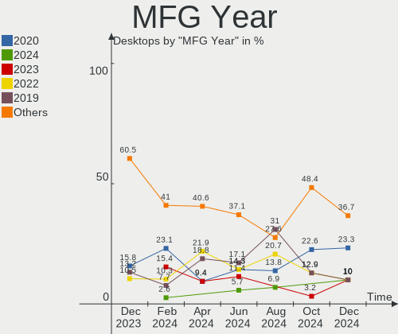
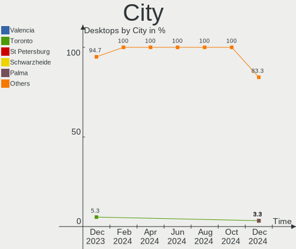
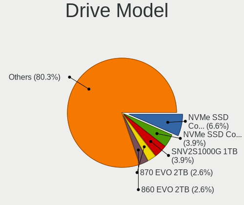
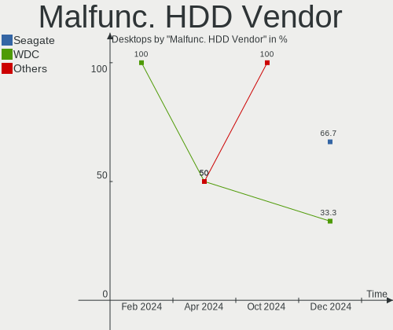
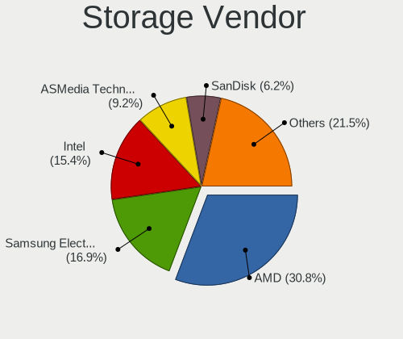
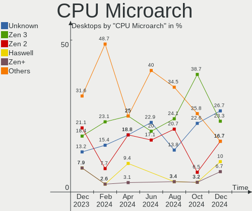
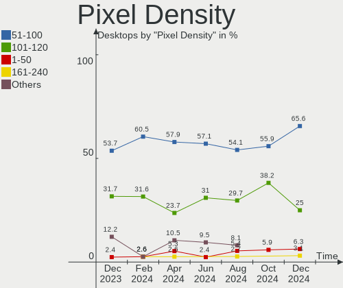
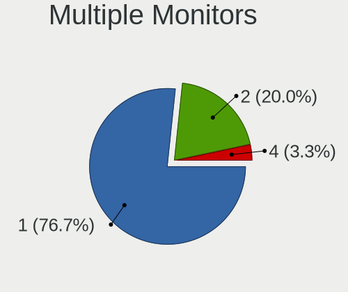
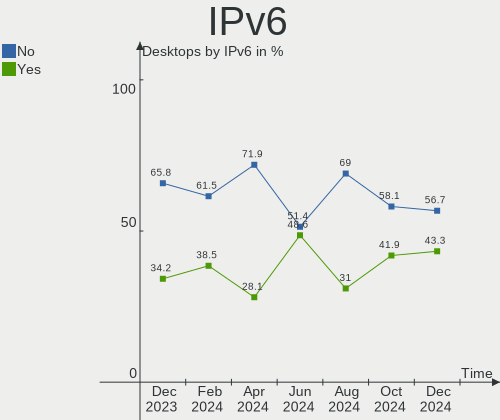
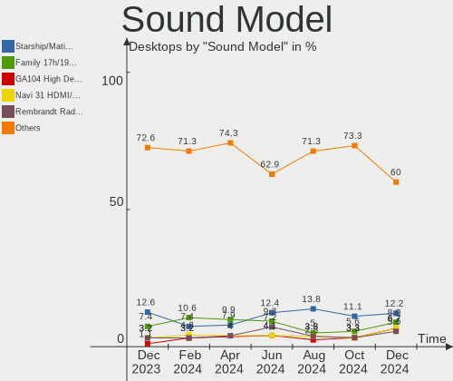

Nobara - Hardware Trends (Desktops)
-----------------------------------

A project to identify most popular hardware characteristics and track their change
over time based on data collected by Linux users at https://Linux-Hardware.org.

Anyone can contribute to this report by the [hw-probe](https://github.com/linuxhw/hw-probe) tool:

    sudo -E hw-probe -all -upload

This report is for one last month. Overall report since the beginning of time: [TestDays](https://github.com/linuxhw/TestDays)

Period: Apr, 2023.

Contents
--------

* [ System ](#system)
  - [ OS                       ](#os)
  - [ OS Family                ](#os-family)
  - [ Kernel                   ](#kernel)
  - [ Kernel Family            ](#kernel-family)
  - [ Kernel Major Ver.        ](#kernel-major-ver)
  - [ Arch                     ](#arch)
  - [ DE                       ](#de)
  - [ Display Server           ](#display-server)
  - [ Display Manager          ](#display-manager)
  - [ OS Lang                  ](#os-lang)
  - [ Boot Mode                ](#boot-mode)
  - [ Filesystem               ](#filesystem)
  - [ Part. scheme             ](#part-scheme)
  - [ Dual Boot with Linux/BSD ](#dual-boot-with-linuxbsd)
  - [ Dual Boot (Win)          ](#dual-boot-win)

* [ Board ](#board)
  - [ Vendor                   ](#vendor)
  - [ Model                    ](#model)
  - [ Model Family             ](#model-family)
  - [ MFG Year                 ](#mfg-year)
  - [ Form Factor              ](#form-factor)
  - [ Secure Boot              ](#secure-boot)
  - [ Coreboot                 ](#coreboot)
  - [ RAM Size                 ](#ram-size)
  - [ RAM Used                 ](#ram-used)
  - [ Total Drives             ](#total-drives)
  - [ Has CD-ROM               ](#has-cd-rom)
  - [ Has Ethernet             ](#has-ethernet)
  - [ Has WiFi                 ](#has-wifi)
  - [ Has Bluetooth            ](#has-bluetooth)

* [ Location ](#location)
  - [ Country                  ](#country)
  - [ City                     ](#city)

* [ Drives ](#drives)
  - [ Drive Vendor             ](#drive-vendor)
  - [ Drive Model              ](#drive-model)
  - [ HDD Vendor               ](#hdd-vendor)
  - [ SSD Vendor               ](#ssd-vendor)
  - [ Drive Kind               ](#drive-kind)
  - [ Drive Connector          ](#drive-connector)
  - [ Drive Size               ](#drive-size)
  - [ Space Total              ](#space-total)
  - [ Space Used               ](#space-used)
  - [ Malfunc. Drives          ](#malfunc-drives)
  - [ Malfunc. Drive Vendor    ](#malfunc-drive-vendor)
  - [ Malfunc. HDD Vendor      ](#malfunc-hdd-vendor)
  - [ Malfunc. Drive Kind      ](#malfunc-drive-kind)
  - [ Failed Drives            ](#failed-drives)
  - [ Failed Drive Vendor      ](#failed-drive-vendor)
  - [ Drive Status             ](#drive-status)

* [ Storage controller ](#storage-controller)
  - [ Storage Vendor           ](#storage-vendor)
  - [ Storage Model            ](#storage-model)
  - [ Storage Kind             ](#storage-kind)

* [ Processor ](#processor)
  - [ CPU Vendor               ](#cpu-vendor)
  - [ CPU Model                ](#cpu-model)
  - [ CPU Model Family         ](#cpu-model-family)
  - [ CPU Cores                ](#cpu-cores)
  - [ CPU Sockets              ](#cpu-sockets)
  - [ CPU Threads              ](#cpu-threads)
  - [ CPU Op-Modes             ](#cpu-op-modes)
  - [ CPU Microcode            ](#cpu-microcode)
  - [ CPU Microarch            ](#cpu-microarch)

* [ Graphics ](#graphics)
  - [ GPU Vendor               ](#gpu-vendor)
  - [ GPU Model                ](#gpu-model)
  - [ GPU Combo                ](#gpu-combo)
  - [ GPU Driver               ](#gpu-driver)
  - [ GPU Memory               ](#gpu-memory)

* [ Monitor ](#monitor)
  - [ Monitor Vendor           ](#monitor-vendor)
  - [ Monitor Model            ](#monitor-model)
  - [ Monitor Resolution       ](#monitor-resolution)
  - [ Monitor Diagonal         ](#monitor-diagonal)
  - [ Monitor Width            ](#monitor-width)
  - [ Aspect Ratio             ](#aspect-ratio)
  - [ Monitor Area             ](#monitor-area)
  - [ Pixel Density            ](#pixel-density)
  - [ Multiple Monitors        ](#multiple-monitors)

* [ Network ](#network)
  - [ Net Controller Vendor    ](#net-controller-vendor)
  - [ Net Controller Model     ](#net-controller-model)
  - [ Wireless Vendor          ](#wireless-vendor)
  - [ Wireless Model           ](#wireless-model)
  - [ Ethernet Vendor          ](#ethernet-vendor)
  - [ Ethernet Model           ](#ethernet-model)
  - [ Net Controller Kind      ](#net-controller-kind)
  - [ Used Controller          ](#used-controller)
  - [ NICs                     ](#nics)
  - [ IPv6                     ](#ipv6)

* [ Bluetooth ](#bluetooth)
  - [ Bluetooth Vendor         ](#bluetooth-vendor)
  - [ Bluetooth Model          ](#bluetooth-model)

* [ Sound ](#sound)
  - [ Sound Vendor             ](#sound-vendor)
  - [ Sound Model              ](#sound-model)

* [ Memory ](#memory)
  - [ Memory Vendor            ](#memory-vendor)
  - [ Memory Model             ](#memory-model)
  - [ Memory Kind              ](#memory-kind)
  - [ Memory Form Factor       ](#memory-form-factor)
  - [ Memory Size              ](#memory-size)
  - [ Memory Speed             ](#memory-speed)

* [ Printers & scanners ](#printers--scanners)
  - [ Printer Vendor           ](#printer-vendor)
  - [ Printer Model            ](#printer-model)
  - [ Scanner Vendor           ](#scanner-vendor)
  - [ Scanner Model            ](#scanner-model)

* [ Camera ](#camera)
  - [ Camera Vendor            ](#camera-vendor)
  - [ Camera Model             ](#camera-model)

* [ Security ](#security)
  - [ Fingerprint Vendor       ](#fingerprint-vendor)
  - [ Fingerprint Model        ](#fingerprint-model)
  - [ Chipcard Vendor          ](#chipcard-vendor)
  - [ Chipcard Model           ](#chipcard-model)

* [ Unsupported ](#unsupported)
  - [ Unsupported Devices      ](#unsupported-devices)
  - [ Unsupported Device Types ](#unsupported-device-types)

System
------

OS
--

Installed operating systems

| Name      | Desktops | Percent |
|-----------|----------|---------|
| Nobara 37 | 25       | 96.15%  |
| Nobara 36 | 1        | 3.85%   |

OS Family
---------

OS without a version

| Name   | Desktops | Percent |
|--------|----------|---------|
| Nobara | 26       | 100%    |

Kernel
------

Version of the Linux kernel

| Version                      | Desktops | Percent |
|------------------------------|----------|---------|
| 6.2.10-200.fsync.fc37.x86_64 | 8        | 30.77%  |
| 6.2.8-200.fsync.fc37.x86_64  | 6        | 23.08%  |
| 6.2.11-202.fsync.fc37.x86_64 | 6        | 23.08%  |
| 6.2.12-200.fsync.fc37.x86_64 | 2        | 7.69%   |
| 6.2.11-201.fsync.fc37.x86_64 | 2        | 7.69%   |
| 6.2.6-201.fsync.fc37.x86_64  | 1        | 3.85%   |
| 6.0.14-201.fsync.fc36.x86_64 | 1        | 3.85%   |

Kernel Family
-------------

Linux kernel without a distro release

| Version | Desktops | Percent |
|---------|----------|---------|
| 6.2.11  | 8        | 30.77%  |
| 6.2.10  | 8        | 30.77%  |
| 6.2.8   | 6        | 23.08%  |
| 6.2.12  | 2        | 7.69%   |
| 6.2.6   | 1        | 3.85%   |
| 6.0.14  | 1        | 3.85%   |

Kernel Major Ver.
-----------------

Linux kernel major version

| Version | Desktops | Percent |
|---------|----------|---------|
| 6.2     | 25       | 96.15%  |
| 6.0     | 1        | 3.85%   |

Arch
----

OS architecture (x86_64, i586, etc.)

| Name   | Desktops | Percent |
|--------|----------|---------|
| x86_64 | 26       | 100%    |

DE
--

Desktop Environment

| Name  | Desktops | Percent |
|-------|----------|---------|
| GNOME | 16       | 61.54%  |
| KDE5  | 10       | 38.46%  |

Display Server
--------------

X11 or Wayland

| Name    | Desktops | Percent |
|---------|----------|---------|
| Wayland | 18       | 69.23%  |
| X11     | 8        | 30.77%  |

Display Manager
---------------

SDDM, LightDM, etc.

| Name    | Desktops | Percent |
|---------|----------|---------|
| Unknown | 20       | 76.92%  |
| GDM     | 4        | 15.38%  |
| SDDM    | 2        | 7.69%   |

OS Lang
-------

Language

| Lang  | Desktops | Percent |
|-------|----------|---------|
| en_US | 17       | 65.38%  |
| fr_FR | 2        | 7.69%   |
| de_DE | 2        | 7.69%   |
| nl_NL | 1        | 3.85%   |
| it_IT | 1        | 3.85%   |
| es_AR | 1        | 3.85%   |
| en_GB | 1        | 3.85%   |
| en_CA | 1        | 3.85%   |

Boot Mode
---------

EFI or BIOS

| Mode | Desktops | Percent |
|------|----------|---------|
| EFI  | 19       | 73.08%  |
| BIOS | 7        | 26.92%  |

Filesystem
----------

Type of filesystem

| Type  | Desktops | Percent |
|-------|----------|---------|
| Btrfs | 23       | 88.46%  |
| Ext4  | 3        | 11.54%  |

Part. scheme
------------

Scheme of partitioning

| Type    | Desktops | Percent |
|---------|----------|---------|
| Unknown | 20       | 76.92%  |
| GPT     | 6        | 23.08%  |

Dual Boot with Linux/BSD
------------------------

Hosting more than one Linux/BSD

| Dual boot | Desktops | Percent |
|-----------|----------|---------|
| No        | 26       | 100%    |

Dual Boot (Win)
---------------

Hosting Linux and Windows

| Dual boot | Desktops | Percent |
|-----------|----------|---------|
| No        | 23       | 88.46%  |
| Yes       | 3        | 11.54%  |

Board
-----

Vendor
------

Motherboard manufacturer

| Name                | Desktops | Percent |
|---------------------|----------|---------|
| ASUSTek Computer    | 8        | 30.77%  |
| MSI                 | 6        | 23.08%  |
| Gigabyte Technology | 6        | 23.08%  |
| Hewlett-Packard     | 2        | 7.69%   |
| Dell                | 2        | 7.69%   |
| Protectli           | 1        | 3.85%   |
| ASRock              | 1        | 3.85%   |

Model
-----

Motherboard model

| Name                               | Desktops | Percent |
|------------------------------------|----------|---------|
| Protectli FW6                      | 1        | 3.85%   |
| MSI MS-7D32                        | 1        | 3.85%   |
| MSI MS-7D25                        | 1        | 3.85%   |
| MSI MS-7C02                        | 1        | 3.85%   |
| MSI MS-7B86                        | 1        | 3.85%   |
| MSI MS-7B79                        | 1        | 3.85%   |
| MSI MS-7866                        | 1        | 3.85%   |
| HP ProDesk 600 G1 TWR              | 1        | 3.85%   |
| HP ProDesk 490 G3 MT Business PC   | 1        | 3.85%   |
| Gigabyte Z77P-D3                   | 1        | 3.85%   |
| Gigabyte X570 AORUS ELITE WIFI     | 1        | 3.85%   |
| Gigabyte G1.Sniper B5              | 1        | 3.85%   |
| Gigabyte B650 AORUS PRO AX         | 1        | 3.85%   |
| Gigabyte B550 AORUS ELITE V2       | 1        | 3.85%   |
| Gigabyte B150M-D3H                 | 1        | 3.85%   |
| Dell XPS 8700                      | 1        | 3.85%   |
| Dell Inspiron 660                  | 1        | 3.85%   |
| ASUS TUF Gaming Z690-PLUS WIFI D4  | 1        | 3.85%   |
| ASUS TUF Gaming B550M-PLUS WIFI II | 1        | 3.85%   |
| ASUS TUF Gaming B550M-PLUS         | 1        | 3.85%   |
| ASUS TUF Gaming B550-PLUS          | 1        | 3.85%   |
| ASUS TUF Gaming B460-PLUS          | 1        | 3.85%   |
| ASUS TUF Gaming A520M-PLUS         | 1        | 3.85%   |
| ASUS PRIME B450M-A II              | 1        | 3.85%   |
| ASUS A68HM-K                       | 1        | 3.85%   |
| ASRock B550M Phantom Gaming 4      | 1        | 3.85%   |

Model Family
------------

Motherboard model prefix

| Name               | Desktops | Percent |
|--------------------|----------|---------|
| ASUS TUF           | 6        | 23.08%  |
| HP ProDesk         | 2        | 7.69%   |
| Protectli FW6      | 1        | 3.85%   |
| MSI MS-7D32        | 1        | 3.85%   |
| MSI MS-7D25        | 1        | 3.85%   |
| MSI MS-7C02        | 1        | 3.85%   |
| MSI MS-7B86        | 1        | 3.85%   |
| MSI MS-7B79        | 1        | 3.85%   |
| MSI MS-7866        | 1        | 3.85%   |
| Gigabyte Z77P-D3   | 1        | 3.85%   |
| Gigabyte X570      | 1        | 3.85%   |
| Gigabyte G1.Sniper | 1        | 3.85%   |
| Gigabyte B650      | 1        | 3.85%   |
| Gigabyte B550      | 1        | 3.85%   |
| Gigabyte B150M-D3H | 1        | 3.85%   |
| Dell XPS           | 1        | 3.85%   |
| Dell Inspiron      | 1        | 3.85%   |
| ASUS PRIME         | 1        | 3.85%   |
| ASUS A68HM-K       | 1        | 3.85%   |
| ASRock B550M       | 1        | 3.85%   |

MFG Year
--------

Motherboard manufacture year

| Year | Desktops | Percent |
|------|----------|---------|
| 2020 | 6        | 23.08%  |
| 2021 | 4        | 15.38%  |
| 2019 | 4        | 15.38%  |
| 2013 | 3        | 11.54%  |
| 2022 | 2        | 7.69%   |
| 2016 | 2        | 7.69%   |
| 2014 | 2        | 7.69%   |
| 2012 | 2        | 7.69%   |
| 2018 | 1        | 3.85%   |

Form Factor
-----------

Physical design of the computer

| Name    | Desktops | Percent |
|---------|----------|---------|
| Desktop | 26       | 100%    |

Secure Boot
-----------

Enabled or disabled

| State    | Desktops | Percent |
|----------|----------|---------|
| Disabled | 26       | 100%    |

Coreboot
--------

Have coreboot on board

| Used | Desktops | Percent |
|------|----------|---------|
| No   | 26       | 100%    |

RAM Size
--------

Total RAM memory

| Size in GB  | Desktops | Percent |
|-------------|----------|---------|
| 16.01-24.0  | 12       | 46.15%  |
| 32.01-64.0  | 8        | 30.77%  |
| 24.01-32.0  | 4        | 15.38%  |
| 4.01-8.0    | 1        | 3.85%   |
| 64.01-256.0 | 1        | 3.85%   |

RAM Used
--------

Used RAM memory

| Used GB   | Desktops | Percent |
|-----------|----------|---------|
| 3.01-4.0  | 8        | 30.77%  |
| 2.01-3.0  | 8        | 30.77%  |
| 4.01-8.0  | 7        | 26.92%  |
| 1.01-2.0  | 2        | 7.69%   |
| 8.01-16.0 | 1        | 3.85%   |

Total Drives
------------

Number of drives on board

| Drives | Desktops | Percent |
|--------|----------|---------|
| 2      | 8        | 30.77%  |
| 1      | 8        | 30.77%  |
| 3      | 5        | 19.23%  |
| 4      | 3        | 11.54%  |
| 10     | 1        | 3.85%   |
| 7      | 1        | 3.85%   |

Has CD-ROM
----------

Has CD-ROM on board

| Presented | Desktops | Percent |
|-----------|----------|---------|
| No        | 21       | 80.77%  |
| Yes       | 5        | 19.23%  |

Has Ethernet
------------

Has Ethernet on board

| Presented | Desktops | Percent |
|-----------|----------|---------|
| Yes       | 26       | 100%    |

Has WiFi
--------

Has WiFi module

| Presented | Desktops | Percent |
|-----------|----------|---------|
| Yes       | 15       | 57.69%  |
| No        | 11       | 42.31%  |

Has Bluetooth
-------------

Has Bluetooth module

| Presented | Desktops | Percent |
|-----------|----------|---------|
| Yes       | 14       | 53.85%  |
| No        | 12       | 46.15%  |

Location
--------

Country
-------

Geographic location (country)

| Country     | Desktops | Percent |
|-------------|----------|---------|
| USA         | 11       | 42.31%  |
| Germany     | 4        | 15.38%  |
| Netherlands | 2        | 7.69%   |
| France      | 2        | 7.69%   |
| UK          | 1        | 3.85%   |
| Turkey      | 1        | 3.85%   |
| Italy       | 1        | 3.85%   |
| Hungary     | 1        | 3.85%   |
| Greece      | 1        | 3.85%   |
| Canada      | 1        | 3.85%   |
| Argentina   | 1        | 3.85%   |

City
----

Geographic location (city)

| City             | Desktops | Percent |
|------------------|----------|---------|
| Wuppertal        | 1        | 3.85%   |
| Waite Park       | 1        | 3.85%   |
| Villa Bosch      | 1        | 3.85%   |
| Victoria         | 1        | 3.85%   |
| Tooele           | 1        | 3.85%   |
| Stuttgart        | 1        | 3.85%   |
| Scunthorpe       | 1        | 3.85%   |
| Rome             | 1        | 3.85%   |
| Perols           | 1        | 3.85%   |
| New Orleans      | 1        | 3.85%   |
| Marousi          | 1        | 3.85%   |
| Los Angeles      | 1        | 3.85%   |
| Lake Elsinore    | 1        | 3.85%   |
| Kaloz            | 1        | 3.85%   |
| Jefferson City   | 1        | 3.85%   |
| Izmir            | 1        | 3.85%   |
| IJsselstein      | 1        | 3.85%   |
| Huenxe           | 1        | 3.85%   |
| Heythuysen       | 1        | 3.85%   |
| Graham           | 1        | 3.85%   |
| Gourdon          | 1        | 3.85%   |
| Denver           | 1        | 3.85%   |
| Cullman          | 1        | 3.85%   |
| Colorado Springs | 1        | 3.85%   |
| Boynton Beach    | 1        | 3.85%   |
| Aurich           | 1        | 3.85%   |

Drives
------

Drive Vendor
------------

Hard drive vendors

| Vendor                      | Desktops | Drives | Percent |
|-----------------------------|----------|--------|---------|
| Sandisk                     | 9        | 10     | 15.79%  |
| Samsung Electronics         | 8        | 12     | 14.04%  |
| WDC                         | 7        | 9      | 12.28%  |
| Seagate                     | 7        | 8      | 12.28%  |
| Crucial                     | 5        | 5      | 8.77%   |
| Kingston                    | 3        | 4      | 5.26%   |
| PNY                         | 2        | 2      | 3.51%   |
| Micron/Crucial Technology   | 2        | 3      | 3.51%   |
| Hitachi                     | 2        | 3      | 3.51%   |
| Unknown                     | 1        | 1      | 1.75%   |
| Toshiba                     | 1        | 1      | 1.75%   |
| Team                        | 1        | 1      | 1.75%   |
| SPCC                        | 1        | 1      | 1.75%   |
| Silicon Motion              | 1        | 1      | 1.75%   |
| SABRENT                     | 1        | 1      | 1.75%   |
| Phison Electronics          | 1        | 1      | 1.75%   |
| KIOXIA-EXCERIA              | 1        | 1      | 1.75%   |
| Kingston Technology Company | 1        | 1      | 1.75%   |
| Intenso                     | 1        | 1      | 1.75%   |
| Intel                       | 1        | 1      | 1.75%   |
| Hypertec                    | 1        | 1      | 1.75%   |

Drive Model
-----------

Hard drive models

| Model                                                  | Desktops | Percent |
|--------------------------------------------------------|----------|---------|
| Seagate ST2000DM008-2FR102 2TB                         | 3        | 4.55%   |
| Samsung NVMe SSD Controller PM9A1/PM9A3/980PRO 2TB     | 3        | 4.55%   |
| WDC WD10EZEX-00BN5A0 1TB                               | 2        | 3.03%   |
| PNY CS900 500GB SSD                                    | 2        | 3.03%   |
| Micron/Crucial P2 NVMe PCIe SSD 1TB                    | 2        | 3.03%   |
| WDC WDS240G2G0A-00JH30 240GB SSD                       | 1        | 1.52%   |
| WDC WD80EMZZ-11B4FB0 8TB                               | 1        | 1.52%   |
| WDC WD20EZRZ-00Z5HB0 2TB                               | 1        | 1.52%   |
| WDC WD10EZRX-00L4HB0 1TB                               | 1        | 1.52%   |
| WDC WD10EAVS-00M4B0 1TB                                | 1        | 1.52%   |
| WDC WD10EACS-00D6B0 1TB                                | 1        | 1.52%   |
| WDC WD Blue SA510 2.5 500GB                            | 1        | 1.52%   |
| Unknown USB DISK 3.2 250GB                             | 1        | 1.52%   |
| Toshiba DT01ACA100 1TB                                 | 1        | 1.52%   |
| Team T253X6001T 1024GB SSD                             | 1        | 1.52%   |
| SPCC Solid State Disk 240GB                            | 1        | 1.52%   |
| Silicon Motion SM2263EN/SM2263XT SSD Controller 1024GB | 1        | 1.52%   |
| Seagate ST4000DM004-2U9104 4TB                         | 1        | 1.52%   |
| Seagate ST4000DM004-2CV104 4TB                         | 1        | 1.52%   |
| Seagate ST31000528AS 1TB                               | 1        | 1.52%   |
| Seagate ST1000DM010-2EP102 1TB                         | 1        | 1.52%   |
| Seagate ST1000DM003-1CH162 1TB                         | 1        | 1.52%   |
| Sandisk WD_BLACK SN770 500GB                           | 1        | 1.52%   |
| Sandisk WD Blue SN570 500GB                            | 1        | 1.52%   |
| Sandisk WD Blue SN550 NVMe SSD 1024GB                  | 1        | 1.52%   |
| Sandisk WD Black SN850 1TB                             | 1        | 1.52%   |
| SanDisk SDSSDH3512G 512GB                              | 1        | 1.52%   |
| SanDisk SDSSDH31000G 1TB                               | 1        | 1.52%   |
| SanDisk SD8SN8U512G1002 512GB SSD                      | 1        | 1.52%   |
| SanDisk NVMe SSD Drive 2TB                             | 1        | 1.52%   |
| SanDisk NVMe SSD Drive 1TB                             | 1        | 1.52%   |
| Samsung SSD 980 1TB                                    | 1        | 1.52%   |
| Samsung SSD 870 EVO 4TB                                | 1        | 1.52%   |
| Samsung SSD 860 EVO 500GB                              | 1        | 1.52%   |
| Samsung SSD 850 EVO 500GB                              | 1        | 1.52%   |
| Samsung SSD 850 EVO 250GB                              | 1        | 1.52%   |
| Samsung SSD 840 Series 120GB                           | 1        | 1.52%   |
| Samsung SSD 840 EVO 250GB                              | 1        | 1.52%   |
| Samsung NVMe SSD Controller SM981/PM981/PM983 1TB      | 1        | 1.52%   |
| Samsung HD502HI 500GB                                  | 1        | 1.52%   |

HDD Vendor
----------

Hard disk drive vendors

| Vendor              | Desktops | Drives | Percent |
|---------------------|----------|--------|---------|
| Seagate             | 7        | 8      | 41.18%  |
| WDC                 | 5        | 7      | 29.41%  |
| Hitachi             | 2        | 3      | 11.76%  |
| Toshiba             | 1        | 1      | 5.88%   |
| Samsung Electronics | 1        | 1      | 5.88%   |
| SABRENT             | 1        | 1      | 5.88%   |

SSD Vendor
----------

Solid state drive vendors

| Vendor              | Desktops | Drives | Percent |
|---------------------|----------|--------|---------|
| Samsung Electronics | 6        | 6      | 26.09%  |
| Crucial             | 4        | 4      | 17.39%  |
| SanDisk             | 3        | 3      | 13.04%  |
| WDC                 | 2        | 2      | 8.7%    |
| PNY                 | 2        | 2      | 8.7%    |
| Kingston            | 2        | 3      | 8.7%    |
| Team                | 1        | 1      | 4.35%   |
| SPCC                | 1        | 1      | 4.35%   |
| KIOXIA-EXCERIA      | 1        | 1      | 4.35%   |
| Hypertec            | 1        | 1      | 4.35%   |

Drive Kind
----------

HDD or SSD

| Kind    | Desktops | Drives | Percent |
|---------|----------|--------|---------|
| SSD     | 20       | 24     | 41.67%  |
| NVMe    | 13       | 21     | 27.08%  |
| HDD     | 13       | 21     | 27.08%  |
| Unknown | 2        | 2      | 4.17%   |

Drive Connector
---------------

SATA, SAS, NVMe, etc.

| Type | Desktops | Drives | Percent |
|------|----------|--------|---------|
| SATA | 23       | 45     | 62.16%  |
| NVMe | 13       | 21     | 35.14%  |
| SAS  | 1        | 2      | 2.7%    |

Drive Size
----------

Size of hard drive

| Size in TB | Desktops | Drives | Percent |
|------------|----------|--------|---------|
| 0.51-1.0   | 15       | 17     | 42.86%  |
| 0.01-0.5   | 13       | 19     | 37.14%  |
| 1.01-2.0   | 4        | 5      | 11.43%  |
| 3.01-4.0   | 2        | 3      | 5.71%   |
| 4.01-10.0  | 1        | 1      | 2.86%   |

Space Total
-----------

Amount of disk space available on the file system

| Size in GB     | Desktops | Percent |
|----------------|----------|---------|
| 1001-2000      | 10       | 38.46%  |
| 501-1000       | 6        | 23.08%  |
| 251-500        | 3        | 11.54%  |
| 101-250        | 3        | 11.54%  |
| More than 3000 | 2        | 7.69%   |
| 2001-3000      | 2        | 7.69%   |

Space Used
----------

Amount of used disk space

| Used GB   | Desktops | Percent |
|-----------|----------|---------|
| 251-500   | 6        | 23.08%  |
| 51-100    | 6        | 23.08%  |
| 101-250   | 5        | 19.23%  |
| 21-50     | 4        | 15.38%  |
| 1001-2000 | 2        | 7.69%   |
| 1-20      | 2        | 7.69%   |
| 501-1000  | 1        | 3.85%   |

Malfunc. Drives
---------------

Drive models with a malfunction

| Model                   | Desktops | Drives | Percent |
|-------------------------|----------|--------|---------|
| WDC WD10EACS-00D6B0 1TB | 1        | 1      | 100%    |

Malfunc. Drive Vendor
---------------------

Vendors of faulty drives

| Vendor | Desktops | Drives | Percent |
|--------|----------|--------|---------|
| WDC    | 1        | 1      | 100%    |

Malfunc. HDD Vendor
-------------------

Vendors of faulty HDD drives

| Vendor | Desktops | Drives | Percent |
|--------|----------|--------|---------|
| WDC    | 1        | 1      | 100%    |

Malfunc. Drive Kind
-------------------

Kinds of faulty drives

| Kind | Desktops | Drives | Percent |
|------|----------|--------|---------|
| HDD  | 1        | 1      | 100%    |

Failed Drives
-------------

Failed drive models

Zero info for selected period =(

Failed Drive Vendor
-------------------

Failed drive vendors

Zero info for selected period =(

Drive Status
------------

Number of failed and malfunc. drives

| Status   | Desktops | Drives | Percent |
|----------|----------|--------|---------|
| Detected | 22       | 59     | 78.57%  |
| Works    | 5        | 8      | 17.86%  |
| Malfunc  | 1        | 1      | 3.57%   |

Storage controller
------------------

Storage Vendor
--------------

Storage controller vendors

| Vendor                      | Desktops | Percent |
|-----------------------------|----------|---------|
| Intel                       | 14       | 30.43%  |
| AMD                         | 13       | 28.26%  |
| SanDisk                     | 6        | 13.04%  |
| Samsung Electronics         | 4        | 8.7%    |
| Micron/Crucial Technology   | 3        | 6.52%   |
| Kingston Technology Company | 2        | 4.35%   |
| ASMedia Technology          | 2        | 4.35%   |
| Silicon Motion              | 1        | 2.17%   |
| Phison Electronics          | 1        | 2.17%   |

Storage Model
-------------

Storage controller models

| Model                                                                          | Desktops | Percent |
|--------------------------------------------------------------------------------|----------|---------|
| AMD 500 Series Chipset SATA Controller                                         | 6        | 12%     |
| AMD FCH SATA Controller [AHCI mode]                                            | 4        | 8%      |
| AMD 400 Series Chipset SATA Controller                                         | 4        | 8%      |
| Samsung NVMe SSD Controller PM9A1/PM9A3/980PRO                                 | 3        | 6%      |
| Intel Alder Lake-S PCH SATA Controller [AHCI Mode]                             | 3        | 6%      |
| Intel 8 Series/C220 Series Chipset Family 6-port SATA Controller 1 [AHCI mode] | 3        | 6%      |
| SanDisk WD Blue SN570 NVMe SSD 1TB                                             | 2        | 4%      |
| Micron/Crucial P2 NVMe PCIe SSD                                                | 2        | 4%      |
| Kingston Company A2000 NVMe SSD                                                | 2        | 4%      |
| Intel Q170/Q150/B150/H170/H110/Z170/CM236 Chipset SATA Controller [AHCI Mode]  | 2        | 4%      |
| ASMedia ASM1062 Serial ATA Controller                                          | 2        | 4%      |
| Silicon Motion SM2263EN/SM2263XT SSD Controller                                | 1        | 2%      |
| Sandisk Western Digital WD Black SN850X NVMe SSD                               | 1        | 2%      |
| SanDisk WD PC SN810 / Black SN850 NVMe SSD                                     | 1        | 2%      |
| SanDisk WD Blue SN550 NVMe SSD                                                 | 1        | 2%      |
| SanDisk WD Black SN770 NVMe SSD                                                | 1        | 2%      |
| Samsung NVMe SSD Controller SM981/PM981/PM983                                  | 1        | 2%      |
| Samsung NVMe SSD Controller 980                                                | 1        | 2%      |
| Phison E12 NVMe Controller                                                     | 1        | 2%      |
| Micron/Crucial P5 Plus NVMe PCIe SSD                                           | 1        | 2%      |
| Intel Volume Management Device NVMe RAID Controller                            | 1        | 2%      |
| Intel Sunrise Point-LP SATA Controller [AHCI mode]                             | 1        | 2%      |
| Intel SSD 600P Series                                                          | 1        | 2%      |
| Intel SATA Controller [RAID mode]                                              | 1        | 2%      |
| Intel 7 Series/C210 Series Chipset Family 6-port SATA Controller [AHCI mode]   | 1        | 2%      |
| Intel 7 Series/C210 Series Chipset Family 4-port SATA Controller [IDE mode]    | 1        | 2%      |
| Intel 7 Series/C210 Series Chipset Family 2-port SATA Controller [IDE mode]    | 1        | 2%      |
| Intel 300 Series Chipset Family SATA RAID Controller                           | 1        | 2%      |

Storage Kind
------------

Kind of storage controller (IDE, SATA, NVMe, SAS, ...)

| Kind | Desktops | Percent |
|------|----------|---------|
| SATA | 23       | 57.5%   |
| NVMe | 13       | 32.5%   |
| RAID | 3        | 7.5%    |
| IDE  | 1        | 2.5%    |

Processor
---------

CPU Vendor
----------

Processor vendors

| Vendor | Desktops | Percent |
|--------|----------|---------|
| Intel  | 13       | 50%     |
| AMD    | 13       | 50%     |

CPU Model
---------

Processor models

| Model                                           | Desktops | Percent |
|-------------------------------------------------|----------|---------|
| Intel 12th Gen Core i7-12700K                   | 2        | 7.69%   |
| AMD Ryzen 7 5700X 8-Core Processor              | 2        | 7.69%   |
| AMD Ryzen 5 5600X 6-Core Processor              | 2        | 7.69%   |
| AMD Ryzen 5 5600 6-Core Processor               | 2        | 7.69%   |
| AMD Ryzen 5 3600 6-Core Processor               | 2        | 7.69%   |
| Intel Xeon CPU E31275 @ 3.40GHz                 | 1        | 3.85%   |
| Intel Xeon CPU E3-1230 v3 @ 3.30GHz             | 1        | 3.85%   |
| Intel Core i7-6700 CPU @ 3.40GHz                | 1        | 3.85%   |
| Intel Core i7-4770 CPU @ 3.40GHz                | 1        | 3.85%   |
| Intel Core i5-7200U CPU @ 2.50GHz               | 1        | 3.85%   |
| Intel Core i5-4590 CPU @ 3.30GHz                | 1        | 3.85%   |
| Intel Core i5-4460 CPU @ 3.20GHz                | 1        | 3.85%   |
| Intel Core i5-3470 CPU @ 3.20GHz                | 1        | 3.85%   |
| Intel Core i5-10400F CPU @ 2.90GHz              | 1        | 3.85%   |
| Intel Core i3-6100 CPU @ 3.70GHz                | 1        | 3.85%   |
| Intel 13th Gen Core i7-13700K                   | 1        | 3.85%   |
| AMD Ryzen 9 7900X 12-Core Processor             | 1        | 3.85%   |
| AMD Ryzen 7 5800X 8-Core Processor              | 1        | 3.85%   |
| AMD Ryzen 5 5500                                | 1        | 3.85%   |
| AMD Ryzen 3 3200G with Radeon Vega Graphics     | 1        | 3.85%   |
| AMD A10-7850K Radeon R7, 12 Compute Cores 4C+8G | 1        | 3.85%   |

CPU Model Family
----------------

Processor model prefix

| Model         | Desktops | Percent |
|---------------|----------|---------|
| AMD Ryzen 5   | 7        | 26.92%  |
| Intel Core i5 | 5        | 19.23%  |
| Other         | 3        | 11.54%  |
| AMD Ryzen 7   | 3        | 11.54%  |
| Intel Xeon    | 2        | 7.69%   |
| Intel Core i7 | 2        | 7.69%   |
| Intel Core i3 | 1        | 3.85%   |
| AMD Ryzen 9   | 1        | 3.85%   |
| AMD Ryzen 3   | 1        | 3.85%   |
| AMD A10       | 1        | 3.85%   |

CPU Cores
---------

Number of processor cores

| Number | Desktops | Percent |
|--------|----------|---------|
| 6      | 8        | 30.77%  |
| 4      | 8        | 30.77%  |
| 12     | 3        | 11.54%  |
| 8      | 3        | 11.54%  |
| 2      | 3        | 11.54%  |
| 16     | 1        | 3.85%   |

CPU Sockets
-----------

Number of sockets

| Number | Desktops | Percent |
|--------|----------|---------|
| 1      | 26       | 100%    |

CPU Threads
-----------

Threads per core (Hyper-Threading)

| Number | Desktops | Percent |
|--------|----------|---------|
| 2      | 22       | 84.62%  |
| 1      | 4        | 15.38%  |

CPU Op-Modes
------------

CPU Operation Modes (32-bit, 64-bit)

| Op mode        | Desktops | Percent |
|----------------|----------|---------|
| 32-bit, 64-bit | 26       | 100%    |

CPU Microcode
-------------

Microcode number

| Number     | Desktops | Percent |
|------------|----------|---------|
| Unknown    | 12       | 46.15%  |
| 0x0a20120a | 2        | 7.69%   |
| 0x0a201204 | 2        | 7.69%   |
| 0x08701021 | 2        | 7.69%   |
| 0x306c3    | 1        | 3.85%   |
| 0x0a601203 | 1        | 3.85%   |
| 0x0a50000d | 1        | 3.85%   |
| 0x0a201205 | 1        | 3.85%   |
| 0x0a201016 | 1        | 3.85%   |
| 0x08108109 | 1        | 3.85%   |
| 0x06003106 | 1        | 3.85%   |
| 0x00000000 | 1        | 3.85%   |

CPU Microarch
-------------

Microarchitecture

| Name             | Desktops | Percent |
|------------------|----------|---------|
| Zen 3            | 8        | 30.77%  |
| Haswell          | 4        | 15.38%  |
| Alderlake Hybrid | 3        | 11.54%  |
| Zen 2            | 2        | 7.69%   |
| Skylake          | 2        | 7.69%   |
| Zen+             | 1        | 3.85%   |
| Steamroller      | 1        | 3.85%   |
| SandyBridge      | 1        | 3.85%   |
| KabyLake         | 1        | 3.85%   |
| IvyBridge        | 1        | 3.85%   |
| CometLake        | 1        | 3.85%   |
| Unknown          | 1        | 3.85%   |

Graphics
--------

GPU Vendor
----------

Vendors of graphics cards

| Vendor | Desktops | Percent |
|--------|----------|---------|
| AMD    | 15       | 50%     |
| Nvidia | 9        | 30%     |
| Intel  | 6        | 20%     |

GPU Model
---------

Graphics card models

| Model                                                                       | Desktops | Percent |
|-----------------------------------------------------------------------------|----------|---------|
| AMD Navi 22 [Radeon RX 6700/6700 XT/6750 XT / 6800M/6850M XT]               | 3        | 10%     |
| AMD Ellesmere [Radeon RX 470/480/570/570X/580/580X/590]                     | 3        | 10%     |
| Nvidia GP104 [GeForce GTX 1070]                                             | 2        | 6.67%   |
| Intel DG2 [Arc A750]                                                        | 2        | 6.67%   |
| AMD Navi 21 [Radeon RX 6800/6800 XT / 6900 XT]                              | 2        | 6.67%   |
| Nvidia TU117 [GeForce GTX 1650]                                             | 1        | 3.33%   |
| Nvidia TU106 [GeForce RTX 2060 Rev. A]                                      | 1        | 3.33%   |
| Nvidia GK107 [GeForce GT 740]                                               | 1        | 3.33%   |
| Nvidia GK106 [GeForce GTX 650 Ti]                                           | 1        | 3.33%   |
| Nvidia GA106 [GeForce RTX 3060 Lite Hash Rate]                              | 1        | 3.33%   |
| Nvidia GA104 [GeForce RTX 3060 Ti]                                          | 1        | 3.33%   |
| Nvidia AD102 [GeForce RTX 4090]                                             | 1        | 3.33%   |
| Intel Xeon E3-1200 v3/4th Gen Core Processor Integrated Graphics Controller | 1        | 3.33%   |
| Intel Xeon E3-1200 Processor Family Integrated Graphics Controller          | 1        | 3.33%   |
| Intel Raptor Lake-S GT1 [UHD Graphics 770]                                  | 1        | 3.33%   |
| Intel HD Graphics 620                                                       | 1        | 3.33%   |
| AMD Venus XTX [Radeon HD 8890M / R9 M275X/M375X]                            | 1        | 3.33%   |
| AMD Raphael                                                                 | 1        | 3.33%   |
| AMD Picasso/Raven 2 [Radeon Vega Series / Radeon Vega Mobile Series]        | 1        | 3.33%   |
| AMD Navi 10 [Radeon RX 5600 OEM/5600 XT / 5700/5700 XT]                     | 1        | 3.33%   |
| AMD Lexa PRO [Radeon 540/540X/550/550X / RX 540X/550/550X]                  | 1        | 3.33%   |
| AMD Kaveri [Radeon R7 Graphics]                                             | 1        | 3.33%   |
| AMD Barts XT [Radeon HD 6870]                                               | 1        | 3.33%   |

GPU Combo
---------

Combinations of graphics cards

| Name         | Desktops | Percent |
|--------------|----------|---------|
| 1 x AMD      | 13       | 50%     |
| 1 x Nvidia   | 8        | 30.77%  |
| 1 x Intel    | 3        | 11.54%  |
| Intel + AMD  | 1        | 3.85%   |
| AMD + Nvidia | 1        | 3.85%   |

GPU Driver
----------

Free vs proprietary

| Driver      | Desktops | Percent |
|-------------|----------|---------|
| Free        | 19       | 73.08%  |
| Proprietary | 7        | 26.92%  |

GPU Memory
----------

Total video memory

| Size in GB | Desktops | Percent |
|------------|----------|---------|
| 7.01-8.0   | 7        | 26.92%  |
| 8.01-16.0  | 6        | 23.08%  |
| 1.01-2.0   | 4        | 15.38%  |
| Unknown    | 4        | 15.38%  |
| 3.01-4.0   | 2        | 7.69%   |
| 5.01-6.0   | 1        | 3.85%   |
| 16.01-24.0 | 1        | 3.85%   |
| 0.51-1.0   | 1        | 3.85%   |

Monitor
-------

Monitor Vendor
--------------

Monitor vendors

| Vendor               | Desktops | Percent |
|----------------------|----------|---------|
| Samsung Electronics  | 5        | 15.63%  |
| Goldstar             | 4        | 12.5%   |
| Dell                 | 4        | 12.5%   |
| BenQ                 | 3        | 9.38%   |
| Vizio                | 2        | 6.25%   |
| Ancor Communications | 2        | 6.25%   |
| Acer                 | 2        | 6.25%   |
| Unknown              | 1        | 3.13%   |
| Toshiba              | 1        | 3.13%   |
| Sony                 | 1        | 3.13%   |
| Pixio                | 1        | 3.13%   |
| Olevia               | 1        | 3.13%   |
| NEC Computers        | 1        | 3.13%   |
| Lenovo               | 1        | 3.13%   |
| Element              | 1        | 3.13%   |
| ASUSTek Computer     | 1        | 3.13%   |
| AOC                  | 1        | 3.13%   |

Monitor Model
-------------

Monitor models

| Model                                                                   | Desktops | Percent |
|-------------------------------------------------------------------------|----------|---------|
| Vizio V405-H9 VIZ1039 3840x2160 878x485mm 39.5-inch                     | 1        | 3.03%   |
| Vizio D32f-E1 VIZ1027 1920x1080 698x392mm 31.5-inch                     | 1        | 3.03%   |
| Unknown LCD Monitor FFFF 2288x1287 2550x2550mm 142.0-inch               | 1        | 3.03%   |
| Toshiba TV TSB0105 1920x1080 708x398mm 32.0-inch                        | 1        | 3.03%   |
| Sony TV *30 SNYAC06 3840x2160 1218x685mm 55.0-inch                      | 1        | 3.03%   |
| Samsung Electronics SyncMaster SAM03F0 1680x1050 433x271mm 20.1-inch    | 1        | 3.03%   |
| Samsung Electronics S SAM041E 2048x1152 510x287mm 23.0-inch             | 1        | 3.03%   |
| Samsung Electronics LS24AG32x SAM71DA 1920x1080 527x296mm 23.8-inch     | 1        | 3.03%   |
| Samsung Electronics LCD Monitor SAM0F14 3840x2160 1872x1053mm 84.6-inch | 1        | 3.03%   |
| Samsung Electronics C27JG5x SAM0FDB 2560x1440 597x336mm 27.0-inch       | 1        | 3.03%   |
| Pixio PX277P PNS0277 2560x1440 697x392mm 31.5-inch                      | 1        | 3.03%   |
| Olevia 237-T12 SYN0043 1360x768 820x460mm 37.0-inch                     | 1        | 3.03%   |
| NEC Computers 20WMGX2 NEC6694 1680x1050 433x270mm 20.1-inch             | 1        | 3.03%   |
| Lenovo LEN E2323swA LEN60B0 1920x1080 477x268mm 21.5-inch               | 1        | 3.03%   |
| Goldstar ULTRAGEAR GSM5BD3 2560x1440 697x392mm 31.5-inch                | 1        | 3.03%   |
| Goldstar IPS FULLHD GSM5AB8 1920x1080 480x270mm 21.7-inch               | 1        | 3.03%   |
| Goldstar HDR 4K GSM7707 3840x2160 600x340mm 27.2-inch                   | 1        | 3.03%   |
| Goldstar 19M35 GSM4C24 1366x768 410x230mm 18.5-inch                     | 1        | 3.03%   |
| Element ELEFW408 ELE1911 1920x1080 1150x650mm 52.0-inch                 | 1        | 3.03%   |
| Dell U2719DC DEL419C 2560x1440 597x336mm 27.0-inch                      | 1        | 3.03%   |
| Dell ST2220L DELA065 1920x1080 477x268mm 21.5-inch                      | 1        | 3.03%   |
| Dell P2419HC DELA11D 1920x1080 527x296mm 23.8-inch                      | 1        | 3.03%   |
| Dell 2208WFP DEL403C 1680x1050 473x296mm 22.0-inch                      | 1        | 3.03%   |
| Dell 2007FP DELA021 1600x1200 367x275mm 18.1-inch                       | 1        | 3.03%   |
| BenQ ZOWIE RL LCD BNQ7F4F 1920x1080 531x299mm 24.0-inch                 | 1        | 3.03%   |
| BenQ EW3270ZL BNQ7945 2560x1440 709x399mm 32.0-inch                     | 1        | 3.03%   |
| BenQ BL2410 BNQ8301 1920x1080 477x268mm 21.5-inch                       | 1        | 3.03%   |
| ASUSTek Computer VP249 AUS24AF 1920x1080 527x296mm 23.8-inch            | 1        | 3.03%   |
| AOC U34G2G4R3 AOC3402 3440x1440 797x334mm 34.0-inch                     | 1        | 3.03%   |
| Ancor Communications ASUS VN247 ACI24C3 1920x1080 521x293mm 23.5-inch   | 1        | 3.03%   |
| Ancor Communications ASUS PB278 ACI27A3 2560x1440 597x336mm 27.0-inch   | 1        | 3.03%   |
| Acer GN246HL ACR02FA 1920x1080 531x299mm 24.0-inch                      | 1        | 3.03%   |
| Acer GN246HL ACR02F9 1920x1080 531x299mm 24.0-inch                      | 1        | 3.03%   |

Monitor Resolution
------------------

Monitor screen resolution

| Resolution         | Desktops | Percent |
|--------------------|----------|---------|
| 1920x1080 (FHD)    | 14       | 43.75%  |
| 2560x1440 (QHD)    | 5        | 15.63%  |
| 3840x2160 (4K)     | 4        | 12.5%   |
| 1680x1050 (WSXGA+) | 3        | 9.38%   |
| 3440x1440          | 1        | 3.13%   |
| 2288x1287          | 1        | 3.13%   |
| 2048x1152          | 1        | 3.13%   |
| 1600x1200          | 1        | 3.13%   |
| 1366x768 (WXGA)    | 1        | 3.13%   |
| 1360x768           | 1        | 3.13%   |

Monitor Diagonal
----------------

Diagonal size in inches

| Inches | Desktops | Percent |
|--------|----------|---------|
| 24     | 6        | 18.75%  |
| 27     | 3        | 9.38%   |
| 23     | 3        | 9.38%   |
| 21     | 3        | 9.38%   |
| 32     | 2        | 6.25%   |
| 31     | 2        | 6.25%   |
| 22     | 2        | 6.25%   |
| 20     | 2        | 6.25%   |
| 142    | 1        | 3.13%   |
| 84     | 1        | 3.13%   |
| 69     | 1        | 3.13%   |
| 55     | 1        | 3.13%   |
| 52     | 1        | 3.13%   |
| 49     | 1        | 3.13%   |
| 37     | 1        | 3.13%   |
| 34     | 1        | 3.13%   |
| 18     | 1        | 3.13%   |

Monitor Width
-------------

Physical width

| Width in mm    | Desktops | Percent |
|----------------|----------|---------|
| 501-600        | 9        | 31.03%  |
| 401-500        | 8        | 27.59%  |
| 701-800        | 3        | 10.34%  |
| 1001-1500      | 3        | 10.34%  |
| 601-700        | 2        | 6.9%    |
| 1501-2000      | 2        | 6.9%    |
| More than 2000 | 1        | 3.45%   |
| 801-900        | 1        | 3.45%   |

Aspect Ratio
------------

Proportional relationship between the width and the height

| Ratio | Desktops | Percent |
|-------|----------|---------|
| 16/9  | 21       | 77.78%  |
| 16/10 | 3        | 11.11%  |
| 4/3   | 1        | 3.7%    |
| 21/9  | 1        | 3.7%    |
| 1.00  | 1        | 3.7%    |

Monitor Area
------------

Area in inch

| Area in inch | Desktops | Percent |
|----------------|----------|---------|
| 201-250        | 12       | 38.71%  |
| More than 1000 | 6        | 19.35%  |
| 351-500        | 5        | 16.13%  |
| 301-350        | 3        | 9.68%   |
| 151-200        | 3        | 9.68%   |
| 141-150        | 1        | 3.23%   |
| 501-1000       | 1        | 3.23%   |

Pixel Density
-------------

Pixels per inch

| Density | Desktops | Percent |
|---------|----------|---------|
| 51-100  | 17       | 60.71%  |
| 101-120 | 6        | 21.43%  |
| 1-50    | 4        | 14.29%  |
| 161-240 | 1        | 3.57%   |

Multiple Monitors
-----------------

Total monitors connected

| Total | Desktops | Percent |
|-------|----------|---------|
| 1     | 19       | 73.08%  |
| 2     | 5        | 19.23%  |
| 3     | 2        | 7.69%   |

Network
-------

Net Controller Vendor
---------------------

Controller vendors

| Vendor                | Desktops | Percent |
|-----------------------|----------|---------|
| Realtek Semiconductor | 15       | 38.46%  |
| Intel                 | 13       | 33.33%  |
| Qualcomm Atheros      | 2        | 5.13%   |
| MediaTek              | 2        | 5.13%   |
| TP-Link               | 1        | 2.56%   |
| Padix (Rockfire)      | 1        | 2.56%   |
| NetGear               | 1        | 2.56%   |
| Microsoft             | 1        | 2.56%   |
| Loupedeck             | 1        | 2.56%   |
| Broadcom              | 1        | 2.56%   |
| Aquantia              | 1        | 2.56%   |

Net Controller Model
--------------------

Controller models

| Model                                                             | Desktops | Percent |
|-------------------------------------------------------------------|----------|---------|
| Realtek RTL8111/8168/8411 PCI Express Gigabit Ethernet Controller | 11       | 25%     |
| Realtek RTL8125 2.5GbE Controller                                 | 4        | 9.09%   |
| Intel Ethernet Controller I225-V                                  | 4        | 9.09%   |
| Intel Alder Lake-S PCH CNVi WiFi                                  | 2        | 4.55%   |
| TP-Link Archer T2U PLUS [RTL8821AU]                               | 1        | 2.27%   |
| Realtek RTL8811AU 802.11a/b/g/n/ac WLAN Adapter                   | 1        | 2.27%   |
| Realtek RTL8192CU 802.11n WLAN Adapter                            | 1        | 2.27%   |
| Qualcomm Atheros Killer E220x Gigabit Ethernet Controller         | 1        | 2.27%   |
| Qualcomm Atheros AR9485 Wireless Network Adapter                  | 1        | 2.27%   |
| Padix (Rockfire) 2-axis 8-button gamepad                          | 1        | 2.27%   |
| NetGear WNA3100(v1) Wireless-N 300 [Broadcom BCM43231]            | 1        | 2.27%   |
| Microsoft Xbox 360 Wireless Adapter                               | 1        | 2.27%   |
| MediaTek MT7922 802.11ax PCI Express Wireless Network Adapter     | 1        | 2.27%   |
| MediaTek MT7921 802.11ax PCI Express Wireless Network Adapter     | 1        | 2.27%   |
| Loupedeck Live S                                                  | 1        | 2.27%   |
| Intel Wireless-AC 9260                                            | 1        | 2.27%   |
| Intel Wireless 7260                                               | 1        | 2.27%   |
| Intel Wi-Fi 6 AX200                                               | 1        | 2.27%   |
| Intel I211 Gigabit Network Connection                             | 1        | 2.27%   |
| Intel I210 Gigabit Network Connection                             | 1        | 2.27%   |
| Intel Ethernet Connection I217-V                                  | 1        | 2.27%   |
| Intel Ethernet Connection I217-LM                                 | 1        | 2.27%   |
| Intel Ethernet Connection (2) I219-V                              | 1        | 2.27%   |
| Intel Ethernet Connection (12) I219-V                             | 1        | 2.27%   |
| Intel Dual Band Wireless-AC 3168NGW [Stone Peak]                  | 1        | 2.27%   |
| Broadcom BCM4360 802.11ac Wireless Network Adapter                | 1        | 2.27%   |
| Aquantia AQC107 NBase-T/IEEE 802.3bz Ethernet Controller [AQtion] | 1        | 2.27%   |

Wireless Vendor
---------------

Wireless vendors

| Vendor                | Desktops | Percent |
|-----------------------|----------|---------|
| Intel                 | 6        | 40%     |
| Realtek Semiconductor | 2        | 13.33%  |
| MediaTek              | 2        | 13.33%  |
| TP-Link               | 1        | 6.67%   |
| Qualcomm Atheros      | 1        | 6.67%   |
| NetGear               | 1        | 6.67%   |
| Microsoft             | 1        | 6.67%   |
| Broadcom              | 1        | 6.67%   |

Wireless Model
--------------

Wireless models

| Model                                                         | Desktops | Percent |
|---------------------------------------------------------------|----------|---------|
| Intel Alder Lake-S PCH CNVi WiFi                              | 2        | 13.33%  |
| TP-Link Archer T2U PLUS [RTL8821AU]                           | 1        | 6.67%   |
| Realtek RTL8811AU 802.11a/b/g/n/ac WLAN Adapter               | 1        | 6.67%   |
| Realtek RTL8192CU 802.11n WLAN Adapter                        | 1        | 6.67%   |
| Qualcomm Atheros AR9485 Wireless Network Adapter              | 1        | 6.67%   |
| NetGear WNA3100(v1) Wireless-N 300 [Broadcom BCM43231]        | 1        | 6.67%   |
| Microsoft Xbox 360 Wireless Adapter                           | 1        | 6.67%   |
| MediaTek MT7922 802.11ax PCI Express Wireless Network Adapter | 1        | 6.67%   |
| MediaTek MT7921 802.11ax PCI Express Wireless Network Adapter | 1        | 6.67%   |
| Intel Wireless-AC 9260                                        | 1        | 6.67%   |
| Intel Wireless 7260                                           | 1        | 6.67%   |
| Intel Wi-Fi 6 AX200                                           | 1        | 6.67%   |
| Intel Dual Band Wireless-AC 3168NGW [Stone Peak]              | 1        | 6.67%   |
| Broadcom BCM4360 802.11ac Wireless Network Adapter            | 1        | 6.67%   |

Ethernet Vendor
---------------

Ethernet vendors

| Vendor                | Desktops | Percent |
|-----------------------|----------|---------|
| Realtek Semiconductor | 15       | 55.56%  |
| Intel                 | 10       | 37.04%  |
| Qualcomm Atheros      | 1        | 3.7%    |
| Aquantia              | 1        | 3.7%    |

Ethernet Model
--------------

Ethernet models

| Model                                                             | Desktops | Percent |
|-------------------------------------------------------------------|----------|---------|
| Realtek RTL8111/8168/8411 PCI Express Gigabit Ethernet Controller | 11       | 40.74%  |
| Realtek RTL8125 2.5GbE Controller                                 | 4        | 14.81%  |
| Intel Ethernet Controller I225-V                                  | 4        | 14.81%  |
| Qualcomm Atheros Killer E220x Gigabit Ethernet Controller         | 1        | 3.7%    |
| Intel I211 Gigabit Network Connection                             | 1        | 3.7%    |
| Intel I210 Gigabit Network Connection                             | 1        | 3.7%    |
| Intel Ethernet Connection I217-V                                  | 1        | 3.7%    |
| Intel Ethernet Connection I217-LM                                 | 1        | 3.7%    |
| Intel Ethernet Connection (2) I219-V                              | 1        | 3.7%    |
| Intel Ethernet Connection (12) I219-V                             | 1        | 3.7%    |
| Aquantia AQC107 NBase-T/IEEE 802.3bz Ethernet Controller [AQtion] | 1        | 3.7%    |

Net Controller Kind
-------------------

Ethernet, WiFi or modem

| Kind     | Desktops | Percent |
|----------|----------|---------|
| Ethernet | 26       | 61.9%   |
| WiFi     | 14       | 33.33%  |
| Modem    | 1        | 2.38%   |
| Unknown  | 1        | 2.38%   |

Used Controller
---------------

Currently used network controller

| Kind     | Desktops | Percent |
|----------|----------|---------|
| Ethernet | 24       | 88.89%  |
| WiFi     | 3        | 11.11%  |

NICs
----

Total network controllers on board

| Total | Desktops | Percent |
|-------|----------|---------|
| 1     | 14       | 53.85%  |
| 2     | 10       | 38.46%  |
| 6     | 1        | 3.85%   |
| 3     | 1        | 3.85%   |

IPv6
----

IPv6 vs IPv4

| Used | Desktops | Percent |
|------|----------|---------|
| No   | 15       | 57.69%  |
| Yes  | 11       | 42.31%  |

Bluetooth
---------

Bluetooth Vendor
----------------

Controller vendors

| Vendor                          | Desktops | Percent |
|---------------------------------|----------|---------|
| Intel                           | 5        | 33.33%  |
| Cambridge Silicon Radio         | 2        | 13.33%  |
| TP-Link                         | 1        | 6.67%   |
| Qualcomm Atheros Communications | 1        | 6.67%   |
| MediaTek                        | 1        | 6.67%   |
| IMC Networks                    | 1        | 6.67%   |
| Edimax Technology               | 1        | 6.67%   |
| Broadcom                        | 1        | 6.67%   |
| ASUSTek Computer                | 1        | 6.67%   |
| Actions                         | 1        | 6.67%   |

Bluetooth Model
---------------

Controller models

| Model                                                   | Desktops | Percent |
|---------------------------------------------------------|----------|---------|
| Intel AX201 Bluetooth                                   | 2        | 13.33%  |
| Cambridge Silicon Radio Bluetooth Dongle (HCI mode)     | 2        | 13.33%  |
| TP-Link UB500 Adapter                                   | 1        | 6.67%   |
| Qualcomm Atheros Bluetooth USB Host Controller          | 1        | 6.67%   |
| MediaTek Wireless_Device                                | 1        | 6.67%   |
| Intel Wireless-AC 3168 Bluetooth                        | 1        | 6.67%   |
| Intel Bluetooth wireless interface                      | 1        | 6.67%   |
| Intel AX200 Bluetooth                                   | 1        | 6.67%   |
| IMC Networks Wireless_Device                            | 1        | 6.67%   |
| Edimax EW-7611ULB 802.11b/g/n and Bluetooth 4.0 Adapter | 1        | 6.67%   |
| Broadcom BCM20702A0 Bluetooth 4.0                       | 1        | 6.67%   |
| ASUS ASUS USB-BT500                                     | 1        | 6.67%   |
| Actions general adapter                                 | 1        | 6.67%   |

Sound
-----

Sound Vendor
------------

Sound card vendors

| Vendor                  | Desktops | Percent |
|-------------------------|----------|---------|
| AMD                     | 21       | 37.5%   |
| Intel                   | 14       | 25%     |
| Nvidia                  | 9        | 16.07%  |
| Samson Technologies     | 2        | 3.57%   |
| Logitech                | 2        | 3.57%   |
| Texas Instruments       | 1        | 1.79%   |
| SteelSeries ApS         | 1        | 1.79%   |
| SAVITECH                | 1        | 1.79%   |
| Mark of the Unicorn     | 1        | 1.79%   |
| Creative Technology     | 1        | 1.79%   |
| Creative Labs           | 1        | 1.79%   |
| C-Media Electronics     | 1        | 1.79%   |
| BEHRINGER International | 1        | 1.79%   |

Sound Model
-----------

Sound card models

| Model                                                                                           | Desktops | Percent |
|-------------------------------------------------------------------------------------------------|----------|---------|
| AMD Starship/Matisse HD Audio Controller                                                        | 9        | 14.06%  |
| AMD Navi 21/23 HDMI/DP Audio Controller                                                         | 5        | 7.81%   |
| Intel 8 Series/C220 Series Chipset High Definition Audio Controller                             | 4        | 6.25%   |
| AMD Family 17h/19h HD Audio Controller                                                          | 3        | 4.69%   |
| AMD Ellesmere HDMI Audio [Radeon RX 470/480 / 570/580/590]                                      | 3        | 4.69%   |
| Nvidia GP104 High Definition Audio Controller                                                   | 2        | 3.13%   |
| Intel DG2 Audio Controller                                                                      | 2        | 3.13%   |
| Intel Alder Lake-S HD Audio Controller                                                          | 2        | 3.13%   |
| Intel 7 Series/C216 Chipset Family High Definition Audio Controller                             | 2        | 3.13%   |
| Intel 100 Series/C230 Series Chipset Family HD Audio Controller                                 | 2        | 3.13%   |
| Texas Instruments PCM2902 Audio Codec                                                           | 1        | 1.56%   |
| SteelSeries ApS Arctis Nova Pro Wireless                                                        | 1        | 1.56%   |
| SAVITECH SA9023 audio controller                                                                | 1        | 1.56%   |
| Samson Technologies Q1U dynamic microphone                                                      | 1        | 1.56%   |
| Samson Technologies Meteor condenser microphone                                                 | 1        | 1.56%   |
| Nvidia TU107 GeForce GTX 1650 High Definition Audio Controller                                  | 1        | 1.56%   |
| Nvidia TU106 High Definition Audio Controller                                                   | 1        | 1.56%   |
| Nvidia GK107 HDMI Audio Controller                                                              | 1        | 1.56%   |
| Nvidia GK106 HDMI Audio Controller                                                              | 1        | 1.56%   |
| Nvidia GA106 High Definition Audio Controller                                                   | 1        | 1.56%   |
| Nvidia GA104 High Definition Audio Controller                                                   | 1        | 1.56%   |
| Nvidia AD102 High Definition Audio Controller                                                   | 1        | 1.56%   |
| Mark of the Unicorn M Series                                                                    | 1        | 1.56%   |
| Logitech Logitech G PRO X Gaming Headset                                                        | 1        | 1.56%   |
| Logitech G330 Headset                                                                           | 1        | 1.56%   |
| Intel Xeon E3-1200 v3/4th Gen Core Processor HD Audio Controller                                | 1        | 1.56%   |
| Intel Sunrise Point-LP HD Audio                                                                 | 1        | 1.56%   |
| Intel Comet Lake PCH-V cAVS                                                                     | 1        | 1.56%   |
| Creative Technology Sound BlasterX G6                                                           | 1        | 1.56%   |
| Creative Labs CA0132 Sound Core3D [Sound Blaster Recon3D / Z-Series / Sound BlasterX AE-5 Plus] | 1        | 1.56%   |
| C-Media Electronics Antlion USB adapter                                                         | 1        | 1.56%   |
| BEHRINGER International UMC202HD 192k                                                           | 1        | 1.56%   |
| AMD Renoir Radeon High Definition Audio Controller                                              | 1        | 1.56%   |
| AMD Rembrandt Radeon High Definition Audio Controller                                           | 1        | 1.56%   |
| AMD Raven/Raven2/Fenghuang HDMI/DP Audio Controller                                             | 1        | 1.56%   |
| AMD Oland/Hainan/Cape Verde/Pitcairn HDMI Audio [Radeon HD 7000 Series]                         | 1        | 1.56%   |
| AMD Navi 10 HDMI Audio                                                                          | 1        | 1.56%   |
| AMD FCH Azalia Controller                                                                       | 1        | 1.56%   |
| AMD Barts HDMI Audio [Radeon HD 6790/6850/6870 / 7720 OEM]                                      | 1        | 1.56%   |
| AMD Baffin HDMI/DP Audio [Radeon RX 550 640SP / RX 560/560X]                                    | 1        | 1.56%   |

Memory
------

Memory Vendor
-------------

Memory module vendors

| Vendor   | Desktops | Percent |
|----------|----------|---------|
| Corsair  | 2        | 33.33%  |
| Team     | 1        | 16.67%  |
| Kingston | 1        | 16.67%  |
| G.Skill  | 1        | 16.67%  |
| Crucial  | 1        | 16.67%  |

Memory Model
------------

Memory module models

| Model                                                  | Desktops | Percent |
|--------------------------------------------------------|----------|---------|
| Team RAM TEAMGROUP-UD4-3200 8GB DIMM DDR4 3800MT/s     | 1        | 16.67%  |
| Kingston RAM KHX2666C16/8G 8GB DIMM DDR4 3466MT/s      | 1        | 16.67%  |
| G.Skill RAM F4-3200C16-16GVK 16GB DIMM DDR4 3600MT/s   | 1        | 16.67%  |
| Crucial RAM BLT4G3D1608ET3LX0. 4GB DIMM DDR3 1600MT/s  | 1        | 16.67%  |
| Corsair RAM CMW16GX4M2C3200C16 8GB DIMM DDR4 3733MT/s  | 1        | 16.67%  |
| Corsair RAM CMK64GX5M2B5600Z40 32GB DIMM DDR5 5600MT/s | 1        | 16.67%  |

Memory Kind
-----------

Memory module kinds

| Kind | Desktops | Percent |
|------|----------|---------|
| DDR4 | 4        | 66.67%  |
| DDR5 | 1        | 16.67%  |
| DDR3 | 1        | 16.67%  |

Memory Form Factor
------------------

Physical design of the memory module

| Name | Desktops | Percent |
|------|----------|---------|
| DIMM | 6        | 100%    |

Memory Size
-----------

Memory module size

| Size  | Desktops | Percent |
|-------|----------|---------|
| 32768 | 2        | 33.33%  |
| 8192  | 2        | 33.33%  |
| 16384 | 1        | 16.67%  |
| 4096  | 1        | 16.67%  |

Memory Speed
------------

Memory module speed

| Speed | Desktops | Percent |
|-------|----------|---------|
| 5600  | 1        | 16.67%  |
| 3800  | 1        | 16.67%  |
| 3733  | 1        | 16.67%  |
| 3600  | 1        | 16.67%  |
| 3466  | 1        | 16.67%  |
| 1600  | 1        | 16.67%  |

Printers & scanners
-------------------

Printer Vendor
--------------

Printer device vendors

Zero info for selected period =(

Printer Model
-------------

Printer device models

Zero info for selected period =(

Scanner Vendor
--------------

Scanner device vendors

Zero info for selected period =(

Scanner Model
-------------

Scanner device models

Zero info for selected period =(

Camera
------

Camera Vendor
-------------

Camera device vendors

| Vendor     | Desktops | Percent |
|------------|----------|---------|
| Apple      | 2        | 50%     |
| Logitech   | 1        | 25%     |
| Cubeternet | 1        | 25%     |

Camera Model
------------

Camera device models

| Model                           | Desktops | Percent |
|---------------------------------|----------|---------|
| Apple iPhone 5/5C/5S/6/SE/7/8/X | 2        | 50%     |
| Logitech Webcam C270            | 1        | 25%     |
| Cubeternet eEver USB Device     | 1        | 25%     |

Security
--------

Fingerprint Vendor
------------------

Fingerprint sensor vendors

Zero info for selected period =(

Fingerprint Model
-----------------

Fingerprint sensor models

Zero info for selected period =(

Chipcard Vendor
---------------

Chipcard module vendors

Zero info for selected period =(

Chipcard Model
--------------

Chipcard module models

Zero info for selected period =(

Unsupported
-----------

Unsupported Devices
-------------------

Total unsupported devices on board

| Total | Desktops | Percent |
|-------|----------|---------|
| 0     | 17       | 65.38%  |
| 1     | 8        | 30.77%  |
| 2     | 1        | 3.85%   |

Unsupported Device Types
------------------------

Types of unsupported devices

| Type          | Desktops | Percent |
|---------------|----------|---------|
| Graphics card | 5        | 55.56%  |
| Net/wireless  | 3        | 33.33%  |
| Camera        | 1        | 11.11%  |

