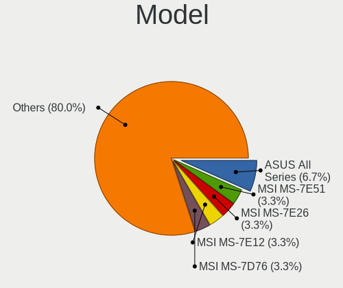
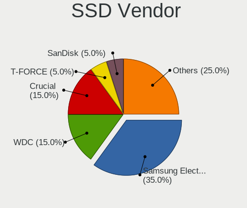
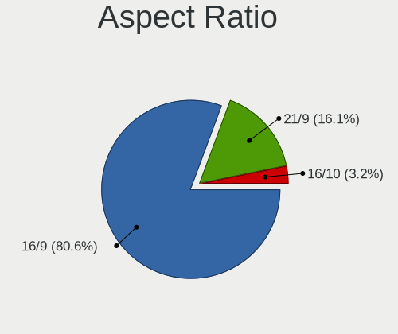
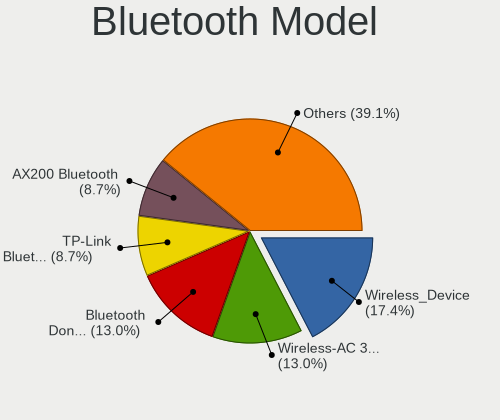

Nobara - Hardware Trends (Desktops)
-----------------------------------

A project to identify most popular hardware characteristics and track their change
over time based on data collected by Linux users at https://Linux-Hardware.org.

Anyone can contribute to this report by the [hw-probe](https://github.com/linuxhw/hw-probe) tool:

    sudo -E hw-probe -all -upload

This report is for one last month. Overall report since the beginning of time: [TestDays](https://github.com/linuxhw/TestDays)

Period: Dec, 2024.

Contents
--------

* [ System ](#system)
  - [ OS                       ](#os)
  - [ OS Family                ](#os-family)
  - [ Kernel                   ](#kernel)
  - [ Kernel Family            ](#kernel-family)
  - [ Kernel Major Ver.        ](#kernel-major-ver)
  - [ Arch                     ](#arch)
  - [ DE                       ](#de)
  - [ Display Server           ](#display-server)
  - [ Display Manager          ](#display-manager)
  - [ OS Lang                  ](#os-lang)
  - [ Boot Mode                ](#boot-mode)
  - [ Filesystem               ](#filesystem)
  - [ Part. scheme             ](#part-scheme)
  - [ Dual Boot with Linux/BSD ](#dual-boot-with-linuxbsd)
  - [ Dual Boot (Win)          ](#dual-boot-win)

* [ Board ](#board)
  - [ Vendor                   ](#vendor)
  - [ Model                    ](#model)
  - [ Model Family             ](#model-family)
  - [ MFG Year                 ](#mfg-year)
  - [ Form Factor              ](#form-factor)
  - [ Secure Boot              ](#secure-boot)
  - [ Coreboot                 ](#coreboot)
  - [ RAM Size                 ](#ram-size)
  - [ RAM Used                 ](#ram-used)
  - [ Total Drives             ](#total-drives)
  - [ Has CD-ROM               ](#has-cd-rom)
  - [ Has Ethernet             ](#has-ethernet)
  - [ Has WiFi                 ](#has-wifi)
  - [ Has Bluetooth            ](#has-bluetooth)

* [ Location ](#location)
  - [ Country                  ](#country)
  - [ City                     ](#city)

* [ Drives ](#drives)
  - [ Drive Vendor             ](#drive-vendor)
  - [ Drive Model              ](#drive-model)
  - [ HDD Vendor               ](#hdd-vendor)
  - [ SSD Vendor               ](#ssd-vendor)
  - [ Drive Kind               ](#drive-kind)
  - [ Drive Connector          ](#drive-connector)
  - [ Drive Size               ](#drive-size)
  - [ Space Total              ](#space-total)
  - [ Space Used               ](#space-used)
  - [ Malfunc. Drives          ](#malfunc-drives)
  - [ Malfunc. Drive Vendor    ](#malfunc-drive-vendor)
  - [ Malfunc. HDD Vendor      ](#malfunc-hdd-vendor)
  - [ Malfunc. Drive Kind      ](#malfunc-drive-kind)
  - [ Failed Drives            ](#failed-drives)
  - [ Failed Drive Vendor      ](#failed-drive-vendor)
  - [ Drive Status             ](#drive-status)

* [ Storage controller ](#storage-controller)
  - [ Storage Vendor           ](#storage-vendor)
  - [ Storage Model            ](#storage-model)
  - [ Storage Kind             ](#storage-kind)

* [ Processor ](#processor)
  - [ CPU Vendor               ](#cpu-vendor)
  - [ CPU Model                ](#cpu-model)
  - [ CPU Model Family         ](#cpu-model-family)
  - [ CPU Cores                ](#cpu-cores)
  - [ CPU Sockets              ](#cpu-sockets)
  - [ CPU Threads              ](#cpu-threads)
  - [ CPU Op-Modes             ](#cpu-op-modes)
  - [ CPU Microcode            ](#cpu-microcode)
  - [ CPU Microarch            ](#cpu-microarch)

* [ Graphics ](#graphics)
  - [ GPU Vendor               ](#gpu-vendor)
  - [ GPU Model                ](#gpu-model)
  - [ GPU Combo                ](#gpu-combo)
  - [ GPU Driver               ](#gpu-driver)
  - [ GPU Memory               ](#gpu-memory)

* [ Monitor ](#monitor)
  - [ Monitor Vendor           ](#monitor-vendor)
  - [ Monitor Model            ](#monitor-model)
  - [ Monitor Resolution       ](#monitor-resolution)
  - [ Monitor Diagonal         ](#monitor-diagonal)
  - [ Monitor Width            ](#monitor-width)
  - [ Aspect Ratio             ](#aspect-ratio)
  - [ Monitor Area             ](#monitor-area)
  - [ Pixel Density            ](#pixel-density)
  - [ Multiple Monitors        ](#multiple-monitors)

* [ Network ](#network)
  - [ Net Controller Vendor    ](#net-controller-vendor)
  - [ Net Controller Model     ](#net-controller-model)
  - [ Wireless Vendor          ](#wireless-vendor)
  - [ Wireless Model           ](#wireless-model)
  - [ Ethernet Vendor          ](#ethernet-vendor)
  - [ Ethernet Model           ](#ethernet-model)
  - [ Net Controller Kind      ](#net-controller-kind)
  - [ Used Controller          ](#used-controller)
  - [ NICs                     ](#nics)
  - [ IPv6                     ](#ipv6)

* [ Bluetooth ](#bluetooth)
  - [ Bluetooth Vendor         ](#bluetooth-vendor)
  - [ Bluetooth Model          ](#bluetooth-model)

* [ Sound ](#sound)
  - [ Sound Vendor             ](#sound-vendor)
  - [ Sound Model              ](#sound-model)

* [ Memory ](#memory)
  - [ Memory Vendor            ](#memory-vendor)
  - [ Memory Model             ](#memory-model)
  - [ Memory Kind              ](#memory-kind)
  - [ Memory Form Factor       ](#memory-form-factor)
  - [ Memory Size              ](#memory-size)
  - [ Memory Speed             ](#memory-speed)

* [ Printers & scanners ](#printers--scanners)
  - [ Printer Vendor           ](#printer-vendor)
  - [ Printer Model            ](#printer-model)
  - [ Scanner Vendor           ](#scanner-vendor)
  - [ Scanner Model            ](#scanner-model)

* [ Camera ](#camera)
  - [ Camera Vendor            ](#camera-vendor)
  - [ Camera Model             ](#camera-model)

* [ Security ](#security)
  - [ Fingerprint Vendor       ](#fingerprint-vendor)
  - [ Fingerprint Model        ](#fingerprint-model)
  - [ Chipcard Vendor          ](#chipcard-vendor)
  - [ Chipcard Model           ](#chipcard-model)

* [ Unsupported ](#unsupported)
  - [ Unsupported Devices      ](#unsupported-devices)
  - [ Unsupported Device Types ](#unsupported-device-types)

System
------

OS
--

Installed operating systems

| Name      | Desktops | Percent |
|-----------|----------|---------|
| Nobara 40 | 26       | 86.67%  |
| Nobara 41 | 2        | 6.67%   |
| Nobara 39 | 2        | 6.67%   |

OS Family
---------

OS without a version

| Name   | Desktops | Percent |
|--------|----------|---------|
| Nobara | 30       | 100%    |

Kernel
------

Version of the Linux kernel

| Version                      | Desktops | Percent |
|------------------------------|----------|---------|
| 6.11.9-200.fsync.fc40.x86_64 | 23       | 76.67%  |
| 6.8.12-200.fsync.fc39.x86_64 | 2        | 6.67%   |
| 6.12.6-200.fsync.fc41.x86_64 | 1        | 3.33%   |
| 6.12.5-200.fsync.fc41.x86_64 | 1        | 3.33%   |
| 6.11.7-201.fsync.fc40.x86_64 | 1        | 3.33%   |
| 6.11.6-200.fsync.fc40.x86_64 | 1        | 3.33%   |
| 6.11.5-200.fsync.fc40.x86_64 | 1        | 3.33%   |

Kernel Family
-------------

Linux kernel without a distro release

| Version | Desktops | Percent |
|---------|----------|---------|
| 6.11.9  | 23       | 76.67%  |
| 6.8.12  | 2        | 6.67%   |
| 6.12.6  | 1        | 3.33%   |
| 6.12.5  | 1        | 3.33%   |
| 6.11.7  | 1        | 3.33%   |
| 6.11.6  | 1        | 3.33%   |
| 6.11.5  | 1        | 3.33%   |

Kernel Major Ver.
-----------------

Linux kernel major version

| Version | Desktops | Percent |
|---------|----------|---------|
| 6.11    | 26       | 86.67%  |
| 6.8     | 2        | 6.67%   |
| 6.12    | 2        | 6.67%   |

Arch
----

OS architecture (x86_64, i586, etc.)

| Name   | Desktops | Percent |
|--------|----------|---------|
| x86_64 | 30       | 100%    |

DE
--

Desktop Environment

| Name  | Desktops | Percent |
|-------|----------|---------|
| KDE6  | 22       | 73.33%  |
| GNOME | 8        | 26.67%  |

Display Server
--------------

X11 or Wayland

| Name    | Desktops | Percent |
|---------|----------|---------|
| Wayland | 26       | 86.67%  |
| X11     | 4        | 13.33%  |

Display Manager
---------------

SDDM, LightDM, etc.

| Name    | Desktops | Percent |
|---------|----------|---------|
| Unknown | 22       | 73.33%  |
| SDDM    | 6        | 20%     |
| LightDM | 1        | 3.33%   |
| GDM     | 1        | 3.33%   |

OS Lang
-------

Language

| Lang  | Desktops | Percent |
|-------|----------|---------|
| en_US | 12       | 40%     |
| en_GB | 3        | 10%     |
| en_CA | 3        | 10%     |
| de_DE | 3        | 10%     |
| pt_BR | 2        | 6.67%   |
| es_ES | 2        | 6.67%   |
| sv_SE | 1        | 3.33%   |
| ru_RU | 1        | 3.33%   |
| fr_FR | 1        | 3.33%   |
| es_AR | 1        | 3.33%   |
| en_AU | 1        | 3.33%   |

Boot Mode
---------

EFI or BIOS

| Mode | Desktops | Percent |
|------|----------|---------|
| BIOS | 21       | 70%     |
| EFI  | 9        | 30%     |

Filesystem
----------

Type of filesystem

| Type  | Desktops | Percent |
|-------|----------|---------|
| Btrfs | 29       | 96.67%  |
| Ext4  | 1        | 3.33%   |

Part. scheme
------------

Scheme of partitioning

| Type    | Desktops | Percent |
|---------|----------|---------|
| Unknown | 22       | 73.33%  |
| GPT     | 8        | 26.67%  |

Dual Boot with Linux/BSD
------------------------

Hosting more than one Linux/BSD

| Dual boot | Desktops | Percent |
|-----------|----------|---------|
| No        | 28       | 93.33%  |
| Yes       | 2        | 6.67%   |

Dual Boot (Win)
---------------

Hosting Linux and Windows

| Dual boot | Desktops | Percent |
|-----------|----------|---------|
| No        | 26       | 86.67%  |
| Yes       | 4        | 13.33%  |

Board
-----

Vendor
------

Motherboard manufacturer

| Name                | Desktops | Percent |
|---------------------|----------|---------|
| MSI                 | 9        | 30%     |
| ASUSTek Computer    | 9        | 30%     |
| Gigabyte Technology | 3        | 10%     |
| ASRock              | 3        | 10%     |
| Dell                | 2        | 6.67%   |
| Intel               | 1        | 3.33%   |
| Hewlett-Packard     | 1        | 3.33%   |
| Biostar             | 1        | 3.33%   |
| BESSTAR Tech        | 1        | 3.33%   |

Model
-----

Motherboard model

| Name                              | Desktops | Percent |
|-----------------------------------|----------|---------|
| ASUS All Series                   | 2        | 6.67%   |
| MSI MS-7E51                       | 1        | 3.33%   |
| MSI MS-7E26                       | 1        | 3.33%   |
| MSI MS-7E12                       | 1        | 3.33%   |
| MSI MS-7D76                       | 1        | 3.33%   |
| MSI MS-7D37                       | 1        | 3.33%   |
| MSI MS-7C95                       | 1        | 3.33%   |
| MSI MS-7C37                       | 1        | 3.33%   |
| MSI MS-7C04                       | 1        | 3.33%   |
| MSI MS-7C02                       | 1        | 3.33%   |
| Intel H61                         | 1        | 3.33%   |
| HP Pavilion Desktop PC 570-p0xx   | 1        | 3.33%   |
| Gigabyte B660 DS3H DDR4           | 1        | 3.33%   |
| Gigabyte B550M DS3H AC            | 1        | 3.33%   |
| Gigabyte B550M DS3H               | 1        | 3.33%   |
| Dell XPS 8700                     | 1        | 3.33%   |
| Dell OptiPlex 5040                | 1        | 3.33%   |
| Biostar X670E VALKYRIE            | 1        | 3.33%   |
| BESSTAR Tech HM80                 | 1        | 3.33%   |
| ASUS TUF Gaming Z490-PLUS         | 1        | 3.33%   |
| ASUS TUF Gaming X570-PLUS         | 1        | 3.33%   |
| ASUS TUF Gaming B650M-E WIFI      | 1        | 3.33%   |
| ASUS TUF Gaming B550-PLUS         | 1        | 3.33%   |
| ASUS PRIME B550-PLUS              | 1        | 3.33%   |
| ASUS PRIME A320M-K                | 1        | 3.33%   |
| ASUS CROSSHAIR VI HERO            | 1        | 3.33%   |
| ASRock B550 Phantom Gaming-ITX/ax | 1        | 3.33%   |
| ASRock B450M-HDV R4.0             | 1        | 3.33%   |
| ASRock B450 Gaming-ITX/ac         | 1        | 3.33%   |

Model Family
------------

Motherboard model prefix

| Name              | Desktops | Percent |
|-------------------|----------|---------|
| ASUS TUF          | 4        | 13.33%  |
| Gigabyte B550M    | 2        | 6.67%   |
| ASUS PRIME        | 2        | 6.67%   |
| ASUS All          | 2        | 6.67%   |
| MSI MS-7E51       | 1        | 3.33%   |
| MSI MS-7E26       | 1        | 3.33%   |
| MSI MS-7E12       | 1        | 3.33%   |
| MSI MS-7D76       | 1        | 3.33%   |
| MSI MS-7D37       | 1        | 3.33%   |
| MSI MS-7C95       | 1        | 3.33%   |
| MSI MS-7C37       | 1        | 3.33%   |
| MSI MS-7C04       | 1        | 3.33%   |
| MSI MS-7C02       | 1        | 3.33%   |
| Intel H61         | 1        | 3.33%   |
| HP Pavilion       | 1        | 3.33%   |
| Gigabyte B660     | 1        | 3.33%   |
| Dell XPS          | 1        | 3.33%   |
| Dell OptiPlex     | 1        | 3.33%   |
| Biostar X670E     | 1        | 3.33%   |
| BESSTAR Tech HM80 | 1        | 3.33%   |
| ASUS CROSSHAIR    | 1        | 3.33%   |
| ASRock B550       | 1        | 3.33%   |
| ASRock B450M-HDV  | 1        | 3.33%   |
| ASRock B450       | 1        | 3.33%   |

MFG Year
--------

Motherboard manufacture year

| Year | Desktops | Percent |
|------|----------|---------|
| 2020 | 7        | 23.33%  |
| 2024 | 3        | 10%     |
| 2023 | 3        | 10%     |
| 2022 | 3        | 10%     |
| 2019 | 3        | 10%     |
| 2018 | 3        | 10%     |
| 2021 | 2        | 6.67%   |
| 2017 | 2        | 6.67%   |
| 2013 | 2        | 6.67%   |
| 2016 | 1        | 3.33%   |
| 2014 | 1        | 3.33%   |

Form Factor
-----------

Physical design of the computer

| Name    | Desktops | Percent |
|---------|----------|---------|
| Desktop | 30       | 100%    |

Secure Boot
-----------

Enabled or disabled

| State    | Desktops | Percent |
|----------|----------|---------|
| Disabled | 30       | 100%    |

Coreboot
--------

Have coreboot on board

| Used | Desktops | Percent |
|------|----------|---------|
| No   | 30       | 100%    |

RAM Size
--------

Total RAM memory

| Size in GB  | Desktops | Percent |
|-------------|----------|---------|
| 32.01-64.0  | 15       | 50%     |
| 24.01-32.0  | 6        | 20%     |
| 16.01-24.0  | 4        | 13.33%  |
| 64.01-256.0 | 3        | 10%     |
| 8.01-16.0   | 2        | 6.67%   |

RAM Used
--------

Used RAM memory

| Used GB   | Desktops | Percent |
|-----------|----------|---------|
| 4.01-8.0  | 14       | 46.67%  |
| 3.01-4.0  | 9        | 30%     |
| 8.01-16.0 | 5        | 16.67%  |
| 2.01-3.0  | 1        | 3.33%   |
| 1.01-2.0  | 1        | 3.33%   |

Total Drives
------------

Number of drives on board

| Drives | Desktops | Percent |
|--------|----------|---------|
| 3      | 13       | 43.33%  |
| 2      | 9        | 30%     |
| 4      | 4        | 13.33%  |
| 1      | 4        | 13.33%  |

Has CD-ROM
----------

Has CD-ROM on board

| Presented | Desktops | Percent |
|-----------|----------|---------|
| No        | 24       | 80%     |
| Yes       | 6        | 20%     |

Has Ethernet
------------

Has Ethernet on board

| Presented | Desktops | Percent |
|-----------|----------|---------|
| Yes       | 30       | 100%    |

Has WiFi
--------

Has WiFi module

| Presented | Desktops | Percent |
|-----------|----------|---------|
| Yes       | 21       | 70%     |
| No        | 9        | 30%     |

Has Bluetooth
-------------

Has Bluetooth module

| Presented | Desktops | Percent |
|-----------|----------|---------|
| Yes       | 23       | 76.67%  |
| No        | 7        | 23.33%  |

Location
--------

Country
-------

Geographic location (country)

| Country   | Desktops | Percent |
|-----------|----------|---------|
| USA       | 8        | 26.67%  |
| Germany   | 4        | 13.33%  |
| Canada    | 3        | 10%     |
| UK        | 2        | 6.67%   |
| Spain     | 2        | 6.67%   |
| Russia    | 2        | 6.67%   |
| Brazil    | 2        | 6.67%   |
| Australia | 2        | 6.67%   |
| Sweden    | 1        | 3.33%   |
| Mexico    | 1        | 3.33%   |
| France    | 1        | 3.33%   |
| Finland   | 1        | 3.33%   |
| Argentina | 1        | 3.33%   |

City
----

Geographic location (city)

| City              | Desktops | Percent |
|-------------------|----------|---------|
| Valencia          | 1        | 3.33%   |
| Toronto           | 1        | 3.33%   |
| St Petersburg     | 1        | 3.33%   |
| Schwarzheide      | 1        | 3.33%   |
| Palma             | 1        | 3.33%   |
| Ourinhos          | 1        | 3.33%   |
| Ottawa            | 1        | 3.33%   |
| Orillia           | 1        | 3.33%   |
| Nokia             | 1        | 3.33%   |
| Nizhny Tagil      | 1        | 3.33%   |
| Nederland         | 1        | 3.33%   |
| Nantes            | 1        | 3.33%   |
| Mexicali          | 1        | 3.33%   |
| Melbourne         | 1        | 3.33%   |
| Lüneburg         | 1        | 3.33%   |
| Lancaster         | 1        | 3.33%   |
| Kansas City       | 1        | 3.33%   |
| Itapoa            | 1        | 3.33%   |
| Indianapolis      | 1        | 3.33%   |
| Gothenburg        | 1        | 3.33%   |
| Glasgow           | 1        | 3.33%   |
| Frankfurt am Main | 1        | 3.33%   |
| Essen             | 1        | 3.33%   |
| Dallas            | 1        | 3.33%   |
| Cullompton        | 1        | 3.33%   |
| Cheswick          | 1        | 3.33%   |
| Buenos Aires      | 1        | 3.33%   |
| Brooklyn          | 1        | 3.33%   |
| Atlanta           | 1        | 3.33%   |
| Adelaide          | 1        | 3.33%   |

Drives
------

Drive Vendor
------------

Hard drive vendors

| Vendor                       | Desktops | Drives | Percent |
|------------------------------|----------|--------|---------|
| Samsung Electronics          | 13       | 21     | 19.12%  |
| WDC                          | 10       | 10     | 14.71%  |
| Seagate                      | 7        | 7      | 10.29%  |
| SanDisk                      | 5        | 6      | 7.35%   |
| Phison Electronics           | 4        | 4      | 5.88%   |
| Kingston Technology Company  | 3        | 3      | 4.41%   |
| Crucial                      | 3        | 3      | 4.41%   |
| Realtek Semiconductor        | 2        | 2      | 2.94%   |
| MAXIO Technology (Hangzhou)  | 2        | 2      | 2.94%   |
| Kingston                     | 2        | 2      | 2.94%   |
| HGST                         | 2        | 2      | 2.94%   |
| WALRAM                       | 1        | 1      | 1.47%   |
| Unknown                      | 1        | 1      | 1.47%   |
| ULK                          | 1        | 1      | 1.47%   |
| Toshiba                      | 1        | 1      | 1.47%   |
| T-FORCE                      | 1        | 1      | 1.47%   |
| Shenzhen Longsys Electronics | 1        | 1      | 1.47%   |
| Realtek                      | 1        | 1      | 1.47%   |
| PNY                          | 1        | 1      | 1.47%   |
| Patriot                      | 1        | 1      | 1.47%   |
| Micron/Crucial Technology    | 1        | 1      | 1.47%   |
| Micron Technology            | 1        | 1      | 1.47%   |
| Hitachi                      | 1        | 1      | 1.47%   |
| Gigabyte Technology          | 1        | 1      | 1.47%   |
| Corsair                      | 1        | 1      | 1.47%   |
| Unknown                      | 1        | 1      | 1.47%   |

Drive Model
-----------

Hard drive models

| Model                                                | Desktops | Percent |
|------------------------------------------------------|----------|---------|
| Samsung NVMe SSD Controller SM981/PM981/PM983 512GB  | 5        | 6.58%   |
| Samsung NVMe SSD Controller PM9A1/PM9A3/980PRO 512GB | 3        | 3.95%   |
| Kingston Company SNV2S1000G 1TB                      | 3        | 3.95%   |
| Samsung SSD 870 EVO 2TB                              | 2        | 2.63%   |
| Samsung SSD 860 EVO 2TB                              | 2        | 2.63%   |
| Samsung NVMe SSD Controller SM961/PM961/SM963 256GB  | 2        | 2.63%   |
| Realtek SPCC M.2 PCIe SSD 2TB                        | 2        | 2.63%   |
| Phison PS5013 E13 NVMe Controller 512GB              | 2        | 2.63%   |
| MAXIO (Hangzhou) NVMe SSD Controller MAP1202 512GB   | 2        | 2.63%   |
| Crucial CT1000BX500SSD1 1TB                          | 2        | 2.63%   |
| WDC WDS500G2B0B-00YS70 500GB SSD                     | 1        | 1.32%   |
| WDC WDS400T2B0A-00SM50 4TB SSD                       | 1        | 1.32%   |
| WDC WDS250G2B0A-00SM50 250GB SSD                     | 1        | 1.32%   |
| WDC WD3200 WDC-ROM SN# 320GB                         | 1        | 1.32%   |
| WDC WD2003FZEX-00Z4SA0 2TB                           | 1        | 1.32%   |
| WDC WD2003FZEX-00SRLA0 2TB                           | 1        | 1.32%   |
| WDC WD10JPVX-75JC3T0 1TB                             | 1        | 1.32%   |
| WDC WD10JPVX-60JC3T1 1TB                             | 1        | 1.32%   |
| WDC WD1002FBYS-18W8B1 1TB                            | 1        | 1.32%   |
| WDC WD1001FALS-00J7B1 1TB                            | 1        | 1.32%   |
| WALRAM 480GB                                         | 1        | 1.32%   |
| Unknown SD/MMC/MS PRO 128GB                          | 1        | 1.32%   |
| ULK 240GB                                            | 1        | 1.32%   |
| Toshiba MK4055GSX 400GB                              | 1        | 1.32%   |
| T-FORCE SSD 250GB                                    | 1        | 1.32%   |
| Shenzhen Longsys Lexar SSD NM790 1TB                 | 1        | 1.32%   |
| Seagate ST8000DM004-2CX188 8TB                       | 1        | 1.32%   |
| Seagate ST5000LM000-2AN170 5TB                       | 1        | 1.32%   |
| Seagate ST2000DM001-1ER164 2TB                       | 1        | 1.32%   |
| Seagate ST2000DM001 4GB                              | 1        | 1.32%   |
| Seagate ST1000DM003-1ER162 1TB                       | 1        | 1.32%   |
| Seagate BUP Slim BK 2TB                              | 1        | 1.32%   |
| Seagate BarraCuda 120 SS 250GB                       | 1        | 1.32%   |
| Sandisk WD_BLACK SN850X 4000GB                       | 1        | 1.32%   |
| Sandisk WD_BLACK SN850X 2000GB                       | 1        | 1.32%   |
| Sandisk WD_BLACK SN770 2TB                           | 1        | 1.32%   |
| Sandisk WDC WDS480G2G0C-00AJM0 480GB                 | 1        | 1.32%   |
| Sandisk WD Blue SN580 2TB                            | 1        | 1.32%   |
| SanDisk SSD PLUS 1000GB                              | 1        | 1.32%   |
| Samsung SSD PM851 mSATA 256GB                        | 1        | 1.32%   |

HDD Vendor
----------

Hard disk drive vendors

| Vendor  | Desktops | Drives | Percent |
|---------|----------|--------|---------|
| WDC     | 7        | 7      | 38.89%  |
| Seagate | 6        | 6      | 33.33%  |
| HGST    | 2        | 2      | 11.11%  |
| Unknown | 1        | 1      | 5.56%   |
| Toshiba | 1        | 1      | 5.56%   |
| Hitachi | 1        | 1      | 5.56%   |

SSD Vendor
----------

Solid state drive vendors

| Vendor              | Desktops | Drives | Percent |
|---------------------|----------|--------|---------|
| Samsung Electronics | 7        | 8      | 35%     |
| WDC                 | 3        | 3      | 15%     |
| Crucial             | 3        | 3      | 15%     |
| T-FORCE             | 1        | 1      | 5%      |
| SanDisk             | 1        | 1      | 5%      |
| PNY                 | 1        | 1      | 5%      |
| Patriot             | 1        | 1      | 5%      |
| Kingston            | 1        | 1      | 5%      |
| Gigabyte Technology | 1        | 1      | 5%      |
| Corsair             | 1        | 1      | 5%      |

Drive Kind
----------

HDD or SSD

| Kind    | Desktops | Drives | Percent |
|---------|----------|--------|---------|
| NVMe    | 25       | 34     | 43.86%  |
| SSD     | 16       | 21     | 28.07%  |
| HDD     | 13       | 18     | 22.81%  |
| Unknown | 3        | 4      | 5.26%   |

Drive Connector
---------------

SATA, SAS, NVMe, etc.

| Type | Desktops | Drives | Percent |
|------|----------|--------|---------|
| NVMe | 25       | 33     | 49.02%  |
| SATA | 22       | 40     | 43.14%  |
| SAS  | 4        | 4      | 7.84%   |

Drive Size
----------

Size of hard drive

| Size in TB | Desktops | Drives | Percent |
|------------|----------|--------|---------|
| 0.01-0.5   | 11       | 12     | 32.35%  |
| 1.01-2.0   | 9        | 11     | 26.47%  |
| 0.51-1.0   | 9        | 11     | 26.47%  |
| 4.01-10.0  | 3        | 3      | 8.82%   |
| 3.01-4.0   | 1        | 1      | 2.94%   |
| 2.01-3.0   | 1        | 1      | 2.94%   |

Space Total
-----------

Amount of disk space available on the file system

| Size in GB     | Desktops | Percent |
|----------------|----------|---------|
| More than 3000 | 13       | 43.33%  |
| 1001-2000      | 7        | 23.33%  |
| 501-1000       | 4        | 13.33%  |
| 251-500        | 3        | 10%     |
| 2001-3000      | 3        | 10%     |

Space Used
----------

Amount of used disk space

| Used GB        | Desktops | Percent |
|----------------|----------|---------|
| 21-50          | 6        | 20%     |
| 2001-3000      | 6        | 20%     |
| 101-250        | 6        | 20%     |
| 1001-2000      | 5        | 16.67%  |
| 251-500        | 3        | 10%     |
| More than 3000 | 2        | 6.67%   |
| 501-1000       | 2        | 6.67%   |

Malfunc. Drives
---------------

Drive models with a malfunction

| Model                          | Desktops | Drives | Percent |
|--------------------------------|----------|--------|---------|
| WDC WD2003FZEX-00Z4SA0 2TB     | 1        | 1      | 25%     |
| Seagate ST8000DM004-2CX188 8TB | 1        | 1      | 25%     |
| Seagate ST2000DM001-1ER164 2TB | 1        | 1      | 25%     |
| Crucial CT1000BX500SSD1 1TB    | 1        | 1      | 25%     |

Malfunc. Drive Vendor
---------------------

Vendors of faulty drives

| Vendor  | Desktops | Drives | Percent |
|---------|----------|--------|---------|
| Seagate | 2        | 2      | 50%     |
| WDC     | 1        | 1      | 25%     |
| Crucial | 1        | 1      | 25%     |

Malfunc. HDD Vendor
-------------------

Vendors of faulty HDD drives

| Vendor  | Desktops | Drives | Percent |
|---------|----------|--------|---------|
| Seagate | 2        | 2      | 66.67%  |
| WDC     | 1        | 1      | 33.33%  |

Malfunc. Drive Kind
-------------------

Kinds of faulty drives

| Kind | Desktops | Drives | Percent |
|------|----------|--------|---------|
| HDD  | 2        | 3      | 66.67%  |
| SSD  | 1        | 1      | 33.33%  |

Failed Drives
-------------

Failed drive models

Zero info for selected period =(

Failed Drive Vendor
-------------------

Failed drive vendors

Zero info for selected period =(

Drive Status
------------

Number of failed and malfunc. drives

| Status   | Desktops | Drives | Percent |
|----------|----------|--------|---------|
| Detected | 22       | 55     | 70.97%  |
| Works    | 7        | 18     | 22.58%  |
| Malfunc  | 2        | 4      | 6.45%   |

Storage controller
------------------

Storage Vendor
--------------

Storage controller vendors

| Vendor                       | Desktops | Percent |
|------------------------------|----------|---------|
| AMD                          | 20       | 30.77%  |
| Samsung Electronics          | 11       | 16.92%  |
| Intel                        | 10       | 15.38%  |
| ASMedia Technology           | 6        | 9.23%   |
| SanDisk                      | 4        | 6.15%   |
| Phison Electronics           | 4        | 6.15%   |
| Kingston Technology Company  | 3        | 4.62%   |
| Realtek Semiconductor        | 2        | 3.08%   |
| MAXIO Technology (Hangzhou)  | 2        | 3.08%   |
| Shenzhen Longsys Electronics | 1        | 1.54%   |
| Micron/Crucial Technology    | 1        | 1.54%   |
| Micron Technology            | 1        | 1.54%   |

Storage Model
-------------

Storage controller models

| Model                                                                          | Desktops | Percent |
|--------------------------------------------------------------------------------|----------|---------|
| AMD FCH SATA Controller [AHCI mode]                                            | 6        | 8.7%    |
| AMD 600 Series Chipset SATA Controller                                         | 6        | 8.7%    |
| AMD 500 Series Chipset SATA Controller                                         | 6        | 8.7%    |
| Samsung NVMe SSD Controller SM981/PM981/PM983                                  | 5        | 7.25%   |
| ASMedia ASM1061/ASM1062 Serial ATA Controller                                  | 5        | 7.25%   |
| Samsung NVMe SSD Controller PM9A1/PM9A3/980PRO                                 | 3        | 4.35%   |
| Kingston Company NV2 NVMe SSD [SM2267XT] (DRAM-less)                           | 3        | 4.35%   |
| AMD 400 Series Chipset SATA Controller                                         | 3        | 4.35%   |
| Samsung NVMe SSD Controller SM961/PM961/SM963                                  | 2        | 2.9%    |
| Phison PS5013-E13 PCIe3 NVMe Controller (DRAM-less)                            | 2        | 2.9%    |
| MAXIO (Hangzhou) NVMe SSD Controller MAP1202 (DRAM-less)                       | 2        | 2.9%    |
| Intel Alder Lake-S PCH SATA Controller [AHCI Mode]                             | 2        | 2.9%    |
| Intel 8 Series/C220 Series Chipset Family 6-port SATA Controller 1 [AHCI mode] | 2        | 2.9%    |
| Shenzhen Longsys Lexar NM790 NVME SSD (DRAM-less)                              | 1        | 1.45%   |
| SanDisk WD Green SN350 240GB (DRAM-less) / SN560E NVMe SSD                     | 1        | 1.45%   |
| Sandisk WD Blue SN580 NVMe SSD (DRAM-less)                                     | 1        | 1.45%   |
| Sandisk WD Black SN850X NVMe SSD                                               | 1        | 1.45%   |
| SanDisk WD Black SN770 / PC SN740 256GB / PC SN560 (DRAM-less) NVMe SSD        | 1        | 1.45%   |
| Samsung NVMe SSD Controller S4LV008[Pascal]                                    | 1        | 1.45%   |
| Realtek RTS5772DL NVMe SSD Controller (DRAM-less)                              | 1        | 1.45%   |
| Realtek RTS5765DL NVMe SSD Controller (DRAM-less)                              | 1        | 1.45%   |
| Phison E18 PCIe4 NVMe Controller                                               | 1        | 1.45%   |
| Phison E16 PCIe4 NVMe Controller                                               | 1        | 1.45%   |
| Micron/Crucial P2 [Nick P2] / P3 / P3 Plus NVMe PCIe SSD (DRAM-less)           | 1        | 1.45%   |
| Micron 2550 NVMe SSD (DRAM-less)                                               | 1        | 1.45%   |
| Kingston Company NV2 NVMe SSD [E21T] (DRAM-less)                               | 1        | 1.45%   |
| Intel Q170/Q150/B150/H170/H110/Z170/CM236 Chipset SATA Controller [AHCI Mode]  | 1        | 1.45%   |
| Intel Comet Lake SATA AHCI Controller                                          | 1        | 1.45%   |
| Intel Cannon Lake PCH SATA AHCI Controller                                     | 1        | 1.45%   |
| Intel 9 Series Chipset Family SATA Controller [AHCI Mode]                      | 1        | 1.45%   |
| Intel 6 Series/C200 Series Chipset Family 6 port Desktop SATA AHCI Controller  | 1        | 1.45%   |
| Intel 200 Series PCH SATA controller [AHCI mode]                               | 1        | 1.45%   |
| ASMedia ASM1064 Serial ATA Controller                                          | 1        | 1.45%   |
| AMD X370 Series Chipset SATA Controller                                        | 1        | 1.45%   |
| AMD A320 Chipset SATA Controller [AHCI mode]                                   | 1        | 1.45%   |

Storage Kind
------------

Kind of storage controller (IDE, SATA, NVMe, SAS, ...)

| Kind | Desktops | Percent |
|------|----------|---------|
| SATA | 30       | 54.55%  |
| NVMe | 25       | 45.45%  |

Processor
---------

CPU Vendor
----------

Processor vendors

| Vendor | Desktops | Percent |
|--------|----------|---------|
| AMD    | 20       | 66.67%  |
| Intel  | 10       | 33.33%  |

CPU Model
---------

Processor models

| Model                                       | Desktops | Percent |
|---------------------------------------------|----------|---------|
| AMD Ryzen 7 3700X 8-Core Processor          | 3        | 10%     |
| Intel Core i7-4770K CPU @ 3.50GHz           | 2        | 6.67%   |
| AMD Ryzen 9 7950X3D 16-Core Processor       | 2        | 6.67%   |
| AMD Ryzen 7 5800X3D 8-Core Processor        | 2        | 6.67%   |
| AMD Ryzen 7 5700X 8-Core Processor          | 2        | 6.67%   |
| AMD Ryzen 5 5600X 6-Core Processor          | 2        | 6.67%   |
| Intel Core i7-6700 CPU @ 3.40GHz            | 1        | 3.33%   |
| Intel Core i7-4790 CPU @ 3.60GHz            | 1        | 3.33%   |
| Intel Core i7-2600 CPU @ 3.40GHz            | 1        | 3.33%   |
| Intel Core i7-10700F CPU @ 2.90GHz          | 1        | 3.33%   |
| Intel Core i5-9600K CPU @ 3.70GHz           | 1        | 3.33%   |
| Intel Core i5-7400 CPU @ 3.00GHz            | 1        | 3.33%   |
| Intel 13th Gen Core i7-13700KF              | 1        | 3.33%   |
| Intel 13th Gen Core i5-13400F               | 1        | 3.33%   |
| AMD Ryzen 7 9800X3D 8-Core Processor        | 1        | 3.33%   |
| AMD Ryzen 7 7700X 8-Core Processor          | 1        | 3.33%   |
| AMD Ryzen 7 7700 8-Core Processor           | 1        | 3.33%   |
| AMD Ryzen 7 5800X 8-Core Processor          | 1        | 3.33%   |
| AMD Ryzen 7 4800U with Radeon Graphics      | 1        | 3.33%   |
| AMD Ryzen 5 7600X 6-Core Processor          | 1        | 3.33%   |
| AMD Ryzen 5 3600 6-Core Processor           | 1        | 3.33%   |
| AMD Ryzen 5 2600 Six-Core Processor         | 1        | 3.33%   |
| AMD Ryzen 3 3200G with Radeon Vega Graphics | 1        | 3.33%   |

CPU Model Family
----------------

Processor model prefix

| Model         | Desktops | Percent |
|---------------|----------|---------|
| AMD Ryzen 7   | 12       | 40%     |
| Intel Core i7 | 6        | 20%     |
| AMD Ryzen 5   | 5        | 16.67%  |
| Other         | 2        | 6.67%   |
| Intel Core i5 | 2        | 6.67%   |
| AMD Ryzen 9   | 2        | 6.67%   |
| AMD Ryzen 3   | 1        | 3.33%   |

CPU Cores
---------

Number of processor cores

| Number | Desktops | Percent |
|--------|----------|---------|
| 8      | 13       | 43.33%  |
| 4      | 7        | 23.33%  |
| 6      | 6        | 20%     |
| 16     | 3        | 10%     |
| 10     | 1        | 3.33%   |

CPU Sockets
-----------

Number of sockets

| Number | Desktops | Percent |
|--------|----------|---------|
| 1      | 30       | 100%    |

CPU Threads
-----------

Threads per core (Hyper-Threading)

| Number | Desktops | Percent |
|--------|----------|---------|
| 2      | 27       | 90%     |
| 1      | 3        | 10%     |

CPU Op-Modes
------------

CPU Operation Modes (32-bit, 64-bit)

| Op mode        | Desktops | Percent |
|----------------|----------|---------|
| 32-bit, 64-bit | 30       | 100%    |

CPU Microcode
-------------

Microcode number

| Number  | Desktops | Percent |
|---------|----------|---------|
| Unknown | 30       | 100%    |

CPU Microarch
-------------

Microarchitecture

| Name        | Desktops | Percent |
|-------------|----------|---------|
| Unknown     | 8        | 26.67%  |
| Zen 3       | 7        | 23.33%  |
| Zen 2       | 5        | 16.67%  |
| Haswell     | 3        | 10%     |
| Zen+        | 2        | 6.67%   |
| KabyLake    | 2        | 6.67%   |
| Skylake     | 1        | 3.33%   |
| SandyBridge | 1        | 3.33%   |
| CometLake   | 1        | 3.33%   |

Graphics
--------

GPU Vendor
----------

Vendors of graphics cards

| Vendor | Desktops | Percent |
|--------|----------|---------|
| AMD    | 16       | 51.61%  |
| Nvidia | 14       | 45.16%  |
| Intel  | 1        | 3.23%   |

GPU Model
---------

Graphics card models

| Model                                                                 | Desktops | Percent |
|-----------------------------------------------------------------------|----------|---------|
| AMD Raphael                                                           | 4        | 11.43%  |
| Nvidia AD102 [GeForce RTX 4090]                                       | 2        | 5.71%   |
| AMD Navi 33 [Radeon RX 7600/7600 XT/7600M XT/7600S/7700S / PRO W7600] | 2        | 5.71%   |
| AMD Navi 32 [Radeon RX 7700 XT / 7800 XT]                             | 2        | 5.71%   |
| AMD Navi 31 [Radeon RX 7900 XT/7900 XTX/7900 GRE/7900M]               | 2        | 5.71%   |
| AMD Navi 23 [Radeon RX 6600/6600 XT/6600M]                            | 2        | 5.71%   |
| Nvidia TU106 [GeForce RTX 2070]                                       | 1        | 2.86%   |
| Nvidia TU104 [GeForce RTX 2080 Rev. A]                                | 1        | 2.86%   |
| Nvidia GP106 [GeForce GTX 1060 6GB]                                   | 1        | 2.86%   |
| Nvidia GA104 [GeForce RTX 3070]                                       | 1        | 2.86%   |
| Nvidia GA104 [GeForce RTX 3070 Ti]                                    | 1        | 2.86%   |
| Nvidia GA104 [GeForce RTX 3070 Lite Hash Rate]                        | 1        | 2.86%   |
| Nvidia GA104 [GeForce RTX 3060 Ti]                                    | 1        | 2.86%   |
| Nvidia GA104 [GeForce RTX 3060 Ti GDDR6X]                             | 1        | 2.86%   |
| Nvidia GA104 [GeForce RTX 3060 8GB]                                   | 1        | 2.86%   |
| Nvidia AD104 [GeForce RTX 4070]                                       | 1        | 2.86%   |
| Nvidia AD104 [GeForce RTX 4070 SUPER]                                 | 1        | 2.86%   |
| Nvidia AD103 [GeForce RTX 4080 SUPER]                                 | 1        | 2.86%   |
| Intel HD Graphics 530                                                 | 1        | 2.86%   |
| AMD Vega 20 [Radeon VII]                                              | 1        | 2.86%   |
| AMD Renoir [Radeon Vega Series / Radeon Vega Mobile Series]           | 1        | 2.86%   |
| AMD Polaris 20 XL [Radeon RX 580 2048SP]                              | 1        | 2.86%   |
| AMD Picasso/Raven 2 [Radeon Vega Series / Radeon Vega Mobile Series]  | 1        | 2.86%   |
| AMD Navi 22 [Radeon RX 6700/6700 XT/6750 XT / 6800M/6850M XT]         | 1        | 2.86%   |
| AMD Navi 10 [Radeon RX 5600 OEM/5600 XT / 5700/5700 XT]               | 1        | 2.86%   |
| AMD Granite Ridge [Radeon Graphics]                                   | 1        | 2.86%   |
| AMD Ellesmere [Radeon RX 470/480/570/570X/580/580X/590]               | 1        | 2.86%   |

GPU Combo
---------

Combinations of graphics cards

| Name         | Desktops | Percent |
|--------------|----------|---------|
| 1 x Nvidia   | 13       | 43.33%  |
| 1 x AMD      | 11       | 36.67%  |
| 2 x AMD      | 4        | 13.33%  |
| 1 x Intel    | 1        | 3.33%   |
| AMD + Nvidia | 1        | 3.33%   |

GPU Driver
----------

Free vs proprietary

| Driver      | Desktops | Percent |
|-------------|----------|---------|
| Free        | 17       | 56.67%  |
| Proprietary | 13       | 43.33%  |

GPU Memory
----------

Total video memory

| Size in GB | Desktops | Percent |
|------------|----------|---------|
| Unknown    | 21       | 70%     |
| 7.01-8.0   | 4        | 13.33%  |
| 8.01-16.0  | 3        | 10%     |
| 3.01-4.0   | 1        | 3.33%   |
| 0.01-0.5   | 1        | 3.33%   |

Monitor
-------

Monitor Vendor
--------------

Monitor vendors

| Vendor              | Desktops | Percent |
|---------------------|----------|---------|
| Goldstar            | 9        | 25%     |
| Samsung Electronics | 6        | 16.67%  |
| Dell                | 4        | 11.11%  |
| BenQ                | 3        | 8.33%   |
| ASUSTek Computer    | 2        | 5.56%   |
| AOC                 | 2        | 5.56%   |
| Acer                | 2        | 5.56%   |
| Viotek              | 1        | 2.78%   |
| ViewSonic           | 1        | 2.78%   |
| Vestel Elektronik   | 1        | 2.78%   |
| MSI                 | 1        | 2.78%   |
| Mi                  | 1        | 2.78%   |
| KTC                 | 1        | 2.78%   |
| Hewlett-Packard     | 1        | 2.78%   |
| Gigabyte Technology | 1        | 2.78%   |

Monitor Model
-------------

Monitor models

| Model                                                                  | Desktops | Percent |
|------------------------------------------------------------------------|----------|---------|
| Viotek GN24CB VTK0236 1920x1080 522x293mm 23.6-inch                    | 1        | 2.56%   |
| ViewSonic XG2703-GS VSCBA32 2560x1440 598x336mm 27.0-inch              | 1        | 2.56%   |
| Vestel Elektronik 49FHD_LCD_TV VES3700 1920x1080 1280x720mm 57.8-inch  | 1        | 2.56%   |
| Samsung Electronics S24F350 SAM0D20 1920x1080 521x293mm 23.5-inch      | 1        | 2.56%   |
| Samsung Electronics LS27R75 SAM0F98 2560x1440 598x336mm 27.0-inch      | 1        | 2.56%   |
| Samsung Electronics LCD Monitor SAM0F13 3840x2160 950x540mm 43.0-inch  | 1        | 2.56%   |
| Samsung Electronics LCD Monitor SAM0951 1920x1080 1120x630mm 50.6-inch | 1        | 2.56%   |
| Samsung Electronics LC32G5xT SAM7089 2560x1440 698x393mm 31.5-inch     | 1        | 2.56%   |
| Samsung Electronics LC27T55 SAM701E 1920x1080 609x349mm 27.6-inch      | 1        | 2.56%   |
| MSI MPG341CQR MSI3DA0 3440x1440 797x334mm 34.0-inch                    | 1        | 2.56%   |
| Mi Monitor XMI3444 3440x1440 800x330mm 34.1-inch                       | 1        | 2.56%   |
| KTC Q3202S KTC3202 2560x1440 700x390mm 31.5-inch                       | 1        | 2.56%   |
| Hewlett-Packard 24mh HPN366B 1920x1080 527x296mm 23.8-inch             | 1        | 2.56%   |
| Goldstar W1942 GSM4B6F 1440x900 408x255mm 18.9-inch                    | 1        | 2.56%   |
| Goldstar ULTRAWIDE GSM5AE2 3440x1440 800x335mm 34.1-inch               | 1        | 2.56%   |
| Goldstar ULTRAGEAR+ GSM5C33 2560x1440 590x333mm 26.7-inch              | 1        | 2.56%   |
| Goldstar ULTRAGEAR GSM5C1A 1920x1080 527x296mm 23.8-inch               | 1        | 2.56%   |
| Goldstar ULTRAGEAR GSM5BB1 1920x1080 527x296mm 23.8-inch               | 1        | 2.56%   |
| Goldstar LG TV SSCR2 GSMC0C8 3840x2160                                 | 1        | 2.56%   |
| Goldstar HDR 4K GSM7706 3840x2160 600x340mm 27.2-inch                  | 1        | 2.56%   |
| Goldstar FULL HD GSM5B55 1920x1080 480x270mm 21.7-inch                 | 1        | 2.56%   |
| Goldstar FULL HD GSM5AB9 1920x1080 480x270mm 21.7-inch                 | 1        | 2.56%   |
| Goldstar 27GL650F GSM5B71 1920x1080 597x336mm 27.0-inch                | 1        | 2.56%   |
| Goldstar 25UM58G GSM5B98 2560x1080 673x284mm 28.8-inch                 | 1        | 2.56%   |
| Gigabyte Technology G32QC A GBT3206 2560x1440 697x392mm 31.5-inch      | 1        | 2.56%   |
| Dell S2240L DELD054 1920x1080 476x267mm 21.5-inch                      | 1        | 2.56%   |
| Dell G2724D DELD175 2560x1440 596x335mm 26.9-inch                      | 1        | 2.56%   |
| Dell G2724D DELD173 2560x1440 596x335mm 26.9-inch                      | 1        | 2.56%   |
| Dell E2011H DEL406B 1600x900 443x249mm 20.0-inch                       | 1        | 2.56%   |
| Dell AW3418DW DELA0FA 3440x1440 798x335mm 34.1-inch                    | 1        | 2.56%   |
| BenQ GW2780 BNQ78E6 1920x1080 598x336mm 27.0-inch                      | 1        | 2.56%   |
| BenQ GW2480 BNQ78E7 1920x1080 527x296mm 23.8-inch                      | 1        | 2.56%   |
| BenQ GL2460 BNQ78CE 1920x1080 531x299mm 24.0-inch                      | 1        | 2.56%   |
| ASUSTek Computer VG27A AUS2722 2560x1440 597x336mm 27.0-inch           | 1        | 2.56%   |
| ASUSTek Computer VG245 AUS24A1 1920x1080 531x299mm 24.0-inch           | 1        | 2.56%   |
| AOC U2790B AOC2790 3840x2160 597x336mm 27.0-inch                       | 1        | 2.56%   |
| AOC Q27G2WG4 AOC2702 2560x1440 597x336mm 27.0-inch                     | 1        | 2.56%   |
| Acer XB253Q ACR0742 1920x1080 543x302mm 24.5-inch                      | 1        | 2.56%   |
| Acer KA270H ACR0522 1920x1080 598x336mm 27.0-inch                      | 1        | 2.56%   |

Monitor Resolution
------------------

Monitor screen resolution

| Resolution         | Desktops | Percent |
|--------------------|----------|---------|
| 1920x1080 (FHD)    | 14       | 40%     |
| 3840x2160 (4K)     | 7        | 20%     |
| 2560x1440 (QHD)    | 7        | 20%     |
| 3440x1440          | 4        | 11.43%  |
| 2560x1080          | 1        | 2.86%   |
| 1680x1050 (WSXGA+) | 1        | 2.86%   |
| 1600x900 (HD+)     | 1        | 2.86%   |

Monitor Diagonal
----------------

Diagonal size in inches

| Inches | Desktops | Percent |
|--------|----------|---------|
| 27     | 11       | 28.95%  |
| 24     | 7        | 18.42%  |
| 34     | 4        | 10.53%  |
| 31     | 3        | 7.89%   |
| 84     | 2        | 5.26%   |
| 23     | 2        | 5.26%   |
| 21     | 2        | 5.26%   |
| 72     | 1        | 2.63%   |
| 50     | 1        | 2.63%   |
| 32     | 1        | 2.63%   |
| 28     | 1        | 2.63%   |
| 26     | 1        | 2.63%   |
| 22     | 1        | 2.63%   |
| 20     | 1        | 2.63%   |

Monitor Width
-------------

Physical width

| Width in mm | Desktops | Percent |
|-------------|----------|---------|
| 501-600     | 17       | 48.57%  |
| 701-800     | 5        | 14.29%  |
| 601-700     | 5        | 14.29%  |
| 401-500     | 4        | 11.43%  |
| 1501-2000   | 3        | 8.57%   |
| 1001-1500   | 1        | 2.86%   |

Aspect Ratio
------------

Proportional relationship between the width and the height

| Ratio | Desktops | Percent |
|-------|----------|---------|
| 16/9  | 25       | 80.65%  |
| 21/9  | 5        | 16.13%  |
| 16/10 | 1        | 3.23%   |

Monitor Area
------------

Area in inch²

| Area in inch² | Desktops | Percent |
|----------------|----------|---------|
| 301-350        | 11       | 30.56%  |
| 201-250        | 10       | 27.78%  |
| 351-500        | 8        | 22.22%  |
| More than 1000 | 4        | 11.11%  |
| 251-300        | 2        | 5.56%   |
| 151-200        | 1        | 2.78%   |

Pixel Density
-------------

Pixels per inch

| Density | Desktops | Percent |
|---------|----------|---------|
| 51-100  | 21       | 65.63%  |
| 101-120 | 8        | 25%     |
| 1-50    | 2        | 6.25%   |
| 161-240 | 1        | 3.13%   |

Multiple Monitors
-----------------

Total monitors connected

| Total | Desktops | Percent |
|-------|----------|---------|
| 1     | 23       | 76.67%  |
| 2     | 6        | 20%     |
| 4     | 1        | 3.33%   |

Network
-------

Net Controller Vendor
---------------------

Controller vendors

| Vendor                     | Desktops | Percent |
|----------------------------|----------|---------|
| Realtek Semiconductor      | 23       | 44.23%  |
| Intel                      | 13       | 25%     |
| MediaTek                   | 6        | 11.54%  |
| Qualcomm Atheros           | 3        | 5.77%   |
| Microsoft                  | 3        | 5.77%   |
| Samsung Electronics        | 1        | 1.92%   |
| Ralink                     | 1        | 1.92%   |
| Qualcomm Technologies      | 1        | 1.92%   |
| American Future Technology | 1        | 1.92%   |

Net Controller Model
--------------------

Controller models

| Model                                                                  | Desktops | Percent |
|------------------------------------------------------------------------|----------|---------|
| Realtek RTL8111/8168/8211/8411 PCI Express Gigabit Ethernet Controller | 15       | 25.86%  |
| Realtek RTL8125 2.5GbE Controller                                      | 6        | 10.34%  |
| MediaTek MT7922 802.11ax PCI Express Wireless Network Adapter          | 3        | 5.17%   |
| Intel I211 Gigabit Network Connection                                  | 3        | 5.17%   |
| Intel Dual Band Wireless-AC 3168NGW [Stone Peak]                       | 3        | 5.17%   |
| Qualcomm Atheros AR9485 Wireless Network Adapter                       | 2        | 3.45%   |
| Microsoft Xbox Wireless Adapter for Windows                            | 2        | 3.45%   |
| MediaTek MT7921K (RZ608) Wi-Fi 6E 80MHz                                | 2        | 3.45%   |
| Intel Wi-Fi 6 AX200                                                    | 2        | 3.45%   |
| Intel Ethernet Controller I225-V                                       | 2        | 3.45%   |
| Samsung Galaxy series, misc. (tethering mode)                          | 1        | 1.72%   |
| Realtek RTL8821CE 802.11ac PCIe Wireless Network Adapter               | 1        | 1.72%   |
| Realtek RTL810xE PCI Express Fast Ethernet controller                  | 1        | 1.72%   |
| Realtek RT8126 PCIe Ethernet Controller                                | 1        | 1.72%   |
| Realtek 802.11ac NIC                                                   | 1        | 1.72%   |
| Ralink RT2561/RT61 802.11g PCI                                         | 1        | 1.72%   |
| Qualcomm WCN785x Wi-Fi 7(802.11be) 320MHz 2x2 [FastConnect 7800]       | 1        | 1.72%   |
| Qualcomm Atheros AR9462 Wireless Network Adapter                       | 1        | 1.72%   |
| Microsoft Xbox 360 Wireless Adapter                                    | 1        | 1.72%   |
| MediaTek Wi-Fi 6E MT7902 Wireless Network Adapter                      | 1        | 1.72%   |
| Intel Ethernet Connection I217-V                                       | 1        | 1.72%   |
| Intel Ethernet Connection (2) I219-V                                   | 1        | 1.72%   |
| Intel Ethernet Connection (2) I218-V                                   | 1        | 1.72%   |
| Intel Ethernet Connection (11) I219-V                                  | 1        | 1.72%   |
| Intel Comet Lake PCH CNVi WiFi                                         | 1        | 1.72%   |
| Intel Cannon Lake PCH CNVi WiFi                                        | 1        | 1.72%   |
| Intel Alder Lake-S PCH CNVi WiFi                                       | 1        | 1.72%   |
| American Future IBP Mini Hub                                           | 1        | 1.72%   |

Wireless Vendor
---------------

Wireless vendors

| Vendor                | Desktops | Percent |
|-----------------------|----------|---------|
| Intel                 | 8        | 33.33%  |
| MediaTek              | 6        | 25%     |
| Qualcomm Atheros      | 3        | 12.5%   |
| Microsoft             | 3        | 12.5%   |
| Realtek Semiconductor | 2        | 8.33%   |
| Ralink                | 1        | 4.17%   |
| Qualcomm Technologies | 1        | 4.17%   |

Wireless Model
--------------

Wireless models

| Model                                                            | Desktops | Percent |
|------------------------------------------------------------------|----------|---------|
| MediaTek MT7922 802.11ax PCI Express Wireless Network Adapter    | 3        | 12.5%   |
| Intel Dual Band Wireless-AC 3168NGW [Stone Peak]                 | 3        | 12.5%   |
| Qualcomm Atheros AR9485 Wireless Network Adapter                 | 2        | 8.33%   |
| Microsoft Xbox Wireless Adapter for Windows                      | 2        | 8.33%   |
| MediaTek MT7921K (RZ608) Wi-Fi 6E 80MHz                          | 2        | 8.33%   |
| Intel Wi-Fi 6 AX200                                              | 2        | 8.33%   |
| Realtek RTL8821CE 802.11ac PCIe Wireless Network Adapter         | 1        | 4.17%   |
| Realtek 802.11ac NIC                                             | 1        | 4.17%   |
| Ralink RT2561/RT61 802.11g PCI                                   | 1        | 4.17%   |
| Qualcomm WCN785x Wi-Fi 7(802.11be) 320MHz 2x2 [FastConnect 7800] | 1        | 4.17%   |
| Qualcomm Atheros AR9462 Wireless Network Adapter                 | 1        | 4.17%   |
| Microsoft Xbox 360 Wireless Adapter                              | 1        | 4.17%   |
| MediaTek Wi-Fi 6E MT7902 Wireless Network Adapter                | 1        | 4.17%   |
| Intel Comet Lake PCH CNVi WiFi                                   | 1        | 4.17%   |
| Intel Cannon Lake PCH CNVi WiFi                                  | 1        | 4.17%   |
| Intel Alder Lake-S PCH CNVi WiFi                                 | 1        | 4.17%   |

Ethernet Vendor
---------------

Ethernet vendors

| Vendor                | Desktops | Percent |
|-----------------------|----------|---------|
| Realtek Semiconductor | 22       | 70.97%  |
| Intel                 | 8        | 25.81%  |
| Samsung Electronics   | 1        | 3.23%   |

Ethernet Model
--------------

Ethernet models

| Model                                                                  | Desktops | Percent |
|------------------------------------------------------------------------|----------|---------|
| Realtek RTL8111/8168/8211/8411 PCI Express Gigabit Ethernet Controller | 15       | 45.45%  |
| Realtek RTL8125 2.5GbE Controller                                      | 6        | 18.18%  |
| Intel I211 Gigabit Network Connection                                  | 3        | 9.09%   |
| Intel Ethernet Controller I225-V                                       | 2        | 6.06%   |
| Samsung Galaxy series, misc. (tethering mode)                          | 1        | 3.03%   |
| Realtek RTL810xE PCI Express Fast Ethernet controller                  | 1        | 3.03%   |
| Realtek RT8126 PCIe Ethernet Controller                                | 1        | 3.03%   |
| Intel Ethernet Connection I217-V                                       | 1        | 3.03%   |
| Intel Ethernet Connection (2) I219-V                                   | 1        | 3.03%   |
| Intel Ethernet Connection (2) I218-V                                   | 1        | 3.03%   |
| Intel Ethernet Connection (11) I219-V                                  | 1        | 3.03%   |

Net Controller Kind
-------------------

Ethernet, WiFi or modem

| Kind     | Desktops | Percent |
|----------|----------|---------|
| Ethernet | 30       | 57.69%  |
| WiFi     | 21       | 40.38%  |
| Modem    | 1        | 1.92%   |

Used Controller
---------------

Currently used network controller

| Kind     | Desktops | Percent |
|----------|----------|---------|
| Ethernet | 23       | 71.88%  |
| WiFi     | 9        | 28.13%  |

NICs
----

Total network controllers on board

| Total | Desktops | Percent |
|-------|----------|---------|
| 2     | 22       | 73.33%  |
| 1     | 8        | 26.67%  |

IPv6
----

IPv6 vs IPv4

| Used | Desktops | Percent |
|------|----------|---------|
| No   | 17       | 56.67%  |
| Yes  | 13       | 43.33%  |

Bluetooth
---------

Bluetooth Vendor
----------------

Controller vendors

| Vendor                          | Desktops | Percent |
|---------------------------------|----------|---------|
| Intel                           | 8        | 34.78%  |
| MediaTek                        | 4        | 17.39%  |
| Cambridge Silicon Radio         | 3        | 13.04%  |
| TP-Link                         | 2        | 8.7%    |
| IMC Networks                    | 2        | 8.7%    |
| Qualcomm Atheros Communications | 1        | 4.35%   |
| Foxconn / Hon Hai               | 1        | 4.35%   |
| Broadcom                        | 1        | 4.35%   |
| ASUSTek Computer                | 1        | 4.35%   |

Bluetooth Model
---------------

Controller models

| Model                                               | Desktops | Percent |
|-----------------------------------------------------|----------|---------|
| MediaTek Wireless_Device                            | 4        | 17.39%  |
| Intel Wireless-AC 3168 Bluetooth                    | 3        | 13.04%  |
| Cambridge Silicon Radio Bluetooth Dongle (HCI mode) | 3        | 13.04%  |
| TP-Link TP-Link Bluetooth USB Adapter               | 2        | 8.7%    |
| Intel AX200 Bluetooth                               | 2        | 8.7%    |
| Qualcomm Atheros Bluetooth USB Host Controller      | 1        | 4.35%   |
| Intel Bluetooth 9460/9560 Jefferson Peak (JfP)      | 1        | 4.35%   |
| Intel AX211 Bluetooth                               | 1        | 4.35%   |
| Intel AX201 Bluetooth                               | 1        | 4.35%   |
| IMC Networks Wireless_Device                        | 1        | 4.35%   |
| IMC Networks Bluetooth Radio                        | 1        | 4.35%   |
| Foxconn / Hon Hai Bluetooth Device                  | 1        | 4.35%   |
| Broadcom BCM20702A0 Bluetooth 4.0                   | 1        | 4.35%   |
| ASUS Bluetooth Device                               | 1        | 4.35%   |

Sound
-----

Sound Vendor
------------

Sound card vendors

| Vendor                   | Desktops | Percent |
|--------------------------|----------|---------|
| AMD                      | 23       | 31.51%  |
| Nvidia                   | 14       | 19.18%  |
| Intel                    | 10       | 13.7%   |
| Logitech                 | 4        | 5.48%   |
| C-Media Electronics      | 3        | 4.11%   |
| Micro Star International | 2        | 2.74%   |
| Kingston Technology      | 2        | 2.74%   |
| Corsair                  | 2        | 2.74%   |
| Blue Microphones         | 2        | 2.74%   |
| Valve Software           | 1        | 1.37%   |
| SteelSeries ApS          | 1        | 1.37%   |
| Silicon Motion           | 1        | 1.37%   |
| ROCCAT                   | 1        | 1.37%   |
| Realtek Semiconductor    | 1        | 1.37%   |
| Razer USA                | 1        | 1.37%   |
| Jieli Technology         | 1        | 1.37%   |
| Creative Technology      | 1        | 1.37%   |
| Creative Labs            | 1        | 1.37%   |
| Barco Display Systems    | 1        | 1.37%   |
| ASUSTek Computer         | 1        | 1.37%   |

Sound Model
-----------

Sound card models

| Model                                                                      | Desktops | Percent |
|----------------------------------------------------------------------------|----------|---------|
| AMD Starship/Matisse HD Audio Controller                                   | 11       | 12.22%  |
| AMD Family 17h/19h/1ah HD Audio Controller                                 | 8        | 8.89%   |
| Nvidia GA104 High Definition Audio Controller                              | 6        | 6.67%   |
| AMD Navi 31 HDMI/DP Audio                                                  | 6        | 6.67%   |
| AMD Rembrandt Radeon High Definition Audio Controller                      | 5        | 5.56%   |
| AMD Navi 21/23 HDMI/DP Audio Controller                                    | 3        | 3.33%   |
| Nvidia AD104 High Definition Audio Controller                              | 2        | 2.22%   |
| Nvidia AD102 High Definition Audio Controller                              | 2        | 2.22%   |
| Micro Star International USB Audio                                         | 2        | 2.22%   |
| Kingston Technology HyperX Cloud II Wireless                               | 2        | 2.22%   |
| Intel Alder Lake-S HD Audio Controller                                     | 2        | 2.22%   |
| Intel 8 Series/C220 Series Chipset High Definition Audio Controller        | 2        | 2.22%   |
| Corsair VOID PRO Wireless Gaming Headset                                   | 2        | 2.22%   |
| Blue Microphones Yeti Stereo Microphone                                    | 2        | 2.22%   |
| AMD Ellesmere HDMI Audio [Radeon RX 470/480 / 570/580/590]                 | 2        | 2.22%   |
| Valve Software Valve VR Radio & HMD Mic                                    | 1        | 1.11%   |
| SteelSeries ApS SteelSeries Arctis 1 Wireless                              | 1        | 1.11%   |
| Silicon Motion SMI USB Display                                             | 1        | 1.11%   |
| ROCCAT Elo 7.1 USB                                                         | 1        | 1.11%   |
| Realtek Semiconductor USB Audio                                            | 1        | 1.11%   |
| Razer USA Razer Barracuda X 2.4                                            | 1        | 1.11%   |
| Nvidia TU106 High Definition Audio Controller                              | 1        | 1.11%   |
| Nvidia TU104 HD Audio Controller                                           | 1        | 1.11%   |
| Nvidia GP106 High Definition Audio Controller                              | 1        | 1.11%   |
| Nvidia Audio device                                                        | 1        | 1.11%   |
| Logitech [G533 Wireless Headset Dongle]                                    | 1        | 1.11%   |
| Logitech Yeti Nano                                                         | 1        | 1.11%   |
| Logitech PRO X Wireless Gaming Headset                                     | 1        | 1.11%   |
| Logitech G635 Gaming Headset                                               | 1        | 1.11%   |
| Jieli Technology CA-2890 USB Speaker Bar                                   | 1        | 1.11%   |
| Intel Comet Lake PCH cAVS                                                  | 1        | 1.11%   |
| Intel Cannon Lake PCH cAVS                                                 | 1        | 1.11%   |
| Intel 9 Series Chipset Family HD Audio Controller                          | 1        | 1.11%   |
| Intel 6 Series/C200 Series Chipset Family High Definition Audio Controller | 1        | 1.11%   |
| Intel 200 Series PCH HD Audio                                              | 1        | 1.11%   |
| Intel 100 Series/C230 Series Chipset Family HD Audio Controller            | 1        | 1.11%   |
| Creative Technology Sound Blaster X-Fi Surround 5.1                        | 1        | 1.11%   |
| Creative Labs EMU20k2 [Sound Blaster X-Fi Titanium Series]                 | 1        | 1.11%   |
| C-Media Electronics USB Audio Device                                       | 1        | 1.11%   |
| C-Media Electronics CMI8788 [Oxygen HD Audio]                              | 1        | 1.11%   |

Memory
------

Memory Vendor
-------------

Memory module vendors

| Vendor              | Desktops | Percent |
|---------------------|----------|---------|
| G.Skill             | 4        | 33.33%  |
| Corsair             | 2        | 16.67%  |
| A-DATA Technology   | 2        | 16.67%  |
| SK hynix            | 1        | 8.33%   |
| Samsung Electronics | 1        | 8.33%   |
| Patriot             | 1        | 8.33%   |
| Kingston            | 1        | 8.33%   |

Memory Model
------------

Memory module models

| Model                                                 | Desktops | Percent |
|-------------------------------------------------------|----------|---------|
| A-DATA RAM DDR4 3200 8GB DIMM DDR4 3600MT/s           | 2        | 15.38%  |
| SK hynix RAM HMT451U6BFR8C-PB 4GB DIMM DDR3 1600MT/s  | 1        | 7.69%   |
| Samsung RAM M378B1G73DB0-CK0 8GB DIMM DDR3 2133MT/s   | 1        | 7.69%   |
| Patriot RAM 1600EL Series 4GB DIMM DDR3 1600MT/s      | 1        | 7.69%   |
| Kingston RAM KF560C36-16 16GB DIMM DDR5 6000MT/s      | 1        | 7.69%   |
| G.Skill RAM F5-6000J3038F16G 16GB DIMM DDR5 6000MT/s  | 1        | 7.69%   |
| G.Skill RAM F4-3200C16.16GVR 16GB DIMM DDR4 3200MT/s  | 1        | 7.69%   |
| G.Skill RAM F4-3000C16-8GISB 8GB DIMM DDR4 3200MT/s   | 1        | 7.69%   |
| G.Skill RAM F3-12800CL10-8GBXL 8GB DIMM DDR3 1600MT/s | 1        | 7.69%   |
| Corsair RAM CMK16GX4M2B3200C16 8GB DIMM DDR4 3600MT/s | 1        | 7.69%   |
| Corsair RAM CMK16GX4M2A2666C16 8GB DIMM DDR4 3400MT/s | 1        | 7.69%   |
| A-DATA RAM Module 8GB DIMM DDR4 2133MT/s              | 1        | 7.69%   |

Memory Kind
-----------

Memory module kinds

| Kind | Desktops | Percent |
|------|----------|---------|
| DDR4 | 5        | 55.56%  |
| DDR5 | 2        | 22.22%  |
| DDR3 | 2        | 22.22%  |

Memory Form Factor
------------------

Physical design of the memory module

| Name | Desktops | Percent |
|------|----------|---------|
| DIMM | 9        | 100%    |

Memory Size
-----------

Memory module size

| Size  | Desktops | Percent |
|-------|----------|---------|
| 8192  | 6        | 50%     |
| 16384 | 3        | 25%     |
| 32768 | 2        | 16.67%  |
| 4096  | 1        | 8.33%   |

Memory Speed
------------

Memory module speed

| Speed | Desktops | Percent |
|-------|----------|---------|
| 6000  | 2        | 18.18%  |
| 3600  | 2        | 18.18%  |
| 3200  | 2        | 18.18%  |
| 2133  | 2        | 18.18%  |
| 1600  | 2        | 18.18%  |
| 3400  | 1        | 9.09%   |

Printers & scanners
-------------------

Printer Vendor
--------------

Printer device vendors

| Vendor | Desktops | Percent |
|--------|----------|---------|
| Canon  | 1        | 100%    |

Printer Model
-------------

Printer device models

| Model                     | Desktops | Percent |
|---------------------------|----------|---------|
| Canon PIXMA MG3600 Series | 1        | 100%    |

Scanner Vendor
--------------

Scanner device vendors

Zero info for selected period =(

Scanner Model
-------------

Scanner device models

Zero info for selected period =(

Camera
------

Camera Vendor
-------------

Camera device vendors

| Vendor                        | Desktops | Percent |
|-------------------------------|----------|---------|
| Sunplus Innovation Technology | 2        | 33.33%  |
| Logitech                      | 1        | 16.67%  |
| ezcap                         | 1        | 16.67%  |
| Bison Electronics             | 1        | 16.67%  |
| AVerMedia Technologies        | 1        | 16.67%  |

Camera Model
------------

Camera device models

| Model                            | Desktops | Percent |
|----------------------------------|----------|---------|
| Sunplus SPCA2281 Web Camera      | 1        | 16.67%  |
| Sunplus Full HD webcam           | 1        | 16.67%  |
| Logitech Webcam C270             | 1        | 16.67%  |
| ezcap LIVE GAMER RAW             | 1        | 16.67%  |
| Bison HD Webcam                  | 1        | 16.67%  |
| AVerMedia Live Streamer CAM 310P | 1        | 16.67%  |

Security
--------

Fingerprint Vendor
------------------

Fingerprint sensor vendors

Zero info for selected period =(

Fingerprint Model
-----------------

Fingerprint sensor models

Zero info for selected period =(

Chipcard Vendor
---------------

Chipcard module vendors

Zero info for selected period =(

Chipcard Model
--------------

Chipcard module models

Zero info for selected period =(

Unsupported
-----------

Unsupported Devices
-------------------

Total unsupported devices on board

| Total | Desktops | Percent |
|-------|----------|---------|
| 0     | 26       | 86.67%  |
| 1     | 3        | 10%     |
| 2     | 1        | 3.33%   |

Unsupported Device Types
------------------------

Types of unsupported devices

| Type                  | Desktops | Percent |
|-----------------------|----------|---------|
| Graphics card         | 2        | 40%     |
| Net/wireless          | 1        | 20%     |
| Net/ethernet          | 1        | 20%     |
| Multimedia controller | 1        | 20%     |

