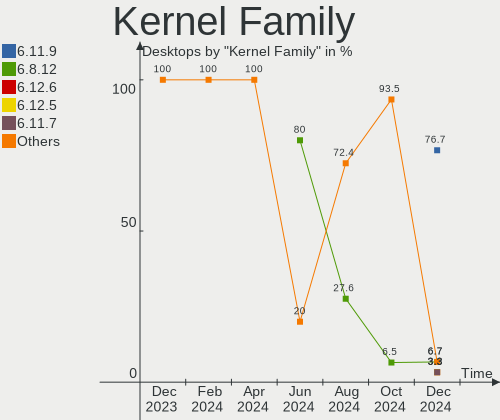
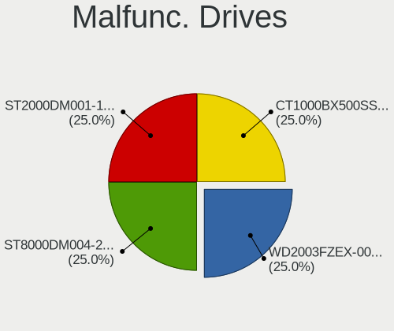
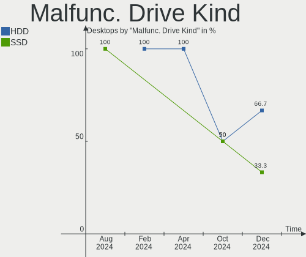
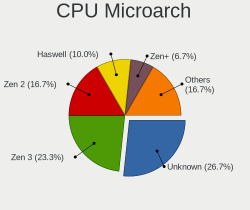
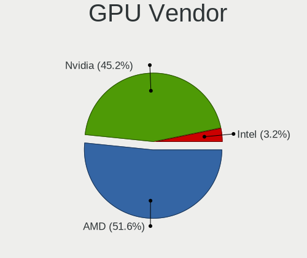
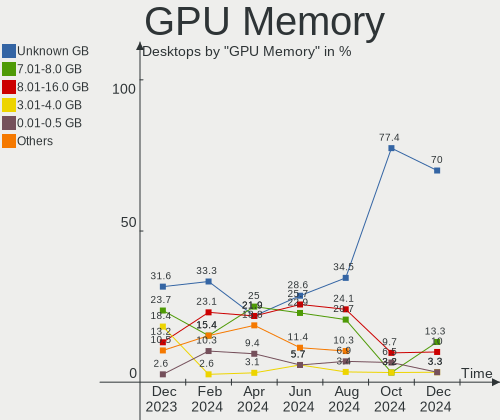
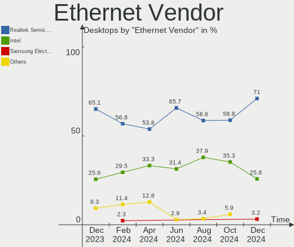
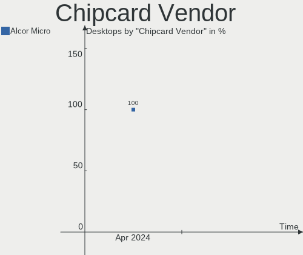

Nobara - Hardware Trends (Desktops)
-----------------------------------

A project to identify most popular hardware characteristics and track their change
over time based on data collected by Linux users at https://Linux-Hardware.org.

Anyone can contribute to this report by the [hw-probe](https://github.com/linuxhw/hw-probe) tool:

    sudo -E hw-probe -all -upload

This report is for one last month. Overall report since the beginning of time: [TestCoverage](https://github.com/linuxhw/TestCoverage)

Period: Nov, 2022.

Contents
--------

* [ System ](#system)
  - [ OS                       ](#os)
  - [ OS Family                ](#os-family)
  - [ Kernel                   ](#kernel)
  - [ Kernel Family            ](#kernel-family)
  - [ Kernel Major Ver.        ](#kernel-major-ver)
  - [ Arch                     ](#arch)
  - [ DE                       ](#de)
  - [ Display Server           ](#display-server)
  - [ Display Manager          ](#display-manager)
  - [ OS Lang                  ](#os-lang)
  - [ Boot Mode                ](#boot-mode)
  - [ Filesystem               ](#filesystem)
  - [ Part. scheme             ](#part-scheme)
  - [ Dual Boot with Linux/BSD ](#dual-boot-with-linuxbsd)
  - [ Dual Boot (Win)          ](#dual-boot-win)

* [ Board ](#board)
  - [ Vendor                   ](#vendor)
  - [ Model                    ](#model)
  - [ Model Family             ](#model-family)
  - [ MFG Year                 ](#mfg-year)
  - [ Form Factor              ](#form-factor)
  - [ Secure Boot              ](#secure-boot)
  - [ Coreboot                 ](#coreboot)
  - [ RAM Size                 ](#ram-size)
  - [ RAM Used                 ](#ram-used)
  - [ Total Drives             ](#total-drives)
  - [ Has CD-ROM               ](#has-cd-rom)
  - [ Has Ethernet             ](#has-ethernet)
  - [ Has WiFi                 ](#has-wifi)
  - [ Has Bluetooth            ](#has-bluetooth)

* [ Location ](#location)
  - [ Country                  ](#country)
  - [ City                     ](#city)

* [ Drives ](#drives)
  - [ Drive Vendor             ](#drive-vendor)
  - [ Drive Model              ](#drive-model)
  - [ HDD Vendor               ](#hdd-vendor)
  - [ SSD Vendor               ](#ssd-vendor)
  - [ Drive Kind               ](#drive-kind)
  - [ Drive Connector          ](#drive-connector)
  - [ Drive Size               ](#drive-size)
  - [ Space Total              ](#space-total)
  - [ Space Used               ](#space-used)
  - [ Malfunc. Drives          ](#malfunc-drives)
  - [ Malfunc. Drive Vendor    ](#malfunc-drive-vendor)
  - [ Malfunc. HDD Vendor      ](#malfunc-hdd-vendor)
  - [ Malfunc. Drive Kind      ](#malfunc-drive-kind)
  - [ Failed Drives            ](#failed-drives)
  - [ Failed Drive Vendor      ](#failed-drive-vendor)
  - [ Drive Status             ](#drive-status)

* [ Storage controller ](#storage-controller)
  - [ Storage Vendor           ](#storage-vendor)
  - [ Storage Model            ](#storage-model)
  - [ Storage Kind             ](#storage-kind)

* [ Processor ](#processor)
  - [ CPU Vendor               ](#cpu-vendor)
  - [ CPU Model                ](#cpu-model)
  - [ CPU Model Family         ](#cpu-model-family)
  - [ CPU Cores                ](#cpu-cores)
  - [ CPU Sockets              ](#cpu-sockets)
  - [ CPU Threads              ](#cpu-threads)
  - [ CPU Op-Modes             ](#cpu-op-modes)
  - [ CPU Microcode            ](#cpu-microcode)
  - [ CPU Microarch            ](#cpu-microarch)

* [ Graphics ](#graphics)
  - [ GPU Vendor               ](#gpu-vendor)
  - [ GPU Model                ](#gpu-model)
  - [ GPU Combo                ](#gpu-combo)
  - [ GPU Driver               ](#gpu-driver)
  - [ GPU Memory               ](#gpu-memory)

* [ Monitor ](#monitor)
  - [ Monitor Vendor           ](#monitor-vendor)
  - [ Monitor Model            ](#monitor-model)
  - [ Monitor Resolution       ](#monitor-resolution)
  - [ Monitor Diagonal         ](#monitor-diagonal)
  - [ Monitor Width            ](#monitor-width)
  - [ Aspect Ratio             ](#aspect-ratio)
  - [ Monitor Area             ](#monitor-area)
  - [ Pixel Density            ](#pixel-density)
  - [ Multiple Monitors        ](#multiple-monitors)

* [ Network ](#network)
  - [ Net Controller Vendor    ](#net-controller-vendor)
  - [ Net Controller Model     ](#net-controller-model)
  - [ Wireless Vendor          ](#wireless-vendor)
  - [ Wireless Model           ](#wireless-model)
  - [ Ethernet Vendor          ](#ethernet-vendor)
  - [ Ethernet Model           ](#ethernet-model)
  - [ Net Controller Kind      ](#net-controller-kind)
  - [ Used Controller          ](#used-controller)
  - [ NICs                     ](#nics)
  - [ IPv6                     ](#ipv6)

* [ Bluetooth ](#bluetooth)
  - [ Bluetooth Vendor         ](#bluetooth-vendor)
  - [ Bluetooth Model          ](#bluetooth-model)

* [ Sound ](#sound)
  - [ Sound Vendor             ](#sound-vendor)
  - [ Sound Model              ](#sound-model)

* [ Memory ](#memory)
  - [ Memory Vendor            ](#memory-vendor)
  - [ Memory Model             ](#memory-model)
  - [ Memory Kind              ](#memory-kind)
  - [ Memory Form Factor       ](#memory-form-factor)
  - [ Memory Size              ](#memory-size)
  - [ Memory Speed             ](#memory-speed)

* [ Printers & scanners ](#printers--scanners)
  - [ Printer Vendor           ](#printer-vendor)
  - [ Printer Model            ](#printer-model)
  - [ Scanner Vendor           ](#scanner-vendor)
  - [ Scanner Model            ](#scanner-model)

* [ Camera ](#camera)
  - [ Camera Vendor            ](#camera-vendor)
  - [ Camera Model             ](#camera-model)

* [ Security ](#security)
  - [ Fingerprint Vendor       ](#fingerprint-vendor)
  - [ Fingerprint Model        ](#fingerprint-model)
  - [ Chipcard Vendor          ](#chipcard-vendor)
  - [ Chipcard Model           ](#chipcard-model)

* [ Unsupported ](#unsupported)
  - [ Unsupported Devices      ](#unsupported-devices)
  - [ Unsupported Device Types ](#unsupported-device-types)

System
------

OS
--

Installed operating systems

| Name      | Desktops | Percent |
|-----------|----------|---------|
| Nobara 36 | 21       | 100%    |

OS Family
---------

OS without a version

| Name   | Desktops | Percent |
|--------|----------|---------|
| Nobara | 21       | 100%    |

Kernel
------

Version of the Linux kernel

| Version                       | Desktops | Percent |
|-------------------------------|----------|---------|
| 6.0.9-201.fc36.x86_64         | 6        | 28.57%  |
| 6.0.7-201.fsync.fc36.x86_64   | 6        | 28.57%  |
| 6.0.5-201.fsync.fc36.x86_64   | 3        | 14.29%  |
| 6.0.8-201.fsync.fc36.x86_64   | 2        | 9.52%   |
| 6.0.7-202.fsync.fc36.x86_64   | 2        | 9.52%   |
| 6.0.10-201.fc36.x86_64        | 1        | 4.76%   |
| 5.19.14-201.fsync.fc36.x86_64 | 1        | 4.76%   |

Kernel Family
-------------

Linux kernel without a distro release

| Version | Desktops | Percent |
|---------|----------|---------|
| 6.0.7   | 8        | 38.1%   |
| 6.0.9   | 6        | 28.57%  |
| 6.0.5   | 3        | 14.29%  |
| 6.0.8   | 2        | 9.52%   |
| 6.0.10  | 1        | 4.76%   |
| 5.19.14 | 1        | 4.76%   |

Kernel Major Ver.
-----------------

Linux kernel major version

| Version | Desktops | Percent |
|---------|----------|---------|
| 6.0     | 20       | 95.24%  |
| 5.19    | 1        | 4.76%   |

Arch
----

OS architecture (x86_64, i586, etc.)

| Name   | Desktops | Percent |
|--------|----------|---------|
| x86_64 | 21       | 100%    |

DE
--

Desktop Environment

| Name  | Desktops | Percent |
|-------|----------|---------|
| GNOME | 16       | 76.19%  |
| KDE5  | 5        | 23.81%  |

Display Server
--------------

X11 or Wayland

| Name    | Desktops | Percent |
|---------|----------|---------|
| Wayland | 19       | 90.48%  |
| X11     | 2        | 9.52%   |

Display Manager
---------------

SDDM, LightDM, etc.

| Name    | Desktops | Percent |
|---------|----------|---------|
| Unknown | 18       | 85.71%  |
| GDM     | 2        | 9.52%   |
| SDDM    | 1        | 4.76%   |

OS Lang
-------

Language

| Lang  | Desktops | Percent |
|-------|----------|---------|
| en_US | 13       | 61.9%   |
| es_AR | 2        | 9.52%   |
| ru_RU | 1        | 4.76%   |
| es_MX | 1        | 4.76%   |
| es_CO | 1        | 4.76%   |
| en_GB | 1        | 4.76%   |
| de_DE | 1        | 4.76%   |
| de_AT | 1        | 4.76%   |

Boot Mode
---------

EFI or BIOS

| Mode | Desktops | Percent |
|------|----------|---------|
| EFI  | 16       | 76.19%  |
| BIOS | 5        | 23.81%  |

Filesystem
----------

Type of filesystem

| Type  | Desktops | Percent |
|-------|----------|---------|
| Btrfs | 16       | 76.19%  |
| Ext4  | 5        | 23.81%  |

Part. scheme
------------

Scheme of partitioning

| Type    | Desktops | Percent |
|---------|----------|---------|
| Unknown | 18       | 85.71%  |
| GPT     | 3        | 14.29%  |

Dual Boot with Linux/BSD
------------------------

Hosting more than one Linux/BSD

| Dual boot | Desktops | Percent |
|-----------|----------|---------|
| No        | 20       | 95.24%  |
| Yes       | 1        | 4.76%   |

Dual Boot (Win)
---------------

Hosting Linux and Windows

| Dual boot | Desktops | Percent |
|-----------|----------|---------|
| No        | 19       | 90.48%  |
| Yes       | 2        | 9.52%   |

Board
-----

Vendor
------

Motherboard manufacturer

| Name                | Desktops | Percent |
|---------------------|----------|---------|
| ASUSTek Computer    | 6        | 28.57%  |
| MSI                 | 4        | 19.05%  |
| Gigabyte Technology | 3        | 14.29%  |
| Intel               | 2        | 9.52%   |
| ASRock              | 2        | 9.52%   |
| OEM                 | 1        | 4.76%   |
| Fujitsu             | 1        | 4.76%   |
| Dell                | 1        | 4.76%   |
| Alienware           | 1        | 4.76%   |

Model
-----

Motherboard model

| Name                               | Desktops | Percent |
|------------------------------------|----------|---------|
| OEM SHARKBAY                       | 1        | 4.76%   |
| MSI MS-7D53                        | 1        | 4.76%   |
| MSI MS-7C35                        | 1        | 4.76%   |
| MSI MS-7B17                        | 1        | 4.76%   |
| MSI MS-7597                        | 1        | 4.76%   |
| Intel X79                          | 1        | 4.76%   |
| Intel D33217GKE G76540-207         | 1        | 4.76%   |
| Gigabyte H410M H V3                | 1        | 4.76%   |
| Gigabyte H310M M.2 2.0             | 1        | 4.76%   |
| Gigabyte 990FXA-UD3                | 1        | 4.76%   |
| Fujitsu CELSIUS W410               | 1        | 4.76%   |
| Dell OptiPlex 3010                 | 1        | 4.76%   |
| ASUS TUF Gaming B550M-PLUS WIFI II | 1        | 4.76%   |
| ASUS ROG STRIX Z390-H GAMING       | 1        | 4.76%   |
| ASUS ROG STRIX X570-F GAMING       | 1        | 4.76%   |
| ASUS M5A97 R2.0                    | 1        | 4.76%   |
| ASUS A68HM-K                       | 1        | 4.76%   |
| ASUS 1146831                       | 1        | 4.76%   |
| ASRock N68C-GS4 FX                 | 1        | 4.76%   |
| ASRock B550 Extreme4               | 1        | 4.76%   |
| Alienware X51 R2                   | 1        | 4.76%   |

Model Family
------------

Motherboard model prefix

| Name                | Desktops | Percent |
|---------------------|----------|---------|
| ASUS ROG            | 2        | 9.52%   |
| OEM SHARKBAY        | 1        | 4.76%   |
| MSI MS-7D53         | 1        | 4.76%   |
| MSI MS-7C35         | 1        | 4.76%   |
| MSI MS-7B17         | 1        | 4.76%   |
| MSI MS-7597         | 1        | 4.76%   |
| Intel X79           | 1        | 4.76%   |
| Intel D33217GKE     | 1        | 4.76%   |
| Gigabyte H410M      | 1        | 4.76%   |
| Gigabyte H310M      | 1        | 4.76%   |
| Gigabyte 990FXA-UD3 | 1        | 4.76%   |
| Fujitsu CELSIUS     | 1        | 4.76%   |
| Dell OptiPlex       | 1        | 4.76%   |
| ASUS TUF            | 1        | 4.76%   |
| ASUS M5A97          | 1        | 4.76%   |
| ASUS A68HM-K        | 1        | 4.76%   |
| ASUS 1146831        | 1        | 4.76%   |
| ASRock N68C-GS4     | 1        | 4.76%   |
| ASRock B550         | 1        | 4.76%   |
| Alienware X51       | 1        | 4.76%   |

MFG Year
--------

Motherboard manufacture year

| Year | Desktops | Percent |
|------|----------|---------|
| 2013 | 5        | 23.81%  |
| 2021 | 4        | 19.05%  |
| 2019 | 4        | 19.05%  |
| 2020 | 2        | 9.52%   |
| 2014 | 2        | 9.52%   |
| 2018 | 1        | 4.76%   |
| 2012 | 1        | 4.76%   |
| 2011 | 1        | 4.76%   |
| 2009 | 1        | 4.76%   |

Form Factor
-----------

Physical design of the computer

| Name    | Desktops | Percent |
|---------|----------|---------|
| Desktop | 21       | 100%    |

Secure Boot
-----------

Enabled or disabled

| State    | Desktops | Percent |
|----------|----------|---------|
| Disabled | 21       | 100%    |

Coreboot
--------

Have coreboot on board

| Used | Desktops | Percent |
|------|----------|---------|
| No   | 21       | 100%    |

RAM Size
--------

Total RAM memory

| Size in GB  | Desktops | Percent |
|-------------|----------|---------|
| 32.01-64.0  | 7        | 33.33%  |
| 16.01-24.0  | 6        | 28.57%  |
| 4.01-8.0    | 3        | 14.29%  |
| 3.01-4.0    | 2        | 9.52%   |
| 8.01-16.0   | 2        | 9.52%   |
| 64.01-256.0 | 1        | 4.76%   |

RAM Used
--------

Used RAM memory

| Used GB    | Desktops | Percent |
|------------|----------|---------|
| 4.01-8.0   | 7        | 33.33%  |
| 3.01-4.0   | 5        | 23.81%  |
| 2.01-3.0   | 4        | 19.05%  |
| 8.01-16.0  | 4        | 19.05%  |
| 16.01-24.0 | 1        | 4.76%   |

Total Drives
------------

Number of drives on board

| Drives | Desktops | Percent |
|--------|----------|---------|
| 3      | 7        | 33.33%  |
| 2      | 6        | 28.57%  |
| 1      | 6        | 28.57%  |
| 7      | 1        | 4.76%   |
| 4      | 1        | 4.76%   |

Has CD-ROM
----------

Has CD-ROM on board

| Presented | Desktops | Percent |
|-----------|----------|---------|
| No        | 18       | 85.71%  |
| Yes       | 3        | 14.29%  |

Has Ethernet
------------

Has Ethernet on board

| Presented | Desktops | Percent |
|-----------|----------|---------|
| Yes       | 21       | 100%    |

Has WiFi
--------

Has WiFi module

| Presented | Desktops | Percent |
|-----------|----------|---------|
| Yes       | 11       | 52.38%  |
| No        | 10       | 47.62%  |

Has Bluetooth
-------------

Has Bluetooth module

| Presented | Desktops | Percent |
|-----------|----------|---------|
| No        | 12       | 57.14%  |
| Yes       | 9        | 42.86%  |

Location
--------

Country
-------

Geographic location (country)

| Country     | Desktops | Percent |
|-------------|----------|---------|
| USA         | 8        | 38.1%   |
| Argentina   | 2        | 9.52%   |
| UK          | 1        | 4.76%   |
| Russia      | 1        | 4.76%   |
| Portugal    | 1        | 4.76%   |
| Philippines | 1        | 4.76%   |
| Netherlands | 1        | 4.76%   |
| Mexico      | 1        | 4.76%   |
| Lithuania   | 1        | 4.76%   |
| Jordan      | 1        | 4.76%   |
| Germany     | 1        | 4.76%   |
| Colombia    | 1        | 4.76%   |
| Austria     | 1        | 4.76%   |

City
----

Geographic location (city)

| City                   | Desktops | Percent |
|------------------------|----------|---------|
| Vilnius                | 1        | 4.76%   |
| Valledupar             | 1        | 4.76%   |
| Seattle                | 1        | 4.76%   |
| Schruns                | 1        | 4.76%   |
| Sacramento             | 1        | 4.76%   |
| Orenburg               | 1        | 4.76%   |
| Monterrey              | 1        | 4.76%   |
| Monte Grande           | 1        | 4.76%   |
| Mansfield              | 1        | 4.76%   |
| Madaba                 | 1        | 4.76%   |
| Leca do Bailio         | 1        | 4.76%   |
| Laurelton              | 1        | 4.76%   |
| Lake Elsinore          | 1        | 4.76%   |
| Krimpen aan den IJssel | 1        | 4.76%   |
| Koblenz                | 1        | 4.76%   |
| Denver                 | 1        | 4.76%   |
| Darlington             | 1        | 4.76%   |
| Columbus               | 1        | 4.76%   |
| Clarksville            | 1        | 4.76%   |
| Buenos Aires           | 1        | 4.76%   |
| Antipolo City          | 1        | 4.76%   |

Drives
------

Drive Vendor
------------

Hard drive vendors

| Vendor                | Desktops | Drives | Percent |
|-----------------------|----------|--------|---------|
| WDC                   | 10       | 12     | 22.73%  |
| Seagate               | 6        | 10     | 13.64%  |
| Samsung Electronics   | 5        | 7      | 11.36%  |
| Transcend             | 2        | 2      | 4.55%   |
| Toshiba               | 2        | 2      | 4.55%   |
| Sandisk               | 2        | 2      | 4.55%   |
| PNY                   | 2        | 2      | 4.55%   |
| Kingston              | 2        | 2      | 4.55%   |
| Team                  | 1        | 1      | 2.27%   |
| Realtek Semiconductor | 1        | 1      | 2.27%   |
| Phison Electronics    | 1        | 1      | 2.27%   |
| Phison                | 1        | 1      | 2.27%   |
| Micron Technology     | 1        | 1      | 2.27%   |
| LITEONIT              | 1        | 1      | 2.27%   |
| Intel                 | 1        | 2      | 2.27%   |
| Hitachi               | 1        | 1      | 2.27%   |
| Foxline               | 1        | 1      | 2.27%   |
| Crucial               | 1        | 1      | 2.27%   |
| China                 | 1        | 1      | 2.27%   |
| Apple                 | 1        | 1      | 2.27%   |
| ADATA Technology      | 1        | 1      | 2.27%   |

Drive Model
-----------

Hard drive models

| Model                                                | Desktops | Percent |
|------------------------------------------------------|----------|---------|
| Sandisk WD Black SN850 256GB                         | 2        | 3.92%   |
| WDC WDS100T1XHE-00AFY0 1TB                           | 1        | 1.96%   |
| WDC WD5000BEVT-22A0RT0 500GB                         | 1        | 1.96%   |
| WDC WD5000AAKX-60U6AA0 500GB                         | 1        | 1.96%   |
| WDC WD5000AAKX-003CA0 500GB                          | 1        | 1.96%   |
| WDC WD20EZBX-00AYRA0 2TB                             | 1        | 1.96%   |
| WDC WD20EURS-63S48Y0 2TB                             | 1        | 1.96%   |
| WDC WD10JPVX-75JC3T0 1TB                             | 1        | 1.96%   |
| WDC WD10JPCX-24UE4T0 1TB                             | 1        | 1.96%   |
| WDC WD10EZEX-22MFCA0 1TB                             | 1        | 1.96%   |
| WDC WD10EZEX-00RKKA0 1TB                             | 1        | 1.96%   |
| WDC WD10EZEX-00BN5A0 1TB                             | 1        | 1.96%   |
| WDC PC SN730 SDBQNTY-512G-1001 512GB                 | 1        | 1.96%   |
| Transcend TS256GSSD340 256GB                         | 1        | 1.96%   |
| Transcend TS128GMSA370 128GB SSD                     | 1        | 1.96%   |
| Toshiba KXG50ZNV256G 256GB                           | 1        | 1.96%   |
| Toshiba HDWD110 1TB                                  | 1        | 1.96%   |
| Team TM8FPD001T 1TB                                  | 1        | 1.96%   |
| Seagate ST3500630AS 500GB                            | 1        | 1.96%   |
| Seagate ST3500418AS 500GB                            | 1        | 1.96%   |
| Seagate ST3500414CS 500GB                            | 1        | 1.96%   |
| Seagate ST31000528AS 1TB                             | 1        | 1.96%   |
| Seagate ST2000NM0011 99Y1166 59Y1813XIV 2TB          | 1        | 1.96%   |
| Seagate ST2000DM008-2FR102 2TB                       | 1        | 1.96%   |
| Seagate ST2000DM001-1ER164 2TB                       | 1        | 1.96%   |
| Seagate ST1000LM024 HN-M101MBB 1TB                   | 1        | 1.96%   |
| Seagate ST1000LM014-1EJ164 1TB                       | 1        | 1.96%   |
| Seagate OneTouch HDD 1TB                             | 1        | 1.96%   |
| Samsung SSD 960 EVO 500GB                            | 1        | 1.96%   |
| Samsung SSD 860 QVO 1TB                              | 1        | 1.96%   |
| Samsung NVMe SSD Controller SM981/PM981/PM983 1TB    | 1        | 1.96%   |
| Samsung NVMe SSD Controller SM961/PM961/SM963 250GB  | 1        | 1.96%   |
| Samsung NVMe SSD Controller PM9A1/PM9A3/980PRO 250GB | 1        | 1.96%   |
| Samsung HD161HJ 160GB                                | 1        | 1.96%   |
| Realtek TEAM TM8FPD001T 1024GB                       | 1        | 1.96%   |
| PNY CS900 1TB SSD                                    | 1        | 1.96%   |
| PNY CS900 120GB SSD                                  | 1        | 1.96%   |
| Phison Sabrent Rocket 4.0 2TB                        | 1        | 1.96%   |
| Phison E12 NVMe Controller 2TB                       | 1        | 1.96%   |
| Micron MTFDDAK256MAM-1K12 256GB SSD                  | 1        | 1.96%   |

HDD Vendor
----------

Hard disk drive vendors

| Vendor              | Desktops | Drives | Percent |
|---------------------|----------|--------|---------|
| WDC                 | 9        | 10     | 47.37%  |
| Seagate             | 6        | 10     | 31.58%  |
| Toshiba             | 1        | 1      | 5.26%   |
| Samsung Electronics | 1        | 1      | 5.26%   |
| Hitachi             | 1        | 1      | 5.26%   |
| Apple               | 1        | 1      | 5.26%   |

SSD Vendor
----------

Solid state drive vendors

| Vendor              | Desktops | Drives | Percent |
|---------------------|----------|--------|---------|
| Transcend           | 2        | 2      | 16.67%  |
| PNY                 | 2        | 2      | 16.67%  |
| Kingston            | 2        | 2      | 16.67%  |
| Samsung Electronics | 1        | 1      | 8.33%   |
| Micron Technology   | 1        | 1      | 8.33%   |
| LITEONIT            | 1        | 1      | 8.33%   |
| Foxline             | 1        | 1      | 8.33%   |
| Crucial             | 1        | 1      | 8.33%   |
| China               | 1        | 1      | 8.33%   |

Drive Kind
----------

HDD or SSD

| Kind | Desktops | Drives | Percent |
|------|----------|--------|---------|
| HDD  | 14       | 24     | 41.18%  |
| SSD  | 11       | 12     | 32.35%  |
| NVMe | 9        | 17     | 26.47%  |

Drive Connector
---------------

SATA, SAS, NVMe, etc.

| Type | Desktops | Drives | Percent |
|------|----------|--------|---------|
| SATA | 18       | 35     | 64.29%  |
| NVMe | 9        | 17     | 32.14%  |
| SAS  | 1        | 1      | 3.57%   |

Drive Size
----------

Size of hard drive

| Size in TB | Desktops | Drives | Percent |
|------------|----------|--------|---------|
| 0.01-0.5   | 14       | 17     | 48.28%  |
| 0.51-1.0   | 10       | 14     | 34.48%  |
| 1.01-2.0   | 5        | 5      | 17.24%  |

Space Total
-----------

Amount of disk space available on the file system

| Size in GB     | Desktops | Percent |
|----------------|----------|---------|
| 101-250        | 7        | 33.33%  |
| 501-1000       | 6        | 28.57%  |
| More than 3000 | 2        | 9.52%   |
| 2001-3000      | 2        | 9.52%   |
| 1001-2000      | 2        | 9.52%   |
| 251-500        | 1        | 4.76%   |
| 51-100         | 1        | 4.76%   |

Space Used
----------

Amount of used disk space

| Used GB   | Desktops | Percent |
|-----------|----------|---------|
| 1-20      | 5        | 23.81%  |
| 51-100    | 4        | 19.05%  |
| 251-500   | 3        | 14.29%  |
| 101-250   | 3        | 14.29%  |
| 21-50     | 2        | 9.52%   |
| 1001-2000 | 2        | 9.52%   |
| 2001-3000 | 1        | 4.76%   |
| 501-1000  | 1        | 4.76%   |

Malfunc. Drives
---------------

Drive models with a malfunction

| Model                                          | Desktops | Drives | Percent |
|------------------------------------------------|----------|--------|---------|
| WDC WD20EURS-63S48Y0 2TB                       | 1        | 1      | 50%     |
| Micron Technology MTFDDAK256MAM-1K12 256GB SSD | 1        | 1      | 50%     |

Malfunc. Drive Vendor
---------------------

Vendors of faulty drives

| Vendor            | Desktops | Drives | Percent |
|-------------------|----------|--------|---------|
| WDC               | 1        | 1      | 50%     |
| Micron Technology | 1        | 1      | 50%     |

Malfunc. HDD Vendor
-------------------

Vendors of faulty HDD drives

| Vendor | Desktops | Drives | Percent |
|--------|----------|--------|---------|
| WDC    | 1        | 1      | 100%    |

Malfunc. Drive Kind
-------------------

Kinds of faulty drives

| Kind | Desktops | Drives | Percent |
|------|----------|--------|---------|
| SSD  | 1        | 1      | 50%     |
| HDD  | 1        | 1      | 50%     |

Failed Drives
-------------

Failed drive models

Zero info for selected period =(

Failed Drive Vendor
-------------------

Failed drive vendors

Zero info for selected period =(

Drive Status
------------

Number of failed and malfunc. drives

| Status   | Desktops | Drives | Percent |
|----------|----------|--------|---------|
| Detected | 19       | 44     | 82.61%  |
| Works    | 3        | 7      | 13.04%  |
| Malfunc  | 1        | 2      | 4.35%   |

Storage controller
------------------

Storage Vendor
--------------

Storage controller vendors

| Vendor                       | Desktops | Percent |
|------------------------------|----------|---------|
| Intel                        | 11       | 33.33%  |
| AMD                          | 8        | 24.24%  |
| SanDisk                      | 3        | 9.09%   |
| Samsung Electronics          | 3        | 9.09%   |
| Phison Electronics           | 2        | 6.06%   |
| Nvidia                       | 2        | 6.06%   |
| Toshiba America Info Systems | 1        | 3.03%   |
| Realtek Semiconductor        | 1        | 3.03%   |
| Marvell Technology Group     | 1        | 3.03%   |
| ADATA Technology             | 1        | 3.03%   |

Storage Model
-------------

Storage controller models

| Model                                                                         | Desktops | Percent |
|-------------------------------------------------------------------------------|----------|---------|
| AMD FCH SATA Controller [AHCI mode]                                           | 4        | 10.53%  |
| SanDisk WD PC SN810 / Black SN850 NVMe SSD                                    | 2        | 5.26%   |
| Nvidia MCP61 SATA Controller                                                  | 2        | 5.26%   |
| Nvidia MCP61 IDE                                                              | 2        | 5.26%   |
| Intel SATA Controller [RAID mode]                                             | 2        | 5.26%   |
| Intel 6 Series/C200 Series Chipset Family 6 port Desktop SATA AHCI Controller | 2        | 5.26%   |
| AMD SB7x0/SB8x0/SB9x0 SATA Controller [AHCI mode]                             | 2        | 5.26%   |
| AMD SB7x0/SB8x0/SB9x0 IDE Controller                                          | 2        | 5.26%   |
| AMD 500 Series Chipset SATA Controller                                        | 2        | 5.26%   |
| Toshiba America Info Systems XG5 NVMe SSD Controller                          | 1        | 2.63%   |
| SanDisk WD Black SN750 / PC SN730 NVMe SSD                                    | 1        | 2.63%   |
| Samsung NVMe SSD Controller SM981/PM981/PM983                                 | 1        | 2.63%   |
| Samsung NVMe SSD Controller SM961/PM961/SM963                                 | 1        | 2.63%   |
| Samsung NVMe SSD Controller PM9A1/PM9A3/980PRO                                | 1        | 2.63%   |
| Realtek Realtek Non-Volatile memory controller                                | 1        | 2.63%   |
| Phison E16 PCIe4 NVMe Controller                                              | 1        | 2.63%   |
| Phison E12 NVMe Controller                                                    | 1        | 2.63%   |
| Marvell Group 88SE9172 SATA 6Gb/s Controller                                  | 1        | 2.63%   |
| Intel SSD 660P Series                                                         | 1        | 2.63%   |
| Intel Comet Lake SATA AHCI Controller                                         | 1        | 2.63%   |
| Intel Cannon Lake PCH SATA AHCI Controller                                    | 1        | 2.63%   |
| Intel C600/X79 series chipset 6-Port SATA AHCI Controller                     | 1        | 2.63%   |
| Intel 8 Series SATA Controller 1 [AHCI mode]                                  | 1        | 2.63%   |
| Intel 7 Series Chipset Family 6-port SATA Controller [AHCI mode]              | 1        | 2.63%   |
| Intel 500 Series Chipset Family SATA AHCI Controller                          | 1        | 2.63%   |
| Intel 200 Series PCH SATA controller [AHCI mode]                              | 1        | 2.63%   |
| ADATA A Non-Volatile memory controller                                        | 1        | 2.63%   |

Storage Kind
------------

Kind of storage controller (IDE, SATA, NVMe, SAS, ...)

| Kind | Desktops | Percent |
|------|----------|---------|
| SATA | 17       | 53.13%  |
| NVMe | 9        | 28.13%  |
| IDE  | 4        | 12.5%   |
| RAID | 2        | 6.25%   |

Processor
---------

CPU Vendor
----------

Processor vendors

| Vendor | Desktops | Percent |
|--------|----------|---------|
| Intel  | 11       | 52.38%  |
| AMD    | 10       | 47.62%  |

CPU Model
---------

Processor models

| Model                                         | Desktops | Percent |
|-----------------------------------------------|----------|---------|
| AMD FX-6300 Six-Core Processor                | 2        | 9.52%   |
| Intel Xeon CPU E5-2667 0 @ 2.90GHz            | 1        | 4.76%   |
| Intel Core i9-9900K CPU @ 3.60GHz             | 1        | 4.76%   |
| Intel Core i7-4770 CPU @ 3.40GHz              | 1        | 4.76%   |
| Intel Core i7-10700KF CPU @ 3.80GHz           | 1        | 4.76%   |
| Intel Core i5-9600K CPU @ 3.70GHz             | 1        | 4.76%   |
| Intel Core i5-9400F CPU @ 2.90GHz             | 1        | 4.76%   |
| Intel Core i5-4200U CPU @ 1.60GHz             | 1        | 4.76%   |
| Intel Core i5-3470 CPU @ 3.20GHz              | 1        | 4.76%   |
| Intel Core i5-2400 CPU @ 3.10GHz              | 1        | 4.76%   |
| Intel Core i5-10400F CPU @ 2.90GHz            | 1        | 4.76%   |
| Intel Core i3-3217U CPU @ 1.80GHz             | 1        | 4.76%   |
| AMD Ryzen 9 5950X 16-Core Processor           | 1        | 4.76%   |
| AMD Ryzen 9 5900X 12-Core Processor           | 1        | 4.76%   |
| AMD Ryzen 7 5800X3D 8-Core Processor          | 1        | 4.76%   |
| AMD Ryzen 7 5800X 8-Core Processor            | 1        | 4.76%   |
| AMD Ryzen 7 5700X 8-Core Processor            | 1        | 4.76%   |
| AMD Phenom II X4 925 Processor                | 1        | 4.76%   |
| AMD FX-8350 Eight-Core Processor              | 1        | 4.76%   |
| AMD A6-7400K Radeon R5, 6 Compute Cores 2C+4G | 1        | 4.76%   |

CPU Model Family
----------------

Processor model prefix

| Model            | Desktops | Percent |
|------------------|----------|---------|
| Intel Core i5    | 6        | 28.57%  |
| AMD Ryzen 7      | 3        | 14.29%  |
| AMD FX           | 3        | 14.29%  |
| Intel Core i7    | 2        | 9.52%   |
| AMD Ryzen 9      | 2        | 9.52%   |
| Intel Xeon       | 1        | 4.76%   |
| Intel Core i9    | 1        | 4.76%   |
| Intel Core i3    | 1        | 4.76%   |
| AMD Phenom II X4 | 1        | 4.76%   |
| AMD A6           | 1        | 4.76%   |

CPU Cores
---------

Number of processor cores

| Number | Desktops | Percent |
|--------|----------|---------|
| 8      | 6        | 28.57%  |
| 4      | 5        | 23.81%  |
| 6      | 4        | 19.05%  |
| 3      | 2        | 9.52%   |
| 2      | 2        | 9.52%   |
| 12     | 1        | 4.76%   |
| 1      | 1        | 4.76%   |

CPU Sockets
-----------

Number of sockets

| Number | Desktops | Percent |
|--------|----------|---------|
| 1      | 21       | 100%    |

CPU Threads
-----------

Threads per core (Hyper-Threading)

| Number | Desktops | Percent |
|--------|----------|---------|
| 2      | 16       | 76.19%  |
| 1      | 5        | 23.81%  |

CPU Op-Modes
------------

CPU Operation Modes (32-bit, 64-bit)

| Op mode        | Desktops | Percent |
|----------------|----------|---------|
| 32-bit, 64-bit | 21       | 100%    |

CPU Microcode
-------------

Microcode number

| Number     | Desktops | Percent |
|------------|----------|---------|
| 0x306a9    | 2        | 9.52%   |
| 0x0a201204 | 2        | 9.52%   |
| 0x0a201016 | 2        | 9.52%   |
| 0x06000822 | 2        | 9.52%   |
| 0xa0655    | 1        | 4.76%   |
| 0xa0653    | 1        | 4.76%   |
| 0x906ed    | 1        | 4.76%   |
| 0x906ec    | 1        | 4.76%   |
| 0x906ea    | 1        | 4.76%   |
| 0x40651    | 1        | 4.76%   |
| 0x306c3    | 1        | 4.76%   |
| 0x206d7    | 1        | 4.76%   |
| 0x206a7    | 1        | 4.76%   |
| 0x0a201205 | 1        | 4.76%   |
| 0x06003106 | 1        | 4.76%   |
| 0x06000817 | 1        | 4.76%   |
| 0x01000086 | 1        | 4.76%   |

CPU Microarch
-------------

Microarchitecture

| Name        | Desktops | Percent |
|-------------|----------|---------|
| Zen 3       | 5        | 23.81%  |
| Piledriver  | 3        | 14.29%  |
| KabyLake    | 3        | 14.29%  |
| SandyBridge | 2        | 9.52%   |
| IvyBridge   | 2        | 9.52%   |
| Haswell     | 2        | 9.52%   |
| CometLake   | 2        | 9.52%   |
| Steamroller | 1        | 4.76%   |
| K10         | 1        | 4.76%   |

Graphics
--------

GPU Vendor
----------

Vendors of graphics cards

| Vendor | Desktops | Percent |
|--------|----------|---------|
| Nvidia | 12       | 52.17%  |
| AMD    | 7        | 30.43%  |
| Intel  | 4        | 17.39%  |

GPU Model
---------

Graphics card models

| Model                                                                       | Desktops | Percent |
|-----------------------------------------------------------------------------|----------|---------|
| Nvidia TU106 [GeForce RTX 2070]                                             | 1        | 4%      |
| Nvidia TU106 [GeForce RTX 2060 SUPER]                                       | 1        | 4%      |
| Nvidia TU104GL [Quadro RTX 4000]                                            | 1        | 4%      |
| Nvidia TU102 [GeForce RTX 2080 Ti Rev. A]                                   | 1        | 4%      |
| Nvidia GP107 [GeForce GTX 1050]                                             | 1        | 4%      |
| Nvidia GP104 [GeForce GTX 1070]                                             | 1        | 4%      |
| Nvidia GM206 [GeForce GTX 960]                                              | 1        | 4%      |
| Nvidia GM204 [GeForce GTX 970]                                              | 1        | 4%      |
| Nvidia GK208B [GeForce GT 730]                                              | 1        | 4%      |
| Nvidia GK208 [GeForce GT 630 Rev. 2]                                        | 1        | 4%      |
| Nvidia GA106 [GeForce RTX 3060]                                             | 1        | 4%      |
| Nvidia GA104 [GeForce RTX 3070]                                             | 1        | 4%      |
| Nvidia GA104 [GeForce RTX 3060]                                             | 1        | 4%      |
| Nvidia GA102 [GeForce RTX 3090]                                             | 1        | 4%      |
| Intel Xeon E3-1200 v3/4th Gen Core Processor Integrated Graphics Controller | 1        | 4%      |
| Intel Xeon E3-1200 v2/3rd Gen Core processor Graphics Controller            | 1        | 4%      |
| Intel CoffeeLake-S GT2 [UHD Graphics 630]                                   | 1        | 4%      |
| Intel 3rd Gen Core processor Graphics Controller                            | 1        | 4%      |
| AMD Tonga PRO [Radeon R9 285/380]                                           | 1        | 4%      |
| AMD Oland PRO [Radeon R7 240/340 / Radeon 520]                              | 1        | 4%      |
| AMD Navi 22 [Radeon RX 6700/6700 XT/6750 XT / 6800M]                        | 1        | 4%      |
| AMD Navi 21 [Radeon RX 6900 XT]                                             | 1        | 4%      |
| AMD Navi 14 [Radeon RX 5500/5500M / Pro 5500M]                              | 1        | 4%      |
| AMD Baffin [Radeon RX 550 640SP / RX 560/560X]                              | 1        | 4%      |
| AMD Baffin [Radeon RX 460/560D / Pro 450/455/460/555/555X/560/560X]         | 1        | 4%      |

GPU Combo
---------

Combinations of graphics cards

| Name        | Desktops | Percent |
|-------------|----------|---------|
| 1 x Nvidia  | 10       | 47.62%  |
| 1 x AMD     | 6        | 28.57%  |
| 2 x Nvidia  | 2        | 9.52%   |
| 1 x Intel   | 2        | 9.52%   |
| Intel + AMD | 1        | 4.76%   |

GPU Driver
----------

Free vs proprietary

| Driver      | Desktops | Percent |
|-------------|----------|---------|
| Proprietary | 11       | 52.38%  |
| Free        | 10       | 47.62%  |

GPU Memory
----------

Total video memory

| Size in GB | Desktops | Percent |
|------------|----------|---------|
| Unknown    | 6        | 28.57%  |
| 3.01-4.0   | 4        | 19.05%  |
| 1.01-2.0   | 4        | 19.05%  |
| 7.01-8.0   | 3        | 14.29%  |
| 8.01-16.0  | 3        | 14.29%  |
| 16.01-24.0 | 1        | 4.76%   |

Monitor
-------

Monitor Vendor
--------------

Monitor vendors

| Vendor               | Desktops | Percent |
|----------------------|----------|---------|
| Goldstar             | 4        | 16.67%  |
| Dell                 | 3        | 12.5%   |
| Ancor Communications | 3        | 12.5%   |
| Samsung Electronics  | 2        | 8.33%   |
| ASUSTek Computer     | 2        | 8.33%   |
| AOC                  | 2        | 8.33%   |
| Sony                 | 1        | 4.17%   |
| Philips              | 1        | 4.17%   |
| NPC                  | 1        | 4.17%   |
| HUAWEI               | 1        | 4.17%   |
| Hitachi              | 1        | 4.17%   |
| Gigabyte Technology  | 1        | 4.17%   |
| BenQ                 | 1        | 4.17%   |
| Acer                 | 1        | 4.17%   |

Monitor Model
-------------

Monitor models

| Model                                                                 | Desktops | Percent |
|-----------------------------------------------------------------------|----------|---------|
| Sony TV SNYEB01 1360x768                                              | 1        | 3.85%   |
| Samsung Electronics SMB2030N SAM0634 1600x900 443x249mm 20.0-inch     | 1        | 3.85%   |
| Samsung Electronics LCD Monitor SAM090B 1920x1080 890x500mm 40.2-inch | 1        | 3.85%   |
| Philips PHL 221V8 PHLC211 1920x1080 477x268mm 21.5-inch               | 1        | 3.85%   |
| NPC M2201 NPC2200 1920x1080 480x260mm 21.5-inch                       | 1        | 3.85%   |
| HUAWEI MateView HWV6E22 3840x2560 596x397mm 28.2-inch                 | 1        | 3.85%   |
| Hitachi HISENSE HEC0030 3840x2160 1872x1053mm 84.6-inch               | 1        | 3.85%   |
| Goldstar W2443 GSM571C 1920x1080 510x290mm 23.1-inch                  | 1        | 3.85%   |
| Goldstar ULTRAGEAR GSM7766 2560x1440 697x392mm 31.5-inch              | 1        | 3.85%   |
| Goldstar Ultra HD GSM5B09 3840x2160 600x340mm 27.2-inch               | 1        | 3.85%   |
| Goldstar HDR WFHD GSM7714 2560x1080 798x334mm 34.1-inch               | 1        | 3.85%   |
| Gigabyte Technology AORUS FV43U GBT4300 3840x2160 697x392mm 31.5-inch | 1        | 3.85%   |
| Dell ST2220L DELA065 1920x1080 477x268mm 21.5-inch                    | 1        | 3.85%   |
| Dell S2721DGF DEL41D9 2560x1440 597x336mm 27.0-inch                   | 1        | 3.85%   |
| Dell AW3821DW DELA17F 3840x1600 880x367mm 37.5-inch                   | 1        | 3.85%   |
| BenQ ZOWIE XL LCD BNQ7F3F 1920x1080 531x298mm 24.0-inch               | 1        | 3.85%   |
| ASUSTek Computer ROG XG27UQR AUS27BA 3840x2160 596x335mm 26.9-inch    | 1        | 3.85%   |
| ASUSTek Computer PA279 AUS2768 3840x2160 597x336mm 27.0-inch          | 1        | 3.85%   |
| AOC Q3279WG5B AOC3279 2560x1440 725x428mm 33.1-inch                   | 1        | 3.85%   |
| AOC 22B2W AOC2202 1920x1080 476x268mm 21.5-inch                       | 1        | 3.85%   |
| Ancor Communications VX239 ACI23E1 1920x1080 510x290mm 23.1-inch      | 1        | 3.85%   |
| Ancor Communications ROG PG278Q ACI27B1 2560x1440 598x336mm 27.0-inch | 1        | 3.85%   |
| Ancor Communications PT201 ACI20AC 1920x1080 432x243mm 19.5-inch      | 1        | 3.85%   |
| Ancor Communications PT201 ACI20AB 1920x1080 432x243mm 19.5-inch      | 1        | 3.85%   |
| Ancor Communications ASUS VW199 ACI19ED 1440x900 408x255mm 18.9-inch  | 1        | 3.85%   |
| Acer KG272 ACR08BE 1920x1080 598x336mm 27.0-inch                      | 1        | 3.85%   |

Monitor Resolution
------------------

Monitor screen resolution

| Resolution       | Desktops | Percent |
|------------------|----------|---------|
| 1920x1080 (FHD)  | 10       | 40%     |
| 3840x2160 (4K)   | 5        | 20%     |
| 2560x1440 (QHD)  | 4        | 16%     |
| 3840x2560        | 1        | 4%      |
| 3840x1600        | 1        | 4%      |
| 2560x1080        | 1        | 4%      |
| 1600x900 (HD+)   | 1        | 4%      |
| 1440x900 (WXGA+) | 1        | 4%      |
| 1360x768         | 1        | 4%      |

Monitor Diagonal
----------------

Diagonal size in inches

| Inches | Desktops | Percent |
|--------|----------|---------|
| 27     | 4        | 16.67%  |
| 21     | 4        | 16.67%  |
| 23     | 2        | 8.33%   |
| 19     | 2        | 8.33%   |
| 84     | 1        | 4.17%   |
| 72     | 1        | 4.17%   |
| 54     | 1        | 4.17%   |
| 42     | 1        | 4.17%   |
| 37     | 1        | 4.17%   |
| 34     | 1        | 4.17%   |
| 33     | 1        | 4.17%   |
| 31     | 1        | 4.17%   |
| 28     | 1        | 4.17%   |
| 26     | 1        | 4.17%   |
| 24     | 1        | 4.17%   |
| 20     | 1        | 4.17%   |

Monitor Width
-------------

Physical width

| Width in mm | Desktops | Percent |
|-------------|----------|---------|
| 501-600     | 7        | 31.82%  |
| 401-500     | 7        | 31.82%  |
| 701-800     | 2        | 9.09%   |
| 1501-2000   | 2        | 9.09%   |
| 801-900     | 1        | 4.55%   |
| 601-700     | 1        | 4.55%   |
| 1001-1500   | 1        | 4.55%   |
| 901-1000    | 1        | 4.55%   |

Aspect Ratio
------------

Proportional relationship between the width and the height

| Ratio | Desktops | Percent |
|-------|----------|---------|
| 16/9  | 16       | 76.19%  |
| 21/9  | 2        | 9.52%   |
| 16/10 | 2        | 9.52%   |
| 3/2   | 1        | 4.76%   |

Monitor Area
------------

Area in inch

| Area in inch | Desktops | Percent |
|----------------|----------|---------|
| 301-350        | 5        | 20.83%  |
| 201-250        | 5        | 20.83%  |
| 151-200        | 5        | 20.83%  |
| 351-500        | 4        | 16.67%  |
| More than 1000 | 3        | 12.5%   |
| 501-1000       | 2        | 8.33%   |

Pixel Density
-------------

Pixels per inch

| Density | Desktops | Percent |
|---------|----------|---------|
| 51-100  | 11       | 47.83%  |
| 101-120 | 8        | 34.78%  |
| 1-50    | 2        | 8.7%    |
| 161-240 | 2        | 8.7%    |

Multiple Monitors
-----------------

Total monitors connected

| Total | Desktops | Percent |
|-------|----------|---------|
| 1     | 16       | 76.19%  |
| 2     | 3        | 14.29%  |
| 4     | 1        | 4.76%   |
| 0     | 1        | 4.76%   |

Network
-------

Net Controller Vendor
---------------------

Controller vendors

| Vendor                          | Desktops | Percent |
|---------------------------------|----------|---------|
| Realtek Semiconductor           | 15       | 46.88%  |
| Intel                           | 10       | 31.25%  |
| Wacom                           | 1        | 3.13%   |
| Qualcomm Atheros Communications | 1        | 3.13%   |
| Qualcomm Atheros                | 1        | 3.13%   |
| Microsoft                       | 1        | 3.13%   |
| MediaTek                        | 1        | 3.13%   |
| Linksys                         | 1        | 3.13%   |
| Broadcom Limited                | 1        | 3.13%   |

Net Controller Model
--------------------

Controller models

| Model                                                             | Desktops | Percent |
|-------------------------------------------------------------------|----------|---------|
| Realtek RTL8111/8168/8411 PCI Express Gigabit Ethernet Controller | 9        | 26.47%  |
| Realtek RTL8125 2.5GbE Controller                                 | 4        | 11.76%  |
| Realtek 802.11n                                                   | 2        | 5.88%   |
| Intel Wi-Fi 6 AX210/AX211/AX411 160MHz                            | 2        | 5.88%   |
| Intel Ethernet Connection (7) I219-V                              | 2        | 5.88%   |
| Wacom ACK-40401 [Wireless Accessory Kit]                          | 1        | 2.94%   |
| Realtek RTL8812AE 802.11ac PCIe Wireless Network Adapter          | 1        | 2.94%   |
| Qualcomm Atheros QCA8171 Gigabit Ethernet                         | 1        | 2.94%   |
| Qualcomm Atheros AR9271 802.11n                                   | 1        | 2.94%   |
| Microsoft Wireless XBox Controller Dongle                         | 1        | 2.94%   |
| MediaTek MT7921 802.11ax PCI Express Wireless Network Adapter     | 1        | 2.94%   |
| Linksys WUSB6100M 802.11a/b/g/n/ac Wireless Adapter               | 1        | 2.94%   |
| Intel Wi-Fi 6 AX200                                               | 1        | 2.94%   |
| Intel I211 Gigabit Network Connection                             | 1        | 2.94%   |
| Intel Ethernet Connection (14) I219-V                             | 1        | 2.94%   |
| Intel Ethernet Connection (11) I219-V                             | 1        | 2.94%   |
| Intel Centrino Wireless-N 2200                                    | 1        | 2.94%   |
| Intel 82579V Gigabit Network Connection                           | 1        | 2.94%   |
| Intel 82579LM Gigabit Network Connection (Lewisville)             | 1        | 2.94%   |
| Broadcom Limited BCM4352 802.11ac Wireless Network Adapter        | 1        | 2.94%   |

Wireless Vendor
---------------

Wireless vendors

| Vendor                          | Desktops | Percent |
|---------------------------------|----------|---------|
| Intel                           | 4        | 30.77%  |
| Realtek Semiconductor           | 3        | 23.08%  |
| Wacom                           | 1        | 7.69%   |
| Qualcomm Atheros Communications | 1        | 7.69%   |
| Microsoft                       | 1        | 7.69%   |
| MediaTek                        | 1        | 7.69%   |
| Linksys                         | 1        | 7.69%   |
| Broadcom Limited                | 1        | 7.69%   |

Wireless Model
--------------

Wireless models

| Model                                                         | Desktops | Percent |
|---------------------------------------------------------------|----------|---------|
| Realtek 802.11n                                               | 2        | 15.38%  |
| Intel Wi-Fi 6 AX210/AX211/AX411 160MHz                        | 2        | 15.38%  |
| Wacom ACK-40401 [Wireless Accessory Kit]                      | 1        | 7.69%   |
| Realtek RTL8812AE 802.11ac PCIe Wireless Network Adapter      | 1        | 7.69%   |
| Qualcomm Atheros AR9271 802.11n                               | 1        | 7.69%   |
| Microsoft Wireless XBox Controller Dongle                     | 1        | 7.69%   |
| MediaTek MT7921 802.11ax PCI Express Wireless Network Adapter | 1        | 7.69%   |
| Linksys WUSB6100M 802.11a/b/g/n/ac Wireless Adapter           | 1        | 7.69%   |
| Intel Wi-Fi 6 AX200                                           | 1        | 7.69%   |
| Intel Centrino Wireless-N 2200                                | 1        | 7.69%   |
| Broadcom Limited BCM4352 802.11ac Wireless Network Adapter    | 1        | 7.69%   |

Ethernet Vendor
---------------

Ethernet vendors

| Vendor                | Desktops | Percent |
|-----------------------|----------|---------|
| Realtek Semiconductor | 13       | 61.9%   |
| Intel                 | 7        | 33.33%  |
| Qualcomm Atheros      | 1        | 4.76%   |

Ethernet Model
--------------

Ethernet models

| Model                                                             | Desktops | Percent |
|-------------------------------------------------------------------|----------|---------|
| Realtek RTL8111/8168/8411 PCI Express Gigabit Ethernet Controller | 9        | 42.86%  |
| Realtek RTL8125 2.5GbE Controller                                 | 4        | 19.05%  |
| Intel Ethernet Connection (7) I219-V                              | 2        | 9.52%   |
| Qualcomm Atheros QCA8171 Gigabit Ethernet                         | 1        | 4.76%   |
| Intel I211 Gigabit Network Connection                             | 1        | 4.76%   |
| Intel Ethernet Connection (14) I219-V                             | 1        | 4.76%   |
| Intel Ethernet Connection (11) I219-V                             | 1        | 4.76%   |
| Intel 82579V Gigabit Network Connection                           | 1        | 4.76%   |
| Intel 82579LM Gigabit Network Connection (Lewisville)             | 1        | 4.76%   |

Net Controller Kind
-------------------

Ethernet, WiFi or modem

| Kind     | Desktops | Percent |
|----------|----------|---------|
| Ethernet | 21       | 65.63%  |
| WiFi     | 11       | 34.38%  |

Used Controller
---------------

Currently used network controller

| Kind     | Desktops | Percent |
|----------|----------|---------|
| Ethernet | 17       | 77.27%  |
| WiFi     | 5        | 22.73%  |

NICs
----

Total network controllers on board

| Total | Desktops | Percent |
|-------|----------|---------|
| 1     | 15       | 71.43%  |
| 2     | 6        | 28.57%  |

IPv6
----

IPv6 vs IPv4

| Used | Desktops | Percent |
|------|----------|---------|
| No   | 14       | 66.67%  |
| Yes  | 7        | 33.33%  |

Bluetooth
---------

Bluetooth Vendor
----------------

Controller vendors

| Vendor                  | Desktops | Percent |
|-------------------------|----------|---------|
| Intel                   | 3        | 33.33%  |
| Cambridge Silicon Radio | 3        | 33.33%  |
| IMC Networks            | 1        | 11.11%  |
| Dell                    | 1        | 11.11%  |
| Broadcom                | 1        | 11.11%  |

Bluetooth Model
---------------

Controller models

| Model                                               | Desktops | Percent |
|-----------------------------------------------------|----------|---------|
| Cambridge Silicon Radio Bluetooth Dongle (HCI mode) | 3        | 33.33%  |
| Intel AX210 Bluetooth                               | 2        | 22.22%  |
| Intel AX200 Bluetooth                               | 1        | 11.11%  |
| IMC Networks Wireless_Device                        | 1        | 11.11%  |
| Dell Broadcom BCM20702A0 Bluetooth                  | 1        | 11.11%  |
| Broadcom BCM20702A0 Bluetooth 4.0                   | 1        | 11.11%  |

Sound
-----

Sound Vendor
------------

Sound card vendors

| Vendor                   | Desktops | Percent |
|--------------------------|----------|---------|
| Nvidia                   | 13       | 28.89%  |
| AMD                      | 12       | 26.67%  |
| Intel                    | 11       | 24.44%  |
| ROCCAT                   | 1        | 2.22%   |
| Razer USA                | 1        | 2.22%   |
| Positive Grid            | 1        | 2.22%   |
| Micro Star International | 1        | 2.22%   |
| Logitech                 | 1        | 2.22%   |
| JMTek                    | 1        | 2.22%   |
| Focusrite-Novation       | 1        | 2.22%   |
| C-Media Electronics      | 1        | 2.22%   |
| Asahi Kasei Microsystems | 1        | 2.22%   |

Sound Model
-----------

Sound card models

| Model                                                                      | Desktops | Percent |
|----------------------------------------------------------------------------|----------|---------|
| AMD Starship/Matisse HD Audio Controller                                   | 5        | 9.43%   |
| Nvidia TU106 High Definition Audio Controller                              | 2        | 3.77%   |
| Nvidia MCP61 High Definition Audio                                         | 2        | 3.77%   |
| Nvidia GK208 HDMI/DP Audio Controller                                      | 2        | 3.77%   |
| Nvidia GA104 High Definition Audio Controller                              | 2        | 3.77%   |
| Intel Cannon Lake PCH cAVS                                                 | 2        | 3.77%   |
| Intel 6 Series/C200 Series Chipset Family High Definition Audio Controller | 2        | 3.77%   |
| AMD SBx00 Azalia (Intel HDA)                                               | 2        | 3.77%   |
| AMD Navi 21/23 HDMI/DP Audio Controller                                    | 2        | 3.77%   |
| AMD Baffin HDMI/DP Audio [Radeon RX 550 640SP / RX 560/560X]               | 2        | 3.77%   |
| ROCCAT Juke                                                                | 1        | 1.89%   |
| Razer USA Razer Thresher for PS4                                           | 1        | 1.89%   |
| Positive Grid RIFF                                                         | 1        | 1.89%   |
| Nvidia TU104 HD Audio Controller                                           | 1        | 1.89%   |
| Nvidia TU102 High Definition Audio Controller                              | 1        | 1.89%   |
| Nvidia GP107GL High Definition Audio Controller                            | 1        | 1.89%   |
| Nvidia GP104 High Definition Audio Controller                              | 1        | 1.89%   |
| Nvidia GM206 High Definition Audio Controller                              | 1        | 1.89%   |
| Nvidia GM204 High Definition Audio Controller                              | 1        | 1.89%   |
| Nvidia GA106 High Definition Audio Controller                              | 1        | 1.89%   |
| Nvidia GA102 High Definition Audio Controller                              | 1        | 1.89%   |
| Micro Star International USB Audio                                         | 1        | 1.89%   |
| Logitech PRO X Wireless Gaming Headset                                     | 1        | 1.89%   |
| JMTek USB PnP Audio Device                                                 | 1        | 1.89%   |
| Intel Xeon E3-1200 v3/4th Gen Core Processor HD Audio Controller           | 1        | 1.89%   |
| Intel USB PnP Sound Device                                                 | 1        | 1.89%   |
| Intel Comet Lake PCH cAVS                                                  | 1        | 1.89%   |
| Intel C600/X79 series chipset High Definition Audio Controller             | 1        | 1.89%   |
| Intel Audio device                                                         | 1        | 1.89%   |
| Intel 8 Series/C220 Series Chipset High Definition Audio Controller        | 1        | 1.89%   |
| Intel 8 Series HD Audio Controller                                         | 1        | 1.89%   |
| Intel 7 Series/C216 Chipset Family High Definition Audio Controller        | 1        | 1.89%   |
| Intel 200 Series PCH HD Audio                                              | 1        | 1.89%   |
| Focusrite-Novation Scarlett 2i2 Camera                                     | 1        | 1.89%   |
| C-Media Electronics USB Audio Device                                       | 1        | 1.89%   |
| Asahi Kasei Microsystems AK5370 I/F A/D Converter                          | 1        | 1.89%   |
| AMD Tonga HDMI Audio [Radeon R9 285/380]                                   | 1        | 1.89%   |
| AMD Oland/Hainan/Cape Verde/Pitcairn HDMI Audio [Radeon HD 7000 Series]    | 1        | 1.89%   |
| AMD Navi 10 HDMI Audio                                                     | 1        | 1.89%   |
| AMD FCH Azalia Controller                                                  | 1        | 1.89%   |

Memory
------

Memory Vendor
-------------

Memory module vendors

| Vendor              | Desktops | Percent |
|---------------------|----------|---------|
| Samsung Electronics | 1        | 25%     |
| Kingston            | 1        | 25%     |
| G.Skill             | 1        | 25%     |
| Corsair             | 1        | 25%     |

Memory Model
------------

Memory module models

| Model                                                    | Desktops | Percent |
|----------------------------------------------------------|----------|---------|
| Samsung RAM M471B5674EB0-YK0 2GB SODIMM DDR3 1600MT/s    | 1        | 20%     |
| Samsung RAM M471B5173DB0-YK0 4096MB SODIMM DDR3 1600MT/s | 1        | 20%     |
| Kingston RAM KF3200C16D4/32GX 32GB DIMM DDR4 3200MT/s    | 1        | 20%     |
| G.Skill RAM F4-3600C14-8GTZNB 8GB DIMM DDR4 3600MT/s     | 1        | 20%     |
| Corsair RAM CMW32GX4M2Z2933C16 16GB DIMM DDR4 2933MT/s   | 1        | 20%     |

Memory Kind
-----------

Memory module kinds

| Kind | Desktops | Percent |
|------|----------|---------|
| DDR4 | 3        | 75%     |
| DDR3 | 1        | 25%     |

Memory Form Factor
------------------

Physical design of the memory module

| Name   | Desktops | Percent |
|--------|----------|---------|
| DIMM   | 3        | 75%     |
| SODIMM | 1        | 25%     |

Memory Size
-----------

Memory module size

| Size  | Desktops | Percent |
|-------|----------|---------|
| 32768 | 1        | 20%     |
| 16384 | 1        | 20%     |
| 8192  | 1        | 20%     |
| 4096  | 1        | 20%     |
| 2048  | 1        | 20%     |

Memory Speed
------------

Memory module speed

| Speed | Desktops | Percent |
|-------|----------|---------|
| 3600  | 1        | 25%     |
| 3200  | 1        | 25%     |
| 2933  | 1        | 25%     |
| 1600  | 1        | 25%     |

Printers & scanners
-------------------

Printer Vendor
--------------

Printer device vendors

| Vendor | Desktops | Percent |
|--------|----------|---------|
| Canon  | 1        | 100%    |

Printer Model
-------------

Printer device models

| Model               | Desktops | Percent |
|---------------------|----------|---------|
| Canon TR4500 series | 1        | 100%    |

Scanner Vendor
--------------

Scanner device vendors

Zero info for selected period =(

Scanner Model
-------------

Scanner device models

Zero info for selected period =(

Camera
------

Camera Vendor
-------------

Camera device vendors

| Vendor   | Desktops | Percent |
|----------|----------|---------|
| Microdia | 1        | 50%     |
| Apple    | 1        | 50%     |

Camera Model
------------

Camera device models

| Model                      | Desktops | Percent |
|----------------------------|----------|---------|
| Microdia Integrated Camera | 1        | 50%     |
| Apple iPhone 5/5C/5S/6/SE  | 1        | 50%     |

Security
--------

Fingerprint Vendor
------------------

Fingerprint sensor vendors

Zero info for selected period =(

Fingerprint Model
-----------------

Fingerprint sensor models

Zero info for selected period =(

Chipcard Vendor
---------------

Chipcard module vendors

| Vendor                | Desktops | Percent |
|-----------------------|----------|---------|
| Realtek Semiconductor | 1        | 100%    |

Chipcard Model
--------------

Chipcard module models

| Model                                             | Desktops | Percent |
|---------------------------------------------------|----------|---------|
| Realtek Semiconductor Smart Card Reader Interface | 1        | 100%    |

Unsupported
-----------

Unsupported Devices
-------------------

Total unsupported devices on board

| Total | Desktops | Percent |
|-------|----------|---------|
| 0     | 17       | 80.95%  |
| 1     | 4        | 19.05%  |

Unsupported Device Types
------------------------

Types of unsupported devices

| Type          | Desktops | Percent |
|---------------|----------|---------|
| Net/wireless  | 2        | 50%     |
| Graphics card | 2        | 50%     |

