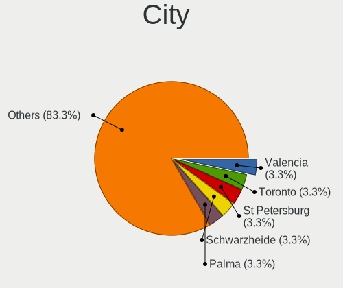
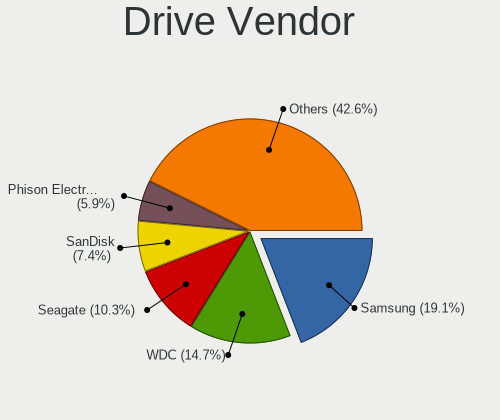
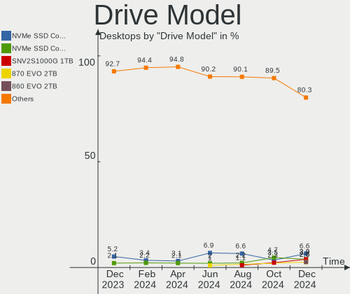
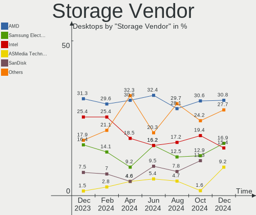
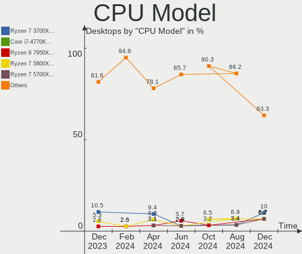

Nobara - Hardware Trends (Desktops)
-----------------------------------

A project to identify most popular hardware characteristics and track their change
over time based on data collected by Linux users at https://Linux-Hardware.org.

Anyone can contribute to this report by the [hw-probe](https://github.com/linuxhw/hw-probe) tool:

    sudo -E hw-probe -all -upload

This report is for one last month. Overall report since the beginning of time: [TestDays](https://github.com/linuxhw/TestDays)

Period: Nov, 2023.

Contents
--------

* [ System ](#system)
  - [ OS                       ](#os)
  - [ OS Family                ](#os-family)
  - [ Kernel                   ](#kernel)
  - [ Kernel Family            ](#kernel-family)
  - [ Kernel Major Ver.        ](#kernel-major-ver)
  - [ Arch                     ](#arch)
  - [ DE                       ](#de)
  - [ Display Server           ](#display-server)
  - [ Display Manager          ](#display-manager)
  - [ OS Lang                  ](#os-lang)
  - [ Boot Mode                ](#boot-mode)
  - [ Filesystem               ](#filesystem)
  - [ Part. scheme             ](#part-scheme)
  - [ Dual Boot with Linux/BSD ](#dual-boot-with-linuxbsd)
  - [ Dual Boot (Win)          ](#dual-boot-win)

* [ Board ](#board)
  - [ Vendor                   ](#vendor)
  - [ Model                    ](#model)
  - [ Model Family             ](#model-family)
  - [ MFG Year                 ](#mfg-year)
  - [ Form Factor              ](#form-factor)
  - [ Secure Boot              ](#secure-boot)
  - [ Coreboot                 ](#coreboot)
  - [ RAM Size                 ](#ram-size)
  - [ RAM Used                 ](#ram-used)
  - [ Total Drives             ](#total-drives)
  - [ Has CD-ROM               ](#has-cd-rom)
  - [ Has Ethernet             ](#has-ethernet)
  - [ Has WiFi                 ](#has-wifi)
  - [ Has Bluetooth            ](#has-bluetooth)

* [ Location ](#location)
  - [ Country                  ](#country)
  - [ City                     ](#city)

* [ Drives ](#drives)
  - [ Drive Vendor             ](#drive-vendor)
  - [ Drive Model              ](#drive-model)
  - [ HDD Vendor               ](#hdd-vendor)
  - [ SSD Vendor               ](#ssd-vendor)
  - [ Drive Kind               ](#drive-kind)
  - [ Drive Connector          ](#drive-connector)
  - [ Drive Size               ](#drive-size)
  - [ Space Total              ](#space-total)
  - [ Space Used               ](#space-used)
  - [ Malfunc. Drives          ](#malfunc-drives)
  - [ Malfunc. Drive Vendor    ](#malfunc-drive-vendor)
  - [ Malfunc. HDD Vendor      ](#malfunc-hdd-vendor)
  - [ Malfunc. Drive Kind      ](#malfunc-drive-kind)
  - [ Failed Drives            ](#failed-drives)
  - [ Failed Drive Vendor      ](#failed-drive-vendor)
  - [ Drive Status             ](#drive-status)

* [ Storage controller ](#storage-controller)
  - [ Storage Vendor           ](#storage-vendor)
  - [ Storage Model            ](#storage-model)
  - [ Storage Kind             ](#storage-kind)

* [ Processor ](#processor)
  - [ CPU Vendor               ](#cpu-vendor)
  - [ CPU Model                ](#cpu-model)
  - [ CPU Model Family         ](#cpu-model-family)
  - [ CPU Cores                ](#cpu-cores)
  - [ CPU Sockets              ](#cpu-sockets)
  - [ CPU Threads              ](#cpu-threads)
  - [ CPU Op-Modes             ](#cpu-op-modes)
  - [ CPU Microcode            ](#cpu-microcode)
  - [ CPU Microarch            ](#cpu-microarch)

* [ Graphics ](#graphics)
  - [ GPU Vendor               ](#gpu-vendor)
  - [ GPU Model                ](#gpu-model)
  - [ GPU Combo                ](#gpu-combo)
  - [ GPU Driver               ](#gpu-driver)
  - [ GPU Memory               ](#gpu-memory)

* [ Monitor ](#monitor)
  - [ Monitor Vendor           ](#monitor-vendor)
  - [ Monitor Model            ](#monitor-model)
  - [ Monitor Resolution       ](#monitor-resolution)
  - [ Monitor Diagonal         ](#monitor-diagonal)
  - [ Monitor Width            ](#monitor-width)
  - [ Aspect Ratio             ](#aspect-ratio)
  - [ Monitor Area             ](#monitor-area)
  - [ Pixel Density            ](#pixel-density)
  - [ Multiple Monitors        ](#multiple-monitors)

* [ Network ](#network)
  - [ Net Controller Vendor    ](#net-controller-vendor)
  - [ Net Controller Model     ](#net-controller-model)
  - [ Wireless Vendor          ](#wireless-vendor)
  - [ Wireless Model           ](#wireless-model)
  - [ Ethernet Vendor          ](#ethernet-vendor)
  - [ Ethernet Model           ](#ethernet-model)
  - [ Net Controller Kind      ](#net-controller-kind)
  - [ Used Controller          ](#used-controller)
  - [ NICs                     ](#nics)
  - [ IPv6                     ](#ipv6)

* [ Bluetooth ](#bluetooth)
  - [ Bluetooth Vendor         ](#bluetooth-vendor)
  - [ Bluetooth Model          ](#bluetooth-model)

* [ Sound ](#sound)
  - [ Sound Vendor             ](#sound-vendor)
  - [ Sound Model              ](#sound-model)

* [ Memory ](#memory)
  - [ Memory Vendor            ](#memory-vendor)
  - [ Memory Model             ](#memory-model)
  - [ Memory Kind              ](#memory-kind)
  - [ Memory Form Factor       ](#memory-form-factor)
  - [ Memory Size              ](#memory-size)
  - [ Memory Speed             ](#memory-speed)

* [ Printers & scanners ](#printers--scanners)
  - [ Printer Vendor           ](#printer-vendor)
  - [ Printer Model            ](#printer-model)
  - [ Scanner Vendor           ](#scanner-vendor)
  - [ Scanner Model            ](#scanner-model)

* [ Camera ](#camera)
  - [ Camera Vendor            ](#camera-vendor)
  - [ Camera Model             ](#camera-model)

* [ Security ](#security)
  - [ Fingerprint Vendor       ](#fingerprint-vendor)
  - [ Fingerprint Model        ](#fingerprint-model)
  - [ Chipcard Vendor          ](#chipcard-vendor)
  - [ Chipcard Model           ](#chipcard-model)

* [ Unsupported ](#unsupported)
  - [ Unsupported Devices      ](#unsupported-devices)
  - [ Unsupported Device Types ](#unsupported-device-types)

System
------

OS
--

Installed operating systems

| Name      | Desktops | Percent |
|-----------|----------|---------|
| Nobara 38 | 25       | 92.59%  |
| Nobara 37 | 2        | 7.41%   |

OS Family
---------

OS without a version

| Name   | Desktops | Percent |
|--------|----------|---------|
| Nobara | 27       | 100%    |

Kernel
------

Version of the Linux kernel

| Version                      | Desktops | Percent |
|------------------------------|----------|---------|
| 6.4.10-202.fsync.fc38.x86_64 | 9        | 33.33%  |
| 6.5.9-201.fsync.fc38.x86_64  | 7        | 25.93%  |
| 6.6.2-201.fsync.fc38.x86_64  | 3        | 11.11%  |
| 6.5.11-201.fsync.fc38.x86_64 | 3        | 11.11%  |
| 6.5.3-200.fsync.fc37.x86_64  | 2        | 7.41%   |
| 6.5.9-200.fsync.fc38.x86_64  | 1        | 3.7%    |
| 6.5.5-201.fsync.fc38.x86_64  | 1        | 3.7%    |
| 6.3.12-203.fsync.fc38.x86_64 | 1        | 3.7%    |

Kernel Family
-------------

Linux kernel without a distro release

| Version | Desktops | Percent |
|---------|----------|---------|
| 6.4.10  | 9        | 33.33%  |
| 6.5.9   | 8        | 29.63%  |
| 6.6.2   | 3        | 11.11%  |
| 6.5.11  | 3        | 11.11%  |
| 6.5.3   | 2        | 7.41%   |
| 6.5.5   | 1        | 3.7%    |
| 6.3.12  | 1        | 3.7%    |

Kernel Major Ver.
-----------------

Linux kernel major version

| Version | Desktops | Percent |
|---------|----------|---------|
| 6.5     | 14       | 51.85%  |
| 6.4     | 9        | 33.33%  |
| 6.6     | 3        | 11.11%  |
| 6.3     | 1        | 3.7%    |

Arch
----

OS architecture (x86_64, i586, etc.)

| Name   | Desktops | Percent |
|--------|----------|---------|
| x86_64 | 27       | 100%    |

DE
--

Desktop Environment

| Name  | Desktops | Percent |
|-------|----------|---------|
| GNOME | 17       | 62.96%  |
| KDE5  | 10       | 37.04%  |

Display Server
--------------

X11 or Wayland

| Name    | Desktops | Percent |
|---------|----------|---------|
| Wayland | 21       | 77.78%  |
| X11     | 6        | 22.22%  |

Display Manager
---------------

SDDM, LightDM, etc.

| Name    | Desktops | Percent |
|---------|----------|---------|
| Unknown | 24       | 88.89%  |
| SDDM    | 2        | 7.41%   |
| GDM     | 1        | 3.7%    |

OS Lang
-------

Language

| Lang  | Desktops | Percent |
|-------|----------|---------|
| en_US | 15       | 55.56%  |
| de_DE | 3        | 11.11%  |
| pt_BR | 2        | 7.41%   |
| en_CA | 2        | 7.41%   |
| hu_HU | 1        | 3.7%    |
| fr_FR | 1        | 3.7%    |
| es_ES | 1        | 3.7%    |
| en_GB | 1        | 3.7%    |
| da_DK | 1        | 3.7%    |

Boot Mode
---------

EFI or BIOS

| Mode | Desktops | Percent |
|------|----------|---------|
| EFI  | 24       | 88.89%  |
| BIOS | 3        | 11.11%  |

Filesystem
----------

Type of filesystem

| Type  | Desktops | Percent |
|-------|----------|---------|
| Btrfs | 26       | 96.3%   |
| Ext4  | 1        | 3.7%    |

Part. scheme
------------

Scheme of partitioning

| Type    | Desktops | Percent |
|---------|----------|---------|
| Unknown | 24       | 88.89%  |
| GPT     | 3        | 11.11%  |

Dual Boot with Linux/BSD
------------------------

Hosting more than one Linux/BSD

| Dual boot | Desktops | Percent |
|-----------|----------|---------|
| No        | 25       | 92.59%  |
| Yes       | 2        | 7.41%   |

Dual Boot (Win)
---------------

Hosting Linux and Windows

| Dual boot | Desktops | Percent |
|-----------|----------|---------|
| No        | 25       | 92.59%  |
| Yes       | 2        | 7.41%   |

Board
-----

Vendor
------

Motherboard manufacturer

| Name                | Desktops | Percent |
|---------------------|----------|---------|
| MSI                 | 9        | 33.33%  |
| ASUSTek Computer    | 8        | 29.63%  |
| ASRock              | 4        | 14.81%  |
| Gigabyte Technology | 2        | 7.41%   |
| Hewlett-Packard     | 1        | 3.7%    |
| Google              | 1        | 3.7%    |
| Dell                | 1        | 3.7%    |
| Acer                | 1        | 3.7%    |

Model
-----

Motherboard model

| Name                               | Desktops | Percent |
|------------------------------------|----------|---------|
| MSI MS-7C56                        | 2        | 7.41%   |
| MSI MS-7B86                        | 2        | 7.41%   |
| MSI MS-7E12                        | 1        | 3.7%    |
| MSI MS-7D46                        | 1        | 3.7%    |
| MSI MS-7B87                        | 1        | 3.7%    |
| MSI MS-7B17                        | 1        | 3.7%    |
| MSI MS-7977                        | 1        | 3.7%    |
| HP EliteDesk 800 G2 SFF            | 1        | 3.7%    |
| Google Kench                       | 1        | 3.7%    |
| Gigabyte X670 AORUS ELITE AX       | 1        | 3.7%    |
| Gigabyte 970A-DS3P FX              | 1        | 3.7%    |
| Dell OptiPlex 5050                 | 1        | 3.7%    |
| ASUS TUF B450M-PLUS GAMING         | 1        | 3.7%    |
| ASUS ROG STRIX X570-E GAMING       | 1        | 3.7%    |
| ASUS ROG STRIX B650E-I GAMING WIFI | 1        | 3.7%    |
| ASUS PRIME Z370-P II               | 1        | 3.7%    |
| ASUS PRIME B450M-GAMING/BR         | 1        | 3.7%    |
| ASUS Maximus VIII FORMULA          | 1        | 3.7%    |
| ASUS All Series                    | 1        | 3.7%    |
| ASUS A0000001                      | 1        | 3.7%    |
| ASRock X470 Taichi Ultimate        | 1        | 3.7%    |
| ASRock H310CM-DVS                  | 1        | 3.7%    |
| ASRock B550M Pro4                  | 1        | 3.7%    |
| ASRock B450M-HDV R4.0              | 1        | 3.7%    |
| Acer Veriton N4680GT               | 1        | 3.7%    |

Model Family
------------

Motherboard model prefix

| Name               | Desktops | Percent |
|--------------------|----------|---------|
| MSI MS-7C56        | 2        | 7.41%   |
| MSI MS-7B86        | 2        | 7.41%   |
| ASUS ROG           | 2        | 7.41%   |
| ASUS PRIME         | 2        | 7.41%   |
| MSI MS-7E12        | 1        | 3.7%    |
| MSI MS-7D46        | 1        | 3.7%    |
| MSI MS-7B87        | 1        | 3.7%    |
| MSI MS-7B17        | 1        | 3.7%    |
| MSI MS-7977        | 1        | 3.7%    |
| HP EliteDesk       | 1        | 3.7%    |
| Google Kench       | 1        | 3.7%    |
| Gigabyte X670      | 1        | 3.7%    |
| Gigabyte 970A-DS3P | 1        | 3.7%    |
| Dell OptiPlex      | 1        | 3.7%    |
| ASUS TUF           | 1        | 3.7%    |
| ASUS Maximus       | 1        | 3.7%    |
| ASUS All           | 1        | 3.7%    |
| ASUS A0000001      | 1        | 3.7%    |
| ASRock X470        | 1        | 3.7%    |
| ASRock H310CM-DVS  | 1        | 3.7%    |
| ASRock B550M       | 1        | 3.7%    |
| ASRock B450M-HDV   | 1        | 3.7%    |
| Acer Veriton       | 1        | 3.7%    |

MFG Year
--------

Motherboard manufacture year

| Year | Desktops | Percent |
|------|----------|---------|
| 2018 | 9        | 33.33%  |
| 2022 | 4        | 14.81%  |
| 2019 | 4        | 14.81%  |
| 2020 | 3        | 11.11%  |
| 2017 | 2        | 7.41%   |
| 2015 | 2        | 7.41%   |
| 2023 | 1        | 3.7%    |
| 2021 | 1        | 3.7%    |
| 2014 | 1        | 3.7%    |

Form Factor
-----------

Physical design of the computer

| Name    | Desktops | Percent |
|---------|----------|---------|
| Desktop | 27       | 100%    |

Secure Boot
-----------

Enabled or disabled

| State    | Desktops | Percent |
|----------|----------|---------|
| Disabled | 27       | 100%    |

Coreboot
--------

Have coreboot on board

| Used | Desktops | Percent |
|------|----------|---------|
| No   | 26       | 96.3%   |
| Yes  | 1        | 3.7%    |

RAM Size
--------

Total RAM memory

| Size in GB  | Desktops | Percent |
|-------------|----------|---------|
| 16.01-24.0  | 11       | 40.74%  |
| 32.01-64.0  | 9        | 33.33%  |
| 8.01-16.0   | 3        | 11.11%  |
| 64.01-256.0 | 2        | 7.41%   |
| 3.01-4.0    | 1        | 3.7%    |
| 24.01-32.0  | 1        | 3.7%    |

RAM Used
--------

Used RAM memory

| Used GB   | Desktops | Percent |
|-----------|----------|---------|
| 4.01-8.0  | 11       | 40.74%  |
| 2.01-3.0  | 8        | 29.63%  |
| 3.01-4.0  | 4        | 14.81%  |
| 1.01-2.0  | 2        | 7.41%   |
| 8.01-16.0 | 2        | 7.41%   |

Total Drives
------------

Number of drives on board

| Drives | Desktops | Percent |
|--------|----------|---------|
| 2      | 11       | 40.74%  |
| 1      | 5        | 18.52%  |
| 3      | 4        | 14.81%  |
| 4      | 3        | 11.11%  |
| 5      | 2        | 7.41%   |
| 8      | 1        | 3.7%    |
| 6      | 1        | 3.7%    |

Has CD-ROM
----------

Has CD-ROM on board

| Presented | Desktops | Percent |
|-----------|----------|---------|
| No        | 24       | 88.89%  |
| Yes       | 3        | 11.11%  |

Has Ethernet
------------

Has Ethernet on board

| Presented | Desktops | Percent |
|-----------|----------|---------|
| Yes       | 27       | 100%    |

Has WiFi
--------

Has WiFi module

| Presented | Desktops | Percent |
|-----------|----------|---------|
| Yes       | 14       | 51.85%  |
| No        | 13       | 48.15%  |

Has Bluetooth
-------------

Has Bluetooth module

| Presented | Desktops | Percent |
|-----------|----------|---------|
| No        | 14       | 51.85%  |
| Yes       | 13       | 48.15%  |

Location
--------

Country
-------

Geographic location (country)

| Country   | Desktops | Percent |
|-----------|----------|---------|
| USA       | 10       | 37.04%  |
| Germany   | 4        | 14.81%  |
| Canada    | 2        | 7.41%   |
| Brazil    | 2        | 7.41%   |
| Sweden    | 1        | 3.7%    |
| Spain     | 1        | 3.7%    |
| Lithuania | 1        | 3.7%    |
| Ireland   | 1        | 3.7%    |
| India     | 1        | 3.7%    |
| Hungary   | 1        | 3.7%    |
| France    | 1        | 3.7%    |
| Estonia   | 1        | 3.7%    |
| Denmark   | 1        | 3.7%    |

City
----

Geographic location (city)

| City                      | Desktops | Percent |
|---------------------------|----------|---------|
| Weatherford               | 1        | 3.7%    |
| Vilnius                   | 1        | 3.7%    |
| Temecula                  | 1        | 3.7%    |
| Tartu                     | 1        | 3.7%    |
| Stockholm                 | 1        | 3.7%    |
| Sligo                     | 1        | 3.7%    |
| Slangerup                 | 1        | 3.7%    |
| Seattle                   | 1        | 3.7%    |
| Schweinfurt               | 1        | 3.7%    |
| Satna                     | 1        | 3.7%    |
| San Juan Capistrano       | 1        | 3.7%    |
| Saluda                    | 1        | 3.7%    |
| Sacramento                | 1        | 3.7%    |
| Puente La Reina – Gares | 1        | 3.7%    |
| Praia Grande              | 1        | 3.7%    |
| Peterborough              | 1        | 3.7%    |
| Noyal-sur-Vilaine         | 1        | 3.7%    |
| Hohen Neuendorf           | 1        | 3.7%    |
| Guelph                    | 1        | 3.7%    |
| Erdokertes                | 1        | 3.7%    |
| Denton                    | 1        | 3.7%    |
| Cologne                   | 1        | 3.7%    |
| Brownsburg                | 1        | 3.7%    |
| Berea                     | 1        | 3.7%    |
| Baltimore                 | 1        | 3.7%    |
| Bad Krozingen             | 1        | 3.7%    |
| Angra dos Reis            | 1        | 3.7%    |

Drives
------

Drive Vendor
------------

Hard drive vendors

| Vendor                      | Desktops | Drives | Percent |
|-----------------------------|----------|--------|---------|
| Samsung Electronics         | 13       | 21     | 22.03%  |
| Seagate                     | 11       | 15     | 18.64%  |
| WDC                         | 5        | 8      | 8.47%   |
| SanDisk                     | 4        | 4      | 6.78%   |
| Kingston                    | 4        | 5      | 6.78%   |
| Crucial                     | 4        | 4      | 6.78%   |
| Micron/Crucial Technology   | 3        | 3      | 5.08%   |
| Intel                       | 3        | 3      | 5.08%   |
| ADATA Technology            | 2        | 3      | 3.39%   |
| Verbatim                    | 1        | 1      | 1.69%   |
| Unknown                     | 1        | 2      | 1.69%   |
| Toshiba                     | 1        | 1      | 1.69%   |
| Realtek Semiconductor       | 1        | 1      | 1.69%   |
| PNY                         | 1        | 1      | 1.69%   |
| Phison Electronics          | 1        | 1      | 1.69%   |
| Lexar                       | 1        | 1      | 1.69%   |
| Kingston Technology Company | 1        | 1      | 1.69%   |
| Intenso                     | 1        | 1      | 1.69%   |
| Fanxiang                    | 1        | 1      | 1.69%   |

Drive Model
-----------

Hard drive models

| Model                                               | Desktops | Percent |
|-----------------------------------------------------|----------|---------|
| Seagate ST2000DM008-2FR102 2TB                      | 3        | 4.11%   |
| Samsung NVMe SSD Controller PM9A1/PM9A3/980PRO 2TB  | 3        | 4.11%   |
| WDC WD20EZRX-00D8PB0 2TB                            | 2        | 2.74%   |
| Seagate ST1000LM035-1RK172 1TB                      | 2        | 2.74%   |
| Samsung SSD 980 1TB                                 | 2        | 2.74%   |
| Samsung SSD 870 EVO 1TB                             | 2        | 2.74%   |
| Samsung NVMe SSD Controller SM981/PM981/PM983 250GB | 2        | 2.74%   |
| Samsung HD502IJ 500GB                               | 2        | 2.74%   |
| Crucial CT1000MX500SSD1 1TB                         | 2        | 2.74%   |
| WDC WDS120G2G0B-00EPW0 120GB SSD                    | 1        | 1.37%   |
| WDC WD6002FFWX-68TZ4N0 6TB                          | 1        | 1.37%   |
| WDC WD20EZRZ-00Z5HB0 2TB                            | 1        | 1.37%   |
| WDC WD1602ABKS-18N8A0 160GB                         | 1        | 1.37%   |
| WDC WD10EZEX-21WN4A0 1TB                            | 1        | 1.37%   |
| WDC WD1002FAEX-00Y9A0 1TB                           | 1        | 1.37%   |
| Verbatim Portable Drive 2TB                         | 1        | 1.37%   |
| Unknown NVMe SSD Drive 2TB                          | 1        | 1.37%   |
| Toshiba HDWD240 4TB                                 | 1        | 1.37%   |
| Seagate ST6000VN0033-2EE110 6TB                     | 1        | 1.37%   |
| Seagate ST4000VN008-2DR166 4TB                      | 1        | 1.37%   |
| Seagate ST3320413AS 320GB                           | 1        | 1.37%   |
| Seagate ST2000VM003-1CT164 2TB                      | 1        | 1.37%   |
| Seagate ST2000DM006-2DM164 2TB                      | 1        | 1.37%   |
| Seagate ST2000DM001-1E6164 2TB                      | 1        | 1.37%   |
| Seagate ST1000LM048-2E7172 1TB                      | 1        | 1.37%   |
| Seagate ST1000DM003-9YN162 1TB                      | 1        | 1.37%   |
| Seagate Expansion 1TB                               | 1        | 1.37%   |
| Sandisk WD_BLACK SN770 500GB                        | 1        | 1.37%   |
| Sandisk WD Blue SN570 1TB                           | 1        | 1.37%   |
| Sandisk WD Blue SN550 NVMe SSD 512GB                | 1        | 1.37%   |
| SanDisk SD8SMAT-032G-1006 32GB SSD                  | 1        | 1.37%   |
| Samsung SSD 990 PRO 4TB                             | 1        | 1.37%   |
| Samsung SSD 870 QVO 2TB                             | 1        | 1.37%   |
| Samsung SSD 870 EVO 2TB                             | 1        | 1.37%   |
| Samsung SSD 860 EVO 500GB                           | 1        | 1.37%   |
| Samsung SSD 850 EVO 2TB                             | 1        | 1.37%   |
| Samsung SSD 850 EVO 120GB                           | 1        | 1.37%   |
| Samsung NVMe SSD Controller SM961/PM961/SM963 256GB | 1        | 1.37%   |
| Samsung HD501LJ 500GB                               | 1        | 1.37%   |
| Samsung HD103SI 1TB                                 | 1        | 1.37%   |

HDD Vendor
----------

Hard disk drive vendors

| Vendor              | Desktops | Drives | Percent |
|---------------------|----------|--------|---------|
| Seagate             | 11       | 15     | 61.11%  |
| WDC                 | 4        | 7      | 22.22%  |
| Samsung Electronics | 2        | 4      | 11.11%  |
| Toshiba             | 1        | 1      | 5.56%   |

SSD Vendor
----------

Solid state drive vendors

| Vendor              | Desktops | Drives | Percent |
|---------------------|----------|--------|---------|
| Samsung Electronics | 6        | 8      | 30%     |
| Crucial             | 4        | 4      | 20%     |
| Kingston            | 2        | 3      | 10%     |
| Intel               | 2        | 2      | 10%     |
| WDC                 | 1        | 1      | 5%      |
| SanDisk             | 1        | 1      | 5%      |
| PNY                 | 1        | 1      | 5%      |
| Lexar               | 1        | 1      | 5%      |
| Intenso             | 1        | 1      | 5%      |
| Fanxiang            | 1        | 1      | 5%      |

Drive Kind
----------

HDD or SSD

| Kind    | Desktops | Drives | Percent |
|---------|----------|--------|---------|
| NVMe    | 19       | 26     | 36.54%  |
| SSD     | 18       | 23     | 34.62%  |
| HDD     | 14       | 27     | 26.92%  |
| Unknown | 1        | 1      | 1.92%   |

Drive Connector
---------------

SATA, SAS, NVMe, etc.

| Type | Desktops | Drives | Percent |
|------|----------|--------|---------|
| SATA | 21       | 49     | 50%     |
| NVMe | 19       | 26     | 45.24%  |
| SAS  | 2        | 2      | 4.76%   |

Drive Size
----------

Size of hard drive

| Size in TB | Desktops | Drives | Percent |
|------------|----------|--------|---------|
| 0.51-1.0   | 12       | 15     | 34.29%  |
| 1.01-2.0   | 10       | 16     | 28.57%  |
| 0.01-0.5   | 10       | 15     | 28.57%  |
| 4.01-10.0  | 2        | 2      | 5.71%   |
| 3.01-4.0   | 1        | 2      | 2.86%   |

Space Total
-----------

Amount of disk space available on the file system

| Size in GB     | Desktops | Percent |
|----------------|----------|---------|
| More than 3000 | 9        | 33.33%  |
| 2001-3000      | 5        | 18.52%  |
| 501-1000       | 4        | 14.81%  |
| 251-500        | 3        | 11.11%  |
| 1001-2000      | 3        | 11.11%  |
| 21-50          | 1        | 3.7%    |
| 101-250        | 1        | 3.7%    |
| Unknown        | 1        | 3.7%    |

Space Used
----------

Amount of used disk space

| Used GB        | Desktops | Percent |
|----------------|----------|---------|
| 251-500        | 5        | 18.52%  |
| 501-1000       | 5        | 18.52%  |
| 21-50          | 4        | 14.81%  |
| 1001-2000      | 3        | 11.11%  |
| 1-20           | 3        | 11.11%  |
| More than 3000 | 2        | 7.41%   |
| 101-250        | 2        | 7.41%   |
| 2001-3000      | 1        | 3.7%    |
| 51-100         | 1        | 3.7%    |
| Unknown        | 1        | 3.7%    |

Malfunc. Drives
---------------

Drive models with a malfunction

Zero info for selected period =(

Malfunc. Drive Vendor
---------------------

Vendors of faulty drives

Zero info for selected period =(

Malfunc. HDD Vendor
-------------------

Vendors of faulty HDD drives

Zero info for selected period =(

Malfunc. Drive Kind
-------------------

Kinds of faulty drives

Zero info for selected period =(

Failed Drives
-------------

Failed drive models

Zero info for selected period =(

Failed Drive Vendor
-------------------

Failed drive vendors

Zero info for selected period =(

Drive Status
------------

Number of failed and malfunc. drives

| Status   | Desktops | Drives | Percent |
|----------|----------|--------|---------|
| Detected | 25       | 69     | 89.29%  |
| Works    | 3        | 8      | 10.71%  |

Storage controller
------------------

Storage Vendor
--------------

Storage controller vendors

| Vendor                      | Desktops | Percent |
|-----------------------------|----------|---------|
| AMD                         | 15       | 29.41%  |
| Intel                       | 13       | 25.49%  |
| Samsung Electronics         | 7        | 13.73%  |
| SanDisk                     | 3        | 5.88%   |
| Micron/Crucial Technology   | 3        | 5.88%   |
| Kingston Technology Company | 3        | 5.88%   |
| ASMedia Technology          | 2        | 3.92%   |
| ADATA Technology            | 2        | 3.92%   |
| Solidigm                    | 1        | 1.96%   |
| Realtek Semiconductor       | 1        | 1.96%   |
| Phison Electronics          | 1        | 1.96%   |

Storage Model
-------------

Storage controller models

| Model                                                                          | Desktops | Percent |
|--------------------------------------------------------------------------------|----------|---------|
| AMD FCH SATA Controller [AHCI mode]                                            | 10       | 16.95%  |
| AMD 400 Series Chipset SATA Controller                                         | 7        | 11.86%  |
| Samsung NVMe SSD Controller PM9A1/PM9A3/980PRO                                 | 3        | 5.08%   |
| Intel Q170/Q150/B150/H170/H110/Z170/CM236 Chipset SATA Controller [AHCI Mode]  | 3        | 5.08%   |
| Intel 200 Series PCH SATA controller [AHCI mode]                               | 3        | 5.08%   |
| AMD 500 Series Chipset SATA Controller                                         | 3        | 5.08%   |
| Samsung NVMe SSD Controller SM981/PM981/PM983                                  | 2        | 3.39%   |
| Samsung NVMe SSD Controller 980 (DRAM-less)                                    | 2        | 3.39%   |
| Intel Cannon Lake PCH SATA AHCI Controller                                     | 2        | 3.39%   |
| ASMedia ASM1062 Serial ATA Controller                                          | 2        | 3.39%   |
| Solidigm P41 Plus NVMe SSD (DRAM-less) [Echo Harbor]                           | 1        | 1.69%   |
| SanDisk WD Black SN770 / PC SN740 256GB / PC SN560 (DRAM-less) NVMe SSD        | 1        | 1.69%   |
| SanDisk Ultra 3D / WD Blue SN570 NVMe SSD (DRAM-less)                          | 1        | 1.69%   |
| SanDisk Ultra 3D / WD Blue SN550 NVMe SSD                                      | 1        | 1.69%   |
| Samsung NVMe SSD Controller SM961/PM961/SM963                                  | 1        | 1.69%   |
| Samsung NVMe SSD Controller S4LV008[Pascal]                                    | 1        | 1.69%   |
| Realtek RTS5765DL NVMe SSD Controller (DRAM-less)                              | 1        | 1.69%   |
| Phison E12 NVMe Controller                                                     | 1        | 1.69%   |
| Micron/Crucial P5 NVMe PCIe SSD[SlashP5]                                       | 1        | 1.69%   |
| Micron/Crucial P2 [Nick P2] / P3 / P3 Plus NVMe PCIe SSD (DRAM-less)           | 1        | 1.69%   |
| Micron/Crucial P1 NVMe PCIe SSD[Frampton]                                      | 1        | 1.69%   |
| Kingston Company NV2 NVMe SSD SM2267XT                                         | 1        | 1.69%   |
| Kingston Company NV1 NVMe SSD SM2263XT                                         | 1        | 1.69%   |
| Kingston Company KC2000/KC2500 NVMe SSD SM2262EN                               | 1        | 1.69%   |
| Intel Sunrise Point-LP SATA Controller [AHCI mode]                             | 1        | 1.69%   |
| Intel SSD 660P Series                                                          | 1        | 1.69%   |
| Intel Alder Lake-S PCH SATA Controller [AHCI Mode]                             | 1        | 1.69%   |
| Intel 8 Series/C220 Series Chipset Family 6-port SATA Controller 1 [AHCI mode] | 1        | 1.69%   |
| Intel 500 Series Chipset Family SATA AHCI Controller                           | 1        | 1.69%   |
| AMD SB7x0/SB8x0/SB9x0 SATA Controller [AHCI mode]                              | 1        | 1.69%   |
| ADATA XPG SX8200 Pro PCIe Gen3x4 M.2 2280 Solid State Drive                    | 1        | 1.69%   |
| ADATA ADATA XPG GAMMIXS1 1L Media (256 GB SSD)                                 | 1        | 1.69%   |

Storage Kind
------------

Kind of storage controller (IDE, SATA, NVMe, SAS, ...)

| Kind | Desktops | Percent |
|------|----------|---------|
| SATA | 27       | 58.7%   |
| NVMe | 19       | 41.3%   |

Processor
---------

CPU Vendor
----------

Processor vendors

| Vendor | Desktops | Percent |
|--------|----------|---------|
| AMD    | 15       | 55.56%  |
| Intel  | 12       | 44.44%  |

CPU Model
---------

Processor models

| Model                                       | Desktops | Percent |
|---------------------------------------------|----------|---------|
| Intel Core i7-6700K CPU @ 4.00GHz           | 2        | 7.41%   |
| AMD Ryzen 7 3700X 8-Core Processor          | 2        | 7.41%   |
| AMD Ryzen 7 2700 Eight-Core Processor       | 2        | 7.41%   |
| AMD Ryzen 3 3200G with Radeon Vega Graphics | 2        | 7.41%   |
| Intel Core i9-9900K CPU @ 3.60GHz           | 1        | 3.7%    |
| Intel Core i7-9700K CPU @ 3.60GHz           | 1        | 3.7%    |
| Intel Core i7-8700 CPU @ 3.20GHz            | 1        | 3.7%    |
| Intel Core i7-6700 CPU @ 3.40GHz            | 1        | 3.7%    |
| Intel Core i5-8500T CPU @ 2.10GHz           | 1        | 3.7%    |
| Intel Core i5-7500 CPU @ 3.40GHz            | 1        | 3.7%    |
| Intel Core i5-4570 CPU @ 3.20GHz            | 1        | 3.7%    |
| Intel Celeron CPU 3865U @ 1.80GHz           | 1        | 3.7%    |
| Intel 12th Gen Core i5-12400F               | 1        | 3.7%    |
| Intel 11th Gen Core i5-11500T @ 1.50GHz     | 1        | 3.7%    |
| AMD Ryzen 9 7950X3D 16-Core Processor       | 1        | 3.7%    |
| AMD Ryzen 9 7950X 16-Core Processor         | 1        | 3.7%    |
| AMD Ryzen 9 5900X 12-Core Processor         | 1        | 3.7%    |
| AMD Ryzen 7 7800X3D 8-Core Processor        | 1        | 3.7%    |
| AMD Ryzen 7 5700X 8-Core Processor          | 1        | 3.7%    |
| AMD Ryzen 7 2700X Eight-Core Processor      | 1        | 3.7%    |
| AMD Ryzen 5 4600G with Radeon Graphics      | 1        | 3.7%    |
| AMD Ryzen 5 3600 6-Core Processor           | 1        | 3.7%    |
| AMD FX-8350 Eight-Core Processor            | 1        | 3.7%    |

CPU Model Family
----------------

Processor model prefix

| Model         | Desktops | Percent |
|---------------|----------|---------|
| AMD Ryzen 7   | 7        | 25.93%  |
| Intel Core i7 | 5        | 18.52%  |
| Intel Core i5 | 3        | 11.11%  |
| AMD Ryzen 9   | 3        | 11.11%  |
| Other         | 2        | 7.41%   |
| AMD Ryzen 5   | 2        | 7.41%   |
| AMD Ryzen 3   | 2        | 7.41%   |
| Intel Core i9 | 1        | 3.7%    |
| Intel Celeron | 1        | 3.7%    |
| AMD FX        | 1        | 3.7%    |

CPU Cores
---------

Number of processor cores

| Number | Desktops | Percent |
|--------|----------|---------|
| 8      | 9        | 33.33%  |
| 4      | 8        | 29.63%  |
| 6      | 6        | 22.22%  |
| 16     | 2        | 7.41%   |
| 12     | 1        | 3.7%    |
| 2      | 1        | 3.7%    |

CPU Sockets
-----------

Number of sockets

| Number | Desktops | Percent |
|--------|----------|---------|
| 1      | 27       | 100%    |

CPU Threads
-----------

Threads per core (Hyper-Threading)

| Number | Desktops | Percent |
|--------|----------|---------|
| 2      | 20       | 74.07%  |
| 1      | 7        | 25.93%  |

CPU Op-Modes
------------

CPU Operation Modes (32-bit, 64-bit)

| Op mode        | Desktops | Percent |
|----------------|----------|---------|
| 32-bit, 64-bit | 27       | 100%    |

CPU Microcode
-------------

Microcode number

| Number     | Desktops | Percent |
|------------|----------|---------|
| Unknown    | 12       | 44.44%  |
| 0x0800820d | 3        | 11.11%  |
| 0x0a601206 | 2        | 7.41%   |
| 0x0a20120a | 2        | 7.41%   |
| 0x08701021 | 2        | 7.41%   |
| 0x08108109 | 2        | 7.41%   |
| 0x0a601203 | 1        | 3.7%    |
| 0x08701030 | 1        | 3.7%    |
| 0x08600106 | 1        | 3.7%    |
| 0x06000852 | 1        | 3.7%    |

CPU Microarch
-------------

Microarchitecture

| Name             | Desktops | Percent |
|------------------|----------|---------|
| KabyLake         | 6        | 22.22%  |
| Zen+             | 5        | 18.52%  |
| Zen 2            | 4        | 14.81%  |
| Skylake          | 3        | 11.11%  |
| Unknown          | 3        | 11.11%  |
| Zen 3            | 2        | 7.41%   |
| Piledriver       | 1        | 3.7%    |
| Icelake          | 1        | 3.7%    |
| Haswell          | 1        | 3.7%    |
| Alderlake Hybrid | 1        | 3.7%    |

Graphics
--------

GPU Vendor
----------

Vendors of graphics cards

| Vendor | Desktops | Percent |
|--------|----------|---------|
| AMD    | 13       | 44.83%  |
| Nvidia | 11       | 37.93%  |
| Intel  | 5        | 17.24%  |

GPU Model
---------

Graphics card models

| Model                                                                       | Desktops | Percent |
|-----------------------------------------------------------------------------|----------|---------|
| Nvidia GP104 [GeForce GTX 1070]                                             | 2        | 6.25%   |
| AMD Raphael                                                                 | 2        | 6.25%   |
| AMD Navi 31 [Radeon RX 7900 XT/7900 XTX]                                    | 2        | 6.25%   |
| AMD Navi 23 [Radeon RX 6600/6600 XT/6600M]                                  | 2        | 6.25%   |
| AMD Navi 10 [Radeon RX 5600 OEM/5600 XT / 5700/5700 XT]                     | 2        | 6.25%   |
| AMD Ellesmere [Radeon RX 470/480/570/570X/580/580X/590]                     | 2        | 6.25%   |
| Nvidia TU106 [GeForce RTX 2070]                                             | 1        | 3.13%   |
| Nvidia GP108 [GeForce GT 1030]                                              | 1        | 3.13%   |
| Nvidia GP106 [GeForce GTX 1060 6GB]                                         | 1        | 3.13%   |
| Nvidia GM206 [GeForce GTX 960]                                              | 1        | 3.13%   |
| Nvidia GM200 [GeForce GTX 980 Ti]                                           | 1        | 3.13%   |
| Nvidia GA104 [GeForce RTX 3070]                                             | 1        | 3.13%   |
| Nvidia GA102 [GeForce RTX 3090]                                             | 1        | 3.13%   |
| Nvidia GA102 [GeForce RTX 3080 Ti]                                          | 1        | 3.13%   |
| Nvidia AD102 [GeForce RTX 4090]                                             | 1        | 3.13%   |
| Intel Xeon E3-1200 v3/4th Gen Core Processor Integrated Graphics Controller | 1        | 3.13%   |
| Intel RocketLake-S GT1 [UHD Graphics 750]                                   | 1        | 3.13%   |
| Intel HD Graphics 630                                                       | 1        | 3.13%   |
| Intel HD Graphics 610                                                       | 1        | 3.13%   |
| Intel CoffeeLake-S GT2 [UHD Graphics 630]                                   | 1        | 3.13%   |
| AMD Vega 10 XL/XT [Radeon RX Vega 56/64]                                    | 1        | 3.13%   |
| AMD Renoir [Radeon RX Vega 6 (Ryzen 4000/5000 Mobile Series)]               | 1        | 3.13%   |
| AMD Picasso/Raven 2 [Radeon Vega Series / Radeon Vega Mobile Series]        | 1        | 3.13%   |
| AMD Navi 23 [Radeon RX 6650 XT / 6700S / 6800S]                             | 1        | 3.13%   |
| AMD Navi 22 [Radeon RX 6700/6700 XT/6750 XT / 6800M/6850M XT]               | 1        | 3.13%   |
| AMD Lexa PRO [Radeon 540/540X/550/550X / RX 540X/550/550X]                  | 1        | 3.13%   |

GPU Combo
---------

Combinations of graphics cards

| Name           | Desktops | Percent |
|----------------|----------|---------|
| 1 x Nvidia     | 9        | 33.33%  |
| 1 x AMD        | 9        | 33.33%  |
| 1 x Intel      | 4        | 14.81%  |
| 2 x AMD        | 3        | 11.11%  |
| Intel + Nvidia | 1        | 3.7%    |
| AMD + Nvidia   | 1        | 3.7%    |

GPU Driver
----------

Free vs proprietary

| Driver      | Desktops | Percent |
|-------------|----------|---------|
| Free        | 18       | 66.67%  |
| Proprietary | 9        | 33.33%  |

GPU Memory
----------

Total video memory

| Size in GB | Desktops | Percent |
|------------|----------|---------|
| 7.01-8.0   | 10       | 37.04%  |
| Unknown    | 9        | 33.33%  |
| 16.01-24.0 | 3        | 11.11%  |
| 5.01-6.0   | 2        | 7.41%   |
| 1.01-2.0   | 2        | 7.41%   |
| 8.01-16.0  | 1        | 3.7%    |

Monitor
-------

Monitor Vendor
--------------

Monitor vendors

| Vendor               | Desktops | Percent |
|----------------------|----------|---------|
| Samsung Electronics  | 5        | 14.71%  |
| BenQ                 | 4        | 11.76%  |
| Acer                 | 4        | 11.76%  |
| Goldstar             | 3        | 8.82%   |
| Dell                 | 3        | 8.82%   |
| AOC                  | 3        | 8.82%   |
| Hewlett-Packard      | 2        | 5.88%   |
| ASUSTek Computer     | 2        | 5.88%   |
| Ancor Communications | 2        | 5.88%   |
| ViewSonic            | 1        | 2.94%   |
| Philips              | 1        | 2.94%   |
| Marantz              | 1        | 2.94%   |
| Lenovo               | 1        | 2.94%   |
| Eizo                 | 1        | 2.94%   |
| Compal               | 1        | 2.94%   |

Monitor Model
-------------

Monitor models

| Model                                                                 | Desktops | Percent |
|-----------------------------------------------------------------------|----------|---------|
| Ancor Communications ROG PG279Q ACI27EC 2560x1440 598x336mm 27.0-inch | 2        | 5.56%   |
| ViewSonic XG2401 SERIES VSCBB31 1920x1080 531x299mm 24.0-inch         | 1        | 2.78%   |
| Samsung Electronics T27B350 SAM0945 1920x1080 598x336mm 27.0-inch     | 1        | 2.78%   |
| Samsung Electronics LS28AG700N SAM7177 3840x2160 632x360mm 28.6-inch  | 1        | 2.78%   |
| Samsung Electronics LC27G7xT SAM105C 2560x1440 597x336mm 27.0-inch    | 1        | 2.78%   |
| Samsung Electronics C27F390 SAM0D32 1920x1080 598x336mm 27.0-inch     | 1        | 2.78%   |
| Samsung Electronics C24F390 SAM0D2C 1920x1080 521x293mm 23.5-inch     | 1        | 2.78%   |
| Philips 185Vw PHL1851 1366x768 410x230mm 18.5-inch                    | 1        | 2.78%   |
| Marantz AVR MJI0031 1920x1080                                         | 1        | 2.78%   |
| Lenovo LEN D24f-10 LEN65EB 1920x1080 521x293mm 23.5-inch              | 1        | 2.78%   |
| Hewlett-Packard L1710 HWP26EB 1280x1024 340x270mm 17.1-inch           | 1        | 2.78%   |
| Hewlett-Packard 24mh HPN366C 1920x1080 530x300mm 24.0-inch            | 1        | 2.78%   |
| Goldstar M2252D GSM58DB 1920x1080 476x267mm 21.5-inch                 | 1        | 2.78%   |
| Goldstar LG ULTRAWIDE GSM76E4 3440x1440 800x340mm 34.2-inch           | 1        | 2.78%   |
| Goldstar 27GL650F GSM5B71 1920x1080 530x300mm 24.0-inch               | 1        | 2.78%   |
| Goldstar 23MP55 GSM5A23 1920x1080 510x290mm 23.1-inch                 | 1        | 2.78%   |
| Eizo S2202W ENC1975 1680x1050 474x297mm 22.0-inch                     | 1        | 2.78%   |
| Dell P190S DEL405A 1280x1024 376x301mm 19.0-inch                      | 1        | 2.78%   |
| Dell G2722HS DEL427F 1920x1080 597x336mm 27.0-inch                    | 1        | 2.78%   |
| Dell AW3423DWF DELA212 3440x1440 800x337mm 34.2-inch                  | 1        | 2.78%   |
| Compal Terra 2747W WOR2747 1920x1080 527x296mm 23.8-inch              | 1        | 2.78%   |
| BenQ T705 BNQ7688 1280x1024 376x301mm 19.0-inch                       | 1        | 2.78%   |
| BenQ RL2755 BNQ7F41 1920x1080 598x336mm 27.0-inch                     | 1        | 2.78%   |
| BenQ GW2250H BNQ78BD 1920x1080 477x268mm 21.5-inch                    | 1        | 2.78%   |
| BenQ EX2710S BNQ7FA4 1920x1080 600x340mm 27.2-inch                    | 1        | 2.78%   |
| ASUSTek Computer VG27A AUS2722 2560x1440 597x336mm 27.0-inch          | 1        | 2.78%   |
| ASUSTek Computer MG248 AUS24A4 1920x1080 531x299mm 24.0-inch          | 1        | 2.78%   |
| AOC Q3279WG5B AOC3279 2560x1440 725x428mm 33.1-inch                   | 1        | 2.78%   |
| AOC AG273QS8R4 AOC2730 2560x1440 597x336mm 27.0-inch                  | 1        | 2.78%   |
| AOC 27V2G5 AOC2702 1920x1080 598x336mm 27.0-inch                      | 1        | 2.78%   |
| Acer XN253Q P ACR06D1 1920x1080 544x303mm 24.5-inch                   | 1        | 2.78%   |
| Acer XN253Q P ACR06D0 1920x1080 540x300mm 24.3-inch                   | 1        | 2.78%   |
| Acer XB270HU ACR0408 2560x1440 598x336mm 27.0-inch                    | 1        | 2.78%   |
| Acer GN246HL ACR02F9 1920x1080 531x299mm 24.0-inch                    | 1        | 2.78%   |
| Acer FHX2153L ACR031B 1920x1080 477x268mm 21.5-inch                   | 1        | 2.78%   |

Monitor Resolution
------------------

Monitor screen resolution

| Resolution         | Desktops | Percent |
|--------------------|----------|---------|
| 1920x1080 (FHD)    | 17       | 51.52%  |
| 2560x1440 (QHD)    | 7        | 21.21%  |
| 3840x2160 (4K)     | 2        | 6.06%   |
| 3440x1440          | 2        | 6.06%   |
| 1280x1024 (SXGA)   | 2        | 6.06%   |
| 2288x1287          | 1        | 3.03%   |
| 1680x1050 (WSXGA+) | 1        | 3.03%   |
| 1366x768 (WXGA)    | 1        | 3.03%   |

Monitor Diagonal
----------------

Diagonal size in inches

| Inches | Desktops | Percent |
|--------|----------|---------|
| 27     | 10       | 28.57%  |
| 24     | 5        | 14.29%  |
| 23     | 4        | 11.43%  |
| 40     | 3        | 8.57%   |
| 21     | 3        | 8.57%   |
| 34     | 2        | 5.71%   |
| 19     | 2        | 5.71%   |
| 100    | 1        | 2.86%   |
| 33     | 1        | 2.86%   |
| 28     | 1        | 2.86%   |
| 22     | 1        | 2.86%   |
| 18     | 1        | 2.86%   |
| 17     | 1        | 2.86%   |

Monitor Width
-------------

Physical width

| Width in mm    | Desktops | Percent |
|----------------|----------|---------|
| 501-600        | 17       | 51.52%  |
| 401-500        | 5        | 15.15%  |
| 801-900        | 3        | 9.09%   |
| 701-800        | 3        | 9.09%   |
| 351-400        | 2        | 6.06%   |
| More than 2000 | 1        | 3.03%   |
| 601-700        | 1        | 3.03%   |
| 301-350        | 1        | 3.03%   |

Aspect Ratio
------------

Proportional relationship between the width and the height

| Ratio | Desktops | Percent |
|-------|----------|---------|
| 16/9  | 24       | 80%     |
| 5/4   | 3        | 10%     |
| 21/9  | 2        | 6.67%   |
| 16/10 | 1        | 3.33%   |

Monitor Area
------------

Area in inch²

| Area in inch² | Desktops | Percent |
|----------------|----------|---------|
| 301-350        | 10       | 28.57%  |
| 201-250        | 10       | 28.57%  |
| 351-500        | 4        | 11.43%  |
| 151-200        | 4        | 11.43%  |
| 501-1000       | 3        | 8.57%   |
| 141-150        | 2        | 5.71%   |
| More than 1000 | 1        | 2.86%   |
| 251-300        | 1        | 2.86%   |

Pixel Density
-------------

Pixels per inch

| Density | Desktops | Percent |
|---------|----------|---------|
| 51-100  | 21       | 65.63%  |
| 101-120 | 9        | 28.13%  |
| 1-50    | 1        | 3.13%   |
| 121-160 | 1        | 3.13%   |

Multiple Monitors
-----------------

Total monitors connected

| Total | Desktops | Percent |
|-------|----------|---------|
| 1     | 19       | 70.37%  |
| 2     | 7        | 25.93%  |
| 3     | 1        | 3.7%    |

Network
-------

Net Controller Vendor
---------------------

Controller vendors

| Vendor                | Desktops | Percent |
|-----------------------|----------|---------|
| Realtek Semiconductor | 18       | 43.9%   |
| Intel                 | 11       | 26.83%  |
| MediaTek              | 3        | 7.32%   |
| TP-Link               | 2        | 4.88%   |
| Qualcomm Atheros      | 2        | 4.88%   |
| ROCCAT                | 1        | 2.44%   |
| Broadcom              | 1        | 2.44%   |
| ASUSTek Computer      | 1        | 2.44%   |
| ASIX Electronics      | 1        | 2.44%   |
| Aquantia              | 1        | 2.44%   |

Net Controller Model
--------------------

Controller models

| Model                                                             | Desktops | Percent |
|-------------------------------------------------------------------|----------|---------|
| Realtek RTL8111/8168/8411 PCI Express Gigabit Ethernet Controller | 15       | 32.61%  |
| Realtek RTL8125 2.5GbE Controller                                 | 3        | 6.52%   |
| MediaTek MT7922 802.11ax PCI Express Wireless Network Adapter     | 3        | 6.52%   |
| Intel Wi-Fi 6 AX200                                               | 2        | 4.35%   |
| Intel I211 Gigabit Network Connection                             | 2        | 4.35%   |
| Intel Ethernet Connection (7) I219-V                              | 2        | 4.35%   |
| Intel Cannon Lake PCH CNVi WiFi                                   | 2        | 4.35%   |
| TP-Link Archer T3U [Realtek RTL8812BU]                            | 1        | 2.17%   |
| TP-Link Archer T2U PLUS [RTL8821AU]                               | 1        | 2.17%   |
| ROCCAT OSA Express Network card                                   | 1        | 2.17%   |
| Qualcomm Atheros QCA6174 802.11ac Wireless Network Adapter        | 1        | 2.17%   |
| Qualcomm Atheros Killer E2400 Gigabit Ethernet Controller         | 1        | 2.17%   |
| Intel Wireless 7265                                               | 1        | 2.17%   |
| Intel Tiger Lake PCH CNVi WiFi                                    | 1        | 2.17%   |
| Intel Ethernet Controller I225-V                                  | 1        | 2.17%   |
| Intel Ethernet Connection (5) I219-V                              | 1        | 2.17%   |
| Intel Ethernet Connection (2) I219-V                              | 1        | 2.17%   |
| Intel Ethernet Connection (2) I219-LM                             | 1        | 2.17%   |
| Intel Ethernet Connection (17) I219-V                             | 1        | 2.17%   |
| Intel Dual Band Wireless-AC 3168NGW [Stone Peak]                  | 1        | 2.17%   |
| Broadcom BCM4360 802.11ac Dual Band Wireless Network Adapter      | 1        | 2.17%   |
| ASUS 802.11ac NIC                                                 | 1        | 2.17%   |
| ASIX AX88179 Gigabit Ethernet                                     | 1        | 2.17%   |
| Aquantia AQC107 NBase-T/IEEE 802.3bz Ethernet Controller [AQtion] | 1        | 2.17%   |

Wireless Vendor
---------------

Wireless vendors

| Vendor           | Desktops | Percent |
|------------------|----------|---------|
| Intel            | 7        | 46.67%  |
| MediaTek         | 3        | 20%     |
| TP-Link          | 2        | 13.33%  |
| Qualcomm Atheros | 1        | 6.67%   |
| Broadcom         | 1        | 6.67%   |
| ASUSTek Computer | 1        | 6.67%   |

Wireless Model
--------------

Wireless models

| Model                                                         | Desktops | Percent |
|---------------------------------------------------------------|----------|---------|
| MediaTek MT7922 802.11ax PCI Express Wireless Network Adapter | 3        | 20%     |
| Intel Wi-Fi 6 AX200                                           | 2        | 13.33%  |
| Intel Cannon Lake PCH CNVi WiFi                               | 2        | 13.33%  |
| TP-Link Archer T3U [Realtek RTL8812BU]                        | 1        | 6.67%   |
| TP-Link Archer T2U PLUS [RTL8821AU]                           | 1        | 6.67%   |
| Qualcomm Atheros QCA6174 802.11ac Wireless Network Adapter    | 1        | 6.67%   |
| Intel Wireless 7265                                           | 1        | 6.67%   |
| Intel Tiger Lake PCH CNVi WiFi                                | 1        | 6.67%   |
| Intel Dual Band Wireless-AC 3168NGW [Stone Peak]              | 1        | 6.67%   |
| Broadcom BCM4360 802.11ac Dual Band Wireless Network Adapter  | 1        | 6.67%   |
| ASUS 802.11ac NIC                                             | 1        | 6.67%   |

Ethernet Vendor
---------------

Ethernet vendors

| Vendor                | Desktops | Percent |
|-----------------------|----------|---------|
| Realtek Semiconductor | 18       | 60%     |
| Intel                 | 9        | 30%     |
| Qualcomm Atheros      | 1        | 3.33%   |
| ASIX Electronics      | 1        | 3.33%   |
| Aquantia              | 1        | 3.33%   |

Ethernet Model
--------------

Ethernet models

| Model                                                             | Desktops | Percent |
|-------------------------------------------------------------------|----------|---------|
| Realtek RTL8111/8168/8411 PCI Express Gigabit Ethernet Controller | 15       | 50%     |
| Realtek RTL8125 2.5GbE Controller                                 | 3        | 10%     |
| Intel I211 Gigabit Network Connection                             | 2        | 6.67%   |
| Intel Ethernet Connection (7) I219-V                              | 2        | 6.67%   |
| Qualcomm Atheros Killer E2400 Gigabit Ethernet Controller         | 1        | 3.33%   |
| Intel Ethernet Controller I225-V                                  | 1        | 3.33%   |
| Intel Ethernet Connection (5) I219-V                              | 1        | 3.33%   |
| Intel Ethernet Connection (2) I219-V                              | 1        | 3.33%   |
| Intel Ethernet Connection (2) I219-LM                             | 1        | 3.33%   |
| Intel Ethernet Connection (17) I219-V                             | 1        | 3.33%   |
| ASIX AX88179 Gigabit Ethernet                                     | 1        | 3.33%   |
| Aquantia AQC107 NBase-T/IEEE 802.3bz Ethernet Controller [AQtion] | 1        | 3.33%   |

Net Controller Kind
-------------------

Ethernet, WiFi or modem

| Kind     | Desktops | Percent |
|----------|----------|---------|
| Ethernet | 27       | 64.29%  |
| WiFi     | 14       | 33.33%  |
| Unknown  | 1        | 2.38%   |

Used Controller
---------------

Currently used network controller

| Kind     | Desktops | Percent |
|----------|----------|---------|
| Ethernet | 23       | 82.14%  |
| WiFi     | 5        | 17.86%  |

NICs
----

Total network controllers on board

| Total | Desktops | Percent |
|-------|----------|---------|
| 1     | 16       | 59.26%  |
| 2     | 8        | 29.63%  |
| 3     | 3        | 11.11%  |

IPv6
----

IPv6 vs IPv4

| Used | Desktops | Percent |
|------|----------|---------|
| No   | 14       | 51.85%  |
| Yes  | 13       | 48.15%  |

Bluetooth
---------

Bluetooth Vendor
----------------

Controller vendors

| Vendor                  | Desktops | Percent |
|-------------------------|----------|---------|
| Intel                   | 5        | 35.71%  |
| ASUSTek Computer        | 3        | 21.43%  |
| MediaTek                | 2        | 14.29%  |
| Realtek Semiconductor   | 1        | 7.14%   |
| Foxconn / Hon Hai       | 1        | 7.14%   |
| Cambridge Silicon Radio | 1        | 7.14%   |
| Broadcom                | 1        | 7.14%   |

Bluetooth Model
---------------

Controller models

| Model                                               | Desktops | Percent |
|-----------------------------------------------------|----------|---------|
| MediaTek Wireless_Device                            | 2        | 14.29%  |
| Intel Bluetooth 9460/9560 Jefferson Peak (JfP)      | 2        | 14.29%  |
| Realtek Bluetooth Radio                             | 1        | 7.14%   |
| Intel Wireless-AC 3168 Bluetooth                    | 1        | 7.14%   |
| Intel Bluetooth wireless interface                  | 1        | 7.14%   |
| Intel AX201 Bluetooth                               | 1        | 7.14%   |
| Foxconn / Hon Hai Wireless_Device                   | 1        | 7.14%   |
| Cambridge Silicon Radio Bluetooth Dongle (HCI mode) | 1        | 7.14%   |
| Broadcom BCM20702A0 Bluetooth 4.0                   | 1        | 7.14%   |
| ASUS Qualcomm Bluetooth 4.1                         | 1        | 7.14%   |
| ASUS Broadcom BCM20702A0 Bluetooth                  | 1        | 7.14%   |
| ASUS ASUS USB-BT500                                 | 1        | 7.14%   |

Sound
-----

Sound Vendor
------------

Sound card vendors

| Vendor               | Desktops | Percent |
|----------------------|----------|---------|
| AMD                  | 14       | 25.45%  |
| Intel                | 12       | 21.82%  |
| Nvidia               | 11       | 20%     |
| Logitech             | 2        | 3.64%   |
| Creative Labs        | 2        | 3.64%   |
| SteelSeries ApS      | 1        | 1.82%   |
| Sony                 | 1        | 1.82%   |
| ROCCAT               | 1        | 1.82%   |
| Kingston Technology  | 1        | 1.82%   |
| JMTek                | 1        | 1.82%   |
| Hewlett-Packard      | 1        | 1.82%   |
| Harman International | 1        | 1.82%   |
| GYROCOM C&C          | 1        | 1.82%   |
| fifinemicrophone.com | 1        | 1.82%   |
| Edifier Technology   | 1        | 1.82%   |
| Corsair              | 1        | 1.82%   |
| C-Media Electronics  | 1        | 1.82%   |
| ASUSTek Computer     | 1        | 1.82%   |
| Astro Gaming         | 1        | 1.82%   |

Sound Model
-----------

Sound card models

| Model                                                                                           | Desktops | Percent |
|-------------------------------------------------------------------------------------------------|----------|---------|
| AMD Family 17h/19h HD Audio Controller                                                          | 5        | 7.14%   |
| AMD Starship/Matisse HD Audio Controller                                                        | 4        | 5.71%   |
| AMD Navi 21/23 HDMI/DP Audio Controller                                                         | 4        | 5.71%   |
| Intel 200 Series PCH HD Audio                                                                   | 3        | 4.29%   |
| Intel 100 Series/C230 Series Chipset Family HD Audio Controller                                 | 3        | 4.29%   |
| Nvidia GP104 High Definition Audio Controller                                                   | 2        | 2.86%   |
| Nvidia GA102 High Definition Audio Controller                                                   | 2        | 2.86%   |
| Logitech Blue Microphones                                                                       | 2        | 2.86%   |
| Intel Cannon Lake PCH cAVS                                                                      | 2        | 2.86%   |
| AMD Rembrandt Radeon High Definition Audio Controller                                           | 2        | 2.86%   |
| AMD Navi 31 HDMI/DP Audio                                                                       | 2        | 2.86%   |
| AMD Navi 10 HDMI Audio                                                                          | 2        | 2.86%   |
| AMD Family 17h (Models 00h-0fh) HD Audio Controller                                             | 2        | 2.86%   |
| AMD Ellesmere HDMI Audio [Radeon RX 470/480 / 570/580/590]                                      | 2        | 2.86%   |
| SteelSeries ApS SteelSeries Arctis 1 Wireless                                                   | 1        | 1.43%   |
| Sony DualSense wireless controller (PS5)                                                        | 1        | 1.43%   |
| ROCCAT SYN Pro Air                                                                              | 1        | 1.43%   |
| Nvidia TU106 High Definition Audio Controller                                                   | 1        | 1.43%   |
| Nvidia GP108 High Definition Audio Controller                                                   | 1        | 1.43%   |
| Nvidia GP106 High Definition Audio Controller                                                   | 1        | 1.43%   |
| Nvidia GM206 High Definition Audio Controller                                                   | 1        | 1.43%   |
| Nvidia GM200 High Definition Audio                                                              | 1        | 1.43%   |
| Nvidia GA104 High Definition Audio Controller                                                   | 1        | 1.43%   |
| Nvidia AD102 High Definition Audio Controller                                                   | 1        | 1.43%   |
| Kingston Technology HyperX Cloud Alpha S                                                        | 1        | 1.43%   |
| JMTek Fosi Audio K5 Pro                                                                         | 1        | 1.43%   |
| Intel Xeon E3-1200 v3/4th Gen Core Processor HD Audio Controller                                | 1        | 1.43%   |
| Intel Tiger Lake-H HD Audio Controller                                                          | 1        | 1.43%   |
| Intel Sunrise Point-LP HD Audio                                                                 | 1        | 1.43%   |
| Intel Alder Lake-S HD Audio Controller                                                          | 1        | 1.43%   |
| Intel 8 Series/C220 Series Chipset High Definition Audio Controller                             | 1        | 1.43%   |
| Hewlett-Packard HyperX Cloud Stinger Core Wireless DTS                                          | 1        | 1.43%   |
| Harman International JBL Quantum810 Wireless                                                    | 1        | 1.43%   |
| GYROCOM C&C Fiio E10                                                                            | 1        | 1.43%   |
| fifinemicrophone.com FIFINE Microphone                                                          | 1        | 1.43%   |
| Edifier Technology HECATE G1 GAMING HEADSET                                                     | 1        | 1.43%   |
| Creative Labs CA0132 Sound Core3D [Sound Blaster Recon3D / Z-Series / Sound BlasterX AE-5 Plus] | 1        | 1.43%   |
| Creative Labs CA0110 [Sound Blaster X-Fi Xtreme Audio]                                          | 1        | 1.43%   |
| Corsair VOID ELITE Surround USB Adapter                                                         | 1        | 1.43%   |
| C-Media Electronics Audio Adapter (Unitek Y-247A)                                               | 1        | 1.43%   |

Memory
------

Memory Vendor
-------------

Memory module vendors

| Vendor            | Desktops | Percent |
|-------------------|----------|---------|
| G.Skill           | 2        | 40%     |
| Crucial           | 1        | 20%     |
| Corsair           | 1        | 20%     |
| A-DATA Technology | 1        | 20%     |

Memory Model
------------

Memory module models

| Model                                                   | Desktops | Percent |
|---------------------------------------------------------|----------|---------|
| G.Skill RAM F5-6000J3038F16G 16GB DIMM DDR5 6000MT/s    | 1        | 20%     |
| G.Skill RAM F4-3000C16-8GISB 8192MB DIMM DDR4 3200MT/s  | 1        | 20%     |
| Crucial RAM BLS8G4D26BFSE.16FBD2 8GB DIMM DDR4 2667MT/s | 1        | 20%     |
| Corsair RAM CMX8GX3M2A160 4GB DIMM DDR3 1333MT/s        | 1        | 20%     |
| A-DATA RAM DDR4 3200 8GB DIMM DDR4 3600MT/s             | 1        | 20%     |

Memory Kind
-----------

Memory module kinds

| Kind | Desktops | Percent |
|------|----------|---------|
| DDR4 | 3        | 60%     |
| DDR5 | 1        | 20%     |
| DDR3 | 1        | 20%     |

Memory Form Factor
------------------

Physical design of the memory module

| Name | Desktops | Percent |
|------|----------|---------|
| DIMM | 5        | 100%    |

Memory Size
-----------

Memory module size

| Size  | Desktops | Percent |
|-------|----------|---------|
| 8192  | 2        | 40%     |
| 32768 | 1        | 20%     |
| 16384 | 1        | 20%     |
| 4096  | 1        | 20%     |

Memory Speed
------------

Memory module speed

| Speed | Desktops | Percent |
|-------|----------|---------|
| 6000  | 1        | 20%     |
| 3600  | 1        | 20%     |
| 3200  | 1        | 20%     |
| 2667  | 1        | 20%     |
| 1333  | 1        | 20%     |

Printers & scanners
-------------------

Printer Vendor
--------------

Printer device vendors

| Vendor          | Desktops | Percent |
|-----------------|----------|---------|
| Hewlett-Packard | 1        | 50%     |
| Canon           | 1        | 50%     |

Printer Model
-------------

Printer device models

| Model                    | Desktops | Percent |
|--------------------------|----------|---------|
| HP Color LaserJet CP1215 | 1        | 50%     |
| Canon G2000 series       | 1        | 50%     |

Scanner Vendor
--------------

Scanner device vendors

Zero info for selected period =(

Scanner Model
-------------

Scanner device models

Zero info for selected period =(

Camera
------

Camera Vendor
-------------

Camera device vendors

| Vendor              | Desktops | Percent |
|---------------------|----------|---------|
| Razer USA           | 1        | 33.33%  |
| Microdia            | 1        | 33.33%  |
| Creative Technology | 1        | 33.33%  |

Camera Model
------------

Camera device models

| Model                            | Desktops | Percent |
|----------------------------------|----------|---------|
| Razer USA Gaming Webcam [Kiyo]   | 1        | 33.33%  |
| Microdia USB Camera              | 1        | 33.33%  |
| Creative Live! Cam Sync [VF0520] | 1        | 33.33%  |

Security
--------

Fingerprint Vendor
------------------

Fingerprint sensor vendors

Zero info for selected period =(

Fingerprint Model
-----------------

Fingerprint sensor models

Zero info for selected period =(

Chipcard Vendor
---------------

Chipcard module vendors

Zero info for selected period =(

Chipcard Model
--------------

Chipcard module models

Zero info for selected period =(

Unsupported
-----------

Unsupported Devices
-------------------

Total unsupported devices on board

| Total | Desktops | Percent |
|-------|----------|---------|
| 0     | 25       | 92.59%  |
| 1     | 2        | 7.41%   |

Unsupported Device Types
------------------------

Types of unsupported devices

| Type         | Desktops | Percent |
|--------------|----------|---------|
| Net/wireless | 1        | 50%     |
| Net/ethernet | 1        | 50%     |

