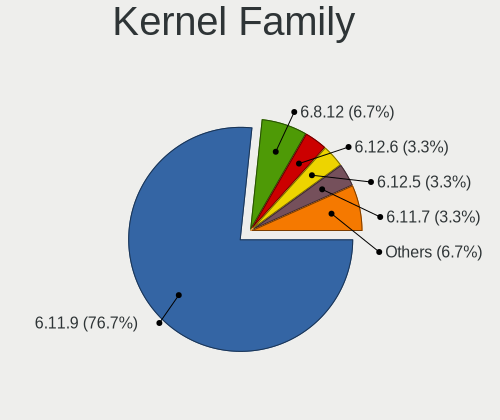
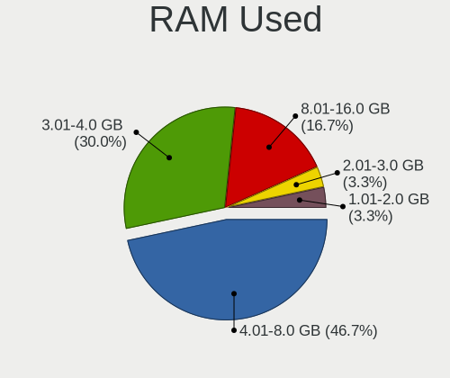
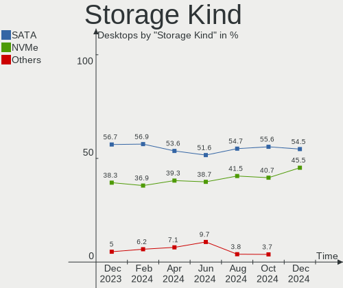
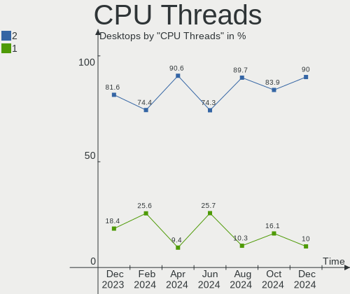
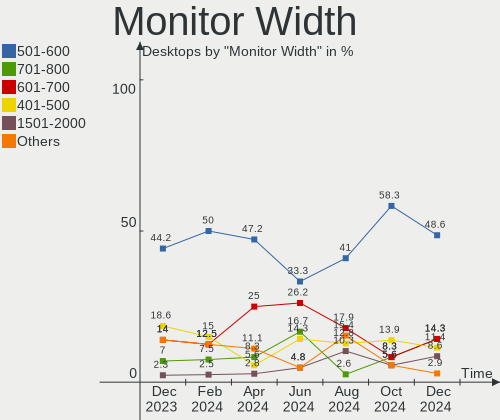
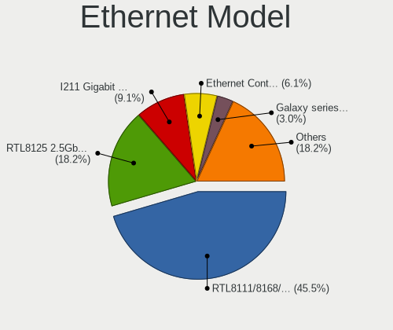
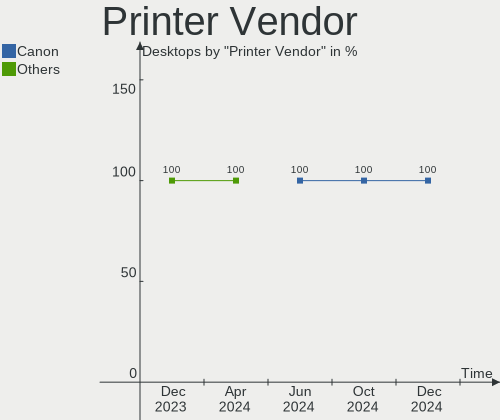
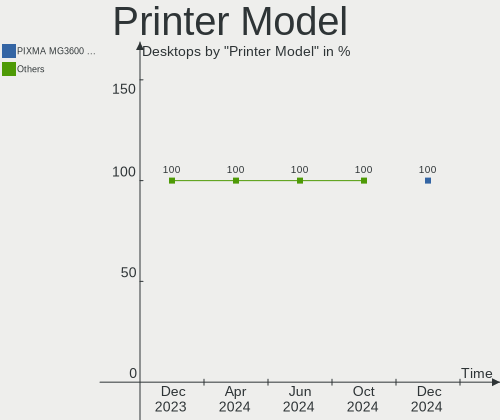

Nobara - Hardware Trends (Desktops)
-----------------------------------

A project to identify most popular hardware characteristics and track their change
over time based on data collected by Linux users at https://Linux-Hardware.org.

Anyone can contribute to this report by the [hw-probe](https://github.com/linuxhw/hw-probe) tool:

    sudo -E hw-probe -all -upload

This report is for one last month. Overall report since the beginning of time: [TestCoverage](https://github.com/linuxhw/TestCoverage)

Period: Jan, 2023.

Contents
--------

* [ System ](#system)
  - [ OS                       ](#os)
  - [ OS Family                ](#os-family)
  - [ Kernel                   ](#kernel)
  - [ Kernel Family            ](#kernel-family)
  - [ Kernel Major Ver.        ](#kernel-major-ver)
  - [ Arch                     ](#arch)
  - [ DE                       ](#de)
  - [ Display Server           ](#display-server)
  - [ Display Manager          ](#display-manager)
  - [ OS Lang                  ](#os-lang)
  - [ Boot Mode                ](#boot-mode)
  - [ Filesystem               ](#filesystem)
  - [ Part. scheme             ](#part-scheme)
  - [ Dual Boot with Linux/BSD ](#dual-boot-with-linuxbsd)
  - [ Dual Boot (Win)          ](#dual-boot-win)

* [ Board ](#board)
  - [ Vendor                   ](#vendor)
  - [ Model                    ](#model)
  - [ Model Family             ](#model-family)
  - [ MFG Year                 ](#mfg-year)
  - [ Form Factor              ](#form-factor)
  - [ Secure Boot              ](#secure-boot)
  - [ Coreboot                 ](#coreboot)
  - [ RAM Size                 ](#ram-size)
  - [ RAM Used                 ](#ram-used)
  - [ Total Drives             ](#total-drives)
  - [ Has CD-ROM               ](#has-cd-rom)
  - [ Has Ethernet             ](#has-ethernet)
  - [ Has WiFi                 ](#has-wifi)
  - [ Has Bluetooth            ](#has-bluetooth)

* [ Location ](#location)
  - [ Country                  ](#country)
  - [ City                     ](#city)

* [ Drives ](#drives)
  - [ Drive Vendor             ](#drive-vendor)
  - [ Drive Model              ](#drive-model)
  - [ HDD Vendor               ](#hdd-vendor)
  - [ SSD Vendor               ](#ssd-vendor)
  - [ Drive Kind               ](#drive-kind)
  - [ Drive Connector          ](#drive-connector)
  - [ Drive Size               ](#drive-size)
  - [ Space Total              ](#space-total)
  - [ Space Used               ](#space-used)
  - [ Malfunc. Drives          ](#malfunc-drives)
  - [ Malfunc. Drive Vendor    ](#malfunc-drive-vendor)
  - [ Malfunc. HDD Vendor      ](#malfunc-hdd-vendor)
  - [ Malfunc. Drive Kind      ](#malfunc-drive-kind)
  - [ Failed Drives            ](#failed-drives)
  - [ Failed Drive Vendor      ](#failed-drive-vendor)
  - [ Drive Status             ](#drive-status)

* [ Storage controller ](#storage-controller)
  - [ Storage Vendor           ](#storage-vendor)
  - [ Storage Model            ](#storage-model)
  - [ Storage Kind             ](#storage-kind)

* [ Processor ](#processor)
  - [ CPU Vendor               ](#cpu-vendor)
  - [ CPU Model                ](#cpu-model)
  - [ CPU Model Family         ](#cpu-model-family)
  - [ CPU Cores                ](#cpu-cores)
  - [ CPU Sockets              ](#cpu-sockets)
  - [ CPU Threads              ](#cpu-threads)
  - [ CPU Op-Modes             ](#cpu-op-modes)
  - [ CPU Microcode            ](#cpu-microcode)
  - [ CPU Microarch            ](#cpu-microarch)

* [ Graphics ](#graphics)
  - [ GPU Vendor               ](#gpu-vendor)
  - [ GPU Model                ](#gpu-model)
  - [ GPU Combo                ](#gpu-combo)
  - [ GPU Driver               ](#gpu-driver)
  - [ GPU Memory               ](#gpu-memory)

* [ Monitor ](#monitor)
  - [ Monitor Vendor           ](#monitor-vendor)
  - [ Monitor Model            ](#monitor-model)
  - [ Monitor Resolution       ](#monitor-resolution)
  - [ Monitor Diagonal         ](#monitor-diagonal)
  - [ Monitor Width            ](#monitor-width)
  - [ Aspect Ratio             ](#aspect-ratio)
  - [ Monitor Area             ](#monitor-area)
  - [ Pixel Density            ](#pixel-density)
  - [ Multiple Monitors        ](#multiple-monitors)

* [ Network ](#network)
  - [ Net Controller Vendor    ](#net-controller-vendor)
  - [ Net Controller Model     ](#net-controller-model)
  - [ Wireless Vendor          ](#wireless-vendor)
  - [ Wireless Model           ](#wireless-model)
  - [ Ethernet Vendor          ](#ethernet-vendor)
  - [ Ethernet Model           ](#ethernet-model)
  - [ Net Controller Kind      ](#net-controller-kind)
  - [ Used Controller          ](#used-controller)
  - [ NICs                     ](#nics)
  - [ IPv6                     ](#ipv6)

* [ Bluetooth ](#bluetooth)
  - [ Bluetooth Vendor         ](#bluetooth-vendor)
  - [ Bluetooth Model          ](#bluetooth-model)

* [ Sound ](#sound)
  - [ Sound Vendor             ](#sound-vendor)
  - [ Sound Model              ](#sound-model)

* [ Memory ](#memory)
  - [ Memory Vendor            ](#memory-vendor)
  - [ Memory Model             ](#memory-model)
  - [ Memory Kind              ](#memory-kind)
  - [ Memory Form Factor       ](#memory-form-factor)
  - [ Memory Size              ](#memory-size)
  - [ Memory Speed             ](#memory-speed)

* [ Printers & scanners ](#printers--scanners)
  - [ Printer Vendor           ](#printer-vendor)
  - [ Printer Model            ](#printer-model)
  - [ Scanner Vendor           ](#scanner-vendor)
  - [ Scanner Model            ](#scanner-model)

* [ Camera ](#camera)
  - [ Camera Vendor            ](#camera-vendor)
  - [ Camera Model             ](#camera-model)

* [ Security ](#security)
  - [ Fingerprint Vendor       ](#fingerprint-vendor)
  - [ Fingerprint Model        ](#fingerprint-model)
  - [ Chipcard Vendor          ](#chipcard-vendor)
  - [ Chipcard Model           ](#chipcard-model)

* [ Unsupported ](#unsupported)
  - [ Unsupported Devices      ](#unsupported-devices)
  - [ Unsupported Device Types ](#unsupported-device-types)

System
------

OS
--

Installed operating systems

| Name      | Desktops | Percent |
|-----------|----------|---------|
| Nobara 37 | 17       | 53.13%  |
| Nobara 36 | 15       | 46.88%  |

OS Family
---------

OS without a version

| Name   | Desktops | Percent |
|--------|----------|---------|
| Nobara | 32       | 100%    |

Kernel
------

Version of the Linux kernel

| Version                       | Desktops | Percent |
|-------------------------------|----------|---------|
| 6.0.14-201.fsync.fc36.x86_64  | 13       | 40.63%  |
| 6.1.6-203.fsync.fc37.x86_64   | 5        | 15.63%  |
| 6.1.4-203.fsync.fc37.x86_64   | 4        | 12.5%   |
| 6.0.16-301.fsync.fc37.x86_64  | 3        | 9.38%   |
| 6.1.6-201.fsync.fc37.x86_64   | 2        | 6.25%   |
| 6.0.18-301.fsync.fc37.x86_64  | 2        | 6.25%   |
| 6.0.15-301.fsync.fc37.x86_64  | 1        | 3.13%   |
| 6.0.10-201.fc36.x86_64        | 1        | 3.13%   |
| 5.19.16-201.fsync.fc36.x86_64 | 1        | 3.13%   |

Kernel Family
-------------

Linux kernel without a distro release

| Version | Desktops | Percent |
|---------|----------|---------|
| 6.0.14  | 13       | 40.63%  |
| 6.1.6   | 7        | 21.88%  |
| 6.1.4   | 4        | 12.5%   |
| 6.0.16  | 3        | 9.38%   |
| 6.0.18  | 2        | 6.25%   |
| 6.0.15  | 1        | 3.13%   |
| 6.0.10  | 1        | 3.13%   |
| 5.19.16 | 1        | 3.13%   |

Kernel Major Ver.
-----------------

Linux kernel major version

| Version | Desktops | Percent |
|---------|----------|---------|
| 6.0     | 20       | 62.5%   |
| 6.1     | 11       | 34.38%  |
| 5.19    | 1        | 3.13%   |

Arch
----

OS architecture (x86_64, i586, etc.)

| Name   | Desktops | Percent |
|--------|----------|---------|
| x86_64 | 32       | 100%    |

DE
--

Desktop Environment

| Name          | Desktops | Percent |
|---------------|----------|---------|
| GNOME         | 27       | 84.38%  |
| KDE5          | 4        | 12.5%   |
| GNOME Classic | 1        | 3.13%   |

Display Server
--------------

X11 or Wayland

| Name    | Desktops | Percent |
|---------|----------|---------|
| Wayland | 27       | 84.38%  |
| X11     | 5        | 15.63%  |

Display Manager
---------------

SDDM, LightDM, etc.

| Name    | Desktops | Percent |
|---------|----------|---------|
| Unknown | 28       | 87.5%   |
| GDM     | 4        | 12.5%   |

OS Lang
-------

Language

| Lang    | Desktops | Percent |
|---------|----------|---------|
| en_US   | 14       | 43.75%  |
| en_GB   | 5        | 15.63%  |
| es_MX   | 2        | 6.25%   |
| en_CA   | 2        | 6.25%   |
| ru_RU   | 1        | 3.13%   |
| pl_PL   | 1        | 3.13%   |
| nl_NL   | 1        | 3.13%   |
| fr_FR   | 1        | 3.13%   |
| es_AR   | 1        | 3.13%   |
| en_PH   | 1        | 3.13%   |
| de_DE   | 1        | 3.13%   |
| de_AT   | 1        | 3.13%   |
| Unknown | 1        | 3.13%   |

Boot Mode
---------

EFI or BIOS

| Mode | Desktops | Percent |
|------|----------|---------|
| EFI  | 24       | 75%     |
| BIOS | 8        | 25%     |

Filesystem
----------

Type of filesystem

| Type  | Desktops | Percent |
|-------|----------|---------|
| Btrfs | 28       | 87.5%   |
| Ext4  | 3        | 9.38%   |
| Xfs   | 1        | 3.13%   |

Part. scheme
------------

Scheme of partitioning

| Type    | Desktops | Percent |
|---------|----------|---------|
| Unknown | 28       | 87.5%   |
| GPT     | 4        | 12.5%   |

Dual Boot with Linux/BSD
------------------------

Hosting more than one Linux/BSD

| Dual boot | Desktops | Percent |
|-----------|----------|---------|
| No        | 31       | 96.88%  |
| Yes       | 1        | 3.13%   |

Dual Boot (Win)
---------------

Hosting Linux and Windows

| Dual boot | Desktops | Percent |
|-----------|----------|---------|
| No        | 31       | 96.88%  |
| Yes       | 1        | 3.13%   |

Board
-----

Vendor
------

Motherboard manufacturer

| Name                | Desktops | Percent |
|---------------------|----------|---------|
| ASUSTek Computer    | 14       | 43.75%  |
| MSI                 | 9        | 28.13%  |
| Gigabyte Technology | 4        | 12.5%   |
| ASRock              | 3        | 9.38%   |
| Hewlett-Packard     | 2        | 6.25%   |

Model
-----

Motherboard model

| Name                               | Desktops | Percent |
|------------------------------------|----------|---------|
| MSI MS-7B86                        | 2        | 6.25%   |
| MSI MS-7D17                        | 1        | 3.13%   |
| MSI MS-7C91                        | 1        | 3.13%   |
| MSI MS-7C75                        | 1        | 3.13%   |
| MSI MS-7C37                        | 1        | 3.13%   |
| MSI MS-7B79                        | 1        | 3.13%   |
| MSI MS-7B50                        | 1        | 3.13%   |
| MSI MS-7597                        | 1        | 3.13%   |
| HP EliteDesk 800 G2 SFF            | 1        | 3.13%   |
| HP Compaq 6200 Pro SFF PC          | 1        | 3.13%   |
| Gigabyte Z77-D3H                   | 1        | 3.13%   |
| Gigabyte F2A88XM-D3H               | 1        | 3.13%   |
| Gigabyte B550M DS3H                | 1        | 3.13%   |
| Gigabyte B450 AORUS M              | 1        | 3.13%   |
| ASUS TUF Gaming X570-PLUS          | 1        | 3.13%   |
| ASUS TUF Gaming B550M-PLUS         | 1        | 3.13%   |
| ASUS ROG STRIX Z490-F GAMING       | 1        | 3.13%   |
| ASUS ROG STRIX B650E-I GAMING WIFI | 1        | 3.13%   |
| ASUS ROG STRIX B450-F GAMING       | 1        | 3.13%   |
| ASUS ROG Maximus XI HERO           | 1        | 3.13%   |
| ASUS ROG CROSSHAIR VIII HERO       | 1        | 3.13%   |
| ASUS ROG CROSSHAIR VII HERO        | 1        | 3.13%   |
| ASUS PRIME Z370-A                  | 1        | 3.13%   |
| ASUS PRIME B550M-K                 | 1        | 3.13%   |
| ASUS PRIME B450M-A                 | 1        | 3.13%   |
| ASUS P9X79 DELUXE                  | 1        | 3.13%   |
| ASUS G20AJ                         | 1        | 3.13%   |
| ASUS All Series                    | 1        | 3.13%   |
| ASRock X470 Master SLI             | 1        | 3.13%   |
| ASRock H77M-ITX                    | 1        | 3.13%   |
| ASRock B450 Gaming-ITX/ac          | 1        | 3.13%   |

Model Family
------------

Motherboard model prefix

| Name                 | Desktops | Percent |
|----------------------|----------|---------|
| ASUS ROG             | 6        | 18.75%  |
| ASUS PRIME           | 3        | 9.38%   |
| MSI MS-7B86          | 2        | 6.25%   |
| ASUS TUF             | 2        | 6.25%   |
| MSI MS-7D17          | 1        | 3.13%   |
| MSI MS-7C91          | 1        | 3.13%   |
| MSI MS-7C75          | 1        | 3.13%   |
| MSI MS-7C37          | 1        | 3.13%   |
| MSI MS-7B79          | 1        | 3.13%   |
| MSI MS-7B50          | 1        | 3.13%   |
| MSI MS-7597          | 1        | 3.13%   |
| HP EliteDesk         | 1        | 3.13%   |
| HP Compaq            | 1        | 3.13%   |
| Gigabyte Z77-D3H     | 1        | 3.13%   |
| Gigabyte F2A88XM-D3H | 1        | 3.13%   |
| Gigabyte B550M       | 1        | 3.13%   |
| Gigabyte B450        | 1        | 3.13%   |
| ASUS P9X79           | 1        | 3.13%   |
| ASUS G20AJ           | 1        | 3.13%   |
| ASUS All             | 1        | 3.13%   |
| ASRock X470          | 1        | 3.13%   |
| ASRock H77M-ITX      | 1        | 3.13%   |
| ASRock B450          | 1        | 3.13%   |

MFG Year
--------

Motherboard manufacture year

| Year | Desktops | Percent |
|------|----------|---------|
| 2020 | 6        | 18.75%  |
| 2019 | 6        | 18.75%  |
| 2018 | 6        | 18.75%  |
| 2022 | 2        | 6.25%   |
| 2021 | 2        | 6.25%   |
| 2014 | 2        | 6.25%   |
| 2012 | 2        | 6.25%   |
| 2011 | 2        | 6.25%   |
| 2017 | 1        | 3.13%   |
| 2015 | 1        | 3.13%   |
| 2013 | 1        | 3.13%   |
| 2009 | 1        | 3.13%   |

Form Factor
-----------

Physical design of the computer

| Name    | Desktops | Percent |
|---------|----------|---------|
| Desktop | 32       | 100%    |

Secure Boot
-----------

Enabled or disabled

| State    | Desktops | Percent |
|----------|----------|---------|
| Disabled | 32       | 100%    |

Coreboot
--------

Have coreboot on board

| Used | Desktops | Percent |
|------|----------|---------|
| No   | 32       | 100%    |

RAM Size
--------

Total RAM memory

| Size in GB  | Desktops | Percent |
|-------------|----------|---------|
| 32.01-64.0  | 12       | 37.5%   |
| 16.01-24.0  | 10       | 31.25%  |
| 24.01-32.0  | 3        | 9.38%   |
| 8.01-16.0   | 3        | 9.38%   |
| 4.01-8.0    | 2        | 6.25%   |
| 3.01-4.0    | 1        | 3.13%   |
| 64.01-256.0 | 1        | 3.13%   |

RAM Used
--------

Used RAM memory

| Used GB   | Desktops | Percent |
|-----------|----------|---------|
| 4.01-8.0  | 17       | 53.13%  |
| 3.01-4.0  | 6        | 18.75%  |
| 8.01-16.0 | 6        | 18.75%  |
| 2.01-3.0  | 3        | 9.38%   |

Total Drives
------------

Number of drives on board

| Drives | Desktops | Percent |
|--------|----------|---------|
| 3      | 11       | 34.38%  |
| 5      | 6        | 18.75%  |
| 2      | 6        | 18.75%  |
| 1      | 5        | 15.63%  |
| 4      | 4        | 12.5%   |

Has CD-ROM
----------

Has CD-ROM on board

| Presented | Desktops | Percent |
|-----------|----------|---------|
| No        | 23       | 71.88%  |
| Yes       | 9        | 28.13%  |

Has Ethernet
------------

Has Ethernet on board

| Presented | Desktops | Percent |
|-----------|----------|---------|
| Yes       | 32       | 100%    |

Has WiFi
--------

Has WiFi module

| Presented | Desktops | Percent |
|-----------|----------|---------|
| Yes       | 20       | 62.5%   |
| No        | 12       | 37.5%   |

Has Bluetooth
-------------

Has Bluetooth module

| Presented | Desktops | Percent |
|-----------|----------|---------|
| Yes       | 19       | 59.38%  |
| No        | 13       | 40.63%  |

Location
--------

Country
-------

Geographic location (country)

| Country      | Desktops | Percent |
|--------------|----------|---------|
| USA          | 7        | 21.88%  |
| UK           | 3        | 9.38%   |
| France       | 3        | 9.38%   |
| Sweden       | 2        | 6.25%   |
| Mexico       | 2        | 6.25%   |
| Canada       | 2        | 6.25%   |
| Argentina    | 2        | 6.25%   |
| Ukraine      | 1        | 3.13%   |
| Spain        | 1        | 3.13%   |
| Saudi Arabia | 1        | 3.13%   |
| Russia       | 1        | 3.13%   |
| Poland       | 1        | 3.13%   |
| Philippines  | 1        | 3.13%   |
| Netherlands  | 1        | 3.13%   |
| Kuwait       | 1        | 3.13%   |
| Italy        | 1        | 3.13%   |
| Germany      | 1        | 3.13%   |
| Austria      | 1        | 3.13%   |

City
----

Geographic location (city)

| City                      | Desktops | Percent |
|---------------------------|----------|---------|
| Guadalajara               | 2        | 6.25%   |
| Vouziers                  | 1        | 3.13%   |
| Valladolid                | 1        | 3.13%   |
| Stockholm                 | 1        | 3.13%   |
| Rosario                   | 1        | 3.13%   |
| Rome                      | 1        | 3.13%   |
| Reimlingen                | 1        | 3.13%   |
| Plano                     | 1        | 3.13%   |
| Perm                      | 1        | 3.13%   |
| Odesa                     | 1        | 3.13%   |
| Nicholasville             | 1        | 3.13%   |
| Nice                      | 1        | 3.13%   |
| Niagara-on-the-Lake       | 1        | 3.13%   |
| New York                  | 1        | 3.13%   |
| Neukirchen an der Voeckla | 1        | 3.13%   |
| Nashville                 | 1        | 3.13%   |
| Moelndal                  | 1        | 3.13%   |
| Longmont                  | 1        | 3.13%   |
| Lelystad                  | 1        | 3.13%   |
| Lanus                     | 1        | 3.13%   |
| Kuwait City               | 1        | 3.13%   |
| Jeddah                    | 1        | 3.13%   |
| Gdansk                    | 1        | 3.13%   |
| Derby                     | 1        | 3.13%   |
| Cenon-sur-Vienne          | 1        | 3.13%   |
| Caloocan City             | 1        | 3.13%   |
| Calgary                   | 1        | 3.13%   |
| Bolton                    | 1        | 3.13%   |
| Boise                     | 1        | 3.13%   |
| Berkhamsted               | 1        | 3.13%   |
| Antelope                  | 1        | 3.13%   |

Drives
------

Drive Vendor
------------

Hard drive vendors

| Vendor                      | Desktops | Drives | Percent |
|-----------------------------|----------|--------|---------|
| Samsung Electronics         | 14       | 21     | 17.28%  |
| Seagate                     | 10       | 12     | 12.35%  |
| WDC                         | 8        | 12     | 9.88%   |
| Kingston                    | 7        | 7      | 8.64%   |
| Crucial                     | 7        | 9      | 8.64%   |
| Toshiba                     | 6        | 6      | 7.41%   |
| Phison Electronics          | 3        | 3      | 3.7%    |
| Intel                       | 3        | 4      | 3.7%    |
| SPCC                        | 2        | 2      | 2.47%   |
| Sandisk                     | 2        | 2      | 2.47%   |
| PNY                         | 2        | 2      | 2.47%   |
| China                       | 2        | 2      | 2.47%   |
| USB3.0                      | 1        | 1      | 1.23%   |
| Silicon Motion              | 1        | 1      | 1.23%   |
| Realtek Semiconductor       | 1        | 1      | 1.23%   |
| PNY CS90                    | 1        | 1      | 1.23%   |
| Patriot                     | 1        | 1      | 1.23%   |
| Micron/Crucial Technology   | 1        | 1      | 1.23%   |
| Maxtor                      | 1        | 1      | 1.23%   |
| MAXIO Technology (Hangzhou) | 1        | 1      | 1.23%   |
| Kingston Technology Company | 1        | 1      | 1.23%   |
| HS-SSD-E100N                | 1        | 1      | 1.23%   |
| Hitachi                     | 1        | 1      | 1.23%   |
| Drevo                       | 1        | 1      | 1.23%   |
| Apple                       | 1        | 1      | 1.23%   |
| ADATA Technology            | 1        | 1      | 1.23%   |
| A-DATA Technology           | 1        | 1      | 1.23%   |

Drive Model
-----------

Hard drive models

| Model                                                 | Desktops | Percent |
|-------------------------------------------------------|----------|---------|
| Kingston SA400S37240G 240GB SSD                       | 4        | 4.3%    |
| Samsung NVMe SSD Controller SM981/PM981/PM983 500GB   | 3        | 3.23%   |
| Toshiba DT01ACA200 2TB                                | 2        | 2.15%   |
| Toshiba DT01ACA100 1TB                                | 2        | 2.15%   |
| Seagate ST1000DM003-1ER162 1TB                        | 2        | 2.15%   |
| Samsung SSD 970 EVO Plus 500GB                        | 2        | 2.15%   |
| Samsung SSD 840 EVO 120GB                             | 2        | 2.15%   |
| Samsung NVMe SSD Controller PM9A1/PM9A3/980PRO 512GB  | 2        | 2.15%   |
| Phison E12 NVMe Controller 1TB                        | 2        | 2.15%   |
| Intel SSD 660P Series 512GB                           | 2        | 2.15%   |
| Crucial CT1000MX500SSD1 1TB                           | 2        | 2.15%   |
| WDC WD80EFAX-68KNBN0 8TB                              | 1        | 1.08%   |
| WDC WD6001FZWX-00A2VA0 6TB                            | 1        | 1.08%   |
| WDC WD5000AAKX-003CA0 500GB                           | 1        | 1.08%   |
| WDC WD25EZRS-00J99B0 2TB                              | 1        | 1.08%   |
| WDC WD20EZRZ-00Z5HB0 2TB                              | 1        | 1.08%   |
| WDC WD20EARX-00AZ6B0 2TB                              | 1        | 1.08%   |
| WDC WD20EARS-00MVWB0 2TB                              | 1        | 1.08%   |
| WDC WD20EARS-00J99B0 2TB                              | 1        | 1.08%   |
| WDC WD10EZEX-60WN4A1 1TB                              | 1        | 1.08%   |
| WDC WD10EADS-00M2B0 1TB                               | 1        | 1.08%   |
| WDC WD Green 2.5 240GB                                | 1        | 1.08%   |
| USB3.0 SSD 240GB                                      | 1        | 1.08%   |
| Toshiba XG6 NVMe SSD Controller 512GB                 | 1        | 1.08%   |
| Toshiba MQ01ABD100 1TB                                | 1        | 1.08%   |
| SPCC Solid State Disk 120GB                           | 1        | 1.08%   |
| SPCC Solid State Disk 1024GB                          | 1        | 1.08%   |
| Silicon Motion SM2263EN/SM2263XT SSD Controller 512GB | 1        | 1.08%   |
| Seagate ST95005620AS 500GB                            | 1        | 1.08%   |
| Seagate ST8000VN0022-2EL112 8TB                       | 1        | 1.08%   |
| Seagate ST3500413AS 500GB                             | 1        | 1.08%   |
| Seagate ST31000524AS 1TB                              | 1        | 1.08%   |
| Seagate ST2000DX001-1NS164 2TB                        | 1        | 1.08%   |
| Seagate ST2000DM001-1ER164 2TB                        | 1        | 1.08%   |
| Seagate ST2000DL003-9VT166 2TB                        | 1        | 1.08%   |
| Seagate ST16000NM000J-2TW103 16TB                     | 1        | 1.08%   |
| Seagate ST1000DM003-1CH162 1TB                        | 1        | 1.08%   |
| Sandisk WD Blue SN500 / PC SN520 NVMe SSD 512GB       | 1        | 1.08%   |
| SanDisk SSD PLUS 240GB                                | 1        | 1.08%   |
| Samsung SSD 980 500GB                                 | 1        | 1.08%   |

HDD Vendor
----------

Hard disk drive vendors

| Vendor              | Desktops | Drives | Percent |
|---------------------|----------|--------|---------|
| Seagate             | 10       | 12     | 35.71%  |
| WDC                 | 8        | 11     | 28.57%  |
| Toshiba             | 5        | 5      | 17.86%  |
| Samsung Electronics | 2        | 2      | 7.14%   |
| Maxtor              | 1        | 1      | 3.57%   |
| Hitachi             | 1        | 1      | 3.57%   |
| Apple               | 1        | 1      | 3.57%   |

SSD Vendor
----------

Solid state drive vendors

| Vendor              | Desktops | Drives | Percent |
|---------------------|----------|--------|---------|
| Samsung Electronics | 7        | 8      | 20%     |
| Kingston            | 7        | 7      | 20%     |
| Crucial             | 7        | 9      | 20%     |
| SPCC                | 2        | 2      | 5.71%   |
| PNY                 | 2        | 2      | 5.71%   |
| China               | 2        | 2      | 5.71%   |
| WDC                 | 1        | 1      | 2.86%   |
| USB3.0              | 1        | 1      | 2.86%   |
| SanDisk             | 1        | 1      | 2.86%   |
| PNY CS90            | 1        | 1      | 2.86%   |
| Patriot             | 1        | 1      | 2.86%   |
| Intel               | 1        | 1      | 2.86%   |
| Drevo               | 1        | 1      | 2.86%   |
| A-DATA Technology   | 1        | 1      | 2.86%   |

Drive Kind
----------

HDD or SSD

| Kind    | Desktops | Drives | Percent |
|---------|----------|--------|---------|
| SSD     | 25       | 38     | 37.88%  |
| HDD     | 22       | 33     | 33.33%  |
| NVMe    | 18       | 25     | 27.27%  |
| Unknown | 1        | 1      | 1.52%   |

Drive Connector
---------------

SATA, SAS, NVMe, etc.

| Type | Desktops | Drives | Percent |
|------|----------|--------|---------|
| SATA | 29       | 69     | 59.18%  |
| NVMe | 18       | 25     | 36.73%  |
| SAS  | 2        | 3      | 4.08%   |

Drive Size
----------

Size of hard drive

| Size in TB | Desktops | Drives | Percent |
|------------|----------|--------|---------|
| 0.01-0.5   | 22       | 34     | 43.14%  |
| 1.01-2.0   | 13       | 17     | 25.49%  |
| 0.51-1.0   | 13       | 15     | 25.49%  |
| 4.01-10.0  | 2        | 3      | 3.92%   |
| 10.01-20.0 | 1        | 2      | 1.96%   |

Space Total
-----------

Amount of disk space available on the file system

| Size in GB     | Desktops | Percent |
|----------------|----------|---------|
| 251-500        | 7        | 21.88%  |
| 1001-2000      | 7        | 21.88%  |
| More than 3000 | 6        | 18.75%  |
| 501-1000       | 6        | 18.75%  |
| 101-250        | 3        | 9.38%   |
| 2001-3000      | 2        | 6.25%   |
| 21-50          | 1        | 3.13%   |

Space Used
----------

Amount of used disk space

| Used GB        | Desktops | Percent |
|----------------|----------|---------|
| 21-50          | 10       | 31.25%  |
| More than 3000 | 4        | 12.5%   |
| 251-500        | 4        | 12.5%   |
| 101-250        | 4        | 12.5%   |
| 51-100         | 3        | 9.38%   |
| 2001-3000      | 2        | 6.25%   |
| 1-20           | 2        | 6.25%   |
| 501-1000       | 2        | 6.25%   |
| 1001-2000      | 1        | 3.13%   |

Malfunc. Drives
---------------

Drive models with a malfunction

Zero info for selected period =(

Malfunc. Drive Vendor
---------------------

Vendors of faulty drives

Zero info for selected period =(

Malfunc. HDD Vendor
-------------------

Vendors of faulty HDD drives

Zero info for selected period =(

Malfunc. Drive Kind
-------------------

Kinds of faulty drives

Zero info for selected period =(

Failed Drives
-------------

Failed drive models

Zero info for selected period =(

Failed Drive Vendor
-------------------

Failed drive vendors

Zero info for selected period =(

Drive Status
------------

Number of failed and malfunc. drives

| Status   | Desktops | Drives | Percent |
|----------|----------|--------|---------|
| Detected | 28       | 80     | 87.5%   |
| Works    | 4        | 17     | 12.5%   |

Storage controller
------------------

Storage Vendor
--------------

Storage controller vendors

| Vendor                       | Desktops | Percent |
|------------------------------|----------|---------|
| AMD                          | 18       | 32.14%  |
| Intel                        | 14       | 25%     |
| Samsung Electronics          | 9        | 16.07%  |
| Phison Electronics           | 3        | 5.36%   |
| ASMedia Technology           | 2        | 3.57%   |
| Toshiba America Info Systems | 1        | 1.79%   |
| Silicon Motion               | 1        | 1.79%   |
| SanDisk                      | 1        | 1.79%   |
| Realtek Semiconductor        | 1        | 1.79%   |
| Nvidia                       | 1        | 1.79%   |
| Micron/Crucial Technology    | 1        | 1.79%   |
| MAXIO Technology (Hangzhou)  | 1        | 1.79%   |
| Marvell Technology Group     | 1        | 1.79%   |
| Kingston Technology Company  | 1        | 1.79%   |
| ADATA Technology             | 1        | 1.79%   |

Storage Model
-------------

Storage controller models

| Model                                                                         | Desktops | Percent |
|-------------------------------------------------------------------------------|----------|---------|
| AMD FCH SATA Controller [AHCI mode]                                           | 10       | 14.93%  |
| AMD 400 Series Chipset SATA Controller                                        | 9        | 13.43%  |
| Samsung NVMe SSD Controller SM981/PM981/PM983                                 | 6        | 8.96%   |
| AMD 500 Series Chipset SATA Controller                                        | 4        | 5.97%   |
| Samsung NVMe SSD Controller PM9A1/PM9A3/980PRO                                | 2        | 2.99%   |
| Samsung NVMe SSD Controller 980                                               | 2        | 2.99%   |
| Phison E12 NVMe Controller                                                    | 2        | 2.99%   |
| Intel SSD 660P Series                                                         | 2        | 2.99%   |
| Intel Comet Lake SATA AHCI Controller                                         | 2        | 2.99%   |
| Intel Cannon Lake PCH SATA AHCI Controller                                    | 2        | 2.99%   |
| ASMedia ASM1062 Serial ATA Controller                                         | 2        | 2.99%   |
| Toshiba America Info Systems XG6 NVMe SSD Controller                          | 1        | 1.49%   |
| Silicon Motion SM2263EN/SM2263XT SSD Controller                               | 1        | 1.49%   |
| SanDisk WD Blue SN500 / PC SN520 NVMe SSD                                     | 1        | 1.49%   |
| Samsung NVMe SSD Controller SM961/PM961/SM963                                 | 1        | 1.49%   |
| Realtek RTS5763DL NVMe SSD Controller                                         | 1        | 1.49%   |
| Phison PS5013 E13 NVMe Controller                                             | 1        | 1.49%   |
| Nvidia MCP61 SATA Controller                                                  | 1        | 1.49%   |
| Nvidia MCP61 IDE                                                              | 1        | 1.49%   |
| Micron/Crucial P2 NVMe PCIe SSD                                               | 1        | 1.49%   |
| MAXIO (Hangzhou) NVMe SSD Controller MAP1202                                  | 1        | 1.49%   |
| Marvell Group 88SE9128 PCIe SATA 6 Gb/s RAID controller with HyperDuo         | 1        | 1.49%   |
| Kingston Company A2000 NVMe SSD                                               | 1        | 1.49%   |
| Intel SATA Controller [RAID mode]                                             | 1        | 1.49%   |
| Intel Q170/Q150/B150/H170/H110/Z170/CM236 Chipset SATA Controller [AHCI Mode] | 1        | 1.49%   |
| Intel C600/X79 series chipset 6-Port SATA AHCI Controller                     | 1        | 1.49%   |
| Intel 9 Series Chipset Family SATA Controller [AHCI Mode]                     | 1        | 1.49%   |
| Intel 7 Series/C210 Series Chipset Family 6-port SATA Controller [AHCI mode]  | 1        | 1.49%   |
| Intel 7 Series/C210 Series Chipset Family 4-port SATA Controller [IDE mode]   | 1        | 1.49%   |
| Intel 7 Series/C210 Series Chipset Family 2-port SATA Controller [IDE mode]   | 1        | 1.49%   |
| Intel 6 Series/C200 Series Chipset Family 6 port Desktop SATA AHCI Controller | 1        | 1.49%   |
| Intel 500 Series Chipset Family SATA AHCI Controller                          | 1        | 1.49%   |
| Intel 200 Series PCH SATA controller [AHCI mode]                              | 1        | 1.49%   |
| AMD SATA controller                                                           | 1        | 1.49%   |
| ADATA XPG SX8200 Pro PCIe Gen3x4 M.2 2280 Solid State Drive                   | 1        | 1.49%   |

Storage Kind
------------

Kind of storage controller (IDE, SATA, NVMe, SAS, ...)

| Kind | Desktops | Percent |
|------|----------|---------|
| SATA | 29       | 58%     |
| NVMe | 18       | 36%     |
| IDE  | 2        | 4%      |
| RAID | 1        | 2%      |

Processor
---------

CPU Vendor
----------

Processor vendors

| Vendor | Desktops | Percent |
|--------|----------|---------|
| AMD    | 19       | 59.38%  |
| Intel  | 13       | 40.63%  |

CPU Model
---------

Processor models

| Model                                   | Desktops | Percent |
|-----------------------------------------|----------|---------|
| AMD Ryzen 7 3700X 8-Core Processor      | 3        | 9.38%   |
| AMD Ryzen 9 5950X 16-Core Processor     | 2        | 6.25%   |
| AMD Ryzen 9 5900X 12-Core Processor     | 2        | 6.25%   |
| AMD Ryzen 5 5600X 6-Core Processor      | 2        | 6.25%   |
| AMD Ryzen 5 5600G with Radeon Graphics  | 2        | 6.25%   |
| AMD Ryzen 5 2600 Six-Core Processor     | 2        | 6.25%   |
| Intel Core i9-9900K CPU @ 3.60GHz       | 1        | 3.13%   |
| Intel Core i7-9700 CPU @ 3.00GHz        | 1        | 3.13%   |
| Intel Core i7-4790 CPU @ 3.60GHz        | 1        | 3.13%   |
| Intel Core i7-3960X CPU @ 3.30GHz       | 1        | 3.13%   |
| Intel Core i7-3770K CPU @ 3.50GHz       | 1        | 3.13%   |
| Intel Core i7-3770 CPU @ 3.40GHz        | 1        | 3.13%   |
| Intel Core i7-10700K CPU @ 3.80GHz      | 1        | 3.13%   |
| Intel Core i5-8600K CPU @ 3.60GHz       | 1        | 3.13%   |
| Intel Core i5-6500 CPU @ 3.20GHz        | 1        | 3.13%   |
| Intel Core i5-4690K CPU @ 3.50GHz       | 1        | 3.13%   |
| Intel Core i5-2500 CPU @ 3.30GHz        | 1        | 3.13%   |
| Intel Core i5-10600K CPU @ 4.10GHz      | 1        | 3.13%   |
| Intel 11th Gen Core i5-11400 @ 2.60GHz  | 1        | 3.13%   |
| AMD Ryzen 7 5700G with Radeon Graphics  | 1        | 3.13%   |
| AMD Ryzen 7 2700X Eight-Core Processor  | 1        | 3.13%   |
| AMD Ryzen 5 7600X 6-Core Processor      | 1        | 3.13%   |
| AMD Ryzen 5 3600X 6-Core Processor      | 1        | 3.13%   |
| AMD Phenom II X4 925 Processor          | 1        | 3.13%   |
| AMD A4-6300 APU with Radeon HD Graphics | 1        | 3.13%   |

CPU Model Family
----------------

Processor model prefix

| Model            | Desktops | Percent |
|------------------|----------|---------|
| AMD Ryzen 5      | 8        | 25%     |
| Intel Core i7    | 6        | 18.75%  |
| Intel Core i5    | 5        | 15.63%  |
| AMD Ryzen 7      | 5        | 15.63%  |
| AMD Ryzen 9      | 4        | 12.5%   |
| Other            | 1        | 3.13%   |
| Intel Core i9    | 1        | 3.13%   |
| AMD Phenom II X4 | 1        | 3.13%   |
| AMD A4           | 1        | 3.13%   |

CPU Cores
---------

Number of processor cores

| Number | Desktops | Percent |
|--------|----------|---------|
| 6      | 12       | 37.5%   |
| 8      | 8        | 25%     |
| 4      | 7        | 21.88%  |
| 16     | 2        | 6.25%   |
| 12     | 2        | 6.25%   |
| 1      | 1        | 3.13%   |

CPU Sockets
-----------

Number of sockets

| Number | Desktops | Percent |
|--------|----------|---------|
| 1      | 32       | 100%    |

CPU Threads
-----------

Threads per core (Hyper-Threading)

| Number | Desktops | Percent |
|--------|----------|---------|
| 2      | 26       | 81.25%  |
| 1      | 6        | 18.75%  |

CPU Op-Modes
------------

CPU Operation Modes (32-bit, 64-bit)

| Op mode        | Desktops | Percent |
|----------------|----------|---------|
| 32-bit, 64-bit | 32       | 100%    |

CPU Microcode
-------------

Microcode number

| Number     | Desktops | Percent |
|------------|----------|---------|
| 0xa0655    | 2        | 6.25%   |
| 0x306c3    | 2        | 6.25%   |
| 0x306a9    | 2        | 6.25%   |
| 0x0a50000c | 2        | 6.25%   |
| 0x0a201205 | 2        | 6.25%   |
| 0x08701021 | 2        | 6.25%   |
| 0x08701013 | 2        | 6.25%   |
| 0x0800820d | 2        | 6.25%   |
| 0xa0671    | 1        | 3.13%   |
| 0x906ed    | 1        | 3.13%   |
| 0x906ec    | 1        | 3.13%   |
| 0x906ea    | 1        | 3.13%   |
| 0x506e3    | 1        | 3.13%   |
| 0x206d7    | 1        | 3.13%   |
| 0x206a7    | 1        | 3.13%   |
| 0x0a601203 | 1        | 3.13%   |
| 0x0a50000d | 1        | 3.13%   |
| 0x0a20120a | 1        | 3.13%   |
| 0x0a201204 | 1        | 3.13%   |
| 0x0a201016 | 1        | 3.13%   |
| 0x0a201009 | 1        | 3.13%   |
| 0x0800820b | 1        | 3.13%   |
| 0x06001119 | 1        | 3.13%   |
| 0x01000086 | 1        | 3.13%   |

CPU Microarch
-------------

Microarchitecture

| Name        | Desktops | Percent |
|-------------|----------|---------|
| Zen 3       | 9        | 28.13%  |
| Zen 2       | 4        | 12.5%   |
| Zen+        | 3        | 9.38%   |
| KabyLake    | 3        | 9.38%   |
| SandyBridge | 2        | 6.25%   |
| IvyBridge   | 2        | 6.25%   |
| Haswell     | 2        | 6.25%   |
| CometLake   | 2        | 6.25%   |
| Skylake     | 1        | 3.13%   |
| Piledriver  | 1        | 3.13%   |
| K10         | 1        | 3.13%   |
| Icelake     | 1        | 3.13%   |
| Unknown     | 1        | 3.13%   |

Graphics
--------

GPU Vendor
----------

Vendors of graphics cards

| Vendor | Desktops | Percent |
|--------|----------|---------|
| Nvidia | 19       | 52.78%  |
| AMD    | 12       | 33.33%  |
| Intel  | 5        | 13.89%  |

GPU Model
---------

Graphics card models

| Model                                                                       | Desktops | Percent |
|-----------------------------------------------------------------------------|----------|---------|
| AMD Navi 22 [Radeon RX 6700/6700 XT/6750 XT / 6800M]                        | 5        | 13.89%  |
| Nvidia GP104 [GeForce GTX 1080]                                             | 2        | 5.56%   |
| Nvidia GA104 [GeForce RTX 3070]                                             | 2        | 5.56%   |
| Nvidia GA102 [GeForce RTX 3080]                                             | 2        | 5.56%   |
| AMD Navi 21 [Radeon RX 6800/6800 XT / 6900 XT]                              | 2        | 5.56%   |
| Nvidia TU116 [GeForce GTX 1660 SUPER]                                       | 1        | 2.78%   |
| Nvidia TU106 [GeForce RTX 2070]                                             | 1        | 2.78%   |
| Nvidia TU104 [GeForce RTX 2070 SUPER]                                       | 1        | 2.78%   |
| Nvidia TU102 [GeForce RTX 2080 Ti Rev. A]                                   | 1        | 2.78%   |
| Nvidia GP107 [GeForce GTX 1050 Ti]                                          | 1        | 2.78%   |
| Nvidia GP104GL [Quadro P4000]                                               | 1        | 2.78%   |
| Nvidia GP104 [GeForce GTX 1070]                                             | 1        | 2.78%   |
| Nvidia GM204 [GeForce GTX 970]                                              | 1        | 2.78%   |
| Nvidia GK208B [GeForce GT 730]                                              | 1        | 2.78%   |
| Nvidia GK104 [GeForce GTX 760]                                              | 1        | 2.78%   |
| Nvidia GA104 [GeForce RTX 3060]                                             | 1        | 2.78%   |
| Nvidia GA104 [GeForce RTX 3060 Ti Lite Hash Rate]                           | 1        | 2.78%   |
| Nvidia GA102 [GeForce RTX 3090 Ti]                                          | 1        | 2.78%   |
| Intel Xeon E3-1200 v3/4th Gen Core Processor Integrated Graphics Controller | 1        | 2.78%   |
| Intel IvyBridge GT2 [HD Graphics 4000]                                      | 1        | 2.78%   |
| Intel HD Graphics 530                                                       | 1        | 2.78%   |
| Intel CoffeeLake-S GT2 [UHD Graphics 630]                                   | 1        | 2.78%   |
| Intel 2nd Generation Core Processor Family Integrated Graphics Controller   | 1        | 2.78%   |
| AMD Raphael                                                                 | 1        | 2.78%   |
| AMD Navi 24 [Radeon RX 6400/6500 XT/6500M]                                  | 1        | 2.78%   |
| AMD Navi 23 [Radeon RX 6600/6600 XT/6600M]                                  | 1        | 2.78%   |
| AMD Navi 21 [Radeon RX 6900 XT]                                             | 1        | 2.78%   |
| AMD Baffin [Radeon RX 550 640SP / RX 560/560X]                              | 1        | 2.78%   |

GPU Combo
---------

Combinations of graphics cards

| Name         | Desktops | Percent |
|--------------|----------|---------|
| 1 x Nvidia   | 17       | 53.13%  |
| 1 x AMD      | 10       | 31.25%  |
| 1 x Intel    | 3        | 9.38%   |
| AMD + Nvidia | 2        | 6.25%   |

GPU Driver
----------

Free vs proprietary

| Driver      | Desktops | Percent |
|-------------|----------|---------|
| Proprietary | 15       | 46.88%  |
| Free        | 15       | 46.88%  |
| Unknown     | 2        | 6.25%   |

GPU Memory
----------

Total video memory

| Size in GB | Desktops | Percent |
|------------|----------|---------|
| Unknown    | 12       | 37.5%   |
| 8.01-16.0  | 10       | 31.25%  |
| 7.01-8.0   | 4        | 12.5%   |
| 3.01-4.0   | 3        | 9.38%   |
| 5.01-6.0   | 1        | 3.13%   |
| 16.01-24.0 | 1        | 3.13%   |
| 0.01-0.5   | 1        | 3.13%   |

Monitor
-------

Monitor Vendor
--------------

Monitor vendors

| Vendor               | Desktops | Percent |
|----------------------|----------|---------|
| Samsung Electronics  | 8        | 19.05%  |
| Goldstar             | 8        | 19.05%  |
| Acer                 | 5        | 11.9%   |
| BenQ                 | 3        | 7.14%   |
| Ancor Communications | 3        | 7.14%   |
| Toshiba              | 2        | 4.76%   |
| MSI                  | 2        | 4.76%   |
| Hewlett-Packard      | 2        | 4.76%   |
| AOC                  | 2        | 4.76%   |
| ViewSonic            | 1        | 2.38%   |
| Sceptre Tech         | 1        | 2.38%   |
| Iiyama               | 1        | 2.38%   |
| Dell                 | 1        | 2.38%   |
| Dark Matter          | 1        | 2.38%   |
| ASUSTek Computer     | 1        | 2.38%   |
| Unknown              | 1        | 2.38%   |

Monitor Model
-------------

Monitor models

| Model                                                                   | Desktops | Percent |
|-------------------------------------------------------------------------|----------|---------|
| Toshiba TV TSB0108 1440x900 700x390mm 31.5-inch                         | 2        | 4.65%   |
| Goldstar IPS FULLHD GSM5AB8 1920x1080 480x270mm 21.7-inch               | 2        | 4.65%   |
| ViewSonic XG2402 SERIES VSC1B35 1920x1080 531x299mm 24.0-inch           | 1        | 2.33%   |
| Sceptre Tech Sceptre O345 SPT8540 3440x1440 797x334mm 34.0-inch         | 1        | 2.33%   |
| Samsung Electronics SyncMaster SAM05FC 1920x1080                        | 1        | 2.33%   |
| Samsung Electronics SyncMaster SAM03E5 1680x1050 474x296mm 22.0-inch    | 1        | 2.33%   |
| Samsung Electronics SyncMaster SAM037A 1680x1050 433x271mm 20.1-inch    | 1        | 2.33%   |
| Samsung Electronics SyncMaster SAM0124 1280x1024 338x270mm 17.0-inch    | 1        | 2.33%   |
| Samsung Electronics SMB2030N SAM0634 1600x900 443x249mm 20.0-inch       | 1        | 2.33%   |
| Samsung Electronics LCD Monitor SAM0F0E 3840x2160 1872x1053mm 84.6-inch | 1        | 2.33%   |
| Samsung Electronics LCD Monitor SAM0A7A 1920x1080 1060x626mm 48.5-inch  | 1        | 2.33%   |
| Samsung Electronics LC27G5xT SAM707A 2560x1440 597x336mm 27.0-inch      | 1        | 2.33%   |
| MSI G27C4 MSI3CA9 1920x1080 598x336mm 27.0-inch                         | 1        | 2.33%   |
| MSI G273Q MSI3CA8 2560x1440 597x336mm 27.0-inch                         | 1        | 2.33%   |
| Iiyama PL3271Q IVM761C 2560x1440 698x393mm 31.5-inch                    | 1        | 2.33%   |
| Hewlett-Packard 22xi HWP302E 1920x1080 480x270mm 21.7-inch              | 1        | 2.33%   |
| Hewlett-Packard 2009 HWP2827 1600x900 443x250mm 20.0-inch               | 1        | 2.33%   |
| Goldstar ULTRAWIDE GSM76E4 3440x1440 800x335mm 34.1-inch                | 1        | 2.33%   |
| Goldstar ULTRAWIDE GSM76E3 3440x1440 800x335mm 34.1-inch                | 1        | 2.33%   |
| Goldstar ULTRAWIDE GSM5A2A 2560x1080 677x290mm 29.0-inch                | 1        | 2.33%   |
| Goldstar ULTRAGEAR GSM774B 3440x1440 800x335mm 34.1-inch                | 1        | 2.33%   |
| Goldstar ULTRAGEAR GSM5BD3 2560x1440 697x392mm 31.5-inch                | 1        | 2.33%   |
| Goldstar Ultra HD GSM5B09 3840x2160 600x340mm 27.2-inch                 | 1        | 2.33%   |
| Dell U2717D DEL40EB 2560x1440 597x336mm 27.0-inch                       | 1        | 2.33%   |
| Dark Matter 43305 DMGFFFF 3840x2160 1194x336mm 48.8-inch                | 1        | 2.33%   |
| BenQ XL2411Z BNQ7F31 1920x1080 531x298mm 24.0-inch                      | 1        | 2.33%   |
| BenQ GW2765 BNQ78D6 2560x1440 597x336mm 27.0-inch                       | 1        | 2.33%   |
| BenQ GL2760 BNQ78D5 1920x1080 598x336mm 27.0-inch                       | 1        | 2.33%   |
| ASUSTek Computer VP28U AUS28B1 3840x2160 621x341mm 27.9-inch            | 1        | 2.33%   |
| AOC 2752 AOC2752 1920x1080 579x336mm 26.4-inch                          | 1        | 2.33%   |
| AOC 2267W AOC2267 1920x1080 476x268mm 21.5-inch                         | 1        | 2.33%   |
| Ancor Communications ROG PG279Q ACI27EC 2560x1440 598x336mm 27.0-inch   | 1        | 2.33%   |
| Ancor Communications LCD Monitor VX229 5760x1080                        | 1        | 2.33%   |
| Ancor Communications LCD Monitor VX229                                  | 1        | 2.33%   |
| Ancor Communications ASUS VW248 ACI2497 1920x1080 531x299mm 24.0-inch   | 1        | 2.33%   |
| Acer XV270 V ACR075B 1920x1080 598x336mm 27.0-inch                      | 1        | 2.33%   |
| Acer XB281HK ACR0460 3840x2160 621x341mm 27.9-inch                      | 1        | 2.33%   |
| Acer X223W ACR0050 1680x1050 474x296mm 22.0-inch                        | 1        | 2.33%   |
| Acer S230HL ACR0282 1920x1080 509x286mm 23.0-inch                       | 1        | 2.33%   |
| Acer AL1916W ACRAD80 1440x900 410x260mm 19.1-inch                       | 1        | 2.33%   |

Monitor Resolution
------------------

Monitor screen resolution

| Resolution         | Desktops | Percent |
|--------------------|----------|---------|
| 1920x1080 (FHD)    | 11       | 28.21%  |
| 2560x1440 (QHD)    | 7        | 17.95%  |
| 3840x2160 (4K)     | 5        | 12.82%  |
| 3440x1440          | 4        | 10.26%  |
| 1680x1050 (WSXGA+) | 3        | 7.69%   |
| 1920x540           | 2        | 5.13%   |
| 1600x900 (HD+)     | 2        | 5.13%   |
| 5760x1080          | 1        | 2.56%   |
| 2560x1080          | 1        | 2.56%   |
| 1440x900 (WXGA+)   | 1        | 2.56%   |
| 1280x1024 (SXGA)   | 1        | 2.56%   |
| Unknown            | 1        | 2.56%   |

Monitor Diagonal
----------------

Diagonal size in inches

| Inches  | Desktops | Percent |
|---------|----------|---------|
| 27      | 11       | 27.5%   |
| 34      | 4        | 10%     |
| 21      | 4        | 10%     |
| 31      | 3        | 7.5%    |
| 20      | 3        | 7.5%    |
| 72      | 2        | 5%      |
| 48      | 2        | 5%      |
| 24      | 2        | 5%      |
| 22      | 2        | 5%      |
| Unknown | 2        | 5%      |
| 84      | 1        | 2.5%    |
| 29      | 1        | 2.5%    |
| 23      | 1        | 2.5%    |
| 19      | 1        | 2.5%    |
| 17      | 1        | 2.5%    |

Monitor Width
-------------

Physical width

| Width in mm | Desktops | Percent |
|-------------|----------|---------|
| 501-600     | 11       | 28.21%  |
| 401-500     | 10       | 25.64%  |
| 601-700     | 6        | 15.38%  |
| 701-800     | 4        | 10.26%  |
| 1501-2000   | 3        | 7.69%   |
| 1001-1500   | 2        | 5.13%   |
| Unknown     | 2        | 5.13%   |
| 301-350     | 1        | 2.56%   |

Aspect Ratio
------------

Proportional relationship between the width and the height

| Ratio   | Desktops | Percent |
|---------|----------|---------|
| 16/9    | 21       | 61.76%  |
| 21/9    | 5        | 14.71%  |
| 16/10   | 5        | 14.71%  |
| 5/4     | 1        | 2.94%   |
| 32/9    | 1        | 2.94%   |
| Unknown | 1        | 2.94%   |

Monitor Area
------------

Area in inch

| Area in inch | Desktops | Percent |
|----------------|----------|---------|
| 301-350        | 12       | 30%     |
| 201-250        | 8        | 20%     |
| 351-500        | 7        | 17.5%   |
| 151-200        | 5        | 12.5%   |
| More than 1000 | 4        | 10%     |
| Unknown        | 2        | 5%      |
| 141-150        | 1        | 2.5%    |
| 501-1000       | 1        | 2.5%    |

Pixel Density
-------------

Pixels per inch

| Density | Desktops | Percent |
|---------|----------|---------|
| 51-100  | 18       | 50%     |
| 101-120 | 11       | 30.56%  |
| 1-50    | 3        | 8.33%   |
| 121-160 | 2        | 5.56%   |
| Unknown | 2        | 5.56%   |

Multiple Monitors
-----------------

Total monitors connected

| Total | Desktops | Percent |
|-------|----------|---------|
| 1     | 20       | 62.5%   |
| 2     | 7        | 21.88%  |
| 3     | 3        | 9.38%   |
| 0     | 2        | 6.25%   |

Network
-------

Net Controller Vendor
---------------------

Controller vendors

| Vendor                | Desktops | Percent |
|-----------------------|----------|---------|
| Realtek Semiconductor | 19       | 34.55%  |
| Intel                 | 19       | 34.55%  |
| Microsoft             | 5        | 9.09%   |
| TP-Link               | 2        | 3.64%   |
| Qualcomm Atheros      | 2        | 3.64%   |
| MediaTek              | 2        | 3.64%   |
| Samsung Electronics   | 1        | 1.82%   |
| Ralink Technology     | 1        | 1.82%   |
| Ralink                | 1        | 1.82%   |
| Oculus VR             | 1        | 1.82%   |
| Motorola PCS          | 1        | 1.82%   |
| Broadcom              | 1        | 1.82%   |

Net Controller Model
--------------------

Controller models

| Model                                                             | Desktops | Percent |
|-------------------------------------------------------------------|----------|---------|
| Realtek RTL8111/8168/8411 PCI Express Gigabit Ethernet Controller | 14       | 22.58%  |
| Realtek RTL8125 2.5GbE Controller                                 | 5        | 8.06%   |
| Intel I211 Gigabit Network Connection                             | 5        | 8.06%   |
| Intel Wi-Fi 6 AX200                                               | 3        | 4.84%   |
| Microsoft Xbox 360 Wireless Adapter                               | 2        | 3.23%   |
| Microsoft Wireless XBox Controller Dongle                         | 2        | 3.23%   |
| Intel Ethernet Controller I225-V                                  | 2        | 3.23%   |
| Intel Ethernet Connection (7) I219-V                              | 2        | 3.23%   |
| Intel Ethernet Connection (2) I218-V                              | 2        | 3.23%   |
| Intel Cannon Lake PCH CNVi WiFi                                   | 2        | 3.23%   |
| TP-Link TL-WN823N v2/v3 [Realtek RTL8192EU]                       | 1        | 1.61%   |
| TP-Link 802.11ac NIC                                              | 1        | 1.61%   |
| Samsung Galaxy series, misc. (tethering mode)                     | 1        | 1.61%   |
| Realtek RTL88x2bu [AC1200 Techkey]                                | 1        | 1.61%   |
| Realtek RTL8821AE 802.11ac PCIe Wireless Network Adapter          | 1        | 1.61%   |
| Realtek 802.11ac NIC                                              | 1        | 1.61%   |
| Ralink RT5572 Wireless Adapter                                    | 1        | 1.61%   |
| Ralink RT2800 802.11n PCI                                         | 1        | 1.61%   |
| Qualcomm Atheros AR9285 Wireless Network Adapter (PCI-Express)    | 1        | 1.61%   |
| Qualcomm Atheros AR8151 v2.0 Gigabit Ethernet                     | 1        | 1.61%   |
| Oculus VR Rift S                                                  | 1        | 1.61%   |
| Motorola PCS motorola one 5G ace                                  | 1        | 1.61%   |
| Microsoft XBOX ACC                                                | 1        | 1.61%   |
| MediaTek MT7922 802.11ax PCI Express Wireless Network Adapter     | 1        | 1.61%   |
| MediaTek MT7921K (RZ608) Wi-Fi 6E 80MHz                           | 1        | 1.61%   |
| Intel Wireless-AC 9260                                            | 1        | 1.61%   |
| Intel Wi-Fi 6 AX210/AX211/AX411 160MHz                            | 1        | 1.61%   |
| Intel Ethernet Connection (2) I219-V                              | 1        | 1.61%   |
| Intel Ethernet Connection (2) I219-LM                             | 1        | 1.61%   |
| Intel Dual Band Wireless-AC 3168NGW [Stone Peak]                  | 1        | 1.61%   |
| Intel 82579V Gigabit Network Connection                           | 1        | 1.61%   |
| Intel 82579LM Gigabit Network Connection (Lewisville)             | 1        | 1.61%   |
| Broadcom BCM4360 802.11ac Wireless Network Adapter                | 1        | 1.61%   |

Wireless Vendor
---------------

Wireless vendors

| Vendor                | Desktops | Percent |
|-----------------------|----------|---------|
| Intel                 | 8        | 33.33%  |
| Microsoft             | 5        | 20.83%  |
| Realtek Semiconductor | 3        | 12.5%   |
| TP-Link               | 2        | 8.33%   |
| MediaTek              | 2        | 8.33%   |
| Ralink Technology     | 1        | 4.17%   |
| Ralink                | 1        | 4.17%   |
| Qualcomm Atheros      | 1        | 4.17%   |
| Broadcom              | 1        | 4.17%   |

Wireless Model
--------------

Wireless models

| Model                                                          | Desktops | Percent |
|----------------------------------------------------------------|----------|---------|
| Intel Wi-Fi 6 AX200                                            | 3        | 12.5%   |
| Microsoft Xbox 360 Wireless Adapter                            | 2        | 8.33%   |
| Microsoft Wireless XBox Controller Dongle                      | 2        | 8.33%   |
| Intel Cannon Lake PCH CNVi WiFi                                | 2        | 8.33%   |
| TP-Link TL-WN823N v2/v3 [Realtek RTL8192EU]                    | 1        | 4.17%   |
| TP-Link 802.11ac NIC                                           | 1        | 4.17%   |
| Realtek RTL88x2bu [AC1200 Techkey]                             | 1        | 4.17%   |
| Realtek RTL8821AE 802.11ac PCIe Wireless Network Adapter       | 1        | 4.17%   |
| Realtek 802.11ac NIC                                           | 1        | 4.17%   |
| Ralink RT5572 Wireless Adapter                                 | 1        | 4.17%   |
| Ralink RT2800 802.11n PCI                                      | 1        | 4.17%   |
| Qualcomm Atheros AR9285 Wireless Network Adapter (PCI-Express) | 1        | 4.17%   |
| Microsoft XBOX ACC                                             | 1        | 4.17%   |
| MediaTek MT7922 802.11ax PCI Express Wireless Network Adapter  | 1        | 4.17%   |
| MediaTek MT7921K (RZ608) Wi-Fi 6E 80MHz                        | 1        | 4.17%   |
| Intel Wireless-AC 9260                                         | 1        | 4.17%   |
| Intel Wi-Fi 6 AX210/AX211/AX411 160MHz                         | 1        | 4.17%   |
| Intel Dual Band Wireless-AC 3168NGW [Stone Peak]               | 1        | 4.17%   |
| Broadcom BCM4360 802.11ac Wireless Network Adapter             | 1        | 4.17%   |

Ethernet Vendor
---------------

Ethernet vendors

| Vendor                | Desktops | Percent |
|-----------------------|----------|---------|
| Realtek Semiconductor | 18       | 50%     |
| Intel                 | 15       | 41.67%  |
| Samsung Electronics   | 1        | 2.78%   |
| Qualcomm Atheros      | 1        | 2.78%   |
| Motorola PCS          | 1        | 2.78%   |

Ethernet Model
--------------

Ethernet models

| Model                                                             | Desktops | Percent |
|-------------------------------------------------------------------|----------|---------|
| Realtek RTL8111/8168/8411 PCI Express Gigabit Ethernet Controller | 14       | 37.84%  |
| Realtek RTL8125 2.5GbE Controller                                 | 5        | 13.51%  |
| Intel I211 Gigabit Network Connection                             | 5        | 13.51%  |
| Intel Ethernet Controller I225-V                                  | 2        | 5.41%   |
| Intel Ethernet Connection (7) I219-V                              | 2        | 5.41%   |
| Intel Ethernet Connection (2) I218-V                              | 2        | 5.41%   |
| Samsung Galaxy series, misc. (tethering mode)                     | 1        | 2.7%    |
| Qualcomm Atheros AR8151 v2.0 Gigabit Ethernet                     | 1        | 2.7%    |
| Motorola PCS motorola one 5G ace                                  | 1        | 2.7%    |
| Intel Ethernet Connection (2) I219-V                              | 1        | 2.7%    |
| Intel Ethernet Connection (2) I219-LM                             | 1        | 2.7%    |
| Intel 82579V Gigabit Network Connection                           | 1        | 2.7%    |
| Intel 82579LM Gigabit Network Connection (Lewisville)             | 1        | 2.7%    |

Net Controller Kind
-------------------

Ethernet, WiFi or modem

| Kind     | Desktops | Percent |
|----------|----------|---------|
| Ethernet | 32       | 61.54%  |
| WiFi     | 19       | 36.54%  |
| Modem    | 1        | 1.92%   |

Used Controller
---------------

Currently used network controller

| Kind     | Desktops | Percent |
|----------|----------|---------|
| Ethernet | 25       | 75.76%  |
| WiFi     | 8        | 24.24%  |

NICs
----

Total network controllers on board

| Total | Desktops | Percent |
|-------|----------|---------|
| 1     | 18       | 56.25%  |
| 2     | 11       | 34.38%  |
| 3     | 3        | 9.38%   |

IPv6
----

IPv6 vs IPv4

| Used | Desktops | Percent |
|------|----------|---------|
| No   | 26       | 81.25%  |
| Yes  | 6        | 18.75%  |

Bluetooth
---------

Bluetooth Vendor
----------------

Controller vendors

| Vendor                          | Desktops | Percent |
|---------------------------------|----------|---------|
| Intel                           | 8        | 40%     |
| Cambridge Silicon Radio         | 3        | 15%     |
| TP-Link                         | 1        | 5%      |
| Qualcomm Atheros Communications | 1        | 5%      |
| MediaTek                        | 1        | 5%      |
| Integrated System Solution      | 1        | 5%      |
| IMC Networks                    | 1        | 5%      |
| Foxconn / Hon Hai               | 1        | 5%      |
| Edimax Technology               | 1        | 5%      |
| Broadcom                        | 1        | 5%      |
| ASUSTek Computer                | 1        | 5%      |

Bluetooth Model
---------------

Controller models

| Model                                                   | Desktops | Percent |
|---------------------------------------------------------|----------|---------|
| Intel AX200 Bluetooth                                   | 3        | 15%     |
| Cambridge Silicon Radio Bluetooth Dongle (HCI mode)     | 3        | 15%     |
| Intel Bluetooth 9460/9560 Jefferson Peak (JfP)          | 2        | 10%     |
| TP-Link TPuLink UB500 Adapter                           | 1        | 5%      |
| Qualcomm Atheros AR3011 Bluetooth                       | 1        | 5%      |
| MediaTek Wireless_Device                                | 1        | 5%      |
| Intel Wireless-AC 9260 Bluetooth Adapter                | 1        | 5%      |
| Intel Wireless-AC 3168 Bluetooth                        | 1        | 5%      |
| Intel AX210 Bluetooth                                   | 1        | 5%      |
| Integrated System Solution KY-BT100 Bluetooth Adapter   | 1        | 5%      |
| IMC Networks Bluetooth Radio                            | 1        | 5%      |
| Foxconn / Hon Hai Wireless_Device                       | 1        | 5%      |
| Edimax EW-7611ULB 802.11b/g/n and Bluetooth 4.0 Adapter | 1        | 5%      |
| Broadcom BCM20702A0 Bluetooth 4.0                       | 1        | 5%      |
| ASUS ASUS USB-BT500                                     | 1        | 5%      |

Sound
-----

Sound Vendor
------------

Sound card vendors

| Vendor                   | Desktops | Percent |
|--------------------------|----------|---------|
| AMD                      | 19       | 28.79%  |
| Nvidia                   | 18       | 27.27%  |
| Intel                    | 12       | 18.18%  |
| Logitech                 | 6        | 9.09%   |
| SteelSeries ApS          | 2        | 3.03%   |
| C-Media Electronics      | 2        | 3.03%   |
| Realtek Semiconductor    | 1        | 1.52%   |
| Focusrite-Novation       | 1        | 1.52%   |
| Cambridge Silicon Radio  | 1        | 1.52%   |
| Blue Microphones         | 1        | 1.52%   |
| ASUSTek Computer         | 1        | 1.52%   |
| Asahi Kasei Microsystems | 1        | 1.52%   |
| AKAI Professional M.I.   | 1        | 1.52%   |

Sound Model
-----------

Sound card models

| Model                                                                      | Desktops | Percent |
|----------------------------------------------------------------------------|----------|---------|
| AMD Navi 21/23 HDMI/DP Audio Controller                                    | 10       | 12.5%   |
| AMD Starship/Matisse HD Audio Controller                                   | 9        | 11.25%  |
| Nvidia GP104 High Definition Audio Controller                              | 4        | 5%      |
| Nvidia GA104 High Definition Audio Controller                              | 4        | 5%      |
| Nvidia GA102 High Definition Audio Controller                              | 3        | 3.75%   |
| AMD Renoir Radeon High Definition Audio Controller                         | 3        | 3.75%   |
| AMD Family 17h/19h HD Audio Controller                                     | 3        | 3.75%   |
| AMD Family 17h (Models 00h-0fh) HD Audio Controller                        | 3        | 3.75%   |
| Intel Comet Lake PCH cAVS                                                  | 2        | 2.5%    |
| Intel Cannon Lake PCH cAVS                                                 | 2        | 2.5%    |
| Intel 9 Series Chipset Family HD Audio Controller                          | 2        | 2.5%    |
| SteelSeries ApS SteelSeries Arctis 9                                       | 1        | 1.25%   |
| SteelSeries ApS Arctis Pro Wireless                                        | 1        | 1.25%   |
| Realtek Semiconductor USB Audio                                            | 1        | 1.25%   |
| Nvidia TU116 High Definition Audio Controller                              | 1        | 1.25%   |
| Nvidia TU106 High Definition Audio Controller                              | 1        | 1.25%   |
| Nvidia TU104 HD Audio Controller                                           | 1        | 1.25%   |
| Nvidia TU102 High Definition Audio Controller                              | 1        | 1.25%   |
| Nvidia MCP61 High Definition Audio                                         | 1        | 1.25%   |
| Nvidia GP107GL High Definition Audio Controller                            | 1        | 1.25%   |
| Nvidia GK208 HDMI/DP Audio Controller                                      | 1        | 1.25%   |
| Nvidia GK104 HDMI Audio Controller                                         | 1        | 1.25%   |
| Logitech USB Headset                                                       | 1        | 1.25%   |
| Logitech PRO X Wireless Gaming Headset                                     | 1        | 1.25%   |
| Logitech PRO X                                                             | 1        | 1.25%   |
| Logitech G935 Gaming Headset                                               | 1        | 1.25%   |
| Logitech G560 Gaming Speaker                                               | 1        | 1.25%   |
| Logitech G435 Wireless Gaming Headset                                      | 1        | 1.25%   |
| Intel Xeon E3-1200 v3/4th Gen Core Processor HD Audio Controller           | 1        | 1.25%   |
| Intel Tiger Lake-H HD Audio Controller                                     | 1        | 1.25%   |
| Intel C600/X79 series chipset High Definition Audio Controller             | 1        | 1.25%   |
| Intel 7 Series/C216 Chipset Family High Definition Audio Controller        | 1        | 1.25%   |
| Intel 6 Series/C200 Series Chipset Family High Definition Audio Controller | 1        | 1.25%   |
| Intel 200 Series PCH HD Audio                                              | 1        | 1.25%   |
| Intel 100 Series/C230 Series Chipset Family HD Audio Controller            | 1        | 1.25%   |
| Focusrite-Novation Scarlett Solo USB                                       | 1        | 1.25%   |
| Cambridge Silicon Radio Avantree Leaf                                      | 1        | 1.25%   |
| C-Media Electronics CMI8788 [Oxygen HD Audio]                              | 1        | 1.25%   |
| C-Media Electronics AmazonBasics Desktop Mini Mic                          | 1        | 1.25%   |
| Blue Microphones Yeti Stereo Microphone                                    | 1        | 1.25%   |

Memory
------

Memory Vendor
-------------

Memory module vendors

| Vendor   | Desktops | Percent |
|----------|----------|---------|
| Corsair  | 2        | 50%     |
| Team     | 1        | 25%     |
| Kingston | 1        | 25%     |

Memory Model
------------

Memory module models

| Model                                                 | Desktops | Percent |
|-------------------------------------------------------|----------|---------|
| Team RAM TEAMGROUP-UD4-3600 16GB DIMM DDR4 3733MT/s   | 1        | 16.67%  |
| Kingston RAM KHX2933C15D4/8GX 8GB DIMM DDR4 2933MT/s  | 1        | 16.67%  |
| Corsair RAM CMK8GX4M1A2666C16 8GB DIMM DDR4 3000MT/s  | 1        | 16.67%  |
| Corsair RAM CMK8GX4M1A2400C14 8GB DIMM DDR4 2800MT/s  | 1        | 16.67%  |
| Corsair RAM CMK16GX4M2B3200C16 8GB DIMM DDR4 3600MT/s | 1        | 16.67%  |
| Corsair RAM CMK16GX4M2B3000C15 8GB DIMM DDR4 3200MT/s | 1        | 16.67%  |

Memory Kind
-----------

Memory module kinds

| Kind | Desktops | Percent |
|------|----------|---------|
| DDR4 | 4        | 100%    |

Memory Form Factor
------------------

Physical design of the memory module

| Name | Desktops | Percent |
|------|----------|---------|
| DIMM | 4        | 100%    |

Memory Size
-----------

Memory module size

| Size  | Desktops | Percent |
|-------|----------|---------|
| 8192  | 3        | 75%     |
| 32768 | 1        | 25%     |

Memory Speed
------------

Memory module speed

| Speed | Desktops | Percent |
|-------|----------|---------|
| 3733  | 1        | 16.67%  |
| 3600  | 1        | 16.67%  |
| 3466  | 1        | 16.67%  |
| 3000  | 1        | 16.67%  |
| 2933  | 1        | 16.67%  |
| 2800  | 1        | 16.67%  |

Printers & scanners
-------------------

Printer Vendor
--------------

Printer device vendors

| Vendor             | Desktops | Percent |
|--------------------|----------|---------|
| Canon              | 1        | 50%     |
| Brother Industries | 1        | 50%     |

Printer Model
-------------

Printer device models

| Model                     | Desktops | Percent |
|---------------------------|----------|---------|
| Canon PIXMA MX370 Series  | 1        | 50%     |
| Brother HL-L2370DW series | 1        | 50%     |

Scanner Vendor
--------------

Scanner device vendors

Zero info for selected period =(

Scanner Model
-------------

Scanner device models

Zero info for selected period =(

Camera
------

Camera Vendor
-------------

Camera device vendors

| Vendor              | Desktops | Percent |
|---------------------|----------|---------|
| Logitech            | 4        | 40%     |
| Chicony Electronics | 2        | 20%     |
| Owon                | 1        | 10%     |
| Microsoft           | 1        | 10%     |
| Hewlett-Packard     | 1        | 10%     |
| HD WEBCAM           | 1        | 10%     |

Camera Model
------------

Camera device models

| Model                           | Desktops | Percent |
|---------------------------------|----------|---------|
| Owon USB CAMERA                 | 1        | 10%     |
| Microsoft Xbox NUI Camera       | 1        | 10%     |
| Logitech StreamCam              | 1        | 10%     |
| Logitech HD Pro Webcam C920     | 1        | 10%     |
| Logitech C922 Pro Stream Webcam | 1        | 10%     |
| Logitech C920 PRO HD Webcam     | 1        | 10%     |
| HP Webcam HD 2300               | 1        | 10%     |
| HD WEBCAM Web Camera            | 1        | 10%     |
| Chicony HP Webcam 2100          | 1        | 10%     |
| Chicony CNFA035                 | 1        | 10%     |

Security
--------

Fingerprint Vendor
------------------

Fingerprint sensor vendors

Zero info for selected period =(

Fingerprint Model
-----------------

Fingerprint sensor models

Zero info for selected period =(

Chipcard Vendor
---------------

Chipcard module vendors

Zero info for selected period =(

Chipcard Model
--------------

Chipcard module models

Zero info for selected period =(

Unsupported
-----------

Unsupported Devices
-------------------

Total unsupported devices on board

| Total | Desktops | Percent |
|-------|----------|---------|
| 0     | 27       | 84.38%  |
| 1     | 5        | 15.63%  |

Unsupported Device Types
------------------------

Types of unsupported devices

| Type          | Desktops | Percent |
|---------------|----------|---------|
| Net/wireless  | 3        | 60%     |
| Graphics card | 2        | 40%     |

