Nobara - Hardware Trends (Desktops)
-----------------------------------

A project to identify most popular hardware characteristics and track their change
over time based on data collected by Linux users at https://Linux-Hardware.org.

Anyone can contribute to this report by the [hw-probe](https://github.com/linuxhw/hw-probe) tool:

    sudo -E hw-probe -all -upload

This report is for one last month. Overall report since the beginning of time: [TestDays](https://github.com/linuxhw/TestDays)

Period: Jun, 2023.

Contents
--------

* [ System ](#system)
  - [ OS                       ](#os)
  - [ OS Family                ](#os-family)
  - [ Kernel                   ](#kernel)
  - [ Kernel Family            ](#kernel-family)
  - [ Kernel Major Ver.        ](#kernel-major-ver)
  - [ Arch                     ](#arch)
  - [ DE                       ](#de)
  - [ Display Server           ](#display-server)
  - [ Display Manager          ](#display-manager)
  - [ OS Lang                  ](#os-lang)
  - [ Boot Mode                ](#boot-mode)
  - [ Filesystem               ](#filesystem)
  - [ Part. scheme             ](#part-scheme)
  - [ Dual Boot with Linux/BSD ](#dual-boot-with-linuxbsd)
  - [ Dual Boot (Win)          ](#dual-boot-win)

* [ Board ](#board)
  - [ Vendor                   ](#vendor)
  - [ Model                    ](#model)
  - [ Model Family             ](#model-family)
  - [ MFG Year                 ](#mfg-year)
  - [ Form Factor              ](#form-factor)
  - [ Secure Boot              ](#secure-boot)
  - [ Coreboot                 ](#coreboot)
  - [ RAM Size                 ](#ram-size)
  - [ RAM Used                 ](#ram-used)
  - [ Total Drives             ](#total-drives)
  - [ Has CD-ROM               ](#has-cd-rom)
  - [ Has Ethernet             ](#has-ethernet)
  - [ Has WiFi                 ](#has-wifi)
  - [ Has Bluetooth            ](#has-bluetooth)

* [ Location ](#location)
  - [ Country                  ](#country)
  - [ City                     ](#city)

* [ Drives ](#drives)
  - [ Drive Vendor             ](#drive-vendor)
  - [ Drive Model              ](#drive-model)
  - [ HDD Vendor               ](#hdd-vendor)
  - [ SSD Vendor               ](#ssd-vendor)
  - [ Drive Kind               ](#drive-kind)
  - [ Drive Connector          ](#drive-connector)
  - [ Drive Size               ](#drive-size)
  - [ Space Total              ](#space-total)
  - [ Space Used               ](#space-used)
  - [ Malfunc. Drives          ](#malfunc-drives)
  - [ Malfunc. Drive Vendor    ](#malfunc-drive-vendor)
  - [ Malfunc. HDD Vendor      ](#malfunc-hdd-vendor)
  - [ Malfunc. Drive Kind      ](#malfunc-drive-kind)
  - [ Failed Drives            ](#failed-drives)
  - [ Failed Drive Vendor      ](#failed-drive-vendor)
  - [ Drive Status             ](#drive-status)

* [ Storage controller ](#storage-controller)
  - [ Storage Vendor           ](#storage-vendor)
  - [ Storage Model            ](#storage-model)
  - [ Storage Kind             ](#storage-kind)

* [ Processor ](#processor)
  - [ CPU Vendor               ](#cpu-vendor)
  - [ CPU Model                ](#cpu-model)
  - [ CPU Model Family         ](#cpu-model-family)
  - [ CPU Cores                ](#cpu-cores)
  - [ CPU Sockets              ](#cpu-sockets)
  - [ CPU Threads              ](#cpu-threads)
  - [ CPU Op-Modes             ](#cpu-op-modes)
  - [ CPU Microcode            ](#cpu-microcode)
  - [ CPU Microarch            ](#cpu-microarch)

* [ Graphics ](#graphics)
  - [ GPU Vendor               ](#gpu-vendor)
  - [ GPU Model                ](#gpu-model)
  - [ GPU Combo                ](#gpu-combo)
  - [ GPU Driver               ](#gpu-driver)
  - [ GPU Memory               ](#gpu-memory)

* [ Monitor ](#monitor)
  - [ Monitor Vendor           ](#monitor-vendor)
  - [ Monitor Model            ](#monitor-model)
  - [ Monitor Resolution       ](#monitor-resolution)
  - [ Monitor Diagonal         ](#monitor-diagonal)
  - [ Monitor Width            ](#monitor-width)
  - [ Aspect Ratio             ](#aspect-ratio)
  - [ Monitor Area             ](#monitor-area)
  - [ Pixel Density            ](#pixel-density)
  - [ Multiple Monitors        ](#multiple-monitors)

* [ Network ](#network)
  - [ Net Controller Vendor    ](#net-controller-vendor)
  - [ Net Controller Model     ](#net-controller-model)
  - [ Wireless Vendor          ](#wireless-vendor)
  - [ Wireless Model           ](#wireless-model)
  - [ Ethernet Vendor          ](#ethernet-vendor)
  - [ Ethernet Model           ](#ethernet-model)
  - [ Net Controller Kind      ](#net-controller-kind)
  - [ Used Controller          ](#used-controller)
  - [ NICs                     ](#nics)
  - [ IPv6                     ](#ipv6)

* [ Bluetooth ](#bluetooth)
  - [ Bluetooth Vendor         ](#bluetooth-vendor)
  - [ Bluetooth Model          ](#bluetooth-model)

* [ Sound ](#sound)
  - [ Sound Vendor             ](#sound-vendor)
  - [ Sound Model              ](#sound-model)

* [ Memory ](#memory)
  - [ Memory Vendor            ](#memory-vendor)
  - [ Memory Model             ](#memory-model)
  - [ Memory Kind              ](#memory-kind)
  - [ Memory Form Factor       ](#memory-form-factor)
  - [ Memory Size              ](#memory-size)
  - [ Memory Speed             ](#memory-speed)

* [ Printers & scanners ](#printers--scanners)
  - [ Printer Vendor           ](#printer-vendor)
  - [ Printer Model            ](#printer-model)
  - [ Scanner Vendor           ](#scanner-vendor)
  - [ Scanner Model            ](#scanner-model)

* [ Camera ](#camera)
  - [ Camera Vendor            ](#camera-vendor)
  - [ Camera Model             ](#camera-model)

* [ Security ](#security)
  - [ Fingerprint Vendor       ](#fingerprint-vendor)
  - [ Fingerprint Model        ](#fingerprint-model)
  - [ Chipcard Vendor          ](#chipcard-vendor)
  - [ Chipcard Model           ](#chipcard-model)

* [ Unsupported ](#unsupported)
  - [ Unsupported Devices      ](#unsupported-devices)
  - [ Unsupported Device Types ](#unsupported-device-types)

System
------

OS
--

Installed operating systems

| Name      | Desktops | Percent |
|-----------|----------|---------|
| Nobara 37 | 17       | 80.95%  |
| Nobara 38 | 3        | 14.29%  |
| Nobara 36 | 1        | 4.76%   |

OS Family
---------

OS without a version

| Name   | Desktops | Percent |
|--------|----------|---------|
| Nobara | 21       | 100%    |

Kernel
------

Version of the Linux kernel

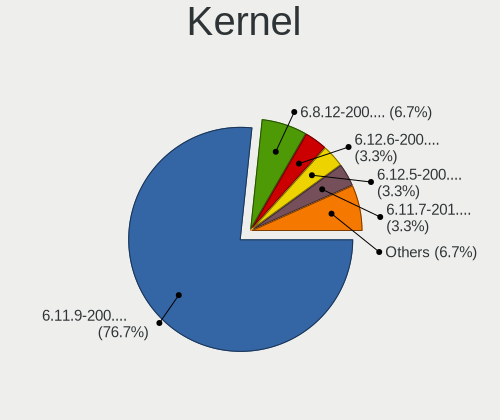

| Version                      | Desktops | Percent |
|------------------------------|----------|---------|
| 6.3.7-200.fsync.fc37.x86_64  | 7        | 33.33%  |
| 6.3.5-201.fsync.fc37.x86_64  | 3        | 14.29%  |
| 6.2.14-300.fsync.fc37.x86_64 | 3        | 14.29%  |
| 6.2.12-200.fsync.fc37.x86_64 | 3        | 14.29%  |
| 6.4.0-0.rc6.48.fc38.x86_64   | 1        | 4.76%   |
| 6.3.5-201.fsync.fc38.x86_64  | 1        | 4.76%   |
| 6.3.4-201.fsync.fc37.x86_64  | 1        | 4.76%   |
| 6.3.10-200.fsync.fc38.x86_64 | 1        | 4.76%   |
| 6.0.14-201.fsync.fc36.x86_64 | 1        | 4.76%   |

Kernel Family
-------------

Linux kernel without a distro release

| Version | Desktops | Percent |
|---------|----------|---------|
| 6.3.7   | 7        | 33.33%  |
| 6.3.5   | 4        | 19.05%  |
| 6.2.14  | 3        | 14.29%  |
| 6.2.12  | 3        | 14.29%  |
| 6.4.0   | 1        | 4.76%   |
| 6.3.4   | 1        | 4.76%   |
| 6.3.10  | 1        | 4.76%   |
| 6.0.14  | 1        | 4.76%   |

Kernel Major Ver.
-----------------

Linux kernel major version

| Version | Desktops | Percent |
|---------|----------|---------|
| 6.3     | 13       | 61.9%   |
| 6.2     | 6        | 28.57%  |
| 6.4     | 1        | 4.76%   |
| 6.0     | 1        | 4.76%   |

Arch
----

OS architecture (x86_64, i586, etc.)

| Name   | Desktops | Percent |
|--------|----------|---------|
| x86_64 | 21       | 100%    |

DE
--

Desktop Environment

| Name          | Desktops | Percent |
|---------------|----------|---------|
| KDE5          | 10       | 47.62%  |
| GNOME         | 10       | 47.62%  |
| GNOME Classic | 1        | 4.76%   |

Display Server
--------------

X11 or Wayland

| Name    | Desktops | Percent |
|---------|----------|---------|
| Wayland | 18       | 85.71%  |
| X11     | 3        | 14.29%  |

Display Manager
---------------

SDDM, LightDM, etc.

| Name    | Desktops | Percent |
|---------|----------|---------|
| Unknown | 16       | 76.19%  |
| SDDM    | 4        | 19.05%  |
| GDM     | 1        | 4.76%   |

OS Lang
-------

Language

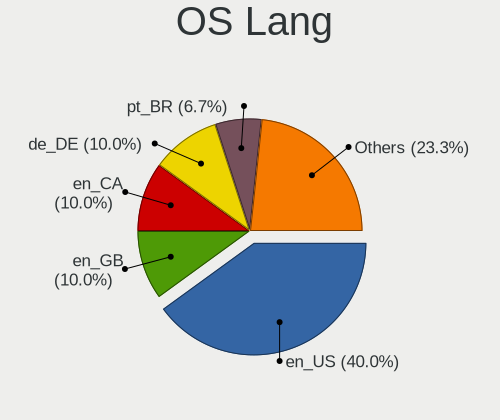

| Lang  | Desktops | Percent |
|-------|----------|---------|
| en_US | 13       | 61.9%   |
| en_GB | 2        | 9.52%   |
| pt_PT | 1        | 4.76%   |
| nl_BE | 1        | 4.76%   |
| fr_FR | 1        | 4.76%   |
| fr_BE | 1        | 4.76%   |
| es_CL | 1        | 4.76%   |
| de_DE | 1        | 4.76%   |

Boot Mode
---------

EFI or BIOS

| Mode | Desktops | Percent |
|------|----------|---------|
| EFI  | 19       | 90.48%  |
| BIOS | 2        | 9.52%   |

Filesystem
----------

Type of filesystem

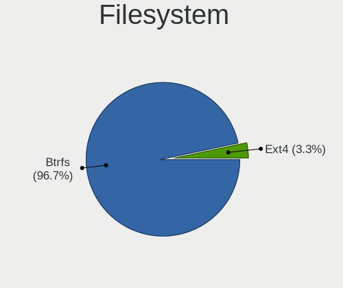

| Type  | Desktops | Percent |
|-------|----------|---------|
| Btrfs | 19       | 90.48%  |
| Ext4  | 2        | 9.52%   |

Part. scheme
------------

Scheme of partitioning

| Type    | Desktops | Percent |
|---------|----------|---------|
| Unknown | 16       | 76.19%  |
| GPT     | 5        | 23.81%  |

Dual Boot with Linux/BSD
------------------------

Hosting more than one Linux/BSD

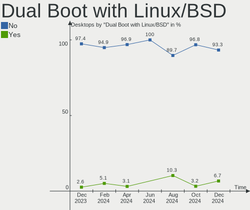

| Dual boot | Desktops | Percent |
|-----------|----------|---------|
| No        | 20       | 95.24%  |
| Yes       | 1        | 4.76%   |

Dual Boot (Win)
---------------

Hosting Linux and Windows

| Dual boot | Desktops | Percent |
|-----------|----------|---------|
| No        | 19       | 90.48%  |
| Yes       | 2        | 9.52%   |

Board
-----

Vendor
------

Motherboard manufacturer

| Name                | Desktops | Percent |
|---------------------|----------|---------|
| MSI                 | 6        | 28.57%  |
| ASRock              | 6        | 28.57%  |
| ASUSTek Computer    | 4        | 19.05%  |
| Gigabyte Technology | 2        | 9.52%   |
| Lenovo              | 1        | 4.76%   |
| Hewlett-Packard     | 1        | 4.76%   |
| AOpen               | 1        | 4.76%   |

Model
-----

Motherboard model

| Name                               | Desktops | Percent |
|------------------------------------|----------|---------|
| MSI MS-7C37                        | 2        | 9.52%   |
| MSI MS-7D32                        | 1        | 4.76%   |
| MSI MS-7C94                        | 1        | 4.76%   |
| MSI MS-7B85                        | 1        | 4.76%   |
| MSI MS-7817                        | 1        | 4.76%   |
| Lenovo ThinkCentre M700 10J0A0GGCS | 1        | 4.76%   |
| HP EliteDesk 800 G2 SFF            | 1        | 4.76%   |
| Gigabyte X570 AORUS PRO            | 1        | 4.76%   |
| Gigabyte B550 AORUS ELITE V2       | 1        | 4.76%   |
| ASUS ROG STRIX Z590-E GAMING WIFI  | 1        | 4.76%   |
| ASUS ROG CROSSHAIR X670E GENE      | 1        | 4.76%   |
| ASUS ROG CROSSHAIR VII HERO        | 1        | 4.76%   |
| ASUS PRIME B760M-A WIFI D4         | 1        | 4.76%   |
| ASRock Z370 Gaming-ITX/ac          | 1        | 4.76%   |
| ASRock X470 Master SLI             | 1        | 4.76%   |
| ASRock FM2A68M-DG3+                | 1        | 4.76%   |
| ASRock B85M Pro4                   | 1        | 4.76%   |
| ASRock B650E Steel Legend WiFi     | 1        | 4.76%   |
| ASRock B450 Steel Legend           | 1        | 4.76%   |
| AOpen DEX5350                      | 1        | 4.76%   |

Model Family
------------

Motherboard model prefix

| Name                | Desktops | Percent |
|---------------------|----------|---------|
| ASUS ROG            | 3        | 14.29%  |
| MSI MS-7C37         | 2        | 9.52%   |
| MSI MS-7D32         | 1        | 4.76%   |
| MSI MS-7C94         | 1        | 4.76%   |
| MSI MS-7B85         | 1        | 4.76%   |
| MSI MS-7817         | 1        | 4.76%   |
| Lenovo ThinkCentre  | 1        | 4.76%   |
| HP EliteDesk        | 1        | 4.76%   |
| Gigabyte X570       | 1        | 4.76%   |
| Gigabyte B550       | 1        | 4.76%   |
| ASUS PRIME          | 1        | 4.76%   |
| ASRock Z370         | 1        | 4.76%   |
| ASRock X470         | 1        | 4.76%   |
| ASRock FM2A68M-DG3+ | 1        | 4.76%   |
| ASRock B85M         | 1        | 4.76%   |
| ASRock B650E        | 1        | 4.76%   |
| ASRock B450         | 1        | 4.76%   |
| AOpen DEX5350       | 1        | 4.76%   |

MFG Year
--------

Motherboard manufacture year

| Year | Desktops | Percent |
|------|----------|---------|
| 2019 | 5        | 23.81%  |
| 2023 | 2        | 9.52%   |
| 2022 | 2        | 9.52%   |
| 2021 | 2        | 9.52%   |
| 2020 | 2        | 9.52%   |
| 2018 | 2        | 9.52%   |
| 2015 | 2        | 9.52%   |
| 2017 | 1        | 4.76%   |
| 2016 | 1        | 4.76%   |
| 2014 | 1        | 4.76%   |
| 2013 | 1        | 4.76%   |

Form Factor
-----------

Physical design of the computer

| Name    | Desktops | Percent |
|---------|----------|---------|
| Desktop | 21       | 100%    |

Secure Boot
-----------

Enabled or disabled

| State    | Desktops | Percent |
|----------|----------|---------|
| Disabled | 21       | 100%    |

Coreboot
--------

Have coreboot on board

| Used | Desktops | Percent |
|------|----------|---------|
| No   | 21       | 100%    |

RAM Size
--------

Total RAM memory

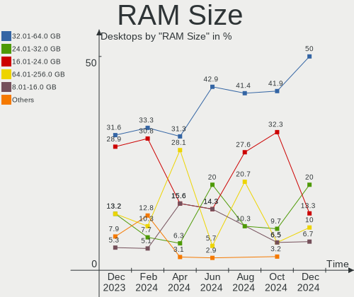

| Size in GB  | Desktops | Percent |
|-------------|----------|---------|
| 32.01-64.0  | 11       | 52.38%  |
| 16.01-24.0  | 4        | 19.05%  |
| 4.01-8.0    | 2        | 9.52%   |
| 64.01-256.0 | 2        | 9.52%   |
| 3.01-4.0    | 1        | 4.76%   |
| 8.01-16.0   | 1        | 4.76%   |

RAM Used
--------

Used RAM memory

| Used GB    | Desktops | Percent |
|------------|----------|---------|
| 4.01-8.0   | 9        | 42.86%  |
| 8.01-16.0  | 5        | 23.81%  |
| 3.01-4.0   | 3        | 14.29%  |
| 16.01-24.0 | 2        | 9.52%   |
| 2.01-3.0   | 1        | 4.76%   |
| 1.01-2.0   | 1        | 4.76%   |

Total Drives
------------

Number of drives on board

| Drives | Desktops | Percent |
|--------|----------|---------|
| 3      | 7        | 33.33%  |
| 2      | 7        | 33.33%  |
| 5      | 3        | 14.29%  |
| 1      | 2        | 9.52%   |
| 8      | 1        | 4.76%   |
| 7      | 1        | 4.76%   |

Has CD-ROM
----------

Has CD-ROM on board

| Presented | Desktops | Percent |
|-----------|----------|---------|
| No        | 16       | 76.19%  |
| Yes       | 5        | 23.81%  |

Has Ethernet
------------

Has Ethernet on board

| Presented | Desktops | Percent |
|-----------|----------|---------|
| Yes       | 21       | 100%    |

Has WiFi
--------

Has WiFi module

| Presented | Desktops | Percent |
|-----------|----------|---------|
| Yes       | 13       | 61.9%   |
| No        | 8        | 38.1%   |

Has Bluetooth
-------------

Has Bluetooth module

| Presented | Desktops | Percent |
|-----------|----------|---------|
| Yes       | 15       | 71.43%  |
| No        | 6        | 28.57%  |

Location
--------

Country
-------

Geographic location (country)

| Country     | Desktops | Percent |
|-------------|----------|---------|
| USA         | 8        | 38.1%   |
| Netherlands | 2        | 9.52%   |
| Belgium     | 2        | 9.52%   |
| UK          | 1        | 4.76%   |
| Turkey      | 1        | 4.76%   |
| Thailand    | 1        | 4.76%   |
| Portugal    | 1        | 4.76%   |
| Poland      | 1        | 4.76%   |
| Greece      | 1        | 4.76%   |
| Germany     | 1        | 4.76%   |
| France      | 1        | 4.76%   |
| Chile       | 1        | 4.76%   |

City
----

Geographic location (city)

| City         | Desktops | Percent |
|--------------|----------|---------|
| Warsaw       | 1        | 4.76%   |
| Torres Novas | 1        | 4.76%   |
| Surat Thani  | 1        | 4.76%   |
| Seattle      | 1        | 4.76%   |
| Roseville    | 1        | 4.76%   |
| Pottstown    | 1        | 4.76%   |
| Port Montt   | 1        | 4.76%   |
| Mons         | 1        | 4.76%   |
| Marousi      | 1        | 4.76%   |
| Lexington    | 1        | 4.76%   |
| Las Vegas    | 1        | 4.76%   |
| Istres       | 1        | 4.76%   |
| Herten       | 1        | 4.76%   |
| Everett      | 1        | 4.76%   |
| El Paso      | 1        | 4.76%   |
| Cardiff      | 1        | 4.76%   |
| Bursa        | 1        | 4.76%   |
| Bad Wildbad  | 1        | 4.76%   |
| Austin       | 1        | 4.76%   |
| Antwerp      | 1        | 4.76%   |
| Amsterdam    | 1        | 4.76%   |

Drives
------

Drive Vendor
------------

Hard drive vendors

| Vendor                      | Desktops | Drives | Percent |
|-----------------------------|----------|--------|---------|
| Samsung Electronics         | 9        | 18     | 16.36%  |
| WDC                         | 7        | 7      | 12.73%  |
| Sandisk                     | 7        | 9      | 12.73%  |
| Toshiba                     | 5        | 5      | 9.09%   |
| Crucial                     | 4        | 4      | 7.27%   |
| Seagate                     | 3        | 4      | 5.45%   |
| Phison Electronics          | 3        | 3      | 5.45%   |
| Micron/Crucial Technology   | 3        | 3      | 5.45%   |
| Kingston Technology Company | 3        | 3      | 5.45%   |
| Kingston                    | 2        | 2      | 3.64%   |
| Vecto                       | 1        | 1      | 1.82%   |
| SCY                         | 1        | 1      | 1.82%   |
| Realtek Semiconductor       | 1        | 1      | 1.82%   |
| PNY                         | 1        | 1      | 1.82%   |
| OCZ                         | 1        | 1      | 1.82%   |
| HS-SSD-C100                 | 1        | 1      | 1.82%   |
| HGST                        | 1        | 1      | 1.82%   |
| GOODRAM                     | 1        | 1      | 1.82%   |
| A-DATA Technology           | 1        | 1      | 1.82%   |

Drive Model
-----------

Hard drive models

| Model                                               | Desktops | Percent |
|-----------------------------------------------------|----------|---------|
| Samsung SSD 850 EVO 500GB                           | 3        | 4.55%   |
| Phison E12 NVMe Controller 1TB                      | 3        | 4.55%   |
| Micron/Crucial P2 NVMe PCIe SSD 4TB                 | 3        | 4.55%   |
| WDC WD10EZEX-00BN5A0 1TB                            | 2        | 3.03%   |
| Sandisk WD Blue SN570 500GB                         | 2        | 3.03%   |
| Samsung SSD 850 EVO 250GB                           | 2        | 3.03%   |
| Samsung NVMe SSD Controller SM981/PM981/PM983 250GB | 2        | 3.03%   |
| WDC WD5000AAVS-00ZTB0 500GB                         | 1        | 1.52%   |
| WDC WD30EZRX-00DC0B0 3TB                            | 1        | 1.52%   |
| WDC WD10JPCX-24UE4T0 1TB                            | 1        | 1.52%   |
| WDC WD10EURS-630AB1 1TB                             | 1        | 1.52%   |
| WDC WD10EADS-00M2B0 1TB                             | 1        | 1.52%   |
| Vecto Tech 4TB                                      | 1        | 1.52%   |
| Toshiba TR150 240GB SSD                             | 1        | 1.52%   |
| Toshiba MK5076GSX 500GB                             | 1        | 1.52%   |
| Toshiba MD04ACA400 4TB                              | 1        | 1.52%   |
| Toshiba HDWG480 8TB                                 | 1        | 1.52%   |
| Toshiba DT01ACA200 2TB                              | 1        | 1.52%   |
| Seagate ST4000DM004-2U9104 4TB                      | 1        | 1.52%   |
| Seagate ST4000DM004-2CV104 4TB                      | 1        | 1.52%   |
| Seagate ST2000DL003-9VT166 2TB                      | 1        | 1.52%   |
| Seagate ST1000LM035-1RK172 1TB                      | 1        | 1.52%   |
| SCY N10C 256GB                                      | 1        | 1.52%   |
| Sandisk WD_BLACK SN850X 1000GB                      | 1        | 1.52%   |
| Sandisk WD Green SN350 1TB                          | 1        | 1.52%   |
| Sandisk WD Blue SN570 2TB                           | 1        | 1.52%   |
| Sandisk WD Blue SN550 NVMe SSD 1TB                  | 1        | 1.52%   |
| Sandisk WD Black SN850 1TB                          | 1        | 1.52%   |
| Sandisk WD Black SN750 / PC SN730 NVMe SSD 500GB    | 1        | 1.52%   |
| SanDisk Ultra II 480GB SSD                          | 1        | 1.52%   |
| Samsung SSD 980 1TB                                 | 1        | 1.52%   |
| Samsung SSD 860 EVO 1TB                             | 1        | 1.52%   |
| Samsung SSD 850 EVO 2TB                             | 1        | 1.52%   |
| Samsung SSD 830 Series 128GB                        | 1        | 1.52%   |
| Samsung Portable SSD T5 1TB                         | 1        | 1.52%   |
| Samsung NVMe SSD Controller SM961/PM961/SM963 256GB | 1        | 1.52%   |
| Samsung NVMe SSD Controller PM9A1/PM9A3/980PRO 2TB  | 1        | 1.52%   |
| Samsung HD322HJ 320GB                               | 1        | 1.52%   |
| Samsung HD203WI 2TB                                 | 1        | 1.52%   |
| Samsung HD103SI 1TB                                 | 1        | 1.52%   |

HDD Vendor
----------

Hard disk drive vendors

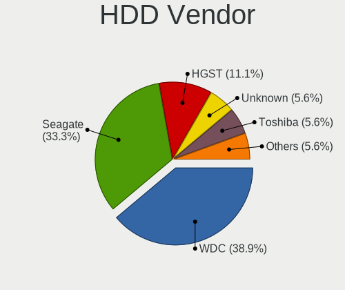

| Vendor              | Desktops | Drives | Percent |
|---------------------|----------|--------|---------|
| WDC                 | 7        | 7      | 41.18%  |
| Toshiba             | 4        | 4      | 23.53%  |
| Seagate             | 3        | 4      | 17.65%  |
| Samsung Electronics | 2        | 3      | 11.76%  |
| HGST                | 1        | 1      | 5.88%   |

SSD Vendor
----------

Solid state drive vendors

| Vendor              | Desktops | Drives | Percent |
|---------------------|----------|--------|---------|
| Samsung Electronics | 7        | 10     | 36.84%  |
| Crucial             | 4        | 4      | 21.05%  |
| Kingston            | 2        | 2      | 10.53%  |
| Toshiba             | 1        | 1      | 5.26%   |
| SanDisk             | 1        | 1      | 5.26%   |
| PNY                 | 1        | 1      | 5.26%   |
| OCZ                 | 1        | 1      | 5.26%   |
| GOODRAM             | 1        | 1      | 5.26%   |
| A-DATA Technology   | 1        | 1      | 5.26%   |

Drive Kind
----------

HDD or SSD

| Kind    | Desktops | Drives | Percent |
|---------|----------|--------|---------|
| NVMe    | 14       | 23     | 31.82%  |
| SSD     | 14       | 22     | 31.82%  |
| HDD     | 13       | 19     | 29.55%  |
| Unknown | 3        | 3      | 6.82%   |

Drive Connector
---------------

SATA, SAS, NVMe, etc.

| Type | Desktops | Drives | Percent |
|------|----------|--------|---------|
| SATA | 17       | 42     | 51.52%  |
| NVMe | 14       | 23     | 42.42%  |
| SAS  | 2        | 2      | 6.06%   |

Drive Size
----------

Size of hard drive

| Size in TB | Desktops | Drives | Percent |
|------------|----------|--------|---------|
| 0.01-0.5   | 12       | 17     | 40%     |
| 0.51-1.0   | 10       | 14     | 33.33%  |
| 1.01-2.0   | 3        | 4      | 10%     |
| 3.01-4.0   | 2        | 3      | 6.67%   |
| 4.01-10.0  | 2        | 2      | 6.67%   |
| 2.01-3.0   | 1        | 1      | 3.33%   |

Space Total
-----------

Amount of disk space available on the file system

| Size in GB     | Desktops | Percent |
|----------------|----------|---------|
| More than 3000 | 9        | 42.86%  |
| 501-1000       | 5        | 23.81%  |
| 1001-2000      | 3        | 14.29%  |
| 251-500        | 1        | 4.76%   |
| 21-50          | 1        | 4.76%   |
| 2001-3000      | 1        | 4.76%   |
| 101-250        | 1        | 4.76%   |

Space Used
----------

Amount of used disk space

| Used GB        | Desktops | Percent |
|----------------|----------|---------|
| 501-1000       | 5        | 23.81%  |
| 2001-3000      | 4        | 19.05%  |
| 21-50          | 3        | 14.29%  |
| 1001-2000      | 3        | 14.29%  |
| 1-20           | 3        | 14.29%  |
| More than 3000 | 1        | 4.76%   |
| 101-250        | 1        | 4.76%   |
| 51-100         | 1        | 4.76%   |

Malfunc. Drives
---------------

Drive models with a malfunction

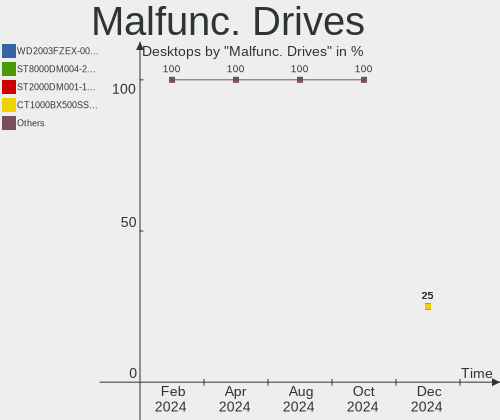

| Model                    | Desktops | Drives | Percent |
|--------------------------|----------|--------|---------|
| WDC WD30EZRX-00DC0B0 3TB | 1        | 1      | 100%    |

Malfunc. Drive Vendor
---------------------

Vendors of faulty drives

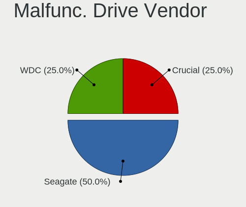

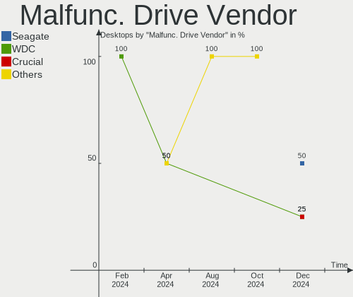

| Vendor | Desktops | Drives | Percent |
|--------|----------|--------|---------|
| WDC    | 1        | 1      | 100%    |

Malfunc. HDD Vendor
-------------------

Vendors of faulty HDD drives

| Vendor | Desktops | Drives | Percent |
|--------|----------|--------|---------|
| WDC    | 1        | 1      | 100%    |

Malfunc. Drive Kind
-------------------

Kinds of faulty drives

| Kind | Desktops | Drives | Percent |
|------|----------|--------|---------|
| HDD  | 1        | 1      | 100%    |

Failed Drives
-------------

Failed drive models

Zero info for selected period =(

Failed Drive Vendor
-------------------

Failed drive vendors

Zero info for selected period =(

Drive Status
------------

Number of failed and malfunc. drives

| Status   | Desktops | Drives | Percent |
|----------|----------|--------|---------|
| Detected | 16       | 53     | 72.73%  |
| Works    | 5        | 13     | 22.73%  |
| Malfunc  | 1        | 1      | 4.55%   |

Storage controller
------------------

Storage Vendor
--------------

Storage controller vendors

| Vendor                      | Desktops | Percent |
|-----------------------------|----------|---------|
| AMD                         | 12       | 26.67%  |
| Intel                       | 9        | 20%     |
| SanDisk                     | 7        | 15.56%  |
| Samsung Electronics         | 4        | 8.89%   |
| Phison Electronics          | 3        | 6.67%   |
| Micron/Crucial Technology   | 3        | 6.67%   |
| Kingston Technology Company | 3        | 6.67%   |
| ASMedia Technology          | 3        | 6.67%   |
| Realtek Semiconductor       | 1        | 2.22%   |

Storage Model
-------------

Storage controller models

| Model                                                                          | Desktops | Percent |
|--------------------------------------------------------------------------------|----------|---------|
| AMD FCH SATA Controller [AHCI mode]                                            | 8        | 16%     |
| AMD 400 Series Chipset SATA Controller                                         | 4        | 8%      |
| Phison E12 NVMe Controller                                                     | 3        | 6%      |
| Micron/Crucial P2 NVMe PCIe SSD                                                | 3        | 6%      |
| ASMedia ASM1062 Serial ATA Controller                                          | 3        | 6%      |
| SanDisk WD Blue SN570 NVMe SSD 1TB                                             | 2        | 4%      |
| Samsung NVMe SSD Controller SM981/PM981/PM983                                  | 2        | 4%      |
| Intel Q170/Q150/B150/H170/H110/Z170/CM236 Chipset SATA Controller [AHCI Mode]  | 2        | 4%      |
| Intel 8 Series/C220 Series Chipset Family 6-port SATA Controller 1 [AHCI mode] | 2        | 4%      |
| AMD 500 Series Chipset SATA Controller                                         | 2        | 4%      |
| Sandisk Western Digital WD Black SN850X NVMe SSD                               | 1        | 2%      |
| SanDisk WD PC SN810 / Black SN850 NVMe SSD                                     | 1        | 2%      |
| SanDisk WD Blue SN570 NVMe SSD 2TB                                             | 1        | 2%      |
| SanDisk WD Blue SN550 NVMe SSD                                                 | 1        | 2%      |
| SanDisk WD Black SN750 / PC SN730 NVMe SSD                                     | 1        | 2%      |
| SanDisk Non-Volatile memory controller                                         | 1        | 2%      |
| Samsung NVMe SSD Controller SM961/PM961/SM963                                  | 1        | 2%      |
| Samsung NVMe SSD Controller PM9A1/PM9A3/980PRO                                 | 1        | 2%      |
| Samsung NVMe SSD Controller 980                                                | 1        | 2%      |
| Realtek RTS5763DL NVMe SSD Controller                                          | 1        | 2%      |
| Kingston Company Company Non-Volatile memory controller                        | 1        | 2%      |
| Kingston Company FURY Renegade NVMe SSD                                        | 1        | 2%      |
| Kingston Company A2000 NVMe SSD                                                | 1        | 2%      |
| Intel Wildcat Point-LP SATA Controller [AHCI Mode]                             | 1        | 2%      |
| Intel Volume Management Device NVMe RAID Controller                            | 1        | 2%      |
| Intel Alder Lake-S PCH SATA Controller [AHCI Mode]                             | 1        | 2%      |
| Intel 700 Series Chipset Family SATA AHCI Controller                           | 1        | 2%      |
| Intel 500 Series Chipset Family SATA AHCI Controller                           | 1        | 2%      |
| Intel 200 Series PCH SATA controller [AHCI mode]                               | 1        | 2%      |

Storage Kind
------------

Kind of storage controller (IDE, SATA, NVMe, SAS, ...)

| Kind | Desktops | Percent |
|------|----------|---------|
| SATA | 21       | 58.33%  |
| NVMe | 14       | 38.89%  |
| RAID | 1        | 2.78%   |

Processor
---------

CPU Vendor
----------

Processor vendors

| Vendor | Desktops | Percent |
|--------|----------|---------|
| AMD    | 12       | 57.14%  |
| Intel  | 9        | 42.86%  |

CPU Model
---------

Processor models

| Model                                         | Desktops | Percent |
|-----------------------------------------------|----------|---------|
| AMD Ryzen 7 5800X 8-Core Processor            | 2        | 9.52%   |
| AMD Ryzen 7 3700X 8-Core Processor            | 2        | 9.52%   |
| Intel Core i7-4790 CPU @ 3.60GHz              | 1        | 4.76%   |
| Intel Core i5-8600K CPU @ 3.60GHz             | 1        | 4.76%   |
| Intel Core i5-6500 CPU @ 3.20GHz              | 1        | 4.76%   |
| Intel Core i5-4690 CPU @ 3.50GHz              | 1        | 4.76%   |
| Intel Core i3-6100T CPU @ 3.20GHz             | 1        | 4.76%   |
| Intel Core i3-5010U CPU @ 2.10GHz             | 1        | 4.76%   |
| Intel 13th Gen Core i5-13400F                 | 1        | 4.76%   |
| Intel 12th Gen Core i7-12700K                 | 1        | 4.76%   |
| Intel 11th Gen Core i7-11700KF @ 3.60GHz      | 1        | 4.76%   |
| AMD Ryzen 9 7950X3D 16-Core Processor         | 1        | 4.76%   |
| AMD Ryzen 9 7950X 16-Core Processor           | 1        | 4.76%   |
| AMD Ryzen 9 5900X 12-Core Processor           | 1        | 4.76%   |
| AMD Ryzen 7 5800X3D 8-Core Processor          | 1        | 4.76%   |
| AMD Ryzen 5 5500                              | 1        | 4.76%   |
| AMD Ryzen 5 3600X 6-Core Processor            | 1        | 4.76%   |
| AMD Ryzen 5 2600 Six-Core Processor           | 1        | 4.76%   |
| AMD A8-7680 Radeon R7, 10 Compute Cores 4C+6G | 1        | 4.76%   |

CPU Model Family
----------------

Processor model prefix

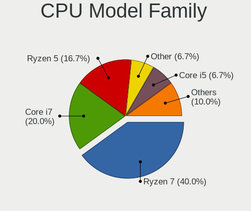

| Model         | Desktops | Percent |
|---------------|----------|---------|
| AMD Ryzen 7   | 5        | 23.81%  |
| Other         | 3        | 14.29%  |
| Intel Core i5 | 3        | 14.29%  |
| AMD Ryzen 9   | 3        | 14.29%  |
| AMD Ryzen 5   | 3        | 14.29%  |
| Intel Core i3 | 2        | 9.52%   |
| Intel Core i7 | 1        | 4.76%   |
| AMD A8        | 1        | 4.76%   |

CPU Cores
---------

Number of processor cores

| Number | Desktops | Percent |
|--------|----------|---------|
| 8      | 6        | 28.57%  |
| 6      | 4        | 19.05%  |
| 4      | 3        | 14.29%  |
| 2      | 3        | 14.29%  |
| 16     | 2        | 9.52%   |
| 12     | 2        | 9.52%   |
| 10     | 1        | 4.76%   |

CPU Sockets
-----------

Number of sockets

| Number | Desktops | Percent |
|--------|----------|---------|
| 1      | 21       | 100%    |

CPU Threads
-----------

Threads per core (Hyper-Threading)

| Number | Desktops | Percent |
|--------|----------|---------|
| 2      | 18       | 85.71%  |
| 1      | 3        | 14.29%  |

CPU Op-Modes
------------

CPU Operation Modes (32-bit, 64-bit)

| Op mode        | Desktops | Percent |
|----------------|----------|---------|
| 32-bit, 64-bit | 21       | 100%    |

CPU Microcode
-------------

Microcode number

| Number     | Desktops | Percent |
|------------|----------|---------|
| Unknown    | 9        | 42.86%  |
| 0x0a201016 | 3        | 14.29%  |
| 0x0a601203 | 2        | 9.52%   |
| 0x08701021 | 2        | 9.52%   |
| 0x0a50000d | 1        | 4.76%   |
| 0x0a20120a | 1        | 4.76%   |
| 0x08701013 | 1        | 4.76%   |
| 0x0800820d | 1        | 4.76%   |
| 0x0600611a | 1        | 4.76%   |

CPU Microarch
-------------

Microarchitecture

| Name             | Desktops | Percent |
|------------------|----------|---------|
| Zen 3            | 5        | 23.81%  |
| Zen 2            | 3        | 14.29%  |
| Skylake          | 2        | 9.52%   |
| Haswell          | 2        | 9.52%   |
| Alderlake Hybrid | 2        | 9.52%   |
| Unknown          | 2        | 9.52%   |
| Zen+             | 1        | 4.76%   |
| KabyLake         | 1        | 4.76%   |
| Icelake          | 1        | 4.76%   |
| Excavator        | 1        | 4.76%   |
| Broadwell        | 1        | 4.76%   |

Graphics
--------

GPU Vendor
----------

Vendors of graphics cards

| Vendor | Desktops | Percent |
|--------|----------|---------|
| AMD    | 13       | 61.9%   |
| Nvidia | 5        | 23.81%  |
| Intel  | 3        | 14.29%  |

GPU Model
---------

Graphics card models

| Model                                                         | Desktops | Percent |
|---------------------------------------------------------------|----------|---------|
| AMD Navi 21 [Radeon RX 6800/6800 XT / 6900 XT]                | 3        | 12.5%   |
| Nvidia GA106 [GeForce RTX 3060 Lite Hash Rate]                | 2        | 8.33%   |
| Intel HD Graphics 530                                         | 2        | 8.33%   |
| AMD Raphael                                                   | 2        | 8.33%   |
| AMD Navi 31 [Radeon RX 7900 XT/7900 XTX]                      | 2        | 8.33%   |
| AMD Navi 23 [Radeon RX 6650 XT / 6700S / 6800S]               | 2        | 8.33%   |
| AMD Navi 22 [Radeon RX 6700/6700 XT/6750 XT / 6800M/6850M XT] | 2        | 8.33%   |
| Nvidia GP102 [GeForce GTX 1080 Ti]                            | 1        | 4.17%   |
| Nvidia GM204 [GeForce GTX 970]                                | 1        | 4.17%   |
| Nvidia GA102 [GeForce RTX 3080]                               | 1        | 4.17%   |
| Intel HD Graphics 5500                                        | 1        | 4.17%   |
| AMD Wani [Radeon R5/R6/R7 Graphics]                           | 1        | 4.17%   |
| AMD Polaris 20 XL [Radeon RX 580 2048SP]                      | 1        | 4.17%   |
| AMD Navi 21 [Radeon RX 6950 XT]                               | 1        | 4.17%   |
| AMD Hawaii PRO [Radeon R9 290/390]                            | 1        | 4.17%   |
| AMD Ellesmere [Radeon RX 470/480/570/570X/580/580X/590]       | 1        | 4.17%   |

GPU Combo
---------

Combinations of graphics cards

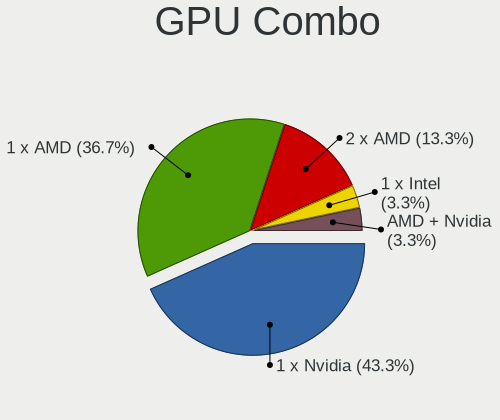

| Name       | Desktops | Percent |
|------------|----------|---------|
| 1 x AMD    | 10       | 47.62%  |
| 1 x Nvidia | 5        | 23.81%  |
| 2 x AMD    | 3        | 14.29%  |
| 1 x Intel  | 3        | 14.29%  |

GPU Driver
----------

Free vs proprietary

| Driver      | Desktops | Percent |
|-------------|----------|---------|
| Free        | 16       | 76.19%  |
| Proprietary | 5        | 23.81%  |

GPU Memory
----------

Total video memory

| Size in GB | Desktops | Percent |
|------------|----------|---------|
| 8.01-16.0  | 7        | 33.33%  |
| Unknown    | 6        | 28.57%  |
| 7.01-8.0   | 5        | 23.81%  |
| 16.01-24.0 | 2        | 9.52%   |
| 3.01-4.0   | 1        | 4.76%   |

Monitor
-------

Monitor Vendor
--------------

Monitor vendors

| Vendor               | Desktops | Percent |
|----------------------|----------|---------|
| Samsung Electronics  | 4        | 16%     |
| Goldstar             | 4        | 16%     |
| Ancor Communications | 4        | 16%     |
| Dell                 | 3        | 12%     |
| Hewlett-Packard      | 2        | 8%      |
| Gigabyte Technology  | 2        | 8%      |
| ViewSonic            | 1        | 4%      |
| Valve                | 1        | 4%      |
| MSI                  | 1        | 4%      |
| Lenovo               | 1        | 4%      |
| Huion                | 1        | 4%      |
| AOC                  | 1        | 4%      |

Monitor Model
-------------

Monitor models

| Model                                                                   | Desktops | Percent |
|-------------------------------------------------------------------------|----------|---------|
| Ancor Communications ROG PG279Q ACI27EC 2560x1440 598x336mm 27.0-inch   | 2        | 8%      |
| ViewSonic VA2216w-2 VSC2920 1680x1050 495x291mm 22.6-inch               | 1        | 4%      |
| Valve Index HMD VLV91A8 2880x1600                                       | 1        | 4%      |
| Samsung Electronics LS27AG30x SAM717B 1920x1080 597x336mm 27.0-inch     | 1        | 4%      |
| Samsung Electronics LCD Monitor SAM7017 3840x2160 1872x1053mm 84.6-inch | 1        | 4%      |
| Samsung Electronics LC32G5xT SAM7089 2560x1440 698x393mm 31.5-inch      | 1        | 4%      |
| Samsung Electronics C49RG9x SAM0F9C 3840x1080 1193x336mm 48.8-inch      | 1        | 4%      |
| MSI Optix MAG24C MSI1462 1920x1080 521x293mm 23.5-inch                  | 1        | 4%      |
| Lenovo E20-20 LEN62BB 1440x900 419x262mm 19.5-inch                      | 1        | 4%      |
| Huion Kamvas 13 HAT1330 1920x1080 294x165mm 13.3-inch                   | 1        | 4%      |
| Hewlett-Packard E190i HWP3117 1280x1024 374x299mm 18.9-inch             | 1        | 4%      |
| Hewlett-Packard 2009 HWP2827 1600x900 440x250mm 19.9-inch               | 1        | 4%      |
| Goldstar ULTRAWIDE GSM76E4 3440x1440 800x335mm 34.1-inch                | 1        | 4%      |
| Goldstar ULTRAGEAR GSM5C4D 2560x1440 600x340mm 27.2-inch                | 1        | 4%      |
| Goldstar ULTRAGEAR GSM5BD3 2560x1440 697x392mm 31.5-inch                | 1        | 4%      |
| Goldstar 29EA93 GSM5974 2560x1080 677x290mm 29.0-inch                   | 1        | 4%      |
| Gigabyte Technology M27Q GBT270D 2560x1440 596x335mm 26.9-inch          | 1        | 4%      |
| Gigabyte Technology G32QC GBT3200 2560x1440 697x392mm 31.5-inch         | 1        | 4%      |
| Dell S2722DGM DEL4239 2560x1440 597x336mm 27.0-inch                     | 1        | 4%      |
| Dell P2715Q DEL40BD 3840x2160 597x336mm 27.0-inch                       | 1        | 4%      |
| Dell P2214H DELA097 1920x1080 477x268mm 21.5-inch                       | 1        | 4%      |
| AOC AG352UCG6 AOC3525 3440x1440 819x346mm 35.0-inch                     | 1        | 4%      |
| Ancor Communications VX238 ACI23C1 1920x1080 510x290mm 23.1-inch        | 1        | 4%      |
| Ancor Communications ASUS PB278 ACI27A3 2560x1440 597x336mm 27.0-inch   | 1        | 4%      |

Monitor Resolution
------------------

Monitor screen resolution

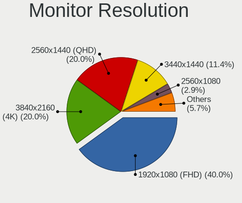

| Resolution         | Desktops | Percent |
|--------------------|----------|---------|
| 2560x1440 (QHD)    | 8        | 33.33%  |
| 3840x2160 (4K)     | 3        | 12.5%   |
| 3440x1440          | 3        | 12.5%   |
| 1920x1080 (FHD)    | 3        | 12.5%   |
| 3840x1080          | 1        | 4.17%   |
| 2560x1080          | 1        | 4.17%   |
| 1680x1050 (WSXGA+) | 1        | 4.17%   |
| 1600x900 (HD+)     | 1        | 4.17%   |
| 1440x900 (WXGA+)   | 1        | 4.17%   |
| 1280x1024 (SXGA)   | 1        | 4.17%   |
| Unknown            | 1        | 4.17%   |

Monitor Diagonal
----------------

Diagonal size in inches

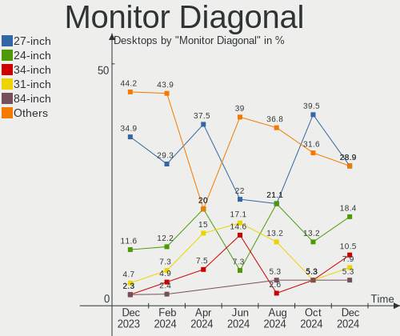

| Inches  | Desktops | Percent |
|---------|----------|---------|
| 27      | 8        | 33.33%  |
| 31      | 3        | 12.5%   |
| 34      | 2        | 8.33%   |
| 84      | 1        | 4.17%   |
| 48      | 1        | 4.17%   |
| 35      | 1        | 4.17%   |
| 29      | 1        | 4.17%   |
| 23      | 1        | 4.17%   |
| 22      | 1        | 4.17%   |
| 20      | 1        | 4.17%   |
| 19      | 1        | 4.17%   |
| 18      | 1        | 4.17%   |
| 15      | 1        | 4.17%   |
| Unknown | 1        | 4.17%   |

Monitor Width
-------------

Physical width

| Width in mm | Desktops | Percent |
|-------------|----------|---------|
| 501-600     | 9        | 37.5%   |
| 601-700     | 4        | 16.67%  |
| 401-500     | 3        | 12.5%   |
| 701-800     | 2        | 8.33%   |
| 801-900     | 1        | 4.17%   |
| 351-400     | 1        | 4.17%   |
| 301-350     | 1        | 4.17%   |
| 1501-2000   | 1        | 4.17%   |
| 1001-1500   | 1        | 4.17%   |
| Unknown     | 1        | 4.17%   |

Aspect Ratio
------------

Proportional relationship between the width and the height

| Ratio   | Desktops | Percent |
|---------|----------|---------|
| 16/9    | 14       | 63.64%  |
| 21/9    | 4        | 18.18%  |
| 5/4     | 1        | 4.55%   |
| 32/9    | 1        | 4.55%   |
| 16/10   | 1        | 4.55%   |
| Unknown | 1        | 4.55%   |

Monitor Area
------------

Area in inch²

| Area in inch² | Desktops | Percent |
|----------------|----------|---------|
| 301-350        | 9        | 37.5%   |
| 351-500        | 6        | 25%     |
| 151-200        | 3        | 12.5%   |
| 201-250        | 2        | 8.33%   |
| More than 1000 | 1        | 4.17%   |
| 501-1000       | 1        | 4.17%   |
| 91-100         | 1        | 4.17%   |
| Unknown        | 1        | 4.17%   |

Pixel Density
-------------

Pixels per inch

| Density | Desktops | Percent |
|---------|----------|---------|
| 51-100  | 11       | 47.83%  |
| 101-120 | 8        | 34.78%  |
| 161-240 | 2        | 8.7%    |
| 121-160 | 1        | 4.35%   |
| Unknown | 1        | 4.35%   |

Multiple Monitors
-----------------

Total monitors connected

| Total | Desktops | Percent |
|-------|----------|---------|
| 1     | 17       | 80.95%  |
| 2     | 2        | 9.52%   |
| 4     | 1        | 4.76%   |
| 3     | 1        | 4.76%   |

Network
-------

Net Controller Vendor
---------------------

Controller vendors

| Vendor                | Desktops | Percent |
|-----------------------|----------|---------|
| Intel                 | 14       | 51.85%  |
| Realtek Semiconductor | 9        | 33.33%  |
| NetGear               | 1        | 3.7%    |
| Microsoft             | 1        | 3.7%    |
| MediaTek              | 1        | 3.7%    |
| Broadcom Limited      | 1        | 3.7%    |

Net Controller Model
--------------------

Controller models

| Model                                                             | Desktops | Percent |
|-------------------------------------------------------------------|----------|---------|
| Realtek RTL8111/8168/8411 PCI Express Gigabit Ethernet Controller | 5        | 14.71%  |
| Realtek RTL8125 2.5GbE Controller                                 | 4        | 11.76%  |
| Intel I211 Gigabit Network Connection                             | 4        | 11.76%  |
| Intel Ethernet Controller I225-V                                  | 3        | 8.82%   |
| Intel Wi-Fi 6 AX210/AX211/AX411 160MHz                            | 2        | 5.88%   |
| Intel Ethernet Connection (2) I219-V                              | 2        | 5.88%   |
| Realtek RTL8192EE PCIe Wireless Network Adapter                   | 1        | 2.94%   |
| NetGear A6210                                                     | 1        | 2.94%   |
| Microsoft Xbox 360 Wireless Adapter                               | 1        | 2.94%   |
| MediaTek MT7921K (RZ608) Wi-Fi 6E 80MHz                           | 1        | 2.94%   |
| Intel Wireless-AC 9260                                            | 1        | 2.94%   |
| Intel Wireless 8265 / 8275                                        | 1        | 2.94%   |
| Intel Ethernet Connection I217-V                                  | 1        | 2.94%   |
| Intel Ethernet Connection (3) I218-LM                             | 1        | 2.94%   |
| Intel Ethernet Connection (2) I219-LM                             | 1        | 2.94%   |
| Intel Dual Band Wireless-AC 3168NGW [Stone Peak]                  | 1        | 2.94%   |
| Intel Centrino Advanced-N 6205 [Taylor Peak]                      | 1        | 2.94%   |
| Intel Alder Lake-S PCH CNVi WiFi                                  | 1        | 2.94%   |
| Intel 700 Series Chipset Family Wi-Fi                             | 1        | 2.94%   |
| Broadcom Limited BCM4321 802.11a/b/g/n                            | 1        | 2.94%   |

Wireless Vendor
---------------

Wireless vendors

| Vendor                | Desktops | Percent |
|-----------------------|----------|---------|
| Intel                 | 8        | 61.54%  |
| Realtek Semiconductor | 1        | 7.69%   |
| NetGear               | 1        | 7.69%   |
| Microsoft             | 1        | 7.69%   |
| MediaTek              | 1        | 7.69%   |
| Broadcom Limited      | 1        | 7.69%   |

Wireless Model
--------------

Wireless models

| Model                                            | Desktops | Percent |
|--------------------------------------------------|----------|---------|
| Intel Wi-Fi 6 AX210/AX211/AX411 160MHz           | 2        | 15.38%  |
| Realtek RTL8192EE PCIe Wireless Network Adapter  | 1        | 7.69%   |
| NetGear A6210                                    | 1        | 7.69%   |
| Microsoft Xbox 360 Wireless Adapter              | 1        | 7.69%   |
| MediaTek MT7921K (RZ608) Wi-Fi 6E 80MHz          | 1        | 7.69%   |
| Intel Wireless-AC 9260                           | 1        | 7.69%   |
| Intel Wireless 8265 / 8275                       | 1        | 7.69%   |
| Intel Dual Band Wireless-AC 3168NGW [Stone Peak] | 1        | 7.69%   |
| Intel Centrino Advanced-N 6205 [Taylor Peak]     | 1        | 7.69%   |
| Intel Alder Lake-S PCH CNVi WiFi                 | 1        | 7.69%   |
| Intel 700 Series Chipset Family Wi-Fi            | 1        | 7.69%   |
| Broadcom Limited BCM4321 802.11a/b/g/n           | 1        | 7.69%   |

Ethernet Vendor
---------------

Ethernet vendors

| Vendor                | Desktops | Percent |
|-----------------------|----------|---------|
| Intel                 | 12       | 57.14%  |
| Realtek Semiconductor | 9        | 42.86%  |

Ethernet Model
--------------

Ethernet models

| Model                                                             | Desktops | Percent |
|-------------------------------------------------------------------|----------|---------|
| Realtek RTL8111/8168/8411 PCI Express Gigabit Ethernet Controller | 5        | 23.81%  |
| Realtek RTL8125 2.5GbE Controller                                 | 4        | 19.05%  |
| Intel I211 Gigabit Network Connection                             | 4        | 19.05%  |
| Intel Ethernet Controller I225-V                                  | 3        | 14.29%  |
| Intel Ethernet Connection (2) I219-V                              | 2        | 9.52%   |
| Intel Ethernet Connection I217-V                                  | 1        | 4.76%   |
| Intel Ethernet Connection (3) I218-LM                             | 1        | 4.76%   |
| Intel Ethernet Connection (2) I219-LM                             | 1        | 4.76%   |

Net Controller Kind
-------------------

Ethernet, WiFi or modem

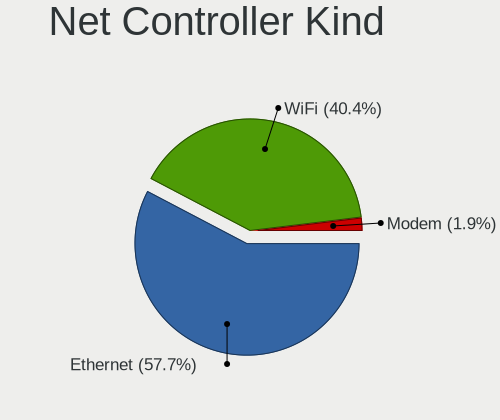

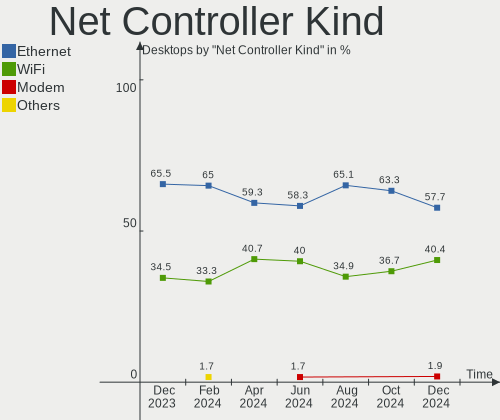

| Kind     | Desktops | Percent |
|----------|----------|---------|
| Ethernet | 21       | 61.76%  |
| WiFi     | 13       | 38.24%  |

Used Controller
---------------

Currently used network controller

| Kind     | Desktops | Percent |
|----------|----------|---------|
| Ethernet | 16       | 76.19%  |
| WiFi     | 5        | 23.81%  |

NICs
----

Total network controllers on board

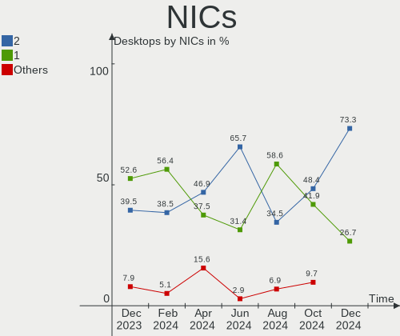

| Total | Desktops | Percent |
|-------|----------|---------|
| 2     | 10       | 47.62%  |
| 1     | 10       | 47.62%  |
| 3     | 1        | 4.76%   |

IPv6
----

IPv6 vs IPv4

| Used | Desktops | Percent |
|------|----------|---------|
| Yes  | 13       | 61.9%   |
| No   | 8        | 38.1%   |

Bluetooth
---------

Bluetooth Vendor
----------------

Controller vendors

| Vendor                  | Desktops | Percent |
|-------------------------|----------|---------|
| Intel                   | 7        | 46.67%  |
| Cambridge Silicon Radio | 5        | 33.33%  |
| Realtek Semiconductor   | 1        | 6.67%   |
| MediaTek                | 1        | 6.67%   |
| ASUSTek Computer        | 1        | 6.67%   |

Bluetooth Model
---------------

Controller models

| Model                                               | Desktops | Percent |
|-----------------------------------------------------|----------|---------|
| Cambridge Silicon Radio Bluetooth Dongle (HCI mode) | 5        | 33.33%  |
| Intel AX210 Bluetooth                               | 2        | 13.33%  |
| Intel AX201 Bluetooth                               | 2        | 13.33%  |
| Realtek Bluetooth Radio                             | 1        | 6.67%   |
| MediaTek Wireless_Device                            | 1        | 6.67%   |
| Intel Wireless-AC 9260 Bluetooth Adapter            | 1        | 6.67%   |
| Intel Wireless-AC 3168 Bluetooth                    | 1        | 6.67%   |
| Intel Bluetooth wireless interface                  | 1        | 6.67%   |
| ASUS Broadcom BCM20702A0 Bluetooth                  | 1        | 6.67%   |

Sound
-----

Sound Vendor
------------

Sound card vendors

| Vendor              | Desktops | Percent |
|---------------------|----------|---------|
| AMD                 | 14       | 35%     |
| Intel               | 8        | 20%     |
| Nvidia              | 5        | 12.5%   |
| Creative Technology | 2        | 5%      |
| C-Media Electronics | 2        | 5%      |
| ASUSTek Computer    | 2        | 5%      |
| Trust               | 1        | 2.5%    |
| Ploopy              | 1        | 2.5%    |
| Logitech            | 1        | 2.5%    |
| Lautsprecher Teufel | 1        | 2.5%    |
| Kingston Technology | 1        | 2.5%    |
| Blue Microphones    | 1        | 2.5%    |
| Audio-Technica      | 1        | 2.5%    |

Sound Model
-----------

Sound card models

| Model                                                               | Desktops | Percent |
|---------------------------------------------------------------------|----------|---------|
| AMD Navi 21/23 HDMI/DP Audio Controller                             | 8        | 15.09%  |
| AMD Starship/Matisse HD Audio Controller                            | 5        | 9.43%   |
| Nvidia GA106 High Definition Audio Controller                       | 2        | 3.77%   |
| Intel 8 Series/C220 Series Chipset High Definition Audio Controller | 2        | 3.77%   |
| Intel 100 Series/C230 Series Chipset Family HD Audio Controller     | 2        | 3.77%   |
| Creative Technology Sound BlasterX G6                               | 2        | 3.77%   |
| ASUSTek Computer USB Audio                                          | 2        | 3.77%   |
| AMD Rembrandt Radeon High Definition Audio Controller               | 2        | 3.77%   |
| AMD Navi 31 [Radeon RX 7000 HDMI Audio]                             | 2        | 3.77%   |
| AMD Family 17h/19h HD Audio Controller                              | 2        | 3.77%   |
| AMD Ellesmere HDMI Audio [Radeon RX 470/480 / 570/580/590]          | 2        | 3.77%   |
| Trust GXT 232 Microphone                                            | 1        | 1.89%   |
| Ploopy Headphones                                                   | 1        | 1.89%   |
| Nvidia GP102 HDMI Audio Controller                                  | 1        | 1.89%   |
| Nvidia GM204 High Definition Audio Controller                       | 1        | 1.89%   |
| Nvidia GA102 High Definition Audio Controller                       | 1        | 1.89%   |
| Logitech G330 Headset                                               | 1        | 1.89%   |
| Lautsprecher Teufel Teufel Gaming Headset                           | 1        | 1.89%   |
| Kingston Technology HyperX Cloud Revolver                           | 1        | 1.89%   |
| Intel Wildcat Point-LP High Definition Audio Controller             | 1        | 1.89%   |
| Intel Tiger Lake-H HD Audio Controller                              | 1        | 1.89%   |
| Intel Broadwell-U Audio Controller                                  | 1        | 1.89%   |
| Intel 700 Series Chipset Family Precise Touch and Stylus Port #1    | 1        | 1.89%   |
| Intel 200 Series PCH HD Audio                                       | 1        | 1.89%   |
| C-Media Electronics USB Advanced Audio Device                       | 1        | 1.89%   |
| C-Media Electronics BBH-K2-7.1                                      | 1        | 1.89%   |
| Blue Microphones Yeti Stereo Microphone                             | 1        | 1.89%   |
| Audio-Technica AT2020USB+                                           | 1        | 1.89%   |
| AMD Renoir Radeon High Definition Audio Controller                  | 1        | 1.89%   |
| AMD Kabini HDMI/DP Audio                                            | 1        | 1.89%   |
| AMD Hawaii HDMI Audio [Radeon R9 290/290X / 390/390X]               | 1        | 1.89%   |
| AMD FCH Azalia Controller                                           | 1        | 1.89%   |
| AMD Family 17h (Models 00h-0fh) HD Audio Controller                 | 1        | 1.89%   |

Memory
------

Memory Vendor
-------------

Memory module vendors

| Vendor            | Desktops | Percent |
|-------------------|----------|---------|
| Corsair           | 4        | 66.67%  |
| G.Skill           | 1        | 16.67%  |
| A-DATA Technology | 1        | 16.67%  |

Memory Model
------------

Memory module models

| Model                                                    | Desktops | Percent |
|----------------------------------------------------------|----------|---------|
| G.Skill RAM F3-1600C11-8GIS 8GB DIMM DDR3 1600MT/s       | 1        | 14.29%  |
| Corsair RAM CMY16GX3M2A1866C9 8GB DIMM DDR3 2400MT/s     | 1        | 14.29%  |
| Corsair RAM CMW32GX4M2E3200C16 16GB DIMM DDR4 3200MT/s   | 1        | 14.29%  |
| Corsair RAM CMK32GX4M2A2666C16 16GB DIMM DDR4 3100MT/s   | 1        | 14.29%  |
| Corsair RAM CMK16GX4M2B3200C16 8192MB DIMM DDR4 3600MT/s | 1        | 14.29%  |
| Corsair RAM CMK16GX4M2B3000C15 8GB DIMM DDR4 3533MT/s    | 1        | 14.29%  |
| A-DATA RAM AX4U320016G16A-DT50 16GB DIMM DDR4 3200MT/s   | 1        | 14.29%  |

Memory Kind
-----------

Memory module kinds

| Kind | Desktops | Percent |
|------|----------|---------|
| DDR4 | 4        | 66.67%  |
| DDR3 | 2        | 33.33%  |

Memory Form Factor
------------------

Physical design of the memory module

| Name | Desktops | Percent |
|------|----------|---------|
| DIMM | 6        | 100%    |

Memory Size
-----------

Memory module size

| Size  | Desktops | Percent |
|-------|----------|---------|
| 16384 | 3        | 50%     |
| 8192  | 3        | 50%     |

Memory Speed
------------

Memory module speed

| Speed | Desktops | Percent |
|-------|----------|---------|
| 3200  | 2        | 28.57%  |
| 3600  | 1        | 14.29%  |
| 3533  | 1        | 14.29%  |
| 3100  | 1        | 14.29%  |
| 2400  | 1        | 14.29%  |
| 1600  | 1        | 14.29%  |

Printers & scanners
-------------------

Printer Vendor
--------------

Printer device vendors

| Vendor             | Desktops | Percent |
|--------------------|----------|---------|
| Brother Industries | 1        | 100%    |

Printer Model
-------------

Printer device models

| Model            | Desktops | Percent |
|------------------|----------|---------|
| Brother DCP-1510 | 1        | 100%    |

Scanner Vendor
--------------

Scanner device vendors

Zero info for selected period =(

Scanner Model
-------------

Scanner device models

Zero info for selected period =(

Camera
------

Camera Vendor
-------------

Camera device vendors

| Vendor    | Desktops | Percent |
|-----------|----------|---------|
| Microsoft | 2        | 40%     |
| Microdia  | 2        | 40%     |
| WCM_USB   | 1        | 20%     |

Camera Model
------------

Camera device models

| Model                     | Desktops | Percent |
|---------------------------|----------|---------|
| WCM_USB WEB CAM           | 1        | 20%     |
| Microsoft Xbox NUI Camera | 1        | 20%     |
| Microsoft LifeCam HD-3000 | 1        | 20%     |
| Microdia Webcam Vitade AF | 1        | 20%     |
| Microdia USB Live camera  | 1        | 20%     |

Security
--------

Fingerprint Vendor
------------------

Fingerprint sensor vendors

Zero info for selected period =(

Fingerprint Model
-----------------

Fingerprint sensor models

Zero info for selected period =(

Chipcard Vendor
---------------

Chipcard module vendors

Zero info for selected period =(

Chipcard Model
--------------

Chipcard module models

Zero info for selected period =(

Unsupported
-----------

Unsupported Devices
-------------------

Total unsupported devices on board

| Total | Desktops | Percent |
|-------|----------|---------|
| 0     | 21       | 100%    |

Unsupported Device Types
------------------------

Types of unsupported devices

Zero info for selected period =(

