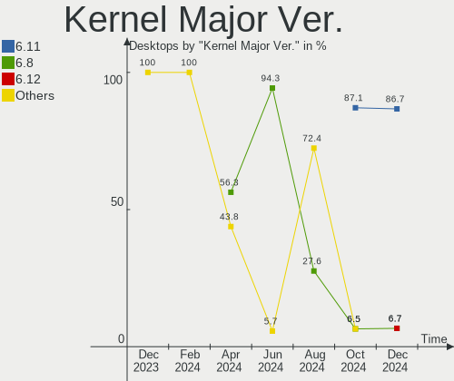
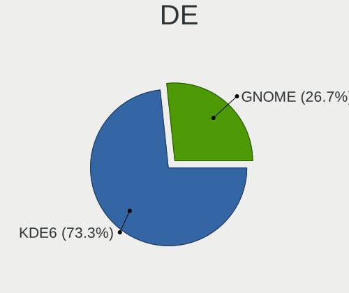
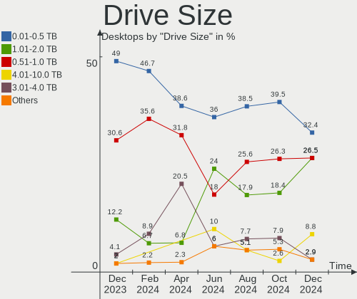
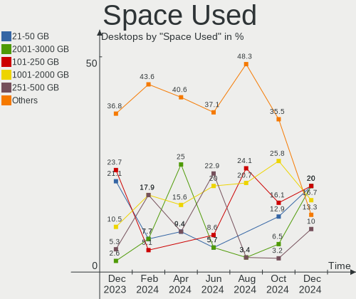
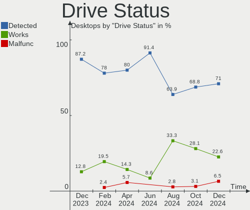
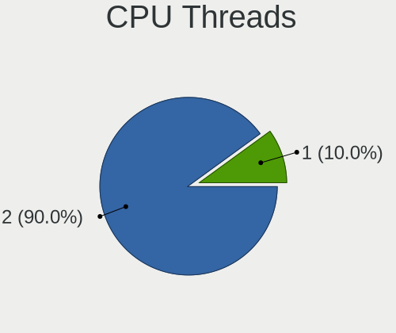
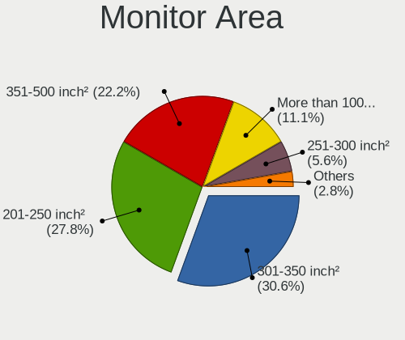
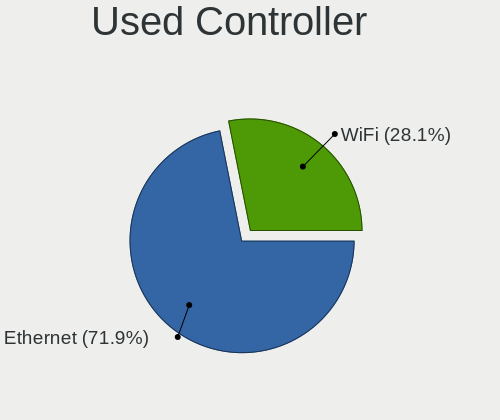
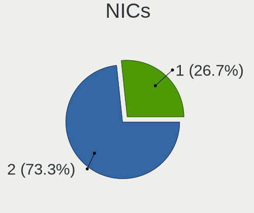
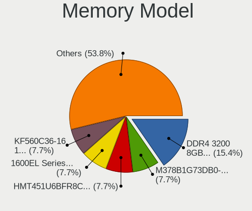

Nobara - Hardware Trends (Desktops)
-----------------------------------

A project to identify most popular hardware characteristics and track their change
over time based on data collected by Linux users at https://Linux-Hardware.org.

Anyone can contribute to this report by the [hw-probe](https://github.com/linuxhw/hw-probe) tool:

    sudo -E hw-probe -all -upload

This report is for one last month. Overall report since the beginning of time: [TestDays](https://github.com/linuxhw/TestDays)

Period: Apr, 2024.

Contents
--------

* [ System ](#system)
  - [ OS                       ](#os)
  - [ OS Family                ](#os-family)
  - [ Kernel                   ](#kernel)
  - [ Kernel Family            ](#kernel-family)
  - [ Kernel Major Ver.        ](#kernel-major-ver)
  - [ Arch                     ](#arch)
  - [ DE                       ](#de)
  - [ Display Server           ](#display-server)
  - [ Display Manager          ](#display-manager)
  - [ OS Lang                  ](#os-lang)
  - [ Boot Mode                ](#boot-mode)
  - [ Filesystem               ](#filesystem)
  - [ Part. scheme             ](#part-scheme)
  - [ Dual Boot with Linux/BSD ](#dual-boot-with-linuxbsd)
  - [ Dual Boot (Win)          ](#dual-boot-win)

* [ Board ](#board)
  - [ Vendor                   ](#vendor)
  - [ Model                    ](#model)
  - [ Model Family             ](#model-family)
  - [ MFG Year                 ](#mfg-year)
  - [ Form Factor              ](#form-factor)
  - [ Secure Boot              ](#secure-boot)
  - [ Coreboot                 ](#coreboot)
  - [ RAM Size                 ](#ram-size)
  - [ RAM Used                 ](#ram-used)
  - [ Total Drives             ](#total-drives)
  - [ Has CD-ROM               ](#has-cd-rom)
  - [ Has Ethernet             ](#has-ethernet)
  - [ Has WiFi                 ](#has-wifi)
  - [ Has Bluetooth            ](#has-bluetooth)

* [ Location ](#location)
  - [ Country                  ](#country)
  - [ City                     ](#city)

* [ Drives ](#drives)
  - [ Drive Vendor             ](#drive-vendor)
  - [ Drive Model              ](#drive-model)
  - [ HDD Vendor               ](#hdd-vendor)
  - [ SSD Vendor               ](#ssd-vendor)
  - [ Drive Kind               ](#drive-kind)
  - [ Drive Connector          ](#drive-connector)
  - [ Drive Size               ](#drive-size)
  - [ Space Total              ](#space-total)
  - [ Space Used               ](#space-used)
  - [ Malfunc. Drives          ](#malfunc-drives)
  - [ Malfunc. Drive Vendor    ](#malfunc-drive-vendor)
  - [ Malfunc. HDD Vendor      ](#malfunc-hdd-vendor)
  - [ Malfunc. Drive Kind      ](#malfunc-drive-kind)
  - [ Failed Drives            ](#failed-drives)
  - [ Failed Drive Vendor      ](#failed-drive-vendor)
  - [ Drive Status             ](#drive-status)

* [ Storage controller ](#storage-controller)
  - [ Storage Vendor           ](#storage-vendor)
  - [ Storage Model            ](#storage-model)
  - [ Storage Kind             ](#storage-kind)

* [ Processor ](#processor)
  - [ CPU Vendor               ](#cpu-vendor)
  - [ CPU Model                ](#cpu-model)
  - [ CPU Model Family         ](#cpu-model-family)
  - [ CPU Cores                ](#cpu-cores)
  - [ CPU Sockets              ](#cpu-sockets)
  - [ CPU Threads              ](#cpu-threads)
  - [ CPU Op-Modes             ](#cpu-op-modes)
  - [ CPU Microcode            ](#cpu-microcode)
  - [ CPU Microarch            ](#cpu-microarch)

* [ Graphics ](#graphics)
  - [ GPU Vendor               ](#gpu-vendor)
  - [ GPU Model                ](#gpu-model)
  - [ GPU Combo                ](#gpu-combo)
  - [ GPU Driver               ](#gpu-driver)
  - [ GPU Memory               ](#gpu-memory)

* [ Monitor ](#monitor)
  - [ Monitor Vendor           ](#monitor-vendor)
  - [ Monitor Model            ](#monitor-model)
  - [ Monitor Resolution       ](#monitor-resolution)
  - [ Monitor Diagonal         ](#monitor-diagonal)
  - [ Monitor Width            ](#monitor-width)
  - [ Aspect Ratio             ](#aspect-ratio)
  - [ Monitor Area             ](#monitor-area)
  - [ Pixel Density            ](#pixel-density)
  - [ Multiple Monitors        ](#multiple-monitors)

* [ Network ](#network)
  - [ Net Controller Vendor    ](#net-controller-vendor)
  - [ Net Controller Model     ](#net-controller-model)
  - [ Wireless Vendor          ](#wireless-vendor)
  - [ Wireless Model           ](#wireless-model)
  - [ Ethernet Vendor          ](#ethernet-vendor)
  - [ Ethernet Model           ](#ethernet-model)
  - [ Net Controller Kind      ](#net-controller-kind)
  - [ Used Controller          ](#used-controller)
  - [ NICs                     ](#nics)
  - [ IPv6                     ](#ipv6)

* [ Bluetooth ](#bluetooth)
  - [ Bluetooth Vendor         ](#bluetooth-vendor)
  - [ Bluetooth Model          ](#bluetooth-model)

* [ Sound ](#sound)
  - [ Sound Vendor             ](#sound-vendor)
  - [ Sound Model              ](#sound-model)

* [ Memory ](#memory)
  - [ Memory Vendor            ](#memory-vendor)
  - [ Memory Model             ](#memory-model)
  - [ Memory Kind              ](#memory-kind)
  - [ Memory Form Factor       ](#memory-form-factor)
  - [ Memory Size              ](#memory-size)
  - [ Memory Speed             ](#memory-speed)

* [ Printers & scanners ](#printers--scanners)
  - [ Printer Vendor           ](#printer-vendor)
  - [ Printer Model            ](#printer-model)
  - [ Scanner Vendor           ](#scanner-vendor)
  - [ Scanner Model            ](#scanner-model)

* [ Camera ](#camera)
  - [ Camera Vendor            ](#camera-vendor)
  - [ Camera Model             ](#camera-model)

* [ Security ](#security)
  - [ Fingerprint Vendor       ](#fingerprint-vendor)
  - [ Fingerprint Model        ](#fingerprint-model)
  - [ Chipcard Vendor          ](#chipcard-vendor)
  - [ Chipcard Model           ](#chipcard-model)

* [ Unsupported ](#unsupported)
  - [ Unsupported Devices      ](#unsupported-devices)
  - [ Unsupported Device Types ](#unsupported-device-types)

System
------

OS
--

Installed operating systems

| Name      | Desktops | Percent |
|-----------|----------|---------|
| Nobara 39 | 30       | 96.77%  |
| Nobara 38 | 1        | 3.23%   |

OS Family
---------

OS without a version

| Name   | Desktops | Percent |
|--------|----------|---------|
| Nobara | 31       | 100%    |

Kernel
------

Version of the Linux kernel

| Version                      | Desktops | Percent |
|------------------------------|----------|---------|
| 6.8.5-201.fsync.fc39.x86_64  | 10       | 32.26%  |
| 6.7.6-201.fsync.fc39.x86_64  | 10       | 32.26%  |
| 6.8.7-200.fsync.fc39.x86_64  | 3        | 9.68%   |
| 6.8.2-201.fsync.fc39.x86_64  | 3        | 9.68%   |
| 6.7.0-204.fsync.fc39.x86_64  | 2        | 6.45%   |
| 6.8.7-201.fsync.fc39.x86_64  | 1        | 3.23%   |
| 6.7.5-200.fsync.fc39.x86_64  | 1        | 3.23%   |
| 6.4.10-202.fsync.fc38.x86_64 | 1        | 3.23%   |

Kernel Family
-------------

Linux kernel without a distro release

| Version | Desktops | Percent |
|---------|----------|---------|
| 6.8.5   | 10       | 32.26%  |
| 6.7.6   | 10       | 32.26%  |
| 6.8.7   | 4        | 12.9%   |
| 6.8.2   | 3        | 9.68%   |
| 6.7.0   | 2        | 6.45%   |
| 6.7.5   | 1        | 3.23%   |
| 6.4.10  | 1        | 3.23%   |

Kernel Major Ver.
-----------------

Linux kernel major version

| Version | Desktops | Percent |
|---------|----------|---------|
| 6.8     | 17       | 54.84%  |
| 6.7     | 13       | 41.94%  |
| 6.4     | 1        | 3.23%   |

Arch
----

OS architecture (x86_64, i586, etc.)

| Name   | Desktops | Percent |
|--------|----------|---------|
| x86_64 | 31       | 100%    |

DE
--

Desktop Environment

| Name  | Desktops | Percent |
|-------|----------|---------|
| KDE6  | 22       | 70.97%  |
| GNOME | 6        | 19.35%  |
| KDE5  | 3        | 9.68%   |

Display Server
--------------

X11 or Wayland

| Name    | Desktops | Percent |
|---------|----------|---------|
| Wayland | 27       | 87.1%   |
| X11     | 4        | 12.9%   |

Display Manager
---------------

SDDM, LightDM, etc.

| Name    | Desktops | Percent |
|---------|----------|---------|
| Unknown | 26       | 83.87%  |
| SDDM    | 5        | 16.13%  |

OS Lang
-------

Language

| Lang  | Desktops | Percent |
|-------|----------|---------|
| en_US | 13       | 41.94%  |
| de_DE | 9        | 29.03%  |
| en_GB | 4        | 12.9%   |
| pt_BR | 1        | 3.23%   |
| pl_PL | 1        | 3.23%   |
| fr_BE | 1        | 3.23%   |
| es_MX | 1        | 3.23%   |
| ca_ES | 1        | 3.23%   |

Boot Mode
---------

EFI or BIOS

| Mode | Desktops | Percent |
|------|----------|---------|
| EFI  | 22       | 70.97%  |
| BIOS | 9        | 29.03%  |

Filesystem
----------

Type of filesystem

| Type  | Desktops | Percent |
|-------|----------|---------|
| Btrfs | 29       | 93.55%  |
| Ext4  | 2        | 6.45%   |

Part. scheme
------------

Scheme of partitioning

| Type    | Desktops | Percent |
|---------|----------|---------|
| Unknown | 26       | 83.87%  |
| GPT     | 5        | 16.13%  |

Dual Boot with Linux/BSD
------------------------

Hosting more than one Linux/BSD

| Dual boot | Desktops | Percent |
|-----------|----------|---------|
| No        | 30       | 96.77%  |
| Yes       | 1        | 3.23%   |

Dual Boot (Win)
---------------

Hosting Linux and Windows

| Dual boot | Desktops | Percent |
|-----------|----------|---------|
| No        | 29       | 93.55%  |
| Yes       | 2        | 6.45%   |

Board
-----

Vendor
------

Motherboard manufacturer

| Name                | Desktops | Percent |
|---------------------|----------|---------|
| MSI                 | 9        | 29.03%  |
| ASUSTek Computer    | 7        | 22.58%  |
| Gigabyte Technology | 5        | 16.13%  |
| Hewlett-Packard     | 3        | 9.68%   |
| ASRock              | 2        | 6.45%   |
| NZXT                | 1        | 3.23%   |
| HC Technology.      | 1        | 3.23%   |
| Biostar             | 1        | 3.23%   |
| Apple               | 1        | 3.23%   |
| ANGXUN              | 1        | 3.23%   |

Model
-----

Motherboard model

| Name                                 | Desktops | Percent |
|--------------------------------------|----------|---------|
| MSI MS-7C56                          | 3        | 9.68%   |
| MSI MS-7C35                          | 2        | 6.45%   |
| NZXT N7 B550                         | 1        | 3.23%   |
| MSI MS-7D76                          | 1        | 3.23%   |
| MSI MS-7D75                          | 1        | 3.23%   |
| MSI MS-7D73                          | 1        | 3.23%   |
| MSI MS-7977                          | 1        | 3.23%   |
| HP Z820 Workstation                  | 1        | 3.23%   |
| HP ProDesk 600 G1 SFF                | 1        | 3.23%   |
| HP Pavilion Gaming Desktop TG01-2xxx | 1        | 3.23%   |
| HC Technology. HCAR4000-MI           | 1        | 3.23%   |
| Gigabyte Z370 HD3-OP                 | 1        | 3.23%   |
| Gigabyte Z370 AORUS ULTRA GAMING 2.0 | 1        | 3.23%   |
| Gigabyte X570 AORUS MASTER           | 1        | 3.23%   |
| Gigabyte X570 AORUS ELITE WIFI       | 1        | 3.23%   |
| Gigabyte B650M AORUS ELITE AX        | 1        | 3.23%   |
| Biostar TP43E Combo                  | 1        | 3.23%   |
| ASUS TUF Gaming X670E-PLUS WIFI      | 1        | 3.23%   |
| ASUS ROG Maximus XI HERO             | 1        | 3.23%   |
| ASUS Rampage IV BLACK EDITION        | 1        | 3.23%   |
| ASUS Pro WS X570-ACE                 | 1        | 3.23%   |
| ASUS PRIME B450M-A                   | 1        | 3.23%   |
| ASUS CROSSHAIR VI HERO               | 1        | 3.23%   |
| ASUS All Series                      | 1        | 3.23%   |
| ASRock B650M Pro RS                  | 1        | 3.23%   |
| ASRock B450M-HDV R4.0                | 1        | 3.23%   |
| Apple MacPro5,1                      | 1        | 3.23%   |
| ANGXUN X99 V1.0                      | 1        | 3.23%   |

Model Family
------------

Motherboard model prefix

| Name                       | Desktops | Percent |
|----------------------------|----------|---------|
| MSI MS-7C56                | 3        | 9.68%   |
| MSI MS-7C35                | 2        | 6.45%   |
| Gigabyte Z370              | 2        | 6.45%   |
| Gigabyte X570              | 2        | 6.45%   |
| NZXT N7                    | 1        | 3.23%   |
| MSI MS-7D76                | 1        | 3.23%   |
| MSI MS-7D75                | 1        | 3.23%   |
| MSI MS-7D73                | 1        | 3.23%   |
| MSI MS-7977                | 1        | 3.23%   |
| HP Z820                    | 1        | 3.23%   |
| HP ProDesk                 | 1        | 3.23%   |
| HP Pavilion                | 1        | 3.23%   |
| HC Technology. HCAR4000-MI | 1        | 3.23%   |
| Gigabyte B650M             | 1        | 3.23%   |
| Biostar TP43E              | 1        | 3.23%   |
| ASUS TUF                   | 1        | 3.23%   |
| ASUS ROG                   | 1        | 3.23%   |
| ASUS Rampage               | 1        | 3.23%   |
| ASUS Pro                   | 1        | 3.23%   |
| ASUS PRIME                 | 1        | 3.23%   |
| ASUS CROSSHAIR             | 1        | 3.23%   |
| ASUS All                   | 1        | 3.23%   |
| ASRock B650M               | 1        | 3.23%   |
| ASRock B450M-HDV           | 1        | 3.23%   |
| Apple MacPro5              | 1        | 3.23%   |
| ANGXUN X99                 | 1        | 3.23%   |

MFG Year
--------

Motherboard manufacture year

| Year | Desktops | Percent |
|------|----------|---------|
| 2022 | 7        | 22.58%  |
| 2020 | 4        | 12.9%   |
| 2019 | 4        | 12.9%   |
| 2018 | 4        | 12.9%   |
| 2023 | 3        | 9.68%   |
| 2021 | 3        | 9.68%   |
| 2010 | 2        | 6.45%   |
| 2015 | 1        | 3.23%   |
| 2014 | 1        | 3.23%   |
| 2013 | 1        | 3.23%   |
| 2012 | 1        | 3.23%   |

Form Factor
-----------

Physical design of the computer

| Name    | Desktops | Percent |
|---------|----------|---------|
| Desktop | 31       | 100%    |

Secure Boot
-----------

Enabled or disabled

| State    | Desktops | Percent |
|----------|----------|---------|
| Disabled | 31       | 100%    |

Coreboot
--------

Have coreboot on board

| Used | Desktops | Percent |
|------|----------|---------|
| No   | 31       | 100%    |

RAM Size
--------

Total RAM memory

| Size in GB  | Desktops | Percent |
|-------------|----------|---------|
| 32.01-64.0  | 9        | 29.03%  |
| 64.01-256.0 | 9        | 29.03%  |
| 16.01-24.0  | 5        | 16.13%  |
| 8.01-16.0   | 5        | 16.13%  |
| 24.01-32.0  | 2        | 6.45%   |
| 3.01-4.0    | 1        | 3.23%   |

RAM Used
--------

Used RAM memory

| Used GB    | Desktops | Percent |
|------------|----------|---------|
| 4.01-8.0   | 10       | 32.26%  |
| 3.01-4.0   | 10       | 32.26%  |
| 2.01-3.0   | 5        | 16.13%  |
| 16.01-24.0 | 2        | 6.45%   |
| 1.01-2.0   | 2        | 6.45%   |
| 8.01-16.0  | 2        | 6.45%   |

Total Drives
------------

Number of drives on board

| Drives | Desktops | Percent |
|--------|----------|---------|
| 2      | 7        | 22.58%  |
| 3      | 6        | 19.35%  |
| 1      | 6        | 19.35%  |
| 4      | 5        | 16.13%  |
| 5      | 4        | 12.9%   |
| 6      | 2        | 6.45%   |
| 7      | 1        | 3.23%   |

Has CD-ROM
----------

Has CD-ROM on board

| Presented | Desktops | Percent |
|-----------|----------|---------|
| No        | 24       | 77.42%  |
| Yes       | 7        | 22.58%  |

Has Ethernet
------------

Has Ethernet on board

| Presented | Desktops | Percent |
|-----------|----------|---------|
| Yes       | 31       | 100%    |

Has WiFi
--------

Has WiFi module

| Presented | Desktops | Percent |
|-----------|----------|---------|
| Yes       | 23       | 74.19%  |
| No        | 8        | 25.81%  |

Has Bluetooth
-------------

Has Bluetooth module

| Presented | Desktops | Percent |
|-----------|----------|---------|
| Yes       | 22       | 70.97%  |
| No        | 9        | 29.03%  |

Location
--------

Country
-------

Geographic location (country)

| Country   | Desktops | Percent |
|-----------|----------|---------|
| USA       | 12       | 38.71%  |
| Germany   | 9        | 29.03%  |
| Poland    | 2        | 6.45%   |
| India     | 2        | 6.45%   |
| Brazil    | 2        | 6.45%   |
| Spain     | 1        | 3.23%   |
| Belgium   | 1        | 3.23%   |
| Australia | 1        | 3.23%   |
| Argentina | 1        | 3.23%   |

City
----

Geographic location (city)

| City                 | Desktops | Percent |
|----------------------|----------|---------|
| Kansas City          | 3        | 9.68%   |
| Winsen               | 1        | 3.23%   |
| Wiehl                | 1        | 3.23%   |
| Westbrook            | 1        | 3.23%   |
| Warsaw               | 1        | 3.23%   |
| Tenczynek            | 1        | 3.23%   |
| Sumaré              | 1        | 3.23%   |
| Selinsgrove          | 1        | 3.23%   |
| Satna                | 1        | 3.23%   |
| Saint Paul           | 1        | 3.23%   |
| Riverdale            | 1        | 3.23%   |
| Rabade               | 1        | 3.23%   |
| Provo                | 1        | 3.23%   |
| Perth                | 1        | 3.23%   |
| Novo Hamburgo        | 1        | 3.23%   |
| Munchberg            | 1        | 3.23%   |
| Moreno               | 1        | 3.23%   |
| Los Angeles          | 1        | 3.23%   |
| Koblenz              | 1        | 3.23%   |
| Holly Springs        | 1        | 3.23%   |
| Hanover              | 1        | 3.23%   |
| Haag in Oberbayern   | 1        | 3.23%   |
| Düsseldorf          | 1        | 3.23%   |
| Denver               | 1        | 3.23%   |
| Brussels             | 1        | 3.23%   |
| Bietigheim-Bissingen | 1        | 3.23%   |
| Berlin               | 1        | 3.23%   |
| Bengaluru            | 1        | 3.23%   |
| Bay Shore            | 1        | 3.23%   |

Drives
------

Drive Vendor
------------

Hard drive vendors

| Vendor                       | Desktops | Drives | Percent |
|------------------------------|----------|--------|---------|
| Samsung Electronics          | 12       | 16     | 14.81%  |
| WDC                          | 9        | 13     | 11.11%  |
| Seagate                      | 9        | 13     | 11.11%  |
| Phison Electronics           | 7        | 8      | 8.64%   |
| Crucial                      | 5        | 6      | 6.17%   |
| Hitachi                      | 4        | 4      | 4.94%   |
| China                        | 4        | 4      | 4.94%   |
| Toshiba                      | 3        | 3      | 3.7%    |
| Sandisk                      | 3        | 3      | 3.7%    |
| Shenzhen Longsys Electronics | 2        | 3      | 2.47%   |
| Realtek Semiconductor        | 2        | 2      | 2.47%   |
| Micron/Crucial Technology    | 2        | 3      | 2.47%   |
| Micron Technology            | 2        | 2      | 2.47%   |
| Intel                        | 2        | 2      | 2.47%   |
| HGST                         | 2        | 2      | 2.47%   |
| SK hynix                     | 1        | 1      | 1.23%   |
| PNY                          | 1        | 1      | 1.23%   |
| Patriot                      | 1        | 1      | 1.23%   |
| Maxtor                       | 1        | 1      | 1.23%   |
| KingSpec                     | 1        | 1      | 1.23%   |
| JMicron Technology           | 1        | 1      | 1.23%   |
| IBM                          | 1        | 1      | 1.23%   |
| HL-DT-ST                     | 1        | 1      | 1.23%   |
| GOODRAM                      | 1        | 1      | 1.23%   |
| FIKWOT                       | 1        | 1      | 1.23%   |
| Corsair                      | 1        | 1      | 1.23%   |
| ADATA Technology             | 1        | 1      | 1.23%   |
| ACASIS                       | 1        | 1      | 1.23%   |

Drive Model
-----------

Hard drive models

| Model                                              | Desktops | Percent |
|----------------------------------------------------|----------|---------|
| Phison E16 PCIe4 NVMe Controller 1TB               | 4        | 4.3%    |
| Seagate ST4000DM004-2CV104 4TB                     | 3        | 3.23%   |
| Samsung NVMe SSD Controller SM981/PM981/PM983 1TB  | 3        | 3.23%   |
| Crucial CT1000MX500SSD1 1TB                        | 3        | 3.23%   |
| Samsung SSD 850 EVO 500GB                          | 2        | 2.15%   |
| Samsung NVMe SSD Controller PM9A1/PM9A3/980PRO 1TB | 2        | 2.15%   |
| Phison E12 NVMe Controller 2TB                     | 2        | 2.15%   |
| Micron/Crucial P2 NVMe PCIe SSD 4TB                | 2        | 2.15%   |
| Hitachi HDS721010CLA332 1TB                        | 2        | 2.15%   |
| WDC WDS500G2B0A-00SM50 500GB SSD                   | 1        | 1.08%   |
| WDC WDS500G2B0A 500GB SSD                          | 1        | 1.08%   |
| WDC WDS100T2B0A-00SM50 1TB SSD                     | 1        | 1.08%   |
| WDC WD5000AAKX-001CA0 500GB                        | 1        | 1.08%   |
| WDC WD5000AACS-00G8B1 500GB                        | 1        | 1.08%   |
| WDC WD40EZRX-00SPEB0 4TB                           | 1        | 1.08%   |
| WDC WD2500AAKX-753CA1 250GB                        | 1        | 1.08%   |
| WDC WD20EZRZ-00Z5HB0 2TB                           | 1        | 1.08%   |
| WDC WD20EARS-00MVWB0 2TB                           | 1        | 1.08%   |
| WDC WD10EZEX-21M2NA0 1TB                           | 1        | 1.08%   |
| WDC WD10EZEX-00WN4A0 1TB                           | 1        | 1.08%   |
| WDC WD10EZEX-00BN5A0 1TB                           | 1        | 1.08%   |
| WDC WD1001FALS-41K1B0 1TB                          | 1        | 1.08%   |
| Toshiba XG6 NVMe SSD Controller 1024GB             | 1        | 1.08%   |
| Toshiba TR200 240GB SSD                            | 1        | 1.08%   |
| Toshiba MK8052GSX 80GB                             | 1        | 1.08%   |
| SK hynix SHGS31-500GS-2 500GB SSD                  | 1        | 1.08%   |
| Shenzhen Longsys Lexar SSD NM710 2TB               | 1        | 1.08%   |
| Shenzhen Longsys Lexar SSD NM710 1TB               | 1        | 1.08%   |
| Seagate ST3750528AS 752GB                          | 1        | 1.08%   |
| Seagate ST3500413AS 500GB                          | 1        | 1.08%   |
| Seagate ST3000DM001-1CH166 3TB                     | 1        | 1.08%   |
| Seagate ST2000DM008-2FR102 2TB                     | 1        | 1.08%   |
| Seagate ST1000LM048-2E7172 1TB                     | 1        | 1.08%   |
| Seagate ST1000DM010-2EP102 1TB                     | 1        | 1.08%   |
| Seagate One Touch HDD 5TB                          | 1        | 1.08%   |
| Seagate Expansion 2TB                              | 1        | 1.08%   |
| Seagate Backup+ Hub BK 8TB                         | 1        | 1.08%   |
| Sandisk WD_BLACK SN770 2TB                         | 1        | 1.08%   |
| Sandisk WD Blue SN550 NVMe SSD 2TB                 | 1        | 1.08%   |
| Sandisk WD Black NVMe SSD 256GB                    | 1        | 1.08%   |

HDD Vendor
----------

Hard disk drive vendors

| Vendor              | Desktops | Drives | Percent |
|---------------------|----------|--------|---------|
| Seagate             | 9        | 13     | 33.33%  |
| WDC                 | 8        | 10     | 29.63%  |
| Hitachi             | 4        | 4      | 14.81%  |
| HGST                | 2        | 2      | 7.41%   |
| Toshiba             | 1        | 1      | 3.7%    |
| Samsung Electronics | 1        | 1      | 3.7%    |
| Maxtor              | 1        | 1      | 3.7%    |
| ACASIS              | 1        | 1      | 3.7%    |

SSD Vendor
----------

Solid state drive vendors

| Vendor              | Desktops | Drives | Percent |
|---------------------|----------|--------|---------|
| Samsung Electronics | 7        | 8      | 28%     |
| Crucial             | 5        | 6      | 20%     |
| China               | 3        | 3      | 12%     |
| WDC                 | 2        | 3      | 8%      |
| Toshiba             | 1        | 1      | 4%      |
| SK hynix            | 1        | 1      | 4%      |
| PNY                 | 1        | 1      | 4%      |
| Patriot             | 1        | 1      | 4%      |
| KingSpec            | 1        | 1      | 4%      |
| Intel               | 1        | 1      | 4%      |
| GOODRAM             | 1        | 1      | 4%      |
| Corsair             | 1        | 1      | 4%      |

Drive Kind
----------

HDD or SSD

| Kind    | Desktops | Drives | Percent |
|---------|----------|--------|---------|
| NVMe    | 21       | 31     | 35.59%  |
| SSD     | 17       | 28     | 28.81%  |
| HDD     | 17       | 33     | 28.81%  |
| Unknown | 4        | 5      | 6.78%   |

Drive Connector
---------------

SATA, SAS, NVMe, etc.

| Type | Desktops | Drives | Percent |
|------|----------|--------|---------|
| NVMe | 21       | 31     | 42%     |
| SATA | 21       | 57     | 42%     |
| SAS  | 8        | 9      | 16%     |

Drive Size
----------

Size of hard drive

| Size in TB | Desktops | Drives | Percent |
|------------|----------|--------|---------|
| 0.01-0.5   | 18       | 28     | 42.86%  |
| 0.51-1.0   | 12       | 19     | 28.57%  |
| 3.01-4.0   | 5        | 7      | 11.9%   |
| 1.01-2.0   | 4        | 4      | 9.52%   |
| 4.01-10.0  | 2        | 2      | 4.76%   |
| 2.01-3.0   | 1        | 1      | 2.38%   |

Space Total
-----------

Amount of disk space available on the file system

| Size in GB     | Desktops | Percent |
|----------------|----------|---------|
| More than 3000 | 19       | 61.29%  |
| 2001-3000      | 4        | 12.9%   |
| 1001-2000      | 4        | 12.9%   |
| 501-1000       | 2        | 6.45%   |
| 251-500        | 1        | 3.23%   |
| 101-250        | 1        | 3.23%   |

Space Used
----------

Amount of used disk space

| Used GB        | Desktops | Percent |
|----------------|----------|---------|
| 2001-3000      | 7        | 22.58%  |
| More than 3000 | 6        | 19.35%  |
| 501-1000       | 6        | 19.35%  |
| 1001-2000      | 5        | 16.13%  |
| 251-500        | 3        | 9.68%   |
| 21-50          | 3        | 9.68%   |
| 1-20           | 1        | 3.23%   |

Malfunc. Drives
---------------

Drive models with a malfunction

| Model                    | Desktops | Drives | Percent |
|--------------------------|----------|--------|---------|
| WDC WD20EZRZ-00Z5HB0 2TB | 1        | 1      | 50%     |
| Toshiba MK8052GSX 80GB   | 1        | 1      | 50%     |

Malfunc. Drive Vendor
---------------------

Vendors of faulty drives

| Vendor  | Desktops | Drives | Percent |
|---------|----------|--------|---------|
| WDC     | 1        | 1      | 50%     |
| Toshiba | 1        | 1      | 50%     |

Malfunc. HDD Vendor
-------------------

Vendors of faulty HDD drives

| Vendor  | Desktops | Drives | Percent |
|---------|----------|--------|---------|
| WDC     | 1        | 1      | 50%     |
| Toshiba | 1        | 1      | 50%     |

Malfunc. Drive Kind
-------------------

Kinds of faulty drives

| Kind | Desktops | Drives | Percent |
|------|----------|--------|---------|
| HDD  | 2        | 2      | 100%    |

Failed Drives
-------------

Failed drive models

Zero info for selected period =(

Failed Drive Vendor
-------------------

Failed drive vendors

Zero info for selected period =(

Drive Status
------------

Number of failed and malfunc. drives

| Status   | Desktops | Drives | Percent |
|----------|----------|--------|---------|
| Detected | 27       | 81     | 79.41%  |
| Works    | 5        | 14     | 14.71%  |
| Malfunc  | 2        | 2      | 5.88%   |

Storage controller
------------------

Storage Vendor
--------------

Storage controller vendors

| Vendor                       | Desktops | Percent |
|------------------------------|----------|---------|
| AMD                          | 19       | 30.16%  |
| Intel                        | 12       | 19.05%  |
| Phison Electronics           | 7        | 11.11%  |
| Samsung Electronics          | 6        | 9.52%   |
| SanDisk                      | 3        | 4.76%   |
| ASMedia Technology           | 3        | 4.76%   |
| Shenzhen Longsys Electronics | 2        | 3.17%   |
| Realtek Semiconductor        | 2        | 3.17%   |
| Micron/Crucial Technology    | 2        | 3.17%   |
| Micron Technology            | 2        | 3.17%   |
| Toshiba America Info Systems | 1        | 1.59%   |
| JMicron Technology           | 1        | 1.59%   |
| Hewlett-Packard              | 1        | 1.59%   |
| Broadcom / LSI               | 1        | 1.59%   |
| ADATA Technology             | 1        | 1.59%   |

Storage Model
-------------

Storage controller models

| Model                                                                          | Desktops | Percent |
|--------------------------------------------------------------------------------|----------|---------|
| AMD FCH SATA Controller [AHCI mode]                                            | 7        | 10.14%  |
| AMD 600 Series Chipset SATA Controller                                         | 6        | 8.7%    |
| Phison E16 PCIe4 NVMe Controller                                               | 4        | 5.8%    |
| AMD 500 Series Chipset SATA Controller                                         | 4        | 5.8%    |
| Samsung NVMe SSD Controller SM981/PM981/PM983                                  | 3        | 4.35%   |
| ASMedia ASM1061/ASM1062 Serial ATA Controller                                  | 3        | 4.35%   |
| AMD 400 Series Chipset SATA Controller                                         | 3        | 4.35%   |
| Shenzhen Longsys Lexar NM790 NVME SSD (DRAM-less)                              | 2        | 2.9%    |
| Samsung NVMe SSD Controller PM9A1/PM9A3/980PRO                                 | 2        | 2.9%    |
| Realtek RTS5765DL NVMe SSD Controller (DRAM-less)                              | 2        | 2.9%    |
| Phison E12 NVMe Controller                                                     | 2        | 2.9%    |
| Micron/Crucial P2 [Nick P2] / P3 / P3 Plus NVMe PCIe SSD (DRAM-less)           | 2        | 2.9%    |
| Intel C600/X79 series chipset 6-Port SATA AHCI Controller                      | 2        | 2.9%    |
| Intel 82801JI (ICH10 Family) SATA AHCI Controller                              | 2        | 2.9%    |
| Intel 8 Series/C220 Series Chipset Family 6-port SATA Controller 1 [AHCI mode] | 2        | 2.9%    |
| Intel 200 Series PCH SATA controller [AHCI mode]                               | 2        | 2.9%    |
| Toshiba America Info Systems XG6 NVMe SSD Controller                           | 1        | 1.45%   |
| SanDisk WD Black SN770 / PC SN740 256GB / PC SN560 (DRAM-less) NVMe SSD        | 1        | 1.45%   |
| SanDisk WD Black NVMe SSD                                                      | 1        | 1.45%   |
| SanDisk Ultra 3D / WD Blue SN550 NVMe SSD                                      | 1        | 1.45%   |
| Samsung NVMe SSD Controller SM961/PM961/SM963                                  | 1        | 1.45%   |
| Samsung NVMe SSD Controller S4LV008[Pascal]                                    | 1        | 1.45%   |
| Phison E18 PCIe4 NVMe Controller                                               | 1        | 1.45%   |
| Micron 2550 NVMe SSD (DRAM-less)                                               | 1        | 1.45%   |
| Micron 2300 NVMe SSD [Santana]                                                 | 1        | 1.45%   |
| JMicron JMB368 IDE controller                                                  | 1        | 1.45%   |
| Intel SSD 660P Series                                                          | 1        | 1.45%   |
| Intel Q170/Q150/B150/H170/H110/Z170/CM236 Chipset SATA Controller [AHCI Mode]  | 1        | 1.45%   |
| Intel Cannon Lake PCH SATA AHCI Controller                                     | 1        | 1.45%   |
| Intel C602 chipset 4-Port SATA Storage Control Unit                            | 1        | 1.45%   |
| Intel C600/X79 series chipset IDE-r Controller                                 | 1        | 1.45%   |
| Intel 9 Series Chipset Family SATA Controller [AHCI Mode]                      | 1        | 1.45%   |
| HP Smart Array Gen9 Controllers                                                | 1        | 1.45%   |
| Broadcom / LSI SAS2308 PCI-Express Fusion-MPT SAS-2                            | 1        | 1.45%   |
| AMD X370 Series Chipset SATA Controller                                        | 1        | 1.45%   |
| AMD RS690 PCI to PCI Bridge (PCI Express Port 2)                               | 1        | 1.45%   |
| ADATA A Non-Volatile memory controller                                         | 1        | 1.45%   |

Storage Kind
------------

Kind of storage controller (IDE, SATA, NVMe, SAS, ...)

| Kind | Desktops | Percent |
|------|----------|---------|
| SATA | 29       | 53.7%   |
| NVMe | 21       | 38.89%  |
| IDE  | 2        | 3.7%    |
| RAID | 1        | 1.85%   |
| SAS  | 1        | 1.85%   |

Processor
---------

CPU Vendor
----------

Processor vendors

| Vendor | Desktops | Percent |
|--------|----------|---------|
| AMD    | 20       | 64.52%  |
| Intel  | 11       | 35.48%  |

CPU Model
---------

Processor models

| Model                                  | Desktops | Percent |
|----------------------------------------|----------|---------|
| AMD Ryzen 7 3700X 8-Core Processor     | 3        | 9.68%   |
| AMD Ryzen 7 7800X3D 8-Core Processor   | 2        | 6.45%   |
| AMD Ryzen 7 5800X3D 8-Core Processor   | 2        | 6.45%   |
| Intel Xeon CPU X5677 @ 3.47GHz         | 1        | 3.23%   |
| Intel Xeon CPU E5-2670 v3 @ 2.30GHz    | 1        | 3.23%   |
| Intel Xeon CPU E5-2667 v2 @ 3.30GHz    | 1        | 3.23%   |
| Intel Core i9-9900K CPU @ 3.60GHz      | 1        | 3.23%   |
| Intel Core i7-8086K CPU @ 4.00GHz      | 1        | 3.23%   |
| Intel Core i7-6700K CPU @ 4.00GHz      | 1        | 3.23%   |
| Intel Core i7-4790K CPU @ 4.00GHz      | 1        | 3.23%   |
| Intel Core i7-4770 CPU @ 3.40GHz       | 1        | 3.23%   |
| Intel Core i7-3960X CPU @ 3.30GHz      | 1        | 3.23%   |
| Intel Core i5-8400 CPU @ 2.80GHz       | 1        | 3.23%   |
| Intel Core 2 Duo CPU E8500 @ 3.16GHz   | 1        | 3.23%   |
| AMD Ryzen 9 7950X3D 16-Core Processor  | 1        | 3.23%   |
| AMD Ryzen 9 7900 12-Core Processor     | 1        | 3.23%   |
| AMD Ryzen 9 5900X 12-Core Processor    | 1        | 3.23%   |
| AMD Ryzen 7 7700X 8-Core Processor     | 1        | 3.23%   |
| AMD Ryzen 7 5800X 8-Core Processor     | 1        | 3.23%   |
| AMD Ryzen 7 5700X 8-Core Processor     | 1        | 3.23%   |
| AMD Ryzen 7 4800U with Radeon Graphics | 1        | 3.23%   |
| AMD Ryzen 7 3800X 8-Core Processor     | 1        | 3.23%   |
| AMD Ryzen 5 7600X 6-Core Processor     | 1        | 3.23%   |
| AMD Ryzen 5 5600X 6-Core Processor     | 1        | 3.23%   |
| AMD Ryzen 5 5600G with Radeon Graphics | 1        | 3.23%   |
| AMD Ryzen 5 4600G with Radeon Graphics | 1        | 3.23%   |
| AMD Ryzen 5 2600 Six-Core Processor    | 1        | 3.23%   |

CPU Model Family
----------------

Processor model prefix

| Model            | Desktops | Percent |
|------------------|----------|---------|
| AMD Ryzen 7      | 12       | 38.71%  |
| Intel Core i7    | 5        | 16.13%  |
| AMD Ryzen 5      | 5        | 16.13%  |
| Intel Xeon       | 3        | 9.68%   |
| AMD Ryzen 9      | 3        | 9.68%   |
| Intel Core i9    | 1        | 3.23%   |
| Intel Core i5    | 1        | 3.23%   |
| Intel Core 2 Duo | 1        | 3.23%   |

CPU Cores
---------

Number of processor cores

| Number | Desktops | Percent |
|--------|----------|---------|
| 8      | 14       | 45.16%  |
| 6      | 8        | 25.81%  |
| 12     | 3        | 9.68%   |
| 4      | 3        | 9.68%   |
| 16     | 2        | 6.45%   |
| 2      | 1        | 3.23%   |

CPU Sockets
-----------

Number of sockets

| Number | Desktops | Percent |
|--------|----------|---------|
| 1      | 29       | 93.55%  |
| 2      | 2        | 6.45%   |

CPU Threads
-----------

Threads per core (Hyper-Threading)

| Number | Desktops | Percent |
|--------|----------|---------|
| 2      | 28       | 90.32%  |
| 1      | 3        | 9.68%   |

CPU Op-Modes
------------

CPU Operation Modes (32-bit, 64-bit)

| Op mode        | Desktops | Percent |
|----------------|----------|---------|
| 32-bit, 64-bit | 31       | 100%    |

CPU Microcode
-------------

Microcode number

| Number     | Desktops | Percent |
|------------|----------|---------|
| Unknown    | 30       | 96.77%  |
| 0x0a601206 | 1        | 3.23%   |

CPU Microarch
-------------

Microarchitecture

| Name        | Desktops | Percent |
|-------------|----------|---------|
| Zen 3       | 7        | 22.58%  |
| Zen 2       | 6        | 19.35%  |
| Unknown     | 6        | 19.35%  |
| KabyLake    | 3        | 9.68%   |
| Haswell     | 3        | 9.68%   |
| Zen+        | 1        | 3.23%   |
| Westmere    | 1        | 3.23%   |
| Skylake     | 1        | 3.23%   |
| SandyBridge | 1        | 3.23%   |
| Penryn      | 1        | 3.23%   |
| IvyBridge   | 1        | 3.23%   |

Graphics
--------

GPU Vendor
----------

Vendors of graphics cards

| Vendor | Desktops | Percent |
|--------|----------|---------|
| AMD    | 21       | 63.64%  |
| Nvidia | 10       | 30.3%   |
| Intel  | 2        | 6.06%   |

GPU Model
---------

Graphics card models

| Model                                                                       | Desktops | Percent |
|-----------------------------------------------------------------------------|----------|---------|
| AMD Raphael                                                                 | 4        | 10.81%  |
| AMD Navi 10 [Radeon RX 5600 OEM/5600 XT / 5700/5700 XT]                     | 3        | 8.11%   |
| Nvidia GA102 [GeForce RTX 3080 Ti]                                          | 2        | 5.41%   |
| Intel Xeon E3-1200 v3/4th Gen Core Processor Integrated Graphics Controller | 2        | 5.41%   |
| AMD Renoir [Radeon RX Vega 6 (Ryzen 4000/5000 Mobile Series)]               | 2        | 5.41%   |
| AMD Navi 32 [Radeon RX 7700 XT / 7800 XT]                                   | 2        | 5.41%   |
| AMD Navi 31 [Radeon RX 7900 XT/7900 XTX/7900M]                              | 2        | 5.41%   |
| AMD Navi 22 [Radeon RX 6700/6700 XT/6750 XT / 6800M/6850M XT]               | 2        | 5.41%   |
| AMD Navi 21 [Radeon RX 6800/6800 XT / 6900 XT]                              | 2        | 5.41%   |
| Nvidia TU117 [GeForce GTX 1650]                                             | 1        | 2.7%    |
| Nvidia GP106 [GeForce GTX 1060 6GB]                                         | 1        | 2.7%    |
| Nvidia GP104 [GeForce GTX 1070]                                             | 1        | 2.7%    |
| Nvidia GM204GL [Quadro M4000]                                               | 1        | 2.7%    |
| Nvidia GA102 [GeForce RTX 3070 Ti]                                          | 1        | 2.7%    |
| Nvidia AD107 [GeForce RTX 4060]                                             | 1        | 2.7%    |
| Nvidia AD104 [GeForce RTX 4070]                                             | 1        | 2.7%    |
| Nvidia AD102 [GeForce RTX 4090]                                             | 1        | 2.7%    |
| AMD Vega 10 XL/XT [Radeon RX Vega 56/64]                                    | 1        | 2.7%    |
| AMD Polaris 20 XL [Radeon RX 580 2048SP]                                    | 1        | 2.7%    |
| AMD Oland [Radeon HD 8570 / R5 430 OEM / R7 240/340 / Radeon 520 OEM]       | 1        | 2.7%    |
| AMD Navi 14 [Radeon RX 5500/5500M / Pro 5500M]                              | 1        | 2.7%    |
| AMD Ellesmere [Radeon RX 470/480/570/570X/580/580X/590]                     | 1        | 2.7%    |
| AMD Cypress PRO [Radeon HD 5850]                                            | 1        | 2.7%    |
| AMD Cezanne [Radeon Vega Series / Radeon Vega Mobile Series]                | 1        | 2.7%    |
| AMD Bonaire XTX [Radeon R7 260X/360]                                        | 1        | 2.7%    |

GPU Combo
---------

Combinations of graphics cards

| Name         | Desktops | Percent |
|--------------|----------|---------|
| 1 x AMD      | 16       | 51.61%  |
| 1 x Nvidia   | 9        | 29.03%  |
| 2 x AMD      | 4        | 12.9%   |
| 1 x Intel    | 1        | 3.23%   |
| AMD + Nvidia | 1        | 3.23%   |

GPU Driver
----------

Free vs proprietary

| Driver      | Desktops | Percent |
|-------------|----------|---------|
| Free        | 20       | 64.52%  |
| Proprietary | 10       | 32.26%  |
| Unknown     | 1        | 3.23%   |

GPU Memory
----------

Total video memory

| Size in GB | Desktops | Percent |
|------------|----------|---------|
| 7.01-8.0   | 8        | 25.81%  |
| Unknown    | 7        | 22.58%  |
| 8.01-16.0  | 6        | 19.35%  |
| 16.01-24.0 | 3        | 9.68%   |
| 0.01-0.5   | 3        | 9.68%   |
| 1.01-2.0   | 2        | 6.45%   |
| 3.01-4.0   | 1        | 3.23%   |
| 0.51-1.0   | 1        | 3.23%   |

Monitor
-------

Monitor Vendor
--------------

Monitor vendors

| Vendor               | Desktops | Percent |
|----------------------|----------|---------|
| Goldstar             | 7        | 17.07%  |
| Acer                 | 6        | 14.63%  |
| BenQ                 | 5        | 12.2%   |
| Hewlett-Packard      | 3        | 7.32%   |
| AOC                  | 3        | 7.32%   |
| ViewSonic            | 2        | 4.88%   |
| Samsung Electronics  | 2        | 4.88%   |
| Ancor Communications | 2        | 4.88%   |
| Unknown (BBC)        | 1        | 2.44%   |
| Toshiba              | 1        | 2.44%   |
| Sony                 | 1        | 2.44%   |
| Sceptre Tech         | 1        | 2.44%   |
| Pixio                | 1        | 2.44%   |
| Philips              | 1        | 2.44%   |
| Mi                   | 1        | 2.44%   |
| HGC                  | 1        | 2.44%   |
| DENON                | 1        | 2.44%   |
| Dell                 | 1        | 2.44%   |
| Apple                | 1        | 2.44%   |

Monitor Model
-------------

Monitor models

| Model                                                                 | Desktops | Percent |
|-----------------------------------------------------------------------|----------|---------|
| ViewSonic VX3211-2K VSCF634 2560x1440 698x392mm 31.5-inch             | 1        | 2.27%   |
| ViewSonic VX2770 SERIES VSC3A2C 1920x1080 597x336mm 27.0-inch         | 1        | 2.27%   |
| Unknown (BBC) HDP-V104 BBC0104 3840x2160 344x195mm 15.6-inch          | 1        | 2.27%   |
| Toshiba LCD-MONITOR LCD2480 1920x1200 520x320mm 24.0-inch             | 1        | 2.27%   |
| Sony U50 SNY050B 3840x2160 708x398mm 32.0-inch                        | 1        | 2.27%   |
| Sceptre Tech C24 SPT09A7 1920x1080 544x303mm 24.5-inch                | 1        | 2.27%   |
| Samsung Electronics U28E850 SAM0CCB 3840x2160 607x345mm 27.5-inch     | 1        | 2.27%   |
| Samsung Electronics U28E590 SAM0C4E 3840x2160 608x345mm 27.5-inch     | 1        | 2.27%   |
| Samsung Electronics C32JG5x SAM0FDE 2560x1440 697x392mm 31.5-inch     | 1        | 2.27%   |
| Pixio PX329 PNS0329 2560x1440 697x392mm 31.5-inch                     | 1        | 2.27%   |
| Philips PHL 241B8Q PHL0929 1920x1080 527x296mm 23.8-inch              | 1        | 2.27%   |
| Mi Monitor XMI3444 3440x1440 797x334mm 34.0-inch                      | 1        | 2.27%   |
| HGC CR270HDM HGC2700 2560x1440 600x330mm 27.0-inch                    | 1        | 2.27%   |
| Hewlett-Packard X27i HPN3678 2560x1440 597x336mm 27.0-inch            | 1        | 2.27%   |
| Hewlett-Packard E242 HWP326F 1920x1200 518x324mm 24.1-inch            | 1        | 2.27%   |
| Hewlett-Packard E242 HWP326E 1920x1200 518x324mm 24.1-inch            | 1        | 2.27%   |
| Hewlett-Packard 22fw HPN3542 1920x1080 476x267mm 21.5-inch            | 1        | 2.27%   |
| Goldstar ULTRAWIDE GSM76FA 2560x1080 531x298mm 24.0-inch              | 1        | 2.27%   |
| Goldstar ULTRAGEAR+ GSM9E84 3840x2160 1050x590mm 47.4-inch            | 1        | 2.27%   |
| Goldstar ULTRAGEAR GSM778B 2560x1440 697x392mm 31.5-inch              | 1        | 2.27%   |
| Goldstar ULTRAGEAR GSM5BD3 2560x1440 697x392mm 31.5-inch              | 1        | 2.27%   |
| Goldstar ULTRAGEAR GSM5BD2 2560x1440 697x392mm 31.5-inch              | 1        | 2.27%   |
| Goldstar ULTRAGEAR GSM5B71 1920x1080 597x336mm 27.0-inch              | 1        | 2.27%   |
| Goldstar Ultra HD GSM5B09 3840x2160 600x340mm 27.2-inch               | 1        | 2.27%   |
| Goldstar TV SSCR2 GSMC0C8 3840x2160                                   | 1        | 2.27%   |
| DENON AVAMP DON0052 1280x720 708x398mm 32.0-inch                      | 1        | 2.27%   |
| Dell S2721DGF DEL41D9 2560x1440 597x336mm 27.0-inch                   | 1        | 2.27%   |
| BenQ XL2420T BNQ7F06 1920x1080 531x298mm 24.0-inch                    | 1        | 2.27%   |
| BenQ XL2420T BNQ7F05 1920x1080 531x298mm 24.0-inch                    | 1        | 2.27%   |
| BenQ RL2455 BNQ7F1C 1920x1080 531x298mm 24.0-inch                     | 1        | 2.27%   |
| BenQ GW2480 BNQ78E7 1920x1080 527x296mm 23.8-inch                     | 1        | 2.27%   |
| BenQ EX2710S BNQ7FA4 1920x1080 600x340mm 27.2-inch                    | 1        | 2.27%   |
| Apple LED Cinema APP9226 2560x1440 597x336mm 27.0-inch                | 1        | 2.27%   |
| AOC U2879G6 AOC2879 3840x2160 621x341mm 27.9-inch                     | 1        | 2.27%   |
| AOC 27G2G3 AOC2702 1920x1080 598x336mm 27.0-inch                      | 1        | 2.27%   |
| AOC 2260WG5 AOC2260 1920x1080 477x268mm 21.5-inch                     | 1        | 2.27%   |
| Ancor Communications VN279 ACI27A4 1920x1080 597x336mm 27.0-inch      | 1        | 2.27%   |
| Ancor Communications ASUS MX239 ACI23C2 1920x1080 528x310mm 24.1-inch | 1        | 2.27%   |
| Acer XZ342CU S3 ACR0BD5 3440x1440 797x334mm 34.0-inch                 | 1        | 2.27%   |
| Acer XV273K ACR06B1 3840x2160 597x336mm 27.0-inch                     | 1        | 2.27%   |

Monitor Resolution
------------------

Monitor screen resolution

| Resolution        | Desktops | Percent |
|-------------------|----------|---------|
| 1920x1080 (FHD)   | 15       | 38.46%  |
| 3840x2160 (4K)    | 11       | 28.21%  |
| 2560x1440 (QHD)   | 9        | 23.08%  |
| 3440x1440         | 2        | 5.13%   |
| 2560x1080         | 1        | 2.56%   |
| 1920x1200 (WUXGA) | 1        | 2.56%   |

Monitor Diagonal
----------------

Diagonal size in inches

| Inches | Desktops | Percent |
|--------|----------|---------|
| 27     | 15       | 38.46%  |
| 24     | 8        | 20.51%  |
| 31     | 5        | 12.82%  |
| 34     | 3        | 7.69%   |
| 72     | 1        | 2.56%   |
| 59     | 1        | 2.56%   |
| 47     | 1        | 2.56%   |
| 42     | 1        | 2.56%   |
| 32     | 1        | 2.56%   |
| 22     | 1        | 2.56%   |
| 21     | 1        | 2.56%   |
| 15     | 1        | 2.56%   |

Monitor Width
-------------

Physical width

| Width in mm | Desktops | Percent |
|-------------|----------|---------|
| 501-600     | 17       | 48.57%  |
| 601-700     | 8        | 22.86%  |
| 701-800     | 3        | 8.57%   |
| 401-500     | 2        | 5.71%   |
| 1001-1500   | 2        | 5.71%   |
| 301-350     | 1        | 2.86%   |
| 1501-2000   | 1        | 2.86%   |
| 901-1000    | 1        | 2.86%   |

Aspect Ratio
------------

Proportional relationship between the width and the height

| Ratio | Desktops | Percent |
|-------|----------|---------|
| 16/9  | 28       | 80%     |
| 16/10 | 4        | 11.43%  |
| 21/9  | 3        | 8.57%   |

Monitor Area
------------

Area in inch²

| Area in inch² | Desktops | Percent |
|----------------|----------|---------|
| 301-350        | 15       | 40.54%  |
| 351-500        | 7        | 18.92%  |
| 201-250        | 6        | 16.22%  |
| 251-300        | 3        | 8.11%   |
| More than 1000 | 2        | 5.41%   |
| 501-1000       | 2        | 5.41%   |
| 151-200        | 1        | 2.7%    |
| 101-110        | 1        | 2.7%    |

Pixel Density
-------------

Pixels per inch

| Density       | Desktops | Percent |
|---------------|----------|---------|
| 51-100        | 21       | 56.76%  |
| 101-120       | 9        | 24.32%  |
| 121-160       | 3        | 8.11%   |
| 1-50          | 2        | 5.41%   |
| More than 240 | 1        | 2.7%    |
| 161-240       | 1        | 2.7%    |

Multiple Monitors
-----------------

Total monitors connected

| Total | Desktops | Percent |
|-------|----------|---------|
| 1     | 21       | 67.74%  |
| 2     | 6        | 19.35%  |
| 3     | 4        | 12.9%   |

Network
-------

Net Controller Vendor
---------------------

Controller vendors

| Vendor                | Desktops | Percent |
|-----------------------|----------|---------|
| Realtek Semiconductor | 22       | 41.51%  |
| Intel                 | 17       | 32.08%  |
| MediaTek              | 4        | 7.55%   |
| Broadcom              | 3        | 5.66%   |
| Microsoft             | 2        | 3.77%   |
| TP-Link               | 1        | 1.89%   |
| Qualcomm Atheros      | 1        | 1.89%   |
| Mellanox Technologies | 1        | 1.89%   |
| DisplayLink           | 1        | 1.89%   |
| ASIX Electronics      | 1        | 1.89%   |

Net Controller Model
--------------------

Controller models

| Model                                                                  | Desktops | Percent |
|------------------------------------------------------------------------|----------|---------|
| Realtek RTL8125 2.5GbE Controller                                      | 11       | 18.03%  |
| Realtek RTL8111/8168/8211/8411 PCI Express Gigabit Ethernet Controller | 9        | 14.75%  |
| MediaTek MT7922 802.11ax PCI Express Wireless Network Adapter          | 4        | 6.56%   |
| Intel I211 Gigabit Network Connection                                  | 4        | 6.56%   |
| Intel Wi-Fi 6E(802.11ax) AX210/AX1675* 2x2 [Typhoon Peak]              | 3        | 4.92%   |
| Intel Wi-Fi 6 AX200                                                    | 3        | 4.92%   |
| Realtek RTL8821CE 802.11ac PCIe Wireless Network Adapter               | 2        | 3.28%   |
| Intel 82574L Gigabit Network Connection                                | 2        | 3.28%   |
| Broadcom BCM4352 802.11ac Dual Band Wireless Network Adapter           | 2        | 3.28%   |
| TP-Link Archer T2U PLUS [RTL8821AU]                                    | 1        | 1.64%   |
| Realtek RTL8852CE PCIe 802.11ax Wireless Network Controller            | 1        | 1.64%   |
| Realtek RTL8111/8168/8411 PCI Express Gigabit Ethernet Controller      | 1        | 1.64%   |
| Realtek 802.11ac NIC                                                   | 1        | 1.64%   |
| Qualcomm Atheros Killer E2400 Gigabit Ethernet Controller              | 1        | 1.64%   |
| Microsoft Xbox Wireless Adapter for Windows                            | 1        | 1.64%   |
| Microsoft XBOX ACC                                                     | 1        | 1.64%   |
| Mellanox MT27520 Family [ConnectX-3 Pro]                               | 1        | 1.64%   |
| Intel Wireless 8260                                                    | 1        | 1.64%   |
| Intel Wi-Fi 5(802.11ac) Wireless-AC 9x6x [Thunder Peak]                | 1        | 1.64%   |
| Intel Ethernet Controller I225-V                                       | 1        | 1.64%   |
| Intel Ethernet Connection I217-LM                                      | 1        | 1.64%   |
| Intel Ethernet Connection (7) I219-V                                   | 1        | 1.64%   |
| Intel Ethernet Connection (2) I219-V                                   | 1        | 1.64%   |
| Intel Ethernet Connection (2) I218-V                                   | 1        | 1.64%   |
| Intel Cannon Lake PCH CNVi WiFi                                        | 1        | 1.64%   |
| Intel 82579V Gigabit Network Connection                                | 1        | 1.64%   |
| Intel 82579LM Gigabit Network Connection (Lewisville)                  | 1        | 1.64%   |
| DisplayLink LAPDOCK                                                    | 1        | 1.64%   |
| Broadcom BCM4322 802.11a/b/g/n Wireless LAN Controller                 | 1        | 1.64%   |
| ASIX AX88179 Gigabit Ethernet                                          | 1        | 1.64%   |

Wireless Vendor
---------------

Wireless vendors

| Vendor                | Desktops | Percent |
|-----------------------|----------|---------|
| Intel                 | 9        | 39.13%  |
| Realtek Semiconductor | 4        | 17.39%  |
| MediaTek              | 4        | 17.39%  |
| Broadcom              | 3        | 13.04%  |
| Microsoft             | 2        | 8.7%    |
| TP-Link               | 1        | 4.35%   |

Wireless Model
--------------

Wireless models

| Model                                                         | Desktops | Percent |
|---------------------------------------------------------------|----------|---------|
| MediaTek MT7922 802.11ax PCI Express Wireless Network Adapter | 4        | 17.39%  |
| Intel Wi-Fi 6E(802.11ax) AX210/AX1675* 2x2 [Typhoon Peak]     | 3        | 13.04%  |
| Intel Wi-Fi 6 AX200                                           | 3        | 13.04%  |
| Realtek RTL8821CE 802.11ac PCIe Wireless Network Adapter      | 2        | 8.7%    |
| Broadcom BCM4352 802.11ac Dual Band Wireless Network Adapter  | 2        | 8.7%    |
| TP-Link Archer T2U PLUS [RTL8821AU]                           | 1        | 4.35%   |
| Realtek RTL8852CE PCIe 802.11ax Wireless Network Controller   | 1        | 4.35%   |
| Realtek 802.11ac NIC                                          | 1        | 4.35%   |
| Microsoft Xbox Wireless Adapter for Windows                   | 1        | 4.35%   |
| Microsoft XBOX ACC                                            | 1        | 4.35%   |
| Intel Wireless 8260                                           | 1        | 4.35%   |
| Intel Wi-Fi 5(802.11ac) Wireless-AC 9x6x [Thunder Peak]       | 1        | 4.35%   |
| Intel Cannon Lake PCH CNVi WiFi                               | 1        | 4.35%   |
| Broadcom BCM4322 802.11a/b/g/n Wireless LAN Controller        | 1        | 4.35%   |

Ethernet Vendor
---------------

Ethernet vendors

| Vendor                | Desktops | Percent |
|-----------------------|----------|---------|
| Realtek Semiconductor | 21       | 56.76%  |
| Intel                 | 12       | 32.43%  |
| Qualcomm Atheros      | 1        | 2.7%    |
| Mellanox Technologies | 1        | 2.7%    |
| DisplayLink           | 1        | 2.7%    |
| ASIX Electronics      | 1        | 2.7%    |

Ethernet Model
--------------

Ethernet models

| Model                                                                  | Desktops | Percent |
|------------------------------------------------------------------------|----------|---------|
| Realtek RTL8125 2.5GbE Controller                                      | 11       | 28.95%  |
| Realtek RTL8111/8168/8211/8411 PCI Express Gigabit Ethernet Controller | 9        | 23.68%  |
| Intel I211 Gigabit Network Connection                                  | 4        | 10.53%  |
| Intel 82574L Gigabit Network Connection                                | 2        | 5.26%   |
| Realtek RTL8111/8168/8411 PCI Express Gigabit Ethernet Controller      | 1        | 2.63%   |
| Qualcomm Atheros Killer E2400 Gigabit Ethernet Controller              | 1        | 2.63%   |
| Mellanox MT27520 Family [ConnectX-3 Pro]                               | 1        | 2.63%   |
| Intel Ethernet Controller I225-V                                       | 1        | 2.63%   |
| Intel Ethernet Connection I217-LM                                      | 1        | 2.63%   |
| Intel Ethernet Connection (7) I219-V                                   | 1        | 2.63%   |
| Intel Ethernet Connection (2) I219-V                                   | 1        | 2.63%   |
| Intel Ethernet Connection (2) I218-V                                   | 1        | 2.63%   |
| Intel 82579V Gigabit Network Connection                                | 1        | 2.63%   |
| Intel 82579LM Gigabit Network Connection (Lewisville)                  | 1        | 2.63%   |
| DisplayLink LAPDOCK                                                    | 1        | 2.63%   |
| ASIX AX88179 Gigabit Ethernet                                          | 1        | 2.63%   |

Net Controller Kind
-------------------

Ethernet, WiFi or modem

| Kind     | Desktops | Percent |
|----------|----------|---------|
| Ethernet | 31       | 58.49%  |
| WiFi     | 22       | 41.51%  |

Used Controller
---------------

Currently used network controller

| Kind     | Desktops | Percent |
|----------|----------|---------|
| Ethernet | 23       | 67.65%  |
| WiFi     | 11       | 32.35%  |

NICs
----

Total network controllers on board

| Total | Desktops | Percent |
|-------|----------|---------|
| 2     | 14       | 45.16%  |
| 1     | 12       | 38.71%  |
| 3     | 4        | 12.9%   |
| 5     | 1        | 3.23%   |

IPv6
----

IPv6 vs IPv4

| Used | Desktops | Percent |
|------|----------|---------|
| No   | 23       | 74.19%  |
| Yes  | 8        | 25.81%  |

Bluetooth
---------

Bluetooth Vendor
----------------

Controller vendors

| Vendor                  | Desktops | Percent |
|-------------------------|----------|---------|
| Intel                   | 9        | 39.13%  |
| Realtek Semiconductor   | 4        | 17.39%  |
| MediaTek                | 3        | 13.04%  |
| Cambridge Silicon Radio | 2        | 8.7%    |
| ASUSTek Computer        | 2        | 8.7%    |
| TP-Link                 | 1        | 4.35%   |
| Foxconn / Hon Hai       | 1        | 4.35%   |
| Apple                   | 1        | 4.35%   |

Bluetooth Model
---------------

Controller models

| Model                                               | Desktops | Percent |
|-----------------------------------------------------|----------|---------|
| Realtek Bluetooth Radio                             | 4        | 17.39%  |
| MediaTek Wireless_Device                            | 3        | 13.04%  |
| Intel AX210 Bluetooth                               | 3        | 13.04%  |
| Intel AX200 Bluetooth                               | 3        | 13.04%  |
| Cambridge Silicon Radio Bluetooth Dongle (HCI mode) | 2        | 8.7%    |
| ASUS BCM20702A0                                     | 2        | 8.7%    |
| TP-Link UB500 Adapter                               | 1        | 4.35%   |
| Intel Wireless-AC 9260 Bluetooth Adapter            | 1        | 4.35%   |
| Intel Bluetooth Device                              | 1        | 4.35%   |
| Intel Bluetooth 9460/9560 Jefferson Peak (JfP)      | 1        | 4.35%   |
| Foxconn / Hon Hai Wireless_Device                   | 1        | 4.35%   |
| Apple Built-in Bluetooth 2.0+EDR HCI                | 1        | 4.35%   |

Sound
-----

Sound Vendor
------------

Sound card vendors

| Vendor                   | Desktops | Percent |
|--------------------------|----------|---------|
| AMD                      | 25       | 32.89%  |
| Intel                    | 11       | 14.47%  |
| Nvidia                   | 10       | 13.16%  |
| Micro Star International | 3        | 3.95%   |
| Texas Instruments        | 2        | 2.63%   |
| Logitech                 | 2        | 2.63%   |
| Hewlett-Packard          | 2        | 2.63%   |
| Creative Technology      | 2        | 2.63%   |
| C-Media Electronics      | 2        | 2.63%   |
| Blue Microphones         | 2        | 2.63%   |
| Yamaha                   | 1        | 1.32%   |
| Textech International    | 1        | 1.32%   |
| Schiit Audio             | 1        | 1.32%   |
| Samson Technologies      | 1        | 1.32%   |
| Plantronics              | 1        | 1.32%   |
| JMTek                    | 1        | 1.32%   |
| Generalplus Technology   | 1        | 1.32%   |
| Focusrite-Novation       | 1        | 1.32%   |
| Dell                     | 1        | 1.32%   |
| Creative Labs            | 1        | 1.32%   |
| Corsair                  | 1        | 1.32%   |
| CMTECK                   | 1        | 1.32%   |
| Black Lion Audio         | 1        | 1.32%   |
| ASUSTek Computer         | 1        | 1.32%   |
| Apple                    | 1        | 1.32%   |

Sound Model
-----------

Sound card models

| Model                                                               | Desktops | Percent |
|---------------------------------------------------------------------|----------|---------|
| AMD Family 17h/19h HD Audio Controller                              | 9        | 9.38%   |
| AMD Starship/Matisse HD Audio Controller                            | 8        | 8.33%   |
| AMD Rembrandt Radeon High Definition Audio Controller               | 4        | 4.17%   |
| AMD Navi 31 HDMI/DP Audio                                           | 4        | 4.17%   |
| AMD Navi 21/23 HDMI/DP Audio Controller                             | 4        | 4.17%   |
| AMD Navi 10 HDMI Audio                                              | 4        | 4.17%   |
| Nvidia GA102 High Definition Audio Controller                       | 3        | 3.13%   |
| Micro Star International USB Audio                                  | 3        | 3.13%   |
| AMD Renoir Radeon High Definition Audio Controller                  | 3        | 3.13%   |
| Nvidia Audio device                                                 | 2        | 2.08%   |
| Intel Xeon E3-1200 v3/4th Gen Core Processor HD Audio Controller    | 2        | 2.08%   |
| Intel C600/X79 series chipset High Definition Audio Controller      | 2        | 2.08%   |
| Intel 82801JI (ICH10 Family) HD Audio Controller                    | 2        | 2.08%   |
| Intel 8 Series/C220 Series Chipset High Definition Audio Controller | 2        | 2.08%   |
| Intel 200 Series PCH HD Audio                                       | 2        | 2.08%   |
| Blue Microphones Yeti Stereo Microphone                             | 2        | 2.08%   |
| AMD Ellesmere HDMI Audio [Radeon RX 470/480 / 570/580/590]          | 2        | 2.08%   |
| Yamaha AG06/AG03                                                    | 1        | 1.04%   |
| Textech International MIDI Interface cable                          | 1        | 1.04%   |
| Texas Instruments SMSL Q5 AMP                                       | 1        | 1.04%   |
| Texas Instruments PCM2706 stereo audio DAC                          | 1        | 1.04%   |
| Schiit Audio Schiit Unison Modi Multi 2                             | 1        | 1.04%   |
| Samson Technologies StudioGT monitors                               | 1        | 1.04%   |
| Plantronics Blackwire 3220 Series                                   | 1        | 1.04%   |
| Nvidia TU107 GeForce GTX 1650 High Definition Audio Controller      | 1        | 1.04%   |
| Nvidia GP106 High Definition Audio Controller                       | 1        | 1.04%   |
| Nvidia GP104 High Definition Audio Controller                       | 1        | 1.04%   |
| Nvidia GM204 High Definition Audio Controller                       | 1        | 1.04%   |
| Nvidia AD102 High Definition Audio Controller                       | 1        | 1.04%   |
| Logitech [G533 Wireless Headset Dongle]                             | 1        | 1.04%   |
| Logitech G435 Wireless Gaming Headset                               | 1        | 1.04%   |
| JMTek USB PnP Audio Device                                          | 1        | 1.04%   |
| Intel Cannon Lake PCH cAVS                                          | 1        | 1.04%   |
| Intel 9 Series Chipset Family HD Audio Controller                   | 1        | 1.04%   |
| Intel 100 Series/C230 Series Chipset Family HD Audio Controller     | 1        | 1.04%   |
| Hewlett-Packard X1000 Wireless Gaming Headset                       | 1        | 1.04%   |
| Hewlett-Packard HyperX Cloud Alpha Wireless                         | 1        | 1.04%   |
| Generalplus Technology USB Audio Device                             | 1        | 1.04%   |
| Focusrite-Novation Scarlett Solo USB                                | 1        | 1.04%   |
| Dell Slim Soundbar SB521A                                           | 1        | 1.04%   |

Memory
------

Memory Vendor
-------------

Memory module vendors

| Vendor            | Desktops | Percent |
|-------------------|----------|---------|
| Corsair           | 3        | 60%     |
| Unknown           | 1        | 20%     |
| A-DATA Technology | 1        | 20%     |

Memory Model
------------

Memory module models

| Model                                                  | Desktops | Percent |
|--------------------------------------------------------|----------|---------|
| Unknown RAM Module 16GB DIMM DDR4 2667MT/s             | 1        | 20%     |
| Corsair RAM CMW32GX4M2E3200C16 16GB DIMM DDR4 3200MT/s | 1        | 20%     |
| Corsair RAM CMT64GX5M2B5600C40 32GB DIMM DDR5 4800MT/s | 1        | 20%     |
| Corsair RAM CMK16GX4M2B3000C15 8GB DIMM DDR4 3600MT/s  | 1        | 20%     |
| A-DATA RAM DDR4 3200 8GB DIMM DDR4 3600MT/s            | 1        | 20%     |

Memory Kind
-----------

Memory module kinds

| Kind | Desktops | Percent |
|------|----------|---------|
| DDR4 | 4        | 80%     |
| DDR5 | 1        | 20%     |

Memory Form Factor
------------------

Physical design of the memory module

| Name | Desktops | Percent |
|------|----------|---------|
| DIMM | 5        | 100%    |

Memory Size
-----------

Memory module size

| Size  | Desktops | Percent |
|-------|----------|---------|
| 16384 | 3        | 60%     |
| 32768 | 2        | 40%     |

Memory Speed
------------

Memory module speed

| Speed | Desktops | Percent |
|-------|----------|---------|
| 3600  | 2        | 40%     |
| 4800  | 1        | 20%     |
| 3200  | 1        | 20%     |
| 2667  | 1        | 20%     |

Printers & scanners
-------------------

Printer Vendor
--------------

Printer device vendors

| Vendor             | Desktops | Percent |
|--------------------|----------|---------|
| Brother Industries | 1        | 100%    |

Printer Model
-------------

Printer device models

| Model                    | Desktops | Percent |
|--------------------------|----------|---------|
| Brother HL-L2320D series | 1        | 100%    |

Scanner Vendor
--------------

Scanner device vendors

| Vendor          | Desktops | Percent |
|-----------------|----------|---------|
| Hewlett-Packard | 1        | 100%    |

Scanner Model
-------------

Scanner device models

| Model            | Desktops | Percent |
|------------------|----------|---------|
| HP ScanJet 82x0C | 1        | 100%    |

Camera
------

Camera Vendor
-------------

Camera device vendors

| Vendor                        | Desktops | Percent |
|-------------------------------|----------|---------|
| Logitech                      | 3        | 42.86%  |
| Sunplus Innovation Technology | 1        | 14.29%  |
| SHENZHEN EMEET TECHNOLOGY     | 1        | 14.29%  |
| Microsoft                     | 1        | 14.29%  |
| Apple                         | 1        | 14.29%  |

Camera Model
------------

Camera device models

| Model                                          | Desktops | Percent |
|------------------------------------------------|----------|---------|
| Logitech Webcam C270                           | 2        | 25%     |
| Sunplus PC Camera                              | 1        | 12.5%   |
| SHENZHEN EMEET TECHNOLOGY HD Webcam eMeet C960 | 1        | 12.5%   |
| Microsoft Microsoft LifeCam Cinema           | 1        | 12.5%   |
| Logitech HD Pro Webcam C920                    | 1        | 12.5%   |
| Logitech C922 Pro Stream Webcam                | 1        | 12.5%   |
| Apple iSight in LED Cinema Display             | 1        | 12.5%   |

Security
--------

Fingerprint Vendor
------------------

Fingerprint sensor vendors

Zero info for selected period =(

Fingerprint Model
-----------------

Fingerprint sensor models

Zero info for selected period =(

Chipcard Vendor
---------------

Chipcard module vendors

| Vendor      | Desktops | Percent |
|-------------|----------|---------|
| Alcor Micro | 1        | 100%    |

Chipcard Model
--------------

Chipcard module models

| Model                               | Desktops | Percent |
|-------------------------------------|----------|---------|
| Alcor Micro AU9540 Smartcard Reader | 1        | 100%    |

Unsupported
-----------

Unsupported Devices
-------------------

Total unsupported devices on board

| Total | Desktops | Percent |
|-------|----------|---------|
| 0     | 27       | 87.1%   |
| 1     | 4        | 12.9%   |

Unsupported Device Types
------------------------

Types of unsupported devices

| Type                  | Desktops | Percent |
|-----------------------|----------|---------|
| Graphics card         | 3        | 60%     |
| Net/wireless          | 1        | 20%     |
| Multimedia controller | 1        | 20%     |

