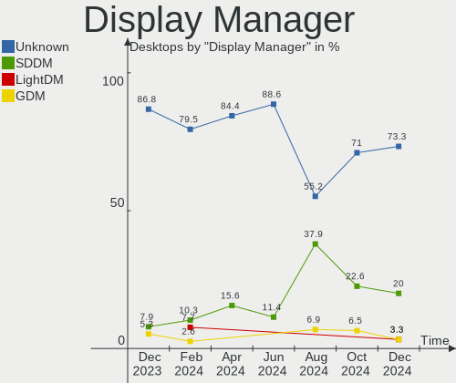
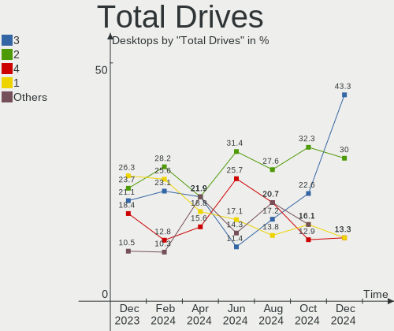
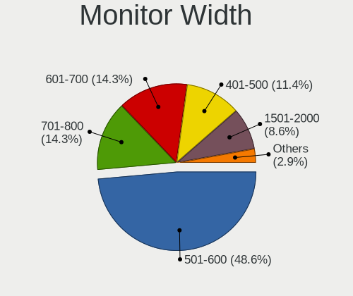
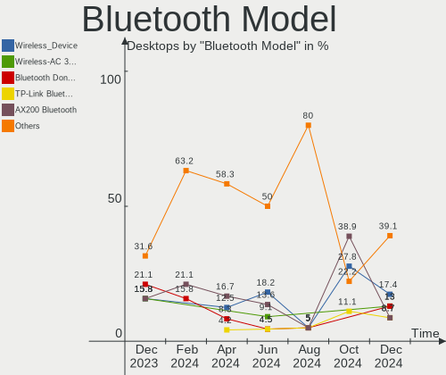
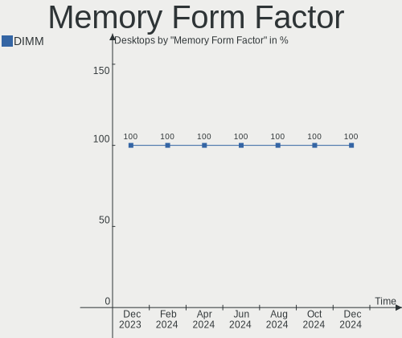

Nobara - Hardware Trends (Desktops)
-----------------------------------

A project to identify most popular hardware characteristics and track their change
over time based on data collected by Linux users at https://Linux-Hardware.org.

Anyone can contribute to this report by the [hw-probe](https://github.com/linuxhw/hw-probe) tool:

    sudo -E hw-probe -all -upload

This report is for one last month. Overall report since the beginning of time: [TestDays](https://github.com/linuxhw/TestDays)

Period: Dec, 2023.

Contents
--------

* [ System ](#system)
  - [ OS                       ](#os)
  - [ OS Family                ](#os-family)
  - [ Kernel                   ](#kernel)
  - [ Kernel Family            ](#kernel-family)
  - [ Kernel Major Ver.        ](#kernel-major-ver)
  - [ Arch                     ](#arch)
  - [ DE                       ](#de)
  - [ Display Server           ](#display-server)
  - [ Display Manager          ](#display-manager)
  - [ OS Lang                  ](#os-lang)
  - [ Boot Mode                ](#boot-mode)
  - [ Filesystem               ](#filesystem)
  - [ Part. scheme             ](#part-scheme)
  - [ Dual Boot with Linux/BSD ](#dual-boot-with-linuxbsd)
  - [ Dual Boot (Win)          ](#dual-boot-win)

* [ Board ](#board)
  - [ Vendor                   ](#vendor)
  - [ Model                    ](#model)
  - [ Model Family             ](#model-family)
  - [ MFG Year                 ](#mfg-year)
  - [ Form Factor              ](#form-factor)
  - [ Secure Boot              ](#secure-boot)
  - [ Coreboot                 ](#coreboot)
  - [ RAM Size                 ](#ram-size)
  - [ RAM Used                 ](#ram-used)
  - [ Total Drives             ](#total-drives)
  - [ Has CD-ROM               ](#has-cd-rom)
  - [ Has Ethernet             ](#has-ethernet)
  - [ Has WiFi                 ](#has-wifi)
  - [ Has Bluetooth            ](#has-bluetooth)

* [ Location ](#location)
  - [ Country                  ](#country)
  - [ City                     ](#city)

* [ Drives ](#drives)
  - [ Drive Vendor             ](#drive-vendor)
  - [ Drive Model              ](#drive-model)
  - [ HDD Vendor               ](#hdd-vendor)
  - [ SSD Vendor               ](#ssd-vendor)
  - [ Drive Kind               ](#drive-kind)
  - [ Drive Connector          ](#drive-connector)
  - [ Drive Size               ](#drive-size)
  - [ Space Total              ](#space-total)
  - [ Space Used               ](#space-used)
  - [ Malfunc. Drives          ](#malfunc-drives)
  - [ Malfunc. Drive Vendor    ](#malfunc-drive-vendor)
  - [ Malfunc. HDD Vendor      ](#malfunc-hdd-vendor)
  - [ Malfunc. Drive Kind      ](#malfunc-drive-kind)
  - [ Failed Drives            ](#failed-drives)
  - [ Failed Drive Vendor      ](#failed-drive-vendor)
  - [ Drive Status             ](#drive-status)

* [ Storage controller ](#storage-controller)
  - [ Storage Vendor           ](#storage-vendor)
  - [ Storage Model            ](#storage-model)
  - [ Storage Kind             ](#storage-kind)

* [ Processor ](#processor)
  - [ CPU Vendor               ](#cpu-vendor)
  - [ CPU Model                ](#cpu-model)
  - [ CPU Model Family         ](#cpu-model-family)
  - [ CPU Cores                ](#cpu-cores)
  - [ CPU Sockets              ](#cpu-sockets)
  - [ CPU Threads              ](#cpu-threads)
  - [ CPU Op-Modes             ](#cpu-op-modes)
  - [ CPU Microcode            ](#cpu-microcode)
  - [ CPU Microarch            ](#cpu-microarch)

* [ Graphics ](#graphics)
  - [ GPU Vendor               ](#gpu-vendor)
  - [ GPU Model                ](#gpu-model)
  - [ GPU Combo                ](#gpu-combo)
  - [ GPU Driver               ](#gpu-driver)
  - [ GPU Memory               ](#gpu-memory)

* [ Monitor ](#monitor)
  - [ Monitor Vendor           ](#monitor-vendor)
  - [ Monitor Model            ](#monitor-model)
  - [ Monitor Resolution       ](#monitor-resolution)
  - [ Monitor Diagonal         ](#monitor-diagonal)
  - [ Monitor Width            ](#monitor-width)
  - [ Aspect Ratio             ](#aspect-ratio)
  - [ Monitor Area             ](#monitor-area)
  - [ Pixel Density            ](#pixel-density)
  - [ Multiple Monitors        ](#multiple-monitors)

* [ Network ](#network)
  - [ Net Controller Vendor    ](#net-controller-vendor)
  - [ Net Controller Model     ](#net-controller-model)
  - [ Wireless Vendor          ](#wireless-vendor)
  - [ Wireless Model           ](#wireless-model)
  - [ Ethernet Vendor          ](#ethernet-vendor)
  - [ Ethernet Model           ](#ethernet-model)
  - [ Net Controller Kind      ](#net-controller-kind)
  - [ Used Controller          ](#used-controller)
  - [ NICs                     ](#nics)
  - [ IPv6                     ](#ipv6)

* [ Bluetooth ](#bluetooth)
  - [ Bluetooth Vendor         ](#bluetooth-vendor)
  - [ Bluetooth Model          ](#bluetooth-model)

* [ Sound ](#sound)
  - [ Sound Vendor             ](#sound-vendor)
  - [ Sound Model              ](#sound-model)

* [ Memory ](#memory)
  - [ Memory Vendor            ](#memory-vendor)
  - [ Memory Model             ](#memory-model)
  - [ Memory Kind              ](#memory-kind)
  - [ Memory Form Factor       ](#memory-form-factor)
  - [ Memory Size              ](#memory-size)
  - [ Memory Speed             ](#memory-speed)

* [ Printers & scanners ](#printers--scanners)
  - [ Printer Vendor           ](#printer-vendor)
  - [ Printer Model            ](#printer-model)
  - [ Scanner Vendor           ](#scanner-vendor)
  - [ Scanner Model            ](#scanner-model)

* [ Camera ](#camera)
  - [ Camera Vendor            ](#camera-vendor)
  - [ Camera Model             ](#camera-model)

* [ Security ](#security)
  - [ Fingerprint Vendor       ](#fingerprint-vendor)
  - [ Fingerprint Model        ](#fingerprint-model)
  - [ Chipcard Vendor          ](#chipcard-vendor)
  - [ Chipcard Model           ](#chipcard-model)

* [ Unsupported ](#unsupported)
  - [ Unsupported Devices      ](#unsupported-devices)
  - [ Unsupported Device Types ](#unsupported-device-types)

System
------

OS
--

Installed operating systems

| Name      | Desktops | Percent |
|-----------|----------|---------|
| Nobara 38 | 34       | 89.47%  |
| Nobara 39 | 4        | 10.53%  |

OS Family
---------

OS without a version

| Name   | Desktops | Percent |
|--------|----------|---------|
| Nobara | 38       | 100%    |

Kernel
------

Version of the Linux kernel

| Version                      | Desktops | Percent |
|------------------------------|----------|---------|
| 6.6.7-203.fsync.fc38.x86_64  | 9        | 23.68%  |
| 6.4.10-202.fsync.fc38.x86_64 | 5        | 13.16%  |
| 6.6.7-203.fsync.fc39.x86_64  | 3        | 7.89%   |
| 6.6.7-202.fsync.fc38.x86_64  | 3        | 7.89%   |
| 6.6.6-200.fsync.fc38.x86_64  | 2        | 5.26%   |
| 6.6.4-202.fsync.fc38.x86_64  | 2        | 5.26%   |
| 6.6.4-200.fsync.fc38.x86_64  | 2        | 5.26%   |
| 6.6.3-203.fsync.fc38.x86_64  | 2        | 5.26%   |
| 6.6.3-201.fsync.fc38.x86_64  | 2        | 5.26%   |
| 6.6.2-201.fsync.fc38.x86_64  | 2        | 5.26%   |
| 6.5.9-201.fsync.fc38.x86_64  | 2        | 5.26%   |
| 6.6.8-200.fsync.fc39.x86_64  | 1        | 2.63%   |
| 6.6.7-200.fsync.fc38.x86_64  | 1        | 2.63%   |
| 6.6.4-201.fsync.fc38.x86_64  | 1        | 2.63%   |
| 6.5.11-201.fsync.fc38.x86_64 | 1        | 2.63%   |

Kernel Family
-------------

Linux kernel without a distro release

| Version | Desktops | Percent |
|---------|----------|---------|
| 6.6.7   | 16       | 42.11%  |
| 6.6.4   | 5        | 13.16%  |
| 6.4.10  | 5        | 13.16%  |
| 6.6.3   | 4        | 10.53%  |
| 6.6.6   | 2        | 5.26%   |
| 6.6.2   | 2        | 5.26%   |
| 6.5.9   | 2        | 5.26%   |
| 6.6.8   | 1        | 2.63%   |
| 6.5.11  | 1        | 2.63%   |

Kernel Major Ver.
-----------------

Linux kernel major version

| Version | Desktops | Percent |
|---------|----------|---------|
| 6.6     | 30       | 78.95%  |
| 6.4     | 5        | 13.16%  |
| 6.5     | 3        | 7.89%   |

Arch
----

OS architecture (x86_64, i586, etc.)

| Name   | Desktops | Percent |
|--------|----------|---------|
| x86_64 | 38       | 100%    |

DE
--

Desktop Environment

| Name  | Desktops | Percent |
|-------|----------|---------|
| KDE5  | 24       | 63.16%  |
| GNOME | 14       | 36.84%  |

Display Server
--------------

X11 or Wayland

| Name    | Desktops | Percent |
|---------|----------|---------|
| Wayland | 36       | 94.74%  |
| X11     | 2        | 5.26%   |

Display Manager
---------------

SDDM, LightDM, etc.

| Name    | Desktops | Percent |
|---------|----------|---------|
| Unknown | 33       | 86.84%  |
| SDDM    | 3        | 7.89%   |
| GDM     | 2        | 5.26%   |

OS Lang
-------

Language

| Lang  | Desktops | Percent |
|-------|----------|---------|
| en_US | 13       | 34.21%  |
| de_DE | 9        | 23.68%  |
| ru_RU | 2        | 5.26%   |
| es_ES | 2        | 5.26%   |
| en_GB | 2        | 5.26%   |
| en_CA | 2        | 5.26%   |
| pl_PL | 1        | 2.63%   |
| it_IT | 1        | 2.63%   |
| fr_FR | 1        | 2.63%   |
| es_VE | 1        | 2.63%   |
| es_UY | 1        | 2.63%   |
| es_CO | 1        | 2.63%   |
| es_AR | 1        | 2.63%   |
| en_AU | 1        | 2.63%   |

Boot Mode
---------

EFI or BIOS

| Mode | Desktops | Percent |
|------|----------|---------|
| EFI  | 30       | 78.95%  |
| BIOS | 8        | 21.05%  |

Filesystem
----------

Type of filesystem

| Type  | Desktops | Percent |
|-------|----------|---------|
| Btrfs | 37       | 97.37%  |
| Ext4  | 1        | 2.63%   |

Part. scheme
------------

Scheme of partitioning

| Type    | Desktops | Percent |
|---------|----------|---------|
| Unknown | 33       | 86.84%  |
| GPT     | 5        | 13.16%  |

Dual Boot with Linux/BSD
------------------------

Hosting more than one Linux/BSD

| Dual boot | Desktops | Percent |
|-----------|----------|---------|
| No        | 37       | 97.37%  |
| Yes       | 1        | 2.63%   |

Dual Boot (Win)
---------------

Hosting Linux and Windows

| Dual boot | Desktops | Percent |
|-----------|----------|---------|
| No        | 35       | 92.11%  |
| Yes       | 3        | 7.89%   |

Board
-----

Vendor
------

Motherboard manufacturer

| Name                | Desktops | Percent |
|---------------------|----------|---------|
| MSI                 | 10       | 26.32%  |
| ASUSTek Computer    | 9        | 23.68%  |
| ASRock              | 8        | 21.05%  |
| Gigabyte Technology | 4        | 10.53%  |
| Hewlett-Packard     | 3        | 7.89%   |
| MACHINIST           | 1        | 2.63%   |
| Dell                | 1        | 2.63%   |
| AZW                 | 1        | 2.63%   |
| Alienware           | 1        | 2.63%   |

Model
-----

Motherboard model

| Name                              | Desktops | Percent |
|-----------------------------------|----------|---------|
| MSI MS-7B79                       | 2        | 5.26%   |
| MSI MS-7D77                       | 1        | 2.63%   |
| MSI MS-7D75                       | 1        | 2.63%   |
| MSI MS-7C91                       | 1        | 2.63%   |
| MSI MS-7C56                       | 1        | 2.63%   |
| MSI MS-7C35                       | 1        | 2.63%   |
| MSI MS-7B84                       | 1        | 2.63%   |
| MSI MS-7A74                       | 1        | 2.63%   |
| MSI MS-7817                       | 1        | 2.63%   |
| MACHINIST X99-K9 V2.0             | 1        | 2.63%   |
| HP Z600 Workstation               | 1        | 2.63%   |
| HP Pavilion Desktop TP01-1xxx     | 1        | 2.63%   |
| HP EliteDesk 800 G4 TWR           | 1        | 2.63%   |
| Gigabyte Z77X-UD3H                | 1        | 2.63%   |
| Gigabyte H61M-S1                  | 1        | 2.63%   |
| Gigabyte H310M A                  | 1        | 2.63%   |
| Gigabyte B550 UD AC               | 1        | 2.63%   |
| Dell OptiPlex 5050                | 1        | 2.63%   |
| AZW GTR                           | 1        | 2.63%   |
| ASUS TUF Gaming B550M-PLUS        | 1        | 2.63%   |
| ASUS TUF B450M-PLUS GAMING        | 1        | 2.63%   |
| ASUS TUF B450-PLUS GAMING         | 1        | 2.63%   |
| ASUS ROG STRIX X570-F GAMING      | 1        | 2.63%   |
| ASUS ROG STRIX X570-E GAMING      | 1        | 2.63%   |
| ASUS ProArt X670E-CREATOR WIFI    | 1        | 2.63%   |
| ASUS Pro B550M-C                  | 1        | 2.63%   |
| ASUS PRIME B450M-K                | 1        | 2.63%   |
| ASUS All Series                   | 1        | 2.63%   |
| ASRock X99 Professional Gaming i7 | 1        | 2.63%   |
| ASRock X570 Taichi                | 1        | 2.63%   |
| ASRock H61M-VG3                   | 1        | 2.63%   |
| ASRock H570 Steel Legend          | 1        | 2.63%   |
| ASRock B550M-ITX/ac               | 1        | 2.63%   |
| ASRock B460 Phantom Gaming 4      | 1        | 2.63%   |
| ASRock B450M Pro4                 | 1        | 2.63%   |
| ASRock B450 Gaming-ITX/ac         | 1        | 2.63%   |
| Alienware Aurora R12              | 1        | 2.63%   |

Model Family
------------

Motherboard model prefix

| Name               | Desktops | Percent |
|--------------------|----------|---------|
| ASUS TUF           | 3        | 7.89%   |
| MSI MS-7B79        | 2        | 5.26%   |
| ASUS ROG           | 2        | 5.26%   |
| MSI MS-7D77        | 1        | 2.63%   |
| MSI MS-7D75        | 1        | 2.63%   |
| MSI MS-7C91        | 1        | 2.63%   |
| MSI MS-7C56        | 1        | 2.63%   |
| MSI MS-7C35        | 1        | 2.63%   |
| MSI MS-7B84        | 1        | 2.63%   |
| MSI MS-7A74        | 1        | 2.63%   |
| MSI MS-7817        | 1        | 2.63%   |
| MACHINIST X99-K9   | 1        | 2.63%   |
| HP Z600            | 1        | 2.63%   |
| HP Pavilion        | 1        | 2.63%   |
| HP EliteDesk       | 1        | 2.63%   |
| Gigabyte Z77X-UD3H | 1        | 2.63%   |
| Gigabyte H61M-S1   | 1        | 2.63%   |
| Gigabyte H310M     | 1        | 2.63%   |
| Gigabyte B550      | 1        | 2.63%   |
| Dell OptiPlex      | 1        | 2.63%   |
| AZW GTR            | 1        | 2.63%   |
| ASUS ProArt        | 1        | 2.63%   |
| ASUS Pro           | 1        | 2.63%   |
| ASUS PRIME         | 1        | 2.63%   |
| ASUS All           | 1        | 2.63%   |
| ASRock X99         | 1        | 2.63%   |
| ASRock X570        | 1        | 2.63%   |
| ASRock H61M-VG3    | 1        | 2.63%   |
| ASRock H570        | 1        | 2.63%   |
| ASRock B550M-ITX   | 1        | 2.63%   |
| ASRock B460        | 1        | 2.63%   |
| ASRock B450M       | 1        | 2.63%   |
| ASRock B450        | 1        | 2.63%   |
| Alienware Aurora   | 1        | 2.63%   |

MFG Year
--------

Motherboard manufacture year

| Year | Desktops | Percent |
|------|----------|---------|
| 2018 | 8        | 21.05%  |
| 2020 | 6        | 15.79%  |
| 2021 | 5        | 13.16%  |
| 2019 | 5        | 13.16%  |
| 2022 | 4        | 10.53%  |
| 2012 | 4        | 10.53%  |
| 2016 | 2        | 5.26%   |
| 2017 | 1        | 2.63%   |
| 2014 | 1        | 2.63%   |
| 2013 | 1        | 2.63%   |
| 2010 | 1        | 2.63%   |

Form Factor
-----------

Physical design of the computer

| Name    | Desktops | Percent |
|---------|----------|---------|
| Desktop | 38       | 100%    |

Secure Boot
-----------

Enabled or disabled

| State    | Desktops | Percent |
|----------|----------|---------|
| Disabled | 38       | 100%    |

Coreboot
--------

Have coreboot on board

| Used | Desktops | Percent |
|------|----------|---------|
| No   | 38       | 100%    |

RAM Size
--------

Total RAM memory

| Size in GB  | Desktops | Percent |
|-------------|----------|---------|
| 32.01-64.0  | 12       | 31.58%  |
| 16.01-24.0  | 11       | 28.95%  |
| 24.01-32.0  | 5        | 13.16%  |
| 64.01-256.0 | 5        | 13.16%  |
| 4.01-8.0    | 3        | 7.89%   |
| 8.01-16.0   | 2        | 5.26%   |

RAM Used
--------

Used RAM memory

| Used GB   | Desktops | Percent |
|-----------|----------|---------|
| 4.01-8.0  | 21       | 55.26%  |
| 3.01-4.0  | 9        | 23.68%  |
| 2.01-3.0  | 4        | 10.53%  |
| 8.01-16.0 | 3        | 7.89%   |
| 1.01-2.0  | 1        | 2.63%   |

Total Drives
------------

Number of drives on board

| Drives | Desktops | Percent |
|--------|----------|---------|
| 1      | 10       | 26.32%  |
| 2      | 9        | 23.68%  |
| 3      | 8        | 21.05%  |
| 4      | 7        | 18.42%  |
| 6      | 2        | 5.26%   |
| 8      | 1        | 2.63%   |
| 7      | 1        | 2.63%   |

Has CD-ROM
----------

Has CD-ROM on board

| Presented | Desktops | Percent |
|-----------|----------|---------|
| No        | 29       | 76.32%  |
| Yes       | 9        | 23.68%  |

Has Ethernet
------------

Has Ethernet on board

| Presented | Desktops | Percent |
|-----------|----------|---------|
| Yes       | 38       | 100%    |

Has WiFi
--------

Has WiFi module

| Presented | Desktops | Percent |
|-----------|----------|---------|
| Yes       | 20       | 52.63%  |
| No        | 18       | 47.37%  |

Has Bluetooth
-------------

Has Bluetooth module

| Presented | Desktops | Percent |
|-----------|----------|---------|
| No        | 20       | 52.63%  |
| Yes       | 18       | 47.37%  |

Location
--------

Country
-------

Geographic location (country)

| Country     | Desktops | Percent |
|-------------|----------|---------|
| Germany     | 11       | 28.95%  |
| USA         | 10       | 26.32%  |
| Canada      | 3        | 7.89%   |
| Russia      | 2        | 5.26%   |
| Venezuela   | 1        | 2.63%   |
| Uruguay     | 1        | 2.63%   |
| UK          | 1        | 2.63%   |
| Sweden      | 1        | 2.63%   |
| Spain       | 1        | 2.63%   |
| Puerto Rico | 1        | 2.63%   |
| Poland      | 1        | 2.63%   |
| Italy       | 1        | 2.63%   |
| France      | 1        | 2.63%   |
| Colombia    | 1        | 2.63%   |
| Australia   | 1        | 2.63%   |
| Argentina   | 1        | 2.63%   |

City
----

Geographic location (city)

| City             | Desktops | Percent |
|------------------|----------|---------|
| Toronto          | 2        | 5.26%   |
| Oberhausen       | 2        | 5.26%   |
| Berlin           | 2        | 5.26%   |
| Yablonitsy       | 1        | 2.63%   |
| Wuppertal        | 1        | 2.63%   |
| Temecula         | 1        | 2.63%   |
| Stuttgart        | 1        | 2.63%   |
| Shinnston        | 1        | 2.63%   |
| Saluda           | 1        | 2.63%   |
| Ponce            | 1        | 2.63%   |
| Peterborough     | 1        | 2.63%   |
| Osnabrück       | 1        | 2.63%   |
| Oelde            | 1        | 2.63%   |
| New Rochelle     | 1        | 2.63%   |
| Montevideo       | 1        | 2.63%   |
| Minden           | 1        | 2.63%   |
| Merzig           | 1        | 2.63%   |
| Melbourne        | 1        | 2.63%   |
| Maracaibo        | 1        | 2.63%   |
| Malpas           | 1        | 2.63%   |
| Malmo            | 1        | 2.63%   |
| Los Angeles      | 1        | 2.63%   |
| Latronico        | 1        | 2.63%   |
| Krakow           | 1        | 2.63%   |
| Izhevsk          | 1        | 2.63%   |
| Hohenpeissenberg | 1        | 2.63%   |
| Gummersbach      | 1        | 2.63%   |
| Gennevilliers    | 1        | 2.63%   |
| Evansville       | 1        | 2.63%   |
| Des Plaines      | 1        | 2.63%   |
| Dallas           | 1        | 2.63%   |
| Cúcuta          | 1        | 2.63%   |
| Coeur d'Alene    | 1        | 2.63%   |
| Bahía Blanca    | 1        | 2.63%   |
| Alicante         | 1        | 2.63%   |

Drives
------

Drive Vendor
------------

Hard drive vendors

| Vendor                       | Desktops | Drives | Percent |
|------------------------------|----------|--------|---------|
| Samsung Electronics          | 13       | 26     | 15.66%  |
| WDC                          | 9        | 12     | 10.84%  |
| Toshiba                      | 8        | 8      | 9.64%   |
| Crucial                      | 7        | 10     | 8.43%   |
| Sandisk                      | 6        | 7      | 7.23%   |
| Seagate                      | 5        | 7      | 6.02%   |
| Phison Electronics           | 4        | 4      | 4.82%   |
| PNY                          | 3        | 3      | 3.61%   |
| Kingston                     | 3        | 3      | 3.61%   |
| Intel                        | 2        | 2      | 2.41%   |
| Verbatim                     | 1        | 1      | 1.2%    |
| USB 3.1                      | 1        | 1      | 1.2%    |
| Unknown                      | 1        | 2      | 1.2%    |
| T-FORCE                      | 1        | 1      | 1.2%    |
| SPCC                         | 1        | 1      | 1.2%    |
| SK hynix                     | 1        | 1      | 1.2%    |
| Silicon Motion               | 1        | 1      | 1.2%    |
| Shenzhen Longsys Electronics | 1        | 1      | 1.2%    |
| Plextor                      | 1        | 1      | 1.2%    |
| Micron/Crucial Technology    | 1        | 1      | 1.2%    |
| MAXIO Technology (Hangzhou)  | 1        | 1      | 1.2%    |
| Lexar                        | 1        | 1      | 1.2%    |
| KIOXIA-EXCERIA               | 1        | 1      | 1.2%    |
| Kingston Technology Company  | 1        | 1      | 1.2%    |
| KingSpec                     | 1        | 1      | 1.2%    |
| JMicron Technology           | 1        | 2      | 1.2%    |
| Intenso                      | 1        | 1      | 1.2%    |
| Hitachi                      | 1        | 1      | 1.2%    |
| G600S                        | 1        | 1      | 1.2%    |
| Fanxiang                     | 1        | 1      | 1.2%    |
| Corsair                      | 1        | 1      | 1.2%    |
| China                        | 1        | 1      | 1.2%    |
| A-DATA Technology            | 1        | 1      | 1.2%    |

Drive Model
-----------

Hard drive models

| Model                                               | Desktops | Percent |
|-----------------------------------------------------|----------|---------|
| Samsung NVMe SSD Controller SM981/PM981/PM983 512GB | 5        | 5.21%   |
| Toshiba DT01ACA100 1TB                              | 3        | 3.13%   |
| Samsung SSD 980 1TB                                 | 2        | 2.08%   |
| Samsung NVMe SSD Controller PM9A1/PM9A3/980PRO 2TB  | 2        | 2.08%   |
| Phison E12 NVMe Controller 1TB                      | 2        | 2.08%   |
| Crucial CT240BX500SSD1 240GB                        | 2        | 2.08%   |
| WDC WDS240G2G0B-00EPW0 240GB SSD                    | 1        | 1.04%   |
| WDC WDS120G2G0A-00JH30 120GB SSD                    | 1        | 1.04%   |
| WDC WD60EZAZ-00SF3B0 6TB                            | 1        | 1.04%   |
| WDC WD2500AAJS-00VTA0 250GB                         | 1        | 1.04%   |
| WDC WD20EZRZ-00Z5HB0 2TB                            | 1        | 1.04%   |
| WDC WD15EARS-00Z5B1 1TB                             | 1        | 1.04%   |
| WDC WD10EZEX-21M2NA0 1TB                            | 1        | 1.04%   |
| WDC WD10EZEX-08WN4A0 1TB                            | 1        | 1.04%   |
| WDC WD10EALX-009BA0 1TB                             | 1        | 1.04%   |
| WDC WD1003FBYX-05Y7B0 1TB                           | 1        | 1.04%   |
| WDC WD1001FALS-00J7B0 1TB                           | 1        | 1.04%   |
| Verbatim Vi550 S3 512GB                             | 1        | 1.04%   |
| USB 3.1 Device RAID 0 2TB                           | 1        | 1.04%   |
| Unknown NVMe SSD Drive 2TB                          | 1        | 1.04%   |
| Toshiba MQ04ABF100 1TB                              | 1        | 1.04%   |
| Toshiba HDWL120 2TB                                 | 1        | 1.04%   |
| Toshiba HDWD130 3TB                                 | 1        | 1.04%   |
| Toshiba DT01ACA200 2TB                              | 1        | 1.04%   |
| Toshiba DT01ACA050 500GB                            | 1        | 1.04%   |
| T-FORCE 1TB                                         | 1        | 1.04%   |
| SPCC Solid State Disk 512GB                         | 1        | 1.04%   |
| SK hynix PC711 NVMe 1TB                             | 1        | 1.04%   |
| Silicon Motion SM2262/SM2262EN SSD Controller 1TB   | 1        | 1.04%   |
| Shenzhen Longsys Lexar SSD NM790 2TB                | 1        | 1.04%   |
| Seagate ST500LM012 HN-M500MBB 500GB                 | 1        | 1.04%   |
| Seagate ST3500418AS 500GB                           | 1        | 1.04%   |
| Seagate ST3500312CS 500GB                           | 1        | 1.04%   |
| Seagate ST2000DL003-9VT166 2TB                      | 1        | 1.04%   |
| Seagate ST1000LM024 HN-M101MBB 1TB                  | 1        | 1.04%   |
| Seagate ST1000DX001-1NS162 1TB                      | 1        | 1.04%   |
| Seagate ST1000DM003-1CH162 1TB                      | 1        | 1.04%   |
| Sandisk WD_BLACK SN850X HS 1000GB                   | 1        | 1.04%   |
| Sandisk WD_BLACK SN770 500GB                        | 1        | 1.04%   |
| Sandisk WD Blue SN570 500GB                         | 1        | 1.04%   |

HDD Vendor
----------

Hard disk drive vendors

| Vendor  | Desktops | Drives | Percent |
|---------|----------|--------|---------|
| WDC     | 8        | 10     | 36.36%  |
| Toshiba | 8        | 8      | 36.36%  |
| Seagate | 5        | 7      | 22.73%  |
| Hitachi | 1        | 1      | 4.55%   |

SSD Vendor
----------

Solid state drive vendors

| Vendor              | Desktops | Drives | Percent |
|---------------------|----------|--------|---------|
| Samsung Electronics | 7        | 10     | 20%     |
| Crucial             | 7        | 10     | 20%     |
| PNY                 | 3        | 3      | 8.57%   |
| Kingston            | 3        | 3      | 8.57%   |
| WDC                 | 2        | 2      | 5.71%   |
| Verbatim            | 1        | 1      | 2.86%   |
| SPCC                | 1        | 1      | 2.86%   |
| SanDisk             | 1        | 1      | 2.86%   |
| Plextor             | 1        | 1      | 2.86%   |
| Lexar               | 1        | 1      | 2.86%   |
| KIOXIA-EXCERIA      | 1        | 1      | 2.86%   |
| KingSpec            | 1        | 1      | 2.86%   |
| JMicron Technology  | 1        | 2      | 2.86%   |
| Intenso             | 1        | 1      | 2.86%   |
| Intel               | 1        | 1      | 2.86%   |
| Corsair             | 1        | 1      | 2.86%   |
| China               | 1        | 1      | 2.86%   |
| A-DATA Technology   | 1        | 1      | 2.86%   |

Drive Kind
----------

HDD or SSD

| Kind    | Desktops | Drives | Percent |
|---------|----------|--------|---------|
| SSD     | 24       | 42     | 34.78%  |
| NVMe    | 23       | 35     | 33.33%  |
| HDD     | 18       | 26     | 26.09%  |
| Unknown | 4        | 4      | 5.8%    |

Drive Connector
---------------

SATA, SAS, NVMe, etc.

| Type | Desktops | Drives | Percent |
|------|----------|--------|---------|
| SATA | 28       | 67     | 51.85%  |
| NVMe | 23       | 35     | 42.59%  |
| SAS  | 3        | 5      | 5.56%   |

Drive Size
----------

Size of hard drive

| Size in TB | Desktops | Drives | Percent |
|------------|----------|--------|---------|
| 0.01-0.5   | 23       | 32     | 48.94%  |
| 0.51-1.0   | 15       | 21     | 31.91%  |
| 1.01-2.0   | 6        | 12     | 12.77%  |
| 3.01-4.0   | 1        | 1      | 2.13%   |
| 2.01-3.0   | 1        | 1      | 2.13%   |
| 4.01-10.0  | 1        | 1      | 2.13%   |

Space Total
-----------

Amount of disk space available on the file system

| Size in GB     | Desktops | Percent |
|----------------|----------|---------|
| 1001-2000      | 10       | 26.32%  |
| 251-500        | 8        | 21.05%  |
| More than 3000 | 7        | 18.42%  |
| 501-1000       | 6        | 15.79%  |
| 2001-3000      | 3        | 7.89%   |
| Unknown        | 2        | 5.26%   |
| 101-250        | 1        | 2.63%   |
| 1-20           | 1        | 2.63%   |

Space Used
----------

Amount of used disk space

| Used GB        | Desktops | Percent |
|----------------|----------|---------|
| 101-250        | 9        | 23.68%  |
| 21-50          | 8        | 21.05%  |
| 1001-2000      | 4        | 10.53%  |
| 1-20           | 4        | 10.53%  |
| 501-1000       | 4        | 10.53%  |
| More than 3000 | 2        | 5.26%   |
| 251-500        | 2        | 5.26%   |
| 51-100         | 2        | 5.26%   |
| Unknown        | 2        | 5.26%   |
| 2001-3000      | 1        | 2.63%   |

Malfunc. Drives
---------------

Drive models with a malfunction

Zero info for selected period =(

Malfunc. Drive Vendor
---------------------

Vendors of faulty drives

Zero info for selected period =(

Malfunc. HDD Vendor
-------------------

Vendors of faulty HDD drives

Zero info for selected period =(

Malfunc. Drive Kind
-------------------

Kinds of faulty drives

Zero info for selected period =(

Failed Drives
-------------

Failed drive models

Zero info for selected period =(

Failed Drive Vendor
-------------------

Failed drive vendors

Zero info for selected period =(

Drive Status
------------

Number of failed and malfunc. drives

| Status   | Desktops | Drives | Percent |
|----------|----------|--------|---------|
| Detected | 34       | 90     | 87.18%  |
| Works    | 5        | 17     | 12.82%  |

Storage controller
------------------

Storage Vendor
--------------

Storage controller vendors

| Vendor                       | Desktops | Percent |
|------------------------------|----------|---------|
| AMD                          | 21       | 31.34%  |
| Intel                        | 17       | 25.37%  |
| Samsung Electronics          | 11       | 16.42%  |
| Sandisk                      | 5        | 7.46%   |
| Phison Electronics           | 4        | 5.97%   |
| Solidigm                     | 1        | 1.49%   |
| SK hynix                     | 1        | 1.49%   |
| Silicon Motion               | 1        | 1.49%   |
| Shenzhen Longsys Electronics | 1        | 1.49%   |
| Micron/Crucial Technology    | 1        | 1.49%   |
| MAXIO Technology (Hangzhou)  | 1        | 1.49%   |
| Marvell Technology Group     | 1        | 1.49%   |
| Kingston Technology Company  | 1        | 1.49%   |
| ASMedia Technology           | 1        | 1.49%   |

Storage Model
-------------

Storage controller models

| Model                                                                                   | Desktops | Percent |
|-----------------------------------------------------------------------------------------|----------|---------|
| AMD FCH SATA Controller [AHCI mode]                                                     | 10       | 13.51%  |
| AMD 400 Series Chipset SATA Controller                                                  | 8        | 10.81%  |
| AMD 500 Series Chipset SATA Controller                                                  | 6        | 8.11%   |
| Samsung NVMe SSD Controller SM981/PM981/PM983                                           | 5        | 6.76%   |
| Samsung NVMe SSD Controller 980 (DRAM-less)                                             | 3        | 4.05%   |
| SanDisk Ultra 3D / WD Blue SN570 NVMe SSD (DRAM-less)                                   | 2        | 2.7%    |
| Samsung NVMe SSD Controller PM9A1/PM9A3/980PRO                                          | 2        | 2.7%    |
| Phison E12 NVMe Controller                                                              | 2        | 2.7%    |
| Intel SATA Controller [RAID mode]                                                       | 2        | 2.7%    |
| Intel Cannon Lake PCH SATA AHCI Controller                                              | 2        | 2.7%    |
| Intel C610/X99 series chipset sSATA Controller [AHCI mode]                              | 2        | 2.7%    |
| Intel C610/X99 series chipset 6-Port SATA Controller [AHCI mode]                        | 2        | 2.7%    |
| Intel 8 Series/C220 Series Chipset Family 6-port SATA Controller 1 [AHCI mode]          | 2        | 2.7%    |
| Intel 200 Series PCH SATA controller [AHCI mode]                                        | 2        | 2.7%    |
| Solidigm P41 Plus NVMe SSD (DRAM-less) [Echo Harbor]                                    | 1        | 1.35%   |
| SK hynix Gold P31/BC711/PC711 NVMe Solid State Drive                                    | 1        | 1.35%   |
| Silicon Motion SM2262/SM2262EN SSD Controller                                           | 1        | 1.35%   |
| Shenzhen Longsys Non-Volatile memory controller                                         | 1        | 1.35%   |
| Sandisk WD Black SN850X NVMe SSD                                                        | 1        | 1.35%   |
| SanDisk WD Black SN770 / PC SN740 256GB / PC SN560 (DRAM-less) NVMe SSD                 | 1        | 1.35%   |
| SanDisk Ultra 3D / WD Blue SN550 NVMe SSD                                               | 1        | 1.35%   |
| Samsung NVMe SSD Controller SM961/PM961/SM963                                           | 1        | 1.35%   |
| Samsung NVMe SSD Controller S4LV008[Pascal]                                             | 1        | 1.35%   |
| Phison PS5013-E13 PCIe3 NVMe Controller (DRAM-less)                                     | 1        | 1.35%   |
| Phison E18 PCIe4 NVMe Controller                                                        | 1        | 1.35%   |
| Micron/Crucial P5 Plus NVMe PCIe SSD                                                    | 1        | 1.35%   |
| MAXIO (Hangzhou) NVMe SSD Controller MAP1202                                            | 1        | 1.35%   |
| Marvell Group 88SE9172 SATA 6Gb/s Controller                                            | 1        | 1.35%   |
| Kingston Company NV2 NVMe SSD SM2267XT                                                  | 1        | 1.35%   |
| Intel SSD 660P Series                                                                   | 1        | 1.35%   |
| Intel Comet Lake SATA AHCI Controller                                                   | 1        | 1.35%   |
| Intel 7 Series/C210 Series Chipset Family 6-port SATA Controller [AHCI mode]            | 1        | 1.35%   |
| Intel 6 Series/C200 Series Chipset Family Desktop SATA Controller (IDE mode, ports 4-5) | 1        | 1.35%   |
| Intel 6 Series/C200 Series Chipset Family Desktop SATA Controller (IDE mode, ports 0-3) | 1        | 1.35%   |
| Intel 6 Series/C200 Series Chipset Family 6 port Desktop SATA AHCI Controller           | 1        | 1.35%   |
| Intel 500 Series Chipset Family SATA AHCI Controller                                    | 1        | 1.35%   |
| Intel 400 Series Chipset Family SATA AHCI Controller                                    | 1        | 1.35%   |
| ASMedia ASM1062 Serial ATA Controller                                                   | 1        | 1.35%   |

Storage Kind
------------

Kind of storage controller (IDE, SATA, NVMe, SAS, ...)

| Kind | Desktops | Percent |
|------|----------|---------|
| SATA | 34       | 56.67%  |
| NVMe | 23       | 38.33%  |
| RAID | 2        | 3.33%   |
| IDE  | 1        | 1.67%   |

Processor
---------

CPU Vendor
----------

Processor vendors

| Vendor | Desktops | Percent |
|--------|----------|---------|
| AMD    | 22       | 57.89%  |
| Intel  | 16       | 42.11%  |

CPU Model
---------

Processor models

| Model                                       | Desktops | Percent |
|---------------------------------------------|----------|---------|
| AMD Ryzen 7 3700X 8-Core Processor          | 4        | 10.53%  |
| AMD Ryzen 5 3600 6-Core Processor           | 3        | 7.89%   |
| AMD Ryzen 7 7800X3D 8-Core Processor        | 2        | 5.26%   |
| AMD Ryzen 7 5800X3D 8-Core Processor        | 2        | 5.26%   |
| AMD Ryzen 7 5700G with Radeon Graphics      | 2        | 5.26%   |
| Intel Xeon CPU X5675 @ 3.07GHz              | 1        | 2.63%   |
| Intel Xeon CPU E5-2690 v3 @ 2.60GHz         | 1        | 2.63%   |
| Intel Xeon CPU E3-1271 v3 @ 3.60GHz         | 1        | 2.63%   |
| Intel Core i7-7700 CPU @ 3.60GHz            | 1        | 2.63%   |
| Intel Core i7-6800K CPU @ 3.40GHz           | 1        | 2.63%   |
| Intel Core i7-4770 CPU @ 3.40GHz            | 1        | 2.63%   |
| Intel Core i7-3770 CPU @ 3.40GHz            | 1        | 2.63%   |
| Intel Core i5-8500 CPU @ 3.00GHz            | 1        | 2.63%   |
| Intel Core i5-8400 CPU @ 2.80GHz            | 1        | 2.63%   |
| Intel Core i5-7500 CPU @ 3.40GHz            | 1        | 2.63%   |
| Intel Core i5-3470 CPU @ 3.20GHz            | 1        | 2.63%   |
| Intel Core i5-3450 CPU @ 3.10GHz            | 1        | 2.63%   |
| Intel Core i5-10400 CPU @ 2.90GHz           | 1        | 2.63%   |
| Intel Core i3-10100 CPU @ 3.60GHz           | 1        | 2.63%   |
| Intel 11th Gen Core i7-11700KF @ 3.60GHz    | 1        | 2.63%   |
| Intel 11th Gen Core i5-11400F @ 2.60GHz     | 1        | 2.63%   |
| AMD Ryzen 9 7950X3D 16-Core Processor       | 1        | 2.63%   |
| AMD Ryzen 9 6900HX with Radeon Graphics     | 1        | 2.63%   |
| AMD Ryzen 9 5950X 16-Core Processor         | 1        | 2.63%   |
| AMD Ryzen 9 5900X 12-Core Processor         | 1        | 2.63%   |
| AMD Ryzen 9 3900X 12-Core Processor         | 1        | 2.63%   |
| AMD Ryzen 7 2700 Eight-Core Processor       | 1        | 2.63%   |
| AMD Ryzen 5 5600X 6-Core Processor          | 1        | 2.63%   |
| AMD Ryzen 5 2600 Six-Core Processor         | 1        | 2.63%   |
| AMD Ryzen 3 3200G with Radeon Vega Graphics | 1        | 2.63%   |

CPU Model Family
----------------

Processor model prefix

| Model         | Desktops | Percent |
|---------------|----------|---------|
| AMD Ryzen 7   | 11       | 28.95%  |
| Intel Core i5 | 6        | 15.79%  |
| AMD Ryzen 9   | 5        | 13.16%  |
| AMD Ryzen 5   | 5        | 13.16%  |
| Intel Core i7 | 4        | 10.53%  |
| Intel Xeon    | 3        | 7.89%   |
| Other         | 2        | 5.26%   |
| Intel Core i3 | 1        | 2.63%   |
| AMD Ryzen 3   | 1        | 2.63%   |

CPU Cores
---------

Number of processor cores

| Number | Desktops | Percent |
|--------|----------|---------|
| 8      | 13       | 34.21%  |
| 6      | 10       | 26.32%  |
| 4      | 9        | 23.68%  |
| 12     | 4        | 10.53%  |
| 16     | 2        | 5.26%   |

CPU Sockets
-----------

Number of sockets

| Number | Desktops | Percent |
|--------|----------|---------|
| 1      | 37       | 97.37%  |
| 2      | 1        | 2.63%   |

CPU Threads
-----------

Threads per core (Hyper-Threading)

| Number | Desktops | Percent |
|--------|----------|---------|
| 2      | 31       | 81.58%  |
| 1      | 7        | 18.42%  |

CPU Op-Modes
------------

CPU Operation Modes (32-bit, 64-bit)

| Op mode        | Desktops | Percent |
|----------------|----------|---------|
| 32-bit, 64-bit | 38       | 100%    |

CPU Microcode
-------------

Microcode number

| Number     | Desktops | Percent |
|------------|----------|---------|
| Unknown    | 16       | 42.11%  |
| 0x08701030 | 5        | 13.16%  |
| 0x0a20120e | 4        | 10.53%  |
| 0x08701021 | 3        | 7.89%   |
| 0x0a601206 | 2        | 5.26%   |
| 0x0800820d | 2        | 5.26%   |
| 0x0a601203 | 1        | 2.63%   |
| 0x0a50000f | 1        | 2.63%   |
| 0x0a50000d | 1        | 2.63%   |
| 0x0a404102 | 1        | 2.63%   |
| 0x0a20120a | 1        | 2.63%   |
| 0x08108109 | 1        | 2.63%   |

CPU Microarch
-------------

Microarchitecture

| Name      | Desktops | Percent |
|-----------|----------|---------|
| Zen 2     | 8        | 21.05%  |
| Zen 3     | 7        | 18.42%  |
| Unknown   | 5        | 13.16%  |
| KabyLake  | 4        | 10.53%  |
| Zen+      | 3        | 7.89%   |
| IvyBridge | 3        | 7.89%   |
| Haswell   | 3        | 7.89%   |
| CometLake | 2        | 5.26%   |
| Westmere  | 1        | 2.63%   |
| Icelake   | 1        | 2.63%   |
| Broadwell | 1        | 2.63%   |

Graphics
--------

GPU Vendor
----------

Vendors of graphics cards

| Vendor | Desktops | Percent |
|--------|----------|---------|
| AMD    | 21       | 52.5%   |
| Nvidia | 13       | 32.5%   |
| Intel  | 6        | 15%     |

GPU Model
---------

Graphics card models

| Model                                                                       | Desktops | Percent |
|-----------------------------------------------------------------------------|----------|---------|
| AMD Ellesmere [Radeon RX 470/480/570/570X/580/580X/590]                     | 7        | 17.07%  |
| AMD Navi 31 [Radeon RX 7900 XT/7900 XTX]                                    | 3        | 7.32%   |
| Nvidia GA106 [GeForce RTX 3060 Lite Hash Rate]                              | 2        | 4.88%   |
| Nvidia GA102 [GeForce RTX 3080 Ti]                                          | 2        | 4.88%   |
| Intel CometLake-S GT2 [UHD Graphics 630]                                    | 2        | 4.88%   |
| AMD Raphael                                                                 | 2        | 4.88%   |
| AMD Navi 23 [Radeon RX 6600/6600 XT/6600M]                                  | 2        | 4.88%   |
| AMD Navi 22 [Radeon RX 6700/6700 XT/6750 XT / 6800M/6850M XT]               | 2        | 4.88%   |
| Nvidia TU106 [GeForce RTX 2060 SUPER]                                       | 1        | 2.44%   |
| Nvidia TU104 [GeForce RTX 2080 Rev. A]                                      | 1        | 2.44%   |
| Nvidia TU102 [GeForce RTX 2080 Ti Rev. A]                                   | 1        | 2.44%   |
| Nvidia GP107 [GeForce GTX 1050]                                             | 1        | 2.44%   |
| Nvidia GP107 [GeForce GTX 1050 Ti]                                          | 1        | 2.44%   |
| Nvidia GP106 [GeForce GTX 1060 6GB]                                         | 1        | 2.44%   |
| Nvidia GM206 [GeForce GTX 960]                                              | 1        | 2.44%   |
| Nvidia GA104 [GeForce RTX 3070]                                             | 1        | 2.44%   |
| Nvidia AD104 [GeForce RTX 4070]                                             | 1        | 2.44%   |
| Intel Xeon E3-1200 v3/4th Gen Core Processor Integrated Graphics Controller | 1        | 2.44%   |
| Intel IvyBridge GT2 [HD Graphics 4000]                                      | 1        | 2.44%   |
| Intel HD Graphics 630                                                       | 1        | 2.44%   |
| Intel CoffeeLake-S GT2 [UHD Graphics 630]                                   | 1        | 2.44%   |
| AMD Rembrandt [Radeon 680M]                                                 | 1        | 2.44%   |
| AMD Navi 24 [Radeon RX 6400/6500 XT/6500M]                                  | 1        | 2.44%   |
| AMD Navi 21 [Radeon RX 6800/6800 XT / 6900 XT]                              | 1        | 2.44%   |
| AMD Navi 14 [Radeon RX 5500/5500M / Pro 5500M]                              | 1        | 2.44%   |
| AMD Navi 10 [Radeon RX 5600 OEM/5600 XT / 5700/5700 XT]                     | 1        | 2.44%   |
| AMD Cezanne [Radeon Vega Series / Radeon Vega Mobile Series]                | 1        | 2.44%   |

GPU Combo
---------

Combinations of graphics cards

| Name           | Desktops | Percent |
|----------------|----------|---------|
| 1 x AMD        | 20       | 52.63%  |
| 1 x Nvidia     | 12       | 31.58%  |
| 1 x Intel      | 4        | 10.53%  |
| 2 x AMD        | 1        | 2.63%   |
| Intel + Nvidia | 1        | 2.63%   |

GPU Driver
----------

Free vs proprietary

| Driver      | Desktops | Percent |
|-------------|----------|---------|
| Free        | 26       | 68.42%  |
| Proprietary | 11       | 28.95%  |
| Unknown     | 1        | 2.63%   |

GPU Memory
----------

Total video memory

| Size in GB | Desktops | Percent |
|------------|----------|---------|
| Unknown    | 12       | 31.58%  |
| 7.01-8.0   | 9        | 23.68%  |
| 3.01-4.0   | 7        | 18.42%  |
| 8.01-16.0  | 5        | 13.16%  |
| 16.01-24.0 | 3        | 7.89%   |
| 5.01-6.0   | 1        | 2.63%   |
| 0.01-0.5   | 1        | 2.63%   |

Monitor
-------

Monitor Vendor
--------------

Monitor vendors

| Vendor               | Desktops | Percent |
|----------------------|----------|---------|
| Dell                 | 7        | 15.22%  |
| Acer                 | 6        | 13.04%  |
| Samsung Electronics  | 5        | 10.87%  |
| ASUSTek Computer     | 4        | 8.7%    |
| Hewlett-Packard      | 3        | 6.52%   |
| Goldstar             | 3        | 6.52%   |
| Ancor Communications | 3        | 6.52%   |
| Iiyama               | 2        | 4.35%   |
| BenQ                 | 2        | 4.35%   |
| Yamaha               | 1        | 2.17%   |
| Unknown              | 1        | 2.17%   |
| Sceptre Tech         | 1        | 2.17%   |
| Pixio                | 1        | 2.17%   |
| Philips              | 1        | 2.17%   |
| Panasonic            | 1        | 2.17%   |
| MSI                  | 1        | 2.17%   |
| KTC                  | 1        | 2.17%   |
| JRY                  | 1        | 2.17%   |
| DIG                  | 1        | 2.17%   |
| AWD                  | 1        | 2.17%   |

Monitor Model
-------------

Monitor models

| Model                                                                   | Desktops | Percent |
|-------------------------------------------------------------------------|----------|---------|
| ASUSTek Computer VP28U AUS28B1 3840x2160 621x341mm 27.9-inch            | 2        | 4.26%   |
| Yamaha HTR-5063 YMH314A 1920x540                                        | 1        | 2.13%   |
| Unknown LCD Monitor FFFF 2288x1287 2550x2550mm 142.0-inch               | 1        | 2.13%   |
| Sceptre Tech E205W-1600 SPT080D 1600x900 477x268mm 21.5-inch            | 1        | 2.13%   |
| Samsung Electronics T24C300 SAM0A9B 1920x1080 531x299mm 24.0-inch       | 1        | 2.13%   |
| Samsung Electronics LF22T35 SAM707B 1920x1080 477x268mm 21.5-inch       | 1        | 2.13%   |
| Samsung Electronics LCD Monitor SAM71B4 3840x2160 1872x1053mm 84.6-inch | 1        | 2.13%   |
| Samsung Electronics LC49G95T SAM7052 3840x1080 1193x336mm 48.8-inch     | 1        | 2.13%   |
| Samsung Electronics C27F390 SAM0D32 1920x1080 598x336mm 27.0-inch       | 1        | 2.13%   |
| Pixio PX7 Prime HYC2700 2560x1440 530x280mm 23.6-inch                   | 1        | 2.13%   |
| Philips PHL 240B9 PHL0966 1920x1200 518x324mm 24.1-inch                 | 1        | 2.13%   |
| Panasonic TV MEIA0A6 1920x1080 698x392mm 31.5-inch                      | 1        | 2.13%   |
| MSI Optix MAG27CQ MSI1462 2560x1440 597x336mm 27.0-inch                 | 1        | 2.13%   |
| KTC 32'TV KTC3200 1360x768 708x398mm 32.0-inch                          | 1        | 2.13%   |
| JRY QM2708 JRY2700 3840x2160 597x336mm 27.0-inch                        | 1        | 2.13%   |
| Iiyama PLG2788H IVM6627 1920x1080 598x336mm 27.0-inch                   | 1        | 2.13%   |
| Iiyama PL3270Q IVM7608 2560x1440 698x393mm 31.5-inch                    | 1        | 2.13%   |
| Hewlett-Packard X27i HPN3678 2560x1440 597x336mm 27.0-inch              | 1        | 2.13%   |
| Hewlett-Packard L2206tm HWP3013 1920x1080 477x268mm 21.5-inch           | 1        | 2.13%   |
| Hewlett-Packard 24w HPN3431 1920x1080 527x296mm 23.8-inch               | 1        | 2.13%   |
| Goldstar MP59G GSM5B35 1920x1080 480x270mm 21.7-inch                    | 1        | 2.13%   |
| Goldstar FULL HD GSM5ABB 1920x1080 480x270mm 21.7-inch                  | 1        | 2.13%   |
| Goldstar 27GL650F GSM5B70 1920x1080 531x298mm 24.0-inch                 | 1        | 2.13%   |
| DIG DM-MONC2711 DIG2712 1920x1080 597x336mm 27.0-inch                   | 1        | 2.13%   |
| Dell U3419W DELA12E 3440x1440 800x335mm 34.1-inch                       | 1        | 2.13%   |
| Dell U2713HM DEL407F 1920x1080 597x336mm 27.0-inch                      | 1        | 2.13%   |
| Dell U2518D DEL413A 2560x1440 553x311mm 25.0-inch                       | 1        | 2.13%   |
| Dell SE2417HG DELD08E 1920x1080 521x293mm 23.5-inch                     | 1        | 2.13%   |
| Dell SE198WFP DELF003 1440x900 408x255mm 18.9-inch                      | 1        | 2.13%   |
| Dell S2722DGM DEL4239 2560x1440 600x340mm 27.2-inch                     | 1        | 2.13%   |
| Dell E176FP DELA014 1280x1024 338x270mm 17.0-inch                       | 1        | 2.13%   |
| Dell 2709W DELA032 1920x1200 582x364mm 27.0-inch                        | 1        | 2.13%   |
| BenQ GL2460 BNQ78CE 1920x1080 531x299mm 24.0-inch                       | 1        | 2.13%   |
| BenQ EX3501R BNQ7F5E 3440x1440 819x346mm 35.0-inch                      | 1        | 2.13%   |
| AWD XE24HD AWD0004 1920x1080 527x296mm 23.8-inch                        | 1        | 2.13%   |
| ASUSTek Computer VG289 AUS28BA 3840x2160 621x341mm 27.9-inch            | 1        | 2.13%   |
| ASUSTek Computer VG27A AUS2722 2560x1440 597x336mm 27.0-inch            | 1        | 2.13%   |
| Ancor Communications VG248 ACI24A5 1920x1080 531x299mm 24.0-inch        | 1        | 2.13%   |
| Ancor Communications ASUS VP228 ACI22C3 1920x1080 476x268mm 21.5-inch   | 1        | 2.13%   |
| Ancor Communications ASUS VE278 ACI27F6 1920x1080 598x336mm 27.0-inch   | 1        | 2.13%   |

Monitor Resolution
------------------

Monitor screen resolution

| Resolution         | Desktops | Percent |
|--------------------|----------|---------|
| 1920x1080 (FHD)    | 16       | 38.1%   |
| 2560x1440 (QHD)    | 9        | 21.43%  |
| 3840x2160 (4K)     | 6        | 14.29%  |
| 3440x1440          | 2        | 4.76%   |
| 1600x900 (HD+)     | 2        | 4.76%   |
| 3840x1080          | 1        | 2.38%   |
| 2288x1287          | 1        | 2.38%   |
| 1920x540           | 1        | 2.38%   |
| 1920x1200 (WUXGA)  | 1        | 2.38%   |
| 1680x1050 (WSXGA+) | 1        | 2.38%   |
| 1440x900 (WXGA+)   | 1        | 2.38%   |
| 1280x1024 (SXGA)   | 1        | 2.38%   |

Monitor Diagonal
----------------

Diagonal size in inches

| Inches  | Desktops | Percent |
|---------|----------|---------|
| 27      | 15       | 34.88%  |
| 24      | 5        | 11.63%  |
| 21      | 5        | 11.63%  |
| 32      | 2        | 4.65%   |
| 31      | 2        | 4.65%   |
| 23      | 2        | 4.65%   |
| 19      | 2        | 4.65%   |
| 142     | 1        | 2.33%   |
| 84      | 1        | 2.33%   |
| 48      | 1        | 2.33%   |
| 40      | 1        | 2.33%   |
| 35      | 1        | 2.33%   |
| 34      | 1        | 2.33%   |
| 25      | 1        | 2.33%   |
| 22      | 1        | 2.33%   |
| 17      | 1        | 2.33%   |
| Unknown | 1        | 2.33%   |

Monitor Width
-------------

Physical width

| Width in mm    | Desktops | Percent |
|----------------|----------|---------|
| 501-600        | 19       | 44.19%  |
| 401-500        | 8        | 18.6%   |
| 601-700        | 6        | 13.95%  |
| 701-800        | 3        | 6.98%   |
| 801-900        | 2        | 4.65%   |
| More than 2000 | 1        | 2.33%   |
| 301-350        | 1        | 2.33%   |
| 1501-2000      | 1        | 2.33%   |
| 1001-1500      | 1        | 2.33%   |
| Unknown        | 1        | 2.33%   |

Aspect Ratio
------------

Proportional relationship between the width and the height

| Ratio | Desktops | Percent |
|-------|----------|---------|
| 16/9  | 29       | 74.36%  |
| 16/10 | 4        | 10.26%  |
| 32/9  | 2        | 5.13%   |
| 21/9  | 2        | 5.13%   |
| 5/4   | 1        | 2.56%   |
| 1.00  | 1        | 2.56%   |

Monitor Area
------------

Area in inch²

| Area in inch² | Desktops | Percent |
|----------------|----------|---------|
| 301-350        | 15       | 36.59%  |
| 201-250        | 8        | 19.51%  |
| 351-500        | 6        | 14.63%  |
| 151-200        | 4        | 9.76%   |
| More than 1000 | 2        | 4.88%   |
| 251-300        | 2        | 4.88%   |
| 501-1000       | 2        | 4.88%   |
| 141-150        | 1        | 2.44%   |
| Unknown        | 1        | 2.44%   |

Pixel Density
-------------

Pixels per inch

| Density | Desktops | Percent |
|---------|----------|---------|
| 51-100  | 22       | 53.66%  |
| 101-120 | 13       | 31.71%  |
| 121-160 | 4        | 9.76%   |
| 1-50    | 1        | 2.44%   |
| Unknown | 1        | 2.44%   |

Multiple Monitors
-----------------

Total monitors connected

| Total | Desktops | Percent |
|-------|----------|---------|
| 1     | 25       | 65.79%  |
| 2     | 9        | 23.68%  |
| 3     | 2        | 5.26%   |
| 0     | 2        | 5.26%   |

Network
-------

Net Controller Vendor
---------------------

Controller vendors

| Vendor                          | Desktops | Percent |
|---------------------------------|----------|---------|
| Realtek Semiconductor           | 28       | 48.28%  |
| Intel                           | 16       | 27.59%  |
| Microsoft                       | 4        | 6.9%    |
| MediaTek                        | 3        | 5.17%   |
| TP-Link                         | 1        | 1.72%   |
| Ralink Technology               | 1        | 1.72%   |
| Qualcomm Atheros Communications | 1        | 1.72%   |
| Qualcomm Atheros                | 1        | 1.72%   |
| DisplayLink                     | 1        | 1.72%   |
| Broadcom                        | 1        | 1.72%   |
| Aquantia                        | 1        | 1.72%   |

Net Controller Model
--------------------

Controller models

| Model                                                               | Desktops | Percent |
|---------------------------------------------------------------------|----------|---------|
| Realtek RTL8111/8168/8411 PCI Express Gigabit Ethernet Controller   | 20       | 28.57%  |
| Realtek RTL8125 2.5GbE Controller                                   | 8        | 11.43%  |
| Intel I211 Gigabit Network Connection                               | 5        | 7.14%   |
| Intel Wi-Fi 6 AX200                                                 | 3        | 4.29%   |
| Intel Dual Band Wireless-AC 3168NGW [Stone Peak]                    | 3        | 4.29%   |
| Microsoft Xbox Wireless Adapter for Windows                         | 2        | 2.86%   |
| MediaTek MT7922 802.11ax PCI Express Wireless Network Adapter       | 2        | 2.86%   |
| Intel Ethernet Controller I225-V                                    | 2        | 2.86%   |
| TP-Link TL-WN822N Version 4 RTL8192EU                               | 1        | 1.43%   |
| Realtek RTL88x2bu [AC1200 Techkey]                                  | 1        | 1.43%   |
| Realtek RTL8821CE 802.11ac PCIe Wireless Network Adapter            | 1        | 1.43%   |
| Realtek RTL8812AE 802.11ac PCIe Wireless Network Adapter            | 1        | 1.43%   |
| Realtek RTL8188EUS 802.11n Wireless Network Adapter                 | 1        | 1.43%   |
| Realtek RTL-8100/8101L/8139 PCI Fast Ethernet Adapter               | 1        | 1.43%   |
| Realtek Killer E3000 2.5GbE Controller                              | 1        | 1.43%   |
| Realtek 802.11ac NIC                                                | 1        | 1.43%   |
| Ralink MT7601U Wireless Adapter                                     | 1        | 1.43%   |
| Qualcomm Atheros AR9271 802.11n                                     | 1        | 1.43%   |
| Qualcomm Atheros AR8151 v2.0 Gigabit Ethernet                       | 1        | 1.43%   |
| Microsoft Xbox 360 Wireless Adapter                                 | 1        | 1.43%   |
| Microsoft Wireless XBox Controller Dongle                           | 1        | 1.43%   |
| MediaTek MT7921K (RZ608) Wi-Fi 6E 80MHz                             | 1        | 1.43%   |
| Intel Wireless 3160                                                 | 1        | 1.43%   |
| Intel Wi-Fi 6 AX210/AX211/AX411 160MHz                              | 1        | 1.43%   |
| Intel Ethernet Connection (7) I219-V                                | 1        | 1.43%   |
| Intel Ethernet Connection (7) I219-LM                               | 1        | 1.43%   |
| Intel Ethernet Connection (5) I219-V                                | 1        | 1.43%   |
| Intel Ethernet Connection (2) I218-V                                | 1        | 1.43%   |
| Intel Ethernet Connection (12) I219-V                               | 1        | 1.43%   |
| Intel Comet Lake PCH CNVi WiFi                                      | 1        | 1.43%   |
| DisplayLink Dell Universal Dock D6000                               | 1        | 1.43%   |
| Broadcom NetXtreme BCM5764M Gigabit Ethernet PCIe                   | 1        | 1.43%   |
| Aquantia AQC113CS NBase-T/IEEE 802.3bz Ethernet Controller [AQtion] | 1        | 1.43%   |

Wireless Vendor
---------------

Wireless vendors

| Vendor                          | Desktops | Percent |
|---------------------------------|----------|---------|
| Intel                           | 9        | 37.5%   |
| Realtek Semiconductor           | 5        | 20.83%  |
| Microsoft                       | 4        | 16.67%  |
| MediaTek                        | 3        | 12.5%   |
| TP-Link                         | 1        | 4.17%   |
| Ralink Technology               | 1        | 4.17%   |
| Qualcomm Atheros Communications | 1        | 4.17%   |

Wireless Model
--------------

Wireless models

| Model                                                         | Desktops | Percent |
|---------------------------------------------------------------|----------|---------|
| Intel Wi-Fi 6 AX200                                           | 3        | 12.5%   |
| Intel Dual Band Wireless-AC 3168NGW [Stone Peak]              | 3        | 12.5%   |
| Microsoft Xbox Wireless Adapter for Windows                   | 2        | 8.33%   |
| MediaTek MT7922 802.11ax PCI Express Wireless Network Adapter | 2        | 8.33%   |
| TP-Link TL-WN822N Version 4 RTL8192EU                         | 1        | 4.17%   |
| Realtek RTL88x2bu [AC1200 Techkey]                            | 1        | 4.17%   |
| Realtek RTL8821CE 802.11ac PCIe Wireless Network Adapter      | 1        | 4.17%   |
| Realtek RTL8812AE 802.11ac PCIe Wireless Network Adapter      | 1        | 4.17%   |
| Realtek RTL8188EUS 802.11n Wireless Network Adapter           | 1        | 4.17%   |
| Realtek 802.11ac NIC                                          | 1        | 4.17%   |
| Ralink MT7601U Wireless Adapter                               | 1        | 4.17%   |
| Qualcomm Atheros AR9271 802.11n                               | 1        | 4.17%   |
| Microsoft Xbox 360 Wireless Adapter                           | 1        | 4.17%   |
| Microsoft Wireless XBox Controller Dongle                     | 1        | 4.17%   |
| MediaTek MT7921K (RZ608) Wi-Fi 6E 80MHz                       | 1        | 4.17%   |
| Intel Wireless 3160                                           | 1        | 4.17%   |
| Intel Wi-Fi 6 AX210/AX211/AX411 160MHz                        | 1        | 4.17%   |
| Intel Comet Lake PCH CNVi WiFi                                | 1        | 4.17%   |

Ethernet Vendor
---------------

Ethernet vendors

| Vendor                | Desktops | Percent |
|-----------------------|----------|---------|
| Realtek Semiconductor | 28       | 65.12%  |
| Intel                 | 11       | 25.58%  |
| Qualcomm Atheros      | 1        | 2.33%   |
| DisplayLink           | 1        | 2.33%   |
| Broadcom              | 1        | 2.33%   |
| Aquantia              | 1        | 2.33%   |

Ethernet Model
--------------

Ethernet models

| Model                                                               | Desktops | Percent |
|---------------------------------------------------------------------|----------|---------|
| Realtek RTL8111/8168/8411 PCI Express Gigabit Ethernet Controller   | 20       | 43.48%  |
| Realtek RTL8125 2.5GbE Controller                                   | 8        | 17.39%  |
| Intel I211 Gigabit Network Connection                               | 5        | 10.87%  |
| Intel Ethernet Controller I225-V                                    | 2        | 4.35%   |
| Realtek RTL-8100/8101L/8139 PCI Fast Ethernet Adapter               | 1        | 2.17%   |
| Realtek Killer E3000 2.5GbE Controller                              | 1        | 2.17%   |
| Qualcomm Atheros AR8151 v2.0 Gigabit Ethernet                       | 1        | 2.17%   |
| Intel Ethernet Connection (7) I219-V                                | 1        | 2.17%   |
| Intel Ethernet Connection (7) I219-LM                               | 1        | 2.17%   |
| Intel Ethernet Connection (5) I219-V                                | 1        | 2.17%   |
| Intel Ethernet Connection (2) I218-V                                | 1        | 2.17%   |
| Intel Ethernet Connection (12) I219-V                               | 1        | 2.17%   |
| DisplayLink Dell Universal Dock D6000                               | 1        | 2.17%   |
| Broadcom NetXtreme BCM5764M Gigabit Ethernet PCIe                   | 1        | 2.17%   |
| Aquantia AQC113CS NBase-T/IEEE 802.3bz Ethernet Controller [AQtion] | 1        | 2.17%   |

Net Controller Kind
-------------------

Ethernet, WiFi or modem

| Kind     | Desktops | Percent |
|----------|----------|---------|
| Ethernet | 38       | 65.52%  |
| WiFi     | 20       | 34.48%  |

Used Controller
---------------

Currently used network controller

| Kind     | Desktops | Percent |
|----------|----------|---------|
| Ethernet | 28       | 71.79%  |
| WiFi     | 11       | 28.21%  |

NICs
----

Total network controllers on board

| Total | Desktops | Percent |
|-------|----------|---------|
| 1     | 20       | 52.63%  |
| 2     | 15       | 39.47%  |
| 3     | 3        | 7.89%   |

IPv6
----

IPv6 vs IPv4

| Used | Desktops | Percent |
|------|----------|---------|
| No   | 25       | 65.79%  |
| Yes  | 13       | 34.21%  |

Bluetooth
---------

Bluetooth Vendor
----------------

Controller vendors

| Vendor                  | Desktops | Percent |
|-------------------------|----------|---------|
| Intel                   | 9        | 47.37%  |
| Cambridge Silicon Radio | 4        | 21.05%  |
| MediaTek                | 3        | 15.79%  |
| Realtek Semiconductor   | 2        | 10.53%  |
| Foxconn / Hon Hai       | 1        | 5.26%   |

Bluetooth Model
---------------

Controller models

| Model                                               | Desktops | Percent |
|-----------------------------------------------------|----------|---------|
| Cambridge Silicon Radio Bluetooth Dongle (HCI mode) | 4        | 21.05%  |
| MediaTek Wireless_Device                            | 3        | 15.79%  |
| Intel Wireless-AC 3168 Bluetooth                    | 3        | 15.79%  |
| Intel AX200 Bluetooth                               | 3        | 15.79%  |
| Realtek  Bluetooth 4.2 Adapter                      | 1        | 5.26%   |
| Realtek Bluetooth 5.1 Radio                         | 1        | 5.26%   |
| Intel Bluetooth wireless interface                  | 1        | 5.26%   |
| Intel Bluetooth Device                              | 1        | 5.26%   |
| Intel AX210 Bluetooth                               | 1        | 5.26%   |
| Foxconn / Hon Hai Wireless_Device                   | 1        | 5.26%   |

Sound
-----

Sound Vendor
------------

Sound card vendors

| Vendor                                          | Desktops | Percent |
|-------------------------------------------------|----------|---------|
| AMD                                             | 29       | 37.18%  |
| Intel                                           | 15       | 19.23%  |
| Nvidia                                          | 13       | 16.67%  |
| Logitech                                        | 3        | 3.85%   |
| C-Media Electronics                             | 3        | 3.85%   |
| JMTek                                           | 2        | 2.56%   |
| Creative Labs                                   | 2        | 2.56%   |
| Texas Instruments                               | 1        | 1.28%   |
| SteelSeries ApS                                 | 1        | 1.28%   |
| Realtek Semiconductor                           | 1        | 1.28%   |
| ONN                                             | 1        | 1.28%   |
| Micro Star International                        | 1        | 1.28%   |
| Licensed by Sony Computer Entertainment America | 1        | 1.28%   |
| Kingston Technology                             | 1        | 1.28%   |
| Focusrite-Novation                              | 1        | 1.28%   |
| Creative Technology                             | 1        | 1.28%   |
| Cooler Master                                   | 1        | 1.28%   |
| Astro Gaming                                    | 1        | 1.28%   |

Sound Model
-----------

Sound card models

| Model                                                                      | Desktops | Percent |
|----------------------------------------------------------------------------|----------|---------|
| AMD Starship/Matisse HD Audio Controller                                   | 12       | 12.63%  |
| AMD Family 17h/19h HD Audio Controller                                     | 7        | 7.37%   |
| AMD Ellesmere HDMI Audio [Radeon RX 470/480 / 570/580/590]                 | 7        | 7.37%   |
| AMD Navi 21/23 HDMI/DP Audio Controller                                    | 6        | 6.32%   |
| AMD Rembrandt Radeon High Definition Audio Controller                      | 3        | 3.16%   |
| AMD Navi 31 HDMI/DP Audio                                                  | 3        | 3.16%   |
| Nvidia GP107GL High Definition Audio Controller                            | 2        | 2.11%   |
| Nvidia GA106 High Definition Audio Controller                              | 2        | 2.11%   |
| Nvidia GA102 High Definition Audio Controller                              | 2        | 2.11%   |
| Intel Cannon Lake PCH cAVS                                                 | 2        | 2.11%   |
| Intel C610/X99 series chipset HD Audio Controller                          | 2        | 2.11%   |
| Intel 6 Series/C200 Series Chipset Family High Definition Audio Controller | 2        | 2.11%   |
| Intel 200 Series PCH HD Audio                                              | 2        | 2.11%   |
| AMD Renoir Radeon High Definition Audio Controller                         | 2        | 2.11%   |
| AMD Navi 10 HDMI Audio                                                     | 2        | 2.11%   |
| AMD Family 17h (Models 00h-0fh) HD Audio Controller                        | 2        | 2.11%   |
| Texas Instruments PCM2902 Audio Codec                                      | 1        | 1.05%   |
| SteelSeries ApS SteelSeries Arctis 1 Wireless                              | 1        | 1.05%   |
| Realtek Semiconductor USB2.0 Microphone                                    | 1        | 1.05%   |
| ONN 100009002                                                              | 1        | 1.05%   |
| Nvidia TU106 High Definition Audio Controller                              | 1        | 1.05%   |
| Nvidia TU104 HD Audio Controller                                           | 1        | 1.05%   |
| Nvidia TU102 High Definition Audio Controller                              | 1        | 1.05%   |
| Nvidia GP106 High Definition Audio Controller                              | 1        | 1.05%   |
| Nvidia GM206 High Definition Audio Controller                              | 1        | 1.05%   |
| Nvidia GA104 High Definition Audio Controller                              | 1        | 1.05%   |
| Nvidia Audio device                                                        | 1        | 1.05%   |
| Micro Star International USB Audio                                         | 1        | 1.05%   |
| Logitech PRO X Wireless Gaming Headset                                     | 1        | 1.05%   |
| Logitech H390 headset with microphone                                      | 1        | 1.05%   |
| Logitech 960 Headset                                                       | 1        | 1.05%   |
| Licensed by Sony Computer Entertainment America Rocksmith Guitar Adapter   | 1        | 1.05%   |
| Kingston Technology HyperX QuadCast                                        | 1        | 1.05%   |
| JMTek Razer Seiren Mini                                                    | 1        | 1.05%   |
| JMTek PS4 Gaming Headset                                                   | 1        | 1.05%   |
| Intel Xeon E3-1200 v3/4th Gen Core Processor HD Audio Controller           | 1        | 1.05%   |
| Intel USB PnP Sound Device                                                 | 1        | 1.05%   |
| Intel Tiger Lake-H HD Audio Controller                                     | 1        | 1.05%   |
| Intel HD Graphics SGPC                                                     | 1        | 1.05%   |
| Intel Comet Lake PCH-V cAVS                                                | 1        | 1.05%   |

Memory
------

Memory Vendor
-------------

Memory module vendors

| Vendor              | Desktops | Percent |
|---------------------|----------|---------|
| G.Skill             | 3        | 42.86%  |
| SK hynix            | 1        | 14.29%  |
| Samsung Electronics | 1        | 14.29%  |
| Kingston            | 1        | 14.29%  |
| GOODRAM             | 1        | 14.29%  |

Memory Model
------------

Memory module models

| Model                                                 | Desktops | Percent |
|-------------------------------------------------------|----------|---------|
| SK hynix RAM Module 4GB DIMM DDR4 2400MT/s            | 1        | 14.29%  |
| Samsung RAM Module 8GB DIMM DDR4 2667MT/s             | 1        | 14.29%  |
| Kingston RAM 9905702-082.A00G 8GB DIMM DDR4 2667MT/s  | 1        | 14.29%  |
| GOODRAM RAM GY1600D364L10/8G 8GB DIMM DDR3 1600MT/s   | 1        | 14.29%  |
| G.Skill RAM F4-3600C18-8GTRS 8GB DIMM DDR4 3600MT/s   | 1        | 14.29%  |
| G.Skill RAM F4-3200C16-8GVKB 8GB DIMM DDR4 3866MT/s   | 1        | 14.29%  |
| G.Skill RAM F4-3200C15-16GTZR 16GB DIMM DDR4 3200MT/s | 1        | 14.29%  |

Memory Kind
-----------

Memory module kinds

| Kind | Desktops | Percent |
|------|----------|---------|
| DDR4 | 4        | 80%     |
| DDR3 | 1        | 20%     |

Memory Form Factor
------------------

Physical design of the memory module

| Name | Desktops | Percent |
|------|----------|---------|
| DIMM | 5        | 100%    |

Memory Size
-----------

Memory module size

| Size  | Desktops | Percent |
|-------|----------|---------|
| 8192  | 4        | 66.67%  |
| 16384 | 1        | 16.67%  |
| 4096  | 1        | 16.67%  |

Memory Speed
------------

Memory module speed

| Speed | Desktops | Percent |
|-------|----------|---------|
| 3866  | 1        | 16.67%  |
| 3600  | 1        | 16.67%  |
| 3200  | 1        | 16.67%  |
| 2667  | 1        | 16.67%  |
| 2400  | 1        | 16.67%  |
| 1600  | 1        | 16.67%  |

Printers & scanners
-------------------

Printer Vendor
--------------

Printer device vendors

| Vendor             | Desktops | Percent |
|--------------------|----------|---------|
| Seiko Epson        | 1        | 50%     |
| Brother Industries | 1        | 50%     |

Printer Model
-------------

Printer device models

| Model                      | Desktops | Percent |
|----------------------------|----------|---------|
| Seiko Epson XP-2100 Series | 1        | 50%     |
| Brother HL-L2320D series   | 1        | 50%     |

Scanner Vendor
--------------

Scanner device vendors

Zero info for selected period =(

Scanner Model
-------------

Scanner device models

Zero info for selected period =(

Camera
------

Camera Vendor
-------------

Camera device vendors

| Vendor                 | Desktops | Percent |
|------------------------|----------|---------|
| Razer USA              | 1        | 16.67%  |
| Microsoft              | 1        | 16.67%  |
| Microdia               | 1        | 16.67%  |
| Logitech               | 1        | 16.67%  |
| Elgato Systems         | 1        | 16.67%  |
| Creality 3D Technology | 1        | 16.67%  |

Camera Model
------------

Camera device models

| Model                           | Desktops | Percent |
|---------------------------------|----------|---------|
| Razer USA Gaming Webcam [Kiyo]  | 1        | 16.67%  |
| Microsoft LifeCam VX-800        | 1        | 16.67%  |
| Microdia Integrated Camera      | 1        | 16.67%  |
| Logitech C922 Pro Stream Webcam | 1        | 16.67%  |
| Elgato Systems Elgato Facecam   | 1        | 16.67%  |
| Creality 3D CREALITY CAM        | 1        | 16.67%  |

Security
--------

Fingerprint Vendor
------------------

Fingerprint sensor vendors

| Vendor                | Desktops | Percent |
|-----------------------|----------|---------|
| LighTuning Technology | 1        | 100%    |

Fingerprint Model
-----------------

Fingerprint sensor models

| Model                         | Desktops | Percent |
|-------------------------------|----------|---------|
| LighTuning Fingerprint Sensor | 1        | 100%    |

Chipcard Vendor
---------------

Chipcard module vendors

Zero info for selected period =(

Chipcard Model
--------------

Chipcard module models

Zero info for selected period =(

Unsupported
-----------

Unsupported Devices
-------------------

Total unsupported devices on board

| Total | Desktops | Percent |
|-------|----------|---------|
| 0     | 32       | 84.21%  |
| 1     | 4        | 10.53%  |
| 2     | 2        | 5.26%   |

Unsupported Device Types
------------------------

Types of unsupported devices

| Type                  | Desktops | Percent |
|-----------------------|----------|---------|
| Unassigned class      | 2        | 28.57%  |
| Net/wireless          | 1        | 14.29%  |
| Net/ethernet          | 1        | 14.29%  |
| Multimedia controller | 1        | 14.29%  |
| Graphics card         | 1        | 14.29%  |
| Fingerprint reader    | 1        | 14.29%  |

