Nobara - Hardware Trends (Desktops)
-----------------------------------

A project to identify most popular hardware characteristics and track their change
over time based on data collected by Linux users at https://Linux-Hardware.org.

Anyone can contribute to this report by the [hw-probe](https://github.com/linuxhw/hw-probe) tool:

    sudo -E hw-probe -all -upload

This report is for one last month. Overall report since the beginning of time: [TestDays](https://github.com/linuxhw/TestDays)

Period: Jul, 2023.

Contents
--------

* [ System ](#system)
  - [ OS                       ](#os)
  - [ OS Family                ](#os-family)
  - [ Kernel                   ](#kernel)
  - [ Kernel Family            ](#kernel-family)
  - [ Kernel Major Ver.        ](#kernel-major-ver)
  - [ Arch                     ](#arch)
  - [ DE                       ](#de)
  - [ Display Server           ](#display-server)
  - [ Display Manager          ](#display-manager)
  - [ OS Lang                  ](#os-lang)
  - [ Boot Mode                ](#boot-mode)
  - [ Filesystem               ](#filesystem)
  - [ Part. scheme             ](#part-scheme)
  - [ Dual Boot with Linux/BSD ](#dual-boot-with-linuxbsd)
  - [ Dual Boot (Win)          ](#dual-boot-win)

* [ Board ](#board)
  - [ Vendor                   ](#vendor)
  - [ Model                    ](#model)
  - [ Model Family             ](#model-family)
  - [ MFG Year                 ](#mfg-year)
  - [ Form Factor              ](#form-factor)
  - [ Secure Boot              ](#secure-boot)
  - [ Coreboot                 ](#coreboot)
  - [ RAM Size                 ](#ram-size)
  - [ RAM Used                 ](#ram-used)
  - [ Total Drives             ](#total-drives)
  - [ Has CD-ROM               ](#has-cd-rom)
  - [ Has Ethernet             ](#has-ethernet)
  - [ Has WiFi                 ](#has-wifi)
  - [ Has Bluetooth            ](#has-bluetooth)

* [ Location ](#location)
  - [ Country                  ](#country)
  - [ City                     ](#city)

* [ Drives ](#drives)
  - [ Drive Vendor             ](#drive-vendor)
  - [ Drive Model              ](#drive-model)
  - [ HDD Vendor               ](#hdd-vendor)
  - [ SSD Vendor               ](#ssd-vendor)
  - [ Drive Kind               ](#drive-kind)
  - [ Drive Connector          ](#drive-connector)
  - [ Drive Size               ](#drive-size)
  - [ Space Total              ](#space-total)
  - [ Space Used               ](#space-used)
  - [ Malfunc. Drives          ](#malfunc-drives)
  - [ Malfunc. Drive Vendor    ](#malfunc-drive-vendor)
  - [ Malfunc. HDD Vendor      ](#malfunc-hdd-vendor)
  - [ Malfunc. Drive Kind      ](#malfunc-drive-kind)
  - [ Failed Drives            ](#failed-drives)
  - [ Failed Drive Vendor      ](#failed-drive-vendor)
  - [ Drive Status             ](#drive-status)

* [ Storage controller ](#storage-controller)
  - [ Storage Vendor           ](#storage-vendor)
  - [ Storage Model            ](#storage-model)
  - [ Storage Kind             ](#storage-kind)

* [ Processor ](#processor)
  - [ CPU Vendor               ](#cpu-vendor)
  - [ CPU Model                ](#cpu-model)
  - [ CPU Model Family         ](#cpu-model-family)
  - [ CPU Cores                ](#cpu-cores)
  - [ CPU Sockets              ](#cpu-sockets)
  - [ CPU Threads              ](#cpu-threads)
  - [ CPU Op-Modes             ](#cpu-op-modes)
  - [ CPU Microcode            ](#cpu-microcode)
  - [ CPU Microarch            ](#cpu-microarch)

* [ Graphics ](#graphics)
  - [ GPU Vendor               ](#gpu-vendor)
  - [ GPU Model                ](#gpu-model)
  - [ GPU Combo                ](#gpu-combo)
  - [ GPU Driver               ](#gpu-driver)
  - [ GPU Memory               ](#gpu-memory)

* [ Monitor ](#monitor)
  - [ Monitor Vendor           ](#monitor-vendor)
  - [ Monitor Model            ](#monitor-model)
  - [ Monitor Resolution       ](#monitor-resolution)
  - [ Monitor Diagonal         ](#monitor-diagonal)
  - [ Monitor Width            ](#monitor-width)
  - [ Aspect Ratio             ](#aspect-ratio)
  - [ Monitor Area             ](#monitor-area)
  - [ Pixel Density            ](#pixel-density)
  - [ Multiple Monitors        ](#multiple-monitors)

* [ Network ](#network)
  - [ Net Controller Vendor    ](#net-controller-vendor)
  - [ Net Controller Model     ](#net-controller-model)
  - [ Wireless Vendor          ](#wireless-vendor)
  - [ Wireless Model           ](#wireless-model)
  - [ Ethernet Vendor          ](#ethernet-vendor)
  - [ Ethernet Model           ](#ethernet-model)
  - [ Net Controller Kind      ](#net-controller-kind)
  - [ Used Controller          ](#used-controller)
  - [ NICs                     ](#nics)
  - [ IPv6                     ](#ipv6)

* [ Bluetooth ](#bluetooth)
  - [ Bluetooth Vendor         ](#bluetooth-vendor)
  - [ Bluetooth Model          ](#bluetooth-model)

* [ Sound ](#sound)
  - [ Sound Vendor             ](#sound-vendor)
  - [ Sound Model              ](#sound-model)

* [ Memory ](#memory)
  - [ Memory Vendor            ](#memory-vendor)
  - [ Memory Model             ](#memory-model)
  - [ Memory Kind              ](#memory-kind)
  - [ Memory Form Factor       ](#memory-form-factor)
  - [ Memory Size              ](#memory-size)
  - [ Memory Speed             ](#memory-speed)

* [ Printers & scanners ](#printers--scanners)
  - [ Printer Vendor           ](#printer-vendor)
  - [ Printer Model            ](#printer-model)
  - [ Scanner Vendor           ](#scanner-vendor)
  - [ Scanner Model            ](#scanner-model)

* [ Camera ](#camera)
  - [ Camera Vendor            ](#camera-vendor)
  - [ Camera Model             ](#camera-model)

* [ Security ](#security)
  - [ Fingerprint Vendor       ](#fingerprint-vendor)
  - [ Fingerprint Model        ](#fingerprint-model)
  - [ Chipcard Vendor          ](#chipcard-vendor)
  - [ Chipcard Model           ](#chipcard-model)

* [ Unsupported ](#unsupported)
  - [ Unsupported Devices      ](#unsupported-devices)
  - [ Unsupported Device Types ](#unsupported-device-types)

System
------

OS
--

Installed operating systems

| Name      | Desktops | Percent |
|-----------|----------|---------|
| Nobara 38 | 26       | 86.67%  |
| Nobara 37 | 3        | 10%     |
| Nobara 36 | 1        | 3.33%   |

OS Family
---------

OS without a version

| Name   | Desktops | Percent |
|--------|----------|---------|
| Nobara | 30       | 100%    |

Kernel
------

Version of the Linux kernel

| Version                      | Desktops | Percent |
|------------------------------|----------|---------|
| 6.3.12-204.fsync.fc38.x86_64 | 14       | 46.67%  |
| 6.3.10-200.fsync.fc38.x86_64 | 6        | 20%     |
| 6.3.12-203.fsync.fc38.x86_64 | 4        | 13.33%  |
| 6.3.12-204.fsync.fc37.x86_64 | 2        | 6.67%   |
| 6.3.12-205.fsync.fc38.x86_64 | 1        | 3.33%   |
| 6.3.10-203.fsync.fc38.x86_64 | 1        | 3.33%   |
| 6.3.10-200.fsync.fc37.x86_64 | 1        | 3.33%   |
| 6.0.14-201.fsync.fc36.x86_64 | 1        | 3.33%   |

Kernel Family
-------------

Linux kernel without a distro release

| Version | Desktops | Percent |
|---------|----------|---------|
| 6.3.12  | 21       | 70%     |
| 6.3.10  | 8        | 26.67%  |
| 6.0.14  | 1        | 3.33%   |

Kernel Major Ver.
-----------------

Linux kernel major version

| Version | Desktops | Percent |
|---------|----------|---------|
| 6.3     | 29       | 96.67%  |
| 6.0     | 1        | 3.33%   |

Arch
----

OS architecture (x86_64, i586, etc.)

| Name   | Desktops | Percent |
|--------|----------|---------|
| x86_64 | 30       | 100%    |

DE
--

Desktop Environment

| Name    | Desktops | Percent |
|---------|----------|---------|
| GNOME   | 21       | 70%     |
| KDE5    | 8        | 26.67%  |
| Unknown | 1        | 3.33%   |

Display Server
--------------

X11 or Wayland

| Name    | Desktops | Percent |
|---------|----------|---------|
| Wayland | 22       | 73.33%  |
| X11     | 7        | 23.33%  |
| Unknown | 1        | 3.33%   |

Display Manager
---------------

SDDM, LightDM, etc.

| Name    | Desktops | Percent |
|---------|----------|---------|
| Unknown | 25       | 83.33%  |
| GDM     | 5        | 16.67%  |

OS Lang
-------

Language

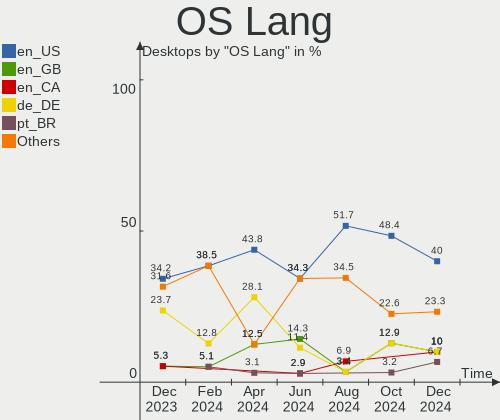

| Lang  | Desktops | Percent |
|-------|----------|---------|
| en_US | 17       | 56.67%  |
| es_ES | 3        | 10%     |
| en_GB | 3        | 10%     |
| pt_BR | 2        | 6.67%   |
| pl_PL | 1        | 3.33%   |
| es_MX | 1        | 3.33%   |
| en_PH | 1        | 3.33%   |
| de_DE | 1        | 3.33%   |
| de_AT | 1        | 3.33%   |

Boot Mode
---------

EFI or BIOS

| Mode | Desktops | Percent |
|------|----------|---------|
| EFI  | 23       | 76.67%  |
| BIOS | 7        | 23.33%  |

Filesystem
----------

Type of filesystem

| Type  | Desktops | Percent |
|-------|----------|---------|
| Btrfs | 28       | 93.33%  |
| Ext4  | 2        | 6.67%   |

Part. scheme
------------

Scheme of partitioning

| Type    | Desktops | Percent |
|---------|----------|---------|
| Unknown | 24       | 80%     |
| GPT     | 6        | 20%     |

Dual Boot with Linux/BSD
------------------------

Hosting more than one Linux/BSD

| Dual boot | Desktops | Percent |
|-----------|----------|---------|
| No        | 29       | 96.67%  |
| Yes       | 1        | 3.33%   |

Dual Boot (Win)
---------------

Hosting Linux and Windows

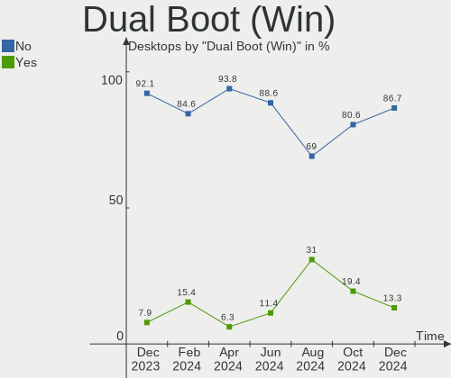

| Dual boot | Desktops | Percent |
|-----------|----------|---------|
| No        | 28       | 93.33%  |
| Yes       | 2        | 6.67%   |

Board
-----

Vendor
------

Motherboard manufacturer

| Name                                 | Desktops | Percent |
|--------------------------------------|----------|---------|
| MSI                                  | 7        | 23.33%  |
| Gigabyte Technology                  | 6        | 20%     |
| ASUSTek Computer                     | 6        | 20%     |
| ASRock                               | 3        | 10%     |
| Hewlett-Packard                      | 2        | 6.67%   |
| Shenzhen Meigao Electronic Equipment | 1        | 3.33%   |
| NZXT                                 | 1        | 3.33%   |
| GPD                                  | 1        | 3.33%   |
| Acidanthera                          | 1        | 3.33%   |
| Acer                                 | 1        | 3.33%   |
| Unknown                              | 1        | 3.33%   |

Model
-----

Motherboard model

| Name                                       | Desktops | Percent |
|--------------------------------------------|----------|---------|
| MSI MS-7D25                                | 2        | 6.67%   |
| Shenzhen Meigao Electronic Equipment UM590 | 1        | 3.33%   |
| NZXT N7 B650E                              | 1        | 3.33%   |
| MSI MS-7D54                                | 1        | 3.33%   |
| MSI MS-7C87                                | 1        | 3.33%   |
| MSI MS-7B86                                | 1        | 3.33%   |
| MSI MS-7B84                                | 1        | 3.33%   |
| MSI MS-7821                                | 1        | 3.33%   |
| HP Pavilion Gaming Desktop TG01-2xxx       | 1        | 3.33%   |
| HP Compaq Elite 8300 CMT                   | 1        | 3.33%   |
| GPD G1618-03                               | 1        | 3.33%   |
| Gigabyte X670 GAMING X AX                  | 1        | 3.33%   |
| Gigabyte X570 AORUS MASTER                 | 1        | 3.33%   |
| Gigabyte X570 AORUS ELITE                  | 1        | 3.33%   |
| Gigabyte X399 DESIGNARE EX                 | 1        | 3.33%   |
| Gigabyte B75M-D3H                          | 1        | 3.33%   |
| Gigabyte B550M DS3H AC                     | 1        | 3.33%   |
| ASUS TUF Gaming X670E-PLUS WIFI            | 1        | 3.33%   |
| ASUS TUF Gaming X670E-PLUS                 | 1        | 3.33%   |
| ASUS TUF Gaming X570-PLUS_BR               | 1        | 3.33%   |
| ASUS ROG STRIX Z690-E GAMING WIFI          | 1        | 3.33%   |
| ASUS CROSSHAIR VI HERO                     | 1        | 3.33%   |
| ASUS All Series                            | 1        | 3.33%   |
| ASRock Z170 Extreme6+                      | 1        | 3.33%   |
| ASRock X299 Taichi CLX                     | 1        | 3.33%   |
| ASRock H370 Performance                    | 1        | 3.33%   |
| Acidanthera MacPro7,1                      | 1        | 3.33%   |
| Acer Nitro N50-620                         | 1        | 3.33%   |
| Unknown                                    | 1        | 3.33%   |

Model Family
------------

Motherboard model prefix

| Name                                       | Desktops | Percent |
|--------------------------------------------|----------|---------|
| ASUS TUF                                   | 3        | 10%     |
| MSI MS-7D25                                | 2        | 6.67%   |
| Gigabyte X570                              | 2        | 6.67%   |
| Shenzhen Meigao Electronic Equipment UM590 | 1        | 3.33%   |
| NZXT N7                                    | 1        | 3.33%   |
| MSI MS-7D54                                | 1        | 3.33%   |
| MSI MS-7C87                                | 1        | 3.33%   |
| MSI MS-7B86                                | 1        | 3.33%   |
| MSI MS-7B84                                | 1        | 3.33%   |
| MSI MS-7821                                | 1        | 3.33%   |
| HP Pavilion                                | 1        | 3.33%   |
| HP Compaq                                  | 1        | 3.33%   |
| GPD G1618-03                               | 1        | 3.33%   |
| Gigabyte X670                              | 1        | 3.33%   |
| Gigabyte X399                              | 1        | 3.33%   |
| Gigabyte B75M-D3H                          | 1        | 3.33%   |
| Gigabyte B550M                             | 1        | 3.33%   |
| ASUS ROG                                   | 1        | 3.33%   |
| ASUS CROSSHAIR                             | 1        | 3.33%   |
| ASUS All                                   | 1        | 3.33%   |
| ASRock Z170                                | 1        | 3.33%   |
| ASRock X299                                | 1        | 3.33%   |
| ASRock H370                                | 1        | 3.33%   |
| Acidanthera MacPro7                        | 1        | 3.33%   |
| Acer Nitro                                 | 1        | 3.33%   |
| Unknown                                    | 1        | 3.33%   |

MFG Year
--------

Motherboard manufacture year

| Year | Desktops | Percent |
|------|----------|---------|
| 2021 | 8        | 26.67%  |
| 2022 | 7        | 23.33%  |
| 2019 | 4        | 13.33%  |
| 2018 | 4        | 13.33%  |
| 2020 | 3        | 10%     |
| 2012 | 2        | 6.67%   |
| 2016 | 1        | 3.33%   |
| 2013 | 1        | 3.33%   |

Form Factor
-----------

Physical design of the computer

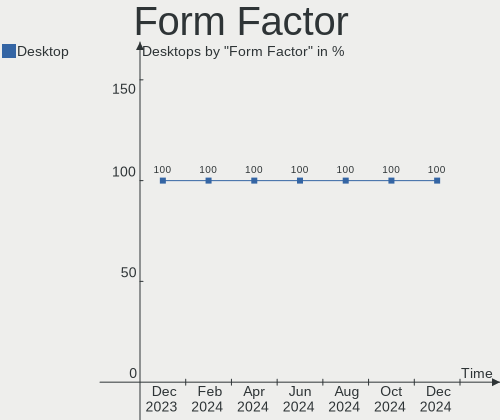

| Name    | Desktops | Percent |
|---------|----------|---------|
| Desktop | 30       | 100%    |

Secure Boot
-----------

Enabled or disabled

| State    | Desktops | Percent |
|----------|----------|---------|
| Disabled | 30       | 100%    |

Coreboot
--------

Have coreboot on board

| Used | Desktops | Percent |
|------|----------|---------|
| No   | 30       | 100%    |

RAM Size
--------

Total RAM memory

| Size in GB  | Desktops | Percent |
|-------------|----------|---------|
| 16.01-24.0  | 10       | 33.33%  |
| 32.01-64.0  | 9        | 30%     |
| 64.01-256.0 | 4        | 13.33%  |
| 4.01-8.0    | 3        | 10%     |
| 24.01-32.0  | 3        | 10%     |
| 8.01-16.0   | 1        | 3.33%   |

RAM Used
--------

Used RAM memory

| Used GB    | Desktops | Percent |
|------------|----------|---------|
| 4.01-8.0   | 18       | 60%     |
| 3.01-4.0   | 5        | 16.67%  |
| 8.01-16.0  | 4        | 13.33%  |
| 24.01-32.0 | 1        | 3.33%   |
| 2.01-3.0   | 1        | 3.33%   |
| 16.01-24.0 | 1        | 3.33%   |

Total Drives
------------

Number of drives on board

| Drives | Desktops | Percent |
|--------|----------|---------|
| 2      | 8        | 26.67%  |
| 1      | 8        | 26.67%  |
| 5      | 6        | 20%     |
| 3      | 4        | 13.33%  |
| 9      | 1        | 3.33%   |
| 8      | 1        | 3.33%   |
| 6      | 1        | 3.33%   |
| 4      | 1        | 3.33%   |

Has CD-ROM
----------

Has CD-ROM on board

| Presented | Desktops | Percent |
|-----------|----------|---------|
| No        | 24       | 80%     |
| Yes       | 6        | 20%     |

Has Ethernet
------------

Has Ethernet on board

| Presented | Desktops | Percent |
|-----------|----------|---------|
| Yes       | 28       | 93.33%  |
| No        | 2        | 6.67%   |

Has WiFi
--------

Has WiFi module

| Presented | Desktops | Percent |
|-----------|----------|---------|
| Yes       | 22       | 73.33%  |
| No        | 8        | 26.67%  |

Has Bluetooth
-------------

Has Bluetooth module

| Presented | Desktops | Percent |
|-----------|----------|---------|
| Yes       | 24       | 80%     |
| No        | 6        | 20%     |

Location
--------

Country
-------

Geographic location (country)

| Country      | Desktops | Percent |
|--------------|----------|---------|
| USA          | 9        | 30%     |
| UK           | 3        | 10%     |
| Spain        | 3        | 10%     |
| Netherlands  | 3        | 10%     |
| Brazil       | 2        | 6.67%   |
| Saudi Arabia | 1        | 3.33%   |
| Russia       | 1        | 3.33%   |
| Poland       | 1        | 3.33%   |
| Philippines  | 1        | 3.33%   |
| Japan        | 1        | 3.33%   |
| Germany      | 1        | 3.33%   |
| France       | 1        | 3.33%   |
| Finland      | 1        | 3.33%   |
| Austria      | 1        | 3.33%   |
| Argentina    | 1        | 3.33%   |

City
----

Geographic location (city)

| City                     | Desktops | Percent |
|--------------------------|----------|---------|
| Donostia / San Sebastian | 2        | 6.67%   |
| Wilkesboro               | 1        | 3.33%   |
| Villa General Belgrano   | 1        | 3.33%   |
| Utrecht                  | 1        | 3.33%   |
| Tipton                   | 1        | 3.33%   |
| The Bronx                | 1        | 3.33%   |
| Samara                   | 1        | 3.33%   |
| Rotterdam                | 1        | 3.33%   |
| Quezon City              | 1        | 3.33%   |
| Pinsdorf                 | 1        | 3.33%   |
| Newport                  | 1        | 3.33%   |
| New Bern                 | 1        | 3.33%   |
| Manassas                 | 1        | 3.33%   |
| Lakeland                 | 1        | 3.33%   |
| Johnstown                | 1        | 3.33%   |
| Herten                   | 1        | 3.33%   |
| Helsinki                 | 1        | 3.33%   |
| Gdynia                   | 1        | 3.33%   |
| Fort Worth               | 1        | 3.33%   |
| Ellesmere Port           | 1        | 3.33%   |
| East Stroudsburg         | 1        | 3.33%   |
| Dammam                   | 1        | 3.33%   |
| Colombes                 | 1        | 3.33%   |
| Chatan                   | 1        | 3.33%   |
| Cadalso de los Vidrios   | 1        | 3.33%   |
| Bauru                    | 1        | 3.33%   |
| Atlanta                  | 1        | 3.33%   |
| Arapiraca                | 1        | 3.33%   |
| Ansbach                  | 1        | 3.33%   |

Drives
------

Drive Vendor
------------

Hard drive vendors

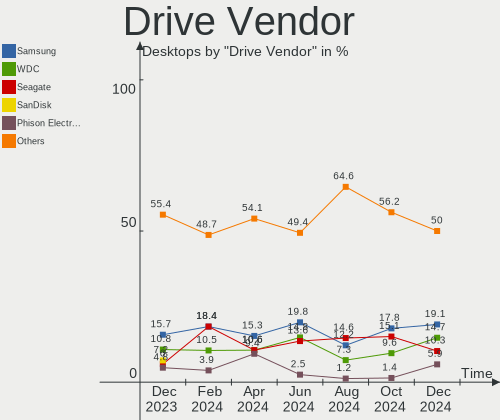

| Vendor                      | Desktops | Drives | Percent |
|-----------------------------|----------|--------|---------|
| Samsung Electronics         | 14       | 23     | 19.72%  |
| WDC                         | 9        | 11     | 12.68%  |
| Sandisk                     | 9        | 11     | 12.68%  |
| Seagate                     | 8        | 12     | 11.27%  |
| Phison Electronics          | 5        | 7      | 7.04%   |
| Kingston                    | 5        | 7      | 7.04%   |
| Toshiba                     | 3        | 3      | 4.23%   |
| Crucial                     | 3        | 3      | 4.23%   |
| Micron/Crucial Technology   | 2        | 2      | 2.82%   |
| HGST                        | 2        | 3      | 2.82%   |
| Verbatim                    | 1        | 1      | 1.41%   |
| Team                        | 1        | 1      | 1.41%   |
| SPCC                        | 1        | 1      | 1.41%   |
| Silicon Motion              | 1        | 1      | 1.41%   |
| Phison                      | 1        | 1      | 1.41%   |
| MAXIO Technology (Hangzhou) | 1        | 1      | 1.41%   |
| KIOXIA                      | 1        | 1      | 1.41%   |
| Intel                       | 1        | 1      | 1.41%   |
| Hitachi                     | 1        | 1      | 1.41%   |
| Gigabyte Technology         | 1        | 1      | 1.41%   |
| Biwin Storage Technology    | 1        | 1      | 1.41%   |

Drive Model
-----------

Hard drive models

| Model                                                 | Desktops | Percent |
|-------------------------------------------------------|----------|---------|
| Samsung NVMe SSD Controller SM981/PM981/PM983 500GB   | 4        | 4.88%   |
| Sandisk WD Blue SN550 NVMe SSD 250GB                  | 3        | 3.66%   |
| WDC WDS100T2B0A-00SM50 1TB SSD                        | 2        | 2.44%   |
| Seagate ST4000DM004-2CV104 4TB                        | 2        | 2.44%   |
| Seagate ST2000DM008-2FR102 2TB                        | 2        | 2.44%   |
| Sandisk WD_BLACK SN850X 2000GB                        | 2        | 2.44%   |
| Sandisk WD_BLACK SN770 1TB                            | 2        | 2.44%   |
| Samsung SSD 860 EVO 1TB                               | 2        | 2.44%   |
| Samsung NVMe SSD Controller PM9A1/PM9A3/980PRO 1TB    | 2        | 2.44%   |
| Phison E12 NVMe Controller 2TB                        | 2        | 2.44%   |
| WDC WDS500G2B0A-00SM50 500GB SSD                      | 1        | 1.22%   |
| WDC WDS240G2G0A-00JH30 240GB SSD                      | 1        | 1.22%   |
| WDC WD5000AAVS-00ZTB0 500GB                           | 1        | 1.22%   |
| WDC WD50 00LPCX-24C6HT0 500GB                         | 1        | 1.22%   |
| WDC WD4005FZBX-00K5WB0 4TB                            | 1        | 1.22%   |
| WDC WD10EZRZ-00HTKB0 1TB                              | 1        | 1.22%   |
| WDC WD10EZEX-21WN4A0 1TB                              | 1        | 1.22%   |
| WDC WD10EURX-63UY4Y0 1TB                              | 1        | 1.22%   |
| Verbatim Vi550 S3 SSD 1TB                             | 1        | 1.22%   |
| Toshiba MK2555GSX 250GB                               | 1        | 1.22%   |
| Toshiba MD04ACA400 4TB                                | 1        | 1.22%   |
| Toshiba HDWD120 2TB                                   | 1        | 1.22%   |
| Team T2532TB SSD                                      | 1        | 1.22%   |
| SPCC Solid State Disk 256GB                           | 1        | 1.22%   |
| Silicon Motion SM2263EN/SM2263XT SSD Controller 500GB | 1        | 1.22%   |
| Seagate ST95005620AS 500GB                            | 1        | 1.22%   |
| Seagate ST9500530NS 500GB                             | 1        | 1.22%   |
| Seagate ST500DM002-1BD142 500GB                       | 1        | 1.22%   |
| Seagate ST3000NM0023 3TB                              | 1        | 1.22%   |
| Seagate ST2000DX001-1CM164 2TB                        | 1        | 1.22%   |
| Seagate ST1000LM048-2E7172 1TB                        | 1        | 1.22%   |
| Sandisk WD_BLACK SN770 2TB                            | 1        | 1.22%   |
| Sandisk WDC WDS500G2B0C-00PXH0 500GB                  | 1        | 1.22%   |
| SanDisk SDSSDH32000G 2TB                              | 1        | 1.22%   |
| SanDisk SDSSDH3 1T00 1TB                              | 1        | 1.22%   |
| Samsung SSD 980 1TB                                   | 1        | 1.22%   |
| Samsung SSD 870 EVO 2TB                               | 1        | 1.22%   |
| Samsung SSD 860 EVO 500GB                             | 1        | 1.22%   |
| Samsung SSD 860 EVO 250GB                             | 1        | 1.22%   |
| Samsung SSD 850 PRO 512GB                             | 1        | 1.22%   |

HDD Vendor
----------

Hard disk drive vendors

| Vendor              | Desktops | Drives | Percent |
|---------------------|----------|--------|---------|
| Seagate             | 8        | 12     | 36.36%  |
| WDC                 | 6        | 6      | 27.27%  |
| Toshiba             | 3        | 3      | 13.64%  |
| Samsung Electronics | 2        | 3      | 9.09%   |
| HGST                | 2        | 3      | 9.09%   |
| Hitachi             | 1        | 1      | 4.55%   |

SSD Vendor
----------

Solid state drive vendors

| Vendor              | Desktops | Drives | Percent |
|---------------------|----------|--------|---------|
| Samsung Electronics | 7        | 10     | 33.33%  |
| WDC                 | 3        | 5      | 14.29%  |
| Kingston            | 3        | 5      | 14.29%  |
| Crucial             | 3        | 3      | 14.29%  |
| Verbatim            | 1        | 1      | 4.76%   |
| Team                | 1        | 1      | 4.76%   |
| SPCC                | 1        | 1      | 4.76%   |
| SanDisk             | 1        | 2      | 4.76%   |
| Gigabyte Technology | 1        | 1      | 4.76%   |

Drive Kind
----------

HDD or SSD

| Kind | Desktops | Drives | Percent |
|------|----------|--------|---------|
| NVMe | 25       | 36     | 43.86%  |
| HDD  | 17       | 28     | 29.82%  |
| SSD  | 15       | 29     | 26.32%  |

Drive Connector
---------------

SATA, SAS, NVMe, etc.

| Type | Desktops | Drives | Percent |
|------|----------|--------|---------|
| NVMe | 25       | 36     | 51.02%  |
| SATA | 21       | 51     | 42.86%  |
| SAS  | 3        | 6      | 6.12%   |

Drive Size
----------

Size of hard drive

| Size in TB | Desktops | Drives | Percent |
|------------|----------|--------|---------|
| 0.01-0.5   | 15       | 21     | 37.5%   |
| 0.51-1.0   | 13       | 18     | 32.5%   |
| 1.01-2.0   | 6        | 9      | 15%     |
| 3.01-4.0   | 5        | 6      | 12.5%   |
| 2.01-3.0   | 1        | 3      | 2.5%    |

Space Total
-----------

Amount of disk space available on the file system

| Size in GB     | Desktops | Percent |
|----------------|----------|---------|
| More than 3000 | 9        | 30%     |
| 1001-2000      | 7        | 23.33%  |
| 501-1000       | 5        | 16.67%  |
| 251-500        | 3        | 10%     |
| 2001-3000      | 2        | 6.67%   |
| 21-50          | 1        | 3.33%   |
| 101-250        | 1        | 3.33%   |
| 1-20           | 1        | 3.33%   |
| 51-100         | 1        | 3.33%   |

Space Used
----------

Amount of used disk space

| Used GB        | Desktops | Percent |
|----------------|----------|---------|
| 21-50          | 6        | 20%     |
| 51-100         | 6        | 20%     |
| 1-20           | 5        | 16.67%  |
| 251-500        | 4        | 13.33%  |
| 501-1000       | 4        | 13.33%  |
| More than 3000 | 2        | 6.67%   |
| 101-250        | 2        | 6.67%   |
| 1001-2000      | 1        | 3.33%   |

Malfunc. Drives
---------------

Drive models with a malfunction

Zero info for selected period =(

Malfunc. Drive Vendor
---------------------

Vendors of faulty drives

Zero info for selected period =(

Malfunc. HDD Vendor
-------------------

Vendors of faulty HDD drives

Zero info for selected period =(

Malfunc. Drive Kind
-------------------

Kinds of faulty drives

Zero info for selected period =(

Failed Drives
-------------

Failed drive models

Zero info for selected period =(

Failed Drive Vendor
-------------------

Failed drive vendors

Zero info for selected period =(

Drive Status
------------

Number of failed and malfunc. drives

| Status   | Desktops | Drives | Percent |
|----------|----------|--------|---------|
| Detected | 24       | 78     | 80%     |
| Works    | 6        | 15     | 20%     |

Storage controller
------------------

Storage Vendor
--------------

Storage controller vendors

| Vendor                      | Desktops | Percent |
|-----------------------------|----------|---------|
| AMD                         | 17       | 26.56%  |
| Intel                       | 13       | 20.31%  |
| SanDisk                     | 8        | 12.5%   |
| Samsung Electronics         | 8        | 12.5%   |
| Phison Electronics          | 5        | 7.81%   |
| ASMedia Technology          | 3        | 4.69%   |
| Micron/Crucial Technology   | 2        | 3.13%   |
| Kingston Technology Company | 2        | 3.13%   |
| Silicon Motion              | 1        | 1.56%   |
| MAXIO Technology (Hangzhou) | 1        | 1.56%   |
| Marvell Technology Group    | 1        | 1.56%   |
| LSI Logic / Symbios Logic   | 1        | 1.56%   |
| KIOXIA                      | 1        | 1.56%   |
| Biwin Storage Technology    | 1        | 1.56%   |

Storage Model
-------------

Storage controller models

| Model                                                                          | Desktops | Percent |
|--------------------------------------------------------------------------------|----------|---------|
| AMD FCH SATA Controller [AHCI mode]                                            | 12       | 16.9%   |
| Samsung NVMe SSD Controller SM981/PM981/PM983                                  | 4        | 5.63%   |
| Intel Alder Lake-S PCH SATA Controller [AHCI Mode]                             | 4        | 5.63%   |
| AMD 400 Series Chipset SATA Controller                                         | 4        | 5.63%   |
| SanDisk WD Blue SN550 NVMe SSD                                                 | 3        | 4.23%   |
| SanDisk WD Black SN770 / PC SN740 256GB / PC SN560 (DRAM-less) NVMe SSD        | 3        | 4.23%   |
| ASMedia ASM1062 Serial ATA Controller                                          | 3        | 4.23%   |
| Sandisk Western Digital WD Black SN850X NVMe SSD                               | 2        | 2.82%   |
| Samsung NVMe SSD Controller PM9A1/PM9A3/980PRO                                 | 2        | 2.82%   |
| Phison E12 NVMe Controller                                                     | 2        | 2.82%   |
| AMD 500 Series Chipset SATA Controller                                         | 2        | 2.82%   |
| Silicon Motion SM2263EN/SM2263XT (DRAM-less) NVMe SSD Controllers              | 1        | 1.41%   |
| SanDisk WD Green SN350 NVMe SSD 240GB (DRAM-less)                              | 1        | 1.41%   |
| Samsung NVMe SSD Controller SM961/PM961/SM963                                  | 1        | 1.41%   |
| Samsung NVMe SSD Controller 980                                                | 1        | 1.41%   |
| Phison PS5021-E21 PCIe4 NVMe Controller (DRAM-less)                            | 1        | 1.41%   |
| Phison PS5013 E13 NVMe Controller                                              | 1        | 1.41%   |
| Phison E18 PCIe4 NVMe Controller                                               | 1        | 1.41%   |
| Phison E16 PCIe4 NVMe Controller                                               | 1        | 1.41%   |
| Micron/Crucial P5 Plus NVMe PCIe SSD                                           | 1        | 1.41%   |
| Micron/Crucial P1 NVMe PCIe SSD[Frampton]                                      | 1        | 1.41%   |
| MAXIO (Hangzhou) NVMe SSD Controller MAP1602                                   | 1        | 1.41%   |
| Marvell Group 88SE9215 PCIe 2.0 x1 4-port SATA 6 Gb/s Controller               | 1        | 1.41%   |
| LSI Logic / Symbios Logic SAS2008 PCI-Express Fusion-MPT SAS-2 [Falcon]        | 1        | 1.41%   |
| KIOXIA NVMe SSD                                                                | 1        | 1.41%   |
| Kingston Company KC3000/Renegade NVMe SSD                                      | 1        | 1.41%   |
| Kingston Company A2000 NVMe SSD                                                | 1        | 1.41%   |
| Intel Volume Management Device NVMe RAID Controller                            | 1        | 1.41%   |
| Intel SSD 660P Series                                                          | 1        | 1.41%   |
| Intel Q170/Q150/B150/H170/H110/Z170/CM236 Chipset SATA Controller [AHCI Mode]  | 1        | 1.41%   |
| Intel Cannon Lake PCH SATA AHCI Controller                                     | 1        | 1.41%   |
| Intel C610/X99 series chipset 6-Port SATA Controller [AHCI mode]               | 1        | 1.41%   |
| Intel 8 Series/C220 Series Chipset Family 6-port SATA Controller 1 [AHCI mode] | 1        | 1.41%   |
| Intel 7 Series/C210 Series Chipset Family 6-port SATA Controller [AHCI mode]   | 1        | 1.41%   |
| Intel 7 Series/C210 Series Chipset Family 4-port SATA Controller [IDE mode]    | 1        | 1.41%   |
| Intel 7 Series/C210 Series Chipset Family 2-port SATA Controller [IDE mode]    | 1        | 1.41%   |
| Intel 500 Series Chipset Family SATA AHCI Controller                           | 1        | 1.41%   |
| Intel 200 Series PCH SATA controller [AHCI mode]                               | 1        | 1.41%   |
| Biwin Storage EX900 NVMe SSD (DRAM-less)                                       | 1        | 1.41%   |
| AMD X399 Series Chipset SATA Controller                                        | 1        | 1.41%   |

Storage Kind
------------

Kind of storage controller (IDE, SATA, NVMe, SAS, ...)

| Kind | Desktops | Percent |
|------|----------|---------|
| SATA | 28       | 50%     |
| NVMe | 25       | 44.64%  |
| RAID | 1        | 1.79%   |
| SAS  | 1        | 1.79%   |
| IDE  | 1        | 1.79%   |

Processor
---------

CPU Vendor
----------

Processor vendors

| Vendor | Desktops | Percent |
|--------|----------|---------|
| AMD    | 17       | 56.67%  |
| Intel  | 13       | 43.33%  |

CPU Model
---------

Processor models

| Model                                           | Desktops | Percent |
|-------------------------------------------------|----------|---------|
| AMD Ryzen 9 7900X 12-Core Processor             | 3        | 10%     |
| Intel Core i5-3470 CPU @ 3.20GHz                | 2        | 6.67%   |
| AMD Ryzen 9 3900X 12-Core Processor             | 2        | 6.67%   |
| AMD Ryzen 5 5600X 6-Core Processor              | 2        | 6.67%   |
| AMD Ryzen 5 5600G with Radeon Graphics          | 2        | 6.67%   |
| AMD Ryzen 5 3600 6-Core Processor               | 2        | 6.67%   |
| Intel Core i9-10940X CPU @ 3.30GHz              | 1        | 3.33%   |
| Intel Core i7-8700 CPU @ 3.20GHz                | 1        | 3.33%   |
| Intel Core i7-5820K CPU @ 3.30GHz               | 1        | 3.33%   |
| Intel Core i7-4770K CPU @ 3.50GHz               | 1        | 3.33%   |
| Intel Core i5-6600 CPU @ 3.30GHz                | 1        | 3.33%   |
| Intel 13th Gen Core i7-13700K                   | 1        | 3.33%   |
| Intel 13th Gen Core i5-13500                    | 1        | 3.33%   |
| Intel 12th Gen Core i9-12900K                   | 1        | 3.33%   |
| Intel 12th Gen Core i7-12700K                   | 1        | 3.33%   |
| Intel 11th Gen Core i7-1195G7 @ 2.90GHz         | 1        | 3.33%   |
| Intel 11th Gen Core i5-11400F @ 2.60GHz         | 1        | 3.33%   |
| AMD Ryzen Threadripper 2970WX 24-Core Processor | 1        | 3.33%   |
| AMD Ryzen 9 5900HX with Radeon Graphics         | 1        | 3.33%   |
| AMD Ryzen 7 7800X3D 8-Core Processor            | 1        | 3.33%   |
| AMD Ryzen 7 5800X 8-Core Processor              | 1        | 3.33%   |
| AMD Ryzen 7 3700X 8-Core Processor              | 1        | 3.33%   |
| AMD Ryzen 5 2600 Six-Core Processor             | 1        | 3.33%   |

CPU Model Family
----------------

Processor model prefix

| Model                  | Desktops | Percent |
|------------------------|----------|---------|
| AMD Ryzen 5            | 7        | 23.33%  |
| Other                  | 6        | 20%     |
| AMD Ryzen 9            | 6        | 20%     |
| Intel Core i7          | 3        | 10%     |
| Intel Core i5          | 3        | 10%     |
| AMD Ryzen 7            | 3        | 10%     |
| Intel Core i9          | 1        | 3.33%   |
| AMD Ryzen Threadripper | 1        | 3.33%   |

CPU Cores
---------

Number of processor cores

| Number | Desktops | Percent |
|--------|----------|---------|
| 6      | 10       | 33.33%  |
| 12     | 6        | 20%     |
| 4      | 5        | 16.67%  |
| 8      | 4        | 13.33%  |
| 16     | 2        | 6.67%   |
| 14     | 2        | 6.67%   |
| 24     | 1        | 3.33%   |

CPU Sockets
-----------

Number of sockets

| Number | Desktops | Percent |
|--------|----------|---------|
| 1      | 30       | 100%    |

CPU Threads
-----------

Threads per core (Hyper-Threading)

| Number | Desktops | Percent |
|--------|----------|---------|
| 2      | 26       | 86.67%  |
| 1      | 4        | 13.33%  |

CPU Op-Modes
------------

CPU Operation Modes (32-bit, 64-bit)

| Op mode        | Desktops | Percent |
|----------------|----------|---------|
| 32-bit, 64-bit | 30       | 100%    |

CPU Microcode
-------------

Microcode number

| Number     | Desktops | Percent |
|------------|----------|---------|
| Unknown    | 15       | 50%     |
| 0x0a601203 | 3        | 10%     |
| 0x08701021 | 3        | 10%     |
| 0x08701030 | 2        | 6.67%   |
| 0x0a601201 | 1        | 3.33%   |
| 0x0a50000d | 1        | 3.33%   |
| 0x0a50000c | 1        | 3.33%   |
| 0x0a201205 | 1        | 3.33%   |
| 0x0a201025 | 1        | 3.33%   |
| 0x0a201016 | 1        | 3.33%   |
| 0x0800820b | 1        | 3.33%   |

CPU Microarch
-------------

Microarchitecture

| Name             | Desktops | Percent |
|------------------|----------|---------|
| Zen 3            | 6        | 20%     |
| Zen 2            | 5        | 16.67%  |
| Unknown          | 5        | 16.67%  |
| Alderlake Hybrid | 3        | 10%     |
| Zen+             | 2        | 6.67%   |
| Skylake          | 2        | 6.67%   |
| IvyBridge        | 2        | 6.67%   |
| Haswell          | 2        | 6.67%   |
| TigerLake        | 1        | 3.33%   |
| KabyLake         | 1        | 3.33%   |
| Icelake          | 1        | 3.33%   |

Graphics
--------

GPU Vendor
----------

Vendors of graphics cards

| Vendor | Desktops | Percent |
|--------|----------|---------|
| AMD    | 16       | 45.71%  |
| Nvidia | 13       | 37.14%  |
| Intel  | 6        | 17.14%  |

GPU Model
---------

Graphics card models

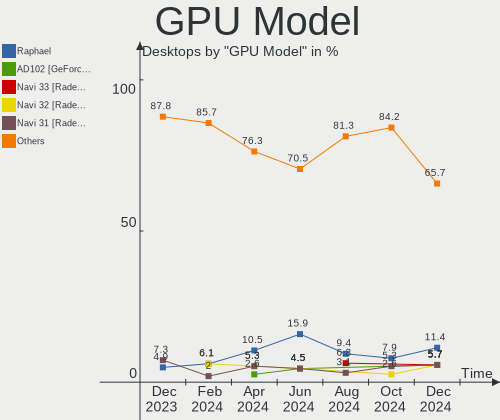

| Model                                                                       | Desktops | Percent |
|-----------------------------------------------------------------------------|----------|---------|
| AMD Raphael                                                                 | 3        | 8.11%   |
| AMD Ellesmere [Radeon RX 470/480/570/570X/580/580X/590]                     | 3        | 8.11%   |
| AMD Cezanne [Radeon Vega Series / Radeon Vega Mobile Series]                | 3        | 8.11%   |
| Intel AlderLake-S GT1                                                       | 2        | 5.41%   |
| AMD Navi 23 [Radeon RX 6600/6600 XT/6600M]                                  | 2        | 5.41%   |
| AMD Navi 22 [Radeon RX 6700/6700 XT/6750 XT / 6800M/6850M XT]               | 2        | 5.41%   |
| AMD Navi 21 [Radeon RX 6800/6800 XT / 6900 XT]                              | 2        | 5.41%   |
| Nvidia TU116 [GeForce GTX 1660 SUPER]                                       | 1        | 2.7%    |
| Nvidia TU116 [GeForce GTX 1650 SUPER]                                       | 1        | 2.7%    |
| Nvidia TU106 [GeForce RTX 2070 Rev. A]                                      | 1        | 2.7%    |
| Nvidia TU104 [GeForce RTX 2060]                                             | 1        | 2.7%    |
| Nvidia GP107 [GeForce GTX 1050]                                             | 1        | 2.7%    |
| Nvidia GP104 [GeForce GTX 1070]                                             | 1        | 2.7%    |
| Nvidia GP104 [GeForce GTX 1060 6GB]                                         | 1        | 2.7%    |
| Nvidia GA104 [GeForce RTX 3070]                                             | 1        | 2.7%    |
| Nvidia GA104 [GeForce RTX 3070 Lite Hash Rate]                              | 1        | 2.7%    |
| Nvidia GA102 [GeForce RTX 3090 Ti]                                          | 1        | 2.7%    |
| Nvidia GA102 [GeForce RTX 3080 Ti]                                          | 1        | 2.7%    |
| Nvidia GA102 [GeForce RTX 3080 12GB]                                        | 1        | 2.7%    |
| Nvidia AD102 [GeForce RTX 4090]                                             | 1        | 2.7%    |
| Intel Xeon E3-1200 v3/4th Gen Core Processor Integrated Graphics Controller | 1        | 2.7%    |
| Intel Xeon E3-1200 v2/3rd Gen Core processor Graphics Controller            | 1        | 2.7%    |
| Intel TigerLake-LP GT2 [Iris Xe Graphics]                                   | 1        | 2.7%    |
| Intel Raptor Lake-S GT1 [UHD Graphics 770]                                  | 1        | 2.7%    |
| AMD Navi 21 [Radeon RX 6950 XT]                                             | 1        | 2.7%    |
| AMD Navi 14 [Radeon RX 5500/5500M / Pro 5500M]                              | 1        | 2.7%    |
| AMD Ellesmere [Radeon Pro WX 7100]                                          | 1        | 2.7%    |

GPU Combo
---------

Combinations of graphics cards

| Name           | Desktops | Percent |
|----------------|----------|---------|
| 1 x AMD        | 12       | 40%     |
| 1 x Nvidia     | 11       | 36.67%  |
| 2 x AMD        | 3        | 10%     |
| 1 x Intel      | 2        | 6.67%   |
| Intel + Nvidia | 1        | 3.33%   |
| AMD + Nvidia   | 1        | 3.33%   |

GPU Driver
----------

Free vs proprietary

| Driver      | Desktops | Percent |
|-------------|----------|---------|
| Free        | 19       | 63.33%  |
| Proprietary | 11       | 36.67%  |

GPU Memory
----------

Total video memory

| Size in GB | Desktops | Percent |
|------------|----------|---------|
| Unknown    | 10       | 33.33%  |
| 7.01-8.0   | 7        | 23.33%  |
| 8.01-16.0  | 6        | 20%     |
| 0.01-0.5   | 3        | 10%     |
| 5.01-6.0   | 1        | 3.33%   |
| 3.01-4.0   | 1        | 3.33%   |
| 1.01-2.0   | 1        | 3.33%   |
| 0.51-1.0   | 1        | 3.33%   |

Monitor
-------

Monitor Vendor
--------------

Monitor vendors

| Vendor               | Desktops | Percent |
|----------------------|----------|---------|
| Samsung Electronics  | 8        | 20%     |
| Goldstar             | 5        | 12.5%   |
| Dell                 | 4        | 10%     |
| AOC                  | 3        | 7.5%    |
| ViewSonic            | 2        | 5%      |
| Gigabyte Technology  | 2        | 5%      |
| BenQ                 | 2        | 5%      |
| ASUSTek Computer     | 2        | 5%      |
| Acer                 | 2        | 5%      |
| WIT                  | 1        | 2.5%    |
| Sony                 | 1        | 2.5%    |
| Sharp                | 1        | 2.5%    |
| NEC Computers        | 1        | 2.5%    |
| MSI                  | 1        | 2.5%    |
| Iiyama               | 1        | 2.5%    |
| Hewlett-Packard      | 1        | 2.5%    |
| Eizo                 | 1        | 2.5%    |
| Corsair              | 1        | 2.5%    |
| Ancor Communications | 1        | 2.5%    |

Monitor Model
-------------

Monitor models

| Model                                                                   | Desktops | Percent |
|-------------------------------------------------------------------------|----------|---------|
| WIT DVI WIT00FA 2560x1600 670x430mm 31.3-inch                           | 1        | 2.33%   |
| ViewSonic XG2401 SERIES VSCBB31 1920x1080 531x299mm 24.0-inch           | 1        | 2.33%   |
| ViewSonic VX2778 Series VSC8432 2560x1440 597x336mm 27.0-inch           | 1        | 2.33%   |
| Sony TV *30 SNYB905 3840x2160 1439x809mm 65.0-inch                      | 1        | 2.33%   |
| Sharp HDMI SHP10E6 1920x1080 1330x750mm 60.1-inch                       | 1        | 2.33%   |
| Samsung Electronics SyncMaster SAM0214 1680x1050 408x306mm 20.1-inch    | 1        | 2.33%   |
| Samsung Electronics SMT27A550 SAM07B6 1920x1080 600x340mm 27.2-inch     | 1        | 2.33%   |
| Samsung Electronics SMBX2031N SAM0769 1600x900 443x249mm 20.0-inch      | 1        | 2.33%   |
| Samsung Electronics SMB2230H SAM0648 1920x1080                          | 1        | 2.33%   |
| Samsung Electronics S24F350 SAM0D20 1920x1080 521x293mm 23.5-inch       | 1        | 2.33%   |
| Samsung Electronics LCD Monitor SAM712A 3840x1600 1872x1053mm 84.6-inch | 1        | 2.33%   |
| Samsung Electronics LCD Monitor SAM07D0 1360x768 700x390mm 31.5-inch    | 1        | 2.33%   |
| Samsung Electronics LCD Monitor SAM07C0 1920x1080 480x270mm 21.7-inch   | 1        | 2.33%   |
| NEC Computers EA305WMi NEC2BAB 2560x1600 641x401mm 29.8-inch            | 1        | 2.33%   |
| MSI Optix G241VC MSI1462 1920x1080 521x294mm 23.6-inch                  | 1        | 2.33%   |
| Iiyama PL2466H IVM614C 1920x1080 522x294mm 23.6-inch                    | 1        | 2.33%   |
| Hewlett-Packard X32 HPN3726 2560x1440 698x393mm 31.5-inch               | 1        | 2.33%   |
| Goldstar W1943 GSM4BAD 1360x768 406x229mm 18.4-inch                     | 1        | 2.33%   |
| Goldstar M237WA GSM5726 1920x1080 509x286mm 23.0-inch                   | 1        | 2.33%   |
| Goldstar HDR 4K GSM7706 3840x2160 600x340mm 27.2-inch                   | 1        | 2.33%   |
| Goldstar FULL HD GSM5BDF 1920x1080 480x270mm 21.7-inch                  | 1        | 2.33%   |
| Goldstar 27GK750F GSM770F 1920x1080 531x298mm 24.0-inch                 | 1        | 2.33%   |
| Gigabyte Technology M27Q GBT270D 2560x1440 596x335mm 26.9-inch          | 1        | 2.33%   |
| Gigabyte Technology G27QC GBT270B 2560x1440 597x336mm 27.0-inch         | 1        | 2.33%   |
| Eizo FS2333 ENC2419 1920x1080 510x287mm 23.0-inch                       | 1        | 2.33%   |
| Dell SE2417HGX DELD0F6 1920x1080 521x293mm 23.5-inch                    | 1        | 2.33%   |
| Dell SE2219H DELF10F 1920x1080 480x270mm 21.7-inch                      | 1        | 2.33%   |
| Dell S2721DGF DEL41D9 2560x1440 597x336mm 27.0-inch                     | 1        | 2.33%   |
| Dell P2418D DELD0C1 2560x1440 530x300mm 24.0-inch                       | 1        | 2.33%   |
| Dell G2722HS DEL427F 1920x1080 597x336mm 27.0-inch                      | 1        | 2.33%   |
| Dell E177FP DELA023 1280x1024 340x270mm 17.1-inch                       | 1        | 2.33%   |
| Corsair 27QHD240 CRM1B20 2560x1440 590x334mm 26.7-inch                  | 1        | 2.33%   |
| BenQ RL2455 BNQ7F1C 1920x1080 531x298mm 24.0-inch                       | 1        | 2.33%   |
| BenQ PD3200Q BNQ8026 2560x1440 708x399mm 32.0-inch                      | 1        | 2.33%   |
| ASUSTek Computer VA27EHE AUS27D2 1920x1080 598x336mm 27.0-inch          | 1        | 2.33%   |
| ASUSTek Computer PA278QV AUS2700 2560x1440 600x340mm 27.2-inch          | 1        | 2.33%   |
| AOC U28G2G4R4 AOCB201 3840x2160 621x341mm 27.9-inch                     | 1        | 2.33%   |
| AOC Q32E2WG5B AOC3202 2560x1440 698x393mm 31.5-inch                     | 1        | 2.33%   |
| AOC AG271QG AOC2713 2560x1440 598x336mm 27.0-inch                       | 1        | 2.33%   |
| AOC 2779 AOC2779 1920x1080 598x336mm 27.0-inch                          | 1        | 2.33%   |

Monitor Resolution
------------------

Monitor screen resolution

| Resolution         | Desktops | Percent |
|--------------------|----------|---------|
| 1920x1080 (FHD)    | 15       | 38.46%  |
| 2560x1440 (QHD)    | 11       | 28.21%  |
| 3840x2160 (4K)     | 4        | 10.26%  |
| 2560x1600          | 2        | 5.13%   |
| 1360x768           | 2        | 5.13%   |
| 3840x1600          | 1        | 2.56%   |
| 3440x1440          | 1        | 2.56%   |
| 1680x1050 (WSXGA+) | 1        | 2.56%   |
| 1600x900 (HD+)     | 1        | 2.56%   |
| 1280x1024 (SXGA)   | 1        | 2.56%   |

Monitor Diagonal
----------------

Diagonal size in inches

| Inches  | Desktops | Percent |
|---------|----------|---------|
| 27      | 12       | 29.27%  |
| 31      | 5        | 12.2%   |
| 23      | 5        | 12.2%   |
| 24      | 3        | 7.32%   |
| 21      | 3        | 7.32%   |
| 20      | 2        | 4.88%   |
| 85      | 1        | 2.44%   |
| 84      | 1        | 2.44%   |
| 60      | 1        | 2.44%   |
| 46      | 1        | 2.44%   |
| 34      | 1        | 2.44%   |
| 32      | 1        | 2.44%   |
| 29      | 1        | 2.44%   |
| 26      | 1        | 2.44%   |
| 18      | 1        | 2.44%   |
| 17      | 1        | 2.44%   |
| Unknown | 1        | 2.44%   |

Monitor Width
-------------

Physical width

| Width in mm | Desktops | Percent |
|-------------|----------|---------|
| 501-600     | 18       | 46.15%  |
| 601-700     | 7        | 17.95%  |
| 401-500     | 6        | 15.38%  |
| 701-800     | 2        | 5.13%   |
| 1501-2000   | 2        | 5.13%   |
| 1001-1500   | 2        | 5.13%   |
| 301-350     | 1        | 2.56%   |
| Unknown     | 1        | 2.56%   |

Aspect Ratio
------------

Proportional relationship between the width and the height

| Ratio | Desktops | Percent |
|-------|----------|---------|
| 16/9  | 26       | 83.87%  |
| 16/10 | 2        | 6.45%   |
| 5/4   | 1        | 3.23%   |
| 4/3   | 1        | 3.23%   |
| 21/9  | 1        | 3.23%   |

Monitor Area
------------

Area in inch

| Area in inch | Desktops | Percent |
|----------------|----------|---------|
| 301-350        | 12       | 31.58%  |
| 201-250        | 9        | 23.68%  |
| 351-500        | 8        | 21.05%  |
| More than 1000 | 3        | 7.89%   |
| 151-200        | 2        | 5.26%   |
| 141-150        | 2        | 5.26%   |
| 501-1000       | 1        | 2.63%   |
| Unknown        | 1        | 2.63%   |

Pixel Density
-------------

Pixels per inch

| Density | Desktops | Percent |
|---------|----------|---------|
| 51-100  | 17       | 44.74%  |
| 101-120 | 13       | 34.21%  |
| 1-50    | 4        | 10.53%  |
| 121-160 | 2        | 5.26%   |
| 161-240 | 1        | 2.63%   |
| Unknown | 1        | 2.63%   |

Multiple Monitors
-----------------

Total monitors connected

| Total | Desktops | Percent |
|-------|----------|---------|
| 1     | 18       | 60%     |
| 2     | 7        | 23.33%  |
| 3     | 4        | 13.33%  |
| 0     | 1        | 3.33%   |

Network
-------

Net Controller Vendor
---------------------

Controller vendors

| Vendor                | Desktops | Percent |
|-----------------------|----------|---------|
| Intel                 | 20       | 40%     |
| Realtek Semiconductor | 18       | 36%     |
| MediaTek              | 4        | 8%      |
| Xiaomi                | 2        | 4%      |
| TP-Link               | 1        | 2%      |
| Qualcomm Atheros      | 1        | 2%      |
| OPPO Electronics      | 1        | 2%      |
| Microsoft             | 1        | 2%      |
| Microchip Technology  | 1        | 2%      |
| Broadcom              | 1        | 2%      |

Net Controller Model
--------------------

Controller models

| Model                                                             | Desktops | Percent |
|-------------------------------------------------------------------|----------|---------|
| Realtek RTL8111/8168/8411 PCI Express Gigabit Ethernet Controller | 9        | 15%     |
| Realtek RTL8125 2.5GbE Controller                                 | 7        | 11.67%  |
| Intel I211 Gigabit Network Connection                             | 5        | 8.33%   |
| Intel Wi-Fi 6 AX210/AX211/AX411 160MHz                            | 4        | 6.67%   |
| Intel Ethernet Controller I225-V                                  | 4        | 6.67%   |
| MediaTek MT7921K (RZ608) Wi-Fi 6E 80MHz                           | 3        | 5%      |
| Intel Alder Lake-S PCH CNVi WiFi                                  | 3        | 5%      |
| Xiaomi Mi/Redmi series (RNDIS)                                    | 2        | 3.33%   |
| Realtek RTL8188EUS 802.11n Wireless Network Adapter               | 2        | 3.33%   |
| Intel Wi-Fi 6 AX200                                               | 2        | 3.33%   |
| Intel Ethernet Connection (2) I219-V                              | 2        | 3.33%   |
| Intel Dual Band Wireless-AC 3168NGW [Stone Peak]                  | 2        | 3.33%   |
| TP-Link 802.11ac NIC                                              | 1        | 1.67%   |
| Realtek RTL8821CE 802.11ac PCIe Wireless Network Adapter          | 1        | 1.67%   |
| Realtek RTL8814AU 802.11a/b/g/n/ac Wireless Adapter               | 1        | 1.67%   |
| Qualcomm Atheros Killer E220x Gigabit Ethernet Controller         | 1        | 1.67%   |
| OPPO SM6375-QRD _SN:F4A23F05                                      | 1        | 1.67%   |
| Microsoft Xbox Wireless Adapter for Windows                       | 1        | 1.67%   |
| Microchip CDC RS-232 Emulation Demo                               | 1        | 1.67%   |
| MediaTek MT7922 802.11ax PCI Express Wireless Network Adapter     | 1        | 1.67%   |
| Intel Wireless 8265 / 8275                                        | 1        | 1.67%   |
| Intel Tiger Lake PCH CNVi WiFi                                    | 1        | 1.67%   |
| Intel Ethernet Controller 10-Gigabit X540-AT2                     | 1        | 1.67%   |
| Intel Ethernet Connection (7) I219-V                              | 1        | 1.67%   |
| Intel Ethernet Connection (2) I218-V                              | 1        | 1.67%   |
| Intel 82579LM Gigabit Network Connection (Lewisville)             | 1        | 1.67%   |
| Broadcom BCM4360 802.11ac Wireless Network Adapter                | 1        | 1.67%   |

Wireless Vendor
---------------

Wireless vendors

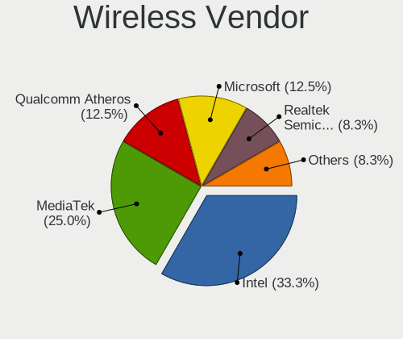

| Vendor                | Desktops | Percent |
|-----------------------|----------|---------|
| Intel                 | 13       | 54.17%  |
| Realtek Semiconductor | 4        | 16.67%  |
| MediaTek              | 4        | 16.67%  |
| TP-Link               | 1        | 4.17%   |
| Microsoft             | 1        | 4.17%   |
| Broadcom              | 1        | 4.17%   |

Wireless Model
--------------

Wireless models

| Model                                                         | Desktops | Percent |
|---------------------------------------------------------------|----------|---------|
| Intel Wi-Fi 6 AX210/AX211/AX411 160MHz                        | 4        | 16.67%  |
| MediaTek MT7921K (RZ608) Wi-Fi 6E 80MHz                       | 3        | 12.5%   |
| Intel Alder Lake-S PCH CNVi WiFi                              | 3        | 12.5%   |
| Realtek RTL8188EUS 802.11n Wireless Network Adapter           | 2        | 8.33%   |
| Intel Wi-Fi 6 AX200                                           | 2        | 8.33%   |
| Intel Dual Band Wireless-AC 3168NGW [Stone Peak]              | 2        | 8.33%   |
| TP-Link 802.11ac NIC                                          | 1        | 4.17%   |
| Realtek RTL8821CE 802.11ac PCIe Wireless Network Adapter      | 1        | 4.17%   |
| Realtek RTL8814AU 802.11a/b/g/n/ac Wireless Adapter           | 1        | 4.17%   |
| Microsoft Xbox Wireless Adapter for Windows                   | 1        | 4.17%   |
| MediaTek MT7922 802.11ax PCI Express Wireless Network Adapter | 1        | 4.17%   |
| Intel Wireless 8265 / 8275                                    | 1        | 4.17%   |
| Intel Tiger Lake PCH CNVi WiFi                                | 1        | 4.17%   |
| Broadcom BCM4360 802.11ac Wireless Network Adapter            | 1        | 4.17%   |

Ethernet Vendor
---------------

Ethernet vendors

| Vendor                | Desktops | Percent |
|-----------------------|----------|---------|
| Realtek Semiconductor | 16       | 48.48%  |
| Intel                 | 13       | 39.39%  |
| Xiaomi                | 2        | 6.06%   |
| Qualcomm Atheros      | 1        | 3.03%   |
| OPPO Electronics      | 1        | 3.03%   |

Ethernet Model
--------------

Ethernet models

| Model                                                             | Desktops | Percent |
|-------------------------------------------------------------------|----------|---------|
| Realtek RTL8111/8168/8411 PCI Express Gigabit Ethernet Controller | 9        | 25.71%  |
| Realtek RTL8125 2.5GbE Controller                                 | 7        | 20%     |
| Intel I211 Gigabit Network Connection                             | 5        | 14.29%  |
| Intel Ethernet Controller I225-V                                  | 4        | 11.43%  |
| Xiaomi Mi/Redmi series (RNDIS)                                    | 2        | 5.71%   |
| Intel Ethernet Connection (2) I219-V                              | 2        | 5.71%   |
| Qualcomm Atheros Killer E220x Gigabit Ethernet Controller         | 1        | 2.86%   |
| OPPO SM6375-QRD _SN:F4A23F05                                      | 1        | 2.86%   |
| Intel Ethernet Controller 10-Gigabit X540-AT2                     | 1        | 2.86%   |
| Intel Ethernet Connection (7) I219-V                              | 1        | 2.86%   |
| Intel Ethernet Connection (2) I218-V                              | 1        | 2.86%   |
| Intel 82579LM Gigabit Network Connection (Lewisville)             | 1        | 2.86%   |

Net Controller Kind
-------------------

Ethernet, WiFi or modem

| Kind     | Desktops | Percent |
|----------|----------|---------|
| Ethernet | 28       | 54.9%   |
| WiFi     | 22       | 43.14%  |
| Modem    | 1        | 1.96%   |

Used Controller
---------------

Currently used network controller

| Kind     | Desktops | Percent |
|----------|----------|---------|
| Ethernet | 17       | 60.71%  |
| WiFi     | 11       | 39.29%  |

NICs
----

Total network controllers on board

| Total | Desktops | Percent |
|-------|----------|---------|
| 2     | 13       | 43.33%  |
| 1     | 13       | 43.33%  |
| 3     | 3        | 10%     |
| 4     | 1        | 3.33%   |

IPv6
----

IPv6 vs IPv4

| Used | Desktops | Percent |
|------|----------|---------|
| No   | 22       | 73.33%  |
| Yes  | 8        | 26.67%  |

Bluetooth
---------

Bluetooth Vendor
----------------

Controller vendors

| Vendor                  | Desktops | Percent |
|-------------------------|----------|---------|
| Intel                   | 13       | 54.17%  |
| MediaTek                | 4        | 16.67%  |
| Cambridge Silicon Radio | 3        | 12.5%   |
| Realtek Semiconductor   | 2        | 8.33%   |
| ASUSTek Computer        | 1        | 4.17%   |
| Actions                 | 1        | 4.17%   |

Bluetooth Model
---------------

Controller models

| Model                                                 | Desktops | Percent |
|-------------------------------------------------------|----------|---------|
| MediaTek Wireless_Device                              | 4        | 16.67%  |
| Intel AX210 Bluetooth                                 | 4        | 16.67%  |
| Intel Bluetooth Device                                | 3        | 12.5%   |
| Cambridge Silicon Radio Bluetooth Dongle (HCI mode)   | 3        | 12.5%   |
| Realtek Bluetooth Radio                               | 2        | 8.33%   |
| Intel Wireless-AC 3168 Bluetooth                      | 2        | 8.33%   |
| Intel AX200 Bluetooth                                 | 2        | 8.33%   |
| Intel Bluetooth wireless interface                    | 1        | 4.17%   |
| Intel AX201 Bluetooth                                 | 1        | 4.17%   |
| ASUS Broadcom BCM20702 Single-Chip Bluetooth 4.0 + LE | 1        | 4.17%   |
| Actions general adapter                               | 1        | 4.17%   |

Sound
-----

Sound Vendor
------------

Sound card vendors

| Vendor              | Desktops | Percent |
|---------------------|----------|---------|
| AMD                 | 21       | 35%     |
| Nvidia              | 13       | 21.67%  |
| Intel               | 13       | 21.67%  |
| Texas Instruments   | 2        | 3.33%   |
| Kingston Technology | 2        | 3.33%   |
| C-Media Electronics | 2        | 3.33%   |
| Native Instruments  | 1        | 1.67%   |
| Logitech            | 1        | 1.67%   |
| GN Netcom           | 1        | 1.67%   |
| Creative Labs       | 1        | 1.67%   |
| Corsair             | 1        | 1.67%   |
| ASUSTek Computer    | 1        | 1.67%   |
| Unknown             | 1        | 1.67%   |

Sound Model
-----------

Sound card models

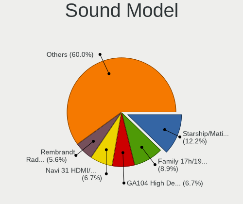

| Model                                                                                           | Desktops | Percent |
|-------------------------------------------------------------------------------------------------|----------|---------|
| AMD Navi 21/23 HDMI/DP Audio Controller                                                         | 7        | 9.59%   |
| AMD Family 17h/19h HD Audio Controller                                                          | 7        | 9.59%   |
| AMD Starship/Matisse HD Audio Controller                                                        | 6        | 8.22%   |
| Intel Alder Lake-S HD Audio Controller                                                          | 4        | 5.48%   |
| AMD Ellesmere HDMI Audio [Radeon RX 470/480 / 570/580/590]                                      | 4        | 5.48%   |
| Nvidia GA102 High Definition Audio Controller                                                   | 3        | 4.11%   |
| AMD Renoir Radeon High Definition Audio Controller                                              | 3        | 4.11%   |
| AMD Rembrandt Radeon High Definition Audio Controller                                           | 3        | 4.11%   |
| Nvidia TU116 High Definition Audio Controller                                                   | 2        | 2.74%   |
| Nvidia GP104 High Definition Audio Controller                                                   | 2        | 2.74%   |
| Nvidia GA104 High Definition Audio Controller                                                   | 2        | 2.74%   |
| Intel 7 Series/C216 Chipset Family High Definition Audio Controller                             | 2        | 2.74%   |
| AMD Family 17h (Models 00h-0fh) HD Audio Controller                                             | 2        | 2.74%   |
| Texas Instruments SMSL Q5 AMP                                                                   | 1        | 1.37%   |
| Texas Instruments PCM2900C Audio CODEC                                                          | 1        | 1.37%   |
| Nvidia TU106 High Definition Audio Controller                                                   | 1        | 1.37%   |
| Nvidia TU104 HD Audio Controller                                                                | 1        | 1.37%   |
| Nvidia GP107GL High Definition Audio Controller                                                 | 1        | 1.37%   |
| Nvidia AD102 High Definition Audio Controller                                                   | 1        | 1.37%   |
| Native Instruments Komplete Audio 6                                                             | 1        | 1.37%   |
| Logitech G933 Wireless Headset Dongle                                                           | 1        | 1.37%   |
| Kingston Technology HyperX QuadCast                                                             | 1        | 1.37%   |
| Kingston Technology HyperX Cloud II Wireless                                                    | 1        | 1.37%   |
| Intel Xeon E3-1200 v3/4th Gen Core Processor HD Audio Controller                                | 1        | 1.37%   |
| Intel Tiger Lake-LP Smart Sound Technology Audio Controller                                     | 1        | 1.37%   |
| Intel Tiger Lake-H HD Audio Controller                                                          | 1        | 1.37%   |
| Intel Cannon Lake PCH cAVS                                                                      | 1        | 1.37%   |
| Intel C610/X99 series chipset HD Audio Controller                                               | 1        | 1.37%   |
| Intel 8 Series/C220 Series Chipset High Definition Audio Controller                             | 1        | 1.37%   |
| Intel 200 Series PCH HD Audio                                                                   | 1        | 1.37%   |
| Intel 100 Series/C230 Series Chipset Family HD Audio Controller                                 | 1        | 1.37%   |
| GN Netcom Jabra EVOLVE 20 MS                                                                    | 1        | 1.37%   |
| Creative Labs CA0132 Sound Core3D [Sound Blaster Recon3D / Z-Series / Sound BlasterX AE-5 Plus] | 1        | 1.37%   |
| Corsair HS80 RGB Wireless Gaming Receiver                                                       | 1        | 1.37%   |
| C-Media Electronics USB Audio Device                                                            | 1        | 1.37%   |
| C-Media Electronics CMI8788 [Oxygen HD Audio]                                                   | 1        | 1.37%   |
| ASUSTek Computer USB Audio                                                                      | 1        | 1.37%   |
| AMD Navi 10 HDMI Audio                                                                          | 1        | 1.37%   |
| Unknown                                                                                         | 1        | 1.37%   |

Memory
------

Memory Vendor
-------------

Memory module vendors

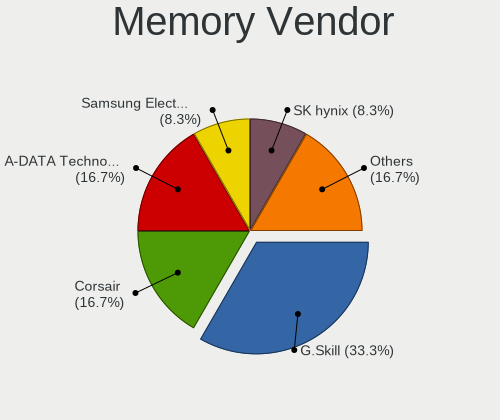

| Vendor              | Desktops | Percent |
|---------------------|----------|---------|
| Kingston            | 3        | 42.86%  |
| Crucial             | 2        | 28.57%  |
| Samsung Electronics | 1        | 14.29%  |
| G.Skill             | 1        | 14.29%  |

Memory Model
------------

Memory module models

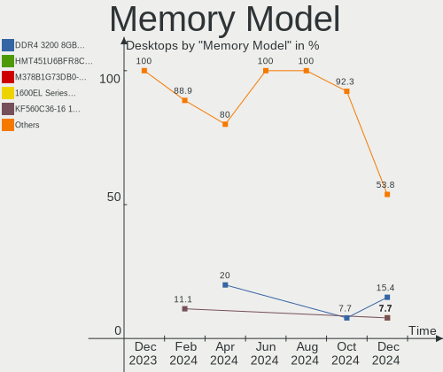

| Model                                                  | Desktops | Percent |
|--------------------------------------------------------|----------|---------|
| Samsung RAM Module 2GB Row Of Chips LPDDR4 4267MT/s    | 1        | 12.5%   |
| Kingston RAM KHX3200C16D4/8GX 8GB DIMM DDR4 3600MT/s   | 1        | 12.5%   |
| Kingston RAM KF552C40-16 16GB DIMM DDR5 5200MT/s       | 1        | 12.5%   |
| Kingston RAM CL16-18-18 D4-3200 8GB DIMM DDR4 3200MT/s | 1        | 12.5%   |
| G.Skill RAM F5-5600J3636D32G 32GB DIMM DDR5 5600MT/s   | 1        | 12.5%   |
| Crucial RAM BLS8G4D32AESCK.M8FE 8GB DIMM DDR4 3200MT/s | 1        | 12.5%   |
| Crucial RAM BL8G32C16U4WL.M8FE 8GB DIMM DDR4 3200MT/s  | 1        | 12.5%   |
| Crucial RAM BL8G32C16U4R.8FE 8GB DIMM DDR4 3200MT/s    | 1        | 12.5%   |

Memory Kind
-----------

Memory module kinds

| Kind   | Desktops | Percent |
|--------|----------|---------|
| DDR4   | 3        | 50%     |
| DDR5   | 2        | 33.33%  |
| LPDDR4 | 1        | 16.67%  |

Memory Form Factor
------------------

Physical design of the memory module

| Name         | Desktops | Percent |
|--------------|----------|---------|
| DIMM         | 5        | 83.33%  |
| Row Of Chips | 1        | 16.67%  |

Memory Size
-----------

Memory module size

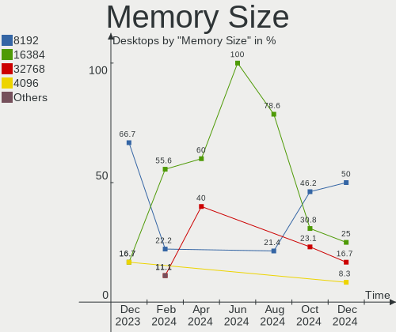

| Size  | Desktops | Percent |
|-------|----------|---------|
| 16384 | 2        | 33.33%  |
| 8192  | 2        | 33.33%  |
| 32768 | 1        | 16.67%  |
| 2048  | 1        | 16.67%  |

Memory Speed
------------

Memory module speed

| Speed | Desktops | Percent |
|-------|----------|---------|
| 3200  | 3        | 42.86%  |
| 5600  | 1        | 14.29%  |
| 5200  | 1        | 14.29%  |
| 4267  | 1        | 14.29%  |
| 3600  | 1        | 14.29%  |

Printers & scanners
-------------------

Printer Vendor
--------------

Printer device vendors

| Vendor | Desktops | Percent |
|--------|----------|---------|
| Dell   | 1        | 50%     |
| Canon  | 1        | 50%     |

Printer Model
-------------

Printer device models

| Model                   | Desktops | Percent |
|-------------------------|----------|---------|
| Dell 1130 Laser Printer | 1        | 50%     |
| Canon TS700 series      | 1        | 50%     |

Scanner Vendor
--------------

Scanner device vendors

| Vendor | Desktops | Percent |
|--------|----------|---------|
| Canon  | 1        | 100%    |

Scanner Model
-------------

Scanner device models

| Model                         | Desktops | Percent |
|-------------------------------|----------|---------|
| Canon CanoScan N1240U/LiDE 30 | 1        | 100%    |

Camera
------

Camera Vendor
-------------

Camera device vendors

| Vendor                        | Desktops | Percent |
|-------------------------------|----------|---------|
| Sunplus Innovation Technology | 3        | 33.33%  |
| Logitech                      | 2        | 22.22%  |
| Microsoft                     | 1        | 11.11%  |
| MacroSilicon                  | 1        | 11.11%  |
| KYE Systems (Mouse Systems)   | 1        | 11.11%  |
| 2M UVC CAMERA                 | 1        | 11.11%  |

Camera Model
------------

Camera device models

| Model                                      | Desktops | Percent |
|--------------------------------------------|----------|---------|
| Sunplus FULL HD webcam                     | 2        | 22.22%  |
| Sunplus Sandberg USB Webcam Pro            | 1        | 11.11%  |
| Microsoft LifeCam Studio                   | 1        | 11.11%  |
| MacroSilicon USB Video                     | 1        | 11.11%  |
| Logitech HD Pro Webcam C920                | 1        | 11.11%  |
| Logitech C922 Pro Stream Webcam            | 1        | 11.11%  |
| KYE Systems (Mouse Systems) PC-LM1E Camera | 1        | 11.11%  |
| 2M UVC CAMERA Web Camera                   | 1        | 11.11%  |

Security
--------

Fingerprint Vendor
------------------

Fingerprint sensor vendors

Zero info for selected period =(

Fingerprint Model
-----------------

Fingerprint sensor models

Zero info for selected period =(

Chipcard Vendor
---------------

Chipcard module vendors

Zero info for selected period =(

Chipcard Model
--------------

Chipcard module models

Zero info for selected period =(

Unsupported
-----------

Unsupported Devices
-------------------

Total unsupported devices on board

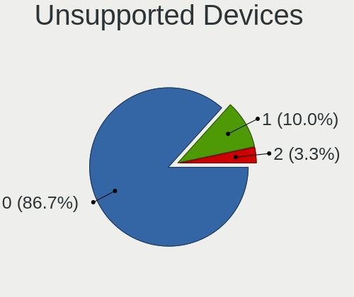

| Total | Desktops | Percent |
|-------|----------|---------|
| 0     | 24       | 80%     |
| 1     | 6        | 20%     |

Unsupported Device Types
------------------------

Types of unsupported devices

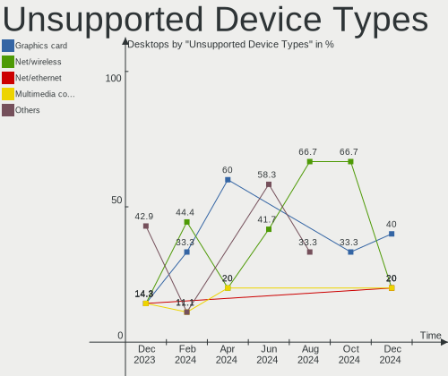

| Type                  | Desktops | Percent |
|-----------------------|----------|---------|
| Net/wireless          | 2        | 33.33%  |
| Multimedia controller | 2        | 33.33%  |
| Unassigned class      | 1        | 16.67%  |
| Graphics card         | 1        | 16.67%  |

