Nobara - Hardware Trends (Desktops)
-----------------------------------

A project to identify most popular hardware characteristics and track their change
over time based on data collected by Linux users at https://Linux-Hardware.org.

Anyone can contribute to this report by the [hw-probe](https://github.com/linuxhw/hw-probe) tool:

    sudo -E hw-probe -all -upload

This report is for one last month. Overall report since the beginning of time: [TestCoverage](https://github.com/linuxhw/TestCoverage)

Period: Sep, 2022.

Contents
--------

* [ System ](#system)
  - [ OS                       ](#os)
  - [ OS Family                ](#os-family)
  - [ Kernel                   ](#kernel)
  - [ Kernel Family            ](#kernel-family)
  - [ Kernel Major Ver.        ](#kernel-major-ver)
  - [ Arch                     ](#arch)
  - [ DE                       ](#de)
  - [ Display Server           ](#display-server)
  - [ Display Manager          ](#display-manager)
  - [ OS Lang                  ](#os-lang)
  - [ Boot Mode                ](#boot-mode)
  - [ Filesystem               ](#filesystem)
  - [ Part. scheme             ](#part-scheme)
  - [ Dual Boot with Linux/BSD ](#dual-boot-with-linuxbsd)
  - [ Dual Boot (Win)          ](#dual-boot-win)

* [ Board ](#board)
  - [ Vendor                   ](#vendor)
  - [ Model                    ](#model)
  - [ Model Family             ](#model-family)
  - [ MFG Year                 ](#mfg-year)
  - [ Form Factor              ](#form-factor)
  - [ Secure Boot              ](#secure-boot)
  - [ Coreboot                 ](#coreboot)
  - [ RAM Size                 ](#ram-size)
  - [ RAM Used                 ](#ram-used)
  - [ Total Drives             ](#total-drives)
  - [ Has CD-ROM               ](#has-cd-rom)
  - [ Has Ethernet             ](#has-ethernet)
  - [ Has WiFi                 ](#has-wifi)
  - [ Has Bluetooth            ](#has-bluetooth)

* [ Location ](#location)
  - [ Country                  ](#country)
  - [ City                     ](#city)

* [ Drives ](#drives)
  - [ Drive Vendor             ](#drive-vendor)
  - [ Drive Model              ](#drive-model)
  - [ HDD Vendor               ](#hdd-vendor)
  - [ SSD Vendor               ](#ssd-vendor)
  - [ Drive Kind               ](#drive-kind)
  - [ Drive Connector          ](#drive-connector)
  - [ Drive Size               ](#drive-size)
  - [ Space Total              ](#space-total)
  - [ Space Used               ](#space-used)
  - [ Malfunc. Drives          ](#malfunc-drives)
  - [ Malfunc. Drive Vendor    ](#malfunc-drive-vendor)
  - [ Malfunc. HDD Vendor      ](#malfunc-hdd-vendor)
  - [ Malfunc. Drive Kind      ](#malfunc-drive-kind)
  - [ Failed Drives            ](#failed-drives)
  - [ Failed Drive Vendor      ](#failed-drive-vendor)
  - [ Drive Status             ](#drive-status)

* [ Storage controller ](#storage-controller)
  - [ Storage Vendor           ](#storage-vendor)
  - [ Storage Model            ](#storage-model)
  - [ Storage Kind             ](#storage-kind)

* [ Processor ](#processor)
  - [ CPU Vendor               ](#cpu-vendor)
  - [ CPU Model                ](#cpu-model)
  - [ CPU Model Family         ](#cpu-model-family)
  - [ CPU Cores                ](#cpu-cores)
  - [ CPU Sockets              ](#cpu-sockets)
  - [ CPU Threads              ](#cpu-threads)
  - [ CPU Op-Modes             ](#cpu-op-modes)
  - [ CPU Microcode            ](#cpu-microcode)
  - [ CPU Microarch            ](#cpu-microarch)

* [ Graphics ](#graphics)
  - [ GPU Vendor               ](#gpu-vendor)
  - [ GPU Model                ](#gpu-model)
  - [ GPU Combo                ](#gpu-combo)
  - [ GPU Driver               ](#gpu-driver)
  - [ GPU Memory               ](#gpu-memory)

* [ Monitor ](#monitor)
  - [ Monitor Vendor           ](#monitor-vendor)
  - [ Monitor Model            ](#monitor-model)
  - [ Monitor Resolution       ](#monitor-resolution)
  - [ Monitor Diagonal         ](#monitor-diagonal)
  - [ Monitor Width            ](#monitor-width)
  - [ Aspect Ratio             ](#aspect-ratio)
  - [ Monitor Area             ](#monitor-area)
  - [ Pixel Density            ](#pixel-density)
  - [ Multiple Monitors        ](#multiple-monitors)

* [ Network ](#network)
  - [ Net Controller Vendor    ](#net-controller-vendor)
  - [ Net Controller Model     ](#net-controller-model)
  - [ Wireless Vendor          ](#wireless-vendor)
  - [ Wireless Model           ](#wireless-model)
  - [ Ethernet Vendor          ](#ethernet-vendor)
  - [ Ethernet Model           ](#ethernet-model)
  - [ Net Controller Kind      ](#net-controller-kind)
  - [ Used Controller          ](#used-controller)
  - [ NICs                     ](#nics)
  - [ IPv6                     ](#ipv6)

* [ Bluetooth ](#bluetooth)
  - [ Bluetooth Vendor         ](#bluetooth-vendor)
  - [ Bluetooth Model          ](#bluetooth-model)

* [ Sound ](#sound)
  - [ Sound Vendor             ](#sound-vendor)
  - [ Sound Model              ](#sound-model)

* [ Memory ](#memory)
  - [ Memory Vendor            ](#memory-vendor)
  - [ Memory Model             ](#memory-model)
  - [ Memory Kind              ](#memory-kind)
  - [ Memory Form Factor       ](#memory-form-factor)
  - [ Memory Size              ](#memory-size)
  - [ Memory Speed             ](#memory-speed)

* [ Printers & scanners ](#printers--scanners)
  - [ Printer Vendor           ](#printer-vendor)
  - [ Printer Model            ](#printer-model)
  - [ Scanner Vendor           ](#scanner-vendor)
  - [ Scanner Model            ](#scanner-model)

* [ Camera ](#camera)
  - [ Camera Vendor            ](#camera-vendor)
  - [ Camera Model             ](#camera-model)

* [ Security ](#security)
  - [ Fingerprint Vendor       ](#fingerprint-vendor)
  - [ Fingerprint Model        ](#fingerprint-model)
  - [ Chipcard Vendor          ](#chipcard-vendor)
  - [ Chipcard Model           ](#chipcard-model)

* [ Unsupported ](#unsupported)
  - [ Unsupported Devices      ](#unsupported-devices)
  - [ Unsupported Device Types ](#unsupported-device-types)

System
------

OS
--

Installed operating systems

| Name      | Desktops | Percent |
|-----------|----------|---------|
| Nobara 36 | 23       | 100%    |

OS Family
---------

OS without a version

| Name   | Desktops | Percent |
|--------|----------|---------|
| Nobara | 23       | 100%    |

Kernel
------

Version of the Linux kernel

| Version                       | Desktops | Percent |
|-------------------------------|----------|---------|
| 5.19.9-201.fsync.fc36.x86_64  | 8        | 34.78%  |
| 5.19.7-204.fsync.fc36.x86_64  | 5        | 21.74%  |
| 5.19.10-201.fsync.fc36.x86_64 | 5        | 21.74%  |
| 5.19.4-201.fsync.fc36.x86_64  | 2        | 8.7%    |
| 5.19.11-201.fsync.fc36.x86_64 | 2        | 8.7%    |
| 5.19.7-203.fsync.fc36.x86_64  | 1        | 4.35%   |

Kernel Family
-------------

Linux kernel without a distro release

| Version | Desktops | Percent |
|---------|----------|---------|
| 5.19.9  | 8        | 34.78%  |
| 5.19.7  | 6        | 26.09%  |
| 5.19.10 | 5        | 21.74%  |
| 5.19.4  | 2        | 8.7%    |
| 5.19.11 | 2        | 8.7%    |

Kernel Major Ver.
-----------------

Linux kernel major version

| Version | Desktops | Percent |
|---------|----------|---------|
| 5.19    | 23       | 100%    |

Arch
----

OS architecture (x86_64, i586, etc.)

| Name   | Desktops | Percent |
|--------|----------|---------|
| x86_64 | 23       | 100%    |

DE
--

Desktop Environment

| Name  | Desktops | Percent |
|-------|----------|---------|
| GNOME | 18       | 78.26%  |
| KDE5  | 5        | 21.74%  |

Display Server
--------------

X11 or Wayland

| Name    | Desktops | Percent |
|---------|----------|---------|
| Wayland | 20       | 86.96%  |
| X11     | 3        | 13.04%  |

Display Manager
---------------

SDDM, LightDM, etc.

| Name    | Desktops | Percent |
|---------|----------|---------|
| Unknown | 21       | 91.3%   |
| GDM     | 2        | 8.7%    |

OS Lang
-------

Language

| Lang    | Desktops | Percent |
|---------|----------|---------|
| en_US   | 10       | 43.48%  |
| es_AR   | 2        | 8.7%    |
| de_DE   | 2        | 8.7%    |
| sk_SK   | 1        | 4.35%   |
| pt_BR   | 1        | 4.35%   |
| es_MX   | 1        | 4.35%   |
| es_ES   | 1        | 4.35%   |
| es_EC   | 1        | 4.35%   |
| en_NZ   | 1        | 4.35%   |
| en_CA   | 1        | 4.35%   |
| en_AU   | 1        | 4.35%   |
| Unknown | 1        | 4.35%   |

Boot Mode
---------

EFI or BIOS

| Mode | Desktops | Percent |
|------|----------|---------|
| EFI  | 15       | 65.22%  |
| BIOS | 8        | 34.78%  |

Filesystem
----------

Type of filesystem

| Type  | Desktops | Percent |
|-------|----------|---------|
| Ext4  | 22       | 95.65%  |
| Btrfs | 1        | 4.35%   |

Part. scheme
------------

Scheme of partitioning

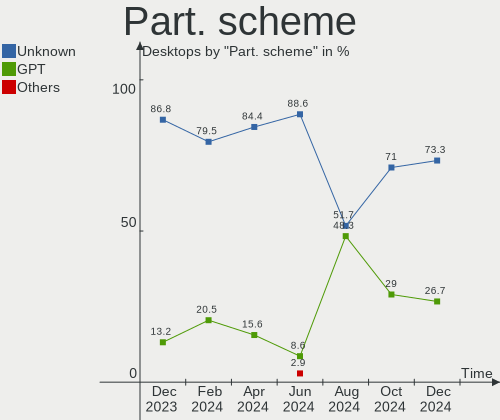

| Type    | Desktops | Percent |
|---------|----------|---------|
| Unknown | 22       | 95.65%  |
| GPT     | 1        | 4.35%   |

Dual Boot with Linux/BSD
------------------------

Hosting more than one Linux/BSD

| Dual boot | Desktops | Percent |
|-----------|----------|---------|
| No        | 23       | 100%    |

Dual Boot (Win)
---------------

Hosting Linux and Windows

| Dual boot | Desktops | Percent |
|-----------|----------|---------|
| No        | 23       | 100%    |

Board
-----

Vendor
------

Motherboard manufacturer

| Name                | Desktops | Percent |
|---------------------|----------|---------|
| ASUSTek Computer    | 6        | 26.09%  |
| MSI                 | 5        | 21.74%  |
| Gigabyte Technology | 4        | 17.39%  |
| ASRock              | 2        | 8.7%    |
| Lenovo              | 1        | 4.35%   |
| Intel               | 1        | 4.35%   |
| Hewlett-Packard     | 1        | 4.35%   |
| Dell                | 1        | 4.35%   |
| Biostar             | 1        | 4.35%   |
| Unknown             | 1        | 4.35%   |

Model
-----

Motherboard model

| Name                               | Desktops | Percent |
|------------------------------------|----------|---------|
| MSI MS-7C84                        | 1        | 4.35%   |
| MSI MS-7C37                        | 1        | 4.35%   |
| MSI MS-7C35                        | 1        | 4.35%   |
| MSI MS-7721                        | 1        | 4.35%   |
| MSI MS-7693                        | 1        | 4.35%   |
| Lenovo ThinkCentre M92p 3238E5U    | 1        | 4.35%   |
| Intel B75                          | 1        | 4.35%   |
| HP EliteDesk 800 G5 Desktop Mini   | 1        | 4.35%   |
| Gigabyte H270-Gaming 3             | 1        | 4.35%   |
| Gigabyte EP45-UD3L                 | 1        | 4.35%   |
| Gigabyte AB350-Gaming 3            | 1        | 4.35%   |
| Gigabyte A320M-S2H                 | 1        | 4.35%   |
| Dell OptiPlex 780                  | 1        | 4.35%   |
| Biostar H410MH S2                  | 1        | 4.35%   |
| ASUS TUF Gaming X570-PRO           | 1        | 4.35%   |
| ASUS TUF Gaming B550M-PLUS WIFI II | 1        | 4.35%   |
| ASUS PRIME H410M-A                 | 1        | 4.35%   |
| ASUS PRIME H310M-E R2.0            | 1        | 4.35%   |
| ASUS PRIME A320M-K                 | 1        | 4.35%   |
| ASUS 970 PRO GAMING/AURA           | 1        | 4.35%   |
| ASRock X470 Master SLI             | 1        | 4.35%   |
| ASRock FM2A55M-HD+                 | 1        | 4.35%   |
| Unknown                            | 1        | 4.35%   |

Model Family
------------

Motherboard model prefix

| Name                  | Desktops | Percent |
|-----------------------|----------|---------|
| ASUS PRIME            | 3        | 13.04%  |
| ASUS TUF              | 2        | 8.7%    |
| MSI MS-7C84           | 1        | 4.35%   |
| MSI MS-7C37           | 1        | 4.35%   |
| MSI MS-7C35           | 1        | 4.35%   |
| MSI MS-7721           | 1        | 4.35%   |
| MSI MS-7693           | 1        | 4.35%   |
| Lenovo ThinkCentre    | 1        | 4.35%   |
| Intel B75             | 1        | 4.35%   |
| HP EliteDesk          | 1        | 4.35%   |
| Gigabyte H270-Gaming  | 1        | 4.35%   |
| Gigabyte EP45-UD3L    | 1        | 4.35%   |
| Gigabyte AB350-Gaming | 1        | 4.35%   |
| Gigabyte A320M-S2H    | 1        | 4.35%   |
| Dell OptiPlex         | 1        | 4.35%   |
| Biostar H410MH        | 1        | 4.35%   |
| ASUS 970              | 1        | 4.35%   |
| ASRock X470           | 1        | 4.35%   |
| ASRock FM2A55M-HD+    | 1        | 4.35%   |
| Unknown               | 1        | 4.35%   |

MFG Year
--------

Motherboard manufacture year

| Year | Desktops | Percent |
|------|----------|---------|
| 2019 | 4        | 17.39%  |
| 2020 | 3        | 13.04%  |
| 2018 | 3        | 13.04%  |
| 2017 | 3        | 13.04%  |
| 2013 | 3        | 13.04%  |
| 2021 | 2        | 8.7%    |
| 2016 | 2        | 8.7%    |
| 2015 | 1        | 4.35%   |
| 2014 | 1        | 4.35%   |
| 2008 | 1        | 4.35%   |

Form Factor
-----------

Physical design of the computer

| Name    | Desktops | Percent |
|---------|----------|---------|
| Desktop | 23       | 100%    |

Secure Boot
-----------

Enabled or disabled

| State    | Desktops | Percent |
|----------|----------|---------|
| Disabled | 23       | 100%    |

Coreboot
--------

Have coreboot on board

| Used | Desktops | Percent |
|------|----------|---------|
| No   | 23       | 100%    |

RAM Size
--------

Total RAM memory

| Size in GB | Desktops | Percent |
|------------|----------|---------|
| 16.01-24.0 | 8        | 34.78%  |
| 32.01-64.0 | 6        | 26.09%  |
| 8.01-16.0  | 4        | 17.39%  |
| 3.01-4.0   | 3        | 13.04%  |
| 4.01-8.0   | 1        | 4.35%   |
| 24.01-32.0 | 1        | 4.35%   |

RAM Used
--------

Used RAM memory

| Used GB    | Desktops | Percent |
|------------|----------|---------|
| 4.01-8.0   | 8        | 34.78%  |
| 3.01-4.0   | 7        | 30.43%  |
| 2.01-3.0   | 5        | 21.74%  |
| 24.01-32.0 | 1        | 4.35%   |
| 1.01-2.0   | 1        | 4.35%   |
| 8.01-16.0  | 1        | 4.35%   |

Total Drives
------------

Number of drives on board

| Drives | Desktops | Percent |
|--------|----------|---------|
| 1      | 9        | 39.13%  |
| 5      | 6        | 26.09%  |
| 2      | 6        | 26.09%  |
| 3      | 2        | 8.7%    |

Has CD-ROM
----------

Has CD-ROM on board

| Presented | Desktops | Percent |
|-----------|----------|---------|
| No        | 15       | 65.22%  |
| Yes       | 8        | 34.78%  |

Has Ethernet
------------

Has Ethernet on board

| Presented | Desktops | Percent |
|-----------|----------|---------|
| Yes       | 23       | 100%    |

Has WiFi
--------

Has WiFi module

| Presented | Desktops | Percent |
|-----------|----------|---------|
| Yes       | 13       | 56.52%  |
| No        | 10       | 43.48%  |

Has Bluetooth
-------------

Has Bluetooth module

| Presented | Desktops | Percent |
|-----------|----------|---------|
| No        | 13       | 56.52%  |
| Yes       | 10       | 43.48%  |

Location
--------

Country
-------

Geographic location (country)

| Country     | Desktops | Percent |
|-------------|----------|---------|
| USA         | 5        | 21.74%  |
| Canada      | 3        | 13.04%  |
| Germany     | 2        | 8.7%    |
| Argentina   | 2        | 8.7%    |
| Spain       | 1        | 4.35%   |
| Slovakia    | 1        | 4.35%   |
| Serbia      | 1        | 4.35%   |
| Norway      | 1        | 4.35%   |
| New Zealand | 1        | 4.35%   |
| Mexico      | 1        | 4.35%   |
| France      | 1        | 4.35%   |
| Ecuador     | 1        | 4.35%   |
| Chile       | 1        | 4.35%   |
| Brazil      | 1        | 4.35%   |
| Australia   | 1        | 4.35%   |

City
----

Geographic location (city)

| City                 | Desktops | Percent |
|----------------------|----------|---------|
| Wellington           | 1        | 4.35%   |
| Sao Paulo            | 1        | 4.35%   |
| San Antonio          | 1        | 4.35%   |
| Quito                | 1        | 4.35%   |
| Philipsburg          | 1        | 4.35%   |
| North Vancouver      | 1        | 4.35%   |
| Mendoza              | 1        | 4.35%   |
| Melbourne            | 1        | 4.35%   |
| Lünen               | 1        | 4.35%   |
| Lake Elsinore        | 1        | 4.35%   |
| La Serena            | 1        | 4.35%   |
| Koblenz              | 1        | 4.35%   |
| Istres               | 1        | 4.35%   |
| Hermosillo           | 1        | 4.35%   |
| Grande Prairie       | 1        | 4.35%   |
| Grand Rapids         | 1        | 4.35%   |
| Fornebu              | 1        | 4.35%   |
| Edmonton             | 1        | 4.35%   |
| Cheyenne             | 1        | 4.35%   |
| Buenos Aires         | 1        | 4.35%   |
| Belgrade             | 1        | 4.35%   |
| Banská Bystrica     | 1        | 4.35%   |
| Alhaurin de la Torre | 1        | 4.35%   |

Drives
------

Drive Vendor
------------

Hard drive vendors

| Vendor                | Desktops | Drives | Percent |
|-----------------------|----------|--------|---------|
| WDC                   | 13       | 15     | 25.49%  |
| Seagate               | 8        | 10     | 15.69%  |
| Samsung Electronics   | 8        | 11     | 15.69%  |
| Sandisk               | 4        | 4      | 7.84%   |
| Kingston              | 3        | 3      | 5.88%   |
| Crucial               | 3        | 3      | 5.88%   |
| Toshiba               | 2        | 2      | 3.92%   |
| Unknown               | 1        | 1      | 1.96%   |
| Team                  | 1        | 1      | 1.96%   |
| SuperSSpeed           | 1        | 1      | 1.96%   |
| SPCC                  | 1        | 1      | 1.96%   |
| Realtek Semiconductor | 1        | 1      | 1.96%   |
| PNY                   | 1        | 1      | 1.96%   |
| Phison                | 1        | 1      | 1.96%   |
| Micron Technology     | 1        | 1      | 1.96%   |
| Intel                 | 1        | 1      | 1.96%   |
| A-DATA Technology     | 1        | 1      | 1.96%   |

Drive Model
-----------

Hard drive models

| Model                                             | Desktops | Percent |
|---------------------------------------------------|----------|---------|
| WDC WDS480G2G0A-00JH30 480GB SSD                  | 2        | 3.51%   |
| WDC WDS240G2G0B-00EPW0 240GB SSD                  | 1        | 1.75%   |
| WDC WDBNCE5000PNC 500GB SSD                       | 1        | 1.75%   |
| WDC WD6400AAKS-65A7B2 640GB                       | 1        | 1.75%   |
| WDC WD40PURZ-74AKKY0 4TB                          | 1        | 1.75%   |
| WDC WD20EZBX-00AYRA0 2TB                          | 1        | 1.75%   |
| WDC WD20EARX-00PASB0 2TB                          | 1        | 1.75%   |
| WDC WD1600AAJS-08L7A0 160GB                       | 1        | 1.75%   |
| WDC WD120EFBX-68B0EN0 12TB                        | 1        | 1.75%   |
| WDC WD10PURX-64E5EY0 1TB                          | 1        | 1.75%   |
| WDC WD10EZEX-60WN4A0 1TB                          | 1        | 1.75%   |
| WDC WD10EZEX-08WN4A0 1TB                          | 1        | 1.75%   |
| WDC WD10EZEX-00BN5A0 1TB                          | 1        | 1.75%   |
| WDC WD10EADS-00M2B0 1TB                           | 1        | 1.75%   |
| Unknown MMC Card  64GB                            | 1        | 1.75%   |
| Toshiba MQ04ABF100 1TB                            | 1        | 1.75%   |
| Toshiba A100 120GB SSD                            | 1        | 1.75%   |
| Team T2531TB 1024GB SSD                           | 1        | 1.75%   |
| SuperSSpeed S540 240GB                            | 1        | 1.75%   |
| SPCC Solid State Disk 512GB                       | 1        | 1.75%   |
| Seagate ST3500418AS 500GB                         | 1        | 1.75%   |
| Seagate ST3000DM008-2DM166 3TB                    | 1        | 1.75%   |
| Seagate ST2000DM008-2FR102 2TB                    | 1        | 1.75%   |
| Seagate ST2000DM001-1ER164 2TB                    | 1        | 1.75%   |
| Seagate ST2000DL003-9VT166 2TB                    | 1        | 1.75%   |
| Seagate ST1000DM003-1ER162 1TB                    | 1        | 1.75%   |
| Seagate ST10000NM001G-2MW103 10TB                 | 1        | 1.75%   |
| Seagate Expansion 1TB                             | 1        | 1.75%   |
| Seagate BUP Portable 4TB                          | 1        | 1.75%   |
| Sandisk WD Blue SN570 500GB                       | 1        | 1.75%   |
| Sandisk WD Blue SN550 NVMe SSD 1024GB             | 1        | 1.75%   |
| Sandisk WD Black SN850 500GB                      | 1        | 1.75%   |
| Sandisk WD Black SN750 / PC SN730 NVMe SSD 1024GB | 1        | 1.75%   |
| Samsung SSD 980 500GB                             | 1        | 1.75%   |
| Samsung SSD 970 EVO Plus 500GB                    | 1        | 1.75%   |
| Samsung SSD 860 EVO 250GB                         | 1        | 1.75%   |
| Samsung SSD 860 EVO 1TB                           | 1        | 1.75%   |
| Samsung SSD 850 EVO 250GB                         | 1        | 1.75%   |
| Samsung SP2504C 250GB                             | 1        | 1.75%   |
| Samsung NVMe SSD Drive 1TB                        | 1        | 1.75%   |

HDD Vendor
----------

Hard disk drive vendors

| Vendor              | Desktops | Drives | Percent |
|---------------------|----------|--------|---------|
| WDC                 | 10       | 11     | 47.62%  |
| Seagate             | 8        | 10     | 38.1%   |
| Samsung Electronics | 2        | 3      | 9.52%   |
| Toshiba             | 1        | 1      | 4.76%   |

SSD Vendor
----------

Solid state drive vendors

| Vendor              | Desktops | Drives | Percent |
|---------------------|----------|--------|---------|
| WDC                 | 4        | 4      | 21.05%  |
| Samsung Electronics | 3        | 3      | 15.79%  |
| Kingston            | 3        | 3      | 15.79%  |
| Crucial             | 3        | 3      | 15.79%  |
| Toshiba             | 1        | 1      | 5.26%   |
| Team                | 1        | 1      | 5.26%   |
| SuperSSpeed         | 1        | 1      | 5.26%   |
| SPCC                | 1        | 1      | 5.26%   |
| PNY                 | 1        | 1      | 5.26%   |
| A-DATA Technology   | 1        | 1      | 5.26%   |

Drive Kind
----------

HDD or SSD

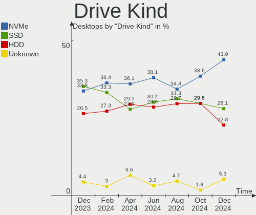

| Kind | Desktops | Drives | Percent |
|------|----------|--------|---------|
| SSD  | 16       | 19     | 39.02%  |
| HDD  | 14       | 25     | 34.15%  |
| NVMe | 10       | 13     | 24.39%  |
| MMC  | 1        | 1      | 2.44%   |

Drive Connector
---------------

SATA, SAS, NVMe, etc.

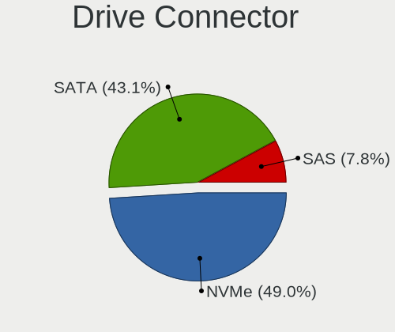

| Type | Desktops | Drives | Percent |
|------|----------|--------|---------|
| SATA | 20       | 42     | 60.61%  |
| NVMe | 10       | 13     | 30.3%   |
| SAS  | 2        | 2      | 6.06%   |
| MMC  | 1        | 1      | 3.03%   |

Drive Size
----------

Size of hard drive

| Size in TB | Desktops | Drives | Percent |
|------------|----------|--------|---------|
| 0.01-0.5   | 14       | 18     | 40%     |
| 0.51-1.0   | 10       | 13     | 28.57%  |
| 1.01-2.0   | 6        | 8      | 17.14%  |
| 3.01-4.0   | 2        | 2      | 5.71%   |
| 2.01-3.0   | 1        | 1      | 2.86%   |
| 10.01-20.0 | 1        | 1      | 2.86%   |
| 4.01-10.0  | 1        | 1      | 2.86%   |

Space Total
-----------

Amount of disk space available on the file system

| Size in GB     | Desktops | Percent |
|----------------|----------|---------|
| 101-250        | 9        | 39.13%  |
| 251-500        | 4        | 17.39%  |
| 501-1000       | 4        | 17.39%  |
| 1001-2000      | 3        | 13.04%  |
| More than 3000 | 2        | 8.7%    |
| 2001-3000      | 1        | 4.35%   |

Space Used
----------

Amount of used disk space

| Used GB        | Desktops | Percent |
|----------------|----------|---------|
| 21-50          | 11       | 47.83%  |
| 1-20           | 5        | 21.74%  |
| 251-500        | 2        | 8.7%    |
| 51-100         | 2        | 8.7%    |
| More than 3000 | 1        | 4.35%   |
| 2001-3000      | 1        | 4.35%   |
| 501-1000       | 1        | 4.35%   |

Malfunc. Drives
---------------

Drive models with a malfunction

Zero info for selected period =(

Malfunc. Drive Vendor
---------------------

Vendors of faulty drives

Zero info for selected period =(

Malfunc. HDD Vendor
-------------------

Vendors of faulty HDD drives

Zero info for selected period =(

Malfunc. Drive Kind
-------------------

Kinds of faulty drives

Zero info for selected period =(

Failed Drives
-------------

Failed drive models

Zero info for selected period =(

Failed Drive Vendor
-------------------

Failed drive vendors

Zero info for selected period =(

Drive Status
------------

Number of failed and malfunc. drives

| Status   | Desktops | Drives | Percent |
|----------|----------|--------|---------|
| Detected | 22       | 52     | 95.65%  |
| Works    | 1        | 6      | 4.35%   |

Storage controller
------------------

Storage Vendor
--------------

Storage controller vendors

| Vendor                | Desktops | Percent |
|-----------------------|----------|---------|
| AMD                   | 13       | 34.21%  |
| Intel                 | 10       | 26.32%  |
| Samsung Electronics   | 5        | 13.16%  |
| SanDisk               | 4        | 10.53%  |
| Silicon Image         | 1        | 2.63%   |
| Realtek Semiconductor | 1        | 2.63%   |
| Phison Electronics    | 1        | 2.63%   |
| Micron Technology     | 1        | 2.63%   |
| JMicron Technology    | 1        | 2.63%   |
| ASMedia Technology    | 1        | 2.63%   |

Storage Model
-------------

Storage controller models

| Model                                                                        | Desktops | Percent |
|------------------------------------------------------------------------------|----------|---------|
| AMD FCH SATA Controller [AHCI mode]                                          | 9        | 20.93%  |
| Intel 7 Series/C210 Series Chipset Family 6-port SATA Controller [AHCI mode] | 2        | 4.65%   |
| Intel 200 Series PCH SATA controller [AHCI mode]                             | 2        | 4.65%   |
| AMD SB7x0/SB8x0/SB9x0 SATA Controller [AHCI mode]                            | 2        | 4.65%   |
| AMD FCH SATA Controller D                                                    | 2        | 4.65%   |
| Silicon Image SiI 3132 Serial ATA Raid II Controller                         | 1        | 2.33%   |
| SanDisk WD PC SN810 / Black SN850 NVMe SSD                                   | 1        | 2.33%   |
| SanDisk WD Blue SN570 NVMe SSD                                               | 1        | 2.33%   |
| SanDisk WD Blue SN550 NVMe SSD                                               | 1        | 2.33%   |
| SanDisk WD Black SN750 / PC SN730 NVMe SSD                                   | 1        | 2.33%   |
| Samsung NVMe SSD Controller SM981/PM981/PM983                                | 1        | 2.33%   |
| Samsung NVMe SSD Controller SM961/PM961/SM963                                | 1        | 2.33%   |
| Samsung NVMe SSD Controller SM951/PM951                                      | 1        | 2.33%   |
| Samsung NVMe SSD Controller PM9A1/PM9A3/980PRO                               | 1        | 2.33%   |
| Samsung NVMe SSD Controller 980                                              | 1        | 2.33%   |
| Realtek RTS5763DL NVMe SSD Controller                                        | 1        | 2.33%   |
| Phison E16 PCIe4 NVMe Controller                                             | 1        | 2.33%   |
| Micron Non-Volatile memory controller                                        | 1        | 2.33%   |
| JMicron JMB368 IDE controller                                                | 1        | 2.33%   |
| Intel SSD 660P Series                                                        | 1        | 2.33%   |
| Intel SATA Controller [RAID mode]                                            | 1        | 2.33%   |
| Intel Cannon Lake PCH SATA AHCI Controller                                   | 1        | 2.33%   |
| Intel 82801JI (ICH10 Family) SATA AHCI Controller                            | 1        | 2.33%   |
| Intel 500 Series Chipset Family SATA AHCI Controller                         | 1        | 2.33%   |
| Intel 400 Series Chipset Family SATA AHCI Controller                         | 1        | 2.33%   |
| Intel 4 Series Chipset PT IDER Controller                                    | 1        | 2.33%   |
| ASMedia ASM1062 Serial ATA Controller                                        | 1        | 2.33%   |
| AMD FCH IDE Controller                                                       | 1        | 2.33%   |
| AMD 500 Series Chipset SATA Controller                                       | 1        | 2.33%   |
| AMD 400 Series Chipset SATA Controller                                       | 1        | 2.33%   |
| AMD 300 Series Chipset SATA Controller                                       | 1        | 2.33%   |

Storage Kind
------------

Kind of storage controller (IDE, SATA, NVMe, SAS, ...)

| Kind | Desktops | Percent |
|------|----------|---------|
| SATA | 21       | 60%     |
| NVMe | 10       | 28.57%  |
| IDE  | 3        | 8.57%   |
| RAID | 1        | 2.86%   |

Processor
---------

CPU Vendor
----------

Processor vendors

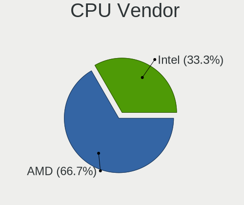

| Vendor | Desktops | Percent |
|--------|----------|---------|
| AMD    | 13       | 56.52%  |
| Intel  | 10       | 43.48%  |

CPU Model
---------

Processor models

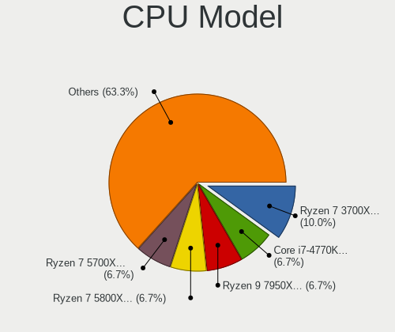

| Model                                           | Desktops | Percent |
|-------------------------------------------------|----------|---------|
| AMD FX-8350 Eight-Core Processor                | 2        | 8.7%    |
| Intel Core i7-10700F CPU @ 2.90GHz              | 1        | 4.35%   |
| Intel Core i5-9500 CPU @ 3.00GHz                | 1        | 4.35%   |
| Intel Core i5-8400 CPU @ 2.80GHz                | 1        | 4.35%   |
| Intel Core i5-7600 CPU @ 3.50GHz                | 1        | 4.35%   |
| Intel Core i5-3470T CPU @ 2.90GHz               | 1        | 4.35%   |
| Intel Core i5-10400F CPU @ 2.90GHz              | 1        | 4.35%   |
| Intel Core i3-3220 CPU @ 3.30GHz                | 1        | 4.35%   |
| Intel Core 2 Duo CPU E8400 @ 3.00GHz            | 1        | 4.35%   |
| Intel Core 2 Duo CPU E7500 @ 2.93GHz            | 1        | 4.35%   |
| Intel Atom x5-Z8350 CPU @ 1.44GHz               | 1        | 4.35%   |
| AMD Ryzen 9 5900X 12-Core Processor             | 1        | 4.35%   |
| AMD Ryzen 9 3900X 12-Core Processor             | 1        | 4.35%   |
| AMD Ryzen 7 5700X 8-Core Processor              | 1        | 4.35%   |
| AMD Ryzen 7 3800X 8-Core Processor              | 1        | 4.35%   |
| AMD Ryzen 5 5600X 6-Core Processor              | 1        | 4.35%   |
| AMD Ryzen 5 3600X 6-Core Processor              | 1        | 4.35%   |
| AMD Ryzen 5 3400G with Radeon Vega Graphics     | 1        | 4.35%   |
| AMD Ryzen 5 1600 Six-Core Processor             | 1        | 4.35%   |
| AMD Ryzen 3 3200G with Radeon Vega Graphics     | 1        | 4.35%   |
| AMD Athlon X4 760K Quad Core Processor          | 1        | 4.35%   |
| AMD A10-7860K Radeon R7, 12 Compute Cores 4C+8G | 1        | 4.35%   |

CPU Model Family
----------------

Processor model prefix

| Model            | Desktops | Percent |
|------------------|----------|---------|
| Intel Core i5    | 5        | 21.74%  |
| AMD Ryzen 5      | 4        | 17.39%  |
| Intel Core 2 Duo | 2        | 8.7%    |
| AMD Ryzen 9      | 2        | 8.7%    |
| AMD Ryzen 7      | 2        | 8.7%    |
| AMD FX           | 2        | 8.7%    |
| Intel Core i7    | 1        | 4.35%   |
| Intel Core i3    | 1        | 4.35%   |
| Intel Atom       | 1        | 4.35%   |
| AMD Ryzen 3      | 1        | 4.35%   |
| AMD Athlon X4    | 1        | 4.35%   |
| AMD A10          | 1        | 4.35%   |

CPU Cores
---------

Number of processor cores

| Number | Desktops | Percent |
|--------|----------|---------|
| 6      | 6        | 26.09%  |
| 4      | 6        | 26.09%  |
| 2      | 6        | 26.09%  |
| 8      | 3        | 13.04%  |
| 12     | 2        | 8.7%    |

CPU Sockets
-----------

Number of sockets

| Number | Desktops | Percent |
|--------|----------|---------|
| 1      | 23       | 100%    |

CPU Threads
-----------

Threads per core (Hyper-Threading)

| Number | Desktops | Percent |
|--------|----------|---------|
| 2      | 16       | 69.57%  |
| 1      | 7        | 30.43%  |

CPU Op-Modes
------------

CPU Operation Modes (32-bit, 64-bit)

| Op mode        | Desktops | Percent |
|----------------|----------|---------|
| 32-bit, 64-bit | 23       | 100%    |

CPU Microcode
-------------

Microcode number

| Number     | Desktops | Percent |
|------------|----------|---------|
| 0x08701021 | 3        | 13.04%  |
| 0x906ea    | 2        | 8.7%    |
| 0x306a9    | 2        | 8.7%    |
| 0x1067a    | 2        | 8.7%    |
| 0x0a201204 | 2        | 8.7%    |
| 0x06000822 | 2        | 8.7%    |
| 0xa0655    | 1        | 4.35%   |
| 0xa0653    | 1        | 4.35%   |
| 0x906e9    | 1        | 4.35%   |
| 0x406c4    | 1        | 4.35%   |
| 0x0a201016 | 1        | 4.35%   |
| 0x08108109 | 1        | 4.35%   |
| 0x08108102 | 1        | 4.35%   |
| 0x08001138 | 1        | 4.35%   |
| 0x06003106 | 1        | 4.35%   |
| 0x06001119 | 1        | 4.35%   |

CPU Microarch
-------------

Microarchitecture

| Name        | Desktops | Percent |
|-------------|----------|---------|
| Zen 3       | 3        | 13.04%  |
| Zen 2       | 3        | 13.04%  |
| Piledriver  | 3        | 13.04%  |
| KabyLake    | 3        | 13.04%  |
| Zen+        | 2        | 8.7%    |
| Penryn      | 2        | 8.7%    |
| IvyBridge   | 2        | 8.7%    |
| CometLake   | 2        | 8.7%    |
| Zen         | 1        | 4.35%   |
| Steamroller | 1        | 4.35%   |
| Silvermont  | 1        | 4.35%   |

Graphics
--------

GPU Vendor
----------

Vendors of graphics cards

| Vendor | Desktops | Percent |
|--------|----------|---------|
| AMD    | 11       | 45.83%  |
| Nvidia | 8        | 33.33%  |
| Intel  | 5        | 20.83%  |

GPU Model
---------

Graphics card models

| Model                                                                                    | Desktops | Percent |
|------------------------------------------------------------------------------------------|----------|---------|
| AMD Ellesmere [Radeon RX 470/480/570/570X/580/580X/590]                                  | 4        | 16%     |
| Nvidia TU116 [GeForce GTX 1650 SUPER]                                                    | 2        | 8%      |
| Intel Xeon E3-1200 v2/3rd Gen Core processor Graphics Controller                         | 2        | 8%      |
| AMD Picasso/Raven 2 [Radeon Vega Series / Radeon Vega Mobile Series]                     | 2        | 8%      |
| Nvidia TU102 [GeForce RTX 2080 Ti Rev. A]                                                | 1        | 4%      |
| Nvidia GP107 [GeForce GTX 1050 Ti]                                                       | 1        | 4%      |
| Nvidia GP104 [GeForce GTX 1070]                                                          | 1        | 4%      |
| Nvidia GK106 [GeForce GTX 650 OEM]                                                       | 1        | 4%      |
| Nvidia GF108 [GeForce GT 430]                                                            | 1        | 4%      |
| Nvidia GA104 [GeForce RTX 3060 Ti Lite Hash Rate]                                        | 1        | 4%      |
| Intel CoffeeLake-S GT2 [UHD Graphics 630]                                                | 1        | 4%      |
| Intel Atom/Celeron/Pentium Processor x5-E8000/J3xxx/N3xxx Integrated Graphics Controller | 1        | 4%      |
| Intel 4 Series Chipset Integrated Graphics Controller                                    | 1        | 4%      |
| AMD Navi 23 [Radeon RX 6600/6600 XT/6600M]                                               | 1        | 4%      |
| AMD Navi 22 [Radeon RX 6700/6700 XT/6750 XT / 6800M]                                     | 1        | 4%      |
| AMD Navi 21 [Radeon RX 6800/6800 XT / 6900 XT]                                           | 1        | 4%      |
| AMD Navi 10 [Radeon RX 5600 OEM/5600 XT / 5700/5700 XT]                                  | 1        | 4%      |
| AMD Kaveri [Radeon R7 Graphics]                                                          | 1        | 4%      |
| AMD Caicos [Radeon HD 6450/7450/8450 / R5 230 OEM]                                       | 1        | 4%      |

GPU Combo
---------

Combinations of graphics cards

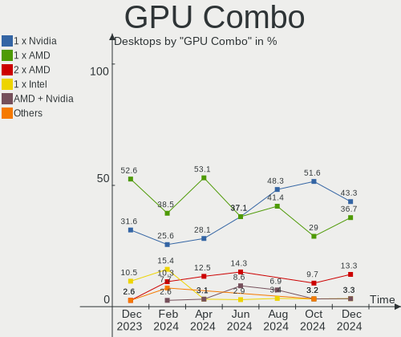

| Name         | Desktops | Percent |
|--------------|----------|---------|
| 1 x AMD      | 9        | 39.13%  |
| 1 x Nvidia   | 7        | 30.43%  |
| 1 x Intel    | 5        | 21.74%  |
| 2 x AMD      | 1        | 4.35%   |
| AMD + Nvidia | 1        | 4.35%   |

GPU Driver
----------

Free vs proprietary

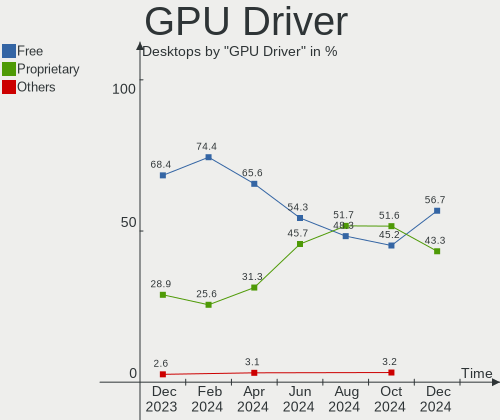

| Driver      | Desktops | Percent |
|-------------|----------|---------|
| Free        | 17       | 73.91%  |
| Proprietary | 6        | 26.09%  |

GPU Memory
----------

Total video memory

| Size in GB | Desktops | Percent |
|------------|----------|---------|
| Unknown    | 9        | 39.13%  |
| 7.01-8.0   | 4        | 17.39%  |
| 1.01-2.0   | 3        | 13.04%  |
| 8.01-16.0  | 3        | 13.04%  |
| 0.51-1.0   | 3        | 13.04%  |
| 3.01-4.0   | 1        | 4.35%   |

Monitor
-------

Monitor Vendor
--------------

Monitor vendors

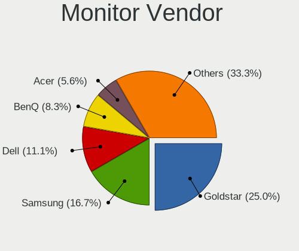

| Vendor              | Desktops | Percent |
|---------------------|----------|---------|
| Goldstar            | 4        | 21.05%  |
| Samsung Electronics | 3        | 15.79%  |
| Hewlett-Packard     | 2        | 10.53%  |
| AOC                 | 2        | 10.53%  |
| Acer                | 2        | 10.53%  |
| Vizio               | 1        | 5.26%   |
| ViewSonic           | 1        | 5.26%   |
| MSI                 | 1        | 5.26%   |
| GDH                 | 1        | 5.26%   |
| Dell                | 1        | 5.26%   |
| BenQ                | 1        | 5.26%   |

Monitor Model
-------------

Monitor models

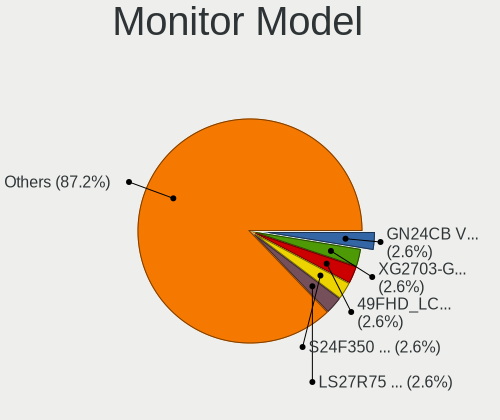

| Model                                                                 | Desktops | Percent |
|-----------------------------------------------------------------------|----------|---------|
| Vizio E3D420VX VIZ0092 1920x1080 930x523mm 42.0-inch                  | 1        | 4.76%   |
| ViewSonic VX3218-PC-mhd VSCEB3A 1920x1080 609x348mm 27.6-inch         | 1        | 4.76%   |
| Samsung Electronics SyncMaster SAM03E5 1680x1050 470x300mm 22.0-inch  | 1        | 4.76%   |
| Samsung Electronics LCD Monitor SAM0A7A 1920x1080 480x270mm 21.7-inch | 1        | 4.76%   |
| Samsung Electronics C34H89x SAM0E26 3440x1440 797x333mm 34.0-inch     | 1        | 4.76%   |
| Samsung Electronics C24F390 SAM0D2C 1920x1080 521x293mm 23.5-inch     | 1        | 4.76%   |
| MSI G273 MSI3CA7 1920x1080 597x336mm 27.0-inch                        | 1        | 4.76%   |
| MSI AG321CQR MSI3DB4 2560x1440 700x390mm 31.5-inch                    | 1        | 4.76%   |
| Hewlett-Packard 23es HWP331E 1920x1080 509x286mm 23.0-inch            | 1        | 4.76%   |
| Hewlett-Packard 2011 HWP2935 1600x900 443x249mm 20.0-inch             | 1        | 4.76%   |
| Goldstar ULTRAWIDE GSM76E4 3440x1440 800x335mm 34.1-inch              | 1        | 4.76%   |
| Goldstar FULL HD GSM5B55 1920x1080 480x270mm 21.7-inch                | 1        | 4.76%   |
| Goldstar 2D HD TV GSM59CA 1366x768 509x286mm 23.0-inch                | 1        | 4.76%   |
| Goldstar 22EA53 GSM59A5 1920x1080 477x268mm 21.5-inch                 | 1        | 4.76%   |
| GDH PHILCO GDH0030 1920x540 708x398mm 32.0-inch                       | 1        | 4.76%   |
| Dell ST2220L DELA065 1920x1080 477x268mm 21.5-inch                    | 1        | 4.76%   |
| BenQ PD2700U BNQ802E 3840x2160 597x336mm 27.0-inch                    | 1        | 4.76%   |
| AOC Q3279WG5B AOC3279 2560x1440 725x428mm 33.1-inch                   | 1        | 4.76%   |
| AOC 27B1 AOC2701 1920x1080 598x336mm 27.0-inch                        | 1        | 4.76%   |
| Acer X193W+ ACR0014 1680x1050 408x255mm 18.9-inch                     | 1        | 4.76%   |
| Acer V233H ACR0090 1920x1080 510x287mm 23.0-inch                      | 1        | 4.76%   |

Monitor Resolution
------------------

Monitor screen resolution

| Resolution         | Desktops | Percent |
|--------------------|----------|---------|
| 1920x1080 (FHD)    | 9        | 45%     |
| 3840x2160 (4K)     | 4        | 20%     |
| 3440x1440          | 2        | 10%     |
| 2560x1440 (QHD)    | 2        | 10%     |
| 1680x1050 (WSXGA+) | 2        | 10%     |
| 1600x900 (HD+)     | 1        | 5%      |

Monitor Diagonal
----------------

Diagonal size in inches

| Inches | Desktops | Percent |
|--------|----------|---------|
| 27     | 4        | 19.05%  |
| 23     | 4        | 19.05%  |
| 21     | 3        | 14.29%  |
| 34     | 2        | 9.52%   |
| 60     | 1        | 4.76%   |
| 52     | 1        | 4.76%   |
| 48     | 1        | 4.76%   |
| 33     | 1        | 4.76%   |
| 31     | 1        | 4.76%   |
| 22     | 1        | 4.76%   |
| 20     | 1        | 4.76%   |
| 19     | 1        | 4.76%   |

Monitor Width
-------------

Physical width

| Width in mm | Desktops | Percent |
|-------------|----------|---------|
| 501-600     | 7        | 33.33%  |
| 401-500     | 6        | 28.57%  |
| 701-800     | 3        | 14.29%  |
| 1001-1500   | 3        | 14.29%  |
| 601-700     | 2        | 9.52%   |

Aspect Ratio
------------

Proportional relationship between the width and the height

| Ratio | Desktops | Percent |
|-------|----------|---------|
| 16/9  | 14       | 77.78%  |
| 21/9  | 2        | 11.11%  |
| 16/10 | 2        | 11.11%  |

Monitor Area
------------

Area in inch²

| Area in inch² | Desktops | Percent |
|----------------|----------|---------|
| 201-250        | 8        | 38.1%   |
| 351-500        | 4        | 19.05%  |
| 301-350        | 4        | 19.05%  |
| More than 1000 | 3        | 14.29%  |
| 151-200        | 2        | 9.52%   |

Pixel Density
-------------

Pixels per inch

| Density | Desktops | Percent |
|---------|----------|---------|
| 51-100  | 10       | 50%     |
| 101-120 | 6        | 30%     |
| 1-50    | 3        | 15%     |
| 161-240 | 1        | 5%      |

Multiple Monitors
-----------------

Total monitors connected

| Total | Desktops | Percent |
|-------|----------|---------|
| 1     | 17       | 73.91%  |
| 2     | 5        | 21.74%  |
| 0     | 1        | 4.35%   |

Network
-------

Net Controller Vendor
---------------------

Controller vendors

| Vendor                | Desktops | Percent |
|-----------------------|----------|---------|
| Realtek Semiconductor | 15       | 40.54%  |
| Intel                 | 10       | 27.03%  |
| TP-Link               | 3        | 8.11%   |
| Qualcomm Atheros      | 3        | 8.11%   |
| Microsoft             | 2        | 5.41%   |
| Ralink Technology     | 1        | 2.7%    |
| MediaTek              | 1        | 2.7%    |
| Holtek Semiconductor  | 1        | 2.7%    |
| D-Link                | 1        | 2.7%    |

Net Controller Model
--------------------

Controller models

| Model                                                             | Desktops | Percent |
|-------------------------------------------------------------------|----------|---------|
| Realtek RTL8111/8168/8411 PCI Express Gigabit Ethernet Controller | 11       | 28.21%  |
| Intel Wi-Fi 6 AX200                                               | 4        | 10.26%  |
| Realtek RTL8125 2.5GbE Controller                                 | 3        | 7.69%   |
| Intel I211 Gigabit Network Connection                             | 2        | 5.13%   |
| TP-Link TL-WN823N v2/v3 [Realtek RTL8192EU]                       | 1        | 2.56%   |
| TP-Link TL-WN821N v5/v6 [RTL8192EU]                               | 1        | 2.56%   |
| TP-Link TL-WN722N v2/v3 [Realtek RTL8188EUS]                      | 1        | 2.56%   |
| Realtek RTL8188EUS 802.11n Wireless Network Adapter               | 1        | 2.56%   |
| Realtek 802.11ac NIC                                              | 1        | 2.56%   |
| Ralink MT7601U Wireless Adapter                                   | 1        | 2.56%   |
| Qualcomm Atheros Killer E2500 Gigabit Ethernet Controller         | 1        | 2.56%   |
| Qualcomm Atheros Killer E220x Gigabit Ethernet Controller         | 1        | 2.56%   |
| Qualcomm Atheros AR9462 Wireless Network Adapter                  | 1        | 2.56%   |
| Microsoft Xbox 360 Wireless Adapter                               | 1        | 2.56%   |
| Microsoft Wireless XBox Controller Dongle                         | 1        | 2.56%   |
| MediaTek MT7921 802.11ax PCI Express Wireless Network Adapter     | 1        | 2.56%   |
| Intel Ethernet Controller I225-V                                  | 1        | 2.56%   |
| Intel Ethernet Connection (7) I219-LM                             | 1        | 2.56%   |
| Intel Ethernet Connection (14) I219-V                             | 1        | 2.56%   |
| Intel 82579LM Gigabit Network Connection (Lewisville)             | 1        | 2.56%   |
| Intel 82567LM-3 Gigabit Network Connection                        | 1        | 2.56%   |
| Holtek SKILLER SGM1                                               | 1        | 2.56%   |
| D-Link 802.11ac NIC                                               | 1        | 2.56%   |

Wireless Vendor
---------------

Wireless vendors

| Vendor                | Desktops | Percent |
|-----------------------|----------|---------|
| Intel                 | 4        | 26.67%  |
| TP-Link               | 3        | 20%     |
| Realtek Semiconductor | 2        | 13.33%  |
| Microsoft             | 2        | 13.33%  |
| Ralink Technology     | 1        | 6.67%   |
| Qualcomm Atheros      | 1        | 6.67%   |
| MediaTek              | 1        | 6.67%   |
| D-Link                | 1        | 6.67%   |

Wireless Model
--------------

Wireless models

| Model                                                         | Desktops | Percent |
|---------------------------------------------------------------|----------|---------|
| Intel Wi-Fi 6 AX200                                           | 4        | 26.67%  |
| TP-Link TL-WN823N v2/v3 [Realtek RTL8192EU]                   | 1        | 6.67%   |
| TP-Link TL-WN821N v5/v6 [RTL8192EU]                           | 1        | 6.67%   |
| TP-Link TL-WN722N v2/v3 [Realtek RTL8188EUS]                  | 1        | 6.67%   |
| Realtek RTL8188EUS 802.11n Wireless Network Adapter           | 1        | 6.67%   |
| Realtek 802.11ac NIC                                          | 1        | 6.67%   |
| Ralink MT7601U Wireless Adapter                               | 1        | 6.67%   |
| Qualcomm Atheros AR9462 Wireless Network Adapter              | 1        | 6.67%   |
| Microsoft Xbox 360 Wireless Adapter                           | 1        | 6.67%   |
| Microsoft Wireless XBox Controller Dongle                     | 1        | 6.67%   |
| MediaTek MT7921 802.11ax PCI Express Wireless Network Adapter | 1        | 6.67%   |
| D-Link 802.11ac NIC                                           | 1        | 6.67%   |

Ethernet Vendor
---------------

Ethernet vendors

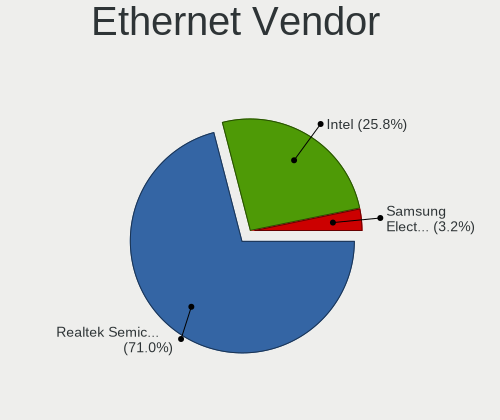

| Vendor                | Desktops | Percent |
|-----------------------|----------|---------|
| Realtek Semiconductor | 14       | 60.87%  |
| Intel                 | 7        | 30.43%  |
| Qualcomm Atheros      | 2        | 8.7%    |

Ethernet Model
--------------

Ethernet models

| Model                                                             | Desktops | Percent |
|-------------------------------------------------------------------|----------|---------|
| Realtek RTL8111/8168/8411 PCI Express Gigabit Ethernet Controller | 11       | 47.83%  |
| Realtek RTL8125 2.5GbE Controller                                 | 3        | 13.04%  |
| Intel I211 Gigabit Network Connection                             | 2        | 8.7%    |
| Qualcomm Atheros Killer E2500 Gigabit Ethernet Controller         | 1        | 4.35%   |
| Qualcomm Atheros Killer E220x Gigabit Ethernet Controller         | 1        | 4.35%   |
| Intel Ethernet Controller I225-V                                  | 1        | 4.35%   |
| Intel Ethernet Connection (7) I219-LM                             | 1        | 4.35%   |
| Intel Ethernet Connection (14) I219-V                             | 1        | 4.35%   |
| Intel 82579LM Gigabit Network Connection (Lewisville)             | 1        | 4.35%   |
| Intel 82567LM-3 Gigabit Network Connection                        | 1        | 4.35%   |

Net Controller Kind
-------------------

Ethernet, WiFi or modem

| Kind     | Desktops | Percent |
|----------|----------|---------|
| Ethernet | 23       | 62.16%  |
| WiFi     | 13       | 35.14%  |
| Unknown  | 1        | 2.7%    |

Used Controller
---------------

Currently used network controller

| Kind     | Desktops | Percent |
|----------|----------|---------|
| Ethernet | 18       | 72%     |
| WiFi     | 7        | 28%     |

NICs
----

Total network controllers on board

| Total | Desktops | Percent |
|-------|----------|---------|
| 1     | 17       | 73.91%  |
| 2     | 6        | 26.09%  |

IPv6
----

IPv6 vs IPv4

| Used | Desktops | Percent |
|------|----------|---------|
| Yes  | 12       | 52.17%  |
| No   | 11       | 47.83%  |

Bluetooth
---------

Bluetooth Vendor
----------------

Controller vendors

| Vendor                  | Desktops | Percent |
|-------------------------|----------|---------|
| Intel                   | 4        | 40%     |
| Cambridge Silicon Radio | 4        | 40%     |
| IMC Networks            | 1        | 10%     |
| Foxconn / Hon Hai       | 1        | 10%     |

Bluetooth Model
---------------

Controller models

| Model                                               | Desktops | Percent |
|-----------------------------------------------------|----------|---------|
| Intel AX200 Bluetooth                               | 4        | 40%     |
| Cambridge Silicon Radio Bluetooth Dongle (HCI mode) | 4        | 40%     |
| IMC Networks Wireless_Device                        | 1        | 10%     |
| Foxconn / Hon Hai Bluetooth Device                  | 1        | 10%     |

Sound
-----

Sound Vendor
------------

Sound card vendors

| Vendor              | Desktops | Percent |
|---------------------|----------|---------|
| AMD                 | 15       | 40.54%  |
| Intel               | 9        | 24.32%  |
| Nvidia              | 8        | 21.62%  |
| C-Media Electronics | 4        | 10.81%  |
| Logitech            | 1        | 2.7%    |

Sound Model
-----------

Sound card models

| Model                                                                             | Desktops | Percent |
|-----------------------------------------------------------------------------------|----------|---------|
| AMD Starship/Matisse HD Audio Controller                                          | 6        | 12.77%  |
| AMD Ellesmere HDMI Audio [Radeon RX 470/480 / 570/580/590]                        | 4        | 8.51%   |
| AMD Navi 21/23 HDMI/DP Audio Controller                                           | 3        | 6.38%   |
| Nvidia TU116 High Definition Audio Controller                                     | 2        | 4.26%   |
| Intel 7 Series/C216 Chipset Family High Definition Audio Controller               | 2        | 4.26%   |
| Intel 200 Series PCH HD Audio                                                     | 2        | 4.26%   |
| C-Media Electronics Blue Snowball                                                 | 2        | 4.26%   |
| AMD SBx00 Azalia (Intel HDA)                                                      | 2        | 4.26%   |
| AMD Raven/Raven2/Fenghuang HDMI/DP Audio Controller                               | 2        | 4.26%   |
| AMD FCH Azalia Controller                                                         | 2        | 4.26%   |
| AMD Family 17h/19h HD Audio Controller                                            | 2        | 4.26%   |
| Nvidia TU102 High Definition Audio Controller                                     | 1        | 2.13%   |
| Nvidia GP107GL High Definition Audio Controller                                   | 1        | 2.13%   |
| Nvidia GP104 High Definition Audio Controller                                     | 1        | 2.13%   |
| Nvidia GK106 HDMI Audio Controller                                                | 1        | 2.13%   |
| Nvidia GF108 High Definition Audio Controller                                     | 1        | 2.13%   |
| Nvidia GA104 High Definition Audio Controller                                     | 1        | 2.13%   |
| Logitech H390 headset with microphone                                             | 1        | 2.13%   |
| Intel Comet Lake PCH-V cAVS                                                       | 1        | 2.13%   |
| Intel Cannon Lake PCH cAVS                                                        | 1        | 2.13%   |
| Intel Audio device                                                                | 1        | 2.13%   |
| Intel 82801JI (ICH10 Family) HD Audio Controller                                  | 1        | 2.13%   |
| Intel 82801JD/DO (ICH10 Family) HD Audio Controller                               | 1        | 2.13%   |
| C-Media Electronics Schiit Modi Uber                                              | 1        | 2.13%   |
| C-Media Electronics Audio Adapter (Unitek Y-247A)                                 | 1        | 2.13%   |
| AMD Navi 10 HDMI Audio                                                            | 1        | 2.13%   |
| AMD Kaveri HDMI/DP Audio Controller                                               | 1        | 2.13%   |
| AMD Family 17h (Models 00h-0fh) HD Audio Controller                               | 1        | 2.13%   |
| AMD Caicos HDMI Audio [Radeon HD 6450 / 7450/8450/8490 OEM / R5 230/235/235X OEM] | 1        | 2.13%   |

Memory
------

Memory Vendor
-------------

Memory module vendors

| Vendor  | Desktops | Percent |
|---------|----------|---------|
| Corsair | 1        | 100%    |

Memory Model
------------

Memory module models

| Model                                                 | Desktops | Percent |
|-------------------------------------------------------|----------|---------|
| Corsair RAM CMK16GX4M2B3200C16 8GB DIMM DDR4 3600MT/s | 1        | 50%     |
| Corsair RAM CMK16GX4M2B3000C15 8GB DIMM DDR4 3200MT/s | 1        | 50%     |

Memory Kind
-----------

Memory module kinds

| Kind | Desktops | Percent |
|------|----------|---------|
| DDR4 | 1        | 100%    |

Memory Form Factor
------------------

Physical design of the memory module

| Name | Desktops | Percent |
|------|----------|---------|
| DIMM | 1        | 100%    |

Memory Size
-----------

Memory module size

| Size | Desktops | Percent |
|------|----------|---------|
| 8192 | 1        | 100%    |

Memory Speed
------------

Memory module speed

| Speed | Desktops | Percent |
|-------|----------|---------|
| 3600  | 1        | 50%     |
| 3466  | 1        | 50%     |

Printers & scanners
-------------------

Printer Vendor
--------------

Printer device vendors

Zero info for selected period =(

Printer Model
-------------

Printer device models

Zero info for selected period =(

Scanner Vendor
--------------

Scanner device vendors

| Vendor          | Desktops | Percent |
|-----------------|----------|---------|
| Hewlett-Packard | 1        | 100%    |

Scanner Model
-------------

Scanner device models

| Model            | Desktops | Percent |
|------------------|----------|---------|
| HP ScanJet 2400c | 1        | 100%    |

Camera
------

Camera Vendor
-------------

Camera device vendors

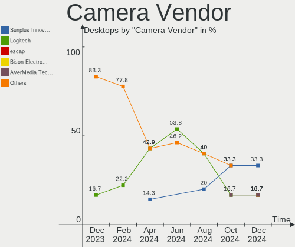

| Vendor          | Desktops | Percent |
|-----------------|----------|---------|
| Microsoft       | 1        | 20%     |
| Microdia        | 1        | 20%     |
| Logitech        | 1        | 20%     |
| Hewlett-Packard | 1        | 20%     |
| Apple           | 1        | 20%     |

Camera Model
------------

Camera device models

| Model                      | Desktops | Percent |
|----------------------------|----------|---------|
| Microsoft Xbox NUI Camera  | 1        | 20%     |
| Microdia Integrated Camera | 1        | 20%     |
| Logitech Webcam C270       | 1        | 20%     |
| HP Webcam HD 2300          | 1        | 20%     |
| Apple iPhone5/5C/5S/6      | 1        | 20%     |

Security
--------

Fingerprint Vendor
------------------

Fingerprint sensor vendors

Zero info for selected period =(

Fingerprint Model
-----------------

Fingerprint sensor models

Zero info for selected period =(

Chipcard Vendor
---------------

Chipcard module vendors

Zero info for selected period =(

Chipcard Model
--------------

Chipcard module models

Zero info for selected period =(

Unsupported
-----------

Unsupported Devices
-------------------

Total unsupported devices on board

| Total | Desktops | Percent |
|-------|----------|---------|
| 0     | 20       | 86.96%  |
| 1     | 2        | 8.7%    |
| 2     | 1        | 4.35%   |

Unsupported Device Types
------------------------

Types of unsupported devices

| Type                  | Desktops | Percent |
|-----------------------|----------|---------|
| Sound                 | 1        | 33.33%  |
| Net/wireless          | 1        | 33.33%  |
| Multimedia controller | 1        | 33.33%  |

