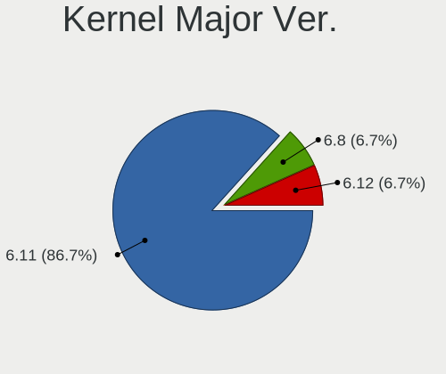
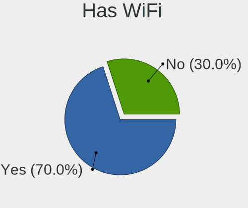
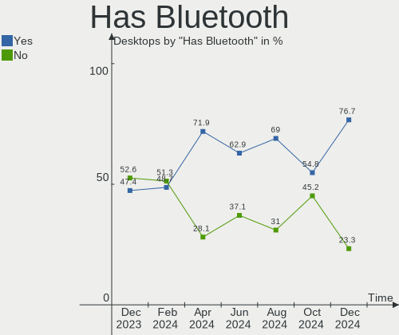
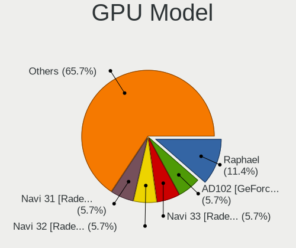
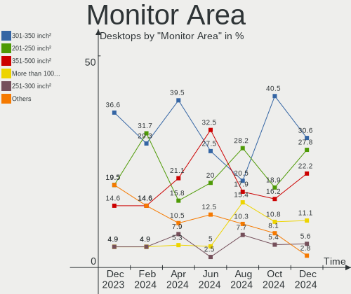
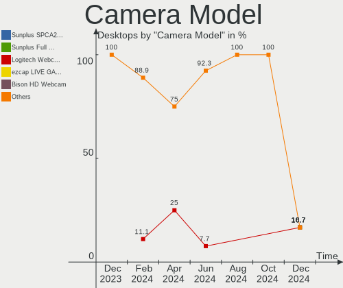

Nobara - Hardware Trends (Desktops)
-----------------------------------

A project to identify most popular hardware characteristics and track their change
over time based on data collected by Linux users at https://Linux-Hardware.org.

Anyone can contribute to this report by the [hw-probe](https://github.com/linuxhw/hw-probe) tool:

    sudo -E hw-probe -all -upload

This report is for one last month. Overall report since the beginning of time: [TestCoverage](https://github.com/linuxhw/TestCoverage)

Period: Dec, 2022.

Contents
--------

* [ System ](#system)
  - [ OS                       ](#os)
  - [ OS Family                ](#os-family)
  - [ Kernel                   ](#kernel)
  - [ Kernel Family            ](#kernel-family)
  - [ Kernel Major Ver.        ](#kernel-major-ver)
  - [ Arch                     ](#arch)
  - [ DE                       ](#de)
  - [ Display Server           ](#display-server)
  - [ Display Manager          ](#display-manager)
  - [ OS Lang                  ](#os-lang)
  - [ Boot Mode                ](#boot-mode)
  - [ Filesystem               ](#filesystem)
  - [ Part. scheme             ](#part-scheme)
  - [ Dual Boot with Linux/BSD ](#dual-boot-with-linuxbsd)
  - [ Dual Boot (Win)          ](#dual-boot-win)

* [ Board ](#board)
  - [ Vendor                   ](#vendor)
  - [ Model                    ](#model)
  - [ Model Family             ](#model-family)
  - [ MFG Year                 ](#mfg-year)
  - [ Form Factor              ](#form-factor)
  - [ Secure Boot              ](#secure-boot)
  - [ Coreboot                 ](#coreboot)
  - [ RAM Size                 ](#ram-size)
  - [ RAM Used                 ](#ram-used)
  - [ Total Drives             ](#total-drives)
  - [ Has CD-ROM               ](#has-cd-rom)
  - [ Has Ethernet             ](#has-ethernet)
  - [ Has WiFi                 ](#has-wifi)
  - [ Has Bluetooth            ](#has-bluetooth)

* [ Location ](#location)
  - [ Country                  ](#country)
  - [ City                     ](#city)

* [ Drives ](#drives)
  - [ Drive Vendor             ](#drive-vendor)
  - [ Drive Model              ](#drive-model)
  - [ HDD Vendor               ](#hdd-vendor)
  - [ SSD Vendor               ](#ssd-vendor)
  - [ Drive Kind               ](#drive-kind)
  - [ Drive Connector          ](#drive-connector)
  - [ Drive Size               ](#drive-size)
  - [ Space Total              ](#space-total)
  - [ Space Used               ](#space-used)
  - [ Malfunc. Drives          ](#malfunc-drives)
  - [ Malfunc. Drive Vendor    ](#malfunc-drive-vendor)
  - [ Malfunc. HDD Vendor      ](#malfunc-hdd-vendor)
  - [ Malfunc. Drive Kind      ](#malfunc-drive-kind)
  - [ Failed Drives            ](#failed-drives)
  - [ Failed Drive Vendor      ](#failed-drive-vendor)
  - [ Drive Status             ](#drive-status)

* [ Storage controller ](#storage-controller)
  - [ Storage Vendor           ](#storage-vendor)
  - [ Storage Model            ](#storage-model)
  - [ Storage Kind             ](#storage-kind)

* [ Processor ](#processor)
  - [ CPU Vendor               ](#cpu-vendor)
  - [ CPU Model                ](#cpu-model)
  - [ CPU Model Family         ](#cpu-model-family)
  - [ CPU Cores                ](#cpu-cores)
  - [ CPU Sockets              ](#cpu-sockets)
  - [ CPU Threads              ](#cpu-threads)
  - [ CPU Op-Modes             ](#cpu-op-modes)
  - [ CPU Microcode            ](#cpu-microcode)
  - [ CPU Microarch            ](#cpu-microarch)

* [ Graphics ](#graphics)
  - [ GPU Vendor               ](#gpu-vendor)
  - [ GPU Model                ](#gpu-model)
  - [ GPU Combo                ](#gpu-combo)
  - [ GPU Driver               ](#gpu-driver)
  - [ GPU Memory               ](#gpu-memory)

* [ Monitor ](#monitor)
  - [ Monitor Vendor           ](#monitor-vendor)
  - [ Monitor Model            ](#monitor-model)
  - [ Monitor Resolution       ](#monitor-resolution)
  - [ Monitor Diagonal         ](#monitor-diagonal)
  - [ Monitor Width            ](#monitor-width)
  - [ Aspect Ratio             ](#aspect-ratio)
  - [ Monitor Area             ](#monitor-area)
  - [ Pixel Density            ](#pixel-density)
  - [ Multiple Monitors        ](#multiple-monitors)

* [ Network ](#network)
  - [ Net Controller Vendor    ](#net-controller-vendor)
  - [ Net Controller Model     ](#net-controller-model)
  - [ Wireless Vendor          ](#wireless-vendor)
  - [ Wireless Model           ](#wireless-model)
  - [ Ethernet Vendor          ](#ethernet-vendor)
  - [ Ethernet Model           ](#ethernet-model)
  - [ Net Controller Kind      ](#net-controller-kind)
  - [ Used Controller          ](#used-controller)
  - [ NICs                     ](#nics)
  - [ IPv6                     ](#ipv6)

* [ Bluetooth ](#bluetooth)
  - [ Bluetooth Vendor         ](#bluetooth-vendor)
  - [ Bluetooth Model          ](#bluetooth-model)

* [ Sound ](#sound)
  - [ Sound Vendor             ](#sound-vendor)
  - [ Sound Model              ](#sound-model)

* [ Memory ](#memory)
  - [ Memory Vendor            ](#memory-vendor)
  - [ Memory Model             ](#memory-model)
  - [ Memory Kind              ](#memory-kind)
  - [ Memory Form Factor       ](#memory-form-factor)
  - [ Memory Size              ](#memory-size)
  - [ Memory Speed             ](#memory-speed)

* [ Printers & scanners ](#printers--scanners)
  - [ Printer Vendor           ](#printer-vendor)
  - [ Printer Model            ](#printer-model)
  - [ Scanner Vendor           ](#scanner-vendor)
  - [ Scanner Model            ](#scanner-model)

* [ Camera ](#camera)
  - [ Camera Vendor            ](#camera-vendor)
  - [ Camera Model             ](#camera-model)

* [ Security ](#security)
  - [ Fingerprint Vendor       ](#fingerprint-vendor)
  - [ Fingerprint Model        ](#fingerprint-model)
  - [ Chipcard Vendor          ](#chipcard-vendor)
  - [ Chipcard Model           ](#chipcard-model)

* [ Unsupported ](#unsupported)
  - [ Unsupported Devices      ](#unsupported-devices)
  - [ Unsupported Device Types ](#unsupported-device-types)

System
------

OS
--

Installed operating systems

| Name      | Desktops | Percent |
|-----------|----------|---------|
| Nobara 36 | 17       | 100%    |

OS Family
---------

OS without a version

| Name   | Desktops | Percent |
|--------|----------|---------|
| Nobara | 17       | 100%    |

Kernel
------

Version of the Linux kernel

| Version                      | Desktops | Percent |
|------------------------------|----------|---------|
| 6.0.10-201.fc36.x86_64       | 14       | 82.35%  |
| 6.0.14-201.fsync.fc36.x86_64 | 2        | 11.76%  |
| 6.0.5-201.fsync.fc36.x86_64  | 1        | 5.88%   |

Kernel Family
-------------

Linux kernel without a distro release

| Version | Desktops | Percent |
|---------|----------|---------|
| 6.0.10  | 14       | 82.35%  |
| 6.0.14  | 2        | 11.76%  |
| 6.0.5   | 1        | 5.88%   |

Kernel Major Ver.
-----------------

Linux kernel major version

| Version | Desktops | Percent |
|---------|----------|---------|
| 6.0     | 17       | 100%    |

Arch
----

OS architecture (x86_64, i586, etc.)

| Name   | Desktops | Percent |
|--------|----------|---------|
| x86_64 | 17       | 100%    |

DE
--

Desktop Environment

| Name          | Desktops | Percent |
|---------------|----------|---------|
| GNOME         | 12       | 70.59%  |
| KDE5          | 3        | 17.65%  |
| GNOME Classic | 2        | 11.76%  |

Display Server
--------------

X11 or Wayland

| Name    | Desktops | Percent |
|---------|----------|---------|
| Wayland | 10       | 58.82%  |
| X11     | 7        | 41.18%  |

Display Manager
---------------

SDDM, LightDM, etc.

| Name    | Desktops | Percent |
|---------|----------|---------|
| Unknown | 17       | 100%    |

OS Lang
-------

Language

| Lang  | Desktops | Percent |
|-------|----------|---------|
| en_US | 8        | 47.06%  |
| es_AR | 2        | 11.76%  |
| sv_SE | 1        | 5.88%   |
| pt_BR | 1        | 5.88%   |
| fr_FR | 1        | 5.88%   |
| fi_FI | 1        | 5.88%   |
| en_GB | 1        | 5.88%   |
| en_CA | 1        | 5.88%   |
| de_DE | 1        | 5.88%   |

Boot Mode
---------

EFI or BIOS

| Mode | Desktops | Percent |
|------|----------|---------|
| EFI  | 12       | 70.59%  |
| BIOS | 5        | 29.41%  |

Filesystem
----------

Type of filesystem

| Type  | Desktops | Percent |
|-------|----------|---------|
| Btrfs | 16       | 94.12%  |
| Ext4  | 1        | 5.88%   |

Part. scheme
------------

Scheme of partitioning

| Type    | Desktops | Percent |
|---------|----------|---------|
| Unknown | 17       | 100%    |

Dual Boot with Linux/BSD
------------------------

Hosting more than one Linux/BSD

| Dual boot | Desktops | Percent |
|-----------|----------|---------|
| No        | 17       | 100%    |

Dual Boot (Win)
---------------

Hosting Linux and Windows

| Dual boot | Desktops | Percent |
|-----------|----------|---------|
| No        | 17       | 100%    |

Board
-----

Vendor
------

Motherboard manufacturer

| Name                | Desktops | Percent |
|---------------------|----------|---------|
| ASUSTek Computer    | 6        | 35.29%  |
| MSI                 | 5        | 29.41%  |
| Gigabyte Technology | 2        | 11.76%  |
| Hewlett-Packard     | 1        | 5.88%   |
| Dell                | 1        | 5.88%   |
| Biostar             | 1        | 5.88%   |
| ASRock              | 1        | 5.88%   |

Model
-----

Motherboard model

| Name                              | Desktops | Percent |
|-----------------------------------|----------|---------|
| MSI MS-7C91                       | 3        | 17.65%  |
| MSI MS-7D41                       | 1        | 5.88%   |
| MSI MS-7597                       | 1        | 5.88%   |
| HP Z420 Workstation               | 1        | 5.88%   |
| Gigabyte Z590I VISION D           | 1        | 5.88%   |
| Gigabyte H81M-H                   | 1        | 5.88%   |
| Dell Precision Tower 7910         | 1        | 5.88%   |
| Biostar X470GTN                   | 1        | 5.88%   |
| ASUS STRIX Z270H GAMING           | 1        | 5.88%   |
| ASUS ROG STRIX B660-F GAMING WIFI | 1        | 5.88%   |
| ASUS ROG CROSSHAIR VII HERO       | 1        | 5.88%   |
| ASUS PRIME Z270-P                 | 1        | 5.88%   |
| ASUS M5A97 LE R2.0                | 1        | 5.88%   |
| ASUS M5A88-M                      | 1        | 5.88%   |
| ASRock H310M-HDV/M.2              | 1        | 5.88%   |

Model Family
------------

Motherboard model prefix

| Name             | Desktops | Percent |
|------------------|----------|---------|
| MSI MS-7C91      | 3        | 17.65%  |
| ASUS ROG         | 2        | 11.76%  |
| MSI MS-7D41      | 1        | 5.88%   |
| MSI MS-7597      | 1        | 5.88%   |
| HP Z420          | 1        | 5.88%   |
| Gigabyte Z590I   | 1        | 5.88%   |
| Gigabyte H81M-H  | 1        | 5.88%   |
| Dell Precision   | 1        | 5.88%   |
| Biostar X470GTN  | 1        | 5.88%   |
| ASUS STRIX       | 1        | 5.88%   |
| ASUS PRIME       | 1        | 5.88%   |
| ASUS M5A97       | 1        | 5.88%   |
| ASUS M5A88-M     | 1        | 5.88%   |
| ASRock H310M-HDV | 1        | 5.88%   |

MFG Year
--------

Motherboard manufacture year

| Year | Desktops | Percent |
|------|----------|---------|
| 2022 | 3        | 17.65%  |
| 2019 | 3        | 17.65%  |
| 2020 | 2        | 11.76%  |
| 2012 | 2        | 11.76%  |
| 2021 | 1        | 5.88%   |
| 2017 | 1        | 5.88%   |
| 2016 | 1        | 5.88%   |
| 2015 | 1        | 5.88%   |
| 2013 | 1        | 5.88%   |
| 2011 | 1        | 5.88%   |
| 2009 | 1        | 5.88%   |

Form Factor
-----------

Physical design of the computer

| Name    | Desktops | Percent |
|---------|----------|---------|
| Desktop | 17       | 100%    |

Secure Boot
-----------

Enabled or disabled

| State    | Desktops | Percent |
|----------|----------|---------|
| Disabled | 17       | 100%    |

Coreboot
--------

Have coreboot on board

| Used | Desktops | Percent |
|------|----------|---------|
| No   | 17       | 100%    |

RAM Size
--------

Total RAM memory

| Size in GB  | Desktops | Percent |
|-------------|----------|---------|
| 16.01-24.0  | 10       | 58.82%  |
| 32.01-64.0  | 5        | 29.41%  |
| 3.01-4.0    | 1        | 5.88%   |
| 64.01-256.0 | 1        | 5.88%   |

RAM Used
--------

Used RAM memory

| Used GB   | Desktops | Percent |
|-----------|----------|---------|
| 4.01-8.0  | 9        | 52.94%  |
| 3.01-4.0  | 4        | 23.53%  |
| 8.01-16.0 | 3        | 17.65%  |
| 2.01-3.0  | 1        | 5.88%   |

Total Drives
------------

Number of drives on board

| Drives | Desktops | Percent |
|--------|----------|---------|
| 3      | 5        | 29.41%  |
| 2      | 4        | 23.53%  |
| 1      | 4        | 23.53%  |
| 4      | 2        | 11.76%  |
| 6      | 1        | 5.88%   |
| 5      | 1        | 5.88%   |

Has CD-ROM
----------

Has CD-ROM on board

| Presented | Desktops | Percent |
|-----------|----------|---------|
| No        | 16       | 94.12%  |
| Yes       | 1        | 5.88%   |

Has Ethernet
------------

Has Ethernet on board

| Presented | Desktops | Percent |
|-----------|----------|---------|
| Yes       | 17       | 100%    |

Has WiFi
--------

Has WiFi module

| Presented | Desktops | Percent |
|-----------|----------|---------|
| No        | 13       | 76.47%  |
| Yes       | 4        | 23.53%  |

Has Bluetooth
-------------

Has Bluetooth module

| Presented | Desktops | Percent |
|-----------|----------|---------|
| No        | 9        | 52.94%  |
| Yes       | 8        | 47.06%  |

Location
--------

Country
-------

Geographic location (country)

| Country   | Desktops | Percent |
|-----------|----------|---------|
| USA       | 6        | 35.29%  |
| Argentina | 2        | 11.76%  |
| UK        | 1        | 5.88%   |
| Sweden    | 1        | 5.88%   |
| Indonesia | 1        | 5.88%   |
| Hungary   | 1        | 5.88%   |
| Germany   | 1        | 5.88%   |
| France    | 1        | 5.88%   |
| Finland   | 1        | 5.88%   |
| Canada    | 1        | 5.88%   |
| Brazil    | 1        | 5.88%   |

City
----

Geographic location (city)

| City            | Desktops | Percent |
|-----------------|----------|---------|
| Thornhill       | 1        | 5.88%   |
| Tampere         | 1        | 5.88%   |
| Serquigny       | 1        | 5.88%   |
| Satellite Beach | 1        | 5.88%   |
| Richardson      | 1        | 5.88%   |
| Perth           | 1        | 5.88%   |
| Palu            | 1        | 5.88%   |
| Mainz           | 1        | 5.88%   |
| Lanus           | 1        | 5.88%   |
| Grass Lake      | 1        | 5.88%   |
| Gothenburg      | 1        | 5.88%   |
| East Wenatchee  | 1        | 5.88%   |
| Debrecen        | 1        | 5.88%   |
| Buenos Aires    | 1        | 5.88%   |
| Belford Roxo    | 1        | 5.88%   |
| Antelope        | 1        | 5.88%   |
| Alhambra        | 1        | 5.88%   |

Drives
------

Drive Vendor
------------

Hard drive vendors

| Vendor                    | Desktops | Drives | Percent |
|---------------------------|----------|--------|---------|
| Seagate                   | 8        | 11     | 20.51%  |
| Samsung Electronics       | 8        | 10     | 20.51%  |
| WDC                       | 7        | 9      | 17.95%  |
| Kingston                  | 4        | 4      | 10.26%  |
| Crucial                   | 3        | 3      | 7.69%   |
| Toshiba                   | 2        | 2      | 5.13%   |
| SanDisk                   | 1        | 1      | 2.56%   |
| Phison Electronics        | 1        | 1      | 2.56%   |
| Phison                    | 1        | 1      | 2.56%   |
| Micron/Crucial Technology | 1        | 1      | 2.56%   |
| KIOXIA-EXCERIA            | 1        | 1      | 2.56%   |
| Intel                     | 1        | 1      | 2.56%   |
| ADATA Technology          | 1        | 1      | 2.56%   |

Drive Model
-----------

Hard drive models

| Model                                               | Desktops | Percent |
|-----------------------------------------------------|----------|---------|
| Seagate ST2000DM008-2FR102 2TB                      | 2        | 4.35%   |
| Samsung SSD 860 EVO 500GB                           | 2        | 4.35%   |
| Kingston SA400S37240G 240GB SSD                     | 2        | 4.35%   |
| Kingston SA400S37120G 120GB SSD                     | 2        | 4.35%   |
| Crucial CT1000MX500SSD1 1TB                         | 2        | 4.35%   |
| WDC WDS240G2G0B-00EPW0 240GB SSD                    | 1        | 2.17%   |
| WDC WD60EFRX-68MYMN1 6TB                            | 1        | 2.17%   |
| WDC WD5000AAKX-003CA0 500GB                         | 1        | 2.17%   |
| WDC WD5000AAKS-00A7B0 500GB                         | 1        | 2.17%   |
| WDC WD20EZAZ-22L9GB0 2TB                            | 1        | 2.17%   |
| WDC WD20EURS-63S48Y0 2TB                            | 1        | 2.17%   |
| WDC WD20EARS-00MVWB0 2TB                            | 1        | 2.17%   |
| WDC WD10JPCX-24UE4T0 1TB                            | 1        | 2.17%   |
| WDC WD10EZEX-08WN4A0 1TB                            | 1        | 2.17%   |
| Toshiba PX03SNF080 800GB                            | 1        | 2.17%   |
| Toshiba DT01ACA300 3TB                              | 1        | 2.17%   |
| Seagate ST500LT012-9WS142 500GB                     | 1        | 2.17%   |
| Seagate ST5000DM000-1FK178 5TB                      | 1        | 2.17%   |
| Seagate ST4000DM004-2CV104 4TB                      | 1        | 2.17%   |
| Seagate ST4000DM000-1F2168 4TB                      | 1        | 2.17%   |
| Seagate ST33000651AS 3TB                            | 1        | 2.17%   |
| Seagate ST3000DM001-9YN166 3TB                      | 1        | 2.17%   |
| Seagate ST2000DM006-2DM164 2TB                      | 1        | 2.17%   |
| Seagate ST2000DM001-9YN164 2TB                      | 1        | 2.17%   |
| Seagate ST1000DM010-2EP102 1TB                      | 1        | 2.17%   |
| SanDisk DOPE1920S5xnNMRI 1TB SSD                    | 1        | 2.17%   |
| Samsung SSD 850 EVO 2TB                             | 1        | 2.17%   |
| Samsung SSD 850 EVO 250GB                           | 1        | 2.17%   |
| Samsung SSD 840 EVO 750GB                           | 1        | 2.17%   |
| Samsung NVMe SSD Controller SM981/PM981/PM983 500GB | 1        | 2.17%   |
| Samsung NVMe SSD Controller SM961/PM961/SM963 256GB | 1        | 2.17%   |
| Samsung MZMTD128HAFV-000L1 128GB SSD                | 1        | 2.17%   |
| Samsung MZ7LM1T9HCJM-00003 1TB SSD                  | 1        | 2.17%   |
| Samsung HD161HJ 160GB                               | 1        | 2.17%   |
| Phison MSI M480 1TB                                 | 1        | 2.17%   |
| Phison E12 NVMe Controller 1TB                      | 1        | 2.17%   |
| Micron/Crucial P1 NVMe PCIe SSD 1TB                 | 1        | 2.17%   |
| KIOXIA-EXCERIA SATA SSD 480GB                       | 1        | 2.17%   |
| Intel SSD 660P Series 1024GB                        | 1        | 2.17%   |
| Crucial CT256MX100SSD1 256GB                        | 1        | 2.17%   |

HDD Vendor
----------

Hard disk drive vendors

| Vendor              | Desktops | Drives | Percent |
|---------------------|----------|--------|---------|
| Seagate             | 8        | 11     | 50%     |
| WDC                 | 6        | 8      | 37.5%   |
| Toshiba             | 1        | 1      | 6.25%   |
| Samsung Electronics | 1        | 1      | 6.25%   |

SSD Vendor
----------

Solid state drive vendors

| Vendor              | Desktops | Drives | Percent |
|---------------------|----------|--------|---------|
| Samsung Electronics | 7        | 7      | 41.18%  |
| Kingston            | 4        | 4      | 23.53%  |
| Crucial             | 3        | 3      | 17.65%  |
| WDC                 | 1        | 1      | 5.88%   |
| SanDisk             | 1        | 1      | 5.88%   |
| KIOXIA-EXCERIA      | 1        | 1      | 5.88%   |

Drive Kind
----------

HDD or SSD

| Kind    | Desktops | Drives | Percent |
|---------|----------|--------|---------|
| SSD     | 15       | 17     | 46.88%  |
| HDD     | 10       | 21     | 31.25%  |
| NVMe    | 6        | 7      | 18.75%  |
| Unknown | 1        | 1      | 3.13%   |

Drive Connector
---------------

SATA, SAS, NVMe, etc.

| Type | Desktops | Drives | Percent |
|------|----------|--------|---------|
| SATA | 16       | 37     | 69.57%  |
| NVMe | 6        | 7      | 26.09%  |
| SAS  | 1        | 2      | 4.35%   |

Drive Size
----------

Size of hard drive

| Size in TB | Desktops | Drives | Percent |
|------------|----------|--------|---------|
| 0.01-0.5   | 11       | 15     | 36.67%  |
| 1.01-2.0   | 6        | 8      | 20%     |
| 0.51-1.0   | 6        | 8      | 20%     |
| 2.01-3.0   | 3        | 3      | 10%     |
| 3.01-4.0   | 2        | 2      | 6.67%   |
| 4.01-10.0  | 2        | 2      | 6.67%   |

Space Total
-----------

Amount of disk space available on the file system

| Size in GB     | Desktops | Percent |
|----------------|----------|---------|
| More than 3000 | 6        | 35.29%  |
| 101-250        | 4        | 23.53%  |
| 251-500        | 3        | 17.65%  |
| 501-1000       | 3        | 17.65%  |
| 1001-2000      | 1        | 5.88%   |

Space Used
----------

Amount of used disk space

| Used GB        | Desktops | Percent |
|----------------|----------|---------|
| 21-50          | 4        | 23.53%  |
| 101-250        | 4        | 23.53%  |
| More than 3000 | 2        | 11.76%  |
| 1-20           | 2        | 11.76%  |
| 51-100         | 2        | 11.76%  |
| 251-500        | 1        | 5.88%   |
| 2001-3000      | 1        | 5.88%   |
| 1001-2000      | 1        | 5.88%   |

Malfunc. Drives
---------------

Drive models with a malfunction

Zero info for selected period =(

Malfunc. Drive Vendor
---------------------

Vendors of faulty drives

Zero info for selected period =(

Malfunc. HDD Vendor
-------------------

Vendors of faulty HDD drives

Zero info for selected period =(

Malfunc. Drive Kind
-------------------

Kinds of faulty drives

Zero info for selected period =(

Failed Drives
-------------

Failed drive models

Zero info for selected period =(

Failed Drive Vendor
-------------------

Failed drive vendors

Zero info for selected period =(

Drive Status
------------

Number of failed and malfunc. drives

| Status   | Desktops | Drives | Percent |
|----------|----------|--------|---------|
| Detected | 17       | 46     | 100%    |

Storage controller
------------------

Storage Vendor
--------------

Storage controller vendors

| Vendor                    | Desktops | Percent |
|---------------------------|----------|---------|
| Intel                     | 9        | 36%     |
| AMD                       | 7        | 28%     |
| Samsung Electronics       | 2        | 8%      |
| Phison Electronics        | 2        | 8%      |
| Nvidia                    | 1        | 4%      |
| Micron/Crucial Technology | 1        | 4%      |
| Broadcom / LSI            | 1        | 4%      |
| ASMedia Technology        | 1        | 4%      |
| ADATA Technology          | 1        | 4%      |

Storage Model
-------------

Storage controller models

| Model                                                                          | Desktops | Percent |
|--------------------------------------------------------------------------------|----------|---------|
| AMD 500 Series Chipset SATA Controller                                         | 3        | 9.09%   |
| Intel Alder Lake-S PCH SATA Controller [AHCI Mode]                             | 2        | 6.06%   |
| Intel 200 Series PCH SATA controller [AHCI mode]                               | 2        | 6.06%   |
| AMD FCH SATA Controller [AHCI mode]                                            | 2        | 6.06%   |
| AMD 400 Series Chipset SATA Controller                                         | 2        | 6.06%   |
| Samsung NVMe SSD Controller SM981/PM981/PM983                                  | 1        | 3.03%   |
| Samsung NVMe SSD Controller SM961/PM961/SM963                                  | 1        | 3.03%   |
| Phison E18 PCIe4 NVMe Controller                                               | 1        | 3.03%   |
| Phison E12 NVMe Controller                                                     | 1        | 3.03%   |
| Nvidia MCP61 SATA Controller                                                   | 1        | 3.03%   |
| Nvidia MCP61 IDE                                                               | 1        | 3.03%   |
| Micron/Crucial P1 NVMe PCIe SSD                                                | 1        | 3.03%   |
| Intel Volume Management Device NVMe RAID Controller                            | 1        | 3.03%   |
| Intel SSD 660P Series                                                          | 1        | 3.03%   |
| Intel SATA Controller [RAID mode]                                              | 1        | 3.03%   |
| Intel Cannon Lake PCH SATA AHCI Controller                                     | 1        | 3.03%   |
| Intel C602 chipset 4-Port SATA Storage Control Unit                            | 1        | 3.03%   |
| Intel C600/X79 series chipset SATA RAID Controller                             | 1        | 3.03%   |
| Intel C600/X79 series chipset IDE-r Controller                                 | 1        | 3.03%   |
| Intel 8 Series/C220 Series Chipset Family 6-port SATA Controller 1 [AHCI mode] | 1        | 3.03%   |
| Intel 500 Series Chipset Family SATA AHCI Controller                           | 1        | 3.03%   |
| Broadcom / LSI SAS3008 PCI-Express Fusion-MPT SAS-3                            | 1        | 3.03%   |
| ASMedia ASM1062 Serial ATA Controller                                          | 1        | 3.03%   |
| AMD SB7x0/SB8x0/SB9x0 SATA Controller [IDE mode]                               | 1        | 3.03%   |
| AMD SB7x0/SB8x0/SB9x0 SATA Controller [AHCI mode]                              | 1        | 3.03%   |
| AMD SB7x0/SB8x0/SB9x0 IDE Controller                                           | 1        | 3.03%   |
| ADATA ADATA XPG GAMMIXS1 1L Media                                              | 1        | 3.03%   |

Storage Kind
------------

Kind of storage controller (IDE, SATA, NVMe, SAS, ...)

| Kind | Desktops | Percent |
|------|----------|---------|
| SATA | 14       | 50%     |
| NVMe | 6        | 21.43%  |
| RAID | 3        | 10.71%  |
| IDE  | 3        | 10.71%  |
| SAS  | 2        | 7.14%   |

Processor
---------

CPU Vendor
----------

Processor vendors

| Vendor | Desktops | Percent |
|--------|----------|---------|
| Intel  | 9        | 52.94%  |
| AMD    | 8        | 47.06%  |

CPU Model
---------

Processor models

| Model                               | Desktops | Percent |
|-------------------------------------|----------|---------|
| Intel Core i5-7600K CPU @ 3.80GHz   | 2        | 11.76%  |
| Intel 12th Gen Core i5-12600K       | 2        | 11.76%  |
| AMD Ryzen 7 3700X 8-Core Processor  | 2        | 11.76%  |
| Intel Xeon CPU E5-2670 0 @ 2.60GHz  | 1        | 5.88%   |
| Intel Xeon CPU E5-2667 v4 @ 3.20GHz | 1        | 5.88%   |
| Intel Core i7-9700 CPU @ 3.00GHz    | 1        | 5.88%   |
| Intel Core i3-4130 CPU @ 3.40GHz    | 1        | 5.88%   |
| Intel Core i3-10100 CPU @ 3.60GHz   | 1        | 5.88%   |
| AMD Ryzen 9 5900X 12-Core Processor | 1        | 5.88%   |
| AMD Ryzen 5 3600 6-Core Processor   | 1        | 5.88%   |
| AMD Ryzen 5 2600 Six-Core Processor | 1        | 5.88%   |
| AMD Phenom II X6 1045T Processor    | 1        | 5.88%   |
| AMD Phenom II X4 925 Processor      | 1        | 5.88%   |
| AMD FX-8320 Eight-Core Processor    | 1        | 5.88%   |

CPU Model Family
----------------

Processor model prefix

| Model            | Desktops | Percent |
|------------------|----------|---------|
| Other            | 2        | 11.76%  |
| Intel Xeon       | 2        | 11.76%  |
| Intel Core i5    | 2        | 11.76%  |
| Intel Core i3    | 2        | 11.76%  |
| AMD Ryzen 7      | 2        | 11.76%  |
| AMD Ryzen 5      | 2        | 11.76%  |
| Intel Core i7    | 1        | 5.88%   |
| AMD Ryzen 9      | 1        | 5.88%   |
| AMD Phenom II X6 | 1        | 5.88%   |
| AMD Phenom II X4 | 1        | 5.88%   |
| AMD FX           | 1        | 5.88%   |

CPU Cores
---------

Number of processor cores

| Number | Desktops | Percent |
|--------|----------|---------|
| 4      | 5        | 29.41%  |
| 8      | 4        | 23.53%  |
| 6      | 3        | 17.65%  |
| 10     | 2        | 11.76%  |
| 16     | 1        | 5.88%   |
| 12     | 1        | 5.88%   |
| 2      | 1        | 5.88%   |

CPU Sockets
-----------

Number of sockets

| Number | Desktops | Percent |
|--------|----------|---------|
| 1      | 16       | 94.12%  |
| 2      | 1        | 5.88%   |

CPU Threads
-----------

Threads per core (Hyper-Threading)

| Number | Desktops | Percent |
|--------|----------|---------|
| 2      | 12       | 70.59%  |
| 1      | 5        | 29.41%  |

CPU Op-Modes
------------

CPU Operation Modes (32-bit, 64-bit)

| Op mode        | Desktops | Percent |
|----------------|----------|---------|
| 32-bit, 64-bit | 17       | 100%    |

CPU Microcode
-------------

Microcode number

| Number     | Desktops | Percent |
|------------|----------|---------|
| 0x906e9    | 2        | 11.76%  |
| 0x90672    | 2        | 11.76%  |
| 0x08701021 | 2        | 11.76%  |
| 0xa0655    | 1        | 5.88%   |
| 0x906ed    | 1        | 5.88%   |
| 0x406f1    | 1        | 5.88%   |
| 0x306c3    | 1        | 5.88%   |
| 0x206d7    | 1        | 5.88%   |
| 0x0a201009 | 1        | 5.88%   |
| 0x08701013 | 1        | 5.88%   |
| 0x0800820d | 1        | 5.88%   |
| 0x06000822 | 1        | 5.88%   |
| 0x010000bf | 1        | 5.88%   |
| 0x01000086 | 1        | 5.88%   |

CPU Microarch
-------------

Microarchitecture

| Name             | Desktops | Percent |
|------------------|----------|---------|
| Zen 2            | 3        | 17.65%  |
| KabyLake         | 3        | 17.65%  |
| K10              | 2        | 11.76%  |
| Alderlake Hybrid | 2        | 11.76%  |
| Zen+             | 1        | 5.88%   |
| Zen 3            | 1        | 5.88%   |
| SandyBridge      | 1        | 5.88%   |
| Piledriver       | 1        | 5.88%   |
| Haswell          | 1        | 5.88%   |
| CometLake        | 1        | 5.88%   |
| Broadwell        | 1        | 5.88%   |

Graphics
--------

GPU Vendor
----------

Vendors of graphics cards

| Vendor | Desktops | Percent |
|--------|----------|---------|
| Nvidia | 9        | 45%     |
| AMD    | 8        | 40%     |
| Intel  | 3        | 15%     |

GPU Model
---------

Graphics card models

| Model                                                                     | Desktops | Percent |
|---------------------------------------------------------------------------|----------|---------|
| Intel AlderLake-S GT1                                                     | 2        | 9.52%   |
| AMD Navi 10 [Radeon RX 5600 OEM/5600 XT / 5700/5700 XT]                   | 2        | 9.52%   |
| AMD Lexa PRO [Radeon 540/540X/550/550X / RX 540X/550/550X]                | 2        | 9.52%   |
| AMD Ellesmere [Radeon RX 470/480/570/570X/580/580X/590]                   | 2        | 9.52%   |
| Nvidia TU104 [GeForce RTX 2080 SUPER]                                     | 1        | 4.76%   |
| Nvidia GP107 [GeForce GTX 1050 Ti]                                        | 1        | 4.76%   |
| Nvidia GP106 [GeForce GTX 1060 6GB]                                       | 1        | 4.76%   |
| Nvidia GP106 [GeForce GTX 1060 3GB]                                       | 1        | 4.76%   |
| Nvidia GP104 [GeForce GTX 1080]                                           | 1        | 4.76%   |
| Nvidia GM204 [GeForce GTX 980]                                            | 1        | 4.76%   |
| Nvidia GK208B [GeForce GT 730]                                            | 1        | 4.76%   |
| Nvidia GF114 [GeForce GTX 560 Ti]                                         | 1        | 4.76%   |
| Nvidia GA102 [GeForce RTX 3080 Ti]                                        | 1        | 4.76%   |
| Intel 4th Generation Core Processor Family Integrated Graphics Controller | 1        | 4.76%   |
| AMD RS880 [Radeon HD 4250]                                                | 1        | 4.76%   |
| AMD Navi 23 [Radeon RX 6600/6600 XT/6600M]                                | 1        | 4.76%   |
| AMD Navi 22 [Radeon RX 6700/6700 XT/6750 XT / 6800M]                      | 1        | 4.76%   |

GPU Combo
---------

Combinations of graphics cards

| Name        | Desktops | Percent |
|-------------|----------|---------|
| 1 x Nvidia  | 9        | 52.94%  |
| 1 x AMD     | 6        | 35.29%  |
| Intel + AMD | 1        | 5.88%   |
| 1 x Intel   | 1        | 5.88%   |

GPU Driver
----------

Free vs proprietary

| Driver      | Desktops | Percent |
|-------------|----------|---------|
| Free        | 11       | 64.71%  |
| Proprietary | 6        | 35.29%  |

GPU Memory
----------

Total video memory

| Size in GB | Desktops | Percent |
|------------|----------|---------|
| 7.01-8.0   | 6        | 35.29%  |
| Unknown    | 5        | 29.41%  |
| 3.01-4.0   | 2        | 11.76%  |
| 5.01-6.0   | 1        | 5.88%   |
| 2.01-3.0   | 1        | 5.88%   |
| 8.01-16.0  | 1        | 5.88%   |
| 0.51-1.0   | 1        | 5.88%   |

Monitor
-------

Monitor Vendor
--------------

Monitor vendors

| Vendor               | Desktops | Percent |
|----------------------|----------|---------|
| Samsung Electronics  | 5        | 26.32%  |
| Dell                 | 2        | 10.53%  |
| ASUSTek Computer     | 2        | 10.53%  |
| Ancor Communications | 2        | 10.53%  |
| Sony                 | 1        | 5.26%   |
| PRI                  | 1        | 5.26%   |
| MSI                  | 1        | 5.26%   |
| Goldstar             | 1        | 5.26%   |
| Gigabyte Technology  | 1        | 5.26%   |
| BenQ                 | 1        | 5.26%   |
| AOC                  | 1        | 5.26%   |
| Acer                 | 1        | 5.26%   |

Monitor Model
-------------

Monitor models

| Model                                                                 | Desktops | Percent |
|-----------------------------------------------------------------------|----------|---------|
| Ancor Communications ROG PG279Q ACI27EC 2560x1440 598x336mm 27.0-inch | 2        | 9.09%   |
| Sony SDM-HS75P SNY2200 1280x1024 338x270mm 17.0-inch                  | 1        | 4.55%   |
| Samsung Electronics SMB2030N SAM0634 1600x900 443x249mm 20.0-inch     | 1        | 4.55%   |
| Samsung Electronics S24B300 SAM08CC 1920x1080 521x293mm 23.5-inch     | 1        | 4.55%   |
| Samsung Electronics LCD Monitor SAM7016 3840x2160 950x540mm 43.0-inch | 1        | 4.55%   |
| Samsung Electronics LC27G5xT SAM7079 2560x1440 597x336mm 27.0-inch    | 1        | 4.55%   |
| Samsung Electronics C27F390 SAM0D32 1920x1080 598x336mm 27.0-inch     | 1        | 4.55%   |
| Samsung Electronics C24F390 SAM0D2C 1920x1080 521x293mm 23.5-inch     | 1        | 4.55%   |
| PRI BBY LCD TV PRI0032 1360x768 530x398mm 26.1-inch                   | 1        | 4.55%   |
| MSI G27C4 MSI3CA9 1920x1080 598x336mm 27.0-inch                       | 1        | 4.55%   |
| Goldstar ULTRAWIDE GSM5BF8 2560x1080 673x284mm 28.8-inch              | 1        | 4.55%   |
| Gigabyte Technology AORUS KD25F GBT2400 1920x1080 544x303mm 24.5-inch | 1        | 4.55%   |
| Dell U2717D DEL40EA 2560x1440 597x336mm 27.0-inch                     | 1        | 4.55%   |
| Dell S2340L DELD058 1920x1080 509x286mm 23.0-inch                     | 1        | 4.55%   |
| Dell P2720DC DELD0FC 2560x1440 597x336mm 27.0-inch                    | 1        | 4.55%   |
| Dell LCD Monitor LNK0001 1920x1080 256x192mm 12.6-inch                | 1        | 4.55%   |
| BenQ ZOWIE RL LCD BNQ7F50 1920x1080 598x336mm 27.0-inch               | 1        | 4.55%   |
| ASUSTek Computer VP249 AUS24AF 1920x1080 527x296mm 23.8-inch          | 1        | 4.55%   |
| ASUSTek Computer ROG XG27UQR AUS27BA 3840x2160 596x335mm 26.9-inch    | 1        | 4.55%   |
| AOC 27V2G5 AOC2702 1920x1080 598x336mm 27.0-inch                      | 1        | 4.55%   |
| Acer GN246HL ACR02F9 1920x1080 531x299mm 24.0-inch                    | 1        | 4.55%   |

Monitor Resolution
------------------

Monitor screen resolution

| Resolution       | Desktops | Percent |
|------------------|----------|---------|
| 1920x1080 (FHD)  | 9        | 45%     |
| 2560x1440 (QHD)  | 4        | 20%     |
| 3840x2160 (4K)   | 3        | 15%     |
| 2560x1080        | 1        | 5%      |
| 1600x900 (HD+)   | 1        | 5%      |
| 1360x768         | 1        | 5%      |
| 1280x1024 (SXGA) | 1        | 5%      |

Monitor Diagonal
----------------

Diagonal size in inches

| Inches | Desktops | Percent |
|--------|----------|---------|
| 27     | 6        | 30%     |
| 24     | 3        | 15%     |
| 23     | 3        | 15%     |
| 26     | 2        | 10%     |
| 84     | 1        | 5%      |
| 31     | 1        | 5%      |
| 28     | 1        | 5%      |
| 20     | 1        | 5%      |
| 17     | 1        | 5%      |
| 14     | 1        | 5%      |

Monitor Width
-------------

Physical width

| Width in mm | Desktops | Percent |
|-------------|----------|---------|
| 501-600     | 13       | 68.42%  |
| 601-700     | 2        | 10.53%  |
| 401-500     | 1        | 5.26%   |
| 301-350     | 1        | 5.26%   |
| 201-300     | 1        | 5.26%   |
| 1501-2000   | 1        | 5.26%   |

Aspect Ratio
------------

Proportional relationship between the width and the height

| Ratio | Desktops | Percent |
|-------|----------|---------|
| 16/9  | 13       | 76.47%  |
| 4/3   | 2        | 11.76%  |
| 5/4   | 1        | 5.88%   |
| 21/9  | 1        | 5.88%   |

Monitor Area
------------

Area in inch²

| Area in inch² | Desktops | Percent |
|----------------|----------|---------|
| 301-350        | 8        | 40%     |
| 201-250        | 5        | 25%     |
| 251-300        | 2        | 10%     |
| More than 1000 | 1        | 5%      |
| 351-500        | 1        | 5%      |
| 151-200        | 1        | 5%      |
| 141-150        | 1        | 5%      |
| 101-110        | 1        | 5%      |

Pixel Density
-------------

Pixels per inch

| Density | Desktops | Percent |
|---------|----------|---------|
| 51-100  | 13       | 72.22%  |
| 101-120 | 3        | 16.67%  |
| 161-240 | 1        | 5.56%   |
| 121-160 | 1        | 5.56%   |

Multiple Monitors
-----------------

Total monitors connected

| Total | Desktops | Percent |
|-------|----------|---------|
| 1     | 14       | 82.35%  |
| 2     | 2        | 11.76%  |
| 3     | 1        | 5.88%   |

Network
-------

Net Controller Vendor
---------------------

Controller vendors

| Vendor                | Desktops | Percent |
|-----------------------|----------|---------|
| Realtek Semiconductor | 10       | 52.63%  |
| Intel                 | 8        | 42.11%  |
| MediaTek              | 1        | 5.26%   |

Net Controller Model
--------------------

Controller models

| Model                                                             | Desktops | Percent |
|-------------------------------------------------------------------|----------|---------|
| Realtek RTL8111/8168/8411 PCI Express Gigabit Ethernet Controller | 8        | 33.33%  |
| Realtek RTL8125 2.5GbE Controller                                 | 4        | 16.67%  |
| Intel Ethernet Controller I225-V                                  | 2        | 8.33%   |
| Intel Alder Lake-S PCH CNVi WiFi                                  | 2        | 8.33%   |
| MediaTek MT7921K (RZ608) Wi-Fi 6E 80MHz                           | 1        | 4.17%   |
| Intel Wi-Fi 6 AX200                                               | 1        | 4.17%   |
| Intel I211 Gigabit Network Connection                             | 1        | 4.17%   |
| Intel I210 Gigabit Network Connection                             | 1        | 4.17%   |
| Intel Ethernet Connection I217-LM                                 | 1        | 4.17%   |
| Intel Ethernet Connection (7) I219-V                              | 1        | 4.17%   |
| Intel Ethernet Connection (2) I219-V                              | 1        | 4.17%   |
| Intel 82579LM Gigabit Network Connection (Lewisville)             | 1        | 4.17%   |

Wireless Vendor
---------------

Wireless vendors

| Vendor   | Desktops | Percent |
|----------|----------|---------|
| Intel    | 3        | 75%     |
| MediaTek | 1        | 25%     |

Wireless Model
--------------

Wireless models

| Model                                   | Desktops | Percent |
|-----------------------------------------|----------|---------|
| Intel Alder Lake-S PCH CNVi WiFi        | 2        | 50%     |
| MediaTek MT7921K (RZ608) Wi-Fi 6E 80MHz | 1        | 25%     |
| Intel Wi-Fi 6 AX200                     | 1        | 25%     |

Ethernet Vendor
---------------

Ethernet vendors

| Vendor                | Desktops | Percent |
|-----------------------|----------|---------|
| Realtek Semiconductor | 10       | 58.82%  |
| Intel                 | 7        | 41.18%  |

Ethernet Model
--------------

Ethernet models

| Model                                                             | Desktops | Percent |
|-------------------------------------------------------------------|----------|---------|
| Realtek RTL8111/8168/8411 PCI Express Gigabit Ethernet Controller | 8        | 40%     |
| Realtek RTL8125 2.5GbE Controller                                 | 4        | 20%     |
| Intel Ethernet Controller I225-V                                  | 2        | 10%     |
| Intel I211 Gigabit Network Connection                             | 1        | 5%      |
| Intel I210 Gigabit Network Connection                             | 1        | 5%      |
| Intel Ethernet Connection I217-LM                                 | 1        | 5%      |
| Intel Ethernet Connection (7) I219-V                              | 1        | 5%      |
| Intel Ethernet Connection (2) I219-V                              | 1        | 5%      |
| Intel 82579LM Gigabit Network Connection (Lewisville)             | 1        | 5%      |

Net Controller Kind
-------------------

Ethernet, WiFi or modem

| Kind     | Desktops | Percent |
|----------|----------|---------|
| Ethernet | 17       | 80.95%  |
| WiFi     | 4        | 19.05%  |

Used Controller
---------------

Currently used network controller

| Kind     | Desktops | Percent |
|----------|----------|---------|
| Ethernet | 15       | 83.33%  |
| WiFi     | 3        | 16.67%  |

NICs
----

Total network controllers on board

| Total | Desktops | Percent |
|-------|----------|---------|
| 1     | 10       | 58.82%  |
| 2     | 7        | 41.18%  |

IPv6
----

IPv6 vs IPv4

| Used | Desktops | Percent |
|------|----------|---------|
| No   | 11       | 64.71%  |
| Yes  | 6        | 35.29%  |

Bluetooth
---------

Bluetooth Vendor
----------------

Controller vendors

| Vendor                  | Desktops | Percent |
|-------------------------|----------|---------|
| Intel                   | 3        | 37.5%   |
| Cambridge Silicon Radio | 2        | 25%     |
| Broadcom                | 2        | 25%     |
| MediaTek                | 1        | 12.5%   |

Bluetooth Model
---------------

Controller models

| Model                                               | Desktops | Percent |
|-----------------------------------------------------|----------|---------|
| Cambridge Silicon Radio Bluetooth Dongle (HCI mode) | 2        | 25%     |
| MediaTek Wireless_Device                            | 1        | 12.5%   |
| Intel Bluetooth Device                              | 1        | 12.5%   |
| Intel AX201 Bluetooth                               | 1        | 12.5%   |
| Intel AX200 Bluetooth                               | 1        | 12.5%   |
| Broadcom BCM20702A0 Bluetooth 4.0                   | 1        | 12.5%   |
| Broadcom BCM2045 Bluetooth                          | 1        | 12.5%   |

Sound
-----

Sound Vendor
------------

Sound card vendors

| Vendor               | Desktops | Percent |
|----------------------|----------|---------|
| AMD                  | 11       | 29.73%  |
| Nvidia               | 9        | 24.32%  |
| Intel                | 8        | 21.62%  |
| C-Media Electronics  | 3        | 8.11%   |
| Logitech             | 2        | 5.41%   |
| Texas Instruments    | 1        | 2.7%    |
| Kingston Technology  | 1        | 2.7%    |
| Giga-Byte Technology | 1        | 2.7%    |
| ASUSTek Computer     | 1        | 2.7%    |

Sound Model
-----------

Sound card models

| Model                                                               | Desktops | Percent |
|---------------------------------------------------------------------|----------|---------|
| AMD Starship/Matisse HD Audio Controller                            | 4        | 9.09%   |
| Nvidia GP106 High Definition Audio Controller                       | 2        | 4.55%   |
| Logitech PRO X Wireless Gaming Headset                              | 2        | 4.55%   |
| Intel Alder Lake-S HD Audio Controller                              | 2        | 4.55%   |
| Intel 200 Series PCH HD Audio                                       | 2        | 4.55%   |
| AMD SBx00 Azalia (Intel HDA)                                        | 2        | 4.55%   |
| AMD Navi 21/23 HDMI/DP Audio Controller                             | 2        | 4.55%   |
| AMD Navi 10 HDMI Audio                                              | 2        | 4.55%   |
| AMD Ellesmere HDMI Audio [Radeon RX 470/480 / 570/580/590]          | 2        | 4.55%   |
| AMD Baffin HDMI/DP Audio [Radeon RX 550 640SP / RX 560/560X]        | 2        | 4.55%   |
| Texas Instruments SMSL AD18 AMP                                     | 1        | 2.27%   |
| Nvidia TU104 HD Audio Controller                                    | 1        | 2.27%   |
| Nvidia MCP61 High Definition Audio                                  | 1        | 2.27%   |
| Nvidia GP107GL High Definition Audio Controller                     | 1        | 2.27%   |
| Nvidia GP104 High Definition Audio Controller                       | 1        | 2.27%   |
| Nvidia GM204 High Definition Audio Controller                       | 1        | 2.27%   |
| Nvidia GK208 HDMI/DP Audio Controller                               | 1        | 2.27%   |
| Nvidia GF114 HDMI Audio Controller                                  | 1        | 2.27%   |
| Nvidia GA102 High Definition Audio Controller                       | 1        | 2.27%   |
| Kingston Technology HyperX 7.1 Audio                                | 1        | 2.27%   |
| Intel Xeon E3-1200 v3/4th Gen Core Processor HD Audio Controller    | 1        | 2.27%   |
| Intel Cannon Lake PCH cAVS                                          | 1        | 2.27%   |
| Intel C600/X79 series chipset High Definition Audio Controller      | 1        | 2.27%   |
| Intel Audio device                                                  | 1        | 2.27%   |
| Intel 8 Series/C220 Series Chipset High Definition Audio Controller | 1        | 2.27%   |
| Giga-Byte Technology USB Audio                                      | 1        | 2.27%   |
| C-Media Electronics Thronmax MDrill One                             | 1        | 2.27%   |
| C-Media Electronics Q9-1                                            | 1        | 2.27%   |
| C-Media Electronics JLAB TALK PRO MICROPHONE                        | 1        | 2.27%   |
| ASUSTek Computer USB Audio                                          | 1        | 2.27%   |
| AMD RS880 HDMI Audio [Radeon HD 4200 Series]                        | 1        | 2.27%   |
| AMD Family 17h (Models 00h-0fh) HD Audio Controller                 | 1        | 2.27%   |

Memory
------

Memory Vendor
-------------

Memory module vendors

| Vendor   | Desktops | Percent |
|----------|----------|---------|
| SK hynix | 1        | 100%    |

Memory Model
------------

Memory module models

| Model                                                | Desktops | Percent |
|------------------------------------------------------|----------|---------|
| SK hynix RAM HMT351S6EFR8A-PB 4GB DIMM DDR3 1600MT/s | 1        | 100%    |

Memory Kind
-----------

Memory module kinds

| Kind | Desktops | Percent |
|------|----------|---------|
| DDR3 | 1        | 100%    |

Memory Form Factor
------------------

Physical design of the memory module

| Name | Desktops | Percent |
|------|----------|---------|
| DIMM | 1        | 100%    |

Memory Size
-----------

Memory module size

| Size | Desktops | Percent |
|------|----------|---------|
| 4096 | 1        | 100%    |

Memory Speed
------------

Memory module speed

| Speed | Desktops | Percent |
|-------|----------|---------|
| 1600  | 1        | 100%    |

Printers & scanners
-------------------

Printer Vendor
--------------

Printer device vendors

| Vendor             | Desktops | Percent |
|--------------------|----------|---------|
| Brother Industries | 1        | 100%    |

Printer Model
-------------

Printer device models

| Model                      | Desktops | Percent |
|----------------------------|----------|---------|
| Brother MFC-L2710DN series | 1        | 100%    |

Scanner Vendor
--------------

Scanner device vendors

Zero info for selected period =(

Scanner Model
-------------

Scanner device models

Zero info for selected period =(

Camera
------

Camera Vendor
-------------

Camera device vendors

| Vendor              | Desktops | Percent |
|---------------------|----------|---------|
| Logitech            | 2        | 40%     |
| Chicony Electronics | 1        | 20%     |
| ARC International   | 1        | 20%     |
| ANYKA               | 1        | 20%     |

Camera Model
------------

Camera device models

| Model                           | Desktops | Percent |
|---------------------------------|----------|---------|
| Logitech Logi 4K Stream Edition | 1        | 20%     |
| Logitech C922 Pro Stream Webcam | 1        | 20%     |
| Chicony CNFA035                 | 1        | 20%     |
| ARC International Camera        | 1        | 20%     |
| ANYKA V380 FHD Camera           | 1        | 20%     |

Security
--------

Fingerprint Vendor
------------------

Fingerprint sensor vendors

Zero info for selected period =(

Fingerprint Model
-----------------

Fingerprint sensor models

Zero info for selected period =(

Chipcard Vendor
---------------

Chipcard module vendors

Zero info for selected period =(

Chipcard Model
--------------

Chipcard module models

Zero info for selected period =(

Unsupported
-----------

Unsupported Devices
-------------------

Total unsupported devices on board

| Total | Desktops | Percent |
|-------|----------|---------|
| 0     | 15       | 88.24%  |
| 1     | 2        | 11.76%  |

Unsupported Device Types
------------------------

Types of unsupported devices

| Type             | Desktops | Percent |
|------------------|----------|---------|
| Unassigned class | 1        | 50%     |
| Net/wireless     | 1        | 50%     |

