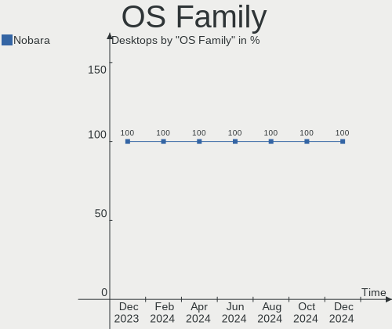
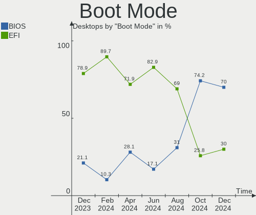
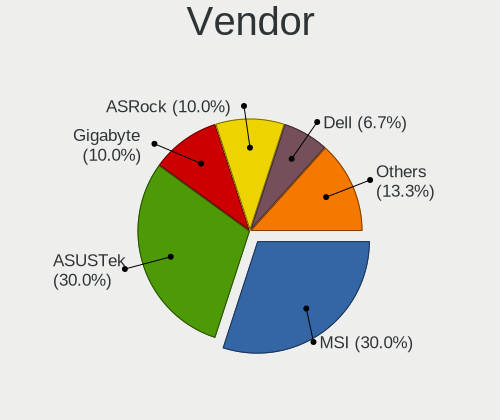
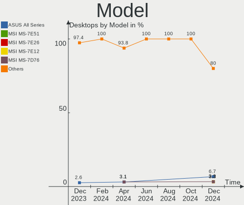
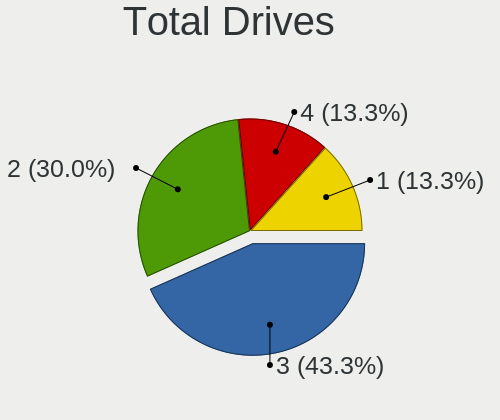
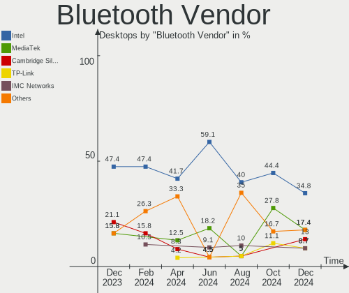
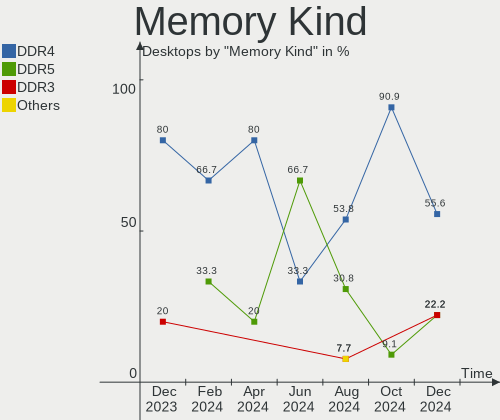
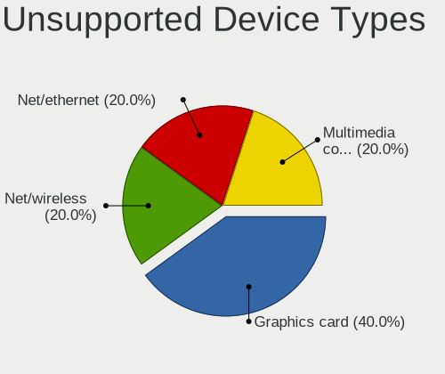

Nobara - Hardware Trends (Desktops)
-----------------------------------

A project to identify most popular hardware characteristics and track their change
over time based on data collected by Linux users at https://Linux-Hardware.org.

Anyone can contribute to this report by the [hw-probe](https://github.com/linuxhw/hw-probe) tool:

    sudo -E hw-probe -all -upload

This report is for one last month. Overall report since the beginning of time: [TestDays](https://github.com/linuxhw/TestDays)

Period: Feb, 2023.

Contents
--------

* [ System ](#system)
  - [ OS                       ](#os)
  - [ OS Family                ](#os-family)
  - [ Kernel                   ](#kernel)
  - [ Kernel Family            ](#kernel-family)
  - [ Kernel Major Ver.        ](#kernel-major-ver)
  - [ Arch                     ](#arch)
  - [ DE                       ](#de)
  - [ Display Server           ](#display-server)
  - [ Display Manager          ](#display-manager)
  - [ OS Lang                  ](#os-lang)
  - [ Boot Mode                ](#boot-mode)
  - [ Filesystem               ](#filesystem)
  - [ Part. scheme             ](#part-scheme)
  - [ Dual Boot with Linux/BSD ](#dual-boot-with-linuxbsd)
  - [ Dual Boot (Win)          ](#dual-boot-win)

* [ Board ](#board)
  - [ Vendor                   ](#vendor)
  - [ Model                    ](#model)
  - [ Model Family             ](#model-family)
  - [ MFG Year                 ](#mfg-year)
  - [ Form Factor              ](#form-factor)
  - [ Secure Boot              ](#secure-boot)
  - [ Coreboot                 ](#coreboot)
  - [ RAM Size                 ](#ram-size)
  - [ RAM Used                 ](#ram-used)
  - [ Total Drives             ](#total-drives)
  - [ Has CD-ROM               ](#has-cd-rom)
  - [ Has Ethernet             ](#has-ethernet)
  - [ Has WiFi                 ](#has-wifi)
  - [ Has Bluetooth            ](#has-bluetooth)

* [ Location ](#location)
  - [ Country                  ](#country)
  - [ City                     ](#city)

* [ Drives ](#drives)
  - [ Drive Vendor             ](#drive-vendor)
  - [ Drive Model              ](#drive-model)
  - [ HDD Vendor               ](#hdd-vendor)
  - [ SSD Vendor               ](#ssd-vendor)
  - [ Drive Kind               ](#drive-kind)
  - [ Drive Connector          ](#drive-connector)
  - [ Drive Size               ](#drive-size)
  - [ Space Total              ](#space-total)
  - [ Space Used               ](#space-used)
  - [ Malfunc. Drives          ](#malfunc-drives)
  - [ Malfunc. Drive Vendor    ](#malfunc-drive-vendor)
  - [ Malfunc. HDD Vendor      ](#malfunc-hdd-vendor)
  - [ Malfunc. Drive Kind      ](#malfunc-drive-kind)
  - [ Failed Drives            ](#failed-drives)
  - [ Failed Drive Vendor      ](#failed-drive-vendor)
  - [ Drive Status             ](#drive-status)

* [ Storage controller ](#storage-controller)
  - [ Storage Vendor           ](#storage-vendor)
  - [ Storage Model            ](#storage-model)
  - [ Storage Kind             ](#storage-kind)

* [ Processor ](#processor)
  - [ CPU Vendor               ](#cpu-vendor)
  - [ CPU Model                ](#cpu-model)
  - [ CPU Model Family         ](#cpu-model-family)
  - [ CPU Cores                ](#cpu-cores)
  - [ CPU Sockets              ](#cpu-sockets)
  - [ CPU Threads              ](#cpu-threads)
  - [ CPU Op-Modes             ](#cpu-op-modes)
  - [ CPU Microcode            ](#cpu-microcode)
  - [ CPU Microarch            ](#cpu-microarch)

* [ Graphics ](#graphics)
  - [ GPU Vendor               ](#gpu-vendor)
  - [ GPU Model                ](#gpu-model)
  - [ GPU Combo                ](#gpu-combo)
  - [ GPU Driver               ](#gpu-driver)
  - [ GPU Memory               ](#gpu-memory)

* [ Monitor ](#monitor)
  - [ Monitor Vendor           ](#monitor-vendor)
  - [ Monitor Model            ](#monitor-model)
  - [ Monitor Resolution       ](#monitor-resolution)
  - [ Monitor Diagonal         ](#monitor-diagonal)
  - [ Monitor Width            ](#monitor-width)
  - [ Aspect Ratio             ](#aspect-ratio)
  - [ Monitor Area             ](#monitor-area)
  - [ Pixel Density            ](#pixel-density)
  - [ Multiple Monitors        ](#multiple-monitors)

* [ Network ](#network)
  - [ Net Controller Vendor    ](#net-controller-vendor)
  - [ Net Controller Model     ](#net-controller-model)
  - [ Wireless Vendor          ](#wireless-vendor)
  - [ Wireless Model           ](#wireless-model)
  - [ Ethernet Vendor          ](#ethernet-vendor)
  - [ Ethernet Model           ](#ethernet-model)
  - [ Net Controller Kind      ](#net-controller-kind)
  - [ Used Controller          ](#used-controller)
  - [ NICs                     ](#nics)
  - [ IPv6                     ](#ipv6)

* [ Bluetooth ](#bluetooth)
  - [ Bluetooth Vendor         ](#bluetooth-vendor)
  - [ Bluetooth Model          ](#bluetooth-model)

* [ Sound ](#sound)
  - [ Sound Vendor             ](#sound-vendor)
  - [ Sound Model              ](#sound-model)

* [ Memory ](#memory)
  - [ Memory Vendor            ](#memory-vendor)
  - [ Memory Model             ](#memory-model)
  - [ Memory Kind              ](#memory-kind)
  - [ Memory Form Factor       ](#memory-form-factor)
  - [ Memory Size              ](#memory-size)
  - [ Memory Speed             ](#memory-speed)

* [ Printers & scanners ](#printers--scanners)
  - [ Printer Vendor           ](#printer-vendor)
  - [ Printer Model            ](#printer-model)
  - [ Scanner Vendor           ](#scanner-vendor)
  - [ Scanner Model            ](#scanner-model)

* [ Camera ](#camera)
  - [ Camera Vendor            ](#camera-vendor)
  - [ Camera Model             ](#camera-model)

* [ Security ](#security)
  - [ Fingerprint Vendor       ](#fingerprint-vendor)
  - [ Fingerprint Model        ](#fingerprint-model)
  - [ Chipcard Vendor          ](#chipcard-vendor)
  - [ Chipcard Model           ](#chipcard-model)

* [ Unsupported ](#unsupported)
  - [ Unsupported Devices      ](#unsupported-devices)
  - [ Unsupported Device Types ](#unsupported-device-types)

System
------

OS
--

Installed operating systems

| Name      | Desktops | Percent |
|-----------|----------|---------|
| Nobara 37 | 26       | 92.86%  |
| Nobara 36 | 2        | 7.14%   |

OS Family
---------

OS without a version

| Name   | Desktops | Percent |
|--------|----------|---------|
| Nobara | 28       | 100%    |

Kernel
------

Version of the Linux kernel

| Version                      | Desktops | Percent |
|------------------------------|----------|---------|
| 6.1.9-200.fsync.fc37.x86_64  | 8        | 28.57%  |
| 6.1.11-201.fsync.fc37.x86_64 | 6        | 21.43%  |
| 6.1.8-202.fsync.fc37.x86_64  | 4        | 14.29%  |
| 6.1.4-203.fsync.fc37.x86_64  | 3        | 10.71%  |
| 6.1.8-201.fsync.fc37.x86_64  | 2        | 7.14%   |
| 6.1.6-203.fsync.fc37.x86_64  | 2        | 7.14%   |
| 6.0.14-201.fsync.fc36.x86_64 | 2        | 7.14%   |
| 6.1.12_tkg_cfs               | 1        | 3.57%   |

Kernel Family
-------------

Linux kernel without a distro release

| Version | Desktops | Percent |
|---------|----------|---------|
| 6.1.9   | 8        | 28.57%  |
| 6.1.8   | 6        | 21.43%  |
| 6.1.11  | 6        | 21.43%  |
| 6.1.4   | 3        | 10.71%  |
| 6.1.6   | 2        | 7.14%   |
| 6.0.14  | 2        | 7.14%   |
| 6.1.12  | 1        | 3.57%   |

Kernel Major Ver.
-----------------

Linux kernel major version

| Version | Desktops | Percent |
|---------|----------|---------|
| 6.1     | 26       | 92.86%  |
| 6.0     | 2        | 7.14%   |

Arch
----

OS architecture (x86_64, i586, etc.)

| Name   | Desktops | Percent |
|--------|----------|---------|
| x86_64 | 28       | 100%    |

DE
--

Desktop Environment

| Name  | Desktops | Percent |
|-------|----------|---------|
| GNOME | 17       | 60.71%  |
| KDE5  | 11       | 39.29%  |

Display Server
--------------

X11 or Wayland

| Name    | Desktops | Percent |
|---------|----------|---------|
| Wayland | 16       | 57.14%  |
| X11     | 12       | 42.86%  |

Display Manager
---------------

SDDM, LightDM, etc.

| Name    | Desktops | Percent |
|---------|----------|---------|
| Unknown | 22       | 78.57%  |
| GDM     | 3        | 10.71%  |
| SDDM    | 2        | 7.14%   |
| LightDM | 1        | 3.57%   |

OS Lang
-------

Language

| Lang  | Desktops | Percent |
|-------|----------|---------|
| en_US | 16       | 57.14%  |
| en_GB | 4        | 14.29%  |
| en_CA | 2        | 7.14%   |
| it_IT | 1        | 3.57%   |
| es_ES | 1        | 3.57%   |
| en_IL | 1        | 3.57%   |
| de_DE | 1        | 3.57%   |
| de_AT | 1        | 3.57%   |
| ar_SA | 1        | 3.57%   |

Boot Mode
---------

EFI or BIOS

| Mode | Desktops | Percent |
|------|----------|---------|
| EFI  | 25       | 89.29%  |
| BIOS | 3        | 10.71%  |

Filesystem
----------

Type of filesystem

| Type  | Desktops | Percent |
|-------|----------|---------|
| Btrfs | 24       | 85.71%  |
| Ext4  | 4        | 14.29%  |

Part. scheme
------------

Scheme of partitioning

| Type    | Desktops | Percent |
|---------|----------|---------|
| Unknown | 22       | 78.57%  |
| GPT     | 6        | 21.43%  |

Dual Boot with Linux/BSD
------------------------

Hosting more than one Linux/BSD

| Dual boot | Desktops | Percent |
|-----------|----------|---------|
| No        | 26       | 92.86%  |
| Yes       | 2        | 7.14%   |

Dual Boot (Win)
---------------

Hosting Linux and Windows

| Dual boot | Desktops | Percent |
|-----------|----------|---------|
| No        | 24       | 85.71%  |
| Yes       | 4        | 14.29%  |

Board
-----

Vendor
------

Motherboard manufacturer

| Name                | Desktops | Percent |
|---------------------|----------|---------|
| ASUSTek Computer    | 10       | 35.71%  |
| MSI                 | 9        | 32.14%  |
| Gigabyte Technology | 4        | 14.29%  |
| Dell                | 2        | 7.14%   |
| ASRock              | 2        | 7.14%   |
| Hewlett-Packard     | 1        | 3.57%   |

Model
-----

Motherboard model

| Name                                 | Desktops | Percent |
|--------------------------------------|----------|---------|
| Dell XPS 8700                        | 2        | 7.14%   |
| MSI MS-7D43                          | 1        | 3.57%   |
| MSI MS-7D25                          | 1        | 3.57%   |
| MSI MS-7C91                          | 1        | 3.57%   |
| MSI MS-7C87                          | 1        | 3.57%   |
| MSI MS-7C56                          | 1        | 3.57%   |
| MSI MS-7B93                          | 1        | 3.57%   |
| MSI MS-7B85                          | 1        | 3.57%   |
| MSI MS-7B50                          | 1        | 3.57%   |
| MSI MS-7977                          | 1        | 3.57%   |
| HP Desktop Pro PCI MT                | 1        | 3.57%   |
| Gigabyte X570 AORUS ELITE WIFI       | 1        | 3.57%   |
| Gigabyte B550M AORUS ELITE           | 1        | 3.57%   |
| Gigabyte B550 AORUS ELITE V2         | 1        | 3.57%   |
| Gigabyte B360M AORUS Gaming 3        | 1        | 3.57%   |
| ASUS TUF Gaming B550M-PLUS WIFI II   | 1        | 3.57%   |
| ASUS TUF Gaming B460-PLUS            | 1        | 3.57%   |
| ASUS ROG STRIX Z390-F GAMING         | 1        | 3.57%   |
| ASUS ROG STRIX X570-E GAMING WIFI II | 1        | 3.57%   |
| ASUS ROG CROSSHAIR X670E EXTREME     | 1        | 3.57%   |
| ASUS PRIME X570-P                    | 1        | 3.57%   |
| ASUS PRIME B450M-A II                | 1        | 3.57%   |
| ASUS P8Z77-M PRO                     | 1        | 3.57%   |
| ASUS Nobilis                         | 1        | 3.57%   |
| ASUS M5A78L-M PLUS/USB3              | 1        | 3.57%   |
| ASRock B660M-ITX/ac                  | 1        | 3.57%   |
| ASRock B650M PG Riptide              | 1        | 3.57%   |

Model Family
------------

Motherboard model prefix

| Name             | Desktops | Percent |
|------------------|----------|---------|
| ASUS ROG         | 3        | 10.71%  |
| Dell XPS         | 2        | 7.14%   |
| ASUS TUF         | 2        | 7.14%   |
| ASUS PRIME       | 2        | 7.14%   |
| MSI MS-7D43      | 1        | 3.57%   |
| MSI MS-7D25      | 1        | 3.57%   |
| MSI MS-7C91      | 1        | 3.57%   |
| MSI MS-7C87      | 1        | 3.57%   |
| MSI MS-7C56      | 1        | 3.57%   |
| MSI MS-7B93      | 1        | 3.57%   |
| MSI MS-7B85      | 1        | 3.57%   |
| MSI MS-7B50      | 1        | 3.57%   |
| MSI MS-7977      | 1        | 3.57%   |
| HP Desktop       | 1        | 3.57%   |
| Gigabyte X570    | 1        | 3.57%   |
| Gigabyte B550M   | 1        | 3.57%   |
| Gigabyte B550    | 1        | 3.57%   |
| Gigabyte B360M   | 1        | 3.57%   |
| ASUS P8Z77-M     | 1        | 3.57%   |
| ASUS Nobilis     | 1        | 3.57%   |
| ASUS M5A78L-M    | 1        | 3.57%   |
| ASRock B660M-ITX | 1        | 3.57%   |
| ASRock B650M     | 1        | 3.57%   |

MFG Year
--------

Motherboard manufacture year

| Year | Desktops | Percent |
|------|----------|---------|
| 2020 | 9        | 32.14%  |
| 2021 | 5        | 17.86%  |
| 2019 | 5        | 17.86%  |
| 2016 | 2        | 7.14%   |
| 2013 | 2        | 7.14%   |
| 2023 | 1        | 3.57%   |
| 2022 | 1        | 3.57%   |
| 2018 | 1        | 3.57%   |
| 2017 | 1        | 3.57%   |
| 2012 | 1        | 3.57%   |

Form Factor
-----------

Physical design of the computer

| Name    | Desktops | Percent |
|---------|----------|---------|
| Desktop | 28       | 100%    |

Secure Boot
-----------

Enabled or disabled

| State    | Desktops | Percent |
|----------|----------|---------|
| Disabled | 28       | 100%    |

Coreboot
--------

Have coreboot on board

| Used | Desktops | Percent |
|------|----------|---------|
| No   | 28       | 100%    |

RAM Size
--------

Total RAM memory

| Size in GB  | Desktops | Percent |
|-------------|----------|---------|
| 32.01-64.0  | 10       | 35.71%  |
| 16.01-24.0  | 10       | 35.71%  |
| 24.01-32.0  | 4        | 14.29%  |
| 4.01-8.0    | 2        | 7.14%   |
| 64.01-256.0 | 2        | 7.14%   |

RAM Used
--------

Used RAM memory

| Used GB   | Desktops | Percent |
|-----------|----------|---------|
| 4.01-8.0  | 13       | 46.43%  |
| 3.01-4.0  | 6        | 21.43%  |
| 2.01-3.0  | 5        | 17.86%  |
| 8.01-16.0 | 4        | 14.29%  |

Total Drives
------------

Number of drives on board

| Drives | Desktops | Percent |
|--------|----------|---------|
| 3      | 10       | 35.71%  |
| 4      | 7        | 25%     |
| 1      | 5        | 17.86%  |
| 2      | 4        | 14.29%  |
| 6      | 1        | 3.57%   |
| 5      | 1        | 3.57%   |

Has CD-ROM
----------

Has CD-ROM on board

| Presented | Desktops | Percent |
|-----------|----------|---------|
| No        | 20       | 71.43%  |
| Yes       | 8        | 28.57%  |

Has Ethernet
------------

Has Ethernet on board

| Presented | Desktops | Percent |
|-----------|----------|---------|
| Yes       | 28       | 100%    |

Has WiFi
--------

Has WiFi module

| Presented | Desktops | Percent |
|-----------|----------|---------|
| Yes       | 19       | 67.86%  |
| No        | 9        | 32.14%  |

Has Bluetooth
-------------

Has Bluetooth module

| Presented | Desktops | Percent |
|-----------|----------|---------|
| Yes       | 20       | 71.43%  |
| No        | 8        | 28.57%  |

Location
--------

Country
-------

Geographic location (country)

| Country      | Desktops | Percent |
|--------------|----------|---------|
| USA          | 11       | 39.29%  |
| Italy        | 3        | 10.71%  |
| UK           | 2        | 7.14%   |
| Canada       | 2        | 7.14%   |
| Saudi Arabia | 1        | 3.57%   |
| Israel       | 1        | 3.57%   |
| Germany      | 1        | 3.57%   |
| Finland      | 1        | 3.57%   |
| Estonia      | 1        | 3.57%   |
| Czechia      | 1        | 3.57%   |
| Croatia      | 1        | 3.57%   |
| Brazil       | 1        | 3.57%   |
| Austria      | 1        | 3.57%   |
| Argentina    | 1        | 3.57%   |

City
----

Geographic location (city)

| City                | Desktops | Percent |
|---------------------|----------|---------|
| Zagreb              | 1        | 3.57%   |
| Waite Park          | 1        | 3.57%   |
| Vienna              | 1        | 3.57%   |
| Victoria            | 1        | 3.57%   |
| Tartu               | 1        | 3.57%   |
| Sterling            | 1        | 3.57%   |
| Spokane             | 1        | 3.57%   |
| Smethwick           | 1        | 3.57%   |
| Sesto San Giovanni  | 1        | 3.57%   |
| Santo André        | 1        | 3.57%   |
| Saco                | 1        | 3.57%   |
| Riyadh              | 1        | 3.57%   |
| Reedsburg           | 1        | 3.57%   |
| Puerto Madryn       | 1        | 3.57%   |
| Prelouc             | 1        | 3.57%   |
| Niagara-on-the-Lake | 1        | 3.57%   |
| Milano              | 1        | 3.57%   |
| Machesney Park      | 1        | 3.57%   |
| Macclesfield        | 1        | 3.57%   |
| Mableton            | 1        | 3.57%   |
| Lake Elsinore       | 1        | 3.57%   |
| Holon               | 1        | 3.57%   |
| Helsinki            | 1        | 3.57%   |
| Greeneville         | 1        | 3.57%   |
| Göttingen          | 1        | 3.57%   |
| Gill                | 1        | 3.57%   |
| Dallas              | 1        | 3.57%   |
| Accadia             | 1        | 3.57%   |

Drives
------

Drive Vendor
------------

Hard drive vendors

| Vendor                    | Desktops | Drives | Percent |
|---------------------------|----------|--------|---------|
| WDC                       | 12       | 15     | 19.05%  |
| Samsung Electronics       | 9        | 17     | 14.29%  |
| Seagate                   | 8        | 8      | 12.7%   |
| Kingston                  | 8        | 9      | 12.7%   |
| Sandisk                   | 4        | 4      | 6.35%   |
| Crucial                   | 4        | 5      | 6.35%   |
| Toshiba                   | 3        | 3      | 4.76%   |
| Micron/Crucial Technology | 3        | 4      | 4.76%   |
| PNY                       | 2        | 2      | 3.17%   |
| Phison Electronics        | 2        | 2      | 3.17%   |
| Unknown                   | 1        | 2      | 1.59%   |
| SPCC                      | 1        | 1      | 1.59%   |
| SK hynix                  | 1        | 2      | 1.59%   |
| Phison                    | 1        | 1      | 1.59%   |
| Neo                       | 1        | 1      | 1.59%   |
| Intel                     | 1        | 2      | 1.59%   |
| HGST                      | 1        | 1      | 1.59%   |
| Drevo                     | 1        | 1      | 1.59%   |

Drive Model
-----------

Hard drive models

| Model                                                | Desktops | Percent |
|------------------------------------------------------|----------|---------|
| Micron/Crucial P2 NVMe PCIe SSD 1TB                  | 3        | 3.95%   |
| Kingston SA400S37240G 240GB SSD                      | 3        | 3.95%   |
| Seagate ST2000DM001-1ER164 2TB                       | 2        | 2.63%   |
| Samsung SSD 860 EVO 500GB                            | 2        | 2.63%   |
| Samsung NVMe SSD Controller SM981/PM981/PM983 250GB  | 2        | 2.63%   |
| Samsung NVMe SSD Controller PM9A1/PM9A3/980PRO 960GB | 2        | 2.63%   |
| Phison PS5013 E13 NVMe Controller 500GB              | 2        | 2.63%   |
| Crucial CT1000MX500SSD1 1TB                          | 2        | 2.63%   |
| WDC WDS100T1XHE-00AFY0 1TB                           | 1        | 1.32%   |
| WDC WD80EFAX-68KNBN0 8TB                             | 1        | 1.32%   |
| WDC WD40EZAZ-00SF3B0 4TB                             | 1        | 1.32%   |
| WDC WD4005FZBX-00K5WB0 4TB                           | 1        | 1.32%   |
| WDC WD2500BMVS-11F9S0 250GB                          | 1        | 1.32%   |
| WDC WD2500BEVT-60A23T0 250GB                         | 1        | 1.32%   |
| WDC WD15EARX-00PASB0 1TB                             | 1        | 1.32%   |
| WDC WD10JPCX-24UE4T0 1TB                             | 1        | 1.32%   |
| WDC WD10EZRX-00L4HB0 1TB                             | 1        | 1.32%   |
| WDC WD10EZRX-00A8LB0 1TB                             | 1        | 1.32%   |
| WDC WD10EZEX-08M2NA0 1TB                             | 1        | 1.32%   |
| WDC WD10EZEX-00WN4A0 1TB                             | 1        | 1.32%   |
| WDC WD10EZEX-00BN5A0 1TB                             | 1        | 1.32%   |
| WDC WD10EARX-00PASB0 1TB                             | 1        | 1.32%   |
| WDC WD Blue SA510 2.5 1000GB                         | 1        | 1.32%   |
| Unknown SD/MMC 2GB                                   | 1        | 1.32%   |
| Unknown M.S./M.S.Pro/HG 16GB                         | 1        | 1.32%   |
| Toshiba HDWD240 4TB                                  | 1        | 1.32%   |
| Toshiba HDWD110 1TB                                  | 1        | 1.32%   |
| Toshiba DT01ACA100 1TB                               | 1        | 1.32%   |
| SPCC Solid State Disk 256GB                          | 1        | 1.32%   |
| SK hynix SHPP41-2000GM 2TB                           | 1        | 1.32%   |
| SK hynix SHPP41-1000GM 1TB                           | 1        | 1.32%   |
| Seagate ST8000VN0022-2EL112 8TB                      | 1        | 1.32%   |
| Seagate ST500DM002-1BD142 500GB                      | 1        | 1.32%   |
| Seagate ST2000DX001-1CM164 2TB                       | 1        | 1.32%   |
| Seagate ST2000DM008-2FR102 2TB                       | 1        | 1.32%   |
| Seagate ST18000NM000J-2TV103 18TB                    | 1        | 1.32%   |
| Seagate ST1000DM003-1ER162 1TB                       | 1        | 1.32%   |
| Sandisk WD Blue SN570 1TB                            | 1        | 1.32%   |
| Sandisk WD Blue SN550 NVMe SSD 1TB                   | 1        | 1.32%   |
| Sandisk WD Black SN750 / PC SN730 NVMe SSD 512GB     | 1        | 1.32%   |

HDD Vendor
----------

Hard disk drive vendors

| Vendor              | Desktops | Drives | Percent |
|---------------------|----------|--------|---------|
| WDC                 | 11       | 13     | 45.83%  |
| Seagate             | 8        | 8      | 33.33%  |
| Toshiba             | 3        | 3      | 12.5%   |
| Samsung Electronics | 1        | 1      | 4.17%   |
| HGST                | 1        | 1      | 4.17%   |

SSD Vendor
----------

Solid state drive vendors

| Vendor              | Desktops | Drives | Percent |
|---------------------|----------|--------|---------|
| Kingston            | 6        | 6      | 27.27%  |
| Samsung Electronics | 5        | 7      | 22.73%  |
| Crucial             | 4        | 5      | 18.18%  |
| PNY                 | 2        | 2      | 9.09%   |
| WDC                 | 1        | 1      | 4.55%   |
| SPCC                | 1        | 1      | 4.55%   |
| SanDisk             | 1        | 1      | 4.55%   |
| Neo                 | 1        | 1      | 4.55%   |
| Drevo               | 1        | 1      | 4.55%   |

Drive Kind
----------

HDD or SSD

| Kind    | Desktops | Drives | Percent |
|---------|----------|--------|---------|
| SSD     | 21       | 25     | 35.59%  |
| HDD     | 19       | 26     | 32.2%   |
| NVMe    | 18       | 27     | 30.51%  |
| Unknown | 1        | 2      | 1.69%   |

Drive Connector
---------------

SATA, SAS, NVMe, etc.

| Type | Desktops | Drives | Percent |
|------|----------|--------|---------|
| SATA | 24       | 50     | 54.55%  |
| NVMe | 18       | 27     | 40.91%  |
| SAS  | 2        | 3      | 4.55%   |

Drive Size
----------

Size of hard drive

| Size in TB | Desktops | Drives | Percent |
|------------|----------|--------|---------|
| 0.51-1.0   | 14       | 20     | 35%     |
| 0.01-0.5   | 14       | 18     | 35%     |
| 1.01-2.0   | 6        | 6      | 15%     |
| 3.01-4.0   | 3        | 3      | 7.5%    |
| 4.01-10.0  | 2        | 3      | 5%      |
| 10.01-20.0 | 1        | 1      | 2.5%    |

Space Total
-----------

Amount of disk space available on the file system

| Size in GB     | Desktops | Percent |
|----------------|----------|---------|
| 2001-3000      | 6        | 21.43%  |
| 501-1000       | 6        | 21.43%  |
| 1001-2000      | 5        | 17.86%  |
| 251-500        | 4        | 14.29%  |
| More than 3000 | 3        | 10.71%  |
| 21-50          | 2        | 7.14%   |
| 101-250        | 1        | 3.57%   |
| Unknown        | 1        | 3.57%   |

Space Used
----------

Amount of used disk space

| Used GB        | Desktops | Percent |
|----------------|----------|---------|
| 21-50          | 6        | 21.43%  |
| 251-500        | 4        | 14.29%  |
| 1001-2000      | 4        | 14.29%  |
| 101-250        | 3        | 10.71%  |
| 51-100         | 3        | 10.71%  |
| More than 3000 | 2        | 7.14%   |
| 1-20           | 2        | 7.14%   |
| 501-1000       | 2        | 7.14%   |
| 2001-3000      | 1        | 3.57%   |
| Unknown        | 1        | 3.57%   |

Malfunc. Drives
---------------

Drive models with a malfunction

| Model                           | Desktops | Drives | Percent |
|---------------------------------|----------|--------|---------|
| Seagate ST500DM002-1BD142 500GB | 1        | 1      | 100%    |

Malfunc. Drive Vendor
---------------------

Vendors of faulty drives

| Vendor  | Desktops | Drives | Percent |
|---------|----------|--------|---------|
| Seagate | 1        | 1      | 100%    |

Malfunc. HDD Vendor
-------------------

Vendors of faulty HDD drives

| Vendor  | Desktops | Drives | Percent |
|---------|----------|--------|---------|
| Seagate | 1        | 1      | 100%    |

Malfunc. Drive Kind
-------------------

Kinds of faulty drives

| Kind | Desktops | Drives | Percent |
|------|----------|--------|---------|
| HDD  | 1        | 1      | 100%    |

Failed Drives
-------------

Failed drive models

Zero info for selected period =(

Failed Drive Vendor
-------------------

Failed drive vendors

Zero info for selected period =(

Drive Status
------------

Number of failed and malfunc. drives

| Status   | Desktops | Drives | Percent |
|----------|----------|--------|---------|
| Detected | 23       | 65     | 79.31%  |
| Works    | 5        | 14     | 17.24%  |
| Malfunc  | 1        | 1      | 3.45%   |

Storage controller
------------------

Storage Vendor
--------------

Storage controller vendors

| Vendor                      | Desktops | Percent |
|-----------------------------|----------|---------|
| AMD                         | 15       | 29.41%  |
| Intel                       | 13       | 25.49%  |
| Samsung Electronics         | 6        | 11.76%  |
| SanDisk                     | 4        | 7.84%   |
| Phison Electronics          | 3        | 5.88%   |
| Micron/Crucial Technology   | 3        | 5.88%   |
| Kingston Technology Company | 3        | 5.88%   |
| ASMedia Technology          | 3        | 5.88%   |
| SK hynix                    | 1        | 1.96%   |

Storage Model
-------------

Storage controller models

| Model                                                                          | Desktops | Percent |
|--------------------------------------------------------------------------------|----------|---------|
| AMD FCH SATA Controller [AHCI mode]                                            | 5        | 8.93%   |
| AMD 500 Series Chipset SATA Controller                                         | 5        | 8.93%   |
| Samsung NVMe SSD Controller SM981/PM981/PM983                                  | 4        | 7.14%   |
| Micron/Crucial P2 NVMe PCIe SSD                                                | 3        | 5.36%   |
| Intel Cannon Lake PCH SATA AHCI Controller                                     | 3        | 5.36%   |
| Intel Alder Lake-S PCH SATA Controller [AHCI Mode]                             | 3        | 5.36%   |
| AMD 400 Series Chipset SATA Controller                                         | 3        | 5.36%   |
| Samsung NVMe SSD Controller PM9A1/PM9A3/980PRO                                 | 2        | 3.57%   |
| Phison PS5013 E13 NVMe Controller                                              | 2        | 3.57%   |
| Kingston Company Company Non-Volatile memory controller                        | 2        | 3.57%   |
| Intel Q170/Q150/B150/H170/H110/Z170/CM236 Chipset SATA Controller [AHCI Mode]  | 2        | 3.57%   |
| Intel 8 Series/C220 Series Chipset Family 6-port SATA Controller 1 [AHCI mode] | 2        | 3.57%   |
| ASMedia ASM1062 Serial ATA Controller                                          | 2        | 3.57%   |
| AMD SATA controller                                                            | 2        | 3.57%   |
| SK hynix Platinum P41 NVMe Solid State Drive 2TB                               | 1        | 1.79%   |
| SanDisk WD PC SN810 / Black SN850 NVMe SSD                                     | 1        | 1.79%   |
| SanDisk WD Blue SN570 NVMe SSD                                                 | 1        | 1.79%   |
| SanDisk WD Blue SN550 NVMe SSD                                                 | 1        | 1.79%   |
| SanDisk WD Black SN750 / PC SN730 NVMe SSD                                     | 1        | 1.79%   |
| Samsung NVMe SSD Controller SM961/PM961/SM963                                  | 1        | 1.79%   |
| Samsung NVMe SSD Controller 980                                                | 1        | 1.79%   |
| Phison E18 PCIe4 NVMe Controller                                               | 1        | 1.79%   |
| Kingston Company A2000 NVMe SSD                                                | 1        | 1.79%   |
| Intel SSD 660P Series                                                          | 1        | 1.79%   |
| Intel 9 Series Chipset Family SATA Controller [AHCI Mode]                      | 1        | 1.79%   |
| Intel 7 Series/C210 Series Chipset Family 6-port SATA Controller [AHCI mode]   | 1        | 1.79%   |
| Intel 400 Series Chipset Family SATA AHCI Controller                           | 1        | 1.79%   |
| ASMedia ASM1061 SATA IDE Controller                                            | 1        | 1.79%   |
| AMD SB7x0/SB8x0/SB9x0 SATA Controller [IDE mode]                               | 1        | 1.79%   |
| AMD SB7x0/SB8x0/SB9x0 IDE Controller                                           | 1        | 1.79%   |

Storage Kind
------------

Kind of storage controller (IDE, SATA, NVMe, SAS, ...)

| Kind | Desktops | Percent |
|------|----------|---------|
| SATA | 28       | 58.33%  |
| NVMe | 18       | 37.5%   |
| IDE  | 2        | 4.17%   |

Processor
---------

CPU Vendor
----------

Processor vendors

| Vendor | Desktops | Percent |
|--------|----------|---------|
| AMD    | 15       | 53.57%  |
| Intel  | 13       | 46.43%  |

CPU Model
---------

Processor models

| Model                                       | Desktops | Percent |
|---------------------------------------------|----------|---------|
| AMD Ryzen 7 5700X 8-Core Processor          | 3        | 10.71%  |
| Intel 12th Gen Core i5-12400                | 2        | 7.14%   |
| Intel Pentium CPU G3240 @ 3.10GHz           | 1        | 3.57%   |
| Intel Core i7-9700K CPU @ 3.60GHz           | 1        | 3.57%   |
| Intel Core i7-9700 CPU @ 3.00GHz            | 1        | 3.57%   |
| Intel Core i7-7700 CPU @ 3.60GHz            | 1        | 3.57%   |
| Intel Core i7-6700K CPU @ 4.00GHz           | 1        | 3.57%   |
| Intel Core i7-4790 CPU @ 3.60GHz            | 1        | 3.57%   |
| Intel Core i7-4770 CPU @ 3.40GHz            | 1        | 3.57%   |
| Intel Core i5-9400F CPU @ 2.90GHz           | 1        | 3.57%   |
| Intel Core i5-2500 CPU @ 3.30GHz            | 1        | 3.57%   |
| Intel Core i5-10400 CPU @ 2.90GHz           | 1        | 3.57%   |
| Intel 12th Gen Core i5-12600K               | 1        | 3.57%   |
| AMD Ryzen 9 7950X 16-Core Processor         | 1        | 3.57%   |
| AMD Ryzen 9 5950X 16-Core Processor         | 1        | 3.57%   |
| AMD Ryzen 9 5900X 12-Core Processor         | 1        | 3.57%   |
| AMD Ryzen 7 5800X 8-Core Processor          | 1        | 3.57%   |
| AMD Ryzen 7 5700G with Radeon Graphics      | 1        | 3.57%   |
| AMD Ryzen 7 3700X 8-Core Processor          | 1        | 3.57%   |
| AMD Ryzen 5 7600 6-Core Processor           | 1        | 3.57%   |
| AMD Ryzen 5 5600X 6-Core Processor          | 1        | 3.57%   |
| AMD Ryzen 5 3600X 6-Core Processor          | 1        | 3.57%   |
| AMD Ryzen 5 3600 6-Core Processor           | 1        | 3.57%   |
| AMD Ryzen 3 3200G with Radeon Vega Graphics | 1        | 3.57%   |
| AMD FX-6350 Six-Core Processor              | 1        | 3.57%   |

CPU Model Family
----------------

Processor model prefix

| Model         | Desktops | Percent |
|---------------|----------|---------|
| Intel Core i7 | 6        | 21.43%  |
| AMD Ryzen 7   | 6        | 21.43%  |
| AMD Ryzen 5   | 4        | 14.29%  |
| Other         | 3        | 10.71%  |
| Intel Core i5 | 3        | 10.71%  |
| AMD Ryzen 9   | 3        | 10.71%  |
| Intel Pentium | 1        | 3.57%   |
| AMD Ryzen 3   | 1        | 3.57%   |
| AMD FX        | 1        | 3.57%   |

CPU Cores
---------

Number of processor cores

| Number | Desktops | Percent |
|--------|----------|---------|
| 8      | 8        | 28.57%  |
| 6      | 8        | 28.57%  |
| 4      | 6        | 21.43%  |
| 16     | 2        | 7.14%   |
| 12     | 1        | 3.57%   |
| 10     | 1        | 3.57%   |
| 3      | 1        | 3.57%   |
| 2      | 1        | 3.57%   |

CPU Sockets
-----------

Number of sockets

| Number | Desktops | Percent |
|--------|----------|---------|
| 1      | 28       | 100%    |

CPU Threads
-----------

Threads per core (Hyper-Threading)

| Number | Desktops | Percent |
|--------|----------|---------|
| 2      | 22       | 78.57%  |
| 1      | 6        | 21.43%  |

CPU Op-Modes
------------

CPU Operation Modes (32-bit, 64-bit)

| Op mode        | Desktops | Percent |
|----------------|----------|---------|
| 32-bit, 64-bit | 28       | 100%    |

CPU Microcode
-------------

Microcode number

| Number     | Desktops | Percent |
|------------|----------|---------|
| 0x90672    | 3        | 10.71%  |
| 0x306c3    | 3        | 10.71%  |
| 0x0a20120a | 3        | 10.71%  |
| 0x08701021 | 3        | 10.71%  |
| 0x0a601203 | 2        | 7.14%   |
| 0x0a201204 | 2        | 7.14%   |
| 0xa0653    | 1        | 3.57%   |
| 0x906ed    | 1        | 3.57%   |
| 0x906ec    | 1        | 3.57%   |
| 0x906ea    | 1        | 3.57%   |
| 0x906e9    | 1        | 3.57%   |
| 0x506e3    | 1        | 3.57%   |
| 0x206a7    | 1        | 3.57%   |
| 0x0a50000d | 1        | 3.57%   |
| 0x0a201205 | 1        | 3.57%   |
| 0x08108109 | 1        | 3.57%   |
| 0x0600081c | 1        | 3.57%   |
| Unknown    | 1        | 3.57%   |

CPU Microarch
-------------

Microarchitecture

| Name             | Desktops | Percent |
|------------------|----------|---------|
| Zen 3            | 8        | 28.57%  |
| KabyLake         | 4        | 14.29%  |
| Zen 2            | 3        | 10.71%  |
| Haswell          | 3        | 10.71%  |
| Alderlake Hybrid | 3        | 10.71%  |
| Unknown          | 2        | 7.14%   |
| Zen+             | 1        | 3.57%   |
| Skylake          | 1        | 3.57%   |
| SandyBridge      | 1        | 3.57%   |
| Piledriver       | 1        | 3.57%   |
| CometLake        | 1        | 3.57%   |

Graphics
--------

GPU Vendor
----------

Vendors of graphics cards

| Vendor | Desktops | Percent |
|--------|----------|---------|
| AMD    | 16       | 47.06%  |
| Nvidia | 12       | 35.29%  |
| Intel  | 6        | 17.65%  |

GPU Model
---------

Graphics card models

| Model                                                                       | Desktops | Percent |
|-----------------------------------------------------------------------------|----------|---------|
| AMD Ellesmere [Radeon RX 470/480/570/570X/580/580X/590]                     | 3        | 8.57%   |
| Nvidia GP106 [GeForce GTX 1060 3GB]                                         | 2        | 5.71%   |
| Intel Alder Lake-S GT1 [UHD Graphics 730]                                   | 2        | 5.71%   |
| AMD Raphael                                                                 | 2        | 5.71%   |
| AMD Navi 23 [Radeon RX 6600/6600 XT/6600M]                                  | 2        | 5.71%   |
| AMD Navi 22 [Radeon RX 6700/6700 XT/6750 XT / 6800M/6850M XT]               | 2        | 5.71%   |
| AMD Navi 21 [Radeon RX 6800/6800 XT / 6900 XT]                              | 2        | 5.71%   |
| AMD Baffin [Radeon RX 460/560D / Pro 450/455/460/555/555X/560/560X]         | 2        | 5.71%   |
| Nvidia TU106 [GeForce RTX 2070]                                             | 1        | 2.86%   |
| Nvidia TU106 [GeForce RTX 2060 SUPER]                                       | 1        | 2.86%   |
| Nvidia TU106 [GeForce RTX 2060 Rev. A]                                      | 1        | 2.86%   |
| Nvidia TU106 [GeForce GTX 1650]                                             | 1        | 2.86%   |
| Nvidia GP104 [GeForce GTX 1070]                                             | 1        | 2.86%   |
| Nvidia GP104 [GeForce GTX 1070 Ti]                                          | 1        | 2.86%   |
| Nvidia GM206 [GeForce GTX 950]                                              | 1        | 2.86%   |
| Nvidia GM204 [GeForce GTX 970]                                              | 1        | 2.86%   |
| Nvidia GA104 [GeForce RTX 3070 Lite Hash Rate]                              | 1        | 2.86%   |
| Nvidia GA104 [GeForce RTX 3060 Ti]                                          | 1        | 2.86%   |
| Intel Xeon E3-1200 v3/4th Gen Core Processor Integrated Graphics Controller | 1        | 2.86%   |
| Intel HD Graphics 630                                                       | 1        | 2.86%   |
| Intel CoffeeLake-S GT2 [UHD Graphics 630]                                   | 1        | 2.86%   |
| Intel AlderLake-S GT1                                                       | 1        | 2.86%   |
| AMD Picasso/Raven 2 [Radeon Vega Series / Radeon Vega Mobile Series]        | 1        | 2.86%   |
| AMD Navi 31 [Radeon RX 7900 XT/7900 XTX]                                    | 1        | 2.86%   |
| AMD Navi 10 [Radeon RX 5600 OEM/5600 XT / 5700/5700 XT]                     | 1        | 2.86%   |
| AMD Cezanne [Radeon Vega Series / Radeon Vega Mobile Series]                | 1        | 2.86%   |

GPU Combo
---------

Combinations of graphics cards

| Name           | Desktops | Percent |
|----------------|----------|---------|
| 1 x AMD        | 12       | 42.86%  |
| 1 x Nvidia     | 9        | 32.14%  |
| 1 x Intel      | 3        | 10.71%  |
| AMD + Nvidia   | 2        | 7.14%   |
| 2 x AMD        | 1        | 3.57%   |
| Intel + Nvidia | 1        | 3.57%   |

GPU Driver
----------

Free vs proprietary

| Driver      | Desktops | Percent |
|-------------|----------|---------|
| Free        | 17       | 60.71%  |
| Proprietary | 11       | 39.29%  |

GPU Memory
----------

Total video memory

| Size in GB | Desktops | Percent |
|------------|----------|---------|
| 7.01-8.0   | 11       | 39.29%  |
| Unknown    | 6        | 21.43%  |
| 8.01-16.0  | 3        | 10.71%  |
| 3.01-4.0   | 2        | 7.14%   |
| 1.01-2.0   | 2        | 7.14%   |
| 0.01-0.5   | 2        | 7.14%   |
| 2.01-3.0   | 1        | 3.57%   |
| 16.01-24.0 | 1        | 3.57%   |

Monitor
-------

Monitor Vendor
--------------

Monitor vendors

| Vendor               | Desktops | Percent |
|----------------------|----------|---------|
| Samsung Electronics  | 11       | 31.43%  |
| Hewlett-Packard      | 3        | 8.57%   |
| Dell                 | 3        | 8.57%   |
| Goldstar             | 2        | 5.71%   |
| BenQ                 | 2        | 5.71%   |
| ASUSTek Computer     | 2        | 5.71%   |
| AOC                  | 2        | 5.71%   |
| Ancor Communications | 2        | 5.71%   |
| Vizio                | 1        | 2.86%   |
| ViewSonic            | 1        | 2.86%   |
| Olevia               | 1        | 2.86%   |
| MSI                  | 1        | 2.86%   |
| Insignia             | 1        | 2.86%   |
| HannStar             | 1        | 2.86%   |
| AOpen                | 1        | 2.86%   |
| Acer                 | 1        | 2.86%   |

Monitor Model
-------------

Monitor models

| Model                                                                 | Desktops | Percent |
|-----------------------------------------------------------------------|----------|---------|
| Vizio D43-D2 VIZ1004 1920x1080 477x268mm 21.5-inch                    | 1        | 2.63%   |
| ViewSonic VX2768-2KPC VSC093A 2560x1440 597x336mm 27.0-inch           | 1        | 2.63%   |
| Samsung Electronics SyncMaster SAM060D 1920x1080                      | 1        | 2.63%   |
| Samsung Electronics SyncMaster SAM0168 1280x1024 338x270mm 17.0-inch  | 1        | 2.63%   |
| Samsung Electronics SyncMaster SAM0124 1280x1024 338x270mm 17.0-inch  | 1        | 2.63%   |
| Samsung Electronics SA300/SA350 SAM078C 1600x900 443x249mm 20.0-inch  | 1        | 2.63%   |
| Samsung Electronics S24E650 SAM0CB7 1920x1080 521x293mm 23.5-inch     | 1        | 2.63%   |
| Samsung Electronics S24D330 SAM0D92 1920x1080 531x299mm 24.0-inch     | 1        | 2.63%   |
| Samsung Electronics S24D300 SAM0B43 1920x1080 531x299mm 24.0-inch     | 1        | 2.63%   |
| Samsung Electronics S22R35x SAM103A 1920x1080 476x268mm 21.5-inch     | 1        | 2.63%   |
| Samsung Electronics LCD Monitor SAM0B7C 1920x1080 886x498mm 40.0-inch | 1        | 2.63%   |
| Samsung Electronics LCD Monitor SAM0A7C 1366x768 698x393mm 31.5-inch  | 1        | 2.63%   |
| Samsung Electronics LCD Monitor SAM08FE 1920x1080                     | 1        | 2.63%   |
| Samsung Electronics LC49G95T SAM7053 2560x1440 1193x336mm 48.8-inch   | 1        | 2.63%   |
| Samsung Electronics LC24RG50 SAM0F91 1920x1080 532x304mm 24.1-inch    | 1        | 2.63%   |
| Olevia 237-T12 SYN0043 1360x768 820x460mm 37.0-inch                   | 1        | 2.63%   |
| MSI MP242 MSI30A1 1920x1080 527x296mm 23.8-inch                       | 1        | 2.63%   |
| MSI MAG322CR MSI3DA5 1920x1080 698x393mm 31.5-inch                    | 1        | 2.63%   |
| Insignia NS24ED200NA14 BBY0032 1360x768 640x384mm 29.4-inch           | 1        | 2.63%   |
| Hewlett-Packard OMEN by HP 25 HPN3425 1920x1080 543x302mm 24.5-inch   | 1        | 2.63%   |
| Hewlett-Packard LP2475w HWP26F8 1920x1200 546x352mm 25.6-inch         | 1        | 2.63%   |
| Hewlett-Packard E243i HPN3462 1920x1080 518x324mm 24.1-inch           | 1        | 2.63%   |
| HannStar Hanns.G HW173 HSD5A47 1440x900 408x255mm 18.9-inch           | 1        | 2.63%   |
| Goldstar IPS FULLHD GSM5AB8 1920x1080 480x270mm 21.7-inch             | 1        | 2.63%   |
| Goldstar 22M34 GSM5A95 1920x1080 480x270mm 21.7-inch                  | 1        | 2.63%   |
| Dell U2717D DEL40EB 2560x1440 597x336mm 27.0-inch                     | 1        | 2.63%   |
| Dell P2714H DELD05E 1920x1080 598x336mm 27.0-inch                     | 1        | 2.63%   |
| Dell LCD Monitor ST2220L 1920x1080                                    | 1        | 2.63%   |
| BenQ GW2765 BNQ78D6 2560x1440 597x336mm 27.0-inch                     | 1        | 2.63%   |
| BenQ GL2460 BNQ78CE 1920x1080 531x299mm 24.0-inch                     | 1        | 2.63%   |
| ASUSTek Computer VP28U AUS28B1 3840x2160 621x341mm 27.9-inch          | 1        | 2.63%   |
| ASUSTek Computer VA279 AUS27D1 1920x1080 598x336mm 27.0-inch          | 1        | 2.63%   |
| AOpen 32HC1QUR P AOP069E 2560x1440 697x392mm 31.5-inch                | 1        | 2.63%   |
| AOC Q3279WG5B AOC3279 2560x1440 725x428mm 33.1-inch                   | 1        | 2.63%   |
| AOC 2243W AOC2243 1920x1080 477x268mm 21.5-inch                       | 1        | 2.63%   |
| Ancor Communications VG248 ACI24A4 1920x1080 531x299mm 24.0-inch      | 1        | 2.63%   |
| Ancor Communications ROG PG279Q ACI27EC 2560x1440 598x336mm 27.0-inch | 1        | 2.63%   |
| Acer XV282K KV ACR0907 3840x2160 621x341mm 27.9-inch                  | 1        | 2.63%   |

Monitor Resolution
------------------

Monitor screen resolution

| Resolution        | Desktops | Percent |
|-------------------|----------|---------|
| 1920x1080 (FHD)   | 16       | 48.48%  |
| 2560x1440 (QHD)   | 6        | 18.18%  |
| 3840x2160 (4K)    | 2        | 6.06%   |
| 1280x1024 (SXGA)  | 2        | 6.06%   |
| 3840x1080         | 1        | 3.03%   |
| 1920x540          | 1        | 3.03%   |
| 1920x1200 (WUXGA) | 1        | 3.03%   |
| 1600x900 (HD+)    | 1        | 3.03%   |
| 1440x900 (WXGA+)  | 1        | 3.03%   |
| 1366x768 (WXGA)   | 1        | 3.03%   |
| 1360x768          | 1        | 3.03%   |

Monitor Diagonal
----------------

Diagonal size in inches

| Inches  | Desktops | Percent |
|---------|----------|---------|
| 27      | 8        | 22.86%  |
| 24      | 6        | 17.14%  |
| 31      | 3        | 8.57%   |
| 21      | 3        | 8.57%   |
| 48      | 2        | 5.71%   |
| 23      | 2        | 5.71%   |
| 17      | 2        | 5.71%   |
| Unknown | 2        | 5.71%   |
| 58      | 1        | 2.86%   |
| 49      | 1        | 2.86%   |
| 37      | 1        | 2.86%   |
| 33      | 1        | 2.86%   |
| 25      | 1        | 2.86%   |
| 20      | 1        | 2.86%   |
| 18      | 1        | 2.86%   |

Monitor Width
-------------

Physical width

| Width in mm | Desktops | Percent |
|-------------|----------|---------|
| 501-600     | 15       | 42.86%  |
| 601-700     | 5        | 14.29%  |
| 401-500     | 5        | 14.29%  |
| 1001-1500   | 4        | 11.43%  |
| 301-350     | 2        | 5.71%   |
| Unknown     | 2        | 5.71%   |
| 801-900     | 1        | 2.86%   |
| 701-800     | 1        | 2.86%   |

Aspect Ratio
------------

Proportional relationship between the width and the height

| Ratio   | Desktops | Percent |
|---------|----------|---------|
| 16/9    | 23       | 74.19%  |
| 16/10   | 3        | 9.68%   |
| 5/4     | 2        | 6.45%   |
| 32/9    | 1        | 3.23%   |
| 1.96    | 1        | 3.23%   |
| Unknown | 1        | 3.23%   |

Monitor Area
------------

Area in inch²

| Area in inch² | Desktops | Percent |
|----------------|----------|---------|
| 201-250        | 9        | 24.32%  |
| 301-350        | 8        | 21.62%  |
| 351-500        | 4        | 10.81%  |
| 251-300        | 4        | 10.81%  |
| 151-200        | 3        | 8.11%   |
| 501-1000       | 3        | 8.11%   |
| More than 1000 | 2        | 5.41%   |
| 141-150        | 2        | 5.41%   |
| Unknown        | 2        | 5.41%   |

Pixel Density
-------------

Pixels per inch

| Density | Desktops | Percent |
|---------|----------|---------|
| 51-100  | 17       | 53.13%  |
| 101-120 | 6        | 18.75%  |
| 1-50    | 5        | 15.63%  |
| 121-160 | 2        | 6.25%   |
| Unknown | 2        | 6.25%   |

Multiple Monitors
-----------------

Total monitors connected

| Total | Desktops | Percent |
|-------|----------|---------|
| 1     | 19       | 67.86%  |
| 2     | 6        | 21.43%  |
| 3     | 3        | 10.71%  |

Network
-------

Net Controller Vendor
---------------------

Controller vendors

| Vendor                | Desktops | Percent |
|-----------------------|----------|---------|
| Realtek Semiconductor | 17       | 39.53%  |
| Intel                 | 16       | 37.21%  |
| Qualcomm Atheros      | 3        | 6.98%   |
| MediaTek              | 2        | 4.65%   |
| TP-Link               | 1        | 2.33%   |
| ICS Advent            | 1        | 2.33%   |
| D-Link System         | 1        | 2.33%   |
| Broadcom              | 1        | 2.33%   |
| Aquantia              | 1        | 2.33%   |

Net Controller Model
--------------------

Controller models

| Model                                                                     | Desktops | Percent |
|---------------------------------------------------------------------------|----------|---------|
| Realtek RTL8111/8168/8411 PCI Express Gigabit Ethernet Controller         | 12       | 23.53%  |
| Realtek RTL8125 2.5GbE Controller                                         | 6        | 11.76%  |
| Intel I211 Gigabit Network Connection                                     | 4        | 7.84%   |
| Intel Wi-Fi 6 AX210/AX211/AX411 160MHz                                    | 3        | 5.88%   |
| Intel Ethernet Connection (7) I219-V                                      | 3        | 5.88%   |
| Qualcomm Atheros AR9485 Wireless Network Adapter                          | 2        | 3.92%   |
| Intel Ethernet Controller I225-V                                          | 2        | 3.92%   |
| Intel Dual Band Wireless-AC 3168NGW [Stone Peak]                          | 2        | 3.92%   |
| Intel Alder Lake-S PCH CNVi WiFi                                          | 2        | 3.92%   |
| TP-Link 802.11n NIC                                                       | 1        | 1.96%   |
| Realtek RTL88x2bu [AC1200 Techkey]                                        | 1        | 1.96%   |
| Qualcomm Atheros Killer E2400 Gigabit Ethernet Controller                 | 1        | 1.96%   |
| MediaTek MT7921K (RZ608) Wi-Fi 6E 80MHz                                   | 1        | 1.96%   |
| MediaTek MT7921 802.11ax PCI Express Wireless Network Adapter             | 1        | 1.96%   |
| Intel Wireless-AC 9260                                                    | 1        | 1.96%   |
| Intel Wireless 7265                                                       | 1        | 1.96%   |
| Intel Wi-Fi 6 AX200                                                       | 1        | 1.96%   |
| Intel Ethernet Connection (17) I219-V                                     | 1        | 1.96%   |
| Intel Ethernet Connection (12) I219-V                                     | 1        | 1.96%   |
| Intel Cannon Lake PCH CNVi WiFi                                           | 1        | 1.96%   |
| ICS Advent 10/100M LAN                                                    | 1        | 1.96%   |
| D-Link System AirPlus G DWL-G122 Wireless Adapter(rev.E1) [Ralink RT2070] | 1        | 1.96%   |
| Broadcom BCM4352 802.11ac Wireless Network Adapter                        | 1        | 1.96%   |
| Aquantia AQC113CS NBase-T/IEEE 802.3bz Ethernet Controller [AQtion]       | 1        | 1.96%   |

Wireless Vendor
---------------

Wireless vendors

| Vendor                | Desktops | Percent |
|-----------------------|----------|---------|
| Intel                 | 11       | 57.89%  |
| Qualcomm Atheros      | 2        | 10.53%  |
| MediaTek              | 2        | 10.53%  |
| TP-Link               | 1        | 5.26%   |
| Realtek Semiconductor | 1        | 5.26%   |
| D-Link System         | 1        | 5.26%   |
| Broadcom              | 1        | 5.26%   |

Wireless Model
--------------

Wireless models

| Model                                                                     | Desktops | Percent |
|---------------------------------------------------------------------------|----------|---------|
| Intel Wi-Fi 6 AX210/AX211/AX411 160MHz                                    | 3        | 15.79%  |
| Qualcomm Atheros AR9485 Wireless Network Adapter                          | 2        | 10.53%  |
| Intel Dual Band Wireless-AC 3168NGW [Stone Peak]                          | 2        | 10.53%  |
| Intel Alder Lake-S PCH CNVi WiFi                                          | 2        | 10.53%  |
| TP-Link 802.11n NIC                                                       | 1        | 5.26%   |
| Realtek RTL88x2bu [AC1200 Techkey]                                        | 1        | 5.26%   |
| MediaTek MT7921K (RZ608) Wi-Fi 6E 80MHz                                   | 1        | 5.26%   |
| MediaTek MT7921 802.11ax PCI Express Wireless Network Adapter             | 1        | 5.26%   |
| Intel Wireless-AC 9260                                                    | 1        | 5.26%   |
| Intel Wireless 7265                                                       | 1        | 5.26%   |
| Intel Wi-Fi 6 AX200                                                       | 1        | 5.26%   |
| Intel Cannon Lake PCH CNVi WiFi                                           | 1        | 5.26%   |
| D-Link System AirPlus G DWL-G122 Wireless Adapter(rev.E1) [Ralink RT2070] | 1        | 5.26%   |
| Broadcom BCM4352 802.11ac Wireless Network Adapter                        | 1        | 5.26%   |

Ethernet Vendor
---------------

Ethernet vendors

| Vendor                | Desktops | Percent |
|-----------------------|----------|---------|
| Realtek Semiconductor | 17       | 54.84%  |
| Intel                 | 11       | 35.48%  |
| Qualcomm Atheros      | 1        | 3.23%   |
| ICS Advent            | 1        | 3.23%   |
| Aquantia              | 1        | 3.23%   |

Ethernet Model
--------------

Ethernet models

| Model                                                               | Desktops | Percent |
|---------------------------------------------------------------------|----------|---------|
| Realtek RTL8111/8168/8411 PCI Express Gigabit Ethernet Controller   | 12       | 37.5%   |
| Realtek RTL8125 2.5GbE Controller                                   | 6        | 18.75%  |
| Intel I211 Gigabit Network Connection                               | 4        | 12.5%   |
| Intel Ethernet Connection (7) I219-V                                | 3        | 9.38%   |
| Intel Ethernet Controller I225-V                                    | 2        | 6.25%   |
| Qualcomm Atheros Killer E2400 Gigabit Ethernet Controller           | 1        | 3.13%   |
| Intel Ethernet Connection (17) I219-V                               | 1        | 3.13%   |
| Intel Ethernet Connection (12) I219-V                               | 1        | 3.13%   |
| ICS Advent 10/100M LAN                                              | 1        | 3.13%   |
| Aquantia AQC113CS NBase-T/IEEE 802.3bz Ethernet Controller [AQtion] | 1        | 3.13%   |

Net Controller Kind
-------------------

Ethernet, WiFi or modem

| Kind     | Desktops | Percent |
|----------|----------|---------|
| Ethernet | 28       | 59.57%  |
| WiFi     | 19       | 40.43%  |

Used Controller
---------------

Currently used network controller

| Kind     | Desktops | Percent |
|----------|----------|---------|
| Ethernet | 22       | 68.75%  |
| WiFi     | 10       | 31.25%  |

NICs
----

Total network controllers on board

| Total | Desktops | Percent |
|-------|----------|---------|
| 2     | 15       | 53.57%  |
| 1     | 11       | 39.29%  |
| 3     | 2        | 7.14%   |

IPv6
----

IPv6 vs IPv4

| Used | Desktops | Percent |
|------|----------|---------|
| No   | 17       | 60.71%  |
| Yes  | 11       | 39.29%  |

Bluetooth
---------

Bluetooth Vendor
----------------

Controller vendors

| Vendor                          | Desktops | Percent |
|---------------------------------|----------|---------|
| Intel                           | 11       | 55%     |
| Cambridge Silicon Radio         | 4        | 20%     |
| Qualcomm Atheros Communications | 2        | 10%     |
| TP-Link                         | 1        | 5%      |
| MediaTek                        | 1        | 5%      |
| IMC Networks                    | 1        | 5%      |

Bluetooth Model
---------------

Controller models

| Model                                               | Desktops | Percent |
|-----------------------------------------------------|----------|---------|
| Cambridge Silicon Radio Bluetooth Dongle (HCI mode) | 4        | 20%     |
| Qualcomm Atheros Bluetooth USB Host Controller      | 2        | 10%     |
| Intel Wireless-AC 3168 Bluetooth                    | 2        | 10%     |
| Intel Bluetooth 9460/9560 Jefferson Peak (JfP)      | 2        | 10%     |
| Intel AX210 Bluetooth                               | 2        | 10%     |
| Intel AX200 Bluetooth                               | 2        | 10%     |
| TP-Link TPuLink UB500 Adapter                       | 1        | 5%      |
| MediaTek Wireless_Device                            | 1        | 5%      |
| Intel Wireless-AC 9260 Bluetooth Adapter            | 1        | 5%      |
| Intel Bluetooth wireless interface                  | 1        | 5%      |
| Intel AX201 Bluetooth                               | 1        | 5%      |
| IMC Networks Wireless_Device                        | 1        | 5%      |

Sound
-----

Sound Vendor
------------

Sound card vendors

| Vendor                  | Desktops | Percent |
|-------------------------|----------|---------|
| AMD                     | 19       | 31.67%  |
| Nvidia                  | 12       | 20%     |
| Intel                   | 12       | 20%     |
| C-Media Electronics     | 4        | 6.67%   |
| Logitech                | 2        | 3.33%   |
| Tenx Technology         | 1        | 1.67%   |
| SteelSeries ApS         | 1        | 1.67%   |
| SAVITECH                | 1        | 1.67%   |
| Razer USA               | 1        | 1.67%   |
| Plantronics             | 1        | 1.67%   |
| MCS                     | 1        | 1.67%   |
| Creative Labs           | 1        | 1.67%   |
| Cambridge Silicon Radio | 1        | 1.67%   |
| Audio-Technica          | 1        | 1.67%   |
| ASUSTek Computer        | 1        | 1.67%   |
| Astro Gaming            | 1        | 1.67%   |

Sound Model
-----------

Sound card models

| Model                                                                                           | Desktops | Percent |
|-------------------------------------------------------------------------------------------------|----------|---------|
| AMD Starship/Matisse HD Audio Controller                                                        | 10       | 13.7%   |
| AMD Navi 21/23 HDMI/DP Audio Controller                                                         | 6        | 8.22%   |
| Nvidia TU106 High Definition Audio Controller                                                   | 4        | 5.48%   |
| Intel Cannon Lake PCH cAVS                                                                      | 3        | 4.11%   |
| Intel Alder Lake-S HD Audio Controller                                                          | 3        | 4.11%   |
| AMD Family 17h/19h HD Audio Controller                                                          | 3        | 4.11%   |
| AMD Ellesmere HDMI Audio [Radeon RX 470/480 / 570/580/590]                                      | 3        | 4.11%   |
| Nvidia GP106 High Definition Audio Controller                                                   | 2        | 2.74%   |
| Nvidia GP104 High Definition Audio Controller                                                   | 2        | 2.74%   |
| Nvidia GA104 High Definition Audio Controller                                                   | 2        | 2.74%   |
| Intel 100 Series/C230 Series Chipset Family HD Audio Controller                                 | 2        | 2.74%   |
| AMD Rembrandt Radeon High Definition Audio Controller                                           | 2        | 2.74%   |
| AMD Baffin HDMI/DP Audio [Radeon RX 550 640SP / RX 560/560X]                                    | 2        | 2.74%   |
| Tenx Technology TP6911 Audio Headset                                                            | 1        | 1.37%   |
| SteelSeries ApS Arctis 7+                                                                       | 1        | 1.37%   |
| SAVITECH SA9123 USB Audio                                                                       | 1        | 1.37%   |
| Razer USA Kraken 7.1 Chroma                                                                     | 1        | 1.37%   |
| Plantronics Poly Blackwire 3320 Series                                                          | 1        | 1.37%   |
| Nvidia GM206 High Definition Audio Controller                                                   | 1        | 1.37%   |
| Nvidia GM204 High Definition Audio Controller                                                   | 1        | 1.37%   |
| MCS Combo384 Amanero                                                                            | 1        | 1.37%   |
| Logitech [G533 Wireless Headset Dongle]                                                         | 1        | 1.37%   |
| Logitech Stereo H650e                                                                           | 1        | 1.37%   |
| Intel Xeon E3-1200 v3/4th Gen Core Processor HD Audio Controller                                | 1        | 1.37%   |
| Intel Comet Lake PCH-V cAVS                                                                     | 1        | 1.37%   |
| Intel 9 Series Chipset Family HD Audio Controller                                               | 1        | 1.37%   |
| Intel 8 Series/C220 Series Chipset High Definition Audio Controller                             | 1        | 1.37%   |
| Intel 7 Series/C216 Chipset Family High Definition Audio Controller                             | 1        | 1.37%   |
| Creative Labs CA0132 Sound Core3D [Sound Blaster Recon3D / Z-Series / Sound BlasterX AE-5 Plus] | 1        | 1.37%   |
| Cambridge Silicon Radio Avantree DG80                                                           | 1        | 1.37%   |
| C-Media Electronics USB PnP Audio Device                                                        | 1        | 1.37%   |
| C-Media Electronics USB Audio Device                                                            | 1        | 1.37%   |
| C-Media Electronics CM106 Like Sound Device                                                     | 1        | 1.37%   |
| C-Media Electronics Blue Snowball                                                               | 1        | 1.37%   |
| Audio-Technica AT2020USB+                                                                       | 1        | 1.37%   |
| ASUSTek Computer USB Audio                                                                      | 1        | 1.37%   |
| Astro Gaming ASTRO MixAmp Pro                                                                   | 1        | 1.37%   |
| AMD SBx00 Azalia (Intel HDA)                                                                    | 1        | 1.37%   |
| AMD Renoir Radeon High Definition Audio Controller                                              | 1        | 1.37%   |
| AMD Raven/Raven2/Fenghuang HDMI/DP Audio Controller                                             | 1        | 1.37%   |

Memory
------

Memory Vendor
-------------

Memory module vendors

| Vendor              | Desktops | Percent |
|---------------------|----------|---------|
| Samsung Electronics | 1        | 16.67%  |
| Kingston            | 1        | 16.67%  |
| Hewlett-Packard     | 1        | 16.67%  |
| G.Skill             | 1        | 16.67%  |
| Crucial             | 1        | 16.67%  |
| Corsair             | 1        | 16.67%  |

Memory Model
------------

Memory module models

| Model                                                    | Desktops | Percent |
|----------------------------------------------------------|----------|---------|
| Samsung RAM M378A1K43CB2-CTD 8GB DIMM DDR4 3266MT/s      | 1        | 16.67%  |
| Kingston RAM KHX2666C16/8G 8GB DIMM DDR4 3466MT/s        | 1        | 16.67%  |
| HP RAM 7EH52AA#ABB 8GB DIMM DDR4 2400MT/s                | 1        | 16.67%  |
| G.Skill RAM F4-3200C16-8GVKB 8GB DIMM DDR4 3866MT/s      | 1        | 16.67%  |
| Crucial RAM BL16G32C16U4B.M16FE1 16GB DIMM DDR4 3200MT/s | 1        | 16.67%  |
| Corsair RAM CMW64GX4M2E3200C16 32GB DIMM DDR4 3200MT/s   | 1        | 16.67%  |

Memory Kind
-----------

Memory module kinds

| Kind | Desktops | Percent |
|------|----------|---------|
| DDR4 | 5        | 100%    |

Memory Form Factor
------------------

Physical design of the memory module

| Name | Desktops | Percent |
|------|----------|---------|
| DIMM | 5        | 100%    |

Memory Size
-----------

Memory module size

| Size  | Desktops | Percent |
|-------|----------|---------|
| 8192  | 3        | 60%     |
| 32768 | 1        | 20%     |
| 16384 | 1        | 20%     |

Memory Speed
------------

Memory module speed

| Speed | Desktops | Percent |
|-------|----------|---------|
| 3200  | 2        | 33.33%  |
| 3866  | 1        | 16.67%  |
| 3466  | 1        | 16.67%  |
| 3266  | 1        | 16.67%  |
| 2400  | 1        | 16.67%  |

Printers & scanners
-------------------

Printer Vendor
--------------

Printer device vendors

| Vendor             | Desktops | Percent |
|--------------------|----------|---------|
| Brother Industries | 1        | 100%    |

Printer Model
-------------

Printer device models

| Model                     | Desktops | Percent |
|---------------------------|----------|---------|
| Brother HL-L2370DW series | 1        | 100%    |

Scanner Vendor
--------------

Scanner device vendors

Zero info for selected period =(

Scanner Model
-------------

Scanner device models

Zero info for selected period =(

Camera
------

Camera Vendor
-------------

Camera device vendors

| Vendor    | Desktops | Percent |
|-----------|----------|---------|
| SunplusIT | 1        | 50%     |
| HD WEBCAM | 1        | 50%     |

Camera Model
------------

Camera device models

| Model                    | Desktops | Percent |
|--------------------------|----------|---------|
| SunplusIT Umax Webcam W5 | 1        | 50%     |
| HD WEBCAM Web Camera     | 1        | 50%     |

Security
--------

Fingerprint Vendor
------------------

Fingerprint sensor vendors

Zero info for selected period =(

Fingerprint Model
-----------------

Fingerprint sensor models

Zero info for selected period =(

Chipcard Vendor
---------------

Chipcard module vendors

Zero info for selected period =(

Chipcard Model
--------------

Chipcard module models

Zero info for selected period =(

Unsupported
-----------

Unsupported Devices
-------------------

Total unsupported devices on board

| Total | Desktops | Percent |
|-------|----------|---------|
| 0     | 23       | 82.14%  |
| 1     | 5        | 17.86%  |

Unsupported Device Types
------------------------

Types of unsupported devices

| Type          | Desktops | Percent |
|---------------|----------|---------|
| Net/wireless  | 4        | 80%     |
| Graphics card | 1        | 20%     |

