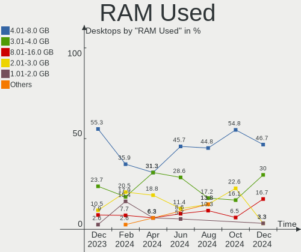
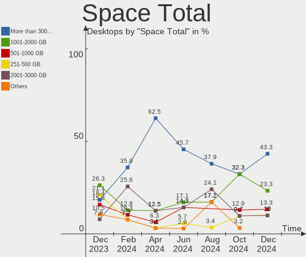
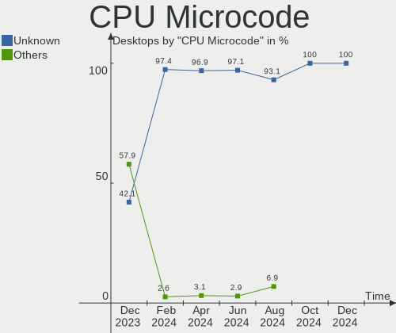
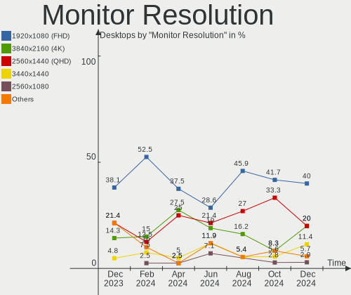
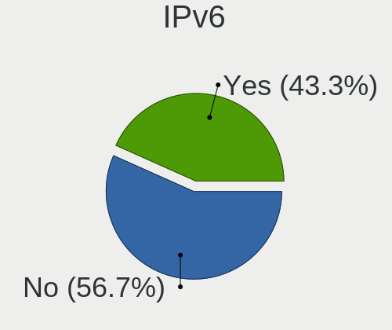

Nobara - Hardware Trends (Desktops)
-----------------------------------

A project to identify most popular hardware characteristics and track their change
over time based on data collected by Linux users at https://Linux-Hardware.org.

Anyone can contribute to this report by the [hw-probe](https://github.com/linuxhw/hw-probe) tool:

    sudo -E hw-probe -all -upload

This report is for one last month. Overall report since the beginning of time: [TestDays](https://github.com/linuxhw/TestDays)

Period: Mar, 2023.

Contents
--------

* [ System ](#system)
  - [ OS                       ](#os)
  - [ OS Family                ](#os-family)
  - [ Kernel                   ](#kernel)
  - [ Kernel Family            ](#kernel-family)
  - [ Kernel Major Ver.        ](#kernel-major-ver)
  - [ Arch                     ](#arch)
  - [ DE                       ](#de)
  - [ Display Server           ](#display-server)
  - [ Display Manager          ](#display-manager)
  - [ OS Lang                  ](#os-lang)
  - [ Boot Mode                ](#boot-mode)
  - [ Filesystem               ](#filesystem)
  - [ Part. scheme             ](#part-scheme)
  - [ Dual Boot with Linux/BSD ](#dual-boot-with-linuxbsd)
  - [ Dual Boot (Win)          ](#dual-boot-win)

* [ Board ](#board)
  - [ Vendor                   ](#vendor)
  - [ Model                    ](#model)
  - [ Model Family             ](#model-family)
  - [ MFG Year                 ](#mfg-year)
  - [ Form Factor              ](#form-factor)
  - [ Secure Boot              ](#secure-boot)
  - [ Coreboot                 ](#coreboot)
  - [ RAM Size                 ](#ram-size)
  - [ RAM Used                 ](#ram-used)
  - [ Total Drives             ](#total-drives)
  - [ Has CD-ROM               ](#has-cd-rom)
  - [ Has Ethernet             ](#has-ethernet)
  - [ Has WiFi                 ](#has-wifi)
  - [ Has Bluetooth            ](#has-bluetooth)

* [ Location ](#location)
  - [ Country                  ](#country)
  - [ City                     ](#city)

* [ Drives ](#drives)
  - [ Drive Vendor             ](#drive-vendor)
  - [ Drive Model              ](#drive-model)
  - [ HDD Vendor               ](#hdd-vendor)
  - [ SSD Vendor               ](#ssd-vendor)
  - [ Drive Kind               ](#drive-kind)
  - [ Drive Connector          ](#drive-connector)
  - [ Drive Size               ](#drive-size)
  - [ Space Total              ](#space-total)
  - [ Space Used               ](#space-used)
  - [ Malfunc. Drives          ](#malfunc-drives)
  - [ Malfunc. Drive Vendor    ](#malfunc-drive-vendor)
  - [ Malfunc. HDD Vendor      ](#malfunc-hdd-vendor)
  - [ Malfunc. Drive Kind      ](#malfunc-drive-kind)
  - [ Failed Drives            ](#failed-drives)
  - [ Failed Drive Vendor      ](#failed-drive-vendor)
  - [ Drive Status             ](#drive-status)

* [ Storage controller ](#storage-controller)
  - [ Storage Vendor           ](#storage-vendor)
  - [ Storage Model            ](#storage-model)
  - [ Storage Kind             ](#storage-kind)

* [ Processor ](#processor)
  - [ CPU Vendor               ](#cpu-vendor)
  - [ CPU Model                ](#cpu-model)
  - [ CPU Model Family         ](#cpu-model-family)
  - [ CPU Cores                ](#cpu-cores)
  - [ CPU Sockets              ](#cpu-sockets)
  - [ CPU Threads              ](#cpu-threads)
  - [ CPU Op-Modes             ](#cpu-op-modes)
  - [ CPU Microcode            ](#cpu-microcode)
  - [ CPU Microarch            ](#cpu-microarch)

* [ Graphics ](#graphics)
  - [ GPU Vendor               ](#gpu-vendor)
  - [ GPU Model                ](#gpu-model)
  - [ GPU Combo                ](#gpu-combo)
  - [ GPU Driver               ](#gpu-driver)
  - [ GPU Memory               ](#gpu-memory)

* [ Monitor ](#monitor)
  - [ Monitor Vendor           ](#monitor-vendor)
  - [ Monitor Model            ](#monitor-model)
  - [ Monitor Resolution       ](#monitor-resolution)
  - [ Monitor Diagonal         ](#monitor-diagonal)
  - [ Monitor Width            ](#monitor-width)
  - [ Aspect Ratio             ](#aspect-ratio)
  - [ Monitor Area             ](#monitor-area)
  - [ Pixel Density            ](#pixel-density)
  - [ Multiple Monitors        ](#multiple-monitors)

* [ Network ](#network)
  - [ Net Controller Vendor    ](#net-controller-vendor)
  - [ Net Controller Model     ](#net-controller-model)
  - [ Wireless Vendor          ](#wireless-vendor)
  - [ Wireless Model           ](#wireless-model)
  - [ Ethernet Vendor          ](#ethernet-vendor)
  - [ Ethernet Model           ](#ethernet-model)
  - [ Net Controller Kind      ](#net-controller-kind)
  - [ Used Controller          ](#used-controller)
  - [ NICs                     ](#nics)
  - [ IPv6                     ](#ipv6)

* [ Bluetooth ](#bluetooth)
  - [ Bluetooth Vendor         ](#bluetooth-vendor)
  - [ Bluetooth Model          ](#bluetooth-model)

* [ Sound ](#sound)
  - [ Sound Vendor             ](#sound-vendor)
  - [ Sound Model              ](#sound-model)

* [ Memory ](#memory)
  - [ Memory Vendor            ](#memory-vendor)
  - [ Memory Model             ](#memory-model)
  - [ Memory Kind              ](#memory-kind)
  - [ Memory Form Factor       ](#memory-form-factor)
  - [ Memory Size              ](#memory-size)
  - [ Memory Speed             ](#memory-speed)

* [ Printers & scanners ](#printers--scanners)
  - [ Printer Vendor           ](#printer-vendor)
  - [ Printer Model            ](#printer-model)
  - [ Scanner Vendor           ](#scanner-vendor)
  - [ Scanner Model            ](#scanner-model)

* [ Camera ](#camera)
  - [ Camera Vendor            ](#camera-vendor)
  - [ Camera Model             ](#camera-model)

* [ Security ](#security)
  - [ Fingerprint Vendor       ](#fingerprint-vendor)
  - [ Fingerprint Model        ](#fingerprint-model)
  - [ Chipcard Vendor          ](#chipcard-vendor)
  - [ Chipcard Model           ](#chipcard-model)

* [ Unsupported ](#unsupported)
  - [ Unsupported Devices      ](#unsupported-devices)
  - [ Unsupported Device Types ](#unsupported-device-types)

System
------

OS
--

Installed operating systems

| Name      | Desktops | Percent |
|-----------|----------|---------|
| Nobara 37 | 28       | 93.33%  |
| Nobara 36 | 2        | 6.67%   |

OS Family
---------

OS without a version

| Name   | Desktops | Percent |
|--------|----------|---------|
| Nobara | 30       | 100%    |

Kernel
------

Version of the Linux kernel

| Version                      | Desktops | Percent |
|------------------------------|----------|---------|
| 6.1.14-201.fsync.fc37.x86_64 | 16       | 53.33%  |
| 6.2.6-201.fsync.fc37.x86_64  | 9        | 30%     |
| 6.2.8-200.fsync.fc37.x86_64  | 2        | 6.67%   |
| 6.1.11-201.fsync.fc37.x86_64 | 1        | 3.33%   |
| 6.0.14-201.fsync.fc36.x86_64 | 1        | 3.33%   |
| 6.0.10-201.fc36.x86_64       | 1        | 3.33%   |

Kernel Family
-------------

Linux kernel without a distro release

| Version | Desktops | Percent |
|---------|----------|---------|
| 6.1.14  | 16       | 53.33%  |
| 6.2.6   | 9        | 30%     |
| 6.2.8   | 2        | 6.67%   |
| 6.1.11  | 1        | 3.33%   |
| 6.0.14  | 1        | 3.33%   |
| 6.0.10  | 1        | 3.33%   |

Kernel Major Ver.
-----------------

Linux kernel major version

| Version | Desktops | Percent |
|---------|----------|---------|
| 6.1     | 17       | 56.67%  |
| 6.2     | 11       | 36.67%  |
| 6.0     | 2        | 6.67%   |

Arch
----

OS architecture (x86_64, i586, etc.)

| Name   | Desktops | Percent |
|--------|----------|---------|
| x86_64 | 30       | 100%    |

DE
--

Desktop Environment

| Name  | Desktops | Percent |
|-------|----------|---------|
| GNOME | 25       | 83.33%  |
| KDE5  | 5        | 16.67%  |

Display Server
--------------

X11 or Wayland

| Name    | Desktops | Percent |
|---------|----------|---------|
| Wayland | 21       | 70%     |
| X11     | 9        | 30%     |

Display Manager
---------------

SDDM, LightDM, etc.

| Name    | Desktops | Percent |
|---------|----------|---------|
| Unknown | 23       | 76.67%  |
| GDM     | 6        | 20%     |
| SDDM    | 1        | 3.33%   |

OS Lang
-------

Language

| Lang    | Desktops | Percent |
|---------|----------|---------|
| en_US   | 15       | 50%     |
| en_GB   | 4        | 13.33%  |
| de_DE   | 3        | 10%     |
| ru_RU   | 1        | 3.33%   |
| pt_BR   | 1        | 3.33%   |
| it_IT   | 1        | 3.33%   |
| fr_FR   | 1        | 3.33%   |
| es_CO   | 1        | 3.33%   |
| de_AT   | 1        | 3.33%   |
| da_DK   | 1        | 3.33%   |
| Unknown | 1        | 3.33%   |

Boot Mode
---------

EFI or BIOS

| Mode | Desktops | Percent |
|------|----------|---------|
| EFI  | 26       | 86.67%  |
| BIOS | 4        | 13.33%  |

Filesystem
----------

Type of filesystem

| Type  | Desktops | Percent |
|-------|----------|---------|
| Btrfs | 27       | 90%     |
| Ext4  | 3        | 10%     |

Part. scheme
------------

Scheme of partitioning

| Type    | Desktops | Percent |
|---------|----------|---------|
| Unknown | 23       | 76.67%  |
| GPT     | 5        | 16.67%  |
| MBR     | 2        | 6.67%   |

Dual Boot with Linux/BSD
------------------------

Hosting more than one Linux/BSD

| Dual boot | Desktops | Percent |
|-----------|----------|---------|
| No        | 29       | 96.67%  |
| Yes       | 1        | 3.33%   |

Dual Boot (Win)
---------------

Hosting Linux and Windows

| Dual boot | Desktops | Percent |
|-----------|----------|---------|
| No        | 27       | 90%     |
| Yes       | 3        | 10%     |

Board
-----

Vendor
------

Motherboard manufacturer

| Name                | Desktops | Percent |
|---------------------|----------|---------|
| ASUSTek Computer    | 12       | 40%     |
| MSI                 | 5        | 16.67%  |
| ASRock              | 5        | 16.67%  |
| Gigabyte Technology | 3        | 10%     |
| Intel               | 2        | 6.67%   |
| Dell                | 2        | 6.67%   |
| Acer                | 1        | 3.33%   |

Model
-----

Motherboard model

| Name                               | Desktops | Percent |
|------------------------------------|----------|---------|
| ASUS TUF Gaming B550-PLUS          | 2        | 6.67%   |
| ASUS ROG STRIX B550-F GAMING       | 2        | 6.67%   |
| ASRock X670E Steel Legend          | 2        | 6.67%   |
| MSI MS-7C92                        | 1        | 3.33%   |
| MSI MS-7C56                        | 1        | 3.33%   |
| MSI MS-7C02                        | 1        | 3.33%   |
| MSI MS-7B86                        | 1        | 3.33%   |
| MSI MS-7B79                        | 1        | 3.33%   |
| Intel X79                          | 1        | 3.33%   |
| Intel DB85FL AAG89861-203          | 1        | 3.33%   |
| Gigabyte Z77P-D3                   | 1        | 3.33%   |
| Gigabyte Z390 AORUS ULTRA          | 1        | 3.33%   |
| Gigabyte GA-970A-DS3               | 1        | 3.33%   |
| Dell OptiPlex 7010                 | 1        | 3.33%   |
| Dell Inspiron 660                  | 1        | 3.33%   |
| ASUS ROG STRIX X470-F GAMING       | 1        | 3.33%   |
| ASUS ROG STRIX B650E-E GAMING WIFI | 1        | 3.33%   |
| ASUS PRIME Z690M-PLUS D4           | 1        | 3.33%   |
| ASUS PRIME X370-PRO                | 1        | 3.33%   |
| ASUS PRIME B560M-A AC              | 1        | 3.33%   |
| ASUS PRIME B450M-A                 | 1        | 3.33%   |
| ASUS M3N78 PRO                     | 1        | 3.33%   |
| ASUS All Series                    | 1        | 3.33%   |
| ASRock X470 Master SLI             | 1        | 3.33%   |
| ASRock H310M-HDV                   | 1        | 3.33%   |
| ASRock B660M-ITX/ac                | 1        | 3.33%   |
| Acer Aspire X1400                  | 1        | 3.33%   |

Model Family
------------

Motherboard model prefix

| Name                 | Desktops | Percent |
|----------------------|----------|---------|
| ASUS ROG             | 4        | 13.33%  |
| ASUS PRIME           | 4        | 13.33%  |
| ASUS TUF             | 2        | 6.67%   |
| ASRock X670E         | 2        | 6.67%   |
| MSI MS-7C92          | 1        | 3.33%   |
| MSI MS-7C56          | 1        | 3.33%   |
| MSI MS-7C02          | 1        | 3.33%   |
| MSI MS-7B86          | 1        | 3.33%   |
| MSI MS-7B79          | 1        | 3.33%   |
| Intel X79            | 1        | 3.33%   |
| Intel DB85FL         | 1        | 3.33%   |
| Gigabyte Z77P-D3     | 1        | 3.33%   |
| Gigabyte Z390        | 1        | 3.33%   |
| Gigabyte GA-970A-DS3 | 1        | 3.33%   |
| Dell OptiPlex        | 1        | 3.33%   |
| Dell Inspiron        | 1        | 3.33%   |
| ASUS M3N78           | 1        | 3.33%   |
| ASUS All             | 1        | 3.33%   |
| ASRock X470          | 1        | 3.33%   |
| ASRock H310M-HDV     | 1        | 3.33%   |
| ASRock B660M-ITX     | 1        | 3.33%   |
| Acer Aspire          | 1        | 3.33%   |

MFG Year
--------

Motherboard manufacture year

| Year | Desktops | Percent |
|------|----------|---------|
| 2018 | 7        | 23.33%  |
| 2020 | 6        | 20%     |
| 2022 | 3        | 10%     |
| 2021 | 3        | 10%     |
| 2012 | 3        | 10%     |
| 2013 | 2        | 6.67%   |
| 2019 | 1        | 3.33%   |
| 2017 | 1        | 3.33%   |
| 2016 | 1        | 3.33%   |
| 2014 | 1        | 3.33%   |
| 2010 | 1        | 3.33%   |
| 2008 | 1        | 3.33%   |

Form Factor
-----------

Physical design of the computer

| Name    | Desktops | Percent |
|---------|----------|---------|
| Desktop | 30       | 100%    |

Secure Boot
-----------

Enabled or disabled

| State    | Desktops | Percent |
|----------|----------|---------|
| Disabled | 30       | 100%    |

Coreboot
--------

Have coreboot on board

| Used | Desktops | Percent |
|------|----------|---------|
| No   | 30       | 100%    |

RAM Size
--------

Total RAM memory

| Size in GB  | Desktops | Percent |
|-------------|----------|---------|
| 32.01-64.0  | 13       | 43.33%  |
| 16.01-24.0  | 9        | 30%     |
| 24.01-32.0  | 3        | 10%     |
| 64.01-256.0 | 2        | 6.67%   |
| 4.01-8.0    | 1        | 3.33%   |
| 3.01-4.0    | 1        | 3.33%   |
| 8.01-16.0   | 1        | 3.33%   |

RAM Used
--------

Used RAM memory

| Used GB   | Desktops | Percent |
|-----------|----------|---------|
| 4.01-8.0  | 17       | 56.67%  |
| 3.01-4.0  | 6        | 20%     |
| 8.01-16.0 | 6        | 20%     |
| 2.01-3.0  | 1        | 3.33%   |

Total Drives
------------

Number of drives on board

| Drives | Desktops | Percent |
|--------|----------|---------|
| 2      | 12       | 40%     |
| 1      | 8        | 26.67%  |
| 3      | 4        | 13.33%  |
| 4      | 2        | 6.67%   |
| 10     | 1        | 3.33%   |
| 7      | 1        | 3.33%   |
| 6      | 1        | 3.33%   |
| 5      | 1        | 3.33%   |

Has CD-ROM
----------

Has CD-ROM on board

| Presented | Desktops | Percent |
|-----------|----------|---------|
| No        | 25       | 83.33%  |
| Yes       | 5        | 16.67%  |

Has Ethernet
------------

Has Ethernet on board

| Presented | Desktops | Percent |
|-----------|----------|---------|
| Yes       | 30       | 100%    |

Has WiFi
--------

Has WiFi module

| Presented | Desktops | Percent |
|-----------|----------|---------|
| Yes       | 20       | 66.67%  |
| No        | 10       | 33.33%  |

Has Bluetooth
-------------

Has Bluetooth module

| Presented | Desktops | Percent |
|-----------|----------|---------|
| No        | 18       | 60%     |
| Yes       | 12       | 40%     |

Location
--------

Country
-------

Geographic location (country)

| Country   | Desktops | Percent |
|-----------|----------|---------|
| USA       | 11       | 36.67%  |
| Germany   | 3        | 10%     |
| France    | 3        | 10%     |
| UK        | 2        | 6.67%   |
| Estonia   | 2        | 6.67%   |
| Russia    | 1        | 3.33%   |
| Japan     | 1        | 3.33%   |
| Italy     | 1        | 3.33%   |
| Denmark   | 1        | 3.33%   |
| Colombia  | 1        | 3.33%   |
| Canada    | 1        | 3.33%   |
| Brazil    | 1        | 3.33%   |
| Austria   | 1        | 3.33%   |
| Australia | 1        | 3.33%   |

City
----

Geographic location (city)

| City           | Desktops | Percent |
|----------------|----------|---------|
| Vienna         | 1        | 3.33%   |
| Toulouse       | 1        | 3.33%   |
| Thornton       | 1        | 3.33%   |
| Tartu          | 1        | 3.33%   |
| Tallinn        | 1        | 3.33%   |
| Springfield    | 1        | 3.33%   |
| Simbach am Inn | 1        | 3.33%   |
| Shepparton     | 1        | 3.33%   |
| Sestri Levante | 1        | 3.33%   |
| Saskatoon      | 1        | 3.33%   |
| San Diego      | 1        | 3.33%   |
| San Angelo     | 1        | 3.33%   |
| Perols         | 1        | 3.33%   |
| Pereira        | 1        | 3.33%   |
| Oklahoma City  | 1        | 3.33%   |
| Novosibirsk    | 1        | 3.33%   |
| Nice           | 1        | 3.33%   |
| Macomb         | 1        | 3.33%   |
| London         | 1        | 3.33%   |
| Itaguai        | 1        | 3.33%   |
| Itabashi-ku    | 1        | 3.33%   |
| Irvine         | 1        | 3.33%   |
| Huenxe         | 1        | 3.33%   |
| Hjørring      | 1        | 3.33%   |
| Fall River     | 1        | 3.33%   |
| East Hanover   | 1        | 3.33%   |
| Durham         | 1        | 3.33%   |
| Cullman        | 1        | 3.33%   |
| Crawley        | 1        | 3.33%   |
| Aurich         | 1        | 3.33%   |

Drives
------

Drive Vendor
------------

Hard drive vendors

| Vendor                    | Desktops | Drives | Percent |
|---------------------------|----------|--------|---------|
| Samsung Electronics       | 12       | 17     | 19.35%  |
| WDC                       | 10       | 17     | 16.13%  |
| Seagate                   | 7        | 7      | 11.29%  |
| Kingston                  | 5        | 5      | 8.06%   |
| Sandisk                   | 4        | 5      | 6.45%   |
| Micron/Crucial Technology | 3        | 7      | 4.84%   |
| Toshiba                   | 2        | 3      | 3.23%   |
| Silicon Motion            | 2        | 2      | 3.23%   |
| Crucial                   | 2        | 2      | 3.23%   |
| Apacer                    | 2        | 2      | 3.23%   |
| XSTAR                     | 1        | 1      | 1.61%   |
| Unknown                   | 1        | 1      | 1.61%   |
| SPCC                      | 1        | 1      | 1.61%   |
| SABRENT                   | 1        | 1      | 1.61%   |
| Realtek                   | 1        | 1      | 1.61%   |
| Phison Electronics        | 1        | 1      | 1.61%   |
| ORTIAL                    | 1        | 1      | 1.61%   |
| Micron Technology         | 1        | 1      | 1.61%   |
| KingFast                  | 1        | 1      | 1.61%   |
| Intenso                   | 1        | 1      | 1.61%   |
| Hitachi                   | 1        | 2      | 1.61%   |
| Hewlett-Packard           | 1        | 1      | 1.61%   |
| Corsair                   | 1        | 1      | 1.61%   |

Drive Model
-----------

Hard drive models

| Model                                                  | Desktops | Percent |
|--------------------------------------------------------|----------|---------|
| Samsung NVMe SSD Controller SM981/PM981/PM983 250GB    | 3        | 3.9%    |
| Micron/Crucial P2 NVMe PCIe SSD 1TB                    | 3        | 3.9%    |
| WDC WD20EZRZ-00Z5HB0 2TB                               | 2        | 2.6%    |
| Sandisk WD Blue SN550 NVMe SSD 256GB                   | 2        | 2.6%    |
| Samsung SSD 850 EVO 500GB                              | 2        | 2.6%    |
| Samsung SSD 840 EVO 250GB                              | 2        | 2.6%    |
| Apacer AS350 120GB SSD                                 | 2        | 2.6%    |
| XSTAR SSD 120GB                                        | 1        | 1.3%    |
| WDC WDS200T2B0A-00SM50 2TB SSD                         | 1        | 1.3%    |
| WDC WDS100T2B0A-00SM50 1TB SSD                         | 1        | 1.3%    |
| WDC WDBNCE0010PNC 1TB SSD                              | 1        | 1.3%    |
| WDC WD6003FFBX-68MU3N0 6TB                             | 1        | 1.3%    |
| WDC WD6002FFWX-68TZ4N0 6TB                             | 1        | 1.3%    |
| WDC WD40EFRX-68N32N0 4TB                               | 1        | 1.3%    |
| WDC WD4003FZEX-00Z4SA0 4TB                             | 1        | 1.3%    |
| WDC WD20EZRX-00D8PB0 2TB                               | 1        | 1.3%    |
| WDC WD2002FAEX-007BA0 2TB                              | 1        | 1.3%    |
| WDC WD10EZEX-00BN5A0 1TB                               | 1        | 1.3%    |
| WDC WD10EARS-00Y5B1 1TB                                | 1        | 1.3%    |
| WDC WD10EADS-00M2B0 1TB                                | 1        | 1.3%    |
| WDC WD100EFAX-68LHPN0 10TB                             | 1        | 1.3%    |
| WDC WD1002FAEX-00Y9A0 1TB                              | 1        | 1.3%    |
| WDC WD10 EADS-00L5B1 1TB                               | 1        | 1.3%    |
| Unknown USB DISK 3.2 250GB                             | 1        | 1.3%    |
| Toshiba HDWE160 6TB                                    | 1        | 1.3%    |
| Toshiba HDWD130 3TB                                    | 1        | 1.3%    |
| Toshiba DT01ACA200 2TB                                 | 1        | 1.3%    |
| SPCC Solid State Disk 240GB                            | 1        | 1.3%    |
| Silicon Motion SM2263EN/SM2263XT SSD Controller 1024GB | 1        | 1.3%    |
| Silicon Motion SM2262/SM2262EN SSD Controller 1TB      | 1        | 1.3%    |
| Seagate ST500LM012 HN-M500MBB 500GB                    | 1        | 1.3%    |
| Seagate ST3500312CS 500GB                              | 1        | 1.3%    |
| Seagate ST2000DM008-2FR102 2TB                         | 1        | 1.3%    |
| Seagate ST2000DL003-9VT166 2TB                         | 1        | 1.3%    |
| Seagate ST1000DM010-2EP102 1TB                         | 1        | 1.3%    |
| Seagate ST1000DM003-1CH162 1TB                         | 1        | 1.3%    |
| Seagate BarraCuda Q1 SSD ZA480CV10001 480GB            | 1        | 1.3%    |
| Sandisk WD_BLACK SN850X 1000GB                         | 1        | 1.3%    |
| Sandisk WD_BLACK SN770 2TB                             | 1        | 1.3%    |
| Sandisk WD Blue SN570 1TB                              | 1        | 1.3%    |

HDD Vendor
----------

Hard disk drive vendors

| Vendor              | Desktops | Drives | Percent |
|---------------------|----------|--------|---------|
| WDC                 | 9        | 14     | 42.86%  |
| Seagate             | 6        | 6      | 28.57%  |
| Toshiba             | 2        | 3      | 9.52%   |
| Samsung Electronics | 1        | 1      | 4.76%   |
| SABRENT             | 1        | 1      | 4.76%   |
| Hitachi             | 1        | 2      | 4.76%   |
| Hewlett-Packard     | 1        | 1      | 4.76%   |

SSD Vendor
----------

Solid state drive vendors

| Vendor              | Desktops | Drives | Percent |
|---------------------|----------|--------|---------|
| Samsung Electronics | 8        | 9      | 30.77%  |
| Kingston            | 4        | 4      | 15.38%  |
| WDC                 | 3        | 3      | 11.54%  |
| Crucial             | 2        | 2      | 7.69%   |
| Apacer              | 2        | 2      | 7.69%   |
| XSTAR               | 1        | 1      | 3.85%   |
| SPCC                | 1        | 1      | 3.85%   |
| Seagate             | 1        | 1      | 3.85%   |
| ORTIAL              | 1        | 1      | 3.85%   |
| Micron Technology   | 1        | 1      | 3.85%   |
| KingFast            | 1        | 1      | 3.85%   |
| Corsair             | 1        | 1      | 3.85%   |

Drive Kind
----------

HDD or SSD

| Kind    | Desktops | Drives | Percent |
|---------|----------|--------|---------|
| SSD     | 20       | 27     | 36.36%  |
| NVMe    | 17       | 24     | 30.91%  |
| HDD     | 16       | 28     | 29.09%  |
| Unknown | 2        | 2      | 3.64%   |

Drive Connector
---------------

SATA, SAS, NVMe, etc.

| Type | Desktops | Drives | Percent |
|------|----------|--------|---------|
| SATA | 25       | 53     | 55.56%  |
| NVMe | 16       | 23     | 35.56%  |
| SAS  | 4        | 5      | 8.89%   |

Drive Size
----------

Size of hard drive

| Size in TB | Desktops | Drives | Percent |
|------------|----------|--------|---------|
| 0.01-0.5   | 15       | 24     | 36.59%  |
| 0.51-1.0   | 12       | 14     | 29.27%  |
| 1.01-2.0   | 8        | 10     | 19.51%  |
| 4.01-10.0  | 3        | 4      | 7.32%   |
| 3.01-4.0   | 2        | 2      | 4.88%   |
| 2.01-3.0   | 1        | 1      | 2.44%   |

Space Total
-----------

Amount of disk space available on the file system

| Size in GB     | Desktops | Percent |
|----------------|----------|---------|
| 1001-2000      | 10       | 33.33%  |
| More than 3000 | 6        | 20%     |
| 2001-3000      | 4        | 13.33%  |
| 101-250        | 3        | 10%     |
| 21-50          | 2        | 6.67%   |
| Unknown        | 2        | 6.67%   |
| 251-500        | 1        | 3.33%   |
| 501-1000       | 1        | 3.33%   |
| 51-100         | 1        | 3.33%   |

Space Used
----------

Amount of used disk space

| Used GB        | Desktops | Percent |
|----------------|----------|---------|
| 101-250        | 10       | 33.33%  |
| 1-20           | 5        | 16.67%  |
| 501-1000       | 4        | 13.33%  |
| More than 3000 | 3        | 10%     |
| 21-50          | 3        | 10%     |
| Unknown        | 2        | 6.67%   |
| 251-500        | 1        | 3.33%   |
| 2001-3000      | 1        | 3.33%   |
| 1001-2000      | 1        | 3.33%   |

Malfunc. Drives
---------------

Drive models with a malfunction

Zero info for selected period =(

Malfunc. Drive Vendor
---------------------

Vendors of faulty drives

Zero info for selected period =(

Malfunc. HDD Vendor
-------------------

Vendors of faulty HDD drives

Zero info for selected period =(

Malfunc. Drive Kind
-------------------

Kinds of faulty drives

Zero info for selected period =(

Failed Drives
-------------

Failed drive models

Zero info for selected period =(

Failed Drive Vendor
-------------------

Failed drive vendors

Zero info for selected period =(

Drive Status
------------

Number of failed and malfunc. drives

| Status   | Desktops | Drives | Percent |
|----------|----------|--------|---------|
| Detected | 24       | 67     | 77.42%  |
| Works    | 7        | 14     | 22.58%  |

Storage controller
------------------

Storage Vendor
--------------

Storage controller vendors

| Vendor                      | Desktops | Percent |
|-----------------------------|----------|---------|
| AMD                         | 17       | 34.69%  |
| Intel                       | 11       | 22.45%  |
| Samsung Electronics         | 6        | 12.24%  |
| SanDisk                     | 4        | 8.16%   |
| Micron/Crucial Technology   | 3        | 6.12%   |
| Silicon Motion              | 2        | 4.08%   |
| Nvidia                      | 2        | 4.08%   |
| ASMedia Technology          | 2        | 4.08%   |
| Phison Electronics          | 1        | 2.04%   |
| Kingston Technology Company | 1        | 2.04%   |

Storage Model
-------------

Storage controller models

| Model                                                                          | Desktops | Percent |
|--------------------------------------------------------------------------------|----------|---------|
| AMD FCH SATA Controller [AHCI mode]                                            | 7        | 11.67%  |
| AMD 500 Series Chipset SATA Controller                                         | 6        | 10%     |
| AMD 400 Series Chipset SATA Controller                                         | 6        | 10%     |
| Samsung NVMe SSD Controller SM981/PM981/PM983                                  | 4        | 6.67%   |
| Micron/Crucial P2 NVMe PCIe SSD                                                | 3        | 5%      |
| SanDisk WD Blue SN550 NVMe SSD                                                 | 2        | 3.33%   |
| Intel Cannon Lake PCH SATA AHCI Controller                                     | 2        | 3.33%   |
| Intel Alder Lake-S PCH SATA Controller [AHCI Mode]                             | 2        | 3.33%   |
| Intel 8 Series/C220 Series Chipset Family 6-port SATA Controller 1 [AHCI mode] | 2        | 3.33%   |
| Intel 7 Series/C210 Series Chipset Family 6-port SATA Controller [AHCI mode]   | 2        | 3.33%   |
| ASMedia ASM1062 Serial ATA Controller                                          | 2        | 3.33%   |
| Silicon Motion SM2263EN/SM2263XT SSD Controller                                | 1        | 1.67%   |
| Silicon Motion SM2262/SM2262EN SSD Controller                                  | 1        | 1.67%   |
| Sandisk Western Digital WD Black SN850X NVMe SSD                               | 1        | 1.67%   |
| SanDisk WD Blue SN570 NVMe SSD 1TB                                             | 1        | 1.67%   |
| SanDisk NVMe Controller                                                        | 1        | 1.67%   |
| Samsung NVMe SSD Controller PM9A1/PM9A3/980PRO                                 | 1        | 1.67%   |
| Samsung NVMe SSD Controller 980                                                | 1        | 1.67%   |
| Phison E16 PCIe4 NVMe Controller                                               | 1        | 1.67%   |
| Nvidia MCP78S [GeForce 8200] SATA Controller (non-AHCI mode)                   | 1        | 1.67%   |
| Nvidia MCP78S [GeForce 8200] IDE                                               | 1        | 1.67%   |
| Nvidia MCP61 SATA Controller                                                   | 1        | 1.67%   |
| Nvidia MCP61 IDE                                                               | 1        | 1.67%   |
| Micron/Crucial P5 Plus NVMe PCIe SSD                                           | 1        | 1.67%   |
| Kingston Company NVMe Controller                                               | 1        | 1.67%   |
| Intel Volume Management Device NVMe RAID Controller                            | 1        | 1.67%   |
| Intel 7 Series/C210 Series Chipset Family 4-port SATA Controller [IDE mode]    | 1        | 1.67%   |
| Intel 7 Series/C210 Series Chipset Family 2-port SATA Controller [IDE mode]    | 1        | 1.67%   |
| Intel 6 Series/C200 Series Chipset Family 6 port Desktop SATA AHCI Controller  | 1        | 1.67%   |
| Intel 500 Series Chipset Family SATA AHCI Controller                           | 1        | 1.67%   |
| AMD X370 Series Chipset SATA Controller                                        | 1        | 1.67%   |
| AMD SB7x0/SB8x0/SB9x0 SATA Controller [IDE mode]                               | 1        | 1.67%   |
| AMD SB7x0/SB8x0/SB9x0 IDE Controller                                           | 1        | 1.67%   |

Storage Kind
------------

Kind of storage controller (IDE, SATA, NVMe, SAS, ...)

| Kind | Desktops | Percent |
|------|----------|---------|
| SATA | 27       | 56.25%  |
| NVMe | 16       | 33.33%  |
| IDE  | 4        | 8.33%   |
| RAID | 1        | 2.08%   |

Processor
---------

CPU Vendor
----------

Processor vendors

| Vendor | Desktops | Percent |
|--------|----------|---------|
| AMD    | 19       | 63.33%  |
| Intel  | 11       | 36.67%  |

CPU Model
---------

Processor models

| Model                                  | Desktops | Percent |
|----------------------------------------|----------|---------|
| AMD Ryzen 5 3600 6-Core Processor      | 4        | 13.33%  |
| Intel Core i5-4570 CPU @ 3.20GHz       | 2        | 6.67%   |
| Intel Core i5-3470 CPU @ 3.20GHz       | 2        | 6.67%   |
| AMD Ryzen 9 7950X 16-Core Processor    | 2        | 6.67%   |
| AMD Ryzen 7 3700X 8-Core Processor     | 2        | 6.67%   |
| Intel Xeon CPU E5-2640 0 @ 2.50GHz     | 1        | 3.33%   |
| Intel Core i9-9900K CPU @ 3.60GHz      | 1        | 3.33%   |
| Intel Core i5-3550 CPU @ 3.30GHz       | 1        | 3.33%   |
| Intel Core i5-10400 CPU @ 2.90GHz      | 1        | 3.33%   |
| Intel Core i3-8100 CPU @ 3.60GHz       | 1        | 3.33%   |
| Intel 12th Gen Core i5-12600K          | 1        | 3.33%   |
| Intel 12th Gen Core i5-12400           | 1        | 3.33%   |
| AMD Ryzen 9 3950X 16-Core Processor    | 1        | 3.33%   |
| AMD Ryzen 7 5800X 8-Core Processor     | 1        | 3.33%   |
| AMD Ryzen 7 2700X Eight-Core Processor | 1        | 3.33%   |
| AMD Ryzen 7 1700 Eight-Core Processor  | 1        | 3.33%   |
| AMD Ryzen 5 7600X 6-Core Processor     | 1        | 3.33%   |
| AMD Ryzen 5 5600 6-Core Processor      | 1        | 3.33%   |
| AMD Ryzen 5 3600X 6-Core Processor     | 1        | 3.33%   |
| AMD Ryzen 5 2600 Six-Core Processor    | 1        | 3.33%   |
| AMD Phenom 9550 Quad-Core Processor    | 1        | 3.33%   |
| AMD FX-4100 Quad-Core Processor        | 1        | 3.33%   |
| AMD Athlon II X2 220 Processor         | 1        | 3.33%   |

CPU Model Family
----------------

Processor model prefix

| Model            | Desktops | Percent |
|------------------|----------|---------|
| AMD Ryzen 5      | 8        | 26.67%  |
| Intel Core i5    | 6        | 20%     |
| AMD Ryzen 7      | 5        | 16.67%  |
| AMD Ryzen 9      | 3        | 10%     |
| Other            | 2        | 6.67%   |
| Intel Xeon       | 1        | 3.33%   |
| Intel Core i9    | 1        | 3.33%   |
| Intel Core i3    | 1        | 3.33%   |
| AMD Phenom       | 1        | 3.33%   |
| AMD FX           | 1        | 3.33%   |
| AMD Athlon II X2 | 1        | 3.33%   |

CPU Cores
---------

Number of processor cores

| Number | Desktops | Percent |
|--------|----------|---------|
| 6      | 11       | 36.67%  |
| 4      | 7        | 23.33%  |
| 8      | 6        | 20%     |
| 16     | 3        | 10%     |
| 2      | 2        | 6.67%   |
| 10     | 1        | 3.33%   |

CPU Sockets
-----------

Number of sockets

| Number | Desktops | Percent |
|--------|----------|---------|
| 1      | 30       | 100%    |

CPU Threads
-----------

Threads per core (Hyper-Threading)

| Number | Desktops | Percent |
|--------|----------|---------|
| 2      | 22       | 73.33%  |
| 1      | 8        | 26.67%  |

CPU Op-Modes
------------

CPU Operation Modes (32-bit, 64-bit)

| Op mode        | Desktops | Percent |
|----------------|----------|---------|
| 32-bit, 64-bit | 30       | 100%    |

CPU Microcode
-------------

Microcode number

| Number     | Desktops | Percent |
|------------|----------|---------|
| 0x08701021 | 7        | 23.33%  |
| 0x0a601203 | 3        | 10%     |
| Unknown    | 3        | 10%     |
| 0x306a9    | 2        | 6.67%   |
| 0xa0653    | 1        | 3.33%   |
| 0x906ed    | 1        | 3.33%   |
| 0x906eb    | 1        | 3.33%   |
| 0x90672    | 1        | 3.33%   |
| 0x306c3    | 1        | 3.33%   |
| 0x206d7    | 1        | 3.33%   |
| 0x0a20120a | 1        | 3.33%   |
| 0x08701013 | 1        | 3.33%   |
| 0x0800820d | 1        | 3.33%   |
| 0x0800820b | 1        | 3.33%   |
| 0x08001137 | 1        | 3.33%   |
| 0x06000623 | 1        | 3.33%   |
| 0x010000b6 | 1        | 3.33%   |
| 0x01000095 | 1        | 3.33%   |
| 0x00000000 | 1        | 3.33%   |

CPU Microarch
-------------

Microarchitecture

| Name             | Desktops | Percent |
|------------------|----------|---------|
| Zen 2            | 8        | 26.67%  |
| IvyBridge        | 3        | 10%     |
| Unknown          | 3        | 10%     |
| Zen+             | 2        | 6.67%   |
| Zen 3            | 2        | 6.67%   |
| KabyLake         | 2        | 6.67%   |
| K10              | 2        | 6.67%   |
| Haswell          | 2        | 6.67%   |
| Alderlake Hybrid | 2        | 6.67%   |
| Zen              | 1        | 3.33%   |
| SandyBridge      | 1        | 3.33%   |
| CometLake        | 1        | 3.33%   |
| Bulldozer        | 1        | 3.33%   |

Graphics
--------

GPU Vendor
----------

Vendors of graphics cards

| Vendor | Desktops | Percent |
|--------|----------|---------|
| Nvidia | 15       | 44.12%  |
| AMD    | 14       | 41.18%  |
| Intel  | 5        | 14.71%  |

GPU Model
---------

Graphics card models

| Model                                                                       | Desktops | Percent |
|-----------------------------------------------------------------------------|----------|---------|
| AMD Raphael                                                                 | 3        | 8.33%   |
| AMD Navi 10 [Radeon RX 5600 OEM/5600 XT / 5700/5700 XT]                     | 3        | 8.33%   |
| AMD Ellesmere [Radeon RX 470/480/570/570X/580/580X/590]                     | 3        | 8.33%   |
| Nvidia TU117 [GeForce GTX 1650]                                             | 2        | 5.56%   |
| Intel Xeon E3-1200 v3/4th Gen Core Processor Integrated Graphics Controller | 2        | 5.56%   |
| Intel Xeon E3-1200 v2/3rd Gen Core processor Graphics Controller            | 2        | 5.56%   |
| AMD Navi 23 [Radeon RX 6600/6600 XT/6600M]                                  | 2        | 5.56%   |
| AMD Navi 21 [Radeon RX 6800/6800 XT / 6900 XT]                              | 2        | 5.56%   |
| Nvidia TU106 [GeForce RTX 2070 Rev. A]                                      | 1        | 2.78%   |
| Nvidia TU104 [GeForce RTX 2070 SUPER]                                       | 1        | 2.78%   |
| Nvidia GP106 [GeForce GTX 1060 3GB]                                         | 1        | 2.78%   |
| Nvidia GP104 [GeForce GTX 1080]                                             | 1        | 2.78%   |
| Nvidia GP104 [GeForce GTX 1070]                                             | 1        | 2.78%   |
| Nvidia GK208B [GeForce GT 710]                                              | 1        | 2.78%   |
| Nvidia GK106 [GeForce GTX 650 Ti]                                           | 1        | 2.78%   |
| Nvidia GF114 [GeForce GTX 560]                                              | 1        | 2.78%   |
| Nvidia GF108 [GeForce GT 630]                                               | 1        | 2.78%   |
| Nvidia GA104 [GeForce RTX 3060 Ti]                                          | 1        | 2.78%   |
| Nvidia GA102 [GeForce RTX 3080]                                             | 1        | 2.78%   |
| Nvidia C61 [GeForce 6150SE nForce 430]                                      | 1        | 2.78%   |
| Nvidia AD103 [GeForce RTX 4080]                                             | 1        | 2.78%   |
| Intel Alder Lake-S GT1 [UHD Graphics 730]                                   | 1        | 2.78%   |
| AMD Navi 31 [Radeon RX 7900 XT/7900 XTX]                                    | 1        | 2.78%   |
| AMD Navi 22 [Radeon RX 6700/6700 XT/6750 XT / 6800M/6850M XT]               | 1        | 2.78%   |
| AMD Curacao PRO [Radeon R7 370 / R9 270/370 OEM]                            | 1        | 2.78%   |

GPU Combo
---------

Combinations of graphics cards

| Name           | Desktops | Percent |
|----------------|----------|---------|
| 1 x Nvidia     | 13       | 43.33%  |
| 1 x AMD        | 11       | 36.67%  |
| 2 x AMD        | 2        | 6.67%   |
| 1 x Intel      | 2        | 6.67%   |
| Intel + Nvidia | 1        | 3.33%   |
| AMD + Nvidia   | 1        | 3.33%   |

GPU Driver
----------

Free vs proprietary

| Driver      | Desktops | Percent |
|-------------|----------|---------|
| Free        | 20       | 66.67%  |
| Proprietary | 7        | 23.33%  |
| Unknown     | 3        | 10%     |

GPU Memory
----------

Total video memory

| Size in GB | Desktops | Percent |
|------------|----------|---------|
| Unknown    | 12       | 40%     |
| 7.01-8.0   | 7        | 23.33%  |
| 3.01-4.0   | 3        | 10%     |
| 8.01-16.0  | 3        | 10%     |
| 5.01-6.0   | 1        | 3.33%   |
| 2.01-3.0   | 1        | 3.33%   |
| 16.01-24.0 | 1        | 3.33%   |
| 1.01-2.0   | 1        | 3.33%   |
| 0.51-1.0   | 1        | 3.33%   |

Monitor
-------

Monitor Vendor
--------------

Monitor vendors

| Vendor               | Desktops | Percent |
|----------------------|----------|---------|
| Goldstar             | 5        | 13.89%  |
| BenQ                 | 5        | 13.89%  |
| Samsung Electronics  | 4        | 11.11%  |
| Dell                 | 4        | 11.11%  |
| Acer                 | 3        | 8.33%   |
| ViewSonic            | 2        | 5.56%   |
| Gigabyte Technology  | 2        | 5.56%   |
| ASUSTek Computer     | 2        | 5.56%   |
| Vizio                | 1        | 2.78%   |
| Unknown              | 1        | 2.78%   |
| OEM                  | 1        | 2.78%   |
| Lenovo               | 1        | 2.78%   |
| Insignia             | 1        | 2.78%   |
| Impression           | 1        | 2.78%   |
| Iiyama               | 1        | 2.78%   |
| Hewlett-Packard      | 1        | 2.78%   |
| Ancor Communications | 1        | 2.78%   |

Monitor Model
-------------

Monitor models

| Model                                                                   | Desktops | Percent |
|-------------------------------------------------------------------------|----------|---------|
| Gigabyte Technology M27Q GBT270D 2560x1440 596x335mm 26.9-inch          | 2        | 5.41%   |
| Vizio D32f-E1 VIZ1027 1920x1080 698x392mm 31.5-inch                     | 1        | 2.7%    |
| ViewSonic XG2703-GS VSCBA32 2560x1440 598x336mm 27.0-inch               | 1        | 2.7%    |
| ViewSonic VA2261 Series VSC0F30 1920x1080 477x268mm 21.5-inch           | 1        | 2.7%    |
| Unknown LCD Monitor FFFF 2288x1287 2550x2550mm 142.0-inch               | 1        | 2.7%    |
| Samsung Electronics S22R35x SAM103A 1920x1080 476x268mm 21.5-inch       | 1        | 2.7%    |
| Samsung Electronics Q95A SAM714D 3840x2160 1872x1053mm 84.6-inch        | 1        | 2.7%    |
| Samsung Electronics LCD Monitor SAM0C44 3840x2160 1872x1053mm 84.6-inch | 1        | 2.7%    |
| Samsung Electronics LCD Monitor SAM0B60 1920x1080 887x500mm 40.1-inch   | 1        | 2.7%    |
| OEM 32W_LCD_TV OEM3700 1920x540                                         | 1        | 2.7%    |
| Lenovo LEN L27q-30 LEN65FC 2560x1440 597x336mm 27.0-inch                | 1        | 2.7%    |
| Insignia NS-43D420NA20 BBY0050 1920x1080 708x398mm 32.0-inch            | 1        | 2.7%    |
| Impression R19W12-A1 IMP1912 1440x900 410x257mm 19.1-inch               | 1        | 2.7%    |
| Iiyama PL2760Q IVM663D 2560x1440 597x336mm 27.0-inch                    | 1        | 2.7%    |
| Hewlett-Packard X34 HPN3728 3440x1440 800x335mm 34.1-inch               | 1        | 2.7%    |
| Goldstar ULTRAWIDE GSM76E4 3440x1440 800x335mm 34.1-inch                | 1        | 2.7%    |
| Goldstar ULTRAGEAR GSM5B7F 2560x1440 597x336mm 27.0-inch                | 1        | 2.7%    |
| Goldstar QHD GSM778E 2560x1440 698x392mm 31.5-inch                      | 1        | 2.7%    |
| Goldstar M2252D GSM58DC 1920x1080 476x267mm 21.5-inch                   | 1        | 2.7%    |
| Goldstar HDR 4K GSM7707 3840x2160 600x340mm 27.2-inch                   | 1        | 2.7%    |
| Goldstar 23MP55 GSM5A21 1920x1080 510x290mm 23.1-inch                   | 1        | 2.7%    |
| Dell U4320Q DEL41D4 3840x2160 941x529mm 42.5-inch                       | 1        | 2.7%    |
| Dell U2715H DELD067 2560x1440 597x336mm 27.0-inch                       | 1        | 2.7%    |
| Dell P2418D DELD0C2 2560x1440 526x296mm 23.8-inch                       | 1        | 2.7%    |
| Dell P2214H DELA097 1920x1080 477x268mm 21.5-inch                       | 1        | 2.7%    |
| BenQ GW2750H BNQ78C3 1920x1080 598x336mm 27.0-inch                      | 1        | 2.7%    |
| BenQ G2750 BNQ78B1 1920x1080 598x336mm 27.0-inch                        | 1        | 2.7%    |
| BenQ EX3501R BNQ7F5E 3440x1440 819x346mm 35.0-inch                      | 1        | 2.7%    |
| BenQ EX2510S BNQ7FA3 1920x1080 544x303mm 24.5-inch                      | 1        | 2.7%    |
| BenQ EW3270ZL BNQ7945 2560x1440 709x399mm 32.0-inch                     | 1        | 2.7%    |
| ASUSTek Computer VG32V AUS32A3 2560x1440 697x393mm 31.5-inch            | 1        | 2.7%    |
| ASUSTek Computer VA27EHE AUS27D2 1920x1080 598x336mm 27.0-inch          | 1        | 2.7%    |
| Ancor Communications ASUS VN247 ACI24C3 1920x1080 521x293mm 23.5-inch   | 1        | 2.7%    |
| Acer XV272U V ACR081B 2560x1440 597x336mm 27.0-inch                     | 1        | 2.7%    |
| Acer ET430K ACR0558 3840x2160 941x529mm 42.5-inch                       | 1        | 2.7%    |
| Acer B276HK ACR0413 3840x2160 596x335mm 26.9-inch                       | 1        | 2.7%    |

Monitor Resolution
------------------

Monitor screen resolution

| Resolution       | Desktops | Percent |
|------------------|----------|---------|
| 2560x1440 (QHD)  | 10       | 30.3%   |
| 1920x1080 (FHD)  | 10       | 30.3%   |
| 3840x2160 (4K)   | 7        | 21.21%  |
| 3440x1440        | 3        | 9.09%   |
| 2288x1287        | 1        | 3.03%   |
| 1920x540         | 1        | 3.03%   |
| 1440x900 (WXGA+) | 1        | 3.03%   |

Monitor Diagonal
----------------

Diagonal size in inches

| Inches | Desktops | Percent |
|--------|----------|---------|
| 27     | 9        | 26.47%  |
| 31     | 4        | 11.76%  |
| 34     | 3        | 8.82%   |
| 24     | 3        | 8.82%   |
| 21     | 3        | 8.82%   |
| 84     | 2        | 5.88%   |
| 42     | 2        | 5.88%   |
| 23     | 2        | 5.88%   |
| 142    | 1        | 2.94%   |
| 49     | 1        | 2.94%   |
| 40     | 1        | 2.94%   |
| 35     | 1        | 2.94%   |
| 32     | 1        | 2.94%   |
| 19     | 1        | 2.94%   |

Monitor Width
-------------

Physical width

| Width in mm    | Desktops | Percent |
|----------------|----------|---------|
| 501-600        | 13       | 39.39%  |
| 701-800        | 4        | 12.12%  |
| 601-700        | 4        | 12.12%  |
| 401-500        | 4        | 12.12%  |
| 801-900        | 2        | 6.06%   |
| 1501-2000      | 2        | 6.06%   |
| 901-1000       | 2        | 6.06%   |
| More than 2000 | 1        | 3.03%   |
| 1001-1500      | 1        | 3.03%   |

Aspect Ratio
------------

Proportional relationship between the width and the height

| Ratio | Desktops | Percent |
|-------|----------|---------|
| 16/9  | 21       | 80.77%  |
| 21/9  | 3        | 11.54%  |
| 16/10 | 1        | 3.85%   |
| 1.00  | 1        | 3.85%   |

Monitor Area
------------

Area in inch²

| Area in inch² | Desktops | Percent |
|----------------|----------|---------|
| 301-350        | 9        | 28.13%  |
| 351-500        | 7        | 21.88%  |
| 201-250        | 5        | 15.63%  |
| More than 1000 | 4        | 12.5%   |
| 151-200        | 3        | 9.38%   |
| 501-1000       | 3        | 9.38%   |
| 251-300        | 1        | 3.13%   |

Pixel Density
-------------

Pixels per inch

| Density | Desktops | Percent |
|---------|----------|---------|
| 51-100  | 15       | 42.86%  |
| 101-120 | 13       | 37.14%  |
| 1-50    | 3        | 8.57%   |
| 161-240 | 3        | 8.57%   |
| 121-160 | 1        | 2.86%   |

Multiple Monitors
-----------------

Total monitors connected

| Total | Desktops | Percent |
|-------|----------|---------|
| 1     | 18       | 60%     |
| 2     | 8        | 26.67%  |
| 0     | 3        | 10%     |
| 3     | 1        | 3.33%   |

Network
-------

Net Controller Vendor
---------------------

Controller vendors

| Vendor                     | Desktops | Percent |
|----------------------------|----------|---------|
| Realtek Semiconductor      | 18       | 39.13%  |
| Intel                      | 13       | 28.26%  |
| TP-Link                    | 3        | 6.52%   |
| Ralink Technology          | 3        | 6.52%   |
| MediaTek                   | 3        | 6.52%   |
| Microsoft                  | 2        | 4.35%   |
| Broadcom                   | 2        | 4.35%   |
| ZTE WCDMA Technologies MSM | 1        | 2.17%   |
| Nvidia                     | 1        | 2.17%   |

Net Controller Model
--------------------

Controller models

| Model                                                             | Desktops | Percent |
|-------------------------------------------------------------------|----------|---------|
| Realtek RTL8111/8168/8411 PCI Express Gigabit Ethernet Controller | 13       | 22.81%  |
| Realtek RTL8125 2.5GbE Controller                                 | 5        | 8.77%   |
| MediaTek MT7922 802.11ax PCI Express Wireless Network Adapter     | 3        | 5.26%   |
| Intel Wi-Fi 6 AX200                                               | 3        | 5.26%   |
| Intel I211 Gigabit Network Connection                             | 3        | 5.26%   |
| Intel Ethernet Controller I225-V                                  | 3        | 5.26%   |
| Realtek RTL8811AU 802.11a/b/g/n/ac WLAN Adapter                   | 2        | 3.51%   |
| Realtek RTL8188EUS 802.11n Wireless Network Adapter               | 2        | 3.51%   |
| Ralink RT5370 Wireless Adapter                                    | 2        | 3.51%   |
| Microsoft Xbox 360 Wireless Adapter                               | 2        | 3.51%   |
| Intel Ethernet Connection (17) I219-V                             | 2        | 3.51%   |
| Broadcom BCM4360 802.11ac Wireless Network Adapter                | 2        | 3.51%   |
| ZTE WCDMA MSM ZTE BLADE A530                                      | 1        | 1.75%   |
| TP-Link Archer T9UH v1 [Realtek RTL8814AU]                        | 1        | 1.75%   |
| TP-Link Archer T2U PLUS [RTL8821AU]                               | 1        | 1.75%   |
| TP-Link 802.11ac NIC                                              | 1        | 1.75%   |
| Realtek RTL88x2bu [AC1200 Techkey]                                | 1        | 1.75%   |
| Realtek RTL8192EE PCIe Wireless Network Adapter                   | 1        | 1.75%   |
| Ralink RT3572 Wireless Adapter                                    | 1        | 1.75%   |
| Nvidia MCP61 Ethernet                                             | 1        | 1.75%   |
| Intel Tiger Lake PCH CNVi WiFi                                    | 1        | 1.75%   |
| Intel Ethernet Connection I217-V                                  | 1        | 1.75%   |
| Intel Ethernet Connection (7) I219-V                              | 1        | 1.75%   |
| Intel Ethernet Connection (14) I219-V                             | 1        | 1.75%   |
| Intel Cannon Lake PCH CNVi WiFi                                   | 1        | 1.75%   |
| Intel Alder Lake-S PCH CNVi WiFi                                  | 1        | 1.75%   |
| Intel 82579LM Gigabit Network Connection (Lewisville)             | 1        | 1.75%   |

Wireless Vendor
---------------

Wireless vendors

| Vendor                | Desktops | Percent |
|-----------------------|----------|---------|
| Intel                 | 6        | 25%     |
| Realtek Semiconductor | 5        | 20.83%  |
| TP-Link               | 3        | 12.5%   |
| Ralink Technology     | 3        | 12.5%   |
| MediaTek              | 3        | 12.5%   |
| Microsoft             | 2        | 8.33%   |
| Broadcom              | 2        | 8.33%   |

Wireless Model
--------------

Wireless models

| Model                                                         | Desktops | Percent |
|---------------------------------------------------------------|----------|---------|
| MediaTek MT7922 802.11ax PCI Express Wireless Network Adapter | 3        | 12%     |
| Intel Wi-Fi 6 AX200                                           | 3        | 12%     |
| Realtek RTL8811AU 802.11a/b/g/n/ac WLAN Adapter               | 2        | 8%      |
| Realtek RTL8188EUS 802.11n Wireless Network Adapter           | 2        | 8%      |
| Ralink RT5370 Wireless Adapter                                | 2        | 8%      |
| Microsoft Xbox 360 Wireless Adapter                           | 2        | 8%      |
| Broadcom BCM4360 802.11ac Wireless Network Adapter            | 2        | 8%      |
| TP-Link Archer T9UH v1 [Realtek RTL8814AU]                    | 1        | 4%      |
| TP-Link Archer T2U PLUS [RTL8821AU]                           | 1        | 4%      |
| TP-Link 802.11ac NIC                                          | 1        | 4%      |
| Realtek RTL88x2bu [AC1200 Techkey]                            | 1        | 4%      |
| Realtek RTL8192EE PCIe Wireless Network Adapter               | 1        | 4%      |
| Ralink RT3572 Wireless Adapter                                | 1        | 4%      |
| Intel Tiger Lake PCH CNVi WiFi                                | 1        | 4%      |
| Intel Cannon Lake PCH CNVi WiFi                               | 1        | 4%      |
| Intel Alder Lake-S PCH CNVi WiFi                              | 1        | 4%      |

Ethernet Vendor
---------------

Ethernet vendors

| Vendor                     | Desktops | Percent |
|----------------------------|----------|---------|
| Realtek Semiconductor      | 16       | 53.33%  |
| Intel                      | 12       | 40%     |
| ZTE WCDMA Technologies MSM | 1        | 3.33%   |
| Nvidia                     | 1        | 3.33%   |

Ethernet Model
--------------

Ethernet models

| Model                                                             | Desktops | Percent |
|-------------------------------------------------------------------|----------|---------|
| Realtek RTL8111/8168/8411 PCI Express Gigabit Ethernet Controller | 13       | 40.63%  |
| Realtek RTL8125 2.5GbE Controller                                 | 5        | 15.63%  |
| Intel I211 Gigabit Network Connection                             | 3        | 9.38%   |
| Intel Ethernet Controller I225-V                                  | 3        | 9.38%   |
| Intel Ethernet Connection (17) I219-V                             | 2        | 6.25%   |
| ZTE WCDMA MSM ZTE BLADE A530                                      | 1        | 3.13%   |
| Nvidia MCP61 Ethernet                                             | 1        | 3.13%   |
| Intel Ethernet Connection I217-V                                  | 1        | 3.13%   |
| Intel Ethernet Connection (7) I219-V                              | 1        | 3.13%   |
| Intel Ethernet Connection (14) I219-V                             | 1        | 3.13%   |
| Intel 82579LM Gigabit Network Connection (Lewisville)             | 1        | 3.13%   |

Net Controller Kind
-------------------

Ethernet, WiFi or modem

| Kind     | Desktops | Percent |
|----------|----------|---------|
| Ethernet | 30       | 60%     |
| WiFi     | 20       | 40%     |

Used Controller
---------------

Currently used network controller

| Kind     | Desktops | Percent |
|----------|----------|---------|
| Ethernet | 21       | 65.63%  |
| WiFi     | 11       | 34.38%  |

NICs
----

Total network controllers on board

| Total | Desktops | Percent |
|-------|----------|---------|
| 1     | 16       | 53.33%  |
| 2     | 11       | 36.67%  |
| 3     | 2        | 6.67%   |
| 0     | 1        | 3.33%   |

IPv6
----

IPv6 vs IPv4

| Used | Desktops | Percent |
|------|----------|---------|
| No   | 18       | 60%     |
| Yes  | 12       | 40%     |

Bluetooth
---------

Bluetooth Vendor
----------------

Controller vendors

| Vendor                  | Desktops | Percent |
|-------------------------|----------|---------|
| Intel                   | 6        | 46.15%  |
| Cambridge Silicon Radio | 3        | 23.08%  |
| TP-Link                 | 1        | 7.69%   |
| MediaTek                | 1        | 7.69%   |
| Foxconn / Hon Hai       | 1        | 7.69%   |
| Dynex                   | 1        | 7.69%   |

Bluetooth Model
---------------

Controller models

| Model                                                    | Desktops | Percent |
|----------------------------------------------------------|----------|---------|
| Intel Bluetooth 9460/9560 Jefferson Peak (JfP)           | 3        | 23.08%  |
| Intel AX200 Bluetooth                                    | 3        | 23.08%  |
| Cambridge Silicon Radio Bluetooth Dongle (HCI mode)      | 3        | 23.08%  |
| TP-Link UB500 Adapter                                    | 1        | 7.69%   |
| MediaTek Wireless_Device                                 | 1        | 7.69%   |
| Foxconn / Hon Hai Wireless_Device                        | 1        | 7.69%   |
| Dynex Bluetooth 4.0 Adapter [Broadcom, 1.12, BCM20702A0] | 1        | 7.69%   |

Sound
-----

Sound Vendor
------------

Sound card vendors

| Vendor                     | Desktops | Percent |
|----------------------------|----------|---------|
| AMD                        | 21       | 35%     |
| Nvidia                     | 15       | 25%     |
| Intel                      | 11       | 18.33%  |
| Razer USA                  | 2        | 3.33%   |
| Kingston Technology        | 2        | 3.33%   |
| SteelSeries ApS            | 1        | 1.67%   |
| Sony                       | 1        | 1.67%   |
| PreSonus Audio Electronics | 1        | 1.67%   |
| Mark of the Unicorn        | 1        | 1.67%   |
| JMTek                      | 1        | 1.67%   |
| Creative Labs              | 1        | 1.67%   |
| Corsair                    | 1        | 1.67%   |
| C-Media Electronics        | 1        | 1.67%   |
| ASUSTek Computer           | 1        | 1.67%   |

Sound Model
-----------

Sound card models

| Model                                                                      | Desktops | Percent |
|----------------------------------------------------------------------------|----------|---------|
| AMD Starship/Matisse HD Audio Controller                                   | 10       | 13.51%  |
| AMD Navi 21/23 HDMI/DP Audio Controller                                    | 5        | 6.76%   |
| Intel 7 Series/C216 Chipset Family High Definition Audio Controller        | 3        | 4.05%   |
| AMD Rembrandt Radeon High Definition Audio Controller                      | 3        | 4.05%   |
| AMD Navi 10 HDMI Audio                                                     | 3        | 4.05%   |
| AMD Family 17h (Models 00h-0fh) HD Audio Controller                        | 3        | 4.05%   |
| AMD Ellesmere HDMI Audio [Radeon RX 470/480 / 570/580/590]                 | 3        | 4.05%   |
| Nvidia TU107 GeForce GTX 1650 High Definition Audio Controller             | 2        | 2.7%    |
| Nvidia GP104 High Definition Audio Controller                              | 2        | 2.7%    |
| Intel Xeon E3-1200 v3/4th Gen Core Processor HD Audio Controller           | 2        | 2.7%    |
| Intel Cannon Lake PCH cAVS                                                 | 2        | 2.7%    |
| Intel Alder Lake-S HD Audio Controller                                     | 2        | 2.7%    |
| Intel 8 Series/C220 Series Chipset High Definition Audio Controller        | 2        | 2.7%    |
| AMD Family 17h/19h HD Audio Controller                                     | 2        | 2.7%    |
| SteelSeries ApS Arctis Pro Wireless                                        | 1        | 1.35%   |
| Sony DualShock 4 [CUH-ZCT2x]                                               | 1        | 1.35%   |
| Razer USA RC30-026902, Gaming Headset [Nari Essential, Wireless, Receiver] | 1        | 1.35%   |
| Razer USA Nommo Chroma                                                     | 1        | 1.35%   |
| PreSonus Audio Electronics Revelator IO 24                                 | 1        | 1.35%   |
| Nvidia TU106 High Definition Audio Controller                              | 1        | 1.35%   |
| Nvidia TU104 HD Audio Controller                                           | 1        | 1.35%   |
| Nvidia MCP72XE/MCP72P/MCP78U/MCP78S High Definition Audio                  | 1        | 1.35%   |
| Nvidia MCP61 High Definition Audio                                         | 1        | 1.35%   |
| Nvidia GP106 High Definition Audio Controller                              | 1        | 1.35%   |
| Nvidia GK208 HDMI/DP Audio Controller                                      | 1        | 1.35%   |
| Nvidia GK106 HDMI Audio Controller                                         | 1        | 1.35%   |
| Nvidia GF114 HDMI Audio Controller                                         | 1        | 1.35%   |
| Nvidia GF108 High Definition Audio Controller                              | 1        | 1.35%   |
| Nvidia GA104 High Definition Audio Controller                              | 1        | 1.35%   |
| Nvidia GA102 High Definition Audio Controller                              | 1        | 1.35%   |
| Nvidia Audio device                                                        | 1        | 1.35%   |
| Mark of the Unicorn M Series                                               | 1        | 1.35%   |
| Kingston Technology HyperX Cloud Flight Wireless                           | 1        | 1.35%   |
| Kingston Technology HyperX 7.1 Audio                                       | 1        | 1.35%   |
| JMTek GS3                                                                  | 1        | 1.35%   |
| Intel Smart Sound Technology (SST) Audio Controller                        | 1        | 1.35%   |
| Intel 6 Series/C200 Series Chipset Family High Definition Audio Controller | 1        | 1.35%   |
| Creative Labs CA0108/CA10300 [Sound Blaster Audigy Series]                 | 1        | 1.35%   |
| Corsair VOID ELITE Wireless Gaming Dongle                                  | 1        | 1.35%   |
| C-Media Electronics USB Audio Device                                       | 1        | 1.35%   |

Memory
------

Memory Vendor
-------------

Memory module vendors

| Vendor              | Desktops | Percent |
|---------------------|----------|---------|
| Unknown             | 2        | 25%     |
| Kingston            | 2        | 25%     |
| Team                | 1        | 12.5%   |
| Samsung Electronics | 1        | 12.5%   |
| G.Skill             | 1        | 12.5%   |
| Corsair             | 1        | 12.5%   |

Memory Model
------------

Memory module models

| Model                                                 | Desktops | Percent |
|-------------------------------------------------------|----------|---------|
| Unknown RAM Module 8GB DIMM 1333MT/s                  | 1        | 10%     |
| Unknown RAM Module 2GB DIMM DDR3 1066MT/s             | 1        | 10%     |
| Team RAM TEAMGROUP-UD4-3600 16GB DIMM DDR4 3600MT/s   | 1        | 10%     |
| Samsung RAM M392B2G70BM0 16GB DIMM DDR3 1333MT/s      | 1        | 10%     |
| Samsung RAM M392B2G70AM0 16GB DIMM DDR3 1333MT/s      | 1        | 10%     |
| Kingston RAM KHX2400C15/16G 16GB DIMM DDR4 3334MT/s   | 1        | 10%     |
| Kingston RAM 9965525-111.A00LF 8GB DIMM DDR3 1600MT/s | 1        | 10%     |
| G.Skill RAM F4-3200C16-8GTZR 8GB DIMM DDR4 3200MT/s   | 1        | 10%     |
| Corsair RAM CMK16GX4M2B3200C16 8GB DIMM DDR4 3600MT/s | 1        | 10%     |
| Corsair RAM CMK16GX4M2B3000C15 8GB DIMM DDR4 3200MT/s | 1        | 10%     |

Memory Kind
-----------

Memory module kinds

| Kind    | Desktops | Percent |
|---------|----------|---------|
| DDR4    | 4        | 50%     |
| DDR3    | 3        | 37.5%   |
| Unknown | 1        | 12.5%   |

Memory Form Factor
------------------

Physical design of the memory module

| Name | Desktops | Percent |
|------|----------|---------|
| DIMM | 8        | 100%    |

Memory Size
-----------

Memory module size

| Size  | Desktops | Percent |
|-------|----------|---------|
| 8192  | 4        | 50%     |
| 16384 | 2        | 25%     |
| 32768 | 1        | 12.5%   |
| 2048  | 1        | 12.5%   |

Memory Speed
------------

Memory module speed

| Speed | Desktops | Percent |
|-------|----------|---------|
| 3600  | 3        | 33.33%  |
| 1333  | 2        | 22.22%  |
| 3466  | 1        | 11.11%  |
| 3334  | 1        | 11.11%  |
| 1600  | 1        | 11.11%  |
| 1066  | 1        | 11.11%  |

Printers & scanners
-------------------

Printer Vendor
--------------

Printer device vendors

Zero info for selected period =(

Printer Model
-------------

Printer device models

Zero info for selected period =(

Scanner Vendor
--------------

Scanner device vendors

Zero info for selected period =(

Scanner Model
-------------

Scanner device models

Zero info for selected period =(

Camera
------

Camera Vendor
-------------

Camera device vendors

| Vendor                 | Desktops | Percent |
|------------------------|----------|---------|
| Microsoft              | 2        | 33.33%  |
| Logitech               | 1        | 16.67%  |
| Generalplus Technology | 1        | 16.67%  |
| EVGA                   | 1        | 16.67%  |
| Apple                  | 1        | 16.67%  |

Camera Model
------------

Camera device models

| Model                                    | Desktops | Percent |
|------------------------------------------|----------|---------|
| Microsoft Xbox NUI Camera                | 1        | 16.67%  |
| Microsoft LifeCam Cinema                 | 1        | 16.67%  |
| Logitech HD Pro Webcam C920              | 1        | 16.67%  |
| Generalplus 808 Camera #9 (web-cam mode) | 1        | 16.67%  |
| EVGA XR1 Capture Box                     | 1        | 16.67%  |
| Apple iPhone 5/5C/5S/6/SE/7/8/X          | 1        | 16.67%  |

Security
--------

Fingerprint Vendor
------------------

Fingerprint sensor vendors

Zero info for selected period =(

Fingerprint Model
-----------------

Fingerprint sensor models

Zero info for selected period =(

Chipcard Vendor
---------------

Chipcard module vendors

Zero info for selected period =(

Chipcard Model
--------------

Chipcard module models

Zero info for selected period =(

Unsupported
-----------

Unsupported Devices
-------------------

Total unsupported devices on board

| Total | Desktops | Percent |
|-------|----------|---------|
| 0     | 21       | 70%     |
| 1     | 8        | 26.67%  |
| 2     | 1        | 3.33%   |

Unsupported Device Types
------------------------

Types of unsupported devices

| Type          | Desktops | Percent |
|---------------|----------|---------|
| Graphics card | 6        | 60%     |
| Net/wireless  | 4        | 40%     |

