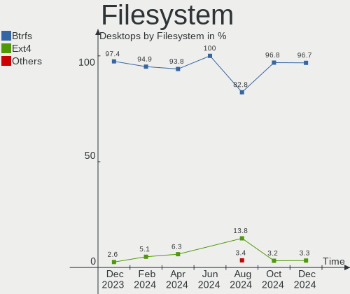
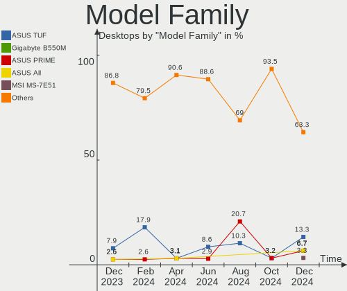
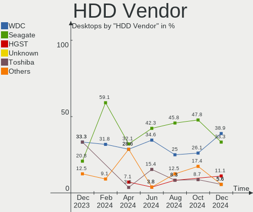
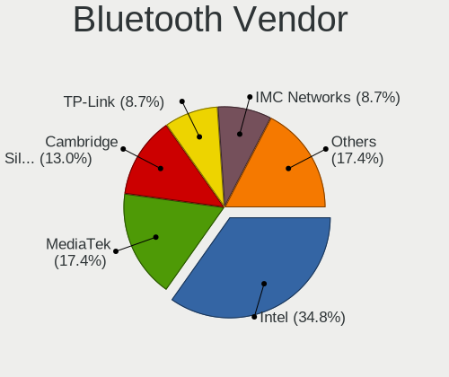

Nobara - Hardware Trends (Desktops)
-----------------------------------

A project to identify most popular hardware characteristics and track their change
over time based on data collected by Linux users at https://Linux-Hardware.org.

Anyone can contribute to this report by the [hw-probe](https://github.com/linuxhw/hw-probe) tool:

    sudo -E hw-probe -all -upload

This report is for one last month. Overall report since the beginning of time: [TestDays](https://github.com/linuxhw/TestDays)

Period: May, 2023.

Contents
--------

* [ System ](#system)
  - [ OS                       ](#os)
  - [ OS Family                ](#os-family)
  - [ Kernel                   ](#kernel)
  - [ Kernel Family            ](#kernel-family)
  - [ Kernel Major Ver.        ](#kernel-major-ver)
  - [ Arch                     ](#arch)
  - [ DE                       ](#de)
  - [ Display Server           ](#display-server)
  - [ Display Manager          ](#display-manager)
  - [ OS Lang                  ](#os-lang)
  - [ Boot Mode                ](#boot-mode)
  - [ Filesystem               ](#filesystem)
  - [ Part. scheme             ](#part-scheme)
  - [ Dual Boot with Linux/BSD ](#dual-boot-with-linuxbsd)
  - [ Dual Boot (Win)          ](#dual-boot-win)

* [ Board ](#board)
  - [ Vendor                   ](#vendor)
  - [ Model                    ](#model)
  - [ Model Family             ](#model-family)
  - [ MFG Year                 ](#mfg-year)
  - [ Form Factor              ](#form-factor)
  - [ Secure Boot              ](#secure-boot)
  - [ Coreboot                 ](#coreboot)
  - [ RAM Size                 ](#ram-size)
  - [ RAM Used                 ](#ram-used)
  - [ Total Drives             ](#total-drives)
  - [ Has CD-ROM               ](#has-cd-rom)
  - [ Has Ethernet             ](#has-ethernet)
  - [ Has WiFi                 ](#has-wifi)
  - [ Has Bluetooth            ](#has-bluetooth)

* [ Location ](#location)
  - [ Country                  ](#country)
  - [ City                     ](#city)

* [ Drives ](#drives)
  - [ Drive Vendor             ](#drive-vendor)
  - [ Drive Model              ](#drive-model)
  - [ HDD Vendor               ](#hdd-vendor)
  - [ SSD Vendor               ](#ssd-vendor)
  - [ Drive Kind               ](#drive-kind)
  - [ Drive Connector          ](#drive-connector)
  - [ Drive Size               ](#drive-size)
  - [ Space Total              ](#space-total)
  - [ Space Used               ](#space-used)
  - [ Malfunc. Drives          ](#malfunc-drives)
  - [ Malfunc. Drive Vendor    ](#malfunc-drive-vendor)
  - [ Malfunc. HDD Vendor      ](#malfunc-hdd-vendor)
  - [ Malfunc. Drive Kind      ](#malfunc-drive-kind)
  - [ Failed Drives            ](#failed-drives)
  - [ Failed Drive Vendor      ](#failed-drive-vendor)
  - [ Drive Status             ](#drive-status)

* [ Storage controller ](#storage-controller)
  - [ Storage Vendor           ](#storage-vendor)
  - [ Storage Model            ](#storage-model)
  - [ Storage Kind             ](#storage-kind)

* [ Processor ](#processor)
  - [ CPU Vendor               ](#cpu-vendor)
  - [ CPU Model                ](#cpu-model)
  - [ CPU Model Family         ](#cpu-model-family)
  - [ CPU Cores                ](#cpu-cores)
  - [ CPU Sockets              ](#cpu-sockets)
  - [ CPU Threads              ](#cpu-threads)
  - [ CPU Op-Modes             ](#cpu-op-modes)
  - [ CPU Microcode            ](#cpu-microcode)
  - [ CPU Microarch            ](#cpu-microarch)

* [ Graphics ](#graphics)
  - [ GPU Vendor               ](#gpu-vendor)
  - [ GPU Model                ](#gpu-model)
  - [ GPU Combo                ](#gpu-combo)
  - [ GPU Driver               ](#gpu-driver)
  - [ GPU Memory               ](#gpu-memory)

* [ Monitor ](#monitor)
  - [ Monitor Vendor           ](#monitor-vendor)
  - [ Monitor Model            ](#monitor-model)
  - [ Monitor Resolution       ](#monitor-resolution)
  - [ Monitor Diagonal         ](#monitor-diagonal)
  - [ Monitor Width            ](#monitor-width)
  - [ Aspect Ratio             ](#aspect-ratio)
  - [ Monitor Area             ](#monitor-area)
  - [ Pixel Density            ](#pixel-density)
  - [ Multiple Monitors        ](#multiple-monitors)

* [ Network ](#network)
  - [ Net Controller Vendor    ](#net-controller-vendor)
  - [ Net Controller Model     ](#net-controller-model)
  - [ Wireless Vendor          ](#wireless-vendor)
  - [ Wireless Model           ](#wireless-model)
  - [ Ethernet Vendor          ](#ethernet-vendor)
  - [ Ethernet Model           ](#ethernet-model)
  - [ Net Controller Kind      ](#net-controller-kind)
  - [ Used Controller          ](#used-controller)
  - [ NICs                     ](#nics)
  - [ IPv6                     ](#ipv6)

* [ Bluetooth ](#bluetooth)
  - [ Bluetooth Vendor         ](#bluetooth-vendor)
  - [ Bluetooth Model          ](#bluetooth-model)

* [ Sound ](#sound)
  - [ Sound Vendor             ](#sound-vendor)
  - [ Sound Model              ](#sound-model)

* [ Memory ](#memory)
  - [ Memory Vendor            ](#memory-vendor)
  - [ Memory Model             ](#memory-model)
  - [ Memory Kind              ](#memory-kind)
  - [ Memory Form Factor       ](#memory-form-factor)
  - [ Memory Size              ](#memory-size)
  - [ Memory Speed             ](#memory-speed)

* [ Printers & scanners ](#printers--scanners)
  - [ Printer Vendor           ](#printer-vendor)
  - [ Printer Model            ](#printer-model)
  - [ Scanner Vendor           ](#scanner-vendor)
  - [ Scanner Model            ](#scanner-model)

* [ Camera ](#camera)
  - [ Camera Vendor            ](#camera-vendor)
  - [ Camera Model             ](#camera-model)

* [ Security ](#security)
  - [ Fingerprint Vendor       ](#fingerprint-vendor)
  - [ Fingerprint Model        ](#fingerprint-model)
  - [ Chipcard Vendor          ](#chipcard-vendor)
  - [ Chipcard Model           ](#chipcard-model)

* [ Unsupported ](#unsupported)
  - [ Unsupported Devices      ](#unsupported-devices)
  - [ Unsupported Device Types ](#unsupported-device-types)

System
------

OS
--

Installed operating systems

| Name      | Desktops | Percent |
|-----------|----------|---------|
| Nobara 37 | 25       | 89.29%  |
| Nobara 36 | 3        | 10.71%  |

OS Family
---------

OS without a version

| Name   | Desktops | Percent |
|--------|----------|---------|
| Nobara | 28       | 100%    |

Kernel
------

Version of the Linux kernel

| Version                       | Desktops | Percent |
|-------------------------------|----------|---------|
| 6.2.14-300.fsync.fc37.x86_64  | 18       | 64.29%  |
| 6.2.12-200.fsync.fc37.x86_64  | 7        | 25%     |
| 6.0.14-201.fsync.fc36.x86_64  | 2        | 7.14%   |
| 5.19.14-201.fsync.fc36.x86_64 | 1        | 3.57%   |

Kernel Family
-------------

Linux kernel without a distro release

| Version | Desktops | Percent |
|---------|----------|---------|
| 6.2.14  | 18       | 64.29%  |
| 6.2.12  | 7        | 25%     |
| 6.0.14  | 2        | 7.14%   |
| 5.19.14 | 1        | 3.57%   |

Kernel Major Ver.
-----------------

Linux kernel major version

| Version | Desktops | Percent |
|---------|----------|---------|
| 6.2     | 25       | 89.29%  |
| 6.0     | 2        | 7.14%   |
| 5.19    | 1        | 3.57%   |

Arch
----

OS architecture (x86_64, i586, etc.)

| Name   | Desktops | Percent |
|--------|----------|---------|
| x86_64 | 28       | 100%    |

DE
--

Desktop Environment

| Name  | Desktops | Percent |
|-------|----------|---------|
| GNOME | 16       | 57.14%  |
| KDE5  | 11       | 39.29%  |
| sway  | 1        | 3.57%   |

Display Server
--------------

X11 or Wayland

| Name    | Desktops | Percent |
|---------|----------|---------|
| Wayland | 23       | 82.14%  |
| X11     | 5        | 17.86%  |

Display Manager
---------------

SDDM, LightDM, etc.

| Name    | Desktops | Percent |
|---------|----------|---------|
| Unknown | 21       | 75%     |
| SDDM    | 4        | 14.29%  |
| GDM     | 3        | 10.71%  |

OS Lang
-------

Language

| Lang  | Desktops | Percent |
|-------|----------|---------|
| en_US | 16       | 57.14%  |
| de_DE | 5        | 17.86%  |
| es_MX | 3        | 10.71%  |
| pl_PL | 1        | 3.57%   |
| es_ES | 1        | 3.57%   |
| en_NZ | 1        | 3.57%   |
| en_GB | 1        | 3.57%   |

Boot Mode
---------

EFI or BIOS

| Mode | Desktops | Percent |
|------|----------|---------|
| EFI  | 23       | 82.14%  |
| BIOS | 5        | 17.86%  |

Filesystem
----------

Type of filesystem

| Type  | Desktops | Percent |
|-------|----------|---------|
| Btrfs | 25       | 89.29%  |
| Ext4  | 3        | 10.71%  |

Part. scheme
------------

Scheme of partitioning

| Type    | Desktops | Percent |
|---------|----------|---------|
| Unknown | 21       | 75%     |
| GPT     | 7        | 25%     |

Dual Boot with Linux/BSD
------------------------

Hosting more than one Linux/BSD

| Dual boot | Desktops | Percent |
|-----------|----------|---------|
| No        | 27       | 96.43%  |
| Yes       | 1        | 3.57%   |

Dual Boot (Win)
---------------

Hosting Linux and Windows

| Dual boot | Desktops | Percent |
|-----------|----------|---------|
| No        | 24       | 85.71%  |
| Yes       | 4        | 14.29%  |

Board
-----

Vendor
------

Motherboard manufacturer

| Name                                 | Desktops | Percent |
|--------------------------------------|----------|---------|
| ASUSTek Computer                     | 10       | 35.71%  |
| Gigabyte Technology                  | 5        | 17.86%  |
| MSI                                  | 4        | 14.29%  |
| ASRock                               | 4        | 14.29%  |
| Shenzhen Meigao Electronic Equipment | 1        | 3.57%   |
| langchao                             | 1        | 3.57%   |
| Hewlett-Packard                      | 1        | 3.57%   |
| Dell                                 | 1        | 3.57%   |
| AOpen                                | 1        | 3.57%   |

Model
-----

Motherboard model

| Name                                       | Desktops | Percent |
|--------------------------------------------|----------|---------|
| MSI MS-7D25                                | 2        | 7.14%   |
| ASUS All Series                            | 2        | 7.14%   |
| Shenzhen Meigao Electronic Equipment UM690 | 1        | 3.57%   |
| MSI MS-7B86                                | 1        | 3.57%   |
| MSI MS-7B79                                | 1        | 3.57%   |
| langchao 12345                             | 1        | 3.57%   |
| HP Compaq 6200 Pro SFF PC                  | 1        | 3.57%   |
| Gigabyte X570S AORUS ELITE AX              | 1        | 3.57%   |
| Gigabyte P43-ES3G                          | 1        | 3.57%   |
| Gigabyte GA-78LMT-S2P                      | 1        | 3.57%   |
| Gigabyte B550I AORUS PRO AX                | 1        | 3.57%   |
| Gigabyte B550 GAMING X V2                  | 1        | 3.57%   |
| Dell OptiPlex 790                          | 1        | 3.57%   |
| ASUS TUF Gaming B560M-PLUS                 | 1        | 3.57%   |
| ASUS TUF Gaming B550M-PLUS WIFI II         | 1        | 3.57%   |
| ASUS TUF B450M-PRO GAMING                  | 1        | 3.57%   |
| ASUS ROG STRIX B650E-I GAMING WIFI         | 1        | 3.57%   |
| ASUS ROG STRIX B650E-F GAMING WIFI         | 1        | 3.57%   |
| ASUS ROG STRIX B550-F GAMING               | 1        | 3.57%   |
| ASUS PRIME X670-P WIFI                     | 1        | 3.57%   |
| ASUS P8B75-M LE                            | 1        | 3.57%   |
| ASRock Z97 Pro3                            | 1        | 3.57%   |
| ASRock B650E Steel Legend WiFi             | 1        | 3.57%   |
| ASRock B550 Phantom Gaming-ITX/ax          | 1        | 3.57%   |
| ASRock AB350M Pro4                         | 1        | 3.57%   |
| AOpen DEX5350                              | 1        | 3.57%   |

Model Family
------------

Motherboard model prefix

| Name                                       | Desktops | Percent |
|--------------------------------------------|----------|---------|
| ASUS TUF                                   | 3        | 10.71%  |
| ASUS ROG                                   | 3        | 10.71%  |
| MSI MS-7D25                                | 2        | 7.14%   |
| ASUS All                                   | 2        | 7.14%   |
| Shenzhen Meigao Electronic Equipment UM690 | 1        | 3.57%   |
| MSI MS-7B86                                | 1        | 3.57%   |
| MSI MS-7B79                                | 1        | 3.57%   |
| langchao 12345                             | 1        | 3.57%   |
| HP Compaq                                  | 1        | 3.57%   |
| Gigabyte X570S                             | 1        | 3.57%   |
| Gigabyte P43-ES3G                          | 1        | 3.57%   |
| Gigabyte GA-78LMT-S2P                      | 1        | 3.57%   |
| Gigabyte B550I                             | 1        | 3.57%   |
| Gigabyte B550                              | 1        | 3.57%   |
| Dell OptiPlex                              | 1        | 3.57%   |
| ASUS PRIME                                 | 1        | 3.57%   |
| ASUS P8B75-M                               | 1        | 3.57%   |
| ASRock Z97                                 | 1        | 3.57%   |
| ASRock B650E                               | 1        | 3.57%   |
| ASRock B550                                | 1        | 3.57%   |
| ASRock AB350M                              | 1        | 3.57%   |
| AOpen DEX5350                              | 1        | 3.57%   |

MFG Year
--------

Motherboard manufacture year

| Year | Desktops | Percent |
|------|----------|---------|
| 2021 | 5        | 17.86%  |
| 2022 | 4        | 14.29%  |
| 2020 | 4        | 14.29%  |
| 2011 | 3        | 10.71%  |
| 2019 | 2        | 7.14%   |
| 2013 | 2        | 7.14%   |
| 2023 | 1        | 3.57%   |
| 2018 | 1        | 3.57%   |
| 2017 | 1        | 3.57%   |
| 2016 | 1        | 3.57%   |
| 2015 | 1        | 3.57%   |
| 2012 | 1        | 3.57%   |
| 2010 | 1        | 3.57%   |
| 2009 | 1        | 3.57%   |

Form Factor
-----------

Physical design of the computer

| Name    | Desktops | Percent |
|---------|----------|---------|
| Desktop | 28       | 100%    |

Secure Boot
-----------

Enabled or disabled

| State    | Desktops | Percent |
|----------|----------|---------|
| Disabled | 28       | 100%    |

Coreboot
--------

Have coreboot on board

| Used | Desktops | Percent |
|------|----------|---------|
| No   | 28       | 100%    |

RAM Size
--------

Total RAM memory

| Size in GB  | Desktops | Percent |
|-------------|----------|---------|
| 16.01-24.0  | 8        | 28.57%  |
| 32.01-64.0  | 5        | 17.86%  |
| 24.01-32.0  | 5        | 17.86%  |
| 8.01-16.0   | 4        | 14.29%  |
| 3.01-4.0    | 3        | 10.71%  |
| 64.01-256.0 | 2        | 7.14%   |
| 4.01-8.0    | 1        | 3.57%   |

RAM Used
--------

Used RAM memory

| Used GB    | Desktops | Percent |
|------------|----------|---------|
| 4.01-8.0   | 9        | 32.14%  |
| 2.01-3.0   | 8        | 28.57%  |
| 3.01-4.0   | 5        | 17.86%  |
| 1.01-2.0   | 3        | 10.71%  |
| 8.01-16.0  | 2        | 7.14%   |
| 16.01-24.0 | 1        | 3.57%   |

Total Drives
------------

Number of drives on board

| Drives | Desktops | Percent |
|--------|----------|---------|
| 2      | 12       | 42.86%  |
| 1      | 7        | 25%     |
| 4      | 3        | 10.71%  |
| 3      | 3        | 10.71%  |
| 6      | 2        | 7.14%   |
| 9      | 1        | 3.57%   |

Has CD-ROM
----------

Has CD-ROM on board

| Presented | Desktops | Percent |
|-----------|----------|---------|
| No        | 25       | 89.29%  |
| Yes       | 3        | 10.71%  |

Has Ethernet
------------

Has Ethernet on board

| Presented | Desktops | Percent |
|-----------|----------|---------|
| Yes       | 28       | 100%    |

Has WiFi
--------

Has WiFi module

| Presented | Desktops | Percent |
|-----------|----------|---------|
| Yes       | 15       | 53.57%  |
| No        | 13       | 46.43%  |

Has Bluetooth
-------------

Has Bluetooth module

| Presented | Desktops | Percent |
|-----------|----------|---------|
| No        | 17       | 60.71%  |
| Yes       | 11       | 39.29%  |

Location
--------

Country
-------

Geographic location (country)

| Country      | Desktops | Percent |
|--------------|----------|---------|
| USA          | 10       | 35.71%  |
| Germany      | 5        | 17.86%  |
| Mexico       | 2        | 7.14%   |
| Venezuela    | 1        | 3.57%   |
| UK           | 1        | 3.57%   |
| Switzerland  | 1        | 3.57%   |
| Sweden       | 1        | 3.57%   |
| Spain        | 1        | 3.57%   |
| Saudi Arabia | 1        | 3.57%   |
| Poland       | 1        | 3.57%   |
| New Zealand  | 1        | 3.57%   |
| France       | 1        | 3.57%   |
| Croatia      | 1        | 3.57%   |
| Brazil       | 1        | 3.57%   |

City
----

Geographic location (city)

| City              | Desktops | Percent |
|-------------------|----------|---------|
| Zurich            | 1        | 3.57%   |
| Wassenberg        | 1        | 3.57%   |
| Vancouver         | 1        | 3.57%   |
| St Louis          | 1        | 3.57%   |
| Spartanburg       | 1        | 3.57%   |
| Seclin            | 1        | 3.57%   |
| Riverside         | 1        | 3.57%   |
| Pine Bush         | 1        | 3.57%   |
| Omaha             | 1        | 3.57%   |
| Mexicali          | 1        | 3.57%   |
| Makkah            | 1        | 3.57%   |
| Lublin            | 1        | 3.57%   |
| Lichtenau         | 1        | 3.57%   |
| Las Vegas         | 1        | 3.57%   |
| Lake Elsinore     | 1        | 3.57%   |
| Indianapolis      | 1        | 3.57%   |
| Herzogenaurach    | 1        | 3.57%   |
| Guadalajara       | 1        | 3.57%   |
| Granada           | 1        | 3.57%   |
| Gothenburg        | 1        | 3.57%   |
| Goiânia          | 1        | 3.57%   |
| Frankfurt am Main | 1        | 3.57%   |
| Everett           | 1        | 3.57%   |
| County of Zagreb  | 1        | 3.57%   |
| Chelmsford        | 1        | 3.57%   |
| Berlin            | 1        | 3.57%   |
| Auckland          | 1        | 3.57%   |
| Araure            | 1        | 3.57%   |

Drives
------

Drive Vendor
------------

Hard drive vendors

| Vendor                      | Desktops | Drives | Percent |
|-----------------------------|----------|--------|---------|
| Samsung Electronics         | 12       | 15     | 19.05%  |
| Seagate                     | 8        | 10     | 12.7%   |
| WDC                         | 5        | 5      | 7.94%   |
| Crucial                     | 5        | 8      | 7.94%   |
| Toshiba                     | 3        | 3      | 4.76%   |
| Kingston                    | 3        | 3      | 4.76%   |
| Sandisk                     | 2        | 2      | 3.17%   |
| PNY                         | 2        | 2      | 3.17%   |
| Micron/Crucial Technology   | 2        | 3      | 3.17%   |
| Intel                       | 2        | 2      | 3.17%   |
| Hitachi                     | 2        | 3      | 3.17%   |
| HGST                        | 2        | 2      | 3.17%   |
| Unknown                     | 1        | 1      | 1.59%   |
| Team                        | 1        | 1      | 1.59%   |
| SPCC                        | 1        | 1      | 1.59%   |
| Silicon Motion              | 1        | 1      | 1.59%   |
| SD                          | 1        | 1      | 1.59%   |
| Ramaxel Technology          | 1        | 1      | 1.59%   |
| Phison Electronics          | 1        | 1      | 1.59%   |
| PCIe SSD                    | 1        | 1      | 1.59%   |
| Micron Technology           | 1        | 1      | 1.59%   |
| KIOXIA-EXCERIA              | 1        | 1      | 1.59%   |
| Kingston Technology Company | 1        | 1      | 1.59%   |
| Intenso                     | 1        | 1      | 1.59%   |
| Corsair                     | 1        | 1      | 1.59%   |
| China                       | 1        | 1      | 1.59%   |
| ASMT                        | 1        | 1      | 1.59%   |

Drive Model
-----------

Hard drive models

| Model                                               | Desktops | Percent |
|-----------------------------------------------------|----------|---------|
| Samsung NVMe SSD Controller SM981/PM981/PM983 256GB | 3        | 4.48%   |
| Crucial CT240BX500SSD1 240GB                        | 2        | 2.99%   |
| WDC WDS500G2B0A-00SM50 500GB SSD                    | 1        | 1.49%   |
| WDC WDS120G2G0A-00JH30 120GB SSD                    | 1        | 1.49%   |
| WDC WD5000AAKS-75A7B0 500GB                         | 1        | 1.49%   |
| WDC WD10EZRX-00A8LB0 1TB                            | 1        | 1.49%   |
| WDC WD1002FAEX-00Z3A0 1TB                           | 1        | 1.49%   |
| Unknown USB DISK 3.2 2TB                            | 1        | 1.49%   |
| Toshiba TR200 240GB SSD                             | 1        | 1.49%   |
| Toshiba HDWD110 1TB                                 | 1        | 1.49%   |
| Toshiba DT01ACA200 2TB                              | 1        | 1.49%   |
| Team T253X2001T 1024GB SSD                          | 1        | 1.49%   |
| SPCC Solid State Disk 240GB                         | 1        | 1.49%   |
| Silicon Motion SM2263EN/SM2263XT SSD Controller 1TB | 1        | 1.49%   |
| Seagate ST500DM002-1BD142 500GB                     | 1        | 1.49%   |
| Seagate ST3500413AS 500GB                           | 1        | 1.49%   |
| Seagate ST32000644NS 2TB                            | 1        | 1.49%   |
| Seagate ST250LM004 HN-M250MBB 250GB                 | 1        | 1.49%   |
| Seagate ST250DM000-1BD141 250GB                     | 1        | 1.49%   |
| Seagate ST1000VM002-1CT162 1TB                      | 1        | 1.49%   |
| Seagate ST1000LM024 HN-M101MBB 1TB                  | 1        | 1.49%   |
| Seagate ST1000DM003-1CH162 1TB                      | 1        | 1.49%   |
| Seagate FireCuda 520 SSD ZP1000GM30002 1TB          | 1        | 1.49%   |
| SD Ultra 3D 500GB SSD                               | 1        | 1.49%   |
| Sandisk WD_BLACK SN850X 1000GB                      | 1        | 1.49%   |
| Sandisk WD_BLACK SN770 2TB                          | 1        | 1.49%   |
| Samsung SSD 990 PRO 2TB                             | 1        | 1.49%   |
| Samsung SSD 980 PRO 1TB                             | 1        | 1.49%   |
| Samsung SSD 980 1TB                                 | 1        | 1.49%   |
| Samsung SSD 870 QVO 1TB                             | 1        | 1.49%   |
| Samsung SSD 870 EVO 4TB                             | 1        | 1.49%   |
| Samsung SSD 860 EVO 1TB                             | 1        | 1.49%   |
| Samsung SSD 840 EVO 250GB                           | 1        | 1.49%   |
| Samsung PSSD T7 Shield 2TB                          | 1        | 1.49%   |
| Samsung NVMe SSD Controller PM9A1/PM9A3/980PRO 1TB  | 1        | 1.49%   |
| Samsung MZVL2512HCJQ-00BL7 512GB                    | 1        | 1.49%   |
| Samsung HD502HJ 500GB                               | 1        | 1.49%   |
| Ramaxel RTNTE256PCA8EADL 256GB SSD                  | 1        | 1.49%   |
| PNY SSD2SC240G1CS1754D117-820 240GB                 | 1        | 1.49%   |
| PNY CS900 250GB SSD                                 | 1        | 1.49%   |

HDD Vendor
----------

Hard disk drive vendors

| Vendor              | Desktops | Drives | Percent |
|---------------------|----------|--------|---------|
| Seagate             | 7        | 9      | 41.18%  |
| WDC                 | 3        | 3      | 17.65%  |
| Toshiba             | 2        | 2      | 11.76%  |
| Hitachi             | 2        | 3      | 11.76%  |
| HGST                | 2        | 2      | 11.76%  |
| Samsung Electronics | 1        | 1      | 5.88%   |

SSD Vendor
----------

Solid state drive vendors

| Vendor              | Desktops | Drives | Percent |
|---------------------|----------|--------|---------|
| Samsung Electronics | 5        | 5      | 19.23%  |
| Crucial             | 5        | 8      | 19.23%  |
| WDC                 | 2        | 2      | 7.69%   |
| PNY                 | 2        | 2      | 7.69%   |
| Toshiba             | 1        | 1      | 3.85%   |
| Team                | 1        | 1      | 3.85%   |
| SPCC                | 1        | 1      | 3.85%   |
| SD                  | 1        | 1      | 3.85%   |
| Ramaxel Technology  | 1        | 1      | 3.85%   |
| Micron Technology   | 1        | 1      | 3.85%   |
| KIOXIA-EXCERIA      | 1        | 1      | 3.85%   |
| Kingston            | 1        | 1      | 3.85%   |
| Intenso             | 1        | 1      | 3.85%   |
| Intel               | 1        | 1      | 3.85%   |
| China               | 1        | 1      | 3.85%   |
| ASMT                | 1        | 1      | 3.85%   |

Drive Kind
----------

HDD or SSD

| Kind    | Desktops | Drives | Percent |
|---------|----------|--------|---------|
| SSD     | 18       | 29     | 38.3%   |
| NVMe    | 15       | 22     | 31.91%  |
| HDD     | 12       | 20     | 25.53%  |
| Unknown | 2        | 2      | 4.26%   |

Drive Connector
---------------

SATA, SAS, NVMe, etc.

| Type | Desktops | Drives | Percent |
|------|----------|--------|---------|
| SATA | 21       | 47     | 52.5%   |
| NVMe | 15       | 22     | 37.5%   |
| SAS  | 4        | 4      | 10%     |

Drive Size
----------

Size of hard drive

| Size in TB | Desktops | Drives | Percent |
|------------|----------|--------|---------|
| 0.01-0.5   | 16       | 33     | 53.33%  |
| 0.51-1.0   | 8        | 10     | 26.67%  |
| 1.01-2.0   | 4        | 4      | 13.33%  |
| 3.01-4.0   | 1        | 1      | 3.33%   |
| 4.01-10.0  | 1        | 1      | 3.33%   |

Space Total
-----------

Amount of disk space available on the file system

| Size in GB     | Desktops | Percent |
|----------------|----------|---------|
| 501-1000       | 7        | 25%     |
| 251-500        | 6        | 21.43%  |
| More than 3000 | 5        | 17.86%  |
| 1001-2000      | 4        | 14.29%  |
| 101-250        | 3        | 10.71%  |
| 2001-3000      | 2        | 7.14%   |
| 51-100         | 1        | 3.57%   |

Space Used
----------

Amount of used disk space

| Used GB        | Desktops | Percent |
|----------------|----------|---------|
| 51-100         | 7        | 25%     |
| 1-20           | 5        | 17.86%  |
| 101-250        | 4        | 14.29%  |
| 251-500        | 3        | 10.71%  |
| 21-50          | 3        | 10.71%  |
| 2001-3000      | 2        | 7.14%   |
| 501-1000       | 2        | 7.14%   |
| More than 3000 | 1        | 3.57%   |
| 1001-2000      | 1        | 3.57%   |

Malfunc. Drives
---------------

Drive models with a malfunction

Zero info for selected period =(

Malfunc. Drive Vendor
---------------------

Vendors of faulty drives

Zero info for selected period =(

Malfunc. HDD Vendor
-------------------

Vendors of faulty HDD drives

Zero info for selected period =(

Malfunc. Drive Kind
-------------------

Kinds of faulty drives

Zero info for selected period =(

Failed Drives
-------------

Failed drive models

Zero info for selected period =(

Failed Drive Vendor
-------------------

Failed drive vendors

Zero info for selected period =(

Drive Status
------------

Number of failed and malfunc. drives

| Status   | Desktops | Drives | Percent |
|----------|----------|--------|---------|
| Detected | 22       | 55     | 78.57%  |
| Works    | 6        | 18     | 21.43%  |

Storage controller
------------------

Storage Vendor
--------------

Storage controller vendors

| Vendor                      | Desktops | Percent |
|-----------------------------|----------|---------|
| AMD                         | 15       | 30.61%  |
| Intel                       | 13       | 26.53%  |
| Samsung Electronics         | 8        | 16.33%  |
| Kingston Technology Company | 3        | 6.12%   |
| Sandisk                     | 2        | 4.08%   |
| Phison Electronics          | 2        | 4.08%   |
| Micron/Crucial Technology   | 2        | 4.08%   |
| Silicon Motion              | 1        | 2.04%   |
| Seagate Technology          | 1        | 2.04%   |
| Broadcom / LSI              | 1        | 2.04%   |
| ASMedia Technology          | 1        | 2.04%   |

Storage Model
-------------

Storage controller models

| Model                                                                          | Desktops | Percent |
|--------------------------------------------------------------------------------|----------|---------|
| AMD FCH SATA Controller [AHCI mode]                                            | 9        | 16.36%  |
| AMD 500 Series Chipset SATA Controller                                         | 5        | 9.09%   |
| Samsung NVMe SSD Controller SM981/PM981/PM983                                  | 3        | 5.45%   |
| Samsung NVMe SSD Controller PM9A1/PM9A3/980PRO                                 | 3        | 5.45%   |
| AMD 400 Series Chipset SATA Controller                                         | 3        | 5.45%   |
| Kingston Company Company Non-Volatile memory controller                        | 2        | 3.64%   |
| Intel Alder Lake-S PCH SATA Controller [AHCI Mode]                             | 2        | 3.64%   |
| Intel 8 Series/C220 Series Chipset Family 6-port SATA Controller 1 [AHCI mode] | 2        | 3.64%   |
| Intel 6 Series/C200 Series Chipset Family 6 port Desktop SATA AHCI Controller  | 2        | 3.64%   |
| Silicon Motion SM2263EN/SM2263XT SSD Controller                                | 1        | 1.82%   |
| Seagate FireCuda 520 SSD                                                       | 1        | 1.82%   |
| Sandisk Western Digital WD Black SN850X NVMe SSD                               | 1        | 1.82%   |
| SanDisk WD Black SN770 NVMe SSD                                                | 1        | 1.82%   |
| Samsung NVMe SSD Controller 980                                                | 1        | 1.82%   |
| Samsung Electronics Non-Volatile memory controller                             | 1        | 1.82%   |
| Phison E16 PCIe4 NVMe Controller                                               | 1        | 1.82%   |
| Phison E12 NVMe Controller                                                     | 1        | 1.82%   |
| Micron/Crucial P5 Plus NVMe PCIe SSD                                           | 1        | 1.82%   |
| Micron/Crucial P2 NVMe PCIe SSD                                                | 1        | 1.82%   |
| Kingston Company NVMe Controller                                               | 1        | 1.82%   |
| Intel Wildcat Point-LP SATA Controller [AHCI Mode]                             | 1        | 1.82%   |
| Intel SSD 665p Series                                                          | 1        | 1.82%   |
| Intel SATA Controller [RAID mode]                                              | 1        | 1.82%   |
| Intel NM10/ICH7 Family SATA Controller [IDE mode]                              | 1        | 1.82%   |
| Intel 82801JI (ICH10 Family) SATA AHCI Controller                              | 1        | 1.82%   |
| Intel 82801G (ICH7 Family) IDE Controller                                      | 1        | 1.82%   |
| Intel 7 Series/C210 Series Chipset Family 6-port SATA Controller [AHCI mode]   | 1        | 1.82%   |
| Intel 500 Series Chipset Family SATA AHCI Controller                           | 1        | 1.82%   |
| Broadcom / LSI SAS3008 PCI-Express Fusion-MPT SAS-3                            | 1        | 1.82%   |
| ASMedia ASM1062 Serial ATA Controller                                          | 1        | 1.82%   |
| AMD SB7x0/SB8x0/SB9x0 SATA Controller [IDE mode]                               | 1        | 1.82%   |
| AMD SB7x0/SB8x0/SB9x0 IDE Controller                                           | 1        | 1.82%   |
| AMD 300 Series Chipset SATA Controller                                         | 1        | 1.82%   |

Storage Kind
------------

Kind of storage controller (IDE, SATA, NVMe, SAS, ...)

| Kind | Desktops | Percent |
|------|----------|---------|
| SATA | 25       | 56.82%  |
| NVMe | 15       | 34.09%  |
| IDE  | 2        | 4.55%   |
| RAID | 1        | 2.27%   |
| SAS  | 1        | 2.27%   |

Processor
---------

CPU Vendor
----------

Processor vendors

| Vendor | Desktops | Percent |
|--------|----------|---------|
| AMD    | 16       | 57.14%  |
| Intel  | 12       | 42.86%  |

CPU Model
---------

Processor models

| Model                                       | Desktops | Percent |
|---------------------------------------------|----------|---------|
| Intel Core i7-4790K CPU @ 4.00GHz           | 2        | 7.14%   |
| AMD Ryzen 5 5600X 6-Core Processor          | 2        | 7.14%   |
| Intel Xeon CPU X5460 @ 3.16GHz              | 1        | 3.57%   |
| Intel Pentium Dual-Core CPU E5300 @ 2.60GHz | 1        | 3.57%   |
| Intel Core i5-4460 CPU @ 3.20GHz            | 1        | 3.57%   |
| Intel Core i5-3330 CPU @ 3.00GHz            | 1        | 3.57%   |
| Intel Core i5-2500 CPU @ 3.30GHz            | 1        | 3.57%   |
| Intel Core i5-2400 CPU @ 3.10GHz            | 1        | 3.57%   |
| Intel Core i3-5010U CPU @ 2.10GHz           | 1        | 3.57%   |
| Intel 12th Gen Core i9-12900KF              | 1        | 3.57%   |
| Intel 12th Gen Core i5-12600K               | 1        | 3.57%   |
| Intel 11th Gen Core i5-11400 @ 2.60GHz      | 1        | 3.57%   |
| AMD Ryzen 9 7950X 16-Core Processor         | 1        | 3.57%   |
| AMD Ryzen 9 6900HX with Radeon Graphics     | 1        | 3.57%   |
| AMD Ryzen 7 7800X3D 8-Core Processor        | 1        | 3.57%   |
| AMD Ryzen 7 7700X 8-Core Processor          | 1        | 3.57%   |
| AMD Ryzen 7 5800X3D 8-Core Processor        | 1        | 3.57%   |
| AMD Ryzen 7 5800X 8-Core Processor          | 1        | 3.57%   |
| AMD Ryzen 7 5700X 8-Core Processor          | 1        | 3.57%   |
| AMD Ryzen 5 7600X 6-Core Processor          | 1        | 3.57%   |
| AMD Ryzen 5 5600G with Radeon Graphics      | 1        | 3.57%   |
| AMD Ryzen 5 5500                            | 1        | 3.57%   |
| AMD Ryzen 5 2600 Six-Core Processor         | 1        | 3.57%   |
| AMD Ryzen 5 1600 Six-Core Processor         | 1        | 3.57%   |
| AMD Ryzen 3 2200G with Radeon Vega Graphics | 1        | 3.57%   |
| AMD Phenom II X6 1045T Processor            | 1        | 3.57%   |

CPU Model Family
----------------

Processor model prefix

| Model                   | Desktops | Percent |
|-------------------------|----------|---------|
| AMD Ryzen 5             | 7        | 25%     |
| AMD Ryzen 7             | 5        | 17.86%  |
| Intel Core i5           | 4        | 14.29%  |
| Other                   | 3        | 10.71%  |
| Intel Core i7           | 2        | 7.14%   |
| AMD Ryzen 9             | 2        | 7.14%   |
| Intel Xeon              | 1        | 3.57%   |
| Intel Pentium Dual-Core | 1        | 3.57%   |
| Intel Core i3           | 1        | 3.57%   |
| AMD Ryzen 3             | 1        | 3.57%   |
| AMD Phenom II X6        | 1        | 3.57%   |

CPU Cores
---------

Number of processor cores

| Number | Desktops | Percent |
|--------|----------|---------|
| 6      | 9        | 32.14%  |
| 4      | 8        | 28.57%  |
| 8      | 6        | 21.43%  |
| 16     | 2        | 7.14%   |
| 2      | 2        | 7.14%   |
| 10     | 1        | 3.57%   |

CPU Sockets
-----------

Number of sockets

| Number | Desktops | Percent |
|--------|----------|---------|
| 1      | 28       | 100%    |

CPU Threads
-----------

Threads per core (Hyper-Threading)

| Number | Desktops | Percent |
|--------|----------|---------|
| 2      | 19       | 67.86%  |
| 1      | 9        | 32.14%  |

CPU Op-Modes
------------

CPU Operation Modes (32-bit, 64-bit)

| Op mode        | Desktops | Percent |
|----------------|----------|---------|
| 32-bit, 64-bit | 28       | 100%    |

CPU Microcode
-------------

Microcode number

| Number     | Desktops | Percent |
|------------|----------|---------|
| Unknown    | 11       | 39.29%  |
| 0x0a601203 | 4        | 14.29%  |
| 0x0a50000d | 2        | 7.14%   |
| 0x0a201016 | 2        | 7.14%   |
| 0x0800820d | 2        | 7.14%   |
| 0x306a9    | 1        | 3.57%   |
| 0x0a404102 | 1        | 3.57%   |
| 0x0a20120a | 1        | 3.57%   |
| 0x0a201204 | 1        | 3.57%   |
| 0x0a201005 | 1        | 3.57%   |
| 0x0810100b | 1        | 3.57%   |
| 0x010000bf | 1        | 3.57%   |

CPU Microarch
-------------

Microarchitecture

| Name             | Desktops | Percent |
|------------------|----------|---------|
| Zen 3            | 7        | 25%     |
| Unknown          | 5        | 17.86%  |
| Haswell          | 3        | 10.71%  |
| Zen+             | 2        | 7.14%   |
| SandyBridge      | 2        | 7.14%   |
| Penryn           | 2        | 7.14%   |
| Alderlake Hybrid | 2        | 7.14%   |
| Zen              | 1        | 3.57%   |
| K10              | 1        | 3.57%   |
| IvyBridge        | 1        | 3.57%   |
| Icelake          | 1        | 3.57%   |
| Broadwell        | 1        | 3.57%   |

Graphics
--------

GPU Vendor
----------

Vendors of graphics cards

| Vendor | Desktops | Percent |
|--------|----------|---------|
| AMD    | 17       | 54.84%  |
| Nvidia | 7        | 22.58%  |
| Intel  | 7        | 22.58%  |

GPU Model
---------

Graphics card models

| Model                                                                       | Desktops | Percent |
|-----------------------------------------------------------------------------|----------|---------|
| AMD Raphael                                                                 | 4        | 11.43%  |
| AMD Ellesmere [Radeon RX 470/480/570/570X/580/580X/590]                     | 4        | 11.43%  |
| Nvidia GP106 [GeForce GTX 1060 3GB]                                         | 2        | 5.71%   |
| Intel DG2 [Arc A750]                                                        | 2        | 5.71%   |
| AMD Navi 23 [Radeon RX 6600/6600 XT/6600M]                                  | 2        | 5.71%   |
| AMD Navi 22 [Radeon RX 6700/6700 XT/6750 XT / 6800M/6850M XT]               | 2        | 5.71%   |
| Nvidia TU116 [GeForce GTX 1660]                                             | 1        | 2.86%   |
| Nvidia TU104 [GeForce RTX 2070 SUPER]                                       | 1        | 2.86%   |
| Nvidia GK104 [GeForce GTX 660 Ti]                                           | 1        | 2.86%   |
| Nvidia GA106 [GeForce RTX 3060 Lite Hash Rate]                              | 1        | 2.86%   |
| Nvidia GA102 [GeForce RTX 3090]                                             | 1        | 2.86%   |
| Intel Xeon E3-1200 v3/4th Gen Core Processor Integrated Graphics Controller | 1        | 2.86%   |
| Intel Xeon E3-1200 v2/3rd Gen Core processor Graphics Controller            | 1        | 2.86%   |
| Intel HD Graphics 5500                                                      | 1        | 2.86%   |
| Intel AlderLake-S GT1                                                       | 1        | 2.86%   |
| Intel 2nd Generation Core Processor Family Integrated Graphics Controller   | 1        | 2.86%   |
| AMD Tahiti PRO [Radeon HD 7950/8950 OEM / R9 280]                           | 1        | 2.86%   |
| AMD RV610 [Radeon HD 2400 PRO/XT]                                           | 1        | 2.86%   |
| AMD Rembrandt [Radeon 680M]                                                 | 1        | 2.86%   |
| AMD Raven Ridge [Radeon Vega Series / Radeon Vega Mobile Series]            | 1        | 2.86%   |
| AMD Pitcairn PRO [Radeon HD 7850 / R7 265 / R9 270 1024SP]                  | 1        | 2.86%   |
| AMD Oland [Radeon HD 8570 / R5 430 OEM / R7 240/340 / Radeon 520 OEM]       | 1        | 2.86%   |
| AMD Navi 31 [Radeon RX 7900 XT/7900 XTX]                                    | 1        | 2.86%   |
| AMD Navi 21 [Radeon RX 6800/6800 XT / 6900 XT]                              | 1        | 2.86%   |
| AMD Baffin [Radeon RX 460/560D / Pro 450/455/460/555/555X/560/560X]         | 1        | 2.86%   |

GPU Combo
---------

Combinations of graphics cards

| Name       | Desktops | Percent |
|------------|----------|---------|
| 1 x AMD    | 13       | 46.43%  |
| 1 x Nvidia | 7        | 25%     |
| 2 x AMD    | 4        | 14.29%  |
| 1 x Intel  | 4        | 14.29%  |

GPU Driver
----------

Free vs proprietary

| Driver      | Desktops | Percent |
|-------------|----------|---------|
| Free        | 22       | 78.57%  |
| Proprietary | 6        | 21.43%  |

GPU Memory
----------

Total video memory

| Size in GB | Desktops | Percent |
|------------|----------|---------|
| Unknown    | 9        | 32.14%  |
| 7.01-8.0   | 5        | 17.86%  |
| 1.01-2.0   | 4        | 14.29%  |
| 8.01-16.0  | 3        | 10.71%  |
| 2.01-3.0   | 2        | 7.14%   |
| 0.51-1.0   | 2        | 7.14%   |
| 3.01-4.0   | 1        | 3.57%   |
| 16.01-24.0 | 1        | 3.57%   |
| 0.01-0.5   | 1        | 3.57%   |

Monitor
-------

Monitor Vendor
--------------

Monitor vendors

| Vendor               | Desktops | Percent |
|----------------------|----------|---------|
| Dell                 | 5        | 16.13%  |
| Goldstar             | 4        | 12.9%   |
| Ancor Communications | 4        | 12.9%   |
| Acer                 | 4        | 12.9%   |
| Samsung Electronics  | 3        | 9.68%   |
| MSI                  | 2        | 6.45%   |
| Hewlett-Packard      | 2        | 6.45%   |
| AOC                  | 2        | 6.45%   |
| Viotek               | 1        | 3.23%   |
| Sony                 | 1        | 3.23%   |
| Philips              | 1        | 3.23%   |
| Lenovo               | 1        | 3.23%   |
| BenQ                 | 1        | 3.23%   |

Monitor Model
-------------

Monitor models

| Model                                                                   | Desktops | Percent |
|-------------------------------------------------------------------------|----------|---------|
| Viotek GFV22CB VTK0236 1920x1080 476x267mm 21.5-inch                    | 1        | 3.03%   |
| Sony AVAMP SNY9101 1280x720 700x394mm 31.6-inch                         | 1        | 3.03%   |
| Samsung Electronics SyncMaster SAM055F 1920x1080                        | 1        | 3.03%   |
| Samsung Electronics SyncMaster SAM055E 1920x1080 510x290mm 23.1-inch    | 1        | 3.03%   |
| Samsung Electronics SyncMaster SAM01F9 1280x1024 376x301mm 19.0-inch    | 1        | 3.03%   |
| Samsung Electronics SyncMaster SAM01DF 1280x1024 376x301mm 19.0-inch    | 1        | 3.03%   |
| Samsung Electronics LCD Monitor SAM7017 3840x2160 1872x1053mm 84.6-inch | 1        | 3.03%   |
| Philips 226VL PHLC081 1920x1080 480x268mm 21.6-inch                     | 1        | 3.03%   |
| MSI MPG321UR-QD MSI3DC0 3840x2160 708x399mm 32.0-inch                   | 1        | 3.03%   |
| MSI MP341CQ MSI30B2 3440x1440 797x334mm 34.0-inch                       | 1        | 3.03%   |
| Lenovo LEN L220xwC LEN1151 1920x1200 474x296mm 22.0-inch                | 1        | 3.03%   |
| Hewlett-Packard X27i HPN3678 2560x1440 597x336mm 27.0-inch              | 1        | 3.03%   |
| Hewlett-Packard 22uh HWP324C 1920x1080 496x292mm 22.7-inch              | 1        | 3.03%   |
| Goldstar ULTRAGEAR GSM775B 1920x1080 698x393mm 31.5-inch                | 1        | 3.03%   |
| Goldstar LG TV SSCR2 GSMC0C8 3840x2160                                  | 1        | 3.03%   |
| Goldstar LG HDR WFHD GSM7715 2560x1080 800x340mm 34.2-inch              | 1        | 3.03%   |
| Goldstar E2442 GSM58C4 1920x1080 531x299mm 24.0-inch                    | 1        | 3.03%   |
| Dell ST2220L DELA065 1920x1080 477x268mm 21.5-inch                      | 1        | 3.03%   |
| Dell S2715H DEL40BB 1920x1080 598x336mm 27.0-inch                       | 1        | 3.03%   |
| Dell P2715Q DEL40BD 3840x2160 597x336mm 27.0-inch                       | 1        | 3.03%   |
| Dell P2714H DELD05E 1920x1080 598x336mm 27.0-inch                       | 1        | 3.03%   |
| Dell E170S DELA04A 1280x1024 338x270mm 17.0-inch                        | 1        | 3.03%   |
| BenQ EW3270ZL BNQ7945 2560x1440 709x399mm 32.0-inch                     | 1        | 3.03%   |
| AOC 716Vwy AOC1716 1440x900 408x255mm 18.9-inch                         | 1        | 3.03%   |
| AOC 27P2DG5 AOC2702 1920x1080 598x336mm 27.0-inch                       | 1        | 3.03%   |
| Ancor Communications VX238 ACI23C1 1920x1080 510x290mm 23.1-inch        | 1        | 3.03%   |
| Ancor Communications VG248 ACI24E1 1920x1080 531x299mm 24.0-inch        | 1        | 3.03%   |
| Ancor Communications ASUS VH242 ACI24A2 1920x1080 521x293mm 23.5-inch   | 1        | 3.03%   |
| Ancor Communications ASUS VH192 ACI19E4 1366x768 410x230mm 18.5-inch    | 1        | 3.03%   |
| Acer X233H ACR0093 1920x1080 510x287mm 23.0-inch                        | 1        | 3.03%   |
| Acer GN246HL ACR02FA 1920x1080 531x299mm 24.0-inch                      | 1        | 3.03%   |
| Acer EI342CKR ACR0763 3440x1440 797x334mm 34.0-inch                     | 1        | 3.03%   |
| Acer AL1916W ACRAD80 1440x900 410x257mm 19.1-inch                       | 1        | 3.03%   |

Monitor Resolution
------------------

Monitor screen resolution

| Resolution        | Desktops | Percent |
|-------------------|----------|---------|
| 1920x1080 (FHD)   | 13       | 44.83%  |
| 3840x2160 (4K)    | 5        | 17.24%  |
| 3440x1440         | 2        | 6.9%    |
| 2560x1440 (QHD)   | 2        | 6.9%    |
| 1440x900 (WXGA+)  | 2        | 6.9%    |
| 1280x1024 (SXGA)  | 2        | 6.9%    |
| 2560x1080         | 1        | 3.45%   |
| 1920x1200 (WUXGA) | 1        | 3.45%   |
| 1366x768 (WXGA)   | 1        | 3.45%   |

Monitor Diagonal
----------------

Diagonal size in inches

| Inches  | Desktops | Percent |
|---------|----------|---------|
| 27      | 5        | 16.13%  |
| 23      | 4        | 12.9%   |
| 34      | 3        | 9.68%   |
| 24      | 3        | 9.68%   |
| 72      | 2        | 6.45%   |
| 32      | 2        | 6.45%   |
| 22      | 2        | 6.45%   |
| 21      | 2        | 6.45%   |
| 19      | 2        | 6.45%   |
| 18      | 2        | 6.45%   |
| 84      | 1        | 3.23%   |
| 31      | 1        | 3.23%   |
| 17      | 1        | 3.23%   |
| Unknown | 1        | 3.23%   |

Monitor Width
-------------

Physical width

| Width in mm | Desktops | Percent |
|-------------|----------|---------|
| 501-600     | 12       | 38.71%  |
| 401-500     | 7        | 22.58%  |
| 701-800     | 5        | 16.13%  |
| 1501-2000   | 3        | 9.68%   |
| 601-700     | 1        | 3.23%   |
| 351-400     | 1        | 3.23%   |
| 301-350     | 1        | 3.23%   |
| Unknown     | 1        | 3.23%   |

Aspect Ratio
------------

Proportional relationship between the width and the height

| Ratio | Desktops | Percent |
|-------|----------|---------|
| 16/9  | 20       | 71.43%  |
| 21/9  | 3        | 10.71%  |
| 16/10 | 3        | 10.71%  |
| 5/4   | 2        | 7.14%   |

Monitor Area
------------

Area in inch²

| Area in inch² | Desktops | Percent |
|----------------|----------|---------|
| 201-250        | 10       | 34.48%  |
| 351-500        | 6        | 20.69%  |
| 301-350        | 5        | 17.24%  |
| More than 1000 | 3        | 10.34%  |
| 151-200        | 3        | 10.34%  |
| 141-150        | 1        | 3.45%   |
| Unknown        | 1        | 3.45%   |

Pixel Density
-------------

Pixels per inch

| Density | Desktops | Percent |
|---------|----------|---------|
| 51-100  | 19       | 67.86%  |
| 101-120 | 5        | 17.86%  |
| 1-50    | 1        | 3.57%   |
| 161-240 | 1        | 3.57%   |
| 121-160 | 1        | 3.57%   |
| Unknown | 1        | 3.57%   |

Multiple Monitors
-----------------

Total monitors connected

| Total | Desktops | Percent |
|-------|----------|---------|
| 1     | 20       | 71.43%  |
| 2     | 6        | 21.43%  |
| 3     | 1        | 3.57%   |
| 0     | 1        | 3.57%   |

Network
-------

Net Controller Vendor
---------------------

Controller vendors

| Vendor                | Desktops | Percent |
|-----------------------|----------|---------|
| Realtek Semiconductor | 16       | 38.1%   |
| Intel                 | 12       | 28.57%  |
| MediaTek              | 7        | 16.67%  |
| TP-Link               | 2        | 4.76%   |
| Qualcomm              | 2        | 4.76%   |
| Qualcomm Atheros      | 1        | 2.38%   |
| Oculus VR             | 1        | 2.38%   |
| Mellanox Technologies | 1        | 2.38%   |

Net Controller Model
--------------------

Controller models

| Model                                                             | Desktops | Percent |
|-------------------------------------------------------------------|----------|---------|
| Realtek RTL8111/8168/8411 PCI Express Gigabit Ethernet Controller | 10       | 20.83%  |
| Intel Ethernet Controller I225-V                                  | 7        | 14.58%  |
| Realtek RTL8125 2.5GbE Controller                                 | 6        | 12.5%   |
| MediaTek MT7921K (RZ608) Wi-Fi 6E 80MHz                           | 5        | 10.42%  |
| Intel 82579LM Gigabit Network Connection (Lewisville)             | 2        | 4.17%   |
| TP-Link TL-WN823N v2/v3 [Realtek RTL8192EU]                       | 1        | 2.08%   |
| TP-Link Archer T4U ver.3                                          | 1        | 2.08%   |
| Realtek RTL-8185 IEEE 802.11a/b/g Wireless LAN Controller         | 1        | 2.08%   |
| Realtek 802.11ac NIC                                              | 1        | 2.08%   |
| Qualcomm Redmi Note 9 Pro                                         | 1        | 2.08%   |
| Qualcomm Atheros AR8151 v2.0 Gigabit Ethernet                     | 1        | 2.08%   |
| Qualcomm A0001                                                    | 1        | 2.08%   |
| Oculus VR Rift S                                                  | 1        | 2.08%   |
| Mellanox MT27500 Family [ConnectX-3]                              | 1        | 2.08%   |
| MediaTek TECNO SPARK 9T                                           | 1        | 2.08%   |
| MediaTek MT7922 802.11ax PCI Express Wireless Network Adapter     | 1        | 2.08%   |
| MediaTek MT7921 802.11ax PCI Express Wireless Network Adapter     | 1        | 2.08%   |
| Intel Wireless 8260                                               | 1        | 2.08%   |
| Intel Wireless 7265                                               | 1        | 2.08%   |
| Intel Wi-Fi 6 AX200                                               | 1        | 2.08%   |
| Intel Ethernet Connection (3) I218-LM                             | 1        | 2.08%   |
| Intel Ethernet Connection (2) I218-V                              | 1        | 2.08%   |
| Intel Centrino Advanced-N 6205 [Taylor Peak]                      | 1        | 2.08%   |

Wireless Vendor
---------------

Wireless vendors

| Vendor                | Desktops | Percent |
|-----------------------|----------|---------|
| MediaTek              | 7        | 46.67%  |
| Intel                 | 4        | 26.67%  |
| TP-Link               | 2        | 13.33%  |
| Realtek Semiconductor | 2        | 13.33%  |

Wireless Model
--------------

Wireless models

| Model                                                         | Desktops | Percent |
|---------------------------------------------------------------|----------|---------|
| MediaTek MT7921K (RZ608) Wi-Fi 6E 80MHz                       | 5        | 33.33%  |
| TP-Link TL-WN823N v2/v3 [Realtek RTL8192EU]                   | 1        | 6.67%   |
| TP-Link Archer T4U ver.3                                      | 1        | 6.67%   |
| Realtek RTL-8185 IEEE 802.11a/b/g Wireless LAN Controller     | 1        | 6.67%   |
| Realtek 802.11ac NIC                                          | 1        | 6.67%   |
| MediaTek MT7922 802.11ax PCI Express Wireless Network Adapter | 1        | 6.67%   |
| MediaTek MT7921 802.11ax PCI Express Wireless Network Adapter | 1        | 6.67%   |
| Intel Wireless 8260                                           | 1        | 6.67%   |
| Intel Wireless 7265                                           | 1        | 6.67%   |
| Intel Wi-Fi 6 AX200                                           | 1        | 6.67%   |
| Intel Centrino Advanced-N 6205 [Taylor Peak]                  | 1        | 6.67%   |

Ethernet Vendor
---------------

Ethernet vendors

| Vendor                | Desktops | Percent |
|-----------------------|----------|---------|
| Realtek Semiconductor | 16       | 50%     |
| Intel                 | 11       | 34.38%  |
| Qualcomm              | 2        | 6.25%   |
| Qualcomm Atheros      | 1        | 3.13%   |
| Mellanox Technologies | 1        | 3.13%   |
| MediaTek              | 1        | 3.13%   |

Ethernet Model
--------------

Ethernet models

| Model                                                             | Desktops | Percent |
|-------------------------------------------------------------------|----------|---------|
| Realtek RTL8111/8168/8411 PCI Express Gigabit Ethernet Controller | 10       | 31.25%  |
| Intel Ethernet Controller I225-V                                  | 7        | 21.88%  |
| Realtek RTL8125 2.5GbE Controller                                 | 6        | 18.75%  |
| Intel 82579LM Gigabit Network Connection (Lewisville)             | 2        | 6.25%   |
| Qualcomm Redmi Note 9 Pro                                         | 1        | 3.13%   |
| Qualcomm Atheros AR8151 v2.0 Gigabit Ethernet                     | 1        | 3.13%   |
| Qualcomm A0001                                                    | 1        | 3.13%   |
| Mellanox MT27500 Family [ConnectX-3]                              | 1        | 3.13%   |
| MediaTek TECNO SPARK 9T                                           | 1        | 3.13%   |
| Intel Ethernet Connection (3) I218-LM                             | 1        | 3.13%   |
| Intel Ethernet Connection (2) I218-V                              | 1        | 3.13%   |

Net Controller Kind
-------------------

Ethernet, WiFi or modem

| Kind     | Desktops | Percent |
|----------|----------|---------|
| Ethernet | 28       | 63.64%  |
| WiFi     | 15       | 34.09%  |
| Modem    | 1        | 2.27%   |

Used Controller
---------------

Currently used network controller

| Kind     | Desktops | Percent |
|----------|----------|---------|
| Ethernet | 24       | 80%     |
| WiFi     | 6        | 20%     |

NICs
----

Total network controllers on board

| Total | Desktops | Percent |
|-------|----------|---------|
| 2     | 14       | 50%     |
| 1     | 14       | 50%     |

IPv6
----

IPv6 vs IPv4

| Used | Desktops | Percent |
|------|----------|---------|
| No   | 17       | 60.71%  |
| Yes  | 11       | 39.29%  |

Bluetooth
---------

Bluetooth Vendor
----------------

Controller vendors

| Vendor                  | Desktops | Percent |
|-------------------------|----------|---------|
| MediaTek                | 4        | 36.36%  |
| Intel                   | 3        | 27.27%  |
| Cambridge Silicon Radio | 2        | 18.18%  |
| IMC Networks            | 1        | 9.09%   |
| Foxconn / Hon Hai       | 1        | 9.09%   |

Bluetooth Model
---------------

Controller models

| Model                                               | Desktops | Percent |
|-----------------------------------------------------|----------|---------|
| MediaTek Wireless_Device                            | 4        | 36.36%  |
| Intel Bluetooth wireless interface                  | 2        | 18.18%  |
| Cambridge Silicon Radio Bluetooth Dongle (HCI mode) | 2        | 18.18%  |
| Intel AX200 Bluetooth                               | 1        | 9.09%   |
| IMC Networks Wireless_Device                        | 1        | 9.09%   |
| Foxconn / Hon Hai Wireless_Device                   | 1        | 9.09%   |

Sound
-----

Sound Vendor
------------

Sound card vendors

| Vendor                | Desktops | Percent |
|-----------------------|----------|---------|
| AMD                   | 19       | 40.43%  |
| Intel                 | 14       | 29.79%  |
| Nvidia                | 6        | 12.77%  |
| ASUSTek Computer      | 2        | 4.26%   |
| Realtek Semiconductor | 1        | 2.13%   |
| Razer USA             | 1        | 2.13%   |
| Nam Tai E&E Products  | 1        | 2.13%   |
| MCS                   | 1        | 2.13%   |
| Logitech              | 1        | 2.13%   |
| C-Media Electronics   | 1        | 2.13%   |

Sound Model
-----------

Sound card models

| Model                                                                      | Desktops | Percent |
|----------------------------------------------------------------------------|----------|---------|
| AMD Family 17h/19h HD Audio Controller                                     | 6        | 9.23%   |
| AMD Starship/Matisse HD Audio Controller                                   | 5        | 7.69%   |
| AMD Rembrandt Radeon High Definition Audio Controller                      | 5        | 7.69%   |
| AMD Navi 21/23 HDMI/DP Audio Controller                                    | 5        | 7.69%   |
| AMD Ellesmere HDMI Audio [Radeon RX 470/480 / 570/580/590]                 | 4        | 6.15%   |
| Intel DG2 Audio Controller                                                 | 2        | 3.08%   |
| Intel Alder Lake-S HD Audio Controller                                     | 2        | 3.08%   |
| Intel 8 Series/C220 Series Chipset High Definition Audio Controller        | 2        | 3.08%   |
| Intel 6 Series/C200 Series Chipset Family High Definition Audio Controller | 2        | 3.08%   |
| ASUSTek Computer USB Audio                                                 | 2        | 3.08%   |
| AMD Renoir Radeon High Definition Audio Controller                         | 2        | 3.08%   |
| AMD Oland/Hainan/Cape Verde/Pitcairn HDMI Audio [Radeon HD 7000 Series]    | 2        | 3.08%   |
| AMD Family 17h (Models 00h-0fh) HD Audio Controller                        | 2        | 3.08%   |
| Realtek Semiconductor USB Audio                                            | 1        | 1.54%   |
| Razer USA Razer Leviathan V2                                               | 1        | 1.54%   |
| Nvidia TU116 High Definition Audio Controller                              | 1        | 1.54%   |
| Nvidia TU104 HD Audio Controller                                           | 1        | 1.54%   |
| Nvidia GP106 High Definition Audio Controller                              | 1        | 1.54%   |
| Nvidia GK104 HDMI Audio Controller                                         | 1        | 1.54%   |
| Nvidia GA106 High Definition Audio Controller                              | 1        | 1.54%   |
| Nvidia GA102 High Definition Audio Controller                              | 1        | 1.54%   |
| Nam Tai E&E Products Sony SingStar USBMIC                                  | 1        | 1.54%   |
| MCS Combo384 Amanero                                                       | 1        | 1.54%   |
| Logitech G935 Gaming Headset                                               | 1        | 1.54%   |
| Intel Wildcat Point-LP High Definition Audio Controller                    | 1        | 1.54%   |
| Intel Tiger Lake-H HD Audio Controller                                     | 1        | 1.54%   |
| Intel NM10/ICH7 Family High Definition Audio Controller                    | 1        | 1.54%   |
| Intel Broadwell-U Audio Controller                                         | 1        | 1.54%   |
| Intel 9 Series Chipset Family HD Audio Controller                          | 1        | 1.54%   |
| Intel 82801JI (ICH10 Family) HD Audio Controller                           | 1        | 1.54%   |
| Intel 7 Series/C216 Chipset Family High Definition Audio Controller        | 1        | 1.54%   |
| C-Media Electronics CM108 Audio Controller                                 | 1        | 1.54%   |
| AMD Tahiti HDMI Audio [Radeon HD 7870 XT / 7950/7970]                      | 1        | 1.54%   |
| AMD SBx00 Azalia (Intel HDA)                                               | 1        | 1.54%   |
| AMD Raven/Raven2/Fenghuang HDMI/DP Audio Controller                        | 1        | 1.54%   |
| AMD Navi 31 [Radeon RX 7000 HDMI Audio]                                    | 1        | 1.54%   |
| AMD Baffin HDMI/DP Audio [Radeon RX 550 640SP / RX 560/560X]               | 1        | 1.54%   |

Memory
------

Memory Vendor
-------------

Memory module vendors

| Vendor              | Desktops | Percent |
|---------------------|----------|---------|
| G.Skill             | 3        | 27.27%  |
| Unknown             | 1        | 9.09%   |
| Team                | 1        | 9.09%   |
| SK hynix            | 1        | 9.09%   |
| Samsung Electronics | 1        | 9.09%   |
| Micron Technology   | 1        | 9.09%   |
| Kingston            | 1        | 9.09%   |
| Crucial             | 1        | 9.09%   |
| Corsair             | 1        | 9.09%   |

Memory Model
------------

Memory module models

| Model                                                   | Desktops | Percent |
|---------------------------------------------------------|----------|---------|
| Unknown RAM Module 8GB DIMM DDR3 1333MT/s               | 1        | 9.09%   |
| Team RAM TEAMGROUP-UD4-3200 16GB DIMM DDR4 3733MT/s     | 1        | 9.09%   |
| SK hynix RAM Module 2GB DIMM DDR3 1333MT/s              | 1        | 9.09%   |
| Samsung RAM Module 2GB DIMM DDR3 1333MT/s               | 1        | 9.09%   |
| Micron RAM Module 2GB DIMM DDR3 1333MT/s                | 1        | 9.09%   |
| Kingston RAM KF560C32-16 16GB DIMM DDR5 6000MT/s        | 1        | 9.09%   |
| G.Skill RAM F5-5600J2834F16G 16GB DIMM DDR5 4800MT/s    | 1        | 9.09%   |
| G.Skill RAM F4-3600C16-8GTZNC 8GB DIMM DDR4 3800MT/s    | 1        | 9.09%   |
| G.Skill RAM F4-3200C16-16GVK 16384MB DIMM DDR4 3600MT/s | 1        | 9.09%   |
| Crucial RAM BL16G36C16U4W.M8FB1 16GB DIMM DDR4 2667MT/s | 1        | 9.09%   |
| Corsair RAM CMK32GX4M2E3200C16 16GB DIMM DDR4 3534MT/s  | 1        | 9.09%   |

Memory Kind
-----------

Memory module kinds

| Kind | Desktops | Percent |
|------|----------|---------|
| DDR4 | 5        | 62.5%   |
| DDR5 | 2        | 25%     |
| DDR3 | 1        | 12.5%   |

Memory Form Factor
------------------

Physical design of the memory module

| Name | Desktops | Percent |
|------|----------|---------|
| DIMM | 8        | 100%    |

Memory Size
-----------

Memory module size

| Size  | Desktops | Percent |
|-------|----------|---------|
| 16384 | 5        | 55.56%  |
| 8192  | 2        | 22.22%  |
| 32768 | 1        | 11.11%  |
| 2048  | 1        | 11.11%  |

Memory Speed
------------

Memory module speed

| Speed | Desktops | Percent |
|-------|----------|---------|
| 6000  | 1        | 12.5%   |
| 4800  | 1        | 12.5%   |
| 3800  | 1        | 12.5%   |
| 3733  | 1        | 12.5%   |
| 3600  | 1        | 12.5%   |
| 3534  | 1        | 12.5%   |
| 2667  | 1        | 12.5%   |
| 1333  | 1        | 12.5%   |

Printers & scanners
-------------------

Printer Vendor
--------------

Printer device vendors

| Vendor             | Desktops | Percent |
|--------------------|----------|---------|
| STMicroelectronics | 1        | 50%     |
| Hewlett-Packard    | 1        | 50%     |

Printer Model
-------------

Printer device models

| Model                                                     | Desktops | Percent |
|-----------------------------------------------------------|----------|---------|
| STMicroelectronics LED badge -- mini LED display -- 11x44 | 1        | 50%     |
| HP DeskJet Plus 4100 series                               | 1        | 50%     |

Scanner Vendor
--------------

Scanner device vendors

Zero info for selected period =(

Scanner Model
-------------

Scanner device models

Zero info for selected period =(

Camera
------

Camera Vendor
-------------

Camera device vendors

| Vendor    | Desktops | Percent |
|-----------|----------|---------|
| Microsoft | 2        | 100%    |

Camera Model
------------

Camera device models

| Model                                               | Desktops | Percent |
|-----------------------------------------------------|----------|---------|
| Microsoft Microsoft LifeCam HD-6000 for Notebooks | 1        | 50%     |
| Microsoft LifeCam VX-800                            | 1        | 50%     |

Security
--------

Fingerprint Vendor
------------------

Fingerprint sensor vendors

Zero info for selected period =(

Fingerprint Model
-----------------

Fingerprint sensor models

Zero info for selected period =(

Chipcard Vendor
---------------

Chipcard module vendors

Zero info for selected period =(

Chipcard Model
--------------

Chipcard module models

Zero info for selected period =(

Unsupported
-----------

Unsupported Devices
-------------------

Total unsupported devices on board

| Total | Desktops | Percent |
|-------|----------|---------|
| 0     | 26       | 92.86%  |
| 1     | 2        | 7.14%   |

Unsupported Device Types
------------------------

Types of unsupported devices

| Type         | Desktops | Percent |
|--------------|----------|---------|
| Net/wireless | 2        | 100%    |

