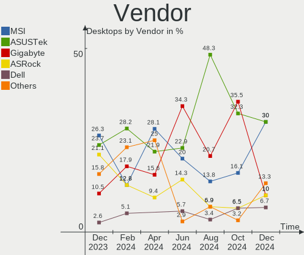
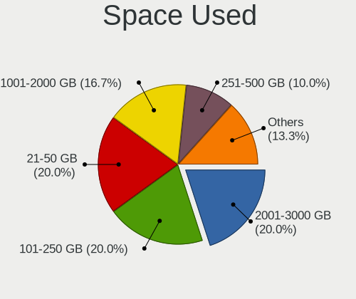
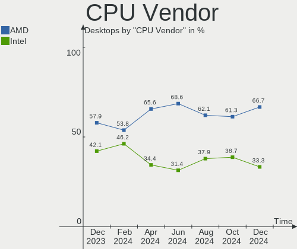
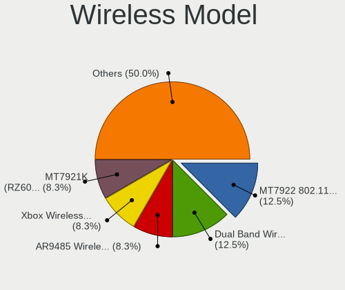
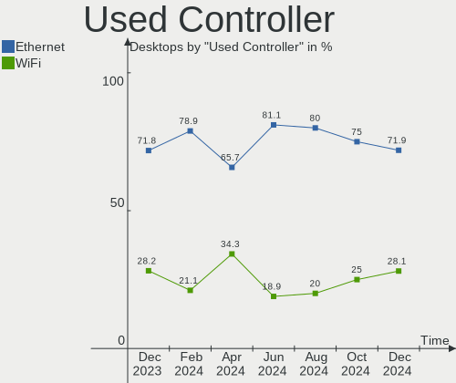
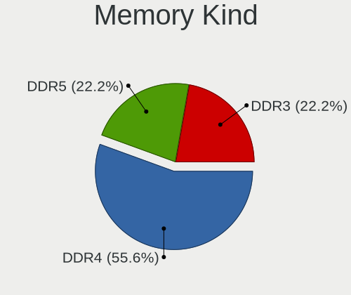
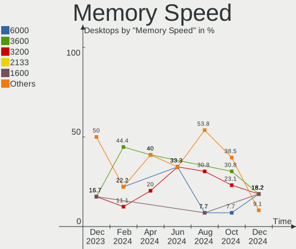
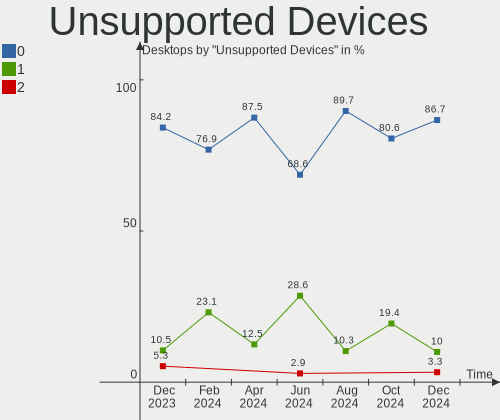

Nobara - Hardware Trends (Desktops)
-----------------------------------

A project to identify most popular hardware characteristics and track their change
over time based on data collected by Linux users at https://Linux-Hardware.org.

Anyone can contribute to this report by the [hw-probe](https://github.com/linuxhw/hw-probe) tool:

    sudo -E hw-probe -all -upload

This report is for one last month. Overall report since the beginning of time: [TestDays](https://github.com/linuxhw/TestDays)

Period: Aug, 2023.

Contents
--------

* [ System ](#system)
  - [ OS                       ](#os)
  - [ OS Family                ](#os-family)
  - [ Kernel                   ](#kernel)
  - [ Kernel Family            ](#kernel-family)
  - [ Kernel Major Ver.        ](#kernel-major-ver)
  - [ Arch                     ](#arch)
  - [ DE                       ](#de)
  - [ Display Server           ](#display-server)
  - [ Display Manager          ](#display-manager)
  - [ OS Lang                  ](#os-lang)
  - [ Boot Mode                ](#boot-mode)
  - [ Filesystem               ](#filesystem)
  - [ Part. scheme             ](#part-scheme)
  - [ Dual Boot with Linux/BSD ](#dual-boot-with-linuxbsd)
  - [ Dual Boot (Win)          ](#dual-boot-win)

* [ Board ](#board)
  - [ Vendor                   ](#vendor)
  - [ Model                    ](#model)
  - [ Model Family             ](#model-family)
  - [ MFG Year                 ](#mfg-year)
  - [ Form Factor              ](#form-factor)
  - [ Secure Boot              ](#secure-boot)
  - [ Coreboot                 ](#coreboot)
  - [ RAM Size                 ](#ram-size)
  - [ RAM Used                 ](#ram-used)
  - [ Total Drives             ](#total-drives)
  - [ Has CD-ROM               ](#has-cd-rom)
  - [ Has Ethernet             ](#has-ethernet)
  - [ Has WiFi                 ](#has-wifi)
  - [ Has Bluetooth            ](#has-bluetooth)

* [ Location ](#location)
  - [ Country                  ](#country)
  - [ City                     ](#city)

* [ Drives ](#drives)
  - [ Drive Vendor             ](#drive-vendor)
  - [ Drive Model              ](#drive-model)
  - [ HDD Vendor               ](#hdd-vendor)
  - [ SSD Vendor               ](#ssd-vendor)
  - [ Drive Kind               ](#drive-kind)
  - [ Drive Connector          ](#drive-connector)
  - [ Drive Size               ](#drive-size)
  - [ Space Total              ](#space-total)
  - [ Space Used               ](#space-used)
  - [ Malfunc. Drives          ](#malfunc-drives)
  - [ Malfunc. Drive Vendor    ](#malfunc-drive-vendor)
  - [ Malfunc. HDD Vendor      ](#malfunc-hdd-vendor)
  - [ Malfunc. Drive Kind      ](#malfunc-drive-kind)
  - [ Failed Drives            ](#failed-drives)
  - [ Failed Drive Vendor      ](#failed-drive-vendor)
  - [ Drive Status             ](#drive-status)

* [ Storage controller ](#storage-controller)
  - [ Storage Vendor           ](#storage-vendor)
  - [ Storage Model            ](#storage-model)
  - [ Storage Kind             ](#storage-kind)

* [ Processor ](#processor)
  - [ CPU Vendor               ](#cpu-vendor)
  - [ CPU Model                ](#cpu-model)
  - [ CPU Model Family         ](#cpu-model-family)
  - [ CPU Cores                ](#cpu-cores)
  - [ CPU Sockets              ](#cpu-sockets)
  - [ CPU Threads              ](#cpu-threads)
  - [ CPU Op-Modes             ](#cpu-op-modes)
  - [ CPU Microcode            ](#cpu-microcode)
  - [ CPU Microarch            ](#cpu-microarch)

* [ Graphics ](#graphics)
  - [ GPU Vendor               ](#gpu-vendor)
  - [ GPU Model                ](#gpu-model)
  - [ GPU Combo                ](#gpu-combo)
  - [ GPU Driver               ](#gpu-driver)
  - [ GPU Memory               ](#gpu-memory)

* [ Monitor ](#monitor)
  - [ Monitor Vendor           ](#monitor-vendor)
  - [ Monitor Model            ](#monitor-model)
  - [ Monitor Resolution       ](#monitor-resolution)
  - [ Monitor Diagonal         ](#monitor-diagonal)
  - [ Monitor Width            ](#monitor-width)
  - [ Aspect Ratio             ](#aspect-ratio)
  - [ Monitor Area             ](#monitor-area)
  - [ Pixel Density            ](#pixel-density)
  - [ Multiple Monitors        ](#multiple-monitors)

* [ Network ](#network)
  - [ Net Controller Vendor    ](#net-controller-vendor)
  - [ Net Controller Model     ](#net-controller-model)
  - [ Wireless Vendor          ](#wireless-vendor)
  - [ Wireless Model           ](#wireless-model)
  - [ Ethernet Vendor          ](#ethernet-vendor)
  - [ Ethernet Model           ](#ethernet-model)
  - [ Net Controller Kind      ](#net-controller-kind)
  - [ Used Controller          ](#used-controller)
  - [ NICs                     ](#nics)
  - [ IPv6                     ](#ipv6)

* [ Bluetooth ](#bluetooth)
  - [ Bluetooth Vendor         ](#bluetooth-vendor)
  - [ Bluetooth Model          ](#bluetooth-model)

* [ Sound ](#sound)
  - [ Sound Vendor             ](#sound-vendor)
  - [ Sound Model              ](#sound-model)

* [ Memory ](#memory)
  - [ Memory Vendor            ](#memory-vendor)
  - [ Memory Model             ](#memory-model)
  - [ Memory Kind              ](#memory-kind)
  - [ Memory Form Factor       ](#memory-form-factor)
  - [ Memory Size              ](#memory-size)
  - [ Memory Speed             ](#memory-speed)

* [ Printers & scanners ](#printers--scanners)
  - [ Printer Vendor           ](#printer-vendor)
  - [ Printer Model            ](#printer-model)
  - [ Scanner Vendor           ](#scanner-vendor)
  - [ Scanner Model            ](#scanner-model)

* [ Camera ](#camera)
  - [ Camera Vendor            ](#camera-vendor)
  - [ Camera Model             ](#camera-model)

* [ Security ](#security)
  - [ Fingerprint Vendor       ](#fingerprint-vendor)
  - [ Fingerprint Model        ](#fingerprint-model)
  - [ Chipcard Vendor          ](#chipcard-vendor)
  - [ Chipcard Model           ](#chipcard-model)

* [ Unsupported ](#unsupported)
  - [ Unsupported Devices      ](#unsupported-devices)
  - [ Unsupported Device Types ](#unsupported-device-types)

System
------

OS
--

Installed operating systems

| Name      | Desktops | Percent |
|-----------|----------|---------|
| Nobara 38 | 16       | 72.73%  |
| Nobara 37 | 5        | 22.73%  |
| Nobara 36 | 1        | 4.55%   |

OS Family
---------

OS without a version

| Name   | Desktops | Percent |
|--------|----------|---------|
| Nobara | 22       | 100%    |

Kernel
------

Version of the Linux kernel

| Version                      | Desktops | Percent |
|------------------------------|----------|---------|
| 6.3.12-205.fsync.fc38.x86_64 | 6        | 27.27%  |
| 6.4.10-202.fsync.fc38.x86_64 | 5        | 22.73%  |
| 6.3.12-205.fsync.fc37.x86_64 | 3        | 13.64%  |
| 6.4.8-203.fsync.fc38.x86_64  | 2        | 9.09%   |
| 6.4.8-202.fsync.fc38.x86_64  | 1        | 4.55%   |
| 6.4.8-202.fsync.fc37.x86_64  | 1        | 4.55%   |
| 6.4.10-201.fsync.fc38.x86_64 | 1        | 4.55%   |
| 6.3.7-200.fsync.fc37.x86_64  | 1        | 4.55%   |
| 6.3.12-204.fsync.fc38.x86_64 | 1        | 4.55%   |
| 5.19.7-204.fsync.fc36.x86_64 | 1        | 4.55%   |

Kernel Family
-------------

Linux kernel without a distro release

| Version | Desktops | Percent |
|---------|----------|---------|
| 6.3.12  | 10       | 45.45%  |
| 6.4.10  | 6        | 27.27%  |
| 6.4.8   | 4        | 18.18%  |
| 6.3.7   | 1        | 4.55%   |
| 5.19.7  | 1        | 4.55%   |

Kernel Major Ver.
-----------------

Linux kernel major version

| Version | Desktops | Percent |
|---------|----------|---------|
| 6.3     | 11       | 50%     |
| 6.4     | 10       | 45.45%  |
| 5.19    | 1        | 4.55%   |

Arch
----

OS architecture (x86_64, i586, etc.)

| Name   | Desktops | Percent |
|--------|----------|---------|
| x86_64 | 22       | 100%    |

DE
--

Desktop Environment

| Name    | Desktops | Percent |
|---------|----------|---------|
| GNOME   | 16       | 72.73%  |
| KDE5    | 5        | 22.73%  |
| Unknown | 1        | 4.55%   |

Display Server
--------------

X11 or Wayland

| Name    | Desktops | Percent |
|---------|----------|---------|
| Wayland | 16       | 72.73%  |
| X11     | 5        | 22.73%  |
| Unknown | 1        | 4.55%   |

Display Manager
---------------

SDDM, LightDM, etc.

| Name    | Desktops | Percent |
|---------|----------|---------|
| Unknown | 21       | 95.45%  |
| GDM     | 1        | 4.55%   |

OS Lang
-------

Language

| Lang  | Desktops | Percent |
|-------|----------|---------|
| en_US | 11       | 50%     |
| en_GB | 3        | 13.64%  |
| es_ES | 2        | 9.09%   |
| de_DE | 2        | 9.09%   |
| fr_FR | 1        | 4.55%   |
| es_MX | 1        | 4.55%   |
| en_CA | 1        | 4.55%   |
| de_AT | 1        | 4.55%   |

Boot Mode
---------

EFI or BIOS

| Mode | Desktops | Percent |
|------|----------|---------|
| EFI  | 15       | 68.18%  |
| BIOS | 7        | 31.82%  |

Filesystem
----------

Type of filesystem

| Type  | Desktops | Percent |
|-------|----------|---------|
| Btrfs | 21       | 95.45%  |
| Ext4  | 1        | 4.55%   |

Part. scheme
------------

Scheme of partitioning

| Type    | Desktops | Percent |
|---------|----------|---------|
| Unknown | 20       | 90.91%  |
| GPT     | 2        | 9.09%   |

Dual Boot with Linux/BSD
------------------------

Hosting more than one Linux/BSD

| Dual boot | Desktops | Percent |
|-----------|----------|---------|
| No        | 20       | 90.91%  |
| Yes       | 2        | 9.09%   |

Dual Boot (Win)
---------------

Hosting Linux and Windows

| Dual boot | Desktops | Percent |
|-----------|----------|---------|
| No        | 20       | 90.91%  |
| Yes       | 2        | 9.09%   |

Board
-----

Vendor
------

Motherboard manufacturer

| Name                | Desktops | Percent |
|---------------------|----------|---------|
| MSI                 | 5        | 22.73%  |
| Gigabyte Technology | 5        | 22.73%  |
| ASRock              | 5        | 22.73%  |
| ASUSTek Computer    | 4        | 18.18%  |
| Pegatron            | 1        | 4.55%   |
| Lenovo              | 1        | 4.55%   |
| AOpen               | 1        | 4.55%   |

Model
-----

Motherboard model

| Name                                | Desktops | Percent |
|-------------------------------------|----------|---------|
| Pegatron NF335AA-ABZ a6664it        | 1        | 4.55%   |
| MSI MS-7D91                         | 1        | 4.55%   |
| MSI MS-7D67                         | 1        | 4.55%   |
| MSI MS-7B86                         | 1        | 4.55%   |
| MSI MS-7978                         | 1        | 4.55%   |
| MSI MS-7721                         | 1        | 4.55%   |
| Lenovo Legion T5 28IMB05 90NC001MUS | 1        | 4.55%   |
| Gigabyte Z270P-D3                   | 1        | 4.55%   |
| Gigabyte X670 AORUS ELITE AX        | 1        | 4.55%   |
| Gigabyte H410M H                    | 1        | 4.55%   |
| Gigabyte H310M H 2.0                | 1        | 4.55%   |
| Gigabyte G1.Sniper M3-CF            | 1        | 4.55%   |
| ASUS ROG STRIX B550-F GAMING        | 1        | 4.55%   |
| ASUS ROG CROSSHAIR X670E GENE       | 1        | 4.55%   |
| ASUS Pro B550M-C                    | 1        | 4.55%   |
| ASUS CROSSHAIR VI HERO              | 1        | 4.55%   |
| ASRock Z490M Pro4                   | 1        | 4.55%   |
| ASRock Z170 Extreme6+               | 1        | 4.55%   |
| ASRock B650 PG Lightning            | 1        | 4.55%   |
| ASRock B550M Steel Legend           | 1        | 4.55%   |
| ASRock B550 Phantom Gaming-ITX/ax   | 1        | 4.55%   |
| AOpen DEX5350                       | 1        | 4.55%   |

Model Family
------------

Motherboard model prefix

| Name                 | Desktops | Percent |
|----------------------|----------|---------|
| ASUS ROG             | 2        | 9.09%   |
| Pegatron NF335AA-ABZ | 1        | 4.55%   |
| MSI MS-7D91          | 1        | 4.55%   |
| MSI MS-7D67          | 1        | 4.55%   |
| MSI MS-7B86          | 1        | 4.55%   |
| MSI MS-7978          | 1        | 4.55%   |
| MSI MS-7721          | 1        | 4.55%   |
| Lenovo Legion        | 1        | 4.55%   |
| Gigabyte Z270P-D3    | 1        | 4.55%   |
| Gigabyte X670        | 1        | 4.55%   |
| Gigabyte H410M       | 1        | 4.55%   |
| Gigabyte H310M       | 1        | 4.55%   |
| Gigabyte G1.Sniper   | 1        | 4.55%   |
| ASUS Pro             | 1        | 4.55%   |
| ASUS CROSSHAIR       | 1        | 4.55%   |
| ASRock Z490M         | 1        | 4.55%   |
| ASRock Z170          | 1        | 4.55%   |
| ASRock B650          | 1        | 4.55%   |
| ASRock B550M         | 1        | 4.55%   |
| ASRock B550          | 1        | 4.55%   |
| AOpen DEX5350        | 1        | 4.55%   |

MFG Year
--------

Motherboard manufacture year

| Year | Desktops | Percent |
|------|----------|---------|
| 2020 | 6        | 27.27%  |
| 2022 | 5        | 22.73%  |
| 2018 | 2        | 9.09%   |
| 2023 | 1        | 4.55%   |
| 2021 | 1        | 4.55%   |
| 2019 | 1        | 4.55%   |
| 2017 | 1        | 4.55%   |
| 2016 | 1        | 4.55%   |
| 2015 | 1        | 4.55%   |
| 2013 | 1        | 4.55%   |
| 2012 | 1        | 4.55%   |
| 2008 | 1        | 4.55%   |

Form Factor
-----------

Physical design of the computer

| Name    | Desktops | Percent |
|---------|----------|---------|
| Desktop | 22       | 100%    |

Secure Boot
-----------

Enabled or disabled

| State    | Desktops | Percent |
|----------|----------|---------|
| Disabled | 22       | 100%    |

Coreboot
--------

Have coreboot on board

| Used | Desktops | Percent |
|------|----------|---------|
| No   | 22       | 100%    |

RAM Size
--------

Total RAM memory

| Size in GB  | Desktops | Percent |
|-------------|----------|---------|
| 32.01-64.0  | 7        | 31.82%  |
| 16.01-24.0  | 6        | 27.27%  |
| 64.01-256.0 | 4        | 18.18%  |
| 3.01-4.0    | 2        | 9.09%   |
| 24.01-32.0  | 2        | 9.09%   |
| 8.01-16.0   | 1        | 4.55%   |

RAM Used
--------

Used RAM memory

| Used GB    | Desktops | Percent |
|------------|----------|---------|
| 4.01-8.0   | 8        | 36.36%  |
| 3.01-4.0   | 5        | 22.73%  |
| 2.01-3.0   | 3        | 13.64%  |
| 16.01-24.0 | 2        | 9.09%   |
| 1.01-2.0   | 2        | 9.09%   |
| 32.01-64.0 | 1        | 4.55%   |
| 8.01-16.0  | 1        | 4.55%   |

Total Drives
------------

Number of drives on board

| Drives | Desktops | Percent |
|--------|----------|---------|
| 3      | 6        | 27.27%  |
| 2      | 6        | 27.27%  |
| 1      | 4        | 18.18%  |
| 4      | 3        | 13.64%  |
| 8      | 1        | 4.55%   |
| 6      | 1        | 4.55%   |
| 5      | 1        | 4.55%   |

Has CD-ROM
----------

Has CD-ROM on board

| Presented | Desktops | Percent |
|-----------|----------|---------|
| No        | 20       | 90.91%  |
| Yes       | 2        | 9.09%   |

Has Ethernet
------------

Has Ethernet on board

| Presented | Desktops | Percent |
|-----------|----------|---------|
| Yes       | 21       | 95.45%  |
| No        | 1        | 4.55%   |

Has WiFi
--------

Has WiFi module

| Presented | Desktops | Percent |
|-----------|----------|---------|
| Yes       | 12       | 54.55%  |
| No        | 10       | 45.45%  |

Has Bluetooth
-------------

Has Bluetooth module

| Presented | Desktops | Percent |
|-----------|----------|---------|
| No        | 14       | 63.64%  |
| Yes       | 8        | 36.36%  |

Location
--------

Country
-------

Geographic location (country)

| Country     | Desktops | Percent |
|-------------|----------|---------|
| USA         | 6        | 27.27%  |
| UK          | 2        | 9.09%   |
| Spain       | 2        | 9.09%   |
| Germany     | 2        | 9.09%   |
| France      | 2        | 9.09%   |
| Sweden      | 1        | 4.55%   |
| Netherlands | 1        | 4.55%   |
| Mexico      | 1        | 4.55%   |
| Italy       | 1        | 4.55%   |
| Canada      | 1        | 4.55%   |
| Brazil      | 1        | 4.55%   |
| Austria     | 1        | 4.55%   |
| Australia   | 1        | 4.55%   |

City
----

Geographic location (city)

| City                 | Desktops | Percent |
|----------------------|----------|---------|
| Villahermosa         | 1        | 4.55%   |
| Toulouse             | 1        | 4.55%   |
| Sydney               | 1        | 4.55%   |
| Stockholm            | 1        | 4.55%   |
| San Leandro          | 1        | 4.55%   |
| San Francisco        | 1        | 4.55%   |
| Roseville            | 1        | 4.55%   |
| Ried in der Riedmark | 1        | 4.55%   |
| New York             | 1        | 4.55%   |
| Missoula             | 1        | 4.55%   |
| Milan                | 1        | 4.55%   |
| Las Vegas            | 1        | 4.55%   |
| Gijón               | 1        | 4.55%   |
| Florianópolis       | 1        | 4.55%   |
| Estevan              | 1        | 4.55%   |
| Duisburg             | 1        | 4.55%   |
| Doncaster            | 1        | 4.55%   |
| Courbevoie           | 1        | 4.55%   |
| Canvey Island        | 1        | 4.55%   |
| Bad Wildbad          | 1        | 4.55%   |
| Amsterdam            | 1        | 4.55%   |
| Alicante             | 1        | 4.55%   |

Drives
------

Drive Vendor
------------

Hard drive vendors

| Vendor                      | Desktops | Drives | Percent |
|-----------------------------|----------|--------|---------|
| Seagate                     | 9        | 12     | 17.31%  |
| Samsung Electronics         | 9        | 15     | 17.31%  |
| WDC                         | 6        | 7      | 11.54%  |
| Phison Electronics          | 4        | 4      | 7.69%   |
| Toshiba                     | 3        | 3      | 5.77%   |
| Unknown                     | 2        | 3      | 3.85%   |
| SanDisk                     | 2        | 3      | 3.85%   |
| Kingston Technology Company | 2        | 2      | 3.85%   |
| Kingston                    | 2        | 3      | 3.85%   |
| Crucial                     | 2        | 2      | 3.85%   |
| WDC WDS                     | 1        | 1      | 1.92%   |
| Realtek Semiconductor       | 1        | 1      | 1.92%   |
| Micron/Crucial Technology   | 1        | 1      | 1.92%   |
| Maxtor                      | 1        | 1      | 1.92%   |
| Leven                       | 1        | 1      | 1.92%   |
| Hitachi                     | 1        | 1      | 1.92%   |
| HGST                        | 1        | 1      | 1.92%   |
| DUEX                        | 1        | 1      | 1.92%   |
| China                       | 1        | 1      | 1.92%   |
| ADATA Technology            | 1        | 1      | 1.92%   |
| A-DATA Technology           | 1        | 1      | 1.92%   |

Drive Model
-----------

Hard drive models

| Model                                                 | Desktops | Percent |
|-------------------------------------------------------|----------|---------|
| Phison E12 NVMe Controller 256GB                      | 4        | 6.45%   |
| Unknown NVMe SSD Drive 2TB                            | 2        | 3.23%   |
| Samsung SSD 870 EVO 2TB                               | 2        | 3.23%   |
| Samsung SSD 860 EVO 1TB                               | 2        | 3.23%   |
| WDC WDS480G2G0B-00EPW0 480GB SSD                      | 1        | 1.61%   |
| WDC WDS100T2B0B-00YS70 1TB SSD                        | 1        | 1.61%   |
| WDC WDS 200T2B0B-00Y 2TB SSD                          | 1        | 1.61%   |
| WDC WD5001AALS-00L3B2 500GB                           | 1        | 1.61%   |
| WDC WD3000F9YZ-09N20L1 3TB                            | 1        | 1.61%   |
| WDC WD20EARS-22MVWB0 2TB                              | 1        | 1.61%   |
| WDC WD10EALS-00Z8A0 1TB                               | 1        | 1.61%   |
| WDC WD1001FALS-00J7B1 1TB                             | 1        | 1.61%   |
| Toshiba MK5076GSX 500GB                               | 1        | 1.61%   |
| Toshiba HDWE160 6TB                                   | 1        | 1.61%   |
| Toshiba HDWD120 2TB                                   | 1        | 1.61%   |
| Seagate ST500DM002-1BD142 500GB                       | 1        | 1.61%   |
| Seagate ST3320813AS 320GB                             | 1        | 1.61%   |
| Seagate ST3320620AS 320GB                             | 1        | 1.61%   |
| Seagate ST31000524AS 1TB                              | 1        | 1.61%   |
| Seagate ST2000DX001-1NS164 2TB                        | 1        | 1.61%   |
| Seagate ST1000VM002-1CT162 1TB                        | 1        | 1.61%   |
| Seagate ST1000DM003-1SB102 1TB                        | 1        | 1.61%   |
| Seagate ST10000DM0004-1ZC101 10TB                     | 1        | 1.61%   |
| Seagate FireCuda Dock 4TB                             | 1        | 1.61%   |
| Seagate Expansion Desk 2TB                            | 1        | 1.61%   |
| Seagate Backup+ Hub BK 8TB                            | 1        | 1.61%   |
| Sandisk WD Black SN750 / PC SN730 NVMe SSD 1024GB     | 1        | 1.61%   |
| SanDisk SDSSDH32000G 2TB                              | 1        | 1.61%   |
| SanDisk SDSSDH3 1T00 1TB                              | 1        | 1.61%   |
| Samsung SSD 990 PRO 2TB                               | 1        | 1.61%   |
| Samsung SSD 870 QVO 4TB                               | 1        | 1.61%   |
| Samsung SSD 870 EVO 4TB                               | 1        | 1.61%   |
| Samsung SSD 860 EVO 250GB                             | 1        | 1.61%   |
| Samsung SSD 850 EVO 2TB                               | 1        | 1.61%   |
| Samsung SSD 850 EVO 250GB                             | 1        | 1.61%   |
| Samsung NVMe SSD Controller SM981/PM981/PM983 500GB   | 1        | 1.61%   |
| Samsung NVMe SSD Controller SM961/PM961/SM963 1024GB  | 1        | 1.61%   |
| Samsung NVMe SSD Controller PM9A1/PM9A3/980PRO 1024GB | 1        | 1.61%   |
| Samsung HD322HJ 320GB                                 | 1        | 1.61%   |
| Realtek TEAM TM8FP6002T 2TB                           | 1        | 1.61%   |

HDD Vendor
----------

Hard disk drive vendors

| Vendor              | Desktops | Drives | Percent |
|---------------------|----------|--------|---------|
| Seagate             | 9        | 11     | 45%     |
| WDC                 | 4        | 5      | 20%     |
| Toshiba             | 3        | 3      | 15%     |
| Samsung Electronics | 1        | 1      | 5%      |
| Maxtor              | 1        | 1      | 5%      |
| Hitachi             | 1        | 1      | 5%      |
| HGST                | 1        | 1      | 5%      |

SSD Vendor
----------

Solid state drive vendors

| Vendor              | Desktops | Drives | Percent |
|---------------------|----------|--------|---------|
| Samsung Electronics | 7        | 10     | 36.84%  |
| WDC                 | 2        | 2      | 10.53%  |
| Kingston            | 2        | 2      | 10.53%  |
| Crucial             | 2        | 2      | 10.53%  |
| WDC WDS             | 1        | 1      | 5.26%   |
| SanDisk             | 1        | 2      | 5.26%   |
| Leven               | 1        | 1      | 5.26%   |
| DUEX                | 1        | 1      | 5.26%   |
| China               | 1        | 1      | 5.26%   |
| A-DATA Technology   | 1        | 1      | 5.26%   |

Drive Kind
----------

HDD or SSD

| Kind    | Desktops | Drives | Percent |
|---------|----------|--------|---------|
| HDD     | 15       | 23     | 35.71%  |
| SSD     | 14       | 23     | 33.33%  |
| NVMe    | 12       | 18     | 28.57%  |
| Unknown | 1        | 1      | 2.38%   |

Drive Connector
---------------

SATA, SAS, NVMe, etc.

| Type | Desktops | Drives | Percent |
|------|----------|--------|---------|
| SATA | 20       | 42     | 58.82%  |
| NVMe | 12       | 18     | 35.29%  |
| SAS  | 2        | 5      | 5.88%   |

Drive Size
----------

Size of hard drive

| Size in TB | Desktops | Drives | Percent |
|------------|----------|--------|---------|
| 0.51-1.0   | 11       | 13     | 32.35%  |
| 0.01-0.5   | 9        | 15     | 26.47%  |
| 1.01-2.0   | 7        | 11     | 20.59%  |
| 3.01-4.0   | 3        | 3      | 8.82%   |
| 4.01-10.0  | 3        | 3      | 8.82%   |
| 2.01-3.0   | 1        | 1      | 2.94%   |

Space Total
-----------

Amount of disk space available on the file system

| Size in GB     | Desktops | Percent |
|----------------|----------|---------|
| More than 3000 | 7        | 31.82%  |
| 1001-2000      | 6        | 27.27%  |
| 501-1000       | 6        | 27.27%  |
| 251-500        | 2        | 9.09%   |
| 2001-3000      | 1        | 4.55%   |

Space Used
----------

Amount of used disk space

| Used GB        | Desktops | Percent |
|----------------|----------|---------|
| 21-50          | 8        | 36.36%  |
| 251-500        | 3        | 13.64%  |
| 1-20           | 3        | 13.64%  |
| More than 3000 | 2        | 9.09%   |
| 2001-3000      | 2        | 9.09%   |
| 501-1000       | 2        | 9.09%   |
| 101-250        | 1        | 4.55%   |
| 1001-2000      | 1        | 4.55%   |

Malfunc. Drives
---------------

Drive models with a malfunction

Zero info for selected period =(

Malfunc. Drive Vendor
---------------------

Vendors of faulty drives

Zero info for selected period =(

Malfunc. HDD Vendor
-------------------

Vendors of faulty HDD drives

Zero info for selected period =(

Malfunc. Drive Kind
-------------------

Kinds of faulty drives

Zero info for selected period =(

Failed Drives
-------------

Failed drive models

Zero info for selected period =(

Failed Drive Vendor
-------------------

Failed drive vendors

Zero info for selected period =(

Drive Status
------------

Number of failed and malfunc. drives

| Status   | Desktops | Drives | Percent |
|----------|----------|--------|---------|
| Detected | 20       | 62     | 90.91%  |
| Works    | 2        | 3      | 9.09%   |

Storage controller
------------------

Storage Vendor
--------------

Storage controller vendors

| Vendor                      | Desktops | Percent |
|-----------------------------|----------|---------|
| Intel                       | 11       | 26.19%  |
| AMD                         | 11       | 26.19%  |
| Phison Electronics          | 4        | 9.52%   |
| Samsung Electronics         | 3        | 7.14%   |
| Kingston Technology Company | 3        | 7.14%   |
| ASMedia Technology          | 3        | 7.14%   |
| Solidigm                    | 2        | 4.76%   |
| SanDisk                     | 1        | 2.38%   |
| Realtek Semiconductor       | 1        | 2.38%   |
| Micron/Crucial Technology   | 1        | 2.38%   |
| Marvell Technology Group    | 1        | 2.38%   |
| ADATA Technology            | 1        | 2.38%   |

Storage Model
-------------

Storage controller models

| Model                                                                         | Desktops | Percent |
|-------------------------------------------------------------------------------|----------|---------|
| AMD FCH SATA Controller [AHCI mode]                                           | 6        | 13.64%  |
| Phison E12 NVMe Controller                                                    | 4        | 9.09%   |
| AMD 500 Series Chipset SATA Controller                                        | 4        | 9.09%   |
| ASMedia ASM1062 Serial ATA Controller                                         | 3        | 6.82%   |
| Kingston Company Company Non-Volatile memory controller                       | 2        | 4.55%   |
| Intel Q170/Q150/B150/H170/H110/Z170/CM236 Chipset SATA Controller [AHCI Mode] | 2        | 4.55%   |
| Intel 400 Series Chipset Family SATA AHCI Controller                          | 2        | 4.55%   |
| Intel 200 Series PCH SATA controller [AHCI mode]                              | 2        | 4.55%   |
| Solidigm P44 Pro NVMe SSD                                                     | 1        | 2.27%   |
| Solidigm P41 Plus NVMe SSD (DRAM-less)                                        | 1        | 2.27%   |
| SanDisk WD Black SN750 / PC SN730 NVMe SSD                                    | 1        | 2.27%   |
| Samsung NVMe SSD Controller SM981/PM981/PM983                                 | 1        | 2.27%   |
| Samsung NVMe SSD Controller SM961/PM961/SM963                                 | 1        | 2.27%   |
| Samsung NVMe SSD Controller S4LV008[Pascal]                                   | 1        | 2.27%   |
| Samsung NVMe SSD Controller PM9A1/PM9A3/980PRO                                | 1        | 2.27%   |
| Realtek RTS5765DL NVMe SSD Controller (DRAM-less)                             | 1        | 2.27%   |
| Micron/Crucial P2 [Nick P2] / P3 / P3 Plus NVMe PCIe SSD (DRAM-less)          | 1        | 2.27%   |
| Marvell Group 88SE9215 PCIe 2.0 x1 4-port SATA 6 Gb/s Controller              | 1        | 2.27%   |
| Kingston Company KC3000/Renegade NVMe SSD                                     | 1        | 2.27%   |
| Intel Wildcat Point-LP SATA Controller [AHCI Mode]                            | 1        | 2.27%   |
| Intel SATA Controller [RAID mode]                                             | 1        | 2.27%   |
| Intel Comet Lake SATA AHCI Controller                                         | 1        | 2.27%   |
| Intel 700 Series Chipset Family SATA AHCI Controller                          | 1        | 2.27%   |
| Intel 7 Series/C210 Series Chipset Family 6-port SATA Controller [AHCI mode]  | 1        | 2.27%   |
| AMD X370 Series Chipset SATA Controller                                       | 1        | 2.27%   |
| AMD 400 Series Chipset SATA Controller                                        | 1        | 2.27%   |
| ADATA XPG SX8200 Pro PCIe Gen3x4 M.2 2280 Solid State Drive                   | 1        | 2.27%   |

Storage Kind
------------

Kind of storage controller (IDE, SATA, NVMe, SAS, ...)

| Kind | Desktops | Percent |
|------|----------|---------|
| SATA | 21       | 61.76%  |
| NVMe | 12       | 35.29%  |
| RAID | 1        | 2.94%   |

Processor
---------

CPU Vendor
----------

Processor vendors

| Vendor | Desktops | Percent |
|--------|----------|---------|
| Intel  | 11       | 50%     |
| AMD    | 11       | 50%     |

CPU Model
---------

Processor models

| Model                                   | Desktops | Percent |
|-----------------------------------------|----------|---------|
| Intel Core i7-7700K CPU @ 4.20GHz       | 1        | 4.55%   |
| Intel Core i7-3770K CPU @ 3.50GHz       | 1        | 4.55%   |
| Intel Core i7-10700K CPU @ 3.80GHz      | 1        | 4.55%   |
| Intel Core i5-6600K CPU @ 3.50GHz       | 1        | 4.55%   |
| Intel Core i5-6600 CPU @ 3.30GHz        | 1        | 4.55%   |
| Intel Core i5-10400F CPU @ 2.90GHz      | 1        | 4.55%   |
| Intel Core i3-8100 CPU @ 3.60GHz        | 1        | 4.55%   |
| Intel Core i3-5010U CPU @ 2.10GHz       | 1        | 4.55%   |
| Intel Core i3-10100F CPU @ 3.60GHz      | 1        | 4.55%   |
| Intel Core 2 Quad CPU Q6600 @ 2.40GHz   | 1        | 4.55%   |
| Intel 13th Gen Core i9-13900K           | 1        | 4.55%   |
| AMD Ryzen 9 7950X3D 16-Core Processor   | 1        | 4.55%   |
| AMD Ryzen 9 7950X 16-Core Processor     | 1        | 4.55%   |
| AMD Ryzen 9 7900 12-Core Processor      | 1        | 4.55%   |
| AMD Ryzen 7 5700X 8-Core Processor      | 1        | 4.55%   |
| AMD Ryzen 7 5700G with Radeon Graphics  | 1        | 4.55%   |
| AMD Ryzen 5 7600X 6-Core Processor      | 1        | 4.55%   |
| AMD Ryzen 5 5600X 6-Core Processor      | 1        | 4.55%   |
| AMD Ryzen 5 5600 6-Core Processor       | 1        | 4.55%   |
| AMD Ryzen 5 3600 6-Core Processor       | 1        | 4.55%   |
| AMD Ryzen 5 2600X Six-Core Processor    | 1        | 4.55%   |
| AMD A4-5300 APU with Radeon HD Graphics | 1        | 4.55%   |

CPU Model Family
----------------

Processor model prefix

| Model             | Desktops | Percent |
|-------------------|----------|---------|
| AMD Ryzen 5       | 5        | 22.73%  |
| Intel Core i7     | 3        | 13.64%  |
| Intel Core i5     | 3        | 13.64%  |
| Intel Core i3     | 3        | 13.64%  |
| AMD Ryzen 9       | 3        | 13.64%  |
| AMD Ryzen 7       | 2        | 9.09%   |
| Other             | 1        | 4.55%   |
| Intel Core 2 Quad | 1        | 4.55%   |
| AMD A4            | 1        | 4.55%   |

CPU Cores
---------

Number of processor cores

| Number | Desktops | Percent |
|--------|----------|---------|
| 4      | 7        | 31.82%  |
| 6      | 6        | 27.27%  |
| 8      | 3        | 13.64%  |
| 16     | 2        | 9.09%   |
| 24     | 1        | 4.55%   |
| 12     | 1        | 4.55%   |
| 2      | 1        | 4.55%   |
| 1      | 1        | 4.55%   |

CPU Sockets
-----------

Number of sockets

| Number | Desktops | Percent |
|--------|----------|---------|
| 1      | 22       | 100%    |

CPU Threads
-----------

Threads per core (Hyper-Threading)

| Number | Desktops | Percent |
|--------|----------|---------|
| 2      | 18       | 81.82%  |
| 1      | 4        | 18.18%  |

CPU Op-Modes
------------

CPU Operation Modes (32-bit, 64-bit)

| Op mode        | Desktops | Percent |
|----------------|----------|---------|
| 32-bit, 64-bit | 22       | 100%    |

CPU Microcode
-------------

Microcode number

| Number     | Desktops | Percent |
|------------|----------|---------|
| Unknown    | 10       | 45.45%  |
| 0x0a601203 | 4        | 18.18%  |
| 0x906e9    | 1        | 4.55%   |
| 0x0a50000d | 1        | 4.55%   |
| 0x0a20120a | 1        | 4.55%   |
| 0x0a201025 | 1        | 4.55%   |
| 0x0a201016 | 1        | 4.55%   |
| 0x08701021 | 1        | 4.55%   |
| 0x0800820d | 1        | 4.55%   |
| 0x06001119 | 1        | 4.55%   |

CPU Microarch
-------------

Microarchitecture

| Name             | Desktops | Percent |
|------------------|----------|---------|
| Zen 3            | 4        | 18.18%  |
| Unknown          | 4        | 18.18%  |
| CometLake        | 3        | 13.64%  |
| Skylake          | 2        | 9.09%   |
| KabyLake         | 2        | 9.09%   |
| Zen+             | 1        | 4.55%   |
| Zen 2            | 1        | 4.55%   |
| Piledriver       | 1        | 4.55%   |
| IvyBridge        | 1        | 4.55%   |
| Core             | 1        | 4.55%   |
| Broadwell        | 1        | 4.55%   |
| Alderlake Hybrid | 1        | 4.55%   |

Graphics
--------

GPU Vendor
----------

Vendors of graphics cards

| Vendor | Desktops | Percent |
|--------|----------|---------|
| AMD    | 13       | 50%     |
| Nvidia | 10       | 38.46%  |
| Intel  | 3        | 11.54%  |

GPU Model
---------

Graphics card models

| Model                                                        | Desktops | Percent |
|--------------------------------------------------------------|----------|---------|
| AMD Raphael                                                  | 3        | 11.11%  |
| AMD Navi 31 [Radeon RX 7900 XT/7900 XTX]                     | 3        | 11.11%  |
| AMD Ellesmere [Radeon RX 470/480/570/570X/580/580X/590]      | 3        | 11.11%  |
| Nvidia GA104 [GeForce RTX 3060 Ti Lite Hash Rate]            | 2        | 7.41%   |
| Nvidia TU116 [GeForce GTX 1660 SUPER]                        | 1        | 3.7%    |
| Nvidia TU104 [GeForce RTX 2070 SUPER]                        | 1        | 3.7%    |
| Nvidia TU104 [GeForce RTX 2060]                              | 1        | 3.7%    |
| Nvidia GP104 [GeForce GTX 1070]                              | 1        | 3.7%    |
| Nvidia GK107 [GeForce GT 640]                                | 1        | 3.7%    |
| Nvidia GA106 [GeForce RTX 3060 Lite Hash Rate]               | 1        | 3.7%    |
| Nvidia GA104 [GeForce RTX 3070 Lite Hash Rate]               | 1        | 3.7%    |
| Nvidia AD102 [GeForce RTX 4090]                              | 1        | 3.7%    |
| Intel Raptor Lake-S GT1 [UHD Graphics 770]                   | 1        | 3.7%    |
| Intel IvyBridge GT2 [HD Graphics 4000]                       | 1        | 3.7%    |
| Intel HD Graphics 5500                                       | 1        | 3.7%    |
| AMD RV620 LE [Radeon HD 3450]                                | 1        | 3.7%    |
| AMD Navi 23 [Radeon RX 6600/6600 XT/6600M]                   | 1        | 3.7%    |
| AMD Navi 21 [Radeon RX 6950 XT]                              | 1        | 3.7%    |
| AMD Cezanne [Radeon Vega Series / Radeon Vega Mobile Series] | 1        | 3.7%    |
| AMD Baffin [Radeon RX 550 640SP / RX 560/560X]               | 1        | 3.7%    |

GPU Combo
---------

Combinations of graphics cards

| Name         | Desktops | Percent |
|--------------|----------|---------|
| 1 x AMD      | 9        | 40.91%  |
| 1 x Nvidia   | 8        | 36.36%  |
| 1 x Intel    | 2        | 9.09%   |
| AMD + Nvidia | 2        | 9.09%   |
| 2 x AMD      | 1        | 4.55%   |

GPU Driver
----------

Free vs proprietary

| Driver      | Desktops | Percent |
|-------------|----------|---------|
| Free        | 12       | 54.55%  |
| Proprietary | 8        | 36.36%  |
| Unknown     | 2        | 9.09%   |

GPU Memory
----------

Total video memory

| Size in GB | Desktops | Percent |
|------------|----------|---------|
| 7.01-8.0   | 6        | 27.27%  |
| Unknown    | 6        | 27.27%  |
| 16.01-24.0 | 3        | 13.64%  |
| 0.01-0.5   | 3        | 13.64%  |
| 8.01-16.0  | 2        | 9.09%   |
| 5.01-6.0   | 1        | 4.55%   |
| 3.01-4.0   | 1        | 4.55%   |

Monitor
-------

Monitor Vendor
--------------

Monitor vendors

| Vendor               | Desktops | Percent |
|----------------------|----------|---------|
| Samsung Electronics  | 7        | 25.93%  |
| Goldstar             | 5        | 18.52%  |
| Acer                 | 3        | 11.11%  |
| Yeyian               | 1        | 3.7%    |
| Philips              | 1        | 3.7%    |
| Packard Bell         | 1        | 3.7%    |
| ODH                  | 1        | 3.7%    |
| NEC Computers        | 1        | 3.7%    |
| Hewlett-Packard      | 1        | 3.7%    |
| Dell                 | 1        | 3.7%    |
| Corsair              | 1        | 3.7%    |
| ASUSTek Computer     | 1        | 3.7%    |
| Apple                | 1        | 3.7%    |
| AOC                  | 1        | 3.7%    |
| Ancor Communications | 1        | 3.7%    |

Monitor Model
-------------

Monitor models

| Model                                                                  | Desktops | Percent |
|------------------------------------------------------------------------|----------|---------|
| Yeyian YMC-70102 YEY2700 1920x1080 698x393mm 31.5-inch                 | 1        | 3.7%    |
| Samsung Electronics SyncMaster SAM0214 1680x1050 408x306mm 20.1-inch   | 1        | 3.7%    |
| Samsung Electronics Odyssey G7 SAM7232 3840x2160 698x392mm 31.5-inch   | 1        | 3.7%    |
| Samsung Electronics Odyssey G52A SAM71E7 2560x1440 699x393mm 31.6-inch | 1        | 3.7%    |
| Samsung Electronics Odyssey G50A SAM7181 2560x1440 597x336mm 27.0-inch | 1        | 3.7%    |
| Samsung Electronics LCD Monitor SAM029D 1280x720                       | 1        | 3.7%    |
| Samsung Electronics LC27RG50 SAM100A 1920x1080 532x304mm 24.1-inch     | 1        | 3.7%    |
| Samsung Electronics C24F390 SAM0D2C 1920x1080 521x293mm 23.5-inch      | 1        | 3.7%    |
| Philips PHL 272V8 PHLC21A 1920x1080 598x336mm 27.0-inch                | 1        | 3.7%    |
| Packard Bell Viseo 230Ws PKB00C1 1920x1080 509x286mm 23.0-inch         | 1        | 3.7%    |
| ODH C78 v2 ODH2021 1920x1080 600x330mm 27.0-inch                       | 1        | 3.7%    |
| NEC Computers EA305WMi NEC2BAB 2560x1600 641x401mm 29.8-inch           | 1        | 3.7%    |
| Hewlett-Packard 2509 HWP283B 1920x1080 553x311mm 25.0-inch             | 1        | 3.7%    |
| Goldstar W2242 GSM5678 1680x1050 474x296mm 22.0-inch                   | 1        | 3.7%    |
| Goldstar ULTRAWIDE GSM7768 3440x1440 800x334mm 34.1-inch               | 1        | 3.7%    |
| Goldstar ULTRAWIDE GSM59F2 2560x1080 798x334mm 34.1-inch               | 1        | 3.7%    |
| Goldstar QHD GSM772A 2560x1440 697x392mm 31.5-inch                     | 1        | 3.7%    |
| Goldstar 29EA93 GSM5974 2560x1080 677x290mm 29.0-inch                  | 1        | 3.7%    |
| Dell UP2716D DEL40DE 2560x1440 597x336mm 27.0-inch                     | 1        | 3.7%    |
| Corsair 32QHD165 CRM1B1C 2560x1440 708x399mm 32.0-inch                 | 1        | 3.7%    |
| ASUSTek Computer VG289 AUS28BA 3840x2160 621x341mm 27.9-inch           | 1        | 3.7%    |
| Apple Cinema HD APP9221 2560x1600 641x401mm 29.8-inch                  | 1        | 3.7%    |
| AOC Q3279WG5B AOC3279 2560x1440 725x428mm 33.1-inch                    | 1        | 3.7%    |
| Ancor Communications ROG PG279Q ACI27EC 2560x1440 598x336mm 27.0-inch  | 1        | 3.7%    |
| Acer VG270U P ACR06CF 2560x1440 597x336mm 27.0-inch                    | 1        | 3.7%    |
| Acer K222HQL ACR03E1 1920x1080 477x268mm 21.5-inch                     | 1        | 3.7%    |
| Acer GN246HL ACR02F9 1920x1080 531x299mm 24.0-inch                     | 1        | 3.7%    |

Monitor Resolution
------------------

Monitor screen resolution

| Resolution         | Desktops | Percent |
|--------------------|----------|---------|
| 2560x1440 (QHD)    | 8        | 29.63%  |
| 1920x1080 (FHD)    | 8        | 29.63%  |
| 3840x2160 (4K)     | 3        | 11.11%  |
| 2560x1600          | 2        | 7.41%   |
| 2560x1080          | 2        | 7.41%   |
| 1680x1050 (WSXGA+) | 2        | 7.41%   |
| 3440x1440          | 1        | 3.7%    |
| 1360x768           | 1        | 3.7%    |

Monitor Diagonal
----------------

Diagonal size in inches

| Inches  | Desktops | Percent |
|---------|----------|---------|
| 27      | 6        | 23.08%  |
| 31      | 4        | 15.38%  |
| 29      | 3        | 11.54%  |
| 23      | 3        | 11.54%  |
| 34      | 2        | 7.69%   |
| 24      | 2        | 7.69%   |
| 33      | 1        | 3.85%   |
| 32      | 1        | 3.85%   |
| 25      | 1        | 3.85%   |
| 21      | 1        | 3.85%   |
| 20      | 1        | 3.85%   |
| Unknown | 1        | 3.85%   |

Monitor Width
-------------

Physical width

| Width in mm | Desktops | Percent |
|-------------|----------|---------|
| 501-600     | 10       | 40%     |
| 601-700     | 8        | 32%     |
| 701-800     | 3        | 12%     |
| 401-500     | 3        | 12%     |
| Unknown     | 1        | 4%      |

Aspect Ratio
------------

Proportional relationship between the width and the height

| Ratio | Desktops | Percent |
|-------|----------|---------|
| 16/9  | 17       | 70.83%  |
| 21/9  | 3        | 12.5%   |
| 16/10 | 2        | 8.33%   |
| 4/3   | 1        | 4.17%   |
| 3/2   | 1        | 4.17%   |

Monitor Area
------------

Area in inch²

| Area in inch² | Desktops | Percent |
|----------------|----------|---------|
| 351-500        | 8        | 33.33%  |
| 301-350        | 7        | 29.17%  |
| 201-250        | 5        | 20.83%  |
| 251-300        | 2        | 8.33%   |
| 151-200        | 1        | 4.17%   |
| Unknown        | 1        | 4.17%   |

Pixel Density
-------------

Pixels per inch

| Density | Desktops | Percent |
|---------|----------|---------|
| 51-100  | 15       | 60%     |
| 101-120 | 7        | 28%     |
| 121-160 | 2        | 8%      |
| Unknown | 1        | 4%      |

Multiple Monitors
-----------------

Total monitors connected

| Total | Desktops | Percent |
|-------|----------|---------|
| 1     | 14       | 63.64%  |
| 2     | 7        | 31.82%  |
| 0     | 1        | 4.55%   |

Network
-------

Net Controller Vendor
---------------------

Controller vendors

| Vendor                | Desktops | Percent |
|-----------------------|----------|---------|
| Realtek Semiconductor | 13       | 43.33%  |
| Intel                 | 11       | 36.67%  |
| MediaTek              | 2        | 6.67%   |
| TP-Link               | 1        | 3.33%   |
| Ralink Technology     | 1        | 3.33%   |
| Qualcomm Atheros      | 1        | 3.33%   |
| Broadcom              | 1        | 3.33%   |

Net Controller Model
--------------------

Controller models

| Model                                                             | Desktops | Percent |
|-------------------------------------------------------------------|----------|---------|
| Realtek RTL8111/8168/8411 PCI Express Gigabit Ethernet Controller | 7        | 20%     |
| Realtek RTL8125 2.5GbE Controller                                 | 4        | 11.43%  |
| Intel Wi-Fi 6 AX200                                               | 4        | 11.43%  |
| Intel Ethernet Controller I225-V                                  | 3        | 8.57%   |
| Realtek RTL8153 Gigabit Ethernet Adapter                          | 2        | 5.71%   |
| MediaTek MT7922 802.11ax PCI Express Wireless Network Adapter     | 2        | 5.71%   |
| TP-Link TL-WN722N v2/v3 [Realtek RTL8188EUS]                      | 1        | 2.86%   |
| Ralink RT2501/RT2573 Wireless Adapter                             | 1        | 2.86%   |
| Qualcomm Atheros Killer E2400 Gigabit Ethernet Controller         | 1        | 2.86%   |
| Intel Wi-Fi 6 AX210/AX211/AX411 160MHz                            | 1        | 2.86%   |
| Intel I211 Gigabit Network Connection                             | 1        | 2.86%   |
| Intel Ethernet Controller I226-V                                  | 1        | 2.86%   |
| Intel Ethernet Connection (3) I218-LM                             | 1        | 2.86%   |
| Intel Ethernet Connection (2) I219-V                              | 1        | 2.86%   |
| Intel Ethernet Connection (11) I219-V                             | 1        | 2.86%   |
| Intel Centrino Advanced-N 6205 [Taylor Peak]                      | 1        | 2.86%   |
| Intel 82579V Gigabit Network Connection                           | 1        | 2.86%   |
| Intel 700 Series Chipset Family Wi-Fi                             | 1        | 2.86%   |
| Broadcom BCM4360 802.11ac Wireless Network Adapter                | 1        | 2.86%   |

Wireless Vendor
---------------

Wireless vendors

| Vendor            | Desktops | Percent |
|-------------------|----------|---------|
| Intel             | 7        | 58.33%  |
| MediaTek          | 2        | 16.67%  |
| TP-Link           | 1        | 8.33%   |
| Ralink Technology | 1        | 8.33%   |
| Broadcom          | 1        | 8.33%   |

Wireless Model
--------------

Wireless models

| Model                                                         | Desktops | Percent |
|---------------------------------------------------------------|----------|---------|
| Intel Wi-Fi 6 AX200                                           | 4        | 33.33%  |
| MediaTek MT7922 802.11ax PCI Express Wireless Network Adapter | 2        | 16.67%  |
| TP-Link TL-WN722N v2/v3 [Realtek RTL8188EUS]                  | 1        | 8.33%   |
| Ralink RT2501/RT2573 Wireless Adapter                         | 1        | 8.33%   |
| Intel Wi-Fi 6 AX210/AX211/AX411 160MHz                        | 1        | 8.33%   |
| Intel Centrino Advanced-N 6205 [Taylor Peak]                  | 1        | 8.33%   |
| Intel 700 Series Chipset Family Wi-Fi                         | 1        | 8.33%   |
| Broadcom BCM4360 802.11ac Wireless Network Adapter            | 1        | 8.33%   |

Ethernet Vendor
---------------

Ethernet vendors

| Vendor                | Desktops | Percent |
|-----------------------|----------|---------|
| Realtek Semiconductor | 13       | 56.52%  |
| Intel                 | 9        | 39.13%  |
| Qualcomm Atheros      | 1        | 4.35%   |

Ethernet Model
--------------

Ethernet models

| Model                                                             | Desktops | Percent |
|-------------------------------------------------------------------|----------|---------|
| Realtek RTL8111/8168/8411 PCI Express Gigabit Ethernet Controller | 7        | 30.43%  |
| Realtek RTL8125 2.5GbE Controller                                 | 4        | 17.39%  |
| Intel Ethernet Controller I225-V                                  | 3        | 13.04%  |
| Realtek RTL8153 Gigabit Ethernet Adapter                          | 2        | 8.7%    |
| Qualcomm Atheros Killer E2400 Gigabit Ethernet Controller         | 1        | 4.35%   |
| Intel I211 Gigabit Network Connection                             | 1        | 4.35%   |
| Intel Ethernet Controller I226-V                                  | 1        | 4.35%   |
| Intel Ethernet Connection (3) I218-LM                             | 1        | 4.35%   |
| Intel Ethernet Connection (2) I219-V                              | 1        | 4.35%   |
| Intel Ethernet Connection (11) I219-V                             | 1        | 4.35%   |
| Intel 82579V Gigabit Network Connection                           | 1        | 4.35%   |

Net Controller Kind
-------------------

Ethernet, WiFi or modem

| Kind     | Desktops | Percent |
|----------|----------|---------|
| Ethernet | 21       | 63.64%  |
| WiFi     | 12       | 36.36%  |

Used Controller
---------------

Currently used network controller

| Kind     | Desktops | Percent |
|----------|----------|---------|
| Ethernet | 19       | 76%     |
| WiFi     | 6        | 24%     |

NICs
----

Total network controllers on board

| Total | Desktops | Percent |
|-------|----------|---------|
| 1     | 11       | 50%     |
| 2     | 10       | 45.45%  |
| 0     | 1        | 4.55%   |

IPv6
----

IPv6 vs IPv4

| Used | Desktops | Percent |
|------|----------|---------|
| No   | 13       | 59.09%  |
| Yes  | 9        | 40.91%  |

Bluetooth
---------

Bluetooth Vendor
----------------

Controller vendors

| Vendor                  | Desktops | Percent |
|-------------------------|----------|---------|
| Intel                   | 5        | 55.56%  |
| Cambridge Silicon Radio | 2        | 22.22%  |
| TP-Link                 | 1        | 11.11%  |
| MediaTek                | 1        | 11.11%  |

Bluetooth Model
---------------

Controller models

| Model                                               | Desktops | Percent |
|-----------------------------------------------------|----------|---------|
| Intel AX200 Bluetooth                               | 3        | 33.33%  |
| Cambridge Silicon Radio Bluetooth Dongle (HCI mode) | 2        | 22.22%  |
| TP-Link UB5A Adapter                                | 1        | 11.11%  |
| MediaTek Wireless_Device                            | 1        | 11.11%  |
| Intel Bluetooth Device                              | 1        | 11.11%  |
| Intel AX210 Bluetooth                               | 1        | 11.11%  |

Sound
-----

Sound Vendor
------------

Sound card vendors

| Vendor                     | Desktops | Percent |
|----------------------------|----------|---------|
| AMD                        | 17       | 30.91%  |
| Intel                      | 11       | 20%     |
| Nvidia                     | 10       | 18.18%  |
| Logitech                   | 4        | 7.27%   |
| Micro Star International   | 2        | 3.64%   |
| VIA Technologies           | 1        | 1.82%   |
| Turtle Beach               | 1        | 1.82%   |
| Texas Instruments          | 1        | 1.82%   |
| Realtek Semiconductor      | 1        | 1.82%   |
| PreSonus Audio Electronics | 1        | 1.82%   |
| Kingston Technology        | 1        | 1.82%   |
| Hewlett-Packard            | 1        | 1.82%   |
| C-Media Electronics        | 1        | 1.82%   |
| ASUSTek Computer           | 1        | 1.82%   |
| Apple                      | 1        | 1.82%   |
| Unknown                    | 1        | 1.82%   |

Sound Model
-----------

Sound card models

| Model                                                               | Desktops | Percent |
|---------------------------------------------------------------------|----------|---------|
| AMD Starship/Matisse HD Audio Controller                            | 4        | 6.45%   |
| AMD Family 17h/19h HD Audio Controller                              | 4        | 6.45%   |
| Nvidia GA104 High Definition Audio Controller                       | 3        | 4.84%   |
| AMD Rembrandt Radeon High Definition Audio Controller               | 3        | 4.84%   |
| AMD Navi 31 HDMI/DP Audio                                           | 3        | 4.84%   |
| AMD Ellesmere HDMI Audio [Radeon RX 470/480 / 570/580/590]          | 3        | 4.84%   |
| Nvidia TU104 HD Audio Controller                                    | 2        | 3.23%   |
| Micro Star International USB Audio                                  | 2        | 3.23%   |
| Logitech PRO X Wireless Gaming Headset                              | 2        | 3.23%   |
| Intel Comet Lake PCH-V cAVS                                         | 2        | 3.23%   |
| Intel 200 Series PCH HD Audio                                       | 2        | 3.23%   |
| Intel 100 Series/C230 Series Chipset Family HD Audio Controller     | 2        | 3.23%   |
| AMD Navi 21/23 HDMI/DP Audio Controller                             | 2        | 3.23%   |
| VIA Technologies ICE1712 [Envy24] PCI Multi-Channel I/O Controller  | 1        | 1.61%   |
| Turtle Beach PLa Headset                                            | 1        | 1.61%   |
| Texas Instruments PCM2912A Audio Codec                              | 1        | 1.61%   |
| Realtek Semiconductor USB SPDIF Adapter                             | 1        | 1.61%   |
| PreSonus Audio Electronics AudioBox USB 96                          | 1        | 1.61%   |
| Nvidia TU116 High Definition Audio Controller                       | 1        | 1.61%   |
| Nvidia GP104 High Definition Audio Controller                       | 1        | 1.61%   |
| Nvidia GK107 HDMI Audio Controller                                  | 1        | 1.61%   |
| Nvidia GA106 High Definition Audio Controller                       | 1        | 1.61%   |
| Nvidia AD102 High Definition Audio Controller                       | 1        | 1.61%   |
| Logitech H390 headset with microphone                               | 1        | 1.61%   |
| Logitech Blue Microphones                                           | 1        | 1.61%   |
| Kingston Technology HyperX Cloud Stinger Wireless                   | 1        | 1.61%   |
| Intel Wildcat Point-LP High Definition Audio Controller             | 1        | 1.61%   |
| Intel Comet Lake PCH cAVS                                           | 1        | 1.61%   |
| Intel Broadwell-U Audio Controller                                  | 1        | 1.61%   |
| Intel 82801I (ICH9 Family) HD Audio Controller                      | 1        | 1.61%   |
| Intel 700 Series Chipset Family Precise Touch and Stylus Port #1    | 1        | 1.61%   |
| Intel 7 Series/C216 Chipset Family High Definition Audio Controller | 1        | 1.61%   |
| Hewlett-Packard HyperX Cloud II Wireless                            | 1        | 1.61%   |
| C-Media Electronics Blue Snowball                                   | 1        | 1.61%   |
| ASUSTek Computer USB Audio                                          | 1        | 1.61%   |
| Apple USB-C to 3.5mm Headphone Jack Adapter                         | 1        | 1.61%   |
| AMD Renoir Radeon High Definition Audio Controller                  | 1        | 1.61%   |
| AMD FCH Azalia Controller                                           | 1        | 1.61%   |
| AMD Family 17h (Models 00h-0fh) HD Audio Controller                 | 1        | 1.61%   |
| AMD Baffin HDMI/DP Audio [Radeon RX 550 640SP / RX 560/560X]        | 1        | 1.61%   |

Memory
------

Memory Vendor
-------------

Memory module vendors

| Vendor            | Desktops | Percent |
|-------------------|----------|---------|
| G.Skill           | 1        | 50%     |
| A-DATA Technology | 1        | 50%     |

Memory Model
------------

Memory module models

| Model                                                 | Desktops | Percent |
|-------------------------------------------------------|----------|---------|
| G.Skill RAM F4-3000C16-16GISB 16GB DIMM DDR4 3200MT/s | 1        | 50%     |
| A-DATA RAM DDR4 3200 16GB DIMM DDR4 3200MT/s          | 1        | 50%     |

Memory Kind
-----------

Memory module kinds

| Kind | Desktops | Percent |
|------|----------|---------|
| DDR4 | 2        | 100%    |

Memory Form Factor
------------------

Physical design of the memory module

| Name | Desktops | Percent |
|------|----------|---------|
| DIMM | 2        | 100%    |

Memory Size
-----------

Memory module size

| Size  | Desktops | Percent |
|-------|----------|---------|
| 16384 | 2        | 100%    |

Memory Speed
------------

Memory module speed

| Speed | Desktops | Percent |
|-------|----------|---------|
| 3200  | 2        | 100%    |

Printers & scanners
-------------------

Printer Vendor
--------------

Printer device vendors

| Vendor | Desktops | Percent |
|--------|----------|---------|
| Canon  | 1        | 100%    |

Printer Model
-------------

Printer device models

| Model              | Desktops | Percent |
|--------------------|----------|---------|
| Canon TS700 series | 1        | 100%    |

Scanner Vendor
--------------

Scanner device vendors

Zero info for selected period =(

Scanner Model
-------------

Scanner device models

Zero info for selected period =(

Camera
------

Camera Vendor
-------------

Camera device vendors

| Vendor            | Desktops | Percent |
|-------------------|----------|---------|
| ARC International | 2        | 33.33%  |
| MacroSilicon      | 1        | 16.67%  |
| Logitech          | 1        | 16.67%  |
| lihappe8          | 1        | 16.67%  |
| Apple             | 1        | 16.67%  |

Camera Model
------------

Camera device models

| Model                           | Desktops | Percent |
|---------------------------------|----------|---------|
| ARC International Camera        | 2        | 33.33%  |
| MacroSilicon USB Video          | 1        | 16.67%  |
| Logitech StreamCam              | 1        | 16.67%  |
| lihappe8 USB 2.0 Camera         | 1        | 16.67%  |
| Apple iPhone 5/5C/5S/6/SE/7/8/X | 1        | 16.67%  |

Security
--------

Fingerprint Vendor
------------------

Fingerprint sensor vendors

Zero info for selected period =(

Fingerprint Model
-----------------

Fingerprint sensor models

Zero info for selected period =(

Chipcard Vendor
---------------

Chipcard module vendors

Zero info for selected period =(

Chipcard Model
--------------

Chipcard module models

Zero info for selected period =(

Unsupported
-----------

Unsupported Devices
-------------------

Total unsupported devices on board

| Total | Desktops | Percent |
|-------|----------|---------|
| 0     | 18       | 81.82%  |
| 1     | 4        | 18.18%  |

Unsupported Device Types
------------------------

Types of unsupported devices

| Type          | Desktops | Percent |
|---------------|----------|---------|
| Graphics card | 3        | 75%     |
| Net/wireless  | 1        | 25%     |

