Nobara - Hardware Trends (Desktops)
-----------------------------------

A project to identify most popular hardware characteristics and track their change
over time based on data collected by Linux users at https://Linux-Hardware.org.

Anyone can contribute to this report by the [hw-probe](https://github.com/linuxhw/hw-probe) tool:

    sudo -E hw-probe -all -upload

This report is for one last month. Overall report since the beginning of time: [TestDays](https://github.com/linuxhw/TestDays)

Period: Jan, 2024.

Contents
--------

* [ System ](#system)
  - [ OS                       ](#os)
  - [ OS Family                ](#os-family)
  - [ Kernel                   ](#kernel)
  - [ Kernel Family            ](#kernel-family)
  - [ Kernel Major Ver.        ](#kernel-major-ver)
  - [ Arch                     ](#arch)
  - [ DE                       ](#de)
  - [ Display Server           ](#display-server)
  - [ Display Manager          ](#display-manager)
  - [ OS Lang                  ](#os-lang)
  - [ Boot Mode                ](#boot-mode)
  - [ Filesystem               ](#filesystem)
  - [ Part. scheme             ](#part-scheme)
  - [ Dual Boot with Linux/BSD ](#dual-boot-with-linuxbsd)
  - [ Dual Boot (Win)          ](#dual-boot-win)

* [ Board ](#board)
  - [ Vendor                   ](#vendor)
  - [ Model                    ](#model)
  - [ Model Family             ](#model-family)
  - [ MFG Year                 ](#mfg-year)
  - [ Form Factor              ](#form-factor)
  - [ Secure Boot              ](#secure-boot)
  - [ Coreboot                 ](#coreboot)
  - [ RAM Size                 ](#ram-size)
  - [ RAM Used                 ](#ram-used)
  - [ Total Drives             ](#total-drives)
  - [ Has CD-ROM               ](#has-cd-rom)
  - [ Has Ethernet             ](#has-ethernet)
  - [ Has WiFi                 ](#has-wifi)
  - [ Has Bluetooth            ](#has-bluetooth)

* [ Location ](#location)
  - [ Country                  ](#country)
  - [ City                     ](#city)

* [ Drives ](#drives)
  - [ Drive Vendor             ](#drive-vendor)
  - [ Drive Model              ](#drive-model)
  - [ HDD Vendor               ](#hdd-vendor)
  - [ SSD Vendor               ](#ssd-vendor)
  - [ Drive Kind               ](#drive-kind)
  - [ Drive Connector          ](#drive-connector)
  - [ Drive Size               ](#drive-size)
  - [ Space Total              ](#space-total)
  - [ Space Used               ](#space-used)
  - [ Malfunc. Drives          ](#malfunc-drives)
  - [ Malfunc. Drive Vendor    ](#malfunc-drive-vendor)
  - [ Malfunc. HDD Vendor      ](#malfunc-hdd-vendor)
  - [ Malfunc. Drive Kind      ](#malfunc-drive-kind)
  - [ Failed Drives            ](#failed-drives)
  - [ Failed Drive Vendor      ](#failed-drive-vendor)
  - [ Drive Status             ](#drive-status)

* [ Storage controller ](#storage-controller)
  - [ Storage Vendor           ](#storage-vendor)
  - [ Storage Model            ](#storage-model)
  - [ Storage Kind             ](#storage-kind)

* [ Processor ](#processor)
  - [ CPU Vendor               ](#cpu-vendor)
  - [ CPU Model                ](#cpu-model)
  - [ CPU Model Family         ](#cpu-model-family)
  - [ CPU Cores                ](#cpu-cores)
  - [ CPU Sockets              ](#cpu-sockets)
  - [ CPU Threads              ](#cpu-threads)
  - [ CPU Op-Modes             ](#cpu-op-modes)
  - [ CPU Microcode            ](#cpu-microcode)
  - [ CPU Microarch            ](#cpu-microarch)

* [ Graphics ](#graphics)
  - [ GPU Vendor               ](#gpu-vendor)
  - [ GPU Model                ](#gpu-model)
  - [ GPU Combo                ](#gpu-combo)
  - [ GPU Driver               ](#gpu-driver)
  - [ GPU Memory               ](#gpu-memory)

* [ Monitor ](#monitor)
  - [ Monitor Vendor           ](#monitor-vendor)
  - [ Monitor Model            ](#monitor-model)
  - [ Monitor Resolution       ](#monitor-resolution)
  - [ Monitor Diagonal         ](#monitor-diagonal)
  - [ Monitor Width            ](#monitor-width)
  - [ Aspect Ratio             ](#aspect-ratio)
  - [ Monitor Area             ](#monitor-area)
  - [ Pixel Density            ](#pixel-density)
  - [ Multiple Monitors        ](#multiple-monitors)

* [ Network ](#network)
  - [ Net Controller Vendor    ](#net-controller-vendor)
  - [ Net Controller Model     ](#net-controller-model)
  - [ Wireless Vendor          ](#wireless-vendor)
  - [ Wireless Model           ](#wireless-model)
  - [ Ethernet Vendor          ](#ethernet-vendor)
  - [ Ethernet Model           ](#ethernet-model)
  - [ Net Controller Kind      ](#net-controller-kind)
  - [ Used Controller          ](#used-controller)
  - [ NICs                     ](#nics)
  - [ IPv6                     ](#ipv6)

* [ Bluetooth ](#bluetooth)
  - [ Bluetooth Vendor         ](#bluetooth-vendor)
  - [ Bluetooth Model          ](#bluetooth-model)

* [ Sound ](#sound)
  - [ Sound Vendor             ](#sound-vendor)
  - [ Sound Model              ](#sound-model)

* [ Memory ](#memory)
  - [ Memory Vendor            ](#memory-vendor)
  - [ Memory Model             ](#memory-model)
  - [ Memory Kind              ](#memory-kind)
  - [ Memory Form Factor       ](#memory-form-factor)
  - [ Memory Size              ](#memory-size)
  - [ Memory Speed             ](#memory-speed)

* [ Printers & scanners ](#printers--scanners)
  - [ Printer Vendor           ](#printer-vendor)
  - [ Printer Model            ](#printer-model)
  - [ Scanner Vendor           ](#scanner-vendor)
  - [ Scanner Model            ](#scanner-model)

* [ Camera ](#camera)
  - [ Camera Vendor            ](#camera-vendor)
  - [ Camera Model             ](#camera-model)

* [ Security ](#security)
  - [ Fingerprint Vendor       ](#fingerprint-vendor)
  - [ Fingerprint Model        ](#fingerprint-model)
  - [ Chipcard Vendor          ](#chipcard-vendor)
  - [ Chipcard Model           ](#chipcard-model)

* [ Unsupported ](#unsupported)
  - [ Unsupported Devices      ](#unsupported-devices)
  - [ Unsupported Device Types ](#unsupported-device-types)

System
------

OS
--

Installed operating systems

| Name      | Desktops | Percent |
|-----------|----------|---------|
| Nobara 39 | 42       | 85.71%  |
| Nobara 38 | 6        | 12.24%  |
| Nobara 37 | 1        | 2.04%   |

OS Family
---------

OS without a version

| Name   | Desktops | Percent |
|--------|----------|---------|
| Nobara | 49       | 100%    |

Kernel
------

Version of the Linux kernel

| Version                      | Desktops | Percent |
|------------------------------|----------|---------|
| 6.6.9-200.fsync.fc39.x86_64  | 12       | 24.49%  |
| 6.7.0-204.fsync.fc39.x86_64  | 11       | 22.45%  |
| 6.7.0-201.fsync.fc39.x86_64  | 8        | 16.33%  |
| 6.6.8-200.fsync.fc39.x86_64  | 5        | 10.2%   |
| 6.7.0-200.fsync.fc39.x86_64  | 2        | 4.08%   |
| 6.6.7-203.fsync.fc39.x86_64  | 2        | 4.08%   |
| 6.5.9-201.fsync.fc38.x86_64  | 2        | 4.08%   |
| 6.4.10-202.fsync.fc38.x86_64 | 2        | 4.08%   |
| 6.7.0-203.fsync.fc39.x86_64  | 1        | 2.04%   |
| 6.7.0-202.fsync.fc39.x86_64  | 1        | 2.04%   |
| 6.6.7-203.fsync.fc38.x86_64  | 1        | 2.04%   |
| 6.6.2-201.fsync.fc38.x86_64  | 1        | 2.04%   |
| 6.5.3-200.fsync.fc37.x86_64  | 1        | 2.04%   |

Kernel Family
-------------

Linux kernel without a distro release

| Version | Desktops | Percent |
|---------|----------|---------|
| 6.7.0   | 23       | 46.94%  |
| 6.6.9   | 12       | 24.49%  |
| 6.6.8   | 5        | 10.2%   |
| 6.6.7   | 3        | 6.12%   |
| 6.5.9   | 2        | 4.08%   |
| 6.4.10  | 2        | 4.08%   |
| 6.6.2   | 1        | 2.04%   |
| 6.5.3   | 1        | 2.04%   |

Kernel Major Ver.
-----------------

Linux kernel major version

| Version | Desktops | Percent |
|---------|----------|---------|
| 6.7     | 23       | 46.94%  |
| 6.6     | 21       | 42.86%  |
| 6.5     | 3        | 6.12%   |
| 6.4     | 2        | 4.08%   |

Arch
----

OS architecture (x86_64, i586, etc.)

| Name   | Desktops | Percent |
|--------|----------|---------|
| x86_64 | 49       | 100%    |

DE
--

Desktop Environment

| Name  | Desktops | Percent |
|-------|----------|---------|
| KDE5  | 38       | 77.55%  |
| GNOME | 11       | 22.45%  |

Display Server
--------------

X11 or Wayland

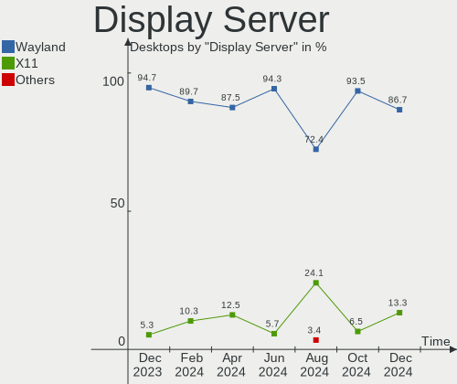

| Name    | Desktops | Percent |
|---------|----------|---------|
| Wayland | 42       | 85.71%  |
| X11     | 7        | 14.29%  |

Display Manager
---------------

SDDM, LightDM, etc.

| Name    | Desktops | Percent |
|---------|----------|---------|
| Unknown | 46       | 93.88%  |
| SDDM    | 2        | 4.08%   |
| GDM     | 1        | 2.04%   |

OS Lang
-------

Language

| Lang  | Desktops | Percent |
|-------|----------|---------|
| en_US | 18       | 36.73%  |
| de_DE | 12       | 24.49%  |
| en_GB | 4        | 8.16%   |
| ru_RU | 3        | 6.12%   |
| es_MX | 2        | 4.08%   |
| en_CA | 2        | 4.08%   |
| pt_BR | 1        | 2.04%   |
| hu_HU | 1        | 2.04%   |
| fr_FR | 1        | 2.04%   |
| es_ES | 1        | 2.04%   |
| en_ZA | 1        | 2.04%   |
| en_AU | 1        | 2.04%   |
| de_AT | 1        | 2.04%   |
| da_DK | 1        | 2.04%   |

Boot Mode
---------

EFI or BIOS

| Mode | Desktops | Percent |
|------|----------|---------|
| EFI  | 39       | 79.59%  |
| BIOS | 10       | 20.41%  |

Filesystem
----------

Type of filesystem

| Type  | Desktops | Percent |
|-------|----------|---------|
| Btrfs | 47       | 95.92%  |
| Ext4  | 2        | 4.08%   |

Part. scheme
------------

Scheme of partitioning

| Type    | Desktops | Percent |
|---------|----------|---------|
| Unknown | 46       | 93.88%  |
| GPT     | 3        | 6.12%   |

Dual Boot with Linux/BSD
------------------------

Hosting more than one Linux/BSD

| Dual boot | Desktops | Percent |
|-----------|----------|---------|
| No        | 47       | 95.92%  |
| Yes       | 2        | 4.08%   |

Dual Boot (Win)
---------------

Hosting Linux and Windows

| Dual boot | Desktops | Percent |
|-----------|----------|---------|
| No        | 48       | 97.96%  |
| Yes       | 1        | 2.04%   |

Board
-----

Vendor
------

Motherboard manufacturer

| Name                | Desktops | Percent |
|---------------------|----------|---------|
| ASUSTek Computer    | 13       | 26.53%  |
| MSI                 | 10       | 20.41%  |
| ASRock              | 10       | 20.41%  |
| Gigabyte Technology | 5        | 10.2%   |
| Hewlett-Packard     | 4        | 8.16%   |
| Intel               | 2        | 4.08%   |
| Dell                | 2        | 4.08%   |
| Pegatron            | 1        | 2.04%   |
| NZXT                | 1        | 2.04%   |
| Alienware           | 1        | 2.04%   |

Model
-----

Motherboard model

| Name                               | Desktops | Percent |
|------------------------------------|----------|---------|
| MSI MS-7C35                        | 2        | 4.08%   |
| ASRock B450M Pro4                  | 2        | 4.08%   |
| Pegatron HPE-558de                 | 1        | 2.04%   |
| NZXT N7 B650E                      | 1        | 2.04%   |
| MSI MS-7C95                        | 1        | 2.04%   |
| MSI MS-7C37                        | 1        | 2.04%   |
| MSI MS-7B89                        | 1        | 2.04%   |
| MSI MS-7B86                        | 1        | 2.04%   |
| MSI MS-7B51                        | 1        | 2.04%   |
| MSI MS-7A74                        | 1        | 2.04%   |
| MSI MS-7A38                        | 1        | 2.04%   |
| MSI MS-7971                        | 1        | 2.04%   |
| Intel X79                          | 1        | 2.04%   |
| Intel B75                          | 1        | 2.04%   |
| HP Z440 Workstation                | 1        | 2.04%   |
| HP EliteDesk 800 G4 SFF            | 1        | 2.04%   |
| HP EliteDesk 800 G2 SFF            | 1        | 2.04%   |
| HP Compaq 6200 Pro SFF PC          | 1        | 2.04%   |
| Gigabyte Z370P D3                  | 1        | 2.04%   |
| Gigabyte B550M AORUS PRO-P         | 1        | 2.04%   |
| Gigabyte B460M DS3H AC V2-Y1       | 1        | 2.04%   |
| Gigabyte AB350M-DS3H V2            | 1        | 2.04%   |
| Gigabyte A320M-S2H V2              | 1        | 2.04%   |
| Dell Precision 3660                | 1        | 2.04%   |
| Dell Inspiron 5680                 | 1        | 2.04%   |
| ASUS TUF Gaming X570-PLUS          | 1        | 2.04%   |
| ASUS TUF Gaming B550M-PLUS         | 1        | 2.04%   |
| ASUS TUF Gaming B550-PLUS WIFI II  | 1        | 2.04%   |
| ASUS ROG Strix G10DK_G10DK         | 1        | 2.04%   |
| ASUS ROG STRIX B650E-I GAMING WIFI | 1        | 2.04%   |
| ASUS ROG STRIX B550-F GAMING       | 1        | 2.04%   |
| ASUS ROG STRIX B350-F GAMING       | 1        | 2.04%   |
| ASUS PRIME Z390-A                  | 1        | 2.04%   |
| ASUS PRIME H410M-K                 | 1        | 2.04%   |
| ASUS All Series                    | 1        | 2.04%   |
| ASUS A0000001                      | 1        | 2.04%   |
| ASUS 5926                          | 1        | 2.04%   |
| ASUS 520B4GE                       | 1        | 2.04%   |
| ASRock Z97M Pro4                   | 1        | 2.04%   |
| ASRock Z97 Anniversary             | 1        | 2.04%   |

Model Family
------------

Motherboard model prefix

| Name                 | Desktops | Percent |
|----------------------|----------|---------|
| ASUS ROG             | 4        | 8.16%   |
| ASUS TUF             | 3        | 6.12%   |
| ASRock B450M         | 3        | 6.12%   |
| MSI MS-7C35          | 2        | 4.08%   |
| HP EliteDesk         | 2        | 4.08%   |
| ASUS PRIME           | 2        | 4.08%   |
| Pegatron HPE-558de   | 1        | 2.04%   |
| NZXT N7              | 1        | 2.04%   |
| MSI MS-7C95          | 1        | 2.04%   |
| MSI MS-7C37          | 1        | 2.04%   |
| MSI MS-7B89          | 1        | 2.04%   |
| MSI MS-7B86          | 1        | 2.04%   |
| MSI MS-7B51          | 1        | 2.04%   |
| MSI MS-7A74          | 1        | 2.04%   |
| MSI MS-7A38          | 1        | 2.04%   |
| MSI MS-7971          | 1        | 2.04%   |
| Intel X79            | 1        | 2.04%   |
| Intel B75            | 1        | 2.04%   |
| HP Z440              | 1        | 2.04%   |
| HP Compaq            | 1        | 2.04%   |
| Gigabyte Z370P       | 1        | 2.04%   |
| Gigabyte B550M       | 1        | 2.04%   |
| Gigabyte B460M       | 1        | 2.04%   |
| Gigabyte AB350M-DS3H | 1        | 2.04%   |
| Gigabyte A320M-S2H   | 1        | 2.04%   |
| Dell Precision       | 1        | 2.04%   |
| Dell Inspiron        | 1        | 2.04%   |
| ASUS All             | 1        | 2.04%   |
| ASUS A0000001        | 1        | 2.04%   |
| ASUS 5926            | 1        | 2.04%   |
| ASUS 520B4GE         | 1        | 2.04%   |
| ASRock Z97M          | 1        | 2.04%   |
| ASRock Z97           | 1        | 2.04%   |
| ASRock H61M          | 1        | 2.04%   |
| ASRock B760M         | 1        | 2.04%   |
| ASRock B650M         | 1        | 2.04%   |
| ASRock B550M-ITX     | 1        | 2.04%   |
| ASRock B550          | 1        | 2.04%   |
| Alienware Aurora     | 1        | 2.04%   |

MFG Year
--------

Motherboard manufacture year

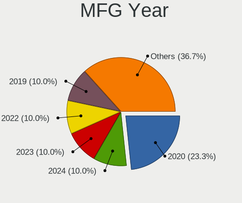

| Year | Desktops | Percent |
|------|----------|---------|
| 2018 | 11       | 22.45%  |
| 2020 | 8        | 16.33%  |
| 2019 | 7        | 14.29%  |
| 2022 | 5        | 10.2%   |
| 2023 | 3        | 6.12%   |
| 2021 | 3        | 6.12%   |
| 2015 | 3        | 6.12%   |
| 2011 | 3        | 6.12%   |
| 2017 | 2        | 4.08%   |
| 2014 | 2        | 4.08%   |
| 2016 | 1        | 2.04%   |
| 2013 | 1        | 2.04%   |

Form Factor
-----------

Physical design of the computer

| Name    | Desktops | Percent |
|---------|----------|---------|
| Desktop | 49       | 100%    |

Secure Boot
-----------

Enabled or disabled

| State    | Desktops | Percent |
|----------|----------|---------|
| Disabled | 49       | 100%    |

Coreboot
--------

Have coreboot on board

| Used | Desktops | Percent |
|------|----------|---------|
| No   | 49       | 100%    |

RAM Size
--------

Total RAM memory

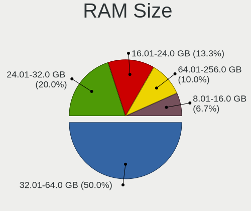

| Size in GB  | Desktops | Percent |
|-------------|----------|---------|
| 32.01-64.0  | 20       | 40.82%  |
| 16.01-24.0  | 17       | 34.69%  |
| 4.01-8.0    | 3        | 6.12%   |
| 24.01-32.0  | 3        | 6.12%   |
| 64.01-256.0 | 3        | 6.12%   |
| 8.01-16.0   | 2        | 4.08%   |
| 3.01-4.0    | 1        | 2.04%   |

RAM Used
--------

Used RAM memory

| Used GB    | Desktops | Percent |
|------------|----------|---------|
| 3.01-4.0   | 19       | 38.78%  |
| 4.01-8.0   | 17       | 34.69%  |
| 2.01-3.0   | 6        | 12.24%  |
| 1.01-2.0   | 4        | 8.16%   |
| 8.01-16.0  | 2        | 4.08%   |
| 16.01-24.0 | 1        | 2.04%   |

Total Drives
------------

Number of drives on board

| Drives | Desktops | Percent |
|--------|----------|---------|
| 2      | 15       | 30.61%  |
| 1      | 11       | 22.45%  |
| 3      | 9        | 18.37%  |
| 5      | 6        | 12.24%  |
| 4      | 4        | 8.16%   |
| 7      | 2        | 4.08%   |
| 8      | 1        | 2.04%   |
| 6      | 1        | 2.04%   |

Has CD-ROM
----------

Has CD-ROM on board

| Presented | Desktops | Percent |
|-----------|----------|---------|
| No        | 44       | 89.8%   |
| Yes       | 5        | 10.2%   |

Has Ethernet
------------

Has Ethernet on board

| Presented | Desktops | Percent |
|-----------|----------|---------|
| Yes       | 49       | 100%    |

Has WiFi
--------

Has WiFi module

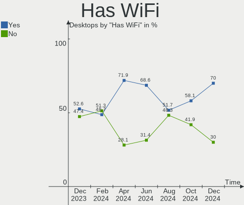

| Presented | Desktops | Percent |
|-----------|----------|---------|
| Yes       | 32       | 65.31%  |
| No        | 17       | 34.69%  |

Has Bluetooth
-------------

Has Bluetooth module

| Presented | Desktops | Percent |
|-----------|----------|---------|
| Yes       | 26       | 53.06%  |
| No        | 23       | 46.94%  |

Location
--------

Country
-------

Geographic location (country)

| Country            | Desktops | Percent |
|--------------------|----------|---------|
| Germany            | 13       | 26.53%  |
| USA                | 11       | 22.45%  |
| Russia             | 4        | 8.16%   |
| Canada             | 3        | 6.12%   |
| Colombia           | 2        | 4.08%   |
| Brazil             | 2        | 4.08%   |
| Austria            | 2        | 4.08%   |
| UK                 | 1        | 2.04%   |
| UAE                | 1        | 2.04%   |
| Spain              | 1        | 2.04%   |
| South Africa       | 1        | 2.04%   |
| Romania            | 1        | 2.04%   |
| Netherlands        | 1        | 2.04%   |
| Hungary            | 1        | 2.04%   |
| France             | 1        | 2.04%   |
| Dominican Republic | 1        | 2.04%   |
| Denmark            | 1        | 2.04%   |
| Australia          | 1        | 2.04%   |
| Argentina          | 1        | 2.04%   |

City
----

Geographic location (city)

| City                  | Desktops | Percent |
|-----------------------|----------|---------|
| Toronto               | 2        | 4.08%   |
| Osnabrück            | 2        | 4.08%   |
| Wittenberg            | 1        | 2.04%   |
| Winston-Salem         | 1        | 2.04%   |
| Valencia              | 1        | 2.04%   |
| Tucson                | 1        | 2.04%   |
| Slidell               | 1        | 2.04%   |
| Schieder-Schwalenberg | 1        | 2.04%   |
| Santo Domingo Este    | 1        | 2.04%   |
| Saarlouis             | 1        | 2.04%   |
| Recklinghausen        | 1        | 2.04%   |
| Recife                | 1        | 2.04%   |
| Racine                | 1        | 2.04%   |
| Porto Velho           | 1        | 2.04%   |
| Oelde                 | 1        | 2.04%   |
| Nizhniy Novgorod      | 1        | 2.04%   |
| Melbourne             | 1        | 2.04%   |
| Mainz                 | 1        | 2.04%   |
| Madera                | 1        | 2.04%   |
| Lexington             | 1        | 2.04%   |
| Leonding              | 1        | 2.04%   |
| Kirov                 | 1        | 2.04%   |
| Karlsruhe             | 1        | 2.04%   |
| Istres                | 1        | 2.04%   |
| Horn                  | 1        | 2.04%   |
| Hjørring             | 1        | 2.04%   |
| Giron                 | 1        | 2.04%   |
| Essen                 | 1        | 2.04%   |
| Érd                  | 1        | 2.04%   |
| Eferding              | 1        | 2.04%   |
| Denham Springs        | 1        | 2.04%   |
| Dagenham              | 1        | 2.04%   |
| Coesfeld              | 1        | 2.04%   |
| Cody                  | 1        | 2.04%   |
| Ciudadela             | 1        | 2.04%   |
| Chelyabinsk           | 1        | 2.04%   |
| Cape Town             | 1        | 2.04%   |
| Calgary               | 1        | 2.04%   |
| Buffalo               | 1        | 2.04%   |
| Bucharest             | 1        | 2.04%   |

Drives
------

Drive Vendor
------------

Hard drive vendors

| Vendor                      | Desktops | Drives | Percent |
|-----------------------------|----------|--------|---------|
| Seagate                     | 21       | 27     | 19.63%  |
| Samsung Electronics         | 15       | 28     | 14.02%  |
| WDC                         | 11       | 16     | 10.28%  |
| SanDisk                     | 9        | 11     | 8.41%   |
| Crucial                     | 8        | 10     | 7.48%   |
| Kingston                    | 7        | 9      | 6.54%   |
| Toshiba                     | 6        | 7      | 5.61%   |
| PNY                         | 3        | 3      | 2.8%    |
| Kingston Technology Company | 3        | 3      | 2.8%    |
| SPCC                        | 2        | 2      | 1.87%   |
| Silicon Motion              | 2        | 3      | 1.87%   |
| Phison Electronics          | 2        | 3      | 1.87%   |
| Micron/Crucial Technology   | 2        | 4      | 1.87%   |
| XrayDisk                    | 1        | 1      | 0.93%   |
| Verbatim                    | 1        | 1      | 0.93%   |
| USB3.0                      | 1        | 1      | 0.93%   |
| USB 3.1                     | 1        | 1      | 0.93%   |
| SK hynix                    | 1        | 1      | 0.93%   |
| SABRENT                     | 1        | 1      | 0.93%   |
| Rogueware                   | 1        | 1      | 0.93%   |
| Micron Technology           | 1        | 1      | 0.93%   |
| MAXIO Technology (Hangzhou) | 1        | 1      | 0.93%   |
| KingFast                    | 1        | 1      | 0.93%   |
| JMicron Technology          | 1        | 2      | 0.93%   |
| Intel                       | 1        | 1      | 0.93%   |
| HPE                         | 1        | 1      | 0.93%   |
| ASMT                        | 1        | 1      | 0.93%   |
| ADATA Technology            | 1        | 1      | 0.93%   |
| A-DATA Technology           | 1        | 2      | 0.93%   |

Drive Model
-----------

Hard drive models

| Model                                               | Desktops | Percent |
|-----------------------------------------------------|----------|---------|
| Samsung NVMe SSD Controller SM981/PM981/PM983 1TB   | 6        | 4.62%   |
| Samsung NVMe SSD Controller PM9A1/PM9A3/980PRO 2TB  | 5        | 3.85%   |
| Kingston Company A2000 NVMe SSD 500GB               | 3        | 2.31%   |
| Kingston SA400S37480G 480GB SSD                     | 3        | 2.31%   |
| Crucial CT1000MX500SSD1 1TB                         | 3        | 2.31%   |
| Silicon Motion SM2262/SM2262EN SSD Controller 480GB | 2        | 1.54%   |
| Seagate ST500DM002-1BD142 500GB                     | 2        | 1.54%   |
| Seagate ST4000LM024-2AN17V 4TB                      | 2        | 1.54%   |
| Seagate ST4000DM004-2U9104 4TB                      | 2        | 1.54%   |
| Seagate ST1000DM010-2EP102 1TB                      | 2        | 1.54%   |
| Sandisk WD_BLACK SN850X HS 1000GB                   | 2        | 1.54%   |
| Sandisk WD Blue SN570 1TB                           | 2        | 1.54%   |
| Samsung SSD 860 EVO 500GB                           | 2        | 1.54%   |
| Samsung SSD 860 EVO 1TB                             | 2        | 1.54%   |
| PNY CS900 240GB SSD                                 | 2        | 1.54%   |
| Micron/Crucial P2 NVMe PCIe SSD 1TB                 | 2        | 1.54%   |
| XrayDisk 1TB SSD                                    | 1        | 0.77%   |
| WDC WDS500G2B0A-00SM50 500GB SSD                    | 1        | 0.77%   |
| WDC WDS250G2B0B-00YS70 250GB SSD                    | 1        | 0.77%   |
| WDC WD6400AAKS-65A7B2 640GB                         | 1        | 0.77%   |
| WDC WD63PURZ-85B4VY0 6TB                            | 1        | 0.77%   |
| WDC WD5000LPVX-60V0TT0 500GB                        | 1        | 0.77%   |
| WDC WD40EFAX-68JH4N1 4TB                            | 1        | 0.77%   |
| WDC WD30EZRX-00DC0B0 3TB                            | 1        | 0.77%   |
| WDC WD3000HLFS-01G6U3 304GB                         | 1        | 0.77%   |
| WDC WD20EZRZ-00Z5HB0 2TB                            | 1        | 0.77%   |
| WDC WD10EZEX-60WN4A0 1TB                            | 1        | 0.77%   |
| WDC WD10EZEX-22MFCA0 1TB                            | 1        | 0.77%   |
| WDC WD10EZEX-08M2NA0 1TB                            | 1        | 0.77%   |
| WDC WD10EZEX-00BBHA0 1TB                            | 1        | 0.77%   |
| WDC WD10EARS-00MVWB0 1TB                            | 1        | 0.77%   |
| WDC WD10EALX-009BA0 1TB                             | 1        | 0.77%   |
| WDC WD Blue SA510 2.5 1TB                           | 1        | 0.77%   |
| Verbatim Vi550 S3 512GB SSD                         | 1        | 0.77%   |
| USB3.0 Super Speed 500GB SSD                        | 1        | 0.77%   |
| USB 3.1 Device RAID 0 2TB                           | 1        | 0.77%   |
| Toshiba HDWR440 4TB                                 | 1        | 0.77%   |
| Toshiba HDWL120 2TB                                 | 1        | 0.77%   |
| Toshiba HDWD110 1TB                                 | 1        | 0.77%   |
| Toshiba DT01ACA300 3TB                              | 1        | 0.77%   |

HDD Vendor
----------

Hard disk drive vendors

| Vendor              | Desktops | Drives | Percent |
|---------------------|----------|--------|---------|
| Seagate             | 20       | 25     | 52.63%  |
| WDC                 | 9        | 13     | 23.68%  |
| Toshiba             | 6        | 7      | 15.79%  |
| Samsung Electronics | 1        | 1      | 2.63%   |
| JMicron Technology  | 1        | 2      | 2.63%   |
| ASMT                | 1        | 1      | 2.63%   |

SSD Vendor
----------

Solid state drive vendors

| Vendor              | Desktops | Drives | Percent |
|---------------------|----------|--------|---------|
| Crucial             | 8        | 10     | 21.05%  |
| Samsung Electronics | 7        | 10     | 18.42%  |
| Kingston            | 6        | 6      | 15.79%  |
| WDC                 | 3        | 3      | 7.89%   |
| SanDisk             | 3        | 3      | 7.89%   |
| PNY                 | 3        | 3      | 7.89%   |
| SPCC                | 2        | 2      | 5.26%   |
| XrayDisk            | 1        | 1      | 2.63%   |
| Verbatim            | 1        | 1      | 2.63%   |
| USB3.0              | 1        | 1      | 2.63%   |
| SABRENT             | 1        | 1      | 2.63%   |
| Rogueware           | 1        | 1      | 2.63%   |
| A-DATA Technology   | 1        | 2      | 2.63%   |

Drive Kind
----------

HDD or SSD

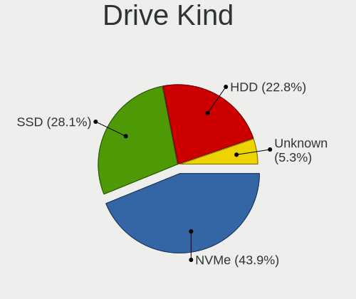

| Kind    | Desktops | Drives | Percent |
|---------|----------|--------|---------|
| NVMe    | 30       | 47     | 32.97%  |
| HDD     | 30       | 49     | 32.97%  |
| SSD     | 27       | 44     | 29.67%  |
| Unknown | 4        | 4      | 4.4%    |

Drive Connector
---------------

SATA, SAS, NVMe, etc.

| Type | Desktops | Drives | Percent |
|------|----------|--------|---------|
| SATA | 42       | 89     | 53.85%  |
| NVMe | 30       | 47     | 38.46%  |
| SAS  | 6        | 8      | 7.69%   |

Drive Size
----------

Size of hard drive

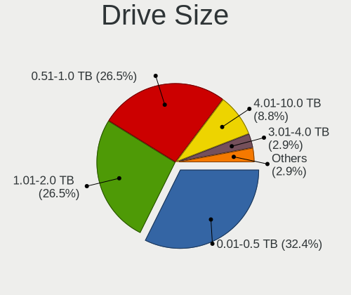

| Size in TB | Desktops | Drives | Percent |
|------------|----------|--------|---------|
| 0.51-1.0   | 26       | 34     | 40%     |
| 0.01-0.5   | 25       | 38     | 38.46%  |
| 1.01-2.0   | 6        | 9      | 9.23%   |
| 3.01-4.0   | 5        | 8      | 7.69%   |
| 2.01-3.0   | 2        | 3      | 3.08%   |
| 4.01-10.0  | 1        | 1      | 1.54%   |

Space Total
-----------

Amount of disk space available on the file system

| Size in GB     | Desktops | Percent |
|----------------|----------|---------|
| More than 3000 | 18       | 36.73%  |
| 1001-2000      | 13       | 26.53%  |
| 2001-3000      | 7        | 14.29%  |
| 501-1000       | 6        | 12.24%  |
| 251-500        | 3        | 6.12%   |
| 21-50          | 1        | 2.04%   |
| 51-100         | 1        | 2.04%   |

Space Used
----------

Amount of used disk space

| Used GB        | Desktops | Percent |
|----------------|----------|---------|
| 2001-3000      | 9        | 18.37%  |
| 501-1000       | 9        | 18.37%  |
| 101-250        | 7        | 14.29%  |
| 1001-2000      | 6        | 12.24%  |
| 251-500        | 5        | 10.2%   |
| 21-50          | 5        | 10.2%   |
| More than 3000 | 4        | 8.16%   |
| 1-20           | 3        | 6.12%   |
| 51-100         | 1        | 2.04%   |

Malfunc. Drives
---------------

Drive models with a malfunction

Zero info for selected period =(

Malfunc. Drive Vendor
---------------------

Vendors of faulty drives

Zero info for selected period =(

Malfunc. HDD Vendor
-------------------

Vendors of faulty HDD drives

Zero info for selected period =(

Malfunc. Drive Kind
-------------------

Kinds of faulty drives

Zero info for selected period =(

Failed Drives
-------------

Failed drive models

Zero info for selected period =(

Failed Drive Vendor
-------------------

Failed drive vendors

Zero info for selected period =(

Drive Status
------------

Number of failed and malfunc. drives

| Status   | Desktops | Drives | Percent |
|----------|----------|--------|---------|
| Detected | 46       | 137    | 93.88%  |
| Works    | 3        | 7      | 6.12%   |

Storage controller
------------------

Storage Vendor
--------------

Storage controller vendors

| Vendor                      | Desktops | Percent |
|-----------------------------|----------|---------|
| AMD                         | 27       | 32.53%  |
| Intel                       | 22       | 26.51%  |
| Samsung Electronics         | 11       | 13.25%  |
| SanDisk                     | 6        | 7.23%   |
| Kingston Technology Company | 5        | 6.02%   |
| Silicon Motion              | 2        | 2.41%   |
| Phison Electronics          | 2        | 2.41%   |
| Micron/Crucial Technology   | 2        | 2.41%   |
| SK hynix                    | 1        | 1.2%    |
| Seagate Technology          | 1        | 1.2%    |
| Micron Technology           | 1        | 1.2%    |
| MAXIO Technology (Hangzhou) | 1        | 1.2%    |
| ASMedia Technology          | 1        | 1.2%    |
| ADATA Technology            | 1        | 1.2%    |

Storage Model
-------------

Storage controller models

| Model                                                                          | Desktops | Percent |
|--------------------------------------------------------------------------------|----------|---------|
| AMD FCH SATA Controller [AHCI mode]                                            | 13       | 13.4%   |
| AMD 500 Series Chipset SATA Controller                                         | 8        | 8.25%   |
| AMD 400 Series Chipset SATA Controller                                         | 7        | 7.22%   |
| Samsung NVMe SSD Controller SM981/PM981/PM983                                  | 6        | 6.19%   |
| Samsung NVMe SSD Controller PM9A1/PM9A3/980PRO                                 | 5        | 5.15%   |
| Sandisk WD Black SN850X NVMe SSD                                               | 3        | 3.09%   |
| Kingston Company NV1 NVMe SSD SM2263XT (DRAM-less)                             | 3        | 3.09%   |
| Kingston Company A2000 NVMe SSD SM2263EN                                       | 3        | 3.09%   |
| Intel Cannon Lake PCH SATA AHCI Controller                                     | 3        | 3.09%   |
| Intel 6 Series/C200 Series Chipset Family 6 port Desktop SATA AHCI Controller  | 3        | 3.09%   |
| AMD 600 Series Chipset SATA Controller                                         | 3        | 3.09%   |
| AMD 300 Series Chipset SATA Controller                                         | 3        | 3.09%   |
| Silicon Motion SM2262/SM2262EN SSD Controller                                  | 2        | 2.06%   |
| SanDisk Ultra 3D / WD Blue SN570 NVMe SSD (DRAM-less)                          | 2        | 2.06%   |
| Micron/Crucial P2 [Nick P2] / P3 / P3 Plus NVMe PCIe SSD (DRAM-less)           | 2        | 2.06%   |
| Intel Q170/Q150/B150/H170/H110/Z170/CM236 Chipset SATA Controller [AHCI Mode]  | 2        | 2.06%   |
| Intel 9 Series Chipset Family SATA Controller [AHCI Mode]                      | 2        | 2.06%   |
| Intel 400 Series Chipset Family SATA AHCI Controller                           | 2        | 2.06%   |
| Intel 200 Series PCH SATA controller [AHCI mode]                               | 2        | 2.06%   |
| SK hynix Gold P31/BC711/PC711 NVMe Solid State Drive                           | 1        | 1.03%   |
| Seagate FireCuda 530 SSD                                                       | 1        | 1.03%   |
| SanDisk WD Black SN770 / PC SN740 256GB / PC SN560 (DRAM-less) NVMe SSD        | 1        | 1.03%   |
| Samsung NVMe SSD Controller SM961/PM961/SM963                                  | 1        | 1.03%   |
| Samsung NVMe SSD Controller SM951/PM951                                        | 1        | 1.03%   |
| Samsung NVMe SSD Controller S4LV008[Pascal]                                    | 1        | 1.03%   |
| Phison PS5013-E13 PCIe3 NVMe Controller (DRAM-less)                            | 1        | 1.03%   |
| Phison E16 PCIe4 NVMe Controller                                               | 1        | 1.03%   |
| Micron 2300 NVMe SSD [Santana]                                                 | 1        | 1.03%   |
| MAXIO (Hangzhou) NVMe SSD Controller MAP1602 (DRAM-less)                       | 1        | 1.03%   |
| Intel SSD 660P Series                                                          | 1        | 1.03%   |
| Intel SATA Controller [RAID mode]                                              | 1        | 1.03%   |
| Intel Raptor Lake SATA AHCI Controller                                         | 1        | 1.03%   |
| Intel Comet Lake SATA AHCI Controller                                          | 1        | 1.03%   |
| Intel C610/X99 series chipset sSATA Controller [AHCI mode]                     | 1        | 1.03%   |
| Intel C610/X99 series chipset 6-Port SATA Controller [AHCI mode]               | 1        | 1.03%   |
| Intel C600/X79 series chipset 6-Port SATA AHCI Controller                      | 1        | 1.03%   |
| Intel Alder Lake-S PCH SATA Controller [AHCI Mode]                             | 1        | 1.03%   |
| Intel 8 Series/C220 Series Chipset Family 6-port SATA Controller 1 [AHCI mode] | 1        | 1.03%   |
| Intel 7 Series/C210 Series Chipset Family 6-port SATA Controller [AHCI mode]   | 1        | 1.03%   |
| ASMedia ASM1061/ASM1062 Serial ATA Controller                                  | 1        | 1.03%   |

Storage Kind
------------

Kind of storage controller (IDE, SATA, NVMe, SAS, ...)

| Kind | Desktops | Percent |
|------|----------|---------|
| SATA | 48       | 60.76%  |
| NVMe | 30       | 37.97%  |
| RAID | 1        | 1.27%   |

Processor
---------

CPU Vendor
----------

Processor vendors

| Vendor | Desktops | Percent |
|--------|----------|---------|
| AMD    | 27       | 55.1%   |
| Intel  | 22       | 44.9%   |

CPU Model
---------

Processor models

| Model                                       | Desktops | Percent |
|---------------------------------------------|----------|---------|
| AMD Ryzen 7 5800X 8-Core Processor          | 4        | 8.16%   |
| AMD Ryzen 5 3600 6-Core Processor           | 3        | 6.12%   |
| AMD Ryzen 7 7800X3D 8-Core Processor        | 2        | 4.08%   |
| AMD Ryzen 5 5600X 6-Core Processor          | 2        | 4.08%   |
| AMD Ryzen 5 3600X 6-Core Processor          | 2        | 4.08%   |
| Intel Xeon CPU E5-2689 0 @ 2.60GHz          | 1        | 2.04%   |
| Intel Xeon CPU E5-1650 v4 @ 3.60GHz         | 1        | 2.04%   |
| Intel Xeon CPU E3-1281 v3 @ 3.70GHz         | 1        | 2.04%   |
| Intel Xeon CPU E3-1230 V2 @ 3.30GHz         | 1        | 2.04%   |
| Intel Pentium CPU G850 @ 2.90GHz            | 1        | 2.04%   |
| Intel Core i9-9900K CPU @ 3.60GHz           | 1        | 2.04%   |
| Intel Core i7-9700F CPU @ 3.00GHz           | 1        | 2.04%   |
| Intel Core i7-8700 CPU @ 3.20GHz            | 1        | 2.04%   |
| Intel Core i7-7700 CPU @ 3.60GHz            | 1        | 2.04%   |
| Intel Core i7-6700 CPU @ 3.40GHz            | 1        | 2.04%   |
| Intel Core i7-4790 CPU @ 3.60GHz            | 1        | 2.04%   |
| Intel Core i7-2600 CPU @ 3.40GHz            | 1        | 2.04%   |
| Intel Core i5-8600K CPU @ 3.60GHz           | 1        | 2.04%   |
| Intel Core i5-8400 CPU @ 2.80GHz            | 1        | 2.04%   |
| Intel Core i5-6600K CPU @ 3.50GHz           | 1        | 2.04%   |
| Intel Core i5-4590 CPU @ 3.30GHz            | 1        | 2.04%   |
| Intel Core i5-10400F CPU @ 2.90GHz          | 1        | 2.04%   |
| Intel Core i3-3240 CPU @ 3.40GHz            | 1        | 2.04%   |
| Intel Core i3-10100F CPU @ 3.60GHz          | 1        | 2.04%   |
| Intel 13th Gen Core i7-13700K               | 1        | 2.04%   |
| Intel 12th Gen Core i7-12700                | 1        | 2.04%   |
| Intel 11th Gen Core i7-11700KF @ 3.60GHz    | 1        | 2.04%   |
| AMD Ryzen 9 5950X 16-Core Processor         | 1        | 2.04%   |
| AMD Ryzen 9 5900X 12-Core Processor         | 1        | 2.04%   |
| AMD Ryzen 7 5800X3D 8-Core Processor        | 1        | 2.04%   |
| AMD Ryzen 7 5700X 8-Core Processor          | 1        | 2.04%   |
| AMD Ryzen 7 3700X 8-Core Processor          | 1        | 2.04%   |
| AMD Ryzen 7 1700X Eight-Core Processor      | 1        | 2.04%   |
| AMD Ryzen 5 7600 6-Core Processor           | 1        | 2.04%   |
| AMD Ryzen 5 5600G with Radeon Graphics      | 1        | 2.04%   |
| AMD Ryzen 5 5500                            | 1        | 2.04%   |
| AMD Ryzen 5 4600G with Radeon Graphics      | 1        | 2.04%   |
| AMD Ryzen 5 4500 6-Core Processor           | 1        | 2.04%   |
| AMD Ryzen 5 3500X 6-Core Processor          | 1        | 2.04%   |
| AMD Ryzen 3 3200G with Radeon Vega Graphics | 1        | 2.04%   |

CPU Model Family
----------------

Processor model prefix

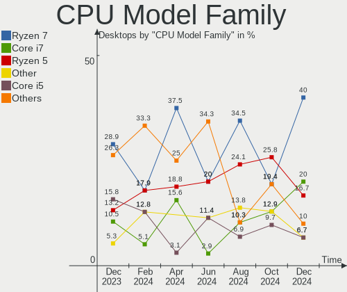

| Model         | Desktops | Percent |
|---------------|----------|---------|
| AMD Ryzen 5   | 13       | 26.53%  |
| AMD Ryzen 7   | 10       | 20.41%  |
| Intel Core i7 | 6        | 12.24%  |
| Intel Core i5 | 5        | 10.2%   |
| Intel Xeon    | 4        | 8.16%   |
| Other         | 3        | 6.12%   |
| Intel Core i3 | 2        | 4.08%   |
| AMD Ryzen 9   | 2        | 4.08%   |
| Intel Pentium | 1        | 2.04%   |
| Intel Core i9 | 1        | 2.04%   |
| AMD Ryzen 3   | 1        | 2.04%   |
| AMD Athlon    | 1        | 2.04%   |

CPU Cores
---------

Number of processor cores

| Number | Desktops | Percent |
|--------|----------|---------|
| 6      | 18       | 36.73%  |
| 8      | 14       | 28.57%  |
| 4      | 10       | 20.41%  |
| 2      | 3        | 6.12%   |
| 16     | 2        | 4.08%   |
| 12     | 2        | 4.08%   |

CPU Sockets
-----------

Number of sockets

| Number | Desktops | Percent |
|--------|----------|---------|
| 1      | 49       | 100%    |

CPU Threads
-----------

Threads per core (Hyper-Threading)

| Number | Desktops | Percent |
|--------|----------|---------|
| 2      | 41       | 83.67%  |
| 1      | 8        | 16.33%  |

CPU Op-Modes
------------

CPU Operation Modes (32-bit, 64-bit)

| Op mode        | Desktops | Percent |
|----------------|----------|---------|
| 32-bit, 64-bit | 49       | 100%    |

CPU Microcode
-------------

Microcode number

| Number     | Desktops | Percent |
|------------|----------|---------|
| Unknown    | 33       | 67.35%  |
| 0x08701021 | 3        | 6.12%   |
| 0x0a20120e | 2        | 4.08%   |
| 0x08701030 | 2        | 4.08%   |
| 0x0a601206 | 1        | 2.04%   |
| 0x0a601203 | 1        | 2.04%   |
| 0x0a50000d | 1        | 2.04%   |
| 0x0a20120a | 1        | 2.04%   |
| 0x0a20102b | 1        | 2.04%   |
| 0x0a201009 | 1        | 2.04%   |
| 0x08600106 | 1        | 2.04%   |
| 0x08108109 | 1        | 2.04%   |
| 0x08001138 | 1        | 2.04%   |

CPU Microarch
-------------

Microarchitecture

| Name             | Desktops | Percent |
|------------------|----------|---------|
| Zen 3            | 12       | 24.49%  |
| Zen 2            | 9        | 18.37%  |
| KabyLake         | 6        | 12.24%  |
| Unknown          | 4        | 8.16%   |
| SandyBridge      | 3        | 6.12%   |
| Haswell          | 3        | 6.12%   |
| Zen+             | 2        | 4.08%   |
| Skylake          | 2        | 4.08%   |
| IvyBridge        | 2        | 4.08%   |
| CometLake        | 2        | 4.08%   |
| Alderlake Hybrid | 2        | 4.08%   |
| Zen              | 1        | 2.04%   |
| Broadwell        | 1        | 2.04%   |

Graphics
--------

GPU Vendor
----------

Vendors of graphics cards

| Vendor | Desktops | Percent |
|--------|----------|---------|
| AMD    | 27       | 51.92%  |
| Nvidia | 20       | 38.46%  |
| Intel  | 5        | 9.62%   |

GPU Model
---------

Graphics card models

| Model                                                                       | Desktops | Percent |
|-----------------------------------------------------------------------------|----------|---------|
| AMD Navi 21 [Radeon RX 6800/6800 XT / 6900 XT]                              | 4        | 7.14%   |
| AMD Raphael                                                                 | 3        | 5.36%   |
| AMD Navi 32 [Radeon RX 7700 XT / 7800 XT]                                   | 3        | 5.36%   |
| AMD Navi 10 [Radeon RX 5600 OEM/5600 XT / 5700/5700 XT]                     | 3        | 5.36%   |
| AMD Ellesmere [Radeon RX 470/480/570/570X/580/580X/590]                     | 3        | 5.36%   |
| Nvidia TU106 [GeForce RTX 2060 Rev. A]                                      | 2        | 3.57%   |
| AMD Picasso/Raven 2 [Radeon Vega Series / Radeon Vega Mobile Series]        | 2        | 3.57%   |
| AMD Navi 23 [Radeon RX 6600/6600 XT/6600M]                                  | 2        | 3.57%   |
| AMD Navi 22 [Radeon RX 6700/6700 XT/6750 XT / 6800M/6850M XT]               | 2        | 3.57%   |
| Nvidia TU117 [GeForce GTX 1630]                                             | 1        | 1.79%   |
| Nvidia TU116 [GeForce GTX 1660]                                             | 1        | 1.79%   |
| Nvidia TU106 [GeForce RTX 2070]                                             | 1        | 1.79%   |
| Nvidia TU104 [GeForce RTX 2060]                                             | 1        | 1.79%   |
| Nvidia GP108 [GeForce GT 1030]                                              | 1        | 1.79%   |
| Nvidia GP107 [GeForce GTX 1050]                                             | 1        | 1.79%   |
| Nvidia GP107 [GeForce GTX 1050 Ti]                                          | 1        | 1.79%   |
| Nvidia GP106 [GeForce GTX 1060 6GB]                                         | 1        | 1.79%   |
| Nvidia GP104 [GeForce GTX 1070]                                             | 1        | 1.79%   |
| Nvidia GM107 [GeForce GTX 750 Ti]                                           | 1        | 1.79%   |
| Nvidia GK107 [GeForce GT 640]                                               | 1        | 1.79%   |
| Nvidia GK106 [GeForce GTX 660]                                              | 1        | 1.79%   |
| Nvidia GF119 [GeForce GT 610]                                               | 1        | 1.79%   |
| Nvidia GA106 [GeForce RTX 3060 Lite Hash Rate]                              | 1        | 1.79%   |
| Nvidia GA104 [GeForce RTX 3070]                                             | 1        | 1.79%   |
| Nvidia GA102GL [RTX A5000]                                                  | 1        | 1.79%   |
| Nvidia GA102 [GeForce RTX 3080 Lite Hash Rate]                              | 1        | 1.79%   |
| Nvidia AD104 [GeForce RTX 4070]                                             | 1        | 1.79%   |
| Intel Xeon E3-1200 v3/4th Gen Core Processor Integrated Graphics Controller | 1        | 1.79%   |
| Intel DG2 [Arc A770]                                                        | 1        | 1.79%   |
| Intel CoffeeLake-S GT2 [UHD Graphics 630]                                   | 1        | 1.79%   |
| Intel AlderLake-S GT1                                                       | 1        | 1.79%   |
| Intel 2nd Generation Core Processor Family Integrated Graphics Controller   | 1        | 1.79%   |
| AMD Vega 10 XL/XT [Radeon RX Vega 56/64]                                    | 1        | 1.79%   |
| AMD Renoir [Radeon RX Vega 6 (Ryzen 4000/5000 Mobile Series)]               | 1        | 1.79%   |
| AMD Polaris 20 XL [Radeon RX 580 2048SP]                                    | 1        | 1.79%   |
| AMD Navi 33 [Radeon RX 7700S/7600/7600S/7600M XT/PRO W7600]                 | 1        | 1.79%   |
| AMD Navi 31 [Radeon RX 7900 XT/7900 XTX/7900M]                              | 1        | 1.79%   |
| AMD Navi 24 [Radeon RX 6400/6500 XT/6500M]                                  | 1        | 1.79%   |
| AMD Navi 21 [Radeon RX 6900 XT]                                             | 1        | 1.79%   |
| AMD Curacao XT / Trinidad XT [Radeon R7 370 / R9 270X/370X]                 | 1        | 1.79%   |

GPU Combo
---------

Combinations of graphics cards

| Name        | Desktops | Percent |
|-------------|----------|---------|
| 1 x AMD     | 23       | 46.94%  |
| 1 x Nvidia  | 20       | 40.82%  |
| 2 x AMD     | 3        | 6.12%   |
| 1 x Intel   | 2        | 4.08%   |
| Intel + AMD | 1        | 2.04%   |

GPU Driver
----------

Free vs proprietary

| Driver      | Desktops | Percent |
|-------------|----------|---------|
| Free        | 35       | 71.43%  |
| Proprietary | 12       | 24.49%  |
| Unknown     | 2        | 4.08%   |

GPU Memory
----------

Total video memory

| Size in GB | Desktops | Percent |
|------------|----------|---------|
| 8.01-16.0  | 12       | 24.49%  |
| Unknown    | 10       | 20.41%  |
| 7.01-8.0   | 9        | 18.37%  |
| 1.01-2.0   | 7        | 14.29%  |
| 5.01-6.0   | 5        | 10.2%   |
| 3.01-4.0   | 4        | 8.16%   |
| 16.01-24.0 | 1        | 2.04%   |
| 0.01-0.5   | 1        | 2.04%   |

Monitor
-------

Monitor Vendor
--------------

Monitor vendors

| Vendor               | Desktops | Percent |
|----------------------|----------|---------|
| Goldstar             | 9        | 16.07%  |
| Samsung Electronics  | 7        | 12.5%   |
| Dell                 | 7        | 12.5%   |
| BenQ                 | 5        | 8.93%   |
| ASUSTek Computer     | 4        | 7.14%   |
| Ancor Communications | 4        | 7.14%   |
| Acer                 | 4        | 7.14%   |
| Philips              | 2        | 3.57%   |
| Hewlett-Packard      | 2        | 3.57%   |
| AOC                  | 2        | 3.57%   |
| Vizio                | 1        | 1.79%   |
| Viotek               | 1        | 1.79%   |
| Sony                 | 1        | 1.79%   |
| SANYO                | 1        | 1.79%   |
| Plain Tree Systems   | 1        | 1.79%   |
| MSI                  | 1        | 1.79%   |
| MNR                  | 1        | 1.79%   |
| Mi                   | 1        | 1.79%   |
| Iiyama               | 1        | 1.79%   |
| HannStar             | 1        | 1.79%   |

Monitor Model
-------------

Monitor models

| Model                                                                  | Desktops | Percent |
|------------------------------------------------------------------------|----------|---------|
| Goldstar ULTRAGEAR GSM5C0A 1920x1080 600x340mm 27.2-inch               | 2        | 3.45%   |
| Goldstar LG ULTRAGEAR GSM5B7F 2560x1440 600x340mm 27.2-inch            | 2        | 3.45%   |
| BenQ EX3501R BNQ7F5E 3440x1440 819x346mm 35.0-inch                     | 2        | 3.45%   |
| Vizio D32f-E1 VIZ1027 1920x1080 698x392mm 31.5-inch                    | 1        | 1.72%   |
| Viotek GN32DB VTK3200 2560x1440 698x393mm 31.5-inch                    | 1        | 1.72%   |
| Sony TV *00 SNY4B04 3840x2160                                          | 1        | 1.72%   |
| SANYO LCD-32XH5** SAN0B86 1360x765 708x398mm 32.0-inch                 | 1        | 1.72%   |
| Samsung Electronics SyncMaster SAM0304 1680x1050 494x320mm 23.2-inch   | 1        | 1.72%   |
| Samsung Electronics SyncMaster SAM011F 1280x1024 376x301mm 19.0-inch   | 1        | 1.72%   |
| Samsung Electronics SMBX1931N SAM0768 1366x768 410x230mm 18.5-inch     | 1        | 1.72%   |
| Samsung Electronics PDP SAM018C 1360x768 1102x620mm 49.8-inch          | 1        | 1.72%   |
| Samsung Electronics Odyssey G52A SAM7181 2560x1440 597x336mm 27.0-inch | 1        | 1.72%   |
| Samsung Electronics LC49G95T SAM7052 3840x1080 1193x336mm 48.8-inch    | 1        | 1.72%   |
| Samsung Electronics C24F390 SAM0D2C 1920x1080 521x293mm 23.5-inch      | 1        | 1.72%   |
| Plain Tree Systems FULL HDTV PTS00D7 1920x1080 477x268mm 21.5-inch     | 1        | 1.72%   |
| Philips PHL 240B9 PHL0966 1920x1200 518x324mm 24.1-inch                | 1        | 1.72%   |
| Philips 227ELH PHLC07B 1920x1080 480x268mm 21.6-inch                   | 1        | 1.72%   |
| MSI PS321QR MSI3DA8 2560x1440 708x399mm 32.0-inch                      | 1        | 1.72%   |
| MNR A32 V1.3 MNR3212 2560x1440 597x336mm 27.0-inch                     | 1        | 1.72%   |
| Mi Monitor XMI3444 3440x1440 797x334mm 34.0-inch                       | 1        | 1.72%   |
| Iiyama PL2530H IVM6132 1920x1080 544x303mm 24.5-inch                   | 1        | 1.72%   |
| Hewlett-Packard X24ih HPN36D9 1920x1080 527x297mm 23.8-inch            | 1        | 1.72%   |
| Hewlett-Packard 22x HPN3656 1920x1080 476x268mm 21.5-inch              | 1        | 1.72%   |
| HannStar HN199D HSD0777 1280x1024 376x301mm 19.0-inch                  | 1        | 1.72%   |
| Goldstar ULTRAGEAR GSM776F 2560x1440 697x392mm 31.5-inch               | 1        | 1.72%   |
| Goldstar ULTRAGEAR GSM5C1C 1920x1080 600x340mm 27.2-inch               | 1        | 1.72%   |
| Goldstar HDR WFHD GSM7714 2560x1080 798x334mm 34.1-inch                | 1        | 1.72%   |
| Goldstar HDR 4K GSM774F 3840x2160 697x392mm 31.5-inch                  | 1        | 1.72%   |
| Goldstar FULL HD GSM5B55 1920x1080 480x270mm 21.7-inch                 | 1        | 1.72%   |
| Goldstar D2342P GSM5842 1920x1080 510x290mm 23.1-inch                  | 1        | 1.72%   |
| Dell U4320Q DEL41D6 3840x2160 941x529mm 42.5-inch                      | 1        | 1.72%   |
| Dell U4320Q DEL41D2 3840x2160 941x529mm 42.5-inch                      | 1        | 1.72%   |
| Dell U2722D DEL422D 2560x1440 597x336mm 27.0-inch                      | 1        | 1.72%   |
| Dell U2713HM DEL407F 1920x1080 597x336mm 27.0-inch                     | 1        | 1.72%   |
| Dell U2312HM DEL4072 1920x1080 510x287mm 23.0-inch                     | 1        | 1.72%   |
| Dell S3422DWG DELD12C 3440x1440 797x334mm 34.0-inch                    | 1        | 1.72%   |
| Dell G2722HS DEL427F 1920x1080 597x336mm 27.0-inch                     | 1        | 1.72%   |
| Dell E196FP DELA015 1280x1024 338x270mm 17.0-inch                      | 1        | 1.72%   |
| BenQ GW2250 BNQ78BB 1920x1080 477x268mm 21.5-inch                      | 1        | 1.72%   |
| BenQ GL2760 BNQ78D5 1920x1080 598x336mm 27.0-inch                      | 1        | 1.72%   |

Monitor Resolution
------------------

Monitor screen resolution

| Resolution         | Desktops | Percent |
|--------------------|----------|---------|
| 1920x1080 (FHD)    | 26       | 50.98%  |
| 2560x1440 (QHD)    | 7        | 13.73%  |
| 3840x2160 (4K)     | 5        | 9.8%    |
| 3440x1440          | 4        | 7.84%   |
| 3840x1080          | 2        | 3.92%   |
| 1280x1024 (SXGA)   | 2        | 3.92%   |
| 2560x1080          | 1        | 1.96%   |
| 1920x540           | 1        | 1.96%   |
| 1680x1050 (WSXGA+) | 1        | 1.96%   |
| 1366x768 (WXGA)    | 1        | 1.96%   |
| 1360x768           | 1        | 1.96%   |

Monitor Diagonal
----------------

Diagonal size in inches

| Inches | Desktops | Percent |
|--------|----------|---------|
| 27     | 13       | 24.07%  |
| 21     | 9        | 16.67%  |
| 23     | 7        | 12.96%  |
| 24     | 5        | 9.26%   |
| 49     | 3        | 5.56%   |
| 34     | 3        | 5.56%   |
| 31     | 3        | 5.56%   |
| 35     | 2        | 3.7%    |
| 32     | 2        | 3.7%    |
| 19     | 2        | 3.7%    |
| 72     | 1        | 1.85%   |
| 48     | 1        | 1.85%   |
| 42     | 1        | 1.85%   |
| 22     | 1        | 1.85%   |
| 18     | 1        | 1.85%   |

Monitor Width
-------------

Physical width

| Width in mm | Desktops | Percent |
|-------------|----------|---------|
| 501-600     | 23       | 42.59%  |
| 401-500     | 12       | 22.22%  |
| 701-800     | 5        | 9.26%   |
| 601-700     | 4        | 7.41%   |
| 1001-1500   | 4        | 7.41%   |
| 801-900     | 2        | 3.7%    |
| 351-400     | 2        | 3.7%    |
| 1501-2000   | 1        | 1.85%   |
| 901-1000    | 1        | 1.85%   |

Aspect Ratio
------------

Proportional relationship between the width and the height

| Ratio | Desktops | Percent |
|-------|----------|---------|
| 16/9  | 35       | 74.47%  |
| 21/9  | 5        | 10.64%  |
| 5/4   | 2        | 4.26%   |
| 32/9  | 2        | 4.26%   |
| 16/10 | 2        | 4.26%   |
| 3/2   | 1        | 2.13%   |

Monitor Area
------------

Area in inch²

| Area in inch² | Desktops | Percent |
|----------------|----------|---------|
| 201-250        | 16       | 30.19%  |
| 301-350        | 13       | 24.53%  |
| 351-500        | 10       | 18.87%  |
| 151-200        | 5        | 9.43%   |
| More than 1000 | 3        | 5.66%   |
| 501-1000       | 3        | 5.66%   |
| 251-300        | 2        | 3.77%   |
| 141-150        | 1        | 1.89%   |

Pixel Density
-------------

Pixels per inch

| Density | Desktops | Percent |
|---------|----------|---------|
| 51-100  | 30       | 60%     |
| 101-120 | 16       | 32%     |
| 1-50    | 2        | 4%      |
| 121-160 | 2        | 4%      |

Multiple Monitors
-----------------

Total monitors connected

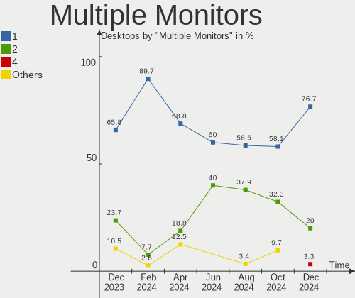

| Total | Desktops | Percent |
|-------|----------|---------|
| 1     | 35       | 71.43%  |
| 2     | 11       | 22.45%  |
| 0     | 2        | 4.08%   |
| 3     | 1        | 2.04%   |

Network
-------

Net Controller Vendor
---------------------

Controller vendors

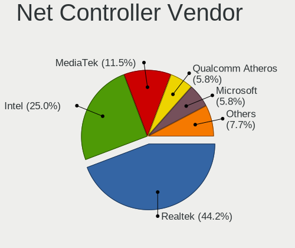

| Vendor                | Desktops | Percent |
|-----------------------|----------|---------|
| Realtek Semiconductor | 35       | 44.3%   |
| Intel                 | 24       | 30.38%  |
| MediaTek              | 5        | 6.33%   |
| TP-Link               | 3        | 3.8%    |
| Ralink Technology     | 2        | 2.53%   |
| Qualcomm Atheros      | 2        | 2.53%   |
| Microsoft             | 2        | 2.53%   |
| Broadcom              | 2        | 2.53%   |
| D-Link                | 1        | 1.27%   |
| Belkin Components     | 1        | 1.27%   |
| AVM                   | 1        | 1.27%   |
| ASUSTek Computer      | 1        | 1.27%   |

Net Controller Model
--------------------

Controller models

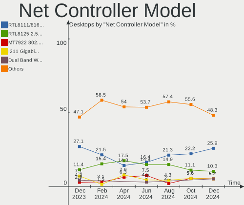

| Model                                                                                         | Desktops | Percent |
|-----------------------------------------------------------------------------------------------|----------|---------|
| Realtek RTL8111/8168/8211/8411 PCI Express Gigabit Ethernet Controller                        | 23       | 25.84%  |
| Realtek RTL8125 2.5GbE Controller                                                             | 10       | 11.24%  |
| Intel Wi-Fi 6 AX200                                                                           | 8        | 8.99%   |
| MediaTek MT7922 802.11ax PCI Express Wireless Network Adapter                                 | 2        | 2.25%   |
| MediaTek MT7921K (RZ608) Wi-Fi 6E 80MHz                                                       | 2        | 2.25%   |
| Intel Wi-Fi 6E(802.11ax) AX210/AX1675* 2x2 [Typhoon Peak]                                     | 2        | 2.25%   |
| Intel Wi-Fi 5(802.11ac) Wireless-AC 9x6x [Thunder Peak]                                       | 2        | 2.25%   |
| Intel Ethernet Controller I225-V                                                              | 2        | 2.25%   |
| Intel Ethernet Connection (7) I219-V                                                          | 2        | 2.25%   |
| Intel Ethernet Connection (2) I218-V                                                          | 2        | 2.25%   |
| Broadcom BCM4360 802.11ac Dual Band Wireless Network Adapter                                  | 2        | 2.25%   |
| TP-Link TL-WN823N v2/v3 [Realtek RTL8192EU]                                                   | 1        | 1.12%   |
| TP-Link TL-WN822N Version 4 RTL8192EU                                                         | 1        | 1.12%   |
| TP-Link Archer T4U ver.3                                                                      | 1        | 1.12%   |
| Realtek RTL8822CE 802.11ac PCIe Wireless Network Adapter                                      | 1        | 1.12%   |
| Realtek RTL8821CE 802.11ac PCIe Wireless Network Adapter                                      | 1        | 1.12%   |
| Realtek RTL8811AU 802.11a/b/g/n/ac WLAN Adapter                                               | 1        | 1.12%   |
| Realtek RTL8192EE PCIe Wireless Network Adapter                                               | 1        | 1.12%   |
| Realtek RTL810xE PCI Express Fast Ethernet controller                                         | 1        | 1.12%   |
| Realtek Realtek 8812AU/8821AU 802.11ac WLAN Adapter [USB Wireless Dual-Band Adapter 2.4/5Ghz] | 1        | 1.12%   |
| Realtek Killer E3000 2.5GbE Controller                                                        | 1        | 1.12%   |
| Realtek 802.11ac NIC                                                                          | 1        | 1.12%   |
| Ralink RT5370 Wireless Adapter                                                                | 1        | 1.12%   |
| Ralink RT2870/RT3070 Wireless Adapter                                                         | 1        | 1.12%   |
| Qualcomm Atheros QCA9377 802.11ac Wireless Network Adapter                                    | 1        | 1.12%   |
| Qualcomm Atheros AR8151 v2.0 Gigabit Ethernet                                                 | 1        | 1.12%   |
| Microsoft Xbox Wireless Adapter for Windows                                                   | 1        | 1.12%   |
| Microsoft Xbox 360 Wireless Adapter                                                           | 1        | 1.12%   |
| MediaTek MT7921 802.11ax PCI Express Wireless Network Adapter                                 | 1        | 1.12%   |
| Intel Raptor Lake-S PCH CNVi WiFi                                                             | 1        | 1.12%   |
| Intel I211 Gigabit Network Connection                                                         | 1        | 1.12%   |
| Intel Ethernet Connection I217-LM                                                             | 1        | 1.12%   |
| Intel Ethernet Connection (7) I219-LM                                                         | 1        | 1.12%   |
| Intel Ethernet Connection (2) I219-LM                                                         | 1        | 1.12%   |
| Intel Ethernet Connection (2) I218-LM                                                         | 1        | 1.12%   |
| Intel Ethernet Connection (17) I219-LM                                                        | 1        | 1.12%   |
| Intel Comet Lake PCH CNVi WiFi                                                                | 1        | 1.12%   |
| Intel Centrino Wireless-N 135                                                                 | 1        | 1.12%   |
| Intel 82579LM Gigabit Network Connection (Lewisville)                                         | 1        | 1.12%   |
| D-Link DUB-1312 Gigabit Ethernet Adapter                                                      | 1        | 1.12%   |

Wireless Vendor
---------------

Wireless vendors

| Vendor                | Desktops | Percent |
|-----------------------|----------|---------|
| Intel                 | 15       | 38.46%  |
| Realtek Semiconductor | 6        | 15.38%  |
| MediaTek              | 5        | 12.82%  |
| TP-Link               | 3        | 7.69%   |
| Ralink Technology     | 2        | 5.13%   |
| Microsoft             | 2        | 5.13%   |
| Broadcom              | 2        | 5.13%   |
| Qualcomm Atheros      | 1        | 2.56%   |
| Belkin Components     | 1        | 2.56%   |
| AVM                   | 1        | 2.56%   |
| ASUSTek Computer      | 1        | 2.56%   |

Wireless Model
--------------

Wireless models

| Model                                                                                         | Desktops | Percent |
|-----------------------------------------------------------------------------------------------|----------|---------|
| Intel Wi-Fi 6 AX200                                                                           | 8        | 20.51%  |
| MediaTek MT7922 802.11ax PCI Express Wireless Network Adapter                                 | 2        | 5.13%   |
| MediaTek MT7921K (RZ608) Wi-Fi 6E 80MHz                                                       | 2        | 5.13%   |
| Intel Wi-Fi 6E(802.11ax) AX210/AX1675* 2x2 [Typhoon Peak]                                     | 2        | 5.13%   |
| Intel Wi-Fi 5(802.11ac) Wireless-AC 9x6x [Thunder Peak]                                       | 2        | 5.13%   |
| Broadcom BCM4360 802.11ac Dual Band Wireless Network Adapter                                  | 2        | 5.13%   |
| TP-Link TL-WN823N v2/v3 [Realtek RTL8192EU]                                                   | 1        | 2.56%   |
| TP-Link TL-WN822N Version 4 RTL8192EU                                                         | 1        | 2.56%   |
| TP-Link Archer T4U ver.3                                                                      | 1        | 2.56%   |
| Realtek RTL8822CE 802.11ac PCIe Wireless Network Adapter                                      | 1        | 2.56%   |
| Realtek RTL8821CE 802.11ac PCIe Wireless Network Adapter                                      | 1        | 2.56%   |
| Realtek RTL8811AU 802.11a/b/g/n/ac WLAN Adapter                                               | 1        | 2.56%   |
| Realtek RTL8192EE PCIe Wireless Network Adapter                                               | 1        | 2.56%   |
| Realtek Realtek 8812AU/8821AU 802.11ac WLAN Adapter [USB Wireless Dual-Band Adapter 2.4/5Ghz] | 1        | 2.56%   |
| Realtek 802.11ac NIC                                                                          | 1        | 2.56%   |
| Ralink RT5370 Wireless Adapter                                                                | 1        | 2.56%   |
| Ralink RT2870/RT3070 Wireless Adapter                                                         | 1        | 2.56%   |
| Qualcomm Atheros QCA9377 802.11ac Wireless Network Adapter                                    | 1        | 2.56%   |
| Microsoft Xbox Wireless Adapter for Windows                                                   | 1        | 2.56%   |
| Microsoft Xbox 360 Wireless Adapter                                                           | 1        | 2.56%   |
| MediaTek MT7921 802.11ax PCI Express Wireless Network Adapter                                 | 1        | 2.56%   |
| Intel Raptor Lake-S PCH CNVi WiFi                                                             | 1        | 2.56%   |
| Intel Comet Lake PCH CNVi WiFi                                                                | 1        | 2.56%   |
| Intel Centrino Wireless-N 135                                                                 | 1        | 2.56%   |
| Belkin Components F7D2101 802.11n Surf & Share Wireless Adapter v1000 [Realtek RTL8192SU]     | 1        | 2.56%   |
| AVM FRITZ!WLAN AC 860                                                                         | 1        | 2.56%   |
| ASUS 802.11ac NIC                                                                             | 1        | 2.56%   |

Ethernet Vendor
---------------

Ethernet vendors

| Vendor                | Desktops | Percent |
|-----------------------|----------|---------|
| Realtek Semiconductor | 34       | 69.39%  |
| Intel                 | 13       | 26.53%  |
| Qualcomm Atheros      | 1        | 2.04%   |
| D-Link                | 1        | 2.04%   |

Ethernet Model
--------------

Ethernet models

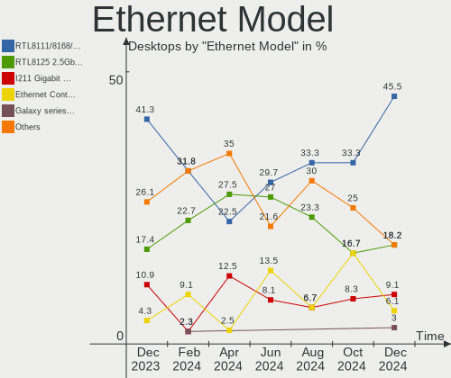

| Model                                                                  | Desktops | Percent |
|------------------------------------------------------------------------|----------|---------|
| Realtek RTL8111/8168/8211/8411 PCI Express Gigabit Ethernet Controller | 23       | 46%     |
| Realtek RTL8125 2.5GbE Controller                                      | 10       | 20%     |
| Intel Ethernet Controller I225-V                                       | 2        | 4%      |
| Intel Ethernet Connection (7) I219-V                                   | 2        | 4%      |
| Intel Ethernet Connection (2) I218-V                                   | 2        | 4%      |
| Realtek RTL810xE PCI Express Fast Ethernet controller                  | 1        | 2%      |
| Realtek Killer E3000 2.5GbE Controller                                 | 1        | 2%      |
| Qualcomm Atheros AR8151 v2.0 Gigabit Ethernet                          | 1        | 2%      |
| Intel I211 Gigabit Network Connection                                  | 1        | 2%      |
| Intel Ethernet Connection I217-LM                                      | 1        | 2%      |
| Intel Ethernet Connection (7) I219-LM                                  | 1        | 2%      |
| Intel Ethernet Connection (2) I219-LM                                  | 1        | 2%      |
| Intel Ethernet Connection (2) I218-LM                                  | 1        | 2%      |
| Intel Ethernet Connection (17) I219-LM                                 | 1        | 2%      |
| Intel 82579LM Gigabit Network Connection (Lewisville)                  | 1        | 2%      |
| D-Link DUB-1312 Gigabit Ethernet Adapter                               | 1        | 2%      |

Net Controller Kind
-------------------

Ethernet, WiFi or modem

| Kind     | Desktops | Percent |
|----------|----------|---------|
| Ethernet | 49       | 60.49%  |
| WiFi     | 32       | 39.51%  |

Used Controller
---------------

Currently used network controller

| Kind     | Desktops | Percent |
|----------|----------|---------|
| Ethernet | 31       | 62%     |
| WiFi     | 19       | 38%     |

NICs
----

Total network controllers on board

| Total | Desktops | Percent |
|-------|----------|---------|
| 2     | 26       | 53.06%  |
| 1     | 22       | 44.9%   |
| 0     | 1        | 2.04%   |

IPv6
----

IPv6 vs IPv4

| Used | Desktops | Percent |
|------|----------|---------|
| No   | 33       | 67.35%  |
| Yes  | 16       | 32.65%  |

Bluetooth
---------

Bluetooth Vendor
----------------

Controller vendors

| Vendor                          | Desktops | Percent |
|---------------------------------|----------|---------|
| Intel                           | 13       | 43.33%  |
| Cambridge Silicon Radio         | 5        | 16.67%  |
| Qualcomm Atheros Communications | 2        | 6.67%   |
| MediaTek                        | 2        | 6.67%   |
| IMC Networks                    | 2        | 6.67%   |
| Broadcom                        | 2        | 6.67%   |
| Realtek Semiconductor           | 1        | 3.33%   |
| Lite-On Technology              | 1        | 3.33%   |
| Foxconn / Hon Hai               | 1        | 3.33%   |
| ASUSTek Computer                | 1        | 3.33%   |

Bluetooth Model
---------------

Controller models

| Model                                               | Desktops | Percent |
|-----------------------------------------------------|----------|---------|
| Intel AX200 Bluetooth                               | 6        | 20%     |
| Cambridge Silicon Radio Bluetooth Dongle (HCI mode) | 5        | 16.67%  |
| MediaTek Wireless_Device                            | 2        | 6.67%   |
| Intel Wireless-AC 9260 Bluetooth Adapter            | 2        | 6.67%   |
| Intel AX210 Bluetooth                               | 2        | 6.67%   |
| Realtek Bluetooth Radio                             | 1        | 3.33%   |
| Qualcomm Atheros  Bluetooth Device                  | 1        | 3.33%   |
| Qualcomm Atheros AR3011 Bluetooth                   | 1        | 3.33%   |
| Lite-On Bluetooth Radio                             | 1        | 3.33%   |
| Intel Centrino Bluetooth Wireless Transceiver       | 1        | 3.33%   |
| Intel Bluetooth Device                              | 1        | 3.33%   |
| Intel AX201 Bluetooth                               | 1        | 3.33%   |
| IMC Networks Wireless_Device                        | 1        | 3.33%   |
| IMC Networks Bluetooth Radio                        | 1        | 3.33%   |
| Foxconn / Hon Hai Wireless_Device                   | 1        | 3.33%   |
| Broadcom BCM92046DG-CL1ROM Bluetooth 2.1 Adapter    | 1        | 3.33%   |
| Broadcom BCM20702A0 Bluetooth 4.0                   | 1        | 3.33%   |
| ASUS ASUS USB-BT500                                 | 1        | 3.33%   |

Sound
-----

Sound Vendor
------------

Sound card vendors

| Vendor                  | Desktops | Percent |
|-------------------------|----------|---------|
| AMD                     | 33       | 35.11%  |
| Intel                   | 22       | 23.4%   |
| Nvidia                  | 20       | 21.28%  |
| C-Media Electronics     | 4        | 4.26%   |
| Creative Labs           | 3        | 3.19%   |
| BEHRINGER International | 2        | 2.13%   |
| SAVITECH                | 1        | 1.06%   |
| Realtek Semiconductor   | 1        | 1.06%   |
| Medeli Electronics      | 1        | 1.06%   |
| Logitech                | 1        | 1.06%   |
| Kingston Technology     | 1        | 1.06%   |
| JOUNIVO                 | 1        | 1.06%   |
| Corsair                 | 1        | 1.06%   |
| Cambridge Silicon Radio | 1        | 1.06%   |
| ASUSTek Computer        | 1        | 1.06%   |
| Astro Gaming            | 1        | 1.06%   |

Sound Model
-----------

Sound card models

| Model                                                                      | Desktops | Percent |
|----------------------------------------------------------------------------|----------|---------|
| AMD Starship/Matisse HD Audio Controller                                   | 17       | 14.17%  |
| AMD Navi 21/23 HDMI/DP Audio Controller                                    | 10       | 8.33%   |
| AMD Family 17h/19h HD Audio Controller                                     | 8        | 6.67%   |
| AMD Navi 31 HDMI/DP Audio                                                  | 5        | 4.17%   |
| AMD Ellesmere HDMI Audio [Radeon RX 470/480 / 570/580/590]                 | 4        | 3.33%   |
| Nvidia TU106 High Definition Audio Controller                              | 3        | 2.5%    |
| Intel Cannon Lake PCH cAVS                                                 | 3        | 2.5%    |
| Intel 200 Series PCH HD Audio                                              | 3        | 2.5%    |
| AMD Renoir Radeon High Definition Audio Controller                         | 3        | 2.5%    |
| AMD Rembrandt Radeon High Definition Audio Controller                      | 3        | 2.5%    |
| AMD Navi 10 HDMI Audio                                                     | 3        | 2.5%    |
| Nvidia GP107GL High Definition Audio Controller                            | 2        | 1.67%   |
| Nvidia GA102 High Definition Audio Controller                              | 2        | 1.67%   |
| Intel Comet Lake PCH-V cAVS                                                | 2        | 1.67%   |
| Intel 9 Series Chipset Family HD Audio Controller                          | 2        | 1.67%   |
| Intel 6 Series/C200 Series Chipset Family High Definition Audio Controller | 2        | 1.67%   |
| Intel 100 Series/C230 Series Chipset Family HD Audio Controller            | 2        | 1.67%   |
| BEHRINGER International FLOW 8                                             | 2        | 1.67%   |
| AMD Raven/Raven2/Fenghuang HDMI/DP Audio Controller                        | 2        | 1.67%   |
| SAVITECH SA9023 audio controller                                           | 1        | 0.83%   |
| Realtek Semiconductor USB SPDIF Adapter                                    | 1        | 0.83%   |
| Nvidia TU116 High Definition Audio Controller                              | 1        | 0.83%   |
| Nvidia TU107 GeForce GTX 1650 High Definition Audio Controller             | 1        | 0.83%   |
| Nvidia TU104 HD Audio Controller                                           | 1        | 0.83%   |
| Nvidia GP108 High Definition Audio Controller                              | 1        | 0.83%   |
| Nvidia GP106 High Definition Audio Controller                              | 1        | 0.83%   |
| Nvidia GP104 High Definition Audio Controller                              | 1        | 0.83%   |
| Nvidia GM107 High Definition Audio Controller [GeForce 940MX]              | 1        | 0.83%   |
| Nvidia GK107 HDMI Audio Controller                                         | 1        | 0.83%   |
| Nvidia GK106 HDMI Audio Controller                                         | 1        | 0.83%   |
| Nvidia GF119 HDMI Audio Controller                                         | 1        | 0.83%   |
| Nvidia GA106 High Definition Audio Controller                              | 1        | 0.83%   |
| Nvidia GA104 High Definition Audio Controller                              | 1        | 0.83%   |
| Nvidia Audio device                                                        | 1        | 0.83%   |
| Medeli Electronics USB LCS AUDIO                                           | 1        | 0.83%   |
| Logitech PRO                                                               | 1        | 0.83%   |
| Kingston Technology HyperX 7.1 Audio                                       | 1        | 0.83%   |
| JOUNIVO JV601P                                                             | 1        | 0.83%   |
| Intel Xeon E3-1200 v3/4th Gen Core Processor HD Audio Controller           | 1        | 0.83%   |
| Intel Raptor Lake High Definition Audio Controller                         | 1        | 0.83%   |

Memory
------

Memory Vendor
-------------

Memory module vendors

| Vendor  | Desktops | Percent |
|---------|----------|---------|
| Corsair | 2        | 66.67%  |
| Unknown | 1        | 33.33%  |

Memory Model
------------

Memory module models

| Model                                                  | Desktops | Percent |
|--------------------------------------------------------|----------|---------|
| Corsair RAM CMK64GX5M2B6000Z30 32GB DIMM DDR5 4800MT/s | 1        | 33.33%  |
| Corsair RAM CMK32GX5M2D6000Z36 16GB DIMM DDR5 6000MT/s | 1        | 33.33%  |
| Unknown                                                | 1        | 33.33%  |

Memory Kind
-----------

Memory module kinds

| Kind | Desktops | Percent |
|------|----------|---------|
| DDR5 | 2        | 66.67%  |
| DDR4 | 1        | 33.33%  |

Memory Form Factor
------------------

Physical design of the memory module

| Name | Desktops | Percent |
|------|----------|---------|
| DIMM | 3        | 100%    |

Memory Size
-----------

Memory module size

| Size  | Desktops | Percent |
|-------|----------|---------|
| 32768 | 1        | 33.33%  |
| 16384 | 1        | 33.33%  |
| 8192  | 1        | 33.33%  |

Memory Speed
------------

Memory module speed

| Speed | Desktops | Percent |
|-------|----------|---------|
| 6000  | 1        | 33.33%  |
| 4800  | 1        | 33.33%  |
| 3600  | 1        | 33.33%  |

Printers & scanners
-------------------

Printer Vendor
--------------

Printer device vendors

Zero info for selected period =(

Printer Model
-------------

Printer device models

Zero info for selected period =(

Scanner Vendor
--------------

Scanner device vendors

Zero info for selected period =(

Scanner Model
-------------

Scanner device models

Zero info for selected period =(

Camera
------

Camera Vendor
-------------

Camera device vendors

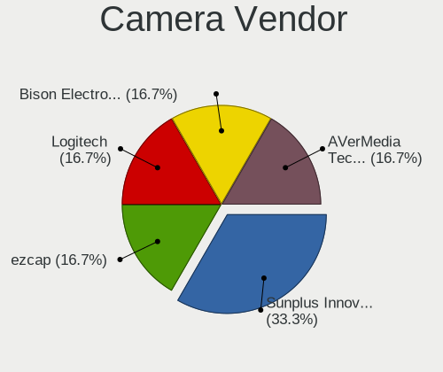

| Vendor                 | Desktops | Percent |
|------------------------|----------|---------|
| Logitech               | 3        | 30%     |
| Generalplus Technology | 2        | 20%     |
| Samsung Electronics    | 1        | 10%     |
| Minton Optic Industry  | 1        | 10%     |
| Microsoft              | 1        | 10%     |
| Microdia               | 1        | 10%     |
| Elgato Systems         | 1        | 10%     |

Camera Model
------------

Camera device models

| Model                                                        | Desktops | Percent |
|--------------------------------------------------------------|----------|---------|
| Samsung Galaxy series, misc. (MTP mode)                      | 1        | 10%     |
| Minton Optic Industry S-Cam F5/D-Link DSC-350 Digital Camera | 1        | 10%     |
| Microsoft LifeCam Cinema                                     | 1        | 10%     |
| Microdia USB 2.0 Camera                                      | 1        | 10%     |
| Logitech HD Webcam C910                                      | 1        | 10%     |
| Logitech HD Pro Webcam C920                                  | 1        | 10%     |
| Logitech C920 PRO HD Webcam                                  | 1        | 10%     |
| Generalplus GENERAL WEBCAM                                   | 1        | 10%     |
| Generalplus 808 Camera                                       | 1        | 10%     |
| Elgato Systems Elgato Facecam                                | 1        | 10%     |

Security
--------

Fingerprint Vendor
------------------

Fingerprint sensor vendors

Zero info for selected period =(

Fingerprint Model
-----------------

Fingerprint sensor models

Zero info for selected period =(

Chipcard Vendor
---------------

Chipcard module vendors

Zero info for selected period =(

Chipcard Model
--------------

Chipcard module models

Zero info for selected period =(

Unsupported
-----------

Unsupported Devices
-------------------

Total unsupported devices on board

| Total | Desktops | Percent |
|-------|----------|---------|
| 0     | 40       | 81.63%  |
| 1     | 7        | 14.29%  |
| 3     | 1        | 2.04%   |
| 2     | 1        | 2.04%   |

Unsupported Device Types
------------------------

Types of unsupported devices

| Type                  | Desktops | Percent |
|-----------------------|----------|---------|
| Net/wireless          | 4        | 33.33%  |
| Graphics card         | 4        | 33.33%  |
| Unassigned class      | 1        | 8.33%   |
| Sound                 | 1        | 8.33%   |
| Multimedia controller | 1        | 8.33%   |
| Camera                | 1        | 8.33%   |

